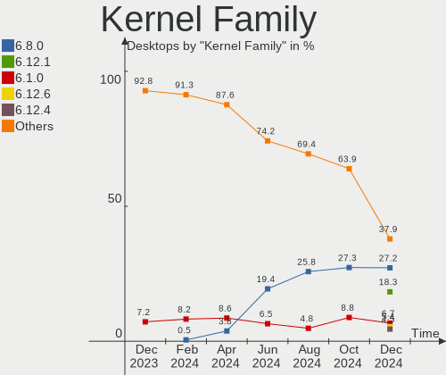
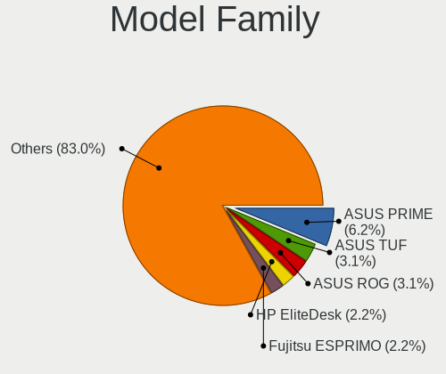
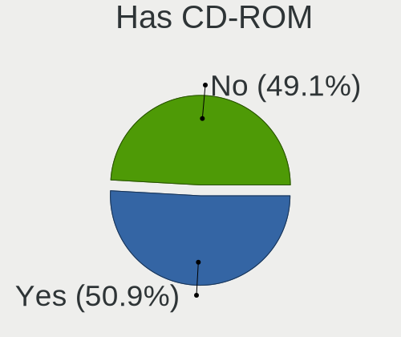
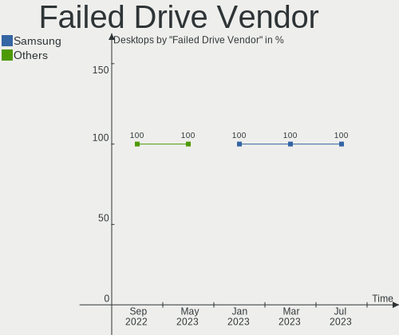
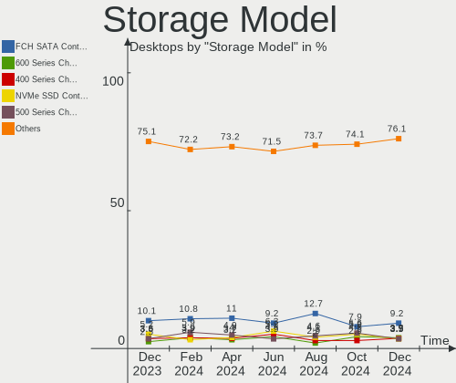
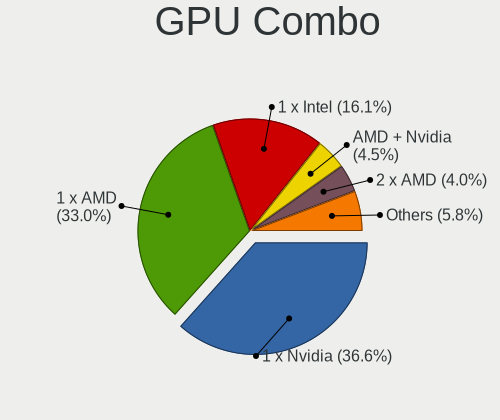
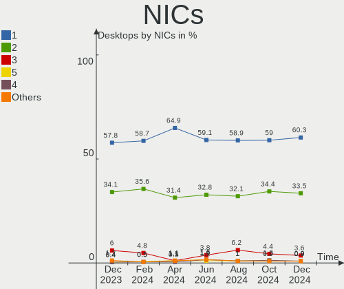
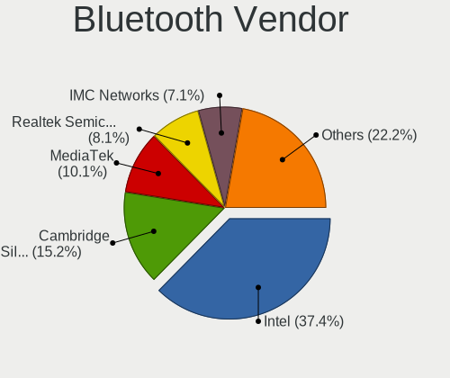

Linux in Germany - Hardware Trends (Desktops)
---------------------------------------------

A project to identify most popular hardware characteristics and track their change
over time based on data collected by Linux users at https://Linux-Hardware.org.

Anyone can contribute to this report by the [hw-probe](https://github.com/linuxhw/hw-probe) tool:

    sudo -E hw-probe -all -upload

Period: Mar, 2023.

Contents
--------

* [ System ](#system)
  - [ OS                       ](#os)
  - [ OS Family                ](#os-family)
  - [ Kernel                   ](#kernel)
  - [ Kernel Family            ](#kernel-family)
  - [ Kernel Major Ver.        ](#kernel-major-ver)
  - [ Arch                     ](#arch)
  - [ DE                       ](#de)
  - [ Display Server           ](#display-server)
  - [ Display Manager          ](#display-manager)
  - [ OS Lang                  ](#os-lang)
  - [ Boot Mode                ](#boot-mode)
  - [ Filesystem               ](#filesystem)
  - [ Part. scheme             ](#part-scheme)
  - [ Dual Boot with Linux/BSD ](#dual-boot-with-linuxbsd)
  - [ Dual Boot (Win)          ](#dual-boot-win)

* [ Board ](#board)
  - [ Vendor                   ](#vendor)
  - [ Model                    ](#model)
  - [ Model Family             ](#model-family)
  - [ MFG Year                 ](#mfg-year)
  - [ Form Factor              ](#form-factor)
  - [ Secure Boot              ](#secure-boot)
  - [ Coreboot                 ](#coreboot)
  - [ RAM Size                 ](#ram-size)
  - [ RAM Used                 ](#ram-used)
  - [ Total Drives             ](#total-drives)
  - [ Has CD-ROM               ](#has-cd-rom)
  - [ Has Ethernet             ](#has-ethernet)
  - [ Has WiFi                 ](#has-wifi)
  - [ Has Bluetooth            ](#has-bluetooth)

* [ Location ](#location)
  - [ Country                  ](#country)
  - [ City                     ](#city)

* [ Drives ](#drives)
  - [ Drive Vendor             ](#drive-vendor)
  - [ Drive Model              ](#drive-model)
  - [ HDD Vendor               ](#hdd-vendor)
  - [ SSD Vendor               ](#ssd-vendor)
  - [ Drive Kind               ](#drive-kind)
  - [ Drive Connector          ](#drive-connector)
  - [ Drive Size               ](#drive-size)
  - [ Space Total              ](#space-total)
  - [ Space Used               ](#space-used)
  - [ Malfunc. Drives          ](#malfunc-drives)
  - [ Malfunc. Drive Vendor    ](#malfunc-drive-vendor)
  - [ Malfunc. HDD Vendor      ](#malfunc-hdd-vendor)
  - [ Malfunc. Drive Kind      ](#malfunc-drive-kind)
  - [ Failed Drives            ](#failed-drives)
  - [ Failed Drive Vendor      ](#failed-drive-vendor)
  - [ Drive Status             ](#drive-status)

* [ Storage controller ](#storage-controller)
  - [ Storage Vendor           ](#storage-vendor)
  - [ Storage Model            ](#storage-model)
  - [ Storage Kind             ](#storage-kind)

* [ Processor ](#processor)
  - [ CPU Vendor               ](#cpu-vendor)
  - [ CPU Model                ](#cpu-model)
  - [ CPU Model Family         ](#cpu-model-family)
  - [ CPU Cores                ](#cpu-cores)
  - [ CPU Sockets              ](#cpu-sockets)
  - [ CPU Threads              ](#cpu-threads)
  - [ CPU Op-Modes             ](#cpu-op-modes)
  - [ CPU Microcode            ](#cpu-microcode)
  - [ CPU Microarch            ](#cpu-microarch)

* [ Graphics ](#graphics)
  - [ GPU Vendor               ](#gpu-vendor)
  - [ GPU Model                ](#gpu-model)
  - [ GPU Combo                ](#gpu-combo)
  - [ GPU Driver               ](#gpu-driver)
  - [ GPU Memory               ](#gpu-memory)

* [ Monitor ](#monitor)
  - [ Monitor Vendor           ](#monitor-vendor)
  - [ Monitor Model            ](#monitor-model)
  - [ Monitor Resolution       ](#monitor-resolution)
  - [ Monitor Diagonal         ](#monitor-diagonal)
  - [ Monitor Width            ](#monitor-width)
  - [ Aspect Ratio             ](#aspect-ratio)
  - [ Monitor Area             ](#monitor-area)
  - [ Pixel Density            ](#pixel-density)
  - [ Multiple Monitors        ](#multiple-monitors)

* [ Network ](#network)
  - [ Net Controller Vendor    ](#net-controller-vendor)
  - [ Net Controller Model     ](#net-controller-model)
  - [ Wireless Vendor          ](#wireless-vendor)
  - [ Wireless Model           ](#wireless-model)
  - [ Ethernet Vendor          ](#ethernet-vendor)
  - [ Ethernet Model           ](#ethernet-model)
  - [ Net Controller Kind      ](#net-controller-kind)
  - [ Used Controller          ](#used-controller)
  - [ NICs                     ](#nics)
  - [ IPv6                     ](#ipv6)

* [ Bluetooth ](#bluetooth)
  - [ Bluetooth Vendor         ](#bluetooth-vendor)
  - [ Bluetooth Model          ](#bluetooth-model)

* [ Sound ](#sound)
  - [ Sound Vendor             ](#sound-vendor)
  - [ Sound Model              ](#sound-model)

* [ Memory ](#memory)
  - [ Memory Vendor            ](#memory-vendor)
  - [ Memory Model             ](#memory-model)
  - [ Memory Kind              ](#memory-kind)
  - [ Memory Form Factor       ](#memory-form-factor)
  - [ Memory Size              ](#memory-size)
  - [ Memory Speed             ](#memory-speed)

* [ Printers & scanners ](#printers--scanners)
  - [ Printer Vendor           ](#printer-vendor)
  - [ Printer Model            ](#printer-model)
  - [ Scanner Vendor           ](#scanner-vendor)
  - [ Scanner Model            ](#scanner-model)

* [ Camera ](#camera)
  - [ Camera Vendor            ](#camera-vendor)
  - [ Camera Model             ](#camera-model)

* [ Security ](#security)
  - [ Fingerprint Vendor       ](#fingerprint-vendor)
  - [ Fingerprint Model        ](#fingerprint-model)
  - [ Chipcard Vendor          ](#chipcard-vendor)
  - [ Chipcard Model           ](#chipcard-model)

* [ Unsupported ](#unsupported)
  - [ Unsupported Devices      ](#unsupported-devices)
  - [ Unsupported Device Types ](#unsupported-device-types)

System
------

OS
--

Installed operating systems

| Name                         | Desktops | Percent |
|------------------------------|----------|---------|
| Ubuntu 22.04                 | 59       | 17.51%  |
| Linux Mint 21.1              | 41       | 12.17%  |
| OpenMandriva 23.03           | 24       | 7.12%   |
| Ubuntu 22.10                 | 19       | 5.64%   |
| Debian 11                    | 17       | 5.04%   |
| OpenMandriva 23.01           | 14       | 4.15%   |
| Pop!_OS 22.04                | 11       | 3.26%   |
| Ubuntu 20.04                 | 10       | 2.97%   |
| OpenMandriva 4.3             | 10       | 2.97%   |
| Fedora 37                    | 9        | 2.67%   |
| Gentoo 2.13                  | 8        | 2.37%   |
| Arch Rolling                 | 8        | 2.37%   |
| Manjaro                      | 7        | 2.08%   |
| Linux Mint 20.3              | 7        | 2.08%   |
| Kubuntu 22.04                | 6        | 1.78%   |
| Zorin 16                     | 5        | 1.48%   |
| openSUSE Tumbleweed-XXXXXXXX | 4        | 1.19%   |
| Linux Mint 21                | 4        | 1.19%   |
| KDE neon 22.04               | 4        | 1.19%   |
| Ubuntu 18.04                 | 3        | 0.89%   |
| Nobara 37                    | 3        | 0.89%   |
| Manjaro 22.0.4               | 3        | 0.89%   |
| LMDE 5                       | 3        | 0.89%   |
| Kubuntu 11                   | 3        | 0.89%   |
| EndeavourOS Rolling          | 3        | 0.89%   |
| Debian 12                    | 3        | 0.89%   |
| Debian                       | 3        | 0.89%   |
| ArcoLinux Rolling            | 3        | 0.89%   |
| Ubuntu MATE 22.04            | 2        | 0.59%   |
| TUXEDO OS 22.04              | 2        | 0.59%   |
| openSUSE Microos-XXXXXXXX    | 2        | 0.59%   |
| openSUSE Leap-15.4           | 2        | 0.59%   |
| OpenMandriva 4.2             | 2        | 0.59%   |
| MX 21                        | 2        | 0.59%   |
| Manjaro 22.0.5               | 2        | 0.59%   |
| Linux Mint 20.1              | 2        | 0.59%   |
| Kubuntu 22.10                | 2        | 0.59%   |
| BlackPanther 18.1            | 2        | 0.59%   |
| Xubuntu 22.10                | 1        | 0.3%    |
| Xubuntu 22.04                | 1        | 0.3%    |

OS Family
---------

OS without a version

| Name          | Desktops | Percent |
|---------------|----------|---------|
| Ubuntu        | 91       | 27%     |
| Linux Mint    | 55       | 16.32%  |
| OpenMandriva  | 51       | 15.13%  |
| Debian        | 23       | 6.82%   |
| Manjaro       | 12       | 3.56%   |
| Kubuntu       | 12       | 3.56%   |
| Pop!_OS       | 11       | 3.26%   |
| openSUSE      | 9        | 2.67%   |
| Fedora        | 9        | 2.67%   |
| Gentoo        | 8        | 2.37%   |
| Arch          | 8        | 2.37%   |
| Zorin         | 5        | 1.48%   |
| Xubuntu       | 4        | 1.19%   |
| KDE neon      | 4        | 1.19%   |
| Ubuntu MATE   | 3        | 0.89%   |
| Nobara        | 3        | 0.89%   |
| LMDE          | 3        | 0.89%   |
| EndeavourOS   | 3        | 0.89%   |
| ArcoLinux     | 3        | 0.89%   |
| TUXEDO OS     | 2        | 0.59%   |
| Siduction     | 2        | 0.59%   |
| MX            | 2        | 0.59%   |
| Lubuntu       | 2        | 0.59%   |
| BlackPanther  | 2        | 0.59%   |
| Xero          | 1        | 0.3%    |
| Ubuntu Unity  | 1        | 0.3%    |
| Ubuntu Studio | 1        | 0.3%    |
| Slackware     | 1        | 0.3%    |
| ROSA          | 1        | 0.3%    |
| Kali          | 1        | 0.3%    |
| Elementary    | 1        | 0.3%    |
| Deepin        | 1        | 0.3%    |
| Clear Linux   | 1        | 0.3%    |
| Astos         | 1        | 0.3%    |

Kernel
------

Version of the Linux kernel

| Version                      | Desktops | Percent |
|------------------------------|----------|---------|
| 5.19.0-35-generic            | 65       | 19.29%  |
| 5.15.0-67-generic            | 45       | 13.35%  |
| 6.2.6-desktop-1omv2390       | 22       | 6.53%   |
| 6.1.1-desktop-1omv2290       | 14       | 4.15%   |
| 5.19.0-38-generic            | 10       | 2.97%   |
| 5.10.0-21-amd64              | 10       | 2.97%   |
| 5.4.0-144-generic            | 8        | 2.37%   |
| 5.19.0-32-generic            | 8        | 2.37%   |
| 5.15.0-69-generic            | 8        | 2.37%   |
| 5.16.7-desktop-1omv4003      | 7        | 2.08%   |
| 5.15.0-60-generic            | 7        | 2.08%   |
| 6.1.12-1-MANJARO             | 6        | 1.78%   |
| 6.1.11-76060111-generic      | 4        | 1.19%   |
| 5.15.83-1-pve                | 4        | 1.19%   |
| 6.2.6-76060206-generic       | 3        | 0.89%   |
| 6.2.2-arch1-1                | 3        | 0.89%   |
| 6.1.0-6-amd64                | 3        | 0.89%   |
| 5.19.0-21-generic            | 3        | 0.89%   |
| 5.16.13-desktop-1omv4003     | 3        | 0.89%   |
| 5.15.0-56-generic            | 3        | 0.89%   |
| 6.2.6-201.fsync.fc37.x86_64  | 2        | 0.59%   |
| 6.2.5-arch1-1                | 2        | 0.59%   |
| 6.2.4-1-default              | 2        | 0.59%   |
| 6.2.2-desktop-1omv2390       | 2        | 0.59%   |
| 6.2.2-arch2-1                | 2        | 0.59%   |
| 6.2.0-76060200-generic       | 2        | 0.59%   |
| 6.2.0-1-default              | 2        | 0.59%   |
| 6.1.19-1-MANJARO             | 2        | 0.59%   |
| 6.1.18-200.fc37.x86_64       | 2        | 0.59%   |
| 6.1.15-200.fc37.x86_64       | 2        | 0.59%   |
| 6.1.14-200.fc37.x86_64       | 2        | 0.59%   |
| 6.1.12-gentoo-x86_64         | 2        | 0.59%   |
| 6.1.0-7-amd64                | 2        | 0.59%   |
| 6.1.0-5-amd64                | 2        | 0.59%   |
| 6.0.12-76060006-generic      | 2        | 0.59%   |
| 6.0.0-0.deb11.6-amd64        | 2        | 0.59%   |
| 5.19.0-31-generic            | 2        | 0.59%   |
| 5.15.0-58-generic            | 2        | 0.59%   |
| 5.14.21-150400.24.46-default | 2        | 0.59%   |
| 4.18.16-desktop-1bP          | 2        | 0.59%   |

Kernel Family
-------------

Linux kernel without a distro release

| Version | Desktops | Percent |
|---------|----------|---------|
| 5.19.0  | 90       | 26.71%  |
| 5.15.0  | 69       | 20.47%  |
| 6.2.6   | 32       | 9.5%    |
| 6.1.1   | 14       | 4.15%   |
| 5.4.0   | 14       | 4.15%   |
| 5.10.0  | 13       | 3.86%   |
| 6.1.12  | 11       | 3.26%   |
| 6.1.0   | 9        | 2.67%   |
| 6.2.2   | 8        | 2.37%   |
| 5.16.7  | 7        | 2.08%   |
| 6.1.14  | 5        | 1.48%   |
| 6.2.8   | 4        | 1.19%   |
| 6.2.5   | 4        | 1.19%   |
| 6.2.0   | 4        | 1.19%   |
| 6.1.11  | 4        | 1.19%   |
| 6.0.0   | 4        | 1.19%   |
| 5.15.83 | 4        | 1.19%   |
| 6.2.4   | 3        | 0.89%   |
| 6.0.12  | 3        | 0.89%   |
| 5.16.13 | 3        | 0.89%   |
| 5.14.21 | 3        | 0.89%   |
| 6.1.19  | 2        | 0.59%   |
| 6.1.18  | 2        | 0.59%   |
| 6.1.15  | 2        | 0.59%   |
| 4.18.16 | 2        | 0.59%   |
| 6.2.7   | 1        | 0.3%    |
| 6.2.3   | 1        | 0.3%    |
| 6.2.1   | 1        | 0.3%    |
| 6.1.22  | 1        | 0.3%    |
| 6.1.21  | 1        | 0.3%    |
| 6.1.13  | 1        | 0.3%    |
| 5.9.16  | 1        | 0.3%    |
| 5.19.17 | 1        | 0.3%    |
| 5.18.17 | 1        | 0.3%    |
| 5.16.20 | 1        | 0.3%    |
| 5.15.94 | 1        | 0.3%    |
| 5.15.91 | 1        | 0.3%    |
| 5.15.85 | 1        | 0.3%    |
| 5.15.77 | 1        | 0.3%    |
| 5.15.59 | 1        | 0.3%    |

Kernel Major Ver.
-----------------

Linux kernel major version

| Version | Desktops | Percent |
|---------|----------|---------|
| 5.19    | 91       | 27%     |
| 5.15    | 79       | 23.44%  |
| 6.2     | 58       | 17.21%  |
| 6.1     | 52       | 15.43%  |
| 5.4     | 14       | 4.15%   |
| 5.10    | 14       | 4.15%   |
| 5.16    | 11       | 3.26%   |
| 6.0     | 7        | 2.08%   |
| 5.14    | 3        | 0.89%   |
| 5.11    | 2        | 0.59%   |
| 4.18    | 2        | 0.59%   |
| 5.9     | 1        | 0.3%    |
| 5.18    | 1        | 0.3%    |
| 4.9     | 1        | 0.3%    |
| 4.15    | 1        | 0.3%    |

Arch
----

OS architecture (x86_64, i586, etc.)

| Name   | Desktops | Percent |
|--------|----------|---------|
| x86_64 | 334      | 99.11%  |
| i686   | 3        | 0.89%   |

DE
--

Desktop Environment

| Name              | Desktops | Percent |
|-------------------|----------|---------|
| GNOME             | 117      | 34.72%  |
| KDE5              | 89       | 26.41%  |
| X-Cinnamon        | 52       | 15.43%  |
| XFCE              | 21       | 6.23%   |
| Unknown           | 21       | 6.23%   |
| MATE              | 9        | 2.67%   |
| KDE               | 4        | 1.19%   |
| Cinnamon          | 4        | 1.19%   |
| LXQt              | 3        | 0.89%   |
| LXDE              | 2        | 0.59%   |
| i3                | 2        | 0.59%   |
| Hyprland          | 2        | 0.59%   |
| bspwm             | 2        | 0.59%   |
| Yaru:ubuntu:GNOME | 1        | 0.3%    |
| Unity             | 1        | 0.3%    |
| Pantheon          | 1        | 0.3%    |
| openbox           | 1        | 0.3%    |
| ICEWM             | 1        | 0.3%    |
| GNOME Flashback   | 1        | 0.3%    |
| GNOME Classic     | 1        | 0.3%    |
| Deepin            | 1        | 0.3%    |
| Budgie            | 1        | 0.3%    |

Display Server
--------------

X11 or Wayland

| Name    | Desktops | Percent |
|---------|----------|---------|
| X11     | 231      | 68.55%  |
| Wayland | 82       | 24.33%  |
| Tty     | 16       | 4.75%   |
| Unknown | 8        | 2.37%   |

Display Manager
---------------

SDDM, LightDM, etc.

| Name    | Desktops | Percent |
|---------|----------|---------|
| Unknown | 106      | 31.45%  |
| GDM3    | 79       | 23.44%  |
| SDDM    | 78       | 23.15%  |
| LightDM | 54       | 16.02%  |
| GDM     | 17       | 5.04%   |
| XDM     | 1        | 0.3%    |
| SLiM    | 1        | 0.3%    |
| LXDM    | 1        | 0.3%    |

OS Lang
-------

Language

| Lang        | Desktops | Percent |
|-------------|----------|---------|
| de_DE       | 265      | 78.64%  |
| en_US       | 49       | 14.54%  |
| en_GB       | 7        | 2.08%   |
| Unknown     | 5        | 1.48%   |
| C.UTF8      | 3        | 0.89%   |
| C           | 3        | 0.89%   |
| de_AT       | 2        | 0.59%   |
| ru_RU       | 1        | 0.3%    |
| en_US.UFS-8 | 1        | 0.3%    |
| en_IE       | 1        | 0.3%    |

Boot Mode
---------

EFI or BIOS

| Mode | Desktops | Percent |
|------|----------|---------|
| BIOS | 192      | 56.97%  |
| EFI  | 145      | 43.03%  |

Filesystem
----------

Type of filesystem

| Type    | Desktops | Percent |
|---------|----------|---------|
| Ext4    | 266      | 78.93%  |
| Btrfs   | 31       | 9.2%    |
| Overlay | 29       | 8.61%   |
| Zfs     | 6        | 1.78%   |
| Xfs     | 3        | 0.89%   |
| F2fs    | 1        | 0.3%    |
| Unknown | 1        | 0.3%    |

Part. scheme
------------

Scheme of partitioning

| Type    | Desktops | Percent |
|---------|----------|---------|
| GPT     | 198      | 58.75%  |
| Unknown | 91       | 27%     |
| MBR     | 48       | 14.24%  |

Dual Boot with Linux/BSD
------------------------

Hosting more than one Linux/BSD

| Dual boot | Desktops | Percent |
|-----------|----------|---------|
| No        | 251      | 74.48%  |
| Yes       | 86       | 25.52%  |

Dual Boot (Win)
---------------

Hosting Linux and Windows

| Dual boot | Desktops | Percent |
|-----------|----------|---------|
| No        | 236      | 70.03%  |
| Yes       | 101      | 29.97%  |

Board
-----

Vendor
------

Motherboard manufacturer

| Name                                 | Desktops | Percent |
|--------------------------------------|----------|---------|
| ASUSTek Computer                     | 70       | 20.77%  |
| Gigabyte Technology                  | 51       | 15.13%  |
| ASRock                               | 40       | 11.87%  |
| MSI                                  | 38       | 11.28%  |
| Fujitsu                              | 26       | 7.72%   |
| Hewlett-Packard                      | 20       | 5.93%   |
| Lenovo                               | 18       | 5.34%   |
| Dell                                 | 16       | 4.75%   |
| Acer                                 | 9        | 2.67%   |
| Medion                               | 8        | 2.37%   |
| Unknown                              | 7        | 2.08%   |
| Packard Bell                         | 4        | 1.19%   |
| Intel                                | 4        | 1.19%   |
| ASRockRack                           | 4        | 1.19%   |
| Fujitsu Siemens                      | 3        | 0.89%   |
| Supermicro                           | 2        | 0.59%   |
| Shuttle                              | 2        | 0.59%   |
| Pegatron                             | 2        | 0.59%   |
| Foxconn                              | 2        | 0.59%   |
| ECS                                  | 2        | 0.59%   |
| Biostar                              | 2        | 0.59%   |
| Wortmann AG                          | 1        | 0.3%    |
| Shenzhen Meigao Electronic Equipment | 1        | 0.3%    |
| NZXT                                 | 1        | 0.3%    |
| Inventec                             | 1        | 0.3%    |
| HPE                                  | 1        | 0.3%    |
| Chuwi                                | 1        | 0.3%    |
| Apple                                | 1        | 0.3%    |

Model
-----

Motherboard model

| Name                                       | Desktops | Percent |
|--------------------------------------------|----------|---------|
| ASUS All Series                            | 7        | 2.08%   |
| Unknown                                    | 7        | 2.08%   |
| MSI MS-7C56                                | 5        | 1.48%   |
| Fujitsu ESPRIMO P710                       | 3        | 0.89%   |
| ASUS PRIME A320M-K                         | 3        | 0.89%   |
| ASRock B450M Pro4                          | 3        | 0.89%   |
| Supermicro X9DR3-F                         | 2        | 0.59%   |
| MSI MS-7D17                                | 2        | 0.59%   |
| MSI MS-7B89                                | 2        | 0.59%   |
| MSI MS-7B86                                | 2        | 0.59%   |
| MSI MS-7A38                                | 2        | 0.59%   |
| MSI MS-7A33                                | 2        | 0.59%   |
| MSI MS-7721                                | 2        | 0.59%   |
| Medion MS-7707                             | 2        | 0.59%   |
| Gigabyte Z590 GAMING X                     | 2        | 0.59%   |
| Gigabyte X58A-UD7                          | 2        | 0.59%   |
| Gigabyte X470 AORUS ULTRA GAMING           | 2        | 0.59%   |
| Gigabyte B550 AORUS ELITE                  | 2        | 0.59%   |
| Gigabyte B450M S2H                         | 2        | 0.59%   |
| Fujitsu ESPRIMO Q920                       | 2        | 0.59%   |
| Fujitsu ESPRIMO P910                       | 2        | 0.59%   |
| Fujitsu ESPRIMO E920                       | 2        | 0.59%   |
| Dell Vostro 200                            | 2        | 0.59%   |
| Dell OptiPlex 3050                         | 2        | 0.59%   |
| ASUS TUF Gaming B550-PLUS                  | 2        | 0.59%   |
| ASUS ROG STRIX B550-A GAMING               | 2        | 0.59%   |
| ASUS ROG STRIX B450-F GAMING II            | 2        | 0.59%   |
| ASUS PRIME X370-PRO                        | 2        | 0.59%   |
| ASUS PRIME B650-PLUS                       | 2        | 0.59%   |
| ASUS PRIME B450M-A                         | 2        | 0.59%   |
| ASUS H170-PRO                              | 2        | 0.59%   |
| ASRockRack B450D4U-V1L                     | 2        | 0.59%   |
| ASRock B450 Gaming-ITX/ac                  | 2        | 0.59%   |
| ASRock 970 Pro3 R2.0                       | 2        | 0.59%   |
| Wortmann AG Terra 3100                     | 1        | 0.3%    |
| Shuttle XS35                               | 1        | 0.3%    |
| Shuttle DH670                              | 1        | 0.3%    |
| Shenzhen Meigao Electronic Equipment UM450 | 1        | 0.3%    |
| Pegatron p7-1017de                         | 1        | 0.3%    |
| Pegatron h8-1134de                         | 1        | 0.3%    |

Model Family
------------

Motherboard model prefix

| Name                 | Desktops | Percent |
|----------------------|----------|---------|
| Fujitsu ESPRIMO      | 21       | 6.23%   |
| ASUS PRIME           | 20       | 5.93%   |
| Dell OptiPlex        | 11       | 3.26%   |
| ASUS ROG             | 10       | 2.97%   |
| Lenovo ThinkCentre   | 9        | 2.67%   |
| HP Compaq            | 7        | 2.08%   |
| ASUS All             | 7        | 2.08%   |
| Unknown              | 7        | 2.08%   |
| ASUS TUF             | 6        | 1.78%   |
| Acer Aspire          | 6        | 1.78%   |
| MSI MS-7C56          | 5        | 1.48%   |
| Lenovo ThinkStation  | 3        | 0.89%   |
| Lenovo IdeaCentre    | 3        | 0.89%   |
| HP Pavilion          | 3        | 0.89%   |
| Gigabyte B450M       | 3        | 0.89%   |
| Dell Vostro          | 3        | 0.89%   |
| ASRock B450M         | 3        | 0.89%   |
| ASRock B450          | 3        | 0.89%   |
| ASRock 970           | 3        | 0.89%   |
| Supermicro X9DR3-F   | 2        | 0.59%   |
| Packard Bell IXTREME | 2        | 0.59%   |
| Packard Bell IMEDIA  | 2        | 0.59%   |
| MSI MS-7D17          | 2        | 0.59%   |
| MSI MS-7B89          | 2        | 0.59%   |
| MSI MS-7B86          | 2        | 0.59%   |
| MSI MS-7A38          | 2        | 0.59%   |
| MSI MS-7A33          | 2        | 0.59%   |
| MSI MS-7721          | 2        | 0.59%   |
| Medion MS-7707       | 2        | 0.59%   |
| HP ProLiant          | 2        | 0.59%   |
| Gigabyte Z590        | 2        | 0.59%   |
| Gigabyte Z390        | 2        | 0.59%   |
| Gigabyte Z370        | 2        | 0.59%   |
| Gigabyte X58A-UD7    | 2        | 0.59%   |
| Gigabyte X470        | 2        | 0.59%   |
| Gigabyte B550        | 2        | 0.59%   |
| Gigabyte B450        | 2        | 0.59%   |
| ASUS P9X79           | 2        | 0.59%   |
| ASUS P8H61-M         | 2        | 0.59%   |
| ASUS H170-PRO        | 2        | 0.59%   |

MFG Year
--------

Motherboard manufacture year

| Year    | Desktops | Percent |
|---------|----------|---------|
| 2018    | 41       | 12.17%  |
| 2020    | 37       | 10.98%  |
| 2012    | 32       | 9.5%    |
| 2021    | 29       | 8.61%   |
| 2017    | 28       | 8.31%   |
| 2013    | 25       | 7.42%   |
| 2011    | 20       | 5.93%   |
| 2022    | 18       | 5.34%   |
| 2010    | 17       | 5.04%   |
| 2014    | 15       | 4.45%   |
| 2009    | 15       | 4.45%   |
| 2019    | 13       | 3.86%   |
| 2015    | 12       | 3.56%   |
| 2016    | 11       | 3.26%   |
| 2008    | 9        | 2.67%   |
| 2007    | 4        | 1.19%   |
| 2006    | 4        | 1.19%   |
| 2023    | 3        | 0.89%   |
| 2004    | 2        | 0.59%   |
| 2003    | 1        | 0.3%    |
| Unknown | 1        | 0.3%    |

Form Factor
-----------

Physical design of the computer

| Name    | Desktops | Percent |
|---------|----------|---------|
| Desktop | 337      | 100%    |

Secure Boot
-----------

Enabled or disabled

| State    | Desktops | Percent |
|----------|----------|---------|
| Disabled | 325      | 96.44%  |
| Enabled  | 12       | 3.56%   |

Coreboot
--------

Have coreboot on board

| Used | Desktops | Percent |
|------|----------|---------|
| No   | 337      | 100%    |

RAM Size
--------

Total RAM memory

| Size in GB  | Desktops | Percent |
|-------------|----------|---------|
| 16.01-24.0  | 91       | 27%     |
| 32.01-64.0  | 61       | 18.1%   |
| 8.01-16.0   | 60       | 17.8%   |
| 4.01-8.0    | 45       | 13.35%  |
| 3.01-4.0    | 33       | 9.79%   |
| 64.01-256.0 | 22       | 6.53%   |
| 24.01-32.0  | 11       | 3.26%   |
| 2.01-3.0    | 7        | 2.08%   |
| 1.01-2.0    | 7        | 2.08%   |

RAM Used
--------

Used RAM memory

| Used GB     | Desktops | Percent |
|-------------|----------|---------|
| 1.01-2.0    | 107      | 31.75%  |
| 2.01-3.0    | 78       | 23.15%  |
| 4.01-8.0    | 62       | 18.4%   |
| 3.01-4.0    | 39       | 11.57%  |
| 8.01-16.0   | 19       | 5.64%   |
| 0.51-1.0    | 17       | 5.04%   |
| 16.01-24.0  | 7        | 2.08%   |
| 0.01-0.5    | 4        | 1.19%   |
| 32.01-64.0  | 3        | 0.89%   |
| 64.01-256.0 | 1        | 0.3%    |

Total Drives
------------

Number of drives on board

| Drives | Desktops | Percent |
|--------|----------|---------|
| 1      | 112      | 33.23%  |
| 2      | 95       | 28.19%  |
| 3      | 60       | 17.8%   |
| 4      | 36       | 10.68%  |
| 5      | 13       | 3.86%   |
| 6      | 10       | 2.97%   |
| 7      | 5        | 1.48%   |
| 0      | 2        | 0.59%   |
| 29     | 1        | 0.3%    |
| 10     | 1        | 0.3%    |
| 9      | 1        | 0.3%    |
| 8      | 1        | 0.3%    |

Has CD-ROM
----------

Has CD-ROM on board

| Presented | Desktops | Percent |
|-----------|----------|---------|
| Yes       | 185      | 54.9%   |
| No        | 152      | 45.1%   |

Has Ethernet
------------

Has Ethernet on board

| Presented | Desktops | Percent |
|-----------|----------|---------|
| Yes       | 335      | 99.41%  |
| No        | 2        | 0.59%   |

Has WiFi
--------

Has WiFi module

| Presented | Desktops | Percent |
|-----------|----------|---------|
| No        | 214      | 63.5%   |
| Yes       | 123      | 36.5%   |

Has Bluetooth
-------------

Has Bluetooth module

| Presented | Desktops | Percent |
|-----------|----------|---------|
| No        | 228      | 67.66%  |
| Yes       | 109      | 32.34%  |

Location
--------

Country
-------

Geographic location (country)

| Country | Desktops | Percent |
|---------|----------|---------|
| Germany | 337      | 100%    |

City
----

Geographic location (city)

| City              | Desktops | Percent |
|-------------------|----------|---------|
| Berlin            | 27       | 8.01%   |
| Hamburg           | 12       | 3.56%   |
| Munich            | 11       | 3.26%   |
| Frankfurt am Main | 8        | 2.37%   |
| Hanover           | 6        | 1.78%   |
| Bielefeld         | 6        | 1.78%   |
| Traunstein        | 5        | 1.48%   |
| Stuttgart         | 5        | 1.48%   |
| Dresden           | 5        | 1.48%   |
| Cologne           | 5        | 1.48%   |
| Falkenstein       | 4        | 1.19%   |
| Chemnitz          | 4        | 1.19%   |
| Rostock           | 3        | 0.89%   |
| Oldenburg         | 3        | 0.89%   |
| Münster          | 3        | 0.89%   |
| Mainhausen        | 3        | 0.89%   |
| Lüneburg         | 3        | 0.89%   |
| Krefeld           | 3        | 0.89%   |
| Fürth            | 3        | 0.89%   |
| Essen             | 3        | 0.89%   |
| Bochum            | 3        | 0.89%   |
| Beeskow           | 3        | 0.89%   |
| Ubstadt-Weiher    | 2        | 0.59%   |
| Stade             | 2        | 0.59%   |
| Recklinghausen    | 2        | 0.59%   |
| Raesfeld          | 2        | 0.59%   |
| Pforzheim         | 2        | 0.59%   |
| Osnabrück        | 2        | 0.59%   |
| Nuremberg         | 2        | 0.59%   |
| Mönchengladbach  | 2        | 0.59%   |
| Mannheim          | 2        | 0.59%   |
| Ludwigsburg       | 2        | 0.59%   |
| Leipzig           | 2        | 0.59%   |
| Kulmbach          | 2        | 0.59%   |
| Kiel              | 2        | 0.59%   |
| Karlsruhe         | 2        | 0.59%   |
| Jena              | 2        | 0.59%   |
| Ilmenau           | 2        | 0.59%   |
| Hochberg          | 2        | 0.59%   |
| Herne             | 2        | 0.59%   |

Drives
------

Drive Vendor
------------

Hard drive vendors

| Vendor                      | Desktops | Drives | Percent |
|-----------------------------|----------|--------|---------|
| Samsung Electronics         | 129      | 195    | 19.82%  |
| WDC                         | 104      | 146    | 15.98%  |
| Seagate                     | 80       | 105    | 12.29%  |
| SanDisk                     | 55       | 66     | 8.45%   |
| Crucial                     | 50       | 57     | 7.68%   |
| Toshiba                     | 36       | 46     | 5.53%   |
| Intenso                     | 20       | 23     | 3.07%   |
| Kingston                    | 18       | 22     | 2.76%   |
| Hitachi                     | 16       | 17     | 2.46%   |
| Phison Electronics          | 10       | 10     | 1.54%   |
| HGST                        | 8        | 8      | 1.23%   |
| Transcend                   | 7        | 8      | 1.08%   |
| China                       | 7        | 7      | 1.08%   |
| Unknown                     | 6        | 10     | 0.92%   |
| Intel                       | 6        | 6      | 0.92%   |
| Fanxiang                    | 6        | 6      | 0.92%   |
| PNY                         | 5        | 7      | 0.77%   |
| Micron Technology           | 5        | 6      | 0.77%   |
| Leven                       | 5        | 5      | 0.77%   |
| A-DATA Technology           | 5        | 5      | 0.77%   |
| Patriot                     | 4        | 4      | 0.61%   |
| Micron/Crucial Technology   | 4        | 5      | 0.61%   |
| Kingston Technology Company | 4        | 4      | 0.61%   |
| JMicron Technology          | 4        | 4      | 0.61%   |
| SPCC                        | 3        | 3      | 0.46%   |
| OCZ                         | 3        | 3      | 0.46%   |
| Netac                       | 3        | 3      | 0.46%   |
| ADATA Technology            | 3        | 3      | 0.46%   |
| SK hynix                    | 2        | 2      | 0.31%   |
| SABRENT                     | 2        | 2      | 0.31%   |
| Realtek Semiconductor       | 2        | 3      | 0.31%   |
| Phison                      | 2        | 2      | 0.31%   |
| Mushkin                     | 2        | 2      | 0.31%   |
| INNOVATION IT               | 2        | 2      | 0.31%   |
| Corsair                     | 2        | 2      | 0.31%   |
| Unknown                     | 2        | 2      | 0.31%   |
| Verbatim                    | 1        | 1      | 0.15%   |
| Team                        | 1        | 1      | 0.15%   |
| Supersonic                  | 1        | 1      | 0.15%   |
| StoreJet                    | 1        | 3      | 0.15%   |

Drive Model
-----------

Hard drive models

| Model                                               | Desktops | Percent |
|-----------------------------------------------------|----------|---------|
| Samsung NVMe SSD Controller SM981/PM981/PM983 250GB | 17       | 2.19%   |
| SanDisk SSD PLUS 480GB                              | 12       | 1.55%   |
| Samsung SSD 860 EVO 500GB                           | 10       | 1.29%   |
| Samsung SSD 850 EVO 500GB                           | 10       | 1.29%   |
| Samsung SSD 850 EVO 250GB                           | 10       | 1.29%   |
| Crucial CT1000MX500SSD1 1TB                         | 10       | 1.29%   |
| Seagate ST500DM002-1BD142 500GB                     | 8        | 1.03%   |
| Crucial CT500MX500SSD1 500GB                        | 8        | 1.03%   |
| SanDisk SSD PLUS 1000GB                             | 7        | 0.9%    |
| Samsung SSD 840 EVO 120GB                           | 6        | 0.77%   |
| Kingston SA400S37120G 120GB SSD                     | 6        | 0.77%   |
| WDC WD10EZEX-08WN4A0 1TB                            | 5        | 0.64%   |
| Toshiba DT01ACA100 1TB                              | 5        | 0.64%   |
| Seagate ST31000524AS 1TB                            | 5        | 0.64%   |
| Samsung SSD 980 1TB                                 | 5        | 0.64%   |
| Samsung NVMe SSD Controller PM9A1/PM9A3/980PRO 1TB  | 5        | 0.64%   |
| Crucial CT1000BX500SSD1 1TB                         | 5        | 0.64%   |
| WDC WD40EFRX-68N32N0 4TB                            | 4        | 0.52%   |
| WDC WD20EZRZ-00Z5HB0 2TB                            | 4        | 0.52%   |
| Toshiba HDWD110 1TB                                 | 4        | 0.52%   |
| Seagate ST4000DM004-2CV104 4TB                      | 4        | 0.52%   |
| Seagate ST2000DM008-2FR102 2TB                      | 4        | 0.52%   |
| Seagate ST2000DM001-1CH164 2TB                      | 4        | 0.52%   |
| Samsung SSD 970 EVO Plus 500GB                      | 4        | 0.52%   |
| Samsung SSD 970 EVO Plus 1TB                        | 4        | 0.52%   |
| Samsung SSD 860 QVO 1TB                             | 4        | 0.52%   |
| Samsung SSD 860 EVO 250GB                           | 4        | 0.52%   |
| Samsung SSD 860 EVO 1TB                             | 4        | 0.52%   |
| Samsung SSD 840 EVO 250GB                           | 4        | 0.52%   |
| Samsung HD502IJ 500GB                               | 4        | 0.52%   |
| JMicron Generic 500GB                               | 4        | 0.52%   |
| WDC WD40EZRZ-00GXCB0 4TB                            | 3        | 0.39%   |
| WDC WD20EARX-00PASB0 2TB                            | 3        | 0.39%   |
| Toshiba DT01ACA050 500GB                            | 3        | 0.39%   |
| Seagate ST2000DM001-1ER164 2TB                      | 3        | 0.39%   |
| Sandisk WD Black SN750 / PC SN730 NVMe SSD 1TB      | 3        | 0.39%   |
| SanDisk SDSSDH3512G 512GB                           | 3        | 0.39%   |
| SanDisk SDSSDH3 500G                                | 3        | 0.39%   |
| Samsung SSD 980 500GB                               | 3        | 0.39%   |
| Samsung SSD 970 EVO 500GB                           | 3        | 0.39%   |

HDD Vendor
----------

Hard disk drive vendors

| Vendor              | Desktops | Drives | Percent |
|---------------------|----------|--------|---------|
| WDC                 | 96       | 134    | 37.07%  |
| Seagate             | 79       | 104    | 30.5%   |
| Toshiba             | 30       | 36     | 11.58%  |
| Samsung Electronics | 20       | 23     | 7.72%   |
| Hitachi             | 16       | 17     | 6.18%   |
| HGST                | 8        | 8      | 3.09%   |
| Unknown             | 2        | 2      | 0.77%   |
| SABRENT             | 2        | 2      | 0.77%   |
| Intenso             | 2        | 2      | 0.77%   |
| Maxtor              | 1        | 1      | 0.39%   |
| Fujitsu             | 1        | 1      | 0.39%   |
| ASMT                | 1        | 1      | 0.39%   |
| ASMedia             | 1        | 1      | 0.39%   |

SSD Vendor
----------

Solid state drive vendors

| Vendor              | Desktops | Drives | Percent |
|---------------------|----------|--------|---------|
| Samsung Electronics | 82       | 107    | 29.08%  |
| Crucial             | 47       | 52     | 16.67%  |
| SanDisk             | 41       | 51     | 14.54%  |
| Kingston            | 15       | 18     | 5.32%   |
| Intenso             | 14       | 17     | 4.96%   |
| WDC                 | 9        | 10     | 3.19%   |
| China               | 7        | 7      | 2.48%   |
| Transcend           | 6        | 7      | 2.13%   |
| Leven               | 5        | 5      | 1.77%   |
| Fanxiang            | 5        | 5      | 1.77%   |
| A-DATA Technology   | 5        | 5      | 1.77%   |
| Micron Technology   | 4        | 5      | 1.42%   |
| JMicron Technology  | 4        | 4      | 1.42%   |
| Patriot             | 3        | 3      | 1.06%   |
| OCZ                 | 3        | 3      | 1.06%   |
| Toshiba             | 2        | 2      | 0.71%   |
| SPCC                | 2        | 2      | 0.71%   |
| PNY                 | 2        | 2      | 0.71%   |
| Intel               | 2        | 2      | 0.71%   |
| INNOVATION IT       | 2        | 2      | 0.71%   |
| Corsair             | 2        | 2      | 0.71%   |
| Unknown             | 2        | 2      | 0.71%   |
| Verbatim            | 1        | 1      | 0.35%   |
| Team                | 1        | 1      | 0.35%   |
| Supersonic          | 1        | 1      | 0.35%   |
| StoreJet            | 1        | 3      | 0.35%   |
| SK hynix            | 1        | 1      | 0.35%   |
| QUMOX               | 1        | 1      | 0.35%   |
| Plextor             | 1        | 1      | 0.35%   |
| Phison              | 1        | 1      | 0.35%   |
| Netac               | 1        | 1      | 0.35%   |
| Mushkin             | 1        | 1      | 0.35%   |
| LITEON              | 1        | 1      | 0.35%   |
| KingSpec            | 1        | 1      | 0.35%   |
| KingDian            | 1        | 1      | 0.35%   |
| Hoodisk             | 1        | 1      | 0.35%   |
| GALAX               | 1        | 1      | 0.35%   |
| Emtec               | 1        | 1      | 0.35%   |
| CT1000P3            | 1        | 1      | 0.35%   |
| Apple               | 1        | 1      | 0.35%   |

Drive Kind
----------

HDD or SSD

| Kind    | Desktops | Drives | Percent |
|---------|----------|--------|---------|
| SSD     | 210      | 333    | 39.25%  |
| HDD     | 196      | 332    | 36.64%  |
| NVMe    | 116      | 150    | 21.68%  |
| Unknown | 12       | 15     | 2.24%   |
| MMC     | 1        | 1      | 0.19%   |

Drive Connector
---------------

SATA, SAS, NVMe, etc.

| Type | Desktops | Drives | Percent |
|------|----------|--------|---------|
| SATA | 300      | 631    | 66.23%  |
| NVMe | 115      | 148    | 25.39%  |
| SAS  | 37       | 51     | 8.17%   |
| MMC  | 1        | 1      | 0.22%   |

Drive Size
----------

Size of hard drive

| Size in TB | Desktops | Drives | Percent |
|------------|----------|--------|---------|
| 0.01-0.5   | 211      | 326    | 46.27%  |
| 0.51-1.0   | 127      | 171    | 27.85%  |
| 1.01-2.0   | 59       | 73     | 12.94%  |
| 3.01-4.0   | 29       | 45     | 6.36%   |
| 4.01-10.0  | 16       | 28     | 3.51%   |
| 2.01-3.0   | 13       | 21     | 2.85%   |
| 10.01-20.0 | 1        | 1      | 0.22%   |

Space Total
-----------

Amount of disk space available on the file system

| Size in GB     | Desktops | Percent |
|----------------|----------|---------|
| 501-1000       | 62       | 18.4%   |
| 101-250        | 61       | 18.1%   |
| 251-500        | 60       | 17.8%   |
| 1001-2000      | 39       | 11.57%  |
| More than 3000 | 38       | 11.28%  |
| 1-20           | 24       | 7.12%   |
| 2001-3000      | 20       | 5.93%   |
| 51-100         | 16       | 4.75%   |
| Unknown        | 12       | 3.56%   |
| 21-50          | 5        | 1.48%   |

Space Used
----------

Amount of used disk space

| Used GB        | Desktops | Percent |
|----------------|----------|---------|
| 1-20           | 91       | 27%     |
| 21-50          | 58       | 17.21%  |
| 101-250        | 39       | 11.57%  |
| 251-500        | 34       | 10.09%  |
| 501-1000       | 31       | 9.2%    |
| 51-100         | 28       | 8.31%   |
| More than 3000 | 19       | 5.64%   |
| 1001-2000      | 15       | 4.45%   |
| Unknown        | 12       | 3.56%   |
| 2001-3000      | 10       | 2.97%   |

Malfunc. Drives
---------------

Drive models with a malfunction

| Model                                    | Desktops | Drives | Percent |
|------------------------------------------|----------|--------|---------|
| Seagate ST500DM002-1BD142 500GB          | 4        | 4      | 8.51%   |
| SanDisk SSD PLUS 480GB                   | 4        | 4      | 8.51%   |
| WDC WD5000AVDS-63U7B1 500GB              | 1        | 1      | 2.13%   |
| WDC WD5000AAKS-007AA0 500GB              | 1        | 1      | 2.13%   |
| WDC WD5000AADS-00S9B0 500GB              | 1        | 1      | 2.13%   |
| WDC WD4001FFSX-68JNUN0 4TB               | 1        | 1      | 2.13%   |
| WDC WD3200AAJS-00B4A0 320GB              | 1        | 1      | 2.13%   |
| WDC WD20EARX-00PASB0 2TB                 | 1        | 1      | 2.13%   |
| WDC WD20EARS-60MVWB0 2TB                 | 1        | 1      | 2.13%   |
| WDC WD15EADS-00P8B0 1TB                  | 1        | 1      | 2.13%   |
| WDC WD10EURX-63FH1Y0 1TB                 | 1        | 1      | 2.13%   |
| WDC WD10EFRX-68FYTN0 1TB                 | 1        | 1      | 2.13%   |
| WDC WD10EARS-00Y5B1 1TB                  | 1        | 1      | 2.13%   |
| WDC WD10EALS-00Z8A0 1TB                  | 1        | 1      | 2.13%   |
| WDC WD10EADS-22M2B0 1TB                  | 1        | 1      | 2.13%   |
| Toshiba MQ01ABF032 320GB                 | 1        | 1      | 2.13%   |
| Toshiba MK1633GSG 160GB                  | 1        | 1      | 2.13%   |
| Seagate ST4000NM0245-1Z2107 4TB          | 1        | 1      | 2.13%   |
| Seagate ST4000DM004-2CV104 4TB           | 1        | 1      | 2.13%   |
| Seagate ST3750640NS 752GB                | 1        | 1      | 2.13%   |
| Seagate ST3640623AS 640GB                | 1        | 1      | 2.13%   |
| Seagate ST3500412AS 500GB                | 1        | 1      | 2.13%   |
| Seagate ST3320820AS 320GB                | 1        | 1      | 2.13%   |
| Seagate ST3250310AS 250GB                | 1        | 1      | 2.13%   |
| Seagate ST320LT007-9ZV142 320GB          | 1        | 1      | 2.13%   |
| Seagate ST2000DX001-1NS164 2TB           | 1        | 1      | 2.13%   |
| Seagate ST1000DM003-9YN162 1TB           | 1        | 1      | 2.13%   |
| SanDisk SSD PLUS 1000GB                  | 1        | 1      | 2.13%   |
| Samsung Electronics SSD 970 EVO 500GB    | 1        | 1      | 2.13%   |
| Samsung Electronics SSD 970 EVO 1TB      | 1        | 1      | 2.13%   |
| Samsung Electronics SSD 840 Series 250GB | 1        | 1      | 2.13%   |
| Samsung Electronics SP2504C 250GB        | 1        | 1      | 2.13%   |
| Samsung Electronics HD502IJ 500GB        | 1        | 1      | 2.13%   |
| Samsung Electronics HD322HJ 320GB        | 1        | 1      | 2.13%   |
| Maxtor STM3250310AS 250GB                | 1        | 1      | 2.13%   |
| Kingston SA400S37240G 240GB SSD          | 1        | 1      | 2.13%   |
| Intenso SSD 256GB                        | 1        | 1      | 2.13%   |
| Crucial CT525MX300SSD1 528GB             | 1        | 1      | 2.13%   |
| Crucial CT500MX500SSD1 500GB             | 1        | 1      | 2.13%   |
| Crucial CT1000MX500SSD1 1TB              | 1        | 1      | 2.13%   |

Malfunc. Drive Vendor
---------------------

Vendors of faulty drives

| Vendor              | Desktops | Drives | Percent |
|---------------------|----------|--------|---------|
| Seagate             | 14       | 14     | 31.11%  |
| WDC                 | 12       | 13     | 26.67%  |
| Samsung Electronics | 6        | 6      | 13.33%  |
| SanDisk             | 5        | 5      | 11.11%  |
| Crucial             | 3        | 4      | 6.67%   |
| Toshiba             | 2        | 2      | 4.44%   |
| Maxtor              | 1        | 1      | 2.22%   |
| Kingston            | 1        | 1      | 2.22%   |
| Intenso             | 1        | 1      | 2.22%   |

Malfunc. HDD Vendor
-------------------

Vendors of faulty HDD drives

| Vendor              | Desktops | Drives | Percent |
|---------------------|----------|--------|---------|
| Seagate             | 14       | 14     | 43.75%  |
| WDC                 | 12       | 13     | 37.5%   |
| Samsung Electronics | 3        | 3      | 9.38%   |
| Toshiba             | 2        | 2      | 6.25%   |
| Maxtor              | 1        | 1      | 3.13%   |

Malfunc. Drive Kind
-------------------

Kinds of faulty drives

| Kind | Desktops | Drives | Percent |
|------|----------|--------|---------|
| HDD  | 31       | 33     | 70.45%  |
| SSD  | 11       | 12     | 25%     |
| NVMe | 2        | 2      | 4.55%   |

Failed Drives
-------------

Failed drive models

| Model                                            | Desktops | Drives | Percent |
|--------------------------------------------------|----------|--------|---------|
| Samsung Electronics MZNTY128HDHP-00000 128GB SSD | 1        | 1      | 50%     |
| Samsung Electronics HD103UJ 1TB                  | 1        | 1      | 50%     |

Failed Drive Vendor
-------------------

Failed drive vendors

| Vendor              | Desktops | Drives | Percent |
|---------------------|----------|--------|---------|
| Samsung Electronics | 2        | 2      | 100%    |

Drive Status
------------

Number of failed and malfunc. drives

| Status   | Desktops | Drives | Percent |
|----------|----------|--------|---------|
| Works    | 181      | 398    | 45.36%  |
| Detected | 172      | 384    | 43.11%  |
| Malfunc  | 44       | 47     | 11.03%  |
| Failed   | 2        | 2      | 0.5%    |

Storage controller
------------------

Storage Vendor
--------------

Storage controller vendors

| Vendor                       | Desktops | Percent |
|------------------------------|----------|---------|
| Intel                        | 205      | 40.2%   |
| AMD                          | 124      | 24.31%  |
| Samsung Electronics          | 56       | 10.98%  |
| Phison Electronics           | 17       | 3.33%   |
| SanDisk                      | 16       | 3.14%   |
| Marvell Technology Group     | 13       | 2.55%   |
| ASMedia Technology           | 13       | 2.55%   |
| JMicron Technology           | 12       | 2.35%   |
| Micron/Crucial Technology    | 9        | 1.76%   |
| Nvidia                       | 7        | 1.37%   |
| Kingston Technology Company  | 7        | 1.37%   |
| Silicon Motion               | 5        | 0.98%   |
| Toshiba America Info Systems | 3        | 0.59%   |
| Silicon Image                | 3        | 0.59%   |
| ADATA Technology             | 3        | 0.59%   |
| VIA Technologies             | 2        | 0.39%   |
| Seagate Technology           | 2        | 0.39%   |
| Realtek Semiconductor        | 2        | 0.39%   |
| MAXIO Technology (Hangzhou)  | 2        | 0.39%   |
| Broadcom / LSI               | 2        | 0.39%   |
| Adaptec                      | 2        | 0.39%   |
| OCZ Technology Group         | 1        | 0.2%    |
| Netac Technology             | 1        | 0.2%    |
| Micron Technology            | 1        | 0.2%    |
| Hewlett-Packard              | 1        | 0.2%    |
| Future Domain                | 1        | 0.2%    |

Storage Model
-------------

Storage controller models

| Model                                                                          | Desktops | Percent |
|--------------------------------------------------------------------------------|----------|---------|
| AMD FCH SATA Controller [AHCI mode]                                            | 67       | 10.89%  |
| Samsung NVMe SSD Controller SM981/PM981/PM983                                  | 36       | 5.85%   |
| AMD 400 Series Chipset SATA Controller                                         | 33       | 5.37%   |
| AMD 500 Series Chipset SATA Controller                                         | 25       | 4.07%   |
| Intel Q170/Q150/B150/H170/H110/Z170/CM236 Chipset SATA Controller [AHCI Mode]  | 21       | 3.41%   |
| Intel 8 Series/C220 Series Chipset Family 6-port SATA Controller 1 [AHCI mode] | 21       | 3.41%   |
| Intel 6 Series/C200 Series Chipset Family 6 port Desktop SATA AHCI Controller  | 18       | 2.93%   |
| Intel 7 Series/C210 Series Chipset Family 6-port SATA Controller [AHCI mode]   | 15       | 2.44%   |
| Intel 200 Series PCH SATA controller [AHCI mode]                               | 15       | 2.44%   |
| Intel Cannon Lake PCH SATA AHCI Controller                                     | 12       | 1.95%   |
| ASMedia ASM1062 Serial ATA Controller                                          | 12       | 1.95%   |
| AMD SB7x0/SB8x0/SB9x0 IDE Controller                                           | 12       | 1.95%   |
| Intel 500 Series Chipset Family SATA AHCI Controller                           | 11       | 1.79%   |
| Samsung NVMe SSD Controller 980                                                | 10       | 1.63%   |
| Intel NM10/ICH7 Family SATA Controller [IDE mode]                              | 10       | 1.63%   |
| JMicron JMB363 SATA/IDE Controller                                             | 9        | 1.46%   |
| Intel SATA Controller [RAID mode]                                              | 9        | 1.46%   |
| AMD SB7x0/SB8x0/SB9x0 SATA Controller [AHCI mode]                              | 9        | 1.46%   |
| Samsung NVMe SSD Controller PM9A1/PM9A3/980PRO                                 | 8        | 1.3%    |
| Intel C600/X79 series chipset 6-Port SATA AHCI Controller                      | 8        | 1.3%    |
| AMD FCH SATA Controller D                                                      | 8        | 1.3%    |
| Phison E12 NVMe Controller                                                     | 7        | 1.14%   |
| Intel 82801G (ICH7 Family) IDE Controller                                      | 7        | 1.14%   |
| Intel 5 Series/3400 Series Chipset 6 port SATA AHCI Controller                 | 7        | 1.14%   |
| AMD SB7x0/SB8x0/SB9x0 SATA Controller [IDE mode]                               | 7        | 1.14%   |
| AMD X370 Series Chipset SATA Controller                                        | 6        | 0.98%   |
| SanDisk WD Black SN750 / PC SN730 NVMe SSD                                     | 5        | 0.81%   |
| Micron/Crucial P2 NVMe PCIe SSD                                                | 5        | 0.81%   |
| Intel 9 Series Chipset Family SATA Controller [AHCI Mode]                      | 5        | 0.81%   |
| Intel 82801JD/DO (ICH10 Family) SATA AHCI Controller                           | 5        | 0.81%   |
| Intel 82801I (ICH9 Family) 2 port SATA Controller [IDE mode]                   | 5        | 0.81%   |
| Silicon Motion SM2263EN/SM2263XT SSD Controller                                | 4        | 0.65%   |
| Samsung NVMe SSD Controller SM961/PM961/SM963                                  | 4        | 0.65%   |
| Phison PS5013 E13 NVMe Controller                                              | 4        | 0.65%   |
| Kingston Company A2000 NVMe SSD                                                | 4        | 0.65%   |
| Intel Alder Lake-S PCH SATA Controller [AHCI Mode]                             | 4        | 0.65%   |
| Intel 82801JI (ICH10 Family) SATA AHCI Controller                              | 4        | 0.65%   |
| Intel 82801IR/IO/IH (ICH9R/DO/DH) 4 port SATA Controller [IDE mode]            | 4        | 0.65%   |
| AMD 300 Series Chipset SATA Controller                                         | 4        | 0.65%   |
| SanDisk WD Blue SN550 NVMe SSD                                                 | 3        | 0.49%   |

Storage Kind
------------

Kind of storage controller (IDE, SATA, NVMe, SAS, ...)

| Kind | Desktops | Percent |
|------|----------|---------|
| SATA | 290      | 58.59%  |
| NVMe | 116      | 23.43%  |
| IDE  | 60       | 12.12%  |
| RAID | 23       | 4.65%   |
| SAS  | 4        | 0.81%   |
| SCSI | 2        | 0.4%    |

Processor
---------

CPU Vendor
----------

Processor vendors

| Vendor | Desktops | Percent |
|--------|----------|---------|
| Intel  | 208      | 61.72%  |
| AMD    | 129      | 38.28%  |

CPU Model
---------

Processor models

| Model                                       | Desktops | Percent |
|---------------------------------------------|----------|---------|
| AMD Ryzen 5 3600 6-Core Processor           | 13       | 3.86%   |
| AMD Ryzen 7 3700X 8-Core Processor          | 7        | 2.08%   |
| Intel Core i7-3770 CPU @ 3.40GHz            | 5        | 1.48%   |
| Intel Core 2 Duo CPU E8400 @ 3.00GHz        | 5        | 1.48%   |
| AMD Ryzen 7 2700X Eight-Core Processor      | 5        | 1.48%   |
| Intel Core i5-8400 CPU @ 2.80GHz            | 4        | 1.19%   |
| Intel Core i5-6500 CPU @ 3.20GHz            | 4        | 1.19%   |
| AMD Ryzen 5 PRO 4650G with Radeon Graphics  | 4        | 1.19%   |
| AMD Ryzen 5 2600 Six-Core Processor         | 4        | 1.19%   |
| Intel Core i7-9700 CPU @ 3.00GHz            | 3        | 0.89%   |
| Intel Core i7-6700 CPU @ 3.40GHz            | 3        | 0.89%   |
| Intel Core i7-2600 CPU @ 3.40GHz            | 3        | 0.89%   |
| Intel Core i5-9600K CPU @ 3.70GHz           | 3        | 0.89%   |
| Intel Core i5-7400 CPU @ 3.00GHz            | 3        | 0.89%   |
| Intel Core i5-6600 CPU @ 3.30GHz            | 3        | 0.89%   |
| Intel Core i5-6500T CPU @ 2.50GHz           | 3        | 0.89%   |
| Intel Core i5-4590 CPU @ 3.30GHz            | 3        | 0.89%   |
| Intel Core i5-3470 CPU @ 3.20GHz            | 3        | 0.89%   |
| Intel Core i3-8100 CPU @ 3.60GHz            | 3        | 0.89%   |
| Intel Core i3-3220 CPU @ 3.30GHz            | 3        | 0.89%   |
| Intel Core 2 Quad CPU Q8300 @ 2.50GHz       | 3        | 0.89%   |
| Intel Celeron J4125 CPU @ 2.00GHz           | 3        | 0.89%   |
| Intel Atom CPU D525 @ 1.80GHz               | 3        | 0.89%   |
| AMD Ryzen 9 5900X 12-Core Processor         | 3        | 0.89%   |
| AMD Ryzen 7 5800X 8-Core Processor          | 3        | 0.89%   |
| AMD Ryzen 7 5700G with Radeon Graphics      | 3        | 0.89%   |
| AMD Ryzen 5 5600G with Radeon Graphics      | 3        | 0.89%   |
| AMD Ryzen 5 3400G with Radeon Vega Graphics | 3        | 0.89%   |
| AMD Ryzen 5 2400G with Radeon Vega Graphics | 3        | 0.89%   |
| AMD FX-8350 Eight-Core Processor            | 3        | 0.89%   |
| Intel Xeon CPU E5-1620 v3 @ 3.50GHz         | 2        | 0.59%   |
| Intel Core i7-7700 CPU @ 3.60GHz            | 2        | 0.59%   |
| Intel Core i7-6700T CPU @ 2.80GHz           | 2        | 0.59%   |
| Intel Core i7-4790K CPU @ 4.00GHz           | 2        | 0.59%   |
| Intel Core i7 CPU 870 @ 2.93GHz             | 2        | 0.59%   |
| Intel Core i5-4670 CPU @ 3.40GHz            | 2        | 0.59%   |
| Intel Core i5-4590T CPU @ 2.00GHz           | 2        | 0.59%   |
| Intel Core i5-4590S CPU @ 3.00GHz           | 2        | 0.59%   |
| Intel Core i5-4570 CPU @ 3.20GHz            | 2        | 0.59%   |
| Intel Core i5-4460 CPU @ 3.20GHz            | 2        | 0.59%   |

CPU Model Family
----------------

Processor model prefix

| Model                  | Desktops | Percent |
|------------------------|----------|---------|
| Intel Core i5          | 64       | 18.99%  |
| AMD Ryzen 5            | 43       | 12.76%  |
| Intel Core i7          | 41       | 12.17%  |
| AMD Ryzen 7            | 30       | 8.9%    |
| Intel Core i3          | 19       | 5.64%   |
| Other                  | 16       | 4.75%   |
| Intel Xeon             | 16       | 4.75%   |
| Intel Core 2 Duo       | 13       | 3.86%   |
| Intel Celeron          | 11       | 3.26%   |
| AMD FX                 | 9        | 2.67%   |
| Intel Pentium          | 7        | 2.08%   |
| Intel Core 2 Quad      | 7        | 2.08%   |
| Intel Atom             | 6        | 1.78%   |
| AMD Ryzen 9            | 6        | 1.78%   |
| AMD Ryzen 5 PRO        | 6        | 1.78%   |
| AMD A8                 | 5        | 1.48%   |
| AMD Ryzen Threadripper | 4        | 1.19%   |
| AMD Ryzen 3            | 4        | 1.19%   |
| AMD Phenom II X4       | 3        | 0.89%   |
| Intel Pentium 4        | 2        | 0.59%   |
| Intel Core i9          | 2        | 0.59%   |
| Intel Core 2           | 2        | 0.59%   |
| AMD Phenom II X6       | 2        | 0.59%   |
| AMD Athlon II X2       | 2        | 0.59%   |
| AMD A10                | 2        | 0.59%   |
| Intel Pentium Gold     | 1        | 0.3%    |
| Intel Pentium D        | 1        | 0.3%    |
| AMD Ryzen 7 PRO        | 1        | 0.3%    |
| AMD Phenom             | 1        | 0.3%    |
| AMD GX                 | 1        | 0.3%    |
| AMD G                  | 1        | 0.3%    |
| AMD EPYC               | 1        | 0.3%    |
| AMD Athlon XP          | 1        | 0.3%    |
| AMD Athlon X4          | 1        | 0.3%    |
| AMD Athlon II X4       | 1        | 0.3%    |
| AMD Athlon II X3       | 1        | 0.3%    |
| AMD Athlon 64 X2       | 1        | 0.3%    |
| AMD Athlon             | 1        | 0.3%    |
| AMD A6                 | 1        | 0.3%    |
| AMD A4                 | 1        | 0.3%    |

CPU Cores
---------

Number of processor cores

| Number | Desktops | Percent |
|--------|----------|---------|
| 4      | 139      | 41.25%  |
| 2      | 62       | 18.4%   |
| 6      | 61       | 18.1%   |
| 8      | 43       | 12.76%  |
| 12     | 11       | 3.26%   |
| 1      | 6        | 1.78%   |
| 16     | 5        | 1.48%   |
| 3      | 4        | 1.19%   |
| 24     | 3        | 0.89%   |
| 32     | 1        | 0.3%    |
| 14     | 1        | 0.3%    |
| 10     | 1        | 0.3%    |

CPU Sockets
-----------

Number of sockets

| Number | Desktops | Percent |
|--------|----------|---------|
| 1      | 332      | 98.52%  |
| 2      | 5        | 1.48%   |

CPU Threads
-----------

Threads per core (Hyper-Threading)

| Number | Desktops | Percent |
|--------|----------|---------|
| 2      | 202      | 59.94%  |
| 1      | 135      | 40.06%  |

CPU Op-Modes
------------

CPU Operation Modes (32-bit, 64-bit)

| Op mode        | Desktops | Percent |
|----------------|----------|---------|
| 32-bit, 64-bit | 333      | 98.81%  |
| 32-bit         | 3        | 0.89%   |
| Unknown        | 1        | 0.3%    |

CPU Microcode
-------------

Microcode number

| Number     | Desktops | Percent |
|------------|----------|---------|
| Unknown    | 133      | 39.47%  |
| 0x306c3    | 16       | 4.75%   |
| 0x306a9    | 13       | 3.86%   |
| 0x206a7    | 12       | 3.56%   |
| 0x08701021 | 12       | 3.56%   |
| 0x506e3    | 10       | 2.97%   |
| 0x0800820d | 8        | 2.37%   |
| 0x08600106 | 7        | 2.08%   |
| 0x906e9    | 6        | 1.78%   |
| 0x0a50000d | 6        | 1.78%   |
| 0x0a20120a | 6        | 1.78%   |
| 0x906ed    | 5        | 1.48%   |
| 0x1067a    | 5        | 1.48%   |
| 0x08001137 | 5        | 1.48%   |
| 0x906eb    | 4        | 1.19%   |
| 0x106ca    | 4        | 1.19%   |
| 0x010000c8 | 4        | 1.19%   |
| 0xa0671    | 3        | 0.89%   |
| 0x906ea    | 3        | 0.89%   |
| 0x106e5    | 3        | 0.89%   |
| 0x0a601203 | 3        | 0.89%   |
| 0x08108109 | 3        | 0.89%   |
| 0x06001119 | 3        | 0.89%   |
| 0x706a8    | 2        | 0.59%   |
| 0x6f6      | 2        | 0.59%   |
| 0x306e4    | 2        | 0.59%   |
| 0x10677    | 2        | 0.59%   |
| 0x0a201205 | 2        | 0.59%   |
| 0x0a201016 | 2        | 0.59%   |
| 0x08701013 | 2        | 0.59%   |
| 0x08001138 | 2        | 0.59%   |
| 0x06003106 | 2        | 0.59%   |
| 0x06000852 | 2        | 0.59%   |
| 0x0600063e | 2        | 0.59%   |
| 0x010000dc | 2        | 0.59%   |
| 0xf65      | 1        | 0.3%    |
| 0xf41      | 1        | 0.3%    |
| 0xf29      | 1        | 0.3%    |
| 0xb06f2    | 1        | 0.3%    |
| 0xb0671    | 1        | 0.3%    |

CPU Microarch
-------------

Microarchitecture

| Name             | Desktops | Percent |
|------------------|----------|---------|
| Zen 2            | 36       | 10.68%  |
| KabyLake         | 35       | 10.39%  |
| Haswell          | 32       | 9.5%    |
| SandyBridge      | 24       | 7.12%   |
| IvyBridge        | 21       | 6.23%   |
| Zen 3            | 20       | 5.93%   |
| Skylake          | 19       | 5.64%   |
| Zen+             | 17       | 5.04%   |
| Zen              | 17       | 5.04%   |
| Penryn           | 16       | 4.75%   |
| Unknown          | 14       | 4.15%   |
| Piledriver       | 13       | 3.86%   |
| K10              | 10       | 2.97%   |
| Nehalem          | 8        | 2.37%   |
| Core             | 8        | 2.37%   |
| CometLake        | 6        | 1.78%   |
| Bonnell          | 6        | 1.78%   |
| Westmere         | 5        | 1.48%   |
| Silvermont       | 3        | 0.89%   |
| NetBurst         | 3        | 0.89%   |
| Icelake          | 3        | 0.89%   |
| Goldmont plus    | 3        | 0.89%   |
| Alderlake Hybrid | 3        | 0.89%   |
| Tremont          | 2        | 0.59%   |
| Steamroller      | 2        | 0.59%   |
| Bulldozer        | 2        | 0.59%   |
| TigerLake        | 1        | 0.3%    |
| Puma             | 1        | 0.3%    |
| K8 Hammer        | 1        | 0.3%    |
| K6               | 1        | 0.3%    |
| K10 Llano        | 1        | 0.3%    |
| Jaguar           | 1        | 0.3%    |
| Excavator        | 1        | 0.3%    |
| Broadwell        | 1        | 0.3%    |
| Bobcat           | 1        | 0.3%    |

Graphics
--------

GPU Vendor
----------

Vendors of graphics cards

| Vendor                     | Desktops | Percent |
|----------------------------|----------|---------|
| Nvidia                     | 133      | 37.46%  |
| AMD                        | 108      | 30.42%  |
| Intel                      | 106      | 29.86%  |
| Matrox Electronics Systems | 5        | 1.41%   |
| ASPEED Technology          | 2        | 0.56%   |
| ATI Technologies           | 1        | 0.28%   |

GPU Model
---------

Graphics card models

| Model                                                                       | Desktops | Percent |
|-----------------------------------------------------------------------------|----------|---------|
| Intel Xeon E3-1200 v3/4th Gen Core Processor Integrated Graphics Controller | 14       | 3.87%   |
| AMD Ellesmere [Radeon RX 470/480/570/570X/580/580X/590]                     | 14       | 3.87%   |
| Intel HD Graphics 530                                                       | 13       | 3.59%   |
| Nvidia GP108 [GeForce GT 1030]                                              | 12       | 3.31%   |
| Intel CoffeeLake-S GT2 [UHD Graphics 630]                                   | 10       | 2.76%   |
| Intel 2nd Generation Core Processor Family Integrated Graphics Controller   | 10       | 2.76%   |
| Nvidia GP106 [GeForce GTX 1060 6GB]                                         | 9        | 2.49%   |
| Nvidia GP107 [GeForce GTX 1050 Ti]                                          | 8        | 2.21%   |
| Nvidia GK208B [GeForce GT 710]                                              | 8        | 2.21%   |
| Intel 4 Series Chipset Integrated Graphics Controller                       | 8        | 2.21%   |
| AMD Lexa PRO [Radeon 540/540X/550/550X / RX 540X/550/550X]                  | 8        | 2.21%   |
| Intel Xeon E3-1200 v2/3rd Gen Core processor Graphics Controller            | 7        | 1.93%   |
| Intel HD Graphics 630                                                       | 7        | 1.93%   |
| AMD Picasso/Raven 2 [Radeon Vega Series / Radeon Vega Mobile Series]        | 7        | 1.93%   |
| AMD Renoir                                                                  | 6        | 1.66%   |
| AMD Cezanne [Radeon Vega Series / Radeon Vega Mobile Series]                | 6        | 1.66%   |
| Nvidia GM107 [GeForce GTX 750 Ti]                                           | 5        | 1.38%   |
| AMD Caicos [Radeon HD 6450/7450/8450 / R5 230 OEM]                          | 5        | 1.38%   |
| Nvidia GT218 [GeForce 210]                                                  | 4        | 1.1%    |
| Nvidia GP102 [GeForce GTX 1080 Ti]                                          | 4        | 1.1%    |
| Nvidia GK208B [GeForce GT 730]                                              | 4        | 1.1%    |
| Nvidia GF119 [GeForce GT 610]                                               | 4        | 1.1%    |
| AMD Raphael                                                                 | 4        | 1.1%    |
| AMD Navi 23 [Radeon RX 6600/6600 XT/6600M]                                  | 4        | 1.1%    |
| AMD Navi 10 [Radeon RX 5600 OEM/5600 XT / 5700/5700 XT]                     | 4        | 1.1%    |
| AMD Cedar [Radeon HD 5000/6000/7350/8350 Series]                            | 4        | 1.1%    |
| Nvidia GP104 [GeForce GTX 1080]                                             | 3        | 0.83%   |
| Nvidia GM206 [GeForce GTX 960]                                              | 3        | 0.83%   |
| Nvidia GM204 [GeForce GTX 970]                                              | 3        | 0.83%   |
| Nvidia GM107GL [Quadro K2200]                                               | 3        | 0.83%   |
| Nvidia GM107 [GeForce GTX 750]                                              | 3        | 0.83%   |
| Nvidia GF108GL [Quadro 600]                                                 | 3        | 0.83%   |
| Nvidia GA102 [GeForce RTX 3080]                                             | 3        | 0.83%   |
| Nvidia GA102 [GeForce RTX 3080 Lite Hash Rate]                              | 3        | 0.83%   |
| Intel GeminiLake [UHD Graphics 600]                                         | 3        | 0.83%   |
| Intel AlderLake-S GT1                                                       | 3        | 0.83%   |
| AMD Raven Ridge [Radeon Vega Series / Radeon Vega Mobile Series]            | 3        | 0.83%   |
| AMD Navi 22 [Radeon RX 6700/6700 XT/6750 XT / 6800M/6850M XT]               | 3        | 0.83%   |
| AMD Cape Verde PRO [Radeon HD 7750/8740 / R7 250E]                          | 3        | 0.83%   |
| AMD Baffin [Radeon RX 460/560D / Pro 450/455/460/555/555X/560/560X]         | 3        | 0.83%   |

GPU Combo
---------

Combinations of graphics cards

| Name           | Desktops | Percent |
|----------------|----------|---------|
| 1 x Nvidia     | 118      | 35.01%  |
| 1 x AMD        | 99       | 29.38%  |
| 1 x Intel      | 94       | 27.89%  |
| Intel + Nvidia | 8        | 2.37%   |
| 1 x Matrox     | 5        | 1.48%   |
| AMD + Nvidia   | 5        | 1.48%   |
| 2 x AMD        | 4        | 1.19%   |
| 2 x Nvidia     | 2        | 0.59%   |
| 1 x ASPEED     | 2        | 0.59%   |

GPU Driver
----------

Free vs proprietary

| Driver      | Desktops | Percent |
|-------------|----------|---------|
| Free        | 246      | 73%     |
| Proprietary | 74       | 21.96%  |
| Unknown     | 17       | 5.04%   |

GPU Memory
----------

Total video memory

| Size in GB | Desktops | Percent |
|------------|----------|---------|
| Unknown    | 168      | 49.85%  |
| 1.01-2.0   | 39       | 11.57%  |
| 0.51-1.0   | 29       | 8.61%   |
| 3.01-4.0   | 27       | 8.01%   |
| 0.01-0.5   | 25       | 7.42%   |
| 7.01-8.0   | 21       | 6.23%   |
| 8.01-16.0  | 14       | 4.15%   |
| 5.01-6.0   | 9        | 2.67%   |
| 16.01-24.0 | 4        | 1.19%   |
| 4.01-5.0   | 1        | 0.3%    |

Monitor
-------

Monitor Vendor
--------------

Monitor vendors

| Vendor                  | Desktops | Percent |
|-------------------------|----------|---------|
| Samsung Electronics     | 47       | 13.28%  |
| Goldstar                | 33       | 9.32%   |
| BenQ                    | 30       | 8.47%   |
| Dell                    | 22       | 6.21%   |
| Acer                    | 21       | 5.93%   |
| AOC                     | 19       | 5.37%   |
| Iiyama                  | 18       | 5.08%   |
| Ancor Communications    | 15       | 4.24%   |
| Philips                 | 13       | 3.67%   |
| Hewlett-Packard         | 13       | 3.67%   |
| Eizo                    | 11       | 3.11%   |
| ASUSTek Computer        | 11       | 3.11%   |
| Fujitsu Siemens         | 10       | 2.82%   |
| Medion                  | 8        | 2.26%   |
| ViewSonic               | 7        | 1.98%   |
| Sony                    | 6        | 1.69%   |
| Lenovo                  | 6        | 1.69%   |
| LG Electronics          | 5        | 1.41%   |
| Hitachi                 | 4        | 1.13%   |
| Idek Iiyama             | 3        | 0.85%   |
| Gigabyte Technology     | 3        | 0.85%   |
| Compal                  | 3        | 0.85%   |
| Chi Mei Optoelectronics | 3        | 0.85%   |
| NEC Computers           | 2        | 0.56%   |
| Mi                      | 2        | 0.56%   |
| Jean                    | 2        | 0.56%   |
| HUAWEI                  | 2        | 0.56%   |
| HKC                     | 2        | 0.56%   |
| HannStar                | 2        | 0.56%   |
| Grundig                 | 2        | 0.56%   |
| GDH                     | 2        | 0.56%   |
| Denver                  | 2        | 0.56%   |
| Belinea                 | 2        | 0.56%   |
| Unknown                 | 2        | 0.56%   |
| Yamaha                  | 1        | 0.28%   |
| Xiaomi                  | 1        | 0.28%   |
| Vestel Elektronik       | 1        | 0.28%   |
| Vestel                  | 1        | 0.28%   |
| Toshiba                 | 1        | 0.28%   |
| SKG                     | 1        | 0.28%   |

Monitor Model
-------------

Monitor models

| Model                                                                  | Desktops | Percent |
|------------------------------------------------------------------------|----------|---------|
| Hewlett-Packard w2216 HWP280C 1680x1050 465x291mm 21.6-inch            | 3        | 0.82%   |
| Goldstar HDR 4K GSM7707 3840x2160 600x340mm 27.2-inch                  | 3        | 0.82%   |
| Goldstar HDR 4K GSM7706 3840x2160 600x340mm 27.2-inch                  | 3        | 0.82%   |
| BenQ GL2760 BNQ78D5 1920x1080 598x336mm 27.0-inch                      | 3        | 0.82%   |
| BenQ EL2870U BNQ7949 3840x2160 621x341mm 27.9-inch                     | 3        | 0.82%   |
| Samsung Electronics S24F350 SAM0D20 1920x1080 521x293mm 23.5-inch      | 2        | 0.55%   |
| Samsung Electronics S24D330 SAM0D92 1920x1080 531x299mm 24.0-inch      | 2        | 0.55%   |
| Samsung Electronics LCD Monitor SAM03BB 1920x1080 886x498mm 40.0-inch  | 2        | 0.55%   |
| Mi Monitor XMI23C3 1920x1080 527x293mm 23.7-inch                       | 2        | 0.55%   |
| Jean JT229x6-4 JEN51C6 1680x1050 474x297mm 22.0-inch                   | 2        | 0.55%   |
| Iiyama PL2783Q IVM661D 2560x1440 597x336mm 27.0-inch                   | 2        | 0.55%   |
| Hitachi HISENSE HEC002F 3840x2160 1872x1053mm 84.6-inch                | 2        | 0.55%   |
| Grundig WUXGA GRU4448 1920x1080                                        | 2        | 0.55%   |
| Goldstar TV SSCR2 GSMC0C8 3840x2160                                    | 2        | 0.55%   |
| Goldstar HDR 4K GSM7750 3840x2160 697x392mm 31.5-inch                  | 2        | 0.55%   |
| Goldstar 22EN43 GSM59D9 1920x1080 477x268mm 21.5-inch                  | 2        | 0.55%   |
| GDH TV PHILCO GDH0030 1920x540                                         | 2        | 0.55%   |
| Fujitsu Siemens L22W-7SD FUS0746 1680x1050 474x296mm 22.0-inch         | 2        | 0.55%   |
| Fujitsu Siemens B24W-5 ECO FUS07D4 1920x1200 518x324mm 24.1-inch       | 2        | 0.55%   |
| Eizo CS2731 ENC3069 2560x1440 597x336mm 27.0-inch                      | 2        | 0.55%   |
| Chi Mei Optoelectronics CMC 22 W CMO2228 1680x1050 473x296mm 22.0-inch | 2        | 0.55%   |
| BenQ GW2780 BNQ78E6 1920x1080 598x336mm 27.0-inch                      | 2        | 0.55%   |
| AOC Q27P1B AOC2701 2560x1440 597x336mm 27.0-inch                       | 2        | 0.55%   |
| AOC 2778G5 AOC2778 1920x1080 598x336mm 27.0-inch                       | 2        | 0.55%   |
| AOC 24G2W1G5 AOC2402 1920x1080 527x296mm 23.8-inch                     | 2        | 0.55%   |
| AOC 24B1W AOC2401 1920x1080 521x293mm 23.5-inch                        | 2        | 0.55%   |
| Ancor Communications ASUS VS247 ACI249A 1920x1080 521x293mm 23.5-inch  | 2        | 0.55%   |
| Ancor Communications ASUS VN247 ACI24C3 1920x1080 521x293mm 23.5-inch  | 2        | 0.55%   |
| Ancor Communications ASUS PB278 ACI27A3 2560x1440 597x336mm 27.0-inch  | 2        | 0.55%   |
| Unknown                                                                | 2        | 0.55%   |
| Yamaha RX-A3070 YMH31EA 1920x540                                       | 1        | 0.27%   |
| Xiaomi Mi TV XMD009A 2224x1668 341x192mm 15.4-inch                     | 1        | 0.27%   |
| ViewSonic VX3211-4K VSCC336 3840x2160 698x393mm 31.5-inch              | 1        | 0.27%   |
| ViewSonic VX2718-2KPC VSCB73A 2560x1440 598x336mm 27.0-inch            | 1        | 0.27%   |
| ViewSonic VX2363 Series VSC6B2F 1920x1080 509x286mm 23.0-inch          | 1        | 0.27%   |
| ViewSonic VG2440 VSCF63A 1920x1080 521x293mm 23.5-inch                 | 1        | 0.27%   |
| ViewSonic VA3456-WQHD VSCFC3A 3440x1440 800x335mm 34.1-inch            | 1        | 0.27%   |
| ViewSonic VA2719 Series VSCC132 1920x1080 598x336mm 27.0-inch          | 1        | 0.27%   |
| ViewSonic LCD Monitor VA2342 SERIES 3600x1080                          | 1        | 0.27%   |
| Vestel LCD Monitor 43UHD_LCD_TV                                        | 1        | 0.27%   |

Monitor Resolution
------------------

Monitor screen resolution

| Resolution         | Desktops | Percent |
|--------------------|----------|---------|
| 1920x1080 (FHD)    | 137      | 40.65%  |
| 3840x2160 (4K)     | 57       | 16.91%  |
| 2560x1440 (QHD)    | 34       | 10.09%  |
| 1680x1050 (WSXGA+) | 31       | 9.2%    |
| 1280x1024 (SXGA)   | 13       | 3.86%   |
| 1920x1200 (WUXGA)  | 12       | 3.56%   |
| 3440x1440          | 10       | 2.97%   |
| Unknown            | 10       | 2.97%   |
| 3840x1080          | 7        | 2.08%   |
| 1440x900 (WXGA+)   | 5        | 1.48%   |
| 1920x540           | 3        | 0.89%   |
| 1600x900 (HD+)     | 2        | 0.59%   |
| 1600x1200          | 2        | 0.59%   |
| 6160x1440          | 1        | 0.3%    |
| 5760x2160          | 1        | 0.3%    |
| 4480x1440          | 1        | 0.3%    |
| 3840x2560          | 1        | 0.3%    |
| 3840x1440          | 1        | 0.3%    |
| 3840x1200          | 1        | 0.3%    |
| 3600x1080          | 1        | 0.3%    |
| 3200x1080          | 1        | 0.3%    |
| 2560x1080          | 1        | 0.3%    |
| 2288x1287          | 1        | 0.3%    |
| 2048x1152          | 1        | 0.3%    |
| 1360x768           | 1        | 0.3%    |
| 1280x720 (HD)      | 1        | 0.3%    |
| 1080x1920          | 1        | 0.3%    |

Monitor Diagonal
----------------

Diagonal size in inches

| Inches  | Desktops | Percent |
|---------|----------|---------|
| 27      | 72       | 21.43%  |
| 23      | 46       | 13.69%  |
| 24      | 44       | 13.1%   |
| Unknown | 30       | 8.93%   |
| 22      | 25       | 7.44%   |
| 21      | 25       | 7.44%   |
| 31      | 14       | 4.17%   |
| 19      | 13       | 3.87%   |
| 84      | 7        | 2.08%   |
| 72      | 7        | 2.08%   |
| 34      | 6        | 1.79%   |
| 17      | 6        | 1.79%   |
| 32      | 4        | 1.19%   |
| 26      | 4        | 1.19%   |
| 54      | 3        | 0.89%   |
| 48      | 3        | 0.89%   |
| 40      | 3        | 0.89%   |
| 36      | 3        | 0.89%   |
| 28      | 3        | 0.89%   |
| 20      | 3        | 0.89%   |
| 52      | 2        | 0.6%    |
| 47      | 2        | 0.6%    |
| 42      | 2        | 0.6%    |
| 35      | 2        | 0.6%    |
| 25      | 2        | 0.6%    |
| 18      | 2        | 0.6%    |
| 49      | 1        | 0.3%    |
| 41      | 1        | 0.3%    |
| 29      | 1        | 0.3%    |

Monitor Width
-------------

Physical width

| Width in mm | Desktops | Percent |
|-------------|----------|---------|
| 501-600     | 154      | 47.09%  |
| 401-500     | 60       | 18.35%  |
| Unknown     | 30       | 9.17%   |
| 601-700     | 21       | 6.42%   |
| 1501-2000   | 14       | 4.28%   |
| 701-800     | 13       | 3.98%   |
| 1001-1500   | 11       | 3.36%   |
| 351-400     | 10       | 3.06%   |
| 301-350     | 6        | 1.83%   |
| 801-900     | 5        | 1.53%   |
| 901-1000    | 3        | 0.92%   |

Aspect Ratio
------------

Proportional relationship between the width and the height

| Ratio   | Desktops | Percent |
|---------|----------|---------|
| 16/9    | 205      | 64.26%  |
| 16/10   | 53       | 16.61%  |
| Unknown | 26       | 8.15%   |
| 5/4     | 15       | 4.7%    |
| 21/9    | 9        | 2.82%   |
| 32/9    | 6        | 1.88%   |
| 4/3     | 2        | 0.63%   |
| 3/2     | 2        | 0.63%   |
| 0.56    | 1        | 0.31%   |

Monitor Area
------------

Area in inch²

| Area in inch² | Desktops | Percent |
|----------------|----------|---------|
| 201-250        | 104      | 31.52%  |
| 301-350        | 77       | 23.33%  |
| Unknown        | 30       | 9.09%   |
| 351-500        | 29       | 8.79%   |
| 151-200        | 27       | 8.18%   |
| 251-300        | 22       | 6.67%   |
| More than 1000 | 19       | 5.76%   |
| 501-1000       | 15       | 4.55%   |
| 141-150        | 7        | 2.12%   |

Pixel Density
-------------

Pixels per inch

| Density | Desktops | Percent |
|---------|----------|---------|
| 51-100  | 197      | 60.43%  |
| 101-120 | 59       | 18.1%   |
| Unknown | 30       | 9.2%    |
| 121-160 | 18       | 5.52%   |
| 161-240 | 13       | 3.99%   |
| 1-50    | 9        | 2.76%   |

Multiple Monitors
-----------------

Total monitors connected

| Total | Desktops | Percent |
|-------|----------|---------|
| 1     | 256      | 75.96%  |
| 2     | 51       | 15.13%  |
| 0     | 23       | 6.82%   |
| 3     | 7        | 2.08%   |

Network
-------

Net Controller Vendor
---------------------

Controller vendors

| Vendor                          | Desktops | Percent |
|---------------------------------|----------|---------|
| Realtek Semiconductor           | 209      | 45.83%  |
| Intel                           | 161      | 35.31%  |
| Qualcomm Atheros                | 13       | 2.85%   |
| Ralink Technology               | 9        | 1.97%   |
| Nvidia                          | 5        | 1.1%    |
| Microsoft                       | 5        | 1.1%    |
| D-Link System                   | 5        | 1.1%    |
| D-Link                          | 5        | 1.1%    |
| Broadcom                        | 5        | 1.1%    |
| TP-Link                         | 4        | 0.88%   |
| MediaTek                        | 4        | 0.88%   |
| AVM                             | 4        | 0.88%   |
| Ralink                          | 3        | 0.66%   |
| ASUSTek Computer                | 3        | 0.66%   |
| Qualcomm Atheros Communications | 2        | 0.44%   |
| Mellanox Technologies           | 2        | 0.44%   |
| Marvell Technology Group        | 2        | 0.44%   |
| JMicron Technology              | 2        | 0.44%   |
| Huawei Technologies             | 2        | 0.44%   |
| ASIX Electronics                | 2        | 0.44%   |
| Aquantia                        | 2        | 0.44%   |
| ZTE WCDMA Technologies MSM      | 1        | 0.22%   |
| VIA Technologies                | 1        | 0.22%   |
| IMC Networks                    | 1        | 0.22%   |
| Hewlett-Packard                 | 1        | 0.22%   |
| Edimax Technology               | 1        | 0.22%   |
| Belkin Components               | 1        | 0.22%   |
| American Megatrends             | 1        | 0.22%   |

Net Controller Model
--------------------

Controller models

| Model                                                             | Desktops | Percent |
|-------------------------------------------------------------------|----------|---------|
| Realtek RTL8111/8168/8411 PCI Express Gigabit Ethernet Controller | 159      | 30.99%  |
| Realtek RTL8125 2.5GbE Controller                                 | 29       | 5.65%   |
| Intel I211 Gigabit Network Connection                             | 25       | 4.87%   |
| Intel 82579LM Gigabit Network Connection (Lewisville)             | 16       | 3.12%   |
| Intel Wi-Fi 6 AX200                                               | 10       | 1.95%   |
| Intel Ethernet Connection (2) I219-V                              | 10       | 1.95%   |
| Intel Ethernet Controller I225-V                                  | 9        | 1.75%   |
| Realtek RTL8169 PCI Gigabit Ethernet Controller                   | 8        | 1.56%   |
| Intel Wi-Fi 6 AX210/AX211/AX411 160MHz                            | 8        | 1.56%   |
| Intel 82579V Gigabit Network Connection                           | 8        | 1.56%   |
| Intel I210 Gigabit Network Connection                             | 7        | 1.36%   |
| Intel Ethernet Connection (7) I219-V                              | 7        | 1.36%   |
| Intel Ethernet Connection (2) I219-LM                             | 7        | 1.36%   |
| Intel Dual Band Wireless-AC 3168NGW [Stone Peak]                  | 7        | 1.36%   |
| Intel 82567LM-3 Gigabit Network Connection                        | 7        | 1.36%   |
| Realtek RTL8153 Gigabit Ethernet Adapter                          | 6        | 1.17%   |
| Intel Ethernet Connection I217-LM                                 | 6        | 1.17%   |
| Intel I350 Gigabit Network Connection                             | 5        | 0.97%   |
| Realtek RTL88x2bu [AC1200 Techkey]                                | 4        | 0.78%   |
| Intel Wireless 3165                                               | 4        | 0.78%   |
| Intel Ethernet Connection I217-V                                  | 4        | 0.78%   |
| Intel Ethernet Connection (2) I218-LM                             | 4        | 0.78%   |
| AVM FRITZ WLAN N v2 [RT5572/rt2870.bin]                           | 4        | 0.78%   |
| Realtek RTL8821CE 802.11ac PCIe Wireless Network Adapter          | 3        | 0.58%   |
| Realtek RTL810xE PCI Express Fast Ethernet controller             | 3        | 0.58%   |
| Ralink MT7610U ("Archer T2U" 2.4G+5G WLAN Adapter                 | 3        | 0.58%   |
| Microsoft Xbox 360 Wireless Adapter                               | 3        | 0.58%   |
| MediaTek MT7921K (RZ608) Wi-Fi 6E 80MHz                           | 3        | 0.58%   |
| Intel Wireless-AC 9260                                            | 3        | 0.58%   |
| Intel Wireless 8260                                               | 3        | 0.58%   |
| Intel Wireless 7265                                               | 3        | 0.58%   |
| Intel Dual Band Wireless-AC 3165 Plus Bluetooth                   | 3        | 0.58%   |
| Intel 82578DC Gigabit Network Connection                          | 3        | 0.58%   |
| Intel 82574L Gigabit Network Connection                           | 3        | 0.58%   |
| TP-Link Archer T3U [Realtek RTL8812BU]                            | 2        | 0.39%   |
| Realtek RTL8723BU 802.11b/g/n WLAN Adapter                        | 2        | 0.39%   |
| Realtek RTL8188CE 802.11b/g/n WiFi Adapter                        | 2        | 0.39%   |
| Realtek 802.11ac WLAN Adapter                                     | 2        | 0.39%   |
| Ralink RT5572 Wireless Adapter                                    | 2        | 0.39%   |
| Ralink RT2870/RT3070 Wireless Adapter                             | 2        | 0.39%   |

Wireless Vendor
---------------

Wireless vendors

| Vendor                          | Desktops | Percent |
|---------------------------------|----------|---------|
| Intel                           | 50       | 39.06%  |
| Realtek Semiconductor           | 23       | 17.97%  |
| Ralink Technology               | 9        | 7.03%   |
| Qualcomm Atheros                | 8        | 6.25%   |
| Microsoft                       | 5        | 3.91%   |
| TP-Link                         | 4        | 3.13%   |
| MediaTek                        | 4        | 3.13%   |
| D-Link System                   | 4        | 3.13%   |
| D-Link                          | 4        | 3.13%   |
| AVM                             | 4        | 3.13%   |
| Ralink                          | 3        | 2.34%   |
| ASUSTek Computer                | 3        | 2.34%   |
| Qualcomm Atheros Communications | 2        | 1.56%   |
| Broadcom                        | 2        | 1.56%   |
| IMC Networks                    | 1        | 0.78%   |
| Edimax Technology               | 1        | 0.78%   |
| Belkin Components               | 1        | 0.78%   |

Wireless Model
--------------

Wireless models

| Model                                                                | Desktops | Percent |
|----------------------------------------------------------------------|----------|---------|
| Intel Wi-Fi 6 AX200                                                  | 10       | 7.69%   |
| Intel Wi-Fi 6 AX210/AX211/AX411 160MHz                               | 8        | 6.15%   |
| Intel Dual Band Wireless-AC 3168NGW [Stone Peak]                     | 7        | 5.38%   |
| Realtek RTL88x2bu [AC1200 Techkey]                                   | 4        | 3.08%   |
| Intel Wireless 3165                                                  | 4        | 3.08%   |
| AVM FRITZ WLAN N v2 [RT5572/rt2870.bin]                              | 4        | 3.08%   |
| Realtek RTL8821CE 802.11ac PCIe Wireless Network Adapter             | 3        | 2.31%   |
| Ralink MT7610U ("Archer T2U" 2.4G+5G WLAN Adapter                    | 3        | 2.31%   |
| Microsoft Xbox 360 Wireless Adapter                                  | 3        | 2.31%   |
| MediaTek MT7921K (RZ608) Wi-Fi 6E 80MHz                              | 3        | 2.31%   |
| Intel Wireless-AC 9260                                               | 3        | 2.31%   |
| Intel Wireless 8260                                                  | 3        | 2.31%   |
| Intel Wireless 7265                                                  | 3        | 2.31%   |
| Intel Dual Band Wireless-AC 3165 Plus Bluetooth                      | 3        | 2.31%   |
| TP-Link Archer T3U [Realtek RTL8812BU]                               | 2        | 1.54%   |
| Realtek RTL8723BU 802.11b/g/n WLAN Adapter                           | 2        | 1.54%   |
| Realtek RTL8188CE 802.11b/g/n WiFi Adapter                           | 2        | 1.54%   |
| Realtek 802.11ac WLAN Adapter                                        | 2        | 1.54%   |
| Ralink RT5572 Wireless Adapter                                       | 2        | 1.54%   |
| Ralink RT2870/RT3070 Wireless Adapter                                | 2        | 1.54%   |
| Qualcomm Atheros AR9271 802.11n                                      | 2        | 1.54%   |
| Qualcomm Atheros AR9485 Wireless Network Adapter                     | 2        | 1.54%   |
| Qualcomm Atheros AR9287 Wireless Network Adapter (PCI-Express)       | 2        | 1.54%   |
| Microsoft XBOX ACC                                                   | 2        | 1.54%   |
| Intel Tiger Lake PCH CNVi WiFi                                       | 2        | 1.54%   |
| D-Link System DWA-140 RangeBooster N Adapter(rev.B2) [Ralink RT3072] | 2        | 1.54%   |
| D-Link DWA-171                                                       | 2        | 1.54%   |
| TP-Link TL-WN823N v2/v3 [Realtek RTL8192EU]                          | 1        | 0.77%   |
| TP-Link RTL8812AU Archer T4U 802.11ac                                | 1        | 0.77%   |
| Realtek RTL8852BE PCIe 802.11ax Wireless Network Controller          | 1        | 0.77%   |
| Realtek RTL8822BE 802.11a/b/g/n/ac WiFi adapter                      | 1        | 0.77%   |
| Realtek RTL8821AE 802.11ac PCIe Wireless Network Adapter             | 1        | 0.77%   |
| Realtek RTL8814AU 802.11a/b/g/n/ac Wireless Adapter                  | 1        | 0.77%   |
| Realtek RTL8811AU 802.11a/b/g/n/ac WLAN Adapter                      | 1        | 0.77%   |
| Realtek RTL8192CU 802.11n WLAN Adapter                               | 1        | 0.77%   |
| Realtek RTL8192CE PCIe Wireless Network Adapter                      | 1        | 0.77%   |
| Realtek RTL8191SU 802.11n WLAN Adapter                               | 1        | 0.77%   |
| Realtek RTL8188ETV Wireless LAN 802.11n Network Adapter              | 1        | 0.77%   |
| Realtek RTL8188EE Wireless Network Adapter                           | 1        | 0.77%   |
| Realtek RTL-8185 IEEE 802.11a/b/g Wireless LAN Controller            | 1        | 0.77%   |

Ethernet Vendor
---------------

Ethernet vendors

| Vendor                     | Desktops | Percent |
|----------------------------|----------|---------|
| Realtek Semiconductor      | 198      | 54.55%  |
| Intel                      | 134      | 36.91%  |
| Qualcomm Atheros           | 5        | 1.38%   |
| Nvidia                     | 5        | 1.38%   |
| Broadcom                   | 3        | 0.83%   |
| Mellanox Technologies      | 2        | 0.55%   |
| Marvell Technology Group   | 2        | 0.55%   |
| JMicron Technology         | 2        | 0.55%   |
| Huawei Technologies        | 2        | 0.55%   |
| ASIX Electronics           | 2        | 0.55%   |
| Aquantia                   | 2        | 0.55%   |
| ZTE WCDMA Technologies MSM | 1        | 0.28%   |
| VIA Technologies           | 1        | 0.28%   |
| Hewlett-Packard            | 1        | 0.28%   |
| D-Link System              | 1        | 0.28%   |
| D-Link                     | 1        | 0.28%   |
| American Megatrends        | 1        | 0.28%   |

Ethernet Model
--------------

Ethernet models

| Model                                                             | Desktops | Percent |
|-------------------------------------------------------------------|----------|---------|
| Realtek RTL8111/8168/8411 PCI Express Gigabit Ethernet Controller | 159      | 41.51%  |
| Realtek RTL8125 2.5GbE Controller                                 | 29       | 7.57%   |
| Intel I211 Gigabit Network Connection                             | 25       | 6.53%   |
| Intel 82579LM Gigabit Network Connection (Lewisville)             | 16       | 4.18%   |
| Intel Ethernet Connection (2) I219-V                              | 10       | 2.61%   |
| Intel Ethernet Controller I225-V                                  | 9        | 2.35%   |
| Realtek RTL8169 PCI Gigabit Ethernet Controller                   | 8        | 2.09%   |
| Intel 82579V Gigabit Network Connection                           | 8        | 2.09%   |
| Intel I210 Gigabit Network Connection                             | 7        | 1.83%   |
| Intel Ethernet Connection (7) I219-V                              | 7        | 1.83%   |
| Intel Ethernet Connection (2) I219-LM                             | 7        | 1.83%   |
| Intel 82567LM-3 Gigabit Network Connection                        | 7        | 1.83%   |
| Realtek RTL8153 Gigabit Ethernet Adapter                          | 6        | 1.57%   |
| Intel Ethernet Connection I217-LM                                 | 6        | 1.57%   |
| Intel I350 Gigabit Network Connection                             | 5        | 1.31%   |
| Intel Ethernet Connection I217-V                                  | 4        | 1.04%   |
| Intel Ethernet Connection (2) I218-LM                             | 4        | 1.04%   |
| Realtek RTL810xE PCI Express Fast Ethernet controller             | 3        | 0.78%   |
| Intel 82578DC Gigabit Network Connection                          | 3        | 0.78%   |
| Intel 82574L Gigabit Network Connection                           | 3        | 0.78%   |
| Nvidia MCP61 Ethernet                                             | 2        | 0.52%   |
| JMicron JMC250 PCI Express Gigabit Ethernet Controller            | 2        | 0.52%   |
| Intel Ethernet Connection (14) I219-V                             | 2        | 0.52%   |
| Intel 82599ES 10-Gigabit SFI/SFP+ Network Connection              | 2        | 0.52%   |
| Intel 82599 10 Gigabit Network Connection                         | 2        | 0.52%   |
| Intel 82562V-2 10/100 Network Connection                          | 2        | 0.52%   |
| Huawei ANA-NX9                                                    | 2        | 0.52%   |
| ASIX AX88179 Gigabit Ethernet                                     | 2        | 0.52%   |
| Aquantia AQC107 NBase-T/IEEE 802.3bz Ethernet Controller [AQtion] | 2        | 0.52%   |
| ZTE WCDMA MSM ZTE BLADE A530                                      | 1        | 0.26%   |
| VIA VT6102/VT6103 [Rhine-II]                                      | 1        | 0.26%   |
| Realtek RTL-8100/8101L/8139 PCI Fast Ethernet Adapter             | 1        | 0.26%   |
| Qualcomm Atheros Killer E2500 Gigabit Ethernet Controller         | 1        | 0.26%   |
| Qualcomm Atheros Attansic L1 Gigabit Ethernet                     | 1        | 0.26%   |
| Qualcomm Atheros AR8151 v2.0 Gigabit Ethernet                     | 1        | 0.26%   |
| Qualcomm Atheros AR8132 Fast Ethernet                             | 1        | 0.26%   |
| Qualcomm Atheros AR8121/AR8113/AR8114 Gigabit or Fast Ethernet    | 1        | 0.26%   |
| Nvidia nForce2 Ethernet Controller                                | 1        | 0.26%   |
| Nvidia MCP73 Ethernet                                             | 1        | 0.26%   |
| Nvidia MCP55 Ethernet                                             | 1        | 0.26%   |

Net Controller Kind
-------------------

Ethernet, WiFi or modem

| Kind     | Desktops | Percent |
|----------|----------|---------|
| Ethernet | 335      | 73.14%  |
| WiFi     | 123      | 26.86%  |

Used Controller
---------------

Currently used network controller

| Kind     | Desktops | Percent |
|----------|----------|---------|
| Ethernet | 289      | 83.53%  |
| WiFi     | 57       | 16.47%  |

NICs
----

Total network controllers on board

| Total | Desktops | Percent |
|-------|----------|---------|
| 1     | 223      | 66.17%  |
| 2     | 93       | 27.6%   |
| 3     | 11       | 3.26%   |
| 4     | 4        | 1.19%   |
| 0     | 3        | 0.89%   |
| 5     | 2        | 0.59%   |
| 6     | 1        | 0.3%    |

IPv6
----

IPv6 vs IPv4

| Used | Desktops | Percent |
|------|----------|---------|
| Yes  | 204      | 60.53%  |
| No   | 133      | 39.47%  |

Bluetooth
---------

Bluetooth Vendor
----------------

Controller vendors

| Vendor                          | Desktops | Percent |
|---------------------------------|----------|---------|
| Intel                           | 48       | 42.48%  |
| Cambridge Silicon Radio         | 25       | 22.12%  |
| Realtek Semiconductor           | 13       | 11.5%   |
| ASUSTek Computer                | 10       | 8.85%   |
| MediaTek                        | 4        | 3.54%   |
| TP-Link                         | 2        | 1.77%   |
| Qualcomm Atheros Communications | 2        | 1.77%   |
| IMC Networks                    | 2        | 1.77%   |
| Edimax Technology               | 2        | 1.77%   |
| Motorola PCS                    | 1        | 0.88%   |
| Lite-On Technology              | 1        | 0.88%   |
| Integrated System Solution      | 1        | 0.88%   |
| Broadcom                        | 1        | 0.88%   |
| Apple                           | 1        | 0.88%   |

Bluetooth Model
---------------

Controller models

| Model                                               | Desktops | Percent |
|-----------------------------------------------------|----------|---------|
| Cambridge Silicon Radio Bluetooth Dongle (HCI mode) | 25       | 21.93%  |
| Intel Bluetooth wireless interface                  | 15       | 13.16%  |
| Realtek Bluetooth Radio                             | 12       | 10.53%  |
| Intel AX200 Bluetooth                               | 10       | 8.77%   |
| Intel Wireless-AC 3168 Bluetooth                    | 7        | 6.14%   |
| Intel AX210 Bluetooth                               | 7        | 6.14%   |
| ASUS ASUS USB-BT500                                 | 6        | 5.26%   |
| MediaTek Wireless_Device                            | 4        | 3.51%   |
| Intel Wireless-AC 9260 Bluetooth Adapter            | 3        | 2.63%   |
| Intel AX201 Bluetooth                               | 3        | 2.63%   |
| TP-Link UB500 Adapter                               | 2        | 1.75%   |
| Edimax Bluetooth Adapter                            | 2        | 1.75%   |
| ASUS Broadcom BCM20702A0 Bluetooth                  | 2        | 1.75%   |
| Realtek  Bluetooth 4.2 Adapter                      | 1        | 0.88%   |
| Realtek Bluetooth 5.1 Radio                         | 1        | 0.88%   |
| Qualcomm Atheros Bluetooth USB Host Controller      | 1        | 0.88%   |
| Qualcomm Atheros AR3011 Bluetooth (no firmware)     | 1        | 0.88%   |
| Motorola PCS Bluetooth Device                       | 1        | 0.88%   |
| Lite-On Bluetooth Device                            | 1        | 0.88%   |
| Intel Centrino Bluetooth Wireless Transceiver       | 1        | 0.88%   |
| Intel Bluetooth Device                              | 1        | 0.88%   |
| Intel Bluetooth 9460/9560 Jefferson Peak (JfP)      | 1        | 0.88%   |
| Integrated System Solution Bluetooth Device         | 1        | 0.88%   |
| IMC Networks Wireless_Device                        | 1        | 0.88%   |
| IMC Networks Bluetooth Radio                        | 1        | 0.88%   |
| Broadcom BCM20702A0 Bluetooth 4.0                   | 1        | 0.88%   |
| ASUS Bluetooth Radio                                | 1        | 0.88%   |
| ASUS Bluetooth Adapter                              | 1        | 0.88%   |
| Apple Built-in Bluetooth 2.0+EDR HCI                | 1        | 0.88%   |

Sound
-----

Sound Vendor
------------

Sound card vendors

| Vendor                       | Desktops | Percent |
|------------------------------|----------|---------|
| Intel                        | 192      | 34.53%  |
| AMD                          | 146      | 26.26%  |
| Nvidia                       | 126      | 22.66%  |
| C-Media Electronics          | 17       | 3.06%   |
| Creative Labs                | 8        | 1.44%   |
| JMTek                        | 5        | 0.9%    |
| ASUSTek Computer             | 5        | 0.9%    |
| Texas Instruments            | 4        | 0.72%   |
| Plantronics                  | 4        | 0.72%   |
| GN Netcom                    | 4        | 0.72%   |
| RODE Microphones             | 3        | 0.54%   |
| Razer USA                    | 3        | 0.54%   |
| Micro Star International     | 3        | 0.54%   |
| Kingston Technology          | 3        | 0.54%   |
| TEAC                         | 2        | 0.36%   |
| Sennheiser Communications    | 2        | 0.36%   |
| Focusrite-Novation           | 2        | 0.36%   |
| Creative Technology          | 2        | 0.36%   |
| Corsair                      | 2        | 0.36%   |
| Yamaha                       | 1        | 0.18%   |
| Xilinx                       | 1        | 0.18%   |
| VIA Technologies             | 1        | 0.18%   |
| USB MICROPHONE               | 1        | 0.18%   |
| Trust                        | 1        | 0.18%   |
| TerraTec Electronic          | 1        | 0.18%   |
| SteelSeries ApS              | 1        | 0.18%   |
| Sony                         | 1        | 0.18%   |
| NZXT                         | 1        | 0.18%   |
| Medeli Electronics           | 1        | 0.18%   |
| Mark of the Unicorn          | 1        | 0.18%   |
| Logitech                     | 1        | 0.18%   |
| Huawei Technologies          | 1        | 0.18%   |
| Harman International         | 1        | 0.18%   |
| Giga-Byte Technology         | 1        | 0.18%   |
| Generalplus Technology       | 1        | 0.18%   |
| Ensoniq                      | 1        | 0.18%   |
| D&M Holdings (Denon/Marantz) | 1        | 0.18%   |
| Conrad Electronic SE         | 1        | 0.18%   |
| Cambridge Silicon Radio      | 1        | 0.18%   |
| Blue Microphones             | 1        | 0.18%   |

Sound Model
-----------

Sound card models

| Model                                                                             | Desktops | Percent |
|-----------------------------------------------------------------------------------|----------|---------|
| AMD Starship/Matisse HD Audio Controller                                          | 38       | 5.8%    |
| AMD Family 17h/19h HD Audio Controller                                            | 32       | 4.89%   |
| AMD Family 17h (Models 00h-0fh) HD Audio Controller                               | 22       | 3.36%   |
| Intel 8 Series/C220 Series Chipset High Definition Audio Controller               | 21       | 3.21%   |
| Intel 6 Series/C200 Series Chipset Family High Definition Audio Controller        | 20       | 3.05%   |
| Intel 100 Series/C230 Series Chipset Family HD Audio Controller                   | 20       | 3.05%   |
| AMD SBx00 Azalia (Intel HDA)                                                      | 17       | 2.6%    |
| AMD Renoir Radeon High Definition Audio Controller                                | 16       | 2.44%   |
| Intel Xeon E3-1200 v3/4th Gen Core Processor HD Audio Controller                  | 15       | 2.29%   |
| Intel 200 Series PCH HD Audio                                                     | 15       | 2.29%   |
| Intel 7 Series/C216 Chipset Family High Definition Audio Controller               | 14       | 2.14%   |
| Nvidia GM107 High Definition Audio Controller [GeForce 940MX]                     | 13       | 1.98%   |
| Intel Cannon Lake PCH cAVS                                                        | 13       | 1.98%   |
| AMD Ellesmere HDMI Audio [Radeon RX 470/480 / 570/580/590]                        | 13       | 1.98%   |
| AMD Baffin HDMI/DP Audio [Radeon RX 550 640SP / RX 560/560X]                      | 13       | 1.98%   |
| Nvidia GP108 High Definition Audio Controller                                     | 12       | 1.83%   |
| Nvidia GK208 HDMI/DP Audio Controller                                             | 12       | 1.83%   |
| Intel NM10/ICH7 Family High Definition Audio Controller                           | 11       | 1.68%   |
| AMD FCH Azalia Controller                                                         | 11       | 1.68%   |
| Nvidia GP107GL High Definition Audio Controller                                   | 10       | 1.53%   |
| Nvidia GP106 High Definition Audio Controller                                     | 10       | 1.53%   |
| AMD Raven/Raven2/Fenghuang HDMI/DP Audio Controller                               | 10       | 1.53%   |
| AMD Navi 21/23 HDMI/DP Audio Controller                                           | 10       | 1.53%   |
| Nvidia High Definition Audio Controller                                           | 9        | 1.37%   |
| Nvidia GA102 High Definition Audio Controller                                     | 9        | 1.37%   |
| Intel Tiger Lake-H HD Audio Controller                                            | 9        | 1.37%   |
| Intel 5 Series/3400 Series Chipset High Definition Audio                          | 8        | 1.22%   |
| Intel 82801JD/DO (ICH10 Family) HD Audio Controller                               | 7        | 1.07%   |
| AMD Oland/Hainan/Cape Verde/Pitcairn HDMI Audio [Radeon HD 7000 Series]           | 7        | 1.07%   |
| Nvidia GP104 High Definition Audio Controller                                     | 6        | 0.92%   |
| Intel 82801JI (ICH10 Family) HD Audio Controller                                  | 6        | 0.92%   |
| AMD Navi 10 HDMI Audio                                                            | 6        | 0.92%   |
| Intel C600/X79 series chipset High Definition Audio Controller                    | 5        | 0.76%   |
| Intel 9 Series Chipset Family HD Audio Controller                                 | 5        | 0.76%   |
| Intel 82801I (ICH9 Family) HD Audio Controller                                    | 5        | 0.76%   |
| AMD Cedar HDMI Audio [Radeon HD 5400/6300/7300 Series]                            | 5        | 0.76%   |
| AMD Caicos HDMI Audio [Radeon HD 6450 / 7450/8450/8490 OEM / R5 230/235/235X OEM] | 5        | 0.76%   |
| Nvidia GP102 HDMI Audio Controller                                                | 4        | 0.61%   |
| Nvidia GM206 High Definition Audio Controller                                     | 4        | 0.61%   |
| Nvidia GM204 High Definition Audio Controller                                     | 4        | 0.61%   |

Memory
------

Memory Vendor
-------------

Memory module vendors

| Vendor              | Desktops | Percent |
|---------------------|----------|---------|
| Crucial             | 33       | 15.07%  |
| Samsung Electronics | 31       | 14.16%  |
| Kingston            | 27       | 12.33%  |
| Corsair             | 27       | 12.33%  |
| Unknown             | 24       | 10.96%  |
| G.Skill             | 22       | 10.05%  |
| SK hynix            | 19       | 8.68%   |
| Micron Technology   | 11       | 5.02%   |
| Ramaxel Technology  | 3        | 1.37%   |
| Patriot             | 3        | 1.37%   |
| Nanya Technology    | 3        | 1.37%   |
| A-DATA Technology   | 3        | 1.37%   |
| Unknown (ABCD)      | 2        | 0.91%   |
| Team                | 2        | 0.91%   |
| Elpida              | 2        | 0.91%   |
| Unknown (0x9801)    | 1        | 0.46%   |
| Silicon Power       | 1        | 0.46%   |
| Netac               | 1        | 0.46%   |
| HPE                 | 1        | 0.46%   |
| Hewlett-Packard     | 1        | 0.46%   |
| GeIL                | 1        | 0.46%   |
| Unknown             | 1        | 0.46%   |

Memory Model
------------

Memory module models

| Model                                                        | Desktops | Percent |
|--------------------------------------------------------------|----------|---------|
| Unknown RAM Module 4GB DIMM 1333MT/s                         | 3        | 1.27%   |
| Samsung RAM M378A1K43CB2-CTD 8GB DIMM DDR4 3266MT/s          | 3        | 1.27%   |
| Kingston RAM KHX3200C16D4/8GX 8GB DIMM DDR4 3600MT/s         | 3        | 1.27%   |
| Kingston RAM KHX3200C16D4/16GX 16GB DIMM DDR4 3600MT/s       | 3        | 1.27%   |
| G.Skill RAM F4-3200C16-8GVKB 8GB DIMM DDR4 3866MT/s          | 3        | 1.27%   |
| G.Skill RAM F4-3200C16-16GIS 16GB DIMM DDR4 3600MT/s         | 3        | 1.27%   |
| Crucial RAM BLS8G3D1609DS1S00. 8GB DIMM DDR3 1600MT/s        | 3        | 1.27%   |
| Corsair RAM CMK16GX4M2B3200C16 8GB DIMM DDR4 3600MT/s        | 3        | 1.27%   |
| Unknown RAM Module 2GB SODIMM DDR2 800MT/s                   | 2        | 0.84%   |
| Unknown (ABCD) RAM 123456789012345678 1GB DIMM DDR3 2400MT/s | 2        | 0.84%   |
| Team RAM TEAMGROUP-UD4-3200 8GB DIMM DDR4 3800MT/s           | 2        | 0.84%   |
| SK hynix RAM HMA81GU6AFR8N-UH 8GB DIMM DDR4 2400MT/s         | 2        | 0.84%   |
| SK hynix RAM HMA41GU6AFR8N-TF 8GB DIMM DDR4 2465MT/s         | 2        | 0.84%   |
| Samsung RAM M471A1G43DB0-CPB 8GB SODIMM DDR4 2400MT/s        | 2        | 0.84%   |
| Samsung RAM M391A4G43MB1-CTD 32GB DIMM DDR4 2667MT/s         | 2        | 0.84%   |
| Samsung RAM M378B5673FH0-CH9 2GB DIMM DDR3 1600MT/s          | 2        | 0.84%   |
| Samsung RAM M378B5273EB0-CK0 4GB DIMM DDR3 1800MT/s          | 2        | 0.84%   |
| Samsung RAM M378B5273DH0-CH9 4GB DIMM DDR3 2133MT/s          | 2        | 0.84%   |
| Samsung RAM M378B5173QH0-CK0 4GB DIMM DDR3 1600MT/s          | 2        | 0.84%   |
| Samsung RAM M378A5244CB0-CRC 4GB DIMM DDR4 3066MT/s          | 2        | 0.84%   |
| Samsung RAM M378A1K43CB2-CRC 8GB DIMM DDR4 3500MT/s          | 2        | 0.84%   |
| Patriot RAM 3200 C16 Series 16GB DIMM DDR4 3266MT/s          | 2        | 0.84%   |
| Kingston RAM 99U5584-005.A00LF 4GB DIMM DDR3 1600MT/s        | 2        | 0.84%   |
| G.Skill RAM F4-3000C16-8GISB 8GB DIMM DDR4 3200MT/s          | 2        | 0.84%   |
| G.Skill RAM F4-3000C16-16GISB 16GB DIMM DDR4 3000MT/s        | 2        | 0.84%   |
| Elpida RAM EBJ20UF8BDU0-GN-F 2GB SODIMM DDR3 1600MT/s        | 2        | 0.84%   |
| Crucial RAM BLS4G3D1609DS1S00. 4GB DIMM DDR3 1600MT/s        | 2        | 0.84%   |
| Crucial RAM BLS16G4D240FSB.16FBD 16GB DIMM DDR4 2400MT/s     | 2        | 0.84%   |
| Crucial RAM BL16G32C16U4B.M16FE1 16GB DIMM DDR4 3400MT/s     | 2        | 0.84%   |
| Corsair RAM CML8GX3M2A1600C9 4096MB DIMM DDR3 1867MT/s       | 2        | 0.84%   |
| Corsair RAM CMK64GX4M2E3200C16 32GB DIMM DDR4 3200MT/s       | 2        | 0.84%   |
| Corsair RAM CMK32GX4M2A2666C16 16GB DIMM DDR4 3100MT/s       | 2        | 0.84%   |
| Corsair RAM CMK32GX4M2A2400C16 16GB DIMM DDR4 2400MT/s       | 2        | 0.84%   |
| Corsair RAM CMK16GX4M2B3000C15 8GB DIMM DDR4 3200MT/s        | 2        | 0.84%   |
| Unknown RAM Module 8GB DIMM DDR3 1600MT/s                    | 1        | 0.42%   |
| Unknown RAM Module 8GB DIMM 1333MT/s                         | 1        | 0.42%   |
| Unknown RAM Module 512MB DIMM DRAM                           | 1        | 0.42%   |
| Unknown RAM Module 4GB SODIMM DDR2 800MT/s                   | 1        | 0.42%   |
| Unknown RAM Module 4GB DIMM SDRAM                            | 1        | 0.42%   |
| Unknown RAM Module 4GB DIMM 400MT/s                          | 1        | 0.42%   |

Memory Kind
-----------

Memory module kinds

| Kind    | Desktops | Percent |
|---------|----------|---------|
| DDR4    | 106      | 53.54%  |
| DDR3    | 56       | 28.28%  |
| Unknown | 11       | 5.56%   |
| DDR2    | 8        | 4.04%   |
| SDRAM   | 7        | 3.54%   |
| LPDDR4  | 3        | 1.52%   |
| DDR     | 3        | 1.52%   |
| DDR5    | 2        | 1.01%   |
| LPDDR3  | 1        | 0.51%   |
| DRAM    | 1        | 0.51%   |

Memory Form Factor
------------------

Physical design of the memory module

| Name         | Desktops | Percent |
|--------------|----------|---------|
| DIMM         | 175      | 89.74%  |
| SODIMM       | 18       | 9.23%   |
| Row Of Chips | 2        | 1.03%   |

Memory Size
-----------

Memory module size

| Size  | Desktops | Percent |
|-------|----------|---------|
| 8192  | 81       | 37.85%  |
| 16384 | 43       | 20.09%  |
| 4096  | 41       | 19.16%  |
| 2048  | 29       | 13.55%  |
| 32768 | 13       | 6.07%   |
| 1024  | 6        | 2.8%    |
| 512   | 1        | 0.47%   |

Memory Speed
------------

Memory module speed

| Speed   | Desktops | Percent |
|---------|----------|---------|
| 1600    | 38       | 17.43%  |
| 1333    | 25       | 11.47%  |
| 2400    | 21       | 9.63%   |
| 3200    | 20       | 9.17%   |
| 3600    | 18       | 8.26%   |
| 2133    | 12       | 5.5%    |
| 2667    | 11       | 5.05%   |
| 800     | 9        | 4.13%   |
| 3266    | 5        | 2.29%   |
| 1866    | 4        | 1.83%   |
| Unknown | 4        | 1.83%   |
| 4800    | 3        | 1.38%   |
| 3866    | 3        | 1.38%   |
| 3800    | 3        | 1.38%   |
| 3400    | 3        | 1.38%   |
| 2666    | 3        | 1.38%   |
| 1800    | 3        | 1.38%   |
| 667     | 3        | 1.38%   |
| 400     | 3        | 1.38%   |
| 3733    | 2        | 0.92%   |
| 3666    | 2        | 0.92%   |
| 3500    | 2        | 0.92%   |
| 3466    | 2        | 0.92%   |
| 3100    | 2        | 0.92%   |
| 3066    | 2        | 0.92%   |
| 3000    | 2        | 0.92%   |
| 2465    | 2        | 0.92%   |
| 2000    | 2        | 0.92%   |
| 1867    | 2        | 0.92%   |
| 4400    | 1        | 0.46%   |
| 3534    | 1        | 0.46%   |
| 2600    | 1        | 0.46%   |
| 2448    | 1        | 0.46%   |
| 1639    | 1        | 0.46%   |
| 1067    | 1        | 0.46%   |
| 333     | 1        | 0.46%   |

Printers & scanners
-------------------

Printer Vendor
--------------

Printer device vendors

| Vendor                | Desktops | Percent |
|-----------------------|----------|---------|
| Hewlett-Packard       | 9        | 36%     |
| Brother Industries    | 5        | 20%     |
| Canon                 | 3        | 12%     |
| Seiko Epson           | 2        | 8%      |
| Samsung Electronics   | 2        | 8%      |
| Lexmark International | 2        | 8%      |
| Dymo-CoStar           | 2        | 8%      |

Printer Model
-------------

Printer device models

| Model                                                      | Desktops | Percent |
|------------------------------------------------------------|----------|---------|
| Seiko Epson XP-2100 Series                                 | 1        | 4%      |
| Seiko Epson ET-4750 [WorkForce ET-4750 EcoTank All-in-One] | 1        | 4%      |
| Samsung ML-2510 Series                                     | 1        | 4%      |
| Samsung M267x 287x Series                                  | 1        | 4%      |
| Lexmark International E360d                                | 1        | 4%      |
| Lexmark International E120(n)                              | 1        | 4%      |
| HP Smart Tank Plus 570 series                              | 1        | 4%      |
| HP Photosmart B010 series                                  | 1        | 4%      |
| HP LaserJet M402dn                                         | 1        | 4%      |
| HP LaserJet 1012                                           | 1        | 4%      |
| HP LaserJet 1000                                           | 1        | 4%      |
| HP ENVY Inspire 7900 series                                | 1        | 4%      |
| HP ENVY 5000 series                                        | 1        | 4%      |
| HP Deskjet 3520 series                                     | 1        | 4%      |
| HP DeskJet 2700 series                                     | 1        | 4%      |
| Dymo-CoStar LabelWriter 450                                | 1        | 4%      |
| Dymo-CoStar LabelWriter 400                                | 1        | 4%      |
| Canon TS8000 series                                        | 1        | 4%      |
| Canon TR8500 series                                        | 1        | 4%      |
| Canon G3000 series                                         | 1        | 4%      |
| Brother MFC-L2710DW series                                 | 1        | 4%      |
| Brother MFC-J6530DW                                        | 1        | 4%      |
| Brother MFC-7420                                           | 1        | 4%      |
| Brother HL-1250 Laser Printer                              | 1        | 4%      |
| Brother DCP-1510                                           | 1        | 4%      |

Scanner Vendor
--------------

Scanner device vendors

| Vendor          | Desktops | Percent |
|-----------------|----------|---------|
| Canon           | 4        | 66.67%  |
| Seiko Epson     | 1        | 16.67%  |
| Hewlett-Packard | 1        | 16.67%  |

Scanner Model
-------------

Scanner device models

| Model                                 | Desktops | Percent |
|---------------------------------------|----------|---------|
| Canon CanoScan LiDE 210               | 2        | 33.33%  |
| Canon CanoScan LiDE 100               | 2        | 33.33%  |
| Seiko Epson GT-6600U [Perfection 610] | 1        | 16.67%  |
| HP Scanjet 300                        | 1        | 16.67%  |

Camera
------

Camera Vendor
-------------

Camera device vendors

| Vendor                                 | Desktops | Percent |
|----------------------------------------|----------|---------|
| Logitech                               | 29       | 51.79%  |
| Microsoft                              | 3        | 5.36%   |
| Apple                                  | 3        | 5.36%   |
| Sunplus Innovation Technology          | 2        | 3.57%   |
| Samsung Electronics                    | 2        | 3.57%   |
| Philips (or NXP)                       | 2        | 3.57%   |
| Microdia                               | 2        | 3.57%   |
| MacroSilicon                           | 2        | 3.57%   |
| Creative Technology                    | 2        | 3.57%   |
| Z-Star Microelectronics                | 1        | 1.79%   |
| Sony Ericsson Mobile Communications AB | 1        | 1.79%   |
| Realtek Semiconductor                  | 1        | 1.79%   |
| KYE Systems (Mouse Systems)            | 1        | 1.79%   |
| Jieli Technology                       | 1        | 1.79%   |
| GenesysLogic Technology                | 1        | 1.79%   |
| Generalplus Technology                 | 1        | 1.79%   |
| eMeet-200611                           | 1        | 1.79%   |
| Chicony Electronics                    | 1        | 1.79%   |

Camera Model
------------

Camera device models

| Model                                      | Desktops | Percent |
|--------------------------------------------|----------|---------|
| Logitech Webcam C270                       | 5        | 8.93%   |
| Logitech C920 PRO HD Webcam                | 4        | 7.14%   |
| Logitech Webcam C310                       | 3        | 5.36%   |
| Logitech C922 Pro Stream Webcam            | 3        | 5.36%   |
| Apple iPhone 5/5C/5S/6/SE/7/8/X            | 3        | 5.36%   |
| Samsung Galaxy A5 (MTP)                    | 2        | 3.57%   |
| Microsoft LifeCam HD-3000                  | 2        | 3.57%   |
| MacroSilicon USB Video                     | 2        | 3.57%   |
| Logitech Webcam B500                       | 2        | 3.57%   |
| Logitech QuickCam Communicate MP/S5500     | 2        | 3.57%   |
| Logitech HD Pro Webcam C920                | 2        | 3.57%   |
| Z-Star Integrated Camera                   | 1        | 1.79%   |
| Sunplus WEMISS CM-A1                       | 1        | 1.79%   |
| Sunplus Aukey-PC-LM1E Camera               | 1        | 1.79%   |
| Sony Ericsson Mobile AB XQ-CC54            | 1        | 1.79%   |
| Realtek USB Camera                         | 1        | 1.79%   |
| Philips (or NXP) Webcam SPC1030NC          | 1        | 1.79%   |
| Philips (or NXP) PCVC740K ToUcam Pro [pwc] | 1        | 1.79%   |
| Microsoft LifeCam VX-5000                  | 1        | 1.79%   |
| Microdia Webcam Vitade AF                  | 1        | 1.79%   |
| Microdia USB 2.0 Camera                    | 1        | 1.79%   |
| Logitech Webcam C600                       | 1        | 1.79%   |
| Logitech Webcam C120                       | 1        | 1.79%   |
| Logitech QuickCam Deluxe for Notebooks     | 1        | 1.79%   |
| Logitech Logitech Webcam C160              | 1        | 1.79%   |
| Logitech HD Webcam C910                    | 1        | 1.79%   |
| Logitech HD Webcam C510                    | 1        | 1.79%   |
| Logitech BRIO Ultra HD Webcam              | 1        | 1.79%   |
| Logitech BRIO 4K Stream Edition            | 1        | 1.79%   |
| KYE Systems (Mouse Systems) PC-W3 Camera   | 1        | 1.79%   |
| Jieli USB PHY 2.0                          | 1        | 1.79%   |
| GenesysLogic USB2.0 UVC PC Camera          | 1        | 1.79%   |
| Generalplus 808 Camera #9 (web-cam mode)   | 1        | 1.79%   |
| eMeet-200611 eMeet Nova                    | 1        | 1.79%   |
| Creative Live! Cam Sync HD [VF0770]        | 1        | 1.79%   |
| Creative Live! Cam Sync 1080p              | 1        | 1.79%   |
| Chicony HP High Definition 1MP Webcam      | 1        | 1.79%   |

Security
--------

Fingerprint Vendor
------------------

Fingerprint sensor vendors

| Vendor                | Desktops | Percent |
|-----------------------|----------|---------|
| Elan Microelectronics | 1        | 50%     |
| AuthenTec             | 1        | 50%     |

Fingerprint Model
-----------------

Fingerprint sensor models

| Model                                       | Desktops | Percent |
|---------------------------------------------|----------|---------|
| Elan fingerprint sensor [FeinTech FPS00200] | 1        | 50%     |
| AuthenTec AES1600                           | 1        | 50%     |

Chipcard Vendor
---------------

Chipcard module vendors

Zero info for selected period =(

Chipcard Model
--------------

Chipcard module models

Zero info for selected period =(

Unsupported
-----------

Unsupported Devices
-------------------

Total unsupported devices on board

| Total | Desktops | Percent |
|-------|----------|---------|
| 0     | 287      | 85.16%  |
| 1     | 41       | 12.17%  |
| 2     | 5        | 1.48%   |
| 3     | 2        | 0.59%   |
| 8     | 1        | 0.3%    |
| 4     | 1        | 0.3%    |

Unsupported Device Types
------------------------

Types of unsupported devices

| Type                     | Desktops | Percent |
|--------------------------|----------|---------|
| Graphics card            | 22       | 34.92%  |
| Net/wireless             | 11       | 17.46%  |
| Communication controller | 6        | 9.52%   |
| Sound                    | 5        | 7.94%   |
| Unassigned class         | 4        | 6.35%   |
| Multimedia controller    | 3        | 4.76%   |
| Network                  | 2        | 3.17%   |
| Net/ethernet             | 2        | 3.17%   |
| Fingerprint reader       | 2        | 3.17%   |
| Camera                   | 2        | 3.17%   |
| Storage/raid             | 1        | 1.59%   |
| Storage/nvme             | 1        | 1.59%   |
| Storage/ide              | 1        | 1.59%   |
| Storage/ata              | 1        | 1.59%   |

