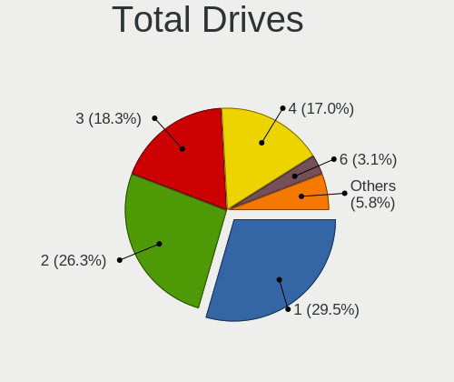
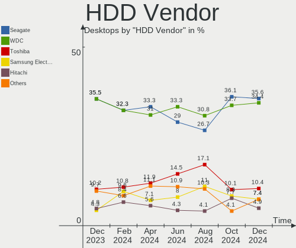
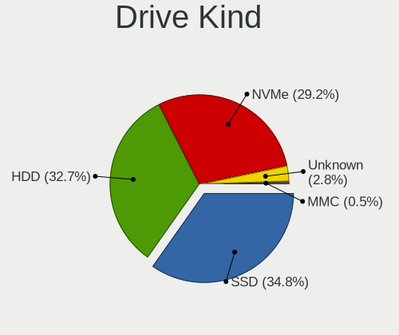
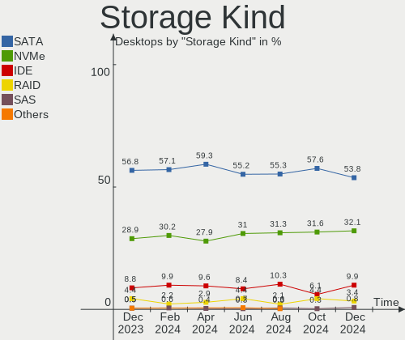
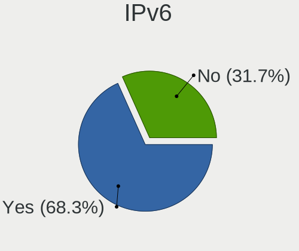
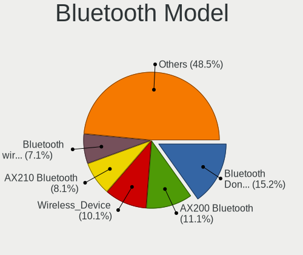
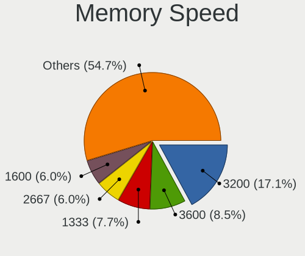

Linux in Germany - Hardware Trends (Desktops)
---------------------------------------------

A project to identify most popular hardware characteristics and track their change
over time based on data collected by Linux users at https://Linux-Hardware.org.

Anyone can contribute to this report by the [hw-probe](https://github.com/linuxhw/hw-probe) tool:

    sudo -E hw-probe -all -upload

Period: Jan, 2023.

Contents
--------

* [ System ](#system)
  - [ OS                       ](#os)
  - [ OS Family                ](#os-family)
  - [ Kernel                   ](#kernel)
  - [ Kernel Family            ](#kernel-family)
  - [ Kernel Major Ver.        ](#kernel-major-ver)
  - [ Arch                     ](#arch)
  - [ DE                       ](#de)
  - [ Display Server           ](#display-server)
  - [ Display Manager          ](#display-manager)
  - [ OS Lang                  ](#os-lang)
  - [ Boot Mode                ](#boot-mode)
  - [ Filesystem               ](#filesystem)
  - [ Part. scheme             ](#part-scheme)
  - [ Dual Boot with Linux/BSD ](#dual-boot-with-linuxbsd)
  - [ Dual Boot (Win)          ](#dual-boot-win)

* [ Board ](#board)
  - [ Vendor                   ](#vendor)
  - [ Model                    ](#model)
  - [ Model Family             ](#model-family)
  - [ MFG Year                 ](#mfg-year)
  - [ Form Factor              ](#form-factor)
  - [ Secure Boot              ](#secure-boot)
  - [ Coreboot                 ](#coreboot)
  - [ RAM Size                 ](#ram-size)
  - [ RAM Used                 ](#ram-used)
  - [ Total Drives             ](#total-drives)
  - [ Has CD-ROM               ](#has-cd-rom)
  - [ Has Ethernet             ](#has-ethernet)
  - [ Has WiFi                 ](#has-wifi)
  - [ Has Bluetooth            ](#has-bluetooth)

* [ Location ](#location)
  - [ Country                  ](#country)
  - [ City                     ](#city)

* [ Drives ](#drives)
  - [ Drive Vendor             ](#drive-vendor)
  - [ Drive Model              ](#drive-model)
  - [ HDD Vendor               ](#hdd-vendor)
  - [ SSD Vendor               ](#ssd-vendor)
  - [ Drive Kind               ](#drive-kind)
  - [ Drive Connector          ](#drive-connector)
  - [ Drive Size               ](#drive-size)
  - [ Space Total              ](#space-total)
  - [ Space Used               ](#space-used)
  - [ Malfunc. Drives          ](#malfunc-drives)
  - [ Malfunc. Drive Vendor    ](#malfunc-drive-vendor)
  - [ Malfunc. HDD Vendor      ](#malfunc-hdd-vendor)
  - [ Malfunc. Drive Kind      ](#malfunc-drive-kind)
  - [ Failed Drives            ](#failed-drives)
  - [ Failed Drive Vendor      ](#failed-drive-vendor)
  - [ Drive Status             ](#drive-status)

* [ Storage controller ](#storage-controller)
  - [ Storage Vendor           ](#storage-vendor)
  - [ Storage Model            ](#storage-model)
  - [ Storage Kind             ](#storage-kind)

* [ Processor ](#processor)
  - [ CPU Vendor               ](#cpu-vendor)
  - [ CPU Model                ](#cpu-model)
  - [ CPU Model Family         ](#cpu-model-family)
  - [ CPU Cores                ](#cpu-cores)
  - [ CPU Sockets              ](#cpu-sockets)
  - [ CPU Threads              ](#cpu-threads)
  - [ CPU Op-Modes             ](#cpu-op-modes)
  - [ CPU Microcode            ](#cpu-microcode)
  - [ CPU Microarch            ](#cpu-microarch)

* [ Graphics ](#graphics)
  - [ GPU Vendor               ](#gpu-vendor)
  - [ GPU Model                ](#gpu-model)
  - [ GPU Combo                ](#gpu-combo)
  - [ GPU Driver               ](#gpu-driver)
  - [ GPU Memory               ](#gpu-memory)

* [ Monitor ](#monitor)
  - [ Monitor Vendor           ](#monitor-vendor)
  - [ Monitor Model            ](#monitor-model)
  - [ Monitor Resolution       ](#monitor-resolution)
  - [ Monitor Diagonal         ](#monitor-diagonal)
  - [ Monitor Width            ](#monitor-width)
  - [ Aspect Ratio             ](#aspect-ratio)
  - [ Monitor Area             ](#monitor-area)
  - [ Pixel Density            ](#pixel-density)
  - [ Multiple Monitors        ](#multiple-monitors)

* [ Network ](#network)
  - [ Net Controller Vendor    ](#net-controller-vendor)
  - [ Net Controller Model     ](#net-controller-model)
  - [ Wireless Vendor          ](#wireless-vendor)
  - [ Wireless Model           ](#wireless-model)
  - [ Ethernet Vendor          ](#ethernet-vendor)
  - [ Ethernet Model           ](#ethernet-model)
  - [ Net Controller Kind      ](#net-controller-kind)
  - [ Used Controller          ](#used-controller)
  - [ NICs                     ](#nics)
  - [ IPv6                     ](#ipv6)

* [ Bluetooth ](#bluetooth)
  - [ Bluetooth Vendor         ](#bluetooth-vendor)
  - [ Bluetooth Model          ](#bluetooth-model)

* [ Sound ](#sound)
  - [ Sound Vendor             ](#sound-vendor)
  - [ Sound Model              ](#sound-model)

* [ Memory ](#memory)
  - [ Memory Vendor            ](#memory-vendor)
  - [ Memory Model             ](#memory-model)
  - [ Memory Kind              ](#memory-kind)
  - [ Memory Form Factor       ](#memory-form-factor)
  - [ Memory Size              ](#memory-size)
  - [ Memory Speed             ](#memory-speed)

* [ Printers & scanners ](#printers--scanners)
  - [ Printer Vendor           ](#printer-vendor)
  - [ Printer Model            ](#printer-model)
  - [ Scanner Vendor           ](#scanner-vendor)
  - [ Scanner Model            ](#scanner-model)

* [ Camera ](#camera)
  - [ Camera Vendor            ](#camera-vendor)
  - [ Camera Model             ](#camera-model)

* [ Security ](#security)
  - [ Fingerprint Vendor       ](#fingerprint-vendor)
  - [ Fingerprint Model        ](#fingerprint-model)
  - [ Chipcard Vendor          ](#chipcard-vendor)
  - [ Chipcard Model           ](#chipcard-model)

* [ Unsupported ](#unsupported)
  - [ Unsupported Devices      ](#unsupported-devices)
  - [ Unsupported Device Types ](#unsupported-device-types)

System
------

OS
--

Installed operating systems

| Name                         | Desktops | Percent |
|------------------------------|----------|---------|
| OpenMandriva 23.01           | 52       | 21.85%  |
| Ubuntu 22.04                 | 34       | 14.29%  |
| Linux Mint 21.1              | 18       | 7.56%   |
| Ubuntu 22.10                 | 11       | 4.62%   |
| Linux Mint 20.3              | 9        | 3.78%   |
| Pop!_OS 22.04                | 8        | 3.36%   |
| Fedora 37                    | 8        | 3.36%   |
| Arch Rolling                 | 8        | 3.36%   |
| Ubuntu 20.04                 | 7        | 2.94%   |
| Manjaro                      | 6        | 2.52%   |
| Debian 11                    | 6        | 2.52%   |
| Zorin 16                     | 5        | 2.1%    |
| openSUSE Tumbleweed-XXXXXXXX | 5        | 2.1%    |
| LMDE 5                       | 5        | 2.1%    |
| Ubuntu 18.04                 | 4        | 1.68%   |
| OpenMandriva 4.3             | 4        | 1.68%   |
| Xubuntu 22.04                | 3        | 1.26%   |
| Kubuntu 22.10                | 3        | 1.26%   |
| Garuda Linux Rolling         | 3        | 1.26%   |
| OpenMandriva 4.50            | 2        | 0.84%   |
| OpenMandriva 22.12           | 2        | 0.84%   |
| MX 21                        | 2        | 0.84%   |
| Linux Mint 21                | 2        | 0.84%   |
| Kubuntu 22.04                | 2        | 0.84%   |
| Gentoo 2.9                   | 2        | 0.84%   |
| Fedora 36                    | 2        | 0.84%   |
| Debian 10                    | 2        | 0.84%   |
| Xubuntu 20.04                | 1        | 0.42%   |
| Ubuntu Studio 22.04          | 1        | 0.42%   |
| Ubuntu MATE 22.04            | 1        | 0.42%   |
| ROSA 12.1                    | 1        | 0.42%   |
| RHEL 9                       | 1        | 0.42%   |
| Reborn OS                    | 1        | 0.42%   |
| openSUSE Leap-15.4           | 1        | 0.42%   |
| Nobara 37                    | 1        | 0.42%   |
| NixOS 23.05                  | 1        | 0.42%   |
| Manjaro 22.0.0               | 1        | 0.42%   |
| Lubuntu 22.04                | 1        | 0.42%   |
| Lubuntu 18.04                | 1        | 0.42%   |
| Linux Mint 20.1              | 1        | 0.42%   |

OS Family
---------

OS without a version

| Name          | Desktops | Percent |
|---------------|----------|---------|
| OpenMandriva  | 60       | 25.21%  |
| Ubuntu        | 56       | 23.53%  |
| Linux Mint    | 31       | 13.03%  |
| Fedora        | 10       | 4.2%    |
| Debian        | 9        | 3.78%   |
| Pop!_OS       | 8        | 3.36%   |
| Arch          | 8        | 3.36%   |
| Manjaro       | 7        | 2.94%   |
| openSUSE      | 6        | 2.52%   |
| Kubuntu       | 6        | 2.52%   |
| Zorin         | 5        | 2.1%    |
| LMDE          | 5        | 2.1%    |
| Xubuntu       | 4        | 1.68%   |
| Garuda Linux  | 4        | 1.68%   |
| MX            | 2        | 0.84%   |
| Lubuntu       | 2        | 0.84%   |
| Gentoo        | 2        | 0.84%   |
| CachyOS       | 2        | 0.84%   |
| Ubuntu Studio | 1        | 0.42%   |
| Ubuntu MATE   | 1        | 0.42%   |
| ROSA          | 1        | 0.42%   |
| RHEL          | 1        | 0.42%   |
| Reborn OS     | 1        | 0.42%   |
| Nobara        | 1        | 0.42%   |
| NixOS         | 1        | 0.42%   |
| KDE neon      | 1        | 0.42%   |
| Kali          | 1        | 0.42%   |
| Frugalware    | 1        | 0.42%   |
| Elementary    | 1        | 0.42%   |

Kernel
------

Version of the Linux kernel

| Version                  | Desktops | Percent |
|--------------------------|----------|---------|
| 6.1.1-desktop-1omv2290   | 52       | 21.85%  |
| 5.15.0-58-generic        | 34       | 14.29%  |
| 5.15.0-57-generic        | 13       | 5.46%   |
| 5.15.0-56-generic        | 9        | 3.78%   |
| 5.10.0-20-amd64          | 9        | 3.78%   |
| 6.0.12-76060006-generic  | 6        | 2.52%   |
| 5.4.0-137-generic        | 5        | 2.1%    |
| 5.15.0-43-generic        | 5        | 2.1%    |
| 5.19.0-29-generic        | 4        | 1.68%   |
| 5.19.0-26-generic        | 4        | 1.68%   |
| 5.16.7-desktop-1omv4003  | 4        | 1.68%   |
| 6.1.6-200.fc37.x86_64    | 3        | 1.26%   |
| 5.4.0-136-generic        | 3        | 1.26%   |
| 5.15.0-58-lowlatency     | 3        | 1.26%   |
| 5.10.0-21-amd64          | 3        | 1.26%   |
| 6.1.8-arch1-1            | 2        | 0.84%   |
| 6.1.7-1-MANJARO          | 2        | 0.84%   |
| 6.1.3-1-default          | 2        | 0.84%   |
| 6.1.1-1-MANJARO          | 2        | 0.84%   |
| 6.0.10-desktop-2omv22090 | 2        | 0.84%   |
| 5.19.0-30-generic        | 2        | 0.84%   |
| 5.19.0-21-generic        | 2        | 0.84%   |
| 5.15.0-60-generic        | 2        | 0.84%   |
| 5.15.0-59-generic        | 2        | 0.84%   |
| 4.15.0-202-generic       | 2        | 0.84%   |
| 6.2.0-rc4                | 1        | 0.42%   |
| 6.1.8-zen1-1-zen         | 1        | 0.42%   |
| 6.1.8-gentoo             | 1        | 0.42%   |
| 6.1.8-1-default          | 1        | 0.42%   |
| 6.1.8-1-cachyos          | 1        | 0.42%   |
| 6.1.7-zen1-1.1-zen       | 1        | 0.42%   |
| 6.1.7-arch1-1            | 1        | 0.42%   |
| 6.1.7-200.fc37.x86_64    | 1        | 0.42%   |
| 6.1.7-1-default          | 1        | 0.42%   |
| 6.1.6-zen1-2-zen         | 1        | 0.42%   |
| 6.1.6-gentoo             | 1        | 0.42%   |
| 6.1.6-arch1-1            | 1        | 0.42%   |
| 6.1.5-zen2-1-zen         | 1        | 0.42%   |
| 6.1.4-zen2-1-zen         | 1        | 0.42%   |
| 6.1.4-arch1-1            | 1        | 0.42%   |

Kernel Family
-------------

Linux kernel without a distro release

| Version | Desktops | Percent |
|---------|----------|---------|
| 5.15.0  | 75       | 31.51%  |
| 6.1.1   | 56       | 23.53%  |
| 5.4.0   | 14       | 5.88%   |
| 5.19.0  | 14       | 5.88%   |
| 5.10.0  | 13       | 5.46%   |
| 6.0.12  | 7        | 2.94%   |
| 6.1.8   | 6        | 2.52%   |
| 6.1.7   | 6        | 2.52%   |
| 6.1.6   | 6        | 2.52%   |
| 5.16.7  | 4        | 1.68%   |
| 4.15.0  | 4        | 1.68%   |
| 6.1.4   | 3        | 1.26%   |
| 6.0.15  | 3        | 1.26%   |
| 6.1.3   | 2        | 0.84%   |
| 6.1.2   | 2        | 0.84%   |
| 6.0.10  | 2        | 0.84%   |
| 4.19.0  | 2        | 0.84%   |
| 6.2.0   | 1        | 0.42%   |
| 6.1.5   | 1        | 0.42%   |
| 6.1.0   | 1        | 0.42%   |
| 6.0.9   | 1        | 0.42%   |
| 6.0.7   | 1        | 0.42%   |
| 6.0.3   | 1        | 0.42%   |
| 6.0.16  | 1        | 0.42%   |
| 6.0.0   | 1        | 0.42%   |
| 5.9.16  | 1        | 0.42%   |
| 5.19.5  | 1        | 0.42%   |
| 5.18.16 | 1        | 0.42%   |
| 5.18.0  | 1        | 0.42%   |
| 5.16.20 | 1        | 0.42%   |
| 5.15.89 | 1        | 0.42%   |
| 5.15.85 | 1        | 0.42%   |
| 5.14.21 | 1        | 0.42%   |
| 5.14.0  | 1        | 0.42%   |
| 5.12.4  | 1        | 0.42%   |
| 5.10.74 | 1        | 0.42%   |

Kernel Major Ver.
-----------------

Linux kernel major version

| Version | Desktops | Percent |
|---------|----------|---------|
| 6.1     | 83       | 34.87%  |
| 5.15    | 77       | 32.35%  |
| 6.0     | 17       | 7.14%   |
| 5.19    | 15       | 6.3%    |
| 5.4     | 14       | 5.88%   |
| 5.10    | 14       | 5.88%   |
| 5.16    | 5        | 2.1%    |
| 4.15    | 4        | 1.68%   |
| 5.18    | 2        | 0.84%   |
| 5.14    | 2        | 0.84%   |
| 4.19    | 2        | 0.84%   |
| 6.2     | 1        | 0.42%   |
| 5.9     | 1        | 0.42%   |
| 5.12    | 1        | 0.42%   |

Arch
----

OS architecture (x86_64, i586, etc.)

| Name   | Desktops | Percent |
|--------|----------|---------|
| x86_64 | 235      | 98.74%  |
| i686   | 3        | 1.26%   |

DE
--

Desktop Environment

| Name       | Desktops | Percent |
|------------|----------|---------|
| GNOME      | 93       | 39.08%  |
| KDE5       | 82       | 34.45%  |
| X-Cinnamon | 34       | 14.29%  |
| XFCE       | 11       | 4.62%   |
| Unknown    | 8        | 3.36%   |
| MATE       | 3        | 1.26%   |
| Cinnamon   | 2        | 0.84%   |
| Pantheon   | 1        | 0.42%   |
| LXQt       | 1        | 0.42%   |
| LXDE       | 1        | 0.42%   |
| i3         | 1        | 0.42%   |
| Budgie     | 1        | 0.42%   |

Display Server
--------------

X11 or Wayland

| Name    | Desktops | Percent |
|---------|----------|---------|
| X11     | 180      | 75.63%  |
| Wayland | 49       | 20.59%  |
| Tty     | 8        | 3.36%   |
| Unknown | 1        | 0.42%   |

Display Manager
---------------

SDDM, LightDM, etc.

| Name    | Desktops | Percent |
|---------|----------|---------|
| Unknown | 70       | 29.41%  |
| SDDM    | 65       | 27.31%  |
| GDM3    | 55       | 23.11%  |
| LightDM | 31       | 13.03%  |
| GDM     | 17       | 7.14%   |

OS Lang
-------

Language

| Lang  | Desktops | Percent |
|-------|----------|---------|
| de_DE | 170      | 71.43%  |
| en_US | 54       | 22.69%  |
| en_GB | 6        | 2.52%   |
| POSIX | 2        | 0.84%   |
| C     | 2        | 0.84%   |
| pl_PL | 1        | 0.42%   |
| fi_FI | 1        | 0.42%   |
| en_DK | 1        | 0.42%   |
| de_AT | 1        | 0.42%   |

Boot Mode
---------

EFI or BIOS

| Mode | Desktops | Percent |
|------|----------|---------|
| BIOS | 131      | 55.04%  |
| EFI  | 107      | 44.96%  |

Filesystem
----------

Type of filesystem

| Type    | Desktops | Percent |
|---------|----------|---------|
| Ext4    | 159      | 66.81%  |
| Overlay | 53       | 22.27%  |
| Btrfs   | 24       | 10.08%  |
| Xfs     | 2        | 0.84%   |

Part. scheme
------------

Scheme of partitioning

| Type    | Desktops | Percent |
|---------|----------|---------|
| GPT     | 146      | 61.34%  |
| Unknown | 66       | 27.73%  |
| MBR     | 26       | 10.92%  |

Dual Boot with Linux/BSD
------------------------

Hosting more than one Linux/BSD

| Dual boot | Desktops | Percent |
|-----------|----------|---------|
| No        | 167      | 70.17%  |
| Yes       | 71       | 29.83%  |

Dual Boot (Win)
---------------

Hosting Linux and Windows

| Dual boot | Desktops | Percent |
|-----------|----------|---------|
| No        | 141      | 59.24%  |
| Yes       | 97       | 40.76%  |

Board
-----

Vendor
------

Motherboard manufacturer

| Name                                 | Desktops | Percent |
|--------------------------------------|----------|---------|
| ASUSTek Computer                     | 63       | 26.47%  |
| ASRock                               | 37       | 15.55%  |
| Gigabyte Technology                  | 36       | 15.13%  |
| MSI                                  | 34       | 14.29%  |
| Hewlett-Packard                      | 17       | 7.14%   |
| Fujitsu                              | 9        | 3.78%   |
| Dell                                 | 9        | 3.78%   |
| Medion                               | 7        | 2.94%   |
| Lenovo                               | 4        | 1.68%   |
| Acer                                 | 4        | 1.68%   |
| Intel                                | 3        | 1.26%   |
| Fujitsu Siemens                      | 3        | 1.26%   |
| BESSTAR Tech                         | 3        | 1.26%   |
| Shuttle                              | 1        | 0.42%   |
| Shenzhen Meigao Electronic Equipment | 1        | 0.42%   |
| Maxtang                              | 1        | 0.42%   |
| Hardkernel                           | 1        | 0.42%   |
| Foxconn                              | 1        | 0.42%   |
| Biostar                              | 1        | 0.42%   |
| ASRockRack                           | 1        | 0.42%   |
| Alienware                            | 1        | 0.42%   |
| Unknown                              | 1        | 0.42%   |

Model
-----

Motherboard model

| Name                                       | Desktops | Percent |
|--------------------------------------------|----------|---------|
| ASUS All Series                            | 6        | 2.52%   |
| MSI MS-7C56                                | 4        | 1.68%   |
| ASUS PRIME A320M-K                         | 4        | 1.68%   |
| MSI MS-7C37                                | 3        | 1.26%   |
| Dell OptiPlex 780                          | 3        | 1.26%   |
| ASUS M5A78L-M/USB3                         | 3        | 1.26%   |
| ASRock B450M Pro4                          | 3        | 1.26%   |
| MSI MS-7D20                                | 2        | 0.84%   |
| MSI MS-7C02                                | 2        | 0.84%   |
| MSI MS-7A38                                | 2        | 0.84%   |
| Medion S23003                              | 2        | 0.84%   |
| Medion MS-7728                             | 2        | 0.84%   |
| HP ProDesk 600 G3 SFF                      | 2        | 0.84%   |
| Gigabyte X570 AORUS ULTRA                  | 2        | 0.84%   |
| Gigabyte AX370-Gaming K7                   | 2        | 0.84%   |
| Fujitsu ESPRIMO Q920                       | 2        | 0.84%   |
| BESSTAR Tech UM340                         | 2        | 0.84%   |
| ASUS TUF Gaming B550M-PLUS                 | 2        | 0.84%   |
| ASUS ROG STRIX X570-F GAMING               | 2        | 0.84%   |
| ASUS A0000001                              | 2        | 0.84%   |
| ASRock X300M-STX                           | 2        | 0.84%   |
| ASRock J3455-ITX                           | 2        | 0.84%   |
| ASRock B450 Pro4                           | 2        | 0.84%   |
| ASRock 970M Pro3                           | 2        | 0.84%   |
| Shuttle NC01U                              | 1        | 0.42%   |
| Shenzhen Meigao Electronic Equipment UM690 | 1        | 0.42%   |
| MSI MS-7D15                                | 1        | 0.42%   |
| MSI MS-7C84                                | 1        | 0.42%   |
| MSI MS-7C39                                | 1        | 0.42%   |
| MSI MS-7B98                                | 1        | 0.42%   |
| MSI MS-7B86                                | 1        | 0.42%   |
| MSI MS-7B09                                | 1        | 0.42%   |
| MSI MS-7A72                                | 1        | 0.42%   |
| MSI MS-7A33                                | 1        | 0.42%   |
| MSI MS-7A32                                | 1        | 0.42%   |
| MSI MS-7996                                | 1        | 0.42%   |
| MSI MS-7977                                | 1        | 0.42%   |
| MSI MS-7971                                | 1        | 0.42%   |
| MSI MS-7922                                | 1        | 0.42%   |
| MSI MS-7891                                | 1        | 0.42%   |

Model Family
------------

Motherboard model prefix

| Name                                       | Desktops | Percent |
|--------------------------------------------|----------|---------|
| ASUS PRIME                                 | 12       | 5.04%   |
| ASUS ROG                                   | 8        | 3.36%   |
| Fujitsu ESPRIMO                            | 7        | 2.94%   |
| Dell OptiPlex                              | 7        | 2.94%   |
| ASUS TUF                                   | 6        | 2.52%   |
| ASUS All                                   | 6        | 2.52%   |
| ASUS M5A78L-M                              | 5        | 2.1%    |
| MSI MS-7C56                                | 4        | 1.68%   |
| MSI MS-7C37                                | 3        | 1.26%   |
| HP EliteDesk                               | 3        | 1.26%   |
| HP Compaq                                  | 3        | 1.26%   |
| Gigabyte X570                              | 3        | 1.26%   |
| Gigabyte AX370-Gaming                      | 3        | 1.26%   |
| ASRock X570                                | 3        | 1.26%   |
| ASRock B450M                               | 3        | 1.26%   |
| MSI MS-7D20                                | 2        | 0.84%   |
| MSI MS-7C02                                | 2        | 0.84%   |
| MSI MS-7A38                                | 2        | 0.84%   |
| Medion S23003                              | 2        | 0.84%   |
| Medion MS-7728                             | 2        | 0.84%   |
| Lenovo IdeaCentre                          | 2        | 0.84%   |
| HP ProLiant                                | 2        | 0.84%   |
| HP ProDesk                                 | 2        | 0.84%   |
| HP Pavilion                                | 2        | 0.84%   |
| Gigabyte Z390                              | 2        | 0.84%   |
| Gigabyte B550                              | 2        | 0.84%   |
| Gigabyte B450                              | 2        | 0.84%   |
| BESSTAR Tech UM340                         | 2        | 0.84%   |
| ASUS ProArt                                | 2        | 0.84%   |
| ASUS A0000001                              | 2        | 0.84%   |
| ASRock X300M-STX                           | 2        | 0.84%   |
| ASRock J3455-ITX                           | 2        | 0.84%   |
| ASRock B550                                | 2        | 0.84%   |
| ASRock B450                                | 2        | 0.84%   |
| ASRock 970M                                | 2        | 0.84%   |
| Acer Aspire                                | 2        | 0.84%   |
| Shuttle NC01U                              | 1        | 0.42%   |
| Shenzhen Meigao Electronic Equipment UM690 | 1        | 0.42%   |
| MSI MS-7D15                                | 1        | 0.42%   |
| MSI MS-7C84                                | 1        | 0.42%   |

MFG Year
--------

Motherboard manufacture year

| Year | Desktops | Percent |
|------|----------|---------|
| 2018 | 30       | 12.61%  |
| 2019 | 27       | 11.34%  |
| 2012 | 25       | 10.5%   |
| 2020 | 23       | 9.66%   |
| 2017 | 20       | 8.4%    |
| 2013 | 16       | 6.72%   |
| 2022 | 15       | 6.3%    |
| 2021 | 13       | 5.46%   |
| 2015 | 13       | 5.46%   |
| 2014 | 11       | 4.62%   |
| 2011 | 11       | 4.62%   |
| 2016 | 10       | 4.2%    |
| 2009 | 8        | 3.36%   |
| 2008 | 5        | 2.1%    |
| 2010 | 4        | 1.68%   |
| 2006 | 4        | 1.68%   |
| 2005 | 2        | 0.84%   |
| 2007 | 1        | 0.42%   |

Form Factor
-----------

Physical design of the computer

| Name    | Desktops | Percent |
|---------|----------|---------|
| Desktop | 238      | 100%    |

Secure Boot
-----------

Enabled or disabled

| State    | Desktops | Percent |
|----------|----------|---------|
| Disabled | 232      | 97.48%  |
| Enabled  | 6        | 2.52%   |

Coreboot
--------

Have coreboot on board

| Used | Desktops | Percent |
|------|----------|---------|
| No   | 238      | 100%    |

RAM Size
--------

Total RAM memory

| Size in GB  | Desktops | Percent |
|-------------|----------|---------|
| 32.01-64.0  | 56       | 23.53%  |
| 16.01-24.0  | 54       | 22.69%  |
| 8.01-16.0   | 45       | 18.91%  |
| 4.01-8.0    | 31       | 13.03%  |
| 3.01-4.0    | 28       | 11.76%  |
| 64.01-256.0 | 11       | 4.62%   |
| 24.01-32.0  | 10       | 4.2%    |
| 2.01-3.0    | 2        | 0.84%   |
| 1.01-2.0    | 1        | 0.42%   |

RAM Used
--------

Used RAM memory

| Used GB    | Desktops | Percent |
|------------|----------|---------|
| 1.01-2.0   | 97       | 40.76%  |
| 2.01-3.0   | 60       | 25.21%  |
| 3.01-4.0   | 27       | 11.34%  |
| 4.01-8.0   | 23       | 9.66%   |
| 0.51-1.0   | 13       | 5.46%   |
| 8.01-16.0  | 11       | 4.62%   |
| 24.01-32.0 | 2        | 0.84%   |
| 16.01-24.0 | 2        | 0.84%   |
| 0.01-0.5   | 2        | 0.84%   |
| 32.01-64.0 | 1        | 0.42%   |

Total Drives
------------

Number of drives on board

| Drives | Desktops | Percent |
|--------|----------|---------|
| 1      | 74       | 31.09%  |
| 2      | 70       | 29.41%  |
| 3      | 35       | 14.71%  |
| 4      | 31       | 13.03%  |
| 5      | 13       | 5.46%   |
| 7      | 7        | 2.94%   |
| 6      | 6        | 2.52%   |
| 8      | 1        | 0.42%   |
| 0      | 1        | 0.42%   |

Has CD-ROM
----------

Has CD-ROM on board

| Presented | Desktops | Percent |
|-----------|----------|---------|
| Yes       | 139      | 58.4%   |
| No        | 99       | 41.6%   |

Has Ethernet
------------

Has Ethernet on board

| Presented | Desktops | Percent |
|-----------|----------|---------|
| Yes       | 236      | 99.16%  |
| No        | 2        | 0.84%   |

Has WiFi
--------

Has WiFi module

| Presented | Desktops | Percent |
|-----------|----------|---------|
| No        | 143      | 60.08%  |
| Yes       | 95       | 39.92%  |

Has Bluetooth
-------------

Has Bluetooth module

| Presented | Desktops | Percent |
|-----------|----------|---------|
| No        | 158      | 66.39%  |
| Yes       | 80       | 33.61%  |

Location
--------

Country
-------

Geographic location (country)

| Country | Desktops | Percent |
|---------|----------|---------|
| Germany | 238      | 100%    |

City
----

Geographic location (city)

| City                | Desktops | Percent |
|---------------------|----------|---------|
| Berlin              | 16       | 6.72%   |
| Hamburg             | 12       | 5.04%   |
| Stuttgart           | 8        | 3.36%   |
| Cologne             | 6        | 2.52%   |
| Münster            | 4        | 1.68%   |
| Munich              | 4        | 1.68%   |
| Hanover             | 4        | 1.68%   |
| Augsburg            | 4        | 1.68%   |
| Wiesbaden           | 3        | 1.26%   |
| Mainz               | 3        | 1.26%   |
| Leipzig             | 3        | 1.26%   |
| Langenfeld          | 3        | 1.26%   |
| Halle               | 3        | 1.26%   |
| Frankfurt am Main   | 3        | 1.26%   |
| Essen               | 3        | 1.26%   |
| Düsseldorf         | 3        | 1.26%   |
| Bonn                | 3        | 1.26%   |
| Wuppertal           | 2        | 0.84%   |
| Wildeshausen        | 2        | 0.84%   |
| Offenburg           | 2        | 0.84%   |
| Nuremberg           | 2        | 0.84%   |
| Mülheim            | 2        | 0.84%   |
| Mannheim            | 2        | 0.84%   |
| Magdeburg           | 2        | 0.84%   |
| Krefeld             | 2        | 0.84%   |
| Heinsberg           | 2        | 0.84%   |
| Heilbronn           | 2        | 0.84%   |
| Gruenenplan         | 2        | 0.84%   |
| Giessen             | 2        | 0.84%   |
| Duisburg            | 2        | 0.84%   |
| Buttelborn          | 2        | 0.84%   |
| Bruchsal            | 2        | 0.84%   |
| Zwickau             | 1        | 0.42%   |
| Zweibrücken        | 1        | 0.42%   |
| Zell am Harmersbach | 1        | 0.42%   |
| Zeitz               | 1        | 0.42%   |
| Wolfsburg           | 1        | 0.42%   |
| Wittenberge         | 1        | 0.42%   |
| Wiesloch            | 1        | 0.42%   |
| Werneuchen          | 1        | 0.42%   |

Drives
------

Drive Vendor
------------

Hard drive vendors

| Vendor                      | Desktops | Drives | Percent |
|-----------------------------|----------|--------|---------|
| Samsung Electronics         | 111      | 166    | 23.27%  |
| WDC                         | 67       | 87     | 14.05%  |
| Seagate                     | 61       | 77     | 12.79%  |
| SanDisk                     | 38       | 44     | 7.97%   |
| Toshiba                     | 29       | 37     | 6.08%   |
| Kingston                    | 22       | 26     | 4.61%   |
| Crucial                     | 22       | 27     | 4.61%   |
| Intenso                     | 16       | 19     | 3.35%   |
| Hitachi                     | 11       | 13     | 2.31%   |
| Intel                       | 9        | 9      | 1.89%   |
| Unknown                     | 7        | 10     | 1.47%   |
| Phison Electronics          | 7        | 7      | 1.47%   |
| OCZ                         | 5        | 5      | 1.05%   |
| SPCC                        | 4        | 4      | 0.84%   |
| Silicon Motion              | 4        | 4      | 0.84%   |
| Micron/Crucial Technology   | 4        | 4      | 0.84%   |
| JMicron Technology          | 4        | 4      | 0.84%   |
| HGST                        | 4        | 6      | 0.84%   |
| Apacer                      | 4        | 4      | 0.84%   |
| PNY                         | 3        | 4      | 0.63%   |
| Phison                      | 3        | 3      | 0.63%   |
| Patriot                     | 3        | 3      | 0.63%   |
| Leven                       | 3        | 3      | 0.63%   |
| Kingston Technology Company | 3        | 4      | 0.63%   |
| SK hynix                    | 2        | 2      | 0.42%   |
| Micron Technology           | 2        | 2      | 0.42%   |
| Emtec                       | 2        | 2      | 0.42%   |
| China                       | 2        | 2      | 0.42%   |
| A-DATA Technology           | 2        | 2      | 0.42%   |
| Unknown                     | 2        | 2      | 0.42%   |
| XPG                         | 1        | 1      | 0.21%   |
| USB3.0                      | 1        | 1      | 0.21%   |
| TS1TSSD2                    | 1        | 1      | 0.21%   |
| SMI                         | 1        | 1      | 0.21%   |
| SABRENT                     | 1        | 1      | 0.21%   |
| R580                        | 1        | 1      | 0.21%   |
| OCZ-VERTEX2                 | 1        | 1      | 0.21%   |
| OCZ Technology Group        | 1        | 1      | 0.21%   |
| Mushkin                     | 1        | 1      | 0.21%   |
| Maxtor                      | 1        | 1      | 0.21%   |

Drive Model
-----------

Hard drive models

| Model                                               | Desktops | Percent |
|-----------------------------------------------------|----------|---------|
| Samsung NVMe SSD Controller SM981/PM981/PM983 500GB | 21       | 3.68%   |
| Samsung SSD 860 EVO 500GB                           | 9        | 1.58%   |
| Samsung SSD 850 EVO 250GB                           | 9        | 1.58%   |
| Samsung SSD 840 EVO 120GB                           | 7        | 1.23%   |
| Crucial CT1000MX500SSD1 1TB                         | 7        | 1.23%   |
| Toshiba DT01ACA200 2TB                              | 6        | 1.05%   |
| Toshiba DT01ACA100 1TB                              | 5        | 0.88%   |
| Seagate ST1000DM003-1CH162 1TB                      | 5        | 0.88%   |
| SanDisk SSD PLUS 1000GB                             | 5        | 0.88%   |
| Samsung HD501LJ 500GB                               | 5        | 0.88%   |
| Kingston SA400S37240G 240GB SSD                     | 5        | 0.88%   |
| Crucial CT480BX500SSD1 480GB                        | 5        | 0.88%   |
| WDC WD40EZRZ-00GXCB0 4TB                            | 4        | 0.7%    |
| WDC WD20EZRZ-00Z5HB0 2TB                            | 4        | 0.7%    |
| Toshiba HDWD120 2TB                                 | 4        | 0.7%    |
| Seagate ST2000DM008-2FR102 2TB                      | 4        | 0.7%    |
| Samsung SSD 970 EVO Plus 250GB                      | 4        | 0.7%    |
| Samsung SSD 850 EVO 500GB                           | 4        | 0.7%    |
| Kingston SA400S37120G 120GB SSD                     | 4        | 0.7%    |
| WDC WD20EFRX-68EUZN0 2TB                            | 3        | 0.53%   |
| WDC WD20EARX-00PASB0 2TB                            | 3        | 0.53%   |
| WDC WD20EARS-00MVWB0 2TB                            | 3        | 0.53%   |
| Unknown SD/MMC/MS PRO 2GB                           | 3        | 0.53%   |
| Toshiba HDWD130 3TB                                 | 3        | 0.53%   |
| Toshiba HDWD110 1TB                                 | 3        | 0.53%   |
| Seagate ST2000DM001-9YN164 2TB                      | 3        | 0.53%   |
| Seagate ST2000DL003-9VT166 2TB                      | 3        | 0.53%   |
| Seagate ST1000DM003-1SB102 1TB                      | 3        | 0.53%   |
| Seagate ST1000DM003-1ER162 1TB                      | 3        | 0.53%   |
| SanDisk SSD PLUS 480GB                              | 3        | 0.53%   |
| SanDisk NVMe SSD Drive 1TB                          | 3        | 0.53%   |
| Samsung SSD 980 1TB                                 | 3        | 0.53%   |
| Samsung SSD 970 EVO Plus 1TB                        | 3        | 0.53%   |
| Samsung SSD 970 EVO 500GB                           | 3        | 0.53%   |
| Samsung SSD 870 QVO 2TB                             | 3        | 0.53%   |
| Samsung SSD 870 EVO 1TB                             | 3        | 0.53%   |
| Samsung SSD 860 EVO 250GB                           | 3        | 0.53%   |
| Samsung SSD 860 EVO 1TB                             | 3        | 0.53%   |
| Samsung HD103UJ 1TB                                 | 3        | 0.53%   |
| Phison E16 PCIe4 NVMe Controller 2TB                | 3        | 0.53%   |

HDD Vendor
----------

Hard disk drive vendors

| Vendor              | Desktops | Drives | Percent |
|---------------------|----------|--------|---------|
| Seagate             | 59       | 75     | 31.22%  |
| WDC                 | 56       | 72     | 29.63%  |
| Toshiba             | 26       | 33     | 13.76%  |
| Samsung Electronics | 22       | 28     | 11.64%  |
| Hitachi             | 11       | 13     | 5.82%   |
| HGST                | 4        | 6      | 2.12%   |
| Unknown             | 3        | 3      | 1.59%   |
| Intenso             | 2        | 2      | 1.06%   |
| USB3.0              | 1        | 1      | 0.53%   |
| SABRENT             | 1        | 1      | 0.53%   |
| Hewlett-Packard     | 1        | 1      | 0.53%   |
| Fujitsu             | 1        | 1      | 0.53%   |
| ASMT                | 1        | 1      | 0.53%   |
| Apple               | 1        | 1      | 0.53%   |

SSD Vendor
----------

Solid state drive vendors

| Vendor              | Desktops | Drives | Percent |
|---------------------|----------|--------|---------|
| Samsung Electronics | 57       | 80     | 30.32%  |
| SanDisk             | 29       | 32     | 15.43%  |
| Crucial             | 17       | 21     | 9.04%   |
| Kingston            | 15       | 19     | 7.98%   |
| Intenso             | 12       | 15     | 6.38%   |
| WDC                 | 8        | 9      | 4.26%   |
| OCZ                 | 5        | 5      | 2.66%   |
| SPCC                | 4        | 4      | 2.13%   |
| Intel               | 4        | 4      | 2.13%   |
| Toshiba             | 3        | 3      | 1.6%    |
| PNY                 | 3        | 4      | 1.6%    |
| Leven               | 3        | 3      | 1.6%    |
| JMicron Technology  | 3        | 3      | 1.6%    |
| Apacer              | 3        | 3      | 1.6%    |
| Phison              | 2        | 2      | 1.06%   |
| Patriot             | 2        | 2      | 1.06%   |
| Micron Technology   | 2        | 2      | 1.06%   |
| China               | 2        | 2      | 1.06%   |
| Unknown             | 2        | 2      | 1.06%   |
| SK hynix            | 1        | 1      | 0.53%   |
| Seagate             | 1        | 1      | 0.53%   |
| R580                | 1        | 1      | 0.53%   |
| OCZ-VERTEX2         | 1        | 1      | 0.53%   |
| Maxtor              | 1        | 1      | 0.53%   |
| Mach Xtreme         | 1        | 1      | 0.53%   |
| LITEON              | 1        | 1      | 0.53%   |
| Lexar               | 1        | 1      | 0.53%   |
| Innodisk            | 1        | 1      | 0.53%   |
| Emtec               | 1        | 1      | 0.53%   |
| ADATA SP            | 1        | 1      | 0.53%   |
| A-DATA Technology   | 1        | 1      | 0.53%   |

Drive Kind
----------

HDD or SSD

| Kind    | Desktops | Drives | Percent |
|---------|----------|--------|---------|
| SSD     | 141      | 227    | 36.43%  |
| HDD     | 140      | 238    | 36.18%  |
| NVMe    | 98       | 128    | 25.32%  |
| Unknown | 7        | 10     | 1.81%   |
| MMC     | 1        | 1      | 0.26%   |

Drive Connector
---------------

SATA, SAS, NVMe, etc.

| Type | Desktops | Drives | Percent |
|------|----------|--------|---------|
| SATA | 205      | 439    | 61.56%  |
| NVMe | 98       | 128    | 29.43%  |
| SAS  | 29       | 36     | 8.71%   |
| MMC  | 1        | 1      | 0.3%    |

Drive Size
----------

Size of hard drive

| Size in TB | Desktops | Drives | Percent |
|------------|----------|--------|---------|
| 0.01-0.5   | 144      | 236    | 44.58%  |
| 0.51-1.0   | 84       | 105    | 26.01%  |
| 1.01-2.0   | 55       | 67     | 17.03%  |
| 3.01-4.0   | 16       | 19     | 4.95%   |
| 2.01-3.0   | 12       | 19     | 3.72%   |
| 4.01-10.0  | 9        | 13     | 2.79%   |
| 10.01-20.0 | 3        | 6      | 0.93%   |

Space Total
-----------

Amount of disk space available on the file system

| Size in GB     | Desktops | Percent |
|----------------|----------|---------|
| 101-250        | 57       | 23.95%  |
| 501-1000       | 37       | 15.55%  |
| 251-500        | 35       | 14.71%  |
| 1001-2000      | 27       | 11.34%  |
| 1-20           | 26       | 10.92%  |
| More than 3000 | 23       | 9.66%   |
| 2001-3000      | 14       | 5.88%   |
| Unknown        | 11       | 4.62%   |
| 51-100         | 7        | 2.94%   |
| 21-50          | 1        | 0.42%   |

Space Used
----------

Amount of used disk space

| Used GB        | Desktops | Percent |
|----------------|----------|---------|
| 1-20           | 80       | 33.61%  |
| 101-250        | 28       | 11.76%  |
| 21-50          | 27       | 11.34%  |
| 51-100         | 26       | 10.92%  |
| 251-500        | 21       | 8.82%   |
| 501-1000       | 17       | 7.14%   |
| 1001-2000      | 14       | 5.88%   |
| Unknown        | 11       | 4.62%   |
| More than 3000 | 7        | 2.94%   |
| 2001-3000      | 7        | 2.94%   |

Malfunc. Drives
---------------

Drive models with a malfunction

| Model                                       | Desktops | Drives | Percent |
|---------------------------------------------|----------|--------|---------|
| WDC WDS480G2G0A-00JH30 480GB SSD            | 1        | 1      | 3.57%   |
| WDC WD5000AAKX-221CA1 500GB                 | 1        | 1      | 3.57%   |
| WDC WD5000AAKS-00M9A0 500GB                 | 1        | 1      | 3.57%   |
| WDC WD40EZRX-00SPEB0 4TB                    | 1        | 2      | 3.57%   |
| WDC WD30EFRX-68N32N0 3TB                    | 1        | 1      | 3.57%   |
| WDC WD30EFRX-68EUZN0 3TB                    | 1        | 1      | 3.57%   |
| WDC WD20EFRX-68EUZN0 2TB                    | 1        | 2      | 3.57%   |
| WDC WD20EARS-00MVWB0 2TB                    | 1        | 1      | 3.57%   |
| WDC WD1600BEVS-22RST0 160GB                 | 1        | 1      | 3.57%   |
| WDC WD10JPVX-22JC3T0 1TB                    | 1        | 1      | 3.57%   |
| WDC WD10EARS-00Y5B1 1TB                     | 1        | 1      | 3.57%   |
| Toshiba MK1655GSX 160GB                     | 1        | 1      | 3.57%   |
| Seagate ST3320310CS 320GB                   | 1        | 1      | 3.57%   |
| Seagate ST31000524AS 1TB                    | 1        | 1      | 3.57%   |
| Seagate ST3000DM001-1ER166 3TB              | 1        | 2      | 3.57%   |
| Seagate ST2000DM001-1CH164 2TB              | 1        | 1      | 3.57%   |
| Seagate ST2000DL003-9VT166 2TB              | 1        | 1      | 3.57%   |
| Seagate ST1000VM002-1CT162 1TB              | 1        | 1      | 3.57%   |
| SanDisk Ultra II 240GB SSD                  | 1        | 1      | 3.57%   |
| SanDisk SSD P4 32GB                         | 1        | 1      | 3.57%   |
| Samsung Electronics SSD PM810 FDE 2.5 256GB | 1        | 1      | 3.57%   |
| Samsung Electronics SSD 870 EVO 500GB       | 1        | 1      | 3.57%   |
| Samsung Electronics SSD 870 EVO 1TB         | 1        | 1      | 3.57%   |
| Samsung Electronics HD501LJ 500GB           | 1        | 1      | 3.57%   |
| Samsung Electronics HD103SJ 1TB             | 1        | 1      | 3.57%   |
| Kingston SA400S37240G 240GB SSD             | 1        | 1      | 3.57%   |
| Hewlett-Packard MB1000EAMZE 1TB             | 1        | 1      | 3.57%   |
| A-DATA Technology SWORDFISH 1TB             | 1        | 1      | 3.57%   |

Malfunc. Drive Vendor
---------------------

Vendors of faulty drives

| Vendor              | Desktops | Drives | Percent |
|---------------------|----------|--------|---------|
| WDC                 | 9        | 13     | 34.62%  |
| Seagate             | 6        | 7      | 23.08%  |
| Samsung Electronics | 5        | 5      | 19.23%  |
| SanDisk             | 2        | 2      | 7.69%   |
| Toshiba             | 1        | 1      | 3.85%   |
| Kingston            | 1        | 1      | 3.85%   |
| Hewlett-Packard     | 1        | 1      | 3.85%   |
| A-DATA Technology   | 1        | 1      | 3.85%   |

Malfunc. HDD Vendor
-------------------

Vendors of faulty HDD drives

| Vendor              | Desktops | Drives | Percent |
|---------------------|----------|--------|---------|
| WDC                 | 8        | 12     | 44.44%  |
| Seagate             | 6        | 7      | 33.33%  |
| Samsung Electronics | 2        | 2      | 11.11%  |
| Toshiba             | 1        | 1      | 5.56%   |
| Hewlett-Packard     | 1        | 1      | 5.56%   |

Malfunc. Drive Kind
-------------------

Kinds of faulty drives

| Kind | Desktops | Drives | Percent |
|------|----------|--------|---------|
| HDD  | 18       | 23     | 72%     |
| SSD  | 6        | 7      | 24%     |
| NVMe | 1        | 1      | 4%      |

Failed Drives
-------------

Failed drive models

| Model                           | Desktops | Drives | Percent |
|---------------------------------|----------|--------|---------|
| Samsung Electronics HD103UJ 1TB | 1        | 1      | 100%    |

Failed Drive Vendor
-------------------

Failed drive vendors

| Vendor              | Desktops | Drives | Percent |
|---------------------|----------|--------|---------|
| Samsung Electronics | 1        | 1      | 100%    |

Drive Status
------------

Number of failed and malfunc. drives

| Status   | Desktops | Drives | Percent |
|----------|----------|--------|---------|
| Detected | 134      | 287    | 47.35%  |
| Works    | 123      | 285    | 43.46%  |
| Malfunc  | 25       | 31     | 8.83%   |
| Failed   | 1        | 1      | 0.35%   |

Storage controller
------------------

Storage Vendor
--------------

Storage controller vendors

| Vendor                        | Desktops | Percent |
|-------------------------------|----------|---------|
| Intel                         | 122      | 31.77%  |
| AMD                           | 112      | 29.17%  |
| Samsung Electronics           | 50       | 13.02%  |
| ASMedia Technology            | 18       | 4.69%   |
| SanDisk                       | 15       | 3.91%   |
| Kingston Technology Company   | 10       | 2.6%    |
| Micron/Crucial Technology     | 9        | 2.34%   |
| Phison Electronics            | 8        | 2.08%   |
| Nvidia                        | 7        | 1.82%   |
| Silicon Motion                | 5        | 1.3%    |
| Marvell Technology Group      | 5        | 1.3%    |
| JMicron Technology            | 4        | 1.04%   |
| Silicon Image                 | 3        | 0.78%   |
| Realtek Semiconductor         | 2        | 0.52%   |
| MAXIO Technology (Hangzhou)   | 2        | 0.52%   |
| LSI Logic / Symbios Logic     | 2        | 0.52%   |
| VIA Technologies              | 1        | 0.26%   |
| Toshiba America Info Systems  | 1        | 0.26%   |
| Tekram Technology             | 1        | 0.26%   |
| SK hynix                      | 1        | 0.26%   |
| Shenzhen Longsys Electronics  | 1        | 0.26%   |
| Seagate Technology            | 1        | 0.26%   |
| OCZ Technology Group          | 1        | 0.26%   |
| Integrated Technology Express | 1        | 0.26%   |
| INNOGRIT                      | 1        | 0.26%   |
| ADATA Technology              | 1        | 0.26%   |

Storage Model
-------------

Storage controller models

| Model                                                                          | Desktops | Percent |
|--------------------------------------------------------------------------------|----------|---------|
| AMD FCH SATA Controller [AHCI mode]                                            | 64       | 13.79%  |
| Samsung NVMe SSD Controller SM981/PM981/PM983                                  | 39       | 8.41%   |
| AMD 400 Series Chipset SATA Controller                                         | 22       | 4.74%   |
| ASMedia ASM1062 Serial ATA Controller                                          | 17       | 3.66%   |
| AMD 500 Series Chipset SATA Controller                                         | 17       | 3.66%   |
| Intel 8 Series/C220 Series Chipset Family 6-port SATA Controller 1 [AHCI mode] | 16       | 3.45%   |
| AMD SB7x0/SB8x0/SB9x0 IDE Controller                                           | 15       | 3.23%   |
| Intel Q170/Q150/B150/H170/H110/Z170/CM236 Chipset SATA Controller [AHCI Mode]  | 14       | 3.02%   |
| Intel 200 Series PCH SATA controller [AHCI mode]                               | 11       | 2.37%   |
| Intel 7 Series/C210 Series Chipset Family 6-port SATA Controller [AHCI mode]   | 10       | 2.16%   |
| AMD SB7x0/SB8x0/SB9x0 SATA Controller [AHCI mode]                              | 10       | 2.16%   |
| Intel Cannon Lake PCH SATA AHCI Controller                                     | 8        | 1.72%   |
| Intel 6 Series/C200 Series Chipset Family 6 port Desktop SATA AHCI Controller  | 8        | 1.72%   |
| Samsung NVMe SSD Controller PM9A1/PM9A3/980PRO                                 | 6        | 1.29%   |
| Intel SATA Controller [RAID mode]                                              | 6        | 1.29%   |
| Intel 9 Series Chipset Family SATA Controller [AHCI Mode]                      | 6        | 1.29%   |
| AMD SB7x0/SB8x0/SB9x0 SATA Controller [IDE mode]                               | 6        | 1.29%   |
| SanDisk WD PC SN810 / Black SN850 NVMe SSD                                     | 5        | 1.08%   |
| Samsung NVMe SSD Controller 980                                                | 5        | 1.08%   |
| Micron/Crucial P2 NVMe PCIe SSD                                                | 5        | 1.08%   |
| Intel 500 Series Chipset Family SATA AHCI Controller                           | 5        | 1.08%   |
| AMD X370 Series Chipset SATA Controller                                        | 5        | 1.08%   |
| Silicon Motion SM2263EN/SM2263XT SSD Controller                                | 4        | 0.86%   |
| SanDisk WD Blue SN550 NVMe SSD                                                 | 4        | 0.86%   |
| Samsung NVMe SSD Controller SM961/PM961/SM963                                  | 4        | 0.86%   |
| Phison E12 NVMe Controller                                                     | 4        | 0.86%   |
| Kingston Company A2000 NVMe SSD                                                | 4        | 0.86%   |
| Intel Celeron/Pentium Silver Processor SATA Controller                         | 4        | 0.86%   |
| AMD SATA controller                                                            | 4        | 0.86%   |
| AMD FCH SATA Controller D                                                      | 4        | 0.86%   |
| SanDisk Non-Volatile memory controller                                         | 3        | 0.65%   |
| Phison E16 PCIe4 NVMe Controller                                               | 3        | 0.65%   |
| Micron/Crucial P1 NVMe PCIe SSD                                                | 3        | 0.65%   |
| Marvell Group 88SE9172 SATA 6Gb/s Controller                                   | 3        | 0.65%   |
| JMicron JMB363 SATA/IDE Controller                                             | 3        | 0.65%   |
| Intel SSD 660P Series                                                          | 3        | 0.65%   |
| Intel Celeron N3350/Pentium N4200/Atom E3900 Series SATA AHCI Controller       | 3        | 0.65%   |
| AMD 300 Series Chipset SATA Controller                                         | 3        | 0.65%   |
| Silicon Image SiI 3132 Serial ATA Raid II Controller                           | 2        | 0.43%   |
| SanDisk WD Black SN750 / PC SN730 NVMe SSD                                     | 2        | 0.43%   |

Storage Kind
------------

Kind of storage controller (IDE, SATA, NVMe, SAS, ...)

| Kind | Desktops | Percent |
|------|----------|---------|
| SATA | 212      | 57.3%   |
| NVMe | 98       | 26.49%  |
| IDE  | 41       | 11.08%  |
| RAID | 14       | 3.78%   |
| SCSI | 3        | 0.81%   |
| SAS  | 2        | 0.54%   |

Processor
---------

CPU Vendor
----------

Processor vendors

| Vendor | Desktops | Percent |
|--------|----------|---------|
| Intel  | 120      | 50.42%  |
| AMD    | 118      | 49.58%  |

CPU Model
---------

Processor models

| Model                                         | Desktops | Percent |
|-----------------------------------------------|----------|---------|
| AMD Ryzen 7 3700X 8-Core Processor            | 10       | 4.2%    |
| AMD Ryzen 5 2600 Six-Core Processor           | 7        | 2.94%   |
| AMD Ryzen 5 5600X 6-Core Processor            | 6        | 2.52%   |
| Intel Core i7-6700K CPU @ 4.00GHz             | 5        | 2.1%    |
| Intel Core i7-3770 CPU @ 3.40GHz              | 4        | 1.68%   |
| Intel Core i5-6500 CPU @ 3.20GHz              | 4        | 1.68%   |
| AMD Ryzen 7 5800X 8-Core Processor            | 4        | 1.68%   |
| AMD Ryzen 5 5600G with Radeon Graphics        | 4        | 1.68%   |
| AMD Ryzen 5 3600 6-Core Processor             | 4        | 1.68%   |
| AMD FX-8350 Eight-Core Processor              | 4        | 1.68%   |
| Intel Core i7-6700 CPU @ 3.40GHz              | 3        | 1.26%   |
| Intel Core i5-4590 CPU @ 3.30GHz              | 3        | 1.26%   |
| Intel Core i5-3470 CPU @ 3.20GHz              | 3        | 1.26%   |
| Intel Core i5-3350P CPU @ 3.10GHz             | 3        | 1.26%   |
| Intel Celeron CPU J3455 @ 1.50GHz             | 3        | 1.26%   |
| AMD Ryzen 9 5900X 12-Core Processor           | 3        | 1.26%   |
| AMD Ryzen 5 3600X 6-Core Processor            | 3        | 1.26%   |
| AMD FX-4100 Quad-Core Processor               | 3        | 1.26%   |
| Intel Core i9-9900K CPU @ 3.60GHz             | 2        | 0.84%   |
| Intel Core i7-8700 CPU @ 3.20GHz              | 2        | 0.84%   |
| Intel Core i7-8086K CPU @ 4.00GHz             | 2        | 0.84%   |
| Intel Core i7-7700K CPU @ 4.20GHz             | 2        | 0.84%   |
| Intel Core i7-4790K CPU @ 4.00GHz             | 2        | 0.84%   |
| Intel Core i5-8400 CPU @ 2.80GHz              | 2        | 0.84%   |
| Intel Core i5-7400 CPU @ 3.00GHz              | 2        | 0.84%   |
| Intel Core i5-4690 CPU @ 3.50GHz              | 2        | 0.84%   |
| Intel Core i5-4570 CPU @ 3.20GHz              | 2        | 0.84%   |
| Intel Core i5-4440 CPU @ 3.10GHz              | 2        | 0.84%   |
| Intel Core i3-4130 CPU @ 3.40GHz              | 2        | 0.84%   |
| Intel Core 2 Quad CPU Q6700 @ 2.66GHz         | 2        | 0.84%   |
| Intel Core 2 Duo CPU E8400 @ 3.00GHz          | 2        | 0.84%   |
| Intel Celeron J4125 CPU @ 2.00GHz             | 2        | 0.84%   |
| AMD Ryzen 9 7950X 16-Core Processor           | 2        | 0.84%   |
| AMD Ryzen 7 5700G with Radeon Graphics        | 2        | 0.84%   |
| AMD Ryzen 7 3800X 8-Core Processor            | 2        | 0.84%   |
| AMD Ryzen 7 2700X Eight-Core Processor        | 2        | 0.84%   |
| AMD Ryzen 5 PRO 4650G with Radeon Graphics    | 2        | 0.84%   |
| AMD Ryzen 5 7600X 6-Core Processor            | 2        | 0.84%   |
| AMD Ryzen 5 3450U with Radeon Vega Mobile Gfx | 2        | 0.84%   |
| AMD Ryzen 5 3400G with Radeon Vega Graphics   | 2        | 0.84%   |

CPU Model Family
----------------

Processor model prefix

| Model                   | Desktops | Percent |
|-------------------------|----------|---------|
| Intel Core i5           | 46       | 19.33%  |
| AMD Ryzen 5             | 39       | 16.39%  |
| Intel Core i7           | 29       | 12.18%  |
| AMD Ryzen 7             | 22       | 9.24%   |
| Intel Core i3           | 11       | 4.62%   |
| Intel Celeron           | 10       | 4.2%    |
| AMD FX                  | 10       | 4.2%    |
| AMD Ryzen 9             | 8        | 3.36%   |
| Other                   | 7        | 2.94%   |
| Intel Xeon              | 4        | 1.68%   |
| AMD Athlon 64 X2        | 4        | 1.68%   |
| AMD A8                  | 4        | 1.68%   |
| AMD A4                  | 4        | 1.68%   |
| Intel Core 2 Quad       | 3        | 1.26%   |
| AMD Ryzen 5 PRO         | 3        | 1.26%   |
| AMD Phenom II X4        | 3        | 1.26%   |
| AMD Athlon II X2        | 3        | 1.26%   |
| Intel Core i9           | 2        | 0.84%   |
| Intel Core 2 Duo        | 2        | 0.84%   |
| AMD Ryzen Threadripper  | 2        | 0.84%   |
| AMD Ryzen 7 PRO         | 2        | 0.84%   |
| AMD Ryzen 3             | 2        | 0.84%   |
| AMD Phenom II X6        | 2        | 0.84%   |
| AMD A6                  | 2        | 0.84%   |
| AMD A10                 | 2        | 0.84%   |
| Intel Pentium Silver    | 1        | 0.42%   |
| Intel Pentium Dual-Core | 1        | 0.42%   |
| Intel Pentium Dual      | 1        | 0.42%   |
| Intel Pentium D         | 1        | 0.42%   |
| Intel Pentium 4         | 1        | 0.42%   |
| Intel Pentium           | 1        | 0.42%   |
| Intel Core 2            | 1        | 0.42%   |
| AMD Quad-Core Opteron   | 1        | 0.42%   |
| AMD PRO A10             | 1        | 0.42%   |
| AMD C-60                | 1        | 0.42%   |
| AMD Athlon II X4        | 1        | 0.42%   |
| AMD Athlon              | 1        | 0.42%   |

CPU Cores
---------

Number of processor cores

| Number | Desktops | Percent |
|--------|----------|---------|
| 4      | 92       | 38.66%  |
| 6      | 55       | 23.11%  |
| 2      | 44       | 18.49%  |
| 8      | 30       | 12.61%  |
| 12     | 6        | 2.52%   |
| 16     | 4        | 1.68%   |
| 1      | 3        | 1.26%   |
| 3      | 2        | 0.84%   |
| 24     | 1        | 0.42%   |
| 10     | 1        | 0.42%   |

CPU Sockets
-----------

Number of sockets

| Number | Desktops | Percent |
|--------|----------|---------|
| 1      | 238      | 100%    |

CPU Threads
-----------

Threads per core (Hyper-Threading)

| Number | Desktops | Percent |
|--------|----------|---------|
| 2      | 148      | 62.18%  |
| 1      | 90       | 37.82%  |

CPU Op-Modes
------------

CPU Operation Modes (32-bit, 64-bit)

| Op mode        | Desktops | Percent |
|----------------|----------|---------|
| 32-bit, 64-bit | 238      | 100%    |

CPU Microcode
-------------

Microcode number

| Number     | Desktops | Percent |
|------------|----------|---------|
| Unknown    | 75       | 31.51%  |
| 0x306c3    | 16       | 6.72%   |
| 0x08701021 | 12       | 5.04%   |
| 0x506e3    | 11       | 4.62%   |
| 0x906ea    | 9        | 3.78%   |
| 0x306a9    | 8        | 3.36%   |
| 0x0800820d | 8        | 3.36%   |
| 0x206a7    | 7        | 2.94%   |
| 0x0a201016 | 6        | 2.52%   |
| 0x0a50000d | 5        | 2.1%    |
| 0x906e9    | 4        | 1.68%   |
| 0x08701013 | 4        | 1.68%   |
| 0xa0671    | 3        | 1.26%   |
| 0x1067a    | 3        | 1.26%   |
| 0x0a601203 | 3        | 1.26%   |
| 0x0a20120a | 3        | 1.26%   |
| 0x08101016 | 3        | 1.26%   |
| 0x06001119 | 3        | 1.26%   |
| 0x010000c8 | 3        | 1.26%   |
| 0x90672    | 2        | 0.84%   |
| 0x706a8    | 2        | 0.84%   |
| 0x706a1    | 2        | 0.84%   |
| 0x6fb      | 2        | 0.84%   |
| 0x506c9    | 2        | 0.84%   |
| 0x08600106 | 2        | 0.84%   |
| 0x08600103 | 2        | 0.84%   |
| 0x08108109 | 2        | 0.84%   |
| 0x0800820b | 2        | 0.84%   |
| 0x06000852 | 2        | 0.84%   |
| 0xa0653    | 1        | 0.42%   |
| 0x906ed    | 1        | 0.42%   |
| 0x906c0    | 1        | 0.42%   |
| 0x90661    | 1        | 0.42%   |
| 0x6fd      | 1        | 0.42%   |
| 0x6f6      | 1        | 0.42%   |
| 0x406c3    | 1        | 0.42%   |
| 0x40651    | 1        | 0.42%   |
| 0x306f2    | 1        | 0.42%   |
| 0x306e4    | 1        | 0.42%   |
| 0x306d4    | 1        | 0.42%   |

CPU Microarch
-------------

Microarchitecture

| Name             | Desktops | Percent |
|------------------|----------|---------|
| Zen 2            | 27       | 11.34%  |
| Haswell          | 25       | 10.5%   |
| Zen 3            | 21       | 8.82%   |
| Zen+             | 19       | 7.98%   |
| KabyLake         | 19       | 7.98%   |
| Skylake          | 17       | 7.14%   |
| IvyBridge        | 15       | 6.3%    |
| Piledriver       | 12       | 5.04%   |
| SandyBridge      | 11       | 4.62%   |
| K10              | 10       | 4.2%    |
| Zen              | 7        | 2.94%   |
| Unknown          | 6        | 2.52%   |
| Excavator        | 5        | 2.1%    |
| Penryn           | 4        | 1.68%   |
| K8 Hammer        | 4        | 1.68%   |
| Goldmont plus    | 4        | 1.68%   |
| Core             | 4        | 1.68%   |
| Icelake          | 3        | 1.26%   |
| Goldmont         | 3        | 1.26%   |
| CometLake        | 3        | 1.26%   |
| Bulldozer        | 3        | 1.26%   |
| Tremont          | 2        | 0.84%   |
| Steamroller      | 2        | 0.84%   |
| NetBurst         | 2        | 0.84%   |
| Nehalem          | 2        | 0.84%   |
| Jaguar           | 2        | 0.84%   |
| Alderlake Hybrid | 2        | 0.84%   |
| Westmere         | 1        | 0.42%   |
| Silvermont       | 1        | 0.42%   |
| Broadwell        | 1        | 0.42%   |
| Bobcat           | 1        | 0.42%   |

Graphics
--------

GPU Vendor
----------

Vendors of graphics cards

| Vendor                     | Desktops | Percent |
|----------------------------|----------|---------|
| Nvidia                     | 101      | 40.4%   |
| AMD                        | 88       | 35.2%   |
| Intel                      | 56       | 22.4%   |
| Matrox Electronics Systems | 2        | 0.8%    |
| VIA Technologies           | 1        | 0.4%    |
| ATI Technologies           | 1        | 0.4%    |
| ASPEED Technology          | 1        | 0.4%    |

GPU Model
---------

Graphics card models

| Model                                                                       | Desktops | Percent |
|-----------------------------------------------------------------------------|----------|---------|
| Intel Xeon E3-1200 v3/4th Gen Core Processor Integrated Graphics Controller | 11       | 4.28%   |
| AMD Ellesmere [Radeon RX 470/480/570/570X/580/580X/590]                     | 10       | 3.89%   |
| Nvidia GP107 [GeForce GTX 1050 Ti]                                          | 8        | 3.11%   |
| Intel HD Graphics 530                                                       | 8        | 3.11%   |
| AMD Navi 22 [Radeon RX 6700/6700 XT/6750 XT / 6800M]                        | 7        | 2.72%   |
| Nvidia TU117 [GeForce GTX 1650]                                             | 6        | 2.33%   |
| AMD Picasso/Raven 2 [Radeon Vega Series / Radeon Vega Mobile Series]        | 6        | 2.33%   |
| AMD Cezanne [Radeon Vega Series / Radeon Vega Mobile Series]                | 6        | 2.33%   |
| Nvidia GP106 [GeForce GTX 1060 6GB]                                         | 5        | 1.95%   |
| Intel Xeon E3-1200 v2/3rd Gen Core processor Graphics Controller            | 5        | 1.95%   |
| Intel CoffeeLake-S GT2 [UHD Graphics 630]                                   | 5        | 1.95%   |
| Nvidia GP108 [GeForce GT 1030]                                              | 4        | 1.56%   |
| Nvidia GP104 [GeForce GTX 1070]                                             | 4        | 1.56%   |
| Intel GeminiLake [UHD Graphics 600]                                         | 4        | 1.56%   |
| Intel 2nd Generation Core Processor Family Integrated Graphics Controller   | 4        | 1.56%   |
| AMD Renoir                                                                  | 4        | 1.56%   |
| AMD Raven Ridge [Radeon Vega Series / Radeon Vega Mobile Series]            | 4        | 1.56%   |
| AMD Raphael                                                                 | 4        | 1.56%   |
| AMD Navi 10 [Radeon RX 5600 OEM/5600 XT / 5700/5700 XT]                     | 4        | 1.56%   |
| Nvidia TU104 [GeForce RTX 2070 SUPER]                                       | 3        | 1.17%   |
| Nvidia GT218 [GeForce 210]                                                  | 3        | 1.17%   |
| Nvidia GP104 [GeForce GTX 1080]                                             | 3        | 1.17%   |
| Nvidia GM206 [GeForce GTX 960]                                              | 3        | 1.17%   |
| Nvidia GK208B [GeForce GT 710]                                              | 3        | 1.17%   |
| Intel HD Graphics 500                                                       | 3        | 1.17%   |
| AMD Vega 10 XL/XT [Radeon RX Vega 56/64]                                    | 3        | 1.17%   |
| AMD Stoney [Radeon R2/R3/R4/R5 Graphics]                                    | 3        | 1.17%   |
| AMD RS780L [Radeon 3000]                                                    | 3        | 1.17%   |
| Nvidia TU116 [GeForce GTX 1660]                                             | 2        | 0.78%   |
| Nvidia TU116 [GeForce GTX 1660 Ti]                                          | 2        | 0.78%   |
| Nvidia TU116 [GeForce GTX 1660 SUPER]                                       | 2        | 0.78%   |
| Nvidia TU104 [GeForce RTX 2080 SUPER]                                       | 2        | 0.78%   |
| Nvidia GP107GL [Quadro P620]                                                | 2        | 0.78%   |
| Nvidia GM204 [GeForce GTX 970]                                              | 2        | 0.78%   |
| Nvidia GM107 [GeForce GTX 750]                                              | 2        | 0.78%   |
| Nvidia GM107 [GeForce GTX 750 Ti]                                           | 2        | 0.78%   |
| Nvidia GK107 [GeForce GTX 650]                                              | 2        | 0.78%   |
| Nvidia GF108 [GeForce GT 730]                                               | 2        | 0.78%   |
| Nvidia GA104 [GeForce RTX 3070 Lite Hash Rate]                              | 2        | 0.78%   |
| Nvidia GA104 [GeForce RTX 3060 Ti Lite Hash Rate]                           | 2        | 0.78%   |

GPU Combo
---------

Combinations of graphics cards

| Name           | Desktops | Percent |
|----------------|----------|---------|
| 1 x Nvidia     | 90       | 37.82%  |
| 1 x AMD        | 79       | 33.19%  |
| 1 x Intel      | 49       | 20.59%  |
| 2 x AMD        | 5        | 2.1%    |
| AMD + Nvidia   | 4        | 1.68%   |
| 2 x Nvidia     | 3        | 1.26%   |
| 1 x Matrox     | 2        | 0.84%   |
| Intel + Nvidia | 2        | 0.84%   |
| 2 x Intel      | 1        | 0.42%   |
| 1 x VIA        | 1        | 0.42%   |
| Intel + AMD    | 1        | 0.42%   |
| 1 x ASPEED     | 1        | 0.42%   |

GPU Driver
----------

Free vs proprietary

| Driver      | Desktops | Percent |
|-------------|----------|---------|
| Free        | 182      | 76.47%  |
| Proprietary | 48       | 20.17%  |
| Unknown     | 8        | 3.36%   |

GPU Memory
----------

Total video memory

| Size in GB | Desktops | Percent |
|------------|----------|---------|
| Unknown    | 110      | 46.22%  |
| 7.01-8.0   | 29       | 12.18%  |
| 1.01-2.0   | 24       | 10.08%  |
| 0.01-0.5   | 18       | 7.56%   |
| 3.01-4.0   | 17       | 7.14%   |
| 0.51-1.0   | 17       | 7.14%   |
| 8.01-16.0  | 11       | 4.62%   |
| 5.01-6.0   | 9        | 3.78%   |
| 16.01-24.0 | 2        | 0.84%   |
| 2.01-3.0   | 1        | 0.42%   |

Monitor
-------

Monitor Vendor
--------------

Monitor vendors

| Vendor               | Desktops | Percent |
|----------------------|----------|---------|
| Samsung Electronics  | 39       | 14.94%  |
| Goldstar             | 32       | 12.26%  |
| BenQ                 | 26       | 9.96%   |
| Acer                 | 19       | 7.28%   |
| Dell                 | 18       | 6.9%    |
| Iiyama               | 12       | 4.6%    |
| Hewlett-Packard      | 12       | 4.6%    |
| Eizo                 | 12       | 4.6%    |
| AOC                  | 11       | 4.21%   |
| Philips              | 8        | 3.07%   |
| ViewSonic            | 7        | 2.68%   |
| ASUSTek Computer     | 6        | 2.3%    |
| Medion               | 4        | 1.53%   |
| Fujitsu Siemens      | 4        | 1.53%   |
| Belinea              | 4        | 1.53%   |
| NEC Computers        | 3        | 1.15%   |
| Mi                   | 3        | 1.15%   |
| Lenovo               | 3        | 1.15%   |
| HannStar             | 3        | 1.15%   |
| Ancor Communications | 3        | 1.15%   |
| Vestel Elektronik    | 2        | 0.77%   |
| RTK                  | 2        | 0.77%   |
| Xiaomi               | 1        | 0.38%   |
| Vestel               | 1        | 0.38%   |
| Toshiba              | 1        | 0.38%   |
| Pioneer              | 1        | 0.38%   |
| Panasonic            | 1        | 0.38%   |
| Onkyo                | 1        | 0.38%   |
| MStar                | 1        | 0.38%   |
| MSI                  | 1        | 0.38%   |
| Medion Akoya         | 1        | 0.38%   |
| LG Electronics       | 1        | 0.38%   |
| KOC                  | 1        | 0.38%   |
| JRY                  | 1        | 0.38%   |
| Hyundai ImageQuest   | 1        | 0.38%   |
| HUAWEI               | 1        | 0.38%   |
| HUA                  | 1        | 0.38%   |
| Hitachi              | 1        | 0.38%   |
| Grundig              | 1        | 0.38%   |
| Gigabyte Technology  | 1        | 0.38%   |

Monitor Model
-------------

Monitor models

| Model                                                                 | Desktops | Percent |
|-----------------------------------------------------------------------|----------|---------|
| Samsung Electronics C27F390 SAM0D32 1920x1080 598x336mm 27.0-inch     | 3        | 1.08%   |
| BenQ GL2460 BNQ78CE 1920x1080 531x299mm 24.0-inch                     | 3        | 1.08%   |
| Vestel Elektronik 50FHD_LCD_TV VES3700 1920x1080 1280x720mm 57.8-inch | 2        | 0.72%   |
| Samsung Electronics U28E590 SAM0C4D 3840x2160 607x345mm 27.5-inch     | 2        | 0.72%   |
| Samsung Electronics U28E590 SAM0C4C 3840x2160 608x345mm 27.5-inch     | 2        | 0.72%   |
| Samsung Electronics S27D390 SAM0B67 1920x1080 598x336mm 27.0-inch     | 2        | 0.72%   |
| Goldstar Ultra HD GSM5B08 3840x2160 600x340mm 27.2-inch               | 2        | 0.72%   |
| Goldstar IPS FULLHD GSM5AB8 1920x1080 480x270mm 21.7-inch             | 2        | 0.72%   |
| Goldstar HDR 4K GSM7706 3840x2160 600x340mm 27.2-inch                 | 2        | 0.72%   |
| Goldstar 32inch FHD GSM76F5 1920x1080 698x392mm 31.5-inch             | 2        | 0.72%   |
| Eizo M1700 ENC1788 1280x1024 340x280mm 17.3-inch                      | 2        | 0.72%   |
| Eizo EV2455 ENC2569 1920x1200 520x330mm 24.2-inch                     | 2        | 0.72%   |
| Eizo EV2450 ENC2568 1920x1080 528x297mm 23.9-inch                     | 2        | 0.72%   |
| Dell U2711 DELA055 2560x1440 597x336mm 27.0-inch                      | 2        | 0.72%   |
| Dell P2210 DEL404E 1680x1050 474x296mm 22.0-inch                      | 2        | 0.72%   |
| Dell 2209WA DELF011 1680x1050 474x296mm 22.0-inch                     | 2        | 0.72%   |
| BenQ GL2580 BNQ78E5 1920x1080 544x303mm 24.5-inch                     | 2        | 0.72%   |
| AOC Q32G1WG4 AOC3201 2560x1440 697x393mm 31.5-inch                    | 2        | 0.72%   |
| Xiaomi Mi TV XMD00E2 3840x2160 800x450mm 36.1-inch                    | 1        | 0.36%   |
| ViewSonic XG2705-2K VSCD73A 2560x1440 597x336mm 27.0-inch             | 1        | 0.36%   |
| ViewSonic VX3276-QHD VSCE635 2560x1440 698x393mm 31.5-inch            | 1        | 0.36%   |
| ViewSonic VX3211-4K VSCC336 3840x2160 698x393mm 31.5-inch             | 1        | 0.36%   |
| ViewSonic VX2776 Series VSC9B39 1920x1080 597x336mm 27.0-inch         | 1        | 0.36%   |
| ViewSonic VA2405-FHD VSCA939 1920x1080 527x296mm 23.8-inch            | 1        | 0.36%   |
| ViewSonic VA2216w-2 VSC2920 1680x1050 495x291mm 22.6-inch             | 1        | 0.36%   |
| ViewSonic VA1916wSERIES VSCF91F 1440x900 410x256mm 19.0-inch          | 1        | 0.36%   |
| Vestel LCD Monitor 24W_LCD_TV 1920x1080                               | 1        | 0.36%   |
| Toshiba TV TSB0108 1440x900 700x390mm 31.5-inch                       | 1        | 0.36%   |
| Samsung Electronics T27C350 SAM0AC5 1920x1080 598x336mm 27.0-inch     | 1        | 0.36%   |
| Samsung Electronics T24D391 SAM0B73 1920x1080 521x293mm 23.5-inch     | 1        | 0.36%   |
| Samsung Electronics T24C300 SAM0A9B 1920x1080 531x299mm 24.0-inch     | 1        | 0.36%   |
| Samsung Electronics T24B350 SAM093C 1920x1080 531x299mm 24.0-inch     | 1        | 0.36%   |
| Samsung Electronics SyncMaster SAM0626 1920x1080                      | 1        | 0.36%   |
| Samsung Electronics SyncMaster SAM05C8 1920x1080 520x290mm 23.4-inch  | 1        | 0.36%   |
| Samsung Electronics SyncMaster SAM0440 1920x1200 518x324mm 24.1-inch  | 1        | 0.36%   |
| Samsung Electronics SyncMaster SAM027F 1680x1050 474x296mm 22.0-inch  | 1        | 0.36%   |
| Samsung Electronics SyncMaster SAM011F 1280x1024 376x301mm 19.0-inch  | 1        | 0.36%   |
| Samsung Electronics SMS27A850 SAM083D 2560x1440 518x324mm 24.1-inch   | 1        | 0.36%   |
| Samsung Electronics SMS23A350H SAM07D4 1920x1080 509x286mm 23.0-inch  | 1        | 0.36%   |
| Samsung Electronics SMFX2490HD SAM074A 1920x1080 530x300mm 24.0-inch  | 1        | 0.36%   |

Monitor Resolution
------------------

Monitor screen resolution

| Resolution         | Desktops | Percent |
|--------------------|----------|---------|
| 1920x1080 (FHD)    | 123      | 48.81%  |
| 3840x2160 (4K)     | 31       | 12.3%   |
| 2560x1440 (QHD)    | 26       | 10.32%  |
| 1280x1024 (SXGA)   | 17       | 6.75%   |
| 1680x1050 (WSXGA+) | 16       | 6.35%   |
| 3440x1440          | 10       | 3.97%   |
| 1920x1200 (WUXGA)  | 9        | 3.57%   |
| 1440x900 (WXGA+)   | 5        | 1.98%   |
| 1920x540           | 3        | 1.19%   |
| 1600x900 (HD+)     | 2        | 0.79%   |
| 1600x1200          | 2        | 0.79%   |
| 1024x768 (XGA)     | 2        | 0.79%   |
| 3840x1200          | 1        | 0.4%    |
| 3840x1080          | 1        | 0.4%    |
| 2560x1600          | 1        | 0.4%    |
| 1366x768 (WXGA)    | 1        | 0.4%    |
| 1360x768           | 1        | 0.4%    |
| Unknown            | 1        | 0.4%    |

Monitor Diagonal
----------------

Diagonal size in inches

| Inches  | Desktops | Percent |
|---------|----------|---------|
| 27      | 64       | 24.52%  |
| 24      | 47       | 18.01%  |
| 23      | 29       | 11.11%  |
| 31      | 15       | 5.75%   |
| 21      | 14       | 5.36%   |
| 19      | 14       | 5.36%   |
| 22      | 12       | 4.6%    |
| 34      | 10       | 3.83%   |
| Unknown | 10       | 3.83%   |
| 84      | 7        | 2.68%   |
| 32      | 5        | 1.92%   |
| 20      | 5        | 1.92%   |
| 17      | 5        | 1.92%   |
| 54      | 3        | 1.15%   |
| 40      | 3        | 1.15%   |
| 26      | 3        | 1.15%   |
| 72      | 2        | 0.77%   |
| 18      | 2        | 0.77%   |
| 15      | 2        | 0.77%   |
| 65      | 1        | 0.38%   |
| 52      | 1        | 0.38%   |
| 48      | 1        | 0.38%   |
| 42      | 1        | 0.38%   |
| 37      | 1        | 0.38%   |
| 36      | 1        | 0.38%   |
| 25      | 1        | 0.38%   |
| 16      | 1        | 0.38%   |
| 14      | 1        | 0.38%   |

Monitor Width
-------------

Physical width

| Width in mm | Desktops | Percent |
|-------------|----------|---------|
| 501-600     | 127      | 51%     |
| 401-500     | 38       | 15.26%  |
| 601-700     | 19       | 7.63%   |
| 701-800     | 16       | 6.43%   |
| 351-400     | 10       | 4.02%   |
| Unknown     | 10       | 4.02%   |
| 1501-2000   | 9        | 3.61%   |
| 301-350     | 8        | 3.21%   |
| 1001-1500   | 6        | 2.41%   |
| 801-900     | 4        | 1.61%   |
| 201-300     | 1        | 0.4%    |
| 901-1000    | 1        | 0.4%    |

Aspect Ratio
------------

Proportional relationship between the width and the height

| Ratio   | Desktops | Percent |
|---------|----------|---------|
| 16/9    | 167      | 69.01%  |
| 16/10   | 35       | 14.46%  |
| 5/4     | 12       | 4.96%   |
| 21/9    | 10       | 4.13%   |
| Unknown | 8        | 3.31%   |
| 6/5     | 5        | 2.07%   |
| 4/3     | 3        | 1.24%   |
| 32/9    | 1        | 0.41%   |
| 3/2     | 1        | 0.41%   |

Monitor Area
------------

Area in inch²

| Area in inch² | Desktops | Percent |
|----------------|----------|---------|
| 201-250        | 75       | 29.3%   |
| 301-350        | 66       | 25.78%  |
| 351-500        | 30       | 11.72%  |
| 151-200        | 24       | 9.38%   |
| 251-300        | 20       | 7.81%   |
| More than 1000 | 14       | 5.47%   |
| Unknown        | 10       | 3.91%   |
| 501-1000       | 7        | 2.73%   |
| 141-150        | 6        | 2.34%   |
| 101-110        | 3        | 1.17%   |
| 131-140        | 1        | 0.39%   |

Pixel Density
-------------

Pixels per inch

| Density | Desktops | Percent |
|---------|----------|---------|
| 51-100  | 169      | 70.42%  |
| 101-120 | 40       | 16.67%  |
| Unknown | 10       | 4.17%   |
| 121-160 | 9        | 3.75%   |
| 161-240 | 7        | 2.92%   |
| 1-50    | 5        | 2.08%   |

Multiple Monitors
-----------------

Total monitors connected

| Total | Desktops | Percent |
|-------|----------|---------|
| 1     | 185      | 77.73%  |
| 2     | 41       | 17.23%  |
| 0     | 8        | 3.36%   |
| 3     | 3        | 1.26%   |
| 5     | 1        | 0.42%   |

Network
-------

Net Controller Vendor
---------------------

Controller vendors

| Vendor                          | Desktops | Percent |
|---------------------------------|----------|---------|
| Realtek Semiconductor           | 139      | 43.03%  |
| Intel                           | 102      | 31.58%  |
| Qualcomm Atheros                | 13       | 4.02%   |
| Ralink Technology               | 9        | 2.79%   |
| TP-Link                         | 8        | 2.48%   |
| Broadcom                        | 8        | 2.48%   |
| MediaTek                        | 6        | 1.86%   |
| Nvidia                          | 5        | 1.55%   |
| AVM                             | 5        | 1.55%   |
| Marvell Technology Group        | 3        | 0.93%   |
| IMC Networks                    | 3        | 0.93%   |
| Aquantia                        | 3        | 0.93%   |
| Xiaomi                          | 2        | 0.62%   |
| Ralink                          | 2        | 0.62%   |
| Broadcom Limited                | 2        | 0.62%   |
| VIA Technologies                | 1        | 0.31%   |
| Sitecom Europe                  | 1        | 0.31%   |
| Samsung Electronics             | 1        | 0.31%   |
| Qualcomm Atheros Communications | 1        | 0.31%   |
| Oculus VR                       | 1        | 0.31%   |
| Microchip Technology            | 1        | 0.31%   |
| LSI                             | 1        | 0.31%   |
| Huawei Technologies             | 1        | 0.31%   |
| Edimax Technology               | 1        | 0.31%   |
| ASUSTek Computer                | 1        | 0.31%   |
| ASIX Electronics                | 1        | 0.31%   |
| American Megatrends             | 1        | 0.31%   |
| AboCom Systems                  | 1        | 0.31%   |

Net Controller Model
--------------------

Controller models

| Model                                                             | Desktops | Percent |
|-------------------------------------------------------------------|----------|---------|
| Realtek RTL8111/8168/8411 PCI Express Gigabit Ethernet Controller | 111      | 30.66%  |
| Intel I211 Gigabit Network Connection                             | 21       | 5.8%    |
| Realtek RTL8125 2.5GbE Controller                                 | 18       | 4.97%   |
| Intel Ethernet Controller I225-V                                  | 11       | 3.04%   |
| Intel Wi-Fi 6 AX200                                               | 9        | 2.49%   |
| Intel Ethernet Connection (2) I219-V                              | 9        | 2.49%   |
| Intel Ethernet Connection I217-LM                                 | 7        | 1.93%   |
| Intel Ethernet Connection (7) I219-V                              | 7        | 1.93%   |
| Intel 82579LM Gigabit Network Connection (Lewisville)             | 7        | 1.93%   |
| Intel 82579V Gigabit Network Connection                           | 6        | 1.66%   |
| Realtek RTL8821CE 802.11ac PCIe Wireless Network Adapter          | 5        | 1.38%   |
| Intel Wireless 7265                                               | 5        | 1.38%   |
| TP-Link TL-WN823N v2/v3 [Realtek RTL8192EU]                       | 4        | 1.1%    |
| AVM FRITZ!WLAN AC 860                                             | 4        | 1.1%    |
| Realtek RTL88x2bu [AC1200 Techkey]                                | 3        | 0.83%   |
| Realtek RTL8153 Gigabit Ethernet Adapter                          | 3        | 0.83%   |
| MediaTek MT7921K (RZ608) Wi-Fi 6E 80MHz                           | 3        | 0.83%   |
| Intel Wireless 7260                                               | 3        | 0.83%   |
| Intel Ethernet Connection I217-V                                  | 3        | 0.83%   |
| Intel Ethernet Connection (5) I219-LM                             | 3        | 0.83%   |
| Intel Ethernet Connection (2) I218-V                              | 3        | 0.83%   |
| Intel Dual Band Wireless-AC 3168NGW [Stone Peak]                  | 3        | 0.83%   |
| Intel 82567LM-3 Gigabit Network Connection                        | 3        | 0.83%   |
| Xiaomi Mi/Redmi series (RNDIS)                                    | 2        | 0.55%   |
| Realtek Killer E3000 2.5GbE Controller                            | 2        | 0.55%   |
| Realtek 802.11ac NIC                                              | 2        | 0.55%   |
| Ralink RT5370 Wireless Adapter                                    | 2        | 0.55%   |
| Qualcomm Atheros Killer E2500 Gigabit Ethernet Controller         | 2        | 0.55%   |
| Qualcomm Atheros Killer E2400 Gigabit Ethernet Controller         | 2        | 0.55%   |
| Qualcomm Atheros Killer E220x Gigabit Ethernet Controller         | 2        | 0.55%   |
| MediaTek MT7922 802.11ax PCI Express Wireless Network Adapter     | 2        | 0.55%   |
| Marvell Group 88E8053 PCI-E Gigabit Ethernet Controller           | 2        | 0.55%   |
| Intel Wireless-AC 9260                                            | 2        | 0.55%   |
| Intel Wireless 8260                                               | 2        | 0.55%   |
| Intel Wireless 3165                                               | 2        | 0.55%   |
| Intel Wi-Fi 6 AX210/AX211/AX411 160MHz                            | 2        | 0.55%   |
| Intel I210 Gigabit Network Connection                             | 2        | 0.55%   |
| Intel Cannon Lake PCH CNVi WiFi                                   | 2        | 0.55%   |
| IMC Networks Mediao 802.11n WLAN [Realtek RTL8191SU]              | 2        | 0.55%   |
| Broadcom BCM4360 802.11ac Wireless Network Adapter                | 2        | 0.55%   |

Wireless Vendor
---------------

Wireless vendors

| Vendor                          | Desktops | Percent |
|---------------------------------|----------|---------|
| Intel                           | 34       | 34%     |
| Realtek Semiconductor           | 17       | 17%     |
| Ralink Technology               | 9        | 9%      |
| TP-Link                         | 8        | 8%      |
| Qualcomm Atheros                | 6        | 6%      |
| MediaTek                        | 6        | 6%      |
| AVM                             | 5        | 5%      |
| Broadcom                        | 4        | 4%      |
| IMC Networks                    | 3        | 3%      |
| Ralink                          | 2        | 2%      |
| Sitecom Europe                  | 1        | 1%      |
| Qualcomm Atheros Communications | 1        | 1%      |
| LSI                             | 1        | 1%      |
| Edimax Technology               | 1        | 1%      |
| ASUSTek Computer                | 1        | 1%      |
| AboCom Systems                  | 1        | 1%      |

Wireless Model
--------------

Wireless models

| Model                                                         | Desktops | Percent |
|---------------------------------------------------------------|----------|---------|
| Intel Wi-Fi 6 AX200                                           | 9        | 8.91%   |
| Realtek RTL8821CE 802.11ac PCIe Wireless Network Adapter      | 5        | 4.95%   |
| Intel Wireless 7265                                           | 5        | 4.95%   |
| TP-Link TL-WN823N v2/v3 [Realtek RTL8192EU]                   | 4        | 3.96%   |
| AVM FRITZ!WLAN AC 860                                         | 4        | 3.96%   |
| Realtek RTL88x2bu [AC1200 Techkey]                            | 3        | 2.97%   |
| MediaTek MT7921K (RZ608) Wi-Fi 6E 80MHz                       | 3        | 2.97%   |
| Intel Wireless 7260                                           | 3        | 2.97%   |
| Intel Dual Band Wireless-AC 3168NGW [Stone Peak]              | 3        | 2.97%   |
| Realtek 802.11ac NIC                                          | 2        | 1.98%   |
| Ralink RT5370 Wireless Adapter                                | 2        | 1.98%   |
| MediaTek MT7922 802.11ax PCI Express Wireless Network Adapter | 2        | 1.98%   |
| Intel Wireless-AC 9260                                        | 2        | 1.98%   |
| Intel Wireless 8260                                           | 2        | 1.98%   |
| Intel Wireless 3165                                           | 2        | 1.98%   |
| Intel Wi-Fi 6 AX210/AX211/AX411 160MHz                        | 2        | 1.98%   |
| Intel Cannon Lake PCH CNVi WiFi                               | 2        | 1.98%   |
| IMC Networks Mediao 802.11n WLAN [Realtek RTL8191SU]          | 2        | 1.98%   |
| Broadcom BCM4360 802.11ac Wireless Network Adapter            | 2        | 1.98%   |
| TP-Link TL-WN822N Version 4 RTL8192EU                         | 1        | 0.99%   |
| TP-Link TL-WN821N v5/v6 [RTL8192EU]                           | 1        | 0.99%   |
| TP-Link TL-WN722N v2/v3 [Realtek RTL8188EUS]                  | 1        | 0.99%   |
| TP-Link Archer T3U [Realtek RTL8812BU]                        | 1        | 0.99%   |
| Sitecom Europe WLA-5000 802.11abgn [Ralink RT3572]            | 1        | 0.99%   |
| Realtek RTL8822CE 802.11ac PCIe Wireless Network Adapter      | 1        | 0.99%   |
| Realtek RTL8821AE 802.11ac PCIe Wireless Network Adapter      | 1        | 0.99%   |
| Realtek RTL8812AU 802.11a/b/g/n/ac 2T2R DB WLAN Adapter       | 1        | 0.99%   |
| Realtek RTL8811AU 802.11a/b/g/n/ac WLAN Adapter               | 1        | 0.99%   |
| Realtek RTL8723BU 802.11b/g/n WLAN Adapter                    | 1        | 0.99%   |
| Realtek RTL8192EE PCIe Wireless Network Adapter               | 1        | 0.99%   |
| Realtek RTL8188EUS 802.11n Wireless Network Adapter           | 1        | 0.99%   |
| Realtek B1610311068                                           | 1        | 0.99%   |
| Ralink RT5572 Wireless Adapter                                | 1        | 0.99%   |
| Ralink RT5372 Wireless Adapter                                | 1        | 0.99%   |
| Ralink RT3072 Wireless Adapter                                | 1        | 0.99%   |
| Ralink RT2870/RT3070 Wireless Adapter                         | 1        | 0.99%   |
| Ralink RT2501/RT2573 Wireless Adapter                         | 1        | 0.99%   |
| Ralink MT7610U ("Archer T2U" 2.4G+5G WLAN Adapter             | 1        | 0.99%   |
| Ralink MT7601U Wireless Adapter                               | 1        | 0.99%   |
| Ralink RT2561/RT61 802.11g PCI                                | 1        | 0.99%   |

Ethernet Vendor
---------------

Ethernet vendors

| Vendor                   | Desktops | Percent |
|--------------------------|----------|---------|
| Realtek Semiconductor    | 133      | 52.57%  |
| Intel                    | 88       | 34.78%  |
| Qualcomm Atheros         | 8        | 3.16%   |
| Nvidia                   | 5        | 1.98%   |
| Broadcom                 | 4        | 1.58%   |
| Marvell Technology Group | 3        | 1.19%   |
| Aquantia                 | 3        | 1.19%   |
| Xiaomi                   | 2        | 0.79%   |
| Broadcom Limited         | 2        | 0.79%   |
| VIA Technologies         | 1        | 0.4%    |
| Samsung Electronics      | 1        | 0.4%    |
| Huawei Technologies      | 1        | 0.4%    |
| ASIX Electronics         | 1        | 0.4%    |
| American Megatrends      | 1        | 0.4%    |

Ethernet Model
--------------

Ethernet models

| Model                                                               | Desktops | Percent |
|---------------------------------------------------------------------|----------|---------|
| Realtek RTL8111/8168/8411 PCI Express Gigabit Ethernet Controller   | 111      | 42.86%  |
| Intel I211 Gigabit Network Connection                               | 21       | 8.11%   |
| Realtek RTL8125 2.5GbE Controller                                   | 18       | 6.95%   |
| Intel Ethernet Controller I225-V                                    | 11       | 4.25%   |
| Intel Ethernet Connection (2) I219-V                                | 9        | 3.47%   |
| Intel Ethernet Connection I217-LM                                   | 7        | 2.7%    |
| Intel Ethernet Connection (7) I219-V                                | 7        | 2.7%    |
| Intel 82579LM Gigabit Network Connection (Lewisville)               | 7        | 2.7%    |
| Intel 82579V Gigabit Network Connection                             | 6        | 2.32%   |
| Realtek RTL8153 Gigabit Ethernet Adapter                            | 3        | 1.16%   |
| Intel Ethernet Connection I217-V                                    | 3        | 1.16%   |
| Intel Ethernet Connection (5) I219-LM                               | 3        | 1.16%   |
| Intel Ethernet Connection (2) I218-V                                | 3        | 1.16%   |
| Intel 82567LM-3 Gigabit Network Connection                          | 3        | 1.16%   |
| Xiaomi Mi/Redmi series (RNDIS)                                      | 2        | 0.77%   |
| Realtek Killer E3000 2.5GbE Controller                              | 2        | 0.77%   |
| Qualcomm Atheros Killer E2500 Gigabit Ethernet Controller           | 2        | 0.77%   |
| Qualcomm Atheros Killer E2400 Gigabit Ethernet Controller           | 2        | 0.77%   |
| Qualcomm Atheros Killer E220x Gigabit Ethernet Controller           | 2        | 0.77%   |
| Marvell Group 88E8053 PCI-E Gigabit Ethernet Controller             | 2        | 0.77%   |
| Intel I210 Gigabit Network Connection                               | 2        | 0.77%   |
| Aquantia AQC113CS NBase-T/IEEE 802.3bz Ethernet Controller [AQtion] | 2        | 0.77%   |
| VIA VT6102/VT6103 [Rhine-II]                                        | 1        | 0.39%   |
| Samsung Galaxy series, misc. (tethering mode)                       | 1        | 0.39%   |
| Realtek USB 10/100/1G/2.5G LAN                                      | 1        | 0.39%   |
| Realtek RTL-8129                                                    | 1        | 0.39%   |
| Qualcomm Atheros AR8161 Gigabit Ethernet                            | 1        | 0.39%   |
| Qualcomm Atheros AR8131 Gigabit Ethernet                            | 1        | 0.39%   |
| Nvidia MCP77 Ethernet                                               | 1        | 0.39%   |
| Nvidia MCP73 Ethernet                                               | 1        | 0.39%   |
| Nvidia MCP61 Ethernet                                               | 1        | 0.39%   |
| Nvidia MCP55 Ethernet                                               | 1        | 0.39%   |
| Nvidia CK804 Ethernet Controller                                    | 1        | 0.39%   |
| Marvell Group 88E8056 PCI-E Gigabit Ethernet Controller             | 1        | 0.39%   |
| Marvell Group 88E8001 Gigabit Ethernet Controller                   | 1        | 0.39%   |
| Intel Ethernet Controller I226-V                                    | 1        | 0.39%   |
| Intel Ethernet Connection I218-V                                    | 1        | 0.39%   |
| Intel Ethernet Connection I218-LM                                   | 1        | 0.39%   |
| Intel Ethernet Connection (2) I219-LM                               | 1        | 0.39%   |
| Intel Ethernet Connection (14) I219-V                               | 1        | 0.39%   |

Net Controller Kind
-------------------

Ethernet, WiFi or modem

| Kind     | Desktops | Percent |
|----------|----------|---------|
| Ethernet | 236      | 70.87%  |
| WiFi     | 95       | 28.53%  |
| Modem    | 2        | 0.6%    |

Used Controller
---------------

Currently used network controller

| Kind     | Desktops | Percent |
|----------|----------|---------|
| Ethernet | 199      | 83.97%  |
| WiFi     | 38       | 16.03%  |

NICs
----

Total network controllers on board

| Total | Desktops | Percent |
|-------|----------|---------|
| 1     | 163      | 68.49%  |
| 2     | 64       | 26.89%  |
| 3     | 9        | 3.78%   |
| 0     | 2        | 0.84%   |

IPv6
----

IPv6 vs IPv4

| Used | Desktops | Percent |
|------|----------|---------|
| Yes  | 157      | 65.97%  |
| No   | 81       | 34.03%  |

Bluetooth
---------

Bluetooth Vendor
----------------

Controller vendors

| Vendor                          | Desktops | Percent |
|---------------------------------|----------|---------|
| Intel                           | 30       | 37.04%  |
| Cambridge Silicon Radio         | 17       | 20.99%  |
| Realtek Semiconductor           | 8        | 9.88%   |
| ASUSTek Computer                | 8        | 9.88%   |
| TP-Link                         | 4        | 4.94%   |
| MediaTek                        | 3        | 3.7%    |
| IMC Networks                    | 3        | 3.7%    |
| Qualcomm Atheros Communications | 2        | 2.47%   |
| Foxconn / Hon Hai               | 2        | 2.47%   |
| Motorola PCS                    | 1        | 1.23%   |
| Micro Star International        | 1        | 1.23%   |
| Integrated System Solution      | 1        | 1.23%   |
| Broadcom                        | 1        | 1.23%   |

Bluetooth Model
---------------

Controller models

| Model                                                    | Desktops | Percent |
|----------------------------------------------------------|----------|---------|
| Cambridge Silicon Radio Bluetooth Dongle (HCI mode)      | 17       | 20.99%  |
| Intel Bluetooth wireless interface                       | 12       | 14.81%  |
| Intel AX200 Bluetooth                                    | 8        | 9.88%   |
| Realtek Bluetooth Radio                                  | 5        | 6.17%   |
| TP-Link TPuLink UB500 Adapter                            | 4        | 4.94%   |
| ASUS Broadcom BCM20702A0 Bluetooth                       | 4        | 4.94%   |
| Realtek  Bluetooth 4.2 Adapter                           | 3        | 3.7%    |
| MediaTek Wireless_Device                                 | 3        | 3.7%    |
| Intel Wireless-AC 3168 Bluetooth                         | 3        | 3.7%    |
| ASUS ASUS USB-BT500                                      | 3        | 3.7%    |
| Intel Wireless-AC 9260 Bluetooth Adapter                 | 2        | 2.47%   |
| Intel Bluetooth 9460/9560 Jefferson Peak (JfP)           | 2        | 2.47%   |
| Intel AX210 Bluetooth                                    | 2        | 2.47%   |
| IMC Networks Bluetooth Radio                             | 2        | 2.47%   |
| Foxconn / Hon Hai Wireless_Device                        | 2        | 2.47%   |
| Qualcomm Atheros  Bluetooth Device                       | 1        | 1.23%   |
| Qualcomm Atheros QCA61x4 Bluetooth 4.0                   | 1        | 1.23%   |
| Motorola PCS Bluetooth Device                            | 1        | 1.23%   |
| Micro Star International MS-6970 BToes Bluetooth adapter | 1        | 1.23%   |
| Intel Bluetooth Device                                   | 1        | 1.23%   |
| Integrated System Solution KY-BT100 Bluetooth Adapter    | 1        | 1.23%   |
| IMC Networks Wireless_Device                             | 1        | 1.23%   |
| Broadcom BCM20702A0 Bluetooth 4.0                        | 1        | 1.23%   |
| ASUS Bluetooth Device                                    | 1        | 1.23%   |

Sound
-----

Sound Vendor
------------

Sound card vendors

| Vendor                     | Desktops | Percent |
|----------------------------|----------|---------|
| AMD                        | 122      | 30.42%  |
| Intel                      | 115      | 28.68%  |
| Nvidia                     | 99       | 24.69%  |
| Creative Labs              | 8        | 2%      |
| C-Media Electronics        | 7        | 1.75%   |
| GN Netcom                  | 6        | 1.5%    |
| Logitech                   | 4        | 1%      |
| Creative Technology        | 4        | 1%      |
| Generalplus Technology     | 3        | 0.75%   |
| Yamaha                     | 2        | 0.5%    |
| SteelSeries ApS            | 2        | 0.5%    |
| ROCCAT                     | 2        | 0.5%    |
| RME                        | 2        | 0.5%    |
| PreSonus Audio Electronics | 2        | 0.5%    |
| JMTek                      | 2        | 0.5%    |
| Corsair                    | 2        | 0.5%    |
| ASUSTek Computer           | 2        | 0.5%    |
| VIA Technologies           | 1        | 0.25%   |
| Unknown                    | 1        | 0.25%   |
| Texas Instruments          | 1        | 0.25%   |
| Tenx Technology            | 1        | 0.25%   |
| SG.Ltd                     | 1        | 0.25%   |
| Razer USA                  | 1        | 0.25%   |
| Plantronics                | 1        | 0.25%   |
| Native Instruments         | 1        | 0.25%   |
| Microsoft                  | 1        | 0.25%   |
| Medeli Electronics         | 1        | 0.25%   |
| Hewlett-Packard            | 1        | 0.25%   |
| Focusrite-Novation         | 1        | 0.25%   |
| Dell                       | 1        | 0.25%   |
| Blue Microphones           | 1        | 0.25%   |
| ATI Technologies           | 1        | 0.25%   |
| Astro Gaming               | 1        | 0.25%   |
| AKAI Professional M.I.     | 1        | 0.25%   |

Sound Model
-----------

Sound card models

| Model                                                                                           | Desktops | Percent |
|-------------------------------------------------------------------------------------------------|----------|---------|
| AMD Starship/Matisse HD Audio Controller                                                        | 35       | 7.19%   |
| AMD Family 17h/19h HD Audio Controller                                                          | 24       | 4.93%   |
| AMD SBx00 Azalia (Intel HDA)                                                                    | 18       | 3.7%    |
| Intel 8 Series/C220 Series Chipset High Definition Audio Controller                             | 17       | 3.49%   |
| AMD Family 17h (Models 00h-0fh) HD Audio Controller                                             | 16       | 3.29%   |
| Intel 100 Series/C230 Series Chipset Family HD Audio Controller                                 | 15       | 3.08%   |
| Intel Xeon E3-1200 v3/4th Gen Core Processor HD Audio Controller                                | 13       | 2.67%   |
| Intel 7 Series/C216 Chipset Family High Definition Audio Controller                             | 13       | 2.67%   |
| Intel 200 Series PCH HD Audio                                                                   | 12       | 2.46%   |
| AMD Navi 21/23 HDMI/DP Audio Controller                                                         | 12       | 2.46%   |
| Nvidia GP107GL High Definition Audio Controller                                                 | 10       | 2.05%   |
| AMD Renoir Radeon High Definition Audio Controller                                              | 10       | 2.05%   |
| AMD Raven/Raven2/Fenghuang HDMI/DP Audio Controller                                             | 10       | 2.05%   |
| AMD Ellesmere HDMI Audio [Radeon RX 470/480 / 570/580/590]                                      | 10       | 2.05%   |
| Intel 6 Series/C200 Series Chipset Family High Definition Audio Controller                      | 9        | 1.85%   |
| Intel Cannon Lake PCH cAVS                                                                      | 8        | 1.64%   |
| AMD FCH Azalia Controller                                                                       | 8        | 1.64%   |
| Nvidia TU104 HD Audio Controller                                                                | 7        | 1.44%   |
| Nvidia GP106 High Definition Audio Controller                                                   | 7        | 1.44%   |
| Nvidia GP104 High Definition Audio Controller                                                   | 7        | 1.44%   |
| Nvidia TU116 High Definition Audio Controller                                                   | 6        | 1.23%   |
| Nvidia TU107 GeForce GTX 1650 High Definition Audio Controller                                  | 6        | 1.23%   |
| Nvidia GA104 High Definition Audio Controller                                                   | 6        | 1.23%   |
| Intel 9 Series Chipset Family HD Audio Controller                                               | 6        | 1.23%   |
| AMD Rembrandt Radeon High Definition Audio Controller                                           | 5        | 1.03%   |
| AMD Navi 10 HDMI Audio                                                                          | 5        | 1.03%   |
| AMD Family 15h (Models 60h-6fh) Audio Controller                                                | 5        | 1.03%   |
| Nvidia GP108 High Definition Audio Controller                                                   | 4        | 0.82%   |
| Nvidia GM107 High Definition Audio Controller [GeForce 940MX]                                   | 4        | 0.82%   |
| Nvidia GK208 HDMI/DP Audio Controller                                                           | 4        | 0.82%   |
| Nvidia GK107 HDMI Audio Controller                                                              | 4        | 0.82%   |
| Nvidia GF108 High Definition Audio Controller                                                   | 4        | 0.82%   |
| Intel Celeron/Pentium Silver Processor High Definition Audio                                    | 4        | 0.82%   |
| Intel Audio device                                                                              | 4        | 0.82%   |
| Intel 82801JD/DO (ICH10 Family) HD Audio Controller                                             | 4        | 0.82%   |
| Creative Labs CA0132 Sound Core3D [Sound Blaster Recon3D / Z-Series / Sound BlasterX AE-5 Plus] | 4        | 0.82%   |
| C-Media Electronics Audio Adapter (Unitek Y-247A)                                               | 4        | 0.82%   |
| AMD Baffin HDMI/DP Audio [Radeon RX 550 640SP / RX 560/560X]                                    | 4        | 0.82%   |
| Nvidia High Definition Audio Controller                                                         | 3        | 0.62%   |
| Nvidia GM206 High Definition Audio Controller                                                   | 3        | 0.62%   |

Memory
------

Memory Vendor
-------------

Memory module vendors

| Vendor              | Desktops | Percent |
|---------------------|----------|---------|
| Corsair             | 26       | 17.57%  |
| G.Skill             | 20       | 13.51%  |
| Unknown             | 19       | 12.84%  |
| Samsung Electronics | 18       | 12.16%  |
| Crucial             | 17       | 11.49%  |
| Kingston            | 13       | 8.78%   |
| SK hynix            | 9        | 6.08%   |
| Micron Technology   | 6        | 4.05%   |
| Team                | 4        | 2.7%    |
| Unknown             | 4        | 2.7%    |
| Unknown (ABCD)      | 3        | 2.03%   |
| Nanya Technology    | 3        | 2.03%   |
| GOODRAM             | 2        | 1.35%   |
| Transcend           | 1        | 0.68%   |
| Lexar               | 1        | 0.68%   |
| AORUS               | 1        | 0.68%   |
| A-DATA Technology   | 1        | 0.68%   |

Memory Model
------------

Memory module models

| Model                                                        | Desktops | Percent |
|--------------------------------------------------------------|----------|---------|
| Unknown                                                      | 4        | 2.61%   |
| Unknown (ABCD) RAM 123456789012345678 4GB DIMM DDR4 2400MT/s | 3        | 1.96%   |
| G.Skill RAM F4-3000C16-8GISB 8GB DIMM DDR4 3200MT/s          | 3        | 1.96%   |
| Unknown RAM Module 4GB DIMM DDR3 1333MT/s                    | 2        | 1.31%   |
| Team RAM Elite-1333 4GB DIMM DDR3 1333MT/s                   | 2        | 1.31%   |
| Samsung RAM M471A1K43CB1-CTD 8GB SODIMM DDR4 2667MT/s        | 2        | 1.31%   |
| Samsung RAM M378B5773DH0-CH9 2GB DIMM DDR3 1333MT/s          | 2        | 1.31%   |
| Samsung RAM M378A1K43CB2-CTD 8GB DIMM DDR4 3200MT/s          | 2        | 1.31%   |
| Micron RAM 8JTF51264AZ-1G6E1 4GB DIMM DDR3 1600MT/s          | 2        | 1.31%   |
| G.Skill RAM F4-3200C16-8GVKB 8GB DIMM DDR4 3866MT/s          | 2        | 1.31%   |
| G.Skill RAM F4-3200C16-16GVK 16GB DIMM DDR4 3600MT/s         | 2        | 1.31%   |
| Crucial RAM CT8G4DFRA266.C8FE 8GB DIMM DDR4 2933MT/s         | 2        | 1.31%   |
| Crucial RAM BLS8G3D1609DS1S00. 8GB DIMM DDR3 1600MT/s        | 2        | 1.31%   |
| Crucial RAM BL16G32C16U4B.16FE 16GB DIMM DDR4 3200MT/s       | 2        | 1.31%   |
| Corsair RAM CMK32GX4M2E3200C16 16GB DIMM DDR4 3200MT/s       | 2        | 1.31%   |
| Corsair RAM CMK16GX4M2D3600C18 8GB DIMM DDR4 3600MT/s        | 2        | 1.31%   |
| Corsair RAM CMK16GX4M2B3000C15 8GB DIMM DDR4 3200MT/s        | 2        | 1.31%   |
| Unknown RAM Module 8GB SODIMM DDR3 1600MT/s                  | 1        | 0.65%   |
| Unknown RAM Module 8GB DIMM DDR3 1600MT/s                    | 1        | 0.65%   |
| Unknown RAM Module 8GB DIMM 1600MT/s                         | 1        | 0.65%   |
| Unknown RAM Module 8192MB DIMM DDR3 1600MT/s                 | 1        | 0.65%   |
| Unknown RAM Module 4GB DIMM 1600MT/s                         | 1        | 0.65%   |
| Unknown RAM Module 4096MB DIMM DDR3 1600MT/s                 | 1        | 0.65%   |
| Unknown RAM Module 2GB DIMM DDR3 1333MT/s                    | 1        | 0.65%   |
| Unknown RAM Module 2GB DIMM DDR2 667MT/s                     | 1        | 0.65%   |
| Unknown RAM Module 2048MB DIMM DDR2 400MT/s                  | 1        | 0.65%   |
| Unknown RAM Module 2048MB DIMM DDR 800MT/s                   | 1        | 0.65%   |
| Unknown RAM Module 2048MB DIMM DDR 1333MT/s                  | 1        | 0.65%   |
| Unknown RAM Module 2048MB DIMM 1800MT/s                      | 1        | 0.65%   |
| Unknown RAM Module 1GB DIMM DDR 400MT/s                      | 1        | 0.65%   |
| Unknown RAM Module 16GB DIMM DDR4 2667MT/s                   | 1        | 0.65%   |
| Unknown RAM Module 16GB DIMM DDR4 2133MT/s                   | 1        | 0.65%   |
| Unknown RAM 4000 C19 Series 8192MB DIMM DDR4 4000MT/s        | 1        | 0.65%   |
| Unknown RAM 3600 C17 Series 8GB DIMM DDR4 3200MT/s           | 1        | 0.65%   |
| Transcend RAM JM1333KLN-8GK 4GB DIMM DDR3 1333MT/s           | 1        | 0.65%   |
| Team RAM TEAMGROUP-UD4-3600 16GB DIMM DDR4 3733MT/s          | 1        | 0.65%   |
| Team RAM TEAMGROUP-UD4-2400 8GB DIMM DDR4 3007MT/s           | 1        | 0.65%   |
| SK hynix RAM Module 8GB DIMM DDR4 2400MT/s                   | 1        | 0.65%   |
| SK hynix RAM Module 8GB DIMM DDR4 2133MT/s                   | 1        | 0.65%   |
| SK hynix RAM HMT451U6AFR8C-PB 4GB DIMM DDR3 1600MT/s         | 1        | 0.65%   |

Memory Kind
-----------

Memory module kinds

| Kind    | Desktops | Percent |
|---------|----------|---------|
| DDR4    | 77       | 57.04%  |
| DDR3    | 35       | 25.93%  |
| SDRAM   | 5        | 3.7%    |
| DDR5    | 5        | 3.7%    |
| DDR2    | 4        | 2.96%   |
| LPDDR4  | 3        | 2.22%   |
| DDR     | 3        | 2.22%   |
| Unknown | 3        | 2.22%   |

Memory Form Factor
------------------

Physical design of the memory module

| Name   | Desktops | Percent |
|--------|----------|---------|
| DIMM   | 117      | 88.64%  |
| SODIMM | 15       | 11.36%  |

Memory Size
-----------

Memory module size

| Size  | Desktops | Percent |
|-------|----------|---------|
| 8192  | 58       | 42.34%  |
| 16384 | 36       | 26.28%  |
| 4096  | 27       | 19.71%  |
| 2048  | 10       | 7.3%    |
| 32768 | 3        | 2.19%   |
| 1024  | 3        | 2.19%   |

Memory Speed
------------

Memory module speed

| Speed | Desktops | Percent |
|-------|----------|---------|
| 1600  | 25       | 17.48%  |
| 3200  | 22       | 15.38%  |
| 1333  | 15       | 10.49%  |
| 2400  | 12       | 8.39%   |
| 2667  | 11       | 7.69%   |
| 2133  | 11       | 7.69%   |
| 3600  | 10       | 6.99%   |
| 4800  | 4        | 2.8%    |
| 3733  | 3        | 2.1%    |
| 3466  | 3        | 2.1%    |
| 3400  | 3        | 2.1%    |
| 2933  | 3        | 2.1%    |
| 800   | 3        | 2.1%    |
| 3866  | 2        | 1.4%    |
| 3000  | 2        | 1.4%    |
| 1800  | 2        | 1.4%    |
| 1066  | 2        | 1.4%    |
| 400   | 2        | 1.4%    |
| 5600  | 1        | 0.7%    |
| 4000  | 1        | 0.7%    |
| 3800  | 1        | 0.7%    |
| 3500  | 1        | 0.7%    |
| 3007  | 1        | 0.7%    |
| 2666  | 1        | 0.7%    |
| 1867  | 1        | 0.7%    |
| 667   | 1        | 0.7%    |

Printers & scanners
-------------------

Printer Vendor
--------------

Printer device vendors

| Vendor              | Desktops | Percent |
|---------------------|----------|---------|
| Hewlett-Packard     | 5        | 27.78%  |
| Canon               | 4        | 22.22%  |
| Brother Industries  | 3        | 16.67%  |
| Seiko Epson         | 2        | 11.11%  |
| Samsung Electronics | 2        | 11.11%  |
| Seiko Instruments   | 1        | 5.56%   |
| QinHeng Electronics | 1        | 5.56%   |

Printer Model
-------------

Printer device models

| Model                                     | Desktops | Percent |
|-------------------------------------------|----------|---------|
| Seiko Instruments Smart Label Printer 620 | 1        | 5.56%   |
| Seiko Epson Printer                       | 1        | 5.56%   |
| Seiko Epson ET-2710 Series                | 1        | 5.56%   |
| Samsung SCX-472x Series                   | 1        | 5.56%   |
| Samsung SCX-4623FW Series                 | 1        | 5.56%   |
| QinHeng CH340S                            | 1        | 5.56%   |
| HP Officejet 4630 series                  | 1        | 5.56%   |
| HP ENVY 5000 series                       | 1        | 5.56%   |
| HP DeskJet 990c                           | 1        | 5.56%   |
| HP DeskJet 4100 series                    | 1        | 5.56%   |
| HP Deskjet 3050A                          | 1        | 5.56%   |
| Canon TR8500 series                       | 1        | 5.56%   |
| Canon PIXMA MX490 Series                  | 1        | 5.56%   |
| Canon PIXMA MX370 Series                  | 1        | 5.56%   |
| Canon CanoScan LiDE 300                   | 1        | 5.56%   |
| Brother MFC-L2710DW series                | 1        | 5.56%   |
| Brother HL-L2350DW series                 | 1        | 5.56%   |
| Brother HL-5350DN series                  | 1        | 5.56%   |

Scanner Vendor
--------------

Scanner device vendors

| Vendor          | Desktops | Percent |
|-----------------|----------|---------|
| Canon           | 5        | 83.33%  |
| Hewlett-Packard | 1        | 16.67%  |

Scanner Model
-------------

Scanner device models

| Model                                  | Desktops | Percent |
|----------------------------------------|----------|---------|
| Canon CanoScan LiDE 50/LiDE 35/LiDE 40 | 2        | 33.33%  |
| HP ScanJet 7400c                       | 1        | 16.67%  |
| Canon CanoScan LiDE 220                | 1        | 16.67%  |
| Canon CanoScan LiDE 210                | 1        | 16.67%  |
| Canon CanoScan LiDE 110                | 1        | 16.67%  |

Camera
------

Camera Vendor
-------------

Camera device vendors

| Vendor                        | Desktops | Percent |
|-------------------------------|----------|---------|
| Logitech                      | 15       | 35.71%  |
| Microdia                      | 6        | 14.29%  |
| Microsoft                     | 4        | 9.52%   |
| Sunplus Innovation Technology | 2        | 4.76%   |
| Samsung Electronics           | 2        | 4.76%   |
| Philips (or NXP)              | 2        | 4.76%   |
| ARC International             | 2        | 4.76%   |
| Trust                         | 1        | 2.38%   |
| SunplusIT                     | 1        | 2.38%   |
| Razer USA                     | 1        | 2.38%   |
| Lite-On Technology            | 1        | 2.38%   |
| Integrated Technology Express | 1        | 2.38%   |
| CZUR Technology               | 1        | 2.38%   |
| Cubeternet                    | 1        | 2.38%   |
| AVerMedia Technologies        | 1        | 2.38%   |
| Apple                         | 1        | 2.38%   |

Camera Model
------------

Camera device models

| Model                             | Desktops | Percent |
|-----------------------------------|----------|---------|
| Logitech HD Pro Webcam C920       | 3        | 7.14%   |
| Samsung Galaxy A5 (MTP)           | 2        | 4.76%   |
| Microsoft LifeCam HD-3000         | 2        | 4.76%   |
| Microdia USB 2.0 Camera           | 2        | 4.76%   |
| Microdia Sonix USB 2.0 Camera     | 2        | 4.76%   |
| Logitech Webcam C930e             | 2        | 4.76%   |
| Logitech Webcam C310              | 2        | 4.76%   |
| Logitech BRIO Ultra HD Webcam     | 2        | 4.76%   |
| Logitech BRIO 4K Stream Edition   | 2        | 4.76%   |
| ARC International Camera          | 2        | 4.76%   |
| Trust QHD Webcam                  | 1        | 2.38%   |
| SunplusIT USB 2.0 Camera          | 1        | 2.38%   |
| Sunplus Full HD webcam            | 1        | 2.38%   |
| Sunplus FHD Camera Microphone     | 1        | 2.38%   |
| Razer USA Razer Kiyo Pro          | 1        | 2.38%   |
| Philips (or NXP) Webcam SPC530NC  | 1        | 2.38%   |
| Philips (or NXP) Webcam SPC1030NC | 1        | 2.38%   |
| Microsoft LifeCam VX-700          | 1        | 2.38%   |
| Microsoft LifeCam Studio          | 1        | 2.38%   |
| Microdia Webcam Vitade AF         | 1        | 2.38%   |
| Microdia Camera                   | 1        | 2.38%   |
| Logitech Webcam Pro 9000          | 1        | 2.38%   |
| Logitech Webcam C300              | 1        | 2.38%   |
| Logitech HD Webcam C525           | 1        | 2.38%   |
| Logitech C922 Pro Stream Webcam   | 1        | 2.38%   |
| Lite-On HP Wide Vision FHD Camera | 1        | 2.38%   |
| Integrated Express HDMI to U3     | 1        | 2.38%   |
| CZUR USB HD MIC                   | 1        | 2.38%   |
| Cubeternet GL-UPC822 UVC WebCam   | 1        | 2.38%   |
| AVerMedia Live Gamer Mini         | 1        | 2.38%   |
| Apple iPhone 5/5C/5S/6/SE         | 1        | 2.38%   |

Security
--------

Fingerprint Vendor
------------------

Fingerprint sensor vendors

| Vendor    | Desktops | Percent |
|-----------|----------|---------|
| AuthenTec | 1        | 100%    |

Fingerprint Model
-----------------

Fingerprint sensor models

| Model                        | Desktops | Percent |
|------------------------------|----------|---------|
| AuthenTec Fingerprint Sensor | 1        | 100%    |

Chipcard Vendor
---------------

Chipcard module vendors

| Vendor                   | Desktops | Percent |
|--------------------------|----------|---------|
| Reiner SCT Kartensysteme | 3        | 75%     |
| Gemalto (was Gemplus)    | 1        | 25%     |

Chipcard Model
--------------

Chipcard module models

| Model                                                                      | Desktops | Percent |
|----------------------------------------------------------------------------|----------|---------|
| Reiner SCT Kartensysteme cyberJack RFID basis contactless smartcard reader | 2        | 50%     |
| Reiner SCT Kartensysteme cyberJack one                                     | 1        | 25%     |
| Gemalto (was Gemplus) GemPC Twin SmartCard Reader                          | 1        | 25%     |

Unsupported
-----------

Unsupported Devices
-------------------

Total unsupported devices on board

| Total | Desktops | Percent |
|-------|----------|---------|
| 0     | 202      | 84.87%  |
| 1     | 31       | 13.03%  |
| 2     | 3        | 1.26%   |
| 5     | 1        | 0.42%   |
| 3     | 1        | 0.42%   |

Unsupported Device Types
------------------------

Types of unsupported devices

| Type                     | Desktops | Percent |
|--------------------------|----------|---------|
| Graphics card            | 13       | 30.95%  |
| Net/wireless             | 11       | 26.19%  |
| Communication controller | 5        | 11.9%   |
| Chipcard                 | 4        | 9.52%   |
| Sound                    | 2        | 4.76%   |
| Multimedia controller    | 2        | 4.76%   |
| Unassigned class         | 1        | 2.38%   |
| Storage/raid             | 1        | 2.38%   |
| Fingerprint reader       | 1        | 2.38%   |
| Card reader              | 1        | 2.38%   |
| Bluetooth                | 1        | 2.38%   |

