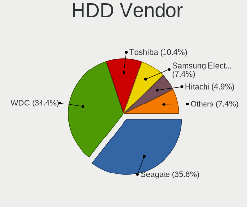
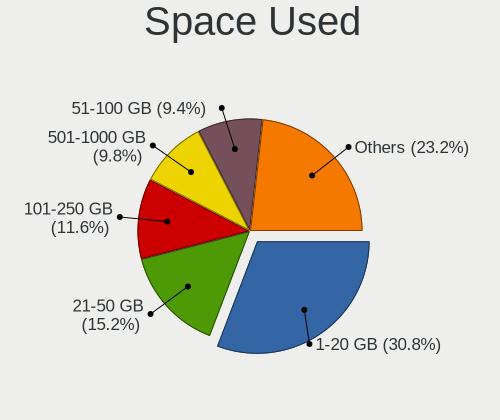
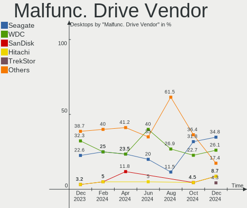

Linux in Germany - Hardware Trends (Desktops)
---------------------------------------------

A project to identify most popular hardware characteristics and track their change
over time based on data collected by Linux users at https://Linux-Hardware.org.

Anyone can contribute to this report by the [hw-probe](https://github.com/linuxhw/hw-probe) tool:

    sudo -E hw-probe -all -upload

Period: Jul, 2022.

Contents
--------

* [ System ](#system)
  - [ OS                       ](#os)
  - [ OS Family                ](#os-family)
  - [ Kernel                   ](#kernel)
  - [ Kernel Family            ](#kernel-family)
  - [ Kernel Major Ver.        ](#kernel-major-ver)
  - [ Arch                     ](#arch)
  - [ DE                       ](#de)
  - [ Display Server           ](#display-server)
  - [ Display Manager          ](#display-manager)
  - [ OS Lang                  ](#os-lang)
  - [ Boot Mode                ](#boot-mode)
  - [ Filesystem               ](#filesystem)
  - [ Part. scheme             ](#part-scheme)
  - [ Dual Boot with Linux/BSD ](#dual-boot-with-linuxbsd)
  - [ Dual Boot (Win)          ](#dual-boot-win)

* [ Board ](#board)
  - [ Vendor                   ](#vendor)
  - [ Model                    ](#model)
  - [ Model Family             ](#model-family)
  - [ MFG Year                 ](#mfg-year)
  - [ Form Factor              ](#form-factor)
  - [ Secure Boot              ](#secure-boot)
  - [ Coreboot                 ](#coreboot)
  - [ RAM Size                 ](#ram-size)
  - [ RAM Used                 ](#ram-used)
  - [ Total Drives             ](#total-drives)
  - [ Has CD-ROM               ](#has-cd-rom)
  - [ Has Ethernet             ](#has-ethernet)
  - [ Has WiFi                 ](#has-wifi)
  - [ Has Bluetooth            ](#has-bluetooth)

* [ Location ](#location)
  - [ Country                  ](#country)
  - [ City                     ](#city)

* [ Drives ](#drives)
  - [ Drive Vendor             ](#drive-vendor)
  - [ Drive Model              ](#drive-model)
  - [ HDD Vendor               ](#hdd-vendor)
  - [ SSD Vendor               ](#ssd-vendor)
  - [ Drive Kind               ](#drive-kind)
  - [ Drive Connector          ](#drive-connector)
  - [ Drive Size               ](#drive-size)
  - [ Space Total              ](#space-total)
  - [ Space Used               ](#space-used)
  - [ Malfunc. Drives          ](#malfunc-drives)
  - [ Malfunc. Drive Vendor    ](#malfunc-drive-vendor)
  - [ Malfunc. HDD Vendor      ](#malfunc-hdd-vendor)
  - [ Malfunc. Drive Kind      ](#malfunc-drive-kind)
  - [ Failed Drives            ](#failed-drives)
  - [ Failed Drive Vendor      ](#failed-drive-vendor)
  - [ Drive Status             ](#drive-status)

* [ Storage controller ](#storage-controller)
  - [ Storage Vendor           ](#storage-vendor)
  - [ Storage Model            ](#storage-model)
  - [ Storage Kind             ](#storage-kind)

* [ Processor ](#processor)
  - [ CPU Vendor               ](#cpu-vendor)
  - [ CPU Model                ](#cpu-model)
  - [ CPU Model Family         ](#cpu-model-family)
  - [ CPU Cores                ](#cpu-cores)
  - [ CPU Sockets              ](#cpu-sockets)
  - [ CPU Threads              ](#cpu-threads)
  - [ CPU Op-Modes             ](#cpu-op-modes)
  - [ CPU Microcode            ](#cpu-microcode)
  - [ CPU Microarch            ](#cpu-microarch)

* [ Graphics ](#graphics)
  - [ GPU Vendor               ](#gpu-vendor)
  - [ GPU Model                ](#gpu-model)
  - [ GPU Combo                ](#gpu-combo)
  - [ GPU Driver               ](#gpu-driver)
  - [ GPU Memory               ](#gpu-memory)

* [ Monitor ](#monitor)
  - [ Monitor Vendor           ](#monitor-vendor)
  - [ Monitor Model            ](#monitor-model)
  - [ Monitor Resolution       ](#monitor-resolution)
  - [ Monitor Diagonal         ](#monitor-diagonal)
  - [ Monitor Width            ](#monitor-width)
  - [ Aspect Ratio             ](#aspect-ratio)
  - [ Monitor Area             ](#monitor-area)
  - [ Pixel Density            ](#pixel-density)
  - [ Multiple Monitors        ](#multiple-monitors)

* [ Network ](#network)
  - [ Net Controller Vendor    ](#net-controller-vendor)
  - [ Net Controller Model     ](#net-controller-model)
  - [ Wireless Vendor          ](#wireless-vendor)
  - [ Wireless Model           ](#wireless-model)
  - [ Ethernet Vendor          ](#ethernet-vendor)
  - [ Ethernet Model           ](#ethernet-model)
  - [ Net Controller Kind      ](#net-controller-kind)
  - [ Used Controller          ](#used-controller)
  - [ NICs                     ](#nics)
  - [ IPv6                     ](#ipv6)

* [ Bluetooth ](#bluetooth)
  - [ Bluetooth Vendor         ](#bluetooth-vendor)
  - [ Bluetooth Model          ](#bluetooth-model)

* [ Sound ](#sound)
  - [ Sound Vendor             ](#sound-vendor)
  - [ Sound Model              ](#sound-model)

* [ Memory ](#memory)
  - [ Memory Vendor            ](#memory-vendor)
  - [ Memory Model             ](#memory-model)
  - [ Memory Kind              ](#memory-kind)
  - [ Memory Form Factor       ](#memory-form-factor)
  - [ Memory Size              ](#memory-size)
  - [ Memory Speed             ](#memory-speed)

* [ Printers & scanners ](#printers--scanners)
  - [ Printer Vendor           ](#printer-vendor)
  - [ Printer Model            ](#printer-model)
  - [ Scanner Vendor           ](#scanner-vendor)
  - [ Scanner Model            ](#scanner-model)

* [ Camera ](#camera)
  - [ Camera Vendor            ](#camera-vendor)
  - [ Camera Model             ](#camera-model)

* [ Security ](#security)
  - [ Fingerprint Vendor       ](#fingerprint-vendor)
  - [ Fingerprint Model        ](#fingerprint-model)
  - [ Chipcard Vendor          ](#chipcard-vendor)
  - [ Chipcard Model           ](#chipcard-model)

* [ Unsupported ](#unsupported)
  - [ Unsupported Devices      ](#unsupported-devices)
  - [ Unsupported Device Types ](#unsupported-device-types)

System
------

OS
--

Installed operating systems

| Name                         | Desktops | Percent |
|------------------------------|----------|---------|
| Linux Mint 20.3              | 30       | 16.04%  |
| Ubuntu 22.04                 | 22       | 11.76%  |
| Ubuntu 20.04                 | 15       | 8.02%   |
| Debian 11                    | 14       | 7.49%   |
| OpenMandriva 4.90            | 13       | 6.95%   |
| OpenMandriva 4.3             | 8        | 4.28%   |
| Manjaro                      | 8        | 4.28%   |
| Gentoo 2.8                   | 7        | 3.74%   |
| Zorin 16                     | 5        | 2.67%   |
| Pop!_OS 22.04                | 5        | 2.67%   |
| Linux Mint 20.2              | 4        | 2.14%   |
| Arch Rolling                 | 4        | 2.14%   |
| Ubuntu 21.10                 | 3        | 1.6%    |
| Ubuntu 18.04                 | 3        | 1.6%    |
| Linux Mint 20.1              | 3        | 1.6%    |
| Kubuntu 22.04                | 3        | 1.6%    |
| KDE neon 20.04               | 3        | 1.6%    |
| Fedora 36                    | 3        | 1.6%    |
| Elementary 6.1               | 3        | 1.6%    |
| Arch                         | 3        | 1.6%    |
| Xubuntu 22.04                | 2        | 1.07%   |
| openSUSE Tumbleweed-XXXXXXXX | 2        | 1.07%   |
| MX 21                        | 2        | 1.07%   |
| Manjaro 21.3.5               | 2        | 1.07%   |
| Manjaro 21.3.4               | 2        | 1.07%   |
| Lubuntu 20.04                | 2        | 1.07%   |
| Kubuntu 20.04                | 2        | 1.07%   |
| Xubuntu 16.04                | 1        | 0.53%   |
| Ubuntu 22.10                 | 1        | 0.53%   |
| ROSA R11.1                   | 1        | 0.53%   |
| Rocky Linux 8.6              | 1        | 0.53%   |
| Manjaro 21.3.2               | 1        | 0.53%   |
| Lubuntu 18.04                | 1        | 0.53%   |
| Linux Mint 19.3              | 1        | 0.53%   |
| Kubuntu 11.1                 | 1        | 0.53%   |
| Garuda Linux Soaring         | 1        | 0.53%   |
| EndeavourOS Rolling          | 1        | 0.53%   |
| EndeavourOS                  | 1        | 0.53%   |
| CentOS 8                     | 1        | 0.53%   |
| ArcoLinux Rolling            | 1        | 0.53%   |
| Alpine 3.16.0                | 1        | 0.53%   |

OS Family
---------

OS without a version

| Name         | Desktops | Percent |
|--------------|----------|---------|
| Ubuntu       | 44       | 23.53%  |
| Linux Mint   | 38       | 20.32%  |
| OpenMandriva | 21       | 11.23%  |
| Debian       | 14       | 7.49%   |
| Manjaro      | 13       | 6.95%   |
| Gentoo       | 7        | 3.74%   |
| Arch         | 7        | 3.74%   |
| Kubuntu      | 6        | 3.21%   |
| Zorin        | 5        | 2.67%   |
| Pop!_OS      | 5        | 2.67%   |
| Xubuntu      | 3        | 1.6%    |
| Lubuntu      | 3        | 1.6%    |
| KDE neon     | 3        | 1.6%    |
| Fedora       | 3        | 1.6%    |
| Elementary   | 3        | 1.6%    |
| openSUSE     | 2        | 1.07%   |
| MX           | 2        | 1.07%   |
| EndeavourOS  | 2        | 1.07%   |
| ROSA         | 1        | 0.53%   |
| Rocky Linux  | 1        | 0.53%   |
| Garuda Linux | 1        | 0.53%   |
| CentOS       | 1        | 0.53%   |
| ArcoLinux    | 1        | 0.53%   |
| Alpine       | 1        | 0.53%   |

Kernel
------

Version of the Linux kernel

| Version                       | Desktops | Percent |
|-------------------------------|----------|---------|
| 5.15.0-41-generic             | 25       | 13.37%  |
| 5.4.0-122-generic             | 23       | 12.3%   |
| 5.4.0-121-generic             | 14       | 7.49%   |
| 5.13.0-52-generic             | 13       | 6.95%   |
| 5.18.12-desktop-3omv4090      | 12       | 6.42%   |
| 5.16.7-desktop-1omv4003       | 8        | 4.28%   |
| 5.15.0-40-generic             | 8        | 4.28%   |
| 5.10.0-16-amd64               | 6        | 3.21%   |
| 5.4.0-120-generic             | 3        | 1.6%    |
| 5.18.10-76051810-generic      | 3        | 1.6%    |
| 5.15.39-1-pve                 | 3        | 1.6%    |
| 5.4.0-90-generic              | 2        | 1.07%   |
| 5.4.0-58-generic              | 2        | 1.07%   |
| 5.18.7-1-MANJARO              | 2        | 1.07%   |
| 5.18.12-arch1-1               | 2        | 1.07%   |
| 5.18.12-3-MANJARO             | 2        | 1.07%   |
| 5.18.10-arch1-1               | 2        | 1.07%   |
| 5.18.0-0.bpo.1-amd64          | 2        | 1.07%   |
| 5.17.15-76051715-generic      | 2        | 1.07%   |
| 5.15.55-1-MANJARO             | 2        | 1.07%   |
| 5.15.49-1-MANJARO             | 2        | 1.07%   |
| 5.15.0-25-generic             | 2        | 1.07%   |
| 4.15.0-188-generic            | 2        | 1.07%   |
| 5.4.83-generic-2rosa-x86_64   | 1        | 0.53%   |
| 5.4.0-74-generic              | 1        | 0.53%   |
| 5.19.0-1-MANJARO              | 1        | 0.53%   |
| 5.18.9-desktop-gcc-1omv4090   | 1        | 0.53%   |
| 5.18.9-200.fc36.x86_64        | 1        | 0.53%   |
| 5.18.9-1-default              | 1        | 0.53%   |
| 5.18.8-AMD-znver2             | 1        | 0.53%   |
| 5.18.7-gentoo                 | 1        | 0.53%   |
| 5.18.6-1-MANJARO              | 1        | 0.53%   |
| 5.18.14-zen1-1-zen            | 1        | 0.53%   |
| 5.18.14-arch1-1               | 1        | 0.53%   |
| 5.18.14-1-MANJARO             | 1        | 0.53%   |
| 5.18.13-arch1-1               | 1        | 0.53%   |
| 5.18.13-200.fc36.x86_64       | 1        | 0.53%   |
| 5.18.13-1-ck-generic-v3       | 1        | 0.53%   |
| 5.18.11-1-default             | 1        | 0.53%   |
| 5.18.10-zen1-1-zen            | 1        | 0.53%   |
| 5.18.10-201.fsync.fc36.x86_64 | 1        | 0.53%   |
| 5.18.0-2-amd64                | 1        | 0.53%   |
| 5.18.0-14.1-liquorix-amd64    | 1        | 0.53%   |
| 5.18.0-0-asahi                | 1        | 0.53%   |
| 5.17.7-051707-generic         | 1        | 0.53%   |
| 5.17.0-1013-oem               | 1        | 0.53%   |
| 5.16.5                        | 1        | 0.53%   |
| 5.16.20-2-MANJARO             | 1        | 0.53%   |
| 5.15.55-gentoo                | 1        | 0.53%   |
| 5.15.52-gentoo-x86_64         | 1        | 0.53%   |
| 5.15.52-gentoo-ts221          | 1        | 0.53%   |
| 5.15.52-gentoo                | 1        | 0.53%   |
| 5.15.52-1-lts                 | 1        | 0.53%   |
| 5.15.41-gentoo-x86_64         | 1        | 0.53%   |
| 5.15.0-43-generic             | 1        | 0.53%   |
| 5.15.0-35-generic             | 1        | 0.53%   |
| 5.14.0-1047-oem               | 1        | 0.53%   |
| 5.13.0-51-generic             | 1        | 0.53%   |
| 5.13.0-48-generic             | 1        | 0.53%   |
| 5.13.0-41-generic             | 1        | 0.53%   |

Kernel Family
-------------

Linux kernel without a distro release

| Version  | Desktops | Percent |
|----------|----------|---------|
| 5.4.0    | 45       | 24.06%  |
| 5.15.0   | 37       | 19.79%  |
| 5.13.0   | 17       | 9.09%   |
| 5.18.12  | 16       | 8.56%   |
| 5.16.7   | 8        | 4.28%   |
| 5.10.0   | 8        | 4.28%   |
| 5.18.10  | 7        | 3.74%   |
| 5.18.0   | 5        | 2.67%   |
| 5.15.52  | 4        | 2.14%   |
| 5.18.9   | 3        | 1.6%    |
| 5.18.7   | 3        | 1.6%    |
| 5.18.14  | 3        | 1.6%    |
| 5.18.13  | 3        | 1.6%    |
| 5.15.55  | 3        | 1.6%    |
| 5.15.39  | 3        | 1.6%    |
| 5.17.15  | 2        | 1.07%   |
| 5.15.49  | 2        | 1.07%   |
| 4.18.0   | 2        | 1.07%   |
| 4.15.0   | 2        | 1.07%   |
| 5.4.83   | 1        | 0.53%   |
| 5.19.0   | 1        | 0.53%   |
| 5.18.8   | 1        | 0.53%   |
| 5.18.6   | 1        | 0.53%   |
| 5.18.11  | 1        | 0.53%   |
| 5.17.7   | 1        | 0.53%   |
| 5.17.0   | 1        | 0.53%   |
| 5.16.5   | 1        | 0.53%   |
| 5.16.20  | 1        | 0.53%   |
| 5.15.41  | 1        | 0.53%   |
| 5.14.0   | 1        | 0.53%   |
| 5.10.124 | 1        | 0.53%   |
| 4.4.0    | 1        | 0.53%   |
| 4.14.280 | 1        | 0.53%   |

Kernel Major Ver.
-----------------

Linux kernel major version

| Version | Desktops | Percent |
|---------|----------|---------|
| 5.15    | 50       | 26.74%  |
| 5.4     | 46       | 24.6%   |
| 5.18    | 43       | 22.99%  |
| 5.13    | 17       | 9.09%   |
| 5.16    | 10       | 5.35%   |
| 5.10    | 9        | 4.81%   |
| 5.17    | 4        | 2.14%   |
| 4.18    | 2        | 1.07%   |
| 4.15    | 2        | 1.07%   |
| 5.19    | 1        | 0.53%   |
| 5.14    | 1        | 0.53%   |
| 4.4     | 1        | 0.53%   |
| 4.14    | 1        | 0.53%   |

Arch
----

OS architecture (x86_64, i586, etc.)

| Name     | Desktops | Percent |
|----------|----------|---------|
| x86_64   | 184      | 98.4%   |
| i686     | 1        | 0.53%   |
| armv5tel | 1        | 0.53%   |
| aarch64  | 1        | 0.53%   |

DE
--

Desktop Environment

| Name          | Desktops | Percent |
|---------------|----------|---------|
| GNOME         | 59       | 31.55%  |
| KDE5          | 49       | 26.2%   |
| X-Cinnamon    | 26       | 13.9%   |
| XFCE          | 20       | 10.7%   |
| Unknown       | 11       | 5.88%   |
| MATE          | 5        | 2.67%   |
| Cinnamon      | 4        | 2.14%   |
| Pantheon      | 3        | 1.6%    |
| LXQt          | 2        | 1.07%   |
| LXDE          | 2        | 1.07%   |
| GNOME Classic | 2        | 1.07%   |
| Budgie        | 2        | 1.07%   |
| KDE4          | 1        | 0.53%   |
| i3            | 1        | 0.53%   |

Display Server
--------------

X11 or Wayland

| Name    | Desktops | Percent |
|---------|----------|---------|
| X11     | 153      | 81.82%  |
| Wayland | 20       | 10.7%   |
| Tty     | 9        | 4.81%   |
| Unknown | 5        | 2.67%   |

Display Manager
---------------

SDDM, LightDM, etc.

| Name    | Desktops | Percent |
|---------|----------|---------|
| Unknown | 70       | 37.43%  |
| GDM3    | 45       | 24.06%  |
| SDDM    | 40       | 21.39%  |
| LightDM | 22       | 11.76%  |
| GDM     | 8        | 4.28%   |
| LXDM    | 1        | 0.53%   |
| KDM     | 1        | 0.53%   |

OS Lang
-------

Language

| Lang    | Desktops | Percent |
|---------|----------|---------|
| de_DE   | 133      | 71.12%  |
| en_US   | 37       | 19.79%  |
| C       | 4        | 2.14%   |
| en_GB   | 3        | 1.6%    |
| en_DE   | 2        | 1.07%   |
| Unknown | 2        | 1.07%   |
| ru_RU   | 1        | 0.53%   |
| POSIX   | 1        | 0.53%   |
| es_ES   | 1        | 0.53%   |
| en_DK   | 1        | 0.53%   |
| cs_CZ   | 1        | 0.53%   |
| C.UTF8  | 1        | 0.53%   |

Boot Mode
---------

EFI or BIOS

| Mode | Desktops | Percent |
|------|----------|---------|
| BIOS | 115      | 61.5%   |
| EFI  | 72       | 38.5%   |

Filesystem
----------

Type of filesystem

| Type    | Desktops | Percent |
|---------|----------|---------|
| Ext4    | 145      | 77.54%  |
| Overlay | 23       | 12.3%   |
| Btrfs   | 14       | 7.49%   |
| Zfs     | 1        | 0.53%   |
| XXXXXXX | 1        | 0.53%   |
| Xfs     | 1        | 0.53%   |
| F2fs    | 1        | 0.53%   |
| Ext2    | 1        | 0.53%   |

Part. scheme
------------

Scheme of partitioning

| Type    | Desktops | Percent |
|---------|----------|---------|
| Unknown | 107      | 57.22%  |
| GPT     | 58       | 31.02%  |
| MBR     | 22       | 11.76%  |

Dual Boot with Linux/BSD
------------------------

Hosting more than one Linux/BSD

| Dual boot | Desktops | Percent |
|-----------|----------|---------|
| No        | 140      | 74.87%  |
| Yes       | 47       | 25.13%  |

Dual Boot (Win)
---------------

Hosting Linux and Windows

| Dual boot | Desktops | Percent |
|-----------|----------|---------|
| No        | 134      | 71.66%  |
| Yes       | 53       | 28.34%  |

Board
-----

Vendor
------

Motherboard manufacturer

| Name                | Desktops | Percent |
|---------------------|----------|---------|
| ASUSTek Computer    | 46       | 24.6%   |
| Gigabyte Technology | 32       | 17.11%  |
| MSI                 | 25       | 13.37%  |
| ASRock              | 19       | 10.16%  |
| Dell                | 11       | 5.88%   |
| Hewlett-Packard     | 9        | 4.81%   |
| Medion              | 6        | 3.21%   |
| Lenovo              | 6        | 3.21%   |
| Biostar             | 6        | 3.21%   |
| Acer                | 6        | 3.21%   |
| Fujitsu             | 5        | 2.67%   |
| Unknown             | 3        | 1.6%    |
| Foxconn             | 2        | 1.07%   |
| BESSTAR Tech        | 2        | 1.07%   |
| ASRockRack          | 2        | 1.07%   |
| Pegatron            | 1        | 0.53%   |
| Packard Bell        | 1        | 0.53%   |
| Intel               | 1        | 0.53%   |
| Huanan              | 1        | 0.53%   |
| Fujitsu Siemens     | 1        | 0.53%   |
| ECS                 | 1        | 0.53%   |
| AMI                 | 1        | 0.53%   |

Model
-----

Motherboard model

| Name                                | Desktops | Percent |
|-------------------------------------|----------|---------|
| MSI MS-7B89                         | 3        | 1.6%    |
| Dell OptiPlex 7010                  | 3        | 1.6%    |
| Unknown                             | 3        | 1.6%    |
| MSI MS-7C94                         | 2        | 1.07%   |
| MSI MS-7C91                         | 2        | 1.07%   |
| MSI MS-7C56                         | 2        | 1.07%   |
| MSI MS-7A38                         | 2        | 1.07%   |
| Gigabyte X570 AORUS MASTER          | 2        | 1.07%   |
| Gigabyte GA-78LMT-USB3 6.0          | 2        | 1.07%   |
| Gigabyte 970A-DS3P                  | 2        | 1.07%   |
| Dell OptiPlex 780                   | 2        | 1.07%   |
| BESSTAR Tech HM90                   | 2        | 1.07%   |
| ASUS TUF Gaming B550-PLUS           | 2        | 1.07%   |
| ASUS PRIME Z690M-HZ                 | 2        | 1.07%   |
| ASUS PRIME B450M-A                  | 2        | 1.07%   |
| ASUS PRIME B350-PLUS                | 2        | 1.07%   |
| ASUS P8B75-M LX                     | 2        | 1.07%   |
| ASUS All Series                     | 2        | 1.07%   |
| ASRockRack B565D4-V1L               | 2        | 1.07%   |
| ASRock X300M-STX                    | 2        | 1.07%   |
| Pegatron NQ840AA-ABD p6029de        | 1        | 0.53%   |
| Packard Bell IMEDIA S3800           | 1        | 0.53%   |
| MSI MS-9A95                         | 1        | 0.53%   |
| MSI MS-7D28                         | 1        | 0.53%   |
| MSI MS-7D22                         | 1        | 0.53%   |
| MSI MS-7B86                         | 1        | 0.53%   |
| MSI MS-7B79                         | 1        | 0.53%   |
| MSI MS-7B17                         | 1        | 0.53%   |
| MSI MS-7B09                         | 1        | 0.53%   |
| MSI MS-7A70                         | 1        | 0.53%   |
| MSI MS-7817                         | 1        | 0.53%   |
| MSI MS-7751                         | 1        | 0.53%   |
| MSI MS-7721                         | 1        | 0.53%   |
| MSI MS-7693                         | 1        | 0.53%   |
| MSI MS-7418                         | 1        | 0.53%   |
| MSI Hyrican PC A320M PRO-E          | 1        | 0.53%   |
| Medion MS-7797                      | 1        | 0.53%   |
| Medion MS-7728                      | 1        | 0.53%   |
| Medion MS-7713                      | 1        | 0.53%   |
| Medion MS-7708                      | 1        | 0.53%   |
| Medion MS-7633                      | 1        | 0.53%   |
| Medion Akoya P2316 D/B780           | 1        | 0.53%   |
| Lenovo ThinkStation P700 30A8S0TH00 | 1        | 0.53%   |
| Lenovo ThinkStation P620 30E0001TGE | 1        | 0.53%   |
| Lenovo ThinkCentre M93 10A5S00B01   | 1        | 0.53%   |
| Lenovo ThinkCentre M92P 3237AG5     | 1        | 0.53%   |
| Lenovo ThinkCentre M910t 10MNS0F41S | 1        | 0.53%   |
| Lenovo ThinkCentre M58 7373AJ5      | 1        | 0.53%   |
| Intel X79M-S                        | 1        | 0.53%   |
| Huanan X99-TF                       | 1        | 0.53%   |
| HP Z800 Workstation                 | 1        | 0.53%   |
| HP Z600 Workstation                 | 1        | 0.53%   |
| HP xw6600 Workstation               | 1        | 0.53%   |
| HP workstation xw8200               | 1        | 0.53%   |
| HP ProDesk 400 G1 SFF               | 1        | 0.53%   |
| HP EliteDesk 800 G2 SFF             | 1        | 0.53%   |
| HP Compaq Pro 6300 SFF              | 1        | 0.53%   |
| HP 500-512ng                        | 1        | 0.53%   |
| HP 290 G2 MT Business PC            | 1        | 0.53%   |
| Gigabyte Z97X-UD3H                  | 1        | 0.53%   |

Model Family
------------

Motherboard model prefix

| Name                   | Desktops | Percent |
|------------------------|----------|---------|
| ASUS PRIME             | 14       | 7.49%   |
| Dell OptiPlex          | 9        | 4.81%   |
| ASUS TUF               | 6        | 3.21%   |
| Lenovo ThinkCentre     | 4        | 2.14%   |
| ASUS ROG               | 4        | 2.14%   |
| MSI MS-7B89            | 3        | 1.6%    |
| Gigabyte GA-78LMT-USB3 | 3        | 1.6%    |
| Fujitsu ESPRIMO        | 3        | 1.6%    |
| ASUS P8B75-M           | 3        | 1.6%    |
| Acer Veriton           | 3        | 1.6%    |
| Unknown                | 3        | 1.6%    |
| MSI MS-7C94            | 2        | 1.07%   |
| MSI MS-7C91            | 2        | 1.07%   |
| MSI MS-7C56            | 2        | 1.07%   |
| MSI MS-7A38            | 2        | 1.07%   |
| Lenovo ThinkStation    | 2        | 1.07%   |
| Gigabyte Z590          | 2        | 1.07%   |
| Gigabyte X570          | 2        | 1.07%   |
| Gigabyte B550          | 2        | 1.07%   |
| Gigabyte 970A-DS3P     | 2        | 1.07%   |
| BESSTAR Tech HM90      | 2        | 1.07%   |
| ASUS STRIX             | 2        | 1.07%   |
| ASUS P9X79             | 2        | 1.07%   |
| ASUS All               | 2        | 1.07%   |
| ASRockRack B565D4-V1L  | 2        | 1.07%   |
| ASRock X300M-STX       | 2        | 1.07%   |
| ASRock B450            | 2        | 1.07%   |
| Acer Aspire            | 2        | 1.07%   |
| Pegatron NQ840AA-ABD   | 1        | 0.53%   |
| Packard Bell IMEDIA    | 1        | 0.53%   |
| MSI MS-9A95            | 1        | 0.53%   |
| MSI MS-7D28            | 1        | 0.53%   |
| MSI MS-7D22            | 1        | 0.53%   |
| MSI MS-7B86            | 1        | 0.53%   |
| MSI MS-7B79            | 1        | 0.53%   |
| MSI MS-7B17            | 1        | 0.53%   |
| MSI MS-7B09            | 1        | 0.53%   |
| MSI MS-7A70            | 1        | 0.53%   |
| MSI MS-7817            | 1        | 0.53%   |
| MSI MS-7751            | 1        | 0.53%   |
| MSI MS-7721            | 1        | 0.53%   |
| MSI MS-7693            | 1        | 0.53%   |
| MSI MS-7418            | 1        | 0.53%   |
| MSI Hyrican            | 1        | 0.53%   |
| Medion MS-7797         | 1        | 0.53%   |
| Medion MS-7728         | 1        | 0.53%   |
| Medion MS-7713         | 1        | 0.53%   |
| Medion MS-7708         | 1        | 0.53%   |
| Medion MS-7633         | 1        | 0.53%   |
| Medion Akoya           | 1        | 0.53%   |
| Intel X79M-S           | 1        | 0.53%   |
| Huanan X99-TF          | 1        | 0.53%   |
| HP Z800                | 1        | 0.53%   |
| HP Z600                | 1        | 0.53%   |
| HP xw6600              | 1        | 0.53%   |
| HP workstation         | 1        | 0.53%   |
| HP ProDesk             | 1        | 0.53%   |
| HP EliteDesk           | 1        | 0.53%   |
| HP Compaq              | 1        | 0.53%   |
| HP 500-512ng           | 1        | 0.53%   |

MFG Year
--------

Motherboard manufacture year

| Year    | Desktops | Percent |
|---------|----------|---------|
| 2020    | 22       | 11.76%  |
| 2018    | 17       | 9.09%   |
| 2017    | 16       | 8.56%   |
| 2019    | 15       | 8.02%   |
| 2012    | 15       | 8.02%   |
| 2013    | 13       | 6.95%   |
| 2021    | 12       | 6.42%   |
| 2014    | 12       | 6.42%   |
| 2010    | 12       | 6.42%   |
| 2011    | 10       | 5.35%   |
| 2008    | 10       | 5.35%   |
| 2022    | 8        | 4.28%   |
| 2009    | 8        | 4.28%   |
| 2016    | 6        | 3.21%   |
| 2015    | 6        | 3.21%   |
| 2007    | 2        | 1.07%   |
| Unknown | 2        | 1.07%   |
| 2005    | 1        | 0.53%   |

Form Factor
-----------

Physical design of the computer

| Name    | Desktops | Percent |
|---------|----------|---------|
| Desktop | 187      | 100%    |

Secure Boot
-----------

Enabled or disabled

| State    | Desktops | Percent |
|----------|----------|---------|
| Disabled | 184      | 98.4%   |
| Enabled  | 3        | 1.6%    |

Coreboot
--------

Have coreboot on board

| Used | Desktops | Percent |
|------|----------|---------|
| No   | 187      | 100%    |

RAM Size
--------

Total RAM memory

| Size in GB  | Desktops | Percent |
|-------------|----------|---------|
| 16.01-24.0  | 47       | 25.13%  |
| 32.01-64.0  | 33       | 17.65%  |
| 8.01-16.0   | 30       | 16.04%  |
| 4.01-8.0    | 26       | 13.9%   |
| 3.01-4.0    | 21       | 11.23%  |
| 64.01-256.0 | 20       | 10.7%   |
| 24.01-32.0  | 5        | 2.67%   |
| 2.01-3.0    | 2        | 1.07%   |
| 1.01-2.0    | 2        | 1.07%   |
| 0.51-1.0    | 1        | 0.53%   |

RAM Used
--------

Used RAM memory

| Used GB    | Desktops | Percent |
|------------|----------|---------|
| 1.01-2.0   | 86       | 45.99%  |
| 2.01-3.0   | 28       | 14.97%  |
| 3.01-4.0   | 24       | 12.83%  |
| 4.01-8.0   | 19       | 10.16%  |
| 8.01-16.0  | 12       | 6.42%   |
| 0.51-1.0   | 10       | 5.35%   |
| 32.01-64.0 | 6        | 3.21%   |
| 16.01-24.0 | 1        | 0.53%   |
| 0          | 1        | 0.53%   |

Total Drives
------------

Number of drives on board

| Drives | Desktops | Percent |
|--------|----------|---------|
| 1      | 61       | 32.62%  |
| 2      | 55       | 29.41%  |
| 3      | 32       | 17.11%  |
| 4      | 19       | 10.16%  |
| 5      | 13       | 6.95%   |
| 6      | 3        | 1.6%    |
| 0      | 2        | 1.07%   |
| 17     | 1        | 0.53%   |
| 7      | 1        | 0.53%   |

Has CD-ROM
----------

Has CD-ROM on board

| Presented | Desktops | Percent |
|-----------|----------|---------|
| Yes       | 100      | 53.48%  |
| No        | 87       | 46.52%  |

Has Ethernet
------------

Has Ethernet on board

| Presented | Desktops | Percent |
|-----------|----------|---------|
| Yes       | 184      | 98.4%   |
| No        | 3        | 1.6%    |

Has WiFi
--------

Has WiFi module

| Presented | Desktops | Percent |
|-----------|----------|---------|
| No        | 120      | 64.17%  |
| Yes       | 67       | 35.83%  |

Has Bluetooth
-------------

Has Bluetooth module

| Presented | Desktops | Percent |
|-----------|----------|---------|
| No        | 136      | 72.73%  |
| Yes       | 51       | 27.27%  |

Location
--------

Country
-------

Geographic location (country)

| Country | Desktops | Percent |
|---------|----------|---------|
| Germany | 187      | 100%    |

City
----

Geographic location (city)

| City                   | Desktops | Percent |
|------------------------|----------|---------|
| Berlin                 | 11       | 5.88%   |
| Munich                 | 9        | 4.81%   |
| Hamburg                | 6        | 3.21%   |
| Cologne                | 6        | 3.21%   |
| Frankfurt am Main      | 5        | 2.67%   |
| Kiel                   | 4        | 2.14%   |
| Plauen                 | 3        | 1.6%    |
| Falkenstein            | 3        | 1.6%    |
| Witten                 | 2        | 1.07%   |
| Weimar                 | 2        | 1.07%   |
| Uetze                  | 2        | 1.07%   |
| Troisdorf              | 2        | 1.07%   |
| Stuttgart              | 2        | 1.07%   |
| Rendsburg              | 2        | 1.07%   |
| Leipzig                | 2        | 1.07%   |
| Kassel                 | 2        | 1.07%   |
| Hanover                | 2        | 1.07%   |
| Giessen                | 2        | 1.07%   |
| Gera                   | 2        | 1.07%   |
| Georgsmarienhuette     | 2        | 1.07%   |
| Eppelheim              | 2        | 1.07%   |
| Duisburg               | 2        | 1.07%   |
| Darmstadt              | 2        | 1.07%   |
| Zeuthen                | 1        | 0.53%   |
| Wuppertal              | 1        | 0.53%   |
| Winningen              | 1        | 0.53%   |
| Wied                   | 1        | 0.53%   |
| Wesel                  | 1        | 0.53%   |
| Wenzenbach             | 1        | 0.53%   |
| Voelklingen            | 1        | 0.53%   |
| Villingen-Schwenningen | 1        | 0.53%   |
| Varel                  | 1        | 0.53%   |
| Unterschleissheim      | 1        | 0.53%   |
| Trebur                 | 1        | 0.53%   |
| Tespe                  | 1        | 0.53%   |
| Stedesand              | 1        | 0.53%   |
| Spremberg              | 1        | 0.53%   |
| Solms                  | 1        | 0.53%   |
| Solingen               | 1        | 0.53%   |
| Siegen                 | 1        | 0.53%   |
| Seitingen-Oberflacht   | 1        | 0.53%   |
| Schechingen            | 1        | 0.53%   |
| Sankt Wendel           | 1        | 0.53%   |
| Sankt Augustin         | 1        | 0.53%   |
| Salzgitter             | 1        | 0.53%   |
| Rowa                   | 1        | 0.53%   |
| Rostock                | 1        | 0.53%   |
| Rositz                 | 1        | 0.53%   |
| Rinteln                | 1        | 0.53%   |
| Rieseby                | 1        | 0.53%   |
| Rheine                 | 1        | 0.53%   |
| Regensburg             | 1        | 0.53%   |
| Rathenow               | 1        | 0.53%   |
| Pullenreuth            | 1        | 0.53%   |
| Pinneberg              | 1        | 0.53%   |
| Pforzheim              | 1        | 0.53%   |
| Nuremberg              | 1        | 0.53%   |
| Nudlingen              | 1        | 0.53%   |
| Niedernhausen          | 1        | 0.53%   |
| Niederndodeleben       | 1        | 0.53%   |

Drives
------

Drive Vendor
------------

Hard drive vendors

| Vendor                    | Desktops | Drives | Percent |
|---------------------------|----------|--------|---------|
| Samsung Electronics       | 79       | 116    | 23.24%  |
| WDC                       | 57       | 80     | 16.76%  |
| Seagate                   | 40       | 51     | 11.76%  |
| Crucial                   | 25       | 40     | 7.35%   |
| Toshiba                   | 22       | 23     | 6.47%   |
| SanDisk                   | 21       | 28     | 6.18%   |
| Intenso                   | 12       | 13     | 3.53%   |
| Hitachi                   | 12       | 14     | 3.53%   |
| Kingston                  | 11       | 14     | 3.24%   |
| Phison                    | 6        | 6      | 1.76%   |
| Micron/Crucial Technology | 6        | 6      | 1.76%   |
| Unknown                   | 4        | 6      | 1.18%   |
| Patriot                   | 4        | 6      | 1.18%   |
| Leven                     | 4        | 4      | 1.18%   |
| ASMT                      | 4        | 4      | 1.18%   |
| SPCC                      | 2        | 4      | 0.59%   |
| SK hynix                  | 2        | 2      | 0.59%   |
| Intel                     | 2        | 2      | 0.59%   |
| Corsair                   | 2        | 2      | 0.59%   |
| A-DATA Technology         | 2        | 2      | 0.59%   |
| XPG                       | 1        | 1      | 0.29%   |
| VERICO                    | 1        | 1      | 0.29%   |
| Realtek Semiconductor     | 1        | 2      | 0.29%   |
| Realtek                   | 1        | 1      | 0.29%   |
| PNY                       | 1        | 1      | 0.29%   |
| Netac                     | 1        | 1      | 0.29%   |
| Maxtor                    | 1        | 1      | 0.29%   |
| Magnetic Data             | 1        | 1      | 0.29%   |
| LITEONIT                  | 1        | 1      | 0.29%   |
| KIOXIA-EXCERIA            | 1        | 1      | 0.29%   |
| KingDian                  | 1        | 1      | 0.29%   |
| JMicron Technology        | 1        | 1      | 0.29%   |
| INNOVATION IT             | 1        | 1      | 0.29%   |
| Inateck                   | 1        | 1      | 0.29%   |
| ICY BOX                   | 1        | 1      | 0.29%   |
| HipDisk                   | 1        | 1      | 0.29%   |
| HGST                      | 1        | 1      | 0.29%   |
| Gigabyte Technology       | 1        | 1      | 0.29%   |
| China                     | 1        | 1      | 0.29%   |
| Brainsap                  | 1        | 1      | 0.29%   |
| Apple                     | 1        | 3      | 0.29%   |
| Apacer                    | 1        | 1      | 0.29%   |
| Unknown                   | 1        | 1      | 0.29%   |

Drive Model
-----------

Hard drive models

| Model                               | Desktops | Percent |
|-------------------------------------|----------|---------|
| Samsung SSD 850 EVO 250GB           | 9        | 2.23%   |
| Samsung NVMe SSD Drive 1TB          | 8        | 1.99%   |
| Crucial CT1000MX500SSD1 1TB         | 7        | 1.74%   |
| WDC WD10EZEX-00BN5A0 1TB            | 5        | 1.24%   |
| Samsung SSD 860 EVO 500GB           | 5        | 1.24%   |
| Samsung SSD 850 EVO 500GB           | 5        | 1.24%   |
| Seagate ST2000DM008-2FR102 2TB      | 4        | 0.99%   |
| SanDisk SSD PLUS 480GB              | 4        | 0.99%   |
| SanDisk SDSSDH3 500G                | 4        | 0.99%   |
| Samsung NVMe SSD Drive 500GB        | 4        | 0.99%   |
| Micron/Crucial NVMe SSD Drive 1TB   | 4        | 0.99%   |
| Intenso External USB 3.0 1TB        | 4        | 0.99%   |
| WDC WD40EZRZ-00GXCB0 4TB            | 3        | 0.74%   |
| Toshiba DT01ACA100 1TB              | 3        | 0.74%   |
| Toshiba DT01ACA050 500GB            | 3        | 0.74%   |
| Seagate ST500DM002-1BD142 500GB     | 3        | 0.74%   |
| Seagate ST2000DM001-9YN164 2TB      | 3        | 0.74%   |
| Seagate ST2000DM001-1ER164 2TB      | 3        | 0.74%   |
| SanDisk SSD PLUS 240GB              | 3        | 0.74%   |
| SanDisk SSD PLUS 120GB              | 3        | 0.74%   |
| Samsung SSD 970 EVO 500GB           | 3        | 0.74%   |
| Samsung SSD 860 EVO 250GB           | 3        | 0.74%   |
| Samsung SP2504C 250GB               | 3        | 0.74%   |
| Leven JAJS300M240C 240GB            | 3        | 0.74%   |
| Crucial CT500MX500SSD1 500GB        | 3        | 0.74%   |
| WDC WDS500G2B0A-00SM50 500GB SSD    | 2        | 0.5%    |
| WDC WD40EZRZ-00WN9B0 4TB            | 2        | 0.5%    |
| WDC WD20EZRX-00D8PB0 2TB            | 2        | 0.5%    |
| WDC WD1600AAJS-00PSA0 160GB         | 2        | 0.5%    |
| WDC WD10JPVX-22JC3T0 1TB            | 2        | 0.5%    |
| Unknown SD/MMC/MS PRO 64GB          | 2        | 0.5%    |
| Toshiba MQ01ABD100 1TB              | 2        | 0.5%    |
| Toshiba DT01ACA300 3TB              | 2        | 0.5%    |
| Toshiba DT01ACA200 2TB              | 2        | 0.5%    |
| Seagate ST4000DM004-2CV104 4TB      | 2        | 0.5%    |
| Seagate ST3750528AS 752GB           | 2        | 0.5%    |
| Seagate ST31500341AS 1TB            | 2        | 0.5%    |
| Seagate ST31000524AS 1TB            | 2        | 0.5%    |
| Seagate ST2000DM001-1CH164 2TB      | 2        | 0.5%    |
| Seagate ST1000DM003-1ER162 1TB      | 2        | 0.5%    |
| SanDisk NVMe SSD Drive 1TB          | 2        | 0.5%    |
| Samsung SSD 980 PRO 1TB             | 2        | 0.5%    |
| Samsung SSD 970 EVO Plus 1TB        | 2        | 0.5%    |
| Samsung SSD 970 EVO 1TB             | 2        | 0.5%    |
| Samsung SSD 870 QVO 1TB             | 2        | 0.5%    |
| Samsung SSD 870 EVO 2TB             | 2        | 0.5%    |
| Samsung SSD 860 QVO 1TB             | 2        | 0.5%    |
| Samsung SSD 850 PRO 512GB           | 2        | 0.5%    |
| Samsung SSD 850 EVO 2TB             | 2        | 0.5%    |
| Samsung SSD 850 EVO 120GB           | 2        | 0.5%    |
| Samsung SSD 840 EVO 500GB           | 2        | 0.5%    |
| Samsung SSD 830 Series 128GB        | 2        | 0.5%    |
| Samsung MZQL21T9HCJR-00A07 1.9TB    | 2        | 0.5%    |
| Samsung HD502IJ 500GB               | 2        | 0.5%    |
| Samsung HD103UJ 1TB                 | 2        | 0.5%    |
| Micron/Crucial NVMe SSD Drive 500GB | 2        | 0.5%    |
| Kingston SA400S37120G 120GB SSD     | 2        | 0.5%    |
| Crucial CT480BX500SSD1 480GB        | 2        | 0.5%    |
| Crucial CT240BX500SSD1 240GB        | 2        | 0.5%    |
| ASMT 2115 1TB                       | 2        | 0.5%    |

HDD Vendor
----------

Hard disk drive vendors

| Vendor              | Desktops | Drives | Percent |
|---------------------|----------|--------|---------|
| WDC                 | 53       | 72     | 35.33%  |
| Seagate             | 38       | 49     | 25.33%  |
| Toshiba             | 20       | 21     | 13.33%  |
| Samsung Electronics | 15       | 20     | 10%     |
| Hitachi             | 12       | 14     | 8%      |
| Intenso             | 4        | 4      | 2.67%   |
| ASMT                | 3        | 3      | 2%      |
| Unknown             | 2        | 2      | 1.33%   |
| Maxtor              | 1        | 1      | 0.67%   |
| Magnetic Data       | 1        | 1      | 0.67%   |
| HGST                | 1        | 1      | 0.67%   |

SSD Vendor
----------

Solid state drive vendors

| Vendor              | Desktops | Drives | Percent |
|---------------------|----------|--------|---------|
| Samsung Electronics | 44       | 52     | 34.65%  |
| Crucial             | 23       | 37     | 18.11%  |
| SanDisk             | 18       | 25     | 14.17%  |
| Intenso             | 7        | 8      | 5.51%   |
| WDC                 | 5        | 5      | 3.94%   |
| Kingston            | 5        | 7      | 3.94%   |
| Leven               | 4        | 4      | 3.15%   |
| Patriot             | 3        | 5      | 2.36%   |
| A-DATA Technology   | 2        | 2      | 1.57%   |
| VERICO              | 1        | 1      | 0.79%   |
| Toshiba             | 1        | 1      | 0.79%   |
| SPCC                | 1        | 3      | 0.79%   |
| SK hynix            | 1        | 1      | 0.79%   |
| Seagate             | 1        | 1      | 0.79%   |
| PNY                 | 1        | 1      | 0.79%   |
| Netac               | 1        | 1      | 0.79%   |
| LITEONIT            | 1        | 1      | 0.79%   |
| KIOXIA-EXCERIA      | 1        | 1      | 0.79%   |
| KingDian            | 1        | 1      | 0.79%   |
| INNOVATION IT       | 1        | 1      | 0.79%   |
| Inateck             | 1        | 1      | 0.79%   |
| Corsair             | 1        | 1      | 0.79%   |
| China               | 1        | 1      | 0.79%   |
| Apacer              | 1        | 1      | 0.79%   |
| Unknown             | 1        | 1      | 0.79%   |

Drive Kind
----------

HDD or SSD

| Kind    | Desktops | Drives | Percent |
|---------|----------|--------|---------|
| HDD     | 113      | 188    | 39.51%  |
| SSD     | 104      | 163    | 36.36%  |
| NVMe    | 62       | 89     | 21.68%  |
| Unknown | 6        | 8      | 2.1%    |
| MMC     | 1        | 1      | 0.35%   |

Drive Connector
---------------

SATA, SAS, NVMe, etc.

| Type | Desktops | Drives | Percent |
|------|----------|--------|---------|
| SATA | 163      | 335    | 65.46%  |
| NVMe | 61       | 87     | 24.5%   |
| SAS  | 24       | 26     | 9.64%   |
| MMC  | 1        | 1      | 0.4%    |

Drive Size
----------

Size of hard drive

| Size in TB | Desktops | Drives | Percent |
|------------|----------|--------|---------|
| 0.01-0.5   | 111      | 167    | 46.06%  |
| 0.51-1.0   | 68       | 103    | 28.22%  |
| 1.01-2.0   | 33       | 46     | 13.69%  |
| 3.01-4.0   | 14       | 17     | 5.81%   |
| 2.01-3.0   | 8        | 10     | 3.32%   |
| 4.01-10.0  | 5        | 5      | 2.07%   |
| 10.01-20.0 | 2        | 3      | 0.83%   |

Space Total
-----------

Amount of disk space available on the file system

| Size in GB     | Desktops | Percent |
|----------------|----------|---------|
| 101-250        | 44       | 23.53%  |
| 501-1000       | 27       | 14.44%  |
| 251-500        | 23       | 12.3%   |
| 1001-2000      | 23       | 12.3%   |
| More than 3000 | 19       | 10.16%  |
| 1-20           | 19       | 10.16%  |
| 2001-3000      | 12       | 6.42%   |
| 21-50          | 8        | 4.28%   |
| 51-100         | 7        | 3.74%   |
| Unknown        | 5        | 2.67%   |

Space Used
----------

Amount of used disk space

| Used GB        | Desktops | Percent |
|----------------|----------|---------|
| 1-20           | 60       | 32.09%  |
| 21-50          | 32       | 17.11%  |
| 101-250        | 20       | 10.7%   |
| 51-100         | 19       | 10.16%  |
| 501-1000       | 14       | 7.49%   |
| 1001-2000      | 13       | 6.95%   |
| 251-500        | 12       | 6.42%   |
| More than 3000 | 6        | 3.21%   |
| 2001-3000      | 6        | 3.21%   |
| Unknown        | 5        | 2.67%   |

Malfunc. Drives
---------------

Drive models with a malfunction

| Model                                    | Desktops | Drives | Percent |
|------------------------------------------|----------|--------|---------|
| SanDisk SSD PLUS 480GB                   | 2        | 2      | 7.69%   |
| XPG GAMMIX S11 480GB                     | 1        | 1      | 3.85%   |
| WDC WD60EFRX-68L0BN1 6TB                 | 1        | 1      | 3.85%   |
| WDC WD5003ABYZ-011FA0 500GB              | 1        | 1      | 3.85%   |
| WDC WD3200AAKX-073CA0 320GB              | 1        | 1      | 3.85%   |
| WDC WD20EFRX-68EUZN0 2TB                 | 1        | 3      | 3.85%   |
| WDC WD20EFRX-68AX9N0 2TB                 | 1        | 1      | 3.85%   |
| WDC WD20EARS-00J2GB0 2TB                 | 1        | 1      | 3.85%   |
| WDC WD10JPVX-22JC3T0 1TB                 | 1        | 1      | 3.85%   |
| WDC WD10EZEX-21M2NA0 1TB                 | 1        | 1      | 3.85%   |
| WDC WD10EZEX-00BN5A0 1TB                 | 1        | 1      | 3.85%   |
| WDC WD10EADS-98M2B0 1TB                  | 1        | 1      | 3.85%   |
| Seagate ST9320325AS 320GB                | 1        | 1      | 3.85%   |
| Seagate ST500DM002-1BD142 500GB          | 1        | 1      | 3.85%   |
| Seagate ST360012A 64GB                   | 1        | 1      | 3.85%   |
| Seagate ST1000DX001-1CM162 1TB           | 1        | 1      | 3.85%   |
| Seagate ST1000DM003-1ER162 1TB           | 1        | 1      | 3.85%   |
| SanDisk SSD PLUS 120GB                   | 1        | 1      | 3.85%   |
| SanDisk SDSSDA-2T00 2TB                  | 1        | 1      | 3.85%   |
| Samsung Electronics SSD 840 Series 250GB | 1        | 1      | 3.85%   |
| Samsung Electronics HD753LJ 752GB        | 1        | 1      | 3.85%   |
| Samsung Electronics HD502IJ 500GB        | 1        | 1      | 3.85%   |
| Hitachi HTS541680J9SA00 80GB             | 1        | 1      | 3.85%   |
| Hitachi HDS721050CLA660 500GB            | 1        | 1      | 3.85%   |
| Crucial CT525MX300SSD4 528GB             | 1        | 1      | 3.85%   |

Malfunc. Drive Vendor
---------------------

Vendors of faulty drives

| Vendor              | Desktops | Drives | Percent |
|---------------------|----------|--------|---------|
| WDC                 | 9        | 12     | 36%     |
| Seagate             | 5        | 5      | 20%     |
| SanDisk             | 4        | 4      | 16%     |
| Samsung Electronics | 3        | 3      | 12%     |
| Hitachi             | 2        | 2      | 8%      |
| XPG                 | 1        | 1      | 4%      |
| Crucial             | 1        | 1      | 4%      |

Malfunc. HDD Vendor
-------------------

Vendors of faulty HDD drives

| Vendor              | Desktops | Drives | Percent |
|---------------------|----------|--------|---------|
| WDC                 | 9        | 12     | 50%     |
| Seagate             | 5        | 5      | 27.78%  |
| Samsung Electronics | 2        | 2      | 11.11%  |
| Hitachi             | 2        | 2      | 11.11%  |

Malfunc. Drive Kind
-------------------

Kinds of faulty drives

| Kind | Desktops | Drives | Percent |
|------|----------|--------|---------|
| HDD  | 17       | 21     | 70.83%  |
| SSD  | 6        | 6      | 25%     |
| NVMe | 1        | 1      | 4.17%   |

Failed Drives
-------------

Failed drive models

Zero info for selected period =(

Failed Drive Vendor
-------------------

Failed drive vendors

Zero info for selected period =(

Drive Status
------------

Number of failed and malfunc. drives

| Status   | Desktops | Drives | Percent |
|----------|----------|--------|---------|
| Detected | 114      | 275    | 54.81%  |
| Works    | 73       | 146    | 35.1%   |
| Malfunc  | 21       | 28     | 10.1%   |

Storage controller
------------------

Storage Vendor
--------------

Storage controller vendors

| Vendor                       | Desktops | Percent |
|------------------------------|----------|---------|
| Intel                        | 102      | 37.09%  |
| AMD                          | 77       | 28%     |
| Samsung Electronics          | 31       | 11.27%  |
| ASMedia Technology           | 11       | 4%      |
| Phison Electronics           | 9        | 3.27%   |
| Micron/Crucial Technology    | 9        | 3.27%   |
| SanDisk                      | 6        | 2.18%   |
| Kingston Technology Company  | 6        | 2.18%   |
| Nvidia                       | 4        | 1.45%   |
| Marvell Technology Group     | 4        | 1.45%   |
| LSI Logic / Symbios Logic    | 4        | 1.45%   |
| JMicron Technology           | 4        | 1.45%   |
| Silicon Motion               | 2        | 0.73%   |
| Toshiba America Info Systems | 1        | 0.36%   |
| SK hynix                     | 1        | 0.36%   |
| Silicon Image                | 1        | 0.36%   |
| Seagate Technology           | 1        | 0.36%   |
| Realtek Semiconductor        | 1        | 0.36%   |
| Broadcom / LSI               | 1        | 0.36%   |

Storage Model
-------------

Storage controller models

| Model                                                                                   | Desktops | Percent |
|-----------------------------------------------------------------------------------------|----------|---------|
| AMD FCH SATA Controller [AHCI mode]                                                     | 36       | 10.62%  |
| AMD SB7x0/SB8x0/SB9x0 SATA Controller [AHCI mode]                                       | 17       | 5.01%   |
| Samsung NVMe SSD Controller SM981/PM981/PM983                                           | 16       | 4.72%   |
| AMD 400 Series Chipset SATA Controller                                                  | 16       | 4.72%   |
| AMD 500 Series Chipset SATA Controller                                                  | 15       | 4.42%   |
| Intel 7 Series/C210 Series Chipset Family 6-port SATA Controller [AHCI mode]            | 13       | 3.83%   |
| AMD SB7x0/SB8x0/SB9x0 IDE Controller                                                    | 13       | 3.83%   |
| Samsung NVMe SSD Controller PM9A1/PM9A3/980PRO                                          | 11       | 3.24%   |
| Intel 8 Series/C220 Series Chipset Family 6-port SATA Controller 1 [AHCI mode]          | 10       | 2.95%   |
| ASMedia ASM1062 Serial ATA Controller                                                   | 9        | 2.65%   |
| Intel SATA Controller [RAID mode]                                                       | 7        | 2.06%   |
| Intel Q170/Q150/B150/H170/H110/Z170/CM236 Chipset SATA Controller [AHCI Mode]           | 7        | 2.06%   |
| Intel 500 Series Chipset Family SATA AHCI Controller                                    | 7        | 2.06%   |
| Intel 200 Series PCH SATA controller [AHCI mode]                                        | 7        | 2.06%   |
| Intel NM10/ICH7 Family SATA Controller [IDE mode]                                       | 6        | 1.77%   |
| Intel 6 Series/C200 Series Chipset Family 6 port Desktop SATA AHCI Controller           | 6        | 1.77%   |
| Intel Cannon Lake PCH SATA AHCI Controller                                              | 5        | 1.47%   |
| Intel Alder Lake-S PCH SATA Controller [AHCI Mode]                                      | 5        | 1.47%   |
| AMD SB7x0/SB8x0/SB9x0 SATA Controller [IDE mode]                                        | 5        | 1.47%   |
| Phison E12 NVMe Controller                                                              | 4        | 1.18%   |
| Micron/Crucial P1 NVMe PCIe SSD                                                         | 4        | 1.18%   |
| JMicron JMB363 SATA/IDE Controller                                                      | 4        | 1.18%   |
| Intel 82801G (ICH7 Family) IDE Controller                                               | 4        | 1.18%   |
| Intel 5 Series/3400 Series Chipset 6 port SATA AHCI Controller                          | 4        | 1.18%   |
| Intel 4 Series Chipset PT IDER Controller                                               | 4        | 1.18%   |
| Samsung NVMe SSD Controller 980                                                         | 3        | 0.88%   |
| Kingston Company Company Non-Volatile memory controller                                 | 3        | 0.88%   |
| Intel Volume Management Device NVMe RAID Controller                                     | 3        | 0.88%   |
| Intel 9 Series Chipset Family SATA Controller [AHCI Mode]                               | 3        | 0.88%   |
| Intel 6 Series/C200 Series Chipset Family Desktop SATA Controller (IDE mode, ports 4-5) | 3        | 0.88%   |
| Intel 6 Series/C200 Series Chipset Family Desktop SATA Controller (IDE mode, ports 0-3) | 3        | 0.88%   |
| AMD FCH SATA Controller D                                                               | 3        | 0.88%   |
| AMD 300 Series Chipset SATA Controller                                                  | 3        | 0.88%   |
| SanDisk WD Blue SN550 NVMe SSD                                                          | 2        | 0.59%   |
| SanDisk WD Black SN750 / PC SN730 NVMe SSD                                              | 2        | 0.59%   |
| Samsung NVMe SSD Controller SM961/PM961/SM963                                           | 2        | 0.59%   |
| Phison E18 PCIe4 NVMe Controller                                                        | 2        | 0.59%   |
| Phison E16 PCIe4 NVMe Controller                                                        | 2        | 0.59%   |
| Nvidia MCP61 SATA Controller                                                            | 2        | 0.59%   |
| Nvidia MCP61 IDE                                                                        | 2        | 0.59%   |
| Micron/Crucial NVMe Controller                                                          | 2        | 0.59%   |
| Micron/Crucial Non-Volatile memory controller                                           | 2        | 0.59%   |
| Kingston Company OM3PDP3 NVMe SSD                                                       | 2        | 0.59%   |
| Intel Sunrise Point-LP SATA Controller [AHCI mode]                                      | 2        | 0.59%   |
| Intel SSD 660P Series                                                                   | 2        | 0.59%   |
| Intel C610/X99 series chipset 6-Port SATA Controller [AHCI mode]                        | 2        | 0.59%   |
| Intel C600/X79 series chipset 6-Port SATA AHCI Controller                               | 2        | 0.59%   |
| Intel 82801JD/DO (ICH10 Family) SATA AHCI Controller                                    | 2        | 0.59%   |
| ASMedia ASM1061 SATA IDE Controller                                                     | 2        | 0.59%   |
| AMD X399 Series Chipset SATA Controller                                                 | 2        | 0.59%   |
| AMD X370 Series Chipset SATA Controller                                                 | 2        | 0.59%   |
| AMD FCH SATA Controller [IDE mode]                                                      | 2        | 0.59%   |
| Toshiba America Info Systems NVMe Controller                                            | 1        | 0.29%   |
| SK hynix PC300 NVMe Solid State Drive 512GB                                             | 1        | 0.29%   |
| Silicon Motion SM2263EN/SM2263XT SSD Controller                                         | 1        | 0.29%   |
| Silicon Motion SM2262/SM2262EN SSD Controller                                           | 1        | 0.29%   |
| Silicon Image PCI0680 Ultra ATA-133 Host Controller                                     | 1        | 0.29%   |
| Seagate FireCuda 520 SSD                                                                | 1        | 0.29%   |
| SanDisk WD Blue SN500 / PC SN520 NVMe SSD                                               | 1        | 0.29%   |
| SanDisk Non-Volatile memory controller                                                  | 1        | 0.29%   |

Storage Kind
------------

Kind of storage controller (IDE, SATA, NVMe, SAS, ...)

| Kind | Desktops | Percent |
|------|----------|---------|
| SATA | 159      | 57.19%  |
| NVMe | 60       | 21.58%  |
| IDE  | 41       | 14.75%  |
| RAID | 13       | 4.68%   |
| SCSI | 3        | 1.08%   |
| SAS  | 2        | 0.72%   |

Processor
---------

CPU Vendor
----------

Processor vendors

| Vendor                | Desktops | Percent |
|-----------------------|----------|---------|
| Intel                 | 103      | 55.08%  |
| AMD                   | 82       | 43.85%  |
| Marvell Semiconductor | 1        | 0.53%   |
| Unknown               | 1        | 0.53%   |

CPU Model
---------

Processor models

| Model                                                                    | Desktops | Percent |
|--------------------------------------------------------------------------|----------|---------|
| AMD Ryzen 5 3600 6-Core Processor                                        | 7        | 3.74%   |
| Intel Core i5-3470 CPU @ 3.20GHz                                         | 6        | 3.21%   |
| AMD Ryzen 7 5700G with Radeon Graphics                                   | 6        | 3.21%   |
| AMD Ryzen 7 3700X 8-Core Processor                                       | 5        | 2.67%   |
| AMD FX-8350 Eight-Core Processor                                         | 5        | 2.67%   |
| Intel Core i7-7700K CPU @ 4.20GHz                                        | 4        | 2.14%   |
| Intel 12th Gen Core i9-12900K                                            | 4        | 2.14%   |
| AMD Ryzen 7 5800X 8-Core Processor                                       | 4        | 2.14%   |
| Intel Core i3-3220 CPU @ 3.30GHz                                         | 3        | 1.6%    |
| Intel Core 2 Duo CPU E8400 @ 3.00GHz                                     | 3        | 1.6%    |
| AMD Ryzen 5 1600X Six-Core Processor                                     | 3        | 1.6%    |
| AMD Athlon II X4 640 Processor                                           | 3        | 1.6%    |
| Intel Xeon CPU E3-1231 v3 @ 3.40GHz                                      | 2        | 1.07%   |
| Intel Core i9-9900K CPU @ 3.60GHz                                        | 2        | 1.07%   |
| Intel Core i7-4790K CPU @ 4.00GHz                                        | 2        | 1.07%   |
| Intel Core i7-3770 CPU @ 3.40GHz                                         | 2        | 1.07%   |
| Intel Core i5-9400F CPU @ 2.90GHz                                        | 2        | 1.07%   |
| Intel Core i5-7500 CPU @ 3.40GHz                                         | 2        | 1.07%   |
| Intel Core i5-6500 CPU @ 3.20GHz                                         | 2        | 1.07%   |
| Intel Core i5-3350P CPU @ 3.10GHz                                        | 2        | 1.07%   |
| Intel Core i5-2320 CPU @ 3.00GHz                                         | 2        | 1.07%   |
| Intel Core i3-4130 CPU @ 3.40GHz                                         | 2        | 1.07%   |
| Intel 11th Gen Core i5-11500 @ 2.70GHz                                   | 2        | 1.07%   |
| Intel 11th Gen Core i5-11400 @ 2.60GHz                                   | 2        | 1.07%   |
| AMD Ryzen 9 4900H with Radeon Graphics                                   | 2        | 1.07%   |
| AMD Ryzen 9 3950X 16-Core Processor                                      | 2        | 1.07%   |
| AMD Ryzen 7 3800X 8-Core Processor                                       | 2        | 1.07%   |
| AMD Ryzen 5 5600X 6-Core Processor                                       | 2        | 1.07%   |
| AMD Ryzen 5 3400G with Radeon Vega Graphics                              | 2        | 1.07%   |
| AMD Ryzen 5 2600X Six-Core Processor                                     | 2        | 1.07%   |
| AMD Ryzen 5 2600 Six-Core Processor                                      | 2        | 1.07%   |
| AMD Phenom II X6 1090T Processor                                         | 2        | 1.07%   |
| AMD FX-4300 Quad-Core Processor                                          | 2        | 1.07%   |
| Marvell Semiconductor Marvell Kirkwood (Flattened Device Tree) Processor | 1        | 0.53%   |
| Intel Xeon CPU X3360 @ 2.83GHz                                           | 1        | 0.53%   |
| Intel Xeon CPU E5540 @ 2.53GHz                                           | 1        | 0.53%   |
| Intel Xeon CPU E5530 @ 2.40GHz                                           | 1        | 0.53%   |
| Intel Xeon CPU E5450 @ 3.00GHz                                           | 1        | 0.53%   |
| Intel Xeon CPU E5-2695 v2 @ 2.40GHz                                      | 1        | 0.53%   |
| Intel Xeon CPU E5-2690 v3 @ 2.60GHz                                      | 1        | 0.53%   |
| Intel Xeon CPU E5-2690 0 @ 2.90GHz                                       | 1        | 0.53%   |
| Intel Xeon CPU E5-2650 v3 @ 2.30GHz                                      | 1        | 0.53%   |
| Intel Xeon CPU E31225 @ 3.10GHz                                          | 1        | 0.53%   |
| Intel Xeon CPU E3-1225 v5 @ 3.30GHz                                      | 1        | 0.53%   |
| Intel Xeon CPU 3.60GHz                                                   | 1        | 0.53%   |
| Intel Pentium Silver J5005 CPU @ 1.50GHz                                 | 1        | 0.53%   |
| Intel Pentium Dual-Core CPU E5400 @ 2.70GHz                              | 1        | 0.53%   |
| Intel Pentium Dual-Core CPU E5300 @ 2.60GHz                              | 1        | 0.53%   |
| Intel Pentium Dual-Core CPU E5200 @ 2.50GHz                              | 1        | 0.53%   |
| Intel Pentium Dual CPU E2220 @ 2.40GHz                                   | 1        | 0.53%   |
| Intel Pentium CPU G645T @ 2.50GHz                                        | 1        | 0.53%   |
| Intel Pentium CPU G3220T @ 2.60GHz                                       | 1        | 0.53%   |
| Intel Genuine CPU 230 @ 1.60GHz                                          | 1        | 0.53%   |
| Intel Core i9-10900 CPU @ 2.80GHz                                        | 1        | 0.53%   |
| Intel Core i9-10850K CPU @ 3.60GHz                                       | 1        | 0.53%   |
| Intel Core i7-9700T CPU @ 2.00GHz                                        | 1        | 0.53%   |
| Intel Core i7-8700K CPU @ 3.70GHz                                        | 1        | 0.53%   |
| Intel Core i7-8086K CPU @ 4.00GHz                                        | 1        | 0.53%   |
| Intel Core i7-6700K CPU @ 4.00GHz                                        | 1        | 0.53%   |
| Intel Core i7-6700 CPU @ 3.40GHz                                         | 1        | 0.53%   |

CPU Model Family
----------------

Processor model prefix

| Model                   | Desktops | Percent |
|-------------------------|----------|---------|
| Intel Core i5           | 27       | 14.44%  |
| AMD Ryzen 5             | 20       | 10.7%   |
| AMD Ryzen 7             | 19       | 10.16%  |
| Intel Core i7           | 16       | 8.56%   |
| Other                   | 13       | 6.95%   |
| Intel Xeon              | 13       | 6.95%   |
| Intel Core i3           | 12       | 6.42%   |
| AMD FX                  | 12       | 6.42%   |
| AMD Ryzen 9             | 7        | 3.74%   |
| Intel Core 2 Duo        | 6        | 3.21%   |
| Intel Core i9           | 4        | 2.14%   |
| AMD Athlon II X4        | 4        | 2.14%   |
| Intel Pentium Dual-Core | 3        | 1.6%    |
| AMD Ryzen Threadripper  | 3        | 1.6%    |
| Intel Pentium           | 2        | 1.07%   |
| Intel Core 2 Quad       | 2        | 1.07%   |
| Intel Celeron           | 2        | 1.07%   |
| Intel Atom              | 2        | 1.07%   |
| AMD Ryzen 3             | 2        | 1.07%   |
| AMD Phenom II X6        | 2        | 1.07%   |
| AMD Phenom II X4        | 2        | 1.07%   |
| AMD Athlon II X2        | 2        | 1.07%   |
| AMD A4                  | 2        | 1.07%   |
| Intel Pentium Silver    | 1        | 0.53%   |
| Intel Pentium Dual      | 1        | 0.53%   |
| Intel Genuine           | 1        | 0.53%   |
| AMD Phenom II X2        | 1        | 0.53%   |
| AMD GX                  | 1        | 0.53%   |
| AMD E                   | 1        | 0.53%   |
| AMD Athlon II X3        | 1        | 0.53%   |
| AMD Athlon 64 X2        | 1        | 0.53%   |
| AMD A8                  | 1        | 0.53%   |
| AMD A10                 | 1        | 0.53%   |

CPU Cores
---------

Number of processor cores

| Number | Desktops | Percent |
|--------|----------|---------|
| 4      | 64       | 34.22%  |
| 2      | 41       | 21.93%  |
| 6      | 30       | 16.04%  |
| 8      | 28       | 14.97%  |
| 16     | 10       | 5.35%   |
| 12     | 5        | 2.67%   |
| 1      | 4        | 2.14%   |
| 10     | 2        | 1.07%   |
| 3      | 2        | 1.07%   |
| 20     | 1        | 0.53%   |

CPU Sockets
-----------

Number of sockets

| Number | Desktops | Percent |
|--------|----------|---------|
| 1      | 184      | 98.4%   |
| 2      | 3        | 1.6%    |

CPU Threads
-----------

Threads per core (Hyper-Threading)

| Number | Desktops | Percent |
|--------|----------|---------|
| 2      | 113      | 60.43%  |
| 1      | 74       | 39.57%  |

CPU Op-Modes
------------

CPU Operation Modes (32-bit, 64-bit)

| Op mode        | Desktops | Percent |
|----------------|----------|---------|
| 32-bit, 64-bit | 185      | 98.93%  |
| 64-bit         | 1        | 0.53%   |
| Unknown        | 1        | 0.53%   |

CPU Microcode
-------------

Microcode number

| Number     | Desktops | Percent |
|------------|----------|---------|
| Unknown    | 59       | 31.55%  |
| 0x306c3    | 10       | 5.35%   |
| 0x306a9    | 10       | 5.35%   |
| 0x1067a    | 9        | 4.81%   |
| 0x06000852 | 7        | 3.74%   |
| 0xa0671    | 6        | 3.21%   |
| 0x08701021 | 6        | 3.21%   |
| 0x506e3    | 5        | 2.67%   |
| 0x010000c8 | 5        | 2.67%   |
| 0x906ea    | 4        | 2.14%   |
| 0x206a7    | 4        | 2.14%   |
| 0x0a50000d | 4        | 2.14%   |
| 0x0a201016 | 4        | 2.14%   |
| 0x0800820d | 4        | 2.14%   |
| 0x906e9    | 3        | 1.6%    |
| 0x90672    | 3        | 1.6%    |
| 0x08701013 | 3        | 1.6%    |
| 0x06001119 | 3        | 1.6%    |
| 0xa0655    | 2        | 1.07%   |
| 0x806e9    | 2        | 1.07%   |
| 0x406c4    | 2        | 1.07%   |
| 0x20652    | 2        | 1.07%   |
| 0x106c2    | 2        | 1.07%   |
| 0x106a5    | 2        | 1.07%   |
| 0x010000dc | 2        | 1.07%   |
| 0xf4a      | 1        | 0.53%   |
| 0x906ed    | 1        | 0.53%   |
| 0x906eb    | 1        | 0.53%   |
| 0x6fd      | 1        | 0.53%   |
| 0x306f2    | 1        | 0.53%   |
| 0x306e4    | 1        | 0.53%   |
| 0x306d4    | 1        | 0.53%   |
| 0x206d6    | 1        | 0.53%   |
| 0x20655    | 1        | 0.53%   |
| 0x106e5    | 1        | 0.53%   |
| 0x0a50000c | 1        | 0.53%   |
| 0x0a50000b | 1        | 0.53%   |
| 0x0a201205 | 1        | 0.53%   |
| 0x0a201009 | 1        | 0.53%   |
| 0x08600106 | 1        | 0.53%   |
| 0x08301039 | 1        | 0.53%   |
| 0x08101016 | 1        | 0.53%   |
| 0x08001138 | 1        | 0.53%   |
| 0x08001137 | 1        | 0.53%   |
| 0x07000110 | 1        | 0.53%   |
| 0x0600611a | 1        | 0.53%   |
| 0x0600110f | 1        | 0.53%   |
| 0x05000029 | 1        | 0.53%   |
| 0x010000db | 1        | 0.53%   |

CPU Microarch
-------------

Microarchitecture

| Name             | Desktops | Percent |
|------------------|----------|---------|
| Zen 2            | 22       | 11.76%  |
| KabyLake         | 17       | 9.09%   |
| IvyBridge        | 17       | 9.09%   |
| Piledriver       | 15       | 8.02%   |
| Haswell          | 15       | 8.02%   |
| Zen 3            | 14       | 7.49%   |
| Penryn           | 13       | 6.95%   |
| K10              | 12       | 6.42%   |
| Zen+             | 9        | 4.81%   |
| SandyBridge      | 8        | 4.28%   |
| Unknown          | 7        | 3.74%   |
| Zen              | 6        | 3.21%   |
| Skylake          | 6        | 3.21%   |
| Westmere         | 3        | 1.6%    |
| Nehalem          | 3        | 1.6%    |
| Icelake          | 3        | 1.6%    |
| Alderlake Hybrid | 3        | 1.6%    |
| Silvermont       | 2        | 1.07%   |
| CometLake        | 2        | 1.07%   |
| Bonnell          | 2        | 1.07%   |
| NetBurst         | 1        | 0.53%   |
| K8 Hammer        | 1        | 0.53%   |
| Jaguar           | 1        | 0.53%   |
| Goldmont plus    | 1        | 0.53%   |
| Excavator        | 1        | 0.53%   |
| Core             | 1        | 0.53%   |
| Broadwell        | 1        | 0.53%   |
| Bobcat           | 1        | 0.53%   |

Graphics
--------

GPU Vendor
----------

Vendors of graphics cards

| Vendor                     | Desktops | Percent |
|----------------------------|----------|---------|
| AMD                        | 74       | 39.15%  |
| Nvidia                     | 70       | 37.04%  |
| Intel                      | 42       | 22.22%  |
| ASPEED Technology          | 2        | 1.06%   |
| Matrox Electronics Systems | 1        | 0.53%   |

GPU Model
---------

Graphics card models

| Model                                                                                    | Desktops | Percent |
|------------------------------------------------------------------------------------------|----------|---------|
| AMD Ellesmere [Radeon RX 470/480/570/570X/580/580X/590]                                  | 11       | 5.79%   |
| Intel Xeon E3-1200 v2/3rd Gen Core processor Graphics Controller                         | 7        | 3.68%   |
| Nvidia GP107 [GeForce GTX 1050 Ti]                                                       | 6        | 3.16%   |
| Intel 4 Series Chipset Integrated Graphics Controller                                    | 6        | 3.16%   |
| Nvidia GK208B [GeForce GT 710]                                                           | 5        | 2.63%   |
| AMD Cezanne                                                                              | 5        | 2.63%   |
| Intel Xeon E3-1200 v3/4th Gen Core Processor Integrated Graphics Controller              | 4        | 2.11%   |
| AMD RS780L [Radeon 3000]                                                                 | 4        | 2.11%   |
| AMD Caicos [Radeon HD 6450/7450/8450 / R5 230 OEM]                                       | 4        | 2.11%   |
| Nvidia TU104 [GeForce RTX 2070 SUPER]                                                    | 3        | 1.58%   |
| Nvidia GP106 [GeForce GTX 1060 6GB]                                                      | 3        | 1.58%   |
| Nvidia GP104 [GeForce GTX 1070]                                                          | 3        | 1.58%   |
| Nvidia GM204 [GeForce GTX 970]                                                           | 3        | 1.58%   |
| Nvidia GK107 [GeForce GTX 650]                                                           | 3        | 1.58%   |
| Nvidia GF119 [GeForce GT 610]                                                            | 3        | 1.58%   |
| Nvidia GA106 [GeForce RTX 3060]                                                          | 3        | 1.58%   |
| Intel HD Graphics 530                                                                    | 3        | 1.58%   |
| AMD Navi 10 [Radeon RX 5600 OEM/5600 XT / 5700/5700 XT]                                  | 3        | 1.58%   |
| AMD Cedar [Radeon HD 5000/6000/7350/8350 Series]                                         | 3        | 1.58%   |
| Nvidia TU104 [GeForce RTX 2080 Rev. A]                                                   | 2        | 1.05%   |
| Nvidia GT218 [GeForce 210]                                                               | 2        | 1.05%   |
| Nvidia GP108 [GeForce GT 1030]                                                           | 2        | 1.05%   |
| Nvidia GP107 [GeForce GTX 1050]                                                          | 2        | 1.05%   |
| Nvidia GP102 [GeForce GTX 1080 Ti]                                                       | 2        | 1.05%   |
| Nvidia GK208B [GeForce GT 730]                                                           | 2        | 1.05%   |
| Nvidia GF108 [GeForce GT 530]                                                            | 2        | 1.05%   |
| Nvidia GA102 [GeForce RTX 3090]                                                          | 2        | 1.05%   |
| Intel RocketLake-S GT1 [UHD Graphics 750]                                                | 2        | 1.05%   |
| Intel RocketLake-S GT1 [UHD Graphics 730]                                                | 2        | 1.05%   |
| Intel HD Graphics 630                                                                    | 2        | 1.05%   |
| Intel Atom/Celeron/Pentium Processor x5-E8000/J3xxx/N3xxx Integrated Graphics Controller | 2        | 1.05%   |
| Intel AlderLake-S GT1                                                                    | 2        | 1.05%   |
| Intel 4th Generation Core Processor Family Integrated Graphics Controller                | 2        | 1.05%   |
| Intel 2nd Generation Core Processor Family Integrated Graphics Controller                | 2        | 1.05%   |
| ASPEED Technology ASPEED Graphics Family                                                 | 2        | 1.05%   |
| AMD Turks XT [Radeon HD 6670/7670]                                                       | 2        | 1.05%   |
| AMD RV710 [Radeon HD 4350/4550]                                                          | 2        | 1.05%   |
| AMD Renoir                                                                               | 2        | 1.05%   |
| AMD Navi 23 [Radeon RX 6600/6600 XT/6600M]                                               | 2        | 1.05%   |
| AMD Navi 21 [Radeon RX 6800/6800 XT / 6900 XT]                                           | 2        | 1.05%   |
| AMD Hawaii XT / Grenada XT [Radeon R9 290X/390X]                                         | 2        | 1.05%   |
| AMD Caicos XT [Radeon HD 7470/8470 / R5 235/310 OEM]                                     | 2        | 1.05%   |
| AMD Bonaire XTX [Radeon R7 260X/360]                                                     | 2        | 1.05%   |
| Nvidia TU116 [GeForce GTX 1660]                                                          | 1        | 0.53%   |
| Nvidia TU116 [GeForce GTX 1660 Ti]                                                       | 1        | 0.53%   |
| Nvidia TU106 [GeForce RTX 2070 Rev. A]                                                   | 1        | 0.53%   |
| Nvidia TU106 [GeForce GTX 1650]                                                          | 1        | 0.53%   |
| Nvidia TU104 [GeForce RTX 2060]                                                          | 1        | 0.53%   |
| Nvidia GT216 [GeForce 315]                                                               | 1        | 0.53%   |
| Nvidia GT215 [GeForce GT 240]                                                            | 1        | 0.53%   |
| Nvidia GM206 [GeForce GTX 960]                                                           | 1        | 0.53%   |
| Nvidia GM204 [GeForce GTX 980]                                                           | 1        | 0.53%   |
| Nvidia GM107 [GeForce GTX 750 Ti]                                                        | 1        | 0.53%   |
| Nvidia GK106 [GeForce GTX 650 Ti Boost]                                                  | 1        | 0.53%   |
| Nvidia GK104 [GeForce GTX 770]                                                           | 1        | 0.53%   |
| Nvidia GF108GL [Quadro 600]                                                              | 1        | 0.53%   |
| Nvidia GF108 [GeForce GT 630]                                                            | 1        | 0.53%   |
| Nvidia GF108 [GeForce GT 430]                                                            | 1        | 0.53%   |
| Nvidia GA104 [GeForce RTX 3070 Lite Hash Rate]                                           | 1        | 0.53%   |
| Nvidia GA104 [GeForce RTX 3060]                                                          | 1        | 0.53%   |

GPU Combo
---------

Combinations of graphics cards

| Name           | Desktops | Percent |
|----------------|----------|---------|
| 1 x AMD        | 71       | 37.97%  |
| 1 x Nvidia     | 69       | 36.9%   |
| 1 x Intel      | 37       | 19.79%  |
| Other          | 2        | 1.07%   |
| 2 x AMD        | 2        | 1.07%   |
| 1 x ASPEED     | 2        | 1.07%   |
| 2 x Intel      | 1        | 0.53%   |
| 1 x Matrox     | 1        | 0.53%   |
| Intel + Nvidia | 1        | 0.53%   |
| Intel + AMD    | 1        | 0.53%   |

GPU Driver
----------

Free vs proprietary

| Driver      | Desktops | Percent |
|-------------|----------|---------|
| Free        | 122      | 65.24%  |
| Proprietary | 47       | 25.13%  |
| Unknown     | 18       | 9.63%   |

GPU Memory
----------

Total video memory

| Size in GB | Desktops | Percent |
|------------|----------|---------|
| Unknown    | 81       | 43.32%  |
| 0.51-1.0   | 21       | 11.23%  |
| 7.01-8.0   | 18       | 9.63%   |
| 3.01-4.0   | 18       | 9.63%   |
| 0.01-0.5   | 18       | 9.63%   |
| 1.01-2.0   | 17       | 9.09%   |
| 8.01-16.0  | 7        | 3.74%   |
| 5.01-6.0   | 5        | 2.67%   |
| 2.01-3.0   | 1        | 0.53%   |
| 16.01-24.0 | 1        | 0.53%   |

Monitor
-------

Monitor Vendor
--------------

Monitor vendors

| Vendor               | Desktops | Percent |
|----------------------|----------|---------|
| Samsung Electronics  | 35       | 17.77%  |
| Goldstar             | 20       | 10.15%  |
| Dell                 | 15       | 7.61%   |
| Acer                 | 15       | 7.61%   |
| BenQ                 | 13       | 6.6%    |
| Philips              | 9        | 4.57%   |
| Hewlett-Packard      | 9        | 4.57%   |
| Ancor Communications | 8        | 4.06%   |
| AOC                  | 7        | 3.55%   |
| Fujitsu Siemens      | 6        | 3.05%   |
| Iiyama               | 5        | 2.54%   |
| Eizo                 | 5        | 2.54%   |
| ViewSonic            | 3        | 1.52%   |
| Panasonic            | 3        | 1.52%   |
| Mi                   | 3        | 1.52%   |
| Medion               | 3        | 1.52%   |
| LG Electronics       | 3        | 1.52%   |
| Vestel Elektronik    | 2        | 1.02%   |
| Unknown              | 2        | 1.02%   |
| OEM                  | 2        | 1.02%   |
| MSI                  | 2        | 1.02%   |
| Lenovo               | 2        | 1.02%   |
| HannStar             | 2        | 1.02%   |
| Compal               | 2        | 1.02%   |
| ASUSTek Computer     | 2        | 1.02%   |
| Arnos Instruments    | 2        | 1.02%   |
| Unknown              | 2        | 1.02%   |
| Vestel               | 1        | 0.51%   |
| Toshiba              | 1        | 0.51%   |
| Sharp                | 1        | 0.51%   |
| ODL                  | 1        | 0.51%   |
| NEC Computers        | 1        | 0.51%   |
| Lenovo Group Limited | 1        | 0.51%   |
| Idek Iiyama          | 1        | 0.51%   |
| HannStar Display     | 1        | 0.51%   |
| Hannspree            | 1        | 0.51%   |
| Grundig              | 1        | 0.51%   |
| FUS                  | 1        | 0.51%   |
| eMachines            | 1        | 0.51%   |
| CHD                  | 1        | 0.51%   |
| Belinea              | 1        | 0.51%   |
| AU Optronics         | 1        | 0.51%   |

Monitor Model
-------------

Monitor models

| Model                                                                 | Desktops | Percent |
|-----------------------------------------------------------------------|----------|---------|
| Samsung Electronics C27F390 SAM0D32 1920x1080 598x336mm 27.0-inch     | 4        | 1.92%   |
| ViewSonic VX3211 SERIES VSCF534 1920x1080 698x392mm 31.5-inch         | 2        | 0.96%   |
| Vestel Elektronik 39FHD_LCD_TV VES3700 1920x1080 1280x720mm 57.8-inch | 2        | 0.96%   |
| Samsung Electronics S24F350 SAM0D20 1920x1080 521x293mm 23.5-inch     | 2        | 0.96%   |
| OEM 32W_LCD_TV OEM3700 1920x540                                       | 2        | 0.96%   |
| Mi Monitor XMI3444 3440x1440 797x334mm 34.0-inch                      | 2        | 0.96%   |
| Iiyama PL2483H IVM6138 1920x1080 531x299mm 24.0-inch                  | 2        | 0.96%   |
| Goldstar FULL HD GSM5B55 1920x1080 480x270mm 21.7-inch                | 2        | 0.96%   |
| Eizo CS2731 ENC3069 2560x1440 597x336mm 27.0-inch                     | 2        | 0.96%   |
| Dell 2007FP DELA020 1600x1200 367x275mm 18.1-inch                     | 2        | 0.96%   |
| BenQ GW2480 BNQ78E7 1920x1080 527x296mm 23.8-inch                     | 2        | 0.96%   |
| Ancor Communications ASUS VS247 ACI249A 1920x1080 520x290mm 23.4-inch | 2        | 0.96%   |
| Acer X243HQ ACR00AC 1920x1080 521x293mm 23.5-inch                     | 2        | 0.96%   |
| Unknown                                                               | 2        | 0.96%   |
| ViewSonic VX3276-FHD VSCE735 1920x1080 698x393mm 31.5-inch            | 1        | 0.48%   |
| Vestel LCD Monitor 24W_LCD_TV 1920x1080                               | 1        | 0.48%   |
| Unknown LCD Monitor XXX Union TV 1920x1080                            | 1        | 0.48%   |
| Unknown LCD Monitor WOR TERRA 2750W 1920x1080                         | 1        | 0.48%   |
| Toshiba 32W_LCD_TV TSB3700 1920x1080 710x400mm 32.1-inch              | 1        | 0.48%   |
| Sharp HDMI SHP1022 1920x1080 820x460mm 37.0-inch                      | 1        | 0.48%   |
| Samsung Electronics U28E590 SAM0C4E 3840x2160 610x350mm 27.7-inch     | 1        | 0.48%   |
| Samsung Electronics U28E590 SAM0C4D 3840x2160 607x345mm 27.5-inch     | 1        | 0.48%   |
| Samsung Electronics U24E590 SAM0CD2 3840x2160 521x293mm 23.5-inch     | 1        | 0.48%   |
| Samsung Electronics T24D391 SAM0B73 1920x1080 521x293mm 23.5-inch     | 1        | 0.48%   |
| Samsung Electronics T22C350 SAM0AB9 1920x1080 477x268mm 21.5-inch     | 1        | 0.48%   |
| Samsung Electronics SyncMaster SAM0589 1920x1080 521x293mm 23.5-inch  | 1        | 0.48%   |
| Samsung Electronics SyncMaster SAM0526 1920x1080 510x287mm 23.0-inch  | 1        | 0.48%   |
| Samsung Electronics SyncMaster SAM04E5 1920x1080 477x268mm 21.5-inch  | 1        | 0.48%   |
| Samsung Electronics SyncMaster SAM04CF 1920x1200 518x324mm 24.1-inch  | 1        | 0.48%   |
| Samsung Electronics SyncMaster SAM0453 1280x1024 376x301mm 19.0-inch  | 1        | 0.48%   |
| Samsung Electronics SyncMaster SAM0194 1280x1024 376x301mm 19.0-inch  | 1        | 0.48%   |
| Samsung Electronics SMS22A450 SAM0836 1680x1050 459x296mm 21.5-inch   | 1        | 0.48%   |
| Samsung Electronics SMBX2335 SAM0702 1920x1080 510x287mm 23.0-inch    | 1        | 0.48%   |
| Samsung Electronics SMB2230H SAM0647 1920x1080 477x268mm 21.5-inch    | 1        | 0.48%   |
| Samsung Electronics S24E650 SAM0C86 1920x1200 518x324mm 24.1-inch     | 1        | 0.48%   |
| Samsung Electronics S24B350 SAM08DA 1920x1080 531x299mm 24.0-inch     | 1        | 0.48%   |
| Samsung Electronics S24B300 SAM08B4 1920x1080 521x293mm 23.5-inch     | 1        | 0.48%   |
| Samsung Electronics S22E450 SAM0C7C 1680x1050 473x291mm 21.9-inch     | 1        | 0.48%   |
| Samsung Electronics S22D300 SAM0B3F 1920x1080 477x268mm 21.5-inch     | 1        | 0.48%   |
| Samsung Electronics S22C300 SAM0A20 1920x1080 477x268mm 21.5-inch     | 1        | 0.48%   |
| Samsung Electronics LU28R55 SAM1016 3840x2160 632x360mm 28.6-inch     | 1        | 0.48%   |
| Samsung Electronics LCD Monitor U28E590 3840x2160                     | 1        | 0.48%   |
| Samsung Electronics LCD Monitor SyncMaster 1920x1080                  | 1        | 0.48%   |
| Samsung Electronics LCD Monitor SMS22A200/460                         | 1        | 0.48%   |
| Samsung Electronics LCD Monitor S24C450                               | 1        | 0.48%   |
| Samsung Electronics LCD Monitor C27F390 3360x1080                     | 1        | 0.48%   |
| Samsung Electronics C49RG9x SAM0F9C 3840x1080 1193x336mm 48.8-inch    | 1        | 0.48%   |
| Samsung Electronics C32F391 SAM0D34 1920x1080 698x393mm 31.5-inch     | 1        | 0.48%   |
| Samsung Electronics C27FG7x SAM0E41 1920x1080 598x337mm 27.0-inch     | 1        | 0.48%   |
| Samsung Electronics C24F390 SAM0D2D 1920x1080 521x293mm 23.5-inch     | 1        | 0.48%   |
| Samsung Electronics C24F390 SAM0D2C 1920x1080 521x293mm 23.5-inch     | 1        | 0.48%   |
| Philips PHL 275E1 PHLC20C 2560x1440 597x336mm 27.0-inch               | 1        | 0.48%   |
| Philips PHL 246E9Q PHLC17C 1920x1080 527x296mm 23.8-inch              | 1        | 0.48%   |
| Philips PHL 243V5 PHLC0D1 1920x1080 521x293mm 23.5-inch               | 1        | 0.48%   |
| Philips LCD Monitor PHL 243V5 1920x1080                               | 1        | 0.48%   |
| Philips FTV PHL9507 1920x1080 1280x720mm 57.8-inch                    | 1        | 0.48%   |
| Philips FTV PHL01EA 1920x1080 1440x810mm 65.0-inch                    | 1        | 0.48%   |
| Philips 273ELH PHLC07D 1920x1080 598x336mm 27.0-inch                  | 1        | 0.48%   |
| Philips 237E4 PHLC0AD 1920x1080 509x286mm 23.0-inch                   | 1        | 0.48%   |
| Philips 220WS PHL0851 1680x1050 434x270mm 20.1-inch                   | 1        | 0.48%   |

Monitor Resolution
------------------

Monitor screen resolution

| Resolution         | Desktops | Percent |
|--------------------|----------|---------|
| 1920x1080 (FHD)    | 92       | 48.68%  |
| 3840x2160 (4K)     | 20       | 10.58%  |
| 2560x1440 (QHD)    | 17       | 8.99%   |
| 1680x1050 (WSXGA+) | 13       | 6.88%   |
| 1280x1024 (SXGA)   | 11       | 5.82%   |
| 1920x1200 (WUXGA)  | 8        | 4.23%   |
| 3440x1440          | 6        | 3.17%   |
| 3840x1080          | 4        | 2.12%   |
| Unknown            | 4        | 2.12%   |
| 1600x1200          | 3        | 1.59%   |
| 1920x540           | 2        | 1.06%   |
| 5760x1080          | 1        | 0.53%   |
| 3840x1600          | 1        | 0.53%   |
| 3360x1080          | 1        | 0.53%   |
| 1600x900 (HD+)     | 1        | 0.53%   |
| 1440x900 (WXGA+)   | 1        | 0.53%   |
| 1360x768           | 1        | 0.53%   |
| 1280x800 (WXGA)    | 1        | 0.53%   |
| 1280x768           | 1        | 0.53%   |
| 1280x720 (HD)      | 1        | 0.53%   |

Monitor Diagonal
----------------

Diagonal size in inches

| Inches  | Desktops | Percent |
|---------|----------|---------|
| 27      | 31       | 16.23%  |
| 24      | 30       | 15.71%  |
| 23      | 27       | 14.14%  |
| Unknown | 23       | 12.04%  |
| 21      | 22       | 11.52%  |
| 31      | 11       | 5.76%   |
| 19      | 10       | 5.24%   |
| 22      | 7        | 3.66%   |
| 20      | 6        | 3.14%   |
| 34      | 5        | 2.62%   |
| 84      | 3        | 1.57%   |
| 48      | 2        | 1.05%   |
| 37      | 2        | 1.05%   |
| 25      | 2        | 1.05%   |
| 72      | 1        | 0.52%   |
| 65      | 1        | 0.52%   |
| 57      | 1        | 0.52%   |
| 54      | 1        | 0.52%   |
| 49      | 1        | 0.52%   |
| 28      | 1        | 0.52%   |
| 18      | 1        | 0.52%   |
| 17      | 1        | 0.52%   |
| 15      | 1        | 0.52%   |
| 13      | 1        | 0.52%   |

Monitor Width
-------------

Physical width

| Width in mm | Desktops | Percent |
|-------------|----------|---------|
| 501-600     | 80       | 43.01%  |
| 401-500     | 37       | 19.89%  |
| Unknown     | 23       | 12.37%  |
| 601-700     | 16       | 8.6%    |
| 351-400     | 10       | 5.38%   |
| 1001-1500   | 6        | 3.23%   |
| 701-800     | 5        | 2.69%   |
| 1501-2000   | 4        | 2.15%   |
| 801-900     | 2        | 1.08%   |
| 301-350     | 2        | 1.08%   |
| 201-300     | 1        | 0.54%   |

Aspect Ratio
------------

Proportional relationship between the width and the height

| Ratio   | Desktops | Percent |
|---------|----------|---------|
| 16/9    | 115      | 63.89%  |
| Unknown | 23       | 12.78%  |
| 16/10   | 18       | 10%     |
| 5/4     | 11       | 6.11%   |
| 21/9    | 6        | 3.33%   |
| 4/3     | 4        | 2.22%   |
| 32/9    | 2        | 1.11%   |
| 3/2     | 1        | 0.56%   |

Monitor Area
------------

Area in inch

| Area in inch | Desktops | Percent |
|----------------|----------|---------|
| 201-250        | 67       | 35.83%  |
| 301-350        | 31       | 16.58%  |
| Unknown        | 23       | 12.3%   |
| 151-200        | 22       | 11.76%  |
| 351-500        | 18       | 9.63%   |
| 251-300        | 11       | 5.88%   |
| More than 1000 | 8        | 4.28%   |
| 501-1000       | 3        | 1.6%    |
| 141-150        | 2        | 1.07%   |
| 71-80          | 1        | 0.53%   |
| 101-110        | 1        | 0.53%   |

Pixel Density
-------------

Pixels per inch

| Density | Desktops | Percent |
|---------|----------|---------|
| 51-100  | 102      | 56.04%  |
| 101-120 | 42       | 23.08%  |
| Unknown | 23       | 12.64%  |
| 121-160 | 8        | 4.4%    |
| 161-240 | 4        | 2.2%    |
| 1-50    | 3        | 1.65%   |

Multiple Monitors
-----------------

Total monitors connected

| Total | Desktops | Percent |
|-------|----------|---------|
| 1     | 135      | 72.19%  |
| 2     | 31       | 16.58%  |
| 0     | 17       | 9.09%   |
| 3     | 3        | 1.6%    |
| 4     | 1        | 0.53%   |

Network
-------

Net Controller Vendor
---------------------

Controller vendors

| Vendor                          | Desktops | Percent |
|---------------------------------|----------|---------|
| Realtek Semiconductor           | 115      | 46.37%  |
| Intel                           | 75       | 30.24%  |
| Qualcomm Atheros                | 10       | 4.03%   |
| Broadcom                        | 7        | 2.82%   |
| Ralink Technology               | 6        | 2.42%   |
| IMC Networks                    | 4        | 1.61%   |
| Nvidia                          | 3        | 1.21%   |
| D-Link System                   | 3        | 1.21%   |
| AVM                             | 3        | 1.21%   |
| Aquantia                        | 3        | 1.21%   |
| TP-Link                         | 2        | 0.81%   |
| Samsung Electronics             | 2        | 0.81%   |
| Ralink                          | 2        | 0.81%   |
| Microsoft                       | 2        | 0.81%   |
| MediaTek                        | 2        | 0.81%   |
| Xiaomi                          | 1        | 0.4%    |
| Qualcomm Atheros Communications | 1        | 0.4%    |
| Qualcomm                        | 1        | 0.4%    |
| Philips (or NXP)                | 1        | 0.4%    |
| NetGear                         | 1        | 0.4%    |
| Broadcom Limited                | 1        | 0.4%    |
| Belkin Components               | 1        | 0.4%    |
| ASUSTek Computer                | 1        | 0.4%    |
| Adnaco Technology               | 1        | 0.4%    |

Net Controller Model
--------------------

Controller models

| Model                                                                      | Desktops | Percent |
|----------------------------------------------------------------------------|----------|---------|
| Realtek RTL8111/8168/8411 PCI Express Gigabit Ethernet Controller          | 93       | 32.75%  |
| Realtek RTL8125 2.5GbE Controller                                          | 15       | 5.28%   |
| Intel I211 Gigabit Network Connection                                      | 10       | 3.52%   |
| Intel 82579LM Gigabit Network Connection (Lewisville)                      | 8        | 2.82%   |
| Intel Wi-Fi 6 AX200                                                        | 7        | 2.46%   |
| Realtek RTL88x2bu [AC1200 Techkey]                                         | 6        | 2.11%   |
| Intel I210 Gigabit Network Connection                                      | 5        | 1.76%   |
| Intel Ethernet Controller I225-V                                           | 5        | 1.76%   |
| Realtek RTL8153 Gigabit Ethernet Adapter                                   | 4        | 1.41%   |
| Realtek 802.11ac NIC                                                       | 4        | 1.41%   |
| Intel Ethernet Connection I217-V                                           | 4        | 1.41%   |
| Intel Ethernet Connection (7) I219-V                                       | 4        | 1.41%   |
| Intel Ethernet Connection (2) I219-V                                       | 4        | 1.41%   |
| Intel Ethernet Connection (2) I219-LM                                      | 4        | 1.41%   |
| Intel 82567LM-3 Gigabit Network Connection                                 | 4        | 1.41%   |
| IMC Networks Mediao 802.11n WLAN [Realtek RTL8191SU]                       | 4        | 1.41%   |
| Realtek RTL8188CUS 802.11n WLAN Adapter                                    | 3        | 1.06%   |
| Realtek RTL810xE PCI Express Fast Ethernet controller                      | 3        | 1.06%   |
| Ralink MT7610U ("Archer T2U" 2.4G+5G WLAN Adapter                          | 3        | 1.06%   |
| Intel Wi-Fi 6 AX210/AX211/AX411 160MHz                                     | 3        | 1.06%   |
| Intel 82579V Gigabit Network Connection                                    | 3        | 1.06%   |
| Aquantia AQC107 NBase-T/IEEE 802.3bz Ethernet Controller [AQtion]          | 3        | 1.06%   |
| Samsung Galaxy series, misc. (tethering mode)                              | 2        | 0.7%    |
| Realtek RTL8192CU 802.11n WLAN Adapter                                     | 2        | 0.7%    |
| Qualcomm Atheros Killer E220x Gigabit Ethernet Controller                  | 2        | 0.7%    |
| Nvidia MCP61 Ethernet                                                      | 2        | 0.7%    |
| MediaTek MT7921K (RZ608) Wi-Fi 6E 80MHz                                    | 2        | 0.7%    |
| Intel Ethernet Connection I217-LM                                          | 2        | 0.7%    |
| Intel Ethernet Connection (17) I219-V                                      | 2        | 0.7%    |
| Intel Dual Band Wireless-AC 3168NGW [Stone Peak]                           | 2        | 0.7%    |
| D-Link System AirPlus G DWL-G122 Wireless Adapter(rev.C1) [Ralink RT2571W] | 2        | 0.7%    |
| Broadcom NetXtreme BCM5764M Gigabit Ethernet PCIe                          | 2        | 0.7%    |
| Broadcom NetLink BCM5784M Gigabit Ethernet PCIe                            | 2        | 0.7%    |
| AVM Fritz!WLAN N v2 [Atheros AR9271]                                       | 2        | 0.7%    |
| Xiaomi Mi/Redmi series (RNDIS)                                             | 1        | 0.35%   |
| TP-Link TL-WN823N v2/v3 [Realtek RTL8192EU]                                | 1        | 0.35%   |
| TP-Link TL-WN722N v2/v3 [Realtek RTL8188EUS]                               | 1        | 0.35%   |
| Realtek RTL8822BE 802.11a/b/g/n/ac WiFi adapter                            | 1        | 0.35%   |
| Realtek RTL8821AE 802.11ac PCIe Wireless Network Adapter                   | 1        | 0.35%   |
| Realtek RTL8812AE 802.11ac PCIe Wireless Network Adapter                   | 1        | 0.35%   |
| Realtek RTL8191SU 802.11n Wireless Adapter                                 | 1        | 0.35%   |
| Realtek RTL8188FTV 802.11b/g/n 1T1R 2.4G WLAN Adapter                      | 1        | 0.35%   |
| Realtek RTL8188EUS 802.11n Wireless Network Adapter                        | 1        | 0.35%   |
| Realtek RTL8169 PCI Gigabit Ethernet Controller                            | 1        | 0.35%   |
| Ralink RT5572 Wireless Adapter                                             | 1        | 0.35%   |
| Ralink RT3573 Wireless Adapter                                             | 1        | 0.35%   |
| Ralink RT3072 Wireless Adapter                                             | 1        | 0.35%   |
| Ralink RT3062 Wireless 802.11n 2T/2R                                       | 1        | 0.35%   |
| Ralink RT2561/RT61 rev B 802.11g                                           | 1        | 0.35%   |
| Qualcomm BENGAL-QRD _SN:C5464635                                           | 1        | 0.35%   |
| Qualcomm Atheros Killer E2500 Gigabit Ethernet Controller                  | 1        | 0.35%   |
| Qualcomm Atheros Killer E2400 Gigabit Ethernet Controller                  | 1        | 0.35%   |
| Qualcomm Atheros AR9271 802.11n                                            | 1        | 0.35%   |
| Qualcomm Atheros AR9462 Wireless Network Adapter                           | 1        | 0.35%   |
| Qualcomm Atheros AR93xx Wireless Network Adapter                           | 1        | 0.35%   |
| Qualcomm Atheros AR9285 Wireless Network Adapter (PCI-Express)             | 1        | 0.35%   |
| Qualcomm Atheros AR8161 Gigabit Ethernet                                   | 1        | 0.35%   |
| Qualcomm Atheros AR8151 v2.0 Gigabit Ethernet                              | 1        | 0.35%   |
| Qualcomm Atheros AR8121/AR8113/AR8114 Gigabit or Fast Ethernet             | 1        | 0.35%   |
| Philips (or NXP) 802.11n Wireless Adapter                                  | 1        | 0.35%   |

Wireless Vendor
---------------

Wireless vendors

| Vendor                          | Desktops | Percent |
|---------------------------------|----------|---------|
| Intel                           | 21       | 28.38%  |
| Realtek Semiconductor           | 20       | 27.03%  |
| Ralink Technology               | 6        | 8.11%   |
| IMC Networks                    | 4        | 5.41%   |
| Qualcomm Atheros                | 3        | 4.05%   |
| D-Link System                   | 3        | 4.05%   |
| AVM                             | 3        | 4.05%   |
| TP-Link                         | 2        | 2.7%    |
| Ralink                          | 2        | 2.7%    |
| Microsoft                       | 2        | 2.7%    |
| MediaTek                        | 2        | 2.7%    |
| Qualcomm Atheros Communications | 1        | 1.35%   |
| Philips (or NXP)                | 1        | 1.35%   |
| NetGear                         | 1        | 1.35%   |
| Broadcom                        | 1        | 1.35%   |
| Belkin Components               | 1        | 1.35%   |
| ASUSTek Computer                | 1        | 1.35%   |

Wireless Model
--------------

Wireless models

| Model                                                                      | Desktops | Percent |
|----------------------------------------------------------------------------|----------|---------|
| Intel Wi-Fi 6 AX200                                                        | 7        | 9.33%   |
| Realtek RTL88x2bu [AC1200 Techkey]                                         | 6        | 8%      |
| Realtek 802.11ac NIC                                                       | 4        | 5.33%   |
| IMC Networks Mediao 802.11n WLAN [Realtek RTL8191SU]                       | 4        | 5.33%   |
| Realtek RTL8188CUS 802.11n WLAN Adapter                                    | 3        | 4%      |
| Ralink MT7610U ("Archer T2U" 2.4G+5G WLAN Adapter                          | 3        | 4%      |
| Intel Wi-Fi 6 AX210/AX211/AX411 160MHz                                     | 3        | 4%      |
| Realtek RTL8192CU 802.11n WLAN Adapter                                     | 2        | 2.67%   |
| MediaTek MT7921K (RZ608) Wi-Fi 6E 80MHz                                    | 2        | 2.67%   |
| Intel Dual Band Wireless-AC 3168NGW [Stone Peak]                           | 2        | 2.67%   |
| D-Link System AirPlus G DWL-G122 Wireless Adapter(rev.C1) [Ralink RT2571W] | 2        | 2.67%   |
| AVM Fritz!WLAN N v2 [Atheros AR9271]                                       | 2        | 2.67%   |
| TP-Link TL-WN823N v2/v3 [Realtek RTL8192EU]                                | 1        | 1.33%   |
| TP-Link TL-WN722N v2/v3 [Realtek RTL8188EUS]                               | 1        | 1.33%   |
| Realtek RTL8822BE 802.11a/b/g/n/ac WiFi adapter                            | 1        | 1.33%   |
| Realtek RTL8821AE 802.11ac PCIe Wireless Network Adapter                   | 1        | 1.33%   |
| Realtek RTL8812AE 802.11ac PCIe Wireless Network Adapter                   | 1        | 1.33%   |
| Realtek RTL8191SU 802.11n Wireless Adapter                                 | 1        | 1.33%   |
| Realtek RTL8188FTV 802.11b/g/n 1T1R 2.4G WLAN Adapter                      | 1        | 1.33%   |
| Realtek RTL8188EUS 802.11n Wireless Network Adapter                        | 1        | 1.33%   |
| Ralink RT5572 Wireless Adapter                                             | 1        | 1.33%   |
| Ralink RT3573 Wireless Adapter                                             | 1        | 1.33%   |
| Ralink RT3072 Wireless Adapter                                             | 1        | 1.33%   |
| Ralink RT3062 Wireless 802.11n 2T/2R                                       | 1        | 1.33%   |
| Ralink RT2561/RT61 rev B 802.11g                                           | 1        | 1.33%   |
| Qualcomm Atheros AR9271 802.11n                                            | 1        | 1.33%   |
| Qualcomm Atheros AR9462 Wireless Network Adapter                           | 1        | 1.33%   |
| Qualcomm Atheros AR93xx Wireless Network Adapter                           | 1        | 1.33%   |
| Qualcomm Atheros AR9285 Wireless Network Adapter (PCI-Express)             | 1        | 1.33%   |
| Philips (or NXP) 802.11n Wireless Adapter                                  | 1        | 1.33%   |
| NetGear A6150                                                              | 1        | 1.33%   |
| Microsoft XBOX ACC                                                         | 1        | 1.33%   |
| Microsoft Xbox 360 Wireless Adapter                                        | 1        | 1.33%   |
| Intel Wireless-AC 9260                                                     | 1        | 1.33%   |
| Intel Wireless 8265 / 8275                                                 | 1        | 1.33%   |
| Intel Wireless 8260                                                        | 1        | 1.33%   |
| Intel Wireless 7260                                                        | 1        | 1.33%   |
| Intel Tiger Lake PCH CNVi WiFi                                             | 1        | 1.33%   |
| Intel Comet Lake PCH CNVi WiFi                                             | 1        | 1.33%   |
| Intel Centrino Wireless-N 2230                                             | 1        | 1.33%   |
| Intel Cannon Lake PCH CNVi WiFi                                            | 1        | 1.33%   |
| Intel Alder Lake-S PCH CNVi WiFi                                           | 1        | 1.33%   |
| D-Link System DWA-140 RangeBooster N Adapter(rev.B1) [Ralink RT2870]       | 1        | 1.33%   |
| Broadcom BRCM4378 Wireless Network Adapter                                 | 1        | 1.33%   |
| Belkin Components F7D1101 v1 Basic Wireless Adapter [Realtek RTL8188SU]    | 1        | 1.33%   |
| AVM FRITZ!WLAN AC 860                                                      | 1        | 1.33%   |
| ASUS USB-N14 802.11b/g/n (2x2) Wireless Adapter [Ralink RT5372]            | 1        | 1.33%   |

Ethernet Vendor
---------------

Ethernet vendors

| Vendor                | Desktops | Percent |
|-----------------------|----------|---------|
| Realtek Semiconductor | 110      | 55.28%  |
| Intel                 | 64       | 32.16%  |
| Qualcomm Atheros      | 7        | 3.52%   |
| Broadcom              | 6        | 3.02%   |
| Nvidia                | 3        | 1.51%   |
| Aquantia              | 3        | 1.51%   |
| Samsung Electronics   | 2        | 1.01%   |
| Xiaomi                | 1        | 0.5%    |
| Qualcomm              | 1        | 0.5%    |
| Broadcom Limited      | 1        | 0.5%    |
| Adnaco Technology     | 1        | 0.5%    |

Ethernet Model
--------------

Ethernet models

| Model                                                             | Desktops | Percent |
|-------------------------------------------------------------------|----------|---------|
| Realtek RTL8111/8168/8411 PCI Express Gigabit Ethernet Controller | 93       | 44.71%  |
| Realtek RTL8125 2.5GbE Controller                                 | 15       | 7.21%   |
| Intel I211 Gigabit Network Connection                             | 10       | 4.81%   |
| Intel 82579LM Gigabit Network Connection (Lewisville)             | 8        | 3.85%   |
| Intel I210 Gigabit Network Connection                             | 5        | 2.4%    |
| Intel Ethernet Controller I225-V                                  | 5        | 2.4%    |
| Realtek RTL8153 Gigabit Ethernet Adapter                          | 4        | 1.92%   |
| Intel Ethernet Connection I217-V                                  | 4        | 1.92%   |
| Intel Ethernet Connection (7) I219-V                              | 4        | 1.92%   |
| Intel Ethernet Connection (2) I219-V                              | 4        | 1.92%   |
| Intel Ethernet Connection (2) I219-LM                             | 4        | 1.92%   |
| Intel 82567LM-3 Gigabit Network Connection                        | 4        | 1.92%   |
| Realtek RTL810xE PCI Express Fast Ethernet controller             | 3        | 1.44%   |
| Intel 82579V Gigabit Network Connection                           | 3        | 1.44%   |
| Aquantia AQC107 NBase-T/IEEE 802.3bz Ethernet Controller [AQtion] | 3        | 1.44%   |
| Samsung Galaxy series, misc. (tethering mode)                     | 2        | 0.96%   |
| Qualcomm Atheros Killer E220x Gigabit Ethernet Controller         | 2        | 0.96%   |
| Nvidia MCP61 Ethernet                                             | 2        | 0.96%   |
| Intel Ethernet Connection I217-LM                                 | 2        | 0.96%   |
| Intel Ethernet Connection (17) I219-V                             | 2        | 0.96%   |
| Broadcom NetXtreme BCM5764M Gigabit Ethernet PCIe                 | 2        | 0.96%   |
| Broadcom NetLink BCM5784M Gigabit Ethernet PCIe                   | 2        | 0.96%   |
| Xiaomi Mi/Redmi series (RNDIS)                                    | 1        | 0.48%   |
| Realtek RTL8169 PCI Gigabit Ethernet Controller                   | 1        | 0.48%   |
| Qualcomm BENGAL-QRD _SN:C5464635                                  | 1        | 0.48%   |
| Qualcomm Atheros Killer E2500 Gigabit Ethernet Controller         | 1        | 0.48%   |
| Qualcomm Atheros Killer E2400 Gigabit Ethernet Controller         | 1        | 0.48%   |
| Qualcomm Atheros AR8161 Gigabit Ethernet                          | 1        | 0.48%   |
| Qualcomm Atheros AR8151 v2.0 Gigabit Ethernet                     | 1        | 0.48%   |
| Qualcomm Atheros AR8121/AR8113/AR8114 Gigabit or Fast Ethernet    | 1        | 0.48%   |
| Nvidia MCP55 Ethernet                                             | 1        | 0.48%   |
| Intel Ethernet Connection I219-LM                                 | 1        | 0.48%   |
| Intel Ethernet Connection (7) I219-LM                             | 1        | 0.48%   |
| Intel Ethernet Connection (2) I218-V                              | 1        | 0.48%   |
| Intel Ethernet Connection (2) I218-LM                             | 1        | 0.48%   |
| Intel Ethernet Connection (10) I219-V                             | 1        | 0.48%   |
| Intel 82599ES 10-Gigabit SFI/SFP+ Network Connection              | 1        | 0.48%   |
| Intel 82578DC Gigabit Network Connection                          | 1        | 0.48%   |
| Intel 82575EB Gigabit Network Connection                          | 1        | 0.48%   |
| Intel 82571EB/82571GB Gigabit Ethernet Controller (Copper)        | 1        | 0.48%   |
| Intel 82567V-2 Gigabit Network Connection                         | 1        | 0.48%   |
| Intel 82566DM-2 Gigabit Network Connection                        | 1        | 0.48%   |
| Intel 82541GI Gigabit Ethernet Controller                         | 1        | 0.48%   |
| Broadcom NetXtreme II BCM57810 10 Gigabit Ethernet                | 1        | 0.48%   |
| Broadcom NetXtreme BCM5755 Gigabit Ethernet PCI Express           | 1        | 0.48%   |
| Broadcom Limited NetXtreme BCM5761 Gigabit Ethernet PCIe          | 1        | 0.48%   |
| Adnaco Ethernet controller                                        | 1        | 0.48%   |

Net Controller Kind
-------------------

Ethernet, WiFi or modem

| Kind     | Desktops | Percent |
|----------|----------|---------|
| Ethernet | 184      | 73.02%  |
| WiFi     | 67       | 26.59%  |
| Unknown  | 1        | 0.4%    |

Used Controller
---------------

Currently used network controller

| Kind     | Desktops | Percent |
|----------|----------|---------|
| Ethernet | 150      | 80.65%  |
| WiFi     | 36       | 19.35%  |

NICs
----

Total network controllers on board

| Total | Desktops | Percent |
|-------|----------|---------|
| 1     | 140      | 74.87%  |
| 2     | 31       | 16.58%  |
| 3     | 10       | 5.35%   |
| 0     | 3        | 1.6%    |
| 7     | 1        | 0.53%   |
| 5     | 1        | 0.53%   |
| 4     | 1        | 0.53%   |

IPv6
----

IPv6 vs IPv4

| Used | Desktops | Percent |
|------|----------|---------|
| Yes  | 103      | 55.08%  |
| No   | 84       | 44.92%  |

Bluetooth
---------

Bluetooth Vendor
----------------

Controller vendors

| Vendor                     | Desktops | Percent |
|----------------------------|----------|---------|
| Intel                      | 21       | 41.18%  |
| Cambridge Silicon Radio    | 17       | 33.33%  |
| ASUSTek Computer           | 5        | 9.8%    |
| Realtek Semiconductor      | 3        | 5.88%   |
| Motorola PCS               | 1        | 1.96%   |
| MediaTek                   | 1        | 1.96%   |
| Logitech                   | 1        | 1.96%   |
| Integrated System Solution | 1        | 1.96%   |
| IMC Networks               | 1        | 1.96%   |

Bluetooth Model
---------------

Controller models

| Model                                                 | Desktops | Percent |
|-------------------------------------------------------|----------|---------|
| Cambridge Silicon Radio Bluetooth Dongle (HCI mode)   | 17       | 33.33%  |
| Intel AX200 Bluetooth                                 | 7        | 13.73%  |
| Intel Bluetooth wireless interface                    | 3        | 5.88%   |
| Intel AX210 Bluetooth                                 | 3        | 5.88%   |
| Realtek Bluetooth Radio                               | 2        | 3.92%   |
| Intel Wireless-AC 3168 Bluetooth                      | 2        | 3.92%   |
| Intel Bluetooth Device                                | 2        | 3.92%   |
| Intel Bluetooth 9460/9560 Jefferson Peak (JfP)        | 2        | 3.92%   |
| ASUS Broadcom BCM20702A0 Bluetooth                    | 2        | 3.92%   |
| Realtek Bluetooth 5.1 Radio                           | 1        | 1.96%   |
| Motorola PCS Bluetooth Device                         | 1        | 1.96%   |
| MediaTek Wireless_Device                              | 1        | 1.96%   |
| Logitech BT Mini-Receiver (HCI mode)                  | 1        | 1.96%   |
| Intel Centrino Bluetooth Wireless Transceiver         | 1        | 1.96%   |
| Intel AX201 Bluetooth                                 | 1        | 1.96%   |
| Integrated System Solution KY-BT100 Bluetooth Adapter | 1        | 1.96%   |
| IMC Networks Bluetooth Radio                          | 1        | 1.96%   |
| ASUS Qualcomm Bluetooth 4.1                           | 1        | 1.96%   |
| ASUS Bluetooth Device                                 | 1        | 1.96%   |
| ASUS Bluetooth Adapter                                | 1        | 1.96%   |

Sound
-----

Sound Vendor
------------

Sound card vendors

| Vendor                    | Desktops | Percent |
|---------------------------|----------|---------|
| Intel                     | 95       | 29.97%  |
| AMD                       | 95       | 29.97%  |
| Nvidia                    | 69       | 21.77%  |
| C-Media Electronics       | 12       | 3.79%   |
| Creative Labs             | 7        | 2.21%   |
| Logitech                  | 5        | 1.58%   |
| Razer USA                 | 3        | 0.95%   |
| USB MICROPHONE            | 2        | 0.63%   |
| Texas Instruments         | 2        | 0.63%   |
| RODE Microphones          | 2        | 0.63%   |
| ROCCAT                    | 2        | 0.63%   |
| JMTek                     | 2        | 0.63%   |
| Yamaha                    | 1        | 0.32%   |
| VIA Technologies          | 1        | 0.32%   |
| Unknown                   | 1        | 0.32%   |
| Thomann                   | 1        | 0.32%   |
| Tenx Technology           | 1        | 0.32%   |
| Solid State System        | 1        | 0.32%   |
| Sennheiser Communications | 1        | 0.32%   |
| Samsung Electronics       | 1        | 0.32%   |
| Plantronics               | 1        | 0.32%   |
| Native Instruments        | 1        | 0.32%   |
| Micro Star International  | 1        | 0.32%   |
| KORG                      | 1        | 0.32%   |
| Huawei Technologies       | 1        | 0.32%   |
| GN Netcom                 | 1        | 0.32%   |
| Generalplus Technology    | 1        | 0.32%   |
| Focusrite-Novation        | 1        | 0.32%   |
| eMeet                     | 1        | 0.32%   |
| Elgato Systems            | 1        | 0.32%   |
| Creative Technology       | 1        | 0.32%   |
| Audient                   | 1        | 0.32%   |
| Alesis                    | 1        | 0.32%   |

Sound Model
-----------

Sound card models

| Model                                                                             | Desktops | Percent |
|-----------------------------------------------------------------------------------|----------|---------|
| AMD Starship/Matisse HD Audio Controller                                          | 22       | 5.93%   |
| AMD SBx00 Azalia (Intel HDA)                                                      | 20       | 5.39%   |
| Intel 7 Series/C216 Chipset Family High Definition Audio Controller               | 14       | 3.77%   |
| AMD Family 17h/19h HD Audio Controller                                            | 12       | 3.23%   |
| AMD Ellesmere HDMI Audio [Radeon RX 470/480 / 570/580/590]                        | 11       | 2.96%   |
| Intel 8 Series/C220 Series Chipset High Definition Audio Controller               | 10       | 2.7%    |
| AMD Family 17h (Models 00h-0fh) HD Audio Controller                               | 10       | 2.7%    |
| AMD Renoir Radeon High Definition Audio Controller                                | 9        | 2.43%   |
| Nvidia GP107GL High Definition Audio Controller                                   | 8        | 2.16%   |
| Intel 6 Series/C200 Series Chipset Family High Definition Audio Controller        | 8        | 2.16%   |
| Intel 100 Series/C230 Series Chipset Family HD Audio Controller                   | 8        | 2.16%   |
| Nvidia GK208 HDMI/DP Audio Controller                                             | 7        | 1.89%   |
| Intel 200 Series PCH HD Audio                                                     | 7        | 1.89%   |
| Nvidia TU104 HD Audio Controller                                                  | 6        | 1.62%   |
| Intel NM10/ICH7 Family High Definition Audio Controller                           | 6        | 1.62%   |
| Intel Cannon Lake PCH cAVS                                                        | 6        | 1.62%   |
| AMD Navi 21/23 HDMI/DP Audio Controller                                           | 6        | 1.62%   |
| AMD Caicos HDMI Audio [Radeon HD 6450 / 7450/8450/8490 OEM / R5 230/235/235X OEM] | 6        | 1.62%   |
| Nvidia GF108 High Definition Audio Controller                                     | 5        | 1.35%   |
| Intel Xeon E3-1200 v3/4th Gen Core Processor HD Audio Controller                  | 5        | 1.35%   |
| Intel Tiger Lake-H HD Audio Controller                                            | 5        | 1.35%   |
| Creative Labs Sound Core3D [Sound Blaster Recon3D / Z-Series]                     | 5        | 1.35%   |
| C-Media Electronics Audio Adapter (Unitek Y-247A)                                 | 5        | 1.35%   |
| AMD FCH Azalia Controller                                                         | 5        | 1.35%   |
| Nvidia GM204 High Definition Audio Controller                                     | 4        | 1.08%   |
| Intel 82801JI (ICH10 Family) HD Audio Controller                                  | 4        | 1.08%   |
| Intel 82801JD/DO (ICH10 Family) HD Audio Controller                               | 4        | 1.08%   |
| Intel 5 Series/3400 Series Chipset High Definition Audio                          | 4        | 1.08%   |
| AMD Navi 10 HDMI Audio                                                            | 4        | 1.08%   |
| AMD Cedar HDMI Audio [Radeon HD 5400/6300/7300 Series]                            | 4        | 1.08%   |
| Nvidia High Definition Audio Controller                                           | 3        | 0.81%   |
| Nvidia GP106 High Definition Audio Controller                                     | 3        | 0.81%   |
| Nvidia GP104 High Definition Audio Controller                                     | 3        | 0.81%   |
| Nvidia GK107 HDMI Audio Controller                                                | 3        | 0.81%   |
| Nvidia GF119 HDMI Audio Controller                                                | 3        | 0.81%   |
| Nvidia GA106 High Definition Audio Controller                                     | 3        | 0.81%   |
| Intel Alder Lake-S HD Audio Controller                                            | 3        | 0.81%   |
| AMD Trinity HDMI Audio Controller                                                 | 3        | 0.81%   |
| AMD RS780 HDMI Audio [Radeon 3000/3100 / HD 3200/3300]                            | 3        | 0.81%   |
| AMD Hawaii HDMI Audio [Radeon R9 290/290X / 390/390X]                             | 3        | 0.81%   |
| AMD Baffin HDMI/DP Audio [Radeon RX 550 640SP / RX 560/560X]                      | 3        | 0.81%   |
| USB MICROPHONE USB MICROPHONE                                                     | 2        | 0.54%   |
| Texas Instruments PCM2902 Audio Codec                                             | 2        | 0.54%   |
| Nvidia TU116 High Definition Audio Controller                                     | 2        | 0.54%   |
| Nvidia TU106 High Definition Audio Controller                                     | 2        | 0.54%   |
| Nvidia MCP61 High Definition Audio                                                | 2        | 0.54%   |
| Nvidia GP108 High Definition Audio Controller                                     | 2        | 0.54%   |
| Nvidia GP102 HDMI Audio Controller                                                | 2        | 0.54%   |
| Nvidia GA104 High Definition Audio Controller                                     | 2        | 0.54%   |
| Nvidia GA102 High Definition Audio Controller                                     | 2        | 0.54%   |
| JMTek USB PnP Audio Device                                                        | 2        | 0.54%   |
| Intel Sunrise Point-LP HD Audio                                                   | 2        | 0.54%   |
| Intel C610/X99 series chipset HD Audio Controller                                 | 2        | 0.54%   |
| Intel 9 Series Chipset Family HD Audio Controller                                 | 2        | 0.54%   |
| Intel 82801I (ICH9 Family) HD Audio Controller                                    | 2        | 0.54%   |
| AMD Turks HDMI Audio [Radeon HD 6500/6600 / 6700M Series]                         | 2        | 0.54%   |
| AMD Tobago HDMI Audio [Radeon R7 360 / R9 360 OEM]                                | 2        | 0.54%   |
| AMD RV710/730 HDMI Audio [Radeon HD 4000 series]                                  | 2        | 0.54%   |
| AMD Redwood HDMI Audio [Radeon HD 5000 Series]                                    | 2        | 0.54%   |
| AMD Raven/Raven2/Fenghuang HDMI/DP Audio Controller                               | 2        | 0.54%   |

Memory
------

Memory Vendor
-------------

Memory module vendors

| Vendor              | Desktops | Percent |
|---------------------|----------|---------|
| G.Skill             | 18       | 20%     |
| Samsung Electronics | 14       | 15.56%  |
| Crucial             | 14       | 15.56%  |
| Unknown             | 11       | 12.22%  |
| Corsair             | 10       | 11.11%  |
| Kingston            | 9        | 10%     |
| SK hynix            | 4        | 4.44%   |
| Micron Technology   | 3        | 3.33%   |
| Ramaxel Technology  | 2        | 2.22%   |
| Nanya Technology    | 2        | 2.22%   |
| Unknown (0B38)      | 1        | 1.11%   |
| Transcend           | 1        | 1.11%   |
| A-DATA Technology   | 1        | 1.11%   |

Memory Model
------------

Memory module models

| Model                                                                  | Desktops | Percent |
|------------------------------------------------------------------------|----------|---------|
| G.Skill RAM F4-3200C16-8GVKB 8GB DIMM DDR4 3200MT/s                    | 3        | 3.16%   |
| Unknown RAM Module 2GB DIMM DDR3 1333MT/s                              | 2        | 2.11%   |
| Samsung RAM M378B5673EH1-CH9 2GB DIMM 1333MT/s                         | 2        | 2.11%   |
| G.Skill RAM F4-3000C16-8GISB 8GB DIMM DDR4 3200MT/s                    | 2        | 2.11%   |
| G.Skill RAM F4-2400C15-16GIS 16GB DIMM DDR4 2400MT/s                   | 2        | 2.11%   |
| G.Skill RAM F3-10666CL9-4GBNT 4GB DIMM DDR3 1400MT/s                   | 2        | 2.11%   |
| Corsair RAM CMK32GX4M2E3200C16 16GB DIMM DDR4 3200MT/s                 | 2        | 2.11%   |
| Corsair RAM CM2X1024-6400 1024MB DIMM DDR2 800MT/s                     | 2        | 2.11%   |
| Unknown RAM Module 8192MB DIMM 667MT/s                                 | 1        | 1.05%   |
| Unknown RAM Module 4GB DIMM 1066MT/s                                   | 1        | 1.05%   |
| Unknown RAM Module 4096MB DIMM DDR3 1600MT/s                           | 1        | 1.05%   |
| Unknown RAM Module 4096MB DIMM 400MT/s                                 | 1        | 1.05%   |
| Unknown RAM Module 4096MB DIMM 1600MT/s                                | 1        | 1.05%   |
| Unknown RAM Module 4096MB DIMM 1333MT/s                                | 1        | 1.05%   |
| Unknown RAM Module 2GB DIMM DDR2                                       | 1        | 1.05%   |
| Unknown RAM Module 2048MB DIMM DDR2 800MT/s                            | 1        | 1.05%   |
| Unknown RAM 3600 C20 Series 32GB DIMM DDR4 3666MT/s                    | 1        | 1.05%   |
| Unknown (0B38) RAM GHA8G04SCL196P-26 8GB SODIMM DDR4 2667MT/s          | 1        | 1.05%   |
| Transcend RAM JM800QLU-2G 2GB DIMM DDR2 2048MT/s                       | 1        | 1.05%   |
| SK hynix RAM HMT451U6AFR8C-PB 4GB DIMM DDR3 1600MT/s                   | 1        | 1.05%   |
| SK hynix RAM HMT41GU6AFR8A-PB 8192MB DIMM DDR3 1600MT/s                | 1        | 1.05%   |
| SK hynix RAM HMA84GR7CJR4N-XN 32GB DIMM DDR4 3200MT/s                  | 1        | 1.05%   |
| SK hynix RAM HMA81GU7AFR8N-UH 8GB DIMM DDR4 2400MT/s                   | 1        | 1.05%   |
| Samsung RAM Module 8GB DIMM DDR4 2666MT/s                              | 1        | 1.05%   |
| Samsung RAM M471B5173QH0-YK0 4GB SODIMM DDR3 1600MT/s                  | 1        | 1.05%   |
| Samsung RAM M471B5173EB0-YK0 4GB SODIMM DDR3 1600MT/s                  | 1        | 1.05%   |
| Samsung RAM M393A4K40DB3-CWE 32GB DIMM DDR4 3200MT/s                   | 1        | 1.05%   |
| Samsung RAM M391A4G43BB1-CWE 32GB DIMM DDR4 3200MT/s                   | 1        | 1.05%   |
| Samsung RAM M391A4G43AB1-CWE 32GB DIMM DDR4 3200MT/s                   | 1        | 1.05%   |
| Samsung RAM M378B5773DH0-CH9 2GB DIMM DDR3 1333MT/s                    | 1        | 1.05%   |
| Samsung RAM M378B5773CH0-CH9 2GB DIMM DDR3 1867MT/s                    | 1        | 1.05%   |
| Samsung RAM M378B2873EH1-CH9 1GB DIMM 1334MT/s                         | 1        | 1.05%   |
| Samsung RAM M378A4G43AB2-CWE 32GB DIMM DDR4 3200MT/s                   | 1        | 1.05%   |
| Samsung RAM M378A2K43BB1-CPB 16384MB DIMM DDR4 2400MT/s                | 1        | 1.05%   |
| Samsung RAM M378A1K43CB2-CTD 8GB DIMM DDR4 3200MT/s                    | 1        | 1.05%   |
| Samsung RAM M378A1K43BB1-CPB 8192MB DIMM DDR4 2733MT/s                 | 1        | 1.05%   |
| Samsung RAM 4D332037385435363633515A332D43463720 2GB DIMM DDR2 800MT/s | 1        | 1.05%   |
| Ramaxel RAM RMUA5110MH78HAF-2666 8GB DIMM DDR4 2667MT/s                | 1        | 1.05%   |
| Ramaxel RAM RMUA5110ME78HAF-2666 8GB DIMM DDR4 2667MT/s                | 1        | 1.05%   |
| Ramaxel RAM RMR5040ED58E9W1600 4GB DIMM DDR3 1600MT/s                  | 1        | 1.05%   |
| Nanya RAM M2F8G64CB8HB5N-DI 8GB DIMM DDR3 1600MT/s                     | 1        | 1.05%   |
| Nanya RAM M2F2G64CB88B7N-CG 2048MB DIMM 1333MT/s                       | 1        | 1.05%   |
| Micron RAM 8ATF1G64AZ-2G3E1 8GB DIMM DDR4 2400MT/s                     | 1        | 1.05%   |
| Micron RAM 8ATF1G64AZ-2G1B1 8GB DIMM DDR4 2400MT/s                     | 1        | 1.05%   |
| Micron RAM 16ATF4G64AZ-3G2F1 32GB DIMM DDR4 3200MT/s                   | 1        | 1.05%   |
| Kingston RAM Module 8GB SODIMM DDR3 1600MT/s                           | 1        | 1.05%   |
| Kingston RAM KHX3200C16D4/4GX 4GB DIMM DDR4 3600MT/s                   | 1        | 1.05%   |
| Kingston RAM CBD32D4S2S8MF-16 16384MB SODIMM DDR4 3200MT/s             | 1        | 1.05%   |
| Kingston RAM 99U5474-026.A00LF 4GB DIMM DDR3 1333MT/s                  | 1        | 1.05%   |
| Kingston RAM 99U5471-039.A 8GB DIMM DDR3 800MT/s                       | 1        | 1.05%   |
| Kingston RAM 99U5471-031.A00LF 8GB DIMM DDR3 1333MT/s                  | 1        | 1.05%   |
| Kingston RAM 99U5471-002.A01LF 2GB DIMM DDR3 1334MT/s                  | 1        | 1.05%   |
| Kingston RAM 99U5471-002.A00LF 2GB DIMM DDR3 1334MT/s                  | 1        | 1.05%   |
| Kingston RAM 9905584-014.A00LF 4GB DIMM DDR3 1600MT/s                  | 1        | 1.05%   |
| Kingston RAM 9905458-009.A00LF 2GB DIMM DDR3 1333MT/s                  | 1        | 1.05%   |
| G.Skill RAM Module 8GB DIMM DDR4 2133MT/s                              | 1        | 1.05%   |
| G.Skill RAM Module 8192MB DIMM DDR4 2133MT/s                           | 1        | 1.05%   |
| G.Skill RAM F4-3200C16-16GVK 16GB DIMM DDR4 3600MT/s                   | 1        | 1.05%   |
| G.Skill RAM F4-3200C16-16GTZN 16GB DIMM DDR4 3200MT/s                  | 1        | 1.05%   |
| G.Skill RAM F4-3200C14-8GTZR 8GB DIMM DDR4 3200MT/s                    | 1        | 1.05%   |

Memory Kind
-----------

Memory module kinds

| Kind    | Desktops | Percent |
|---------|----------|---------|
| DDR4    | 46       | 55.42%  |
| DDR3    | 24       | 28.92%  |
| Unknown | 5        | 6.02%   |
| SDRAM   | 4        | 4.82%   |
| DDR2    | 4        | 4.82%   |

Memory Form Factor
------------------

Physical design of the memory module

| Name   | Desktops | Percent |
|--------|----------|---------|
| DIMM   | 73       | 91.25%  |
| SODIMM | 7        | 8.75%   |

Memory Size
-----------

Memory module size

| Size  | Desktops | Percent |
|-------|----------|---------|
| 8192  | 33       | 37.93%  |
| 4096  | 16       | 18.39%  |
| 16384 | 14       | 16.09%  |
| 2048  | 11       | 12.64%  |
| 32768 | 10       | 11.49%  |
| 1024  | 3        | 3.45%   |

Memory Speed
------------

Memory module speed

| Speed   | Desktops | Percent |
|---------|----------|---------|
| 3200    | 18       | 20.93%  |
| 1600    | 11       | 12.79%  |
| 1333    | 10       | 11.63%  |
| 2400    | 7        | 8.14%   |
| 2667    | 6        | 6.98%   |
| 3600    | 5        | 5.81%   |
| 800     | 5        | 5.81%   |
| 3466    | 4        | 4.65%   |
| 2133    | 3        | 3.49%   |
| 3733    | 2        | 2.33%   |
| 1867    | 2        | 2.33%   |
| 1400    | 2        | 2.33%   |
| 1334    | 2        | 2.33%   |
| 3666    | 1        | 1.16%   |
| 3266    | 1        | 1.16%   |
| 2733    | 1        | 1.16%   |
| 2666    | 1        | 1.16%   |
| 2048    | 1        | 1.16%   |
| 1066    | 1        | 1.16%   |
| 667     | 1        | 1.16%   |
| 400     | 1        | 1.16%   |
| Unknown | 1        | 1.16%   |

Printers & scanners
-------------------

Printer Vendor
--------------

Printer device vendors

| Vendor              | Desktops | Percent |
|---------------------|----------|---------|
| Brother Industries  | 4        | 30.77%  |
| Canon               | 3        | 23.08%  |
| Hewlett-Packard     | 2        | 15.38%  |
| Dymo-CoStar         | 2        | 15.38%  |
| Samsung Electronics | 1        | 7.69%   |
| Prolific Technology | 1        | 7.69%   |

Printer Model
-------------

Printer device models

| Model                                  | Desktops | Percent |
|----------------------------------------|----------|---------|
| Samsung ML-2950 Series                 | 1        | 7.69%   |
| Prolific PL2305 Parallel Port          | 1        | 7.69%   |
| HP OfficeJet 5200 series               | 1        | 7.69%   |
| HP ENVY 5540 series                    | 1        | 7.69%   |
| Dymo-CoStar LabelWriter 400            | 1        | 7.69%   |
| Dymo-CoStar DYMO LabelWriter 450 Turbo | 1        | 7.69%   |
| Canon TS700 series                     | 1        | 7.69%   |
| Canon PIXMA iP3000x Printer            | 1        | 7.69%   |
| Canon LiDE 400                         | 1        | 7.69%   |
| Brother MFC-J5335DW                    | 1        | 7.69%   |
| Brother HL-3152CDW series              | 1        | 7.69%   |
| Brother HL-2150N series                | 1        | 7.69%   |
| Brother HL-2030 Laser Printer          | 1        | 7.69%   |

Scanner Vendor
--------------

Scanner device vendors

| Vendor          | Desktops | Percent |
|-----------------|----------|---------|
| Canon           | 5        | 62.5%   |
| Seiko Epson     | 1        | 12.5%   |
| Hewlett-Packard | 1        | 12.5%   |
| AGFA-Gevaert NV | 1        | 12.5%   |

Scanner Model
-------------

Scanner device models

| Model                                               | Desktops | Percent |
|-----------------------------------------------------|----------|---------|
| Seiko Epson GT-F520/GT-F570 [Perfection 3590 PHOTO] | 1        | 12.5%   |
| HP scanjet 8270                                     | 1        | 12.5%   |
| Canon CanoScan N670U/N676U/LiDE 20                  | 1        | 12.5%   |
| Canon CanoScan LiDE 100                             | 1        | 12.5%   |
| Canon CanoScan D660U                                | 1        | 12.5%   |
| Canon CanoScan 9000F Mark II                        | 1        | 12.5%   |
| Canon CanoScan 5600F                                | 1        | 12.5%   |
| AGFA-Gevaert NV SnapScan 1212U (?)                  | 1        | 12.5%   |

Camera
------

Camera Vendor
-------------

Camera device vendors

| Vendor                        | Desktops | Percent |
|-------------------------------|----------|---------|
| Logitech                      | 9        | 30%     |
| Sunplus Innovation Technology | 4        | 13.33%  |
| Microsoft                     | 3        | 10%     |
| Microdia                      | 2        | 6.67%   |
| Linux Foundation              | 2        | 6.67%   |
| Creative Technology           | 2        | 6.67%   |
| Sunplus Technology            | 1        | 3.33%   |
| Samsung Electronics           | 1        | 3.33%   |
| MacroSilicon                  | 1        | 3.33%   |
| KYE Systems (Mouse Systems)   | 1        | 3.33%   |
| IMC Networks                  | 1        | 3.33%   |
| Generalplus Technology        | 1        | 3.33%   |
| GEMBIRD                       | 1        | 3.33%   |
| ARC International             | 1        | 3.33%   |

Camera Model
------------

Camera device models

| Model                                             | Desktops | Percent |
|---------------------------------------------------|----------|---------|
| Sunplus Integrated_Webcam_HD                      | 3        | 10%     |
| Logitech Webcam C270                              | 3        | 10%     |
| Microdia HDP Webcam USB                           | 2        | 6.67%   |
| Logitech C920 PRO HD Webcam                       | 2        | 6.67%   |
| Linux Foundation EEM Gadget                       | 2        | 6.67%   |
| Sunplus General Image Device                      | 1        | 3.33%   |
| Sunplus Aukey-PC-LM1E Camera                      | 1        | 3.33%   |
| Samsung Galaxy A5 (MTP)                           | 1        | 3.33%   |
| Microsoft Microsoft LifeCam Cinema              | 1        | 3.33%   |
| Microsoft LifeCam NX-3000 (UVC-compliant)         | 1        | 3.33%   |
| Microsoft LifeCam HD-3000                         | 1        | 3.33%   |
| MacroSilicon USB3.0 HD VIDEO                      | 1        | 3.33%   |
| Logitech Webcam C600                              | 1        | 3.33%   |
| Logitech Webcam C310                              | 1        | 3.33%   |
| Logitech HD Webcam C525                           | 1        | 3.33%   |
| Logitech HD Pro Webcam C920                       | 1        | 3.33%   |
| KYE Systems (Mouse Systems) AUKEY PC-LM1E Camera  | 1        | 3.33%   |
| IMC Networks UVC VGA Webcam                       | 1        | 3.33%   |
| Generalplus WEB CAM                               | 1        | 3.33%   |
| GEMBIRD Generic UVC 1.00 camera [AppoTech AX2311] | 1        | 3.33%   |
| Creative Live! Cam Sync HD [VF0770]               | 1        | 3.33%   |
| Creative Live! Cam Sync 1080p                     | 1        | 3.33%   |
| ARC International Camera                          | 1        | 3.33%   |

Security
--------

Fingerprint Vendor
------------------

Fingerprint sensor vendors

| Vendor         | Desktops | Percent |
|----------------|----------|---------|
| DigitalPersona | 1        | 100%    |

Fingerprint Model
-----------------

Fingerprint sensor models

| Model                             | Desktops | Percent |
|-----------------------------------|----------|---------|
| DigitalPersona Fingerprint Reader | 1        | 100%    |

Chipcard Vendor
---------------

Chipcard module vendors

| Vendor     | Desktops | Percent |
|------------|----------|---------|
| Clay Logic | 1        | 100%    |

Chipcard Model
--------------

Chipcard module models

| Model                   | Desktops | Percent |
|-------------------------|----------|---------|
| Clay Logic Nitrokey Pro | 1        | 100%    |

Unsupported
-----------

Unsupported Devices
-------------------

Total unsupported devices on board

| Total | Desktops | Percent |
|-------|----------|---------|
| 0     | 141      | 75.4%   |
| 1     | 36       | 19.25%  |
| 2     | 6        | 3.21%   |
| 3     | 4        | 2.14%   |

Unsupported Device Types
------------------------

Types of unsupported devices

| Type                     | Desktops | Percent |
|--------------------------|----------|---------|
| Graphics card            | 20       | 34.48%  |
| Net/wireless             | 14       | 24.14%  |
| Communication controller | 8        | 13.79%  |
| Sound                    | 4        | 6.9%    |
| Network                  | 3        | 5.17%   |
| Unassigned class         | 2        | 3.45%   |
| Storage/ide              | 2        | 3.45%   |
| Video                    | 1        | 1.72%   |
| Net/ethernet             | 1        | 1.72%   |
| Multimedia controller    | 1        | 1.72%   |
| Fingerprint reader       | 1        | 1.72%   |
| Bluetooth                | 1        | 1.72%   |

