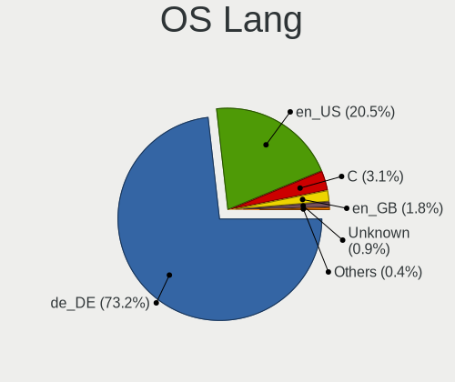
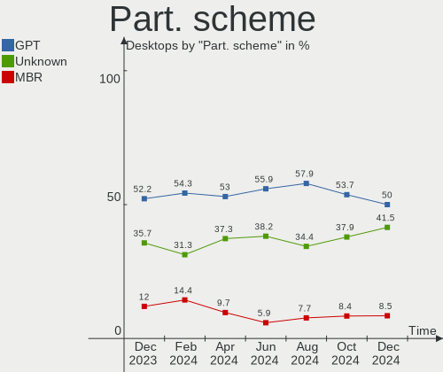
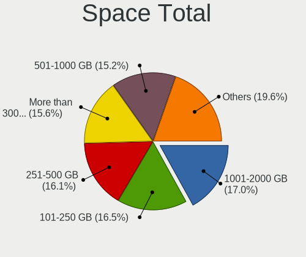
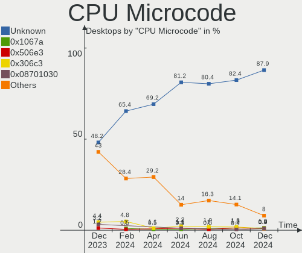
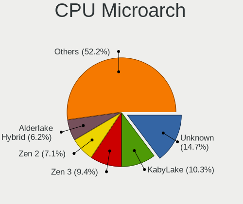
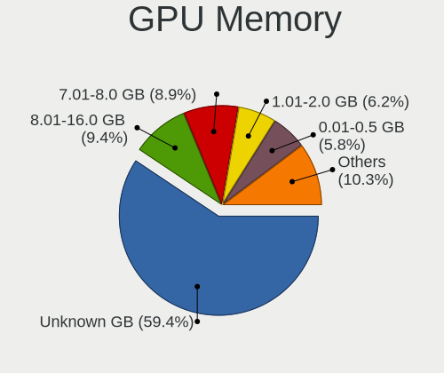
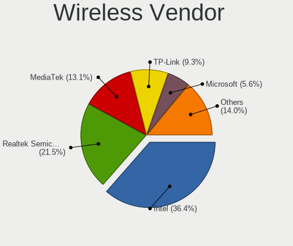
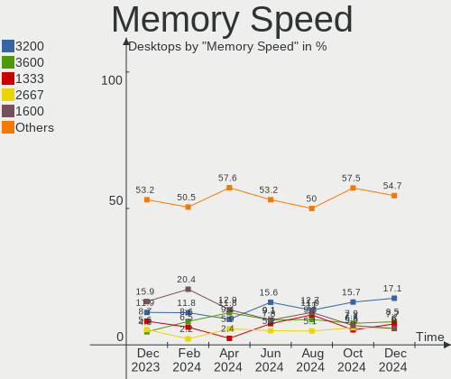
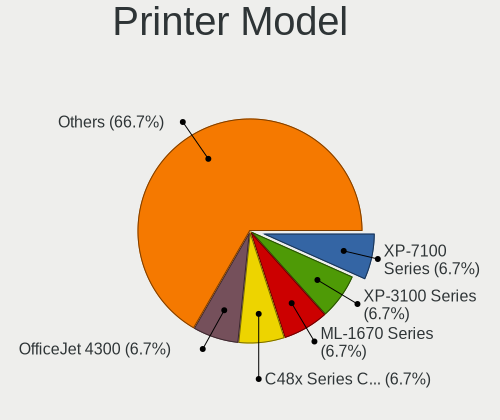
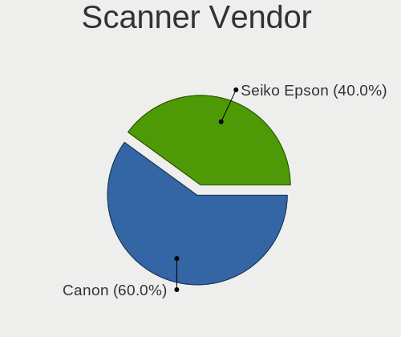

Linux in Germany - Hardware Trends (Desktops)
---------------------------------------------

A project to identify most popular hardware characteristics and track their change
over time based on data collected by Linux users at https://Linux-Hardware.org.

Anyone can contribute to this report by the [hw-probe](https://github.com/linuxhw/hw-probe) tool:

    sudo -E hw-probe -all -upload

Period: Oct, 2023.

Contents
--------

* [ System ](#system)
  - [ OS                       ](#os)
  - [ OS Family                ](#os-family)
  - [ Kernel                   ](#kernel)
  - [ Kernel Family            ](#kernel-family)
  - [ Kernel Major Ver.        ](#kernel-major-ver)
  - [ Arch                     ](#arch)
  - [ DE                       ](#de)
  - [ Display Server           ](#display-server)
  - [ Display Manager          ](#display-manager)
  - [ OS Lang                  ](#os-lang)
  - [ Boot Mode                ](#boot-mode)
  - [ Filesystem               ](#filesystem)
  - [ Part. scheme             ](#part-scheme)
  - [ Dual Boot with Linux/BSD ](#dual-boot-with-linuxbsd)
  - [ Dual Boot (Win)          ](#dual-boot-win)

* [ Board ](#board)
  - [ Vendor                   ](#vendor)
  - [ Model                    ](#model)
  - [ Model Family             ](#model-family)
  - [ MFG Year                 ](#mfg-year)
  - [ Form Factor              ](#form-factor)
  - [ Secure Boot              ](#secure-boot)
  - [ Coreboot                 ](#coreboot)
  - [ RAM Size                 ](#ram-size)
  - [ RAM Used                 ](#ram-used)
  - [ Total Drives             ](#total-drives)
  - [ Has CD-ROM               ](#has-cd-rom)
  - [ Has Ethernet             ](#has-ethernet)
  - [ Has WiFi                 ](#has-wifi)
  - [ Has Bluetooth            ](#has-bluetooth)

* [ Location ](#location)
  - [ Country                  ](#country)
  - [ City                     ](#city)

* [ Drives ](#drives)
  - [ Drive Vendor             ](#drive-vendor)
  - [ Drive Model              ](#drive-model)
  - [ HDD Vendor               ](#hdd-vendor)
  - [ SSD Vendor               ](#ssd-vendor)
  - [ Drive Kind               ](#drive-kind)
  - [ Drive Connector          ](#drive-connector)
  - [ Drive Size               ](#drive-size)
  - [ Space Total              ](#space-total)
  - [ Space Used               ](#space-used)
  - [ Malfunc. Drives          ](#malfunc-drives)
  - [ Malfunc. Drive Vendor    ](#malfunc-drive-vendor)
  - [ Malfunc. HDD Vendor      ](#malfunc-hdd-vendor)
  - [ Malfunc. Drive Kind      ](#malfunc-drive-kind)
  - [ Failed Drives            ](#failed-drives)
  - [ Failed Drive Vendor      ](#failed-drive-vendor)
  - [ Drive Status             ](#drive-status)

* [ Storage controller ](#storage-controller)
  - [ Storage Vendor           ](#storage-vendor)
  - [ Storage Model            ](#storage-model)
  - [ Storage Kind             ](#storage-kind)

* [ Processor ](#processor)
  - [ CPU Vendor               ](#cpu-vendor)
  - [ CPU Model                ](#cpu-model)
  - [ CPU Model Family         ](#cpu-model-family)
  - [ CPU Cores                ](#cpu-cores)
  - [ CPU Sockets              ](#cpu-sockets)
  - [ CPU Threads              ](#cpu-threads)
  - [ CPU Op-Modes             ](#cpu-op-modes)
  - [ CPU Microcode            ](#cpu-microcode)
  - [ CPU Microarch            ](#cpu-microarch)

* [ Graphics ](#graphics)
  - [ GPU Vendor               ](#gpu-vendor)
  - [ GPU Model                ](#gpu-model)
  - [ GPU Combo                ](#gpu-combo)
  - [ GPU Driver               ](#gpu-driver)
  - [ GPU Memory               ](#gpu-memory)

* [ Monitor ](#monitor)
  - [ Monitor Vendor           ](#monitor-vendor)
  - [ Monitor Model            ](#monitor-model)
  - [ Monitor Resolution       ](#monitor-resolution)
  - [ Monitor Diagonal         ](#monitor-diagonal)
  - [ Monitor Width            ](#monitor-width)
  - [ Aspect Ratio             ](#aspect-ratio)
  - [ Monitor Area             ](#monitor-area)
  - [ Pixel Density            ](#pixel-density)
  - [ Multiple Monitors        ](#multiple-monitors)

* [ Network ](#network)
  - [ Net Controller Vendor    ](#net-controller-vendor)
  - [ Net Controller Model     ](#net-controller-model)
  - [ Wireless Vendor          ](#wireless-vendor)
  - [ Wireless Model           ](#wireless-model)
  - [ Ethernet Vendor          ](#ethernet-vendor)
  - [ Ethernet Model           ](#ethernet-model)
  - [ Net Controller Kind      ](#net-controller-kind)
  - [ Used Controller          ](#used-controller)
  - [ NICs                     ](#nics)
  - [ IPv6                     ](#ipv6)

* [ Bluetooth ](#bluetooth)
  - [ Bluetooth Vendor         ](#bluetooth-vendor)
  - [ Bluetooth Model          ](#bluetooth-model)

* [ Sound ](#sound)
  - [ Sound Vendor             ](#sound-vendor)
  - [ Sound Model              ](#sound-model)

* [ Memory ](#memory)
  - [ Memory Vendor            ](#memory-vendor)
  - [ Memory Model             ](#memory-model)
  - [ Memory Kind              ](#memory-kind)
  - [ Memory Form Factor       ](#memory-form-factor)
  - [ Memory Size              ](#memory-size)
  - [ Memory Speed             ](#memory-speed)

* [ Printers & scanners ](#printers--scanners)
  - [ Printer Vendor           ](#printer-vendor)
  - [ Printer Model            ](#printer-model)
  - [ Scanner Vendor           ](#scanner-vendor)
  - [ Scanner Model            ](#scanner-model)

* [ Camera ](#camera)
  - [ Camera Vendor            ](#camera-vendor)
  - [ Camera Model             ](#camera-model)

* [ Security ](#security)
  - [ Fingerprint Vendor       ](#fingerprint-vendor)
  - [ Fingerprint Model        ](#fingerprint-model)
  - [ Chipcard Vendor          ](#chipcard-vendor)
  - [ Chipcard Model           ](#chipcard-model)

* [ Unsupported ](#unsupported)
  - [ Unsupported Devices      ](#unsupported-devices)
  - [ Unsupported Device Types ](#unsupported-device-types)

System
------

OS
--

Installed operating systems

| Name                         | Desktops | Percent |
|------------------------------|----------|---------|
| Linux Mint 21.2              | 40       | 15.63%  |
| Ubuntu 22.04                 | 36       | 14.06%  |
| Debian 12                    | 18       | 7.03%   |
| Fedora 38                    | 14       | 5.47%   |
| Ubuntu 23.04                 | 12       | 4.69%   |
| OpenMandriva 23.08           | 11       | 4.3%    |
| Pop!_OS 22.04                | 10       | 3.91%   |
| Manjaro                      | 10       | 3.91%   |
| Arch Rolling                 | 7        | 2.73%   |
| Zorin 16                     | 6        | 2.34%   |
| Ubuntu 20.04                 | 6        | 2.34%   |
| openSUSE Tumbleweed-XXXXXXXX | 5        | 1.95%   |
| openSUSE Leap-15.5           | 5        | 1.95%   |
| Nobara 38                    | 5        | 1.95%   |
| LMDE 6                       | 5        | 1.95%   |
| OpenMandriva 23.10           | 4        | 1.56%   |
| Linux Mint 21.1              | 4        | 1.56%   |
| Kubuntu 22.04                | 4        | 1.56%   |
| EndeavourOS Rolling          | 4        | 1.56%   |
| Xero Rolling                 | 3        | 1.17%   |
| OpenMandriva 23.03           | 3        | 1.17%   |
| Manjaro 23.0.4               | 3        | 1.17%   |
| Fedora 39                    | 3        | 1.17%   |
| ROSA 12.4                    | 2        | 0.78%   |
| OpenMandriva 4.2             | 2        | 0.78%   |
| Debian 11                    | 2        | 0.78%   |
| Debian                       | 2        | 0.78%   |
| Xubuntu 22.04                | 1        | 0.39%   |
| Ubuntu Unity 22.04           | 1        | 0.39%   |
| Ubuntu 23.10                 | 1        | 0.39%   |
| Ubuntu 22.10                 | 1        | 0.39%   |
| TUXEDO OS 22.04              | 1        | 0.39%   |
| ROSA R11.1                   | 1        | 0.39%   |
| Oracle Linux 9.2             | 1        | 0.39%   |
| OpenWrt 22.03.5              | 1        | 0.39%   |
| openSUSE Microos-XXXXXXXX    | 1        | 0.39%   |
| openSUSE Leap-15.4           | 1        | 0.39%   |
| OpenMandriva 4.3             | 1        | 0.39%   |
| OpenMandriva 23.09           | 1        | 0.39%   |
| Nobara 37                    | 1        | 0.39%   |

OS Family
---------

OS without a version

| Name         | Desktops | Percent |
|--------------|----------|---------|
| Ubuntu       | 56       | 21.88%  |
| Linux Mint   | 47       | 18.36%  |
| OpenMandriva | 22       | 8.59%   |
| Debian       | 22       | 8.59%   |
| Fedora       | 17       | 6.64%   |
| Manjaro      | 14       | 5.47%   |
| openSUSE     | 12       | 4.69%   |
| Pop!_OS      | 10       | 3.91%   |
| Arch         | 7        | 2.73%   |
| Zorin        | 6        | 2.34%   |
| Nobara       | 6        | 2.34%   |
| Kubuntu      | 6        | 2.34%   |
| LMDE         | 5        | 1.95%   |
| EndeavourOS  | 4        | 1.56%   |
| Xero         | 3        | 1.17%   |
| ROSA         | 3        | 1.17%   |
| KDE neon     | 2        | 0.78%   |
| ChimeraOS    | 2        | 0.78%   |
| Xubuntu      | 1        | 0.39%   |
| Ubuntu Unity | 1        | 0.39%   |
| TUXEDO OS    | 1        | 0.39%   |
| Oracle Linux | 1        | 0.39%   |
| OpenWrt      | 1        | 0.39%   |
| Lubuntu      | 1        | 0.39%   |
| Garuda Linux | 1        | 0.39%   |
| Elementary   | 1        | 0.39%   |
| BlackPanther | 1        | 0.39%   |
| ArcoLinux    | 1        | 0.39%   |
| antiX        | 1        | 0.39%   |
| Alpine       | 1        | 0.39%   |

Kernel
------

Version of the Linux kernel

| Version                      | Desktops | Percent |
|------------------------------|----------|---------|
| 6.2.0-34-generic             | 21       | 8.2%    |
| 6.2.0-35-generic             | 19       | 7.42%   |
| 5.15.0-86-generic            | 19       | 7.42%   |
| 5.15.0-87-generic            | 16       | 6.25%   |
| 6.1.0-13-amd64               | 15       | 5.86%   |
| 6.4.11-desktop-1omv2390      | 8        | 3.13%   |
| 5.15.0-84-generic            | 8        | 3.13%   |
| 6.5.5-1-MANJARO              | 7        | 2.73%   |
| 6.2.0-33-generic             | 7        | 2.73%   |
| 6.5.6-200.fc38.x86_64        | 5        | 1.95%   |
| 6.5.5-200.fc38.x86_64        | 5        | 1.95%   |
| 6.1.0-12-amd64               | 5        | 1.95%   |
| 6.5.4-76060504-generic       | 4        | 1.56%   |
| 6.5.4-1-default              | 4        | 1.56%   |
| 6.2.0-26-generic             | 4        | 1.56%   |
| 6.5.7-arch1-1                | 3        | 1.17%   |
| 6.5.6-200.fsync.fc38.x86_64  | 3        | 1.17%   |
| 6.5.5-desktop-1omv2390       | 3        | 1.17%   |
| 6.4.8-desktop-2omv2390       | 3        | 1.17%   |
| 6.4.6-76060406-generic       | 3        | 1.17%   |
| 6.2.9-300.fc38.x86_64        | 3        | 1.17%   |
| 6.2.6-desktop-1omv2390       | 3        | 1.17%   |
| 5.4.0-163-generic            | 3        | 1.17%   |
| 5.15.0-79-generic            | 3        | 1.17%   |
| 6.6.0-1-MANJARO              | 2        | 0.78%   |
| 6.5.8-300.fc39.x86_64        | 2        | 0.78%   |
| 6.5.6-76060506-generic       | 2        | 0.78%   |
| 6.5.5-arch1-1                | 2        | 0.78%   |
| 6.5.3-1-MANJARO              | 2        | 0.78%   |
| 6.4.12-arch1-1               | 2        | 0.78%   |
| 6.2.0-36-generic             | 2        | 0.78%   |
| 5.4.0-165-generic            | 2        | 0.78%   |
| 5.15.0-83-generic            | 2        | 0.78%   |
| 5.15.0-78-generic            | 2        | 0.78%   |
| 5.15.0-76-generic            | 2        | 0.78%   |
| 5.14.21-150500.55.31-default | 2        | 0.78%   |
| 5.14.21-150500.55.28-default | 2        | 0.78%   |
| 5.10.14-desktop-1omv4002     | 2        | 0.78%   |
| 6.5.9-arch2-1                | 1        | 0.39%   |
| 6.5.8-arch1-1                | 1        | 0.39%   |

Kernel Family
-------------

Linux kernel without a distro release

| Version  | Desktops | Percent |
|----------|----------|---------|
| 5.15.0   | 58       | 22.66%  |
| 6.2.0    | 56       | 21.88%  |
| 6.5.5    | 21       | 8.2%    |
| 6.1.0    | 21       | 8.2%    |
| 6.5.6    | 14       | 5.47%   |
| 6.5.4    | 8        | 3.13%   |
| 6.4.11   | 8        | 3.13%   |
| 6.5.8    | 6        | 2.34%   |
| 6.5.7    | 6        | 2.34%   |
| 5.4.0    | 6        | 2.34%   |
| 5.14.21  | 6        | 2.34%   |
| 6.5.3    | 5        | 1.95%   |
| 6.5.0    | 3        | 1.17%   |
| 6.4.8    | 3        | 1.17%   |
| 6.4.6    | 3        | 1.17%   |
| 6.2.9    | 3        | 1.17%   |
| 6.2.6    | 3        | 1.17%   |
| 6.6.0    | 2        | 0.78%   |
| 6.4.12   | 2        | 0.78%   |
| 6.2.16   | 2        | 0.78%   |
| 5.10.14  | 2        | 0.78%   |
| 4.15.0   | 2        | 0.78%   |
| 6.5.9    | 1        | 0.39%   |
| 6.4.9    | 1        | 0.39%   |
| 6.4.10   | 1        | 0.39%   |
| 6.1.60   | 1        | 0.39%   |
| 6.1.57   | 1        | 0.39%   |
| 6.1.56   | 1        | 0.39%   |
| 6.1.55   | 1        | 0.39%   |
| 6.1.38   | 1        | 0.39%   |
| 6.1.20   | 1        | 0.39%   |
| 5.6.14   | 1        | 0.39%   |
| 5.19.0   | 1        | 0.39%   |
| 5.16.7   | 1        | 0.39%   |
| 5.10.194 | 1        | 0.39%   |
| 5.10.176 | 1        | 0.39%   |
| 5.10.0   | 1        | 0.39%   |
| 4.9.0    | 1        | 0.39%   |

Kernel Major Ver.
-----------------

Linux kernel major version

| Version | Desktops | Percent |
|---------|----------|---------|
| 6.5     | 64       | 25%     |
| 6.2     | 64       | 25%     |
| 5.15    | 58       | 22.66%  |
| 6.1     | 27       | 10.55%  |
| 6.4     | 18       | 7.03%   |
| 5.4     | 6        | 2.34%   |
| 5.14    | 6        | 2.34%   |
| 5.10    | 5        | 1.95%   |
| 6.6     | 2        | 0.78%   |
| 4.15    | 2        | 0.78%   |
| 5.6     | 1        | 0.39%   |
| 5.19    | 1        | 0.39%   |
| 5.16    | 1        | 0.39%   |
| 4.9     | 1        | 0.39%   |

Arch
----

OS architecture (x86_64, i586, etc.)

| Name   | Desktops | Percent |
|--------|----------|---------|
| x86_64 | 256      | 100%    |

DE
--

Desktop Environment

| Name       | Desktops | Percent |
|------------|----------|---------|
| GNOME      | 100      | 39.06%  |
| KDE5       | 73       | 28.52%  |
| X-Cinnamon | 43       | 16.8%   |
| Unknown    | 12       | 4.69%   |
| XFCE       | 10       | 3.91%   |
| MATE       | 6        | 2.34%   |
| Cinnamon   | 4        | 1.56%   |
| LXQt       | 2        | 0.78%   |
| Unity      | 1        | 0.39%   |
| sway       | 1        | 0.39%   |
| Pantheon   | 1        | 0.39%   |
| openbox    | 1        | 0.39%   |
| LXDE       | 1        | 0.39%   |
| ICEWM      | 1        | 0.39%   |

Display Server
--------------

X11 or Wayland

| Name    | Desktops | Percent |
|---------|----------|---------|
| X11     | 160      | 62.5%   |
| Wayland | 83       | 32.42%  |
| Tty     | 7        | 2.73%   |
| Unknown | 6        | 2.34%   |

Display Manager
---------------

SDDM, LightDM, etc.

| Name    | Desktops | Percent |
|---------|----------|---------|
| Unknown | 118      | 46.09%  |
| GDM3    | 49       | 19.14%  |
| SDDM    | 45       | 17.58%  |
| LightDM | 30       | 11.72%  |
| GDM     | 10       | 3.91%   |
| XDM     | 1        | 0.39%   |
| SLiM    | 1        | 0.39%   |
| NODM    | 1        | 0.39%   |
| LXDM    | 1        | 0.39%   |

OS Lang
-------

Language

| Lang    | Desktops | Percent |
|---------|----------|---------|
| de_DE   | 203      | 79.3%   |
| en_US   | 38       | 14.84%  |
| Unknown | 7        | 2.73%   |
| en_GB   | 3        | 1.17%   |
| C       | 2        | 0.78%   |
| ru_RU   | 1        | 0.39%   |
| pl_PL   | 1        | 0.39%   |
| de_AT   | 1        | 0.39%   |

Boot Mode
---------

EFI or BIOS

| Mode | Desktops | Percent |
|------|----------|---------|
| BIOS | 136      | 53.13%  |
| EFI  | 120      | 46.88%  |

Filesystem
----------

Type of filesystem

| Type    | Desktops | Percent |
|---------|----------|---------|
| Ext4    | 159      | 62.11%  |
| Btrfs   | 43       | 16.8%   |
| Tmpfs   | 40       | 15.63%  |
| Overlay | 7        | 2.73%   |
| Zfs     | 5        | 1.95%   |
| Xfs     | 1        | 0.39%   |
| Ext2    | 1        | 0.39%   |

Part. scheme
------------

Scheme of partitioning

| Type    | Desktops | Percent |
|---------|----------|---------|
| GPT     | 124      | 48.44%  |
| Unknown | 107      | 41.8%   |
| MBR     | 25       | 9.77%   |

Dual Boot with Linux/BSD
------------------------

Hosting more than one Linux/BSD

| Dual boot | Desktops | Percent |
|-----------|----------|---------|
| No        | 209      | 81.64%  |
| Yes       | 47       | 18.36%  |

Dual Boot (Win)
---------------

Hosting Linux and Windows

| Dual boot | Desktops | Percent |
|-----------|----------|---------|
| No        | 185      | 72.27%  |
| Yes       | 71       | 27.73%  |

Board
-----

Vendor
------

Motherboard manufacturer

| Name                                 | Desktops | Percent |
|--------------------------------------|----------|---------|
| ASUSTek Computer                     | 58       | 22.66%  |
| Gigabyte Technology                  | 49       | 19.14%  |
| MSI                                  | 33       | 12.89%  |
| ASRock                               | 24       | 9.38%   |
| Hewlett-Packard                      | 14       | 5.47%   |
| Lenovo                               | 11       | 4.3%    |
| Fujitsu                              | 11       | 4.3%    |
| Dell                                 | 11       | 4.3%    |
| Acer                                 | 8        | 3.13%   |
| Medion                               | 5        | 1.95%   |
| Inventec                             | 5        | 1.95%   |
| Intel                                | 3        | 1.17%   |
| Fujitsu Siemens                      | 3        | 1.17%   |
| Biostar                              | 3        | 1.17%   |
| Shenzhen Meigao Electronic Equipment | 2        | 0.78%   |
| Foxconn                              | 2        | 0.78%   |
| AMI                                  | 2        | 0.78%   |
| Unknown                              | 2        | 0.78%   |
| Trigkey                              | 1        | 0.39%   |
| Pegatron                             | 1        | 0.39%   |
| Packard Bell                         | 1        | 0.39%   |
| LattePanda                           | 1        | 0.39%   |
| Kllisre                              | 1        | 0.39%   |
| HC Technology.                       | 1        | 0.39%   |
| GEEKOM                               | 1        | 0.39%   |
| eMachines                            | 1        | 0.39%   |
| Centerm                              | 1        | 0.39%   |
| AZW                                  | 1        | 0.39%   |

Model
-----

Motherboard model

| Name                                       | Desktops | Percent |
|--------------------------------------------|----------|---------|
| Inventec D CLASS                           | 5        | 1.95%   |
| MSI MS-7D75                                | 3        | 1.17%   |
| HP Z440 Workstation                        | 3        | 1.17%   |
| Gigabyte A320M-S2H                         | 3        | 1.17%   |
| ASUS All Series                            | 3        | 1.17%   |
| MSI MS-7C56                                | 2        | 0.78%   |
| MSI MS-7C37                                | 2        | 0.78%   |
| MSI MS-7B86                                | 2        | 0.78%   |
| MSI MS-7A33                                | 2        | 0.78%   |
| MSI MS-7817                                | 2        | 0.78%   |
| Intel Jasper Lake Client Platform          | 2        | 0.78%   |
| Gigabyte X570S UD                          | 2        | 0.78%   |
| Gigabyte B85M-D2V                          | 2        | 0.78%   |
| Gigabyte B760 GAMING X DDR4                | 2        | 0.78%   |
| Gigabyte B450 I AORUS PRO WIFI             | 2        | 0.78%   |
| Fujitsu ESPRIMO P910                       | 2        | 0.78%   |
| Dell OptiPlex 3020                         | 2        | 0.78%   |
| Biostar A960D+V2                           | 2        | 0.78%   |
| ASUS ROG STRIX B550-F GAMING               | 2        | 0.78%   |
| ASUS PRIME X570-PRO                        | 2        | 0.78%   |
| ASUS PRIME X370-PRO                        | 2        | 0.78%   |
| ASUS M5A97 R2.0                            | 2        | 0.78%   |
| ASUS M5A78L-M/USB3                         | 2        | 0.78%   |
| ASRock X570 Phantom Gaming 4               | 2        | 0.78%   |
| Unknown                                    | 2        | 0.78%   |
| Trigkey Green G4                           | 1        | 0.39%   |
| Shenzhen Meigao Electronic Equipment UM560 | 1        | 0.39%   |
| Shenzhen Meigao Electronic Equipment HX90G | 1        | 0.39%   |
| Pegatron HPE-558de                         | 1        | 0.39%   |
| Packard Bell IMEDIA S3800                  | 1        | 0.39%   |
| MSI ONE GAMING PC Premium AR11             | 1        | 0.39%   |
| MSI MS-7D91                                | 1        | 0.39%   |
| MSI MS-7D78                                | 1        | 0.39%   |
| MSI MS-7D20                                | 1        | 0.39%   |
| MSI MS-7D08                                | 1        | 0.39%   |
| MSI MS-7C91                                | 1        | 0.39%   |
| MSI MS-7C86                                | 1        | 0.39%   |
| MSI MS-7C52                                | 1        | 0.39%   |
| MSI MS-7C02                                | 1        | 0.39%   |
| MSI MS-7B98                                | 1        | 0.39%   |

Model Family
------------

Motherboard model prefix

| Name                                       | Desktops | Percent |
|--------------------------------------------|----------|---------|
| ASUS ROG                                   | 13       | 5.08%   |
| Fujitsu ESPRIMO                            | 11       | 4.3%    |
| ASUS PRIME                                 | 11       | 4.3%    |
| Dell OptiPlex                              | 7        | 2.73%   |
| Lenovo ThinkCentre                         | 6        | 2.34%   |
| Acer Aspire                                | 6        | 2.34%   |
| Inventec D                                 | 5        | 1.95%   |
| ASUS M5A78L-M                              | 5        | 1.95%   |
| Gigabyte B760                              | 4        | 1.56%   |
| MSI MS-7D75                                | 3        | 1.17%   |
| HP Z440                                    | 3        | 1.17%   |
| Gigabyte X570S                             | 3        | 1.17%   |
| Gigabyte A320M-S2H                         | 3        | 1.17%   |
| Dell Precision                             | 3        | 1.17%   |
| ASUS All                                   | 3        | 1.17%   |
| MSI MS-7C56                                | 2        | 0.78%   |
| MSI MS-7C37                                | 2        | 0.78%   |
| MSI MS-7B86                                | 2        | 0.78%   |
| MSI MS-7A33                                | 2        | 0.78%   |
| MSI MS-7817                                | 2        | 0.78%   |
| Lenovo IdeaCentre                          | 2        | 0.78%   |
| Intel Jasper                               | 2        | 0.78%   |
| HP ProDesk                                 | 2        | 0.78%   |
| HP EliteDesk                               | 2        | 0.78%   |
| HP Compaq                                  | 2        | 0.78%   |
| Gigabyte X570                              | 2        | 0.78%   |
| Gigabyte B85M-D2V                          | 2        | 0.78%   |
| Gigabyte B550                              | 2        | 0.78%   |
| Gigabyte B450M                             | 2        | 0.78%   |
| Gigabyte B450                              | 2        | 0.78%   |
| Biostar A960D+V2                           | 2        | 0.78%   |
| ASUS P8H67-M                               | 2        | 0.78%   |
| ASUS M5A97                                 | 2        | 0.78%   |
| ASRock X570                                | 2        | 0.78%   |
| ASRock B550                                | 2        | 0.78%   |
| ASRock B450                                | 2        | 0.78%   |
| Unknown                                    | 2        | 0.78%   |
| Trigkey Green                              | 1        | 0.39%   |
| Shenzhen Meigao Electronic Equipment UM560 | 1        | 0.39%   |
| Shenzhen Meigao Electronic Equipment HX90G | 1        | 0.39%   |

MFG Year
--------

Motherboard manufacture year

| Year | Desktops | Percent |
|------|----------|---------|
| 2022 | 25       | 9.77%   |
| 2013 | 25       | 9.77%   |
| 2018 | 21       | 8.2%    |
| 2014 | 20       | 7.81%   |
| 2012 | 19       | 7.42%   |
| 2020 | 18       | 7.03%   |
| 2017 | 18       | 7.03%   |
| 2019 | 16       | 6.25%   |
| 2023 | 15       | 5.86%   |
| 2011 | 15       | 5.86%   |
| 2021 | 13       | 5.08%   |
| 2015 | 13       | 5.08%   |
| 2010 | 12       | 4.69%   |
| 2009 | 9        | 3.52%   |
| 2016 | 7        | 2.73%   |
| 2008 | 4        | 1.56%   |
| 2007 | 4        | 1.56%   |
| 2006 | 2        | 0.78%   |

Form Factor
-----------

Physical design of the computer

| Name    | Desktops | Percent |
|---------|----------|---------|
| Desktop | 256      | 100%    |

Secure Boot
-----------

Enabled or disabled

| State    | Desktops | Percent |
|----------|----------|---------|
| Disabled | 244      | 95.31%  |
| Enabled  | 12       | 4.69%   |

Coreboot
--------

Have coreboot on board

| Used | Desktops | Percent |
|------|----------|---------|
| No   | 256      | 100%    |

RAM Size
--------

Total RAM memory

| Size in GB  | Desktops | Percent |
|-------------|----------|---------|
| 16.01-24.0  | 67       | 26.17%  |
| 32.01-64.0  | 54       | 21.09%  |
| 8.01-16.0   | 42       | 16.41%  |
| 4.01-8.0    | 35       | 13.67%  |
| 64.01-256.0 | 20       | 7.81%   |
| 3.01-4.0    | 19       | 7.42%   |
| 24.01-32.0  | 13       | 5.08%   |
| 2.01-3.0    | 4        | 1.56%   |
| 1.01-2.0    | 2        | 0.78%   |

RAM Used
--------

Used RAM memory

| Used GB    | Desktops | Percent |
|------------|----------|---------|
| 1.01-2.0   | 75       | 29.3%   |
| 2.01-3.0   | 61       | 23.83%  |
| 3.01-4.0   | 44       | 17.19%  |
| 4.01-8.0   | 40       | 15.63%  |
| 8.01-16.0  | 14       | 5.47%   |
| 0.51-1.0   | 10       | 3.91%   |
| 0.01-0.5   | 5        | 1.95%   |
| 24.01-32.0 | 4        | 1.56%   |
| 16.01-24.0 | 3        | 1.17%   |

Total Drives
------------

Number of drives on board

| Drives | Desktops | Percent |
|--------|----------|---------|
| 1      | 84       | 32.81%  |
| 2      | 74       | 28.91%  |
| 3      | 56       | 21.88%  |
| 4      | 24       | 9.38%   |
| 5      | 8        | 3.13%   |
| 6      | 5        | 1.95%   |
| 9      | 2        | 0.78%   |
| 7      | 2        | 0.78%   |
| 10     | 1        | 0.39%   |

Has CD-ROM
----------

Has CD-ROM on board

| Presented | Desktops | Percent |
|-----------|----------|---------|
| No        | 129      | 50.39%  |
| Yes       | 127      | 49.61%  |

Has Ethernet
------------

Has Ethernet on board

| Presented | Desktops | Percent |
|-----------|----------|---------|
| Yes       | 254      | 99.22%  |
| No        | 2        | 0.78%   |

Has WiFi
--------

Has WiFi module

| Presented | Desktops | Percent |
|-----------|----------|---------|
| No        | 146      | 57.03%  |
| Yes       | 110      | 42.97%  |

Has Bluetooth
-------------

Has Bluetooth module

| Presented | Desktops | Percent |
|-----------|----------|---------|
| No        | 161      | 62.89%  |
| Yes       | 95       | 37.11%  |

Location
--------

Country
-------

Geographic location (country)

| Country | Desktops | Percent |
|---------|----------|---------|
| Germany | 256      | 100%    |

City
----

Geographic location (city)

| City              | Desktops | Percent |
|-------------------|----------|---------|
| Berlin            | 18       | 7.03%   |
| Munich            | 10       | 3.91%   |
| Hamburg           | 7        | 2.73%   |
| Nussdorf am Inn   | 5        | 1.95%   |
| Hanover           | 5        | 1.95%   |
| Düsseldorf       | 5        | 1.95%   |
| Dresden           | 5        | 1.95%   |
| Darmstadt         | 5        | 1.95%   |
| Cologne           | 5        | 1.95%   |
| Wuppertal         | 4        | 1.56%   |
| Halle             | 4        | 1.56%   |
| Braunschweig      | 4        | 1.56%   |
| Stuttgart         | 3        | 1.17%   |
| Saarbrücken      | 3        | 1.17%   |
| Nuremberg         | 3        | 1.17%   |
| Mannheim          | 3        | 1.17%   |
| Leipzig           | 3        | 1.17%   |
| Kiel              | 3        | 1.17%   |
| Hof               | 3        | 1.17%   |
| Grafenau          | 3        | 1.17%   |
| Frankfurt am Main | 3        | 1.17%   |
| Essen             | 3        | 1.17%   |
| Bonn              | 3        | 1.17%   |
| Würzburg         | 2        | 0.78%   |
| Weilmuenster      | 2        | 0.78%   |
| Siegen            | 2        | 0.78%   |
| Ratingen          | 2        | 0.78%   |
| Otzberg           | 2        | 0.78%   |
| Ober-Morlen       | 2        | 0.78%   |
| Neuss             | 2        | 0.78%   |
| Marburg           | 2        | 0.78%   |
| Karlsruhe         | 2        | 0.78%   |
| Geesthacht        | 2        | 0.78%   |
| Freden            | 2        | 0.78%   |
| Bremen            | 2        | 0.78%   |
| Bitterfeld-Wolfen | 2        | 0.78%   |
| Augsburg          | 2        | 0.78%   |
| Aalen             | 2        | 0.78%   |
| Zwickau           | 1        | 0.39%   |
| Wolfsburg         | 1        | 0.39%   |

Drives
------

Drive Vendor
------------

Hard drive vendors

| Vendor                      | Desktops | Drives | Percent |
|-----------------------------|----------|--------|---------|
| Samsung Electronics         | 91       | 145    | 18.92%  |
| WDC                         | 74       | 107    | 15.38%  |
| Seagate                     | 68       | 82     | 14.14%  |
| SanDisk                     | 50       | 63     | 10.4%   |
| Crucial                     | 29       | 30     | 6.03%   |
| Kingston                    | 20       | 21     | 4.16%   |
| Intenso                     | 20       | 21     | 4.16%   |
| Toshiba                     | 17       | 23     | 3.53%   |
| Unknown                     | 9        | 10     | 1.87%   |
| Micron/Crucial Technology   | 7        | 7      | 1.46%   |
| Hitachi                     | 7        | 7      | 1.46%   |
| Phison Electronics          | 6        | 6      | 1.25%   |
| Micron Technology           | 5        | 5      | 1.04%   |
| Lexar                       | 5        | 5      | 1.04%   |
| China                       | 4        | 4      | 0.83%   |
| Transcend                   | 3        | 3      | 0.62%   |
| SK hynix                    | 3        | 3      | 0.62%   |
| Kingston Technology Company | 3        | 3      | 0.62%   |
| HGST                        | 3        | 3      | 0.62%   |
| Fanxiang                    | 3        | 3      | 0.62%   |
| A-DATA Technology           | 3        | 4      | 0.62%   |
| Verbatim                    | 2        | 2      | 0.42%   |
| SPCC                        | 2        | 2      | 0.42%   |
| Silicon Motion              | 2        | 2      | 0.42%   |
| SABRENT                     | 2        | 2      | 0.42%   |
| Realtek Semiconductor       | 2        | 2      | 0.42%   |
| Phison                      | 2        | 2      | 0.42%   |
| OCZ                         | 2        | 2      | 0.42%   |
| MAXIO Technology (Hangzhou) | 2        | 2      | 0.42%   |
| Intel                       | 2        | 2      | 0.42%   |
| FORESEE                     | 2        | 2      | 0.42%   |
| ASMedia                     | 2        | 2      | 0.42%   |
| Apacer                      | 2        | 2      | 0.42%   |
| ADATA Technology            | 2        | 3      | 0.42%   |
| XrayDisk                    | 1        | 2      | 0.21%   |
| VERICO                      | 1        | 1      | 0.21%   |
| USB3.0                      | 1        | 1      | 0.21%   |
| Team                        | 1        | 1      | 0.21%   |
| TCSUNBOW                    | 1        | 1      | 0.21%   |
| SSK                         | 1        | 1      | 0.21%   |

Drive Model
-----------

Hard drive models

| Model                                              | Desktops | Percent |
|----------------------------------------------------|----------|---------|
| Samsung NVMe SSD Controller SM981/PM981/PM983 1TB  | 20       | 3.53%   |
| Samsung SSD 860 EVO 500GB                          | 9        | 1.59%   |
| Samsung SSD 870 EVO 1TB                            | 8        | 1.41%   |
| Seagate ST2000DM008-2FR102 2TB                     | 7        | 1.24%   |
| SanDisk SSD PLUS 1000GB                            | 7        | 1.24%   |
| Samsung SSD 860 EVO 1TB                            | 7        | 1.24%   |
| Crucial CT500MX500SSD1 500GB                       | 7        | 1.24%   |
| Crucial CT1000MX500SSD1 1TB                        | 7        | 1.24%   |
| SanDisk SDSSDH3 1T00 1TB                           | 6        | 1.06%   |
| Samsung SSD 870 QVO 1TB                            | 6        | 1.06%   |
| Samsung NVMe SSD Controller PM9A1/PM9A3/980PRO 1TB | 6        | 1.06%   |
| Unknown SD/MMC/MS PRO 16GB                         | 5        | 0.88%   |
| Samsung SSD 980 1TB                                | 5        | 0.88%   |
| Samsung SSD 850 EVO 250GB                          | 5        | 0.88%   |
| Seagate ST500DM002-1BD142 500GB                    | 4        | 0.71%   |
| Samsung SSD 980 500GB                              | 4        | 0.71%   |
| Samsung SSD 870 QVO 2TB                            | 4        | 0.71%   |
| Micron/Crucial P2 NVMe PCIe SSD 500GB              | 4        | 0.71%   |
| Intenso SSD 120GB                                  | 4        | 0.71%   |
| WDC WDS500G2B0A-00SM50 500GB SSD                   | 3        | 0.53%   |
| WDC WD5000AAKX-60U6AA0 500GB                       | 3        | 0.53%   |
| WDC WD20EZRZ-00Z5HB0 2TB                           | 3        | 0.53%   |
| WDC WD20EFRX-68EUZN0 2TB                           | 3        | 0.53%   |
| WDC WD10EZEX-08WN4A0 1TB                           | 3        | 0.53%   |
| Toshiba TR200 240GB SSD                            | 3        | 0.53%   |
| Seagate ST500LM021-1KJ152 500GB                    | 3        | 0.53%   |
| Seagate ST3500418AS 500GB                          | 3        | 0.53%   |
| Seagate ST1000LM024 HN-M101MBB 1TB                 | 3        | 0.53%   |
| Seagate ST1000DM010-2EP102 1TB                     | 3        | 0.53%   |
| Seagate ST1000DM003-1ER162 1TB                     | 3        | 0.53%   |
| Seagate ST1000DM003-1CH162 1TB                     | 3        | 0.53%   |
| Sandisk WD_BLACK SN850X 2000GB                     | 3        | 0.53%   |
| SanDisk SSD PLUS 240GB                             | 3        | 0.53%   |
| SanDisk SDSSDA240G 240GB                           | 3        | 0.53%   |
| SanDisk SDSSDA120G 120GB                           | 3        | 0.53%   |
| Samsung SSD 990 PRO 2TB                            | 3        | 0.53%   |
| Samsung SSD 870 EVO 500GB                          | 3        | 0.53%   |
| Samsung SSD 850 EVO 500GB                          | 3        | 0.53%   |
| Intenso SSD 1TB                                    | 3        | 0.53%   |
| WDC WD5000AAKX-07U6AA1 500GB                       | 2        | 0.35%   |

HDD Vendor
----------

Hard disk drive vendors

| Vendor              | Desktops | Drives | Percent |
|---------------------|----------|--------|---------|
| Seagate             | 65       | 79     | 37.14%  |
| WDC                 | 64       | 90     | 36.57%  |
| Toshiba             | 13       | 17     | 7.43%   |
| Samsung Electronics | 12       | 15     | 6.86%   |
| Hitachi             | 7        | 7      | 4%      |
| Unknown             | 5        | 5      | 2.86%   |
| HGST                | 3        | 3      | 1.71%   |
| Intenso             | 2        | 2      | 1.14%   |
| USB3.0              | 1        | 1      | 0.57%   |
| SSK                 | 1        | 1      | 0.57%   |
| Maxtor              | 1        | 1      | 0.57%   |
| Fujitsu             | 1        | 1      | 0.57%   |

SSD Vendor
----------

Solid state drive vendors

| Vendor              | Desktops | Drives | Percent |
|---------------------|----------|--------|---------|
| Samsung Electronics | 57       | 73     | 27.54%  |
| SanDisk             | 39       | 43     | 18.84%  |
| Crucial             | 26       | 27     | 12.56%  |
| Intenso             | 15       | 16     | 7.25%   |
| WDC                 | 11       | 11     | 5.31%   |
| Kingston            | 11       | 12     | 5.31%   |
| Toshiba             | 4        | 4      | 1.93%   |
| Micron Technology   | 4        | 4      | 1.93%   |
| China               | 4        | 4      | 1.93%   |
| Transcend           | 3        | 3      | 1.45%   |
| Fanxiang            | 3        | 3      | 1.45%   |
| Verbatim            | 2        | 2      | 0.97%   |
| SABRENT             | 2        | 2      | 0.97%   |
| OCZ                 | 2        | 2      | 0.97%   |
| FORESEE             | 2        | 2      | 0.97%   |
| ASMedia             | 2        | 2      | 0.97%   |
| Apacer              | 2        | 2      | 0.97%   |
| A-DATA Technology   | 2        | 2      | 0.97%   |
| VERICO              | 1        | 1      | 0.48%   |
| Team                | 1        | 1      | 0.48%   |
| TCSUNBOW            | 1        | 1      | 0.48%   |
| SPCC                | 1        | 1      | 0.48%   |
| SK hynix            | 1        | 1      | 0.48%   |
| PNY                 | 1        | 1      | 0.48%   |
| Phison              | 1        | 1      | 0.48%   |
| Mushkin             | 1        | 1      | 0.48%   |
| LITEONIT            | 1        | 1      | 0.48%   |
| Lexar               | 1        | 1      | 0.48%   |
| Leven               | 1        | 1      | 0.48%   |
| Kimtigo             | 1        | 1      | 0.48%   |
| INNOVATION IT       | 1        | 1      | 0.48%   |
| Dogfish             | 1        | 1      | 0.48%   |
| ASMT                | 1        | 1      | 0.48%   |
| 2.5                 | 1        | 1      | 0.48%   |

Drive Kind
----------

HDD or SSD

| Kind    | Desktops | Drives | Percent |
|---------|----------|--------|---------|
| SSD     | 165      | 230    | 39.38%  |
| HDD     | 136      | 222    | 32.46%  |
| NVMe    | 105      | 141    | 25.06%  |
| Unknown | 11       | 12     | 2.63%   |
| MMC     | 2        | 2      | 0.48%   |

Drive Connector
---------------

SATA, SAS, NVMe, etc.

| Type | Desktops | Drives | Percent |
|------|----------|--------|---------|
| SATA | 223      | 433    | 62.29%  |
| NVMe | 105      | 140    | 29.33%  |
| SAS  | 28       | 32     | 7.82%   |
| MMC  | 2        | 2      | 0.56%   |

Drive Size
----------

Size of hard drive

| Size in TB | Desktops | Drives | Percent |
|------------|----------|--------|---------|
| 0.01-0.5   | 148      | 204    | 44.71%  |
| 0.51-1.0   | 100      | 139    | 30.21%  |
| 1.01-2.0   | 47       | 58     | 14.2%   |
| 3.01-4.0   | 15       | 23     | 4.53%   |
| 4.01-10.0  | 11       | 16     | 3.32%   |
| 2.01-3.0   | 8        | 10     | 2.42%   |
| 20.01-50.0 | 1        | 1      | 0.3%    |
| 10.01-20.0 | 1        | 1      | 0.3%    |

Space Total
-----------

Amount of disk space available on the file system

| Size in GB     | Desktops | Percent |
|----------------|----------|---------|
| 251-500        | 44       | 17.19%  |
| More than 3000 | 40       | 15.63%  |
| 1001-2000      | 40       | 15.63%  |
| 101-250        | 39       | 15.23%  |
| 501-1000       | 39       | 15.23%  |
| 2001-3000      | 18       | 7.03%   |
| Unknown        | 15       | 5.86%   |
| 1-20           | 11       | 4.3%    |
| 51-100         | 8        | 3.13%   |
| 21-50          | 2        | 0.78%   |

Space Used
----------

Amount of used disk space

| Used GB        | Desktops | Percent |
|----------------|----------|---------|
| 1-20           | 64       | 25%     |
| 51-100         | 31       | 12.11%  |
| 21-50          | 30       | 11.72%  |
| 101-250        | 28       | 10.94%  |
| 1001-2000      | 28       | 10.94%  |
| 251-500        | 22       | 8.59%   |
| 501-1000       | 18       | 7.03%   |
| More than 3000 | 15       | 5.86%   |
| Unknown        | 15       | 5.86%   |
| 2001-3000      | 5        | 1.95%   |

Malfunc. Drives
---------------

Drive models with a malfunction

| Model                             | Desktops | Drives | Percent |
|-----------------------------------|----------|--------|---------|
| Seagate ST1000DM003-1ER162 1TB    | 2        | 2      | 8.7%    |
| SanDisk SSD PLUS 1000GB           | 2        | 2      | 8.7%    |
| WDC WD5000AAKX-07U6AA1 500GB      | 1        | 2      | 4.35%   |
| WDC WD5000AAKS-00D2B0 500GB       | 1        | 1      | 4.35%   |
| WDC WD5000AAKS-007AA0 500GB       | 1        | 1      | 4.35%   |
| WDC WD40EFZX-68AWUN0 4TB          | 1        | 6      | 4.35%   |
| WDC WD20EFRX-68EUZN0 2TB          | 1        | 1      | 4.35%   |
| WDC WD20EARX-00PASB0 2TB          | 1        | 1      | 4.35%   |
| WDC WD1600AAJS-00V4A0 160GB       | 1        | 1      | 4.35%   |
| Seagate ST500DM002-1BD142 500GB   | 1        | 1      | 4.35%   |
| Seagate ST3500418AS 500GB         | 1        | 1      | 4.35%   |
| Seagate ST31000528AS 1TB          | 1        | 1      | 4.35%   |
| Seagate ST2000NC001-1DY164 2TB    | 1        | 1      | 4.35%   |
| Seagate ST2000DL003-9VT166 2TB    | 1        | 1      | 4.35%   |
| Seagate ST1000DX001-1NS162 1TB    | 1        | 1      | 4.35%   |
| Seagate ST1000DM010-2EP102 1TB    | 1        | 1      | 4.35%   |
| Samsung Electronics HD501LJ 500GB | 1        | 1      | 4.35%   |
| Samsung Electronics HD103UI 1TB   | 1        | 1      | 4.35%   |
| Crucial CT120M500SSD1 120GB       | 1        | 1      | 4.35%   |
| ASMedia ASM105x 120GB SSD         | 1        | 1      | 4.35%   |
| A-DATA Technology SSD S510 120GB  | 1        | 1      | 4.35%   |

Malfunc. Drive Vendor
---------------------

Vendors of faulty drives

| Vendor              | Desktops | Drives | Percent |
|---------------------|----------|--------|---------|
| Seagate             | 9        | 9      | 39.13%  |
| WDC                 | 7        | 13     | 30.43%  |
| SanDisk             | 2        | 2      | 8.7%    |
| Samsung Electronics | 2        | 2      | 8.7%    |
| Crucial             | 1        | 1      | 4.35%   |
| ASMedia             | 1        | 1      | 4.35%   |
| A-DATA Technology   | 1        | 1      | 4.35%   |

Malfunc. HDD Vendor
-------------------

Vendors of faulty HDD drives

| Vendor              | Desktops | Drives | Percent |
|---------------------|----------|--------|---------|
| Seagate             | 9        | 9      | 50%     |
| WDC                 | 7        | 13     | 38.89%  |
| Samsung Electronics | 2        | 2      | 11.11%  |

Malfunc. Drive Kind
-------------------

Kinds of faulty drives

| Kind | Desktops | Drives | Percent |
|------|----------|--------|---------|
| HDD  | 18       | 24     | 78.26%  |
| SSD  | 5        | 5      | 21.74%  |

Failed Drives
-------------

Failed drive models

Zero info for selected period =(

Failed Drive Vendor
-------------------

Failed drive vendors

Zero info for selected period =(

Drive Status
------------

Number of failed and malfunc. drives

| Status   | Desktops | Drives | Percent |
|----------|----------|--------|---------|
| Detected | 163      | 386    | 57.39%  |
| Works    | 98       | 192    | 34.51%  |
| Malfunc  | 23       | 29     | 8.1%    |

Storage controller
------------------

Storage Vendor
--------------

Storage controller vendors

| Vendor                       | Desktops | Percent |
|------------------------------|----------|---------|
| Intel                        | 142      | 34.72%  |
| AMD                          | 108      | 26.41%  |
| Samsung Electronics          | 46       | 11.25%  |
| SanDisk                      | 19       | 4.65%   |
| ASMedia Technology           | 17       | 4.16%   |
| Kingston Technology Company  | 12       | 2.93%   |
| Micron/Crucial Technology    | 10       | 2.44%   |
| Marvell Technology Group     | 8        | 1.96%   |
| JMicron Technology           | 7        | 1.71%   |
| Phison Electronics           | 6        | 1.47%   |
| MAXIO Technology (Hangzhou)  | 5        | 1.22%   |
| ADATA Technology             | 5        | 1.22%   |
| Nvidia                       | 4        | 0.98%   |
| Shenzhen Longsys Electronics | 3        | 0.73%   |
| Realtek Semiconductor        | 3        | 0.73%   |
| Toshiba America Info Systems | 2        | 0.49%   |
| SK hynix                     | 2        | 0.49%   |
| Silicon Motion               | 2        | 0.49%   |
| Seagate Technology           | 2        | 0.49%   |
| Silicon Image                | 1        | 0.24%   |
| O2 Micro                     | 1        | 0.24%   |
| Micron Technology            | 1        | 0.24%   |
| KIOXIA                       | 1        | 0.24%   |
| Broadcom / LSI               | 1        | 0.24%   |
| Adaptec                      | 1        | 0.24%   |

Storage Model
-------------

Storage controller models

| Model                                                                          | Desktops | Percent |
|--------------------------------------------------------------------------------|----------|---------|
| AMD FCH SATA Controller [AHCI mode]                                            | 53       | 10.93%  |
| Samsung NVMe SSD Controller SM981/PM981/PM983                                  | 24       | 4.95%   |
| Intel 8 Series/C220 Series Chipset Family 6-port SATA Controller 1 [AHCI mode] | 24       | 4.95%   |
| AMD SB7x0/SB8x0/SB9x0 IDE Controller                                           | 19       | 3.92%   |
| AMD 400 Series Chipset SATA Controller                                         | 18       | 3.71%   |
| AMD 500 Series Chipset SATA Controller                                         | 16       | 3.3%    |
| AMD SB7x0/SB8x0/SB9x0 SATA Controller [AHCI mode]                              | 15       | 3.09%   |
| ASMedia ASM1062 Serial ATA Controller                                          | 14       | 2.89%   |
| Intel Q170/Q150/B150/H170/H110/Z170/CM236 Chipset SATA Controller [AHCI Mode]  | 13       | 2.68%   |
| AMD SB7x0/SB8x0/SB9x0 SATA Controller [IDE mode]                               | 13       | 2.68%   |
| Intel 700 Series Chipset Family SATA AHCI Controller                           | 10       | 2.06%   |
| Intel 6 Series/C200 Series Chipset Family 6 port Desktop SATA AHCI Controller  | 10       | 2.06%   |
| Samsung NVMe SSD Controller PM9A1/PM9A3/980PRO                                 | 9        | 1.86%   |
| Samsung NVMe SSD Controller 980 (DRAM-less)                                    | 9        | 1.86%   |
| Intel Cannon Lake PCH SATA AHCI Controller                                     | 8        | 1.65%   |
| Intel 7 Series/C210 Series Chipset Family 6-port SATA Controller [AHCI mode]   | 8        | 1.65%   |
| Intel 200 Series PCH SATA controller [AHCI mode]                               | 8        | 1.65%   |
| Sandisk WD Black SN850X NVMe SSD                                               | 6        | 1.24%   |
| JMicron JMB363 SATA/IDE Controller                                             | 6        | 1.24%   |
| Intel NM10/ICH7 Family SATA Controller [IDE mode]                              | 6        | 1.24%   |
| Micron/Crucial P2 [Nick P2] / P3 / P3 Plus NVMe PCIe SSD (DRAM-less)           | 5        | 1.03%   |
| MAXIO (Hangzhou) NVMe SSD Controller MAP1202                                   | 5        | 1.03%   |
| Intel SATA Controller [RAID mode]                                              | 5        | 1.03%   |
| Intel 9 Series Chipset Family SATA Controller [AHCI Mode]                      | 5        | 1.03%   |
| Intel 500 Series Chipset Family SATA AHCI Controller                           | 5        | 1.03%   |
| AMD X370 Series Chipset SATA Controller                                        | 5        | 1.03%   |
| Samsung NVMe SSD Controller S4LV008[Pascal]                                    | 4        | 0.82%   |
| Kingston Company KC3000/FURY Renegade NVMe SSD E18                             | 4        | 0.82%   |
| Kingston Company A2000 NVMe SSD SM2263EN                                       | 4        | 0.82%   |
| Intel C600/X79 series chipset SATA RAID Controller                             | 4        | 0.82%   |
| Intel 82801JI (ICH10 Family) SATA AHCI Controller                              | 4        | 0.82%   |
| SanDisk Ultra 3D / WD Blue SN570 NVMe SSD (DRAM-less)                          | 3        | 0.62%   |
| Realtek RTS5765DL NVMe SSD Controller (DRAM-less)                              | 3        | 0.62%   |
| Nvidia MCP61 SATA Controller                                                   | 3        | 0.62%   |
| Nvidia MCP61 IDE                                                               | 3        | 0.62%   |
| Marvell Group 88SE6111/6121 SATA II / PATA Controller                          | 3        | 0.62%   |
| Intel SATA controller                                                          | 3        | 0.62%   |
| Intel Celeron/Pentium Silver Processor SATA Controller                         | 3        | 0.62%   |
| Intel Atom Processor E3800 Series SATA AHCI Controller                         | 3        | 0.62%   |
| Intel 82801G (ICH7 Family) IDE Controller                                      | 3        | 0.62%   |

Storage Kind
------------

Kind of storage controller (IDE, SATA, NVMe, SAS, ...)

| Kind | Desktops | Percent |
|------|----------|---------|
| SATA | 228      | 57.72%  |
| NVMe | 104      | 26.33%  |
| IDE  | 47       | 11.9%   |
| RAID | 13       | 3.29%   |
| SAS  | 2        | 0.51%   |
| SCSI | 1        | 0.25%   |

Processor
---------

CPU Vendor
----------

Processor vendors

| Vendor | Desktops | Percent |
|--------|----------|---------|
| Intel  | 143      | 55.86%  |
| AMD    | 113      | 44.14%  |

CPU Model
---------

Processor models

| Model                                  | Desktops | Percent |
|----------------------------------------|----------|---------|
| Intel Core i7-4790 CPU @ 3.60GHz       | 6        | 2.34%   |
| AMD Ryzen 7 5800X3D 8-Core Processor   | 6        | 2.34%   |
| AMD Ryzen 7 5800X 8-Core Processor     | 6        | 2.34%   |
| AMD Ryzen 5 3600 6-Core Processor      | 6        | 2.34%   |
| AMD G-T48E Processor                   | 5        | 1.95%   |
| Intel Core i5-4690 CPU @ 3.50GHz       | 4        | 1.56%   |
| Intel Core i5-3470 CPU @ 3.20GHz       | 4        | 1.56%   |
| AMD Ryzen 5 5600X 6-Core Processor     | 4        | 1.56%   |
| AMD Ryzen 5 5600G with Radeon Graphics | 4        | 1.56%   |
| AMD FX-8350 Eight-Core Processor       | 4        | 1.56%   |
| Intel Core i7-2600K CPU @ 3.40GHz      | 3        | 1.17%   |
| Intel Core i7-2600 CPU @ 3.40GHz       | 3        | 1.17%   |
| Intel Core i5-6600 CPU @ 3.30GHz       | 3        | 1.17%   |
| Intel Core i5-4590 CPU @ 3.30GHz       | 3        | 1.17%   |
| Intel Core i5-4430 CPU @ 3.00GHz       | 3        | 1.17%   |
| Intel Core i3 CPU 530 @ 2.93GHz        | 3        | 1.17%   |
| Intel Celeron N5105 @ 2.00GHz          | 3        | 1.17%   |
| Intel 13th Gen Core i5-13400F          | 3        | 1.17%   |
| AMD Ryzen 9 5900X 12-Core Processor    | 3        | 1.17%   |
| AMD Ryzen 5 2600 Six-Core Processor    | 3        | 1.17%   |
| AMD FX-6300 Six-Core Processor         | 3        | 1.17%   |
| AMD Athlon II X4 640 Processor         | 3        | 1.17%   |
| Intel Pentium CPU G3220 @ 3.00GHz      | 2        | 0.78%   |
| Intel N100                             | 2        | 0.78%   |
| Intel Core i7-8700K CPU @ 3.70GHz      | 2        | 0.78%   |
| Intel Core i7-8700 CPU @ 3.20GHz       | 2        | 0.78%   |
| Intel Core i7-6700 CPU @ 3.40GHz       | 2        | 0.78%   |
| Intel Core i7-3770 CPU @ 3.40GHz       | 2        | 0.78%   |
| Intel Core i5-8400 CPU @ 2.80GHz       | 2        | 0.78%   |
| Intel Core i5-4590S CPU @ 3.00GHz      | 2        | 0.78%   |
| Intel Core i5-4460 CPU @ 3.20GHz       | 2        | 0.78%   |
| Intel Core i3-2120 CPU @ 3.30GHz       | 2        | 0.78%   |
| Intel Celeron J4125 CPU @ 2.00GHz      | 2        | 0.78%   |
| Intel Celeron CPU J1900 @ 1.99GHz      | 2        | 0.78%   |
| AMD Ryzen 9 7900X 12-Core Processor    | 2        | 0.78%   |
| AMD Ryzen 7 5700X 8-Core Processor     | 2        | 0.78%   |
| AMD Ryzen 7 3700X 8-Core Processor     | 2        | 0.78%   |
| AMD Ryzen 7 2700X Eight-Core Processor | 2        | 0.78%   |
| AMD Ryzen 7 1800X Eight-Core Processor | 2        | 0.78%   |
| AMD Ryzen 7 1700 Eight-Core Processor  | 2        | 0.78%   |

CPU Model Family
----------------

Processor model prefix

| Model                   | Desktops | Percent |
|-------------------------|----------|---------|
| Intel Core i5           | 45       | 17.58%  |
| Intel Core i7           | 32       | 12.5%   |
| AMD Ryzen 7             | 30       | 11.72%  |
| AMD Ryzen 5             | 30       | 11.72%  |
| Other                   | 18       | 7.03%   |
| Intel Xeon              | 13       | 5.08%   |
| Intel Celeron           | 12       | 4.69%   |
| AMD Ryzen 9             | 10       | 3.91%   |
| AMD FX                  | 10       | 3.91%   |
| Intel Core i3           | 8        | 3.13%   |
| AMD G                   | 5        | 1.95%   |
| Intel Pentium           | 4        | 1.56%   |
| AMD Phenom II X4        | 4        | 1.56%   |
| AMD Athlon II X4        | 4        | 1.56%   |
| Intel Core 2 Quad       | 3        | 1.17%   |
| Intel Core 2 Duo        | 3        | 1.17%   |
| Intel Pentium Dual-Core | 2        | 0.78%   |
| AMD Phenom II X6        | 2        | 0.78%   |
| AMD Phenom II X2        | 2        | 0.78%   |
| AMD Athlon II X2        | 2        | 0.78%   |
| AMD A8                  | 2        | 0.78%   |
| AMD A6                  | 2        | 0.78%   |
| AMD A4                  | 2        | 0.78%   |
| AMD A10                 | 2        | 0.78%   |
| Intel Pentium Silver    | 1        | 0.39%   |
| Intel Pentium D         | 1        | 0.39%   |
| Intel Pentium 4         | 1        | 0.39%   |
| Intel Core i9           | 1        | 0.39%   |
| Intel Atom              | 1        | 0.39%   |
| AMD Ryzen Threadripper  | 1        | 0.39%   |
| AMD E2                  | 1        | 0.39%   |
| AMD Athlon Dual Core    | 1        | 0.39%   |
| AMD Athlon 64 X2        | 1        | 0.39%   |

CPU Cores
---------

Number of processor cores

| Number | Desktops | Percent |
|--------|----------|---------|
| 4      | 100      | 39.06%  |
| 6      | 52       | 20.31%  |
| 2      | 40       | 15.63%  |
| 8      | 34       | 13.28%  |
| 12     | 7        | 2.73%   |
| 3      | 6        | 2.34%   |
| 16     | 5        | 1.95%   |
| 10     | 5        | 1.95%   |
| 24     | 2        | 0.78%   |
| 14     | 2        | 0.78%   |
| 1      | 2        | 0.78%   |
| 18     | 1        | 0.39%   |

CPU Sockets
-----------

Number of sockets

| Number | Desktops | Percent |
|--------|----------|---------|
| 1      | 256      | 100%    |

CPU Threads
-----------

Threads per core (Hyper-Threading)

| Number | Desktops | Percent |
|--------|----------|---------|
| 2      | 150      | 58.59%  |
| 1      | 106      | 41.41%  |

CPU Op-Modes
------------

CPU Operation Modes (32-bit, 64-bit)

| Op mode        | Desktops | Percent |
|----------------|----------|---------|
| 32-bit, 64-bit | 256      | 100%    |

CPU Microcode
-------------

Microcode number

| Number     | Desktops | Percent |
|------------|----------|---------|
| Unknown    | 130      | 50.78%  |
| 0x306c3    | 17       | 6.64%   |
| 0x0a20120a | 10       | 3.91%   |
| 0x0a601203 | 7        | 2.73%   |
| 0x06000852 | 6        | 2.34%   |
| 0x010000c8 | 6        | 2.34%   |
| 0x08701021 | 5        | 1.95%   |
| 0x906ea    | 4        | 1.56%   |
| 0x506e3    | 4        | 1.56%   |
| 0x0a50000d | 4        | 1.56%   |
| 0x0a201016 | 3        | 1.17%   |
| 0x08701030 | 3        | 1.17%   |
| 0x08001138 | 3        | 1.17%   |
| 0x08001137 | 3        | 1.17%   |
| 0x05000119 | 3        | 1.17%   |
| 0x05000101 | 3        | 1.17%   |
| 0x706a8    | 2        | 0.78%   |
| 0x206a7    | 2        | 0.78%   |
| 0x1067a    | 2        | 0.78%   |
| 0x0a201025 | 2        | 0.78%   |
| 0x06003106 | 2        | 0.78%   |
| 0x0600063e | 2        | 0.78%   |
| 0x010000db | 2        | 0.78%   |
| 0xf65      | 1        | 0.39%   |
| 0xb06e0    | 1        | 0.39%   |
| 0xb0671    | 1        | 0.39%   |
| 0xa0671    | 1        | 0.39%   |
| 0x906e9    | 1        | 0.39%   |
| 0x906c0    | 1        | 0.39%   |
| 0x706e5    | 1        | 0.39%   |
| 0x406c3    | 1        | 0.39%   |
| 0x306f2    | 1        | 0.39%   |
| 0x306a9    | 1        | 0.39%   |
| 0x30679    | 1        | 0.39%   |
| 0x30678    | 1        | 0.39%   |
| 0x206d7    | 1        | 0.39%   |
| 0x206c2    | 1        | 0.39%   |
| 0x20652    | 1        | 0.39%   |
| 0x106a5    | 1        | 0.39%   |
| 0x0a601206 | 1        | 0.39%   |

CPU Microarch
-------------

Microarchitecture

| Name             | Desktops | Percent |
|------------------|----------|---------|
| Haswell          | 35       | 13.67%  |
| Zen 3            | 32       | 12.5%   |
| Unknown          | 18       | 7.03%   |
| KabyLake         | 16       | 6.25%   |
| SandyBridge      | 15       | 5.86%   |
| K10              | 14       | 5.47%   |
| Skylake          | 13       | 5.08%   |
| Zen 2            | 12       | 4.69%   |
| IvyBridge        | 11       | 4.3%    |
| Piledriver       | 9        | 3.52%   |
| Zen+             | 8        | 3.13%   |
| Zen              | 8        | 3.13%   |
| Bobcat           | 6        | 2.34%   |
| Westmere         | 5        | 1.95%   |
| Tremont          | 5        | 1.95%   |
| Penryn           | 5        | 1.95%   |
| Nehalem          | 5        | 1.95%   |
| Alderlake Hybrid | 5        | 1.95%   |
| Silvermont       | 4        | 1.56%   |
| Excavator        | 4        | 1.56%   |
| CometLake        | 4        | 1.56%   |
| Gracemont        | 3        | 1.17%   |
| Goldmont plus    | 3        | 1.17%   |
| Core             | 3        | 1.17%   |
| Steamroller      | 2        | 0.78%   |
| NetBurst         | 2        | 0.78%   |
| K8 Hammer        | 2        | 0.78%   |
| K10 Llano        | 2        | 0.78%   |
| IceLake          | 2        | 0.78%   |
| Bulldozer        | 2        | 0.78%   |
| Puma             | 1        | 0.39%   |

Graphics
--------

GPU Vendor
----------

Vendors of graphics cards

| Vendor | Desktops | Percent |
|--------|----------|---------|
| AMD    | 103      | 37.18%  |
| Nvidia | 100      | 36.1%   |
| Intel  | 74       | 26.71%  |

GPU Model
---------

Graphics card models

| Model                                                                       | Desktops | Percent |
|-----------------------------------------------------------------------------|----------|---------|
| Intel Xeon E3-1200 v3/4th Gen Core Processor Integrated Graphics Controller | 15       | 5.23%   |
| AMD Raphael                                                                 | 10       | 3.48%   |
| AMD Navi 22 [Radeon RX 6700/6700 XT/6750 XT / 6800M/6850M XT]               | 9        | 3.14%   |
| Intel HD Graphics 530                                                       | 8        | 2.79%   |
| AMD Navi 21 [Radeon RX 6800/6800 XT / 6900 XT]                              | 8        | 2.79%   |
| Intel CoffeeLake-S GT2 [UHD Graphics 630]                                   | 6        | 2.09%   |
| AMD Navi 23 [Radeon RX 6600/6600 XT/6600M]                                  | 6        | 2.09%   |
| AMD Ellesmere [Radeon RX 470/480/570/570X/580/580X/590]                     | 6        | 2.09%   |
| AMD Cezanne [Radeon Vega Series / Radeon Vega Mobile Series]                | 6        | 2.09%   |
| Nvidia GP108 [GeForce GT 1030]                                              | 5        | 1.74%   |
| Nvidia GP107 [GeForce GTX 1050 Ti]                                          | 5        | 1.74%   |
| Nvidia GM204 [GeForce GTX 970]                                              | 5        | 1.74%   |
| Intel 2nd Generation Core Processor Family Integrated Graphics Controller   | 5        | 1.74%   |
| AMD Wrestler [Radeon HD 6250]                                               | 5        | 1.74%   |
| Nvidia TU117 [GeForce GTX 1650]                                             | 4        | 1.39%   |
| Nvidia GP106 [GeForce GTX 1060 6GB]                                         | 4        | 1.39%   |
| Nvidia GP104 [GeForce GTX 1070]                                             | 4        | 1.39%   |
| Nvidia GM107 [GeForce GTX 750 Ti]                                           | 4        | 1.39%   |
| Nvidia GA106 [GeForce RTX 3060 Lite Hash Rate]                              | 4        | 1.39%   |
| AMD Navi 32 [Radeon RX 7700 XT / 7800 XT]                                   | 4        | 1.39%   |
| Nvidia GM206 [GeForce GTX 960]                                              | 3        | 1.05%   |
| Nvidia GM107GL [Quadro K2200]                                               | 3        | 1.05%   |
| Nvidia GK208B [GeForce GT 730]                                              | 3        | 1.05%   |
| Intel Xeon E3-1200 v2/3rd Gen Core processor Graphics Controller            | 3        | 1.05%   |
| Intel JasperLake [UHD Graphics]                                             | 3        | 1.05%   |
| Intel HD Graphics 630                                                       | 3        | 1.05%   |
| Intel CometLake-S GT2 [UHD Graphics 630]                                    | 3        | 1.05%   |
| Intel Atom Processor Z36xxx/Z37xxx Series Graphics & Display                | 3        | 1.05%   |
| Intel Alder Lake-N [UHD Graphics]                                           | 3        | 1.05%   |
| AMD Turks XT [Radeon HD 6670/7670]                                          | 3        | 1.05%   |
| AMD RS780L [Radeon 3000]                                                    | 3        | 1.05%   |
| AMD Redwood PRO [Radeon HD 5550/5570/5630/6510/6610/7570]                   | 3        | 1.05%   |
| AMD Navi 31 [Radeon RX 7900 XT/7900 XTX]                                    | 3        | 1.05%   |
| Nvidia TU116 [GeForce GTX 1660 SUPER]                                       | 2        | 0.7%    |
| Nvidia GT218 [GeForce 210]                                                  | 2        | 0.7%    |
| Nvidia GT200 [GeForce GTX 260]                                              | 2        | 0.7%    |
| Nvidia GP107GL [Quadro P620]                                                | 2        | 0.7%    |
| Nvidia GP104 [GeForce GTX 1080]                                             | 2        | 0.7%    |
| Nvidia GM200 [GeForce GTX 980 Ti]                                           | 2        | 0.7%    |
| Nvidia GK208B [GeForce GT 710]                                              | 2        | 0.7%    |

GPU Combo
---------

Combinations of graphics cards

| Name           | Desktops | Percent |
|----------------|----------|---------|
| 1 x Nvidia     | 88       | 34.38%  |
| 1 x AMD        | 82       | 32.03%  |
| 1 x Intel      | 62       | 24.22%  |
| 2 x AMD        | 9        | 3.52%   |
| AMD + Nvidia   | 8        | 3.13%   |
| Intel + Nvidia | 3        | 1.17%   |
| Intel + AMD    | 3        | 1.17%   |
| 2 x Nvidia     | 1        | 0.39%   |

GPU Driver
----------

Free vs proprietary

| Driver      | Desktops | Percent |
|-------------|----------|---------|
| Free        | 187      | 73.05%  |
| Proprietary | 58       | 22.66%  |
| Unknown     | 11       | 4.3%    |

GPU Memory
----------

Total video memory

| Size in GB | Desktops | Percent |
|------------|----------|---------|
| Unknown    | 123      | 48.05%  |
| 0.01-0.5   | 25       | 9.77%   |
| 7.01-8.0   | 24       | 9.38%   |
| 8.01-16.0  | 22       | 8.59%   |
| 3.01-4.0   | 21       | 8.2%    |
| 1.01-2.0   | 17       | 6.64%   |
| 0.51-1.0   | 14       | 5.47%   |
| 5.01-6.0   | 7        | 2.73%   |
| 16.01-24.0 | 3        | 1.17%   |

Monitor
-------

Monitor Vendor
--------------

Monitor vendors

| Vendor               | Desktops | Percent |
|----------------------|----------|---------|
| Samsung Electronics  | 51       | 17.77%  |
| Goldstar             | 29       | 10.1%   |
| BenQ                 | 22       | 7.67%   |
| AOC                  | 18       | 6.27%   |
| Ancor Communications | 17       | 5.92%   |
| Dell                 | 16       | 5.57%   |
| Acer                 | 16       | 5.57%   |
| Hewlett-Packard      | 12       | 4.18%   |
| Eizo                 | 11       | 3.83%   |
| Iiyama               | 9        | 3.14%   |
| Fujitsu Siemens      | 9        | 3.14%   |
| Philips              | 7        | 2.44%   |
| ASUSTek Computer     | 6        | 2.09%   |
| ViewSonic            | 5        | 1.74%   |
| Lenovo               | 5        | 1.74%   |
| RTK                  | 4        | 1.39%   |
| NEC Computers        | 4        | 1.39%   |
| Unknown              | 3        | 1.05%   |
| Mi                   | 3        | 1.05%   |
| Medion               | 3        | 1.05%   |
| Hitachi              | 3        | 1.05%   |
| Unknown              | 3        | 1.05%   |
| Panasonic            | 2        | 0.7%    |
| Packard Bell         | 2        | 0.7%    |
| MSI                  | 2        | 0.7%    |
| HKC                  | 2        | 0.7%    |
| HannStar             | 2        | 0.7%    |
| Grundig              | 2        | 0.7%    |
| Gigabyte Technology  | 2        | 0.7%    |
| Compal               | 2        | 0.7%    |
| Belinea              | 2        | 0.7%    |
| ___                  | 1        | 0.35%   |
| Sony                 | 1        | 0.35%   |
| Plain Tree Systems   | 1        | 0.35%   |
| OOO                  | 1        | 0.35%   |
| ONKYO                | 1        | 0.35%   |
| MIR                  | 1        | 0.35%   |
| Medion Akoya         | 1        | 0.35%   |
| LG Electronics       | 1        | 0.35%   |
| Hyundai ImageQuest   | 1        | 0.35%   |

Monitor Model
-------------

Monitor models

| Model                                                                | Desktops | Percent |
|----------------------------------------------------------------------|----------|---------|
| AOC Q27P2W AOC2702 2560x1440 597x336mm 27.0-inch                     | 5        | 1.64%   |
| Goldstar HDR 4K GSM7707 3840x2160 600x340mm 27.2-inch                | 4        | 1.32%   |
| Samsung Electronics C24F390 SAM0D2C 1920x1080 521x293mm 23.5-inch    | 3        | 0.99%   |
| Hitachi HISENSE HEC002F 3840x2160 1872x1053mm 84.6-inch              | 3        | 0.99%   |
| Goldstar LG TV SSCR2 GSMC0C8 3840x2160                               | 3        | 0.99%   |
| Goldstar HDR 4K GSM7706 3840x2160 600x340mm 27.2-inch                | 3        | 0.99%   |
| BenQ GL2450H BNQ78A7 1920x1080 531x298mm 24.0-inch                   | 3        | 0.99%   |
| Unknown                                                              | 3        | 0.99%   |
| ViewSonic VG2448 VSC3B35 1920x1080 527x296mm 23.8-inch               | 2        | 0.66%   |
| Samsung Electronics SyncMaster SAM05CC 1920x1080 530x300mm 24.0-inch | 2        | 0.66%   |
| Samsung Electronics S24D300 SAM0B43 1920x1080 531x299mm 24.0-inch    | 2        | 0.66%   |
| Samsung Electronics LU28R55 SAM1018 3840x2160 632x360mm 28.6-inch    | 2        | 0.66%   |
| Samsung Electronics LCD Monitor SAM07D0 1360x768 580x320mm 26.1-inch | 2        | 0.66%   |
| Samsung Electronics C27FG7x SAM0E41 1920x1080 598x337mm 27.0-inch    | 2        | 0.66%   |
| Samsung Electronics C27F390 SAM0D32 1920x1080 598x336mm 27.0-inch    | 2        | 0.66%   |
| RTK '' RTK1920 1920x1080 344x195mm 15.6-inch                         | 2        | 0.66%   |
| Philips PHL 273V5 PHLC0D2 1920x1080 598x336mm 27.0-inch              | 2        | 0.66%   |
| Grundig WXGA GRU4448 1600x1200                                       | 2        | 0.66%   |
| Goldstar W2442 GSM56CC 1920x1080 531x299mm 24.0-inch                 | 2        | 0.66%   |
| Goldstar L227W GSM566F 1680x1050 474x296mm 22.0-inch                 | 2        | 0.66%   |
| Dell U2412M DELA07B 1920x1200 518x324mm 24.1-inch                    | 2        | 0.66%   |
| Dell E2218HN DELF09D 1920x1080 476x268mm 21.5-inch                   | 2        | 0.66%   |
| AOC 27G1G4 AOC2701 1920x1080 598x336mm 27.0-inch                     | 2        | 0.66%   |
| AOC 2236 AOC2236 1920x1080 477x268mm 21.5-inch                       | 2        | 0.66%   |
| Acer X223W ACR000D 1680x1050 474x296mm 22.0-inch                     | 2        | 0.66%   |
| ___ LCD TV ___9000 1360x768                                          | 1        | 0.33%   |
| ViewSonic XG2705 VSC0E39 1920x1080 600x340mm 27.2-inch               | 1        | 0.33%   |
| ViewSonic VX3276-QHD VSCE635 2560x1440 698x393mm 31.5-inch           | 1        | 0.33%   |
| ViewSonic VA2248 SERIES VSC0E28 1920x1080 477x268mm 21.5-inch        | 1        | 0.33%   |
| Unknown LCD TV 9000 1360x768 1600x900mm 72.3-inch                    | 1        | 0.33%   |
| Unknown LCD Monitor SAMSUNG 1920x1080                                | 1        | 0.33%   |
| Unknown LCD Monitor FFFF 2288x1287 2550x2550mm 142.0-inch            | 1        | 0.33%   |
| Sony LCD Monitor TV  *30 1920x1080                                   | 1        | 0.33%   |
| Samsung Electronics U28E590 SAM0C4D 3840x2160 610x350mm 27.7-inch    | 1        | 0.33%   |
| Samsung Electronics T24B301 SAM098E 1920x1080 521x293mm 23.5-inch    | 1        | 0.33%   |
| Samsung Electronics SyncMaster SAM0650 1920x1080                     | 1        | 0.33%   |
| Samsung Electronics SyncMaster SAM05CD 1920x1080                     | 1        | 0.33%   |
| Samsung Electronics SyncMaster SAM0587 1920x1200 518x324mm 24.1-inch | 1        | 0.33%   |
| Samsung Electronics SyncMaster SAM0586 1920x1200 518x324mm 24.1-inch | 1        | 0.33%   |
| Samsung Electronics SyncMaster SAM0569 1680x1050 459x296mm 21.5-inch | 1        | 0.33%   |

Monitor Resolution
------------------

Monitor screen resolution

| Resolution         | Desktops | Percent |
|--------------------|----------|---------|
| 1920x1080 (FHD)    | 120      | 44.28%  |
| 3840x2160 (4K)     | 40       | 14.76%  |
| 2560x1440 (QHD)    | 28       | 10.33%  |
| 1680x1050 (WSXGA+) | 23       | 8.49%   |
| 1920x1200 (WUXGA)  | 17       | 6.27%   |
| 1280x1024 (SXGA)   | 11       | 4.06%   |
| 3440x1440          | 7        | 2.58%   |
| Unknown            | 4        | 1.48%   |
| 1366x768 (WXGA)    | 3        | 1.11%   |
| 1360x768           | 3        | 1.11%   |
| 3840x1080          | 2        | 0.74%   |
| 2560x1080          | 2        | 0.74%   |
| 1600x900 (HD+)     | 2        | 0.74%   |
| 1440x900 (WXGA+)   | 2        | 0.74%   |
| 1024x768 (XGA)     | 2        | 0.74%   |
| 4800x1080          | 1        | 0.37%   |
| 2560x1600          | 1        | 0.37%   |
| 2288x1287          | 1        | 0.37%   |
| 2048x1152          | 1        | 0.37%   |
| 1600x1200          | 1        | 0.37%   |

Monitor Diagonal
----------------

Diagonal size in inches

| Inches  | Desktops | Percent |
|---------|----------|---------|
| 27      | 57       | 20.58%  |
| 24      | 52       | 18.77%  |
| 23      | 28       | 10.11%  |
| 21      | 24       | 8.66%   |
| 22      | 19       | 6.86%   |
| 31      | 16       | 5.78%   |
| Unknown | 16       | 5.78%   |
| 84      | 8        | 2.89%   |
| 34      | 8        | 2.89%   |
| 19      | 7        | 2.53%   |
| 17      | 6        | 2.17%   |
| 72      | 5        | 1.81%   |
| 20      | 5        | 1.81%   |
| 15      | 4        | 1.44%   |
| 28      | 3        | 1.08%   |
| 26      | 3        | 1.08%   |
| 54      | 2        | 0.72%   |
| 40      | 2        | 0.72%   |
| 29      | 2        | 0.72%   |
| 25      | 2        | 0.72%   |
| 18      | 2        | 0.72%   |
| 142     | 1        | 0.36%   |
| 65      | 1        | 0.36%   |
| 35      | 1        | 0.36%   |
| 33      | 1        | 0.36%   |
| 32      | 1        | 0.36%   |
| 16      | 1        | 0.36%   |

Monitor Width
-------------

Physical width

| Width in mm    | Desktops | Percent |
|----------------|----------|---------|
| 501-600        | 121      | 45.83%  |
| 401-500        | 53       | 20.08%  |
| 601-700        | 27       | 10.23%  |
| Unknown        | 16       | 6.06%   |
| 1501-2000      | 13       | 4.92%   |
| 701-800        | 10       | 3.79%   |
| 301-350        | 10       | 3.79%   |
| 351-400        | 7        | 2.65%   |
| 801-900        | 3        | 1.14%   |
| 1001-1500      | 3        | 1.14%   |
| More than 2000 | 1        | 0.38%   |

Aspect Ratio
------------

Proportional relationship between the width and the height

| Ratio   | Desktops | Percent |
|---------|----------|---------|
| 16/9    | 166      | 66.14%  |
| 16/10   | 45       | 17.93%  |
| 5/4     | 11       | 4.38%   |
| Unknown | 11       | 4.38%   |
| 21/9    | 9        | 3.59%   |
| 4/3     | 5        | 1.99%   |
| 3/2     | 2        | 0.8%    |
| 1.00    | 2        | 0.8%    |

Monitor Area
------------

Area in inch²

| Area in inch² | Desktops | Percent |
|----------------|----------|---------|
| 201-250        | 90       | 32.85%  |
| 301-350        | 59       | 21.53%  |
| 351-500        | 33       | 12.04%  |
| 251-300        | 25       | 9.12%   |
| 151-200        | 20       | 7.3%    |
| More than 1000 | 17       | 6.2%    |
| Unknown        | 16       | 5.84%   |
| 141-150        | 7        | 2.55%   |
| 101-110        | 4        | 1.46%   |
| 501-1000       | 2        | 0.73%   |
| 131-140        | 1        | 0.36%   |

Pixel Density
-------------

Pixels per inch

| Density | Desktops | Percent |
|---------|----------|---------|
| 51-100  | 167      | 64.23%  |
| 101-120 | 49       | 18.85%  |
| 121-160 | 17       | 6.54%   |
| Unknown | 16       | 6.15%   |
| 161-240 | 6        | 2.31%   |
| 1-50    | 5        | 1.92%   |

Multiple Monitors
-----------------

Total monitors connected

| Total | Desktops | Percent |
|-------|----------|---------|
| 1     | 183      | 71.48%  |
| 2     | 49       | 19.14%  |
| 0     | 13       | 5.08%   |
| 3     | 10       | 3.91%   |
| 4     | 1        | 0.39%   |

Network
-------

Net Controller Vendor
---------------------

Controller vendors

| Vendor                   | Desktops | Percent |
|--------------------------|----------|---------|
| Realtek Semiconductor    | 162      | 46.69%  |
| Intel                    | 112      | 32.28%  |
| Qualcomm Atheros         | 13       | 3.75%   |
| MediaTek                 | 13       | 3.75%   |
| Broadcom                 | 8        | 2.31%   |
| TP-Link                  | 6        | 1.73%   |
| Microsoft                | 5        | 1.44%   |
| AVM                      | 5        | 1.44%   |
| Ralink Technology        | 3        | 0.86%   |
| Nvidia                   | 3        | 0.86%   |
| IMC Networks             | 3        | 0.86%   |
| Marvell Technology Group | 2        | 0.58%   |
| ASIX Electronics         | 2        | 0.58%   |
| Wacom                    | 1        | 0.29%   |
| Microchip Technology     | 1        | 0.29%   |
| Huawei Technologies      | 1        | 0.29%   |
| Google                   | 1        | 0.29%   |
| DisplayLink              | 1        | 0.29%   |
| D-Link System            | 1        | 0.29%   |
| Broadcom Limited         | 1        | 0.29%   |
| ASUSTek Computer         | 1        | 0.29%   |
| Aquantia                 | 1        | 0.29%   |
| Unknown                  | 1        | 0.29%   |

Net Controller Model
--------------------

Controller models

| Model                                                             | Desktops | Percent |
|-------------------------------------------------------------------|----------|---------|
| Realtek RTL8111/8168/8411 PCI Express Gigabit Ethernet Controller | 121      | 30.79%  |
| Realtek RTL8125 2.5GbE Controller                                 | 25       | 6.36%   |
| Intel I211 Gigabit Network Connection                             | 19       | 4.83%   |
| Intel Ethernet Controller I225-V                                  | 13       | 3.31%   |
| Intel Ethernet Connection (2) I219-V                              | 11       | 2.8%    |
| Intel Wi-Fi 6 AX210/AX211/AX411 160MHz                            | 9        | 2.29%   |
| Intel 82579LM Gigabit Network Connection (Lewisville)             | 9        | 2.29%   |
| Intel Wi-Fi 6 AX200                                               | 8        | 2.04%   |
| Intel Dual Band Wireless-AC 3168NGW [Stone Peak]                  | 8        | 2.04%   |
| Intel Ethernet Connection I217-LM                                 | 7        | 1.78%   |
| MediaTek MT7922 802.11ax PCI Express Wireless Network Adapter     | 6        | 1.53%   |
| MediaTek MT7921K (RZ608) Wi-Fi 6E 80MHz                           | 6        | 1.53%   |
| Intel Ethernet Controller I226-V                                  | 6        | 1.53%   |
| Realtek RTL8153 Gigabit Ethernet Adapter                          | 5        | 1.27%   |
| Intel 700 Series Chipset Family Wi-Fi                             | 5        | 1.27%   |
| Realtek RTL88x2bu [AC1200 Techkey]                                | 4        | 1.02%   |
| Intel I210 Gigabit Network Connection                             | 4        | 1.02%   |
| Intel Ethernet Connection I217-V                                  | 4        | 1.02%   |
| Realtek RTL8852BE PCIe 802.11ax Wireless Network Controller       | 3        | 0.76%   |
| Realtek RTL8821CE 802.11ac PCIe Wireless Network Adapter          | 3        | 0.76%   |
| Realtek RTL810xE PCI Express Fast Ethernet controller             | 3        | 0.76%   |
| Microsoft Wireless XBox Controller Dongle                         | 3        | 0.76%   |
| Intel Wireless-AC 9260                                            | 3        | 0.76%   |
| Intel Ethernet Connection (7) I219-LM                             | 3        | 0.76%   |
| Intel Ethernet Connection (2) I218-V                              | 3        | 0.76%   |
| Intel Ethernet Connection (2) I218-LM                             | 3        | 0.76%   |
| IMC Networks Mediao 802.11n WLAN [Realtek RTL8191SU]              | 3        | 0.76%   |
| TP-Link TL-WN823N v2/v3 [Realtek RTL8192EU]                       | 2        | 0.51%   |
| Realtek RTL8192EE PCIe Wireless Network Adapter                   | 2        | 0.51%   |
| Realtek RTL8192CE PCIe Wireless Network Adapter                   | 2        | 0.51%   |
| Realtek RTL8188EE Wireless Network Adapter                        | 2        | 0.51%   |
| Realtek Killer E3000 2.5GbE Controller                            | 2        | 0.51%   |
| Realtek 802.11ac WLAN Adapter                                     | 2        | 0.51%   |
| Qualcomm Atheros AR8151 v2.0 Gigabit Ethernet                     | 2        | 0.51%   |
| Qualcomm Atheros AR8121/AR8113/AR8114 Gigabit or Fast Ethernet    | 2        | 0.51%   |
| Nvidia MCP61 Ethernet                                             | 2        | 0.51%   |
| Intel Wireless 7260                                               | 2        | 0.51%   |
| Intel Wireless 3165                                               | 2        | 0.51%   |
| Intel Ethernet Connection (7) I219-V                              | 2        | 0.51%   |
| Intel Ethernet Connection (14) I219-V                             | 2        | 0.51%   |

Wireless Vendor
---------------

Wireless vendors

| Vendor                | Desktops | Percent |
|-----------------------|----------|---------|
| Intel                 | 43       | 37.39%  |
| Realtek Semiconductor | 26       | 22.61%  |
| MediaTek              | 13       | 11.3%   |
| TP-Link               | 6        | 5.22%   |
| Qualcomm Atheros      | 5        | 4.35%   |
| Microsoft             | 5        | 4.35%   |
| AVM                   | 5        | 4.35%   |
| Ralink Technology     | 3        | 2.61%   |
| IMC Networks          | 3        | 2.61%   |
| Broadcom              | 3        | 2.61%   |
| Wacom                 | 1        | 0.87%   |
| D-Link System         | 1        | 0.87%   |
| ASUSTek Computer      | 1        | 0.87%   |

Wireless Model
--------------

Wireless models

| Model                                                          | Desktops | Percent |
|----------------------------------------------------------------|----------|---------|
| Intel Wi-Fi 6 AX210/AX211/AX411 160MHz                         | 9        | 7.83%   |
| Intel Wi-Fi 6 AX200                                            | 8        | 6.96%   |
| Intel Dual Band Wireless-AC 3168NGW [Stone Peak]               | 8        | 6.96%   |
| MediaTek MT7922 802.11ax PCI Express Wireless Network Adapter  | 6        | 5.22%   |
| MediaTek MT7921K (RZ608) Wi-Fi 6E 80MHz                        | 6        | 5.22%   |
| Intel 700 Series Chipset Family Wi-Fi                          | 5        | 4.35%   |
| Realtek RTL88x2bu [AC1200 Techkey]                             | 4        | 3.48%   |
| Realtek RTL8852BE PCIe 802.11ax Wireless Network Controller    | 3        | 2.61%   |
| Realtek RTL8821CE 802.11ac PCIe Wireless Network Adapter       | 3        | 2.61%   |
| Microsoft Wireless XBox Controller Dongle                      | 3        | 2.61%   |
| Intel Wireless-AC 9260                                         | 3        | 2.61%   |
| IMC Networks Mediao 802.11n WLAN [Realtek RTL8191SU]           | 3        | 2.61%   |
| TP-Link TL-WN823N v2/v3 [Realtek RTL8192EU]                    | 2        | 1.74%   |
| Realtek RTL8192EE PCIe Wireless Network Adapter                | 2        | 1.74%   |
| Realtek RTL8192CE PCIe Wireless Network Adapter                | 2        | 1.74%   |
| Realtek RTL8188EE Wireless Network Adapter                     | 2        | 1.74%   |
| Realtek 802.11ac WLAN Adapter                                  | 2        | 1.74%   |
| Intel Wireless 7260                                            | 2        | 1.74%   |
| Intel Wireless 3165                                            | 2        | 1.74%   |
| AVM FRITZ WLAN N v2 [RT5572/rt2870.bin]                        | 2        | 1.74%   |
| Wacom ACK-40401 [Wireless Accessory Kit]                       | 1        | 0.87%   |
| TP-Link TL-WN722N v2/v3 [Realtek RTL8188EUS]                   | 1        | 0.87%   |
| TP-Link RTL8812AU Archer T4U 802.11ac                          | 1        | 0.87%   |
| TP-Link Archer T4U v2 [Realtek RTL8812AU]                      | 1        | 0.87%   |
| TP-Link Archer T2U PLUS [RTL8821AU]                            | 1        | 0.87%   |
| Realtek RTL8822CE 802.11ac PCIe Wireless Network Adapter       | 1        | 0.87%   |
| Realtek RTL8821AE 802.11ac PCIe Wireless Network Adapter       | 1        | 0.87%   |
| Realtek RTL8811AU 802.11a/b/g/n/ac WLAN Adapter                | 1        | 0.87%   |
| Realtek RTL8723BE PCIe Wireless Network Adapter                | 1        | 0.87%   |
| Realtek RTL8192SU 802.11n WLAN Adapter                         | 1        | 0.87%   |
| Realtek RTL8192CU 802.11n WLAN Adapter                         | 1        | 0.87%   |
| Realtek RTL8188CE 802.11b/g/n WiFi Adapter                     | 1        | 0.87%   |
| Realtek 802.11ac NIC                                           | 1        | 0.87%   |
| Ralink RT5372 Wireless Adapter                                 | 1        | 0.87%   |
| Ralink RT5370 Wireless Adapter                                 | 1        | 0.87%   |
| Ralink MT7601U Wireless Adapter                                | 1        | 0.87%   |
| Qualcomm Atheros QCA9565 / AR9565 Wireless Network Adapter     | 1        | 0.87%   |
| Qualcomm Atheros AR9485 Wireless Network Adapter               | 1        | 0.87%   |
| Qualcomm Atheros AR9287 Wireless Network Adapter (PCI-Express) | 1        | 0.87%   |
| Qualcomm Atheros AR922X Wireless Network Adapter               | 1        | 0.87%   |

Ethernet Vendor
---------------

Ethernet vendors

| Vendor                   | Desktops | Percent |
|--------------------------|----------|---------|
| Realtek Semiconductor    | 153      | 56.67%  |
| Intel                    | 92       | 34.07%  |
| Qualcomm Atheros         | 8        | 2.96%   |
| Broadcom                 | 5        | 1.85%   |
| Nvidia                   | 3        | 1.11%   |
| Marvell Technology Group | 2        | 0.74%   |
| ASIX Electronics         | 2        | 0.74%   |
| Huawei Technologies      | 1        | 0.37%   |
| Google                   | 1        | 0.37%   |
| DisplayLink              | 1        | 0.37%   |
| Broadcom Limited         | 1        | 0.37%   |
| Aquantia                 | 1        | 0.37%   |

Ethernet Model
--------------

Ethernet models

| Model                                                                          | Desktops | Percent |
|--------------------------------------------------------------------------------|----------|---------|
| Realtek RTL8111/8168/8411 PCI Express Gigabit Ethernet Controller              | 121      | 43.84%  |
| Realtek RTL8125 2.5GbE Controller                                              | 25       | 9.06%   |
| Intel I211 Gigabit Network Connection                                          | 19       | 6.88%   |
| Intel Ethernet Controller I225-V                                               | 13       | 4.71%   |
| Intel Ethernet Connection (2) I219-V                                           | 11       | 3.99%   |
| Intel 82579LM Gigabit Network Connection (Lewisville)                          | 9        | 3.26%   |
| Intel Ethernet Connection I217-LM                                              | 7        | 2.54%   |
| Intel Ethernet Controller I226-V                                               | 6        | 2.17%   |
| Realtek RTL8153 Gigabit Ethernet Adapter                                       | 5        | 1.81%   |
| Intel I210 Gigabit Network Connection                                          | 4        | 1.45%   |
| Intel Ethernet Connection I217-V                                               | 4        | 1.45%   |
| Realtek RTL810xE PCI Express Fast Ethernet controller                          | 3        | 1.09%   |
| Intel Ethernet Connection (7) I219-LM                                          | 3        | 1.09%   |
| Intel Ethernet Connection (2) I218-V                                           | 3        | 1.09%   |
| Intel Ethernet Connection (2) I218-LM                                          | 3        | 1.09%   |
| Realtek Killer E3000 2.5GbE Controller                                         | 2        | 0.72%   |
| Qualcomm Atheros AR8151 v2.0 Gigabit Ethernet                                  | 2        | 0.72%   |
| Qualcomm Atheros AR8121/AR8113/AR8114 Gigabit or Fast Ethernet                 | 2        | 0.72%   |
| Nvidia MCP61 Ethernet                                                          | 2        | 0.72%   |
| Intel Ethernet Connection (7) I219-V                                           | 2        | 0.72%   |
| Intel Ethernet Connection (14) I219-V                                          | 2        | 0.72%   |
| Intel 82578DC Gigabit Network Connection                                       | 2        | 0.72%   |
| ASIX AX88179 Gigabit Ethernet                                                  | 2        | 0.72%   |
| Qualcomm Atheros QCA8171 Gigabit Ethernet                                      | 1        | 0.36%   |
| Qualcomm Atheros Killer E2500 Gigabit Ethernet Controller                      | 1        | 0.36%   |
| Qualcomm Atheros Killer E220x Gigabit Ethernet Controller                      | 1        | 0.36%   |
| Qualcomm Atheros Attansic L1 Gigabit Ethernet                                  | 1        | 0.36%   |
| Nvidia MCP77 Ethernet                                                          | 1        | 0.36%   |
| Marvell Group Yukon Optima 88E8059 [PCIe Gigabit Ethernet Controller with AVB] | 1        | 0.36%   |
| Marvell Group 88E8056 PCI-E Gigabit Ethernet Controller                        | 1        | 0.36%   |
| Intel Ethernet Controller X550                                                 | 1        | 0.36%   |
| Intel Ethernet controller                                                      | 1        | 0.36%   |
| Intel Ethernet Connection (2) I219-LM                                          | 1        | 0.36%   |
| Intel Ethernet Connection (17) I219-V                                          | 1        | 0.36%   |
| Intel 82579V Gigabit Network Connection                                        | 1        | 0.36%   |
| Intel 82578DM Gigabit Network Connection                                       | 1        | 0.36%   |
| Intel 82566DM-2 Gigabit Network Connection                                     | 1        | 0.36%   |
| Huawei ALP-AL00                                                                | 1        | 0.36%   |
| Google Pixel 8 Pro                                                             | 1        | 0.36%   |
| DisplayLink USB3.0 Dual Video Dock                                             | 1        | 0.36%   |

Net Controller Kind
-------------------

Ethernet, WiFi or modem

| Kind     | Desktops | Percent |
|----------|----------|---------|
| Ethernet | 254      | 69.4%   |
| WiFi     | 110      | 30.05%  |
| Modem    | 2        | 0.55%   |

Used Controller
---------------

Currently used network controller

| Kind     | Desktops | Percent |
|----------|----------|---------|
| Ethernet | 213      | 80.99%  |
| WiFi     | 50       | 19.01%  |

NICs
----

Total network controllers on board

| Total | Desktops | Percent |
|-------|----------|---------|
| 1     | 161      | 62.89%  |
| 2     | 88       | 34.38%  |
| 3     | 5        | 1.95%   |
| 6     | 1        | 0.39%   |
| 0     | 1        | 0.39%   |

IPv6
----

IPv6 vs IPv4

| Used | Desktops | Percent |
|------|----------|---------|
| Yes  | 159      | 62.11%  |
| No   | 97       | 37.89%  |

Bluetooth
---------

Bluetooth Vendor
----------------

Controller vendors

| Vendor                          | Desktops | Percent |
|---------------------------------|----------|---------|
| Intel                           | 42       | 43.75%  |
| Cambridge Silicon Radio         | 16       | 16.67%  |
| Realtek Semiconductor           | 11       | 11.46%  |
| MediaTek                        | 10       | 10.42%  |
| TP-Link                         | 5        | 5.21%   |
| ASUSTek Computer                | 4        | 4.17%   |
| IMC Networks                    | 3        | 3.13%   |
| Qualcomm Atheros Communications | 2        | 2.08%   |
| Broadcom                        | 2        | 2.08%   |
| Foxconn / Hon Hai               | 1        | 1.04%   |

Bluetooth Model
---------------

Controller models

| Model                                               | Desktops | Percent |
|-----------------------------------------------------|----------|---------|
| Cambridge Silicon Radio Bluetooth Dongle (HCI mode) | 16       | 16.67%  |
| Realtek Bluetooth Radio                             | 10       | 10.42%  |
| MediaTek Wireless_Device                            | 10       | 10.42%  |
| Intel Wireless-AC 3168 Bluetooth                    | 8        | 8.33%   |
| Intel AX210 Bluetooth                               | 8        | 8.33%   |
| Intel AX200 Bluetooth                               | 7        | 7.29%   |
| Intel Bluetooth wireless interface                  | 6        | 6.25%   |
| TP-Link UB500 Adapter                               | 5        | 5.21%   |
| Intel Bluetooth Device                              | 5        | 5.21%   |
| Intel Wireless-AC 9260 Bluetooth Adapter            | 3        | 3.13%   |
| IMC Networks Bluetooth Radio                        | 3        | 3.13%   |
| Intel Bluetooth 9460/9560 Jefferson Peak (JfP)      | 2        | 2.08%   |
| Intel AX201 Bluetooth                               | 2        | 2.08%   |
| ASUS Broadcom BCM20702A0 Bluetooth                  | 2        | 2.08%   |
| ASUS BCM20702A0                                     | 2        | 2.08%   |
| Realtek RTL8723B Bluetooth                          | 1        | 1.04%   |
| Qualcomm Atheros AR3012 Bluetooth 4.0               | 1        | 1.04%   |
| Qualcomm Atheros AR3011 Bluetooth                   | 1        | 1.04%   |
| Intel Centrino Bluetooth Wireless Transceiver       | 1        | 1.04%   |
| Foxconn / Hon Hai Wireless_Device                   | 1        | 1.04%   |
| Broadcom Bluetooth 3.0 Device                       | 1        | 1.04%   |
| Broadcom BCM20702A0 Bluetooth 4.0                   | 1        | 1.04%   |

Sound
-----

Sound Vendor
------------

Sound card vendors

| Vendor                                          | Desktops | Percent |
|-------------------------------------------------|----------|---------|
| Intel                                           | 141      | 30.59%  |
| AMD                                             | 129      | 27.98%  |
| Nvidia                                          | 96       | 20.82%  |
| C-Media Electronics                             | 17       | 3.69%   |
| Texas Instruments                               | 6        | 1.3%    |
| Creative Labs                                   | 6        | 1.3%    |
| Razer USA                                       | 4        | 0.87%   |
| Micro Star International                        | 4        | 0.87%   |
| Logitech                                        | 4        | 0.87%   |
| JMTek                                           | 4        | 0.87%   |
| GN Netcom                                       | 4        | 0.87%   |
| ASUSTek Computer                                | 4        | 0.87%   |
| VIA Technologies                                | 3        | 0.65%   |
| SteelSeries ApS                                 | 3        | 0.65%   |
| ROCCAT                                          | 3        | 0.65%   |
| Sennheiser Communications                       | 2        | 0.43%   |
| RODE Microphones                                | 2        | 0.43%   |
| Kingston Technology                             | 2        | 0.43%   |
| Hewlett-Packard                                 | 2        | 0.43%   |
| Focusrite-Novation                              | 2        | 0.43%   |
| AKAI Professional M.I.                          | 2        | 0.43%   |
| ZOOM                                            | 1        | 0.22%   |
| TTGK Technology                                 | 1        | 0.22%   |
| TEAC                                            | 1        | 0.22%   |
| SAVITECH                                        | 1        | 0.22%   |
| Plantronics                                     | 1        | 0.22%   |
| OS AS700 USB                                    | 1        | 0.22%   |
| Native Instruments                              | 1        | 0.22%   |
| Medeli Electronics                              | 1        | 0.22%   |
| M-Audio                                         | 1        | 0.22%   |
| Licensed by Sony Computer Entertainment America | 1        | 0.22%   |
| Lautsprecher Teufel                             | 1        | 0.22%   |
| JBL                                             | 1        | 0.22%   |
| Generalplus Technology                          | 1        | 0.22%   |
| Creative Technology                             | 1        | 0.22%   |
| Comtrue                                         | 1        | 0.22%   |
| Blue Microphones                                | 1        | 0.22%   |
| Beyerdynamic                                    | 1        | 0.22%   |
| BEHRINGER International                         | 1        | 0.22%   |
| Astro Gaming                                    | 1        | 0.22%   |

Sound Model
-----------

Sound card models

| Model                                                                                           | Desktops | Percent |
|-------------------------------------------------------------------------------------------------|----------|---------|
| AMD Starship/Matisse HD Audio Controller                                                        | 32       | 5.69%   |
| AMD SBx00 Azalia (Intel HDA)                                                                    | 28       | 4.98%   |
| Intel 8 Series/C220 Series Chipset High Definition Audio Controller                             | 26       | 4.63%   |
| AMD Navi 21/23 HDMI/DP Audio Controller                                                         | 23       | 4.09%   |
| AMD Family 17h/19h HD Audio Controller                                                          | 18       | 3.2%    |
| Intel Xeon E3-1200 v3/4th Gen Core Processor HD Audio Controller                                | 15       | 2.67%   |
| AMD Family 17h (Models 00h-0fh) HD Audio Controller                                             | 15       | 2.67%   |
| Intel 6 Series/C200 Series Chipset Family High Definition Audio Controller                      | 13       | 2.31%   |
| Intel 100 Series/C230 Series Chipset Family HD Audio Controller                                 | 12       | 2.14%   |
| Intel 7 Series/C216 Chipset Family High Definition Audio Controller                             | 11       | 1.96%   |
| AMD Renoir Radeon High Definition Audio Controller                                              | 10       | 1.78%   |
| AMD Rembrandt Radeon High Definition Audio Controller                                           | 10       | 1.78%   |
| Intel 700 Series Chipset Family Precise Touch and Stylus Port #1                                | 9        | 1.6%    |
| Nvidia GP104 High Definition Audio Controller                                                   | 8        | 1.42%   |
| Nvidia GM107 High Definition Audio Controller [GeForce 940MX]                                   | 8        | 1.42%   |
| Intel Cannon Lake PCH cAVS                                                                      | 8        | 1.42%   |
| Intel 200 Series PCH HD Audio                                                                   | 8        | 1.42%   |
| AMD Navi 31 HDMI/DP Audio                                                                       | 8        | 1.42%   |
| C-Media Electronics Audio Adapter (Unitek Y-247A)                                               | 7        | 1.25%   |
| AMD Ellesmere HDMI Audio [Radeon RX 470/480 / 570/580/590]                                      | 7        | 1.25%   |
| Nvidia TU107 GeForce GTX 1650 High Definition Audio Controller                                  | 6        | 1.07%   |
| Nvidia GP107GL High Definition Audio Controller                                                 | 6        | 1.07%   |
| Nvidia GM204 High Definition Audio Controller                                                   | 6        | 1.07%   |
| Nvidia GK208 HDMI/DP Audio Controller                                                           | 6        | 1.07%   |
| Intel NM10/ICH7 Family High Definition Audio Controller                                         | 6        | 1.07%   |
| Intel 82801JI (ICH10 Family) HD Audio Controller                                                | 6        | 1.07%   |
| AMD Wrestler HDMI Audio                                                                         | 6        | 1.07%   |
| AMD Oland/Hainan/Cape Verde/Pitcairn HDMI Audio [Radeon HD 7000 Series]                         | 6        | 1.07%   |
| AMD FCH Azalia Controller                                                                       | 6        | 1.07%   |
| Nvidia GP108 High Definition Audio Controller                                                   | 5        | 0.89%   |
| Nvidia Audio device                                                                             | 5        | 0.89%   |
| Intel 9 Series Chipset Family HD Audio Controller                                               | 5        | 0.89%   |
| Intel 5 Series/3400 Series Chipset High Definition Audio                                        | 5        | 0.89%   |
| Nvidia GP106 High Definition Audio Controller                                                   | 4        | 0.71%   |
| Nvidia GA106 High Definition Audio Controller                                                   | 4        | 0.71%   |
| Nvidia GA104 High Definition Audio Controller                                                   | 4        | 0.71%   |
| Micro Star International USB Audio                                                              | 4        | 0.71%   |
| Intel C610/X99 series chipset HD Audio Controller                                               | 4        | 0.71%   |
| Creative Labs CA0132 Sound Core3D [Sound Blaster Recon3D / Z-Series / Sound BlasterX AE-5 Plus] | 4        | 0.71%   |
| ASUSTek Computer USB Audio                                                                      | 4        | 0.71%   |

Memory
------

Memory Vendor
-------------

Memory module vendors

| Vendor                                  | Desktops | Percent |
|-----------------------------------------|----------|---------|
| Unknown                                 | 19       | 15.2%   |
| Kingston                                | 18       | 14.4%   |
| Crucial                                 | 16       | 12.8%   |
| Samsung Electronics                     | 15       | 12%     |
| Corsair                                 | 15       | 12%     |
| G.Skill                                 | 14       | 11.2%   |
| SK hynix                                | 8        | 6.4%    |
| Micron Technology                       | 5        | 4%      |
| Unknown                                 | 4        | 3.2%    |
| Ramaxel Technology                      | 2        | 1.6%    |
| Wodposit                                | 1        | 0.8%    |
| Unknown (ABCD)                          | 1        | 0.8%    |
| Unknown (0x0E9D)                        | 1        | 0.8%    |
| Silicon Power Computer & Communications | 1        | 0.8%    |
| Patriot                                 | 1        | 0.8%    |
| Nanya Technology                        | 1        | 0.8%    |
| INNOVATION PC                           | 1        | 0.8%    |
| Exceleram                               | 1        | 0.8%    |
| A-DATA Technology                       | 1        | 0.8%    |

Memory Model
------------

Memory module models

| Model                                                               | Desktops | Percent |
|---------------------------------------------------------------------|----------|---------|
| Unknown RAM Module 8GB SODIMM DDR3 1600MT/s                         | 4        | 3.03%   |
| Corsair RAM CMK16GX4M2B3200C16 8GB DIMM DDR4 3600MT/s               | 4        | 3.03%   |
| Unknown                                                             | 4        | 3.03%   |
| Unknown RAM Module 8GB DIMM DDR3 1600MT/s                           | 2        | 1.52%   |
| Unknown RAM Module 4GB DIMM DDR3 1333MT/s                           | 2        | 1.52%   |
| Unknown RAM Module 4GB DIMM 1333MT/s                                | 2        | 1.52%   |
| Samsung RAM 4D34373142353237 4GB SODIMM DDR3 1600MT/s               | 2        | 1.52%   |
| Kingston RAM KHX2666C15D4/8G 8GB DIMM DDR4 3200MT/s                 | 2        | 1.52%   |
| Kingston RAM KF3600C18D4/16GX 16GB DIMM DDR4 3600MT/s               | 2        | 1.52%   |
| G.Skill RAM F4-3200C16-8GIS 8GB DIMM DDR4 3200MT/s                  | 2        | 1.52%   |
| G.Skill RAM F4-3200C16-16GIS 16GB DIMM DDR4 3600MT/s                | 2        | 1.52%   |
| Crucial RAM CT102464BA160B.C16 8GB DIMM DDR3 1600MT/s               | 2        | 1.52%   |
| Crucial RAM BLS8G3D1609DS1S00. 8GB DIMM DDR3 1800MT/s               | 2        | 1.52%   |
| Wodposit RAM WPBH32D408SWM-16G 16GB SODIMM DDR4 3200MT/s            | 1        | 0.76%   |
| Unknown RAM Module 8GB DIMM DDR4 2400MT/s                           | 1        | 0.76%   |
| Unknown RAM Module 8GB DIMM 667MT/s                                 | 1        | 0.76%   |
| Unknown RAM Module 8GB DIMM 1600MT/s                                | 1        | 0.76%   |
| Unknown RAM Module 8192MB DIMM 667MT/s                              | 1        | 0.76%   |
| Unknown RAM Module 512MB DIMM DDR2 667MT/s                          | 1        | 0.76%   |
| Unknown RAM Module 4GB DIMM DDR3 800MT/s                            | 1        | 0.76%   |
| Unknown RAM Module 2GB DIMM DDR2 667MT/s                            | 1        | 0.76%   |
| Unknown RAM Module 2GB DIMM DDR2 333MT/s                            | 1        | 0.76%   |
| Unknown RAM Module 2GB DIMM 400MT/s                                 | 1        | 0.76%   |
| Unknown RAM Module 1GB DIMM DDR2 333MT/s                            | 1        | 0.76%   |
| Unknown RAM Module 1GB DIMM DDR2                                    | 1        | 0.76%   |
| Unknown (ABCD) RAM 123456789012345678 2GB DIMM LPDDR4 2400MT/s      | 1        | 0.76%   |
| Unknown (0x0E9D) RAM KINSOTIN16GB2666MHZ 16GB SODIMM DDR4 2667MT/s  | 1        | 0.76%   |
| SK hynix RAM Module 8GB DIMM DDR4 2666MT/s                          | 1        | 0.76%   |
| SK hynix RAM HMT451U6BFR8A-PB 4GB DIMM DDR3 1600MT/s                | 1        | 0.76%   |
| SK hynix RAM HMT41GU7MFR8C-PB 8GB DIMM DDR3 1600MT/s                | 1        | 0.76%   |
| SK hynix RAM HMT41GU7AFR8C-PB 8GB DIMM DDR3 1600MT/s                | 1        | 0.76%   |
| SK hynix RAM HMT351U6EFR8C-PB 4GB DIMM DDR3 1800MT/s                | 1        | 0.76%   |
| SK hynix RAM HMT125U6TFR8C-H9 2GB DIMM DDR3 1333MT/s                | 1        | 0.76%   |
| SK hynix RAM HMT125U6BFR8C-G7 2GB DIMM 1066MT/s                     | 1        | 0.76%   |
| SK hynix RAM HMA82GU6DJR8N-VK 16GB DIMM DDR4 2666MT/s               | 1        | 0.76%   |
| SK hynix RAM HMA82GS6JJR8N-VK 16GB SODIMM DDR4 2667MT/s             | 1        | 0.76%   |
| SK hynix RAM HMA82GS6DJR8N-VK 16GB SODIMM DDR4 2667MT/s             | 1        | 0.76%   |
| SK hynix RAM HMA41GS6AFR8N-TF 8GB SODIMM DDR4 2667MT/s              | 1        | 0.76%   |
| Silicon Power & RAM Module 16GB SODIMM DDR4 3200MT/s                | 1        | 0.76%   |
| Samsung RAM MT53D512M64D4RQ-046 8192MB Row Of Chips LPDDR4 3733MT/s | 1        | 0.76%   |

Memory Kind
-----------

Memory module kinds

| Kind    | Desktops | Percent |
|---------|----------|---------|
| DDR4    | 55       | 48.67%  |
| DDR3    | 36       | 31.86%  |
| DDR5    | 9        | 7.96%   |
| Unknown | 6        | 5.31%   |
| DDR2    | 3        | 2.65%   |
| SDRAM   | 2        | 1.77%   |
| LPDDR4  | 2        | 1.77%   |

Memory Form Factor
------------------

Physical design of the memory module

| Name         | Desktops | Percent |
|--------------|----------|---------|
| DIMM         | 93       | 83.04%  |
| SODIMM       | 18       | 16.07%  |
| Row Of Chips | 1        | 0.89%   |

Memory Size
-----------

Memory module size

| Size  | Desktops | Percent |
|-------|----------|---------|
| 8192  | 47       | 39.17%  |
| 16384 | 26       | 21.67%  |
| 4096  | 23       | 19.17%  |
| 32768 | 11       | 9.17%   |
| 2048  | 10       | 8.33%   |
| 1024  | 2        | 1.67%   |
| 512   | 1        | 0.83%   |

Memory Speed
------------

Memory module speed

| Speed   | Desktops | Percent |
|---------|----------|---------|
| 1600    | 22       | 18.49%  |
| 3200    | 20       | 16.81%  |
| 1333    | 12       | 10.08%  |
| 3600    | 10       | 8.4%    |
| 2667    | 7        | 5.88%   |
| 2400    | 5        | 4.2%    |
| 2133    | 5        | 4.2%    |
| 2666    | 4        | 3.36%   |
| 5600    | 3        | 2.52%   |
| 1800    | 3        | 2.52%   |
| 667     | 3        | 2.52%   |
| 6000    | 2        | 1.68%   |
| 4800    | 2        | 1.68%   |
| 3733    | 2        | 1.68%   |
| 3266    | 2        | 1.68%   |
| 6400    | 1        | 0.84%   |
| 5808    | 1        | 0.84%   |
| 4133    | 1        | 0.84%   |
| 3800    | 1        | 0.84%   |
| 3666    | 1        | 0.84%   |
| 3534    | 1        | 0.84%   |
| 3000    | 1        | 0.84%   |
| 2134    | 1        | 0.84%   |
| 1867    | 1        | 0.84%   |
| 1866    | 1        | 0.84%   |
| 1648    | 1        | 0.84%   |
| 1067    | 1        | 0.84%   |
| 1066    | 1        | 0.84%   |
| 800     | 1        | 0.84%   |
| 400     | 1        | 0.84%   |
| 333     | 1        | 0.84%   |
| Unknown | 1        | 0.84%   |

Printers & scanners
-------------------

Printer Vendor
--------------

Printer device vendors

| Vendor              | Desktops | Percent |
|---------------------|----------|---------|
| Seiko Epson         | 6        | 40%     |
| Canon               | 3        | 20%     |
| Brother Industries  | 3        | 20%     |
| Samsung Electronics | 1        | 6.67%   |
| Hewlett-Packard     | 1        | 6.67%   |
| GG IMAGE            | 1        | 6.67%   |

Printer Model
-------------

Printer device models

| Model                      | Desktops | Percent |
|----------------------------|----------|---------|
| Seiko Epson XP-4100 Series | 1        | 6.67%   |
| Seiko Epson XP-3100 Series | 1        | 6.67%   |
| Seiko Epson XP-2100 Series | 1        | 6.67%   |
| Seiko Epson ET-2710 Series | 1        | 6.67%   |
| Seiko Epson ET-2600 Series | 1        | 6.67%   |
| Seiko Epson ET-1810 Series | 1        | 6.67%   |
| Samsung ML-2250 Series     | 1        | 6.67%   |
| HP DeskJet 4100 series     | 1        | 6.67%   |
| GG IMAGE M4100DW series    | 1        | 6.67%   |
| Canon TR4500 series        | 1        | 6.67%   |
| Canon PIXMA MX490 Series   | 1        | 6.67%   |
| Canon MF4010 series        | 1        | 6.67%   |
| Brother MFC-L2710DN series | 1        | 6.67%   |
| Brother MFC-L2700DW        | 1        | 6.67%   |
| Brother MFC-J6530DW        | 1        | 6.67%   |

Scanner Vendor
--------------

Scanner device vendors

| Vendor  | Desktops | Percent |
|---------|----------|---------|
| Canon   | 6        | 85.71%  |
| Plustek | 1        | 14.29%  |

Scanner Model
-------------

Scanner device models

| Model                       | Desktops | Percent |
|-----------------------------|----------|---------|
| Canon CanoScan LiDE 220     | 2        | 28.57%  |
| Canon CanoScan LiDE 210     | 2        | 28.57%  |
| Canon CanoScan LiDE 110     | 2        | 28.57%  |
| Plustek 1200dpi USB Scanner | 1        | 14.29%  |

Camera
------

Camera Vendor
-------------

Camera device vendors

| Vendor                        | Desktops | Percent |
|-------------------------------|----------|---------|
| Logitech                      | 23       | 52.27%  |
| Sunplus Innovation Technology | 3        | 6.82%   |
| Microdia                      | 3        | 6.82%   |
| HD 2MP WEBCAM                 | 2        | 4.55%   |
| WaveRider Communications      | 1        | 2.27%   |
| Sweex                         | 1        | 2.27%   |
| Samsung Electronics           | 1        | 2.27%   |
| Microsoft                     | 1        | 2.27%   |
| Lenovo                        | 1        | 2.27%   |
| KYE Systems (Mouse Systems)   | 1        | 2.27%   |
| Jieli Technology              | 1        | 2.27%   |
| Guillemot                     | 1        | 2.27%   |
| eMeet                         | 1        | 2.27%   |
| CVT Electronics.Co.           | 1        | 2.27%   |
| Chicony Electronics           | 1        | 2.27%   |
| ARC International             | 1        | 2.27%   |
| Unknown                       | 1        | 2.27%   |

Camera Model
------------

Camera device models

| Model                                      | Desktops | Percent |
|--------------------------------------------|----------|---------|
| Logitech Webcam C270                       | 6        | 13.33%  |
| Logitech HD Pro Webcam C920                | 5        | 11.11%  |
| Logitech Webcam C310                       | 2        | 4.44%   |
| Logitech C922 Pro Stream Webcam            | 2        | 4.44%   |
| HD 2MP WEBCAM HD 2MP WEBCAM                | 2        | 4.44%   |
| WaveRider USB Live camera                  | 1        | 2.22%   |
| Sweex WC060 Series HD Webcam               | 1        | 2.22%   |
| Sunplus MTD Camera                         | 1        | 2.22%   |
| Sunplus HD USB Camaer 4K                   | 1        | 2.22%   |
| Sunplus Full HD webcam                     | 1        | 2.22%   |
| Samsung Galaxy series, misc. (MTP mode)    | 1        | 2.22%   |
| Microsoft LifeCam Studio                   | 1        | 2.22%   |
| Microdia Sonix USB 2.0 Camera              | 1        | 2.22%   |
| Microdia Camera                            | 1        | 2.22%   |
| Microdia ACR010 USB Webcam                 | 1        | 2.22%   |
| Logitech Webcam C600                       | 1        | 2.22%   |
| Logitech QuickCam Communicate MP/S5500     | 1        | 2.22%   |
| Logitech Portable Webcam C905              | 1        | 2.22%   |
| Logitech HD Webcam C615                    | 1        | 2.22%   |
| Logitech HD Webcam C525                    | 1        | 2.22%   |
| Logitech C920 PRO HD Webcam                | 1        | 2.22%   |
| Logitech BRIO Ultra HD Webcam              | 1        | 2.22%   |
| Logitech Brio 500                          | 1        | 2.22%   |
| Logitech BRIO 4K Stream Edition            | 1        | 2.22%   |
| Lenovo FHD Webcam Audio                    | 1        | 2.22%   |
| KYE Systems (Mouse Systems) PC-LM1E Camera | 1        | 2.22%   |
| Jieli USB PHY 2.0                          | 1        | 2.22%   |
| Guillemot Dualpix HD720p for Notebooks     | 1        | 2.22%   |
| eMeet SmartCam C965                        | 1        | 2.22%   |
| CVT Electronics.Co. USB Camera             | 1        | 2.22%   |
| Chicony USB 2.0 Camera                     | 1        | 2.22%   |
| ARC International Camera                   | 1        | 2.22%   |
| Unknown                                    | 1        | 2.22%   |

Security
--------

Fingerprint Vendor
------------------

Fingerprint sensor vendors

| Vendor                | Desktops | Percent |
|-----------------------|----------|---------|
| Elan Microelectronics | 1        | 100%    |

Fingerprint Model
-----------------

Fingerprint sensor models

| Model                                       | Desktops | Percent |
|---------------------------------------------|----------|---------|
| Elan fingerprint sensor [FeinTech FPS00200] | 1        | 100%    |

Chipcard Vendor
---------------

Chipcard module vendors

Zero info for selected period =(

Chipcard Model
--------------

Chipcard module models

Zero info for selected period =(

Unsupported
-----------

Unsupported Devices
-------------------

Total unsupported devices on board

| Total | Desktops | Percent |
|-------|----------|---------|
| 0     | 219      | 85.55%  |
| 1     | 31       | 12.11%  |
| 3     | 2        | 0.78%   |
| 2     | 2        | 0.78%   |
| 6     | 1        | 0.39%   |
| 4     | 1        | 0.39%   |

Unsupported Device Types
------------------------

Types of unsupported devices

| Type                     | Desktops | Percent |
|--------------------------|----------|---------|
| Graphics card            | 17       | 36.17%  |
| Net/wireless             | 7        | 14.89%  |
| Unassigned class         | 4        | 8.51%   |
| Sound                    | 4        | 8.51%   |
| Communication controller | 4        | 8.51%   |
| Net/ethernet             | 3        | 6.38%   |
| Multimedia controller    | 3        | 6.38%   |
| Network                  | 2        | 4.26%   |
| Fingerprint reader       | 1        | 2.13%   |
| Card reader              | 1        | 2.13%   |
| Camera                   | 1        | 2.13%   |

