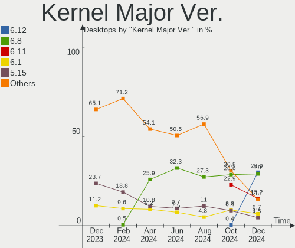
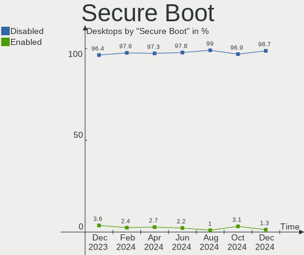
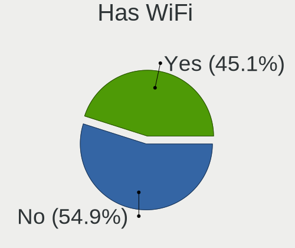
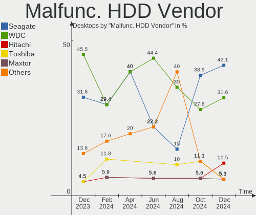
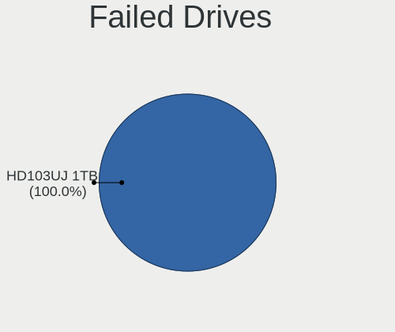
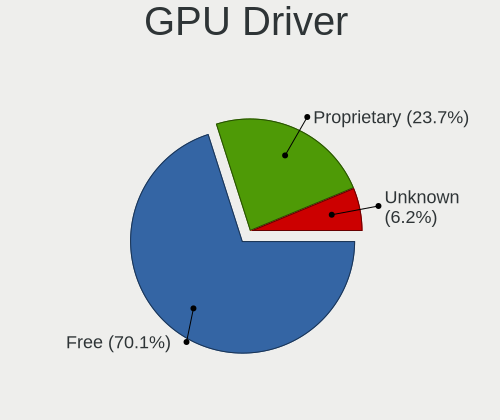

Linux in Germany - Hardware Trends (Desktops)
---------------------------------------------

A project to identify most popular hardware characteristics and track their change
over time based on data collected by Linux users at https://Linux-Hardware.org.

Anyone can contribute to this report by the [hw-probe](https://github.com/linuxhw/hw-probe) tool:

    sudo -E hw-probe -all -upload

Period: Jun, 2022.

Contents
--------

* [ System ](#system)
  - [ OS                       ](#os)
  - [ OS Family                ](#os-family)
  - [ Kernel                   ](#kernel)
  - [ Kernel Family            ](#kernel-family)
  - [ Kernel Major Ver.        ](#kernel-major-ver)
  - [ Arch                     ](#arch)
  - [ DE                       ](#de)
  - [ Display Server           ](#display-server)
  - [ Display Manager          ](#display-manager)
  - [ OS Lang                  ](#os-lang)
  - [ Boot Mode                ](#boot-mode)
  - [ Filesystem               ](#filesystem)
  - [ Part. scheme             ](#part-scheme)
  - [ Dual Boot with Linux/BSD ](#dual-boot-with-linuxbsd)
  - [ Dual Boot (Win)          ](#dual-boot-win)

* [ Board ](#board)
  - [ Vendor                   ](#vendor)
  - [ Model                    ](#model)
  - [ Model Family             ](#model-family)
  - [ MFG Year                 ](#mfg-year)
  - [ Form Factor              ](#form-factor)
  - [ Secure Boot              ](#secure-boot)
  - [ Coreboot                 ](#coreboot)
  - [ RAM Size                 ](#ram-size)
  - [ RAM Used                 ](#ram-used)
  - [ Total Drives             ](#total-drives)
  - [ Has CD-ROM               ](#has-cd-rom)
  - [ Has Ethernet             ](#has-ethernet)
  - [ Has WiFi                 ](#has-wifi)
  - [ Has Bluetooth            ](#has-bluetooth)

* [ Location ](#location)
  - [ Country                  ](#country)
  - [ City                     ](#city)

* [ Drives ](#drives)
  - [ Drive Vendor             ](#drive-vendor)
  - [ Drive Model              ](#drive-model)
  - [ HDD Vendor               ](#hdd-vendor)
  - [ SSD Vendor               ](#ssd-vendor)
  - [ Drive Kind               ](#drive-kind)
  - [ Drive Connector          ](#drive-connector)
  - [ Drive Size               ](#drive-size)
  - [ Space Total              ](#space-total)
  - [ Space Used               ](#space-used)
  - [ Malfunc. Drives          ](#malfunc-drives)
  - [ Malfunc. Drive Vendor    ](#malfunc-drive-vendor)
  - [ Malfunc. HDD Vendor      ](#malfunc-hdd-vendor)
  - [ Malfunc. Drive Kind      ](#malfunc-drive-kind)
  - [ Failed Drives            ](#failed-drives)
  - [ Failed Drive Vendor      ](#failed-drive-vendor)
  - [ Drive Status             ](#drive-status)

* [ Storage controller ](#storage-controller)
  - [ Storage Vendor           ](#storage-vendor)
  - [ Storage Model            ](#storage-model)
  - [ Storage Kind             ](#storage-kind)

* [ Processor ](#processor)
  - [ CPU Vendor               ](#cpu-vendor)
  - [ CPU Model                ](#cpu-model)
  - [ CPU Model Family         ](#cpu-model-family)
  - [ CPU Cores                ](#cpu-cores)
  - [ CPU Sockets              ](#cpu-sockets)
  - [ CPU Threads              ](#cpu-threads)
  - [ CPU Op-Modes             ](#cpu-op-modes)
  - [ CPU Microcode            ](#cpu-microcode)
  - [ CPU Microarch            ](#cpu-microarch)

* [ Graphics ](#graphics)
  - [ GPU Vendor               ](#gpu-vendor)
  - [ GPU Model                ](#gpu-model)
  - [ GPU Combo                ](#gpu-combo)
  - [ GPU Driver               ](#gpu-driver)
  - [ GPU Memory               ](#gpu-memory)

* [ Monitor ](#monitor)
  - [ Monitor Vendor           ](#monitor-vendor)
  - [ Monitor Model            ](#monitor-model)
  - [ Monitor Resolution       ](#monitor-resolution)
  - [ Monitor Diagonal         ](#monitor-diagonal)
  - [ Monitor Width            ](#monitor-width)
  - [ Aspect Ratio             ](#aspect-ratio)
  - [ Monitor Area             ](#monitor-area)
  - [ Pixel Density            ](#pixel-density)
  - [ Multiple Monitors        ](#multiple-monitors)

* [ Network ](#network)
  - [ Net Controller Vendor    ](#net-controller-vendor)
  - [ Net Controller Model     ](#net-controller-model)
  - [ Wireless Vendor          ](#wireless-vendor)
  - [ Wireless Model           ](#wireless-model)
  - [ Ethernet Vendor          ](#ethernet-vendor)
  - [ Ethernet Model           ](#ethernet-model)
  - [ Net Controller Kind      ](#net-controller-kind)
  - [ Used Controller          ](#used-controller)
  - [ NICs                     ](#nics)
  - [ IPv6                     ](#ipv6)

* [ Bluetooth ](#bluetooth)
  - [ Bluetooth Vendor         ](#bluetooth-vendor)
  - [ Bluetooth Model          ](#bluetooth-model)

* [ Sound ](#sound)
  - [ Sound Vendor             ](#sound-vendor)
  - [ Sound Model              ](#sound-model)

* [ Memory ](#memory)
  - [ Memory Vendor            ](#memory-vendor)
  - [ Memory Model             ](#memory-model)
  - [ Memory Kind              ](#memory-kind)
  - [ Memory Form Factor       ](#memory-form-factor)
  - [ Memory Size              ](#memory-size)
  - [ Memory Speed             ](#memory-speed)

* [ Printers & scanners ](#printers--scanners)
  - [ Printer Vendor           ](#printer-vendor)
  - [ Printer Model            ](#printer-model)
  - [ Scanner Vendor           ](#scanner-vendor)
  - [ Scanner Model            ](#scanner-model)

* [ Camera ](#camera)
  - [ Camera Vendor            ](#camera-vendor)
  - [ Camera Model             ](#camera-model)

* [ Security ](#security)
  - [ Fingerprint Vendor       ](#fingerprint-vendor)
  - [ Fingerprint Model        ](#fingerprint-model)
  - [ Chipcard Vendor          ](#chipcard-vendor)
  - [ Chipcard Model           ](#chipcard-model)

* [ Unsupported ](#unsupported)
  - [ Unsupported Devices      ](#unsupported-devices)
  - [ Unsupported Device Types ](#unsupported-device-types)

System
------

OS
--

Installed operating systems

| Name                         | Desktops | Percent |
|------------------------------|----------|---------|
| Linux Mint 20.3              | 20       | 13.89%  |
| Ubuntu 20.04                 | 18       | 12.5%   |
| Ubuntu 22.04                 | 17       | 11.81%  |
| OpenMandriva 4.3             | 10       | 6.94%   |
| Debian 11                    | 10       | 6.94%   |
| Zorin 16                     | 6        | 4.17%   |
| Manjaro                      | 5        | 3.47%   |
| Fedora 36                    | 5        | 3.47%   |
| Ubuntu 21.10                 | 3        | 2.08%   |
| OpenMandriva 4.2             | 3        | 2.08%   |
| Linux Mint 20.1              | 3        | 2.08%   |
| Arch Rolling                 | 3        | 2.08%   |
| Ubuntu MATE 20.04            | 2        | 1.39%   |
| Pop!_OS 22.04                | 2        | 1.39%   |
| openSUSE Tumbleweed-XXXXXXXX | 2        | 1.39%   |
| Manjaro 21.2.6               | 2        | 1.39%   |
| Linux Mint 19.3              | 2        | 1.39%   |
| Kali 2022.2                  | 2        | 1.39%   |
| ArcoLinux Rolling            | 2        | 1.39%   |
| Arch                         | 2        | 1.39%   |
| Xubuntu 20.10                | 1        | 0.69%   |
| Xubuntu 20.04                | 1        | 0.69%   |
| Xubuntu 19.10                | 1        | 0.69%   |
| Xero Rolling                 | 1        | 0.69%   |
| Ubuntu Studio 22.04          | 1        | 0.69%   |
| Ubuntu 21.04                 | 1        | 0.69%   |
| Ubuntu 18.04                 | 1        | 0.69%   |
| Solus 4.3                    | 1        | 0.69%   |
| ROSA 12.2                    | 1        | 0.69%   |
| ROSA 12.1                    | 1        | 0.69%   |
| openSUSE Leap-15.4           | 1        | 0.69%   |
| openSUSE Leap-15.3           | 1        | 0.69%   |
| MassOS 2022.06               | 1        | 0.69%   |
| Lubuntu 22.04                | 1        | 0.69%   |
| LinuxFX 11.1                 | 1        | 0.69%   |
| LinuxFX 11                   | 1        | 0.69%   |
| Linux Mint 20                | 1        | 0.69%   |
| Kubuntu 22.04                | 1        | 0.69%   |
| Kubuntu 21.10                | 1        | 0.69%   |
| Kubuntu 11                   | 1        | 0.69%   |
| Gentoo 2.8                   | 1        | 0.69%   |
| Debian Testing               | 1        | 0.69%   |
| Debian 10                    | 1        | 0.69%   |
| Clear Linux 36520            | 1        | 0.69%   |
| ArcoLinux                    | 1        | 0.69%   |

OS Family
---------

OS without a version

| Name          | Desktops | Percent |
|---------------|----------|---------|
| Ubuntu        | 40       | 27.78%  |
| Linux Mint    | 26       | 18.06%  |
| OpenMandriva  | 13       | 9.03%   |
| Debian        | 12       | 8.33%   |
| Manjaro       | 7        | 4.86%   |
| Zorin         | 6        | 4.17%   |
| Fedora        | 5        | 3.47%   |
| Arch          | 5        | 3.47%   |
| openSUSE      | 4        | 2.78%   |
| Xubuntu       | 3        | 2.08%   |
| Kubuntu       | 3        | 2.08%   |
| ArcoLinux     | 3        | 2.08%   |
| Ubuntu MATE   | 2        | 1.39%   |
| ROSA          | 2        | 1.39%   |
| Pop!_OS       | 2        | 1.39%   |
| LinuxFX       | 2        | 1.39%   |
| Kali          | 2        | 1.39%   |
| Xero          | 1        | 0.69%   |
| Ubuntu Studio | 1        | 0.69%   |
| Solus         | 1        | 0.69%   |
| MassOS        | 1        | 0.69%   |
| Lubuntu       | 1        | 0.69%   |
| Gentoo        | 1        | 0.69%   |
| Clear Linux   | 1        | 0.69%   |

Kernel
------

Version of the Linux kernel

| Version                            | Desktops | Percent |
|------------------------------------|----------|---------|
| 5.16.7-desktop-1omv4003            | 10       | 6.94%   |
| 5.13.0-44-generic                  | 10       | 6.94%   |
| 5.4.0-117-generic                  | 9        | 6.25%   |
| 5.4.0-113-generic                  | 7        | 4.86%   |
| 5.15.0-37-generic                  | 7        | 4.86%   |
| 5.13.0-51-generic                  | 7        | 4.86%   |
| 5.13.0-48-generic                  | 7        | 4.86%   |
| 5.15.0-35-generic                  | 4        | 2.78%   |
| 5.4.0-121-generic                  | 3        | 2.08%   |
| 5.16.0-0.bpo.4-amd64               | 3        | 2.08%   |
| 5.10.14-desktop-1omv4002           | 3        | 2.08%   |
| 5.4.0-120-generic                  | 2        | 1.39%   |
| 5.18.5-arch1-1                     | 2        | 1.39%   |
| 5.17.5-76051705-generic            | 2        | 1.39%   |
| 5.15.41-1-MANJARO                  | 2        | 1.39%   |
| 5.15.0-40-generic                  | 2        | 1.39%   |
| 5.15.0-39-generic                  | 2        | 1.39%   |
| 5.15.0-33-generic                  | 2        | 1.39%   |
| 5.10.74-generic-2rosa2021.1-x86_64 | 2        | 1.39%   |
| 5.10.0-11-amd64                    | 2        | 1.39%   |
| 5.10.0-10-amd64                    | 2        | 1.39%   |
| 5.8.0-63-generic                   | 1        | 0.69%   |
| 5.4.195-1-MANJARO                  | 1        | 0.69%   |
| 5.4.0-91-generic                   | 1        | 0.69%   |
| 5.4.0-80-generic                   | 1        | 0.69%   |
| 5.4.0-58-generic                   | 1        | 0.69%   |
| 5.4.0-121-lowlatency               | 1        | 0.69%   |
| 5.4.0-113-lowlatency               | 1        | 0.69%   |
| 5.4.0-104-generic                  | 1        | 0.69%   |
| 5.3.18-150300.59.68-default        | 1        | 0.69%   |
| 5.3.0-61-generic                   | 1        | 0.69%   |
| 5.18.7-arch1-1                     | 1        | 0.69%   |
| 5.18.6-gentoo                      | 1        | 0.69%   |
| 5.18.6-arch1-1                     | 1        | 0.69%   |
| 5.18.5-zen1-1-zen                  | 1        | 0.69%   |
| 5.18.5-200.fc36.x86_64             | 1        | 0.69%   |
| 5.18.5-1158.native                 | 1        | 0.69%   |
| 5.18.3-arch1-1                     | 1        | 0.69%   |
| 5.18.3-1-MANJARO                   | 1        | 0.69%   |
| 5.18.2-rc1_MY                      | 1        | 0.69%   |
| 5.18.2-arch1-1                     | 1        | 0.69%   |
| 5.18.2-1-default                   | 1        | 0.69%   |
| 5.18.1-massos                      | 1        | 0.69%   |
| 5.18.1-arch1-1                     | 1        | 0.69%   |
| 5.17.9-xanmod1                     | 1        | 0.69%   |
| 5.17.9-1-MANJARO                   | 1        | 0.69%   |
| 5.17.7-1-default                   | 1        | 0.69%   |
| 5.17.7-051707-generic              | 1        | 0.69%   |
| 5.17.13-300.fc36.x86_64            | 1        | 0.69%   |
| 5.17.12-300.fc36.x86_64            | 1        | 0.69%   |
| 5.17.11-300.fc36.x86_64            | 1        | 0.69%   |
| 5.17.1-3-rt17-MANJARO              | 1        | 0.69%   |
| 5.17.0-1-amd64                     | 1        | 0.69%   |
| 5.16.0-kali7-amd64                 | 1        | 0.69%   |
| 5.16.0-kali1-amd64                 | 1        | 0.69%   |
| 5.15.49-1-MANJARO                  | 1        | 0.69%   |
| 5.15.43-215.current                | 1        | 0.69%   |
| 5.15.35-2-pve                      | 1        | 0.69%   |
| 5.15.24-1-lts                      | 1        | 0.69%   |
| 5.15.0-40-lowlatency               | 1        | 0.69%   |

Kernel Family
-------------

Linux kernel without a distro release

| Version | Desktops | Percent |
|---------|----------|---------|
| 5.13.0  | 30       | 20.83%  |
| 5.4.0   | 27       | 18.75%  |
| 5.15.0  | 19       | 13.19%  |
| 5.16.7  | 10       | 6.94%   |
| 5.10.0  | 6        | 4.17%   |
| 5.18.5  | 5        | 3.47%   |
| 5.16.0  | 5        | 3.47%   |
| 5.18.2  | 3        | 2.08%   |
| 5.11.0  | 3        | 2.08%   |
| 5.10.14 | 3        | 2.08%   |
| 5.18.6  | 2        | 1.39%   |
| 5.18.3  | 2        | 1.39%   |
| 5.18.1  | 2        | 1.39%   |
| 5.17.9  | 2        | 1.39%   |
| 5.17.7  | 2        | 1.39%   |
| 5.17.5  | 2        | 1.39%   |
| 5.15.41 | 2        | 1.39%   |
| 5.10.74 | 2        | 1.39%   |
| 5.8.0   | 1        | 0.69%   |
| 5.4.195 | 1        | 0.69%   |
| 5.3.18  | 1        | 0.69%   |
| 5.3.0   | 1        | 0.69%   |
| 5.18.7  | 1        | 0.69%   |
| 5.17.13 | 1        | 0.69%   |
| 5.17.12 | 1        | 0.69%   |
| 5.17.11 | 1        | 0.69%   |
| 5.17.1  | 1        | 0.69%   |
| 5.17.0  | 1        | 0.69%   |
| 5.15.49 | 1        | 0.69%   |
| 5.15.43 | 1        | 0.69%   |
| 5.15.35 | 1        | 0.69%   |
| 5.15.24 | 1        | 0.69%   |
| 5.14.21 | 1        | 0.69%   |
| 4.19.0  | 1        | 0.69%   |
| 4.15.0  | 1        | 0.69%   |

Kernel Major Ver.
-----------------

Linux kernel major version

| Version | Desktops | Percent |
|---------|----------|---------|
| 5.13    | 30       | 20.83%  |
| 5.4     | 28       | 19.44%  |
| 5.15    | 25       | 17.36%  |
| 5.18    | 15       | 10.42%  |
| 5.16    | 15       | 10.42%  |
| 5.17    | 11       | 7.64%   |
| 5.10    | 11       | 7.64%   |
| 5.11    | 3        | 2.08%   |
| 5.3     | 2        | 1.39%   |
| 5.8     | 1        | 0.69%   |
| 5.14    | 1        | 0.69%   |
| 4.19    | 1        | 0.69%   |
| 4.15    | 1        | 0.69%   |

Arch
----

OS architecture (x86_64, i586, etc.)

| Name   | Desktops | Percent |
|--------|----------|---------|
| x86_64 | 141      | 97.92%  |
| i686   | 3        | 2.08%   |

DE
--

Desktop Environment

| Name       | Desktops | Percent |
|------------|----------|---------|
| GNOME      | 57       | 39.58%  |
| KDE5       | 37       | 25.69%  |
| X-Cinnamon | 21       | 14.58%  |
| XFCE       | 11       | 7.64%   |
| MATE       | 7        | 4.86%   |
| Unknown    | 5        | 3.47%   |
| Cinnamon   | 2        | 1.39%   |
| Unity      | 1        | 0.69%   |
| LXDE       | 1        | 0.69%   |
| hyprland   | 1        | 0.69%   |
| Budgie     | 1        | 0.69%   |

Display Server
--------------

X11 or Wayland

| Name        | Desktops | Percent |
|-------------|----------|---------|
| X11         | 117      | 81.25%  |
| Wayland     | 20       | 13.89%  |
| Tty         | 3        | 2.08%   |
| Unknown     | 3        | 2.08%   |
| Unspecified | 1        | 0.69%   |

Display Manager
---------------

SDDM, LightDM, etc.

| Name    | Desktops | Percent |
|---------|----------|---------|
| Unknown | 49       | 34.03%  |
| GDM3    | 35       | 24.31%  |
| SDDM    | 26       | 18.06%  |
| LightDM | 19       | 13.19%  |
| GDM     | 12       | 8.33%   |
| XDM     | 3        | 2.08%   |

OS Lang
-------

Language

| Lang    | Desktops | Percent |
|---------|----------|---------|
| de_DE   | 116      | 80.56%  |
| en_US   | 23       | 15.97%  |
| en_GB   | 2        | 1.39%   |
| fr_FR   | 1        | 0.69%   |
| C       | 1        | 0.69%   |
| Unknown | 1        | 0.69%   |

Boot Mode
---------

EFI or BIOS

| Mode | Desktops | Percent |
|------|----------|---------|
| BIOS | 86       | 59.72%  |
| EFI  | 58       | 40.28%  |

Filesystem
----------

Type of filesystem

| Type    | Desktops | Percent |
|---------|----------|---------|
| Ext4    | 113      | 78.47%  |
| Btrfs   | 16       | 11.11%  |
| Overlay | 13       | 9.03%   |
| Xfs     | 2        | 1.39%   |

Part. scheme
------------

Scheme of partitioning

| Type    | Desktops | Percent |
|---------|----------|---------|
| Unknown | 84       | 58.33%  |
| GPT     | 42       | 29.17%  |
| MBR     | 18       | 12.5%   |

Dual Boot with Linux/BSD
------------------------

Hosting more than one Linux/BSD

| Dual boot | Desktops | Percent |
|-----------|----------|---------|
| No        | 110      | 76.39%  |
| Yes       | 34       | 23.61%  |

Dual Boot (Win)
---------------

Hosting Linux and Windows

| Dual boot | Desktops | Percent |
|-----------|----------|---------|
| No        | 92       | 63.89%  |
| Yes       | 52       | 36.11%  |

Board
-----

Vendor
------

Motherboard manufacturer

| Name                | Desktops | Percent |
|---------------------|----------|---------|
| ASUSTek Computer    | 32       | 22.22%  |
| MSI                 | 23       | 15.97%  |
| Gigabyte Technology | 20       | 13.89%  |
| ASRock              | 16       | 11.11%  |
| Hewlett-Packard     | 14       | 9.72%   |
| Lenovo              | 7        | 4.86%   |
| Dell                | 7        | 4.86%   |
| Fujitsu             | 6        | 4.17%   |
| Medion              | 5        | 3.47%   |
| Biostar             | 3        | 2.08%   |
| Acer                | 3        | 2.08%   |
| Foxconn             | 2        | 1.39%   |
| BESSTAR Tech        | 2        | 1.39%   |
| PC Engines          | 1        | 0.69%   |
| ASRockRack          | 1        | 0.69%   |
| Acidanthera         | 1        | 0.69%   |
| Unknown             | 1        | 0.69%   |

Model
-----

Motherboard model

| Name                                      | Desktops | Percent |
|-------------------------------------------|----------|---------|
| MSI MS-7C37                               | 3        | 2.08%   |
| MSI MS-7C95                               | 2        | 1.39%   |
| MSI MS-7C56                               | 2        | 1.39%   |
| MSI MS-7C52                               | 2        | 1.39%   |
| Fujitsu ESPRIMO E720                      | 2        | 1.39%   |
| ASUS TUF Gaming B550-PLUS                 | 2        | 1.39%   |
| ASRock B450 Gaming-ITX/ac                 | 2        | 1.39%   |
| PC Engines APU2                           | 1        | 0.69%   |
| MSI MS-7C36                               | 1        | 0.69%   |
| MSI MS-7B89                               | 1        | 0.69%   |
| MSI MS-7B86                               | 1        | 0.69%   |
| MSI MS-7A38                               | 1        | 0.69%   |
| MSI MS-7982                               | 1        | 0.69%   |
| MSI MS-7971                               | 1        | 0.69%   |
| MSI MS-7885                               | 1        | 0.69%   |
| MSI MS-7817                               | 1        | 0.69%   |
| MSI MS-7808                               | 1        | 0.69%   |
| MSI MS-7758                               | 1        | 0.69%   |
| MSI MS-7721                               | 1        | 0.69%   |
| MSI MS-7698                               | 1        | 0.69%   |
| MSI MS-7641                               | 1        | 0.69%   |
| MSI MS-7255                               | 1        | 0.69%   |
| Medion P961x                              | 1        | 0.69%   |
| Medion MS-7728                            | 1        | 0.69%   |
| Medion MS-7501                            | 1        | 0.69%   |
| Medion MD34731                            | 1        | 0.69%   |
| Medion Akoya P5372 H/B728                 | 1        | 0.69%   |
| Lenovo ThinkStation P520 30BE008VGE       | 1        | 0.69%   |
| Lenovo ThinkStation P500 30A6S4JY00       | 1        | 0.69%   |
| Lenovo ThinkCentre M92p 3238AJ6           | 1        | 0.69%   |
| Lenovo ThinkCentre M58 7373AJ5            | 1        | 0.69%   |
| Lenovo ThinkCentre A70 7844H9G            | 1        | 0.69%   |
| Lenovo IdeaCentre T540-15ICK G 90LW001UGE | 1        | 0.69%   |
| Lenovo C50-30 F0B1002EFR                  | 1        | 0.69%   |
| HP Z840 Workstation                       | 1        | 0.69%   |
| HP Z820 Workstation                       | 1        | 0.69%   |
| HP Z800 Workstation                       | 1        | 0.69%   |
| HP Z420 Workstation                       | 1        | 0.69%   |
| HP xw6600 Workstation                     | 1        | 0.69%   |
| HP Slimline Desktop PC 260-a100ng         | 1        | 0.69%   |
| HP ProDesk 600 G2 MT                      | 1        | 0.69%   |
| HP EliteDesk 800 G1 SFF                   | 1        | 0.69%   |
| HP d530 CMT(DC577AV)                      | 1        | 0.69%   |
| HP Compaq Elite 8300 USDT                 | 1        | 0.69%   |
| HP Compaq Elite 8300 CMT                  | 1        | 0.69%   |
| HP Compaq dc7900 Convertible Minitower    | 1        | 0.69%   |
| HP Compaq dc5850 Small Form Factor        | 1        | 0.69%   |
| HP 870-115ng                              | 1        | 0.69%   |
| Gigabyte Z87X-UD3H                        | 1        | 0.69%   |
| Gigabyte Z77MX-D3H                        | 1        | 0.69%   |
| Gigabyte Z77-DS3H                         | 1        | 0.69%   |
| Gigabyte Z690 UD DDR4                     | 1        | 0.69%   |
| Gigabyte Z270-HD3P                        | 1        | 0.69%   |
| Gigabyte M57SLI-S4                        | 1        | 0.69%   |
| Gigabyte H87-HD3                          | 1        | 0.69%   |
| Gigabyte GB-BXi3-5010                     | 1        | 0.69%   |
| Gigabyte GB-BACE-3000                     | 1        | 0.69%   |
| Gigabyte GA-MA78G-DS3H                    | 1        | 0.69%   |
| Gigabyte GA-990FXA-UD5                    | 1        | 0.69%   |
| Gigabyte GA-78LMT-USB3                    | 1        | 0.69%   |

Model Family
------------

Motherboard model prefix

| Name                   | Desktops | Percent |
|------------------------|----------|---------|
| Dell OptiPlex          | 6        | 4.17%   |
| Fujitsu ESPRIMO        | 5        | 3.47%   |
| ASUS PRIME             | 5        | 3.47%   |
| HP Compaq              | 4        | 2.78%   |
| ASUS TUF               | 4        | 2.78%   |
| ASUS ROG               | 4        | 2.78%   |
| MSI MS-7C37            | 3        | 2.08%   |
| Lenovo ThinkCentre     | 3        | 2.08%   |
| Acer Aspire            | 3        | 2.08%   |
| MSI MS-7C95            | 2        | 1.39%   |
| MSI MS-7C56            | 2        | 1.39%   |
| MSI MS-7C52            | 2        | 1.39%   |
| Lenovo ThinkStation    | 2        | 1.39%   |
| Gigabyte B550          | 2        | 1.39%   |
| ASUS CROSSHAIR         | 2        | 1.39%   |
| ASRock B450M           | 2        | 1.39%   |
| ASRock B450            | 2        | 1.39%   |
| ASRock 970             | 2        | 1.39%   |
| PC Engines APU2        | 1        | 0.69%   |
| MSI MS-7C36            | 1        | 0.69%   |
| MSI MS-7B89            | 1        | 0.69%   |
| MSI MS-7B86            | 1        | 0.69%   |
| MSI MS-7A38            | 1        | 0.69%   |
| MSI MS-7982            | 1        | 0.69%   |
| MSI MS-7971            | 1        | 0.69%   |
| MSI MS-7885            | 1        | 0.69%   |
| MSI MS-7817            | 1        | 0.69%   |
| MSI MS-7808            | 1        | 0.69%   |
| MSI MS-7758            | 1        | 0.69%   |
| MSI MS-7721            | 1        | 0.69%   |
| MSI MS-7698            | 1        | 0.69%   |
| MSI MS-7641            | 1        | 0.69%   |
| MSI MS-7255            | 1        | 0.69%   |
| Medion P961x           | 1        | 0.69%   |
| Medion MS-7728         | 1        | 0.69%   |
| Medion MS-7501         | 1        | 0.69%   |
| Medion MD34731         | 1        | 0.69%   |
| Medion Akoya           | 1        | 0.69%   |
| Lenovo IdeaCentre      | 1        | 0.69%   |
| Lenovo C50-30          | 1        | 0.69%   |
| HP Z840                | 1        | 0.69%   |
| HP Z820                | 1        | 0.69%   |
| HP Z800                | 1        | 0.69%   |
| HP Z420                | 1        | 0.69%   |
| HP xw6600              | 1        | 0.69%   |
| HP Slimline            | 1        | 0.69%   |
| HP ProDesk             | 1        | 0.69%   |
| HP EliteDesk           | 1        | 0.69%   |
| HP d530                | 1        | 0.69%   |
| HP 870-115ng           | 1        | 0.69%   |
| Gigabyte Z87X-UD3H     | 1        | 0.69%   |
| Gigabyte Z77MX-D3H     | 1        | 0.69%   |
| Gigabyte Z77-DS3H      | 1        | 0.69%   |
| Gigabyte Z690          | 1        | 0.69%   |
| Gigabyte Z270-HD3P     | 1        | 0.69%   |
| Gigabyte M57SLI-S4     | 1        | 0.69%   |
| Gigabyte H87-HD3       | 1        | 0.69%   |
| Gigabyte GB-BXi3-5010  | 1        | 0.69%   |
| Gigabyte GB-BACE-3000  | 1        | 0.69%   |
| Gigabyte GA-MA78G-DS3H | 1        | 0.69%   |

MFG Year
--------

Motherboard manufacture year

| Year | Desktops | Percent |
|------|----------|---------|
| 2020 | 19       | 13.19%  |
| 2012 | 18       | 12.5%   |
| 2013 | 15       | 10.42%  |
| 2018 | 14       | 9.72%   |
| 2019 | 10       | 6.94%   |
| 2017 | 10       | 6.94%   |
| 2010 | 10       | 6.94%   |
| 2021 | 8        | 5.56%   |
| 2011 | 8        | 5.56%   |
| 2008 | 8        | 5.56%   |
| 2016 | 7        | 4.86%   |
| 2015 | 7        | 4.86%   |
| 2014 | 5        | 3.47%   |
| 2022 | 1        | 0.69%   |
| 2009 | 1        | 0.69%   |
| 2007 | 1        | 0.69%   |
| 2006 | 1        | 0.69%   |
| 2003 | 1        | 0.69%   |

Form Factor
-----------

Physical design of the computer

| Name    | Desktops | Percent |
|---------|----------|---------|
| Desktop | 144      | 100%    |

Secure Boot
-----------

Enabled or disabled

| State    | Desktops | Percent |
|----------|----------|---------|
| Disabled | 141      | 97.92%  |
| Enabled  | 3        | 2.08%   |

Coreboot
--------

Have coreboot on board

| Used | Desktops | Percent |
|------|----------|---------|
| No   | 143      | 99.31%  |
| Yes  | 1        | 0.69%   |

RAM Size
--------

Total RAM memory

| Size in GB      | Desktops | Percent |
|-----------------|----------|---------|
| 16.01-24.0      | 37       | 25.69%  |
| 4.01-8.0        | 23       | 15.97%  |
| 32.01-64.0      | 23       | 15.97%  |
| 8.01-16.0       | 21       | 14.58%  |
| 3.01-4.0        | 18       | 12.5%   |
| 24.01-32.0      | 9        | 6.25%   |
| 64.01-256.0     | 9        | 6.25%   |
| 2.01-3.0        | 2        | 1.39%   |
| More than 256.0 | 1        | 0.69%   |
| 0.01-0.5        | 1        | 0.69%   |

RAM Used
--------

Used RAM memory

| Used GB    | Desktops | Percent |
|------------|----------|---------|
| 1.01-2.0   | 52       | 36.11%  |
| 2.01-3.0   | 38       | 26.39%  |
| 4.01-8.0   | 18       | 12.5%   |
| 3.01-4.0   | 16       | 11.11%  |
| 0.51-1.0   | 9        | 6.25%   |
| 8.01-16.0  | 6        | 4.17%   |
| 16.01-24.0 | 3        | 2.08%   |
| 32.01-64.0 | 1        | 0.69%   |
| 0.01-0.5   | 1        | 0.69%   |

Total Drives
------------

Number of drives on board

| Drives | Desktops | Percent |
|--------|----------|---------|
| 1      | 48       | 33.33%  |
| 2      | 40       | 27.78%  |
| 3      | 29       | 20.14%  |
| 4      | 14       | 9.72%   |
| 5      | 8        | 5.56%   |
| 7      | 3        | 2.08%   |
| 10     | 1        | 0.69%   |
| 6      | 1        | 0.69%   |

Has CD-ROM
----------

Has CD-ROM on board

| Presented | Desktops | Percent |
|-----------|----------|---------|
| Yes       | 95       | 65.97%  |
| No        | 49       | 34.03%  |

Has Ethernet
------------

Has Ethernet on board

| Presented | Desktops | Percent |
|-----------|----------|---------|
| Yes       | 144      | 100%    |

Has WiFi
--------

Has WiFi module

| Presented | Desktops | Percent |
|-----------|----------|---------|
| No        | 93       | 64.58%  |
| Yes       | 51       | 35.42%  |

Has Bluetooth
-------------

Has Bluetooth module

| Presented | Desktops | Percent |
|-----------|----------|---------|
| No        | 99       | 68.75%  |
| Yes       | 45       | 31.25%  |

Location
--------

Country
-------

Geographic location (country)

| Country | Desktops | Percent |
|---------|----------|---------|
| Germany | 144      | 100%    |

City
----

Geographic location (city)

| City                   | Desktops | Percent |
|------------------------|----------|---------|
| Berlin                 | 11       | 7.64%   |
| Hamburg                | 9        | 6.25%   |
| Munich                 | 6        | 4.17%   |
| Gladbeck               | 4        | 2.78%   |
| Stuttgart              | 3        | 2.08%   |
| Bremen                 | 3        | 2.08%   |
| Weimar                 | 2        | 1.39%   |
| Tholey                 | 2        | 1.39%   |
| Magdeburg              | 2        | 1.39%   |
| Kiel                   | 2        | 1.39%   |
| Karlsruhe              | 2        | 1.39%   |
| Frankfurt am Main      | 2        | 1.39%   |
| Duisburg               | 2        | 1.39%   |
| Bielefeld              | 2        | 1.39%   |
| Würzburg              | 1        | 0.69%   |
| Worms                  | 1        | 0.69%   |
| Witten                 | 1        | 0.69%   |
| Wiesbaden              | 1        | 0.69%   |
| Wetzlar                | 1        | 0.69%   |
| Weinbach               | 1        | 0.69%   |
| Waltenhofen            | 1        | 0.69%   |
| Waldkraiburg           | 1        | 0.69%   |
| Waldbroel              | 1        | 0.69%   |
| Wadersloh              | 1        | 0.69%   |
| Villingen-Schwenningen | 1        | 0.69%   |
| Ulm                    | 1        | 0.69%   |
| Trimport               | 1        | 0.69%   |
| Thungersheim           | 1        | 0.69%   |
| Strausberg             | 1        | 0.69%   |
| Stephanskirchen        | 1        | 0.69%   |
| Singen                 | 1        | 0.69%   |
| Schwieberdingen        | 1        | 0.69%   |
| Schwetzingen           | 1        | 0.69%   |
| Schechingen            | 1        | 0.69%   |
| Saarlouis              | 1        | 0.69%   |
| Saarbrücken           | 1        | 0.69%   |
| Pinneberg              | 1        | 0.69%   |
| Oldenburg              | 1        | 0.69%   |
| Nuremberg              | 1        | 0.69%   |
| Neuss                  | 1        | 0.69%   |
| Neusass                | 1        | 0.69%   |
| Nettetal               | 1        | 0.69%   |
| Netphen                | 1        | 0.69%   |
| Mülheim               | 1        | 0.69%   |
| Moers                  | 1        | 0.69%   |
| Minden                 | 1        | 0.69%   |
| Memmingen              | 1        | 0.69%   |
| Meldorf                | 1        | 0.69%   |
| Meissen                | 1        | 0.69%   |
| Mannheim               | 1        | 0.69%   |
| Luedersdorf            | 1        | 0.69%   |
| Lübeck                | 1        | 0.69%   |
| Lohmar                 | 1        | 0.69%   |
| Leipzig                | 1        | 0.69%   |
| Leer                   | 1        | 0.69%   |
| Lambrechtshagen        | 1        | 0.69%   |
| Kulmbach               | 1        | 0.69%   |
| Krefeld                | 1        | 0.69%   |
| Konstanz               | 1        | 0.69%   |
| Kirchentellinsfurt     | 1        | 0.69%   |

Drives
------

Drive Vendor
------------

Hard drive vendors

| Vendor                    | Desktops | Drives | Percent |
|---------------------------|----------|--------|---------|
| Samsung Electronics       | 53       | 69     | 19.49%  |
| Seagate                   | 52       | 75     | 19.12%  |
| WDC                       | 50       | 72     | 18.38%  |
| SanDisk                   | 17       | 20     | 6.25%   |
| Crucial                   | 16       | 19     | 5.88%   |
| Toshiba                   | 14       | 14     | 5.15%   |
| Kingston                  | 10       | 10     | 3.68%   |
| Intenso                   | 10       | 11     | 3.68%   |
| Unknown                   | 5        | 7      | 1.84%   |
| Phison                    | 5        | 5      | 1.84%   |
| Intel                     | 5        | 5      | 1.84%   |
| Hitachi                   | 4        | 4      | 1.47%   |
| Micron/Crucial Technology | 3        | 3      | 1.1%    |
| A-DATA Technology         | 3        | 4      | 1.1%    |
| Transcend                 | 2        | 2      | 0.74%   |
| Patriot                   | 2        | 3      | 0.74%   |
| Maxtor                    | 2        | 2      | 0.74%   |
| JMicron Technology        | 2        | 2      | 0.74%   |
| HGST                      | 2        | 2      | 0.74%   |
| Verbatim                  | 1        | 1      | 0.37%   |
| SSK                       | 1        | 1      | 0.37%   |
| SPCC                      | 1        | 1      | 0.37%   |
| SMI                       | 1        | 1      | 0.37%   |
| Realtek Semiconductor     | 1        | 1      | 0.37%   |
| PNY                       | 1        | 1      | 0.37%   |
| OCZ                       | 1        | 1      | 0.37%   |
| Netac                     | 1        | 1      | 0.37%   |
| Leven                     | 1        | 1      | 0.37%   |
| Jz                        | 1        | 1      | 0.37%   |
| Hewlett-Packard           | 1        | 1      | 0.37%   |
| EMTEC                     | 1        | 1      | 0.37%   |
| China                     | 1        | 1      | 0.37%   |
| ASMT                      | 1        | 1      | 0.37%   |
| AMP                       | 1        | 1      | 0.37%   |

Drive Model
-----------

Hard drive models

| Model                               | Desktops | Percent |
|-------------------------------------|----------|---------|
| Samsung SSD 970 EVO Plus 500GB      | 5        | 1.57%   |
| Unknown SD/MMC/MS PRO 128GB         | 4        | 1.25%   |
| Seagate ST500DM002-1BD142 500GB     | 4        | 1.25%   |
| Samsung SSD 970 EVO Plus 1TB        | 4        | 1.25%   |
| Samsung SSD 870 QVO 1TB             | 4        | 1.25%   |
| Samsung HD501LJ 500GB               | 4        | 1.25%   |
| Crucial CT1000MX500SSD1 1TB         | 4        | 1.25%   |
| WDC WD10EZEX-08WN4A0 1TB            | 3        | 0.94%   |
| Toshiba DT01ACA100 1TB              | 3        | 0.94%   |
| Seagate ST2000LM015-2E8174 2TB      | 3        | 0.94%   |
| SanDisk SSD PLUS 480GB              | 3        | 0.94%   |
| Samsung SSD 850 EVO 500GB           | 3        | 0.94%   |
| Samsung SSD 840 EVO 250GB           | 3        | 0.94%   |
| Micron/Crucial NVMe SSD Drive 1TB   | 3        | 0.94%   |
| WDC WD5000AAKX-75U6AA0 500GB        | 2        | 0.63%   |
| WDC WD40EFRX-68N32N0 4TB            | 2        | 0.63%   |
| WDC WD20EZRX-00D8PB0 2TB            | 2        | 0.63%   |
| WDC WD20EARS-00MVWB0 2TB            | 2        | 0.63%   |
| WDC WD10EARS-00Y5B1 1TB             | 2        | 0.63%   |
| Transcend TS256GSSD370S 256GB       | 2        | 0.63%   |
| Toshiba KBG30ZMS128G 128GB NVMe SSD | 2        | 0.63%   |
| Toshiba DT01ACA300 3TB              | 2        | 0.63%   |
| Toshiba DT01ACA200 2TB              | 2        | 0.63%   |
| Seagate ST8000DM004-2CX188 8TB      | 2        | 0.63%   |
| Seagate ST6000VN0033-2EE110 6TB     | 2        | 0.63%   |
| Seagate ST4000DM004-2CV104 4TB      | 2        | 0.63%   |
| Seagate ST3500418AS 500GB           | 2        | 0.63%   |
| Seagate ST2000NM0011 2TB            | 2        | 0.63%   |
| Seagate ST2000DM008-2FR102 2TB      | 2        | 0.63%   |
| Seagate ST1000DM010-2EP102 1TB      | 2        | 0.63%   |
| Seagate ST1000DM003-1SB102 1TB      | 2        | 0.63%   |
| Seagate ST1000DM003-1CH162 1TB      | 2        | 0.63%   |
| SanDisk SDSSDH3 500G                | 2        | 0.63%   |
| Samsung SSD 980 PRO 500GB           | 2        | 0.63%   |
| Samsung SSD 980 PRO 1TB             | 2        | 0.63%   |
| Samsung SSD 970 EVO 1TB             | 2        | 0.63%   |
| Samsung SSD 860 EVO 500GB           | 2        | 0.63%   |
| Samsung SSD 850 EVO 250GB           | 2        | 0.63%   |
| Samsung SSD 840 EVO 120GB           | 2        | 0.63%   |
| Samsung NVMe SSD Drive 1TB          | 2        | 0.63%   |
| Samsung HD252HJ 250GB               | 2        | 0.63%   |
| Samsung HD103UJ 1TB                 | 2        | 0.63%   |
| Phison NVMe SSD Drive 1TB           | 2        | 0.63%   |
| Kingston SV300S37A120G 120GB SSD    | 2        | 0.63%   |
| Kingston SA2000M81000G 1TB          | 2        | 0.63%   |
| Intenso External USB 3.0 1TB        | 2        | 0.63%   |
| Crucial CT525MX300SSD1 528GB        | 2        | 0.63%   |
| Crucial CT256MX100SSD1 256GB        | 2        | 0.63%   |
| WDC WDS500G2B0C-00PXH0 500GB        | 1        | 0.31%   |
| WDC WDS250G2B0A-00SM50 250GB SSD    | 1        | 0.31%   |
| WDC WDS100T2B0A-00SM50 1TB SSD      | 1        | 0.31%   |
| WDC WD800BB-00CAA1 80GB             | 1        | 0.31%   |
| WDC WD6401AALS-00J7B1 640GB         | 1        | 0.31%   |
| WDC WD6400AAKS-22A7B0 640GB         | 1        | 0.31%   |
| WDC WD60EZRZ-00GZ5B1 6TB            | 1        | 0.31%   |
| WDC WD6003FZBX-00K5WB0 6TB          | 1        | 0.31%   |
| WDC WD5000LPCX-24C6HT0 500GB        | 1        | 0.31%   |
| WDC WD5000AZLX-00CL5A0 500GB        | 1        | 0.31%   |
| WDC WD5000AAKX-22ERMA0 500GB        | 1        | 0.31%   |
| WDC WD5000AAKX-08U6AA0 500GB        | 1        | 0.31%   |

HDD Vendor
----------

Hard disk drive vendors

| Vendor              | Desktops | Drives | Percent |
|---------------------|----------|--------|---------|
| Seagate             | 52       | 75     | 37.14%  |
| WDC                 | 48       | 69     | 34.29%  |
| Samsung Electronics | 13       | 14     | 9.29%   |
| Toshiba             | 11       | 11     | 7.86%   |
| Unknown             | 4        | 4      | 2.86%   |
| Hitachi             | 4        | 4      | 2.86%   |
| Maxtor              | 2        | 2      | 1.43%   |
| Intenso             | 2        | 2      | 1.43%   |
| HGST                | 2        | 2      | 1.43%   |
| JMicron Technology  | 1        | 1      | 0.71%   |
| AMP                 | 1        | 1      | 0.71%   |

SSD Vendor
----------

Solid state drive vendors

| Vendor              | Desktops | Drives | Percent |
|---------------------|----------|--------|---------|
| Samsung Electronics | 25       | 28     | 29.07%  |
| Crucial             | 16       | 18     | 18.6%   |
| SanDisk             | 15       | 18     | 17.44%  |
| Kingston            | 5        | 5      | 5.81%   |
| Intenso             | 5        | 6      | 5.81%   |
| Intel               | 3        | 3      | 3.49%   |
| A-DATA Technology   | 3        | 4      | 3.49%   |
| WDC                 | 2        | 2      | 2.33%   |
| Transcend           | 2        | 2      | 2.33%   |
| Verbatim            | 1        | 1      | 1.16%   |
| SPCC                | 1        | 1      | 1.16%   |
| Patriot             | 1        | 2      | 1.16%   |
| OCZ                 | 1        | 1      | 1.16%   |
| Netac               | 1        | 1      | 1.16%   |
| Leven               | 1        | 1      | 1.16%   |
| Jz                  | 1        | 1      | 1.16%   |
| Hewlett-Packard     | 1        | 1      | 1.16%   |
| EMTEC               | 1        | 1      | 1.16%   |
| China               | 1        | 1      | 1.16%   |

Drive Kind
----------

HDD or SSD

| Kind    | Desktops | Drives | Percent |
|---------|----------|--------|---------|
| HDD     | 103      | 185    | 45.98%  |
| SSD     | 69       | 97     | 30.8%   |
| NVMe    | 43       | 51     | 19.2%   |
| Unknown | 8        | 10     | 3.57%   |
| MMC     | 1        | 1      | 0.45%   |

Drive Connector
---------------

SATA, SAS, NVMe, etc.

| Type | Desktops | Drives | Percent |
|------|----------|--------|---------|
| SATA | 134      | 272    | 69.07%  |
| NVMe | 43       | 51     | 22.16%  |
| SAS  | 16       | 20     | 8.25%   |
| MMC  | 1        | 1      | 0.52%   |

Drive Size
----------

Size of hard drive

| Size in TB | Desktops | Drives | Percent |
|------------|----------|--------|---------|
| 0.01-0.5   | 93       | 132    | 46.73%  |
| 0.51-1.0   | 55       | 70     | 27.64%  |
| 1.01-2.0   | 23       | 34     | 11.56%  |
| 3.01-4.0   | 14       | 23     | 7.04%   |
| 4.01-10.0  | 8        | 15     | 4.02%   |
| 2.01-3.0   | 6        | 8      | 3.02%   |

Space Total
-----------

Amount of disk space available on the file system

| Size in GB     | Desktops | Percent |
|----------------|----------|---------|
| 251-500        | 30       | 20.83%  |
| 101-250        | 28       | 19.44%  |
| 501-1000       | 20       | 13.89%  |
| More than 3000 | 19       | 13.19%  |
| 1001-2000      | 19       | 13.19%  |
| 2001-3000      | 11       | 7.64%   |
| 1-20           | 11       | 7.64%   |
| 51-100         | 4        | 2.78%   |
| 21-50          | 2        | 1.39%   |

Space Used
----------

Amount of used disk space

| Used GB        | Desktops | Percent |
|----------------|----------|---------|
| 1-20           | 41       | 28.47%  |
| 101-250        | 20       | 13.89%  |
| 21-50          | 19       | 13.19%  |
| 251-500        | 16       | 11.11%  |
| 501-1000       | 14       | 9.72%   |
| 51-100         | 14       | 9.72%   |
| 1001-2000      | 11       | 7.64%   |
| More than 3000 | 7        | 4.86%   |
| 2001-3000      | 2        | 1.39%   |

Malfunc. Drives
---------------

Drive models with a malfunction

| Model                                 | Desktops | Drives | Percent |
|---------------------------------------|----------|--------|---------|
| Samsung Electronics SSD 840 EVO 120GB | 2        | 2      | 16.67%  |
| WDC WD6400AAKS-22A7B0 640GB           | 1        | 1      | 8.33%   |
| WDC WD5000AAKX-00ERMA0 500GB          | 1        | 1      | 8.33%   |
| WDC WD20EARS-00MVWB0 2TB              | 1        | 1      | 8.33%   |
| WDC WD15EARS-00MVWB0 1TB              | 1        | 1      | 8.33%   |
| Seagate ST98823AS 80GB                | 1        | 1      | 8.33%   |
| Seagate ST3320820AS 320GB             | 1        | 1      | 8.33%   |
| Seagate ST2000DX002-2DV164 2TB        | 1        | 1      | 8.33%   |
| Samsung Electronics SSD 970 EVO 1TB   | 1        | 1      | 8.33%   |
| Samsung Electronics SP2504C 250GB     | 1        | 1      | 8.33%   |
| Samsung Electronics HD753LJ 752GB     | 1        | 1      | 8.33%   |

Malfunc. Drive Vendor
---------------------

Vendors of faulty drives

| Vendor              | Desktops | Drives | Percent |
|---------------------|----------|--------|---------|
| Samsung Electronics | 5        | 5      | 45.45%  |
| WDC                 | 3        | 4      | 27.27%  |
| Seagate             | 3        | 3      | 27.27%  |

Malfunc. HDD Vendor
-------------------

Vendors of faulty HDD drives

| Vendor              | Desktops | Drives | Percent |
|---------------------|----------|--------|---------|
| WDC                 | 3        | 4      | 37.5%   |
| Seagate             | 3        | 3      | 37.5%   |
| Samsung Electronics | 2        | 2      | 25%     |

Malfunc. Drive Kind
-------------------

Kinds of faulty drives

| Kind | Desktops | Drives | Percent |
|------|----------|--------|---------|
| HDD  | 7        | 9      | 70%     |
| SSD  | 2        | 2      | 20%     |
| NVMe | 1        | 1      | 10%     |

Failed Drives
-------------

Failed drive models

| Model                             | Desktops | Drives | Percent |
|-----------------------------------|----------|--------|---------|
| Samsung Electronics HD252HJ 250GB | 1        | 1      | 100%    |

Failed Drive Vendor
-------------------

Failed drive vendors

| Vendor              | Desktops | Drives | Percent |
|---------------------|----------|--------|---------|
| Samsung Electronics | 1        | 1      | 100%    |

Drive Status
------------

Number of failed and malfunc. drives

| Status   | Desktops | Drives | Percent |
|----------|----------|--------|---------|
| Detected | 89       | 212    | 57.05%  |
| Works    | 56       | 119    | 35.9%   |
| Malfunc  | 10       | 12     | 6.41%   |
| Failed   | 1        | 1      | 0.64%   |

Storage controller
------------------

Storage Vendor
--------------

Storage controller vendors

| Vendor                       | Desktops | Percent |
|------------------------------|----------|---------|
| Intel                        | 83       | 39.9%   |
| AMD                          | 60       | 28.85%  |
| Samsung Electronics          | 22       | 10.58%  |
| ASMedia Technology           | 7        | 3.37%   |
| Phison Electronics           | 6        | 2.88%   |
| Kingston Technology Company  | 5        | 2.4%    |
| Micron/Crucial Technology    | 4        | 1.92%   |
| Marvell Technology Group     | 4        | 1.92%   |
| Toshiba America Info Systems | 3        | 1.44%   |
| SanDisk                      | 3        | 1.44%   |
| VIA Technologies             | 2        | 0.96%   |
| Nvidia                       | 2        | 0.96%   |
| LSI Logic / Symbios Logic    | 2        | 0.96%   |
| Broadcom / LSI               | 2        | 0.96%   |
| Realtek Semiconductor        | 1        | 0.48%   |
| JMicron Technology           | 1        | 0.48%   |
| 3ware                        | 1        | 0.48%   |

Storage Model
-------------

Storage controller models

| Model                                                                            | Desktops | Percent |
|----------------------------------------------------------------------------------|----------|---------|
| AMD FCH SATA Controller [AHCI mode]                                              | 27       | 10.27%  |
| Samsung NVMe SSD Controller SM981/PM981/PM983                                    | 17       | 6.46%   |
| AMD 500 Series Chipset SATA Controller                                           | 14       | 5.32%   |
| Intel 7 Series/C210 Series Chipset Family 6-port SATA Controller [AHCI mode]     | 12       | 4.56%   |
| AMD 400 Series Chipset SATA Controller                                           | 12       | 4.56%   |
| AMD SB7x0/SB8x0/SB9x0 IDE Controller                                             | 11       | 4.18%   |
| Intel Q170/Q150/B150/H170/H110/Z170/CM236 Chipset SATA Controller [AHCI Mode]    | 10       | 3.8%    |
| Intel 8 Series/C220 Series Chipset Family 6-port SATA Controller 1 [AHCI mode]   | 10       | 3.8%    |
| AMD SB7x0/SB8x0/SB9x0 SATA Controller [IDE mode]                                 | 8        | 3.04%   |
| AMD SB7x0/SB8x0/SB9x0 SATA Controller [AHCI mode]                                | 8        | 3.04%   |
| ASMedia ASM1062 Serial ATA Controller                                            | 7        | 2.66%   |
| Intel 200 Series PCH SATA controller [AHCI mode]                                 | 6        | 2.28%   |
| Samsung NVMe SSD Controller PM9A1/PM9A3/980PRO                                   | 5        | 1.9%    |
| Phison E12 NVMe Controller                                                       | 5        | 1.9%    |
| Intel SATA Controller [RAID mode]                                                | 5        | 1.9%    |
| Intel NM10/ICH7 Family SATA Controller [IDE mode]                                | 5        | 1.9%    |
| Intel C610/X99 series chipset sSATA Controller [AHCI mode]                       | 4        | 1.52%   |
| Intel 6 Series/C200 Series Chipset Family 6 port Desktop SATA AHCI Controller    | 4        | 1.52%   |
| Kingston Company A2000 NVMe SSD                                                  | 3        | 1.14%   |
| Intel C610/X99 series chipset 6-Port SATA Controller [AHCI mode]                 | 3        | 1.14%   |
| Intel 82801G (ICH7 Family) IDE Controller                                        | 3        | 1.14%   |
| Intel 4 Series Chipset PT IDER Controller                                        | 3        | 1.14%   |
| AMD X370 Series Chipset SATA Controller                                          | 3        | 1.14%   |
| AMD 300 Series Chipset SATA Controller                                           | 3        | 1.14%   |
| SanDisk WD Black 2018/SN750 / PC SN720 NVMe SSD                                  | 2        | 0.76%   |
| Samsung NVMe SSD Controller SM961/PM961/SM963                                    | 2        | 0.76%   |
| Micron/Crucial P2 NVMe PCIe SSD                                                  | 2        | 0.76%   |
| Intel SSD 600P Series                                                            | 2        | 0.76%   |
| Intel C602 chipset 4-Port SATA Storage Control Unit                              | 2        | 0.76%   |
| Intel C600/X79 series chipset IDE-r Controller                                   | 2        | 0.76%   |
| Intel Atom/Celeron/Pentium Processor x5-E8000/J3xxx/N3xxx Series SATA Controller | 2        | 0.76%   |
| Intel Alder Lake-S PCH SATA Controller [AHCI Mode]                               | 2        | 0.76%   |
| Intel 82801JI (ICH10 Family) SATA AHCI Controller                                | 2        | 0.76%   |
| Intel 82801JD/DO (ICH10 Family) SATA AHCI Controller                             | 2        | 0.76%   |
| Intel 500 Series Chipset Family SATA AHCI Controller                             | 2        | 0.76%   |
| Intel 400 Series Chipset Family SATA AHCI Controller                             | 2        | 0.76%   |
| Broadcom / LSI SAS2308 PCI-Express Fusion-MPT SAS-2                              | 2        | 0.76%   |
| AMD FCH SATA Controller [IDE mode]                                               | 2        | 0.76%   |
| AMD FCH SATA Controller D                                                        | 2        | 0.76%   |
| VIA VT82C586A/B/VT82C686/A/B/VT823x/A/C PIPC Bus Master IDE                      | 1        | 0.38%   |
| VIA VT8237A SATA 2-Port Controller                                               | 1        | 0.38%   |
| VIA VT6421 IDE/SATA Controller                                                   | 1        | 0.38%   |
| Toshiba America Info Systems XG4 NVMe SSD Controller                             | 1        | 0.38%   |
| Toshiba America Info Systems Toshiba America Info Non-Volatile memory controller | 1        | 0.38%   |
| Toshiba America Info Systems BG3 NVMe SSD Controller                             | 1        | 0.38%   |
| SanDisk WD Blue SN550 NVMe SSD                                                   | 1        | 0.38%   |
| Realtek Realtek Non-Volatile memory controller                                   | 1        | 0.38%   |
| Phison NVMe Storage Controller                                                   | 1        | 0.38%   |
| Nvidia MCP61 SATA Controller                                                     | 1        | 0.38%   |
| Nvidia MCP61 IDE                                                                 | 1        | 0.38%   |
| Nvidia MCP55 SATA Controller                                                     | 1        | 0.38%   |
| Nvidia MCP55 IDE                                                                 | 1        | 0.38%   |
| Micron/Crucial NVMe Controller                                                   | 1        | 0.38%   |
| Micron/Crucial Non-Volatile memory controller                                    | 1        | 0.38%   |
| Marvell Group 88SE9230 PCIe 2.0 x2 4-port SATA 6 Gb/s RAID Controller            | 1        | 0.38%   |
| Marvell Group 88SE9215 PCIe 2.0 x1 4-port SATA 6 Gb/s Controller                 | 1        | 0.38%   |
| Marvell Group 88SE9172 SATA III 6Gb/s RAID Controller                            | 1        | 0.38%   |
| Marvell Group 88SE9172 SATA 6Gb/s Controller                                     | 1        | 0.38%   |
| LSI Logic / Symbios Logic SAS1068E PCI-Express Fusion-MPT SAS                    | 1        | 0.38%   |
| LSI Logic / Symbios Logic 53c810                                                 | 1        | 0.38%   |

Storage Kind
------------

Kind of storage controller (IDE, SATA, NVMe, SAS, ...)

| Kind | Desktops | Percent |
|------|----------|---------|
| SATA | 127      | 59.07%  |
| NVMe | 43       | 20%     |
| IDE  | 30       | 13.95%  |
| RAID | 10       | 4.65%   |
| SAS  | 3        | 1.4%    |
| SCSI | 2        | 0.93%   |

Processor
---------

CPU Vendor
----------

Processor vendors

| Vendor | Desktops | Percent |
|--------|----------|---------|
| Intel  | 82       | 56.94%  |
| AMD    | 62       | 43.06%  |

CPU Model
---------

Processor models

| Model                                       | Desktops | Percent |
|---------------------------------------------|----------|---------|
| Intel Core i7-6700 CPU @ 3.40GHz            | 4        | 2.78%   |
| AMD Ryzen 7 2700X Eight-Core Processor      | 4        | 2.78%   |
| AMD Ryzen 5 3600 6-Core Processor           | 4        | 2.78%   |
| Intel Core i3-2120 CPU @ 3.30GHz            | 3        | 2.08%   |
| Intel Core 2 Duo CPU E7500 @ 2.93GHz        | 3        | 2.08%   |
| AMD Ryzen 9 3900X 12-Core Processor         | 3        | 2.08%   |
| AMD Ryzen 7 3700X 8-Core Processor          | 3        | 2.08%   |
| AMD Ryzen 7 2700 Eight-Core Processor       | 3        | 2.08%   |
| Intel Pentium Dual-Core CPU E5700 @ 3.00GHz | 2        | 1.39%   |
| Intel Core i7-4770 CPU @ 3.40GHz            | 2        | 1.39%   |
| Intel Core i7-3770 CPU @ 3.40GHz            | 2        | 1.39%   |
| Intel Core i5-6500 CPU @ 3.20GHz            | 2        | 1.39%   |
| Intel Core i5-3570 CPU @ 3.40GHz            | 2        | 1.39%   |
| Intel Core i5-3470 CPU @ 3.20GHz            | 2        | 1.39%   |
| Intel Core i5-2320 CPU @ 3.00GHz            | 2        | 1.39%   |
| AMD Ryzen 7 PRO 4750G with Radeon Graphics  | 2        | 1.39%   |
| AMD Ryzen 7 5700G with Radeon Graphics      | 2        | 1.39%   |
| AMD Ryzen 5 PRO 4650G with Radeon Graphics  | 2        | 1.39%   |
| AMD Ryzen 5 5600X 6-Core Processor          | 2        | 1.39%   |
| AMD Ryzen 5 5600G with Radeon Graphics      | 2        | 1.39%   |
| AMD Ryzen 5 1600 Six-Core Processor         | 2        | 1.39%   |
| AMD FX-8350 Eight-Core Processor            | 2        | 1.39%   |
| AMD FX-6300 Six-Core Processor              | 2        | 1.39%   |
| AMD FX-4100 Quad-Core Processor             | 2        | 1.39%   |
| AMD Athlon II X4 640 Processor              | 2        | 1.39%   |
| Intel Xeon W-2135 CPU @ 3.70GHz             | 1        | 0.69%   |
| Intel Xeon CPU X5570 @ 2.93GHz              | 1        | 0.69%   |
| Intel Xeon CPU X3430 @ 2.40GHz              | 1        | 0.69%   |
| Intel Xeon CPU E5450 @ 3.00GHz              | 1        | 0.69%   |
| Intel Xeon CPU E5-2687W 0 @ 3.10GHz         | 1        | 0.69%   |
| Intel Xeon CPU E5-2680 v2 @ 2.80GHz         | 1        | 0.69%   |
| Intel Xeon CPU E5-2667 v3 @ 3.20GHz         | 1        | 0.69%   |
| Intel Xeon CPU E5-1620 v4 @ 3.50GHz         | 1        | 0.69%   |
| Intel Xeon CPU E5-1620 v3 @ 3.50GHz         | 1        | 0.69%   |
| Intel Xeon CPU E3-1275 v6 @ 3.80GHz         | 1        | 0.69%   |
| Intel Xeon CPU E3-1240 v3 @ 3.40GHz         | 1        | 0.69%   |
| Intel Xeon CPU E3-1230 V2 @ 3.30GHz         | 1        | 0.69%   |
| Intel Pentium Dual-Core CPU T4500 @ 2.30GHz | 1        | 0.69%   |
| Intel Pentium Dual-Core CPU E5200 @ 2.50GHz | 1        | 0.69%   |
| Intel Pentium CPU J3710 @ 1.60GHz           | 1        | 0.69%   |
| Intel Pentium CPU G3220 @ 3.00GHz           | 1        | 0.69%   |
| Intel Pentium 4 CPU 2.66GHz                 | 1        | 0.69%   |
| Intel Core i7-8700 CPU @ 3.20GHz            | 1        | 0.69%   |
| Intel Core i7-7700K CPU @ 4.20GHz           | 1        | 0.69%   |
| Intel Core i7-5820K CPU @ 3.30GHz           | 1        | 0.69%   |
| Intel Core i7-4790K CPU @ 4.00GHz           | 1        | 0.69%   |
| Intel Core i7-4771 CPU @ 3.50GHz            | 1        | 0.69%   |
| Intel Core i7-4770K CPU @ 3.50GHz           | 1        | 0.69%   |
| Intel Core i7-3770K CPU @ 3.50GHz           | 1        | 0.69%   |
| Intel Core i7-2600K CPU @ 3.40GHz           | 1        | 0.69%   |
| Intel Core i7-10700 CPU @ 2.90GHz           | 1        | 0.69%   |
| Intel Core i7 CPU 860 @ 2.80GHz             | 1        | 0.69%   |
| Intel Core i5-9400F CPU @ 2.90GHz           | 1        | 0.69%   |
| Intel Core i5-7500 CPU @ 3.40GHz            | 1        | 0.69%   |
| Intel Core i5-7400 CPU @ 3.00GHz            | 1        | 0.69%   |
| Intel Core i5-6600K CPU @ 3.50GHz           | 1        | 0.69%   |
| Intel Core i5-6400 CPU @ 2.70GHz            | 1        | 0.69%   |
| Intel Core i5-4590 CPU @ 3.30GHz            | 1        | 0.69%   |
| Intel Core i5-4570 CPU @ 3.20GHz            | 1        | 0.69%   |
| Intel Core i5-4460 CPU @ 3.20GHz            | 1        | 0.69%   |

CPU Model Family
----------------

Processor model prefix

| Model                   | Desktops | Percent |
|-------------------------|----------|---------|
| Intel Core i5           | 21       | 14.58%  |
| Intel Core i7           | 18       | 12.5%   |
| AMD Ryzen 5             | 15       | 10.42%  |
| AMD Ryzen 7             | 13       | 9.03%   |
| Intel Xeon              | 12       | 8.33%   |
| AMD FX                  | 9        | 6.25%   |
| Intel Core i3           | 7        | 4.86%   |
| Other                   | 5        | 3.47%   |
| Intel Core 2 Duo        | 5        | 3.47%   |
| Intel Pentium Dual-Core | 4        | 2.78%   |
| Intel Celeron           | 4        | 2.78%   |
| AMD Ryzen 9             | 4        | 2.78%   |
| AMD Ryzen 5 PRO         | 3        | 2.08%   |
| Intel Pentium           | 2        | 1.39%   |
| Intel Core 2            | 2        | 1.39%   |
| AMD Ryzen 7 PRO         | 2        | 1.39%   |
| AMD Phenom II X6        | 2        | 1.39%   |
| AMD Athlon II X4        | 2        | 1.39%   |
| AMD A10                 | 2        | 1.39%   |
| Intel Pentium 4         | 1        | 0.69%   |
| Intel Core 2 Quad       | 1        | 0.69%   |
| AMD Ryzen 3             | 1        | 0.69%   |
| AMD Phenom II X4        | 1        | 0.69%   |
| AMD GX                  | 1        | 0.69%   |
| AMD E                   | 1        | 0.69%   |
| AMD Athlon X4           | 1        | 0.69%   |
| AMD Athlon II X2        | 1        | 0.69%   |
| AMD Athlon Dual Core    | 1        | 0.69%   |
| AMD Athlon 64 X2        | 1        | 0.69%   |
| AMD A8                  | 1        | 0.69%   |
| AMD A4                  | 1        | 0.69%   |

CPU Cores
---------

Number of processor cores

| Number | Desktops | Percent |
|--------|----------|---------|
| 4      | 52       | 36.11%  |
| 2      | 35       | 24.31%  |
| 6      | 25       | 17.36%  |
| 8      | 18       | 12.5%   |
| 12     | 5        | 3.47%   |
| 3      | 3        | 2.08%   |
| 16     | 2        | 1.39%   |
| 10     | 2        | 1.39%   |
| 1      | 2        | 1.39%   |

CPU Sockets
-----------

Number of sockets

| Number | Desktops | Percent |
|--------|----------|---------|
| 1      | 140      | 97.22%  |
| 2      | 4        | 2.78%   |

CPU Threads
-----------

Threads per core (Hyper-Threading)

| Number | Desktops | Percent |
|--------|----------|---------|
| 2      | 91       | 63.19%  |
| 1      | 53       | 36.81%  |

CPU Op-Modes
------------

CPU Operation Modes (32-bit, 64-bit)

| Op mode        | Desktops | Percent |
|----------------|----------|---------|
| 32-bit, 64-bit | 143      | 99.31%  |
| 32-bit         | 1        | 0.69%   |

CPU Microcode
-------------

Microcode number

| Number     | Desktops | Percent |
|------------|----------|---------|
| Unknown    | 43       | 29.86%  |
| 0x306a9    | 9        | 6.25%   |
| 0x08701021 | 9        | 6.25%   |
| 0x506e3    | 8        | 5.56%   |
| 0x306c3    | 7        | 4.86%   |
| 0x1067a    | 6        | 4.17%   |
| 0x0800820d | 6        | 4.17%   |
| 0x06000852 | 5        | 3.47%   |
| 0x906e9    | 4        | 2.78%   |
| 0x206a7    | 4        | 2.78%   |
| 0x08600106 | 4        | 2.78%   |
| 0x306f2    | 3        | 2.08%   |
| 0x0a50000c | 3        | 2.08%   |
| 0xa0671    | 2        | 1.39%   |
| 0x06000822 | 2        | 1.39%   |
| 0x0600063e | 2        | 1.39%   |
| 0xf29      | 1        | 0.69%   |
| 0xa0655    | 1        | 0.69%   |
| 0x906ea    | 1        | 0.69%   |
| 0x90672    | 1        | 0.69%   |
| 0x806c1    | 1        | 0.69%   |
| 0x6f6      | 1        | 0.69%   |
| 0x406c4    | 1        | 0.69%   |
| 0x406c3    | 1        | 0.69%   |
| 0x40651    | 1        | 0.69%   |
| 0x306e4    | 1        | 0.69%   |
| 0x306d4    | 1        | 0.69%   |
| 0x30678    | 1        | 0.69%   |
| 0x106a5    | 1        | 0.69%   |
| 0x0a50000d | 1        | 0.69%   |
| 0x0a201205 | 1        | 0.69%   |
| 0x0a201016 | 1        | 0.69%   |
| 0x08108102 | 1        | 0.69%   |
| 0x0800820b | 1        | 0.69%   |
| 0x08008206 | 1        | 0.69%   |
| 0x08001137 | 1        | 0.69%   |
| 0x08001126 | 1        | 0.69%   |
| 0x0600611a | 1        | 0.69%   |
| 0x06001119 | 1        | 0.69%   |
| 0x05000029 | 1        | 0.69%   |
| 0x010000dc | 1        | 0.69%   |
| 0x010000db | 1        | 0.69%   |
| 0x010000c8 | 1        | 0.69%   |

CPU Microarch
-------------

Microarchitecture

| Name          | Desktops | Percent |
|---------------|----------|---------|
| Zen 2         | 16       | 11.11%  |
| Haswell       | 14       | 9.72%   |
| IvyBridge     | 13       | 9.03%   |
| Zen+          | 11       | 7.64%   |
| Penryn        | 11       | 7.64%   |
| Skylake       | 10       | 6.94%   |
| Piledriver    | 10       | 6.94%   |
| Zen 3         | 8        | 5.56%   |
| SandyBridge   | 7        | 4.86%   |
| KabyLake      | 7        | 4.86%   |
| K10           | 6        | 4.17%   |
| Zen           | 3        | 2.08%   |
| Silvermont    | 3        | 2.08%   |
| Nehalem       | 3        | 2.08%   |
| K8 Hammer     | 2        | 1.39%   |
| Icelake       | 2        | 1.39%   |
| Excavator     | 2        | 1.39%   |
| Core          | 2        | 1.39%   |
| CometLake     | 2        | 1.39%   |
| Bulldozer     | 2        | 1.39%   |
| Broadwell     | 2        | 1.39%   |
| Unknown       | 2        | 1.39%   |
| TigerLake     | 1        | 0.69%   |
| Puma          | 1        | 0.69%   |
| NetBurst      | 1        | 0.69%   |
| Goldmont plus | 1        | 0.69%   |
| Goldmont      | 1        | 0.69%   |
| Bobcat        | 1        | 0.69%   |

Graphics
--------

GPU Vendor
----------

Vendors of graphics cards

| Vendor                                       | Desktops | Percent |
|----------------------------------------------|----------|---------|
| Nvidia                                       | 63       | 40.91%  |
| AMD                                          | 45       | 29.22%  |
| Intel                                        | 44       | 28.57%  |
| XGI Technology (eXtreme Graphics Innovation) | 1        | 0.65%   |
| ASPEED Technology                            | 1        | 0.65%   |

GPU Model
---------

Graphics card models

| Model                                                                                    | Desktops | Percent |
|------------------------------------------------------------------------------------------|----------|---------|
| Intel Xeon E3-1200 v3/4th Gen Core Processor Integrated Graphics Controller              | 6        | 3.75%   |
| Intel Xeon E3-1200 v2/3rd Gen Core processor Graphics Controller                         | 6        | 3.75%   |
| Intel HD Graphics 530                                                                    | 6        | 3.75%   |
| Intel 4 Series Chipset Integrated Graphics Controller                                    | 6        | 3.75%   |
| AMD Vega 10 XL/XT [Radeon RX Vega 56/64]                                                 | 5        | 3.13%   |
| AMD Cezanne                                                                              | 5        | 3.13%   |
| AMD Renoir                                                                               | 4        | 2.5%    |
| Nvidia TU117 [GeForce GTX 1650]                                                          | 3        | 1.88%   |
| Nvidia GT218 [GeForce 210]                                                               | 3        | 1.88%   |
| Nvidia GP107 [GeForce GTX 1050 Ti]                                                       | 3        | 1.88%   |
| Nvidia GM206 [GeForce GTX 960]                                                           | 3        | 1.88%   |
| Nvidia GK208B [GeForce GT 730]                                                           | 3        | 1.88%   |
| Nvidia GK208B [GeForce GT 710]                                                           | 3        | 1.88%   |
| Nvidia GK106GL [Quadro K4000]                                                            | 3        | 1.88%   |
| AMD Turks XT [Radeon HD 6670/7670]                                                       | 3        | 1.88%   |
| AMD Ellesmere [Radeon RX 470/480/570/570X/580/580X/590]                                  | 3        | 1.88%   |
| Nvidia GP106 [GeForce GTX 1060 6GB]                                                      | 2        | 1.25%   |
| Nvidia GP104 [GeForce GTX 1080]                                                          | 2        | 1.25%   |
| Nvidia GK208B [GeForce GT 720]                                                           | 2        | 1.25%   |
| Intel IvyBridge GT2 [HD Graphics 4000]                                                   | 2        | 1.25%   |
| Intel HD Graphics 630                                                                    | 2        | 1.25%   |
| Intel Atom/Celeron/Pentium Processor x5-E8000/J3xxx/N3xxx Integrated Graphics Controller | 2        | 1.25%   |
| Intel 2nd Generation Core Processor Family Integrated Graphics Controller                | 2        | 1.25%   |
| AMD Navi 24 [Radeon RX 6400 / 6500 XT]                                                   | 2        | 1.25%   |
| XGI Technology (eXtreme Graphics Innovation) Z7/Z9 (XG20 core)                           | 1        | 0.63%   |
| Nvidia TU116 [GeForce GTX 1660 SUPER]                                                    | 1        | 0.63%   |
| Nvidia TU116 [GeForce GTX 1650 SUPER]                                                    | 1        | 0.63%   |
| Nvidia TU106 [GeForce GTX 1650]                                                          | 1        | 0.63%   |
| Nvidia TU104 [GeForce RTX 2070 SUPER]                                                    | 1        | 0.63%   |
| Nvidia NV43 [GeForce 6600 LE]                                                            | 1        | 0.63%   |
| Nvidia GT218 [GeForce G210]                                                              | 1        | 0.63%   |
| Nvidia GT218 [GeForce 310]                                                               | 1        | 0.63%   |
| Nvidia GT216M [GeForce GT 330M]                                                          | 1        | 0.63%   |
| Nvidia GT215 [GeForce GT 240]                                                            | 1        | 0.63%   |
| Nvidia GT200 [GeForce GTX 260]                                                           | 1        | 0.63%   |
| Nvidia GP108 [GeForce GT 1030]                                                           | 1        | 0.63%   |
| Nvidia GP106 [GeForce GTX 1060 3GB]                                                      | 1        | 0.63%   |
| Nvidia GP104 [GeForce GTX 1070]                                                          | 1        | 0.63%   |
| Nvidia GP104 [GeForce GTX 1070 Ti]                                                       | 1        | 0.63%   |
| Nvidia GP104 [GeForce GTX 1060 6GB]                                                      | 1        | 0.63%   |
| Nvidia GM206 [GeForce GTX 950]                                                           | 1        | 0.63%   |
| Nvidia GM204 [GeForce GTX 980]                                                           | 1        | 0.63%   |
| Nvidia GM107GL [Quadro K2200]                                                            | 1        | 0.63%   |
| Nvidia GM107 [GeForce GTX 750 Ti]                                                        | 1        | 0.63%   |
| Nvidia GK110GL [Tesla K20Xm]                                                             | 1        | 0.63%   |
| Nvidia GK106 [GeForce GTX 660]                                                           | 1        | 0.63%   |
| Nvidia GK104GL [Quadro K5000]                                                            | 1        | 0.63%   |
| Nvidia GK104GL [Quadro K4200]                                                            | 1        | 0.63%   |
| Nvidia GK104 [GeForce GTX 770]                                                           | 1        | 0.63%   |
| Nvidia GK104 [GeForce GTX 760]                                                           | 1        | 0.63%   |
| Nvidia GF119 [GeForce GT 705]                                                            | 1        | 0.63%   |
| Nvidia GF119 [GeForce GT 620 OEM]                                                        | 1        | 0.63%   |
| Nvidia GF119 [GeForce GT 610]                                                            | 1        | 0.63%   |
| Nvidia GF119 [GeForce 510]                                                               | 1        | 0.63%   |
| Nvidia GF117M [GeForce 610M/710M/810M/820M / GT 620M/625M/630M/720M]                     | 1        | 0.63%   |
| Nvidia GF116 [GeForce GTX 550 Ti]                                                        | 1        | 0.63%   |
| Nvidia GF116 [GeForce GTS 450 Rev. 2]                                                    | 1        | 0.63%   |
| Nvidia GF108 [GeForce GT 530]                                                            | 1        | 0.63%   |
| Nvidia GF100GL [Quadro 4000]                                                             | 1        | 0.63%   |
| Nvidia GA106 [GeForce RTX 3060 Lite Hash Rate]                                           | 1        | 0.63%   |

GPU Combo
---------

Combinations of graphics cards

| Name           | Desktops | Percent |
|----------------|----------|---------|
| 1 x Nvidia     | 51       | 35.42%  |
| 1 x AMD        | 39       | 27.08%  |
| 1 x Intel      | 37       | 25.69%  |
| 2 x Nvidia     | 5        | 3.47%   |
| Intel + Nvidia | 3        | 2.08%   |
| AMD + Nvidia   | 3        | 2.08%   |
| Intel + AMD    | 2        | 1.39%   |
| Other          | 1        | 0.69%   |
| 2 x AMD        | 1        | 0.69%   |
| Nvidia + XGI   | 1        | 0.69%   |
| 1 x ASPEED     | 1        | 0.69%   |

GPU Driver
----------

Free vs proprietary

| Driver      | Desktops | Percent |
|-------------|----------|---------|
| Free        | 107      | 74.31%  |
| Proprietary | 31       | 21.53%  |
| Unknown     | 6        | 4.17%   |

GPU Memory
----------

Total video memory

| Size in GB | Desktops | Percent |
|------------|----------|---------|
| Unknown    | 64       | 44.44%  |
| 3.01-4.0   | 18       | 12.5%   |
| 0.51-1.0   | 17       | 11.81%  |
| 7.01-8.0   | 14       | 9.72%   |
| 0.01-0.5   | 13       | 9.03%   |
| 1.01-2.0   | 12       | 8.33%   |
| 2.01-3.0   | 4        | 2.78%   |
| 5.01-6.0   | 1        | 0.69%   |
| 8.01-16.0  | 1        | 0.69%   |

Monitor
-------

Monitor Vendor
--------------

Monitor vendors

| Vendor               | Desktops | Percent |
|----------------------|----------|---------|
| Samsung Electronics  | 30       | 19.48%  |
| Goldstar             | 12       | 7.79%   |
| Acer                 | 12       | 7.79%   |
| Philips              | 9        | 5.84%   |
| BenQ                 | 9        | 5.84%   |
| Unknown              | 7        | 4.55%   |
| Iiyama               | 7        | 4.55%   |
| Fujitsu Siemens      | 7        | 4.55%   |
| Ancor Communications | 7        | 4.55%   |
| Medion               | 6        | 3.9%    |
| Dell                 | 6        | 3.9%    |
| AOC                  | 6        | 3.9%    |
| Eizo                 | 4        | 2.6%    |
| ViewSonic            | 3        | 1.95%   |
| Hewlett-Packard      | 3        | 1.95%   |
| Compal               | 3        | 1.95%   |
| Belinea              | 3        | 1.95%   |
| Toshiba              | 2        | 1.3%    |
| Sony                 | 2        | 1.3%    |
| NEC Computers        | 2        | 1.3%    |
| FUS                  | 2        | 1.3%    |
| UGD                  | 1        | 0.65%   |
| Targa Visionary      | 1        | 0.65%   |
| PNP                  | 1        | 0.65%   |
| Panasonic            | 1        | 0.65%   |
| MXX                  | 1        | 0.65%   |
| LG Electronics       | 1        | 0.65%   |
| HannStar             | 1        | 0.65%   |
| eMachines            | 1        | 0.65%   |
| ELD                  | 1        | 0.65%   |
| CHD                  | 1        | 0.65%   |
| ASUSTek Computer     | 1        | 0.65%   |
| Unknown              | 1        | 0.65%   |

Monitor Model
-------------

Monitor models

| Model                                                                  | Desktops | Percent |
|------------------------------------------------------------------------|----------|---------|
| Unknown LCD Monitor SAMSUNG                                            | 2        | 1.2%    |
| Unknown LCD Monitor MEC MD20491 1920x1080                              | 2        | 1.2%    |
| Sony TV SNYE903 1920x1080                                              | 2        | 1.2%    |
| Philips PHL 243V5 PHLC0D1 1920x1080 521x293mm 23.5-inch                | 2        | 1.2%    |
| Eizo EV2455 ENC2534 1920x1200 519x324mm 24.1-inch                      | 2        | 1.2%    |
| Compal TERRA 2450W WOR2450 1920x1080 341x256mm 16.8-inch               | 2        | 1.2%    |
| BenQ GL2760 BNQ78D5 1920x1080 598x336mm 27.0-inch                      | 2        | 1.2%    |
| BenQ GL2450H BNQ78A7 1920x1080 531x298mm 24.0-inch                     | 2        | 1.2%    |
| ViewSonic VX3276-QHD VSCE635 2560x1440 698x393mm 31.5-inch             | 1        | 0.6%    |
| ViewSonic VX2776-4K-mhd VSC7137 3840x2160 608x355mm 27.7-inch          | 1        | 0.6%    |
| ViewSonic VP171b VSC0C11 1280x1024 338x270mm 17.0-inch                 | 1        | 0.6%    |
| Unknown LCD Monitor WOR TERRA 2310W 3840x1080                          | 1        | 0.6%    |
| Unknown LCD Monitor Medion23.6 PC 1920x1080                            | 1        | 0.6%    |
| Unknown LCD Monitor KON TV_MONITOR 1920x1080                           | 1        | 0.6%    |
| UGD LCD Monitor UGD1503 1920x1080 340x190mm 15.3-inch                  | 1        | 0.6%    |
| Toshiba TV TSB0108 1920x540                                            | 1        | 0.6%    |
| Toshiba TV TSB0105 1920x1080 708x398mm 32.0-inch                       | 1        | 0.6%    |
| Targa Visionary LCD17-6 TAR0C49 1280x1024 338x270mm 17.0-inch          | 1        | 0.6%    |
| Samsung Electronics U32R59x SAM0F96 3840x2160 697x392mm 31.5-inch      | 1        | 0.6%    |
| Samsung Electronics U28E590 SAM0C4E 3840x2160 608x345mm 27.5-inch      | 1        | 0.6%    |
| Samsung Electronics U28E590 SAM0C4D 3840x2160 607x345mm 27.5-inch      | 1        | 0.6%    |
| Samsung Electronics U28E590 SAM0C4C 3840x2160 608x345mm 27.5-inch      | 1        | 0.6%    |
| Samsung Electronics SyncMaster SAM0611 1920x1080 604x342mm 27.3-inch   | 1        | 0.6%    |
| Samsung Electronics SyncMaster SAM044C 1680x1050 474x296mm 22.0-inch   | 1        | 0.6%    |
| Samsung Electronics SyncMaster SAM02FE 1680x1050 433x271mm 20.1-inch   | 1        | 0.6%    |
| Samsung Electronics SyncMaster SAM027E 1680x1050 470x300mm 22.0-inch   | 1        | 0.6%    |
| Samsung Electronics SyncMaster SAM027D 1680x1050 433x271mm 20.1-inch   | 1        | 0.6%    |
| Samsung Electronics SyncMaster SAM0218 1280x1024 376x301mm 19.0-inch   | 1        | 0.6%    |
| Samsung Electronics SMXL2370HD SAM072B 1920x1080 510x287mm 23.0-inch   | 1        | 0.6%    |
| Samsung Electronics SMXL2370HD SAM0729 1920x1080 510x287mm 23.0-inch   | 1        | 0.6%    |
| Samsung Electronics SMBX2331 SAM076F 1920x1080 509x286mm 23.0-inch     | 1        | 0.6%    |
| Samsung Electronics SM2333T SAM0737 1920x1080 510x290mm 23.1-inch      | 1        | 0.6%    |
| Samsung Electronics S24F350 SAM0D21 1920x1080 521x293mm 23.5-inch      | 1        | 0.6%    |
| Samsung Electronics S24D330 SAM0D92 1920x1080 531x299mm 24.0-inch      | 1        | 0.6%    |
| Samsung Electronics S24C450 SAM09CF 1920x1200 518x324mm 24.1-inch      | 1        | 0.6%    |
| Samsung Electronics S24C300 SAM0A28 1920x1080 531x299mm 24.0-inch      | 1        | 0.6%    |
| Samsung Electronics S24C300 SAM0A23 1920x1080 531x299mm 24.0-inch      | 1        | 0.6%    |
| Samsung Electronics S22D300 SAM0B3F 1920x1080 477x268mm 21.5-inch      | 1        | 0.6%    |
| Samsung Electronics S22B350 SAM08D4 1920x1080 477x268mm 21.5-inch      | 1        | 0.6%    |
| Samsung Electronics LCD Monitor SyncMaster 1920x1080                   | 1        | 0.6%    |
| Samsung Electronics LCD Monitor SyncMaster 1280x1024                   | 1        | 0.6%    |
| Samsung Electronics LCD Monitor SyncMaster                             | 1        | 0.6%    |
| Samsung Electronics LCD Monitor SAM7102 3840x2160 700x390mm 31.5-inch  | 1        | 0.6%    |
| Samsung Electronics LCD Monitor SAM0D49 1920x1080 480x270mm 21.7-inch  | 1        | 0.6%    |
| Samsung Electronics LCD Monitor SAM0C28 1920x1080 1209x680mm 54.6-inch | 1        | 0.6%    |
| Samsung Electronics LCD Monitor SAM0B30 1920x1080 885x498mm 40.0-inch  | 1        | 0.6%    |
| Samsung Electronics LCD Monitor SAM0A7D 1920x1080 1060x626mm 48.5-inch | 1        | 0.6%    |
| Samsung Electronics LCD Monitor SAM07BF 1920x1080 886x498mm 40.0-inch  | 1        | 0.6%    |
| Samsung Electronics LCD Monitor S24F350                                | 1        | 0.6%    |
| Samsung Electronics LCD Monitor Q90A                                   | 1        | 0.6%    |
| Samsung Electronics LCD Monitor C32F391                                | 1        | 0.6%    |
| Samsung Electronics C24F390 SAM0D2C 1920x1080 521x293mm 23.5-inch      | 1        | 0.6%    |
| PNP LCD Monitor PNP0801 1280x960                                       | 1        | 0.6%    |
| Philips PHL 272B8Q PHL0918 2560x1440 597x336mm 27.0-inch               | 1        | 0.6%    |
| Philips PHL 243S7 PHL090F 1920x1080 527x296mm 23.8-inch                | 1        | 0.6%    |
| Philips PHL 240B4Q PHL08E3 1920x1200 518x324mm 24.1-inch               | 1        | 0.6%    |
| Philips LCD Monitor PHLC0B9 1920x1080 600x340mm 27.2-inch              | 1        | 0.6%    |
| Philips 236VL PHLC082 1920x1080 509x286mm 23.0-inch                    | 1        | 0.6%    |
| Philips 200WB PHL0842 1680x1050 433x271mm 20.1-inch                    | 1        | 0.6%    |
| Philips 200CW PHLC019 1680x1050 460x300mm 21.6-inch                    | 1        | 0.6%    |

Monitor Resolution
------------------

Monitor screen resolution

| Resolution         | Desktops | Percent |
|--------------------|----------|---------|
| 1920x1080 (FHD)    | 65       | 43.05%  |
| 3840x2160 (4K)     | 17       | 11.26%  |
| 1280x1024 (SXGA)   | 17       | 11.26%  |
| 1680x1050 (WSXGA+) | 13       | 8.61%   |
| 1920x1200 (WUXGA)  | 10       | 6.62%   |
| 2560x1440 (QHD)    | 7        | 4.64%   |
| Unknown            | 7        | 4.64%   |
| 2560x1080          | 2        | 1.32%   |
| 1600x900 (HD+)     | 2        | 1.32%   |
| 7680x2160          | 1        | 0.66%   |
| 5760x1080          | 1        | 0.66%   |
| 5200x1200          | 1        | 0.66%   |
| 5120x1440          | 1        | 0.66%   |
| 4480x1440          | 1        | 0.66%   |
| 3840x1080          | 1        | 0.66%   |
| 2560x1600          | 1        | 0.66%   |
| 1920x540           | 1        | 0.66%   |
| 1600x1200          | 1        | 0.66%   |
| 1366x768 (WXGA)    | 1        | 0.66%   |
| 1280x960           | 1        | 0.66%   |

Monitor Diagonal
----------------

Diagonal size in inches

| Inches  | Desktops | Percent |
|---------|----------|---------|
| 27      | 25       | 16.45%  |
| 24      | 25       | 16.45%  |
| 23      | 18       | 11.84%  |
| Unknown | 17       | 11.18%  |
| 21      | 13       | 8.55%   |
| 19      | 10       | 6.58%   |
| 22      | 9        | 5.92%   |
| 31      | 6        | 3.95%   |
| 17      | 6        | 3.95%   |
| 20      | 4        | 2.63%   |
| 72      | 3        | 1.97%   |
| 40      | 3        | 1.97%   |
| 54      | 2        | 1.32%   |
| 32      | 2        | 1.32%   |
| 25      | 2        | 1.32%   |
| 84      | 1        | 0.66%   |
| 48      | 1        | 0.66%   |
| 39      | 1        | 0.66%   |
| 34      | 1        | 0.66%   |
| 26      | 1        | 0.66%   |
| 18      | 1        | 0.66%   |
| 15      | 1        | 0.66%   |

Monitor Width
-------------

Physical width

| Width in mm | Desktops | Percent |
|-------------|----------|---------|
| 501-600     | 58       | 39.73%  |
| 401-500     | 26       | 17.81%  |
| Unknown     | 17       | 11.64%  |
| 601-700     | 14       | 9.59%   |
| 351-400     | 10       | 6.85%   |
| 301-350     | 7        | 4.79%   |
| 801-900     | 4        | 2.74%   |
| 1501-2000   | 4        | 2.74%   |
| 701-800     | 3        | 2.05%   |
| 1001-1500   | 3        | 2.05%   |

Aspect Ratio
------------

Proportional relationship between the width and the height

| Ratio   | Desktops | Percent |
|---------|----------|---------|
| 16/9    | 82       | 58.16%  |
| 16/10   | 21       | 14.89%  |
| 5/4     | 16       | 11.35%  |
| Unknown | 16       | 11.35%  |
| 4/3     | 3        | 2.13%   |
| 3/2     | 2        | 1.42%   |
| 21/9    | 1        | 0.71%   |

Monitor Area
------------

Area in inch²

| Area in inch² | Desktops | Percent |
|----------------|----------|---------|
| 201-250        | 48       | 32.43%  |
| 301-350        | 26       | 17.57%  |
| Unknown        | 17       | 11.49%  |
| 151-200        | 16       | 10.81%  |
| 251-300        | 13       | 8.78%   |
| 351-500        | 9        | 6.08%   |
| More than 1000 | 7        | 4.73%   |
| 141-150        | 7        | 4.73%   |
| 501-1000       | 4        | 2.7%    |
| 91-100         | 1        | 0.68%   |

Pixel Density
-------------

Pixels per inch

| Density | Desktops | Percent |
|---------|----------|---------|
| 51-100  | 87       | 61.7%   |
| 101-120 | 17       | 12.06%  |
| Unknown | 17       | 12.06%  |
| 121-160 | 10       | 7.09%   |
| 1-50    | 6        | 4.26%   |
| 161-240 | 4        | 2.84%   |

Multiple Monitors
-----------------

Total monitors connected

| Total | Desktops | Percent |
|-------|----------|---------|
| 1     | 101      | 70.14%  |
| 2     | 31       | 21.53%  |
| 0     | 9        | 6.25%   |
| 3     | 3        | 2.08%   |

Network
-------

Net Controller Vendor
---------------------

Controller vendors

| Vendor                   | Desktops | Percent |
|--------------------------|----------|---------|
| Realtek Semiconductor    | 86       | 44.56%  |
| Intel                    | 62       | 32.12%  |
| Qualcomm Atheros         | 10       | 5.18%   |
| TP-Link                  | 5        | 2.59%   |
| D-Link System            | 4        | 2.07%   |
| MediaTek                 | 3        | 1.55%   |
| Ralink Technology        | 2        | 1.04%   |
| Nvidia                   | 2        | 1.04%   |
| Microsoft                | 2        | 1.04%   |
| Broadcom Limited         | 2        | 1.04%   |
| Broadcom                 | 2        | 1.04%   |
| Aquantia                 | 2        | 1.04%   |
| VIA Technologies         | 1        | 0.52%   |
| Trident Microsystems     | 1        | 0.52%   |
| Samsung Electronics      | 1        | 0.52%   |
| NetGear                  | 1        | 0.52%   |
| Marvell Technology Group | 1        | 0.52%   |
| IMC Networks             | 1        | 0.52%   |
| Dresden Elektronik       | 1        | 0.52%   |
| DisplayLink              | 1        | 0.52%   |
| D-Link                   | 1        | 0.52%   |
| AVM                      | 1        | 0.52%   |
| Apple                    | 1        | 0.52%   |

Net Controller Model
--------------------

Controller models

| Model                                                                         | Desktops | Percent |
|-------------------------------------------------------------------------------|----------|---------|
| Realtek RTL8111/8168/8411 PCI Express Gigabit Ethernet Controller             | 77       | 35.65%  |
| Intel Wi-Fi 6 AX200                                                           | 8        | 3.7%    |
| Intel I211 Gigabit Network Connection                                         | 8        | 3.7%    |
| Realtek RTL8125 2.5GbE Controller                                             | 7        | 3.24%   |
| Intel Ethernet Connection (2) I219-V                                          | 6        | 2.78%   |
| Intel Dual Band Wireless-AC 3168NGW [Stone Peak]                              | 6        | 2.78%   |
| Intel 82579LM Gigabit Network Connection (Lewisville)                         | 6        | 2.78%   |
| Intel Ethernet Controller I225-V                                              | 5        | 2.31%   |
| Realtek RTL88x2bu [AC1200 Techkey]                                            | 4        | 1.85%   |
| Intel Ethernet Connection I217-V                                              | 4        | 1.85%   |
| Intel I210 Gigabit Network Connection                                         | 3        | 1.39%   |
| Intel Ethernet Connection (2) I219-LM                                         | 3        | 1.39%   |
| Intel 82571EB/82571GB Gigabit Ethernet Controller D0/D1 (copper applications) | 3        | 1.39%   |
| Intel 82567LM-3 Gigabit Network Connection                                    | 3        | 1.39%   |
| TP-Link UE300 10/100/1000 LAN (ethernet mode) [Realtek RTL8153]               | 2        | 0.93%   |
| Realtek 802.11ac NIC                                                          | 2        | 0.93%   |
| Ralink RT5572 Wireless Adapter                                                | 2        | 0.93%   |
| Qualcomm Atheros QCA9565 / AR9565 Wireless Network Adapter                    | 2        | 0.93%   |
| Qualcomm Atheros AR8151 v2.0 Gigabit Ethernet                                 | 2        | 0.93%   |
| Qualcomm Atheros AR8121/AR8113/AR8114 Gigabit or Fast Ethernet                | 2        | 0.93%   |
| Microsoft Xbox 360 Wireless Adapter                                           | 2        | 0.93%   |
| MediaTek MT7921K (RZ608) Wi-Fi 6E 80MHz                                       | 2        | 0.93%   |
| Intel Wi-Fi 6 AX210/AX211/AX411 160MHz                                        | 2        | 0.93%   |
| Intel Ethernet Connection (2) I218-LM                                         | 2        | 0.93%   |
| Intel 82579V Gigabit Network Connection                                       | 2        | 0.93%   |
| D-Link System DWA-140 RangeBooster N Adapter(rev.B2) [Ralink RT3072]          | 2        | 0.93%   |
| Aquantia AQC107 NBase-T/IEEE 802.3bz Ethernet Controller [AQtion]             | 2        | 0.93%   |
| VIA VT6102/VT6103 [Rhine-II]                                                  | 1        | 0.46%   |
| Trident Microsystems 4DWave DX                                                | 1        | 0.46%   |
| TP-Link Archer T4U ver.3                                                      | 1        | 0.46%   |
| TP-Link Archer T2U PLUS [RTL8821AU]                                           | 1        | 0.46%   |
| TP-Link 802.11ac NIC                                                          | 1        | 0.46%   |
| Samsung Galaxy series, misc. (tethering mode)                                 | 1        | 0.46%   |
| Realtek RTL8821AE 802.11ac PCIe Wireless Network Adapter                      | 1        | 0.46%   |
| Realtek RTL8723BE PCIe Wireless Network Adapter                               | 1        | 0.46%   |
| Realtek RTL8192CU 802.11n WLAN Adapter                                        | 1        | 0.46%   |
| Realtek RTL8192CE PCIe Wireless Network Adapter                               | 1        | 0.46%   |
| Realtek RTL8191SEvB Wireless LAN Controller                                   | 1        | 0.46%   |
| Realtek RTL8188EUS 802.11n Wireless Network Adapter                           | 1        | 0.46%   |
| Qualcomm Atheros Killer E2500 Gigabit Ethernet Controller                     | 1        | 0.46%   |
| Qualcomm Atheros Killer E220x Gigabit Ethernet Controller                     | 1        | 0.46%   |
| Qualcomm Atheros AR9287 Wireless Network Adapter (PCI-Express)                | 1        | 0.46%   |
| Qualcomm Atheros AR8131 Gigabit Ethernet                                      | 1        | 0.46%   |
| Nvidia MCP61 Ethernet                                                         | 1        | 0.46%   |
| Nvidia MCP55 Ethernet                                                         | 1        | 0.46%   |
| NetGear A6150                                                                 | 1        | 0.46%   |
| Microsoft XBOX ACC                                                            | 1        | 0.46%   |
| MediaTek TECNO SPARK 6 Go                                                     | 1        | 0.46%   |
| Marvell Group 88E8056 PCI-E Gigabit Ethernet Controller                       | 1        | 0.46%   |
| Intel Wireless-AC 9260                                                        | 1        | 0.46%   |
| Intel Wireless 7265                                                           | 1        | 0.46%   |
| Intel Tiger Lake PCH CNVi WiFi                                                | 1        | 0.46%   |
| Intel I350 Gigabit Network Connection                                         | 1        | 0.46%   |
| Intel Ethernet Connection I217-LM                                             | 1        | 0.46%   |
| Intel Ethernet Connection (5) I219-LM                                         | 1        | 0.46%   |
| Intel Ethernet Connection (2) I218-V                                          | 1        | 0.46%   |
| Intel Ethernet Connection (14) I219-V                                         | 1        | 0.46%   |
| Intel Ethernet Connection (12) I219-V                                         | 1        | 0.46%   |
| Intel Dual Band Wireless-AC 3165 Plus Bluetooth                               | 1        | 0.46%   |
| Intel Alder Lake-S PCH CNVi WiFi                                              | 1        | 0.46%   |

Wireless Vendor
---------------

Wireless vendors

| Vendor                | Desktops | Percent |
|-----------------------|----------|---------|
| Intel                 | 21       | 40.38%  |
| Realtek Semiconductor | 12       | 23.08%  |
| TP-Link               | 3        | 5.77%   |
| Qualcomm Atheros      | 3        | 5.77%   |
| D-Link System         | 3        | 5.77%   |
| Ralink Technology     | 2        | 3.85%   |
| Microsoft             | 2        | 3.85%   |
| MediaTek              | 2        | 3.85%   |
| NetGear               | 1        | 1.92%   |
| IMC Networks          | 1        | 1.92%   |
| D-Link                | 1        | 1.92%   |
| AVM                   | 1        | 1.92%   |

Wireless Model
--------------

Wireless models

| Model                                                                | Desktops | Percent |
|----------------------------------------------------------------------|----------|---------|
| Intel Wi-Fi 6 AX200                                                  | 8        | 15.09%  |
| Intel Dual Band Wireless-AC 3168NGW [Stone Peak]                     | 6        | 11.32%  |
| Realtek RTL88x2bu [AC1200 Techkey]                                   | 4        | 7.55%   |
| Realtek 802.11ac NIC                                                 | 2        | 3.77%   |
| Ralink RT5572 Wireless Adapter                                       | 2        | 3.77%   |
| Qualcomm Atheros QCA9565 / AR9565 Wireless Network Adapter           | 2        | 3.77%   |
| Microsoft Xbox 360 Wireless Adapter                                  | 2        | 3.77%   |
| MediaTek MT7921K (RZ608) Wi-Fi 6E 80MHz                              | 2        | 3.77%   |
| Intel Wi-Fi 6 AX210/AX211/AX411 160MHz                               | 2        | 3.77%   |
| D-Link System DWA-140 RangeBooster N Adapter(rev.B2) [Ralink RT3072] | 2        | 3.77%   |
| TP-Link Archer T4U ver.3                                             | 1        | 1.89%   |
| TP-Link Archer T2U PLUS [RTL8821AU]                                  | 1        | 1.89%   |
| TP-Link 802.11ac NIC                                                 | 1        | 1.89%   |
| Realtek RTL8821AE 802.11ac PCIe Wireless Network Adapter             | 1        | 1.89%   |
| Realtek RTL8723BE PCIe Wireless Network Adapter                      | 1        | 1.89%   |
| Realtek RTL8192CU 802.11n WLAN Adapter                               | 1        | 1.89%   |
| Realtek RTL8192CE PCIe Wireless Network Adapter                      | 1        | 1.89%   |
| Realtek RTL8191SEvB Wireless LAN Controller                          | 1        | 1.89%   |
| Realtek RTL8188EUS 802.11n Wireless Network Adapter                  | 1        | 1.89%   |
| Qualcomm Atheros AR9287 Wireless Network Adapter (PCI-Express)       | 1        | 1.89%   |
| NetGear A6150                                                        | 1        | 1.89%   |
| Microsoft XBOX ACC                                                   | 1        | 1.89%   |
| Intel Wireless-AC 9260                                               | 1        | 1.89%   |
| Intel Wireless 7265                                                  | 1        | 1.89%   |
| Intel Tiger Lake PCH CNVi WiFi                                       | 1        | 1.89%   |
| Intel Dual Band Wireless-AC 3165 Plus Bluetooth                      | 1        | 1.89%   |
| Intel Alder Lake-S PCH CNVi WiFi                                     | 1        | 1.89%   |
| IMC Networks Mediao 802.11n WLAN [Realtek RTL8191SU]                 | 1        | 1.89%   |
| D-Link System DWA-140 RangeBooster N Adapter(rev.B1) [Ralink RT2870] | 1        | 1.89%   |
| D-Link DWA-140 RangeBooster N Adapter(rev.B3) [Ralink RT5372]        | 1        | 1.89%   |
| AVM Fritz!WLAN N v2 [Atheros AR9271]                                 | 1        | 1.89%   |

Ethernet Vendor
---------------

Ethernet vendors

| Vendor                   | Desktops | Percent |
|--------------------------|----------|---------|
| Realtek Semiconductor    | 84       | 52.83%  |
| Intel                    | 50       | 31.45%  |
| Qualcomm Atheros         | 7        | 4.4%    |
| TP-Link                  | 2        | 1.26%   |
| Nvidia                   | 2        | 1.26%   |
| Broadcom Limited         | 2        | 1.26%   |
| Broadcom                 | 2        | 1.26%   |
| Aquantia                 | 2        | 1.26%   |
| VIA Technologies         | 1        | 0.63%   |
| Trident Microsystems     | 1        | 0.63%   |
| Samsung Electronics      | 1        | 0.63%   |
| MediaTek                 | 1        | 0.63%   |
| Marvell Technology Group | 1        | 0.63%   |
| DisplayLink              | 1        | 0.63%   |
| D-Link System            | 1        | 0.63%   |
| Apple                    | 1        | 0.63%   |

Ethernet Model
--------------

Ethernet models

| Model                                                                         | Desktops | Percent |
|-------------------------------------------------------------------------------|----------|---------|
| Realtek RTL8111/8168/8411 PCI Express Gigabit Ethernet Controller             | 77       | 47.53%  |
| Intel I211 Gigabit Network Connection                                         | 8        | 4.94%   |
| Realtek RTL8125 2.5GbE Controller                                             | 7        | 4.32%   |
| Intel Ethernet Connection (2) I219-V                                          | 6        | 3.7%    |
| Intel 82579LM Gigabit Network Connection (Lewisville)                         | 6        | 3.7%    |
| Intel Ethernet Controller I225-V                                              | 5        | 3.09%   |
| Intel Ethernet Connection I217-V                                              | 4        | 2.47%   |
| Intel I210 Gigabit Network Connection                                         | 3        | 1.85%   |
| Intel Ethernet Connection (2) I219-LM                                         | 3        | 1.85%   |
| Intel 82571EB/82571GB Gigabit Ethernet Controller D0/D1 (copper applications) | 3        | 1.85%   |
| Intel 82567LM-3 Gigabit Network Connection                                    | 3        | 1.85%   |
| TP-Link UE300 10/100/1000 LAN (ethernet mode) [Realtek RTL8153]               | 2        | 1.23%   |
| Qualcomm Atheros AR8151 v2.0 Gigabit Ethernet                                 | 2        | 1.23%   |
| Qualcomm Atheros AR8121/AR8113/AR8114 Gigabit or Fast Ethernet                | 2        | 1.23%   |
| Intel Ethernet Connection (2) I218-LM                                         | 2        | 1.23%   |
| Intel 82579V Gigabit Network Connection                                       | 2        | 1.23%   |
| Aquantia AQC107 NBase-T/IEEE 802.3bz Ethernet Controller [AQtion]             | 2        | 1.23%   |
| VIA VT6102/VT6103 [Rhine-II]                                                  | 1        | 0.62%   |
| Trident Microsystems 4DWave DX                                                | 1        | 0.62%   |
| Samsung Galaxy series, misc. (tethering mode)                                 | 1        | 0.62%   |
| Qualcomm Atheros Killer E2500 Gigabit Ethernet Controller                     | 1        | 0.62%   |
| Qualcomm Atheros Killer E220x Gigabit Ethernet Controller                     | 1        | 0.62%   |
| Qualcomm Atheros AR8131 Gigabit Ethernet                                      | 1        | 0.62%   |
| Nvidia MCP61 Ethernet                                                         | 1        | 0.62%   |
| Nvidia MCP55 Ethernet                                                         | 1        | 0.62%   |
| MediaTek TECNO SPARK 6 Go                                                     | 1        | 0.62%   |
| Marvell Group 88E8056 PCI-E Gigabit Ethernet Controller                       | 1        | 0.62%   |
| Intel I350 Gigabit Network Connection                                         | 1        | 0.62%   |
| Intel Ethernet Connection I217-LM                                             | 1        | 0.62%   |
| Intel Ethernet Connection (5) I219-LM                                         | 1        | 0.62%   |
| Intel Ethernet Connection (2) I218-V                                          | 1        | 0.62%   |
| Intel Ethernet Connection (14) I219-V                                         | 1        | 0.62%   |
| Intel Ethernet Connection (12) I219-V                                         | 1        | 0.62%   |
| Intel 82583V Gigabit Network Connection                                       | 1        | 0.62%   |
| Intel 82574L Gigabit Network Connection                                       | 1        | 0.62%   |
| DisplayLink USB3.0 Dual Video Dock                                            | 1        | 0.62%   |
| D-Link System RTL8139 Ethernet                                                | 1        | 0.62%   |
| Broadcom NetXtreme BCM5764M Gigabit Ethernet PCIe                             | 1        | 0.62%   |
| Broadcom NetXtreme BCM5755 Gigabit Ethernet PCI Express                       | 1        | 0.62%   |
| Broadcom Limited NetXtreme BCM5782 Gigabit Ethernet                           | 1        | 0.62%   |
| Broadcom Limited NetXtreme BCM5754 Gigabit Ethernet PCI Express               | 1        | 0.62%   |
| Apple iPad 4/Mini1                                                            | 1        | 0.62%   |

Net Controller Kind
-------------------

Ethernet, WiFi or modem

| Kind     | Desktops | Percent |
|----------|----------|---------|
| Ethernet | 144      | 73.85%  |
| WiFi     | 50       | 25.64%  |
| Modem    | 1        | 0.51%   |

Used Controller
---------------

Currently used network controller

| Kind     | Desktops | Percent |
|----------|----------|---------|
| Ethernet | 127      | 86.99%  |
| WiFi     | 19       | 13.01%  |

NICs
----

Total network controllers on board

| Total | Desktops | Percent |
|-------|----------|---------|
| 1     | 96       | 66.67%  |
| 2     | 36       | 25%     |
| 3     | 10       | 6.94%   |
| 4     | 1        | 0.69%   |
| 0     | 1        | 0.69%   |

IPv6
----

IPv6 vs IPv4

| Used | Desktops | Percent |
|------|----------|---------|
| Yes  | 79       | 54.86%  |
| No   | 65       | 45.14%  |

Bluetooth
---------

Bluetooth Vendor
----------------

Controller vendors

| Vendor                          | Desktops | Percent |
|---------------------------------|----------|---------|
| Intel                           | 20       | 42.55%  |
| Cambridge Silicon Radio         | 12       | 25.53%  |
| ASUSTek Computer                | 3        | 6.38%   |
| Realtek Semiconductor           | 2        | 4.26%   |
| MediaTek                        | 2        | 4.26%   |
| IMC Networks                    | 2        | 4.26%   |
| TP-Link                         | 1        | 2.13%   |
| Qualcomm Atheros Communications | 1        | 2.13%   |
| Motorola PCS                    | 1        | 2.13%   |
| Lite-On Technology              | 1        | 2.13%   |
| Edimax Technology               | 1        | 2.13%   |
| Broadcom                        | 1        | 2.13%   |

Bluetooth Model
---------------

Controller models

| Model                                                   | Desktops | Percent |
|---------------------------------------------------------|----------|---------|
| Cambridge Silicon Radio Bluetooth Dongle (HCI mode)     | 12       | 25.53%  |
| Intel AX200 Bluetooth                                   | 7        | 14.89%  |
| Intel Wireless-AC 3168 Bluetooth                        | 6        | 12.77%  |
| Realtek Bluetooth Radio                                 | 2        | 4.26%   |
| MediaTek Wireless_Device                                | 2        | 4.26%   |
| Intel Bluetooth wireless interface                      | 2        | 4.26%   |
| Intel Bluetooth Device                                  | 2        | 4.26%   |
| Intel AX210 Bluetooth                                   | 2        | 4.26%   |
| ASUS Broadcom BCM20702A0 Bluetooth                      | 2        | 4.26%   |
| TP-Link UB500 Adapter                                   | 1        | 2.13%   |
| Qualcomm Atheros AR3012 Bluetooth 4.0                   | 1        | 2.13%   |
| Motorola PCS Bluetooth Device                           | 1        | 2.13%   |
| Lite-On Atheros AR3012 Bluetooth                        | 1        | 2.13%   |
| Intel Wireless-AC 9260 Bluetooth Adapter                | 1        | 2.13%   |
| IMC Networks Bluetooth Radio                            | 1        | 2.13%   |
| IMC Networks Bluetooth Module                           | 1        | 2.13%   |
| Edimax EW-7611ULB 802.11b/g/n and Bluetooth 4.0 Adapter | 1        | 2.13%   |
| Broadcom Bluetooth 2.0+EDR dongle                       | 1        | 2.13%   |
| ASUS ASUS USB-BT500                                     | 1        | 2.13%   |

Sound
-----

Sound Vendor
------------

Sound card vendors

| Vendor                  | Desktops | Percent |
|-------------------------|----------|---------|
| Intel                   | 80       | 33.06%  |
| AMD                     | 66       | 27.27%  |
| Nvidia                  | 60       | 24.79%  |
| C-Media Electronics     | 7        | 2.89%   |
| Plantronics             | 3        | 1.24%   |
| Creative Labs           | 3        | 1.24%   |
| Yamaha                  | 2        | 0.83%   |
| Texas Instruments       | 2        | 0.83%   |
| Logitech                | 2        | 0.83%   |
| BEHRINGER International | 2        | 0.83%   |
| Xilinx                  | 1        | 0.41%   |
| TerraTec Electronic     | 1        | 0.41%   |
| SteelSeries ApS         | 1        | 0.41%   |
| SM950 Microphone        | 1        | 0.41%   |
| Shure                   | 1        | 0.41%   |
| Razer USA               | 1        | 0.41%   |
| Kingston Technology     | 1        | 0.41%   |
| GN Netcom               | 1        | 0.41%   |
| Focusrite-Novation      | 1        | 0.41%   |
| Ensoniq                 | 1        | 0.41%   |
| Creative Technology     | 1        | 0.41%   |
| Corsair                 | 1        | 0.41%   |
| Bose                    | 1        | 0.41%   |
| AudioQuest              | 1        | 0.41%   |
| AKAI                    | 1        | 0.41%   |

Sound Model
-----------

Sound card models

| Model                                                                                             | Desktops | Percent |
|---------------------------------------------------------------------------------------------------|----------|---------|
| AMD SBx00 Azalia (Intel HDA)                                                                      | 15       | 5.19%   |
| AMD Starship/Matisse HD Audio Controller                                                          | 14       | 4.84%   |
| Intel 7 Series/C216 Chipset Family High Definition Audio Controller                               | 12       | 4.15%   |
| AMD Family 17h/19h HD Audio Controller                                                            | 12       | 4.15%   |
| AMD Family 17h (Models 00h-0fh) HD Audio Controller                                               | 12       | 4.15%   |
| Intel 100 Series/C230 Series Chipset Family HD Audio Controller                                   | 11       | 3.81%   |
| Intel 8 Series/C220 Series Chipset High Definition Audio Controller                               | 10       | 3.46%   |
| AMD Renoir Radeon High Definition Audio Controller                                                | 10       | 3.46%   |
| Nvidia GK208 HDMI/DP Audio Controller                                                             | 8        | 2.77%   |
| Nvidia High Definition Audio Controller                                                           | 6        | 2.08%   |
| Intel 6 Series/C200 Series Chipset Family High Definition Audio Controller                        | 6        | 2.08%   |
| Intel 200 Series PCH HD Audio                                                                     | 6        | 2.08%   |
| Nvidia GP104 High Definition Audio Controller                                                     | 5        | 1.73%   |
| Intel Xeon E3-1200 v3/4th Gen Core Processor HD Audio Controller                                  | 5        | 1.73%   |
| Intel NM10/ICH7 Family High Definition Audio Controller                                           | 5        | 1.73%   |
| AMD Vega 10 HDMI Audio [Radeon Vega 56/64]                                                        | 5        | 1.73%   |
| Nvidia GM206 High Definition Audio Controller                                                     | 4        | 1.38%   |
| Nvidia GK106 HDMI Audio Controller                                                                | 4        | 1.38%   |
| Nvidia GK104 HDMI Audio Controller                                                                | 4        | 1.38%   |
| Nvidia GF119 HDMI Audio Controller                                                                | 4        | 1.38%   |
| AMD Oland/Hainan/Cape Verde/Pitcairn HDMI Audio [Radeon HD 7000 Series]                           | 4        | 1.38%   |
| Nvidia TU107 GeForce GTX 1650 High Definition Audio Controller                                    | 3        | 1.04%   |
| Nvidia GP107GL High Definition Audio Controller                                                   | 3        | 1.04%   |
| Nvidia GP106 High Definition Audio Controller                                                     | 3        | 1.04%   |
| Intel C610/X99 series chipset HD Audio Controller                                                 | 3        | 1.04%   |
| Intel 82801JI (ICH10 Family) HD Audio Controller                                                  | 3        | 1.04%   |
| Intel 82801JD/DO (ICH10 Family) HD Audio Controller                                               | 3        | 1.04%   |
| AMD Turks HDMI Audio [Radeon HD 6500/6600 / 6700M Series]                                         | 3        | 1.04%   |
| AMD Navi 21/23 HDMI/DP Audio Controller                                                           | 3        | 1.04%   |
| AMD FCH Azalia Controller                                                                         | 3        | 1.04%   |
| AMD Ellesmere HDMI Audio [Radeon RX 470/480 / 570/580/590]                                        | 3        | 1.04%   |
| Nvidia TU116 High Definition Audio Controller                                                     | 2        | 0.69%   |
| Nvidia GM107 High Definition Audio Controller [GeForce 940MX]                                     | 2        | 0.69%   |
| Nvidia GF116 High Definition Audio Controller                                                     | 2        | 0.69%   |
| Nvidia GA104 High Definition Audio Controller                                                     | 2        | 0.69%   |
| Nvidia Audio device                                                                               | 2        | 0.69%   |
| Intel Tiger Lake-H HD Audio Controller                                                            | 2        | 0.69%   |
| Intel Comet Lake PCH-V cAVS                                                                       | 2        | 0.69%   |
| Intel C600/X79 series chipset High Definition Audio Controller                                    | 2        | 0.69%   |
| Intel Atom/Celeron/Pentium Processor x5-E8000/J3xxx/N3xxx Series High Definition Audio Controller | 2        | 0.69%   |
| Intel Alder Lake-S HD Audio Controller                                                            | 2        | 0.69%   |
| Intel 5 Series/3400 Series Chipset High Definition Audio                                          | 2        | 0.69%   |
| Creative Labs CA0106/CA0111 [SB Live!/Audigy/X-Fi Series]                                         | 2        | 0.69%   |
| C-Media Electronics USB Audio Device                                                              | 2        | 0.69%   |
| C-Media Electronics CMI8738/CMI8768 PCI Audio                                                     | 2        | 0.69%   |
| C-Media Electronics Audio Adapter (Unitek Y-247A)                                                 | 2        | 0.69%   |
| AMD Trinity HDMI Audio Controller                                                                 | 2        | 0.69%   |
| AMD RV710/730 HDMI Audio [Radeon HD 4000 series]                                                  | 2        | 0.69%   |
| AMD RS780 HDMI Audio [Radeon 3000/3100 / HD 3200/3300]                                            | 2        | 0.69%   |
| AMD Raven/Raven2/Fenghuang HDMI/DP Audio Controller                                               | 2        | 0.69%   |
| AMD Family 15h (Models 60h-6fh) Audio Controller                                                  | 2        | 0.69%   |
| Yamaha Steinberg UR22mkII                                                                         | 1        | 0.35%   |
| Yamaha MG-XU                                                                                      | 1        | 0.35%   |
| Xilinx RME Digi96/8                                                                               | 1        | 0.35%   |
| Texas Instruments PCM2900C Audio CODEC                                                            | 1        | 0.35%   |
| Texas Instruments PCM2900 Audio Codec                                                             | 1        | 0.35%   |
| TerraTec Electronic Aureon 7.1 USB                                                                | 1        | 0.35%   |
| SteelSeries ApS Arctis Pro Wireless                                                               | 1        | 0.35%   |
| SM950 Microphone SM950 Microphone                                                                 | 1        | 0.35%   |
| Shure MV7                                                                                         | 1        | 0.35%   |

Memory
------

Memory Vendor
-------------

Memory module vendors

| Vendor              | Desktops | Percent |
|---------------------|----------|---------|
| G.Skill             | 10       | 13.51%  |
| Crucial             | 10       | 13.51%  |
| SK hynix            | 8        | 10.81%  |
| Kingston            | 8        | 10.81%  |
| Corsair             | 8        | 10.81%  |
| Unknown             | 7        | 9.46%   |
| Samsung Electronics | 7        | 9.46%   |
| Micron Technology   | 4        | 5.41%   |
| Patriot             | 3        | 4.05%   |
| Team                | 2        | 2.7%    |
| Nanya Technology    | 2        | 2.7%    |
| GeIL                | 2        | 2.7%    |
| A-DATA Technology   | 2        | 2.7%    |
| Unknown             | 1        | 1.35%   |

Memory Model
------------

Memory module models

| Model                                                             | Desktops | Percent |
|-------------------------------------------------------------------|----------|---------|
| G.Skill RAM F4-3200C16-8GIS 8192MB DIMM DDR4 3200MT/s             | 3        | 3.85%   |
| Unknown RAM Module 2GB DIMM 800MT/s                               | 2        | 2.56%   |
| SK hynix RAM HMT351U6CFR8C-PB 4GB DIMM DDR3 1800MT/s              | 2        | 2.56%   |
| Patriot RAM PSD38G16002 8GB DIMM DDR3 1600MT/s                    | 2        | 2.56%   |
| Corsair RAM CMK32GX4M2E3200C16 16GB DIMM DDR4 3200MT/s            | 2        | 2.56%   |
| Corsair RAM CMK16GX4M2A2666C16 8GB DIMM DDR4 3200MT/s             | 2        | 2.56%   |
| Unknown RAM Module 8192MB DIMM 1333MT/s                           | 1        | 1.28%   |
| Unknown RAM Module 4096MB DIMM 1600MT/s                           | 1        | 1.28%   |
| Unknown RAM Module 2GB DIMM 1333MT/s                              | 1        | 1.28%   |
| Unknown RAM Module 2GB DIMM                                       | 1        | 1.28%   |
| Unknown RAM Module 2048MB DIMM DDR2 1067MT/s                      | 1        | 1.28%   |
| Unknown RAM Module 2048MB DIMM 1333MT/s                           | 1        | 1.28%   |
| Team RAM TEAMGROUP-UD4-3200 32GB DIMM DDR4 3200MT/s               | 1        | 1.28%   |
| Team RAM TEAMGROUP-UD3-1600 8GB DIMM DDR3 1600MT/s                | 1        | 1.28%   |
| SK hynix RAM MMXIV 8GB DIMM DDR3 1600MT/s                         | 1        | 1.28%   |
| SK hynix RAM HMT84GL7AMR4C-RD 32GB DIMM DDR3 1866MT/s             | 1        | 1.28%   |
| SK hynix RAM HMT451U6AFR8C-PB 4GB DIMM DDR3 1600MT/s              | 1        | 1.28%   |
| SK hynix RAM HMT41GU6BFR8A-PB 8GB DIMM DDR3 1600MT/s              | 1        | 1.28%   |
| SK hynix RAM HMT351U6BFR8C-H9 4GB DIMM DDR3 1333MT/s              | 1        | 1.28%   |
| SK hynix RAM HMA451U6AFR8N-TF 4096MB DIMM DDR4 2133MT/s           | 1        | 1.28%   |
| SK hynix RAM HKNNNFBMAVAR-NEH 2048MB Row Of Chips LPDDR4 3200MT/s | 1        | 1.28%   |
| Samsung RAM Module 4GB DIMM DDR3 1333MT/s                         | 1        | 1.28%   |
| Samsung RAM M393A4K40BB0-CPB 32GB DIMM DDR4 2133MT/s              | 1        | 1.28%   |
| Samsung RAM M393A2G40DB0-CPB 16GB DIMM DDR4 2133MT/s              | 1        | 1.28%   |
| Samsung RAM M391A2K43BB1-CRC 16GB DIMM DDR4 2866MT/s              | 1        | 1.28%   |
| Samsung RAM M378B5273CH0-CH9 4GB DIMM DDR3 1867MT/s               | 1        | 1.28%   |
| Samsung RAM M378B5173DB0-CK0 4GB DIMM DDR3 1600MT/s               | 1        | 1.28%   |
| Samsung RAM M378A1G44AB0-CWE 8GB DIMM DDR4 3200MT/s               | 1        | 1.28%   |
| Samsung RAM M3 68L3223ETN-CB3 256MB DIMM DDR 333MT/s              | 1        | 1.28%   |
| Patriot RAM 3200 C16 Series 8GB DIMM DDR4 3200MT/s                | 1        | 1.28%   |
| Nanya RAM M2X8G64CB8HB5N-DG 8GB DIMM DDR3 1600MT/s                | 1        | 1.28%   |
| Nanya RAM M2F8G64CC8HD5N-DI 8GB DIMM DDR3 1600MT/s                | 1        | 1.28%   |
| Micron RAM 8JTF51264AZ-1G6E1 4GB DIMM DDR3 1600MT/s               | 1        | 1.28%   |
| Micron RAM 8JTF25664AZ-1G6M1 2GB DIMM DDR3 1600MT/s               | 1        | 1.28%   |
| Micron RAM 4KTF25664HZ-1G6P2 2GB DIMM DDR3 1600MT/s               | 1        | 1.28%   |
| Micron RAM 18ASF1G72PZ-2G1A2 8GB DIMM DDR4 2400MT/s               | 1        | 1.28%   |
| Kingston RAM KYXC0V-MIH 16GB DIMM DDR4 2400MT/s                   | 1        | 1.28%   |
| Kingston RAM KHX3200C16D4/16GX 16GB DIMM DDR4 3600MT/s            | 1        | 1.28%   |
| Kingston RAM KHX2400C15/8G 8GB DIMM DDR4 2933MT/s                 | 1        | 1.28%   |
| Kingston RAM KF3200C16D4/32GX 32GB DIMM DDR4 3200MT/s             | 1        | 1.28%   |
| Kingston RAM CL15-15-15 D4-2400 8192MB DIMM DDR4 2400MT/s         | 1        | 1.28%   |
| Kingston RAM CBD26D4S9S1ME-8 8GB SODIMM DDR4 2667MT/s             | 1        | 1.28%   |
| Kingston RAM 99U5471-066.A00LF 8192MB DIMM DDR3 1600MT/s          | 1        | 1.28%   |
| Kingston RAM 9965684-012.A00G 8GB DIMM DDR4 2400MT/s              | 1        | 1.28%   |
| GeIL RAM CL9-9-9 D3-1600 4GB DIMM DDR3 1600MT/s                   | 1        | 1.28%   |
| GeIL RAM CL9-9-9 D3-1333 8GB DIMM DDR3 1333MT/s                   | 1        | 1.28%   |
| G.Skill RAM F4-3733C17-16GTZSW 16GB DIMM DDR4 2133MT/s            | 1        | 1.28%   |
| G.Skill RAM F4-3200C16-8GVKB 8GB DIMM DDR4 3200MT/s               | 1        | 1.28%   |
| G.Skill RAM F4-3200C16-8GTZSK 8GB DIMM DDR4 1866MT/s              | 1        | 1.28%   |
| G.Skill RAM F4-3200C16-16GIS 16GB DIMM DDR4 3600MT/s              | 1        | 1.28%   |
| G.Skill RAM F4-2400C15-8GFX 8192MB DIMM DDR4 3000MT/s             | 1        | 1.28%   |
| G.Skill RAM F3-2133C9-8GTX 8GB DIMM DDR3 2133MT/s                 | 1        | 1.28%   |
| G.Skill RAM F3-1600C7-8GTX 8GB DIMM DDR3 1600MT/s                 | 1        | 1.28%   |
| Crucial RAM ST102464BA160B.16F 8192MB DIMM DDR3 1600MT/s          | 1        | 1.28%   |
| Crucial RAM CT8G4DFS824A.M8FE 8GB DIMM DDR4 2933MT/s              | 1        | 1.28%   |
| Crucial RAM CT8G4DFS824A.C8FAD1 8GB DIMM DDR4 2667MT/s            | 1        | 1.28%   |
| Crucial RAM CT8G4DFRA32A.M4FE 8GB DIMM DDR4 3200MT/s              | 1        | 1.28%   |
| Crucial RAM CT8G4DFRA266.C8FP 8GB DIMM DDR4 2666MT/s              | 1        | 1.28%   |
| Crucial RAM CT16G4DFRA266.C8FE 16384MB DIMM DDR4 2667MT/s         | 1        | 1.28%   |
| Crucial RAM BLS16G4D32AESB.M16FE 16GB DIMM DDR4 3600MT/s          | 1        | 1.28%   |

Memory Kind
-----------

Memory module kinds

| Kind    | Desktops | Percent |
|---------|----------|---------|
| DDR4    | 38       | 59.38%  |
| DDR3    | 17       | 26.56%  |
| Unknown | 6        | 9.38%   |
| LPDDR4  | 1        | 1.56%   |
| DDR2    | 1        | 1.56%   |
| DDR     | 1        | 1.56%   |

Memory Form Factor
------------------

Physical design of the memory module

| Name         | Desktops | Percent |
|--------------|----------|---------|
| DIMM         | 62       | 96.88%  |
| SODIMM       | 1        | 1.56%   |
| Row Of Chips | 1        | 1.56%   |

Memory Size
-----------

Memory module size

| Size  | Desktops | Percent |
|-------|----------|---------|
| 8192  | 32       | 45.07%  |
| 16384 | 15       | 21.13%  |
| 4096  | 10       | 14.08%  |
| 2048  | 8        | 11.27%  |
| 32768 | 5        | 7.04%   |
| 256   | 1        | 1.41%   |

Memory Speed
------------

Memory module speed

| Speed   | Desktops | Percent |
|---------|----------|---------|
| 3200    | 15       | 21.13%  |
| 1600    | 13       | 18.31%  |
| 1333    | 6        | 8.45%   |
| 2400    | 5        | 7.04%   |
| 2133    | 5        | 7.04%   |
| 2667    | 4        | 5.63%   |
| 1800    | 3        | 4.23%   |
| 3600    | 2        | 2.82%   |
| 3000    | 2        | 2.82%   |
| 2933    | 2        | 2.82%   |
| 1866    | 2        | 2.82%   |
| 800     | 2        | 2.82%   |
| 3800    | 1        | 1.41%   |
| 3733    | 1        | 1.41%   |
| 3466    | 1        | 1.41%   |
| 3100    | 1        | 1.41%   |
| 2866    | 1        | 1.41%   |
| 2666    | 1        | 1.41%   |
| 1867    | 1        | 1.41%   |
| 1067    | 1        | 1.41%   |
| 333     | 1        | 1.41%   |
| Unknown | 1        | 1.41%   |

Printers & scanners
-------------------

Printer Vendor
--------------

Printer device vendors

| Vendor              | Desktops | Percent |
|---------------------|----------|---------|
| Hewlett-Packard     | 7        | 46.67%  |
| Brother Industries  | 3        | 20%     |
| Seiko Epson         | 2        | 13.33%  |
| Samsung Electronics | 2        | 13.33%  |
| Kyocera             | 1        | 6.67%   |

Printer Model
-------------

Printer device models

| Model                                                 | Desktops | Percent |
|-------------------------------------------------------|----------|---------|
| HP ENVY 4520 series                                   | 2        | 13.33%  |
| Seiko Epson XP-7100 Series                            | 1        | 6.67%   |
| Seiko Epson ET-2720 Series                            | 1        | 6.67%   |
| Samsung Composite Device                              | 1        | 6.67%   |
| Samsung C48x Series Color Laser Multifunction Printer | 1        | 6.67%   |
| Kyocera ECOSYS M5521cdw                               | 1        | 6.67%   |
| HP LaserJet 1022                                      | 1        | 6.67%   |
| HP LaserJet 1012                                      | 1        | 6.67%   |
| HP DeskJet 2700 series                                | 1        | 6.67%   |
| HP Deskjet 2050 J510                                  | 1        | 6.67%   |
| HP DeskJet 1110 series                                | 1        | 6.67%   |
| Brother MFC-L2710DN series                            | 1        | 6.67%   |
| Brother MFC-L2700DW                                   | 1        | 6.67%   |
| Brother DCP-7040                                      | 1        | 6.67%   |

Scanner Vendor
--------------

Scanner device vendors

| Vendor          | Desktops | Percent |
|-----------------|----------|---------|
| Canon           | 4        | 80%     |
| AGFA-Gevaert NV | 1        | 20%     |

Scanner Model
-------------

Scanner device models

| Model                              | Desktops | Percent |
|------------------------------------|----------|---------|
| Canon CanoScan N670U/N676U/LiDE 20 | 1        | 20%     |
| Canon CanoScan LiDE 220            | 1        | 20%     |
| Canon CanoScan LiDE 210            | 1        | 20%     |
| Canon CanoScan LiDE 110            | 1        | 20%     |
| AGFA-Gevaert NV SnapScan 1212U (?) | 1        | 20%     |

Camera
------

Camera Vendor
-------------

Camera device vendors

| Vendor                        | Desktops | Percent |
|-------------------------------|----------|---------|
| Logitech                      | 11       | 37.93%  |
| Microsoft                     | 4        | 13.79%  |
| Sunplus Innovation Technology | 2        | 6.9%    |
| Microdia                      | 2        | 6.9%    |
| ARC International             | 2        | 6.9%    |
| ViewSonic                     | 1        | 3.45%   |
| Realtek Semiconductor         | 1        | 3.45%   |
| Linux Foundation              | 1        | 3.45%   |
| Generalplus Technology        | 1        | 3.45%   |
| Cubeternet                    | 1        | 3.45%   |
| Creative Technology           | 1        | 3.45%   |
| Asuscom Network               | 1        | 3.45%   |
| Acer                          | 1        | 3.45%   |

Camera Model
------------

Camera device models

| Model                               | Desktops | Percent |
|-------------------------------------|----------|---------|
| Logitech C920 PRO HD Webcam         | 3        | 10%     |
| Microdia USB 2.0 Camera             | 2        | 6.67%   |
| Logitech Webcam C270                | 2        | 6.67%   |
| Logitech HD Pro Webcam C920         | 2        | 6.67%   |
| ViewSonic PC Camera                 | 1        | 3.33%   |
| Sunplus FHD Camera Microphone       | 1        | 3.33%   |
| Sunplus Aukey-PC-LM1E Camera        | 1        | 3.33%   |
| Realtek Thronmax Webcam Mic         | 1        | 3.33%   |
| Realtek A2L USB Camera              | 1        | 3.33%   |
| Microsoft LifeCam VX-800            | 1        | 3.33%   |
| Microsoft LifeCam HD-5000           | 1        | 3.33%   |
| Microsoft LifeCam HD-3000           | 1        | 3.33%   |
| Microsoft LifeCam Cinema            | 1        | 3.33%   |
| Logitech Webcam C930e               | 1        | 3.33%   |
| Logitech Webcam C925e               | 1        | 3.33%   |
| Logitech Webcam C600                | 1        | 3.33%   |
| Logitech BRIO Ultra HD Webcam       | 1        | 3.33%   |
| Linux Foundation EEM Gadget         | 1        | 3.33%   |
| Generalplus 2K HD Camera            | 1        | 3.33%   |
| Cubeternet WebCam                   | 1        | 3.33%   |
| Creative Live! Cam Chat HD [VF0700] | 1        | 3.33%   |
| Asuscom Network HD 1080P PC-Camera  | 1        | 3.33%   |
| ARC International Camera - 1080p    | 1        | 3.33%   |
| ARC International Camera            | 1        | 3.33%   |
| Acer LENOVO LBG 720P CAM            | 1        | 3.33%   |

Security
--------

Fingerprint Vendor
------------------

Fingerprint sensor vendors

| Vendor                | Desktops | Percent |
|-----------------------|----------|---------|
| Upek                  | 1        | 50%     |
| Elan Microelectronics | 1        | 50%     |

Fingerprint Model
-----------------

Fingerprint sensor models

| Model                                                  | Desktops | Percent |
|--------------------------------------------------------|----------|---------|
| Upek Biometric Touchchip/Touchstrip Fingerprint Sensor | 1        | 50%     |
| Elan ELAN:Fingerprint                                  | 1        | 50%     |

Chipcard Vendor
---------------

Chipcard module vendors

Zero info for selected period =(

Chipcard Model
--------------

Chipcard module models

Zero info for selected period =(

Unsupported
-----------

Unsupported Devices
-------------------

Total unsupported devices on board

| Total | Desktops | Percent |
|-------|----------|---------|
| 0     | 119      | 82.64%  |
| 1     | 18       | 12.5%   |
| 2     | 5        | 3.47%   |
| 5     | 1        | 0.69%   |
| 3     | 1        | 0.69%   |

Unsupported Device Types
------------------------

Types of unsupported devices

| Type                     | Desktops | Percent |
|--------------------------|----------|---------|
| Net/wireless             | 10       | 29.41%  |
| Graphics card            | 9        | 26.47%  |
| Unassigned class         | 4        | 11.76%  |
| Sound                    | 2        | 5.88%   |
| Multimedia controller    | 2        | 5.88%   |
| Fingerprint reader       | 2        | 5.88%   |
| Communication controller | 2        | 5.88%   |
| Bluetooth                | 2        | 5.88%   |
| Storage/raid             | 1        | 2.94%   |

