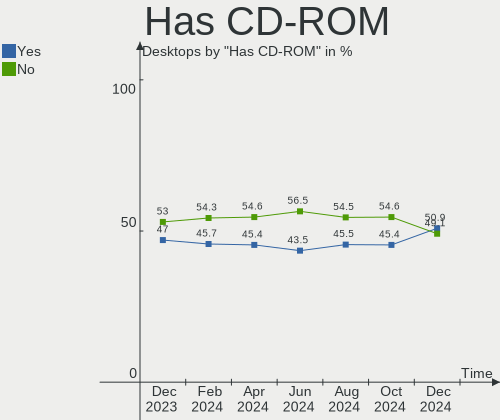
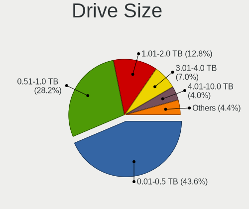
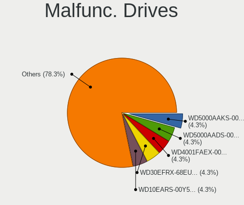
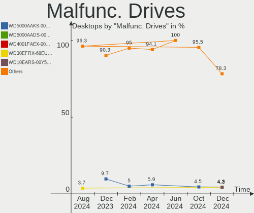
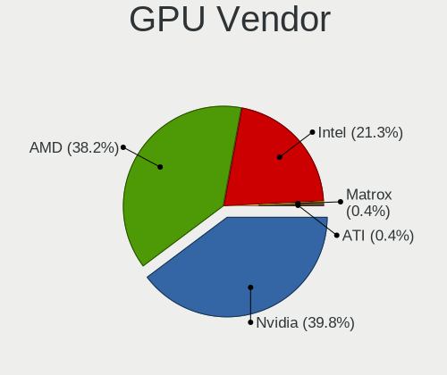
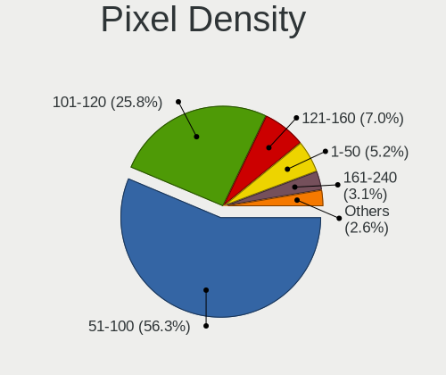
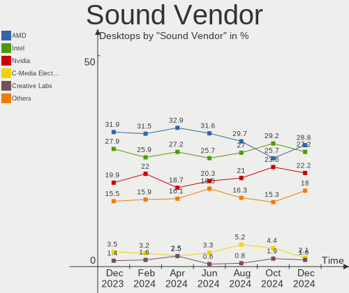
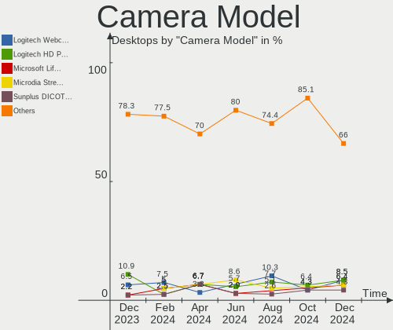

Linux in Germany - Hardware Trends (Desktops)
---------------------------------------------

A project to identify most popular hardware characteristics and track their change
over time based on data collected by Linux users at https://Linux-Hardware.org.

Anyone can contribute to this report by the [hw-probe](https://github.com/linuxhw/hw-probe) tool:

    sudo -E hw-probe -all -upload

Period: Jan, 2024.

Contents
--------

* [ System ](#system)
  - [ OS                       ](#os)
  - [ OS Family                ](#os-family)
  - [ Kernel                   ](#kernel)
  - [ Kernel Family            ](#kernel-family)
  - [ Kernel Major Ver.        ](#kernel-major-ver)
  - [ Arch                     ](#arch)
  - [ DE                       ](#de)
  - [ Display Server           ](#display-server)
  - [ Display Manager          ](#display-manager)
  - [ OS Lang                  ](#os-lang)
  - [ Boot Mode                ](#boot-mode)
  - [ Filesystem               ](#filesystem)
  - [ Part. scheme             ](#part-scheme)
  - [ Dual Boot with Linux/BSD ](#dual-boot-with-linuxbsd)
  - [ Dual Boot (Win)          ](#dual-boot-win)

* [ Board ](#board)
  - [ Vendor                   ](#vendor)
  - [ Model                    ](#model)
  - [ Model Family             ](#model-family)
  - [ MFG Year                 ](#mfg-year)
  - [ Form Factor              ](#form-factor)
  - [ Secure Boot              ](#secure-boot)
  - [ Coreboot                 ](#coreboot)
  - [ RAM Size                 ](#ram-size)
  - [ RAM Used                 ](#ram-used)
  - [ Total Drives             ](#total-drives)
  - [ Has CD-ROM               ](#has-cd-rom)
  - [ Has Ethernet             ](#has-ethernet)
  - [ Has WiFi                 ](#has-wifi)
  - [ Has Bluetooth            ](#has-bluetooth)

* [ Location ](#location)
  - [ Country                  ](#country)
  - [ City                     ](#city)

* [ Drives ](#drives)
  - [ Drive Vendor             ](#drive-vendor)
  - [ Drive Model              ](#drive-model)
  - [ HDD Vendor               ](#hdd-vendor)
  - [ SSD Vendor               ](#ssd-vendor)
  - [ Drive Kind               ](#drive-kind)
  - [ Drive Connector          ](#drive-connector)
  - [ Drive Size               ](#drive-size)
  - [ Space Total              ](#space-total)
  - [ Space Used               ](#space-used)
  - [ Malfunc. Drives          ](#malfunc-drives)
  - [ Malfunc. Drive Vendor    ](#malfunc-drive-vendor)
  - [ Malfunc. HDD Vendor      ](#malfunc-hdd-vendor)
  - [ Malfunc. Drive Kind      ](#malfunc-drive-kind)
  - [ Failed Drives            ](#failed-drives)
  - [ Failed Drive Vendor      ](#failed-drive-vendor)
  - [ Drive Status             ](#drive-status)

* [ Storage controller ](#storage-controller)
  - [ Storage Vendor           ](#storage-vendor)
  - [ Storage Model            ](#storage-model)
  - [ Storage Kind             ](#storage-kind)

* [ Processor ](#processor)
  - [ CPU Vendor               ](#cpu-vendor)
  - [ CPU Model                ](#cpu-model)
  - [ CPU Model Family         ](#cpu-model-family)
  - [ CPU Cores                ](#cpu-cores)
  - [ CPU Sockets              ](#cpu-sockets)
  - [ CPU Threads              ](#cpu-threads)
  - [ CPU Op-Modes             ](#cpu-op-modes)
  - [ CPU Microcode            ](#cpu-microcode)
  - [ CPU Microarch            ](#cpu-microarch)

* [ Graphics ](#graphics)
  - [ GPU Vendor               ](#gpu-vendor)
  - [ GPU Model                ](#gpu-model)
  - [ GPU Combo                ](#gpu-combo)
  - [ GPU Driver               ](#gpu-driver)
  - [ GPU Memory               ](#gpu-memory)

* [ Monitor ](#monitor)
  - [ Monitor Vendor           ](#monitor-vendor)
  - [ Monitor Model            ](#monitor-model)
  - [ Monitor Resolution       ](#monitor-resolution)
  - [ Monitor Diagonal         ](#monitor-diagonal)
  - [ Monitor Width            ](#monitor-width)
  - [ Aspect Ratio             ](#aspect-ratio)
  - [ Monitor Area             ](#monitor-area)
  - [ Pixel Density            ](#pixel-density)
  - [ Multiple Monitors        ](#multiple-monitors)

* [ Network ](#network)
  - [ Net Controller Vendor    ](#net-controller-vendor)
  - [ Net Controller Model     ](#net-controller-model)
  - [ Wireless Vendor          ](#wireless-vendor)
  - [ Wireless Model           ](#wireless-model)
  - [ Ethernet Vendor          ](#ethernet-vendor)
  - [ Ethernet Model           ](#ethernet-model)
  - [ Net Controller Kind      ](#net-controller-kind)
  - [ Used Controller          ](#used-controller)
  - [ NICs                     ](#nics)
  - [ IPv6                     ](#ipv6)

* [ Bluetooth ](#bluetooth)
  - [ Bluetooth Vendor         ](#bluetooth-vendor)
  - [ Bluetooth Model          ](#bluetooth-model)

* [ Sound ](#sound)
  - [ Sound Vendor             ](#sound-vendor)
  - [ Sound Model              ](#sound-model)

* [ Memory ](#memory)
  - [ Memory Vendor            ](#memory-vendor)
  - [ Memory Model             ](#memory-model)
  - [ Memory Kind              ](#memory-kind)
  - [ Memory Form Factor       ](#memory-form-factor)
  - [ Memory Size              ](#memory-size)
  - [ Memory Speed             ](#memory-speed)

* [ Printers & scanners ](#printers--scanners)
  - [ Printer Vendor           ](#printer-vendor)
  - [ Printer Model            ](#printer-model)
  - [ Scanner Vendor           ](#scanner-vendor)
  - [ Scanner Model            ](#scanner-model)

* [ Camera ](#camera)
  - [ Camera Vendor            ](#camera-vendor)
  - [ Camera Model             ](#camera-model)

* [ Security ](#security)
  - [ Fingerprint Vendor       ](#fingerprint-vendor)
  - [ Fingerprint Model        ](#fingerprint-model)
  - [ Chipcard Vendor          ](#chipcard-vendor)
  - [ Chipcard Model           ](#chipcard-model)

* [ Unsupported ](#unsupported)
  - [ Unsupported Devices      ](#unsupported-devices)
  - [ Unsupported Device Types ](#unsupported-device-types)

System
------

OS
--

Installed operating systems

| Name                         | Desktops | Percent |
|------------------------------|----------|---------|
| Ubuntu 22.04                 | 41       | 15.02%  |
| Linux Mint 21.2              | 22       | 8.06%   |
| Debian 12                    | 22       | 8.06%   |
| Fedora 39                    | 18       | 6.59%   |
| Linux Mint 21.3              | 15       | 5.49%   |
| Ubuntu 23.10                 | 13       | 4.76%   |
| Zorin 17                     | 12       | 4.4%    |
| Nobara 39                    | 12       | 4.4%    |
| Arch Rolling                 | 10       | 3.66%   |
| Pop!_OS 22.04                | 8        | 2.93%   |
| OpenMandriva 23.08           | 7        | 2.56%   |
| OpenMandriva 5.0             | 5        | 1.83%   |
| Manjaro                      | 5        | 1.83%   |
| ArcoLinux Rolling            | 5        | 1.83%   |
| EndeavourOS Rolling          | 4        | 1.47%   |
| Xubuntu 20.04                | 3        | 1.1%    |
| Ubuntu 23.04                 | 3        | 1.1%    |
| openSUSE Leap-15.5           | 3        | 1.1%    |
| LMDE 6                       | 3        | 1.1%    |
| Kubuntu 23.10                | 3        | 1.1%    |
| Kubuntu 22.04                | 3        | 1.1%    |
| KDE neon 22.04               | 3        | 1.1%    |
| Zorin 16                     | 2        | 0.73%   |
| Ubuntu Unity 18.04           | 2        | 0.73%   |
| openSUSE Tumbleweed-XXXXXXXX | 2        | 0.73%   |
| openSUSE Microos-XXXXXXXX    | 2        | 0.73%   |
| OpenMandriva 4.3             | 2        | 0.73%   |
| OpenMandriva 24.01           | 2        | 0.73%   |
| Manjaro 23.1.3               | 2        | 0.73%   |
| Linux Mint 21.1              | 2        | 0.73%   |
| Linux Mint 20.3              | 2        | 0.73%   |
| Gentoo 2.14                  | 2        | 0.73%   |
| Garuda Linux Rolling         | 2        | 0.73%   |
| Debian 11                    | 2        | 0.73%   |
| Debian                       | 2        | 0.73%   |
| antiX 23                     | 2        | 0.73%   |
| Xubuntu 22.04                | 1        | 0.37%   |
| Ubuntu Unity 23.10           | 1        | 0.37%   |
| Ubuntu MATE 23.10            | 1        | 0.37%   |
| Ubuntu 24.04                 | 1        | 0.37%   |

OS Family
---------

OS without a version

| Name         | Desktops | Percent |
|--------------|----------|---------|
| Ubuntu       | 58       | 21.25%  |
| Linux Mint   | 43       | 15.75%  |
| Debian       | 27       | 9.89%   |
| Fedora       | 19       | 6.96%   |
| OpenMandriva | 17       | 6.23%   |
| Zorin        | 14       | 5.13%   |
| Nobara       | 13       | 4.76%   |
| Arch         | 10       | 3.66%   |
| Pop!_OS      | 8        | 2.93%   |
| openSUSE     | 7        | 2.56%   |
| Manjaro      | 7        | 2.56%   |
| Kubuntu      | 7        | 2.56%   |
| ArcoLinux    | 5        | 1.83%   |
| Xubuntu      | 4        | 1.47%   |
| EndeavourOS  | 4        | 1.47%   |
| Ubuntu Unity | 3        | 1.1%    |
| LMDE         | 3        | 1.1%    |
| KDE neon     | 3        | 1.1%    |
| Garuda Linux | 3        | 1.1%    |
| Gentoo       | 2        | 0.73%   |
| antiX        | 2        | 0.73%   |
| Ubuntu MATE  | 1        | 0.37%   |
| SteamOS      | 1        | 0.37%   |
| Rocky Linux  | 1        | 0.37%   |
| PureOS       | 1        | 0.37%   |
| PCLinuxOS    | 1        | 0.37%   |
| Oracle Linux | 1        | 0.37%   |
| NixOS        | 1        | 0.37%   |
| MX           | 1        | 0.37%   |
| Mabox        | 1        | 0.37%   |
| Lubuntu      | 1        | 0.37%   |
| Kali         | 1        | 0.37%   |
| Guix         | 1        | 0.37%   |
| CachyOS      | 1        | 0.37%   |
| blendOS      | 1        | 0.37%   |

Kernel
------

Version of the Linux kernel

| Version                      | Desktops | Percent |
|------------------------------|----------|---------|
| 5.15.0-91-generic            | 42       | 15.38%  |
| 6.5.0-14-generic             | 37       | 13.55%  |
| 6.2.0-39-generic             | 17       | 6.23%   |
| 6.1.0-17-amd64               | 12       | 4.4%    |
| 6.5.0-15-generic             | 10       | 3.66%   |
| 6.6.10-arch1-1               | 9        | 3.3%    |
| 6.6.9-200.fc39.x86_64        | 7        | 2.56%   |
| 6.6.2-desktop-1omv2390       | 7        | 2.56%   |
| 6.4.11-desktop-1omv2390      | 6        | 2.2%    |
| 5.15.0-92-generic            | 6        | 2.2%    |
| 6.6.9-200.fsync.fc39.x86_64  | 5        | 1.83%   |
| 6.6.6-76060606-generic       | 5        | 1.83%   |
| 6.6.11-200.fc39.x86_64       | 4        | 1.47%   |
| 6.1.0-16-amd64               | 4        | 1.47%   |
| 6.7.0-zen3-1-zen             | 3        | 1.1%    |
| 6.7.0-204.fsync.fc39.x86_64  | 3        | 1.1%    |
| 6.6.10-1-MANJARO             | 3        | 1.1%    |
| 6.5.11-7-pve                 | 3        | 1.1%    |
| 5.4.0-169-generic            | 3        | 1.1%    |
| 5.14.21-150500.55.39-default | 3        | 1.1%    |
| 6.7.0-arch3-1                | 2        | 0.73%   |
| 6.7.0-201.fsync.fc39.x86_64  | 2        | 0.73%   |
| 6.6.9-amd64                  | 2        | 0.73%   |
| 6.6.7-1-default              | 2        | 0.73%   |
| 6.6.12-200.fc39.x86_64       | 2        | 0.73%   |
| 6.5.6-300.fc39.x86_64        | 2        | 0.73%   |
| 6.5.13-7-MANJARO             | 2        | 0.73%   |
| 6.1.0-12-amd64               | 2        | 0.73%   |
| 5.16.7-desktop-1omv4003      | 2        | 0.73%   |
| 5.15.0-91-lowlatency         | 2        | 0.73%   |
| 5.10.188-antix.1-amd64-smp   | 2        | 0.73%   |
| 5.10.0-27-amd64              | 2        | 0.73%   |
| 6.7.1-arch1-1                | 1        | 0.37%   |
| 6.7.1-1-cachyos-sched-ext    | 1        | 0.37%   |
| 6.7.0-203.fsync.fc39.x86_64  | 1        | 0.37%   |
| 6.7.0-0-MANJARO              | 1        | 0.37%   |
| 6.6.9-arch1-1                | 1        | 0.37%   |
| 6.6.9-100.fc38.x86_64        | 1        | 0.37%   |
| 6.6.8-zen1-1-zen             | 1        | 0.37%   |
| 6.6.8-gentoo-x86_64          | 1        | 0.37%   |

Kernel Family
-------------

Linux kernel without a distro release

| Version  | Desktops | Percent |
|----------|----------|---------|
| 5.15.0   | 53       | 19.41%  |
| 6.5.0    | 51       | 18.68%  |
| 6.2.0    | 22       | 8.06%   |
| 6.1.0    | 18       | 6.59%   |
| 6.6.10   | 17       | 6.23%   |
| 6.6.9    | 16       | 5.86%   |
| 6.7.0    | 12       | 4.4%    |
| 6.6.8    | 8        | 2.93%   |
| 6.6.2    | 7        | 2.56%   |
| 6.4.11   | 6        | 2.2%    |
| 5.4.0    | 6        | 2.2%    |
| 6.6.6    | 5        | 1.83%   |
| 6.6.11   | 4        | 1.47%   |
| 5.10.0   | 4        | 1.47%   |
| 6.6.7    | 3        | 1.1%    |
| 6.6.12   | 3        | 1.1%    |
| 6.5.6    | 3        | 1.1%    |
| 6.5.11   | 3        | 1.1%    |
| 5.14.21  | 3        | 1.1%    |
| 6.7.1    | 2        | 0.73%   |
| 6.6.14   | 2        | 0.73%   |
| 6.6.13   | 2        | 0.73%   |
| 6.5.13   | 2        | 0.73%   |
| 5.16.7   | 2        | 0.73%   |
| 5.10.188 | 2        | 0.73%   |
| 6.6.0    | 1        | 0.37%   |
| 6.5.9    | 1        | 0.37%   |
| 6.5.3    | 1        | 0.37%   |
| 6.4.8    | 1        | 0.37%   |
| 6.4.16   | 1        | 0.37%   |
| 6.3.9    | 1        | 0.37%   |
| 6.1.8    | 1        | 0.37%   |
| 6.1.70   | 1        | 0.37%   |
| 6.1.67   | 1        | 0.37%   |
| 6.1.63   | 1        | 0.37%   |
| 6.1.60   | 1        | 0.37%   |
| 6.1.52   | 1        | 0.37%   |
| 5.4.203  | 1        | 0.37%   |
| 5.17.5   | 1        | 0.37%   |
| 5.13.0   | 1        | 0.37%   |

Kernel Major Ver.
-----------------

Linux kernel major version

| Version | Desktops | Percent |
|---------|----------|---------|
| 6.6     | 68       | 24.91%  |
| 6.5     | 61       | 22.34%  |
| 5.15    | 53       | 19.41%  |
| 6.1     | 24       | 8.79%   |
| 6.2     | 22       | 8.06%   |
| 6.7     | 14       | 5.13%   |
| 6.4     | 8        | 2.93%   |
| 5.4     | 7        | 2.56%   |
| 5.10    | 6        | 2.2%    |
| 5.14    | 3        | 1.1%    |
| 5.16    | 2        | 0.73%   |
| 6.3     | 1        | 0.37%   |
| 5.17    | 1        | 0.37%   |
| 5.13    | 1        | 0.37%   |
| 4.18    | 1        | 0.37%   |
| 4.15    | 1        | 0.37%   |

Arch
----

OS architecture (x86_64, i586, etc.)

| Name   | Desktops | Percent |
|--------|----------|---------|
| x86_64 | 272      | 99.63%  |
| i686   | 1        | 0.37%   |

DE
--

Desktop Environment

| Name       | Desktops | Percent |
|------------|----------|---------|
| GNOME      | 107      | 39.19%  |
| KDE5       | 68       | 24.91%  |
| X-Cinnamon | 35       | 12.82%  |
| XFCE       | 27       | 9.89%   |
| Unknown    | 12       | 4.4%    |
| MATE       | 8        | 2.93%   |
| Cinnamon   | 5        | 1.83%   |
| Unity      | 3        | 1.1%    |
| KDE        | 2        | 0.73%   |
| icewm      | 2        | 0.73%   |
| LXQt       | 1        | 0.37%   |
| i3         | 1        | 0.37%   |
| Hyprland   | 1        | 0.37%   |
| Budgie     | 1        | 0.37%   |

Display Server
--------------

X11 or Wayland

| Name    | Desktops | Percent |
|---------|----------|---------|
| X11     | 151      | 55.31%  |
| Wayland | 101      | 37%     |
| Tty     | 15       | 5.49%   |
| Unknown | 6        | 2.2%    |

Display Manager
---------------

SDDM, LightDM, etc.

| Name    | Desktops | Percent |
|---------|----------|---------|
| Unknown | 118      | 43.22%  |
| GDM3    | 59       | 21.61%  |
| LightDM | 46       | 16.85%  |
| SDDM    | 39       | 14.29%  |
| GDM     | 6        | 2.2%    |
| SLIMSKI | 2        | 0.73%   |
| XDM     | 1        | 0.37%   |
| SLiM    | 1        | 0.37%   |
| GREETD  | 1        | 0.37%   |

OS Lang
-------

Language

| Lang    | Desktops | Percent |
|---------|----------|---------|
| de_DE   | 199      | 72.89%  |
| en_US   | 51       | 18.68%  |
| Unknown | 6        | 2.2%    |
| en_GB   | 5        | 1.83%   |
| C       | 5        | 1.83%   |
| uk_UA   | 1        | 0.37%   |
| it_IT   | 1        | 0.37%   |
| hu_HU   | 1        | 0.37%   |
| es_ES   | 1        | 0.37%   |
| en_IE   | 1        | 0.37%   |
| en_DK   | 1        | 0.37%   |
| C.UTF8  | 1        | 0.37%   |

Boot Mode
---------

EFI or BIOS

| Mode | Desktops | Percent |
|------|----------|---------|
| BIOS | 145      | 53.11%  |
| EFI  | 128      | 46.89%  |

Filesystem
----------

Type of filesystem

| Type    | Desktops | Percent |
|---------|----------|---------|
| Ext4    | 149      | 54.58%  |
| Btrfs   | 53       | 19.41%  |
| Tmpfs   | 47       | 17.22%  |
| Overlay | 12       | 4.4%    |
| Xfs     | 8        | 2.93%   |
| Zfs     | 2        | 0.73%   |
| Ext2    | 2        | 0.73%   |

Part. scheme
------------

Scheme of partitioning

| Type    | Desktops | Percent |
|---------|----------|---------|
| GPT     | 141      | 51.65%  |
| Unknown | 104      | 38.1%   |
| MBR     | 28       | 10.26%  |

Dual Boot with Linux/BSD
------------------------

Hosting more than one Linux/BSD

| Dual boot | Desktops | Percent |
|-----------|----------|---------|
| No        | 220      | 80.59%  |
| Yes       | 53       | 19.41%  |

Dual Boot (Win)
---------------

Hosting Linux and Windows

| Dual boot | Desktops | Percent |
|-----------|----------|---------|
| No        | 204      | 74.73%  |
| Yes       | 69       | 25.27%  |

Board
-----

Vendor
------

Motherboard manufacturer

| Name                                 | Desktops | Percent |
|--------------------------------------|----------|---------|
| ASUSTek Computer                     | 69       | 25.27%  |
| Gigabyte Technology                  | 45       | 16.48%  |
| MSI                                  | 41       | 15.02%  |
| ASRock                               | 29       | 10.62%  |
| Dell                                 | 17       | 6.23%   |
| Fujitsu                              | 12       | 4.4%    |
| Hewlett-Packard                      | 11       | 4.03%   |
| Lenovo                               | 10       | 3.66%   |
| Medion                               | 5        | 1.83%   |
| Biostar                              | 4        | 1.47%   |
| Unknown                              | 4        | 1.47%   |
| Intel                                | 3        | 1.1%    |
| Shenzhen Meigao Electronic Equipment | 2        | 0.73%   |
| Pegatron                             | 2        | 0.73%   |
| Inventec                             | 2        | 0.73%   |
| Foxconn                              | 2        | 0.73%   |
| Acer                                 | 2        | 0.73%   |
| Wortmann AG                          | 1        | 0.37%   |
| T-bao TianBei                        | 1        | 0.37%   |
| Supermicro                           | 1        | 0.37%   |
| Phoenix                              | 1        | 0.37%   |
| Packard Bell                         | 1        | 0.37%   |
| ONDA                                 | 1        | 0.37%   |
| OEM                                  | 1        | 0.37%   |
| IceWhale Technology                  | 1        | 0.37%   |
| HC Technology.                       | 1        | 0.37%   |
| Gowin Solution                       | 1        | 0.37%   |
| GMKtec                               | 1        | 0.37%   |
| GEEKOM                               | 1        | 0.37%   |
| AMI                                  | 1        | 0.37%   |

Model
-----

Motherboard model

| Name                                          | Desktops | Percent |
|-----------------------------------------------|----------|---------|
| ASUS A0000001                                 | 5        | 1.83%   |
| MSI MS-7C35                                   | 4        | 1.47%   |
| ASUS ROG STRIX B550-F GAMING                  | 4        | 1.47%   |
| ASUS All Series                               | 4        | 1.47%   |
| Unknown                                       | 4        | 1.47%   |
| MSI MS-7C56                                   | 3        | 1.1%    |
| MSI MS-7C37                                   | 2        | 0.73%   |
| MSI MS-7B89                                   | 2        | 0.73%   |
| MSI MS-7B86                                   | 2        | 0.73%   |
| MSI MS-7817                                   | 2        | 0.73%   |
| Medion MS-7800                                | 2        | 0.73%   |
| Gigabyte B550 AORUS ELITE V2                  | 2        | 0.73%   |
| Gigabyte A320M-S2H V2                         | 2        | 0.73%   |
| Fujitsu ESPRIMO_P756                          | 2        | 0.73%   |
| Fujitsu ESPRIMO E720                          | 2        | 0.73%   |
| Dell OptiPlex 760                             | 2        | 0.73%   |
| ASUS TUF Gaming B550-PLUS                     | 2        | 0.73%   |
| ASUS SABERTOOTH 990FX R2.0                    | 2        | 0.73%   |
| ASUS ROG STRIX B450-F GAMING                  | 2        | 0.73%   |
| ASUS PRIME X470-PRO                           | 2        | 0.73%   |
| ASUS PRIME B450M-K II                         | 2        | 0.73%   |
| ASRock B550M-ITX/ac                           | 2        | 0.73%   |
| ASRock B450M Pro4                             | 2        | 0.73%   |
| Wortmann AG TERRA_PC                          | 1        | 0.37%   |
| T-bao TianBei GOD78                           | 1        | 0.37%   |
| Supermicro C2SBC-Q                            | 1        | 0.37%   |
| Shenzhen Meigao Electronic Equipment UM560 XT | 1        | 0.37%   |
| Shenzhen Meigao Electronic Equipment UM560    | 1        | 0.37%   |
| Phoenix 945GM                                 | 1        | 0.37%   |
| Pegatron HPE-558de                            | 1        | 0.37%   |
| Pegatron Compaq dx7500 Microtower             | 1        | 0.37%   |
| Packard Bell IXTREME M5800                    | 1        | 0.37%   |
| ONDA H61V Ver:4.01                            | 1        | 0.37%   |
| OEM B7D                                       | 1        | 0.37%   |
| MSI MS-7E25                                   | 1        | 0.37%   |
| MSI MS-7E06                                   | 1        | 0.37%   |
| MSI MS-7D77                                   | 1        | 0.37%   |
| MSI MS-7D52                                   | 1        | 0.37%   |
| MSI MS-7D42                                   | 1        | 0.37%   |
| MSI MS-7D20                                   | 1        | 0.37%   |

Model Family
------------

Motherboard model prefix

| Name                                       | Desktops | Percent |
|--------------------------------------------|----------|---------|
| ASUS ROG                                   | 16       | 5.86%   |
| ASUS PRIME                                 | 15       | 5.49%   |
| Fujitsu ESPRIMO                            | 10       | 3.66%   |
| Dell OptiPlex                              | 10       | 3.66%   |
| ASUS TUF                                   | 8        | 2.93%   |
| Lenovo ThinkCentre                         | 6        | 2.2%    |
| ASUS A0000001                              | 5        | 1.83%   |
| MSI MS-7C35                                | 4        | 1.47%   |
| Gigabyte B550                              | 4        | 1.47%   |
| Dell Precision                             | 4        | 1.47%   |
| ASUS All                                   | 4        | 1.47%   |
| Unknown                                    | 4        | 1.47%   |
| MSI MS-7C56                                | 3        | 1.1%    |
| HP Compaq                                  | 3        | 1.1%    |
| Gigabyte Z690                              | 3        | 1.1%    |
| ASRock B550                                | 3        | 1.1%    |
| ASRock B450M                               | 3        | 1.1%    |
| Shenzhen Meigao Electronic Equipment UM560 | 2        | 0.73%   |
| MSI MS-7C37                                | 2        | 0.73%   |
| MSI MS-7B89                                | 2        | 0.73%   |
| MSI MS-7B86                                | 2        | 0.73%   |
| MSI MS-7817                                | 2        | 0.73%   |
| Medion MS-7800                             | 2        | 0.73%   |
| Lenovo ThinkStation                        | 2        | 0.73%   |
| Lenovo IdeaCentre                          | 2        | 0.73%   |
| HP ProDesk                                 | 2        | 0.73%   |
| Gigabyte B450                              | 2        | 0.73%   |
| Gigabyte AX370-Gaming                      | 2        | 0.73%   |
| Gigabyte A520M                             | 2        | 0.73%   |
| Gigabyte A320M-S2H                         | 2        | 0.73%   |
| Dell Inspiron                              | 2        | 0.73%   |
| ASUS SABERTOOTH                            | 2        | 0.73%   |
| ASUS Pro                                   | 2        | 0.73%   |
| ASUS M5A97                                 | 2        | 0.73%   |
| ASRock B550M-ITX                           | 2        | 0.73%   |
| ASRock B550M                               | 2        | 0.73%   |
| ASRock B450                                | 2        | 0.73%   |
| ASRock A320M-HDV                           | 2        | 0.73%   |
| Acer Aspire                                | 2        | 0.73%   |
| Wortmann AG TERRA                          | 1        | 0.37%   |

MFG Year
--------

Motherboard manufacture year

| Year | Desktops | Percent |
|------|----------|---------|
| 2020 | 41       | 15.02%  |
| 2018 | 32       | 11.72%  |
| 2022 | 26       | 9.52%   |
| 2014 | 22       | 8.06%   |
| 2013 | 22       | 8.06%   |
| 2021 | 19       | 6.96%   |
| 2012 | 17       | 6.23%   |
| 2023 | 16       | 5.86%   |
| 2019 | 15       | 5.49%   |
| 2017 | 13       | 4.76%   |
| 2010 | 11       | 4.03%   |
| 2015 | 10       | 3.66%   |
| 2009 | 9        | 3.3%    |
| 2016 | 7        | 2.56%   |
| 2008 | 5        | 1.83%   |
| 2007 | 5        | 1.83%   |
| 2011 | 3        | 1.1%    |

Form Factor
-----------

Physical design of the computer

| Name    | Desktops | Percent |
|---------|----------|---------|
| Desktop | 273      | 100%    |

Secure Boot
-----------

Enabled or disabled

| State    | Desktops | Percent |
|----------|----------|---------|
| Disabled | 262      | 95.97%  |
| Enabled  | 11       | 4.03%   |

Coreboot
--------

Have coreboot on board

| Used | Desktops | Percent |
|------|----------|---------|
| No   | 273      | 100%    |

RAM Size
--------

Total RAM memory

| Size in GB      | Desktops | Percent |
|-----------------|----------|---------|
| 16.01-24.0      | 67       | 24.54%  |
| 32.01-64.0      | 63       | 23.08%  |
| 8.01-16.0       | 41       | 15.02%  |
| 4.01-8.0        | 39       | 14.29%  |
| 64.01-256.0     | 25       | 9.16%   |
| 3.01-4.0        | 18       | 6.59%   |
| 24.01-32.0      | 12       | 4.4%    |
| 2.01-3.0        | 3        | 1.1%    |
| 1.01-2.0        | 3        | 1.1%    |
| More than 256.0 | 2        | 0.73%   |

RAM Used
--------

Used RAM memory

| Used GB    | Desktops | Percent |
|------------|----------|---------|
| 2.01-3.0   | 84       | 30.77%  |
| 1.01-2.0   | 66       | 24.18%  |
| 4.01-8.0   | 53       | 19.41%  |
| 3.01-4.0   | 37       | 13.55%  |
| 8.01-16.0  | 15       | 5.49%   |
| 0.51-1.0   | 11       | 4.03%   |
| 16.01-24.0 | 5        | 1.83%   |
| 24.01-32.0 | 1        | 0.37%   |
| 0.01-0.5   | 1        | 0.37%   |

Total Drives
------------

Number of drives on board

| Drives | Desktops | Percent |
|--------|----------|---------|
| 1      | 96       | 35.16%  |
| 2      | 78       | 28.57%  |
| 3      | 42       | 15.38%  |
| 4      | 25       | 9.16%   |
| 6      | 11       | 4.03%   |
| 5      | 10       | 3.66%   |
| 7      | 5        | 1.83%   |
| 9      | 3        | 1.1%    |
| 8      | 2        | 0.73%   |
| 11     | 1        | 0.37%   |

Has CD-ROM
----------

Has CD-ROM on board

| Presented | Desktops | Percent |
|-----------|----------|---------|
| No        | 144      | 52.75%  |
| Yes       | 129      | 47.25%  |

Has Ethernet
------------

Has Ethernet on board

| Presented | Desktops | Percent |
|-----------|----------|---------|
| Yes       | 272      | 99.63%  |
| No        | 1        | 0.37%   |

Has WiFi
--------

Has WiFi module

| Presented | Desktops | Percent |
|-----------|----------|---------|
| No        | 154      | 56.41%  |
| Yes       | 119      | 43.59%  |

Has Bluetooth
-------------

Has Bluetooth module

| Presented | Desktops | Percent |
|-----------|----------|---------|
| No        | 170      | 62.27%  |
| Yes       | 103      | 37.73%  |

Location
--------

Country
-------

Geographic location (country)

| Country | Desktops | Percent |
|---------|----------|---------|
| Germany | 273      | 100%    |

City
----

Geographic location (city)

| City                 | Desktops | Percent |
|----------------------|----------|---------|
| Berlin               | 20       | 7.33%   |
| Hamburg              | 15       | 5.49%   |
| Munich               | 8        | 2.93%   |
| Dresden              | 8        | 2.93%   |
| Cologne              | 7        | 2.56%   |
| Frankfurt am Main    | 6        | 2.2%    |
| Chemnitz             | 6        | 2.2%    |
| Bremen               | 6        | 2.2%    |
| Nuremberg            | 5        | 1.83%   |
| Bonn                 | 5        | 1.83%   |
| Traunstein           | 4        | 1.47%   |
| Leipzig              | 4        | 1.47%   |
| Stuttgart            | 3        | 1.1%    |
| Recklinghausen       | 3        | 1.1%    |
| Magdeburg            | 3        | 1.1%    |
| Gelsenkirchen        | 3        | 1.1%    |
| Essen                | 3        | 1.1%    |
| Dortmund             | 3        | 1.1%    |
| Aachen               | 3        | 1.1%    |
| Wittenberg           | 2        | 0.73%   |
| Wiesbaden            | 2        | 0.73%   |
| Seevetal             | 2        | 0.73%   |
| Osnabrück           | 2        | 0.73%   |
| Ober-Morlen          | 2        | 0.73%   |
| Kirchheim unter Teck | 2        | 0.73%   |
| Hanover              | 2        | 0.73%   |
| Hagen                | 2        | 0.73%   |
| Germersheim          | 2        | 0.73%   |
| Düsseldorf          | 2        | 0.73%   |
| Duingen              | 2        | 0.73%   |
| Delmenhorst          | 2        | 0.73%   |
| Würzburg            | 1        | 0.37%   |
| Wurmlingen           | 1        | 0.37%   |
| Wuppertal            | 1        | 0.37%   |
| Wolfsburg            | 1        | 0.37%   |
| Wittlich             | 1        | 0.37%   |
| Willich              | 1        | 0.37%   |
| Wilhelmshaven        | 1        | 0.37%   |
| Wiesmoor             | 1        | 0.37%   |
| Wetter               | 1        | 0.37%   |

Drives
------

Drive Vendor
------------

Hard drive vendors

| Vendor                       | Desktops | Drives | Percent |
|------------------------------|----------|--------|---------|
| Samsung Electronics          | 112      | 182    | 21.13%  |
| WDC                          | 70       | 92     | 13.21%  |
| Seagate                      | 66       | 89     | 12.45%  |
| Sandisk                      | 46       | 54     | 8.68%   |
| Crucial                      | 36       | 44     | 6.79%   |
| Intenso                      | 25       | 26     | 4.72%   |
| Toshiba                      | 22       | 25     | 4.15%   |
| Kingston                     | 20       | 24     | 3.77%   |
| Unknown                      | 11       | 20     | 2.08%   |
| Micron/Crucial Technology    | 10       | 12     | 1.89%   |
| Kingston Technology Company  | 10       | 10     | 1.89%   |
| Phison Electronics           | 8        | 9      | 1.51%   |
| Intel                        | 8        | 8      | 1.51%   |
| Hitachi                      | 8        | 9      | 1.51%   |
| SK hynix                     | 6        | 6      | 1.13%   |
| Silicon Motion               | 5        | 6      | 0.94%   |
| Shenzhen Longsys Electronics | 4        | 4      | 0.75%   |
| OCZ                          | 4        | 4      | 0.75%   |
| MAXIO Technology (Hangzhou)  | 4        | 4      | 0.75%   |
| China                        | 4        | 4      | 0.75%   |
| Unknown                      | 4        | 4      | 0.75%   |
| Verbatim                     | 3        | 4      | 0.57%   |
| Micron Technology            | 3        | 3      | 0.57%   |
| A-DATA Technology            | 3        | 4      | 0.57%   |
| Transcend                    | 2        | 3      | 0.38%   |
| SPCC                         | 2        | 2      | 0.38%   |
| Phison                       | 2        | 2      | 0.38%   |
| LITEONIT                     | 2        | 2      | 0.38%   |
| HGST                         | 2        | 2      | 0.38%   |
| ASMT                         | 2        | 2      | 0.38%   |
| USB 3.1                      | 1        | 1      | 0.19%   |
| Unknown (CF)                 | 1        | 1      | 0.19%   |
| SXMicro                      | 1        | 1      | 0.19%   |
| Seagate Technology           | 1        | 1      | 0.19%   |
| SD                           | 1        | 1      | 0.19%   |
| SABRENT                      | 1        | 1      | 0.19%   |
| Realtek                      | 1        | 1      | 0.19%   |
| PNY                          | 1        | 1      | 0.19%   |
| Patriot                      | 1        | 1      | 0.19%   |
| Netac                        | 1        | 1      | 0.19%   |

Drive Model
-----------

Hard drive models

| Model                                               | Desktops | Percent |
|-----------------------------------------------------|----------|---------|
| Samsung NVMe SSD Controller SM981/PM981/PM983 1TB   | 22       | 3.45%   |
| Samsung SSD 860 EVO 1TB                             | 11       | 1.72%   |
| Samsung NVMe SSD Controller PM9A1/PM9A3/980PRO 2TB  | 10       | 1.57%   |
| Samsung SSD 860 EVO 500GB                           | 8        | 1.25%   |
| SanDisk SSD PLUS 1000GB                             | 7        | 1.1%    |
| Crucial CT500MX500SSD1 500GB                        | 7        | 1.1%    |
| Micron/Crucial P2 NVMe PCIe SSD 1TB                 | 6        | 0.94%   |
| Crucial CT1000BX500SSD1 1TB                         | 6        | 0.94%   |
| Unknown SD/MMC/MS PRO 256GB                         | 5        | 0.78%   |
| Seagate ST4000DM004-2CV104 4TB                      | 5        | 0.78%   |
| Samsung SSD 980 1TB                                 | 5        | 0.78%   |
| Samsung SSD 870 EVO 1TB                             | 5        | 0.78%   |
| Samsung SSD 850 EVO 500GB                           | 5        | 0.78%   |
| Samsung SSD 850 EVO 250GB                           | 5        | 0.78%   |
| Crucial CT1000MX500SSD1 1TB                         | 5        | 0.78%   |
| Unknown Compact Flash 977MB                         | 4        | 0.63%   |
| Toshiba HDWD110 1TB                                 | 4        | 0.63%   |
| Sandisk WD Black SN750 / PC SN730 NVMe SSD 512GB    | 4        | 0.63%   |
| Samsung SSD 970 EVO Plus 1TB                        | 4        | 0.63%   |
| Samsung SSD 870 QVO 2TB                             | 4        | 0.63%   |
| Samsung SSD 870 QVO 1TB                             | 4        | 0.63%   |
| Kingston SKC3000D2048G 2TB                          | 4        | 0.63%   |
| Intenso SSD 128GB                                   | 4        | 0.63%   |
| Intenso External USB 3.0 3TB                        | 4        | 0.63%   |
| Unknown                                             | 4        | 0.63%   |
| WDC WD40EZRZ-00GXCB0 4TB                            | 3        | 0.47%   |
| Verbatim Vi550 S3 512GB SSD                         | 3        | 0.47%   |
| Toshiba DT01ACA200 2TB                              | 3        | 0.47%   |
| Silicon Motion SM2262/SM2262EN SSD Controller 480GB | 3        | 0.47%   |
| Seagate ST1000DM003-1CH162 1TB                      | 3        | 0.47%   |
| Sandisk WD Blue SN570 1TB                           | 3        | 0.47%   |
| Sandisk WD Blue SN550 NVMe SSD 512GB                | 3        | 0.47%   |
| SanDisk SSD PLUS 480GB                              | 3        | 0.47%   |
| SanDisk SSD PLUS 240GB                              | 3        | 0.47%   |
| SanDisk SDSSDH3 500G                                | 3        | 0.47%   |
| Samsung SSD 990 PRO 2TB                             | 3        | 0.47%   |
| Samsung SSD 870 EVO 2TB                             | 3        | 0.47%   |
| Samsung SSD 860 EVO 250GB                           | 3        | 0.47%   |
| Samsung SSD 850 EVO 1TB                             | 3        | 0.47%   |
| Samsung SSD 840 EVO 250GB                           | 3        | 0.47%   |

HDD Vendor
----------

Hard disk drive vendors

| Vendor              | Desktops | Drives | Percent |
|---------------------|----------|--------|---------|
| Seagate             | 63       | 86     | 37.06%  |
| WDC                 | 57       | 73     | 33.53%  |
| Toshiba             | 19       | 22     | 11.18%  |
| Samsung Electronics | 8        | 8      | 4.71%   |
| Hitachi             | 8        | 9      | 4.71%   |
| Unknown             | 5        | 5      | 2.94%   |
| Intenso             | 4        | 4      | 2.35%   |
| HGST                | 2        | 2      | 1.18%   |
| Unknown (CF)        | 1        | 1      | 0.59%   |
| Maxtor              | 1        | 1      | 0.59%   |
| JMicron Technology  | 1        | 2      | 0.59%   |
| Apple               | 1        | 1      | 0.59%   |

SSD Vendor
----------

Solid state drive vendors

| Vendor              | Desktops | Drives | Percent |
|---------------------|----------|--------|---------|
| Samsung Electronics | 75       | 92     | 32.61%  |
| Crucial             | 33       | 40     | 14.35%  |
| SanDisk             | 30       | 31     | 13.04%  |
| Intenso             | 19       | 20     | 8.26%   |
| WDC                 | 15       | 16     | 6.52%   |
| Kingston            | 13       | 16     | 5.65%   |
| Intel               | 6        | 6      | 2.61%   |
| OCZ                 | 4        | 4      | 1.74%   |
| China               | 4        | 4      | 1.74%   |
| Verbatim            | 3        | 4      | 1.3%    |
| SPCC                | 2        | 2      | 0.87%   |
| LITEONIT            | 2        | 2      | 0.87%   |
| ASMT                | 2        | 2      | 0.87%   |
| A-DATA Technology   | 2        | 3      | 0.87%   |
| Transcend           | 1        | 1      | 0.43%   |
| Toshiba             | 1        | 1      | 0.43%   |
| SXMicro             | 1        | 1      | 0.43%   |
| SK hynix            | 1        | 1      | 0.43%   |
| SD                  | 1        | 1      | 0.43%   |
| SABRENT             | 1        | 1      | 0.43%   |
| PNY                 | 1        | 1      | 0.43%   |
| Phison              | 1        | 1      | 0.43%   |
| Patriot             | 1        | 1      | 0.43%   |
| Micron Technology   | 1        | 1      | 0.43%   |
| LITEON              | 1        | 1      | 0.43%   |
| Leven               | 1        | 2      | 0.43%   |
| Hewlett-Packard     | 1        | 1      | 0.43%   |
| Fanxiang            | 1        | 1      | 0.43%   |
| CT1000MX            | 1        | 1      | 0.43%   |
| Corsair             | 1        | 1      | 0.43%   |
| BAITITON            | 1        | 1      | 0.43%   |
| Apacer              | 1        | 1      | 0.43%   |
| 2.5                 | 1        | 1      | 0.43%   |
| Unknown             | 1        | 1      | 0.43%   |

Drive Kind
----------

HDD or SSD

| Kind    | Desktops | Drives | Percent |
|---------|----------|--------|---------|
| SSD     | 174      | 263    | 38.84%  |
| HDD     | 132      | 214    | 29.46%  |
| NVMe    | 127      | 190    | 28.35%  |
| Unknown | 11       | 16     | 2.46%   |
| MMC     | 4        | 5      | 0.89%   |

Drive Connector
---------------

SATA, SAS, NVMe, etc.

| Type | Desktops | Drives | Percent |
|------|----------|--------|---------|
| SATA | 232      | 455    | 59.34%  |
| NVMe | 127      | 189    | 32.48%  |
| SAS  | 28       | 39     | 7.16%   |
| MMC  | 4        | 5      | 1.02%   |

Drive Size
----------

Size of hard drive

| Size in TB | Desktops | Drives | Percent |
|------------|----------|--------|---------|
| 0.01-0.5   | 144      | 199    | 40.91%  |
| 0.51-1.0   | 101      | 133    | 28.69%  |
| 1.01-2.0   | 54       | 69     | 15.34%  |
| 3.01-4.0   | 25       | 34     | 7.1%    |
| 2.01-3.0   | 13       | 15     | 3.69%   |
| 4.01-10.0  | 12       | 17     | 3.41%   |
| 10.01-20.0 | 2        | 8      | 0.57%   |
| 20.01-50.0 | 1        | 2      | 0.28%   |

Space Total
-----------

Amount of disk space available on the file system

| Size in GB     | Desktops | Percent |
|----------------|----------|---------|
| More than 3000 | 59       | 21.61%  |
| 101-250        | 55       | 20.15%  |
| 501-1000       | 47       | 17.22%  |
| 251-500        | 33       | 12.09%  |
| 1001-2000      | 29       | 10.62%  |
| 2001-3000      | 22       | 8.06%   |
| Unknown        | 12       | 4.4%    |
| 1-20           | 9        | 3.3%    |
| 21-50          | 4        | 1.47%   |
| 51-100         | 3        | 1.1%    |

Space Used
----------

Amount of used disk space

| Used GB        | Desktops | Percent |
|----------------|----------|---------|
| 1-20           | 50       | 18.32%  |
| 21-50          | 46       | 16.85%  |
| 51-100         | 33       | 12.09%  |
| 251-500        | 32       | 11.72%  |
| 501-1000       | 30       | 10.99%  |
| 1001-2000      | 23       | 8.42%   |
| 101-250        | 20       | 7.33%   |
| More than 3000 | 17       | 6.23%   |
| Unknown        | 12       | 4.4%    |
| 2001-3000      | 9        | 3.3%    |
| 0              | 1        | 0.37%   |

Malfunc. Drives
---------------

Drive models with a malfunction

| Model                                          | Desktops | Drives | Percent |
|------------------------------------------------|----------|--------|---------|
| SanDisk SSD PLUS 1000GB                        | 2        | 2      | 6.67%   |
| WDC WDS240G2G0B-00EPW0 240GB SSD               | 1        | 1      | 3.33%   |
| WDC WDS240G2G0A-00JH30 240GB SSD               | 1        | 1      | 3.33%   |
| WDC WD6400AAKS-65A7B2 640GB                    | 1        | 1      | 3.33%   |
| WDC WD5000AACS-00G8B1 500GB                    | 1        | 1      | 3.33%   |
| WDC WD30EZRZ-00Z5HB0 3TB                       | 1        | 1      | 3.33%   |
| WDC WD10EFRX-68PJCN0 1TB                       | 1        | 1      | 3.33%   |
| WDC WD Blue SA510 2.5 1000GB SSD               | 1        | 1      | 3.33%   |
| SXMicro NF830 256GB SSD                        | 1        | 1      | 3.33%   |
| Seagate ST500DM002-1BD142 500GB                | 1        | 1      | 3.33%   |
| Seagate ST31000524NS 1TB                       | 1        | 1      | 3.33%   |
| Seagate ST3000VN007-2AH16M 3TB                 | 1        | 1      | 3.33%   |
| Seagate ST250DM000-1BD141 250GB                | 1        | 2      | 3.33%   |
| Seagate ST2000DM006-2DM164 2TB                 | 1        | 1      | 3.33%   |
| Seagate ST1000LM024 HN-M101MBB 1TB             | 1        | 1      | 3.33%   |
| Seagate ST1000DX001-1CM162 1TB                 | 1        | 1      | 3.33%   |
| SanDisk SDSSDX120GG25 120GB                    | 1        | 1      | 3.33%   |
| SanDisk SDSSDHII120G 120GB                     | 1        | 1      | 3.33%   |
| Samsung Electronics SSD 970 EVO Plus 1TB       | 1        | 1      | 3.33%   |
| Samsung Electronics HD501LJ 500GB              | 1        | 1      | 3.33%   |
| Patriot P200 1TB SSD                           | 1        | 1      | 3.33%   |
| Micron/Crucial Technology P1 NVMe PCIe SSD 1TB | 1        | 1      | 3.33%   |
| Intenso SSD 120GB                              | 1        | 1      | 3.33%   |
| Crucial CT240BX200SSD1 240GB                   | 1        | 1      | 3.33%   |
| Crucial CT120M500SSD1 120GB                    | 1        | 1      | 3.33%   |
| Crucial CT1000MX500SSD1 1TB                    | 1        | 1      | 3.33%   |
| BAITITON BT58SSD07N 128GB                      | 1        | 1      | 3.33%   |
| ASMT 2235 500GB SSD                            | 1        | 1      | 3.33%   |
| Apple HDD ST1000DM003 1TB                      | 1        | 1      | 3.33%   |

Malfunc. Drive Vendor
---------------------

Vendors of faulty drives

| Vendor                    | Desktops | Drives | Percent |
|---------------------------|----------|--------|---------|
| WDC                       | 6        | 7      | 21.43%  |
| Seagate                   | 6        | 8      | 21.43%  |
| SanDisk                   | 4        | 4      | 14.29%  |
| Crucial                   | 3        | 3      | 10.71%  |
| Samsung Electronics       | 2        | 2      | 7.14%   |
| SXMicro                   | 1        | 1      | 3.57%   |
| Patriot                   | 1        | 1      | 3.57%   |
| Micron/Crucial Technology | 1        | 1      | 3.57%   |
| Intenso                   | 1        | 1      | 3.57%   |
| BAITITON                  | 1        | 1      | 3.57%   |
| ASMT                      | 1        | 1      | 3.57%   |
| Apple                     | 1        | 1      | 3.57%   |

Malfunc. HDD Vendor
-------------------

Vendors of faulty HDD drives

| Vendor              | Desktops | Drives | Percent |
|---------------------|----------|--------|---------|
| Seagate             | 6        | 8      | 50%     |
| WDC                 | 4        | 4      | 33.33%  |
| Samsung Electronics | 1        | 1      | 8.33%   |
| Apple               | 1        | 1      | 8.33%   |

Malfunc. Drive Kind
-------------------

Kinds of faulty drives

| Kind | Desktops | Drives | Percent |
|------|----------|--------|---------|
| SSD  | 15       | 15     | 51.72%  |
| HDD  | 12       | 14     | 41.38%  |
| NVMe | 2        | 2      | 6.9%    |

Failed Drives
-------------

Failed drive models

Zero info for selected period =(

Failed Drive Vendor
-------------------

Failed drive vendors

Zero info for selected period =(

Drive Status
------------

Number of failed and malfunc. drives

| Status   | Desktops | Drives | Percent |
|----------|----------|--------|---------|
| Detected | 166      | 421    | 54.97%  |
| Works    | 110      | 236    | 36.42%  |
| Malfunc  | 26       | 31     | 8.61%   |

Storage controller
------------------

Storage Vendor
--------------

Storage controller vendors

| Vendor                        | Desktops | Percent |
|-------------------------------|----------|---------|
| Intel                         | 146      | 32.44%  |
| AMD                           | 120      | 26.67%  |
| Samsung Electronics           | 56       | 12.44%  |
| SanDisk                       | 19       | 4.22%   |
| ASMedia Technology            | 19       | 4.22%   |
| Kingston Technology Company   | 15       | 3.33%   |
| Micron/Crucial Technology     | 12       | 2.67%   |
| Phison Electronics            | 9        | 2%      |
| JMicron Technology            | 9        | 2%      |
| SK hynix                      | 5        | 1.11%   |
| Silicon Motion                | 5        | 1.11%   |
| MAXIO Technology (Hangzhou)   | 5        | 1.11%   |
| Shenzhen Longsys Electronics  | 4        | 0.89%   |
| Seagate Technology            | 4        | 0.89%   |
| Marvell Technology Group      | 4        | 0.89%   |
| Micron Technology             | 3        | 0.67%   |
| Toshiba America Info Systems  | 2        | 0.44%   |
| Silicon Image                 | 2        | 0.44%   |
| Integrated Technology Express | 2        | 0.44%   |
| VIA Technologies              | 1        | 0.22%   |
| Transcend                     | 1        | 0.22%   |
| Solidigm                      | 1        | 0.22%   |
| Nvidia                        | 1        | 0.22%   |
| Netac Technology              | 1        | 0.22%   |
| KIOXIA                        | 1        | 0.22%   |
| Broadcom / LSI                | 1        | 0.22%   |
| ADATA Technology              | 1        | 0.22%   |
| Adaptec                       | 1        | 0.22%   |

Storage Model
-------------

Storage controller models

| Model                                                                          | Desktops | Percent |
|--------------------------------------------------------------------------------|----------|---------|
| AMD FCH SATA Controller [AHCI mode]                                            | 59       | 11.11%  |
| Samsung NVMe SSD Controller SM981/PM981/PM983                                  | 36       | 6.78%   |
| AMD 500 Series Chipset SATA Controller                                         | 32       | 6.03%   |
| Intel 8 Series/C220 Series Chipset Family 6-port SATA Controller 1 [AHCI mode] | 25       | 4.71%   |
| AMD 400 Series Chipset SATA Controller                                         | 25       | 4.71%   |
| ASMedia ASM1061/ASM1062 Serial ATA Controller                                  | 17       | 3.2%    |
| Samsung NVMe SSD Controller PM9A1/PM9A3/980PRO                                 | 13       | 2.45%   |
| Intel Q170/Q150/B150/H170/H110/Z170/CM236 Chipset SATA Controller [AHCI Mode]  | 13       | 2.45%   |
| AMD FCH SATA Controller D                                                      | 10       | 1.88%   |
| AMD 600 Series Chipset SATA Controller                                         | 10       | 1.88%   |
| Intel SATA Controller [RAID mode]                                              | 9        | 1.69%   |
| Intel 200 Series PCH SATA controller [AHCI mode]                               | 9        | 1.69%   |
| Micron/Crucial P2 [Nick P2] / P3 / P3 Plus NVMe PCIe SSD (DRAM-less)           | 8        | 1.51%   |
| Intel 7 Series/C210 Series Chipset Family 6-port SATA Controller [AHCI mode]   | 8        | 1.51%   |
| AMD SB7x0/SB8x0/SB9x0 SATA Controller [AHCI mode]                              | 8        | 1.51%   |
| Samsung NVMe SSD Controller 980 (DRAM-less)                                    | 7        | 1.32%   |
| Intel Cannon Lake PCH SATA AHCI Controller                                     | 7        | 1.32%   |
| Intel Alder Lake-S PCH SATA Controller [AHCI Mode]                             | 7        | 1.32%   |
| JMicron JMB363 SATA/IDE Controller                                             | 6        | 1.13%   |
| Intel Raptor Lake SATA AHCI Controller                                         | 6        | 1.13%   |
| Intel 6 Series/C200 Series Chipset Family 6 port Desktop SATA AHCI Controller  | 6        | 1.13%   |
| SanDisk Extreme Pro / WD Black SN750 / PC SN730 / Red SN700 NVMe SSD           | 5        | 0.94%   |
| Samsung NVMe SSD Controller S4LV008[Pascal]                                    | 5        | 0.94%   |
| Kingston Company NV2 NVMe SSD SM2267XT (DRAM-less)                             | 5        | 0.94%   |
| Kingston Company KC3000/FURY Renegade NVMe SSD E18                             | 5        | 0.94%   |
| Intel Volume Management Device NVMe RAID Controller                            | 5        | 0.94%   |
| Intel 500 Series Chipset Family SATA AHCI Controller                           | 5        | 0.94%   |
| AMD X370 Series Chipset SATA Controller                                        | 5        | 0.94%   |
| Shenzhen Longsys Lexar NM790 NVME SSD (DRAM-less)                              | 4        | 0.75%   |
| Intel Comet Lake SATA AHCI Controller                                          | 4        | 0.75%   |
| Intel Celeron/Pentium Silver Processor SATA Controller                         | 4        | 0.75%   |
| Intel 9 Series Chipset Family SATA Controller [AHCI Mode]                      | 4        | 0.75%   |
| Intel 82801I (ICH9 Family) 2 port SATA Controller [IDE mode]                   | 4        | 0.75%   |
| AMD SB7x0/SB8x0/SB9x0 IDE Controller                                           | 4        | 0.75%   |
| AMD 300 Series Chipset SATA Controller                                         | 4        | 0.75%   |
| Silicon Motion SM2262/SM2262EN SSD Controller                                  | 3        | 0.56%   |
| SanDisk Ultra 3D / WD Blue SN570 NVMe SSD (DRAM-less)                          | 3        | 0.56%   |
| SanDisk Ultra 3D / WD Blue SN550 NVMe SSD                                      | 3        | 0.56%   |
| Samsung NVMe SSD Controller SM961/PM961/SM963                                  | 3        | 0.56%   |
| Phison PS5013-E13 PCIe3 NVMe Controller (DRAM-less)                            | 3        | 0.56%   |

Storage Kind
------------

Kind of storage controller (IDE, SATA, NVMe, SAS, ...)

| Kind | Desktops | Percent |
|------|----------|---------|
| SATA | 243      | 58.13%  |
| NVMe | 127      | 30.38%  |
| IDE  | 28       | 6.7%    |
| RAID | 18       | 4.31%   |
| SAS  | 2        | 0.48%   |

Processor
---------

CPU Vendor
----------

Processor vendors

| Vendor | Desktops | Percent |
|--------|----------|---------|
| Intel  | 149      | 54.58%  |
| AMD    | 124      | 45.42%  |

CPU Model
---------

Processor models

| Model                                       | Desktops | Percent |
|---------------------------------------------|----------|---------|
| AMD Ryzen 5 5600G with Radeon Graphics      | 10       | 3.66%   |
| AMD Ryzen 7 3700X 8-Core Processor          | 9        | 3.3%    |
| AMD Ryzen 5 3600 6-Core Processor           | 8        | 2.93%   |
| AMD Ryzen 7 5800X 8-Core Processor          | 7        | 2.56%   |
| Intel Core i5-4460 CPU @ 3.20GHz            | 6        | 2.2%    |
| Intel Core i5-4590 CPU @ 3.30GHz            | 5        | 1.83%   |
| Intel Core i7-6700K CPU @ 4.00GHz           | 4        | 1.47%   |
| Intel Core i5 CPU 750 @ 2.67GHz             | 4        | 1.47%   |
| Intel Core 2 Duo CPU E8500 @ 3.16GHz        | 4        | 1.47%   |
| AMD Ryzen 9 5900X 12-Core Processor         | 4        | 1.47%   |
| AMD Ryzen 7 5700G with Radeon Graphics      | 4        | 1.47%   |
| AMD Ryzen 5 5600X 6-Core Processor          | 4        | 1.47%   |
| AMD Ryzen 5 4600G with Radeon Graphics      | 4        | 1.47%   |
| AMD Ryzen 5 2600 Six-Core Processor         | 4        | 1.47%   |
| Intel Core i7-6700 CPU @ 3.40GHz            | 3        | 1.1%    |
| Intel Core i7-3770 CPU @ 3.40GHz            | 3        | 1.1%    |
| Intel Core i5-3470 CPU @ 3.20GHz            | 3        | 1.1%    |
| Intel 12th Gen Core i9-12900K               | 3        | 1.1%    |
| AMD Ryzen 9 5950X 16-Core Processor         | 3        | 1.1%    |
| AMD Ryzen 7 5800X3D 8-Core Processor        | 3        | 1.1%    |
| AMD Ryzen 7 2700X Eight-Core Processor      | 3        | 1.1%    |
| AMD Ryzen 5 2600X Six-Core Processor        | 3        | 1.1%    |
| AMD Ryzen 5 1600 Six-Core Processor         | 3        | 1.1%    |
| Intel Pentium Dual-Core CPU E5700 @ 3.00GHz | 2        | 0.73%   |
| Intel Core i9-9900K CPU @ 3.60GHz           | 2        | 0.73%   |
| Intel Core i7-8700 CPU @ 3.20GHz            | 2        | 0.73%   |
| Intel Core i7 CPU 870 @ 2.93GHz             | 2        | 0.73%   |
| Intel Core i5-6500 CPU @ 3.20GHz            | 2        | 0.73%   |
| Intel Core i5-4690 CPU @ 3.50GHz            | 2        | 0.73%   |
| Intel Core i5-4430 CPU @ 3.00GHz            | 2        | 0.73%   |
| Intel Core i3-6100 CPU @ 3.70GHz            | 2        | 0.73%   |
| Intel Core i3-3220 CPU @ 3.30GHz            | 2        | 0.73%   |
| Intel Core 2 Quad CPU Q9400 @ 2.66GHz       | 2        | 0.73%   |
| Intel Core 2 Duo CPU E8400 @ 3.00GHz        | 2        | 0.73%   |
| AMD Ryzen 9 7900X 12-Core Processor         | 2        | 0.73%   |
| AMD Ryzen 9 7900 12-Core Processor          | 2        | 0.73%   |
| AMD Ryzen 9 3950X 16-Core Processor         | 2        | 0.73%   |
| AMD Ryzen 7 7800X3D 8-Core Processor        | 2        | 0.73%   |
| AMD Ryzen 7 1800X Eight-Core Processor      | 2        | 0.73%   |
| AMD Ryzen 3 2200G with Radeon Vega Graphics | 2        | 0.73%   |

CPU Model Family
----------------

Processor model prefix

| Model                   | Desktops | Percent |
|-------------------------|----------|---------|
| Intel Core i5           | 49       | 17.95%  |
| AMD Ryzen 5             | 45       | 16.48%  |
| AMD Ryzen 7             | 35       | 12.82%  |
| Intel Core i7           | 24       | 8.79%   |
| Other                   | 16       | 5.86%   |
| Intel Core i3           | 15       | 5.49%   |
| AMD Ryzen 9             | 15       | 5.49%   |
| Intel Core 2 Duo        | 9        | 3.3%    |
| Intel Celeron           | 9        | 3.3%    |
| Intel Xeon              | 8        | 2.93%   |
| Intel Core i9           | 5        | 1.83%   |
| Intel Pentium           | 4        | 1.47%   |
| Intel Core 2 Quad       | 4        | 1.47%   |
| AMD Ryzen 3             | 4        | 1.47%   |
| AMD FX                  | 4        | 1.47%   |
| Intel Pentium Dual-Core | 3        | 1.1%    |
| AMD Ryzen Threadripper  | 3        | 1.1%    |
| AMD A8                  | 3        | 1.1%    |
| AMD A10                 | 3        | 1.1%    |
| Intel Pentium Silver    | 2        | 0.73%   |
| AMD Phenom II X4        | 2        | 0.73%   |
| AMD G                   | 2        | 0.73%   |
| AMD Athlon X4           | 2        | 0.73%   |
| Intel Atom              | 1        | 0.37%   |
| AMD Ryzen 7 PRO         | 1        | 0.37%   |
| AMD Phenom II X2        | 1        | 0.37%   |
| AMD GX                  | 1        | 0.37%   |
| AMD Athlon II X2        | 1        | 0.37%   |
| AMD Athlon 64 X2        | 1        | 0.37%   |
| AMD Athlon              | 1        | 0.37%   |

CPU Cores
---------

Number of processor cores

| Number | Desktops | Percent |
|--------|----------|---------|
| 4      | 88       | 32.23%  |
| 6      | 57       | 20.88%  |
| 8      | 47       | 17.22%  |
| 2      | 46       | 16.85%  |
| 16     | 12       | 4.4%    |
| 12     | 10       | 3.66%   |
| 24     | 3        | 1.1%    |
| 10     | 3        | 1.1%    |
| 14     | 2        | 0.73%   |
| 1      | 2        | 0.73%   |
| 32     | 1        | 0.37%   |
| 18     | 1        | 0.37%   |
| 3      | 1        | 0.37%   |

CPU Sockets
-----------

Number of sockets

| Number | Desktops | Percent |
|--------|----------|---------|
| 1      | 272      | 99.63%  |
| 2      | 1        | 0.37%   |

CPU Threads
-----------

Threads per core (Hyper-Threading)

| Number | Desktops | Percent |
|--------|----------|---------|
| 2      | 180      | 65.93%  |
| 1      | 93       | 34.07%  |

CPU Op-Modes
------------

CPU Operation Modes (32-bit, 64-bit)

| Op mode        | Desktops | Percent |
|----------------|----------|---------|
| 32-bit, 64-bit | 273      | 100%    |

CPU Microcode
-------------

Microcode number

| Number     | Desktops | Percent |
|------------|----------|---------|
| Unknown    | 140      | 51.28%  |
| 0x306c3    | 16       | 5.86%   |
| 0x08701021 | 11       | 4.03%   |
| 0x0a50000d | 9        | 3.3%    |
| 0x0a601206 | 7        | 2.56%   |
| 0x0800820d | 7        | 2.56%   |
| 0x306a9    | 6        | 2.2%    |
| 0x0a20120e | 5        | 1.83%   |
| 0x08701030 | 5        | 1.83%   |
| 0x10676    | 4        | 1.47%   |
| 0x906ea    | 3        | 1.1%    |
| 0x506e3    | 3        | 1.1%    |
| 0x0a601203 | 3        | 1.1%    |
| 0x08600106 | 3        | 1.1%    |
| 0x010000c8 | 3        | 1.1%    |
| 0xb06f2    | 2        | 0.73%   |
| 0x906ed    | 2        | 0.73%   |
| 0x906e9    | 2        | 0.73%   |
| 0x106e5    | 2        | 0.73%   |
| 0x1067a    | 2        | 0.73%   |
| 0x0a20102b | 2        | 0.73%   |
| 0x0a201025 | 2        | 0.73%   |
| 0x0a201016 | 2        | 0.73%   |
| 0x08600109 | 2        | 0.73%   |
| 0x08101016 | 2        | 0.73%   |
| 0x08001137 | 2        | 0.73%   |
| 0x0600611a | 2        | 0.73%   |
| 0x06001119 | 2        | 0.73%   |
| 0xa0671    | 1        | 0.37%   |
| 0xa0660    | 1        | 0.37%   |
| 0x90672    | 1        | 0.37%   |
| 0x706a8    | 1        | 0.37%   |
| 0x706a1    | 1        | 0.37%   |
| 0x6fd      | 1        | 0.37%   |
| 0x6fb      | 1        | 0.37%   |
| 0x506c9    | 1        | 0.37%   |
| 0x406c4    | 1        | 0.37%   |
| 0x0a704104 | 1        | 0.37%   |
| 0x0a704103 | 1        | 0.37%   |
| 0x0a50000f | 1        | 0.37%   |

CPU Microarch
-------------

Microarchitecture

| Name             | Desktops | Percent |
|------------------|----------|---------|
| Zen 3            | 39       | 14.29%  |
| Haswell          | 33       | 12.09%  |
| Zen 2            | 29       | 10.62%  |
| Unknown          | 23       | 8.42%   |
| Skylake          | 19       | 6.96%   |
| KabyLake         | 17       | 6.23%   |
| Penryn           | 14       | 5.13%   |
| IvyBridge        | 14       | 5.13%   |
| Zen+             | 12       | 4.4%    |
| Zen              | 10       | 3.66%   |
| Nehalem          | 9        | 3.3%    |
| CometLake        | 9        | 3.3%    |
| Piledriver       | 8        | 2.93%   |
| Alderlake Hybrid | 6        | 2.2%    |
| Silvermont       | 4        | 1.47%   |
| K10              | 4        | 1.47%   |
| Goldmont plus    | 4        | 1.47%   |
| Excavator        | 4        | 1.47%   |
| Westmere         | 2        | 0.73%   |
| SandyBridge      | 2        | 0.73%   |
| Gracemont        | 2        | 0.73%   |
| Core             | 2        | 0.73%   |
| Bobcat           | 2        | 0.73%   |
| Puma             | 1        | 0.37%   |
| K8 Hammer        | 1        | 0.37%   |
| Icelake          | 1        | 0.37%   |
| Goldmont         | 1        | 0.37%   |
| Broadwell        | 1        | 0.37%   |

Graphics
--------

GPU Vendor
----------

Vendors of graphics cards

| Vendor            | Desktops | Percent |
|-------------------|----------|---------|
| AMD               | 104      | 35.49%  |
| Nvidia            | 98       | 33.45%  |
| Intel             | 90       | 30.72%  |
| ASPEED Technology | 1        | 0.34%   |

GPU Model
---------

Graphics card models

| Model                                                                       | Desktops | Percent |
|-----------------------------------------------------------------------------|----------|---------|
| Intel Xeon E3-1200 v3/4th Gen Core Processor Integrated Graphics Controller | 22       | 7.26%   |
| AMD Cezanne [Radeon Vega Series / Radeon Vega Mobile Series]                | 14       | 4.62%   |
| AMD Navi 21 [Radeon RX 6800/6800 XT / 6900 XT]                              | 11       | 3.63%   |
| AMD Ellesmere [Radeon RX 470/480/570/570X/580/580X/590]                     | 10       | 3.3%    |
| Intel CoffeeLake-S GT2 [UHD Graphics 630]                                   | 9        | 2.97%   |
| AMD Raphael                                                                 | 7        | 2.31%   |
| Nvidia GK208B [GeForce GT 710]                                              | 6        | 1.98%   |
| Intel Xeon E3-1200 v2/3rd Gen Core processor Graphics Controller            | 6        | 1.98%   |
| Intel 4 Series Chipset Integrated Graphics Controller                       | 6        | 1.98%   |
| AMD Navi 22 [Radeon RX 6700/6700 XT/6750 XT / 6800M/6850M XT]               | 6        | 1.98%   |
| AMD Renoir [Radeon RX Vega 6 (Ryzen 4000/5000 Mobile Series)]               | 5        | 1.65%   |
| AMD Lexa PRO [Radeon 540/540X/550/550X / RX 540X/550/550X]                  | 5        | 1.65%   |
| Nvidia GP107 [GeForce GTX 1050 Ti]                                          | 4        | 1.32%   |
| Nvidia GP104 [GeForce GTX 1070]                                             | 4        | 1.32%   |
| Nvidia GM107 [GeForce GTX 750 Ti]                                           | 4        | 1.32%   |
| Nvidia GK208B [GeForce GT 730]                                              | 4        | 1.32%   |
| Nvidia GA106 [GeForce RTX 3060 Lite Hash Rate]                              | 4        | 1.32%   |
| Nvidia GA102 [GeForce RTX 3090]                                             | 4        | 1.32%   |
| Intel HD Graphics 530                                                       | 4        | 1.32%   |
| Intel 4th Generation Core Processor Family Integrated Graphics Controller   | 4        | 1.32%   |
| AMD Navi 32 [Radeon RX 7700 XT / 7800 XT]                                   | 4        | 1.32%   |
| AMD Navi 23 [Radeon RX 6600/6600 XT/6600M]                                  | 4        | 1.32%   |
| Nvidia TU104 [GeForce RTX 2060]                                             | 3        | 0.99%   |
| Nvidia GP108 [GeForce GT 1030]                                              | 3        | 0.99%   |
| Nvidia GA104 [GeForce RTX 3070]                                             | 3        | 0.99%   |
| Nvidia AD102 [GeForce RTX 4090]                                             | 3        | 0.99%   |
| Intel RocketLake-S GT1 [UHD Graphics 750]                                   | 3        | 0.99%   |
| Intel IvyBridge GT2 [HD Graphics 4000]                                      | 3        | 0.99%   |
| Intel AlderLake-S GT1                                                       | 3        | 0.99%   |
| Intel Alder Lake-S GT1 [UHD Graphics 730]                                   | 3        | 0.99%   |
| AMD Raven Ridge [Radeon Vega Series / Radeon Vega Mobile Series]            | 3        | 0.99%   |
| AMD Navi 31 [Radeon RX 7900 XT/7900 XTX/7900M]                              | 3        | 0.99%   |
| Nvidia TU106 [GeForce RTX 2070]                                             | 2        | 0.66%   |
| Nvidia TU104 [GeForce RTX 2070 SUPER]                                       | 2        | 0.66%   |
| Nvidia GP106GL [Quadro P2000]                                               | 2        | 0.66%   |
| Nvidia GP104 [GeForce GTX 1070 Ti]                                          | 2        | 0.66%   |
| Nvidia GM204 [GeForce GTX 970]                                              | 2        | 0.66%   |
| Nvidia GF119 [GeForce GT 610]                                               | 2        | 0.66%   |
| Nvidia GF119 [GeForce 605]                                                  | 2        | 0.66%   |
| Intel Raptor Lake-S GT1 [UHD Graphics 770]                                  | 2        | 0.66%   |

GPU Combo
---------

Combinations of graphics cards

| Name           | Desktops | Percent |
|----------------|----------|---------|
| 1 x Nvidia     | 88       | 32.23%  |
| 1 x AMD        | 88       | 32.23%  |
| 1 x Intel      | 74       | 27.11%  |
| 2 x AMD        | 7        | 2.56%   |
| AMD + Nvidia   | 5        | 1.83%   |
| Intel + AMD    | 4        | 1.47%   |
| Intel + Nvidia | 3        | 1.1%    |
| 2 x Nvidia     | 2        | 0.73%   |
| 2 x Intel      | 1        | 0.37%   |
| 1 x ASPEED     | 1        | 0.37%   |

GPU Driver
----------

Free vs proprietary

| Driver      | Desktops | Percent |
|-------------|----------|---------|
| Free        | 201      | 73.63%  |
| Proprietary | 59       | 21.61%  |
| Unknown     | 13       | 4.76%   |

GPU Memory
----------

Total video memory

| Size in GB | Desktops | Percent |
|------------|----------|---------|
| Unknown    | 140      | 51.28%  |
| 8.01-16.0  | 28       | 10.26%  |
| 1.01-2.0   | 25       | 9.16%   |
| 0.01-0.5   | 24       | 8.79%   |
| 7.01-8.0   | 23       | 8.42%   |
| 3.01-4.0   | 12       | 4.4%    |
| 0.51-1.0   | 9        | 3.3%    |
| 16.01-24.0 | 5        | 1.83%   |
| 5.01-6.0   | 3        | 1.1%    |
| 2.01-3.0   | 3        | 1.1%    |
| 4.01-5.0   | 1        | 0.37%   |

Monitor
-------

Monitor Vendor
--------------

Monitor vendors

| Vendor               | Desktops | Percent |
|----------------------|----------|---------|
| Samsung Electronics  | 44       | 14.86%  |
| Goldstar             | 34       | 11.49%  |
| BenQ                 | 27       | 9.12%   |
| Ancor Communications | 21       | 7.09%   |
| Hewlett-Packard      | 17       | 5.74%   |
| Dell                 | 17       | 5.74%   |
| Acer                 | 15       | 5.07%   |
| AOC                  | 13       | 4.39%   |
| Iiyama               | 10       | 3.38%   |
| Eizo                 | 10       | 3.38%   |
| Philips              | 9        | 3.04%   |
| Lenovo               | 9        | 3.04%   |
| ASUSTek Computer     | 8        | 2.7%    |
| LG Electronics       | 5        | 1.69%   |
| Panasonic            | 4        | 1.35%   |
| Fujitsu Siemens      | 4        | 1.35%   |
| Belinea              | 4        | 1.35%   |
| Sony                 | 3        | 1.01%   |
| Plain Tree Systems   | 3        | 1.01%   |
| MSI                  | 3        | 1.01%   |
| Mi                   | 3        | 1.01%   |
| HUAWEI               | 3        | 1.01%   |
| Gigabyte Technology  | 3        | 1.01%   |
| ViewSonic            | 2        | 0.68%   |
| Unknown              | 2        | 0.68%   |
| Onkyo                | 2        | 0.68%   |
| Idek Iiyama          | 2        | 0.68%   |
| Compal               | 2        | 0.68%   |
| Unknown              | 2        | 0.68%   |
| VIE                  | 1        | 0.34%   |
| Toshiba              | 1        | 0.34%   |
| NEC Computers        | 1        | 0.34%   |
| MNR                  | 1        | 0.34%   |
| Medion Akoya         | 1        | 0.34%   |
| Impression           | 1        | 0.34%   |
| Hyundai ImageQuest   | 1        | 0.34%   |
| Hitachi              | 1        | 0.34%   |
| HannStar             | 1        | 0.34%   |
| GVT                  | 1        | 0.34%   |
| FUS                  | 1        | 0.34%   |

Monitor Model
-------------

Monitor models

| Model                                                                 | Desktops | Percent |
|-----------------------------------------------------------------------|----------|---------|
| Panasonic TV MEIA296 3840x2160 698x392mm 31.5-inch                    | 4        | 1.26%   |
| BenQ EL2870U BNQ7949 3840x2160 621x341mm 27.9-inch                    | 4        | 1.26%   |
| Goldstar TV SSCR2 GSMC0C8 3840x2160                                   | 3        | 0.95%   |
| BenQ GW2780 BNQ78E6 1920x1080 598x336mm 27.0-inch                     | 3        | 0.95%   |
| ASUSTek Computer VP28U AUS28B1 3840x2160 621x341mm 27.9-inch          | 3        | 0.95%   |
| Ancor Communications VS278 ACI27A1 1920x1080 598x336mm 27.0-inch      | 3        | 0.95%   |
| Unknown LCD Monitor FFFF 2288x1287 2550x2550mm 142.0-inch             | 2        | 0.63%   |
| Samsung Electronics SyncMaster SAM030D 1680x1050 470x300mm 22.0-inch  | 2        | 0.63%   |
| Samsung Electronics S27F350 SAM0D22 1920x1080 598x336mm 27.0-inch     | 2        | 0.63%   |
| Plain Tree Systems Monitor PTS06A5 1280x1024 337x270mm 17.0-inch      | 2        | 0.63%   |
| Mi Monitor XMI23C3 1920x1080 527x293mm 23.7-inch                      | 2        | 0.63%   |
| Lenovo LEN T2454pA LEN60C9 1920x1080 518x324mm 24.1-inch              | 2        | 0.63%   |
| Iiyama PL2760Q IVM663D 2560x1440 597x336mm 27.0-inch                  | 2        | 0.63%   |
| HUAWEI ZQE-CBA HWV6A25 3440x1440 797x334mm 34.0-inch                  | 2        | 0.63%   |
| Goldstar Ultra HD GSM5B08 3840x2160 600x340mm 27.2-inch               | 2        | 0.63%   |
| Goldstar HDR 4K GSM7707 3840x2160 600x340mm 27.2-inch                 | 2        | 0.63%   |
| Compal TERRA 4219 WOR4219 1280x1024 376x301mm 19.0-inch               | 2        | 0.63%   |
| BenQ GL2580 BNQ78E5 1920x1080 544x303mm 24.5-inch                     | 2        | 0.63%   |
| BenQ GL2450H BNQ78A7 1920x1080 531x298mm 24.0-inch                    | 2        | 0.63%   |
| BenQ E2200HD BNQ790C 1920x1080 477x268mm 21.5-inch                    | 2        | 0.63%   |
| Belinea Belinea101540 MAX0604 1024x768 307x230mm 15.1-inch            | 2        | 0.63%   |
| AOC 27G2G8 AOC2702 1920x1080 598x336mm 27.0-inch                      | 2        | 0.63%   |
| AOC 24G2W1G4 AOC2402 1920x1080 527x296mm 23.8-inch                    | 2        | 0.63%   |
| Ancor Communications ASUS VP228 ACI22C3 1920x1080 476x268mm 21.5-inch | 2        | 0.63%   |
| Acer H233H ACR00A0 1920x1080 510x287mm 23.0-inch                      | 2        | 0.63%   |
| Unknown                                                               | 2        | 0.63%   |
| ViewSonic VG2448 VSC3B35 1920x1080 527x296mm 23.8-inch                | 1        | 0.32%   |
| ViewSonic VA2719 Series VSCC132 1920x1080 598x336mm 27.0-inch         | 1        | 0.32%   |
| VIE A/G2056 VIE2000 1600x900 443x249mm 20.0-inch                      | 1        | 0.32%   |
| Toshiba TV TSB0108 1920x540                                           | 1        | 0.32%   |
| Sony TV SNY7702 1920x1080 708x398mm 32.0-inch                         | 1        | 0.32%   |
| Sony TV SNY0801 1360x768                                              | 1        | 0.32%   |
| Sony TV *00 SNY7105 3840x2160 1218x685mm 55.0-inch                    | 1        | 0.32%   |
| Samsung Electronics U28E850 SAM0CCE 3840x2160 608x345mm 27.5-inch     | 1        | 0.32%   |
| Samsung Electronics U28E590 SAM0C4E 3840x2160 608x345mm 27.5-inch     | 1        | 0.32%   |
| Samsung Electronics SyncMaster SAM05CC 1920x1080 530x300mm 24.0-inch  | 1        | 0.32%   |
| Samsung Electronics SyncMaster SAM0589 1920x1080 521x293mm 23.5-inch  | 1        | 0.32%   |
| Samsung Electronics SyncMaster SAM0425 1920x1200 518x324mm 24.1-inch  | 1        | 0.32%   |
| Samsung Electronics SyncMaster SAM03E5 1680x1050 474x296mm 22.0-inch  | 1        | 0.32%   |
| Samsung Electronics SyncMaster SAM01AE 1600x1200 408x306mm 20.1-inch  | 1        | 0.32%   |

Monitor Resolution
------------------

Monitor screen resolution

| Resolution         | Desktops | Percent |
|--------------------|----------|---------|
| 1920x1080 (FHD)    | 123      | 43.01%  |
| 3840x2160 (4K)     | 44       | 15.38%  |
| 2560x1440 (QHD)    | 29       | 10.14%  |
| 1280x1024 (SXGA)   | 17       | 5.94%   |
| 1680x1050 (WSXGA+) | 16       | 5.59%   |
| 1920x1200 (WUXGA)  | 13       | 4.55%   |
| 3440x1440          | 9        | 3.15%   |
| 3840x1080          | 5        | 1.75%   |
| Unknown            | 5        | 1.75%   |
| 1024x768 (XGA)     | 4        | 1.4%    |
| 2560x1080          | 3        | 1.05%   |
| 3360x1080          | 2        | 0.7%    |
| 2288x1287          | 2        | 0.7%    |
| 1600x900 (HD+)     | 2        | 0.7%    |
| 1360x768           | 2        | 0.7%    |
| 5360x1440          | 1        | 0.35%   |
| 4800x1080          | 1        | 0.35%   |
| 3840x1600          | 1        | 0.35%   |
| 2560x2880          | 1        | 0.35%   |
| 2560x1600          | 1        | 0.35%   |
| 1920x540           | 1        | 0.35%   |
| 1600x1200          | 1        | 0.35%   |
| 1440x900 (WXGA+)   | 1        | 0.35%   |
| 1366x768 (WXGA)    | 1        | 0.35%   |
| 1280x720 (HD)      | 1        | 0.35%   |

Monitor Diagonal
----------------

Diagonal size in inches

| Inches  | Desktops | Percent |
|---------|----------|---------|
| 27      | 62       | 21.16%  |
| 24      | 53       | 18.09%  |
| 23      | 36       | 12.29%  |
| 21      | 18       | 6.14%   |
| 22      | 16       | 5.46%   |
| 31      | 15       | 5.12%   |
| Unknown | 15       | 5.12%   |
| 19      | 12       | 4.1%    |
| 34      | 11       | 3.75%   |
| 84      | 8        | 2.73%   |
| 72      | 6        | 2.05%   |
| 17      | 6        | 2.05%   |
| 36      | 4        | 1.37%   |
| 15      | 4        | 1.37%   |
| 40      | 3        | 1.02%   |
| 32      | 3        | 1.02%   |
| 20      | 3        | 1.02%   |
| 142     | 2        | 0.68%   |
| 54      | 2        | 0.68%   |
| 49      | 2        | 0.68%   |
| 48      | 2        | 0.68%   |
| 18      | 2        | 0.68%   |
| 75      | 1        | 0.34%   |
| 65      | 1        | 0.34%   |
| 46      | 1        | 0.34%   |
| 42      | 1        | 0.34%   |
| 39      | 1        | 0.34%   |
| 37      | 1        | 0.34%   |
| 29      | 1        | 0.34%   |
| 28      | 1        | 0.34%   |

Monitor Width
-------------

Physical width

| Width in mm    | Desktops | Percent |
|----------------|----------|---------|
| 501-600        | 134      | 47.18%  |
| 401-500        | 42       | 14.79%  |
| 601-700        | 24       | 8.45%   |
| 701-800        | 17       | 5.99%   |
| 1501-2000      | 15       | 5.28%   |
| Unknown        | 15       | 5.28%   |
| 351-400        | 11       | 3.87%   |
| 301-350        | 10       | 3.52%   |
| 1001-1500      | 8        | 2.82%   |
| 801-900        | 4        | 1.41%   |
| More than 2000 | 2        | 0.7%    |
| 901-1000       | 2        | 0.7%    |

Aspect Ratio
------------

Proportional relationship between the width and the height

| Ratio   | Desktops | Percent |
|---------|----------|---------|
| 16/9    | 184      | 67.65%  |
| 16/10   | 33       | 12.13%  |
| 5/4     | 16       | 5.88%   |
| 21/9    | 14       | 5.15%   |
| Unknown | 12       | 4.41%   |
| 4/3     | 5        | 1.84%   |
| 32/9    | 4        | 1.47%   |
| 1.00    | 2        | 0.74%   |
| 6/5     | 1        | 0.37%   |
| 0.89    | 1        | 0.37%   |

Monitor Area
------------

Area in inch²

| Area in inch² | Desktops | Percent |
|----------------|----------|---------|
| 201-250        | 92       | 31.83%  |
| 301-350        | 61       | 21.11%  |
| 351-500        | 30       | 10.38%  |
| 151-200        | 23       | 7.96%   |
| 251-300        | 22       | 7.61%   |
| More than 1000 | 20       | 6.92%   |
| 501-1000       | 15       | 5.19%   |
| Unknown        | 15       | 5.19%   |
| 141-150        | 7        | 2.42%   |
| 101-110        | 4        | 1.38%   |

Pixel Density
-------------

Pixels per inch

| Density | Desktops | Percent |
|---------|----------|---------|
| 51-100  | 176      | 64%     |
| 101-120 | 43       | 15.64%  |
| 121-160 | 22       | 8%      |
| Unknown | 15       | 5.45%   |
| 1-50    | 10       | 3.64%   |
| 161-240 | 9        | 3.27%   |

Multiple Monitors
-----------------

Total monitors connected

| Total | Desktops | Percent |
|-------|----------|---------|
| 1     | 201      | 73.63%  |
| 2     | 53       | 19.41%  |
| 0     | 13       | 4.76%   |
| 3     | 5        | 1.83%   |
| 4     | 1        | 0.37%   |

Network
-------

Net Controller Vendor
---------------------

Controller vendors

| Vendor                          | Desktops | Percent |
|---------------------------------|----------|---------|
| Realtek Semiconductor           | 187      | 49.6%   |
| Intel                           | 120      | 31.83%  |
| Qualcomm Atheros                | 15       | 3.98%   |
| MediaTek                        | 9        | 2.39%   |
| TP-Link                         | 6        | 1.59%   |
| AVM                             | 6        | 1.59%   |
| Broadcom                        | 4        | 1.06%   |
| Ralink Technology               | 3        | 0.8%    |
| Microsoft                       | 3        | 0.8%    |
| Aquantia                        | 3        | 0.8%    |
| IMC Networks                    | 2        | 0.53%   |
| ASUSTek Computer                | 2        | 0.53%   |
| Xiaomi                          | 1        | 0.27%   |
| Wilocity                        | 1        | 0.27%   |
| VIA Technologies                | 1        | 0.27%   |
| Sigma Designs                   | 1        | 0.27%   |
| Qualcomm Atheros Communications | 1        | 0.27%   |
| Nvidia                          | 1        | 0.27%   |
| NetGear                         | 1        | 0.27%   |
| Mellanox Technologies           | 1        | 0.27%   |
| Holtek Semiconductor            | 1        | 0.27%   |
| Espressif                       | 1        | 0.27%   |
| Edimax Technology               | 1        | 0.27%   |
| Dell                            | 1        | 0.27%   |
| D-Link System                   | 1        | 0.27%   |
| D-Link                          | 1        | 0.27%   |
| Broadcom Limited                | 1        | 0.27%   |
| ADMtek                          | 1        | 0.27%   |
| 3Com                            | 1        | 0.27%   |

Net Controller Model
--------------------

Controller models

| Model                                                                  | Desktops | Percent |
|------------------------------------------------------------------------|----------|---------|
| Realtek RTL8111/8168/8211/8411 PCI Express Gigabit Ethernet Controller | 135      | 31.11%  |
| Realtek RTL8125 2.5GbE Controller                                      | 34       | 7.83%   |
| Intel I211 Gigabit Network Connection                                  | 16       | 3.69%   |
| Intel Wi-Fi 6 AX200                                                    | 15       | 3.46%   |
| Intel Ethernet Controller I225-V                                       | 15       | 3.46%   |
| Intel Ethernet Connection I217-LM                                      | 9        | 2.07%   |
| Intel Ethernet Connection (2) I219-V                                   | 8        | 1.84%   |
| Intel Wi-Fi 6E(802.11ax) AX210/AX1675* 2x2 [Typhoon Peak]              | 7        | 1.61%   |
| Realtek RTL88x2bu [AC1200 Techkey]                                     | 6        | 1.38%   |
| Intel Ethernet Connection I217-V                                       | 6        | 1.38%   |
| Intel 82579LM Gigabit Network Connection (Lewisville)                  | 6        | 1.38%   |
| Realtek 802.11ac NIC                                                   | 5        | 1.15%   |
| MediaTek MT7921K (RZ608) Wi-Fi 6E 80MHz                                | 5        | 1.15%   |
| Intel I210 Gigabit Network Connection                                  | 5        | 1.15%   |
| Realtek RTL8821CE 802.11ac PCIe Wireless Network Adapter               | 4        | 0.92%   |
| Realtek RTL8192EE PCIe Wireless Network Adapter                        | 4        | 0.92%   |
| Realtek RTL8153 Gigabit Ethernet Adapter                               | 4        | 0.92%   |
| Intel Ethernet Controller I226-V                                       | 4        | 0.92%   |
| Intel Dual Band Wireless-AC 3168NGW [Stone Peak]                       | 4        | 0.92%   |
| Intel 82567LM-3 Gigabit Network Connection                             | 4        | 0.92%   |
| Realtek RTL8188EUS 802.11n Wireless Network Adapter                    | 3        | 0.69%   |
| Realtek RTL8169 PCI Gigabit Ethernet Controller                        | 3        | 0.69%   |
| Qualcomm Atheros AR93xx Wireless Network Adapter                       | 3        | 0.69%   |
| Microsoft Xbox Wireless Adapter for Windows                            | 3        | 0.69%   |
| MediaTek MT7922 802.11ax PCI Express Wireless Network Adapter          | 3        | 0.69%   |
| Intel Wi-Fi 5(802.11ac) Wireless-AC 9x6x [Thunder Peak]                | 3        | 0.69%   |
| Intel Ethernet Connection (7) I219-V                                   | 3        | 0.69%   |
| Intel Alder Lake-S PCH CNVi WiFi                                       | 3        | 0.69%   |
| Intel 82574L Gigabit Network Connection                                | 3        | 0.69%   |
| AVM FRITZ!WLAN AC 860                                                  | 3        | 0.69%   |
| TP-Link TL-WN823N v2/v3 [Realtek RTL8192EU]                            | 2        | 0.46%   |
| Realtek RTL8852BE PCIe 802.11ax Wireless Network Controller            | 2        | 0.46%   |
| Realtek RTL8192CE PCIe Wireless Network Adapter                        | 2        | 0.46%   |
| Realtek RTL8188CE 802.11b/g/n WiFi Adapter                             | 2        | 0.46%   |
| Intel Wireless 7265                                                    | 2        | 0.46%   |
| Intel Raptor Lake-S PCH CNVi WiFi                                      | 2        | 0.46%   |
| Intel Ethernet Connection (7) I219-LM                                  | 2        | 0.46%   |
| Intel Ethernet Connection (14) I219-V                                  | 2        | 0.46%   |
| Intel Ethernet Connection (12) I219-V                                  | 2        | 0.46%   |
| Intel Dual Band Wireless-AC 3165 Plus Bluetooth                        | 2        | 0.46%   |

Wireless Vendor
---------------

Wireless vendors

| Vendor                          | Desktops | Percent |
|---------------------------------|----------|---------|
| Intel                           | 44       | 34.11%  |
| Realtek Semiconductor           | 37       | 28.68%  |
| MediaTek                        | 9        | 6.98%   |
| Qualcomm Atheros                | 7        | 5.43%   |
| TP-Link                         | 6        | 4.65%   |
| AVM                             | 6        | 4.65%   |
| Ralink Technology               | 3        | 2.33%   |
| Microsoft                       | 3        | 2.33%   |
| IMC Networks                    | 2        | 1.55%   |
| Broadcom                        | 2        | 1.55%   |
| ASUSTek Computer                | 2        | 1.55%   |
| Wilocity                        | 1        | 0.78%   |
| Qualcomm Atheros Communications | 1        | 0.78%   |
| NetGear                         | 1        | 0.78%   |
| Edimax Technology               | 1        | 0.78%   |
| Dell                            | 1        | 0.78%   |
| D-Link System                   | 1        | 0.78%   |
| D-Link                          | 1        | 0.78%   |
| Broadcom Limited                | 1        | 0.78%   |

Wireless Model
--------------

Wireless models

| Model                                                         | Desktops | Percent |
|---------------------------------------------------------------|----------|---------|
| Intel Wi-Fi 6 AX200                                           | 15       | 11.63%  |
| Intel Wi-Fi 6E(802.11ax) AX210/AX1675* 2x2 [Typhoon Peak]     | 7        | 5.43%   |
| Realtek RTL88x2bu [AC1200 Techkey]                            | 6        | 4.65%   |
| Realtek 802.11ac NIC                                          | 5        | 3.88%   |
| MediaTek MT7921K (RZ608) Wi-Fi 6E 80MHz                       | 5        | 3.88%   |
| Realtek RTL8821CE 802.11ac PCIe Wireless Network Adapter      | 4        | 3.1%    |
| Realtek RTL8192EE PCIe Wireless Network Adapter               | 4        | 3.1%    |
| Intel Dual Band Wireless-AC 3168NGW [Stone Peak]              | 4        | 3.1%    |
| Realtek RTL8188EUS 802.11n Wireless Network Adapter           | 3        | 2.33%   |
| Qualcomm Atheros AR93xx Wireless Network Adapter              | 3        | 2.33%   |
| Microsoft Xbox Wireless Adapter for Windows                   | 3        | 2.33%   |
| MediaTek MT7922 802.11ax PCI Express Wireless Network Adapter | 3        | 2.33%   |
| Intel Wi-Fi 5(802.11ac) Wireless-AC 9x6x [Thunder Peak]       | 3        | 2.33%   |
| Intel Alder Lake-S PCH CNVi WiFi                              | 3        | 2.33%   |
| AVM FRITZ!WLAN AC 860                                         | 3        | 2.33%   |
| TP-Link TL-WN823N v2/v3 [Realtek RTL8192EU]                   | 2        | 1.55%   |
| Realtek RTL8852BE PCIe 802.11ax Wireless Network Controller   | 2        | 1.55%   |
| Realtek RTL8192CE PCIe Wireless Network Adapter               | 2        | 1.55%   |
| Realtek RTL8188CE 802.11b/g/n WiFi Adapter                    | 2        | 1.55%   |
| Intel Wireless 7265                                           | 2        | 1.55%   |
| Intel Raptor Lake-S PCH CNVi WiFi                             | 2        | 1.55%   |
| Intel Dual Band Wireless-AC 3165 Plus Bluetooth               | 2        | 1.55%   |
| IMC Networks Mediao 802.11n WLAN [Realtek RTL8191SU]          | 2        | 1.55%   |
| AVM FRITZ WLAN N v2 [RT5572/rt2870.bin]                       | 2        | 1.55%   |
| Wilocity Wil6200 802.11ad Wireless Network Adapter            | 1        | 0.78%   |
| TP-Link RTL8812AU Archer T4U 802.11ac                         | 1        | 0.78%   |
| TP-Link Archer T4U ver.3                                      | 1        | 0.78%   |
| TP-Link Archer T3U [Realtek RTL8812BU]                        | 1        | 0.78%   |
| TP-Link 802.11ac NIC                                          | 1        | 0.78%   |
| Realtek RTL8852CE PCIe 802.11ax Wireless Network Controller   | 1        | 0.78%   |
| Realtek RTL8822CE 802.11ac PCIe Wireless Network Adapter      | 1        | 0.78%   |
| Realtek RTL8822BE 802.11a/b/g/n/ac WiFi adapter               | 1        | 0.78%   |
| Realtek RTL8812AE 802.11ac PCIe Wireless Network Adapter      | 1        | 0.78%   |
| Realtek RTL8723BU 802.11b/g/n WLAN Adapter                    | 1        | 0.78%   |
| Realtek RTL8188EE Wireless Network Adapter                    | 1        | 0.78%   |
| Realtek RTL8188CUS 802.11n WLAN Adapter                       | 1        | 0.78%   |
| Realtek RTL-8185 IEEE 802.11a/b/g Wireless LAN Controller     | 1        | 0.78%   |
| Realtek 802.11ac WLAN Adapter                                 | 1        | 0.78%   |
| Ralink RT5572 Wireless Adapter                                | 1        | 0.78%   |
| Ralink RT2870/RT3070 Wireless Adapter                         | 1        | 0.78%   |

Ethernet Vendor
---------------

Ethernet vendors

| Vendor                | Desktops | Percent |
|-----------------------|----------|---------|
| Realtek Semiconductor | 176      | 60.69%  |
| Intel                 | 95       | 32.76%  |
| Qualcomm Atheros      | 8        | 2.76%   |
| Aquantia              | 3        | 1.03%   |
| Broadcom              | 2        | 0.69%   |
| Xiaomi                | 1        | 0.34%   |
| VIA Technologies      | 1        | 0.34%   |
| Nvidia                | 1        | 0.34%   |
| Mellanox Technologies | 1        | 0.34%   |
| ADMtek                | 1        | 0.34%   |
| 3Com                  | 1        | 0.34%   |

Ethernet Model
--------------

Ethernet models

| Model                                                                          | Desktops | Percent |
|--------------------------------------------------------------------------------|----------|---------|
| Realtek RTL8111/8168/8211/8411 PCI Express Gigabit Ethernet Controller         | 135      | 44.7%   |
| Realtek RTL8125 2.5GbE Controller                                              | 34       | 11.26%  |
| Intel I211 Gigabit Network Connection                                          | 16       | 5.3%    |
| Intel Ethernet Controller I225-V                                               | 15       | 4.97%   |
| Intel Ethernet Connection I217-LM                                              | 9        | 2.98%   |
| Intel Ethernet Connection (2) I219-V                                           | 8        | 2.65%   |
| Intel Ethernet Connection I217-V                                               | 6        | 1.99%   |
| Intel 82579LM Gigabit Network Connection (Lewisville)                          | 6        | 1.99%   |
| Intel I210 Gigabit Network Connection                                          | 5        | 1.66%   |
| Realtek RTL8153 Gigabit Ethernet Adapter                                       | 4        | 1.32%   |
| Intel Ethernet Controller I226-V                                               | 4        | 1.32%   |
| Intel 82567LM-3 Gigabit Network Connection                                     | 4        | 1.32%   |
| Realtek RTL8169 PCI Gigabit Ethernet Controller                                | 3        | 0.99%   |
| Intel Ethernet Connection (7) I219-V                                           | 3        | 0.99%   |
| Intel 82574L Gigabit Network Connection                                        | 3        | 0.99%   |
| Intel Ethernet Connection (7) I219-LM                                          | 2        | 0.66%   |
| Intel Ethernet Connection (14) I219-V                                          | 2        | 0.66%   |
| Intel Ethernet Connection (12) I219-V                                          | 2        | 0.66%   |
| Intel 82578DM Gigabit Network Connection                                       | 2        | 0.66%   |
| Aquantia AQtion AQC107 NBase-T/IEEE 802.3an Ethernet Controller [Atlantic 10G] | 2        | 0.66%   |
| Xiaomi Mi/Redmi series (RNDIS)                                                 | 1        | 0.33%   |
| VIA VT6102/VT6103 [Rhine-II]                                                   | 1        | 0.33%   |
| Realtek RTL8152 Fast Ethernet Adapter                                          | 1        | 0.33%   |
| Realtek RTL8111/8168/8411 PCI Express Gigabit Ethernet Controller              | 1        | 0.33%   |
| Realtek RTL810xE PCI Express Fast Ethernet controller                          | 1        | 0.33%   |
| Realtek Killer E3000 2.5GbE Controller                                         | 1        | 0.33%   |
| Qualcomm Atheros QCA8171 Gigabit Ethernet                                      | 1        | 0.33%   |
| Qualcomm Atheros Killer E2500 Gigabit Ethernet Controller                      | 1        | 0.33%   |
| Qualcomm Atheros Killer E2400 Gigabit Ethernet Controller                      | 1        | 0.33%   |
| Qualcomm Atheros Killer E220x Gigabit Ethernet Controller                      | 1        | 0.33%   |
| Qualcomm Atheros Attansic L1 Gigabit Ethernet                                  | 1        | 0.33%   |
| Qualcomm Atheros AR8161 Gigabit Ethernet                                       | 1        | 0.33%   |
| Qualcomm Atheros AR8131 Gigabit Ethernet                                       | 1        | 0.33%   |
| Qualcomm Atheros AR8121/AR8113/AR8114 Gigabit or Fast Ethernet                 | 1        | 0.33%   |
| Nvidia MCP67 Ethernet                                                          | 1        | 0.33%   |
| Mellanox MT27710 Family [ConnectX-4 Lx]                                        | 1        | 0.33%   |
| Intel Ethernet Controller X550                                                 | 1        | 0.33%   |
| Intel Ethernet Connection I219-V                                               | 1        | 0.33%   |
| Intel Ethernet Connection (6) I219-V                                           | 1        | 0.33%   |
| Intel Ethernet Connection (5) I219-LM                                          | 1        | 0.33%   |

Net Controller Kind
-------------------

Ethernet, WiFi or modem

| Kind     | Desktops | Percent |
|----------|----------|---------|
| Ethernet | 272      | 69.04%  |
| WiFi     | 119      | 30.2%   |
| Modem    | 2        | 0.51%   |
| Unknown  | 1        | 0.25%   |

Used Controller
---------------

Currently used network controller

| Kind     | Desktops | Percent |
|----------|----------|---------|
| Ethernet | 226      | 79.86%  |
| WiFi     | 57       | 20.14%  |

NICs
----

Total network controllers on board

| Total | Desktops | Percent |
|-------|----------|---------|
| 1     | 174      | 63.74%  |
| 2     | 85       | 31.14%  |
| 3     | 9        | 3.3%    |
| 4     | 3        | 1.1%    |
| 8     | 1        | 0.37%   |
| 0     | 1        | 0.37%   |

IPv6
----

IPv6 vs IPv4

| Used | Desktops | Percent |
|------|----------|---------|
| Yes  | 175      | 64.1%   |
| No   | 98       | 35.9%   |

Bluetooth
---------

Bluetooth Vendor
----------------

Controller vendors

| Vendor                     | Desktops | Percent |
|----------------------------|----------|---------|
| Intel                      | 41       | 38.68%  |
| Cambridge Silicon Radio    | 23       | 21.7%   |
| Realtek Semiconductor      | 11       | 10.38%  |
| MediaTek                   | 7        | 6.6%    |
| ASUSTek Computer           | 7        | 6.6%    |
| Broadcom                   | 5        | 4.72%   |
| TP-Link                    | 3        | 2.83%   |
| IMC Networks               | 2        | 1.89%   |
| Foxconn / Hon Hai          | 2        | 1.89%   |
| Realtek                    | 1        | 0.94%   |
| Lite-On Technology         | 1        | 0.94%   |
| Integrated System Solution | 1        | 0.94%   |
| Edimax Technology          | 1        | 0.94%   |
| Belkin Components          | 1        | 0.94%   |

Bluetooth Model
---------------

Controller models

| Model                                                 | Desktops | Percent |
|-------------------------------------------------------|----------|---------|
| Cambridge Silicon Radio Bluetooth Dongle (HCI mode)   | 23       | 21.7%   |
| Intel AX200 Bluetooth                                 | 14       | 13.21%  |
| Realtek Bluetooth Radio                               | 8        | 7.55%   |
| MediaTek Wireless_Device                              | 7        | 6.6%    |
| Intel AX210 Bluetooth                                 | 6        | 5.66%   |
| Intel Wireless-AC 3168 Bluetooth                      | 4        | 3.77%   |
| Intel Bluetooth wireless interface                    | 4        | 3.77%   |
| TP-Link UB500 Adapter                                 | 3        | 2.83%   |
| Intel Wireless-AC 9260 Bluetooth Adapter              | 3        | 2.83%   |
| Intel Bluetooth Device                                | 3        | 2.83%   |
| Intel Bluetooth 9460/9560 Jefferson Peak (JfP)        | 3        | 2.83%   |
| Intel AX201 Bluetooth                                 | 3        | 2.83%   |
| ASUS Broadcom BCM20702A0 Bluetooth                    | 3        | 2.83%   |
| Realtek Bluetooth 5.3 Radio                           | 2        | 1.89%   |
| Foxconn / Hon Hai Wireless_Device                     | 2        | 1.89%   |
| ASUS ASUS USB-BT500                                   | 2        | 1.89%   |
| Realtek  Bluetooth 4.2 Adapter                        | 1        | 0.94%   |
| Realtek Bluetooth Radio                               | 1        | 0.94%   |
| Lite-On Atheros AR3012 Bluetooth                      | 1        | 0.94%   |
| Intel Centrino Bluetooth Wireless Transceiver         | 1        | 0.94%   |
| Integrated System Solution Bluetooth Device           | 1        | 0.94%   |
| IMC Networks Wireless_Device                          | 1        | 0.94%   |
| IMC Networks Bluetooth Radio                          | 1        | 0.94%   |
| Edimax Bluetooth Adapter                              | 1        | 0.94%   |
| Broadcom Bluetooth 3.0 Dongle                         | 1        | 0.94%   |
| Broadcom BCM43142 Bluetooth 4.0                       | 1        | 0.94%   |
| Broadcom BCM20702A0 Bluetooth 4.0                     | 1        | 0.94%   |
| Broadcom BCM20702A0 Bluetooth                         | 1        | 0.94%   |
| Broadcom BCM2045 Bluetooth                            | 1        | 0.94%   |
| Belkin Components F8T065BF Mini Bluetooth 4.0 Adapter | 1        | 0.94%   |
| ASUS Bluetooth Radio                                  | 1        | 0.94%   |
| ASUS Bluetooth Device                                 | 1        | 0.94%   |

Sound
-----

Sound Vendor
------------

Sound card vendors

| Vendor                               | Desktops | Percent |
|--------------------------------------|----------|---------|
| Intel                                | 145      | 31.18%  |
| AMD                                  | 135      | 29.03%  |
| Nvidia                               | 93       | 20%     |
| C-Media Electronics                  | 19       | 4.09%   |
| Logitech                             | 7        | 1.51%   |
| Focusrite-Novation                   | 5        | 1.08%   |
| ASUSTek Computer                     | 5        | 1.08%   |
| Texas Instruments                    | 3        | 0.65%   |
| Kingston Technology                  | 3        | 0.65%   |
| GN Netcom                            | 3        | 0.65%   |
| BEHRINGER International              | 3        | 0.65%   |
| Yamaha                               | 2        | 0.43%   |
| VIA Technologies                     | 2        | 0.43%   |
| Trust                                | 2        | 0.43%   |
| SteelSeries ApS                      | 2        | 0.43%   |
| RODE Microphones                     | 2        | 0.43%   |
| Razer USA                            | 2        | 0.43%   |
| Micro Star International             | 2        | 0.43%   |
| JMTek                                | 2        | 0.43%   |
| Creative Technology                  | 2        | 0.43%   |
| USB Audio                            | 1        | 0.22%   |
| Thesycon Systemsoftware & Consulting | 1        | 0.22%   |
| TerraTec Electronic                  | 1        | 0.22%   |
| Tenx Technology                      | 1        | 0.22%   |
| Stadium USB microphone               | 1        | 0.22%   |
| Shure                                | 1        | 0.22%   |
| Setek Elektronik                     | 1        | 0.22%   |
| Sennheiser Communications            | 1        | 0.22%   |
| Samson Technologies                  | 1        | 0.22%   |
| PreSonus Audio Electronics           | 1        | 0.22%   |
| Plantronics                          | 1        | 0.22%   |
| Nektar                               | 1        | 0.22%   |
| Medeli Electronics                   | 1        | 0.22%   |
| Mark of the Unicorn                  | 1        | 0.22%   |
| M-Audio                              | 1        | 0.22%   |
| Lenovo                               | 1        | 0.22%   |
| Lautsprecher Teufel                  | 1        | 0.22%   |
| DSEA A/S                             | 1        | 0.22%   |
| DEXP U700 microphone                 | 1        | 0.22%   |
| Creative Labs                        | 1        | 0.22%   |

Sound Model
-----------

Sound card models

| Model                                                                      | Desktops | Percent |
|----------------------------------------------------------------------------|----------|---------|
| AMD Starship/Matisse HD Audio Controller                                   | 40       | 6.86%   |
| AMD Family 17h/19h HD Audio Controller                                     | 36       | 6.17%   |
| Intel 8 Series/C220 Series Chipset High Definition Audio Controller        | 27       | 4.63%   |
| Intel Xeon E3-1200 v3/4th Gen Core Processor HD Audio Controller           | 26       | 4.46%   |
| AMD Navi 21/23 HDMI/DP Audio Controller                                    | 25       | 4.29%   |
| AMD Renoir Radeon High Definition Audio Controller                         | 24       | 4.12%   |
| AMD Family 17h (Models 00h-0fh) HD Audio Controller                        | 16       | 2.74%   |
| Intel 100 Series/C230 Series Chipset Family HD Audio Controller            | 14       | 2.4%    |
| Nvidia GK208 HDMI/DP Audio Controller                                      | 10       | 1.72%   |
| Intel Cannon Lake PCH cAVS                                                 | 10       | 1.72%   |
| AMD SBx00 Azalia (Intel HDA)                                               | 10       | 1.72%   |
| AMD Ellesmere HDMI Audio [Radeon RX 470/480 / 570/580/590]                 | 10       | 1.72%   |
| Intel 7 Series/C216 Chipset Family High Definition Audio Controller        | 9        | 1.54%   |
| Intel 200 Series PCH HD Audio                                              | 9        | 1.54%   |
| AMD Rembrandt Radeon High Definition Audio Controller                      | 9        | 1.54%   |
| AMD Navi 31 HDMI/DP Audio                                                  | 9        | 1.54%   |
| Nvidia GP104 High Definition Audio Controller                              | 8        | 1.37%   |
| Intel 5 Series/3400 Series Chipset High Definition Audio                   | 8        | 1.37%   |
| Nvidia GA102 High Definition Audio Controller                              | 7        | 1.2%    |
| Intel Alder Lake-S HD Audio Controller                                     | 7        | 1.2%    |
| Nvidia TU104 HD Audio Controller                                           | 6        | 1.03%   |
| Nvidia GP107GL High Definition Audio Controller                            | 6        | 1.03%   |
| Intel Raptor Lake High Definition Audio Controller                         | 6        | 1.03%   |
| Intel 82801JI (ICH10 Family) HD Audio Controller                           | 6        | 1.03%   |
| Intel 6 Series/C200 Series Chipset Family High Definition Audio Controller | 6        | 1.03%   |
| C-Media Electronics Audio Adapter (Unitek Y-247A)                          | 6        | 1.03%   |
| Nvidia GM107 High Definition Audio Controller [GeForce 940MX]              | 5        | 0.86%   |
| Nvidia GF119 HDMI Audio Controller                                         | 5        | 0.86%   |
| Nvidia GA106 High Definition Audio Controller                              | 5        | 0.86%   |
| Intel 9 Series Chipset Family HD Audio Controller                          | 5        | 0.86%   |
| ASUSTek Computer USB Audio                                                 | 5        | 0.86%   |
| AMD FCH Azalia Controller                                                  | 5        | 0.86%   |
| AMD Baffin HDMI/DP Audio [Radeon RX 550 640SP / RX 560/560X]               | 5        | 0.86%   |
| Nvidia GA104 High Definition Audio Controller                              | 4        | 0.69%   |
| Nvidia Audio device                                                        | 4        | 0.69%   |
| Intel Celeron/Pentium Silver Processor High Definition Audio               | 4        | 0.69%   |
| Intel 82801JD/DO (ICH10 Family) HD Audio Controller                        | 4        | 0.69%   |
| Intel 82801I (ICH9 Family) HD Audio Controller                             | 4        | 0.69%   |
| AMD Trinity HDMI Audio Controller                                          | 4        | 0.69%   |
| AMD RV710/730 HDMI Audio [Radeon HD 4000 series]                           | 4        | 0.69%   |

Memory
------

Memory Vendor
-------------

Memory module vendors

| Vendor              | Desktops | Percent |
|---------------------|----------|---------|
| Crucial             | 22       | 15.28%  |
| Kingston            | 21       | 14.58%  |
| Corsair             | 19       | 13.19%  |
| SK hynix            | 15       | 10.42%  |
| Unknown             | 14       | 9.72%   |
| Samsung Electronics | 14       | 9.72%   |
| G.Skill             | 13       | 9.03%   |
| Micron Technology   | 7        | 4.86%   |
| Team                | 4        | 2.78%   |
| Unknown (ABCD)      | 3        | 2.08%   |
| Avant               | 2        | 1.39%   |
| A-DATA Technology   | 2        | 1.39%   |
| Unknown             | 2        | 1.39%   |
| Ramaxel Technology  | 1        | 0.69%   |
| Patriot             | 1        | 0.69%   |
| Nanya Technology    | 1        | 0.69%   |
| Exceleram           | 1        | 0.69%   |
| Elpida              | 1        | 0.69%   |
| Apacer              | 1        | 0.69%   |

Memory Model
------------

Memory module models

| Model                                                          | Desktops | Percent |
|----------------------------------------------------------------|----------|---------|
| Unknown (ABCD) RAM 123456789012345678 2GB DIMM LPDDR4 2400MT/s | 3        | 1.97%   |
| Team RAM TEAMGROUP-UD4-3200 16GB DIMM DDR4 3733MT/s            | 2        | 1.32%   |
| SK hynix RAM HMT351U6CFR8C-PB 4GB DIMM DDR3 1800MT/s           | 2        | 1.32%   |
| Samsung RAM M378A1K43CB2-CRC 8GB DIMM DDR4 3500MT/s            | 2        | 1.32%   |
| Kingston RAM KHX3200C16D4/8GX 8GB DIMM DDR4 3733MT/s           | 2        | 1.32%   |
| Kingston RAM KF560C36-32 32GB DIMM DDR5 4800MT/s               | 2        | 1.32%   |
| Kingston RAM KF3200C16D4/8GX 8GB DIMM DDR4 3600MT/s            | 2        | 1.32%   |
| G.Skill RAM F3-12800CL10-8GBXL 8GB DIMM DDR3 1600MT/s          | 2        | 1.32%   |
| Crucial RAM BLS8G3D1609DS1S00. 8GB DIMM DDR3 1800MT/s          | 2        | 1.32%   |
| Corsair RAM CMK16GX4M2B3200C16 8GB DIMM DDR4 3600MT/s          | 2        | 1.32%   |
| Unknown                                                        | 2        | 1.32%   |
| Unknown RAM Module 8GB SODIMM DDR3 1600MT/s                    | 1        | 0.66%   |
| Unknown RAM Module 8GB DIMM DDR3 1600MT/s                      | 1        | 0.66%   |
| Unknown RAM Module 8GB DIMM DDR3 1066MT/s                      | 1        | 0.66%   |
| Unknown RAM Module 512MB DIMM DDR2 333MT/s                     | 1        | 0.66%   |
| Unknown RAM Module 4GB DIMM DDR3 1333MT/s                      | 1        | 0.66%   |
| Unknown RAM Module 4GB DIMM 800MT/s                            | 1        | 0.66%   |
| Unknown RAM Module 2GB DIMM SDRAM                              | 1        | 0.66%   |
| Unknown RAM Module 2GB DIMM DDR 667MT/s                        | 1        | 0.66%   |
| Unknown RAM Module 2GB DIMM 400MT/s                            | 1        | 0.66%   |
| Unknown RAM Module 2GB DIMM 1333MT/s                           | 1        | 0.66%   |
| Unknown RAM Module 2GB DIMM 1066MT/s                           | 1        | 0.66%   |
| Unknown RAM Module 2GB DIMM                                    | 1        | 0.66%   |
| Unknown RAM Module 1GB DIMM DDR2 800MT/s                       | 1        | 0.66%   |
| Unknown RAM Module 1GB DIMM DDR2                               | 1        | 0.66%   |
| Unknown RAM Module 1GB DIMM                                    | 1        | 0.66%   |
| Unknown RAM Module 1024MB DIMM DDR2 333MT/s                    | 1        | 0.66%   |
| Team RAM TEAMGROUP-UD4-2666 16GB DIMM DDR4 3200MT/s            | 1        | 0.66%   |
| Team RAM Elite-1600 8GB DIMM DDR3 1600MT/s                     | 1        | 0.66%   |
| SK hynix RAM Module 8192MB SODIMM DDR4 2667MT/s                | 1        | 0.66%   |
| SK hynix RAM HMT451U6BFR8C-PB 4GB DIMM DDR3 1333MT/s           | 1        | 0.66%   |
| SK hynix RAM HMT451S6BFR8A-PB 4GB SODIMM DDR3 1600MT/s         | 1        | 0.66%   |
| SK hynix RAM HMT351U6BFR8C-H9 4GB DIMM 1333MT/s                | 1        | 0.66%   |
| SK hynix RAM HMP125U6EFR8C-S6 2GB DIMM DDR2 800MT/s            | 1        | 0.66%   |
| SK hynix RAM HMCG78AEBSA092N BA 16GB SODIMM DDR5 4800MT/s      | 1        | 0.66%   |
| SK hynix RAM HMA851U6AFR6N-UH 4GB DIMM DDR4 2400MT/s           | 1        | 0.66%   |
| SK hynix RAM HMA81GS6CJR8N-VK 8GB SODIMM DDR4 2667MT/s         | 1        | 0.66%   |
| SK hynix RAM HMA451U6AFR8N-TF 4GB DIMM DDR4 2133MT/s           | 1        | 0.66%   |
| SK hynix RAM HMA41GU6AFR8N-TF 8GB DIMM DDR4 2465MT/s           | 1        | 0.66%   |
| SK hynix RAM HMA41GS6AFR8N-TF 8GB SODIMM DDR4 2667MT/s         | 1        | 0.66%   |

Memory Kind
-----------

Memory module kinds

| Kind    | Desktops | Percent |
|---------|----------|---------|
| DDR4    | 72       | 54.55%  |
| DDR3    | 31       | 23.48%  |
| DDR5    | 14       | 10.61%  |
| Unknown | 5        | 3.79%   |
| DDR2    | 4        | 3.03%   |
| LPDDR4  | 3        | 2.27%   |
| SDRAM   | 1        | 0.76%   |
| LPDDR5  | 1        | 0.76%   |
| DDR     | 1        | 0.76%   |

Memory Form Factor
------------------

Physical design of the memory module

| Name         | Desktops | Percent |
|--------------|----------|---------|
| DIMM         | 113      | 85.61%  |
| SODIMM       | 17       | 12.88%  |
| Row Of Chips | 1        | 0.76%   |
| RIMM         | 1        | 0.76%   |

Memory Size
-----------

Memory module size

| Size  | Desktops | Percent |
|-------|----------|---------|
| 8192  | 50       | 36.5%   |
| 16384 | 32       | 23.36%  |
| 4096  | 21       | 15.33%  |
| 32768 | 18       | 13.14%  |
| 2048  | 11       | 8.03%   |
| 1024  | 4        | 2.92%   |
| 512   | 1        | 0.73%   |

Memory Speed
------------

Memory module speed

| Speed   | Desktops | Percent |
|---------|----------|---------|
| 3200    | 21       | 15%     |
| 1600    | 18       | 12.86%  |
| 2400    | 11       | 7.86%   |
| 3600    | 10       | 7.14%   |
| 2667    | 9        | 6.43%   |
| 1333    | 7        | 5%      |
| 4800    | 6        | 4.29%   |
| 3733    | 5        | 3.57%   |
| 1800    | 4        | 2.86%   |
| 6000    | 3        | 2.14%   |
| 5600    | 3        | 2.14%   |
| 2933    | 3        | 2.14%   |
| 2666    | 3        | 2.14%   |
| 2133    | 3        | 2.14%   |
| 800     | 3        | 2.14%   |
| Unknown | 3        | 2.14%   |
| 5200    | 2        | 1.43%   |
| 3800    | 2        | 1.43%   |
| 3500    | 2        | 1.43%   |
| 3400    | 2        | 1.43%   |
| 2132    | 2        | 1.43%   |
| 1867    | 2        | 1.43%   |
| 1066    | 2        | 1.43%   |
| 6400    | 1        | 0.71%   |
| 3866    | 1        | 0.71%   |
| 3666    | 1        | 0.71%   |
| 3534    | 1        | 0.71%   |
| 3533    | 1        | 0.71%   |
| 3266    | 1        | 0.71%   |
| 3066    | 1        | 0.71%   |
| 3000    | 1        | 0.71%   |
| 2800    | 1        | 0.71%   |
| 2465    | 1        | 0.71%   |
| 1067    | 1        | 0.71%   |
| 667     | 1        | 0.71%   |
| 400     | 1        | 0.71%   |
| 333     | 1        | 0.71%   |

Printers & scanners
-------------------

Printer Vendor
--------------

Printer device vendors

| Vendor              | Desktops | Percent |
|---------------------|----------|---------|
| Brother Industries  | 6        | 40%     |
| Seiko Epson         | 2        | 13.33%  |
| Samsung Electronics | 2        | 13.33%  |
| STMicroelectronics  | 1        | 6.67%   |
| QinHeng Electronics | 1        | 6.67%   |
| Prolific Technology | 1        | 6.67%   |
| Hewlett-Packard     | 1        | 6.67%   |
| Canon               | 1        | 6.67%   |

Printer Model
-------------

Printer device models

| Model                                                     | Desktops | Percent |
|-----------------------------------------------------------|----------|---------|
| STMicroelectronics LED badge -- mini LED display -- 11x44 | 1        | 6.67%   |
| Seiko Epson WF-M5299 Series                               | 1        | 6.67%   |
| Seiko Epson ET-4850 Series                                | 1        | 6.67%   |
| Samsung ML-1640 Series Laser Printer                      | 1        | 6.67%   |
| Samsung M283x Series                                      | 1        | 6.67%   |
| QinHeng CH340S                                            | 1        | 6.67%   |
| Prolific PL2305 Parallel Port                             | 1        | 6.67%   |
| HP Deskjet 2540 series                                    | 1        | 6.67%   |
| Canon LiDE 400                                            | 1        | 6.67%   |
| Brother MFC-J5330DW                                       | 1        | 6.67%   |
| Brother HL-L3230CDW series                                | 1        | 6.67%   |
| Brother HL-L2350DW series                                 | 1        | 6.67%   |
| Brother HL-3142CW series                                  | 1        | 6.67%   |
| Brother HL-2030 Laser Printer                             | 1        | 6.67%   |
| Brother DCP-L2500D                                        | 1        | 6.67%   |

Scanner Vendor
--------------

Scanner device vendors

| Vendor      | Desktops | Percent |
|-------------|----------|---------|
| Canon       | 7        | 87.5%   |
| Seiko Epson | 1        | 12.5%   |

Scanner Model
-------------

Scanner device models

| Model                      | Desktops | Percent |
|----------------------------|----------|---------|
| Canon CanoScan LiDE 210    | 2        | 25%     |
| Seiko Epson Perfection 660 | 1        | 12.5%   |
| Canon CanoScan LiDE 90     | 1        | 12.5%   |
| Canon CanoScan LiDE 60     | 1        | 12.5%   |
| Canon CanoScan LiDE 220    | 1        | 12.5%   |
| Canon CanoScan LiDE 200    | 1        | 12.5%   |
| Canon CanoScan             | 1        | 12.5%   |

Camera
------

Camera Vendor
-------------

Camera device vendors

| Vendor                        | Desktops | Percent |
|-------------------------------|----------|---------|
| Logitech                      | 28       | 47.46%  |
| Microdia                      | 4        | 6.78%   |
| Sunplus Innovation Technology | 3        | 5.08%   |
| Jieli Technology              | 3        | 5.08%   |
| Samsung Electronics           | 2        | 3.39%   |
| Microsoft                     | 2        | 3.39%   |
| MacroSilicon                  | 2        | 3.39%   |
| Generalplus Technology        | 2        | 3.39%   |
| Elgato Systems                | 2        | 3.39%   |
| Z-Star Microelectronics       | 1        | 1.69%   |
| webcamvendor                  | 1        | 1.69%   |
| Trust                         | 1        | 1.69%   |
| Novatek Microelectronics      | 1        | 1.69%   |
| Ingenic Semiconductor         | 1        | 1.69%   |
| Hopewin Electronic Material   | 1        | 1.69%   |
| GEMBIRD                       | 1        | 1.69%   |
| eMeet                         | 1        | 1.69%   |
| Cubeternet                    | 1        | 1.69%   |
| ARC International             | 1        | 1.69%   |
| Unknown                       | 1        | 1.69%   |

Camera Model
------------

Camera device models

| Model                                             | Desktops | Percent |
|---------------------------------------------------|----------|---------|
| Logitech Webcam C270                              | 8        | 13.56%  |
| Logitech HD Pro Webcam C920                       | 3        | 5.08%   |
| Jieli USB PHY 2.0                                 | 3        | 5.08%   |
| Sunplus FHD Camera Microphone                     | 2        | 3.39%   |
| Samsung Galaxy series, misc. (MTP mode)           | 2        | 3.39%   |
| Microsoft LifeCam HD-3000                         | 2        | 3.39%   |
| MacroSilicon USB3. 0 capture                      | 2        | 3.39%   |
| Logitech Webcam C310                              | 2        | 3.39%   |
| Z-Star USB 2.0 Web Camera                         | 1        | 1.69%   |
| webcamvendor webcamproduct                        | 1        | 1.69%   |
| Trust USB Camera                                  | 1        | 1.69%   |
| Sunplus HD 720P webcam                            | 1        | 1.69%   |
| Novatek NTK96550-based camera (webcam mode)       | 1        | 1.69%   |
| Microdia Webcam Vitade AF                         | 1        | 1.69%   |
| Microdia USB camera                               | 1        | 1.69%   |
| Microdia USB 2.0 Camera                           | 1        | 1.69%   |
| Microdia CyberTrack H6                            | 1        | 1.69%   |
| Logitech Webcam C930e                             | 1        | 1.69%   |
| Logitech Webcam C925e                             | 1        | 1.69%   |
| Logitech Webcam C600                              | 1        | 1.69%   |
| Logitech Webcam B500                              | 1        | 1.69%   |
| Logitech QuickCam Pro 9000                        | 1        | 1.69%   |
| Logitech QuickCam E 3500                          | 1        | 1.69%   |
| Logitech QuickCam Communicate MP/S5500            | 1        | 1.69%   |
| Logitech HD Webcam C910                           | 1        | 1.69%   |
| Logitech HD Webcam C615                           | 1        | 1.69%   |
| Logitech HD Webcam C525                           | 1        | 1.69%   |
| Logitech C922 Pro Stream Webcam                   | 1        | 1.69%   |
| Logitech C920 PRO HD Webcam                       | 1        | 1.69%   |
| Logitech C505 HD Webcam                           | 1        | 1.69%   |
| Logitech BRIO Ultra HD Webcam                     | 1        | 1.69%   |
| Logitech BCC950 ConferenceCam                     | 1        | 1.69%   |
| Ingenic Angetube Live Camera                      | 1        | 1.69%   |
| Hopewin Electronic Material Integrated RGB Camera | 1        | 1.69%   |
| Generalplus GENERAL WEBCAM                        | 1        | 1.69%   |
| Generalplus 808 Camera                            | 1        | 1.69%   |
| GEMBIRD Generic UVC 1.00 camera [AppoTech AX2311] | 1        | 1.69%   |
| eMeet HD Webcam C950                              | 1        | 1.69%   |
| Elgato Systems Elgato HD60 X                      | 1        | 1.69%   |
| Elgato Systems Elgato Facecam                     | 1        | 1.69%   |

Security
--------

Fingerprint Vendor
------------------

Fingerprint sensor vendors

Zero info for selected period =(

Fingerprint Model
-----------------

Fingerprint sensor models

Zero info for selected period =(

Chipcard Vendor
---------------

Chipcard module vendors

| Vendor                   | Desktops | Percent |
|--------------------------|----------|---------|
| Reiner SCT Kartensysteme | 1        | 33.33%  |
| Cherry                   | 1        | 33.33%  |
| Alcor Micro              | 1        | 33.33%  |

Chipcard Model
--------------

Chipcard module models

| Model                                                                      | Desktops | Percent |
|----------------------------------------------------------------------------|----------|---------|
| Reiner SCT Kartensysteme cyberJack RFID basis contactless smartcard reader | 1        | 33.33%  |
| Cherry KC 1000 SC Z                                                        | 1        | 33.33%  |
| Alcor Micro AU9540 Smartcard Reader                                        | 1        | 33.33%  |

Unsupported
-----------

Unsupported Devices
-------------------

Total unsupported devices on board

| Total | Desktops | Percent |
|-------|----------|---------|
| 0     | 226      | 82.78%  |
| 1     | 44       | 16.12%  |
| 4     | 1        | 0.37%   |
| 3     | 1        | 0.37%   |
| 2     | 1        | 0.37%   |

Unsupported Device Types
------------------------

Types of unsupported devices

| Type                  | Desktops | Percent |
|-----------------------|----------|---------|
| Graphics card         | 23       | 46%     |
| Net/wireless          | 13       | 26%     |
| Unassigned class      | 3        | 6%      |
| Multimedia controller | 2        | 4%      |
| Chipcard              | 2        | 4%      |
| Card reader           | 2        | 4%      |
| Storage/nvme          | 1        | 2%      |
| Sound                 | 1        | 2%      |
| Net/ethernet          | 1        | 2%      |
| Dvb card              | 1        | 2%      |
| Camera                | 1        | 2%      |

