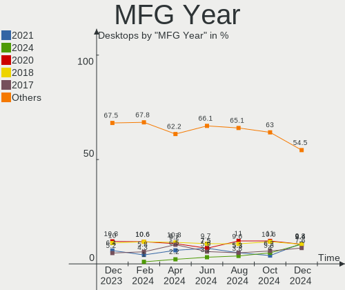
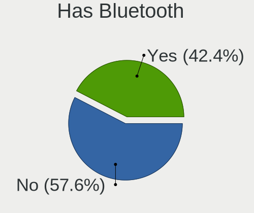
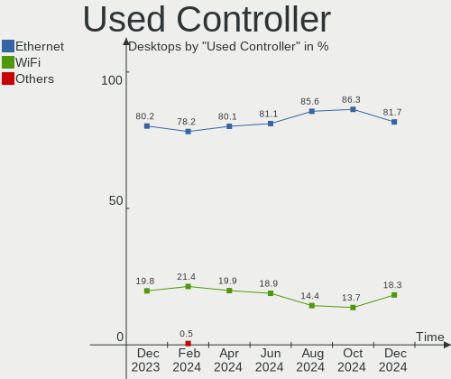
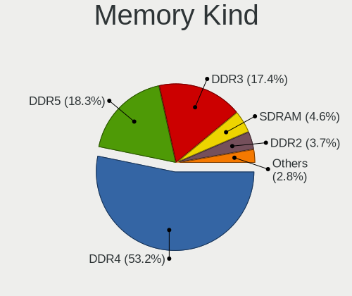

Linux in Germany - Hardware Trends (Desktops)
---------------------------------------------

A project to identify most popular hardware characteristics and track their change
over time based on data collected by Linux users at https://Linux-Hardware.org.

Anyone can contribute to this report by the [hw-probe](https://github.com/linuxhw/hw-probe) tool:

    sudo -E hw-probe -all -upload

Contents
--------

* [ System ](#system)
  - [ OS                       ](#os)
  - [ OS Family                ](#os-family)
  - [ Kernel                   ](#kernel)
  - [ Kernel Family            ](#kernel-family)
  - [ Kernel Major Ver.        ](#kernel-major-ver)
  - [ Arch                     ](#arch)
  - [ DE                       ](#de)
  - [ Display Server           ](#display-server)
  - [ Display Manager          ](#display-manager)
  - [ OS Lang                  ](#os-lang)
  - [ Boot Mode                ](#boot-mode)
  - [ Filesystem               ](#filesystem)
  - [ Part. scheme             ](#part-scheme)
  - [ Dual Boot with Linux/BSD ](#dual-boot-with-linuxbsd)
  - [ Dual Boot (Win)          ](#dual-boot-win)

* [ Board ](#board)
  - [ Vendor                   ](#vendor)
  - [ Model                    ](#model)
  - [ Model Family             ](#model-family)
  - [ MFG Year                 ](#mfg-year)
  - [ Form Factor              ](#form-factor)
  - [ Secure Boot              ](#secure-boot)
  - [ Coreboot                 ](#coreboot)
  - [ RAM Size                 ](#ram-size)
  - [ RAM Used                 ](#ram-used)
  - [ Total Drives             ](#total-drives)
  - [ Has CD-ROM               ](#has-cd-rom)
  - [ Has Ethernet             ](#has-ethernet)
  - [ Has WiFi                 ](#has-wifi)
  - [ Has Bluetooth            ](#has-bluetooth)

* [ Location ](#location)
  - [ Country                  ](#country)
  - [ City                     ](#city)

* [ Drives ](#drives)
  - [ Drive Vendor             ](#drive-vendor)
  - [ Drive Model              ](#drive-model)
  - [ HDD Vendor               ](#hdd-vendor)
  - [ SSD Vendor               ](#ssd-vendor)
  - [ Drive Kind               ](#drive-kind)
  - [ Drive Connector          ](#drive-connector)
  - [ Drive Size               ](#drive-size)
  - [ Space Total              ](#space-total)
  - [ Space Used               ](#space-used)
  - [ Malfunc. Drives          ](#malfunc-drives)
  - [ Malfunc. Drive Vendor    ](#malfunc-drive-vendor)
  - [ Malfunc. HDD Vendor      ](#malfunc-hdd-vendor)
  - [ Malfunc. Drive Kind      ](#malfunc-drive-kind)
  - [ Failed Drives            ](#failed-drives)
  - [ Failed Drive Vendor      ](#failed-drive-vendor)
  - [ Drive Status             ](#drive-status)

* [ Storage controller ](#storage-controller)
  - [ Storage Vendor           ](#storage-vendor)
  - [ Storage Model            ](#storage-model)
  - [ Storage Kind             ](#storage-kind)

* [ Processor ](#processor)
  - [ CPU Vendor               ](#cpu-vendor)
  - [ CPU Model                ](#cpu-model)
  - [ CPU Model Family         ](#cpu-model-family)
  - [ CPU Cores                ](#cpu-cores)
  - [ CPU Sockets              ](#cpu-sockets)
  - [ CPU Threads              ](#cpu-threads)
  - [ CPU Op-Modes             ](#cpu-op-modes)
  - [ CPU Microcode            ](#cpu-microcode)
  - [ CPU Microarch            ](#cpu-microarch)

* [ Graphics ](#graphics)
  - [ GPU Vendor               ](#gpu-vendor)
  - [ GPU Model                ](#gpu-model)
  - [ GPU Combo                ](#gpu-combo)
  - [ GPU Driver               ](#gpu-driver)
  - [ GPU Memory               ](#gpu-memory)

* [ Monitor ](#monitor)
  - [ Monitor Vendor           ](#monitor-vendor)
  - [ Monitor Model            ](#monitor-model)
  - [ Monitor Resolution       ](#monitor-resolution)
  - [ Monitor Diagonal         ](#monitor-diagonal)
  - [ Monitor Width            ](#monitor-width)
  - [ Aspect Ratio             ](#aspect-ratio)
  - [ Monitor Area             ](#monitor-area)
  - [ Pixel Density            ](#pixel-density)
  - [ Multiple Monitors        ](#multiple-monitors)

* [ Network ](#network)
  - [ Net Controller Vendor    ](#net-controller-vendor)
  - [ Net Controller Model     ](#net-controller-model)
  - [ Wireless Vendor          ](#wireless-vendor)
  - [ Wireless Model           ](#wireless-model)
  - [ Ethernet Vendor          ](#ethernet-vendor)
  - [ Ethernet Model           ](#ethernet-model)
  - [ Net Controller Kind      ](#net-controller-kind)
  - [ Used Controller          ](#used-controller)
  - [ NICs                     ](#nics)
  - [ IPv6                     ](#ipv6)

* [ Bluetooth ](#bluetooth)
  - [ Bluetooth Vendor         ](#bluetooth-vendor)
  - [ Bluetooth Model          ](#bluetooth-model)

* [ Sound ](#sound)
  - [ Sound Vendor             ](#sound-vendor)
  - [ Sound Model              ](#sound-model)

* [ Memory ](#memory)
  - [ Memory Vendor            ](#memory-vendor)
  - [ Memory Model             ](#memory-model)
  - [ Memory Kind              ](#memory-kind)
  - [ Memory Form Factor       ](#memory-form-factor)
  - [ Memory Size              ](#memory-size)
  - [ Memory Speed             ](#memory-speed)

* [ Printers & scanners ](#printers--scanners)
  - [ Printer Vendor           ](#printer-vendor)
  - [ Printer Model            ](#printer-model)
  - [ Scanner Vendor           ](#scanner-vendor)
  - [ Scanner Model            ](#scanner-model)

* [ Camera ](#camera)
  - [ Camera Vendor            ](#camera-vendor)
  - [ Camera Model             ](#camera-model)

* [ Security ](#security)
  - [ Fingerprint Vendor       ](#fingerprint-vendor)
  - [ Fingerprint Model        ](#fingerprint-model)
  - [ Chipcard Vendor          ](#chipcard-vendor)
  - [ Chipcard Model           ](#chipcard-model)

* [ Unsupported ](#unsupported)
  - [ Unsupported Devices      ](#unsupported-devices)
  - [ Unsupported Device Types ](#unsupported-device-types)

System
------

OS
--

Installed operating systems

| Name                         | Desktops | Percent |
|------------------------------|----------|---------|
| Linux Mint 20.3              | 31       | 14.9%   |
| Ubuntu 20.04                 | 27       | 12.98%  |
| Ubuntu 22.04                 | 22       | 10.58%  |
| OpenMandriva 4.3             | 12       | 5.77%   |
| Manjaro                      | 9        | 4.33%   |
| Zorin 16                     | 7        | 3.37%   |
| openSUSE Tumbleweed-XXXXXXXX | 7        | 3.37%   |
| openSUSE Leap-15.4           | 7        | 3.37%   |
| Fedora 36                    | 7        | 3.37%   |
| Pop!_OS 22.04                | 6        | 2.88%   |
| Debian 11                    | 6        | 2.88%   |
| Arch Rolling                 | 6        | 2.88%   |
| KDE neon 20.04               | 4        | 1.92%   |
| Fedora 35                    | 4        | 1.92%   |
| Xubuntu 22.04                | 3        | 1.44%   |
| Ubuntu 21.10                 | 3        | 1.44%   |
| ROSA 12.2                    | 3        | 1.44%   |
| Linux Mint 20.2              | 3        | 1.44%   |
| ArcoLinux Rolling            | 3        | 1.44%   |
| Xubuntu 20.04                | 2        | 0.96%   |
| Ubuntu Budgie 22.04          | 2        | 0.96%   |
| Pop!_OS 21.10                | 2        | 0.96%   |
| Manjaro 21.2.6               | 2        | 0.96%   |
| Linux Mint 20                | 2        | 0.96%   |
| Kubuntu 22.04                | 2        | 0.96%   |
| Kubuntu 20.04                | 2        | 0.96%   |
| Gentoo 2.7                   | 2        | 0.96%   |
| Arch                         | 2        | 0.96%   |
| Xubuntu 21.10                | 1        | 0.48%   |
| Ubuntu MATE 22.04            | 1        | 0.48%   |
| Ubuntu Budgie 21.10          | 1        | 0.48%   |
| Ubuntu 21.04                 | 1        | 0.48%   |
| Siduction Unstable           | 1        | 0.48%   |
| openSUSE Leap-15.3           | 1        | 0.48%   |
| Lubuntu 20.04                | 1        | 0.48%   |
| LinuxFX 11                   | 1        | 0.48%   |
| LinuxFX 10                   | 1        | 0.48%   |
| Linux Lite 5.6               | 1        | 0.48%   |
| Kubuntu 11                   | 1        | 0.48%   |
| Kali 2022.2                  | 1        | 0.48%   |
| Gentoo 2.8                   | 1        | 0.48%   |
| EndeavourOS Rolling          | 1        | 0.48%   |
| EndeavourOS                  | 1        | 0.48%   |
| Debian Unstable              | 1        | 0.48%   |
| Debian 9                     | 1        | 0.48%   |
| Clear Linux 36410            | 1        | 0.48%   |
| Clear Linux 36350            | 1        | 0.48%   |
| BlackPanther 18.1            | 1        | 0.48%   |

OS Family
---------

OS without a version

| Name          | Desktops | Percent |
|---------------|----------|---------|
| Ubuntu        | 53       | 25.48%  |
| Linux Mint    | 36       | 17.31%  |
| openSUSE      | 15       | 7.21%   |
| OpenMandriva  | 12       | 5.77%   |
| Manjaro       | 11       | 5.29%   |
| Fedora        | 11       | 5.29%   |
| Pop!_OS       | 8        | 3.85%   |
| Debian        | 8        | 3.85%   |
| Arch          | 8        | 3.85%   |
| Zorin         | 7        | 3.37%   |
| Xubuntu       | 6        | 2.88%   |
| Kubuntu       | 5        | 2.4%    |
| KDE neon      | 4        | 1.92%   |
| Ubuntu Budgie | 3        | 1.44%   |
| ROSA          | 3        | 1.44%   |
| Gentoo        | 3        | 1.44%   |
| ArcoLinux     | 3        | 1.44%   |
| LinuxFX       | 2        | 0.96%   |
| EndeavourOS   | 2        | 0.96%   |
| Clear Linux   | 2        | 0.96%   |
| Ubuntu MATE   | 1        | 0.48%   |
| Siduction     | 1        | 0.48%   |
| Lubuntu       | 1        | 0.48%   |
| Linux Lite    | 1        | 0.48%   |
| Kali          | 1        | 0.48%   |
| BlackPanther  | 1        | 0.48%   |

Kernel
------

Version of the Linux kernel

| Version                             | Desktops | Percent |
|-------------------------------------|----------|---------|
| 5.13.0-41-generic                   | 19       | 9.13%   |
| 5.4.0-110-generic                   | 12       | 5.77%   |
| 5.16.7-desktop-1omv4003             | 12       | 5.77%   |
| 5.13.0-40-generic                   | 12       | 5.77%   |
| 5.15.0-27-generic                   | 11       | 5.29%   |
| 5.13.0-44-generic                   | 11       | 5.29%   |
| 5.4.0-113-generic                   | 9        | 4.33%   |
| 5.4.0-109-generic                   | 9        | 4.33%   |
| 5.15.0-30-generic                   | 8        | 3.85%   |
| 5.14.21-150400.19-default           | 5        | 2.4%    |
| 5.17.5-arch1-1                      | 4        | 1.92%   |
| 5.17.5-76051705-generic             | 4        | 1.92%   |
| 5.17.1-3-MANJARO                    | 4        | 1.92%   |
| 5.15.0-33-generic                   | 4        | 1.92%   |
| 5.17.8-300.fc36.x86_64              | 3        | 1.44%   |
| 5.17.4-1-default                    | 3        | 1.44%   |
| 5.16.19-76051619-generic            | 3        | 1.44%   |
| 5.10.74-generic-2rosa2021.1-x86_64  | 3        | 1.44%   |
| 5.4.0-91-generic                    | 2        | 0.96%   |
| 5.4.0-74-generic                    | 2        | 0.96%   |
| 5.18.0-rc6-lp153.2.ged50f8f-default | 2        | 0.96%   |
| 5.17.9-arch1-1                      | 2        | 0.96%   |
| 5.17.9-1-default                    | 2        | 0.96%   |
| 5.17.6-1-MANJARO                    | 2        | 0.96%   |
| 5.17.5-zen1-1-zen                   | 2        | 0.96%   |
| 5.17.5-300.fc36.x86_64              | 2        | 0.96%   |
| 5.17.4-200.fc35.x86_64              | 2        | 0.96%   |
| 5.15.38-1-MANJARO                   | 2        | 0.96%   |
| 5.15.0-28-generic                   | 2        | 0.96%   |
| 5.15.0-25-generic                   | 2        | 0.96%   |
| 5.10.0-14-amd64                     | 2        | 0.96%   |
| 5.6.0-050600-generic                | 1        | 0.48%   |
| 5.4.0-89-generic                    | 1        | 0.48%   |
| 5.4.0-113-lowlatency                | 1        | 0.48%   |
| 5.4.0-107-generic                   | 1        | 0.48%   |
| 5.3.18-150300.59.63-default         | 1        | 0.48%   |
| 5.18.0-arch1-1                      | 1        | 0.48%   |
| 5.18.0-1-siduction-amd64            | 1        | 0.48%   |
| 5.18.0-051800-generic               | 1        | 0.48%   |
| 5.17.9-zen1-1-zen                   | 1        | 0.48%   |
| 5.17.9-1-MANJARO                    | 1        | 0.48%   |
| 5.17.8-gentoo-x86_64                | 1        | 0.48%   |
| 5.17.7-zen1-2-zen                   | 1        | 0.48%   |
| 5.17.7-zen1-1-zen                   | 1        | 0.48%   |
| 5.17.7-1-default                    | 1        | 0.48%   |
| 5.17.7-051707-generic               | 1        | 0.48%   |
| 5.17.6-300.fc36.x86_64              | 1        | 0.48%   |
| 5.17.5-1-default                    | 1        | 0.48%   |
| 5.17.11-300.fc36.x86_64             | 1        | 0.48%   |
| 5.17.1-zen1                         | 1        | 0.48%   |
| 5.17.0-2-amd64                      | 1        | 0.48%   |
| 5.17.0-1-amd64                      | 1        | 0.48%   |
| 5.16.5                              | 1        | 0.48%   |
| 5.16.15-76051615-generic            | 1        | 0.48%   |
| 5.16.15-1134.native                 | 1        | 0.48%   |
| 5.16.13-1132.native                 | 1        | 0.48%   |
| 5.16.0-kali7-amd64                  | 1        | 0.48%   |
| 5.16.0-6mx-amd64                    | 1        | 0.48%   |
| 5.16.0-6-amd64                      | 1        | 0.48%   |
| 5.16.0-0.bpo.4-amd64                | 1        | 0.48%   |

Kernel Family
-------------

Linux kernel without a distro release

| Version | Desktops | Percent |
|---------|----------|---------|
| 5.13.0  | 49       | 23.56%  |
| 5.4.0   | 37       | 17.79%  |
| 5.15.0  | 28       | 13.46%  |
| 5.17.5  | 13       | 6.25%   |
| 5.16.7  | 12       | 5.77%   |
| 5.17.9  | 6        | 2.88%   |
| 5.18.0  | 5        | 2.4%    |
| 5.17.4  | 5        | 2.4%    |
| 5.17.1  | 5        | 2.4%    |
| 5.14.21 | 5        | 2.4%    |
| 5.17.8  | 4        | 1.92%   |
| 5.17.7  | 4        | 1.92%   |
| 5.16.0  | 4        | 1.92%   |
| 5.10.0  | 4        | 1.92%   |
| 5.17.6  | 3        | 1.44%   |
| 5.16.19 | 3        | 1.44%   |
| 5.10.74 | 3        | 1.44%   |
| 5.17.0  | 2        | 0.96%   |
| 5.16.15 | 2        | 0.96%   |
| 5.15.38 | 2        | 0.96%   |
| 5.15.32 | 2        | 0.96%   |
| 5.6.0   | 1        | 0.48%   |
| 5.3.18  | 1        | 0.48%   |
| 5.17.11 | 1        | 0.48%   |
| 5.16.5  | 1        | 0.48%   |
| 5.16.13 | 1        | 0.48%   |
| 5.15.5  | 1        | 0.48%   |
| 5.15.41 | 1        | 0.48%   |
| 5.14.10 | 1        | 0.48%   |
| 5.11.0  | 1        | 0.48%   |
| 4.18.16 | 1        | 0.48%   |

Kernel Major Ver.
-----------------

Linux kernel major version

| Version | Desktops | Percent |
|---------|----------|---------|
| 5.13    | 49       | 23.56%  |
| 5.17    | 43       | 20.67%  |
| 5.4     | 37       | 17.79%  |
| 5.15    | 34       | 16.35%  |
| 5.16    | 23       | 11.06%  |
| 5.10    | 7        | 3.37%   |
| 5.14    | 6        | 2.88%   |
| 5.18    | 5        | 2.4%    |
| 5.6     | 1        | 0.48%   |
| 5.3     | 1        | 0.48%   |
| 5.11    | 1        | 0.48%   |
| 4.18    | 1        | 0.48%   |

Arch
----

OS architecture (x86_64, i586, etc.)

| Name   | Desktops | Percent |
|--------|----------|---------|
| x86_64 | 208      | 100%    |

DE
--

Desktop Environment

| Name       | Desktops | Percent |
|------------|----------|---------|
| GNOME      | 85       | 40.87%  |
| KDE5       | 49       | 23.56%  |
| X-Cinnamon | 30       | 14.42%  |
| XFCE       | 23       | 11.06%  |
| Unknown    | 5        | 2.4%    |
| MATE       | 4        | 1.92%   |
| Budgie     | 3        | 1.44%   |
| LXQt       | 2        | 0.96%   |
| sway       | 1        | 0.48%   |
| qtile      | 1        | 0.48%   |
| LeftWM     | 1        | 0.48%   |
| KDE        | 1        | 0.48%   |
| Deepin     | 1        | 0.48%   |
| Cinnamon   | 1        | 0.48%   |
| bspwm      | 1        | 0.48%   |

Display Server
--------------

X11 or Wayland

| Name        | Desktops | Percent |
|-------------|----------|---------|
| X11         | 170      | 81.73%  |
| Wayland     | 30       | 14.42%  |
| Tty         | 6        | 2.88%   |
| Unspecified | 1        | 0.48%   |
| Unknown     | 1        | 0.48%   |

Display Manager
---------------

SDDM, LightDM, etc.

| Name    | Desktops | Percent |
|---------|----------|---------|
| Unknown | 69       | 33.17%  |
| GDM3    | 46       | 22.12%  |
| LightDM | 38       | 18.27%  |
| SDDM    | 37       | 17.79%  |
| GDM     | 15       | 7.21%   |
| XDM     | 1        | 0.48%   |
| SLiM    | 1        | 0.48%   |
| Ly      | 1        | 0.48%   |

OS Lang
-------

Language

| Lang    | Desktops | Percent |
|---------|----------|---------|
| de_DE   | 165      | 79.33%  |
| en_US   | 31       | 14.9%   |
| en_GB   | 4        | 1.92%   |
| C       | 3        | 1.44%   |
| Unknown | 3        | 1.44%   |
| POSIX   | 1        | 0.48%   |
| es_ES   | 1        | 0.48%   |

Boot Mode
---------

EFI or BIOS

| Mode | Desktops | Percent |
|------|----------|---------|
| BIOS | 120      | 57.69%  |
| EFI  | 88       | 42.31%  |

Filesystem
----------

Type of filesystem

| Type    | Desktops | Percent |
|---------|----------|---------|
| Ext4    | 153      | 73.56%  |
| Btrfs   | 36       | 17.31%  |
| Overlay | 15       | 7.21%   |
| Xfs     | 3        | 1.44%   |
| Zfs     | 1        | 0.48%   |

Part. scheme
------------

Scheme of partitioning

| Type    | Desktops | Percent |
|---------|----------|---------|
| Unknown | 116      | 55.77%  |
| GPT     | 71       | 34.13%  |
| MBR     | 21       | 10.1%   |

Dual Boot with Linux/BSD
------------------------

Hosting more than one Linux/BSD

| Dual boot | Desktops | Percent |
|-----------|----------|---------|
| No        | 166      | 79.81%  |
| Yes       | 42       | 20.19%  |

Dual Boot (Win)
---------------

Hosting Linux and Windows

| Dual boot | Desktops | Percent |
|-----------|----------|---------|
| No        | 143      | 68.75%  |
| Yes       | 65       | 31.25%  |

Board
-----

Vendor
------

Motherboard manufacturer

| Name                | Desktops | Percent |
|---------------------|----------|---------|
| ASUSTek Computer    | 54       | 25.96%  |
| Gigabyte Technology | 39       | 18.75%  |
| MSI                 | 31       | 14.9%   |
| ASRock              | 20       | 9.62%   |
| Hewlett-Packard     | 13       | 6.25%   |
| Dell                | 9        | 4.33%   |
| Acer                | 7        | 3.37%   |
| Medion              | 6        | 2.88%   |
| Fujitsu             | 6        | 2.88%   |
| Lenovo              | 5        | 2.4%    |
| Intel               | 3        | 1.44%   |
| Foxconn             | 3        | 1.44%   |
| Biostar             | 3        | 1.44%   |
| Shuttle             | 2        | 0.96%   |
| Fujitsu Siemens     | 2        | 0.96%   |
| Unknown             | 2        | 0.96%   |
| Packard Bell        | 1        | 0.48%   |
| EVGA                | 1        | 0.48%   |
| AMI                 | 1        | 0.48%   |

Model
-----

Motherboard model

| Name                               | Desktops | Percent |
|------------------------------------|----------|---------|
| MSI MS-7C37                        | 4        | 1.92%   |
| Gigabyte GA-78LMT-S2P              | 3        | 1.44%   |
| ASUS TUF Gaming B550-PLUS          | 3        | 1.44%   |
| ASUS All Series                    | 3        | 1.44%   |
| MSI MS-7D46                        | 2        | 0.96%   |
| MSI MS-7C02                        | 2        | 0.96%   |
| MSI MS-7A38                        | 2        | 0.96%   |
| MSI MS-7758                        | 2        | 0.96%   |
| HP Compaq 6200 Pro MT PC           | 2        | 0.96%   |
| Gigabyte B550 AORUS PRO V2         | 2        | 0.96%   |
| Gigabyte B550 AORUS PRO AC         | 2        | 0.96%   |
| ASUS TUF Gaming B550M-E            | 2        | 0.96%   |
| ASUS PRIME X370-PRO                | 2        | 0.96%   |
| ASUS M4A785TD-V EVO                | 2        | 0.96%   |
| ASRock X470 Taichi                 | 2        | 0.96%   |
| Unknown                            | 2        | 0.96%   |
| Shuttle SG41                       | 1        | 0.48%   |
| Shuttle DS20U                      | 1        | 0.48%   |
| Packard Bell IMEDIA S3800          | 1        | 0.48%   |
| MSI MS-7D25                        | 1        | 0.48%   |
| MSI MS-7D22                        | 1        | 0.48%   |
| MSI MS-7C94                        | 1        | 0.48%   |
| MSI MS-7C91                        | 1        | 0.48%   |
| MSI MS-7C81                        | 1        | 0.48%   |
| MSI MS-7B84                        | 1        | 0.48%   |
| MSI MS-7B54                        | 1        | 0.48%   |
| MSI MS-7B48                        | 1        | 0.48%   |
| MSI MS-7A63                        | 1        | 0.48%   |
| MSI MS-7A33                        | 1        | 0.48%   |
| MSI MS-7A32                        | 1        | 0.48%   |
| MSI MS-7984                        | 1        | 0.48%   |
| MSI MS-7885                        | 1        | 0.48%   |
| MSI MS-7760                        | 1        | 0.48%   |
| MSI MS-7751                        | 1        | 0.48%   |
| MSI MS-7636                        | 1        | 0.48%   |
| MSI MS-7599                        | 1        | 0.48%   |
| MSI MS-7267                        | 1        | 0.48%   |
| MSI MS-7100                        | 1        | 0.48%   |
| Medion MS-7728                     | 1        | 0.48%   |
| Medion MS-7621                     | 1        | 0.48%   |
| Medion MS-7366                     | 1        | 0.48%   |
| Medion E32014                      | 1        | 0.48%   |
| Medion Akoya P5363 I/C267          | 1        | 0.48%   |
| Medion Akoya P2316 D/B780          | 1        | 0.48%   |
| Lenovo V530-15ICB 10TV0043GE       | 1        | 0.48%   |
| Lenovo ThinkStation S30 4352A8G    | 1        | 0.48%   |
| Lenovo ThinkCentre M93p 10ABS01700 | 1        | 0.48%   |
| Lenovo ThinkCentre M81 5049W16     | 1        | 0.48%   |
| Lenovo ThinkCentre A57 98517HG     | 1        | 0.48%   |
| Intel DZ77SL-50K AAG55115-300      | 1        | 0.48%   |
| Intel DX79SR AAG57199-200          | 1        | 0.48%   |
| Intel DB85FL AAG89861-203          | 1        | 0.48%   |
| HP Z800 Workstation                | 1        | 0.48%   |
| HP Z600 Workstation                | 1        | 0.48%   |
| HP Slim Desktop 290-a0xxx          | 1        | 0.48%   |
| HP OMEN 25L Desktop GT12-0xxx      | 1        | 0.48%   |
| HP EliteDesk 705 G3 Desktop Mini   | 1        | 0.48%   |
| HP Elite Slice                     | 1        | 0.48%   |
| HP Compaq Pro 6300 SFF             | 1        | 0.48%   |
| HP Compaq Elite 8300 USDT          | 1        | 0.48%   |

Model Family
------------

Motherboard model prefix

| Name                  | Desktops | Percent |
|-----------------------|----------|---------|
| ASUS PRIME            | 11       | 5.29%   |
| ASUS ROG              | 8        | 3.85%   |
| HP Compaq             | 7        | 3.37%   |
| ASUS TUF              | 7        | 3.37%   |
| Acer Aspire           | 6        | 2.88%   |
| Gigabyte B550         | 5        | 2.4%    |
| MSI MS-7C37           | 4        | 1.92%   |
| Fujitsu ESPRIMO       | 4        | 1.92%   |
| Dell OptiPlex         | 4        | 1.92%   |
| Lenovo ThinkCentre    | 3        | 1.44%   |
| Gigabyte GA-78LMT-S2P | 3        | 1.44%   |
| ASUS All              | 3        | 1.44%   |
| MSI MS-7D46           | 2        | 0.96%   |
| MSI MS-7C02           | 2        | 0.96%   |
| MSI MS-7A38           | 2        | 0.96%   |
| MSI MS-7758           | 2        | 0.96%   |
| Medion Akoya          | 2        | 0.96%   |
| Gigabyte X570         | 2        | 0.96%   |
| Gigabyte B550M        | 2        | 0.96%   |
| Fujitsu CELSIUS       | 2        | 0.96%   |
| Dell Studio           | 2        | 0.96%   |
| Dell Precision        | 2        | 0.96%   |
| ASUS SABERTOOTH       | 2        | 0.96%   |
| ASUS M4A785TD-V       | 2        | 0.96%   |
| ASUS CROSSHAIR        | 2        | 0.96%   |
| ASRock X470           | 2        | 0.96%   |
| ASRock B450           | 2        | 0.96%   |
| Unknown               | 2        | 0.96%   |
| Shuttle SG41          | 1        | 0.48%   |
| Shuttle DS20U         | 1        | 0.48%   |
| Packard Bell IMEDIA   | 1        | 0.48%   |
| MSI MS-7D25           | 1        | 0.48%   |
| MSI MS-7D22           | 1        | 0.48%   |
| MSI MS-7C94           | 1        | 0.48%   |
| MSI MS-7C91           | 1        | 0.48%   |
| MSI MS-7C81           | 1        | 0.48%   |
| MSI MS-7B84           | 1        | 0.48%   |
| MSI MS-7B54           | 1        | 0.48%   |
| MSI MS-7B48           | 1        | 0.48%   |
| MSI MS-7A63           | 1        | 0.48%   |
| MSI MS-7A33           | 1        | 0.48%   |
| MSI MS-7A32           | 1        | 0.48%   |
| MSI MS-7984           | 1        | 0.48%   |
| MSI MS-7885           | 1        | 0.48%   |
| MSI MS-7760           | 1        | 0.48%   |
| MSI MS-7751           | 1        | 0.48%   |
| MSI MS-7636           | 1        | 0.48%   |
| MSI MS-7599           | 1        | 0.48%   |
| MSI MS-7267           | 1        | 0.48%   |
| MSI MS-7100           | 1        | 0.48%   |
| Medion MS-7728        | 1        | 0.48%   |
| Medion MS-7621        | 1        | 0.48%   |
| Medion MS-7366        | 1        | 0.48%   |
| Medion E32014         | 1        | 0.48%   |
| Lenovo V530-15ICB     | 1        | 0.48%   |
| Lenovo ThinkStation   | 1        | 0.48%   |
| Intel DZ77SL-50K      | 1        | 0.48%   |
| Intel DX79SR          | 1        | 0.48%   |
| Intel DB85FL          | 1        | 0.48%   |
| HP Z800               | 1        | 0.48%   |

MFG Year
--------

Motherboard manufacture year

| Year | Desktops | Percent |
|------|----------|---------|
| 2020 | 25       | 12.02%  |
| 2012 | 22       | 10.58%  |
| 2018 | 17       | 8.17%   |
| 2017 | 17       | 8.17%   |
| 2021 | 16       | 7.69%   |
| 2009 | 16       | 7.69%   |
| 2019 | 15       | 7.21%   |
| 2010 | 14       | 6.73%   |
| 2013 | 11       | 5.29%   |
| 2011 | 11       | 5.29%   |
| 2016 | 10       | 4.81%   |
| 2015 | 8        | 3.85%   |
| 2022 | 7        | 3.37%   |
| 2014 | 7        | 3.37%   |
| 2008 | 4        | 1.92%   |
| 2007 | 4        | 1.92%   |
| 2006 | 4        | 1.92%   |

Form Factor
-----------

Physical design of the computer

| Name    | Desktops | Percent |
|---------|----------|---------|
| Desktop | 208      | 100%    |

Secure Boot
-----------

Enabled or disabled

| State    | Desktops | Percent |
|----------|----------|---------|
| Disabled | 201      | 96.63%  |
| Enabled  | 7        | 3.37%   |

Coreboot
--------

Have coreboot on board

| Used | Desktops | Percent |
|------|----------|---------|
| No   | 208      | 100%    |

RAM Size
--------

Total RAM memory

| Size in GB  | Desktops | Percent |
|-------------|----------|---------|
| 16.01-24.0  | 57       | 27.4%   |
| 32.01-64.0  | 51       | 24.52%  |
| 8.01-16.0   | 33       | 15.87%  |
| 4.01-8.0    | 25       | 12.02%  |
| 3.01-4.0    | 21       | 10.1%   |
| 64.01-256.0 | 12       | 5.77%   |
| 24.01-32.0  | 6        | 2.88%   |
| 1.01-2.0    | 2        | 0.96%   |
| 2.01-3.0    | 1        | 0.48%   |

RAM Used
--------

Used RAM memory

| Used GB    | Desktops | Percent |
|------------|----------|---------|
| 1.01-2.0   | 77       | 37.02%  |
| 2.01-3.0   | 59       | 28.37%  |
| 4.01-8.0   | 30       | 14.42%  |
| 3.01-4.0   | 20       | 9.62%   |
| 0.51-1.0   | 12       | 5.77%   |
| 8.01-16.0  | 7        | 3.37%   |
| 24.01-32.0 | 1        | 0.48%   |
| 16.01-24.0 | 1        | 0.48%   |
| 0.01-0.5   | 1        | 0.48%   |

Total Drives
------------

Number of drives on board

| Drives | Desktops | Percent |
|--------|----------|---------|
| 1      | 65       | 31.25%  |
| 2      | 58       | 27.88%  |
| 3      | 44       | 21.15%  |
| 4      | 22       | 10.58%  |
| 5      | 8        | 3.85%   |
| 6      | 7        | 3.37%   |
| 8      | 2        | 0.96%   |
| 9      | 1        | 0.48%   |
| 7      | 1        | 0.48%   |

Has CD-ROM
----------

Has CD-ROM on board

| Presented | Desktops | Percent |
|-----------|----------|---------|
| Yes       | 110      | 52.88%  |
| No        | 98       | 47.12%  |

Has Ethernet
------------

Has Ethernet on board

| Presented | Desktops | Percent |
|-----------|----------|---------|
| Yes       | 208      | 100%    |

Has WiFi
--------

Has WiFi module

| Presented | Desktops | Percent |
|-----------|----------|---------|
| No        | 134      | 64.42%  |
| Yes       | 74       | 35.58%  |

Has Bluetooth
-------------

Has Bluetooth module

| Presented | Desktops | Percent |
|-----------|----------|---------|
| No        | 141      | 67.79%  |
| Yes       | 67       | 32.21%  |

Location
--------

Country
-------

Geographic location (country)

| Country | Desktops | Percent |
|---------|----------|---------|
| Germany | 208      | 100%    |

City
----

Geographic location (city)

| City               | Desktops | Percent |
|--------------------|----------|---------|
| Berlin             | 17       | 8.17%   |
| Munich             | 10       | 4.81%   |
| Hamburg            | 10       | 4.81%   |
| Haßfurt           | 5        | 2.4%    |
| Frankfurt am Main  | 5        | 2.4%    |
| Stuttgart          | 4        | 1.92%   |
| Kiel               | 3        | 1.44%   |
| Worms              | 2        | 0.96%   |
| Schwieberdingen    | 2        | 0.96%   |
| Raunheim           | 2        | 0.96%   |
| Münster           | 2        | 0.96%   |
| Leverkusen         | 2        | 0.96%   |
| Leipzig            | 2        | 0.96%   |
| Langenhagen        | 2        | 0.96%   |
| Krefeld            | 2        | 0.96%   |
| Kirchgellersen     | 2        | 0.96%   |
| Karlsruhe          | 2        | 0.96%   |
| Ingelheim am Rhein | 2        | 0.96%   |
| Hildesheim         | 2        | 0.96%   |
| Herne              | 2        | 0.96%   |
| Gross-Umstadt      | 2        | 0.96%   |
| Erlangen           | 2        | 0.96%   |
| Cologne            | 2        | 0.96%   |
| Burgkunstadt       | 2        | 0.96%   |
| Bremen             | 2        | 0.96%   |
| Braunschweig       | 2        | 0.96%   |
| Bonn               | 2        | 0.96%   |
| Zschopau           | 1        | 0.48%   |
| Zeulenroda-Triebes | 1        | 0.48%   |
| Würzburg          | 1        | 0.48%   |
| Wuppertal          | 1        | 0.48%   |
| Wittenberge        | 1        | 0.48%   |
| Wingerode          | 1        | 0.48%   |
| Wiesbaden          | 1        | 0.48%   |
| Weselberg          | 1        | 0.48%   |
| Wendorf            | 1        | 0.48%   |
| Weitramsdorf       | 1        | 0.48%   |
| Weimar             | 1        | 0.48%   |
| Weilburg           | 1        | 0.48%   |
| Wegberg            | 1        | 0.48%   |
| Waltershausen      | 1        | 0.48%   |
| Waghausel          | 1        | 0.48%   |
| Vohenstrauss       | 1        | 0.48%   |
| Vechta             | 1        | 0.48%   |
| Uetze              | 1        | 0.48%   |
| Uelzen             | 1        | 0.48%   |
| Troisdorf          | 1        | 0.48%   |
| Trebur             | 1        | 0.48%   |
| Teutschenthal      | 1        | 0.48%   |
| Sulzbach-Rosenberg | 1        | 0.48%   |
| Stelle             | 1        | 0.48%   |
| Stade              | 1        | 0.48%   |
| Sindelfingen       | 1        | 0.48%   |
| Seehausen          | 1        | 0.48%   |
| Schwerin           | 1        | 0.48%   |
| Schweinfurt        | 1        | 0.48%   |
| Schrobenhausen     | 1        | 0.48%   |
| Salzgitter         | 1        | 0.48%   |
| Saarlouis          | 1        | 0.48%   |
| Saarbrücken       | 1        | 0.48%   |

Drives
------

Drive Vendor
------------

Hard drive vendors

| Vendor              | Desktops | Drives | Percent |
|---------------------|----------|--------|---------|
| Samsung Electronics | 82       | 121    | 20.3%   |
| Seagate             | 65       | 86     | 16.09%  |
| WDC                 | 64       | 84     | 15.84%  |
| SanDisk             | 30       | 38     | 7.43%   |
| Crucial             | 26       | 30     | 6.44%   |
| Kingston            | 23       | 26     | 5.69%   |
| Toshiba             | 22       | 26     | 5.45%   |
| Hitachi             | 10       | 11     | 2.48%   |
| Micron Technology   | 8        | 10     | 1.98%   |
| Intenso             | 7        | 12     | 1.73%   |
| Phison              | 6        | 6      | 1.49%   |
| A-DATA Technology   | 6        | 6      | 1.49%   |
| Intel               | 5        | 5      | 1.24%   |
| Unknown             | 4        | 7      | 0.99%   |
| OCZ                 | 4        | 4      | 0.99%   |
| China               | 4        | 4      | 0.99%   |
| LITEON              | 3        | 3      | 0.74%   |
| Leven               | 3        | 3      | 0.74%   |
| HGST                | 3        | 3      | 0.74%   |
| ASMT                | 3        | 3      | 0.74%   |
| SPCC                | 2        | 2      | 0.5%    |
| SK Hynix            | 2        | 2      | 0.5%    |
| Corsair             | 2        | 2      | 0.5%    |
| Unknown             | 2        | 2      | 0.5%    |
| XrayDisk            | 1        | 1      | 0.25%   |
| XPG                 | 1        | 1      | 0.25%   |
| ViperTeq            | 1        | 1      | 0.25%   |
| TYPEC 2T            | 1        | 1      | 0.25%   |
| Team                | 1        | 1      | 0.25%   |
| TCSUNBOW-X5         | 1        | 1      | 0.25%   |
| TCSUNBOW            | 1        | 1      | 0.25%   |
| SSK                 | 1        | 1      | 0.25%   |
| PNY                 | 1        | 1      | 0.25%   |
| PLEXTOR             | 1        | 1      | 0.25%   |
| Patriot             | 1        | 1      | 0.25%   |
| Netac               | 1        | 1      | 0.25%   |
| Mass                | 1        | 1      | 0.25%   |
| KingSpec            | 1        | 1      | 0.25%   |
| Hewlett-Packard     | 1        | 1      | 0.25%   |
| GOODRAM             | 1        | 1      | 0.25%   |
| DREVO               | 1        | 1      | 0.25%   |
| Apple               | 1        | 1      | 0.25%   |

Drive Model
-----------

Hard drive models

| Model                           | Desktops | Percent |
|---------------------------------|----------|---------|
| Samsung NVMe SSD Drive 1TB      | 9        | 1.88%   |
| SanDisk SSD PLUS 240GB          | 8        | 1.67%   |
| Crucial CT1000MX500SSD1 1TB     | 8        | 1.67%   |
| Samsung SSD 840 EVO 120GB       | 7        | 1.46%   |
| Samsung SSD 860 EVO 500GB       | 6        | 1.25%   |
| Samsung SSD 860 EVO 1TB         | 6        | 1.25%   |
| Samsung SSD 850 EVO 500GB       | 6        | 1.25%   |
| SanDisk SDSSDA240G 240GB        | 5        | 1.04%   |
| Samsung SSD 970 EVO Plus 500GB  | 5        | 1.04%   |
| Samsung SSD 970 EVO Plus 1TB    | 5        | 1.04%   |
| Seagate ST500DM002-1BD142 500GB | 4        | 0.84%   |
| Seagate ST31000524AS 1TB        | 4        | 0.84%   |
| Seagate ST1000DM010-2EP102 1TB  | 4        | 0.84%   |
| SanDisk SSD PLUS 480GB          | 4        | 0.84%   |
| Samsung SSD 850 EVO 250GB       | 4        | 0.84%   |
| Crucial CT480BX500SSD1 480GB    | 4        | 0.84%   |
| WDC WD10EZEX-08WN4A0 1TB        | 3        | 0.63%   |
| WDC WD10EARS-00Y5B1 1TB         | 3        | 0.63%   |
| Toshiba HDWD110 1TB             | 3        | 0.63%   |
| Toshiba DT01ACA100 1TB          | 3        | 0.63%   |
| Seagate ST2000DM008-2FR102 2TB  | 3        | 0.63%   |
| Seagate ST2000DM001-9YN164 2TB  | 3        | 0.63%   |
| Seagate ST1000DM003-1ER162 1TB  | 3        | 0.63%   |
| Samsung SSD 980 PRO 1TB         | 3        | 0.63%   |
| Samsung SSD 850 EVO 1TB         | 3        | 0.63%   |
| Samsung NVMe SSD Drive 250GB    | 3        | 0.63%   |
| Samsung HD103SI 1TB             | 3        | 0.63%   |
| Kingston SA400S37120G 120GB SSD | 3        | 0.63%   |
| Kingston NVMe SSD Drive 500GB   | 3        | 0.63%   |
| Crucial CT250MX500SSD1 250GB    | 3        | 0.63%   |
| WDC WD5000AAKX-001CA0 500GB     | 2        | 0.42%   |
| WDC WD40EZRZ-00GXCB0 4TB        | 2        | 0.42%   |
| WDC WD20EZRX-00D8PB0 2TB        | 2        | 0.42%   |
| WDC WD20EZBX-00AYRA0 2TB        | 2        | 0.42%   |
| WDC WD10EZRX-00D8PB0 1TB        | 2        | 0.42%   |
| WDC WD10EZEX-22MFCA0 1TB        | 2        | 0.42%   |
| WDC WD10EARS-00MVWB0 1TB        | 2        | 0.42%   |
| Toshiba MQ01ABD100 1TB          | 2        | 0.42%   |
| Toshiba DT01ACA300 3TB          | 2        | 0.42%   |
| Toshiba DT01ACA050 500GB        | 2        | 0.42%   |
| Seagate ST4000DM004-2CV104 4TB  | 2        | 0.42%   |
| Seagate ST3500418AS 500GB       | 2        | 0.42%   |
| Seagate ST31000528AS 1TB        | 2        | 0.42%   |
| Seagate ST3000VN000-1HJ166 3TB  | 2        | 0.42%   |
| Seagate ST2000NM0011 2TB        | 2        | 0.42%   |
| Seagate ST2000DM001-1ER164 2TB  | 2        | 0.42%   |
| Seagate ST2000DL003-9VT166 2TB  | 2        | 0.42%   |
| Seagate ST1000DX001-1CM162 1TB  | 2        | 0.42%   |
| SanDisk SSD PLUS 120GB          | 2        | 0.42%   |
| SanDisk SDSSDH31024G 1TB        | 2        | 0.42%   |
| SanDisk SDSSDH3 1T02 1024GB     | 2        | 0.42%   |
| SanDisk SDSSDA120G 120GB        | 2        | 0.42%   |
| Sandisk NVMe SSD Drive 1TB      | 2        | 0.42%   |
| Samsung SSD 970 EVO 500GB       | 2        | 0.42%   |
| Samsung SSD 860 QVO 1TB         | 2        | 0.42%   |
| Samsung SSD 860 EVO 250GB       | 2        | 0.42%   |
| Samsung SSD 850 PRO 256GB       | 2        | 0.42%   |
| Samsung NVMe SSD Drive 512GB    | 2        | 0.42%   |
| Samsung NVMe SSD Drive 2TB      | 2        | 0.42%   |
| Samsung NVMe SSD Drive 256GB    | 2        | 0.42%   |

HDD Vendor
----------

Hard disk drive vendors

| Vendor              | Desktops | Drives | Percent |
|---------------------|----------|--------|---------|
| Seagate             | 64       | 85     | 36.36%  |
| WDC                 | 61       | 77     | 34.66%  |
| Toshiba             | 19       | 23     | 10.8%   |
| Samsung Electronics | 13       | 15     | 7.39%   |
| Hitachi             | 10       | 11     | 5.68%   |
| HGST                | 3        | 3      | 1.7%    |
| Unknown             | 2        | 2      | 1.14%   |
| ASMT                | 2        | 2      | 1.14%   |
| Hewlett-Packard     | 1        | 1      | 0.57%   |
| Apple               | 1        | 1      | 0.57%   |

SSD Vendor
----------

Solid state drive vendors

| Vendor              | Desktops | Drives | Percent |
|---------------------|----------|--------|---------|
| Samsung Electronics | 49       | 59     | 30.25%  |
| SanDisk             | 27       | 34     | 16.67%  |
| Crucial             | 23       | 27     | 14.2%   |
| Kingston            | 13       | 16     | 8.02%   |
| Micron Technology   | 5        | 6      | 3.09%   |
| Intenso             | 5        | 7      | 3.09%   |
| A-DATA Technology   | 5        | 5      | 3.09%   |
| Intel               | 4        | 4      | 2.47%   |
| China               | 4        | 4      | 2.47%   |
| OCZ                 | 3        | 3      | 1.85%   |
| Leven               | 3        | 3      | 1.85%   |
| WDC                 | 2        | 2      | 1.23%   |
| Toshiba             | 2        | 2      | 1.23%   |
| PHISON              | 2        | 2      | 1.23%   |
| LITEON              | 2        | 2      | 1.23%   |
| Unknown             | 2        | 2      | 1.23%   |
| ViperTeq            | 1        | 1      | 0.62%   |
| TYPEC 2T            | 1        | 1      | 0.62%   |
| TCSUNBOW-X5         | 1        | 1      | 0.62%   |
| SK Hynix            | 1        | 1      | 0.62%   |
| PNY                 | 1        | 1      | 0.62%   |
| PLEXTOR             | 1        | 1      | 0.62%   |
| Patriot             | 1        | 1      | 0.62%   |
| Netac               | 1        | 1      | 0.62%   |
| KingSpec            | 1        | 1      | 0.62%   |
| GOODRAM             | 1        | 1      | 0.62%   |
| DREVO               | 1        | 1      | 0.62%   |

Drive Kind
----------

HDD or SSD

| Kind    | Desktops | Drives | Percent |
|---------|----------|--------|---------|
| SSD     | 128      | 189    | 38.21%  |
| HDD     | 128      | 220    | 38.21%  |
| NVMe    | 69       | 89     | 20.6%   |
| Unknown | 8        | 13     | 2.39%   |
| MMC     | 2        | 3      | 0.6%    |

Drive Connector
---------------

SATA, SAS, NVMe, etc.

| Type | Desktops | Drives | Percent |
|------|----------|--------|---------|
| SATA | 189      | 395    | 67.74%  |
| NVMe | 69       | 89     | 24.73%  |
| SAS  | 19       | 27     | 6.81%   |
| MMC  | 2        | 3      | 0.72%   |

Drive Size
----------

Size of hard drive

| Size in TB | Desktops | Drives | Percent |
|------------|----------|--------|---------|
| 0.01-0.5   | 137      | 193    | 46.6%   |
| 0.51-1.0   | 86       | 122    | 29.25%  |
| 1.01-2.0   | 38       | 47     | 12.93%  |
| 3.01-4.0   | 12       | 16     | 4.08%   |
| 2.01-3.0   | 9        | 13     | 3.06%   |
| 4.01-10.0  | 9        | 11     | 3.06%   |
| 10.01-20.0 | 3        | 7      | 1.02%   |

Space Total
-----------

Amount of disk space available on the file system

| Size in GB     | Desktops | Percent |
|----------------|----------|---------|
| 101-250        | 48       | 23.08%  |
| More than 3000 | 36       | 17.31%  |
| 501-1000       | 33       | 15.87%  |
| 251-500        | 29       | 13.94%  |
| 1001-2000      | 28       | 13.46%  |
| 2001-3000      | 14       | 6.73%   |
| 1-20           | 10       | 4.81%   |
| Unknown        | 5        | 2.4%    |
| 51-100         | 4        | 1.92%   |
| 21-50          | 1        | 0.48%   |

Space Used
----------

Amount of used disk space

| Used GB        | Desktops | Percent |
|----------------|----------|---------|
| 1-20           | 44       | 21.15%  |
| 21-50          | 36       | 17.31%  |
| 51-100         | 28       | 13.46%  |
| 101-250        | 26       | 12.5%   |
| 501-1000       | 18       | 8.65%   |
| 251-500        | 14       | 6.73%   |
| 2001-3000      | 13       | 6.25%   |
| More than 3000 | 12       | 5.77%   |
| 1001-2000      | 12       | 5.77%   |
| Unknown        | 5        | 2.4%    |

Malfunc. Drives
---------------

Drive models with a malfunction

| Model                                 | Desktops | Drives | Percent |
|---------------------------------------|----------|--------|---------|
| Samsung Electronics SSD 840 EVO 120GB | 4        | 4      | 17.39%  |
| WDC WD6400AACS-00G8B1 640GB           | 1        | 1      | 4.35%   |
| WDC WD5003ABYZ-011FA0 500GB           | 1        | 1      | 4.35%   |
| WDC WD5000AAKX-001CA0 500GB           | 1        | 2      | 4.35%   |
| WDC WD10EARS-00Y5B1 1TB               | 1        | 1      | 4.35%   |
| WDC WD10EADS-00L5B1 1TB               | 1        | 1      | 4.35%   |
| Unknown MM0500EANCR 500GB             | 1        | 1      | 4.35%   |
| Toshiba MQ01ABD100 1TB                | 1        | 1      | 4.35%   |
| Toshiba MK5055GSX 500GB               | 1        | 1      | 4.35%   |
| SPCC M.2 PCIe SSD 256GB               | 1        | 1      | 4.35%   |
| Seagate ST500DM002-1BD142 500GB       | 1        | 1      | 4.35%   |
| Seagate ST3500413AS 500GB             | 1        | 2      | 4.35%   |
| Seagate ST32000542AS 2TB              | 1        | 1      | 4.35%   |
| Seagate ST310212A 10GB                | 1        | 1      | 4.35%   |
| Seagate ST2000DM001-9YN164 2TB        | 1        | 1      | 4.35%   |
| Seagate ST1000DX002-2DV162 1TB        | 1        | 1      | 4.35%   |
| Seagate ST1000DX001-1CM162 1TB        | 1        | 1      | 4.35%   |
| SanDisk SSD PLUS 480GB                | 1        | 1      | 4.35%   |
| Samsung Electronics SP2014N 200GB     | 1        | 1      | 4.35%   |
| Samsung Electronics HD502HJ 500GB     | 1        | 1      | 4.35%   |

Malfunc. Drive Vendor
---------------------

Vendors of faulty drives

| Vendor              | Desktops | Drives | Percent |
|---------------------|----------|--------|---------|
| Seagate             | 7        | 8      | 30.43%  |
| Samsung Electronics | 6        | 6      | 26.09%  |
| WDC                 | 5        | 6      | 21.74%  |
| Toshiba             | 2        | 2      | 8.7%    |
| Unknown             | 1        | 1      | 4.35%   |
| SPCC                | 1        | 1      | 4.35%   |
| SanDisk             | 1        | 1      | 4.35%   |

Malfunc. HDD Vendor
-------------------

Vendors of faulty HDD drives

| Vendor              | Desktops | Drives | Percent |
|---------------------|----------|--------|---------|
| Seagate             | 7        | 8      | 41.18%  |
| WDC                 | 5        | 6      | 29.41%  |
| Toshiba             | 2        | 2      | 11.76%  |
| Samsung Electronics | 2        | 2      | 11.76%  |
| Unknown             | 1        | 1      | 5.88%   |

Malfunc. Drive Kind
-------------------

Kinds of faulty drives

| Kind | Desktops | Drives | Percent |
|------|----------|--------|---------|
| HDD  | 14       | 19     | 70%     |
| SSD  | 5        | 5      | 25%     |
| NVMe | 1        | 1      | 5%      |

Failed Drives
-------------

Failed drive models

Zero info for selected period =(

Failed Drive Vendor
-------------------

Failed drive vendors

Zero info for selected period =(

Drive Status
------------

Number of failed and malfunc. drives

| Status   | Desktops | Drives | Percent |
|----------|----------|--------|---------|
| Detected | 126      | 311    | 55.75%  |
| Works    | 80       | 178    | 35.4%   |
| Malfunc  | 20       | 25     | 8.85%   |

Storage controller
------------------

Storage Vendor
--------------

Storage controller vendors

| Vendor                      | Desktops | Percent |
|-----------------------------|----------|---------|
| Intel                       | 109      | 35.05%  |
| AMD                         | 89       | 28.62%  |
| Samsung Electronics         | 38       | 12.22%  |
| ASMedia Technology          | 15       | 4.82%   |
| Kingston Technology Company | 10       | 3.22%   |
| Phison Electronics          | 7        | 2.25%   |
| Nvidia                      | 7        | 2.25%   |
| Sandisk                     | 6        | 1.93%   |
| JMicron Technology          | 6        | 1.93%   |
| Micron Technology           | 5        | 1.61%   |
| Marvell Technology Group    | 4        | 1.29%   |
| VIA Technologies            | 3        | 0.96%   |
| Micron/Crucial Technology   | 2        | 0.64%   |
| ADATA Technology            | 2        | 0.64%   |
| SK Hynix                    | 1        | 0.32%   |
| Silicon Image               | 1        | 0.32%   |
| Seagate Technology          | 1        | 0.32%   |
| Realtek Semiconductor       | 1        | 0.32%   |
| OCZ Technology Group        | 1        | 0.32%   |
| LSI Logic / Symbios Logic   | 1        | 0.32%   |
| Lite-On Technology          | 1        | 0.32%   |
| KIOXIA                      | 1        | 0.32%   |

Storage Model
-------------

Storage controller models

| Model                                                                          | Desktops | Percent |
|--------------------------------------------------------------------------------|----------|---------|
| AMD FCH SATA Controller [AHCI mode]                                            | 37       | 9.41%   |
| Samsung NVMe SSD Controller SM981/PM981/PM983                                  | 29       | 7.38%   |
| AMD 500 Series Chipset SATA Controller                                         | 22       | 5.6%    |
| AMD SB7x0/SB8x0/SB9x0 IDE Controller                                           | 15       | 3.82%   |
| AMD 400 Series Chipset SATA Controller                                         | 15       | 3.82%   |
| ASMedia ASM1062 Serial ATA Controller                                          | 13       | 3.31%   |
| AMD SB7x0/SB8x0/SB9x0 SATA Controller [AHCI mode]                              | 13       | 3.31%   |
| Intel 7 Series/C210 Series Chipset Family 6-port SATA Controller [AHCI mode]   | 11       | 2.8%    |
| Intel Q170/Q150/B150/H170/H110/Z170/CM236 Chipset SATA Controller [AHCI Mode]  | 10       | 2.54%   |
| Intel SATA Controller [RAID mode]                                              | 9        | 2.29%   |
| Intel NM10/ICH7 Family SATA Controller [IDE mode]                              | 9        | 2.29%   |
| Intel 200 Series PCH SATA controller [AHCI mode]                               | 9        | 2.29%   |
| AMD SB7x0/SB8x0/SB9x0 SATA Controller [IDE mode]                               | 9        | 2.29%   |
| Intel Alder Lake-S PCH SATA Controller [AHCI Mode]                             | 8        | 2.04%   |
| Intel 82801G (ICH7 Family) IDE Controller                                      | 8        | 2.04%   |
| Intel 6 Series/C200 Series Chipset Family 6 port Desktop SATA AHCI Controller  | 8        | 2.04%   |
| Intel 8 Series/C220 Series Chipset Family 6-port SATA Controller 1 [AHCI mode] | 7        | 1.78%   |
| AMD X370 Series Chipset SATA Controller                                        | 6        | 1.53%   |
| Samsung NVMe SSD Controller PM9A1/PM9A3/980PRO                                 | 5        | 1.27%   |
| Micron Non-Volatile memory controller                                          | 5        | 1.27%   |
| Kingston Company Company Non-Volatile memory controller                        | 5        | 1.27%   |
| Intel Comet Lake SATA AHCI Controller                                          | 5        | 1.27%   |
| Intel 5 Series/3400 Series Chipset 4 port SATA IDE Controller                  | 5        | 1.27%   |
| Intel 5 Series/3400 Series Chipset 2 port SATA IDE Controller                  | 5        | 1.27%   |
| JMicron JMB363 SATA/IDE Controller                                             | 4        | 1.02%   |
| Intel 9 Series Chipset Family SATA Controller [AHCI Mode]                      | 4        | 1.02%   |
| Sandisk WD Black SN750 / PC SN730 NVMe SSD                                     | 3        | 0.76%   |
| Samsung NVMe SSD Controller SM961/PM961/SM963                                  | 3        | 0.76%   |
| Phison E16 PCIe4 NVMe Controller                                               | 3        | 0.76%   |
| Phison E12 NVMe Controller                                                     | 3        | 0.76%   |
| Kingston Company A2000 NVMe SSD                                                | 3        | 0.76%   |
| Intel C610/X99 series chipset sSATA Controller [AHCI mode]                     | 3        | 0.76%   |
| Intel C600/X79 series chipset 6-Port SATA AHCI Controller                      | 3        | 0.76%   |
| AMD 300 Series Chipset SATA Controller                                         | 3        | 0.76%   |
| VIA VT6415 PATA IDE Host Controller                                            | 2        | 0.51%   |
| Sandisk WD Blue SN550 NVMe SSD                                                 | 2        | 0.51%   |
| Samsung NVMe SSD Controller 980                                                | 2        | 0.51%   |
| Phison PS5013 E13 NVMe Controller                                              | 2        | 0.51%   |
| Marvell Group 88SE9128 PCIe SATA 6 Gb/s RAID controller with HyperDuo          | 2        | 0.51%   |
| Kingston Company SNVS2000G [NV1 NVMe PCIe SSD 2TB]                             | 2        | 0.51%   |
| Intel Volume Management Device NVMe RAID Controller                            | 2        | 0.51%   |
| Intel Cannon Lake PCH SATA AHCI Controller                                     | 2        | 0.51%   |
| Intel C600/X79 series chipset SATA RAID Controller                             | 2        | 0.51%   |
| Intel 82801JI (ICH10 Family) 4 port SATA IDE Controller #1                     | 2        | 0.51%   |
| Intel 82801JI (ICH10 Family) 2 port SATA IDE Controller #2                     | 2        | 0.51%   |
| Intel 82801I (ICH9 Family) 2 port SATA Controller [IDE mode]                   | 2        | 0.51%   |
| Intel 500 Series Chipset Family SATA AHCI Controller                           | 2        | 0.51%   |
| Intel 5 Series/3400 Series Chipset PT IDER Controller                          | 2        | 0.51%   |
| Intel 5 Series/3400 Series Chipset 6 port SATA AHCI Controller                 | 2        | 0.51%   |
| Intel 400 Series Chipset Family SATA AHCI Controller                           | 2        | 0.51%   |
| Intel 4 Series Chipset PT IDER Controller                                      | 2        | 0.51%   |
| ASMedia ASM1061 SATA IDE Controller                                            | 2        | 0.51%   |
| AMD FCH SATA Controller [IDE mode]                                             | 2        | 0.51%   |
| ADATA XPG SX8200 Pro PCIe Gen3x4 M.2 2280 Solid State Drive                    | 2        | 0.51%   |
| VIA VT6421 IDE/SATA Controller                                                 | 1        | 0.25%   |
| SK Hynix BC501 NVMe Solid State Drive                                          | 1        | 0.25%   |
| Silicon Image SiI 3132 Serial ATA Raid II Controller                           | 1        | 0.25%   |
| Seagate FireCuda 530 SSD                                                       | 1        | 0.25%   |
| Sandisk WD PC SN810 / Black SN850 NVMe SSD                                     | 1        | 0.25%   |
| Sandisk WD Blue SN570 NVMe SSD                                                 | 1        | 0.25%   |

Storage Kind
------------

Kind of storage controller (IDE, SATA, NVMe, SAS, ...)

| Kind | Desktops | Percent |
|------|----------|---------|
| SATA | 170      | 55.02%  |
| NVMe | 69       | 22.33%  |
| IDE  | 51       | 16.5%   |
| RAID | 16       | 5.18%   |
| SAS  | 2        | 0.65%   |
| SCSI | 1        | 0.32%   |

Processor
---------

CPU Vendor
----------

Processor vendors

| Vendor | Desktops | Percent |
|--------|----------|---------|
| Intel  | 115      | 55.29%  |
| AMD    | 93       | 44.71%  |

CPU Model
---------

Processor models

| Model                                       | Desktops | Percent |
|---------------------------------------------|----------|---------|
| AMD Ryzen 5 3600 6-Core Processor           | 8        | 3.85%   |
| Intel Core i7-6700K CPU @ 4.00GHz           | 5        | 2.4%    |
| AMD Ryzen 7 5800X 8-Core Processor          | 5        | 2.4%    |
| AMD Ryzen 7 2700X Eight-Core Processor      | 5        | 2.4%    |
| AMD FX-8350 Eight-Core Processor            | 5        | 2.4%    |
| Intel Core i5-7500 CPU @ 3.40GHz            | 4        | 1.92%   |
| AMD Ryzen 7 5700G with Radeon Graphics      | 4        | 1.92%   |
| AMD Ryzen 5 2600 Six-Core Processor         | 4        | 1.92%   |
| Intel Core i5-3570K CPU @ 3.40GHz           | 3        | 1.44%   |
| AMD Ryzen 7 3700X 8-Core Processor          | 3        | 1.44%   |
| AMD Ryzen 5 5600X 6-Core Processor          | 3        | 1.44%   |
| AMD Ryzen 5 5600G with Radeon Graphics      | 3        | 1.44%   |
| AMD Ryzen 5 3400G with Radeon Vega Graphics | 3        | 1.44%   |
| AMD Phenom II X6 1100T Processor            | 3        | 1.44%   |
| AMD Phenom II X4 965 Processor              | 3        | 1.44%   |
| AMD Athlon II X4 640 Processor              | 3        | 1.44%   |
| Intel Xeon CPU E5540 @ 2.53GHz              | 2        | 0.96%   |
| Intel Pentium Dual CPU E2180 @ 2.00GHz      | 2        | 0.96%   |
| Intel Core i7-7700K CPU @ 4.20GHz           | 2        | 0.96%   |
| Intel Core i7-3770K CPU @ 3.50GHz           | 2        | 0.96%   |
| Intel Core i7-3770 CPU @ 3.40GHz            | 2        | 0.96%   |
| Intel Core i7 CPU 870 @ 2.93GHz             | 2        | 0.96%   |
| Intel Core i5-3470 CPU @ 3.20GHz            | 2        | 0.96%   |
| Intel Core i5-2500 CPU @ 3.30GHz            | 2        | 0.96%   |
| Intel Core i5-10400 CPU @ 2.90GHz           | 2        | 0.96%   |
| Intel Core 2 Duo CPU E8400 @ 3.00GHz        | 2        | 0.96%   |
| Intel Core 2 Duo CPU E4500 @ 2.20GHz        | 2        | 0.96%   |
| Intel 12th Gen Core i7-12700KF              | 2        | 0.96%   |
| Intel 12th Gen Core i7-12700                | 2        | 0.96%   |
| AMD Ryzen 9 5900X 12-Core Processor         | 2        | 0.96%   |
| AMD Ryzen 9 3900X 12-Core Processor         | 2        | 0.96%   |
| AMD Ryzen 5 3600XT 6-Core Processor         | 2        | 0.96%   |
| AMD Ryzen 5 3600X 6-Core Processor          | 2        | 0.96%   |
| AMD Ryzen 5 1600 Six-Core Processor         | 2        | 0.96%   |
| AMD Ryzen 3 2200G with Radeon Vega Graphics | 2        | 0.96%   |
| AMD FX-4300 Quad-Core Processor             | 2        | 0.96%   |
| AMD Athlon 64 X2 Dual Core Processor 4200+  | 2        | 0.96%   |
| Intel Xeon CPU E5-2690 0 @ 2.90GHz          | 1        | 0.48%   |
| Intel Xeon CPU E5-2670 v2 @ 2.50GHz         | 1        | 0.48%   |
| Intel Xeon CPU E5-2650 v3 @ 2.30GHz         | 1        | 0.48%   |
| Intel Xeon CPU E5-2630 v3 @ 2.40GHz         | 1        | 0.48%   |
| Intel Xeon CPU E5-1650 v2 @ 3.50GHz         | 1        | 0.48%   |
| Intel Xeon CPU E5-1650 0 @ 3.20GHz          | 1        | 0.48%   |
| Intel Xeon CPU E3-1245 v3 @ 3.40GHz         | 1        | 0.48%   |
| Intel Xeon CPU E3-1240 v3 @ 3.40GHz         | 1        | 0.48%   |
| Intel Xeon CPU E3-1231 v3 @ 3.40GHz         | 1        | 0.48%   |
| Intel Pentium Dual-Core CPU T4500 @ 2.30GHz | 1        | 0.48%   |
| Intel Pentium Dual-Core CPU E5800 @ 3.20GHz | 1        | 0.48%   |
| Intel Pentium Dual-Core CPU E5500 @ 2.80GHz | 1        | 0.48%   |
| Intel Pentium Dual-Core CPU E5400 @ 2.70GHz | 1        | 0.48%   |
| Intel Pentium Dual CPU E2160 @ 1.80GHz      | 1        | 0.48%   |
| Intel Pentium CPU G4560T @ 2.90GHz          | 1        | 0.48%   |
| Intel Pentium CPU G3220 @ 3.00GHz           | 1        | 0.48%   |
| Intel Core i9-9900X CPU @ 3.50GHz           | 1        | 0.48%   |
| Intel Core i9-9900K CPU @ 3.60GHz           | 1        | 0.48%   |
| Intel Core i7-8700T CPU @ 2.40GHz           | 1        | 0.48%   |
| Intel Core i7-8700 CPU @ 3.20GHz            | 1        | 0.48%   |
| Intel Core i7-8086K CPU @ 4.00GHz           | 1        | 0.48%   |
| Intel Core i7-7700 CPU @ 3.60GHz            | 1        | 0.48%   |
| Intel Core i7-6700 CPU @ 3.40GHz            | 1        | 0.48%   |

CPU Model Family
----------------

Processor model prefix

| Model                   | Desktops | Percent |
|-------------------------|----------|---------|
| Intel Core i5           | 31       | 14.9%   |
| Intel Core i7           | 30       | 14.42%  |
| AMD Ryzen 5             | 29       | 13.94%  |
| AMD Ryzen 7             | 19       | 9.13%   |
| Intel Xeon              | 11       | 5.29%   |
| Other                   | 10       | 4.81%   |
| Intel Core i3           | 10       | 4.81%   |
| AMD FX                  | 9        | 4.33%   |
| Intel Core 2 Duo        | 6        | 2.88%   |
| AMD Ryzen 9             | 5        | 2.4%    |
| AMD Phenom II X4        | 5        | 2.4%    |
| Intel Pentium Dual-Core | 4        | 1.92%   |
| AMD Athlon II X4        | 4        | 1.92%   |
| AMD Athlon 64 X2        | 4        | 1.92%   |
| Intel Pentium Dual      | 3        | 1.44%   |
| Intel Core 2 Quad       | 3        | 1.44%   |
| AMD Ryzen 3             | 3        | 1.44%   |
| AMD Phenom II X6        | 3        | 1.44%   |
| Intel Pentium           | 2        | 0.96%   |
| Intel Core i9           | 2        | 0.96%   |
| Intel Celeron           | 2        | 0.96%   |
| AMD Athlon II X2        | 2        | 0.96%   |
| AMD A8                  | 2        | 0.96%   |
| Intel Core 2            | 1        | 0.48%   |
| Intel Atom              | 1        | 0.48%   |
| AMD Ryzen 7 PRO         | 1        | 0.48%   |
| AMD Ryzen 5 PRO         | 1        | 0.48%   |
| AMD PRO A10             | 1        | 0.48%   |
| AMD E1                  | 1        | 0.48%   |
| AMD Athlon X4           | 1        | 0.48%   |
| AMD A4                  | 1        | 0.48%   |
| AMD A10                 | 1        | 0.48%   |

CPU Cores
---------

Number of processor cores

| Number | Desktops | Percent |
|--------|----------|---------|
| 4      | 82       | 39.42%  |
| 6      | 42       | 20.19%  |
| 2      | 39       | 18.75%  |
| 8      | 29       | 13.94%  |
| 12     | 8        | 3.85%   |
| 10     | 4        | 1.92%   |
| 16     | 2        | 0.96%   |
| 1      | 2        | 0.96%   |

CPU Sockets
-----------

Number of sockets

| Number | Desktops | Percent |
|--------|----------|---------|
| 1      | 206      | 99.04%  |
| 2      | 2        | 0.96%   |

CPU Threads
-----------

Threads per core (Hyper-Threading)

| Number | Desktops | Percent |
|--------|----------|---------|
| 2      | 130      | 62.5%   |
| 1      | 78       | 37.5%   |

CPU Op-Modes
------------

CPU Operation Modes (32-bit, 64-bit)

| Op mode        | Desktops | Percent |
|----------------|----------|---------|
| 32-bit, 64-bit | 208      | 100%    |

CPU Microcode
-------------

Microcode number

| Number     | Desktops | Percent |
|------------|----------|---------|
| Unknown    | 51       | 24.52%  |
| 0x306a9    | 12       | 5.77%   |
| 0x08701021 | 12       | 5.77%   |
| 0x306c3    | 10       | 4.81%   |
| 0x506e3    | 8        | 3.85%   |
| 0x0800820d | 8        | 3.85%   |
| 0x906e9    | 7        | 3.37%   |
| 0x90672    | 6        | 2.88%   |
| 0x0a50000c | 6        | 2.88%   |
| 0x06000852 | 6        | 2.88%   |
| 0x206a7    | 5        | 2.4%    |
| 0x010000c8 | 5        | 2.4%    |
| 0xa0653    | 4        | 1.92%   |
| 0x6fd      | 4        | 1.92%   |
| 0x106e5    | 4        | 1.92%   |
| 0x1067a    | 4        | 1.92%   |
| 0xa0655    | 3        | 1.44%   |
| 0x906ea    | 3        | 1.44%   |
| 0x0a201016 | 3        | 1.44%   |
| 0x08600106 | 3        | 1.44%   |
| 0x90675    | 2        | 0.96%   |
| 0x806ec    | 2        | 0.96%   |
| 0x6fb      | 2        | 0.96%   |
| 0x306f2    | 2        | 0.96%   |
| 0x206d7    | 2        | 0.96%   |
| 0x20652    | 2        | 0.96%   |
| 0x106a5    | 2        | 0.96%   |
| 0x0a201205 | 2        | 0.96%   |
| 0x08101016 | 2        | 0.96%   |
| 0x06001119 | 2        | 0.96%   |
| 0x010000dc | 2        | 0.96%   |
| 0xa0671    | 1        | 0.48%   |
| 0x906ec    | 1        | 0.48%   |
| 0x50654    | 1        | 0.48%   |
| 0x406c4    | 1        | 0.48%   |
| 0x20655    | 1        | 0.48%   |
| 0x10677    | 1        | 0.48%   |
| 0x10676    | 1        | 0.48%   |
| 0x10661    | 1        | 0.48%   |
| 0x0a201009 | 1        | 0.48%   |
| 0x08701013 | 1        | 0.48%   |
| 0x08108109 | 1        | 0.48%   |
| 0x08001138 | 1        | 0.48%   |
| 0x08001137 | 1        | 0.48%   |
| 0x07030106 | 1        | 0.48%   |
| 0x0700010f | 1        | 0.48%   |
| 0x06006705 | 1        | 0.48%   |
| 0x0600611a | 1        | 0.48%   |
| 0x06000803 | 1        | 0.48%   |
| 0x03000027 | 1        | 0.48%   |
| 0x010000db | 1        | 0.48%   |
| 0x010000c7 | 1        | 0.48%   |
| 0x01000086 | 1        | 0.48%   |

CPU Microarch
-------------

Microarchitecture

| Name             | Desktops | Percent |
|------------------|----------|---------|
| Zen 2            | 21       | 10.1%   |
| Zen 3            | 18       | 8.65%   |
| KabyLake         | 16       | 7.69%   |
| IvyBridge        | 16       | 7.69%   |
| Haswell          | 15       | 7.21%   |
| K10              | 14       | 6.73%   |
| Zen+             | 13       | 6.25%   |
| Skylake          | 11       | 5.29%   |
| Piledriver       | 11       | 5.29%   |
| SandyBridge      | 10       | 4.81%   |
| Penryn           | 9        | 4.33%   |
| Core             | 9        | 4.33%   |
| CometLake        | 8        | 3.85%   |
| Zen              | 6        | 2.88%   |
| Nehalem          | 6        | 2.88%   |
| Alderlake Hybrid | 6        | 2.88%   |
| Westmere         | 4        | 1.92%   |
| K8 Hammer        | 4        | 1.92%   |
| Excavator        | 3        | 1.44%   |
| Unknown          | 3        | 1.44%   |
| Silvermont       | 1        | 0.48%   |
| Puma             | 1        | 0.48%   |
| K10 Llano        | 1        | 0.48%   |
| Jaguar           | 1        | 0.48%   |
| Goldmont plus    | 1        | 0.48%   |

Graphics
--------

GPU Vendor
----------

Vendors of graphics cards

| Vendor            | Desktops | Percent |
|-------------------|----------|---------|
| Nvidia            | 89       | 40.45%  |
| AMD               | 85       | 38.64%  |
| Intel             | 45       | 20.45%  |
| ASPEED Technology | 1        | 0.45%   |

GPU Model
---------

Graphics card models

| Model                                                                       | Desktops | Percent |
|-----------------------------------------------------------------------------|----------|---------|
| AMD Ellesmere [Radeon RX 470/480/570/570X/580/580X/590]                     | 9        | 3.96%   |
| Nvidia GP107 [GeForce GTX 1050 Ti]                                          | 8        | 3.52%   |
| AMD Navi 10 [Radeon RX 5600 OEM/5600 XT / 5700/5700 XT]                     | 8        | 3.52%   |
| AMD Cezanne                                                                 | 7        | 3.08%   |
| Nvidia GP106 [GeForce GTX 1060 6GB]                                         | 6        | 2.64%   |
| Nvidia GP104 [GeForce GTX 1080]                                             | 6        | 2.64%   |
| Intel 4 Series Chipset Integrated Graphics Controller                       | 6        | 2.64%   |
| AMD Cedar [Radeon HD 5000/6000/7350/8350 Series]                            | 6        | 2.64%   |
| Nvidia GK208B [GeForce GT 730]                                              | 5        | 2.2%    |
| Nvidia GP108 [GeForce GT 1030]                                              | 4        | 1.76%   |
| Nvidia GM107 [GeForce GTX 750 Ti]                                           | 4        | 1.76%   |
| Nvidia GK208B [GeForce GT 710]                                              | 4        | 1.76%   |
| Intel IvyBridge GT2 [HD Graphics 4000]                                      | 4        | 1.76%   |
| Intel CoffeeLake-S GT2 [UHD Graphics 630]                                   | 4        | 1.76%   |
| AMD Caicos [Radeon HD 6450/7450/8450 / R5 230 OEM]                          | 4        | 1.76%   |
| Nvidia TU117 [GeForce GTX 1650]                                             | 3        | 1.32%   |
| Nvidia TU104 [GeForce RTX 2070 SUPER]                                       | 3        | 1.32%   |
| Nvidia GP104 [GeForce GTX 1070]                                             | 3        | 1.32%   |
| Nvidia GM206 [GeForce GTX 960]                                              | 3        | 1.32%   |
| Intel Xeon E3-1200 v3/4th Gen Core Processor Integrated Graphics Controller | 3        | 1.32%   |
| Intel HD Graphics 630                                                       | 3        | 1.32%   |
| Intel CometLake-S GT2 [UHD Graphics 630]                                    | 3        | 1.32%   |
| Intel AlderLake-S GT1                                                       | 3        | 1.32%   |
| Intel 2nd Generation Core Processor Family Integrated Graphics Controller   | 3        | 1.32%   |
| AMD RS880 [Radeon HD 4200]                                                  | 3        | 1.32%   |
| AMD RS780L [Radeon 3000]                                                    | 3        | 1.32%   |
| AMD Renoir                                                                  | 3        | 1.32%   |
| AMD Oland PRO [Radeon R7 240/340 / Radeon 520]                              | 3        | 1.32%   |
| AMD Navi 22 [Radeon RX 6700/6700 XT/6750 XT / 6800M]                        | 3        | 1.32%   |
| Nvidia TU106 [GeForce RTX 2060 SUPER]                                       | 2        | 0.88%   |
| Nvidia GM204 [GeForce GTX 980]                                              | 2        | 0.88%   |
| Nvidia GK104 [GeForce GTX 760]                                              | 2        | 0.88%   |
| Nvidia GA106 [Geforce RTX 3050]                                             | 2        | 0.88%   |
| Nvidia GA104 [GeForce RTX 3060 Ti]                                          | 2        | 0.88%   |
| Nvidia G96C [GeForce 9500 GT]                                               | 2        | 0.88%   |
| Intel Xeon E3-1200 v2/3rd Gen Core processor Graphics Controller            | 2        | 0.88%   |
| Intel VGA compatible controller                                             | 2        | 0.88%   |
| Intel HD Graphics 530                                                       | 2        | 0.88%   |
| Intel CometLake-U GT2 [UHD Graphics]                                        | 2        | 0.88%   |
| Intel 82G33/G31 Express Integrated Graphics Controller                      | 2        | 0.88%   |
| AMD Vega 10 XL/XT [Radeon RX Vega 56/64]                                    | 2        | 0.88%   |
| AMD Turks XT [Radeon HD 6670/7670]                                          | 2        | 0.88%   |
| AMD Picasso/Raven 2 [Radeon Vega Series / Radeon Vega Mobile Series]        | 2        | 0.88%   |
| AMD Navi 23 [Radeon RX 6600/6600 XT/6600M]                                  | 2        | 0.88%   |
| AMD Navi 21 [Radeon RX 6800/6800 XT / 6900 XT]                              | 2        | 0.88%   |
| AMD Cape Verde PRO [Radeon HD 7750/8740 / R7 250E]                          | 2        | 0.88%   |
| AMD Caicos XT [Radeon HD 7470/8470 / R5 235/310 OEM]                        | 2        | 0.88%   |
| Nvidia TU116 [GeForce GTX 1660 SUPER]                                       | 1        | 0.44%   |
| Nvidia TU106 [GeForce RTX 2070 Rev. A]                                      | 1        | 0.44%   |
| Nvidia TU104 [GeForce RTX 2080 SUPER]                                       | 1        | 0.44%   |
| Nvidia TU104 [GeForce RTX 2080 Rev. A]                                      | 1        | 0.44%   |
| Nvidia TU102 [GeForce RTX 2080 Ti Rev. A]                                   | 1        | 0.44%   |
| Nvidia GT218 [GeForce G210]                                                 | 1        | 0.44%   |
| Nvidia GT218 [GeForce 8400 GS Rev. 3]                                       | 1        | 0.44%   |
| Nvidia GT218 [GeForce 210]                                                  | 1        | 0.44%   |
| Nvidia GP107GL [Quadro P400]                                                | 1        | 0.44%   |
| Nvidia GP107 [GeForce GTX 1050]                                             | 1        | 0.44%   |
| Nvidia GP104 [GeForce GTX 1070 Ti]                                          | 1        | 0.44%   |
| Nvidia GP102 [TITAN Xp]                                                     | 1        | 0.44%   |
| Nvidia GM204GL [Quadro M4000]                                               | 1        | 0.44%   |

GPU Combo
---------

Combinations of graphics cards

| Name           | Desktops | Percent |
|----------------|----------|---------|
| 1 x Nvidia     | 77       | 37.02%  |
| 1 x AMD        | 75       | 36.06%  |
| 1 x Intel      | 38       | 18.27%  |
| AMD + Nvidia   | 5        | 2.4%    |
| 2 x AMD        | 4        | 1.92%   |
| Intel + Nvidia | 4        | 1.92%   |
| 2 x Nvidia     | 3        | 1.44%   |
| Intel + AMD    | 1        | 0.48%   |
| 1 x ASPEED     | 1        | 0.48%   |

GPU Driver
----------

Free vs proprietary

| Driver      | Desktops | Percent |
|-------------|----------|---------|
| Free        | 140      | 67.31%  |
| Proprietary | 60       | 28.85%  |
| Unknown     | 8        | 3.85%   |

GPU Memory
----------

Total video memory

| Size in GB | Desktops | Percent |
|------------|----------|---------|
| Unknown    | 83       | 39.9%   |
| 0.01-0.5   | 28       | 13.46%  |
| 1.01-2.0   | 27       | 12.98%  |
| 7.01-8.0   | 26       | 12.5%   |
| 3.01-4.0   | 20       | 9.62%   |
| 0.51-1.0   | 15       | 7.21%   |
| 5.01-6.0   | 4        | 1.92%   |
| 8.01-16.0  | 3        | 1.44%   |
| 2.01-3.0   | 2        | 0.96%   |

Monitor
-------

Monitor Vendor
--------------

Monitor vendors

| Vendor               | Desktops | Percent |
|----------------------|----------|---------|
| Samsung Electronics  | 35       | 15.98%  |
| Goldstar             | 27       | 12.33%  |
| Dell                 | 17       | 7.76%   |
| AOC                  | 13       | 5.94%   |
| BenQ                 | 12       | 5.48%   |
| Ancor Communications | 12       | 5.48%   |
| Acer                 | 12       | 5.48%   |
| Hewlett-Packard      | 10       | 4.57%   |
| Fujitsu Siemens      | 8        | 3.65%   |
| Iiyama               | 7        | 3.2%    |
| Sony                 | 5        | 2.28%   |
| Vestel Elektronik    | 4        | 1.83%   |
| Philips              | 4        | 1.83%   |
| Toshiba              | 3        | 1.37%   |
| NEC Computers        | 3        | 1.37%   |
| Medion               | 3        | 1.37%   |
| Eizo                 | 3        | 1.37%   |
| Unknown              | 3        | 1.37%   |
| ViewSonic            | 2        | 0.91%   |
| Unknown              | 2        | 0.91%   |
| MSI                  | 2        | 0.91%   |
| Idek Iiyama          | 2        | 0.91%   |
| HannStar             | 2        | 0.91%   |
| Grundig              | 2        | 0.91%   |
| CHD                  | 2        | 0.91%   |
| ASUSTek Computer     | 2        | 0.91%   |
| SPU                  | 1        | 0.46%   |
| RTK                  | 1        | 0.46%   |
| RS                   | 1        | 0.46%   |
| Pioneer              | 1        | 0.46%   |
| Panasonic            | 1        | 0.46%   |
| Packard Bell         | 1        | 0.46%   |
| Orion                | 1        | 0.46%   |
| Onkyo                | 1        | 0.46%   |
| MiTAC                | 1        | 0.46%   |
| Microstep            | 1        | 0.46%   |
| Medion Akoya         | 1        | 0.46%   |
| Lenovo               | 1        | 0.46%   |
| HUAWEI               | 1        | 0.46%   |
| Hitachi              | 1        | 0.46%   |
| Gigabyte Technology  | 1        | 0.46%   |
| GER                  | 1        | 0.46%   |
| GDH                  | 1        | 0.46%   |
| FUS                  | 1        | 0.46%   |
| Compal               | 1        | 0.46%   |
| Belinea              | 1        | 0.46%   |
| Aosiman              | 1        | 0.46%   |
| AGO                  | 1        | 0.46%   |

Monitor Model
-------------

Monitor models

| Model                                                                 | Desktops | Percent |
|-----------------------------------------------------------------------|----------|---------|
| Fujitsu Siemens P19-2 FUS0552 1280x1024 376x301mm 19.0-inch           | 6        | 2.58%   |
| Vestel Elektronik 22W_LCD_TV VES3700 1920x540                         | 4        | 1.72%   |
| Unknown                                                               | 3        | 1.29%   |
| Samsung Electronics U28E590 SAM0C4D 3840x2160 607x345mm 27.5-inch     | 2        | 0.86%   |
| Samsung Electronics S24F350 SAM0D21 1920x1080 521x293mm 23.5-inch     | 2        | 0.86%   |
| Samsung Electronics LCD Monitor SAM0B60 1920x1080 887x500mm 40.1-inch | 2        | 0.86%   |
| Hewlett-Packard SLT 21 PRO HWP3135 1920x1080 510x290mm 23.1-inch      | 2        | 0.86%   |
| Hewlett-Packard 24f HPN3546 1920x1080 527x296mm 23.8-inch             | 2        | 0.86%   |
| Grundig WXGA GRU4448 1600x1200                                        | 2        | 0.86%   |
| Goldstar ULTRAGEAR GSM773B 2560x1080 798x334mm 34.1-inch              | 2        | 0.86%   |
| Goldstar HDR 4K GSM7706 3840x2160 600x340mm 27.2-inch                 | 2        | 0.86%   |
| Dell P2210 DEL404E 1680x1050 474x296mm 22.0-inch                      | 2        | 0.86%   |
| BenQ GW2480 BNQ78E7 1920x1080 527x296mm 23.8-inch                     | 2        | 0.86%   |
| AOC 27G2G4 AOC2702 1920x1080 598x336mm 27.0-inch                      | 2        | 0.86%   |
| ViewSonic VX3276-FHD VSCE735 1920x1080 698x393mm 31.5-inch            | 1        | 0.43%   |
| ViewSonic VX3211-2K VSCF634 2560x1440 698x392mm 31.5-inch             | 1        | 0.43%   |
| Unknown LCD Monitor XXX Union TV 1920x1080                            | 1        | 0.43%   |
| Unknown LCD Monitor SAMSUNG                                           | 1        | 0.43%   |
| Toshiba TV TSB0108 1920x540                                           | 1        | 0.43%   |
| Toshiba LCD Monitor TV                                                | 1        | 0.43%   |
| Toshiba 49UHD_LCD_TV TSB3700 3840x2160 1872x1053mm 84.6-inch          | 1        | 0.43%   |
| SPU NERO3 SPU0757 1920x1080 708x398mm 32.0-inch                       | 1        | 0.43%   |
| Sony TV SNYE903 1920x1080                                             | 1        | 0.43%   |
| Sony TV SNYAA01 1360x768                                              | 1        | 0.43%   |
| Sony TV SNY7402 1920x1080 1018x573mm 46.0-inch                        | 1        | 0.43%   |
| Sony TV SNY4302 1920x1080                                             | 1        | 0.43%   |
| Sony AVAMP SNY9301 1280x720 708x398mm 32.0-inch                       | 1        | 0.43%   |
| Samsung Electronics U32J59x SAM0F35 3840x2160 697x392mm 31.5-inch     | 1        | 0.43%   |
| Samsung Electronics T24E390 SAM0C20 1920x1080 521x293mm 23.5-inch     | 1        | 0.43%   |
| Samsung Electronics T24B350 SAM093E 1920x1080 531x299mm 24.0-inch     | 1        | 0.43%   |
| Samsung Electronics T22C300 SAM0AB1 1920x1080 477x268mm 21.5-inch     | 1        | 0.43%   |
| Samsung Electronics SyncMaster SAM0653 1920x1080                      | 1        | 0.43%   |
| Samsung Electronics SyncMaster SAM03E5 1680x1050 474x296mm 22.0-inch  | 1        | 0.43%   |
| Samsung Electronics SyncMaster SAM027E 1680x1050 470x300mm 22.0-inch  | 1        | 0.43%   |
| Samsung Electronics SyncMaster SAM021E 1680x1050 430x270mm 20.0-inch  | 1        | 0.43%   |
| Samsung Electronics SyncMaster SAM016C 1280x1024 376x301mm 19.0-inch  | 1        | 0.43%   |
| Samsung Electronics SMS27A850 SAM083D 2560x1440 518x324mm 24.1-inch   | 1        | 0.43%   |
| Samsung Electronics SMS27A350H SAM07CE 1920x1080 598x336mm 27.0-inch  | 1        | 0.43%   |
| Samsung Electronics SMS24A450 SAM083A 1920x1200 518x324mm 24.1-inch   | 1        | 0.43%   |
| Samsung Electronics SMBX2335 SAM0702 1920x1080 510x287mm 23.0-inch    | 1        | 0.43%   |
| Samsung Electronics SMB2430L SAM0645 1920x1080 520x290mm 23.4-inch    | 1        | 0.43%   |
| Samsung Electronics SA300/SA350 SAM0791 1920x1080 510x287mm 23.0-inch | 1        | 0.43%   |
| Samsung Electronics S24D390 SAM0B65 1920x1080 521x293mm 23.5-inch     | 1        | 0.43%   |
| Samsung Electronics S24C450 SAM09CF 1920x1200 518x324mm 24.1-inch     | 1        | 0.43%   |
| Samsung Electronics S22F350 SAM0D1A 1920x1080 480x270mm 21.7-inch     | 1        | 0.43%   |
| Samsung Electronics LS28AG700N SAM7177 3840x2160 632x360mm 28.6-inch  | 1        | 0.43%   |
| Samsung Electronics LF24T35 SAM707D 1920x1080 528x297mm 23.9-inch     | 1        | 0.43%   |
| Samsung Electronics LCD Monitor U32R59x 3840x2160                     | 1        | 0.43%   |
| Samsung Electronics LCD Monitor SyncMaster 1920x1080                  | 1        | 0.43%   |
| Samsung Electronics LCD Monitor SyncMaster 1280x1024                  | 1        | 0.43%   |
| Samsung Electronics LCD Monitor SyncMaster                            | 1        | 0.43%   |
| Samsung Electronics LCD Monitor SAM7017 3840x2160 950x540mm 43.0-inch | 1        | 0.43%   |
| Samsung Electronics LCD Monitor SAM0DF6 3840x2160 890x500mm 40.2-inch | 1        | 0.43%   |
| Samsung Electronics LCD Monitor SAM0B32 1366x768 607x345mm 27.5-inch  | 1        | 0.43%   |
| Samsung Electronics LCD Monitor SAM0B30 1920x1080 480x270mm 21.7-inch | 1        | 0.43%   |
| Samsung Electronics LCD Monitor SAM0992 1920x1080 890x500mm 40.2-inch | 1        | 0.43%   |
| Samsung Electronics LCD Monitor S24C300 1920x1080                     | 1        | 0.43%   |
| Samsung Electronics LCD Monitor S22F350 3200x1080                     | 1        | 0.43%   |
| Samsung Electronics LCD Monitor C27F390 3360x1080                     | 1        | 0.43%   |
| Samsung Electronics C32F391 SAM0D34 1920x1080 698x393mm 31.5-inch     | 1        | 0.43%   |

Monitor Resolution
------------------

Monitor screen resolution

| Resolution         | Desktops | Percent |
|--------------------|----------|---------|
| 1920x1080 (FHD)    | 100      | 45.05%  |
| 3840x2160 (4K)     | 28       | 12.61%  |
| 1680x1050 (WSXGA+) | 17       | 7.66%   |
| 1280x1024 (SXGA)   | 15       | 6.76%   |
| 2560x1440 (QHD)    | 14       | 6.31%   |
| 1920x1200 (WUXGA)  | 7        | 3.15%   |
| Unknown            | 7        | 3.15%   |
| 3440x1440          | 5        | 2.25%   |
| 2560x1080          | 5        | 2.25%   |
| 3840x1080          | 3        | 1.35%   |
| 1366x768 (WXGA)    | 3        | 1.35%   |
| 3840x1600          | 2        | 0.9%    |
| 1920x540           | 2        | 0.9%    |
| 1600x900 (HD+)     | 2        | 0.9%    |
| 1600x1200          | 2        | 0.9%    |
| 1440x900 (WXGA+)   | 2        | 0.9%    |
| 5200x1200          | 1        | 0.45%   |
| 4480x1440          | 1        | 0.45%   |
| 4096x1152          | 1        | 0.45%   |
| 3360x1080          | 1        | 0.45%   |
| 3200x1080          | 1        | 0.45%   |
| 1850x1030          | 1        | 0.45%   |
| 1280x768           | 1        | 0.45%   |
| 1280x720 (HD)      | 1        | 0.45%   |

Monitor Diagonal
----------------

Diagonal size in inches

| Inches  | Desktops | Percent |
|---------|----------|---------|
| 27      | 34       | 15.45%  |
| 23      | 32       | 14.55%  |
| 24      | 31       | 14.09%  |
| Unknown | 21       | 9.55%   |
| 22      | 13       | 5.91%   |
| 21      | 13       | 5.91%   |
| 19      | 13       | 5.91%   |
| 31      | 10       | 4.55%   |
| 34      | 8        | 3.64%   |
| 84      | 7        | 3.18%   |
| 54      | 5        | 2.27%   |
| 72      | 4        | 1.82%   |
| 32      | 4        | 1.82%   |
| 20      | 4        | 1.82%   |
| 46      | 3        | 1.36%   |
| 40      | 3        | 1.36%   |
| 17      | 3        | 1.36%   |
| 65      | 2        | 0.91%   |
| 37      | 2        | 0.91%   |
| 28      | 2        | 0.91%   |
| 57      | 1        | 0.45%   |
| 49      | 1        | 0.45%   |
| 39      | 1        | 0.45%   |
| 25      | 1        | 0.45%   |
| 18      | 1        | 0.45%   |
| 12      | 1        | 0.45%   |

Monitor Width
-------------

Physical width

| Width in mm | Desktops | Percent |
|-------------|----------|---------|
| 501-600     | 87       | 40.85%  |
| 401-500     | 32       | 15.02%  |
| Unknown     | 21       | 9.86%   |
| 601-700     | 16       | 7.51%   |
| 701-800     | 12       | 5.63%   |
| 351-400     | 12       | 5.63%   |
| 1001-1500   | 12       | 5.63%   |
| 1501-2000   | 11       | 5.16%   |
| 801-900     | 6        | 2.82%   |
| 301-350     | 3        | 1.41%   |
| 201-300     | 1        | 0.47%   |

Aspect Ratio
------------

Proportional relationship between the width and the height

| Ratio   | Desktops | Percent |
|---------|----------|---------|
| 16/9    | 126      | 62.38%  |
| 16/10   | 25       | 12.38%  |
| Unknown | 20       | 9.9%    |
| 5/4     | 15       | 7.43%   |
| 21/9    | 11       | 5.45%   |
| 4/3     | 3        | 1.49%   |
| 32/9    | 1        | 0.5%    |
| 3/2     | 1        | 0.5%    |

Monitor Area
------------

Area in inch²

| Area in inch² | Desktops | Percent |
|----------------|----------|---------|
| 201-250        | 73       | 33.8%   |
| 301-350        | 34       | 15.74%  |
| 351-500        | 25       | 11.57%  |
| Unknown        | 21       | 9.72%   |
| 151-200        | 20       | 9.26%   |
| More than 1000 | 19       | 8.8%    |
| 251-300        | 11       | 5.09%   |
| 501-1000       | 8        | 3.7%    |
| 141-150        | 4        | 1.85%   |
| 71-80          | 1        | 0.46%   |

Pixel Density
-------------

Pixels per inch

| Density | Desktops | Percent |
|---------|----------|---------|
| 51-100  | 133      | 65.2%   |
| 101-120 | 22       | 10.78%  |
| Unknown | 21       | 10.29%  |
| 1-50    | 13       | 6.37%   |
| 121-160 | 9        | 4.41%   |
| 161-240 | 6        | 2.94%   |

Multiple Monitors
-----------------

Total monitors connected

| Total | Desktops | Percent |
|-------|----------|---------|
| 1     | 161      | 77.4%   |
| 2     | 35       | 16.83%  |
| 0     | 8        | 3.85%   |
| 3     | 4        | 1.92%   |

Network
-------

Net Controller Vendor
---------------------

Controller vendors

| Vendor                          | Desktops | Percent |
|---------------------------------|----------|---------|
| Realtek Semiconductor           | 126      | 44.37%  |
| Intel                           | 98       | 34.51%  |
| Qualcomm Atheros                | 16       | 5.63%   |
| Broadcom                        | 8        | 2.82%   |
| Nvidia                          | 6        | 2.11%   |
| AVM                             | 4        | 1.41%   |
| TP-Link                         | 3        | 1.06%   |
| Microsoft                       | 3        | 1.06%   |
| Marvell Technology Group        | 3        | 1.06%   |
| Ralink Technology               | 2        | 0.7%    |
| Ralink                          | 2        | 0.7%    |
| Belkin Components               | 2        | 0.7%    |
| ASUSTek Computer                | 2        | 0.7%    |
| Xiaomi                          | 1        | 0.35%   |
| Qualcomm Atheros Communications | 1        | 0.35%   |
| Qualcomm                        | 1        | 0.35%   |
| Mellanox Technologies           | 1        | 0.35%   |
| MEDIATEK                        | 1        | 0.35%   |
| Huawei Technologies             | 1        | 0.35%   |
| Edimax Technology               | 1        | 0.35%   |
| Broadcom Limited                | 1        | 0.35%   |
| ASIX Electronics                | 1        | 0.35%   |

Net Controller Model
--------------------

Controller models

| Model                                                                                | Desktops | Percent |
|--------------------------------------------------------------------------------------|----------|---------|
| Realtek RTL8111/8168/8411 PCI Express Gigabit Ethernet Controller                    | 92       | 29.39%  |
| Intel I211 Gigabit Network Connection                                                | 21       | 6.71%   |
| Realtek RTL8125 2.5GbE Controller                                                    | 18       | 5.75%   |
| Intel Wi-Fi 6 AX200                                                                  | 12       | 3.83%   |
| Intel Ethernet Connection (2) I219-V                                                 | 11       | 3.51%   |
| Intel 82579LM Gigabit Network Connection (Lewisville)                                | 11       | 3.51%   |
| Realtek RTL8822BE 802.11a/b/g/n/ac WiFi adapter                                      | 5        | 1.6%    |
| Qualcomm Atheros AR8151 v2.0 Gigabit Ethernet                                        | 5        | 1.6%    |
| Intel Wi-Fi 6 AX210/AX211/AX411 160MHz                                               | 5        | 1.6%    |
| Intel Ethernet Controller I225-V                                                     | 5        | 1.6%    |
| Intel 82579V Gigabit Network Connection                                              | 5        | 1.6%    |
| Realtek RTL8188EUS 802.11n Wireless Network Adapter                                  | 4        | 1.28%   |
| Realtek RTL810xE PCI Express Fast Ethernet controller                                | 4        | 1.28%   |
| Intel Ethernet Connection (17) I219-V                                                | 4        | 1.28%   |
| Intel Wireless-AC 9260                                                               | 3        | 0.96%   |
| Intel Wireless 3165                                                                  | 3        | 0.96%   |
| Intel Ethernet Connection I217-LM                                                    | 3        | 0.96%   |
| Intel Ethernet Connection (2) I218-V                                                 | 3        | 0.96%   |
| Intel 82578DC Gigabit Network Connection                                             | 3        | 0.96%   |
| Realtek RTL88x2bu [AC1200 Techkey]                                                   | 2        | 0.64%   |
| Qualcomm Atheros QCA6174 802.11ac Wireless Network Adapter                           | 2        | 0.64%   |
| Qualcomm Atheros Killer E220x Gigabit Ethernet Controller                            | 2        | 0.64%   |
| Qualcomm Atheros AR8121/AR8113/AR8114 Gigabit or Fast Ethernet                       | 2        | 0.64%   |
| Intel Wireless 7260                                                                  | 2        | 0.64%   |
| Intel Ethernet Connection I217-V                                                     | 2        | 0.64%   |
| Intel Dual Band Wireless-AC 3168NGW [Stone Peak]                                     | 2        | 0.64%   |
| Intel 82567LM-3 Gigabit Network Connection                                           | 2        | 0.64%   |
| Broadcom NetXtreme BCM5764M Gigabit Ethernet PCIe                                    | 2        | 0.64%   |
| Xiaomi Mi/Redmi series (RNDIS + ADB)                                                 | 1        | 0.32%   |
| TP-Link Archer T4U ver.3                                                             | 1        | 0.32%   |
| TP-Link Archer T2U PLUS [RTL8821AU]                                                  | 1        | 0.32%   |
| TP-Link 802.11ac WLAN Adapter                                                        | 1        | 0.32%   |
| Realtek RTL8821CE 802.11ac PCIe Wireless Network Adapter                             | 1        | 0.32%   |
| Realtek RTL8812AE 802.11ac PCIe Wireless Network Adapter                             | 1        | 0.32%   |
| Realtek RTL8192EU 802.11b/g/n WLAN Adapter                                           | 1        | 0.32%   |
| Realtek RTL8192CE PCIe Wireless Network Adapter                                      | 1        | 0.32%   |
| Realtek RTL8191SEvB Wireless LAN Controller                                          | 1        | 0.32%   |
| Realtek RTL8188CUS 802.11n WLAN Adapter                                              | 1        | 0.32%   |
| Realtek RTL8169 PCI Gigabit Ethernet Controller                                      | 1        | 0.32%   |
| Realtek RTL8153 Gigabit Ethernet Adapter                                             | 1        | 0.32%   |
| Realtek RTL-8100/8101L/8139 PCI Fast Ethernet Adapter                                | 1        | 0.32%   |
| Realtek B1610311068                                                                  | 1        | 0.32%   |
| Realtek 802.11ac NIC                                                                 | 1        | 0.32%   |
| Ralink RT5370 Wireless Adapter                                                       | 1        | 0.32%   |
| Ralink MT7601U Wireless Adapter                                                      | 1        | 0.32%   |
| Ralink RT3062 Wireless 802.11n 2T/2R                                                 | 1        | 0.32%   |
| Ralink RT2790 Wireless 802.11n 1T/2R PCIe                                            | 1        | 0.32%   |
| Qualcomm Redmi Note 9S                                                               | 1        | 0.32%   |
| Qualcomm Atheros QCA9377 802.11ac Wireless Network Adapter                           | 1        | 0.32%   |
| Qualcomm Atheros TP-Link TL-WN821N v3 / TL-WN822N v2 802.11n [Atheros AR7010+AR9287] | 1        | 0.32%   |
| Qualcomm Atheros Attansic L1 Gigabit Ethernet                                        | 1        | 0.32%   |
| Qualcomm Atheros AR9462 Wireless Network Adapter                                     | 1        | 0.32%   |
| Qualcomm Atheros AR9287 Wireless Network Adapter (PCI-Express)                       | 1        | 0.32%   |
| Qualcomm Atheros AR8161 Gigabit Ethernet                                             | 1        | 0.32%   |
| Nvidia MCP77 Ethernet                                                                | 1        | 0.32%   |
| Nvidia MCP73 Ethernet                                                                | 1        | 0.32%   |
| Nvidia MCP61 Ethernet                                                                | 1        | 0.32%   |
| Nvidia MCP55 Ethernet                                                                | 1        | 0.32%   |
| Nvidia MCP51 Ethernet Controller                                                     | 1        | 0.32%   |
| Nvidia CK804 Ethernet Controller                                                     | 1        | 0.32%   |

Wireless Vendor
---------------

Wireless vendors

| Vendor                          | Desktops | Percent |
|---------------------------------|----------|---------|
| Intel                           | 32       | 41.03%  |
| Realtek Semiconductor           | 19       | 24.36%  |
| Qualcomm Atheros                | 5        | 6.41%   |
| AVM                             | 4        | 5.13%   |
| TP-Link                         | 3        | 3.85%   |
| Microsoft                       | 3        | 3.85%   |
| Ralink Technology               | 2        | 2.56%   |
| Ralink                          | 2        | 2.56%   |
| Broadcom                        | 2        | 2.56%   |
| ASUSTek Computer                | 2        | 2.56%   |
| Qualcomm Atheros Communications | 1        | 1.28%   |
| MEDIATEK                        | 1        | 1.28%   |
| Edimax Technology               | 1        | 1.28%   |
| Belkin Components               | 1        | 1.28%   |

Wireless Model
--------------

Wireless models

| Model                                                                                | Desktops | Percent |
|--------------------------------------------------------------------------------------|----------|---------|
| Intel Wi-Fi 6 AX200                                                                  | 12       | 15.19%  |
| Realtek RTL8822BE 802.11a/b/g/n/ac WiFi adapter                                      | 5        | 6.33%   |
| Intel Wi-Fi 6 AX210/AX211/AX411 160MHz                                               | 5        | 6.33%   |
| Realtek RTL8188EUS 802.11n Wireless Network Adapter                                  | 4        | 5.06%   |
| Intel Wireless-AC 9260                                                               | 3        | 3.8%    |
| Intel Wireless 3165                                                                  | 3        | 3.8%    |
| Realtek RTL88x2bu [AC1200 Techkey]                                                   | 2        | 2.53%   |
| Qualcomm Atheros QCA6174 802.11ac Wireless Network Adapter                           | 2        | 2.53%   |
| Intel Wireless 7260                                                                  | 2        | 2.53%   |
| Intel Dual Band Wireless-AC 3168NGW [Stone Peak]                                     | 2        | 2.53%   |
| TP-Link Archer T4U ver.3                                                             | 1        | 1.27%   |
| TP-Link Archer T2U PLUS [RTL8821AU]                                                  | 1        | 1.27%   |
| TP-Link 802.11ac WLAN Adapter                                                        | 1        | 1.27%   |
| Realtek RTL8821CE 802.11ac PCIe Wireless Network Adapter                             | 1        | 1.27%   |
| Realtek RTL8812AE 802.11ac PCIe Wireless Network Adapter                             | 1        | 1.27%   |
| Realtek RTL8192EU 802.11b/g/n WLAN Adapter                                           | 1        | 1.27%   |
| Realtek RTL8192CE PCIe Wireless Network Adapter                                      | 1        | 1.27%   |
| Realtek RTL8191SEvB Wireless LAN Controller                                          | 1        | 1.27%   |
| Realtek RTL8188CUS 802.11n WLAN Adapter                                              | 1        | 1.27%   |
| Realtek B1610311068                                                                  | 1        | 1.27%   |
| Realtek 802.11ac NIC                                                                 | 1        | 1.27%   |
| Ralink RT5370 Wireless Adapter                                                       | 1        | 1.27%   |
| Ralink MT7601U Wireless Adapter                                                      | 1        | 1.27%   |
| Ralink RT3062 Wireless 802.11n 2T/2R                                                 | 1        | 1.27%   |
| Ralink RT2790 Wireless 802.11n 1T/2R PCIe                                            | 1        | 1.27%   |
| Qualcomm Atheros QCA9377 802.11ac Wireless Network Adapter                           | 1        | 1.27%   |
| Qualcomm Atheros TP-Link TL-WN821N v3 / TL-WN822N v2 802.11n [Atheros AR7010+AR9287] | 1        | 1.27%   |
| Qualcomm Atheros AR9462 Wireless Network Adapter                                     | 1        | 1.27%   |
| Qualcomm Atheros AR9287 Wireless Network Adapter (PCI-Express)                       | 1        | 1.27%   |
| Microsoft XBOX ACC                                                                   | 1        | 1.27%   |
| Microsoft Xbox 360 Wireless Adapter                                                  | 1        | 1.27%   |
| Microsoft Wireless XBox Controller Dongle                                            | 1        | 1.27%   |
| MEDIATEK MT7921 802.11ax PCI Express Wireless Network Adapter                        | 1        | 1.27%   |
| Intel Wireless Gigabit 17265                                                         | 1        | 1.27%   |
| Intel Wireless 8260                                                                  | 1        | 1.27%   |
| Intel Wireless 7265                                                                  | 1        | 1.27%   |
| Intel Comet Lake PCH CNVi WiFi                                                       | 1        | 1.27%   |
| Intel Cannon Lake PCH CNVi WiFi                                                      | 1        | 1.27%   |
| Intel Alder Lake-S PCH CNVi WiFi                                                     | 1        | 1.27%   |
| Edimax EW-7822ULC 802.11ac Wireless Adapter [Realtek RTL8812AU]                      | 1        | 1.27%   |
| Broadcom BCM4352 802.11ac Wireless Network Adapter                                   | 1        | 1.27%   |
| Broadcom BCM43228 802.11a/b/g/n                                                      | 1        | 1.27%   |
| Belkin Components F7D1101 v1 Basic Wireless Adapter [Realtek RTL8188SU]              | 1        | 1.27%   |
| AVM Fritz!WLAN N [Atheros AR9001U]                                                   | 1        | 1.27%   |
| AVM Fritz!WLAN N v2 [Atheros AR9271]                                                 | 1        | 1.27%   |
| AVM FRITZ!WLAN AC 860                                                                | 1        | 1.27%   |
| AVM FRITZ WLAN N v2 [RT5572/rt2870.bin]                                              | 1        | 1.27%   |
| ASUS USB-N13 802.11n Network Adapter (rev. B1) [Realtek RTL8192CU]                   | 1        | 1.27%   |
| ASUS N10 Nano 802.11n Network Adapter [Realtek RTL8192CU]                            | 1        | 1.27%   |

Ethernet Vendor
---------------

Ethernet vendors

| Vendor                   | Desktops | Percent |
|--------------------------|----------|---------|
| Realtek Semiconductor    | 115      | 50.44%  |
| Intel                    | 81       | 35.53%  |
| Qualcomm Atheros         | 11       | 4.82%   |
| Nvidia                   | 6        | 2.63%   |
| Broadcom                 | 6        | 2.63%   |
| Marvell Technology Group | 3        | 1.32%   |
| Xiaomi                   | 1        | 0.44%   |
| Qualcomm                 | 1        | 0.44%   |
| Mellanox Technologies    | 1        | 0.44%   |
| Huawei Technologies      | 1        | 0.44%   |
| Broadcom Limited         | 1        | 0.44%   |
| ASIX Electronics         | 1        | 0.44%   |

Ethernet Model
--------------

Ethernet models

| Model                                                             | Desktops | Percent |
|-------------------------------------------------------------------|----------|---------|
| Realtek RTL8111/8168/8411 PCI Express Gigabit Ethernet Controller | 92       | 39.48%  |
| Intel I211 Gigabit Network Connection                             | 21       | 9.01%   |
| Realtek RTL8125 2.5GbE Controller                                 | 18       | 7.73%   |
| Intel Ethernet Connection (2) I219-V                              | 11       | 4.72%   |
| Intel 82579LM Gigabit Network Connection (Lewisville)             | 11       | 4.72%   |
| Qualcomm Atheros AR8151 v2.0 Gigabit Ethernet                     | 5        | 2.15%   |
| Intel Ethernet Controller I225-V                                  | 5        | 2.15%   |
| Intel 82579V Gigabit Network Connection                           | 5        | 2.15%   |
| Realtek RTL810xE PCI Express Fast Ethernet controller             | 4        | 1.72%   |
| Intel Ethernet Connection (17) I219-V                             | 4        | 1.72%   |
| Intel Ethernet Connection I217-LM                                 | 3        | 1.29%   |
| Intel Ethernet Connection (2) I218-V                              | 3        | 1.29%   |
| Intel 82578DC Gigabit Network Connection                          | 3        | 1.29%   |
| Qualcomm Atheros Killer E220x Gigabit Ethernet Controller         | 2        | 0.86%   |
| Qualcomm Atheros AR8121/AR8113/AR8114 Gigabit or Fast Ethernet    | 2        | 0.86%   |
| Intel Ethernet Connection I217-V                                  | 2        | 0.86%   |
| Intel 82567LM-3 Gigabit Network Connection                        | 2        | 0.86%   |
| Broadcom NetXtreme BCM5764M Gigabit Ethernet PCIe                 | 2        | 0.86%   |
| Xiaomi Mi/Redmi series (RNDIS + ADB)                              | 1        | 0.43%   |
| Realtek RTL8169 PCI Gigabit Ethernet Controller                   | 1        | 0.43%   |
| Realtek RTL8153 Gigabit Ethernet Adapter                          | 1        | 0.43%   |
| Realtek RTL-8100/8101L/8139 PCI Fast Ethernet Adapter             | 1        | 0.43%   |
| Qualcomm Redmi Note 9S                                            | 1        | 0.43%   |
| Qualcomm Atheros Attansic L1 Gigabit Ethernet                     | 1        | 0.43%   |
| Qualcomm Atheros AR8161 Gigabit Ethernet                          | 1        | 0.43%   |
| Nvidia MCP77 Ethernet                                             | 1        | 0.43%   |
| Nvidia MCP73 Ethernet                                             | 1        | 0.43%   |
| Nvidia MCP61 Ethernet                                             | 1        | 0.43%   |
| Nvidia MCP55 Ethernet                                             | 1        | 0.43%   |
| Nvidia MCP51 Ethernet Controller                                  | 1        | 0.43%   |
| Nvidia CK804 Ethernet Controller                                  | 1        | 0.43%   |
| Mellanox MT27500 Family [ConnectX-3]                              | 1        | 0.43%   |
| Marvell Group 88E8057 PCI-E Gigabit Ethernet Controller           | 1        | 0.43%   |
| Marvell Group 88E8056 PCI-E Gigabit Ethernet Controller           | 1        | 0.43%   |
| Marvell Group 88E8053 PCI-E Gigabit Ethernet Controller           | 1        | 0.43%   |
| Intel I210 Gigabit Network Connection                             | 1        | 0.43%   |
| Intel Ethernet Connection (7) I219-V                              | 1        | 0.43%   |
| Intel Ethernet Connection (5) I219-LM                             | 1        | 0.43%   |
| Intel Ethernet Connection (2) I219-LM                             | 1        | 0.43%   |
| Intel Ethernet Connection (17) I219-LM                            | 1        | 0.43%   |
| Intel Ethernet Connection (11) I219-V                             | 1        | 0.43%   |
| Intel Ethernet Connection (11) I219-LM                            | 1        | 0.43%   |
| Intel Ethernet Connection (10) I219-V                             | 1        | 0.43%   |
| Intel Ethernet Connection (10) I219-LM                            | 1        | 0.43%   |
| Intel 82599 10 Gigabit Network Connection                         | 1        | 0.43%   |
| Intel 82583V Gigabit Network Connection                           | 1        | 0.43%   |
| Intel 82578DM Gigabit Network Connection                          | 1        | 0.43%   |
| Intel 82574L Gigabit Network Connection                           | 1        | 0.43%   |
| Intel 82557/8/9/0/1 Ethernet Pro 100                              | 1        | 0.43%   |
| Huawei MAR-LX1A                                                   | 1        | 0.43%   |
| Broadcom NetXtreme BCM5762 Gigabit Ethernet PCIe                  | 1        | 0.43%   |
| Broadcom NetXtreme BCM5761 Gigabit Ethernet PCIe                  | 1        | 0.43%   |
| Broadcom NetXtreme BCM5720 Gigabit Ethernet PCIe                  | 1        | 0.43%   |
| Broadcom NetLink BCM57780 Gigabit Ethernet PCIe                   | 1        | 0.43%   |
| Broadcom Limited NetXtreme BCM5755 Gigabit Ethernet PCI Express   | 1        | 0.43%   |
| ASIX AX88179 Gigabit Ethernet                                     | 1        | 0.43%   |

Net Controller Kind
-------------------

Ethernet, WiFi or modem

| Kind     | Desktops | Percent |
|----------|----------|---------|
| Ethernet | 208      | 73.76%  |
| WiFi     | 73       | 25.89%  |
| Unknown  | 1        | 0.35%   |

Used Controller
---------------

Currently used network controller

| Kind     | Desktops | Percent |
|----------|----------|---------|
| Ethernet | 188      | 87.44%  |
| WiFi     | 27       | 12.56%  |

NICs
----

Total network controllers on board

| Total | Desktops | Percent |
|-------|----------|---------|
| 1     | 143      | 68.75%  |
| 2     | 54       | 25.96%  |
| 3     | 9        | 4.33%   |
| 4     | 2        | 0.96%   |

IPv6
----

IPv6 vs IPv4

| Used | Desktops | Percent |
|------|----------|---------|
| Yes  | 134      | 64.42%  |
| No   | 74       | 35.58%  |

Bluetooth
---------

Bluetooth Vendor
----------------

Controller vendors

| Vendor                          | Desktops | Percent |
|---------------------------------|----------|---------|
| Intel                           | 29       | 42.65%  |
| Cambridge Silicon Radio         | 15       | 22.06%  |
| ASUSTek Computer                | 8        | 11.76%  |
| Realtek Semiconductor           | 3        | 4.41%   |
| Qualcomm Atheros Communications | 3        | 4.41%   |
| Belkin Components               | 3        | 4.41%   |
| TP-Link                         | 2        | 2.94%   |
| Lite-On Technology              | 1        | 1.47%   |
| Integrated System Solution      | 1        | 1.47%   |
| IMC Networks                    | 1        | 1.47%   |
| Edimax Technology               | 1        | 1.47%   |
| Broadcom                        | 1        | 1.47%   |

Bluetooth Model
---------------

Controller models

| Model                                                     | Desktops | Percent |
|-----------------------------------------------------------|----------|---------|
| Cambridge Silicon Radio Bluetooth Dongle (HCI mode)       | 14       | 20.59%  |
| Intel AX200 Bluetooth                                     | 11       | 16.18%  |
| Intel Bluetooth wireless interface                        | 7        | 10.29%  |
| Intel AX210 Bluetooth                                     | 5        | 7.35%   |
| ASUS Broadcom BCM20702A0 Bluetooth                        | 3        | 4.41%   |
| TP-Link UB500 Adapter                                     | 2        | 2.94%   |
| Realtek Bluetooth Radio                                   | 2        | 2.94%   |
| Intel Wireless-AC 9260 Bluetooth Adapter                  | 2        | 2.94%   |
| Belkin Components F8T065BF Mini Bluetooth 4.0 Adapter     | 2        | 2.94%   |
| ASUS Bluetooth Radio                                      | 2        | 2.94%   |
| Realtek  Bluetooth 4.2 Adapter                            | 1        | 1.47%   |
| Qualcomm Atheros  Bluetooth Device                        | 1        | 1.47%   |
| Qualcomm Atheros QCA61x4 Bluetooth 4.0                    | 1        | 1.47%   |
| Qualcomm Atheros AR3011 Bluetooth                         | 1        | 1.47%   |
| Lite-On Qualcomm Atheros QCA9377 Bluetooth                | 1        | 1.47%   |
| Intel Wireless-AC 3168 Bluetooth                          | 1        | 1.47%   |
| Intel Bluetooth Device                                    | 1        | 1.47%   |
| Intel Bluetooth 9460/9560 Jefferson Peak (JfP)            | 1        | 1.47%   |
| Intel AX201 Bluetooth                                     | 1        | 1.47%   |
| Integrated System Solution KY-BT100 Bluetooth Adapter     | 1        | 1.47%   |
| IMC Networks Wireless_Device                              | 1        | 1.47%   |
| Edimax Wi-Fi N150 Bluetooth4.0 USB Adapter                | 1        | 1.47%   |
| Cambridge Silicon Radio USB Bluetooth Device in DFU State | 1        | 1.47%   |
| Broadcom BCM20702A0 Bluetooth 4.0                         | 1        | 1.47%   |
| Belkin Components F8T013 Bluetooth Adapter                | 1        | 1.47%   |
| ASUS Qualcomm Bluetooth 4.1                               | 1        | 1.47%   |
| ASUS BCM20702A0                                           | 1        | 1.47%   |
| ASUS ASUS USB-BT500                                       | 1        | 1.47%   |

Sound
-----

Sound Vendor
------------

Sound card vendors

| Vendor                    | Desktops | Percent |
|---------------------------|----------|---------|
| AMD                       | 112      | 31.2%   |
| Intel                     | 107      | 29.81%  |
| Nvidia                    | 87       | 24.23%  |
| C-Media Electronics       | 9        | 2.51%   |
| Creative Labs             | 6        | 1.67%   |
| JMTek                     | 4        | 1.11%   |
| Logitech                  | 3        | 0.84%   |
| Kingston Technology       | 3        | 0.84%   |
| ASUSTek Computer          | 3        | 0.84%   |
| Texas Instruments         | 2        | 0.56%   |
| SteelSeries ApS           | 2        | 0.56%   |
| ROCCAT                    | 2        | 0.56%   |
| BEHRINGER International   | 2        | 0.56%   |
| Yamaha                    | 1        | 0.28%   |
| Tdlasunnic                | 1        | 0.28%   |
| Sennheiser Communications | 1        | 0.28%   |
| Razer USA                 | 1        | 0.28%   |
| Plantronics               | 1        | 0.28%   |
| Native Instruments        | 1        | 0.28%   |
| Hewlett-Packard           | 1        | 0.28%   |
| GN Netcom                 | 1        | 0.28%   |
| Ensoniq                   | 1        | 0.28%   |
| Elgato Systems            | 1        | 0.28%   |
| Corsair                   | 1        | 0.28%   |
| CMX Systems               | 1        | 0.28%   |
| Bose                      | 1        | 0.28%   |
| BigBen Interactive        | 1        | 0.28%   |
| Asahi Kasei Microsystems  | 1        | 0.28%   |
| Arturia                   | 1        | 0.28%   |
| Unknown                   | 1        | 0.28%   |

Sound Model
-----------

Sound card models

| Model                                                                             | Desktops | Percent |
|-----------------------------------------------------------------------------------|----------|---------|
| AMD Starship/Matisse HD Audio Controller                                          | 26       | 6.19%   |
| AMD SBx00 Azalia (Intel HDA)                                                      | 23       | 5.48%   |
| AMD Family 17h/19h HD Audio Controller                                            | 15       | 3.57%   |
| AMD Family 17h (Models 00h-0fh) HD Audio Controller                               | 14       | 3.33%   |
| Intel 7 Series/C216 Chipset Family High Definition Audio Controller               | 12       | 2.86%   |
| Intel 200 Series PCH HD Audio                                                     | 11       | 2.62%   |
| Nvidia GP107GL High Definition Audio Controller                                   | 10       | 2.38%   |
| Nvidia GP104 High Definition Audio Controller                                     | 10       | 2.38%   |
| Intel 6 Series/C200 Series Chipset Family High Definition Audio Controller        | 10       | 2.38%   |
| Intel 100 Series/C230 Series Chipset Family HD Audio Controller                   | 10       | 2.38%   |
| AMD Renoir Radeon High Definition Audio Controller                                | 10       | 2.38%   |
| Nvidia GK208 HDMI/DP Audio Controller                                             | 9        | 2.14%   |
| AMD Ellesmere HDMI Audio [Radeon RX 470/480 / 570/580/590]                        | 9        | 2.14%   |
| Intel NM10/ICH7 Family High Definition Audio Controller                           | 8        | 1.9%    |
| Intel 5 Series/3400 Series Chipset High Definition Audio                          | 8        | 1.9%    |
| AMD Navi 21/23 HDMI/DP Audio Controller                                           | 8        | 1.9%    |
| AMD Navi 10 HDMI Audio                                                            | 8        | 1.9%    |
| Intel Alder Lake-S HD Audio Controller                                            | 7        | 1.67%   |
| AMD Oland/Hainan/Cape Verde/Pitcairn HDMI Audio [Radeon HD 7000 Series]           | 7        | 1.67%   |
| Nvidia GP106 High Definition Audio Controller                                     | 6        | 1.43%   |
| Intel 8 Series/C220 Series Chipset High Definition Audio Controller               | 6        | 1.43%   |
| AMD Cedar HDMI Audio [Radeon HD 5400/6300/7300 Series]                            | 6        | 1.43%   |
| AMD Caicos HDMI Audio [Radeon HD 6450 / 7450/8450/8490 OEM / R5 230/235/235X OEM] | 6        | 1.43%   |
| Nvidia TU104 HD Audio Controller                                                  | 5        | 1.19%   |
| Intel 9 Series Chipset Family HD Audio Controller                                 | 5        | 1.19%   |
| Nvidia GP108 High Definition Audio Controller                                     | 4        | 0.95%   |
| Nvidia GM107 High Definition Audio Controller [GeForce 940MX]                     | 4        | 0.95%   |
| Nvidia GK104 HDMI Audio Controller                                                | 4        | 0.95%   |
| Intel Xeon E3-1200 v3/4th Gen Core Processor HD Audio Controller                  | 4        | 0.95%   |
| Intel Comet Lake PCH cAVS                                                         | 4        | 0.95%   |
| Intel 82801JI (ICH10 Family) HD Audio Controller                                  | 4        | 0.95%   |
| AMD Turks HDMI Audio [Radeon HD 6500/6600 / 6700M Series]                         | 4        | 0.95%   |
| AMD FCH Azalia Controller                                                         | 4        | 0.95%   |
| Nvidia TU107 GeForce GTX 1650 High Definition Audio Controller                    | 3        | 0.71%   |
| Nvidia TU106 High Definition Audio Controller                                     | 3        | 0.71%   |
| Nvidia High Definition Audio Controller                                           | 3        | 0.71%   |
| Nvidia GM206 High Definition Audio Controller                                     | 3        | 0.71%   |
| Nvidia GM204 High Definition Audio Controller                                     | 3        | 0.71%   |
| Nvidia GA104 High Definition Audio Controller                                     | 3        | 0.71%   |
| Kingston Technology HyperX 7.1 Audio                                              | 3        | 0.71%   |
| Intel Comet Lake PCH-V cAVS                                                       | 3        | 0.71%   |
| Intel Cannon Lake PCH cAVS                                                        | 3        | 0.71%   |
| Intel C610/X99 series chipset HD Audio Controller                                 | 3        | 0.71%   |
| Intel C600/X79 series chipset High Definition Audio Controller                    | 3        | 0.71%   |
| AMD Raven/Raven2/Fenghuang HDMI/DP Audio Controller                               | 3        | 0.71%   |
| AMD Family 15h (Models 60h-6fh) Audio Controller                                  | 3        | 0.71%   |
| ROCCAT Elo 7.1 Air                                                                | 2        | 0.48%   |
| Nvidia GK107 HDMI Audio Controller                                                | 2        | 0.48%   |
| Nvidia GK106 HDMI Audio Controller                                                | 2        | 0.48%   |
| Intel Comet Lake PCH-LP cAVS                                                      | 2        | 0.48%   |
| Intel 82801JD/DO (ICH10 Family) HD Audio Controller                               | 2        | 0.48%   |
| Intel 82801I (ICH9 Family) HD Audio Controller                                    | 2        | 0.48%   |
| Creative Labs Sound Core3D [Sound Blaster Recon3D / Z-Series]                     | 2        | 0.48%   |
| Creative Labs EMU10k2/CA0100/CA0102/CA10200 [Sound Blaster Audigy Series]         | 2        | 0.48%   |
| AMD Vega 10 HDMI Audio [Radeon Vega 56/64]                                        | 2        | 0.48%   |
| AMD RV710/730 HDMI Audio [Radeon HD 4000 series]                                  | 2        | 0.48%   |
| AMD RS880 HDMI Audio [Radeon HD 4200 Series]                                      | 2        | 0.48%   |
| AMD Kabini HDMI/DP Audio                                                          | 2        | 0.48%   |
| AMD Baffin HDMI/DP Audio [Radeon RX 550 640SP / RX 560/560X]                      | 2        | 0.48%   |
| Yamaha AG06/AG03                                                                  | 1        | 0.24%   |

Memory
------

Memory Vendor
-------------

Memory module vendors

| Vendor              | Desktops | Percent |
|---------------------|----------|---------|
| Corsair             | 19       | 16.38%  |
| Unknown             | 18       | 15.52%  |
| Kingston            | 18       | 15.52%  |
| G.Skill             | 14       | 12.07%  |
| Crucial             | 14       | 12.07%  |
| Samsung Electronics | 11       | 9.48%   |
| Micron Technology   | 7        | 6.03%   |
| SK Hynix            | 5        | 4.31%   |
| Unknown             | 2        | 1.72%   |
| Unknown (0x9801)    | 1        | 0.86%   |
| Unknown (0x2503)    | 1        | 0.86%   |
| Unknown (0x0100)    | 1        | 0.86%   |
| Team                | 1        | 0.86%   |
| Nanya Technology    | 1        | 0.86%   |
| Elpida              | 1        | 0.86%   |
| Avant               | 1        | 0.86%   |
| A-DATA Technology   | 1        | 0.86%   |

Memory Model
------------

Memory module models

| Model                                                      | Desktops | Percent |
|------------------------------------------------------------|----------|---------|
| Kingston RAM KF3200C16D4/32GX 32GB DIMM DDR4 3200MT/s      | 3        | 2.29%   |
| Unknown RAM Module 8192MB DIMM 1333MT/s                    | 2        | 1.53%   |
| Samsung RAM M378A1G44AB0-CWE 8192MB DIMM DDR4 3200MT/s     | 2        | 1.53%   |
| Kingston RAM KHX2400C15/8G 8192MB DIMM DDR4 2933MT/s       | 2        | 1.53%   |
| G.Skill RAM F4-3200C16-16GTZN 16384MB DIMM DDR4 3200MT/s   | 2        | 1.53%   |
| Crucial RAM CT16G4DFRA32A.M16FR 16384MB DIMM DDR4 3200MT/s | 2        | 1.53%   |
| Unknown                                                    | 2        | 1.53%   |
| Unknown RAM Module 8GB DIMM 1333MT/s                       | 1        | 0.76%   |
| Unknown RAM Module 8192MB DIMM 1600MT/s                    | 1        | 0.76%   |
| Unknown RAM Module 512MB DIMM                              | 1        | 0.76%   |
| Unknown RAM Module 4GB DIMM SDRAM                          | 1        | 0.76%   |
| Unknown RAM Module 4GB DIMM 1600MT/s                       | 1        | 0.76%   |
| Unknown RAM Module 4GB DIMM 1333MT/s                       | 1        | 0.76%   |
| Unknown RAM Module 4096MB DIMM DDR3 800MT/s                | 1        | 0.76%   |
| Unknown RAM Module 4096MB DIMM DDR3 1600MT/s               | 1        | 0.76%   |
| Unknown RAM Module 4096MB DIMM 1600MT/s                    | 1        | 0.76%   |
| Unknown RAM Module 4096MB DIMM 1333MT/s                    | 1        | 0.76%   |
| Unknown RAM Module 2GB DIMM SDRAM                          | 1        | 0.76%   |
| Unknown RAM Module 2GB DIMM DRAM 800MT/s                   | 1        | 0.76%   |
| Unknown RAM Module 2GB DIMM DDR2 533MT/s                   | 1        | 0.76%   |
| Unknown RAM Module 2GB DIMM DDR 800MT/s                    | 1        | 0.76%   |
| Unknown RAM Module 2048MB DIMM DDR2 667MT/s                | 1        | 0.76%   |
| Unknown RAM Module 2048MB DIMM 1333MT/s                    | 1        | 0.76%   |
| Unknown RAM Module 1GB DIMM DDR2 533MT/s                   | 1        | 0.76%   |
| Unknown RAM Module 1GB DIMM                                | 1        | 0.76%   |
| Unknown RAM Module 1024MB DIMM DDR2 667MT/s                | 1        | 0.76%   |
| Unknown RAM 3600 C18 Series 16GB DIMM DDR4 2933MT/s        | 1        | 0.76%   |
| Unknown (0x9801) RAM Module 8GB DIMM DDR3 1334MT/s         | 1        | 0.76%   |
| Unknown (0x9801) RAM Module 4GB DIMM DDR3 1334MT/s         | 1        | 0.76%   |
| Unknown (0x2503) RAM Module 1GB DIMM DDR3 1334MT/s         | 1        | 0.76%   |
| Unknown (0x0100) RAM Module 4GB DIMM DDR3 1334MT/s         | 1        | 0.76%   |
| Team RAM Module 2GB DIMM DDR3 1334MT/s                     | 1        | 0.76%   |
| SK Hynix RAM Module 8GB DIMM DDR3 1334MT/s                 | 1        | 0.76%   |
| SK Hynix RAM Module 4GB DIMM DDR3 1600MT/s                 | 1        | 0.76%   |
| SK Hynix RAM Module 16GB SODIMM DDR4 2133MT/s              | 1        | 0.76%   |
| SK Hynix RAM HMT351U6CFR8C-PB 4096MB DIMM DDR3 1800MT/s    | 1        | 0.76%   |
| SK Hynix RAM HMAA2GS6CJR8N-XN 16384MB SODIMM DDR4 3200MT/s | 1        | 0.76%   |
| Samsung RAM Module 16GB SODIMM DDR4 2133MT/s               | 1        | 0.76%   |
| Samsung RAM M471B5673FH0-CH9 2048MB DIMM SDRAM 4199MT/s    | 1        | 0.76%   |
| Samsung RAM M471A2K43EB1-CWE 16GB SODIMM DDR4 3200MT/s     | 1        | 0.76%   |
| Samsung RAM M393B2G70BH0 16GB DIMM DDR3 1600MT/s           | 1        | 0.76%   |
| Samsung RAM M391A4G43AB1-CWE 32GB DIMM DDR4 3200MT/s       | 1        | 0.76%   |
| Samsung RAM M378B5273DH0-CK0 4GB DIMM DDR3 2200MT/s        | 1        | 0.76%   |
| Samsung RAM M378B5273CH0-CK0 4GB DIMM DDR3 2000MT/s        | 1        | 0.76%   |
| Samsung RAM M378B5173QH0-CK0 4GB DIMM DDR3 1866MT/s        | 1        | 0.76%   |
| Samsung RAM M378B1G73EB0-YK0 8192MB DIMM DDR3 1600MT/s     | 1        | 0.76%   |
| Samsung RAM M378A4G43AB2-CWE 32GB DIMM DDR4 3200MT/s       | 1        | 0.76%   |
| Nanya RAM NT4GC64B8HG0NF-DI 4096MB DIMM DDR3 1600MT/s      | 1        | 0.76%   |
| Micron RAM Module 8GB DIMM DDR4 3200MT/s                   | 1        | 0.76%   |
| Micron RAM Module 4GB DIMM 1066MT/s                        | 1        | 0.76%   |
| Micron RAM F7251U64F9333G 4GB DIMM DDR3 1333MT/s           | 1        | 0.76%   |
| Micron RAM 9ASF51272PZ-2G3B1 4GB RIMM DDR4 2400MT/s        | 1        | 0.76%   |
| Micron RAM 8ATF2G64HZ-3G2E1 16GB SODIMM DDR4 3200MT/s      | 1        | 0.76%   |
| Micron RAM 36JSF2G72PZ-1 16384MB DIMM DDR3 1866MT/s        | 1        | 0.76%   |
| Micron RAM 36ASF4G72PZ-2G3B1 32GB RIMM DDR4 2400MT/s       | 1        | 0.76%   |
| Micron RAM 18ASF1G72PZ-2G1A2 8GB RIMM DDR4 2133MT/s        | 1        | 0.76%   |
| Kingston RAM Module 8GB DIMM DDR4 2933MT/s                 | 1        | 0.76%   |
| Kingston RAM Module 8GB DIMM DDR4 2400MT/s                 | 1        | 0.76%   |
| Kingston RAM KHX3200C16D4/8GX 8192MB DIMM DDR4 3533MT/s    | 1        | 0.76%   |
| Kingston RAM KHX3000C16/16GX 16GB DIMM DDR4 3000MT/s       | 1        | 0.76%   |

Memory Kind
-----------

Memory module kinds

| Kind    | Desktops | Percent |
|---------|----------|---------|
| DDR4    | 59       | 57.84%  |
| DDR3    | 24       | 23.53%  |
| Unknown | 10       | 9.8%    |
| DDR2    | 4        | 3.92%   |
| SDRAM   | 3        | 2.94%   |
| DRAM    | 1        | 0.98%   |
| DDR     | 1        | 0.98%   |

Memory Form Factor
------------------

Physical design of the memory module

| Name   | Desktops | Percent |
|--------|----------|---------|
| DIMM   | 95       | 93.14%  |
| SODIMM | 5        | 4.9%    |
| RIMM   | 2        | 1.96%   |

Memory Size
-----------

Memory module size

| Size  | Desktops | Percent |
|-------|----------|---------|
| 8192  | 39       | 34.51%  |
| 4096  | 25       | 22.12%  |
| 16384 | 23       | 20.35%  |
| 32768 | 10       | 8.85%   |
| 2048  | 10       | 8.85%   |
| 1024  | 5        | 4.42%   |
| 512   | 1        | 0.88%   |

Memory Speed
------------

Memory module speed

| Speed   | Desktops | Percent |
|---------|----------|---------|
| 3200    | 23       | 20.72%  |
| 1600    | 16       | 14.41%  |
| 1333    | 9        | 8.11%   |
| 3600    | 7        | 6.31%   |
| 2400    | 6        | 5.41%   |
| 2133    | 6        | 5.41%   |
| 3000    | 4        | 3.6%    |
| 2667    | 4        | 3.6%    |
| 2933    | 3        | 2.7%    |
| 800     | 3        | 2.7%    |
| 667     | 3        | 2.7%    |
| Unknown | 3        | 2.7%    |
| 3733    | 2        | 1.8%    |
| 2666    | 2        | 1.8%    |
| 1867    | 2        | 1.8%    |
| 1866    | 2        | 1.8%    |
| 1334    | 2        | 1.8%    |
| 4600    | 1        | 0.9%    |
| 4199    | 1        | 0.9%    |
| 4000    | 1        | 0.9%    |
| 3533    | 1        | 0.9%    |
| 3466    | 1        | 0.9%    |
| 3400    | 1        | 0.9%    |
| 3266    | 1        | 0.9%    |
| 2800    | 1        | 0.9%    |
| 2200    | 1        | 0.9%    |
| 2000    | 1        | 0.9%    |
| 1800    | 1        | 0.9%    |
| 1066    | 1        | 0.9%    |
| 533     | 1        | 0.9%    |
| 133     | 1        | 0.9%    |

Printers & scanners
-------------------

Printer Vendor
--------------

Printer device vendors

| Vendor              | Desktops | Percent |
|---------------------|----------|---------|
| Hewlett-Packard     | 8        | 36.36%  |
| Canon               | 5        | 22.73%  |
| Samsung Electronics | 3        | 13.64%  |
| Seiko Epson         | 2        | 9.09%   |
| Brother Industries  | 2        | 9.09%   |
| QinHeng Electronics | 1        | 4.55%   |
| Kyocera             | 1        | 4.55%   |

Printer Model
-------------

Printer device models

| Model                                                      | Desktops | Percent |
|------------------------------------------------------------|----------|---------|
| Seiko Epson ET-4750 [WorkForce ET-4750 EcoTank All-in-One] | 1        | 4.55%   |
| Seiko Epson ET-2710 Series                                 | 1        | 4.55%   |
| Samsung SF-760 Series                                      | 1        | 4.55%   |
| Samsung ML-216x Series Laser Printer                       | 1        | 4.55%   |
| Samsung Composite Device                                   | 1        | 4.55%   |
| QinHeng CH340S                                             | 1        | 4.55%   |
| Kyocera ECOSYS M5521cdw                                    | 1        | 4.55%   |
| HP Officejet 6600                                          | 1        | 4.55%   |
| HP Officejet 2620 series                                   | 1        | 4.55%   |
| HP LaserJet M14-M17                                        | 1        | 4.55%   |
| HP LaserJet 1022                                           | 1        | 4.55%   |
| HP LaserJet 1020                                           | 1        | 4.55%   |
| HP DeskJet D1360                                           | 1        | 4.55%   |
| HP DeskJet 980c                                            | 1        | 4.55%   |
| HP DeskJet 1110 series                                     | 1        | 4.55%   |
| Canon PIXMA MX470 Series                                   | 1        | 4.55%   |
| Canon PIXMA iP3000x Printer                                | 1        | 4.55%   |
| Canon iP7200 series                                        | 1        | 4.55%   |
| Canon iP4700 series                                        | 1        | 4.55%   |
| Canon G6000 series                                         | 1        | 4.55%   |
| Brother MFC-L2710DW series                                 | 1        | 4.55%   |
| Brother HL-3142CW series                                   | 1        | 4.55%   |

Scanner Vendor
--------------

Scanner device vendors

| Vendor         | Desktops | Percent |
|----------------|----------|---------|
| Canon          | 6        | 85.71%  |
| Mustek Systems | 1        | 14.29%  |

Scanner Model
-------------

Scanner device models

| Model                                      | Desktops | Percent |
|--------------------------------------------|----------|---------|
| Canon CanoScan LiDE 220                    | 2        | 28.57%  |
| Canon CanoScan LiDE 100                    | 2        | 28.57%  |
| Mustek Systems ScanExpress A3 USB 1200 PRO | 1        | 14.29%  |
| Canon CanoScan LiDE 60                     | 1        | 14.29%  |
| Canon CanoScan LiDE 210                    | 1        | 14.29%  |

Camera
------

Camera Vendor
-------------

Camera device vendors

| Vendor                        | Desktops | Percent |
|-------------------------------|----------|---------|
| Logitech                      | 16       | 41.03%  |
| Microdia                      | 4        | 10.26%  |
| Microsoft                     | 3        | 7.69%   |
| Jieli Technology              | 3        | 7.69%   |
| Sunplus Innovation Technology | 2        | 5.13%   |
| Samsung Electronics           | 2        | 5.13%   |
| WaveRider Communications      | 1        | 2.56%   |
| Trust                         | 1        | 2.56%   |
| Sonix Technology              | 1        | 2.56%   |
| Ruision                       | 1        | 2.56%   |
| Razer USA                     | 1        | 2.56%   |
| IMC Networks                  | 1        | 2.56%   |
| Generalplus Technology        | 1        | 2.56%   |
| GEMBIRD                       | 1        | 2.56%   |
| Creative Technology           | 1        | 2.56%   |

Camera Model
------------

Camera device models

| Model                                             | Desktops | Percent |
|---------------------------------------------------|----------|---------|
| Jieli USB PHY 2.0                                 | 3        | 7.69%   |
| Sunplus HK 1080P K20Pro                           | 2        | 5.13%   |
| Samsung Galaxy A5 (MTP)                           | 2        | 5.13%   |
| Microsoft LifeCam HD-3000                         | 2        | 5.13%   |
| Microdia USB 2.0 Camera                           | 2        | 5.13%   |
| Logitech Webcam C310                              | 2        | 5.13%   |
| Logitech Webcam C270                              | 2        | 5.13%   |
| Logitech HD Webcam C525                           | 2        | 5.13%   |
| Logitech HD Webcam C510                           | 2        | 5.13%   |
| Logitech C920 PRO HD Webcam                       | 2        | 5.13%   |
| WaveRider USB 2.0 Camera                          | 1        | 2.56%   |
| Trust USB Camera                                  | 1        | 2.56%   |
| Sonix Foscam Webcam W41 Audio                     | 1        | 2.56%   |
| Ruision UVC Camera                                | 1        | 2.56%   |
| Razer USA Razer Ripsaw HD - Game Capture Card     | 1        | 2.56%   |
| Microsoft LifeCam Studio                          | 1        | 2.56%   |
| Microdia USB Camera                               | 1        | 2.56%   |
| Microdia Sonix USB 2.0 Camera                     | 1        | 2.56%   |
| Logitech Webcam Pro 9000                          | 1        | 2.56%   |
| Logitech Webcam C925e                             | 1        | 2.56%   |
| Logitech Webcam C250                              | 1        | 2.56%   |
| Logitech Webcam B500                              | 1        | 2.56%   |
| Logitech StreamCam                                | 1        | 2.56%   |
| Logitech BRIO Ultra HD Webcam                     | 1        | 2.56%   |
| IMC Networks USB 2.0 Camera                       | 1        | 2.56%   |
| Generalplus WEB CAM                               | 1        | 2.56%   |
| GEMBIRD Generic UVC 1.00 camera [AppoTech AX2311] | 1        | 2.56%   |
| Creative Live! Cam Sync 1080p                     | 1        | 2.56%   |

Security
--------

Fingerprint Vendor
------------------

Fingerprint sensor vendors

Zero info for selected period =(

Fingerprint Model
-----------------

Fingerprint sensor models

Zero info for selected period =(

Chipcard Vendor
---------------

Chipcard module vendors

| Vendor                   | Desktops | Percent |
|--------------------------|----------|---------|
| SCM Microsystems         | 1        | 50%     |
| Reiner SCT Kartensysteme | 1        | 50%     |

Chipcard Model
--------------

Chipcard module models

| Model                                    | Desktops | Percent |
|------------------------------------------|----------|---------|
| SCM Microsystems SCR335 SmartCard Reader | 1        | 50%     |
| Reiner SCT Kartensysteme cyberJack one   | 1        | 50%     |

Unsupported
-----------

Unsupported Devices
-------------------

Total unsupported devices on board

| Total | Desktops | Percent |
|-------|----------|---------|
| 0     | 171      | 82.21%  |
| 1     | 34       | 16.35%  |
| 2     | 3        | 1.44%   |

Unsupported Device Types
------------------------

Types of unsupported devices

| Type                     | Desktops | Percent |
|--------------------------|----------|---------|
| Graphics card            | 13       | 33.33%  |
| Net/wireless             | 8        | 20.51%  |
| Communication controller | 5        | 12.82%  |
| Unassigned class         | 3        | 7.69%   |
| Sound                    | 2        | 5.13%   |
| Multimedia controller    | 2        | 5.13%   |
| Chipcard                 | 2        | 5.13%   |
| Bluetooth                | 2        | 5.13%   |
| Storage                  | 1        | 2.56%   |
| Camera                   | 1        | 2.56%   |

