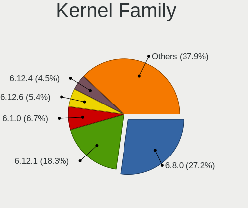
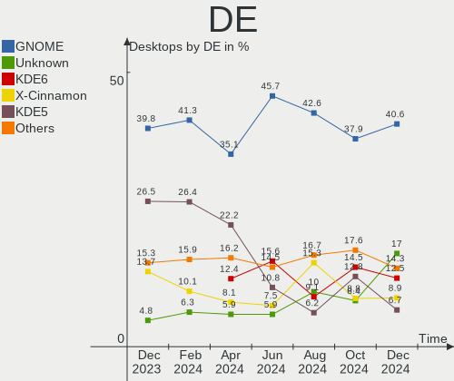
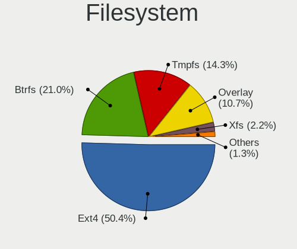
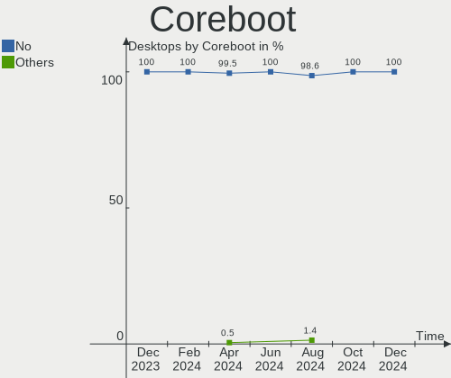
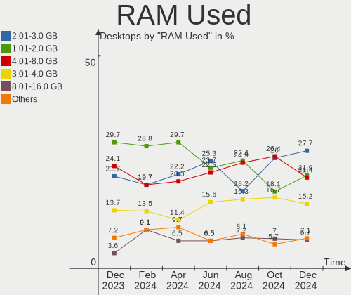
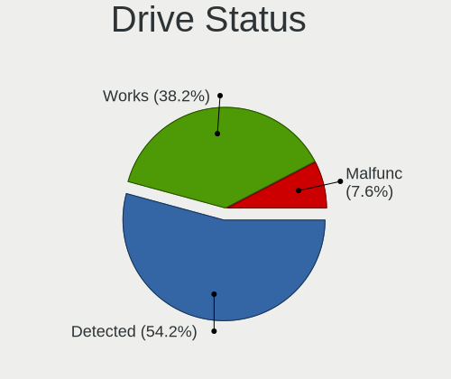
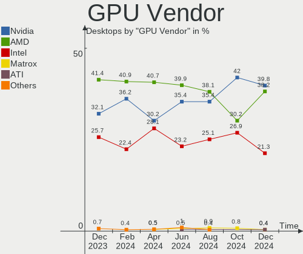
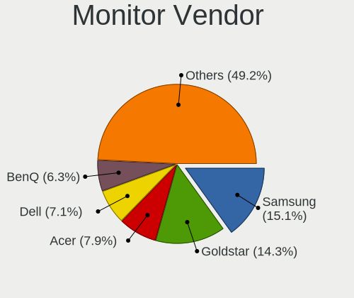
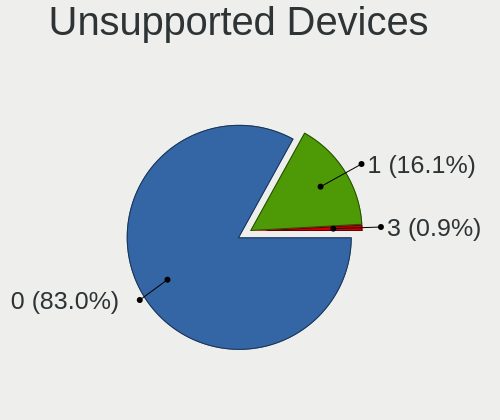
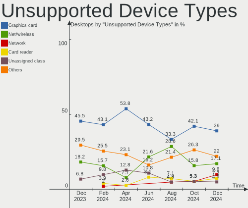

Linux in Germany - Hardware Trends (Desktops)
---------------------------------------------

A project to identify most popular hardware characteristics and track their change
over time based on data collected by Linux users at https://Linux-Hardware.org.

Anyone can contribute to this report by the [hw-probe](https://github.com/linuxhw/hw-probe) tool:

    sudo -E hw-probe -all -upload

Period: Dec, 2023.

Contents
--------

* [ System ](#system)
  - [ OS                       ](#os)
  - [ OS Family                ](#os-family)
  - [ Kernel                   ](#kernel)
  - [ Kernel Family            ](#kernel-family)
  - [ Kernel Major Ver.        ](#kernel-major-ver)
  - [ Arch                     ](#arch)
  - [ DE                       ](#de)
  - [ Display Server           ](#display-server)
  - [ Display Manager          ](#display-manager)
  - [ OS Lang                  ](#os-lang)
  - [ Boot Mode                ](#boot-mode)
  - [ Filesystem               ](#filesystem)
  - [ Part. scheme             ](#part-scheme)
  - [ Dual Boot with Linux/BSD ](#dual-boot-with-linuxbsd)
  - [ Dual Boot (Win)          ](#dual-boot-win)

* [ Board ](#board)
  - [ Vendor                   ](#vendor)
  - [ Model                    ](#model)
  - [ Model Family             ](#model-family)
  - [ MFG Year                 ](#mfg-year)
  - [ Form Factor              ](#form-factor)
  - [ Secure Boot              ](#secure-boot)
  - [ Coreboot                 ](#coreboot)
  - [ RAM Size                 ](#ram-size)
  - [ RAM Used                 ](#ram-used)
  - [ Total Drives             ](#total-drives)
  - [ Has CD-ROM               ](#has-cd-rom)
  - [ Has Ethernet             ](#has-ethernet)
  - [ Has WiFi                 ](#has-wifi)
  - [ Has Bluetooth            ](#has-bluetooth)

* [ Location ](#location)
  - [ Country                  ](#country)
  - [ City                     ](#city)

* [ Drives ](#drives)
  - [ Drive Vendor             ](#drive-vendor)
  - [ Drive Model              ](#drive-model)
  - [ HDD Vendor               ](#hdd-vendor)
  - [ SSD Vendor               ](#ssd-vendor)
  - [ Drive Kind               ](#drive-kind)
  - [ Drive Connector          ](#drive-connector)
  - [ Drive Size               ](#drive-size)
  - [ Space Total              ](#space-total)
  - [ Space Used               ](#space-used)
  - [ Malfunc. Drives          ](#malfunc-drives)
  - [ Malfunc. Drive Vendor    ](#malfunc-drive-vendor)
  - [ Malfunc. HDD Vendor      ](#malfunc-hdd-vendor)
  - [ Malfunc. Drive Kind      ](#malfunc-drive-kind)
  - [ Failed Drives            ](#failed-drives)
  - [ Failed Drive Vendor      ](#failed-drive-vendor)
  - [ Drive Status             ](#drive-status)

* [ Storage controller ](#storage-controller)
  - [ Storage Vendor           ](#storage-vendor)
  - [ Storage Model            ](#storage-model)
  - [ Storage Kind             ](#storage-kind)

* [ Processor ](#processor)
  - [ CPU Vendor               ](#cpu-vendor)
  - [ CPU Model                ](#cpu-model)
  - [ CPU Model Family         ](#cpu-model-family)
  - [ CPU Cores                ](#cpu-cores)
  - [ CPU Sockets              ](#cpu-sockets)
  - [ CPU Threads              ](#cpu-threads)
  - [ CPU Op-Modes             ](#cpu-op-modes)
  - [ CPU Microcode            ](#cpu-microcode)
  - [ CPU Microarch            ](#cpu-microarch)

* [ Graphics ](#graphics)
  - [ GPU Vendor               ](#gpu-vendor)
  - [ GPU Model                ](#gpu-model)
  - [ GPU Combo                ](#gpu-combo)
  - [ GPU Driver               ](#gpu-driver)
  - [ GPU Memory               ](#gpu-memory)

* [ Monitor ](#monitor)
  - [ Monitor Vendor           ](#monitor-vendor)
  - [ Monitor Model            ](#monitor-model)
  - [ Monitor Resolution       ](#monitor-resolution)
  - [ Monitor Diagonal         ](#monitor-diagonal)
  - [ Monitor Width            ](#monitor-width)
  - [ Aspect Ratio             ](#aspect-ratio)
  - [ Monitor Area             ](#monitor-area)
  - [ Pixel Density            ](#pixel-density)
  - [ Multiple Monitors        ](#multiple-monitors)

* [ Network ](#network)
  - [ Net Controller Vendor    ](#net-controller-vendor)
  - [ Net Controller Model     ](#net-controller-model)
  - [ Wireless Vendor          ](#wireless-vendor)
  - [ Wireless Model           ](#wireless-model)
  - [ Ethernet Vendor          ](#ethernet-vendor)
  - [ Ethernet Model           ](#ethernet-model)
  - [ Net Controller Kind      ](#net-controller-kind)
  - [ Used Controller          ](#used-controller)
  - [ NICs                     ](#nics)
  - [ IPv6                     ](#ipv6)

* [ Bluetooth ](#bluetooth)
  - [ Bluetooth Vendor         ](#bluetooth-vendor)
  - [ Bluetooth Model          ](#bluetooth-model)

* [ Sound ](#sound)
  - [ Sound Vendor             ](#sound-vendor)
  - [ Sound Model              ](#sound-model)

* [ Memory ](#memory)
  - [ Memory Vendor            ](#memory-vendor)
  - [ Memory Model             ](#memory-model)
  - [ Memory Kind              ](#memory-kind)
  - [ Memory Form Factor       ](#memory-form-factor)
  - [ Memory Size              ](#memory-size)
  - [ Memory Speed             ](#memory-speed)

* [ Printers & scanners ](#printers--scanners)
  - [ Printer Vendor           ](#printer-vendor)
  - [ Printer Model            ](#printer-model)
  - [ Scanner Vendor           ](#scanner-vendor)
  - [ Scanner Model            ](#scanner-model)

* [ Camera ](#camera)
  - [ Camera Vendor            ](#camera-vendor)
  - [ Camera Model             ](#camera-model)

* [ Security ](#security)
  - [ Fingerprint Vendor       ](#fingerprint-vendor)
  - [ Fingerprint Model        ](#fingerprint-model)
  - [ Chipcard Vendor          ](#chipcard-vendor)
  - [ Chipcard Model           ](#chipcard-model)

* [ Unsupported ](#unsupported)
  - [ Unsupported Devices      ](#unsupported-devices)
  - [ Unsupported Device Types ](#unsupported-device-types)

System
------

OS
--

Installed operating systems

| Name                         | Desktops | Percent |
|------------------------------|----------|---------|
| Linux Mint 21.2              | 35       | 14.06%  |
| Ubuntu 22.04                 | 31       | 12.45%  |
| Ubuntu 23.10                 | 17       | 6.83%   |
| Debian 12                    | 14       | 5.62%   |
| Fedora 39                    | 13       | 5.22%   |
| Pop!_OS 22.04                | 12       | 4.82%   |
| Zorin 16                     | 11       | 4.42%   |
| Nobara 38                    | 8        | 3.21%   |
| OpenMandriva 23.08           | 7        | 2.81%   |
| ArcoLinux Rolling            | 7        | 2.81%   |
| Arch Rolling                 | 7        | 2.81%   |
| Zorin 17                     | 5        | 2.01%   |
| Manjaro 23.1.0               | 5        | 2.01%   |
| LMDE 6                       | 5        | 2.01%   |
| ROSA 12.4                    | 4        | 1.61%   |
| OpenMandriva 5.0             | 4        | 1.61%   |
| OpenMandriva 23.11           | 4        | 1.61%   |
| Manjaro                      | 4        | 1.61%   |
| Gentoo 2.14                  | 4        | 1.61%   |
| EndeavourOS Rolling          | 4        | 1.61%   |
| Ubuntu 22.10                 | 3        | 1.2%    |
| Ubuntu 20.04                 | 3        | 1.2%    |
| Nobara 39                    | 3        | 1.2%    |
| Kubuntu 22.04                | 3        | 1.2%    |
| BlackPanther 18.1            | 3        | 1.2%    |
| openSUSE Leap-15.5           | 2        | 0.8%    |
| OpenMandriva 23.03           | 2        | 0.8%    |
| NixOS 24.05                  | 2        | 0.8%    |
| Linux Mint 21.3              | 2        | 0.8%    |
| Linux Mint 21                | 2        | 0.8%    |
| Xubuntu 23.10                | 1        | 0.4%    |
| Xubuntu 22.04                | 1        | 0.4%    |
| Xubuntu 20.04                | 1        | 0.4%    |
| Xero Rolling                 | 1        | 0.4%    |
| Ubuntu Studio 22.04          | 1        | 0.4%    |
| Ubuntu 21.04                 | 1        | 0.4%    |
| Ubuntu 20.10                 | 1        | 0.4%    |
| TUXEDO OS 22.04              | 1        | 0.4%    |
| org.kde.Platform 5.15-21.08  | 1        | 0.4%    |
| openSUSE Tumbleweed-XXXXXXXX | 1        | 0.4%    |

OS Family
---------

OS without a version

| Name             | Desktops | Percent |
|------------------|----------|---------|
| Ubuntu           | 56       | 22.49%  |
| Linux Mint       | 41       | 16.47%  |
| OpenMandriva     | 19       | 7.63%   |
| Zorin            | 16       | 6.43%   |
| Debian           | 15       | 6.02%   |
| Fedora           | 14       | 5.62%   |
| Pop!_OS          | 12       | 4.82%   |
| Nobara           | 11       | 4.42%   |
| Manjaro          | 9        | 3.61%   |
| ArcoLinux        | 7        | 2.81%   |
| Arch             | 7        | 2.81%   |
| LMDE             | 5        | 2.01%   |
| ROSA             | 4        | 1.61%   |
| Kubuntu          | 4        | 1.61%   |
| Gentoo           | 4        | 1.61%   |
| EndeavourOS      | 4        | 1.61%   |
| Xubuntu          | 3        | 1.2%    |
| openSUSE         | 3        | 1.2%    |
| BlackPanther     | 3        | 1.2%    |
| NixOS            | 2        | 0.8%    |
| Xero             | 1        | 0.4%    |
| Ubuntu Studio    | 1        | 0.4%    |
| TUXEDO OS        | 1        | 0.4%    |
| org.kde.Platform | 1        | 0.4%    |
| Neptune OS       | 1        | 0.4%    |
| Lubuntu          | 1        | 0.4%    |
| Garuda Linux     | 1        | 0.4%    |
| Endless          | 1        | 0.4%    |
| Elementary       | 1        | 0.4%    |
| Alpine           | 1        | 0.4%    |

Kernel
------

Version of the Linux kernel

| Version                           | Desktops | Percent |
|-----------------------------------|----------|---------|
| 5.15.0-91-generic                 | 36       | 14.46%  |
| 6.2.0-39-generic                  | 19       | 7.63%   |
| 5.15.0-89-generic                 | 16       | 6.43%   |
| 6.5.0-14-generic                  | 14       | 5.62%   |
| 6.2.0-37-generic                  | 12       | 4.82%   |
| 6.1.0-16-amd64                    | 9        | 3.61%   |
| 6.6.2-desktop-1omv2390            | 8        | 3.21%   |
| 6.5.6-76060506-generic            | 7        | 2.81%   |
| 6.4.11-desktop-1omv2390           | 6        | 2.41%   |
| 6.6.6-76060606-generic            | 5        | 2.01%   |
| 6.6.7-200.fc39.x86_64             | 4        | 1.61%   |
| 6.6.3-arch1-1                     | 4        | 1.61%   |
| 6.1.0-13-amd64                    | 4        | 1.61%   |
| 6.6.7-arch1-1                     | 3        | 1.2%    |
| 6.6.7-203.fsync.fc38.x86_64       | 3        | 1.2%    |
| 6.5.0-13-generic                  | 3        | 1.2%    |
| 6.2.0-26-generic                  | 3        | 1.2%    |
| 5.15.0-88-generic                 | 3        | 1.2%    |
| 6.6.8-arch1-1                     | 2        | 0.8%    |
| 6.6.7-zen1-1-zen                  | 2        | 0.8%    |
| 6.6.7-4-MANJARO                   | 2        | 0.8%    |
| 6.6.7-203.fsync.fc39.x86_64       | 2        | 0.8%    |
| 6.6.4-arch1-1                     | 2        | 0.8%    |
| 6.6.3-200.fc39.x86_64             | 2        | 0.8%    |
| 6.6.3-1-MANJARO                   | 2        | 0.8%    |
| 6.6.2-201.fc39.x86_64             | 2        | 0.8%    |
| 6.4.10-202.fsync.fc38.x86_64      | 2        | 0.8%    |
| 6.2.6-desktop-1omv2390            | 2        | 0.8%    |
| 6.1.64                            | 2        | 0.8%    |
| 6.1.58-generic-1rosa2021.1-x86_64 | 2        | 0.8%    |
| 6.1.20-generic-2rosa2021.1-x86_64 | 2        | 0.8%    |
| 6.1.0-15-amd64                    | 2        | 0.8%    |
| 6.1.0-12-amd64                    | 2        | 0.8%    |
| 5.6.14-desktop-2bP                | 2        | 0.8%    |
| 5.19.0-21-generic                 | 2        | 0.8%    |
| 5.14.21-150500.55.39-default      | 2        | 0.8%    |
| 6.7.0-rc6                         | 1        | 0.4%    |
| 6.6.8-200.fsync.fc39.x86_64       | 1        | 0.4%    |
| 6.6.8-200.fc39.x86_64             | 1        | 0.4%    |
| 6.6.8-2-MANJARO                   | 1        | 0.4%    |

Kernel Family
-------------

Linux kernel without a distro release

| Version  | Desktops | Percent |
|----------|----------|---------|
| 5.15.0   | 58       | 23.29%  |
| 6.2.0    | 36       | 14.46%  |
| 6.5.0    | 20       | 8.03%   |
| 6.1.0    | 18       | 7.23%   |
| 6.6.7    | 17       | 6.83%   |
| 6.6.2    | 12       | 4.82%   |
| 6.6.6    | 11       | 4.42%   |
| 6.6.3    | 10       | 4.02%   |
| 6.5.6    | 8        | 3.21%   |
| 6.6.4    | 7        | 2.81%   |
| 6.4.11   | 6        | 2.41%   |
| 6.6.8    | 5        | 2.01%   |
| 5.19.0   | 4        | 1.61%   |
| 6.6.5    | 2        | 0.8%    |
| 6.6.1    | 2        | 0.8%    |
| 6.5.13   | 2        | 0.8%    |
| 6.4.10   | 2        | 0.8%    |
| 6.2.6    | 2        | 0.8%    |
| 6.1.64   | 2        | 0.8%    |
| 6.1.58   | 2        | 0.8%    |
| 6.1.20   | 2        | 0.8%    |
| 5.6.14   | 2        | 0.8%    |
| 5.4.0    | 2        | 0.8%    |
| 5.14.21  | 2        | 0.8%    |
| 6.7.0    | 1        | 0.4%    |
| 6.6.0    | 1        | 0.4%    |
| 6.5.11   | 1        | 0.4%    |
| 6.5.10   | 1        | 0.4%    |
| 6.4.13   | 1        | 0.4%    |
| 6.3.8    | 1        | 0.4%    |
| 6.1.68   | 1        | 0.4%    |
| 6.1.66   | 1        | 0.4%    |
| 6.1.63   | 1        | 0.4%    |
| 6.1.1    | 1        | 0.4%    |
| 5.8.0    | 1        | 0.4%    |
| 5.16.7   | 1        | 0.4%    |
| 5.15.144 | 1        | 0.4%    |
| 5.11.5   | 1        | 0.4%    |
| 5.11.0   | 1        | 0.4%    |

Kernel Major Ver.
-----------------

Linux kernel major version

| Version | Desktops | Percent |
|---------|----------|---------|
| 6.6     | 67       | 26.91%  |
| 5.15    | 59       | 23.69%  |
| 6.2     | 38       | 15.26%  |
| 6.5     | 32       | 12.85%  |
| 6.1     | 28       | 11.24%  |
| 6.4     | 9        | 3.61%   |
| 5.19    | 4        | 1.61%   |
| 5.6     | 2        | 0.8%    |
| 5.4     | 2        | 0.8%    |
| 5.14    | 2        | 0.8%    |
| 5.11    | 2        | 0.8%    |
| 6.7     | 1        | 0.4%    |
| 6.3     | 1        | 0.4%    |
| 5.8     | 1        | 0.4%    |
| 5.16    | 1        | 0.4%    |

Arch
----

OS architecture (x86_64, i586, etc.)

| Name   | Desktops | Percent |
|--------|----------|---------|
| x86_64 | 249      | 100%    |

DE
--

Desktop Environment

| Name          | Desktops | Percent |
|---------------|----------|---------|
| GNOME         | 99       | 39.76%  |
| KDE5          | 66       | 26.51%  |
| X-Cinnamon    | 34       | 13.65%  |
| Unknown       | 12       | 4.82%   |
| XFCE          | 10       | 4.02%   |
| Cinnamon      | 9        | 3.61%   |
| MATE          | 6        | 2.41%   |
| i3            | 4        | 1.61%   |
| LXQt          | 3        | 1.2%    |
| Budgie        | 2        | 0.8%    |
| wayfire       | 1        | 0.4%    |
| Pantheon      | 1        | 0.4%    |
| Hyprland      | 1        | 0.4%    |
| Endless:GNOME | 1        | 0.4%    |

Display Server
--------------

X11 or Wayland

| Name    | Desktops | Percent |
|---------|----------|---------|
| X11     | 144      | 57.83%  |
| Wayland | 89       | 35.74%  |
| Unknown | 9        | 3.61%   |
| Tty     | 7        | 2.81%   |

Display Manager
---------------

SDDM, LightDM, etc.

| Name    | Desktops | Percent |
|---------|----------|---------|
| Unknown | 102      | 40.96%  |
| GDM3    | 59       | 23.69%  |
| SDDM    | 52       | 20.88%  |
| LightDM | 31       | 12.45%  |
| GDM     | 5        | 2.01%   |

OS Lang
-------

Language

| Lang    | Desktops | Percent |
|---------|----------|---------|
| de_DE   | 181      | 72.69%  |
| en_US   | 42       | 16.87%  |
| Unknown | 8        | 3.21%   |
| C       | 7        | 2.81%   |
| en_GB   | 3        | 1.2%    |
| POSIX   | 2        | 0.8%    |
| ru_RU   | 1        | 0.4%    |
| pl_PL   | 1        | 0.4%    |
| hu_HU   | 1        | 0.4%    |
| C.UTF8  | 1        | 0.4%    |
| bg_BG   | 1        | 0.4%    |
| aa_DJ   | 1        | 0.4%    |

Boot Mode
---------

EFI or BIOS

| Mode | Desktops | Percent |
|------|----------|---------|
| BIOS | 131      | 52.61%  |
| EFI  | 118      | 47.39%  |

Filesystem
----------

Type of filesystem

| Type    | Desktops | Percent |
|---------|----------|---------|
| Ext4    | 150      | 60.24%  |
| Tmpfs   | 50       | 20.08%  |
| Btrfs   | 37       | 14.86%  |
| Overlay | 9        | 3.61%   |
| Zfs     | 2        | 0.8%    |
| Xfs     | 1        | 0.4%    |

Part. scheme
------------

Scheme of partitioning

| Type    | Desktops | Percent |
|---------|----------|---------|
| GPT     | 128      | 51.41%  |
| Unknown | 91       | 36.55%  |
| MBR     | 30       | 12.05%  |

Dual Boot with Linux/BSD
------------------------

Hosting more than one Linux/BSD

| Dual boot | Desktops | Percent |
|-----------|----------|---------|
| No        | 198      | 79.52%  |
| Yes       | 51       | 20.48%  |

Dual Boot (Win)
---------------

Hosting Linux and Windows

| Dual boot | Desktops | Percent |
|-----------|----------|---------|
| No        | 182      | 73.09%  |
| Yes       | 67       | 26.91%  |

Board
-----

Vendor
------

Motherboard manufacturer

| Name                                 | Desktops | Percent |
|--------------------------------------|----------|---------|
| ASUSTek Computer                     | 64       | 25.7%   |
| MSI                                  | 51       | 20.48%  |
| Gigabyte Technology                  | 38       | 15.26%  |
| ASRock                               | 21       | 8.43%   |
| Hewlett-Packard                      | 16       | 6.43%   |
| Dell                                 | 10       | 4.02%   |
| Lenovo                               | 9        | 3.61%   |
| Fujitsu                              | 6        | 2.41%   |
| Medion                               | 4        | 1.61%   |
| Unknown                              | 4        | 1.61%   |
| Intel                                | 3        | 1.2%    |
| AZW                                  | 3        | 1.2%    |
| Acer                                 | 3        | 1.2%    |
| ZOTAC                                | 2        | 0.8%    |
| Shenzhen Meigao Electronic Equipment | 2        | 0.8%    |
| Inventec                             | 2        | 0.8%    |
| Foxconn                              | 2        | 0.8%    |
| Biostar                              | 2        | 0.8%    |
| BESSTAR Tech                         | 2        | 0.8%    |
| VIA Technologies                     | 1        | 0.4%    |
| T-bao TianBei                        | 1        | 0.4%    |
| Pegatron                             | 1        | 0.4%    |
| HC Technology.                       | 1        | 0.4%    |
| Apple                                | 1        | 0.4%    |

Model
-----

Motherboard model

| Name                                       | Desktops | Percent |
|--------------------------------------------|----------|---------|
| ASUS All Series                            | 6        | 2.41%   |
| Unknown                                    | 4        | 1.61%   |
| MSI MS-7C56                                | 3        | 1.2%    |
| Gigabyte Z390 UD                           | 3        | 1.2%    |
| ASUS ROG STRIX X570-E GAMING               | 3        | 1.2%    |
| ZOTAC NM10                                 | 2        | 0.8%    |
| MSI MS-7D75                                | 2        | 0.8%    |
| MSI MS-7D54                                | 2        | 0.8%    |
| MSI MS-7C84                                | 2        | 0.8%    |
| MSI MS-7C35                                | 2        | 0.8%    |
| MSI MS-7B79                                | 2        | 0.8%    |
| MSI MS-7A38                                | 2        | 0.8%    |
| MSI MS-7693                                | 2        | 0.8%    |
| HP ProDesk 600 G2 DM                       | 2        | 0.8%    |
| HP Compaq 6005 Pro MT PC                   | 2        | 0.8%    |
| Gigabyte GA-78LMT-S2P                      | 2        | 0.8%    |
| Gigabyte B75M-D3V                          | 2        | 0.8%    |
| Gigabyte B550 AORUS ELITE AX V2            | 2        | 0.8%    |
| ASUS TUF B450-PLUS GAMING                  | 2        | 0.8%    |
| ASUS ROG STRIX Z390-E GAMING               | 2        | 0.8%    |
| ASUS ROG STRIX B650E-F GAMING WIFI         | 2        | 0.8%    |
| ASUS PRIME H510M-K                         | 2        | 0.8%    |
| ASUS M5A97 R2.0                            | 2        | 0.8%    |
| ASUS A0000001                              | 2        | 0.8%    |
| ASRock B450M Pro4 R2.0                     | 2        | 0.8%    |
| VIA AMOS-3005                              | 1        | 0.4%    |
| T-bao TianBei GOD78                        | 1        | 0.4%    |
| Shenzhen Meigao Electronic Equipment UM560 | 1        | 0.4%    |
| Shenzhen Meigao Electronic Equipment NAB5  | 1        | 0.4%    |
| Pegatron NM884AA-AB9 m9665pt               | 1        | 0.4%    |
| MSI MS-7E12                                | 1        | 0.4%    |
| MSI MS-7D77                                | 1        | 0.4%    |
| MSI MS-7D74                                | 1        | 0.4%    |
| MSI MS-7D43                                | 1        | 0.4%    |
| MSI MS-7D22                                | 1        | 0.4%    |
| MSI MS-7D20                                | 1        | 0.4%    |
| MSI MS-7D12                                | 1        | 0.4%    |
| MSI MS-7C94                                | 1        | 0.4%    |
| MSI MS-7C92                                | 1        | 0.4%    |
| MSI MS-7C75                                | 1        | 0.4%    |

Model Family
------------

Motherboard model prefix

| Name                                       | Desktops | Percent |
|--------------------------------------------|----------|---------|
| ASUS ROG                                   | 17       | 6.83%   |
| ASUS TUF                                   | 8        | 3.21%   |
| ASUS PRIME                                 | 8        | 3.21%   |
| Fujitsu ESPRIMO                            | 6        | 2.41%   |
| ASUS All                                   | 6        | 2.41%   |
| Lenovo ThinkCentre                         | 5        | 2.01%   |
| Gigabyte B550                              | 5        | 2.01%   |
| HP Compaq                                  | 4        | 1.61%   |
| Dell Precision                             | 4        | 1.61%   |
| Dell OptiPlex                              | 4        | 1.61%   |
| Unknown                                    | 4        | 1.61%   |
| MSI MS-7C56                                | 3        | 1.2%    |
| HP ProDesk                                 | 3        | 1.2%    |
| HP EliteDesk                               | 3        | 1.2%    |
| Gigabyte Z390                              | 3        | 1.2%    |
| ZOTAC NM10                                 | 2        | 0.8%    |
| MSI MS-7D75                                | 2        | 0.8%    |
| MSI MS-7D54                                | 2        | 0.8%    |
| MSI MS-7C84                                | 2        | 0.8%    |
| MSI MS-7C35                                | 2        | 0.8%    |
| MSI MS-7B79                                | 2        | 0.8%    |
| MSI MS-7A38                                | 2        | 0.8%    |
| MSI MS-7693                                | 2        | 0.8%    |
| Gigabyte Z790                              | 2        | 0.8%    |
| Gigabyte GA-78LMT-S2P                      | 2        | 0.8%    |
| Gigabyte B75M-D3V                          | 2        | 0.8%    |
| ASUS P8Z77-V                               | 2        | 0.8%    |
| ASUS M5A97                                 | 2        | 0.8%    |
| ASUS M5A78L-M                              | 2        | 0.8%    |
| ASUS A0000001                              | 2        | 0.8%    |
| ASRock B450M                               | 2        | 0.8%    |
| ASRock B450                                | 2        | 0.8%    |
| Acer Aspire                                | 2        | 0.8%    |
| VIA AMOS-3005                              | 1        | 0.4%    |
| T-bao TianBei GOD78                        | 1        | 0.4%    |
| Shenzhen Meigao Electronic Equipment UM560 | 1        | 0.4%    |
| Shenzhen Meigao Electronic Equipment NAB5  | 1        | 0.4%    |
| Pegatron NM884AA-AB9                       | 1        | 0.4%    |
| MSI MS-7E12                                | 1        | 0.4%    |
| MSI MS-7D77                                | 1        | 0.4%    |

MFG Year
--------

Motherboard manufacture year

| Year | Desktops | Percent |
|------|----------|---------|
| 2020 | 28       | 11.24%  |
| 2018 | 25       | 10.04%  |
| 2014 | 22       | 8.84%   |
| 2019 | 19       | 7.63%   |
| 2022 | 18       | 7.23%   |
| 2021 | 17       | 6.83%   |
| 2012 | 17       | 6.83%   |
| 2023 | 15       | 6.02%   |
| 2013 | 14       | 5.62%   |
| 2016 | 13       | 5.22%   |
| 2011 | 13       | 5.22%   |
| 2017 | 12       | 4.82%   |
| 2009 | 12       | 4.82%   |
| 2010 | 8        | 3.21%   |
| 2015 | 7        | 2.81%   |
| 2008 | 6        | 2.41%   |
| 2007 | 1        | 0.4%    |
| 2006 | 1        | 0.4%    |
| 2005 | 1        | 0.4%    |

Form Factor
-----------

Physical design of the computer

| Name    | Desktops | Percent |
|---------|----------|---------|
| Desktop | 249      | 100%    |

Secure Boot
-----------

Enabled or disabled

| State    | Desktops | Percent |
|----------|----------|---------|
| Disabled | 239      | 95.98%  |
| Enabled  | 10       | 4.02%   |

Coreboot
--------

Have coreboot on board

| Used | Desktops | Percent |
|------|----------|---------|
| No   | 249      | 100%    |

RAM Size
--------

Total RAM memory

| Size in GB      | Desktops | Percent |
|-----------------|----------|---------|
| 32.01-64.0      | 63       | 25.3%   |
| 16.01-24.0      | 58       | 23.29%  |
| 8.01-16.0       | 39       | 15.66%  |
| 4.01-8.0        | 27       | 10.84%  |
| 3.01-4.0        | 25       | 10.04%  |
| 24.01-32.0      | 20       | 8.03%   |
| 64.01-256.0     | 14       | 5.62%   |
| More than 256.0 | 1        | 0.4%    |
| 2.01-3.0        | 1        | 0.4%    |
| 1.01-2.0        | 1        | 0.4%    |

RAM Used
--------

Used RAM memory

| Used GB    | Desktops | Percent |
|------------|----------|---------|
| 1.01-2.0   | 70       | 28.11%  |
| 4.01-8.0   | 62       | 24.9%   |
| 2.01-3.0   | 56       | 22.49%  |
| 3.01-4.0   | 34       | 13.65%  |
| 8.01-16.0  | 9        | 3.61%   |
| 0.51-1.0   | 8        | 3.21%   |
| 0.01-0.5   | 7        | 2.81%   |
| 24.01-32.0 | 2        | 0.8%    |
| 16.01-24.0 | 1        | 0.4%    |

Total Drives
------------

Number of drives on board

| Drives | Desktops | Percent |
|--------|----------|---------|
| 1      | 79       | 31.73%  |
| 2      | 59       | 23.69%  |
| 3      | 51       | 20.48%  |
| 4      | 32       | 12.85%  |
| 5      | 13       | 5.22%   |
| 6      | 5        | 2.01%   |
| 8      | 4        | 1.61%   |
| 0      | 3        | 1.2%    |
| 7      | 2        | 0.8%    |
| 9      | 1        | 0.4%    |

Has CD-ROM
----------

Has CD-ROM on board

| Presented | Desktops | Percent |
|-----------|----------|---------|
| No        | 131      | 52.61%  |
| Yes       | 118      | 47.39%  |

Has Ethernet
------------

Has Ethernet on board

| Presented | Desktops | Percent |
|-----------|----------|---------|
| Yes       | 247      | 99.2%   |
| No        | 2        | 0.8%    |

Has WiFi
--------

Has WiFi module

| Presented | Desktops | Percent |
|-----------|----------|---------|
| No        | 138      | 55.42%  |
| Yes       | 111      | 44.58%  |

Has Bluetooth
-------------

Has Bluetooth module

| Presented | Desktops | Percent |
|-----------|----------|---------|
| No        | 144      | 57.83%  |
| Yes       | 105      | 42.17%  |

Location
--------

Country
-------

Geographic location (country)

| Country | Desktops | Percent |
|---------|----------|---------|
| Germany | 249      | 100%    |

City
----

Geographic location (city)

| City                    | Desktops | Percent |
|-------------------------|----------|---------|
| Berlin                  | 15       | 6.02%   |
| Hamburg                 | 11       | 4.42%   |
| Munich                  | 8        | 3.21%   |
| Cologne                 | 8        | 3.21%   |
| Dresden                 | 5        | 2.01%   |
| Frankfurt am Main       | 4        | 1.61%   |
| Düsseldorf             | 4        | 1.61%   |
| Traunstein              | 3        | 1.2%    |
| Ravensburg              | 3        | 1.2%    |
| Pfaffenhofen an der Ilm | 3        | 1.2%    |
| Peiting                 | 3        | 1.2%    |
| Mainburg                | 3        | 1.2%    |
| Jena                    | 3        | 1.2%    |
| Ingolstadt              | 3        | 1.2%    |
| Hanover                 | 3        | 1.2%    |
| Halle                   | 3        | 1.2%    |
| Giessen                 | 3        | 1.2%    |
| Dortmund                | 3        | 1.2%    |
| Delligsen               | 3        | 1.2%    |
| Bonn                    | 3        | 1.2%    |
| Wangen                  | 2        | 0.8%    |
| Stuttgart               | 2        | 0.8%    |
| Siegen                  | 2        | 0.8%    |
| Rosenheim               | 2        | 0.8%    |
| Oberhausen              | 2        | 0.8%    |
| Ober-Morlen             | 2        | 0.8%    |
| Nuremberg               | 2        | 0.8%    |
| Mönchengladbach        | 2        | 0.8%    |
| Marburg                 | 2        | 0.8%    |
| Mannheim                | 2        | 0.8%    |
| Mainz                   | 2        | 0.8%    |
| Ilsede                  | 2        | 0.8%    |
| Grossenhain             | 2        | 0.8%    |
| Frankfurt (Oder)        | 2        | 0.8%    |
| Essen                   | 2        | 0.8%    |
| Erlangen                | 2        | 0.8%    |
| Bremen                  | 2        | 0.8%    |
| Aachen                  | 2        | 0.8%    |
| Wusterhausen            | 1        | 0.4%    |
| Würzburg               | 1        | 0.4%    |

Drives
------

Drive Vendor
------------

Hard drive vendors

| Vendor                       | Desktops | Drives | Percent |
|------------------------------|----------|--------|---------|
| Samsung Electronics          | 103      | 182    | 20.64%  |
| WDC                          | 76       | 98     | 15.23%  |
| Seagate                      | 66       | 80     | 13.23%  |
| SanDisk                      | 43       | 51     | 8.62%   |
| Crucial                      | 27       | 32     | 5.41%   |
| Toshiba                      | 20       | 23     | 4.01%   |
| Intenso                      | 17       | 17     | 3.41%   |
| Phison Electronics           | 11       | 11     | 2.2%    |
| Micron/Crucial Technology    | 10       | 10     | 2%      |
| Kingston                     | 10       | 10     | 2%      |
| Hitachi                      | 9        | 10     | 1.8%    |
| MAXIO Technology (Hangzhou)  | 7        | 7      | 1.4%    |
| Verbatim                     | 6        | 7      | 1.2%    |
| Unknown                      | 6        | 7      | 1.2%    |
| A-DATA Technology            | 6        | 6      | 1.2%    |
| Emtec                        | 5        | 5      | 1%      |
| SPCC                         | 4        | 4      | 0.8%    |
| Shenzhen Longsys Electronics | 4        | 4      | 0.8%    |
| Kingston Technology Company  | 4        | 4      | 0.8%    |
| Intel                        | 4        | 4      | 0.8%    |
| Corsair                      | 4        | 4      | 0.8%    |
| Transcend                    | 3        | 3      | 0.6%    |
| Silicon Motion               | 3        | 3      | 0.6%    |
| Phison                       | 3        | 4      | 0.6%    |
| HGST                         | 3        | 3      | 0.6%    |
| China                        | 3        | 3      | 0.6%    |
| Mushkin                      | 2        | 2      | 0.4%    |
| Micron Technology            | 2        | 2      | 0.4%    |
| Maxtor                       | 2        | 2      | 0.4%    |
| JMicron Technology           | 2        | 3      | 0.4%    |
| Fujitsu                      | 2        | 2      | 0.4%    |
| Fanxiang                     | 2        | 2      | 0.4%    |
| ASMT                         | 2        | 2      | 0.4%    |
| ADATA Technology             | 2        | 2      | 0.4%    |
| Unknown                      | 2        | 2      | 0.4%    |
| USB3.0                       | 1        | 1      | 0.2%    |
| USB 3.1                      | 1        | 1      | 0.2%    |
| SSK Port                     | 1        | 1      | 0.2%    |
| SK hynix                     | 1        | 1      | 0.2%    |
| SD                           | 1        | 1      | 0.2%    |

Drive Model
-----------

Hard drive models

| Model                                               | Desktops | Percent |
|-----------------------------------------------------|----------|---------|
| Samsung NVMe SSD Controller SM981/PM981/PM983 512GB | 19       | 3.18%   |
| Samsung NVMe SSD Controller PM9A1/PM9A3/980PRO 2TB  | 16       | 2.68%   |
| Samsung SSD 860 EVO 500GB                           | 9        | 1.51%   |
| Samsung SSD 850 EVO 250GB                           | 8        | 1.34%   |
| Seagate ST500DM002-1BD142 500GB                     | 7        | 1.17%   |
| Samsung SSD 860 EVO 1TB                             | 7        | 1.17%   |
| Phison E12 NVMe Controller 1TB                      | 7        | 1.17%   |
| Seagate ST4000DM004-2CV104 4TB                      | 6        | 1.01%   |
| Samsung SSD 870 QVO 2TB                             | 6        | 1.01%   |
| Samsung SSD 860 EVO 250GB                           | 6        | 1.01%   |
| MAXIO (Hangzhou) NVMe SSD Controller MAP1202 256GB  | 6        | 1.01%   |
| WDC WD40EZRZ-00GXCB0 4TB                            | 5        | 0.84%   |
| Samsung SSD 850 EVO 500GB                           | 5        | 0.84%   |
| Crucial CT1000MX500SSD1 1TB                         | 5        | 0.84%   |
| WDC WDS240G2G0A-00JH30 240GB SSD                    | 4        | 0.67%   |
| Verbatim Vi550 S3 512GB                             | 4        | 0.67%   |
| Toshiba DT01ACA100 1TB                              | 4        | 0.67%   |
| Seagate ST2000DM008-2FR102 2TB                      | 4        | 0.67%   |
| Sandisk WD Blue SN550 NVMe SSD 1TB                  | 4        | 0.67%   |
| SanDisk SSD PLUS 1000GB                             | 4        | 0.67%   |
| SanDisk SDSSDH3512G 512GB                           | 4        | 0.67%   |
| Samsung SSD 980 500GB                               | 4        | 0.67%   |
| Samsung SSD 980 1TB                                 | 4        | 0.67%   |
| Samsung SSD 870 EVO 1TB                             | 4        | 0.67%   |
| Samsung SSD 860 PRO 256GB                           | 4        | 0.67%   |
| Micron/Crucial P2 NVMe PCIe SSD 4TB                 | 4        | 0.67%   |
| Intenso Portable SSD 128GB                          | 4        | 0.67%   |
| Crucial CT250MX500SSD1 250GB                        | 4        | 0.67%   |
| WDC WD5000AAKX-08U6AA0 500GB                        | 3        | 0.5%    |
| WDC WD5000AAKS-007AA0 500GB                         | 3        | 0.5%    |
| WDC WD10JPVX-22JC3T0 1TB                            | 3        | 0.5%    |
| Unknown SD/MMC/MS PRO 512GB                         | 3        | 0.5%    |
| Toshiba MQ01ABD100 1TB                              | 3        | 0.5%    |
| SanDisk SDSSDA240G 240GB                            | 3        | 0.5%    |
| SanDisk Extreme 55AE 1TB SSD                        | 3        | 0.5%    |
| Samsung SSD 990 PRO 2TB                             | 3        | 0.5%    |
| Samsung SSD 870 EVO 500GB                           | 3        | 0.5%    |
| Samsung SSD 840 EVO 250GB                           | 3        | 0.5%    |
| Samsung SSD 830 Series 256GB                        | 3        | 0.5%    |
| Samsung SSD 750 EVO 250GB                           | 3        | 0.5%    |

HDD Vendor
----------

Hard disk drive vendors

| Vendor              | Desktops | Drives | Percent |
|---------------------|----------|--------|---------|
| WDC                 | 66       | 86     | 35.68%  |
| Seagate             | 66       | 79     | 35.68%  |
| Toshiba             | 19       | 22     | 10.27%  |
| Hitachi             | 9        | 10     | 4.86%   |
| Samsung Electronics | 8        | 9      | 4.32%   |
| Unknown             | 3        | 3      | 1.62%   |
| HGST                | 3        | 3      | 1.62%   |
| Maxtor              | 2        | 2      | 1.08%   |
| Intenso             | 2        | 2      | 1.08%   |
| Fujitsu             | 2        | 2      | 1.08%   |
| USB3.0              | 1        | 1      | 0.54%   |
| SABRENT             | 1        | 1      | 0.54%   |
| JMicron Technology  | 1        | 1      | 0.54%   |
| DC-624e             | 1        | 1      | 0.54%   |
| ASMT                | 1        | 1      | 0.54%   |

SSD Vendor
----------

Solid state drive vendors

| Vendor              | Desktops | Drives | Percent |
|---------------------|----------|--------|---------|
| Samsung Electronics | 71       | 94     | 33.81%  |
| SanDisk             | 32       | 35     | 15.24%  |
| Crucial             | 25       | 29     | 11.9%   |
| Intenso             | 13       | 13     | 6.19%   |
| WDC                 | 11       | 11     | 5.24%   |
| Verbatim            | 6        | 7      | 2.86%   |
| Kingston            | 6        | 6      | 2.86%   |
| A-DATA Technology   | 6        | 6      | 2.86%   |
| Emtec               | 5        | 5      | 2.38%   |
| SPCC                | 4        | 4      | 1.9%    |
| Transcend           | 3        | 3      | 1.43%   |
| China               | 3        | 3      | 1.43%   |
| Intel               | 2        | 2      | 0.95%   |
| Corsair             | 2        | 2      | 0.95%   |
| Toshiba             | 1        | 1      | 0.48%   |
| SSK Port            | 1        | 1      | 0.48%   |
| SD                  | 1        | 1      | 0.48%   |
| PNY                 | 1        | 1      | 0.48%   |
| Phison              | 1        | 1      | 0.48%   |
| Patriot             | 1        | 1      | 0.48%   |
| OCZ                 | 1        | 1      | 0.48%   |
| Mushkin             | 1        | 1      | 0.48%   |
| Micron Technology   | 1        | 1      | 0.48%   |
| KIOXIA-EXCERIA      | 1        | 1      | 0.48%   |
| KingDian            | 1        | 2      | 0.48%   |
| JMicron Technology  | 1        | 2      | 0.48%   |
| INNOVATION IT       | 1        | 1      | 0.48%   |
| Hewlett-Packard     | 1        | 1      | 0.48%   |
| GOODRAM             | 1        | 1      | 0.48%   |
| Fanxiang            | 1        | 1      | 0.48%   |
| EDILOCA             | 1        | 1      | 0.48%   |
| ASMT                | 1        | 1      | 0.48%   |
| Apple               | 1        | 1      | 0.48%   |
| 2.5                 | 1        | 1      | 0.48%   |
| Unknown             | 1        | 1      | 0.48%   |

Drive Kind
----------

HDD or SSD

| Kind    | Desktops | Drives | Percent |
|---------|----------|--------|---------|
| SSD     | 158      | 243    | 37.26%  |
| HDD     | 144      | 223    | 33.96%  |
| NVMe    | 111      | 158    | 26.18%  |
| Unknown | 11       | 12     | 2.59%   |

Drive Connector
---------------

SATA, SAS, NVMe, etc.

| Type | Desktops | Drives | Percent |
|------|----------|--------|---------|
| SATA | 218      | 439    | 60.89%  |
| NVMe | 111      | 158    | 31.01%  |
| SAS  | 29       | 39     | 8.1%    |

Drive Size
----------

Size of hard drive

| Size in TB | Desktops | Drives | Percent |
|------------|----------|--------|---------|
| 0.01-0.5   | 151      | 225    | 44.67%  |
| 0.51-1.0   | 98       | 129    | 28.99%  |
| 1.01-2.0   | 40       | 51     | 11.83%  |
| 3.01-4.0   | 25       | 31     | 7.4%    |
| 4.01-10.0  | 11       | 15     | 3.25%   |
| 2.01-3.0   | 10       | 12     | 2.96%   |
| 10.01-20.0 | 3        | 3      | 0.89%   |

Space Total
-----------

Amount of disk space available on the file system

| Size in GB     | Desktops | Percent |
|----------------|----------|---------|
| 501-1000       | 48       | 19.28%  |
| More than 3000 | 44       | 17.67%  |
| 101-250        | 43       | 17.27%  |
| 251-500        | 35       | 14.06%  |
| 1001-2000      | 34       | 13.65%  |
| 2001-3000      | 13       | 5.22%   |
| Unknown        | 11       | 4.42%   |
| 51-100         | 10       | 4.02%   |
| 1-20           | 8        | 3.21%   |
| 21-50          | 3        | 1.2%    |

Space Used
----------

Amount of used disk space

| Used GB        | Desktops | Percent |
|----------------|----------|---------|
| 1-20           | 60       | 24.1%   |
| 21-50          | 44       | 17.67%  |
| 101-250        | 36       | 14.46%  |
| 51-100         | 24       | 9.64%   |
| 251-500        | 20       | 8.03%   |
| More than 3000 | 17       | 6.83%   |
| 1001-2000      | 17       | 6.83%   |
| 501-1000       | 14       | 5.62%   |
| Unknown        | 11       | 4.42%   |
| 2001-3000      | 6        | 2.41%   |

Malfunc. Drives
---------------

Drive models with a malfunction

| Model                                    | Desktops | Drives | Percent |
|------------------------------------------|----------|--------|---------|
| WDC WD5000AAKS-007AA0 500GB              | 3        | 3      | 9.68%   |
| WDC WD5000AAKX-001CA0 500GB              | 1        | 1      | 3.23%   |
| WDC WD5000AAKS-00TMA0 500GB              | 1        | 1      | 3.23%   |
| WDC WD5000AADS-00L4B1 500GB              | 1        | 1      | 3.23%   |
| WDC WD20EFRX-68EUZN0 2TB                 | 1        | 1      | 3.23%   |
| WDC WD10EZEX-75WN4A1 1TB                 | 1        | 1      | 3.23%   |
| WDC WD10EZEX-00BN5A0 1TB                 | 1        | 1      | 3.23%   |
| WDC WD10EALS-00Z8A0 1TB                  | 1        | 1      | 3.23%   |
| Toshiba MQ01ABD100 1TB                   | 1        | 1      | 3.23%   |
| Seagate ST940210AS 40GB                  | 1        | 1      | 3.23%   |
| Seagate ST500DM002-1BD142 500GB          | 1        | 1      | 3.23%   |
| Seagate ST31500341AS 1TB                 | 1        | 1      | 3.23%   |
| Seagate ST31000528AS 1TB                 | 1        | 1      | 3.23%   |
| Seagate ST31000524AS 1TB                 | 1        | 1      | 3.23%   |
| Seagate ST2000LM007-1R8174 2TB           | 1        | 1      | 3.23%   |
| Seagate ST2000DM008-2FR102 2TB           | 1        | 1      | 3.23%   |
| SanDisk SSD PLUS 1000GB                  | 1        | 1      | 3.23%   |
| Samsung Electronics SSD 870 EVO 500GB    | 1        | 1      | 3.23%   |
| Samsung Electronics SSD 830 Series 256GB | 1        | 1      | 3.23%   |
| Samsung Electronics HD501LJ 500GB        | 1        | 1      | 3.23%   |
| Samsung Electronics HD204UI 2TB          | 1        | 1      | 3.23%   |
| Samsung Electronics HD103SI 1TB          | 1        | 1      | 3.23%   |
| Hitachi HDS722512VLAT20 128GB            | 1        | 1      | 3.23%   |
| Crucial CT525MX300SSD1 528GB             | 1        | 1      | 3.23%   |
| Crucial CT120M500SSD1 120GB              | 1        | 1      | 3.23%   |
| ASMT USB 3.0 Destop H 1TB                | 1        | 1      | 3.23%   |
| A-DATA Technology SX900 128GB SSD        | 1        | 1      | 3.23%   |
| A-DATA Technology SU800 128GB SSD        | 1        | 1      | 3.23%   |
| Unknown                                  | 1        | 1      | 3.23%   |

Malfunc. Drive Vendor
---------------------

Vendors of faulty drives

| Vendor              | Desktops | Drives | Percent |
|---------------------|----------|--------|---------|
| WDC                 | 10       | 10     | 32.26%  |
| Seagate             | 7        | 7      | 22.58%  |
| Samsung Electronics | 5        | 5      | 16.13%  |
| Crucial             | 2        | 2      | 6.45%   |
| A-DATA Technology   | 2        | 2      | 6.45%   |
| Toshiba             | 1        | 1      | 3.23%   |
| SanDisk             | 1        | 1      | 3.23%   |
| Hitachi             | 1        | 1      | 3.23%   |
| ASMT                | 1        | 1      | 3.23%   |
| Unknown             | 1        | 1      | 3.23%   |

Malfunc. HDD Vendor
-------------------

Vendors of faulty HDD drives

| Vendor              | Desktops | Drives | Percent |
|---------------------|----------|--------|---------|
| WDC                 | 10       | 10     | 43.48%  |
| Seagate             | 7        | 7      | 30.43%  |
| Samsung Electronics | 3        | 3      | 13.04%  |
| Toshiba             | 1        | 1      | 4.35%   |
| Hitachi             | 1        | 1      | 4.35%   |
| ASMT                | 1        | 1      | 4.35%   |

Malfunc. Drive Kind
-------------------

Kinds of faulty drives

| Kind | Desktops | Drives | Percent |
|------|----------|--------|---------|
| HDD  | 23       | 23     | 74.19%  |
| SSD  | 8        | 8      | 25.81%  |

Failed Drives
-------------

Failed drive models

Zero info for selected period =(

Failed Drive Vendor
-------------------

Failed drive vendors

Zero info for selected period =(

Drive Status
------------

Number of failed and malfunc. drives

| Status   | Desktops | Drives | Percent |
|----------|----------|--------|---------|
| Detected | 151      | 368    | 53.74%  |
| Works    | 101      | 237    | 35.94%  |
| Malfunc  | 29       | 31     | 10.32%  |

Storage controller
------------------

Storage Vendor
--------------

Storage controller vendors

| Vendor                        | Desktops | Percent |
|-------------------------------|----------|---------|
| Intel                         | 122      | 29.4%   |
| AMD                           | 113      | 27.23%  |
| Samsung Electronics           | 59       | 14.22%  |
| ASMedia Technology            | 19       | 4.58%   |
| Phison Electronics            | 15       | 3.61%   |
| SanDisk                       | 14       | 3.37%   |
| Micron/Crucial Technology     | 13       | 3.13%   |
| Marvell Technology Group      | 10       | 2.41%   |
| Nvidia                        | 7        | 1.69%   |
| MAXIO Technology (Hangzhou)   | 7        | 1.69%   |
| Kingston Technology Company   | 7        | 1.69%   |
| JMicron Technology            | 7        | 1.69%   |
| Silicon Motion                | 4        | 0.96%   |
| Shenzhen Longsys Electronics  | 4        | 0.96%   |
| VIA Technologies              | 2        | 0.48%   |
| Silicon Image                 | 2        | 0.48%   |
| ADATA Technology              | 2        | 0.48%   |
| Adaptec                       | 2        | 0.48%   |
| Transcend                     | 1        | 0.24%   |
| SK hynix                      | 1        | 0.24%   |
| Micron Technology             | 1        | 0.24%   |
| LSI Logic / Symbios Logic     | 1        | 0.24%   |
| Integrated Technology Express | 1        | 0.24%   |
| INNOGRIT                      | 1        | 0.24%   |

Storage Model
-------------

Storage controller models

| Model                                                                          | Desktops | Percent |
|--------------------------------------------------------------------------------|----------|---------|
| AMD FCH SATA Controller [AHCI mode]                                            | 60       | 12.58%  |
| Samsung NVMe SSD Controller SM981/PM981/PM983                                  | 25       | 5.24%   |
| Samsung NVMe SSD Controller PM9A1/PM9A3/980PRO                                 | 18       | 3.77%   |
| Intel 8 Series/C220 Series Chipset Family 6-port SATA Controller 1 [AHCI mode] | 18       | 3.77%   |
| ASMedia ASM1062 Serial ATA Controller                                          | 17       | 3.56%   |
| AMD SB7x0/SB8x0/SB9x0 SATA Controller [AHCI mode]                              | 17       | 3.56%   |
| AMD 500 Series Chipset SATA Controller                                         | 17       | 3.56%   |
| AMD 400 Series Chipset SATA Controller                                         | 17       | 3.56%   |
| Intel Cannon Lake PCH SATA AHCI Controller                                     | 13       | 2.73%   |
| Samsung NVMe SSD Controller 980 (DRAM-less)                                    | 12       | 2.52%   |
| AMD SB7x0/SB8x0/SB9x0 IDE Controller                                           | 12       | 2.52%   |
| Phison E12 NVMe Controller                                                     | 10       | 2.1%    |
| Intel Q170/Q150/B150/H170/H110/Z170/CM236 Chipset SATA Controller [AHCI Mode]  | 9        | 1.89%   |
| Intel 7 Series/C210 Series Chipset Family 6-port SATA Controller [AHCI mode]   | 9        | 1.89%   |
| Intel 500 Series Chipset Family SATA AHCI Controller                           | 8        | 1.68%   |
| Intel 200 Series PCH SATA controller [AHCI mode]                               | 8        | 1.68%   |
| MAXIO (Hangzhou) NVMe SSD Controller MAP1202                                   | 7        | 1.47%   |
| Intel SATA Controller [RAID mode]                                              | 7        | 1.47%   |
| Intel 6 Series/C200 Series Chipset Family 6 port Desktop SATA AHCI Controller  | 7        | 1.47%   |
| Micron/Crucial P2 [Nick P2] / P3 / P3 Plus NVMe PCIe SSD (DRAM-less)           | 6        | 1.26%   |
| JMicron JMB363 SATA/IDE Controller                                             | 6        | 1.26%   |
| Intel 9 Series Chipset Family SATA Controller [AHCI Mode]                      | 6        | 1.26%   |
| AMD 300 Series Chipset SATA Controller                                         | 6        | 1.26%   |
| Sandisk WD Black SN850X NVMe SSD                                               | 5        | 1.05%   |
| Marvell Group 88SE9215 PCIe 2.0 x1 4-port SATA 6 Gb/s Controller               | 5        | 1.05%   |
| Intel 700 Series Chipset Family SATA AHCI Controller                           | 5        | 1.05%   |
| AMD SB7x0/SB8x0/SB9x0 SATA Controller [IDE mode]                               | 5        | 1.05%   |
| SanDisk Ultra 3D / WD Blue SN550 NVMe SSD                                      | 4        | 0.84%   |
| Samsung NVMe SSD Controller S4LV008[Pascal]                                    | 4        | 0.84%   |
| Intel Alder Lake-S PCH SATA Controller [AHCI Mode]                             | 4        | 0.84%   |
| AMD FCH SATA Controller D                                                      | 4        | 0.84%   |
| Silicon Motion SM2263EN/SM2263XT (DRAM-less) NVMe SSD Controllers              | 3        | 0.63%   |
| Shenzhen Longsys Non-Volatile memory controller                                | 3        | 0.63%   |
| Phison E16 PCIe4 NVMe Controller                                               | 3        | 0.63%   |
| Micron/Crucial P5 Plus NVMe PCIe SSD                                           | 3        | 0.63%   |
| Micron/Crucial P1 NVMe PCIe SSD[Frampton]                                      | 3        | 0.63%   |
| Kingston Company KC3000/FURY Renegade NVMe SSD E18                             | 3        | 0.63%   |
| Intel NM10/ICH7 Family SATA Controller [AHCI mode]                             | 3        | 0.63%   |
| Intel Comet Lake SATA AHCI Controller                                          | 3        | 0.63%   |
| AMD X370 Series Chipset SATA Controller                                        | 3        | 0.63%   |

Storage Kind
------------

Kind of storage controller (IDE, SATA, NVMe, SAS, ...)

| Kind | Desktops | Percent |
|------|----------|---------|
| SATA | 220      | 56.7%   |
| NVMe | 112      | 28.87%  |
| IDE  | 34       | 8.76%   |
| RAID | 18       | 4.64%   |
| SAS  | 2        | 0.52%   |
| SCSI | 2        | 0.52%   |

Processor
---------

CPU Vendor
----------

Processor vendors

| Vendor       | Desktops | Percent |
|--------------|----------|---------|
| Intel        | 125      | 50.2%   |
| AMD          | 123      | 49.4%   |
| CentaurHauls | 1        | 0.4%    |

CPU Model
---------

Processor models

| Model                                       | Desktops | Percent |
|---------------------------------------------|----------|---------|
| AMD Ryzen 7 5800X 8-Core Processor          | 5        | 2.01%   |
| AMD Ryzen 7 5700G with Radeon Graphics      | 5        | 2.01%   |
| AMD Ryzen 7 3700X 8-Core Processor          | 5        | 2.01%   |
| AMD Ryzen 5 3600 6-Core Processor           | 5        | 2.01%   |
| Intel Core i7-4790K CPU @ 4.00GHz           | 4        | 1.61%   |
| Intel Core i5-9400 CPU @ 2.90GHz            | 4        | 1.61%   |
| AMD Ryzen 9 3900X 12-Core Processor         | 4        | 1.61%   |
| AMD Ryzen 7 7800X3D 8-Core Processor        | 4        | 1.61%   |
| AMD Ryzen 5 5600X 6-Core Processor          | 4        | 1.61%   |
| Intel Core i5-8400 CPU @ 2.80GHz            | 3        | 1.2%    |
| Intel Core i5-4590 CPU @ 3.30GHz            | 3        | 1.2%    |
| Intel Core i5-3470 CPU @ 3.20GHz            | 3        | 1.2%    |
| AMD Ryzen 9 5900X 12-Core Processor         | 3        | 1.2%    |
| AMD Ryzen 7 5800X3D 8-Core Processor        | 3        | 1.2%    |
| AMD Ryzen 7 2700X Eight-Core Processor      | 3        | 1.2%    |
| AMD Phenom II X4 945 Processor              | 3        | 1.2%    |
| AMD FX-8350 Eight-Core Processor            | 3        | 1.2%    |
| Intel Core i9-9900K CPU @ 3.60GHz           | 2        | 0.8%    |
| Intel Core i7-4790 CPU @ 3.60GHz            | 2        | 0.8%    |
| Intel Core i5-7500 CPU @ 3.40GHz            | 2        | 0.8%    |
| Intel Core i5-6600K CPU @ 3.50GHz           | 2        | 0.8%    |
| Intel Core i5-4590S CPU @ 3.00GHz           | 2        | 0.8%    |
| Intel Core i5-4460 CPU @ 3.20GHz            | 2        | 0.8%    |
| Intel Core i5-2400 CPU @ 3.10GHz            | 2        | 0.8%    |
| Intel Core i3-10100 CPU @ 3.60GHz           | 2        | 0.8%    |
| Intel Celeron CPU G3900T @ 2.60GHz          | 2        | 0.8%    |
| Intel Atom CPU D525 @ 1.80GHz               | 2        | 0.8%    |
| Intel Atom CPU D510 @ 1.66GHz               | 2        | 0.8%    |
| AMD Ryzen 9 7950X 16-Core Processor         | 2        | 0.8%    |
| AMD Ryzen 7 7840HS w/ Radeon 780M Graphics  | 2        | 0.8%    |
| AMD Ryzen 7 2700 Eight-Core Processor       | 2        | 0.8%    |
| AMD Ryzen 5 7600 6-Core Processor           | 2        | 0.8%    |
| AMD Ryzen 5 5600G with Radeon Graphics      | 2        | 0.8%    |
| AMD Ryzen 5 5500                            | 2        | 0.8%    |
| AMD Ryzen 5 3400G with Radeon Vega Graphics | 2        | 0.8%    |
| AMD Ryzen 5 1600X Six-Core Processor        | 2        | 0.8%    |
| AMD Ryzen 3 2200G with Radeon Vega Graphics | 2        | 0.8%    |
| AMD Phenom II X2 545 Processor              | 2        | 0.8%    |
| AMD GX-415GA SOC with Radeon HD Graphics    | 2        | 0.8%    |
| AMD Athlon II X2 220 Processor              | 2        | 0.8%    |

CPU Model Family
----------------

Processor model prefix

| Model                   | Desktops | Percent |
|-------------------------|----------|---------|
| Intel Core i5           | 43       | 17.27%  |
| AMD Ryzen 7             | 31       | 12.45%  |
| AMD Ryzen 5             | 26       | 10.44%  |
| Intel Core i7           | 21       | 8.43%   |
| AMD Ryzen 9             | 16       | 6.43%   |
| Other                   | 14       | 5.62%   |
| Intel Core i3           | 14       | 5.62%   |
| Intel Xeon              | 11       | 4.42%   |
| AMD FX                  | 8        | 3.21%   |
| AMD Athlon II X2        | 7        | 2.81%   |
| AMD Phenom II X4        | 6        | 2.41%   |
| Intel Celeron           | 5        | 2.01%   |
| Intel Atom              | 5        | 2.01%   |
| Intel Pentium           | 4        | 1.61%   |
| AMD A10                 | 4        | 1.61%   |
| Intel Core i9           | 3        | 1.2%    |
| AMD Ryzen 3             | 3        | 1.2%    |
| AMD A4                  | 3        | 1.2%    |
| Intel Core 2 Quad       | 2        | 0.8%    |
| AMD Phenom II X6        | 2        | 0.8%    |
| AMD Phenom II X2        | 2        | 0.8%    |
| AMD GX                  | 2        | 0.8%    |
| AMD Athlon 64 X2        | 2        | 0.8%    |
| AMD A8                  | 2        | 0.8%    |
| AMD A6                  | 2        | 0.8%    |
| Intel Pentium Dual-Core | 1        | 0.4%    |
| Intel Core 2 Extreme    | 1        | 0.4%    |
| Intel Core 2 Duo        | 1        | 0.4%    |
| CentaurHauls VIA Eden   | 1        | 0.4%    |
| AMD Ryzen Threadripper  | 1        | 0.4%    |
| AMD Ryzen 5 PRO         | 1        | 0.4%    |
| AMD PRO A10             | 1        | 0.4%    |
| AMD Phenom              | 1        | 0.4%    |
| AMD G                   | 1        | 0.4%    |
| AMD Athlon X4           | 1        | 0.4%    |
| AMD Athlon              | 1        | 0.4%    |

CPU Cores
---------

Number of processor cores

| Number | Desktops | Percent |
|--------|----------|---------|
| 4      | 89       | 35.74%  |
| 6      | 45       | 18.07%  |
| 8      | 44       | 17.67%  |
| 2      | 44       | 17.67%  |
| 16     | 9        | 3.61%   |
| 12     | 9        | 3.61%   |
| 14     | 3        | 1.2%    |
| 10     | 2        | 0.8%    |
| 3      | 2        | 0.8%    |
| 64     | 1        | 0.4%    |
| 1      | 1        | 0.4%    |

CPU Sockets
-----------

Number of sockets

| Number | Desktops | Percent |
|--------|----------|---------|
| 1      | 249      | 100%    |

CPU Threads
-----------

Threads per core (Hyper-Threading)

| Number | Desktops | Percent |
|--------|----------|---------|
| 2      | 153      | 61.45%  |
| 1      | 96       | 38.55%  |

CPU Op-Modes
------------

CPU Operation Modes (32-bit, 64-bit)

| Op mode        | Desktops | Percent |
|----------------|----------|---------|
| 32-bit, 64-bit | 249      | 100%    |

CPU Microcode
-------------

Microcode number

| Number     | Desktops | Percent |
|------------|----------|---------|
| Unknown    | 120      | 48.19%  |
| 0x306c3    | 11       | 4.42%   |
| 0x08701030 | 8        | 3.21%   |
| 0x010000c8 | 8        | 3.21%   |
| 0x0a601206 | 6        | 2.41%   |
| 0x0a50000d | 6        | 2.41%   |
| 0x906ea    | 4        | 1.61%   |
| 0x0a601203 | 4        | 1.61%   |
| 0x0a20120e | 4        | 1.61%   |
| 0x906e9    | 3        | 1.2%    |
| 0x506e3    | 3        | 1.2%    |
| 0x306a9    | 3        | 1.2%    |
| 0x0a20120a | 3        | 1.2%    |
| 0x0a201016 | 3        | 1.2%    |
| 0x08108109 | 3        | 1.2%    |
| 0x0800820d | 3        | 1.2%    |
| 0x06001119 | 3        | 1.2%    |
| 0x010000db | 3        | 1.2%    |
| 0x306e4    | 2        | 0.8%    |
| 0x206a7    | 2        | 0.8%    |
| 0x0a50000c | 2        | 0.8%    |
| 0x08701021 | 2        | 0.8%    |
| 0x0700010f | 2        | 0.8%    |
| 0x0600611a | 2        | 0.8%    |
| 0x06000852 | 2        | 0.8%    |
| 0x0600063e | 2        | 0.8%    |
| 0xb0671    | 1        | 0.4%    |
| 0xa0671    | 1        | 0.4%    |
| 0xa0653    | 1        | 0.4%    |
| 0x906ed    | 1        | 0.4%    |
| 0x906eb    | 1        | 0.4%    |
| 0x90675    | 1        | 0.4%    |
| 0x90672    | 1        | 0.4%    |
| 0x706a8    | 1        | 0.4%    |
| 0x6fb      | 1        | 0.4%    |
| 0x40651    | 1        | 0.4%    |
| 0x306f2    | 1        | 0.4%    |
| 0x206d7    | 1        | 0.4%    |
| 0x106a5    | 1        | 0.4%    |
| 0x0a704104 | 1        | 0.4%    |

CPU Microarch
-------------

Microarchitecture

| Name             | Desktops | Percent |
|------------------|----------|---------|
| Haswell          | 29       | 11.65%  |
| Zen 3            | 27       | 10.84%  |
| KabyLake         | 23       | 9.24%   |
| Unknown          | 22       | 8.84%   |
| Zen 2            | 19       | 7.63%   |
| K10              | 19       | 7.63%   |
| IvyBridge        | 12       | 4.82%   |
| Skylake          | 10       | 4.02%   |
| SandyBridge      | 10       | 4.02%   |
| Zen+             | 9        | 3.61%   |
| CometLake        | 8        | 3.21%   |
| Piledriver       | 7        | 2.81%   |
| Alderlake Hybrid | 7        | 2.81%   |
| Zen              | 6        | 2.41%   |
| Bonnell          | 5        | 2.01%   |
| Icelake          | 4        | 1.61%   |
| Excavator        | 4        | 1.61%   |
| Nehalem          | 3        | 1.2%    |
| Jaguar           | 3        | 1.2%    |
| Core             | 3        | 1.2%    |
| Bulldozer        | 3        | 1.2%    |
| Westmere         | 2        | 0.8%    |
| Steamroller      | 2        | 0.8%    |
| Puma             | 2        | 0.8%    |
| Penryn           | 2        | 0.8%    |
| K8 Hammer        | 2        | 0.8%    |
| K10 Llano        | 2        | 0.8%    |
| Gracemont        | 1        | 0.4%    |
| Goldmont plus    | 1        | 0.4%    |
| Goldmont         | 1        | 0.4%    |
| Bobcat           | 1        | 0.4%    |

Graphics
--------

GPU Vendor
----------

Vendors of graphics cards

| Vendor            | Desktops | Percent |
|-------------------|----------|---------|
| AMD               | 111      | 41.42%  |
| Nvidia            | 86       | 32.09%  |
| Intel             | 69       | 25.75%  |
| VIA Technologies  | 1        | 0.37%   |
| ASPEED Technology | 1        | 0.37%   |

GPU Model
---------

Graphics card models

| Model                                                                       | Desktops | Percent |
|-----------------------------------------------------------------------------|----------|---------|
| AMD Ellesmere [Radeon RX 470/480/570/570X/580/580X/590]                     | 18       | 6.52%   |
| Intel Xeon E3-1200 v3/4th Gen Core Processor Integrated Graphics Controller | 15       | 5.43%   |
| AMD Raphael                                                                 | 10       | 3.62%   |
| Intel CoffeeLake-S GT2 [UHD Graphics 630]                                   | 9        | 3.26%   |
| Nvidia GP107 [GeForce GTX 1050 Ti]                                          | 8        | 2.9%    |
| AMD Cezanne [Radeon Vega Series / Radeon Vega Mobile Series]                | 8        | 2.9%    |
| Nvidia GP108 [GeForce GT 1030]                                              | 6        | 2.17%   |
| Nvidia GA106 [GeForce RTX 3060 Lite Hash Rate]                              | 5        | 1.81%   |
| Intel Xeon E3-1200 v2/3rd Gen Core processor Graphics Controller            | 5        | 1.81%   |
| Intel 2nd Generation Core Processor Family Integrated Graphics Controller   | 5        | 1.81%   |
| AMD Caicos [Radeon HD 6450/7450/8450 / R5 230 OEM]                          | 5        | 1.81%   |
| Nvidia TU116 [GeForce GTX 1660 SUPER]                                       | 4        | 1.45%   |
| Intel HD Graphics 530                                                       | 4        | 1.45%   |
| Intel CometLake-S GT2 [UHD Graphics 630]                                    | 4        | 1.45%   |
| AMD Wani [Radeon R5/R6/R7 Graphics]                                         | 4        | 1.45%   |
| AMD Picasso/Raven 2 [Radeon Vega Series / Radeon Vega Mobile Series]        | 4        | 1.45%   |
| AMD Oland PRO [Radeon R7 240/340 / Radeon 520]                              | 4        | 1.45%   |
| AMD Navi 31 [Radeon RX 7900 XT/7900 XTX]                                    | 4        | 1.45%   |
| AMD Navi 21 [Radeon RX 6800/6800 XT / 6900 XT]                              | 4        | 1.45%   |
| Nvidia GT218 [ION]                                                          | 3        | 1.09%   |
| Nvidia GA104 [GeForce RTX 3070 Lite Hash Rate]                              | 3        | 1.09%   |
| Nvidia AD102 [GeForce RTX 4090]                                             | 3        | 1.09%   |
| Intel Raptor Lake-S GT1 [UHD Graphics 770]                                  | 3        | 1.09%   |
| Intel IvyBridge GT2 [HD Graphics 4000]                                      | 3        | 1.09%   |
| Intel HD Graphics 630                                                       | 3        | 1.09%   |
| AMD Navi 24 [Radeon RX 6400/6500 XT/6500M]                                  | 3        | 1.09%   |
| AMD Lexa PRO [Radeon 540/540X/550/550X / RX 540X/550/550X]                  | 3        | 1.09%   |
| Nvidia TU106 [GeForce RTX 2060 SUPER]                                       | 2        | 0.72%   |
| Nvidia TU104 [GeForce RTX 2070 SUPER]                                       | 2        | 0.72%   |
| Nvidia GM107 [GeForce GTX 750 Ti]                                           | 2        | 0.72%   |
| Nvidia GK106 [GeForce GTX 660]                                              | 2        | 0.72%   |
| Nvidia GF108GL [Quadro 600]                                                 | 2        | 0.72%   |
| Nvidia GA102 [GeForce RTX 3080 Lite Hash Rate]                              | 2        | 0.72%   |
| Intel RocketLake-S GT1 [UHD Graphics 750]                                   | 2        | 0.72%   |
| Intel HD Graphics 510                                                       | 2        | 0.72%   |
| Intel 4th Generation Core Processor Family Integrated Graphics Controller   | 2        | 0.72%   |
| AMD RV710 [Radeon HD 4350/4550]                                             | 2        | 0.72%   |
| AMD RS880 [Radeon HD 4200]                                                  | 2        | 0.72%   |
| AMD RS780L [Radeon 3000]                                                    | 2        | 0.72%   |
| AMD Richland [Radeon HD 8670D]                                              | 2        | 0.72%   |

GPU Combo
---------

Combinations of graphics cards

| Name           | Desktops | Percent |
|----------------|----------|---------|
| 1 x AMD        | 91       | 36.55%  |
| 1 x Nvidia     | 77       | 30.92%  |
| 1 x Intel      | 54       | 21.69%  |
| 2 x AMD        | 9        | 3.61%   |
| Intel + AMD    | 7        | 2.81%   |
| Intel + Nvidia | 5        | 2.01%   |
| AMD + Nvidia   | 4        | 1.61%   |
| 1 x VIA        | 1        | 0.4%    |
| 1 x ASPEED     | 1        | 0.4%    |

GPU Driver
----------

Free vs proprietary

| Driver      | Desktops | Percent |
|-------------|----------|---------|
| Free        | 181      | 72.69%  |
| Proprietary | 56       | 22.49%  |
| Unknown     | 12       | 4.82%   |

GPU Memory
----------

Total video memory

| Size in GB | Desktops | Percent |
|------------|----------|---------|
| Unknown    | 119      | 47.79%  |
| 3.01-4.0   | 23       | 9.24%   |
| 1.01-2.0   | 23       | 9.24%   |
| 0.01-0.5   | 23       | 9.24%   |
| 0.51-1.0   | 20       | 8.03%   |
| 7.01-8.0   | 16       | 6.43%   |
| 8.01-16.0  | 12       | 4.82%   |
| 5.01-6.0   | 7        | 2.81%   |
| 16.01-24.0 | 6        | 2.41%   |

Monitor
-------

Monitor Vendor
--------------

Monitor vendors

| Vendor               | Desktops | Percent |
|----------------------|----------|---------|
| Samsung Electronics  | 39       | 13.93%  |
| Goldstar             | 28       | 10%     |
| Dell                 | 22       | 7.86%   |
| Acer                 | 21       | 7.5%    |
| BenQ                 | 16       | 5.71%   |
| Philips              | 15       | 5.36%   |
| Iiyama               | 15       | 5.36%   |
| Hewlett-Packard      | 14       | 5%      |
| Fujitsu Siemens      | 9        | 3.21%   |
| ASUSTek Computer     | 9        | 3.21%   |
| AOC                  | 8        | 2.86%   |
| Ancor Communications | 8        | 2.86%   |
| Sony                 | 6        | 2.14%   |
| Panasonic            | 6        | 2.14%   |
| Lenovo               | 6        | 2.14%   |
| Compal               | 5        | 1.79%   |
| Belinea              | 5        | 1.79%   |
| ViewSonic            | 4        | 1.43%   |
| Unknown              | 4        | 1.43%   |
| NEC Computers        | 4        | 1.43%   |
| HUAWEI               | 4        | 1.43%   |
| Eizo                 | 4        | 1.43%   |
| HKC                  | 3        | 1.07%   |
| Mi                   | 2        | 0.71%   |
| Medion               | 2        | 0.71%   |
| Gigabyte Technology  | 2        | 0.71%   |
| ___                  | 1        | 0.36%   |
| Xiaomi               | 1        | 0.36%   |
| Vestel Elektronik    | 1        | 0.36%   |
| UGD                  | 1        | 0.36%   |
| S2-Tek               | 1        | 0.36%   |
| RTK                  | 1        | 0.36%   |
| RHT                  | 1        | 0.36%   |
| Plain Tree Systems   | 1        | 0.36%   |
| ONKYO                | 1        | 0.36%   |
| OEM                  | 1        | 0.36%   |
| Medion Akoya         | 1        | 0.36%   |
| LG Electronics       | 1        | 0.36%   |
| Insignia             | 1        | 0.36%   |
| Idek Iiyama          | 1        | 0.36%   |

Monitor Model
-------------

Monitor models

| Model                                                                  | Desktops | Percent |
|------------------------------------------------------------------------|----------|---------|
| Panasonic TV MEIA296 1920x1080 698x392mm 31.5-inch                     | 5        | 1.69%   |
| ASUSTek Computer VP28U AUS28B1 3840x2160 621x341mm 27.9-inch           | 4        | 1.36%   |
| Unknown LCD Monitor FFFF 2288x1287 2550x2550mm 142.0-inch              | 3        | 1.02%   |
| Samsung Electronics LS27AG30x SAM717A 1920x1080 597x336mm 27.0-inch    | 3        | 1.02%   |
| NEC Computers EA244WMi NEC68D6 1920x1200 519x324mm 24.1-inch           | 3        | 1.02%   |
| Goldstar TV SSCR2 GSMC0C8 3840x2160                                    | 3        | 1.02%   |
| Goldstar HDR 4K GSM7707 3840x2160 600x340mm 27.2-inch                  | 3        | 1.02%   |
| Compal TERRA 2225W WOR2225 1920x1080 480x270mm 21.7-inch               | 3        | 1.02%   |
| BenQ GL2460 BNQ78CE 1920x1080 531x299mm 24.0-inch                      | 3        | 1.02%   |
| Belinea B101555 MAX05DF 1024x768 304x228mm 15.0-inch                   | 3        | 1.02%   |
| Samsung Electronics U28E590 SAM0C4D 3840x2160 610x350mm 27.7-inch      | 2        | 0.68%   |
| Samsung Electronics C49RG9x SAM0F9C 3840x1080 1193x336mm 48.8-inch     | 2        | 0.68%   |
| Mi Redmi Monitor XMI23C3 1920x1080 527x293mm 23.7-inch                 | 2        | 0.68%   |
| Iiyama PLE2483H IVM6113 1920x1080 531x299mm 24.0-inch                  | 2        | 0.68%   |
| Hewlett-Packard L1950 HWP26E8 1280x1024 380x300mm 19.1-inch            | 2        | 0.68%   |
| Fujitsu Siemens D22W-1 FUS076D 1680x1050 474x296mm 22.0-inch           | 2        | 0.68%   |
| Dell S2721DGF DEL41D9 2560x1440 597x336mm 27.0-inch                    | 2        | 0.68%   |
| Dell P2419H DELD0D9 1920x1080 527x296mm 23.8-inch                      | 2        | 0.68%   |
| BenQ ZOWIE XL LCD BNQ7F33 1920x1080 531x298mm 24.0-inch                | 2        | 0.68%   |
| BenQ GL2450H BNQ78A7 1920x1080 530x300mm 24.0-inch                     | 2        | 0.68%   |
| Ancor Communications VS278 ACI27A1 1920x1080 598x336mm 27.0-inch       | 2        | 0.68%   |
| Ancor Communications VS248 ACI2498 1920x1080 531x299mm 24.0-inch       | 2        | 0.68%   |
| Ancor Communications ASUS VP228 ACI22C3 1920x1080 476x268mm 21.5-inch  | 2        | 0.68%   |
| Acer G246HL ACR02FF 1920x1080 531x299mm 24.0-inch                      | 2        | 0.68%   |
| ___ LCDTV16 ___9000 1360x768                                           | 1        | 0.34%   |
| Xiaomi Mi TV XMD00E1 3840x2160 708x398mm 32.0-inch                     | 1        | 0.34%   |
| ViewSonic VX3211 SERIES VSCF534 1920x1080 698x392mm 31.5-inch          | 1        | 0.34%   |
| ViewSonic VX2757 VSCF931 1920x1080 598x336mm 27.0-inch                 | 1        | 0.34%   |
| ViewSonic VG2448 VSC3B35 1920x1080 527x296mm 23.8-inch                 | 1        | 0.34%   |
| ViewSonic VA2451 SERIES VSC132B 1920x1080 521x293mm 23.5-inch          | 1        | 0.34%   |
| Vestel Elektronik 55UHD_LCD_TV VES3700 3840x2160 1872x1053mm 84.6-inch | 1        | 0.34%   |
| Unknown LCDTV16 9000 1360x768 1600x900mm 72.3-inch                     | 1        | 0.34%   |
| UGD Artist13.3pro UGD1302 1920x1080 294x165mm 13.3-inch                | 1        | 0.34%   |
| Sony TV SNYAB03 1920x1080                                              | 1        | 0.34%   |
| Sony TV SNY4B03 1920x1080 708x398mm 32.0-inch                          | 1        | 0.34%   |
| Sony TV SNY4302 1920x1080                                              | 1        | 0.34%   |
| Sony TV SNY2C02 1920x1080 708x398mm 32.0-inch                          | 1        | 0.34%   |
| Sony TV *01 SNYD902 1920x1080 1107x623mm 50.0-inch                     | 1        | 0.34%   |
| Sony LCD Monitor TV  *30 3840x2160                                     | 1        | 0.34%   |
| Samsung Electronics SyncMaster SAM05C5 1920x1080                       | 1        | 0.34%   |

Monitor Resolution
------------------

Monitor screen resolution

| Resolution         | Desktops | Percent |
|--------------------|----------|---------|
| 1920x1080 (FHD)    | 123      | 45.22%  |
| 3840x2160 (4K)     | 37       | 13.6%   |
| 2560x1440 (QHD)    | 24       | 8.82%   |
| 1680x1050 (WSXGA+) | 17       | 6.25%   |
| 1280x1024 (SXGA)   | 15       | 5.51%   |
| 1920x1200 (WUXGA)  | 13       | 4.78%   |
| 3440x1440          | 10       | 3.68%   |
| 3840x1080          | 5        | 1.84%   |
| 1024x768 (XGA)     | 4        | 1.47%   |
| 2288x1287          | 3        | 1.1%    |
| 1440x900 (WXGA+)   | 3        | 1.1%    |
| 2560x1080          | 2        | 0.74%   |
| 1600x900 (HD+)     | 2        | 0.74%   |
| 1366x768 (WXGA)    | 2        | 0.74%   |
| 1360x768           | 2        | 0.74%   |
| Unknown            | 2        | 0.74%   |
| 4800x1080          | 1        | 0.37%   |
| 3840x1600          | 1        | 0.37%   |
| 3360x1080          | 1        | 0.37%   |
| 2048x1152          | 1        | 0.37%   |
| 1920x540           | 1        | 0.37%   |
| 1600x1200          | 1        | 0.37%   |
| 1280x960           | 1        | 0.37%   |
| 1280x720 (HD)      | 1        | 0.37%   |

Monitor Diagonal
----------------

Diagonal size in inches

| Inches  | Desktops | Percent |
|---------|----------|---------|
| 27      | 63       | 22.74%  |
| 24      | 49       | 17.69%  |
| 23      | 25       | 9.03%   |
| 21      | 19       | 6.86%   |
| 22      | 15       | 5.42%   |
| 19      | 14       | 5.05%   |
| Unknown | 11       | 3.97%   |
| 84      | 10       | 3.61%   |
| 34      | 10       | 3.61%   |
| 31      | 8        | 2.89%   |
| 72      | 7        | 2.53%   |
| 48      | 6        | 2.17%   |
| 40      | 4        | 1.44%   |
| 17      | 4        | 1.44%   |
| 15      | 4        | 1.44%   |
| 142     | 3        | 1.08%   |
| 20      | 3        | 1.08%   |
| 65      | 2        | 0.72%   |
| 55      | 2        | 0.72%   |
| 35      | 2        | 0.72%   |
| 32      | 2        | 0.72%   |
| 25      | 2        | 0.72%   |
| 18      | 2        | 0.72%   |
| 54      | 1        | 0.36%   |
| 52      | 1        | 0.36%   |
| 50      | 1        | 0.36%   |
| 43      | 1        | 0.36%   |
| 42      | 1        | 0.36%   |
| 41      | 1        | 0.36%   |
| 37      | 1        | 0.36%   |
| 16      | 1        | 0.36%   |
| 14      | 1        | 0.36%   |
| 13      | 1        | 0.36%   |

Monitor Width
-------------

Physical width

| Width in mm    | Desktops | Percent |
|----------------|----------|---------|
| 501-600        | 122      | 45.35%  |
| 401-500        | 41       | 15.24%  |
| 601-700        | 18       | 6.69%   |
| 1501-2000      | 17       | 6.32%   |
| 1001-1500      | 13       | 4.83%   |
| 351-400        | 12       | 4.46%   |
| 701-800        | 11       | 4.09%   |
| Unknown        | 11       | 4.09%   |
| 301-350        | 9        | 3.35%   |
| 801-900        | 7        | 2.6%    |
| More than 2000 | 3        | 1.12%   |
| 901-1000       | 3        | 1.12%   |
| 201-300        | 2        | 0.74%   |

Aspect Ratio
------------

Proportional relationship between the width and the height

| Ratio   | Desktops | Percent |
|---------|----------|---------|
| 16/9    | 161      | 64.4%   |
| 16/10   | 35       | 14%     |
| 5/4     | 16       | 6.4%    |
| 21/9    | 13       | 5.2%    |
| Unknown | 9        | 3.6%    |
| 4/3     | 6        | 2.4%    |
| 32/9    | 5        | 2%      |
| 1.00    | 3        | 1.2%    |
| 3/2     | 1        | 0.4%    |
| 2.00    | 1        | 0.4%    |

Monitor Area
------------

Area in inch²

| Area in inch² | Desktops | Percent |
|----------------|----------|---------|
| 201-250        | 80       | 29.96%  |
| 301-350        | 63       | 23.6%   |
| More than 1000 | 26       | 9.74%   |
| 151-200        | 24       | 8.99%   |
| 351-500        | 22       | 8.24%   |
| 251-300        | 16       | 5.99%   |
| 501-1000       | 13       | 4.87%   |
| Unknown        | 11       | 4.12%   |
| 141-150        | 5        | 1.87%   |
| 101-110        | 4        | 1.5%    |
| 81-90          | 1        | 0.37%   |
| 71-80          | 1        | 0.37%   |
| 131-140        | 1        | 0.37%   |

Pixel Density
-------------

Pixels per inch

| Density | Desktops | Percent |
|---------|----------|---------|
| 51-100  | 165      | 64.45%  |
| 101-120 | 47       | 18.36%  |
| 1-50    | 14       | 5.47%   |
| 121-160 | 14       | 5.47%   |
| Unknown | 11       | 4.3%    |
| 161-240 | 5        | 1.95%   |

Multiple Monitors
-----------------

Total monitors connected

| Total | Desktops | Percent |
|-------|----------|---------|
| 1     | 169      | 67.87%  |
| 2     | 55       | 22.09%  |
| 0     | 17       | 6.83%   |
| 3     | 7        | 2.81%   |
| 4     | 1        | 0.4%    |

Network
-------

Net Controller Vendor
---------------------

Controller vendors

| Vendor                   | Desktops | Percent |
|--------------------------|----------|---------|
| Realtek Semiconductor    | 158      | 45.14%  |
| Intel                    | 115      | 32.86%  |
| Qualcomm Atheros         | 18       | 5.14%   |
| MediaTek                 | 15       | 4.29%   |
| Broadcom                 | 11       | 3.14%   |
| Nvidia                   | 6        | 1.71%   |
| TP-Link                  | 4        | 1.14%   |
| Microsoft                | 4        | 1.14%   |
| AVM                      | 3        | 0.86%   |
| Ralink Technology        | 2        | 0.57%   |
| D-Link                   | 2        | 0.57%   |
| T & A Mobile Phones      | 1        | 0.29%   |
| Sitecom Europe           | 1        | 0.29%   |
| PEAK-System Technik      | 1        | 0.29%   |
| Motorola PCS             | 1        | 0.29%   |
| Mellanox Technologies    | 1        | 0.29%   |
| Marvell Technology Group | 1        | 0.29%   |
| Linux Foundation         | 1        | 0.29%   |
| Lenovo                   | 1        | 0.29%   |
| DisplayLink              | 1        | 0.29%   |
| D-Link System            | 1        | 0.29%   |
| ASUSTek Computer         | 1        | 0.29%   |
| 3Com                     | 1        | 0.29%   |

Net Controller Model
--------------------

Controller models

| Model                                                                                 | Desktops | Percent |
|---------------------------------------------------------------------------------------|----------|---------|
| Realtek RTL8111/8168/8411 PCI Express Gigabit Ethernet Controller                     | 109      | 27.18%  |
| Realtek RTL8125 2.5GbE Controller                                                     | 37       | 9.23%   |
| Intel Wi-Fi 6 AX200                                                                   | 18       | 4.49%   |
| Intel Ethernet Controller I225-V                                                      | 15       | 3.74%   |
| Intel I211 Gigabit Network Connection                                                 | 13       | 3.24%   |
| Intel Wi-Fi 6 AX210/AX211/AX411 160MHz                                                | 9        | 2.24%   |
| Intel Ethernet Connection (2) I219-V                                                  | 9        | 2.24%   |
| MediaTek MT7921K (RZ608) Wi-Fi 6E 80MHz                                               | 8        | 2%      |
| MediaTek MT7922 802.11ax PCI Express Wireless Network Adapter                         | 7        | 1.75%   |
| Intel Ethernet Connection (2) I219-LM                                                 | 7        | 1.75%   |
| Intel Ethernet Connection (7) I219-V                                                  | 6        | 1.5%    |
| Intel Ethernet Connection I217-V                                                      | 5        | 1.25%   |
| Intel Ethernet Connection I217-LM                                                     | 5        | 1.25%   |
| Intel 82579V Gigabit Network Connection                                               | 5        | 1.25%   |
| Intel 82579LM Gigabit Network Connection (Lewisville)                                 | 5        | 1.25%   |
| Intel Dual Band Wireless-AC 3168NGW [Stone Peak]                                      | 4        | 1%      |
| Realtek RTL88x2bu [AC1200 Techkey]                                                    | 3        | 0.75%   |
| Realtek 802.11ac NIC                                                                  | 3        | 0.75%   |
| Microsoft Xbox 360 Wireless Adapter                                                   | 3        | 0.75%   |
| Intel Wireless 8260                                                                   | 3        | 0.75%   |
| Intel I210 Gigabit Network Connection                                                 | 3        | 0.75%   |
| Intel Ethernet Controller I226-V                                                      | 3        | 0.75%   |
| Intel Ethernet Connection (2) I218-V                                                  | 3        | 0.75%   |
| Intel Ethernet Connection (14) I219-V                                                 | 3        | 0.75%   |
| Broadcom NetXtreme BCM5761 Gigabit Ethernet PCIe                                      | 3        | 0.75%   |
| Realtek USB 10/100/1G/2.5G LAN                                                        | 2        | 0.5%    |
| Realtek RTL8822BE 802.11a/b/g/n/ac WiFi adapter                                       | 2        | 0.5%    |
| Realtek RTL8192EU 802.11b/g/n WLAN Adapter                                            | 2        | 0.5%    |
| Realtek RTL8192CE PCIe Wireless Network Adapter                                       | 2        | 0.5%    |
| Realtek RTL8188EUS 802.11n Wireless Network Adapter                                   | 2        | 0.5%    |
| Qualcomm Atheros QCA9565 / AR9565 Wireless Network Adapter                            | 2        | 0.5%    |
| Qualcomm Atheros Killer E2500 Gigabit Ethernet Controller                             | 2        | 0.5%    |
| Qualcomm Atheros Killer E220x Gigabit Ethernet Controller                             | 2        | 0.5%    |
| Qualcomm Atheros AR9485 Wireless Network Adapter                                      | 2        | 0.5%    |
| Qualcomm Atheros AR9285 Wireless Network Adapter (PCI-Express)                        | 2        | 0.5%    |
| Qualcomm Atheros AR8151 v2.0 Gigabit Ethernet                                         | 2        | 0.5%    |
| Qualcomm Atheros AR5418 Wireless Network Adapter [AR5008E 802.11(a)bgn] (PCI-Express) | 2        | 0.5%    |
| Nvidia MCP55 Ethernet                                                                 | 2        | 0.5%    |
| Intel Ethernet Connection (10) I219-V                                                 | 2        | 0.5%    |
| Intel Comet Lake PCH CNVi WiFi                                                        | 2        | 0.5%    |

Wireless Vendor
---------------

Wireless vendors

| Vendor                | Desktops | Percent |
|-----------------------|----------|---------|
| Intel                 | 47       | 39.83%  |
| Realtek Semiconductor | 22       | 18.64%  |
| MediaTek              | 15       | 12.71%  |
| Qualcomm Atheros      | 11       | 9.32%   |
| Broadcom              | 5        | 4.24%   |
| TP-Link               | 4        | 3.39%   |
| Microsoft             | 4        | 3.39%   |
| AVM                   | 3        | 2.54%   |
| Ralink Technology     | 2        | 1.69%   |
| D-Link                | 2        | 1.69%   |
| Sitecom Europe        | 1        | 0.85%   |
| D-Link System         | 1        | 0.85%   |
| ASUSTek Computer      | 1        | 0.85%   |

Wireless Model
--------------

Wireless models

| Model                                                                                 | Desktops | Percent |
|---------------------------------------------------------------------------------------|----------|---------|
| Intel Wi-Fi 6 AX200                                                                   | 18       | 15.25%  |
| Intel Wi-Fi 6 AX210/AX211/AX411 160MHz                                                | 9        | 7.63%   |
| MediaTek MT7921K (RZ608) Wi-Fi 6E 80MHz                                               | 8        | 6.78%   |
| MediaTek MT7922 802.11ax PCI Express Wireless Network Adapter                         | 7        | 5.93%   |
| Intel Dual Band Wireless-AC 3168NGW [Stone Peak]                                      | 4        | 3.39%   |
| Realtek RTL88x2bu [AC1200 Techkey]                                                    | 3        | 2.54%   |
| Realtek 802.11ac NIC                                                                  | 3        | 2.54%   |
| Microsoft Xbox 360 Wireless Adapter                                                   | 3        | 2.54%   |
| Intel Wireless 8260                                                                   | 3        | 2.54%   |
| Realtek RTL8822BE 802.11a/b/g/n/ac WiFi adapter                                       | 2        | 1.69%   |
| Realtek RTL8192EU 802.11b/g/n WLAN Adapter                                            | 2        | 1.69%   |
| Realtek RTL8192CE PCIe Wireless Network Adapter                                       | 2        | 1.69%   |
| Realtek RTL8188EUS 802.11n Wireless Network Adapter                                   | 2        | 1.69%   |
| Qualcomm Atheros QCA9565 / AR9565 Wireless Network Adapter                            | 2        | 1.69%   |
| Qualcomm Atheros AR9485 Wireless Network Adapter                                      | 2        | 1.69%   |
| Qualcomm Atheros AR9285 Wireless Network Adapter (PCI-Express)                        | 2        | 1.69%   |
| Qualcomm Atheros AR5418 Wireless Network Adapter [AR5008E 802.11(a)bgn] (PCI-Express) | 2        | 1.69%   |
| Intel Comet Lake PCH CNVi WiFi                                                        | 2        | 1.69%   |
| Intel Cannon Lake PCH CNVi WiFi                                                       | 2        | 1.69%   |
| Intel Alder Lake-S PCH CNVi WiFi                                                      | 2        | 1.69%   |
| Intel 700 Series Chipset Family Wi-Fi                                                 | 2        | 1.69%   |
| D-Link DWA-131 Wireless N Nano Adapter (Rev. E1) [Realtek RTL8192EU]                  | 2        | 1.69%   |
| Broadcom BCM4360 802.11ac Dual Band Wireless Network Adapter                          | 2        | 1.69%   |
| Broadcom BCM43228 802.11a/b/g/n                                                       | 2        | 1.69%   |
| AVM FRITZ!WLAN AC 860                                                                 | 2        | 1.69%   |
| TP-Link TL-WN823N v2/v3 [Realtek RTL8192EU]                                           | 1        | 0.85%   |
| TP-Link RTL8812AU Archer T4U 802.11ac                                                 | 1        | 0.85%   |
| TP-Link Archer T4U ver.3                                                              | 1        | 0.85%   |
| TP-Link 802.11ac NIC                                                                  | 1        | 0.85%   |
| Sitecom Europe RTL8191S WLAN Adapter                                                  | 1        | 0.85%   |
| Realtek RTL8852BE PCIe 802.11ax Wireless Network Controller                           | 1        | 0.85%   |
| Realtek RTL8821CE 802.11ac PCIe Wireless Network Adapter                              | 1        | 0.85%   |
| Realtek RTL8812AU 802.11a/b/g/n/ac 2T2R DB WLAN Adapter                               | 1        | 0.85%   |
| Realtek RTL8812AE 802.11ac PCIe Wireless Network Adapter                              | 1        | 0.85%   |
| Realtek RTL8192EE PCIe Wireless Network Adapter                                       | 1        | 0.85%   |
| Realtek RTL8188EE Wireless Network Adapter                                            | 1        | 0.85%   |
| Realtek RTL8188CUS 802.11n WLAN Adapter                                               | 1        | 0.85%   |
| Realtek 802.11ac WLAN Adapter                                                         | 1        | 0.85%   |
| Ralink RT2870 Wireless Adapter                                                        | 1        | 0.85%   |
| Ralink MT7610U ("Archer T2U" 2.4G+5G WLAN Adapter                                     | 1        | 0.85%   |

Ethernet Vendor
---------------

Ethernet vendors

| Vendor                   | Desktops | Percent |
|--------------------------|----------|---------|
| Realtek Semiconductor    | 148      | 55.64%  |
| Intel                    | 92       | 34.59%  |
| Qualcomm Atheros         | 8        | 3.01%   |
| Broadcom                 | 7        | 2.63%   |
| Nvidia                   | 6        | 2.26%   |
| Motorola PCS             | 1        | 0.38%   |
| Marvell Technology Group | 1        | 0.38%   |
| Lenovo                   | 1        | 0.38%   |
| DisplayLink              | 1        | 0.38%   |
| 3Com                     | 1        | 0.38%   |

Ethernet Model
--------------

Ethernet models

| Model                                                             | Desktops | Percent |
|-------------------------------------------------------------------|----------|---------|
| Realtek RTL8111/8168/8411 PCI Express Gigabit Ethernet Controller | 109      | 39.07%  |
| Realtek RTL8125 2.5GbE Controller                                 | 37       | 13.26%  |
| Intel Ethernet Controller I225-V                                  | 15       | 5.38%   |
| Intel I211 Gigabit Network Connection                             | 13       | 4.66%   |
| Intel Ethernet Connection (2) I219-V                              | 9        | 3.23%   |
| Intel Ethernet Connection (2) I219-LM                             | 7        | 2.51%   |
| Intel Ethernet Connection (7) I219-V                              | 6        | 2.15%   |
| Intel Ethernet Connection I217-V                                  | 5        | 1.79%   |
| Intel Ethernet Connection I217-LM                                 | 5        | 1.79%   |
| Intel 82579V Gigabit Network Connection                           | 5        | 1.79%   |
| Intel 82579LM Gigabit Network Connection (Lewisville)             | 5        | 1.79%   |
| Intel I210 Gigabit Network Connection                             | 3        | 1.08%   |
| Intel Ethernet Controller I226-V                                  | 3        | 1.08%   |
| Intel Ethernet Connection (2) I218-V                              | 3        | 1.08%   |
| Intel Ethernet Connection (14) I219-V                             | 3        | 1.08%   |
| Broadcom NetXtreme BCM5761 Gigabit Ethernet PCIe                  | 3        | 1.08%   |
| Realtek USB 10/100/1G/2.5G LAN                                    | 2        | 0.72%   |
| Qualcomm Atheros Killer E2500 Gigabit Ethernet Controller         | 2        | 0.72%   |
| Qualcomm Atheros Killer E220x Gigabit Ethernet Controller         | 2        | 0.72%   |
| Qualcomm Atheros AR8151 v2.0 Gigabit Ethernet                     | 2        | 0.72%   |
| Nvidia MCP55 Ethernet                                             | 2        | 0.72%   |
| Intel Ethernet Connection (10) I219-V                             | 2        | 0.72%   |
| Intel 82574L Gigabit Network Connection                           | 2        | 0.72%   |
| Realtek RTL8153 Gigabit Ethernet Adapter                          | 1        | 0.36%   |
| Realtek RTL8152 Fast Ethernet Adapter                             | 1        | 0.36%   |
| Realtek RTL810xE PCI Express Fast Ethernet controller             | 1        | 0.36%   |
| Realtek RTL-8110SC/8169SC Gigabit Ethernet                        | 1        | 0.36%   |
| Realtek RTL-8100/8101L/8139 PCI Fast Ethernet Adapter             | 1        | 0.36%   |
| Realtek Killer E3000 2.5GbE Controller                            | 1        | 0.36%   |
| Qualcomm Atheros Attansic L1 Gigabit Ethernet                     | 1        | 0.36%   |
| Qualcomm Atheros AR8121/AR8113/AR8114 Gigabit or Fast Ethernet    | 1        | 0.36%   |
| Nvidia MCP79 Ethernet                                             | 1        | 0.36%   |
| Nvidia MCP77 Ethernet                                             | 1        | 0.36%   |
| Nvidia MCP61 Ethernet                                             | 1        | 0.36%   |
| Nvidia CK804 Ethernet Controller                                  | 1        | 0.36%   |
| Motorola PCS motorola edge 40                                     | 1        | 0.36%   |
| Marvell Group 88E8001 Gigabit Ethernet Controller                 | 1        | 0.36%   |
| Lenovo ThinkPad Dock Ethernet [Realtek RTL8153B]                  | 1        | 0.36%   |
| Intel Ethernet Controller X550                                    | 1        | 0.36%   |
| Intel Ethernet controller                                         | 1        | 0.36%   |

Net Controller Kind
-------------------

Ethernet, WiFi or modem

| Kind     | Desktops | Percent |
|----------|----------|---------|
| Ethernet | 247      | 68.23%  |
| WiFi     | 111      | 30.66%  |
| Unknown  | 3        | 0.83%   |
| Modem    | 1        | 0.28%   |

Used Controller
---------------

Currently used network controller

| Kind     | Desktops | Percent |
|----------|----------|---------|
| Ethernet | 210      | 79.85%  |
| WiFi     | 53       | 20.15%  |

NICs
----

Total network controllers on board

| Total | Desktops | Percent |
|-------|----------|---------|
| 1     | 144      | 57.83%  |
| 2     | 85       | 34.14%  |
| 3     | 15       | 6.02%   |
| 7     | 2        | 0.8%    |
| 5     | 1        | 0.4%    |
| 4     | 1        | 0.4%    |
| 0     | 1        | 0.4%    |

IPv6
----

IPv6 vs IPv4

| Used | Desktops | Percent |
|------|----------|---------|
| Yes  | 158      | 63.45%  |
| No   | 91       | 36.55%  |

Bluetooth
---------

Bluetooth Vendor
----------------

Controller vendors

| Vendor                          | Desktops | Percent |
|---------------------------------|----------|---------|
| Intel                           | 46       | 41.07%  |
| Cambridge Silicon Radio         | 17       | 15.18%  |
| MediaTek                        | 15       | 13.39%  |
| ASUSTek Computer                | 10       | 8.93%   |
| Realtek Semiconductor           | 7        | 6.25%   |
| Broadcom                        | 6        | 5.36%   |
| TP-Link                         | 2        | 1.79%   |
| Integrated System Solution      | 2        | 1.79%   |
| Realtek                         | 1        | 0.89%   |
| Qualcomm Atheros Communications | 1        | 0.89%   |
| Lite-On Technology              | 1        | 0.89%   |
| Foxconn / Hon Hai               | 1        | 0.89%   |
| Dell                            | 1        | 0.89%   |
| Apple                           | 1        | 0.89%   |
| Actions                         | 1        | 0.89%   |

Bluetooth Model
---------------

Controller models

| Model                                                 | Desktops | Percent |
|-------------------------------------------------------|----------|---------|
| Intel AX200 Bluetooth                                 | 18       | 16.07%  |
| Cambridge Silicon Radio Bluetooth Dongle (HCI mode)   | 17       | 15.18%  |
| MediaTek Wireless_Device                              | 15       | 13.39%  |
| Intel AX210 Bluetooth                                 | 9        | 8.04%   |
| Intel Bluetooth Device                                | 7        | 6.25%   |
| Realtek Bluetooth Radio                               | 6        | 5.36%   |
| Intel Bluetooth wireless interface                    | 6        | 5.36%   |
| Intel Wireless-AC 3168 Bluetooth                      | 4        | 3.57%   |
| ASUS Bluetooth Device                                 | 4        | 3.57%   |
| ASUS Broadcom BCM20702A0 Bluetooth                    | 3        | 2.68%   |
| TP-Link UB500 Adapter                                 | 2        | 1.79%   |
| Intel Bluetooth 9460/9560 Jefferson Peak (JfP)        | 2        | 1.79%   |
| Broadcom BCM20702A0 Bluetooth 4.0                     | 2        | 1.79%   |
| Broadcom BCM2045 Bluetooth                            | 2        | 1.79%   |
| Realtek Bluetooth 5.1 Radio                           | 1        | 0.89%   |
| Realtek Bluetooth Radio                               | 1        | 0.89%   |
| Qualcomm Atheros AR3012 Bluetooth 4.0                 | 1        | 0.89%   |
| Lite-On Atheros AR3012 Bluetooth                      | 1        | 0.89%   |
| Integrated System Solution KY-BT100 Bluetooth Adapter | 1        | 0.89%   |
| Integrated System Solution Bluetooth Device           | 1        | 0.89%   |
| Foxconn / Hon Hai Wireless_Device                     | 1        | 0.89%   |
| Dell BT Mini-Receiver                                 | 1        | 0.89%   |
| Broadcom HP Portable Bumble Bee                       | 1        | 0.89%   |
| Broadcom ANYCOM Blue USB-UHE 200/250                  | 1        | 0.89%   |
| ASUS Qualcomm Bluetooth 4.1                           | 1        | 0.89%   |
| ASUS Bluetooth Radio                                  | 1        | 0.89%   |
| ASUS BCM20702A0                                       | 1        | 0.89%   |
| Apple Bluetooth USB Host Controller                   | 1        | 0.89%   |
| Actions general adapter                               | 1        | 0.89%   |

Sound
-----

Sound Vendor
------------

Sound card vendors

| Vendor                               | Desktops | Percent |
|--------------------------------------|----------|---------|
| AMD                                  | 136      | 31.85%  |
| Intel                                | 119      | 27.87%  |
| Nvidia                               | 85       | 19.91%  |
| C-Media Electronics                  | 15       | 3.51%   |
| Micro Star International             | 6        | 1.41%   |
| Creative Labs                        | 6        | 1.41%   |
| ASUSTek Computer                     | 6        | 1.41%   |
| Razer USA                            | 4        | 0.94%   |
| Logitech                             | 4        | 0.94%   |
| Texas Instruments                    | 3        | 0.7%    |
| Plantronics                          | 3        | 0.7%    |
| Lenovo                               | 3        | 0.7%    |
| Kingston Technology                  | 3        | 0.7%    |
| Focusrite-Novation                   | 3        | 0.7%    |
| DSEA A/S                             | 3        | 0.7%    |
| Yamaha                               | 2        | 0.47%   |
| VIA Technologies                     | 2        | 0.47%   |
| SteelSeries ApS                      | 2        | 0.47%   |
| Creative Technology                  | 2        | 0.47%   |
| USB Audio                            | 1        | 0.23%   |
| Thesycon Systemsoftware & Consulting | 1        | 0.23%   |
| Tenx Technology                      | 1        | 0.23%   |
| RODE Microphones                     | 1        | 0.23%   |
| Reloop                               | 1        | 0.23%   |
| Realtek Semiconductor                | 1        | 0.23%   |
| PreSonus Audio Electronics           | 1        | 0.23%   |
| Native Instruments                   | 1        | 0.23%   |
| Lautsprecher Teufel                  | 1        | 0.23%   |
| KORG                                 | 1        | 0.23%   |
| JMTek                                | 1        | 0.23%   |
| Huawei Technologies                  | 1        | 0.23%   |
| Genesis Radium 600                   | 1        | 0.23%   |
| Generalplus Technology               | 1        | 0.23%   |
| fifine Microphones                   | 1        | 0.23%   |
| Dell                                 | 1        | 0.23%   |
| DCMT Technology                      | 1        | 0.23%   |
| CMX Systems                          | 1        | 0.23%   |
| BR23                                 | 1        | 0.23%   |
| Antlion Audio                        | 1        | 0.23%   |

Sound Model
-----------

Sound card models

| Model                                                                             | Desktops | Percent |
|-----------------------------------------------------------------------------------|----------|---------|
| AMD Starship/Matisse HD Audio Controller                                          | 33       | 6.15%   |
| AMD Family 17h/19h HD Audio Controller                                            | 31       | 5.77%   |
| AMD SBx00 Azalia (Intel HDA)                                                      | 23       | 4.28%   |
| Intel 8 Series/C220 Series Chipset High Definition Audio Controller               | 19       | 3.54%   |
| AMD Ellesmere HDMI Audio [Radeon RX 470/480 / 570/580/590]                        | 18       | 3.35%   |
| Intel Xeon E3-1200 v3/4th Gen Core Processor HD Audio Controller                  | 16       | 2.98%   |
| AMD Renoir Radeon High Definition Audio Controller                                | 14       | 2.61%   |
| AMD Rembrandt Radeon High Definition Audio Controller                             | 13       | 2.42%   |
| Intel Cannon Lake PCH cAVS                                                        | 12       | 2.23%   |
| AMD FCH Azalia Controller                                                         | 12       | 2.23%   |
| Intel 7 Series/C216 Chipset Family High Definition Audio Controller               | 11       | 2.05%   |
| Intel 100 Series/C230 Series Chipset Family HD Audio Controller                   | 11       | 2.05%   |
| Nvidia GP107GL High Definition Audio Controller                                   | 9        | 1.68%   |
| Intel 200 Series PCH HD Audio                                                     | 9        | 1.68%   |
| AMD Navi 21/23 HDMI/DP Audio Controller                                           | 9        | 1.68%   |
| AMD Kabini HDMI/DP Audio                                                          | 9        | 1.68%   |
| AMD Family 17h (Models 00h-0fh) HD Audio Controller                               | 9        | 1.68%   |
| Intel 6 Series/C200 Series Chipset Family High Definition Audio Controller        | 8        | 1.49%   |
| AMD Oland/Hainan/Cape Verde/Pitcairn HDMI Audio [Radeon HD 7000 Series]           | 8        | 1.49%   |
| Intel 9 Series Chipset Family HD Audio Controller                                 | 7        | 1.3%    |
| C-Media Electronics Audio Adapter (Unitek Y-247A)                                 | 7        | 1.3%    |
| Nvidia GP108 High Definition Audio Controller                                     | 6        | 1.12%   |
| Nvidia GA106 High Definition Audio Controller                                     | 6        | 1.12%   |
| Nvidia GA104 High Definition Audio Controller                                     | 6        | 1.12%   |
| Micro Star International USB Audio                                                | 6        | 1.12%   |
| Nvidia TU116 High Definition Audio Controller                                     | 5        | 0.93%   |
| Nvidia GA102 High Definition Audio Controller                                     | 5        | 0.93%   |
| Intel Smart Sound Technology (SST) Audio Controller                               | 5        | 0.93%   |
| Intel 700 Series Chipset Family Precise Touch and Stylus Port #1                  | 5        | 0.93%   |
| ASUSTek Computer USB Audio                                                        | 5        | 0.93%   |
| AMD Raven/Raven2/Fenghuang HDMI/DP Audio Controller                               | 5        | 0.93%   |
| AMD Navi 31 HDMI/DP Audio                                                         | 5        | 0.93%   |
| AMD Caicos HDMI Audio [Radeon HD 6450 / 7450/8450/8490 OEM / R5 230/235/235X OEM] | 5        | 0.93%   |
| Nvidia High Definition Audio Controller                                           | 4        | 0.74%   |
| Nvidia GF108 High Definition Audio Controller                                     | 4        | 0.74%   |
| Intel Tiger Lake-H HD Audio Controller                                            | 4        | 0.74%   |
| Intel NM10/ICH7 Family High Definition Audio Controller                           | 4        | 0.74%   |
| Intel Alder Lake-S HD Audio Controller                                            | 4        | 0.74%   |
| AMD RV710/730 HDMI Audio [Radeon HD 4000 series]                                  | 4        | 0.74%   |
| AMD Family 15h (Models 60h-6fh) Audio Controller                                  | 4        | 0.74%   |

Memory
------

Memory Vendor
-------------

Memory module vendors

| Vendor              | Desktops | Percent |
|---------------------|----------|---------|
| Kingston            | 24       | 18.32%  |
| Crucial             | 24       | 18.32%  |
| G.Skill             | 17       | 12.98%  |
| Corsair             | 14       | 10.69%  |
| Unknown             | 12       | 9.16%   |
| Samsung Electronics | 11       | 8.4%    |
| SK hynix            | 10       | 7.63%   |
| Unknown             | 4        | 3.05%   |
| Micron Technology   | 3        | 2.29%   |
| Nanya Technology    | 2        | 1.53%   |
| Elpida              | 2        | 1.53%   |
| Unknown (ABCD)      | 1        | 0.76%   |
| Team                | 1        | 0.76%   |
| Ramaxel Technology  | 1        | 0.76%   |
| OCZ                 | 1        | 0.76%   |
| Exceleram           | 1        | 0.76%   |
| Avant               | 1        | 0.76%   |
| ASint Technology    | 1        | 0.76%   |
| A-DATA Technology   | 1        | 0.76%   |

Memory Model
------------

Memory module models

| Model                                                          | Desktops | Percent |
|----------------------------------------------------------------|----------|---------|
| Unknown                                                        | 4        | 2.82%   |
| Kingston RAM M378A1K43BB2-CRC 4096MB DIMM DDR4 2400MT/s        | 3        | 2.11%   |
| Crucial RAM BLS4G4D240FSB.8FBD2 4096MB DIMM DDR4 2400MT/s      | 3        | 2.11%   |
| Samsung RAM M378B5773CH0-CH9 2GB DIMM DDR3 1867MT/s            | 2        | 1.41%   |
| G.Skill RAM F5-6000J3038F16G 16GB DIMM DDR5 6000MT/s           | 2        | 1.41%   |
| G.Skill RAM F4-3200C16-8GIS 8GB DIMM DDR4 3200MT/s             | 2        | 1.41%   |
| Crucial RAM CT51264BA160BJ.C8F 4GB DIMM DDR3 1600MT/s          | 2        | 1.41%   |
| Crucial RAM CT102464BA160B.C16 8GB DIMM DDR3 1600MT/s          | 2        | 1.41%   |
| Corsair RAM CMW32GX4M2Z3600C18 16GB DIMM DDR4 3733MT/s         | 2        | 1.41%   |
| Corsair RAM CMK16GX4M2B3200C16 8GB DIMM DDR4 3600MT/s          | 2        | 1.41%   |
| Unknown RAM Module 8GB DIMM DDR4 2667MT/s                      | 1        | 0.7%    |
| Unknown RAM Module 8GB DIMM DDR3 1600MT/s                      | 1        | 0.7%    |
| Unknown RAM Module 8GB DIMM DDR3 1333MT/s                      | 1        | 0.7%    |
| Unknown RAM Module 8GB DIMM 1600MT/s                           | 1        | 0.7%    |
| Unknown RAM Module 4GB SODIMM DDR2 667MT/s                     | 1        | 0.7%    |
| Unknown RAM Module 4GB DIMM DDR3 800MT/s                       | 1        | 0.7%    |
| Unknown RAM Module 4GB DIMM DDR3 1333MT/s                      | 1        | 0.7%    |
| Unknown RAM Module 4GB DIMM 1600MT/s                           | 1        | 0.7%    |
| Unknown RAM Module 4GB DIMM 1333MT/s                           | 1        | 0.7%    |
| Unknown RAM Module 2GB SODIMM DDR2 800MT/s                     | 1        | 0.7%    |
| Unknown RAM Module 2GB DIMM DDR2 800MT/s                       | 1        | 0.7%    |
| Unknown RAM Module 2GB DIMM 1600MT/s                           | 1        | 0.7%    |
| Unknown RAM Module 2GB DIMM 1066MT/s                           | 1        | 0.7%    |
| Unknown (ABCD) RAM 123456789012345678 2GB DIMM LPDDR4 2400MT/s | 1        | 0.7%    |
| Team RAM TEAMGROUP-UD4-3200 8GB DIMM DDR4 3733MT/s             | 1        | 0.7%    |
| SK hynix RAM Module 8GB DIMM DDR4 2400MT/s                     | 1        | 0.7%    |
| SK hynix RAM Module 8GB DIMM DDR4 2133MT/s                     | 1        | 0.7%    |
| SK hynix RAM HYMP512U64CP8-Y5 1GB DIMM DDR2 1331MT/s           | 1        | 0.7%    |
| SK hynix RAM HMT451U6AFR8C-PB 4GB DIMM DDR3 1600MT/s           | 1        | 0.7%    |
| SK hynix RAM HMT451S6BFR8A-PB 4GB SODIMM DDR3 1600MT/s         | 1        | 0.7%    |
| SK hynix RAM HMT351U7BFR8C-H9 4GB DIMM DDR3 1333MT/s           | 1        | 0.7%    |
| SK hynix RAM HMT351U6EFR8C-PB 4GB DIMM DDR3 1800MT/s           | 1        | 0.7%    |
| SK hynix RAM HMT351U6EFR8A-PB 8GB DIMM DDR3 1600MT/s           | 1        | 0.7%    |
| SK hynix RAM HMT351U6CFR8C-H9 4GB DIMM DDR3 1600MT/s           | 1        | 0.7%    |
| SK hynix RAM HMT325U6CFR8C-H9 2GB DIMM DDR3 1333MT/s           | 1        | 0.7%    |
| SK hynix RAM HMAA4GU6AJR8N-XN 32GB DIMM DDR4 3200MT/s          | 1        | 0.7%    |
| SK hynix RAM HMA81GU6CJR8N-VK 8GB DIMM DDR4 2667MT/s           | 1        | 0.7%    |
| SK hynix RAM HMA451R7MFR8N-TF 4GB RIMM DDR4 2133MT/s           | 1        | 0.7%    |
| Samsung RAM Module 4GB DIMM 1066MT/s                           | 1        | 0.7%    |
| Samsung RAM M471B5173QH0-YK0 4GB SODIMM DDR3 1600MT/s          | 1        | 0.7%    |

Memory Kind
-----------

Memory module kinds

| Kind    | Desktops | Percent |
|---------|----------|---------|
| DDR4    | 53       | 44.92%  |
| DDR3    | 35       | 29.66%  |
| DDR5    | 15       | 12.71%  |
| Unknown | 6        | 5.08%   |
| SDRAM   | 5        | 4.24%   |
| DDR2    | 3        | 2.54%   |
| LPDDR4  | 1        | 0.85%   |

Memory Form Factor
------------------

Physical design of the memory module

| Name   | Desktops | Percent |
|--------|----------|---------|
| DIMM   | 96       | 82.05%  |
| SODIMM | 20       | 17.09%  |
| RIMM   | 1        | 0.85%   |

Memory Size
-----------

Memory module size

| Size  | Desktops | Percent |
|-------|----------|---------|
| 8192  | 48       | 37.5%   |
| 16384 | 29       | 22.66%  |
| 4096  | 25       | 19.53%  |
| 2048  | 15       | 11.72%  |
| 32768 | 9        | 7.03%   |
| 1024  | 2        | 1.56%   |

Memory Speed
------------

Memory module speed

| Speed | Desktops | Percent |
|-------|----------|---------|
| 1600  | 20       | 15.75%  |
| 3200  | 15       | 11.81%  |
| 2400  | 12       | 9.45%   |
| 1333  | 12       | 9.45%   |
| 2133  | 8        | 6.3%    |
| 2667  | 7        | 5.51%   |
| 4800  | 6        | 4.72%   |
| 3600  | 6        | 4.72%   |
| 3733  | 5        | 3.94%   |
| 6000  | 4        | 3.15%   |
| 5600  | 4        | 3.15%   |
| 800   | 4        | 3.15%   |
| 2666  | 3        | 2.36%   |
| 1800  | 3        | 2.36%   |
| 1066  | 3        | 2.36%   |
| 3666  | 2        | 1.57%   |
| 1867  | 2        | 1.57%   |
| 1866  | 2        | 1.57%   |
| 1067  | 2        | 1.57%   |
| 5808  | 1        | 0.79%   |
| 3800  | 1        | 0.79%   |
| 3534  | 1        | 0.79%   |
| 3400  | 1        | 0.79%   |
| 1331  | 1        | 0.79%   |
| 667   | 1        | 0.79%   |
| 333   | 1        | 0.79%   |

Printers & scanners
-------------------

Printer Vendor
--------------

Printer device vendors

| Vendor              | Desktops | Percent |
|---------------------|----------|---------|
| Seiko Epson         | 3        | 23.08%  |
| Hewlett-Packard     | 3        | 23.08%  |
| Canon               | 2        | 15.38%  |
| Brother Industries  | 2        | 15.38%  |
| Samsung Electronics | 1        | 7.69%   |
| Pantum              | 1        | 7.69%   |
| Dymo-CoStar         | 1        | 7.69%   |

Printer Model
-------------

Printer device models

| Model                       | Desktops | Percent |
|-----------------------------|----------|---------|
| Seiko Epson XP-4100 Series  | 1        | 7.69%   |
| Seiko Epson XP-2100 Series  | 1        | 7.69%   |
| Seiko Epson ET-4800 Series  | 1        | 7.69%   |
| Samsung M2020 Series        | 1        | 7.69%   |
| Pantum M6500NW-series       | 1        | 7.69%   |
| HP OfficeJet 5200 series    | 1        | 7.69%   |
| HP Deskjet F2280 series     | 1        | 7.69%   |
| HP Deskjet D1400 series     | 1        | 7.69%   |
| Dymo-CoStar LabelWriter 450 | 1        | 7.69%   |
| Canon TR4500 series         | 1        | 7.69%   |
| Canon LiDE 400              | 1        | 7.69%   |
| Brother HL-L3270CDW series  | 1        | 7.69%   |
| Brother HL-L2350DW series   | 1        | 7.69%   |

Scanner Vendor
--------------

Scanner device vendors

| Vendor | Desktops | Percent |
|--------|----------|---------|
| Canon  | 9        | 100%    |

Scanner Model
-------------

Scanner device models

| Model                                  | Desktops | Percent |
|----------------------------------------|----------|---------|
| Canon CanoScan LiDE 220                | 2        | 22.22%  |
| Canon CanoScan LiDE 210                | 2        | 22.22%  |
| Canon CanoScan N670U/N676U/LiDE 20     | 1        | 11.11%  |
| Canon CanoScan LiDE 90                 | 1        | 11.11%  |
| Canon CanoScan LiDE 50/LiDE 35/LiDE 40 | 1        | 11.11%  |
| Canon CanoScan LIDE 25                 | 1        | 11.11%  |
| Canon CanoScan LiDE 100                | 1        | 11.11%  |

Camera
------

Camera Vendor
-------------

Camera device vendors

| Vendor                        | Desktops | Percent |
|-------------------------------|----------|---------|
| Logitech                      | 19       | 41.3%   |
| Microdia                      | 5        | 10.87%  |
| Microsoft                     | 4        | 8.7%    |
| Hopewin Electronic Material   | 2        | 4.35%   |
| ARC International             | 2        | 4.35%   |
| Apple                         | 2        | 4.35%   |
| Sunplus Innovation Technology | 1        | 2.17%   |
| SHENZHEN EMEET TECHNOLOGY     | 1        | 2.17%   |
| Realtek Semiconductor         | 1        | 2.17%   |
| Netchip Technology            | 1        | 2.17%   |
| MacroSilicon                  | 1        | 2.17%   |
| Jieli Technology              | 1        | 2.17%   |
| IMC Networks                  | 1        | 2.17%   |
| Generalplus Technology        | 1        | 2.17%   |
| Elgato Systems                | 1        | 2.17%   |
| Creative Technology           | 1        | 2.17%   |
| Creality 3D Technology        | 1        | 2.17%   |
| Unknown                       | 1        | 2.17%   |

Camera Model
------------

Camera device models

| Model                                             | Desktops | Percent |
|---------------------------------------------------|----------|---------|
| Microdia USB Camera                               | 3        | 6.52%   |
| Logitech Webcam C270                              | 3        | 6.52%   |
| Logitech HD Pro Webcam C920                       | 3        | 6.52%   |
| Microsoft LifeCam HD-5000                         | 2        | 4.35%   |
| Logitech StreamCam                                | 2        | 4.35%   |
| Logitech QuickCam Communicate MP/S5500            | 2        | 4.35%   |
| Logitech C922 Pro Stream Webcam                   | 2        | 4.35%   |
| Logitech C920 PRO HD Webcam                       | 2        | 4.35%   |
| ARC International Camera                          | 2        | 4.35%   |
| Apple iPhone 5/5C/5S/6/SE                         | 2        | 4.35%   |
| Sunplus Integrated_Webcam_HD                      | 1        | 2.17%   |
| SHENZHEN EMEET TECHNOLOGY HD Webcam eMeet C960    | 1        | 2.17%   |
| Realtek NexiGo N960E FHD Webcam                   | 1        | 2.17%   |
| Netchip Nuroum V11                                | 1        | 2.17%   |
| Microsoft Microsoft LifeCam Studio              | 1        | 2.17%   |
| Microsoft LifeCam HD-3000                         | 1        | 2.17%   |
| Microdia Webcam Vitade AF                         | 1        | 2.17%   |
| Microdia Sonix USB 2.0 Camera                     | 1        | 2.17%   |
| MacroSilicon USB3. 0 capture                      | 1        | 2.17%   |
| Logitech Webcam C930e                             | 1        | 2.17%   |
| Logitech Webcam C310                              | 1        | 2.17%   |
| Logitech HD Webcam C910                           | 1        | 2.17%   |
| Logitech HD Webcam C615                           | 1        | 2.17%   |
| Logitech HD Webcam C525                           | 1        | 2.17%   |
| Jieli USB PHY 2.0                                 | 1        | 2.17%   |
| IMC Networks Integrated Camera                    | 1        | 2.17%   |
| Hopewin Electronic Material Integrated RGB Camera | 1        | 2.17%   |
| Hopewin Electronic Material Integrated Camera     | 1        | 2.17%   |
| Generalplus WEB CAM                               | 1        | 2.17%   |
| Elgato Systems Elgato Facecam                     | 1        | 2.17%   |
| Creative Live! Cam Chat HD [VF0700/VF0790]        | 1        | 2.17%   |
| Creality 3D CREALITY CAM                          | 1        | 2.17%   |
| Unknown                                           | 1        | 2.17%   |

Security
--------

Fingerprint Vendor
------------------

Fingerprint sensor vendors

| Vendor                | Desktops | Percent |
|-----------------------|----------|---------|
| LighTuning Technology | 1        | 100%    |

Fingerprint Model
-----------------

Fingerprint sensor models

| Model                         | Desktops | Percent |
|-------------------------------|----------|---------|
| LighTuning Fingerprint Sensor | 1        | 100%    |

Chipcard Vendor
---------------

Chipcard module vendors

| Vendor           | Desktops | Percent |
|------------------|----------|---------|
| SCM Microsystems | 1        | 33.33%  |
| OmniKey          | 1        | 33.33%  |
| Alcor Micro      | 1        | 33.33%  |

Chipcard Model
--------------

Chipcard module models

| Model                                    | Desktops | Percent |
|------------------------------------------|----------|---------|
| SCM Microsystems uTrust 3700 F CL Reader | 1        | 33.33%  |
| OmniKey CardMan 3021 / 3121              | 1        | 33.33%  |
| Alcor Micro AU9540 Smartcard Reader      | 1        | 33.33%  |

Unsupported
-----------

Unsupported Devices
-------------------

Total unsupported devices on board

| Total | Desktops | Percent |
|-------|----------|---------|
| 0     | 209      | 83.94%  |
| 1     | 36       | 14.46%  |
| 2     | 3        | 1.2%    |
| 4     | 1        | 0.4%    |

Unsupported Device Types
------------------------

Types of unsupported devices

| Type                     | Desktops | Percent |
|--------------------------|----------|---------|
| Graphics card            | 20       | 45.45%  |
| Net/wireless             | 8        | 18.18%  |
| Unassigned class         | 3        | 6.82%   |
| Chipcard                 | 3        | 6.82%   |
| Bluetooth                | 3        | 6.82%   |
| Multimedia controller    | 2        | 4.55%   |
| Sound                    | 1        | 2.27%   |
| Net/ethernet             | 1        | 2.27%   |
| Fingerprint reader       | 1        | 2.27%   |
| Dvb card                 | 1        | 2.27%   |
| Communication controller | 1        | 2.27%   |

