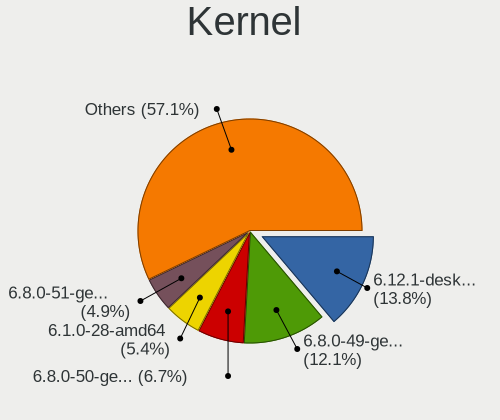
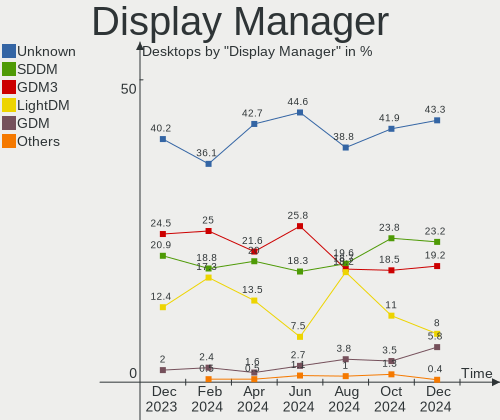
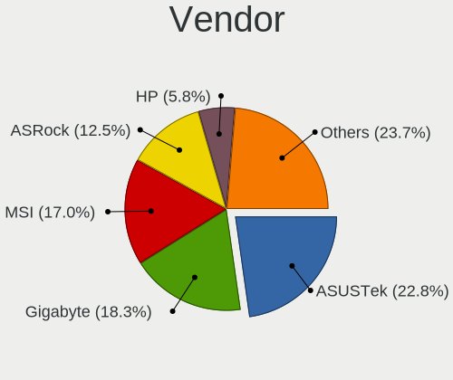
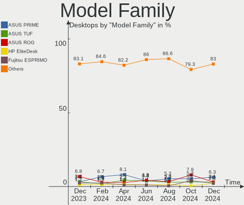
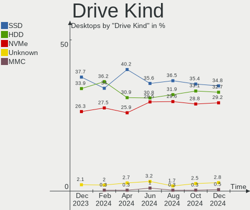
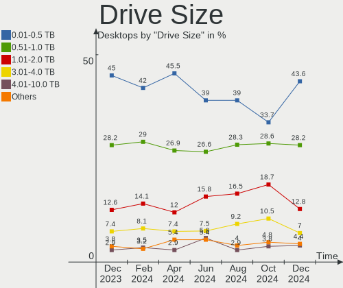
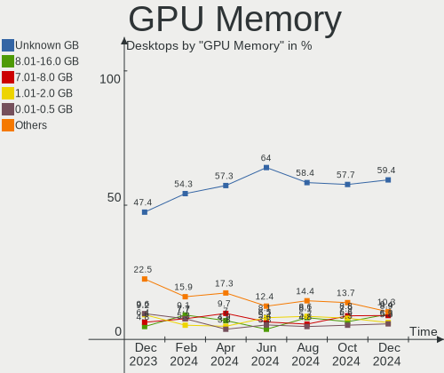
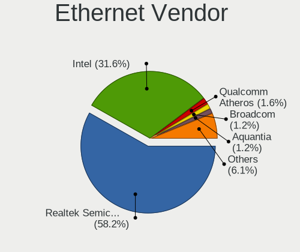

Linux in Germany - Hardware Trends (Desktops)
---------------------------------------------

A project to identify most popular hardware characteristics and track their change
over time based on data collected by Linux users at https://Linux-Hardware.org.

Anyone can contribute to this report by the [hw-probe](https://github.com/linuxhw/hw-probe) tool:

    sudo -E hw-probe -all -upload

Period: Aug, 2022.

Contents
--------

* [ System ](#system)
  - [ OS                       ](#os)
  - [ OS Family                ](#os-family)
  - [ Kernel                   ](#kernel)
  - [ Kernel Family            ](#kernel-family)
  - [ Kernel Major Ver.        ](#kernel-major-ver)
  - [ Arch                     ](#arch)
  - [ DE                       ](#de)
  - [ Display Server           ](#display-server)
  - [ Display Manager          ](#display-manager)
  - [ OS Lang                  ](#os-lang)
  - [ Boot Mode                ](#boot-mode)
  - [ Filesystem               ](#filesystem)
  - [ Part. scheme             ](#part-scheme)
  - [ Dual Boot with Linux/BSD ](#dual-boot-with-linuxbsd)
  - [ Dual Boot (Win)          ](#dual-boot-win)

* [ Board ](#board)
  - [ Vendor                   ](#vendor)
  - [ Model                    ](#model)
  - [ Model Family             ](#model-family)
  - [ MFG Year                 ](#mfg-year)
  - [ Form Factor              ](#form-factor)
  - [ Secure Boot              ](#secure-boot)
  - [ Coreboot                 ](#coreboot)
  - [ RAM Size                 ](#ram-size)
  - [ RAM Used                 ](#ram-used)
  - [ Total Drives             ](#total-drives)
  - [ Has CD-ROM               ](#has-cd-rom)
  - [ Has Ethernet             ](#has-ethernet)
  - [ Has WiFi                 ](#has-wifi)
  - [ Has Bluetooth            ](#has-bluetooth)

* [ Location ](#location)
  - [ Country                  ](#country)
  - [ City                     ](#city)

* [ Drives ](#drives)
  - [ Drive Vendor             ](#drive-vendor)
  - [ Drive Model              ](#drive-model)
  - [ HDD Vendor               ](#hdd-vendor)
  - [ SSD Vendor               ](#ssd-vendor)
  - [ Drive Kind               ](#drive-kind)
  - [ Drive Connector          ](#drive-connector)
  - [ Drive Size               ](#drive-size)
  - [ Space Total              ](#space-total)
  - [ Space Used               ](#space-used)
  - [ Malfunc. Drives          ](#malfunc-drives)
  - [ Malfunc. Drive Vendor    ](#malfunc-drive-vendor)
  - [ Malfunc. HDD Vendor      ](#malfunc-hdd-vendor)
  - [ Malfunc. Drive Kind      ](#malfunc-drive-kind)
  - [ Failed Drives            ](#failed-drives)
  - [ Failed Drive Vendor      ](#failed-drive-vendor)
  - [ Drive Status             ](#drive-status)

* [ Storage controller ](#storage-controller)
  - [ Storage Vendor           ](#storage-vendor)
  - [ Storage Model            ](#storage-model)
  - [ Storage Kind             ](#storage-kind)

* [ Processor ](#processor)
  - [ CPU Vendor               ](#cpu-vendor)
  - [ CPU Model                ](#cpu-model)
  - [ CPU Model Family         ](#cpu-model-family)
  - [ CPU Cores                ](#cpu-cores)
  - [ CPU Sockets              ](#cpu-sockets)
  - [ CPU Threads              ](#cpu-threads)
  - [ CPU Op-Modes             ](#cpu-op-modes)
  - [ CPU Microcode            ](#cpu-microcode)
  - [ CPU Microarch            ](#cpu-microarch)

* [ Graphics ](#graphics)
  - [ GPU Vendor               ](#gpu-vendor)
  - [ GPU Model                ](#gpu-model)
  - [ GPU Combo                ](#gpu-combo)
  - [ GPU Driver               ](#gpu-driver)
  - [ GPU Memory               ](#gpu-memory)

* [ Monitor ](#monitor)
  - [ Monitor Vendor           ](#monitor-vendor)
  - [ Monitor Model            ](#monitor-model)
  - [ Monitor Resolution       ](#monitor-resolution)
  - [ Monitor Diagonal         ](#monitor-diagonal)
  - [ Monitor Width            ](#monitor-width)
  - [ Aspect Ratio             ](#aspect-ratio)
  - [ Monitor Area             ](#monitor-area)
  - [ Pixel Density            ](#pixel-density)
  - [ Multiple Monitors        ](#multiple-monitors)

* [ Network ](#network)
  - [ Net Controller Vendor    ](#net-controller-vendor)
  - [ Net Controller Model     ](#net-controller-model)
  - [ Wireless Vendor          ](#wireless-vendor)
  - [ Wireless Model           ](#wireless-model)
  - [ Ethernet Vendor          ](#ethernet-vendor)
  - [ Ethernet Model           ](#ethernet-model)
  - [ Net Controller Kind      ](#net-controller-kind)
  - [ Used Controller          ](#used-controller)
  - [ NICs                     ](#nics)
  - [ IPv6                     ](#ipv6)

* [ Bluetooth ](#bluetooth)
  - [ Bluetooth Vendor         ](#bluetooth-vendor)
  - [ Bluetooth Model          ](#bluetooth-model)

* [ Sound ](#sound)
  - [ Sound Vendor             ](#sound-vendor)
  - [ Sound Model              ](#sound-model)

* [ Memory ](#memory)
  - [ Memory Vendor            ](#memory-vendor)
  - [ Memory Model             ](#memory-model)
  - [ Memory Kind              ](#memory-kind)
  - [ Memory Form Factor       ](#memory-form-factor)
  - [ Memory Size              ](#memory-size)
  - [ Memory Speed             ](#memory-speed)

* [ Printers & scanners ](#printers--scanners)
  - [ Printer Vendor           ](#printer-vendor)
  - [ Printer Model            ](#printer-model)
  - [ Scanner Vendor           ](#scanner-vendor)
  - [ Scanner Model            ](#scanner-model)

* [ Camera ](#camera)
  - [ Camera Vendor            ](#camera-vendor)
  - [ Camera Model             ](#camera-model)

* [ Security ](#security)
  - [ Fingerprint Vendor       ](#fingerprint-vendor)
  - [ Fingerprint Model        ](#fingerprint-model)
  - [ Chipcard Vendor          ](#chipcard-vendor)
  - [ Chipcard Model           ](#chipcard-model)

* [ Unsupported ](#unsupported)
  - [ Unsupported Devices      ](#unsupported-devices)
  - [ Unsupported Device Types ](#unsupported-device-types)

System
------

OS
--

Installed operating systems

| Name                         | Desktops | Percent |
|------------------------------|----------|---------|
| Ubuntu 22.04                 | 28       | 17.72%  |
| Linux Mint 20.3              | 14       | 8.86%   |
| Ubuntu 20.04                 | 11       | 6.96%   |
| Linux Mint 21                | 10       | 6.33%   |
| Fedora 36                    | 9        | 5.7%    |
| Zorin 16                     | 8        | 5.06%   |
| Pop!_OS 22.04                | 7        | 4.43%   |
| OpenMandriva 4.3             | 7        | 4.43%   |
| Debian 11                    | 7        | 4.43%   |
| KDE neon 20.04               | 5        | 3.16%   |
| OpenMandriva 4.90            | 4        | 2.53%   |
| Gentoo 2.8                   | 4        | 2.53%   |
| Arch                         | 4        | 2.53%   |
| Manjaro                      | 3        | 1.9%    |
| Arch Rolling                 | 3        | 1.9%    |
| Xubuntu 18.04                | 2        | 1.27%   |
| Ubuntu 21.10                 | 2        | 1.27%   |
| Manjaro 21.3.7               | 2        | 1.27%   |
| Manjaro 21.3.6               | 2        | 1.27%   |
| Lubuntu 22.04                | 2        | 1.27%   |
| Kubuntu 20.04                | 2        | 1.27%   |
| Kali 2022.3                  | 2        | 1.27%   |
| Xubuntu 22.04                | 1        | 0.63%   |
| Xubuntu 20.04                | 1        | 0.63%   |
| Ubuntu Budgie 22.04          | 1        | 0.63%   |
| Ubuntu 21.04                 | 1        | 0.63%   |
| Ubuntu 18.04                 | 1        | 0.63%   |
| openSUSE Tumbleweed-XXXXXXXX | 1        | 0.63%   |
| openSUSE Leap-15.3           | 1        | 0.63%   |
| Nobara 36                    | 1        | 0.63%   |
| Linux Mint 20.1              | 1        | 0.63%   |
| Linux Mint 20                | 1        | 0.63%   |
| Linux Mint 19.3              | 1        | 0.63%   |
| Linux Mint 19.2              | 1        | 0.63%   |
| Kubuntu 22.04                | 1        | 0.63%   |
| Kubuntu 18.04                | 1        | 0.63%   |
| Garuda Linux                 | 1        | 0.63%   |
| EndeavourOS                  | 1        | 0.63%   |
| Elementary 6.1               | 1        | 0.63%   |
| Debian 10                    | 1        | 0.63%   |
| ArcoLinux Rolling            | 1        | 0.63%   |
| ArcoLinux                    | 1        | 0.63%   |

OS Family
---------

OS without a version

| Name          | Desktops | Percent |
|---------------|----------|---------|
| Ubuntu        | 43       | 27.22%  |
| Linux Mint    | 28       | 17.72%  |
| OpenMandriva  | 11       | 6.96%   |
| Fedora        | 9        | 5.7%    |
| Zorin         | 8        | 5.06%   |
| Debian        | 8        | 5.06%   |
| Pop!_OS       | 7        | 4.43%   |
| Manjaro       | 7        | 4.43%   |
| Arch          | 7        | 4.43%   |
| KDE neon      | 5        | 3.16%   |
| Xubuntu       | 4        | 2.53%   |
| Kubuntu       | 4        | 2.53%   |
| Gentoo        | 4        | 2.53%   |
| openSUSE      | 2        | 1.27%   |
| Lubuntu       | 2        | 1.27%   |
| Kali          | 2        | 1.27%   |
| ArcoLinux     | 2        | 1.27%   |
| Ubuntu Budgie | 1        | 0.63%   |
| Nobara        | 1        | 0.63%   |
| Garuda Linux  | 1        | 0.63%   |
| EndeavourOS   | 1        | 0.63%   |
| Elementary    | 1        | 0.63%   |

Kernel
------

Version of the Linux kernel

| Version                       | Desktops | Percent |
|-------------------------------|----------|---------|
| 5.15.0-46-generic             | 29       | 18.35%  |
| 5.15.0-43-generic             | 19       | 12.03%  |
| 5.4.0-124-generic             | 7        | 4.43%   |
| 5.16.7-desktop-1omv4003       | 7        | 4.43%   |
| 5.15.0-41-generic             | 6        | 3.8%    |
| 5.4.0-122-generic             | 5        | 3.16%   |
| 5.19.0-76051900-generic       | 4        | 2.53%   |
| 5.18.16-arch1-1               | 4        | 2.53%   |
| 5.18.12-desktop-3omv4090      | 4        | 2.53%   |
| 5.18.18-200.fc36.x86_64       | 3        | 1.9%    |
| 5.18.10-76051810-generic      | 3        | 1.9%    |
| 5.15.0-47-generic             | 3        | 1.9%    |
| 5.15.0-46-lowlatency          | 3        | 1.9%    |
| 5.15.0-25-generic             | 3        | 1.9%    |
| 5.4.0-125-generic             | 2        | 1.27%   |
| 5.19.1-3-MANJARO              | 2        | 1.27%   |
| 5.18.16-200.fc36.x86_64       | 2        | 1.27%   |
| 5.18.0-kali5-amd64            | 2        | 1.27%   |
| 5.15.0-45-generic             | 2        | 1.27%   |
| 5.13.0-52-generic             | 2        | 1.27%   |
| 5.11.0-46-generic             | 2        | 1.27%   |
| 5.10.0-17-amd64               | 2        | 1.27%   |
| 4.15.0-191-generic            | 2        | 1.27%   |
| 5.4.0-91-generic              | 1        | 0.63%   |
| 5.4.0-70-generic              | 1        | 0.63%   |
| 5.4.0-47-generic              | 1        | 0.63%   |
| 5.4.0-110-generic             | 1        | 0.63%   |
| 5.3.18-150300.59.87-default   | 1        | 0.63%   |
| 5.3.0-46-generic              | 1        | 0.63%   |
| 5.19.4-269-tkg-bmq            | 1        | 0.63%   |
| 5.19.2-arch1-1                | 1        | 0.63%   |
| 5.19.2-1-default              | 1        | 0.63%   |
| 5.19.2-051902-generic         | 1        | 0.63%   |
| 5.19.1-zen1-1-zen             | 1        | 0.63%   |
| 5.19.0-gentoo                 | 1        | 0.63%   |
| 5.19.0-1-MANJARO              | 1        | 0.63%   |
| 5.18.3-zen1                   | 1        | 0.63%   |
| 5.18.19-200.fc36.x86_64       | 1        | 0.63%   |
| 5.18.17-200.fc36.x86_64       | 1        | 0.63%   |
| 5.18.15-zen1-1-zen            | 1        | 0.63%   |
| 5.18.15-gentoo                | 1        | 0.63%   |
| 5.18.15-arch1-2               | 1        | 0.63%   |
| 5.18.15-200.fc36.x86_64       | 1        | 0.63%   |
| 5.18.13-201.fsync.fc36.x86_64 | 1        | 0.63%   |
| 5.18.12-tkg-pds               | 1        | 0.63%   |
| 5.18.0-16.1-liquorix-amd64    | 1        | 0.63%   |
| 5.18.0-0.deb11.3-amd64        | 1        | 0.63%   |
| 5.18.0-0.bpo.1-amd64          | 1        | 0.63%   |
| 5.17.5-300.fc36.x86_64        | 1        | 0.63%   |
| 5.16.5                        | 1        | 0.63%   |
| 5.15.59-2-lts                 | 1        | 0.63%   |
| 5.15.59-1-MANJARO             | 1        | 0.63%   |
| 5.15.57-2-MANJARO             | 1        | 0.63%   |
| 5.15.57-1-MANJARO             | 1        | 0.63%   |
| 5.15.52-gentoo-ts221          | 1        | 0.63%   |
| 5.15.52-1-lts                 | 1        | 0.63%   |
| 5.15.14-1-lts                 | 1        | 0.63%   |
| 5.15.0-40-generic             | 1        | 0.63%   |
| 5.13.0-30-generic             | 1        | 0.63%   |
| 5.13.0-19-generic             | 1        | 0.63%   |

Kernel Family
-------------

Linux kernel without a distro release

| Version | Desktops | Percent |
|---------|----------|---------|
| 5.15.0  | 66       | 41.77%  |
| 5.4.0   | 18       | 11.39%  |
| 5.16.7  | 7        | 4.43%   |
| 5.19.0  | 6        | 3.8%    |
| 5.18.16 | 6        | 3.8%    |
| 5.18.12 | 5        | 3.16%   |
| 5.18.0  | 5        | 3.16%   |
| 5.18.15 | 4        | 2.53%   |
| 5.13.0  | 4        | 2.53%   |
| 5.19.2  | 3        | 1.9%    |
| 5.19.1  | 3        | 1.9%    |
| 5.18.18 | 3        | 1.9%    |
| 5.18.10 | 3        | 1.9%    |
| 5.11.0  | 3        | 1.9%    |
| 5.10.0  | 3        | 1.9%    |
| 5.15.59 | 2        | 1.27%   |
| 5.15.57 | 2        | 1.27%   |
| 5.15.52 | 2        | 1.27%   |
| 4.15.0  | 2        | 1.27%   |
| 5.3.18  | 1        | 0.63%   |
| 5.3.0   | 1        | 0.63%   |
| 5.19.4  | 1        | 0.63%   |
| 5.18.3  | 1        | 0.63%   |
| 5.18.19 | 1        | 0.63%   |
| 5.18.17 | 1        | 0.63%   |
| 5.18.13 | 1        | 0.63%   |
| 5.17.5  | 1        | 0.63%   |
| 5.16.5  | 1        | 0.63%   |
| 5.15.14 | 1        | 0.63%   |
| 4.19.0  | 1        | 0.63%   |

Kernel Major Ver.
-----------------

Linux kernel major version

| Version | Desktops | Percent |
|---------|----------|---------|
| 5.15    | 73       | 46.2%   |
| 5.18    | 30       | 18.99%  |
| 5.4     | 18       | 11.39%  |
| 5.19    | 13       | 8.23%   |
| 5.16    | 8        | 5.06%   |
| 5.13    | 4        | 2.53%   |
| 5.11    | 3        | 1.9%    |
| 5.10    | 3        | 1.9%    |
| 5.3     | 2        | 1.27%   |
| 4.15    | 2        | 1.27%   |
| 5.17    | 1        | 0.63%   |
| 4.19    | 1        | 0.63%   |

Arch
----

OS architecture (x86_64, i586, etc.)

| Name     | Desktops | Percent |
|----------|----------|---------|
| x86_64   | 155      | 98.1%   |
| i686     | 2        | 1.27%   |
| armv5tel | 1        | 0.63%   |

DE
--

Desktop Environment

| Name            | Desktops | Percent |
|-----------------|----------|---------|
| GNOME           | 63       | 39.87%  |
| KDE5            | 35       | 22.15%  |
| X-Cinnamon      | 26       | 16.46%  |
| XFCE            | 12       | 7.59%   |
| Unknown         | 10       | 6.33%   |
| Pantheon        | 2        | 1.27%   |
| MATE            | 2        | 1.27%   |
| LXQt            | 2        | 1.27%   |
| i3              | 2        | 1.27%   |
| herbstluftwm    | 1        | 0.63%   |
| GNOME Flashback | 1        | 0.63%   |
| Cinnamon        | 1        | 0.63%   |
| Budgie          | 1        | 0.63%   |

Display Server
--------------

X11 or Wayland

| Name    | Desktops | Percent |
|---------|----------|---------|
| X11     | 116      | 73.42%  |
| Wayland | 30       | 18.99%  |
| Tty     | 9        | 5.7%    |
| Unknown | 3        | 1.9%    |

Display Manager
---------------

SDDM, LightDM, etc.

| Name    | Desktops | Percent |
|---------|----------|---------|
| Unknown | 71       | 44.94%  |
| GDM3    | 40       | 25.32%  |
| SDDM    | 21       | 13.29%  |
| LightDM | 20       | 12.66%  |
| GDM     | 6        | 3.8%    |

OS Lang
-------

Language

| Lang    | Desktops | Percent |
|---------|----------|---------|
| de_DE   | 113      | 71.52%  |
| en_US   | 34       | 21.52%  |
| C       | 3        | 1.9%    |
| en_GB   | 2        | 1.27%   |
| uk_UA   | 1        | 0.63%   |
| POSIX   | 1        | 0.63%   |
| fr_FR   | 1        | 0.63%   |
| es_ES   | 1        | 0.63%   |
| en_DE   | 1        | 0.63%   |
| Unknown | 1        | 0.63%   |

Boot Mode
---------

EFI or BIOS

| Mode | Desktops | Percent |
|------|----------|---------|
| BIOS | 94       | 59.49%  |
| EFI  | 64       | 40.51%  |

Filesystem
----------

Type of filesystem

| Type    | Desktops | Percent |
|---------|----------|---------|
| Ext4    | 118      | 74.68%  |
| Btrfs   | 18       | 11.39%  |
| Overlay | 15       | 9.49%   |
| Zfs     | 2        | 1.27%   |
| Xfs     | 2        | 1.27%   |
| F2fs    | 2        | 1.27%   |
| Ext3    | 1        | 0.63%   |

Part. scheme
------------

Scheme of partitioning

| Type    | Desktops | Percent |
|---------|----------|---------|
| Unknown | 106      | 67.09%  |
| GPT     | 41       | 25.95%  |
| MBR     | 11       | 6.96%   |

Dual Boot with Linux/BSD
------------------------

Hosting more than one Linux/BSD

| Dual boot | Desktops | Percent |
|-----------|----------|---------|
| No        | 131      | 82.91%  |
| Yes       | 27       | 17.09%  |

Dual Boot (Win)
---------------

Hosting Linux and Windows

| Dual boot | Desktops | Percent |
|-----------|----------|---------|
| No        | 113      | 71.52%  |
| Yes       | 45       | 28.48%  |

Board
-----

Vendor
------

Motherboard manufacturer

| Name                | Desktops | Percent |
|---------------------|----------|---------|
| ASUSTek Computer    | 40       | 25.32%  |
| MSI                 | 33       | 20.89%  |
| Gigabyte Technology | 20       | 12.66%  |
| ASRock              | 20       | 12.66%  |
| Hewlett-Packard     | 13       | 8.23%   |
| Lenovo              | 9        | 5.7%    |
| Dell                | 6        | 3.8%    |
| Fujitsu             | 3        | 1.9%    |
| BESSTAR Tech        | 2        | 1.27%   |
| Unknown             | 2        | 1.27%   |
| Pegatron            | 1        | 0.63%   |
| Packard Bell        | 1        | 0.63%   |
| Nvidia              | 1        | 0.63%   |
| Intel               | 1        | 0.63%   |
| ICP / iEi           | 1        | 0.63%   |
| IBASE Technology    | 1        | 0.63%   |
| Foxconn             | 1        | 0.63%   |
| Biostar             | 1        | 0.63%   |
| Acidanthera         | 1        | 0.63%   |
| Acer                | 1        | 0.63%   |

Model
-----

Motherboard model

| Name                                      | Desktops | Percent |
|-------------------------------------------|----------|---------|
| MSI MS-7C37                               | 5        | 3.16%   |
| ASRock B450 Pro4                          | 3        | 1.9%    |
| MSI MS-7C56                               | 2        | 1.27%   |
| MSI MS-7721                               | 2        | 1.27%   |
| Gigabyte B550 GAMING X V2                 | 2        | 1.27%   |
| ASUS TUF Gaming B550-PLUS                 | 2        | 1.27%   |
| ASUS PRIME X370-PRO                       | 2        | 1.27%   |
| ASUS All Series                           | 2        | 1.27%   |
| ASUS A0000001                             | 2        | 1.27%   |
| ASRock A300M-STX                          | 2        | 1.27%   |
| Unknown                                   | 2        | 1.27%   |
| Pegatron NQ840AA-ABD p6029de              | 1        | 0.63%   |
| Packard Bell IMEDIA S3210                 | 1        | 0.63%   |
| Nvidia SN68PT                             | 1        | 0.63%   |
| MSI MS-7D22                               | 1        | 0.63%   |
| MSI MS-7D15                               | 1        | 0.63%   |
| MSI MS-7C52                               | 1        | 0.63%   |
| MSI MS-7C35                               | 1        | 0.63%   |
| MSI MS-7C02                               | 1        | 0.63%   |
| MSI MS-7B86                               | 1        | 0.63%   |
| MSI MS-7A54                               | 1        | 0.63%   |
| MSI MS-7A33                               | 1        | 0.63%   |
| MSI MS-7A32                               | 1        | 0.63%   |
| MSI MS-7A12                               | 1        | 0.63%   |
| MSI MS-7978                               | 1        | 0.63%   |
| MSI MS-7917                               | 1        | 0.63%   |
| MSI MS-7850                               | 1        | 0.63%   |
| MSI MS-7845                               | 1        | 0.63%   |
| MSI MS-7821                               | 1        | 0.63%   |
| MSI MS-7758                               | 1        | 0.63%   |
| MSI MS-7752                               | 1        | 0.63%   |
| MSI MS-7735                               | 1        | 0.63%   |
| MSI MS-7698                               | 1        | 0.63%   |
| MSI MS-7589                               | 1        | 0.63%   |
| MSI MS-7369                               | 1        | 0.63%   |
| MSI Hyrican PC A320M PRO-E                | 1        | 0.63%   |
| MSI FZ078AA-UUZ a6611ch                   | 1        | 0.63%   |
| MSI A0000001                              | 1        | 0.63%   |
| Lenovo ThinkStation P620 30E0003QGE       | 1        | 0.63%   |
| Lenovo ThinkCentre M93p 10AAS0QF00        | 1        | 0.63%   |
| Lenovo ThinkCentre M93p 10A8S18X00        | 1        | 0.63%   |
| Lenovo ThinkCentre M93 10A50006GE         | 1        | 0.63%   |
| Lenovo ThinkCentre M92p 3238AJ6           | 1        | 0.63%   |
| Lenovo ThinkCentre M81 5049W16            | 1        | 0.63%   |
| Lenovo ThinkCentre M73 10AY0037US         | 1        | 0.63%   |
| Lenovo ThinkCentre M58 7373AJ5            | 1        | 0.63%   |
| Lenovo IdeaCentre T540-15ICK G 90LW001UGE | 1        | 0.63%   |
| Intel DH87RL AAG74240-402                 | 1        | 0.63%   |
| ICP / iEi B217                            | 1        | 0.63%   |
| IBASE MI970VF                             | 1        | 0.63%   |
| HP Z420 Workstation                       | 1        | 0.63%   |
| HP Z230 SFF Workstation                   | 1        | 0.63%   |
| HP Slim Desktop S01-pF1xxx                | 1        | 0.63%   |
| HP ProLiant MicroServer Gen8              | 1        | 0.63%   |
| HP ProDesk 600 G1 SFF                     | 1        | 0.63%   |
| HP Pavilion Desktop TP01-2xxx             | 1        | 0.63%   |
| HP ENVY Desktop 795-06xx                  | 1        | 0.63%   |
| HP EliteDesk 800 G1 USDT                  | 1        | 0.63%   |
| HP Compaq Pro 6300 SFF                    | 1        | 0.63%   |
| HP Compaq dc5800 Small Form Factor        | 1        | 0.63%   |

Model Family
------------

Motherboard model prefix

| Name                 | Desktops | Percent |
|----------------------|----------|---------|
| ASUS PRIME           | 10       | 6.33%   |
| Lenovo ThinkCentre   | 7        | 4.43%   |
| MSI MS-7C37          | 5        | 3.16%   |
| ASUS TUF             | 4        | 2.53%   |
| HP Compaq            | 3        | 1.9%    |
| Gigabyte B550        | 3        | 1.9%    |
| Dell OptiPlex        | 3        | 1.9%    |
| ASUS ROG             | 3        | 1.9%    |
| ASRock B450          | 3        | 1.9%    |
| MSI MS-7C56          | 2        | 1.27%   |
| MSI MS-7721          | 2        | 1.27%   |
| Gigabyte X570        | 2        | 1.27%   |
| Fujitsu ESPRIMO      | 2        | 1.27%   |
| ASUS Pro             | 2        | 1.27%   |
| ASUS All             | 2        | 1.27%   |
| ASUS A0000001        | 2        | 1.27%   |
| ASRock A300M-STX     | 2        | 1.27%   |
| Unknown              | 2        | 1.27%   |
| Pegatron NQ840AA-ABD | 1        | 0.63%   |
| Packard Bell IMEDIA  | 1        | 0.63%   |
| Nvidia SN68PT        | 1        | 0.63%   |
| MSI MS-7D22          | 1        | 0.63%   |
| MSI MS-7D15          | 1        | 0.63%   |
| MSI MS-7C52          | 1        | 0.63%   |
| MSI MS-7C35          | 1        | 0.63%   |
| MSI MS-7C02          | 1        | 0.63%   |
| MSI MS-7B86          | 1        | 0.63%   |
| MSI MS-7A54          | 1        | 0.63%   |
| MSI MS-7A33          | 1        | 0.63%   |
| MSI MS-7A32          | 1        | 0.63%   |
| MSI MS-7A12          | 1        | 0.63%   |
| MSI MS-7978          | 1        | 0.63%   |
| MSI MS-7917          | 1        | 0.63%   |
| MSI MS-7850          | 1        | 0.63%   |
| MSI MS-7845          | 1        | 0.63%   |
| MSI MS-7821          | 1        | 0.63%   |
| MSI MS-7758          | 1        | 0.63%   |
| MSI MS-7752          | 1        | 0.63%   |
| MSI MS-7735          | 1        | 0.63%   |
| MSI MS-7698          | 1        | 0.63%   |
| MSI MS-7589          | 1        | 0.63%   |
| MSI MS-7369          | 1        | 0.63%   |
| MSI Hyrican          | 1        | 0.63%   |
| MSI FZ078AA-UUZ      | 1        | 0.63%   |
| MSI A0000001         | 1        | 0.63%   |
| Lenovo ThinkStation  | 1        | 0.63%   |
| Lenovo IdeaCentre    | 1        | 0.63%   |
| Intel DH87RL         | 1        | 0.63%   |
| ICP / iEi B217       | 1        | 0.63%   |
| IBASE MI970VF        | 1        | 0.63%   |
| HP Z420              | 1        | 0.63%   |
| HP Z230              | 1        | 0.63%   |
| HP Slim              | 1        | 0.63%   |
| HP ProLiant          | 1        | 0.63%   |
| HP ProDesk           | 1        | 0.63%   |
| HP Pavilion          | 1        | 0.63%   |
| HP ENVY              | 1        | 0.63%   |
| HP EliteDesk         | 1        | 0.63%   |
| HP 870-115ng         | 1        | 0.63%   |
| HP 510-p153ng        | 1        | 0.63%   |

MFG Year
--------

Motherboard manufacture year

| Year    | Desktops | Percent |
|---------|----------|---------|
| 2018    | 22       | 13.92%  |
| 2013    | 20       | 12.66%  |
| 2020    | 15       | 9.49%   |
| 2012    | 14       | 8.86%   |
| 2019    | 13       | 8.23%   |
| 2021    | 11       | 6.96%   |
| 2014    | 9        | 5.7%    |
| 2022    | 8        | 5.06%   |
| 2011    | 8        | 5.06%   |
| 2008    | 8        | 5.06%   |
| 2015    | 7        | 4.43%   |
| 2009    | 7        | 4.43%   |
| 2017    | 5        | 3.16%   |
| 2010    | 5        | 3.16%   |
| 2016    | 2        | 1.27%   |
| 2007    | 2        | 1.27%   |
| 2006    | 1        | 0.63%   |
| Unknown | 1        | 0.63%   |

Form Factor
-----------

Physical design of the computer

| Name    | Desktops | Percent |
|---------|----------|---------|
| Desktop | 158      | 100%    |

Secure Boot
-----------

Enabled or disabled

| State    | Desktops | Percent |
|----------|----------|---------|
| Disabled | 154      | 97.47%  |
| Enabled  | 4        | 2.53%   |

Coreboot
--------

Have coreboot on board

| Used | Desktops | Percent |
|------|----------|---------|
| No   | 158      | 100%    |

RAM Size
--------

Total RAM memory

| Size in GB      | Desktops | Percent |
|-----------------|----------|---------|
| 16.01-24.0      | 42       | 26.58%  |
| 8.01-16.0       | 33       | 20.89%  |
| 32.01-64.0      | 27       | 17.09%  |
| 4.01-8.0        | 21       | 13.29%  |
| 64.01-256.0     | 14       | 8.86%   |
| 3.01-4.0        | 9        | 5.7%    |
| 1.01-2.0        | 5        | 3.16%   |
| 24.01-32.0      | 3        | 1.9%    |
| More than 256.0 | 2        | 1.27%   |
| 2.01-3.0        | 1        | 0.63%   |
| 0.51-1.0        | 1        | 0.63%   |

RAM Used
--------

Used RAM memory

| Used GB    | Desktops | Percent |
|------------|----------|---------|
| 1.01-2.0   | 56       | 35.44%  |
| 2.01-3.0   | 34       | 21.52%  |
| 3.01-4.0   | 27       | 17.09%  |
| 4.01-8.0   | 18       | 11.39%  |
| 8.01-16.0  | 12       | 7.59%   |
| 0.51-1.0   | 6        | 3.8%    |
| 0.01-0.5   | 2        | 1.27%   |
| 32.01-64.0 | 1        | 0.63%   |
| 24.01-32.0 | 1        | 0.63%   |
| 16.01-24.0 | 1        | 0.63%   |

Total Drives
------------

Number of drives on board

| Drives | Desktops | Percent |
|--------|----------|---------|
| 2      | 52       | 32.91%  |
| 1      | 45       | 28.48%  |
| 3      | 31       | 19.62%  |
| 4      | 14       | 8.86%   |
| 5      | 8        | 5.06%   |
| 6      | 4        | 2.53%   |
| 12     | 2        | 1.27%   |
| 7      | 2        | 1.27%   |

Has CD-ROM
----------

Has CD-ROM on board

| Presented | Desktops | Percent |
|-----------|----------|---------|
| Yes       | 86       | 54.43%  |
| No        | 72       | 45.57%  |

Has Ethernet
------------

Has Ethernet on board

| Presented | Desktops | Percent |
|-----------|----------|---------|
| Yes       | 156      | 98.73%  |
| No        | 2        | 1.27%   |

Has WiFi
--------

Has WiFi module

| Presented | Desktops | Percent |
|-----------|----------|---------|
| No        | 98       | 62.03%  |
| Yes       | 60       | 37.97%  |

Has Bluetooth
-------------

Has Bluetooth module

| Presented | Desktops | Percent |
|-----------|----------|---------|
| No        | 117      | 74.05%  |
| Yes       | 41       | 25.95%  |

Location
--------

Country
-------

Geographic location (country)

| Country | Desktops | Percent |
|---------|----------|---------|
| Germany | 158      | 100%    |

City
----

Geographic location (city)

| City                      | Desktops | Percent |
|---------------------------|----------|---------|
| Berlin                    | 25       | 15.82%  |
| Hamburg                   | 7        | 4.43%   |
| Munich                    | 5        | 3.16%   |
| Frankfurt am Main         | 5        | 3.16%   |
| Stuttgart                 | 3        | 1.9%    |
| Nuremberg                 | 3        | 1.9%    |
| Magdeburg                 | 3        | 1.9%    |
| Oberursel                 | 2        | 1.27%   |
| Niederndodeleben          | 2        | 1.27%   |
| Ludwigsburg               | 2        | 1.27%   |
| Kirchheim unter Teck      | 2        | 1.27%   |
| Hanover                   | 2        | 1.27%   |
| Freiburg im Breisgau      | 2        | 1.27%   |
| Falkenstein               | 2        | 1.27%   |
| Düsseldorf               | 2        | 1.27%   |
| Düren                    | 2        | 1.27%   |
| Duisburg                  | 2        | 1.27%   |
| Dresden                   | 2        | 1.27%   |
| Dortmund                  | 2        | 1.27%   |
| Darmstadt                 | 2        | 1.27%   |
| Bruchsal                  | 2        | 1.27%   |
| Zeuthen                   | 1        | 0.63%   |
| Wolfhagen                 | 1        | 0.63%   |
| Wiehl                     | 1        | 0.63%   |
| Werneck                   | 1        | 0.63%   |
| Wenzenbach                | 1        | 0.63%   |
| Weimar                    | 1        | 0.63%   |
| Wannweil                  | 1        | 0.63%   |
| Villingen-Schwenningen    | 1        | 0.63%   |
| Ulm                       | 1        | 0.63%   |
| Uetze                     | 1        | 0.63%   |
| Thungersheim              | 1        | 0.63%   |
| Teuchern                  | 1        | 0.63%   |
| Speyer                    | 1        | 0.63%   |
| Schwalbach                | 1        | 0.63%   |
| Schloss Holte-Stukenbrock | 1        | 0.63%   |
| Saarlouis                 | 1        | 0.63%   |
| Rostock                   | 1        | 0.63%   |
| Rendsburg                 | 1        | 0.63%   |
| Rattelsdorf               | 1        | 0.63%   |
| Rastatt                   | 1        | 0.63%   |
| Paderborn                 | 1        | 0.63%   |
| Oberkotzau                | 1        | 0.63%   |
| Neckarsulm                | 1        | 0.63%   |
| Meissen                   | 1        | 0.63%   |
| Meiningen                 | 1        | 0.63%   |
| Maxhutte-Haidhof          | 1        | 0.63%   |
| Markneukirchen            | 1        | 0.63%   |
| Lubnjow                   | 1        | 0.63%   |
| Lohnberg                  | 1        | 0.63%   |
| Lingenfeld                | 1        | 0.63%   |
| Leipzig                   | 1        | 0.63%   |
| Koblenz                   | 1        | 0.63%   |
| Karlsruhe                 | 1        | 0.63%   |
| Kamenz                    | 1        | 0.63%   |
| Jersbek                   | 1        | 0.63%   |
| Itzehoe                   | 1        | 0.63%   |
| Ismaning                  | 1        | 0.63%   |
| Ingelheim am Rhein        | 1        | 0.63%   |
| Immenhausen               | 1        | 0.63%   |

Drives
------

Drive Vendor
------------

Hard drive vendors

| Vendor                      | Desktops | Drives | Percent |
|-----------------------------|----------|--------|---------|
| Samsung Electronics         | 72       | 118    | 25%     |
| WDC                         | 57       | 84     | 19.79%  |
| Seagate                     | 32       | 44     | 11.11%  |
| SanDisk                     | 24       | 30     | 8.33%   |
| Crucial                     | 17       | 22     | 5.9%    |
| Kingston                    | 13       | 16     | 4.51%   |
| Toshiba                     | 11       | 22     | 3.82%   |
| Hitachi                     | 9        | 10     | 3.13%   |
| Intenso                     | 7        | 9      | 2.43%   |
| OCZ                         | 4        | 4      | 1.39%   |
| Micron/Crucial Technology   | 4        | 4      | 1.39%   |
| A-DATA Technology           | 4        | 4      | 1.39%   |
| Unknown                     | 2        | 2      | 0.69%   |
| SPCC                        | 2        | 2      | 0.69%   |
| PNY                         | 2        | 2      | 0.69%   |
| Patriot                     | 2        | 2      | 0.69%   |
| Micron Technology           | 2        | 2      | 0.69%   |
| Maxtor                      | 2        | 2      | 0.69%   |
| Intel                       | 2        | 2      | 0.69%   |
| HGST                        | 2        | 3      | 0.69%   |
| Unknown                     | 2        | 2      | 0.69%   |
| Zheino                      | 1        | 1      | 0.35%   |
| YS                          | 1        | 1      | 0.35%   |
| WD MediaMax                 | 1        | 1      | 0.35%   |
| Verbatim                    | 1        | 1      | 0.35%   |
| USB                         | 1        | 1      | 0.35%   |
| TO Exter                    | 1        | 1      | 0.35%   |
| TANDBERG                    | 1        | 1      | 0.35%   |
| Silicon Motion              | 1        | 1      | 0.35%   |
| Plextor                     | 1        | 1      | 0.35%   |
| Phison                      | 1        | 1      | 0.35%   |
| MAXIO Technology (Hangzhou) | 1        | 1      | 0.35%   |
| Magnetic Data               | 1        | 1      | 0.35%   |
| Hoodisk                     | 1        | 1      | 0.35%   |
| Corsair                     | 1        | 1      | 0.35%   |
| China                       | 1        | 1      | 0.35%   |
| Apacer                      | 1        | 1      | 0.35%   |

Drive Model
-----------

Hard drive models

| Model                                | Desktops | Percent |
|--------------------------------------|----------|---------|
| Samsung SSD 860 EVO 1TB              | 8        | 2.23%   |
| Samsung NVMe SSD Drive 1TB           | 8        | 2.23%   |
| Crucial CT1000MX500SSD1 1TB          | 7        | 1.96%   |
| WDC WD40EZRZ-00GXCB0 4TB             | 5        | 1.4%    |
| Samsung SSD 850 EVO 500GB            | 5        | 1.4%    |
| Samsung SSD 980 PRO 1TB              | 4        | 1.12%   |
| Samsung SSD 850 EVO 250GB            | 4        | 1.12%   |
| WDC WD40EFRX-68N32N0 4TB             | 3        | 0.84%   |
| WDC WD10EZEX-00BN5A0 1TB             | 3        | 0.84%   |
| Toshiba DT01ACA050 500GB             | 3        | 0.84%   |
| SanDisk SSD PLUS 480GB               | 3        | 0.84%   |
| SanDisk SSD PLUS 240GB               | 3        | 0.84%   |
| SanDisk NVMe SSD Drive 1TB           | 3        | 0.84%   |
| Samsung SSD 970 EVO Plus 500GB       | 3        | 0.84%   |
| Samsung SSD 970 EVO Plus 2TB         | 3        | 0.84%   |
| Samsung SSD 860 EVO 500GB            | 3        | 0.84%   |
| Samsung SSD 840 EVO 250GB            | 3        | 0.84%   |
| Samsung SSD 750 EVO 250GB            | 3        | 0.84%   |
| Samsung NVMe SSD Drive 2TB           | 3        | 0.84%   |
| Micron/Crucial NVMe SSD Drive 1TB    | 3        | 0.84%   |
| WDC WDS500G2B0A-00SM50 500GB SSD     | 2        | 0.56%   |
| WDC WD20EARX-00PASB0 2TB             | 2        | 0.56%   |
| Unknown SD/MMC/MS PRO 128GB          | 2        | 0.56%   |
| Toshiba HDWD110 1TB                  | 2        | 0.56%   |
| Toshiba DT01ACA100 1TB               | 2        | 0.56%   |
| Seagate ST3500418AS 500GB            | 2        | 0.56%   |
| Seagate ST31000528AS 1TB             | 2        | 0.56%   |
| Seagate ST2000DM008-2FR102 2TB       | 2        | 0.56%   |
| Seagate ST2000DM001-1ER164 2TB       | 2        | 0.56%   |
| Seagate ST1000DM003-1SB102 1TB       | 2        | 0.56%   |
| Seagate Expansion 500GB              | 2        | 0.56%   |
| SanDisk SDSSDP128G 128GB             | 2        | 0.56%   |
| SanDisk SDSSDH3512G 512GB            | 2        | 0.56%   |
| SanDisk SDSSDA240G 240GB             | 2        | 0.56%   |
| SanDisk NVMe SSD Drive 500GB         | 2        | 0.56%   |
| Samsung SSD 970 PRO 512GB            | 2        | 0.56%   |
| Samsung SSD 970 EVO Plus 1TB         | 2        | 0.56%   |
| Samsung SSD 870 QVO 1TB              | 2        | 0.56%   |
| Samsung SSD 870 EVO 1TB              | 2        | 0.56%   |
| Samsung SSD 860 EVO 250GB            | 2        | 0.56%   |
| Samsung SSD 840 PRO Series 512GB     | 2        | 0.56%   |
| Samsung NVMe SSD Drive 250GB         | 2        | 0.56%   |
| Samsung MZ7LN256HAJQ-00000 256GB SSD | 2        | 0.56%   |
| Samsung HD321KJ 320GB                | 2        | 0.56%   |
| Samsung HD103UJ 1TB                  | 2        | 0.56%   |
| Samsung HD103SJ 1TB                  | 2        | 0.56%   |
| OCZ AGILITY3 120GB SSD               | 2        | 0.56%   |
| Kingston SA400M8240G 240GB SSD       | 2        | 0.56%   |
| Kingston NVMe SSD Drive 500GB        | 2        | 0.56%   |
| Kingston NVMe SSD Drive 1TB          | 2        | 0.56%   |
| Intenso SATA III SSD 240GB           | 2        | 0.56%   |
| Hitachi HDS5C3020ALA632 2TB          | 2        | 0.56%   |
| Crucial CT500MX500SSD1 500GB         | 2        | 0.56%   |
| Crucial CT480BX500SSD1 480GB         | 2        | 0.56%   |
| Crucial CT250MX500SSD1 250GB         | 2        | 0.56%   |
| Crucial CT2000MX500SSD1 2TB          | 2        | 0.56%   |
| Unknown                              | 2        | 0.56%   |
| Zheino CHN-25SATAS3-512 512GB        | 1        | 0.28%   |
| YS SSD 120GB                         | 1        | 0.28%   |
| WDC WDS500G2B0A 500GB SSD            | 1        | 0.28%   |

HDD Vendor
----------

Hard disk drive vendors

| Vendor              | Desktops | Drives | Percent |
|---------------------|----------|--------|---------|
| WDC                 | 52       | 75     | 41.27%  |
| Seagate             | 31       | 43     | 24.6%   |
| Samsung Electronics | 13       | 18     | 10.32%  |
| Toshiba             | 11       | 22     | 8.73%   |
| Hitachi             | 9        | 10     | 7.14%   |
| Unknown             | 2        | 2      | 1.59%   |
| Maxtor              | 2        | 2      | 1.59%   |
| HGST                | 2        | 3      | 1.59%   |
| USB                 | 1        | 1      | 0.79%   |
| TANDBERG            | 1        | 1      | 0.79%   |
| Magnetic Data       | 1        | 1      | 0.79%   |
| Intenso             | 1        | 1      | 0.79%   |

SSD Vendor
----------

Solid state drive vendors

| Vendor              | Desktops | Drives | Percent |
|---------------------|----------|--------|---------|
| Samsung Electronics | 44       | 57     | 37.93%  |
| SanDisk             | 17       | 22     | 14.66%  |
| Crucial             | 17       | 22     | 14.66%  |
| WDC                 | 6        | 7      | 5.17%   |
| Intenso             | 5        | 6      | 4.31%   |
| OCZ                 | 4        | 4      | 3.45%   |
| Kingston            | 4        | 4      | 3.45%   |
| A-DATA Technology   | 3        | 3      | 2.59%   |
| SPCC                | 2        | 2      | 1.72%   |
| Patriot             | 2        | 2      | 1.72%   |
| Micron Technology   | 2        | 2      | 1.72%   |
| Unknown             | 2        | 2      | 1.72%   |
| YS                  | 1        | 1      | 0.86%   |
| Verbatim            | 1        | 1      | 0.86%   |
| TO Exter            | 1        | 1      | 0.86%   |
| Plextor             | 1        | 1      | 0.86%   |
| Intel               | 1        | 1      | 0.86%   |
| Hoodisk             | 1        | 1      | 0.86%   |
| China               | 1        | 1      | 0.86%   |
| Apacer              | 1        | 1      | 0.86%   |

Drive Kind
----------

HDD or SSD

| Kind    | Desktops | Drives | Percent |
|---------|----------|--------|---------|
| SSD     | 95       | 141    | 38.31%  |
| HDD     | 94       | 179    | 37.9%   |
| NVMe    | 56       | 78     | 22.58%  |
| Unknown | 3        | 4      | 1.21%   |

Drive Connector
---------------

SATA, SAS, NVMe, etc.

| Type | Desktops | Drives | Percent |
|------|----------|--------|---------|
| SATA | 141      | 312    | 67.79%  |
| NVMe | 56       | 78     | 26.92%  |
| SAS  | 11       | 12     | 5.29%   |

Drive Size
----------

Size of hard drive

| Size in TB | Desktops | Drives | Percent |
|------------|----------|--------|---------|
| 0.01-0.5   | 98       | 151    | 45.79%  |
| 0.51-1.0   | 59       | 83     | 27.57%  |
| 1.01-2.0   | 29       | 36     | 13.55%  |
| 3.01-4.0   | 12       | 15     | 5.61%   |
| 2.01-3.0   | 6        | 7      | 2.8%    |
| 10.01-20.0 | 5        | 18     | 2.34%   |
| 4.01-10.0  | 5        | 10     | 2.34%   |

Space Total
-----------

Amount of disk space available on the file system

| Size in GB     | Desktops | Percent |
|----------------|----------|---------|
| 501-1000       | 29       | 18.35%  |
| 101-250        | 28       | 17.72%  |
| 251-500        | 27       | 17.09%  |
| More than 3000 | 17       | 10.76%  |
| 1001-2000      | 17       | 10.76%  |
| 1-20           | 16       | 10.13%  |
| 2001-3000      | 9        | 5.7%    |
| 51-100         | 9        | 5.7%    |
| Unknown        | 4        | 2.53%   |
| 21-50          | 2        | 1.27%   |

Space Used
----------

Amount of used disk space

| Used GB        | Desktops | Percent |
|----------------|----------|---------|
| 1-20           | 43       | 27.22%  |
| 21-50          | 28       | 17.72%  |
| 51-100         | 20       | 12.66%  |
| 101-250        | 16       | 10.13%  |
| 501-1000       | 14       | 8.86%   |
| 251-500        | 12       | 7.59%   |
| 1001-2000      | 9        | 5.7%    |
| More than 3000 | 8        | 5.06%   |
| 2001-3000      | 4        | 2.53%   |
| Unknown        | 4        | 2.53%   |

Malfunc. Drives
---------------

Drive models with a malfunction

| Model                                        | Desktops | Drives | Percent |
|----------------------------------------------|----------|--------|---------|
| WDC WD5000LPVX-22V0TT0 500GB                 | 1        | 1      | 6.67%   |
| WDC WD20EZRX-00DC0B0 2TB                     | 1        | 1      | 6.67%   |
| WDC WD20EFRX-68AX9N0 2TB                     | 1        | 1      | 6.67%   |
| WDC WD10EARS-00Y5B1 1TB                      | 1        | 1      | 6.67%   |
| Seagate ST1500DL003-9VT16L 1TB               | 1        | 1      | 6.67%   |
| Seagate ST10000VN0004-1ZD101 10TB            | 1        | 4      | 6.67%   |
| Samsung Electronics SSD 850 PRO 256GB        | 1        | 4      | 6.67%   |
| Samsung Electronics SSD 840 PRO Series 512GB | 1        | 1      | 6.67%   |
| Samsung Electronics HM251JI 250GB            | 1        | 1      | 6.67%   |
| Samsung Electronics HD321KJ 320GB            | 1        | 1      | 6.67%   |
| Samsung Electronics HD105SI 1TB              | 1        | 1      | 6.67%   |
| Samsung Electronics HD103SJ 1TB              | 1        | 1      | 6.67%   |
| Samsung Electronics HD103SI 1TB              | 1        | 1      | 6.67%   |
| Plextor PX-128M6M 128GB SSD                  | 1        | 1      | 6.67%   |
| Hitachi HCP725032GLA380 320GB                | 1        | 2      | 6.67%   |

Malfunc. Drive Vendor
---------------------

Vendors of faulty drives

| Vendor              | Desktops | Drives | Percent |
|---------------------|----------|--------|---------|
| Samsung Electronics | 7        | 10     | 46.67%  |
| WDC                 | 4        | 4      | 26.67%  |
| Seagate             | 2        | 5      | 13.33%  |
| Plextor             | 1        | 1      | 6.67%   |
| Hitachi             | 1        | 2      | 6.67%   |

Malfunc. HDD Vendor
-------------------

Vendors of faulty HDD drives

| Vendor              | Desktops | Drives | Percent |
|---------------------|----------|--------|---------|
| Samsung Electronics | 5        | 5      | 41.67%  |
| WDC                 | 4        | 4      | 33.33%  |
| Seagate             | 2        | 5      | 16.67%  |
| Hitachi             | 1        | 2      | 8.33%   |

Malfunc. Drive Kind
-------------------

Kinds of faulty drives

| Kind | Desktops | Drives | Percent |
|------|----------|--------|---------|
| HDD  | 11       | 16     | 78.57%  |
| SSD  | 3        | 6      | 21.43%  |

Failed Drives
-------------

Failed drive models

Zero info for selected period =(

Failed Drive Vendor
-------------------

Failed drive vendors

Zero info for selected period =(

Drive Status
------------

Number of failed and malfunc. drives

| Status   | Desktops | Drives | Percent |
|----------|----------|--------|---------|
| Detected | 105      | 240    | 60.69%  |
| Works    | 56       | 140    | 32.37%  |
| Malfunc  | 12       | 22     | 6.94%   |

Storage controller
------------------

Storage Vendor
--------------

Storage controller vendors

| Vendor                      | Desktops | Percent |
|-----------------------------|----------|---------|
| Intel                       | 80       | 32.65%  |
| AMD                         | 69       | 28.16%  |
| Samsung Electronics         | 31       | 12.65%  |
| ASMedia Technology          | 15       | 6.12%   |
| SanDisk                     | 9        | 3.67%   |
| Kingston Technology Company | 9        | 3.67%   |
| Nvidia                      | 8        | 3.27%   |
| JMicron Technology          | 5        | 2.04%   |
| Phison Electronics          | 4        | 1.63%   |
| Micron/Crucial Technology   | 4        | 1.63%   |
| Marvell Technology Group    | 2        | 0.82%   |
| Adaptec                     | 2        | 0.82%   |
| VIA Technologies            | 1        | 0.41%   |
| Silicon Motion              | 1        | 0.41%   |
| Silicon Image               | 1        | 0.41%   |
| Seagate Technology          | 1        | 0.41%   |
| Realtek Semiconductor       | 1        | 0.41%   |
| MAXIO Technology (Hangzhou) | 1        | 0.41%   |
| Broadcom / LSI              | 1        | 0.41%   |

Storage Model
-------------

Storage controller models

| Model                                                                                   | Desktops | Percent |
|-----------------------------------------------------------------------------------------|----------|---------|
| AMD FCH SATA Controller [AHCI mode]                                                     | 44       | 14.81%  |
| Samsung NVMe SSD Controller SM981/PM981/PM983                                           | 20       | 6.73%   |
| AMD 400 Series Chipset SATA Controller                                                  | 16       | 5.39%   |
| Intel 8 Series/C220 Series Chipset Family 6-port SATA Controller 1 [AHCI mode]          | 15       | 5.05%   |
| ASMedia ASM1062 Serial ATA Controller                                                   | 14       | 4.71%   |
| Intel 7 Series/C210 Series Chipset Family 6-port SATA Controller [AHCI mode]            | 11       | 3.7%    |
| Samsung NVMe SSD Controller PM9A1/PM9A3/980PRO                                          | 10       | 3.37%   |
| AMD 500 Series Chipset SATA Controller                                                  | 9        | 3.03%   |
| Intel SATA Controller [RAID mode]                                                       | 5        | 1.68%   |
| Intel Q170/Q150/B150/H170/H110/Z170/CM236 Chipset SATA Controller [AHCI Mode]           | 5        | 1.68%   |
| AMD X370 Series Chipset SATA Controller                                                 | 5        | 1.68%   |
| AMD SB7x0/SB8x0/SB9x0 SATA Controller [AHCI mode]                                       | 5        | 1.68%   |
| AMD SB7x0/SB8x0/SB9x0 IDE Controller                                                    | 5        | 1.68%   |
| SanDisk WD Blue SN550 NVMe SSD                                                          | 4        | 1.35%   |
| Phison E12 NVMe Controller                                                              | 4        | 1.35%   |
| Kingston Company Company Non-Volatile memory controller                                 | 4        | 1.35%   |
| Kingston Company A2000 NVMe SSD                                                         | 4        | 1.35%   |
| Intel Alder Lake-S PCH SATA Controller [AHCI Mode]                                      | 4        | 1.35%   |
| Intel 9 Series Chipset Family SATA Controller [AHCI Mode]                               | 4        | 1.35%   |
| Intel 82801JD/DO (ICH10 Family) SATA AHCI Controller                                    | 4        | 1.35%   |
| Intel 6 Series/C200 Series Chipset Family 6 port Desktop SATA AHCI Controller           | 4        | 1.35%   |
| Intel 4 Series Chipset PT IDER Controller                                               | 4        | 1.35%   |
| Intel 200 Series PCH SATA controller [AHCI mode]                                        | 4        | 1.35%   |
| Samsung NVMe SSD Controller SM961/PM961/SM963                                           | 3        | 1.01%   |
| JMicron JMB363 SATA/IDE Controller                                                      | 3        | 1.01%   |
| Intel NM10/ICH7 Family SATA Controller [IDE mode]                                       | 3        | 1.01%   |
| Intel Cannon Lake PCH SATA AHCI Controller                                              | 3        | 1.01%   |
| Intel C610/X99 series chipset 6-Port SATA Controller [AHCI mode]                        | 3        | 1.01%   |
| AMD SB7x0/SB8x0/SB9x0 SATA Controller [IDE mode]                                        | 3        | 1.01%   |
| AMD FCH SATA Controller D                                                               | 3        | 1.01%   |
| SanDisk WD PC SN810 / Black SN850 NVMe SSD                                              | 2        | 0.67%   |
| SanDisk WD Blue SN570 NVMe SSD                                                          | 2        | 0.67%   |
| Samsung NVMe SSD Controller 980                                                         | 2        | 0.67%   |
| Nvidia MCP61 SATA Controller                                                            | 2        | 0.67%   |
| Nvidia MCP55 SATA Controller                                                            | 2        | 0.67%   |
| Nvidia MCP55 IDE                                                                        | 2        | 0.67%   |
| Micron/Crucial P2 NVMe PCIe SSD                                                         | 2        | 0.67%   |
| Intel Volume Management Device NVMe RAID Controller                                     | 2        | 0.67%   |
| Intel C610/X99 series chipset sSATA Controller [AHCI mode]                              | 2        | 0.67%   |
| Intel 6 Series/C200 Series Chipset Family Desktop SATA Controller (IDE mode, ports 4-5) | 2        | 0.67%   |
| Intel 6 Series/C200 Series Chipset Family Desktop SATA Controller (IDE mode, ports 0-3) | 2        | 0.67%   |
| Intel 500 Series Chipset Family SATA AHCI Controller                                    | 2        | 0.67%   |
| Intel 5 Series/3400 Series Chipset 6 port SATA AHCI Controller                          | 2        | 0.67%   |
| Intel 5 Series/3400 Series Chipset 4 port SATA IDE Controller                           | 2        | 0.67%   |
| Intel 5 Series/3400 Series Chipset 2 port SATA IDE Controller                           | 2        | 0.67%   |
| VIA VT6415 PATA IDE Host Controller                                                     | 1        | 0.34%   |
| Silicon Motion SM2263EN/SM2263XT SSD Controller                                         | 1        | 0.34%   |
| Silicon Image SiI 3114 [SATALink/SATARaid] Serial ATA Controller                        | 1        | 0.34%   |
| Seagate FireCuda 530 SSD                                                                | 1        | 0.34%   |
| SanDisk WD Blue SN500 / PC SN520 NVMe SSD                                               | 1        | 0.34%   |
| Realtek Realtek Non-Volatile memory controller                                          | 1        | 0.34%   |
| Nvidia MCP78S [GeForce 8200] IDE                                                        | 1        | 0.34%   |
| Nvidia MCP78S [GeForce 8200] AHCI Controller                                            | 1        | 0.34%   |
| Nvidia MCP73 SATA Controller (IDE mode)                                                 | 1        | 0.34%   |
| Nvidia MCP73 IDE Controller                                                             | 1        | 0.34%   |
| Nvidia MCP67 IDE Controller                                                             | 1        | 0.34%   |
| Nvidia MCP67 AHCI Controller                                                            | 1        | 0.34%   |
| Nvidia MCP65 SATA Controller                                                            | 1        | 0.34%   |
| Nvidia MCP65 IDE                                                                        | 1        | 0.34%   |
| Nvidia MCP61 IDE                                                                        | 1        | 0.34%   |

Storage Kind
------------

Kind of storage controller (IDE, SATA, NVMe, SAS, ...)

| Kind | Desktops | Percent |
|------|----------|---------|
| SATA | 134      | 56.3%   |
| NVMe | 56       | 23.53%  |
| IDE  | 32       | 13.45%  |
| RAID | 13       | 5.46%   |
| SAS  | 2        | 0.84%   |
| SCSI | 1        | 0.42%   |

Processor
---------

CPU Vendor
----------

Processor vendors

| Vendor                | Desktops | Percent |
|-----------------------|----------|---------|
| Intel                 | 81       | 51.27%  |
| AMD                   | 76       | 48.1%   |
| Marvell Semiconductor | 1        | 0.63%   |

CPU Model
---------

Processor models

| Model                                                                    | Desktops | Percent |
|--------------------------------------------------------------------------|----------|---------|
| Intel Core i7 CPU 860 @ 2.80GHz                                          | 4        | 2.53%   |
| Intel Core i5-4570 CPU @ 3.20GHz                                         | 4        | 2.53%   |
| Intel Core i5-3470 CPU @ 3.20GHz                                         | 4        | 2.53%   |
| AMD Ryzen 7 3700X 8-Core Processor                                       | 4        | 2.53%   |
| Intel Core i7-4790K CPU @ 4.00GHz                                        | 3        | 1.9%    |
| AMD Ryzen 9 5950X 16-Core Processor                                      | 3        | 1.9%    |
| AMD Ryzen 9 5900X 12-Core Processor                                      | 3        | 1.9%    |
| AMD Ryzen 7 1800X Eight-Core Processor                                   | 3        | 1.9%    |
| AMD Ryzen 5 5600X 6-Core Processor                                       | 3        | 1.9%    |
| AMD Ryzen 5 5600G with Radeon Graphics                                   | 3        | 1.9%    |
| AMD Ryzen 5 2600 Six-Core Processor                                      | 3        | 1.9%    |
| Intel Pentium Dual-Core CPU E5800 @ 3.20GHz                              | 2        | 1.27%   |
| Intel Core i7-6700K CPU @ 4.00GHz                                        | 2        | 1.27%   |
| Intel Core i5-2500K CPU @ 3.30GHz                                        | 2        | 1.27%   |
| Intel Core i3-10105 CPU @ 3.70GHz                                        | 2        | 1.27%   |
| Intel Core 2 Duo CPU E8400 @ 3.00GHz                                     | 2        | 1.27%   |
| Intel 12th Gen Core i9-12900K                                            | 2        | 1.27%   |
| AMD Ryzen 9 3900X 12-Core Processor                                      | 2        | 1.27%   |
| AMD Ryzen 7 5800X 8-Core Processor                                       | 2        | 1.27%   |
| AMD Ryzen 7 2700X Eight-Core Processor                                   | 2        | 1.27%   |
| AMD Ryzen 5 3600X 6-Core Processor                                       | 2        | 1.27%   |
| AMD Ryzen 5 3600 6-Core Processor                                        | 2        | 1.27%   |
| AMD Ryzen 5 3400G with Radeon Vega Graphics                              | 2        | 1.27%   |
| AMD Ryzen 5 2400G with Radeon Vega Graphics                              | 2        | 1.27%   |
| AMD Ryzen 5 1600 Six-Core Processor                                      | 2        | 1.27%   |
| AMD Ryzen 3 3200G with Radeon Vega Graphics                              | 2        | 1.27%   |
| AMD Athlon 64 X2 Dual Core Processor 5600+                               | 2        | 1.27%   |
| AMD A8-6600K APU with Radeon HD Graphics                                 | 2        | 1.27%   |
| AMD A8-5600K APU with Radeon HD Graphics                                 | 2        | 1.27%   |
| AMD A10-5800K APU with Radeon HD Graphics                                | 2        | 1.27%   |
| Marvell Semiconductor Marvell Kirkwood (Flattened Device Tree) Processor | 1        | 0.63%   |
| Intel Xeon W-2245 CPU @ 3.90GHz                                          | 1        | 0.63%   |
| Intel Xeon CPU L5420 @ 2.50GHz                                           | 1        | 0.63%   |
| Intel Xeon CPU E5-2670 0 @ 2.60GHz                                       | 1        | 0.63%   |
| Intel Xeon CPU E5-2667 v3 @ 3.20GHz                                      | 1        | 0.63%   |
| Intel Xeon CPU E5-1650 v3 @ 3.50GHz                                      | 1        | 0.63%   |
| Intel Xeon CPU E3-1265L V2 @ 2.50GHz                                     | 1        | 0.63%   |
| Intel Xeon CPU E3-1245 v3 @ 3.40GHz                                      | 1        | 0.63%   |
| Intel Xeon CPU E3-1240 v3 @ 3.40GHz                                      | 1        | 0.63%   |
| Intel Xeon CPU E3-1231 v3 @ 3.40GHz                                      | 1        | 0.63%   |
| Intel Xeon CPU E3-1230 v3 @ 3.30GHz                                      | 1        | 0.63%   |
| Intel Pentium Dual-Core CPU E5200 @ 2.50GHz                              | 1        | 0.63%   |
| Intel Pentium Dual CPU E2200 @ 2.20GHz                                   | 1        | 0.63%   |
| Intel Core i9-9900 CPU @ 3.10GHz                                         | 1        | 0.63%   |
| Intel Core i9-10980XE CPU @ 3.00GHz                                      | 1        | 0.63%   |
| Intel Core i7-8700 CPU @ 3.20GHz                                         | 1        | 0.63%   |
| Intel Core i7-8086K CPU @ 4.00GHz                                        | 1        | 0.63%   |
| Intel Core i7-7700K CPU @ 4.20GHz                                        | 1        | 0.63%   |
| Intel Core i7-6900K CPU @ 3.20GHz                                        | 1        | 0.63%   |
| Intel Core i7-6700 CPU @ 3.40GHz                                         | 1        | 0.63%   |
| Intel Core i7-4770K CPU @ 3.50GHz                                        | 1        | 0.63%   |
| Intel Core i7-4765T CPU @ 2.00GHz                                        | 1        | 0.63%   |
| Intel Core i7-3930K CPU @ 3.20GHz                                        | 1        | 0.63%   |
| Intel Core i7-3770S CPU @ 3.10GHz                                        | 1        | 0.63%   |
| Intel Core i7-2600K CPU @ 3.40GHz                                        | 1        | 0.63%   |
| Intel Core i5-9400F CPU @ 2.90GHz                                        | 1        | 0.63%   |
| Intel Core i5-8600K CPU @ 3.60GHz                                        | 1        | 0.63%   |
| Intel Core i5-7500 CPU @ 3.40GHz                                         | 1        | 0.63%   |
| Intel Core i5-6600K CPU @ 3.50GHz                                        | 1        | 0.63%   |
| Intel Core i5-6400T CPU @ 2.20GHz                                        | 1        | 0.63%   |

CPU Model Family
----------------

Processor model prefix

| Model                   | Desktops | Percent |
|-------------------------|----------|---------|
| Intel Core i5           | 27       | 17.09%  |
| AMD Ryzen 5             | 22       | 13.92%  |
| Intel Core i7           | 19       | 12.03%  |
| AMD Ryzen 7             | 15       | 9.49%   |
| Intel Xeon              | 10       | 6.33%   |
| AMD Ryzen 9             | 9        | 5.7%    |
| Other                   | 7        | 4.43%   |
| Intel Core i3           | 5        | 3.16%   |
| AMD A8                  | 5        | 3.16%   |
| Intel Pentium Dual-Core | 3        | 1.9%    |
| Intel Core 2 Duo        | 3        | 1.9%    |
| AMD Ryzen 3             | 3        | 1.9%    |
| AMD FX                  | 3        | 1.9%    |
| AMD E                   | 3        | 1.9%    |
| AMD Athlon 64 X2        | 3        | 1.9%    |
| AMD A10                 | 3        | 1.9%    |
| Intel Core i9           | 2        | 1.27%   |
| Intel Celeron           | 2        | 1.27%   |
| Intel Atom              | 2        | 1.27%   |
| AMD Ryzen Threadripper  | 2        | 1.27%   |
| AMD Athlon              | 2        | 1.27%   |
| Intel Pentium Dual      | 1        | 0.63%   |
| Intel Core 2 Quad       | 1        | 0.63%   |
| Intel Core 2 Extreme    | 1        | 0.63%   |
| AMD Phenom II X2        | 1        | 0.63%   |
| AMD Phenom              | 1        | 0.63%   |
| AMD Athlon II X4        | 1        | 0.63%   |
| AMD Athlon II X2        | 1        | 0.63%   |
| AMD A6                  | 1        | 0.63%   |

CPU Cores
---------

Number of processor cores

| Number | Desktops | Percent |
|--------|----------|---------|
| 4      | 61       | 38.61%  |
| 2      | 36       | 22.78%  |
| 6      | 23       | 14.56%  |
| 8      | 22       | 13.92%  |
| 12     | 6        | 3.8%    |
| 16     | 5        | 3.16%   |
| 1      | 2        | 1.27%   |
| 64     | 1        | 0.63%   |
| 18     | 1        | 0.63%   |
| 10     | 1        | 0.63%   |

CPU Sockets
-----------

Number of sockets

| Number | Desktops | Percent |
|--------|----------|---------|
| 1      | 158      | 100%    |

CPU Threads
-----------

Threads per core (Hyper-Threading)

| Number | Desktops | Percent |
|--------|----------|---------|
| 2      | 103      | 65.19%  |
| 1      | 55       | 34.81%  |

CPU Op-Modes
------------

CPU Operation Modes (32-bit, 64-bit)

| Op mode        | Desktops | Percent |
|----------------|----------|---------|
| 32-bit, 64-bit | 157      | 99.37%  |
| Unknown        | 1        | 0.63%   |

CPU Microcode
-------------

Microcode number

| Number     | Desktops | Percent |
|------------|----------|---------|
| Unknown    | 54       | 34.18%  |
| 0x306c3    | 12       | 7.59%   |
| 0x306a9    | 8        | 5.06%   |
| 0x08701021 | 7        | 4.43%   |
| 0x1067a    | 5        | 3.16%   |
| 0x06001119 | 5        | 3.16%   |
| 0x90672    | 4        | 2.53%   |
| 0x206a7    | 4        | 2.53%   |
| 0x906ea    | 3        | 1.9%    |
| 0x106e5    | 3        | 1.9%    |
| 0x0a201016 | 3        | 1.9%    |
| 0x0800820d | 3        | 1.9%    |
| 0x50657    | 2        | 1.27%   |
| 0x306f2    | 2        | 1.27%   |
| 0x30661    | 2        | 1.27%   |
| 0x206d7    | 2        | 1.27%   |
| 0x0a50000d | 2        | 1.27%   |
| 0x0a20120a | 2        | 1.27%   |
| 0x0a201204 | 2        | 1.27%   |
| 0x0830104d | 2        | 1.27%   |
| 0x08108109 | 2        | 1.27%   |
| 0x08108102 | 2        | 1.27%   |
| 0x08101016 | 2        | 1.27%   |
| 0x06000852 | 2        | 1.27%   |
| 0x010000c8 | 2        | 1.27%   |
| 0xa0671    | 1        | 0.63%   |
| 0xa0653    | 1        | 0.63%   |
| 0x906ed    | 1        | 0.63%   |
| 0x906e9    | 1        | 0.63%   |
| 0x6fd      | 1        | 0.63%   |
| 0x506e3    | 1        | 0.63%   |
| 0x506c9    | 1        | 0.63%   |
| 0x406f1    | 1        | 0.63%   |
| 0x0a50000c | 1        | 0.63%   |
| 0x08600106 | 1        | 0.63%   |
| 0x0800820b | 1        | 0.63%   |
| 0x08001138 | 1        | 0.63%   |
| 0x08001137 | 1        | 0.63%   |
| 0x08001136 | 1        | 0.63%   |
| 0x08001129 | 1        | 0.63%   |
| 0x06003106 | 1        | 0.63%   |
| 0x0600063e | 1        | 0.63%   |
| 0x05000119 | 1        | 0.63%   |
| 0x05000029 | 1        | 0.63%   |
| 0x01000095 | 1        | 0.63%   |
| 0x01000083 | 1        | 0.63%   |

CPU Microarch
-------------

Microarchitecture

| Name             | Desktops | Percent |
|------------------|----------|---------|
| Haswell          | 21       | 13.29%  |
| Zen 3            | 16       | 10.13%  |
| Zen+             | 15       | 9.49%   |
| Zen 2            | 15       | 9.49%   |
| IvyBridge        | 14       | 8.86%   |
| Piledriver       | 9        | 5.7%    |
| Penryn           | 8        | 5.06%   |
| Skylake          | 7        | 4.43%   |
| KabyLake         | 7        | 4.43%   |
| Zen              | 6        | 3.8%    |
| SandyBridge      | 6        | 3.8%    |
| Nehalem          | 5        | 3.16%   |
| K10              | 5        | 3.16%   |
| K8 Hammer        | 4        | 2.53%   |
| Alderlake Hybrid | 4        | 2.53%   |
| Bobcat           | 3        | 1.9%    |
| Steamroller      | 2        | 1.27%   |
| Core             | 2        | 1.27%   |
| CometLake        | 2        | 1.27%   |
| Bonnell          | 2        | 1.27%   |
| Icelake          | 1        | 0.63%   |
| Goldmont         | 1        | 0.63%   |
| Bulldozer        | 1        | 0.63%   |
| Broadwell        | 1        | 0.63%   |
| Unknown          | 1        | 0.63%   |

Graphics
--------

GPU Vendor
----------

Vendors of graphics cards

| Vendor                     | Desktops | Percent |
|----------------------------|----------|---------|
| AMD                        | 65       | 38.69%  |
| Nvidia                     | 62       | 36.9%   |
| Intel                      | 38       | 22.62%  |
| ASPEED Technology          | 2        | 1.19%   |
| Matrox Electronics Systems | 1        | 0.6%    |

GPU Model
---------

Graphics card models

| Model                                                                       | Desktops | Percent |
|-----------------------------------------------------------------------------|----------|---------|
| Intel Xeon E3-1200 v3/4th Gen Core Processor Integrated Graphics Controller | 9        | 5.29%   |
| AMD Ellesmere [Radeon RX 470/480/570/570X/580/580X/590]                     | 9        | 5.29%   |
| Intel Xeon E3-1200 v2/3rd Gen Core processor Graphics Controller            | 7        | 4.12%   |
| AMD Navi 22 [Radeon RX 6700/6700 XT/6750 XT / 6800M]                        | 6        | 3.53%   |
| AMD Picasso/Raven 2 [Radeon Vega Series / Radeon Vega Mobile Series]        | 5        | 2.94%   |
| Nvidia TU116 [GeForce GTX 1660 Ti]                                          | 4        | 2.35%   |
| Nvidia GM107 [GeForce GTX 750 Ti]                                           | 4        | 2.35%   |
| Intel 4 Series Chipset Integrated Graphics Controller                       | 4        | 2.35%   |
| AMD Cezanne                                                                 | 4        | 2.35%   |
| Nvidia TU104 [GeForce RTX 2080 Rev. A]                                      | 3        | 1.76%   |
| Nvidia GP108 [GeForce GT 1030]                                              | 3        | 1.76%   |
| Nvidia GM206 [GeForce GTX 960]                                              | 3        | 1.76%   |
| Nvidia GK208B [GeForce GT 730]                                              | 3        | 1.76%   |
| Nvidia GA104 [GeForce RTX 3060]                                             | 3        | 1.76%   |
| Intel AlderLake-S GT1                                                       | 3        | 1.76%   |
| Intel 2nd Generation Core Processor Family Integrated Graphics Controller   | 3        | 1.76%   |
| AMD Navi 21 [Radeon RX 6800/6800 XT / 6900 XT]                              | 3        | 1.76%   |
| Nvidia GP104 [GeForce GTX 1080]                                             | 2        | 1.18%   |
| Nvidia GM200 [GeForce GTX 980 Ti]                                           | 2        | 1.18%   |
| Nvidia GK208B [GeForce GT 710]                                              | 2        | 1.18%   |
| Nvidia GA104 [GeForce RTX 3070 Ti]                                          | 2        | 1.18%   |
| Intel IvyBridge GT2 [HD Graphics 4000]                                      | 2        | 1.18%   |
| Intel CometLake-S GT2 [UHD Graphics 630]                                    | 2        | 1.18%   |
| Intel Atom Processor D2xxx/N2xxx Integrated Graphics Controller             | 2        | 1.18%   |
| ASPEED Technology ASPEED Graphics Family                                    | 2        | 1.18%   |
| AMD Wrestler [Radeon HD 6310]                                               | 2        | 1.18%   |
| AMD Tahiti XT [Radeon HD 7970/8970 OEM / R9 280X]                           | 2        | 1.18%   |
| AMD Richland [Radeon HD 8570D]                                              | 2        | 1.18%   |
| AMD Navi 10 [Radeon RX 5600 OEM/5600 XT / 5700/5700 XT]                     | 2        | 1.18%   |
| AMD Lexa PRO [Radeon 540/540X/550/550X / RX 540X/550/550X]                  | 2        | 1.18%   |
| AMD Juniper XT [Radeon HD 5770]                                             | 2        | 1.18%   |
| AMD Cape Verde XT [Radeon HD 7770/8760 / R7 250X]                           | 2        | 1.18%   |
| AMD Caicos [Radeon HD 6450/7450/8450 / R5 230 OEM]                          | 2        | 1.18%   |
| Nvidia TU117 [GeForce GTX 1650]                                             | 1        | 0.59%   |
| Nvidia TU106 [GeForce RTX 2070 Rev. A]                                      | 1        | 0.59%   |
| Nvidia TU106 [GeForce RTX 2060 SUPER]                                       | 1        | 0.59%   |
| Nvidia TU106 [GeForce RTX 2060 12GB]                                        | 1        | 0.59%   |
| Nvidia GT218 [GeForce G210]                                                 | 1        | 0.59%   |
| Nvidia GT216 [GeForce 405]                                                  | 1        | 0.59%   |
| Nvidia GT200 [GeForce GTX 280]                                              | 1        | 0.59%   |
| Nvidia GP107 [GeForce GTX 1050]                                             | 1        | 0.59%   |
| Nvidia GP107 [GeForce GTX 1050 Ti]                                          | 1        | 0.59%   |
| Nvidia GP106 [GeForce GTX 1060 6GB]                                         | 1        | 0.59%   |
| Nvidia GP104GL [Quadro P4000]                                               | 1        | 0.59%   |
| Nvidia GP104 [GeForce GTX 1070]                                             | 1        | 0.59%   |
| Nvidia GP104 [GeForce GTX 1070 Ti]                                          | 1        | 0.59%   |
| Nvidia GP102 [GeForce GTX 1080 Ti]                                          | 1        | 0.59%   |
| Nvidia GM204 [GeForce GTX 980]                                              | 1        | 0.59%   |
| Nvidia GM204 [GeForce GTX 970]                                              | 1        | 0.59%   |
| Nvidia GK110 [GeForce GTX 780]                                              | 1        | 0.59%   |
| Nvidia GK107 [GeForce GT 640]                                               | 1        | 0.59%   |
| Nvidia GK106 [GeForce GTX 660]                                              | 1        | 0.59%   |
| Nvidia GK104 [GeForce GTX 770]                                              | 1        | 0.59%   |
| Nvidia GK104 [GeForce GTX 760 OEM]                                          | 1        | 0.59%   |
| Nvidia GF119 [GeForce GT 610]                                               | 1        | 0.59%   |
| Nvidia GF116 [GeForce GTX 550 Ti]                                           | 1        | 0.59%   |
| Nvidia GF116 [GeForce GTS 450 Rev. 2]                                       | 1        | 0.59%   |
| Nvidia GA104GL [RTX A4000]                                                  | 1        | 0.59%   |
| Nvidia GA104 [GeForce RTX 3060 Ti Lite Hash Rate]                           | 1        | 0.59%   |
| Nvidia GA102 [GeForce RTX 3080 Ti]                                          | 1        | 0.59%   |

GPU Combo
---------

Combinations of graphics cards

| Name           | Desktops | Percent |
|----------------|----------|---------|
| 1 x AMD        | 61       | 38.61%  |
| 1 x Nvidia     | 55       | 34.81%  |
| 1 x Intel      | 30       | 18.99%  |
| Intel + Nvidia | 3        | 1.9%    |
| Intel + AMD    | 2        | 1.27%   |
| 1 x ASPEED     | 2        | 1.27%   |
| Other          | 1        | 0.63%   |
| 2 x Nvidia     | 1        | 0.63%   |
| 2 x AMD        | 1        | 0.63%   |
| 1 x Matrox     | 1        | 0.63%   |
| AMD + Nvidia   | 1        | 0.63%   |

GPU Driver
----------

Free vs proprietary

| Driver      | Desktops | Percent |
|-------------|----------|---------|
| Free        | 110      | 69.62%  |
| Proprietary | 40       | 25.32%  |
| Unknown     | 8        | 5.06%   |

GPU Memory
----------

Total video memory

| Size in GB | Desktops | Percent |
|------------|----------|---------|
| Unknown    | 65       | 41.14%  |
| 1.01-2.0   | 24       | 15.19%  |
| 7.01-8.0   | 17       | 10.76%  |
| 8.01-16.0  | 12       | 7.59%   |
| 0.51-1.0   | 12       | 7.59%   |
| 0.01-0.5   | 11       | 6.96%   |
| 3.01-4.0   | 9        | 5.7%    |
| 5.01-6.0   | 7        | 4.43%   |
| 2.01-3.0   | 1        | 0.63%   |

Monitor
-------

Monitor Vendor
--------------

Monitor vendors

| Vendor               | Desktops | Percent |
|----------------------|----------|---------|
| Samsung Electronics  | 30       | 17.34%  |
| Goldstar             | 20       | 11.56%  |
| Dell                 | 18       | 10.4%   |
| Acer                 | 16       | 9.25%   |
| Ancor Communications | 13       | 7.51%   |
| AOC                  | 8        | 4.62%   |
| Eizo                 | 7        | 4.05%   |
| Philips              | 5        | 2.89%   |
| BenQ                 | 5        | 2.89%   |
| Hewlett-Packard      | 4        | 2.31%   |
| Compal               | 4        | 2.31%   |
| Iiyama               | 3        | 1.73%   |
| Fujitsu Siemens      | 3        | 1.73%   |
| ASUSTek Computer     | 3        | 1.73%   |
| ViewSonic            | 2        | 1.16%   |
| Unknown              | 2        | 1.16%   |
| Sony                 | 2        | 1.16%   |
| Panasonic            | 2        | 1.16%   |
| Idek Iiyama          | 2        | 1.16%   |
| HannStar             | 2        | 1.16%   |
| ___                  | 1        | 0.58%   |
| Wacom                | 1        | 0.58%   |
| Vestel Elektronik    | 1        | 0.58%   |
| UGD                  | 1        | 0.58%   |
| Toshiba              | 1        | 0.58%   |
| TFG                  | 1        | 0.58%   |
| Targa Visionary      | 1        | 0.58%   |
| Onkyo                | 1        | 0.58%   |
| OEM                  | 1        | 0.58%   |
| MSI                  | 1        | 0.58%   |
| MiTAC                | 1        | 0.58%   |
| Microstep            | 1        | 0.58%   |
| Medion               | 1        | 0.58%   |
| Lenovo               | 1        | 0.58%   |
| KON                  | 1        | 0.58%   |
| FUS                  | 1        | 0.58%   |
| Compaq Computer      | 1        | 0.58%   |
| CHR                  | 1        | 0.58%   |
| CASIO                | 1        | 0.58%   |
| Belinea              | 1        | 0.58%   |
| AU Optronics         | 1        | 0.58%   |
| Unknown              | 1        | 0.58%   |

Monitor Model
-------------

Monitor models

| Model                                                                  | Desktops | Percent |
|------------------------------------------------------------------------|----------|---------|
| Samsung Electronics C27F390 SAM0D32 1920x1080 600x340mm 27.2-inch      | 3        | 1.66%   |
| Dell P2719H DEL4185 1920x1080 598x336mm 27.0-inch                      | 3        | 1.66%   |
| Samsung Electronics U28E590 SAM0C4D 3840x2160 607x345mm 27.5-inch      | 2        | 1.1%    |
| Goldstar LCD Monitor GSM5AB8 1920x1080 480x270mm 21.7-inch             | 2        | 1.1%    |
| Goldstar IPS225 GSM587B 1920x1080 510x290mm 23.1-inch                  | 2        | 1.1%    |
| Eizo FS2331 ENC2211 1920x1080 510x287mm 23.0-inch                      | 2        | 1.1%    |
| Acer S242HL ACR0216 1920x1080 531x299mm 24.0-inch                      | 2        | 1.1%    |
| ___ LCDTV16 ___0101 1920x1080                                          | 1        | 0.55%   |
| Wacom One 13 WAC1070 1920x1080 294x166mm 13.3-inch                     | 1        | 0.55%   |
| ViewSonic XG270QC VSCC438 2560x1440 597x336mm 27.0-inch                | 1        | 0.55%   |
| ViewSonic VX3211 SERIES VSCF534 1920x1080 698x392mm 31.5-inch          | 1        | 0.55%   |
| Vestel Elektronik 50UHD_LCD_TV VES3700 3840x2160 1872x1053mm 84.6-inch | 1        | 0.55%   |
| Unknown LCDTV16 0101 1920x1080 1600x900mm 72.3-inch                    | 1        | 0.55%   |
| Unknown LCD Monitor MEC MD20491 1920x1080                              | 1        | 0.55%   |
| UGD LCD Monitor UGD1503 1920x1080 340x190mm 15.3-inch                  | 1        | 0.55%   |
| Toshiba LCD Monitor TV                                                 | 1        | 0.55%   |
| TFG WET TV TFG5633 3840x2160 800x450mm 36.1-inch                       | 1        | 0.55%   |
| Targa Visionary LCD19-4 TARA194 1280x1024 376x301mm 19.0-inch          | 1        | 0.55%   |
| Sony TV SNYD301 1360x768                                               | 1        | 0.55%   |
| Sony SDM-S95D/F/N SNY4000 1280x1024 376x301mm 19.0-inch                | 1        | 0.55%   |
| Samsung Electronics U28E590 SAM0C4E 3840x2160 610x350mm 27.7-inch      | 1        | 0.55%   |
| Samsung Electronics T24B300 SAM0930 1920x1080 521x293mm 23.5-inch      | 1        | 0.55%   |
| Samsung Electronics SyncMaster SAM0656 1920x1080 510x287mm 23.0-inch   | 1        | 0.55%   |
| Samsung Electronics SyncMaster SAM05CC 1920x1080 530x300mm 24.0-inch   | 1        | 0.55%   |
| Samsung Electronics SyncMaster SAM0589 1920x1080 521x293mm 23.5-inch   | 1        | 0.55%   |
| Samsung Electronics SyncMaster SAM04D5 1920x1080                       | 1        | 0.55%   |
| Samsung Electronics SyncMaster SAM044C 1680x1050 474x296mm 22.0-inch   | 1        | 0.55%   |
| Samsung Electronics SyncMaster SAM027F 1680x1050 474x296mm 22.0-inch   | 1        | 0.55%   |
| Samsung Electronics SyncMaster SAM01DB 1280x1024 376x301mm 19.0-inch   | 1        | 0.55%   |
| Samsung Electronics SMXL2370HD SAM072B 1920x1080 510x287mm 23.0-inch   | 1        | 0.55%   |
| Samsung Electronics SMXL2370HD SAM0729 1920x1080 510x287mm 23.0-inch   | 1        | 0.55%   |
| Samsung Electronics SMBX2440 SAM068B 1920x1080 531x299mm 24.0-inch     | 1        | 0.55%   |
| Samsung Electronics SMBX2335 SAM0702 1920x1080 510x287mm 23.0-inch     | 1        | 0.55%   |
| Samsung Electronics S34J55x SAM0F72 1720x1440                          | 1        | 0.55%   |
| Samsung Electronics S24F350 SAM0D20 1920x1080 521x293mm 23.5-inch      | 1        | 0.55%   |
| Samsung Electronics S24E390 SAM0C1A 1920x1080 521x293mm 23.5-inch      | 1        | 0.55%   |
| Samsung Electronics S22F350 SAM0D1A 1920x1080 480x270mm 21.7-inch      | 1        | 0.55%   |
| Samsung Electronics LCD Monitor SyncMaster 3840x1080                   | 1        | 0.55%   |
| Samsung Electronics LCD Monitor SyncMaster 1920x1080                   | 1        | 0.55%   |
| Samsung Electronics LCD Monitor SAM723F 3840x2160 950x540mm 43.0-inch  | 1        | 0.55%   |
| Samsung Electronics LCD Monitor SAM7109 1920x800 600x340mm 27.2-inch   | 1        | 0.55%   |
| Samsung Electronics LCD Monitor SAM7106 1920x1080 600x340mm 27.2-inch  | 1        | 0.55%   |
| Samsung Electronics LCD Monitor SAM04FD 1360x768                       | 1        | 0.55%   |
| Samsung Electronics LCD Monitor S24C450                                | 1        | 0.55%   |
| Samsung Electronics C27R50x SAM0F9D 1920x1080 598x336mm 27.0-inch      | 1        | 0.55%   |
| Samsung Electronics C27FG7x SAM0E41 1920x1080 598x337mm 27.0-inch      | 1        | 0.55%   |
| Samsung Electronics C27F398 SAM0D45 1920x1080 598x336mm 27.0-inch      | 1        | 0.55%   |
| Samsung Electronics C24F390 SAM0D2D 1920x1080 520x290mm 23.4-inch      | 1        | 0.55%   |
| Samsung Electronics C24F390 SAM0D2C 1920x1080 520x290mm 23.4-inch      | 1        | 0.55%   |
| Philips PHL BDM4065 PHL08E1 3840x2160 880x490mm 39.7-inch              | 1        | 0.55%   |
| Philips PHL 246E9Q PHLC17C 1920x1080 527x296mm 23.8-inch               | 1        | 0.55%   |
| Philips PHL 243V5 PHLC0D1 1920x1080 521x293mm 23.5-inch                | 1        | 0.55%   |
| Philips 249CQH PHLC0A5 1920x1080 531x299mm 24.0-inch                   | 1        | 0.55%   |
| Philips 190B PHL0840 1280x1024 376x301mm 19.0-inch                     | 1        | 0.55%   |
| Panasonic TV MEIC328 1920x1080 698x392mm 31.5-inch                     | 1        | 0.55%   |
| Panasonic TV MEIC135 1920x1080 698x392mm 31.5-inch                     | 1        | 0.55%   |
| Onkyo TX-NR646 ONK0F61 3840x2160 1110x620mm 50.1-inch                  | 1        | 0.55%   |
| OEM LCD Monitor 22W_LCD_TV                                             | 1        | 0.55%   |
| MSI MAG272CQP MSI3CA6 2560x1440 598x336mm 27.0-inch                    | 1        | 0.55%   |
| MiTAC MTC26T42 MTC0B01 1920x540 708x398mm 32.0-inch                    | 1        | 0.55%   |

Monitor Resolution
------------------

Monitor screen resolution

| Resolution         | Desktops | Percent |
|--------------------|----------|---------|
| 1920x1080 (FHD)    | 74       | 44.85%  |
| 3840x2160 (4K)     | 20       | 12.12%  |
| 2560x1440 (QHD)    | 16       | 9.7%    |
| 1680x1050 (WSXGA+) | 13       | 7.88%   |
| 1280x1024 (SXGA)   | 12       | 7.27%   |
| 1920x1200 (WUXGA)  | 5        | 3.03%   |
| Unknown            | 4        | 2.42%   |
| 3840x1080          | 3        | 1.82%   |
| 3440x1440          | 3        | 1.82%   |
| 2560x1080          | 2        | 1.21%   |
| 1920x540           | 2        | 1.21%   |
| 5360x1440          | 1        | 0.61%   |
| 5120x1440          | 1        | 0.61%   |
| 4480x1440          | 1        | 0.61%   |
| 3840x1600          | 1        | 0.61%   |
| 2560x1600          | 1        | 0.61%   |
| 1920x800           | 1        | 0.61%   |
| 1600x900 (HD+)     | 1        | 0.61%   |
| 1600x1200          | 1        | 0.61%   |
| 1440x900 (WXGA+)   | 1        | 0.61%   |
| 1360x768           | 1        | 0.61%   |
| 1280x768           | 1        | 0.61%   |

Monitor Diagonal
----------------

Diagonal size in inches

| Inches  | Desktops | Percent |
|---------|----------|---------|
| 27      | 31       | 18.34%  |
| 24      | 27       | 15.98%  |
| 23      | 22       | 13.02%  |
| Unknown | 18       | 10.65%  |
| 21      | 13       | 7.69%   |
| 19      | 11       | 6.51%   |
| 22      | 10       | 5.92%   |
| 31      | 8        | 4.73%   |
| 34      | 4        | 2.37%   |
| 72      | 3        | 1.78%   |
| 32      | 3        | 1.78%   |
| 20      | 2        | 1.18%   |
| 17      | 2        | 1.18%   |
| 16      | 2        | 1.18%   |
| 15      | 2        | 1.18%   |
| 84      | 1        | 0.59%   |
| 54      | 1        | 0.59%   |
| 50      | 1        | 0.59%   |
| 43      | 1        | 0.59%   |
| 39      | 1        | 0.59%   |
| 37      | 1        | 0.59%   |
| 36      | 1        | 0.59%   |
| 29      | 1        | 0.59%   |
| 25      | 1        | 0.59%   |
| 14      | 1        | 0.59%   |
| 13      | 1        | 0.59%   |

Monitor Width
-------------

Physical width

| Width in mm | Desktops | Percent |
|-------------|----------|---------|
| 501-600     | 71       | 43.29%  |
| 401-500     | 26       | 15.85%  |
| Unknown     | 18       | 10.98%  |
| 601-700     | 14       | 8.54%   |
| 351-400     | 10       | 6.1%    |
| 701-800     | 8        | 4.88%   |
| 301-350     | 7        | 4.27%   |
| 1501-2000   | 4        | 2.44%   |
| 801-900     | 2        | 1.22%   |
| 1001-1500   | 2        | 1.22%   |
| 201-300     | 1        | 0.61%   |
| 901-1000    | 1        | 0.61%   |

Aspect Ratio
------------

Proportional relationship between the width and the height

| Ratio   | Desktops | Percent |
|---------|----------|---------|
| 16/9    | 97       | 62.58%  |
| 16/10   | 20       | 12.9%   |
| Unknown | 16       | 10.32%  |
| 5/4     | 13       | 8.39%   |
| 21/9    | 5        | 3.23%   |
| 4/3     | 3        | 1.94%   |
| 32/9    | 1        | 0.65%   |

Monitor Area
------------

Area in inch²

| Area in inch² | Desktops | Percent |
|----------------|----------|---------|
| 201-250        | 56       | 33.94%  |
| 301-350        | 31       | 18.79%  |
| Unknown        | 18       | 10.91%  |
| 351-500        | 17       | 10.3%   |
| 151-200        | 17       | 10.3%   |
| 251-300        | 9        | 5.45%   |
| More than 1000 | 6        | 3.64%   |
| 501-1000       | 3        | 1.82%   |
| 141-150        | 2        | 1.21%   |
| 131-140        | 2        | 1.21%   |
| 81-90          | 1        | 0.61%   |
| 71-80          | 1        | 0.61%   |
| 101-110        | 1        | 0.61%   |
| 91-100         | 1        | 0.61%   |

Pixel Density
-------------

Pixels per inch

| Density | Desktops | Percent |
|---------|----------|---------|
| 51-100  | 89       | 57.05%  |
| 101-120 | 27       | 17.31%  |
| Unknown | 18       | 11.54%  |
| 121-160 | 13       | 8.33%   |
| 161-240 | 6        | 3.85%   |
| 1-50    | 3        | 1.92%   |

Multiple Monitors
-----------------

Total monitors connected

| Total | Desktops | Percent |
|-------|----------|---------|
| 1     | 112      | 70.89%  |
| 2     | 36       | 22.78%  |
| 0     | 9        | 5.7%    |
| 3     | 1        | 0.63%   |

Network
-------

Net Controller Vendor
---------------------

Controller vendors

| Vendor                | Desktops | Percent |
|-----------------------|----------|---------|
| Realtek Semiconductor | 98       | 46.23%  |
| Intel                 | 66       | 31.13%  |
| Qualcomm Atheros      | 13       | 6.13%   |
| Nvidia                | 7        | 3.3%    |
| Microsoft             | 4        | 1.89%   |
| TP-Link               | 3        | 1.42%   |
| Ralink Technology     | 3        | 1.42%   |
| MediaTek              | 3        | 1.42%   |
| Broadcom              | 3        | 1.42%   |
| AVM                   | 3        | 1.42%   |
| Aquantia              | 2        | 0.94%   |
| Samsung Electronics   | 1        | 0.47%   |
| Realtek               | 1        | 0.47%   |
| Mellanox Technologies | 1        | 0.47%   |
| InterBiometrics       | 1        | 0.47%   |
| Holtek Semiconductor  | 1        | 0.47%   |
| Dresden Elektronik    | 1        | 0.47%   |
| Belkin Components     | 1        | 0.47%   |

Net Controller Model
--------------------

Controller models

| Model                                                                          | Desktops | Percent |
|--------------------------------------------------------------------------------|----------|---------|
| Realtek RTL8111/8168/8411 PCI Express Gigabit Ethernet Controller              | 77       | 32.22%  |
| Realtek RTL8125 2.5GbE Controller                                              | 12       | 5.02%   |
| Intel I211 Gigabit Network Connection                                          | 10       | 4.18%   |
| Intel Wi-Fi 6 AX200                                                            | 9        | 3.77%   |
| Intel Ethernet Connection I217-LM                                              | 7        | 2.93%   |
| Intel 82579LM Gigabit Network Connection (Lewisville)                          | 7        | 2.93%   |
| Intel Dual Band Wireless-AC 3168NGW [Stone Peak]                               | 5        | 2.09%   |
| Qualcomm Atheros Killer E220x Gigabit Ethernet Controller                      | 4        | 1.67%   |
| Microsoft XBOX ACC                                                             | 4        | 1.67%   |
| Intel Ethernet Connection (2) I219-V                                           | 4        | 1.67%   |
| Realtek RTL8821CE 802.11ac PCIe Wireless Network Adapter                       | 3        | 1.26%   |
| Realtek RTL8188EUS 802.11n Wireless Network Adapter                            | 3        | 1.26%   |
| Realtek 802.11ac NIC                                                           | 3        | 1.26%   |
| Intel I210 Gigabit Network Connection                                          | 3        | 1.26%   |
| Intel Ethernet Controller I225-V                                               | 3        | 1.26%   |
| Intel Ethernet Connection I217-V                                               | 3        | 1.26%   |
| Intel Ethernet Connection (7) I219-V                                           | 3        | 1.26%   |
| Intel 82567LM-3 Gigabit Network Connection                                     | 3        | 1.26%   |
| Realtek RTL8169 PCI Gigabit Ethernet Controller                                | 2        | 0.84%   |
| Realtek RTL810xE PCI Express Fast Ethernet controller                          | 2        | 0.84%   |
| Qualcomm Atheros AR93xx Wireless Network Adapter                               | 2        | 0.84%   |
| Qualcomm Atheros AR8151 v2.0 Gigabit Ethernet                                  | 2        | 0.84%   |
| Nvidia MCP61 Ethernet                                                          | 2        | 0.84%   |
| Nvidia MCP55 Ethernet                                                          | 2        | 0.84%   |
| MediaTek MT7921K (RZ608) Wi-Fi 6E 80MHz                                        | 2        | 0.84%   |
| Intel Wireless 7265                                                            | 2        | 0.84%   |
| Intel Ethernet Connection (2) I218-V                                           | 2        | 0.84%   |
| Intel Ethernet Connection (10) I219-V                                          | 2        | 0.84%   |
| Intel Alder Lake-S PCH CNVi WiFi                                               | 2        | 0.84%   |
| Intel 82574L Gigabit Network Connection                                        | 2        | 0.84%   |
| AVM FRITZ!WLAN AC 860                                                          | 2        | 0.84%   |
| Aquantia AQC107 NBase-T/IEEE 802.3bz Ethernet Controller [AQtion]              | 2        | 0.84%   |
| TP-Link TL-WN722N v2                                                           | 1        | 0.42%   |
| TP-Link Archer T4U ver.3                                                       | 1        | 0.42%   |
| TP-Link 802.11ac WLAN Adapter                                                  | 1        | 0.42%   |
| Samsung GT-I9070 (network tethering, USB debugging enabled)                    | 1        | 0.42%   |
| Realtek RTL88x2bu [AC1200 Techkey]                                             | 1        | 0.42%   |
| Realtek RTL8822BE 802.11a/b/g/n/ac WiFi adapter                                | 1        | 0.42%   |
| Realtek RTL8812AE 802.11ac PCIe Wireless Network Adapter                       | 1        | 0.42%   |
| Realtek RTL8192CU 802.11n WLAN Adapter                                         | 1        | 0.42%   |
| Realtek RTL8191SU 802.11n Wireless Adapter                                     | 1        | 0.42%   |
| Realtek RTL8187 Wireless Adapter                                               | 1        | 0.42%   |
| Realtek RTL8153 Gigabit Ethernet Adapter                                       | 1        | 0.42%   |
| Realtek 802.11ac NIC                                                           | 1        | 0.42%   |
| Ralink RT5572 Wireless Adapter                                                 | 1        | 0.42%   |
| Ralink RT3573 Wireless Adapter                                                 | 1        | 0.42%   |
| Ralink MT7610U ("Archer T2U" 2.4G+5G WLAN Adapter                              | 1        | 0.42%   |
| Qualcomm Atheros QCA6174 802.11ac Wireless Network Adapter                     | 1        | 0.42%   |
| Qualcomm Atheros Killer E2400 Gigabit Ethernet Controller                      | 1        | 0.42%   |
| Qualcomm Atheros AR9485 Wireless Network Adapter                               | 1        | 0.42%   |
| Qualcomm Atheros AR8121/AR8113/AR8114 Gigabit or Fast Ethernet                 | 1        | 0.42%   |
| Qualcomm Atheros AR5413/AR5414 Wireless Network Adapter [AR5006X(S) 802.11abg] | 1        | 0.42%   |
| Nvidia MCP77 Ethernet                                                          | 1        | 0.42%   |
| Nvidia MCP73 Ethernet                                                          | 1        | 0.42%   |
| Nvidia MCP67 Ethernet                                                          | 1        | 0.42%   |
| Microsoft Xbox 360 Wireless Adapter                                            | 1        | 0.42%   |
| Mellanox MT27500 Family [ConnectX-3]                                           | 1        | 0.42%   |
| MediaTek moto e6s                                                              | 1        | 0.42%   |
| InterBiometrics Dygma Shortcut Keyboard                                        | 1        | 0.42%   |
| Intel Wireless-AC 9260                                                         | 1        | 0.42%   |

Wireless Vendor
---------------

Wireless vendors

| Vendor                | Desktops | Percent |
|-----------------------|----------|---------|
| Intel                 | 23       | 38.33%  |
| Realtek Semiconductor | 15       | 25%     |
| Qualcomm Atheros      | 5        | 8.33%   |
| Microsoft             | 4        | 6.67%   |
| TP-Link               | 3        | 5%      |
| Ralink Technology     | 3        | 5%      |
| AVM                   | 3        | 5%      |
| MediaTek              | 2        | 3.33%   |
| Realtek               | 1        | 1.67%   |
| Belkin Components     | 1        | 1.67%   |

Wireless Model
--------------

Wireless models

| Model                                                                          | Desktops | Percent |
|--------------------------------------------------------------------------------|----------|---------|
| Intel Wi-Fi 6 AX200                                                            | 9        | 14.75%  |
| Intel Dual Band Wireless-AC 3168NGW [Stone Peak]                               | 5        | 8.2%    |
| Microsoft XBOX ACC                                                             | 4        | 6.56%   |
| Realtek RTL8821CE 802.11ac PCIe Wireless Network Adapter                       | 3        | 4.92%   |
| Realtek RTL8188EUS 802.11n Wireless Network Adapter                            | 3        | 4.92%   |
| Realtek 802.11ac NIC                                                           | 3        | 4.92%   |
| Qualcomm Atheros AR93xx Wireless Network Adapter                               | 2        | 3.28%   |
| MediaTek MT7921K (RZ608) Wi-Fi 6E 80MHz                                        | 2        | 3.28%   |
| Intel Wireless 7265                                                            | 2        | 3.28%   |
| Intel Alder Lake-S PCH CNVi WiFi                                               | 2        | 3.28%   |
| AVM FRITZ!WLAN AC 860                                                          | 2        | 3.28%   |
| TP-Link TL-WN722N v2                                                           | 1        | 1.64%   |
| TP-Link Archer T4U ver.3                                                       | 1        | 1.64%   |
| TP-Link 802.11ac WLAN Adapter                                                  | 1        | 1.64%   |
| Realtek RTL88x2bu [AC1200 Techkey]                                             | 1        | 1.64%   |
| Realtek RTL8822BE 802.11a/b/g/n/ac WiFi adapter                                | 1        | 1.64%   |
| Realtek RTL8812AE 802.11ac PCIe Wireless Network Adapter                       | 1        | 1.64%   |
| Realtek RTL8192CU 802.11n WLAN Adapter                                         | 1        | 1.64%   |
| Realtek RTL8191SU 802.11n Wireless Adapter                                     | 1        | 1.64%   |
| Realtek RTL8187 Wireless Adapter                                               | 1        | 1.64%   |
| Realtek 802.11ac NIC                                                           | 1        | 1.64%   |
| Ralink RT5572 Wireless Adapter                                                 | 1        | 1.64%   |
| Ralink RT3573 Wireless Adapter                                                 | 1        | 1.64%   |
| Ralink MT7610U ("Archer T2U" 2.4G+5G WLAN Adapter                              | 1        | 1.64%   |
| Qualcomm Atheros QCA6174 802.11ac Wireless Network Adapter                     | 1        | 1.64%   |
| Qualcomm Atheros AR9485 Wireless Network Adapter                               | 1        | 1.64%   |
| Qualcomm Atheros AR5413/AR5414 Wireless Network Adapter [AR5006X(S) 802.11abg] | 1        | 1.64%   |
| Microsoft Xbox 360 Wireless Adapter                                            | 1        | 1.64%   |
| Intel Wireless-AC 9260                                                         | 1        | 1.64%   |
| Intel Wireless 8265 / 8275                                                     | 1        | 1.64%   |
| Intel Wireless 8260                                                            | 1        | 1.64%   |
| Intel Dual Band Wireless-AC 3165 Plus Bluetooth                                | 1        | 1.64%   |
| Intel Centrino Wireless-N 105                                                  | 1        | 1.64%   |
| Belkin Components F7D1101 v1 Basic Wireless Adapter [Realtek RTL8188SU]        | 1        | 1.64%   |
| AVM FRITZ WLAN N v2 [RT5572/rt2870.bin]                                        | 1        | 1.64%   |

Ethernet Vendor
---------------

Ethernet vendors

| Vendor                | Desktops | Percent |
|-----------------------|----------|---------|
| Realtek Semiconductor | 93       | 55.03%  |
| Intel                 | 53       | 31.36%  |
| Qualcomm Atheros      | 8        | 4.73%   |
| Nvidia                | 7        | 4.14%   |
| Broadcom              | 3        | 1.78%   |
| Aquantia              | 2        | 1.18%   |
| Samsung Electronics   | 1        | 0.59%   |
| Mellanox Technologies | 1        | 0.59%   |
| MediaTek              | 1        | 0.59%   |

Ethernet Model
--------------

Ethernet models

| Model                                                                         | Desktops | Percent |
|-------------------------------------------------------------------------------|----------|---------|
| Realtek RTL8111/8168/8411 PCI Express Gigabit Ethernet Controller             | 77       | 44%     |
| Realtek RTL8125 2.5GbE Controller                                             | 12       | 6.86%   |
| Intel I211 Gigabit Network Connection                                         | 10       | 5.71%   |
| Intel Ethernet Connection I217-LM                                             | 7        | 4%      |
| Intel 82579LM Gigabit Network Connection (Lewisville)                         | 7        | 4%      |
| Qualcomm Atheros Killer E220x Gigabit Ethernet Controller                     | 4        | 2.29%   |
| Intel Ethernet Connection (2) I219-V                                          | 4        | 2.29%   |
| Intel I210 Gigabit Network Connection                                         | 3        | 1.71%   |
| Intel Ethernet Controller I225-V                                              | 3        | 1.71%   |
| Intel Ethernet Connection I217-V                                              | 3        | 1.71%   |
| Intel Ethernet Connection (7) I219-V                                          | 3        | 1.71%   |
| Intel 82567LM-3 Gigabit Network Connection                                    | 3        | 1.71%   |
| Realtek RTL8169 PCI Gigabit Ethernet Controller                               | 2        | 1.14%   |
| Realtek RTL810xE PCI Express Fast Ethernet controller                         | 2        | 1.14%   |
| Qualcomm Atheros AR8151 v2.0 Gigabit Ethernet                                 | 2        | 1.14%   |
| Nvidia MCP61 Ethernet                                                         | 2        | 1.14%   |
| Nvidia MCP55 Ethernet                                                         | 2        | 1.14%   |
| Intel Ethernet Connection (2) I218-V                                          | 2        | 1.14%   |
| Intel Ethernet Connection (10) I219-V                                         | 2        | 1.14%   |
| Intel 82574L Gigabit Network Connection                                       | 2        | 1.14%   |
| Aquantia AQC107 NBase-T/IEEE 802.3bz Ethernet Controller [AQtion]             | 2        | 1.14%   |
| Samsung GT-I9070 (network tethering, USB debugging enabled)                   | 1        | 0.57%   |
| Realtek RTL8153 Gigabit Ethernet Adapter                                      | 1        | 0.57%   |
| Qualcomm Atheros Killer E2400 Gigabit Ethernet Controller                     | 1        | 0.57%   |
| Qualcomm Atheros AR8121/AR8113/AR8114 Gigabit or Fast Ethernet                | 1        | 0.57%   |
| Nvidia MCP77 Ethernet                                                         | 1        | 0.57%   |
| Nvidia MCP73 Ethernet                                                         | 1        | 0.57%   |
| Nvidia MCP67 Ethernet                                                         | 1        | 0.57%   |
| Mellanox MT27500 Family [ConnectX-3]                                          | 1        | 0.57%   |
| MediaTek moto e6s                                                             | 1        | 0.57%   |
| Intel Ethernet Controller 10-Gigabit X540-AT2                                 | 1        | 0.57%   |
| Intel Ethernet Connection (2) I218-LM                                         | 1        | 0.57%   |
| Intel Ethernet Connection (17) I219-V                                         | 1        | 0.57%   |
| Intel 82583V Gigabit Network Connection                                       | 1        | 0.57%   |
| Intel 82578DC Gigabit Network Connection                                      | 1        | 0.57%   |
| Intel 82575GB Gigabit Network Connection                                      | 1        | 0.57%   |
| Intel 82571EB/82571GB Gigabit Ethernet Controller D0/D1 (copper applications) | 1        | 0.57%   |
| Intel 82567LF-3 Gigabit Network Connection                                    | 1        | 0.57%   |
| Intel 82566DM-2 Gigabit Network Connection                                    | 1        | 0.57%   |
| Broadcom NetXtreme BCM5720 Gigabit Ethernet PCIe                              | 1        | 0.57%   |
| Broadcom NetLink BCM5787 Gigabit Ethernet PCI Express                         | 1        | 0.57%   |
| Broadcom NetLink BCM57780 Gigabit Ethernet PCIe                               | 1        | 0.57%   |

Net Controller Kind
-------------------

Ethernet, WiFi or modem

| Kind     | Desktops | Percent |
|----------|----------|---------|
| Ethernet | 156      | 71.23%  |
| WiFi     | 60       | 27.4%   |
| Modem    | 2        | 0.91%   |
| Unknown  | 1        | 0.46%   |

Used Controller
---------------

Currently used network controller

| Kind     | Desktops | Percent |
|----------|----------|---------|
| Ethernet | 140      | 83.83%  |
| WiFi     | 27       | 16.17%  |

NICs
----

Total network controllers on board

| Total | Desktops | Percent |
|-------|----------|---------|
| 1     | 108      | 68.35%  |
| 2     | 40       | 25.32%  |
| 3     | 7        | 4.43%   |
| 0     | 2        | 1.27%   |
| 5     | 1        | 0.63%   |

IPv6
----

IPv6 vs IPv4

| Used | Desktops | Percent |
|------|----------|---------|
| Yes  | 84       | 53.16%  |
| No   | 74       | 46.84%  |

Bluetooth
---------

Bluetooth Vendor
----------------

Controller vendors

| Vendor                  | Desktops | Percent |
|-------------------------|----------|---------|
| Intel                   | 22       | 51.16%  |
| Cambridge Silicon Radio | 8        | 18.6%   |
| Realtek Semiconductor   | 4        | 9.3%    |
| ASUSTek Computer        | 3        | 6.98%   |
| MediaTek                | 2        | 4.65%   |
| Broadcom                | 2        | 4.65%   |
| TP-Link                 | 1        | 2.33%   |
| Dell                    | 1        | 2.33%   |

Bluetooth Model
---------------

Controller models

| Model                                               | Desktops | Percent |
|-----------------------------------------------------|----------|---------|
| Intel AX200 Bluetooth                               | 9        | 20.93%  |
| Cambridge Silicon Radio Bluetooth Dongle (HCI mode) | 8        | 18.6%   |
| Intel Bluetooth wireless interface                  | 5        | 11.63%  |
| Intel Wireless-AC 3168 Bluetooth                    | 4        | 9.3%    |
| Realtek  Bluetooth 4.2 Adapter                      | 2        | 4.65%   |
| Realtek Bluetooth Radio                             | 2        | 4.65%   |
| MediaTek Wireless_Device                            | 2        | 4.65%   |
| Intel Wireless-AC 9260 Bluetooth Adapter            | 2        | 4.65%   |
| Intel AX201 Bluetooth                               | 2        | 4.65%   |
| TP-Link UB500 Adapter                               | 1        | 2.33%   |
| Dell BT Mini-Receiver                               | 1        | 2.33%   |
| Broadcom BCM2210 Bluetooth                          | 1        | 2.33%   |
| Broadcom BCM20702A0 Bluetooth 4.0                   | 1        | 2.33%   |
| ASUS Qualcomm Bluetooth 4.1                         | 1        | 2.33%   |
| ASUS Broadcom BCM20702A0 Bluetooth                  | 1        | 2.33%   |
| ASUS ASUS USB-BT500                                 | 1        | 2.33%   |

Sound
-----

Sound Vendor
------------

Sound card vendors

| Vendor                    | Desktops | Percent |
|---------------------------|----------|---------|
| AMD                       | 88       | 33.33%  |
| Intel                     | 73       | 27.65%  |
| Nvidia                    | 61       | 23.11%  |
| C-Media Electronics       | 9        | 3.41%   |
| Sennheiser Communications | 4        | 1.52%   |
| Logitech                  | 3        | 1.14%   |
| ASUSTek Computer          | 3        | 1.14%   |
| Samson Technologies       | 2        | 0.76%   |
| Razer USA                 | 2        | 0.76%   |
| GN Netcom                 | 2        | 0.76%   |
| Creative Labs             | 2        | 0.76%   |
| Blue Microphones          | 2        | 0.76%   |
| Unknown                   | 1        | 0.38%   |
| SteelSeries ApS           | 1        | 0.38%   |
| Samsung Electronics       | 1        | 0.38%   |
| Plantronics               | 1        | 0.38%   |
| Mackie Designs            | 1        | 0.38%   |
| Kingston Technology       | 1        | 0.38%   |
| JMTek                     | 1        | 0.38%   |
| Hewlett-Packard           | 1        | 0.38%   |
| GYROCOM C&C               | 1        | 0.38%   |
| Focusrite-Novation        | 1        | 0.38%   |
| Corsair                   | 1        | 0.38%   |
| BEHRINGER International   | 1        | 0.38%   |
| Audio-Technica            | 1        | 0.38%   |

Sound Model
-----------

Sound card models

| Model                                                                             | Desktops | Percent |
|-----------------------------------------------------------------------------------|----------|---------|
| AMD Starship/Matisse HD Audio Controller                                          | 25       | 7.79%   |
| Intel 8 Series/C220 Series Chipset High Definition Audio Controller               | 15       | 4.67%   |
| AMD Family 17h/19h HD Audio Controller                                            | 13       | 4.05%   |
| AMD Family 17h (Models 00h-0fh) HD Audio Controller                               | 13       | 4.05%   |
| Intel 7 Series/C216 Chipset Family High Definition Audio Controller               | 12       | 3.74%   |
| AMD Navi 21/23 HDMI/DP Audio Controller                                           | 11       | 3.43%   |
| Intel Xeon E3-1200 v3/4th Gen Core Processor HD Audio Controller                  | 9        | 2.8%    |
| AMD SBx00 Azalia (Intel HDA)                                                      | 9        | 2.8%    |
| AMD FCH Azalia Controller                                                         | 9        | 2.8%    |
| AMD Ellesmere HDMI Audio [Radeon RX 470/480 / 570/580/590]                        | 9        | 2.8%    |
| Nvidia GA104 High Definition Audio Controller                                     | 7        | 2.18%   |
| AMD Raven/Raven2/Fenghuang HDMI/DP Audio Controller                               | 6        | 1.87%   |
| Nvidia GP104 High Definition Audio Controller                                     | 5        | 1.56%   |
| Nvidia GK208 HDMI/DP Audio Controller                                             | 5        | 1.56%   |
| Intel 6 Series/C200 Series Chipset Family High Definition Audio Controller        | 5        | 1.56%   |
| Intel 5 Series/3400 Series Chipset High Definition Audio                          | 5        | 1.56%   |
| Intel 100 Series/C230 Series Chipset Family HD Audio Controller                   | 5        | 1.56%   |
| AMD Renoir Radeon High Definition Audio Controller                                | 5        | 1.56%   |
| Nvidia TU116 High Definition Audio Controller                                     | 4        | 1.25%   |
| Intel Cannon Lake PCH cAVS                                                        | 4        | 1.25%   |
| Intel 9 Series Chipset Family HD Audio Controller                                 | 4        | 1.25%   |
| Intel 82801JD/DO (ICH10 Family) HD Audio Controller                               | 4        | 1.25%   |
| Intel 200 Series PCH HD Audio                                                     | 4        | 1.25%   |
| C-Media Electronics Audio Adapter (Unitek Y-247A)                                 | 4        | 1.25%   |
| AMD Oland/Hainan/Cape Verde/Pitcairn HDMI Audio [Radeon HD 7000 Series]           | 4        | 1.25%   |
| Sennheiser Communications Sennheiser USB headset                                  | 3        | 0.93%   |
| Nvidia TU106 High Definition Audio Controller                                     | 3        | 0.93%   |
| Nvidia TU104 HD Audio Controller                                                  | 3        | 0.93%   |
| Nvidia GP108 High Definition Audio Controller                                     | 3        | 0.93%   |
| Nvidia GM206 High Definition Audio Controller                                     | 3        | 0.93%   |
| Nvidia GM107 High Definition Audio Controller [GeForce 940MX]                     | 3        | 0.93%   |
| Intel NM10/ICH7 Family High Definition Audio Controller                           | 3        | 0.93%   |
| Intel Alder Lake-S HD Audio Controller                                            | 3        | 0.93%   |
| AMD Trinity HDMI Audio Controller                                                 | 3        | 0.93%   |
| AMD Tahiti HDMI Audio [Radeon HD 7870 XT / 7950/7970]                             | 3        | 0.93%   |
| AMD Caicos HDMI Audio [Radeon HD 6450 / 7450/8450/8490 OEM / R5 230/235/235X OEM] | 3        | 0.93%   |
| AMD Baffin HDMI/DP Audio [Radeon RX 550 640SP / RX 560/560X]                      | 3        | 0.93%   |
| Nvidia MCP61 High Definition Audio                                                | 2        | 0.62%   |
| Nvidia MCP55 High Definition Audio                                                | 2        | 0.62%   |
| Nvidia GP107GL High Definition Audio Controller                                   | 2        | 0.62%   |
| Nvidia GM204 High Definition Audio Controller                                     | 2        | 0.62%   |
| Nvidia GM200 High Definition Audio                                                | 2        | 0.62%   |
| Nvidia GK104 HDMI Audio Controller                                                | 2        | 0.62%   |
| Nvidia GF116 High Definition Audio Controller                                     | 2        | 0.62%   |
| Nvidia GA102 High Definition Audio Controller                                     | 2        | 0.62%   |
| Intel 82801I (ICH9 Family) HD Audio Controller                                    | 2        | 0.62%   |
| C-Media Electronics Anua Mic CM 900                                               | 2        | 0.62%   |
| Blue Microphones Yeti Stereo Microphone                                           | 2        | 0.62%   |
| ASUSTek Computer USB Audio                                                        | 2        | 0.62%   |
| AMD Redwood HDMI Audio [Radeon HD 5000 Series]                                    | 2        | 0.62%   |
| AMD Navi 10 HDMI Audio                                                            | 2        | 0.62%   |
| AMD Juniper HDMI Audio [Radeon HD 5700 Series]                                    | 2        | 0.62%   |
| Unknown Realtek USB Audio Rear                                                    | 1        | 0.31%   |
| Unknown Realtek USB Audio Front                                                   | 1        | 0.31%   |
| SteelSeries ApS Arctis Pro Wireless                                               | 1        | 0.31%   |
| Sennheiser Communications USB Headset                                             | 1        | 0.31%   |
| Samsung Electronics USBC Headset                                                  | 1        | 0.31%   |
| Samson Technologies Q1U dynamic microphone                                        | 1        | 0.31%   |
| Samson Technologies Meteor condenser microphone                                   | 1        | 0.31%   |
| Razer USA Razer Seiren Mini                                                       | 1        | 0.31%   |

Memory
------

Memory Vendor
-------------

Memory module vendors

| Vendor                     | Desktops | Percent |
|----------------------------|----------|---------|
| Kingston                   | 12       | 17.39%  |
| Corsair                    | 11       | 15.94%  |
| Unknown                    | 8        | 11.59%  |
| G.Skill                    | 8        | 11.59%  |
| Crucial                    | 6        | 8.7%    |
| Samsung Electronics        | 5        | 7.25%   |
| SK hynix                   | 4        | 5.8%    |
| Micron Technology          | 4        | 5.8%    |
| Ramaxel Technology         | 2        | 2.9%    |
| Unknown (7F7F7F9400000000) | 1        | 1.45%   |
| Transcend                  | 1        | 1.45%   |
| Team                       | 1        | 1.45%   |
| Patriot Memory             | 1        | 1.45%   |
| Patriot                    | 1        | 1.45%   |
| Nanya Technology           | 1        | 1.45%   |
| Hewlett-Packard            | 1        | 1.45%   |
| Elpida                     | 1        | 1.45%   |
| Unknown                    | 1        | 1.45%   |

Memory Model
------------

Memory module models

| Model                                                                | Desktops | Percent |
|----------------------------------------------------------------------|----------|---------|
| Kingston RAM KHX3200C16D4/8GX 8GB DIMM DDR4 3600MT/s                 | 2        | 2.67%   |
| G.Skill RAM F4-3200C16-16GIS 16GB DIMM DDR4 3600MT/s                 | 2        | 2.67%   |
| Corsair RAM CMK32GX4M2E3200C16 16GB DIMM DDR4 3200MT/s               | 2        | 2.67%   |
| Corsair RAM CMK16GX4M2B3200C16 8GB DIMM DDR4 3600MT/s                | 2        | 2.67%   |
| Unknown RAM Module 8GB DIMM DDR3 667MT/s                             | 1        | 1.33%   |
| Unknown RAM Module 8GB DIMM DDR3 1600MT/s                            | 1        | 1.33%   |
| Unknown RAM Module 4GB DIMM DDR3 1333MT/s                            | 1        | 1.33%   |
| Unknown RAM Module 4GB DIMM DDR 1333MT/s                             | 1        | 1.33%   |
| Unknown RAM Module 4GB DIMM 1333MT/s                                 | 1        | 1.33%   |
| Unknown RAM Module 4096MB DIMM 1333MT/s                              | 1        | 1.33%   |
| Unknown RAM Module 2GB DIMM DDR2 800MT/s                             | 1        | 1.33%   |
| Unknown RAM Module 2GB DIMM DDR 1333MT/s                             | 1        | 1.33%   |
| Unknown RAM Module 2GB DIMM 1333MT/s                                 | 1        | 1.33%   |
| Unknown RAM Module 1GB DIMM                                          | 1        | 1.33%   |
| Unknown (7F7F7F9400000000) RAM 991756 (996756) 2GB DIMM DDR2 667MT/s | 1        | 1.33%   |
| Transcend RAM JM1333KSN-2G 2GB SODIMM DDR3 1333MT/s                  | 1        | 1.33%   |
| Team RAM Elite-1333 4GB DIMM DDR3 1333MT/s                           | 1        | 1.33%   |
| SK hynix RAM HMT41GU7AFR8C-PB 8192MB DIMM DDR3 1600MT/s              | 1        | 1.33%   |
| SK hynix RAM HMT41GS6MFR8C-PB 8GB SODIMM DDR3 1600MT/s               | 1        | 1.33%   |
| SK hynix RAM HMT351U6CFR8C-PB 4GB DIMM DDR3 1800MT/s                 | 1        | 1.33%   |
| SK hynix RAM HMA41GR7MFR4N-TF 8GB DIMM 2133MT/s                      | 1        | 1.33%   |
| Samsung RAM Module 32GB DIMM DDR4 2933MT/s                           | 1        | 1.33%   |
| Samsung RAM M393A2K43DB3-CWE 16GB DIMM DDR4 3200MT/s                 | 1        | 1.33%   |
| Samsung RAM M393A1G40DB0-CPB 8GB DIMM 2133MT/s                       | 1        | 1.33%   |
| Samsung RAM M378B5273DH0-CK0 4GB DIMM DDR3 2200MT/s                  | 1        | 1.33%   |
| Samsung RAM M378A2K43EB1-CWE 16384MB DIMM DDR4 3200MT/s              | 1        | 1.33%   |
| Ramaxel RAM RMT3170EB68F9W1600 4GB SODIMM DDR3 1600MT/s              | 1        | 1.33%   |
| Ramaxel RAM RMR5030MN68F9F1600 4GB DIMM DDR3 1600MT/s                | 1        | 1.33%   |
| Patriot RAM 3200 C16 Series 8GB DIMM DDR4 3200MT/s                   | 1        | 1.33%   |
| Patriot Memory RAM 3200 C16 Series 16GB DIMM DDR4 3200MT/s           | 1        | 1.33%   |
| Nanya RAM NT1GT64U88D0BY-AD 1GB DIMM DDR2 49926MT/s                  | 1        | 1.33%   |
| Micron RAM Module 8GB DIMM DDR4 3200MT/s                             | 1        | 1.33%   |
| Micron RAM 36ASF4G72PZ-2G3B1 32GB DIMM DDR4 2400MT/s                 | 1        | 1.33%   |
| Micron RAM 18ASF2G72PDZ-3G2E1 16GB DIMM DDR4 3200MT/s                | 1        | 1.33%   |
| Micron RAM 16KTF1G64HZ-1G6E1 8GB SODIMM DDR3 1600MT/s                | 1        | 1.33%   |
| Kingston RAM Module 16GB DIMM DDR4 2666MT/s                          | 1        | 1.33%   |
| Kingston RAM KP223C-ELD 2GB DIMM 1600MT/s                            | 1        | 1.33%   |
| Kingston RAM KHX2400C15/8G 8GB DIMM DDR4 2933MT/s                    | 1        | 1.33%   |
| Kingston RAM KHX1600C9D3/4GX 4GB DIMM DDR3 2400MT/s                  | 1        | 1.33%   |
| Kingston RAM KHX1600C10D3/8GX 8192MB DIMM DDR3 1600MT/s              | 1        | 1.33%   |
| Kingston RAM KHX1600C10D3/8G 8GB DIMM DDR3 1600MT/s                  | 1        | 1.33%   |
| Kingston RAM KHX1600C10D3/4G 4GB DIMM DDR3 1866MT/s                  | 1        | 1.33%   |
| Kingston RAM KF3200C16D4/16GX 16GB DIMM DDR4 3200MT/s                | 1        | 1.33%   |
| Kingston RAM CBD32D4S2S8MF-16 16GB SODIMM DDR4 3200MT/s              | 1        | 1.33%   |
| Kingston RAM 9905403-496.A00LF 4GB DIMM DDR3 1600MT/s                | 1        | 1.33%   |
| Kingston RAM 9905403-447.A00LF 4GB DIMM DDR3 1333MT/s                | 1        | 1.33%   |
| HP RAM 647658-081 8GB DIMM DDR3 1333MT/s                             | 1        | 1.33%   |
| G.Skill RAM F4-3600C16-16GTZNC 16GB DIMM DDR4 3600MT/s               | 1        | 1.33%   |
| G.Skill RAM F4-3200C14-8GTZR 8192MB DIMM DDR4 3200MT/s               | 1        | 1.33%   |
| G.Skill RAM F4-3200C14-16GVK 16GB DIMM DDR4 3200MT/s                 | 1        | 1.33%   |
| G.Skill RAM F4-3000C16-8GISB 8GB DIMM DDR4 3200MT/s                  | 1        | 1.33%   |
| G.Skill RAM F3-2400C11-8G 8GB DIMM DDR3 2133MT/s                     | 1        | 1.33%   |
| G.Skill RAM F3-1866C10-8GAB 8GB DIMM DDR3 1867MT/s                   | 1        | 1.33%   |
| Elpida RAM EBJ41EF8BDWA-GN-F 4096MB DIMM DDR3 1600MT/s               | 1        | 1.33%   |
| Crucial RAM CT8G4SFS8266.M8FD 8GB SODIMM DDR4 2667MT/s               | 1        | 1.33%   |
| Crucial RAM CT8G4DFS8266.M8FE 8GB DIMM DDR4 2667MT/s                 | 1        | 1.33%   |
| Crucial RAM CT51264BA160B.C16F 4GB DIMM DDR3 1600MT/s                | 1        | 1.33%   |
| Crucial RAM CT32G4DFD832A.M16FF 32GB DIMM DDR4 3200MT/s              | 1        | 1.33%   |
| Crucial RAM BLS4G3D1609DS1S00. 4GB DIMM DDR3 1600MT/s                | 1        | 1.33%   |
| Crucial RAM BL16G32C16U4B.M16FE1 16GB DIMM DDR4 3200MT/s             | 1        | 1.33%   |

Memory Kind
-----------

Memory module kinds

| Kind    | Desktops | Percent |
|---------|----------|---------|
| DDR4    | 32       | 53.33%  |
| DDR3    | 21       | 35%     |
| Unknown | 3        | 5%      |
| DDR2    | 2        | 3.33%   |
| SDRAM   | 1        | 1.67%   |
| DDR     | 1        | 1.67%   |

Memory Form Factor
------------------

Physical design of the memory module

| Name   | Desktops | Percent |
|--------|----------|---------|
| DIMM   | 53       | 88.33%  |
| SODIMM | 7        | 11.67%  |

Memory Size
-----------

Memory module size

| Size  | Desktops | Percent |
|-------|----------|---------|
| 8192  | 24       | 36.36%  |
| 4096  | 14       | 21.21%  |
| 16384 | 13       | 19.7%   |
| 2048  | 7        | 10.61%  |
| 32768 | 6        | 9.09%   |
| 1024  | 2        | 3.03%   |

Memory Speed
------------

Memory module speed

| Speed   | Desktops | Percent |
|---------|----------|---------|
| 3200    | 16       | 23.53%  |
| 1600    | 13       | 19.12%  |
| 1333    | 9        | 13.24%  |
| 3600    | 7        | 10.29%  |
| 2400    | 4        | 5.88%   |
| 3000    | 2        | 2.94%   |
| 2933    | 2        | 2.94%   |
| 2667    | 2        | 2.94%   |
| 2133    | 2        | 2.94%   |
| 1867    | 2        | 2.94%   |
| 667     | 2        | 2.94%   |
| 49926   | 1        | 1.47%   |
| 2666    | 1        | 1.47%   |
| 2200    | 1        | 1.47%   |
| 1866    | 1        | 1.47%   |
| 1800    | 1        | 1.47%   |
| 800     | 1        | 1.47%   |
| Unknown | 1        | 1.47%   |

Printers & scanners
-------------------

Printer Vendor
--------------

Printer device vendors

| Vendor              | Desktops | Percent |
|---------------------|----------|---------|
| Hewlett-Packard     | 3        | 33.33%  |
| Brother Industries  | 3        | 33.33%  |
| Prolific Technology | 1        | 11.11%  |
| Kyocera             | 1        | 11.11%  |
| Canon               | 1        | 11.11%  |

Printer Model
-------------

Printer device models

| Model                         | Desktops | Percent |
|-------------------------------|----------|---------|
| Prolific PL2305 Parallel Port | 1        | 11.11%  |
| Kyocera ECOSYS M5521cdw       | 1        | 11.11%  |
| HP OfficeJet Pro 69           | 1        | 11.11%  |
| HP Deskjet 3520 series        | 1        | 11.11%  |
| HP DeskJet 1110 series        | 1        | 11.11%  |
| Canon PIXMA iP3000x Printer   | 1        | 11.11%  |
| Brother MFC-L2700DW           | 1        | 11.11%  |
| Brother MFC-J6930DW           | 1        | 11.11%  |
| Brother MFC-7420              | 1        | 11.11%  |

Scanner Vendor
--------------

Scanner device vendors

| Vendor | Desktops | Percent |
|--------|----------|---------|
| Canon  | 2        | 100%    |

Scanner Model
-------------

Scanner device models

| Model                   | Desktops | Percent |
|-------------------------|----------|---------|
| Canon CanoScan LiDE 100 | 1        | 50%     |
| Canon CanoScan 8800F    | 1        | 50%     |

Camera
------

Camera Vendor
-------------

Camera device vendors

| Vendor                                 | Desktops | Percent |
|----------------------------------------|----------|---------|
| Logitech                               | 10       | 32.26%  |
| Microsoft                              | 5        | 16.13%  |
| Jieli Technology                       | 3        | 9.68%   |
| ARC International                      | 3        | 9.68%   |
| Z-Star Microelectronics                | 2        | 6.45%   |
| Generalplus Technology                 | 2        | 6.45%   |
| Trust                                  | 1        | 3.23%   |
| Sunplus Innovation Technology          | 1        | 3.23%   |
| Sony Ericsson Mobile Communications AB | 1        | 3.23%   |
| Realtek Semiconductor                  | 1        | 3.23%   |
| Apple                                  | 1        | 3.23%   |
| A4Tech                                 | 1        | 3.23%   |

Camera Model
------------

Camera device models

| Model                                    | Desktops | Percent |
|------------------------------------------|----------|---------|
| Jieli USB PHY 2.0                        | 3        | 9.68%   |
| ARC International Camera                 | 3        | 9.68%   |
| Microsoft LifeCam Cinema                 | 2        | 6.45%   |
| Logitech Webcam C270                     | 2        | 6.45%   |
| Logitech HD Pro Webcam C920              | 2        | 6.45%   |
| Z-Star Vega USB 2.0 Camera               | 1        | 3.23%   |
| Z-Star Altair USB2.0 Camera              | 1        | 3.23%   |
| Trust WB-6250X Webcam                    | 1        | 3.23%   |
| Sunplus Full HD webcam                   | 1        | 3.23%   |
| Sony Ericsson Mobile AB XQ-BT52          | 1        | 3.23%   |
| Realtek HK 2M CAM                        | 1        | 3.23%   |
| Microsoft Modern Webcam                  | 1        | 3.23%   |
| Microsoft Microsoft LifeCam Cinema     | 1        | 3.23%   |
| Microsoft LifeCam VX-500 [1357]          | 1        | 3.23%   |
| Logitech Webcam C310                     | 1        | 3.23%   |
| Logitech StreamCam                       | 1        | 3.23%   |
| Logitech QuickCam Pro 4000               | 1        | 3.23%   |
| Logitech HD Webcam C510                  | 1        | 3.23%   |
| Logitech C922 Pro Stream Webcam          | 1        | 3.23%   |
| Logitech BRIO Ultra HD Webcam            | 1        | 3.23%   |
| Generalplus GENERAL WEBCAM               | 1        | 3.23%   |
| Generalplus 808 Camera #9 (web-cam mode) | 1        | 3.23%   |
| Apple iPhone 5/5C/5S/6/SE                | 1        | 3.23%   |
| A4Tech Full HD 720P PC Camera            | 1        | 3.23%   |

Security
--------

Fingerprint Vendor
------------------

Fingerprint sensor vendors

| Vendor                | Desktops | Percent |
|-----------------------|----------|---------|
| Elan Microelectronics | 2        | 100%    |

Fingerprint Model
-----------------

Fingerprint sensor models

| Model                                       | Desktops | Percent |
|---------------------------------------------|----------|---------|
| Elan fingerprint sensor [FeinTech FPS00200] | 2        | 100%    |

Chipcard Vendor
---------------

Chipcard module vendors

| Vendor                   | Desktops | Percent |
|--------------------------|----------|---------|
| Reiner SCT Kartensysteme | 1        | 50%     |
| Cherry                   | 1        | 50%     |

Chipcard Model
--------------

Chipcard module models

| Model                                       | Desktops | Percent |
|---------------------------------------------|----------|---------|
| Reiner SCT Kartensysteme tanJack USB        | 1        | 50%     |
| Cherry SmartCard Reader Keyboard KC 1000 SC | 1        | 50%     |

Unsupported
-----------

Unsupported Devices
-------------------

Total unsupported devices on board

| Total | Desktops | Percent |
|-------|----------|---------|
| 0     | 132      | 83.54%  |
| 1     | 23       | 14.56%  |
| 2     | 2        | 1.27%   |
| 4     | 1        | 0.63%   |

Unsupported Device Types
------------------------

Types of unsupported devices

| Type                     | Desktops | Percent |
|--------------------------|----------|---------|
| Graphics card            | 10       | 33.33%  |
| Communication controller | 6        | 20%     |
| Net/wireless             | 4        | 13.33%  |
| Unassigned class         | 3        | 10%     |
| Fingerprint reader       | 2        | 6.67%   |
| Storage/raid             | 1        | 3.33%   |
| Storage/ide              | 1        | 3.33%   |
| Multimedia controller    | 1        | 3.33%   |
| Modem                    | 1        | 3.33%   |
| Chipcard                 | 1        | 3.33%   |

