Linux in Germany - Hardware Trends (Notebooks)
----------------------------------------------

A project to identify most popular hardware characteristics and track their change
over time based on data collected by Linux users at https://Linux-Hardware.org.

Anyone can contribute to this report by the [hw-probe](https://github.com/linuxhw/hw-probe) tool:

    sudo -E hw-probe -all -upload

Period: Dec, 2025.

Contents
--------

* [ System ](#system)
  - [ OS                       ](#os)
  - [ OS Family                ](#os-family)
  - [ Kernel                   ](#kernel)
  - [ Kernel Family            ](#kernel-family)
  - [ Kernel Major Ver.        ](#kernel-major-ver)
  - [ Arch                     ](#arch)
  - [ DE                       ](#de)
  - [ Display Server           ](#display-server)
  - [ Display Manager          ](#display-manager)
  - [ OS Lang                  ](#os-lang)
  - [ Boot Mode                ](#boot-mode)
  - [ Filesystem               ](#filesystem)
  - [ Part. scheme             ](#part-scheme)
  - [ Dual Boot with Linux/BSD ](#dual-boot-with-linuxbsd)
  - [ Dual Boot (Win)          ](#dual-boot-win)

* [ Board ](#board)
  - [ Vendor                   ](#vendor)
  - [ Model                    ](#model)
  - [ Model Family             ](#model-family)
  - [ MFG Year                 ](#mfg-year)
  - [ Form Factor              ](#form-factor)
  - [ Secure Boot              ](#secure-boot)
  - [ Coreboot                 ](#coreboot)
  - [ RAM Size                 ](#ram-size)
  - [ RAM Used                 ](#ram-used)
  - [ Total Drives             ](#total-drives)
  - [ Has CD-ROM               ](#has-cd-rom)
  - [ Has Ethernet             ](#has-ethernet)
  - [ Has WiFi                 ](#has-wifi)
  - [ Has Bluetooth            ](#has-bluetooth)

* [ Location ](#location)
  - [ Country                  ](#country)
  - [ City                     ](#city)

* [ Drives ](#drives)
  - [ Drive Vendor             ](#drive-vendor)
  - [ Drive Model              ](#drive-model)
  - [ HDD Vendor               ](#hdd-vendor)
  - [ SSD Vendor               ](#ssd-vendor)
  - [ Drive Kind               ](#drive-kind)
  - [ Drive Connector          ](#drive-connector)
  - [ Drive Size               ](#drive-size)
  - [ Space Total              ](#space-total)
  - [ Space Used               ](#space-used)
  - [ Malfunc. Drives          ](#malfunc-drives)
  - [ Malfunc. Drive Vendor    ](#malfunc-drive-vendor)
  - [ Malfunc. HDD Vendor      ](#malfunc-hdd-vendor)
  - [ Malfunc. Drive Kind      ](#malfunc-drive-kind)
  - [ Failed Drives            ](#failed-drives)
  - [ Failed Drive Vendor      ](#failed-drive-vendor)
  - [ Drive Status             ](#drive-status)

* [ Storage controller ](#storage-controller)
  - [ Storage Vendor           ](#storage-vendor)
  - [ Storage Model            ](#storage-model)
  - [ Storage Kind             ](#storage-kind)

* [ Processor ](#processor)
  - [ CPU Vendor               ](#cpu-vendor)
  - [ CPU Model                ](#cpu-model)
  - [ CPU Model Family         ](#cpu-model-family)
  - [ CPU Cores                ](#cpu-cores)
  - [ CPU Sockets              ](#cpu-sockets)
  - [ CPU Threads              ](#cpu-threads)
  - [ CPU Op-Modes             ](#cpu-op-modes)
  - [ CPU Microcode            ](#cpu-microcode)
  - [ CPU Microarch            ](#cpu-microarch)

* [ Graphics ](#graphics)
  - [ GPU Vendor               ](#gpu-vendor)
  - [ GPU Model                ](#gpu-model)
  - [ GPU Combo                ](#gpu-combo)
  - [ GPU Driver               ](#gpu-driver)
  - [ GPU Memory               ](#gpu-memory)

* [ Monitor ](#monitor)
  - [ Monitor Vendor           ](#monitor-vendor)
  - [ Monitor Model            ](#monitor-model)
  - [ Monitor Resolution       ](#monitor-resolution)
  - [ Monitor Diagonal         ](#monitor-diagonal)
  - [ Monitor Width            ](#monitor-width)
  - [ Aspect Ratio             ](#aspect-ratio)
  - [ Monitor Area             ](#monitor-area)
  - [ Pixel Density            ](#pixel-density)
  - [ Multiple Monitors        ](#multiple-monitors)

* [ Network ](#network)
  - [ Net Controller Vendor    ](#net-controller-vendor)
  - [ Net Controller Model     ](#net-controller-model)
  - [ Wireless Vendor          ](#wireless-vendor)
  - [ Wireless Model           ](#wireless-model)
  - [ Ethernet Vendor          ](#ethernet-vendor)
  - [ Ethernet Model           ](#ethernet-model)
  - [ Net Controller Kind      ](#net-controller-kind)
  - [ Used Controller          ](#used-controller)
  - [ NICs                     ](#nics)
  - [ IPv6                     ](#ipv6)

* [ Bluetooth ](#bluetooth)
  - [ Bluetooth Vendor         ](#bluetooth-vendor)
  - [ Bluetooth Model          ](#bluetooth-model)

* [ Sound ](#sound)
  - [ Sound Vendor             ](#sound-vendor)
  - [ Sound Model              ](#sound-model)

* [ Memory ](#memory)
  - [ Memory Vendor            ](#memory-vendor)
  - [ Memory Model             ](#memory-model)
  - [ Memory Kind              ](#memory-kind)
  - [ Memory Form Factor       ](#memory-form-factor)
  - [ Memory Size              ](#memory-size)
  - [ Memory Speed             ](#memory-speed)

* [ Printers & scanners ](#printers--scanners)
  - [ Printer Vendor           ](#printer-vendor)
  - [ Printer Model            ](#printer-model)
  - [ Scanner Vendor           ](#scanner-vendor)
  - [ Scanner Model            ](#scanner-model)

* [ Camera ](#camera)
  - [ Camera Vendor            ](#camera-vendor)
  - [ Camera Model             ](#camera-model)

* [ Security ](#security)
  - [ Fingerprint Vendor       ](#fingerprint-vendor)
  - [ Fingerprint Model        ](#fingerprint-model)
  - [ Chipcard Vendor          ](#chipcard-vendor)
  - [ Chipcard Model           ](#chipcard-model)

* [ Unsupported ](#unsupported)
  - [ Unsupported Devices      ](#unsupported-devices)
  - [ Unsupported Device Types ](#unsupported-device-types)

System
------

OS
--

Installed operating systems

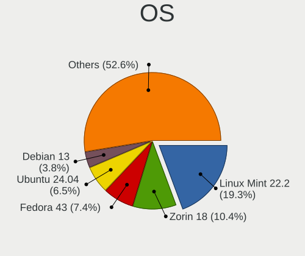

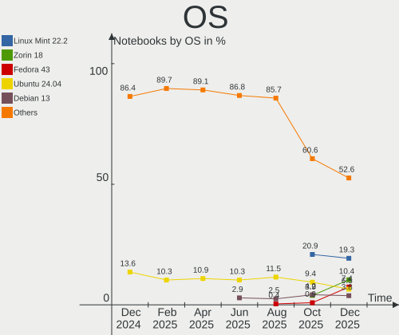

| Name                | Notebooks | Percent |
|---------------------|-----------|---------|
| Linux Mint 22.2     | 71        | 19.35%  |
| Zorin 18            | 38        | 10.35%  |
| Fedora 43           | 27        | 7.36%   |
| Ubuntu 24.04        | 24        | 6.54%   |
| Debian 13           | 14        | 3.81%   |
| LMDE 7              | 11        | 3%      |
| OpenMandriva 6.0    | 10        | 2.72%   |
| Bazzite 43          | 10        | 2.72%   |
| Arch Rolling        | 10        | 2.72%   |
| Ubuntu 25.10        | 8         | 2.18%   |
| OpenMandriva 25.90  | 8         | 2.18%   |
| OpenMandriva 24.12  | 7         | 1.91%   |
| Pop!_OS 24.04       | 6         | 1.63%   |
| Linux Mint 21.3     | 6         | 1.63%   |
| TUXEDO OS 24.04     | 5         | 1.36%   |
| Debian              | 5         | 1.36%   |
| Ubuntu 22.04        | 4         | 1.09%   |
| Manjaro             | 4         | 1.09%   |
| Linux Mint 22.1     | 4         | 1.09%   |
| Kubuntu 25.10       | 4         | 1.09%   |
| Kubuntu 24.04       | 4         | 1.09%   |
| Fedora 42           | 4         | 1.09%   |
| CachyOS Rolling     | 4         | 1.09%   |
| Bazzite 42          | 4         | 1.09%   |
| SteamOS 3.7.17      | 3         | 0.82%   |
| Pop!_OS 22.04       | 3         | 0.82%   |
| openSUSE Leap-16.0  | 3         | 0.82%   |
| OpenMandriva 25.11  | 3         | 0.82%   |
| MX 25               | 3         | 0.82%   |
| Linux Mint 22       | 3         | 0.82%   |
| KDE neon 24.04      | 3         | 0.82%   |
| EndeavourOS Rolling | 3         | 0.82%   |
| CachyOS             | 3         | 0.82%   |
| Zorin 17            | 2         | 0.54%   |
| Xubuntu 24.04       | 2         | 0.54%   |
| Ubuntu 20.04        | 2         | 0.54%   |
| NixOS 25.11         | 2         | 0.54%   |
| NixOS 25.05         | 2         | 0.54%   |
| Manjaro 25.1.0      | 2         | 0.54%   |
| Elementary 8        | 2         | 0.54%   |

OS Family
---------

OS without a version

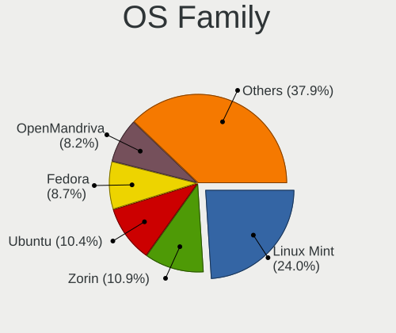

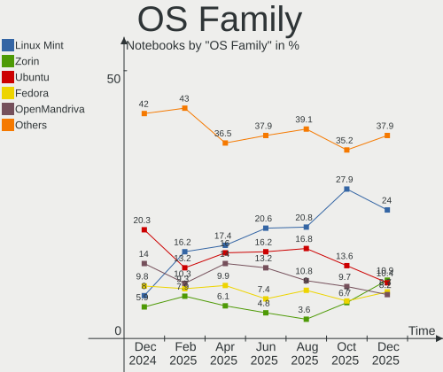

| Name             | Notebooks | Percent |
|------------------|-----------|---------|
| Linux Mint       | 88        | 23.98%  |
| Zorin            | 40        | 10.9%   |
| Ubuntu           | 38        | 10.35%  |
| Fedora           | 32        | 8.72%   |
| OpenMandriva     | 30        | 8.17%   |
| Debian           | 20        | 5.45%   |
| Bazzite          | 14        | 3.81%   |
| LMDE             | 11        | 3%      |
| Arch             | 10        | 2.72%   |
| Pop!_OS          | 9         | 2.45%   |
| Kubuntu          | 8         | 2.18%   |
| Manjaro          | 7         | 1.91%   |
| CachyOS          | 7         | 1.91%   |
| TUXEDO OS        | 5         | 1.36%   |
| openSUSE         | 5         | 1.36%   |
| NixOS            | 5         | 1.36%   |
| MX               | 4         | 1.09%   |
| SteamOS          | 3         | 0.82%   |
| KDE neon         | 3         | 0.82%   |
| EndeavourOS      | 3         | 0.82%   |
| Xubuntu          | 2         | 0.54%   |
| Elementary       | 2         | 0.54%   |
| Aurora           | 2         | 0.54%   |
| Void Linux       | 1         | 0.27%   |
| Siduction        | 1         | 0.27%   |
| ROSA             | 1         | 0.27%   |
| RHEL             | 1         | 0.27%   |
| Q4OS             | 1         | 0.27%   |
| org.kde.Platform | 1         | 0.27%   |
| Nobara           | 1         | 0.27%   |
| Liya             | 1         | 0.27%   |
| Kalpa-desktop    | 1         | 0.27%   |
| Gentoo           | 1         | 0.27%   |
| Garuda Linux     | 1         | 0.27%   |
| Feren OS         | 1         | 0.27%   |
| Dts-distro       | 1         | 0.27%   |
| CentOS           | 1         | 0.27%   |
| BigLinux         | 1         | 0.27%   |
| Athenaos         | 1         | 0.27%   |
| Artix            | 1         | 0.27%   |

Kernel
------

Version of the Linux kernel

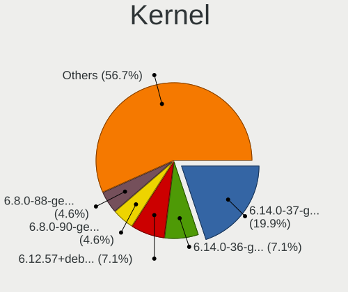

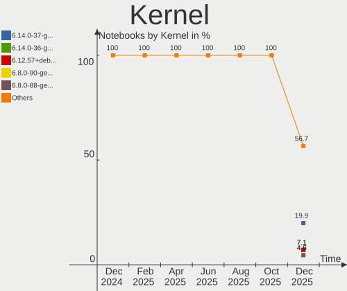

| Version                                     | Notebooks | Percent |
|---------------------------------------------|-----------|---------|
| 6.14.0-37-generic                           | 73        | 19.89%  |
| 6.14.0-36-generic                           | 26        | 7.08%   |
| 6.12.57+deb13-amd64                         | 26        | 7.08%   |
| 6.8.0-90-generic                            | 17        | 4.63%   |
| 6.8.0-88-generic                            | 17        | 4.63%   |
| 6.14.2-desktop-3omv2590                     | 17        | 4.63%   |
| 6.17.9-arch1-1                              | 10        | 2.72%   |
| 6.17.9-300.fc43.x86_64                      | 10        | 2.72%   |
| 6.17.12-300.fc43.x86_64                     | 9         | 2.45%   |
| 6.8.0-87-generic                            | 7         | 1.91%   |
| 6.17.7-ba20.fc43.x86_64                     | 7         | 1.91%   |
| 6.12.1-desktop-1omv2490                     | 7         | 1.91%   |
| 6.17.0-8-generic                            | 6         | 1.63%   |
| 6.17.9-76061709-generic                     | 4         | 1.09%   |
| 6.17.4-76061704-generic                     | 4         | 1.09%   |
| 6.14.0-33-generic                           | 4         | 1.09%   |
| 6.14.0-29-generic                           | 4         | 1.09%   |
| 5.15.0-164-generic                          | 4         | 1.09%   |
| 6.17.8-300.fc43.x86_64                      | 3         | 0.82%   |
| 6.17.7-ba19.fc43.x86_64                     | 3         | 0.82%   |
| 6.17.11-300.fc43.x86_64                     | 3         | 0.82%   |
| 6.16.4-116.bazzite.fc42.x86_64              | 3         | 0.82%   |
| 6.14.0-117036-tuxedo                        | 3         | 0.82%   |
| 6.11.11-valve24-2-neptune-611-gfd0dd251480d | 3         | 0.82%   |
| 6.17.9-2-cachyos                            | 2         | 0.54%   |
| 6.17.9                                      | 2         | 0.54%   |
| 6.17.7-desktop-1omv2590                     | 2         | 0.54%   |
| 6.17.7-300.fc43.x86_64                      | 2         | 0.54%   |
| 6.17.12-1-MANJARO                           | 2         | 0.54%   |
| 6.17.0-7-generic                            | 2         | 0.54%   |
| 6.17.0-5-generic                            | 2         | 0.54%   |
| 6.12.48-1-MANJARO                           | 2         | 0.54%   |
| 6.12.48+deb13-amd64                         | 2         | 0.54%   |
| 6.12.0-160000.7-default                     | 2         | 0.54%   |
| 6.8.0-90-lowlatency                         | 1         | 0.27%   |
| 6.8.0-86-generic                            | 1         | 0.27%   |
| 6.8.0-85-generic                            | 1         | 0.27%   |
| 6.8.0-83-generic                            | 1         | 0.27%   |
| 6.8.0-79-generic                            | 1         | 0.27%   |
| 6.8.0-52-generic                            | 1         | 0.27%   |

Kernel Family
-------------

Linux kernel without a distro release

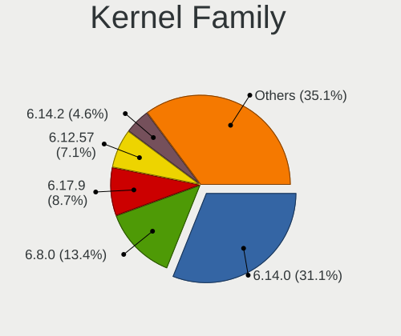

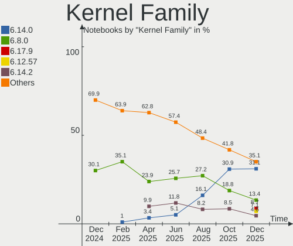

| Version | Notebooks | Percent |
|---------|-----------|---------|
| 6.14.0  | 114       | 31.06%  |
| 6.8.0   | 49        | 13.35%  |
| 6.17.9  | 32        | 8.72%   |
| 6.12.57 | 26        | 7.08%   |
| 6.14.2  | 17        | 4.63%   |
| 6.17.7  | 15        | 4.09%   |
| 6.17.12 | 12        | 3.27%   |
| 6.17.0  | 11        | 3%      |
| 6.17.8  | 9         | 2.45%   |
| 6.12.1  | 7         | 1.91%   |
| 5.15.0  | 7         | 1.91%   |
| 6.18.2  | 6         | 1.63%   |
| 6.18.0  | 6         | 1.63%   |
| 6.18.1  | 5         | 1.36%   |
| 6.17.4  | 5         | 1.36%   |
| 6.17.11 | 5         | 1.36%   |
| 6.12.0  | 5         | 1.36%   |
| 6.16.4  | 4         | 1.09%   |
| 6.12.48 | 4         | 1.09%   |
| 6.11.11 | 3         | 0.82%   |
| 5.4.0   | 3         | 0.82%   |
| 6.12.61 | 2         | 0.54%   |
| 6.1.0   | 2         | 0.54%   |
| 6.7.4   | 1         | 0.27%   |
| 6.6.21  | 1         | 0.27%   |
| 6.4.11  | 1         | 0.27%   |
| 6.4.0   | 1         | 0.27%   |
| 6.17.5  | 1         | 0.27%   |
| 6.17.13 | 1         | 0.27%   |
| 6.17.10 | 1         | 0.27%   |
| 6.17.1  | 1         | 0.27%   |
| 6.16.3  | 1         | 0.27%   |
| 6.16.12 | 1         | 0.27%   |
| 6.12.63 | 1         | 0.27%   |
| 6.12.62 | 1         | 0.27%   |
| 6.12.60 | 1         | 0.27%   |
| 6.12.58 | 1         | 0.27%   |
| 6.12.47 | 1         | 0.27%   |
| 6.12.3  | 1         | 0.27%   |
| 6.11.0  | 1         | 0.27%   |

Kernel Major Ver.
-----------------

Linux kernel major version

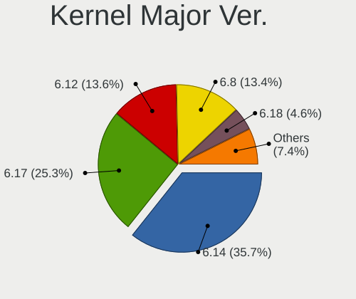

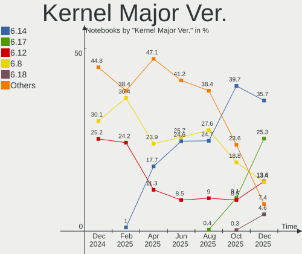

| Version | Notebooks | Percent |
|---------|-----------|---------|
| 6.14    | 131       | 35.69%  |
| 6.17    | 93        | 25.34%  |
| 6.12    | 50        | 13.62%  |
| 6.8     | 49        | 13.35%  |
| 6.18    | 17        | 4.63%   |
| 5.15    | 8         | 2.18%   |
| 6.16    | 6         | 1.63%   |
| 6.11    | 4         | 1.09%   |
| 5.4     | 3         | 0.82%   |
| 6.4     | 2         | 0.54%   |
| 6.1     | 2         | 0.54%   |
| 6.7     | 1         | 0.27%   |
| 6.6     | 1         | 0.27%   |

Arch
----

OS architecture (x86_64, i586, etc.)

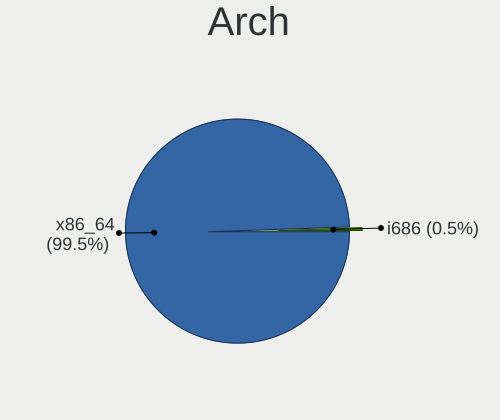

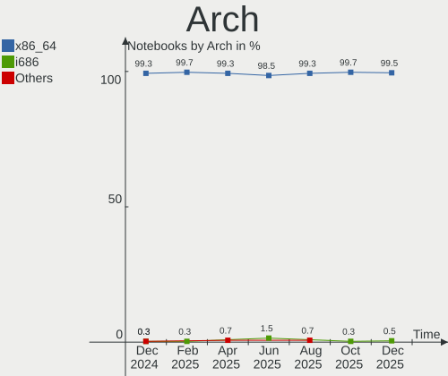

| Name   | Notebooks | Percent |
|--------|-----------|---------|
| x86_64 | 365       | 99.46%  |
| i686   | 2         | 0.54%   |

DE
--

Desktop Environment

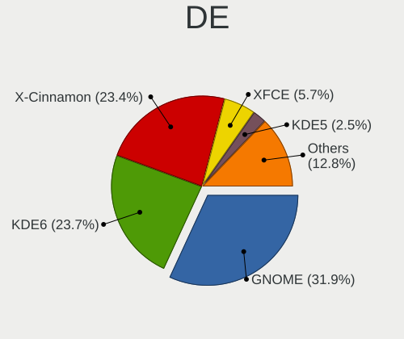

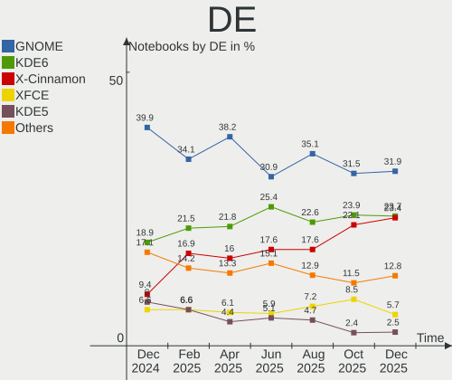

| Name          | Notebooks | Percent |
|---------------|-----------|---------|
| GNOME         | 117       | 31.88%  |
| KDE6          | 87        | 23.71%  |
| X-Cinnamon    | 86        | 23.43%  |
| XFCE          | 21        | 5.72%   |
| KDE5          | 9         | 2.45%   |
| KDE           | 8         | 2.18%   |
| MATE          | 7         | 1.91%   |
| Unknown       | 7         | 1.91%   |
| COSMIC        | 6         | 1.63%   |
| sway          | 3         | 0.82%   |
| LXQt          | 3         | 0.82%   |
| Cinnamon      | 3         | 0.82%   |
| Pantheon      | 2         | 0.54%   |
| Hyprland      | 2         | 0.54%   |
| Budgie        | 2         | 0.54%   |
| TDE:          | 1         | 0.27%   |
| niri          | 1         | 0.27%   |
| KDE4          | 1         | 0.27%   |
| GNOME Classic | 1         | 0.27%   |

Display Server
--------------

X11 or Wayland

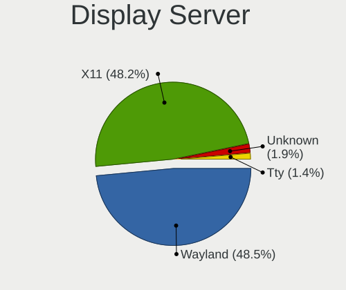

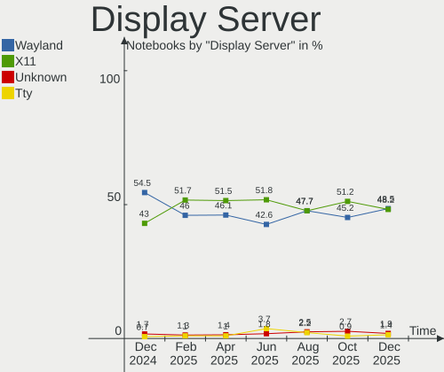

| Name    | Notebooks | Percent |
|---------|-----------|---------|
| Wayland | 178       | 48.5%   |
| X11     | 177       | 48.23%  |
| Unknown | 7         | 1.91%   |
| Tty     | 5         | 1.36%   |

Display Manager
---------------

SDDM, LightDM, etc.

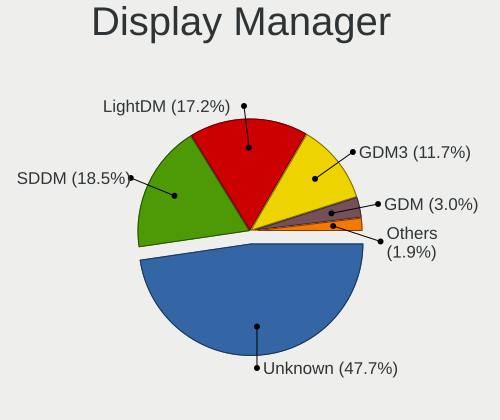

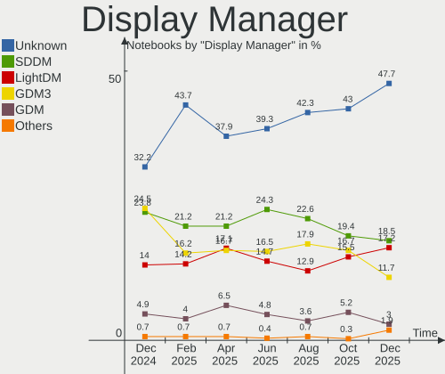

| Name           | Notebooks | Percent |
|----------------|-----------|---------|
| Unknown        | 175       | 47.68%  |
| SDDM           | 68        | 18.53%  |
| LightDM        | 63        | 17.17%  |
| GDM3           | 43        | 11.72%  |
| GDM            | 11        | 3%      |
| GREETD         | 3         | 0.82%   |
| COSMIC-GREETER | 3         | 0.82%   |
| TDM            | 1         | 0.27%   |

OS Lang
-------

Language

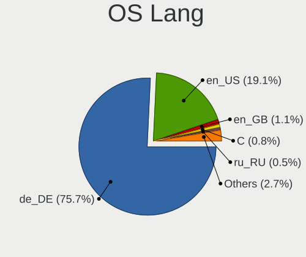

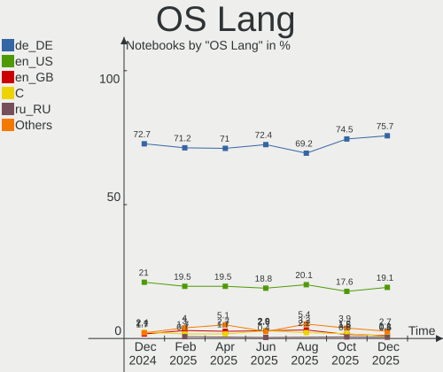

| Lang    | Notebooks | Percent |
|---------|-----------|---------|
| de_DE   | 278       | 75.75%  |
| en_US   | 70        | 19.07%  |
| en_GB   | 4         | 1.09%   |
| C       | 3         | 0.82%   |
| ru_RU   | 2         | 0.54%   |
| de_AT   | 2         | 0.54%   |
| Unknown | 2         | 0.54%   |
| POSIX   | 1         | 0.27%   |
| fr_FR   | 1         | 0.27%   |
| es_ES   | 1         | 0.27%   |
| en_DK   | 1         | 0.27%   |
| en_CA   | 1         | 0.27%   |
| C.UTF8  | 1         | 0.27%   |

Boot Mode
---------

EFI or BIOS

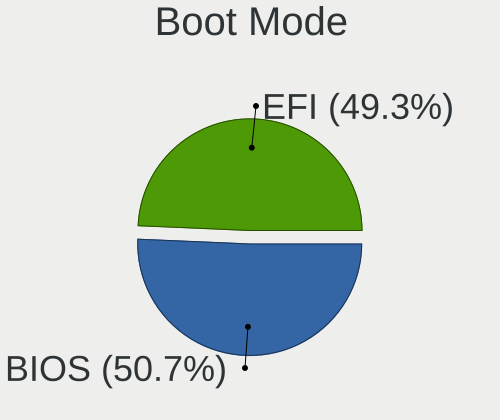

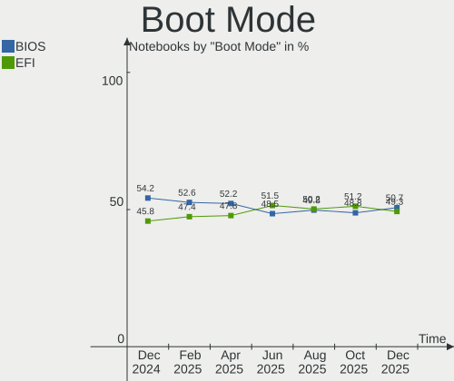

| Mode | Notebooks | Percent |
|------|-----------|---------|
| BIOS | 186       | 50.68%  |
| EFI  | 181       | 49.32%  |

Filesystem
----------

Type of filesystem

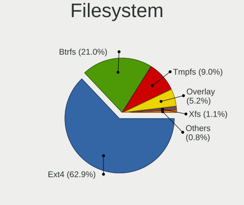

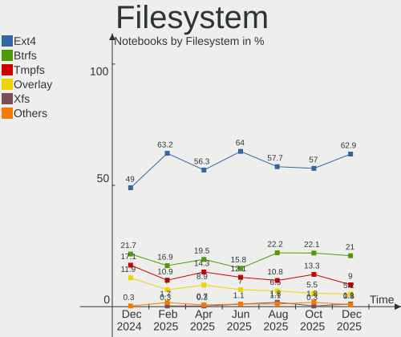

| Type     | Notebooks | Percent |
|----------|-----------|---------|
| Ext4     | 231       | 62.94%  |
| Btrfs    | 77        | 20.98%  |
| Tmpfs    | 33        | 8.99%   |
| Overlay  | 19        | 5.18%   |
| Xfs      | 4         | 1.09%   |
| Zfs      | 1         | 0.27%   |
| F2fs     | 1         | 0.27%   |
| Bcachefs | 1         | 0.27%   |

Part. scheme
------------

Scheme of partitioning

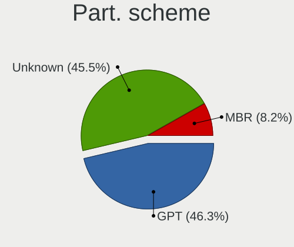

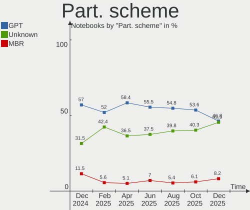

| Type    | Notebooks | Percent |
|---------|-----------|---------|
| GPT     | 170       | 46.32%  |
| Unknown | 167       | 45.5%   |
| MBR     | 30        | 8.17%   |

Dual Boot with Linux/BSD
------------------------

Hosting more than one Linux/BSD

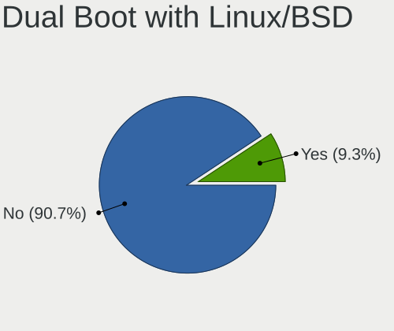

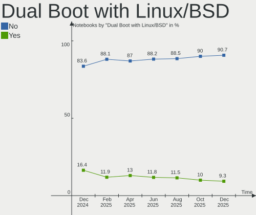

| Dual boot | Notebooks | Percent |
|-----------|-----------|---------|
| No        | 333       | 90.74%  |
| Yes       | 34        | 9.26%   |

Dual Boot (Win)
---------------

Hosting Linux and Windows

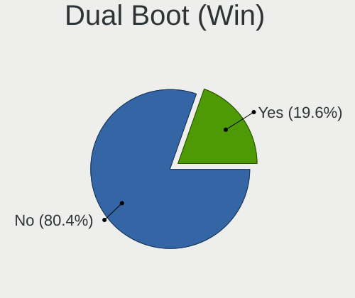

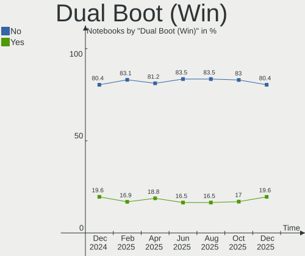

| Dual boot | Notebooks | Percent |
|-----------|-----------|---------|
| No        | 295       | 80.38%  |
| Yes       | 72        | 19.62%  |

Board
-----

Vendor
------

Motherboard manufacturer

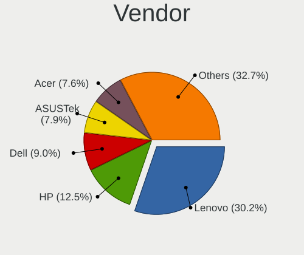

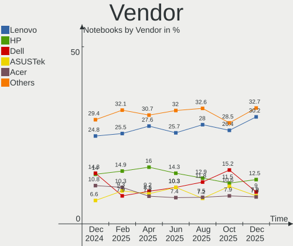

| Name                | Notebooks | Percent |
|---------------------|-----------|---------|
| Lenovo              | 111       | 30.25%  |
| Hewlett-Packard     | 46        | 12.53%  |
| Dell                | 33        | 8.99%   |
| ASUSTek Computer    | 29        | 7.9%    |
| Acer                | 28        | 7.63%   |
| Apple               | 19        | 5.18%   |
| Medion              | 16        | 4.36%   |
| Fujitsu             | 11        | 3%      |
| TUXEDO              | 8         | 2.18%   |
| MSI                 | 7         | 1.91%   |
| Gigabyte Technology | 7         | 1.91%   |
| Toshiba             | 6         | 1.63%   |
| Notebook            | 5         | 1.36%   |
| Unknown             | 5         | 1.36%   |
| Samsung Electronics | 4         | 1.09%   |
| HUAWEI              | 4         | 1.09%   |
| Sony                | 3         | 0.82%   |
| LG Electronics      | 3         | 0.82%   |
| Fujitsu Siemens     | 3         | 0.82%   |
| Wortmann AG         | 2         | 0.54%   |
| Valve               | 2         | 0.54%   |
| Razer               | 2         | 0.54%   |
| Packard Bell        | 2         | 0.54%   |
| Google              | 2         | 0.54%   |
| TrekStor            | 1         | 0.27%   |
| TongFang            | 1         | 0.27%   |
| Timi                | 1         | 0.27%   |
| Standard            | 1         | 0.27%   |
| Schenker            | 1         | 0.27%   |
| LETSUNG             | 1         | 0.27%   |
| Framework           | 1         | 0.27%   |
| Chuwi               | 1         | 0.27%   |
| Alienware           | 1         | 0.27%   |

Model
-----

Motherboard model

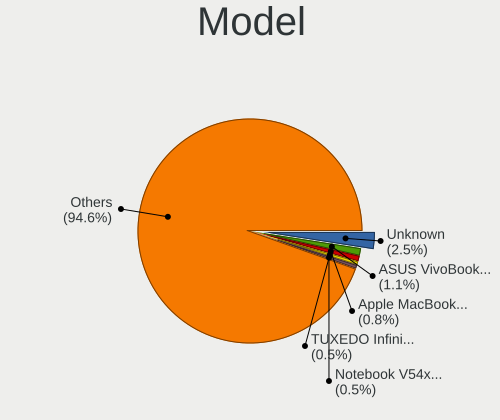

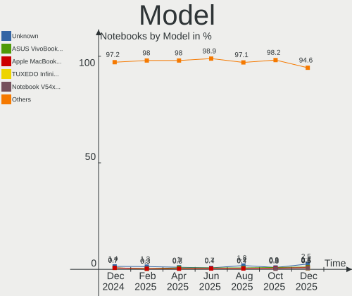

| Name                                     | Notebooks | Percent |
|------------------------------------------|-----------|---------|
| Unknown                                  | 9         | 2.45%   |
| ASUS VivoBook_ASUSLaptop M1605YA_M1605YA | 4         | 1.09%   |
| Apple MacBookAir7,2                      | 3         | 0.82%   |
| TUXEDO InfinityBook Pro AMD Gen10        | 2         | 0.54%   |
| Notebook V54x_6x_TU                      | 2         | 0.54%   |
| Lenovo Yoga Pro 7 14APH8 82Y8            | 2         | 0.54%   |
| Lenovo ThinkPad E15 Gen 2 20T8000TGE     | 2         | 0.54%   |
| Lenovo Legion 5 15IRX10 83LY             | 2         | 0.54%   |
| Lenovo IdeaPad 5 15ARE05 81YQ            | 2         | 0.54%   |
| HUAWEI HKD-WXX                           | 2         | 0.54%   |
| HP EliteBook 8570p                       | 2         | 0.54%   |
| HP EliteBook 8460p                       | 2         | 0.54%   |
| HP 350 G1                                | 2         | 0.54%   |
| HP 255 15.6 inch G10                     | 2         | 0.54%   |
| Fujitsu LIFEBOOK U758                    | 2         | 0.54%   |
| Fujitsu LIFEBOOK U7511                   | 2         | 0.54%   |
| Fujitsu LIFEBOOK E756                    | 2         | 0.54%   |
| Dell XPS 13 9360                         | 2         | 0.54%   |
| ASUS ROG Strix G713PV_G713PV             | 2         | 0.54%   |
| ASUS N73SV                               | 2         | 0.54%   |
| Apple MacBookPro9,2                      | 2         | 0.54%   |
| Apple MacBookPro9,1                      | 2         | 0.54%   |
| Apple MacBookPro8,1                      | 2         | 0.54%   |
| Apple MacBookPro15,2                     | 2         | 0.54%   |
| Apple MacBookAir6,2                      | 2         | 0.54%   |
| Acer Aspire E1-572G                      | 2         | 0.54%   |
| Wortmann AG TERRA_MOBILE_1749            | 1         | 0.27%   |
| Wortmann AG 1220794_1470489              | 1         | 0.27%   |
| Valve Jupiter                            | 1         | 0.27%   |
| Valve Galileo                            | 1         | 0.27%   |
| TUXEDO Stellaris Slim 15 Intel Gen6      | 1         | 0.27%   |
| TUXEDO Stellaris Intel Gen4              | 1         | 0.27%   |
| TUXEDO Pulse 15 Gen1                     | 1         | 0.27%   |
| TUXEDO InfinityBook Pro Intel Gen10      | 1         | 0.27%   |
| TUXEDO InfinityBook Pro 14 Gen6          | 1         | 0.27%   |
| TrekStor Surfbook A13B                   | 1         | 0.27%   |
| Toshiba Satellite Pro C70-B              | 1         | 0.27%   |
| Toshiba Satellite L70-A                  | 1         | 0.27%   |
| Toshiba Satellite L350                   | 1         | 0.27%   |
| Toshiba Satellite C670-12E               | 1         | 0.27%   |

Model Family
------------

Motherboard model prefix

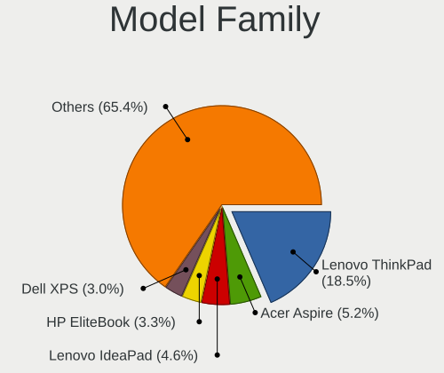

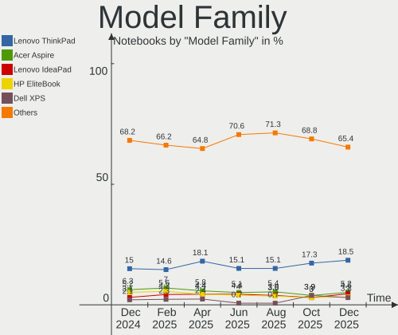

| Name                    | Notebooks | Percent |
|-------------------------|-----------|---------|
| Lenovo ThinkPad         | 68        | 18.53%  |
| Acer Aspire             | 19        | 5.18%   |
| Lenovo IdeaPad          | 17        | 4.63%   |
| HP EliteBook            | 12        | 3.27%   |
| Dell XPS                | 11        | 3%      |
| Fujitsu LIFEBOOK        | 10        | 2.72%   |
| Dell Latitude           | 10        | 2.72%   |
| ASUS VivoBook           | 10        | 2.72%   |
| Unknown                 | 9         | 2.45%   |
| Toshiba Satellite       | 6         | 1.63%   |
| Lenovo Legion           | 6         | 1.63%   |
| HP ProBook              | 6         | 1.63%   |
| Dell Inspiron           | 6         | 1.63%   |
| TUXEDO InfinityBook     | 4         | 1.09%   |
| Lenovo Yoga             | 4         | 1.09%   |
| HP Pavilion             | 4         | 1.09%   |
| HP Laptop               | 4         | 1.09%   |
| HP Compaq               | 4         | 1.09%   |
| Apple MacBookPro9       | 4         | 1.09%   |
| Medion Akoya            | 3         | 0.82%   |
| Lenovo V15              | 3         | 0.82%   |
| Lenovo ThinkBook        | 3         | 0.82%   |
| HP 350                  | 3         | 0.82%   |
| HP 255                  | 3         | 0.82%   |
| HP 250                  | 3         | 0.82%   |
| Gigabyte B550           | 3         | 0.82%   |
| Dell Vostro             | 3         | 0.82%   |
| Dell Precision          | 3         | 0.82%   |
| Apple MacBookPro15      | 3         | 0.82%   |
| Apple MacBookAir7       | 3         | 0.82%   |
| Acer Nitro              | 3         | 0.82%   |
| TUXEDO Stellaris        | 2         | 0.54%   |
| Razer Blade             | 2         | 0.54%   |
| Packard Bell EasyNote   | 2         | 0.54%   |
| Notebook V54x           | 2         | 0.54%   |
| HUAWEI HKD-WXX          | 2         | 0.54%   |
| HP OmniBook             | 2         | 0.54%   |
| HP OMEN                 | 2         | 0.54%   |
| Fujitsu Siemens ESPRIMO | 2         | 0.54%   |
| ASUS ROG                | 2         | 0.54%   |

MFG Year
--------

Motherboard manufacture year

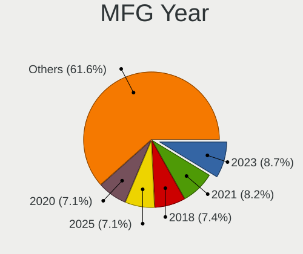

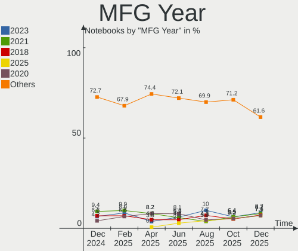

| Year | Notebooks | Percent |
|------|-----------|---------|
| 2023 | 32        | 8.72%   |
| 2021 | 30        | 8.17%   |
| 2018 | 27        | 7.36%   |
| 2025 | 26        | 7.08%   |
| 2020 | 26        | 7.08%   |
| 2012 | 26        | 7.08%   |
| 2011 | 24        | 6.54%   |
| 2013 | 23        | 6.27%   |
| 2019 | 22        | 5.99%   |
| 2014 | 21        | 5.72%   |
| 2017 | 16        | 4.36%   |
| 2024 | 14        | 3.81%   |
| 2022 | 14        | 3.81%   |
| 2016 | 14        | 3.81%   |
| 2010 | 13        | 3.54%   |
| 2008 | 13        | 3.54%   |
| 2015 | 9         | 2.45%   |
| 2009 | 8         | 2.18%   |
| 2006 | 5         | 1.36%   |
| 2007 | 4         | 1.09%   |

Form Factor
-----------

Physical design of the computer

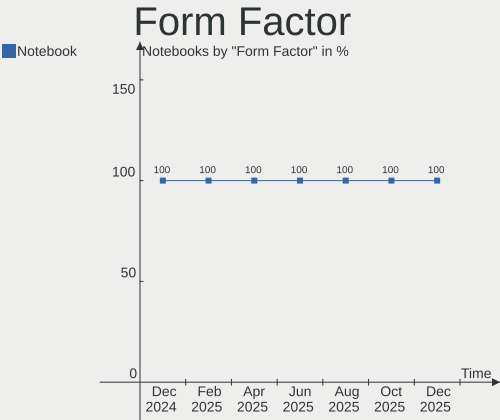

| Name     | Notebooks | Percent |
|----------|-----------|---------|
| Notebook | 367       | 100%    |

Secure Boot
-----------

Enabled or disabled

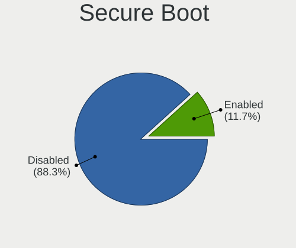

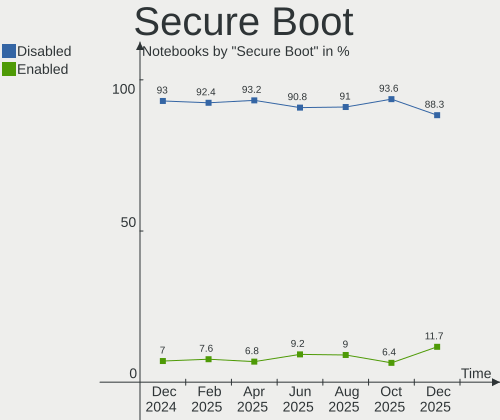

| State    | Notebooks | Percent |
|----------|-----------|---------|
| Disabled | 324       | 88.28%  |
| Enabled  | 43        | 11.72%  |

Coreboot
--------

Have coreboot on board

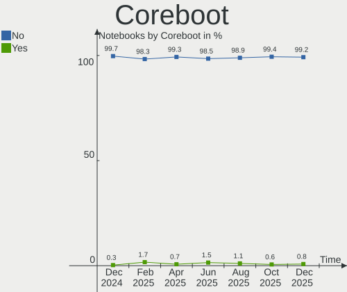

| Used | Notebooks | Percent |
|------|-----------|---------|
| No   | 364       | 99.18%  |
| Yes  | 3         | 0.82%   |

RAM Size
--------

Total RAM memory

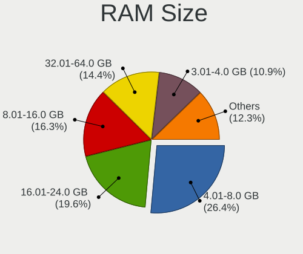

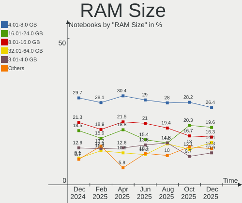

| Size in GB  | Notebooks | Percent |
|-------------|-----------|---------|
| 4.01-8.0    | 97        | 26.43%  |
| 16.01-24.0  | 72        | 19.62%  |
| 8.01-16.0   | 60        | 16.35%  |
| 32.01-64.0  | 53        | 14.44%  |
| 3.01-4.0    | 40        | 10.9%   |
| 24.01-32.0  | 19        | 5.18%   |
| 64.01-256.0 | 17        | 4.63%   |
| 2.01-3.0    | 6         | 1.63%   |
| 1.01-2.0    | 3         | 0.82%   |

RAM Used
--------

Used RAM memory

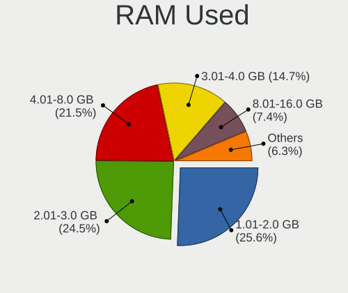

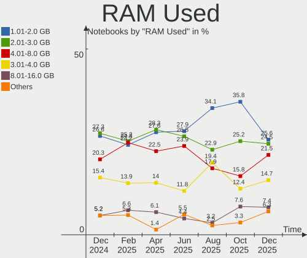

| Used GB    | Notebooks | Percent |
|------------|-----------|---------|
| 1.01-2.0   | 94        | 25.61%  |
| 2.01-3.0   | 90        | 24.52%  |
| 4.01-8.0   | 79        | 21.53%  |
| 3.01-4.0   | 54        | 14.71%  |
| 8.01-16.0  | 27        | 7.36%   |
| 0.51-1.0   | 12        | 3.27%   |
| 16.01-24.0 | 4         | 1.09%   |
| 24.01-32.0 | 3         | 0.82%   |
| 32.01-64.0 | 2         | 0.54%   |
| 0.01-0.5   | 2         | 0.54%   |

Total Drives
------------

Number of drives on board

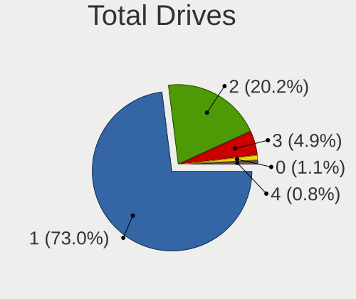

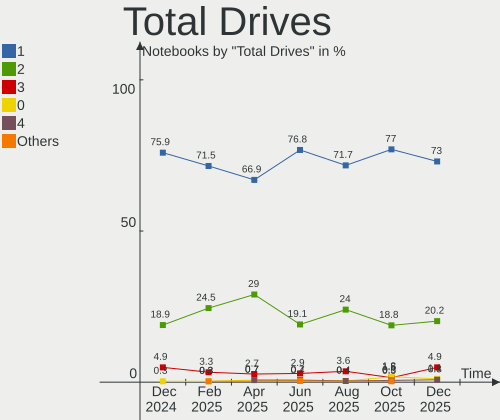

| Drives | Notebooks | Percent |
|--------|-----------|---------|
| 1      | 268       | 73.02%  |
| 2      | 74        | 20.16%  |
| 3      | 18        | 4.9%    |
| 0      | 4         | 1.09%   |
| 4      | 3         | 0.82%   |

Has CD-ROM
----------

Has CD-ROM on board

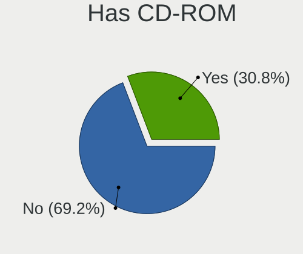

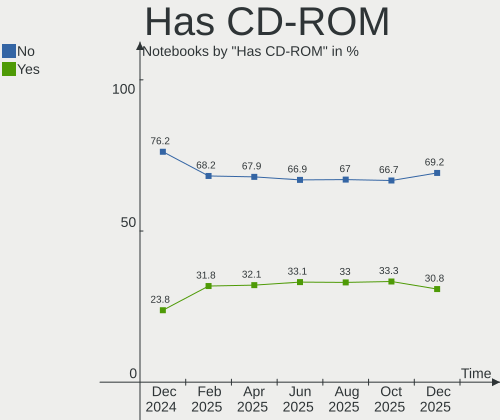

| Presented | Notebooks | Percent |
|-----------|-----------|---------|
| No        | 254       | 69.21%  |
| Yes       | 113       | 30.79%  |

Has Ethernet
------------

Has Ethernet on board

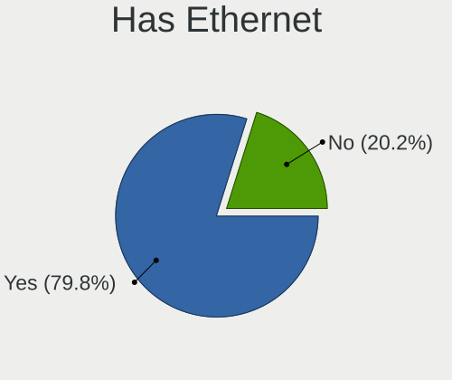

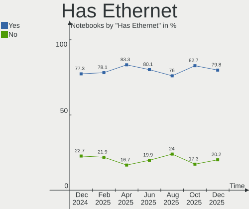

| Presented | Notebooks | Percent |
|-----------|-----------|---------|
| Yes       | 293       | 79.84%  |
| No        | 74        | 20.16%  |

Has WiFi
--------

Has WiFi module

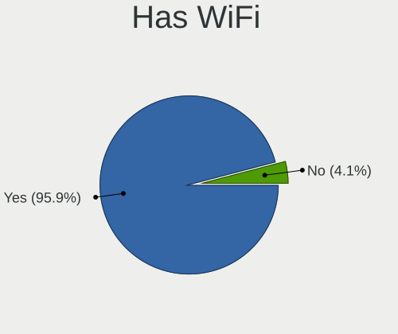

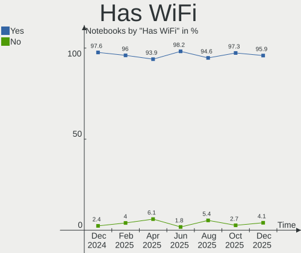

| Presented | Notebooks | Percent |
|-----------|-----------|---------|
| Yes       | 352       | 95.91%  |
| No        | 15        | 4.09%   |

Has Bluetooth
-------------

Has Bluetooth module

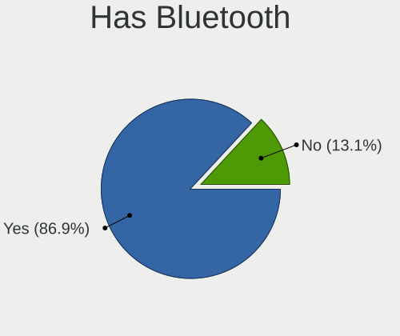

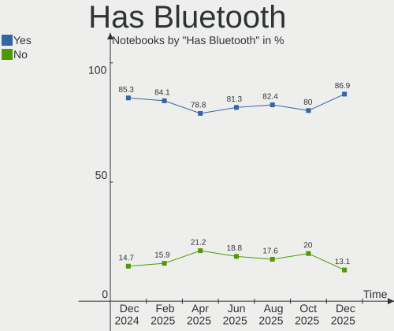

| Presented | Notebooks | Percent |
|-----------|-----------|---------|
| Yes       | 319       | 86.92%  |
| No        | 48        | 13.08%  |

Location
--------

Country
-------

Geographic location (country)

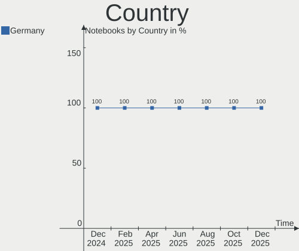

| Country | Notebooks | Percent |
|---------|-----------|---------|
| Germany | 367       | 100%    |

City
----

Geographic location (city)

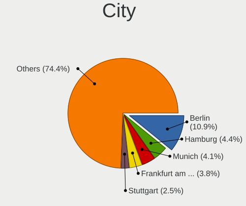

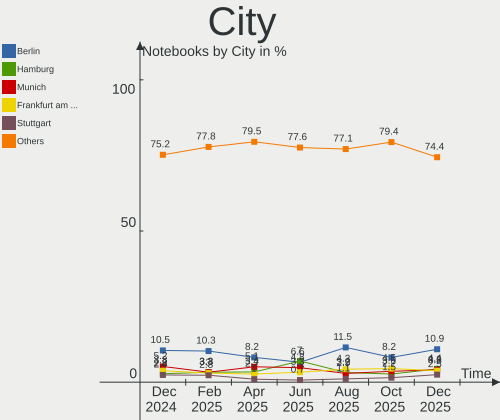

| City                  | Notebooks | Percent |
|-----------------------|-----------|---------|
| Berlin                | 40        | 10.9%   |
| Hamburg               | 16        | 4.36%   |
| Munich                | 15        | 4.09%   |
| Frankfurt am Main     | 14        | 3.81%   |
| Stuttgart             | 9         | 2.45%   |
| Leipzig               | 6         | 1.63%   |
| Hanover               | 6         | 1.63%   |
| Essen                 | 6         | 1.63%   |
| Dresden               | 5         | 1.36%   |
| Traunstein            | 4         | 1.09%   |
| Düsseldorf           | 4         | 1.09%   |
| Dortmund              | 4         | 1.09%   |
| Wuppertal             | 3         | 0.82%   |
| Tiefenbach            | 3         | 0.82%   |
| Minden                | 3         | 0.82%   |
| Kassel                | 3         | 0.82%   |
| Jena                  | 3         | 0.82%   |
| Esslingen am Neckar   | 3         | 0.82%   |
| Erlangen              | 3         | 0.82%   |
| Duisburg              | 3         | 0.82%   |
| Cologne               | 3         | 0.82%   |
| Bonn                  | 3         | 0.82%   |
| Bochum                | 3         | 0.82%   |
| Augsburg              | 3         | 0.82%   |
| Versmold              | 2         | 0.54%   |
| Thomm                 | 2         | 0.54%   |
| Siegen                | 2         | 0.54%   |
| Schorndorf            | 2         | 0.54%   |
| Schleusingen          | 2         | 0.54%   |
| Potsdam               | 2         | 0.54%   |
| Osnabrück            | 2         | 0.54%   |
| Nuremberg             | 2         | 0.54%   |
| Mönchengladbach      | 2         | 0.54%   |
| Mannheim              | 2         | 0.54%   |
| Mainz                 | 2         | 0.54%   |
| Ludwigshafen am Rhein | 2         | 0.54%   |
| Lübeck               | 2         | 0.54%   |
| Leverkusen            | 2         | 0.54%   |
| Landshut              | 2         | 0.54%   |
| Koenigswinter         | 2         | 0.54%   |

Drives
------

Drive Vendor
------------

Hard drive vendors

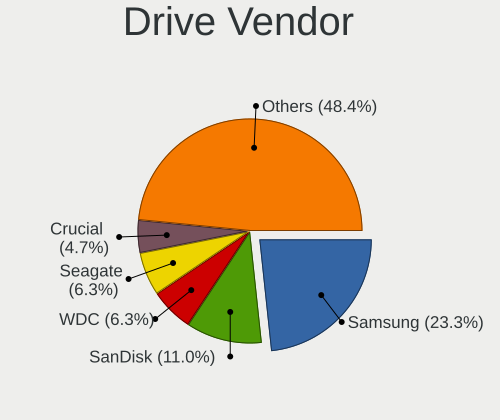

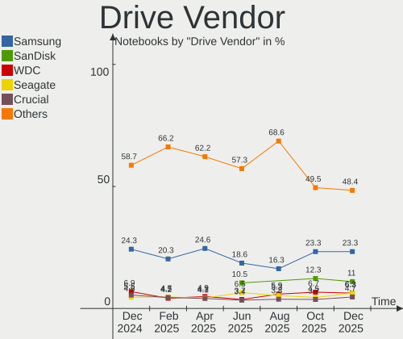

| Vendor                         | Notebooks | Drives | Percent |
|--------------------------------|-----------|--------|---------|
| Samsung Electronics            | 104       | 124    | 23.32%  |
| SanDisk                        | 49        | 51     | 10.99%  |
| WDC                            | 28        | 30     | 6.28%   |
| Seagate                        | 28        | 28     | 6.28%   |
| Crucial                        | 21        | 21     | 4.71%   |
| Toshiba                        | 17        | 18     | 3.81%   |
| Unknown                        | 15        | 15     | 3.36%   |
| SK hynix                       | 15        | 15     | 3.36%   |
| Micron Technology              | 14        | 14     | 3.14%   |
| Micron/Crucial Technology      | 13        | 13     | 2.91%   |
| KIOXIA                         | 13        | 14     | 2.91%   |
| Intel                          | 13        | 13     | 2.91%   |
| Kingston                       | 12        | 12     | 2.69%   |
| Intenso                        | 9         | 10     | 2.02%   |
| Apple                          | 9         | 9      | 2.02%   |
| Phison Electronics             | 6         | 7      | 1.35%   |
| Kingston Technology Company    | 6         | 7      | 1.35%   |
| HGST                           | 6         | 6      | 1.35%   |
| KIOXIA-EXCERIA                 | 4         | 4      | 0.9%    |
| Transcend                      | 3         | 3      | 0.67%   |
| Silicon Motion                 | 3         | 3      | 0.67%   |
| Netac                          | 3         | 3      | 0.67%   |
| Hitachi                        | 3         | 3      | 0.67%   |
| Fujitsu                        | 3         | 3      | 0.67%   |
| China                          | 3         | 3      | 0.67%   |
| ASMT                           | 3         | 3      | 0.67%   |
| Verbatim                       | 2         | 2      | 0.45%   |
| SOLIDIGM                       | 2         | 2      | 0.45%   |
| Solid State Storage Technology | 2         | 2      | 0.45%   |
| MAXIO Technology (Hangzhou)    | 2         | 2      | 0.45%   |
| Lexar                          | 2         | 2      | 0.45%   |
| KingSpec                       | 2         | 2      | 0.45%   |
| INNOVATION IT                  | 2         | 2      | 0.45%   |
| A-DATA Technology              | 2         | 2      | 0.45%   |
| Vi550                          | 1         | 1      | 0.22%   |
| ValueTech                      | 1         | 2      | 0.22%   |
| USB                            | 1         | 1      | 0.22%   |
| Union Memory                   | 1         | 1      | 0.22%   |
| TCSUNBOW                       | 1         | 1      | 0.22%   |
| SSSTC                          | 1         | 1      | 0.22%   |

Drive Model
-----------

Hard drive models

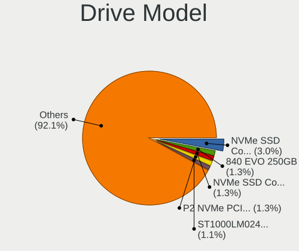

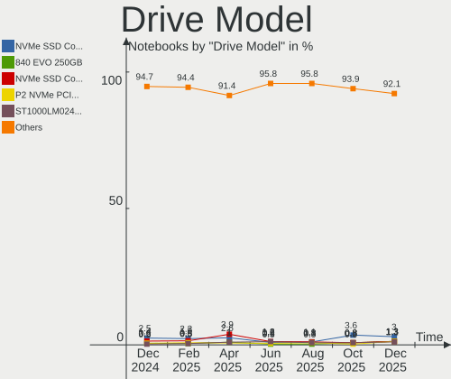

| Model                                              | Notebooks | Percent |
|----------------------------------------------------|-----------|---------|
| Samsung NVMe SSD Controller SM981/PM981/PM983 1TB  | 14        | 3%      |
| Samsung SSD 840 EVO 250GB                          | 6         | 1.28%   |
| Samsung NVMe SSD Controller PM9A1/PM9A3/980PRO 1TB | 6         | 1.28%   |
| Micron/Crucial P2 NVMe PCIe SSD 2TB                | 6         | 1.28%   |
| Seagate ST1000LM024 HN-M101MBB 1TB                 | 5         | 1.07%   |
| Samsung SSD 850 EVO 500GB                          | 5         | 1.07%   |
| Unknown MMC Card  128GB                            | 4         | 0.86%   |
| Seagate ST500LM000-1EJ162 500GB                    | 4         | 0.86%   |
| Samsung SSD 980 1TB                                | 4         | 0.86%   |
| Crucial CT500MX500SSD1 500GB                       | 4         | 0.86%   |
| Unknown MMC Card  64GB                             | 3         | 0.64%   |
| Sandisk WD Black SN750 / PC SN730 NVMe SSD 500GB   | 3         | 0.64%   |
| SanDisk SSD PLUS 480GB                             | 3         | 0.64%   |
| SanDisk SSD PLUS 1000GB                            | 3         | 0.64%   |
| Samsung SSD 870 EVO 1TB                            | 3         | 0.64%   |
| Samsung MZAL81T0HFLB-00BL2 1TB                     | 3         | 0.64%   |
| Micron/Crucial CT2000P5PSSD8 2TB                   | 3         | 0.64%   |
| Apple SSD SM0128G 121GB                            | 3         | 0.64%   |
| WDC WDS500G2B0A-00SM50 500GB                       | 2         | 0.43%   |
| Verbatim Vi550 S3 1024GB                           | 2         | 0.43%   |
| Toshiba XG6 NVMe SSD Controller 1024GB             | 2         | 0.43%   |
| Toshiba MK2546GSX 250GB                            | 2         | 0.43%   |
| Toshiba BG3 NVMe SSD Controller 256GB              | 2         | 0.43%   |
| SK hynix SKHynix_HFS002TEJ9X162N 2TB               | 2         | 0.43%   |
| Silicon Motion PCIe-8 SSD 1TB                      | 2         | 0.43%   |
| Seagate ST500LM021-1KJ152 500GB                    | 2         | 0.43%   |
| Seagate ST2000LM015-2E8174 2TB                     | 2         | 0.43%   |
| Sandisk WD_BLACK SN770 2TB                         | 2         | 0.43%   |
| Sandisk WD PC SN740 SDDPMQD-512G-1101 512GB        | 2         | 0.43%   |
| Sandisk WD PC SN560 SDDPNQE-1T00-1102 1024GB       | 2         | 0.43%   |
| Sandisk WD Blue SN550 NVMe SSD 1024GB              | 2         | 0.43%   |
| Sandisk WD Black SN850 1TB                         | 2         | 0.43%   |
| SanDisk NVMe SSD Drive 1TB                         | 2         | 0.43%   |
| SanDisk Extreme 55AE 1TB SSD                       | 2         | 0.43%   |
| Samsung SSD 990 PRO 2TB                            | 2         | 0.43%   |
| Samsung SSD 990 PRO 1TB                            | 2         | 0.43%   |
| Samsung SSD 990 EVO Plus 1TB                       | 2         | 0.43%   |
| Samsung SSD 870 QVO 2TB                            | 2         | 0.43%   |
| Samsung SSD 870 QVO 1TB                            | 2         | 0.43%   |
| Samsung SSD 870 EVO 500GB                          | 2         | 0.43%   |

HDD Vendor
----------

Hard disk drive vendors

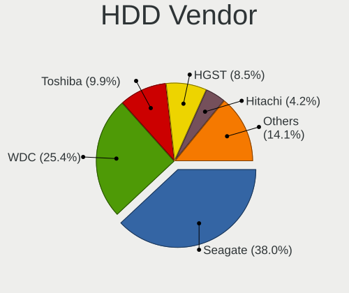

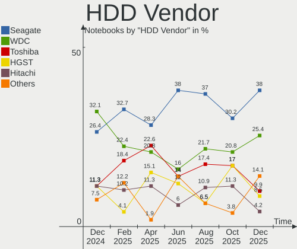

| Vendor              | Notebooks | Drives | Percent |
|---------------------|-----------|--------|---------|
| Seagate             | 27        | 27     | 38.03%  |
| WDC                 | 18        | 19     | 25.35%  |
| Toshiba             | 7         | 8      | 9.86%   |
| HGST                | 6         | 6      | 8.45%   |
| Hitachi             | 3         | 3      | 4.23%   |
| Fujitsu             | 3         | 3      | 4.23%   |
| Samsung Electronics | 2         | 2      | 2.82%   |
| ASMT                | 2         | 2      | 2.82%   |
| Unknown             | 1         | 1      | 1.41%   |
| KIOXIA              | 1         | 1      | 1.41%   |
| Intenso             | 1         | 1      | 1.41%   |

SSD Vendor
----------

Solid state drive vendors

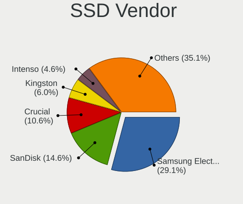

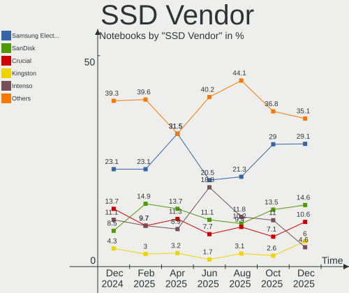

| Vendor              | Notebooks | Drives | Percent |
|---------------------|-----------|--------|---------|
| Samsung Electronics | 44        | 50     | 29.14%  |
| SanDisk             | 22        | 22     | 14.57%  |
| Crucial             | 16        | 16     | 10.6%   |
| Kingston            | 9         | 9      | 5.96%   |
| Intenso             | 7         | 8      | 4.64%   |
| Apple               | 6         | 6      | 3.97%   |
| WDC                 | 4         | 4      | 2.65%   |
| KIOXIA-EXCERIA      | 4         | 4      | 2.65%   |
| Transcend           | 3         | 3      | 1.99%   |
| Toshiba             | 3         | 3      | 1.99%   |
| Netac               | 3         | 3      | 1.99%   |
| Intel               | 3         | 3      | 1.99%   |
| China               | 3         | 3      | 1.99%   |
| Verbatim            | 2         | 2      | 1.32%   |
| KingSpec            | 2         | 2      | 1.32%   |
| Vi550               | 1         | 1      | 0.66%   |
| ValueTech           | 1         | 1      | 0.66%   |
| TCSUNBOW            | 1         | 1      | 0.66%   |
| SPCC                | 1         | 1      | 0.66%   |
| SK hynix            | 1         | 1      | 0.66%   |
| SD                  | 1         | 1      | 0.66%   |
| PNY                 | 1         | 1      | 0.66%   |
| Phison              | 1         | 1      | 0.66%   |
| LITEON              | 1         | 1      | 0.66%   |
| Lexar               | 1         | 1      | 0.66%   |
| Leven               | 1         | 1      | 0.66%   |
| INNOVATION IT       | 1         | 1      | 0.66%   |
| Hewlett-Packard     | 1         | 1      | 0.66%   |
| Emtec               | 1         | 1      | 0.66%   |
| CT1000MX            | 1         | 1      | 0.66%   |
| Colorful            | 1         | 1      | 0.66%   |
| ASMT                | 1         | 1      | 0.66%   |
| Apacer A            | 1         | 1      | 0.66%   |
| A-DATA Technology   | 1         | 1      | 0.66%   |
| Unknown             | 1         | 1      | 0.66%   |

Drive Kind
----------

HDD or SSD

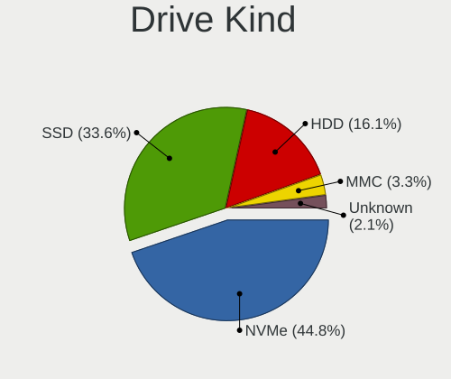

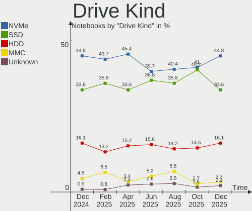

| Kind    | Notebooks | Drives | Percent |
|---------|-----------|--------|---------|
| NVMe    | 189       | 222    | 44.79%  |
| SSD     | 142       | 158    | 33.65%  |
| HDD     | 68        | 73     | 16.11%  |
| MMC     | 14        | 14     | 3.32%   |
| Unknown | 9         | 9      | 2.13%   |

Drive Connector
---------------

SATA, SAS, NVMe, etc.

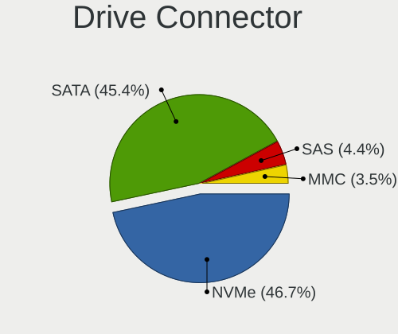

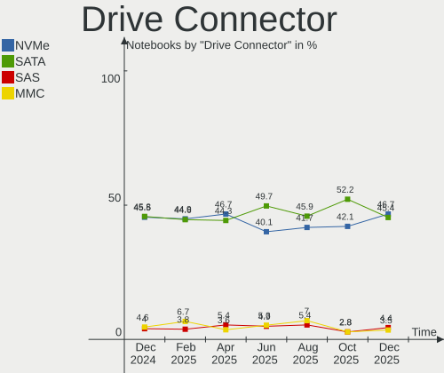

| Type | Notebooks | Drives | Percent |
|------|-----------|--------|---------|
| NVMe | 189       | 220    | 46.67%  |
| SATA | 184       | 221    | 45.43%  |
| SAS  | 18        | 21     | 4.44%   |
| MMC  | 14        | 14     | 3.46%   |

Drive Size
----------

Size of hard drive

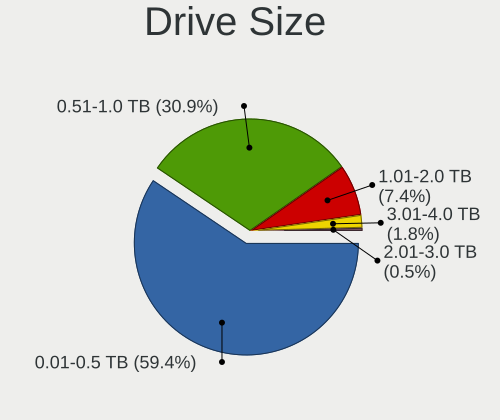

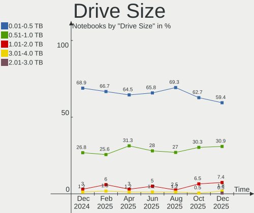

| Size in TB | Notebooks | Drives | Percent |
|------------|-----------|--------|---------|
| 0.01-0.5   | 129       | 138    | 59.45%  |
| 0.51-1.0   | 67        | 72     | 30.88%  |
| 1.01-2.0   | 16        | 16     | 7.37%   |
| 3.01-4.0   | 4         | 4      | 1.84%   |
| 2.01-3.0   | 1         | 1      | 0.46%   |

Space Total
-----------

Amount of disk space available on the file system

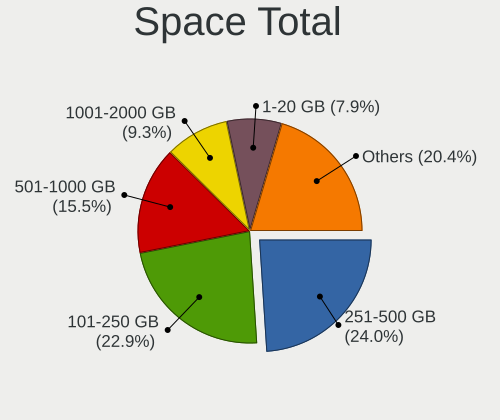

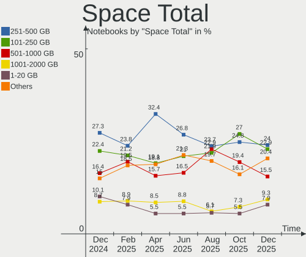

| Size in GB     | Notebooks | Percent |
|----------------|-----------|---------|
| 251-500        | 88        | 23.98%  |
| 101-250        | 84        | 22.89%  |
| 501-1000       | 57        | 15.53%  |
| 1001-2000      | 34        | 9.26%   |
| 1-20           | 29        | 7.9%    |
| More than 3000 | 22        | 5.99%   |
| 51-100         | 20        | 5.45%   |
| Unknown        | 15        | 4.09%   |
| 2001-3000      | 11        | 3%      |
| 21-50          | 7         | 1.91%   |

Space Used
----------

Amount of used disk space

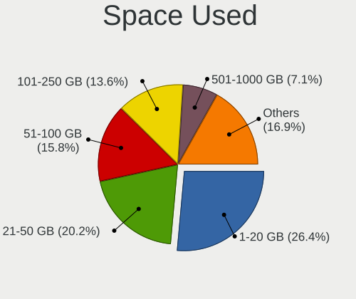

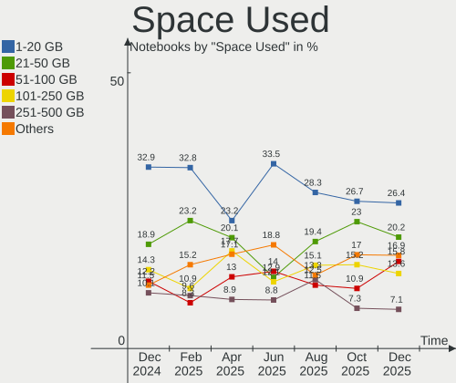

| Used GB        | Notebooks | Percent |
|----------------|-----------|---------|
| 1-20           | 97        | 26.43%  |
| 21-50          | 74        | 20.16%  |
| 51-100         | 58        | 15.8%   |
| 101-250        | 50        | 13.62%  |
| 251-500        | 26        | 7.08%   |
| 501-1000       | 26        | 7.08%   |
| Unknown        | 15        | 4.09%   |
| 1001-2000      | 11        | 3%      |
| More than 3000 | 4         | 1.09%   |
| 2001-3000      | 4         | 1.09%   |
| 0              | 2         | 0.54%   |

Malfunc. Drives
---------------

Drive models with a malfunction

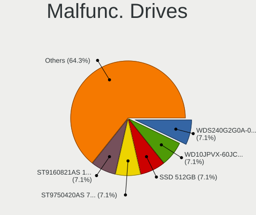

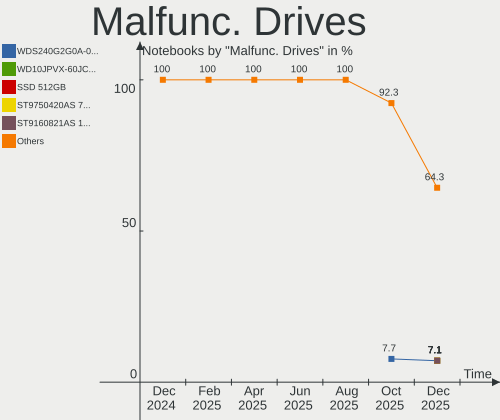

| Model                                                          | Notebooks | Drives | Percent |
|----------------------------------------------------------------|-----------|--------|---------|
| WDC WDS240G2G0A-00JH30 240GB SSD                               | 1         | 1      | 7.14%   |
| WDC WD10JPVX-60JC3T0 1TB                                       | 1         | 1      | 7.14%   |
| ValueTech SSD 512GB                                            | 1         | 1      | 7.14%   |
| Seagate ST9750420AS 752GB                                      | 1         | 1      | 7.14%   |
| Seagate ST9160821AS 160GB                                      | 1         | 1      | 7.14%   |
| Seagate ST9160310AS 160GB                                      | 1         | 1      | 7.14%   |
| Seagate ST500LM000-1EJ162 500GB                                | 1         | 1      | 7.14%   |
| Seagate ST320LT007-9ZV142 320GB                                | 1         | 1      | 7.14%   |
| Seagate ST1000LM024 HN-M101MBB 1TB                             | 1         | 1      | 7.14%   |
| SanDisk SSD PLUS 480GB                                         | 1         | 1      | 7.14%   |
| Samsung Electronics NVMe SSD Controller SM981/PM981/PM983 1TB  | 1         | 1      | 7.14%   |
| Samsung Electronics NVMe SSD Controller PM9A1/PM9A3/980PRO 1TB | 1         | 1      | 7.14%   |
| HGST HTS545050A7E680 500GB                                     | 1         | 1      | 7.14%   |
| Fujitsu MJA2320BH G2 320GB                                     | 1         | 1      | 7.14%   |

Malfunc. Drive Vendor
---------------------

Vendors of faulty drives

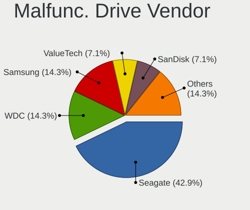

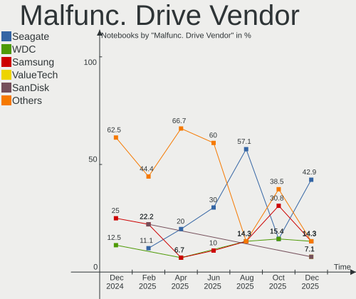

| Vendor              | Notebooks | Drives | Percent |
|---------------------|-----------|--------|---------|
| Seagate             | 6         | 6      | 42.86%  |
| WDC                 | 2         | 2      | 14.29%  |
| Samsung Electronics | 2         | 2      | 14.29%  |
| ValueTech           | 1         | 1      | 7.14%   |
| SanDisk             | 1         | 1      | 7.14%   |
| HGST                | 1         | 1      | 7.14%   |
| Fujitsu             | 1         | 1      | 7.14%   |

Malfunc. HDD Vendor
-------------------

Vendors of faulty HDD drives

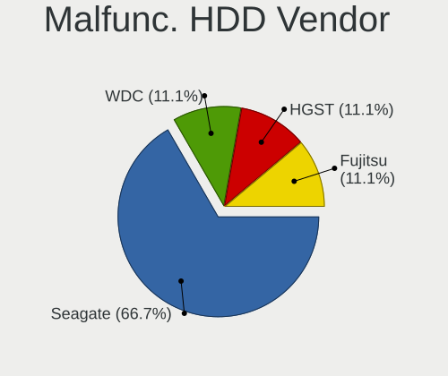

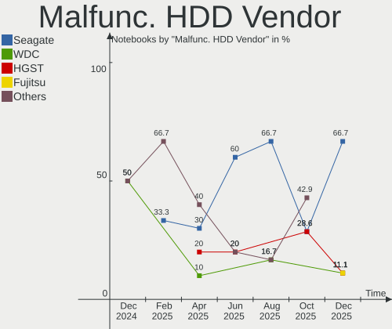

| Vendor  | Notebooks | Drives | Percent |
|---------|-----------|--------|---------|
| Seagate | 6         | 6      | 66.67%  |
| WDC     | 1         | 1      | 11.11%  |
| HGST    | 1         | 1      | 11.11%  |
| Fujitsu | 1         | 1      | 11.11%  |

Malfunc. Drive Kind
-------------------

Kinds of faulty drives

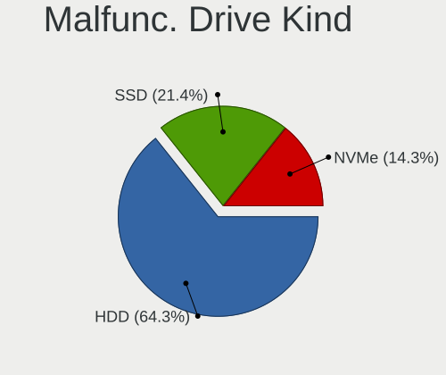

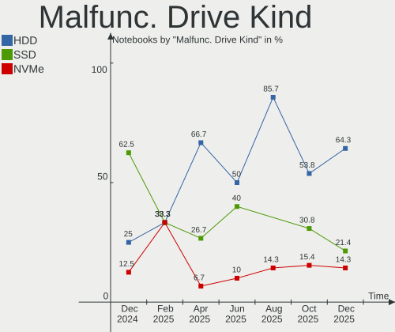

| Kind | Notebooks | Drives | Percent |
|------|-----------|--------|---------|
| HDD  | 9         | 9      | 64.29%  |
| SSD  | 3         | 3      | 21.43%  |
| NVMe | 2         | 2      | 14.29%  |

Failed Drives
-------------

Failed drive models

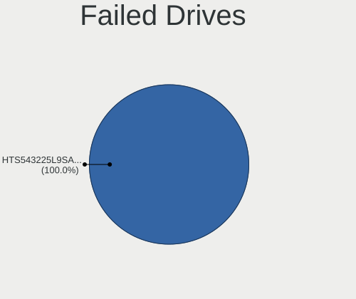

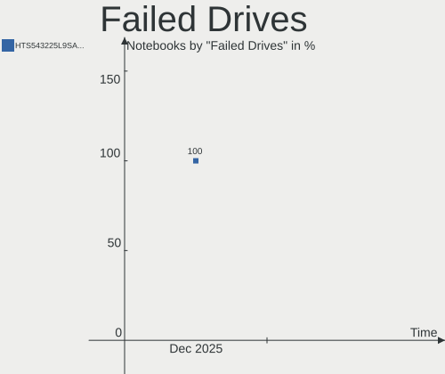

| Model                         | Notebooks | Drives | Percent |
|-------------------------------|-----------|--------|---------|
| Hitachi HTS543225L9SA02 250GB | 1         | 1      | 100%    |

Failed Drive Vendor
-------------------

Failed drive vendors

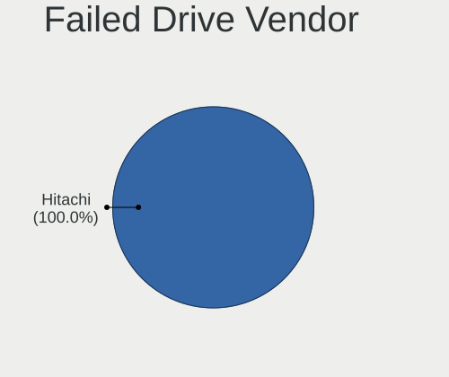

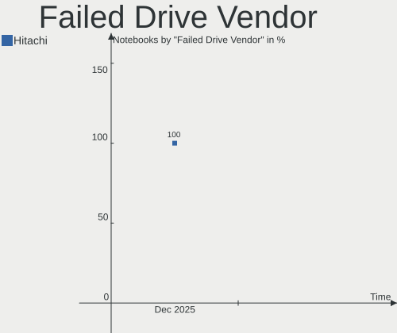

| Vendor  | Notebooks | Drives | Percent |
|---------|-----------|--------|---------|
| Hitachi | 1         | 1      | 100%    |

Drive Status
------------

Number of failed and malfunc. drives

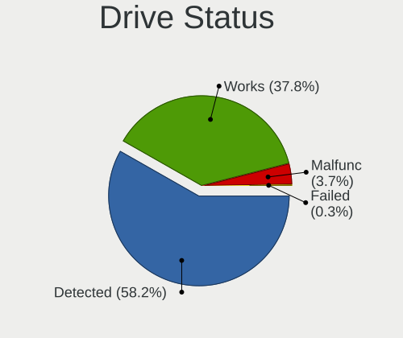

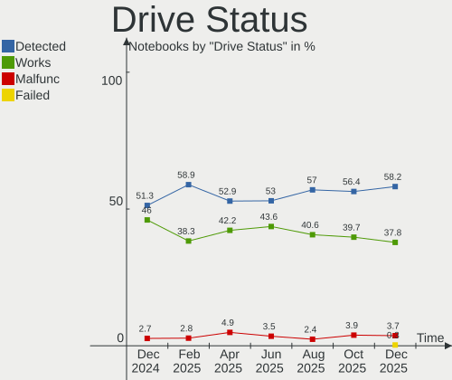

| Status   | Notebooks | Drives | Percent |
|----------|-----------|--------|---------|
| Detected | 219       | 287    | 58.24%  |
| Works    | 142       | 174    | 37.77%  |
| Malfunc  | 14        | 14     | 3.72%   |
| Failed   | 1         | 1      | 0.27%   |

Storage controller
------------------

Storage Vendor
--------------

Storage controller vendors

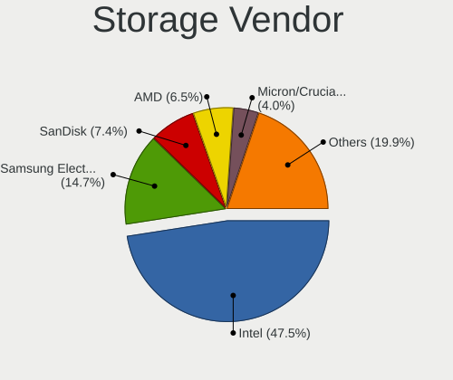

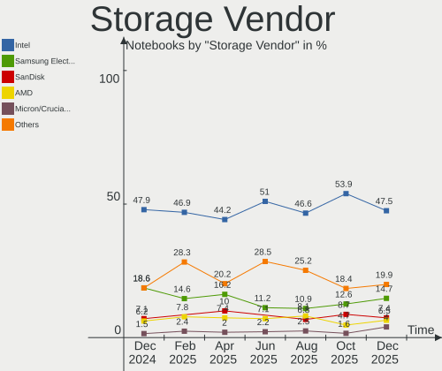

| Vendor                         | Notebooks | Percent |
|--------------------------------|-----------|---------|
| Intel                          | 213       | 47.54%  |
| Samsung Electronics            | 66        | 14.73%  |
| SanDisk                        | 33        | 7.37%   |
| AMD                            | 29        | 6.47%   |
| Micron/Crucial Technology      | 18        | 4.02%   |
| SK hynix                       | 14        | 3.13%   |
| Micron Technology              | 14        | 3.13%   |
| KIOXIA                         | 13        | 2.9%    |
| Kingston Technology Company    | 9         | 2.01%   |
| Toshiba America Info Systems   | 6         | 1.34%   |
| Phison Electronics             | 6         | 1.34%   |
| Silicon Motion                 | 4         | 0.89%   |
| Solid State Storage Technology | 3         | 0.67%   |
| Nvidia                         | 3         | 0.67%   |
| Apple                          | 3         | 0.67%   |
| Solidigm                       | 2         | 0.45%   |
| Shenzhen Longsys Electronics   | 2         | 0.45%   |
| MAXIO Technology (Hangzhou)    | 2         | 0.45%   |
| ADATA Technology               | 2         | 0.45%   |
| Union Memory (Shenzhen)        | 1         | 0.22%   |
| Silicon Image                  | 1         | 0.22%   |
| Realtek Semiconductor          | 1         | 0.22%   |
| O2 Micro                       | 1         | 0.22%   |
| Marvell Technology Group       | 1         | 0.22%   |
| JMicron Technology             | 1         | 0.22%   |

Storage Model
-------------

Storage controller models

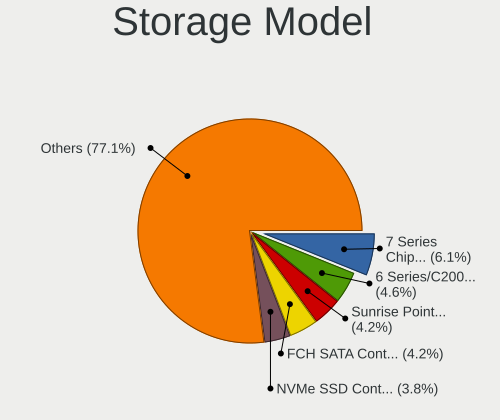

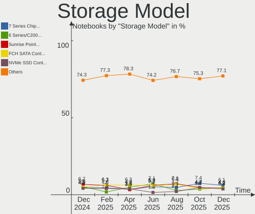

| Model                                                                          | Notebooks | Percent |
|--------------------------------------------------------------------------------|-----------|---------|
| Intel 7 Series Chipset Family 6-port SATA Controller [AHCI mode]               | 29        | 6.11%   |
| Intel 6 Series/C200 Series Chipset Family 6 port Mobile SATA AHCI Controller   | 22        | 4.63%   |
| Intel Sunrise Point-LP SATA Controller [AHCI mode]                             | 20        | 4.21%   |
| AMD FCH SATA Controller [AHCI mode]                                            | 20        | 4.21%   |
| Samsung NVMe SSD Controller SM981/PM981/PM983                                  | 18        | 3.79%   |
| Intel 8 Series SATA Controller 1 [AHCI mode]                                   | 14        | 2.95%   |
| Intel Volume Management Device NVMe RAID Controller                            | 13        | 2.74%   |
| Intel 8 Series/C220 Series Chipset Family 6-port SATA Controller 1 [AHCI mode] | 13        | 2.74%   |
| Samsung NVMe SSD Controller 980 (DRAM-less)                                    | 12        | 2.53%   |
| Samsung NVMe SSD Controller PM9C1a (DRAM-less)                                 | 10        | 2.11%   |
| Intel 82801 Mobile SATA Controller [RAID mode]                                 | 10        | 2.11%   |
| Samsung NVMe SSD Controller PM9A1/PM9A3/980PRO                                 | 9         | 1.89%   |
| Intel Wildcat Point-LP SATA Controller [AHCI Mode]                             | 9         | 1.89%   |
| Intel 5 Series/3400 Series Chipset 4 port SATA AHCI Controller                 | 9         | 1.89%   |
| Samsung NVMe SSD Controller S4LV008[Pascal]                                    | 8         | 1.68%   |
| Intel 82801IBM/IEM (ICH9M/ICH9M-E) 4 port SATA Controller [AHCI mode]          | 8         | 1.68%   |
| Micron/Crucial P2 [Nick P2] / P3 / P3 Plus NVMe PCIe SSD (DRAM-less)           | 7         | 1.47%   |
| Intel Celeron/Pentium Silver Processor SATA Controller                         | 7         | 1.47%   |
| Intel Cannon Lake Mobile PCH SATA AHCI Controller                              | 7         | 1.47%   |
| SanDisk WD SN560/SN740/SN770/SN5000 NVMe SSD                                   | 6         | 1.26%   |
| Intel 82801HM/HEM (ICH8M/ICH8M-E) IDE Controller                               | 6         | 1.26%   |
| Intel 5 Series/3400 Series Chipset 6 port SATA AHCI Controller                 | 6         | 1.26%   |
| KIOXIA NVMe SSD Controller XG8                                                 | 5         | 1.05%   |
| Intel Tiger Lake-LP SATA Controller                                            | 5         | 1.05%   |
| Intel HM170/QM170 Chipset SATA Controller [AHCI Mode]                          | 5         | 1.05%   |
| Intel Alder Lake-P SATA AHCI Controller                                        | 5         | 1.05%   |
| Intel 82801HM/HEM (ICH8M/ICH8M-E) SATA Controller [AHCI mode]                  | 5         | 1.05%   |
| SK hynix Platinum P41/PC801 NVMe Solid State Drive                             | 4         | 0.84%   |
| SK hynix Gold P31/BC711/PC711 NVMe Solid State Drive                           | 4         | 0.84%   |
| SanDisk Extreme Pro / WD Black SN750 / PC SN730 / Red SN700 NVMe SSD           | 4         | 0.84%   |
| Samsung NVMe SSD Controller PM9B1 (DRAM-less)                                  | 4         | 0.84%   |
| Micron/Crucial P310 NVMe PCIe SSD (DRAM-less)                                  | 4         | 0.84%   |
| Intel SSD DC P4101/Pro 7600p/760p/E 6100p Series                               | 4         | 0.84%   |
| Intel Comet Lake SATA AHCI Controller                                          | 4         | 0.84%   |
| Intel Celeron N3350/Pentium N4200/Atom E3900 Series SATA AHCI Controller       | 4         | 0.84%   |
| SanDisk WD PC SN810 / Black SN850 NVMe SSD                                     | 3         | 0.63%   |
| Sandisk WD PC SN5000S M.2 2280 NVMe SSD (DRAM-less)                            | 3         | 0.63%   |
| SanDisk Ultra 3D / WD PC SN530, IX SN530, Blue SN550 NVMe SSD (DRAM-less)      | 3         | 0.63%   |
| Samsung S4LN058A01[SSUBX] AHCI SSD Controller (Apple slot)                     | 3         | 0.63%   |
| Micron/Crucial P5 Plus NVMe PCIe SSD                                           | 3         | 0.63%   |

Storage Kind
------------

Kind of storage controller (IDE, SATA, NVMe, SAS, ...)

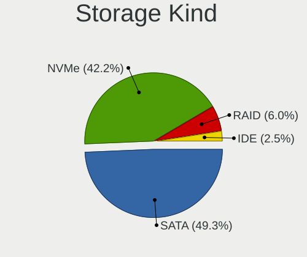

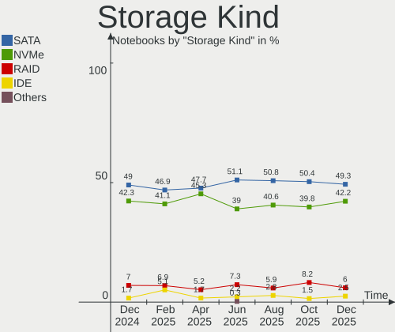

| Kind | Notebooks | Percent |
|------|-----------|---------|
| SATA | 221       | 49.33%  |
| NVMe | 189       | 42.19%  |
| RAID | 27        | 6.03%   |
| IDE  | 11        | 2.46%   |

Processor
---------

CPU Vendor
----------

Processor vendors

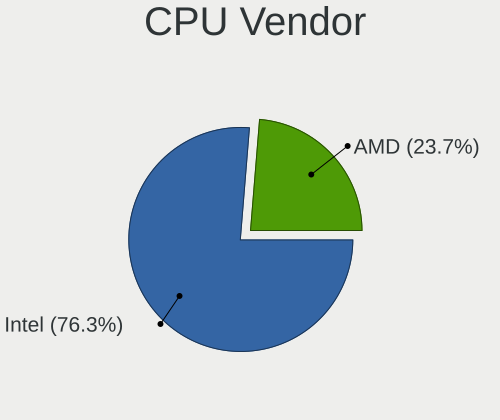

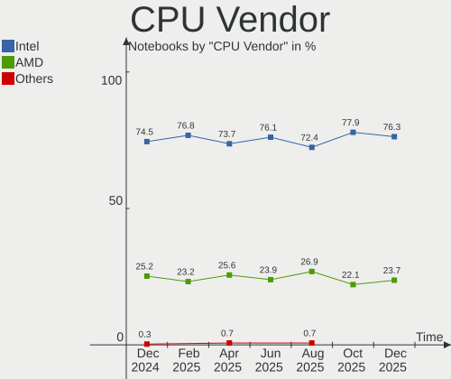

| Vendor | Notebooks | Percent |
|--------|-----------|---------|
| Intel  | 280       | 76.29%  |
| AMD    | 87        | 23.71%  |

CPU Model
---------

Processor models

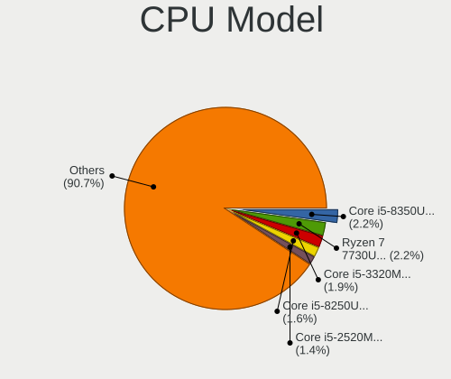

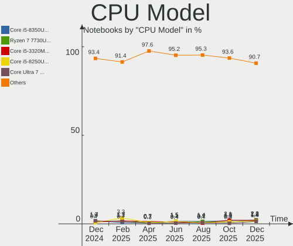

| Model                                         | Notebooks | Percent |
|-----------------------------------------------|-----------|---------|
| Intel Core i5-8350U CPU @ 1.70GHz             | 8         | 2.18%   |
| AMD Ryzen 7 7730U with Radeon Graphics        | 8         | 2.18%   |
| Intel Core i5-3320M CPU @ 2.60GHz             | 7         | 1.91%   |
| Intel Core i5-8250U CPU @ 1.60GHz             | 6         | 1.63%   |
| Intel Core Ultra 7 155H                       | 5         | 1.36%   |
| Intel Core i5-2520M CPU @ 2.50GHz             | 5         | 1.36%   |
| Intel Core i9-14900HX                         | 4         | 1.09%   |
| Intel Core i7-9750H CPU @ 2.60GHz             | 4         | 1.09%   |
| Intel Core i7-2630QM CPU @ 2.00GHz            | 4         | 1.09%   |
| Intel Core i5-7300U CPU @ 2.60GHz             | 4         | 1.09%   |
| Intel Core i5-6200U CPU @ 2.30GHz             | 4         | 1.09%   |
| Intel Core i5-4200U CPU @ 1.60GHz             | 4         | 1.09%   |
| Intel Core i5 CPU M 560 @ 2.67GHz             | 4         | 1.09%   |
| Intel 11th Gen Core i7-11370H @ 3.30GHz       | 4         | 1.09%   |
| Intel 11th Gen Core i5-1135G7 @ 2.40GHz       | 4         | 1.09%   |
| AMD Ryzen 7 5800H with Radeon Graphics        | 4         | 1.09%   |
| AMD Ryzen 7 4700U with Radeon Graphics        | 4         | 1.09%   |
| AMD Ryzen 5 3500U with Radeon Vega Mobile Gfx | 4         | 1.09%   |
| Intel Core i7-8850H CPU @ 2.60GHz             | 3         | 0.82%   |
| Intel Core i7-8550U CPU @ 1.80GHz             | 3         | 0.82%   |
| Intel Core i7-7700HQ CPU @ 2.80GHz            | 3         | 0.82%   |
| Intel Core i7-6600U CPU @ 2.60GHz             | 3         | 0.82%   |
| Intel Core i7-10510U CPU @ 1.80GHz            | 3         | 0.82%   |
| Intel Core i5-6300U CPU @ 2.40GHz             | 3         | 0.82%   |
| Intel Core i5-5350U CPU @ 1.80GHz             | 3         | 0.82%   |
| Intel Core i5-5200U CPU @ 2.20GHz             | 3         | 0.82%   |
| Intel Core i5-4210U CPU @ 1.70GHz             | 3         | 0.82%   |
| Intel Core i5-3210M CPU @ 2.50GHz             | 3         | 0.82%   |
| Intel Core i5 CPU M 520 @ 2.40GHz             | 3         | 0.82%   |
| Intel Core i3-4030U CPU @ 1.90GHz             | 3         | 0.82%   |
| Intel Celeron N4020 CPU @ 1.10GHz             | 3         | 0.82%   |
| Intel 13th Gen Core i7-13650HX                | 3         | 0.82%   |
| Intel 12th Gen Core i3-1215U                  | 3         | 0.82%   |
| AMD Ryzen AI 7 350 w/ Radeon 860M             | 3         | 0.82%   |
| AMD Ryzen 7 PRO 7840U w/ Radeon 780M Graphics | 3         | 0.82%   |
| AMD Ryzen 7 PRO 5850U with Radeon Graphics    | 3         | 0.82%   |
| AMD Ryzen 7 PRO 4750U with Radeon Graphics    | 3         | 0.82%   |
| Intel Pentium Silver N5000 CPU @ 1.10GHz      | 2         | 0.54%   |
| Intel Core M-5Y10c CPU @ 0.80GHz              | 2         | 0.54%   |
| Intel Core i9-9880H CPU @ 2.30GHz             | 2         | 0.54%   |

CPU Model Family
----------------

Processor model prefix

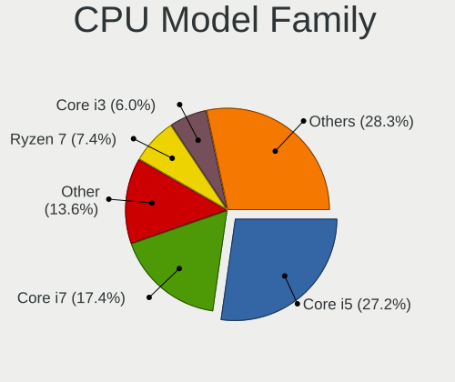

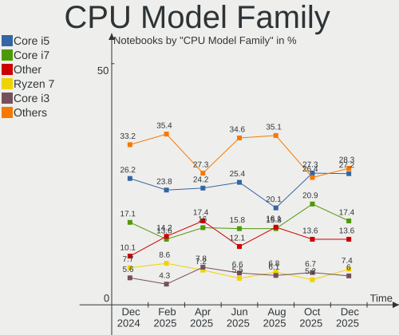

| Model                   | Notebooks | Percent |
|-------------------------|-----------|---------|
| Intel Core i5           | 100       | 27.25%  |
| Intel Core i7           | 64        | 17.44%  |
| Other                   | 50        | 13.62%  |
| AMD Ryzen 7             | 27        | 7.36%   |
| Intel Core i3           | 22        | 5.99%   |
| AMD Ryzen 5             | 19        | 5.18%   |
| Intel Core              | 11        | 3%      |
| Intel Celeron           | 11        | 3%      |
| Intel Core 2 Duo        | 10        | 2.72%   |
| AMD Ryzen 7 PRO         | 9         | 2.45%   |
| Intel Core i9           | 7         | 1.91%   |
| AMD Ryzen 9             | 6         | 1.63%   |
| Intel Pentium Silver    | 4         | 1.09%   |
| Intel Pentium Dual      | 4         | 1.09%   |
| AMD Ryzen 3             | 4         | 1.09%   |
| Intel Pentium           | 3         | 0.82%   |
| Intel Pentium Dual-Core | 2         | 0.54%   |
| Intel Core M            | 2         | 0.54%   |
| Intel Atom              | 2         | 0.54%   |
| AMD A8                  | 2         | 0.54%   |
| Intel Xeon              | 1         | 0.27%   |
| Intel Core m5           | 1         | 0.27%   |
| AMD Turion 64 X2 Mobile | 1         | 0.27%   |
| AMD Sempron             | 1         | 0.27%   |
| AMD Ryzen 5 PRO         | 1         | 0.27%   |
| AMD E                   | 1         | 0.27%   |
| AMD A6                  | 1         | 0.27%   |
| AMD A4                  | 1         | 0.27%   |

CPU Cores
---------

Number of processor cores

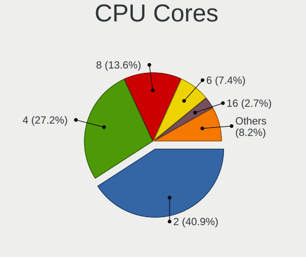

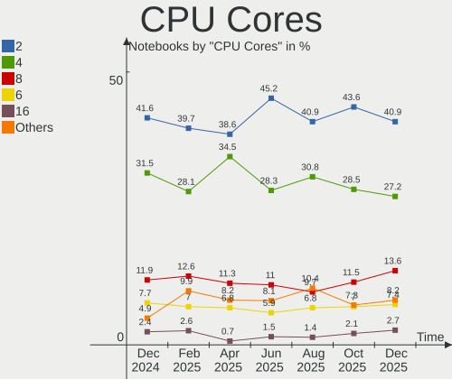

| Number | Notebooks | Percent |
|--------|-----------|---------|
| 2      | 150       | 40.87%  |
| 4      | 100       | 27.25%  |
| 8      | 50        | 13.62%  |
| 6      | 27        | 7.36%   |
| 16     | 10        | 2.72%   |
| 14     | 9         | 2.45%   |
| 12     | 8         | 2.18%   |
| 10     | 6         | 1.63%   |
| 24     | 4         | 1.09%   |
| 1      | 2         | 0.54%   |
| 20     | 1         | 0.27%   |

CPU Sockets
-----------

Number of sockets

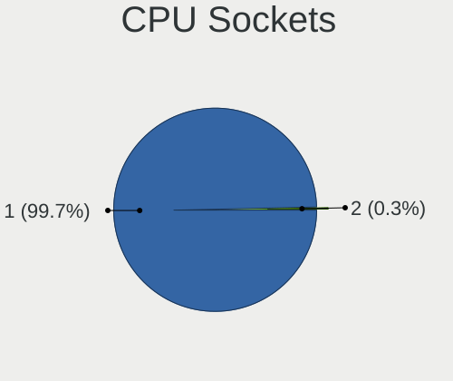

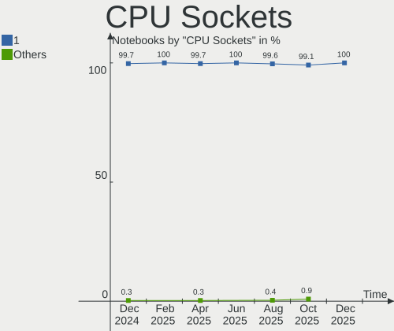

| Number | Notebooks | Percent |
|--------|-----------|---------|
| 1      | 367       | 100%    |

CPU Threads
-----------

Threads per core (Hyper-Threading)

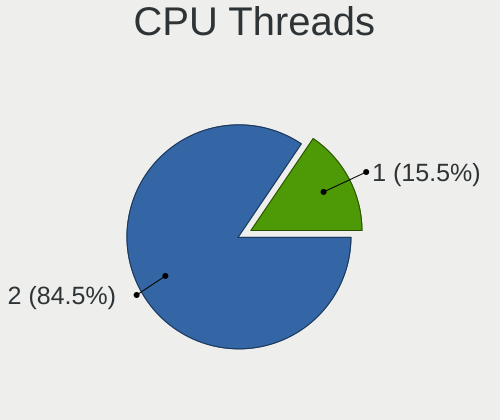

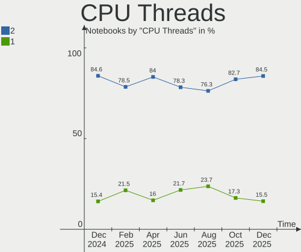

| Number | Notebooks | Percent |
|--------|-----------|---------|
| 2      | 310       | 84.47%  |
| 1      | 57        | 15.53%  |

CPU Op-Modes
------------

CPU Operation Modes (32-bit, 64-bit)

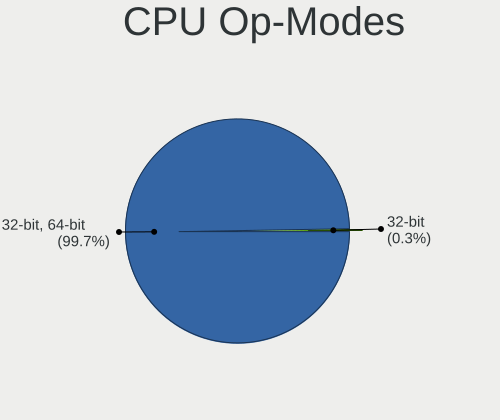

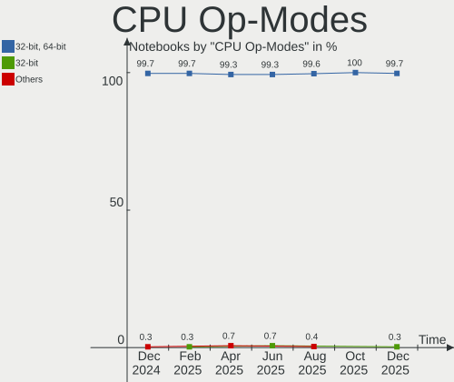

| Op mode        | Notebooks | Percent |
|----------------|-----------|---------|
| 32-bit, 64-bit | 366       | 99.73%  |
| 32-bit         | 1         | 0.27%   |

CPU Microcode
-------------

Microcode number

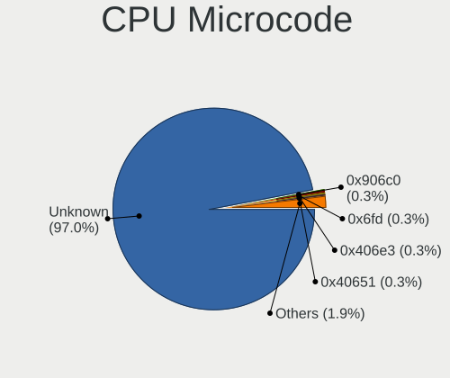

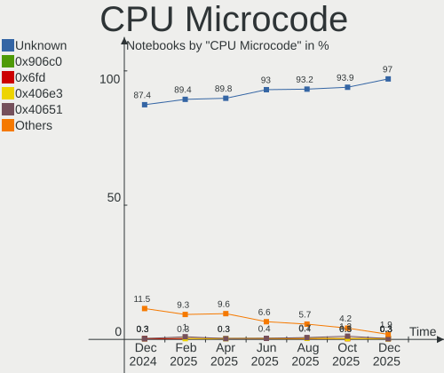

| Number     | Notebooks | Percent |
|------------|-----------|---------|
| Unknown    | 356       | 97%     |
| 0x906c0    | 1         | 0.27%   |
| 0x6fd      | 1         | 0.27%   |
| 0x406e3    | 1         | 0.27%   |
| 0x40651    | 1         | 0.27%   |
| 0x306c3    | 1         | 0.27%   |
| 0x20655    | 1         | 0.27%   |
| 0x106c2    | 1         | 0.27%   |
| 0x0b600037 | 1         | 0.27%   |
| 0x0b204037 | 1         | 0.27%   |
| 0x08608103 | 1         | 0.27%   |
| 0x08600109 | 1         | 0.27%   |

CPU Microarch
-------------

Microarchitecture

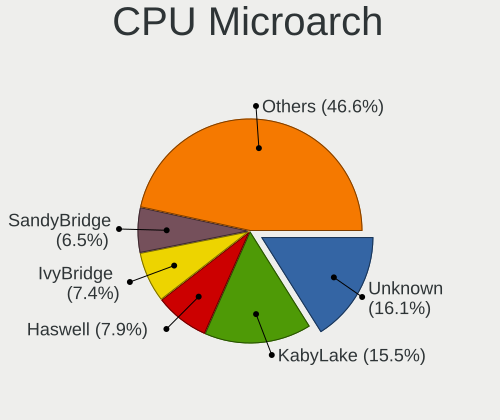

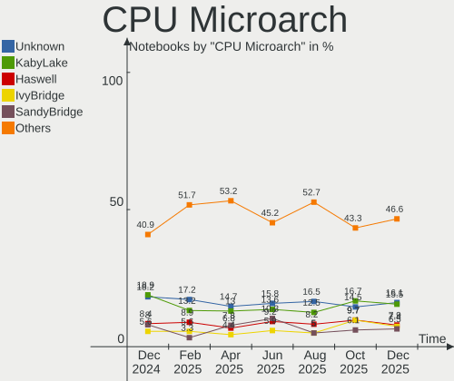

| Name              | Notebooks | Percent |
|-------------------|-----------|---------|
| Unknown           | 59        | 16.08%  |
| KabyLake          | 57        | 15.53%  |
| Haswell           | 29        | 7.9%    |
| IvyBridge         | 27        | 7.36%   |
| SandyBridge       | 24        | 6.54%   |
| Zen 3             | 21        | 5.72%   |
| Skylake           | 16        | 4.36%   |
| Westmere          | 15        | 4.09%   |
| TigerLake         | 15        | 4.09%   |
| Broadwell         | 15        | 4.09%   |
| Alderlake Hybrid  | 13        | 3.54%   |
| Zen 2             | 10        | 2.72%   |
| Core              | 9         | 2.45%   |
| Penryn            | 7         | 1.91%   |
| Goldmont plus     | 7         | 1.91%   |
| Zen+              | 6         | 1.63%   |
| Meteorlake Hybrid | 6         | 1.63%   |
| Silvermont        | 4         | 1.09%   |
| IceLake           | 4         | 1.09%   |
| Goldmont          | 4         | 1.09%   |
| CometLake         | 4         | 1.09%   |
| Zen               | 3         | 0.82%   |
| Puma              | 2         | 0.54%   |
| Nehalem           | 2         | 0.54%   |
| Tremont           | 1         | 0.27%   |
| K8 Hammer         | 1         | 0.27%   |
| K8 & K10 hybrid   | 1         | 0.27%   |
| K10 Llano         | 1         | 0.27%   |
| Jaguar            | 1         | 0.27%   |
| Gracemont         | 1         | 0.27%   |
| Bonnell           | 1         | 0.27%   |
| Bobcat            | 1         | 0.27%   |

Graphics
--------

GPU Vendor
----------

Vendors of graphics cards

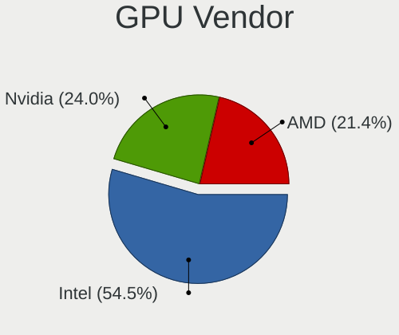

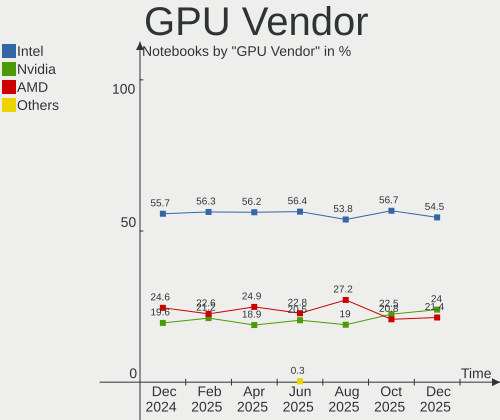

| Vendor | Notebooks | Percent |
|--------|-----------|---------|
| Intel  | 252       | 54.55%  |
| Nvidia | 111       | 24.03%  |
| AMD    | 99        | 21.43%  |

GPU Model
---------

Graphics card models

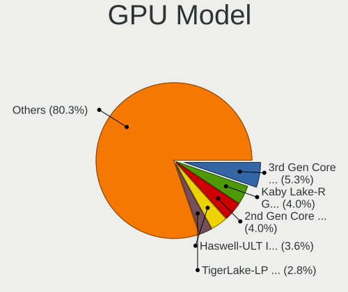

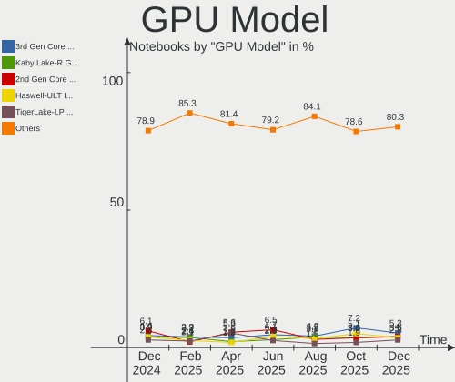

| Model                                                                     | Notebooks | Percent |
|---------------------------------------------------------------------------|-----------|---------|
| Intel 3rd Gen Core processor Graphics Controller                          | 25        | 5.3%    |
| Intel Kaby Lake-R GT2 [UHD Graphics 620]                                  | 19        | 4.03%   |
| Intel 2nd Generation Core Processor Family Integrated Graphics Controller | 19        | 4.03%   |
| Intel Haswell-ULT Integrated Graphics Controller                          | 17        | 3.6%    |
| Intel TigerLake-LP GT2 [Iris Xe Graphics]                                 | 13        | 2.75%   |
| Intel Skylake-U GT2 [HD Graphics 520]                                     | 12        | 2.54%   |
| Intel CoffeeLake-H GT2 [UHD Graphics 630]                                 | 11        | 2.33%   |
| Intel 4th Gen Core Processor Integrated Graphics Controller               | 11        | 2.33%   |
| AMD Renoir [Radeon Vega Series / Radeon Vega Mobile Series]               | 10        | 2.12%   |
| AMD Barcelo                                                               | 10        | 2.12%   |
| Intel Raptor Lake-S UHD Graphics                                          | 9         | 1.91%   |
| Intel Core Processor Integrated Graphics Controller                       | 9         | 1.91%   |
| Intel Broadwell-U GT2 [HD Graphics 5500]                                  | 9         | 1.91%   |
| Nvidia AD107M [GeForce RTX 4060 Max-Q / Mobile]                           | 8         | 1.69%   |
| Intel Kaby Lake-U GT2 [HD Graphics 620]                                   | 8         | 1.69%   |
| AMD Picasso/Raven 2 [Radeon Vega Series / Radeon Vega Mobile Series]      | 8         | 1.69%   |
| AMD Phoenix1                                                              | 8         | 1.69%   |
| AMD Cezanne [Radeon Vega Series / Radeon Vega Mobile Series]              | 6         | 1.27%   |
| Nvidia GA107M [GeForce RTX 3050 Ti Mobile]                                | 5         | 1.06%   |
| Intel WhiskeyLake-U GT2 [UHD Graphics 620]                                | 5         | 1.06%   |
| Intel Mobile 4 Series Chipset Integrated Graphics Controller              | 5         | 1.06%   |
| Intel CometLake-U GT2 [UHD Graphics]                                      | 5         | 1.06%   |
| Intel Alder Lake-P GT2 [Iris Xe Graphics]                                 | 5         | 1.06%   |
| AMD Strix [Radeon 880M / 890M]                                            | 5         | 1.06%   |
| AMD Lucienne                                                              | 5         | 1.06%   |
| AMD Krackan [Radeon 840M / 860M Graphics]                                 | 5         | 1.06%   |
| Nvidia GM107M [GeForce GTX 950M]                                          | 4         | 0.85%   |
| Nvidia GF117M [GeForce 610M/710M/810M/820M / GT 620M/625M/630M/720M]      | 4         | 0.85%   |
| Nvidia GF108M [GeForce GT 540M]                                           | 4         | 0.85%   |
| Nvidia GB206M [GeForce RTX 5070 Max-Q / Mobile]                           | 4         | 0.85%   |
| Nvidia GA104M [GeForce RTX 3070 Mobile / Max-Q]                           | 4         | 0.85%   |
| Intel GeminiLake [UHD Graphics 600]                                       | 4         | 0.85%   |
| AMD Rembrandt [Radeon 680M]                                               | 4         | 0.85%   |
| Nvidia GP108M [GeForce MX150]                                             | 3         | 0.64%   |
| Nvidia GM108M [GeForce 840M]                                              | 3         | 0.64%   |
| Nvidia GF108M [GeForce GT 620M/630M/635M/640M LE]                         | 3         | 0.64%   |
| Intel Raptor Lake-P [Iris Xe Graphics]                                    | 3         | 0.64%   |
| Intel Mobile GM965/GL960 Integrated Graphics Controller (secondary)       | 3         | 0.64%   |
| Intel Mobile GM965/GL960 Integrated Graphics Controller (primary)         | 3         | 0.64%   |
| Intel Meteor Lake-P [Intel Graphics]                                      | 3         | 0.64%   |

GPU Combo
---------

Combinations of graphics cards

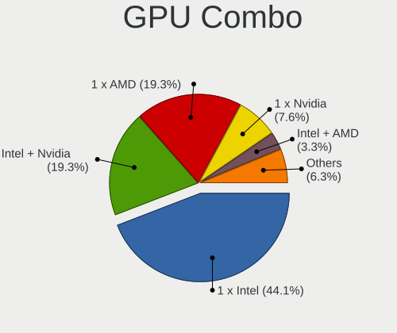

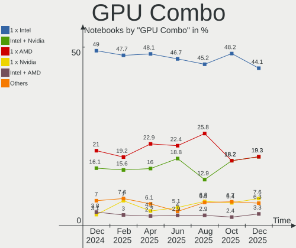

| Name           | Notebooks | Percent |
|----------------|-----------|---------|
| 1 x Intel      | 162       | 44.14%  |
| Intel + Nvidia | 71        | 19.35%  |
| 1 x AMD        | 71        | 19.35%  |
| 1 x Nvidia     | 28        | 7.63%   |
| Intel + AMD    | 12        | 3.27%   |
| AMD + Nvidia   | 11        | 3%      |
| 2 x Intel      | 6         | 1.63%   |
| 2 x AMD        | 5         | 1.36%   |
| 2 x Nvidia     | 1         | 0.27%   |

GPU Driver
----------

Free vs proprietary

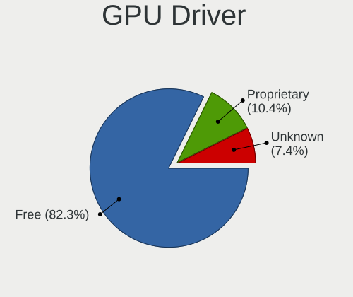

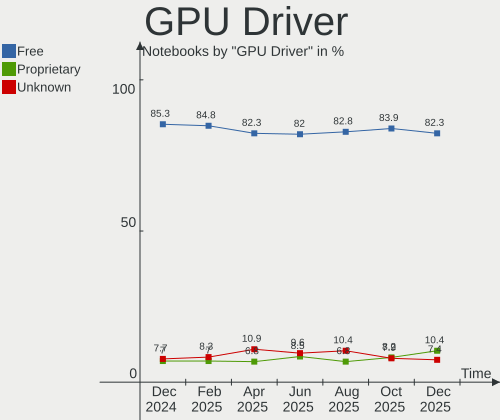

| Driver      | Notebooks | Percent |
|-------------|-----------|---------|
| Free        | 302       | 82.29%  |
| Proprietary | 38        | 10.35%  |
| Unknown     | 27        | 7.36%   |

GPU Memory
----------

Total video memory

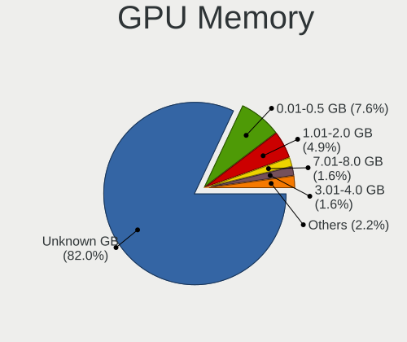

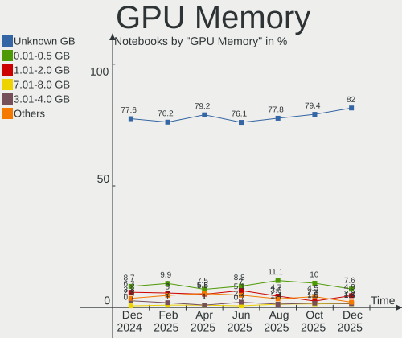

| Size in GB | Notebooks | Percent |
|------------|-----------|---------|
| Unknown    | 301       | 82.02%  |
| 0.01-0.5   | 28        | 7.63%   |
| 1.01-2.0   | 18        | 4.9%    |
| 7.01-8.0   | 6         | 1.63%   |
| 3.01-4.0   | 6         | 1.63%   |
| 0.51-1.0   | 6         | 1.63%   |
| 5.01-6.0   | 1         | 0.27%   |
| 8.01-16.0  | 1         | 0.27%   |

Monitor
-------

Monitor Vendor
--------------

Monitor vendors

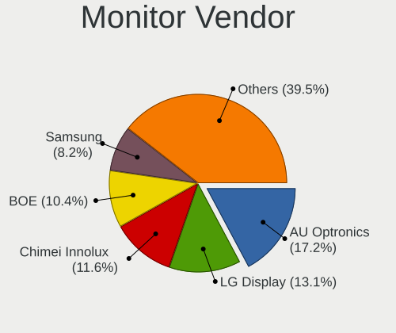

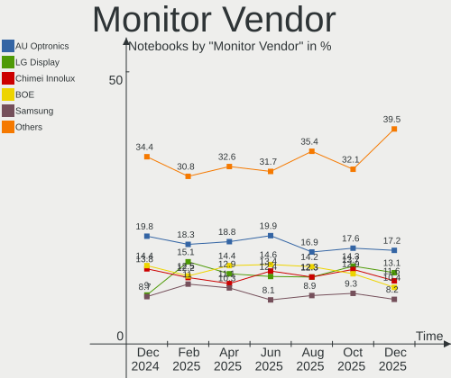

| Vendor                  | Notebooks | Percent |
|-------------------------|-----------|---------|
| AU Optronics            | 71        | 17.19%  |
| LG Display              | 54        | 13.08%  |
| Chimei Innolux          | 48        | 11.62%  |
| BOE                     | 43        | 10.41%  |
| Samsung Electronics     | 34        | 8.23%   |
| Lenovo                  | 29        | 7.02%   |
| Apple                   | 18        | 4.36%   |
| Sharp                   | 14        | 3.39%   |
| Dell                    | 14        | 3.39%   |
| Acer                    | 8         | 1.94%   |
| LG Philips              | 7         | 1.69%   |
| InfoVision              | 6         | 1.45%   |
| Philips                 | 5         | 1.21%   |
| CSOT                    | 5         | 1.21%   |
| Chi Mei Optoelectronics | 5         | 1.21%   |
| TMX                     | 4         | 0.97%   |
| Fujitsu Siemens         | 4         | 0.97%   |
| BenQ                    | 4         | 0.97%   |
| Panasonic               | 3         | 0.73%   |
| Iiyama                  | 3         | 0.73%   |
| HKC                     | 3         | 0.73%   |
| Goldstar                | 3         | 0.73%   |
| Valve                   | 2         | 0.48%   |
| PANDA                   | 2         | 0.48%   |
| MSI                     | 2         | 0.48%   |
| Hewlett-Packard         | 2         | 0.48%   |
| HannStar                | 2         | 0.48%   |
| Eizo                    | 2         | 0.48%   |
| EDO                     | 2         | 0.48%   |
| CSW                     | 2         | 0.48%   |
| AOC                     | 2         | 0.48%   |
| Xiaomi                  | 1         | 0.24%   |
| Unknown                 | 1         | 0.24%   |
| Tianma XM               | 1         | 0.24%   |
| RTK                     | 1         | 0.24%   |
| Quanta Display          | 1         | 0.24%   |
| Eve Spectrum            | 1         | 0.24%   |
| CTO                     | 1         | 0.24%   |
| CPT                     | 1         | 0.24%   |
| ASUSTek Computer        | 1         | 0.24%   |

Monitor Model
-------------

Monitor models

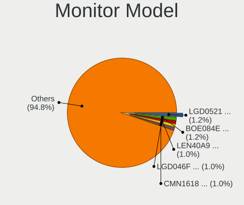

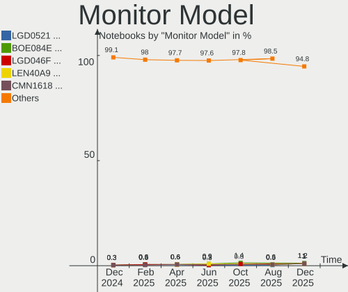

| Model                                                                 | Notebooks | Percent |
|-----------------------------------------------------------------------|-----------|---------|
| LG Display LCD Monitor LGD0521 1920x1080 309x174mm 14.0-inch          | 5         | 1.19%   |
| BOE LCD Monitor BOE084E 1920x1080 382x215mm 17.3-inch                 | 5         | 1.19%   |
| LG Display LCD Monitor LGD046F 1920x1080 344x194mm 15.5-inch          | 4         | 0.95%   |
| Lenovo LCD Monitor LEN40A9 1920x1080 309x173mm 13.9-inch              | 4         | 0.95%   |
| Chimei Innolux LCD Monitor CMN1618 1920x1200 344x215mm 16.0-inch      | 4         | 0.95%   |
| Chimei Innolux LCD Monitor CMN15E7 1920x1080 344x193mm 15.5-inch      | 4         | 0.95%   |
| AU Optronics LCD Monitor AUO61ED 1920x1080 344x194mm 15.5-inch        | 4         | 0.95%   |
| AU Optronics LCD Monitor AUO106C 1366x768 276x155mm 12.5-inch         | 4         | 0.95%   |
| Samsung Electronics LCD Monitor SDC4A51 1366x768 344x194mm 15.5-inch  | 3         | 0.71%   |
| Lenovo LCD Monitor LEN41B5 1920x1200 344x215mm 16.0-inch              | 3         | 0.71%   |
| Lenovo B140UAN02.7 LEN403A 1920x1200 302x188mm 14.0-inch              | 3         | 0.71%   |
| Fujitsu Siemens B24W-7 LED FUS0853 1920x1200 518x324mm 24.1-inch      | 3         | 0.71%   |
| Chimei Innolux LCD Monitor CMN15F5 1920x1080 344x193mm 15.5-inch      | 3         | 0.71%   |
| Chimei Innolux LCD Monitor CMN151E 1920x1080 344x193mm 15.5-inch      | 3         | 0.71%   |
| Apple Color LCD APPA01B 1440x900 286x179mm 13.3-inch                  | 3         | 0.71%   |
| TMX TL142GDXP02-0 TMX1420 2520x1680 300x200mm 14.2-inch               | 2         | 0.48%   |
| Samsung Electronics LCD Monitor SEC544B 1600x900 382x214mm 17.2-inch  | 2         | 0.48%   |
| Samsung Electronics LCD Monitor SEC4256 1600x900 382x215mm 17.3-inch  | 2         | 0.48%   |
| Samsung Electronics LCD Monitor SDC3150 1920x1080 344x194mm 15.5-inch | 2         | 0.48%   |
| LG Display LCD Monitor LGD05F8 2560x1600 366x229mm 17.0-inch          | 2         | 0.48%   |
| LG Display LCD Monitor LGD0469 1920x1080 382x215mm 17.3-inch          | 2         | 0.48%   |
| Lenovo Y32p-30 LEN66F9 3840x2160 697x392mm 31.5-inch                  | 2         | 0.48%   |
| Lenovo LCD Monitor LEN9051 1920x1080 344x194mm 15.5-inch              | 2         | 0.48%   |
| Lenovo LCD Monitor LEN40BA 1920x1080 344x194mm 15.5-inch              | 2         | 0.48%   |
| Lenovo LCD Monitor LEN40B2 1920x1080 344x193mm 15.5-inch              | 2         | 0.48%   |
| Lenovo LCD Monitor LEN40B1 1600x900 345x194mm 15.6-inch               | 2         | 0.48%   |
| Lenovo LCD Monitor LEN4036 1440x900 303x190mm 14.1-inch               | 2         | 0.48%   |
| InfoVision LCD Monitor IVO057D 1920x1080 309x174mm 14.0-inch          | 2         | 0.48%   |
| EDO EF10QBC64.C EDO4245                                               | 2         | 0.48%   |
| Dell U2415 DELA0B8 1920x1200 518x324mm 24.1-inch                      | 2         | 0.48%   |
| Dell P3221D DEL41EB 2560x1440 698x393mm 31.5-inch                     | 2         | 0.48%   |
| Chimei Innolux LCD Monitor CMN1738 1920x1080 381x214mm 17.2-inch      | 2         | 0.48%   |
| Chimei Innolux LCD Monitor CMN1735 1920x1080 381x214mm 17.2-inch      | 2         | 0.48%   |
| Chimei Innolux LCD Monitor CMN1731 1600x900 382x215mm 17.3-inch       | 2         | 0.48%   |
| Chimei Innolux LCD Monitor CMN15BE 1366x768 344x193mm 15.5-inch       | 2         | 0.48%   |
| Chimei Innolux LCD Monitor CMN1521 1920x1080 344x193mm 15.5-inch      | 2         | 0.48%   |
| Chimei Innolux LCD Monitor CMN14C9 1920x1080 309x173mm 13.9-inch      | 2         | 0.48%   |
| BOE NE153QDM-NZ2 BOE0D5F 2560x1600 329x206mm 15.3-inch                | 2         | 0.48%   |
| BOE LCD Monitor BOE0A99 2560x1600 366x229mm 17.0-inch                 | 2         | 0.48%   |
| AU Optronics LCD Monitor AUODF87 1920x1080 344x193mm 15.5-inch        | 2         | 0.48%   |

Monitor Resolution
------------------

Monitor screen resolution

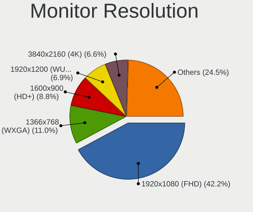

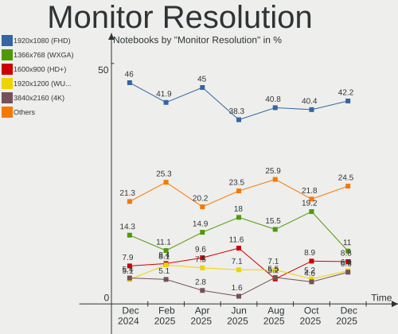

| Resolution         | Notebooks | Percent |
|--------------------|-----------|---------|
| 1920x1080 (FHD)    | 172       | 42.16%  |
| 1366x768 (WXGA)    | 45        | 11.03%  |
| 1600x900 (HD+)     | 36        | 8.82%   |
| 1920x1200 (WUXGA)  | 28        | 6.86%   |
| 3840x2160 (4K)     | 27        | 6.62%   |
| 2560x1600          | 17        | 4.17%   |
| 2560x1440 (QHD)    | 17        | 4.17%   |
| 1440x900 (WXGA+)   | 15        | 3.68%   |
| 1280x800 (WXGA)    | 11        | 2.7%    |
| 2880x1800          | 8         | 1.96%   |
| Unknown            | 6         | 1.47%   |
| 1680x1050 (WSXGA+) | 4         | 0.98%   |
| 800x1280           | 2         | 0.49%   |
| 3440x1440          | 2         | 0.49%   |
| 3200x1800 (QHD+)   | 2         | 0.49%   |
| 2520x1680          | 2         | 0.49%   |
| 2240x1400          | 2         | 0.49%   |
| 3840x2400          | 1         | 0.25%   |
| 3840x1600          | 1         | 0.25%   |
| 3456x2160          | 1         | 0.25%   |
| 3000x2000          | 1         | 0.25%   |
| 2944x1840          | 1         | 0.25%   |
| 2880x1920          | 1         | 0.25%   |
| 2288x1287          | 1         | 0.25%   |
| 2160x1440          | 1         | 0.25%   |
| 2048x1280          | 1         | 0.25%   |
| 1280x720 (HD)      | 1         | 0.25%   |
| 1280x1024 (SXGA)   | 1         | 0.25%   |
| 1024x600           | 1         | 0.25%   |

Monitor Diagonal
----------------

Diagonal size in inches

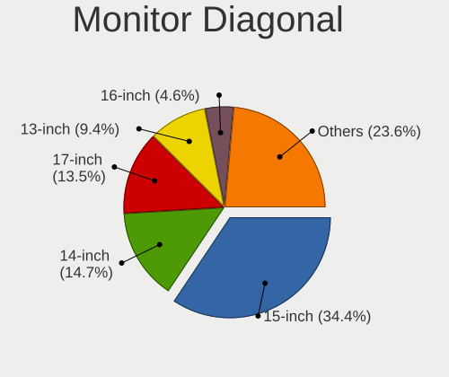

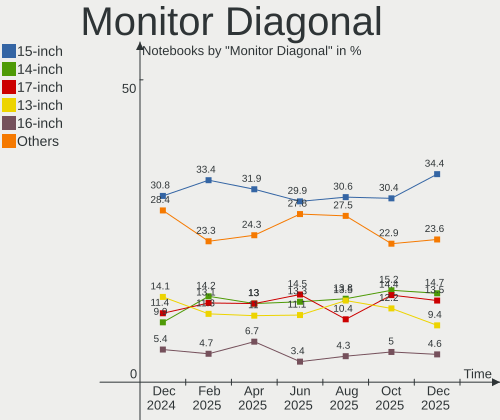

| Inches  | Notebooks | Percent |
|---------|-----------|---------|
| 15      | 143       | 34.38%  |
| 14      | 61        | 14.66%  |
| 17      | 56        | 13.46%  |
| 13      | 39        | 9.38%   |
| 16      | 19        | 4.57%   |
| 27      | 17        | 4.09%   |
| 24      | 16        | 3.85%   |
| 31      | 10        | 2.4%    |
| 12      | 8         | 1.92%   |
| 23      | 6         | 1.44%   |
| Unknown | 6         | 1.44%   |
| 21      | 5         | 1.2%    |
| 11      | 4         | 0.96%   |
| 84      | 3         | 0.72%   |
| 34      | 2         | 0.48%   |
| 26      | 2         | 0.48%   |
| 25      | 2         | 0.48%   |
| 18      | 2         | 0.48%   |
| 10      | 2         | 0.48%   |
| 7       | 2         | 0.48%   |
| 142     | 1         | 0.24%   |
| 72      | 1         | 0.24%   |
| 65      | 1         | 0.24%   |
| 64      | 1         | 0.24%   |
| 54      | 1         | 0.24%   |
| 43      | 1         | 0.24%   |
| 41      | 1         | 0.24%   |
| 37      | 1         | 0.24%   |
| 32      | 1         | 0.24%   |
| 28      | 1         | 0.24%   |
| 19      | 1         | 0.24%   |

Monitor Width
-------------

Physical width

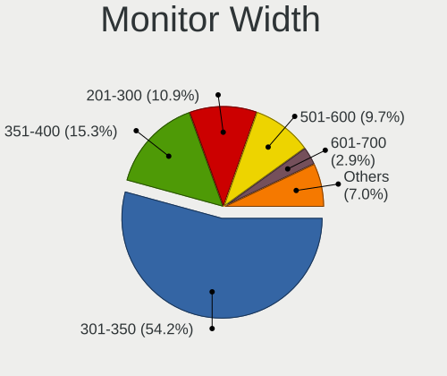

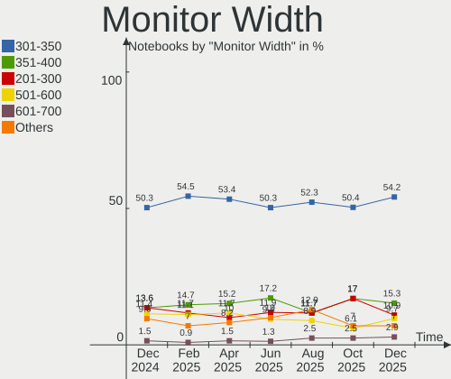

| Width in mm    | Notebooks | Percent |
|----------------|-----------|---------|
| 301-350        | 224       | 54.24%  |
| 351-400        | 63        | 15.25%  |
| 201-300        | 45        | 10.9%   |
| 501-600        | 40        | 9.69%   |
| 601-700        | 12        | 2.91%   |
| 401-500        | 7         | 1.69%   |
| Unknown        | 6         | 1.45%   |
| 1501-2000      | 4         | 0.97%   |
| 701-800        | 3         | 0.73%   |
| 1001-1500      | 3         | 0.73%   |
| 901-1000       | 2         | 0.48%   |
| 1-100          | 2         | 0.48%   |
| More than 2000 | 1         | 0.24%   |
| 801-900        | 1         | 0.24%   |

Aspect Ratio
------------

Proportional relationship between the width and the height

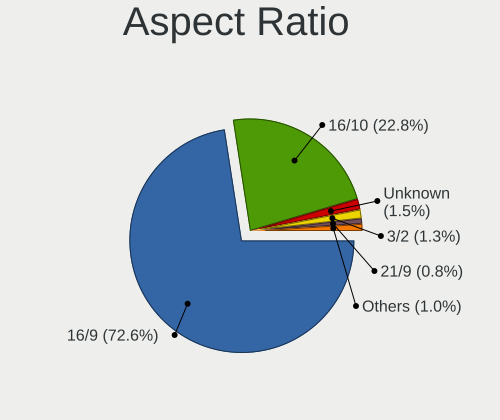

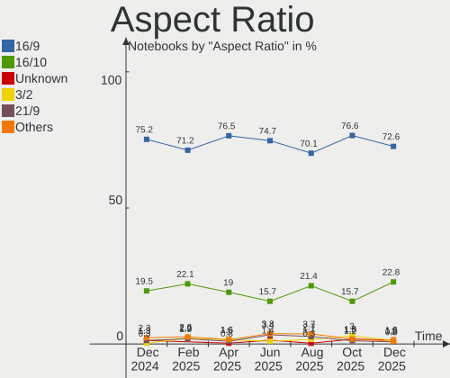

| Ratio   | Notebooks | Percent |
|---------|-----------|---------|
| 16/9    | 283       | 72.56%  |
| 16/10   | 89        | 22.82%  |
| Unknown | 6         | 1.54%   |
| 3/2     | 5         | 1.28%   |
| 21/9    | 3         | 0.77%   |
| 6/5     | 1         | 0.26%   |
| 1.00    | 1         | 0.26%   |
| 0.67    | 1         | 0.26%   |
| 0.62    | 1         | 0.26%   |

Monitor Area
------------

Area in inch²

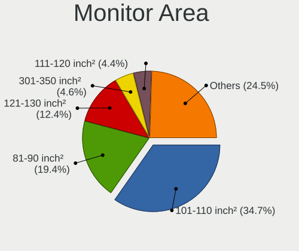

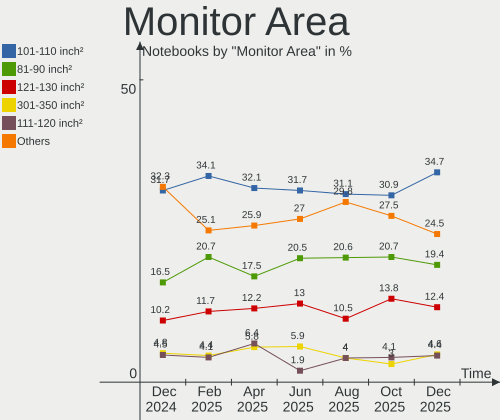

| Area in inch² | Notebooks | Percent |
|----------------|-----------|---------|
| 101-110        | 143       | 34.71%  |
| 81-90          | 80        | 19.42%  |
| 121-130        | 51        | 12.38%  |
| 301-350        | 19        | 4.61%   |
| 111-120        | 18        | 4.37%   |
| 201-250        | 17        | 4.13%   |
| 71-80          | 15        | 3.64%   |
| 351-500        | 13        | 3.16%   |
| More than 1000 | 8         | 1.94%   |
| 61-70          | 8         | 1.94%   |
| 251-300        | 8         | 1.94%   |
| 131-140        | 6         | 1.46%   |
| Unknown        | 6         | 1.46%   |
| 91-100         | 5         | 1.21%   |
| 51-60          | 4         | 0.97%   |
| 501-1000       | 3         | 0.73%   |
| 41-50          | 2         | 0.49%   |
| 1-40           | 2         | 0.49%   |
| 151-200        | 2         | 0.49%   |
| 141-150        | 2         | 0.49%   |

Pixel Density
-------------

Pixels per inch

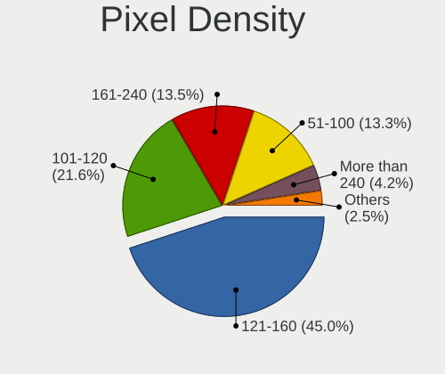

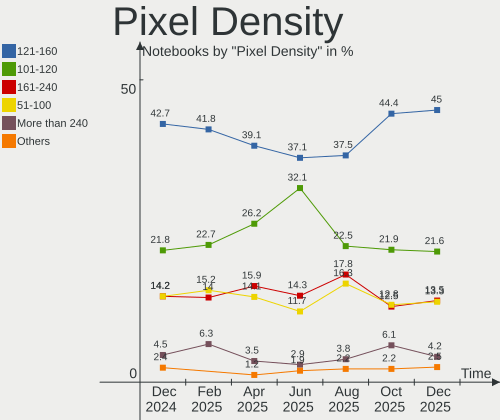

| Density       | Notebooks | Percent |
|---------------|-----------|---------|
| 121-160       | 183       | 44.96%  |
| 101-120       | 88        | 21.62%  |
| 161-240       | 55        | 13.51%  |
| 51-100        | 54        | 13.27%  |
| More than 240 | 17        | 4.18%   |
| Unknown       | 6         | 1.47%   |
| 1-50          | 4         | 0.98%   |

Multiple Monitors
-----------------

Total monitors connected

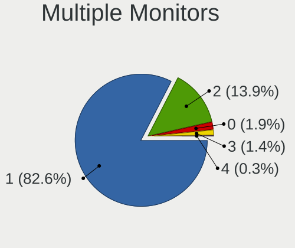

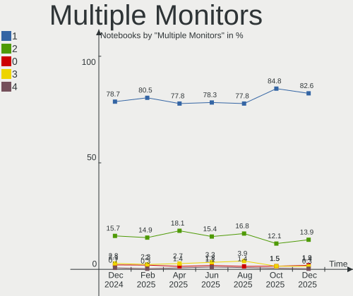

| Total | Notebooks | Percent |
|-------|-----------|---------|
| 1     | 303       | 82.56%  |
| 2     | 51        | 13.9%   |
| 0     | 7         | 1.91%   |
| 3     | 5         | 1.36%   |
| 4     | 1         | 0.27%   |

Network
-------

Net Controller Vendor
---------------------

Controller vendors

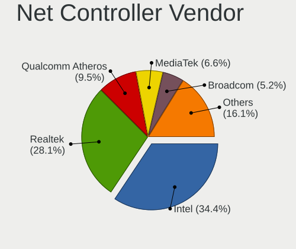

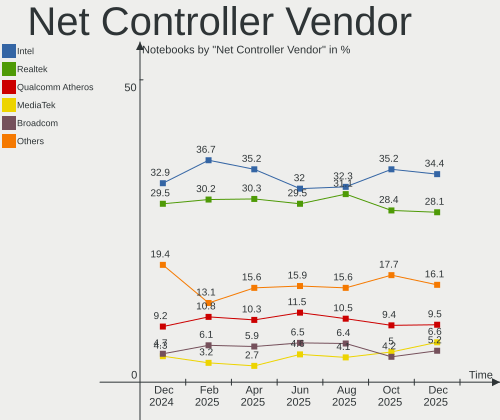

| Vendor                                 | Notebooks | Percent |
|----------------------------------------|-----------|---------|
| Intel                                  | 198       | 34.38%  |
| Realtek Semiconductor                  | 162       | 28.13%  |
| Qualcomm Atheros                       | 55        | 9.55%   |
| MediaTek                               | 38        | 6.6%    |
| Broadcom                               | 30        | 5.21%   |
| Sierra Wireless                        | 11        | 1.91%   |
| Broadcom Limited                       | 10        | 1.74%   |
| Qualcomm                               | 7         | 1.22%   |
| Lenovo                                 | 7         | 1.22%   |
| Ericsson Business Mobile Networks      | 7         | 1.22%   |
| Marvell Technology Group               | 5         | 0.87%   |
| ASIX Electronics                       | 4         | 0.69%   |
| Suzhou Motorcomm Electronic Technology | 3         | 0.52%   |
| Shenzhen Goodix Technology             | 3         | 0.52%   |
| Ralink                                 | 3         | 0.52%   |
| Nvidia                                 | 3         | 0.52%   |
| Motorcomm Microelectronics.            | 3         | 0.52%   |
| DisplayLink                            | 3         | 0.52%   |
| D-Link                                 | 3         | 0.52%   |
| TP-Link                                | 2         | 0.35%   |
| Ralink Technology                      | 2         | 0.35%   |
| Hewlett-Packard                        | 2         | 0.35%   |
| Edimax Technology                      | 2         | 0.35%   |
| Dell                                   | 2         | 0.35%   |
| AVM                                    | 2         | 0.35%   |
| Apple                                  | 2         | 0.35%   |
| ZyXEL Communications                   | 1         | 0.17%   |
| Samsung Electronics                    | 1         | 0.17%   |
| Realtek                                | 1         | 0.17%   |
| Qualcomm Atheros Communications        | 1         | 0.17%   |
| Google                                 | 1         | 0.17%   |
| Cypress Semiconductor                  | 1         | 0.17%   |
| Comneon                                | 1         | 0.17%   |

Net Controller Model
--------------------

Controller models

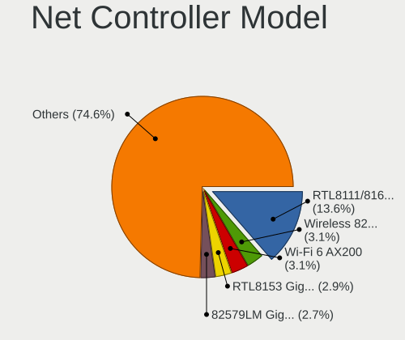

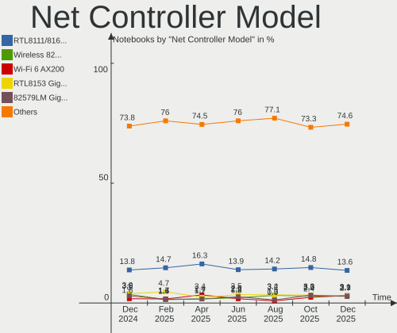

| Model                                                                           | Notebooks | Percent |
|---------------------------------------------------------------------------------|-----------|---------|
| Realtek RTL8111/8168/8211/8411 PCI Express Gigabit Ethernet Controller          | 97        | 13.6%   |
| Intel Wireless 8265 / 8275                                                      | 22        | 3.09%   |
| Intel Wi-Fi 6 AX200                                                             | 22        | 3.09%   |
| Realtek RTL8153 Gigabit Ethernet Adapter                                        | 21        | 2.95%   |
| Intel 82579LM Gigabit Network Connection (Lewisville)                           | 19        | 2.66%   |
| Realtek RTL810xE PCI Express Fast Ethernet controller                           | 16        | 2.24%   |
| Realtek RTL8821CE 802.11ac PCIe Wireless Network Adapter                        | 15        | 2.1%    |
| Intel Ethernet Connection (4) I219-LM                                           | 15        | 2.1%    |
| MediaTek MT7922 802.11ax PCI Express Wireless Network Adapter                   | 14        | 1.96%   |
| Intel Centrino Advanced-N 6205 [Taylor Peak]                                    | 13        | 1.82%   |
| Intel Wi-Fi 6 AX201                                                             | 12        | 1.68%   |
| Qualcomm Atheros QCA6174 802.11ac Wireless Network Adapter                      | 11        | 1.54%   |
| Intel Wireless 8260                                                             | 11        | 1.54%   |
| Intel Wireless 7265                                                             | 11        | 1.54%   |
| Intel Wireless 7260                                                             | 11        | 1.54%   |
| Qualcomm Atheros AR9285 Wireless Network Adapter (PCI-Express)                  | 10        | 1.4%    |
| MediaTek MT7925 802.11be 160MHz 2x2 PCIe Wireless Network Adapter [Filogic 360] | 9         | 1.26%   |
| Realtek RTL8723BE PCIe Wireless Network Adapter                                 | 8         | 1.12%   |
| Realtek RTL8125 2.5GbE Controller                                               | 7         | 0.98%   |
| MediaTek MT7902 802.11ax PCIe Wireless Network Adapter [Filogic 310]            | 7         | 0.98%   |
| Intel Wi-Fi 6E(802.11ax) AX210/AX1675* 2x2 [Typhoon Peak]                       | 7         | 0.98%   |
| Intel Alder Lake-P PCH CNVi WiFi                                                | 7         | 0.98%   |
| Broadcom BCM43142 802.11b/g/n                                                   | 7         | 0.98%   |
| Realtek RTL8852BE PCIe 802.11ax Wireless Network Controller                     | 6         | 0.84%   |
| MediaTek MT7921 802.11ax PCIe Wireless Network Adapter [Filogic 330]            | 6         | 0.84%   |
| Intel Meteor Lake PCH CNVi WiFi                                                 | 6         | 0.84%   |
| Intel Comet Lake PCH-LP CNVi WiFi                                               | 6         | 0.84%   |
| Intel Centrino Advanced-N 6200                                                  | 6         | 0.84%   |
| Intel 82577LM Gigabit Network Connection                                        | 6         | 0.84%   |
| Broadcom NetXtreme BCM57765 Gigabit Ethernet PCIe                               | 6         | 0.84%   |
| Broadcom Limited BCM4360 802.11ac Dual Band Wireless Network Adapter            | 6         | 0.84%   |
| Broadcom BCM4331 802.11a/b/g/n                                                  | 6         | 0.84%   |
| Sierra Wireless EM7305 Modem                                                    | 5         | 0.7%    |
| Realtek RTL8822CE 802.11ac PCIe Wireless Network Adapter                        | 5         | 0.7%    |
| Qualcomm QCNFA765 Wireless Network Adapter                                      | 5         | 0.7%    |
| Qualcomm Atheros QCA9565 / AR9565 Wireless Network Adapter                      | 5         | 0.7%    |
| Qualcomm Atheros QCA9377 802.11ac Wireless Network Adapter                      | 5         | 0.7%    |
| Qualcomm Atheros AR8151 v2.0 Gigabit Ethernet                                   | 5         | 0.7%    |
| Intel Ethernet Connection I219-LM                                               | 5         | 0.7%    |
| Intel Ethernet Connection I217-LM                                               | 5         | 0.7%    |

Wireless Vendor
---------------

Wireless vendors

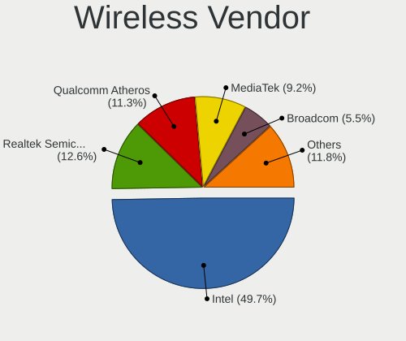

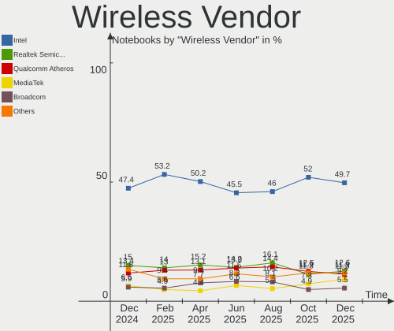

| Vendor                          | Notebooks | Percent |
|---------------------------------|-----------|---------|
| Intel                           | 190       | 49.74%  |
| Realtek Semiconductor           | 48        | 12.57%  |
| Qualcomm Atheros                | 43        | 11.26%  |
| MediaTek                        | 35        | 9.16%   |
| Broadcom                        | 21        | 5.5%    |
| Sierra Wireless                 | 11        | 2.88%   |
| Broadcom Limited                | 8         | 2.09%   |
| Qualcomm                        | 6         | 1.57%   |
| Ralink                          | 3         | 0.79%   |
| D-Link                          | 3         | 0.79%   |
| TP-Link                         | 2         | 0.52%   |
| Ralink Technology               | 2         | 0.52%   |
| Edimax Technology               | 2         | 0.52%   |
| AVM                             | 2         | 0.52%   |
| ZyXEL Communications            | 1         | 0.26%   |
| Realtek                         | 1         | 0.26%   |
| Qualcomm Atheros Communications | 1         | 0.26%   |
| Hewlett-Packard                 | 1         | 0.26%   |
| Dell                            | 1         | 0.26%   |
| Cypress Semiconductor           | 1         | 0.26%   |

Wireless Model
--------------

Wireless models

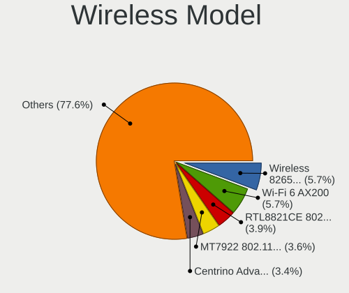

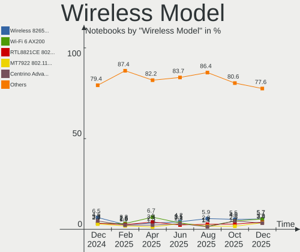

| Model                                                                           | Notebooks | Percent |
|---------------------------------------------------------------------------------|-----------|---------|
| Intel Wireless 8265 / 8275                                                      | 22        | 5.73%   |
| Intel Wi-Fi 6 AX200                                                             | 22        | 5.73%   |
| Realtek RTL8821CE 802.11ac PCIe Wireless Network Adapter                        | 15        | 3.91%   |
| MediaTek MT7922 802.11ax PCI Express Wireless Network Adapter                   | 14        | 3.65%   |
| Intel Centrino Advanced-N 6205 [Taylor Peak]                                    | 13        | 3.39%   |
| Intel Wi-Fi 6 AX201                                                             | 12        | 3.13%   |
| Qualcomm Atheros QCA6174 802.11ac Wireless Network Adapter                      | 11        | 2.86%   |
| Intel Wireless 8260                                                             | 11        | 2.86%   |
| Intel Wireless 7265                                                             | 11        | 2.86%   |
| Intel Wireless 7260                                                             | 11        | 2.86%   |
| Qualcomm Atheros AR9285 Wireless Network Adapter (PCI-Express)                  | 10        | 2.6%    |
| Realtek RTL8723BE PCIe Wireless Network Adapter                                 | 8         | 2.08%   |
| MediaTek MT7902 802.11ax PCIe Wireless Network Adapter [Filogic 310]            | 7         | 1.82%   |
| Intel Wi-Fi 6E(802.11ax) AX210/AX1675* 2x2 [Typhoon Peak]                       | 7         | 1.82%   |
| Broadcom BCM43142 802.11b/g/n                                                   | 7         | 1.82%   |
| MediaTek MT7925 802.11be 160MHz 2x2 PCIe Wireless Network Adapter [Filogic 360] | 6         | 1.56%   |
| MediaTek MT7921 802.11ax PCIe Wireless Network Adapter [Filogic 330]            | 6         | 1.56%   |
| Intel Meteor Lake PCH CNVi WiFi                                                 | 6         | 1.56%   |
| Intel Comet Lake PCH-LP CNVi WiFi                                               | 6         | 1.56%   |
| Intel Centrino Advanced-N 6200                                                  | 6         | 1.56%   |
| Broadcom Limited BCM4360 802.11ac Dual Band Wireless Network Adapter            | 6         | 1.56%   |
| Broadcom BCM4331 802.11a/b/g/n                                                  | 6         | 1.56%   |
| Sierra Wireless EM7305 Modem                                                    | 5         | 1.3%    |
| Realtek RTL8822CE 802.11ac PCIe Wireless Network Adapter                        | 5         | 1.3%    |
| Qualcomm QCNFA765 Wireless Network Adapter                                      | 5         | 1.3%    |
| Qualcomm Atheros QCA9565 / AR9565 Wireless Network Adapter                      | 5         | 1.3%    |
| Qualcomm Atheros QCA9377 802.11ac Wireless Network Adapter                      | 5         | 1.3%    |
| Intel Centrino Advanced-N 6235                                                  | 5         | 1.3%    |
| Intel Alder Lake-P PCH CNVi WiFi                                                | 5         | 1.3%    |
| Sierra Wireless EM7455                                                          | 4         | 1.04%   |
| Realtek RTL8852BE PCIe 802.11ax Wireless Network Controller                     | 4         | 1.04%   |
| Realtek RTL8188CE 802.11b/g/n WiFi Adapter                                      | 4         | 1.04%   |
| Qualcomm Atheros AR9485 Wireless Network Adapter                                | 4         | 1.04%   |
| Intel Wi-Fi 5(802.11ac) Wireless-AC 9x6x [Thunder Peak]                         | 4         | 1.04%   |
| Intel Gemini Lake PCH CNVi WiFi                                                 | 4         | 1.04%   |
| Intel Cannon Point-LP CNVi [Wireless-AC]                                        | 4         | 1.04%   |
| Realtek RTL8191SEvB Wireless LAN Controller                                     | 3         | 0.78%   |
| Qualcomm Atheros AR928X Wireless Network Adapter (PCI-Express)                  | 3         | 0.78%   |
| Qualcomm Atheros AR242x / AR542x Wireless Network Adapter (PCI-Express)         | 3         | 0.78%   |
| Intel Wireless 3165                                                             | 3         | 0.78%   |

Ethernet Vendor
---------------

Ethernet vendors

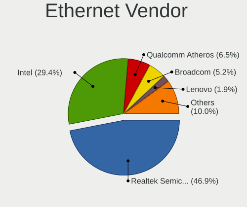

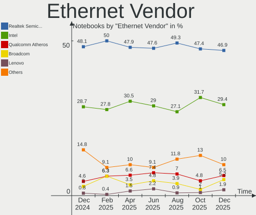

| Vendor                                 | Notebooks | Percent |
|----------------------------------------|-----------|---------|
| Realtek Semiconductor                  | 145       | 46.93%  |
| Intel                                  | 91        | 29.45%  |
| Qualcomm Atheros                       | 20        | 6.47%   |
| Broadcom                               | 16        | 5.18%   |
| Lenovo                                 | 6         | 1.94%   |
| Marvell Technology Group               | 5         | 1.62%   |
| ASIX Electronics                       | 4         | 1.29%   |
| Suzhou Motorcomm Electronic Technology | 3         | 0.97%   |
| Nvidia                                 | 3         | 0.97%   |
| Motorcomm Microelectronics.            | 3         | 0.97%   |
| MediaTek                               | 3         | 0.97%   |
| DisplayLink                            | 3         | 0.97%   |
| Broadcom Limited                       | 2         | 0.65%   |
| Apple                                  | 2         | 0.65%   |
| Samsung Electronics                    | 1         | 0.32%   |
| Qualcomm                               | 1         | 0.32%   |
| Google                                 | 1         | 0.32%   |

Ethernet Model
--------------

Ethernet models

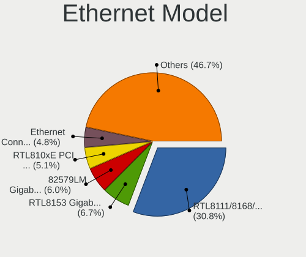

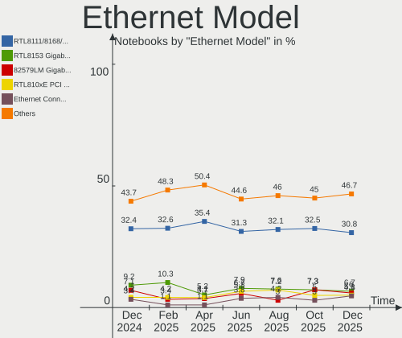

| Model                                                                           | Notebooks | Percent |
|---------------------------------------------------------------------------------|-----------|---------|
| Realtek RTL8111/8168/8211/8411 PCI Express Gigabit Ethernet Controller          | 97        | 30.79%  |
| Realtek RTL8153 Gigabit Ethernet Adapter                                        | 21        | 6.67%   |
| Intel 82579LM Gigabit Network Connection (Lewisville)                           | 19        | 6.03%   |
| Realtek RTL810xE PCI Express Fast Ethernet controller                           | 16        | 5.08%   |
| Intel Ethernet Connection (4) I219-LM                                           | 15        | 4.76%   |
| Realtek RTL8125 2.5GbE Controller                                               | 7         | 2.22%   |
| Intel 82577LM Gigabit Network Connection                                        | 6         | 1.9%    |
| Broadcom NetXtreme BCM57765 Gigabit Ethernet PCIe                               | 6         | 1.9%    |
| Qualcomm Atheros AR8151 v2.0 Gigabit Ethernet                                   | 5         | 1.59%   |
| Intel Ethernet Connection I219-LM                                               | 5         | 1.59%   |
| Intel Ethernet Connection I217-LM                                               | 5         | 1.59%   |
| Intel Ethernet Connection (7) I219-LM                                           | 5         | 1.59%   |
| Intel Ethernet Connection (3) I218-LM                                           | 4         | 1.27%   |
| Suzhou Motorcomm Electronic YT6801 Gigabit Ethernet Controller                  | 3         | 0.95%   |
| Realtek USB 10/100/1G/2.5 LAN                                                   | 3         | 0.95%   |
| Realtek RTL8152 Fast Ethernet Adapter                                           | 3         | 0.95%   |
| Qualcomm Atheros Killer E2500 Gigabit Ethernet Controller                       | 3         | 0.95%   |
| Qualcomm Atheros AR8131 Gigabit Ethernet                                        | 3         | 0.95%   |
| Motorcomm Microelectronics. YT6801 Gigabit Ethernet Controller                  | 3         | 0.95%   |
| MediaTek MT7925 802.11be 160MHz 2x2 PCIe Wireless Network Adapter [Filogic 360] | 3         | 0.95%   |
| Intel Ethernet Connection I219-V                                                | 3         | 0.95%   |
| Intel Ethernet Connection (4) I219-V                                            | 3         | 0.95%   |
| Intel Ethernet Connection (16) I219-V                                           | 3         | 0.95%   |
| Broadcom NetLink BCM57785 Gigabit Ethernet PCIe                                 | 3         | 0.95%   |
| ASIX AX88179 Gigabit Ethernet                                                   | 3         | 0.95%   |
| Realtek RTL8852BE PCIe 802.11ax Wireless Network Controller                     | 2         | 0.63%   |
| Qualcomm Atheros QCA8172 Fast Ethernet                                          | 2         | 0.63%   |
| Qualcomm Atheros Killer E220x Gigabit Ethernet Controller                       | 2         | 0.63%   |
| Nvidia MCP79 Ethernet                                                           | 2         | 0.63%   |
| Lenovo USB-C Dock Ethernet                                                      | 2         | 0.63%   |
| Lenovo ThinkPad Lan                                                             | 2         | 0.63%   |
| Intel Ethernet Connection I218-LM                                               | 2         | 0.63%   |
| Intel Ethernet Connection (6) I219-V                                            | 2         | 0.63%   |
| Intel Ethernet Connection (18) I219-LM                                          | 2         | 0.63%   |
| Intel Ethernet Connection (13) I219-LM                                          | 2         | 0.63%   |
| Intel Alder Lake-P PCH CNVi WiFi                                                | 2         | 0.63%   |
| DisplayLink USB-C Triple-4K Dock                                                | 2         | 0.63%   |
| Broadcom NetLink BCM5787M Gigabit Ethernet PCI Express                          | 2         | 0.63%   |
| Broadcom NetLink BCM57780 Gigabit Ethernet PCIe                                 | 2         | 0.63%   |
| Broadcom Limited NetLink BCM5787M Gigabit Ethernet PCI Express                  | 2         | 0.63%   |

Net Controller Kind
-------------------

Ethernet, WiFi or modem

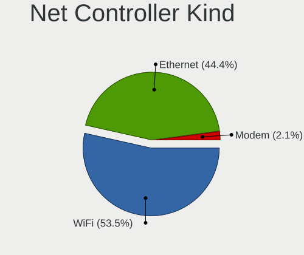

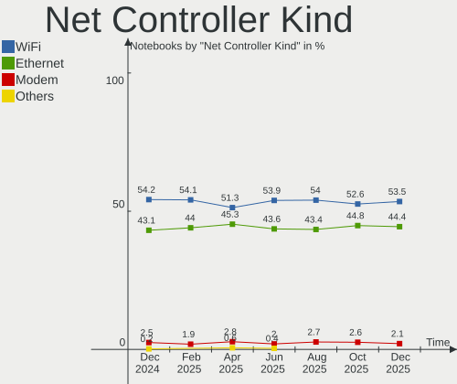

| Kind     | Notebooks | Percent |
|----------|-----------|---------|
| WiFi     | 352       | 53.5%   |
| Ethernet | 292       | 44.38%  |
| Modem    | 14        | 2.13%   |

Used Controller
---------------

Currently used network controller

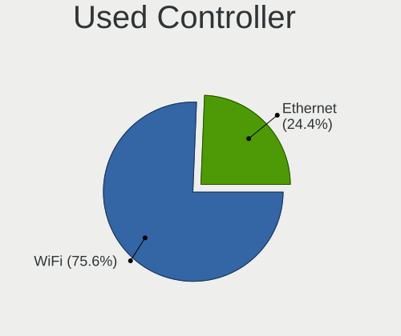

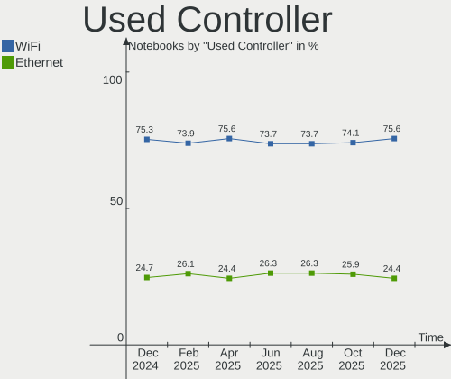

| Kind     | Notebooks | Percent |
|----------|-----------|---------|
| WiFi     | 292       | 75.65%  |
| Ethernet | 94        | 24.35%  |

NICs
----

Total network controllers on board

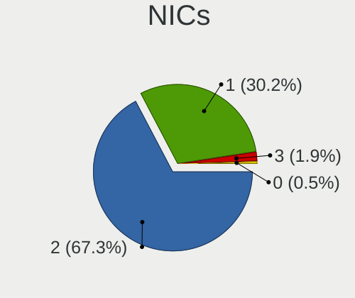

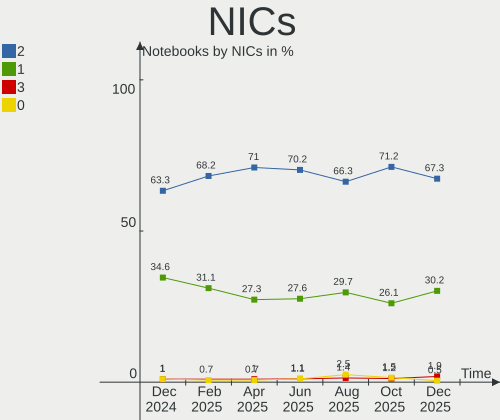

| Total | Notebooks | Percent |
|-------|-----------|---------|
| 2     | 247       | 67.3%   |
| 1     | 111       | 30.25%  |
| 3     | 7         | 1.91%   |
| 0     | 2         | 0.54%   |

IPv6
----

IPv6 vs IPv4

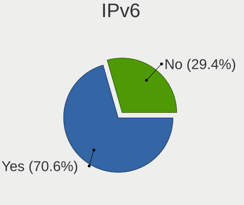

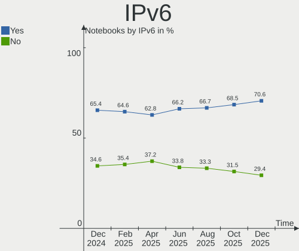

| Used | Notebooks | Percent |
|------|-----------|---------|
| Yes  | 259       | 70.57%  |
| No   | 108       | 29.43%  |

Bluetooth
---------

Bluetooth Vendor
----------------

Controller vendors

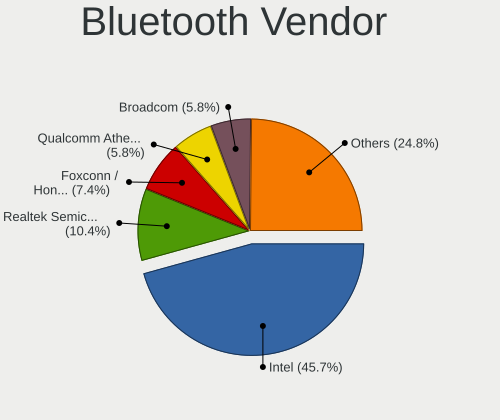

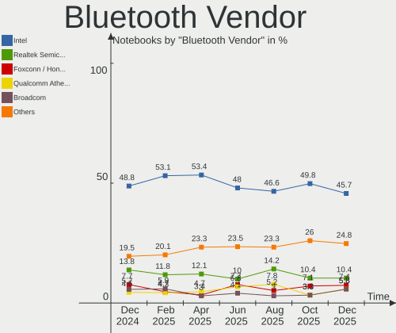

| Vendor                          | Notebooks | Percent |
|---------------------------------|-----------|---------|
| Intel                           | 149       | 45.71%  |
| Realtek Semiconductor           | 34        | 10.43%  |
| Foxconn / Hon Hai               | 24        | 7.36%   |
| Qualcomm Atheros Communications | 19        | 5.83%   |
| Broadcom                        | 19        | 5.83%   |
| IMC Networks                    | 16        | 4.91%   |
| Apple                           | 15        | 4.6%    |
| MediaTek                        | 11        | 3.37%   |
| Lite-On Technology              | 7         | 2.15%   |
| Cambridge Silicon Radio         | 7         | 2.15%   |
| Hewlett-Packard                 | 4         | 1.23%   |
| ASUSTek Computer                | 4         | 1.23%   |
| USI                             | 3         | 0.92%   |
| Toshiba                         | 3         | 0.92%   |
| Foxconn International           | 3         | 0.92%   |
| TP-Link                         | 2         | 0.61%   |
| Ralink                          | 2         | 0.61%   |
| Dell                            | 2         | 0.61%   |
| Askey Computer                  | 1         | 0.31%   |
| Unknown                         | 1         | 0.31%   |

Bluetooth Model
---------------

Controller models

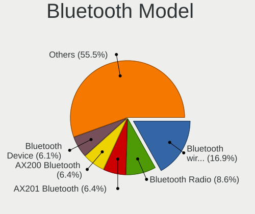

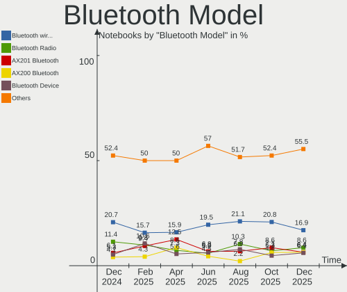

| Model                                               | Notebooks | Percent |
|-----------------------------------------------------|-----------|---------|
| Intel Bluetooth wireless interface                  | 55        | 16.87%  |
| Realtek Bluetooth Radio                             | 28        | 8.59%   |
| Intel AX201 Bluetooth                               | 21        | 6.44%   |
| Intel AX200 Bluetooth                               | 21        | 6.44%   |
| Intel Bluetooth Device                              | 20        | 6.13%   |
| Foxconn / Hon Hai Wireless_Device                   | 14        | 4.29%   |
| Intel Bluetooth 9460/9560 Jefferson Peak (JfP)      | 12        | 3.68%   |
| MediaTek Wireless_Device                            | 10        | 3.07%   |
| Intel Centrino Bluetooth Wireless Transceiver       | 8         | 2.45%   |
| Apple Bluetooth USB Host Controller                 | 8         | 2.45%   |
| Qualcomm Atheros QCA61x4 Bluetooth 4.0              | 7         | 2.15%   |
| Intel AX210 Bluetooth                               | 7         | 2.15%   |
| IMC Networks Wireless_Device                        | 7         | 2.15%   |
| IMC Networks Bluetooth Radio                        | 7         | 2.15%   |
| Cambridge Silicon Radio Bluetooth Dongle (HCI mode) | 7         | 2.15%   |
| Apple Bluetooth Host Controller                     | 7         | 2.15%   |
| Qualcomm Atheros AR3011 Bluetooth                   | 6         | 1.84%   |
| Broadcom BCM20702 Bluetooth 4.0 [ThinkPad]          | 6         | 1.84%   |
| Broadcom BCM2045B (BDC-2.1)                         | 6         | 1.84%   |
| Foxconn / Hon Hai MediaTek Bluetooth Adapter        | 5         | 1.53%   |
| Realtek  Bluetooth 4.2 Adapter                      | 4         | 1.23%   |
| Intel Wireless-AC 9260 Bluetooth Adapter            | 4         | 1.23%   |
| USI Bluetooth Device                                | 3         | 0.92%   |
| Qualcomm Atheros  Bluetooth Device                  | 3         | 0.92%   |
| Lite-On Bluetooth Device                            | 3         | 0.92%   |
| HP Broadcom 2070 Bluetooth Combo                    | 3         | 0.92%   |
| Foxconn International BCM43142A0 Bluetooth module   | 3         | 0.92%   |
| TP-Link TP-T@- UB500 Adapter                        | 2         | 0.61%   |
| Realtek RTL8723B Bluetooth                          | 2         | 0.61%   |
| Ralink RT3290 Bluetooth                             | 2         | 0.61%   |
| Qualcomm Atheros AR3012 Bluetooth 4.0               | 2         | 0.61%   |
| Lite-On Qualcomm Atheros QCA9377 Bluetooth          | 2         | 0.61%   |
| Foxconn / Hon Hai Bluetooth Device                  | 2         | 0.61%   |
| Broadcom HP Portable SoftSailing                    | 2         | 0.61%   |
| Broadcom BCM43142 Bluetooth 4.0                     | 2         | 0.61%   |
| ASUS ASUS USB-BT500                                 | 2         | 0.61%   |
| Toshiba Integrated Bluetooth HCI                    | 1         | 0.31%   |
| Toshiba Bluetooth Device                            | 1         | 0.31%   |
| Toshiba BCM43142A0                                  | 1         | 0.31%   |
| Qualcomm Atheros AR3012 Bluetooth                   | 1         | 0.31%   |

Sound
-----

Sound Vendor
------------

Sound card vendors

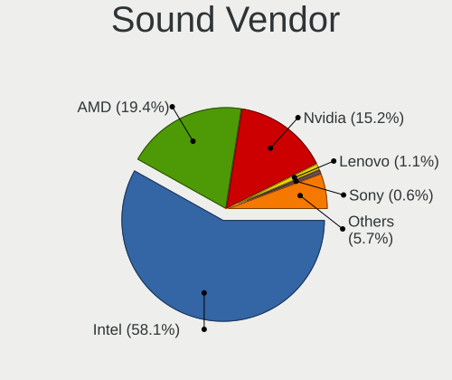

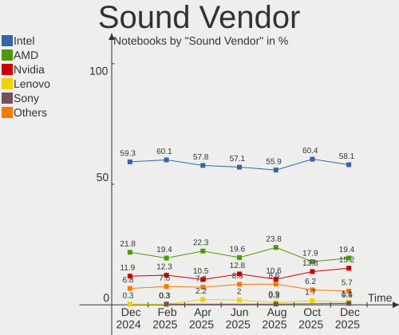

| Vendor                                       | Notebooks | Percent |
|----------------------------------------------|-----------|---------|
| Intel                                        | 276       | 58.11%  |
| AMD                                          | 92        | 19.37%  |
| Nvidia                                       | 72        | 15.16%  |
| Lenovo                                       | 5         | 1.05%   |
| Sony                                         | 3         | 0.63%   |
| Apple                                        | 3         | 0.63%   |
| SteelSeries ApS                              | 2         | 0.42%   |
| Jieli Technology                             | 2         | 0.42%   |
| C-Media Electronics                          | 2         | 0.42%   |
| Zoran Co. Personal Media Division (Nogatech) | 1         | 0.21%   |
| Samsung Electronics                          | 1         | 0.21%   |
| RODE Microphones                             | 1         | 0.21%   |
| Razer USA                                    | 1         | 0.21%   |
| Plantronics                                  | 1         | 0.21%   |
| Native Instruments                           | 1         | 0.21%   |
| Micro Star International                     | 1         | 0.21%   |
| Logitech                                     | 1         | 0.21%   |
| Lautsprecher Teufel                          | 1         | 0.21%   |
| Kingston Technology                          | 1         | 0.21%   |
| Jupiter                                      | 1         | 0.21%   |
| JMTek                                        | 1         | 0.21%   |
| Hewlett-Packard                              | 1         | 0.21%   |
| GN Netcom                                    | 1         | 0.21%   |
| eMPIA Technology                             | 1         | 0.21%   |
| Creative Technology                          | 1         | 0.21%   |
| Cambridge Audio                              | 1         | 0.21%   |
| ASUSTek Computer                             | 1         | 0.21%   |

Sound Model
-----------

Sound card models

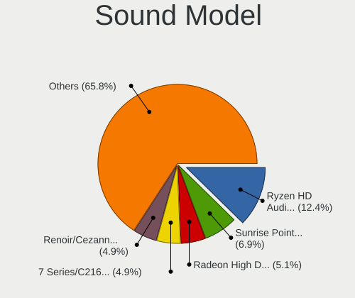

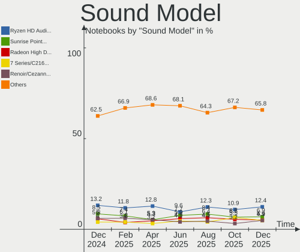

| Model                                                                      | Notebooks | Percent |
|----------------------------------------------------------------------------|-----------|---------|
| AMD Ryzen HD Audio Controller                                              | 73        | 12.35%  |
| Intel Sunrise Point-LP HD Audio                                            | 41        | 6.94%   |
| AMD Radeon High Definition Audio Controller                                | 30        | 5.08%   |
| Intel 7 Series/C216 Chipset Family High Definition Audio Controller        | 29        | 4.91%   |
| AMD Renoir/Cezanne HDMI/DP Audio Controller                                | 29        | 4.91%   |
| Intel 6 Series/C200 Series Chipset Family High Definition Audio Controller | 22        | 3.72%   |
| Intel Haswell-ULT HD Audio Controller                                      | 17        | 2.88%   |
| Intel 8 Series HD Audio Controller                                         | 17        | 2.88%   |
| Intel 5 Series/3400 Series Chipset High Definition Audio                   | 17        | 2.88%   |
| Intel Tiger Lake-LP Smart Sound Technology Audio Controller                | 15        | 2.54%   |
| Intel Broadwell-U Audio Controller                                         | 15        | 2.54%   |
| Intel Wildcat Point-LP High Definition Audio Controller                    | 14        | 2.37%   |
| Intel 8 Series/C220 Series Chipset High Definition Audio Controller        | 13        | 2.2%    |
| Intel Alder Lake PCH-P High Definition Audio Controller                    | 12        | 2.03%   |
| Intel Xeon E3-1200 v3/4th Gen Core Processor HD Audio Controller           | 11        | 1.86%   |
| Intel Cannon Lake PCH cAVS                                                 | 11        | 1.86%   |
| Intel Raptor Lake High Definition Audio Controller                         | 9         | 1.52%   |
| Nvidia GF108 High Definition Audio Controller                              | 8         | 1.35%   |
| Nvidia AD107 High Definition Audio Controller                              | 8         | 1.35%   |
| Intel 82801I (ICH9 Family) HD Audio Controller                             | 8         | 1.35%   |
| AMD Raven/Raven2/Fenghuang HDMI/DP Audio Controller                        | 8         | 1.35%   |
| Intel Comet Lake PCH-LP cAVS                                               | 7         | 1.18%   |
| Intel Celeron/Pentium Silver Processor High Definition Audio               | 7         | 1.18%   |
| Intel Cannon Point-LP High Definition Audio Controller                     | 7         | 1.18%   |
| Intel Meteor Lake-P HD Audio Controller                                    | 6         | 1.02%   |
| Intel 82801H (ICH8 Family) HD Audio Controller                             | 6         | 1.02%   |
| Nvidia High Definition Audio Controller                                    | 5         | 0.85%   |
| Nvidia GB206 High Definition Audio Controller                              | 5         | 0.85%   |
| Nvidia GA104 High Definition Audio Controller                              | 4         | 0.68%   |
| Intel Ice Lake-LP Smart Sound Technology Audio Controller                  | 4         | 0.68%   |
| Intel CM238 HD Audio Controller                                            | 4         | 0.68%   |
| Intel Celeron N3350/Pentium N4200/Atom E3900 Series Audio Cluster          | 4         | 0.68%   |
| AMD FCH Azalia Controller                                                  | 4         | 0.68%   |
| Sony DualSense wireless controller (PS5)                                   | 3         | 0.51%   |
| Nvidia TU104 HD Audio Controller                                           | 3         | 0.51%   |
| Nvidia GP104 High Definition Audio Controller                              | 3         | 0.51%   |
| Nvidia GK107 HDMI Audio Controller                                         | 3         | 0.51%   |
| Intel Raptor Lake-P/U/H cAVS                                               | 3         | 0.51%   |
| Intel Comet Lake PCH cAVS                                                  | 3         | 0.51%   |
| Intel Arrow Lake cAVS                                                      | 3         | 0.51%   |

Memory
------

Memory Vendor
-------------

Memory module vendors

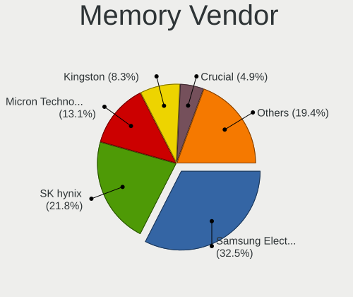

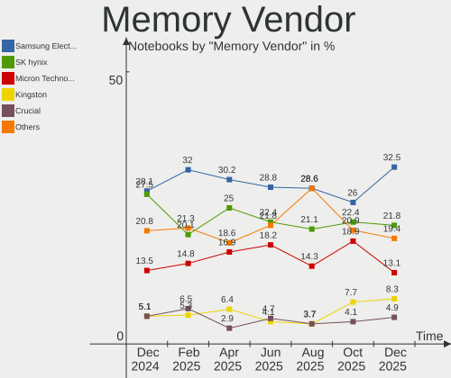

| Vendor              | Notebooks | Percent |
|---------------------|-----------|---------|
| Samsung Electronics | 67        | 32.52%  |
| SK hynix            | 45        | 21.84%  |
| Micron Technology   | 27        | 13.11%  |
| Kingston            | 17        | 8.25%   |
| Crucial             | 10        | 4.85%   |
| Unknown             | 8         | 3.88%   |
| Ramaxel Technology  | 7         | 3.4%    |
| Corsair             | 6         | 2.91%   |
| G.Skill             | 4         | 1.94%   |
| Nanya Technology    | 3         | 1.46%   |
| A-DATA Technology   | 3         | 1.46%   |
| Timetec             | 2         | 0.97%   |
| ChangXin Memory     | 2         | 0.97%   |
| Unknown             | 2         | 0.97%   |
| Unknown (ABCD)      | 1         | 0.49%   |
| Unknown (0x0FE9)    | 1         | 0.49%   |
| Team                | 1         | 0.49%   |

Memory Model
------------

Memory module models

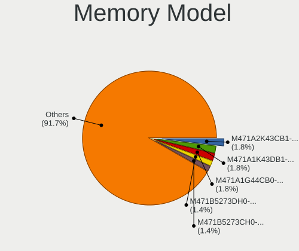

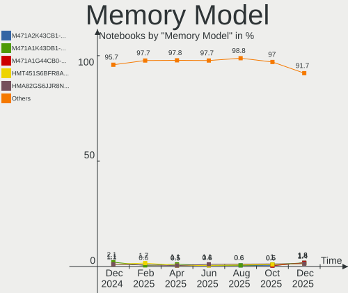

| Model                                                           | Notebooks | Percent |
|-----------------------------------------------------------------|-----------|---------|
| Samsung RAM M471A2K43CB1-CRC 16GB SODIMM DDR4 2667MT/s          | 4         | 1.83%   |
| Samsung RAM M471A1K43DB1-CWE 8GB SODIMM DDR4 3200MT/s           | 4         | 1.83%   |
| Samsung RAM M471A1G44CB0-CWE 8GB SODIMM DDR4 3200MT/s           | 4         | 1.83%   |
| SK hynix RAM HMT451S6BFR8A-PB 4GB SODIMM DDR3 1600MT/s          | 3         | 1.38%   |
| SK hynix RAM HMA82GS6JJR8N-VK 16GB SODIMM DDR4 2667MT/s         | 3         | 1.38%   |
| Samsung RAM M471B5273DH0-CH9 4GB SODIMM DDR3 1600MT/s           | 3         | 1.38%   |
| Samsung RAM M471B5273CH0-CH9 4GB SODIMM DDR3 1334MT/s           | 3         | 1.38%   |
| Samsung RAM M471A5244CB0-CWE 4GB SODIMM DDR4 3200MT/s           | 3         | 1.38%   |
| Samsung RAM M425R2GA3EB0-CWMOL 16GB SODIMM DDR5 5600MT/s        | 3         | 1.38%   |
| Unknown RAM Module 4GB SODIMM DDR3                              | 2         | 0.92%   |
| SK hynix RAM HYMP125S64CP8-S6 2GB SODIMM DDR2 975MT/s           | 2         | 0.92%   |
| SK hynix RAM HMT41GS6BFR8A-PB 8GB SODIMM DDR3 1600MT/s          | 2         | 0.92%   |
| SK hynix RAM HMT351S6BFR8C-H9 4GB SODIMM 1334MT/s               | 2         | 0.92%   |
| SK hynix RAM HMAA2GS6CJR8N-XN 16GB SODIMM DDR4 3200MT/s         | 2         | 0.92%   |
| SK hynix RAM HMAA1GS6CMR6N-XN 8GB SODIMM DDR4 3200MT/s          | 2         | 0.92%   |
| SK hynix RAM HMA81GS6JJR8N-VK 8GB SODIMM DDR4 2667MT/s          | 2         | 0.92%   |
| SK hynix RAM HMA81GS6AFR8N-UH 8GB SODIMM DDR4 2667MT/s          | 2         | 0.92%   |
| Samsung RAM M471B1G73QH0-YK0 8GB SODIMM DDR3 1600MT/s           | 2         | 0.92%   |
| Samsung RAM M471A5244CB0-CTD 4GB SODIMM DDR4 3266MT/s           | 2         | 0.92%   |
| Samsung RAM M471A4G43MB1-CTD 32GB SODIMM DDR4 2667MT/s          | 2         | 0.92%   |
| Samsung RAM M471A2G44AM0-CWE 16GB SODIMM DDR4 3200MT/s          | 2         | 0.92%   |
| Samsung RAM M471A1K43EB1-CWE 8GB SODIMM DDR4 3200MT/s           | 2         | 0.92%   |
| Samsung RAM M471A1K43CB1-CRC 8GB SODIMM DDR4 8400MT/s           | 2         | 0.92%   |
| Samsung RAM M471A1G44AB0-CWE 8GiB SODIMM DDR4 3200MT/s          | 2         | 0.92%   |
| Samsung RAM M425R2GA3EB0-CWMOD 16GB SODIMM DDR5 5600MT/s        | 2         | 0.92%   |
| Samsung RAM M425R1GB4PB0-CWMOD 8GiB SODIMM DDR5 5600MT/s        | 2         | 0.92%   |
| Samsung RAM M4 70T5663QZ3-CF7 2GB SODIMM DDR2 2048MT/s          | 2         | 0.92%   |
| Samsung RAM K3KL9L90CM-MGCT 4GB Row Of Chips LPDDR5 7500MT/s    | 2         | 0.92%   |
| Micron RAM MTC4C10163S1SC48BA1 8GB SODIMM DDR5 4800MT/s         | 2         | 0.92%   |
| Micron RAM MT52L512M32D2PF-10 4GB Row Of Chips LPDDR3 1867MT/s  | 2         | 0.92%   |
| Micron RAM CT16G56C46S5.M8D1 16GB SODIMM DDR5 5600MT/s          | 2         | 0.92%   |
| Crucial RAM CT102464BF160B.C16 8GB SODIMM DDR3 1600MT/s         | 2         | 0.92%   |
| Corsair RAM CMSO4GX3M1A1333C9 4GB SODIMM DDR3 1334MT/s          | 2         | 0.92%   |
| ChangXin Memory RAM DB5CCAM-MK 2GB Row Of Chips LPDDR4 3733MT/s | 2         | 0.92%   |
| Unknown                                                         | 2         | 0.92%   |
| Unknown RAM Module 8GB SODIMM DDR4 2400MT/s                     | 1         | 0.46%   |
| Unknown RAM Module 4GB SODIMM DDR4 2400MT/s                     | 1         | 0.46%   |
| Unknown RAM Module 4GB Row Of Chips LPDDR4 4267MT/s             | 1         | 0.46%   |
| Unknown RAM Module 2GB SODIMM SDRAM                             | 1         | 0.46%   |
| Unknown RAM Module 2GB Row Of Chips LPDDR4 4267MT/s             | 1         | 0.46%   |

Memory Kind
-----------

Memory module kinds

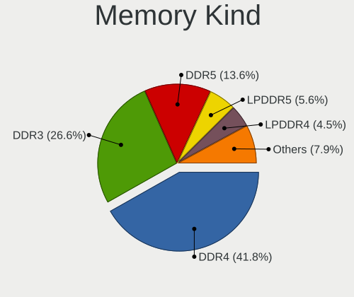

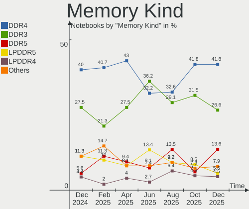

| Kind   | Notebooks | Percent |
|--------|-----------|---------|
| DDR4   | 74        | 41.81%  |
| DDR3   | 47        | 26.55%  |
| DDR5   | 24        | 13.56%  |
| LPDDR5 | 10        | 5.65%   |
| LPDDR4 | 8         | 4.52%   |
| SDRAM  | 6         | 3.39%   |
| LPDDR3 | 5         | 2.82%   |
| DDR2   | 3         | 1.69%   |

Memory Form Factor
------------------

Physical design of the memory module

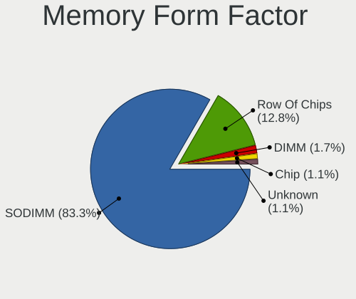

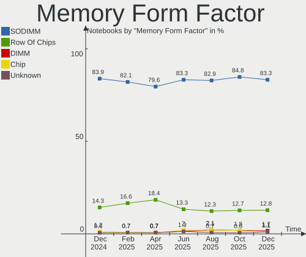

| Name         | Notebooks | Percent |
|--------------|-----------|---------|
| SODIMM       | 150       | 83.33%  |
| Row Of Chips | 23        | 12.78%  |
| DIMM         | 3         | 1.67%   |
| Chip         | 2         | 1.11%   |
| Unknown      | 2         | 1.11%   |

Memory Size
-----------

Memory module size

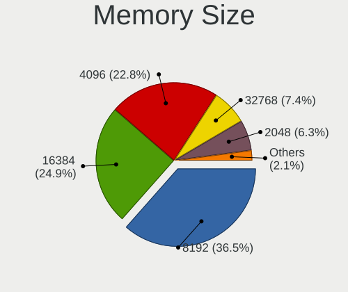

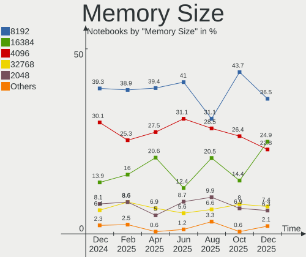

| Size  | Notebooks | Percent |
|-------|-----------|---------|
| 8192  | 69        | 36.51%  |
| 16384 | 47        | 24.87%  |
| 4096  | 43        | 22.75%  |
| 32768 | 14        | 7.41%   |
| 2048  | 12        | 6.35%   |
| 1024  | 2         | 1.06%   |
| 65536 | 1         | 0.53%   |
| 49152 | 1         | 0.53%   |

Memory Speed
------------

Memory module speed

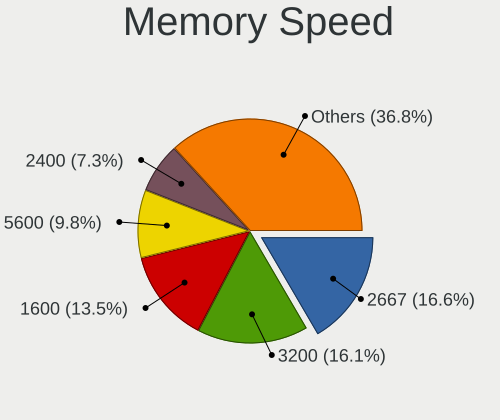

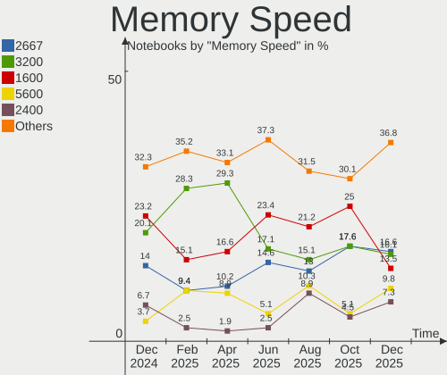

| Speed   | Notebooks | Percent |
|---------|-----------|---------|
| 2667    | 32        | 16.58%  |
| 3200    | 31        | 16.06%  |
| 1600    | 26        | 13.47%  |
| 5600    | 19        | 9.84%   |
| 2400    | 14        | 7.25%   |
| 1334    | 8         | 4.15%   |
| 7500    | 7         | 3.63%   |
| 4800    | 6         | 3.11%   |
| 2133    | 6         | 3.11%   |
| 1867    | 5         | 2.59%   |
| 1333    | 5         | 2.59%   |
| 2048    | 4         | 2.07%   |
| 8400    | 3         | 1.55%   |
| 4267    | 3         | 1.55%   |
| 3733    | 3         | 1.55%   |
| 1067    | 3         | 1.55%   |
| Unknown | 3         | 1.55%   |
| 6400    | 2         | 1.04%   |
| 3266    | 2         | 1.04%   |
| 975     | 2         | 1.04%   |
| 800     | 2         | 1.04%   |
| 8533    | 1         | 0.52%   |
| 4266    | 1         | 0.52%   |
| 4199    | 1         | 0.52%   |
| 3866    | 1         | 0.52%   |
| 2933    | 1         | 0.52%   |
| 2267    | 1         | 0.52%   |
| 667     | 1         | 0.52%   |

Printers & scanners
-------------------

Printer Vendor
--------------

Printer device vendors

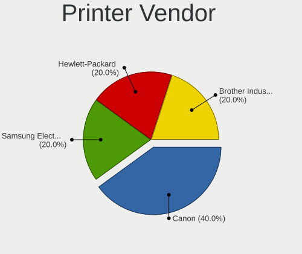

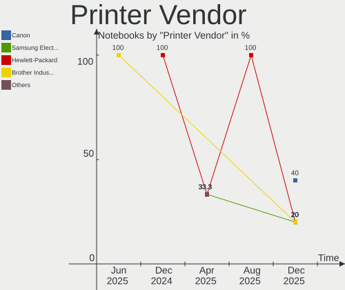

| Vendor              | Notebooks | Percent |
|---------------------|-----------|---------|
| Canon               | 2         | 40%     |
| Samsung Electronics | 1         | 20%     |
| Hewlett-Packard     | 1         | 20%     |
| Brother Industries  | 1         | 20%     |

Printer Model
-------------

Printer device models

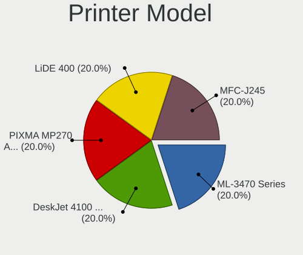

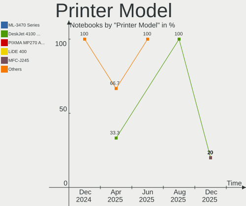

| Model                                | Notebooks | Percent |
|--------------------------------------|-----------|---------|
| Samsung ML-3470 Series               | 1         | 20%     |
| HP DeskJet 4100 series               | 1         | 20%     |
| Canon PIXMA MP270 All-In-One Printer | 1         | 20%     |
| Canon LiDE 400                       | 1         | 20%     |
| Brother MFC-J245                     | 1         | 20%     |

Scanner Vendor
--------------

Scanner device vendors

Zero info for selected period =(

Scanner Model
-------------

Scanner device models

Zero info for selected period =(

Camera
------

Camera Vendor
-------------

Camera device vendors

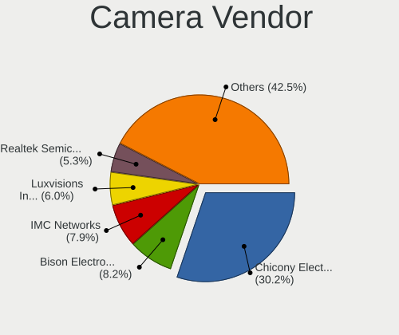

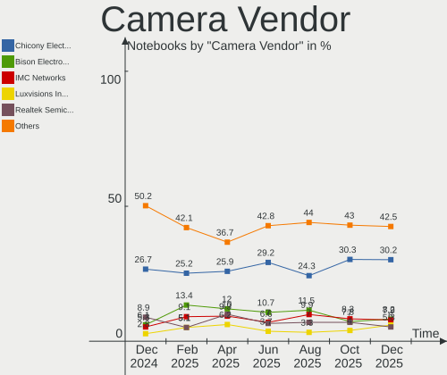

| Vendor                                 | Notebooks | Percent |
|----------------------------------------|-----------|---------|
| Chicony Electronics                    | 96        | 30.19%  |
| Bison Electronics                      | 26        | 8.18%   |
| IMC Networks                           | 25        | 7.86%   |
| Luxvisions Innotech Limited            | 19        | 5.97%   |
| Realtek Semiconductor                  | 17        | 5.35%   |
| Quanta                                 | 17        | 5.35%   |
| Microdia                               | 17        | 5.35%   |
| Syntek                                 | 12        | 3.77%   |
| Suyin                                  | 11        | 3.46%   |
| Sunplus Innovation Technology          | 11        | 3.46%   |
| Apple                                  | 11        | 3.46%   |
| Cheng Uei Precision Industry (Foxlink) | 10        | 3.14%   |
| Lite-On Technology                     | 7         | 2.2%    |
| kingcome                               | 5         | 1.57%   |
| Lenovo                                 | 4         | 1.26%   |
| Sonix Technology                       | 3         | 0.94%   |
| Ricoh                                  | 3         | 0.94%   |
| Logitech                               | 3         | 0.94%   |
| Alcor Micro                            | 3         | 0.94%   |
| Unknown (3730304231393831325530)       | 2         | 0.63%   |
| Silicon Motion                         | 2         | 0.63%   |
| ShineTech                              | 2         | 0.63%   |
| Acer                                   | 2         | 0.63%   |
| Sunplus Technology                     | 1         | 0.31%   |
| Razer USA                              | 1         | 0.31%   |
| OYT Tech                               | 1         | 0.31%   |
| HYGD-XH--241023                        | 1         | 0.31%   |
| Huawei Technologies                    | 1         | 0.31%   |
| Geek szitman                           | 1         | 0.31%   |
| Framework                              | 1         | 0.31%   |
| DigiTech                               | 1         | 0.31%   |
| Asuscom Network                        | 1         | 0.31%   |
| ALi                                    | 1         | 0.31%   |

Camera Model
------------

Camera device models

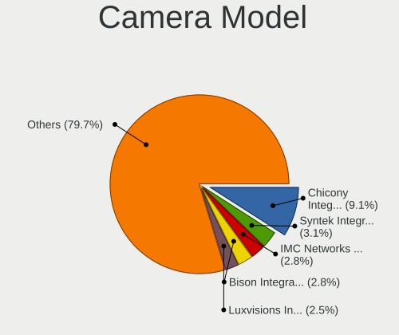

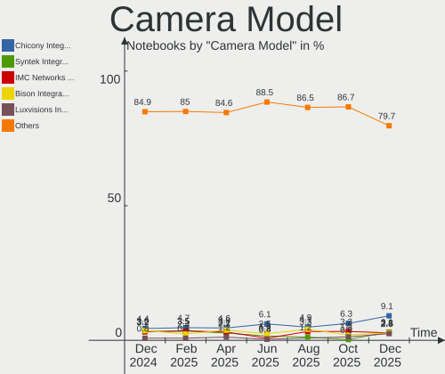

| Model                                                       | Notebooks | Percent |
|-------------------------------------------------------------|-----------|---------|
| Chicony Integrated Camera                                   | 29        | 9.06%   |
| Syntek Integrated Camera                                    | 10        | 3.13%   |
| IMC Networks Integrated Camera                              | 9         | 2.81%   |
| Bison Integrated Camera                                     | 9         | 2.81%   |
| Luxvisions Innotech Limited Integrated Camera               | 8         | 2.5%    |
| IMC Networks USB2.0 HD UVC WebCam                           | 8         | 2.5%    |
| Chicony HD Webcam                                           | 7         | 2.19%   |
| Chicony FJ Camera                                           | 7         | 2.19%   |
| Microdia Integrated_Webcam_HD                               | 6         | 1.88%   |
| Apple FaceTime HD Camera                                    | 6         | 1.88%   |
| kingcome FHD WebCam                                         | 5         | 1.56%   |
| Sunplus Integrated_Webcam_HD                                | 4         | 1.25%   |
| Realtek Integrated_Webcam_HD                                | 4         | 1.25%   |
| Luxvisions Innotech Limited Integrated RGB Camera           | 4         | 1.25%   |
| Luxvisions Innotech Limited HP TrueVision HD Camera         | 4         | 1.25%   |
| Lite-On Integrated Camera                                   | 4         | 1.25%   |
| Chicony USB2.0 HD UVC WebCam                                | 4         | 1.25%   |
| Bison SunplusIT Integrated Camera                           | 4         | 1.25%   |
| Bison Integrated RGB Camera                                 | 4         | 1.25%   |
| Sunplus Integrated Camera                                   | 3         | 0.94%   |
| Quanta HP HD Camera                                         | 3         | 0.94%   |
| Quanta ACER FHD User Facing                                 | 3         | 0.94%   |
| IMC Networks 2M Integrated Webcam                           | 3         | 0.94%   |
| Chicony Integrated IR Camera                                | 3         | 0.94%   |
| Chicony Integrated Camera [ThinkPad]                        | 3         | 0.94%   |
| Chicony Integrated Camera (1280x720@30)                     | 3         | 0.94%   |
| Chicony Chicony USB2.0 Camera                               | 3         | 0.94%   |
| Chicony ACER HD User Facing                                 | 3         | 0.94%   |
| Bison BisonCam,NB Pro                                       | 3         | 0.94%   |
| Apple Built-in iSight                                       | 3         | 0.94%   |
| Unknown (3730304231393831325530) USB Camera                 | 2         | 0.63%   |
| Suyin HP Truevision HD                                      | 2         | 0.63%   |
| Suyin HD WebCam                                             | 2         | 0.63%   |
| Suyin 1.3M WebCam (notebook emachines E730, Acer sub-brand) | 2         | 0.63%   |
| ShineTech USB2.0 HD UVC WebCam                              | 2         | 0.63%   |
| Realtek LG Camera                                           | 2         | 0.63%   |
| Realtek Lenovo EasyCamera                                   | 2         | 0.63%   |
| Realtek Integrated Webcam HD                                | 2         | 0.63%   |
| Quanta HP True Vision HD Camera                             | 2         | 0.63%   |
| Quanta HD Webcam                                            | 2         | 0.63%   |

Security
--------

Fingerprint Vendor
------------------

Fingerprint sensor vendors

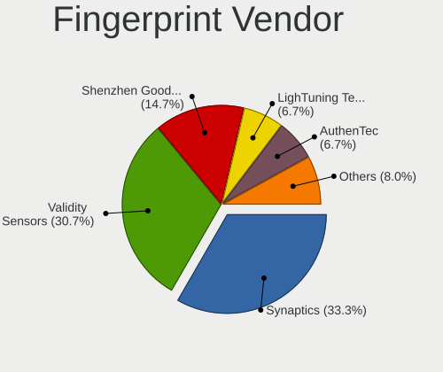

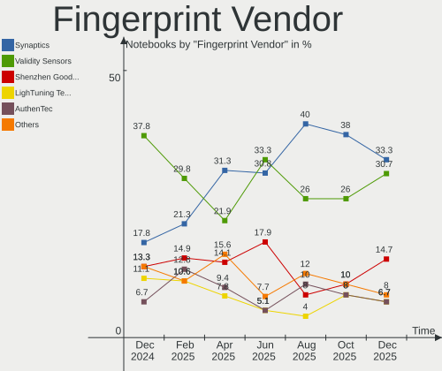

| Vendor                     | Notebooks | Percent |
|----------------------------|-----------|---------|
| Synaptics                  | 25        | 33.33%  |
| Validity Sensors           | 23        | 30.67%  |
| Shenzhen Goodix Technology | 11        | 14.67%  |
| LighTuning Technology      | 5         | 6.67%   |
| AuthenTec                  | 5         | 6.67%   |
| Upek                       | 4         | 5.33%   |
| HOLTEK                     | 1         | 1.33%   |
| Elan Microelectronics      | 1         | 1.33%   |

Fingerprint Model
-----------------

Fingerprint sensor models

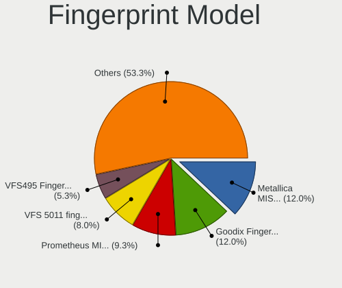

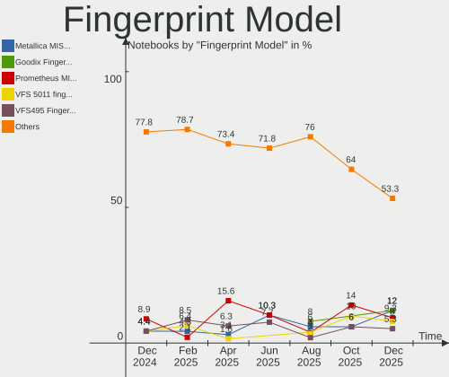

| Model                                                                      | Notebooks | Percent |
|----------------------------------------------------------------------------|-----------|---------|
| Synaptics Metallica MIS Touch Fingerprint Reader                           | 9         | 12%     |
| Shenzhen Goodix  FingerPrint Device                                        | 9         | 12%     |
| Synaptics Prometheus MIS Touch Fingerprint Reader                          | 7         | 9.33%   |
| Validity Sensors VFS 5011 fingerprint sensor                               | 6         | 8%      |
| Validity Sensors VFS495 Fingerprint Reader                                 | 4         | 5.33%   |
| Upek Biometric Touchchip/Touchstrip Fingerprint Sensor                     | 4         | 5.33%   |
| Validity Sensors VFS5011 Fingerprint Reader                                | 3         | 4%      |
| Synaptics UWP WBDI Device                                                  | 3         | 4%      |
| LighTuning Fingerprint Reader                                              | 3         | 4%      |
| Validity Sensors Synaptics WBDI                                            | 2         | 2.67%   |
| Validity Sensors Synaptics VFS7552 Touch Fingerprint Sensor with PurePrint | 2         | 2.67%   |
| Validity Sensors Swipe Fingerprint Sensor                                  | 2         | 2.67%   |
| AuthenTec AES2810                                                          | 2         | 2.67%   |
| AuthenTec AES2501 Fingerprint Sensor                                       | 2         | 2.67%   |
| Validity Sensors VFS7552 Touch Fingerprint Sensor                          | 1         | 1.33%   |
| Validity Sensors VFS7500 Touch Fingerprint Sensor                          | 1         | 1.33%   |
| Validity Sensors VFS471 Fingerprint Reader                                 | 1         | 1.33%   |
| Validity Sensors VFS Fingerprint sensor                                    | 1         | 1.33%   |
| Synaptics WBDI                                                             | 1         | 1.33%   |
| Synaptics TouchPad                                                         | 1         | 1.33%   |
| Synaptics  FS7604 Touch Fingerprint Sensor with PurePrint                  | 1         | 1.33%   |
| Synaptics Prometheus Fingerprint Reader                                    | 1         | 1.33%   |
| Synaptics FS7604 Touch Fingerprint Sensor with PurePrint                   | 1         | 1.33%   |
| Synaptics Fingerprint reader [HP G6]                                       | 1         | 1.33%   |
| Shenzhen Goodix Fingerprint Reader                                         | 1         | 1.33%   |
| Shenzhen Goodix FingerPrint                                                | 1         | 1.33%   |
| LighTuning ES603 Swipe Fingerprint Sensor                                  | 1         | 1.33%   |
| LighTuning EgisTec Touch Fingerprint Sensor                                | 1         | 1.33%   |
| HOLTEK FocalTech Fingerprint Device                                        | 1         | 1.33%   |
| Elan ELAN:Fingerprint                                                      | 1         | 1.33%   |
| AuthenTec AES1600                                                          | 1         | 1.33%   |

Chipcard Vendor
---------------

Chipcard module vendors

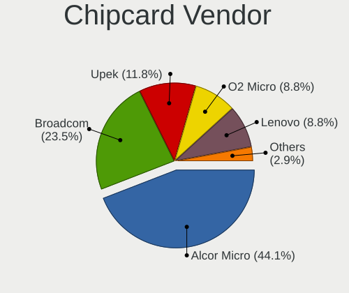

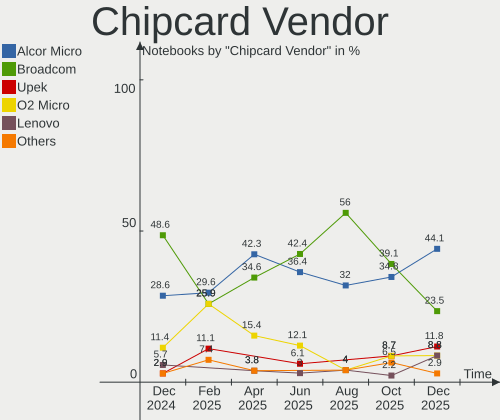

| Vendor      | Notebooks | Percent |
|-------------|-----------|---------|
| Alcor Micro | 15        | 44.12%  |
| Broadcom    | 8         | 23.53%  |
| Upek        | 4         | 11.76%  |
| O2 Micro    | 3         | 8.82%   |
| Lenovo      | 3         | 8.82%   |
| Cherry      | 1         | 2.94%   |

Chipcard Model
--------------

Chipcard module models

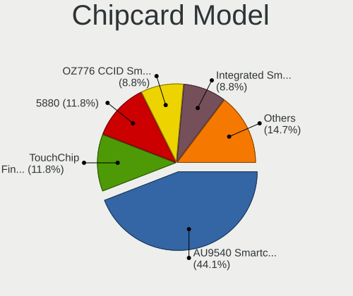

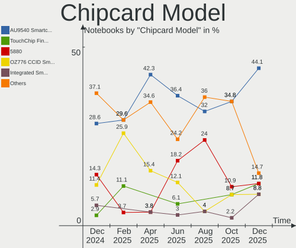

| Model                                                                       | Notebooks | Percent |
|-----------------------------------------------------------------------------|-----------|---------|
| Alcor Micro AU9540 Smartcard Reader                                         | 15        | 44.12%  |
| Upek TouchChip Fingerprint Coprocessor (WBF advanced mode)                  | 4         | 11.76%  |
| Broadcom 5880                                                               | 4         | 11.76%  |
| O2 Micro OZ776 CCID Smartcard Reader                                        | 3         | 8.82%   |
| Lenovo Integrated Smart Card Reader                                         | 3         | 8.82%   |
| Broadcom BCM5880 Secure Applications Processor                              | 3         | 8.82%   |
| Cherry SmartTerminal ST-2xxx                                                | 1         | 2.94%   |
| Broadcom BCM58200 ControlVault 3 (FingerPrint sensor + Contacted SmartCard) | 1         | 2.94%   |

Unsupported
-----------

Unsupported Devices
-------------------

Total unsupported devices on board

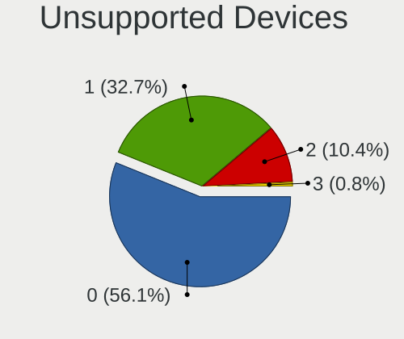

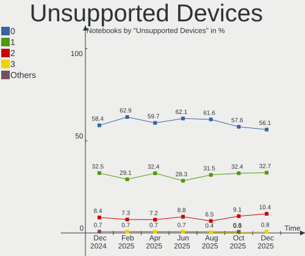

| Total | Notebooks | Percent |
|-------|-----------|---------|
| 0     | 206       | 56.13%  |
| 1     | 120       | 32.7%   |
| 2     | 38        | 10.35%  |
| 3     | 3         | 0.82%   |

Unsupported Device Types
------------------------

Types of unsupported devices

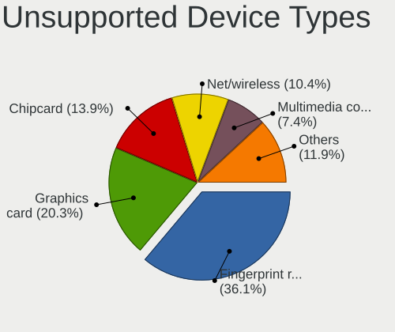

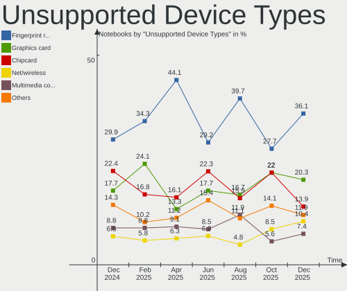

| Type                     | Notebooks | Percent |
|--------------------------|-----------|---------|
| Fingerprint reader       | 73        | 36.14%  |
| Graphics card            | 41        | 20.3%   |
| Chipcard                 | 28        | 13.86%  |
| Net/wireless             | 21        | 10.4%   |
| Multimedia controller    | 15        | 7.43%   |
| Card reader              | 6         | 2.97%   |
| Net/ethernet             | 4         | 1.98%   |
| Bluetooth                | 4         | 1.98%   |
| Communication controller | 3         | 1.49%   |
| Storage                  | 2         | 0.99%   |
| Sound                    | 2         | 0.99%   |
| Camera                   | 2         | 0.99%   |
| Dvb card                 | 1         | 0.5%    |

