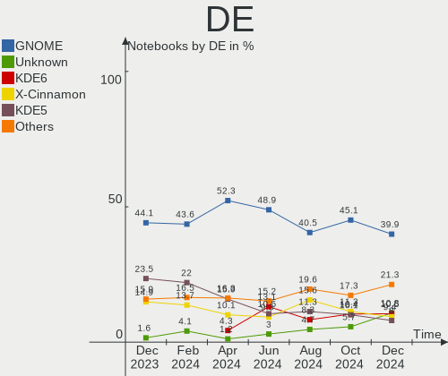
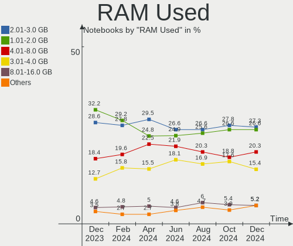
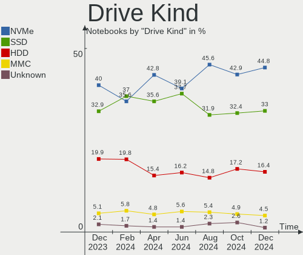
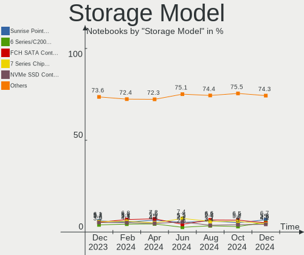
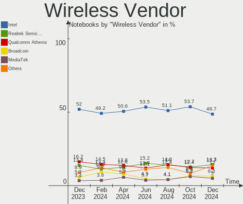
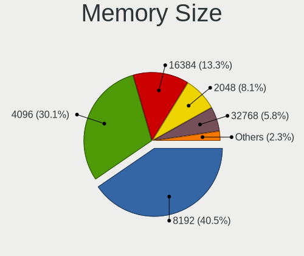
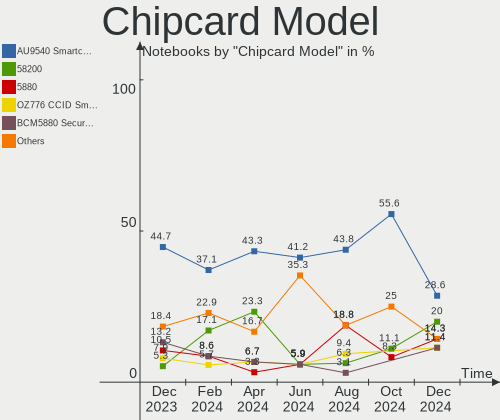

Linux in Germany - Hardware Trends (Notebooks)
----------------------------------------------

A project to identify most popular hardware characteristics and track their change
over time based on data collected by Linux users at https://Linux-Hardware.org.

Anyone can contribute to this report by the [hw-probe](https://github.com/linuxhw/hw-probe) tool:

    sudo -E hw-probe -all -upload

Period: May, 2023.

Contents
--------

* [ System ](#system)
  - [ OS                       ](#os)
  - [ OS Family                ](#os-family)
  - [ Kernel                   ](#kernel)
  - [ Kernel Family            ](#kernel-family)
  - [ Kernel Major Ver.        ](#kernel-major-ver)
  - [ Arch                     ](#arch)
  - [ DE                       ](#de)
  - [ Display Server           ](#display-server)
  - [ Display Manager          ](#display-manager)
  - [ OS Lang                  ](#os-lang)
  - [ Boot Mode                ](#boot-mode)
  - [ Filesystem               ](#filesystem)
  - [ Part. scheme             ](#part-scheme)
  - [ Dual Boot with Linux/BSD ](#dual-boot-with-linuxbsd)
  - [ Dual Boot (Win)          ](#dual-boot-win)

* [ Board ](#board)
  - [ Vendor                   ](#vendor)
  - [ Model                    ](#model)
  - [ Model Family             ](#model-family)
  - [ MFG Year                 ](#mfg-year)
  - [ Form Factor              ](#form-factor)
  - [ Secure Boot              ](#secure-boot)
  - [ Coreboot                 ](#coreboot)
  - [ RAM Size                 ](#ram-size)
  - [ RAM Used                 ](#ram-used)
  - [ Total Drives             ](#total-drives)
  - [ Has CD-ROM               ](#has-cd-rom)
  - [ Has Ethernet             ](#has-ethernet)
  - [ Has WiFi                 ](#has-wifi)
  - [ Has Bluetooth            ](#has-bluetooth)

* [ Location ](#location)
  - [ Country                  ](#country)
  - [ City                     ](#city)

* [ Drives ](#drives)
  - [ Drive Vendor             ](#drive-vendor)
  - [ Drive Model              ](#drive-model)
  - [ HDD Vendor               ](#hdd-vendor)
  - [ SSD Vendor               ](#ssd-vendor)
  - [ Drive Kind               ](#drive-kind)
  - [ Drive Connector          ](#drive-connector)
  - [ Drive Size               ](#drive-size)
  - [ Space Total              ](#space-total)
  - [ Space Used               ](#space-used)
  - [ Malfunc. Drives          ](#malfunc-drives)
  - [ Malfunc. Drive Vendor    ](#malfunc-drive-vendor)
  - [ Malfunc. HDD Vendor      ](#malfunc-hdd-vendor)
  - [ Malfunc. Drive Kind      ](#malfunc-drive-kind)
  - [ Failed Drives            ](#failed-drives)
  - [ Failed Drive Vendor      ](#failed-drive-vendor)
  - [ Drive Status             ](#drive-status)

* [ Storage controller ](#storage-controller)
  - [ Storage Vendor           ](#storage-vendor)
  - [ Storage Model            ](#storage-model)
  - [ Storage Kind             ](#storage-kind)

* [ Processor ](#processor)
  - [ CPU Vendor               ](#cpu-vendor)
  - [ CPU Model                ](#cpu-model)
  - [ CPU Model Family         ](#cpu-model-family)
  - [ CPU Cores                ](#cpu-cores)
  - [ CPU Sockets              ](#cpu-sockets)
  - [ CPU Threads              ](#cpu-threads)
  - [ CPU Op-Modes             ](#cpu-op-modes)
  - [ CPU Microcode            ](#cpu-microcode)
  - [ CPU Microarch            ](#cpu-microarch)

* [ Graphics ](#graphics)
  - [ GPU Vendor               ](#gpu-vendor)
  - [ GPU Model                ](#gpu-model)
  - [ GPU Combo                ](#gpu-combo)
  - [ GPU Driver               ](#gpu-driver)
  - [ GPU Memory               ](#gpu-memory)

* [ Monitor ](#monitor)
  - [ Monitor Vendor           ](#monitor-vendor)
  - [ Monitor Model            ](#monitor-model)
  - [ Monitor Resolution       ](#monitor-resolution)
  - [ Monitor Diagonal         ](#monitor-diagonal)
  - [ Monitor Width            ](#monitor-width)
  - [ Aspect Ratio             ](#aspect-ratio)
  - [ Monitor Area             ](#monitor-area)
  - [ Pixel Density            ](#pixel-density)
  - [ Multiple Monitors        ](#multiple-monitors)

* [ Network ](#network)
  - [ Net Controller Vendor    ](#net-controller-vendor)
  - [ Net Controller Model     ](#net-controller-model)
  - [ Wireless Vendor          ](#wireless-vendor)
  - [ Wireless Model           ](#wireless-model)
  - [ Ethernet Vendor          ](#ethernet-vendor)
  - [ Ethernet Model           ](#ethernet-model)
  - [ Net Controller Kind      ](#net-controller-kind)
  - [ Used Controller          ](#used-controller)
  - [ NICs                     ](#nics)
  - [ IPv6                     ](#ipv6)

* [ Bluetooth ](#bluetooth)
  - [ Bluetooth Vendor         ](#bluetooth-vendor)
  - [ Bluetooth Model          ](#bluetooth-model)

* [ Sound ](#sound)
  - [ Sound Vendor             ](#sound-vendor)
  - [ Sound Model              ](#sound-model)

* [ Memory ](#memory)
  - [ Memory Vendor            ](#memory-vendor)
  - [ Memory Model             ](#memory-model)
  - [ Memory Kind              ](#memory-kind)
  - [ Memory Form Factor       ](#memory-form-factor)
  - [ Memory Size              ](#memory-size)
  - [ Memory Speed             ](#memory-speed)

* [ Printers & scanners ](#printers--scanners)
  - [ Printer Vendor           ](#printer-vendor)
  - [ Printer Model            ](#printer-model)
  - [ Scanner Vendor           ](#scanner-vendor)
  - [ Scanner Model            ](#scanner-model)

* [ Camera ](#camera)
  - [ Camera Vendor            ](#camera-vendor)
  - [ Camera Model             ](#camera-model)

* [ Security ](#security)
  - [ Fingerprint Vendor       ](#fingerprint-vendor)
  - [ Fingerprint Model        ](#fingerprint-model)
  - [ Chipcard Vendor          ](#chipcard-vendor)
  - [ Chipcard Model           ](#chipcard-model)

* [ Unsupported ](#unsupported)
  - [ Unsupported Devices      ](#unsupported-devices)
  - [ Unsupported Device Types ](#unsupported-device-types)

System
------

OS
--

Installed operating systems

| Name                         | Notebooks | Percent |
|------------------------------|-----------|---------|
| Linux Mint 21.1              | 43        | 14.29%  |
| Ubuntu 22.04                 | 26        | 8.64%   |
| Fedora 38                    | 25        | 8.31%   |
| OpenMandriva 23.03           | 16        | 5.32%   |
| Ubuntu 23.04                 | 15        | 4.98%   |
| Arch Rolling                 | 15        | 4.98%   |
| Debian 11                    | 14        | 4.65%   |
| Zorin 16                     | 12        | 3.99%   |
| Ubuntu 20.04                 | 9         | 2.99%   |
| Pop!_OS 22.04                | 8         | 2.66%   |
| ArcoLinux Rolling            | 8         | 2.66%   |
| SteamOS 3.4.6                | 6         | 1.99%   |
| openSUSE Tumbleweed-XXXXXXXX | 6         | 1.99%   |
| Debian 12                    | 6         | 1.99%   |
| Linux Mint 21                | 5         | 1.66%   |
| Kubuntu 23.04                | 5         | 1.66%   |
| TUXEDO OS 22.04              | 4         | 1.33%   |
| Lubuntu 22.04                | 4         | 1.33%   |
| Kubuntu 22.04                | 4         | 1.33%   |
| KDE neon 22.04               | 4         | 1.33%   |
| Ubuntu Budgie 22.04          | 3         | 1%      |
| ROSA 12.4                    | 3         | 1%      |
| Manjaro 22.1.1               | 3         | 1%      |
| Manjaro                      | 3         | 1%      |
| Linux Mint 20.3              | 3         | 1%      |
| Elementary 7                 | 3         | 1%      |
| Ubuntu 22.10                 | 2         | 0.66%   |
| Siduction 12                 | 2         | 0.66%   |
| Manjaro 22.1.0               | 2         | 0.66%   |
| LMDE 5                       | 2         | 0.66%   |
| Linux Mint 20                | 2         | 0.66%   |
| Kali 2023.1                  | 2         | 0.66%   |
| Gentoo 2.13                  | 2         | 0.66%   |
| Garuda Linux Soaring         | 2         | 0.66%   |
| EndeavourOS Rolling          | 2         | 0.66%   |
| BlackPanther 18.1            | 2         | 0.66%   |
| Xubuntu 23.04                | 1         | 0.33%   |
| Xubuntu 22.10                | 1         | 0.33%   |
| Xubuntu 22.04                | 1         | 0.33%   |
| Void Linux Rolling           | 1         | 0.33%   |

OS Family
---------

OS without a version

| Name          | Notebooks | Percent |
|---------------|-----------|---------|
| Ubuntu        | 54        | 17.94%  |
| Linux Mint    | 53        | 17.61%  |
| Fedora        | 26        | 8.64%   |
| Debian        | 20        | 6.64%   |
| OpenMandriva  | 19        | 6.31%   |
| Arch          | 15        | 4.98%   |
| Zorin         | 12        | 3.99%   |
| Manjaro       | 9         | 2.99%   |
| Kubuntu       | 9         | 2.99%   |
| Pop!_OS       | 8         | 2.66%   |
| ArcoLinux     | 8         | 2.66%   |
| SteamOS       | 7         | 2.33%   |
| openSUSE      | 7         | 2.33%   |
| Ubuntu Budgie | 4         | 1.33%   |
| TUXEDO OS     | 4         | 1.33%   |
| Lubuntu       | 4         | 1.33%   |
| KDE neon      | 4         | 1.33%   |
| Xubuntu       | 3         | 1%      |
| ROSA          | 3         | 1%      |
| Kali          | 3         | 1%      |
| Elementary    | 3         | 1%      |
| BlackPanther  | 3         | 1%      |
| Ubuntu MATE   | 2         | 0.66%   |
| Siduction     | 2         | 0.66%   |
| LMDE          | 2         | 0.66%   |
| Gentoo        | 2         | 0.66%   |
| Garuda Linux  | 2         | 0.66%   |
| EndeavourOS   | 2         | 0.66%   |
| Void Linux    | 1         | 0.33%   |
| Ubuntu Unity  | 1         | 0.33%   |
| Slackware     | 1         | 0.33%   |
| Peppermint    | 1         | 0.33%   |
| Parrot        | 1         | 0.33%   |
| Pardus        | 1         | 0.33%   |
| NixOS         | 1         | 0.33%   |
| LinuxFX       | 1         | 0.33%   |
| Deepin        | 1         | 0.33%   |
| blendOS       | 1         | 0.33%   |
| ArchLabs      | 1         | 0.33%   |

Kernel
------

Version of the Linux kernel

| Version                           | Notebooks | Percent |
|-----------------------------------|-----------|---------|
| 5.19.0-41-generic                 | 32        | 10.63%  |
| 5.15.0-71-generic                 | 30        | 9.97%   |
| 5.15.0-72-generic                 | 22        | 7.31%   |
| 6.2.0-20-generic                  | 21        | 6.98%   |
| 6.2.6-desktop-1omv2390            | 16        | 5.32%   |
| 6.2.15-300.fc38.x86_64            | 12        | 3.99%   |
| 5.10.0-22-amd64                   | 8         | 2.66%   |
| 6.3.1-arch2-1                     | 7         | 2.33%   |
| 6.2.6-76060206-generic            | 7         | 2.33%   |
| 5.19.0-42-generic                 | 7         | 2.33%   |
| 5.13.0-valve36-1-neptune          | 7         | 2.33%   |
| 5.10.0-23-amd64                   | 5         | 1.66%   |
| 6.3.4-arch1-1                     | 4         | 1.33%   |
| 6.3.2-arch1-1                     | 4         | 1.33%   |
| 6.2.9-300.fc38.x86_64             | 4         | 1.33%   |
| 6.2.0-10005-tuxedo                | 4         | 1.33%   |
| 6.3.1-arch1-1                     | 3         | 1%      |
| 6.2.14-300.fc38.x86_64            | 3         | 1%      |
| 6.2.0-10007-tuxedo                | 3         | 1%      |
| 6.1.0-7-amd64                     | 3         | 1%      |
| 5.15.0-69-generic                 | 3         | 1%      |
| 6.3.1-zen1-1-zen                  | 2         | 0.66%   |
| 6.3.1-1-default                   | 2         | 0.66%   |
| 6.2.13-arch1-1                    | 2         | 0.66%   |
| 6.2.13-300.fc38.x86_64            | 2         | 0.66%   |
| 6.2.12-1-default                  | 2         | 0.66%   |
| 6.1.27-1-lts                      | 2         | 0.66%   |
| 6.1.26-1-MANJARO                  | 2         | 0.66%   |
| 6.1.20-generic-2rosa2021.1-x86_64 | 2         | 0.66%   |
| 6.1.0-9-amd64                     | 2         | 0.66%   |
| 6.1.0-1013-oem                    | 2         | 0.66%   |
| 5.4.0-26-generic                  | 2         | 0.66%   |
| 5.4.0-149-generic                 | 2         | 0.66%   |
| 5.4.0-148-generic                 | 2         | 0.66%   |
| 5.15.85-desktop-1bP               | 2         | 0.66%   |
| 5.15.0-67-generic                 | 2         | 0.66%   |
| 5.15.0-41-generic                 | 2         | 0.66%   |
| 5.10.0-21-amd64                   | 2         | 0.66%   |
| 6.3.5-arch1-1                     | 1         | 0.33%   |
| 6.3.4-zen2-1-zen                  | 1         | 0.33%   |

Kernel Family
-------------

Linux kernel without a distro release

| Version  | Notebooks | Percent |
|----------|-----------|---------|
| 5.15.0   | 65        | 21.59%  |
| 5.19.0   | 43        | 14.29%  |
| 6.2.0    | 29        | 9.63%   |
| 6.2.6    | 23        | 7.64%   |
| 6.3.1    | 19        | 6.31%   |
| 5.10.0   | 17        | 5.65%   |
| 6.2.15   | 13        | 4.32%   |
| 6.1.0    | 10        | 3.32%   |
| 5.4.0    | 9         | 2.99%   |
| 5.13.0   | 8         | 2.66%   |
| 6.3.4    | 6         | 1.99%   |
| 6.3.2    | 6         | 1.99%   |
| 6.2.13   | 5         | 1.66%   |
| 6.3.3    | 4         | 1.33%   |
| 6.2.9    | 4         | 1.33%   |
| 6.2.14   | 3         | 1%      |
| 6.2.12   | 3         | 1%      |
| 6.2.11   | 2         | 0.66%   |
| 6.1.27   | 2         | 0.66%   |
| 6.1.26   | 2         | 0.66%   |
| 6.1.20   | 2         | 0.66%   |
| 6.0.0    | 2         | 0.66%   |
| 5.15.85  | 2         | 0.66%   |
| 6.3.5    | 1         | 0.33%   |
| 6.3.0    | 1         | 0.33%   |
| 6.1.30   | 1         | 0.33%   |
| 6.1.29   | 1         | 0.33%   |
| 6.1.19   | 1         | 0.33%   |
| 6.1.1    | 1         | 0.33%   |
| 6.0.17   | 1         | 0.33%   |
| 6.0.10   | 1         | 0.33%   |
| 5.18.8   | 1         | 0.33%   |
| 5.16.19  | 1         | 0.33%   |
| 5.16.13  | 1         | 0.33%   |
| 5.15.88  | 1         | 0.33%   |
| 5.15.77  | 1         | 0.33%   |
| 5.15.6   | 1         | 0.33%   |
| 5.15.38  | 1         | 0.33%   |
| 5.15.109 | 1         | 0.33%   |
| 5.15.104 | 1         | 0.33%   |

Kernel Major Ver.
-----------------

Linux kernel major version

| Version | Notebooks | Percent |
|---------|-----------|---------|
| 6.2     | 82        | 27.24%  |
| 5.15    | 74        | 24.58%  |
| 5.19    | 43        | 14.29%  |
| 6.3     | 37        | 12.29%  |
| 6.1     | 20        | 6.64%   |
| 5.10    | 18        | 5.98%   |
| 5.4     | 9         | 2.99%   |
| 5.13    | 8         | 2.66%   |
| 6.0     | 4         | 1.33%   |
| 5.16    | 2         | 0.66%   |
| 5.18    | 1         | 0.33%   |
| 5.14    | 1         | 0.33%   |
| 5.11    | 1         | 0.33%   |
| 4.15    | 1         | 0.33%   |

Arch
----

OS architecture (x86_64, i586, etc.)

| Name   | Notebooks | Percent |
|--------|-----------|---------|
| x86_64 | 300       | 99.67%  |
| i686   | 1         | 0.33%   |

DE
--

Desktop Environment

| Name       | Notebooks | Percent |
|------------|-----------|---------|
| GNOME      | 113       | 37.54%  |
| KDE5       | 75        | 24.92%  |
| X-Cinnamon | 46        | 15.28%  |
| XFCE       | 19        | 6.31%   |
| MATE       | 9         | 2.99%   |
| LXQt       | 8         | 2.66%   |
| i3         | 5         | 1.66%   |
| Unknown    | 5         | 1.66%   |
| Budgie     | 4         | 1.33%   |
| Pantheon   | 3         | 1%      |
| Cinnamon   | 3         | 1%      |
| KDE        | 2         | 0.66%   |
| Hyprland   | 2         | 0.66%   |
| Deepin     | 2         | 0.66%   |
| Unity      | 1         | 0.33%   |
| Trinity    | 1         | 0.33%   |
| fluxbox    | 1         | 0.33%   |
| bspwm      | 1         | 0.33%   |
| awesome    | 1         | 0.33%   |

Display Server
--------------

X11 or Wayland

| Name    | Notebooks | Percent |
|---------|-----------|---------|
| X11     | 205       | 68.11%  |
| Wayland | 91        | 30.23%  |
| Tty     | 3         | 1%      |
| Unknown | 2         | 0.66%   |

Display Manager
---------------

SDDM, LightDM, etc.

| Name    | Notebooks | Percent |
|---------|-----------|---------|
| Unknown | 103       | 34.22%  |
| SDDM    | 65        | 21.59%  |
| GDM3    | 57        | 18.94%  |
| LightDM | 54        | 17.94%  |
| GDM     | 22        | 7.31%   |

OS Lang
-------

Language

| Lang    | Notebooks | Percent |
|---------|-----------|---------|
| de_DE   | 196       | 65.12%  |
| en_US   | 76        | 25.25%  |
| C       | 6         | 1.99%   |
| Unknown | 5         | 1.66%   |
| en_GB   | 4         | 1.33%   |
| ru_RU   | 3         | 1%      |
| tr_TR   | 2         | 0.66%   |
| ru_UA   | 2         | 0.66%   |
| POSIX   | 1         | 0.33%   |
| it_IT   | 1         | 0.33%   |
| fr_FR   | 1         | 0.33%   |
| en_IE   | 1         | 0.33%   |
| en_DE   | 1         | 0.33%   |
| en_CA   | 1         | 0.33%   |
| de_BE   | 1         | 0.33%   |

Boot Mode
---------

EFI or BIOS

| Mode | Notebooks | Percent |
|------|-----------|---------|
| EFI  | 173       | 57.48%  |
| BIOS | 128       | 42.52%  |

Filesystem
----------

Type of filesystem

| Type    | Notebooks | Percent |
|---------|-----------|---------|
| Ext4    | 196       | 65.12%  |
| Btrfs   | 54        | 17.94%  |
| Tmpfs   | 34        | 11.3%   |
| Overlay | 11        | 3.65%   |
| Zfs     | 3         | 1%      |
| Xfs     | 3         | 1%      |

Part. scheme
------------

Scheme of partitioning

| Type    | Notebooks | Percent |
|---------|-----------|---------|
| GPT     | 176       | 58.47%  |
| Unknown | 96        | 31.89%  |
| MBR     | 29        | 9.63%   |

Dual Boot with Linux/BSD
------------------------

Hosting more than one Linux/BSD

| Dual boot | Notebooks | Percent |
|-----------|-----------|---------|
| No        | 267       | 88.7%   |
| Yes       | 34        | 11.3%   |

Dual Boot (Win)
---------------

Hosting Linux and Windows

| Dual boot | Notebooks | Percent |
|-----------|-----------|---------|
| No        | 230       | 76.41%  |
| Yes       | 71        | 23.59%  |

Board
-----

Vendor
------

Motherboard manufacturer

| Name                           | Notebooks | Percent |
|--------------------------------|-----------|---------|
| Lenovo                         | 79        | 26.25%  |
| Hewlett-Packard                | 40        | 13.29%  |
| Dell                           | 40        | 13.29%  |
| ASUSTek Computer               | 29        | 9.63%   |
| Acer                           | 29        | 9.63%   |
| TUXEDO                         | 10        | 3.32%   |
| Apple                          | 10        | 3.32%   |
| HUAWEI                         | 8         | 2.66%   |
| Valve                          | 7         | 2.33%   |
| Fujitsu                        | 7         | 2.33%   |
| Toshiba                        | 6         | 1.99%   |
| Medion                         | 6         | 1.99%   |
| Sony                           | 3         | 1%      |
| Samsung Electronics            | 3         | 1%      |
| MSI                            | 3         | 1%      |
| Fujitsu Siemens                | 3         | 1%      |
| Packard Bell                   | 2         | 0.66%   |
| Gigabyte Technology            | 2         | 0.66%   |
| Unknown                        | 2         | 0.66%   |
| Wortmann AG                    | 1         | 0.33%   |
| VALE                           | 1         | 0.33%   |
| Razer                          | 1         | 0.33%   |
| PC Specialist                  | 1         | 0.33%   |
| Notebook                       | 1         | 0.33%   |
| MICROBYTE                      | 1         | 0.33%   |
| Matsushita Electric Industrial | 1         | 0.33%   |
| Google                         | 1         | 0.33%   |
| Framework                      | 1         | 0.33%   |
| Bluechip Computer              | 1         | 0.33%   |
| AXDIA International            | 1         | 0.33%   |
| ALLDOCUBE                      | 1         | 0.33%   |

Model
-----

Motherboard model

| Name                                  | Notebooks | Percent |
|---------------------------------------|-----------|---------|
| Valve Jupiter                         | 7         | 2.33%   |
| HUAWEI HVY-WXX9                       | 3         | 1%      |
| HP Laptop 15s-eq2xxx                  | 3         | 1%      |
| Acer Swift SF114-34                   | 3         | 1%      |
| Unknown                               | 3         | 1%      |
| Lenovo ThinkPad X13 Gen 2a 20XHCTO1WW | 2         | 0.66%   |
| Lenovo ThinkPad T14 Gen 3 21AHCTO1WW  | 2         | 0.66%   |
| Lenovo ThinkPad E15 Gen 4 21EES00100  | 2         | 0.66%   |
| Lenovo G50-70 20351                   | 2         | 0.66%   |
| HUAWEI BOHK-WAX9X                     | 2         | 0.66%   |
| HP Pavilion dv6                       | 2         | 0.66%   |
| Dell XPS 13 9305                      | 2         | 0.66%   |
| Dell Latitude 7430                    | 2         | 0.66%   |
| ASUS K53SV                            | 2         | 0.66%   |
| ASUS K53SK                            | 2         | 0.66%   |
| Apple MacBookPro12,1                  | 2         | 0.66%   |
| Wortmann AG TERRA_MOBILE_1528P/1748P  | 1         | 0.33%   |
| VALE Notebook Classic C140            | 1         | 0.33%   |
| TUXEDO Stellaris/Polaris AMD Gen4     | 1         | 0.33%   |
| TUXEDO Pulse 15 Gen2                  | 1         | 0.33%   |
| TUXEDO Pulse 15 Gen1                  | 1         | 0.33%   |
| TUXEDO Polaris Intel Gen3 (TGL)       | 1         | 0.33%   |
| TUXEDO Polaris 15 AMD Gen1            | 1         | 0.33%   |
| TUXEDO N24_25BU                       | 1         | 0.33%   |
| TUXEDO InfinityBook Pro Gen7 (MK1)    | 1         | 0.33%   |
| TUXEDO InfinityBook Pro 14 v4         | 1         | 0.33%   |
| TUXEDO Book_XA1510                    | 1         | 0.33%   |
| Toshiba TECRA Z40-A                   | 1         | 0.33%   |
| Toshiba Satellite Pro R50-C           | 1         | 0.33%   |
| Toshiba Satellite Pro R50-B           | 1         | 0.33%   |
| Toshiba Satellite P500                | 1         | 0.33%   |
| Toshiba Satellite L655                | 1         | 0.33%   |
| Toshiba Satellite C660D               | 1         | 0.33%   |
| Sony VPCEB4Z1E                        | 1         | 0.33%   |
| Sony SVF1521M6E                       | 1         | 0.33%   |
| Sony SVF1521B4E                       | 1         | 0.33%   |
| Samsung 600B4B/600B5B                 | 1         | 0.33%   |
| Samsung 530U3C/530U4C/532U3C          | 1         | 0.33%   |
| Samsung 355V4C/356V4C/3445VC/3545VC   | 1         | 0.33%   |
| Razer Blade Pro 17 (2019)             | 1         | 0.33%   |

Model Family
------------

Motherboard model prefix

| Name                  | Notebooks | Percent |
|-----------------------|-----------|---------|
| Lenovo ThinkPad       | 53        | 17.61%  |
| Dell Latitude         | 20        | 6.64%   |
| Acer Aspire           | 18        | 5.98%   |
| Lenovo IdeaPad        | 10        | 3.32%   |
| HP Laptop             | 10        | 3.32%   |
| HP Pavilion           | 9         | 2.99%   |
| HP EliteBook          | 8         | 2.66%   |
| Valve Jupiter         | 7         | 2.33%   |
| Fujitsu LIFEBOOK      | 6         | 1.99%   |
| Dell XPS              | 6         | 1.99%   |
| ASUS VivoBook         | 6         | 1.99%   |
| Toshiba Satellite     | 5         | 1.66%   |
| Dell Precision        | 5         | 1.66%   |
| Acer Swift            | 5         | 1.66%   |
| ASUS ROG              | 4         | 1.33%   |
| Lenovo ThinkBook      | 3         | 1%      |
| HUAWEI HVY-WXX9       | 3         | 1%      |
| Dell Inspiron         | 3         | 1%      |
| ASUS Zenbook          | 3         | 1%      |
| Unknown               | 3         | 1%      |
| TUXEDO Pulse          | 2         | 0.66%   |
| TUXEDO Polaris        | 2         | 0.66%   |
| TUXEDO InfinityBook   | 2         | 0.66%   |
| Packard Bell EasyNote | 2         | 0.66%   |
| Lenovo V17            | 2         | 0.66%   |
| Lenovo Legion         | 2         | 0.66%   |
| Lenovo G50-70         | 2         | 0.66%   |
| HUAWEI BOHK-WAX9X     | 2         | 0.66%   |
| HP ProBook            | 2         | 0.66%   |
| HP OMEN               | 2         | 0.66%   |
| HP ENVY               | 2         | 0.66%   |
| HP 255                | 2         | 0.66%   |
| Fujitsu Siemens AMILO | 2         | 0.66%   |
| Dell Vostro           | 2         | 0.66%   |
| Dell Studio           | 2         | 0.66%   |
| ASUS K53SV            | 2         | 0.66%   |
| ASUS K53SK            | 2         | 0.66%   |
| ASUS ASUS             | 2         | 0.66%   |
| Apple MacBookPro14    | 2         | 0.66%   |
| Apple MacBookPro12    | 2         | 0.66%   |

MFG Year
--------

Motherboard manufacture year

| Year | Notebooks | Percent |
|------|-----------|---------|
| 2021 | 44        | 14.62%  |
| 2022 | 34        | 11.3%   |
| 2020 | 28        | 9.3%    |
| 2018 | 26        | 8.64%   |
| 2019 | 25        | 8.31%   |
| 2012 | 22        | 7.31%   |
| 2010 | 22        | 7.31%   |
| 2013 | 16        | 5.32%   |
| 2011 | 16        | 5.32%   |
| 2017 | 14        | 4.65%   |
| 2015 | 11        | 3.65%   |
| 2014 | 11        | 3.65%   |
| 2016 | 9         | 2.99%   |
| 2009 | 9         | 2.99%   |
| 2008 | 6         | 1.99%   |
| 2007 | 4         | 1.33%   |
| 2023 | 3         | 1%      |
| 2006 | 1         | 0.33%   |

Form Factor
-----------

Physical design of the computer

| Name     | Notebooks | Percent |
|----------|-----------|---------|
| Notebook | 301       | 100%    |

Secure Boot
-----------

Enabled or disabled

| State    | Notebooks | Percent |
|----------|-----------|---------|
| Disabled | 268       | 89.04%  |
| Enabled  | 33        | 10.96%  |

Coreboot
--------

Have coreboot on board

| Used | Notebooks | Percent |
|------|-----------|---------|
| No   | 299       | 99.34%  |
| Yes  | 2         | 0.66%   |

RAM Size
--------

Total RAM memory

| Size in GB  | Notebooks | Percent |
|-------------|-----------|---------|
| 4.01-8.0    | 93        | 30.9%   |
| 3.01-4.0    | 61        | 20.27%  |
| 8.01-16.0   | 51        | 16.94%  |
| 16.01-24.0  | 48        | 15.95%  |
| 32.01-64.0  | 33        | 10.96%  |
| 64.01-256.0 | 6         | 1.99%   |
| 24.01-32.0  | 4         | 1.33%   |
| 1.01-2.0    | 4         | 1.33%   |
| 2.01-3.0    | 1         | 0.33%   |

RAM Used
--------

Used RAM memory

| Used GB    | Notebooks | Percent |
|------------|-----------|---------|
| 1.01-2.0   | 93        | 30.9%   |
| 2.01-3.0   | 81        | 26.91%  |
| 4.01-8.0   | 53        | 17.61%  |
| 3.01-4.0   | 48        | 15.95%  |
| 8.01-16.0  | 11        | 3.65%   |
| 0.51-1.0   | 9         | 2.99%   |
| 24.01-32.0 | 3         | 1%      |
| 16.01-24.0 | 3         | 1%      |

Total Drives
------------

Number of drives on board

| Drives | Notebooks | Percent |
|--------|-----------|---------|
| 1      | 218       | 72.43%  |
| 2      | 74        | 24.58%  |
| 3      | 9         | 2.99%   |

Has CD-ROM
----------

Has CD-ROM on board

| Presented | Notebooks | Percent |
|-----------|-----------|---------|
| No        | 204       | 67.77%  |
| Yes       | 97        | 32.23%  |

Has Ethernet
------------

Has Ethernet on board

| Presented | Notebooks | Percent |
|-----------|-----------|---------|
| Yes       | 238       | 79.07%  |
| No        | 63        | 20.93%  |

Has WiFi
--------

Has WiFi module

| Presented | Notebooks | Percent |
|-----------|-----------|---------|
| Yes       | 299       | 99.34%  |
| No        | 2         | 0.66%   |

Has Bluetooth
-------------

Has Bluetooth module

| Presented | Notebooks | Percent |
|-----------|-----------|---------|
| Yes       | 238       | 79.07%  |
| No        | 63        | 20.93%  |

Location
--------

Country
-------

Geographic location (country)

| Country | Notebooks | Percent |
|---------|-----------|---------|
| Germany | 301       | 100%    |

City
----

Geographic location (city)

| City                  | Notebooks | Percent |
|-----------------------|-----------|---------|
| Berlin                | 28        | 9.3%    |
| Frankfurt am Main     | 14        | 4.65%   |
| Hamburg               | 12        | 3.99%   |
| Munich                | 11        | 3.65%   |
| Cologne               | 8         | 2.66%   |
| Düsseldorf           | 7         | 2.33%   |
| Leipzig               | 6         | 1.99%   |
| Dortmund              | 6         | 1.99%   |
| Nuremberg             | 4         | 1.33%   |
| Mannheim              | 4         | 1.33%   |
| Karlsruhe             | 4         | 1.33%   |
| Stuttgart             | 3         | 1%      |
| Ludwigshafen am Rhein | 3         | 1%      |
| Hanau                 | 3         | 1%      |
| Essen                 | 3         | 1%      |
| Bonn                  | 3         | 1%      |
| Bielefeld             | 3         | 1%      |
| Wiesbaden             | 2         | 0.66%   |
| Siegen                | 2         | 0.66%   |
| Remscheid             | 2         | 0.66%   |
| Osterholz-Scharmbeck  | 2         | 0.66%   |
| Norderstedt           | 2         | 0.66%   |
| Münster              | 2         | 0.66%   |
| Koblenz               | 2         | 0.66%   |
| Kaiserslautern        | 2         | 0.66%   |
| Hanover               | 2         | 0.66%   |
| Emden                 | 2         | 0.66%   |
| Duisburg              | 2         | 0.66%   |
| Dresden               | 2         | 0.66%   |
| Darmstadt             | 2         | 0.66%   |
| Brey                  | 2         | 0.66%   |
| Bremen                | 2         | 0.66%   |
| Bochum                | 2         | 0.66%   |
| Bietigheim-Bissingen  | 2         | 0.66%   |
| Augsburg              | 2         | 0.66%   |
| Aachen                | 2         | 0.66%   |
| Zeulenroda-Triebes    | 1         | 0.33%   |
| Worms                 | 1         | 0.33%   |
| Wolfsburg             | 1         | 0.33%   |
| Witten                | 1         | 0.33%   |

Drives
------

Drive Vendor
------------

Hard drive vendors

| Vendor                       | Notebooks | Drives | Percent |
|------------------------------|-----------|--------|---------|
| Samsung Electronics          | 81        | 92     | 22.13%  |
| WDC                          | 34        | 34     | 9.29%   |
| Seagate                      | 26        | 26     | 7.1%    |
| Unknown                      | 23        | 23     | 6.28%   |
| Toshiba                      | 22        | 23     | 6.01%   |
| Sandisk                      | 22        | 24     | 6.01%   |
| SK hynix                     | 17        | 18     | 4.64%   |
| Micron Technology            | 14        | 14     | 3.83%   |
| Crucial                      | 13        | 13     | 3.55%   |
| Intel                        | 10        | 10     | 2.73%   |
| Kingston                     | 8         | 8      | 2.19%   |
| Intenso                      | 7         | 7      | 1.91%   |
| Hitachi                      | 7         | 7      | 1.91%   |
| Apple                        | 7         | 11     | 1.91%   |
| KIOXIA                       | 6         | 6      | 1.64%   |
| HGST                         | 6         | 6      | 1.64%   |
| Phison Electronics           | 5         | 5      | 1.37%   |
| Unknown                      | 5         | 5      | 1.37%   |
| Silicon Motion               | 4         | 4      | 1.09%   |
| Kingston Technology Company  | 4         | 4      | 1.09%   |
| UMIS                         | 3         | 3      | 0.82%   |
| Union Memory (Shenzhen)      | 2         | 2      | 0.55%   |
| SSSTC                        | 2         | 2      | 0.55%   |
| SPCC                         | 2         | 2      | 0.55%   |
| Phison                       | 2         | 2      | 0.55%   |
| Netac                        | 2         | 2      | 0.55%   |
| Micron/Crucial Technology    | 2         | 2      | 0.55%   |
| LITEONIT                     | 2         | 2      | 0.55%   |
| Lexar                        | 2         | 2      | 0.55%   |
| Fujitsu                      | 2         | 2      | 0.55%   |
| ADATA Technology             | 2         | 2      | 0.55%   |
| WDC WDS2                     | 1         | 1      | 0.27%   |
| WD MediaMax                  | 1         | 1      | 0.27%   |
| Verbatim                     | 1         | 1      | 0.27%   |
| USB3.0                       | 1         | 1      | 0.27%   |
| USB                          | 1         | 1      | 0.27%   |
| Transcend                    | 1         | 1      | 0.27%   |
| TO Exter                     | 1         | 1      | 0.27%   |
| Solid State Storage          | 1         | 1      | 0.27%   |
| Shenzhen Longsys Electronics | 1         | 1      | 0.27%   |

Drive Model
-----------

Hard drive models

| Model                                               | Notebooks | Percent |
|-----------------------------------------------------|-----------|---------|
| Samsung NVMe SSD Controller SM981/PM981/PM983 256GB | 17        | 4.51%   |
| Samsung NVMe SSD Controller PM9A1/PM9A3/980PRO 1TB  | 8         | 2.12%   |
| Unknown MMC Card  64GB                              | 6         | 1.59%   |
| Samsung SSD 970 EVO Plus 1TB                        | 5         | 1.33%   |
| Samsung SSD 870 QVO 1TB                             | 5         | 1.33%   |
| Unknown                                             | 5         | 1.33%   |
| Seagate ST1000LM024 HN-M101MBB 1TB                  | 4         | 1.06%   |
| UMIS RPJTJ512MGE1QDQ 512GB                          | 3         | 0.8%    |
| Toshiba MQ04ABF100 1TB                              | 3         | 0.8%    |
| Toshiba MQ01ABF050 500GB                            | 3         | 0.8%    |
| SK hynix BC501 NVMe Solid State Drive 512GB         | 3         | 0.8%    |
| Seagate ST2000LM007-1R8174 2TB                      | 3         | 0.8%    |
| Sandisk WD Black SN850 500GB                        | 3         | 0.8%    |
| SanDisk SSD PLUS 1000GB                             | 3         | 0.8%    |
| Samsung SSD 980 1TB                                 | 3         | 0.8%    |
| HGST HTS541010A9E680 1TB                            | 3         | 0.8%    |
| WDC WDS240G2G0A-00JH30 240GB SSD                    | 2         | 0.53%   |
| WDC WD5000LPVX-22V0TT0 500GB                        | 2         | 0.53%   |
| WDC PC SN530 SDBPMPZ-512G-1101 512GB                | 2         | 0.53%   |
| Unknown MMC Card  128GB                             | 2         | 0.53%   |
| Toshiba XG6 NVMe SSD Controller 256GB               | 2         | 0.53%   |
| Toshiba NVMe Controller 256GB                       | 2         | 0.53%   |
| Toshiba MQ01ABD100 1TB                              | 2         | 0.53%   |
| Toshiba MQ01ABD075 752GB                            | 2         | 0.53%   |
| SK hynix SKHynix_HFS512GDE9X081N 512GB              | 2         | 0.53%   |
| SK hynix SKHynix_HFS001TDE9X081N 1024GB             | 2         | 0.53%   |
| SK hynix BC511 256GB                                | 2         | 0.53%   |
| Silicon Motion SM2263EN/SM2263XT SSD Controller 1TB | 2         | 0.53%   |
| Silicon Motion PCIe-8 SSD 512GB                     | 2         | 0.53%   |
| Seagate ST1000LM035-1RK172 1TB                      | 2         | 0.53%   |
| Seagate Expansion 1TB                               | 2         | 0.53%   |
| Sandisk WD Black SN750 / PC SN730 NVMe SSD 256GB    | 2         | 0.53%   |
| Samsung SSD 980 500GB                               | 2         | 0.53%   |
| Samsung SSD 970 EVO Plus 500GB                      | 2         | 0.53%   |
| Samsung SSD 850 EVO 500GB                           | 2         | 0.53%   |
| Samsung SSD 850 EVO 250GB                           | 2         | 0.53%   |
| Samsung SSD 840 EVO 250GB                           | 2         | 0.53%   |
| Samsung PSSD T7 1TB                                 | 2         | 0.53%   |
| Samsung NVMe SSD Controller SM951/PM951 128GB       | 2         | 0.53%   |
| Samsung MZVLQ512HALU-00000 512GB                    | 2         | 0.53%   |

HDD Vendor
----------

Hard disk drive vendors

| Vendor              | Notebooks | Drives | Percent |
|---------------------|-----------|--------|---------|
| Seagate             | 24        | 24     | 30%     |
| WDC                 | 22        | 22     | 27.5%   |
| Toshiba             | 17        | 17     | 21.25%  |
| Hitachi             | 7         | 7      | 8.75%   |
| HGST                | 6         | 6      | 7.5%    |
| Fujitsu             | 2         | 2      | 2.5%    |
| USB3.0              | 1         | 1      | 1.25%   |
| Samsung Electronics | 1         | 1      | 1.25%   |

SSD Vendor
----------

Solid state drive vendors

| Vendor              | Notebooks | Drives | Percent |
|---------------------|-----------|--------|---------|
| Samsung Electronics | 26        | 26     | 24.3%   |
| Crucial             | 13        | 13     | 12.15%  |
| SanDisk             | 12        | 13     | 11.21%  |
| WDC                 | 8         | 8      | 7.48%   |
| Kingston            | 6         | 6      | 5.61%   |
| Intenso             | 5         | 5      | 4.67%   |
| Apple               | 4         | 4      | 3.74%   |
| SK hynix            | 3         | 3      | 2.8%    |
| Micron Technology   | 3         | 3      | 2.8%    |
| Intel               | 3         | 3      | 2.8%    |
| SPCC                | 2         | 2      | 1.87%   |
| Netac               | 2         | 2      | 1.87%   |
| LITEONIT            | 2         | 2      | 1.87%   |
| Unknown             | 2         | 2      | 1.87%   |
| WDC WDS2            | 1         | 1      | 0.93%   |
| Verbatim            | 1         | 1      | 0.93%   |
| USB                 | 1         | 1      | 0.93%   |
| Transcend           | 1         | 1      | 0.93%   |
| Toshiba             | 1         | 1      | 0.93%   |
| TO Exter            | 1         | 1      | 0.93%   |
| Phison              | 1         | 1      | 0.93%   |
| Mushkin             | 1         | 1      | 0.93%   |
| Lexar               | 1         | 1      | 0.93%   |
| Leven               | 1         | 1      | 0.93%   |
| JMicron Technology  | 1         | 1      | 0.93%   |
| INNOVATION IT       | 1         | 1      | 0.93%   |
| GLOWAY              | 1         | 1      | 0.93%   |
| GLOBAL              | 1         | 1      | 0.93%   |
| Apacer              | 1         | 1      | 0.93%   |
| A-DATA Technology   | 1         | 1      | 0.93%   |

Drive Kind
----------

HDD or SSD

| Kind    | Notebooks | Drives | Percent |
|---------|-----------|--------|---------|
| NVMe    | 146       | 165    | 41.24%  |
| SSD     | 99        | 108    | 27.97%  |
| HDD     | 77        | 80     | 21.75%  |
| MMC     | 25        | 25     | 7.06%   |
| Unknown | 7         | 7      | 1.98%   |

Drive Connector
---------------

SATA, SAS, NVMe, etc.

| Type | Notebooks | Drives | Percent |
|------|-----------|--------|---------|
| SATA | 164       | 178    | 46.59%  |
| NVMe | 146       | 165    | 41.48%  |
| MMC  | 25        | 25     | 7.1%    |
| SAS  | 17        | 17     | 4.83%   |

Drive Size
----------

Size of hard drive

| Size in TB | Notebooks | Drives | Percent |
|------------|-----------|--------|---------|
| 0.01-0.5   | 107       | 114    | 59.78%  |
| 0.51-1.0   | 60        | 62     | 33.52%  |
| 1.01-2.0   | 12        | 12     | 6.7%    |

Space Total
-----------

Amount of disk space available on the file system

| Size in GB     | Notebooks | Percent |
|----------------|-----------|---------|
| 101-250        | 77        | 25.58%  |
| 251-500        | 75        | 24.92%  |
| 501-1000       | 54        | 17.94%  |
| More than 3000 | 21        | 6.98%   |
| 1001-2000      | 20        | 6.64%   |
| 1-20           | 16        | 5.32%   |
| Unknown        | 15        | 4.98%   |
| 51-100         | 13        | 4.32%   |
| 21-50          | 6         | 1.99%   |
| 2001-3000      | 4         | 1.33%   |

Space Used
----------

Amount of used disk space

| Used GB        | Notebooks | Percent |
|----------------|-----------|---------|
| 1-20           | 82        | 27.24%  |
| 21-50          | 54        | 17.94%  |
| 51-100         | 51        | 16.94%  |
| 101-250        | 47        | 15.61%  |
| 251-500        | 27        | 8.97%   |
| Unknown        | 15        | 4.98%   |
| 501-1000       | 12        | 3.99%   |
| 1001-2000      | 9         | 2.99%   |
| 2001-3000      | 3         | 1%      |
| More than 3000 | 1         | 0.33%   |

Malfunc. Drives
---------------

Drive models with a malfunction

| Model                                                           | Notebooks | Drives | Percent |
|-----------------------------------------------------------------|-----------|--------|---------|
| Seagate ST1000LM035-1RK172 1TB                                  | 2         | 2      | 9.09%   |
| Seagate ST1000LM024 HN-M101MBB 1TB                              | 2         | 2      | 9.09%   |
| WDC WDS480G2G0A-00JH30 480GB SSD                                | 1         | 1      | 4.55%   |
| WDC WDS240G2G0A-00JH30 240GB SSD                                | 1         | 1      | 4.55%   |
| WDC WD5000LPVX-80V0TT0 500GB                                    | 1         | 1      | 4.55%   |
| WDC WD5000LPVX-22V0TT0 500GB                                    | 1         | 1      | 4.55%   |
| WDC WD5000BEVT-00A0RT0 500GB                                    | 1         | 1      | 4.55%   |
| WDC WD3200BUDT-63DPZY0 320GB                                    | 1         | 1      | 4.55%   |
| WDC WD Green M.2 2280 240GB SSD                                 | 1         | 1      | 4.55%   |
| Toshiba MQ01ABD100 1TB                                          | 1         | 1      | 4.55%   |
| Toshiba MK6475GSX 640GB                                         | 1         | 1      | 4.55%   |
| SK hynix SH920 mSATA 256GB SSD                                  | 1         | 1      | 4.55%   |
| SK hynix SC308 SATA 512GB SSD                                   | 1         | 1      | 4.55%   |
| Samsung Electronics NVMe SSD Controller SM981/PM981/PM983 256GB | 1         | 1      | 4.55%   |
| Samsung Electronics HM160HI 160GB                               | 1         | 1      | 4.55%   |
| Kingston SKC300S37A240G 240GB SSD                               | 1         | 1      | 4.55%   |
| Hitachi HTS547575A9E384 752GB                                   | 1         | 1      | 4.55%   |
| Hitachi HTS547564A9E384 640GB                                   | 1         | 1      | 4.55%   |
| Hitachi HTS545025B9A300 250GB                                   | 1         | 1      | 4.55%   |
| HGST HTS541010A9E680 1TB                                        | 1         | 1      | 4.55%   |

Malfunc. Drive Vendor
---------------------

Vendors of faulty drives

| Vendor              | Notebooks | Drives | Percent |
|---------------------|-----------|--------|---------|
| WDC                 | 7         | 7      | 31.82%  |
| Seagate             | 4         | 4      | 18.18%  |
| Hitachi             | 3         | 3      | 13.64%  |
| Toshiba             | 2         | 2      | 9.09%   |
| SK hynix            | 2         | 2      | 9.09%   |
| Samsung Electronics | 2         | 2      | 9.09%   |
| Kingston            | 1         | 1      | 4.55%   |
| HGST                | 1         | 1      | 4.55%   |

Malfunc. HDD Vendor
-------------------

Vendors of faulty HDD drives

| Vendor              | Notebooks | Drives | Percent |
|---------------------|-----------|--------|---------|
| WDC                 | 4         | 4      | 26.67%  |
| Seagate             | 4         | 4      | 26.67%  |
| Hitachi             | 3         | 3      | 20%     |
| Toshiba             | 2         | 2      | 13.33%  |
| Samsung Electronics | 1         | 1      | 6.67%   |
| HGST                | 1         | 1      | 6.67%   |

Malfunc. Drive Kind
-------------------

Kinds of faulty drives

| Kind | Notebooks | Drives | Percent |
|------|-----------|--------|---------|
| HDD  | 15        | 15     | 68.18%  |
| SSD  | 6         | 6      | 27.27%  |
| NVMe | 1         | 1      | 4.55%   |

Failed Drives
-------------

Failed drive models

| Model                           | Notebooks | Drives | Percent |
|---------------------------------|-----------|--------|---------|
| Samsung Electronics SSD 980 1TB | 1         | 1      | 100%    |

Failed Drive Vendor
-------------------

Failed drive vendors

| Vendor              | Notebooks | Drives | Percent |
|---------------------|-----------|--------|---------|
| Samsung Electronics | 1         | 1      | 100%    |

Drive Status
------------

Number of failed and malfunc. drives

| Status   | Notebooks | Drives | Percent |
|----------|-----------|--------|---------|
| Detected | 163       | 201    | 50.78%  |
| Works    | 135       | 161    | 42.06%  |
| Malfunc  | 22        | 22     | 6.85%   |
| Failed   | 1         | 1      | 0.31%   |

Storage controller
------------------

Storage Vendor
--------------

Storage controller vendors

| Vendor                         | Notebooks | Percent |
|--------------------------------|-----------|---------|
| Intel                          | 184       | 50.69%  |
| Samsung Electronics            | 60        | 16.53%  |
| AMD                            | 28        | 7.71%   |
| SK hynix                       | 14        | 3.86%   |
| SanDisk                        | 14        | 3.86%   |
| Micron Technology              | 11        | 3.03%   |
| KIOXIA                         | 7         | 1.93%   |
| Phison Electronics             | 6         | 1.65%   |
| Kingston Technology Company    | 6         | 1.65%   |
| Union Memory (Shenzhen)        | 5         | 1.38%   |
| Toshiba America Info Systems   | 4         | 1.1%    |
| Silicon Motion                 | 4         | 1.1%    |
| Solid State Storage Technology | 3         | 0.83%   |
| Nvidia                         | 3         | 0.83%   |
| Apple                          | 3         | 0.83%   |
| Shenzhen Longsys Electronics   | 2         | 0.55%   |
| Micron/Crucial Technology      | 2         | 0.55%   |
| ADATA Technology               | 2         | 0.55%   |
| VIA Technologies               | 1         | 0.28%   |
| Seagate Technology             | 1         | 0.28%   |
| Realtek Semiconductor          | 1         | 0.28%   |
| O2 Micro                       | 1         | 0.28%   |
| MAXIO Technology (Hangzhou)    | 1         | 0.28%   |

Storage Model
-------------

Storage controller models

| Model                                                                          | Notebooks | Percent |
|--------------------------------------------------------------------------------|-----------|---------|
| Samsung NVMe SSD Controller SM981/PM981/PM983                                  | 27        | 7.05%   |
| AMD FCH SATA Controller [AHCI mode]                                            | 24        | 6.27%   |
| Intel 7 Series Chipset Family 6-port SATA Controller [AHCI mode]               | 23        | 6.01%   |
| Intel 82801 Mobile SATA Controller [RAID mode]                                 | 16        | 4.18%   |
| Samsung NVMe SSD Controller 980                                                | 14        | 3.66%   |
| Samsung NVMe SSD Controller PM9A1/PM9A3/980PRO                                 | 13        | 3.39%   |
| Intel Sunrise Point-LP SATA Controller [AHCI mode]                             | 13        | 3.39%   |
| Intel 6 Series/C200 Series Chipset Family 6 port Mobile SATA AHCI Controller   | 13        | 3.39%   |
| Intel Volume Management Device NVMe RAID Controller                            | 10        | 2.61%   |
| Micron NVMe Storage Controller                                                 | 9         | 2.35%   |
| Intel 5 Series/3400 Series Chipset 6 port SATA AHCI Controller                 | 9         | 2.35%   |
| Intel 5 Series/3400 Series Chipset 4 port SATA AHCI Controller                 | 9         | 2.35%   |
| Intel Cannon Lake Mobile PCH SATA AHCI Controller                              | 8         | 2.09%   |
| Intel 82801IBM/IEM (ICH9M/ICH9M-E) 4 port SATA Controller [AHCI mode]          | 8         | 2.09%   |
| Intel 8 Series SATA Controller 1 [AHCI mode]                                   | 8         | 2.09%   |
| KIOXIA NVMe SSD Controller BG4                                                 | 7         | 1.83%   |
| Intel Celeron/Pentium Silver Processor SATA Controller                         | 7         | 1.83%   |
| SK hynix Gold P31/PC711 NVMe Solid State Drive                                 | 6         | 1.57%   |
| Intel 8 Series/C220 Series Chipset Family 6-port SATA Controller 1 [AHCI mode] | 6         | 1.57%   |
| Intel Wildcat Point-LP SATA Controller [AHCI Mode]                             | 5         | 1.31%   |
| Intel Tiger Lake-LP SATA Controller                                            | 5         | 1.31%   |
| Union Memory (Shenzhen) AM630 PCIe 4.0 x4 NVMe SSD Controller                  | 4         | 1.04%   |
| SK hynix BC501 NVMe Solid State Drive                                          | 4         | 1.04%   |
| Intel HM170/QM170 Chipset SATA Controller [AHCI Mode]                          | 4         | 1.04%   |
| Intel Cannon Point-LP SATA Controller [AHCI Mode]                              | 4         | 1.04%   |
| Intel Atom Processor E3800 Series SATA AHCI Controller                         | 4         | 1.04%   |
| AMD SB7x0/SB8x0/SB9x0 SATA Controller [AHCI mode]                              | 4         | 1.04%   |
| Solid State Storage Non-Volatile memory controller                             | 3         | 0.78%   |
| SanDisk WD PC SN810 / Black SN850 NVMe SSD                                     | 3         | 0.78%   |
| SanDisk WD Black SN750 / PC SN730 NVMe SSD                                     | 3         | 0.78%   |
| Phison E16 PCIe4 NVMe Controller                                               | 3         | 0.78%   |
| Kingston Company Company Non-Volatile memory controller                        | 3         | 0.78%   |
| Intel SSD 660P Series                                                          | 3         | 0.78%   |
| Intel Q170/Q150/B150/H170/H110/Z170/CM236 Chipset SATA Controller [AHCI Mode]  | 3         | 0.78%   |
| Intel Ice Lake-LP SATA Controller [AHCI mode]                                  | 3         | 0.78%   |
| Intel Comet Lake SATA AHCI Controller                                          | 3         | 0.78%   |
| Intel Celeron N3350/Pentium N4200/Atom E3900 Series SATA AHCI Controller       | 3         | 0.78%   |
| Intel 82801HM/HEM (ICH8M/ICH8M-E) IDE Controller                               | 3         | 0.78%   |
| Toshiba America Info Systems XG6 NVMe SSD Controller                           | 2         | 0.52%   |
| Toshiba America Info Systems NVMe Controller                                   | 2         | 0.52%   |

Storage Kind
------------

Kind of storage controller (IDE, SATA, NVMe, SAS, ...)

| Kind | Notebooks | Percent |
|------|-----------|---------|
| SATA | 180       | 48.65%  |
| NVMe | 146       | 39.46%  |
| RAID | 28        | 7.57%   |
| IDE  | 16        | 4.32%   |

Processor
---------

CPU Vendor
----------

Processor vendors

| Vendor | Notebooks | Percent |
|--------|-----------|---------|
| Intel  | 227       | 75.42%  |
| AMD    | 74        | 24.58%  |

CPU Model
---------

Processor models

| Model                                         | Notebooks | Percent |
|-----------------------------------------------|-----------|---------|
| Intel Core i5-8265U CPU @ 1.60GHz             | 7         | 2.33%   |
| AMD Custom APU 0405                           | 7         | 2.33%   |
| Intel Core i5-3320M CPU @ 2.60GHz             | 5         | 1.66%   |
| Intel 11th Gen Core i7-1165G7 @ 2.80GHz       | 5         | 1.66%   |
| AMD Ryzen 7 5700U with Radeon Graphics        | 5         | 1.66%   |
| AMD Ryzen 5 4600H with Radeon Graphics        | 5         | 1.66%   |
| Intel Core i5-8350U CPU @ 1.70GHz             | 4         | 1.33%   |
| Intel Core i5-6300U CPU @ 2.40GHz             | 4         | 1.33%   |
| Intel 11th Gen Core i5-1135G7 @ 2.40GHz       | 4         | 1.33%   |
| AMD Ryzen 7 PRO 5850U with Radeon Graphics    | 4         | 1.33%   |
| AMD Ryzen 5 5500U with Radeon Graphics        | 4         | 1.33%   |
| Intel Pentium Silver N6000 @ 1.10GHz          | 3         | 1%      |
| Intel Core i7-8565U CPU @ 1.80GHz             | 3         | 1%      |
| Intel Core i7-6700HQ CPU @ 2.60GHz            | 3         | 1%      |
| Intel Core i7-6600U CPU @ 2.60GHz             | 3         | 1%      |
| Intel Core i5-5257U CPU @ 2.70GHz             | 3         | 1%      |
| Intel Core i5-3230M CPU @ 2.60GHz             | 3         | 1%      |
| Intel Core i5-2520M CPU @ 2.50GHz             | 3         | 1%      |
| Intel Core i5-2450M CPU @ 2.50GHz             | 3         | 1%      |
| Intel Core i3-6006U CPU @ 2.00GHz             | 3         | 1%      |
| Intel Core i3 CPU M 370 @ 2.40GHz             | 3         | 1%      |
| Intel Core 2 Duo CPU T8300 @ 2.40GHz          | 3         | 1%      |
| Intel Core 2 Duo CPU P8700 @ 2.53GHz          | 3         | 1%      |
| Intel Celeron N4020 CPU @ 1.10GHz             | 3         | 1%      |
| Intel 12th Gen Core i7-12700H                 | 3         | 1%      |
| Intel 11th Gen Core i7-1185G7 @ 3.00GHz       | 3         | 1%      |
| AMD Ryzen 7 5825U with Radeon Graphics        | 3         | 1%      |
| AMD Ryzen 5 3500U with Radeon Vega Mobile Gfx | 3         | 1%      |
| AMD Ryzen 3 5300U with Radeon Graphics        | 3         | 1%      |
| Intel Pentium CPU 2020M @ 2.40GHz             | 2         | 0.66%   |
| Intel Core i7-9750H CPU @ 2.60GHz             | 2         | 0.66%   |
| Intel Core i7-8850H CPU @ 2.60GHz             | 2         | 0.66%   |
| Intel Core i7-8650U CPU @ 1.90GHz             | 2         | 0.66%   |
| Intel Core i7-8550U CPU @ 1.80GHz             | 2         | 0.66%   |
| Intel Core i7-7600U CPU @ 2.80GHz             | 2         | 0.66%   |
| Intel Core i7-6920HQ CPU @ 2.90GHz            | 2         | 0.66%   |
| Intel Core i7-3610QM CPU @ 2.30GHz            | 2         | 0.66%   |
| Intel Core i7-10510U CPU @ 1.80GHz            | 2         | 0.66%   |
| Intel Core i7 CPU M 640 @ 2.80GHz             | 2         | 0.66%   |
| Intel Core i5-8300H CPU @ 2.30GHz             | 2         | 0.66%   |

CPU Model Family
----------------

Processor model prefix

| Model                          | Notebooks | Percent |
|--------------------------------|-----------|---------|
| Intel Core i5                  | 75        | 24.92%  |
| Intel Core i7                  | 51        | 16.94%  |
| Other                          | 44        | 14.62%  |
| Intel Core i3                  | 20        | 6.64%   |
| AMD Ryzen 7                    | 19        | 6.31%   |
| AMD Ryzen 5                    | 16        | 5.32%   |
| Intel Core 2 Duo               | 12        | 3.99%   |
| Intel Celeron                  | 12        | 3.99%   |
| Intel Pentium                  | 8         | 2.66%   |
| AMD Ryzen 9                    | 6         | 1.99%   |
| Intel Pentium Silver           | 5         | 1.66%   |
| AMD Ryzen 7 PRO                | 4         | 1.33%   |
| AMD Ryzen 3                    | 3         | 1%      |
| AMD E                          | 3         | 1%      |
| Intel Pentium Dual-Core        | 2         | 0.66%   |
| Intel Atom                     | 2         | 0.66%   |
| AMD Turion 64 X2 Mobile        | 2         | 0.66%   |
| AMD Ryzen 3 PRO                | 2         | 0.66%   |
| AMD E2                         | 2         | 0.66%   |
| AMD A8                         | 2         | 0.66%   |
| Intel Pentium Gold             | 1         | 0.33%   |
| Intel Core m5                  | 1         | 0.33%   |
| Intel Core M                   | 1         | 0.33%   |
| Intel Core i9                  | 1         | 0.33%   |
| Intel Core 2                   | 1         | 0.33%   |
| AMD Turion X2 Dual-Core Mobile | 1         | 0.33%   |
| AMD Ryzen 5 PRO                | 1         | 0.33%   |
| AMD Athlon II                  | 1         | 0.33%   |
| AMD Athlon                     | 1         | 0.33%   |
| AMD A6                         | 1         | 0.33%   |
| AMD A4                         | 1         | 0.33%   |

CPU Cores
---------

Number of processor cores

| Number | Notebooks | Percent |
|--------|-----------|---------|
| 2      | 134       | 44.52%  |
| 4      | 100       | 33.22%  |
| 8      | 30        | 9.97%   |
| 6      | 20        | 6.64%   |
| 10     | 6         | 1.99%   |
| 14     | 4         | 1.33%   |
| 12     | 3         | 1%      |
| 24     | 1         | 0.33%   |
| 16     | 1         | 0.33%   |
| 5      | 1         | 0.33%   |
| 1      | 1         | 0.33%   |

CPU Sockets
-----------

Number of sockets

| Number | Notebooks | Percent |
|--------|-----------|---------|
| 1      | 301       | 100%    |

CPU Threads
-----------

Threads per core (Hyper-Threading)

| Number | Notebooks | Percent |
|--------|-----------|---------|
| 2      | 242       | 80.4%   |
| 1      | 59        | 19.6%   |

CPU Op-Modes
------------

CPU Operation Modes (32-bit, 64-bit)

| Op mode        | Notebooks | Percent |
|----------------|-----------|---------|
| 32-bit, 64-bit | 301       | 100%    |

CPU Microcode
-------------

Microcode number

| Number     | Notebooks | Percent |
|------------|-----------|---------|
| Unknown    | 144       | 47.84%  |
| 0x306a9    | 15        | 4.98%   |
| 0x806c1    | 8         | 2.66%   |
| 0x0a50000c | 8         | 2.66%   |
| 0x806ec    | 7         | 2.33%   |
| 0x406e3    | 7         | 2.33%   |
| 0x206a7    | 7         | 2.33%   |
| 0x08608103 | 7         | 2.33%   |
| 0x08600106 | 6         | 1.99%   |
| 0x40651    | 5         | 1.66%   |
| 0x20655    | 5         | 1.66%   |
| 0x1067a    | 5         | 1.66%   |
| 0x906a4    | 4         | 1.33%   |
| 0x706a8    | 4         | 1.33%   |
| 0x10676    | 4         | 1.33%   |
| 0x0a50000d | 4         | 1.33%   |
| 0x08108109 | 4         | 1.33%   |
| 0x806eb    | 3         | 1%      |
| 0x506e3    | 3         | 1%      |
| 0x306d4    | 3         | 1%      |
| 0x306c3    | 3         | 1%      |
| 0x0a404102 | 3         | 1%      |
| 0x06006705 | 3         | 1%      |
| 0xa0652    | 2         | 0.66%   |
| 0x906a3    | 2         | 0.66%   |
| 0x806ea    | 2         | 0.66%   |
| 0x806e9    | 2         | 0.66%   |
| 0x706e5    | 2         | 0.66%   |
| 0x30678    | 2         | 0.66%   |
| 0x20652    | 2         | 0.66%   |
| 0x08108102 | 2         | 0.66%   |
| 0x906ed    | 1         | 0.33%   |
| 0x906ea    | 1         | 0.33%   |
| 0x906c0    | 1         | 0.33%   |
| 0x6fd      | 1         | 0.33%   |
| 0x6f6      | 1         | 0.33%   |
| 0x506c9    | 1         | 0.33%   |
| 0x40661    | 1         | 0.33%   |
| 0x30673    | 1         | 0.33%   |
| 0x106e5    | 1         | 0.33%   |

CPU Microarch
-------------

Microarchitecture

| Name             | Notebooks | Percent |
|------------------|-----------|---------|
| KabyLake         | 42        | 13.95%  |
| Unknown          | 29        | 9.63%   |
| IvyBridge        | 26        | 8.64%   |
| Skylake          | 19        | 6.31%   |
| Westmere         | 18        | 5.98%   |
| TigerLake        | 18        | 5.98%   |
| Haswell          | 18        | 5.98%   |
| Zen 3            | 16        | 5.32%   |
| SandyBridge      | 16        | 5.32%   |
| Penryn           | 13        | 4.32%   |
| Zen 2            | 12        | 3.99%   |
| Alderlake Hybrid | 11        | 3.65%   |
| Broadwell        | 9         | 2.99%   |
| Goldmont plus    | 7         | 2.33%   |
| Zen+             | 6         | 1.99%   |
| IceLake          | 6         | 1.99%   |
| Silvermont       | 5         | 1.66%   |
| Excavator        | 5         | 1.66%   |
| CometLake        | 4         | 1.33%   |
| Tremont          | 3         | 1%      |
| Goldmont         | 3         | 1%      |
| Bobcat           | 3         | 1%      |
| Puma             | 2         | 0.66%   |
| K8 Hammer        | 2         | 0.66%   |
| Core             | 2         | 0.66%   |
| Zen              | 1         | 0.33%   |
| Piledriver       | 1         | 0.33%   |
| Nehalem          | 1         | 0.33%   |
| K8 & K10 hybrid  | 1         | 0.33%   |
| K10              | 1         | 0.33%   |
| Bonnell          | 1         | 0.33%   |

Graphics
--------

GPU Vendor
----------

Vendors of graphics cards

| Vendor           | Notebooks | Percent |
|------------------|-----------|---------|
| Intel            | 208       | 55.76%  |
| AMD              | 87        | 23.32%  |
| Nvidia           | 77        | 20.64%  |
| VIA Technologies | 1         | 0.27%   |

GPU Model
---------

Graphics card models

| Model                                                                     | Notebooks | Percent |
|---------------------------------------------------------------------------|-----------|---------|
| Intel 3rd Gen Core processor Graphics Controller                          | 25        | 6.58%   |
| Intel 2nd Generation Core Processor Family Integrated Graphics Controller | 16        | 4.21%   |
| Intel TigerLake-LP GT2 [Iris Xe Graphics]                                 | 15        | 3.95%   |
| Intel Core Processor Integrated Graphics Controller                       | 12        | 3.16%   |
| AMD Lucienne                                                              | 12        | 3.16%   |
| Intel WhiskeyLake-U GT2 [UHD Graphics 620]                                | 11        | 2.89%   |
| AMD Renoir                                                                | 11        | 2.89%   |
| Intel Skylake GT2 [HD Graphics 520]                                       | 10        | 2.63%   |
| AMD Cezanne [Radeon Vega Series / Radeon Vega Mobile Series]              | 10        | 2.63%   |
| Intel UHD Graphics 620                                                    | 9         | 2.37%   |
| Intel Haswell-ULT Integrated Graphics Controller                          | 9         | 2.37%   |
| Intel 4th Gen Core Processor Integrated Graphics Controller               | 8         | 2.11%   |
| Intel HD Graphics 530                                                     | 7         | 1.84%   |
| AMD VanGogh [AMD Custom GPU 0405]                                         | 7         | 1.84%   |
| Intel Mobile 4 Series Chipset Integrated Graphics Controller              | 6         | 1.58%   |
| Intel CoffeeLake-H GT2 [UHD Graphics 630]                                 | 6         | 1.58%   |
| Intel Alder Lake-UP3 GT2 [Iris Xe Graphics]                               | 6         | 1.58%   |
| Intel Alder Lake-P Integrated Graphics Controller                         | 6         | 1.58%   |
| AMD Picasso/Raven 2 [Radeon Vega Series / Radeon Vega Mobile Series]      | 6         | 1.58%   |
| Nvidia GA106M [GeForce RTX 3060 Mobile / Max-Q]                           | 5         | 1.32%   |
| Intel HD Graphics 620                                                     | 5         | 1.32%   |
| Intel GeminiLake [UHD Graphics 600]                                       | 5         | 1.32%   |
| Intel CometLake-U GT2 [UHD Graphics]                                      | 5         | 1.32%   |
| AMD Stoney [Radeon R2/R3/R4/R5 Graphics]                                  | 5         | 1.32%   |
| AMD Barcelo                                                               | 5         | 1.32%   |
| Nvidia GF117M [GeForce 610M/710M/810M/820M / GT 620M/625M/630M/720M]      | 4         | 1.05%   |
| Intel JasperLake [UHD Graphics]                                           | 4         | 1.05%   |
| Intel HD Graphics 5500                                                    | 4         | 1.05%   |
| Intel CometLake-H GT2 [UHD Graphics]                                      | 4         | 1.05%   |
| Intel Atom Processor Z36xxx/Z37xxx Series Graphics & Display              | 4         | 1.05%   |
| AMD Rembrandt [Radeon 680M]                                               | 4         | 1.05%   |
| Nvidia GP108M [GeForce MX250]                                             | 3         | 0.79%   |
| Nvidia GF108M [GeForce GT 540M]                                           | 3         | 0.79%   |
| Nvidia GA107M [GeForce RTX 3050 Mobile]                                   | 3         | 0.79%   |
| Intel TigerLake-H GT1 [UHD Graphics]                                      | 3         | 0.79%   |
| Intel Iris Plus Graphics G1 (Ice Lake)                                    | 3         | 0.79%   |
| Intel Iris Graphics 6100                                                  | 3         | 0.79%   |
| Intel HD Graphics 500                                                     | 3         | 0.79%   |
| Nvidia TU117M [GeForce GTX 1650 Ti Mobile]                                | 2         | 0.53%   |
| Nvidia TU117M                                                             | 2         | 0.53%   |

GPU Combo
---------

Combinations of graphics cards

| Name           | Notebooks | Percent |
|----------------|-----------|---------|
| 1 x Intel      | 143       | 47.51%  |
| 1 x AMD        | 64        | 21.26%  |
| Intel + Nvidia | 53        | 17.61%  |
| 1 x Nvidia     | 15        | 4.98%   |
| Intel + AMD    | 11        | 3.65%   |
| AMD + Nvidia   | 8         | 2.66%   |
| 2 x AMD        | 4         | 1.33%   |
| 2 x Nvidia     | 1         | 0.33%   |
| 2 x Intel      | 1         | 0.33%   |
| 1 x VIA        | 1         | 0.33%   |

GPU Driver
----------

Free vs proprietary

| Driver      | Notebooks | Percent |
|-------------|-----------|---------|
| Free        | 260       | 86.38%  |
| Proprietary | 35        | 11.63%  |
| Unknown     | 6         | 1.99%   |

GPU Memory
----------

Total video memory

| Size in GB | Notebooks | Percent |
|------------|-----------|---------|
| Unknown    | 218       | 72.43%  |
| 0.01-0.5   | 36        | 11.96%  |
| 1.01-2.0   | 17        | 5.65%   |
| 0.51-1.0   | 17        | 5.65%   |
| 3.01-4.0   | 6         | 1.99%   |
| 5.01-6.0   | 5         | 1.66%   |
| 7.01-8.0   | 1         | 0.33%   |
| 8.01-16.0  | 1         | 0.33%   |

Monitor
-------

Monitor Vendor
--------------

Monitor vendors

| Vendor                  | Notebooks | Percent |
|-------------------------|-----------|---------|
| AU Optronics            | 63        | 17.7%   |
| LG Display              | 55        | 15.45%  |
| BOE                     | 47        | 13.2%   |
| Samsung Electronics     | 38        | 10.67%  |
| Chimei Innolux          | 38        | 10.67%  |
| Lenovo                  | 15        | 4.21%   |
| Dell                    | 14        | 3.93%   |
| Apple                   | 11        | 3.09%   |
| Valve                   | 7         | 1.97%   |
| BenQ                    | 7         | 1.97%   |
| PANDA                   | 6         | 1.69%   |
| Sharp                   | 5         | 1.4%    |
| Goldstar                | 5         | 1.4%    |
| CSO                     | 4         | 1.12%   |
| Chi Mei Optoelectronics | 4         | 1.12%   |
| Acer                    | 4         | 1.12%   |
| AOC                     | 3         | 0.84%   |
| TMX                     | 2         | 0.56%   |
| Panasonic               | 2         | 0.56%   |
| Medion                  | 2         | 0.56%   |
| LG Philips              | 2         | 0.56%   |
| KDC                     | 2         | 0.56%   |
| Eizo                    | 2         | 0.56%   |
| Ancor Communications    | 2         | 0.56%   |
| Yamaha                  | 1         | 0.28%   |
| Sony                    | 1         | 0.28%   |
| RTD                     | 1         | 0.28%   |
| ITE                     | 1         | 0.28%   |
| InfoVision              | 1         | 0.28%   |
| Iiyama                  | 1         | 0.28%   |
| IBM                     | 1         | 0.28%   |
| HUAWEI                  | 1         | 0.28%   |
| Fujitsu Siemens         | 1         | 0.28%   |
| EDI                     | 1         | 0.28%   |
| Denver                  | 1         | 0.28%   |
| CTO                     | 1         | 0.28%   |
| Compal                  | 1         | 0.28%   |
| ATN                     | 1         | 0.28%   |
| ASUSTek Computer        | 1         | 0.28%   |
| Unknown                 | 1         | 0.28%   |

Monitor Model
-------------

Monitor models

| Model                                                             | Notebooks | Percent |
|-------------------------------------------------------------------|-----------|---------|
| Valve ANX7530 U VLV3001 800x1280 100x150mm 7.1-inch               | 7         | 1.92%   |
| LG Display LCD Monitor LGD02DC 1366x768 344x194mm 15.5-inch       | 4         | 1.1%    |
| Lenovo LCD Monitor LEN40BA 1920x1080 344x194mm 15.5-inch          | 4         | 1.1%    |
| Chimei Innolux LCD Monitor CMN14D4 1920x1080 309x173mm 13.9-inch  | 4         | 1.1%    |
| BOE LCD Monitor BOE0660 1600x900 382x215mm 17.3-inch              | 4         | 1.1%    |
| Chimei Innolux LCD Monitor CMN151E 1920x1080 344x193mm 15.5-inch  | 3         | 0.82%   |
| BenQ BL2405 BNQ8016 1920x1080 531x298mm 24.0-inch                 | 3         | 0.82%   |
| AU Optronics LCD Monitor AUO5B2D 1920x1080 293x162mm 13.2-inch    | 3         | 0.82%   |
| AU Optronics LCD Monitor AUO38ED 1920x1080 344x193mm 15.5-inch    | 3         | 0.82%   |
| Apple Color LCD APPA034 2880x1800 286x179mm 13.3-inch             | 3         | 0.82%   |
| Samsung Electronics C24F390 SAM0D2C 1920x1080 521x293mm 23.5-inch | 2         | 0.55%   |
| LG Display LCD Monitor LGD05E5 1920x1080 344x194mm 15.5-inch      | 2         | 0.55%   |
| LG Display LCD Monitor LGD0541 1920x1080 344x194mm 15.5-inch      | 2         | 0.55%   |
| LG Display LCD Monitor LGD046D 1920x1080 309x174mm 14.0-inch      | 2         | 0.55%   |
| LG Display LCD Monitor LGD039F 1366x768 345x194mm 15.6-inch       | 2         | 0.55%   |
| LG Display LCD Monitor LGD02DF 1600x900 310x174mm 14.0-inch       | 2         | 0.55%   |
| Lenovo LCD Monitor LEN40B2 1920x1080 344x193mm 15.5-inch          | 2         | 0.55%   |
| Lenovo LCD Monitor LEN40B1 1600x900 345x194mm 15.6-inch           | 2         | 0.55%   |
| Chimei Innolux LCD Monitor CMN15F5 1920x1080 344x193mm 15.5-inch  | 2         | 0.55%   |
| Chimei Innolux LCD Monitor CMN153B 1920x1080 344x193mm 15.5-inch  | 2         | 0.55%   |
| Chimei Innolux LCD Monitor CMN1526 1920x1080 344x193mm 15.5-inch  | 2         | 0.55%   |
| Chimei Innolux LCD Monitor CMN14C9 1920x1080 309x173mm 13.9-inch  | 2         | 0.55%   |
| Chimei Innolux LCD Monitor CMN14B1 1920x1080 308x173mm 13.9-inch  | 2         | 0.55%   |
| BOE LCD Monitor BOE09C1 1920x1080 382x215mm 17.3-inch             | 2         | 0.55%   |
| BOE LCD Monitor BOE0974 2560x1440 344x194mm 15.5-inch             | 2         | 0.55%   |
| BOE LCD Monitor BOE08D7 1920x1080 309x174mm 14.0-inch             | 2         | 0.55%   |
| BOE LCD Monitor BOE0878 1920x1080 355x200mm 16.0-inch             | 2         | 0.55%   |
| BOE LCD Monitor BOE0877 1920x1080 309x173mm 13.9-inch             | 2         | 0.55%   |
| BOE LCD Monitor BOE0872 1920x1080 344x194mm 15.5-inch             | 2         | 0.55%   |
| BOE LCD Monitor BOE07CB 1920x1080 344x193mm 15.5-inch             | 2         | 0.55%   |
| BOE LCD Monitor BOE0687 1920x1080 344x193mm 15.5-inch             | 2         | 0.55%   |
| BenQ GL2450H BNQ78A7 1920x1080 531x298mm 24.0-inch                | 2         | 0.55%   |
| AU Optronics LCD Monitor AUOE48D 1920x1080 344x194mm 15.5-inch    | 2         | 0.55%   |
| AU Optronics LCD Monitor AUOD291 1920x1200 301x188mm 14.0-inch    | 2         | 0.55%   |
| AU Optronics LCD Monitor AUO40EC 1366x768 344x193mm 15.5-inch     | 2         | 0.55%   |
| AU Optronics LCD Monitor AUO403D 1920x1080 309x173mm 13.9-inch    | 2         | 0.55%   |
| AU Optronics LCD Monitor AUO26EC 1366x768 344x193mm 15.5-inch     | 2         | 0.55%   |
| AU Optronics LCD Monitor AUO243D 1920x1080 309x173mm 13.9-inch    | 2         | 0.55%   |
| AU Optronics LCD Monitor AUO21ED 1920x1080 344x194mm 15.5-inch    | 2         | 0.55%   |
| AU Optronics LCD Monitor AUO103D 1920x1080 309x173mm 13.9-inch    | 2         | 0.55%   |

Monitor Resolution
------------------

Monitor screen resolution

| Resolution         | Notebooks | Percent |
|--------------------|-----------|---------|
| 1920x1080 (FHD)    | 153       | 46.36%  |
| 1366x768 (WXGA)    | 61        | 18.48%  |
| 1600x900 (HD+)     | 21        | 6.36%   |
| 3840x2160 (4K)     | 14        | 4.24%   |
| 2560x1440 (QHD)    | 13        | 3.94%   |
| 1920x1200 (WUXGA)  | 9         | 2.73%   |
| 2880x1800          | 8         | 2.42%   |
| 800x1280           | 7         | 2.12%   |
| 1440x900 (WXGA+)   | 7         | 2.12%   |
| 2560x1600          | 6         | 1.82%   |
| 1280x800 (WXGA)    | 5         | 1.52%   |
| 1680x1050 (WSXGA+) | 4         | 1.21%   |
| 1280x1024 (SXGA)   | 3         | 0.91%   |
| 3840x2400          | 2         | 0.61%   |
| 3840x1600          | 2         | 0.61%   |
| 2256x1504          | 2         | 0.61%   |
| 1680x945           | 2         | 0.61%   |
| 1280x720 (HD)      | 2         | 0.61%   |
| 3840x1080          | 1         | 0.3%    |
| 3456x2160          | 1         | 0.3%    |
| 3440x1440          | 1         | 0.3%    |
| 3200x2000          | 1         | 0.3%    |
| 3120x2080          | 1         | 0.3%    |
| 2304x1440          | 1         | 0.3%    |
| 1920x540           | 1         | 0.3%    |
| 1920x1280          | 1         | 0.3%    |
| Unknown            | 1         | 0.3%    |

Monitor Diagonal
----------------

Diagonal size in inches

| Inches  | Notebooks | Percent |
|---------|-----------|---------|
| 15      | 139       | 39.27%  |
| 14      | 43        | 12.15%  |
| 17      | 38        | 10.73%  |
| 13      | 38        | 10.73%  |
| 24      | 18        | 5.08%   |
| 27      | 14        | 3.95%   |
| 12      | 10        | 2.82%   |
| 21      | 8         | 2.26%   |
| 7       | 7         | 1.98%   |
| 23      | 6         | 1.69%   |
| 16      | 6         | 1.69%   |
| 31      | 5         | 1.41%   |
| Unknown | 4         | 1.13%   |
| 19      | 3         | 0.85%   |
| 22      | 2         | 0.56%   |
| 18      | 2         | 0.56%   |
| 11      | 2         | 0.56%   |
| 84      | 1         | 0.28%   |
| 72      | 1         | 0.28%   |
| 57      | 1         | 0.28%   |
| 49      | 1         | 0.28%   |
| 43      | 1         | 0.28%   |
| 37      | 1         | 0.28%   |
| 34      | 1         | 0.28%   |
| 25      | 1         | 0.28%   |
| 10      | 1         | 0.28%   |

Monitor Width
-------------

Physical width

| Width in mm | Notebooks | Percent |
|-------------|-----------|---------|
| 301-350     | 200       | 56.82%  |
| 351-400     | 43        | 12.22%  |
| 501-600     | 36        | 10.23%  |
| 201-300     | 36        | 10.23%  |
| 401-500     | 13        | 3.69%   |
| 1-100       | 7         | 1.99%   |
| 601-700     | 6         | 1.7%    |
| Unknown     | 4         | 1.14%   |
| 1501-2000   | 2         | 0.57%   |
| 1001-1500   | 2         | 0.57%   |
| 801-900     | 1         | 0.28%   |
| 701-800     | 1         | 0.28%   |
| 901-1000    | 1         | 0.28%   |

Aspect Ratio
------------

Proportional relationship between the width and the height

| Ratio   | Notebooks | Percent |
|---------|-----------|---------|
| 16/9    | 250       | 78.86%  |
| 16/10   | 46        | 14.51%  |
| 0.67    | 7         | 2.21%   |
| 3/2     | 5         | 1.58%   |
| 5/4     | 3         | 0.95%   |
| 32/9    | 2         | 0.63%   |
| 21/9    | 2         | 0.63%   |
| 4/3     | 1         | 0.32%   |
| Unknown | 1         | 0.32%   |

Monitor Area
------------

Area in inch²

| Area in inch² | Notebooks | Percent |
|----------------|-----------|---------|
| 101-110        | 139       | 39.27%  |
| 81-90          | 66        | 18.64%  |
| 121-130        | 33        | 9.32%   |
| 201-250        | 26        | 7.34%   |
| 71-80          | 15        | 4.24%   |
| 301-350        | 14        | 3.95%   |
| 61-70          | 9         | 2.54%   |
| 1-40           | 7         | 1.98%   |
| 351-500        | 6         | 1.69%   |
| 151-200        | 6         | 1.69%   |
| 251-300        | 5         | 1.41%   |
| 111-120        | 5         | 1.41%   |
| 131-140        | 4         | 1.13%   |
| Unknown        | 4         | 1.13%   |
| More than 1000 | 3         | 0.85%   |
| 141-150        | 3         | 0.85%   |
| 501-1000       | 3         | 0.85%   |
| 91-100         | 3         | 0.85%   |
| 51-60          | 2         | 0.56%   |
| 41-50          | 1         | 0.28%   |

Pixel Density
-------------

Pixels per inch

| Density       | Notebooks | Percent |
|---------------|-----------|---------|
| 121-160       | 149       | 43.06%  |
| 101-120       | 84        | 24.28%  |
| 51-100        | 49        | 14.16%  |
| 161-240       | 40        | 11.56%  |
| More than 240 | 18        | 5.2%    |
| Unknown       | 4         | 1.16%   |
| 1-50          | 2         | 0.58%   |

Multiple Monitors
-----------------

Total monitors connected

| Total | Notebooks | Percent |
|-------|-----------|---------|
| 1     | 237       | 78.74%  |
| 2     | 48        | 15.95%  |
| 3     | 10        | 3.32%   |
| 0     | 4         | 1.33%   |
| 5     | 1         | 0.33%   |
| 4     | 1         | 0.33%   |

Network
-------

Net Controller Vendor
---------------------

Controller vendors

| Vendor                            | Notebooks | Percent |
|-----------------------------------|-----------|---------|
| Intel                             | 166       | 34.37%  |
| Realtek Semiconductor             | 165       | 34.16%  |
| Qualcomm Atheros                  | 48        | 9.94%   |
| Broadcom                          | 29        | 6%      |
| MediaTek                          | 17        | 3.52%   |
| Broadcom Limited                  | 8         | 1.66%   |
| ASIX Electronics                  | 8         | 1.66%   |
| Sierra Wireless                   | 7         | 1.45%   |
| Dell                              | 5         | 1.04%   |
| Lenovo                            | 4         | 0.83%   |
| Ericsson Business Mobile Networks | 3         | 0.62%   |
| Samsung Electronics               | 2         | 0.41%   |
| Nvidia                            | 2         | 0.41%   |
| Marvell Technology Group          | 2         | 0.41%   |
| Edimax Technology                 | 2         | 0.41%   |
| D-Link                            | 2         | 0.41%   |
| Xiaomi                            | 1         | 0.21%   |
| VIA Technologies                  | 1         | 0.21%   |
| U-Blox                            | 1         | 0.21%   |
| TP-Link                           | 1         | 0.21%   |
| Shenzhen Goodix Technology        | 1         | 0.21%   |
| Ralink                            | 1         | 0.21%   |
| NetGear                           | 1         | 0.21%   |
| JMicron Technology                | 1         | 0.21%   |
| Huawei Technologies               | 1         | 0.21%   |
| Holtek Semiconductor              | 1         | 0.21%   |
| Hewlett-Packard                   | 1         | 0.21%   |
| Fujitsu Siemens Computers         | 1         | 0.21%   |
| Fibocom                           | 1         | 0.21%   |

Net Controller Model
--------------------

Controller models

| Model                                                             | Notebooks | Percent |
|-------------------------------------------------------------------|-----------|---------|
| Realtek RTL8111/8168/8411 PCI Express Gigabit Ethernet Controller | 97        | 16.5%   |
| Realtek RTL8153 Gigabit Ethernet Adapter                          | 23        | 3.91%   |
| Intel Wi-Fi 6 AX200                                               | 18        | 3.06%   |
| Intel Wireless 8265 / 8275                                        | 17        | 2.89%   |
| Realtek RTL8821CE 802.11ac PCIe Wireless Network Adapter          | 16        | 2.72%   |
| Realtek RTL8822CE 802.11ac PCIe Wireless Network Adapter          | 15        | 2.55%   |
| Realtek RTL810xE PCI Express Fast Ethernet controller             | 11        | 1.87%   |
| Intel Wi-Fi 6 AX201                                               | 11        | 1.87%   |
| Intel Alder Lake-P PCH CNVi WiFi                                  | 11        | 1.87%   |
| MediaTek MT7921 802.11ax PCI Express Wireless Network Adapter     | 10        | 1.7%    |
| Intel Centrino Advanced-N 6205 [Taylor Peak]                      | 10        | 1.7%    |
| Intel 82579LM Gigabit Network Connection (Lewisville)             | 10        | 1.7%    |
| Qualcomm Atheros QCA9377 802.11ac Wireless Network Adapter        | 9         | 1.53%   |
| Qualcomm Atheros AR9485 Wireless Network Adapter                  | 9         | 1.53%   |
| Intel Wireless 8260                                               | 9         | 1.53%   |
| Intel Ethernet Connection I219-LM                                 | 8         | 1.36%   |
| Intel Ethernet Connection (4) I219-LM                             | 8         | 1.36%   |
| ASIX AX88179 Gigabit Ethernet                                     | 8         | 1.36%   |
| Intel Wireless 7260                                               | 6         | 1.02%   |
| Intel Cannon Point-LP CNVi [Wireless-AC]                          | 6         | 1.02%   |
| Intel 82577LM Gigabit Network Connection                          | 6         | 1.02%   |
| Realtek RTL8852BE PCIe 802.11ax Wireless Network Controller       | 5         | 0.85%   |
| Realtek RTL8125 2.5GbE Controller                                 | 5         | 0.85%   |
| Qualcomm Atheros QCA9565 / AR9565 Wireless Network Adapter        | 5         | 0.85%   |
| Qualcomm Atheros AR9285 Wireless Network Adapter (PCI-Express)    | 5         | 0.85%   |
| MediaTek MT7922 802.11ax PCI Express Wireless Network Adapter     | 5         | 0.85%   |
| Intel Wi-Fi 6 AX210/AX211/AX411 160MHz                            | 5         | 0.85%   |
| Intel Centrino Ultimate-N 6300                                    | 5         | 0.85%   |
| Intel Centrino Advanced-N 6200                                    | 5         | 0.85%   |
| Broadcom BCM43142 802.11b/g/n                                     | 5         | 0.85%   |
| Sierra Wireless EM7455                                            | 4         | 0.68%   |
| Realtek RTL8191SEvB Wireless LAN Controller                       | 4         | 0.68%   |
| Realtek RTL8188CE 802.11b/g/n WiFi Adapter                        | 4         | 0.68%   |
| Qualcomm Atheros AR8131 Gigabit Ethernet                          | 4         | 0.68%   |
| Intel Wireless 7265                                               | 4         | 0.68%   |
| Intel WiFi Link 5100                                              | 4         | 0.68%   |
| Intel Wi-Fi 6 AX201 160MHz                                        | 4         | 0.68%   |
| Intel Cannon Lake PCH CNVi WiFi                                   | 4         | 0.68%   |
| Broadcom BCM4313 802.11bgn Wireless Network Adapter               | 4         | 0.68%   |
| Realtek RTL88x2bu [AC1200 Techkey]                                | 3         | 0.51%   |

Wireless Vendor
---------------

Wireless vendors

| Vendor                    | Notebooks | Percent |
|---------------------------|-----------|---------|
| Intel                     | 161       | 50.16%  |
| Realtek Semiconductor     | 58        | 18.07%  |
| Qualcomm Atheros          | 38        | 11.84%  |
| Broadcom                  | 24        | 7.48%   |
| MediaTek                  | 16        | 4.98%   |
| Sierra Wireless           | 7         | 2.18%   |
| Broadcom Limited          | 4         | 1.25%   |
| Dell                      | 3         | 0.93%   |
| Edimax Technology         | 2         | 0.62%   |
| D-Link                    | 2         | 0.62%   |
| TP-Link                   | 1         | 0.31%   |
| Ralink                    | 1         | 0.31%   |
| NetGear                   | 1         | 0.31%   |
| Hewlett-Packard           | 1         | 0.31%   |
| Fujitsu Siemens Computers | 1         | 0.31%   |
| Fibocom                   | 1         | 0.31%   |

Wireless Model
--------------

Wireless models

| Model                                                          | Notebooks | Percent |
|----------------------------------------------------------------|-----------|---------|
| Intel Wi-Fi 6 AX200                                            | 18        | 5.57%   |
| Intel Wireless 8265 / 8275                                     | 17        | 5.26%   |
| Realtek RTL8821CE 802.11ac PCIe Wireless Network Adapter       | 16        | 4.95%   |
| Realtek RTL8822CE 802.11ac PCIe Wireless Network Adapter       | 15        | 4.64%   |
| Intel Wi-Fi 6 AX201                                            | 11        | 3.41%   |
| Intel Alder Lake-P PCH CNVi WiFi                               | 11        | 3.41%   |
| MediaTek MT7921 802.11ax PCI Express Wireless Network Adapter  | 10        | 3.1%    |
| Intel Centrino Advanced-N 6205 [Taylor Peak]                   | 10        | 3.1%    |
| Qualcomm Atheros QCA9377 802.11ac Wireless Network Adapter     | 9         | 2.79%   |
| Qualcomm Atheros AR9485 Wireless Network Adapter               | 9         | 2.79%   |
| Intel Wireless 8260                                            | 9         | 2.79%   |
| Intel Wireless 7260                                            | 6         | 1.86%   |
| Intel Cannon Point-LP CNVi [Wireless-AC]                       | 6         | 1.86%   |
| Realtek RTL8852BE PCIe 802.11ax Wireless Network Controller    | 5         | 1.55%   |
| Qualcomm Atheros QCA9565 / AR9565 Wireless Network Adapter     | 5         | 1.55%   |
| Qualcomm Atheros AR9285 Wireless Network Adapter (PCI-Express) | 5         | 1.55%   |
| MediaTek MT7922 802.11ax PCI Express Wireless Network Adapter  | 5         | 1.55%   |
| Intel Wi-Fi 6 AX210/AX211/AX411 160MHz                         | 5         | 1.55%   |
| Intel Centrino Ultimate-N 6300                                 | 5         | 1.55%   |
| Intel Centrino Advanced-N 6200                                 | 5         | 1.55%   |
| Broadcom BCM43142 802.11b/g/n                                  | 5         | 1.55%   |
| Sierra Wireless EM7455                                         | 4         | 1.24%   |
| Realtek RTL8191SEvB Wireless LAN Controller                    | 4         | 1.24%   |
| Realtek RTL8188CE 802.11b/g/n WiFi Adapter                     | 4         | 1.24%   |
| Intel Wireless 7265                                            | 4         | 1.24%   |
| Intel WiFi Link 5100                                           | 4         | 1.24%   |
| Intel Wi-Fi 6 AX201 160MHz                                     | 4         | 1.24%   |
| Intel Cannon Lake PCH CNVi WiFi                                | 4         | 1.24%   |
| Broadcom BCM4313 802.11bgn Wireless Network Adapter            | 4         | 1.24%   |
| Realtek RTL88x2bu [AC1200 Techkey]                             | 3         | 0.93%   |
| Realtek RTL8723BE PCIe Wireless Network Adapter                | 3         | 0.93%   |
| Qualcomm Atheros AR9462 Wireless Network Adapter               | 3         | 0.93%   |
| Intel Wireless-AC 9260                                         | 3         | 0.93%   |
| Intel Wireless 3160                                            | 3         | 0.93%   |
| Intel Ultimate N WiFi Link 5300                                | 3         | 0.93%   |
| Intel Tiger Lake PCH CNVi WiFi                                 | 3         | 0.93%   |
| Intel Dual Band Wireless-AC 3165 Plus Bluetooth                | 3         | 0.93%   |
| Intel Comet Lake PCH-LP CNVi WiFi                              | 3         | 0.93%   |
| Intel Comet Lake PCH CNVi WiFi                                 | 3         | 0.93%   |
| Intel Centrino Wireless-N 2230                                 | 3         | 0.93%   |

Ethernet Vendor
---------------

Ethernet vendors

| Vendor                   | Notebooks | Percent |
|--------------------------|-----------|---------|
| Realtek Semiconductor    | 135       | 53.78%  |
| Intel                    | 69        | 27.49%  |
| Qualcomm Atheros         | 12        | 4.78%   |
| Broadcom                 | 8         | 3.19%   |
| ASIX Electronics         | 8         | 3.19%   |
| Broadcom Limited         | 5         | 1.99%   |
| Lenovo                   | 4         | 1.59%   |
| Nvidia                   | 2         | 0.8%    |
| Marvell Technology Group | 2         | 0.8%    |
| Xiaomi                   | 1         | 0.4%    |
| VIA Technologies         | 1         | 0.4%    |
| Samsung Electronics      | 1         | 0.4%    |
| MediaTek                 | 1         | 0.4%    |
| JMicron Technology       | 1         | 0.4%    |
| Huawei Technologies      | 1         | 0.4%    |

Ethernet Model
--------------

Ethernet models

| Model                                                             | Notebooks | Percent |
|-------------------------------------------------------------------|-----------|---------|
| Realtek RTL8111/8168/8411 PCI Express Gigabit Ethernet Controller | 97        | 37.89%  |
| Realtek RTL8153 Gigabit Ethernet Adapter                          | 23        | 8.98%   |
| Realtek RTL810xE PCI Express Fast Ethernet controller             | 11        | 4.3%    |
| Intel 82579LM Gigabit Network Connection (Lewisville)             | 10        | 3.91%   |
| Intel Ethernet Connection I219-LM                                 | 8         | 3.13%   |
| Intel Ethernet Connection (4) I219-LM                             | 8         | 3.13%   |
| ASIX AX88179 Gigabit Ethernet                                     | 8         | 3.13%   |
| Intel 82577LM Gigabit Network Connection                          | 6         | 2.34%   |
| Realtek RTL8125 2.5GbE Controller                                 | 5         | 1.95%   |
| Qualcomm Atheros AR8131 Gigabit Ethernet                          | 4         | 1.56%   |
| Intel Ethernet Connection I217-LM                                 | 3         | 1.17%   |
| Intel 82579V Gigabit Network Connection                           | 3         | 1.17%   |
| Intel 82567LM Gigabit Network Connection                          | 3         | 1.17%   |
| Broadcom Limited NetLink BCM57780 Gigabit Ethernet PCIe           | 3         | 1.17%   |
| Qualcomm Atheros AR8161 Gigabit Ethernet                          | 2         | 0.78%   |
| Nvidia MCP67 Ethernet                                             | 2         | 0.78%   |
| Lenovo USB-C Dock Ethernet                                        | 2         | 0.78%   |
| Lenovo ThinkPad Lan                                               | 2         | 0.78%   |
| Intel Ethernet Connection (5) I219-LM                             | 2         | 0.78%   |
| Intel Ethernet Connection (4) I219-V                              | 2         | 0.78%   |
| Intel Ethernet Connection (16) I219-V                             | 2         | 0.78%   |
| Intel Ethernet Connection (16) I219-LM                            | 2         | 0.78%   |
| Intel Ethernet Connection (13) I219-V                             | 2         | 0.78%   |
| Intel Ethernet Connection (13) I219-LM                            | 2         | 0.78%   |
| Intel Ethernet Connection (10) I219-LM                            | 2         | 0.78%   |
| Broadcom NetXtreme BCM5764M Gigabit Ethernet PCIe                 | 2         | 0.78%   |
| Broadcom NetXtreme BCM5761 Gigabit Ethernet PCIe                  | 2         | 0.78%   |
| Xiaomi Mi/Redmi series (RNDIS + ADB)                              | 1         | 0.39%   |
| VIA VT6102/VT6103 [Rhine-II]                                      | 1         | 0.39%   |
| Samsung Kiera                                                     | 1         | 0.39%   |
| Realtek USB 10/100/1G/2.5G LAN                                    | 1         | 0.39%   |
| Realtek RTL8152 Fast Ethernet Adapter                             | 1         | 0.39%   |
| Realtek Killer E3000 2.5GbE Controller                            | 1         | 0.39%   |
| Qualcomm Atheros Killer E2500 Gigabit Ethernet Controller         | 1         | 0.39%   |
| Qualcomm Atheros Killer E220x Gigabit Ethernet Controller         | 1         | 0.39%   |
| Qualcomm Atheros AR8152 v2.0 Fast Ethernet                        | 1         | 0.39%   |
| Qualcomm Atheros AR8152 v1.1 Fast Ethernet                        | 1         | 0.39%   |
| Qualcomm Atheros AR8151 v1.0 Gigabit Ethernet                     | 1         | 0.39%   |
| Qualcomm Atheros AR8121/AR8113/AR8114 Gigabit or Fast Ethernet    | 1         | 0.39%   |
| MediaTek TECNO SPARK 9T                                           | 1         | 0.39%   |

Net Controller Kind
-------------------

Ethernet, WiFi or modem

| Kind     | Notebooks | Percent |
|----------|-----------|---------|
| WiFi     | 299       | 54.76%  |
| Ethernet | 238       | 43.59%  |
| Modem    | 7         | 1.28%   |
| Unknown  | 2         | 0.37%   |

Used Controller
---------------

Currently used network controller

| Kind     | Notebooks | Percent |
|----------|-----------|---------|
| WiFi     | 247       | 75.77%  |
| Ethernet | 79        | 24.23%  |

NICs
----

Total network controllers on board

| Total | Notebooks | Percent |
|-------|-----------|---------|
| 2     | 210       | 69.77%  |
| 1     | 84        | 27.91%  |
| 0     | 4         | 1.33%   |
| 3     | 3         | 1%      |

IPv6
----

IPv6 vs IPv4

| Used | Notebooks | Percent |
|------|-----------|---------|
| Yes  | 185       | 61.46%  |
| No   | 116       | 38.54%  |

Bluetooth
---------

Bluetooth Vendor
----------------

Controller vendors

| Vendor                          | Notebooks | Percent |
|---------------------------------|-----------|---------|
| Intel                           | 120       | 49.59%  |
| Realtek Semiconductor           | 33        | 13.64%  |
| Foxconn / Hon Hai               | 18        | 7.44%   |
| IMC Networks                    | 14        | 5.79%   |
| Qualcomm Atheros Communications | 13        | 5.37%   |
| Broadcom                        | 13        | 5.37%   |
| Apple                           | 6         | 2.48%   |
| Lite-On Technology              | 5         | 2.07%   |
| Dell                            | 5         | 2.07%   |
| Hewlett-Packard                 | 3         | 1.24%   |
| Cambridge Silicon Radio         | 3         | 1.24%   |
| Realtek                         | 2         | 0.83%   |
| Toshiba                         | 1         | 0.41%   |
| Taiyo Yuden                     | 1         | 0.41%   |
| Fujitsu                         | 1         | 0.41%   |
| Foxconn International           | 1         | 0.41%   |
| ASUSTek Computer                | 1         | 0.41%   |
| Askey Computer                  | 1         | 0.41%   |
| Alps Electric                   | 1         | 0.41%   |

Bluetooth Model
---------------

Controller models

| Model                                                                               | Notebooks | Percent |
|-------------------------------------------------------------------------------------|-----------|---------|
| Intel Bluetooth wireless interface                                                  | 42        | 17.36%  |
| Realtek Bluetooth Radio                                                             | 25        | 10.33%  |
| Intel AX201 Bluetooth                                                               | 21        | 8.68%   |
| Intel AX200 Bluetooth                                                               | 18        | 7.44%   |
| Intel Bluetooth 9460/9560 Jefferson Peak (JfP)                                      | 14        | 5.79%   |
| Intel Bluetooth Device                                                              | 10        | 4.13%   |
| IMC Networks Bluetooth Radio                                                        | 9         | 3.72%   |
| Realtek  Bluetooth 4.2 Adapter                                                      | 7         | 2.89%   |
| Foxconn / Hon Hai MediaTek Bluetooth Adapter                                        | 7         | 2.89%   |
| Qualcomm Atheros AR3012 Bluetooth 4.0                                               | 5         | 2.07%   |
| Intel Centrino Bluetooth Wireless Transceiver                                       | 5         | 2.07%   |
| Intel AX210 Bluetooth                                                               | 5         | 2.07%   |
| Apple Bluetooth Host Controller                                                     | 5         | 2.07%   |
| Qualcomm Atheros  Bluetooth Device                                                  | 4         | 1.65%   |
| IMC Networks Wireless_Device                                                        | 4         | 1.65%   |
| Foxconn / Hon Hai Wireless_Device                                                   | 4         | 1.65%   |
| Broadcom BCM20702 Bluetooth 4.0 [ThinkPad]                                          | 4         | 1.65%   |
| Intel Wireless-AC 9260 Bluetooth Adapter                                            | 3         | 1.24%   |
| HP Broadcom 2070 Bluetooth Combo                                                    | 3         | 1.24%   |
| Cambridge Silicon Radio Bluetooth Dongle (HCI mode)                                 | 3         | 1.24%   |
| Realtek Bluetooth Radio                                                             | 2         | 0.83%   |
| Qualcomm Atheros QCA61x4 Bluetooth 4.0                                              | 2         | 0.83%   |
| Qualcomm Atheros AR3011 Bluetooth                                                   | 2         | 0.83%   |
| Lite-On Qualcomm Atheros QCA9377 Bluetooth                                          | 2         | 0.83%   |
| Intel Wireless-AC 3168 Bluetooth                                                    | 2         | 0.83%   |
| Foxconn / Hon Hai BCM20702A0                                                        | 2         | 0.83%   |
| Dell BCM20702A0 Bluetooth Module                                                    | 2         | 0.83%   |
| Broadcom BCM2045B (BDC-2.1)                                                         | 2         | 0.83%   |
| Broadcom BCM2045B (BDC-2) [Bluetooth Controller]                                    | 2         | 0.83%   |
| Toshiba Askey for                                                                   | 1         | 0.41%   |
| Taiyo Yuden Bluetooth Device                                                        | 1         | 0.41%   |
| Realtek 802.11n WLAN Adapter                                                        | 1         | 0.41%   |
| Lite-On Wireless_Device                                                             | 1         | 0.41%   |
| Lite-On Bluetooth Radio                                                             | 1         | 0.41%   |
| Lite-On Atheros AR3012 Bluetooth                                                    | 1         | 0.41%   |
| IMC Networks Bluetooth Device                                                       | 1         | 0.41%   |
| Fujitsu Bluetooth Device                                                            | 1         | 0.41%   |
| Foxconn International BCM43142A0 Bluetooth module                                   | 1         | 0.41%   |
| Foxconn / Hon Hai Foxconn T77H114 BCM2070 [Single-Chip Bluetooth 2.1 + EDR Adapter] | 1         | 0.41%   |
| Foxconn / Hon Hai Broadcom BCM20702 Bluetooth                                       | 1         | 0.41%   |

Sound
-----

Sound Vendor
------------

Sound card vendors

| Vendor                                          | Notebooks | Percent |
|-------------------------------------------------|-----------|---------|
| Intel                                           | 225       | 57.69%  |
| AMD                                             | 81        | 20.77%  |
| Nvidia                                          | 45        | 11.54%  |
| Realtek Semiconductor                           | 5         | 1.28%   |
| Lenovo                                          | 5         | 1.28%   |
| DSEA A/S                                        | 5         | 1.28%   |
| Generalplus Technology                          | 3         | 0.77%   |
| Texas Instruments                               | 2         | 0.51%   |
| Razer USA                                       | 2         | 0.51%   |
| Logitech                                        | 2         | 0.51%   |
| GN Netcom                                       | 2         | 0.51%   |
| Focusrite-Novation                              | 2         | 0.51%   |
| VIA Technologies                                | 1         | 0.26%   |
| Sony Ericsson Mobile Communications AB          | 1         | 0.26%   |
| Sennheiser Communications                       | 1         | 0.26%   |
| SAVITECH                                        | 1         | 0.26%   |
| Plantronics                                     | 1         | 0.26%   |
| Licensed by Sony Computer Entertainment America | 1         | 0.26%   |
| Kingston Technology                             | 1         | 0.26%   |
| JMTek                                           | 1         | 0.26%   |
| Hewlett-Packard                                 | 1         | 0.26%   |
| Fujitsu                                         | 1         | 0.26%   |
| C-Media Electronics                             | 1         | 0.26%   |

Sound Model
-----------

Sound card models

| Model                                                                      | Notebooks | Percent |
|----------------------------------------------------------------------------|-----------|---------|
| AMD Family 17h/19h HD Audio Controller                                     | 48        | 10.21%  |
| AMD Renoir Radeon High Definition Audio Controller                         | 36        | 7.66%   |
| Intel Sunrise Point-LP HD Audio                                            | 29        | 6.17%   |
| Intel 7 Series/C216 Chipset Family High Definition Audio Controller        | 27        | 5.74%   |
| Intel 5 Series/3400 Series Chipset High Definition Audio                   | 19        | 4.04%   |
| Intel Tiger Lake-LP Smart Sound Technology Audio Controller                | 18        | 3.83%   |
| Intel 6 Series/C200 Series Chipset Family High Definition Audio Controller | 15        | 3.19%   |
| Intel Alder Lake PCH-P High Definition Audio Controller                    | 13        | 2.77%   |
| Intel Cannon Point-LP High Definition Audio Controller                     | 11        | 2.34%   |
| Intel 82801I (ICH9 Family) HD Audio Controller                             | 11        | 2.34%   |
| Intel Wildcat Point-LP High Definition Audio Controller                    | 9         | 1.91%   |
| Intel Haswell-ULT HD Audio Controller                                      | 9         | 1.91%   |
| Intel Broadwell-U Audio Controller                                         | 9         | 1.91%   |
| Intel 8 Series/C220 Series Chipset High Definition Audio Controller        | 9         | 1.91%   |
| Intel 8 Series HD Audio Controller                                         | 9         | 1.91%   |
| AMD Rembrandt Radeon High Definition Audio Controller                      | 9         | 1.91%   |
| Intel Cannon Lake PCH cAVS                                                 | 8         | 1.7%    |
| Intel Xeon E3-1200 v3/4th Gen Core Processor HD Audio Controller           | 7         | 1.49%   |
| Intel Celeron/Pentium Silver Processor High Definition Audio               | 7         | 1.49%   |
| AMD Raven/Raven2/Fenghuang HDMI/DP Audio Controller                        | 7         | 1.49%   |
| Realtek Semiconductor USB Audio                                            | 5         | 1.06%   |
| Nvidia GF108 High Definition Audio Controller                              | 5         | 1.06%   |
| Nvidia GA106 High Definition Audio Controller                              | 5         | 1.06%   |
| Nvidia Audio device                                                        | 5         | 1.06%   |
| Intel Comet Lake PCH-LP cAVS                                               | 5         | 1.06%   |
| Intel 100 Series/C230 Series Chipset Family HD Audio Controller            | 5         | 1.06%   |
| AMD High Definition Audio Controller                                       | 5         | 1.06%   |
| AMD Family 15h (Models 60h-6fh) Audio Controller                           | 5         | 1.06%   |
| Nvidia GT216 HDMI Audio Controller                                         | 4         | 0.85%   |
| Nvidia GK107 HDMI Audio Controller                                         | 4         | 0.85%   |
| Intel Tiger Lake-H HD Audio Controller                                     | 4         | 0.85%   |
| Intel Jasper Lake HD Audio                                                 | 4         | 0.85%   |
| Intel Comet Lake PCH cAVS                                                  | 4         | 0.85%   |
| Intel Atom Processor Z36xxx/Z37xxx Series High Definition Audio Controller | 4         | 0.85%   |
| AMD SBx00 Azalia (Intel HDA)                                               | 4         | 0.85%   |
| Nvidia TU116 High Definition Audio Controller                              | 3         | 0.64%   |
| Nvidia GP107GL High Definition Audio Controller                            | 3         | 0.64%   |
| Intel Ice Lake-LP Smart Sound Technology Audio Controller                  | 3         | 0.64%   |
| Intel CM238 HD Audio Controller                                            | 3         | 0.64%   |
| Intel Celeron N3350/Pentium N4200/Atom E3900 Series Audio Cluster          | 3         | 0.64%   |

Memory
------

Memory Vendor
-------------

Memory module vendors

| Vendor              | Notebooks | Percent |
|---------------------|-----------|---------|
| Samsung Electronics | 67        | 32.84%  |
| SK hynix            | 42        | 20.59%  |
| Micron Technology   | 31        | 15.2%   |
| Kingston            | 14        | 6.86%   |
| Ramaxel Technology  | 8         | 3.92%   |
| Crucial             | 8         | 3.92%   |
| Unknown             | 7         | 3.43%   |
| Unknown (ABCD)      | 5         | 2.45%   |
| Elpida              | 5         | 2.45%   |
| A-DATA Technology   | 5         | 2.45%   |
| Corsair             | 3         | 1.47%   |
| Unknown             | 2         | 0.98%   |
| Timetec             | 1         | 0.49%   |
| Nanya Technology    | 1         | 0.49%   |
| GOODRAM             | 1         | 0.49%   |
| G.Skill             | 1         | 0.49%   |
| d09                 | 1         | 0.49%   |
| CSX                 | 1         | 0.49%   |
| 2B0B00000000        | 1         | 0.49%   |

Memory Model
------------

Memory module models

| Model                                                            | Notebooks | Percent |
|------------------------------------------------------------------|-----------|---------|
| Unknown (ABCD) RAM 123456789012345678 2GB SODIMM LPDDR4 2400MT/s | 5         | 2.31%   |
| SK hynix RAM HMAA1GS6CJR6N-XN 8GB SODIMM DDR4 3200MT/s           | 4         | 1.85%   |
| Samsung RAM M471B5173EB0-YK0 4GB SODIMM DDR3 1600MT/s            | 4         | 1.85%   |
| Samsung RAM M471B5173DB0-YK0 4GB SODIMM DDR3 1600MT/s            | 4         | 1.85%   |
| Samsung RAM M471A5244CB0-CWE 4GB SODIMM DDR4 3200MT/s            | 4         | 1.85%   |
| Samsung RAM M471A1K43EB1-CWE 8GB SODIMM DDR4 3200MT/s            | 4         | 1.85%   |
| Samsung RAM M471A1G44BB0-CWE 8GB SODIMM DDR4 3200MT/s            | 4         | 1.85%   |
| Micron RAM 4ATF1G64HZ-3G2E1 8GB Row Of Chips DDR4 3200MT/s       | 4         | 1.85%   |
| SK hynix RAM HMT451S6BFR8A-PB 4GB SODIMM DDR3 1600MT/s           | 3         | 1.39%   |
| Samsung RAM M471B5273CH0-CH9 4GB SODIMM DDR3 1334MT/s            | 3         | 1.39%   |
| SK hynix RAM Module 4GB SODIMM DDR3 1867MT/s                     | 2         | 0.93%   |
| SK hynix RAM HMT41GS6AFR8A-PB 8GB SODIMM DDR3 1600MT/s           | 2         | 0.93%   |
| SK hynix RAM HMA81GS6DJR8N-XN 8GB SODIMM DDR4 3200MT/s           | 2         | 0.93%   |
| SK hynix RAM H9HCNNNCPMMLXR-NEE 8GB SODIMM LPDDR4 4266MT/s       | 2         | 0.93%   |
| Samsung RAM M471B5673FH0-CF8 2GB SODIMM DDR3 1067MT/s            | 2         | 0.93%   |
| Samsung RAM M471B5273DH0-CK0 4GB SODIMM DDR3 1600MT/s            | 2         | 0.93%   |
| Samsung RAM M471B5173QH0-YK0 4GB SODIMM DDR3 1600MT/s            | 2         | 0.93%   |
| Samsung RAM M471A4G43AB1-CWE 32GB SODIMM DDR4 3200MT/s           | 2         | 0.93%   |
| Samsung RAM M471A2K43DB1-CTD 16GB SODIMM DDR4 2667MT/s           | 2         | 0.93%   |
| Samsung RAM M471A2G44BM0-CWE 16GB SODIMM DDR4 3200MT/s           | 2         | 0.93%   |
| Samsung RAM M471A2G43BB2-CWE 16GB SODIMM DDR4 3200MT/s           | 2         | 0.93%   |
| Samsung RAM M471A2G43AB2-CWE 16GB SODIMM DDR4 3200MT/s           | 2         | 0.93%   |
| Samsung RAM M471A1K43DB1-CTD 8GB SODIMM DDR4 2667MT/s            | 2         | 0.93%   |
| Samsung RAM M471A1K43CB1-CTD 8GB SODIMM DDR4 2667MT/s            | 2         | 0.93%   |
| Samsung RAM M471A1G44AB0-CWE 8GB SODIMM DDR4 3200MT/s            | 2         | 0.93%   |
| Samsung RAM M425R4GA3BB0-CQKOL 32GB SODIMM DDR5 4800MT/s         | 2         | 0.93%   |
| Micron RAM 4ATS2G64HZ-3G2B1 16GB SODIMM DDR4 3200MT/s            | 2         | 0.93%   |
| Unknown                                                          | 2         | 0.93%   |
| Unknown RAM Module 4GB Row Of Chips LPDDR3 1867MT/s              | 1         | 0.46%   |
| Unknown RAM Module 4096MB SODIMM DDR3                            | 1         | 0.46%   |
| Unknown RAM Module 4096MB SODIMM 800MT/s                         | 1         | 0.46%   |
| Unknown RAM Module 2GB SODIMM DDR2 667MT/s                       | 1         | 0.46%   |
| Unknown RAM Module 2GB SODIMM 800MT/s                            | 1         | 0.46%   |
| Unknown RAM Module 1GB SODIMM 667MT/s                            | 1         | 0.46%   |
| Unknown RAM Module 1GB Row Of Chips LPDDR4 4267MT/s              | 1         | 0.46%   |
| Unknown RAM Module 1024MB SODIMM 800MT/s                         | 1         | 0.46%   |
| Timetec RAM SD4-XMP3200 16GB SODIMM DDR4 2667MT/s                | 1         | 0.46%   |
| Timetec RAM SD4-3200 16GB SODIMM DDR4 3200MT/s                   | 1         | 0.46%   |
| SK hynix RAM Module 8GB SODIMM DDR4 2667MT/s                     | 1         | 0.46%   |
| SK hynix RAM Module 16GB SODIMM DDR4 3200MT/s                    | 1         | 0.46%   |

Memory Kind
-----------

Memory module kinds

| Kind    | Notebooks | Percent |
|---------|-----------|---------|
| DDR4    | 85        | 49.42%  |
| DDR3    | 55        | 31.98%  |
| LPDDR4  | 15        | 8.72%   |
| LPDDR3  | 4         | 2.33%   |
| DDR5    | 4         | 2.33%   |
| LPDDR5  | 3         | 1.74%   |
| Unknown | 3         | 1.74%   |
| DDR2    | 2         | 1.16%   |
| SDRAM   | 1         | 0.58%   |

Memory Form Factor
------------------

Physical design of the memory module

| Name         | Notebooks | Percent |
|--------------|-----------|---------|
| SODIMM       | 152       | 87.36%  |
| Row Of Chips | 22        | 12.64%  |

Memory Size
-----------

Memory module size

| Size  | Notebooks | Percent |
|-------|-----------|---------|
| 8192  | 72        | 39.13%  |
| 4096  | 58        | 31.52%  |
| 16384 | 30        | 16.3%   |
| 2048  | 13        | 7.07%   |
| 32768 | 8         | 4.35%   |
| 1024  | 3         | 1.63%   |

Memory Speed
------------

Memory module speed

| Speed   | Notebooks | Percent |
|---------|-----------|---------|
| 3200    | 45        | 25.14%  |
| 1600    | 37        | 20.67%  |
| 2667    | 29        | 16.2%   |
| 2400    | 14        | 7.82%   |
| 1334    | 10        | 5.59%   |
| 4267    | 7         | 3.91%   |
| 1067    | 5         | 2.79%   |
| 4800    | 4         | 2.23%   |
| 2133    | 4         | 2.23%   |
| 1867    | 4         | 2.23%   |
| 1333    | 4         | 2.23%   |
| 800     | 4         | 2.23%   |
| 6400    | 3         | 1.68%   |
| 4266    | 2         | 1.12%   |
| 667     | 2         | 1.12%   |
| 8400    | 1         | 0.56%   |
| 4199    | 1         | 0.56%   |
| 2933    | 1         | 0.56%   |
| 1866    | 1         | 0.56%   |
| Unknown | 1         | 0.56%   |

Printers & scanners
-------------------

Printer Vendor
--------------

Printer device vendors

| Vendor             | Notebooks | Percent |
|--------------------|-----------|---------|
| Seiko Epson        | 1         | 33.33%  |
| Canon              | 1         | 33.33%  |
| Brother Industries | 1         | 33.33%  |

Printer Model
-------------

Printer device models

| Model                      | Notebooks | Percent |
|----------------------------|-----------|---------|
| Seiko Epson AcuLaser C1700 | 1         | 33.33%  |
| Canon LiDE 400             | 1         | 33.33%  |
| Brother DCP-L2530DW series | 1         | 33.33%  |

Scanner Vendor
--------------

Scanner device vendors

| Vendor | Notebooks | Percent |
|--------|-----------|---------|
| Canon  | 3         | 100%    |

Scanner Model
-------------

Scanner device models

| Model                   | Notebooks | Percent |
|-------------------------|-----------|---------|
| Canon CanoScan LIDE 25  | 1         | 33.33%  |
| Canon CanoScan LiDE 110 | 1         | 33.33%  |
| Canon CanoScan LiDE 100 | 1         | 33.33%  |

Camera
------

Camera Vendor
-------------

Camera device vendors

| Vendor                                 | Notebooks | Percent |
|----------------------------------------|-----------|---------|
| Chicony Electronics                    | 66        | 25.1%   |
| IMC Networks                           | 29        | 11.03%  |
| Microdia                               | 25        | 9.51%   |
| Realtek Semiconductor                  | 18        | 6.84%   |
| Quanta                                 | 18        | 6.84%   |
| Bison Electronics                      | 17        | 6.46%   |
| Suyin                                  | 9         | 3.42%   |
| Luxvisions Innotech Limited            | 9         | 3.42%   |
| Cheng Uei Precision Industry (Foxlink) | 9         | 3.42%   |
| Logitech                               | 8         | 3.04%   |
| Acer                                   | 8         | 3.04%   |
| Sunplus Innovation Technology          | 6         | 2.28%   |
| Lite-On Technology                     | 6         | 2.28%   |
| Alcor Micro                            | 6         | 2.28%   |
| Syntek                                 | 5         | 1.9%    |
| Apple                                  | 4         | 1.52%   |
| Sonix Technology                       | 3         | 1.14%   |
| Lenovo                                 | 3         | 1.14%   |
| ALi                                    | 3         | 1.14%   |
| Z-Star Microelectronics                | 2         | 0.76%   |
| Silicon Motion                         | 2         | 0.76%   |
| USB3.0 HD Audio Capture                | 1         | 0.38%   |
| Ricoh                                  | 1         | 0.38%   |
| OYT Tech                               | 1         | 0.38%   |
| Importek                               | 1         | 0.38%   |
| Genesys Logic                          | 1         | 0.38%   |
| BKX-Usb2.0 2MP Camera                  | 1         | 0.38%   |
| BKX-210918                             | 1         | 0.38%   |

Camera Model
------------

Camera device models

| Model                                                | Notebooks | Percent |
|------------------------------------------------------|-----------|---------|
| IMC Networks Integrated Camera                       | 15        | 5.64%   |
| Chicony Integrated Camera                            | 12        | 4.51%   |
| Microdia Integrated_Webcam_HD                        | 10        | 3.76%   |
| Realtek Integrated_Webcam_HD                         | 8         | 3.01%   |
| Chicony HD WebCam                                    | 8         | 3.01%   |
| Chicony USB2.0 Camera                                | 7         | 2.63%   |
| IMC Networks USB2.0 HD UVC WebCam                    | 5         | 1.88%   |
| Chicony Integrated IR Camera                         | 5         | 1.88%   |
| Quanta HP Webcam                                     | 4         | 1.5%    |
| Quanta HD User Facing                                | 4         | 1.5%    |
| Microdia Integrated Webcam                           | 4         | 1.5%    |
| Chicony FJ Camera                                    | 4         | 1.5%    |
| Bison Integrated Camera                              | 4         | 1.5%    |
| Acer Integrated RGB Camera                           | 4         | 1.5%    |
| Sunplus Integrated_Webcam_HD                         | 3         | 1.13%   |
| Realtek USB Camera                                   | 3         | 1.13%   |
| Logitech Webcam C925e                                | 3         | 1.13%   |
| Lite-On Integrated Camera                            | 3         | 1.13%   |
| Chicony Integrated Camera (1280x720@30)              | 3         | 1.13%   |
| Chicony HD User Facing                               | 3         | 1.13%   |
| Cheng Uei Precision Industry (Foxlink) HD Camera     | 3         | 1.13%   |
| Bison SunplusIT Integrated Camera                    | 3         | 1.13%   |
| ALi Gateway Webcam                                   | 3         | 1.13%   |
| Alcor Micro Asus Integrated Webcam                   | 3         | 1.13%   |
| Syntek Lenovo EasyCamera                             | 2         | 0.75%   |
| Syntek Integrated Camera                             | 2         | 0.75%   |
| Suyin HP Truevision HD                               | 2         | 0.75%   |
| Sonix USB2.0 FHD UVC WebCam                          | 2         | 0.75%   |
| Realtek Lenovo EasyCamera                            | 2         | 0.75%   |
| Quanta VGA WebCam                                    | 2         | 0.75%   |
| Quanta HP HD Camera                                  | 2         | 0.75%   |
| Microdia USB 2.0 Camera                              | 2         | 0.75%   |
| Microdia Laptop_Integrated_Webcam_2M                 | 2         | 0.75%   |
| Microdia Integrated_Webcam_FHD                       | 2         | 0.75%   |
| Luxvisions Innotech Limited Integrated RGB Camera    | 2         | 0.75%   |
| Luxvisions Innotech Limited HP Wide Vision HD Camera | 2         | 0.75%   |
| Luxvisions Innotech Limited HP TrueVision HD Camera  | 2         | 0.75%   |
| Logitech HD Pro Webcam C920                          | 2         | 0.75%   |
| Lenovo Integrated Webcam [R5U877]                    | 2         | 0.75%   |
| IMC Networks HP TrueVision HD Camera                 | 2         | 0.75%   |

Security
--------

Fingerprint Vendor
------------------

Fingerprint sensor vendors

| Vendor                             | Notebooks | Percent |
|------------------------------------|-----------|---------|
| Synaptics                          | 19        | 28.79%  |
| Validity Sensors                   | 17        | 25.76%  |
| Shenzhen Goodix Technology         | 12        | 18.18%  |
| AuthenTec                          | 5         | 7.58%   |
| Elan Microelectronics              | 4         | 6.06%   |
| Upek                               | 3         | 4.55%   |
| LighTuning Technology              | 3         | 4.55%   |
| Realtek USB2.0 Finger Print Bridge | 2         | 3.03%   |
| STMicroelectronics                 | 1         | 1.52%   |

Fingerprint Model
-----------------

Fingerprint sensor models

| Model                                                                      | Notebooks | Percent |
|----------------------------------------------------------------------------|-----------|---------|
| Shenzhen Goodix  FingerPrint Device                                        | 10        | 15.15%  |
| Synaptics Prometheus MIS Touch Fingerprint Reader                          | 6         | 9.09%   |
| Synaptics Metallica MIS Touch Fingerprint Reader                           | 5         | 7.58%   |
| Validity Sensors Synaptics WBDI                                            | 4         | 6.06%   |
| Validity Sensors VFS 5011 fingerprint sensor                               | 3         | 4.55%   |
| Upek Biometric Touchchip/Touchstrip Fingerprint Sensor                     | 3         | 4.55%   |
| Synaptics UWP WBDI Device                                                  | 3         | 4.55%   |
| Elan ELAN:ARM-M4                                                           | 3         | 4.55%   |
| Validity Sensors VFS7500 Touch Fingerprint Sensor                          | 2         | 3.03%   |
| Validity Sensors Fingerprint scanner                                       | 2         | 3.03%   |
| Realtek USB2.0 Finger Print Bridge FocalTech Fingerprint Device            | 2         | 3.03%   |
| LighTuning ES603 Swipe Fingerprint Sensor                                  | 2         | 3.03%   |
| AuthenTec AES2810                                                          | 2         | 3.03%   |
| AuthenTec AES2550 Fingerprint Sensor                                       | 2         | 3.03%   |
| Unknown                                                                    | 2         | 3.03%   |
| Validity Sensors VFS5011 Fingerprint Reader                                | 1         | 1.52%   |
| Validity Sensors VFS451 Fingerprint Reader                                 | 1         | 1.52%   |
| Validity Sensors VFS101 Fingerprint Reader                                 | 1         | 1.52%   |
| Validity Sensors VFS Fingerprint sensor                                    | 1         | 1.52%   |
| Validity Sensors Synaptics VFS7552 Touch Fingerprint Sensor with PurePrint | 1         | 1.52%   |
| Validity Sensors Swipe Fingerprint Sensor                                  | 1         | 1.52%   |
| Synaptics  VFS7552 Touch Fingerprint Sensor with PurePrint                 | 1         | 1.52%   |
| Synaptics Metallica MOH Touch Fingerprint Reader                           | 1         | 1.52%   |
| Synaptics FS7604 Touch Fingerprint Sensor with PurePrint                   | 1         | 1.52%   |
| STMicroelectronics Fingerprint Reader                                      | 1         | 1.52%   |
| Shenzhen Goodix Fingerprint Reader                                         | 1         | 1.52%   |
| Shenzhen Goodix FingerPrint                                                | 1         | 1.52%   |
| LighTuning EgisTec Touch Fingerprint Sensor                                | 1         | 1.52%   |
| Elan ELAN:Fingerprint                                                      | 1         | 1.52%   |
| AuthenTec Fingerprint Sensor                                               | 1         | 1.52%   |

Chipcard Vendor
---------------

Chipcard module vendors

| Vendor                | Notebooks | Percent |
|-----------------------|-----------|---------|
| Alcor Micro           | 16        | 37.21%  |
| Broadcom              | 14        | 32.56%  |
| O2 Micro              | 5         | 11.63%  |
| Upek                  | 3         | 6.98%   |
| Lenovo                | 3         | 6.98%   |
| Gemalto (was Gemplus) | 2         | 4.65%   |

Chipcard Model
--------------

Chipcard module models

| Model                                                                        | Notebooks | Percent |
|------------------------------------------------------------------------------|-----------|---------|
| Alcor Micro AU9540 Smartcard Reader                                          | 16        | 37.21%  |
| O2 Micro OZ776 CCID Smartcard Reader                                         | 5         | 11.63%  |
| Broadcom 5880                                                                | 5         | 11.63%  |
| Broadcom 58200                                                               | 5         | 11.63%  |
| Upek TouchChip Fingerprint Coprocessor (WBF advanced mode)                   | 3         | 6.98%   |
| Lenovo Integrated Smart Card Reader                                          | 3         | 6.98%   |
| Broadcom BCM5880 Secure Applications Processor                               | 3         | 6.98%   |
| Gemalto (was Gemplus) GemPC Twin SmartCard Reader                            | 1         | 2.33%   |
| Gemalto (was Gemplus) Compact Smart Card Reader Writer                       | 1         | 2.33%   |
| Broadcom BCM5880 Secure Applications Processor with fingerprint swipe sensor | 1         | 2.33%   |

Unsupported
-----------

Unsupported Devices
-------------------

Total unsupported devices on board

| Total | Notebooks | Percent |
|-------|-----------|---------|
| 0     | 161       | 53.49%  |
| 1     | 103       | 34.22%  |
| 2     | 32        | 10.63%  |
| 3     | 5         | 1.66%   |

Unsupported Device Types
------------------------

Types of unsupported devices

| Type                     | Notebooks | Percent |
|--------------------------|-----------|---------|
| Fingerprint reader       | 64        | 35.75%  |
| Chipcard                 | 41        | 22.91%  |
| Graphics card            | 25        | 13.97%  |
| Net/wireless             | 14        | 7.82%   |
| Multimedia controller    | 14        | 7.82%   |
| Card reader              | 5         | 2.79%   |
| Storage                  | 4         | 2.23%   |
| Camera                   | 4         | 2.23%   |
| Network                  | 2         | 1.12%   |
| Dvb card                 | 2         | 1.12%   |
| Communication controller | 2         | 1.12%   |
| Net/ethernet             | 1         | 0.56%   |
| Bluetooth                | 1         | 0.56%   |

