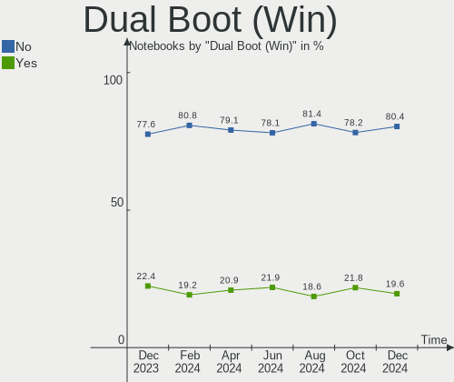
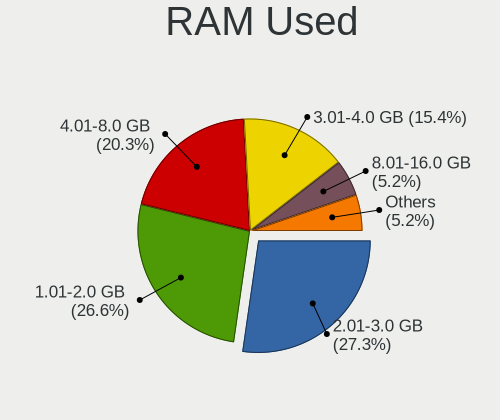
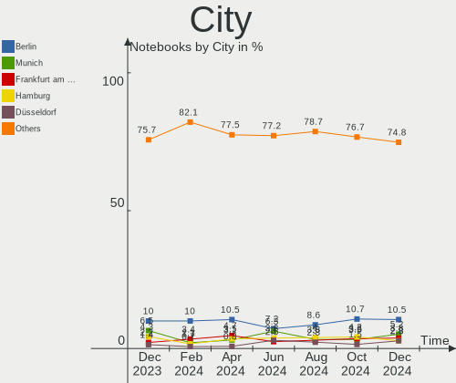
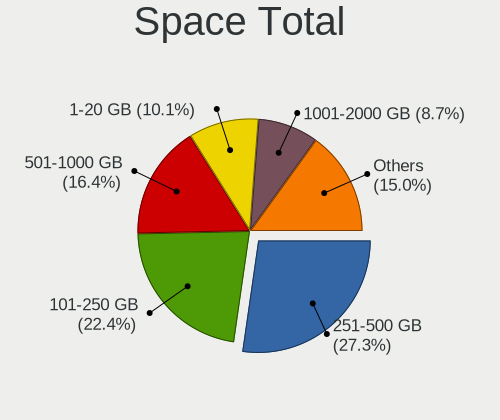
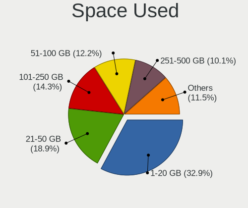
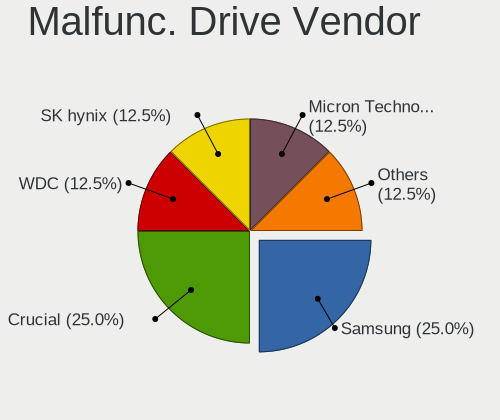
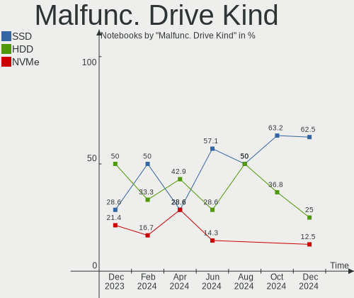
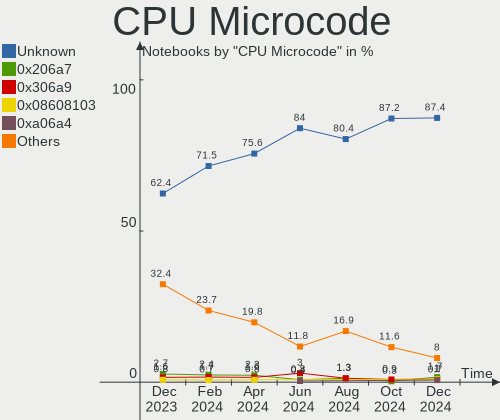
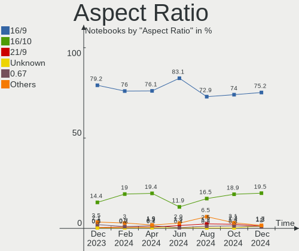
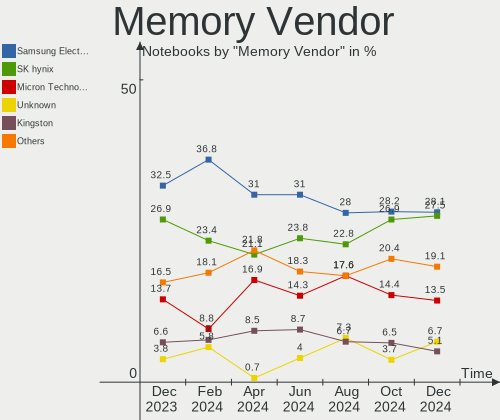

Linux in Germany - Hardware Trends (Notebooks)
----------------------------------------------

A project to identify most popular hardware characteristics and track their change
over time based on data collected by Linux users at https://Linux-Hardware.org.

Anyone can contribute to this report by the [hw-probe](https://github.com/linuxhw/hw-probe) tool:

    sudo -E hw-probe -all -upload

Period: Sep, 2022.

Contents
--------

* [ System ](#system)
  - [ OS                       ](#os)
  - [ OS Family                ](#os-family)
  - [ Kernel                   ](#kernel)
  - [ Kernel Family            ](#kernel-family)
  - [ Kernel Major Ver.        ](#kernel-major-ver)
  - [ Arch                     ](#arch)
  - [ DE                       ](#de)
  - [ Display Server           ](#display-server)
  - [ Display Manager          ](#display-manager)
  - [ OS Lang                  ](#os-lang)
  - [ Boot Mode                ](#boot-mode)
  - [ Filesystem               ](#filesystem)
  - [ Part. scheme             ](#part-scheme)
  - [ Dual Boot with Linux/BSD ](#dual-boot-with-linuxbsd)
  - [ Dual Boot (Win)          ](#dual-boot-win)

* [ Board ](#board)
  - [ Vendor                   ](#vendor)
  - [ Model                    ](#model)
  - [ Model Family             ](#model-family)
  - [ MFG Year                 ](#mfg-year)
  - [ Form Factor              ](#form-factor)
  - [ Secure Boot              ](#secure-boot)
  - [ Coreboot                 ](#coreboot)
  - [ RAM Size                 ](#ram-size)
  - [ RAM Used                 ](#ram-used)
  - [ Total Drives             ](#total-drives)
  - [ Has CD-ROM               ](#has-cd-rom)
  - [ Has Ethernet             ](#has-ethernet)
  - [ Has WiFi                 ](#has-wifi)
  - [ Has Bluetooth            ](#has-bluetooth)

* [ Location ](#location)
  - [ Country                  ](#country)
  - [ City                     ](#city)

* [ Drives ](#drives)
  - [ Drive Vendor             ](#drive-vendor)
  - [ Drive Model              ](#drive-model)
  - [ HDD Vendor               ](#hdd-vendor)
  - [ SSD Vendor               ](#ssd-vendor)
  - [ Drive Kind               ](#drive-kind)
  - [ Drive Connector          ](#drive-connector)
  - [ Drive Size               ](#drive-size)
  - [ Space Total              ](#space-total)
  - [ Space Used               ](#space-used)
  - [ Malfunc. Drives          ](#malfunc-drives)
  - [ Malfunc. Drive Vendor    ](#malfunc-drive-vendor)
  - [ Malfunc. HDD Vendor      ](#malfunc-hdd-vendor)
  - [ Malfunc. Drive Kind      ](#malfunc-drive-kind)
  - [ Failed Drives            ](#failed-drives)
  - [ Failed Drive Vendor      ](#failed-drive-vendor)
  - [ Drive Status             ](#drive-status)

* [ Storage controller ](#storage-controller)
  - [ Storage Vendor           ](#storage-vendor)
  - [ Storage Model            ](#storage-model)
  - [ Storage Kind             ](#storage-kind)

* [ Processor ](#processor)
  - [ CPU Vendor               ](#cpu-vendor)
  - [ CPU Model                ](#cpu-model)
  - [ CPU Model Family         ](#cpu-model-family)
  - [ CPU Cores                ](#cpu-cores)
  - [ CPU Sockets              ](#cpu-sockets)
  - [ CPU Threads              ](#cpu-threads)
  - [ CPU Op-Modes             ](#cpu-op-modes)
  - [ CPU Microcode            ](#cpu-microcode)
  - [ CPU Microarch            ](#cpu-microarch)

* [ Graphics ](#graphics)
  - [ GPU Vendor               ](#gpu-vendor)
  - [ GPU Model                ](#gpu-model)
  - [ GPU Combo                ](#gpu-combo)
  - [ GPU Driver               ](#gpu-driver)
  - [ GPU Memory               ](#gpu-memory)

* [ Monitor ](#monitor)
  - [ Monitor Vendor           ](#monitor-vendor)
  - [ Monitor Model            ](#monitor-model)
  - [ Monitor Resolution       ](#monitor-resolution)
  - [ Monitor Diagonal         ](#monitor-diagonal)
  - [ Monitor Width            ](#monitor-width)
  - [ Aspect Ratio             ](#aspect-ratio)
  - [ Monitor Area             ](#monitor-area)
  - [ Pixel Density            ](#pixel-density)
  - [ Multiple Monitors        ](#multiple-monitors)

* [ Network ](#network)
  - [ Net Controller Vendor    ](#net-controller-vendor)
  - [ Net Controller Model     ](#net-controller-model)
  - [ Wireless Vendor          ](#wireless-vendor)
  - [ Wireless Model           ](#wireless-model)
  - [ Ethernet Vendor          ](#ethernet-vendor)
  - [ Ethernet Model           ](#ethernet-model)
  - [ Net Controller Kind      ](#net-controller-kind)
  - [ Used Controller          ](#used-controller)
  - [ NICs                     ](#nics)
  - [ IPv6                     ](#ipv6)

* [ Bluetooth ](#bluetooth)
  - [ Bluetooth Vendor         ](#bluetooth-vendor)
  - [ Bluetooth Model          ](#bluetooth-model)

* [ Sound ](#sound)
  - [ Sound Vendor             ](#sound-vendor)
  - [ Sound Model              ](#sound-model)

* [ Memory ](#memory)
  - [ Memory Vendor            ](#memory-vendor)
  - [ Memory Model             ](#memory-model)
  - [ Memory Kind              ](#memory-kind)
  - [ Memory Form Factor       ](#memory-form-factor)
  - [ Memory Size              ](#memory-size)
  - [ Memory Speed             ](#memory-speed)

* [ Printers & scanners ](#printers--scanners)
  - [ Printer Vendor           ](#printer-vendor)
  - [ Printer Model            ](#printer-model)
  - [ Scanner Vendor           ](#scanner-vendor)
  - [ Scanner Model            ](#scanner-model)

* [ Camera ](#camera)
  - [ Camera Vendor            ](#camera-vendor)
  - [ Camera Model             ](#camera-model)

* [ Security ](#security)
  - [ Fingerprint Vendor       ](#fingerprint-vendor)
  - [ Fingerprint Model        ](#fingerprint-model)
  - [ Chipcard Vendor          ](#chipcard-vendor)
  - [ Chipcard Model           ](#chipcard-model)

* [ Unsupported ](#unsupported)
  - [ Unsupported Devices      ](#unsupported-devices)
  - [ Unsupported Device Types ](#unsupported-device-types)

System
------

OS
--

Installed operating systems

| Name                         | Notebooks | Percent |
|------------------------------|-----------|---------|
| Ubuntu 22.04                 | 47        | 19.58%  |
| Linux Mint 21                | 24        | 10%     |
| Fedora 36                    | 20        | 8.33%   |
| Ubuntu 20.04                 | 13        | 5.42%   |
| Debian 11                    | 13        | 5.42%   |
| Zorin 16                     | 11        | 4.58%   |
| OpenMandriva 4.3             | 8         | 3.33%   |
| SteamOS 3.3.1                | 7         | 2.92%   |
| Linux Mint 20.3              | 7         | 2.92%   |
| OpenMandriva 4.50            | 6         | 2.5%    |
| Pop!_OS 22.04                | 5         | 2.08%   |
| Manjaro 22.0.0               | 5         | 2.08%   |
| Xubuntu 22.04                | 4         | 1.67%   |
| Debian Testing               | 4         | 1.67%   |
| openSUSE Leap-15.4           | 3         | 1.25%   |
| MX 21                        | 3         | 1.25%   |
| LMDE 5                       | 3         | 1.25%   |
| Kubuntu 22.04                | 3         | 1.25%   |
| Gentoo 2.8                   | 3         | 1.25%   |
| Fedora 37                    | 3         | 1.25%   |
| Arch                         | 3         | 1.25%   |
| Ubuntu Studio 22.04          | 2         | 0.83%   |
| org.kde.Platform 5.15-21.08  | 2         | 0.83%   |
| openSUSE Tumbleweed-XXXXXXXX | 2         | 0.83%   |
| Manjaro                      | 2         | 0.83%   |
| Linux Mint 20.2              | 2         | 0.83%   |
| Kubuntu 20.04                | 2         | 0.83%   |
| KDE neon 22.04               | 2         | 0.83%   |
| KDE neon 20.04               | 2         | 0.83%   |
| Elementary 6.1               | 2         | 0.83%   |
| Debian Unstable              | 2         | 0.83%   |
| AlmaLinux 8.6                | 2         | 0.83%   |
| Ubuntu MATE 22.04            | 1         | 0.42%   |
| Ubuntu Budgie 22.04          | 1         | 0.42%   |
| Ubuntu 18.04                 | 1         | 0.42%   |
| SteamOS 3.4                  | 1         | 0.42%   |
| SteamOS 3.3.2                | 1         | 0.42%   |
| Slackware 15.0               | 1         | 0.42%   |
| ROSA R11.1                   | 1         | 0.42%   |
| ROSA 12.2                    | 1         | 0.42%   |

OS Family
---------

OS without a version

| Name             | Notebooks | Percent |
|------------------|-----------|---------|
| Ubuntu           | 61        | 25.42%  |
| Linux Mint       | 34        | 14.17%  |
| Fedora           | 24        | 10%     |
| Debian           | 19        | 7.92%   |
| OpenMandriva     | 14        | 5.83%   |
| Zorin            | 11        | 4.58%   |
| SteamOS          | 9         | 3.75%   |
| Manjaro          | 7         | 2.92%   |
| Kubuntu          | 6         | 2.5%    |
| Pop!_OS          | 5         | 2.08%   |
| openSUSE         | 5         | 2.08%   |
| Xubuntu          | 4         | 1.67%   |
| KDE neon         | 4         | 1.67%   |
| Arch             | 4         | 1.67%   |
| MX               | 3         | 1.25%   |
| LMDE             | 3         | 1.25%   |
| Gentoo           | 3         | 1.25%   |
| Endless          | 3         | 1.25%   |
| Ubuntu Studio    | 2         | 0.83%   |
| ROSA             | 2         | 0.83%   |
| org.kde.Platform | 2         | 0.83%   |
| Elementary       | 2         | 0.83%   |
| AlmaLinux        | 2         | 0.83%   |
| Ubuntu MATE      | 1         | 0.42%   |
| Ubuntu Budgie    | 1         | 0.42%   |
| Slackware        | 1         | 0.42%   |
| Parrot           | 1         | 0.42%   |
| Lilidog          | 1         | 0.42%   |
| Kali             | 1         | 0.42%   |
| Garuda Linux     | 1         | 0.42%   |
| Feren OS         | 1         | 0.42%   |
| EndeavourOS      | 1         | 0.42%   |
| Crystal Linux    | 1         | 0.42%   |
| BlackPanther     | 1         | 0.42%   |

Kernel
------

Version of the Linux kernel

| Version                                        | Notebooks | Percent |
|------------------------------------------------|-----------|---------|
| 5.15.0-47-generic                              | 47        | 19.58%  |
| 5.15.0-48-generic                              | 30        | 12.5%   |
| 5.15.0-46-generic                              | 18        | 7.5%    |
| 5.16.7-desktop-1omv4003                        | 8         | 3.33%   |
| 5.13.0-valve21.1-1-neptune-02211-gc54cda5a36f3 | 7         | 2.92%   |
| 5.10.0-18-amd64                                | 7         | 2.92%   |
| 5.10.0-17-amd64                                | 7         | 2.92%   |
| 5.4.0-126-generic                              | 6         | 2.5%    |
| 5.4.0-125-generic                              | 6         | 2.5%    |
| 5.19.9-200.fc36.x86_64                         | 5         | 2.08%   |
| 5.19.5-desktop-1omv4090                        | 5         | 2.08%   |
| 5.19.0-76051900-generic                        | 5         | 2.08%   |
| 5.19.11-200.fc36.x86_64                        | 4         | 1.67%   |
| 5.19.0-1-amd64                                 | 4         | 1.67%   |
| 5.15.65-1-MANJARO                              | 4         | 1.67%   |
| 5.19.8-200.fc36.x86_64                         | 3         | 1.25%   |
| 5.19.7-1-MANJARO                               | 3         | 1.25%   |
| 5.11.0-35-generic                              | 3         | 1.25%   |
| 5.19.6-200.fc36.x86_64                         | 2         | 0.83%   |
| 5.19.5-051905-generic                          | 2         | 0.83%   |
| 5.19.4-200.fc36.x86_64                         | 2         | 0.83%   |
| 5.18.0-4-amd64                                 | 2         | 0.83%   |
| 5.18.0-0.deb11.4-amd64                         | 2         | 0.83%   |
| 5.15.0-50-generic                              | 2         | 0.83%   |
| 5.15.0-47-lowlatency                           | 2         | 0.83%   |
| 5.15.0-41-generic                              | 2         | 0.83%   |
| 5.14.21-150400.24.21-default                   | 2         | 0.83%   |
| 5.4.83-generic-2rosa-x86_64                    | 1         | 0.42%   |
| 5.4.0-80-generic                               | 1         | 0.42%   |
| 5.4.0-125-lowlatency                           | 1         | 0.42%   |
| 5.4.0-121-generic                              | 1         | 0.42%   |
| 5.19.9-300.fc37.x86_64                         | 1         | 0.42%   |
| 5.19.8-300.fc37.x86_64                         | 1         | 0.42%   |
| 5.19.8-1-default                               | 1         | 0.42%   |
| 5.19.7-zen2-1-zen                              | 1         | 0.42%   |
| 5.19.7-arch1-1                                 | 1         | 0.42%   |
| 5.19.7-200.fc36.x86_64                         | 1         | 0.42%   |
| 5.19.6-arch1-1                                 | 1         | 0.42%   |
| 5.19.5-arch1-1                                 | 1         | 0.42%   |
| 5.19.4-100.fc35.x86_64                         | 1         | 0.42%   |

Kernel Family
-------------

Linux kernel without a distro release

| Version | Notebooks | Percent |
|---------|-----------|---------|
| 5.15.0  | 105       | 43.75%  |
| 5.10.0  | 17        | 7.08%   |
| 5.4.0   | 15        | 6.25%   |
| 5.13.0  | 11        | 4.58%   |
| 5.19.0  | 9         | 3.75%   |
| 5.19.5  | 8         | 3.33%   |
| 5.16.7  | 8         | 3.33%   |
| 5.19.11 | 7         | 2.92%   |
| 5.18.0  | 7         | 2.92%   |
| 5.19.9  | 6         | 2.5%    |
| 5.19.7  | 6         | 2.5%    |
| 5.19.8  | 5         | 2.08%   |
| 5.15.65 | 5         | 2.08%   |
| 5.11.0  | 4         | 1.67%   |
| 5.19.6  | 3         | 1.25%   |
| 5.19.4  | 3         | 1.25%   |
| 5.14.21 | 3         | 1.25%   |
| 5.19.10 | 2         | 0.83%   |
| 4.18.0  | 2         | 0.83%   |
| 5.4.83  | 1         | 0.42%   |
| 5.19.2  | 1         | 0.42%   |
| 5.18.17 | 1         | 0.42%   |
| 5.18.10 | 1         | 0.42%   |
| 5.17.5  | 1         | 0.42%   |
| 5.16.13 | 1         | 0.42%   |
| 5.15.69 | 1         | 0.42%   |
| 5.15.63 | 1         | 0.42%   |
| 5.15.59 | 1         | 0.42%   |
| 5.15.49 | 1         | 0.42%   |
| 5.15.45 | 1         | 0.42%   |
| 5.14.0  | 1         | 0.42%   |
| 5.10.74 | 1         | 0.42%   |
| 4.18.16 | 1         | 0.42%   |

Kernel Major Ver.
-----------------

Linux kernel major version

| Version | Notebooks | Percent |
|---------|-----------|---------|
| 5.15    | 115       | 47.92%  |
| 5.19    | 50        | 20.83%  |
| 5.10    | 18        | 7.5%    |
| 5.4     | 16        | 6.67%   |
| 5.13    | 11        | 4.58%   |
| 5.18    | 9         | 3.75%   |
| 5.16    | 9         | 3.75%   |
| 5.14    | 4         | 1.67%   |
| 5.11    | 4         | 1.67%   |
| 4.18    | 3         | 1.25%   |
| 5.17    | 1         | 0.42%   |

Arch
----

OS architecture (x86_64, i586, etc.)

| Name   | Notebooks | Percent |
|--------|-----------|---------|
| x86_64 | 240       | 100%    |

DE
--

Desktop Environment

| Name             | Notebooks | Percent |
|------------------|-----------|---------|
| GNOME            | 111       | 46.25%  |
| KDE5             | 49        | 20.42%  |
| X-Cinnamon       | 33        | 13.75%  |
| XFCE             | 18        | 7.5%    |
| MATE             | 7         | 2.92%   |
| Cinnamon         | 3         | 1.25%   |
| Unknown          | 3         | 1.25%   |
| Pantheon         | 2         | 0.83%   |
| LXQt             | 2         | 0.83%   |
| i3               | 2         | 0.83%   |
| Budgie           | 2         | 0.83%   |
| xmonad           | 1         | 0.42%   |
| trinity          | 1         | 0.42%   |
| sway             | 1         | 0.42%   |
| LXDE             | 1         | 0.42%   |
| lightdm-xsession | 1         | 0.42%   |
| KDE:old          | 1         | 0.42%   |
| GNOME Flashback  | 1         | 0.42%   |
| Deepin           | 1         | 0.42%   |

Display Server
--------------

X11 or Wayland

| Name    | Notebooks | Percent |
|---------|-----------|---------|
| X11     | 168       | 70%     |
| Wayland | 68        | 28.33%  |
| Tty     | 3         | 1.25%   |
| Unknown | 1         | 0.42%   |

Display Manager
---------------

SDDM, LightDM, etc.

| Name    | Notebooks | Percent |
|---------|-----------|---------|
| Unknown | 79        | 32.92%  |
| GDM3    | 68        | 28.33%  |
| LightDM | 43        | 17.92%  |
| SDDM    | 31        | 12.92%  |
| GDM     | 18        | 7.5%    |
| XDM     | 1         | 0.42%   |

OS Lang
-------

Language

| Lang    | Notebooks | Percent |
|---------|-----------|---------|
| de_DE   | 173       | 72.08%  |
| en_US   | 45        | 18.75%  |
| en_GB   | 7         | 2.92%   |
| nl_NL   | 2         | 0.83%   |
| en_DE   | 2         | 0.83%   |
| en_AG   | 2         | 0.83%   |
| ro_RO   | 1         | 0.42%   |
| pl_PL   | 1         | 0.42%   |
| en_SG   | 1         | 0.42%   |
| en_DK   | 1         | 0.42%   |
| de_LI   | 1         | 0.42%   |
| de_CH   | 1         | 0.42%   |
| C.UTF8  | 1         | 0.42%   |
| C       | 1         | 0.42%   |
| Unknown | 1         | 0.42%   |

Boot Mode
---------

EFI or BIOS

| Mode | Notebooks | Percent |
|------|-----------|---------|
| BIOS | 124       | 51.67%  |
| EFI  | 116       | 48.33%  |

Filesystem
----------

Type of filesystem

| Type    | Notebooks | Percent |
|---------|-----------|---------|
| Ext4    | 181       | 75.42%  |
| Btrfs   | 41        | 17.08%  |
| Overlay | 14        | 5.83%   |
| Xfs     | 2         | 0.83%   |
| Zfs     | 1         | 0.42%   |
| XXXXXXX | 1         | 0.42%   |

Part. scheme
------------

Scheme of partitioning

| Type    | Notebooks | Percent |
|---------|-----------|---------|
| Unknown | 132       | 55%     |
| GPT     | 90        | 37.5%   |
| MBR     | 18        | 7.5%    |

Dual Boot with Linux/BSD
------------------------

Hosting more than one Linux/BSD

| Dual boot | Notebooks | Percent |
|-----------|-----------|---------|
| No        | 218       | 90.83%  |
| Yes       | 22        | 9.17%   |

Dual Boot (Win)
---------------

Hosting Linux and Windows

| Dual boot | Notebooks | Percent |
|-----------|-----------|---------|
| No        | 178       | 74.17%  |
| Yes       | 62        | 25.83%  |

Board
-----

Vendor
------

Motherboard manufacturer

| Name                | Notebooks | Percent |
|---------------------|-----------|---------|
| Lenovo              | 62        | 25.83%  |
| Dell                | 37        | 15.42%  |
| Hewlett-Packard     | 27        | 11.25%  |
| ASUSTek Computer    | 24        | 10%     |
| Acer                | 20        | 8.33%   |
| Valve               | 10        | 4.17%   |
| Medion              | 8         | 3.33%   |
| HUAWEI              | 8         | 3.33%   |
| Samsung Electronics | 7         | 2.92%   |
| Apple               | 5         | 2.08%   |
| TUXEDO              | 4         | 1.67%   |
| Toshiba             | 3         | 1.25%   |
| Notebook            | 3         | 1.25%   |
| MSI                 | 3         | 1.25%   |
| Sony                | 2         | 0.83%   |
| Schenker            | 2         | 0.83%   |
| VALE                | 1         | 0.42%   |
| Timi                | 1         | 0.42%   |
| Tactus              | 1         | 0.42%   |
| System76            | 1         | 0.42%   |
| SIEMENS             | 1         | 0.42%   |
| Pegatron            | 1         | 0.42%   |
| Panasonic           | 1         | 0.42%   |
| Packard Bell        | 1         | 0.42%   |
| OEM                 | 1         | 0.42%   |
| GPD                 | 1         | 0.42%   |
| Gigabyte Technology | 1         | 0.42%   |
| Fujitsu Siemens     | 1         | 0.42%   |
| Fujitsu             | 1         | 0.42%   |
| Framework           | 1         | 0.42%   |
| AXDIA International | 1         | 0.42%   |

Model
-----

Motherboard model

| Name                                              | Notebooks | Percent |
|---------------------------------------------------|-----------|---------|
| Valve Jupiter                                     | 10        | 4.17%   |
| HUAWEI KLVL-WXXW                                  | 3         | 1.25%   |
| TUXEDO Pulse 15 Gen1                              | 2         | 0.83%   |
| Samsung RV420/RV520/RV720/E3530/S3530/E3420/E3520 | 2         | 0.83%   |
| Lenovo ThinkPad P14s Gen 1 20Y1000AGE             | 2         | 0.83%   |
| HUAWEI KPL-W0X                                    | 2         | 0.83%   |
| HP ProBook 6560b                                  | 2         | 0.83%   |
| Dell Latitude E7470                               | 2         | 0.83%   |
| Dell Latitude 7430                                | 2         | 0.83%   |
| Dell Latitude 5290 2-in-1                         | 2         | 0.83%   |
| ASUS N750JV                                       | 2         | 0.83%   |
| Apple MacBookPro8,2                               | 2         | 0.83%   |
| Acer Aspire 5750G                                 | 2         | 0.83%   |
| Unknown                                           | 2         | 0.83%   |
| VALE Notebook Classic C140                        | 1         | 0.42%   |
| TUXEDO N8xEJEK                                    | 1         | 0.42%   |
| TUXEDO Book BA1510                                | 1         | 0.42%   |
| Toshiba TECRA M10                                 | 1         | 0.42%   |
| Toshiba Satellite C70D-A                          | 1         | 0.42%   |
| Toshiba Satellite C50-B                           | 1         | 0.42%   |
| Timi Xiaomi Book Pro 16 2022                      | 1         | 0.42%   |
| Tactus GeoBook 140                                | 1         | 0.42%   |
| System76 Darter Pro                               | 1         | 0.42%   |
| Sony VPCSB3X9E                                    | 1         | 0.42%   |
| Sony SVE1512C6EB                                  | 1         | 0.42%   |
| SIEMENS SIMATIC ITP1000                           | 1         | 0.42%   |
| Schenker XMG FUSION 15 (XFU15M22)                 | 1         | 0.42%   |
| Schenker VISION 15 (SVS15E21)                     | 1         | 0.42%   |
| Samsung SX60P                                     | 1         | 0.42%   |
| Samsung R530/R730/R540                            | 1         | 0.42%   |
| Samsung R425/R525                                 | 1         | 0.42%   |
| Samsung 755XDA                                    | 1         | 0.42%   |
| Samsung 600B4B/600B5B                             | 1         | 0.42%   |
| Pegatron A15                                      | 1         | 0.42%   |
| Panasonic CF-53JWX1CFG                            | 1         | 0.42%   |
| Packard Bell EasyNote LJ65                        | 1         | 0.42%   |
| Notebook PB50_70RF,RD,RC                          | 1         | 0.42%   |
| Notebook NJ5x_NJ7xLU                              | 1         | 0.42%   |
| Notebook N350DW                                   | 1         | 0.42%   |
| MSI MS-168B                                       | 1         | 0.42%   |

Model Family
------------

Motherboard model prefix

| Name              | Notebooks | Percent |
|-------------------|-----------|---------|
| Lenovo ThinkPad   | 43        | 17.92%  |
| Dell Latitude     | 17        | 7.08%   |
| Acer Aspire       | 15        | 6.25%   |
| Valve Jupiter     | 10        | 4.17%   |
| ASUS VivoBook     | 9         | 3.75%   |
| Dell Precision    | 7         | 2.92%   |
| Lenovo IdeaPad    | 6         | 2.5%    |
| HP Laptop         | 6         | 2.5%    |
| HP EliteBook      | 4         | 1.67%   |
| Dell XPS          | 4         | 1.67%   |
| Dell Inspiron     | 4         | 1.67%   |
| Lenovo Yoga       | 3         | 1.25%   |
| Lenovo ThinkBook  | 3         | 1.25%   |
| HUAWEI KLVL-WXXW  | 3         | 1.25%   |
| HP ProBook        | 3         | 1.25%   |
| HP Pavilion       | 3         | 1.25%   |
| HP Compaq         | 3         | 1.25%   |
| TUXEDO Pulse      | 2         | 0.83%   |
| Toshiba Satellite | 2         | 0.83%   |
| Samsung RV420     | 2         | 0.83%   |
| Medion Akoya      | 2         | 0.83%   |
| HUAWEI KPL-W0X    | 2         | 0.83%   |
| HP ZBook          | 2         | 0.83%   |
| HP 255            | 2         | 0.83%   |
| Dell System       | 2         | 0.83%   |
| ASUS N750JV       | 2         | 0.83%   |
| Apple MacBookPro8 | 2         | 0.83%   |
| Acer Extensa      | 2         | 0.83%   |
| Unknown           | 2         | 0.83%   |
| VALE Notebook     | 1         | 0.42%   |
| TUXEDO N8xEJEK    | 1         | 0.42%   |
| TUXEDO Book       | 1         | 0.42%   |
| Toshiba TECRA     | 1         | 0.42%   |
| Timi Xiaomi       | 1         | 0.42%   |
| Tactus GeoBook    | 1         | 0.42%   |
| System76 Darter   | 1         | 0.42%   |
| Sony VPCSB3X9E    | 1         | 0.42%   |
| Sony SVE1512C6EB  | 1         | 0.42%   |
| SIEMENS SIMATIC   | 1         | 0.42%   |
| Schenker XMG      | 1         | 0.42%   |

MFG Year
--------

Motherboard manufacture year

| Year | Notebooks | Percent |
|------|-----------|---------|
| 2021 | 29        | 12.08%  |
| 2022 | 27        | 11.25%  |
| 2020 | 25        | 10.42%  |
| 2012 | 22        | 9.17%   |
| 2011 | 20        | 8.33%   |
| 2018 | 19        | 7.92%   |
| 2013 | 15        | 6.25%   |
| 2014 | 12        | 5%      |
| 2019 | 11        | 4.58%   |
| 2015 | 11        | 4.58%   |
| 2010 | 10        | 4.17%   |
| 2017 | 9         | 3.75%   |
| 2016 | 9         | 3.75%   |
| 2009 | 8         | 3.33%   |
| 2007 | 8         | 3.33%   |
| 2008 | 4         | 1.67%   |
| 2006 | 1         | 0.42%   |

Form Factor
-----------

Physical design of the computer

| Name     | Notebooks | Percent |
|----------|-----------|---------|
| Notebook | 240       | 100%    |

Secure Boot
-----------

Enabled or disabled

| State    | Notebooks | Percent |
|----------|-----------|---------|
| Disabled | 219       | 91.25%  |
| Enabled  | 21        | 8.75%   |

Coreboot
--------

Have coreboot on board

| Used | Notebooks | Percent |
|------|-----------|---------|
| No   | 237       | 98.75%  |
| Yes  | 3         | 1.25%   |

RAM Size
--------

Total RAM memory

| Size in GB  | Notebooks | Percent |
|-------------|-----------|---------|
| 4.01-8.0    | 63        | 26.25%  |
| 8.01-16.0   | 61        | 25.42%  |
| 3.01-4.0    | 54        | 22.5%   |
| 16.01-24.0  | 32        | 13.33%  |
| 32.01-64.0  | 16        | 6.67%   |
| 1.01-2.0    | 6         | 2.5%    |
| 2.01-3.0    | 3         | 1.25%   |
| 64.01-256.0 | 3         | 1.25%   |
| 24.01-32.0  | 2         | 0.83%   |

RAM Used
--------

Used RAM memory

| Used GB   | Notebooks | Percent |
|-----------|-----------|---------|
| 1.01-2.0  | 76        | 31.67%  |
| 2.01-3.0  | 61        | 25.42%  |
| 3.01-4.0  | 46        | 19.17%  |
| 4.01-8.0  | 30        | 12.5%   |
| 0.51-1.0  | 16        | 6.67%   |
| 8.01-16.0 | 10        | 4.17%   |
| 0.01-0.5  | 1         | 0.42%   |

Total Drives
------------

Number of drives on board

| Drives | Notebooks | Percent |
|--------|-----------|---------|
| 1      | 172       | 71.67%  |
| 2      | 57        | 23.75%  |
| 3      | 8         | 3.33%   |
| 6      | 1         | 0.42%   |
| 4      | 1         | 0.42%   |
| 0      | 1         | 0.42%   |

Has CD-ROM
----------

Has CD-ROM on board

| Presented | Notebooks | Percent |
|-----------|-----------|---------|
| No        | 162       | 67.5%   |
| Yes       | 78        | 32.5%   |

Has Ethernet
------------

Has Ethernet on board

| Presented | Notebooks | Percent |
|-----------|-----------|---------|
| Yes       | 192       | 80%     |
| No        | 48        | 20%     |

Has WiFi
--------

Has WiFi module

| Presented | Notebooks | Percent |
|-----------|-----------|---------|
| Yes       | 237       | 98.75%  |
| No        | 3         | 1.25%   |

Has Bluetooth
-------------

Has Bluetooth module

| Presented | Notebooks | Percent |
|-----------|-----------|---------|
| Yes       | 185       | 77.08%  |
| No        | 55        | 22.92%  |

Location
--------

Country
-------

Geographic location (country)

| Country | Notebooks | Percent |
|---------|-----------|---------|
| Germany | 240       | 100%    |

City
----

Geographic location (city)

| City                 | Notebooks | Percent |
|----------------------|-----------|---------|
| Berlin               | 19        | 7.92%   |
| Munich               | 13        | 5.42%   |
| Hamburg              | 12        | 5%      |
| Frankfurt am Main    | 10        | 4.17%   |
| Cologne              | 6         | 2.5%    |
| Fürth               | 3         | 1.25%   |
| Freiburg im Breisgau | 3         | 1.25%   |
| Düsseldorf          | 3         | 1.25%   |
| Dresden              | 3         | 1.25%   |
| Darmstadt            | 3         | 1.25%   |
| Braunschweig         | 3         | 1.25%   |
| Aachen               | 3         | 1.25%   |
| Wunstorf             | 2         | 0.83%   |
| Wiesbaden            | 2         | 0.83%   |
| Wendeburg            | 2         | 0.83%   |
| Velbert              | 2         | 0.83%   |
| Saarlouis            | 2         | 0.83%   |
| Regensburg           | 2         | 0.83%   |
| Offenburg            | 2         | 0.83%   |
| Nuremberg            | 2         | 0.83%   |
| Mannheim             | 2         | 0.83%   |
| Mainz                | 2         | 0.83%   |
| Lübeck              | 2         | 0.83%   |
| Leipzig              | 2         | 0.83%   |
| Kempten (Allgaeu)    | 2         | 0.83%   |
| Essen                | 2         | 0.83%   |
| Coesfeld             | 2         | 0.83%   |
| Clausthal-Zellerfeld | 2         | 0.83%   |
| Bonn                 | 2         | 0.83%   |
| Bad Koenig           | 2         | 0.83%   |
| Zimmern ob Rottweil  | 1         | 0.42%   |
| Zeitz                | 1         | 0.42%   |
| Wolfhagen            | 1         | 0.42%   |
| Witten               | 1         | 0.42%   |
| Wiednitz             | 1         | 0.42%   |
| Wendelstein          | 1         | 0.42%   |
| Weimar               | 1         | 0.42%   |
| Wasungen             | 1         | 0.42%   |
| Warendorf            | 1         | 0.42%   |
| Waren                | 1         | 0.42%   |

Drives
------

Drive Vendor
------------

Hard drive vendors

| Vendor                       | Notebooks | Drives | Percent |
|------------------------------|-----------|--------|---------|
| Samsung Electronics          | 59        | 67     | 19.73%  |
| Seagate                      | 26        | 27     | 8.7%    |
| SanDisk                      | 26        | 27     | 8.7%    |
| WDC                          | 25        | 25     | 8.36%   |
| Kingston                     | 19        | 20     | 6.35%   |
| Unknown                      | 18        | 19     | 6.02%   |
| Toshiba                      | 16        | 16     | 5.35%   |
| SK hynix                     | 12        | 12     | 4.01%   |
| Intenso                      | 12        | 13     | 4.01%   |
| Micron Technology            | 11        | 11     | 3.68%   |
| Intel                        | 11        | 14     | 3.68%   |
| Hitachi                      | 8         | 8      | 2.68%   |
| Crucial                      | 8         | 8      | 2.68%   |
| KIOXIA                       | 6         | 6      | 2.01%   |
| HGST                         | 4         | 4      | 1.34%   |
| Phison                       | 3         | 3      | 1%      |
| Fujitsu                      | 3         | 3      | 1%      |
| UMIS                         | 2         | 2      | 0.67%   |
| Transcend                    | 2         | 2      | 0.67%   |
| Phison Electronics           | 2         | 2      | 0.67%   |
| Netac                        | 2         | 2      | 0.67%   |
| LITEONIT                     | 2         | 2      | 0.67%   |
| LITEON                       | 2         | 2      | 0.67%   |
| Unknown                      | 2         | 2      | 0.67%   |
| SPCC                         | 1         | 1      | 0.33%   |
| Silicon Motion               | 1         | 1      | 0.33%   |
| Shenzhen Longsys Electronics | 1         | 1      | 0.33%   |
| Plextor                      | 1         | 1      | 0.33%   |
| O2 Micro                     | 1         | 2      | 0.33%   |
| Mushkin                      | 1         | 1      | 0.33%   |
| Micron/Crucial Technology    | 1         | 1      | 0.33%   |
| Kingston Technology Company  | 1         | 1      | 0.33%   |
| KingFast                     | 1         | 1      | 0.33%   |
| Inateck                      | 1         | 1      | 0.33%   |
| GLOWAY                       | 1         | 1      | 0.33%   |
| GLOBAL                       | 1         | 1      | 0.33%   |
| External                     | 1         | 1      | 0.33%   |
| CT1000P2                     | 1         | 1      | 0.33%   |
| BIWIN                        | 1         | 1      | 0.33%   |
| Apacer                       | 1         | 1      | 0.33%   |

Drive Model
-----------

Hard drive models

| Model                                               | Notebooks | Percent |
|-----------------------------------------------------|-----------|---------|
| Samsung NVMe SSD Controller SM981/PM981/PM983 256GB | 6         | 1.92%   |
| Toshiba MQ01ABD100 1TB                              | 5         | 1.6%    |
| Kingston NVMe SSD Drive 512GB                       | 5         | 1.6%    |
| Unknown MMC Card  512GB                             | 4         | 1.28%   |
| Sandisk WD Black SN750 / PC SN730 NVMe SSD 1024GB   | 4         | 1.28%   |
| Samsung SSD 860 EVO 500GB                           | 4         | 1.28%   |
| WDC WDS500G2B0A-00SM50 500GB SSD                    | 3         | 0.96%   |
| Unknown MMC Card  32GB                              | 3         | 0.96%   |
| Seagate ST1000LM048-2E7172 1TB                      | 3         | 0.96%   |
| SanDisk NVMe SSD Drive 512GB                        | 3         | 0.96%   |
| Samsung SSD 850 EVO 250GB                           | 3         | 0.96%   |
| WDC WDS100T2B0C-00PXH0 1TB                          | 2         | 0.64%   |
| WDC WD10JPVX-60JC3T0 1TB                            | 2         | 0.64%   |
| Unknown SD/MMC/MS PRO 2GB                           | 2         | 0.64%   |
| Unknown MMC Card  7GB                               | 2         | 0.64%   |
| Unknown MMC Card  64GB                              | 2         | 0.64%   |
| SK hynix NVMe SSD Drive 512GB                       | 2         | 0.64%   |
| Seagate ST9500325AS 500GB                           | 2         | 0.64%   |
| Seagate ST9320423AS 320GB                           | 2         | 0.64%   |
| Seagate ST750LM022 HN-M750MBB 752GB                 | 2         | 0.64%   |
| Seagate ST500LM000-SSHD-8GB                         | 2         | 0.64%   |
| Seagate ST1000LX015-1U7172 1TB                      | 2         | 0.64%   |
| Seagate ST1000LM024 HN-M101MBB 1TB                  | 2         | 0.64%   |
| SanDisk X400 M.2 2280 256GB SSD                     | 2         | 0.64%   |
| SanDisk SSD PLUS 240GB                              | 2         | 0.64%   |
| Samsung SSD 980 PRO 1TB                             | 2         | 0.64%   |
| Samsung SSD 970 EVO Plus 500GB                      | 2         | 0.64%   |
| Samsung SSD 970 EVO 1TB                             | 2         | 0.64%   |
| Samsung SSD 850 EVO 500GB                           | 2         | 0.64%   |
| Samsung SSD 840 PRO Series 256GB                    | 2         | 0.64%   |
| Samsung SSD 840 EVO 250GB                           | 2         | 0.64%   |
| Samsung SSD 750 EVO 500GB                           | 2         | 0.64%   |
| Samsung PM9A1 NVMe 512GB                            | 2         | 0.64%   |
| Samsung NVMe SSD Drive 512GB                        | 2         | 0.64%   |
| Samsung NVMe SSD Controller SM961/PM961/SM963 256GB | 2         | 0.64%   |
| Samsung MZVLB512HBJQ-000L7 512GB                    | 2         | 0.64%   |
| Phison PS5013 E13 NVMe Controller 512GB             | 2         | 0.64%   |
| Phison 311CD0512GB                                  | 2         | 0.64%   |
| Micron MTFDHBA512TDV 512GB                          | 2         | 0.64%   |
| Micron 2300 NVMe 1024GB                             | 2         | 0.64%   |

HDD Vendor
----------

Hard disk drive vendors

| Vendor              | Notebooks | Drives | Percent |
|---------------------|-----------|--------|---------|
| Seagate             | 26        | 27     | 36.62%  |
| WDC                 | 17        | 17     | 23.94%  |
| Toshiba             | 10        | 10     | 14.08%  |
| Hitachi             | 8         | 8      | 11.27%  |
| HGST                | 4         | 4      | 5.63%   |
| Fujitsu             | 3         | 3      | 4.23%   |
| Unknown             | 2         | 2      | 2.82%   |
| Samsung Electronics | 1         | 1      | 1.41%   |

SSD Vendor
----------

Solid state drive vendors

| Vendor              | Notebooks | Drives | Percent |
|---------------------|-----------|--------|---------|
| Samsung Electronics | 30        | 33     | 30.93%  |
| SanDisk             | 14        | 15     | 14.43%  |
| Kingston            | 9         | 10     | 9.28%   |
| Intenso             | 8         | 8      | 8.25%   |
| Crucial             | 8         | 8      | 8.25%   |
| Micron Technology   | 4         | 4      | 4.12%   |
| WDC                 | 3         | 3      | 3.09%   |
| Toshiba             | 3         | 3      | 3.09%   |
| Netac               | 2         | 2      | 2.06%   |
| LITEONIT            | 2         | 2      | 2.06%   |
| Intel               | 2         | 2      | 2.06%   |
| Transcend           | 1         | 1      | 1.03%   |
| SPCC                | 1         | 1      | 1.03%   |
| SK hynix            | 1         | 1      | 1.03%   |
| Plextor             | 1         | 1      | 1.03%   |
| Phison              | 1         | 1      | 1.03%   |
| Mushkin             | 1         | 1      | 1.03%   |
| LITEON              | 1         | 1      | 1.03%   |
| GLOWAY              | 1         | 1      | 1.03%   |
| GLOBAL              | 1         | 1      | 1.03%   |
| BIWIN               | 1         | 1      | 1.03%   |
| Apacer              | 1         | 1      | 1.03%   |
| A-DATA Technology   | 1         | 1      | 1.03%   |

Drive Kind
----------

HDD or SSD

| Kind    | Notebooks | Drives | Percent |
|---------|-----------|--------|---------|
| NVMe    | 103       | 115    | 35.64%  |
| SSD     | 92        | 102    | 31.83%  |
| HDD     | 68        | 72     | 23.53%  |
| MMC     | 20        | 21     | 6.92%   |
| Unknown | 6         | 6      | 2.08%   |

Drive Connector
---------------

SATA, SAS, NVMe, etc.

| Type | Notebooks | Drives | Percent |
|------|-----------|--------|---------|
| SATA | 142       | 167    | 51.26%  |
| NVMe | 103       | 112    | 37.18%  |
| MMC  | 20        | 21     | 7.22%   |
| SAS  | 12        | 16     | 4.33%   |

Drive Size
----------

Size of hard drive

| Size in TB | Notebooks | Drives | Percent |
|------------|-----------|--------|---------|
| 0.01-0.5   | 113       | 130    | 73.38%  |
| 0.51-1.0   | 36        | 39     | 23.38%  |
| 1.01-2.0   | 4         | 4      | 2.6%    |
| 4.01-10.0  | 1         | 1      | 0.65%   |

Space Total
-----------

Amount of disk space available on the file system

| Size in GB     | Notebooks | Percent |
|----------------|-----------|---------|
| 251-500        | 74        | 30.83%  |
| 101-250        | 70        | 29.17%  |
| 501-1000       | 31        | 12.92%  |
| 1-20           | 17        | 7.08%   |
| 1001-2000      | 13        | 5.42%   |
| 51-100         | 11        | 4.58%   |
| 21-50          | 9         | 3.75%   |
| Unknown        | 7         | 2.92%   |
| More than 3000 | 6         | 2.5%    |
| 2001-3000      | 2         | 0.83%   |

Space Used
----------

Amount of used disk space

| Used GB        | Notebooks | Percent |
|----------------|-----------|---------|
| 1-20           | 73        | 30.42%  |
| 101-250        | 43        | 17.92%  |
| 21-50          | 42        | 17.5%   |
| 51-100         | 40        | 16.67%  |
| 251-500        | 22        | 9.17%   |
| 501-1000       | 7         | 2.92%   |
| Unknown        | 7         | 2.92%   |
| 1001-2000      | 4         | 1.67%   |
| More than 3000 | 1         | 0.42%   |
| 0              | 1         | 0.42%   |

Malfunc. Drives
---------------

Drive models with a malfunction

| Model                                               | Notebooks | Drives | Percent |
|-----------------------------------------------------|-----------|--------|---------|
| WDC WD2500BEVT-22A23T0 250GB                        | 1         | 1      | 6.67%   |
| Seagate ST9500325AS 500GB                           | 1         | 1      | 6.67%   |
| Seagate ST500LT032-1E9142 500GB                     | 1         | 1      | 6.67%   |
| Seagate ST500LT012-9WS142 500GB                     | 1         | 1      | 6.67%   |
| Seagate ST500LM000-SSHD-8GB                         | 1         | 1      | 6.67%   |
| Seagate ST1000LM024 HN-M101MBB 1TB                  | 1         | 1      | 6.67%   |
| SanDisk SSD PLUS 1000GB                             | 1         | 1      | 6.67%   |
| Samsung Electronics SSD 970 EVO 1TB                 | 1         | 1      | 6.67%   |
| Samsung Electronics SSD 840 PRO Series 256GB        | 1         | 1      | 6.67%   |
| Micron Technology MTFDDAV256TDL-1AW1ZABHA 256GB SSD | 1         | 1      | 6.67%   |
| LITEONIT LSS-16L6G-HP 16GB SSD                      | 1         | 1      | 6.67%   |
| Intenso SSD SATAIII 120GB                           | 1         | 1      | 6.67%   |
| HGST HTS545050A7E680 500GB                          | 1         | 1      | 6.67%   |
| Crucial M4-CT128M4SSD2 128GB                        | 1         | 1      | 6.67%   |
| A-DATA Technology XM11 256GB-V2 SSD                 | 1         | 1      | 6.67%   |

Malfunc. Drive Vendor
---------------------

Vendors of faulty drives

| Vendor              | Notebooks | Drives | Percent |
|---------------------|-----------|--------|---------|
| Seagate             | 5         | 5      | 33.33%  |
| Samsung Electronics | 2         | 2      | 13.33%  |
| WDC                 | 1         | 1      | 6.67%   |
| SanDisk             | 1         | 1      | 6.67%   |
| Micron Technology   | 1         | 1      | 6.67%   |
| LITEONIT            | 1         | 1      | 6.67%   |
| Intenso             | 1         | 1      | 6.67%   |
| HGST                | 1         | 1      | 6.67%   |
| Crucial             | 1         | 1      | 6.67%   |
| A-DATA Technology   | 1         | 1      | 6.67%   |

Malfunc. HDD Vendor
-------------------

Vendors of faulty HDD drives

| Vendor  | Notebooks | Drives | Percent |
|---------|-----------|--------|---------|
| Seagate | 5         | 5      | 71.43%  |
| WDC     | 1         | 1      | 14.29%  |
| HGST    | 1         | 1      | 14.29%  |

Malfunc. Drive Kind
-------------------

Kinds of faulty drives

| Kind | Notebooks | Drives | Percent |
|------|-----------|--------|---------|
| HDD  | 7         | 7      | 50%     |
| SSD  | 6         | 7      | 42.86%  |
| NVMe | 1         | 1      | 7.14%   |

Failed Drives
-------------

Failed drive models

Zero info for selected period =(

Failed Drive Vendor
-------------------

Failed drive vendors

Zero info for selected period =(

Drive Status
------------

Number of failed and malfunc. drives

| Status   | Notebooks | Drives | Percent |
|----------|-----------|--------|---------|
| Detected | 140       | 185    | 56%     |
| Works    | 96        | 116    | 38.4%   |
| Malfunc  | 14        | 15     | 5.6%    |

Storage controller
------------------

Storage Vendor
--------------

Storage controller vendors

| Vendor                           | Notebooks | Percent |
|----------------------------------|-----------|---------|
| Intel                            | 150       | 54.15%  |
| Samsung Electronics              | 30        | 10.83%  |
| AMD                              | 26        | 9.39%   |
| SanDisk                          | 17        | 6.14%   |
| Kingston Technology Company      | 11        | 3.97%   |
| SK hynix                         | 9         | 3.25%   |
| Micron Technology                | 7         | 2.53%   |
| KIOXIA                           | 6         | 2.17%   |
| Phison Electronics               | 4         | 1.44%   |
| Toshiba America Info Systems     | 3         | 1.08%   |
| Nvidia                           | 3         | 1.08%   |
| Union Memory (Shenzhen)          | 2         | 0.72%   |
| Silicon Motion                   | 2         | 0.72%   |
| Silicon Integrated Systems [SiS] | 1         | 0.36%   |
| Shenzhen Longsys Electronics     | 1         | 0.36%   |
| O2 Micro                         | 1         | 0.36%   |
| Micron/Crucial Technology        | 1         | 0.36%   |
| Marvell Technology Group         | 1         | 0.36%   |
| Lite-On Technology               | 1         | 0.36%   |
| ADATA Technology                 | 1         | 0.36%   |

Storage Model
-------------

Storage controller models

| Model                                                                          | Notebooks | Percent |
|--------------------------------------------------------------------------------|-----------|---------|
| AMD FCH SATA Controller [AHCI mode]                                            | 22        | 7.51%   |
| Intel 7 Series Chipset Family 6-port SATA Controller [AHCI mode]               | 21        | 7.17%   |
| Intel 6 Series/C200 Series Chipset Family 6 port Mobile SATA AHCI Controller   | 18        | 6.14%   |
| Samsung NVMe SSD Controller SM981/PM981/PM983                                  | 17        | 5.8%    |
| Intel Sunrise Point-LP SATA Controller [AHCI mode]                             | 15        | 5.12%   |
| Intel 82801IBM/IEM (ICH9M/ICH9M-E) 4 port SATA Controller [AHCI mode]          | 10        | 3.41%   |
| Intel 82801 Mobile SATA Controller [RAID mode]                                 | 10        | 3.41%   |
| Kingston Company OM3PDP3 NVMe SSD                                              | 8         | 2.73%   |
| Samsung NVMe SSD Controller PM9A1/PM9A3/980PRO                                 | 7         | 2.39%   |
| Micron Non-Volatile memory controller                                          | 7         | 2.39%   |
| Intel Atom Processor E3800 Series SATA AHCI Controller                         | 7         | 2.39%   |
| SanDisk WD Blue SN550 NVMe SSD                                                 | 6         | 2.05%   |
| Intel Celeron/Pentium Silver Processor SATA Controller                         | 6         | 2.05%   |
| Intel 82801HM/HEM (ICH8M/ICH8M-E) SATA Controller [AHCI mode]                  | 6         | 2.05%   |
| Intel 82801HM/HEM (ICH8M/ICH8M-E) IDE Controller                               | 6         | 2.05%   |
| Intel 8 Series/C220 Series Chipset Family 6-port SATA Controller 1 [AHCI mode] | 6         | 2.05%   |
| Intel 8 Series SATA Controller 1 [AHCI mode]                                   | 6         | 2.05%   |
| SanDisk Non-Volatile memory controller                                         | 5         | 1.71%   |
| KIOXIA NVMe SSD Controller BG4                                                 | 5         | 1.71%   |
| Intel Wildcat Point-LP SATA Controller [AHCI Mode]                             | 5         | 1.71%   |
| Intel Volume Management Device NVMe RAID Controller                            | 5         | 1.71%   |
| Intel HM170/QM170 Chipset SATA Controller [AHCI Mode]                          | 5         | 1.71%   |
| Intel Comet Lake SATA AHCI Controller                                          | 5         | 1.71%   |
| Intel 5 Series/3400 Series Chipset 4 port SATA AHCI Controller                 | 5         | 1.71%   |
| SK hynix Gold P31 SSD                                                          | 4         | 1.37%   |
| SanDisk WD Black SN750 / PC SN730 NVMe SSD                                     | 4         | 1.37%   |
| Phison PS5013 E13 NVMe Controller                                              | 4         | 1.37%   |
| SK hynix Non-Volatile memory controller                                        | 3         | 1.02%   |
| Samsung NVMe SSD Controller 980                                                | 3         | 1.02%   |
| Kingston Company Company Non-Volatile memory controller                        | 3         | 1.02%   |
| Intel Q170/Q150/B150/H170/H110/Z170/CM236 Chipset SATA Controller [AHCI Mode]  | 3         | 1.02%   |
| Intel Non-Volatile memory controller                                           | 3         | 1.02%   |
| Intel Cannon Lake Mobile PCH SATA AHCI Controller                              | 3         | 1.02%   |
| Intel 5 Series/3400 Series Chipset 6 port SATA AHCI Controller                 | 3         | 1.02%   |
| Toshiba America Info Systems XG6 NVMe SSD Controller                           | 2         | 0.68%   |
| Samsung NVMe SSD Controller SM961/PM961/SM963                                  | 2         | 0.68%   |
| Nvidia MCP79 AHCI Controller                                                   | 2         | 0.68%   |
| Intel Tiger Lake-LP SATA Controller                                            | 2         | 0.68%   |
| Intel SSD Pro 7600p/760p/E 6100p Series                                        | 2         | 0.68%   |
| Intel SSD 660P Series                                                          | 2         | 0.68%   |

Storage Kind
------------

Kind of storage controller (IDE, SATA, NVMe, SAS, ...)

| Kind | Notebooks | Percent |
|------|-----------|---------|
| SATA | 158       | 55.24%  |
| NVMe | 103       | 36.01%  |
| RAID | 14        | 4.9%    |
| IDE  | 11        | 3.85%   |

Processor
---------

CPU Vendor
----------

Processor vendors

| Vendor | Notebooks | Percent |
|--------|-----------|---------|
| Intel  | 177       | 73.75%  |
| AMD    | 63        | 26.25%  |

CPU Model
---------

Processor models

| Model                                         | Notebooks | Percent |
|-----------------------------------------------|-----------|---------|
| AMD Custom APU 0405                           | 10        | 4.17%   |
| AMD Ryzen 5 5500U with Radeon Graphics        | 8         | 3.33%   |
| AMD Ryzen 7 PRO 4750U with Radeon Graphics    | 5         | 2.08%   |
| AMD Ryzen 5 2500U with Radeon Vega Mobile Gfx | 5         | 2.08%   |
| Intel Core i5-6300U CPU @ 2.40GHz             | 4         | 1.67%   |
| Intel Core i5-6200U CPU @ 2.30GHz             | 4         | 1.67%   |
| Intel Core i5-3320M CPU @ 2.60GHz             | 4         | 1.67%   |
| Intel Core i5-2520M CPU @ 2.50GHz             | 4         | 1.67%   |
| Intel 11th Gen Core i7-1165G7 @ 2.80GHz       | 4         | 1.67%   |
| Intel 11th Gen Core i5-1135G7 @ 2.40GHz       | 4         | 1.67%   |
| AMD Ryzen 5 3500U with Radeon Vega Mobile Gfx | 4         | 1.67%   |
| Intel Core i7-8750H CPU @ 2.20GHz             | 3         | 1.25%   |
| Intel Core i5-8350U CPU @ 1.70GHz             | 3         | 1.25%   |
| Intel Core i5-5300U CPU @ 2.30GHz             | 3         | 1.25%   |
| Intel Core i5-2430M CPU @ 2.40GHz             | 3         | 1.25%   |
| Intel Core i5-2410M CPU @ 2.30GHz             | 3         | 1.25%   |
| Intel Core i5-10210U CPU @ 1.60GHz            | 3         | 1.25%   |
| Intel Celeron CPU N2930 @ 1.83GHz             | 3         | 1.25%   |
| Intel Pentium Dual-Core CPU T4500 @ 2.30GHz   | 2         | 0.83%   |
| Intel Pentium CPU B960 @ 2.20GHz              | 2         | 0.83%   |
| Intel Core i7-8565U CPU @ 1.80GHz             | 2         | 0.83%   |
| Intel Core i7-8550U CPU @ 1.80GHz             | 2         | 0.83%   |
| Intel Core i7-6600U CPU @ 2.60GHz             | 2         | 0.83%   |
| Intel Core i7-4810MQ CPU @ 2.80GHz            | 2         | 0.83%   |
| Intel Core i7-4700HQ CPU @ 2.40GHz            | 2         | 0.83%   |
| Intel Core i7-3520M CPU @ 2.90GHz             | 2         | 0.83%   |
| Intel Core i7-10750H CPU @ 2.60GHz            | 2         | 0.83%   |
| Intel Core i7-1065G7 CPU @ 1.30GHz            | 2         | 0.83%   |
| Intel Core i7-10510U CPU @ 1.80GHz            | 2         | 0.83%   |
| Intel Core i5-3210M CPU @ 2.50GHz             | 2         | 0.83%   |
| Intel Core i5-1035G1 CPU @ 1.00GHz            | 2         | 0.83%   |
| Intel Core i3-6100U CPU @ 2.30GHz             | 2         | 0.83%   |
| Intel Core i3-3217U CPU @ 1.80GHz             | 2         | 0.83%   |
| Intel Core i3-3110M CPU @ 2.40GHz             | 2         | 0.83%   |
| Intel Core i3-2370M CPU @ 2.40GHz             | 2         | 0.83%   |
| Intel Core i3-2350M CPU @ 2.30GHz             | 2         | 0.83%   |
| Intel Core i3-1005G1 CPU @ 1.20GHz            | 2         | 0.83%   |
| Intel Core 2 Duo CPU T7300 @ 2.00GHz          | 2         | 0.83%   |
| Intel Core 2 Duo CPU P8700 @ 2.53GHz          | 2         | 0.83%   |
| Intel Celeron N4020 CPU @ 1.10GHz             | 2         | 0.83%   |

CPU Model Family
----------------

Processor model prefix

| Model                   | Notebooks | Percent |
|-------------------------|-----------|---------|
| Intel Core i5           | 50        | 20.83%  |
| Intel Core i7           | 44        | 18.33%  |
| Other                   | 31        | 12.92%  |
| AMD Ryzen 5             | 20        | 8.33%   |
| Intel Celeron           | 18        | 7.5%    |
| Intel Core i3           | 16        | 6.67%   |
| Intel Core 2 Duo        | 14        | 5.83%   |
| AMD Ryzen 7             | 8         | 3.33%   |
| Intel Pentium           | 7         | 2.92%   |
| AMD Ryzen 7 PRO         | 6         | 2.5%    |
| AMD Ryzen 5 PRO         | 4         | 1.67%   |
| Intel Pentium Dual-Core | 3         | 1.25%   |
| AMD A6                  | 3         | 1.25%   |
| Intel Pentium Silver    | 2         | 0.83%   |
| AMD Ryzen 9             | 2         | 0.83%   |
| Intel Core M            | 1         | 0.42%   |
| Intel Core 2            | 1         | 0.42%   |
| Intel Atom              | 1         | 0.42%   |
| AMD V120                | 1         | 0.42%   |
| AMD Turion 64 X2 Mobile | 1         | 0.42%   |
| AMD Ryzen 3             | 1         | 0.42%   |
| AMD Mobile Sempron      | 1         | 0.42%   |
| AMD E2                  | 1         | 0.42%   |
| AMD E1                  | 1         | 0.42%   |
| AMD E                   | 1         | 0.42%   |
| AMD Athlon II Dual-Core | 1         | 0.42%   |
| AMD A10                 | 1         | 0.42%   |

CPU Cores
---------

Number of processor cores

| Number | Notebooks | Percent |
|--------|-----------|---------|
| 2      | 105       | 43.75%  |
| 4      | 81        | 33.75%  |
| 6      | 21        | 8.75%   |
| 8      | 20        | 8.33%   |
| 1      | 5         | 2.08%   |
| 14     | 4         | 1.67%   |
| 12     | 3         | 1.25%   |
| 10     | 1         | 0.42%   |

CPU Sockets
-----------

Number of sockets

| Number | Notebooks | Percent |
|--------|-----------|---------|
| 1      | 240       | 100%    |

CPU Threads
-----------

Threads per core (Hyper-Threading)

| Number | Notebooks | Percent |
|--------|-----------|---------|
| 2      | 171       | 71.25%  |
| 1      | 69        | 28.75%  |

CPU Op-Modes
------------

CPU Operation Modes (32-bit, 64-bit)

| Op mode        | Notebooks | Percent |
|----------------|-----------|---------|
| 32-bit, 64-bit | 240       | 100%    |

CPU Microcode
-------------

Microcode number

| Number     | Notebooks | Percent |
|------------|-----------|---------|
| Unknown    | 78        | 32.5%   |
| 0x306a9    | 15        | 6.25%   |
| 0x206a7    | 14        | 5.83%   |
| 0x806ec    | 9         | 3.75%   |
| 0x806c1    | 7         | 2.92%   |
| 0x406e3    | 7         | 2.92%   |
| 0x1067a    | 7         | 2.92%   |
| 0x906a3    | 6         | 2.5%    |
| 0x40651    | 6         | 2.5%    |
| 0x08608103 | 6         | 2.5%    |
| 0x706e5    | 5         | 2.08%   |
| 0x30678    | 5         | 2.08%   |
| 0x0a50000c | 5         | 2.08%   |
| 0x08600106 | 5         | 2.08%   |
| 0x806ea    | 4         | 1.67%   |
| 0x806d1    | 4         | 1.67%   |
| 0x306d4    | 4         | 1.67%   |
| 0x10676    | 4         | 1.67%   |
| 0x906ea    | 3         | 1.25%   |
| 0x506e3    | 3         | 1.25%   |
| 0x306c3    | 3         | 1.25%   |
| 0x0a404102 | 3         | 1.25%   |
| 0x08608102 | 3         | 1.25%   |
| 0xa0652    | 2         | 0.83%   |
| 0x806e9    | 2         | 0.83%   |
| 0x20655    | 2         | 0.83%   |
| 0x20652    | 2         | 0.83%   |
| 0x106e5    | 2         | 0.83%   |
| 0x08600103 | 2         | 0.83%   |
| 0x08101007 | 2         | 0.83%   |
| 0x06006705 | 2         | 0.83%   |
| 0x906a4    | 1         | 0.42%   |
| 0x706a8    | 1         | 0.42%   |
| 0x6fd      | 1         | 0.42%   |
| 0x6f6      | 1         | 0.42%   |
| 0x506c9    | 1         | 0.42%   |
| 0x406c4    | 1         | 0.42%   |
| 0x30673    | 1         | 0.42%   |
| 0x10661    | 1         | 0.42%   |
| 0x0a404101 | 1         | 0.42%   |

CPU Microarch
-------------

Microarchitecture

| Name             | Notebooks | Percent |
|------------------|-----------|---------|
| Unknown          | 26        | 10.83%  |
| SandyBridge      | 25        | 10.42%  |
| KabyLake         | 25        | 10.42%  |
| IvyBridge        | 19        | 7.92%   |
| Skylake          | 18        | 7.5%    |
| Penryn           | 14        | 5.83%   |
| Haswell          | 12        | 5%      |
| Zen 2            | 11        | 4.58%   |
| Icelake          | 10        | 4.17%   |
| Silvermont       | 9         | 3.75%   |
| TigerLake        | 8         | 3.33%   |
| Alderlake Hybrid | 7         | 2.92%   |
| Zen 3            | 6         | 2.5%    |
| Westmere         | 6         | 2.5%    |
| Goldmont plus    | 6         | 2.5%    |
| Core             | 6         | 2.5%    |
| Zen              | 5         | 2.08%   |
| Broadwell        | 5         | 2.08%   |
| Zen+             | 4         | 1.67%   |
| Excavator        | 4         | 1.67%   |
| CometLake        | 3         | 1.25%   |
| Nehalem          | 2         | 0.83%   |
| K8 Hammer        | 2         | 0.83%   |
| K10              | 2         | 0.83%   |
| Jaguar           | 2         | 0.83%   |
| Bobcat           | 2         | 0.83%   |
| Goldmont         | 1         | 0.42%   |

Graphics
--------

GPU Vendor
----------

Vendors of graphics cards

| Vendor                           | Notebooks | Percent |
|----------------------------------|-----------|---------|
| Intel                            | 157       | 54.51%  |
| AMD                              | 79        | 27.43%  |
| Nvidia                           | 51        | 17.71%  |
| Silicon Integrated Systems [SiS] | 1         | 0.35%   |

GPU Model
---------

Graphics card models

| Model                                                                     | Notebooks | Percent |
|---------------------------------------------------------------------------|-----------|---------|
| Intel 2nd Generation Core Processor Family Integrated Graphics Controller | 22        | 7.46%   |
| Intel 3rd Gen Core processor Graphics Controller                          | 18        | 6.1%    |
| Intel Skylake GT2 [HD Graphics 520]                                       | 12        | 4.07%   |
| AMD Renoir                                                                | 11        | 3.73%   |
| AMD Lucienne                                                              | 11        | 3.73%   |
| AMD VanGogh [AMD Custom GPU 0405]                                         | 10        | 3.39%   |
| Intel TigerLake-LP GT2 [Iris Xe Graphics]                                 | 8         | 2.71%   |
| Intel Atom Processor Z36xxx/Z37xxx Series Graphics & Display              | 8         | 2.71%   |
| Intel CometLake-U GT2 [UHD Graphics]                                      | 7         | 2.37%   |
| Intel Alder Lake-P Integrated Graphics Controller                         | 7         | 2.37%   |
| Intel UHD Graphics 620                                                    | 6         | 2.03%   |
| Intel Mobile 4 Series Chipset Integrated Graphics Controller              | 6         | 2.03%   |
| Intel HD Graphics 530                                                     | 6         | 2.03%   |
| Intel Haswell-ULT Integrated Graphics Controller                          | 6         | 2.03%   |
| Intel 4th Gen Core Processor Integrated Graphics Controller               | 5         | 1.69%   |
| AMD Raven Ridge [Radeon Vega Series / Radeon Vega Mobile Series]          | 5         | 1.69%   |
| Intel TigerLake-H GT1 [UHD Graphics]                                      | 4         | 1.36%   |
| Intel Mobile GM965/GL960 Integrated Graphics Controller (secondary)       | 4         | 1.36%   |
| Intel Mobile GM965/GL960 Integrated Graphics Controller (primary)         | 4         | 1.36%   |
| Intel Iris Plus Graphics G1 (Ice Lake)                                    | 4         | 1.36%   |
| Intel HD Graphics 620                                                     | 4         | 1.36%   |
| Intel HD Graphics 5500                                                    | 4         | 1.36%   |
| Intel GeminiLake [UHD Graphics 600]                                       | 4         | 1.36%   |
| Intel CoffeeLake-H GT2 [UHD Graphics 630]                                 | 4         | 1.36%   |
| AMD Rembrandt [Radeon 680M]                                               | 4         | 1.36%   |
| AMD Picasso/Raven 2 [Radeon Vega Series / Radeon Vega Mobile Series]      | 4         | 1.36%   |
| AMD Cezanne                                                               | 4         | 1.36%   |
| Nvidia GM107M [GeForce GTX 950M]                                          | 3         | 1.02%   |
| Nvidia GK107M [GeForce GT 750M]                                           | 3         | 1.02%   |
| Intel Core Processor Integrated Graphics Controller                       | 3         | 1.02%   |
| Intel CometLake-H GT2 [UHD Graphics]                                      | 3         | 1.02%   |
| AMD Stoney [Radeon R2/R3/R4/R5 Graphics]                                  | 3         | 1.02%   |
| AMD Seymour [Radeon HD 6400M/7400M Series]                                | 3         | 1.02%   |
| Nvidia GK107M [GeForce GT 650M]                                           | 2         | 0.68%   |
| Nvidia GF119M [GeForce GT 520M]                                           | 2         | 0.68%   |
| Nvidia GF108M [GeForce GT 620M/630M/635M/640M LE]                         | 2         | 0.68%   |
| Nvidia GF108M [GeForce GT 540M]                                           | 2         | 0.68%   |
| Nvidia GA107M [GeForce RTX 3050 Ti Mobile]                                | 2         | 0.68%   |
| Nvidia GA107GLM [RTX A2000 Mobile]                                        | 2         | 0.68%   |
| Nvidia G84M [GeForce 8600M GT]                                            | 2         | 0.68%   |

GPU Combo
---------

Combinations of graphics cards

| Name           | Notebooks | Percent |
|----------------|-----------|---------|
| 1 x Intel      | 110       | 45.83%  |
| 1 x AMD        | 66        | 27.5%   |
| Intel + Nvidia | 38        | 15.83%  |
| 1 x Nvidia     | 12        | 5%      |
| Intel + AMD    | 9         | 3.75%   |
| 2 x AMD        | 3         | 1.25%   |
| 1 x SiS        | 1         | 0.42%   |
| AMD + Nvidia   | 1         | 0.42%   |

GPU Driver
----------

Free vs proprietary

| Driver      | Notebooks | Percent |
|-------------|-----------|---------|
| Free        | 210       | 87.5%   |
| Proprietary | 23        | 9.58%   |
| Unknown     | 7         | 2.92%   |

GPU Memory
----------

Total video memory

| Size in GB | Notebooks | Percent |
|------------|-----------|---------|
| Unknown    | 167       | 69.58%  |
| 0.01-0.5   | 31        | 12.92%  |
| 0.51-1.0   | 17        | 7.08%   |
| 1.01-2.0   | 15        | 6.25%   |
| 3.01-4.0   | 7         | 2.92%   |
| 7.01-8.0   | 2         | 0.83%   |
| 5.01-6.0   | 1         | 0.42%   |

Monitor
-------

Monitor Vendor
--------------

Monitor vendors

| Vendor                  | Notebooks | Percent |
|-------------------------|-----------|---------|
| AU Optronics            | 56        | 20.51%  |
| LG Display              | 44        | 16.12%  |
| BOE                     | 31        | 11.36%  |
| Chimei Innolux          | 30        | 10.99%  |
| Samsung Electronics     | 24        | 8.79%   |
| Sharp                   | 10        | 3.66%   |
| Lenovo                  | 9         | 3.3%    |
| Goldstar                | 9         | 3.3%    |
| Chi Mei Optoelectronics | 9         | 3.3%    |
| Dell                    | 6         | 2.2%    |
| BenQ                    | 6         | 2.2%    |
| ANX                     | 6         | 2.2%    |
| Hewlett-Packard         | 3         | 1.1%    |
| Apple                   | 3         | 1.1%    |
| Analogix                | 3         | 1.1%    |
| Valve                   | 2         | 0.73%   |
| PANDA                   | 2         | 0.73%   |
| LG Philips              | 2         | 0.73%   |
| InfoVision              | 2         | 0.73%   |
| Acer                    | 2         | 0.73%   |
| Vita                    | 1         | 0.37%   |
| ViewSonic               | 1         | 0.37%   |
| Vestel Elektronik       | 1         | 0.37%   |
| TMX                     | 1         | 0.37%   |
| Quanta Display          | 1         | 0.37%   |
| Philips                 | 1         | 0.37%   |
| Panasonic               | 1         | 0.37%   |
| Medion                  | 1         | 0.37%   |
| Iiyama                  | 1         | 0.37%   |
| Fujitsu Siemens         | 1         | 0.37%   |
| Eizo                    | 1         | 0.37%   |
| CSO                     | 1         | 0.37%   |
| CPT                     | 1         | 0.37%   |
| AOC                     | 1         | 0.37%   |

Monitor Model
-------------

Monitor models

| Model                                                                 | Notebooks | Percent |
|-----------------------------------------------------------------------|-----------|---------|
| ANX ANX7530 U ANX7539 800x1280                                        | 6         | 2.17%   |
| Samsung Electronics LCD Monitor SEC3245 1366x768 344x194mm 15.5-inch  | 3         | 1.09%   |
| LG Display LCD Monitor LGD05E5 1920x1080 344x194mm 15.5-inch          | 3         | 1.09%   |
| LG Display LCD Monitor LGD033A 1366x768 344x194mm 15.5-inch           | 3         | 1.09%   |
| Chimei Innolux LCD Monitor CMN14D4 1920x1080 309x173mm 13.9-inch      | 3         | 1.09%   |
| BOE LCD Monitor BOE0893 2160x1440 296x197mm 14.0-inch                 | 3         | 1.09%   |
| AU Optronics LCD Monitor AUO573D 1920x1080 309x174mm 14.0-inch        | 3         | 1.09%   |
| AU Optronics LCD Monitor AUO22EC 1366x768 344x193mm 15.5-inch         | 3         | 1.09%   |
| Analogix ANX7530 U ANX7539 800x1280                                   | 3         | 1.09%   |
| Valve ANX7530 U VLV3001 800x1280 100x150mm 7.1-inch                   | 2         | 0.72%   |
| Sharp LQ156M1JW01 SHP14C3 1920x1080 344x194mm 15.5-inch               | 2         | 0.72%   |
| Sharp LCD Monitor SHP1515 1920x1200 336x210mm 15.6-inch               | 2         | 0.72%   |
| Sharp LCD Monitor SHP1479 1920x1280 259x173mm 12.3-inch               | 2         | 0.72%   |
| Samsung Electronics S32D850 SAM0BCB 2560x1440 708x398mm 32.0-inch     | 2         | 0.72%   |
| Samsung Electronics LCD Monitor SEC5441 1366x768 353x198mm 15.9-inch  | 2         | 0.72%   |
| Samsung Electronics LCD Monitor SDC4171 2880x1800 302x189mm 14.0-inch | 2         | 0.72%   |
| LG Display LCD Monitor LGD06ED 1920x1200 302x188mm 14.0-inch          | 2         | 0.72%   |
| LG Display LCD Monitor LGD0521 1920x1080 309x174mm 14.0-inch          | 2         | 0.72%   |
| LG Display LCD Monitor LGD03ED 1366x768 277x156mm 12.5-inch           | 2         | 0.72%   |
| LG Display LCD Monitor LGD02F1 1366x768 344x194mm 15.5-inch           | 2         | 0.72%   |
| LG Display LCD Monitor LGD02DC 1366x768 344x194mm 15.5-inch           | 2         | 0.72%   |
| Lenovo LEN P24h-20 LEN61F4 2560x1440 527x296mm 23.8-inch              | 2         | 0.72%   |
| InfoVision LCD Monitor IVO057D 1920x1080 309x174mm 14.0-inch          | 2         | 0.72%   |
| Goldstar HDR 4K GSM7707 3840x2160 600x340mm 27.2-inch                 | 2         | 0.72%   |
| Goldstar BN650Y GSM5BA6 1920x1080 600x340mm 27.2-inch                 | 2         | 0.72%   |
| Chimei Innolux LCD Monitor CMN15E7 1920x1080 344x193mm 15.5-inch      | 2         | 0.72%   |
| Chimei Innolux LCD Monitor CMN153B 1920x1080 344x193mm 15.5-inch      | 2         | 0.72%   |
| Chimei Innolux LCD Monitor CMN140A 1920x1080 309x173mm 13.9-inch      | 2         | 0.72%   |
| BOE LCD Monitor BOE083C 1920x1080 309x173mm 13.9-inch                 | 2         | 0.72%   |
| BOE LCD Monitor BOE0687 1920x1080 344x193mm 15.5-inch                 | 2         | 0.72%   |
| AU Optronics LCD Monitor AUO23EC 1366x768 344x193mm 15.5-inch         | 2         | 0.72%   |
| AU Optronics LCD Monitor AUO219D 1920x1080 380x210mm 17.1-inch        | 2         | 0.72%   |
| AU Optronics LCD Monitor AUO106C 1366x768 277x156mm 12.5-inch         | 2         | 0.72%   |
| Vita LCD Monitor VIT0780 1920x1080                                    | 1         | 0.36%   |
| ViewSonic VX3276-QHD VSCE635 2560x1440 698x393mm 31.5-inch            | 1         | 0.36%   |
| Vestel Elektronik 24W_LCD_TV VES3700 1920x1080 706x398mm 31.9-inch    | 1         | 0.36%   |
| TMX TL140BDXP01-0 TMX1400 2560x1440 310x174mm 14.0-inch               | 1         | 0.36%   |
| Sharp LCD Monitor SHP1516 3840x2400 336x210mm 15.6-inch               | 1         | 0.36%   |
| Sharp LCD Monitor SHP14D0 3840x2400 336x210mm 15.6-inch               | 1         | 0.36%   |
| Sharp LCD Monitor SHP149A 1920x1080 344x194mm 15.5-inch               | 1         | 0.36%   |

Monitor Resolution
------------------

Monitor screen resolution

| Resolution         | Notebooks | Percent |
|--------------------|-----------|---------|
| 1920x1080 (FHD)    | 108       | 41.22%  |
| 1366x768 (WXGA)    | 51        | 19.47%  |
| 1600x900 (HD+)     | 21        | 8.02%   |
| 1920x1200 (WUXGA)  | 14        | 5.34%   |
| 3840x2160 (4K)     | 11        | 4.2%    |
| 800x1280           | 10        | 3.82%   |
| 1280x800 (WXGA)    | 10        | 3.82%   |
| 2560x1440 (QHD)    | 9         | 3.44%   |
| 2880x1800          | 4         | 1.53%   |
| 3840x2400          | 3         | 1.15%   |
| 2160x1440          | 3         | 1.15%   |
| 1680x1050 (WSXGA+) | 3         | 1.15%   |
| 3440x1440          | 2         | 0.76%   |
| 1920x1280          | 2         | 0.76%   |
| 1280x1024 (SXGA)   | 2         | 0.76%   |
| 3840x1080          | 1         | 0.38%   |
| 3520x1200          | 1         | 0.38%   |
| 3200x1800 (QHD+)   | 1         | 0.38%   |
| 2560x1600          | 1         | 0.38%   |
| 2560x1080          | 1         | 0.38%   |
| 2256x1504          | 1         | 0.38%   |
| 1440x900 (WXGA+)   | 1         | 0.38%   |
| 1024x768 (XGA)     | 1         | 0.38%   |
| Unknown            | 1         | 0.38%   |

Monitor Diagonal
----------------

Diagonal size in inches

| Inches  | Notebooks | Percent |
|---------|-----------|---------|
| 15      | 99        | 36.26%  |
| 14      | 39        | 14.29%  |
| 13      | 29        | 10.62%  |
| 17      | 25        | 9.16%   |
| 12      | 14        | 5.13%   |
| 27      | 12        | 4.4%    |
| Unknown | 10        | 3.66%   |
| 24      | 9         | 3.3%    |
| 23      | 5         | 1.83%   |
| 31      | 4         | 1.47%   |
| 11      | 4         | 1.47%   |
| 16      | 3         | 1.1%    |
| 84      | 2         | 0.73%   |
| 34      | 2         | 0.73%   |
| 32      | 2         | 0.73%   |
| 21      | 2         | 0.73%   |
| 18      | 2         | 0.73%   |
| 7       | 2         | 0.73%   |
| 49      | 1         | 0.37%   |
| 35      | 1         | 0.37%   |
| 28      | 1         | 0.37%   |
| 25      | 1         | 0.37%   |
| 22      | 1         | 0.37%   |
| 20      | 1         | 0.37%   |
| 19      | 1         | 0.37%   |
| 10      | 1         | 0.37%   |

Monitor Width
-------------

Physical width

| Width in mm | Notebooks | Percent |
|-------------|-----------|---------|
| 301-350     | 153       | 56.67%  |
| 201-300     | 32        | 11.85%  |
| 351-400     | 30        | 11.11%  |
| 501-600     | 24        | 8.89%   |
| Unknown     | 10        | 3.7%    |
| 401-500     | 6         | 2.22%   |
| 601-700     | 5         | 1.85%   |
| 701-800     | 4         | 1.48%   |
| 1501-2000   | 2         | 0.74%   |
| 1-100       | 2         | 0.74%   |
| 801-900     | 1         | 0.37%   |
| 1001-1500   | 1         | 0.37%   |

Aspect Ratio
------------

Proportional relationship between the width and the height

| Ratio   | Notebooks | Percent |
|---------|-----------|---------|
| 16/9    | 188       | 75.5%   |
| 16/10   | 37        | 14.86%  |
| 0.62    | 8         | 3.21%   |
| 3/2     | 6         | 2.41%   |
| 21/9    | 3         | 1.2%    |
| 0.67    | 2         | 0.8%    |
| 6/5     | 1         | 0.4%    |
| 5/4     | 1         | 0.4%    |
| 4/3     | 1         | 0.4%    |
| 32/9    | 1         | 0.4%    |
| Unknown | 1         | 0.4%    |

Monitor Area
------------

Area in inch²

| Area in inch² | Notebooks | Percent |
|----------------|-----------|---------|
| 101-110        | 97        | 35.53%  |
| 81-90          | 58        | 21.25%  |
| 121-130        | 21        | 7.69%   |
| 61-70          | 14        | 5.13%   |
| 301-350        | 12        | 4.4%    |
| 201-250        | 11        | 4.03%   |
| 351-500        | 10        | 3.66%   |
| Unknown        | 10        | 3.66%   |
| 71-80          | 9         | 3.3%    |
| 251-300        | 6         | 2.2%    |
| 111-120        | 5         | 1.83%   |
| 51-60          | 4         | 1.47%   |
| 151-200        | 3         | 1.1%    |
| 141-150        | 3         | 1.1%    |
| 131-140        | 3         | 1.1%    |
| More than 1000 | 2         | 0.73%   |
| 1-40           | 2         | 0.73%   |
| 41-50          | 1         | 0.37%   |
| 501-1000       | 1         | 0.37%   |
| 91-100         | 1         | 0.37%   |

Pixel Density
-------------

Pixels per inch

| Density       | Notebooks | Percent |
|---------------|-----------|---------|
| 121-160       | 114       | 42.86%  |
| 101-120       | 65        | 24.44%  |
| 51-100        | 39        | 14.66%  |
| 161-240       | 28        | 10.53%  |
| Unknown       | 10        | 3.76%   |
| More than 240 | 9         | 3.38%   |
| 1-50          | 1         | 0.38%   |

Multiple Monitors
-----------------

Total monitors connected

| Total | Notebooks | Percent |
|-------|-----------|---------|
| 1     | 189       | 78.75%  |
| 2     | 38        | 15.83%  |
| 0     | 8         | 3.33%   |
| 3     | 4         | 1.67%   |
| 4     | 1         | 0.42%   |

Network
-------

Net Controller Vendor
---------------------

Controller vendors

| Vendor                            | Notebooks | Percent |
|-----------------------------------|-----------|---------|
| Intel                             | 121       | 31.84%  |
| Realtek Semiconductor             | 117       | 30.79%  |
| Qualcomm Atheros                  | 49        | 12.89%  |
| Broadcom                          | 28        | 7.37%   |
| Broadcom Limited                  | 12        | 3.16%   |
| Sierra Wireless                   | 5         | 1.32%   |
| MediaTek                          | 5         | 1.32%   |
| Dell                              | 5         | 1.32%   |
| ASIX Electronics                  | 4         | 1.05%   |
| TP-Link                           | 3         | 0.79%   |
| Samsung Electronics               | 3         | 0.79%   |
| Nvidia                            | 3         | 0.79%   |
| Marvell Technology Group          | 3         | 0.79%   |
| Hewlett-Packard                   | 3         | 0.79%   |
| Ralink                            | 2         | 0.53%   |
| Qualcomm                          | 2         | 0.53%   |
| Lenovo                            | 2         | 0.53%   |
| Huawei Technologies               | 2         | 0.53%   |
| Ericsson Business Mobile Networks | 2         | 0.53%   |
| Xiaomi                            | 1         | 0.26%   |
| U-Blox                            | 1         | 0.26%   |
| Silicon Integrated Systems [SiS]  | 1         | 0.26%   |
| Microchip Technology              | 1         | 0.26%   |
| InterBiometrics                   | 1         | 0.26%   |
| Edimax Technology                 | 1         | 0.26%   |
| DisplayLink                       | 1         | 0.26%   |
| ASUSTek Computer                  | 1         | 0.26%   |
| Apple                             | 1         | 0.26%   |

Net Controller Model
--------------------

Controller models

| Model                                                             | Notebooks | Percent |
|-------------------------------------------------------------------|-----------|---------|
| Realtek RTL8111/8168/8411 PCI Express Gigabit Ethernet Controller | 63        | 13.35%  |
| Realtek RTL8153 Gigabit Ethernet Adapter                          | 21        | 4.45%   |
| Realtek RTL8822CE 802.11ac PCIe Wireless Network Adapter          | 17        | 3.6%    |
| Intel Wireless 8265 / 8275                                        | 14        | 2.97%   |
| Intel Wi-Fi 6 AX200                                               | 13        | 2.75%   |
| Realtek RTL8821CE 802.11ac PCIe Wireless Network Adapter          | 12        | 2.54%   |
| Intel 82579LM Gigabit Network Connection (Lewisville)             | 12        | 2.54%   |
| Realtek RTL810xE PCI Express Fast Ethernet controller             | 10        | 2.12%   |
| Intel Wireless 8260                                               | 10        | 2.12%   |
| Qualcomm Atheros AR9485 Wireless Network Adapter                  | 9         | 1.91%   |
| Qualcomm Atheros AR9285 Wireless Network Adapter (PCI-Express)    | 8         | 1.69%   |
| Qualcomm Atheros QCA9377 802.11ac Wireless Network Adapter        | 7         | 1.48%   |
| Intel Wireless 7260                                               | 7         | 1.48%   |
| Intel Ethernet Connection I219-LM                                 | 7         | 1.48%   |
| Intel Alder Lake-P PCH CNVi WiFi                                  | 7         | 1.48%   |
| Qualcomm Atheros QCA9565 / AR9565 Wireless Network Adapter        | 6         | 1.27%   |
| Intel Wi-Fi 6 AX201                                               | 6         | 1.27%   |
| Intel Comet Lake PCH-LP CNVi WiFi                                 | 6         | 1.27%   |
| Intel Centrino Advanced-N 6205 [Taylor Peak]                      | 6         | 1.27%   |
| Realtek RTL8852AE 802.11ax PCIe Wireless Network Adapter          | 5         | 1.06%   |
| Broadcom BCM43225 802.11b/g/n                                     | 5         | 1.06%   |
| Qualcomm Atheros AR8162 Fast Ethernet                             | 4         | 0.85%   |
| Intel Centrino Ultimate-N 6300                                    | 4         | 0.85%   |
| Intel 82567LM Gigabit Network Connection                          | 4         | 0.85%   |
| Broadcom NetLink BCM57785 Gigabit Ethernet PCIe                   | 4         | 0.85%   |
| Broadcom BCM43142 802.11b/g/n                                     | 4         | 0.85%   |
| ASIX AX88179 Gigabit Ethernet                                     | 4         | 0.85%   |
| Qualcomm Atheros QCA6174 802.11ac Wireless Network Adapter        | 3         | 0.64%   |
| Qualcomm Atheros AR9462 Wireless Network Adapter                  | 3         | 0.64%   |
| Qualcomm Atheros AR8161 Gigabit Ethernet                          | 3         | 0.64%   |
| Qualcomm Atheros AR8151 v2.0 Gigabit Ethernet                     | 3         | 0.64%   |
| MediaTek MT7921 802.11ax PCI Express Wireless Network Adapter     | 3         | 0.64%   |
| Intel Wireless-AC 9260                                            | 3         | 0.64%   |
| Intel Wireless 7265                                               | 3         | 0.64%   |
| Intel WiFi Link 5100                                              | 3         | 0.64%   |
| Intel Wi-Fi 6 AX210/AX211/AX411 160MHz                            | 3         | 0.64%   |
| Intel PRO/Wireless 4965 AG or AGN [Kedron] Network Connection     | 3         | 0.64%   |
| Intel Ethernet Connection I219-V                                  | 3         | 0.64%   |
| Intel Ethernet Connection (4) I219-LM                             | 3         | 0.64%   |
| Intel Ethernet Connection (3) I218-LM                             | 3         | 0.64%   |

Wireless Vendor
---------------

Wireless vendors

| Vendor                | Notebooks | Percent |
|-----------------------|-----------|---------|
| Intel                 | 115       | 45.63%  |
| Realtek Semiconductor | 47        | 18.65%  |
| Qualcomm Atheros      | 40        | 15.87%  |
| Broadcom              | 22        | 8.73%   |
| Broadcom Limited      | 7         | 2.78%   |
| Sierra Wireless       | 5         | 1.98%   |
| MediaTek              | 5         | 1.98%   |
| Dell                  | 3         | 1.19%   |
| TP-Link               | 2         | 0.79%   |
| Ralink                | 2         | 0.79%   |
| Qualcomm              | 2         | 0.79%   |
| Edimax Technology     | 1         | 0.4%    |
| ASUSTek Computer      | 1         | 0.4%    |

Wireless Model
--------------

Wireless models

| Model                                                                   | Notebooks | Percent |
|-------------------------------------------------------------------------|-----------|---------|
| Realtek RTL8822CE 802.11ac PCIe Wireless Network Adapter                | 17        | 6.75%   |
| Intel Wireless 8265 / 8275                                              | 14        | 5.56%   |
| Intel Wi-Fi 6 AX200                                                     | 13        | 5.16%   |
| Realtek RTL8821CE 802.11ac PCIe Wireless Network Adapter                | 12        | 4.76%   |
| Intel Wireless 8260                                                     | 10        | 3.97%   |
| Qualcomm Atheros AR9485 Wireless Network Adapter                        | 9         | 3.57%   |
| Qualcomm Atheros AR9285 Wireless Network Adapter (PCI-Express)          | 8         | 3.17%   |
| Qualcomm Atheros QCA9377 802.11ac Wireless Network Adapter              | 7         | 2.78%   |
| Intel Wireless 7260                                                     | 7         | 2.78%   |
| Intel Alder Lake-P PCH CNVi WiFi                                        | 7         | 2.78%   |
| Qualcomm Atheros QCA9565 / AR9565 Wireless Network Adapter              | 6         | 2.38%   |
| Intel Wi-Fi 6 AX201                                                     | 6         | 2.38%   |
| Intel Comet Lake PCH-LP CNVi WiFi                                       | 6         | 2.38%   |
| Intel Centrino Advanced-N 6205 [Taylor Peak]                            | 6         | 2.38%   |
| Realtek RTL8852AE 802.11ax PCIe Wireless Network Adapter                | 5         | 1.98%   |
| Broadcom BCM43225 802.11b/g/n                                           | 5         | 1.98%   |
| Intel Centrino Ultimate-N 6300                                          | 4         | 1.59%   |
| Broadcom BCM43142 802.11b/g/n                                           | 4         | 1.59%   |
| Qualcomm Atheros QCA6174 802.11ac Wireless Network Adapter              | 3         | 1.19%   |
| Qualcomm Atheros AR9462 Wireless Network Adapter                        | 3         | 1.19%   |
| MediaTek MT7921 802.11ax PCI Express Wireless Network Adapter           | 3         | 1.19%   |
| Intel Wireless-AC 9260                                                  | 3         | 1.19%   |
| Intel Wireless 7265                                                     | 3         | 1.19%   |
| Intel WiFi Link 5100                                                    | 3         | 1.19%   |
| Intel Wi-Fi 6 AX210/AX211/AX411 160MHz                                  | 3         | 1.19%   |
| Intel PRO/Wireless 4965 AG or AGN [Kedron] Network Connection           | 3         | 1.19%   |
| Intel Dual Band Wireless-AC 3165 Plus Bluetooth                         | 3         | 1.19%   |
| Intel Comet Lake PCH CNVi WiFi                                          | 3         | 1.19%   |
| Intel Centrino Advanced-N 6230 [Rainbow Peak]                           | 3         | 1.19%   |
| Broadcom Limited BCM4313 802.11bgn Wireless Network Adapter             | 3         | 1.19%   |
| Broadcom BCM4313 802.11bgn Wireless Network Adapter                     | 3         | 1.19%   |
| Sierra Wireless EM7455                                                  | 2         | 0.79%   |
| Sierra Wireless EM7345 4G LTE                                           | 2         | 0.79%   |
| Realtek RTL8723BE PCIe Wireless Network Adapter                         | 2         | 0.79%   |
| Realtek Realtek Network controller                                      | 2         | 0.79%   |
| Qualcomm QCNFA765 Wireless Network Adapter                              | 2         | 0.79%   |
| Qualcomm Atheros AR242x / AR542x Wireless Network Adapter (PCI-Express) | 2         | 0.79%   |
| Intel Wireless 3165                                                     | 2         | 0.79%   |
| Intel Tiger Lake PCH CNVi WiFi                                          | 2         | 0.79%   |
| Intel PRO/Wireless 3945ABG [Golan] Network Connection                   | 2         | 0.79%   |

Ethernet Vendor
---------------

Ethernet vendors

| Vendor                           | Notebooks | Percent |
|----------------------------------|-----------|---------|
| Realtek Semiconductor            | 89        | 43.2%   |
| Intel                            | 59        | 28.64%  |
| Qualcomm Atheros                 | 18        | 8.74%   |
| Broadcom                         | 12        | 5.83%   |
| Broadcom Limited                 | 5         | 2.43%   |
| ASIX Electronics                 | 4         | 1.94%   |
| Samsung Electronics              | 3         | 1.46%   |
| Nvidia                           | 3         | 1.46%   |
| Marvell Technology Group         | 3         | 1.46%   |
| Lenovo                           | 2         | 0.97%   |
| Xiaomi                           | 1         | 0.49%   |
| TP-Link                          | 1         | 0.49%   |
| Silicon Integrated Systems [SiS] | 1         | 0.49%   |
| Microchip Technology             | 1         | 0.49%   |
| Huawei Technologies              | 1         | 0.49%   |
| Hewlett-Packard                  | 1         | 0.49%   |
| DisplayLink                      | 1         | 0.49%   |
| Apple                            | 1         | 0.49%   |

Ethernet Model
--------------

Ethernet models

| Model                                                             | Notebooks | Percent |
|-------------------------------------------------------------------|-----------|---------|
| Realtek RTL8111/8168/8411 PCI Express Gigabit Ethernet Controller | 63        | 29.86%  |
| Realtek RTL8153 Gigabit Ethernet Adapter                          | 21        | 9.95%   |
| Intel 82579LM Gigabit Network Connection (Lewisville)             | 12        | 5.69%   |
| Realtek RTL810xE PCI Express Fast Ethernet controller             | 10        | 4.74%   |
| Intel Ethernet Connection I219-LM                                 | 7         | 3.32%   |
| Qualcomm Atheros AR8162 Fast Ethernet                             | 4         | 1.9%    |
| Intel 82567LM Gigabit Network Connection                          | 4         | 1.9%    |
| Broadcom NetLink BCM57785 Gigabit Ethernet PCIe                   | 4         | 1.9%    |
| ASIX AX88179 Gigabit Ethernet                                     | 4         | 1.9%    |
| Qualcomm Atheros AR8161 Gigabit Ethernet                          | 3         | 1.42%   |
| Qualcomm Atheros AR8151 v2.0 Gigabit Ethernet                     | 3         | 1.42%   |
| Intel Ethernet Connection I219-V                                  | 3         | 1.42%   |
| Intel Ethernet Connection (4) I219-LM                             | 3         | 1.42%   |
| Intel Ethernet Connection (3) I218-LM                             | 3         | 1.42%   |
| Intel Ethernet Connection (2) I219-LM                             | 3         | 1.42%   |
| Intel 82566MM Gigabit Network Connection                          | 3         | 1.42%   |
| Samsung GT-I9070 (network tethering, USB debugging enabled)       | 2         | 0.95%   |
| Qualcomm Atheros QCA8172 Fast Ethernet                            | 2         | 0.95%   |
| Qualcomm Atheros AR8151 v1.0 Gigabit Ethernet                     | 2         | 0.95%   |
| Qualcomm Atheros AR8131 Gigabit Ethernet                          | 2         | 0.95%   |
| Nvidia MCP79 Ethernet                                             | 2         | 0.95%   |
| Marvell Group 88E8040 PCI-E Fast Ethernet Controller              | 2         | 0.95%   |
| Intel Ethernet Controller I225-V                                  | 2         | 0.95%   |
| Intel Ethernet Connection I218-LM                                 | 2         | 0.95%   |
| Intel Ethernet Connection I217-LM                                 | 2         | 0.95%   |
| Intel Ethernet Connection (4) I219-V                              | 2         | 0.95%   |
| Intel Ethernet Connection (14) I219-LM                            | 2         | 0.95%   |
| Intel 82579V Gigabit Network Connection                           | 2         | 0.95%   |
| Broadcom NetXtreme BCM57765 Gigabit Ethernet PCIe                 | 2         | 0.95%   |
| Broadcom Limited NetLink BCM57780 Gigabit Ethernet PCIe           | 2         | 0.95%   |
| Xiaomi Mi/Redmi series (RNDIS + ADB)                              | 1         | 0.47%   |
| TP-Link UE300 10/100/1000 LAN (ethernet mode) [Realtek RTL8153]   | 1         | 0.47%   |
| Silicon Integrated Systems [SiS] 191 Gigabit Ethernet Adapter     | 1         | 0.47%   |
| Samsung Kiera                                                     | 1         | 0.47%   |
| Qualcomm Atheros Killer E2500 Gigabit Ethernet Controller         | 1         | 0.47%   |
| Qualcomm Atheros AR8121/AR8113/AR8114 Gigabit or Fast Ethernet    | 1         | 0.47%   |
| Nvidia MCP67 Ethernet                                             | 1         | 0.47%   |
| Microchip LAN9500/LAN9500i                                        | 1         | 0.47%   |
| Marvell Group 88E8058 PCI-E Gigabit Ethernet Controller           | 1         | 0.47%   |
| Lenovo ThinkPad TBT3 LAN                                          | 1         | 0.47%   |

Net Controller Kind
-------------------

Ethernet, WiFi or modem

| Kind     | Notebooks | Percent |
|----------|-----------|---------|
| WiFi     | 237       | 54.11%  |
| Ethernet | 192       | 43.84%  |
| Modem    | 9         | 2.05%   |

Used Controller
---------------

Currently used network controller

| Kind     | Notebooks | Percent |
|----------|-----------|---------|
| WiFi     | 189       | 76.52%  |
| Ethernet | 58        | 23.48%  |

NICs
----

Total network controllers on board

| Total | Notebooks | Percent |
|-------|-----------|---------|
| 2     | 168       | 70%     |
| 1     | 68        | 28.33%  |
| 3     | 3         | 1.25%   |
| 0     | 1         | 0.42%   |

IPv6
----

IPv6 vs IPv4

| Used | Notebooks | Percent |
|------|-----------|---------|
| Yes  | 134       | 55.83%  |
| No   | 106       | 44.17%  |

Bluetooth
---------

Bluetooth Vendor
----------------

Controller vendors

| Vendor                          | Notebooks | Percent |
|---------------------------------|-----------|---------|
| Intel                           | 81        | 43.55%  |
| Realtek Semiconductor           | 23        | 12.37%  |
| IMC Networks                    | 23        | 12.37%  |
| Broadcom                        | 11        | 5.91%   |
| Foxconn / Hon Hai               | 10        | 5.38%   |
| Qualcomm Atheros Communications | 9         | 4.84%   |
| Lite-On Technology              | 6         | 3.23%   |
| Cambridge Silicon Radio         | 4         | 2.15%   |
| Apple                           | 4         | 2.15%   |
| Realtek                         | 3         | 1.61%   |
| Foxconn International           | 3         | 1.61%   |
| Dell                            | 3         | 1.61%   |
| Toshiba                         | 2         | 1.08%   |
| USI                             | 1         | 0.54%   |
| MediaTek                        | 1         | 0.54%   |
| Hewlett-Packard                 | 1         | 0.54%   |
| Alps Electric                   | 1         | 0.54%   |

Bluetooth Model
---------------

Controller models

| Model                                               | Notebooks | Percent |
|-----------------------------------------------------|-----------|---------|
| Intel Bluetooth wireless interface                  | 30        | 16.13%  |
| Realtek Bluetooth Radio                             | 18        | 9.68%   |
| Intel AX200 Bluetooth                               | 13        | 6.99%   |
| Intel AX201 Bluetooth                               | 12        | 6.45%   |
| IMC Networks 802.11ac WLAN Adapter                  | 10        | 5.38%   |
| Intel Bluetooth 9460/9560 Jefferson Peak (JfP)      | 8         | 4.3%    |
| Intel Bluetooth Device                              | 6         | 3.23%   |
| IMC Networks Bluetooth Radio                        | 6         | 3.23%   |
| Realtek  Bluetooth 4.2 Adapter                      | 5         | 2.69%   |
| Qualcomm Atheros  Bluetooth Device                  | 5         | 2.69%   |
| Cambridge Silicon Radio Bluetooth Dongle (HCI mode) | 4         | 2.15%   |
| Realtek Bluetooth Radio                             | 3         | 1.61%   |
| Lite-On Atheros AR3012 Bluetooth                    | 3         | 1.61%   |
| Intel Wireless-AC 9260 Bluetooth Adapter            | 3         | 1.61%   |
| Intel Centrino Bluetooth Wireless Transceiver       | 3         | 1.61%   |
| Intel AX210 Bluetooth                               | 3         | 1.61%   |
| Foxconn International BCM43142A0 Bluetooth module   | 3         | 1.61%   |
| Apple Bluetooth Host Controller                     | 3         | 1.61%   |
| Qualcomm Atheros AR3011 Bluetooth                   | 2         | 1.08%   |
| Lite-On Bluetooth Device                            | 2         | 1.08%   |
| Intel Centrino Advanced-N 6230 Bluetooth adapter    | 2         | 1.08%   |
| IMC Networks Wireless_Device                        | 2         | 1.08%   |
| IMC Networks Bluetooth USB Host Controller          | 2         | 1.08%   |
| IMC Networks Bluetooth Device                       | 2         | 1.08%   |
| Foxconn / Hon Hai Wireless_Device                   | 2         | 1.08%   |
| Foxconn / Hon Hai Bluetooth Device                  | 2         | 1.08%   |
| Foxconn / Hon Hai BCM20702A0                        | 2         | 1.08%   |
| Broadcom BCM20702 Bluetooth 4.0 [ThinkPad]          | 2         | 1.08%   |
| Broadcom BCM2045B (BDC-2.1) [Bluetooth Controller]  | 2         | 1.08%   |
| Broadcom BCM2045 Bluetooth                          | 2         | 1.08%   |
| USI Bluetooth Device                                | 1         | 0.54%   |
| Toshiba Integrated Bluetooth HCI                    | 1         | 0.54%   |
| Toshiba Bluetooth Device                            | 1         | 0.54%   |
| Qualcomm Atheros QCA61x4 Bluetooth 4.0              | 1         | 0.54%   |
| Qualcomm Atheros AR3012 Bluetooth 4.0               | 1         | 0.54%   |
| MediaTek Wireless_Device                            | 1         | 0.54%   |
| Lite-On Qualcomm Atheros QCA9377 Bluetooth          | 1         | 0.54%   |
| Intel Wireless-AC 3168 Bluetooth                    | 1         | 0.54%   |
| IMC Networks Atheros AR3012 Bluetooth 4.0 Adapter   | 1         | 0.54%   |
| HP Bluetooth 2.0 Interface [Broadcom BCM2045]       | 1         | 0.54%   |

Sound
-----

Sound Vendor
------------

Sound card vendors

| Vendor                           | Notebooks | Percent |
|----------------------------------|-----------|---------|
| Intel                            | 173       | 59.45%  |
| AMD                              | 72        | 24.74%  |
| Nvidia                           | 21        | 7.22%   |
| Lenovo                           | 3         | 1.03%   |
| Hewlett-Packard                  | 3         | 1.03%   |
| GN Netcom                        | 3         | 1.03%   |
| Logitech                         | 2         | 0.69%   |
| C-Media Electronics              | 2         | 0.69%   |
| X-TENSIONS                       | 1         | 0.34%   |
| Sony                             | 1         | 0.34%   |
| Silicon Integrated Systems [SiS] | 1         | 0.34%   |
| RODE Microphones                 | 1         | 0.34%   |
| Realtek Semiconductor            | 1         | 0.34%   |
| Kingston Technology              | 1         | 0.34%   |
| Kawai Musical Instruments Mfg.   | 1         | 0.34%   |
| Google                           | 1         | 0.34%   |
| DSEA A/S                         | 1         | 0.34%   |
| Conrad Electronic SE             | 1         | 0.34%   |
| Conexant Systems                 | 1         | 0.34%   |
| Beyerdynamic                     | 1         | 0.34%   |

Sound Model
-----------

Sound card models

| Model                                                                      | Notebooks | Percent |
|----------------------------------------------------------------------------|-----------|---------|
| AMD Family 17h/19h HD Audio Controller                                     | 38        | 10.64%  |
| AMD Renoir Radeon High Definition Audio Controller                         | 28        | 7.84%   |
| Intel 7 Series/C216 Chipset Family High Definition Audio Controller        | 24        | 6.72%   |
| Intel Sunrise Point-LP HD Audio                                            | 22        | 6.16%   |
| Intel 6 Series/C200 Series Chipset Family High Definition Audio Controller | 20        | 5.6%    |
| AMD Rembrandt Radeon High Definition Audio Controller                      | 14        | 3.92%   |
| Intel 82801I (ICH9 Family) HD Audio Controller                             | 10        | 2.8%    |
| AMD Raven/Raven2/Fenghuang HDMI/DP Audio Controller                        | 9         | 2.52%   |
| Intel Tiger Lake-LP Smart Sound Technology Audio Controller                | 8         | 2.24%   |
| Intel Atom Processor Z36xxx/Z37xxx Series High Definition Audio Controller | 8         | 2.24%   |
| Intel Alder Lake PCH-P High Definition Audio Controller                    | 8         | 2.24%   |
| Intel 5 Series/3400 Series Chipset High Definition Audio                   | 8         | 2.24%   |
| Intel Comet Lake PCH-LP cAVS                                               | 7         | 1.96%   |
| Intel Ice Lake-LP Smart Sound Technology Audio Controller                  | 6         | 1.68%   |
| Intel Haswell-ULT HD Audio Controller                                      | 6         | 1.68%   |
| Intel Celeron/Pentium Silver Processor High Definition Audio               | 6         | 1.68%   |
| Intel 82801H (ICH8 Family) HD Audio Controller                             | 6         | 1.68%   |
| Intel 8 Series/C220 Series Chipset High Definition Audio Controller        | 6         | 1.68%   |
| Intel 8 Series HD Audio Controller                                         | 6         | 1.68%   |
| Intel Xeon E3-1200 v3/4th Gen Core Processor HD Audio Controller           | 5         | 1.4%    |
| Intel Wildcat Point-LP High Definition Audio Controller                    | 5         | 1.4%    |
| Intel Broadwell-U Audio Controller                                         | 5         | 1.4%    |
| Intel 100 Series/C230 Series Chipset Family HD Audio Controller            | 5         | 1.4%    |
| Nvidia GF108 High Definition Audio Controller                              | 4         | 1.12%   |
| Intel Tiger Lake-H HD Audio Controller                                     | 4         | 1.12%   |
| Intel Cannon Lake PCH cAVS                                                 | 4         | 1.12%   |
| AMD Family 15h (Models 60h-6fh) Audio Controller                           | 4         | 1.12%   |
| Nvidia GF119 HDMI Audio Controller                                         | 3         | 0.84%   |
| Intel Comet Lake PCH cAVS                                                  | 3         | 0.84%   |
| Intel CM238 HD Audio Controller                                            | 3         | 0.84%   |
| Hewlett-Packard USB Audio                                                  | 3         | 0.84%   |
| AMD SBx00 Azalia (Intel HDA)                                               | 3         | 0.84%   |
| AMD RV710/730 HDMI Audio [Radeon HD 4000 series]                           | 3         | 0.84%   |
| AMD Kabini HDMI/DP Audio                                                   | 3         | 0.84%   |
| AMD High Definition Audio Controller                                       | 3         | 0.84%   |
| AMD FCH Azalia Controller                                                  | 3         | 0.84%   |
| Nvidia TU106 High Definition Audio Controller                              | 2         | 0.56%   |
| Nvidia MCP79 High Definition Audio                                         | 2         | 0.56%   |
| Nvidia GK107 HDMI Audio Controller                                         | 2         | 0.56%   |
| Nvidia Audio device                                                        | 2         | 0.56%   |

Memory
------

Memory Vendor
-------------

Memory module vendors

| Vendor              | Notebooks | Percent |
|---------------------|-----------|---------|
| Samsung Electronics | 41        | 29.71%  |
| SK hynix            | 32        | 23.19%  |
| Micron Technology   | 15        | 10.87%  |
| Unknown             | 11        | 7.97%   |
| Kingston            | 11        | 7.97%   |
| Crucial             | 6         | 4.35%   |
| Ramaxel Technology  | 3         | 2.17%   |
| Corsair             | 3         | 2.17%   |
| Unknown             | 3         | 2.17%   |
| Nanya Technology    | 2         | 1.45%   |
| G.Skill             | 2         | 1.45%   |
| A-DATA Technology   | 2         | 1.45%   |
| Unknown (ABCD)      | 1         | 0.72%   |
| Transcend           | 1         | 0.72%   |
| Team                | 1         | 0.72%   |
| Innodisk            | 1         | 0.72%   |
| Goldkey             | 1         | 0.72%   |
| Elpida              | 1         | 0.72%   |
| CSX                 | 1         | 0.72%   |

Memory Model
------------

Memory module models

| Model                                                            | Notebooks | Percent |
|------------------------------------------------------------------|-----------|---------|
| Samsung RAM M471A1G44AB0-CWE 8GB SODIMM DDR4 3200MT/s            | 5         | 3.36%   |
| Unknown RAM Module 2GB SODIMM DDR2 667MT/s                       | 3         | 2.01%   |
| SK hynix RAM HMT351S6CFR8C-PB 4GB SODIMM DDR3 1600MT/s           | 3         | 2.01%   |
| SK hynix RAM HMA81GS6DJR8N-XN 8GB SODIMM DDR4 3200MT/s           | 3         | 2.01%   |
| SK hynix RAM HMA81GS6AFR8N-UH 8192MB SODIMM DDR4 2667MT/s        | 3         | 2.01%   |
| Samsung RAM M471A1K43CB1-CRC 8GB SODIMM DDR4 2667MT/s            | 3         | 2.01%   |
| Samsung RAM M471A1G44BB0-CWE 8GB SODIMM DDR4 3200MT/s            | 3         | 2.01%   |
| Samsung RAM M471A1G43DB0-CPB 8GB SODIMM DDR4 2400MT/s            | 3         | 2.01%   |
| Unknown                                                          | 3         | 2.01%   |
| Unknown RAM Module 4GB Row Of Chips LPDDR3 1867MT/s              | 2         | 1.34%   |
| SK hynix RAM HMT451S6BFR8A-PB 4096MB SODIMM DDR3 1600MT/s        | 2         | 1.34%   |
| SK hynix RAM HMAA1GS6CJR6N-XN 8GB SODIMM DDR4 3200MT/s           | 2         | 1.34%   |
| SK hynix RAM HMAA1GS6CJR6N-XN 8GB Row Of Chips DDR4 3200MT/s     | 2         | 1.34%   |
| Samsung RAM UBE3D4AA-MGCR 2GB Row Of Chips LPDDR4 4267MT/s       | 2         | 1.34%   |
| Samsung RAM M471B5673FH0-CH9 2GB SODIMM DDR3 1334MT/s            | 2         | 1.34%   |
| Samsung RAM M471B5273DH0-CH9 4GB SODIMM DDR3 1334MT/s            | 2         | 1.34%   |
| Samsung RAM M471B5173QH0-YK0 4GB SODIMM DDR3 1600MT/s            | 2         | 1.34%   |
| Samsung RAM M471B1G73EB0-YK0 8GB SODIMM DDR3 1600MT/s            | 2         | 1.34%   |
| Samsung RAM M471A1K43EB1-CWE 8GB SODIMM DDR4 3200MT/s            | 2         | 1.34%   |
| Nanya RAM NT4GC64B8HB0NS-CG 4GB SODIMM DDR3 1334MT/s             | 2         | 1.34%   |
| Unknown RAM Module 8GB SODIMM DDR3 1600MT/s                      | 1         | 0.67%   |
| Unknown RAM Module 512MB SODIMM DRAM                             | 1         | 0.67%   |
| Unknown RAM Module 4GB SODIMM DDR3                               | 1         | 0.67%   |
| Unknown RAM Module 4GB Row Of Chips LPDDR4 4267MT/s              | 1         | 0.67%   |
| Unknown RAM Module 2GB SODIMM DDR                                | 1         | 0.67%   |
| Unknown RAM Module 2048MB SODIMM DDR3 1333MT/s                   | 1         | 0.67%   |
| Unknown RAM Module 1GB SODIMM DDR2 667MT/s                       | 1         | 0.67%   |
| Unknown RAM Module 1024MB SODIMM DRAM                            | 1         | 0.67%   |
| Unknown (ABCD) RAM 123456789012345678 1GB SODIMM LPDDR4 2400MT/s | 1         | 0.67%   |
| Transcend RAM TS256MSK64V3N 2048MB SODIMM DDR3 1333MT/s          | 1         | 0.67%   |
| Team RAM Value-667 1GB SODIMM DDR2 667MT/s                       | 1         | 0.67%   |
| SK hynix RAM Module 2GB SODIMM DDR3 1067MT/s                     | 1         | 0.67%   |
| SK hynix RAM HMT425S6AFR6A-H9 2GB SODIMM DDR3 1333MT/s           | 1         | 0.67%   |
| SK hynix RAM HMT41GS6AFR8A-PB 8GB SODIMM DDR3 1600MT/s           | 1         | 0.67%   |
| SK hynix RAM HMT351S6EFR8A-PB 4GB DIMM DDR3 1333MT/s             | 1         | 0.67%   |
| SK hynix RAM HMT351S6CFR8C-H9 4096MB SODIMM DDR3 1333MT/s        | 1         | 0.67%   |
| SK hynix RAM HMT351S6BFR8C-H9 4GB SODIMM DDR3 1333MT/s           | 1         | 0.67%   |
| SK hynix RAM HMT325S6BFR8C-H9 2GB SODIMM DDR3 1600MT/s           | 1         | 0.67%   |
| SK hynix RAM HMCG78MEBSA095N 16GB SODIMM DDR5 4800MT/s           | 1         | 0.67%   |
| SK hynix RAM HMCG78MEBSA092N 16GB SODIMM DDR5 4800MT/s           | 1         | 0.67%   |

Memory Kind
-----------

Memory module kinds

| Kind    | Notebooks | Percent |
|---------|-----------|---------|
| DDR4    | 56        | 47.46%  |
| DDR3    | 35        | 29.66%  |
| LPDDR4  | 7         | 5.93%   |
| LPDDR5  | 5         | 4.24%   |
| DDR2    | 5         | 4.24%   |
| DDR5    | 3         | 2.54%   |
| SDRAM   | 2         | 1.69%   |
| LPDDR3  | 2         | 1.69%   |
| DRAM    | 1         | 0.85%   |
| DDR     | 1         | 0.85%   |
| Unknown | 1         | 0.85%   |

Memory Form Factor
------------------

Physical design of the memory module

| Name         | Notebooks | Percent |
|--------------|-----------|---------|
| SODIMM       | 98        | 84.48%  |
| Row Of Chips | 15        | 12.93%  |
| Chip         | 2         | 1.72%   |
| DIMM         | 1         | 0.86%   |

Memory Size
-----------

Memory module size

| Size  | Notebooks | Percent |
|-------|-----------|---------|
| 8192  | 49        | 38.58%  |
| 4096  | 34        | 26.77%  |
| 2048  | 18        | 14.17%  |
| 16384 | 17        | 13.39%  |
| 32768 | 4         | 3.15%   |
| 1024  | 4         | 3.15%   |
| 512   | 1         | 0.79%   |

Memory Speed
------------

Memory module speed

| Speed   | Notebooks | Percent |
|---------|-----------|---------|
| 3200    | 29        | 22.66%  |
| 1600    | 20        | 15.63%  |
| 2667    | 19        | 14.84%  |
| 2400    | 11        | 8.59%   |
| 1333    | 9         | 7.03%   |
| 1334    | 8         | 6.25%   |
| 667     | 5         | 3.91%   |
| 6400    | 4         | 3.13%   |
| 4267    | 4         | 3.13%   |
| 4800    | 3         | 2.34%   |
| 4266    | 3         | 2.34%   |
| 2133    | 3         | 2.34%   |
| Unknown | 3         | 2.34%   |
| 4199    | 2         | 1.56%   |
| 1867    | 2         | 1.56%   |
| 1866    | 2         | 1.56%   |
| 1067    | 1         | 0.78%   |

Printers & scanners
-------------------

Printer Vendor
--------------

Printer device vendors

| Vendor              | Notebooks | Percent |
|---------------------|-----------|---------|
| Hewlett-Packard     | 2         | 40%     |
| Brother Industries  | 2         | 40%     |
| Samsung Electronics | 1         | 20%     |

Printer Model
-------------

Printer device models

| Model                      | Notebooks | Percent |
|----------------------------|-----------|---------|
| Samsung M2020 Series       | 1         | 20%     |
| HP DeskJet 6980 series     | 1         | 20%     |
| HP Deskjet 1050 J410       | 1         | 20%     |
| Brother MFC-L2710DN series | 1         | 20%     |
| Brother MFC-J4340DW        | 1         | 20%     |

Scanner Vendor
--------------

Scanner device vendors

| Vendor | Notebooks | Percent |
|--------|-----------|---------|
| Canon  | 1         | 100%    |

Scanner Model
-------------

Scanner device models

| Model                  | Notebooks | Percent |
|------------------------|-----------|---------|
| Canon CanoScan LIDE 25 | 1         | 100%    |

Camera
------

Camera Vendor
-------------

Camera device vendors

| Vendor                                 | Notebooks | Percent |
|----------------------------------------|-----------|---------|
| Chicony Electronics                    | 51        | 23.94%  |
| IMC Networks                           | 23        | 10.8%   |
| Microdia                               | 21        | 9.86%   |
| Acer                                   | 19        | 8.92%   |
| Realtek Semiconductor                  | 15        | 7.04%   |
| Sunplus Innovation Technology          | 14        | 6.57%   |
| Quanta                                 | 9         | 4.23%   |
| Suyin                                  | 8         | 3.76%   |
| Logitech                               | 8         | 3.76%   |
| Cheng Uei Precision Industry (Foxlink) | 6         | 2.82%   |
| Lite-On Technology                     | 5         | 2.35%   |
| Silicon Motion                         | 4         | 1.88%   |
| Luxvisions Innotech Limited            | 4         | 1.88%   |
| Apple                                  | 4         | 1.88%   |
| Samsung Electronics                    | 3         | 1.41%   |
| Ricoh                                  | 3         | 1.41%   |
| Syntek                                 | 2         | 0.94%   |
| SunplusIT                              | 2         | 0.94%   |
| DigiTech                               | 2         | 0.94%   |
| ALi                                    | 2         | 0.94%   |
| Alcor Micro                            | 2         | 0.94%   |
| 8SSC21D67422V1SR25503GH                | 2         | 0.94%   |
| Sonix Technology                       | 1         | 0.47%   |
| Generalplus Technology                 | 1         | 0.47%   |
| Cubeternet                             | 1         | 0.47%   |
| BKX-210918                             | 1         | 0.47%   |

Camera Model
------------

Camera device models

| Model                                                       | Notebooks | Percent |
|-------------------------------------------------------------|-----------|---------|
| IMC Networks Integrated Camera                              | 12        | 5.63%   |
| Chicony Integrated Camera                                   | 10        | 4.69%   |
| Microdia Integrated_Webcam_HD                               | 9         | 4.23%   |
| Chicony HD WebCam                                           | 9         | 4.23%   |
| Acer Integrated Camera                                      | 8         | 3.76%   |
| Sunplus Integrated_Webcam_HD                                | 4         | 1.88%   |
| IMC Networks USB2.0 VGA UVC WebCam                          | 4         | 1.88%   |
| Chicony USB2.0 HD UVC WebCam                                | 4         | 1.88%   |
| Chicony HP HD Camera                                        | 4         | 1.88%   |
| Samsung Galaxy A5 (MTP)                                     | 3         | 1.41%   |
| Realtek Integrated_Webcam_HD                                | 3         | 1.41%   |
| Lite-On Integrated Camera                                   | 3         | 1.41%   |
| Cheng Uei Precision Industry (Foxlink) HD Camera            | 3         | 1.41%   |
| Suyin Acer/HP Integrated Webcam [CN0314]                    | 2         | 0.94%   |
| Suyin 1.3M WebCam (notebook emachines E730, Acer sub-brand) | 2         | 0.94%   |
| Suyin 1.3M HD WebCam                                        | 2         | 0.94%   |
| Sunplus HD WebCam                                           | 2         | 0.94%   |
| Silicon Motion WebCam SC-0311139N                           | 2         | 0.94%   |
| Ricoh Laptop_Integrated_Webcam_FHD                          | 2         | 0.94%   |
| Realtek USB2.0 HD UVC WebCam                                | 2         | 0.94%   |
| Realtek Integrated Webcam                                   | 2         | 0.94%   |
| Quanta HP TrueVision HD Camera                              | 2         | 0.94%   |
| Quanta hm1091_techfront                                     | 2         | 0.94%   |
| Microdia USB 2.0 Camera                                     | 2         | 0.94%   |
| Microdia Laptop_Integrated_Webcam_2M                        | 2         | 0.94%   |
| Microdia Integrated_Webcam_FHD                              | 2         | 0.94%   |
| Logitech Webcam C270                                        | 2         | 0.94%   |
| Logitech HD Pro Webcam C920                                 | 2         | 0.94%   |
| IMC Networks USB2.0 UVC HD Webcam                           | 2         | 0.94%   |
| IMC Networks USB2.0 HD UVC WebCam                           | 2         | 0.94%   |
| IMC Networks HD Camera                                      | 2         | 0.94%   |
| DigiTech USB 2.0 PC Camera                                  | 2         | 0.94%   |
| Chicony UVC 1.00 device HD UVC WebCam                       | 2         | 0.94%   |
| Chicony USB2.0 Camera                                       | 2         | 0.94%   |
| Chicony Lenovo Integrated Camera (0.3MP)                    | 2         | 0.94%   |
| Chicony Lenovo EasyCamera                                   | 2         | 0.94%   |
| Chicony Integrated Camera (1280x720@30)                     | 2         | 0.94%   |
| Chicony HP Webcam                                           | 2         | 0.94%   |
| Apple FaceTime HD Camera                                    | 2         | 0.94%   |
| Apple Built-in iSight                                       | 2         | 0.94%   |

Security
--------

Fingerprint Vendor
------------------

Fingerprint sensor vendors

| Vendor                     | Notebooks | Percent |
|----------------------------|-----------|---------|
| Synaptics                  | 16        | 31.37%  |
| Validity Sensors           | 15        | 29.41%  |
| Shenzhen Goodix Technology | 8         | 15.69%  |
| AuthenTec                  | 5         | 9.8%    |
| LighTuning Technology      | 2         | 3.92%   |
| Elan Microelectronics      | 2         | 3.92%   |
| Upek                       | 1         | 1.96%   |
| STMicroelectronics         | 1         | 1.96%   |
| HOLTEK                     | 1         | 1.96%   |

Fingerprint Model
-----------------

Fingerprint sensor models

| Model                                                      | Notebooks | Percent |
|------------------------------------------------------------|-----------|---------|
| Synaptics Prometheus MIS Touch Fingerprint Reader          | 7         | 13.73%  |
| Shenzhen Goodix  Fingerprint Device                        | 7         | 13.73%  |
| Validity Sensors VFS5011 Fingerprint Reader                | 4         | 7.84%   |
| Validity Sensors VFS 5011 fingerprint sensor               | 4         | 7.84%   |
| AuthenTec AES2501 Fingerprint Sensor                       | 3         | 5.88%   |
| Validity Sensors Synaptics WBDI                            | 2         | 3.92%   |
| Synaptics  WBDI                                            | 2         | 3.92%   |
| Synaptics Metallica MIS Touch Fingerprint Reader           | 2         | 3.92%   |
| LighTuning ES603 Swipe Fingerprint Sensor                  | 2         | 3.92%   |
| Elan ELAN:ARM-M4                                           | 2         | 3.92%   |
| Unknown                                                    | 2         | 3.92%   |
| Validity Sensors VFS7500 Touch Fingerprint Sensor          | 1         | 1.96%   |
| Validity Sensors VFS495 Fingerprint Reader                 | 1         | 1.96%   |
| Validity Sensors VFS491                                    | 1         | 1.96%   |
| Validity Sensors VFS471 Fingerprint Reader                 | 1         | 1.96%   |
| Validity Sensors VFS300 Fingerprint Reader                 | 1         | 1.96%   |
| Upek Biometric Touchchip/Touchstrip Fingerprint Sensor     | 1         | 1.96%   |
| Synaptics  VFS7552 Touch Fingerprint Sensor with PurePrint | 1         | 1.96%   |
| Synaptics  FS7604 Touch Fingerprint Sensor with PurePrint  | 1         | 1.96%   |
| Synaptics Metallica MOH Touch Fingerprint Reader           | 1         | 1.96%   |
| STMicroelectronics Fingerprint Reader                      | 1         | 1.96%   |
| Shenzhen Goodix FingerPrint                                | 1         | 1.96%   |
| HOLTEK FocalTech Fingerprint Device                        | 1         | 1.96%   |
| AuthenTec AES1660 Fingerprint Sensor                       | 1         | 1.96%   |
| AuthenTec AES1600                                          | 1         | 1.96%   |

Chipcard Vendor
---------------

Chipcard module vendors

| Vendor             | Notebooks | Percent |
|--------------------|-----------|---------|
| Alcor Micro        | 18        | 47.37%  |
| Broadcom           | 15        | 39.47%  |
| Upek               | 1         | 2.63%   |
| O2 Micro           | 1         | 2.63%   |
| NXP Semiconductors | 1         | 2.63%   |
| Lenovo             | 1         | 2.63%   |
| Clay Logic         | 1         | 2.63%   |

Chipcard Model
--------------

Chipcard module models

| Model                                                                        | Notebooks | Percent |
|------------------------------------------------------------------------------|-----------|---------|
| Alcor Micro AU9540 Smartcard Reader                                          | 18        | 47.37%  |
| Broadcom 5880                                                                | 6         | 15.79%  |
| Broadcom 58200                                                               | 4         | 10.53%  |
| Broadcom BCM5880 Secure Applications Processor                               | 3         | 7.89%   |
| Broadcom BCM5880 Secure Applications Processor with fingerprint swipe sensor | 2         | 5.26%   |
| Upek TouchChip Fingerprint Coprocessor (WBF advanced mode)                   | 1         | 2.63%   |
| O2 Micro OZ776 CCID Smartcard Reader                                         | 1         | 2.63%   |
| NXP Semiconductors PR533                                                     | 1         | 2.63%   |
| Lenovo Integrated Smart Card Reader                                          | 1         | 2.63%   |
| Clay Logic Nitrokey Pro                                                      | 1         | 2.63%   |

Unsupported
-----------

Unsupported Devices
-------------------

Total unsupported devices on board

| Total | Notebooks | Percent |
|-------|-----------|---------|
| 0     | 139       | 57.92%  |
| 1     | 69        | 28.75%  |
| 2     | 27        | 11.25%  |
| 3     | 4         | 1.67%   |
| 4     | 1         | 0.42%   |

Unsupported Device Types
------------------------

Types of unsupported devices

| Type                     | Notebooks | Percent |
|--------------------------|-----------|---------|
| Fingerprint reader       | 51        | 37.23%  |
| Chipcard                 | 32        | 23.36%  |
| Graphics card            | 17        | 12.41%  |
| Net/wireless             | 11        | 8.03%   |
| Camera                   | 7         | 5.11%   |
| Multimedia controller    | 6         | 4.38%   |
| Storage                  | 4         | 2.92%   |
| Bluetooth                | 4         | 2.92%   |
| Sound                    | 2         | 1.46%   |
| Network                  | 1         | 0.73%   |
| Communication controller | 1         | 0.73%   |
| Card reader              | 1         | 0.73%   |

