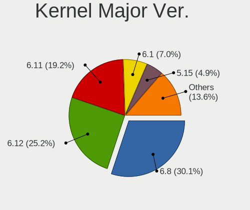
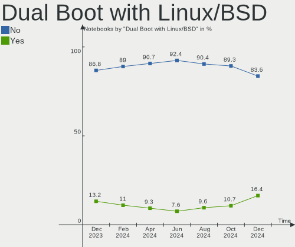
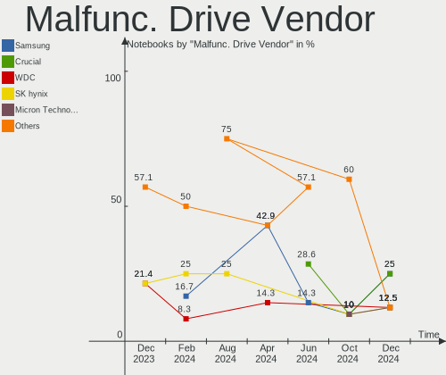
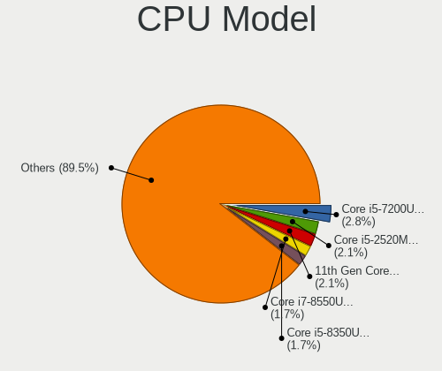
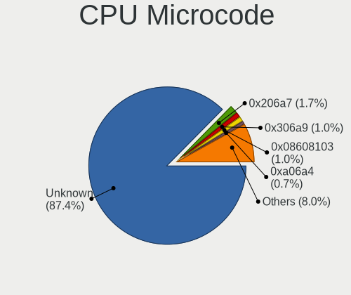
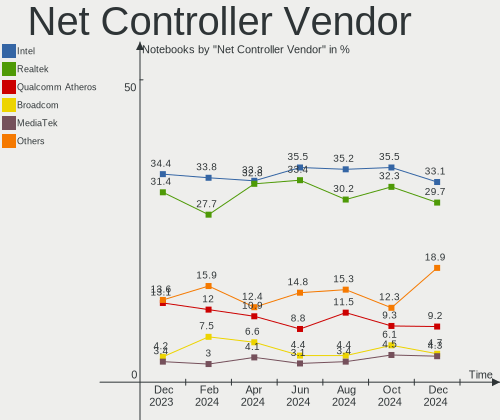
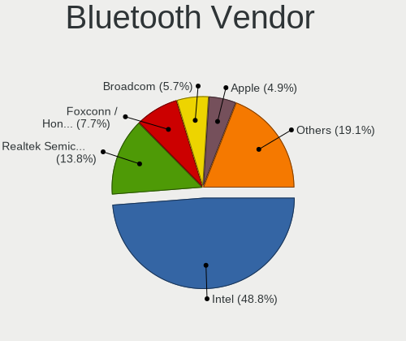
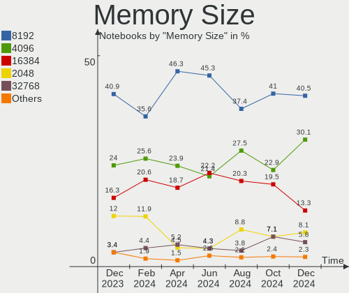

Linux in Germany - Hardware Trends (Notebooks)
----------------------------------------------

A project to identify most popular hardware characteristics and track their change
over time based on data collected by Linux users at https://Linux-Hardware.org.

Anyone can contribute to this report by the [hw-probe](https://github.com/linuxhw/hw-probe) tool:

    sudo -E hw-probe -all -upload

Period: Aug, 2022.

Contents
--------

* [ System ](#system)
  - [ OS                       ](#os)
  - [ OS Family                ](#os-family)
  - [ Kernel                   ](#kernel)
  - [ Kernel Family            ](#kernel-family)
  - [ Kernel Major Ver.        ](#kernel-major-ver)
  - [ Arch                     ](#arch)
  - [ DE                       ](#de)
  - [ Display Server           ](#display-server)
  - [ Display Manager          ](#display-manager)
  - [ OS Lang                  ](#os-lang)
  - [ Boot Mode                ](#boot-mode)
  - [ Filesystem               ](#filesystem)
  - [ Part. scheme             ](#part-scheme)
  - [ Dual Boot with Linux/BSD ](#dual-boot-with-linuxbsd)
  - [ Dual Boot (Win)          ](#dual-boot-win)

* [ Board ](#board)
  - [ Vendor                   ](#vendor)
  - [ Model                    ](#model)
  - [ Model Family             ](#model-family)
  - [ MFG Year                 ](#mfg-year)
  - [ Form Factor              ](#form-factor)
  - [ Secure Boot              ](#secure-boot)
  - [ Coreboot                 ](#coreboot)
  - [ RAM Size                 ](#ram-size)
  - [ RAM Used                 ](#ram-used)
  - [ Total Drives             ](#total-drives)
  - [ Has CD-ROM               ](#has-cd-rom)
  - [ Has Ethernet             ](#has-ethernet)
  - [ Has WiFi                 ](#has-wifi)
  - [ Has Bluetooth            ](#has-bluetooth)

* [ Location ](#location)
  - [ Country                  ](#country)
  - [ City                     ](#city)

* [ Drives ](#drives)
  - [ Drive Vendor             ](#drive-vendor)
  - [ Drive Model              ](#drive-model)
  - [ HDD Vendor               ](#hdd-vendor)
  - [ SSD Vendor               ](#ssd-vendor)
  - [ Drive Kind               ](#drive-kind)
  - [ Drive Connector          ](#drive-connector)
  - [ Drive Size               ](#drive-size)
  - [ Space Total              ](#space-total)
  - [ Space Used               ](#space-used)
  - [ Malfunc. Drives          ](#malfunc-drives)
  - [ Malfunc. Drive Vendor    ](#malfunc-drive-vendor)
  - [ Malfunc. HDD Vendor      ](#malfunc-hdd-vendor)
  - [ Malfunc. Drive Kind      ](#malfunc-drive-kind)
  - [ Failed Drives            ](#failed-drives)
  - [ Failed Drive Vendor      ](#failed-drive-vendor)
  - [ Drive Status             ](#drive-status)

* [ Storage controller ](#storage-controller)
  - [ Storage Vendor           ](#storage-vendor)
  - [ Storage Model            ](#storage-model)
  - [ Storage Kind             ](#storage-kind)

* [ Processor ](#processor)
  - [ CPU Vendor               ](#cpu-vendor)
  - [ CPU Model                ](#cpu-model)
  - [ CPU Model Family         ](#cpu-model-family)
  - [ CPU Cores                ](#cpu-cores)
  - [ CPU Sockets              ](#cpu-sockets)
  - [ CPU Threads              ](#cpu-threads)
  - [ CPU Op-Modes             ](#cpu-op-modes)
  - [ CPU Microcode            ](#cpu-microcode)
  - [ CPU Microarch            ](#cpu-microarch)

* [ Graphics ](#graphics)
  - [ GPU Vendor               ](#gpu-vendor)
  - [ GPU Model                ](#gpu-model)
  - [ GPU Combo                ](#gpu-combo)
  - [ GPU Driver               ](#gpu-driver)
  - [ GPU Memory               ](#gpu-memory)

* [ Monitor ](#monitor)
  - [ Monitor Vendor           ](#monitor-vendor)
  - [ Monitor Model            ](#monitor-model)
  - [ Monitor Resolution       ](#monitor-resolution)
  - [ Monitor Diagonal         ](#monitor-diagonal)
  - [ Monitor Width            ](#monitor-width)
  - [ Aspect Ratio             ](#aspect-ratio)
  - [ Monitor Area             ](#monitor-area)
  - [ Pixel Density            ](#pixel-density)
  - [ Multiple Monitors        ](#multiple-monitors)

* [ Network ](#network)
  - [ Net Controller Vendor    ](#net-controller-vendor)
  - [ Net Controller Model     ](#net-controller-model)
  - [ Wireless Vendor          ](#wireless-vendor)
  - [ Wireless Model           ](#wireless-model)
  - [ Ethernet Vendor          ](#ethernet-vendor)
  - [ Ethernet Model           ](#ethernet-model)
  - [ Net Controller Kind      ](#net-controller-kind)
  - [ Used Controller          ](#used-controller)
  - [ NICs                     ](#nics)
  - [ IPv6                     ](#ipv6)

* [ Bluetooth ](#bluetooth)
  - [ Bluetooth Vendor         ](#bluetooth-vendor)
  - [ Bluetooth Model          ](#bluetooth-model)

* [ Sound ](#sound)
  - [ Sound Vendor             ](#sound-vendor)
  - [ Sound Model              ](#sound-model)

* [ Memory ](#memory)
  - [ Memory Vendor            ](#memory-vendor)
  - [ Memory Model             ](#memory-model)
  - [ Memory Kind              ](#memory-kind)
  - [ Memory Form Factor       ](#memory-form-factor)
  - [ Memory Size              ](#memory-size)
  - [ Memory Speed             ](#memory-speed)

* [ Printers & scanners ](#printers--scanners)
  - [ Printer Vendor           ](#printer-vendor)
  - [ Printer Model            ](#printer-model)
  - [ Scanner Vendor           ](#scanner-vendor)
  - [ Scanner Model            ](#scanner-model)

* [ Camera ](#camera)
  - [ Camera Vendor            ](#camera-vendor)
  - [ Camera Model             ](#camera-model)

* [ Security ](#security)
  - [ Fingerprint Vendor       ](#fingerprint-vendor)
  - [ Fingerprint Model        ](#fingerprint-model)
  - [ Chipcard Vendor          ](#chipcard-vendor)
  - [ Chipcard Model           ](#chipcard-model)

* [ Unsupported ](#unsupported)
  - [ Unsupported Devices      ](#unsupported-devices)
  - [ Unsupported Device Types ](#unsupported-device-types)

System
------

OS
--

Installed operating systems

| Name                | Notebooks | Percent |
|---------------------|-----------|---------|
| Ubuntu 22.04        | 35        | 17.77%  |
| Linux Mint 21       | 19        | 9.64%   |
| Ubuntu 20.04        | 15        | 7.61%   |
| Debian 11           | 14        | 7.11%   |
| Linux Mint 20.3     | 11        | 5.58%   |
| Pop!_OS 22.04       | 10        | 5.08%   |
| Fedora 36           | 10        | 5.08%   |
| OpenMandriva 4.3    | 8         | 4.06%   |
| Zorin 16            | 6         | 3.05%   |
| OpenMandriva 4.90   | 5         | 2.54%   |
| Xubuntu 20.04       | 4         | 2.03%   |
| LMDE 5              | 3         | 1.52%   |
| Kubuntu 22.04       | 3         | 1.52%   |
| KDE neon 20.04      | 3         | 1.52%   |
| Gentoo 2.8          | 3         | 1.52%   |
| Elementary 6.1      | 3         | 1.52%   |
| Xubuntu 22.04       | 2         | 1.02%   |
| Ubuntu MATE 22.04   | 2         | 1.02%   |
| Ubuntu 18.04        | 2         | 1.02%   |
| SteamOS 3.3.1       | 2         | 1.02%   |
| SteamOS 3.3         | 2         | 1.02%   |
| MX 21               | 2         | 1.02%   |
| Manjaro 21.3.7      | 2         | 1.02%   |
| Linux Mint 20       | 2         | 1.02%   |
| Linux Mint 19.3     | 2         | 1.02%   |
| Kali 2022.3         | 2         | 1.02%   |
| Fedora 35           | 2         | 1.02%   |
| Debian Testing      | 2         | 1.02%   |
| Arch                | 2         | 1.02%   |
| Zorin 15            | 1         | 0.51%   |
| Ubuntu Budgie 18.04 | 1         | 0.51%   |
| Ubuntu 22.10        | 1         | 0.51%   |
| Ubuntu 16.04        | 1         | 0.51%   |
| Sparky 7            | 1         | 0.51%   |
| Q4OS 4              | 1         | 0.51%   |
| openSUSE Leap-15.4  | 1         | 0.51%   |
| OpenMandriva 4.50   | 1         | 0.51%   |
| MX 19               | 1         | 0.51%   |
| Manjaro-ARM         | 1         | 0.51%   |
| Manjaro             | 1         | 0.51%   |
| Lubuntu 22.04       | 1         | 0.51%   |
| Linux Mint 20.2     | 1         | 0.51%   |
| Lilidog 22          | 1         | 0.51%   |
| Gentoo 2.6          | 1         | 0.51%   |
| EndeavourOS Rolling | 1         | 0.51%   |
| BlackPanther 18.1   | 1         | 0.51%   |
| ArcoLinux Rolling   | 1         | 0.51%   |
| Alpine 3.16.1       | 1         | 0.51%   |

OS Family
---------

OS without a version

| Name          | Notebooks | Percent |
|---------------|-----------|---------|
| Ubuntu        | 54        | 27.41%  |
| Linux Mint    | 35        | 17.77%  |
| Debian        | 16        | 8.12%   |
| OpenMandriva  | 14        | 7.11%   |
| Fedora        | 12        | 6.09%   |
| Pop!_OS       | 10        | 5.08%   |
| Zorin         | 7         | 3.55%   |
| Xubuntu       | 6         | 3.05%   |
| SteamOS       | 4         | 2.03%   |
| Gentoo        | 4         | 2.03%   |
| MX            | 3         | 1.52%   |
| Manjaro       | 3         | 1.52%   |
| LMDE          | 3         | 1.52%   |
| Kubuntu       | 3         | 1.52%   |
| KDE neon      | 3         | 1.52%   |
| Elementary    | 3         | 1.52%   |
| Ubuntu MATE   | 2         | 1.02%   |
| Kali          | 2         | 1.02%   |
| Arch          | 2         | 1.02%   |
| Ubuntu Budgie | 1         | 0.51%   |
| Sparky        | 1         | 0.51%   |
| Q4OS          | 1         | 0.51%   |
| openSUSE      | 1         | 0.51%   |
| Manjaro-ARM   | 1         | 0.51%   |
| Lubuntu       | 1         | 0.51%   |
| Lilidog       | 1         | 0.51%   |
| EndeavourOS   | 1         | 0.51%   |
| BlackPanther  | 1         | 0.51%   |
| ArcoLinux     | 1         | 0.51%   |
| Alpine        | 1         | 0.51%   |

Kernel
------

Version of the Linux kernel

| Version                                        | Notebooks | Percent |
|------------------------------------------------|-----------|---------|
| 5.15.0-46-generic                              | 59        | 29.95%  |
| 5.15.0-43-generic                              | 17        | 8.63%   |
| 5.10.0-16-amd64                                | 10        | 5.08%   |
| 5.16.7-desktop-1omv4003                        | 8         | 4.06%   |
| 5.4.0-124-generic                              | 7         | 3.55%   |
| 5.4.0-122-generic                              | 6         | 3.05%   |
| 5.10.0-17-amd64                                | 6         | 3.05%   |
| 5.18.12-desktop-3omv4090                       | 5         | 2.54%   |
| 5.18.10-76051810-generic                       | 5         | 2.54%   |
| 5.4.0-125-generic                              | 4         | 2.03%   |
| 5.19.0-76051900-generic                        | 4         | 2.03%   |
| 5.18.16-200.fc36.x86_64                        | 4         | 2.03%   |
| 5.15.0-41-generic                              | 4         | 2.03%   |
| 5.15.0-25-generic                              | 3         | 1.52%   |
| 5.18.0-kali5-amd64                             | 2         | 1.02%   |
| 5.18.0-3-amd64                                 | 2         | 1.02%   |
| 5.18.0-0.bpo.1-amd64                           | 2         | 1.02%   |
| 5.13.0-valve21.1-1-neptune-02211-gc54cda5a36f3 | 2         | 1.02%   |
| 5.6.14-desktop-2bP                             | 1         | 0.51%   |
| 5.4.0-58-generic                               | 1         | 0.51%   |
| 5.4.0-122-lowlatency                           | 1         | 0.51%   |
| 5.4.0-121-generic                              | 1         | 0.51%   |
| 5.19.4-200.fc36.x86_64                         | 1         | 0.51%   |
| 5.19.3-051903-generic                          | 1         | 0.51%   |
| 5.19.2-arch1-1                                 | 1         | 0.51%   |
| 5.19.2-300.fc36.x86_64                         | 1         | 0.51%   |
| 5.19.1-xm1.0e20220803.fc36.x86_64              | 1         | 0.51%   |
| 5.19.1-3-MANJARO                               | 1         | 0.51%   |
| 5.19.0-gentoo-x86_64                           | 1         | 0.51%   |
| 5.18.19-200.fc36.x86_64                        | 1         | 0.51%   |
| 5.18.17-100.fc35.x86_64                        | 1         | 0.51%   |
| 5.18.15-xanmod1                                | 1         | 0.51%   |
| 5.18.15-arch1-2                                | 1         | 0.51%   |
| 5.18.15-051815-generic                         | 1         | 0.51%   |
| 5.18.14-1-MANJARO-ARM                          | 1         | 0.51%   |
| 5.18.13-200.fc36.x86_64                        | 1         | 0.51%   |
| 5.18.13-100.fc35.x86_64                        | 1         | 0.51%   |
| 5.18.11-200.fc36.x86_64                        | 1         | 0.51%   |
| 5.18.0-4-amd64                                 | 1         | 0.51%   |
| 5.18.0-051800-generic                          | 1         | 0.51%   |
| 5.17.5-76051705-generic                        | 1         | 0.51%   |
| 5.17.15-1-MANJARO                              | 1         | 0.51%   |
| 5.17.0-1014-oem                                | 1         | 0.51%   |
| 5.16.13-desktop-1omv4003                       | 1         | 0.51%   |
| 5.15.59-gentoo                                 | 1         | 0.51%   |
| 5.15.59-2-lts                                  | 1         | 0.51%   |
| 5.15.59-0-lts                                  | 1         | 0.51%   |
| 5.15.55-2-lts                                  | 1         | 0.51%   |
| 5.15.52-gentoo-x86_64                          | 1         | 0.51%   |
| 5.15.19-gentoo-x86_64-k01                      | 1         | 0.51%   |
| 5.15.0-47-generic                              | 1         | 0.51%   |
| 5.15.0-46-lowlatency                           | 1         | 0.51%   |
| 5.15.0-1013-intel-iotg                         | 1         | 0.51%   |
| 5.14.21-150400.24.18-default                   | 1         | 0.51%   |
| 5.14.0-1047-oem                                | 1         | 0.51%   |
| 5.13.0-valve24-1-neptune-02226-g5b8545e4c5a1   | 1         | 0.51%   |
| 5.13.0-valve21-1-neptune-02209-g2a5bdc1102a0   | 1         | 0.51%   |
| 5.10.136-1-MANJARO                             | 1         | 0.51%   |
| 5.10.0-16-686                                  | 1         | 0.51%   |
| 5.10.0-13-amd64                                | 1         | 0.51%   |

Kernel Family
-------------

Linux kernel without a distro release

| Version  | Notebooks | Percent |
|----------|-----------|---------|
| 5.15.0   | 86        | 43.65%  |
| 5.4.0    | 20        | 10.15%  |
| 5.10.0   | 18        | 9.14%   |
| 5.18.0   | 8         | 4.06%   |
| 5.16.7   | 8         | 4.06%   |
| 5.19.0   | 5         | 2.54%   |
| 5.18.12  | 5         | 2.54%   |
| 5.18.10  | 5         | 2.54%   |
| 5.18.16  | 4         | 2.03%   |
| 5.13.0   | 4         | 2.03%   |
| 5.18.15  | 3         | 1.52%   |
| 5.15.59  | 3         | 1.52%   |
| 4.15.0   | 3         | 1.52%   |
| 5.19.2   | 2         | 1.02%   |
| 5.19.1   | 2         | 1.02%   |
| 5.18.13  | 2         | 1.02%   |
| 5.6.14   | 1         | 0.51%   |
| 5.19.4   | 1         | 0.51%   |
| 5.19.3   | 1         | 0.51%   |
| 5.18.19  | 1         | 0.51%   |
| 5.18.17  | 1         | 0.51%   |
| 5.18.14  | 1         | 0.51%   |
| 5.18.11  | 1         | 0.51%   |
| 5.17.5   | 1         | 0.51%   |
| 5.17.15  | 1         | 0.51%   |
| 5.17.0   | 1         | 0.51%   |
| 5.16.13  | 1         | 0.51%   |
| 5.15.55  | 1         | 0.51%   |
| 5.15.52  | 1         | 0.51%   |
| 5.15.19  | 1         | 0.51%   |
| 5.14.21  | 1         | 0.51%   |
| 5.14.0   | 1         | 0.51%   |
| 5.10.136 | 1         | 0.51%   |
| 4.4.0    | 1         | 0.51%   |
| 4.19.0   | 1         | 0.51%   |

Kernel Major Ver.
-----------------

Linux kernel major version

| Version | Notebooks | Percent |
|---------|-----------|---------|
| 5.15    | 92        | 46.7%   |
| 5.18    | 31        | 15.74%  |
| 5.4     | 20        | 10.15%  |
| 5.10    | 19        | 9.64%   |
| 5.19    | 11        | 5.58%   |
| 5.16    | 9         | 4.57%   |
| 5.13    | 4         | 2.03%   |
| 5.17    | 3         | 1.52%   |
| 4.15    | 3         | 1.52%   |
| 5.14    | 2         | 1.02%   |
| 5.6     | 1         | 0.51%   |
| 4.4     | 1         | 0.51%   |
| 4.19    | 1         | 0.51%   |

Arch
----

OS architecture (x86_64, i586, etc.)

| Name    | Notebooks | Percent |
|---------|-----------|---------|
| x86_64  | 194       | 98.48%  |
| i686    | 2         | 1.02%   |
| aarch64 | 1         | 0.51%   |

DE
--

Desktop Environment

| Name             | Notebooks | Percent |
|------------------|-----------|---------|
| GNOME            | 85        | 43.15%  |
| KDE5             | 37        | 18.78%  |
| X-Cinnamon       | 32        | 16.24%  |
| XFCE             | 21        | 10.66%  |
| MATE             | 5         | 2.54%   |
| Pantheon         | 3         | 1.52%   |
| LXQt             | 3         | 1.52%   |
| i3               | 2         | 1.02%   |
| Cinnamon         | 2         | 1.02%   |
| Unity            | 1         | 0.51%   |
| lightdm-xsession | 1         | 0.51%   |
| GNOME Flashback  | 1         | 0.51%   |
| GNOME Classic    | 1         | 0.51%   |
| Enlightenment    | 1         | 0.51%   |
| Budgie           | 1         | 0.51%   |
| Unknown          | 1         | 0.51%   |

Display Server
--------------

X11 or Wayland

| Name    | Notebooks | Percent |
|---------|-----------|---------|
| X11     | 147       | 74.62%  |
| Wayland | 48        | 24.37%  |
| Tty     | 2         | 1.02%   |

Display Manager
---------------

SDDM, LightDM, etc.

| Name    | Notebooks | Percent |
|---------|-----------|---------|
| Unknown | 57        | 28.93%  |
| GDM3    | 47        | 23.86%  |
| LightDM | 42        | 21.32%  |
| SDDM    | 29        | 14.72%  |
| GDM     | 22        | 11.17%  |

OS Lang
-------

Language

| Lang    | Notebooks | Percent |
|---------|-----------|---------|
| de_DE   | 143       | 72.59%  |
| en_US   | 43        | 21.83%  |
| en_GB   | 3         | 1.52%   |
| C       | 3         | 1.52%   |
| es_ES   | 2         | 1.02%   |
| en_AG   | 1         | 0.51%   |
| C.UTF8  | 1         | 0.51%   |
| Unknown | 1         | 0.51%   |

Boot Mode
---------

EFI or BIOS

| Mode | Notebooks | Percent |
|------|-----------|---------|
| EFI  | 114       | 57.87%  |
| BIOS | 83        | 42.13%  |

Filesystem
----------

Type of filesystem

| Type    | Notebooks | Percent |
|---------|-----------|---------|
| Ext4    | 160       | 81.22%  |
| Btrfs   | 22        | 11.17%  |
| Overlay | 13        | 6.6%    |
| Zfs     | 2         | 1.02%   |

Part. scheme
------------

Scheme of partitioning

| Type    | Notebooks | Percent |
|---------|-----------|---------|
| Unknown | 97        | 49.24%  |
| GPT     | 79        | 40.1%   |
| MBR     | 21        | 10.66%  |

Dual Boot with Linux/BSD
------------------------

Hosting more than one Linux/BSD

| Dual boot | Notebooks | Percent |
|-----------|-----------|---------|
| No        | 178       | 90.36%  |
| Yes       | 19        | 9.64%   |

Dual Boot (Win)
---------------

Hosting Linux and Windows

| Dual boot | Notebooks | Percent |
|-----------|-----------|---------|
| No        | 144       | 73.1%   |
| Yes       | 53        | 26.9%   |

Board
-----

Vendor
------

Motherboard manufacturer

| Name                | Notebooks | Percent |
|---------------------|-----------|---------|
| Lenovo              | 58        | 29.44%  |
| Hewlett-Packard     | 28        | 14.21%  |
| Dell                | 21        | 10.66%  |
| Acer                | 18        | 9.14%   |
| ASUSTek Computer    | 16        | 8.12%   |
| Medion              | 8         | 4.06%   |
| HUAWEI              | 5         | 2.54%   |
| Fujitsu             | 5         | 2.54%   |
| TUXEDO              | 4         | 2.03%   |
| Samsung Electronics | 4         | 2.03%   |
| Apple               | 4         | 2.03%   |
| Valve               | 3         | 1.52%   |
| Notebook            | 3         | 1.52%   |
| Toshiba             | 2         | 1.02%   |
| Packard Bell        | 2         | 1.02%   |
| Gigabyte Technology | 2         | 1.02%   |
| Alienware           | 2         | 1.02%   |
| Wortmann AG         | 1         | 0.51%   |
| TrekStor            | 1         | 0.51%   |
| Sony                | 1         | 0.51%   |
| Schenker            | 1         | 0.51%   |
| Razer               | 1         | 0.51%   |
| Pine Microsystems   | 1         | 0.51%   |
| Panasonic           | 1         | 0.51%   |
| MSI                 | 1         | 0.51%   |
| LincPlus            | 1         | 0.51%   |
| IBM                 | 1         | 0.51%   |
| Hampoo              | 1         | 0.51%   |
| AXDIA International | 1         | 0.51%   |

Model
-----

Motherboard model

| Name                                     | Notebooks | Percent |
|------------------------------------------|-----------|---------|
| Valve Jupiter                            | 3         | 1.52%   |
| Lenovo G500 20236                        | 3         | 1.52%   |
| Dell XPS 13 7390                         | 3         | 1.52%   |
| HP Pavilion Notebook                     | 2         | 1.02%   |
| HP 255 G6 Notebook PC                    | 2         | 1.02%   |
| Gigabyte AORUS 17 YE5                    | 2         | 1.02%   |
| Dell Latitude E5510                      | 2         | 1.02%   |
| Acer Aspire E5-771G                      | 2         | 1.02%   |
| Wortmann AG TERRA_MOBILE_1713A           | 1         | 0.51%   |
| TUXEDO W65_W67RZ1                        | 1         | 0.51%   |
| TUXEDO Polaris AMD Gen2 (REN)            | 1         | 0.51%   |
| TUXEDO InfinityBook Pro 14 v4            | 1         | 0.51%   |
| TUXEDO Book BA1510                       | 1         | 0.51%   |
| TrekStor Primebook P14                   | 1         | 0.51%   |
| Toshiba Satellite L500                   | 1         | 0.51%   |
| Toshiba PORTEGE M800                     | 1         | 0.51%   |
| Sony VGN-NR11Z_T                         | 1         | 0.51%   |
| Schenker VISION 15 (SVS15E21)            | 1         | 0.51%   |
| Samsung SP55S                            | 1         | 0.51%   |
| Samsung R59P/R60P/R61P                   | 1         | 0.51%   |
| Samsung 700Z3A/700Z4A/700Z5A/700Z5B      | 1         | 0.51%   |
| Samsung 600B4B/600B5B                    | 1         | 0.51%   |
| Razer Blade 14 - RZ09-0370               | 1         | 0.51%   |
| Pine Microsystems Pine64 Pinebook Pro    | 1         | 0.51%   |
| Panasonic CF-53AAGZXDX                   | 1         | 0.51%   |
| Packard Bell EasyNote LJ65               | 1         | 0.51%   |
| Packard Bell EasyNote LE69KB             | 1         | 0.51%   |
| Notebook V15x_V17xPNKPNJPNH              | 1         | 0.51%   |
| Notebook NS5x_NS7xPU                     | 1         | 0.51%   |
| Notebook N9x0TC                          | 1         | 0.51%   |
| MSI CR70 2M/CX70 2OC/CX70 2OD            | 1         | 0.51%   |
| Medion P7816                             | 1         | 0.51%   |
| Medion P7649 MD60817                     | 1         | 0.51%   |
| Medion P6620                             | 1         | 0.51%   |
| Medion P6612                             | 1         | 0.51%   |
| Medion Akoya P2213T                      | 1         | 0.51%   |
| Medion Akoya E7227                       | 1         | 0.51%   |
| Medion Akoya E6422 MD99680               | 1         | 0.51%   |
| Medion Akoya E6418 MD99620               | 1         | 0.51%   |
| LincPlus LINNCPLUS P1                    | 1         | 0.51%   |
| Lenovo Yoga Slim 7 ProX 14ARH7 82TL      | 1         | 0.51%   |
| Lenovo V340-17IWL 81RG                   | 1         | 0.51%   |
| Lenovo ThinkPad Z16 Gen 1 21D4002GGE     | 1         | 0.51%   |
| Lenovo ThinkPad X61 Tablet 7767BFG       | 1         | 0.51%   |
| Lenovo ThinkPad X270 20HMS2R900          | 1         | 0.51%   |
| Lenovo ThinkPad X230 23252UG             | 1         | 0.51%   |
| Lenovo ThinkPad X230 2306CTO             | 1         | 0.51%   |
| Lenovo ThinkPad X220 4291V1C             | 1         | 0.51%   |
| Lenovo ThinkPad X1 Carbon 6th 20KH002HUS | 1         | 0.51%   |
| Lenovo ThinkPad X1 Carbon 34604MG        | 1         | 0.51%   |
| Lenovo ThinkPad W530 2447D87             | 1         | 0.51%   |
| Lenovo ThinkPad Twist 33477RG            | 1         | 0.51%   |
| Lenovo ThinkPad T560 20FJS0EP00          | 1         | 0.51%   |
| Lenovo ThinkPad T540p 20BFA0MN01         | 1         | 0.51%   |
| Lenovo ThinkPad T530 2429W4Z             | 1         | 0.51%   |
| Lenovo ThinkPad T500 2241VL9             | 1         | 0.51%   |
| Lenovo ThinkPad T480 20L5000BGE          | 1         | 0.51%   |
| Lenovo ThinkPad T460s 20FAS16J00         | 1         | 0.51%   |
| Lenovo ThinkPad T450s 20BWS21K00         | 1         | 0.51%   |
| Lenovo ThinkPad T450s 20BWS1RT00         | 1         | 0.51%   |

Model Family
------------

Motherboard model prefix

| Name                     | Notebooks | Percent |
|--------------------------|-----------|---------|
| Lenovo ThinkPad          | 38        | 19.29%  |
| Acer Aspire              | 12        | 6.09%   |
| Lenovo IdeaPad           | 11        | 5.58%   |
| HP EliteBook             | 9         | 4.57%   |
| Dell Latitude            | 9         | 4.57%   |
| Fujitsu LIFEBOOK         | 5         | 2.54%   |
| Dell Inspiron            | 5         | 2.54%   |
| Medion Akoya             | 4         | 2.03%   |
| Dell XPS                 | 4         | 2.03%   |
| ASUS VivoBook            | 4         | 2.03%   |
| Valve Jupiter            | 3         | 1.52%   |
| Lenovo G500              | 3         | 1.52%   |
| HP Pavilion              | 3         | 1.52%   |
| HP Compaq                | 3         | 1.52%   |
| HP 255                   | 3         | 1.52%   |
| Packard Bell EasyNote    | 2         | 1.02%   |
| HP ZBook                 | 2         | 1.02%   |
| HP ProBook               | 2         | 1.02%   |
| HP Laptop                | 2         | 1.02%   |
| Gigabyte AORUS           | 2         | 1.02%   |
| Dell Precision           | 2         | 1.02%   |
| Alienware m15            | 2         | 1.02%   |
| Acer Nitro               | 2         | 1.02%   |
| Wortmann AG TERRA        | 1         | 0.51%   |
| TUXEDO W65               | 1         | 0.51%   |
| TUXEDO Polaris           | 1         | 0.51%   |
| TUXEDO InfinityBook      | 1         | 0.51%   |
| TUXEDO Book              | 1         | 0.51%   |
| TrekStor Primebook       | 1         | 0.51%   |
| Toshiba Satellite        | 1         | 0.51%   |
| Toshiba PORTEGE          | 1         | 0.51%   |
| Sony VGN-NR11Z           | 1         | 0.51%   |
| Schenker VISION          | 1         | 0.51%   |
| Samsung SP55S            | 1         | 0.51%   |
| Samsung R59P             | 1         | 0.51%   |
| Samsung 700Z3A           | 1         | 0.51%   |
| Samsung 600B4B           | 1         | 0.51%   |
| Razer Blade              | 1         | 0.51%   |
| Pine Microsystems Pine64 | 1         | 0.51%   |
| Panasonic CF-53AAGZXDX   | 1         | 0.51%   |
| Notebook V15x            | 1         | 0.51%   |
| Notebook NS5x            | 1         | 0.51%   |
| Notebook N9x0TC          | 1         | 0.51%   |
| MSI CR70                 | 1         | 0.51%   |
| Medion P7816             | 1         | 0.51%   |
| Medion P7649             | 1         | 0.51%   |
| Medion P6620             | 1         | 0.51%   |
| Medion P6612             | 1         | 0.51%   |
| LincPlus LINNCPLUS       | 1         | 0.51%   |
| Lenovo Yoga              | 1         | 0.51%   |
| Lenovo V340-17IWL        | 1         | 0.51%   |
| Lenovo IdeaPadFlex       | 1         | 0.51%   |
| Lenovo G700              | 1         | 0.51%   |
| Lenovo G70-80            | 1         | 0.51%   |
| Lenovo G585              | 1         | 0.51%   |
| IBM 2722BDG              | 1         | 0.51%   |
| HUAWEI NBLK-WAX9X        | 1         | 0.51%   |
| HUAWEI NBD-WXX9          | 1         | 0.51%   |
| HUAWEI MACH-WX9          | 1         | 0.51%   |
| HUAWEI KPL-W0X           | 1         | 0.51%   |

MFG Year
--------

Motherboard manufacture year

| Year    | Notebooks | Percent |
|---------|-----------|---------|
| 2019    | 25        | 12.69%  |
| 2021    | 23        | 11.68%  |
| 2012    | 19        | 9.64%   |
| 2018    | 16        | 8.12%   |
| 2013    | 15        | 7.61%   |
| 2022    | 14        | 7.11%   |
| 2020    | 12        | 6.09%   |
| 2011    | 11        | 5.58%   |
| 2015    | 10        | 5.08%   |
| 2009    | 8         | 4.06%   |
| 2016    | 7         | 3.55%   |
| 2014    | 7         | 3.55%   |
| 2010    | 7         | 3.55%   |
| 2008    | 7         | 3.55%   |
| 2017    | 6         | 3.05%   |
| 2007    | 5         | 2.54%   |
| 2006    | 4         | 2.03%   |
| Unknown | 1         | 0.51%   |

Form Factor
-----------

Physical design of the computer

| Name     | Notebooks | Percent |
|----------|-----------|---------|
| Notebook | 197       | 100%    |

Secure Boot
-----------

Enabled or disabled

| State    | Notebooks | Percent |
|----------|-----------|---------|
| Disabled | 171       | 86.8%   |
| Enabled  | 26        | 13.2%   |

Coreboot
--------

Have coreboot on board

| Used | Notebooks | Percent |
|------|-----------|---------|
| No   | 196       | 99.49%  |
| Yes  | 1         | 0.51%   |

RAM Size
--------

Total RAM memory

| Size in GB  | Notebooks | Percent |
|-------------|-----------|---------|
| 4.01-8.0    | 56        | 28.43%  |
| 8.01-16.0   | 42        | 21.32%  |
| 3.01-4.0    | 39        | 19.8%   |
| 16.01-24.0  | 32        | 16.24%  |
| 32.01-64.0  | 14        | 7.11%   |
| 1.01-2.0    | 7         | 3.55%   |
| 64.01-256.0 | 3         | 1.52%   |
| 24.01-32.0  | 2         | 1.02%   |
| 2.01-3.0    | 2         | 1.02%   |

RAM Used
--------

Used RAM memory

| Used GB    | Notebooks | Percent |
|------------|-----------|---------|
| 1.01-2.0   | 82        | 41.62%  |
| 2.01-3.0   | 40        | 20.3%   |
| 3.01-4.0   | 26        | 13.2%   |
| 4.01-8.0   | 25        | 12.69%  |
| 8.01-16.0  | 11        | 5.58%   |
| 0.51-1.0   | 10        | 5.08%   |
| 32.01-64.0 | 1         | 0.51%   |
| 16.01-24.0 | 1         | 0.51%   |
| 0.01-0.5   | 1         | 0.51%   |

Total Drives
------------

Number of drives on board

| Drives | Notebooks | Percent |
|--------|-----------|---------|
| 1      | 147       | 74.62%  |
| 2      | 43        | 21.83%  |
| 3      | 5         | 2.54%   |
| 5      | 2         | 1.02%   |

Has CD-ROM
----------

Has CD-ROM on board

| Presented | Notebooks | Percent |
|-----------|-----------|---------|
| No        | 120       | 60.91%  |
| Yes       | 77        | 39.09%  |

Has Ethernet
------------

Has Ethernet on board

| Presented | Notebooks | Percent |
|-----------|-----------|---------|
| Yes       | 162       | 82.23%  |
| No        | 35        | 17.77%  |

Has WiFi
--------

Has WiFi module

| Presented | Notebooks | Percent |
|-----------|-----------|---------|
| Yes       | 192       | 97.46%  |
| No        | 5         | 2.54%   |

Has Bluetooth
-------------

Has Bluetooth module

| Presented | Notebooks | Percent |
|-----------|-----------|---------|
| Yes       | 144       | 73.1%   |
| No        | 53        | 26.9%   |

Location
--------

Country
-------

Geographic location (country)

| Country | Notebooks | Percent |
|---------|-----------|---------|
| Germany | 197       | 100%    |

City
----

Geographic location (city)

| City              | Notebooks | Percent |
|-------------------|-----------|---------|
| Berlin            | 17        | 8.63%   |
| Munich            | 10        | 5.08%   |
| Stuttgart         | 6         | 3.05%   |
| Frankfurt am Main | 6         | 3.05%   |
| Hamburg           | 5         | 2.54%   |
| Leipzig           | 4         | 2.03%   |
| Koblenz           | 4         | 2.03%   |
| Darmstadt         | 4         | 2.03%   |
| Cologne           | 4         | 2.03%   |
| Rostock           | 3         | 1.52%   |
| Kaiserslautern    | 3         | 1.52%   |
| Hanover           | 3         | 1.52%   |
| Hamm              | 3         | 1.52%   |
| Essen             | 3         | 1.52%   |
| Wuppertal         | 2         | 1.02%   |
| Saarbrücken      | 2         | 1.02%   |
| Nuremberg         | 2         | 1.02%   |
| Mannheim          | 2         | 1.02%   |
| Lübeck           | 2         | 1.02%   |
| Karlsruhe         | 2         | 1.02%   |
| Jersbek           | 2         | 1.02%   |
| Gütersloh        | 2         | 1.02%   |
| Giessen           | 2         | 1.02%   |
| Düsseldorf       | 2         | 1.02%   |
| Duisburg          | 2         | 1.02%   |
| Dresden           | 2         | 1.02%   |
| Augsburg          | 2         | 1.02%   |
| Albstadt          | 2         | 1.02%   |
| Worms             | 1         | 0.51%   |
| Wolnzach          | 1         | 0.51%   |
| Wilhelmshaven     | 1         | 0.51%   |
| Wiednitz          | 1         | 0.51%   |
| Werder            | 1         | 0.51%   |
| Weilmuenster      | 1         | 0.51%   |
| Weiler-Simmerberg | 1         | 0.51%   |
| Weil am Rhein     | 1         | 0.51%   |
| Wegberg           | 1         | 0.51%   |
| Vilshofen         | 1         | 0.51%   |
| Vellmar           | 1         | 0.51%   |
| Vechelde          | 1         | 0.51%   |
| Unna              | 1         | 0.51%   |
| Ulm               | 1         | 0.51%   |
| Traunreut         | 1         | 0.51%   |
| Tornesch          | 1         | 0.51%   |
| Sulingen          | 1         | 0.51%   |
| Stadtilm          | 1         | 0.51%   |
| Sindelfingen      | 1         | 0.51%   |
| Siegen            | 1         | 0.51%   |
| Schwabach         | 1         | 0.51%   |
| Schmalkalden      | 1         | 0.51%   |
| Schermbeck        | 1         | 0.51%   |
| Sandhausen        | 1         | 0.51%   |
| Salzgitter        | 1         | 0.51%   |
| Rottenburg        | 1         | 0.51%   |
| Ronnenberg        | 1         | 0.51%   |
| Roesrath          | 1         | 0.51%   |
| Rheinberg         | 1         | 0.51%   |
| Rastatt           | 1         | 0.51%   |
| Postbauer-Heng    | 1         | 0.51%   |
| Osterburken       | 1         | 0.51%   |

Drives
------

Drive Vendor
------------

Hard drive vendors

| Vendor                    | Notebooks | Drives | Percent |
|---------------------------|-----------|--------|---------|
| Samsung Electronics       | 52        | 55     | 22.13%  |
| WDC                       | 22        | 23     | 9.36%   |
| SanDisk                   | 22        | 24     | 9.36%   |
| Unknown                   | 18        | 20     | 7.66%   |
| Seagate                   | 14        | 18     | 5.96%   |
| SK hynix                  | 11        | 12     | 4.68%   |
| Toshiba                   | 10        | 11     | 4.26%   |
| Micron Technology         | 10        | 10     | 4.26%   |
| Crucial                   | 9         | 9      | 3.83%   |
| Intenso                   | 8         | 9      | 3.4%    |
| Phison                    | 6         | 6      | 2.55%   |
| Kingston                  | 6         | 6      | 2.55%   |
| Hitachi                   | 6         | 6      | 2.55%   |
| Intel                     | 5         | 5      | 2.13%   |
| Micron/Crucial Technology | 4         | 4      | 1.7%    |
| SABRENT                   | 3         | 3      | 1.28%   |
| KIOXIA                    | 3         | 3      | 1.28%   |
| HGST                      | 3         | 3      | 1.28%   |
| Union Memory (Shenzhen)   | 2         | 2      | 0.85%   |
| UMIS                      | 2         | 2      | 0.85%   |
| TrekStor                  | 2         | 2      | 0.85%   |
| Transcend                 | 2         | 2      | 0.85%   |
| PNY                       | 2         | 2      | 0.85%   |
| Apple                     | 2         | 2      | 0.85%   |
| TCSUNBOW                  | 1         | 2      | 0.43%   |
| Silicon Motion            | 1         | 1      | 0.43%   |
| PUSKILL                   | 1         | 1      | 0.43%   |
| OCZ                       | 1         | 1      | 0.43%   |
| LITEON                    | 1         | 1      | 0.43%   |
| Lite-On                   | 1         | 1      | 0.43%   |
| Leven                     | 1         | 1      | 0.43%   |
| Fujitsu                   | 1         | 1      | 0.43%   |
| Emtec                     | 1         | 1      | 0.43%   |
| Dogfish                   | 1         | 1      | 0.43%   |
| ASMedia                   | 1         | 1      | 0.43%   |

Drive Model
-----------

Hard drive models

| Model                                             | Notebooks | Percent |
|---------------------------------------------------|-----------|---------|
| Unknown MMC Card  64GB                            | 3         | 1.22%   |
| Seagate ST1000LM024 HN-M101MBB 1TB                | 3         | 1.22%   |
| Samsung SSD 850 EVO 500GB                         | 3         | 1.22%   |
| Samsung NVMe SSD Drive 256GB                      | 3         | 1.22%   |
| SABRENT Disk 480GB                                | 3         | 1.22%   |
| Micron/Crucial NVMe SSD Drive 1TB                 | 3         | 1.22%   |
| Crucial CT1000MX500SSD1 1TB                       | 3         | 1.22%   |
| Unknown SL64G  64GB                               | 2         | 0.81%   |
| Unknown SD/MMC/MS PRO 128GB                       | 2         | 0.81%   |
| UMIS RPFTJ128PDD2EWX 128GB                        | 2         | 0.81%   |
| TrekStor TREKSTORSSD128GB                         | 2         | 0.81%   |
| Toshiba MQ04ABF100 1TB                            | 2         | 0.81%   |
| Toshiba MQ01ABD100 1TB                            | 2         | 0.81%   |
| SK hynix PC611 NVMe 512GB                         | 2         | 0.81%   |
| SK hynix NVMe SSD Drive 512GB                     | 2         | 0.81%   |
| Seagate ST1000LM035-1RK172 1TB                    | 2         | 0.81%   |
| SanDisk SSD PLUS 480GB                            | 2         | 0.81%   |
| SanDisk SDSSDP128G 128GB                          | 2         | 0.81%   |
| SanDisk SDSSDH3 500G                              | 2         | 0.81%   |
| SanDisk SDSSDA120G 120GB                          | 2         | 0.81%   |
| SanDisk NVMe SSD Drive 256GB                      | 2         | 0.81%   |
| Samsung SSD 850 EVO 250GB                         | 2         | 0.81%   |
| Samsung SSD 840 EVO 250GB                         | 2         | 0.81%   |
| Samsung PM9A1 NVMe 512GB                          | 2         | 0.81%   |
| Samsung NVMe SSD Controller SM981/PM981/PM983 1TB | 2         | 0.81%   |
| Samsung MZVLB512HBJQ-000L7 512GB                  | 2         | 0.81%   |
| Samsung MZVL21T0HCLR-00B00 1TB                    | 2         | 0.81%   |
| Samsung MZ7PD256HAFV-000H7 256GB SSD              | 2         | 0.81%   |
| Phison SSD 128GB PS3109-S9                        | 2         | 0.81%   |
| Phison NVMe SSD Drive 256GB                       | 2         | 0.81%   |
| Kingston SA400S37480G 480GB SSD                   | 2         | 0.81%   |
| Intenso SSD Sata III 256GB                        | 2         | 0.81%   |
| Crucial CT240BX500SSD1 240GB                      | 2         | 0.81%   |
| WDC WDS240G2G0A-00JH30 240GB SSD                  | 1         | 0.41%   |
| WDC WD5000LPVX-80V0TT0 500GB                      | 1         | 0.41%   |
| WDC WD5000LPCX-00VHAT0 500GB                      | 1         | 0.41%   |
| WDC WD5000BPVT-80HXZT3 500GB                      | 1         | 0.41%   |
| WDC WD5000BPKX-00HPJT0 500GB                      | 1         | 0.41%   |
| WDC WD5000BEVT-22ZAT0 500GB                       | 1         | 0.41%   |
| WDC WD5000BEVT-22A0RT0 500GB                      | 1         | 0.41%   |
| WDC WD3200BPVT-22JJ5T0 320GB                      | 1         | 0.41%   |
| WDC WD3200BEVT-22ZCT0 320GB                       | 1         | 0.41%   |
| WDC WD3200BEKT-75PVMT0 320GB                      | 1         | 0.41%   |
| WDC WD2500BEKT-60PVMT0 250GB                      | 1         | 0.41%   |
| WDC WD20SPZX-22UA7T0 2TB                          | 1         | 0.41%   |
| WDC WD1600BPVT-00JJ5T0 160GB                      | 1         | 0.41%   |
| WDC WD10SPZX-80Z10T2 1TB                          | 1         | 0.41%   |
| WDC WD10SPZX-24Z10T0 1TB                          | 1         | 0.41%   |
| WDC WD10JPVX-22JC3T0 1TB                          | 1         | 0.41%   |
| WDC PC SN730 SDBQNTY-1T00-1001 1TB                | 1         | 0.41%   |
| WDC PC SN730 SDBPNTY-512G-1006 512GB              | 1         | 0.41%   |
| WDC PC SN730 SDBPNTY-512G                         | 1         | 0.41%   |
| WDC PC SN520 SDAPNUW-512G-1114 512GB              | 1         | 0.41%   |
| WDC PC SN520 SDAPNUW-256G-1202 256GB              | 1         | 0.41%   |
| WDC PC SN520 SDAPNUW-256G-1002 256GB              | 1         | 0.41%   |
| WDC PC SN520 NVMe 256GB                           | 1         | 0.41%   |
| Unknown SU08G  8GB                                | 1         | 0.41%   |
| Unknown SSD_2.5"_TLC_256 256GB                    | 1         | 0.41%   |
| Unknown SD16G  64GB                               | 1         | 0.41%   |
| Unknown SD128  128GB                              | 1         | 0.41%   |

HDD Vendor
----------

Hard disk drive vendors

| Vendor              | Notebooks | Drives | Percent |
|---------------------|-----------|--------|---------|
| WDC                 | 15        | 15     | 27.78%  |
| Seagate             | 14        | 18     | 25.93%  |
| Toshiba             | 7         | 7      | 12.96%  |
| Hitachi             | 6         | 6      | 11.11%  |
| SABRENT             | 3         | 3      | 5.56%   |
| HGST                | 3         | 3      | 5.56%   |
| Unknown             | 2         | 2      | 3.7%    |
| Samsung Electronics | 2         | 2      | 3.7%    |
| Fujitsu             | 1         | 1      | 1.85%   |
| ASMedia             | 1         | 1      | 1.85%   |

SSD Vendor
----------

Solid state drive vendors

| Vendor              | Notebooks | Drives | Percent |
|---------------------|-----------|--------|---------|
| Samsung Electronics | 22        | 22     | 27.5%   |
| SanDisk             | 18        | 20     | 22.5%   |
| Crucial             | 8         | 8      | 10%     |
| Intenso             | 6         | 7      | 7.5%    |
| Micron Technology   | 3         | 3      | 3.75%   |
| Kingston            | 3         | 3      | 3.75%   |
| TrekStor            | 2         | 2      | 2.5%    |
| Transcend           | 2         | 2      | 2.5%    |
| PNY                 | 2         | 2      | 2.5%    |
| Phison              | 2         | 2      | 2.5%    |
| Intel               | 2         | 2      | 2.5%    |
| WDC                 | 1         | 1      | 1.25%   |
| Unknown             | 1         | 1      | 1.25%   |
| TCSUNBOW            | 1         | 2      | 1.25%   |
| SK hynix            | 1         | 1      | 1.25%   |
| PUSKILL             | 1         | 1      | 1.25%   |
| OCZ                 | 1         | 1      | 1.25%   |
| LITEON              | 1         | 1      | 1.25%   |
| Emtec               | 1         | 1      | 1.25%   |
| Dogfish             | 1         | 1      | 1.25%   |
| Apple               | 1         | 1      | 1.25%   |

Drive Kind
----------

HDD or SSD

| Kind    | Notebooks | Drives | Percent |
|---------|-----------|--------|---------|
| NVMe    | 82        | 88     | 35.81%  |
| SSD     | 77        | 84     | 33.62%  |
| HDD     | 52        | 58     | 22.71%  |
| MMC     | 15        | 18     | 6.55%   |
| Unknown | 3         | 3      | 1.31%   |

Drive Connector
---------------

SATA, SAS, NVMe, etc.

| Type | Notebooks | Drives | Percent |
|------|-----------|--------|---------|
| SATA | 119       | 132    | 53.13%  |
| NVMe | 82        | 88     | 36.61%  |
| MMC  | 15        | 18     | 6.7%    |
| SAS  | 8         | 13     | 3.57%   |

Drive Size
----------

Size of hard drive

| Size in TB | Notebooks | Drives | Percent |
|------------|-----------|--------|---------|
| 0.01-0.5   | 96        | 108    | 75.59%  |
| 0.51-1.0   | 28        | 29     | 22.05%  |
| 3.01-4.0   | 1         | 1      | 0.79%   |
| 1.01-2.0   | 1         | 1      | 0.79%   |
| 4.01-10.0  | 1         | 3      | 0.79%   |

Space Total
-----------

Amount of disk space available on the file system

| Size in GB     | Notebooks | Percent |
|----------------|-----------|---------|
| 101-250        | 60        | 30.46%  |
| 251-500        | 53        | 26.9%   |
| 501-1000       | 31        | 15.74%  |
| 1-20           | 16        | 8.12%   |
| 1001-2000      | 12        | 6.09%   |
| 51-100         | 10        | 5.08%   |
| More than 3000 | 4         | 2.03%   |
| 21-50          | 4         | 2.03%   |
| Unknown        | 4         | 2.03%   |
| 2001-3000      | 3         | 1.52%   |

Space Used
----------

Amount of used disk space

| Used GB        | Notebooks | Percent |
|----------------|-----------|---------|
| 1-20           | 73        | 37.06%  |
| 21-50          | 42        | 21.32%  |
| 101-250        | 23        | 11.68%  |
| 51-100         | 22        | 11.17%  |
| 251-500        | 17        | 8.63%   |
| 501-1000       | 10        | 5.08%   |
| 1001-2000      | 4         | 2.03%   |
| Unknown        | 4         | 2.03%   |
| More than 3000 | 2         | 1.02%   |

Malfunc. Drives
---------------

Drive models with a malfunction

| Model                                          | Notebooks | Drives | Percent |
|------------------------------------------------|-----------|--------|---------|
| WDC WD5000LPVX-80V0TT0 500GB                   | 1         | 1      | 10%     |
| WDC WD3200BEKT-75PVMT0 320GB                   | 1         | 1      | 10%     |
| WDC WD2500BEKT-60PVMT0 250GB                   | 1         | 1      | 10%     |
| Toshiba MK2555GSX H 250GB                      | 1         | 1      | 10%     |
| SK hynix PC711 HFS512GDE9X073N 512GB           | 1         | 1      | 10%     |
| SanDisk SSD PLUS 120GB                         | 1         | 1      | 10%     |
| SanDisk SDSSDP128G 128GB                       | 1         | 1      | 10%     |
| Micron Technology 1100_MTFDDAK256TBN 256GB SSD | 1         | 1      | 10%     |
| Hitachi HTS545032B9A300 320GB                  | 1         | 1      | 10%     |
| Fujitsu MHW2040AT 40GB                         | 1         | 1      | 10%     |

Malfunc. Drive Vendor
---------------------

Vendors of faulty drives

| Vendor            | Notebooks | Drives | Percent |
|-------------------|-----------|--------|---------|
| WDC               | 3         | 3      | 30%     |
| SanDisk           | 2         | 2      | 20%     |
| Toshiba           | 1         | 1      | 10%     |
| SK hynix          | 1         | 1      | 10%     |
| Micron Technology | 1         | 1      | 10%     |
| Hitachi           | 1         | 1      | 10%     |
| Fujitsu           | 1         | 1      | 10%     |

Malfunc. HDD Vendor
-------------------

Vendors of faulty HDD drives

| Vendor  | Notebooks | Drives | Percent |
|---------|-----------|--------|---------|
| WDC     | 3         | 3      | 50%     |
| Toshiba | 1         | 1      | 16.67%  |
| Hitachi | 1         | 1      | 16.67%  |
| Fujitsu | 1         | 1      | 16.67%  |

Malfunc. Drive Kind
-------------------

Kinds of faulty drives

| Kind | Notebooks | Drives | Percent |
|------|-----------|--------|---------|
| HDD  | 6         | 6      | 60%     |
| SSD  | 3         | 3      | 30%     |
| NVMe | 1         | 1      | 10%     |

Failed Drives
-------------

Failed drive models

Zero info for selected period =(

Failed Drive Vendor
-------------------

Failed drive vendors

Zero info for selected period =(

Drive Status
------------

Number of failed and malfunc. drives

| Status   | Notebooks | Drives | Percent |
|----------|-----------|--------|---------|
| Detected | 108       | 140    | 52.17%  |
| Works    | 89        | 101    | 43%     |
| Malfunc  | 10        | 10     | 4.83%   |

Storage controller
------------------

Storage Vendor
--------------

Storage controller vendors

| Vendor                       | Notebooks | Percent |
|------------------------------|-----------|---------|
| Intel                        | 116       | 50.66%  |
| Samsung Electronics          | 30        | 13.1%   |
| AMD                          | 29        | 12.66%  |
| SanDisk                      | 11        | 4.8%    |
| SK hynix                     | 9         | 3.93%   |
| Micron Technology            | 7         | 3.06%   |
| Micron/Crucial Technology    | 5         | 2.18%   |
| Union Memory (Shenzhen)      | 4         | 1.75%   |
| Toshiba America Info Systems | 4         | 1.75%   |
| Phison Electronics           | 4         | 1.75%   |
| Kingston Technology Company  | 3         | 1.31%   |
| Nvidia                       | 2         | 0.87%   |
| KIOXIA                       | 2         | 0.87%   |
| Silicon Motion               | 1         | 0.44%   |
| Lite-On Technology           | 1         | 0.44%   |
| Apple                        | 1         | 0.44%   |

Storage Model
-------------

Storage controller models

| Model                                                                            | Notebooks | Percent |
|----------------------------------------------------------------------------------|-----------|---------|
| AMD FCH SATA Controller [AHCI mode]                                              | 24        | 9.64%   |
| Intel 7 Series Chipset Family 6-port SATA Controller [AHCI mode]                 | 15        | 6.02%   |
| Samsung NVMe SSD Controller SM981/PM981/PM983                                    | 14        | 5.62%   |
| Intel Sunrise Point-LP SATA Controller [AHCI mode]                               | 13        | 5.22%   |
| Intel 6 Series/C200 Series Chipset Family 6 port Mobile SATA AHCI Controller     | 10        | 4.02%   |
| Samsung NVMe SSD Controller 980                                                  | 8         | 3.21%   |
| Intel 82801IBM/IEM (ICH9M/ICH9M-E) 4 port SATA Controller [AHCI mode]            | 8         | 3.21%   |
| Intel 8 Series/C220 Series Chipset Family 6-port SATA Controller 1 [AHCI mode]   | 8         | 3.21%   |
| Samsung NVMe SSD Controller PM9A1/PM9A3/980PRO                                   | 7         | 2.81%   |
| Micron Non-Volatile memory controller                                            | 7         | 2.81%   |
| Intel Volume Management Device NVMe RAID Controller                              | 6         | 2.41%   |
| Intel 82801HM/HEM (ICH8M/ICH8M-E) SATA Controller [AHCI mode]                    | 6         | 2.41%   |
| Intel 82801HM/HEM (ICH8M/ICH8M-E) IDE Controller                                 | 6         | 2.41%   |
| Intel 8 Series SATA Controller 1 [AHCI mode]                                     | 6         | 2.41%   |
| Intel 5 Series/3400 Series Chipset 4 port SATA AHCI Controller                   | 6         | 2.41%   |
| SK hynix Gold P31 SSD                                                            | 5         | 2.01%   |
| Intel Celeron/Pentium Silver Processor SATA Controller                           | 5         | 2.01%   |
| Intel 82801 Mobile SATA Controller [RAID mode]                                   | 5         | 2.01%   |
| SanDisk WD Blue SN500 / PC SN520 NVMe SSD                                        | 4         | 1.61%   |
| SanDisk WD Black SN750 / PC SN730 NVMe SSD                                       | 4         | 1.61%   |
| Intel Wildcat Point-LP SATA Controller [AHCI Mode]                               | 4         | 1.61%   |
| Intel Cannon Point-LP SATA Controller [AHCI Mode]                                | 4         | 1.61%   |
| Union Memory (Shenzhen) Non-Volatile memory controller                           | 3         | 1.2%    |
| SK hynix Non-Volatile memory controller                                          | 3         | 1.2%    |
| Phison PS5013 E13 NVMe Controller                                                | 3         | 1.2%    |
| Micron/Crucial P2 NVMe PCIe SSD                                                  | 3         | 1.2%    |
| Intel Alder Lake-P SATA AHCI Controller                                          | 3         | 1.2%    |
| AMD SB7x0/SB8x0/SB9x0 SATA Controller [AHCI mode]                                | 3         | 1.2%    |
| Toshiba America Info Systems XG6 NVMe SSD Controller                             | 2         | 0.8%    |
| SanDisk WD Blue SN550 NVMe SSD                                                   | 2         | 0.8%    |
| Nvidia MCP79 AHCI Controller                                                     | 2         | 0.8%    |
| KIOXIA NVMe SSD Controller BG4                                                   | 2         | 0.8%    |
| Kingston Company OM3PDP3 NVMe SSD                                                | 2         | 0.8%    |
| Intel Tiger Lake-LP SATA Controller                                              | 2         | 0.8%    |
| Intel SSD 660P Series                                                            | 2         | 0.8%    |
| Intel Cannon Lake Mobile PCH SATA AHCI Controller                                | 2         | 0.8%    |
| Intel 82801GBM/GHM (ICH7-M Family) SATA Controller [IDE mode]                    | 2         | 0.8%    |
| Intel 7 Series Chipset Family 4-port SATA Controller [IDE mode]                  | 2         | 0.8%    |
| Intel 7 Series Chipset Family 2-port SATA Controller [IDE mode]                  | 2         | 0.8%    |
| AMD SB600 Non-Raid-5 SATA                                                        | 2         | 0.8%    |
| AMD SB600 IDE                                                                    | 2         | 0.8%    |
| Union Memory (Shenzhen) AM630 PCIe 4.0 x4 NVMe SSD Controller                    | 1         | 0.4%    |
| Toshiba America Info Systems Toshiba America Info Non-Volatile memory controller | 1         | 0.4%    |
| Toshiba America Info Systems BG3 NVMe SSD Controller                             | 1         | 0.4%    |
| SK hynix BC511                                                                   | 1         | 0.4%    |
| Silicon Motion SM2263EN/SM2263XT SSD Controller                                  | 1         | 0.4%    |
| SanDisk PC SN520 NVMe SSD                                                        | 1         | 0.4%    |
| Samsung NVMe SSD Controller SM961/PM961/SM963                                    | 1         | 0.4%    |
| Samsung Electronics SATA controller                                              | 1         | 0.4%    |
| Phison E12 NVMe Controller                                                       | 1         | 0.4%    |
| Micron/Crucial P1 NVMe PCIe SSD                                                  | 1         | 0.4%    |
| Micron/Crucial NVMe Controller                                                   | 1         | 0.4%    |
| Lite-On Non-Volatile memory controller                                           | 1         | 0.4%    |
| Kingston Company A2000 NVMe SSD                                                  | 1         | 0.4%    |
| Intel SSD Pro 7600p/760p/E 6100p Series                                          | 1         | 0.4%    |
| Intel Mobile PM965/GM965 PT IDER Controller                                      | 1         | 0.4%    |
| Intel Ice Lake-LP SATA Controller [AHCI mode]                                    | 1         | 0.4%    |
| Intel HM170/QM170 Chipset SATA Controller [AHCI Mode]                            | 1         | 0.4%    |
| Intel Celeron N3350/Pentium N4200/Atom E3900 Series SATA AHCI Controller         | 1         | 0.4%    |
| Intel Cannon Lake PCH SATA AHCI Controller                                       | 1         | 0.4%    |

Storage Kind
------------

Kind of storage controller (IDE, SATA, NVMe, SAS, ...)

| Kind | Notebooks | Percent |
|------|-----------|---------|
| SATA | 133       | 54.73%  |
| NVMe | 82        | 33.74%  |
| IDE  | 17        | 7%      |
| RAID | 11        | 4.53%   |

Processor
---------

CPU Vendor
----------

Processor vendors

| Vendor | Notebooks | Percent |
|--------|-----------|---------|
| Intel  | 147       | 74.62%  |
| AMD    | 49        | 24.87%  |
| ARM    | 1         | 0.51%   |

CPU Model
---------

Processor models

| Model                                         | Notebooks | Percent |
|-----------------------------------------------|-----------|---------|
| Intel Core i5-3320M CPU @ 2.60GHz             | 6         | 3.05%   |
| AMD Ryzen 5 3500U with Radeon Vega Mobile Gfx | 5         | 2.54%   |
| Intel Core i7-8565U CPU @ 1.80GHz             | 4         | 2.03%   |
| Intel Core i7-10510U CPU @ 1.80GHz            | 4         | 2.03%   |
| Intel Core i7-3520M CPU @ 2.90GHz             | 3         | 1.52%   |
| Intel Core i5-2520M CPU @ 2.50GHz             | 3         | 1.52%   |
| Intel Core i5-2450M CPU @ 2.50GHz             | 3         | 1.52%   |
| Intel 12th Gen Core i7-12700H                 | 3         | 1.52%   |
| AMD Ryzen 5 5500U with Radeon Graphics        | 3         | 1.52%   |
| AMD Custom APU 0405                           | 3         | 1.52%   |
| Intel Pentium CPU 2020M @ 2.40GHz             | 2         | 1.02%   |
| Intel Core i7-9750H CPU @ 2.60GHz             | 2         | 1.02%   |
| Intel Core i7-8550U CPU @ 1.80GHz             | 2         | 1.02%   |
| Intel Core i7-6600U CPU @ 2.60GHz             | 2         | 1.02%   |
| Intel Core i7-4500U CPU @ 1.80GHz             | 2         | 1.02%   |
| Intel Core i5-8350U CPU @ 1.70GHz             | 2         | 1.02%   |
| Intel Core i5-8300H CPU @ 2.30GHz             | 2         | 1.02%   |
| Intel Core i5-8250U CPU @ 1.60GHz             | 2         | 1.02%   |
| Intel Core i5-6200U CPU @ 2.30GHz             | 2         | 1.02%   |
| Intel Core i5-5300U CPU @ 2.30GHz             | 2         | 1.02%   |
| Intel Core i5-5257U CPU @ 2.70GHz             | 2         | 1.02%   |
| Intel Core i5-4300U CPU @ 1.90GHz             | 2         | 1.02%   |
| Intel Core i5-4300M CPU @ 2.60GHz             | 2         | 1.02%   |
| Intel Core i5-4210M CPU @ 2.60GHz             | 2         | 1.02%   |
| Intel Core i5-3230M CPU @ 2.60GHz             | 2         | 1.02%   |
| Intel Core i5-3210M CPU @ 2.50GHz             | 2         | 1.02%   |
| Intel Core i5 CPU M 520 @ 2.40GHz             | 2         | 1.02%   |
| Intel Core i3 CPU M 330 @ 2.13GHz             | 2         | 1.02%   |
| Intel Core 2 Duo CPU P8600 @ 2.40GHz          | 2         | 1.02%   |
| Intel Celeron N4000 CPU @ 1.10GHz             | 2         | 1.02%   |
| Intel 11th Gen Core i7-1185G7 @ 3.00GHz       | 2         | 1.02%   |
| Intel 11th Gen Core i7-1165G7 @ 2.80GHz       | 2         | 1.02%   |
| Intel 11th Gen Core i5-1135G7 @ 2.40GHz       | 2         | 1.02%   |
| AMD Ryzen 7 PRO 4750U with Radeon Graphics    | 2         | 1.02%   |
| AMD Ryzen 7 5800H with Radeon Graphics        | 2         | 1.02%   |
| AMD Ryzen 7 3700U with Radeon Vega Mobile Gfx | 2         | 1.02%   |
| AMD Ryzen 5 5600H with Radeon Graphics        | 2         | 1.02%   |
| AMD Ryzen 5 3550H with Radeon Vega Mobile Gfx | 2         | 1.02%   |
| AMD E2-9000e RADEON R2, 4 COMPUTE CORES 2C+2G | 2         | 1.02%   |
| AMD E-450 APU with Radeon HD Graphics         | 2         | 1.02%   |
| Intel Pentium Silver N6000 @ 1.10GHz          | 1         | 0.51%   |
| Intel Pentium Silver N5000 CPU @ 1.10GHz      | 1         | 0.51%   |
| Intel Pentium M processor 1400MHz             | 1         | 0.51%   |
| Intel Pentium Dual-Core CPU T4400 @ 2.20GHz   | 1         | 0.51%   |
| Intel Pentium Dual CPU T2390 @ 1.86GHz        | 1         | 0.51%   |
| Intel Pentium Dual CPU T2330 @ 1.60GHz        | 1         | 0.51%   |
| Intel Pentium CPU N3710 @ 1.60GHz             | 1         | 0.51%   |
| Intel Pentium CPU N3530 @ 2.16GHz             | 1         | 0.51%   |
| Intel Pentium CPU 5405U @ 2.30GHz             | 1         | 0.51%   |
| Intel Core m5-6Y54 CPU @ 1.10GHz              | 1         | 0.51%   |
| Intel Core i9-8950HK CPU @ 2.90GHz            | 1         | 0.51%   |
| Intel Core i7-9700 CPU @ 3.00GHz              | 1         | 0.51%   |
| Intel Core i7-8650U CPU @ 1.90GHz             | 1         | 0.51%   |
| Intel Core i7-7500U CPU @ 2.70GHz             | 1         | 0.51%   |
| Intel Core i7-6700HQ CPU @ 2.60GHz            | 1         | 0.51%   |
| Intel Core i7-4800MQ CPU @ 2.70GHz            | 1         | 0.51%   |
| Intel Core i7-4702MQ CPU @ 2.20GHz            | 1         | 0.51%   |
| Intel Core i7-4510U CPU @ 2.00GHz             | 1         | 0.51%   |
| Intel Core i7-3820QM CPU @ 2.70GHz            | 1         | 0.51%   |
| Intel Core i7-2720QM CPU @ 2.20GHz            | 1         | 0.51%   |

CPU Model Family
----------------

Processor model prefix

| Model                   | Notebooks | Percent |
|-------------------------|-----------|---------|
| Intel Core i5           | 48        | 24.37%  |
| Intel Core i7           | 33        | 16.75%  |
| Other                   | 23        | 11.68%  |
| Intel Core 2 Duo        | 16        | 8.12%   |
| AMD Ryzen 5             | 16        | 8.12%   |
| Intel Celeron           | 8         | 4.06%   |
| Intel Core i3           | 7         | 3.55%   |
| AMD Ryzen 7             | 7         | 3.55%   |
| Intel Pentium           | 5         | 2.54%   |
| AMD E2                  | 4         | 2.03%   |
| Intel Core 2            | 3         | 1.52%   |
| AMD Ryzen 7 PRO         | 3         | 1.52%   |
| AMD E                   | 3         | 1.52%   |
| Intel Pentium Silver    | 2         | 1.02%   |
| Intel Pentium Dual      | 2         | 1.02%   |
| Intel Atom              | 2         | 1.02%   |
| AMD Ryzen 9             | 2         | 1.02%   |
| AMD A8                  | 2         | 1.02%   |
| Intel Pentium M         | 1         | 0.51%   |
| Intel Pentium Dual-Core | 1         | 0.51%   |
| Intel Core m5           | 1         | 0.51%   |
| Intel Core i9           | 1         | 0.51%   |
| AMD Turion 64 X2 Mobile | 1         | 0.51%   |
| AMD Ryzen 5 PRO         | 1         | 0.51%   |
| AMD Ryzen 3             | 1         | 0.51%   |
| AMD PRO A10             | 1         | 0.51%   |
| AMD C-70                | 1         | 0.51%   |
| AMD A6                  | 1         | 0.51%   |
| AMD A4                  | 1         | 0.51%   |

CPU Cores
---------

Number of processor cores

| Number | Notebooks | Percent |
|--------|-----------|---------|
| 2      | 103       | 52.28%  |
| 4      | 56        | 28.43%  |
| 6      | 15        | 7.61%   |
| 8      | 13        | 6.6%    |
| 14     | 4         | 2.03%   |
| 12     | 2         | 1.02%   |
| 1      | 2         | 1.02%   |
| 10     | 1         | 0.51%   |
| 5      | 1         | 0.51%   |

CPU Sockets
-----------

Number of sockets

| Number | Notebooks | Percent |
|--------|-----------|---------|
| 1      | 197       | 100%    |

CPU Threads
-----------

Threads per core (Hyper-Threading)

| Number | Notebooks | Percent |
|--------|-----------|---------|
| 2      | 134       | 68.02%  |
| 1      | 62        | 31.47%  |
| 8      | 1         | 0.51%   |

CPU Op-Modes
------------

CPU Operation Modes (32-bit, 64-bit)

| Op mode        | Notebooks | Percent |
|----------------|-----------|---------|
| 32-bit, 64-bit | 194       | 98.48%  |
| 64-bit         | 1         | 0.51%   |
| 32-bit         | 1         | 0.51%   |
| Unknown        | 1         | 0.51%   |

CPU Microcode
-------------

Microcode number

| Number     | Notebooks | Percent |
|------------|-----------|---------|
| Unknown    | 43        | 21.83%  |
| 0x306a9    | 15        | 7.61%   |
| 0x206a7    | 9         | 4.57%   |
| 0x806ec    | 8         | 4.06%   |
| 0x406e3    | 6         | 3.05%   |
| 0x40651    | 6         | 3.05%   |
| 0x1067a    | 6         | 3.05%   |
| 0x08108109 | 6         | 3.05%   |
| 0x906a3    | 5         | 2.54%   |
| 0x806ea    | 5         | 2.54%   |
| 0x806c1    | 5         | 2.54%   |
| 0x20655    | 5         | 2.54%   |
| 0x906ea    | 4         | 2.03%   |
| 0x306d4    | 4         | 2.03%   |
| 0x306c3    | 4         | 2.03%   |
| 0x0a50000c | 4         | 2.03%   |
| 0x08108102 | 4         | 2.03%   |
| 0xa0652    | 3         | 1.52%   |
| 0x806d1    | 3         | 1.52%   |
| 0x706a1    | 3         | 1.52%   |
| 0x6fd      | 3         | 1.52%   |
| 0x30678    | 3         | 1.52%   |
| 0x10676    | 3         | 1.52%   |
| 0x08608103 | 3         | 1.52%   |
| 0x08600106 | 3         | 1.52%   |
| 0x06006705 | 3         | 1.52%   |
| 0x05000119 | 3         | 1.52%   |
| 0x706a8    | 2         | 1.02%   |
| 0x6fb      | 2         | 1.02%   |
| 0x6f2      | 2         | 1.02%   |
| 0x0700010f | 2         | 1.02%   |
| 0x906ed    | 1         | 0.51%   |
| 0x906c0    | 1         | 0.51%   |
| 0x906a4    | 1         | 0.51%   |
| 0x806eb    | 1         | 0.51%   |
| 0x806e9    | 1         | 0.51%   |
| 0x806c2    | 1         | 0.51%   |
| 0x706e5    | 1         | 0.51%   |
| 0x6f6      | 1         | 0.51%   |
| 0x506e3    | 1         | 0.51%   |
| 0x506c9    | 1         | 0.51%   |
| 0x406c4    | 1         | 0.51%   |
| 0x406c3    | 1         | 0.51%   |
| 0x20652    | 1         | 0.51%   |
| 0x0a404102 | 1         | 0.51%   |
| 0x0a404101 | 1         | 0.51%   |
| 0x08101016 | 1         | 0.51%   |
| 0x0600611a | 1         | 0.51%   |
| 0x06001119 | 1         | 0.51%   |
| 0x05000101 | 1         | 0.51%   |
| 0x05000029 | 1         | 0.51%   |

CPU Microarch
-------------

Microarchitecture

| Name             | Notebooks | Percent |
|------------------|-----------|---------|
| KabyLake         | 26        | 13.2%   |
| IvyBridge        | 19        | 9.64%   |
| Haswell          | 14        | 7.11%   |
| Unknown          | 13        | 6.6%    |
| Penryn           | 12        | 6.09%   |
| Zen+             | 10        | 5.08%   |
| SandyBridge      | 10        | 5.08%   |
| Core             | 10        | 5.08%   |
| Skylake          | 9         | 4.57%   |
| Zen 3            | 8         | 4.06%   |
| Westmere         | 7         | 3.55%   |
| TigerLake        | 7         | 3.55%   |
| Excavator        | 6         | 3.05%   |
| Silvermont       | 5         | 2.54%   |
| Goldmont plus    | 5         | 2.54%   |
| Broadwell        | 5         | 2.54%   |
| Bobcat           | 5         | 2.54%   |
| Alderlake Hybrid | 5         | 2.54%   |
| Zen 2            | 4         | 2.03%   |
| Icelake          | 4         | 2.03%   |
| CometLake        | 3         | 1.52%   |
| Zen              | 2         | 1.02%   |
| Jaguar           | 2         | 1.02%   |
| Tremont          | 1         | 0.51%   |
| Puma             | 1         | 0.51%   |
| Piledriver       | 1         | 0.51%   |
| P6               | 1         | 0.51%   |
| K8 Hammer        | 1         | 0.51%   |
| Goldmont         | 1         | 0.51%   |

Graphics
--------

GPU Vendor
----------

Vendors of graphics cards

| Vendor | Notebooks | Percent |
|--------|-----------|---------|
| Intel  | 130       | 54.17%  |
| AMD    | 62        | 25.83%  |
| Nvidia | 48        | 20%     |

GPU Model
---------

Graphics card models

| Model                                                                                    | Notebooks | Percent |
|------------------------------------------------------------------------------------------|-----------|---------|
| Intel 3rd Gen Core processor Graphics Controller                                         | 18        | 7.09%   |
| Intel 2nd Generation Core Processor Family Integrated Graphics Controller                | 10        | 3.94%   |
| AMD Picasso/Raven 2 [Radeon Vega Series / Radeon Vega Mobile Series]                     | 10        | 3.94%   |
| Intel 4th Gen Core Processor Integrated Graphics Controller                              | 8         | 3.15%   |
| Intel UHD Graphics 620                                                                   | 7         | 2.76%   |
| Intel TigerLake-LP GT2 [Iris Xe Graphics]                                                | 7         | 2.76%   |
| Intel Skylake GT2 [HD Graphics 520]                                                      | 7         | 2.76%   |
| AMD Cezanne                                                                              | 7         | 2.76%   |
| Intel Haswell-ULT Integrated Graphics Controller                                         | 6         | 2.36%   |
| Intel Alder Lake-P Integrated Graphics Controller                                        | 6         | 2.36%   |
| Intel WhiskeyLake-U GT2 [UHD Graphics 620]                                               | 5         | 1.97%   |
| Intel Mobile GM965/GL960 Integrated Graphics Controller (secondary)                      | 5         | 1.97%   |
| Intel Mobile GM965/GL960 Integrated Graphics Controller (primary)                        | 5         | 1.97%   |
| Intel Core Processor Integrated Graphics Controller                                      | 5         | 1.97%   |
| Intel CometLake-U GT2 [UHD Graphics]                                                     | 5         | 1.97%   |
| AMD Stoney [Radeon R2/R3/R4/R5 Graphics]                                                 | 5         | 1.97%   |
| Intel Mobile 4 Series Chipset Integrated Graphics Controller                             | 4         | 1.57%   |
| Intel GeminiLake [UHD Graphics 600]                                                      | 4         | 1.57%   |
| Intel CoffeeLake-H GT2 [UHD Graphics 630]                                                | 4         | 1.57%   |
| AMD Renoir                                                                               | 4         | 1.57%   |
| AMD Lucienne                                                                             | 4         | 1.57%   |
| Intel TigerLake-H GT1 [UHD Graphics]                                                     | 3         | 1.18%   |
| Intel Atom Processor Z36xxx/Z37xxx Series Graphics & Display                             | 3         | 1.18%   |
| AMD VanGogh [AMD Custom GPU 0405]                                                        | 3         | 1.18%   |
| Nvidia TU117M [GeForce GTX 1650 Mobile / Max-Q]                                          | 2         | 0.79%   |
| Nvidia TU117GLM [Quadro T1000 Mobile]                                                    | 2         | 0.79%   |
| Nvidia GP108M [GeForce MX150]                                                            | 2         | 0.79%   |
| Nvidia GM108M [GeForce 940MX]                                                            | 2         | 0.79%   |
| Nvidia GM108M [GeForce 840M]                                                             | 2         | 0.79%   |
| Nvidia GK107GLM [Quadro K2000M]                                                          | 2         | 0.79%   |
| Nvidia GA107M [GeForce RTX 3050 Mobile]                                                  | 2         | 0.79%   |
| Nvidia GA106M [GeForce RTX 3060 Mobile / Max-Q]                                          | 2         | 0.79%   |
| Nvidia GA104M [GeForce RTX 3070 Mobile / Max-Q]                                          | 2         | 0.79%   |
| Nvidia GA103M [GeForce RTX 3080 Ti Mobile]                                               | 2         | 0.79%   |
| Nvidia C79 [GeForce 9400M]                                                               | 2         | 0.79%   |
| Intel Mobile 945GM/GMS/GME, 943/940GML Express Integrated Graphics Controller            | 2         | 0.79%   |
| Intel Mobile 945GM/GMS, 943/940GML Express Integrated Graphics Controller                | 2         | 0.79%   |
| Intel Iris Graphics 6100                                                                 | 2         | 0.79%   |
| Intel HD Graphics 620                                                                    | 2         | 0.79%   |
| Intel HD Graphics 5500                                                                   | 2         | 0.79%   |
| Intel Atom/Celeron/Pentium Processor x5-E8000/J3xxx/N3xxx Integrated Graphics Controller | 2         | 0.79%   |
| AMD Thames [Radeon HD 7500M/7600M Series]                                                | 2         | 0.79%   |
| AMD Seymour [Radeon HD 6400M/7400M Series]                                               | 2         | 0.79%   |
| AMD RV710/M92 [Mobility Radeon HD 4530/4570/545v]                                        | 2         | 0.79%   |
| AMD Rembrandt [Radeon 680M]                                                              | 2         | 0.79%   |
| AMD Raven Ridge [Radeon Vega Series / Radeon Vega Mobile Series]                         | 2         | 0.79%   |
| AMD Baffin [Radeon RX 460/560D / Pro 450/455/460/555/555X/560/560X]                      | 2         | 0.79%   |
| Nvidia TU117M [GeForce MX550]                                                            | 1         | 0.39%   |
| Nvidia TU117M [GeForce MX450]                                                            | 1         | 0.39%   |
| Nvidia TU116M [GeForce GTX 1660 Ti Mobile]                                               | 1         | 0.39%   |
| Nvidia TU106M [GeForce RTX 2060 Mobile]                                                  | 1         | 0.39%   |
| Nvidia GT216M [NVS 5100M]                                                                | 1         | 0.39%   |
| Nvidia GP108M [GeForce MX250]                                                            | 1         | 0.39%   |
| Nvidia GP107M [GeForce GTX 1050 Ti Mobile]                                               | 1         | 0.39%   |
| Nvidia GP107M [GeForce GTX 1050 Mobile]                                                  | 1         | 0.39%   |
| Nvidia GP107GLM [Quadro P2000 Mobile]                                                    | 1         | 0.39%   |
| Nvidia GM108M [GeForce 940M]                                                             | 1         | 0.39%   |
| Nvidia GM107M [GeForce GTX 950M]                                                         | 1         | 0.39%   |
| Nvidia GM107M [GeForce GTX 850M]                                                         | 1         | 0.39%   |
| Nvidia GK208M [GeForce GT 740M]                                                          | 1         | 0.39%   |

GPU Combo
---------

Combinations of graphics cards

| Name           | Notebooks | Percent |
|----------------|-----------|---------|
| 1 x Intel      | 90        | 45.69%  |
| 1 x AMD        | 45        | 22.84%  |
| Intel + Nvidia | 33        | 16.75%  |
| 1 x Nvidia     | 9         | 4.57%   |
| 2 x AMD        | 6         | 3.05%   |
| Intel + AMD    | 6         | 3.05%   |
| AMD + Nvidia   | 5         | 2.54%   |
| Other          | 1         | 0.51%   |
| 2 x Nvidia     | 1         | 0.51%   |
| 2 x Intel      | 1         | 0.51%   |

GPU Driver
----------

Free vs proprietary

| Driver      | Notebooks | Percent |
|-------------|-----------|---------|
| Free        | 169       | 85.79%  |
| Proprietary | 21        | 10.66%  |
| Unknown     | 7         | 3.55%   |

GPU Memory
----------

Total video memory

| Size in GB | Notebooks | Percent |
|------------|-----------|---------|
| Unknown    | 135       | 68.53%  |
| 0.01-0.5   | 22        | 11.17%  |
| 1.01-2.0   | 19        | 9.64%   |
| 3.01-4.0   | 9         | 4.57%   |
| 0.51-1.0   | 7         | 3.55%   |
| 5.01-6.0   | 3         | 1.52%   |
| 7.01-8.0   | 2         | 1.02%   |

Monitor
-------

Monitor Vendor
--------------

Monitor vendors

| Vendor                  | Notebooks | Percent |
|-------------------------|-----------|---------|
| AU Optronics            | 46        | 21.4%   |
| Chimei Innolux          | 39        | 18.14%  |
| LG Display              | 36        | 16.74%  |
| Samsung Electronics     | 19        | 8.84%   |
| BOE                     | 18        | 8.37%   |
| Lenovo                  | 6         | 2.79%   |
| Hewlett-Packard         | 5         | 2.33%   |
| Apple                   | 5         | 2.33%   |
| Sharp                   | 4         | 1.86%   |
| Chi Mei Optoelectronics | 4         | 1.86%   |
| PANDA                   | 3         | 1.4%    |
| LG Philips              | 3         | 1.4%    |
| Goldstar                | 3         | 1.4%    |
| Eizo                    | 3         | 1.4%    |
| Philips                 | 2         | 0.93%   |
| ANX                     | 2         | 0.93%   |
| Acer                    | 2         | 0.93%   |
| ViewSonic               | 1         | 0.47%   |
| Unknown                 | 1         | 0.47%   |
| TMX                     | 1         | 0.47%   |
| Seiko/Epson             | 1         | 0.47%   |
| Quanta Display          | 1         | 0.47%   |
| JDI                     | 1         | 0.47%   |
| ITE                     | 1         | 0.47%   |
| Fujitsu Siemens         | 1         | 0.47%   |
| Dell                    | 1         | 0.47%   |
| CSO                     | 1         | 0.47%   |
| CPT                     | 1         | 0.47%   |
| Compal                  | 1         | 0.47%   |
| BenQ                    | 1         | 0.47%   |
| ASUSTek Computer        | 1         | 0.47%   |
| Ancor Communications    | 1         | 0.47%   |

Monitor Model
-------------

Monitor models

| Model                                                                   | Notebooks | Percent |
|-------------------------------------------------------------------------|-----------|---------|
| Chimei Innolux LCD Monitor CMN1482 1600x900 309x174mm 14.0-inch         | 4         | 1.86%   |
| LG Display LCD Monitor LGD033A 1366x768 344x194mm 15.5-inch             | 3         | 1.4%    |
| AU Optronics LCD Monitor AUOE48D 1920x1080 344x194mm 15.5-inch          | 3         | 1.4%    |
| AU Optronics LCD Monitor AUO5B2D 1920x1080 293x162mm 13.2-inch          | 3         | 1.4%    |
| LG Display LCD Monitor LGD0357 1600x900 382x215mm 17.3-inch             | 2         | 0.93%   |
| LG Display LCD Monitor LGD02E3 1366x768 344x194mm 15.5-inch             | 2         | 0.93%   |
| LG Display LCD Monitor LGD02DC 1366x768 344x194mm 15.5-inch             | 2         | 0.93%   |
| Chimei Innolux LCD Monitor CMN1735 1920x1080 382x215mm 17.3-inch        | 2         | 0.93%   |
| Chimei Innolux LCD Monitor CMN1728 1600x900 382x215mm 17.3-inch         | 2         | 0.93%   |
| Chimei Innolux LCD Monitor CMN15DB 1366x768 344x193mm 15.5-inch         | 2         | 0.93%   |
| Chimei Innolux LCD Monitor CMN1515 1920x1080 344x193mm 15.5-inch        | 2         | 0.93%   |
| Chimei Innolux LCD Monitor CMN1404 1920x1080 309x173mm 13.9-inch        | 2         | 0.93%   |
| Chimei Innolux LCD Monitor CMN1132 1366x768 256x144mm 11.6-inch         | 2         | 0.93%   |
| BOE LCD Monitor BOE0687 1920x1080 344x193mm 15.5-inch                   | 2         | 0.93%   |
| AU Optronics LCD Monitor AUO573D 1920x1080 309x174mm 14.0-inch          | 2         | 0.93%   |
| AU Optronics LCD Monitor AUO34ED 1920x1080 344x193mm 15.5-inch          | 2         | 0.93%   |
| AU Optronics LCD Monitor AUO139E 1600x900 382x214mm 17.2-inch           | 2         | 0.93%   |
| AU Optronics LCD Monitor AUO119E 1600x900 382x214mm 17.2-inch           | 2         | 0.93%   |
| AU Optronics LCD Monitor AUO109D 1920x1080 381x214mm 17.2-inch          | 2         | 0.93%   |
| AU Optronics LCD Monitor AUO106C 1366x768 277x156mm 12.5-inch           | 2         | 0.93%   |
| ANX ANX7530 U ANX7539 800x1280                                          | 2         | 0.93%   |
| ViewSonic VG2755-2K VSC4E37 2560x1440 597x336mm 27.0-inch               | 1         | 0.47%   |
| Unknown LCD Monitor FFFF 2288x1287 2550x2550mm 142.0-inch               | 1         | 0.47%   |
| TMX TL140BDXP01-0 TMX1400 2560x1440 310x174mm 14.0-inch                 | 1         | 0.47%   |
| Sharp LQ173M1JW12 SHP1563 1920x1080 382x215mm 17.3-inch                 | 1         | 0.47%   |
| Sharp LQ156M1JW26 SHP1532 1920x1080 344x194mm 15.5-inch                 | 1         | 0.47%   |
| Sharp LCD Monitor SHP151C 1920x1080 340x190mm 15.3-inch                 | 1         | 0.47%   |
| Sharp LCD Monitor SHP148D 3840x2160 344x194mm 15.5-inch                 | 1         | 0.47%   |
| Seiko/Epson LCD Monitor 1366x768                                        | 1         | 0.47%   |
| Samsung Electronics SyncMaster SAM03E4 1680x1050 474x296mm 22.0-inch    | 1         | 0.47%   |
| Samsung Electronics SyncMaster SAM021E 1680x1050 433x271mm 20.1-inch    | 1         | 0.47%   |
| Samsung Electronics S24D300 SAM0B43 1920x1080 531x299mm 24.0-inch       | 1         | 0.47%   |
| Samsung Electronics LCD Monitor SEC5650 1400x1050 305x228mm 15.0-inch   | 1         | 0.47%   |
| Samsung Electronics LCD Monitor SEC5541 1366x768 344x193mm 15.5-inch    | 1         | 0.47%   |
| Samsung Electronics LCD Monitor SEC544B 1600x900 382x215mm 17.3-inch    | 1         | 0.47%   |
| Samsung Electronics LCD Monitor SEC5441 1366x768 344x194mm 15.5-inch    | 1         | 0.47%   |
| Samsung Electronics LCD Monitor SEC3847 1440x900 367x230mm 17.1-inch    | 1         | 0.47%   |
| Samsung Electronics LCD Monitor SEC3449 1366x768 309x174mm 14.0-inch    | 1         | 0.47%   |
| Samsung Electronics LCD Monitor SEC3245 1366x768 344x194mm 15.5-inch    | 1         | 0.47%   |
| Samsung Electronics LCD Monitor SEC314B 1600x900 344x194mm 15.5-inch    | 1         | 0.47%   |
| Samsung Electronics LCD Monitor SEC304F 1680x945 409x230mm 18.5-inch    | 1         | 0.47%   |
| Samsung Electronics LCD Monitor SEC304C 1366x768 353x198mm 15.9-inch    | 1         | 0.47%   |
| Samsung Electronics LCD Monitor SEC3047 1366x768 277x156mm 12.5-inch    | 1         | 0.47%   |
| Samsung Electronics LCD Monitor SEC3030 1024x600 223x125mm 10.1-inch    | 1         | 0.47%   |
| Samsung Electronics LCD Monitor SDC4165 3840x2400 344x215mm 16.0-inch   | 1         | 0.47%   |
| Samsung Electronics LCD Monitor SAM7017 3840x2160 1872x1053mm 84.6-inch | 1         | 0.47%   |
| Samsung Electronics LCD Monitor SAM0669 1920x1080                       | 1         | 0.47%   |
| Samsung Electronics LCD Monitor SAM039B 1280x720                        | 1         | 0.47%   |
| Quanta Display LCD Monitor QDS0055 1280x800 331x207mm 15.4-inch         | 1         | 0.47%   |
| Philips PHL 273V7 PHLC156 1920x1080 598x336mm 27.0-inch                 | 1         | 0.47%   |
| Philips PHL 223V5 PHLC0CF 1920x1080 477x268mm 21.5-inch                 | 1         | 0.47%   |
| PANDA LCD Monitor NCP0046 1920x1080 344x194mm 15.5-inch                 | 1         | 0.47%   |
| PANDA LCD Monitor NCP0035 1920x1080 309x174mm 14.0-inch                 | 1         | 0.47%   |
| PANDA LC133LF2L03 NCP0015 1920x1080 294x165mm 13.3-inch                 | 1         | 0.47%   |
| LG Philips LP154WX4-TLCB LPL3101 1280x800 331x207mm 15.4-inch           | 1         | 0.47%   |
| LG Philips LCD Monitor LPLA101 1440x900 367x230mm 17.1-inch             | 1         | 0.47%   |
| LG Philips LCD Monitor LPL8D00 1280x800 304x190mm 14.1-inch             | 1         | 0.47%   |
| LG Display LCD Monitor LGD40A0 1366x768 310x174mm 14.0-inch             | 1         | 0.47%   |
| LG Display LCD Monitor LGD070B 1920x1080 309x174mm 14.0-inch            | 1         | 0.47%   |
| LG Display LCD Monitor LGD06FB 1920x1080 309x174mm 14.0-inch            | 1         | 0.47%   |

Monitor Resolution
------------------

Monitor screen resolution

| Resolution         | Notebooks | Percent |
|--------------------|-----------|---------|
| 1920x1080 (FHD)    | 96        | 46.6%   |
| 1366x768 (WXGA)    | 37        | 17.96%  |
| 1600x900 (HD+)     | 27        | 13.11%  |
| 1280x800 (WXGA)    | 9         | 4.37%   |
| 2560x1440 (QHD)    | 8         | 3.88%   |
| 3840x2160 (4K)     | 5         | 2.43%   |
| 1680x1050 (WSXGA+) | 4         | 1.94%   |
| 1440x900 (WXGA+)   | 3         | 1.46%   |
| 800x1280           | 2         | 0.97%   |
| 3072x1920          | 2         | 0.97%   |
| 1920x1200 (WUXGA)  | 2         | 0.97%   |
| 1680x945           | 2         | 0.97%   |
| 3840x2400          | 1         | 0.49%   |
| 3440x1440          | 1         | 0.49%   |
| 3000x2000          | 1         | 0.49%   |
| 2560x1600          | 1         | 0.49%   |
| 2288x1287          | 1         | 0.49%   |
| 1920x1280          | 1         | 0.49%   |
| 1400x1050          | 1         | 0.49%   |
| 1280x720 (HD)      | 1         | 0.49%   |
| 1024x768 (XGA)     | 1         | 0.49%   |

Monitor Diagonal
----------------

Diagonal size in inches

| Inches  | Notebooks | Percent |
|---------|-----------|---------|
| 15      | 78        | 36.45%  |
| 14      | 32        | 14.95%  |
| 17      | 31        | 14.49%  |
| 13      | 18        | 8.41%   |
| 12      | 12        | 5.61%   |
| 27      | 11        | 5.14%   |
| 11      | 6         | 2.8%    |
| 24      | 5         | 2.34%   |
| Unknown | 5         | 2.34%   |
| 23      | 4         | 1.87%   |
| 22      | 2         | 0.93%   |
| 21      | 2         | 0.93%   |
| 18      | 2         | 0.93%   |
| 16      | 2         | 0.93%   |
| 142     | 1         | 0.47%   |
| 84      | 1         | 0.47%   |
| 34      | 1         | 0.47%   |
| 20      | 1         | 0.47%   |

Monitor Width
-------------

Physical width

| Width in mm    | Notebooks | Percent |
|----------------|-----------|---------|
| 301-350        | 120       | 56.07%  |
| 351-400        | 33        | 15.42%  |
| 201-300        | 26        | 12.15%  |
| 501-600        | 20        | 9.35%   |
| 401-500        | 7         | 3.27%   |
| Unknown        | 5         | 2.34%   |
| More than 2000 | 1         | 0.47%   |
| 701-800        | 1         | 0.47%   |
| 1501-2000      | 1         | 0.47%   |

Aspect Ratio
------------

Proportional relationship between the width and the height

| Ratio   | Notebooks | Percent |
|---------|-----------|---------|
| 16/9    | 164       | 82.41%  |
| 16/10   | 26        | 13.07%  |
| 4/3     | 2         | 1.01%   |
| 3/2     | 2         | 1.01%   |
| 0.62    | 2         | 1.01%   |
| 21/9    | 1         | 0.5%    |
| 1.00    | 1         | 0.5%    |
| Unknown | 1         | 0.5%    |

Monitor Area
------------

Area in inch²

| Area in inch² | Notebooks | Percent |
|----------------|-----------|---------|
| 101-110        | 78        | 36.45%  |
| 81-90          | 44        | 20.56%  |
| 121-130        | 24        | 11.21%  |
| 61-70          | 12        | 5.61%   |
| 301-350        | 11        | 5.14%   |
| 201-250        | 7         | 3.27%   |
| 131-140        | 7         | 3.27%   |
| 51-60          | 6         | 2.8%    |
| 71-80          | 5         | 2.34%   |
| Unknown        | 5         | 2.34%   |
| 251-300        | 4         | 1.87%   |
| More than 1000 | 2         | 0.93%   |
| 151-200        | 2         | 0.93%   |
| 141-150        | 2         | 0.93%   |
| 111-120        | 2         | 0.93%   |
| 91-100         | 2         | 0.93%   |
| 351-500        | 1         | 0.47%   |

Pixel Density
-------------

Pixels per inch

| Density       | Notebooks | Percent |
|---------------|-----------|---------|
| 121-160       | 104       | 48.83%  |
| 101-120       | 59        | 27.7%   |
| 51-100        | 25        | 11.74%  |
| 161-240       | 14        | 6.57%   |
| More than 240 | 5         | 2.35%   |
| Unknown       | 5         | 2.35%   |
| 1-50          | 1         | 0.47%   |

Multiple Monitors
-----------------

Total monitors connected

| Total | Notebooks | Percent |
|-------|-----------|---------|
| 1     | 159       | 80.71%  |
| 2     | 30        | 15.23%  |
| 0     | 7         | 3.55%   |
| 3     | 1         | 0.51%   |

Network
-------

Net Controller Vendor
---------------------

Controller vendors

| Vendor                            | Notebooks | Percent |
|-----------------------------------|-----------|---------|
| Intel                             | 124       | 39.12%  |
| Realtek Semiconductor             | 92        | 29.02%  |
| Qualcomm Atheros                  | 29        | 9.15%   |
| Broadcom                          | 22        | 6.94%   |
| Broadcom Limited                  | 7         | 2.21%   |
| MediaTek                          | 5         | 1.58%   |
| Sierra Wireless                   | 4         | 1.26%   |
| Dell                              | 4         | 1.26%   |
| TP-Link                           | 3         | 0.95%   |
| Marvell Technology Group          | 3         | 0.95%   |
| Ralink                            | 2         | 0.63%   |
| Nvidia                            | 2         | 0.63%   |
| Lenovo                            | 2         | 0.63%   |
| Hewlett-Packard                   | 2         | 0.63%   |
| Ericsson Business Mobile Networks | 2         | 0.63%   |
| ASIX Electronics                  | 2         | 0.63%   |
| SEGGER                            | 1         | 0.32%   |
| Samsung Electronics               | 1         | 0.32%   |
| Realtek                           | 1         | 0.32%   |
| Qualcomm                          | 1         | 0.32%   |
| Promise Technology                | 1         | 0.32%   |
| Huawei Technologies               | 1         | 0.32%   |
| Google                            | 1         | 0.32%   |
| Fibocom                           | 1         | 0.32%   |
| DisplayLink                       | 1         | 0.32%   |
| D-Link                            | 1         | 0.32%   |
| AVM                               | 1         | 0.32%   |
| Apple                             | 1         | 0.32%   |

Net Controller Model
--------------------

Controller models

| Model                                                             | Notebooks | Percent |
|-------------------------------------------------------------------|-----------|---------|
| Realtek RTL8111/8168/8411 PCI Express Gigabit Ethernet Controller | 58        | 15.03%  |
| Intel Wi-Fi 6 AX200                                               | 13        | 3.37%   |
| Intel 82579LM Gigabit Network Connection (Lewisville)             | 12        | 3.11%   |
| Realtek RTL810xE PCI Express Fast Ethernet controller             | 11        | 2.85%   |
| Intel Wireless 8265 / 8275                                        | 11        | 2.85%   |
| Intel Centrino Advanced-N 6205 [Taylor Peak]                      | 10        | 2.59%   |
| Realtek RTL8821CE 802.11ac PCIe Wireless Network Adapter          | 9         | 2.33%   |
| Qualcomm Atheros QCA9377 802.11ac Wireless Network Adapter        | 8         | 2.07%   |
| Intel Wireless 7260                                               | 8         | 2.07%   |
| Realtek RTL8153 Gigabit Ethernet Adapter                          | 7         | 1.81%   |
| Intel Wi-Fi 6 AX201                                               | 7         | 1.81%   |
| Intel Alder Lake-P PCH CNVi WiFi                                  | 7         | 1.81%   |
| Realtek RTL8822CE 802.11ac PCIe Wireless Network Adapter          | 6         | 1.55%   |
| Intel PRO/Wireless 3945ABG [Golan] Network Connection             | 6         | 1.55%   |
| Intel Ethernet Connection (4) I219-LM                             | 6         | 1.55%   |
| MediaTek MT7921 802.11ax PCI Express Wireless Network Adapter     | 5         | 1.3%    |
| Intel Wireless 3165                                               | 5         | 1.3%    |
| Intel PRO/Wireless 4965 AG or AGN [Kedron] Network Connection     | 5         | 1.3%    |
| Qualcomm Atheros QCA8172 Fast Ethernet                            | 4         | 1.04%   |
| Intel Wireless-AC 9260                                            | 4         | 1.04%   |
| Intel Centrino Ultimate-N 6300                                    | 4         | 1.04%   |
| Realtek RTL8723BE PCIe Wireless Network Adapter                   | 3         | 0.78%   |
| Realtek RTL8125 2.5GbE Controller                                 | 3         | 0.78%   |
| Qualcomm Atheros QCA9565 / AR9565 Wireless Network Adapter        | 3         | 0.78%   |
| Qualcomm Atheros AR9285 Wireless Network Adapter (PCI-Express)    | 3         | 0.78%   |
| Intel Wireless 8260                                               | 3         | 0.78%   |
| Intel Wireless 3160                                               | 3         | 0.78%   |
| Intel WiFi Link 5100                                              | 3         | 0.78%   |
| Intel Tiger Lake PCH CNVi WiFi                                    | 3         | 0.78%   |
| Intel Ethernet Connection I217-LM                                 | 3         | 0.78%   |
| Intel Ethernet Connection (16) I219-LM                            | 3         | 0.78%   |
| Intel Centrino Wireless-N 2230                                    | 3         | 0.78%   |
| Intel Centrino Advanced-N 6200                                    | 3         | 0.78%   |
| Broadcom BCM43225 802.11b/g/n                                     | 3         | 0.78%   |
| Broadcom BCM43142 802.11b/g/n                                     | 3         | 0.78%   |
| Broadcom BCM4313 802.11bgn Wireless Network Adapter               | 3         | 0.78%   |
| TP-Link TL-WN722N v2                                              | 2         | 0.52%   |
| Sierra Wireless EM7455                                            | 2         | 0.52%   |
| Realtek RTL8852AE 802.11ax PCIe Wireless Network Adapter          | 2         | 0.52%   |
| Realtek RTL8191SEvB Wireless LAN Controller                       | 2         | 0.52%   |
| Realtek RTL8188EUS 802.11n Wireless Network Adapter               | 2         | 0.52%   |
| Realtek RTL8188EE Wireless Network Adapter                        | 2         | 0.52%   |
| Realtek Killer E2600 Gigabit Ethernet Controller                  | 2         | 0.52%   |
| Qualcomm Atheros QCA6174 802.11ac Wireless Network Adapter        | 2         | 0.52%   |
| Qualcomm Atheros AR9462 Wireless Network Adapter                  | 2         | 0.52%   |
| Qualcomm Atheros AR8161 Gigabit Ethernet                          | 2         | 0.52%   |
| Nvidia MCP79 Ethernet                                             | 2         | 0.52%   |
| Marvell Group 88E8039 PCI-E Fast Ethernet Controller              | 2         | 0.52%   |
| Lenovo USB-C Dock Ethernet                                        | 2         | 0.52%   |
| Intel Wireless 7265                                               | 2         | 0.52%   |
| Intel Wi-Fi 6 AX210/AX211/AX411 160MHz                            | 2         | 0.52%   |
| Intel Ethernet Connection I219-LM                                 | 2         | 0.52%   |
| Intel Ethernet Connection I218-LM                                 | 2         | 0.52%   |
| Intel Ethernet Connection (3) I218-LM                             | 2         | 0.52%   |
| Intel Ethernet Connection (13) I219-LM                            | 2         | 0.52%   |
| Intel Dual Band Wireless-AC 3168NGW [Stone Peak]                  | 2         | 0.52%   |
| Intel Dual Band Wireless-AC 3165 Plus Bluetooth                   | 2         | 0.52%   |
| Intel Comet Lake PCH-LP CNVi WiFi                                 | 2         | 0.52%   |
| Intel Comet Lake PCH CNVi WiFi                                    | 2         | 0.52%   |
| Intel 82579V Gigabit Network Connection                           | 2         | 0.52%   |

Wireless Vendor
---------------

Wireless vendors

| Vendor                | Notebooks | Percent |
|-----------------------|-----------|---------|
| Intel                 | 119       | 57.49%  |
| Realtek Semiconductor | 30        | 14.49%  |
| Qualcomm Atheros      | 21        | 10.14%  |
| Broadcom              | 15        | 7.25%   |
| MediaTek              | 5         | 2.42%   |
| TP-Link               | 3         | 1.45%   |
| Sierra Wireless       | 3         | 1.45%   |
| Ralink                | 2         | 0.97%   |
| Dell                  | 2         | 0.97%   |
| Broadcom Limited      | 2         | 0.97%   |
| Realtek               | 1         | 0.48%   |
| Qualcomm              | 1         | 0.48%   |
| Fibocom               | 1         | 0.48%   |
| D-Link                | 1         | 0.48%   |
| AVM                   | 1         | 0.48%   |

Wireless Model
--------------

Wireless models

| Model                                                                   | Notebooks | Percent |
|-------------------------------------------------------------------------|-----------|---------|
| Intel Wi-Fi 6 AX200                                                     | 13        | 6.28%   |
| Intel Wireless 8265 / 8275                                              | 11        | 5.31%   |
| Intel Centrino Advanced-N 6205 [Taylor Peak]                            | 10        | 4.83%   |
| Realtek RTL8821CE 802.11ac PCIe Wireless Network Adapter                | 9         | 4.35%   |
| Qualcomm Atheros QCA9377 802.11ac Wireless Network Adapter              | 8         | 3.86%   |
| Intel Wireless 7260                                                     | 8         | 3.86%   |
| Intel Wi-Fi 6 AX201                                                     | 7         | 3.38%   |
| Intel Alder Lake-P PCH CNVi WiFi                                        | 7         | 3.38%   |
| Realtek RTL8822CE 802.11ac PCIe Wireless Network Adapter                | 6         | 2.9%    |
| Intel PRO/Wireless 3945ABG [Golan] Network Connection                   | 6         | 2.9%    |
| MediaTek MT7921 802.11ax PCI Express Wireless Network Adapter           | 5         | 2.42%   |
| Intel Wireless 3165                                                     | 5         | 2.42%   |
| Intel PRO/Wireless 4965 AG or AGN [Kedron] Network Connection           | 5         | 2.42%   |
| Intel Wireless-AC 9260                                                  | 4         | 1.93%   |
| Intel Centrino Ultimate-N 6300                                          | 4         | 1.93%   |
| Realtek RTL8723BE PCIe Wireless Network Adapter                         | 3         | 1.45%   |
| Qualcomm Atheros QCA9565 / AR9565 Wireless Network Adapter              | 3         | 1.45%   |
| Qualcomm Atheros AR9285 Wireless Network Adapter (PCI-Express)          | 3         | 1.45%   |
| Intel Wireless 8260                                                     | 3         | 1.45%   |
| Intel Wireless 3160                                                     | 3         | 1.45%   |
| Intel WiFi Link 5100                                                    | 3         | 1.45%   |
| Intel Tiger Lake PCH CNVi WiFi                                          | 3         | 1.45%   |
| Intel Centrino Wireless-N 2230                                          | 3         | 1.45%   |
| Intel Centrino Advanced-N 6200                                          | 3         | 1.45%   |
| Broadcom BCM43225 802.11b/g/n                                           | 3         | 1.45%   |
| Broadcom BCM43142 802.11b/g/n                                           | 3         | 1.45%   |
| Broadcom BCM4313 802.11bgn Wireless Network Adapter                     | 3         | 1.45%   |
| TP-Link TL-WN722N v2                                                    | 2         | 0.97%   |
| Sierra Wireless EM7455                                                  | 2         | 0.97%   |
| Realtek RTL8852AE 802.11ax PCIe Wireless Network Adapter                | 2         | 0.97%   |
| Realtek RTL8191SEvB Wireless LAN Controller                             | 2         | 0.97%   |
| Realtek RTL8188EUS 802.11n Wireless Network Adapter                     | 2         | 0.97%   |
| Realtek RTL8188EE Wireless Network Adapter                              | 2         | 0.97%   |
| Qualcomm Atheros QCA6174 802.11ac Wireless Network Adapter              | 2         | 0.97%   |
| Qualcomm Atheros AR9462 Wireless Network Adapter                        | 2         | 0.97%   |
| Intel Wireless 7265                                                     | 2         | 0.97%   |
| Intel Wi-Fi 6 AX210/AX211/AX411 160MHz                                  | 2         | 0.97%   |
| Intel Dual Band Wireless-AC 3168NGW [Stone Peak]                        | 2         | 0.97%   |
| Intel Dual Band Wireless-AC 3165 Plus Bluetooth                         | 2         | 0.97%   |
| Intel Comet Lake PCH-LP CNVi WiFi                                       | 2         | 0.97%   |
| Intel Comet Lake PCH CNVi WiFi                                          | 2         | 0.97%   |
| Broadcom BCM4322 802.11a/b/g/n Wireless LAN Controller                  | 2         | 0.97%   |
| TP-Link Archer T3U [Realtek RTL8812BU]                                  | 1         | 0.48%   |
| Sierra Wireless EM7305 Modem                                            | 1         | 0.48%   |
| Realtek RTL8821AE 802.11ac PCIe Wireless Network Adapter                | 1         | 0.48%   |
| Realtek RTL8723DE Wireless Network Adapter                              | 1         | 0.48%   |
| Realtek RTL8723AE PCIe Wireless Network Adapter                         | 1         | 0.48%   |
| Realtek Realtek Network controller                                      | 1         | 0.48%   |
| Realtek 802.11ac NIC                                                    | 1         | 0.48%   |
| Ralink RT5390 Wireless 802.11n 1T/1R PCIe                               | 1         | 0.48%   |
| Ralink RT3090 Wireless 802.11n 1T/1R PCIe                               | 1         | 0.48%   |
| Qualcomm QCNFA765 Wireless Network Adapter                              | 1         | 0.48%   |
| Qualcomm Atheros AR9485 Wireless Network Adapter                        | 1         | 0.48%   |
| Qualcomm Atheros AR9287 Wireless Network Adapter (PCI-Express)          | 1         | 0.48%   |
| Qualcomm Atheros AR242x / AR542x Wireless Network Adapter (PCI-Express) | 1         | 0.48%   |
| Intel Wi-Fi 6 AX201 160MHz                                              | 1         | 0.48%   |
| Intel Ultimate N WiFi Link 5300                                         | 1         | 0.48%   |
| Intel PRO/Wireless 5100 AGN [Shiloh] Network Connection                 | 1         | 0.48%   |
| Intel Centrino Wireless-N 135                                           | 1         | 0.48%   |
| Intel Centrino Wireless-N 1030 [Rainbow Peak]                           | 1         | 0.48%   |

Ethernet Vendor
---------------

Ethernet vendors

| Vendor                   | Notebooks | Percent |
|--------------------------|-----------|---------|
| Realtek Semiconductor    | 81        | 47.09%  |
| Intel                    | 50        | 29.07%  |
| Qualcomm Atheros         | 10        | 5.81%   |
| Broadcom                 | 8         | 4.65%   |
| Broadcom Limited         | 5         | 2.91%   |
| Marvell Technology Group | 3         | 1.74%   |
| Nvidia                   | 2         | 1.16%   |
| Lenovo                   | 2         | 1.16%   |
| Hewlett-Packard          | 2         | 1.16%   |
| ASIX Electronics         | 2         | 1.16%   |
| Sierra Wireless          | 1         | 0.58%   |
| Samsung Electronics      | 1         | 0.58%   |
| Promise Technology       | 1         | 0.58%   |
| Huawei Technologies      | 1         | 0.58%   |
| Google                   | 1         | 0.58%   |
| DisplayLink              | 1         | 0.58%   |
| Apple                    | 1         | 0.58%   |

Ethernet Model
--------------

Ethernet models

| Model                                                             | Notebooks | Percent |
|-------------------------------------------------------------------|-----------|---------|
| Realtek RTL8111/8168/8411 PCI Express Gigabit Ethernet Controller | 58        | 33.53%  |
| Intel 82579LM Gigabit Network Connection (Lewisville)             | 12        | 6.94%   |
| Realtek RTL810xE PCI Express Fast Ethernet controller             | 11        | 6.36%   |
| Realtek RTL8153 Gigabit Ethernet Adapter                          | 7         | 4.05%   |
| Intel Ethernet Connection (4) I219-LM                             | 6         | 3.47%   |
| Qualcomm Atheros QCA8172 Fast Ethernet                            | 4         | 2.31%   |
| Realtek RTL8125 2.5GbE Controller                                 | 3         | 1.73%   |
| Intel Ethernet Connection I217-LM                                 | 3         | 1.73%   |
| Intel Ethernet Connection (16) I219-LM                            | 3         | 1.73%   |
| Realtek Killer E2600 Gigabit Ethernet Controller                  | 2         | 1.16%   |
| Qualcomm Atheros AR8161 Gigabit Ethernet                          | 2         | 1.16%   |
| Nvidia MCP79 Ethernet                                             | 2         | 1.16%   |
| Marvell Group 88E8039 PCI-E Fast Ethernet Controller              | 2         | 1.16%   |
| Lenovo USB-C Dock Ethernet                                        | 2         | 1.16%   |
| Intel Ethernet Connection I219-LM                                 | 2         | 1.16%   |
| Intel Ethernet Connection I218-LM                                 | 2         | 1.16%   |
| Intel Ethernet Connection (3) I218-LM                             | 2         | 1.16%   |
| Intel Ethernet Connection (13) I219-LM                            | 2         | 1.16%   |
| Intel 82579V Gigabit Network Connection                           | 2         | 1.16%   |
| Intel 82567LM Gigabit Network Connection                          | 2         | 1.16%   |
| Intel 82566MM Gigabit Network Connection                          | 2         | 1.16%   |
| HP lt4120 Snapdragon X5 LTE                                       | 2         | 1.16%   |
| Broadcom NetLink BCM57780 Gigabit Ethernet PCIe                   | 2         | 1.16%   |
| Broadcom Limited NetXtreme BCM5761e Gigabit Ethernet PCIe         | 2         | 1.16%   |
| ASIX AX88179 Gigabit Ethernet                                     | 2         | 1.16%   |
| Sierra Wireless EM7345 4G LTE                                     | 1         | 0.58%   |
| Samsung Kiera                                                     | 1         | 0.58%   |
| Qualcomm Atheros AR8152 v2.0 Fast Ethernet                        | 1         | 0.58%   |
| Qualcomm Atheros AR8151 v2.0 Gigabit Ethernet                     | 1         | 0.58%   |
| Qualcomm Atheros AR8151 v1.0 Gigabit Ethernet                     | 1         | 0.58%   |
| Qualcomm Atheros AR8121/AR8113/AR8114 Gigabit or Fast Ethernet    | 1         | 0.58%   |
| Promise Ethernet controller                                       | 1         | 0.58%   |
| Marvell Group 88E8040T PCI-E Fast Ethernet Controller             | 1         | 0.58%   |
| Intel Ethernet Controller (2) I225-LMvP                           | 1         | 0.58%   |
| Intel Ethernet controller                                         | 1         | 0.58%   |
| Intel Ethernet Connection I217-V                                  | 1         | 0.58%   |
| Intel Ethernet Connection (7) I219-V                              | 1         | 0.58%   |
| Intel Ethernet Connection (6) I219-V                              | 1         | 0.58%   |
| Intel Ethernet Connection (4) I219-V                              | 1         | 0.58%   |
| Intel Ethernet Connection (16) I219-V                             | 1         | 0.58%   |
| Intel Ethernet Connection (14) I219-LM                            | 1         | 0.58%   |
| Intel Ethernet Connection (10) I219-LM                            | 1         | 0.58%   |
| Intel 82801DB PRO/100 VE (MOB) Ethernet Controller                | 1         | 0.58%   |
| Intel 82577LM Gigabit Network Connection                          | 1         | 0.58%   |
| Intel 82566MC Gigabit Network Connection                          | 1         | 0.58%   |
| Intel 82562GT 10/100 Network Connection                           | 1         | 0.58%   |
| Huawei E353/E3131                                                 | 1         | 0.58%   |
| Google Pixel 6                                                    | 1         | 0.58%   |
| DisplayLink USB3.0 Dual Video Dock                                | 1         | 0.58%   |
| Broadcom NetXtreme BCM5764M Gigabit Ethernet PCIe                 | 1         | 0.58%   |
| Broadcom NetXtreme BCM5762 Gigabit Ethernet PCIe                  | 1         | 0.58%   |
| Broadcom NetXtreme BCM5753M Gigabit Ethernet PCI Express          | 1         | 0.58%   |
| Broadcom NetLink BCM5784M Gigabit Ethernet PCIe                   | 1         | 0.58%   |
| Broadcom NetLink BCM57785 Gigabit Ethernet PCIe                   | 1         | 0.58%   |
| Broadcom Limited NetLink BCM5784M Gigabit Ethernet PCIe           | 1         | 0.58%   |
| Broadcom Limited NetLink BCM57780 Gigabit Ethernet PCIe           | 1         | 0.58%   |
| Broadcom Limited BCM4401-B0 100Base-TX                            | 1         | 0.58%   |
| Broadcom BCM4401-B0 100Base-TX                                    | 1         | 0.58%   |
| Apple iBridge                                                     | 1         | 0.58%   |

Net Controller Kind
-------------------

Ethernet, WiFi or modem

| Kind     | Notebooks | Percent |
|----------|-----------|---------|
| WiFi     | 192       | 53.33%  |
| Ethernet | 162       | 45%     |
| Modem    | 6         | 1.67%   |

Used Controller
---------------

Currently used network controller

| Kind     | Notebooks | Percent |
|----------|-----------|---------|
| WiFi     | 145       | 69.38%  |
| Ethernet | 64        | 30.62%  |

NICs
----

Total network controllers on board

| Total | Notebooks | Percent |
|-------|-----------|---------|
| 2     | 146       | 74.11%  |
| 1     | 44        | 22.34%  |
| 3     | 4         | 2.03%   |
| 0     | 3         | 1.52%   |

IPv6
----

IPv6 vs IPv4

| Used | Notebooks | Percent |
|------|-----------|---------|
| Yes  | 111       | 56.35%  |
| No   | 86        | 43.65%  |

Bluetooth
---------

Bluetooth Vendor
----------------

Controller vendors

| Vendor                          | Notebooks | Percent |
|---------------------------------|-----------|---------|
| Intel                           | 69        | 47.26%  |
| Realtek Semiconductor           | 15        | 10.27%  |
| Broadcom                        | 12        | 8.22%   |
| IMC Networks                    | 10        | 6.85%   |
| Qualcomm Atheros Communications | 9         | 6.16%   |
| Foxconn / Hon Hai               | 5         | 3.42%   |
| Dell                            | 5         | 3.42%   |
| Lite-On Technology              | 4         | 2.74%   |
| Cambridge Silicon Radio         | 3         | 2.05%   |
| Apple                           | 3         | 2.05%   |
| Realtek                         | 2         | 1.37%   |
| Hewlett-Packard                 | 2         | 1.37%   |
| Foxconn International           | 2         | 1.37%   |
| USI                             | 1         | 0.68%   |
| Toshiba                         | 1         | 0.68%   |
| ASUSTek Computer                | 1         | 0.68%   |
| Askey Computer                  | 1         | 0.68%   |
| Alps Electric                   | 1         | 0.68%   |

Bluetooth Model
---------------

Controller models

| Model                                               | Notebooks | Percent |
|-----------------------------------------------------|-----------|---------|
| Intel Bluetooth wireless interface                  | 27        | 18.49%  |
| Intel AX201 Bluetooth                               | 14        | 9.59%   |
| Realtek Bluetooth Radio                             | 12        | 8.22%   |
| Intel AX200 Bluetooth                               | 12        | 8.22%   |
| Qualcomm Atheros  Bluetooth Device                  | 7         | 4.79%   |
| IMC Networks Bluetooth Radio                        | 6         | 4.11%   |
| Intel Centrino Bluetooth Wireless Transceiver       | 4         | 2.74%   |
| Intel Bluetooth Device                              | 4         | 2.74%   |
| Broadcom BCM20702 Bluetooth 4.0 [ThinkPad]          | 4         | 2.74%   |
| Realtek  Bluetooth 4.2 Adapter                      | 3         | 2.05%   |
| IMC Networks Bluetooth Device                       | 3         | 2.05%   |
| Foxconn / Hon Hai Wireless_Device                   | 3         | 2.05%   |
| Cambridge Silicon Radio Bluetooth Dongle (HCI mode) | 3         | 2.05%   |
| Broadcom BCM2045 Bluetooth                          | 3         | 2.05%   |
| Realtek Bluetooth Radio                             | 2         | 1.37%   |
| Lite-On Wireless_Device                             | 2         | 1.37%   |
| Lite-On Bluetooth Device                            | 2         | 1.37%   |
| Intel Wireless-AC 9260 Bluetooth Adapter            | 2         | 1.37%   |
| Intel Wireless-AC 3168 Bluetooth                    | 2         | 1.37%   |
| Intel Bluetooth 9460/9560 Jefferson Peak (JfP)      | 2         | 1.37%   |
| HP Bluetooth 2.0 Interface [Broadcom BCM2045]       | 2         | 1.37%   |
| Foxconn International BCM43142A0 Bluetooth module   | 2         | 1.37%   |
| Dell DW375 Bluetooth Module                         | 2         | 1.37%   |
| Dell BCM20702A0 Bluetooth Module                    | 2         | 1.37%   |
| Apple Bluetooth Host Controller                     | 2         | 1.37%   |
| USI Bluetooth Device                                | 1         | 0.68%   |
| Toshiba Integrated Bluetooth HCI                    | 1         | 0.68%   |
| Qualcomm Atheros AR3012 Bluetooth 4.0               | 1         | 0.68%   |
| Qualcomm Atheros AR3011 Bluetooth                   | 1         | 0.68%   |
| Intel Centrino Advanced-N 6230 Bluetooth adapter    | 1         | 0.68%   |
| Intel AX210 Bluetooth                               | 1         | 0.68%   |
| IMC Networks Bluetooth                              | 1         | 0.68%   |
| Foxconn / Hon Hai Broadcom Bluetooth 2.1 Device     | 1         | 0.68%   |
| Foxconn / Hon Hai Acer Bluetooth module             | 1         | 0.68%   |
| Dell Broadcom BCM20702A0 Bluetooth                  | 1         | 0.68%   |
| Broadcom HP Portable SoftSailing                    | 1         | 0.68%   |
| Broadcom Bluetooth Device                           | 1         | 0.68%   |
| Broadcom BCM2045B (BDC-2.1) [Bluetooth Controller]  | 1         | 0.68%   |
| Broadcom BCM2045B (BDC-2.1)                         | 1         | 0.68%   |
| Broadcom BCM2045B (BDC-2) [Bluetooth Controller]    | 1         | 0.68%   |
| ASUS Broadcom BCM20702A0 Bluetooth                  | 1         | 0.68%   |
| Askey Bluetooth Device                              | 1         | 0.68%   |
| Apple Bluetooth USB Host Controller                 | 1         | 0.68%   |
| Alps Electric UGTZ4 Bluetooth                       | 1         | 0.68%   |

Sound
-----

Sound Vendor
------------

Sound card vendors

| Vendor                | Notebooks | Percent |
|-----------------------|-----------|---------|
| Intel                 | 140       | 60.87%  |
| AMD                   | 56        | 24.35%  |
| Nvidia                | 22        | 9.57%   |
| Lenovo                | 3         | 1.3%    |
| GN Netcom             | 3         | 1.3%    |
| Realtek Semiconductor | 2         | 0.87%   |
| Logitech              | 1         | 0.43%   |
| Creative Technology   | 1         | 0.43%   |
| Corsair               | 1         | 0.43%   |
| Apple                 | 1         | 0.43%   |

Sound Model
-----------

Sound card models

| Model                                                                                             | Notebooks | Percent |
|---------------------------------------------------------------------------------------------------|-----------|---------|
| AMD Family 17h/19h HD Audio Controller                                                            | 30        | 10.31%  |
| Intel 7 Series/C216 Chipset Family High Definition Audio Controller                               | 19        | 6.53%   |
| Intel Sunrise Point-LP HD Audio                                                                   | 16        | 5.5%    |
| AMD Renoir Radeon High Definition Audio Controller                                                | 13        | 4.47%   |
| AMD Raven/Raven2/Fenghuang HDMI/DP Audio Controller                                               | 12        | 4.12%   |
| Intel 6 Series/C200 Series Chipset Family High Definition Audio Controller                        | 10        | 3.44%   |
| Intel 82801I (ICH9 Family) HD Audio Controller                                                    | 9         | 3.09%   |
| Intel Xeon E3-1200 v3/4th Gen Core Processor HD Audio Controller                                  | 8         | 2.75%   |
| Intel Alder Lake PCH-P High Definition Audio Controller                                           | 8         | 2.75%   |
| Intel 8 Series/C220 Series Chipset High Definition Audio Controller                               | 8         | 2.75%   |
| Intel Tiger Lake-LP Smart Sound Technology Audio Controller                                       | 7         | 2.41%   |
| Intel 82801H (ICH8 Family) HD Audio Controller                                                    | 7         | 2.41%   |
| Intel 5 Series/3400 Series Chipset High Definition Audio                                          | 7         | 2.41%   |
| Intel Haswell-ULT HD Audio Controller                                                             | 6         | 2.06%   |
| Intel Cannon Point-LP High Definition Audio Controller                                            | 6         | 2.06%   |
| Intel 8 Series HD Audio Controller                                                                | 6         | 2.06%   |
| AMD FCH Azalia Controller                                                                         | 6         | 2.06%   |
| AMD Family 15h (Models 60h-6fh) Audio Controller                                                  | 6         | 2.06%   |
| Nvidia Audio device                                                                               | 5         | 1.72%   |
| Intel Wildcat Point-LP High Definition Audio Controller                                           | 5         | 1.72%   |
| Intel Comet Lake PCH-LP cAVS                                                                      | 5         | 1.72%   |
| Intel Celeron/Pentium Silver Processor High Definition Audio                                      | 5         | 1.72%   |
| Intel Cannon Lake PCH cAVS                                                                        | 5         | 1.72%   |
| Intel Broadwell-U Audio Controller                                                                | 5         | 1.72%   |
| AMD SBx00 Azalia (Intel HDA)                                                                      | 5         | 1.72%   |
| AMD Rembrandt Radeon High Definition Audio Controller                                             | 5         | 1.72%   |
| AMD High Definition Audio Controller                                                              | 5         | 1.72%   |
| AMD Kabini HDMI/DP Audio                                                                          | 4         | 1.37%   |
| Nvidia TU107 GeForce GTX 1650 High Definition Audio Controller                                    | 3         | 1.03%   |
| Nvidia GK107 HDMI Audio Controller                                                                | 3         | 1.03%   |
| Nvidia GA104 High Definition Audio Controller                                                     | 3         | 1.03%   |
| Intel Tiger Lake-H HD Audio Controller                                                            | 3         | 1.03%   |
| Intel NM10/ICH7 Family High Definition Audio Controller                                           | 3         | 1.03%   |
| Intel Comet Lake PCH cAVS                                                                         | 3         | 1.03%   |
| AMD Wrestler HDMI Audio                                                                           | 3         | 1.03%   |
| Realtek Semiconductor USB Audio                                                                   | 2         | 0.69%   |
| Nvidia MCP79 High Definition Audio                                                                | 2         | 0.69%   |
| Lenovo ThinkPad USB-C Dock Gen2 USB Audio                                                         | 2         | 0.69%   |
| Intel Atom Processor Z36xxx/Z37xxx Series High Definition Audio Controller                        | 2         | 0.69%   |
| AMD RV710/730 HDMI Audio [Radeon HD 4000 series]                                                  | 2         | 0.69%   |
| Nvidia TU116 High Definition Audio Controller                                                     | 1         | 0.34%   |
| Nvidia TU106 High Definition Audio Controller                                                     | 1         | 0.34%   |
| Nvidia GT216 HDMI Audio Controller                                                                | 1         | 0.34%   |
| Nvidia GK208 HDMI/DP Audio Controller                                                             | 1         | 0.34%   |
| Nvidia GF108 High Definition Audio Controller                                                     | 1         | 0.34%   |
| Nvidia GA106 High Definition Audio Controller                                                     | 1         | 0.34%   |
| Logitech QuickCam for DELL Notebooks                                                              | 1         | 0.34%   |
| Lenovo ThinkPad Dock USB Audio                                                                    | 1         | 0.34%   |
| Intel USB PnP Sound Device                                                                        | 1         | 0.34%   |
| Intel Jasper Lake HD Audio                                                                        | 1         | 0.34%   |
| Intel Ice Lake-LP Smart Sound Technology Audio Controller                                         | 1         | 0.34%   |
| Intel Celeron N3350/Pentium N4200/Atom E3900 Series Audio Cluster                                 | 1         | 0.34%   |
| Intel Atom/Celeron/Pentium Processor x5-E8000/J3xxx/N3xxx Series High Definition Audio Controller | 1         | 0.34%   |
| Intel 82801DB/DBL/DBM (ICH4/ICH4-L/ICH4-M) AC'97 Audio Controller                                 | 1         | 0.34%   |
| Intel 100 Series/C230 Series Chipset Family HD Audio Controller                                   | 1         | 0.34%   |
| GN Netcom Jabra Link 380                                                                          | 1         | 0.34%   |
| GN Netcom Jabra Link 370                                                                          | 1         | 0.34%   |
| GN Netcom Jabra EVOLVE LINK                                                                       | 1         | 0.34%   |
| Creative Technology Sound Blaster Premium HD [SBX]                                                | 1         | 0.34%   |
| Corsair VOID ELITE Wireless Gaming Dongle                                                         | 1         | 0.34%   |

Memory
------

Memory Vendor
-------------

Memory module vendors

| Vendor              | Notebooks | Percent |
|---------------------|-----------|---------|
| Samsung Electronics | 35        | 26.52%  |
| SK hynix            | 34        | 25.76%  |
| Micron Technology   | 23        | 17.42%  |
| Unknown             | 8         | 6.06%   |
| Elpida              | 7         | 5.3%    |
| Crucial             | 5         | 3.79%   |
| Kingston            | 4         | 3.03%   |
| A-DATA Technology   | 4         | 3.03%   |
| Ramaxel Technology  | 2         | 1.52%   |
| ASint Technology    | 2         | 1.52%   |
| Unknown             | 2         | 1.52%   |
| Unknown (ABCD)      | 1         | 0.76%   |
| Transcend           | 1         | 0.76%   |
| Toshiba             | 1         | 0.76%   |
| Team                | 1         | 0.76%   |
| Nanya Technology    | 1         | 0.76%   |
| Corsair             | 1         | 0.76%   |

Memory Model
------------

Memory module models

| Model                                                               | Notebooks | Percent |
|---------------------------------------------------------------------|-----------|---------|
| Samsung RAM M471A5244CB0-CTD 4096MB SODIMM DDR4 3266MT/s            | 5         | 3.52%   |
| SK hynix RAM HMT451S6BFR8A-PB 4GB SODIMM DDR3 1600MT/s              | 3         | 2.11%   |
| SK hynix RAM HMA851S6JJR6N-VK 4096MB SODIMM DDR4 2667MT/s           | 3         | 2.11%   |
| SK hynix RAM H9CCNNNCLGALAR-NVD 8GB Row Of Chips LPDDR3 2133MT/s    | 3         | 2.11%   |
| Samsung RAM M471B5273DH0-CH9 4096MB SODIMM DDR3 1334MT/s            | 3         | 2.11%   |
| Samsung RAM M471A1G44BB0-CWE 8192MB SODIMM DDR4 3200MT/s            | 3         | 2.11%   |
| Samsung RAM M471A1G44AB0-CWE 8GB Row Of Chips DDR4 3200MT/s         | 3         | 2.11%   |
| Micron RAM 4ATF1G64HZ-3G2E1 8GB SODIMM DDR4 3200MT/s                | 3         | 2.11%   |
| Unknown RAM Module 2GB SODIMM DDR3 1333MT/s                         | 2         | 1.41%   |
| SK hynix RAM HMT325S6BFR8C-H9 2GB SODIMM DDR3 1600MT/s              | 2         | 1.41%   |
| Samsung RAM M471B5173QH0-YK0 4GB SODIMM DDR3 1600MT/s               | 2         | 1.41%   |
| Samsung RAM M471B1G73EB0-YK0 8GB SODIMM DDR3 1600MT/s               | 2         | 1.41%   |
| Samsung RAM M471A2K43CB1-CRC 16GB SODIMM DDR4 2667MT/s              | 2         | 1.41%   |
| Samsung RAM M471A2G44AM0-CWE 16GB SODIMM DDR4 3200MT/s              | 2         | 1.41%   |
| Micron RAM MT52L1G32D4PG-093 8GB Row Of Chips LPDDR3 2133MT/s       | 2         | 1.41%   |
| Micron RAM 4ATF1G64HZ-3G2B2 8GB SODIMM DDR4 3200MT/s                | 2         | 1.41%   |
| Micron RAM 16KTF51264HZ-1G6M1 4GB SODIMM DDR3 1600MT/s              | 2         | 1.41%   |
| Elpida RAM EBJ41UF8BCS0-DJ-F 4GB SODIMM DDR3 1334MT/s               | 2         | 1.41%   |
| A-DATA RAM AO1V48UCSV1-BGNS 16384MB SODIMM 4800MT/s                 | 2         | 1.41%   |
| Unknown                                                             | 2         | 1.41%   |
| Unknown RAM Module 4GB SODIMM DDR3 1600MT/s                         | 1         | 0.7%    |
| Unknown RAM Module 4GB SODIMM DDR2 667MT/s                          | 1         | 0.7%    |
| Unknown RAM Module 4GB Chip DDR4 2133MT/s                           | 1         | 0.7%    |
| Unknown RAM Module 2048MB SODIMM DDR2 667MT/s                       | 1         | 0.7%    |
| Unknown RAM Module 1GB SODIMM DRAM                                  | 1         | 0.7%    |
| Unknown RAM Module 1GB SODIMM DDR                                   | 1         | 0.7%    |
| Unknown RAM Module 1024MB SODIMM DDR2 667MT/s                       | 1         | 0.7%    |
| Unknown (ABCD) RAM 123456789012345678 2048MB SODIMM LPDDR4 2400MT/s | 1         | 0.7%    |
| Transcend RAM JM1333KSN-4G 4GB SODIMM DDR3 1333MT/s                 | 1         | 0.7%    |
| Toshiba RAM 8HTF12864HDY-800G1 2GB SODIMM 1066MT/s                  | 1         | 0.7%    |
| Toshiba RAM 64T128020EDL2.5C2 2GB SODIMM 1066MT/s                   | 1         | 0.7%    |
| Team RAM Elite-667 2GB SODIMM DDR2 667MT/s                          | 1         | 0.7%    |
| SK hynix RAM Module 8GB SODIMM DDR4 3200MT/s                        | 1         | 0.7%    |
| SK hynix RAM Module 8GB SODIMM DDR4 2400MT/s                        | 1         | 0.7%    |
| SK hynix RAM Module 4GB SODIMM DDR3 1867MT/s                        | 1         | 0.7%    |
| SK hynix RAM Module 2GB SODIMM DDR3 1333MT/s                        | 1         | 0.7%    |
| SK hynix RAM Module 16384MB SODIMM DDR4 3200MT/s                    | 1         | 0.7%    |
| SK hynix RAM HYMP112S64CP6-Y5 1GB SODIMM DDR2 667MT/s               | 1         | 0.7%    |
| SK hynix RAM HMT451S6CFR6A-PB 4GB SODIMM DDR3 1600MT/s              | 1         | 0.7%    |
| SK hynix RAM HMT425S6AFR6A-PB 2GB SODIMM DDR3 3200MT/s              | 1         | 0.7%    |
| SK hynix RAM HMT41GS6DFR8A-PB 8GB SODIMM DDR3 1600MT/s              | 1         | 0.7%    |
| SK hynix RAM HMT351S6EFR8A-PB 4GB SODIMM DDR3 1600MT/s              | 1         | 0.7%    |
| SK hynix RAM HMT351S6CFR8C-H9 4GB SODIMM DDR3 1334MT/s              | 1         | 0.7%    |
| SK hynix RAM HMT351S6CFR8A-PB 4GB SODIMM DDR3 1600MT/s              | 1         | 0.7%    |
| SK hynix RAM HMT325S6DFR6C-H9 4GB SODIMM DDR3 1333MT/s              | 1         | 0.7%    |
| SK hynix RAM HMCG88MEBSA092N 32GB SODIMM 4800MT/s                   | 1         | 0.7%    |
| SK hynix RAM HMCG78MEBSA095N 16GB SODIMM 4800MT/s                   | 1         | 0.7%    |
| SK hynix RAM HMAB2GS6AMR6N-XN 16GB Row Of Chips DDR4 3200MT/s       | 1         | 0.7%    |
| SK hynix RAM HMAA2GS6CJR8N-XN 16GB SODIMM DDR4 3200MT/s             | 1         | 0.7%    |
| SK hynix RAM HMA851S6CJR6N-VK 4GB Row Of Chips DDR4 1866MT/s        | 1         | 0.7%    |
| SK hynix RAM HMA82GS6CJR8N-VK 16GB SODIMM DDR4 2667MT/s             | 1         | 0.7%    |
| SK hynix RAM HMA81GS6JJR8N-VK 8GB SODIMM DDR4 2667MT/s              | 1         | 0.7%    |
| SK hynix RAM HMA81GS6DJR8N-XN 8GB SODIMM DDR4 3200MT/s              | 1         | 0.7%    |
| SK hynix RAM HMA81GS6AFR8N-UH 8GB SODIMM DDR4 2667MT/s              | 1         | 0.7%    |
| SK hynix RAM H9JCNNNFA5MLYR-N6E 8GB SODIMM 6400MT/s                 | 1         | 0.7%    |
| SK hynix RAM H9HCNNN8KUMLHR 1024MB SODIMM LPDDR4 2133MT/s           | 1         | 0.7%    |
| Samsung RAM Module 16GB SODIMM DDR4 3200MT/s                        | 1         | 0.7%    |
| Samsung RAM M471B5673FH0-CH9 2GB SODIMM DDR3 1334MT/s               | 1         | 0.7%    |
| Samsung RAM M471B5273DH0-CK0 4GB SODIMM DDR3 1600MT/s               | 1         | 0.7%    |
| Samsung RAM M471B5273CH0-YK0 4096MB SODIMM DDR3 1600MT/s            | 1         | 0.7%    |

Memory Kind
-----------

Memory module kinds

| Kind    | Notebooks | Percent |
|---------|-----------|---------|
| DDR4    | 46        | 42.2%   |
| DDR3    | 39        | 35.78%  |
| LPDDR3  | 6         | 5.5%    |
| DDR2    | 6         | 5.5%    |
| Unknown | 5         | 4.59%   |
| LPDDR4  | 3         | 2.75%   |
| SDRAM   | 1         | 0.92%   |
| LPDDR5  | 1         | 0.92%   |
| DRAM    | 1         | 0.92%   |
| DDR     | 1         | 0.92%   |

Memory Form Factor
------------------

Physical design of the memory module

| Name         | Notebooks | Percent |
|--------------|-----------|---------|
| SODIMM       | 94        | 84.68%  |
| Row Of Chips | 13        | 11.71%  |
| Chip         | 4         | 3.6%    |

Memory Size
-----------

Memory module size

| Size  | Notebooks | Percent |
|-------|-----------|---------|
| 4096  | 40        | 33.06%  |
| 8192  | 38        | 31.4%   |
| 16384 | 18        | 14.88%  |
| 2048  | 16        | 13.22%  |
| 1024  | 5         | 4.13%   |
| 32768 | 4         | 3.31%   |

Memory Speed
------------

Memory module speed

| Speed   | Notebooks | Percent |
|---------|-----------|---------|
| 3200    | 25        | 20.16%  |
| 1600    | 24        | 19.35%  |
| 2667    | 19        | 15.32%  |
| 1334    | 12        | 9.68%   |
| 2133    | 8         | 6.45%   |
| 1333    | 7         | 5.65%   |
| 3266    | 5         | 4.03%   |
| 667     | 5         | 4.03%   |
| 4800    | 4         | 3.23%   |
| 2400    | 4         | 3.23%   |
| 6400    | 2         | 1.61%   |
| 1067    | 2         | 1.61%   |
| Unknown | 2         | 1.61%   |
| 4267    | 1         | 0.81%   |
| 2048    | 1         | 0.81%   |
| 1867    | 1         | 0.81%   |
| 1866    | 1         | 0.81%   |
| 1066    | 1         | 0.81%   |

Printers & scanners
-------------------

Printer Vendor
--------------

Printer device vendors

| Vendor             | Notebooks | Percent |
|--------------------|-----------|---------|
| Brother Industries | 1         | 100%    |

Printer Model
-------------

Printer device models

| Model               | Notebooks | Percent |
|---------------------|-----------|---------|
| Brother DCP-9022CDW | 1         | 100%    |

Scanner Vendor
--------------

Scanner device vendors

Zero info for selected period =(

Scanner Model
-------------

Scanner device models

Zero info for selected period =(

Camera
------

Camera Vendor
-------------

Camera device vendors

| Vendor                                 | Notebooks | Percent |
|----------------------------------------|-----------|---------|
| Chicony Electronics                    | 54        | 32.53%  |
| Realtek Semiconductor                  | 16        | 9.64%   |
| IMC Networks                           | 16        | 9.64%   |
| Microdia                               | 15        | 9.04%   |
| Acer                                   | 12        | 7.23%   |
| Quanta                                 | 9         | 5.42%   |
| Sunplus Innovation Technology          | 6         | 3.61%   |
| Suyin                                  | 5         | 3.01%   |
| Cheng Uei Precision Industry (Foxlink) | 5         | 3.01%   |
| Luxvisions Innotech Limited            | 4         | 2.41%   |
| Apple                                  | 4         | 2.41%   |
| Syntek                                 | 3         | 1.81%   |
| Lite-On Technology                     | 3         | 1.81%   |
| Silicon Motion                         | 2         | 1.2%    |
| Goodong                                | 2         | 1.2%    |
| ALi                                    | 2         | 1.2%    |
| Alcor Micro                            | 2         | 1.2%    |
| Sonix Technology                       | 1         | 0.6%    |
| ShineTech                              | 1         | 0.6%    |
| Samsung Electronics                    | 1         | 0.6%    |
| Primax Electronics                     | 1         | 0.6%    |
| Logitech                               | 1         | 0.6%    |
| Lenovo                                 | 1         | 0.6%    |

Camera Model
------------

Camera device models

| Model                                                       | Notebooks | Percent |
|-------------------------------------------------------------|-----------|---------|
| Chicony Integrated Camera                                   | 13        | 7.78%   |
| Microdia Integrated_Webcam_HD                               | 7         | 4.19%   |
| IMC Networks Integrated Camera                              | 7         | 4.19%   |
| Chicony HD WebCam                                           | 5         | 2.99%   |
| Acer Integrated Camera                                      | 5         | 2.99%   |
| Chicony HP HD Camera                                        | 4         | 2.4%    |
| Realtek EasyCamera                                          | 3         | 1.8%    |
| Realtek Built-In Video Camera                               | 3         | 1.8%    |
| Quanta HD User Facing                                       | 3         | 1.8%    |
| IMC Networks USB2.0 VGA UVC WebCam                          | 3         | 1.8%    |
| Chicony USB2.0 HD UVC WebCam                                | 3         | 1.8%    |
| Chicony USB2.0 Camera                                       | 3         | 1.8%    |
| Chicony USB 2.0 Camera                                      | 3         | 1.8%    |
| Syntek Integrated Camera                                    | 2         | 1.2%    |
| Suyin Acer/HP Integrated Webcam [CN0314]                    | 2         | 1.2%    |
| Sunplus Integrated_Webcam_HD                                | 2         | 1.2%    |
| Sunplus HD WebCam                                           | 2         | 1.2%    |
| Realtek USB2.0 VGA UVC WebCam                               | 2         | 1.2%    |
| Realtek Lenovo EasyCamera                                   | 2         | 1.2%    |
| Realtek Integrated_Webcam_HD                                | 2         | 1.2%    |
| Quanta HP HD Camera                                         | 2         | 1.2%    |
| Microdia Integrated Webcam                                  | 2         | 1.2%    |
| Luxvisions Innotech Limited Integrated Camera               | 2         | 1.2%    |
| Lite-On Integrated Camera                                   | 2         | 1.2%    |
| Goodong USB Camera                                          | 2         | 1.2%    |
| Chicony USB2.0 VGA UVC WebCam                               | 2         | 1.2%    |
| Chicony Lenovo EasyCamera                                   | 2         | 1.2%    |
| Chicony Integrated Camera [ThinkPad]                        | 2         | 1.2%    |
| Chicony HD User Facing                                      | 2         | 1.2%    |
| Chicony FJ Camera                                           | 2         | 1.2%    |
| Apple Built-in iSight                                       | 2         | 1.2%    |
| Acer Lenovo Integrated Webcam                               | 2         | 1.2%    |
| Syntek Lenovo EasyCamera                                    | 1         | 0.6%    |
| Suyin USB2.0 UVC 1.3M WebCam                                | 1         | 0.6%    |
| Suyin 1.3M WebCam (notebook emachines E730, Acer sub-brand) | 1         | 0.6%    |
| Suyin 1.3M HD WebCam                                        | 1         | 0.6%    |
| Sunplus Integrated_Webcam_FHD                               | 1         | 0.6%    |
| Sunplus Depstech webcam MIC                                 | 1         | 0.6%    |
| Sonix USB2.0 HD UVC WebCam                                  | 1         | 0.6%    |
| Silicon Motion WebCam SC-13HDN10939N                        | 1         | 0.6%    |
| Silicon Motion WebCam SC-13HDL11431N                        | 1         | 0.6%    |
| ShineTech HD Camera                                         | 1         | 0.6%    |
| Samsung Galaxy series, misc. (MTP mode)                     | 1         | 0.6%    |
| Realtek USB2.0 camera                                       | 1         | 0.6%    |
| Realtek USB Camera                                          | 1         | 0.6%    |
| Realtek HP Webcam                                           | 1         | 0.6%    |
| Realtek HP Truevision HD                                    | 1         | 0.6%    |
| Quanta HP Wide Vision HD Camera                             | 1         | 0.6%    |
| Quanta HP Webcam                                            | 1         | 0.6%    |
| Quanta hm1091_techfront                                     | 1         | 0.6%    |
| Quanta HD Camera                                            | 1         | 0.6%    |
| Primax HP HD Webcam [Fixed]                                 | 1         | 0.6%    |
| Microdia USB 2.0 Camera                                     | 1         | 0.6%    |
| Microdia Laptop_Integrated_Webcam_HD                        | 1         | 0.6%    |
| Microdia Laptop_Integrated_Webcam_E4HD                      | 1         | 0.6%    |
| Microdia Integrated_Webcam_FHD                              | 1         | 0.6%    |
| Microdia HP Integrated Webcam                               | 1         | 0.6%    |
| Microdia AUKEY PC-W1                                        | 1         | 0.6%    |
| Luxvisions Innotech Limited Integrated RGB Camera           | 1         | 0.6%    |
| Luxvisions Innotech Limited HP HD Camera                    | 1         | 0.6%    |

Security
--------

Fingerprint Vendor
------------------

Fingerprint sensor vendors

| Vendor                     | Notebooks | Percent |
|----------------------------|-----------|---------|
| Synaptics                  | 10        | 26.32%  |
| Validity Sensors           | 9         | 23.68%  |
| Shenzhen Goodix Technology | 7         | 18.42%  |
| AuthenTec                  | 7         | 18.42%  |
| Upek                       | 3         | 7.89%   |
| STMicroelectronics         | 1         | 2.63%   |
| LighTuning Technology      | 1         | 2.63%   |

Fingerprint Model
-----------------

Fingerprint sensor models

| Model                                                     | Notebooks | Percent |
|-----------------------------------------------------------|-----------|---------|
| Shenzhen Goodix  FingerPrint Device                       | 5         | 13.16%  |
| Validity Sensors VFS495 Fingerprint Reader                | 3         | 7.89%   |
| Upek Biometric Touchchip/Touchstrip Fingerprint Sensor    | 3         | 7.89%   |
| Synaptics Prometheus MIS Touch Fingerprint Reader         | 3         | 7.89%   |
| AuthenTec AES2810                                         | 3         | 7.89%   |
| Unknown                                                   | 3         | 7.89%   |
| Validity Sensors VFS 5011 fingerprint sensor              | 2         | 5.26%   |
| Synaptics  FS7604 Touch Fingerprint Sensor with PurePrint | 2         | 5.26%   |
| Shenzhen Goodix Fingerprint Reader                        | 2         | 5.26%   |
| AuthenTec AES2501 Fingerprint Sensor                      | 2         | 5.26%   |
| AuthenTec AES1600                                         | 2         | 5.26%   |
| Validity Sensors VFS5011 Fingerprint Reader               | 1         | 2.63%   |
| Validity Sensors VFS491                                   | 1         | 2.63%   |
| Validity Sensors VFS300 Fingerprint Reader                | 1         | 2.63%   |
| Validity Sensors VFS101 Fingerprint Reader                | 1         | 2.63%   |
| Synaptics Metallica MOH Touch Fingerprint Reader          | 1         | 2.63%   |
| Synaptics Metallica MIS Touch Fingerprint Reader          | 1         | 2.63%   |
| STMicroelectronics Fingerprint Reader                     | 1         | 2.63%   |
| LighTuning Fingerprint Reader                             | 1         | 2.63%   |

Chipcard Vendor
---------------

Chipcard module vendors

| Vendor                | Notebooks | Percent |
|-----------------------|-----------|---------|
| Alcor Micro           | 14        | 60.87%  |
| Upek                  | 3         | 13.04%  |
| Lenovo                | 2         | 8.7%    |
| Broadcom              | 2         | 8.7%    |
| O2 Micro              | 1         | 4.35%   |
| Gemalto (was Gemplus) | 1         | 4.35%   |

Chipcard Model
--------------

Chipcard module models

| Model                                                      | Notebooks | Percent |
|------------------------------------------------------------|-----------|---------|
| Alcor Micro AU9540 Smartcard Reader                        | 14        | 60.87%  |
| Upek TouchChip Fingerprint Coprocessor (WBF advanced mode) | 3         | 13.04%  |
| Lenovo Integrated Smart Card Reader                        | 2         | 8.7%    |
| Broadcom 58200                                             | 2         | 8.7%    |
| O2 Micro OZ776 CCID Smartcard Reader                       | 1         | 4.35%   |
| Gemalto (was Gemplus) GemPC Twin SmartCard Reader          | 1         | 4.35%   |

Unsupported
-----------

Unsupported Devices
-------------------

Total unsupported devices on board

| Total | Notebooks | Percent |
|-------|-----------|---------|
| 0     | 110       | 55.84%  |
| 1     | 59        | 29.95%  |
| 2     | 21        | 10.66%  |
| 3     | 6         | 3.05%   |
| 4     | 1         | 0.51%   |

Unsupported Device Types
------------------------

Types of unsupported devices

| Type                     | Notebooks | Percent |
|--------------------------|-----------|---------|
| Fingerprint reader       | 36        | 30%     |
| Graphics card            | 27        | 22.5%   |
| Chipcard                 | 20        | 16.67%  |
| Net/wireless             | 12        | 10%     |
| Multimedia controller    | 7         | 5.83%   |
| Communication controller | 4         | 3.33%   |
| Card reader              | 3         | 2.5%    |
| Camera                   | 3         | 2.5%    |
| Storage                  | 2         | 1.67%   |
| Sound                    | 2         | 1.67%   |
| Bluetooth                | 2         | 1.67%   |
| Net/ethernet             | 1         | 0.83%   |
| Modem                    | 1         | 0.83%   |

