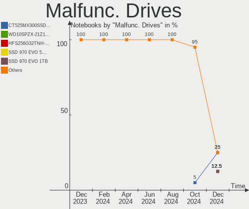
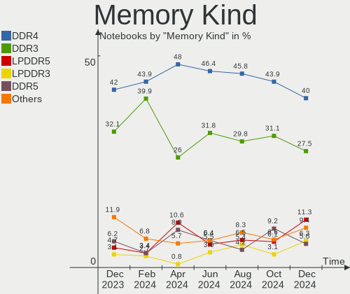
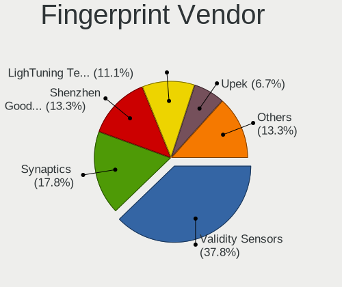

Linux in Germany - Hardware Trends (Notebooks)
----------------------------------------------

A project to identify most popular hardware characteristics and track their change
over time based on data collected by Linux users at https://Linux-Hardware.org.

Anyone can contribute to this report by the [hw-probe](https://github.com/linuxhw/hw-probe) tool:

    sudo -E hw-probe -all -upload

Period: Apr, 2024.

Contents
--------

* [ System ](#system)
  - [ OS                       ](#os)
  - [ OS Family                ](#os-family)
  - [ Kernel                   ](#kernel)
  - [ Kernel Family            ](#kernel-family)
  - [ Kernel Major Ver.        ](#kernel-major-ver)
  - [ Arch                     ](#arch)
  - [ DE                       ](#de)
  - [ Display Server           ](#display-server)
  - [ Display Manager          ](#display-manager)
  - [ OS Lang                  ](#os-lang)
  - [ Boot Mode                ](#boot-mode)
  - [ Filesystem               ](#filesystem)
  - [ Part. scheme             ](#part-scheme)
  - [ Dual Boot with Linux/BSD ](#dual-boot-with-linuxbsd)
  - [ Dual Boot (Win)          ](#dual-boot-win)

* [ Board ](#board)
  - [ Vendor                   ](#vendor)
  - [ Model                    ](#model)
  - [ Model Family             ](#model-family)
  - [ MFG Year                 ](#mfg-year)
  - [ Form Factor              ](#form-factor)
  - [ Secure Boot              ](#secure-boot)
  - [ Coreboot                 ](#coreboot)
  - [ RAM Size                 ](#ram-size)
  - [ RAM Used                 ](#ram-used)
  - [ Total Drives             ](#total-drives)
  - [ Has CD-ROM               ](#has-cd-rom)
  - [ Has Ethernet             ](#has-ethernet)
  - [ Has WiFi                 ](#has-wifi)
  - [ Has Bluetooth            ](#has-bluetooth)

* [ Location ](#location)
  - [ Country                  ](#country)
  - [ City                     ](#city)

* [ Drives ](#drives)
  - [ Drive Vendor             ](#drive-vendor)
  - [ Drive Model              ](#drive-model)
  - [ HDD Vendor               ](#hdd-vendor)
  - [ SSD Vendor               ](#ssd-vendor)
  - [ Drive Kind               ](#drive-kind)
  - [ Drive Connector          ](#drive-connector)
  - [ Drive Size               ](#drive-size)
  - [ Space Total              ](#space-total)
  - [ Space Used               ](#space-used)
  - [ Malfunc. Drives          ](#malfunc-drives)
  - [ Malfunc. Drive Vendor    ](#malfunc-drive-vendor)
  - [ Malfunc. HDD Vendor      ](#malfunc-hdd-vendor)
  - [ Malfunc. Drive Kind      ](#malfunc-drive-kind)
  - [ Failed Drives            ](#failed-drives)
  - [ Failed Drive Vendor      ](#failed-drive-vendor)
  - [ Drive Status             ](#drive-status)

* [ Storage controller ](#storage-controller)
  - [ Storage Vendor           ](#storage-vendor)
  - [ Storage Model            ](#storage-model)
  - [ Storage Kind             ](#storage-kind)

* [ Processor ](#processor)
  - [ CPU Vendor               ](#cpu-vendor)
  - [ CPU Model                ](#cpu-model)
  - [ CPU Model Family         ](#cpu-model-family)
  - [ CPU Cores                ](#cpu-cores)
  - [ CPU Sockets              ](#cpu-sockets)
  - [ CPU Threads              ](#cpu-threads)
  - [ CPU Op-Modes             ](#cpu-op-modes)
  - [ CPU Microcode            ](#cpu-microcode)
  - [ CPU Microarch            ](#cpu-microarch)

* [ Graphics ](#graphics)
  - [ GPU Vendor               ](#gpu-vendor)
  - [ GPU Model                ](#gpu-model)
  - [ GPU Combo                ](#gpu-combo)
  - [ GPU Driver               ](#gpu-driver)
  - [ GPU Memory               ](#gpu-memory)

* [ Monitor ](#monitor)
  - [ Monitor Vendor           ](#monitor-vendor)
  - [ Monitor Model            ](#monitor-model)
  - [ Monitor Resolution       ](#monitor-resolution)
  - [ Monitor Diagonal         ](#monitor-diagonal)
  - [ Monitor Width            ](#monitor-width)
  - [ Aspect Ratio             ](#aspect-ratio)
  - [ Monitor Area             ](#monitor-area)
  - [ Pixel Density            ](#pixel-density)
  - [ Multiple Monitors        ](#multiple-monitors)

* [ Network ](#network)
  - [ Net Controller Vendor    ](#net-controller-vendor)
  - [ Net Controller Model     ](#net-controller-model)
  - [ Wireless Vendor          ](#wireless-vendor)
  - [ Wireless Model           ](#wireless-model)
  - [ Ethernet Vendor          ](#ethernet-vendor)
  - [ Ethernet Model           ](#ethernet-model)
  - [ Net Controller Kind      ](#net-controller-kind)
  - [ Used Controller          ](#used-controller)
  - [ NICs                     ](#nics)
  - [ IPv6                     ](#ipv6)

* [ Bluetooth ](#bluetooth)
  - [ Bluetooth Vendor         ](#bluetooth-vendor)
  - [ Bluetooth Model          ](#bluetooth-model)

* [ Sound ](#sound)
  - [ Sound Vendor             ](#sound-vendor)
  - [ Sound Model              ](#sound-model)

* [ Memory ](#memory)
  - [ Memory Vendor            ](#memory-vendor)
  - [ Memory Model             ](#memory-model)
  - [ Memory Kind              ](#memory-kind)
  - [ Memory Form Factor       ](#memory-form-factor)
  - [ Memory Size              ](#memory-size)
  - [ Memory Speed             ](#memory-speed)

* [ Printers & scanners ](#printers--scanners)
  - [ Printer Vendor           ](#printer-vendor)
  - [ Printer Model            ](#printer-model)
  - [ Scanner Vendor           ](#scanner-vendor)
  - [ Scanner Model            ](#scanner-model)

* [ Camera ](#camera)
  - [ Camera Vendor            ](#camera-vendor)
  - [ Camera Model             ](#camera-model)

* [ Security ](#security)
  - [ Fingerprint Vendor       ](#fingerprint-vendor)
  - [ Fingerprint Model        ](#fingerprint-model)
  - [ Chipcard Vendor          ](#chipcard-vendor)
  - [ Chipcard Model           ](#chipcard-model)

* [ Unsupported ](#unsupported)
  - [ Unsupported Devices      ](#unsupported-devices)
  - [ Unsupported Device Types ](#unsupported-device-types)

System
------

OS
--

Installed operating systems

| Name                         | Notebooks | Percent |
|------------------------------|-----------|---------|
| Ubuntu 22.04                 | 38        | 14.73%  |
| Fedora 39                    | 26        | 10.08%  |
| Linux Mint 21.3              | 19        | 7.36%   |
| Zorin 17                     | 16        | 6.2%    |
| Debian 12                    | 14        | 5.43%   |
| Arch Rolling                 | 11        | 4.26%   |
| Ubuntu 23.10                 | 10        | 3.88%   |
| Fedora 40                    | 10        | 3.88%   |
| Pop!_OS 22.04                | 8         | 3.1%    |
| Manjaro                      | 7         | 2.71%   |
| Ubuntu 24.04                 | 6         | 2.33%   |
| openSUSE Leap-15.5           | 6         | 2.33%   |
| Kubuntu 22.04                | 6         | 2.33%   |
| TUXEDO OS 22.04              | 5         | 1.94%   |
| OpenMandriva 23.08           | 5         | 1.94%   |
| EndeavourOS Rolling          | 5         | 1.94%   |
| Zorin 16                     | 4         | 1.55%   |
| openSUSE Tumbleweed-XXXXXXXX | 4         | 1.55%   |
| Linux Mint 21.2              | 4         | 1.55%   |
| Ubuntu MATE 22.04            | 3         | 1.16%   |
| LMDE 6                       | 3         | 1.16%   |
| Debian                       | 3         | 1.16%   |
| Void Linux Rolling           | 2         | 0.78%   |
| Ubuntu 20.04                 | 2         | 0.78%   |
| SteamOS 3.5.17               | 2         | 0.78%   |
| OpenMandriva 5.0             | 2         | 0.78%   |
| OpenMandriva 4.2             | 2         | 0.78%   |
| Manjaro 23.1.4               | 2         | 0.78%   |
| Linux Mint 21.1              | 2         | 0.78%   |
| Linux Mint 20.3              | 2         | 0.78%   |
| Kubuntu 23.10                | 2         | 0.78%   |
| KDE neon 22.04               | 2         | 0.78%   |
| Kali 2024.1                  | 2         | 0.78%   |
| Xubuntu 24.04                | 1         | 0.39%   |
| Xubuntu 23.10                | 1         | 0.39%   |
| Xubuntu 22.04                | 1         | 0.39%   |
| Ubuntu Studio 24.04          | 1         | 0.39%   |
| Ubuntu 20.10                 | 1         | 0.39%   |
| SteamOS 3.6                  | 1         | 0.39%   |
| SteamOS 3.5.19               | 1         | 0.39%   |

OS Family
---------

OS without a version

| Name          | Notebooks | Percent |
|---------------|-----------|---------|
| Ubuntu        | 57        | 22.09%  |
| Fedora        | 36        | 13.95%  |
| Linux Mint    | 28        | 10.85%  |
| Zorin         | 20        | 7.75%   |
| Debian        | 18        | 6.98%   |
| openSUSE      | 11        | 4.26%   |
| Arch          | 11        | 4.26%   |
| OpenMandriva  | 10        | 3.88%   |
| Manjaro       | 9         | 3.49%   |
| Kubuntu       | 9         | 3.49%   |
| Pop!_OS       | 8         | 3.1%    |
| TUXEDO OS     | 5         | 1.94%   |
| EndeavourOS   | 5         | 1.94%   |
| SteamOS       | 4         | 1.55%   |
| Xubuntu       | 3         | 1.16%   |
| Ubuntu MATE   | 3         | 1.16%   |
| LMDE          | 3         | 1.16%   |
| Void Linux    | 2         | 0.78%   |
| ROSA          | 2         | 0.78%   |
| NixOS         | 2         | 0.78%   |
| KDE neon      | 2         | 0.78%   |
| Kali          | 2         | 0.78%   |
| Ubuntu Studio | 1         | 0.39%   |
| Gentoo        | 1         | 0.39%   |
| Elementary    | 1         | 0.39%   |
| Devuan        | 1         | 0.39%   |
| blendOS       | 1         | 0.39%   |
| Athena        | 1         | 0.39%   |
| ArcoLinux     | 1         | 0.39%   |
| AlmaLinux     | 1         | 0.39%   |

Kernel
------

Version of the Linux kernel

| Version                             | Notebooks | Percent |
|-------------------------------------|-----------|---------|
| 6.5.0-27-generic                    | 28        | 10.85%  |
| 6.5.0-28-generic                    | 26        | 10.08%  |
| 6.5.0-26-generic                    | 14        | 5.43%   |
| 5.15.0-101-generic                  | 12        | 4.65%   |
| 5.15.0-102-generic                  | 9         | 3.49%   |
| 6.8.7-300.fc40.x86_64               | 7         | 2.71%   |
| 6.8.0-76060800daily20240311-generic | 7         | 2.71%   |
| 6.7.11-200.fc39.x86_64              | 6         | 2.33%   |
| 6.1.0-20-amd64                      | 6         | 2.33%   |
| 5.15.0-105-generic                  | 6         | 2.33%   |
| 6.8.6-200.fc39.x86_64               | 5         | 1.94%   |
| 6.8.4-200.fc39.x86_64               | 5         | 1.94%   |
| 6.8.0-31-generic                    | 5         | 1.94%   |
| 6.4.11-desktop-1omv2390             | 5         | 1.94%   |
| 6.1.0-18-amd64                      | 5         | 1.94%   |
| 5.14.21-150500.55.52-default        | 5         | 1.94%   |
| 6.8.5-arch1-1                       | 4         | 1.55%   |
| 6.8.5-201.fc39.x86_64               | 4         | 1.55%   |
| 6.8.2-arch2-1                       | 3         | 1.16%   |
| 6.6.25-1-MANJARO                    | 3         | 1.16%   |
| 6.6.2-desktop-1omv2390              | 3         | 1.16%   |
| 6.5.0-10027-tuxedo                  | 3         | 1.16%   |
| 6.1.52-valve16-1-neptune-61         | 3         | 1.16%   |
| 6.8.7-arch1-2                       | 2         | 0.78%   |
| 6.8.7-200.fc39.x86_64               | 2         | 0.78%   |
| 6.8.4-1-MANJARO                     | 2         | 0.78%   |
| 6.8.0-22-generic                    | 2         | 0.78%   |
| 6.6.9-amd64                         | 2         | 0.78%   |
| 6.6.27-1-lts                        | 2         | 0.78%   |
| 6.5.6-300.fc39.x86_64               | 2         | 0.78%   |
| 6.5.0-10031-tuxedo                  | 2         | 0.78%   |
| 6.2.0-37-generic                    | 2         | 0.78%   |
| 6.2.0-26-generic                    | 2         | 0.78%   |
| 5.15.0-91-generic                   | 2         | 0.78%   |
| 5.10.14-desktop-1omv4002            | 2         | 0.78%   |
| 6.9.0-rc4+                          | 1         | 0.39%   |
| 6.9.0-rc3+                          | 1         | 0.39%   |
| 6.8.7-zen1-2-zen                    | 1         | 0.39%   |
| 6.8.7-zen1-1-zen                    | 1         | 0.39%   |
| 6.8.7-1-default                     | 1         | 0.39%   |

Kernel Family
-------------

Linux kernel without a distro release

| Version | Notebooks | Percent |
|---------|-----------|---------|
| 6.5.0   | 77        | 29.84%  |
| 5.15.0  | 32        | 12.4%   |
| 6.8.0   | 17        | 6.59%   |
| 6.8.7   | 15        | 5.81%   |
| 6.1.0   | 14        | 5.43%   |
| 6.8.4   | 12        | 4.65%   |
| 6.8.5   | 9         | 3.49%   |
| 6.8.6   | 7         | 2.71%   |
| 6.7.11  | 7         | 2.71%   |
| 6.2.0   | 6         | 2.33%   |
| 5.14.21 | 6         | 2.33%   |
| 6.4.11  | 5         | 1.94%   |
| 6.8.2   | 4         | 1.55%   |
| 6.6.25  | 4         | 1.55%   |
| 6.1.52  | 4         | 1.55%   |
| 6.7.9   | 3         | 1.16%   |
| 6.6.23  | 3         | 1.16%   |
| 6.6.2   | 3         | 1.16%   |
| 5.4.0   | 3         | 1.16%   |
| 6.9.0   | 2         | 0.78%   |
| 6.6.9   | 2         | 0.78%   |
| 6.6.27  | 2         | 0.78%   |
| 6.6.26  | 2         | 0.78%   |
| 6.6.21  | 2         | 0.78%   |
| 6.5.6   | 2         | 0.78%   |
| 5.10.14 | 2         | 0.78%   |
| 6.8.3   | 1         | 0.39%   |
| 6.7.7   | 1         | 0.39%   |
| 6.7.10  | 1         | 0.39%   |
| 6.6.24  | 1         | 0.39%   |
| 6.6.15  | 1         | 0.39%   |
| 6.6.11  | 1         | 0.39%   |
| 6.6.10  | 1         | 0.39%   |
| 6.1.82  | 1         | 0.39%   |
| 5.8.0   | 1         | 0.39%   |
| 5.4.83  | 1         | 0.39%   |
| 5.19.0  | 1         | 0.39%   |
| 5.14.0  | 1         | 0.39%   |
| 5.10.0  | 1         | 0.39%   |

Kernel Major Ver.
-----------------

Linux kernel major version

| Version | Notebooks | Percent |
|---------|-----------|---------|
| 6.5     | 79        | 30.62%  |
| 6.8     | 65        | 25.19%  |
| 5.15    | 32        | 12.4%   |
| 6.6     | 22        | 8.53%   |
| 6.1     | 19        | 7.36%   |
| 6.7     | 12        | 4.65%   |
| 5.14    | 7         | 2.71%   |
| 6.2     | 6         | 2.33%   |
| 6.4     | 5         | 1.94%   |
| 5.4     | 4         | 1.55%   |
| 5.10    | 3         | 1.16%   |
| 6.9     | 2         | 0.78%   |
| 5.8     | 1         | 0.39%   |
| 5.19    | 1         | 0.39%   |

Arch
----

OS architecture (x86_64, i586, etc.)

| Name   | Notebooks | Percent |
|--------|-----------|---------|
| x86_64 | 256       | 99.22%  |
| i686   | 2         | 0.78%   |

DE
--

Desktop Environment

| Name          | Notebooks | Percent |
|---------------|-----------|---------|
| GNOME         | 135       | 52.33%  |
| KDE5          | 41        | 15.89%  |
| X-Cinnamon    | 26        | 10.08%  |
| XFCE          | 13        | 5.04%   |
| KDE6          | 11        | 4.26%   |
| MATE          | 10        | 3.88%   |
| Hyprland      | 5         | 1.94%   |
| LXQt          | 3         | 1.16%   |
| Unknown       | 3         | 1.16%   |
| LXDE          | 2         | 0.78%   |
| KDE4          | 2         | 0.78%   |
| GNOME Classic | 2         | 0.78%   |
| Cinnamon      | 2         | 0.78%   |
| sway          | 1         | 0.39%   |
| Pantheon      | 1         | 0.39%   |
| KDE           | 1         | 0.39%   |

Display Server
--------------

X11 or Wayland

| Name    | Notebooks | Percent |
|---------|-----------|---------|
| Wayland | 129       | 50%     |
| X11     | 125       | 48.45%  |
| Unknown | 4         | 1.55%   |

Display Manager
---------------

SDDM, LightDM, etc.

| Name    | Notebooks | Percent |
|---------|-----------|---------|
| Unknown | 104       | 40.31%  |
| GDM3    | 64        | 24.81%  |
| SDDM    | 34        | 13.18%  |
| LightDM | 34        | 13.18%  |
| GDM     | 18        | 6.98%   |
| SLiM    | 1         | 0.39%   |
| LY-DM   | 1         | 0.39%   |
| LXDM    | 1         | 0.39%   |
| KDM     | 1         | 0.39%   |

OS Lang
-------

Language

| Lang    | Notebooks | Percent |
|---------|-----------|---------|
| de_DE   | 172       | 66.67%  |
| en_US   | 64        | 24.81%  |
| en_GB   | 7         | 2.71%   |
| C       | 3         | 1.16%   |
| zh_CN   | 1         | 0.39%   |
| uk_UA   | 1         | 0.39%   |
| ru_RU   | 1         | 0.39%   |
| ro_RO   | 1         | 0.39%   |
| POSIX   | 1         | 0.39%   |
| lv_LV   | 1         | 0.39%   |
| fr_FR   | 1         | 0.39%   |
| en_DK   | 1         | 0.39%   |
| en_DE   | 1         | 0.39%   |
| en_AU   | 1         | 0.39%   |
| de_AT   | 1         | 0.39%   |
| Unknown | 1         | 0.39%   |

Boot Mode
---------

EFI or BIOS

| Mode | Notebooks | Percent |
|------|-----------|---------|
| BIOS | 145       | 56.2%   |
| EFI  | 113       | 43.8%   |

Filesystem
----------

Type of filesystem

| Type    | Notebooks | Percent |
|---------|-----------|---------|
| Ext4    | 136       | 52.71%  |
| Btrfs   | 58        | 22.48%  |
| Tmpfs   | 47        | 18.22%  |
| Overlay | 9         | 3.49%   |
| Xfs     | 5         | 1.94%   |
| Zfs     | 2         | 0.78%   |
| Ext2    | 1         | 0.39%   |

Part. scheme
------------

Scheme of partitioning

| Type    | Notebooks | Percent |
|---------|-----------|---------|
| GPT     | 147       | 56.98%  |
| Unknown | 97        | 37.6%   |
| MBR     | 14        | 5.43%   |

Dual Boot with Linux/BSD
------------------------

Hosting more than one Linux/BSD

| Dual boot | Notebooks | Percent |
|-----------|-----------|---------|
| No        | 234       | 90.7%   |
| Yes       | 24        | 9.3%    |

Dual Boot (Win)
---------------

Hosting Linux and Windows

| Dual boot | Notebooks | Percent |
|-----------|-----------|---------|
| No        | 204       | 79.07%  |
| Yes       | 54        | 20.93%  |

Board
-----

Vendor
------

Motherboard manufacturer

| Name                | Notebooks | Percent |
|---------------------|-----------|---------|
| Lenovo              | 73        | 28.29%  |
| Hewlett-Packard     | 39        | 15.12%  |
| Dell                | 28        | 10.85%  |
| Acer                | 23        | 8.91%   |
| ASUSTek Computer    | 18        | 6.98%   |
| Apple               | 15        | 5.81%   |
| Toshiba             | 7         | 2.71%   |
| TUXEDO              | 6         | 2.33%   |
| Samsung Electronics | 6         | 2.33%   |
| Fujitsu             | 6         | 2.33%   |
| Medion              | 5         | 1.94%   |
| Valve               | 4         | 1.55%   |
| MSI                 | 3         | 1.16%   |
| Gigabyte Technology | 3         | 1.16%   |
| Framework           | 3         | 1.16%   |
| Razer               | 2         | 0.78%   |
| HUAWEI              | 2         | 0.78%   |
| Getac               | 2         | 0.78%   |
| XMG                 | 1         | 0.39%   |
| TrekStor            | 1         | 0.39%   |
| Teclast             | 1         | 0.39%   |
| System76            | 1         | 0.39%   |
| Sony                | 1         | 0.39%   |
| Shuttle             | 1         | 0.39%   |
| Packard Bell        | 1         | 0.39%   |
| Notebook            | 1         | 0.39%   |
| LG Electronics      | 1         | 0.39%   |
| EXTRA Computer      | 1         | 0.39%   |
| Clevo               | 1         | 0.39%   |
| Chuwi               | 1         | 0.39%   |
| AMI                 | 1         | 0.39%   |

Model
-----

Motherboard model

| Name                                  | Notebooks | Percent |
|---------------------------------------|-----------|---------|
| Valve Jupiter                         | 4         | 1.55%   |
| Lenovo IdeaPad Slim 1-14AST-05 81VS   | 3         | 1.16%   |
| HP Laptop 17-cp0xxx                   | 3         | 1.16%   |
| HP 255 15.6 inch G10                  | 3         | 1.16%   |
| Samsung R530/R730                     | 2         | 0.78%   |
| Lenovo ThinkPad P16s Gen 2 21K9CTO1WW | 2         | 0.78%   |
| Lenovo Legion 5 Pro 16ACH6H 82JQ      | 2         | 0.78%   |
| Lenovo G700 20251                     | 2         | 0.78%   |
| Getac S410                            | 2         | 0.78%   |
| Dell XPS 14 9440                      | 2         | 0.78%   |
| ASUS N751JK                           | 2         | 0.78%   |
| Apple MacBookPro9,2                   | 2         | 0.78%   |
| Apple MacBookPro8,2                   | 2         | 0.78%   |
| Acer Extensa 2540                     | 2         | 0.78%   |
| Unknown                               | 2         | 0.78%   |
| XMG N85_N87,HJ,HJ1,HK1                | 1         | 0.39%   |
| TUXEDO Sirius 16 Gen1                 | 1         | 0.39%   |
| TUXEDO Pulse 14 Gen3                  | 1         | 0.39%   |
| TUXEDO Polaris AMD Gen5               | 1         | 0.39%   |
| TUXEDO InfinityBook S 14 v5           | 1         | 0.39%   |
| TUXEDO InfinityBook Pro Gen8 (MK2)    | 1         | 0.39%   |
| TUXEDO InfinityBook Pro 14 Gen6       | 1         | 0.39%   |
| TrekStor Surfbook A13B                | 1         | 0.39%   |
| Toshiba Satellite Pro L850-1L2        | 1         | 0.39%   |
| Toshiba Satellite Pro L670            | 1         | 0.39%   |
| Toshiba Satellite L50D-B              | 1         | 0.39%   |
| Toshiba Satellite L50-C               | 1         | 0.39%   |
| Toshiba Satellite L10W-B-101          | 1         | 0.39%   |
| Toshiba Satellite C670-12E            | 1         | 0.39%   |
| Toshiba Satellite C50-A               | 1         | 0.39%   |
| Teclast F6 Plus                       | 1         | 0.39%   |
| System76 Oryx Pro                     | 1         | 0.39%   |
| Sony SVF1521C6EW                      | 1         | 0.39%   |
| Shuttle X50V6                         | 1         | 0.39%   |
| Samsung RC530/RC730                   | 1         | 0.39%   |
| Samsung R519/R719                     | 1         | 0.39%   |
| Samsung 750XED                        | 1         | 0.39%   |
| Samsung 355V4C/356V4C/3445VC/3545VC   | 1         | 0.39%   |
| Razer Blade 14 - RZ09-0370            | 1         | 0.39%   |
| Razer Blade                           | 1         | 0.39%   |

Model Family
------------

Motherboard model prefix

| Name                | Notebooks | Percent |
|---------------------|-----------|---------|
| Lenovo ThinkPad     | 42        | 16.28%  |
| Dell Latitude       | 17        | 6.59%   |
| Acer Aspire         | 13        | 5.04%   |
| Lenovo IdeaPad      | 10        | 3.88%   |
| HP EliteBook        | 10        | 3.88%   |
| Toshiba Satellite   | 7         | 2.71%   |
| Lenovo Legion       | 6         | 2.33%   |
| HP Laptop           | 6         | 2.33%   |
| Fujitsu LIFEBOOK    | 6         | 2.33%   |
| HP ZBook            | 5         | 1.94%   |
| Dell XPS            | 5         | 1.94%   |
| Valve Jupiter       | 4         | 1.55%   |
| HP ProBook          | 4         | 1.55%   |
| HP 255              | 4         | 1.55%   |
| HP 250              | 4         | 1.55%   |
| Dell Inspiron       | 4         | 1.55%   |
| TUXEDO InfinityBook | 3         | 1.16%   |
| Framework Laptop    | 3         | 1.16%   |
| ASUS VivoBook       | 3         | 1.16%   |
| Apple MacBookPro9   | 3         | 1.16%   |
| Apple MacBookPro8   | 3         | 1.16%   |
| Acer Extensa        | 3         | 1.16%   |
| Samsung R530        | 2         | 0.78%   |
| Razer Blade         | 2         | 0.78%   |
| Lenovo V15          | 2         | 0.78%   |
| Lenovo ThinkBook    | 2         | 0.78%   |
| Lenovo IdeaPadFlex  | 2         | 0.78%   |
| Lenovo G700         | 2         | 0.78%   |
| HP Pavilion         | 2         | 0.78%   |
| HP ENVY             | 2         | 0.78%   |
| Getac S410          | 2         | 0.78%   |
| Dell Precision      | 2         | 0.78%   |
| ASUS TUF            | 2         | 0.78%   |
| ASUS ROG            | 2         | 0.78%   |
| ASUS N751JK         | 2         | 0.78%   |
| ASUS ASUS           | 2         | 0.78%   |
| Apple MacBookPro11  | 2         | 0.78%   |
| Acer TravelMate     | 2         | 0.78%   |
| Acer Swift          | 2         | 0.78%   |
| Unknown             | 2         | 0.78%   |

MFG Year
--------

Motherboard manufacture year

| Year | Notebooks | Percent |
|------|-----------|---------|
| 2023 | 31        | 12.02%  |
| 2013 | 26        | 10.08%  |
| 2021 | 23        | 8.91%   |
| 2020 | 20        | 7.75%   |
| 2017 | 19        | 7.36%   |
| 2022 | 18        | 6.98%   |
| 2014 | 17        | 6.59%   |
| 2012 | 15        | 5.81%   |
| 2018 | 14        | 5.43%   |
| 2016 | 14        | 5.43%   |
| 2019 | 13        | 5.04%   |
| 2011 | 12        | 4.65%   |
| 2015 | 10        | 3.88%   |
| 2009 | 8         | 3.1%    |
| 2010 | 7         | 2.71%   |
| 2024 | 5         | 1.94%   |
| 2008 | 4         | 1.55%   |
| 2007 | 2         | 0.78%   |

Form Factor
-----------

Physical design of the computer

| Name     | Notebooks | Percent |
|----------|-----------|---------|
| Notebook | 258       | 100%    |

Secure Boot
-----------

Enabled or disabled

| State    | Notebooks | Percent |
|----------|-----------|---------|
| Disabled | 228       | 88.37%  |
| Enabled  | 30        | 11.63%  |

Coreboot
--------

Have coreboot on board

| Used | Notebooks | Percent |
|------|-----------|---------|
| No   | 257       | 99.61%  |
| Yes  | 1         | 0.39%   |

RAM Size
--------

Total RAM memory

| Size in GB  | Notebooks | Percent |
|-------------|-----------|---------|
| 4.01-8.0    | 66        | 25.58%  |
| 16.01-24.0  | 54        | 20.93%  |
| 8.01-16.0   | 49        | 18.99%  |
| 3.01-4.0    | 34        | 13.18%  |
| 32.01-64.0  | 33        | 12.79%  |
| 24.01-32.0  | 12        | 4.65%   |
| 64.01-256.0 | 6         | 2.33%   |
| 2.01-3.0    | 2         | 0.78%   |
| 1.01-2.0    | 2         | 0.78%   |

RAM Used
--------

Used RAM memory

| Used GB    | Notebooks | Percent |
|------------|-----------|---------|
| 2.01-3.0   | 76        | 29.46%  |
| 1.01-2.0   | 64        | 24.81%  |
| 4.01-8.0   | 58        | 22.48%  |
| 3.01-4.0   | 40        | 15.5%   |
| 8.01-16.0  | 13        | 5.04%   |
| 0.51-1.0   | 4         | 1.55%   |
| 16.01-24.0 | 3         | 1.16%   |

Total Drives
------------

Number of drives on board

| Drives | Notebooks | Percent |
|--------|-----------|---------|
| 1      | 192       | 74.42%  |
| 2      | 62        | 24.03%  |
| 3      | 4         | 1.55%   |

Has CD-ROM
----------

Has CD-ROM on board

| Presented | Notebooks | Percent |
|-----------|-----------|---------|
| No        | 181       | 70.16%  |
| Yes       | 77        | 29.84%  |

Has Ethernet
------------

Has Ethernet on board

| Presented | Notebooks | Percent |
|-----------|-----------|---------|
| Yes       | 210       | 81.4%   |
| No        | 48        | 18.6%   |

Has WiFi
--------

Has WiFi module

| Presented | Notebooks | Percent |
|-----------|-----------|---------|
| Yes       | 256       | 99.22%  |
| No        | 2         | 0.78%   |

Has Bluetooth
-------------

Has Bluetooth module

| Presented | Notebooks | Percent |
|-----------|-----------|---------|
| Yes       | 221       | 85.66%  |
| No        | 37        | 14.34%  |

Location
--------

Country
-------

Geographic location (country)

| Country | Notebooks | Percent |
|---------|-----------|---------|
| Germany | 258       | 100%    |

City
----

Geographic location (city)

| City              | Notebooks | Percent |
|-------------------|-----------|---------|
| Berlin            | 27        | 10.47%  |
| Frankfurt am Main | 12        | 4.65%   |
| Hamburg           | 9         | 3.49%   |
| Stuttgart         | 8         | 3.1%    |
| Munich            | 8         | 3.1%    |
| Nuremberg         | 6         | 2.33%   |
| Leipzig           | 6         | 2.33%   |
| Bochum            | 5         | 1.94%   |
| Dortmund          | 4         | 1.55%   |
| Darmstadt         | 4         | 1.55%   |
| Bielefeld         | 4         | 1.55%   |
| Heilbronn         | 3         | 1.16%   |
| Duisburg          | 3         | 1.16%   |
| Dresden           | 3         | 1.16%   |
| Cologne           | 3         | 1.16%   |
| Bremen            | 3         | 1.16%   |
| Aurich            | 3         | 1.16%   |
| Aachen            | 3         | 1.16%   |
| Wolfsburg         | 2         | 0.78%   |
| Sinzig            | 2         | 0.78%   |
| Rheine            | 2         | 0.78%   |
| Offenburg         | 2         | 0.78%   |
| Oberhausen        | 2         | 0.78%   |
| Mannheim          | 2         | 0.78%   |
| Mainz             | 2         | 0.78%   |
| Linsengericht     | 2         | 0.78%   |
| Langen            | 2         | 0.78%   |
| Karlsruhe         | 2         | 0.78%   |
| Essen             | 2         | 0.78%   |
| Edling            | 2         | 0.78%   |
| Düsseldorf       | 2         | 0.78%   |
| Deggendorf        | 2         | 0.78%   |
| Cuxhaven          | 2         | 0.78%   |
| Coesfeld          | 2         | 0.78%   |
| Celle             | 2         | 0.78%   |
| Zeitz             | 1         | 0.39%   |
| Wuppertal         | 1         | 0.39%   |
| Witten            | 1         | 0.39%   |
| Winsen            | 1         | 0.39%   |
| Wilsdruff         | 1         | 0.39%   |

Drives
------

Drive Vendor
------------

Hard drive vendors

| Vendor                         | Notebooks | Drives | Percent |
|--------------------------------|-----------|--------|---------|
| Samsung Electronics            | 76        | 92     | 25.08%  |
| SanDisk                        | 38        | 38     | 12.54%  |
| Seagate                        | 18        | 18     | 5.94%   |
| Unknown                        | 17        | 18     | 5.61%   |
| WDC                            | 14        | 14     | 4.62%   |
| SK hynix                       | 14        | 14     | 4.62%   |
| Micron Technology              | 12        | 12     | 3.96%   |
| Kingston                       | 10        | 10     | 3.3%    |
| Crucial                        | 10        | 11     | 3.3%    |
| KIOXIA                         | 9         | 9      | 2.97%   |
| Apple                          | 9         | 11     | 2.97%   |
| Toshiba                        | 8         | 8      | 2.64%   |
| Intel                          | 8         | 9      | 2.64%   |
| HGST                           | 5         | 5      | 1.65%   |
| Phison Electronics             | 4         | 4      | 1.32%   |
| Micron/Crucial Technology      | 4         | 4      | 1.32%   |
| Intenso                        | 4         | 4      | 1.32%   |
| Hitachi                        | 4         | 4      | 1.32%   |
| Patriot                        | 3         | 3      | 0.99%   |
| Kingston Technology Company    | 3         | 3      | 0.99%   |
| A-DATA Technology              | 3         | 3      | 0.99%   |
| Transcend                      | 2         | 2      | 0.66%   |
| Silicon Motion                 | 2         | 2      | 0.66%   |
| Phison                         | 2         | 2      | 0.66%   |
| LITEON                         | 2         | 2      | 0.66%   |
| Emtec                          | 2         | 2      | 0.66%   |
| ZXIC MMC                       | 1         | 1      | 0.33%   |
| Verbatim                       | 1         | 1      | 0.33%   |
| USB3.0                         | 1         | 1      | 0.33%   |
| Union Memory (Shenzhen)        | 1         | 1      | 0.33%   |
| UMIS                           | 1         | 1      | 0.33%   |
| Teclast                        | 1         | 1      | 0.33%   |
| STEC                           | 1         | 1      | 0.33%   |
| SSK SD30                       | 1         | 1      | 0.33%   |
| Solid State Storage Technology | 1         | 1      | 0.33%   |
| Shenzhen Longsys Electronics   | 1         | 1      | 0.33%   |
| Seagate Technology             | 1         | 1      | 0.33%   |
| Netac                          | 1         | 1      | 0.33%   |
| Neo Forza                      | 1         | 1      | 0.33%   |
| Lexar                          | 1         | 1      | 0.33%   |

Drive Model
-----------

Hard drive models

| Model                                              | Notebooks | Percent |
|----------------------------------------------------|-----------|---------|
| Samsung NVMe SSD Controller SM981/PM981/PM983 1TB  | 13        | 4.06%   |
| Samsung NVMe SSD Controller PM9A1/PM9A3/980PRO 1TB | 7         | 2.19%   |
| Samsung SSD 870 EVO 500GB                          | 6         | 1.88%   |
| Seagate ST1000LM035-1RK172 1TB                     | 4         | 1.25%   |
| Sandisk WD PC SN740 SDDQNQD-512G-1201 512GB        | 4         | 1.25%   |
| SanDisk 3.2 Gen 1 250GB SSD                        | 4         | 1.25%   |
| Unknown MMC Card  64GB                             | 3         | 0.94%   |
| Unknown MMC Card  128GB                            | 3         | 0.94%   |
| Sandisk WD Black SN750 / PC SN730 NVMe SSD 512GB   | 3         | 0.94%   |
| Samsung NVMe SSD Controller SM961/PM961/SM963 1TB  | 3         | 0.94%   |
| Micron/Crucial P2 NVMe PCIe SSD 4TB                | 3         | 0.94%   |
| HGST HTS541010A9E680 1TB                           | 3         | 0.94%   |
| WDC WD10JPVX-22JC3T0 1TB                           | 2         | 0.63%   |
| Unknown SD/MMC/MS PRO 128GB                        | 2         | 0.63%   |
| Unknown MMC Card  512GB                            | 2         | 0.63%   |
| Unknown MMC Card  32GB                             | 2         | 0.63%   |
| Toshiba XG6 NVMe SSD Controller 1024GB             | 2         | 0.63%   |
| SK hynix BC901 HFS512GEJ9X108N 512GB               | 2         | 0.63%   |
| Sandisk WD Blue SN550 NVMe SSD 2TB                 | 2         | 0.63%   |
| SanDisk SSD PLUS 480GB                             | 2         | 0.63%   |
| SanDisk SD9SN8W-128G-1006 128GB SSD                | 2         | 0.63%   |
| Samsung SSD 990 PRO 2TB                            | 2         | 0.63%   |
| Samsung SSD 990 PRO 1TB                            | 2         | 0.63%   |
| Samsung SSD 980 1TB                                | 2         | 0.63%   |
| Samsung SSD 870 EVO 1TB                            | 2         | 0.63%   |
| Samsung SSD 860 EVO 250GB                          | 2         | 0.63%   |
| Samsung SSD 860 EVO 1TB                            | 2         | 0.63%   |
| Samsung SSD 840 EVO 250GB                          | 2         | 0.63%   |
| Samsung PM9A1 NVMe 1024GB                          | 2         | 0.63%   |
| Samsung NVMe SSD Controller SM951/PM951 256GB      | 2         | 0.63%   |
| Samsung MZALQ512HALU-000L1 512GB                   | 2         | 0.63%   |
| Phison Corsair MP600 MINI 1TB                      | 2         | 0.63%   |
| Patriot Burst 120GB SSD                            | 2         | 0.63%   |
| Micron 3400_MTFDKBA512TFH 512GB                    | 2         | 0.63%   |
| Micron 2400_MTFDKBA512QFM 512GB                    | 2         | 0.63%   |
| Kingston Company OM3PDP3 NVMe SSD 512GB            | 2         | 0.63%   |
| Kingston SA400S37960G 960GB SSD                    | 2         | 0.63%   |
| Kingston SA400S37240G 240GB SSD                    | 2         | 0.63%   |
| Crucial CT480BX500SSD1 480GB                       | 2         | 0.63%   |
| Crucial CT250BX100SSD1 250GB                       | 2         | 0.63%   |

HDD Vendor
----------

Hard disk drive vendors

| Vendor             | Notebooks | Drives | Percent |
|--------------------|-----------|--------|---------|
| Seagate            | 17        | 17     | 37.78%  |
| WDC                | 9         | 9      | 20%     |
| HGST               | 5         | 5      | 11.11%  |
| Hitachi            | 4         | 4      | 8.89%   |
| Toshiba            | 3         | 3      | 6.67%   |
| Unknown            | 2         | 2      | 4.44%   |
| Apple              | 2         | 2      | 4.44%   |
| USB3.0             | 1         | 1      | 2.22%   |
| STEC               | 1         | 1      | 2.22%   |
| JMicron Technology | 1         | 1      | 2.22%   |

SSD Vendor
----------

Solid state drive vendors

| Vendor              | Notebooks | Drives | Percent |
|---------------------|-----------|--------|---------|
| Samsung Electronics | 30        | 35     | 27.52%  |
| SanDisk             | 23        | 23     | 21.1%   |
| Crucial             | 9         | 10     | 8.26%   |
| Kingston            | 8         | 8      | 7.34%   |
| Intenso             | 4         | 4      | 3.67%   |
| Apple               | 4         | 4      | 3.67%   |
| WDC                 | 3         | 3      | 2.75%   |
| SK hynix            | 3         | 3      | 2.75%   |
| Patriot             | 3         | 3      | 2.75%   |
| Micron Technology   | 3         | 3      | 2.75%   |
| A-DATA Technology   | 3         | 3      | 2.75%   |
| Transcend           | 2         | 2      | 1.83%   |
| Toshiba             | 2         | 2      | 1.83%   |
| LITEON              | 2         | 2      | 1.83%   |
| Emtec               | 2         | 2      | 1.83%   |
| Verbatim            | 1         | 1      | 0.92%   |
| Teclast             | 1         | 1      | 0.92%   |
| Phison              | 1         | 1      | 0.92%   |
| Netac               | 1         | 1      | 0.92%   |
| Neo Forza           | 1         | 1      | 0.92%   |
| Intel               | 1         | 1      | 0.92%   |
| GOODRAM             | 1         | 1      | 0.92%   |
| ASMT                | 1         | 1      | 0.92%   |

Drive Kind
----------

HDD or SSD

| Kind    | Notebooks | Drives | Percent |
|---------|-----------|--------|---------|
| NVMe    | 125       | 145    | 42.96%  |
| SSD     | 104       | 115    | 35.74%  |
| HDD     | 44        | 45     | 15.12%  |
| MMC     | 14        | 15     | 4.81%   |
| Unknown | 4         | 4      | 1.37%   |

Drive Connector
---------------

SATA, SAS, NVMe, etc.

| Type | Notebooks | Drives | Percent |
|------|-----------|--------|---------|
| SATA | 134       | 149    | 47.18%  |
| NVMe | 125       | 145    | 44.01%  |
| MMC  | 14        | 15     | 4.93%   |
| SAS  | 11        | 15     | 3.87%   |

Drive Size
----------

Size of hard drive

| Size in TB | Notebooks | Drives | Percent |
|------------|-----------|--------|---------|
| 0.01-0.5   | 102       | 114    | 69.39%  |
| 0.51-1.0   | 41        | 42     | 27.89%  |
| 1.01-2.0   | 4         | 4      | 2.72%   |

Space Total
-----------

Amount of disk space available on the file system

| Size in GB     | Notebooks | Percent |
|----------------|-----------|---------|
| 101-250        | 68        | 26.36%  |
| 251-500        | 61        | 23.64%  |
| 501-1000       | 47        | 18.22%  |
| 1-20           | 22        | 8.53%   |
| 1001-2000      | 19        | 7.36%   |
| 51-100         | 15        | 5.81%   |
| Unknown        | 11        | 4.26%   |
| More than 3000 | 9         | 3.49%   |
| 2001-3000      | 5         | 1.94%   |
| 21-50          | 1         | 0.39%   |

Space Used
----------

Amount of used disk space

| Used GB        | Notebooks | Percent |
|----------------|-----------|---------|
| 1-20           | 76        | 29.46%  |
| 101-250        | 53        | 20.54%  |
| 21-50          | 47        | 18.22%  |
| 51-100         | 34        | 13.18%  |
| 251-500        | 19        | 7.36%   |
| Unknown        | 11        | 4.26%   |
| 501-1000       | 10        | 3.88%   |
| 1001-2000      | 4         | 1.55%   |
| More than 3000 | 3         | 1.16%   |
| 0              | 1         | 0.39%   |

Malfunc. Drives
---------------

Drive models with a malfunction

| Model                                                         | Notebooks | Drives | Percent |
|---------------------------------------------------------------|-----------|--------|---------|
| WDC PC SA530 SDASN8Y-256G-1006 256GB SSD                      | 1         | 1      | 14.29%  |
| Seagate ST9320421AS 320GB                                     | 1         | 1      | 14.29%  |
| Seagate ST2000LM015-2E8174 2TB                                | 1         | 1      | 14.29%  |
| Samsung Electronics SSD 980 PRO 500GB S5GYNX0TA36756D         | 1         | 1      | 14.29%  |
| Samsung Electronics NVMe SSD Controller SM981/PM981/PM983 1TB | 1         | 1      | 14.29%  |
| Samsung Electronics MZ7PD256HCGM-000H7 256GB SSD              | 1         | 1      | 14.29%  |
| HGST HTS541010A9E680 1TB                                      | 1         | 1      | 14.29%  |

Malfunc. Drive Vendor
---------------------

Vendors of faulty drives

| Vendor              | Notebooks | Drives | Percent |
|---------------------|-----------|--------|---------|
| Samsung Electronics | 3         | 3      | 42.86%  |
| Seagate             | 2         | 2      | 28.57%  |
| WDC                 | 1         | 1      | 14.29%  |
| HGST                | 1         | 1      | 14.29%  |

Malfunc. HDD Vendor
-------------------

Vendors of faulty HDD drives

| Vendor  | Notebooks | Drives | Percent |
|---------|-----------|--------|---------|
| Seagate | 2         | 2      | 66.67%  |
| HGST    | 1         | 1      | 33.33%  |

Malfunc. Drive Kind
-------------------

Kinds of faulty drives

| Kind | Notebooks | Drives | Percent |
|------|-----------|--------|---------|
| HDD  | 3         | 3      | 42.86%  |
| NVMe | 2         | 2      | 28.57%  |
| SSD  | 2         | 2      | 28.57%  |

Failed Drives
-------------

Failed drive models

Zero info for selected period =(

Failed Drive Vendor
-------------------

Failed drive vendors

Zero info for selected period =(

Drive Status
------------

Number of failed and malfunc. drives

| Status   | Notebooks | Drives | Percent |
|----------|-----------|--------|---------|
| Detected | 157       | 197    | 59.47%  |
| Works    | 101       | 120    | 38.26%  |
| Malfunc  | 6         | 7      | 2.27%   |

Storage controller
------------------

Storage Vendor
--------------

Storage controller vendors

| Vendor                                  | Notebooks | Percent |
|-----------------------------------------|-----------|---------|
| Intel                                   | 150       | 49.18%  |
| Samsung Electronics                     | 52        | 17.05%  |
| AMD                                     | 23        | 7.54%   |
| SanDisk                                 | 17        | 5.57%   |
| SK hynix                                | 11        | 3.61%   |
| Micron Technology                       | 9         | 2.95%   |
| KIOXIA                                  | 8         | 2.62%   |
| Phison Electronics                      | 5         | 1.64%   |
| Micron/Crucial Technology               | 5         | 1.64%   |
| Kingston Technology Company             | 5         | 1.64%   |
| Toshiba America Info Systems            | 4         | 1.31%   |
| Apple                                   | 3         | 0.98%   |
| Silicon Motion                          | 2         | 0.66%   |
| Shenzhen Unionmemory Information System | 2         | 0.66%   |
| Shenzhen Longsys Electronics            | 2         | 0.66%   |
| Seagate Technology                      | 2         | 0.66%   |
| Solid State Storage Technology          | 1         | 0.33%   |
| Silicon Integrated Systems [SiS]        | 1         | 0.33%   |
| Nvidia                                  | 1         | 0.33%   |
| Lenovo                                  | 1         | 0.33%   |
| Unknown                                 | 1         | 0.33%   |

Storage Model
-------------

Storage controller models

| Model                                                                          | Notebooks | Percent |
|--------------------------------------------------------------------------------|-----------|---------|
| AMD FCH SATA Controller [AHCI mode]                                            | 23        | 7.17%   |
| Intel Sunrise Point-LP SATA Controller [AHCI mode]                             | 21        | 6.54%   |
| Intel 7 Series Chipset Family 6-port SATA Controller [AHCI mode]               | 16        | 4.98%   |
| Samsung NVMe SSD Controller SM981/PM981/PM983                                  | 15        | 4.67%   |
| Samsung NVMe SSD Controller PM9A1/PM9A3/980PRO                                 | 14        | 4.36%   |
| Intel 6 Series/C200 Series Chipset Family 6 port Mobile SATA AHCI Controller   | 14        | 4.36%   |
| Samsung NVMe SSD Controller 980 (DRAM-less)                                    | 13        | 4.05%   |
| Intel 8 Series SATA Controller 1 [AHCI mode]                                   | 13        | 4.05%   |
| Intel Volume Management Device NVMe RAID Controller                            | 9         | 2.8%    |
| Intel 8 Series/C220 Series Chipset Family 6-port SATA Controller 1 [AHCI mode] | 9         | 2.8%    |
| Intel Wildcat Point-LP SATA Controller [AHCI Mode]                             | 7         | 2.18%   |
| Intel 82801IBM/IEM (ICH9M/ICH9M-E) 4 port SATA Controller [AHCI mode]          | 7         | 2.18%   |
| SanDisk WD Black SN770 / PC SN740 256GB / PC SN560 (DRAM-less) NVMe SSD        | 6         | 1.87%   |
| Intel Alder Lake-P SATA AHCI Controller                                        | 6         | 1.87%   |
| Intel 82801 Mobile SATA Controller [RAID mode]                                 | 5         | 1.56%   |
| Intel 5 Series/3400 Series Chipset 4 port SATA AHCI Controller                 | 5         | 1.56%   |
| SK hynix Platinum P41/PC801 NVMe Solid State Drive                             | 4         | 1.25%   |
| SanDisk Extreme Pro / WD Black SN750 / PC SN730 / Red SN700 NVMe SSD           | 4         | 1.25%   |
| Intel Volume Management Device NVMe RAID Controller Intel Corporation          | 4         | 1.25%   |
| Intel Q170/Q150/B150/H170/H110/Z170/CM236 Chipset SATA Controller [AHCI Mode]  | 4         | 1.25%   |
| Intel Cannon Lake Mobile PCH SATA AHCI Controller                              | 4         | 1.25%   |
| SK hynix Gold P31/BC711/PC711 NVMe Solid State Drive                           | 3         | 0.93%   |
| Samsung S4LN058A01[SSUBX] AHCI SSD Controller (Apple slot)                     | 3         | 0.93%   |
| Samsung NVMe SSD Controller SM961/PM961/SM963                                  | 3         | 0.93%   |
| Samsung NVMe SSD Controller S4LV008[Pascal]                                    | 3         | 0.93%   |
| Phison PS5021-E21 PCIe4 NVMe Controller (DRAM-less)                            | 3         | 0.93%   |
| Micron/Crucial P2 [Nick P2] / P3 / P3 Plus NVMe PCIe SSD (DRAM-less)           | 3         | 0.93%   |
| KIOXIA NVMe SSD Controller XG8                                                 | 3         | 0.93%   |
| KIOXIA NVMe SSD Controller BG5 (DRAM-less)                                     | 3         | 0.93%   |
| Intel SSD 670p Series [Keystone Harbor]                                        | 3         | 0.93%   |
| Intel Celeron/Pentium Silver Processor SATA Controller                         | 3         | 0.93%   |
| Intel Atom Processor E3800 Series SATA AHCI Controller                         | 3         | 0.93%   |
| Toshiba America Info Systems XG6 NVMe SSD Controller                           | 2         | 0.62%   |
| SK hynix BC901 NVMe Solid State Drive (DRAM-less)                              | 2         | 0.62%   |
| Shenzhen Longsys Lexar NM790 NVME SSD (DRAM-less)                              | 2         | 0.62%   |
| SanDisk Ultra 3D / WD Blue SN550 NVMe SSD                                      | 2         | 0.62%   |
| SanDisk PC SN530 NVMe SSD (DRAM-less)                                          | 2         | 0.62%   |
| Samsung NVMe SSD Controller SM951/PM951                                        | 2         | 0.62%   |
| Phison PS5013-E13 PCIe3 NVMe Controller (DRAM-less)                            | 2         | 0.62%   |
| Micron 3400 NVMe SSD [Hendrix]                                                 | 2         | 0.62%   |

Storage Kind
------------

Kind of storage controller (IDE, SATA, NVMe, SAS, ...)

| Kind | Notebooks | Percent |
|------|-----------|---------|
| SATA | 156       | 50.98%  |
| NVMe | 125       | 40.85%  |
| RAID | 18        | 5.88%   |
| IDE  | 7         | 2.29%   |

Processor
---------

CPU Vendor
----------

Processor vendors

| Vendor | Notebooks | Percent |
|--------|-----------|---------|
| Intel  | 198       | 76.74%  |
| AMD    | 60        | 23.26%  |

CPU Model
---------

Processor models

| Model                                         | Notebooks | Percent |
|-----------------------------------------------|-----------|---------|
| Intel Core i5-7200U CPU @ 2.50GHz             | 9         | 3.49%   |
| Intel Core i5-6300U CPU @ 2.40GHz             | 5         | 1.94%   |
| Intel 12th Gen Core i5-1235U                  | 5         | 1.94%   |
| Intel 11th Gen Core i5-1135G7 @ 2.40GHz       | 5         | 1.94%   |
| AMD Ryzen 7 PRO 7840U w/ Radeon 780M Graphics | 5         | 1.94%   |
| AMD Ryzen 7 5800H with Radeon Graphics        | 5         | 1.94%   |
| Intel Core i7-8750H CPU @ 2.20GHz             | 4         | 1.55%   |
| Intel Core i5-6200U CPU @ 2.30GHz             | 4         | 1.55%   |
| Intel 11th Gen Core i7-1165G7 @ 2.80GHz       | 4         | 1.55%   |
| AMD Custom APU 0405                           | 4         | 1.55%   |
| Intel Core i7-7500U CPU @ 2.70GHz             | 3         | 1.16%   |
| Intel Core i7-4710HQ CPU @ 2.50GHz            | 3         | 1.16%   |
| Intel Core i7-4510U CPU @ 2.00GHz             | 3         | 1.16%   |
| Intel Core i5-8365U CPU @ 1.60GHz             | 3         | 1.16%   |
| Intel Core i5-3210M CPU @ 2.50GHz             | 3         | 1.16%   |
| Intel Core i5-2520M CPU @ 2.50GHz             | 3         | 1.16%   |
| Intel Core i3-2310M CPU @ 2.10GHz             | 3         | 1.16%   |
| AMD Ryzen 7 7840HS w/ Radeon 780M Graphics    | 3         | 1.16%   |
| AMD Ryzen 7 7730U with Radeon Graphics        | 3         | 1.16%   |
| AMD Ryzen 7 5700U with Radeon Graphics        | 3         | 1.16%   |
| AMD A9-9420e RADEON R5, 5 COMPUTE CORES 2C+3G | 3         | 1.16%   |
| Intel Pentium Dual-Core CPU T4500 @ 2.30GHz   | 2         | 0.78%   |
| Intel Pentium Dual-Core CPU T4400 @ 2.20GHz   | 2         | 0.78%   |
| Intel Pentium CPU 2117U @ 1.80GHz             | 2         | 0.78%   |
| Intel Pentium CPU 2020M @ 2.40GHz             | 2         | 0.78%   |
| Intel Core Ultra 7 155H                       | 2         | 0.78%   |
| Intel Core i7-7700HQ CPU @ 2.80GHz            | 2         | 0.78%   |
| Intel Core i7-7600U CPU @ 2.80GHz             | 2         | 0.78%   |
| Intel Core i7-6820HQ CPU @ 2.70GHz            | 2         | 0.78%   |
| Intel Core i7-5600U CPU @ 2.60GHz             | 2         | 0.78%   |
| Intel Core i5-8350U CPU @ 1.70GHz             | 2         | 0.78%   |
| Intel Core i5-5300U CPU @ 2.30GHz             | 2         | 0.78%   |
| Intel Core i5-5200U CPU @ 2.20GHz             | 2         | 0.78%   |
| Intel Core i5-4300U CPU @ 1.90GHz             | 2         | 0.78%   |
| Intel Core i5-3320M CPU @ 2.60GHz             | 2         | 0.78%   |
| Intel Core i3-4010U CPU @ 1.70GHz             | 2         | 0.78%   |
| Intel Core i3 CPU M 370 @ 2.40GHz             | 2         | 0.78%   |
| Intel Core 2 Duo CPU T9600 @ 2.80GHz          | 2         | 0.78%   |
| Intel Atom CPU N270 @ 1.60GHz                 | 2         | 0.78%   |
| Intel 12th Gen Core i7-12700H                 | 2         | 0.78%   |

CPU Model Family
----------------

Processor model prefix

| Model                   | Notebooks | Percent |
|-------------------------|-----------|---------|
| Intel Core i5           | 54        | 20.93%  |
| Intel Core i7           | 49        | 18.99%  |
| Other                   | 46        | 17.83%  |
| AMD Ryzen 7             | 21        | 8.14%   |
| Intel Core i3           | 18        | 6.98%   |
| AMD Ryzen 5             | 12        | 4.65%   |
| Intel Celeron           | 10        | 3.88%   |
| Intel Pentium           | 9         | 3.49%   |
| AMD Ryzen 7 PRO         | 8         | 3.1%    |
| Intel Pentium Dual-Core | 5         | 1.94%   |
| Intel Core 2 Duo        | 3         | 1.16%   |
| Intel Atom              | 3         | 1.16%   |
| AMD Ryzen 9             | 3         | 1.16%   |
| Intel Core i9           | 2         | 0.78%   |
| Intel Core              | 2         | 0.78%   |
| AMD A8                  | 2         | 0.78%   |
| AMD A6                  | 2         | 0.78%   |
| Intel Xeon              | 1         | 0.39%   |
| Intel Pentium Silver    | 1         | 0.39%   |
| Intel Pentium Dual      | 1         | 0.39%   |
| Intel Genuine           | 1         | 0.39%   |
| Intel Core 2            | 1         | 0.39%   |
| AMD Ryzen 5 PRO         | 1         | 0.39%   |
| AMD Ryzen 3             | 1         | 0.39%   |
| AMD E2                  | 1         | 0.39%   |
| AMD Athlon              | 1         | 0.39%   |

CPU Cores
---------

Number of processor cores

| Number | Notebooks | Percent |
|--------|-----------|---------|
| 2      | 117       | 45.35%  |
| 4      | 66        | 25.58%  |
| 8      | 31        | 12.02%  |
| 6      | 17        | 6.59%   |
| 10     | 8         | 3.1%    |
| 14     | 6         | 2.33%   |
| 12     | 6         | 2.33%   |
| 16     | 3         | 1.16%   |
| 24     | 2         | 0.78%   |
| 1      | 2         | 0.78%   |

CPU Sockets
-----------

Number of sockets

| Number | Notebooks | Percent |
|--------|-----------|---------|
| 1      | 258       | 100%    |

CPU Threads
-----------

Threads per core (Hyper-Threading)

| Number | Notebooks | Percent |
|--------|-----------|---------|
| 2      | 211       | 81.78%  |
| 1      | 47        | 18.22%  |

CPU Op-Modes
------------

CPU Operation Modes (32-bit, 64-bit)

| Op mode        | Notebooks | Percent |
|----------------|-----------|---------|
| 32-bit, 64-bit | 256       | 99.22%  |
| 32-bit         | 2         | 0.78%   |

CPU Microcode
-------------

Microcode number

| Number     | Notebooks | Percent |
|------------|-----------|---------|
| Unknown    | 195       | 75.58%  |
| 0x206a7    | 6         | 2.33%   |
| 0x806e9    | 4         | 1.55%   |
| 0x406e3    | 4         | 1.55%   |
| 0x40651    | 4         | 1.55%   |
| 0x306a9    | 4         | 1.55%   |
| 0x06006705 | 4         | 1.55%   |
| 0x0a704104 | 3         | 1.16%   |
| 0x806c1    | 2         | 0.78%   |
| 0x306d4    | 2         | 0.78%   |
| 0x306c3    | 2         | 0.78%   |
| 0x20652    | 2         | 0.78%   |
| 0x106c2    | 2         | 0.78%   |
| 0x1067a    | 2         | 0.78%   |
| 0x0a704103 | 2         | 0.78%   |
| 0x0a50000d | 2         | 0.78%   |
| 0x0a50000c | 2         | 0.78%   |
| 0x08608103 | 2         | 0.78%   |
| 0x08101016 | 2         | 0.78%   |
| 0x906ea    | 1         | 0.39%   |
| 0x906a3    | 1         | 0.39%   |
| 0x706e5    | 1         | 0.39%   |
| 0x706a1    | 1         | 0.39%   |
| 0x506c9    | 1         | 0.39%   |
| 0x30678    | 1         | 0.39%   |
| 0x20655    | 1         | 0.39%   |
| 0x0a404102 | 1         | 0.39%   |
| 0x08a00008 | 1         | 0.39%   |
| 0x08600106 | 1         | 0.39%   |
| 0x08200103 | 1         | 0.39%   |
| 0x06001119 | 1         | 0.39%   |

CPU Microarch
-------------

Microarchitecture

| Name              | Notebooks | Percent |
|-------------------|-----------|---------|
| KabyLake          | 36        | 13.95%  |
| Unknown           | 36        | 13.95%  |
| Haswell           | 26        | 10.08%  |
| Skylake           | 18        | 6.98%   |
| SandyBridge       | 17        | 6.59%   |
| Zen 3             | 16        | 6.2%    |
| IvyBridge         | 16        | 6.2%    |
| TigerLake         | 14        | 5.43%   |
| Alderlake Hybrid  | 13        | 5.04%   |
| Broadwell         | 10        | 3.88%   |
| Penryn            | 8         | 3.1%    |
| Westmere          | 7         | 2.71%   |
| Silvermont        | 6         | 2.33%   |
| Zen 2             | 5         | 1.94%   |
| Excavator         | 4         | 1.55%   |
| Zen+              | 3         | 1.16%   |
| Zen               | 3         | 1.16%   |
| Goldmont plus     | 3         | 1.16%   |
| Puma              | 2         | 0.78%   |
| Meteorlake Hybrid | 2         | 0.78%   |
| Goldmont          | 2         | 0.78%   |
| Core              | 2         | 0.78%   |
| CometLake         | 2         | 0.78%   |
| Bonnell           | 2         | 0.78%   |
| Tremont           | 1         | 0.39%   |
| Piledriver        | 1         | 0.39%   |
| Jaguar            | 1         | 0.39%   |
| IceLake           | 1         | 0.39%   |
| Gracemont         | 1         | 0.39%   |

Graphics
--------

GPU Vendor
----------

Vendors of graphics cards

| Vendor | Notebooks | Percent |
|--------|-----------|---------|
| Intel  | 184       | 57.5%   |
| AMD    | 72        | 22.5%   |
| Nvidia | 64        | 20%     |

GPU Model
---------

Graphics card models

| Model                                                                         | Notebooks | Percent |
|-------------------------------------------------------------------------------|-----------|---------|
| Intel HD Graphics 620                                                         | 15        | 4.57%   |
| Intel Haswell-ULT Integrated Graphics Controller                              | 15        | 4.57%   |
| Intel 3rd Gen Core processor Graphics Controller                              | 15        | 4.57%   |
| Intel 2nd Generation Core Processor Family Integrated Graphics Controller     | 15        | 4.57%   |
| Intel TigerLake-LP GT2 [Iris Xe Graphics]                                     | 13        | 3.96%   |
| AMD Phoenix1                                                                  | 12        | 3.66%   |
| Intel Skylake GT2 [HD Graphics 520]                                           | 10        | 3.05%   |
| Intel 4th Gen Core Processor Integrated Graphics Controller                   | 10        | 3.05%   |
| Intel HD Graphics 5500                                                        | 8         | 2.44%   |
| Intel Alder Lake-P GT2 [Iris Xe Graphics]                                     | 8         | 2.44%   |
| AMD Cezanne [Radeon Vega Series / Radeon Vega Mobile Series]                  | 7         | 2.13%   |
| AMD Barcelo                                                                   | 7         | 2.13%   |
| Nvidia AD107M [GeForce RTX 4050 Max-Q / Mobile]                               | 6         | 1.83%   |
| Intel Raptor Lake-P [Iris Xe Graphics]                                        | 6         | 1.83%   |
| Nvidia GA104M [GeForce RTX 3070 Mobile / Max-Q]                               | 5         | 1.52%   |
| Intel Mobile 4 Series Chipset Integrated Graphics Controller                  | 5         | 1.52%   |
| Intel Core Processor Integrated Graphics Controller                           | 5         | 1.52%   |
| Intel CoffeeLake-H GT2 [UHD Graphics 630]                                     | 5         | 1.52%   |
| AMD Renoir [Radeon RX Vega 6 (Ryzen 4000/5000 Mobile Series)]                 | 5         | 1.52%   |
| AMD Lucienne                                                                  | 5         | 1.52%   |
| Nvidia TU117M [GeForce GTX 1650 Mobile / Max-Q]                               | 4         | 1.22%   |
| Nvidia GM107M [GeForce GTX 850M]                                              | 4         | 1.22%   |
| Intel WhiskeyLake-U GT2 [UHD Graphics 620]                                    | 4         | 1.22%   |
| Intel UHD Graphics 620                                                        | 4         | 1.22%   |
| Intel Atom Processor Z36xxx/Z37xxx Series Graphics & Display                  | 4         | 1.22%   |
| AMD VanGogh [AMD Custom GPU 0405]                                             | 4         | 1.22%   |
| AMD Stoney [Radeon R2/R3/R4/R5 Graphics]                                      | 4         | 1.22%   |
| AMD Picasso/Raven 2 [Radeon Vega Series / Radeon Vega Mobile Series]          | 4         | 1.22%   |
| Nvidia AD107M [GeForce RTX 4060 Max-Q / Mobile]                               | 3         | 0.91%   |
| Intel Mobile 945GM/GMS/GME, 943/940GML Express Integrated Graphics Controller | 3         | 0.91%   |
| Intel Iris Graphics 550                                                       | 3         | 0.91%   |
| Intel Alder Lake-UP3 GT2 [Iris Xe Graphics]                                   | 3         | 0.91%   |
| AMD Sun XT [Radeon HD 8670A/8670M/8690M / R5 M330 / M430 / Radeon 520 Mobile] | 3         | 0.91%   |
| Nvidia GP107M [GeForce GTX 1050 Ti Mobile]                                    | 2         | 0.61%   |
| Nvidia GM108M [GeForce 930M]                                                  | 2         | 0.61%   |
| Nvidia GM107M [GeForce GTX 950M]                                              | 2         | 0.61%   |
| Nvidia GK208M [GeForce GT 740M]                                               | 2         | 0.61%   |
| Nvidia GA107M [GeForce RTX 3050 Ti Mobile]                                    | 2         | 0.61%   |
| Nvidia GA106M [GeForce RTX 3060 Mobile / Max-Q]                               | 2         | 0.61%   |
| Intel Raptor Lake-S UHD Graphics                                              | 2         | 0.61%   |

GPU Combo
---------

Combinations of graphics cards

| Name           | Notebooks | Percent |
|----------------|-----------|---------|
| 1 x Intel      | 130       | 50.39%  |
| 1 x AMD        | 47        | 18.22%  |
| Intel + Nvidia | 43        | 16.67%  |
| 1 x Nvidia     | 11        | 4.26%   |
| AMD + Nvidia   | 11        | 4.26%   |
| Intel + AMD    | 9         | 3.49%   |
| 2 x AMD        | 5         | 1.94%   |
| 2 x Intel      | 2         | 0.78%   |

GPU Driver
----------

Free vs proprietary

| Driver      | Notebooks | Percent |
|-------------|-----------|---------|
| Free        | 209       | 81.01%  |
| Proprietary | 35        | 13.57%  |
| Unknown     | 14        | 5.43%   |

GPU Memory
----------

Total video memory

| Size in GB | Notebooks | Percent |
|------------|-----------|---------|
| Unknown    | 215       | 83.33%  |
| 0.01-0.5   | 19        | 7.36%   |
| 0.51-1.0   | 8         | 3.1%    |
| 3.01-4.0   | 6         | 2.33%   |
| 1.01-2.0   | 6         | 2.33%   |
| 7.01-8.0   | 3         | 1.16%   |
| 8.01-16.0  | 1         | 0.39%   |

Monitor
-------

Monitor Vendor
--------------

Monitor vendors

| Vendor                  | Notebooks | Percent |
|-------------------------|-----------|---------|
| AU Optronics            | 61        | 20.89%  |
| BOE                     | 42        | 14.38%  |
| LG Display              | 38        | 13.01%  |
| Chimei Innolux          | 37        | 12.67%  |
| Samsung Electronics     | 24        | 8.22%   |
| Apple                   | 14        | 4.79%   |
| Dell                    | 12        | 4.11%   |
| CSO                     | 8         | 2.74%   |
| Lenovo                  | 6         | 2.05%   |
| InfoVision              | 6         | 2.05%   |
| Hewlett-Packard         | 5         | 1.71%   |
| Valve                   | 4         | 1.37%   |
| Sharp                   | 4         | 1.37%   |
| Acer                    | 4         | 1.37%   |
| Goldstar                | 3         | 1.03%   |
| Chi Mei Optoelectronics | 3         | 1.03%   |
| ASUSTek Computer        | 3         | 1.03%   |
| HannStar                | 2         | 0.68%   |
| ViewSonic               | 1         | 0.34%   |
| Vestel Elektronik       | 1         | 0.34%   |
| TMX                     | 1         | 0.34%   |
| Quanta Display          | 1         | 0.34%   |
| PANDA                   | 1         | 0.34%   |
| Panasonic               | 1         | 0.34%   |
| LG Philips              | 1         | 0.34%   |
| KDB                     | 1         | 0.34%   |
| Fujitsu Siemens         | 1         | 0.34%   |
| Eizo                    | 1         | 0.34%   |
| CPT                     | 1         | 0.34%   |
| BenQ                    | 1         | 0.34%   |
| AOC                     | 1         | 0.34%   |
| Ancor Communications    | 1         | 0.34%   |
| ABS                     | 1         | 0.34%   |
| Unknown                 | 1         | 0.34%   |

Monitor Model
-------------

Monitor models

| Model                                                                     | Notebooks | Percent |
|---------------------------------------------------------------------------|-----------|---------|
| Valve ANX7530 U VLV3001 800x1280 100x150mm 7.1-inch                       | 4         | 1.36%   |
| Samsung Electronics LCD Monitor SEC3245 1366x768 344x194mm 15.5-inch      | 4         | 1.36%   |
| AU Optronics LCD Monitor AUO203D 1920x1080 309x174mm 14.0-inch            | 3         | 1.02%   |
| AU Optronics LCD Monitor AUO10EC 1366x768 344x193mm 15.5-inch             | 3         | 1.02%   |
| Samsung Electronics LCD Monitor SEC5441 1366x768 344x194mm 15.5-inch      | 2         | 0.68%   |
| Samsung Electronics LCD Monitor SEC304C 1366x768 353x198mm 15.9-inch      | 2         | 0.68%   |
| Samsung Electronics C24F390 SAM0D2C 1920x1080 521x293mm 23.5-inch         | 2         | 0.68%   |
| LG Display LCD Monitor LGD0777 1920x1200 312x195mm 14.5-inch              | 2         | 0.68%   |
| LG Display LCD Monitor LGD0521 1920x1080 309x174mm 14.0-inch              | 2         | 0.68%   |
| LG Display LCD Monitor LGD046D 1920x1080 309x174mm 14.0-inch              | 2         | 0.68%   |
| LG Display LCD Monitor LGD02DA 1920x1080 382x215mm 17.3-inch              | 2         | 0.68%   |
| InfoVision LCD Monitor IVO854A 1920x1200 286x179mm 13.3-inch              | 2         | 0.68%   |
| Dell U2415 DELA0B8 1920x1200 518x324mm 24.1-inch                          | 2         | 0.68%   |
| Dell P2418D DELD0C1 2560x1440 526x296mm 23.8-inch                         | 2         | 0.68%   |
| CSO LCD Monitor CSO140C 2880x1800 302x188mm 14.0-inch                     | 2         | 0.68%   |
| CSO LCD Monitor CSO1404 1920x1200 302x189mm 14.0-inch                     | 2         | 0.68%   |
| Chimei Innolux LCD Monitor CMN1735 1920x1080 382x215mm 17.3-inch          | 2         | 0.68%   |
| Chimei Innolux LCD Monitor CMN15E7 1920x1080 344x193mm 15.5-inch          | 2         | 0.68%   |
| Chimei Innolux LCD Monitor CMN14D4 1920x1080 309x173mm 13.9-inch          | 2         | 0.68%   |
| Chi Mei Optoelectronics LCD Monitor CMO1720 1920x1080 382x215mm 17.3-inch | 2         | 0.68%   |
| BOE LCD Monitor BOE07BB 1920x1080 309x173mm 13.9-inch                     | 2         | 0.68%   |
| BOE LCD Monitor BOE06BA 1920x1080 344x193mm 15.5-inch                     | 2         | 0.68%   |
| BOE LCD Monitor BOE06A5 1366x768 344x194mm 15.5-inch                      | 2         | 0.68%   |
| AU Optronics LCD Monitor AUO9C92 1600x900 382x215mm 17.3-inch             | 2         | 0.68%   |
| AU Optronics LCD Monitor AUO243D 1920x1080 309x173mm 13.9-inch            | 2         | 0.68%   |
| AU Optronics LCD Monitor AUO21EC 1366x768 344x193mm 15.5-inch             | 2         | 0.68%   |
| AU Optronics LCD Monitor AUO219D 1920x1080 381x214mm 17.2-inch            | 2         | 0.68%   |
| AU Optronics LCD Monitor AUO213D 1920x1080 309x173mm 13.9-inch            | 2         | 0.68%   |
| Apple Color LCD APPA034 2880x1800 286x179mm 13.3-inch                     | 2         | 0.68%   |
| Apple Color LCD APP9CDF 1440x900 286x179mm 13.3-inch                      | 2         | 0.68%   |
| ViewSonic XG2703-GS VSCBA32 2560x1440 598x336mm 27.0-inch                 | 1         | 0.34%   |
| Vestel Elektronik 22W_LCD_TV VES3700 1920x540                             | 1         | 0.34%   |
| TMX TL140BDXP01-0 TMX1400 2560x1440 310x174mm 14.0-inch                   | 1         | 0.34%   |
| Sharp LQ156M1JW25 SHP152C 1920x1080 344x194mm 15.5-inch                   | 1         | 0.34%   |
| Sharp LCD Monitor SHP1515 1920x1200 336x210mm 15.6-inch                   | 1         | 0.34%   |
| Sharp LCD Monitor SHP14B9 3840x2160 344x194mm 15.5-inch                   | 1         | 0.34%   |
| Sharp LCD Monitor SHP144A 3200x1800 294x165mm 13.3-inch                   | 1         | 0.34%   |
| Samsung Electronics SyncMaster SAM022B 1280x1024 338x270mm 17.0-inch      | 1         | 0.34%   |
| Samsung Electronics SMBX2431 SAM0771 1920x1080 531x299mm 24.0-inch        | 1         | 0.34%   |
| Samsung Electronics S27C31x SAM7312 1920x1080 597x336mm 27.0-inch         | 1         | 0.34%   |

Monitor Resolution
------------------

Monitor screen resolution

| Resolution         | Notebooks | Percent |
|--------------------|-----------|---------|
| 1920x1080 (FHD)    | 124       | 44.77%  |
| 1366x768 (WXGA)    | 42        | 15.16%  |
| 1920x1200 (WUXGA)  | 21        | 7.58%   |
| 1600x900 (HD+)     | 21        | 7.58%   |
| 2560x1440 (QHD)    | 17        | 6.14%   |
| 2880x1800          | 9         | 3.25%   |
| 3840x2160 (4K)     | 7         | 2.53%   |
| 2560x1600          | 7         | 2.53%   |
| 1280x800 (WXGA)    | 5         | 1.81%   |
| 800x1280           | 4         | 1.44%   |
| 1680x1050 (WSXGA+) | 3         | 1.08%   |
| 1440x900 (WXGA+)   | 3         | 1.08%   |
| 3200x2000          | 2         | 0.72%   |
| 2256x1504          | 2         | 0.72%   |
| 1024x600           | 2         | 0.72%   |
| 3440x1440          | 1         | 0.36%   |
| 3200x1800 (QHD+)   | 1         | 0.36%   |
| 2560x1080          | 1         | 0.36%   |
| 2240x1400          | 1         | 0.36%   |
| 2160x1350          | 1         | 0.36%   |
| 1920x1280          | 1         | 0.36%   |
| 1280x1024 (SXGA)   | 1         | 0.36%   |
| 1128x1504          | 1         | 0.36%   |

Monitor Diagonal
----------------

Diagonal size in inches

| Inches  | Notebooks | Percent |
|---------|-----------|---------|
| 15      | 105       | 36.08%  |
| 13      | 43        | 14.78%  |
| 14      | 36        | 12.37%  |
| 17      | 30        | 10.31%  |
| 16      | 16        | 5.5%    |
| 24      | 14        | 4.81%   |
| 27      | 10        | 3.44%   |
| 23      | 10        | 3.44%   |
| 12      | 8         | 2.75%   |
| 7       | 4         | 1.37%   |
| 84      | 3         | 1.03%   |
| 18      | 2         | 0.69%   |
| Unknown | 2         | 0.69%   |
| 40      | 1         | 0.34%   |
| 35      | 1         | 0.34%   |
| 34      | 1         | 0.34%   |
| 31      | 1         | 0.34%   |
| 26      | 1         | 0.34%   |
| 11      | 1         | 0.34%   |
| 10      | 1         | 0.34%   |
| 8       | 1         | 0.34%   |

Monitor Width
-------------

Physical width

| Width in mm | Notebooks | Percent |
|-------------|-----------|---------|
| 301-350     | 162       | 55.86%  |
| 201-300     | 40        | 13.79%  |
| 351-400     | 37        | 12.76%  |
| 501-600     | 34        | 11.72%  |
| 1-100       | 4         | 1.38%   |
| 1501-2000   | 3         | 1.03%   |
| 801-900     | 2         | 0.69%   |
| 601-700     | 2         | 0.69%   |
| 401-500     | 2         | 0.69%   |
| Unknown     | 2         | 0.69%   |
| 701-800     | 1         | 0.34%   |
| 101-200     | 1         | 0.34%   |

Aspect Ratio
------------

Proportional relationship between the width and the height

| Ratio   | Notebooks | Percent |
|---------|-----------|---------|
| 16/9    | 204       | 76.12%  |
| 16/10   | 52        | 19.4%   |
| 3/2     | 4         | 1.49%   |
| 0.67    | 4         | 1.49%   |
| 21/9    | 2         | 0.75%   |
| 5/4     | 1         | 0.37%   |
| Unknown | 1         | 0.37%   |

Monitor Area
------------

Area in inch²

| Area in inch² | Notebooks | Percent |
|----------------|-----------|---------|
| 101-110        | 107       | 36.9%   |
| 81-90          | 57        | 19.66%  |
| 121-130        | 27        | 9.31%   |
| 71-80          | 20        | 6.9%    |
| 201-250        | 15        | 5.17%   |
| 111-120        | 13        | 4.48%   |
| 301-350        | 11        | 3.79%   |
| 61-70          | 8         | 2.76%   |
| 251-300        | 8         | 2.76%   |
| 1-40           | 5         | 1.72%   |
| More than 1000 | 3         | 1.03%   |
| 351-500        | 3         | 1.03%   |
| 141-150        | 3         | 1.03%   |
| 91-100         | 3         | 1.03%   |
| 131-140        | 2         | 0.69%   |
| Unknown        | 2         | 0.69%   |
| 51-60          | 1         | 0.34%   |
| 41-50          | 1         | 0.34%   |
| 501-1000       | 1         | 0.34%   |

Pixel Density
-------------

Pixels per inch

| Density       | Notebooks | Percent |
|---------------|-----------|---------|
| 121-160       | 129       | 44.79%  |
| 101-120       | 62        | 21.53%  |
| 161-240       | 46        | 15.97%  |
| 51-100        | 39        | 13.54%  |
| More than 240 | 10        | 3.47%   |
| Unknown       | 2         | 0.69%   |

Multiple Monitors
-----------------

Total monitors connected

| Total | Notebooks | Percent |
|-------|-----------|---------|
| 1     | 208       | 80.62%  |
| 2     | 40        | 15.5%   |
| 0     | 6         | 2.33%   |
| 3     | 3         | 1.16%   |
| 4     | 1         | 0.39%   |

Network
-------

Net Controller Vendor
---------------------

Controller vendors

| Vendor                            | Notebooks | Percent |
|-----------------------------------|-----------|---------|
| Intel                             | 137       | 33.25%  |
| Realtek Semiconductor             | 135       | 32.77%  |
| Qualcomm Atheros                  | 45        | 10.92%  |
| Broadcom                          | 27        | 6.55%   |
| MediaTek                          | 17        | 4.13%   |
| Qualcomm                          | 6         | 1.46%   |
| Sierra Wireless                   | 5         | 1.21%   |
| ASIX Electronics                  | 5         | 1.21%   |
| Lenovo                            | 4         | 0.97%   |
| Broadcom Limited                  | 4         | 0.97%   |
| Hewlett-Packard                   | 3         | 0.73%   |
| Xiaomi                            | 2         | 0.49%   |
| TP-Link                           | 2         | 0.49%   |
| Marvell Technology Group          | 2         | 0.49%   |
| FIBOCOM                           | 2         | 0.49%   |
| Ericsson Business Mobile Networks | 2         | 0.49%   |
| Dell                              | 2         | 0.49%   |
| Silicon Integrated Systems [SiS]  | 1         | 0.24%   |
| Samsung Electronics               | 1         | 0.24%   |
| Ralink                            | 1         | 0.24%   |
| Qualcomm Atheros Communications   | 1         | 0.24%   |
| QinHeng Electronics               | 1         | 0.24%   |
| OPPO Electronics                  | 1         | 0.24%   |
| Nvidia                            | 1         | 0.24%   |
| JMicron Technology                | 1         | 0.24%   |
| Edimax Technology                 | 1         | 0.24%   |
| AVM                               | 1         | 0.24%   |
| Apple                             | 1         | 0.24%   |
| AboCom Systems                    | 1         | 0.24%   |

Net Controller Model
--------------------

Controller models

| Model                                                                  | Notebooks | Percent |
|------------------------------------------------------------------------|-----------|---------|
| Realtek RTL8111/8168/8211/8411 PCI Express Gigabit Ethernet Controller | 81        | 16.2%   |
| Realtek RTL8153 Gigabit Ethernet Adapter                               | 20        | 4%      |
| Intel Wireless 8265 / 8275                                             | 12        | 2.4%    |
| Realtek RTL810xE PCI Express Fast Ethernet controller                  | 11        | 2.2%    |
| Intel Wireless 8260                                                    | 11        | 2.2%    |
| Intel Wireless 7260                                                    | 11        | 2.2%    |
| Intel Wi-Fi 6 AX200                                                    | 11        | 2.2%    |
| Intel Wi-Fi 6 AX201                                                    | 10        | 2%      |
| Qualcomm Atheros QCA9377 802.11ac Wireless Network Adapter             | 9         | 1.8%    |
| Qualcomm Atheros AR9485 Wireless Network Adapter                       | 9         | 1.8%    |
| Intel Wireless 7265                                                    | 9         | 1.8%    |
| Intel Alder Lake-P PCH CNVi WiFi                                       | 9         | 1.8%    |
| Realtek RTL8822CE 802.11ac PCIe Wireless Network Adapter               | 8         | 1.6%    |
| MediaTek MT7921 802.11ax PCI Express Wireless Network Adapter          | 8         | 1.6%    |
| Intel 82579LM Gigabit Network Connection (Lewisville)                  | 8         | 1.6%    |
| Realtek RTL8821CE 802.11ac PCIe Wireless Network Adapter               | 7         | 1.4%    |
| Qualcomm Atheros AR9285 Wireless Network Adapter (PCI-Express)         | 7         | 1.4%    |
| Intel Wi-Fi 6E(802.11ax) AX210/AX1675* 2x2 [Typhoon Peak]              | 7         | 1.4%    |
| Qualcomm QCNFA765 Wireless Network Adapter                             | 6         | 1.2%    |
| Qualcomm Atheros QCA9565 / AR9565 Wireless Network Adapter             | 6         | 1.2%    |
| Intel Raptor Lake PCH CNVi WiFi                                        | 6         | 1.2%    |
| Intel Ethernet Connection I219-LM                                      | 6         | 1.2%    |
| Intel Ethernet Connection (4) I219-LM                                  | 6         | 1.2%    |
| Broadcom NetXtreme BCM57765 Gigabit Ethernet PCIe                      | 6         | 1.2%    |
| Broadcom BCM4331 802.11a/b/g/n                                         | 6         | 1.2%    |
| MediaTek MT7922 802.11ax PCI Express Wireless Network Adapter          | 5         | 1%      |
| Intel Ethernet Connection (3) I218-LM                                  | 5         | 1%      |
| Broadcom BCM43142 802.11b/g/n                                          | 5         | 1%      |
| Intel Ethernet Connection I218-LM                                      | 4         | 0.8%    |
| Intel Ethernet Connection I217-LM                                      | 4         | 0.8%    |
| Intel Ethernet Connection (6) I219-LM                                  | 4         | 0.8%    |
| Intel Ethernet Connection (4) I219-V                                   | 4         | 0.8%    |
| Intel Ethernet Connection (2) I219-LM                                  | 4         | 0.8%    |
| Intel Centrino Advanced-N 6205 [Taylor Peak]                           | 4         | 0.8%    |
| Intel Cannon Point-LP CNVi [Wireless-AC]                               | 4         | 0.8%    |
| ASIX AX88179 Gigabit Ethernet                                          | 4         | 0.8%    |
| Realtek RTL8852BE PCIe 802.11ax Wireless Network Controller [1T1R]     | 3         | 0.6%    |
| Realtek RTL8852BE PCIe 802.11ax Wireless Network Controller            | 3         | 0.6%    |
| Realtek RTL8723BE PCIe Wireless Network Adapter                        | 3         | 0.6%    |
| Qualcomm Atheros AR8161 Gigabit Ethernet                               | 3         | 0.6%    |

Wireless Vendor
---------------

Wireless vendors

| Vendor                          | Notebooks | Percent |
|---------------------------------|-----------|---------|
| Intel                           | 133       | 49.44%  |
| Realtek Semiconductor           | 38        | 14.13%  |
| Qualcomm Atheros                | 36        | 13.38%  |
| Broadcom                        | 21        | 7.81%   |
| MediaTek                        | 17        | 6.32%   |
| Qualcomm                        | 6         | 2.23%   |
| Sierra Wireless                 | 5         | 1.86%   |
| Broadcom Limited                | 4         | 1.49%   |
| FIBOCOM                         | 2         | 0.74%   |
| Dell                            | 2         | 0.74%   |
| Ralink                          | 1         | 0.37%   |
| Qualcomm Atheros Communications | 1         | 0.37%   |
| Hewlett-Packard                 | 1         | 0.37%   |
| Edimax Technology               | 1         | 0.37%   |
| AVM                             | 1         | 0.37%   |

Wireless Model
--------------

Wireless models

| Model                                                                | Notebooks | Percent |
|----------------------------------------------------------------------|-----------|---------|
| Intel Wireless 8265 / 8275                                           | 12        | 4.46%   |
| Intel Wireless 8260                                                  | 11        | 4.09%   |
| Intel Wireless 7260                                                  | 11        | 4.09%   |
| Intel Wi-Fi 6 AX200                                                  | 11        | 4.09%   |
| Intel Wi-Fi 6 AX201                                                  | 10        | 3.72%   |
| Qualcomm Atheros QCA9377 802.11ac Wireless Network Adapter           | 9         | 3.35%   |
| Qualcomm Atheros AR9485 Wireless Network Adapter                     | 9         | 3.35%   |
| Intel Wireless 7265                                                  | 9         | 3.35%   |
| Intel Alder Lake-P PCH CNVi WiFi                                     | 9         | 3.35%   |
| Realtek RTL8822CE 802.11ac PCIe Wireless Network Adapter             | 8         | 2.97%   |
| MediaTek MT7921 802.11ax PCI Express Wireless Network Adapter        | 8         | 2.97%   |
| Realtek RTL8821CE 802.11ac PCIe Wireless Network Adapter             | 7         | 2.6%    |
| Qualcomm Atheros AR9285 Wireless Network Adapter (PCI-Express)       | 7         | 2.6%    |
| Intel Wi-Fi 6E(802.11ax) AX210/AX1675* 2x2 [Typhoon Peak]            | 7         | 2.6%    |
| Qualcomm QCNFA765 Wireless Network Adapter                           | 6         | 2.23%   |
| Qualcomm Atheros QCA9565 / AR9565 Wireless Network Adapter           | 6         | 2.23%   |
| Intel Raptor Lake PCH CNVi WiFi                                      | 6         | 2.23%   |
| Broadcom BCM4331 802.11a/b/g/n                                       | 6         | 2.23%   |
| MediaTek MT7922 802.11ax PCI Express Wireless Network Adapter        | 5         | 1.86%   |
| Broadcom BCM43142 802.11b/g/n                                        | 5         | 1.86%   |
| Intel Centrino Advanced-N 6205 [Taylor Peak]                         | 4         | 1.49%   |
| Intel Cannon Point-LP CNVi [Wireless-AC]                             | 4         | 1.49%   |
| Realtek RTL8852BE PCIe 802.11ax Wireless Network Controller [1T1R]   | 3         | 1.12%   |
| Realtek RTL8852BE PCIe 802.11ax Wireless Network Controller          | 3         | 1.12%   |
| Realtek RTL8723BE PCIe Wireless Network Adapter                      | 3         | 1.12%   |
| Intel Dual Band Wireless-AC 3168NGW [Stone Peak]                     | 3         | 1.12%   |
| Intel Dual Band Wireless-AC 3165 Plus Bluetooth                      | 3         | 1.12%   |
| Intel Centrino Ultimate-N 6300                                       | 3         | 1.12%   |
| Intel Centrino Advanced-N 6235                                       | 3         | 1.12%   |
| Intel Cannon Lake PCH CNVi WiFi                                      | 3         | 1.12%   |
| Broadcom Limited BCM4360 802.11ac Dual Band Wireless Network Adapter | 3         | 1.12%   |
| Broadcom BCM43602 802.11ac Wireless LAN SoC                          | 3         | 1.12%   |
| Sierra Wireless EM7455                                               | 2         | 0.74%   |
| Sierra Wireless EM7305 Modem                                         | 2         | 0.74%   |
| Realtek RTL8852AE 802.11ax PCIe Wireless Network Adapter             | 2         | 0.74%   |
| Realtek RTL8723AE PCIe Wireless Network Adapter                      | 2         | 0.74%   |
| Realtek RTL8191SEvB Wireless LAN Controller                          | 2         | 0.74%   |
| Realtek RTL8188CE 802.11b/g/n WiFi Adapter                           | 2         | 0.74%   |
| Qualcomm Atheros QCA6174 802.11ac Wireless Network Adapter           | 2         | 0.74%   |
| MediaTek 802.11AC MT7663 Wireless Network Adapter                    | 2         | 0.74%   |

Ethernet Vendor
---------------

Ethernet vendors

| Vendor                           | Notebooks | Percent |
|----------------------------------|-----------|---------|
| Realtek Semiconductor            | 114       | 50.67%  |
| Intel                            | 65        | 28.89%  |
| Broadcom                         | 12        | 5.33%   |
| Qualcomm Atheros                 | 11        | 4.89%   |
| ASIX Electronics                 | 5         | 2.22%   |
| Lenovo                           | 4         | 1.78%   |
| Xiaomi                           | 2         | 0.89%   |
| TP-Link                          | 2         | 0.89%   |
| Marvell Technology Group         | 2         | 0.89%   |
| Silicon Integrated Systems [SiS] | 1         | 0.44%   |
| Samsung Electronics              | 1         | 0.44%   |
| OPPO Electronics                 | 1         | 0.44%   |
| Nvidia                           | 1         | 0.44%   |
| JMicron Technology               | 1         | 0.44%   |
| Hewlett-Packard                  | 1         | 0.44%   |
| Apple                            | 1         | 0.44%   |
| AboCom Systems                   | 1         | 0.44%   |

Ethernet Model
--------------

Ethernet models

| Model                                                                  | Notebooks | Percent |
|------------------------------------------------------------------------|-----------|---------|
| Realtek RTL8111/8168/8211/8411 PCI Express Gigabit Ethernet Controller | 81        | 35.68%  |
| Realtek RTL8153 Gigabit Ethernet Adapter                               | 20        | 8.81%   |
| Realtek RTL810xE PCI Express Fast Ethernet controller                  | 11        | 4.85%   |
| Intel 82579LM Gigabit Network Connection (Lewisville)                  | 8         | 3.52%   |
| Intel Ethernet Connection I219-LM                                      | 6         | 2.64%   |
| Intel Ethernet Connection (4) I219-LM                                  | 6         | 2.64%   |
| Broadcom NetXtreme BCM57765 Gigabit Ethernet PCIe                      | 6         | 2.64%   |
| Intel Ethernet Connection (3) I218-LM                                  | 5         | 2.2%    |
| Intel Ethernet Connection I218-LM                                      | 4         | 1.76%   |
| Intel Ethernet Connection I217-LM                                      | 4         | 1.76%   |
| Intel Ethernet Connection (6) I219-LM                                  | 4         | 1.76%   |
| Intel Ethernet Connection (4) I219-V                                   | 4         | 1.76%   |
| Intel Ethernet Connection (2) I219-LM                                  | 4         | 1.76%   |
| ASIX AX88179 Gigabit Ethernet                                          | 4         | 1.76%   |
| Qualcomm Atheros AR8161 Gigabit Ethernet                               | 3         | 1.32%   |
| Intel Ethernet Connection (13) I219-V                                  | 3         | 1.32%   |
| TP-Link UE300 10/100/1000 LAN (ethernet mode) [Realtek RTL8153]        | 2         | 0.88%   |
| Realtek RTL8152 Fast Ethernet Adapter                                  | 2         | 0.88%   |
| Qualcomm Atheros AR8151 v1.0 Gigabit Ethernet                          | 2         | 0.88%   |
| Marvell Group 88E8040 PCI-E Fast Ethernet Controller                   | 2         | 0.88%   |
| Lenovo USB-C Dock Ethernet                                             | 2         | 0.88%   |
| Intel Ethernet Connection I219-V                                       | 2         | 0.88%   |
| Intel Ethernet Connection (16) I219-LM                                 | 2         | 0.88%   |
| Intel Ethernet Connection (11) I219-LM                                 | 2         | 0.88%   |
| Intel 82577LM Gigabit Network Connection                               | 2         | 0.88%   |
| Intel 82567LM Gigabit Network Connection                               | 2         | 0.88%   |
| Broadcom NetLink BCM57785 Gigabit Ethernet PCIe                        | 2         | 0.88%   |
| Broadcom NetLink BCM57780 Gigabit Ethernet PCIe                        | 2         | 0.88%   |
| Xiaomi Mi/Redmi series (RNDIS)                                         | 1         | 0.44%   |
| Xiaomi Mi/Redmi series (RNDIS + ADB)                                   | 1         | 0.44%   |
| Silicon Integrated Systems [SiS] 191 Gigabit Ethernet Adapter          | 1         | 0.44%   |
| Samsung Galaxy series, misc. (tethering mode)                          | 1         | 0.44%   |
| Realtek RTL8125 2.5GbE Controller                                      | 1         | 0.44%   |
| Realtek Killer E2600 GbE Controller                                    | 1         | 0.44%   |
| Qualcomm Atheros QCA8172 Fast Ethernet                                 | 1         | 0.44%   |
| Qualcomm Atheros Killer E2500 Gigabit Ethernet Controller              | 1         | 0.44%   |
| Qualcomm Atheros AR8162 Fast Ethernet                                  | 1         | 0.44%   |
| Qualcomm Atheros AR8151 v2.0 Gigabit Ethernet                          | 1         | 0.44%   |
| Qualcomm Atheros AR8131 Gigabit Ethernet                               | 1         | 0.44%   |
| Qualcomm Atheros AR8121/AR8113/AR8114 Gigabit or Fast Ethernet         | 1         | 0.44%   |

Net Controller Kind
-------------------

Ethernet, WiFi or modem

| Kind     | Notebooks | Percent |
|----------|-----------|---------|
| WiFi     | 255       | 54.6%   |
| Ethernet | 208       | 44.54%  |
| Modem    | 4         | 0.86%   |

Used Controller
---------------

Currently used network controller

| Kind     | Notebooks | Percent |
|----------|-----------|---------|
| WiFi     | 213       | 76.9%   |
| Ethernet | 64        | 23.1%   |

NICs
----

Total network controllers on board

| Total | Notebooks | Percent |
|-------|-----------|---------|
| 2     | 180       | 69.77%  |
| 1     | 74        | 28.68%  |
| 3     | 3         | 1.16%   |
| 0     | 1         | 0.39%   |

IPv6
----

IPv6 vs IPv4

| Used | Notebooks | Percent |
|------|-----------|---------|
| Yes  | 154       | 59.69%  |
| No   | 104       | 40.31%  |

Bluetooth
---------

Bluetooth Vendor
----------------

Controller vendors

| Vendor                          | Notebooks | Percent |
|---------------------------------|-----------|---------|
| Intel                           | 113       | 50.67%  |
| Realtek Semiconductor           | 21        | 9.42%   |
| Foxconn / Hon Hai               | 16        | 7.17%   |
| Qualcomm Atheros Communications | 12        | 5.38%   |
| Apple                           | 12        | 5.38%   |
| Lite-On Technology              | 10        | 4.48%   |
| IMC Networks                    | 9         | 4.04%   |
| Broadcom                        | 7         | 3.14%   |
| USI                             | 6         | 2.69%   |
| Cambridge Silicon Radio         | 5         | 2.24%   |
| MediaTek                        | 3         | 1.35%   |
| Toshiba                         | 2         | 0.9%    |
| Hewlett-Packard                 | 2         | 0.9%    |
| Realtek                         | 1         | 0.45%   |
| Integrated System Solution      | 1         | 0.45%   |
| Foxconn International           | 1         | 0.45%   |
| Belkin Components               | 1         | 0.45%   |
| ASUSTek Computer                | 1         | 0.45%   |

Bluetooth Model
---------------

Controller models

| Model                                                 | Notebooks | Percent |
|-------------------------------------------------------|-----------|---------|
| Intel Bluetooth wireless interface                    | 27        | 12.11%  |
| Intel Bluetooth Device                                | 21        | 9.42%   |
| Intel AX201 Bluetooth                                 | 19        | 8.52%   |
| Intel AX211 Bluetooth                                 | 15        | 6.73%   |
| Realtek Bluetooth Radio                               | 14        | 6.28%   |
| Intel AX200 Bluetooth                                 | 11        | 4.93%   |
| Apple Bluetooth Host Controller                       | 7         | 3.14%   |
| USI Bluetooth Device                                  | 6         | 2.69%   |
| Intel Bluetooth 9460/9560 Jefferson Peak (JfP)        | 6         | 2.69%   |
| Intel Centrino Bluetooth Wireless Transceiver         | 5         | 2.24%   |
| Intel AX210 Bluetooth                                 | 5         | 2.24%   |
| IMC Networks Bluetooth Radio                          | 5         | 2.24%   |
| Foxconn / Hon Hai MediaTek Bluetooth Adapter          | 5         | 2.24%   |
| Cambridge Silicon Radio Bluetooth Dongle (HCI mode)   | 5         | 2.24%   |
| Apple Bluetooth USB Host Controller                   | 5         | 2.24%   |
| Realtek  Bluetooth 4.2 Adapter                        | 4         | 1.79%   |
| Qualcomm Atheros  Bluetooth Device                    | 4         | 1.79%   |
| Broadcom BCM2045B (BDC-2.1)                           | 4         | 1.79%   |
| Qualcomm Atheros QCA61x4 Bluetooth 4.0                | 3         | 1.35%   |
| Qualcomm Atheros AR3012 Bluetooth 4.0                 | 3         | 1.35%   |
| MediaTek Wireless_Device                              | 3         | 1.35%   |
| Lite-On Wireless_Device                               | 3         | 1.35%   |
| Lite-On Qualcomm Atheros QCA9377 Bluetooth            | 3         | 1.35%   |
| Lite-On Atheros AR3012 Bluetooth                      | 3         | 1.35%   |
| Intel Wireless-AC 3168 Bluetooth                      | 3         | 1.35%   |
| Foxconn / Hon Hai Wireless_Device                     | 3         | 1.35%   |
| IMC Networks Wireless_Device                          | 2         | 0.9%    |
| Foxconn / Hon Hai Bluetooth Device                    | 2         | 0.9%    |
| Foxconn / Hon Hai BCM20702A0                          | 2         | 0.9%    |
| Toshiba Bluetooth USB Host Controller                 | 1         | 0.45%   |
| Toshiba Bluetooth Radio                               | 1         | 0.45%   |
| Realtek RTL8723B Bluetooth                            | 1         | 0.45%   |
| Realtek RTL8723A Bluetooth                            | 1         | 0.45%   |
| Realtek 802.11ac WLAN Adapter                         | 1         | 0.45%   |
| Realtek Bluetooth Radio                               | 1         | 0.45%   |
| Qualcomm Atheros Bluetooth                            | 1         | 0.45%   |
| Qualcomm Atheros AR3011 Bluetooth                     | 1         | 0.45%   |
| Lite-On BCM43142A0                                    | 1         | 0.45%   |
| Intel Wireless-AC 9260 Bluetooth Adapter              | 1         | 0.45%   |
| Integrated System Solution KY-BT100 Bluetooth Adapter | 1         | 0.45%   |

Sound
-----

Sound Vendor
------------

Sound card vendors

| Vendor                           | Notebooks | Percent |
|----------------------------------|-----------|---------|
| Intel                            | 193       | 59.75%  |
| AMD                              | 67        | 20.74%  |
| Nvidia                           | 34        | 10.53%  |
| Lenovo                           | 5         | 1.55%   |
| Plantronics                      | 3         | 0.93%   |
| Logitech                         | 3         | 0.93%   |
| Realtek Semiconductor            | 2         | 0.62%   |
| Hewlett-Packard                  | 2         | 0.62%   |
| TX                               | 1         | 0.31%   |
| Texas Instruments                | 1         | 0.31%   |
| Solid State Logic                | 1         | 0.31%   |
| Silicon Integrated Systems [SiS] | 1         | 0.31%   |
| RODE Microphones                 | 1         | 0.31%   |
| Kingston Technology              | 1         | 0.31%   |
| Jieli Technology                 | 1         | 0.31%   |
| FiiO Electronics Technology      | 1         | 0.31%   |
| DSEA A/S                         | 1         | 0.31%   |
| Dell                             | 1         | 0.31%   |
| Conexant Systems                 | 1         | 0.31%   |
| ASUSTek Computer                 | 1         | 0.31%   |
| Arturia                          | 1         | 0.31%   |
| Apple                            | 1         | 0.31%   |

Sound Model
-----------

Sound card models

| Model                                                                      | Notebooks | Percent |
|----------------------------------------------------------------------------|-----------|---------|
| AMD Family 17h/19h HD Audio Controller                                     | 46        | 11.39%  |
| Intel Sunrise Point-LP HD Audio                                            | 36        | 8.91%   |
| Intel 7 Series/C216 Chipset Family High Definition Audio Controller        | 19        | 4.7%    |
| AMD Renoir Radeon High Definition Audio Controller                         | 19        | 4.7%    |
| AMD Rembrandt Radeon High Definition Audio Controller                      | 18        | 4.46%   |
| Intel Haswell-ULT HD Audio Controller                                      | 15        | 3.71%   |
| Intel 8 Series HD Audio Controller                                         | 15        | 3.71%   |
| Intel Tiger Lake-LP Smart Sound Technology Audio Controller                | 14        | 3.47%   |
| Intel Alder Lake PCH-P High Definition Audio Controller                    | 14        | 3.47%   |
| Intel 6 Series/C200 Series Chipset Family High Definition Audio Controller | 14        | 3.47%   |
| Intel 8 Series/C220 Series Chipset High Definition Audio Controller        | 11        | 2.72%   |
| Intel Xeon E3-1200 v3/4th Gen Core Processor HD Audio Controller           | 10        | 2.48%   |
| Intel Wildcat Point-LP High Definition Audio Controller                    | 10        | 2.48%   |
| Intel Broadwell-U Audio Controller                                         | 10        | 2.48%   |
| Nvidia Audio device                                                        | 8         | 1.98%   |
| Intel 82801I (ICH9 Family) HD Audio Controller                             | 7         | 1.73%   |
| Intel 5 Series/3400 Series Chipset High Definition Audio                   | 7         | 1.73%   |
| Intel Raptor Lake-P/U/H cAVS                                               | 6         | 1.49%   |
| Nvidia GA104 High Definition Audio Controller                              | 5         | 1.24%   |
| Intel Cannon Lake PCH cAVS                                                 | 5         | 1.24%   |
| AMD Raven/Raven2/Fenghuang HDMI/DP Audio Controller                        | 5         | 1.24%   |
| Intel Cannon Point-LP High Definition Audio Controller                     | 4         | 0.99%   |
| Intel Atom Processor Z36xxx/Z37xxx Series High Definition Audio Controller | 4         | 0.99%   |
| Intel 100 Series/C230 Series Chipset Family HD Audio Controller            | 4         | 0.99%   |
| AMD High Definition Audio Controller                                       | 4         | 0.99%   |
| AMD FCH Azalia Controller                                                  | 4         | 0.99%   |
| AMD Family 15h (Models 60h-6fh) Audio Controller                           | 4         | 0.99%   |
| Nvidia TU107 GeForce GTX 1650 High Definition Audio Controller             | 3         | 0.74%   |
| Intel NM10/ICH7 Family High Definition Audio Controller                    | 3         | 0.74%   |
| Intel Celeron/Pentium Silver Processor High Definition Audio               | 3         | 0.74%   |
| AMD Kabini HDMI/DP Audio                                                   | 3         | 0.74%   |
| Realtek Semiconductor USB Audio                                            | 2         | 0.5%    |
| Nvidia GP107GL High Definition Audio Controller                            | 2         | 0.5%    |
| Nvidia GK107 HDMI Audio Controller                                         | 2         | 0.5%    |
| Nvidia GF108 High Definition Audio Controller                              | 2         | 0.5%    |
| Nvidia GA106 High Definition Audio Controller                              | 2         | 0.5%    |
| Lenovo ThinkPad USB-C Dock Gen2 USB Audio                                  | 2         | 0.5%    |
| Intel Raptor Lake High Definition Audio Controller                         | 2         | 0.5%    |
| Intel Meteor Lake-P HD Audio Controller                                    | 2         | 0.5%    |
| Intel Comet Lake PCH-LP cAVS                                               | 2         | 0.5%    |

Memory
------

Memory Vendor
-------------

Memory module vendors

| Vendor              | Notebooks | Percent |
|---------------------|-----------|---------|
| Samsung Electronics | 44        | 30.99%  |
| SK hynix            | 30        | 21.13%  |
| Micron Technology   | 24        | 16.9%   |
| Kingston            | 12        | 8.45%   |
| Crucial             | 12        | 8.45%   |
| Unknown             | 5         | 3.52%   |
| Transcend           | 2         | 1.41%   |
| Timetec             | 2         | 1.41%   |
| Elpida              | 2         | 1.41%   |
| A-DATA Technology   | 2         | 1.41%   |
| Unknown (ABCD)      | 1         | 0.7%    |
| Unknown             | 1         | 0.7%    |
| Silicon Power       | 1         | 0.7%    |
| Ramaxel Technology  | 1         | 0.7%    |
| Patriot             | 1         | 0.7%    |
| G.Skill             | 1         | 0.7%    |
| Corsair             | 1         | 0.7%    |

Memory Model
------------

Memory module models

| Model                                                            | Notebooks | Percent |
|------------------------------------------------------------------|-----------|---------|
| Unknown                                                          | 5         | 3.36%   |
| SK hynix RAM HMAA1GS6CJR6N-XN 8GB SODIMM DDR4 3200MT/s           | 3         | 2.01%   |
| SK hynix RAM HMA851S6CJR6N-VK 4GB Row Of Chips DDR4 1866MT/s     | 3         | 2.01%   |
| Samsung RAM M471A1G44AB0-CWE 8192MB SODIMM DDR4 3200MT/s         | 3         | 2.01%   |
| Micron RAM MT62F2G32D4DS-026 WT 8GB SODIMM LPDDR5 7500MT/s       | 3         | 2.01%   |
| SK hynix RAM HMA851S6DJR6N-XN 4GB Row Of Chips DDR4 3200MT/s     | 2         | 1.34%   |
| SK hynix RAM HMA81GS6AFR8N-UH 8GB SODIMM DDR4 2667MT/s           | 2         | 1.34%   |
| Samsung RAM M471B5273DH0-CH9 4GB SODIMM DDR3 1334MT/s            | 2         | 1.34%   |
| Samsung RAM M471B1G73EB0-YK0 8GB SODIMM DDR3 1600MT/s            | 2         | 1.34%   |
| Samsung RAM M471B1G73DB0-YK0 8GB SODIMM DDR3 1600MT/s            | 2         | 1.34%   |
| Samsung RAM M471A5244BB0-CRC 4GB SODIMM DDR4 2667MT/s            | 2         | 1.34%   |
| Samsung RAM M471A2G43AB2-CWE 16GB SODIMM DDR4 3200MT/s           | 2         | 1.34%   |
| Samsung RAM M471A1G44CB0-CWE 8GB SODIMM DDR4 3200MT/s            | 2         | 1.34%   |
| Samsung RAM M471A1G44CB0-CWE 8GB Row Of Chips DDR4 3200MT/s      | 2         | 1.34%   |
| Samsung RAM M4 70T5663QZ3-CF7 2GB SODIMM DDR2 2048MT/s           | 2         | 1.34%   |
| Micron RAM 8ATF1G64HZ-3G2R1 8GB SODIMM DDR4 3200MT/s             | 2         | 1.34%   |
| Micron RAM 4ATF51264HZ-2G3B1 4GB SODIMM DDR4 3200MT/s            | 2         | 1.34%   |
| Kingston RAM KHX2666C15S4/16G 16GB SODIMM DDR4 2667MT/s          | 2         | 1.34%   |
| Kingston RAM ACR24D4S7S8MB-8 8GB SODIMM DDR4 2400MT/s            | 2         | 1.34%   |
| Crucial RAM CT16G48C40S5.M8A1 16GB SODIMM DDR5 4800MT/s          | 2         | 1.34%   |
| Unknown RAM Module 2GB SODIMM SDRAM                              | 1         | 0.67%   |
| Unknown (ABCD) RAM 123456789012345678 2GB SODIMM LPDDR4 2400MT/s | 1         | 0.67%   |
| Transcend RAM TS1GSK64W6H 8GB SODIMM DDR3 1600MT/s               | 1         | 0.67%   |
| Transcend RAM JM3200HSB-16G 16GB SODIMM DDR4 3200MT/s            | 1         | 0.67%   |
| Timetec RAM Module 8GB SODIMM DDR3 1333MT/s                      | 1         | 0.67%   |
| Timetec RAM A8G-1866 8GB SODIMM DDR3 1600MT/s                    | 1         | 0.67%   |
| SK hynix RAM Module 8GB SODIMM DDR4 2133MT/s                     | 1         | 0.67%   |
| SK hynix RAM Module 4GB SODIMM DDR3 1333MT/s                     | 1         | 0.67%   |
| SK hynix RAM Module 4GB Row Of Chips LPDDR5 6400MT/s             | 1         | 0.67%   |
| SK hynix RAM Module 4GB DIMM DDR3 1066MT/s                       | 1         | 0.67%   |
| SK hynix RAM Module 2GB SODIMM DDR3 1600MT/s                     | 1         | 0.67%   |
| SK hynix RAM Module 16GB SODIMM DDR4 3200MT/s                    | 1         | 0.67%   |
| SK hynix RAM HYMP125S64CP8-S6 2GB SODIMM DDR2 800MT/s            | 1         | 0.67%   |
| SK hynix RAM HMT41GS6BFR8A-PB 8GB SODIMM DDR3 1600MT/s           | 1         | 0.67%   |
| SK hynix RAM HMT41GS6AFR8A-PB 8GB SODIMM DDR3 1600MT/s           | 1         | 0.67%   |
| SK hynix RAM HMCG78MEBSA095N 16GB SODIMM DDR5 4800MT/s           | 1         | 0.67%   |
| SK hynix RAM HMCG78MEBSA092N 16GB SODIMM DDR5 4800MT/s           | 1         | 0.67%   |
| SK hynix RAM HMAA2GS6CJR8N-XN 16GB SODIMM DDR4 3200MT/s          | 1         | 0.67%   |
| SK hynix RAM HMA851S6CJR6N-VK 8GB SODIMM DDR4 2667MT/s           | 1         | 0.67%   |
| SK hynix RAM HMA82GS6DJR8N-VK 16GB SODIMM DDR4 2667MT/s          | 1         | 0.67%   |

Memory Kind
-----------

Memory module kinds

| Kind   | Notebooks | Percent |
|--------|-----------|---------|
| DDR4   | 58        | 47.54%  |
| DDR3   | 33        | 27.05%  |
| LPDDR5 | 13        | 10.66%  |
| DDR5   | 10        | 8.2%    |
| SDRAM  | 4         | 3.28%   |
| LPDDR4 | 2         | 1.64%   |
| LPDDR3 | 1         | 0.82%   |
| DDR2   | 1         | 0.82%   |

Memory Form Factor
------------------

Physical design of the memory module

| Name         | Notebooks | Percent |
|--------------|-----------|---------|
| SODIMM       | 105       | 84.68%  |
| Row Of Chips | 17        | 13.71%  |
| DIMM         | 1         | 0.81%   |
| Unknown      | 1         | 0.81%   |

Memory Size
-----------

Memory module size

| Size  | Notebooks | Percent |
|-------|-----------|---------|
| 8192  | 61        | 45.52%  |
| 4096  | 32        | 23.88%  |
| 16384 | 26        | 19.4%   |
| 32768 | 7         | 5.22%   |
| 2048  | 7         | 5.22%   |
| 3072  | 1         | 0.75%   |

Memory Speed
------------

Memory module speed

| Speed   | Notebooks | Percent |
|---------|-----------|---------|
| 3200    | 29        | 22.66%  |
| 1600    | 23        | 17.97%  |
| 2667    | 19        | 14.84%  |
| 2400    | 10        | 7.81%   |
| 4800    | 7         | 5.47%   |
| 6400    | 6         | 4.69%   |
| 2133    | 5         | 3.91%   |
| 7500    | 4         | 3.13%   |
| 1866    | 4         | 3.13%   |
| 5600    | 3         | 2.34%   |
| 1334    | 3         | 2.34%   |
| 7467    | 2         | 1.56%   |
| 2048    | 2         | 1.56%   |
| 1867    | 2         | 1.56%   |
| 1333    | 2         | 1.56%   |
| Unknown | 2         | 1.56%   |
| 5500    | 1         | 0.78%   |
| 4267    | 1         | 0.78%   |
| 1067    | 1         | 0.78%   |
| 1066    | 1         | 0.78%   |
| 800     | 1         | 0.78%   |

Printers & scanners
-------------------

Printer Vendor
--------------

Printer device vendors

| Vendor          | Notebooks | Percent |
|-----------------|-----------|---------|
| Hewlett-Packard | 1         | 50%     |
| Canon           | 1         | 50%     |

Printer Model
-------------

Printer device models

| Model             | Notebooks | Percent |
|-------------------|-----------|---------|
| HP OfficeJet 6950 | 1         | 50%     |
| Canon LiDE 300    | 1         | 50%     |

Scanner Vendor
--------------

Scanner device vendors

Zero info for selected period =(

Scanner Model
-------------

Scanner device models

Zero info for selected period =(

Camera
------

Camera Vendor
-------------

Camera device vendors

| Vendor                                 | Notebooks | Percent |
|----------------------------------------|-----------|---------|
| Chicony Electronics                    | 70        | 31.11%  |
| Bison Electronics                      | 19        | 8.44%   |
| Microdia                               | 18        | 8%      |
| Realtek Semiconductor                  | 15        | 6.67%   |
| IMC Networks                           | 15        | 6.67%   |
| Sunplus Innovation Technology          | 9         | 4%      |
| Apple                                  | 9         | 4%      |
| Quanta                                 | 8         | 3.56%   |
| Lite-On Technology                     | 8         | 3.56%   |
| Syntek                                 | 7         | 3.11%   |
| Luxvisions Innotech Limited            | 6         | 2.67%   |
| Suyin                                  | 5         | 2.22%   |
| Acer                                   | 5         | 2.22%   |
| Logitech                               | 4         | 1.78%   |
| Cheng Uei Precision Industry (Foxlink) | 4         | 1.78%   |
| Sonix Technology                       | 3         | 1.33%   |
| Samsung Electronics                    | 2         | 0.89%   |
| Importek                               | 2         | 0.89%   |
| Genesys Logic                          | 2         | 0.89%   |
| DigiTech                               | 2         | 0.89%   |
| Alcor Micro                            | 2         | 0.89%   |
| SunplusIT                              | 1         | 0.44%   |
| Silicon Motion                         | 1         | 0.44%   |
| ShineTech                              | 1         | 0.44%   |
| OYT Tech                               | 1         | 0.44%   |
| Microsoft                              | 1         | 0.44%   |
| HYGD-220831-A                          | 1         | 0.44%   |
| eMeet                                  | 1         | 0.44%   |
| Elecom                                 | 1         | 0.44%   |
| Dell                                   | 1         | 0.44%   |
| ALi                                    | 1         | 0.44%   |

Camera Model
------------

Camera device models

| Model                                                       | Notebooks | Percent |
|-------------------------------------------------------------|-----------|---------|
| Chicony Integrated Camera                                   | 17        | 7.56%   |
| Bison Integrated Camera                                     | 13        | 5.78%   |
| Syntek Integrated Camera                                    | 6         | 2.67%   |
| Microdia Integrated_Webcam_HD                               | 6         | 2.67%   |
| Apple FaceTime HD Camera                                    | 6         | 2.67%   |
| IMC Networks USB2.0 HD UVC WebCam                           | 5         | 2.22%   |
| IMC Networks Integrated Camera                              | 5         | 2.22%   |
| Chicony HD WebCam                                           | 5         | 2.22%   |
| Chicony Lenovo EasyCamera                                   | 4         | 1.78%   |
| Chicony HP HD Camera                                        | 4         | 1.78%   |
| Realtek Integrated_Webcam_HD                                | 3         | 1.33%   |
| Realtek EasyCamera                                          | 3         | 1.33%   |
| Luxvisions Innotech Limited Integrated Camera               | 3         | 1.33%   |
| Lite-On Integrated Camera                                   | 3         | 1.33%   |
| Lite-On HP HD Camera                                        | 3         | 1.33%   |
| Chicony TOSHIBA Web Camera - HD                             | 3         | 1.33%   |
| Chicony FJ Camera                                           | 3         | 1.33%   |
| Bison BisonCam, NB Pro                                      | 3         | 1.33%   |
| Suyin 1.3M WebCam (notebook emachines E730, Acer sub-brand) | 2         | 0.89%   |
| Sunplus Laptop Integrated WebCam HD                         | 2         | 0.89%   |
| Sunplus HD WebCam                                           | 2         | 0.89%   |
| Sonix USB2.0 FHD UVC WebCam                                 | 2         | 0.89%   |
| Samsung Galaxy series, misc. (MTP mode)                     | 2         | 0.89%   |
| Realtek HD WebCam                                           | 2         | 0.89%   |
| Realtek Acer 640 x 480 laptop camera                        | 2         | 0.89%   |
| Quanta HP TrueVision HD Camera                              | 2         | 0.89%   |
| Quanta ACER HD User Facing                                  | 2         | 0.89%   |
| Microdia USB 2.0 Camera                                     | 2         | 0.89%   |
| Microdia Laptop_Integrated_Webcam_HD                        | 2         | 0.89%   |
| Microdia Integrated_Webcam_FHD                              | 2         | 0.89%   |
| Logitech Webcam C925e                                       | 2         | 0.89%   |
| IMC Networks HD Camera                                      | 2         | 0.89%   |
| Genesys Logic USB 2.0 Camera                                | 2         | 0.89%   |
| DigiTech USB 2.0 PC Camera                                  | 2         | 0.89%   |
| Chicony USB2.0 VGA UVC WebCam                               | 2         | 0.89%   |
| Chicony USB2.0 Camera                                       | 2         | 0.89%   |
| Chicony Integrated Camera (1280x720@30)                     | 2         | 0.89%   |
| Chicony HP Webcam                                           | 2         | 0.89%   |
| Chicony HP Truevision HD camera                             | 2         | 0.89%   |
| Chicony HD WebCam (Asus N-series)                           | 2         | 0.89%   |

Security
--------

Fingerprint Vendor
------------------

Fingerprint sensor vendors

| Vendor                     | Notebooks | Percent |
|----------------------------|-----------|---------|
| Validity Sensors           | 18        | 42.86%  |
| Synaptics                  | 14        | 33.33%  |
| Shenzhen Goodix Technology | 4         | 9.52%   |
| LighTuning Technology      | 3         | 7.14%   |
| Elan Microelectronics      | 2         | 4.76%   |
| Upek                       | 1         | 2.38%   |

Fingerprint Model
-----------------

Fingerprint sensor models

| Model                                                                      | Notebooks | Percent |
|----------------------------------------------------------------------------|-----------|---------|
| Synaptics Prometheus MIS Touch Fingerprint Reader                          | 6         | 14.29%  |
| Validity Sensors VFS495 Fingerprint Reader                                 | 4         | 9.52%   |
| Validity Sensors VFS 5011 fingerprint sensor                               | 4         | 9.52%   |
| Shenzhen Goodix  Fingerprint Device                                        | 4         | 9.52%   |
| Synaptics UWP WBDI Device                                                  | 3         | 7.14%   |
| Validity Sensors VFS5011 Fingerprint Reader                                | 2         | 4.76%   |
| Validity Sensors Synaptics WBDI                                            | 2         | 4.76%   |
| Validity Sensors Synaptics VFS7552 Touch Fingerprint Sensor with PurePrint | 2         | 4.76%   |
| Validity Sensors Swipe Fingerprint Sensor                                  | 2         | 4.76%   |
| Synaptics Metallica MIS Touch Fingerprint Reader                           | 2         | 4.76%   |
| LighTuning ES603 Swipe Fingerprint Sensor                                  | 2         | 4.76%   |
| Elan ELAN:ARM-M4                                                           | 2         | 4.76%   |
| Validity Sensors VFS491                                                    | 1         | 2.38%   |
| Validity Sensors VFS451 Fingerprint Reader                                 | 1         | 2.38%   |
| Upek Biometric Touchchip/Touchstrip Fingerprint Sensor                     | 1         | 2.38%   |
| Synaptics WBDI                                                             | 1         | 2.38%   |
| Synaptics FS7604 Touch Fingerprint Sensor with PurePrint                   | 1         | 2.38%   |
| Synaptics Fingerprint reader [HP G6]                                       | 1         | 2.38%   |
| LighTuning Fingerprint Reader                                              | 1         | 2.38%   |

Chipcard Vendor
---------------

Chipcard module vendors

| Vendor      | Notebooks | Percent |
|-------------|-----------|---------|
| Broadcom    | 13        | 43.33%  |
| Alcor Micro | 13        | 43.33%  |
| O2 Micro    | 2         | 6.67%   |
| Upek        | 1         | 3.33%   |
| Lenovo      | 1         | 3.33%   |

Chipcard Model
--------------

Chipcard module models

| Model                                                                        | Notebooks | Percent |
|------------------------------------------------------------------------------|-----------|---------|
| Alcor Micro AU9540 Smartcard Reader                                          | 13        | 43.33%  |
| Broadcom 58200                                                               | 7         | 23.33%  |
| Broadcom BCM5880 Secure Applications Processor with fingerprint swipe sensor | 3         | 10%     |
| O2 Micro OZ776 CCID Smartcard Reader                                         | 2         | 6.67%   |
| Broadcom BCM5880 Secure Applications Processor                               | 2         | 6.67%   |
| Upek TouchChip Fingerprint Coprocessor (WBF advanced mode)                   | 1         | 3.33%   |
| Lenovo Integrated Smart Card Reader                                          | 1         | 3.33%   |
| Broadcom 5880                                                                | 1         | 3.33%   |

Unsupported
-----------

Unsupported Devices
-------------------

Total unsupported devices on board

| Total | Notebooks | Percent |
|-------|-----------|---------|
| 0     | 152       | 58.91%  |
| 1     | 86        | 33.33%  |
| 2     | 17        | 6.59%   |
| 3     | 3         | 1.16%   |

Unsupported Device Types
------------------------

Types of unsupported devices

| Type                     | Notebooks | Percent |
|--------------------------|-----------|---------|
| Fingerprint reader       | 42        | 33.6%   |
| Chipcard                 | 25        | 20%     |
| Graphics card            | 23        | 18.4%   |
| Multimedia controller    | 14        | 11.2%   |
| Net/wireless             | 8         | 6.4%    |
| Card reader              | 4         | 3.2%    |
| Camera                   | 2         | 1.6%    |
| Bluetooth                | 2         | 1.6%    |
| Unassigned class         | 1         | 0.8%    |
| Storage                  | 1         | 0.8%    |
| Sound                    | 1         | 0.8%    |
| Network                  | 1         | 0.8%    |
| Communication controller | 1         | 0.8%    |

