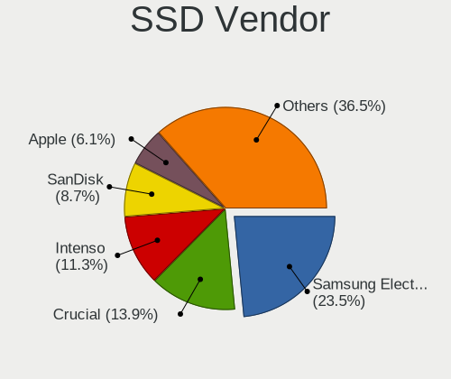
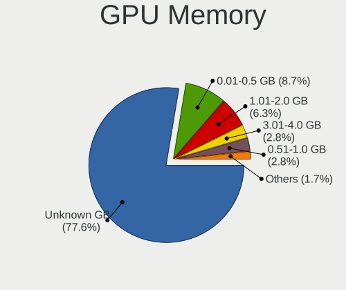
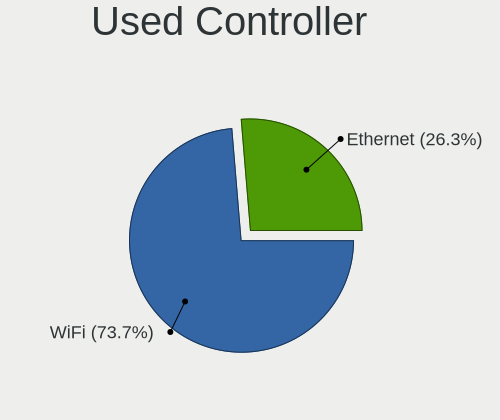
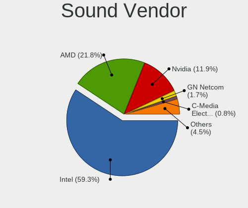
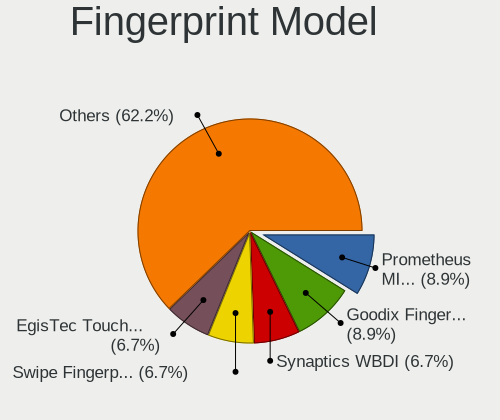

Linux in Germany - Hardware Trends (Notebooks)
----------------------------------------------

A project to identify most popular hardware characteristics and track their change
over time based on data collected by Linux users at https://Linux-Hardware.org.

Anyone can contribute to this report by the [hw-probe](https://github.com/linuxhw/hw-probe) tool:

    sudo -E hw-probe -all -upload

Period: Sep, 2023.

Contents
--------

* [ System ](#system)
  - [ OS                       ](#os)
  - [ OS Family                ](#os-family)
  - [ Kernel                   ](#kernel)
  - [ Kernel Family            ](#kernel-family)
  - [ Kernel Major Ver.        ](#kernel-major-ver)
  - [ Arch                     ](#arch)
  - [ DE                       ](#de)
  - [ Display Server           ](#display-server)
  - [ Display Manager          ](#display-manager)
  - [ OS Lang                  ](#os-lang)
  - [ Boot Mode                ](#boot-mode)
  - [ Filesystem               ](#filesystem)
  - [ Part. scheme             ](#part-scheme)
  - [ Dual Boot with Linux/BSD ](#dual-boot-with-linuxbsd)
  - [ Dual Boot (Win)          ](#dual-boot-win)

* [ Board ](#board)
  - [ Vendor                   ](#vendor)
  - [ Model                    ](#model)
  - [ Model Family             ](#model-family)
  - [ MFG Year                 ](#mfg-year)
  - [ Form Factor              ](#form-factor)
  - [ Secure Boot              ](#secure-boot)
  - [ Coreboot                 ](#coreboot)
  - [ RAM Size                 ](#ram-size)
  - [ RAM Used                 ](#ram-used)
  - [ Total Drives             ](#total-drives)
  - [ Has CD-ROM               ](#has-cd-rom)
  - [ Has Ethernet             ](#has-ethernet)
  - [ Has WiFi                 ](#has-wifi)
  - [ Has Bluetooth            ](#has-bluetooth)

* [ Location ](#location)
  - [ Country                  ](#country)
  - [ City                     ](#city)

* [ Drives ](#drives)
  - [ Drive Vendor             ](#drive-vendor)
  - [ Drive Model              ](#drive-model)
  - [ HDD Vendor               ](#hdd-vendor)
  - [ SSD Vendor               ](#ssd-vendor)
  - [ Drive Kind               ](#drive-kind)
  - [ Drive Connector          ](#drive-connector)
  - [ Drive Size               ](#drive-size)
  - [ Space Total              ](#space-total)
  - [ Space Used               ](#space-used)
  - [ Malfunc. Drives          ](#malfunc-drives)
  - [ Malfunc. Drive Vendor    ](#malfunc-drive-vendor)
  - [ Malfunc. HDD Vendor      ](#malfunc-hdd-vendor)
  - [ Malfunc. Drive Kind      ](#malfunc-drive-kind)
  - [ Failed Drives            ](#failed-drives)
  - [ Failed Drive Vendor      ](#failed-drive-vendor)
  - [ Drive Status             ](#drive-status)

* [ Storage controller ](#storage-controller)
  - [ Storage Vendor           ](#storage-vendor)
  - [ Storage Model            ](#storage-model)
  - [ Storage Kind             ](#storage-kind)

* [ Processor ](#processor)
  - [ CPU Vendor               ](#cpu-vendor)
  - [ CPU Model                ](#cpu-model)
  - [ CPU Model Family         ](#cpu-model-family)
  - [ CPU Cores                ](#cpu-cores)
  - [ CPU Sockets              ](#cpu-sockets)
  - [ CPU Threads              ](#cpu-threads)
  - [ CPU Op-Modes             ](#cpu-op-modes)
  - [ CPU Microcode            ](#cpu-microcode)
  - [ CPU Microarch            ](#cpu-microarch)

* [ Graphics ](#graphics)
  - [ GPU Vendor               ](#gpu-vendor)
  - [ GPU Model                ](#gpu-model)
  - [ GPU Combo                ](#gpu-combo)
  - [ GPU Driver               ](#gpu-driver)
  - [ GPU Memory               ](#gpu-memory)

* [ Monitor ](#monitor)
  - [ Monitor Vendor           ](#monitor-vendor)
  - [ Monitor Model            ](#monitor-model)
  - [ Monitor Resolution       ](#monitor-resolution)
  - [ Monitor Diagonal         ](#monitor-diagonal)
  - [ Monitor Width            ](#monitor-width)
  - [ Aspect Ratio             ](#aspect-ratio)
  - [ Monitor Area             ](#monitor-area)
  - [ Pixel Density            ](#pixel-density)
  - [ Multiple Monitors        ](#multiple-monitors)

* [ Network ](#network)
  - [ Net Controller Vendor    ](#net-controller-vendor)
  - [ Net Controller Model     ](#net-controller-model)
  - [ Wireless Vendor          ](#wireless-vendor)
  - [ Wireless Model           ](#wireless-model)
  - [ Ethernet Vendor          ](#ethernet-vendor)
  - [ Ethernet Model           ](#ethernet-model)
  - [ Net Controller Kind      ](#net-controller-kind)
  - [ Used Controller          ](#used-controller)
  - [ NICs                     ](#nics)
  - [ IPv6                     ](#ipv6)

* [ Bluetooth ](#bluetooth)
  - [ Bluetooth Vendor         ](#bluetooth-vendor)
  - [ Bluetooth Model          ](#bluetooth-model)

* [ Sound ](#sound)
  - [ Sound Vendor             ](#sound-vendor)
  - [ Sound Model              ](#sound-model)

* [ Memory ](#memory)
  - [ Memory Vendor            ](#memory-vendor)
  - [ Memory Model             ](#memory-model)
  - [ Memory Kind              ](#memory-kind)
  - [ Memory Form Factor       ](#memory-form-factor)
  - [ Memory Size              ](#memory-size)
  - [ Memory Speed             ](#memory-speed)

* [ Printers & scanners ](#printers--scanners)
  - [ Printer Vendor           ](#printer-vendor)
  - [ Printer Model            ](#printer-model)
  - [ Scanner Vendor           ](#scanner-vendor)
  - [ Scanner Model            ](#scanner-model)

* [ Camera ](#camera)
  - [ Camera Vendor            ](#camera-vendor)
  - [ Camera Model             ](#camera-model)

* [ Security ](#security)
  - [ Fingerprint Vendor       ](#fingerprint-vendor)
  - [ Fingerprint Model        ](#fingerprint-model)
  - [ Chipcard Vendor          ](#chipcard-vendor)
  - [ Chipcard Model           ](#chipcard-model)

* [ Unsupported ](#unsupported)
  - [ Unsupported Devices      ](#unsupported-devices)
  - [ Unsupported Device Types ](#unsupported-device-types)

System
------

OS
--

Installed operating systems

| Name                         | Notebooks | Percent |
|------------------------------|-----------|---------|
| Ubuntu 22.04                 | 48        | 16.22%  |
| Linux Mint 21.2              | 31        | 10.47%  |
| OpenMandriva 23.08           | 19        | 6.42%   |
| Zorin 16                     | 17        | 5.74%   |
| Ubuntu 23.04                 | 14        | 4.73%   |
| Debian 12                    | 13        | 4.39%   |
| Fedora 38                    | 12        | 4.05%   |
| Pop!_OS 22.04                | 10        | 3.38%   |
| Arch Rolling                 | 9         | 3.04%   |
| TUXEDO OS 22.04              | 7         | 2.36%   |
| SteamOS 3.4.10               | 7         | 2.36%   |
| Manjaro                      | 6         | 2.03%   |
| Kubuntu 22.04                | 6         | 2.03%   |
| Ubuntu 20.04                 | 5         | 1.69%   |
| openSUSE Leap-15.5           | 5         | 1.69%   |
| OpenMandriva 23.09           | 5         | 1.69%   |
| Kali 2023.3                  | 5         | 1.69%   |
| Xubuntu 22.04                | 4         | 1.35%   |
| Debian 11                    | 4         | 1.35%   |
| openSUSE Tumbleweed-XXXXXXXX | 3         | 1.01%   |
| LMDE 6                       | 3         | 1.01%   |
| LMDE 5                       | 3         | 1.01%   |
| Linux Mint 20.3              | 3         | 1.01%   |
| Gentoo 2.14                  | 3         | 1.01%   |
| EndeavourOS Rolling          | 3         | 1.01%   |
| Debian                       | 3         | 1.01%   |
| ArcoLinux Rolling            | 3         | 1.01%   |
| SteamOS 3.4.8                | 2         | 0.68%   |
| openSUSE Microos-XXXXXXXX    | 2         | 0.68%   |
| OpenMandriva 4.3             | 2         | 0.68%   |
| OpenMandriva 4.2             | 2         | 0.68%   |
| MX 23                        | 2         | 0.68%   |
| Manjaro 23.0.2               | 2         | 0.68%   |
| Lubuntu 22.04                | 2         | 0.68%   |
| Linux Mint 21.1              | 2         | 0.68%   |
| Kubuntu 23.04                | 2         | 0.68%   |
| BlackPanther 18.1            | 2         | 0.68%   |
| Xero Rolling                 | 1         | 0.34%   |
| Ubuntu 22.10                 | 1         | 0.34%   |
| SteamOS 3.6                  | 1         | 0.34%   |

OS Family
---------

OS without a version

| Name             | Notebooks | Percent |
|------------------|-----------|---------|
| Ubuntu           | 68        | 22.97%  |
| Linux Mint       | 38        | 12.84%  |
| OpenMandriva     | 30        | 10.14%  |
| Debian           | 21        | 7.09%   |
| Zorin            | 17        | 5.74%   |
| Fedora           | 12        | 4.05%   |
| SteamOS          | 11        | 3.72%   |
| Pop!_OS          | 10        | 3.38%   |
| openSUSE         | 10        | 3.38%   |
| Manjaro          | 9         | 3.04%   |
| Kubuntu          | 9         | 3.04%   |
| Arch             | 9         | 3.04%   |
| TUXEDO OS        | 7         | 2.36%   |
| LMDE             | 6         | 2.03%   |
| Kali             | 5         | 1.69%   |
| Xubuntu          | 4         | 1.35%   |
| ArcoLinux        | 4         | 1.35%   |
| MX               | 3         | 1.01%   |
| Gentoo           | 3         | 1.01%   |
| EndeavourOS      | 3         | 1.01%   |
| Lubuntu          | 2         | 0.68%   |
| BlackPanther     | 2         | 0.68%   |
| Xero             | 1         | 0.34%   |
| Siduction        | 1         | 0.34%   |
| Parrot           | 1         | 0.34%   |
| org.kde.Platform | 1         | 0.34%   |
| Nobara           | 1         | 0.34%   |
| NixOS            | 1         | 0.34%   |
| Manjaro-ARM      | 1         | 0.34%   |
| Linux Lite       | 1         | 0.34%   |
| Garuda Linux     | 1         | 0.34%   |
| Endless          | 1         | 0.34%   |
| ChimeraOS        | 1         | 0.34%   |
| CachyOS          | 1         | 0.34%   |
| blendOS          | 1         | 0.34%   |

Kernel
------

Version of the Linux kernel

| Version                      | Notebooks | Percent |
|------------------------------|-----------|---------|
| 6.2.0-32-generic             | 31        | 10.47%  |
| 5.15.0-83-generic            | 22        | 7.43%   |
| 6.2.0-33-generic             | 20        | 6.76%   |
| 6.4.11-desktop-1omv2390      | 16        | 5.41%   |
| 5.15.0-84-generic            | 16        | 5.41%   |
| 6.4.6-76060406-generic       | 10        | 3.38%   |
| 6.1.0-12-amd64               | 9         | 3.04%   |
| 5.15.0-82-generic            | 9         | 3.04%   |
| 6.2.0-31-generic             | 8         | 2.7%    |
| 5.13.0-valve37-1-neptune     | 7         | 2.36%   |
| 6.4.15-200.fc38.x86_64       | 6         | 2.03%   |
| 6.4.12-arch1-1               | 6         | 2.03%   |
| 6.5.0-desktop-1omv2390       | 5         | 1.69%   |
| 6.2.0-10018-tuxedo           | 5         | 1.69%   |
| 6.1.0-10-amd64               | 5         | 1.69%   |
| 5.14.21-150500.55.19-default | 5         | 1.69%   |
| 6.5.3-1-MANJARO              | 4         | 1.35%   |
| 6.4.0-kali3-amd64            | 4         | 1.35%   |
| 5.15.0-76-generic            | 4         | 1.35%   |
| 5.10.0-25-amd64              | 4         | 1.35%   |
| 6.5.3-arch1-1                | 3         | 1.01%   |
| 6.2.0-26-generic             | 3         | 1.01%   |
| 6.2.0-10022-tuxedo           | 3         | 1.01%   |
| 5.4.0-162-generic            | 3         | 1.01%   |
| 5.15.0-79-generic            | 3         | 1.01%   |
| 5.15.0-78-generic            | 3         | 1.01%   |
| 6.5.5-200.fc38.x86_64        | 2         | 0.68%   |
| 6.5.3-zen1-1-zen             | 2         | 0.68%   |
| 6.5.3-1-default              | 2         | 0.68%   |
| 6.4.0-4-amd64                | 2         | 0.68%   |
| 5.16.13-desktop-1omv4003     | 2         | 0.68%   |
| 5.15.0-58-generic            | 2         | 0.68%   |
| 5.13.0-valve36-1-neptune     | 2         | 0.68%   |
| 5.10.14-desktop-1omv4002     | 2         | 0.68%   |
| 5.10.0-20-amd64              | 2         | 0.68%   |
| 6.5.5-arch1-1                | 1         | 0.34%   |
| 6.5.5-200.fsync.fc38.x86_64  | 1         | 0.34%   |
| 6.5.5-2-cachyos-bore-lto     | 1         | 0.34%   |
| 6.5.5-1-cachyos              | 1         | 0.34%   |
| 6.5.4-gentoo                 | 1         | 0.34%   |

Kernel Family
-------------

Linux kernel without a distro release

| Version  | Notebooks | Percent |
|----------|-----------|---------|
| 6.2.0    | 72        | 24.32%  |
| 5.15.0   | 64        | 21.62%  |
| 6.4.11   | 19        | 6.42%   |
| 6.1.0    | 18        | 6.08%   |
| 6.5.3    | 13        | 4.39%   |
| 6.4.6    | 10        | 3.38%   |
| 5.13.0   | 9         | 3.04%   |
| 6.4.12   | 8         | 2.7%    |
| 6.4.0    | 8         | 2.7%    |
| 6.5.0    | 7         | 2.36%   |
| 5.4.0    | 7         | 2.36%   |
| 5.10.0   | 7         | 2.36%   |
| 6.5.5    | 6         | 2.03%   |
| 6.4.15   | 6         | 2.03%   |
| 5.14.21  | 5         | 1.69%   |
| 6.5.2    | 3         | 1.01%   |
| 6.3.9    | 3         | 1.01%   |
| 5.19.0   | 3         | 1.01%   |
| 6.5.1    | 2         | 0.68%   |
| 6.3.0    | 2         | 0.68%   |
| 6.1.51   | 2         | 0.68%   |
| 6.1.46   | 2         | 0.68%   |
| 5.16.13  | 2         | 0.68%   |
| 5.10.14  | 2         | 0.68%   |
| 6.5.4    | 1         | 0.34%   |
| 6.4.8    | 1         | 0.34%   |
| 6.4.2    | 1         | 0.34%   |
| 6.4.14   | 1         | 0.34%   |
| 6.4.13   | 1         | 0.34%   |
| 6.3.13   | 1         | 0.34%   |
| 6.3.12   | 1         | 0.34%   |
| 6.2.6    | 1         | 0.34%   |
| 6.1.53   | 1         | 0.34%   |
| 6.1.52   | 1         | 0.34%   |
| 6.1.43   | 1         | 0.34%   |
| 6.1.1    | 1         | 0.34%   |
| 5.6.14   | 1         | 0.34%   |
| 5.15.85  | 1         | 0.34%   |
| 5.15.130 | 1         | 0.34%   |
| 4.19.0   | 1         | 0.34%   |

Kernel Major Ver.
-----------------

Linux kernel major version

| Version | Notebooks | Percent |
|---------|-----------|---------|
| 6.2     | 73        | 24.66%  |
| 5.15    | 66        | 22.3%   |
| 6.4     | 55        | 18.58%  |
| 6.5     | 32        | 10.81%  |
| 6.1     | 26        | 8.78%   |
| 5.13    | 9         | 3.04%   |
| 5.10    | 9         | 3.04%   |
| 6.3     | 7         | 2.36%   |
| 5.4     | 7         | 2.36%   |
| 5.14    | 5         | 1.69%   |
| 5.19    | 3         | 1.01%   |
| 5.16    | 2         | 0.68%   |
| 5.6     | 1         | 0.34%   |
| 4.19    | 1         | 0.34%   |

Arch
----

OS architecture (x86_64, i586, etc.)

| Name    | Notebooks | Percent |
|---------|-----------|---------|
| x86_64  | 294       | 99.32%  |
| i686    | 1         | 0.34%   |
| aarch64 | 1         | 0.34%   |

DE
--

Desktop Environment

| Name          | Notebooks | Percent |
|---------------|-----------|---------|
| GNOME         | 122       | 41.22%  |
| KDE5          | 89        | 30.07%  |
| X-Cinnamon    | 33        | 11.15%  |
| XFCE          | 25        | 8.45%   |
| MATE          | 7         | 2.36%   |
| Unknown       | 6         | 2.03%   |
| LXQt          | 5         | 1.69%   |
| Cinnamon      | 3         | 1.01%   |
| i3            | 2         | 0.68%   |
| sway          | 1         | 0.34%   |
| KDE           | 1         | 0.34%   |
| Hyprland      | 1         | 0.34%   |
| Endless:GNOME | 1         | 0.34%   |

Display Server
--------------

X11 or Wayland

| Name    | Notebooks | Percent |
|---------|-----------|---------|
| X11     | 193       | 65.2%   |
| Wayland | 101       | 34.12%  |
| Tty     | 1         | 0.34%   |
| Unknown | 1         | 0.34%   |

Display Manager
---------------

SDDM, LightDM, etc.

| Name    | Notebooks | Percent |
|---------|-----------|---------|
| Unknown | 113       | 38.18%  |
| GDM3    | 75        | 25.34%  |
| SDDM    | 63        | 21.28%  |
| LightDM | 35        | 11.82%  |
| GDM     | 10        | 3.38%   |

OS Lang
-------

Language

| Lang      | Notebooks | Percent |
|-----------|-----------|---------|
| de_DE     | 204       | 68.92%  |
| en_US     | 66        | 22.3%   |
| en_GB     | 6         | 2.03%   |
| C         | 6         | 2.03%   |
| Unknown   | 4         | 1.35%   |
| it_IT     | 2         | 0.68%   |
| zh_CN     | 1         | 0.34%   |
| uk_UA     | 1         | 0.34%   |
| ru_RU     | 1         | 0.34%   |
| POSIX     | 1         | 0.34%   |
| fr_FR     | 1         | 0.34%   |
| en_NZ     | 1         | 0.34%   |
| de_DEutf8 | 1         | 0.34%   |
| C.UTF8    | 1         | 0.34%   |

Boot Mode
---------

EFI or BIOS

| Mode | Notebooks | Percent |
|------|-----------|---------|
| BIOS | 148       | 50%     |
| EFI  | 148       | 50%     |

Filesystem
----------

Type of filesystem

| Type    | Notebooks | Percent |
|---------|-----------|---------|
| Ext4    | 177       | 59.8%   |
| Tmpfs   | 48        | 16.22%  |
| Btrfs   | 42        | 14.19%  |
| Overlay | 21        | 7.09%   |
| Zfs     | 4         | 1.35%   |
| F2fs    | 2         | 0.68%   |
| XXX4    | 1         | 0.34%   |
| Xfs     | 1         | 0.34%   |

Part. scheme
------------

Scheme of partitioning

| Type    | Notebooks | Percent |
|---------|-----------|---------|
| GPT     | 161       | 54.39%  |
| Unknown | 106       | 35.81%  |
| MBR     | 29        | 9.8%    |

Dual Boot with Linux/BSD
------------------------

Hosting more than one Linux/BSD

| Dual boot | Notebooks | Percent |
|-----------|-----------|---------|
| No        | 268       | 90.54%  |
| Yes       | 28        | 9.46%   |

Dual Boot (Win)
---------------

Hosting Linux and Windows

| Dual boot | Notebooks | Percent |
|-----------|-----------|---------|
| No        | 235       | 79.39%  |
| Yes       | 61        | 20.61%  |

Board
-----

Vendor
------

Motherboard manufacturer

| Name                | Notebooks | Percent |
|---------------------|-----------|---------|
| Lenovo              | 67        | 22.64%  |
| Hewlett-Packard     | 53        | 17.91%  |
| Acer                | 37        | 12.5%   |
| Dell                | 30        | 10.14%  |
| ASUSTek Computer    | 24        | 8.11%   |
| Valve               | 11        | 3.72%   |
| Apple               | 11        | 3.72%   |
| Medion              | 9         | 3.04%   |
| TUXEDO              | 7         | 2.36%   |
| Fujitsu             | 7         | 2.36%   |
| Toshiba             | 6         | 2.03%   |
| MSI                 | 4         | 1.35%   |
| HUAWEI              | 4         | 1.35%   |
| Fujitsu Siemens     | 4         | 1.35%   |
| Wortmann AG         | 2         | 0.68%   |
| System76            | 2         | 0.68%   |
| Sony                | 2         | 0.68%   |
| Samsung Electronics | 2         | 0.68%   |
| Notebook            | 2         | 0.68%   |
| Chuwi               | 2         | 0.68%   |
| VALE                | 1         | 0.34%   |
| UMAX                | 1         | 0.34%   |
| TrekStor            | 1         | 0.34%   |
| Teclast             | 1         | 0.34%   |
| Schenker            | 1         | 0.34%   |
| Razer               | 1         | 0.34%   |
| Pine Microsystems   | 1         | 0.34%   |
| Packard Bell        | 1         | 0.34%   |
| Framework           | 1         | 0.34%   |
| Alienware           | 1         | 0.34%   |

Model
-----

Motherboard model

| Name                               | Notebooks | Percent |
|------------------------------------|-----------|---------|
| Valve Jupiter                      | 11        | 3.72%   |
| HP ElitePad 1000 G2                | 5         | 1.69%   |
| Apple MacBookPro12,1               | 3         | 1.01%   |
| Unknown                            | 3         | 1.01%   |
| Lenovo ThinkPad T560 20FJS2BX00    | 2         | 0.68%   |
| HP Laptop 17-cn0xxx                | 2         | 0.68%   |
| HP Laptop 17-by0xxx                | 2         | 0.68%   |
| HP Laptop 17-bs0xx                 | 2         | 0.68%   |
| HP Laptop 15s-eq2xxx               | 2         | 0.68%   |
| HP Elite x2 1012 G1                | 2         | 0.68%   |
| HP 250 G7 Notebook PC              | 2         | 0.68%   |
| HP 250 15.6 inch G9 Notebook PC    | 2         | 0.68%   |
| Fujitsu LIFEBOOK E752              | 2         | 0.68%   |
| Dell Latitude 3320                 | 2         | 0.68%   |
| ASUS ZenBook UX425UA_UM425UA       | 2         | 0.68%   |
| ASUS X75A1                         | 2         | 0.68%   |
| ASUS X55A                          | 2         | 0.68%   |
| Apple MacBookPro9,2                | 2         | 0.68%   |
| Acer Aspire V3-771                 | 2         | 0.68%   |
| Acer Aspire 5742G                  | 2         | 0.68%   |
| Wortmann AG TERRA_MOBILE_1749      | 1         | 0.34%   |
| Wortmann AG TERRA_MOBILE_1512/1712 | 1         | 0.34%   |
| VALE Notebook Classic C140         | 1         | 0.34%   |
| UMAX VisionBook 14Wr               | 1         | 0.34%   |
| TUXEDO Stellaris Intel Gen5        | 1         | 0.34%   |
| TUXEDO Stellaris Intel Gen4        | 1         | 0.34%   |
| TUXEDO Pulse 15 Gen2               | 1         | 0.34%   |
| TUXEDO P65_P67RGRERA               | 1         | 0.34%   |
| TUXEDO InfinityBook S 15 Gen6      | 1         | 0.34%   |
| TUXEDO InfinityBook Pro Gen7 (MK2) | 1         | 0.34%   |
| TrekStor Primebook P14             | 1         | 0.34%   |
| Toshiba Satellite Pro C70-B        | 1         | 0.34%   |
| Toshiba Satellite P775             | 1         | 0.34%   |
| Toshiba Satellite C870-1C2         | 1         | 0.34%   |
| Toshiba Satellite C50D-A-10E       | 1         | 0.34%   |
| Toshiba Satellite A210             | 1         | 0.34%   |
| Toshiba QOSMIO X770                | 1         | 0.34%   |
| Teclast F15Plus 2                  | 1         | 0.34%   |
| System76 Pangolin                  | 1         | 0.34%   |
| System76 Darter Pro                | 1         | 0.34%   |

Model Family
------------

Motherboard model prefix

| Name                  | Notebooks | Percent |
|-----------------------|-----------|---------|
| Lenovo ThinkPad       | 49        | 16.55%  |
| Acer Aspire           | 30        | 10.14%  |
| HP Laptop             | 13        | 4.39%   |
| Dell Latitude         | 13        | 4.39%   |
| Valve Jupiter         | 11        | 3.72%   |
| HP EliteBook          | 8         | 2.7%    |
| HP 250                | 7         | 2.36%   |
| Dell Inspiron         | 7         | 2.36%   |
| Lenovo IdeaPad        | 6         | 2.03%   |
| HP Pavilion           | 6         | 2.03%   |
| Fujitsu LIFEBOOK      | 6         | 2.03%   |
| Dell Precision        | 6         | 2.03%   |
| ASUS ZenBook          | 6         | 2.03%   |
| Toshiba Satellite     | 5         | 1.69%   |
| HP ElitePad           | 5         | 1.69%   |
| Acer Nitro            | 5         | 1.69%   |
| Medion Akoya          | 3         | 1.01%   |
| HP ProBook            | 3         | 1.01%   |
| HP Compaq             | 3         | 1.01%   |
| Fujitsu Siemens AMILO | 3         | 1.01%   |
| Dell XPS              | 3         | 1.01%   |
| ASUS VivoBook         | 3         | 1.01%   |
| Apple MacBookPro9     | 3         | 1.01%   |
| Apple MacBookPro12    | 3         | 1.01%   |
| Unknown               | 3         | 1.01%   |
| Wortmann AG TERRA     | 2         | 0.68%   |
| TUXEDO Stellaris      | 2         | 0.68%   |
| TUXEDO InfinityBook   | 2         | 0.68%   |
| Lenovo Legion         | 2         | 0.68%   |
| HP ZBook              | 2         | 0.68%   |
| HP Elite              | 2         | 0.68%   |
| HP 255                | 2         | 0.68%   |
| Chuwi GemiBook        | 2         | 0.68%   |
| ASUS X75A1            | 2         | 0.68%   |
| ASUS X55A             | 2         | 0.68%   |
| VALE Notebook         | 1         | 0.34%   |
| UMAX VisionBook       | 1         | 0.34%   |
| TUXEDO Pulse          | 1         | 0.34%   |
| TUXEDO P65            | 1         | 0.34%   |
| TrekStor Primebook    | 1         | 0.34%   |

MFG Year
--------

Motherboard manufacture year

| Year    | Notebooks | Percent |
|---------|-----------|---------|
| 2021    | 34        | 11.49%  |
| 2022    | 32        | 10.81%  |
| 2019    | 21        | 7.09%   |
| 2012    | 21        | 7.09%   |
| 2020    | 20        | 6.76%   |
| 2018    | 19        | 6.42%   |
| 2011    | 18        | 6.08%   |
| 2017    | 17        | 5.74%   |
| 2015    | 17        | 5.74%   |
| 2013    | 17        | 5.74%   |
| 2016    | 16        | 5.41%   |
| 2014    | 14        | 4.73%   |
| 2010    | 14        | 4.73%   |
| 2023    | 12        | 4.05%   |
| 2008    | 8         | 2.7%    |
| 2009    | 6         | 2.03%   |
| 2007    | 5         | 1.69%   |
| 2006    | 2         | 0.68%   |
| Unknown | 2         | 0.68%   |
| 2005    | 1         | 0.34%   |

Form Factor
-----------

Physical design of the computer

| Name     | Notebooks | Percent |
|----------|-----------|---------|
| Notebook | 296       | 100%    |

Secure Boot
-----------

Enabled or disabled

| State    | Notebooks | Percent |
|----------|-----------|---------|
| Disabled | 273       | 92.23%  |
| Enabled  | 23        | 7.77%   |

Coreboot
--------

Have coreboot on board

| Used | Notebooks | Percent |
|------|-----------|---------|
| No   | 295       | 99.66%  |
| Yes  | 1         | 0.34%   |

RAM Size
--------

Total RAM memory

| Size in GB  | Notebooks | Percent |
|-------------|-----------|---------|
| 4.01-8.0    | 98        | 33.11%  |
| 8.01-16.0   | 51        | 17.23%  |
| 3.01-4.0    | 50        | 16.89%  |
| 16.01-24.0  | 47        | 15.88%  |
| 32.01-64.0  | 25        | 8.45%   |
| 64.01-256.0 | 10        | 3.38%   |
| 1.01-2.0    | 8         | 2.7%    |
| 24.01-32.0  | 4         | 1.35%   |
| 2.01-3.0    | 3         | 1.01%   |

RAM Used
--------

Used RAM memory

| Used GB    | Notebooks | Percent |
|------------|-----------|---------|
| 1.01-2.0   | 98        | 33.11%  |
| 2.01-3.0   | 75        | 25.34%  |
| 4.01-8.0   | 56        | 18.92%  |
| 3.01-4.0   | 38        | 12.84%  |
| 8.01-16.0  | 16        | 5.41%   |
| 0.51-1.0   | 9         | 3.04%   |
| 16.01-24.0 | 3         | 1.01%   |
| 24.01-32.0 | 1         | 0.34%   |

Total Drives
------------

Number of drives on board

| Drives | Notebooks | Percent |
|--------|-----------|---------|
| 1      | 226       | 76.35%  |
| 2      | 63        | 21.28%  |
| 3      | 6         | 2.03%   |
| 0      | 1         | 0.34%   |

Has CD-ROM
----------

Has CD-ROM on board

| Presented | Notebooks | Percent |
|-----------|-----------|---------|
| No        | 199       | 67.23%  |
| Yes       | 97        | 32.77%  |

Has Ethernet
------------

Has Ethernet on board

| Presented | Notebooks | Percent |
|-----------|-----------|---------|
| Yes       | 239       | 80.74%  |
| No        | 57        | 19.26%  |

Has WiFi
--------

Has WiFi module

| Presented | Notebooks | Percent |
|-----------|-----------|---------|
| Yes       | 288       | 97.3%   |
| No        | 8         | 2.7%    |

Has Bluetooth
-------------

Has Bluetooth module

| Presented | Notebooks | Percent |
|-----------|-----------|---------|
| Yes       | 239       | 80.74%  |
| No        | 57        | 19.26%  |

Location
--------

Country
-------

Geographic location (country)

| Country | Notebooks | Percent |
|---------|-----------|---------|
| Germany | 296       | 100%    |

City
----

Geographic location (city)

| City                 | Notebooks | Percent |
|----------------------|-----------|---------|
| Berlin               | 24        | 8.11%   |
| Munich               | 16        | 5.41%   |
| Hamburg              | 13        | 4.39%   |
| Frankfurt am Main    | 9         | 3.04%   |
| Bonn                 | 8         | 2.7%    |
| Stuttgart            | 6         | 2.03%   |
| Essen                | 5         | 1.69%   |
| Düsseldorf          | 5         | 1.69%   |
| Reutlingen           | 4         | 1.35%   |
| Leipzig              | 4         | 1.35%   |
| Dresden              | 4         | 1.35%   |
| Cologne              | 4         | 1.35%   |
| Wegberg              | 3         | 1.01%   |
| Nuremberg            | 3         | 1.01%   |
| Merzhausen           | 3         | 1.01%   |
| Magdeburg            | 3         | 1.01%   |
| Lüdenscheid         | 3         | 1.01%   |
| Krefeld              | 3         | 1.01%   |
| Karlsruhe            | 3         | 1.01%   |
| Hechingen            | 3         | 1.01%   |
| Darmstadt            | 3         | 1.01%   |
| Bremen               | 3         | 1.01%   |
| Bochum               | 3         | 1.01%   |
| Wuppertal            | 2         | 0.68%   |
| Waldshut-Tiengen     | 2         | 0.68%   |
| Vechta               | 2         | 0.68%   |
| Ulm                  | 2         | 0.68%   |
| Pforzheim            | 2         | 0.68%   |
| Osnabrück           | 2         | 0.68%   |
| Moers                | 2         | 0.68%   |
| Kummersbruck         | 2         | 0.68%   |
| Kiel                 | 2         | 0.68%   |
| Freiberg             | 2         | 0.68%   |
| Dortmund             | 2         | 0.68%   |
| Detmold              | 2         | 0.68%   |
| Cuxhaven             | 2         | 0.68%   |
| Chemnitz             | 2         | 0.68%   |
| Bruhl                | 2         | 0.68%   |
| Bietigheim-Bissingen | 2         | 0.68%   |
| Bayreuth             | 2         | 0.68%   |

Drives
------

Drive Vendor
------------

Hard drive vendors

| Vendor                         | Notebooks | Drives | Percent |
|--------------------------------|-----------|--------|---------|
| Samsung Electronics            | 80        | 88     | 23.12%  |
| SanDisk                        | 43        | 46     | 12.43%  |
| WDC                            | 27        | 27     | 7.8%    |
| Unknown                        | 20        | 24     | 5.78%   |
| SK hynix                       | 18        | 18     | 5.2%    |
| Toshiba                        | 15        | 16     | 4.34%   |
| Intenso                        | 13        | 13     | 3.76%   |
| Seagate                        | 12        | 12     | 3.47%   |
| Micron Technology              | 11        | 11     | 3.18%   |
| Kingston                       | 11        | 11     | 3.18%   |
| Crucial                        | 11        | 11     | 3.18%   |
| KIOXIA                         | 10        | 10     | 2.89%   |
| Intel                          | 9         | 10     | 2.6%    |
| Hitachi                        | 9         | 9      | 2.6%    |
| HGST                           | 7         | 7      | 2.02%   |
| Phison Electronics             | 6         | 6      | 1.73%   |
| Patriot                        | 4         | 4      | 1.16%   |
| Kingston Technology Company    | 4         | 4      | 1.16%   |
| Apple                          | 4         | 4      | 1.16%   |
| Unknown                        | 3         | 3      | 0.87%   |
| Micron/Crucial Technology      | 2         | 2      | 0.58%   |
| Fujitsu                        | 2         | 3      | 0.58%   |
| Aura                           | 2         | 2      | 0.58%   |
| Verbatim                       | 1         | 1      | 0.29%   |
| Union Memory (Shenzhen)        | 1         | 1      | 0.29%   |
| TrekStor                       | 1         | 1      | 0.29%   |
| Teclast                        | 1         | 1      | 0.29%   |
| SSSTC                          | 1         | 1      | 0.29%   |
| Solid State Storage Technology | 1         | 1      | 0.29%   |
| SM59XT2A                       | 1         | 1      | 0.29%   |
| Silicon Motion                 | 1         | 1      | 0.29%   |
| SAGE                           | 1         | 1      | 0.29%   |
| Phison                         | 1         | 1      | 0.29%   |
| O2 Micro                       | 1         | 1      | 0.29%   |
| Netac                          | 1         | 1      | 0.29%   |
| Maxone                         | 1         | 1      | 0.29%   |
| LITEON                         | 1         | 1      | 0.29%   |
| Leven                          | 1         | 1      | 0.29%   |
| JetFlash                       | 1         | 1      | 0.29%   |
| GLOWAY                         | 1         | 1      | 0.29%   |

Drive Model
-----------

Hard drive models

| Model                                               | Notebooks | Percent |
|-----------------------------------------------------|-----------|---------|
| Samsung NVMe SSD Controller SM981/PM981/PM983 256GB | 9         | 2.49%   |
| Samsung NVMe SSD Controller PM9A1/PM9A3/980PRO 1TB  | 8         | 2.21%   |
| Unknown MMC Card  64GB                              | 5         | 1.38%   |
| Unknown MMC Card  256GB                             | 5         | 1.38%   |
| SanDisk SSD PLUS 480GB                              | 5         | 1.38%   |
| Samsung SSD 860 EVO 250GB                           | 5         | 1.38%   |
| Toshiba XG6 NVMe SSD Controller 512GB               | 4         | 1.1%    |
| Sandisk WD Blue SN550 NVMe SSD 512GB                | 4         | 1.1%    |
| Samsung SSD 850 EVO 1TB                             | 4         | 1.1%    |
| Kingston Company OM3PDP3 NVMe SSD 512GB             | 4         | 1.1%    |
| Toshiba MQ04ABF100 1TB                              | 3         | 0.83%   |
| SK hynix HCG8e  64GB                                | 3         | 0.83%   |
| Samsung SSD 870 QVO 1TB                             | 3         | 0.83%   |
| Intel SSD 660P Series 1024GB                        | 3         | 0.83%   |
| HGST HTS545050A7E680 500GB                          | 3         | 0.83%   |
| Crucial CT500MX500SSD1 500GB                        | 3         | 0.83%   |
| Unknown                                             | 3         | 0.83%   |
| WDC WDS500G2B0A-00SM50 500GB SSD                    | 2         | 0.55%   |
| WDC WDS100T2B0A-00SM50 1TB SSD                      | 2         | 0.55%   |
| WDC WD10SPZX-21Z10T0 1TB                            | 2         | 0.55%   |
| WDC WD10JPVX-22JC3T0 1TB                            | 2         | 0.55%   |
| WDC PC SN730 SDBQNTY-512G-1001 512GB                | 2         | 0.55%   |
| Unknown SN128  128GB                                | 2         | 0.55%   |
| Unknown SEM128  128GB                               | 2         | 0.55%   |
| Unknown MMC Card  128GB                             | 2         | 0.55%   |
| Unknown EE4S5  256GB                                | 2         | 0.55%   |
| SK hynix HFM512GD3JX013N 512GB                      | 2         | 0.55%   |
| Seagate ST1000LM035-1RK172 1TB                      | 2         | 0.55%   |
| SanDisk X400 M.2 2280 256GB SSD                     | 2         | 0.55%   |
| Sandisk WD PC SN740 SDDPNQD-512G-1006 512GB         | 2         | 0.55%   |
| Sandisk WD Blue SN570 1TB                           | 2         | 0.55%   |
| Sandisk WD Black SN750 / PC SN730 NVMe SSD 512GB    | 2         | 0.55%   |
| SanDisk SSD PLUS 1000GB                             | 2         | 0.55%   |
| SanDisk SDSSDA120G 120GB                            | 2         | 0.55%   |
| SanDisk SD8SN8U-256G-1006 256GB SSD                 | 2         | 0.55%   |
| SanDisk NVMe SSD Drive 2TB                          | 2         | 0.55%   |
| Samsung SSD 980 PRO 2TB                             | 2         | 0.55%   |
| Samsung SSD 970 EVO Plus 2TB                        | 2         | 0.55%   |
| Samsung SSD 970 EVO Plus 1TB                        | 2         | 0.55%   |
| Samsung SSD 860 EVO M.2 250GB                       | 2         | 0.55%   |

HDD Vendor
----------

Hard disk drive vendors

| Vendor              | Notebooks | Drives | Percent |
|---------------------|-----------|--------|---------|
| WDC                 | 16        | 16     | 29.09%  |
| Seagate             | 12        | 12     | 21.82%  |
| Hitachi             | 9         | 9      | 16.36%  |
| HGST                | 7         | 7      | 12.73%  |
| Toshiba             | 5         | 6      | 9.09%   |
| Fujitsu             | 2         | 3      | 3.64%   |
| Unknown             | 1         | 1      | 1.82%   |
| Samsung Electronics | 1         | 1      | 1.82%   |
| SAGE                | 1         | 1      | 1.82%   |
| Maxone              | 1         | 1      | 1.82%   |

SSD Vendor
----------

Solid state drive vendors

| Vendor              | Notebooks | Drives | Percent |
|---------------------|-----------|--------|---------|
| Samsung Electronics | 40        | 42     | 32%     |
| SanDisk             | 24        | 27     | 19.2%   |
| Intenso             | 11        | 11     | 8.8%    |
| Crucial             | 10        | 10     | 8%      |
| WDC                 | 6         | 6      | 4.8%    |
| Kingston            | 5         | 5      | 4%      |
| Patriot             | 4         | 4      | 3.2%    |
| Toshiba             | 3         | 3      | 2.4%    |
| Intel               | 3         | 3      | 2.4%    |
| Apple               | 3         | 3      | 2.4%    |
| Micron Technology   | 2         | 2      | 1.6%    |
| Verbatim            | 1         | 1      | 0.8%    |
| TrekStor            | 1         | 1      | 0.8%    |
| Teclast             | 1         | 1      | 0.8%    |
| SK hynix            | 1         | 1      | 0.8%    |
| Phison              | 1         | 1      | 0.8%    |
| Netac               | 1         | 1      | 0.8%    |
| LITEON              | 1         | 1      | 0.8%    |
| Leven               | 1         | 1      | 0.8%    |
| GLOWAY              | 1         | 1      | 0.8%    |
| Fanxiang            | 1         | 1      | 0.8%    |
| EVM                 | 1         | 1      | 0.8%    |
| ASMT                | 1         | 1      | 0.8%    |
| AirDisk             | 1         | 1      | 0.8%    |
| A-DATA Technology   | 1         | 1      | 0.8%    |

Drive Kind
----------

HDD or SSD

| Kind    | Notebooks | Drives | Percent |
|---------|-----------|--------|---------|
| NVMe    | 134       | 142    | 40%     |
| SSD     | 118       | 130    | 35.22%  |
| HDD     | 54        | 57     | 16.12%  |
| MMC     | 22        | 28     | 6.57%   |
| Unknown | 7         | 7      | 2.09%   |

Drive Connector
---------------

SATA, SAS, NVMe, etc.

| Type | Notebooks | Drives | Percent |
|------|-----------|--------|---------|
| SATA | 165       | 183    | 49.7%   |
| NVMe | 134       | 142    | 40.36%  |
| MMC  | 22        | 28     | 6.63%   |
| SAS  | 11        | 11     | 3.31%   |

Drive Size
----------

Size of hard drive

| Size in TB | Notebooks | Drives | Percent |
|------------|-----------|--------|---------|
| 0.01-0.5   | 120       | 129    | 68.97%  |
| 0.51-1.0   | 49        | 52     | 28.16%  |
| 1.01-2.0   | 3         | 4      | 1.72%   |
| 3.01-4.0   | 1         | 1      | 0.57%   |
| 4.01-10.0  | 1         | 1      | 0.57%   |

Space Total
-----------

Amount of disk space available on the file system

| Size in GB     | Notebooks | Percent |
|----------------|-----------|---------|
| 251-500        | 77        | 26.01%  |
| 101-250        | 74        | 25%     |
| 501-1000       | 52        | 17.57%  |
| 51-100         | 22        | 7.43%   |
| 1-20           | 20        | 6.76%   |
| 1001-2000      | 16        | 5.41%   |
| Unknown        | 15        | 5.07%   |
| More than 3000 | 11        | 3.72%   |
| 2001-3000      | 5         | 1.69%   |
| 21-50          | 4         | 1.35%   |

Space Used
----------

Amount of used disk space

| Used GB   | Notebooks | Percent |
|-----------|-----------|---------|
| 1-20      | 87        | 29.39%  |
| 21-50     | 54        | 18.24%  |
| 101-250   | 46        | 15.54%  |
| 51-100    | 46        | 15.54%  |
| 251-500   | 32        | 10.81%  |
| Unknown   | 15        | 5.07%   |
| 501-1000  | 10        | 3.38%   |
| 2001-3000 | 3         | 1.01%   |
| 1001-2000 | 3         | 1.01%   |

Malfunc. Drives
---------------

Drive models with a malfunction

| Model                                | Notebooks | Drives | Percent |
|--------------------------------------|-----------|--------|---------|
| WDC WD5000LPVX-80V0TT0 500GB         | 1         | 1      | 10%     |
| WDC WD5000BPVT-22HXZT1 500GB         | 1         | 1      | 10%     |
| WDC WD1200BEVS-07LAT0 120GB          | 1         | 1      | 10%     |
| Toshiba MQ04ABF100 1TB               | 1         | 1      | 10%     |
| SK hynix BC711 HFM512GD3JX013N 512GB | 1         | 1      | 10%     |
| Seagate ST500LM000-1EJ162 500GB      | 1         | 1      | 10%     |
| SanDisk SSD PLUS 120GB               | 1         | 1      | 10%     |
| Intel SSDSC2BF180A5L 180GB           | 1         | 1      | 10%     |
| Hitachi HTS545050A7E380 500GB        | 1         | 1      | 10%     |
| Fujitsu MHT2080AT 80GB               | 1         | 1      | 10%     |

Malfunc. Drive Vendor
---------------------

Vendors of faulty drives

| Vendor   | Notebooks | Drives | Percent |
|----------|-----------|--------|---------|
| WDC      | 3         | 3      | 30%     |
| Toshiba  | 1         | 1      | 10%     |
| SK hynix | 1         | 1      | 10%     |
| Seagate  | 1         | 1      | 10%     |
| SanDisk  | 1         | 1      | 10%     |
| Intel    | 1         | 1      | 10%     |
| Hitachi  | 1         | 1      | 10%     |
| Fujitsu  | 1         | 1      | 10%     |

Malfunc. HDD Vendor
-------------------

Vendors of faulty HDD drives

| Vendor  | Notebooks | Drives | Percent |
|---------|-----------|--------|---------|
| WDC     | 3         | 3      | 42.86%  |
| Toshiba | 1         | 1      | 14.29%  |
| Seagate | 1         | 1      | 14.29%  |
| Hitachi | 1         | 1      | 14.29%  |
| Fujitsu | 1         | 1      | 14.29%  |

Malfunc. Drive Kind
-------------------

Kinds of faulty drives

| Kind | Notebooks | Drives | Percent |
|------|-----------|--------|---------|
| HDD  | 7         | 7      | 70%     |
| SSD  | 2         | 2      | 20%     |
| NVMe | 1         | 1      | 10%     |

Failed Drives
-------------

Failed drive models

Zero info for selected period =(

Failed Drive Vendor
-------------------

Failed drive vendors

Zero info for selected period =(

Drive Status
------------

Number of failed and malfunc. drives

| Status   | Notebooks | Drives | Percent |
|----------|-----------|--------|---------|
| Detected | 176       | 222    | 58.09%  |
| Works    | 117       | 132    | 38.61%  |
| Malfunc  | 10        | 10     | 3.3%    |

Storage controller
------------------

Storage Vendor
--------------

Storage controller vendors

| Vendor                         | Notebooks | Percent |
|--------------------------------|-----------|---------|
| Intel                          | 179       | 52.96%  |
| Samsung Electronics            | 48        | 14.2%   |
| SanDisk                        | 24        | 7.1%    |
| AMD                            | 19        | 5.62%   |
| SK hynix                       | 14        | 4.14%   |
| KIOXIA                         | 10        | 2.96%   |
| Kingston Technology Company    | 10        | 2.96%   |
| Micron Technology              | 9         | 2.66%   |
| Toshiba America Info Systems   | 7         | 2.07%   |
| Phison Electronics             | 6         | 1.78%   |
| Nvidia                         | 3         | 0.89%   |
| Micron/Crucial Technology      | 3         | 0.89%   |
| Solid State Storage Technology | 2         | 0.59%   |
| Silicon Motion                 | 2         | 0.59%   |
| Union Memory (Shenzhen)        | 1         | 0.3%    |
| O2 Micro                       | 1         | 0.3%    |

Storage Model
-------------

Storage controller models

| Model                                                                          | Notebooks | Percent |
|--------------------------------------------------------------------------------|-----------|---------|
| Intel 7 Series Chipset Family 6-port SATA Controller [AHCI mode]               | 25        | 6.81%   |
| Samsung NVMe SSD Controller SM981/PM981/PM983                                  | 20        | 5.45%   |
| Intel Sunrise Point-LP SATA Controller [AHCI mode]                             | 17        | 4.63%   |
| Intel 6 Series/C200 Series Chipset Family 6 port Mobile SATA AHCI Controller   | 17        | 4.63%   |
| AMD FCH SATA Controller [AHCI mode]                                            | 13        | 3.54%   |
| Samsung NVMe SSD Controller PM9A1/PM9A3/980PRO                                 | 12        | 3.27%   |
| Intel Volume Management Device NVMe RAID Controller                            | 12        | 3.27%   |
| Intel Celeron/Pentium Silver Processor SATA Controller                         | 11        | 3%      |
| Intel 82801 Mobile SATA Controller [RAID mode]                                 | 11        | 3%      |
| Intel 5 Series/3400 Series Chipset 4 port SATA AHCI Controller                 | 9         | 2.45%   |
| Intel 8 Series SATA Controller 1 [AHCI mode]                                   | 8         | 2.18%   |
| SK hynix Gold P31/BC711/PC711 NVMe Solid State Drive                           | 7         | 1.91%   |
| Samsung NVMe SSD Controller 980                                                | 7         | 1.91%   |
| KIOXIA NVMe SSD Controller BG4 (DRAM-less)                                     | 7         | 1.91%   |
| Intel Wildcat Point-LP SATA Controller [AHCI Mode]                             | 7         | 1.91%   |
| Intel 82801HM/HEM (ICH8M/ICH8M-E) SATA Controller [AHCI mode]                  | 7         | 1.91%   |
| Intel 82801HM/HEM (ICH8M/ICH8M-E) IDE Controller                               | 7         | 1.91%   |
| Micron 2450 NVMe SSD [HendrixV] (DRAM-less)                                    | 6         | 1.63%   |
| Intel 8 Series/C220 Series Chipset Family 6-port SATA Controller 1 [AHCI mode] | 6         | 1.63%   |
| Toshiba America Info Systems XG6 NVMe SSD Controller                           | 5         | 1.36%   |
| SanDisk WD Black SN750 / PC SN730 NVMe SSD                                     | 5         | 1.36%   |
| Intel Tiger Lake-LP SATA Controller                                            | 5         | 1.36%   |
| Intel Cannon Point-LP SATA Controller [AHCI Mode]                              | 5         | 1.36%   |
| SanDisk WD Blue SN550 NVMe SSD                                                 | 4         | 1.09%   |
| Kingston Company OM3PDP3 NVMe SSD                                              | 4         | 1.09%   |
| Intel Tiger Lake SATA AHCI Controller                                          | 4         | 1.09%   |
| Intel SSD 660P Series                                                          | 4         | 1.09%   |
| Intel Q170/Q150/B150/H170/H110/Z170/CM236 Chipset SATA Controller [AHCI Mode]  | 4         | 1.09%   |
| Intel HM170/QM170 Chipset SATA Controller [AHCI Mode]                          | 4         | 1.09%   |
| Intel Alder Lake-P SATA AHCI Controller                                        | 4         | 1.09%   |
| Intel 5 Series/3400 Series Chipset 6 port SATA AHCI Controller                 | 4         | 1.09%   |
| SK hynix Platinum P41/PC801 NVMe Solid State Drive                             | 3         | 0.82%   |
| SanDisk WD Black SN770 / PC SN740 256GB / PC SN560 (DRAM-less) NVMe SSD        | 3         | 0.82%   |
| Intel Cannon Lake Mobile PCH SATA AHCI Controller                              | 3         | 0.82%   |
| Intel Atom Processor E3800 Series SATA AHCI Controller                         | 3         | 0.82%   |
| Intel 82801IBM/IEM (ICH9M/ICH9M-E) 4 port SATA Controller [AHCI mode]          | 3         | 0.82%   |
| Solid State Storage CL1-3D256-Q11 NVMe SSD M.2                                 | 2         | 0.54%   |
| SK hynix BC501 NVMe Solid State Drive                                          | 2         | 0.54%   |
| SanDisk WD Blue SN570 NVMe SSD 1TB                                             | 2         | 0.54%   |
| SanDisk PC SN520 NVMe SSD                                                      | 2         | 0.54%   |

Storage Kind
------------

Kind of storage controller (IDE, SATA, NVMe, SAS, ...)

| Kind | Notebooks | Percent |
|------|-----------|---------|
| SATA | 180       | 50.56%  |
| NVMe | 134       | 37.64%  |
| RAID | 23        | 6.46%   |
| IDE  | 19        | 5.34%   |

Processor
---------

CPU Vendor
----------

Processor vendors

| Vendor | Notebooks | Percent |
|--------|-----------|---------|
| Intel  | 240       | 81.08%  |
| AMD    | 55        | 18.58%  |
| ARM    | 1         | 0.34%   |

CPU Model
---------

Processor models

| Model                                    | Notebooks | Percent |
|------------------------------------------|-----------|---------|
| AMD Custom APU 0405                      | 11        | 3.72%   |
| Intel 11th Gen Core i5-1135G7 @ 2.40GHz  | 9         | 3.04%   |
| Intel Core i5-6300U CPU @ 2.40GHz        | 7         | 2.36%   |
| Intel Core i5-8265U CPU @ 1.60GHz        | 6         | 2.03%   |
| Intel Core i7-8550U CPU @ 1.80GHz        | 5         | 1.69%   |
| Intel Core i7-2630QM CPU @ 2.00GHz       | 5         | 1.69%   |
| Intel Atom CPU Z3795 @ 1.60GHz           | 5         | 1.69%   |
| Intel 12th Gen Core i5-1235U             | 5         | 1.69%   |
| Intel 11th Gen Core i7-11800H @ 2.30GHz  | 5         | 1.69%   |
| AMD Ryzen 5 5500U with Radeon Graphics   | 5         | 1.69%   |
| Intel Core i7-8565U CPU @ 1.80GHz        | 4         | 1.35%   |
| Intel Core i7-10750H CPU @ 2.60GHz       | 4         | 1.35%   |
| Intel Core i5-8250U CPU @ 1.60GHz        | 4         | 1.35%   |
| Intel Core i5-7200U CPU @ 2.50GHz        | 4         | 1.35%   |
| Intel Core i5-5257U CPU @ 2.70GHz        | 4         | 1.35%   |
| Intel Core i5-3210M CPU @ 2.50GHz        | 4         | 1.35%   |
| Intel Core i5-2520M CPU @ 2.50GHz        | 4         | 1.35%   |
| AMD Ryzen 7 5700U with Radeon Graphics   | 4         | 1.35%   |
| Intel Pentium Silver N5030 CPU @ 1.10GHz | 3         | 1.01%   |
| Intel Pentium CPU 2020M @ 2.40GHz        | 3         | 1.01%   |
| Intel Core i7-2670QM CPU @ 2.20GHz       | 3         | 1.01%   |
| Intel Core i5-5300U CPU @ 2.30GHz        | 3         | 1.01%   |
| Intel Core i5-3230M CPU @ 2.60GHz        | 3         | 1.01%   |
| Intel Core i5-2430M CPU @ 2.40GHz        | 3         | 1.01%   |
| Intel Core i5 CPU M 520 @ 2.40GHz        | 3         | 1.01%   |
| Intel Celeron N4000 CPU @ 1.10GHz        | 3         | 1.01%   |
| Intel 11th Gen Core i7-1165G7 @ 2.80GHz  | 3         | 1.01%   |
| Intel 11th Gen Core i7-11370H @ 3.30GHz  | 3         | 1.01%   |
| Intel Core m5-6Y57 CPU @ 1.10GHz         | 2         | 0.68%   |
| Intel Core i7-9850H CPU @ 2.60GHz        | 2         | 0.68%   |
| Intel Core i7-7700HQ CPU @ 2.80GHz       | 2         | 0.68%   |
| Intel Core i7-5500U CPU @ 2.40GHz        | 2         | 0.68%   |
| Intel Core i7-4720HQ CPU @ 2.60GHz       | 2         | 0.68%   |
| Intel Core i7-3630QM CPU @ 2.40GHz       | 2         | 0.68%   |
| Intel Core i7-3537U CPU @ 2.00GHz        | 2         | 0.68%   |
| Intel Core i7-2640M CPU @ 2.80GHz        | 2         | 0.68%   |
| Intel Core i7-10510U CPU @ 1.80GHz       | 2         | 0.68%   |
| Intel Core i5-8365U CPU @ 1.60GHz        | 2         | 0.68%   |
| Intel Core i5-7300U CPU @ 2.60GHz        | 2         | 0.68%   |
| Intel Core i5-6200U CPU @ 2.30GHz        | 2         | 0.68%   |

CPU Model Family
----------------

Processor model prefix

| Model                   | Notebooks | Percent |
|-------------------------|-----------|---------|
| Intel Core i5           | 70        | 23.65%  |
| Other                   | 59        | 19.93%  |
| Intel Core i7           | 57        | 19.26%  |
| Intel Core i3           | 18        | 6.08%   |
| Intel Celeron           | 16        | 5.41%   |
| AMD Ryzen 5             | 13        | 4.39%   |
| AMD Ryzen 7             | 11        | 3.72%   |
| Intel Pentium           | 9         | 3.04%   |
| Intel Core 2 Duo        | 6         | 2.03%   |
| Intel Atom              | 6         | 2.03%   |
| AMD Ryzen 5 PRO         | 5         | 1.69%   |
| Intel Pentium Silver    | 3         | 1.01%   |
| AMD A4                  | 3         | 1.01%   |
| Intel Pentium Dual-Core | 2         | 0.68%   |
| Intel Pentium Dual      | 2         | 0.68%   |
| Intel Core m5           | 2         | 0.68%   |
| AMD Turion 64 X2 Mobile | 2         | 0.68%   |
| Intel Xeon              | 1         | 0.34%   |
| Intel Core 2 Quad       | 1         | 0.34%   |
| Intel Core 2            | 1         | 0.34%   |
| AMD Turion 64 Mobile    | 1         | 0.34%   |
| AMD Ryzen 7 PRO         | 1         | 0.34%   |
| AMD Ryzen 3             | 1         | 0.34%   |
| AMD E2                  | 1         | 0.34%   |
| AMD Athlon X2           | 1         | 0.34%   |
| AMD Athlon II           | 1         | 0.34%   |
| AMD Athlon 64 X2        | 1         | 0.34%   |
| AMD A8                  | 1         | 0.34%   |
| AMD A10                 | 1         | 0.34%   |

CPU Cores
---------

Number of processor cores

| Number | Notebooks | Percent |
|--------|-----------|---------|
| 2      | 126       | 42.57%  |
| 4      | 106       | 35.81%  |
| 6      | 24        | 8.11%   |
| 8      | 18        | 6.08%   |
| 10     | 10        | 3.38%   |
| 14     | 5         | 1.69%   |
| 12     | 3         | 1.01%   |
| 1      | 3         | 1.01%   |
| 24     | 1         | 0.34%   |

CPU Sockets
-----------

Number of sockets

| Number | Notebooks | Percent |
|--------|-----------|---------|
| 1      | 296       | 100%    |

CPU Threads
-----------

Threads per core (Hyper-Threading)

| Number | Notebooks | Percent |
|--------|-----------|---------|
| 2      | 230       | 77.7%   |
| 1      | 66        | 22.3%   |

CPU Op-Modes
------------

CPU Operation Modes (32-bit, 64-bit)

| Op mode        | Notebooks | Percent |
|----------------|-----------|---------|
| 32-bit, 64-bit | 294       | 99.32%  |
| 64-bit         | 1         | 0.34%   |
| 32-bit         | 1         | 0.34%   |

CPU Microcode
-------------

Microcode number

| Number     | Notebooks | Percent |
|------------|-----------|---------|
| Unknown    | 190       | 64.19%  |
| 0x206a7    | 9         | 3.04%   |
| 0x306a9    | 7         | 2.36%   |
| 0x806c1    | 5         | 1.69%   |
| 0x406e3    | 5         | 1.69%   |
| 0x20655    | 5         | 1.69%   |
| 0x08608103 | 5         | 1.69%   |
| 0x906a4    | 4         | 1.35%   |
| 0x806ea    | 4         | 1.35%   |
| 0x40651    | 4         | 1.35%   |
| 0x30678    | 4         | 1.35%   |
| 0x1067a    | 4         | 1.35%   |
| 0x08108109 | 3         | 1.01%   |
| 0x906e9    | 2         | 0.68%   |
| 0x806d1    | 2         | 0.68%   |
| 0x706a8    | 2         | 0.68%   |
| 0x6fd      | 2         | 0.68%   |
| 0x306d4    | 2         | 0.68%   |
| 0x306c3    | 2         | 0.68%   |
| 0x10676    | 2         | 0.68%   |
| 0x0a50000c | 2         | 0.68%   |
| 0x06006705 | 2         | 0.68%   |
| 0xb06a3    | 1         | 0.34%   |
| 0xa0652    | 1         | 0.34%   |
| 0x906ed    | 1         | 0.34%   |
| 0x906a3    | 1         | 0.34%   |
| 0x806ec    | 1         | 0.34%   |
| 0x806eb    | 1         | 0.34%   |
| 0x806e9    | 1         | 0.34%   |
| 0x6fa      | 1         | 0.34%   |
| 0x6f6      | 1         | 0.34%   |
| 0x506c9    | 1         | 0.34%   |
| 0x406c4    | 1         | 0.34%   |
| 0x106c2    | 1         | 0.34%   |
| 0x10661    | 1         | 0.34%   |
| 0x0a704103 | 1         | 0.34%   |
| 0x0a704101 | 1         | 0.34%   |
| 0x0a50000d | 1         | 0.34%   |
| 0x0a404102 | 1         | 0.34%   |
| 0x0a201016 | 1         | 0.34%   |

CPU Microarch
-------------

Microarchitecture

| Name             | Notebooks | Percent |
|------------------|-----------|---------|
| KabyLake         | 43        | 14.53%  |
| Unknown          | 37        | 12.5%   |
| IvyBridge        | 24        | 8.11%   |
| SandyBridge      | 23        | 7.77%   |
| TigerLake        | 18        | 6.08%   |
| Skylake          | 17        | 5.74%   |
| Haswell          | 16        | 5.41%   |
| Westmere         | 14        | 4.73%   |
| Silvermont       | 11        | 3.72%   |
| Goldmont plus    | 11        | 3.72%   |
| Broadwell        | 11        | 3.72%   |
| Alderlake Hybrid | 11        | 3.72%   |
| Zen 3            | 9         | 3.04%   |
| Core             | 7         | 2.36%   |
| Penryn           | 6         | 2.03%   |
| IceLake          | 6         | 2.03%   |
| CometLake        | 5         | 1.69%   |
| Zen+             | 4         | 1.35%   |
| Zen 2            | 4         | 1.35%   |
| K8 Hammer        | 4         | 1.35%   |
| Excavator        | 4         | 1.35%   |
| Zen              | 2         | 0.68%   |
| Jaguar           | 2         | 0.68%   |
| Goldmont         | 2         | 0.68%   |
| Puma             | 1         | 0.34%   |
| K8 & K10 hybrid  | 1         | 0.34%   |
| K10              | 1         | 0.34%   |
| Gracemont        | 1         | 0.34%   |
| Bonnell          | 1         | 0.34%   |

Graphics
--------

GPU Vendor
----------

Vendors of graphics cards

| Vendor | Notebooks | Percent |
|--------|-----------|---------|
| Intel  | 220       | 60.61%  |
| AMD    | 73        | 20.11%  |
| Nvidia | 70        | 19.28%  |

GPU Model
---------

Graphics card models

| Model                                                                     | Notebooks | Percent |
|---------------------------------------------------------------------------|-----------|---------|
| Intel 3rd Gen Core processor Graphics Controller                          | 24        | 6.47%   |
| Intel 2nd Generation Core Processor Family Integrated Graphics Controller | 18        | 4.85%   |
| Intel TigerLake-LP GT2 [Iris Xe Graphics]                                 | 16        | 4.31%   |
| Intel WhiskeyLake-U GT2 [UHD Graphics 620]                                | 12        | 3.23%   |
| Intel Skylake GT2 [HD Graphics 520]                                       | 11        | 2.96%   |
| AMD VanGogh [AMD Custom GPU 0405]                                         | 11        | 2.96%   |
| Intel UHD Graphics 620                                                    | 9         | 2.43%   |
| Intel Core Processor Integrated Graphics Controller                       | 9         | 2.43%   |
| Intel Atom Processor Z36xxx/Z37xxx Series Graphics & Display              | 9         | 2.43%   |
| AMD Lucienne                                                              | 9         | 2.43%   |
| Intel Haswell-ULT Integrated Graphics Controller                          | 8         | 2.16%   |
| Intel GeminiLake [UHD Graphics 600]                                       | 8         | 2.16%   |
| Intel Alder Lake-P Integrated Graphics Controller                         | 8         | 2.16%   |
| Intel HD Graphics 620                                                     | 7         | 1.89%   |
| Intel HD Graphics 5500                                                    | 7         | 1.89%   |
| Intel Alder Lake-UP3 GT2 [Iris Xe Graphics]                               | 7         | 1.89%   |
| Intel 4th Gen Core Processor Integrated Graphics Controller               | 7         | 1.89%   |
| Intel TigerLake-H GT1 [UHD Graphics]                                      | 6         | 1.62%   |
| Intel CometLake-U GT2 [UHD Graphics]                                      | 5         | 1.35%   |
| AMD Barcelo                                                               | 5         | 1.35%   |
| Intel Mobile GM965/GL960 Integrated Graphics Controller (secondary)       | 4         | 1.08%   |
| Intel Mobile GM965/GL960 Integrated Graphics Controller (primary)         | 4         | 1.08%   |
| Intel Iris Graphics 6100                                                  | 4         | 1.08%   |
| Intel HD Graphics 530                                                     | 4         | 1.08%   |
| Intel CometLake-H GT2 [UHD Graphics]                                      | 4         | 1.08%   |
| Intel CoffeeLake-H GT2 [UHD Graphics 630]                                 | 4         | 1.08%   |
| AMD Renoir                                                                | 4         | 1.08%   |
| AMD Picasso/Raven 2 [Radeon Vega Series / Radeon Vega Mobile Series]      | 4         | 1.08%   |
| AMD Park [Mobility Radeon HD 5430/5450/5470]                              | 4         | 1.08%   |
| Nvidia GF108M [GeForce GT 540M]                                           | 3         | 0.81%   |
| Intel HD Graphics 630                                                     | 3         | 0.81%   |
| Intel GeminiLake [UHD Graphics 605]                                       | 3         | 0.81%   |
| AMD Granville [Radeon HD 6850M/6870M]                                     | 3         | 0.81%   |
| AMD Cezanne [Radeon Vega Series / Radeon Vega Mobile Series]              | 3         | 0.81%   |
| Nvidia TU117M [GeForce GTX 1650 Ti Mobile]                                | 2         | 0.54%   |
| Nvidia TU117GLM [T550 Laptop GPU]                                         | 2         | 0.54%   |
| Nvidia GP107M [GeForce GTX 1050 Mobile]                                   | 2         | 0.54%   |
| Nvidia GM204M [GeForce GTX 965M]                                          | 2         | 0.54%   |
| Nvidia GF119M [NVS 4200M]                                                 | 2         | 0.54%   |
| Nvidia GF116M [GeForce GT 560M]                                           | 2         | 0.54%   |

GPU Combo
---------

Combinations of graphics cards

| Name           | Notebooks | Percent |
|----------------|-----------|---------|
| 1 x Intel      | 151       | 51.01%  |
| 1 x AMD        | 55        | 18.58%  |
| Intel + Nvidia | 54        | 18.24%  |
| 1 x Nvidia     | 15        | 5.07%   |
| Intel + AMD    | 13        | 4.39%   |
| 2 x AMD        | 4         | 1.35%   |
| 2 x Intel      | 2         | 0.68%   |
| Other          | 1         | 0.34%   |
| AMD + Nvidia   | 1         | 0.34%   |

GPU Driver
----------

Free vs proprietary

| Driver      | Notebooks | Percent |
|-------------|-----------|---------|
| Free        | 266       | 89.86%  |
| Proprietary | 28        | 9.46%   |
| Unknown     | 2         | 0.68%   |

GPU Memory
----------

Total video memory

| Size in GB | Notebooks | Percent |
|------------|-----------|---------|
| Unknown    | 224       | 75.68%  |
| 0.01-0.5   | 28        | 9.46%   |
| 1.01-2.0   | 19        | 6.42%   |
| 0.51-1.0   | 10        | 3.38%   |
| 3.01-4.0   | 6         | 2.03%   |
| 7.01-8.0   | 5         | 1.69%   |
| 5.01-6.0   | 4         | 1.35%   |

Monitor
-------

Monitor Vendor
--------------

Monitor vendors

| Vendor                  | Notebooks | Percent |
|-------------------------|-----------|---------|
| AU Optronics            | 66        | 18.86%  |
| BOE                     | 51        | 14.57%  |
| LG Display              | 48        | 13.71%  |
| Chimei Innolux          | 38        | 10.86%  |
| Samsung Electronics     | 26        | 7.43%   |
| Dell                    | 13        | 3.71%   |
| Valve                   | 11        | 3.14%   |
| Apple                   | 11        | 3.14%   |
| Chi Mei Optoelectronics | 10        | 2.86%   |
| Lenovo                  | 9         | 2.57%   |
| Goldstar                | 9         | 2.57%   |
| InfoVision              | 7         | 2%      |
| BenQ                    | 7         | 2%      |
| Sharp                   | 5         | 1.43%   |
| PANDA                   | 4         | 1.14%   |
| Iiyama                  | 4         | 1.14%   |
| CSO                     | 3         | 0.86%   |
| AOC                     | 3         | 0.86%   |
| Ancor Communications    | 3         | 0.86%   |
| Acer                    | 3         | 0.86%   |
| Sony                    | 2         | 0.57%   |
| Panasonic               | 2         | 0.57%   |
| LG Philips              | 2         | 0.57%   |
| Hitachi                 | 2         | 0.57%   |
| ViewSonic               | 1         | 0.29%   |
| Quanta Display          | 1         | 0.29%   |
| Philips                 | 1         | 0.29%   |
| Olevia                  | 1         | 0.29%   |
| Nvidia                  | 1         | 0.29%   |
| MStar                   | 1         | 0.29%   |
| MSI                     | 1         | 0.29%   |
| Medion                  | 1         | 0.29%   |
| Fujitsu Siemens         | 1         | 0.29%   |
| Eizo                    | 1         | 0.29%   |
| CPT                     | 1         | 0.29%   |

Monitor Model
-------------

Monitor models

| Model                                                                     | Notebooks | Percent |
|---------------------------------------------------------------------------|-----------|---------|
| Valve ANX7530 U VLV3001 800x1280 100x150mm 7.1-inch                       | 11        | 3.11%   |
| AU Optronics LCD Monitor AUO22EC 1366x768 344x193mm 15.5-inch             | 6         | 1.69%   |
| AU Optronics LCD Monitor AUO1AD8 1920x1200 216x136mm 10.0-inch            | 5         | 1.41%   |
| Chimei Innolux LCD Monitor CMN14D5 1920x1080 309x173mm 13.9-inch          | 4         | 1.13%   |
| BOE LCD Monitor BOE0687 1920x1080 344x193mm 15.5-inch                     | 4         | 1.13%   |
| AU Optronics LCD Monitor AUO38ED 1920x1080 344x193mm 15.5-inch            | 4         | 1.13%   |
| LG Display LCD Monitor LGD04A7 1920x1080 344x194mm 15.5-inch              | 3         | 0.85%   |
| InfoVision LCD Monitor IVO057D 1920x1080 309x174mm 14.0-inch              | 3         | 0.85%   |
| Chi Mei Optoelectronics LCD Monitor CMO1720 1920x1080 380x210mm 17.1-inch | 3         | 0.85%   |
| AU Optronics LCD Monitor AUO403D 1920x1080 309x173mm 13.9-inch            | 3         | 0.85%   |
| Samsung Electronics 173HT02-T01 SEC5044 1920x1080 382x215mm 17.3-inch     | 2         | 0.56%   |
| Panasonic LCD Monitor MEI96A2 2880x1620 344x193mm 15.5-inch               | 2         | 0.56%   |
| LG Display LCD Monitor LGD071D 1920x1080 344x194mm 15.5-inch              | 2         | 0.56%   |
| LG Display LCD Monitor LGD056D 1920x1080 382x215mm 17.3-inch              | 2         | 0.56%   |
| LG Display LCD Monitor LGD0565 1920x1080 344x194mm 15.5-inch              | 2         | 0.56%   |
| LG Display LCD Monitor LGD04A5 1920x1280 253x169mm 12.0-inch              | 2         | 0.56%   |
| LG Display LCD Monitor LGD046F 1920x1080 345x194mm 15.6-inch              | 2         | 0.56%   |
| LG Display LCD Monitor LGD0357 1600x900 382x215mm 17.3-inch               | 2         | 0.56%   |
| LG Display LCD Monitor LGD02DC 1366x768 344x194mm 15.5-inch               | 2         | 0.56%   |
| Lenovo LCD Monitor LEN40B1 1600x900 345x194mm 15.6-inch                   | 2         | 0.56%   |
| Dell U3821DW DELA1AB 3840x1600 880x367mm 37.5-inch                        | 2         | 0.56%   |
| Chimei Innolux LCD Monitor CMN1745 1600x900 382x214mm 17.2-inch           | 2         | 0.56%   |
| Chimei Innolux LCD Monitor CMN1728 1600x900 382x215mm 17.3-inch           | 2         | 0.56%   |
| Chimei Innolux LCD Monitor CMN15F5 1920x1080 344x193mm 15.5-inch          | 2         | 0.56%   |
| Chimei Innolux LCD Monitor CMN1521 1920x1080 344x193mm 15.5-inch          | 2         | 0.56%   |
| Chimei Innolux LCD Monitor CMN1515 1920x1080 344x193mm 15.5-inch          | 2         | 0.56%   |
| Chimei Innolux LCD Monitor CMN140A 1920x1080 309x173mm 13.9-inch          | 2         | 0.56%   |
| BOE LCD Monitor BOE0974 2560x1440 344x194mm 15.5-inch                     | 2         | 0.56%   |
| BOE LCD Monitor BOE084E 1920x1080 382x215mm 17.3-inch                     | 2         | 0.56%   |
| BOE LCD Monitor BOE0819 1920x1080 344x194mm 15.5-inch                     | 2         | 0.56%   |
| BOE LCD Monitor BOE0660 1600x900 382x215mm 17.3-inch                      | 2         | 0.56%   |
| BenQ GL2480 BNQ78ED 1920x1080 531x298mm 24.0-inch                         | 2         | 0.56%   |
| BenQ EW2775ZH BNQ7944 1920x1080 598x336mm 27.0-inch                       | 2         | 0.56%   |
| AU Optronics LCD Monitor AUOF992 1920x1080 382x215mm 17.3-inch            | 2         | 0.56%   |
| AU Optronics LCD Monitor AUOD291 1920x1200 301x188mm 14.0-inch            | 2         | 0.56%   |
| AU Optronics LCD Monitor AUO47EC 1366x768 344x193mm 15.5-inch             | 2         | 0.56%   |
| AU Optronics LCD Monitor AUO41EC 1366x768 344x193mm 15.5-inch             | 2         | 0.56%   |
| AU Optronics LCD Monitor AUO2B99 1920x1080 293x165mm 13.2-inch            | 2         | 0.56%   |
| AU Optronics LCD Monitor AUO129E 1600x900 382x214mm 17.2-inch             | 2         | 0.56%   |
| Apple Color LCD APPA02A 2560x1600 286x179mm 13.3-inch                     | 2         | 0.56%   |

Monitor Resolution
------------------

Monitor screen resolution

| Resolution         | Notebooks | Percent |
|--------------------|-----------|---------|
| 1920x1080 (FHD)    | 151       | 46.04%  |
| 1366x768 (WXGA)    | 51        | 15.55%  |
| 1600x900 (HD+)     | 29        | 8.84%   |
| 3840x2160 (4K)     | 16        | 4.88%   |
| 1920x1200 (WUXGA)  | 16        | 4.88%   |
| 1280x800 (WXGA)    | 13        | 3.96%   |
| 800x1280           | 11        | 3.35%   |
| 2560x1600          | 10        | 3.05%   |
| 2560x1440 (QHD)    | 8         | 2.44%   |
| 1440x900 (WXGA+)   | 4         | 1.22%   |
| 3840x1600          | 3         | 0.91%   |
| 2880x1800          | 2         | 0.61%   |
| 1920x1280          | 2         | 0.61%   |
| 1680x1050 (WSXGA+) | 2         | 0.61%   |
| 3840x2400          | 1         | 0.3%    |
| 3840x1200          | 1         | 0.3%    |
| 3840x1080          | 1         | 0.3%    |
| 3440x1440          | 1         | 0.3%    |
| 3200x1800 (QHD+)   | 1         | 0.3%    |
| 2256x1504          | 1         | 0.3%    |
| 2160x1440          | 1         | 0.3%    |
| 1400x1050          | 1         | 0.3%    |
| 1360x768           | 1         | 0.3%    |
| 1280x1024 (SXGA)   | 1         | 0.3%    |

Monitor Diagonal
----------------

Diagonal size in inches

| Inches  | Notebooks | Percent |
|---------|-----------|---------|
| 15      | 127       | 36.49%  |
| 17      | 50        | 14.37%  |
| 13      | 41        | 11.78%  |
| 14      | 24        | 6.9%    |
| 24      | 18        | 5.17%   |
| 27      | 16        | 4.6%    |
| 7       | 11        | 3.16%   |
| 16      | 10        | 2.87%   |
| 12      | 9         | 2.59%   |
| 23      | 6         | 1.72%   |
| 10      | 6         | 1.72%   |
| 21      | 4         | 1.15%   |
| 11      | 4         | 1.15%   |
| Unknown | 4         | 1.15%   |
| 37      | 3         | 0.86%   |
| 84      | 2         | 0.57%   |
| 31      | 2         | 0.57%   |
| 18      | 2         | 0.57%   |
| 72      | 1         | 0.29%   |
| 60      | 1         | 0.29%   |
| 55      | 1         | 0.29%   |
| 52      | 1         | 0.29%   |
| 49      | 1         | 0.29%   |
| 43      | 1         | 0.29%   |
| 40      | 1         | 0.29%   |
| 34      | 1         | 0.29%   |
| 22      | 1         | 0.29%   |

Monitor Width
-------------

Physical width

| Width in mm | Notebooks | Percent |
|-------------|-----------|---------|
| 301-350     | 179       | 51.59%  |
| 351-400     | 52        | 14.99%  |
| 201-300     | 40        | 11.53%  |
| 501-600     | 38        | 10.95%  |
| 1-100       | 11        | 3.17%   |
| 401-500     | 7         | 2.02%   |
| 1001-1500   | 5         | 1.44%   |
| 801-900     | 4         | 1.15%   |
| Unknown     | 4         | 1.15%   |
| 601-700     | 3         | 0.86%   |
| 1501-2000   | 3         | 0.86%   |
| 701-800     | 1         | 0.29%   |

Aspect Ratio
------------

Proportional relationship between the width and the height

| Ratio   | Notebooks | Percent |
|---------|-----------|---------|
| 16/9    | 237       | 76.21%  |
| 16/10   | 48        | 15.43%  |
| 0.67    | 11        | 3.54%   |
| 3/2     | 5         | 1.61%   |
| 21/9    | 4         | 1.29%   |
| Unknown | 2         | 0.64%   |
| 5/4     | 1         | 0.32%   |
| 4/3     | 1         | 0.32%   |
| 32/9    | 1         | 0.32%   |
| 3.20    | 1         | 0.32%   |

Monitor Area
------------

Area in inch²

| Area in inch² | Notebooks | Percent |
|----------------|-----------|---------|
| 101-110        | 128       | 36.99%  |
| 81-90          | 53        | 15.32%  |
| 121-130        | 45        | 13.01%  |
| 201-250        | 19        | 5.49%   |
| 301-350        | 16        | 4.62%   |
| 71-80          | 12        | 3.47%   |
| 1-40           | 11        | 3.18%   |
| 61-70          | 9         | 2.6%    |
| 111-120        | 9         | 2.6%    |
| 251-300        | 7         | 2.02%   |
| More than 1000 | 6         | 1.73%   |
| 41-50          | 6         | 1.73%   |
| 501-1000       | 6         | 1.73%   |
| 51-60          | 4         | 1.16%   |
| 131-140        | 4         | 1.16%   |
| Unknown        | 4         | 1.16%   |
| 351-500        | 3         | 0.87%   |
| 141-150        | 3         | 0.87%   |
| 151-200        | 1         | 0.29%   |

Pixel Density
-------------

Pixels per inch

| Density       | Notebooks | Percent |
|---------------|-----------|---------|
| 121-160       | 137       | 39.71%  |
| 101-120       | 86        | 24.93%  |
| 161-240       | 54        | 15.65%  |
| 51-100        | 52        | 15.07%  |
| More than 240 | 8         | 2.32%   |
| 1-50          | 4         | 1.16%   |
| Unknown       | 4         | 1.16%   |

Multiple Monitors
-----------------

Total monitors connected

| Total | Notebooks | Percent |
|-------|-----------|---------|
| 1     | 240       | 81.08%  |
| 2     | 44        | 14.86%  |
| 3     | 9         | 3.04%   |
| 0     | 3         | 1.01%   |

Network
-------

Net Controller Vendor
---------------------

Controller vendors

| Vendor                            | Notebooks | Percent |
|-----------------------------------|-----------|---------|
| Realtek Semiconductor             | 151       | 32.61%  |
| Intel                             | 147       | 31.75%  |
| Qualcomm Atheros                  | 62        | 13.39%  |
| Broadcom                          | 33        | 7.13%   |
| MediaTek                          | 11        | 2.38%   |
| ASIX Electronics                  | 7         | 1.51%   |
| Ralink                            | 5         | 1.08%   |
| Microchip Technology              | 5         | 1.08%   |
| Marvell Technology Group          | 5         | 1.08%   |
| Lenovo                            | 5         | 1.08%   |
| Ericsson Business Mobile Networks | 4         | 0.86%   |
| Sierra Wireless                   | 3         | 0.65%   |
| Hewlett-Packard                   | 3         | 0.65%   |
| DisplayLink                       | 3         | 0.65%   |
| TP-Link                           | 2         | 0.43%   |
| Ralink Technology                 | 2         | 0.43%   |
| Nvidia                            | 2         | 0.43%   |
| Google                            | 2         | 0.43%   |
| Broadcom Limited                  | 2         | 0.43%   |
| Samsung Electronics               | 1         | 0.22%   |
| Qualcomm                          | 1         | 0.22%   |
| NetGear                           | 1         | 0.22%   |
| JMicron Technology                | 1         | 0.22%   |
| Holtek Semiconductor              | 1         | 0.22%   |
| Fujitsu Siemens Computers         | 1         | 0.22%   |
| Edimax Technology                 | 1         | 0.22%   |
| AVM                               | 1         | 0.22%   |
| AMD                               | 1         | 0.22%   |

Net Controller Model
--------------------

Controller models

| Model                                                             | Notebooks | Percent |
|-------------------------------------------------------------------|-----------|---------|
| Realtek RTL8111/8168/8411 PCI Express Gigabit Ethernet Controller | 84        | 14.74%  |
| Realtek RTL8153 Gigabit Ethernet Adapter                          | 19        | 3.33%   |
| Realtek RTL8822CE 802.11ac PCIe Wireless Network Adapter          | 18        | 3.16%   |
| Realtek RTL810xE PCI Express Fast Ethernet controller             | 18        | 3.16%   |
| Intel Wireless 8265 / 8275                                        | 16        | 2.81%   |
| Realtek RTL8821CE 802.11ac PCIe Wireless Network Adapter          | 14        | 2.46%   |
| Intel Alder Lake-P PCH CNVi WiFi                                  | 12        | 2.11%   |
| Qualcomm Atheros QCA9377 802.11ac Wireless Network Adapter        | 11        | 1.93%   |
| Intel Wi-Fi 6 AX201                                               | 11        | 1.93%   |
| Intel Wireless 8260                                               | 10        | 1.75%   |
| Intel 82579LM Gigabit Network Connection (Lewisville)             | 10        | 1.75%   |
| Qualcomm Atheros QCA6174 802.11ac Wireless Network Adapter        | 9         | 1.58%   |
| Intel Wireless 7265                                               | 9         | 1.58%   |
| Intel Centrino Advanced-N 6205 [Taylor Peak]                      | 9         | 1.58%   |
| Qualcomm Atheros AR9285 Wireless Network Adapter (PCI-Express)    | 7         | 1.23%   |
| Intel Ethernet Connection I219-LM                                 | 7         | 1.23%   |
| ASIX AX88179 Gigabit Ethernet                                     | 7         | 1.23%   |
| Qualcomm Atheros QCA9565 / AR9565 Wireless Network Adapter        | 6         | 1.05%   |
| Qualcomm Atheros AR8161 Gigabit Ethernet                          | 6         | 1.05%   |
| MediaTek MT7921 802.11ax PCI Express Wireless Network Adapter     | 6         | 1.05%   |
| Broadcom NetLink BCM57780 Gigabit Ethernet PCIe                   | 6         | 1.05%   |
| Broadcom BCM43142 802.11b/g/n                                     | 6         | 1.05%   |
| Realtek RTL8125 2.5GbE Controller                                 | 5         | 0.88%   |
| Microchip SMSC9512/9514 Fast Ethernet Adapter                     | 5         | 0.88%   |
| Intel Wireless 7260                                               | 5         | 0.88%   |
| Intel Wi-Fi 6 AX200                                               | 5         | 0.88%   |
| Intel Tiger Lake PCH CNVi WiFi                                    | 5         | 0.88%   |
| Intel Centrino Ultimate-N 6300                                    | 5         | 0.88%   |
| Intel Cannon Point-LP CNVi [Wireless-AC]                          | 5         | 0.88%   |
| Qualcomm Atheros AR9485 Wireless Network Adapter                  | 4         | 0.7%    |
| Qualcomm Atheros AR8151 v2.0 Gigabit Ethernet                     | 4         | 0.7%    |
| Intel Wireless 3160                                               | 4         | 0.7%    |
| Intel Wi-Fi 6 AX210/AX211/AX411 160MHz                            | 4         | 0.7%    |
| Intel Ethernet Connection (4) I219-V                              | 4         | 0.7%    |
| Intel Ethernet Connection (3) I218-LM                             | 4         | 0.7%    |
| Intel Comet Lake PCH-LP CNVi WiFi                                 | 4         | 0.7%    |
| Intel Comet Lake PCH CNVi WiFi                                    | 4         | 0.7%    |
| Intel Centrino Advanced-N 6200                                    | 4         | 0.7%    |
| Intel 82577LM Gigabit Network Connection                          | 4         | 0.7%    |
| Realtek RTL8723DE Wireless Network Adapter                        | 3         | 0.53%   |

Wireless Vendor
---------------

Wireless vendors

| Vendor                    | Notebooks | Percent |
|---------------------------|-----------|---------|
| Intel                     | 144       | 48%     |
| Realtek Semiconductor     | 52        | 17.33%  |
| Qualcomm Atheros          | 51        | 17%     |
| Broadcom                  | 25        | 8.33%   |
| MediaTek                  | 11        | 3.67%   |
| Ralink                    | 5         | 1.67%   |
| Sierra Wireless           | 3         | 1%      |
| TP-Link                   | 2         | 0.67%   |
| Ralink Technology         | 2         | 0.67%   |
| NetGear                   | 1         | 0.33%   |
| Hewlett-Packard           | 1         | 0.33%   |
| Fujitsu Siemens Computers | 1         | 0.33%   |
| Edimax Technology         | 1         | 0.33%   |
| AVM                       | 1         | 0.33%   |

Wireless Model
--------------

Wireless models

| Model                                                                   | Notebooks | Percent |
|-------------------------------------------------------------------------|-----------|---------|
| Realtek RTL8822CE 802.11ac PCIe Wireless Network Adapter                | 18        | 5.94%   |
| Intel Wireless 8265 / 8275                                              | 16        | 5.28%   |
| Realtek RTL8821CE 802.11ac PCIe Wireless Network Adapter                | 14        | 4.62%   |
| Intel Alder Lake-P PCH CNVi WiFi                                        | 12        | 3.96%   |
| Qualcomm Atheros QCA9377 802.11ac Wireless Network Adapter              | 11        | 3.63%   |
| Intel Wi-Fi 6 AX201                                                     | 11        | 3.63%   |
| Intel Wireless 8260                                                     | 10        | 3.3%    |
| Qualcomm Atheros QCA6174 802.11ac Wireless Network Adapter              | 9         | 2.97%   |
| Intel Wireless 7265                                                     | 9         | 2.97%   |
| Intel Centrino Advanced-N 6205 [Taylor Peak]                            | 9         | 2.97%   |
| Qualcomm Atheros AR9285 Wireless Network Adapter (PCI-Express)          | 7         | 2.31%   |
| Qualcomm Atheros QCA9565 / AR9565 Wireless Network Adapter              | 6         | 1.98%   |
| MediaTek MT7921 802.11ax PCI Express Wireless Network Adapter           | 6         | 1.98%   |
| Broadcom BCM43142 802.11b/g/n                                           | 6         | 1.98%   |
| Intel Wireless 7260                                                     | 5         | 1.65%   |
| Intel Wi-Fi 6 AX200                                                     | 5         | 1.65%   |
| Intel Tiger Lake PCH CNVi WiFi                                          | 5         | 1.65%   |
| Intel Centrino Ultimate-N 6300                                          | 5         | 1.65%   |
| Intel Cannon Point-LP CNVi [Wireless-AC]                                | 5         | 1.65%   |
| Qualcomm Atheros AR9485 Wireless Network Adapter                        | 4         | 1.32%   |
| Intel Wireless 3160                                                     | 4         | 1.32%   |
| Intel Wi-Fi 6 AX210/AX211/AX411 160MHz                                  | 4         | 1.32%   |
| Intel Comet Lake PCH-LP CNVi WiFi                                       | 4         | 1.32%   |
| Intel Comet Lake PCH CNVi WiFi                                          | 4         | 1.32%   |
| Intel Centrino Advanced-N 6200                                          | 4         | 1.32%   |
| Realtek RTL8723DE Wireless Network Adapter                              | 3         | 0.99%   |
| Realtek RTL8723BE PCIe Wireless Network Adapter                         | 3         | 0.99%   |
| Qualcomm Atheros AR9462 Wireless Network Adapter                        | 3         | 0.99%   |
| Qualcomm Atheros AR928X Wireless Network Adapter (PCI-Express)          | 3         | 0.99%   |
| Qualcomm Atheros AR242x / AR542x Wireless Network Adapter (PCI-Express) | 3         | 0.99%   |
| MediaTek MT7922 802.11ax PCI Express Wireless Network Adapter           | 3         | 0.99%   |
| Intel Wireless-AC 9260                                                  | 3         | 0.99%   |
| Intel Wireless 3165                                                     | 3         | 0.99%   |
| Intel PRO/Wireless 3945ABG [Golan] Network Connection                   | 3         | 0.99%   |
| Intel Dual Band Wireless-AC 3168NGW [Stone Peak]                        | 3         | 0.99%   |
| Intel Centrino Wireless-N 2230                                          | 3         | 0.99%   |
| Intel Centrino Wireless-N 1030 [Rainbow Peak]                           | 3         | 0.99%   |
| Broadcom BCM43602 802.11ac Wireless LAN SoC                             | 3         | 0.99%   |
| Broadcom BCM4331 802.11a/b/g/n                                          | 3         | 0.99%   |
| Broadcom BCM43225 802.11b/g/n                                           | 3         | 0.99%   |

Ethernet Vendor
---------------

Ethernet vendors

| Vendor                   | Notebooks | Percent |
|--------------------------|-----------|---------|
| Realtek Semiconductor    | 125       | 49.21%  |
| Intel                    | 64        | 25.2%   |
| Qualcomm Atheros         | 16        | 6.3%    |
| Broadcom                 | 14        | 5.51%   |
| ASIX Electronics         | 7         | 2.76%   |
| Microchip Technology     | 5         | 1.97%   |
| Marvell Technology Group | 5         | 1.97%   |
| Lenovo                   | 4         | 1.57%   |
| DisplayLink              | 3         | 1.18%   |
| Nvidia                   | 2         | 0.79%   |
| Hewlett-Packard          | 2         | 0.79%   |
| Google                   | 2         | 0.79%   |
| Broadcom Limited         | 2         | 0.79%   |
| Samsung Electronics      | 1         | 0.39%   |
| Qualcomm                 | 1         | 0.39%   |
| JMicron Technology       | 1         | 0.39%   |

Ethernet Model
--------------

Ethernet models

| Model                                                             | Notebooks | Percent |
|-------------------------------------------------------------------|-----------|---------|
| Realtek RTL8111/8168/8411 PCI Express Gigabit Ethernet Controller | 84        | 32.31%  |
| Realtek RTL8153 Gigabit Ethernet Adapter                          | 19        | 7.31%   |
| Realtek RTL810xE PCI Express Fast Ethernet controller             | 18        | 6.92%   |
| Intel 82579LM Gigabit Network Connection (Lewisville)             | 10        | 3.85%   |
| Intel Ethernet Connection I219-LM                                 | 7         | 2.69%   |
| ASIX AX88179 Gigabit Ethernet                                     | 7         | 2.69%   |
| Qualcomm Atheros AR8161 Gigabit Ethernet                          | 6         | 2.31%   |
| Broadcom NetLink BCM57780 Gigabit Ethernet PCIe                   | 6         | 2.31%   |
| Realtek RTL8125 2.5GbE Controller                                 | 5         | 1.92%   |
| Microchip SMSC9512/9514 Fast Ethernet Adapter                     | 5         | 1.92%   |
| Qualcomm Atheros AR8151 v2.0 Gigabit Ethernet                     | 4         | 1.54%   |
| Intel Ethernet Connection (4) I219-V                              | 4         | 1.54%   |
| Intel Ethernet Connection (3) I218-LM                             | 4         | 1.54%   |
| Intel 82577LM Gigabit Network Connection                          | 4         | 1.54%   |
| Realtek Killer E2600 Gigabit Ethernet Controller                  | 3         | 1.15%   |
| Intel Ethernet Connection I217-LM                                 | 3         | 1.15%   |
| Intel Ethernet Connection (6) I219-V                              | 3         | 1.15%   |
| Intel Ethernet Connection (4) I219-LM                             | 3         | 1.15%   |
| Intel Ethernet Connection (16) I219-V                             | 3         | 1.15%   |
| Intel Ethernet Connection (16) I219-LM                            | 3         | 1.15%   |
| Broadcom NetXtreme BCM57765 Gigabit Ethernet PCIe                 | 3         | 1.15%   |
| Realtek RTL-8100/8101L/8139 PCI Fast Ethernet Adapter             | 2         | 0.77%   |
| Qualcomm Atheros QCA8172 Fast Ethernet                            | 2         | 0.77%   |
| Marvell Group 88E8058 PCI-E Gigabit Ethernet Controller           | 2         | 0.77%   |
| Lenovo USB-C to LAN                                               | 2         | 0.77%   |
| Lenovo ThinkPad TBT 3 Dock                                        | 2         | 0.77%   |
| Intel Ethernet Connection (7) I219-LM                             | 2         | 0.77%   |
| Intel Ethernet Connection (6) I219-LM                             | 2         | 0.77%   |
| Intel Ethernet Connection (2) I219-LM                             | 2         | 0.77%   |
| Intel Ethernet Connection (13) I219-V                             | 2         | 0.77%   |
| Intel Ethernet Connection (10) I219-LM                            | 2         | 0.77%   |
| Intel 82579V Gigabit Network Connection                           | 2         | 0.77%   |
| HP lt4120 Snapdragon X5 LTE                                       | 2         | 0.77%   |
| DisplayLink Dell Universal Dock D6000                             | 2         | 0.77%   |
| Broadcom NetXtreme BCM57786 Gigabit Ethernet PCIe                 | 2         | 0.77%   |
| Broadcom NetLink BCM57785 Gigabit Ethernet PCIe                   | 2         | 0.77%   |
| Samsung GT-I9070 (network tethering, USB debugging enabled)       | 1         | 0.38%   |
| Qualcomm POCO M2 Pro                                              | 1         | 0.38%   |
| Qualcomm Atheros Killer E2400 Gigabit Ethernet Controller         | 1         | 0.38%   |
| Qualcomm Atheros AR8152 v2.0 Fast Ethernet                        | 1         | 0.38%   |

Net Controller Kind
-------------------

Ethernet, WiFi or modem

| Kind     | Notebooks | Percent |
|----------|-----------|---------|
| WiFi     | 288       | 53.93%  |
| Ethernet | 239       | 44.76%  |
| Modem    | 6         | 1.12%   |
| Unknown  | 1         | 0.19%   |

Used Controller
---------------

Currently used network controller

| Kind     | Notebooks | Percent |
|----------|-----------|---------|
| WiFi     | 234       | 72%     |
| Ethernet | 91        | 28%     |

NICs
----

Total network controllers on board

| Total | Notebooks | Percent |
|-------|-----------|---------|
| 2     | 210       | 70.95%  |
| 1     | 77        | 26.01%  |
| 0     | 8         | 2.7%    |
| 3     | 1         | 0.34%   |

IPv6
----

IPv6 vs IPv4

| Used | Notebooks | Percent |
|------|-----------|---------|
| Yes  | 175       | 59.12%  |
| No   | 121       | 40.88%  |

Bluetooth
---------

Bluetooth Vendor
----------------

Controller vendors

| Vendor                          | Notebooks | Percent |
|---------------------------------|-----------|---------|
| Intel                           | 111       | 45.87%  |
| Realtek Semiconductor           | 32        | 13.22%  |
| Foxconn / Hon Hai               | 17        | 7.02%   |
| IMC Networks                    | 15        | 6.2%    |
| Qualcomm Atheros Communications | 14        | 5.79%   |
| Lite-On Technology              | 13        | 5.37%   |
| Broadcom                        | 12        | 4.96%   |
| Apple                           | 10        | 4.13%   |
| Cambridge Silicon Radio         | 5         | 2.07%   |
| Toshiba                         | 3         | 1.24%   |
| Realtek                         | 2         | 0.83%   |
| Foxconn International           | 2         | 0.83%   |
| MediaTek                        | 1         | 0.41%   |
| Integrated System Solution      | 1         | 0.41%   |
| Hewlett-Packard                 | 1         | 0.41%   |
| Edimax Technology               | 1         | 0.41%   |
| Dell                            | 1         | 0.41%   |
| Askey Computer                  | 1         | 0.41%   |

Bluetooth Model
---------------

Controller models

| Model                                               | Notebooks | Percent |
|-----------------------------------------------------|-----------|---------|
| Intel Bluetooth wireless interface                  | 46        | 19.01%  |
| Intel AX201 Bluetooth                               | 27        | 11.16%  |
| Realtek Bluetooth Radio                             | 24        | 9.92%   |
| Intel Bluetooth Device                              | 12        | 4.96%   |
| IMC Networks Bluetooth Radio                        | 11        | 4.55%   |
| Intel Bluetooth 9460/9560 Jefferson Peak (JfP)      | 9         | 3.72%   |
| Realtek  Bluetooth 4.2 Adapter                      | 7         | 2.89%   |
| Qualcomm Atheros  Bluetooth Device                  | 7         | 2.89%   |
| Lite-On Bluetooth Device                            | 5         | 2.07%   |
| Foxconn / Hon Hai Bluetooth Device                  | 5         | 2.07%   |
| Cambridge Silicon Radio Bluetooth Dongle (HCI mode) | 5         | 2.07%   |
| Broadcom BCM2045B (BDC-2.1)                         | 5         | 2.07%   |
| Intel AX200 Bluetooth                               | 4         | 1.65%   |
| Apple Bluetooth Host Controller                     | 4         | 1.65%   |
| Lite-On Wireless_Device                             | 3         | 1.24%   |
| Lite-On Qualcomm Atheros QCA9377 Bluetooth          | 3         | 1.24%   |
| Intel Wireless-AC 9260 Bluetooth Adapter            | 3         | 1.24%   |
| Intel Wireless-AC 3168 Bluetooth                    | 3         | 1.24%   |
| Intel Centrino Bluetooth Wireless Transceiver       | 3         | 1.24%   |
| Intel AX210 Bluetooth                               | 3         | 1.24%   |
| IMC Networks Bluetooth Device                       | 3         | 1.24%   |
| Foxconn / Hon Hai Wireless_Device                   | 3         | 1.24%   |
| Foxconn / Hon Hai BCM20702A0                        | 3         | 1.24%   |
| Apple Bluetooth USB Host Controller                 | 3         | 1.24%   |
| Realtek Bluetooth Radio                             | 2         | 0.83%   |
| Qualcomm Atheros QCA61x4 Bluetooth 4.0              | 2         | 0.83%   |
| Qualcomm Atheros AR3012 Bluetooth 4.0               | 2         | 0.83%   |
| Qualcomm Atheros AR3011 Bluetooth                   | 2         | 0.83%   |
| Lite-On Atheros AR3012 Bluetooth                    | 2         | 0.83%   |
| Foxconn International BCM43142A0 Bluetooth module   | 2         | 0.83%   |
| Foxconn / Hon Hai MediaTek Bluetooth Adapter        | 2         | 0.83%   |
| Foxconn / Hon Hai Acer Module                       | 2         | 0.83%   |
| Broadcom BCM43142A0 Bluetooth 4.0                   | 2         | 0.83%   |
| Broadcom BCM2045 Bluetooth                          | 2         | 0.83%   |
| Apple Bluetooth HCI                                 | 2         | 0.83%   |
| Toshiba RT Bluetooth Radio                          | 1         | 0.41%   |
| Toshiba Bluetooth Device                            | 1         | 0.41%   |
| Toshiba BCM43142A0                                  | 1         | 0.41%   |
| Realtek RTL8822BE Bluetooth 4.2 Adapter             | 1         | 0.41%   |
| Qualcomm Atheros AR9462 Bluetooth                   | 1         | 0.41%   |

Sound
-----

Sound Vendor
------------

Sound card vendors

| Vendor                 | Notebooks | Percent |
|------------------------|-----------|---------|
| Intel                  | 232       | 62.53%  |
| AMD                    | 63        | 16.98%  |
| Nvidia                 | 39        | 10.51%  |
| Lenovo                 | 9         | 2.43%   |
| GN Netcom              | 5         | 1.35%   |
| Realtek Semiconductor  | 3         | 0.81%   |
| Logitech               | 3         | 0.81%   |
| Kingston Technology    | 2         | 0.54%   |
| Generalplus Technology | 2         | 0.54%   |
| Focusrite-Novation     | 2         | 0.54%   |
| Texas Instruments      | 1         | 0.27%   |
| Sony                   | 1         | 0.27%   |
| Samsung Electronics    | 1         | 0.27%   |
| Razer USA              | 1         | 0.27%   |
| Plantronics            | 1         | 0.27%   |
| OPPO Electronics       | 1         | 0.27%   |
| Microchip Technology   | 1         | 0.27%   |
| JMTek                  | 1         | 0.27%   |
| Hewlett-Packard        | 1         | 0.27%   |
| Elite Silicon          | 1         | 0.27%   |
| C-Media Electronics    | 1         | 0.27%   |

Sound Model
-----------

Sound card models

| Model                                                                      | Notebooks | Percent |
|----------------------------------------------------------------------------|-----------|---------|
| Intel Sunrise Point-LP HD Audio                                            | 31        | 7.08%   |
| AMD Family 17h/19h HD Audio Controller                                     | 29        | 6.62%   |
| Intel 7 Series/C216 Chipset Family High Definition Audio Controller        | 27        | 6.16%   |
| AMD Renoir Radeon High Definition Audio Controller                         | 21        | 4.79%   |
| Intel 6 Series/C200 Series Chipset Family High Definition Audio Controller | 20        | 4.57%   |
| Intel Tiger Lake-LP Smart Sound Technology Audio Controller                | 17        | 3.88%   |
| Intel Alder Lake PCH-P High Definition Audio Controller                    | 17        | 3.88%   |
| Intel 5 Series/3400 Series Chipset High Definition Audio                   | 14        | 3.2%    |
| AMD Rembrandt Radeon High Definition Audio Controller                      | 14        | 3.2%    |
| Intel Cannon Point-LP High Definition Audio Controller                     | 12        | 2.74%   |
| Intel Wildcat Point-LP High Definition Audio Controller                    | 11        | 2.51%   |
| Intel Celeron/Pentium Silver Processor High Definition Audio               | 11        | 2.51%   |
| Intel Broadwell-U Audio Controller                                         | 11        | 2.51%   |
| Nvidia GF108 High Definition Audio Controller                              | 8         | 1.83%   |
| Intel Haswell-ULT HD Audio Controller                                      | 8         | 1.83%   |
| Intel 8 Series/C220 Series Chipset High Definition Audio Controller        | 8         | 1.83%   |
| Intel 8 Series HD Audio Controller                                         | 8         | 1.83%   |
| Intel Tiger Lake-H HD Audio Controller                                     | 7         | 1.6%    |
| Intel 82801H (ICH8 Family) HD Audio Controller                             | 7         | 1.6%    |
| Intel Xeon E3-1200 v3/4th Gen Core Processor HD Audio Controller           | 6         | 1.37%   |
| AMD Raven/Raven2/Fenghuang HDMI/DP Audio Controller                        | 6         | 1.37%   |
| Nvidia GA104 High Definition Audio Controller                              | 5         | 1.14%   |
| Intel Comet Lake PCH-LP cAVS                                               | 5         | 1.14%   |
| Intel Comet Lake PCH cAVS                                                  | 5         | 1.14%   |
| AMD Kabini HDMI/DP Audio                                                   | 5         | 1.14%   |
| Lenovo ThinkPad Thunderbolt 3 Dock USB Audio                               | 4         | 0.91%   |
| Intel CM238 HD Audio Controller                                            | 4         | 0.91%   |
| Intel Cannon Lake PCH cAVS                                                 | 4         | 0.91%   |
| Intel Atom Processor Z36xxx/Z37xxx Series High Definition Audio Controller | 4         | 0.91%   |
| Intel 82801I (ICH9 Family) HD Audio Controller                             | 4         | 0.91%   |
| Intel 100 Series/C230 Series Chipset Family HD Audio Controller            | 4         | 0.91%   |
| AMD Juniper HDMI Audio [Radeon HD 5700 Series]                             | 4         | 0.91%   |
| AMD Family 15h (Models 60h-6fh) Audio Controller                           | 4         | 0.91%   |
| Realtek Semiconductor USB Audio                                            | 3         | 0.68%   |
| Nvidia GM107 High Definition Audio Controller [GeForce 940MX]              | 3         | 0.68%   |
| Intel Ice Lake-LP Smart Sound Technology Audio Controller                  | 3         | 0.68%   |
| AMD SBx00 Azalia (Intel HDA)                                               | 3         | 0.68%   |
| AMD FCH Azalia Controller                                                  | 3         | 0.68%   |
| AMD Cedar HDMI Audio [Radeon HD 5400/6300/7300 Series]                     | 3         | 0.68%   |
| Nvidia TU107 GeForce GTX 1650 High Definition Audio Controller             | 2         | 0.46%   |

Memory
------

Memory Vendor
-------------

Memory module vendors

| Vendor              | Notebooks | Percent |
|---------------------|-----------|---------|
| Samsung Electronics | 52        | 29.38%  |
| SK hynix            | 51        | 28.81%  |
| Micron Technology   | 24        | 13.56%  |
| Unknown             | 10        | 5.65%   |
| Kingston            | 9         | 5.08%   |
| Crucial             | 6         | 3.39%   |
| Elpida              | 5         | 2.82%   |
| Corsair             | 5         | 2.82%   |
| Ramaxel Technology  | 3         | 1.69%   |
| G.Skill             | 3         | 1.69%   |
| A-DATA Technology   | 3         | 1.69%   |
| Unknown (ABCD)      | 2         | 1.13%   |
| Nanya Technology    | 1         | 0.56%   |
| Goldkey             | 1         | 0.56%   |
| ChangXin Memory     | 1         | 0.56%   |
| ASint Technology    | 1         | 0.56%   |

Memory Model
------------

Memory module models

| Model                                                            | Notebooks | Percent |
|------------------------------------------------------------------|-----------|---------|
| SK hynix RAM Module 2GB SODIMM DDR3 1066MT/s                     | 5         | 2.7%    |
| SK hynix RAM HMA81GS6AFR8N-UH 8GB SODIMM DDR4 2667MT/s           | 4         | 2.16%   |
| SK hynix RAM HMAA1GS6CJR6N-XN 8GB SODIMM DDR4 3200MT/s           | 3         | 1.62%   |
| SK hynix RAM HMA851S6CJR6N-VK 4096MB SODIMM DDR4 2667MT/s        | 3         | 1.62%   |
| SK hynix RAM H9HCNNNCPMMLXR-NEE 8GB SODIMM LPDDR4 4266MT/s       | 3         | 1.62%   |
| Samsung RAM M471B5273DH0-CH9 4GB SODIMM DDR3 1334MT/s            | 3         | 1.62%   |
| Samsung RAM M471B5173DB0-YK0 4GB SODIMM DDR3 1600MT/s            | 3         | 1.62%   |
| Samsung RAM M471A5244CB0-CRC 4GB SODIMM DDR4 2667MT/s            | 3         | 1.62%   |
| Samsung RAM M471A2G43AB2-CWE 16GB SODIMM DDR4 3200MT/s           | 3         | 1.62%   |
| Samsung RAM M471A1K43CB1-CRC 8GB SODIMM DDR4 2667MT/s            | 3         | 1.62%   |
| Unknown RAM Module 4GB Row Of Chips LPDDR4 4267MT/s              | 2         | 1.08%   |
| Unknown (ABCD) RAM 123456789012345678 1GB SODIMM LPDDR4 2400MT/s | 2         | 1.08%   |
| SK hynix RAM Module 4GB SODIMM DDR3 1867MT/s                     | 2         | 1.08%   |
| SK hynix RAM HMT451S6BFR8A-PB 4GB SODIMM DDR3 1600MT/s           | 2         | 1.08%   |
| SK hynix RAM HMT41GS6AFR8A-PB 8192MB SODIMM DDR3 1600MT/s        | 2         | 1.08%   |
| SK hynix RAM HMAB2GS6CMR6N-XN 16GB SODIMM DDR4 3200MT/s          | 2         | 1.08%   |
| SK hynix RAM HMA851S6DJR6N-XN 4GB SODIMM DDR4 3200MT/s           | 2         | 1.08%   |
| Samsung RAM M471B5273CH0-CH9 4GB SODIMM DDR3 1334MT/s            | 2         | 1.08%   |
| Samsung RAM M471B1G73QH0-YK0 8GB SODIMM DDR3 1867MT/s            | 2         | 1.08%   |
| Samsung RAM M471B1G73EB0-YK0 8GB SODIMM DDR3 1600MT/s            | 2         | 1.08%   |
| Samsung RAM M471A4G43AB1-CWE 32GB SODIMM DDR4 3200MT/s           | 2         | 1.08%   |
| Samsung RAM M471A2K43BB1-CPB 16GB SODIMM DDR4 2133MT/s           | 2         | 1.08%   |
| Samsung RAM M471A1K43EB1-CWE 8GB SODIMM DDR4 3200MT/s            | 2         | 1.08%   |
| Samsung RAM M471A1K43CB1-CTD 8GB SODIMM DDR4 2667MT/s            | 2         | 1.08%   |
| Micron RAM 4ATF51264HZ-3G2J1 4GB SODIMM DDR4 3200MT/s            | 2         | 1.08%   |
| Crucial RAM CT16G4SFRA32A.C8FE 16GB SODIMM DDR4 3200MT/s         | 2         | 1.08%   |
| Unknown RAM Module 4GB Chip DDR4 2133MT/s                        | 1         | 0.54%   |
| Unknown RAM Module 2GB SODIMM DRAM                               | 1         | 0.54%   |
| Unknown RAM Module 2GB SODIMM DDR3 1333MT/s                      | 1         | 0.54%   |
| Unknown RAM Module 2GB SODIMM DDR2 667MT/s                       | 1         | 0.54%   |
| Unknown RAM Module 2GB SODIMM DDR2 533MT/s                       | 1         | 0.54%   |
| Unknown RAM Module 1GB SODIMM DRAM                               | 1         | 0.54%   |
| Unknown RAM Module 1GB SODIMM DDR2 533MT/s                       | 1         | 0.54%   |
| Unknown RAM Module 1GB SODIMM 667MT/s                            | 1         | 0.54%   |
| SK hynix RAM Module 8GB SODIMM DDR4 2400MT/s                     | 1         | 0.54%   |
| SK hynix RAM Module 4GB SODIMM LPDDR3 1867MT/s                   | 1         | 0.54%   |
| SK hynix RAM Module 4GB SODIMM DDR3 1600MT/s                     | 1         | 0.54%   |
| SK hynix RAM Module 16GB SODIMM DDR4 3200MT/s                    | 1         | 0.54%   |
| SK hynix RAM HYMP125S64CP8-S6 2GB SODIMM DDR2 975MT/s            | 1         | 0.54%   |
| SK hynix RAM HMT451S6MFR8C-H9 4GB SODIMM DDR3 1333MT/s           | 1         | 0.54%   |

Memory Kind
-----------

Memory module kinds

| Kind    | Notebooks | Percent |
|---------|-----------|---------|
| DDR4    | 67        | 45.58%  |
| DDR3    | 50        | 34.01%  |
| LPDDR4  | 9         | 6.12%   |
| DDR5    | 5         | 3.4%    |
| LPDDR3  | 4         | 2.72%   |
| DDR2    | 4         | 2.72%   |
| LPDDR5  | 3         | 2.04%   |
| SDRAM   | 2         | 1.36%   |
| DRAM    | 2         | 1.36%   |
| Unknown | 1         | 0.68%   |

Memory Form Factor
------------------

Physical design of the memory module

| Name         | Notebooks | Percent |
|--------------|-----------|---------|
| SODIMM       | 136       | 91.28%  |
| Row Of Chips | 9         | 6.04%   |
| Chip         | 4         | 2.68%   |

Memory Size
-----------

Memory module size

| Size  | Notebooks | Percent |
|-------|-----------|---------|
| 8192  | 63        | 37.72%  |
| 4096  | 42        | 25.15%  |
| 16384 | 25        | 14.97%  |
| 2048  | 22        | 13.17%  |
| 32768 | 11        | 6.59%   |
| 1024  | 4         | 2.4%    |

Memory Speed
------------

Memory module speed

| Speed   | Notebooks | Percent |
|---------|-----------|---------|
| 3200    | 32        | 20.13%  |
| 1600    | 28        | 17.61%  |
| 2667    | 26        | 16.35%  |
| 2400    | 13        | 8.18%   |
| 2133    | 9         | 5.66%   |
| 1334    | 8         | 5.03%   |
| 1333    | 6         | 3.77%   |
| 1066    | 6         | 3.77%   |
| 4800    | 3         | 1.89%   |
| 4266    | 3         | 1.89%   |
| 1867    | 3         | 1.89%   |
| 1067    | 3         | 1.89%   |
| 6400    | 2         | 1.26%   |
| 5600    | 2         | 1.26%   |
| 4267    | 2         | 1.26%   |
| 2048    | 2         | 1.26%   |
| 667     | 2         | 1.26%   |
| 533     | 2         | 1.26%   |
| Unknown | 2         | 1.26%   |
| 8400    | 1         | 0.63%   |
| 7500    | 1         | 0.63%   |
| 3733    | 1         | 0.63%   |
| 3266    | 1         | 0.63%   |
| 975     | 1         | 0.63%   |

Printers & scanners
-------------------

Printer Vendor
--------------

Printer device vendors

| Vendor             | Notebooks | Percent |
|--------------------|-----------|---------|
| Hewlett-Packard    | 2         | 50%     |
| Dell               | 1         | 25%     |
| Brother Industries | 1         | 25%     |

Printer Model
-------------

Printer device models

| Model                         | Notebooks | Percent |
|-------------------------------|-----------|---------|
| HP DeskJet 2700 series        | 1         | 25%     |
| HP Deskjet 2050 J510          | 1         | 25%     |
| Dell B1160 Mono Laser Printer | 1         | 25%     |
| Brother FAX-2940              | 1         | 25%     |

Scanner Vendor
--------------

Scanner device vendors

| Vendor             | Notebooks | Percent |
|--------------------|-----------|---------|
| Ultima Electronics | 1         | 100%    |

Scanner Model
-------------

Scanner device models

| Model                                                                                 | Notebooks | Percent |
|---------------------------------------------------------------------------------------|-----------|---------|
| Ultima Artec Ultima 2000 (GT6801 based)/Lifetec LT9385/ScanMagic 1200 UB Plus Scanner | 1         | 100%    |

Camera
------

Camera Vendor
-------------

Camera device vendors

| Vendor                                 | Notebooks | Percent |
|----------------------------------------|-----------|---------|
| Chicony Electronics                    | 73        | 28.63%  |
| IMC Networks                           | 26        | 10.2%   |
| Quanta                                 | 23        | 9.02%   |
| Microdia                               | 16        | 6.27%   |
| Suyin                                  | 14        | 5.49%   |
| Sunplus Innovation Technology          | 14        | 5.49%   |
| Bison Electronics                      | 14        | 5.49%   |
| Realtek Semiconductor                  | 12        | 4.71%   |
| Lite-On Technology                     | 9         | 3.53%   |
| Luxvisions Innotech Limited            | 7         | 2.75%   |
| Cheng Uei Precision Industry (Foxlink) | 7         | 2.75%   |
| Syntek                                 | 6         | 2.35%   |
| Logitech                               | 5         | 1.96%   |
| Apple                                  | 5         | 1.96%   |
| Lenovo                                 | 3         | 1.18%   |
| ALi                                    | 3         | 1.18%   |
| Alcor Micro                            | 3         | 1.18%   |
| Ricoh                                  | 2         | 0.78%   |
| Jieli Technology                       | 2         | 0.78%   |
| Unknown                                | 1         | 0.39%   |
| Tripath Technology                     | 1         | 0.39%   |
| SunplusIT                              | 1         | 0.39%   |
| Microsoft                              | 1         | 0.39%   |
| KYE Systems (Mouse Systems)            | 1         | 0.39%   |
| Importek                               | 1         | 0.39%   |
| Elgato Systems                         | 1         | 0.39%   |
| DigiTech                               | 1         | 0.39%   |
| BKX-210918                             | 1         | 0.39%   |
| Acer                                   | 1         | 0.39%   |
| 8SSC21D67422V1SR28902JL                | 1         | 0.39%   |

Camera Model
------------

Camera device models

| Model                                                       | Notebooks | Percent |
|-------------------------------------------------------------|-----------|---------|
| Chicony integrated camera                                   | 13        | 5.1%    |
| Sunplus Integrated_Webcam_HD                                | 8         | 3.14%   |
| Microdia Integrated_Webcam_HD                               | 8         | 3.14%   |
| Realtek Integrated_Webcam_HD                                | 6         | 2.35%   |
| IMC Networks Integrated Camera                              | 6         | 2.35%   |
| Lite-On Integrated Camera                                   | 5         | 1.96%   |
| Chicony HD WebCam                                           | 5         | 1.96%   |
| Bison Integrated Camera                                     | 5         | 1.96%   |
| Syntek Integrated Camera                                    | 4         | 1.57%   |
| Quanta HP Webcam                                            | 4         | 1.57%   |
| Luxvisions Innotech Limited HP TrueVision HD Camera         | 4         | 1.57%   |
| IMC Networks USB2.0 HD UVC WebCam                           | 4         | 1.57%   |
| Chicony USB2.0 HD UVC WebCam                                | 4         | 1.57%   |
| Chicony FJ Camera                                           | 4         | 1.57%   |
| Suyin 1.3M WebCam (notebook emachines E730, Acer sub-brand) | 3         | 1.18%   |
| Realtek USB Camera                                          | 3         | 1.18%   |
| Quanta VGA Webcam                                           | 3         | 1.18%   |
| Quanta HD User Facing                                       | 3         | 1.18%   |
| IMC Networks USB2.0 VGA UVC WebCam                          | 3         | 1.18%   |
| IMC Networks HP TrueVision HD Camera                        | 3         | 1.18%   |
| Chicony UVC 1.00 device HD UVC WebCam                       | 3         | 1.18%   |
| Chicony Lenovo Integrated Camera (0.3MP)                    | 3         | 1.18%   |
| Chicony Integrated Camera (1280x720@30)                     | 3         | 1.18%   |
| Chicony HP HD Camera                                        | 3         | 1.18%   |
| Chicony HD User Facing                                      | 3         | 1.18%   |
| Chicony FHD Webcam                                          | 3         | 1.18%   |
| Bison Integrated RGB Camera                                 | 3         | 1.18%   |
| Apple FaceTime HD Camera                                    | 3         | 1.18%   |
| ALi Gateway Webcam                                          | 3         | 1.18%   |
| Syntek Lenovo EasyCamera                                    | 2         | 0.78%   |
| Suyin HP TrueVision HD Integrated Webcam                    | 2         | 0.78%   |
| Suyin HP Truevision HD                                      | 2         | 0.78%   |
| Sunplus HD WebCam                                           | 2         | 0.78%   |
| Sunplus Asus Webcam                                         | 2         | 0.78%   |
| Quanta USB2.0 HD UVC WebCam                                 | 2         | 0.78%   |
| Quanta HP HD Camera                                         | 2         | 0.78%   |
| Quanta HD Webcam                                            | 2         | 0.78%   |
| Microdia Webcam Vitade AF                                   | 2         | 0.78%   |
| Microdia Integrated_Webcam_FHD                              | 2         | 0.78%   |
| Logitech Webcam C925e                                       | 2         | 0.78%   |

Security
--------

Fingerprint Vendor
------------------

Fingerprint sensor vendors

| Vendor                     | Notebooks | Percent |
|----------------------------|-----------|---------|
| Synaptics                  | 18        | 35.29%  |
| Validity Sensors           | 13        | 25.49%  |
| Shenzhen Goodix Technology | 5         | 9.8%    |
| LighTuning Technology      | 5         | 9.8%    |
| Elan Microelectronics      | 3         | 5.88%   |
| AuthenTec                  | 3         | 5.88%   |
| Upek                       | 2         | 3.92%   |
| STMicroelectronics         | 1         | 1.96%   |
| HOLTEK                     | 1         | 1.96%   |

Fingerprint Model
-----------------

Fingerprint sensor models

| Model                                                                      | Notebooks | Percent |
|----------------------------------------------------------------------------|-----------|---------|
| Synaptics Prometheus MIS Touch Fingerprint Reader                          | 7         | 13.73%  |
| Validity Sensors VFS 5011 fingerprint sensor                               | 4         | 7.84%   |
| Synaptics UWP WBDI Device                                                  | 4         | 7.84%   |
| LighTuning ES603 Swipe Fingerprint Sensor                                  | 3         | 5.88%   |
| Validity Sensors VFS7500 Touch Fingerprint Sensor                          | 2         | 3.92%   |
| Validity Sensors VFS495 Fingerprint Reader                                 | 2         | 3.92%   |
| Validity Sensors Synaptics WBDI                                            | 2         | 3.92%   |
| Upek Biometric Touchchip/Touchstrip Fingerprint Sensor                     | 2         | 3.92%   |
| Synaptics Metallica MOH Touch Fingerprint Reader                           | 2         | 3.92%   |
| Synaptics Metallica MIS Touch Fingerprint Reader                           | 2         | 3.92%   |
| Shenzhen Goodix  Fingerprint Device                                        | 2         | 3.92%   |
| Shenzhen Goodix FingerPrint                                                | 2         | 3.92%   |
| LighTuning Fingerprint Reader                                              | 2         | 3.92%   |
| Validity Sensors VFS101 Fingerprint Reader                                 | 1         | 1.96%   |
| Validity Sensors Synaptics VFS7552 Touch Fingerprint Sensor with PurePrint | 1         | 1.96%   |
| Validity Sensors Fingerprint scanner                                       | 1         | 1.96%   |
| Synaptics WBDI Device                                                      | 1         | 1.96%   |
| Synaptics WBDI                                                             | 1         | 1.96%   |
| Synaptics Fingerprint reader [HP G6]                                       | 1         | 1.96%   |
| STMicroelectronics Fingerprint Reader                                      | 1         | 1.96%   |
| Shenzhen Goodix Fingerprint Reader                                         | 1         | 1.96%   |
| HOLTEK FocalTech Fingerprint Device                                        | 1         | 1.96%   |
| Elan WBF Fingerprint Sensor                                                | 1         | 1.96%   |
| Elan ELAN:Fingerprint                                                      | 1         | 1.96%   |
| Elan ELAN:ARM-M4                                                           | 1         | 1.96%   |
| AuthenTec Fingerprint Sensor                                               | 1         | 1.96%   |
| AuthenTec AES2810                                                          | 1         | 1.96%   |
| AuthenTec AES2501 Fingerprint Sensor                                       | 1         | 1.96%   |

Chipcard Vendor
---------------

Chipcard module vendors

| Vendor      | Notebooks | Percent |
|-------------|-----------|---------|
| Broadcom    | 11        | 44%     |
| Alcor Micro | 10        | 40%     |
| O2 Micro    | 2         | 8%      |
| Upek        | 1         | 4%      |
| Lenovo      | 1         | 4%      |

Chipcard Model
--------------

Chipcard module models

| Model                                                                        | Notebooks | Percent |
|------------------------------------------------------------------------------|-----------|---------|
| Alcor Micro AU9540 Smartcard Reader                                          | 10        | 40%     |
| Broadcom 58200                                                               | 5         | 20%     |
| O2 Micro OZ776 CCID Smartcard Reader                                         | 2         | 8%      |
| Broadcom BCM5880 Secure Applications Processor with fingerprint swipe sensor | 2         | 8%      |
| Broadcom BCM5880 Secure Applications Processor                               | 2         | 8%      |
| Broadcom 5880                                                                | 2         | 8%      |
| Upek TouchChip Fingerprint Coprocessor (WBF advanced mode)                   | 1         | 4%      |
| Lenovo Integrated Smart Card Reader                                          | 1         | 4%      |

Unsupported
-----------

Unsupported Devices
-------------------

Total unsupported devices on board

| Total | Notebooks | Percent |
|-------|-----------|---------|
| 0     | 188       | 63.51%  |
| 1     | 87        | 29.39%  |
| 2     | 15        | 5.07%   |
| 3     | 5         | 1.69%   |
| 4     | 1         | 0.34%   |

Unsupported Device Types
------------------------

Types of unsupported devices

| Type                     | Notebooks | Percent |
|--------------------------|-----------|---------|
| Fingerprint reader       | 51        | 38.06%  |
| Graphics card            | 24        | 17.91%  |
| Chipcard                 | 21        | 15.67%  |
| Net/wireless             | 15        | 11.19%  |
| Multimedia controller    | 8         | 5.97%   |
| Communication controller | 4         | 2.99%   |
| Storage                  | 3         | 2.24%   |
| Bluetooth                | 3         | 2.24%   |
| Card reader              | 2         | 1.49%   |
| Camera                   | 2         | 1.49%   |
| Sound                    | 1         | 0.75%   |

