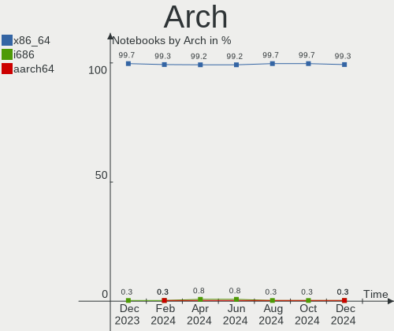
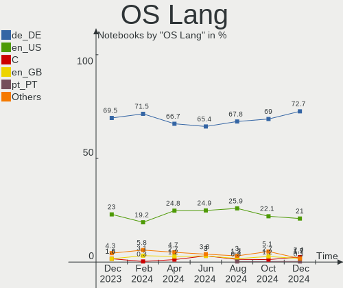
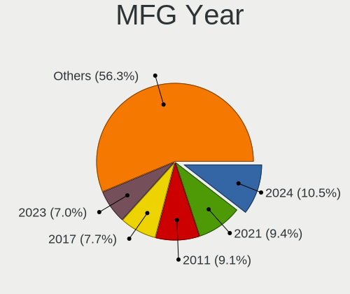
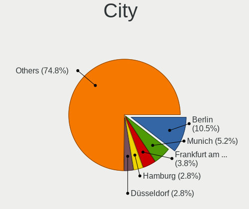
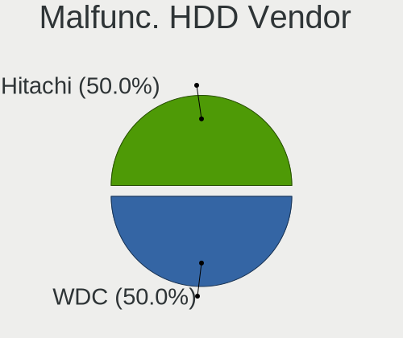
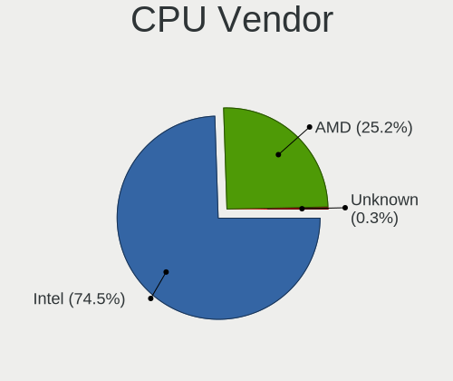
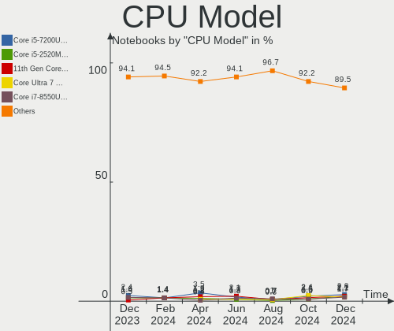
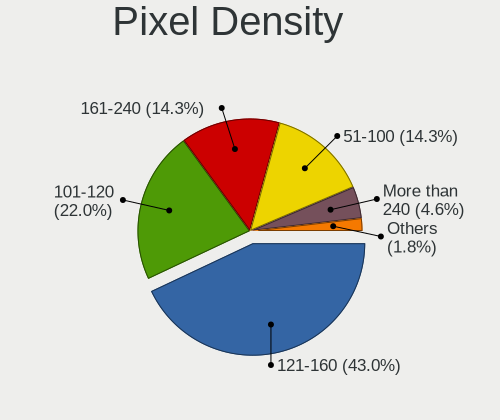
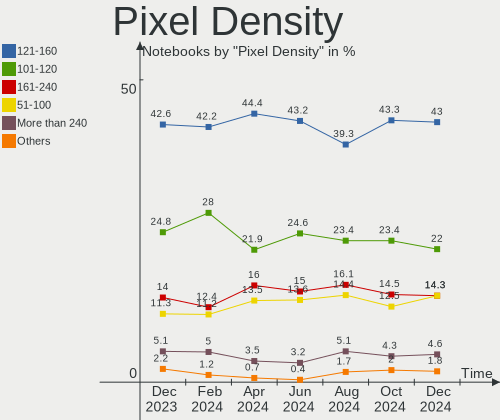
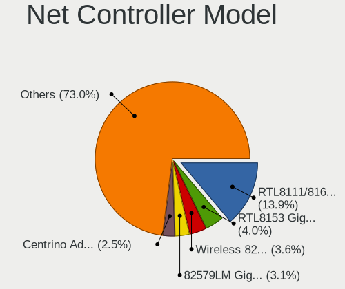

Linux in Germany - Hardware Trends (Notebooks)
----------------------------------------------

A project to identify most popular hardware characteristics and track their change
over time based on data collected by Linux users at https://Linux-Hardware.org.

Anyone can contribute to this report by the [hw-probe](https://github.com/linuxhw/hw-probe) tool:

    sudo -E hw-probe -all -upload

Contents
--------

* [ System ](#system)
  - [ OS                       ](#os)
  - [ OS Family                ](#os-family)
  - [ Kernel                   ](#kernel)
  - [ Kernel Family            ](#kernel-family)
  - [ Kernel Major Ver.        ](#kernel-major-ver)
  - [ Arch                     ](#arch)
  - [ DE                       ](#de)
  - [ Display Server           ](#display-server)
  - [ Display Manager          ](#display-manager)
  - [ OS Lang                  ](#os-lang)
  - [ Boot Mode                ](#boot-mode)
  - [ Filesystem               ](#filesystem)
  - [ Part. scheme             ](#part-scheme)
  - [ Dual Boot with Linux/BSD ](#dual-boot-with-linuxbsd)
  - [ Dual Boot (Win)          ](#dual-boot-win)

* [ Board ](#board)
  - [ Vendor                   ](#vendor)
  - [ Model                    ](#model)
  - [ Model Family             ](#model-family)
  - [ MFG Year                 ](#mfg-year)
  - [ Form Factor              ](#form-factor)
  - [ Secure Boot              ](#secure-boot)
  - [ Coreboot                 ](#coreboot)
  - [ RAM Size                 ](#ram-size)
  - [ RAM Used                 ](#ram-used)
  - [ Total Drives             ](#total-drives)
  - [ Has CD-ROM               ](#has-cd-rom)
  - [ Has Ethernet             ](#has-ethernet)
  - [ Has WiFi                 ](#has-wifi)
  - [ Has Bluetooth            ](#has-bluetooth)

* [ Location ](#location)
  - [ Country                  ](#country)
  - [ City                     ](#city)

* [ Drives ](#drives)
  - [ Drive Vendor             ](#drive-vendor)
  - [ Drive Model              ](#drive-model)
  - [ HDD Vendor               ](#hdd-vendor)
  - [ SSD Vendor               ](#ssd-vendor)
  - [ Drive Kind               ](#drive-kind)
  - [ Drive Connector          ](#drive-connector)
  - [ Drive Size               ](#drive-size)
  - [ Space Total              ](#space-total)
  - [ Space Used               ](#space-used)
  - [ Malfunc. Drives          ](#malfunc-drives)
  - [ Malfunc. Drive Vendor    ](#malfunc-drive-vendor)
  - [ Malfunc. HDD Vendor      ](#malfunc-hdd-vendor)
  - [ Malfunc. Drive Kind      ](#malfunc-drive-kind)
  - [ Failed Drives            ](#failed-drives)
  - [ Failed Drive Vendor      ](#failed-drive-vendor)
  - [ Drive Status             ](#drive-status)

* [ Storage controller ](#storage-controller)
  - [ Storage Vendor           ](#storage-vendor)
  - [ Storage Model            ](#storage-model)
  - [ Storage Kind             ](#storage-kind)

* [ Processor ](#processor)
  - [ CPU Vendor               ](#cpu-vendor)
  - [ CPU Model                ](#cpu-model)
  - [ CPU Model Family         ](#cpu-model-family)
  - [ CPU Cores                ](#cpu-cores)
  - [ CPU Sockets              ](#cpu-sockets)
  - [ CPU Threads              ](#cpu-threads)
  - [ CPU Op-Modes             ](#cpu-op-modes)
  - [ CPU Microcode            ](#cpu-microcode)
  - [ CPU Microarch            ](#cpu-microarch)

* [ Graphics ](#graphics)
  - [ GPU Vendor               ](#gpu-vendor)
  - [ GPU Model                ](#gpu-model)
  - [ GPU Combo                ](#gpu-combo)
  - [ GPU Driver               ](#gpu-driver)
  - [ GPU Memory               ](#gpu-memory)

* [ Monitor ](#monitor)
  - [ Monitor Vendor           ](#monitor-vendor)
  - [ Monitor Model            ](#monitor-model)
  - [ Monitor Resolution       ](#monitor-resolution)
  - [ Monitor Diagonal         ](#monitor-diagonal)
  - [ Monitor Width            ](#monitor-width)
  - [ Aspect Ratio             ](#aspect-ratio)
  - [ Monitor Area             ](#monitor-area)
  - [ Pixel Density            ](#pixel-density)
  - [ Multiple Monitors        ](#multiple-monitors)

* [ Network ](#network)
  - [ Net Controller Vendor    ](#net-controller-vendor)
  - [ Net Controller Model     ](#net-controller-model)
  - [ Wireless Vendor          ](#wireless-vendor)
  - [ Wireless Model           ](#wireless-model)
  - [ Ethernet Vendor          ](#ethernet-vendor)
  - [ Ethernet Model           ](#ethernet-model)
  - [ Net Controller Kind      ](#net-controller-kind)
  - [ Used Controller          ](#used-controller)
  - [ NICs                     ](#nics)
  - [ IPv6                     ](#ipv6)

* [ Bluetooth ](#bluetooth)
  - [ Bluetooth Vendor         ](#bluetooth-vendor)
  - [ Bluetooth Model          ](#bluetooth-model)

* [ Sound ](#sound)
  - [ Sound Vendor             ](#sound-vendor)
  - [ Sound Model              ](#sound-model)

* [ Memory ](#memory)
  - [ Memory Vendor            ](#memory-vendor)
  - [ Memory Model             ](#memory-model)
  - [ Memory Kind              ](#memory-kind)
  - [ Memory Form Factor       ](#memory-form-factor)
  - [ Memory Size              ](#memory-size)
  - [ Memory Speed             ](#memory-speed)

* [ Printers & scanners ](#printers--scanners)
  - [ Printer Vendor           ](#printer-vendor)
  - [ Printer Model            ](#printer-model)
  - [ Scanner Vendor           ](#scanner-vendor)
  - [ Scanner Model            ](#scanner-model)

* [ Camera ](#camera)
  - [ Camera Vendor            ](#camera-vendor)
  - [ Camera Model             ](#camera-model)

* [ Security ](#security)
  - [ Fingerprint Vendor       ](#fingerprint-vendor)
  - [ Fingerprint Model        ](#fingerprint-model)
  - [ Chipcard Vendor          ](#chipcard-vendor)
  - [ Chipcard Model           ](#chipcard-model)

* [ Unsupported ](#unsupported)
  - [ Unsupported Devices      ](#unsupported-devices)
  - [ Unsupported Device Types ](#unsupported-device-types)

System
------

OS
--

Installed operating systems

| Name                         | Notebooks | Percent |
|------------------------------|-----------|---------|
| Linux Mint 20.3              | 32        | 14.61%  |
| Ubuntu 22.04                 | 30        | 13.7%   |
| Ubuntu 20.04                 | 22        | 10.05%  |
| OpenMandriva 4.3             | 13        | 5.94%   |
| Fedora 36                    | 13        | 5.94%   |
| Manjaro 21.2.6               | 12        | 5.48%   |
| Pop!_OS 22.04                | 9         | 4.11%   |
| Zorin 16                     | 6         | 2.74%   |
| Fedora 35                    | 6         | 2.74%   |
| Manjaro                      | 5         | 2.28%   |
| Debian 11                    | 5         | 2.28%   |
| Xubuntu 20.04                | 4         | 1.83%   |
| openSUSE Tumbleweed-XXXXXXXX | 3         | 1.37%   |
| Kali 2022.2                  | 3         | 1.37%   |
| Debian Testing               | 3         | 1.37%   |
| ArcoLinux Rolling            | 3         | 1.37%   |
| Arch                         | 3         | 1.37%   |
| Xubuntu 22.04                | 2         | 0.91%   |
| Ubuntu Budgie 22.04          | 2         | 0.91%   |
| Ubuntu 21.10                 | 2         | 0.91%   |
| ROSA 12.2                    | 2         | 0.91%   |
| MX 21                        | 2         | 0.91%   |
| Lubuntu 21.10                | 2         | 0.91%   |
| Linux Mint 20.1              | 2         | 0.91%   |
| Kubuntu 22.04                | 2         | 0.91%   |
| Kubuntu 11                   | 2         | 0.91%   |
| KDE neon 20.04               | 2         | 0.91%   |
| Elementary 6.1               | 2         | 0.91%   |
| Arch Rolling                 | 2         | 0.91%   |
| Zorin 15                     | 1         | 0.46%   |
| Ubuntu MATE 22.04            | 1         | 0.46%   |
| Ubuntu MATE 20.04            | 1         | 0.46%   |
| SteamOS 3.2                  | 1         | 0.46%   |
| Slackware 15.0               | 1         | 0.46%   |
| Pop!_OS 21.10                | 1         | 0.46%   |
| Pop!_OS 20.10                | 1         | 0.46%   |
| openSUSE Leap-15.3           | 1         | 0.46%   |
| OpenMandriva 4.2             | 1         | 0.46%   |
| LMDE 5                       | 1         | 0.46%   |
| LinuxFX 10                   | 1         | 0.46%   |
| Linux Mint 20.2              | 1         | 0.46%   |
| Lilidog 22                   | 1         | 0.46%   |
| Kubuntu 20.04                | 1         | 0.46%   |
| Gentoo 2.7                   | 1         | 0.46%   |
| Fedora 34                    | 1         | 0.46%   |
| EndeavourOS Rolling          | 1         | 0.46%   |
| Elementary 5.1.7             | 1         | 0.46%   |
| Debian Unstable              | 1         | 0.46%   |
| Debian 11-updates            | 1         | 0.46%   |
| Debian 10                    | 1         | 0.46%   |
| CentOS 7                     | 1         | 0.46%   |
| BlackPanther 18.1            | 1         | 0.46%   |

OS Family
---------

OS without a version

| Name          | Notebooks | Percent |
|---------------|-----------|---------|
| Ubuntu        | 54        | 24.66%  |
| Linux Mint    | 35        | 15.98%  |
| Fedora        | 20        | 9.13%   |
| Manjaro       | 17        | 7.76%   |
| OpenMandriva  | 14        | 6.39%   |
| Pop!_OS       | 11        | 5.02%   |
| Debian        | 11        | 5.02%   |
| Zorin         | 7         | 3.2%    |
| Xubuntu       | 6         | 2.74%   |
| Kubuntu       | 5         | 2.28%   |
| Arch          | 5         | 2.28%   |
| openSUSE      | 4         | 1.83%   |
| Kali          | 3         | 1.37%   |
| Elementary    | 3         | 1.37%   |
| ArcoLinux     | 3         | 1.37%   |
| Ubuntu MATE   | 2         | 0.91%   |
| Ubuntu Budgie | 2         | 0.91%   |
| ROSA          | 2         | 0.91%   |
| MX            | 2         | 0.91%   |
| Lubuntu       | 2         | 0.91%   |
| KDE neon      | 2         | 0.91%   |
| SteamOS       | 1         | 0.46%   |
| Slackware     | 1         | 0.46%   |
| LMDE          | 1         | 0.46%   |
| LinuxFX       | 1         | 0.46%   |
| Lilidog       | 1         | 0.46%   |
| Gentoo        | 1         | 0.46%   |
| EndeavourOS   | 1         | 0.46%   |
| CentOS        | 1         | 0.46%   |
| BlackPanther  | 1         | 0.46%   |

Kernel
------

Version of the Linux kernel

| Version                            | Notebooks | Percent |
|------------------------------------|-----------|---------|
| 5.13.0-41-generic                  | 16        | 7.31%   |
| 5.4.0-110-generic                  | 14        | 6.39%   |
| 5.4.0-109-generic                  | 14        | 6.39%   |
| 5.16.7-desktop-1omv4003            | 12        | 5.48%   |
| 5.15.0-27-generic                  | 12        | 5.48%   |
| 5.13.0-40-generic                  | 11        | 5.02%   |
| 5.15.0-33-generic                  | 8         | 3.65%   |
| 5.15.0-30-generic                  | 8         | 3.65%   |
| 5.17.5-76051705-generic            | 7         | 3.2%    |
| 5.4.0-113-generic                  | 6         | 2.74%   |
| 5.15.32-1-MANJARO                  | 6         | 2.74%   |
| 5.17.5-300.fc36.x86_64             | 5         | 2.28%   |
| 5.13.0-44-generic                  | 5         | 2.28%   |
| 5.15.0-25-generic                  | 4         | 1.83%   |
| 5.10.0-14-amd64                    | 4         | 1.83%   |
| 5.17.7-300.fc36.x86_64             | 3         | 1.37%   |
| 5.17.4-1-default                   | 3         | 1.37%   |
| 5.16.0-kali7-amd64                 | 3         | 1.37%   |
| 5.15.38-1-MANJARO                  | 3         | 1.37%   |
| 5.4.0-72-generic                   | 2         | 0.91%   |
| 5.17.8-arch1-1                     | 2         | 0.91%   |
| 5.17.8-300.fc36.x86_64             | 2         | 0.91%   |
| 5.17.7-arch1-1                     | 2         | 0.91%   |
| 5.17.6-300.fc36.x86_64             | 2         | 0.91%   |
| 5.17.5-arch1-1                     | 2         | 0.91%   |
| 5.17.5-200.fc35.x86_64             | 2         | 0.91%   |
| 5.17.4-200.fc35.x86_64             | 2         | 0.91%   |
| 5.17.0-1-amd64                     | 2         | 0.91%   |
| 5.16.20-2-MANJARO                  | 2         | 0.91%   |
| 5.16.19-76051619-generic           | 2         | 0.91%   |
| 5.16.18-1-MANJARO                  | 2         | 0.91%   |
| 5.13.0-19-generic                  | 2         | 0.91%   |
| 5.10.74-generic-2rosa2021.1-x86_64 | 2         | 0.91%   |
| 5.6.14-desktop-2bP                 | 1         | 0.46%   |
| 5.4.0-91-generic                   | 1         | 0.46%   |
| 5.4.0-110-lowlatency               | 1         | 0.46%   |
| 5.4.0-107-generic                  | 1         | 0.46%   |
| 5.4.0-105-generic                  | 1         | 0.46%   |
| 5.3.18-150300.59.68-default        | 1         | 0.46%   |
| 5.18.0-259-tkg-pds                 | 1         | 0.46%   |
| 5.17.9-300.fc36.x86_64             | 1         | 0.46%   |
| 5.17.9-051709-generic              | 1         | 0.46%   |
| 5.17.8-2-MANJARO                   | 1         | 0.46%   |
| 5.17.7-gentoo                      | 1         | 0.46%   |
| 5.17.7-arch1-2                     | 1         | 0.46%   |
| 5.17.7-200.fc35.x86_64             | 1         | 0.46%   |
| 5.17.6-200.fc35.x86_64             | 1         | 0.46%   |
| 5.17.6-1-MANJARO                   | 1         | 0.46%   |
| 5.17.5                             | 1         | 0.46%   |
| 5.17.11-xanmod1-1                  | 1         | 0.46%   |
| 5.17.0-5.1-liquorix-amd64          | 1         | 0.46%   |
| 5.17.0-2-amd64                     | 1         | 0.46%   |
| 5.17.0-1003-oem                    | 1         | 0.46%   |
| 5.17.0-051700-generic              | 1         | 0.46%   |
| 5.16.9-051609-generic              | 1         | 0.46%   |
| 5.16.13-desktop-1omv4003           | 1         | 0.46%   |
| 5.16.12-mod-amd64                  | 1         | 0.46%   |
| 5.16.11-arch1-1                    | 1         | 0.46%   |
| 5.16.0-5mx-amd64                   | 1         | 0.46%   |
| 5.16.0-0.bpo.4-amd64               | 1         | 0.46%   |

Kernel Family
-------------

Linux kernel without a distro release

| Version  | Notebooks | Percent |
|----------|-----------|---------|
| 5.4.0    | 40        | 18.26%  |
| 5.13.0   | 38        | 17.35%  |
| 5.15.0   | 35        | 15.98%  |
| 5.17.5   | 17        | 7.76%   |
| 5.16.7   | 12        | 5.48%   |
| 5.17.7   | 8         | 3.65%   |
| 5.10.0   | 7         | 3.2%    |
| 5.17.0   | 6         | 2.74%   |
| 5.15.32  | 6         | 2.74%   |
| 5.17.8   | 5         | 2.28%   |
| 5.17.4   | 5         | 2.28%   |
| 5.16.0   | 5         | 2.28%   |
| 5.17.6   | 4         | 1.83%   |
| 5.15.38  | 3         | 1.37%   |
| 5.11.0   | 3         | 1.37%   |
| 5.17.9   | 2         | 0.91%   |
| 5.16.20  | 2         | 0.91%   |
| 5.16.19  | 2         | 0.91%   |
| 5.16.18  | 2         | 0.91%   |
| 5.10.74  | 2         | 0.91%   |
| 5.6.14   | 1         | 0.46%   |
| 5.3.18   | 1         | 0.46%   |
| 5.18.0   | 1         | 0.46%   |
| 5.17.11  | 1         | 0.46%   |
| 5.16.9   | 1         | 0.46%   |
| 5.16.13  | 1         | 0.46%   |
| 5.16.12  | 1         | 0.46%   |
| 5.16.11  | 1         | 0.46%   |
| 5.15.36  | 1         | 0.46%   |
| 5.14.10  | 1         | 0.46%   |
| 5.14.0   | 1         | 0.46%   |
| 5.10.14  | 1         | 0.46%   |
| 4.19.0   | 1         | 0.46%   |
| 4.14.275 | 1         | 0.46%   |
| 3.10.0   | 1         | 0.46%   |

Kernel Major Ver.
-----------------

Linux kernel major version

| Version | Notebooks | Percent |
|---------|-----------|---------|
| 5.17    | 48        | 21.92%  |
| 5.15    | 45        | 20.55%  |
| 5.4     | 40        | 18.26%  |
| 5.13    | 38        | 17.35%  |
| 5.16    | 27        | 12.33%  |
| 5.10    | 10        | 4.57%   |
| 5.11    | 3         | 1.37%   |
| 5.14    | 2         | 0.91%   |
| 5.6     | 1         | 0.46%   |
| 5.3     | 1         | 0.46%   |
| 5.18    | 1         | 0.46%   |
| 4.19    | 1         | 0.46%   |
| 4.14    | 1         | 0.46%   |
| 3.10    | 1         | 0.46%   |

Arch
----

OS architecture (x86_64, i586, etc.)

| Name   | Notebooks | Percent |
|--------|-----------|---------|
| x86_64 | 218       | 99.54%  |
| i686   | 1         | 0.46%   |

DE
--

Desktop Environment

| Name             | Notebooks | Percent |
|------------------|-----------|---------|
| GNOME            | 93        | 42.47%  |
| KDE5             | 45        | 20.55%  |
| X-Cinnamon       | 31        | 14.16%  |
| XFCE             | 22        | 10.05%  |
| MATE             | 8         | 3.65%   |
| Pantheon         | 3         | 1.37%   |
| Budgie           | 3         | 1.37%   |
| LXQt             | 2         | 0.91%   |
| LXDE             | 2         | 0.91%   |
| lightdm-xsession | 2         | 0.91%   |
| Cinnamon         | 2         | 0.91%   |
| Unity            | 1         | 0.46%   |
| KDE4             | 1         | 0.46%   |
| KDE              | 1         | 0.46%   |
| i3               | 1         | 0.46%   |
| cwm              | 1         | 0.46%   |
| Unknown          | 1         | 0.46%   |

Display Server
--------------

X11 or Wayland

| Name    | Notebooks | Percent |
|---------|-----------|---------|
| X11     | 163       | 74.43%  |
| Wayland | 54        | 24.66%  |
| Tty     | 1         | 0.46%   |
| Unknown | 1         | 0.46%   |

Display Manager
---------------

SDDM, LightDM, etc.

| Name    | Notebooks | Percent |
|---------|-----------|---------|
| Unknown | 71        | 32.42%  |
| GDM3    | 45        | 20.55%  |
| LightDM | 41        | 18.72%  |
| SDDM    | 37        | 16.89%  |
| GDM     | 24        | 10.96%  |
| SLiM    | 1         | 0.46%   |

OS Lang
-------

Language

| Lang    | Notebooks | Percent |
|---------|-----------|---------|
| de_DE   | 141       | 64.38%  |
| en_US   | 62        | 28.31%  |
| en_GB   | 4         | 1.83%   |
| C       | 3         | 1.37%   |
| ru_RU   | 2         | 0.91%   |
| it_IT   | 2         | 0.91%   |
| Unknown | 2         | 0.91%   |
| pt_BR   | 1         | 0.46%   |
| pl_PL   | 1         | 0.46%   |
| es_ES   | 1         | 0.46%   |

Boot Mode
---------

EFI or BIOS

| Mode | Notebooks | Percent |
|------|-----------|---------|
| EFI  | 125       | 57.08%  |
| BIOS | 94        | 42.92%  |

Filesystem
----------

Type of filesystem

| Type    | Notebooks | Percent |
|---------|-----------|---------|
| Ext4    | 181       | 82.65%  |
| Btrfs   | 23        | 10.5%   |
| Overlay | 12        | 5.48%   |
| Xfs     | 2         | 0.91%   |
| F2fs    | 1         | 0.46%   |

Part. scheme
------------

Scheme of partitioning

| Type    | Notebooks | Percent |
|---------|-----------|---------|
| Unknown | 110       | 50.23%  |
| GPT     | 92        | 42.01%  |
| MBR     | 17        | 7.76%   |

Dual Boot with Linux/BSD
------------------------

Hosting more than one Linux/BSD

| Dual boot | Notebooks | Percent |
|-----------|-----------|---------|
| No        | 198       | 90.41%  |
| Yes       | 21        | 9.59%   |

Dual Boot (Win)
---------------

Hosting Linux and Windows

| Dual boot | Notebooks | Percent |
|-----------|-----------|---------|
| No        | 175       | 79.91%  |
| Yes       | 44        | 20.09%  |

Board
-----

Vendor
------

Motherboard manufacturer

| Name                   | Notebooks | Percent |
|------------------------|-----------|---------|
| Lenovo                 | 62        | 28.31%  |
| ASUSTek Computer       | 26        | 11.87%  |
| Dell                   | 22        | 10.05%  |
| Hewlett-Packard        | 20        | 9.13%   |
| Acer                   | 13        | 5.94%   |
| Medion                 | 11        | 5.02%   |
| TUXEDO                 | 8         | 3.65%   |
| MSI                    | 6         | 2.74%   |
| HUAWEI                 | 6         | 2.74%   |
| Fujitsu                | 6         | 2.74%   |
| Sony                   | 4         | 1.83%   |
| Razer                  | 4         | 1.83%   |
| Schenker               | 3         | 1.37%   |
| Packard Bell           | 3         | 1.37%   |
| Notebook               | 3         | 1.37%   |
| Apple                  | 3         | 1.37%   |
| Toshiba                | 2         | 0.91%   |
| LG Electronics         | 2         | 0.91%   |
| Google                 | 2         | 0.91%   |
| Fujitsu Siemens        | 2         | 0.91%   |
| Wortmann AG            | 1         | 0.46%   |
| Valve                  | 1         | 0.46%   |
| SKIKK                  | 1         | 0.46%   |
| Samsung Electronics    | 1         | 0.46%   |
| PC Specialist          | 1         | 0.46%   |
| Framework              | 1         | 0.46%   |
| Chuwi                  | 1         | 0.46%   |
| BenQ                   | 1         | 0.46%   |
| AXDIA International    | 1         | 0.46%   |
| Avell High Performance | 1         | 0.46%   |
| ALLDOCUBE              | 1         | 0.46%   |

Model
-----

Motherboard model

| Name                                                  | Notebooks | Percent |
|-------------------------------------------------------|-----------|---------|
| Unknown                                               | 4         | 1.83%   |
| Lenovo ThinkBook 16p Gen 2 20YM                       | 3         | 1.37%   |
| Razer Blade 14 - RZ09-0370                            | 2         | 0.91%   |
| Lenovo ThinkPad P14s Gen 2a 21A00071GE                | 2         | 0.91%   |
| Lenovo IdeaPad S145-14IWL 81MU                        | 2         | 0.91%   |
| HUAWEI BOM-WXX9                                       | 2         | 0.91%   |
| ASUS ZenBook UX325SA_UM325SA                          | 2         | 0.91%   |
| ASUS ZenBook UX325EA_UX325EA                          | 2         | 0.91%   |
| Apple MacBookAir7,2                                   | 2         | 0.91%   |
| Wortmann AG TERRA_MOBILE_1450                         | 1         | 0.46%   |
| Valve Jupiter                                         | 1         | 0.46%   |
| TUXEDO Polaris 15 AMD Gen1                            | 1         | 0.46%   |
| TUXEDO N14xWU                                         | 1         | 0.46%   |
| TUXEDO InfinityBook S 15 Gen6                         | 1         | 0.46%   |
| TUXEDO InfinityBook Pro 14 Gen6                       | 1         | 0.46%   |
| Toshiba Satellite C670D-126                           | 1         | 0.46%   |
| Toshiba Satellite C50D-B                              | 1         | 0.46%   |
| Sony VPCCB3S1E                                        | 1         | 0.46%   |
| Sony VGN-FZ21M                                        | 1         | 0.46%   |
| Sony SVE1713A1EW                                      | 1         | 0.46%   |
| Sony SVE1712C1EW                                      | 1         | 0.46%   |
| SKIKK GREEN 4                                         | 1         | 0.46%   |
| Schenker XMG FUSION 15 (XFU15L19)                     | 1         | 0.46%   |
| Schenker XMG CORE (TGL/M21)                           | 1         | 0.46%   |
| Schenker VISION 15 (SVS15E21)                         | 1         | 0.46%   |
| Samsung 535U3C                                        | 1         | 0.46%   |
| Razer Blade Stealth 13 Late 2019                      | 1         | 0.46%   |
| Razer Blade 15 Advanced Model (Early 2020) - RZ09-033 | 1         | 0.46%   |
| PC Specialist Recoil II                               | 1         | 0.46%   |
| Packard Bell EasyNote TE69CXP                         | 1         | 0.46%   |
| Packard Bell EasyNote LM98                            | 1         | 0.46%   |
| Packard Bell DOT S                                    | 1         | 0.46%   |
| Notebook V15x_V17xPNKPNJPNH                           | 1         | 0.46%   |
| Notebook P65_P67SG                                    | 1         | 0.46%   |
| Notebook N8xxEP6                                      | 1         | 0.46%   |
| MSI Summit E16Flip A12UCT                             | 1         | 0.46%   |
| MSI Stealth 15M A11SDK                                | 1         | 0.46%   |
| MSI PS63 Modern 8M                                    | 1         | 0.46%   |
| MSI GX60 1AC                                          | 1         | 0.46%   |
| MSI GP70 2PE                                          | 1         | 0.46%   |
| MSI GP60 2QE                                          | 1         | 0.46%   |
| Medion S6445 MD61489                                  | 1         | 0.46%   |
| Medion P7649 MD60817                                  | 1         | 0.46%   |
| Medion P6613                                          | 1         | 0.46%   |
| Medion E7222                                          | 1         | 0.46%   |
| Medion E6220                                          | 1         | 0.46%   |
| Medion E15407                                         | 1         | 0.46%   |
| Medion E15303                                         | 1         | 0.46%   |
| Medion E14304                                         | 1         | 0.46%   |
| Medion E13203                                         | 1         | 0.46%   |
| Medion Akoya S6214T                                   | 1         | 0.46%   |
| Medion Akoya E6415                                    | 1         | 0.46%   |
| LG 17Z90P-G.AA89G                                     | 1         | 0.46%   |
| LG 17Z90N-V.AA77G                                     | 1         | 0.46%   |
| Lenovo Z50-70 20354                                   | 1         | 0.46%   |
| Lenovo Y520-15IKBM 80YY                               | 1         | 0.46%   |
| Lenovo V320-17ISK 81B6                                | 1         | 0.46%   |
| Lenovo V15 G2 ITL 82KB                                | 1         | 0.46%   |
| Lenovo ThinkPad X270 20HMS12K00                       | 1         | 0.46%   |
| Lenovo ThinkPad X260 20F5S4C000                       | 1         | 0.46%   |

Model Family
------------

Motherboard model prefix

| Name                  | Notebooks | Percent |
|-----------------------|-----------|---------|
| Lenovo ThinkPad       | 41        | 18.72%  |
| Lenovo IdeaPad        | 9         | 4.11%   |
| Acer Aspire           | 9         | 4.11%   |
| Dell Latitude         | 8         | 3.65%   |
| ASUS VivoBook         | 6         | 2.74%   |
| HP Laptop             | 5         | 2.28%   |
| Dell Vostro           | 5         | 2.28%   |
| Razer Blade           | 4         | 1.83%   |
| HP EliteBook          | 4         | 1.83%   |
| Fujitsu LIFEBOOK      | 4         | 1.83%   |
| Dell XPS              | 4         | 1.83%   |
| ASUS ZenBook          | 4         | 1.83%   |
| Unknown               | 4         | 1.83%   |
| Lenovo ThinkBook      | 3         | 1.37%   |
| HP ZBook              | 3         | 1.37%   |
| HP Pavilion           | 3         | 1.37%   |
| Dell Inspiron         | 3         | 1.37%   |
| TUXEDO InfinityBook   | 2         | 0.91%   |
| Toshiba Satellite     | 2         | 0.91%   |
| Schenker XMG          | 2         | 0.91%   |
| Packard Bell EasyNote | 2         | 0.91%   |
| Medion Akoya          | 2         | 0.91%   |
| HUAWEI BOM-WXX9       | 2         | 0.91%   |
| HP ProBook            | 2         | 0.91%   |
| HP 255                | 2         | 0.91%   |
| Fujitsu CELSIUS       | 2         | 0.91%   |
| ASUS ASUS             | 2         | 0.91%   |
| Apple MacBookAir7     | 2         | 0.91%   |
| Wortmann AG TERRA     | 1         | 0.46%   |
| Valve Jupiter         | 1         | 0.46%   |
| TUXEDO Polaris        | 1         | 0.46%   |
| TUXEDO N14xWU         | 1         | 0.46%   |
| Sony VPCCB3S1E        | 1         | 0.46%   |
| Sony VGN-FZ21M        | 1         | 0.46%   |
| Sony SVE1713A1EW      | 1         | 0.46%   |
| Sony SVE1712C1EW      | 1         | 0.46%   |
| SKIKK GREEN           | 1         | 0.46%   |
| Schenker VISION       | 1         | 0.46%   |
| Samsung 535U3C        | 1         | 0.46%   |
| PC Specialist Recoil  | 1         | 0.46%   |
| Packard Bell DOT      | 1         | 0.46%   |
| Notebook V15x         | 1         | 0.46%   |
| Notebook P65          | 1         | 0.46%   |
| Notebook N8xxEP6      | 1         | 0.46%   |
| MSI Summit            | 1         | 0.46%   |
| MSI Stealth           | 1         | 0.46%   |
| MSI PS63              | 1         | 0.46%   |
| MSI GX60              | 1         | 0.46%   |
| MSI GP70              | 1         | 0.46%   |
| MSI GP60              | 1         | 0.46%   |
| Medion S6445          | 1         | 0.46%   |
| Medion P7649          | 1         | 0.46%   |
| Medion P6613          | 1         | 0.46%   |
| Medion E7222          | 1         | 0.46%   |
| Medion E6220          | 1         | 0.46%   |
| Medion E15407         | 1         | 0.46%   |
| Medion E15303         | 1         | 0.46%   |
| Medion E14304         | 1         | 0.46%   |
| Medion E13203         | 1         | 0.46%   |
| LG 17Z90P-G.AA89G     | 1         | 0.46%   |

MFG Year
--------

Motherboard manufacture year

| Year | Notebooks | Percent |
|------|-----------|---------|
| 2021 | 46        | 21%     |
| 2020 | 25        | 11.42%  |
| 2012 | 25        | 11.42%  |
| 2019 | 17        | 7.76%   |
| 2018 | 16        | 7.31%   |
| 2014 | 13        | 5.94%   |
| 2011 | 13        | 5.94%   |
| 2013 | 11        | 5.02%   |
| 2016 | 10        | 4.57%   |
| 2022 | 8         | 3.65%   |
| 2008 | 8         | 3.65%   |
| 2017 | 7         | 3.2%    |
| 2015 | 6         | 2.74%   |
| 2009 | 5         | 2.28%   |
| 2010 | 4         | 1.83%   |
| 2006 | 3         | 1.37%   |
| 2007 | 1         | 0.46%   |
| 2004 | 1         | 0.46%   |

Form Factor
-----------

Physical design of the computer

| Name     | Notebooks | Percent |
|----------|-----------|---------|
| Notebook | 219       | 100%    |

Secure Boot
-----------

Enabled or disabled

| State    | Notebooks | Percent |
|----------|-----------|---------|
| Disabled | 196       | 89.5%   |
| Enabled  | 23        | 10.5%   |

Coreboot
--------

Have coreboot on board

| Used | Notebooks | Percent |
|------|-----------|---------|
| No   | 215       | 98.17%  |
| Yes  | 4         | 1.83%   |

RAM Size
--------

Total RAM memory

| Size in GB  | Notebooks | Percent |
|-------------|-----------|---------|
| 4.01-8.0    | 54        | 24.66%  |
| 8.01-16.0   | 47        | 21.46%  |
| 3.01-4.0    | 40        | 18.26%  |
| 16.01-24.0  | 34        | 15.53%  |
| 32.01-64.0  | 27        | 12.33%  |
| 1.01-2.0    | 6         | 2.74%   |
| 64.01-256.0 | 5         | 2.28%   |
| 24.01-32.0  | 3         | 1.37%   |
| 2.01-3.0    | 2         | 0.91%   |
| 0.51-1.0    | 1         | 0.46%   |

RAM Used
--------

Used RAM memory

| Used GB    | Notebooks | Percent |
|------------|-----------|---------|
| 1.01-2.0   | 91        | 41.55%  |
| 2.01-3.0   | 47        | 21.46%  |
| 3.01-4.0   | 32        | 14.61%  |
| 4.01-8.0   | 24        | 10.96%  |
| 8.01-16.0  | 11        | 5.02%   |
| 0.51-1.0   | 10        | 4.57%   |
| 16.01-24.0 | 3         | 1.37%   |
| 0.01-0.5   | 1         | 0.46%   |

Total Drives
------------

Number of drives on board

| Drives | Notebooks | Percent |
|--------|-----------|---------|
| 1      | 157       | 71.69%  |
| 2      | 55        | 25.11%  |
| 3      | 3         | 1.37%   |
| 0      | 2         | 0.91%   |
| 7      | 1         | 0.46%   |
| 4      | 1         | 0.46%   |

Has CD-ROM
----------

Has CD-ROM on board

| Presented | Notebooks | Percent |
|-----------|-----------|---------|
| No        | 146       | 66.67%  |
| Yes       | 73        | 33.33%  |

Has Ethernet
------------

Has Ethernet on board

| Presented | Notebooks | Percent |
|-----------|-----------|---------|
| Yes       | 170       | 77.63%  |
| No        | 49        | 22.37%  |

Has WiFi
--------

Has WiFi module

| Presented | Notebooks | Percent |
|-----------|-----------|---------|
| Yes       | 218       | 99.54%  |
| No        | 1         | 0.46%   |

Has Bluetooth
-------------

Has Bluetooth module

| Presented | Notebooks | Percent |
|-----------|-----------|---------|
| Yes       | 184       | 84.02%  |
| No        | 35        | 15.98%  |

Location
--------

Country
-------

Geographic location (country)

| Country | Notebooks | Percent |
|---------|-----------|---------|
| Germany | 219       | 100%    |

City
----

Geographic location (city)

| City                | Notebooks | Percent |
|---------------------|-----------|---------|
| Berlin              | 21        | 9.59%   |
| Frankfurt am Main   | 12        | 5.48%   |
| Munich              | 11        | 5.02%   |
| Stuttgart           | 7         | 3.2%    |
| Leipzig             | 5         | 2.28%   |
| Karlsruhe           | 5         | 2.28%   |
| Hamburg             | 5         | 2.28%   |
| Dortmund            | 5         | 2.28%   |
| Bielefeld           | 5         | 2.28%   |
| Cologne             | 4         | 1.83%   |
| Munster             | 3         | 1.37%   |
| Mannheim            | 3         | 1.37%   |
| Dresden             | 3         | 1.37%   |
| Bonn                | 3         | 1.37%   |
| Augsburg            | 3         | 1.37%   |
| Wuppertal           | 2         | 0.91%   |
| Ulm                 | 2         | 0.91%   |
| Sankt Leon-Rot      | 2         | 0.91%   |
| Nuremberg           | 2         | 0.91%   |
| Niederkassel        | 2         | 0.91%   |
| Muelheim-Kaerlich   | 2         | 0.91%   |
| Mönchengladbach    | 2         | 0.91%   |
| Ludwigsburg         | 2         | 0.91%   |
| Garching            | 2         | 0.91%   |
| Duisburg            | 2         | 0.91%   |
| Bremen              | 2         | 0.91%   |
| Bamberg             | 2         | 0.91%   |
| Ziemetshausen       | 1         | 0.46%   |
| Worms               | 1         | 0.46%   |
| Weimar              | 1         | 0.46%   |
| Weilheim            | 1         | 0.46%   |
| Weiden              | 1         | 0.46%   |
| Vohrenbach          | 1         | 0.46%   |
| Vechta              | 1         | 0.46%   |
| Uhldingen-Muhlhofen | 1         | 0.46%   |
| Troisdorf           | 1         | 0.46%   |
| Traunreut           | 1         | 0.46%   |
| Tostedt             | 1         | 0.46%   |
| Thungersheim        | 1         | 0.46%   |
| Teisendorf          | 1         | 0.46%   |
| Strausberg          | 1         | 0.46%   |
| Stralsund           | 1         | 0.46%   |
| Silberstedt         | 1         | 0.46%   |
| Schrobenhausen      | 1         | 0.46%   |
| Schechingen         | 1         | 0.46%   |
| Salzwedel           | 1         | 0.46%   |
| Saarlouis           | 1         | 0.46%   |
| Saarbrücken        | 1         | 0.46%   |
| Rostock             | 1         | 0.46%   |
| Rimsting            | 1         | 0.46%   |
| Reutlingen          | 1         | 0.46%   |
| Reiskirchen         | 1         | 0.46%   |
| Reinbek             | 1         | 0.46%   |
| Regensburg          | 1         | 0.46%   |
| Paderborn           | 1         | 0.46%   |
| Otzing              | 1         | 0.46%   |
| Oberstreit          | 1         | 0.46%   |
| Nohfelden           | 1         | 0.46%   |
| Niedersohren        | 1         | 0.46%   |
| Niederndodeleben    | 1         | 0.46%   |

Drives
------

Drive Vendor
------------

Hard drive vendors

| Vendor                         | Notebooks | Drives | Percent |
|--------------------------------|-----------|--------|---------|
| Samsung Electronics            | 61        | 67     | 22.51%  |
| WDC                            | 26        | 26     | 9.59%   |
| Seagate                        | 22        | 25     | 8.12%   |
| SK Hynix                       | 17        | 17     | 6.27%   |
| Sandisk                        | 16        | 16     | 5.9%    |
| Intel                          | 14        | 16     | 5.17%   |
| Unknown                        | 12        | 12     | 4.43%   |
| Kingston                       | 12        | 12     | 4.43%   |
| Micron Technology              | 11        | 12     | 4.06%   |
| Toshiba                        | 10        | 10     | 3.69%   |
| Crucial                        | 10        | 11     | 3.69%   |
| Intenso                        | 6         | 7      | 2.21%   |
| Hitachi                        | 6         | 6      | 2.21%   |
| Phison                         | 5         | 5      | 1.85%   |
| HGST                           | 5         | 5      | 1.85%   |
| Union Memory (Shenzhen)        | 2         | 2      | 0.74%   |
| Union Memory                   | 2         | 2      | 0.74%   |
| Micron/Crucial Technology      | 2         | 2      | 0.74%   |
| KIOXIA                         | 2         | 2      | 0.74%   |
| Fujitsu                        | 2         | 2      | 0.74%   |
| Apple                          | 2         | 2      | 0.74%   |
| USB                            | 1         | 1      | 0.37%   |
| UMIS                           | 1         | 1      | 0.37%   |
| Transcend                      | 1         | 1      | 0.37%   |
| SPCC                           | 1         | 1      | 0.37%   |
| Solid State Storage Technology | 1         | 1      | 0.37%   |
| Silicon Motion                 | 1         | 1      | 0.37%   |
| PNY                            | 1         | 1      | 0.37%   |
| PLEXTOR                        | 1         | 1      | 0.37%   |
| OSCOO                          | 1         | 1      | 0.37%   |
| OCZ                            | 1         | 1      | 0.37%   |
| Netac                          | 1         | 1      | 0.37%   |
| LITEONIT                       | 1         | 1      | 0.37%   |
| LITEON                         | 1         | 1      | 0.37%   |
| Leven                          | 1         | 1      | 0.37%   |
| Lenovo                         | 1         | 1      | 0.37%   |
| KIOXIA-EXCERIA                 | 1         | 1      | 0.37%   |
| Kingston Technology Company    | 1         | 1      | 0.37%   |
| JetFlash                       | 1         | 1      | 0.37%   |
| IB-AC703                       | 1         | 1      | 0.37%   |
| HS-SSD-G100N                   | 1         | 1      | 0.37%   |
| Hewlett-Packard                | 1         | 1      | 0.37%   |
| China                          | 1         | 1      | 0.37%   |
| BIWIN                          | 1         | 1      | 0.37%   |
| ASUSTOR                        | 1         | 2      | 0.37%   |
| A-DATA Technology              | 1         | 1      | 0.37%   |
| Unknown                        | 1         | 1      | 0.37%   |

Drive Model
-----------

Hard drive models

| Model                                  | Notebooks | Percent |
|----------------------------------------|-----------|---------|
| Samsung NVMe SSD Drive 1024GB          | 6         | 2.11%   |
| Samsung NVMe SSD Drive 1TB             | 5         | 1.76%   |
| Toshiba MQ01ABD100 1TB                 | 4         | 1.41%   |
| SK Hynix NVMe SSD Drive 512GB          | 4         | 1.41%   |
| Samsung SSD 980 PRO 1TB                | 4         | 1.41%   |
| Micron NVMe SSD Drive 512GB            | 4         | 1.41%   |
| Seagate ST1000LM048-2E7172 1TB         | 3         | 1.06%   |
| Samsung SSD 970 EVO Plus 1TB           | 3         | 1.06%   |
| Samsung SSD 860 EVO M.2 500GB          | 3         | 1.06%   |
| Samsung SSD 860 EVO 250GB              | 3         | 1.06%   |
| WDC PC SN730 SDBPNTY-1T00-1101 1TB     | 2         | 0.7%    |
| Unknown SD/MMC/MS PRO 999GB            | 2         | 0.7%    |
| Union Memory RTOTJ128VGD2EYX 128GB SSD | 2         | 0.7%    |
| Toshiba NVMe SSD Drive 512GB           | 2         | 0.7%    |
| SK Hynix SKHynix_HFS512GDE9X084N 512GB | 2         | 0.7%    |
| SK Hynix HFS256G39TND-N210A 256GB SSD  | 2         | 0.7%    |
| SK Hynix HFM001TD3JX013N 1TB           | 2         | 0.7%    |
| Seagate ST9500325AS 500GB              | 2         | 0.7%    |
| Seagate ST500LM012 HN-M500MBB 500GB    | 2         | 0.7%    |
| Seagate ST500LM000-1EJ162 500GB        | 2         | 0.7%    |
| Seagate ST1000LM049-2GH172 1TB         | 2         | 0.7%    |
| SanDisk SSD PLUS 240GB                 | 2         | 0.7%    |
| SanDisk DF4032  32GB                   | 2         | 0.7%    |
| Samsung SSD 860 EVO M.2 2TB            | 2         | 0.7%    |
| Samsung SSD 860 EVO 500GB              | 2         | 0.7%    |
| Samsung SSD 850 EVO mSATA 250GB        | 2         | 0.7%    |
| Samsung SSD 850 EVO 500GB              | 2         | 0.7%    |
| Samsung SSD 840 EVO 500GB              | 2         | 0.7%    |
| Samsung NVMe SSD Drive 512GB           | 2         | 0.7%    |
| Samsung NVMe SSD Drive 2TB             | 2         | 0.7%    |
| KIOXIA KBG40ZNV256G 256GB              | 2         | 0.7%    |
| Kingston SH103S3240G 240GB SSD         | 2         | 0.7%    |
| Intel SSDPEKNW010T8 1TB                | 2         | 0.7%    |
| Intel HBRPEKNX0202AO 32GB              | 2         | 0.7%    |
| Intel HBRPEKNX0202A 512GB              | 2         | 0.7%    |
| Crucial CT1000BX500SSD1 1TB            | 2         | 0.7%    |
| Apple SSD SM0128G 121GB                | 2         | 0.7%    |
| WDC WDS500G2B0B-00YS70 500GB SSD       | 1         | 0.35%   |
| WDC WDS500G2B0A-00SM50 500GB SSD       | 1         | 0.35%   |
| WDC WDS500G2B0A 500GB SSD              | 1         | 0.35%   |
| WDC WDS480G2G0B-00EPW0 480GB SSD       | 1         | 0.35%   |
| WDC WDS240G2G0B-00EPW0 240GB SSD       | 1         | 0.35%   |
| WDC WD7500BPVT-75HXZT3 752GB           | 1         | 0.35%   |
| WDC WD7500BPKT-22PK4T0 752GB           | 1         | 0.35%   |
| WDC WD5000LPVX-60V0TT0 500GB           | 1         | 0.35%   |
| WDC WD5000LPVX-00V0TT0 500GB           | 1         | 0.35%   |
| WDC WD5000LPCX-60VHAT0 500GB           | 1         | 0.35%   |
| WDC WD3200BEVT-22ZCT0 320GB            | 1         | 0.35%   |
| WDC WD3200BEVT-08A23T1 320GB           | 1         | 0.35%   |
| WDC WD1600BEVT-80A23T0 160GB           | 1         | 0.35%   |
| WDC WD1200BEVS-22UST0 120GB            | 1         | 0.35%   |
| WDC WD10SPZX-60Z10T0 1TB               | 1         | 0.35%   |
| WDC WD10SPCX-24HWST1 1TB               | 1         | 0.35%   |
| WDC WD10SPCX-00KHST0 1TB               | 1         | 0.35%   |
| WDC WD10JPVX-75JC3T0 1TB               | 1         | 0.35%   |
| WDC WD10JPVT-24A1YT0 1TB               | 1         | 0.35%   |
| WDC PC SN810 NVMe 1024GB               | 1         | 0.35%   |
| WDC PC SN530 SDBPNPZ-256G-1114 256GB   | 1         | 0.35%   |
| WDC PC SN530 SDBPNPZ-256G-1006 256GB   | 1         | 0.35%   |
| WDC PC SN530 SDBPMPZ-512G-1001 512GB   | 1         | 0.35%   |

HDD Vendor
----------

Hard disk drive vendors

| Vendor              | Notebooks | Drives | Percent |
|---------------------|-----------|--------|---------|
| Seagate             | 22        | 25     | 34.38%  |
| WDC                 | 14        | 14     | 21.88%  |
| Toshiba             | 6         | 6      | 9.38%   |
| Hitachi             | 6         | 6      | 9.38%   |
| HGST                | 5         | 5      | 7.81%   |
| Samsung Electronics | 3         | 3      | 4.69%   |
| Unknown             | 2         | 2      | 3.13%   |
| Fujitsu             | 2         | 2      | 3.13%   |
| USB                 | 1         | 1      | 1.56%   |
| Intenso             | 1         | 1      | 1.56%   |
| IB-AC703            | 1         | 1      | 1.56%   |
| ASUSTOR             | 1         | 2      | 1.56%   |

SSD Vendor
----------

Solid state drive vendors

| Vendor              | Notebooks | Drives | Percent |
|---------------------|-----------|--------|---------|
| Samsung Electronics | 26        | 27     | 30.59%  |
| SanDisk             | 11        | 11     | 12.94%  |
| Crucial             | 8         | 9      | 9.41%   |
| Intel               | 6         | 6      | 7.06%   |
| WDC                 | 5         | 5      | 5.88%   |
| Kingston            | 5         | 5      | 5.88%   |
| SK Hynix            | 3         | 3      | 3.53%   |
| Micron Technology   | 3         | 3      | 3.53%   |
| Union Memory        | 2         | 2      | 2.35%   |
| Intenso             | 2         | 3      | 2.35%   |
| Apple               | 2         | 2      | 2.35%   |
| Transcend           | 1         | 1      | 1.18%   |
| PNY                 | 1         | 1      | 1.18%   |
| PLEXTOR             | 1         | 1      | 1.18%   |
| Phison              | 1         | 1      | 1.18%   |
| OSCOO               | 1         | 1      | 1.18%   |
| OCZ                 | 1         | 1      | 1.18%   |
| Netac               | 1         | 1      | 1.18%   |
| LITEONIT            | 1         | 1      | 1.18%   |
| LITEON              | 1         | 1      | 1.18%   |
| HS-SSD-G100N        | 1         | 1      | 1.18%   |
| Hewlett-Packard     | 1         | 1      | 1.18%   |
| BIWIN               | 1         | 1      | 1.18%   |

Drive Kind
----------

HDD or SSD

| Kind    | Notebooks | Drives | Percent |
|---------|-----------|--------|---------|
| NVMe    | 98        | 110    | 37.26%  |
| SSD     | 83        | 88     | 31.56%  |
| HDD     | 62        | 68     | 23.57%  |
| MMC     | 14        | 14     | 5.32%   |
| Unknown | 6         | 6      | 2.28%   |

Drive Connector
---------------

SATA, SAS, NVMe, etc.

| Type | Notebooks | Drives | Percent |
|------|-----------|--------|---------|
| SATA | 129       | 149    | 51.81%  |
| NVMe | 98        | 110    | 39.36%  |
| MMC  | 14        | 14     | 5.62%   |
| SAS  | 8         | 13     | 3.21%   |

Drive Size
----------

Size of hard drive

| Size in TB | Notebooks | Drives | Percent |
|------------|-----------|--------|---------|
| 0.01-0.5   | 100       | 106    | 68.03%  |
| 0.51-1.0   | 35        | 36     | 23.81%  |
| 1.01-2.0   | 7         | 7      | 4.76%   |
| 3.01-4.0   | 3         | 3      | 2.04%   |
| 4.01-10.0  | 2         | 4      | 1.36%   |

Space Total
-----------

Amount of disk space available on the file system

| Size in GB     | Notebooks | Percent |
|----------------|-----------|---------|
| 101-250        | 66        | 30.14%  |
| 251-500        | 55        | 25.11%  |
| 501-1000       | 38        | 17.35%  |
| 1001-2000      | 16        | 7.31%   |
| 1-20           | 12        | 5.48%   |
| 21-50          | 10        | 4.57%   |
| 51-100         | 8         | 3.65%   |
| More than 3000 | 7         | 3.2%    |
| Unknown        | 6         | 2.74%   |
| 2001-3000      | 1         | 0.46%   |

Space Used
----------

Amount of used disk space

| Used GB        | Notebooks | Percent |
|----------------|-----------|---------|
| 1-20           | 77        | 35.16%  |
| 21-50          | 48        | 21.92%  |
| 101-250        | 31        | 14.16%  |
| 51-100         | 24        | 10.96%  |
| 251-500        | 16        | 7.31%   |
| 501-1000       | 9         | 4.11%   |
| Unknown        | 6         | 2.74%   |
| 1001-2000      | 5         | 2.28%   |
| More than 3000 | 3         | 1.37%   |

Malfunc. Drives
---------------

Drive models with a malfunction

| Model                                    | Notebooks | Drives | Percent |
|------------------------------------------|-----------|--------|---------|
| WDC WDS240G2G0B-00EPW0 240GB SSD         | 1         | 1      | 10%     |
| Transcend TS240GMTS420S 240GB SSD        | 1         | 1      | 10%     |
| Seagate ST500LM000-1EJ162 500GB          | 1         | 1      | 10%     |
| Seagate ST2000LM015-2E8174 2TB           | 1         | 1      | 10%     |
| Samsung Electronics SSD 970 EVO Plus 1TB | 1         | 1      | 10%     |
| Samsung Electronics HM160HC 160GB        | 1         | 1      | 10%     |
| Hitachi HTS545050B9A300 500GB            | 1         | 1      | 10%     |
| HGST HTS545050A7E380 500GB               | 1         | 1      | 10%     |
| Crucial CT128M550SSD3 128GB              | 1         | 1      | 10%     |
| A-DATA Technology SX8100NP 4TB           | 1         | 1      | 10%     |

Malfunc. Drive Vendor
---------------------

Vendors of faulty drives

| Vendor              | Notebooks | Drives | Percent |
|---------------------|-----------|--------|---------|
| Seagate             | 2         | 2      | 20%     |
| Samsung Electronics | 2         | 2      | 20%     |
| WDC                 | 1         | 1      | 10%     |
| Transcend           | 1         | 1      | 10%     |
| Hitachi             | 1         | 1      | 10%     |
| HGST                | 1         | 1      | 10%     |
| Crucial             | 1         | 1      | 10%     |
| A-DATA Technology   | 1         | 1      | 10%     |

Malfunc. HDD Vendor
-------------------

Vendors of faulty HDD drives

| Vendor              | Notebooks | Drives | Percent |
|---------------------|-----------|--------|---------|
| Seagate             | 2         | 2      | 40%     |
| Samsung Electronics | 1         | 1      | 20%     |
| Hitachi             | 1         | 1      | 20%     |
| HGST                | 1         | 1      | 20%     |

Malfunc. Drive Kind
-------------------

Kinds of faulty drives

| Kind | Notebooks | Drives | Percent |
|------|-----------|--------|---------|
| HDD  | 5         | 5      | 50%     |
| SSD  | 3         | 3      | 30%     |
| NVMe | 2         | 2      | 20%     |

Failed Drives
-------------

Failed drive models

Zero info for selected period =(

Failed Drive Vendor
-------------------

Failed drive vendors

Zero info for selected period =(

Drive Status
------------

Number of failed and malfunc. drives

| Status   | Notebooks | Drives | Percent |
|----------|-----------|--------|---------|
| Detected | 124       | 157    | 53.22%  |
| Works    | 99        | 119    | 42.49%  |
| Malfunc  | 10        | 10     | 4.29%   |

Storage controller
------------------

Storage Vendor
--------------

Storage controller vendors

| Vendor                         | Notebooks | Percent |
|--------------------------------|-----------|---------|
| Intel                          | 135       | 53.15%  |
| Samsung Electronics            | 36        | 14.17%  |
| AMD                            | 20        | 7.87%   |
| SK Hynix                       | 14        | 5.51%   |
| Sandisk                        | 9         | 3.54%   |
| Micron Technology              | 8         | 3.15%   |
| Kingston Technology Company    | 8         | 3.15%   |
| Phison Electronics             | 5         | 1.97%   |
| KIOXIA                         | 4         | 1.57%   |
| Union Memory (Shenzhen)        | 3         | 1.18%   |
| Toshiba America Info Systems   | 3         | 1.18%   |
| Micron/Crucial Technology      | 3         | 1.18%   |
| Nvidia                         | 2         | 0.79%   |
| Solid State Storage Technology | 1         | 0.39%   |
| Silicon Motion                 | 1         | 0.39%   |
| Realtek Semiconductor          | 1         | 0.39%   |
| Lenovo                         | 1         | 0.39%   |

Storage Model
-------------

Storage controller models

| Model                                                                            | Notebooks | Percent |
|----------------------------------------------------------------------------------|-----------|---------|
| Intel 7 Series Chipset Family 6-port SATA Controller [AHCI mode]                 | 23        | 8.46%   |
| Samsung NVMe SSD Controller SM981/PM981/PM983                                    | 18        | 6.62%   |
| AMD FCH SATA Controller [AHCI mode]                                              | 16        | 5.88%   |
| SK Hynix Gold P31 SSD                                                            | 12        | 4.41%   |
| Intel Sunrise Point-LP SATA Controller [AHCI mode]                               | 10        | 3.68%   |
| Intel Cannon Lake Mobile PCH SATA AHCI Controller                                | 10        | 3.68%   |
| Intel 6 Series/C200 Series Chipset Family 6 port Mobile SATA AHCI Controller     | 10        | 3.68%   |
| Intel 82801IBM/IEM (ICH9M/ICH9M-E) 4 port SATA Controller [AHCI mode]            | 9         | 3.31%   |
| Intel 82801 Mobile SATA Controller [RAID mode]                                   | 9         | 3.31%   |
| Micron Non-Volatile memory controller                                            | 8         | 2.94%   |
| Intel 8 Series/C220 Series Chipset Family 6-port SATA Controller 1 [AHCI mode]   | 8         | 2.94%   |
| Intel Volume Management Device NVMe RAID Controller                              | 7         | 2.57%   |
| Samsung NVMe SSD Controller 980                                                  | 6         | 2.21%   |
| Samsung NVMe SSD Controller SM961/PM961/SM963                                    | 5         | 1.84%   |
| Samsung NVMe SSD Controller PM9A1/PM9A3/980PRO                                   | 5         | 1.84%   |
| Intel Cannon Point-LP SATA Controller [AHCI Mode]                                | 5         | 1.84%   |
| Intel 8 Series SATA Controller 1 [AHCI mode]                                     | 5         | 1.84%   |
| KIOXIA Non-Volatile memory controller                                            | 4         | 1.47%   |
| Kingston Company Company Non-Volatile memory controller                          | 4         | 1.47%   |
| Intel Wildcat Point-LP SATA Controller [AHCI Mode]                               | 4         | 1.47%   |
| Intel SSD 660P Series                                                            | 4         | 1.47%   |
| Intel Q170/Q150/B150/H170/H110/Z170/CM236 Chipset SATA Controller [AHCI Mode]    | 4         | 1.47%   |
| Intel Ice Lake-LP SATA Controller [AHCI mode]                                    | 4         | 1.47%   |
| Sandisk WD Blue SN550 NVMe SSD                                                   | 3         | 1.1%    |
| Samsung Electronics SATA controller                                              | 3         | 1.1%    |
| Intel Celeron/Pentium Silver Processor SATA Controller                           | 3         | 1.1%    |
| Intel 5 Series/3400 Series Chipset 6 port SATA AHCI Controller                   | 3         | 1.1%    |
| Union Memory (Shenzhen) Non-Volatile memory controller                           | 2         | 0.74%   |
| Toshiba America Info Systems Toshiba America Info Non-Volatile memory controller | 2         | 0.74%   |
| Sandisk WD Black SN750 / PC SN730 NVMe SSD                                       | 2         | 0.74%   |
| Sandisk Non-Volatile memory controller                                           | 2         | 0.74%   |
| Phison PS5013 E13 NVMe Controller                                                | 2         | 0.74%   |
| Phison E12 NVMe Controller                                                       | 2         | 0.74%   |
| Micron/Crucial P2 NVMe PCIe SSD                                                  | 2         | 0.74%   |
| Kingston Company A2000 NVMe SSD                                                  | 2         | 0.74%   |
| Intel Tiger Lake-LP SATA Controller [AHCI mode]                                  | 2         | 0.74%   |
| Intel Non-Volatile memory controller                                             | 2         | 0.74%   |
| Intel NM10/ICH7 Family SATA Controller [AHCI mode]                               | 2         | 0.74%   |
| Intel HM170/QM170 Chipset SATA Controller [AHCI Mode]                            | 2         | 0.74%   |
| Intel 82801HM/HEM (ICH8M/ICH8M-E) SATA Controller [AHCI mode]                    | 2         | 0.74%   |
| Intel 82801HM/HEM (ICH8M/ICH8M-E) IDE Controller                                 | 2         | 0.74%   |
| Intel 5 Series/3400 Series Chipset 4 port SATA AHCI Controller                   | 2         | 0.74%   |
| AMD SB7x0/SB8x0/SB9x0 SATA Controller [AHCI mode]                                | 2         | 0.74%   |
| AMD SB7x0/SB8x0/SB9x0 IDE Controller                                             | 2         | 0.74%   |
| Union Memory (Shenzhen) AM630 PCIe 4.0 x4 NVMe SSD Controller                    | 1         | 0.37%   |
| Toshiba America Info Systems XG6 NVMe SSD Controller                             | 1         | 0.37%   |
| Solid State Storage Non-Volatile memory controller                               | 1         | 0.37%   |
| SK Hynix Non-Volatile memory controller                                          | 1         | 0.37%   |
| SK Hynix BC511                                                                   | 1         | 0.37%   |
| Silicon Motion SM2263EN/SM2263XT SSD Controller                                  | 1         | 0.37%   |
| Sandisk WD PC SN810 / Black SN850 NVMe SSD                                       | 1         | 0.37%   |
| Sandisk WD Blue SN500 / PC SN520 NVMe SSD                                        | 1         | 0.37%   |
| Realtek RTS5763DL NVMe SSD Controller                                            | 1         | 0.37%   |
| Phison E16 PCIe4 NVMe Controller                                                 | 1         | 0.37%   |
| Nvidia MCP79 AHCI Controller                                                     | 1         | 0.37%   |
| Nvidia MCP51 Serial ATA Controller                                               | 1         | 0.37%   |
| Nvidia MCP51 IDE                                                                 | 1         | 0.37%   |
| Micron/Crucial Non-Volatile memory controller                                    | 1         | 0.37%   |
| Lenovo Non-Volatile memory controller                                            | 1         | 0.37%   |
| Kingston Company U-SNS8154P3 NVMe SSD                                            | 1         | 0.37%   |

Storage Kind
------------

Kind of storage controller (IDE, SATA, NVMe, SAS, ...)

| Kind | Notebooks | Percent |
|------|-----------|---------|
| SATA | 139       | 52.65%  |
| NVMe | 98        | 37.12%  |
| RAID | 16        | 6.06%   |
| IDE  | 11        | 4.17%   |

Processor
---------

CPU Vendor
----------

Processor vendors

| Vendor | Notebooks | Percent |
|--------|-----------|---------|
| Intel  | 168       | 76.71%  |
| AMD    | 51        | 23.29%  |

CPU Model
---------

Processor models

| Model                                         | Notebooks | Percent |
|-----------------------------------------------|-----------|---------|
| Intel 11th Gen Core i7-1165G7 @ 2.80GHz       | 7         | 3.2%    |
| Intel Core i7-9750H CPU @ 2.60GHz             | 6         | 2.74%   |
| Intel Core i7-8750H CPU @ 2.20GHz             | 5         | 2.28%   |
| AMD Ryzen 7 5800H with Radeon Graphics        | 5         | 2.28%   |
| Intel Core i7-1065G7 CPU @ 1.30GHz            | 4         | 1.83%   |
| Intel Core i7-10510U CPU @ 1.80GHz            | 4         | 1.83%   |
| Intel Core i5-8265U CPU @ 1.60GHz             | 4         | 1.83%   |
| Intel Core i5-3320M CPU @ 2.60GHz             | 4         | 1.83%   |
| Intel 11th Gen Core i7-1185G7 @ 3.00GHz       | 4         | 1.83%   |
| Intel 11th Gen Core i5-1135G7 @ 2.40GHz       | 4         | 1.83%   |
| AMD Ryzen 9 5900HX with Radeon Graphics       | 4         | 1.83%   |
| Intel Core i5-5200U CPU @ 2.20GHz             | 3         | 1.37%   |
| Intel Core i5-1035G1 CPU @ 1.00GHz            | 3         | 1.37%   |
| Intel 11th Gen Core i7-11370H @ 3.30GHz       | 3         | 1.37%   |
| AMD Ryzen 7 PRO 5850U with Radeon Graphics    | 3         | 1.37%   |
| AMD Ryzen 5 5600U with Radeon Graphics        | 3         | 1.37%   |
| Intel Pentium Silver N5030 CPU @ 1.10GHz      | 2         | 0.91%   |
| Intel Pentium Dual-Core CPU T4200 @ 2.00GHz   | 2         | 0.91%   |
| Intel Core i7-8550U CPU @ 1.80GHz             | 2         | 0.91%   |
| Intel Core i7-7500U CPU @ 2.70GHz             | 2         | 0.91%   |
| Intel Core i7-6820HQ CPU @ 2.70GHz            | 2         | 0.91%   |
| Intel Core i7-6700HQ CPU @ 2.60GHz            | 2         | 0.91%   |
| Intel Core i7-4720HQ CPU @ 2.60GHz            | 2         | 0.91%   |
| Intel Core i7-4600U CPU @ 2.10GHz             | 2         | 0.91%   |
| Intel Core i7-3537U CPU @ 2.00GHz             | 2         | 0.91%   |
| Intel Core i7-3520M CPU @ 2.90GHz             | 2         | 0.91%   |
| Intel Core i5-8250U CPU @ 1.60GHz             | 2         | 0.91%   |
| Intel Core i5-6300U CPU @ 2.40GHz             | 2         | 0.91%   |
| Intel Core i5-6200U CPU @ 2.30GHz             | 2         | 0.91%   |
| Intel Core i5-4210H CPU @ 2.90GHz             | 2         | 0.91%   |
| Intel Core i5-3337U CPU @ 1.80GHz             | 2         | 0.91%   |
| Intel Core i5-3210M CPU @ 2.50GHz             | 2         | 0.91%   |
| Intel Core i5-2430M CPU @ 2.40GHz             | 2         | 0.91%   |
| Intel Core i5 CPU M 520 @ 2.40GHz             | 2         | 0.91%   |
| Intel Core i3-6006U CPU @ 2.00GHz             | 2         | 0.91%   |
| Intel Core i3-3110M CPU @ 2.40GHz             | 2         | 0.91%   |
| Intel Core 2 Duo CPU P8700 @ 2.53GHz          | 2         | 0.91%   |
| Intel Core 2 Duo CPU P8400 @ 2.26GHz          | 2         | 0.91%   |
| Intel Celeron N4500 @ 1.10GHz                 | 2         | 0.91%   |
| Intel Celeron CPU N3450 @ 1.10GHz             | 2         | 0.91%   |
| Intel Celeron CPU 4205U @ 1.80GHz             | 2         | 0.91%   |
| AMD Ryzen 7 PRO 4750U with Radeon Graphics    | 2         | 0.91%   |
| AMD Ryzen 7 5700U with Radeon Graphics        | 2         | 0.91%   |
| AMD Ryzen 7 3700U with Radeon Vega Mobile Gfx | 2         | 0.91%   |
| AMD Ryzen 5 5500U with Radeon Graphics        | 2         | 0.91%   |
| AMD Ryzen 5 4600H with Radeon Graphics        | 2         | 0.91%   |
| AMD Ryzen 3 4300U with Radeon Graphics        | 2         | 0.91%   |
| AMD A4-6210 APU with AMD Radeon R3 Graphics   | 2         | 0.91%   |
| Intel Pentium Silver N6000 @ 1.10GHz          | 1         | 0.46%   |
| Intel Pentium M processor 1.50GHz             | 1         | 0.46%   |
| Intel Pentium Dual CPU T2390 @ 1.86GHz        | 1         | 0.46%   |
| Intel Pentium CPU P6000 @ 1.87GHz             | 1         | 0.46%   |
| Intel Pentium CPU N3540 @ 2.16GHz             | 1         | 0.46%   |
| Intel Pentium CPU B980 @ 2.40GHz              | 1         | 0.46%   |
| Intel Pentium CPU 4415U @ 2.30GHz             | 1         | 0.46%   |
| Intel Pentium CPU 2020M @ 2.40GHz             | 1         | 0.46%   |
| Intel Core i7-8565U CPU @ 1.80GHz             | 1         | 0.46%   |
| Intel Core i7-7820HQ CPU @ 2.90GHz            | 1         | 0.46%   |
| Intel Core i7-7700HQ CPU @ 2.80GHz            | 1         | 0.46%   |
| Intel Core i7-6820HK CPU @ 2.70GHz            | 1         | 0.46%   |

CPU Model Family
----------------

Processor model prefix

| Model                   | Notebooks | Percent |
|-------------------------|-----------|---------|
| Intel Core i7           | 52        | 23.74%  |
| Intel Core i5           | 44        | 20.09%  |
| Other                   | 27        | 12.33%  |
| Intel Core i3           | 13        | 5.94%   |
| AMD Ryzen 7             | 12        | 5.48%   |
| Intel Celeron           | 11        | 5.02%   |
| Intel Core 2 Duo        | 9         | 4.11%   |
| AMD Ryzen 5             | 8         | 3.65%   |
| Intel Pentium           | 5         | 2.28%   |
| AMD Ryzen 7 PRO         | 5         | 2.28%   |
| AMD Ryzen 3             | 5         | 2.28%   |
| AMD Ryzen 9             | 4         | 1.83%   |
| Intel Pentium Silver    | 3         | 1.37%   |
| AMD A8                  | 3         | 1.37%   |
| AMD A4                  | 3         | 1.37%   |
| Intel Pentium Dual-Core | 2         | 0.91%   |
| Intel Atom              | 2         | 0.91%   |
| AMD E                   | 2         | 0.91%   |
| Intel Pentium M         | 1         | 0.46%   |
| Intel Pentium Dual      | 1         | 0.46%   |
| Intel Core 2            | 1         | 0.46%   |
| AMD Turion 64 X2 Mobile | 1         | 0.46%   |
| AMD Ryzen 5 PRO         | 1         | 0.46%   |
| AMD Mobile Sempron      | 1         | 0.46%   |
| AMD E2                  | 1         | 0.46%   |
| AMD A6                  | 1         | 0.46%   |
| AMD A10                 | 1         | 0.46%   |

CPU Cores
---------

Number of processor cores

| Number | Notebooks | Percent |
|--------|-----------|---------|
| 2      | 95        | 43.38%  |
| 4      | 73        | 33.33%  |
| 8      | 22        | 10.05%  |
| 6      | 21        | 9.59%   |
| 1      | 5         | 2.28%   |
| 14     | 2         | 0.91%   |
| 12     | 1         | 0.46%   |

CPU Sockets
-----------

Number of sockets

| Number | Notebooks | Percent |
|--------|-----------|---------|
| 1      | 219       | 100%    |

CPU Threads
-----------

Threads per core (Hyper-Threading)

| Number | Notebooks | Percent |
|--------|-----------|---------|
| 2      | 169       | 77.17%  |
| 1      | 50        | 22.83%  |

CPU Op-Modes
------------

CPU Operation Modes (32-bit, 64-bit)

| Op mode        | Notebooks | Percent |
|----------------|-----------|---------|
| 32-bit, 64-bit | 218       | 99.54%  |
| 32-bit         | 1         | 0.46%   |

CPU Microcode
-------------

Microcode number

| Number     | Notebooks | Percent |
|------------|-----------|---------|
| Unknown    | 50        | 22.83%  |
| 0x306a9    | 19        | 8.68%   |
| 0x806c1    | 14        | 6.39%   |
| 0x0a50000c | 14        | 6.39%   |
| 0x206a7    | 11        | 5.02%   |
| 0x306d4    | 7         | 3.2%    |
| 0x306c3    | 7         | 3.2%    |
| 0x1067a    | 7         | 3.2%    |
| 0x08600106 | 7         | 3.2%    |
| 0x706e5    | 6         | 2.74%   |
| 0x40651    | 6         | 2.74%   |
| 0x906ea    | 5         | 2.28%   |
| 0x806ec    | 5         | 2.28%   |
| 0x806eb    | 5         | 2.28%   |
| 0x406e3    | 5         | 2.28%   |
| 0x506e3    | 4         | 1.83%   |
| 0x08608103 | 4         | 1.83%   |
| 0x906a3    | 3         | 1.37%   |
| 0x806ea    | 3         | 1.37%   |
| 0x20652    | 3         | 1.37%   |
| 0x10676    | 3         | 1.37%   |
| 0x05000119 | 3         | 1.37%   |
| 0x906c0    | 2         | 0.91%   |
| 0x806d1    | 2         | 0.91%   |
| 0x706a8    | 2         | 0.91%   |
| 0x6fd      | 2         | 0.91%   |
| 0x506c9    | 2         | 0.91%   |
| 0x106ca    | 2         | 0.91%   |
| 0x08108109 | 2         | 0.91%   |
| 0x07030105 | 2         | 0.91%   |
| 0x06006705 | 2         | 0.91%   |
| 0x06001119 | 2         | 0.91%   |
| 0x906e9    | 1         | 0.46%   |
| 0x806e9    | 1         | 0.46%   |
| 0x6d8      | 1         | 0.46%   |
| 0x406c3    | 1         | 0.46%   |
| 0x30678    | 1         | 0.46%   |
| 0x20655    | 1         | 0.46%   |
| 0x08600103 | 1         | 0.46%   |
| 0x08101007 | 1         | 0.46%   |

CPU Microarch
-------------

Microarchitecture

| Name          | Notebooks | Percent |
|---------------|-----------|---------|
| KabyLake      | 32        | 14.61%  |
| IvyBridge     | 21        | 9.59%   |
| Zen 3         | 19        | 8.68%   |
| TigerLake     | 19        | 8.68%   |
| Haswell       | 16        | 7.31%   |
| SandyBridge   | 13        | 5.94%   |
| Skylake       | 12        | 5.48%   |
| Penryn        | 11        | 5.02%   |
| IceLake       | 10        | 4.57%   |
| Unknown       | 10        | 4.57%   |
| Zen 2         | 8         | 3.65%   |
| Broadwell     | 7         | 3.2%    |
| Westmere      | 5         | 2.28%   |
| Zen+          | 3         | 1.37%   |
| Puma          | 3         | 1.37%   |
| Piledriver    | 3         | 1.37%   |
| Goldmont plus | 3         | 1.37%   |
| Excavator     | 3         | 1.37%   |
| Core          | 3         | 1.37%   |
| Bobcat        | 3         | 1.37%   |
| Tremont       | 2         | 0.91%   |
| Silvermont    | 2         | 0.91%   |
| K8 Hammer     | 2         | 0.91%   |
| Goldmont      | 2         | 0.91%   |
| CometLake     | 2         | 0.91%   |
| Bonnell       | 2         | 0.91%   |
| Zen           | 1         | 0.46%   |
| P6            | 1         | 0.46%   |
| K10 Llano     | 1         | 0.46%   |

Graphics
--------

GPU Vendor
----------

Vendors of graphics cards

| Vendor | Notebooks | Percent |
|--------|-----------|---------|
| Intel  | 155       | 54.77%  |
| Nvidia | 64        | 22.61%  |
| AMD    | 64        | 22.61%  |

GPU Model
---------

Graphics card models

| Model                                                                     | Notebooks | Percent |
|---------------------------------------------------------------------------|-----------|---------|
| Intel 3rd Gen Core processor Graphics Controller                          | 19        | 6.57%   |
| Intel TigerLake-LP GT2 [Iris Xe Graphics]                                 | 18        | 6.23%   |
| AMD Cezanne                                                               | 18        | 6.23%   |
| Intel 2nd Generation Core Processor Family Integrated Graphics Controller | 11        | 3.81%   |
| Intel CoffeeLake-H GT2 [UHD Graphics 630]                                 | 10        | 3.46%   |
| Intel 4th Gen Core Processor Integrated Graphics Controller               | 9         | 3.11%   |
| AMD Renoir                                                                | 8         | 2.77%   |
| Intel Mobile 4 Series Chipset Integrated Graphics Controller              | 7         | 2.42%   |
| Intel Haswell-ULT Integrated Graphics Controller                          | 7         | 2.42%   |
| Nvidia GA106M [GeForce RTX 3060 Mobile / Max-Q]                           | 6         | 2.08%   |
| Intel WhiskeyLake-U GT2 [UHD Graphics 620]                                | 5         | 1.73%   |
| Intel Skylake GT2 [HD Graphics 520]                                       | 5         | 1.73%   |
| Intel HD Graphics 5500                                                    | 5         | 1.73%   |
| Intel Core Processor Integrated Graphics Controller                       | 5         | 1.73%   |
| Nvidia TU106M [GeForce RTX 2070 Mobile]                                   | 4         | 1.38%   |
| Intel UHD Graphics 620                                                    | 4         | 1.38%   |
| Intel JasperLake [UHD Graphics]                                           | 4         | 1.38%   |
| Intel Iris Plus Graphics G7                                               | 4         | 1.38%   |
| Intel Iris Plus Graphics G1 (Ice Lake)                                    | 4         | 1.38%   |
| Intel HD Graphics 530                                                     | 4         | 1.38%   |
| Intel CometLake-U GT2 [UHD Graphics]                                      | 4         | 1.38%   |
| AMD Lucienne                                                              | 4         | 1.38%   |
| Nvidia TU117M [GeForce GTX 1650 Mobile / Max-Q]                           | 3         | 1.04%   |
| Nvidia GP108M [GeForce MX150]                                             | 3         | 1.04%   |
| Nvidia GP107M [GeForce GTX 1050 Ti Mobile]                                | 3         | 1.04%   |
| Nvidia GP106M [GeForce GTX 1060 Mobile]                                   | 3         | 1.04%   |
| Nvidia GM107GLM [Quadro M2000M]                                           | 3         | 1.04%   |
| Nvidia GF117M [GeForce 610M/710M/810M/820M / GT 620M/625M/630M/720M]      | 3         | 1.04%   |
| Nvidia GA104M [GeForce RTX 3070 Mobile / Max-Q]                           | 3         | 1.04%   |
| Intel HD Graphics 620                                                     | 3         | 1.04%   |
| Intel Alder Lake-P Integrated Graphics Controller                         | 3         | 1.04%   |
| AMD Stoney [Radeon R2/R3/R4/R5 Graphics]                                  | 3         | 1.04%   |
| AMD Seymour [Radeon HD 6400M/7400M Series]                                | 3         | 1.04%   |
| AMD Picasso/Raven 2 [Radeon Vega Series / Radeon Vega Mobile Series]      | 3         | 1.04%   |
| Nvidia GM108M [GeForce 940M]                                              | 2         | 0.69%   |
| Nvidia GM108M [GeForce 840M]                                              | 2         | 0.69%   |
| Nvidia GM107M [GeForce GTX 960M]                                          | 2         | 0.69%   |
| Nvidia GF108M [GeForce GT 620M/630M/635M/640M LE]                         | 2         | 0.69%   |
| Nvidia GA107M [GeForce RTX 3050 Ti Mobile]                                | 2         | 0.69%   |
| Nvidia GA107M [GeForce RTX 3050 Mobile]                                   | 2         | 0.69%   |
| Intel TigerLake-H GT1 [UHD Graphics]                                      | 2         | 0.69%   |
| Intel HD Graphics 630                                                     | 2         | 0.69%   |
| Intel HD Graphics 6000                                                    | 2         | 0.69%   |
| Intel HD Graphics 500                                                     | 2         | 0.69%   |
| Intel GeminiLake [UHD Graphics 605]                                       | 2         | 0.69%   |
| Intel CometLake-H GT2 [UHD Graphics]                                      | 2         | 0.69%   |
| Intel Coffee Lake UHD 610 Graphics Controller                             | 2         | 0.69%   |
| Intel Atom Processor D4xx/D5xx/N4xx/N5xx Integrated Graphics Controller   | 2         | 0.69%   |
| AMD Whistler [Radeon HD 6630M/6650M/6750M/7670M/7690M]                    | 2         | 0.69%   |
| AMD Thames [Radeon HD 7550M/7570M/7650M]                                  | 2         | 0.69%   |
| AMD Mullins [Radeon R3 Graphics]                                          | 2         | 0.69%   |
| AMD Lexa [Radeon 540X/550X/630 / RX 640 / E9171 MCM]                      | 2         | 0.69%   |
| Nvidia TU117M [GeForce GTX 1650 Ti Mobile]                                | 1         | 0.35%   |
| Nvidia TU117GLM [Quadro T2000 Mobile / Max-Q]                             | 1         | 0.35%   |
| Nvidia TU117GLM [Quadro T1000 Mobile]                                     | 1         | 0.35%   |
| Nvidia TU106M [GeForce RTX 2060 Mobile]                                   | 1         | 0.35%   |
| Nvidia TU104M [GeForce RTX 2080 SUPER Mobile / Max-Q]                     | 1         | 0.35%   |
| Nvidia GT218M [GeForce 310M]                                              | 1         | 0.35%   |
| Nvidia GP108GLM [Quadro P520]                                             | 1         | 0.35%   |
| Nvidia GP104BM [GeForce GTX 1070 Mobile]                                  | 1         | 0.35%   |

GPU Combo
---------

Combinations of graphics cards

| Name           | Notebooks | Percent |
|----------------|-----------|---------|
| 1 x Intel      | 101       | 46.12%  |
| Intel + Nvidia | 46        | 21%     |
| 1 x AMD        | 41        | 18.72%  |
| AMD + Nvidia   | 11        | 5.02%   |
| 1 x Nvidia     | 7         | 3.2%    |
| Intel + AMD    | 7         | 3.2%    |
| 2 x AMD        | 5         | 2.28%   |
| Other          | 1         | 0.46%   |

GPU Driver
----------

Free vs proprietary

| Driver      | Notebooks | Percent |
|-------------|-----------|---------|
| Free        | 175       | 79.91%  |
| Proprietary | 34        | 15.53%  |
| Unknown     | 10        | 4.57%   |

GPU Memory
----------

Total video memory

| Size in GB | Notebooks | Percent |
|------------|-----------|---------|
| Unknown    | 145       | 66.21%  |
| 0.01-0.5   | 32        | 14.61%  |
| 0.51-1.0   | 14        | 6.39%   |
| 1.01-2.0   | 13        | 5.94%   |
| 7.01-8.0   | 7         | 3.2%    |
| 5.01-6.0   | 4         | 1.83%   |
| 3.01-4.0   | 3         | 1.37%   |
| 8.01-16.0  | 1         | 0.46%   |

Monitor
-------

Monitor Vendor
--------------

Monitor vendors

| Vendor                  | Notebooks | Percent |
|-------------------------|-----------|---------|
| AU Optronics            | 44        | 17.74%  |
| LG Display              | 36        | 14.52%  |
| BOE                     | 35        | 14.11%  |
| Chimei Innolux          | 31        | 12.5%   |
| Samsung Electronics     | 30        | 12.1%   |
| Dell                    | 10        | 4.03%   |
| Lenovo                  | 8         | 3.23%   |
| Sharp                   | 5         | 2.02%   |
| InfoVision              | 4         | 1.61%   |
| Chi Mei Optoelectronics | 4         | 1.61%   |
| BenQ                    | 4         | 1.61%   |
| PANDA                   | 3         | 1.21%   |
| Apple                   | 3         | 1.21%   |
| AOC                     | 3         | 1.21%   |
| Ancor Communications    | 3         | 1.21%   |
| Philips                 | 2         | 0.81%   |
| Medion                  | 2         | 0.81%   |
| Goldstar                | 2         | 0.81%   |
| Eizo                    | 2         | 0.81%   |
| CSO                     | 2         | 0.81%   |
| ViewSonic               | 1         | 0.4%    |
| Toshiba                 | 1         | 0.4%    |
| TMX                     | 1         | 0.4%    |
| LGD                     | 1         | 0.4%    |
| JDI                     | 1         | 0.4%    |
| IBM                     | 1         | 0.4%    |
| Hewlett-Packard         | 1         | 0.4%    |
| HannStar                | 1         | 0.4%    |
| Denver                  | 1         | 0.4%    |
| Compal                  | 1         | 0.4%    |
| CHD                     | 1         | 0.4%    |
| Belinea                 | 1         | 0.4%    |
| ASUSTek Computer        | 1         | 0.4%    |
| ANX                     | 1         | 0.4%    |
| Acer                    | 1         | 0.4%    |

Monitor Model
-------------

Monitor models

| Model                                                                     | Notebooks | Percent |
|---------------------------------------------------------------------------|-----------|---------|
| LG Display LCD Monitor LGD02D8 1366x768 277x156mm 12.5-inch               | 4         | 1.58%   |
| Samsung Electronics LCD Monitor SDC4158 1920x1080 294x165mm 13.3-inch     | 3         | 1.19%   |
| Samsung Electronics LCD Monitor SEC324C 1600x900 310x174mm 14.0-inch      | 2         | 0.79%   |
| LG Display LCD Monitor LGD056D 1920x1080 382x215mm 17.3-inch              | 2         | 0.79%   |
| LG Display LCD Monitor LGD0563 1920x1080 344x194mm 15.5-inch              | 2         | 0.79%   |
| LG Display LCD Monitor LGD046F 1920x1080 344x194mm 15.5-inch              | 2         | 0.79%   |
| Chimei Innolux LCD Monitor CMN1602 1920x1080 355x199mm 16.0-inch          | 2         | 0.79%   |
| Chimei Innolux LCD Monitor CMN15E7 1920x1080 344x193mm 15.5-inch          | 2         | 0.79%   |
| Chimei Innolux LCD Monitor CMN1521 1920x1080 344x193mm 15.5-inch          | 2         | 0.79%   |
| Chimei Innolux LCD Monitor CMN14D6 1366x768 309x173mm 13.9-inch           | 2         | 0.79%   |
| Chimei Innolux LCD Monitor CMN14D4 1920x1080 309x173mm 13.9-inch          | 2         | 0.79%   |
| Chimei Innolux LCD Monitor CMN140A 1920x1080 309x173mm 13.9-inch          | 2         | 0.79%   |
| Chi Mei Optoelectronics LCD Monitor CMO1720 1920x1080 382x215mm 17.3-inch | 2         | 0.79%   |
| BOE LCD Monitor BOE084E 1920x1080 382x215mm 17.3-inch                     | 2         | 0.79%   |
| BOE LCD Monitor BOE07B6 1920x1080 382x215mm 17.3-inch                     | 2         | 0.79%   |
| AU Optronics LCD Monitor AUOD1ED 1920x1080 344x193mm 15.5-inch            | 2         | 0.79%   |
| AU Optronics LCD Monitor AUO573D 1920x1080 309x174mm 14.0-inch            | 2         | 0.79%   |
| AU Optronics LCD Monitor AUO45EC 1366x768 344x193mm 15.5-inch             | 2         | 0.79%   |
| AU Optronics LCD Monitor AUO38ED 1920x1080 344x193mm 15.5-inch            | 2         | 0.79%   |
| AU Optronics LCD Monitor AUO23EC 1366x768 344x193mm 15.5-inch             | 2         | 0.79%   |
| AU Optronics LCD Monitor AUO226D 1920x1080 276x155mm 12.5-inch            | 2         | 0.79%   |
| AU Optronics LCD Monitor AUO139E 1600x900 382x214mm 17.2-inch             | 2         | 0.79%   |
| AU Optronics LCD Monitor AUO1296 2560x1600 344x215mm 16.0-inch            | 2         | 0.79%   |
| ViewSonic XG2703-GS VSCBA32 2560x1440 598x336mm 27.0-inch                 | 1         | 0.4%    |
| Toshiba LCD Monitor LCD58E1 1280x800 261x163mm 12.1-inch                  | 1         | 0.4%    |
| TMX TL140BDXP01-0 TMX1400 2560x1440 310x174mm 14.0-inch                   | 1         | 0.4%    |
| Sharp LQ140M1JW49 SHP1523 1920x1080 309x174mm 14.0-inch                   | 1         | 0.4%    |
| Sharp LCD Monitor SHP14BA 1920x1080 344x194mm 15.5-inch                   | 1         | 0.4%    |
| Sharp LCD Monitor SHP14B8 1920x1080 294x165mm 13.3-inch                   | 1         | 0.4%    |
| Sharp LCD Monitor SHP14A9 1920x1080 294x165mm 13.3-inch                   | 1         | 0.4%    |
| Sharp LCD Monitor SHP149A 1920x1080 344x194mm 15.5-inch                   | 1         | 0.4%    |
| Samsung Electronics U32R59x SAM0F94 3840x2160 697x392mm 31.5-inch         | 1         | 0.4%    |
| Samsung Electronics U32J59x SAM0F52 3840x2160 697x392mm 31.5-inch         | 1         | 0.4%    |
| Samsung Electronics T24B350 SAM093E 1920x1080 531x299mm 24.0-inch         | 1         | 0.4%    |
| Samsung Electronics SyncMaster SAM03E4 1680x1050 474x296mm 22.0-inch      | 1         | 0.4%    |
| Samsung Electronics SyncMaster SAM01D0 1600x1200 432x324mm 21.3-inch      | 1         | 0.4%    |
| Samsung Electronics S24C450 SAM09CB 1920x1080 531x299mm 24.0-inch         | 1         | 0.4%    |
| Samsung Electronics S24C450 SAM09CA 1920x1080 531x299mm 24.0-inch         | 1         | 0.4%    |
| Samsung Electronics LCD Monitor SEC5441 1366x768 309x174mm 14.0-inch      | 1         | 0.4%    |
| Samsung Electronics LCD Monitor SEC4256 1600x900 382x215mm 17.3-inch      | 1         | 0.4%    |
| Samsung Electronics LCD Monitor SEC3941 1600x900 382x214mm 17.2-inch      | 1         | 0.4%    |
| Samsung Electronics LCD Monitor SEC3754 1366x768 293x165mm 13.2-inch      | 1         | 0.4%    |
| Samsung Electronics LCD Monitor SEC3246 1366x768 293x165mm 13.2-inch      | 1         | 0.4%    |
| Samsung Electronics LCD Monitor SEC304F 1680x945 409x230mm 18.5-inch      | 1         | 0.4%    |
| Samsung Electronics LCD Monitor SEC304C 1366x768 350x200mm 15.9-inch      | 1         | 0.4%    |
| Samsung Electronics LCD Monitor SDC544B 1600x900 309x174mm 14.0-inch      | 1         | 0.4%    |
| Samsung Electronics LCD Monitor SDC5441 1366x768 344x193mm 15.5-inch      | 1         | 0.4%    |
| Samsung Electronics LCD Monitor SDC4C48 1920x1080 344x194mm 15.5-inch     | 1         | 0.4%    |
| Samsung Electronics LCD Monitor SDC4852 1366x768 344x194mm 15.5-inch      | 1         | 0.4%    |
| Samsung Electronics LCD Monitor SDC4851 1366x768 344x194mm 15.5-inch      | 1         | 0.4%    |
| Samsung Electronics LCD Monitor SDC4155 1920x1080 294x165mm 13.3-inch     | 1         | 0.4%    |
| Samsung Electronics LCD Monitor SDC4146 1366x768 344x194mm 15.5-inch      | 1         | 0.4%    |
| Samsung Electronics LCD Monitor SDC3654 1600x900 382x215mm 17.3-inch      | 1         | 0.4%    |
| Samsung Electronics LCD Monitor SDC3150 1920x1080 344x194mm 15.5-inch     | 1         | 0.4%    |
| Samsung Electronics LCD Monitor SAM7017 3840x2160 950x540mm 43.0-inch     | 1         | 0.4%    |
| Samsung Electronics LCD Monitor SAM0669 1920x1080                         | 1         | 0.4%    |
| Samsung Electronics LCD Monitor C49HG9x                                   | 1         | 0.4%    |
| Samsung Electronics C32F391 SAM0D34 1920x1080 698x393mm 31.5-inch         | 1         | 0.4%    |
| Philips PHL 276E8V PHLC18F 3840x2160 597x336mm 27.0-inch                  | 1         | 0.4%    |
| Philips PHL 273V7 PHLC156 1920x1080 598x336mm 27.0-inch                   | 1         | 0.4%    |

Monitor Resolution
------------------

Monitor screen resolution

| Resolution         | Notebooks | Percent |
|--------------------|-----------|---------|
| 1920x1080 (FHD)    | 116       | 51.1%   |
| 1366x768 (WXGA)    | 41        | 18.06%  |
| 1600x900 (HD+)     | 18        | 7.93%   |
| 2560x1440 (QHD)    | 12        | 5.29%   |
| 3840x2160 (4K)     | 5         | 2.2%    |
| 2560x1600          | 4         | 1.76%   |
| 1920x1200 (WUXGA)  | 4         | 1.76%   |
| 1440x900 (WXGA+)   | 4         | 1.76%   |
| 1280x800 (WXGA)    | 4         | 1.76%   |
| 1680x1050 (WSXGA+) | 3         | 1.32%   |
| 3000x2000          | 2         | 0.88%   |
| 2160x1440          | 2         | 0.88%   |
| 1024x600           | 2         | 0.88%   |
| 800x1280           | 1         | 0.44%   |
| 5760x1080          | 1         | 0.44%   |
| 3440x1440          | 1         | 0.44%   |
| 3200x1800 (QHD+)   | 1         | 0.44%   |
| 2880x1800          | 1         | 0.44%   |
| 2256x1504          | 1         | 0.44%   |
| 1680x945           | 1         | 0.44%   |
| 1600x1200          | 1         | 0.44%   |
| 1360x768           | 1         | 0.44%   |
| Unknown            | 1         | 0.44%   |

Monitor Diagonal
----------------

Diagonal size in inches

| Inches  | Notebooks | Percent |
|---------|-----------|---------|
| 15      | 87        | 35.22%  |
| 13      | 33        | 13.36%  |
| 17      | 25        | 10.12%  |
| 14      | 25        | 10.12%  |
| 27      | 13        | 5.26%   |
| 24      | 13        | 5.26%   |
| 12      | 10        | 4.05%   |
| 23      | 6         | 2.43%   |
| 16      | 6         | 2.43%   |
| 11      | 6         | 2.43%   |
| 31      | 4         | 1.62%   |
| Unknown | 4         | 1.62%   |
| 21      | 3         | 1.21%   |
| 18      | 3         | 1.21%   |
| 22      | 2         | 0.81%   |
| 10      | 2         | 0.81%   |
| 84      | 1         | 0.4%    |
| 40      | 1         | 0.4%    |
| 34      | 1         | 0.4%    |
| 25      | 1         | 0.4%    |
| 19      | 1         | 0.4%    |

Monitor Width
-------------

Physical width

| Width in mm | Notebooks | Percent |
|-------------|-----------|---------|
| 301-350     | 123       | 50.62%  |
| 201-300     | 39        | 16.05%  |
| 351-400     | 32        | 13.17%  |
| 501-600     | 29        | 11.93%  |
| 401-500     | 9         | 3.7%    |
| 601-700     | 4         | 1.65%   |
| Unknown     | 4         | 1.65%   |
| 801-900     | 1         | 0.41%   |
| 701-800     | 1         | 0.41%   |
| 1501-2000   | 1         | 0.41%   |

Aspect Ratio
------------

Proportional relationship between the width and the height

| Ratio   | Notebooks | Percent |
|---------|-----------|---------|
| 16/9    | 183       | 85.51%  |
| 16/10   | 21        | 9.81%   |
| 3/2     | 5         | 2.34%   |
| Unknown | 2         | 0.93%   |
| 4/3     | 1         | 0.47%   |
| 21/9    | 1         | 0.47%   |
| 0.62    | 1         | 0.47%   |

Monitor Area
------------

Area in inch²

| Area in inch² | Notebooks | Percent |
|----------------|-----------|---------|
| 101-110        | 90        | 36.44%  |
| 81-90          | 42        | 17%     |
| 121-130        | 25        | 10.12%  |
| 201-250        | 19        | 7.69%   |
| 71-80          | 16        | 6.48%   |
| 301-350        | 13        | 5.26%   |
| 61-70          | 10        | 4.05%   |
| 51-60          | 6         | 2.43%   |
| 251-300        | 6         | 2.43%   |
| 351-500        | 5         | 2.02%   |
| Unknown        | 4         | 1.62%   |
| 141-150        | 3         | 1.21%   |
| 111-120        | 3         | 1.21%   |
| 41-50          | 2         | 0.81%   |
| More than 1000 | 1         | 0.4%    |
| 151-200        | 1         | 0.4%    |
| 501-1000       | 1         | 0.4%    |

Pixel Density
-------------

Pixels per inch

| Density       | Notebooks | Percent |
|---------------|-----------|---------|
| 121-160       | 116       | 48.13%  |
| 101-120       | 56        | 23.24%  |
| 51-100        | 34        | 14.11%  |
| 161-240       | 26        | 10.79%  |
| More than 240 | 4         | 1.66%   |
| Unknown       | 4         | 1.66%   |
| 1-50          | 1         | 0.41%   |

Multiple Monitors
-----------------

Total monitors connected

| Total | Notebooks | Percent |
|-------|-----------|---------|
| 1     | 167       | 76.26%  |
| 2     | 36        | 16.44%  |
| 0     | 9         | 4.11%   |
| 3     | 6         | 2.74%   |
| 4     | 1         | 0.46%   |

Network
-------

Net Controller Vendor
---------------------

Controller vendors

| Vendor                            | Notebooks | Percent |
|-----------------------------------|-----------|---------|
| Intel                             | 139       | 38.72%  |
| Realtek Semiconductor             | 102       | 28.41%  |
| Qualcomm Atheros                  | 41        | 11.42%  |
| Broadcom                          | 16        | 4.46%   |
| MEDIATEK                          | 10        | 2.79%   |
| Broadcom Limited                  | 8         | 2.23%   |
| Sierra Wireless                   | 6         | 1.67%   |
| Lenovo                            | 6         | 1.67%   |
| Ericsson Business Mobile Networks | 6         | 1.67%   |
| ASIX Electronics                  | 6         | 1.67%   |
| TP-Link                           | 3         | 0.84%   |
| Ralink Technology                 | 3         | 0.84%   |
| Ralink                            | 3         | 0.84%   |
| Marvell Technology Group          | 2         | 0.56%   |
| Fibocom                           | 2         | 0.56%   |
| Dell                              | 2         | 0.56%   |
| Shenzhen Goodix Technology        | 1         | 0.28%   |
| Nvidia                            | 1         | 0.28%   |
| Lego Group                        | 1         | 0.28%   |
| Hewlett-Packard                   | 1         | 0.28%   |

Net Controller Model
--------------------

Controller models

| Model                                                                   | Notebooks | Percent |
|-------------------------------------------------------------------------|-----------|---------|
| Realtek RTL8111/8168/8411 PCI Express Gigabit Ethernet Controller       | 67        | 15.76%  |
| Intel Wi-Fi 6 AX201                                                     | 17        | 4%      |
| Intel Wi-Fi 6 AX200                                                     | 16        | 3.76%   |
| Intel 82579LM Gigabit Network Connection (Lewisville)                   | 13        | 3.06%   |
| Realtek RTL8821CE 802.11ac PCIe Wireless Network Adapter                | 10        | 2.35%   |
| Realtek RTL8153 Gigabit Ethernet Adapter                                | 10        | 2.35%   |
| Qualcomm Atheros AR9485 Wireless Network Adapter                        | 10        | 2.35%   |
| MEDIATEK MT7921 802.11ax PCI Express Wireless Network Adapter           | 10        | 2.35%   |
| Realtek RTL810xE PCI Express Fast Ethernet controller                   | 8         | 1.88%   |
| Intel Wireless 8265 / 8275                                              | 8         | 1.88%   |
| Intel Centrino Advanced-N 6205 [Taylor Peak]                            | 8         | 1.88%   |
| Intel Wireless 8260                                                     | 7         | 1.65%   |
| Intel Wireless 3160                                                     | 7         | 1.65%   |
| Intel Ice Lake-LP PCH CNVi WiFi                                         | 7         | 1.65%   |
| Intel Wireless 7260                                                     | 6         | 1.41%   |
| ASIX AX88179 Gigabit Ethernet                                           | 6         | 1.41%   |
| Qualcomm Atheros AR9462 Wireless Network Adapter                        | 5         | 1.18%   |
| Intel Centrino Wireless-N 2230                                          | 5         | 1.18%   |
| Realtek RTL8822CE 802.11ac PCIe Wireless Network Adapter                | 4         | 0.94%   |
| Qualcomm Atheros QCA9377 802.11ac Wireless Network Adapter              | 4         | 0.94%   |
| Qualcomm Atheros AR9287 Wireless Network Adapter (PCI-Express)          | 4         | 0.94%   |
| Qualcomm Atheros AR9285 Wireless Network Adapter (PCI-Express)          | 4         | 0.94%   |
| Qualcomm Atheros AR8151 v2.0 Gigabit Ethernet                           | 4         | 0.94%   |
| Intel Wireless-AC 9260                                                  | 4         | 0.94%   |
| Intel Wireless 7265                                                     | 4         | 0.94%   |
| Intel Wireless 3165                                                     | 4         | 0.94%   |
| Ericsson Business Mobile Networks F5521gw                               | 4         | 0.94%   |
| Qualcomm Atheros QCA6174 802.11ac Wireless Network Adapter              | 3         | 0.71%   |
| Qualcomm Atheros Killer E220x Gigabit Ethernet Controller               | 3         | 0.71%   |
| Qualcomm Atheros AR242x / AR542x Wireless Network Adapter (PCI-Express) | 3         | 0.71%   |
| Lenovo USB-C Dock Ethernet                                              | 3         | 0.71%   |
| Intel Wi-Fi 6 AX210/AX211/AX411 160MHz                                  | 3         | 0.71%   |
| Intel Wi-Fi 6 AX201 160MHz                                              | 3         | 0.71%   |
| Intel Ethernet Connection I219-V                                        | 3         | 0.71%   |
| Intel Ethernet Connection I218-LM                                       | 3         | 0.71%   |
| Intel Ethernet Connection I217-LM                                       | 3         | 0.71%   |
| Intel Ethernet Connection (2) I219-LM                                   | 3         | 0.71%   |
| Intel Ethernet Connection (13) I219-LM                                  | 3         | 0.71%   |
| Intel Dual Band Wireless-AC 3165 Plus Bluetooth                         | 3         | 0.71%   |
| Intel Comet Lake PCH-LP CNVi WiFi                                       | 3         | 0.71%   |
| Intel Cannon Point-LP CNVi [Wireless-AC]                                | 3         | 0.71%   |
| Intel Cannon Lake PCH CNVi WiFi                                         | 3         | 0.71%   |
| Intel Alder Lake-P PCH CNVi WiFi                                        | 3         | 0.71%   |
| Broadcom BCM4313 802.11bgn Wireless Network Adapter                     | 3         | 0.71%   |
| Sierra Wireless EM7455                                                  | 2         | 0.47%   |
| Realtek RTL8852AE 802.11ax PCIe Wireless Network Adapter                | 2         | 0.47%   |
| Realtek RTL8723BE PCIe Wireless Network Adapter                         | 2         | 0.47%   |
| Realtek RTL8188EUS 802.11n Wireless Network Adapter                     | 2         | 0.47%   |
| Qualcomm Atheros QCA9565 / AR9565 Wireless Network Adapter              | 2         | 0.47%   |
| Qualcomm Atheros AR8162 Fast Ethernet                                   | 2         | 0.47%   |
| Lenovo ThinkPad Lan                                                     | 2         | 0.47%   |
| Intel Tiger Lake PCH CNVi WiFi                                          | 2         | 0.47%   |
| Intel PRO/Wireless 5100 AGN [Shiloh] Network Connection                 | 2         | 0.47%   |
| Intel Ethernet Connection I217-V                                        | 2         | 0.47%   |
| Intel Comet Lake PCH CNVi WiFi                                          | 2         | 0.47%   |
| Intel Centrino Wireless-N 2200                                          | 2         | 0.47%   |
| Intel Centrino Ultimate-N 6300                                          | 2         | 0.47%   |
| Intel Centrino Advanced-N 6235                                          | 2         | 0.47%   |
| Intel 82577LM Gigabit Network Connection                                | 2         | 0.47%   |
| Intel 82567LM Gigabit Network Connection                                | 2         | 0.47%   |

Wireless Vendor
---------------

Wireless vendors

| Vendor                | Notebooks | Percent |
|-----------------------|-----------|---------|
| Intel                 | 134       | 57.51%  |
| Qualcomm Atheros      | 36        | 15.45%  |
| Realtek Semiconductor | 23        | 9.87%   |
| MEDIATEK              | 10        | 4.29%   |
| Broadcom              | 8         | 3.43%   |
| Sierra Wireless       | 6         | 2.58%   |
| Broadcom Limited      | 6         | 2.58%   |
| Ralink Technology     | 3         | 1.29%   |
| Ralink                | 3         | 1.29%   |
| TP-Link               | 2         | 0.86%   |
| Dell                  | 2         | 0.86%   |

Wireless Model
--------------

Wireless models

| Model                                                                   | Notebooks | Percent |
|-------------------------------------------------------------------------|-----------|---------|
| Intel Wi-Fi 6 AX201                                                     | 17        | 7.26%   |
| Intel Wi-Fi 6 AX200                                                     | 16        | 6.84%   |
| Realtek RTL8821CE 802.11ac PCIe Wireless Network Adapter                | 10        | 4.27%   |
| Qualcomm Atheros AR9485 Wireless Network Adapter                        | 10        | 4.27%   |
| MEDIATEK MT7921 802.11ax PCI Express Wireless Network Adapter           | 10        | 4.27%   |
| Intel Wireless 8265 / 8275                                              | 8         | 3.42%   |
| Intel Centrino Advanced-N 6205 [Taylor Peak]                            | 8         | 3.42%   |
| Intel Wireless 8260                                                     | 7         | 2.99%   |
| Intel Wireless 3160                                                     | 7         | 2.99%   |
| Intel Ice Lake-LP PCH CNVi WiFi                                         | 7         | 2.99%   |
| Intel Wireless 7260                                                     | 6         | 2.56%   |
| Qualcomm Atheros AR9462 Wireless Network Adapter                        | 5         | 2.14%   |
| Intel Centrino Wireless-N 2230                                          | 5         | 2.14%   |
| Realtek RTL8822CE 802.11ac PCIe Wireless Network Adapter                | 4         | 1.71%   |
| Qualcomm Atheros QCA9377 802.11ac Wireless Network Adapter              | 4         | 1.71%   |
| Qualcomm Atheros AR9287 Wireless Network Adapter (PCI-Express)          | 4         | 1.71%   |
| Qualcomm Atheros AR9285 Wireless Network Adapter (PCI-Express)          | 4         | 1.71%   |
| Intel Wireless-AC 9260                                                  | 4         | 1.71%   |
| Intel Wireless 7265                                                     | 4         | 1.71%   |
| Intel Wireless 3165                                                     | 4         | 1.71%   |
| Qualcomm Atheros QCA6174 802.11ac Wireless Network Adapter              | 3         | 1.28%   |
| Qualcomm Atheros AR242x / AR542x Wireless Network Adapter (PCI-Express) | 3         | 1.28%   |
| Intel Wi-Fi 6 AX210/AX211/AX411 160MHz                                  | 3         | 1.28%   |
| Intel Wi-Fi 6 AX201 160MHz                                              | 3         | 1.28%   |
| Intel Dual Band Wireless-AC 3165 Plus Bluetooth                         | 3         | 1.28%   |
| Intel Comet Lake PCH-LP CNVi WiFi                                       | 3         | 1.28%   |
| Intel Cannon Point-LP CNVi [Wireless-AC]                                | 3         | 1.28%   |
| Intel Cannon Lake PCH CNVi WiFi                                         | 3         | 1.28%   |
| Intel Alder Lake-P PCH CNVi WiFi                                        | 3         | 1.28%   |
| Broadcom BCM4313 802.11bgn Wireless Network Adapter                     | 3         | 1.28%   |
| Sierra Wireless EM7455                                                  | 2         | 0.85%   |
| Realtek RTL8852AE 802.11ax PCIe Wireless Network Adapter                | 2         | 0.85%   |
| Realtek RTL8723BE PCIe Wireless Network Adapter                         | 2         | 0.85%   |
| Realtek RTL8188EUS 802.11n Wireless Network Adapter                     | 2         | 0.85%   |
| Qualcomm Atheros QCA9565 / AR9565 Wireless Network Adapter              | 2         | 0.85%   |
| Intel Tiger Lake PCH CNVi WiFi                                          | 2         | 0.85%   |
| Intel PRO/Wireless 5100 AGN [Shiloh] Network Connection                 | 2         | 0.85%   |
| Intel Comet Lake PCH CNVi WiFi                                          | 2         | 0.85%   |
| Intel Centrino Wireless-N 2200                                          | 2         | 0.85%   |
| Intel Centrino Ultimate-N 6300                                          | 2         | 0.85%   |
| Intel Centrino Advanced-N 6235                                          | 2         | 0.85%   |
| Broadcom Limited BCM4360 802.11ac Wireless Network Adapter              | 2         | 0.85%   |
| Broadcom Limited BCM4312 802.11b/g LP-PHY                               | 2         | 0.85%   |
| TP-Link TL-WN823N v2/v3 [Realtek RTL8192EU]                             | 1         | 0.43%   |
| TP-Link Archer T3U [Realtek RTL8812BU]                                  | 1         | 0.43%   |
| Sierra Wireless MC8305 Modem                                            | 1         | 0.43%   |
| Sierra Wireless EM7421                                                  | 1         | 0.43%   |
| Sierra Wireless EM7345 4G LTE                                           | 1         | 0.43%   |
| Sierra Wireless EM7305 Modem                                            | 1         | 0.43%   |
| Realtek RTL88x2bu [AC1200 Techkey]                                      | 1         | 0.43%   |
| Realtek RTL8723DE Wireless Network Adapter                              | 1         | 0.43%   |
| Realtek RTL8723BU 802.11b/g/n WLAN Adapter                              | 1         | 0.43%   |
| Realtek RTL8188CE 802.11b/g/n WiFi Adapter                              | 1         | 0.43%   |
| Ralink RT5370 Wireless Adapter                                          | 1         | 0.43%   |
| Ralink RT2501/RT2573 Wireless Adapter                                   | 1         | 0.43%   |
| Ralink MT7610U ("Archer T2U" 2.4G+5G WLAN Adapter                       | 1         | 0.43%   |
| Ralink RT3290 Wireless 802.11n 1T/1R PCIe                               | 1         | 0.43%   |
| Ralink RT3090 Wireless 802.11n 1T/1R PCIe                               | 1         | 0.43%   |
| Ralink RT2790 Wireless 802.11n 1T/2R PCIe                               | 1         | 0.43%   |
| Qualcomm Atheros AR928X Wireless Network Adapter (PCI-Express)          | 1         | 0.43%   |

Ethernet Vendor
---------------

Ethernet vendors

| Vendor                   | Notebooks | Percent |
|--------------------------|-----------|---------|
| Realtek Semiconductor    | 88        | 49.16%  |
| Intel                    | 46        | 25.7%   |
| Qualcomm Atheros         | 13        | 7.26%   |
| Broadcom                 | 9         | 5.03%   |
| Lenovo                   | 6         | 3.35%   |
| ASIX Electronics         | 6         | 3.35%   |
| Broadcom Limited         | 4         | 2.23%   |
| Marvell Technology Group | 2         | 1.12%   |
| Fibocom                  | 2         | 1.12%   |
| TP-Link                  | 1         | 0.56%   |
| Nvidia                   | 1         | 0.56%   |
| Hewlett-Packard          | 1         | 0.56%   |

Ethernet Model
--------------

Ethernet models

| Model                                                             | Notebooks | Percent |
|-------------------------------------------------------------------|-----------|---------|
| Realtek RTL8111/8168/8411 PCI Express Gigabit Ethernet Controller | 67        | 37.02%  |
| Intel 82579LM Gigabit Network Connection (Lewisville)             | 13        | 7.18%   |
| Realtek RTL8153 Gigabit Ethernet Adapter                          | 10        | 5.52%   |
| Realtek RTL810xE PCI Express Fast Ethernet controller             | 8         | 4.42%   |
| ASIX AX88179 Gigabit Ethernet                                     | 6         | 3.31%   |
| Qualcomm Atheros AR8151 v2.0 Gigabit Ethernet                     | 4         | 2.21%   |
| Qualcomm Atheros Killer E220x Gigabit Ethernet Controller         | 3         | 1.66%   |
| Lenovo USB-C Dock Ethernet                                        | 3         | 1.66%   |
| Intel Ethernet Connection I219-V                                  | 3         | 1.66%   |
| Intel Ethernet Connection I218-LM                                 | 3         | 1.66%   |
| Intel Ethernet Connection I217-LM                                 | 3         | 1.66%   |
| Intel Ethernet Connection (2) I219-LM                             | 3         | 1.66%   |
| Intel Ethernet Connection (13) I219-LM                            | 3         | 1.66%   |
| Qualcomm Atheros AR8162 Fast Ethernet                             | 2         | 1.1%    |
| Lenovo Thinkpad LAN                                               | 2         | 1.1%    |
| Intel Ethernet Connection I217-V                                  | 2         | 1.1%    |
| Intel 82577LM Gigabit Network Connection                          | 2         | 1.1%    |
| Intel 82567LM Gigabit Network Connection                          | 2         | 1.1%    |
| Intel 82567LF Gigabit Network Connection                          | 2         | 1.1%    |
| Fibocom L831-EAU-00                                               | 2         | 1.1%    |
| Broadcom NetLink BCM57780 Gigabit Ethernet PCIe                   | 2         | 1.1%    |
| TP-Link USB 10/100/1000 LAN                                       | 1         | 0.55%   |
| Realtek RTL8152 Fast Ethernet Adapter                             | 1         | 0.55%   |
| Realtek RTL8125 2.5GbE Controller                                 | 1         | 0.55%   |
| Realtek RTL-8100/8101L/8139 PCI Fast Ethernet Adapter             | 1         | 0.55%   |
| Realtek Realtek Ethernet controller                               | 1         | 0.55%   |
| Realtek Killer E2600 Gigabit Ethernet Controller                  | 1         | 0.55%   |
| Qualcomm Atheros Killer E2400 Gigabit Ethernet Controller         | 1         | 0.55%   |
| Qualcomm Atheros AR8132 Fast Ethernet                             | 1         | 0.55%   |
| Qualcomm Atheros AR8131 Gigabit Ethernet                          | 1         | 0.55%   |
| Qualcomm Atheros AR8121/AR8113/AR8114 Gigabit or Fast Ethernet    | 1         | 0.55%   |
| Nvidia MCP51 Ethernet Controller                                  | 1         | 0.55%   |
| Marvell Group 88E8055 PCI-E Gigabit Ethernet Controller           | 1         | 0.55%   |
| Marvell Group 88E8036 PCI-E Fast Ethernet Controller              | 1         | 0.55%   |
| Lenovo ThinkPad TBT 3 Dock                                        | 1         | 0.55%   |
| Intel Ethernet Connection I219-LM                                 | 1         | 0.55%   |
| Intel Ethernet Connection (7) I219-V                              | 1         | 0.55%   |
| Intel Ethernet Connection (6) I219-V                              | 1         | 0.55%   |
| Intel Ethernet Connection (4) I219-V                              | 1         | 0.55%   |
| Intel Ethernet Connection (4) I219-LM                             | 1         | 0.55%   |
| Intel Ethernet Connection (3) I218-V                              | 1         | 0.55%   |
| Intel Ethernet Connection (3) I218-LM                             | 1         | 0.55%   |
| Intel Ethernet Connection (14) I219-LM                            | 1         | 0.55%   |
| Intel Ethernet Connection (11) I219-LM                            | 1         | 0.55%   |
| Intel Ethernet Connection (10) I219-V                             | 1         | 0.55%   |
| HP lt4120 Snapdragon X5 LTE                                       | 1         | 0.55%   |
| Broadcom NetXtreme BCM57786 Gigabit Ethernet PCIe                 | 1         | 0.55%   |
| Broadcom NetXtreme BCM57765 Gigabit Ethernet PCIe                 | 1         | 0.55%   |
| Broadcom NetXtreme BCM57762 Gigabit Ethernet PCIe                 | 1         | 0.55%   |
| Broadcom NetXtreme BCM5764M Gigabit Ethernet PCIe                 | 1         | 0.55%   |
| Broadcom NetLink BCM5787M Gigabit Ethernet PCI Express            | 1         | 0.55%   |
| Broadcom NetLink BCM57785 Gigabit Ethernet PCIe                   | 1         | 0.55%   |
| Broadcom Limited NetXtreme BCM5764M Gigabit Ethernet PCIe         | 1         | 0.55%   |
| Broadcom Limited NetXtreme BCM5761 Gigabit Ethernet PCIe          | 1         | 0.55%   |
| Broadcom Limited NetLink BCM5784M Gigabit Ethernet PCIe           | 1         | 0.55%   |
| Broadcom Limited BCM4401-B0 100Base-TX                            | 1         | 0.55%   |
| Broadcom BCM4401-B0 100Base-TX                                    | 1         | 0.55%   |

Net Controller Kind
-------------------

Ethernet, WiFi or modem

| Kind     | Notebooks | Percent |
|----------|-----------|---------|
| WiFi     | 218       | 54.77%  |
| Ethernet | 170       | 42.71%  |
| Modem    | 8         | 2.01%   |
| Unknown  | 2         | 0.5%    |

Used Controller
---------------

Currently used network controller

| Kind     | Notebooks | Percent |
|----------|-----------|---------|
| WiFi     | 175       | 75.76%  |
| Ethernet | 56        | 24.24%  |

NICs
----

Total network controllers on board

| Total | Notebooks | Percent |
|-------|-----------|---------|
| 2     | 151       | 68.95%  |
| 1     | 64        | 29.22%  |
| 3     | 3         | 1.37%   |
| 0     | 1         | 0.46%   |

IPv6
----

IPv6 vs IPv4

| Used | Notebooks | Percent |
|------|-----------|---------|
| Yes  | 116       | 52.97%  |
| No   | 103       | 47.03%  |

Bluetooth
---------

Bluetooth Vendor
----------------

Controller vendors

| Vendor                          | Notebooks | Percent |
|---------------------------------|-----------|---------|
| Intel                           | 107       | 57.53%  |
| Realtek Semiconductor           | 17        | 9.14%   |
| Broadcom                        | 11        | 5.91%   |
| Foxconn / Hon Hai               | 10        | 5.38%   |
| Qualcomm Atheros Communications | 9         | 4.84%   |
| IMC Networks                    | 9         | 4.84%   |
| Lite-On Technology              | 7         | 3.76%   |
| Cambridge Silicon Radio         | 5         | 2.69%   |
| Dell                            | 4         | 2.15%   |
| Apple                           | 3         | 1.61%   |
| Realtek                         | 2         | 1.08%   |
| Toshiba                         | 1         | 0.54%   |
| Ralink                          | 1         | 0.54%   |

Bluetooth Model
---------------

Controller models

| Model                                               | Notebooks | Percent |
|-----------------------------------------------------|-----------|---------|
| Intel Bluetooth wireless interface                  | 35        | 18.82%  |
| Intel AX201 Bluetooth                               | 29        | 15.59%  |
| Intel AX200 Bluetooth                               | 15        | 8.06%   |
| Realtek Bluetooth Radio                             | 11        | 5.91%   |
| Intel Bluetooth 9460/9560 Jefferson Peak (JfP)      | 11        | 5.91%   |
| Intel Centrino Bluetooth Wireless Transceiver       | 6         | 3.23%   |
| Cambridge Silicon Radio Bluetooth Dongle (HCI mode) | 5         | 2.69%   |
| Realtek  Bluetooth 4.2 Adapter                      | 4         | 2.15%   |
| Intel Wireless-AC 9260 Bluetooth Adapter            | 4         | 2.15%   |
| Foxconn / Hon Hai Wireless_Device                   | 4         | 2.15%   |
| Broadcom BCM20702 Bluetooth 4.0 [ThinkPad]          | 4         | 2.15%   |
| Lite-On Wireless_Device                             | 3         | 1.61%   |
| Intel Bluetooth Device                              | 3         | 1.61%   |
| Intel AX210 Bluetooth                               | 3         | 1.61%   |
| IMC Networks Wireless_Device                        | 3         | 1.61%   |
| Broadcom BCM2045B (BDC-2.1) [Bluetooth Controller]  | 3         | 1.61%   |
| Realtek Bluetooth Radio                             | 2         | 1.08%   |
| Qualcomm Atheros  Bluetooth Device                  | 2         | 1.08%   |
| Qualcomm Atheros QCA61x4 Bluetooth 4.0              | 2         | 1.08%   |
| Qualcomm Atheros AR3012 Bluetooth 4.0               | 2         | 1.08%   |
| Qualcomm Atheros AR3011 Bluetooth                   | 2         | 1.08%   |
| Lite-On Qualcomm Atheros QCA9377 Bluetooth          | 2         | 1.08%   |
| IMC Networks Bluetooth Radio                        | 2         | 1.08%   |
| IMC Networks Bluetooth Device                       | 2         | 1.08%   |
| IMC Networks Atheros AR3012 Bluetooth 4.0 Adapter   | 2         | 1.08%   |
| Foxconn / Hon Hai Bluetooth USB Host Controller     | 2         | 1.08%   |
| Foxconn / Hon Hai Bluetooth Device                  | 2         | 1.08%   |
| Dell DW375 Bluetooth Module                         | 2         | 1.08%   |
| Broadcom BCM2045B (BDC-2.1)                         | 2         | 1.08%   |
| Apple Bluetooth USB Host Controller                 | 2         | 1.08%   |
| Toshiba Bluetooth Device                            | 1         | 0.54%   |
| Realtek RTL8723B Bluetooth                          | 1         | 0.54%   |
| Realtek 802.11ac WLAN Adapter                       | 1         | 0.54%   |
| Ralink RT3290 Bluetooth                             | 1         | 0.54%   |
| Qualcomm Atheros Bluetooth (AR3011)                 | 1         | 0.54%   |
| Lite-On Atheros Bluetooth                           | 1         | 0.54%   |
| Lite-On Atheros AR3012 Bluetooth                    | 1         | 0.54%   |
| Intel Wireless-AC 3168 Bluetooth                    | 1         | 0.54%   |
| Foxconn / Hon Hai Broadcom BCM20702 Bluetooth       | 1         | 0.54%   |
| Foxconn / Hon Hai BCM20702A0                        | 1         | 0.54%   |
| Dell Wireless 365 Bluetooth                         | 1         | 0.54%   |
| Dell Wireless 355 Bluetooth                         | 1         | 0.54%   |
| Broadcom HP Portable SoftSailing                    | 1         | 0.54%   |
| Broadcom BCM43142A0 Bluetooth 4.0                   | 1         | 0.54%   |
| Apple Bluetooth Host Controller                     | 1         | 0.54%   |

Sound
-----

Sound Vendor
------------

Sound card vendors

| Vendor                    | Notebooks | Percent |
|---------------------------|-----------|---------|
| Intel                     | 167       | 57.79%  |
| AMD                       | 55        | 19.03%  |
| Nvidia                    | 36        | 12.46%  |
| Lenovo                    | 4         | 1.38%   |
| Logitech                  | 3         | 1.04%   |
| Generalplus Technology    | 3         | 1.04%   |
| C-Media Electronics       | 3         | 1.04%   |
| Sennheiser Communications | 2         | 0.69%   |
| GN Netcom                 | 2         | 0.69%   |
| Focusrite-Novation        | 2         | 0.69%   |
| Creative Technology       | 2         | 0.69%   |
| Texas Instruments         | 1         | 0.35%   |
| RODE Microphones          | 1         | 0.35%   |
| Realtek Semiconductor     | 1         | 0.35%   |
| Plantronics               | 1         | 0.35%   |
| Microsoft                 | 1         | 0.35%   |
| Kingston Technology       | 1         | 0.35%   |
| Hewlett-Packard           | 1         | 0.35%   |
| Conexant Systems          | 1         | 0.35%   |
| Cambridge Silicon Radio   | 1         | 0.35%   |
| Blue Microphones          | 1         | 0.35%   |

Sound Model
-----------

Sound card models

| Model                                                                             | Notebooks | Percent |
|-----------------------------------------------------------------------------------|-----------|---------|
| AMD Family 17h/19h HD Audio Controller                                            | 33        | 9.4%    |
| Intel 7 Series/C216 Chipset Family High Definition Audio Controller               | 24        | 6.84%   |
| AMD Renoir Radeon High Definition Audio Controller                                | 23        | 6.55%   |
| Intel Tiger Lake-LP Smart Sound Technology Audio Controller                       | 19        | 5.41%   |
| Intel Sunrise Point-LP HD Audio                                                   | 15        | 4.27%   |
| Intel Cannon Lake PCH cAVS                                                        | 11        | 3.13%   |
| Intel 82801I (ICH9 Family) HD Audio Controller                                    | 10        | 2.85%   |
| Intel 6 Series/C200 Series Chipset Family High Definition Audio Controller        | 10        | 2.85%   |
| Intel Xeon E3-1200 v3/4th Gen Core Processor HD Audio Controller                  | 9         | 2.56%   |
| Intel 8 Series/C220 Series Chipset High Definition Audio Controller               | 9         | 2.56%   |
| Intel Ice Lake-LP Smart Sound Technology Audio Controller                         | 8         | 2.28%   |
| Nvidia Audio device                                                               | 7         | 1.99%   |
| Intel Wildcat Point-LP High Definition Audio Controller                           | 7         | 1.99%   |
| Intel Haswell-ULT HD Audio Controller                                             | 7         | 1.99%   |
| Intel Cannon Point-LP High Definition Audio Controller                            | 7         | 1.99%   |
| Intel Broadwell-U Audio Controller                                                | 7         | 1.99%   |
| Intel 8 Series HD Audio Controller                                                | 7         | 1.99%   |
| AMD FCH Azalia Controller                                                         | 7         | 1.99%   |
| Nvidia TU106 High Definition Audio Controller                                     | 5         | 1.42%   |
| Intel 5 Series/3400 Series Chipset High Definition Audio                          | 5         | 1.42%   |
| Intel 100 Series/C230 Series Chipset Family HD Audio Controller                   | 5         | 1.42%   |
| Intel Jasper Lake HD Audio                                                        | 4         | 1.14%   |
| Intel Comet Lake PCH-LP cAVS                                                      | 4         | 1.14%   |
| AMD SBx00 Azalia (Intel HDA)                                                      | 4         | 1.14%   |
| AMD Raven/Raven2/Fenghuang HDMI/DP Audio Controller                               | 4         | 1.14%   |
| Nvidia GP106 High Definition Audio Controller                                     | 3         | 0.85%   |
| Nvidia GM107 High Definition Audio Controller [GeForce 940MX]                     | 3         | 0.85%   |
| Nvidia GA104 High Definition Audio Controller                                     | 3         | 0.85%   |
| Lenovo ThinkPad USB-C Dock Gen2 USB Audio                                         | 3         | 0.85%   |
| Intel NM10/ICH7 Family High Definition Audio Controller                           | 3         | 0.85%   |
| Intel Celeron/Pentium Silver Processor High Definition Audio                      | 3         | 0.85%   |
| Intel Alder Lake PCH-P High Definition Audio Controller                           | 3         | 0.85%   |
| Generalplus Technology Usb Audio Device                                           | 3         | 0.85%   |
| AMD Trinity HDMI Audio Controller                                                 | 3         | 0.85%   |
| AMD Kabini HDMI/DP Audio                                                          | 3         | 0.85%   |
| AMD High Definition Audio Controller                                              | 3         | 0.85%   |
| AMD Family 15h (Models 60h-6fh) Audio Controller                                  | 3         | 0.85%   |
| Nvidia TU107 GeForce GTX 1650 High Definition Audio Controller                    | 2         | 0.57%   |
| Nvidia GP107GL High Definition Audio Controller                                   | 2         | 0.57%   |
| Nvidia GK107 HDMI Audio Controller                                                | 2         | 0.57%   |
| Nvidia GF108 High Definition Audio Controller                                     | 2         | 0.57%   |
| Intel Tiger Lake-H HD Audio Controller                                            | 2         | 0.57%   |
| Intel Comet Lake PCH cAVS                                                         | 2         | 0.57%   |
| Intel CM238 HD Audio Controller                                                   | 2         | 0.57%   |
| Intel Celeron N3350/Pentium N4200/Atom E3900 Series Audio Cluster                 | 2         | 0.57%   |
| Intel 82801H (ICH8 Family) HD Audio Controller                                    | 2         | 0.57%   |
| AMD Turks HDMI Audio [Radeon HD 6500/6600 / 6700M Series]                         | 2         | 0.57%   |
| AMD Caicos HDMI Audio [Radeon HD 6450 / 7450/8450/8490 OEM / R5 230/235/235X OEM] | 2         | 0.57%   |
| Texas Instruments PCM2902 Audio Codec                                             | 1         | 0.28%   |
| Sennheiser Communications Sennheiser SC660 Control                                | 1         | 0.28%   |
| Sennheiser Communications Sennheiser PC 8.2 USB                                   | 1         | 0.28%   |
| RODE Microphones Podcaster                                                        | 1         | 0.28%   |
| Realtek Semiconductor USB Audio                                                   | 1         | 0.28%   |
| Plantronics BT600                                                                 | 1         | 0.28%   |
| Nvidia TU104 HD Audio Controller                                                  | 1         | 0.28%   |
| Nvidia MCP79 High Definition Audio                                                | 1         | 0.28%   |
| Nvidia MCP51 High Definition Audio                                                | 1         | 0.28%   |
| Nvidia High Definition Audio Controller                                           | 1         | 0.28%   |
| Nvidia GP104 High Definition Audio Controller                                     | 1         | 0.28%   |
| Nvidia GF119 HDMI Audio Controller                                                | 1         | 0.28%   |

Memory
------

Memory Vendor
-------------

Memory module vendors

| Vendor              | Notebooks | Percent |
|---------------------|-----------|---------|
| Samsung Electronics | 52        | 36.88%  |
| SK Hynix            | 32        | 22.7%   |
| Micron Technology   | 17        | 12.06%  |
| Kingston            | 9         | 6.38%   |
| Crucial             | 6         | 4.26%   |
| Unknown             | 4         | 2.84%   |
| Unknown (ABCD)      | 2         | 1.42%   |
| Ramaxel Technology  | 2         | 1.42%   |
| G.Skill             | 2         | 1.42%   |
| Elpida              | 2         | 1.42%   |
| CSX                 | 2         | 1.42%   |
| ASint Technology    | 2         | 1.42%   |
| A-DATA Technology   | 2         | 1.42%   |
| Unknown (AB)        | 1         | 0.71%   |
| Team                | 1         | 0.71%   |
| PNY                 | 1         | 0.71%   |
| Nanya Technology    | 1         | 0.71%   |
| Lexar               | 1         | 0.71%   |
| fef5                | 1         | 0.71%   |
| Unknown             | 1         | 0.71%   |

Memory Model
------------

Memory module models

| Model                                                            | Notebooks | Percent |
|------------------------------------------------------------------|-----------|---------|
| Samsung RAM M471A1G44AB0-CWE 8GB SODIMM DDR4 3200MT/s            | 5         | 3.38%   |
| Samsung RAM M471A5244CB0-CWE 4GB SODIMM DDR4 3200MT/s            | 4         | 2.7%    |
| Samsung RAM M471A4G43MB1-CTD 32GB SODIMM DDR4 2667MT/s           | 4         | 2.7%    |
| Samsung RAM M471A1K43DB1-CWE 8GB SODIMM DDR4 3200MT/s            | 4         | 2.7%    |
| SK Hynix RAM HMT451S6BFR8A-PB 4GB SODIMM DDR3 1600MT/s           | 3         | 2.03%   |
| SK Hynix RAM HMA81GS6DJR8N-XN 8GB SODIMM DDR4 3200MT/s           | 3         | 2.03%   |
| Samsung RAM M471A2G43AB2-CWE 16GB SODIMM DDR4 3200MT/s           | 3         | 2.03%   |
| Unknown (ABCD) RAM 123456789012345678 2GB SODIMM DDR4 2400MT/s   | 2         | 1.35%   |
| SK Hynix RAM HMT351S6CFR8C-PB 4GB SODIMM DDR3 1600MT/s           | 2         | 1.35%   |
| SK Hynix RAM HMAB2GS6AMR6N-XN 16GB SODIMM DDR4 3200MT/s          | 2         | 1.35%   |
| SK Hynix RAM HMA851S6DJR6N-XN 4GB SODIMM DDR4 3200MT/s           | 2         | 1.35%   |
| SK Hynix RAM HMA81GS6AFR8N-UH 8GB SODIMM DDR4 2667MT/s           | 2         | 1.35%   |
| Samsung RAM M471B5273DH0-CH9 4GB SODIMM DDR3 1334MT/s            | 2         | 1.35%   |
| Samsung RAM M471B5173EB0-YK0 4GB SODIMM DDR3 1600MT/s            | 2         | 1.35%   |
| Samsung RAM M471B1G73EB0-YK0 8192MB SODIMM DDR3 1600MT/s         | 2         | 1.35%   |
| Samsung RAM M471A1G44AB0-CWE 8GB Row Of Chips DDR4 3200MT/s      | 2         | 1.35%   |
| Micron RAM Module 4GB SODIMM DDR3 1600MT/s                       | 2         | 1.35%   |
| Micron RAM 4ATF51264HZ-3G2J1 4GB SODIMM DDR4 3200MT/s            | 2         | 1.35%   |
| Micron RAM 4ATF1G64HZ-3G2E2 8GB SODIMM DDR4 3200MT/s             | 2         | 1.35%   |
| Micron RAM 4ATF1G64HZ-3G2E1 8192MB Row Of Chips DDR4 3200MT/s    | 2         | 1.35%   |
| Kingston RAM ACR16D3LS1NGG/4G 4GB SODIMM DDR3 1600MT/s           | 2         | 1.35%   |
| G.Skill RAM F4-3200C22-32GRS 32GB SODIMM DDR4 3200MT/s           | 2         | 1.35%   |
| Unknown RAM Module 8192MB SODIMM DDR3 1333MT/s                   | 1         | 0.68%   |
| Unknown RAM Module 4GB SODIMM DDR3                               | 1         | 0.68%   |
| Unknown RAM Module 2GB SODIMM DDR2 667MT/s                       | 1         | 0.68%   |
| Unknown RAM Module 2GB SODIMM DDR2 533MT/s                       | 1         | 0.68%   |
| Unknown (AB) RAM Module 2048MB SODIMM LPDDR3 1600MT/s            | 1         | 0.68%   |
| Team RAM TEAMGROUP-SD4-3200 32GB SODIMM DDR4 3200MT/s            | 1         | 0.68%   |
| SK Hynix RAM Module 8192MB SODIMM DDR4 2133MT/s                  | 1         | 0.68%   |
| SK Hynix RAM HMT451S6MFR8C-PB 4096MB SODIMM DDR3 1600MT/s        | 1         | 0.68%   |
| SK Hynix RAM HMT451S6AFR8C-PB 4GB SODIMM DDR3 1600MT/s           | 1         | 0.68%   |
| SK Hynix RAM HMT451S6AFR8A-PB 4GB SODIMM DDR3 1600MT/s           | 1         | 0.68%   |
| SK Hynix RAM HMT425S6AFR6A-PB 2GB SODIMM DDR3 1600MT/s           | 1         | 0.68%   |
| SK Hynix RAM HMT41GS6BFR8A-PB 8GB SODIMM DDR3 1600MT/s           | 1         | 0.68%   |
| SK Hynix RAM HMT351S6EFR8C-PB 4GB SODIMM DDR3 1600MT/s           | 1         | 0.68%   |
| SK Hynix RAM HMT325S6CFR8A-PB 2GB SODIMM 1600MT/s                | 1         | 0.68%   |
| SK Hynix RAM HMCG78MEBSA095N 16384MB SODIMM 4800MT/s             | 1         | 0.68%   |
| SK Hynix RAM HMAA4GS6AJR8N-XN 32GB SODIMM DDR4 3200MT/s          | 1         | 0.68%   |
| SK Hynix RAM HMAA2GS6CJR8N-XN 16384MB SODIMM DDR4 3200MT/s       | 1         | 0.68%   |
| SK Hynix RAM HMAA1GS6CJR6N-XN 8192MB SODIMM DDR4 3200MT/s        | 1         | 0.68%   |
| SK Hynix RAM HMA851S6CJR6N-VK 4GB SODIMM DDR4 2667MT/s           | 1         | 0.68%   |
| SK Hynix RAM HMA851S6CJR6N-VK 4GB Row Of Chips DDR4 1866MT/s     | 1         | 0.68%   |
| SK Hynix RAM HMA82GS6CJR8N-VK 16GB SODIMM DDR4 2667MT/s          | 1         | 0.68%   |
| SK Hynix RAM HMA81GS6CJR8N-VK 8192MB SODIMM DDR4 2667MT/s        | 1         | 0.68%   |
| SK Hynix RAM H9JCNNNFA5MLYR-N6E 4096MB Row Of Chips 6400MT/s     | 1         | 0.68%   |
| SK Hynix RAM H9HCNNNCPMMLXR-NEE 8GB SODIMM LPDDR4 4266MT/s       | 1         | 0.68%   |
| SK Hynix RAM H9CCNNNCLGALAR-NVD 8GB Row Of Chips LPDDR3 2133MT/s | 1         | 0.68%   |
| Samsung RAM UBE3D4AA-MGCR 2GB Row Of Chips LPDDR4 4267MT/s       | 1         | 0.68%   |
| Samsung RAM U6E3S4AA-MGCR 4GB Row Of Chips LPDDR4 4267MT/s       | 1         | 0.68%   |
| Samsung RAM Module 8GB SODIMM DDR4 2133MT/s                      | 1         | 0.68%   |
| Samsung RAM Module 32GB SODIMM DDR4 2667MT/s                     | 1         | 0.68%   |
| Samsung RAM Module 2GB SODIMM DDR3 1600MT/s                      | 1         | 0.68%   |
| Samsung RAM Module 16GB SODIMM DDR4 2133MT/s                     | 1         | 0.68%   |
| Samsung RAM M471B5773CHS-CH9 2GB SODIMM DDR3 4199MT/s            | 1         | 0.68%   |
| Samsung RAM M471B5674EB0-YK0 2GB SODIMM 1600MT/s                 | 1         | 0.68%   |
| Samsung RAM M471B5273DH0-YK0 4GB SODIMM DDR3 1600MT/s            | 1         | 0.68%   |
| Samsung RAM M471B5273CH0-CH9 4GB SODIMM DDR3 1334MT/s            | 1         | 0.68%   |
| Samsung RAM M471B5173QH0-YK0 4GB SODIMM DDR3 1600MT/s            | 1         | 0.68%   |
| Samsung RAM M471B1G73QH0-CH9 8GB SODIMM DDR3 1333MT/s            | 1         | 0.68%   |
| Samsung RAM M471B1G73DB0-YK0 8192MB SODIMM DDR3 1600MT/s         | 1         | 0.68%   |

Memory Kind
-----------

Memory module kinds

| Kind    | Notebooks | Percent |
|---------|-----------|---------|
| DDR4    | 62        | 51.67%  |
| DDR3    | 37        | 30.83%  |
| LPDDR4  | 9         | 7.5%    |
| LPDDR3  | 5         | 4.17%   |
| Unknown | 3         | 2.5%    |
| SDRAM   | 2         | 1.67%   |
| DDR2    | 2         | 1.67%   |

Memory Form Factor
------------------

Physical design of the memory module

| Name         | Notebooks | Percent |
|--------------|-----------|---------|
| SODIMM       | 104       | 85.25%  |
| Row Of Chips | 16        | 13.11%  |
| Chip         | 1         | 0.82%   |
| Unknown      | 1         | 0.82%   |

Memory Size
-----------

Memory module size

| Size  | Notebooks | Percent |
|-------|-----------|---------|
| 8192  | 46        | 35.11%  |
| 4096  | 46        | 35.11%  |
| 16384 | 16        | 12.21%  |
| 2048  | 11        | 8.4%    |
| 32768 | 10        | 7.63%   |
| 1024  | 1         | 0.76%   |
| 512   | 1         | 0.76%   |

Memory Speed
------------

Memory module speed

| Speed   | Notebooks | Percent |
|---------|-----------|---------|
| 3200    | 37        | 29.6%   |
| 1600    | 30        | 24%     |
| 2667    | 20        | 16%     |
| 2400    | 6         | 4.8%    |
| 1333    | 6         | 4.8%    |
| 4267    | 5         | 4%      |
| 2133    | 5         | 4%      |
| 1334    | 4         | 3.2%    |
| 1867    | 2         | 1.6%    |
| 6400    | 1         | 0.8%    |
| 4800    | 1         | 0.8%    |
| 4266    | 1         | 0.8%    |
| 4199    | 1         | 0.8%    |
| 3266    | 1         | 0.8%    |
| 1866    | 1         | 0.8%    |
| 667     | 1         | 0.8%    |
| 533     | 1         | 0.8%    |
| 200     | 1         | 0.8%    |
| Unknown | 1         | 0.8%    |

Printers & scanners
-------------------

Printer Vendor
--------------

Printer device vendors

| Vendor          | Notebooks | Percent |
|-----------------|-----------|---------|
| Hewlett-Packard | 1         | 100%    |

Printer Model
-------------

Printer device models

| Model                  | Notebooks | Percent |
|------------------------|-----------|---------|
| HP Deskjet 2540 series | 1         | 100%    |

Scanner Vendor
--------------

Scanner device vendors

Zero info for selected period =(

Scanner Model
-------------

Scanner device models

Zero info for selected period =(

Camera
------

Camera Vendor
-------------

Camera device vendors

| Vendor                                 | Notebooks | Percent |
|----------------------------------------|-----------|---------|
| Chicony Electronics                    | 59        | 29.65%  |
| IMC Networks                           | 30        | 15.08%  |
| Acer                                   | 20        | 10.05%  |
| Microdia                               | 15        | 7.54%   |
| Realtek Semiconductor                  | 9         | 4.52%   |
| Sunplus Innovation Technology          | 8         | 4.02%   |
| Quanta                                 | 8         | 4.02%   |
| Syntek                                 | 6         | 3.02%   |
| Luxvisions Innotech Limited            | 6         | 3.02%   |
| Logitech                               | 6         | 3.02%   |
| Cheng Uei Precision Industry (Foxlink) | 5         | 2.51%   |
| Suyin                                  | 3         | 1.51%   |
| Lenovo                                 | 3         | 1.51%   |
| Y Media                                | 2         | 1.01%   |
| Sonix Technology                       | 2         | 1.01%   |
| Samsung Electronics                    | 2         | 1.01%   |
| Ricoh                                  | 2         | 1.01%   |
| ALi                                    | 2         | 1.01%   |
| Alcor Micro                            | 2         | 1.01%   |
| WaveRider Communications               | 1         | 0.5%    |
| Silicon Motion                         | 1         | 0.5%    |
| Lite-On Technology                     | 1         | 0.5%    |
| KYE Systems (Mouse Systems)            | 1         | 0.5%    |
| Image Processor                        | 1         | 0.5%    |
| Guillemot                              | 1         | 0.5%    |
| Generalplus Technology                 | 1         | 0.5%    |
| ARC International                      | 1         | 0.5%    |
| Apple                                  | 1         | 0.5%    |

Camera Model
------------

Camera device models

| Model                                               | Notebooks | Percent |
|-----------------------------------------------------|-----------|---------|
| Chicony Integrated Camera                           | 15        | 7.43%   |
| IMC Networks USB2.0 HD UVC WebCam                   | 11        | 5.45%   |
| IMC Networks Integrated Camera                      | 11        | 5.45%   |
| Chicony HD Webcam                                   | 7         | 3.47%   |
| Microdia Integrated_Webcam_HD                       | 5         | 2.48%   |
| Syntek Integrated Camera                            | 4         | 1.98%   |
| Chicony USB2.0 HD UVC WebCam                        | 4         | 1.98%   |
| Chicony Integrated Camera [ThinkPad]                | 4         | 1.98%   |
| Acer Lenovo EasyCamera                              | 4         | 1.98%   |
| Quanta HP HD Camera                                 | 3         | 1.49%   |
| Luxvisions Innotech Limited Integrated Camera       | 3         | 1.49%   |
| IMC Networks HD Camera                              | 3         | 1.49%   |
| Chicony HP HD Camera                                | 3         | 1.49%   |
| Chicony FJ Camera                                   | 3         | 1.49%   |
| Acer Integrated Camera                              | 3         | 1.49%   |
| Y Media USB Camera                                  | 2         | 0.99%   |
| Suyin HP Truevision HD                              | 2         | 0.99%   |
| Sunplus Integrated_Webcam_HD                        | 2         | 0.99%   |
| Sunplus HK 1080P K20Pro                             | 2         | 0.99%   |
| Sunplus HD WebCam                                   | 2         | 0.99%   |
| Sonix USB2.0 HD UVC WebCam                          | 2         | 0.99%   |
| Samsung Galaxy A5 (MTP)                             | 2         | 0.99%   |
| Realtek HP Webcam                                   | 2         | 0.99%   |
| Quanta HP TrueVision HD Camera                      | 2         | 0.99%   |
| Quanta HD User Facing                               | 2         | 0.99%   |
| Microdia Webcam Vitade AF                           | 2         | 0.99%   |
| Microdia Laptop_Integrated_Webcam_2M                | 2         | 0.99%   |
| Logitech HD Pro Webcam C920                         | 2         | 0.99%   |
| Lenovo Integrated Webcam                            | 2         | 0.99%   |
| Chicony USB2.0 Camera                               | 2         | 0.99%   |
| Chicony thinkpad t430s camera                       | 2         | 0.99%   |
| Chicony LG Camera                                   | 2         | 0.99%   |
| Chicony Lenovo Integrated Camera (0.3MP)            | 2         | 0.99%   |
| Chicony Integrated 5M Camera                        | 2         | 0.99%   |
| Chicony HD User Facing                              | 2         | 0.99%   |
| Chicony CNFA078                                     | 2         | 0.99%   |
| Cheng Uei Precision Industry (Foxlink) HP Webcam    | 2         | 0.99%   |
| Cheng Uei Precision Industry (Foxlink) HD Camera    | 2         | 0.99%   |
| Acer BisonCam,NB Pro                                | 2         | 0.99%   |
| Acer BisonCam, NB Pro                               | 2         | 0.99%   |
| WaveRider USB 2.0 Camera                            | 1         | 0.5%    |
| Syntek USB2.0 Camera                                | 1         | 0.5%    |
| Syntek EasyCamera                                   | 1         | 0.5%    |
| Suyin Acer/HP Integrated Webcam [CN0314]            | 1         | 0.5%    |
| Sunplus Laptop_Integrated_Webcam_FHD                | 1         | 0.5%    |
| Sunplus 1.3M HD WebCam                              | 1         | 0.5%    |
| Silicon Motion WebCam SC-13HDL12131N                | 1         | 0.5%    |
| Ricoh Visual Communication Camera VGP-VCC8 [R5U870] | 1         | 0.5%    |
| Ricoh USB2.0 Camera                                 | 1         | 0.5%    |
| Realtek Lenovo EasyCamera                           | 1         | 0.5%    |
| Realtek Laptop Camera                               | 1         | 0.5%    |
| Realtek HP Truevision HD                            | 1         | 0.5%    |
| Realtek HD WebCam                                   | 1         | 0.5%    |
| Realtek EasyCamera                                  | 1         | 0.5%    |
| Realtek Built-In Video Camera                       | 1         | 0.5%    |
| Realtek Asus laptop camera                          | 1         | 0.5%    |
| Quanta VGA User Facing                              | 1         | 0.5%    |
| Microdia USB 2.0 Camera                             | 1         | 0.5%    |
| Microdia Sonix Integrated Webcam                    | 1         | 0.5%    |
| Microdia Laptop_Integrated_Webcam_HD                | 1         | 0.5%    |

Security
--------

Fingerprint Vendor
------------------

Fingerprint sensor vendors

| Vendor                     | Notebooks | Percent |
|----------------------------|-----------|---------|
| Synaptics                  | 18        | 43.9%   |
| Validity Sensors           | 12        | 29.27%  |
| Upek                       | 3         | 7.32%   |
| Shenzhen Goodix Technology | 3         | 7.32%   |
| AuthenTec                  | 3         | 7.32%   |
| LighTuning Technology      | 1         | 2.44%   |
| Elan Microelectronics      | 1         | 2.44%   |

Fingerprint Model
-----------------

Fingerprint sensor models

| Model                                                       | Notebooks | Percent |
|-------------------------------------------------------------|-----------|---------|
| Synaptics Prometheus MIS Touch Fingerprint Reader           | 9         | 21.95%  |
| Unknown                                                     | 5         | 12.2%   |
| Validity Sensors VFS 5011 fingerprint sensor                | 3         | 7.32%   |
| Upek Biometric Touchchip/Touchstrip Fingerprint Sensor      | 3         | 7.32%   |
| Validity Sensors VFS7500 Touch Fingerprint Sensor           | 2         | 4.88%   |
| Validity Sensors VFS5011 Fingerprint Reader                 | 2         | 4.88%   |
| Synaptics  FS7604 Touch Fingerprint Sensor with PurePrint   | 2         | 4.88%   |
| Shenzhen Goodix  Fingerprint Device                         | 2         | 4.88%   |
| AuthenTec AES2810                                           | 2         | 4.88%   |
| Validity Sensors VFS491                                     | 1         | 2.44%   |
| Validity Sensors VFS300 Fingerprint Reader                  | 1         | 2.44%   |
| Validity Sensors Synaptics WBDI                             | 1         | 2.44%   |
| Validity Sensors Synaptics VFS7552 Touch Fingerprint Sensor | 1         | 2.44%   |
| Validity Sensors Swipe Fingerprint Sensor                   | 1         | 2.44%   |
| Synaptics  VFS7552 Touch Fingerprint Sensor with PurePrint  | 1         | 2.44%   |
| Synaptics Metallica MOH Touch Fingerprint Reader            | 1         | 2.44%   |
| Shenzhen Goodix Fingerprint Reader                          | 1         | 2.44%   |
| LighTuning ES603 Swipe Fingerprint Sensor                   | 1         | 2.44%   |
| Elan ELAN:ARM-M4                                            | 1         | 2.44%   |
| AuthenTec Fingerprint Sensor                                | 1         | 2.44%   |

Chipcard Vendor
---------------

Chipcard module vendors

| Vendor           | Notebooks | Percent |
|------------------|-----------|---------|
| Alcor Micro      | 13        | 50%     |
| Upek             | 4         | 15.38%  |
| O2 Micro         | 3         | 11.54%  |
| Lenovo           | 2         | 7.69%   |
| Broadcom         | 2         | 7.69%   |
| SCM Microsystems | 1         | 3.85%   |
| Clay Logic       | 1         | 3.85%   |

Chipcard Model
--------------

Chipcard module models

| Model                                                                        | Notebooks | Percent |
|------------------------------------------------------------------------------|-----------|---------|
| Alcor Micro AU9540 Smartcard Reader                                          | 13        | 50%     |
| Upek TouchChip Fingerprint Coprocessor (WBF advanced mode)                   | 4         | 15.38%  |
| O2 Micro OZ776 CCID Smartcard Reader                                         | 3         | 11.54%  |
| Lenovo Integrated Smart Card Reader                                          | 2         | 7.69%   |
| SCM Microsystems SCR3500 A Contact Reader                                    | 1         | 3.85%   |
| Clay Logic Nitrokey Pro                                                      | 1         | 3.85%   |
| Broadcom BCM5880 Secure Applications Processor with fingerprint swipe sensor | 1         | 3.85%   |
| Broadcom BCM5880 Secure Applications Processor                               | 1         | 3.85%   |

Unsupported
-----------

Unsupported Devices
-------------------

Total unsupported devices on board

| Total | Notebooks | Percent |
|-------|-----------|---------|
| 0     | 126       | 57.53%  |
| 1     | 68        | 31.05%  |
| 2     | 19        | 8.68%   |
| 3     | 3         | 1.37%   |
| 6     | 1         | 0.46%   |
| 5     | 1         | 0.46%   |
| 4     | 1         | 0.46%   |

Unsupported Device Types
------------------------

Types of unsupported devices

| Type                     | Notebooks | Percent |
|--------------------------|-----------|---------|
| Fingerprint reader       | 40        | 31.75%  |
| Graphics card            | 22        | 17.46%  |
| Chipcard                 | 20        | 15.87%  |
| Net/wireless             | 11        | 8.73%   |
| Multimedia controller    | 8         | 6.35%   |
| Camera                   | 6         | 4.76%   |
| Communication controller | 5         | 3.97%   |
| Bluetooth                | 4         | 3.17%   |
| Card reader              | 3         | 2.38%   |
| Storage                  | 2         | 1.59%   |
| Sound                    | 2         | 1.59%   |
| Network                  | 2         | 1.59%   |
| Modem                    | 1         | 0.79%   |

