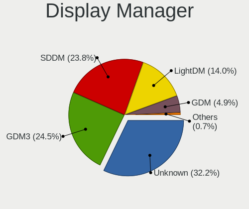
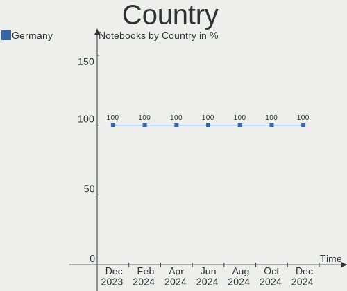
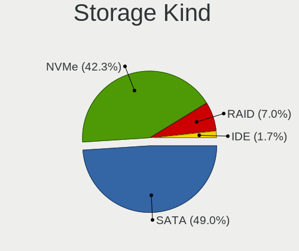
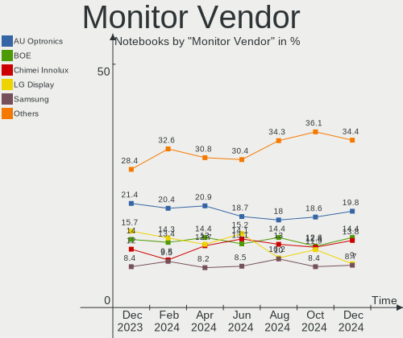
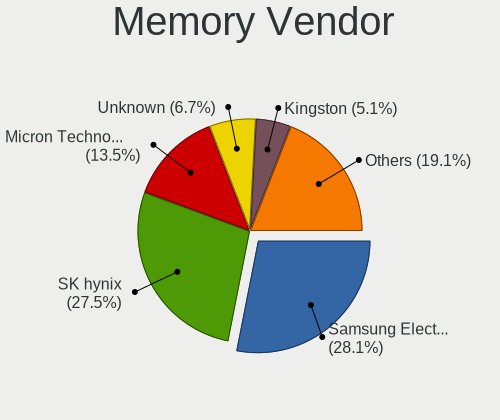
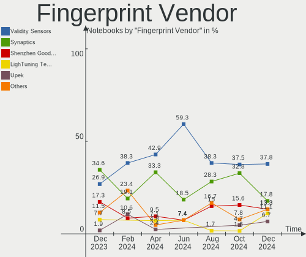

Linux in Germany - Hardware Trends (Notebooks)
----------------------------------------------

A project to identify most popular hardware characteristics and track their change
over time based on data collected by Linux users at https://Linux-Hardware.org.

Anyone can contribute to this report by the [hw-probe](https://github.com/linuxhw/hw-probe) tool:

    sudo -E hw-probe -all -upload

Period: Jun, 2023.

Contents
--------

* [ System ](#system)
  - [ OS                       ](#os)
  - [ OS Family                ](#os-family)
  - [ Kernel                   ](#kernel)
  - [ Kernel Family            ](#kernel-family)
  - [ Kernel Major Ver.        ](#kernel-major-ver)
  - [ Arch                     ](#arch)
  - [ DE                       ](#de)
  - [ Display Server           ](#display-server)
  - [ Display Manager          ](#display-manager)
  - [ OS Lang                  ](#os-lang)
  - [ Boot Mode                ](#boot-mode)
  - [ Filesystem               ](#filesystem)
  - [ Part. scheme             ](#part-scheme)
  - [ Dual Boot with Linux/BSD ](#dual-boot-with-linuxbsd)
  - [ Dual Boot (Win)          ](#dual-boot-win)

* [ Board ](#board)
  - [ Vendor                   ](#vendor)
  - [ Model                    ](#model)
  - [ Model Family             ](#model-family)
  - [ MFG Year                 ](#mfg-year)
  - [ Form Factor              ](#form-factor)
  - [ Secure Boot              ](#secure-boot)
  - [ Coreboot                 ](#coreboot)
  - [ RAM Size                 ](#ram-size)
  - [ RAM Used                 ](#ram-used)
  - [ Total Drives             ](#total-drives)
  - [ Has CD-ROM               ](#has-cd-rom)
  - [ Has Ethernet             ](#has-ethernet)
  - [ Has WiFi                 ](#has-wifi)
  - [ Has Bluetooth            ](#has-bluetooth)

* [ Location ](#location)
  - [ Country                  ](#country)
  - [ City                     ](#city)

* [ Drives ](#drives)
  - [ Drive Vendor             ](#drive-vendor)
  - [ Drive Model              ](#drive-model)
  - [ HDD Vendor               ](#hdd-vendor)
  - [ SSD Vendor               ](#ssd-vendor)
  - [ Drive Kind               ](#drive-kind)
  - [ Drive Connector          ](#drive-connector)
  - [ Drive Size               ](#drive-size)
  - [ Space Total              ](#space-total)
  - [ Space Used               ](#space-used)
  - [ Malfunc. Drives          ](#malfunc-drives)
  - [ Malfunc. Drive Vendor    ](#malfunc-drive-vendor)
  - [ Malfunc. HDD Vendor      ](#malfunc-hdd-vendor)
  - [ Malfunc. Drive Kind      ](#malfunc-drive-kind)
  - [ Failed Drives            ](#failed-drives)
  - [ Failed Drive Vendor      ](#failed-drive-vendor)
  - [ Drive Status             ](#drive-status)

* [ Storage controller ](#storage-controller)
  - [ Storage Vendor           ](#storage-vendor)
  - [ Storage Model            ](#storage-model)
  - [ Storage Kind             ](#storage-kind)

* [ Processor ](#processor)
  - [ CPU Vendor               ](#cpu-vendor)
  - [ CPU Model                ](#cpu-model)
  - [ CPU Model Family         ](#cpu-model-family)
  - [ CPU Cores                ](#cpu-cores)
  - [ CPU Sockets              ](#cpu-sockets)
  - [ CPU Threads              ](#cpu-threads)
  - [ CPU Op-Modes             ](#cpu-op-modes)
  - [ CPU Microcode            ](#cpu-microcode)
  - [ CPU Microarch            ](#cpu-microarch)

* [ Graphics ](#graphics)
  - [ GPU Vendor               ](#gpu-vendor)
  - [ GPU Model                ](#gpu-model)
  - [ GPU Combo                ](#gpu-combo)
  - [ GPU Driver               ](#gpu-driver)
  - [ GPU Memory               ](#gpu-memory)

* [ Monitor ](#monitor)
  - [ Monitor Vendor           ](#monitor-vendor)
  - [ Monitor Model            ](#monitor-model)
  - [ Monitor Resolution       ](#monitor-resolution)
  - [ Monitor Diagonal         ](#monitor-diagonal)
  - [ Monitor Width            ](#monitor-width)
  - [ Aspect Ratio             ](#aspect-ratio)
  - [ Monitor Area             ](#monitor-area)
  - [ Pixel Density            ](#pixel-density)
  - [ Multiple Monitors        ](#multiple-monitors)

* [ Network ](#network)
  - [ Net Controller Vendor    ](#net-controller-vendor)
  - [ Net Controller Model     ](#net-controller-model)
  - [ Wireless Vendor          ](#wireless-vendor)
  - [ Wireless Model           ](#wireless-model)
  - [ Ethernet Vendor          ](#ethernet-vendor)
  - [ Ethernet Model           ](#ethernet-model)
  - [ Net Controller Kind      ](#net-controller-kind)
  - [ Used Controller          ](#used-controller)
  - [ NICs                     ](#nics)
  - [ IPv6                     ](#ipv6)

* [ Bluetooth ](#bluetooth)
  - [ Bluetooth Vendor         ](#bluetooth-vendor)
  - [ Bluetooth Model          ](#bluetooth-model)

* [ Sound ](#sound)
  - [ Sound Vendor             ](#sound-vendor)
  - [ Sound Model              ](#sound-model)

* [ Memory ](#memory)
  - [ Memory Vendor            ](#memory-vendor)
  - [ Memory Model             ](#memory-model)
  - [ Memory Kind              ](#memory-kind)
  - [ Memory Form Factor       ](#memory-form-factor)
  - [ Memory Size              ](#memory-size)
  - [ Memory Speed             ](#memory-speed)

* [ Printers & scanners ](#printers--scanners)
  - [ Printer Vendor           ](#printer-vendor)
  - [ Printer Model            ](#printer-model)
  - [ Scanner Vendor           ](#scanner-vendor)
  - [ Scanner Model            ](#scanner-model)

* [ Camera ](#camera)
  - [ Camera Vendor            ](#camera-vendor)
  - [ Camera Model             ](#camera-model)

* [ Security ](#security)
  - [ Fingerprint Vendor       ](#fingerprint-vendor)
  - [ Fingerprint Model        ](#fingerprint-model)
  - [ Chipcard Vendor          ](#chipcard-vendor)
  - [ Chipcard Model           ](#chipcard-model)

* [ Unsupported ](#unsupported)
  - [ Unsupported Devices      ](#unsupported-devices)
  - [ Unsupported Device Types ](#unsupported-device-types)

System
------

OS
--

Installed operating systems

| Name                         | Notebooks | Percent |
|------------------------------|-----------|---------|
| Linux Mint 21.1              | 43        | 15.93%  |
| Ubuntu 22.04                 | 30        | 11.11%  |
| Fedora 38                    | 17        | 6.3%    |
| Ubuntu 23.04                 | 15        | 5.56%   |
| Debian 11                    | 15        | 5.56%   |
| Arch Rolling                 | 13        | 4.81%   |
| Debian 12                    | 10        | 3.7%    |
| Pop!_OS 22.04                | 7         | 2.59%   |
| Linux Mint 20.3              | 6         | 2.22%   |
| Elementary 7                 | 6         | 2.22%   |
| TUXEDO OS 22.04              | 5         | 1.85%   |
| SteamOS 3.4.8                | 5         | 1.85%   |
| Zorin 16                     | 4         | 1.48%   |
| Ubuntu 20.04                 | 4         | 1.48%   |
| openSUSE Tumbleweed-XXXXXXXX | 4         | 1.48%   |
| openSUSE Leap-15.5           | 4         | 1.48%   |
| Manjaro 23.0.0               | 4         | 1.48%   |
| Manjaro                      | 4         | 1.48%   |
| Kubuntu 22.04                | 4         | 1.48%   |
| ArcoLinux Rolling            | 4         | 1.48%   |
| Xero Rolling                 | 3         | 1.11%   |
| Ubuntu MATE 22.04            | 3         | 1.11%   |
| Ubuntu 22.10                 | 3         | 1.11%   |
| OpenMandriva 23.03           | 3         | 1.11%   |
| MX 21                        | 3         | 1.11%   |
| LMDE 5                       | 3         | 1.11%   |
| Linux Mint 21                | 3         | 1.11%   |
| KDE neon 22.04               | 3         | 1.11%   |
| Kali 2023.2                  | 3         | 1.11%   |
| Xubuntu 22.04                | 2         | 0.74%   |
| OpenMandriva 4.3             | 2         | 0.74%   |
| Lubuntu 22.04                | 2         | 0.74%   |
| Lilidog 23                   | 2         | 0.74%   |
| Kubuntu 23.04                | 2         | 0.74%   |
| Fedora 37                    | 2         | 0.74%   |
| BlackPanther 18.1            | 2         | 0.74%   |
| Xubuntu 20.04                | 1         | 0.37%   |
| Ubuntu 23.10                 | 1         | 0.37%   |
| ROSA 12.4                    | 1         | 0.37%   |
| Rocky Linux 9.2              | 1         | 0.37%   |

OS Family
---------

OS without a version

| Name         | Notebooks | Percent |
|--------------|-----------|---------|
| Linux Mint   | 54        | 20%     |
| Ubuntu       | 53        | 19.63%  |
| Debian       | 25        | 9.26%   |
| Fedora       | 19        | 7.04%   |
| Arch         | 13        | 4.81%   |
| openSUSE     | 10        | 3.7%    |
| Manjaro      | 9         | 3.33%   |
| Pop!_OS      | 7         | 2.59%   |
| OpenMandriva | 7         | 2.59%   |
| Kubuntu      | 7         | 2.59%   |
| Elementary   | 6         | 2.22%   |
| TUXEDO OS    | 5         | 1.85%   |
| SteamOS      | 5         | 1.85%   |
| Zorin        | 4         | 1.48%   |
| ArcoLinux    | 4         | 1.48%   |
| Xubuntu      | 3         | 1.11%   |
| Xero         | 3         | 1.11%   |
| Ubuntu MATE  | 3         | 1.11%   |
| MX           | 3         | 1.11%   |
| Lubuntu      | 3         | 1.11%   |
| LMDE         | 3         | 1.11%   |
| KDE neon     | 3         | 1.11%   |
| Kali         | 3         | 1.11%   |
| Lilidog      | 2         | 0.74%   |
| BlackPanther | 2         | 0.74%   |
| ROSA         | 1         | 0.37%   |
| Rocky Linux  | 1         | 0.37%   |
| risiOS       | 1         | 0.37%   |
| Reborn OS    | 1         | 0.37%   |
| Parrot       | 1         | 0.37%   |
| Nobara       | 1         | 0.37%   |
| NixOS        | 1         | 0.37%   |
| Linux Lite   | 1         | 0.37%   |
| Garuda Linux | 1         | 0.37%   |
| EndeavourOS  | 1         | 0.37%   |
| Devuan       | 1         | 0.37%   |
| Deepin       | 1         | 0.37%   |
| CachyOS      | 1         | 0.37%   |
| blendOS      | 1         | 0.37%   |

Kernel
------

Version of the Linux kernel

| Version                     | Notebooks | Percent |
|-----------------------------|-----------|---------|
| 5.15.0-73-generic           | 29        | 10.74%  |
| 5.19.0-43-generic           | 23        | 8.52%   |
| 5.19.0-45-generic           | 19        | 7.04%   |
| 5.15.0-75-generic           | 15        | 5.56%   |
| 6.1.0-9-amd64               | 12        | 4.44%   |
| 5.10.0-23-amd64             | 12        | 4.44%   |
| 6.2.0-20-generic            | 10        | 3.7%    |
| 6.3.8-200.fc38.x86_64       | 7         | 2.59%   |
| 6.2.6-76060206-generic      | 7         | 2.59%   |
| 6.3.8-arch1-1               | 5         | 1.85%   |
| 6.2.0-23-generic            | 5         | 1.85%   |
| 6.1.31-2-MANJARO            | 5         | 1.85%   |
| 5.15.0-76-generic           | 5         | 1.85%   |
| 5.13.0-valve36-1-neptune    | 5         | 1.85%   |
| 6.3.9-arch1-1               | 4         | 1.48%   |
| 6.3.5-200.fc38.x86_64       | 4         | 1.48%   |
| 5.14.21-150500.53-default   | 4         | 1.48%   |
| 6.3.7-200.fc38.x86_64       | 3         | 1.11%   |
| 6.2.6-desktop-1omv2390      | 3         | 1.11%   |
| 6.2.0-10010-tuxedo          | 3         | 1.11%   |
| 6.1.0-kali9-amd64           | 3         | 1.11%   |
| 5.4.0-150-generic           | 3         | 1.11%   |
| 5.19.0-41-generic           | 3         | 1.11%   |
| 5.15.0-56-generic           | 3         | 1.11%   |
| 6.3.9-zen1-1-zen            | 2         | 0.74%   |
| 6.3.7-zen1-1-zen            | 2         | 0.74%   |
| 6.3.7-1-default             | 2         | 0.74%   |
| 6.3.6-200.fc38.x86_64       | 2         | 0.74%   |
| 6.3.5-arch1-1               | 2         | 0.74%   |
| 6.2.0-24-generic            | 2         | 0.74%   |
| 6.2.0-10007-tuxedo          | 2         | 0.74%   |
| 6.1.35-1-lts                | 2         | 0.74%   |
| 6.1.0-0.deb11.7-amd64       | 2         | 0.74%   |
| 6.0.0-6mx-amd64             | 2         | 0.74%   |
| 5.4.0-152-generic           | 2         | 0.74%   |
| 5.19.0-46-generic           | 2         | 0.74%   |
| 5.19.0-42-generic           | 2         | 0.74%   |
| 5.15.0-71-generic           | 2         | 0.74%   |
| 6.3.7-arch1-1               | 1         | 0.37%   |
| 6.3.7-200.fsync.fc37.x86_64 | 1         | 0.37%   |

Kernel Family
-------------

Linux kernel without a distro release

| Version | Notebooks | Percent |
|---------|-----------|---------|
| 5.15.0  | 60        | 22.22%  |
| 5.19.0  | 50        | 18.52%  |
| 6.2.0   | 24        | 8.89%   |
| 6.1.0   | 18        | 6.67%   |
| 5.10.0  | 16        | 5.93%   |
| 6.3.8   | 12        | 4.44%   |
| 6.3.7   | 10        | 3.7%    |
| 6.2.6   | 10        | 3.7%    |
| 6.3.5   | 8         | 2.96%   |
| 6.1.31  | 7         | 2.59%   |
| 6.3.9   | 6         | 2.22%   |
| 6.3.6   | 6         | 2.22%   |
| 5.4.0   | 6         | 2.22%   |
| 5.14.21 | 5         | 1.85%   |
| 5.13.0  | 5         | 1.85%   |
| 6.3.4   | 4         | 1.48%   |
| 5.14.0  | 3         | 1.11%   |
| 6.3.1   | 2         | 0.74%   |
| 6.1.35  | 2         | 0.74%   |
| 6.0.0   | 2         | 0.74%   |
| 6.2.9   | 1         | 0.37%   |
| 6.1.34  | 1         | 0.37%   |
| 6.1.24  | 1         | 0.37%   |
| 6.1.20  | 1         | 0.37%   |
| 6.1.11  | 1         | 0.37%   |
| 5.16.7  | 1         | 0.37%   |
| 5.16.13 | 1         | 0.37%   |
| 5.16.0  | 1         | 0.37%   |
| 5.15.94 | 1         | 0.37%   |
| 5.15.85 | 1         | 0.37%   |
| 5.15.79 | 1         | 0.37%   |
| 5.10.14 | 1         | 0.37%   |
| 4.18.16 | 1         | 0.37%   |
| 4.15.0  | 1         | 0.37%   |

Kernel Major Ver.
-----------------

Linux kernel major version

| Version | Notebooks | Percent |
|---------|-----------|---------|
| 5.15    | 63        | 23.33%  |
| 5.19    | 50        | 18.52%  |
| 6.3     | 48        | 17.78%  |
| 6.2     | 35        | 12.96%  |
| 6.1     | 31        | 11.48%  |
| 5.10    | 17        | 6.3%    |
| 5.14    | 8         | 2.96%   |
| 5.4     | 6         | 2.22%   |
| 5.13    | 5         | 1.85%   |
| 5.16    | 3         | 1.11%   |
| 6.0     | 2         | 0.74%   |
| 4.18    | 1         | 0.37%   |
| 4.15    | 1         | 0.37%   |

Arch
----

OS architecture (x86_64, i586, etc.)

| Name   | Notebooks | Percent |
|--------|-----------|---------|
| x86_64 | 268       | 99.26%  |
| i686   | 2         | 0.74%   |

DE
--

Desktop Environment

| Name             | Notebooks | Percent |
|------------------|-----------|---------|
| GNOME            | 99        | 36.67%  |
| KDE5             | 60        | 22.22%  |
| X-Cinnamon       | 44        | 16.3%   |
| XFCE             | 29        | 10.74%  |
| MATE             | 9         | 3.33%   |
| Pantheon         | 6         | 2.22%   |
| Cinnamon         | 5         | 1.85%   |
| LXQt             | 4         | 1.48%   |
| LXDE             | 3         | 1.11%   |
| Unknown          | 3         | 1.11%   |
| lightdm-xsession | 2         | 0.74%   |
| sway             | 1         | 0.37%   |
| openbox          | 1         | 0.37%   |
| KDE              | 1         | 0.37%   |
| GNOME Classic    | 1         | 0.37%   |
| DDE              | 1         | 0.37%   |
| chadwm           | 1         | 0.37%   |

Display Server
--------------

X11 or Wayland

| Name    | Notebooks | Percent |
|---------|-----------|---------|
| X11     | 192       | 71.11%  |
| Wayland | 72        | 26.67%  |
| Unknown | 4         | 1.48%   |
| Tty     | 2         | 0.74%   |

Display Manager
---------------

SDDM, LightDM, etc.

| Name    | Notebooks | Percent |
|---------|-----------|---------|
| Unknown | 105       | 38.89%  |
| LightDM | 55        | 20.37%  |
| GDM3    | 53        | 19.63%  |
| SDDM    | 40        | 14.81%  |
| GDM     | 14        | 5.19%   |
| LXDM    | 2         | 0.74%   |
| SLiM    | 1         | 0.37%   |

OS Lang
-------

Language

| Lang    | Notebooks | Percent |
|---------|-----------|---------|
| de_DE   | 187       | 69.26%  |
| en_US   | 58        | 21.48%  |
| C       | 5         | 1.85%   |
| en_GB   | 4         | 1.48%   |
| ru_RU   | 3         | 1.11%   |
| Unknown | 3         | 1.11%   |
| tr_TR   | 2         | 0.74%   |
| sl_SI   | 1         | 0.37%   |
| sk_SK   | 1         | 0.37%   |
| POSIX   | 1         | 0.37%   |
| nl_NL   | 1         | 0.37%   |
| fr_FR   | 1         | 0.37%   |
| en_IE   | 1         | 0.37%   |
| en_DE   | 1         | 0.37%   |
| en_CA   | 1         | 0.37%   |

Boot Mode
---------

EFI or BIOS

| Mode | Notebooks | Percent |
|------|-----------|---------|
| EFI  | 140       | 51.85%  |
| BIOS | 130       | 48.15%  |

Filesystem
----------

Type of filesystem

| Type    | Notebooks | Percent |
|---------|-----------|---------|
| Ext4    | 163       | 60.37%  |
| Btrfs   | 48        | 17.78%  |
| Tmpfs   | 45        | 16.67%  |
| Overlay | 7         | 2.59%   |
| Xfs     | 5         | 1.85%   |
| Zfs     | 1         | 0.37%   |
| Unknown | 1         | 0.37%   |

Part. scheme
------------

Scheme of partitioning

| Type    | Notebooks | Percent |
|---------|-----------|---------|
| GPT     | 141       | 52.22%  |
| Unknown | 104       | 38.52%  |
| MBR     | 25        | 9.26%   |

Dual Boot with Linux/BSD
------------------------

Hosting more than one Linux/BSD

| Dual boot | Notebooks | Percent |
|-----------|-----------|---------|
| No        | 248       | 91.85%  |
| Yes       | 22        | 8.15%   |

Dual Boot (Win)
---------------

Hosting Linux and Windows

| Dual boot | Notebooks | Percent |
|-----------|-----------|---------|
| No        | 231       | 85.56%  |
| Yes       | 39        | 14.44%  |

Board
-----

Vendor
------

Motherboard manufacturer

| Name                | Notebooks | Percent |
|---------------------|-----------|---------|
| Lenovo              | 57        | 21.11%  |
| Hewlett-Packard     | 53        | 19.63%  |
| Acer                | 29        | 10.74%  |
| ASUSTek Computer    | 28        | 10.37%  |
| Dell                | 27        | 10%     |
| TUXEDO              | 12        | 4.44%   |
| MSI                 | 7         | 2.59%   |
| Medion              | 7         | 2.59%   |
| Fujitsu             | 7         | 2.59%   |
| Apple               | 7         | 2.59%   |
| Valve               | 5         | 1.85%   |
| Sony                | 4         | 1.48%   |
| Toshiba             | 3         | 1.11%   |
| Packard Bell        | 3         | 1.11%   |
| Schenker            | 2         | 0.74%   |
| Pegatron            | 2         | 0.74%   |
| HUAWEI              | 2         | 0.74%   |
| HONOR               | 2         | 0.74%   |
| Gigabyte Technology | 2         | 0.74%   |
| VALE                | 1         | 0.37%   |
| Samsung Electronics | 1         | 0.37%   |
| LincPlus            | 1         | 0.37%   |
| Intel               | 1         | 0.37%   |
| Hampoo              | 1         | 0.37%   |
| Google              | 1         | 0.37%   |
| Fujitsu Siemens     | 1         | 0.37%   |
| Framework           | 1         | 0.37%   |
| Clevo               | 1         | 0.37%   |
| Chuwi               | 1         | 0.37%   |
| Unknown             | 1         | 0.37%   |

Model
-----

Motherboard model

| Name                             | Notebooks | Percent |
|----------------------------------|-----------|---------|
| Valve Jupiter                    | 5         | 1.85%   |
| HP Notebook                      | 3         | 1.11%   |
| Unknown                          | 3         | 1.11%   |
| TUXEDO Pulse 15 Gen1             | 2         | 0.74%   |
| Pegatron Spring Peak             | 2         | 0.74%   |
| Medion E6214                     | 2         | 0.74%   |
| HP Pavilion Notebook             | 2         | 0.74%   |
| HP Laptop 15s-eq2xxx             | 2         | 0.74%   |
| HP Laptop 15-db0xxx              | 2         | 0.74%   |
| HP EliteBook 840 G3              | 2         | 0.74%   |
| HP EliteBook 1040 G4             | 2         | 0.74%   |
| HP 255 15.6 inch G9 Notebook PC  | 2         | 0.74%   |
| Fujitsu LIFEBOOK S751            | 2         | 0.74%   |
| Acer Aspire 5738                 | 2         | 0.74%   |
| VALE Notebook Classic C140       | 1         | 0.37%   |
| TUXEDO Stellaris Intel Gen4      | 1         | 0.37%   |
| TUXEDO Pulse 15 Gen2             | 1         | 0.37%   |
| TUXEDO P95xER                    | 1         | 0.37%   |
| TUXEDO P65xRP                    | 1         | 0.37%   |
| TUXEDO P64_HJ,HK1                | 1         | 0.37%   |
| TUXEDO N8xEJEK                   | 1         | 0.37%   |
| TUXEDO InfinityBook S 15/17 Gen7 | 1         | 0.37%   |
| TUXEDO InfinityBook Pro 15 v5    | 1         | 0.37%   |
| Toshiba TECRA Z40-C              | 1         | 0.37%   |
| Toshiba Satellite L775D-107      | 1         | 0.37%   |
| Toshiba Satellite L50-C          | 1         | 0.37%   |
| Sony VPCEH2H4E                   | 1         | 0.37%   |
| Sony VGN-FE41M                   | 1         | 0.37%   |
| Sony SVF1421L1EW                 | 1         | 0.37%   |
| Sony SVE1712C1EW                 | 1         | 0.37%   |
| Schenker XMG PRO (E23)           | 1         | 0.37%   |
| Schenker VIA 15 Pro              | 1         | 0.37%   |
| Samsung 750XDA                   | 1         | 0.37%   |
| Packard Bell EasyNote TK11BZ     | 1         | 0.37%   |
| Packard Bell EasyNote TE11HC     | 1         | 0.37%   |
| Packard Bell EasyNote ENTF71BM   | 1         | 0.37%   |
| MSI Vector GP76 12UH             | 1         | 0.37%   |
| MSI U200                         | 1         | 0.37%   |
| MSI S12T 3M/S12 3M               | 1         | 0.37%   |
| MSI MS-16Y1                      | 1         | 0.37%   |

Model Family
------------

Motherboard model prefix

| Name                  | Notebooks | Percent |
|-----------------------|-----------|---------|
| Lenovo ThinkPad       | 39        | 14.44%  |
| Acer Aspire           | 20        | 7.41%   |
| HP EliteBook          | 16        | 5.93%   |
| Dell Latitude         | 11        | 4.07%   |
| Lenovo IdeaPad        | 10        | 3.7%    |
| HP Laptop             | 10        | 3.7%    |
| HP Pavilion           | 9         | 3.33%   |
| Fujitsu LIFEBOOK      | 7         | 2.59%   |
| Dell Precision        | 6         | 2.22%   |
| Valve Jupiter         | 5         | 1.85%   |
| Dell XPS              | 5         | 1.85%   |
| Acer Swift            | 5         | 1.85%   |
| ASUS VivoBook         | 4         | 1.48%   |
| TUXEDO Pulse          | 3         | 1.11%   |
| Packard Bell EasyNote | 3         | 1.11%   |
| Lenovo V15            | 3         | 1.11%   |
| HP ProBook            | 3         | 1.11%   |
| HP Notebook           | 3         | 1.11%   |
| HP 255                | 3         | 1.11%   |
| Unknown               | 3         | 1.11%   |
| TUXEDO InfinityBook   | 2         | 0.74%   |
| Toshiba Satellite     | 2         | 0.74%   |
| Pegatron Spring       | 2         | 0.74%   |
| Medion E6214          | 2         | 0.74%   |
| Medion Akoya          | 2         | 0.74%   |
| HP OMEN               | 2         | 0.74%   |
| HP ENVY               | 2         | 0.74%   |
| Dell Inspiron         | 2         | 0.74%   |
| ASUS ROG              | 2         | 0.74%   |
| Apple MacBookPro11    | 2         | 0.74%   |
| Acer TravelMate       | 2         | 0.74%   |
| VALE Notebook         | 1         | 0.37%   |
| TUXEDO Stellaris      | 1         | 0.37%   |
| TUXEDO P95xER         | 1         | 0.37%   |
| TUXEDO P65xRP         | 1         | 0.37%   |
| TUXEDO P64            | 1         | 0.37%   |
| TUXEDO N8xEJEK        | 1         | 0.37%   |
| Toshiba TECRA         | 1         | 0.37%   |
| Sony VPCEH2H4E        | 1         | 0.37%   |
| Sony VGN-FE41M        | 1         | 0.37%   |

MFG Year
--------

Motherboard manufacture year

| Year | Notebooks | Percent |
|------|-----------|---------|
| 2021 | 35        | 12.96%  |
| 2022 | 29        | 10.74%  |
| 2015 | 23        | 8.52%   |
| 2010 | 21        | 7.78%   |
| 2020 | 20        | 7.41%   |
| 2018 | 20        | 7.41%   |
| 2016 | 20        | 7.41%   |
| 2019 | 17        | 6.3%    |
| 2011 | 16        | 5.93%   |
| 2014 | 13        | 4.81%   |
| 2017 | 12        | 4.44%   |
| 2013 | 12        | 4.44%   |
| 2012 | 9         | 3.33%   |
| 2009 | 9         | 3.33%   |
| 2008 | 7         | 2.59%   |
| 2023 | 5         | 1.85%   |
| 2006 | 2         | 0.74%   |

Form Factor
-----------

Physical design of the computer

| Name     | Notebooks | Percent |
|----------|-----------|---------|
| Notebook | 270       | 100%    |

Secure Boot
-----------

Enabled or disabled

| State    | Notebooks | Percent |
|----------|-----------|---------|
| Disabled | 248       | 91.85%  |
| Enabled  | 22        | 8.15%   |

Coreboot
--------

Have coreboot on board

| Used | Notebooks | Percent |
|------|-----------|---------|
| No   | 269       | 99.63%  |
| Yes  | 1         | 0.37%   |

RAM Size
--------

Total RAM memory

| Size in GB  | Notebooks | Percent |
|-------------|-----------|---------|
| 4.01-8.0    | 90        | 33.33%  |
| 16.01-24.0  | 48        | 17.78%  |
| 8.01-16.0   | 43        | 15.93%  |
| 3.01-4.0    | 40        | 14.81%  |
| 32.01-64.0  | 33        | 12.22%  |
| 64.01-256.0 | 5         | 1.85%   |
| 1.01-2.0    | 4         | 1.48%   |
| 24.01-32.0  | 3         | 1.11%   |
| 2.01-3.0    | 3         | 1.11%   |
| 0.51-1.0    | 1         | 0.37%   |

RAM Used
--------

Used RAM memory

| Used GB    | Notebooks | Percent |
|------------|-----------|---------|
| 1.01-2.0   | 77        | 28.52%  |
| 2.01-3.0   | 76        | 28.15%  |
| 4.01-8.0   | 48        | 17.78%  |
| 3.01-4.0   | 43        | 15.93%  |
| 0.51-1.0   | 14        | 5.19%   |
| 8.01-16.0  | 11        | 4.07%   |
| 16.01-24.0 | 1         | 0.37%   |

Total Drives
------------

Number of drives on board

| Drives | Notebooks | Percent |
|--------|-----------|---------|
| 1      | 200       | 74.07%  |
| 2      | 60        | 22.22%  |
| 3      | 9         | 3.33%   |
| 4      | 1         | 0.37%   |

Has CD-ROM
----------

Has CD-ROM on board

| Presented | Notebooks | Percent |
|-----------|-----------|---------|
| No        | 175       | 64.81%  |
| Yes       | 95        | 35.19%  |

Has Ethernet
------------

Has Ethernet on board

| Presented | Notebooks | Percent |
|-----------|-----------|---------|
| Yes       | 217       | 80.37%  |
| No        | 53        | 19.63%  |

Has WiFi
--------

Has WiFi module

| Presented | Notebooks | Percent |
|-----------|-----------|---------|
| Yes       | 265       | 98.15%  |
| No        | 5         | 1.85%   |

Has Bluetooth
-------------

Has Bluetooth module

| Presented | Notebooks | Percent |
|-----------|-----------|---------|
| Yes       | 214       | 79.26%  |
| No        | 56        | 20.74%  |

Location
--------

Country
-------

Geographic location (country)

| Country | Notebooks | Percent |
|---------|-----------|---------|
| Germany | 270       | 100%    |

City
----

Geographic location (city)

| City              | Notebooks | Percent |
|-------------------|-----------|---------|
| Berlin            | 21        | 7.78%   |
| Hamburg           | 9         | 3.33%   |
| Nuremberg         | 8         | 2.96%   |
| Munich            | 8         | 2.96%   |
| Karlsruhe         | 6         | 2.22%   |
| Cologne           | 6         | 2.22%   |
| Bonn              | 6         | 2.22%   |
| Stuttgart         | 5         | 1.85%   |
| Düsseldorf       | 4         | 1.48%   |
| Wuppertal         | 3         | 1.11%   |
| Münster          | 3         | 1.11%   |
| Lübeck           | 3         | 1.11%   |
| Leipzig           | 3         | 1.11%   |
| Göppingen        | 3         | 1.11%   |
| Frankfurt am Main | 3         | 1.11%   |
| Dortmund          | 3         | 1.11%   |
| Chemnitz          | 3         | 1.11%   |
| Augsburg          | 3         | 1.11%   |
| Wittingen         | 2         | 0.74%   |
| Ulm               | 2         | 0.74%   |
| Troisdorf         | 2         | 0.74%   |
| Singen            | 2         | 0.74%   |
| Reutlingen        | 2         | 0.74%   |
| Oldenburg         | 2         | 0.74%   |
| Olching           | 2         | 0.74%   |
| Offenbach         | 2         | 0.74%   |
| Obertshausen      | 2         | 0.74%   |
| Nieder-Olm        | 2         | 0.74%   |
| Mönchengladbach  | 2         | 0.74%   |
| Krefeld           | 2         | 0.74%   |
| Kirchhain         | 2         | 0.74%   |
| Kassel            | 2         | 0.74%   |
| Hilden            | 2         | 0.74%   |
| Hanover           | 2         | 0.74%   |
| Garching          | 2         | 0.74%   |
| Floersheim        | 2         | 0.74%   |
| Eggesin           | 2         | 0.74%   |
| Duisburg          | 2         | 0.74%   |
| Dresden           | 2         | 0.74%   |
| Bremen            | 2         | 0.74%   |

Drives
------

Drive Vendor
------------

Hard drive vendors

| Vendor                         | Notebooks | Drives | Percent |
|--------------------------------|-----------|--------|---------|
| Samsung Electronics            | 75        | 86     | 23.22%  |
| Sandisk                        | 31        | 32     | 9.6%    |
| WDC                            | 24        | 24     | 7.43%   |
| Unknown                        | 18        | 18     | 5.57%   |
| Seagate                        | 18        | 19     | 5.57%   |
| Micron Technology              | 17        | 17     | 5.26%   |
| Toshiba                        | 15        | 16     | 4.64%   |
| Intel                          | 15        | 16     | 4.64%   |
| Crucial                        | 14        | 14     | 4.33%   |
| SK hynix                       | 12        | 12     | 3.72%   |
| Kingston                       | 8         | 8      | 2.48%   |
| Phison Electronics             | 7         | 7      | 2.17%   |
| HGST                           | 7         | 7      | 2.17%   |
| Intenso                        | 5         | 5      | 1.55%   |
| SPCC                           | 4         | 4      | 1.24%   |
| Micron/Crucial Technology      | 4         | 4      | 1.24%   |
| Kingston Technology Company    | 4         | 4      | 1.24%   |
| Hitachi                        | 4         | 4      | 1.24%   |
| Apple                          | 4         | 4      | 1.24%   |
| China                          | 3         | 3      | 0.93%   |
| ASMT                           | 3         | 3      | 0.93%   |
| Union Memory (Shenzhen)        | 2         | 2      | 0.62%   |
| Solid State Storage Technology | 2         | 2      | 0.62%   |
| Silicon Motion                 | 2         | 2      | 0.62%   |
| Phison                         | 2         | 2      | 0.62%   |
| LITEON                         | 2         | 2      | 0.62%   |
| KIOXIA                         | 2         | 2      | 0.62%   |
| Union Memory                   | 1         | 1      | 0.31%   |
| Transcend                      | 1         | 1      | 0.31%   |
| ShanDianZhe                    | 1         | 1      | 0.31%   |
| PNY                            | 1         | 2      | 0.31%   |
| OCZ                            | 1         | 1      | 0.31%   |
| O2 Micro                       | 1         | 1      | 0.31%   |
| Netac                          | 1         | 1      | 0.31%   |
| MicroFrom                      | 1         | 1      | 0.31%   |
| MAXIO Technology (Hangzhou)    | 1         | 1      | 0.31%   |
| LITEONIT                       | 1         | 1      | 0.31%   |
| Lenovo                         | 1         | 1      | 0.31%   |
| JMicron Technology             | 1         | 1      | 0.31%   |
| JetFlash                       | 1         | 1      | 0.31%   |

Drive Model
-----------

Hard drive models

| Model                                               | Notebooks | Percent |
|-----------------------------------------------------|-----------|---------|
| Samsung NVMe SSD Controller SM981/PM981/PM983 250GB | 16        | 4.8%    |
| Samsung NVMe SSD Controller PM9A1/PM9A3/980PRO 2TB  | 7         | 2.1%    |
| Toshiba MQ01ABD100 1TB                              | 4         | 1.2%    |
| SPCC Solid State Disk 1024GB                        | 4         | 1.2%    |
| Samsung SSD 840 EVO 250GB                           | 4         | 1.2%    |
| Intel SSD 660P Series 512GB                         | 4         | 1.2%    |
| WDC WD10JPVX-22JC3T0 1TB                            | 3         | 0.9%    |
| Unknown MMC Card  64GB                              | 3         | 0.9%    |
| Unknown MMC Card  32GB                              | 3         | 0.9%    |
| Sandisk WD Black SN850 1TB                          | 3         | 0.9%    |
| Sandisk WD Black SN750 / PC SN730 NVMe SSD 500GB    | 3         | 0.9%    |
| Samsung SSD 860 EVO M.2 500GB                       | 3         | 0.9%    |
| Samsung SSD 850 EVO 500GB                           | 3         | 0.9%    |
| Phison PS5013 E13 NVMe Controller 512GB             | 3         | 0.9%    |
| Micron MTFDHBA512QFD 512GB                          | 3         | 0.9%    |
| Crucial CT1000BX500SSD1 1TB                         | 3         | 0.9%    |
| WDC WDS240G2G0A-00JH30 240GB SSD                    | 2         | 0.6%    |
| WDC WD5000LPVX-80V0TT0 500GB                        | 2         | 0.6%    |
| Unknown MMC Card  256GB                             | 2         | 0.6%    |
| Unknown MMC Card  128GB                             | 2         | 0.6%    |
| SK hynix PC801 NVMe 1TB                             | 2         | 0.6%    |
| Seagate ST500LT012-1DG142 500GB                     | 2         | 0.6%    |
| Seagate ST1000LM035-1RK172 1TB                      | 2         | 0.6%    |
| Seagate ST1000LM024 HN-M101MBB 1TB                  | 2         | 0.6%    |
| Sandisk WD Blue SN550 NVMe SSD 1TB                  | 2         | 0.6%    |
| SanDisk SSD PLUS 240GB                              | 2         | 0.6%    |
| SanDisk SDSSDP128G 128GB                            | 2         | 0.6%    |
| SanDisk SD8SN8U-256G-1006 256GB SSD                 | 2         | 0.6%    |
| SanDisk NVMe SSD Drive 512GB                        | 2         | 0.6%    |
| Samsung SSD 980 1TB                                 | 2         | 0.6%    |
| Samsung SSD 970 EVO Plus 2TB                        | 2         | 0.6%    |
| Samsung SSD 970 EVO Plus 1TB                        | 2         | 0.6%    |
| Samsung SSD 850 EVO mSATA 250GB                     | 2         | 0.6%    |
| Samsung SSD 850 EVO 250GB                           | 2         | 0.6%    |
| Samsung NVMe SSD Controller SM951/PM951 256GB       | 2         | 0.6%    |
| Samsung MZVLQ512HBLU-00BH1 512GB                    | 2         | 0.6%    |
| Samsung MZVL21T0HCLR-00BL7 1TB                      | 2         | 0.6%    |
| Samsung MZAL4512HBLU-00BL2 512GB                    | 2         | 0.6%    |
| Phison E16 PCIe4 NVMe Controller 1TB                | 2         | 0.6%    |
| Micron/Crucial P2 NVMe PCIe SSD 4TB                 | 2         | 0.6%    |

HDD Vendor
----------

Hard disk drive vendors

| Vendor              | Notebooks | Drives | Percent |
|---------------------|-----------|--------|---------|
| WDC                 | 17        | 17     | 29.31%  |
| Seagate             | 17        | 18     | 29.31%  |
| Toshiba             | 9         | 9      | 15.52%  |
| HGST                | 7         | 7      | 12.07%  |
| Hitachi             | 4         | 4      | 6.9%    |
| Samsung Electronics | 1         | 1      | 1.72%   |
| Fujitsu             | 1         | 1      | 1.72%   |
| ASMT                | 1         | 1      | 1.72%   |
| Apple               | 1         | 1      | 1.72%   |

SSD Vendor
----------

Solid state drive vendors

| Vendor              | Notebooks | Drives | Percent |
|---------------------|-----------|--------|---------|
| Samsung Electronics | 31        | 33     | 26.27%  |
| SanDisk             | 17        | 17     | 14.41%  |
| Crucial             | 13        | 13     | 11.02%  |
| Kingston            | 7         | 7      | 5.93%   |
| Micron Technology   | 6         | 6      | 5.08%   |
| Intel               | 6         | 6      | 5.08%   |
| WDC                 | 4         | 4      | 3.39%   |
| SPCC                | 4         | 4      | 3.39%   |
| SK hynix            | 3         | 3      | 2.54%   |
| Intenso             | 3         | 3      | 2.54%   |
| China               | 3         | 3      | 2.54%   |
| Apple               | 3         | 3      | 2.54%   |
| Toshiba             | 2         | 2      | 1.69%   |
| Phison              | 2         | 2      | 1.69%   |
| ASMT                | 2         | 2      | 1.69%   |
| Transcend           | 1         | 1      | 0.85%   |
| Seagate             | 1         | 1      | 0.85%   |
| OCZ                 | 1         | 1      | 0.85%   |
| Netac               | 1         | 1      | 0.85%   |
| MicroFrom           | 1         | 1      | 0.85%   |
| LITEONIT            | 1         | 1      | 0.85%   |
| LITEON              | 1         | 1      | 0.85%   |
| GLOWAY              | 1         | 1      | 0.85%   |
| Emtec               | 1         | 1      | 0.85%   |
| Apacer              | 1         | 1      | 0.85%   |
| A-DATA Technology   | 1         | 1      | 0.85%   |
| Unknown             | 1         | 1      | 0.85%   |

Drive Kind
----------

HDD or SSD

| Kind    | Notebooks | Drives | Percent |
|---------|-----------|--------|---------|
| NVMe    | 121       | 138    | 38.54%  |
| SSD     | 113       | 120    | 35.99%  |
| HDD     | 58        | 59     | 18.47%  |
| MMC     | 18        | 18     | 5.73%   |
| Unknown | 4         | 4      | 1.27%   |

Drive Connector
---------------

SATA, SAS, NVMe, etc.

| Type | Notebooks | Drives | Percent |
|------|-----------|--------|---------|
| SATA | 157       | 177    | 51.99%  |
| NVMe | 120       | 137    | 39.74%  |
| MMC  | 18        | 18     | 5.96%   |
| SAS  | 7         | 7      | 2.32%   |

Drive Size
----------

Size of hard drive

| Size in TB | Notebooks | Drives | Percent |
|------------|-----------|--------|---------|
| 0.01-0.5   | 114       | 120    | 66.67%  |
| 0.51-1.0   | 51        | 53     | 29.82%  |
| 1.01-2.0   | 6         | 6      | 3.51%   |

Space Total
-----------

Amount of disk space available on the file system

| Size in GB     | Notebooks | Percent |
|----------------|-----------|---------|
| 251-500        | 72        | 26.67%  |
| 101-250        | 70        | 25.93%  |
| 501-1000       | 60        | 22.22%  |
| 1001-2000      | 17        | 6.3%    |
| 1-20           | 15        | 5.56%   |
| 51-100         | 14        | 5.19%   |
| More than 3000 | 9         | 3.33%   |
| 2001-3000      | 6         | 2.22%   |
| Unknown        | 4         | 1.48%   |
| 21-50          | 3         | 1.11%   |

Space Used
----------

Amount of used disk space

| Used GB        | Notebooks | Percent |
|----------------|-----------|---------|
| 1-20           | 76        | 28.15%  |
| 21-50          | 64        | 23.7%   |
| 101-250        | 45        | 16.67%  |
| 251-500        | 34        | 12.59%  |
| 51-100         | 27        | 10%     |
| 501-1000       | 11        | 4.07%   |
| 1001-2000      | 7         | 2.59%   |
| Unknown        | 4         | 1.48%   |
| More than 3000 | 1         | 0.37%   |
| 2001-3000      | 1         | 0.37%   |

Malfunc. Drives
---------------

Drive models with a malfunction

| Model                                          | Notebooks | Drives | Percent |
|------------------------------------------------|-----------|--------|---------|
| WDC WD7500BPVT-22HXZT3 752GB                   | 1         | 1      | 10%     |
| WDC WD5000LPVX-80V0TT0 500GB                   | 1         | 1      | 10%     |
| Toshiba MQ01ABD100 1TB                         | 1         | 1      | 10%     |
| SK hynix HFS128G3BTND-N210A 128GB SSD          | 1         | 1      | 10%     |
| Seagate ST9320325AS 320GB                      | 1         | 1      | 10%     |
| PNY CS3030 1TB SSD                             | 1         | 2      | 10%     |
| OCZ VERTEX2 64GB SSD                           | 1         | 1      | 10%     |
| Micron Technology 5100_MTFDDAK960TCB 960GB SSD | 1         | 1      | 10%     |
| LITEON CA3-8D256 256GB                         | 1         | 1      | 10%     |
| HGST HTS541010A9E680 1TB                       | 1         | 1      | 10%     |

Malfunc. Drive Vendor
---------------------

Vendors of faulty drives

| Vendor            | Notebooks | Drives | Percent |
|-------------------|-----------|--------|---------|
| WDC               | 2         | 2      | 20%     |
| Toshiba           | 1         | 1      | 10%     |
| SK hynix          | 1         | 1      | 10%     |
| Seagate           | 1         | 1      | 10%     |
| PNY               | 1         | 2      | 10%     |
| OCZ               | 1         | 1      | 10%     |
| Micron Technology | 1         | 1      | 10%     |
| LITEON            | 1         | 1      | 10%     |
| HGST              | 1         | 1      | 10%     |

Malfunc. HDD Vendor
-------------------

Vendors of faulty HDD drives

| Vendor  | Notebooks | Drives | Percent |
|---------|-----------|--------|---------|
| WDC     | 2         | 2      | 40%     |
| Toshiba | 1         | 1      | 20%     |
| Seagate | 1         | 1      | 20%     |
| HGST    | 1         | 1      | 20%     |

Malfunc. Drive Kind
-------------------

Kinds of faulty drives

| Kind | Notebooks | Drives | Percent |
|------|-----------|--------|---------|
| HDD  | 5         | 5      | 50%     |
| SSD  | 3         | 3      | 30%     |
| NVMe | 2         | 3      | 20%     |

Failed Drives
-------------

Failed drive models

Zero info for selected period =(

Failed Drive Vendor
-------------------

Failed drive vendors

Zero info for selected period =(

Drive Status
------------

Number of failed and malfunc. drives

| Status   | Notebooks | Drives | Percent |
|----------|-----------|--------|---------|
| Detected | 162       | 210    | 59.34%  |
| Works    | 102       | 118    | 37.36%  |
| Malfunc  | 9         | 11     | 3.3%    |

Storage controller
------------------

Storage Vendor
--------------

Storage controller vendors

| Vendor                                  | Notebooks | Percent |
|-----------------------------------------|-----------|---------|
| Intel                                   | 168       | 52.17%  |
| Samsung Electronics                     | 48        | 14.91%  |
| AMD                                     | 27        | 8.39%   |
| SanDisk                                 | 17        | 5.28%   |
| Micron Technology                       | 11        | 3.42%   |
| SK hynix                                | 9         | 2.8%    |
| Phison Electronics                      | 8         | 2.48%   |
| Micron/Crucial Technology               | 5         | 1.55%   |
| Kingston Technology Company             | 5         | 1.55%   |
| Toshiba America Info Systems            | 4         | 1.24%   |
| Nvidia                                  | 3         | 0.93%   |
| KIOXIA                                  | 3         | 0.93%   |
| Union Memory (Shenzhen)                 | 2         | 0.62%   |
| Solid State Storage Technology          | 2         | 0.62%   |
| Silicon Motion                          | 2         | 0.62%   |
| VIA Technologies                        | 1         | 0.31%   |
| Silicon Integrated Systems [SiS]        | 1         | 0.31%   |
| Shenzhen Unionmemory Information System | 1         | 0.31%   |
| O2 Micro                                | 1         | 0.31%   |
| MAXIO Technology (Hangzhou)             | 1         | 0.31%   |
| Marvell Technology Group                | 1         | 0.31%   |
| Lite-On Technology                      | 1         | 0.31%   |
| Lenovo                                  | 1         | 0.31%   |

Storage Model
-------------

Storage controller models

| Model                                                                            | Notebooks | Percent |
|----------------------------------------------------------------------------------|-----------|---------|
| Intel Sunrise Point-LP SATA Controller [AHCI mode]                               | 27        | 7.71%   |
| Samsung NVMe SSD Controller SM981/PM981/PM983                                    | 23        | 6.57%   |
| AMD FCH SATA Controller [AHCI mode]                                              | 22        | 6.29%   |
| Intel Volume Management Device NVMe RAID Controller                              | 15        | 4.29%   |
| Intel 6 Series/C200 Series Chipset Family 6 port Mobile SATA AHCI Controller     | 13        | 3.71%   |
| Intel 5 Series/3400 Series Chipset 4 port SATA AHCI Controller                   | 12        | 3.43%   |
| Samsung NVMe SSD Controller PM9A1/PM9A3/980PRO                                   | 11        | 3.14%   |
| Intel 8 Series SATA Controller 1 [AHCI mode]                                     | 10        | 2.86%   |
| Intel 7 Series Chipset Family 6-port SATA Controller [AHCI mode]                 | 9         | 2.57%   |
| Samsung NVMe SSD Controller 980                                                  | 8         | 2.29%   |
| Intel Wildcat Point-LP SATA Controller [AHCI Mode]                               | 8         | 2.29%   |
| Intel 82801 Mobile SATA Controller [RAID mode]                                   | 8         | 2.29%   |
| Intel 5 Series/3400 Series Chipset 6 port SATA AHCI Controller                   | 8         | 2.29%   |
| Intel Tiger Lake-LP SATA Controller                                              | 7         | 2%      |
| Intel Cannon Lake Mobile PCH SATA AHCI Controller                                | 7         | 2%      |
| Intel HM170/QM170 Chipset SATA Controller [AHCI Mode]                            | 6         | 1.71%   |
| Intel Atom/Celeron/Pentium Processor x5-E8000/J3xxx/N3xxx Series SATA Controller | 6         | 1.71%   |
| Micron NVMe Storage Controller                                                   | 5         | 1.43%   |
| Intel SSD 660P Series                                                            | 5         | 1.43%   |
| Intel 82801IBM/IEM (ICH9M/ICH9M-E) 4 port SATA Controller [AHCI mode]            | 5         | 1.43%   |
| Intel 8 Series/C220 Series Chipset Family 6-port SATA Controller 1 [AHCI mode]   | 5         | 1.43%   |
| SK hynix Gold P31/BC711/PC711 NVMe Solid State Drive                             | 4         | 1.14%   |
| SanDisk WD Black SN750 / PC SN730 NVMe SSD                                       | 4         | 1.14%   |
| Micron 2450 NVMe SSD (DRAM-less)                                                 | 4         | 1.14%   |
| Intel Celeron/Pentium Silver Processor SATA Controller                           | 4         | 1.14%   |
| AMD SB7x0/SB8x0/SB9x0 SATA Controller [AHCI mode]                                | 4         | 1.14%   |
| SanDisk WD PC SN810 / Black SN850 NVMe SSD                                       | 3         | 0.86%   |
| SanDisk WD Blue SN550 NVMe SSD                                                   | 3         | 0.86%   |
| Samsung NVMe SSD Controller PM9B1                                                | 3         | 0.86%   |
| Phison PS5013 E13 NVMe Controller                                                | 3         | 0.86%   |
| Intel Comet Lake SATA AHCI Controller                                            | 3         | 0.86%   |
| Intel Cannon Point-LP SATA Controller [AHCI Mode]                                | 3         | 0.86%   |
| Intel Alder Lake-P SATA AHCI Controller                                          | 3         | 0.86%   |
| Solid State Storage CL1-3D256-Q11 NVMe SSD M.2                                   | 2         | 0.57%   |
| SK hynix Platinum P41/PC801 NVMe Solid State Drive                               | 2         | 0.57%   |
| SanDisk WD Blue SN570 NVMe SSD 1TB                                               | 2         | 0.57%   |
| SanDisk WD Black SN770 NVMe SSD                                                  | 2         | 0.57%   |
| Samsung NVMe SSD Controller SM961/PM961/SM963                                    | 2         | 0.57%   |
| Samsung NVMe SSD Controller SM951/PM951                                          | 2         | 0.57%   |
| Phison E16 PCIe4 NVMe Controller                                                 | 2         | 0.57%   |

Storage Kind
------------

Kind of storage controller (IDE, SATA, NVMe, SAS, ...)

| Kind | Notebooks | Percent |
|------|-----------|---------|
| SATA | 176       | 53.01%  |
| NVMe | 120       | 36.14%  |
| RAID | 23        | 6.93%   |
| IDE  | 13        | 3.92%   |

Processor
---------

CPU Vendor
----------

Processor vendors

| Vendor | Notebooks | Percent |
|--------|-----------|---------|
| Intel  | 214       | 79.26%  |
| AMD    | 56        | 20.74%  |

CPU Model
---------

Processor models

| Model                                      | Notebooks | Percent |
|--------------------------------------------|-----------|---------|
| Intel Core i5-7200U CPU @ 2.50GHz          | 6         | 2.22%   |
| Intel Core i7-8750H CPU @ 2.20GHz          | 5         | 1.85%   |
| Intel Core i5-6300U CPU @ 2.40GHz          | 5         | 1.85%   |
| Intel Core i5-6200U CPU @ 2.30GHz          | 5         | 1.85%   |
| Intel 12th Gen Core i7-1260P               | 5         | 1.85%   |
| AMD Ryzen 5 5500U with Radeon Graphics     | 5         | 1.85%   |
| AMD Custom APU 0405                        | 5         | 1.85%   |
| Intel Core i7-7700HQ CPU @ 2.80GHz         | 4         | 1.48%   |
| Intel Core i7-6700HQ CPU @ 2.60GHz         | 4         | 1.48%   |
| Intel Core i5-8265U CPU @ 1.60GHz          | 4         | 1.48%   |
| Intel 12th Gen Core i9-12900H              | 4         | 1.48%   |
| Intel 11th Gen Core i5-1135G7 @ 2.40GHz    | 4         | 1.48%   |
| AMD Ryzen 7 4800H with Radeon Graphics     | 4         | 1.48%   |
| Intel Pentium CPU 4415U @ 2.30GHz          | 3         | 1.11%   |
| Intel Core i7-9750H CPU @ 2.60GHz          | 3         | 1.11%   |
| Intel Core i7-2670QM CPU @ 2.20GHz         | 3         | 1.11%   |
| Intel Core i5-8350U CPU @ 1.70GHz          | 3         | 1.11%   |
| Intel Core i5-7300U CPU @ 2.60GHz          | 3         | 1.11%   |
| Intel Core i5-5300U CPU @ 2.30GHz          | 3         | 1.11%   |
| Intel Core i5-2520M CPU @ 2.50GHz          | 3         | 1.11%   |
| Intel Core i5-10210U CPU @ 1.60GHz         | 3         | 1.11%   |
| Intel Core i5 CPU M 560 @ 2.67GHz          | 3         | 1.11%   |
| Intel Core i5 CPU M 460 @ 2.53GHz          | 3         | 1.11%   |
| Intel 11th Gen Core i3-1115G4 @ 3.00GHz    | 3         | 1.11%   |
| AMD Ryzen 7 PRO 5850U with Radeon Graphics | 3         | 1.11%   |
| AMD Ryzen 7 5800H with Radeon Graphics     | 3         | 1.11%   |
| Intel Pentium Silver N6000 @ 1.10GHz       | 2         | 0.74%   |
| Intel Pentium CPU N3700 @ 1.60GHz          | 2         | 0.74%   |
| Intel Core i7-2630QM CPU @ 2.00GHz         | 2         | 0.74%   |
| Intel Core i7 CPU M 640 @ 2.80GHz          | 2         | 0.74%   |
| Intel Core i5-8250U CPU @ 1.60GHz          | 2         | 0.74%   |
| Intel Core i5-5200U CPU @ 2.20GHz          | 2         | 0.74%   |
| Intel Core i5-4210U CPU @ 1.70GHz          | 2         | 0.74%   |
| Intel Core i5-4200U CPU @ 1.60GHz          | 2         | 0.74%   |
| Intel Core i5-3230M CPU @ 2.60GHz          | 2         | 0.74%   |
| Intel Core i5-3210M CPU @ 2.50GHz          | 2         | 0.74%   |
| Intel Core i5-1035G1 CPU @ 1.00GHz         | 2         | 0.74%   |
| Intel Core i5-10310U CPU @ 1.70GHz         | 2         | 0.74%   |
| Intel Core i5 CPU M 450 @ 2.40GHz          | 2         | 0.74%   |
| Intel Core i3-7100U CPU @ 2.40GHz          | 2         | 0.74%   |

CPU Model Family
----------------

Processor model prefix

| Model                          | Notebooks | Percent |
|--------------------------------|-----------|---------|
| Intel Core i5                  | 75        | 27.78%  |
| Intel Core i7                  | 44        | 16.3%   |
| Other                          | 42        | 15.56%  |
| Intel Core i3                  | 18        | 6.67%   |
| AMD Ryzen 7                    | 14        | 5.19%   |
| AMD Ryzen 5                    | 13        | 4.81%   |
| Intel Pentium                  | 10        | 3.7%    |
| Intel Celeron                  | 10        | 3.7%    |
| Intel Core 2 Duo               | 9         | 3.33%   |
| AMD Ryzen 7 PRO                | 4         | 1.48%   |
| AMD A6                         | 4         | 1.48%   |
| Intel Pentium Silver           | 3         | 1.11%   |
| AMD Ryzen 9                    | 3         | 1.11%   |
| AMD A10                        | 3         | 1.11%   |
| Intel Genuine                  | 2         | 0.74%   |
| AMD Ryzen 3                    | 2         | 0.74%   |
| AMD E2                         | 2         | 0.74%   |
| AMD E                          | 2         | 0.74%   |
| Intel Pentium Gold             | 1         | 0.37%   |
| Intel Pentium Dual-Core        | 1         | 0.37%   |
| Intel Pentium Dual             | 1         | 0.37%   |
| Intel Core i9                  | 1         | 0.37%   |
| Intel Core 2                   | 1         | 0.37%   |
| Intel Atom                     | 1         | 0.37%   |
| AMD Turion X2 Dual-Core Mobile | 1         | 0.37%   |
| AMD E1                         | 1         | 0.37%   |
| AMD Athlon II                  | 1         | 0.37%   |
| AMD Athlon                     | 1         | 0.37%   |

CPU Cores
---------

Number of processor cores

| Number | Notebooks | Percent |
|--------|-----------|---------|
| 2      | 131       | 48.52%  |
| 4      | 77        | 28.52%  |
| 8      | 23        | 8.52%   |
| 6      | 17        | 6.3%    |
| 12     | 8         | 2.96%   |
| 14     | 7         | 2.59%   |
| 10     | 4         | 1.48%   |
| 1      | 2         | 0.74%   |
| 24     | 1         | 0.37%   |

CPU Sockets
-----------

Number of sockets

| Number | Notebooks | Percent |
|--------|-----------|---------|
| 1      | 270       | 100%    |

CPU Threads
-----------

Threads per core (Hyper-Threading)

| Number | Notebooks | Percent |
|--------|-----------|---------|
| 2      | 218       | 80.74%  |
| 1      | 52        | 19.26%  |

CPU Op-Modes
------------

CPU Operation Modes (32-bit, 64-bit)

| Op mode        | Notebooks | Percent |
|----------------|-----------|---------|
| 32-bit, 64-bit | 269       | 99.63%  |
| 32-bit         | 1         | 0.37%   |

CPU Microcode
-------------

Microcode number

| Number     | Notebooks | Percent |
|------------|-----------|---------|
| Unknown    | 125       | 46.3%   |
| 0x806c1    | 9         | 3.33%   |
| 0x806e9    | 8         | 2.96%   |
| 0x20655    | 8         | 2.96%   |
| 0x406e3    | 7         | 2.59%   |
| 0x40651    | 7         | 2.59%   |
| 0x306a9    | 7         | 2.59%   |
| 0x0a50000c | 7         | 2.59%   |
| 0x08608103 | 7         | 2.59%   |
| 0x306d4    | 6         | 2.22%   |
| 0x906a3    | 5         | 1.85%   |
| 0x906ea    | 4         | 1.48%   |
| 0x806ec    | 4         | 1.48%   |
| 0x406c3    | 4         | 1.48%   |
| 0x206a7    | 4         | 1.48%   |
| 0x806ea    | 3         | 1.11%   |
| 0x506e3    | 3         | 1.11%   |
| 0x20652    | 3         | 1.11%   |
| 0x1067a    | 3         | 1.11%   |
| 0x08600106 | 3         | 1.11%   |
| 0x906a4    | 2         | 0.74%   |
| 0x806eb    | 2         | 0.74%   |
| 0x706e5    | 2         | 0.74%   |
| 0x706a8    | 2         | 0.74%   |
| 0x306c3    | 2         | 0.74%   |
| 0x0a50000d | 2         | 0.74%   |
| 0x08a00006 | 2         | 0.74%   |
| 0x08600103 | 2         | 0.74%   |
| 0x08108109 | 2         | 0.74%   |
| 0x05000119 | 2         | 0.74%   |
| 0xb06a3    | 1         | 0.37%   |
| 0xb06a2    | 1         | 0.37%   |
| 0x906e9    | 1         | 0.37%   |
| 0x806d1    | 1         | 0.37%   |
| 0x6fd      | 1         | 0.37%   |
| 0x6f6      | 1         | 0.37%   |
| 0x6e8      | 1         | 0.37%   |
| 0x406c4    | 1         | 0.37%   |
| 0x40661    | 1         | 0.37%   |
| 0x30678    | 1         | 0.37%   |

CPU Microarch
-------------

Microarchitecture

| Name             | Notebooks | Percent |
|------------------|-----------|---------|
| KabyLake         | 46        | 17.04%  |
| Unknown          | 25        | 9.26%   |
| Westmere         | 21        | 7.78%   |
| Skylake          | 19        | 7.04%   |
| Haswell          | 19        | 7.04%   |
| SandyBridge      | 17        | 6.3%    |
| TigerLake        | 16        | 5.93%   |
| Alderlake Hybrid | 14        | 5.19%   |
| Zen 3            | 13        | 4.81%   |
| Silvermont       | 9         | 3.33%   |
| Penryn           | 9         | 3.33%   |
| IvyBridge        | 9         | 3.33%   |
| Broadwell        | 9         | 3.33%   |
| Zen 2            | 7         | 2.59%   |
| IceLake          | 5         | 1.85%   |
| Excavator        | 5         | 1.85%   |
| Zen+             | 4         | 1.48%   |
| Goldmont plus    | 4         | 1.48%   |
| Core             | 4         | 1.48%   |
| Piledriver       | 2         | 0.74%   |
| K10 Llano        | 2         | 0.74%   |
| CometLake        | 2         | 0.74%   |
| Bobcat           | 2         | 0.74%   |
| Zen              | 1         | 0.37%   |
| Tremont          | 1         | 0.37%   |
| P6               | 1         | 0.37%   |
| Nehalem          | 1         | 0.37%   |
| K8 & K10 hybrid  | 1         | 0.37%   |
| K10              | 1         | 0.37%   |
| Jaguar           | 1         | 0.37%   |

Graphics
--------

GPU Vendor
----------

Vendors of graphics cards

| Vendor | Notebooks | Percent |
|--------|-----------|---------|
| Intel  | 189       | 56.25%  |
| Nvidia | 77        | 22.92%  |
| AMD    | 70        | 20.83%  |

GPU Model
---------

Graphics card models

| Model                                                                                    | Notebooks | Percent |
|------------------------------------------------------------------------------------------|-----------|---------|
| Intel Core Processor Integrated Graphics Controller                                      | 17        | 4.94%   |
| Intel Alder Lake-P Integrated Graphics Controller                                        | 14        | 4.07%   |
| Intel Skylake GT2 [HD Graphics 520]                                                      | 13        | 3.78%   |
| Intel TigerLake-LP GT2 [Iris Xe Graphics]                                                | 12        | 3.49%   |
| Intel HD Graphics 620                                                                    | 12        | 3.49%   |
| Intel 2nd Generation Core Processor Family Integrated Graphics Controller                | 12        | 3.49%   |
| Intel Haswell-ULT Integrated Graphics Controller                                         | 11        | 3.2%    |
| Intel 3rd Gen Core processor Graphics Controller                                         | 9         | 2.62%   |
| AMD Cezanne [Radeon Vega Series / Radeon Vega Mobile Series]                             | 9         | 2.62%   |
| Intel HD Graphics 5500                                                                   | 8         | 2.33%   |
| AMD Lucienne                                                                             | 8         | 2.33%   |
| Intel CoffeeLake-H GT2 [UHD Graphics 630]                                                | 7         | 2.03%   |
| Intel Atom/Celeron/Pentium Processor x5-E8000/J3xxx/N3xxx Integrated Graphics Controller | 7         | 2.03%   |
| AMD Renoir                                                                               | 7         | 2.03%   |
| Intel WhiskeyLake-U GT2 [UHD Graphics 620]                                               | 6         | 1.74%   |
| Intel UHD Graphics 620                                                                   | 6         | 1.74%   |
| Intel HD Graphics 630                                                                    | 5         | 1.45%   |
| Intel 4th Gen Core Processor Integrated Graphics Controller                              | 5         | 1.45%   |
| AMD VanGogh [AMD Custom GPU 0405]                                                        | 5         | 1.45%   |
| Nvidia GP107M [GeForce GTX 1050 Ti Mobile]                                               | 4         | 1.16%   |
| Intel Tiger Lake-LP GT2 [UHD Graphics G4]                                                | 4         | 1.16%   |
| Intel CometLake-U GT2 [UHD Graphics]                                                     | 4         | 1.16%   |
| AMD Picasso/Raven 2 [Radeon Vega Series / Radeon Vega Mobile Series]                     | 4         | 1.16%   |
| AMD Barcelo                                                                              | 4         | 1.16%   |
| Nvidia GM108M [GeForce 940MX]                                                            | 3         | 0.87%   |
| Nvidia GF117M [GeForce 610M/710M/810M/820M / GT 620M/625M/630M/720M]                     | 3         | 0.87%   |
| Nvidia GA107M [GeForce RTX 3050 Ti Mobile]                                               | 3         | 0.87%   |
| Nvidia GA107M [GeForce RTX 3050 Mobile]                                                  | 3         | 0.87%   |
| Intel Mobile 4 Series Chipset Integrated Graphics Controller                             | 3         | 0.87%   |
| Intel Iris Plus Graphics G1 (Ice Lake)                                                   | 3         | 0.87%   |
| Intel HD Graphics 610                                                                    | 3         | 0.87%   |
| Intel HD Graphics 530                                                                    | 3         | 0.87%   |
| Intel GeminiLake [UHD Graphics 600]                                                      | 3         | 0.87%   |
| Intel Alder Lake-UP3 GT2 [Iris Xe Graphics]                                              | 3         | 0.87%   |
| AMD Stoney [Radeon R2/R3/R4/R5 Graphics]                                                 | 3         | 0.87%   |
| Nvidia TU116M [GeForce GTX 1660 Ti Mobile]                                               | 2         | 0.58%   |
| Nvidia GT216M [GeForce GT 330M]                                                          | 2         | 0.58%   |
| Nvidia GP106BM [GeForce GTX 1060 Mobile 6GB]                                             | 2         | 0.58%   |
| Nvidia GM107M [GeForce GTX 960M]                                                         | 2         | 0.58%   |
| Nvidia GK208BM [GeForce 920M]                                                            | 2         | 0.58%   |

GPU Combo
---------

Combinations of graphics cards

| Name           | Notebooks | Percent |
|----------------|-----------|---------|
| 1 x Intel      | 127       | 47.04%  |
| Intel + Nvidia | 52        | 19.26%  |
| 1 x AMD        | 51        | 18.89%  |
| 1 x Nvidia     | 21        | 7.78%   |
| Intel + AMD    | 10        | 3.7%    |
| 2 x AMD        | 5         | 1.85%   |
| AMD + Nvidia   | 4         | 1.48%   |

GPU Driver
----------

Free vs proprietary

| Driver      | Notebooks | Percent |
|-------------|-----------|---------|
| Free        | 229       | 84.81%  |
| Proprietary | 39        | 14.44%  |
| Unknown     | 2         | 0.74%   |

GPU Memory
----------

Total video memory

| Size in GB | Notebooks | Percent |
|------------|-----------|---------|
| Unknown    | 198       | 73.33%  |
| 0.01-0.5   | 26        | 9.63%   |
| 1.01-2.0   | 21        | 7.78%   |
| 0.51-1.0   | 13        | 4.81%   |
| 3.01-4.0   | 7         | 2.59%   |
| 7.01-8.0   | 3         | 1.11%   |
| 5.01-6.0   | 2         | 0.74%   |

Monitor
-------

Monitor Vendor
--------------

Monitor vendors

| Vendor                  | Notebooks | Percent |
|-------------------------|-----------|---------|
| AU Optronics            | 64        | 20.51%  |
| LG Display              | 53        | 16.99%  |
| BOE                     | 45        | 14.42%  |
| Chimei Innolux          | 41        | 13.14%  |
| Samsung Electronics     | 32        | 10.26%  |
| Sharp                   | 8         | 2.56%   |
| Apple                   | 8         | 2.56%   |
| Valve                   | 5         | 1.6%    |
| Dell                    | 5         | 1.6%    |
| Chi Mei Optoelectronics | 5         | 1.6%    |
| Ancor Communications    | 4         | 1.28%   |
| PANDA                   | 3         | 0.96%   |
| Lenovo                  | 3         | 0.96%   |
| Iiyama                  | 3         | 0.96%   |
| Hewlett-Packard         | 3         | 0.96%   |
| Acer                    | 3         | 0.96%   |
| Goldstar                | 2         | 0.64%   |
| CSO                     | 2         | 0.64%   |
| AOC                     | 2         | 0.64%   |
| Yamaha                  | 1         | 0.32%   |
| Westinghouse            | 1         | 0.32%   |
| ViewSonic               | 1         | 0.32%   |
| Vestel Elektronik       | 1         | 0.32%   |
| TMX                     | 1         | 0.32%   |
| Sony                    | 1         | 0.32%   |
| Philips                 | 1         | 0.32%   |
| Panasonic               | 1         | 0.32%   |
| LGD                     | 1         | 0.32%   |
| LG Philips              | 1         | 0.32%   |
| Lenovo Group Limited    | 1         | 0.32%   |
| KDC                     | 1         | 0.32%   |
| InnoLux Display         | 1         | 0.32%   |
| InfoVision              | 1         | 0.32%   |
| HannStar                | 1         | 0.32%   |
| Gigabyte Technology     | 1         | 0.32%   |
| Fujitsu Siemens         | 1         | 0.32%   |
| EXP                     | 1         | 0.32%   |
| Eizo                    | 1         | 0.32%   |
| Denver                  | 1         | 0.32%   |
| BenQ                    | 1         | 0.32%   |

Monitor Model
-------------

Monitor models

| Model                                                                     | Notebooks | Percent |
|---------------------------------------------------------------------------|-----------|---------|
| Valve ANX7530 U VLV3001 800x1280 100x150mm 7.1-inch                       | 5         | 1.6%    |
| LG Display LCD Monitor LGD046D 1920x1080 309x174mm 14.0-inch              | 3         | 0.96%   |
| LG Display LCD Monitor LGD02DC 1366x768 344x194mm 15.5-inch               | 3         | 0.96%   |
| Chimei Innolux LCD Monitor CMN1728 1600x900 382x215mm 17.3-inch           | 3         | 0.96%   |
| BOE LCD Monitor BOE08D5 1920x1080 344x194mm 15.5-inch                     | 3         | 0.96%   |
| BOE LCD Monitor BOE07DB 1920x1080 309x174mm 14.0-inch                     | 3         | 0.96%   |
| AU Optronics LCD Monitor AUO41EC 1366x768 344x193mm 15.5-inch             | 3         | 0.96%   |
| AU Optronics LCD Monitor AUO32EC 1366x768 344x193mm 15.5-inch             | 3         | 0.96%   |
| AU Optronics LCD Monitor AUO133D 1920x1080 309x173mm 13.9-inch            | 3         | 0.96%   |
| Sharp LCD Monitor SHP1517 3840x2400 366x229mm 17.0-inch                   | 2         | 0.64%   |
| Samsung Electronics LCD Monitor SDC4141 3840x2160 344x194mm 15.5-inch     | 2         | 0.64%   |
| LG Display LCD Monitor LGD046F 1920x1080 350x190mm 15.7-inch              | 2         | 0.64%   |
| LG Display LCD Monitor LGD02AD 1366x768 344x194mm 15.5-inch               | 2         | 0.64%   |
| Chimei Innolux LCD Monitor CMN176F 1920x1080 381x214mm 17.2-inch          | 2         | 0.64%   |
| Chimei Innolux LCD Monitor CMN15F5 1920x1080 344x193mm 15.5-inch          | 2         | 0.64%   |
| Chimei Innolux LCD Monitor CMN15E8 1920x1080 344x193mm 15.5-inch          | 2         | 0.64%   |
| Chimei Innolux LCD Monitor CMN15DB 1366x768 344x193mm 15.5-inch           | 2         | 0.64%   |
| Chimei Innolux LCD Monitor CMN15D5 1920x1080 344x193mm 15.5-inch          | 2         | 0.64%   |
| Chimei Innolux LCD Monitor CMN1521 1920x1080 344x193mm 15.5-inch          | 2         | 0.64%   |
| Chi Mei Optoelectronics LCD Monitor CMO1720 1920x1080 382x215mm 17.3-inch | 2         | 0.64%   |
| BOE LCD Monitor BOE0900 1920x1080 344x194mm 15.5-inch                     | 2         | 0.64%   |
| BOE LCD Monitor BOE084E 1920x1080 382x215mm 17.3-inch                     | 2         | 0.64%   |
| BOE LCD Monitor BOE0660 1600x900 382x215mm 17.3-inch                      | 2         | 0.64%   |
| AU Optronics LCD Monitor AUO61ED 1920x1080 344x194mm 15.5-inch            | 2         | 0.64%   |
| AU Optronics LCD Monitor AUO38ED 1920x1080 344x193mm 15.5-inch            | 2         | 0.64%   |
| AU Optronics LCD Monitor AUO319D 1920x1080 382x214mm 17.2-inch            | 2         | 0.64%   |
| AU Optronics LCD Monitor AUO22EC 1366x768 344x193mm 15.5-inch             | 2         | 0.64%   |
| AU Optronics LCD Monitor AUO159D 1920x1080 380x210mm 17.1-inch            | 2         | 0.64%   |
| AU Optronics LCD Monitor AUO123D 1920x1080 309x173mm 13.9-inch            | 2         | 0.64%   |
| AU Optronics LCD Monitor AUO109D 1920x1080 381x214mm 17.2-inch            | 2         | 0.64%   |
| AU Optronics LCD Monitor AUO106C 1366x768 277x156mm 12.5-inch             | 2         | 0.64%   |
| Yamaha RX-V473 YMH3171 1920x540                                           | 1         | 0.32%   |
| Westinghouse WD32FE2120 WET6487 1366x768 700x390mm 31.5-inch              | 1         | 0.32%   |
| ViewSonic VG2748 VSC7936 1920x1080 598x336mm 27.0-inch                    | 1         | 0.32%   |
| Vestel Elektronik 32FHD_LCD_TV VES3700 1920x1080 700x400mm 31.7-inch      | 1         | 0.32%   |
| TMX TL140BDXP02-0 TMX1400 2560x1440 310x174mm 14.0-inch                   | 1         | 0.32%   |
| Sony SIE HMD *08 SNY6A04 1920x1080 520x290mm 23.4-inch                    | 1         | 0.32%   |
| Sharp LQ173M1JW08 SHP1544 1920x1080 382x215mm 17.3-inch                   | 1         | 0.32%   |
| Sharp LQ156M1JW03 SHP155D 1920x1080 344x194mm 15.5-inch                   | 1         | 0.32%   |
| Sharp LQ156M1JW01 SHP14C3 1920x1080 344x194mm 15.5-inch                   | 1         | 0.32%   |

Monitor Resolution
------------------

Monitor screen resolution

| Resolution         | Notebooks | Percent |
|--------------------|-----------|---------|
| 1920x1080 (FHD)    | 137       | 46.92%  |
| 1366x768 (WXGA)    | 59        | 20.21%  |
| 1600x900 (HD+)     | 22        | 7.53%   |
| 3840x2160 (4K)     | 15        | 5.14%   |
| 1920x1200 (WUXGA)  | 9         | 3.08%   |
| 1280x800 (WXGA)    | 8         | 2.74%   |
| 2560x1440 (QHD)    | 6         | 2.05%   |
| 800x1280           | 5         | 1.71%   |
| 3440x1440          | 4         | 1.37%   |
| 1680x1050 (WSXGA+) | 4         | 1.37%   |
| 3840x2400          | 3         | 1.03%   |
| 2880x1800          | 3         | 1.03%   |
| 2560x1600          | 3         | 1.03%   |
| 1440x900 (WXGA+)   | 3         | 1.03%   |
| 2256x1504          | 2         | 0.68%   |
| 3840x1600          | 1         | 0.34%   |
| 3840x1100          | 1         | 0.34%   |
| 3840x1080          | 1         | 0.34%   |
| 2520x1680          | 1         | 0.34%   |
| 2240x1400          | 1         | 0.34%   |
| 2160x1440          | 1         | 0.34%   |
| 2160x1350          | 1         | 0.34%   |
| 1920x540           | 1         | 0.34%   |
| 1280x1024 (SXGA)   | 1         | 0.34%   |

Monitor Diagonal
----------------

Diagonal size in inches

| Inches  | Notebooks | Percent |
|---------|-----------|---------|
| 15      | 120       | 38.46%  |
| 17      | 42        | 13.46%  |
| 13      | 37        | 11.86%  |
| 14      | 35        | 11.22%  |
| 24      | 10        | 3.21%   |
| 27      | 9         | 2.88%   |
| 12      | 9         | 2.88%   |
| 23      | 8         | 2.56%   |
| 16      | 6         | 1.92%   |
| 7       | 5         | 1.6%    |
| 31      | 4         | 1.28%   |
| 84      | 3         | 0.96%   |
| 34      | 3         | 0.96%   |
| 21      | 3         | 0.96%   |
| 11      | 3         | 0.96%   |
| Unknown | 3         | 0.96%   |
| 22      | 2         | 0.64%   |
| 18      | 2         | 0.64%   |
| 52      | 1         | 0.32%   |
| 48      | 1         | 0.32%   |
| 47      | 1         | 0.32%   |
| 43      | 1         | 0.32%   |
| 42      | 1         | 0.32%   |
| 37      | 1         | 0.32%   |
| 33      | 1         | 0.32%   |
| 19      | 1         | 0.32%   |

Monitor Width
-------------

Physical width

| Width in mm | Notebooks | Percent |
|-------------|-----------|---------|
| 301-350     | 175       | 56.45%  |
| 351-400     | 45        | 14.52%  |
| 201-300     | 32        | 10.32%  |
| 501-600     | 26        | 8.39%   |
| 401-500     | 7         | 2.26%   |
| 1-100       | 5         | 1.61%   |
| 701-800     | 4         | 1.29%   |
| 601-700     | 4         | 1.29%   |
| 1501-2000   | 3         | 0.97%   |
| 1001-1500   | 3         | 0.97%   |
| Unknown     | 3         | 0.97%   |
| 901-1000    | 2         | 0.65%   |
| 801-900     | 1         | 0.32%   |

Aspect Ratio
------------

Proportional relationship between the width and the height

| Ratio   | Notebooks | Percent |
|---------|-----------|---------|
| 16/9    | 225       | 80.36%  |
| 16/10   | 34        | 12.14%  |
| 3/2     | 5         | 1.79%   |
| 21/9    | 5         | 1.79%   |
| 0.67    | 5         | 1.79%   |
| 32/9    | 2         | 0.71%   |
| Unknown | 2         | 0.71%   |
| 5/4     | 1         | 0.36%   |
| 3.40    | 1         | 0.36%   |

Monitor Area
------------

Area in inch²

| Area in inch² | Notebooks | Percent |
|----------------|-----------|---------|
| 101-110        | 122       | 39.23%  |
| 81-90          | 54        | 17.36%  |
| 121-130        | 37        | 11.9%   |
| 201-250        | 19        | 6.11%   |
| 71-80          | 16        | 5.14%   |
| 61-70          | 9         | 2.89%   |
| 301-350        | 9         | 2.89%   |
| 351-500        | 8         | 2.57%   |
| 1-40           | 5         | 1.61%   |
| 131-140        | 5         | 1.61%   |
| 501-1000       | 5         | 1.61%   |
| More than 1000 | 4         | 1.29%   |
| 51-60          | 4         | 1.29%   |
| 111-120        | 4         | 1.29%   |
| Unknown        | 3         | 0.96%   |
| 251-300        | 2         | 0.64%   |
| 151-200        | 2         | 0.64%   |
| 141-150        | 2         | 0.64%   |
| 91-100         | 1         | 0.32%   |

Pixel Density
-------------

Pixels per inch

| Density       | Notebooks | Percent |
|---------------|-----------|---------|
| 121-160       | 136       | 44.44%  |
| 101-120       | 82        | 26.8%   |
| 161-240       | 35        | 11.44%  |
| 51-100        | 34        | 11.11%  |
| More than 240 | 12        | 3.92%   |
| 1-50          | 4         | 1.31%   |
| Unknown       | 3         | 0.98%   |

Multiple Monitors
-----------------

Total monitors connected

| Total | Notebooks | Percent |
|-------|-----------|---------|
| 1     | 221       | 81.85%  |
| 2     | 44        | 16.3%   |
| 3     | 3         | 1.11%   |
| 0     | 2         | 0.74%   |

Network
-------

Net Controller Vendor
---------------------

Controller vendors

| Vendor                            | Notebooks | Percent |
|-----------------------------------|-----------|---------|
| Intel                             | 144       | 33.49%  |
| Realtek Semiconductor             | 139       | 32.33%  |
| Qualcomm Atheros                  | 56        | 13.02%  |
| Broadcom                          | 26        | 6.05%   |
| MediaTek                          | 8         | 1.86%   |
| Sierra Wireless                   | 7         | 1.63%   |
| ASIX Electronics                  | 6         | 1.4%    |
| TP-Link                           | 5         | 1.16%   |
| Huawei Technologies               | 4         | 0.93%   |
| Dell                              | 4         | 0.93%   |
| Ralink Technology                 | 3         | 0.7%    |
| Nvidia                            | 3         | 0.7%    |
| Hewlett-Packard                   | 3         | 0.7%    |
| Broadcom Limited                  | 3         | 0.7%    |
| NetGear                           | 2         | 0.47%   |
| Lenovo                            | 2         | 0.47%   |
| Google                            | 2         | 0.47%   |
| ZyXEL Communications              | 1         | 0.23%   |
| ZTE WCDMA Technologies MSM        | 1         | 0.23%   |
| Xiaomi                            | 1         | 0.23%   |
| Wacom                             | 1         | 0.23%   |
| VIA Technologies                  | 1         | 0.23%   |
| Silicon Integrated Systems [SiS]  | 1         | 0.23%   |
| Marvell Technology Group          | 1         | 0.23%   |
| JMicron Technology                | 1         | 0.23%   |
| Fibocom                           | 1         | 0.23%   |
| Ericsson Business Mobile Networks | 1         | 0.23%   |
| Edimax Technology                 | 1         | 0.23%   |
| Dresden Elektronik                | 1         | 0.23%   |
| DisplayLink                       | 1         | 0.23%   |

Net Controller Model
--------------------

Controller models

| Model                                                             | Notebooks | Percent |
|-------------------------------------------------------------------|-----------|---------|
| Realtek RTL8111/8168/8411 PCI Express Gigabit Ethernet Controller | 80        | 15.33%  |
| Realtek RTL810xE PCI Express Fast Ethernet controller             | 17        | 3.26%   |
| Intel Wi-Fi 6 AX200                                               | 15        | 2.87%   |
| Realtek RTL8821CE 802.11ac PCIe Wireless Network Adapter          | 14        | 2.68%   |
| Intel Alder Lake-P PCH CNVi WiFi                                  | 14        | 2.68%   |
| Realtek RTL8822CE 802.11ac PCIe Wireless Network Adapter          | 13        | 2.49%   |
| Intel Wireless 8265 / 8275                                        | 13        | 2.49%   |
| Intel Wireless 8260                                               | 13        | 2.49%   |
| Realtek RTL8153 Gigabit Ethernet Adapter                          | 11        | 2.11%   |
| Qualcomm Atheros AR9485 Wireless Network Adapter                  | 11        | 2.11%   |
| Intel Wi-Fi 6 AX201                                               | 11        | 2.11%   |
| Qualcomm Atheros QCA9377 802.11ac Wireless Network Adapter        | 9         | 1.72%   |
| Intel Wireless 7265                                               | 9         | 1.72%   |
| Intel 82577LM Gigabit Network Connection                          | 8         | 1.53%   |
| Broadcom BCM4313 802.11bgn Wireless Network Adapter               | 8         | 1.53%   |
| MediaTek MT7921 802.11ax PCI Express Wireless Network Adapter     | 7         | 1.34%   |
| Intel Wireless 7260                                               | 7         | 1.34%   |
| Intel Centrino Advanced-N 6205 [Taylor Peak]                      | 7         | 1.34%   |
| Intel 82579LM Gigabit Network Connection (Lewisville)             | 7         | 1.34%   |
| Intel Ethernet Connection I219-LM                                 | 6         | 1.15%   |
| ASIX AX88179 Gigabit Ethernet                                     | 6         | 1.15%   |
| Qualcomm Atheros AR9462 Wireless Network Adapter                  | 5         | 0.96%   |
| Qualcomm Atheros AR8151 v2.0 Gigabit Ethernet                     | 5         | 0.96%   |
| Intel Wireless-AC 9260                                            | 5         | 0.96%   |
| Intel Ethernet Connection I219-V                                  | 5         | 0.96%   |
| Intel Ethernet Connection (4) I219-LM                             | 5         | 0.96%   |
| Intel Ethernet Connection (3) I218-LM                             | 5         | 0.96%   |
| Broadcom BCM43142 802.11b/g/n                                     | 5         | 0.96%   |
| Sierra Wireless EM7455                                            | 4         | 0.77%   |
| Realtek RTL8852AE 802.11ax PCIe Wireless Network Adapter          | 4         | 0.77%   |
| Realtek RTL8125 2.5GbE Controller                                 | 4         | 0.77%   |
| Qualcomm Atheros AR8131 Gigabit Ethernet                          | 4         | 0.77%   |
| Intel Ethernet Connection I217-LM                                 | 4         | 0.77%   |
| Realtek RTL8852BE PCIe 802.11ax Wireless Network Controller       | 3         | 0.57%   |
| Realtek RTL8821AE 802.11ac PCIe Wireless Network Adapter          | 3         | 0.57%   |
| Qualcomm Atheros QCA6174 802.11ac Wireless Network Adapter        | 3         | 0.57%   |
| Qualcomm Atheros AR928X Wireless Network Adapter (PCI-Express)    | 3         | 0.57%   |
| Qualcomm Atheros AR9287 Wireless Network Adapter (PCI-Express)    | 3         | 0.57%   |
| Qualcomm Atheros AR9285 Wireless Network Adapter (PCI-Express)    | 3         | 0.57%   |
| Qualcomm Atheros AR8161 Gigabit Ethernet                          | 3         | 0.57%   |

Wireless Vendor
---------------

Wireless vendors

| Vendor                | Notebooks | Percent |
|-----------------------|-----------|---------|
| Intel                 | 137       | 47.74%  |
| Realtek Semiconductor | 54        | 18.82%  |
| Qualcomm Atheros      | 40        | 13.94%  |
| Broadcom              | 22        | 7.67%   |
| MediaTek              | 8         | 2.79%   |
| Sierra Wireless       | 7         | 2.44%   |
| TP-Link               | 5         | 1.74%   |
| Ralink Technology     | 3         | 1.05%   |
| Broadcom Limited      | 3         | 1.05%   |
| Dell                  | 2         | 0.7%    |
| ZyXEL Communications  | 1         | 0.35%   |
| Wacom                 | 1         | 0.35%   |
| NetGear               | 1         | 0.35%   |
| Hewlett-Packard       | 1         | 0.35%   |
| Fibocom               | 1         | 0.35%   |
| Edimax Technology     | 1         | 0.35%   |

Wireless Model
--------------

Wireless models

| Model                                                          | Notebooks | Percent |
|----------------------------------------------------------------|-----------|---------|
| Intel Wi-Fi 6 AX200                                            | 15        | 5.21%   |
| Realtek RTL8821CE 802.11ac PCIe Wireless Network Adapter       | 14        | 4.86%   |
| Intel Alder Lake-P PCH CNVi WiFi                               | 14        | 4.86%   |
| Realtek RTL8822CE 802.11ac PCIe Wireless Network Adapter       | 13        | 4.51%   |
| Intel Wireless 8265 / 8275                                     | 13        | 4.51%   |
| Intel Wireless 8260                                            | 13        | 4.51%   |
| Qualcomm Atheros AR9485 Wireless Network Adapter               | 11        | 3.82%   |
| Intel Wi-Fi 6 AX201                                            | 11        | 3.82%   |
| Qualcomm Atheros QCA9377 802.11ac Wireless Network Adapter     | 9         | 3.13%   |
| Intel Wireless 7265                                            | 9         | 3.13%   |
| Broadcom BCM4313 802.11bgn Wireless Network Adapter            | 8         | 2.78%   |
| MediaTek MT7921 802.11ax PCI Express Wireless Network Adapter  | 7         | 2.43%   |
| Intel Wireless 7260                                            | 7         | 2.43%   |
| Intel Centrino Advanced-N 6205 [Taylor Peak]                   | 7         | 2.43%   |
| Qualcomm Atheros AR9462 Wireless Network Adapter               | 5         | 1.74%   |
| Intel Wireless-AC 9260                                         | 5         | 1.74%   |
| Broadcom BCM43142 802.11b/g/n                                  | 5         | 1.74%   |
| Sierra Wireless EM7455                                         | 4         | 1.39%   |
| Realtek RTL8852AE 802.11ax PCIe Wireless Network Adapter       | 4         | 1.39%   |
| Realtek RTL8852BE PCIe 802.11ax Wireless Network Controller    | 3         | 1.04%   |
| Realtek RTL8821AE 802.11ac PCIe Wireless Network Adapter       | 3         | 1.04%   |
| Qualcomm Atheros QCA6174 802.11ac Wireless Network Adapter     | 3         | 1.04%   |
| Qualcomm Atheros AR928X Wireless Network Adapter (PCI-Express) | 3         | 1.04%   |
| Qualcomm Atheros AR9287 Wireless Network Adapter (PCI-Express) | 3         | 1.04%   |
| Qualcomm Atheros AR9285 Wireless Network Adapter (PCI-Express) | 3         | 1.04%   |
| Intel Wireless 3165                                            | 3         | 1.04%   |
| Intel Wireless 3160                                            | 3         | 1.04%   |
| Intel WiFi Link 5100                                           | 3         | 1.04%   |
| Intel Wi-Fi 6 AX210/AX211/AX411 160MHz                         | 3         | 1.04%   |
| Intel Comet Lake PCH-LP CNVi WiFi                              | 3         | 1.04%   |
| Intel Centrino Wireless-N 1000 [Condor Peak]                   | 3         | 1.04%   |
| Intel Centrino Ultimate-N 6300                                 | 3         | 1.04%   |
| Intel Centrino Advanced-N 6200                                 | 3         | 1.04%   |
| Intel Cannon Lake PCH CNVi WiFi                                | 3         | 1.04%   |
| Broadcom BCM43224 802.11a/b/g/n                                | 3         | 1.04%   |
| Sierra Wireless MC8305                                         | 2         | 0.69%   |
| Realtek RTL8852AE WiFi 6 802.11ax PCIe Adapter                 | 2         | 0.69%   |
| Realtek RTL8822BE 802.11a/b/g/n/ac WiFi adapter                | 2         | 0.69%   |
| Realtek RTL8723BE PCIe Wireless Network Adapter                | 2         | 0.69%   |
| Realtek RTL8191SEvB Wireless LAN Controller                    | 2         | 0.69%   |

Ethernet Vendor
---------------

Ethernet vendors

| Vendor                           | Notebooks | Percent |
|----------------------------------|-----------|---------|
| Realtek Semiconductor            | 112       | 49.78%  |
| Intel                            | 61        | 27.11%  |
| Qualcomm Atheros                 | 23        | 10.22%  |
| Broadcom                         | 6         | 2.67%   |
| ASIX Electronics                 | 6         | 2.67%   |
| Nvidia                           | 3         | 1.33%   |
| Lenovo                           | 2         | 0.89%   |
| Google                           | 2         | 0.89%   |
| ZTE WCDMA Technologies MSM       | 1         | 0.44%   |
| Xiaomi                           | 1         | 0.44%   |
| VIA Technologies                 | 1         | 0.44%   |
| Silicon Integrated Systems [SiS] | 1         | 0.44%   |
| NetGear                          | 1         | 0.44%   |
| Marvell Technology Group         | 1         | 0.44%   |
| JMicron Technology               | 1         | 0.44%   |
| Huawei Technologies              | 1         | 0.44%   |
| Hewlett-Packard                  | 1         | 0.44%   |
| DisplayLink                      | 1         | 0.44%   |

Ethernet Model
--------------

Ethernet models

| Model                                                             | Notebooks | Percent |
|-------------------------------------------------------------------|-----------|---------|
| Realtek RTL8111/8168/8411 PCI Express Gigabit Ethernet Controller | 80        | 35.4%   |
| Realtek RTL810xE PCI Express Fast Ethernet controller             | 17        | 7.52%   |
| Realtek RTL8153 Gigabit Ethernet Adapter                          | 11        | 4.87%   |
| Intel 82577LM Gigabit Network Connection                          | 8         | 3.54%   |
| Intel 82579LM Gigabit Network Connection (Lewisville)             | 7         | 3.1%    |
| Intel Ethernet Connection I219-LM                                 | 6         | 2.65%   |
| ASIX AX88179 Gigabit Ethernet                                     | 6         | 2.65%   |
| Qualcomm Atheros AR8151 v2.0 Gigabit Ethernet                     | 5         | 2.21%   |
| Intel Ethernet Connection I219-V                                  | 5         | 2.21%   |
| Intel Ethernet Connection (4) I219-LM                             | 5         | 2.21%   |
| Intel Ethernet Connection (3) I218-LM                             | 5         | 2.21%   |
| Realtek RTL8125 2.5GbE Controller                                 | 4         | 1.77%   |
| Qualcomm Atheros AR8131 Gigabit Ethernet                          | 4         | 1.77%   |
| Intel Ethernet Connection I217-LM                                 | 4         | 1.77%   |
| Qualcomm Atheros AR8161 Gigabit Ethernet                          | 3         | 1.33%   |
| Qualcomm Atheros AR8121/AR8113/AR8114 Gigabit or Fast Ethernet    | 3         | 1.33%   |
| Nvidia MCP79 Ethernet                                             | 3         | 1.33%   |
| Intel Ethernet Connection I218-LM                                 | 3         | 1.33%   |
| Intel Ethernet Connection (4) I219-V                              | 3         | 1.33%   |
| Qualcomm Atheros QCA8171 Gigabit Ethernet                         | 2         | 0.88%   |
| Qualcomm Atheros Killer E2500 Gigabit Ethernet Controller         | 2         | 0.88%   |
| Qualcomm Atheros AR8151 v1.0 Gigabit Ethernet                     | 2         | 0.88%   |
| Intel Ethernet Connection (7) I219-V                              | 2         | 0.88%   |
| Intel 82567LM Gigabit Network Connection                          | 2         | 0.88%   |
| Google Pixel 7 Pro                                                | 2         | 0.88%   |
| Broadcom NetLink BCM5784M Gigabit Ethernet PCIe                   | 2         | 0.88%   |
| ZTE WCDMA MSM Android                                             | 1         | 0.44%   |
| Xiaomi Mi/Redmi series (RNDIS)                                    | 1         | 0.44%   |
| VIA VT6102/VT6103 [Rhine-II]                                      | 1         | 0.44%   |
| Silicon Integrated Systems [SiS] 191 Gigabit Ethernet Adapter     | 1         | 0.44%   |
| Realtek Killer E2600 Gigabit Ethernet Controller                  | 1         | 0.44%   |
| Qualcomm Atheros Killer E220x Gigabit Ethernet Controller         | 1         | 0.44%   |
| Qualcomm Atheros AR8152 v2.0 Fast Ethernet                        | 1         | 0.44%   |
| NetGear LB1120-100NAS                                             | 1         | 0.44%   |
| Marvell Group 88E8058 PCI-E Gigabit Ethernet Controller           | 1         | 0.44%   |
| Lenovo ThinkPad TBT 3 Dock                                        | 1         | 0.44%   |
| Lenovo Powered Hub                                                | 1         | 0.44%   |
| JMicron JMC250 PCI Express Gigabit Ethernet Controller            | 1         | 0.44%   |
| Intel PRO/100 VE Network Connection                               | 1         | 0.44%   |
| Intel Ethernet Controller I225-V                                  | 1         | 0.44%   |

Net Controller Kind
-------------------

Ethernet, WiFi or modem

| Kind     | Notebooks | Percent |
|----------|-----------|---------|
| WiFi     | 265       | 54.08%  |
| Ethernet | 217       | 44.29%  |
| Modem    | 8         | 1.63%   |

Used Controller
---------------

Currently used network controller

| Kind     | Notebooks | Percent |
|----------|-----------|---------|
| WiFi     | 211       | 74.04%  |
| Ethernet | 74        | 25.96%  |

NICs
----

Total network controllers on board

| Total | Notebooks | Percent |
|-------|-----------|---------|
| 2     | 188       | 69.63%  |
| 1     | 76        | 28.15%  |
| 3     | 4         | 1.48%   |
| 0     | 2         | 0.74%   |

IPv6
----

IPv6 vs IPv4

| Used | Notebooks | Percent |
|------|-----------|---------|
| Yes  | 157       | 58.15%  |
| No   | 113       | 41.85%  |

Bluetooth
---------

Bluetooth Vendor
----------------

Controller vendors

| Vendor                          | Notebooks | Percent |
|---------------------------------|-----------|---------|
| Intel                           | 107       | 49.77%  |
| Realtek Semiconductor           | 36        | 16.74%  |
| IMC Networks                    | 14        | 6.51%   |
| Lite-On Technology              | 10        | 4.65%   |
| Foxconn / Hon Hai               | 9         | 4.19%   |
| Qualcomm Atheros Communications | 7         | 3.26%   |
| Broadcom                        | 7         | 3.26%   |
| Apple                           | 7         | 3.26%   |
| Cambridge Silicon Radio         | 5         | 2.33%   |
| Hewlett-Packard                 | 4         | 1.86%   |
| Dell                            | 4         | 1.86%   |
| Realtek                         | 1         | 0.47%   |
| Fujitsu                         | 1         | 0.47%   |
| ASUSTek Computer                | 1         | 0.47%   |
| Askey Computer                  | 1         | 0.47%   |
| Alps Electric                   | 1         | 0.47%   |

Bluetooth Model
---------------

Controller models

| Model                                               | Notebooks | Percent |
|-----------------------------------------------------|-----------|---------|
| Intel Bluetooth wireless interface                  | 43        | 20%     |
| Realtek Bluetooth Radio                             | 25        | 11.63%  |
| Intel AX201 Bluetooth                               | 17        | 7.91%   |
| Intel AX200 Bluetooth                               | 15        | 6.98%   |
| Intel Bluetooth Device                              | 14        | 6.51%   |
| Realtek  Bluetooth 4.2 Adapter                      | 8         | 3.72%   |
| IMC Networks Bluetooth Radio                        | 6         | 2.79%   |
| Intel Wireless-AC 9260 Bluetooth Adapter            | 5         | 2.33%   |
| Intel Bluetooth 9460/9560 Jefferson Peak (JfP)      | 5         | 2.33%   |
| Cambridge Silicon Radio Bluetooth Dongle (HCI mode) | 5         | 2.33%   |
| Apple Bluetooth Host Controller                     | 5         | 2.33%   |
| Lite-On Qualcomm Atheros QCA9377 Bluetooth          | 4         | 1.86%   |
| HP Broadcom 2070 Bluetooth Combo                    | 4         | 1.86%   |
| Lite-On Wireless_Device                             | 3         | 1.4%    |
| Intel Centrino Bluetooth Wireless Transceiver       | 3         | 1.4%    |
| Intel AX210 Bluetooth                               | 3         | 1.4%    |
| IMC Networks Bluetooth Device                       | 3         | 1.4%    |
| Foxconn / Hon Hai Bluetooth Device                  | 3         | 1.4%    |
| Broadcom BCM43142A0 Bluetooth 4.0                   | 3         | 1.4%    |
| Realtek RTL8821A Bluetooth                          | 2         | 0.93%   |
| Qualcomm Atheros  Bluetooth Device                  | 2         | 0.93%   |
| Qualcomm Atheros QCA61x4 Bluetooth 4.0              | 2         | 0.93%   |
| Qualcomm Atheros AR3012 Bluetooth 4.0               | 2         | 0.93%   |
| Lite-On Atheros AR3012 Bluetooth                    | 2         | 0.93%   |
| Intel Wireless-AC 3168 Bluetooth                    | 2         | 0.93%   |
| IMC Networks Wireless_Device                        | 2         | 0.93%   |
| IMC Networks Broadcom Bluetooth 2.1                 | 2         | 0.93%   |
| Foxconn / Hon Hai MediaTek Bluetooth Adapter        | 2         | 0.93%   |
| Dell DW375 Bluetooth Module                         | 2         | 0.93%   |
| Broadcom BCM2045B (BDC-2.1)                         | 2         | 0.93%   |
| Realtek RTL8822BE Bluetooth 4.2 Adapter             | 1         | 0.47%   |
| Realtek Bluetooth Radio                             | 1         | 0.47%   |
| Qualcomm Atheros AR3011 Bluetooth                   | 1         | 0.47%   |
| Lite-On Bluetooth Device                            | 1         | 0.47%   |
| IMC Networks Bluetooth                              | 1         | 0.47%   |
| Fujitsu Bluetooth Device                            | 1         | 0.47%   |
| Foxconn / Hon Hai Wireless_Device                   | 1         | 0.47%   |
| Foxconn / Hon Hai Bluetooth USB Host Controller     | 1         | 0.47%   |
| Foxconn / Hon Hai BCM43142A0                        | 1         | 0.47%   |
| Foxconn / Hon Hai BCM20702A0                        | 1         | 0.47%   |

Sound
-----

Sound Vendor
------------

Sound card vendors

| Vendor                                       | Notebooks | Percent |
|----------------------------------------------|-----------|---------|
| Intel                                        | 208       | 60.82%  |
| AMD                                          | 64        | 18.71%  |
| Nvidia                                       | 44        | 12.87%  |
| Lenovo                                       | 4         | 1.17%   |
| Texas Instruments                            | 3         | 0.88%   |
| Logitech                                     | 3         | 0.88%   |
| GN Netcom                                    | 3         | 0.88%   |
| Focusrite-Novation                           | 2         | 0.58%   |
| Zoran Co. Personal Media Division (Nogatech) | 1         | 0.29%   |
| VIA Technologies                             | 1         | 0.29%   |
| Silicon Integrated Systems [SiS]             | 1         | 0.29%   |
| Scarlett                                     | 1         | 0.29%   |
| RODE Microphones                             | 1         | 0.29%   |
| Realtek Semiconductor                        | 1         | 0.29%   |
| Razer USA                                    | 1         | 0.29%   |
| Plantronics                                  | 1         | 0.29%   |
| JMTek                                        | 1         | 0.29%   |
| Fujitsu                                      | 1         | 0.29%   |
| C-Media Electronics                          | 1         | 0.29%   |

Sound Model
-----------

Sound card models

| Model                                                                                             | Notebooks | Percent |
|---------------------------------------------------------------------------------------------------|-----------|---------|
| AMD Family 17h/19h HD Audio Controller                                                            | 37        | 8.92%   |
| Intel Sunrise Point-LP HD Audio                                                                   | 35        | 8.43%   |
| AMD Renoir Radeon High Definition Audio Controller                                                | 24        | 5.78%   |
| Intel 5 Series/3400 Series Chipset High Definition Audio                                          | 22        | 5.3%    |
| Intel Alder Lake PCH-P High Definition Audio Controller                                           | 17        | 4.1%    |
| Intel Tiger Lake-LP Smart Sound Technology Audio Controller                                       | 16        | 3.86%   |
| Intel 6 Series/C200 Series Chipset Family High Definition Audio Controller                        | 15        | 3.61%   |
| Intel Haswell-ULT HD Audio Controller                                                             | 12        | 2.89%   |
| Intel 8 Series HD Audio Controller                                                                | 12        | 2.89%   |
| Intel 7 Series/C216 Chipset Family High Definition Audio Controller                               | 11        | 2.65%   |
| Intel Wildcat Point-LP High Definition Audio Controller                                           | 9         | 2.17%   |
| Intel Broadwell-U Audio Controller                                                                | 9         | 2.17%   |
| AMD Rembrandt Radeon High Definition Audio Controller                                             | 9         | 2.17%   |
| Intel Cannon Lake PCH cAVS                                                                        | 8         | 1.93%   |
| Intel Cannon Point-LP High Definition Audio Controller                                            | 7         | 1.69%   |
| Intel 8 Series/C220 Series Chipset High Definition Audio Controller                               | 7         | 1.69%   |
| Intel Comet Lake PCH-LP cAVS                                                                      | 6         | 1.45%   |
| Intel Atom/Celeron/Pentium Processor x5-E8000/J3xxx/N3xxx Series High Definition Audio Controller | 6         | 1.45%   |
| Intel 82801I (ICH9 Family) HD Audio Controller                                                    | 6         | 1.45%   |
| Nvidia GF108 High Definition Audio Controller                                                     | 5         | 1.2%    |
| Intel CM238 HD Audio Controller                                                                   | 5         | 1.2%    |
| Intel 100 Series/C230 Series Chipset Family HD Audio Controller                                   | 5         | 1.2%    |
| AMD Raven/Raven2/Fenghuang HDMI/DP Audio Controller                                               | 5         | 1.2%    |
| AMD FCH Azalia Controller                                                                         | 5         | 1.2%    |
| AMD Family 15h (Models 60h-6fh) Audio Controller                                                  | 5         | 1.2%    |
| Intel Xeon E3-1200 v3/4th Gen Core Processor HD Audio Controller                                  | 4         | 0.96%   |
| Intel Ice Lake-LP Smart Sound Technology Audio Controller                                         | 4         | 0.96%   |
| Intel Celeron/Pentium Silver Processor High Definition Audio                                      | 4         | 0.96%   |
| AMD SBx00 Azalia (Intel HDA)                                                                      | 4         | 0.96%   |
| Nvidia MCP79 High Definition Audio                                                                | 3         | 0.72%   |
| Nvidia High Definition Audio Controller                                                           | 3         | 0.72%   |
| Nvidia GT216 HDMI Audio Controller                                                                | 3         | 0.72%   |
| Nvidia GP107GL High Definition Audio Controller                                                   | 3         | 0.72%   |
| Nvidia GA104 High Definition Audio Controller                                                     | 3         | 0.72%   |
| Nvidia Audio device                                                                               | 3         | 0.72%   |
| AMD Kabini HDMI/DP Audio                                                                          | 3         | 0.72%   |
| AMD Juniper HDMI Audio [Radeon HD 5700 Series]                                                    | 3         | 0.72%   |
| AMD High Definition Audio Controller                                                              | 3         | 0.72%   |
| Nvidia TU116 High Definition Audio Controller                                                     | 2         | 0.48%   |
| Nvidia TU107 GeForce GTX 1650 High Definition Audio Controller                                    | 2         | 0.48%   |

Memory
------

Memory Vendor
-------------

Memory module vendors

| Vendor              | Notebooks | Percent |
|---------------------|-----------|---------|
| SK hynix            | 49        | 33.33%  |
| Samsung Electronics | 43        | 29.25%  |
| Micron Technology   | 16        | 10.88%  |
| Crucial             | 10        | 6.8%    |
| Kingston            | 9         | 6.12%   |
| Unknown             | 7         | 4.76%   |
| Unknown (ABCD)      | 2         | 1.36%   |
| Ramaxel Technology  | 2         | 1.36%   |
| Elpida              | 2         | 1.36%   |
| A-DATA Technology   | 2         | 1.36%   |
| Unknown             | 2         | 1.36%   |
| Unknown (3D7F)      | 1         | 0.68%   |
| Transcend           | 1         | 0.68%   |
| Corsair             | 1         | 0.68%   |

Memory Model
------------

Memory module models

| Model                                                            | Notebooks | Percent |
|------------------------------------------------------------------|-----------|---------|
| SK hynix RAM HMAA1GS6CJR6N-XN 8GB SODIMM DDR4 3200MT/s           | 4         | 2.52%   |
| Micron RAM 4ATF1G64HZ-3G2E1 8GB Row Of Chips DDR4 3200MT/s       | 4         | 2.52%   |
| SK hynix RAM HMT451S6BFR8A-PB 4GB SODIMM DDR3 1600MT/s           | 3         | 1.89%   |
| SK hynix RAM H9JCNNNFA5MLYR-N6E 4GB Row Of Chips LPDDR5 6400MT/s | 3         | 1.89%   |
| Samsung RAM M471A1G44BB0-CWE 8GB SODIMM DDR4 3200MT/s            | 3         | 1.89%   |
| Unknown RAM Module 2GB SODIMM DDR3 1066MT/s                      | 2         | 1.26%   |
| Unknown (ABCD) RAM 123456789012345678 3GB SODIMM LPDDR4 2400MT/s | 2         | 1.26%   |
| SK hynix RAM Module 4GB SODIMM DDR3 1600MT/s                     | 2         | 1.26%   |
| SK hynix RAM HMT41GS6BFR8A-PB 8GB SODIMM DDR3 1600MT/s           | 2         | 1.26%   |
| SK hynix RAM HMT351S6BFR8C-H9 4GB SODIMM DDR3 1334MT/s           | 2         | 1.26%   |
| SK hynix RAM HMAB2GS6AMR6N-XN 16GB SODIMM DDR4 3200MT/s          | 2         | 1.26%   |
| SK hynix RAM HMA81GS6DJR8N-XN 8GB SODIMM DDR4 3200MT/s           | 2         | 1.26%   |
| SK hynix RAM HMA81GS6AFR8N-UH 8GB SODIMM DDR4 2667MT/s           | 2         | 1.26%   |
| Samsung RAM M471B5673FH0-CF8 2GB SODIMM DDR3 1067MT/s            | 2         | 1.26%   |
| Samsung RAM M471B1G73QH0-YK0 8GB SODIMM DDR3 1867MT/s            | 2         | 1.26%   |
| Samsung RAM M471A5244CB0-CRC 4GB SODIMM DDR4 2667MT/s            | 2         | 1.26%   |
| Samsung RAM M471A2K43CB1-CTD 16GB SODIMM DDR4 8400MT/s           | 2         | 1.26%   |
| Samsung RAM M471A1K43EB1-CWE 8GB SODIMM DDR4 3200MT/s            | 2         | 1.26%   |
| Micron RAM Module 8GB SODIMM DDR4 2133MT/s                       | 2         | 1.26%   |
| Unknown                                                          | 2         | 1.26%   |
| Unknown RAM Module 4GB SODIMM DDR4 2133MT/s                      | 1         | 0.63%   |
| Unknown RAM Module 4GB SODIMM DDR3 1333MT/s                      | 1         | 0.63%   |
| Unknown RAM Module 4GB SODIMM DDR3                               | 1         | 0.63%   |
| Unknown RAM Module 4GB Chip DDR4 2133MT/s                        | 1         | 0.63%   |
| Unknown RAM Module 2GB SODIMM DRAM                               | 1         | 0.63%   |
| Unknown RAM Module 1GB SODIMM DRAM                               | 1         | 0.63%   |
| Unknown (3D7F) RAM A3L-1GS64F3-12E2 8192MB SODIMM DDR3 1333MT/s  | 1         | 0.63%   |
| Transcend RAM JM800QSU-2G 2GB SODIMM DDR2                        | 1         | 0.63%   |
| SK hynix RAM Module 8GB SODIMM DDR4 2400MT/s                     | 1         | 0.63%   |
| SK hynix RAM Module 8GB SODIMM DDR4 2133MT/s                     | 1         | 0.63%   |
| SK hynix RAM Module 4096MB Row Of Chips LPDDR3 2133MT/s          | 1         | 0.63%   |
| SK hynix RAM Module 2GB DIMM DDR3 1600MT/s                       | 1         | 0.63%   |
| SK hynix RAM Module 16GB SODIMM DDR4 3200MT/s                    | 1         | 0.63%   |
| SK hynix RAM HYMP564S64CP6-Y5 512MB SODIMM DDR 667MT/s           | 1         | 0.63%   |
| SK hynix RAM HMT451S6MFR8C-H9 4GB SODIMM DDR3 1333MT/s           | 1         | 0.63%   |
| SK hynix RAM HMT451S6MFR6A-PB 4GB SODIMM DDR3 1600MT/s           | 1         | 0.63%   |
| SK hynix RAM HMT451S6CFR6A-PB 4GB SODIMM DDR3 1600MT/s           | 1         | 0.63%   |
| SK hynix RAM HMT451S6AFR8A-PB 4GB SODIMM DDR3 1600MT/s           | 1         | 0.63%   |
| SK hynix RAM HMT425S6AFR6A-PB 2GB SODIMM DDR3 3200MT/s           | 1         | 0.63%   |
| SK hynix RAM HMT425S6AFR6A-PB 2GB SODIMM DDR3 1600MT/s           | 1         | 0.63%   |

Memory Kind
-----------

Memory module kinds

| Kind   | Notebooks | Percent |
|--------|-----------|---------|
| DDR4   | 64        | 49.23%  |
| DDR3   | 38        | 29.23%  |
| LPDDR5 | 9         | 6.92%   |
| LPDDR4 | 8         | 6.15%   |
| LPDDR3 | 3         | 2.31%   |
| DDR5   | 3         | 2.31%   |
| SDRAM  | 2         | 1.54%   |
| DDR2   | 2         | 1.54%   |
| DRAM   | 1         | 0.77%   |

Memory Form Factor
------------------

Physical design of the memory module

| Name         | Notebooks | Percent |
|--------------|-----------|---------|
| SODIMM       | 103       | 78.03%  |
| Row Of Chips | 23        | 17.42%  |
| Chip         | 4         | 3.03%   |
| DIMM         | 1         | 0.76%   |
| Unknown      | 1         | 0.76%   |

Memory Size
-----------

Memory module size

| Size  | Notebooks | Percent |
|-------|-----------|---------|
| 8192  | 49        | 35.77%  |
| 4096  | 39        | 28.47%  |
| 16384 | 27        | 19.71%  |
| 2048  | 15        | 10.95%  |
| 32768 | 5         | 3.65%   |
| 1024  | 1         | 0.73%   |
| 512   | 1         | 0.73%   |

Memory Speed
------------

Memory module speed

| Speed   | Notebooks | Percent |
|---------|-----------|---------|
| 3200    | 31        | 22.46%  |
| 1600    | 25        | 18.12%  |
| 2667    | 21        | 15.22%  |
| 2400    | 11        | 7.97%   |
| 6400    | 8         | 5.8%    |
| 2133    | 7         | 5.07%   |
| 1333    | 6         | 4.35%   |
| 4267    | 5         | 3.62%   |
| 1067    | 4         | 2.9%    |
| 4800    | 3         | 2.17%   |
| 1334    | 3         | 2.17%   |
| 8400    | 2         | 1.45%   |
| 1867    | 2         | 1.45%   |
| 1066    | 2         | 1.45%   |
| Unknown | 2         | 1.45%   |
| 5500    | 1         | 0.72%   |
| 4199    | 1         | 0.72%   |
| 3266    | 1         | 0.72%   |
| 975     | 1         | 0.72%   |
| 800     | 1         | 0.72%   |
| 667     | 1         | 0.72%   |

Printers & scanners
-------------------

Printer Vendor
--------------

Printer device vendors

| Vendor             | Notebooks | Percent |
|--------------------|-----------|---------|
| Canon              | 2         | 50%     |
| Hewlett-Packard    | 1         | 25%     |
| Brother Industries | 1         | 25%     |

Printer Model
-------------

Printer device models

| Model                      | Notebooks | Percent |
|----------------------------|-----------|---------|
| HP OfficeJet 5600 (USBHUB) | 1         | 25%     |
| Canon S200 Printer         | 1         | 25%     |
| Canon PIXMA MX490 Series   | 1         | 25%     |
| Brother MFC-J497DW         | 1         | 25%     |

Scanner Vendor
--------------

Scanner device vendors

| Vendor | Notebooks | Percent |
|--------|-----------|---------|
| Canon  | 1         | 100%    |

Scanner Model
-------------

Scanner device models

| Model                   | Notebooks | Percent |
|-------------------------|-----------|---------|
| Canon CanoScan LiDE 220 | 1         | 100%    |

Camera
------

Camera Vendor
-------------

Camera device vendors

| Vendor                                 | Notebooks | Percent |
|----------------------------------------|-----------|---------|
| Chicony Electronics                    | 58        | 24.58%  |
| Realtek Semiconductor                  | 25        | 10.59%  |
| IMC Networks                           | 23        | 9.75%   |
| Quanta                                 | 21        | 8.9%    |
| Bison Electronics                      | 15        | 6.36%   |
| Microdia                               | 14        | 5.93%   |
| Sunplus Innovation Technology          | 12        | 5.08%   |
| Suyin                                  | 10        | 4.24%   |
| Lite-On Technology                     | 9         | 3.81%   |
| Cheng Uei Precision Industry (Foxlink) | 8         | 3.39%   |
| Apple                                  | 5         | 2.12%   |
| Acer                                   | 5         | 2.12%   |
| Syntek                                 | 4         | 1.69%   |
| Luxvisions Innotech Limited            | 4         | 1.69%   |
| Ricoh                                  | 3         | 1.27%   |
| ALi                                    | 3         | 1.27%   |
| Samsung Electronics                    | 2         | 0.85%   |
| Logitech                               | 2         | 0.85%   |
| Alcor Micro                            | 2         | 0.85%   |
| USB Camera                             | 1         | 0.42%   |
| SunplusIT                              | 1         | 0.42%   |
| Sunplus Technology                     | 1         | 0.42%   |
| Sonix Technology                       | 1         | 0.42%   |
| OmniVision Technologies                | 1         | 0.42%   |
| Microsoft                              | 1         | 0.42%   |
| Lenovo                                 | 1         | 0.42%   |
| Importek                               | 1         | 0.42%   |
| Generalplus Technology                 | 1         | 0.42%   |
| BKX-210918                             | 1         | 0.42%   |
| Alpha Imaging Technology               | 1         | 0.42%   |

Camera Model
------------

Camera device models

| Model                                   | Notebooks | Percent |
|-----------------------------------------|-----------|---------|
| IMC Networks Integrated Camera          | 11        | 4.66%   |
| Chicony Integrated Camera               | 10        | 4.24%   |
| Quanta HD User Facing                   | 6         | 2.54%   |
| Microdia Integrated_Webcam_HD           | 5         | 2.12%   |
| Chicony FJ Camera                       | 5         | 2.12%   |
| Bison Integrated Camera                 | 5         | 2.12%   |
| Quanta HP TrueVision HD Camera          | 4         | 1.69%   |
| Lite-On Integrated Camera               | 4         | 1.69%   |
| Chicony USB2.0 HD UVC WebCam            | 4         | 1.69%   |
| Chicony HP HD Camera                    | 4         | 1.69%   |
| Syntek Integrated Camera                | 3         | 1.27%   |
| Suyin HP TrueVision HD                  | 3         | 1.27%   |
| Sunplus HD WebCam                       | 3         | 1.27%   |
| Realtek Integrated_Webcam_HD            | 3         | 1.27%   |
| IMC Networks USB2.0 HD UVC WebCam       | 3         | 1.27%   |
| Chicony HD Webcam                       | 3         | 1.27%   |
| Apple Built-in iSight                   | 3         | 1.27%   |
| Suyin USB 2.0 UVC 1.3M WebCam           | 2         | 0.85%   |
| Sunplus Integrated_Webcam_HD            | 2         | 0.85%   |
| Samsung Galaxy A5 (MTP)                 | 2         | 0.85%   |
| Realtek USB2.0 HD UVC WebCam            | 2         | 0.85%   |
| Realtek USB Camera                      | 2         | 0.85%   |
| Realtek Integrated_Webcam_FHD           | 2         | 0.85%   |
| Realtek Acer 640 x 480 laptop camera    | 2         | 0.85%   |
| Realtek 2SF022                          | 2         | 0.85%   |
| Quanta VGA WebCam                       | 2         | 0.85%   |
| Quanta HP HD Camera                     | 2         | 0.85%   |
| Quanta HD Camera                        | 2         | 0.85%   |
| Quanta ACER HD User Facing              | 2         | 0.85%   |
| Microdia Sonix USB 2.0 Camera           | 2         | 0.85%   |
| Microdia Integrated Webcam              | 2         | 0.85%   |
| Lite-On HP Webcam                       | 2         | 0.85%   |
| IMC Networks USB2.0 VGA UVC WebCam      | 2         | 0.85%   |
| Chicony USB2.0 Camera                   | 2         | 0.85%   |
| Chicony Integrated IR Camera            | 2         | 0.85%   |
| Chicony Integrated Camera (1280x720@30) | 2         | 0.85%   |
| Chicony HP Webcam                       | 2         | 0.85%   |
| Chicony HP TrueVision HD Camera         | 2         | 0.85%   |
| Chicony EasyCamera                      | 2         | 0.85%   |
| Chicony CNFA078                         | 2         | 0.85%   |

Security
--------

Fingerprint Vendor
------------------

Fingerprint sensor vendors

| Vendor                             | Notebooks | Percent |
|------------------------------------|-----------|---------|
| Validity Sensors                   | 25        | 38.46%  |
| Synaptics                          | 20        | 30.77%  |
| Shenzhen Goodix Technology         | 8         | 12.31%  |
| Upek                               | 3         | 4.62%   |
| AuthenTec                          | 3         | 4.62%   |
| LighTuning Technology              | 2         | 3.08%   |
| Elan Microelectronics              | 2         | 3.08%   |
| Realtek USB2.0 Finger Print Bridge | 1         | 1.54%   |
| HOLTEK                             | 1         | 1.54%   |

Fingerprint Model
-----------------

Fingerprint sensor models

| Model                                                                      | Notebooks | Percent |
|----------------------------------------------------------------------------|-----------|---------|
| Synaptics Prometheus MIS Touch Fingerprint Reader                          | 7         | 10.77%  |
| Validity Sensors VFS495 Fingerprint Reader                                 | 6         | 9.23%   |
| Shenzhen Goodix  FingerPrint Device                                        | 6         | 9.23%   |
| Validity Sensors VFS 5011 fingerprint sensor                               | 4         | 6.15%   |
| Validity Sensors Synaptics WBDI                                            | 4         | 6.15%   |
| Synaptics Metallica MIS Touch Fingerprint Reader                           | 4         | 6.15%   |
| Upek Biometric Touchchip/Touchstrip Fingerprint Sensor                     | 3         | 4.62%   |
| Validity Sensors VFS7500 Touch Fingerprint Sensor                          | 2         | 3.08%   |
| Validity Sensors Synaptics VFS7552 Touch Fingerprint Sensor                | 2         | 3.08%   |
| Validity Sensors Fingerprint scanner                                       | 2         | 3.08%   |
| Synaptics Metallica MOH Touch Fingerprint Reader                           | 2         | 3.08%   |
| Shenzhen Goodix Fingerprint Reader                                         | 2         | 3.08%   |
| LighTuning ES603 Swipe Fingerprint Sensor                                  | 2         | 3.08%   |
| Elan ELAN:ARM-M4                                                           | 2         | 3.08%   |
| Validity Sensors VFS491                                                    | 1         | 1.54%   |
| Validity Sensors VFS471 Fingerprint Reader                                 | 1         | 1.54%   |
| Validity Sensors VFS451 Fingerprint Reader                                 | 1         | 1.54%   |
| Validity Sensors VFS Fingerprint sensor                                    | 1         | 1.54%   |
| Validity Sensors Synaptics VFS7552 Touch Fingerprint Sensor with PurePrint | 1         | 1.54%   |
| Synaptics WBDI Device                                                      | 1         | 1.54%   |
| Synaptics WBDI                                                             | 1         | 1.54%   |
| Synaptics UWP WBDI                                                         | 1         | 1.54%   |
| Synaptics  VFS7552 Touch Fingerprint Sensor with PurePrint                 | 1         | 1.54%   |
| Synaptics  FS7604 Touch Fingerprint Sensor with PurePrint                  | 1         | 1.54%   |
| Synaptics FS7604 Touch Fingerprint Sensor with PurePrint                   | 1         | 1.54%   |
| Realtek USB2.0 Finger Print Bridge FocalTech Fingerprint Device            | 1         | 1.54%   |
| HOLTEK FocalTech Fingerprint Device                                        | 1         | 1.54%   |
| AuthenTec Fingerprint Sensor                                               | 1         | 1.54%   |
| AuthenTec AES2810                                                          | 1         | 1.54%   |
| AuthenTec AES2550 Fingerprint Sensor                                       | 1         | 1.54%   |
| Unknown                                                                    | 1         | 1.54%   |

Chipcard Vendor
---------------

Chipcard module vendors

| Vendor      | Notebooks | Percent |
|-------------|-----------|---------|
| Alcor Micro | 13        | 43.33%  |
| Broadcom    | 11        | 36.67%  |
| O2 Micro    | 4         | 13.33%  |
| Yubico.com  | 1         | 3.33%   |
| Upek        | 1         | 3.33%   |

Chipcard Model
--------------

Chipcard module models

| Model                                                                        | Notebooks | Percent |
|------------------------------------------------------------------------------|-----------|---------|
| Alcor Micro AU9540 Smartcard Reader                                          | 13        | 43.33%  |
| Broadcom BCM5880 Secure Applications Processor                               | 5         | 16.67%  |
| O2 Micro OZ776 CCID Smartcard Reader                                         | 3         | 10%     |
| Broadcom 58200                                                               | 3         | 10%     |
| Broadcom BCM5880 Secure Applications Processor with fingerprint swipe sensor | 2         | 6.67%   |
| Yubico.com Yubikey NEO(-N) OTP+CCID                                          | 1         | 3.33%   |
| Upek TouchChip Fingerprint Coprocessor (WBF advanced mode)                   | 1         | 3.33%   |
| O2 Micro Oz776 SmartCard Reader                                              | 1         | 3.33%   |
| Broadcom 5880                                                                | 1         | 3.33%   |

Unsupported
-----------

Unsupported Devices
-------------------

Total unsupported devices on board

| Total | Notebooks | Percent |
|-------|-----------|---------|
| 0     | 156       | 57.78%  |
| 1     | 93        | 34.44%  |
| 2     | 20        | 7.41%   |
| 3     | 1         | 0.37%   |

Unsupported Device Types
------------------------

Types of unsupported devices

| Type                  | Notebooks | Percent |
|-----------------------|-----------|---------|
| Fingerprint reader    | 65        | 47.79%  |
| Chipcard              | 26        | 19.12%  |
| Graphics card         | 19        | 13.97%  |
| Net/wireless          | 10        | 7.35%   |
| Multimedia controller | 8         | 5.88%   |
| Camera                | 3         | 2.21%   |
| Storage               | 2         | 1.47%   |
| Card reader           | 2         | 1.47%   |
| Flash memory          | 1         | 0.74%   |

