Linux in Germany - Hardware Trends (Notebooks)
----------------------------------------------

A project to identify most popular hardware characteristics and track their change
over time based on data collected by Linux users at https://Linux-Hardware.org.

Anyone can contribute to this report by the [hw-probe](https://github.com/linuxhw/hw-probe) tool:

    sudo -E hw-probe -all -upload

Period: Nov, 2022.

Contents
--------

* [ System ](#system)
  - [ OS                       ](#os)
  - [ OS Family                ](#os-family)
  - [ Kernel                   ](#kernel)
  - [ Kernel Family            ](#kernel-family)
  - [ Kernel Major Ver.        ](#kernel-major-ver)
  - [ Arch                     ](#arch)
  - [ DE                       ](#de)
  - [ Display Server           ](#display-server)
  - [ Display Manager          ](#display-manager)
  - [ OS Lang                  ](#os-lang)
  - [ Boot Mode                ](#boot-mode)
  - [ Filesystem               ](#filesystem)
  - [ Part. scheme             ](#part-scheme)
  - [ Dual Boot with Linux/BSD ](#dual-boot-with-linuxbsd)
  - [ Dual Boot (Win)          ](#dual-boot-win)

* [ Board ](#board)
  - [ Vendor                   ](#vendor)
  - [ Model                    ](#model)
  - [ Model Family             ](#model-family)
  - [ MFG Year                 ](#mfg-year)
  - [ Form Factor              ](#form-factor)
  - [ Secure Boot              ](#secure-boot)
  - [ Coreboot                 ](#coreboot)
  - [ RAM Size                 ](#ram-size)
  - [ RAM Used                 ](#ram-used)
  - [ Total Drives             ](#total-drives)
  - [ Has CD-ROM               ](#has-cd-rom)
  - [ Has Ethernet             ](#has-ethernet)
  - [ Has WiFi                 ](#has-wifi)
  - [ Has Bluetooth            ](#has-bluetooth)

* [ Location ](#location)
  - [ Country                  ](#country)
  - [ City                     ](#city)

* [ Drives ](#drives)
  - [ Drive Vendor             ](#drive-vendor)
  - [ Drive Model              ](#drive-model)
  - [ HDD Vendor               ](#hdd-vendor)
  - [ SSD Vendor               ](#ssd-vendor)
  - [ Drive Kind               ](#drive-kind)
  - [ Drive Connector          ](#drive-connector)
  - [ Drive Size               ](#drive-size)
  - [ Space Total              ](#space-total)
  - [ Space Used               ](#space-used)
  - [ Malfunc. Drives          ](#malfunc-drives)
  - [ Malfunc. Drive Vendor    ](#malfunc-drive-vendor)
  - [ Malfunc. HDD Vendor      ](#malfunc-hdd-vendor)
  - [ Malfunc. Drive Kind      ](#malfunc-drive-kind)
  - [ Failed Drives            ](#failed-drives)
  - [ Failed Drive Vendor      ](#failed-drive-vendor)
  - [ Drive Status             ](#drive-status)

* [ Storage controller ](#storage-controller)
  - [ Storage Vendor           ](#storage-vendor)
  - [ Storage Model            ](#storage-model)
  - [ Storage Kind             ](#storage-kind)

* [ Processor ](#processor)
  - [ CPU Vendor               ](#cpu-vendor)
  - [ CPU Model                ](#cpu-model)
  - [ CPU Model Family         ](#cpu-model-family)
  - [ CPU Cores                ](#cpu-cores)
  - [ CPU Sockets              ](#cpu-sockets)
  - [ CPU Threads              ](#cpu-threads)
  - [ CPU Op-Modes             ](#cpu-op-modes)
  - [ CPU Microcode            ](#cpu-microcode)
  - [ CPU Microarch            ](#cpu-microarch)

* [ Graphics ](#graphics)
  - [ GPU Vendor               ](#gpu-vendor)
  - [ GPU Model                ](#gpu-model)
  - [ GPU Combo                ](#gpu-combo)
  - [ GPU Driver               ](#gpu-driver)
  - [ GPU Memory               ](#gpu-memory)

* [ Monitor ](#monitor)
  - [ Monitor Vendor           ](#monitor-vendor)
  - [ Monitor Model            ](#monitor-model)
  - [ Monitor Resolution       ](#monitor-resolution)
  - [ Monitor Diagonal         ](#monitor-diagonal)
  - [ Monitor Width            ](#monitor-width)
  - [ Aspect Ratio             ](#aspect-ratio)
  - [ Monitor Area             ](#monitor-area)
  - [ Pixel Density            ](#pixel-density)
  - [ Multiple Monitors        ](#multiple-monitors)

* [ Network ](#network)
  - [ Net Controller Vendor    ](#net-controller-vendor)
  - [ Net Controller Model     ](#net-controller-model)
  - [ Wireless Vendor          ](#wireless-vendor)
  - [ Wireless Model           ](#wireless-model)
  - [ Ethernet Vendor          ](#ethernet-vendor)
  - [ Ethernet Model           ](#ethernet-model)
  - [ Net Controller Kind      ](#net-controller-kind)
  - [ Used Controller          ](#used-controller)
  - [ NICs                     ](#nics)
  - [ IPv6                     ](#ipv6)

* [ Bluetooth ](#bluetooth)
  - [ Bluetooth Vendor         ](#bluetooth-vendor)
  - [ Bluetooth Model          ](#bluetooth-model)

* [ Sound ](#sound)
  - [ Sound Vendor             ](#sound-vendor)
  - [ Sound Model              ](#sound-model)

* [ Memory ](#memory)
  - [ Memory Vendor            ](#memory-vendor)
  - [ Memory Model             ](#memory-model)
  - [ Memory Kind              ](#memory-kind)
  - [ Memory Form Factor       ](#memory-form-factor)
  - [ Memory Size              ](#memory-size)
  - [ Memory Speed             ](#memory-speed)

* [ Printers & scanners ](#printers--scanners)
  - [ Printer Vendor           ](#printer-vendor)
  - [ Printer Model            ](#printer-model)
  - [ Scanner Vendor           ](#scanner-vendor)
  - [ Scanner Model            ](#scanner-model)

* [ Camera ](#camera)
  - [ Camera Vendor            ](#camera-vendor)
  - [ Camera Model             ](#camera-model)

* [ Security ](#security)
  - [ Fingerprint Vendor       ](#fingerprint-vendor)
  - [ Fingerprint Model        ](#fingerprint-model)
  - [ Chipcard Vendor          ](#chipcard-vendor)
  - [ Chipcard Model           ](#chipcard-model)

* [ Unsupported ](#unsupported)
  - [ Unsupported Devices      ](#unsupported-devices)
  - [ Unsupported Device Types ](#unsupported-device-types)

System
------

OS
--

Installed operating systems

| Name                         | Notebooks | Percent |
|------------------------------|-----------|---------|
| Ubuntu 22.04                 | 42        | 14.53%  |
| Linux Mint 21                | 18        | 6.23%   |
| Ubuntu 20.04                 | 16        | 5.54%   |
| Ubuntu 22.10                 | 13        | 4.5%    |
| Debian 11                    | 13        | 4.5%    |
| Pop!_OS 22.04                | 11        | 3.81%   |
| Fedora 37                    | 10        | 3.46%   |
| Fedora 36                    | 10        | 3.46%   |
| Zorin 16                     | 9         | 3.11%   |
| Arch Rolling                 | 9         | 3.11%   |
| OpenMandriva 4.3             | 8         | 2.77%   |
| Linux Mint 20.3              | 8         | 2.77%   |
| KDE neon 22.04               | 8         | 2.77%   |
| OpenMandriva 4.50            | 7         | 2.42%   |
| Kubuntu 22.04                | 6         | 2.08%   |
| Elementary 6.1               | 6         | 2.08%   |
| Debian                       | 6         | 2.08%   |
| Manjaro 22.0.0               | 5         | 1.73%   |
| Manjaro                      | 5         | 1.73%   |
| LMDE 5                       | 5         | 1.73%   |
| SteamOS 3.3.2                | 4         | 1.38%   |
| Xubuntu 22.10                | 3         | 1.04%   |
| Xubuntu 22.04                | 3         | 1.04%   |
| Xubuntu 20.04                | 3         | 1.04%   |
| Ubuntu 18.04                 | 3         | 1.04%   |
| openSUSE Tumbleweed-XXXXXXXX | 3         | 1.04%   |
| Kubuntu 22.10                | 3         | 1.04%   |
| ArcoLinux Rolling            | 3         | 1.04%   |
| Xero Rolling                 | 2         | 0.69%   |
| Ubuntu MATE 22.04            | 2         | 0.69%   |
| TUXEDO OS 22.04              | 2         | 0.69%   |
| ROSA 12.3                    | 2         | 0.69%   |
| Nobara 36                    | 2         | 0.69%   |
| Lubuntu 22.04                | 2         | 0.69%   |
| Lubuntu 20.04                | 2         | 0.69%   |
| Kubuntu 20.04                | 2         | 0.69%   |
| Kubuntu 11                   | 2         | 0.69%   |
| Kali 2022.4                  | 2         | 0.69%   |
| EndeavourOS Rolling          | 2         | 0.69%   |
| Xubuntu 18.04                | 1         | 0.35%   |

OS Family
---------

OS without a version

| Name          | Notebooks | Percent |
|---------------|-----------|---------|
| Ubuntu        | 75        | 25.95%  |
| Linux Mint    | 27        | 9.34%   |
| Fedora        | 20        | 6.92%   |
| Debian        | 20        | 6.92%   |
| OpenMandriva  | 15        | 5.19%   |
| Kubuntu       | 13        | 4.5%    |
| Pop!_OS       | 12        | 4.15%   |
| Xubuntu       | 10        | 3.46%   |
| Manjaro       | 10        | 3.46%   |
| Zorin         | 9         | 3.11%   |
| KDE neon      | 9         | 3.11%   |
| Arch          | 9         | 3.11%   |
| Elementary    | 7         | 2.42%   |
| SteamOS       | 5         | 1.73%   |
| LMDE          | 5         | 1.73%   |
| openSUSE      | 4         | 1.38%   |
| Lubuntu       | 4         | 1.38%   |
| Ubuntu MATE   | 3         | 1.04%   |
| ArcoLinux     | 3         | 1.04%   |
| Xero          | 2         | 0.69%   |
| TUXEDO OS     | 2         | 0.69%   |
| ROSA          | 2         | 0.69%   |
| Nobara        | 2         | 0.69%   |
| Kali          | 2         | 0.69%   |
| Endless       | 2         | 0.69%   |
| EndeavourOS   | 2         | 0.69%   |
| Void Linux    | 1         | 0.35%   |
| UbuntuDDE     | 1         | 0.35%   |
| Ubuntu Studio | 1         | 0.35%   |
| Ubuntu Budgie | 1         | 0.35%   |
| Sparky        | 1         | 0.35%   |
| Solus         | 1         | 0.35%   |
| RHEL          | 1         | 0.35%   |
| Peppermint    | 1         | 0.35%   |
| MX            | 1         | 0.35%   |
| MassOS        | 1         | 0.35%   |
| Gentoo        | 1         | 0.35%   |
| Garuda Linux  | 1         | 0.35%   |
| EuroLinux     | 1         | 0.35%   |
| Crystal Linux | 1         | 0.35%   |

Kernel
------

Version of the Linux kernel

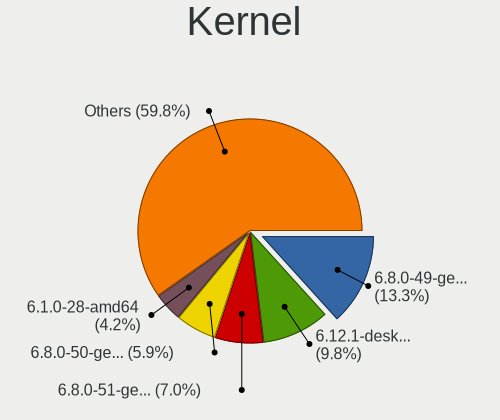

| Version                     | Notebooks | Percent |
|-----------------------------|-----------|---------|
| 5.15.0-53-generic           | 53        | 18.34%  |
| 5.15.0-52-generic           | 50        | 17.3%   |
| 5.19.0-23-generic           | 14        | 4.84%   |
| 5.4.0-131-generic           | 9         | 3.11%   |
| 5.16.7-desktop-1omv4003     | 8         | 2.77%   |
| 5.10.0-19-amd64             | 8         | 2.77%   |
| 6.0.5-200.fc36.x86_64       | 6         | 2.08%   |
| 5.4.0-132-generic           | 6         | 2.08%   |
| 5.19.5-desktop-1omv4090     | 6         | 2.08%   |
| 6.0.8-300.fc37.x86_64       | 5         | 1.73%   |
| 6.0.7-arch1-1               | 5         | 1.73%   |
| 6.0.6-76060006-generic      | 4         | 1.38%   |
| 6.0.0-4-amd64               | 4         | 1.38%   |
| 5.13.0-valve21.3-1-neptune  | 4         | 1.38%   |
| 5.10.0-18-amd64             | 4         | 1.38%   |
| 6.0.9-arch1-1               | 3         | 1.04%   |
| 6.0.8-arch1-1               | 3         | 1.04%   |
| 6.0.8-1-MANJARO             | 3         | 1.04%   |
| 6.0.3-76060003-generic      | 3         | 1.04%   |
| 6.0.2-76060002-generic      | 3         | 1.04%   |
| 5.19.16-301.fc37.x86_64     | 3         | 1.04%   |
| 5.19.0-21-generic           | 3         | 1.04%   |
| 5.15.79-1-lts               | 3         | 1.04%   |
| 5.15.76-1-MANJARO           | 3         | 1.04%   |
| 5.15.0-50-generic           | 3         | 1.04%   |
| 5.15.0-10052-tuxedo         | 3         | 1.04%   |
| 6.0.9-300.fc37.x86_64       | 2         | 0.69%   |
| 6.0.9-200.fc36.x86_64       | 2         | 0.69%   |
| 6.0.7-zen1-1-zen            | 2         | 0.69%   |
| 6.0.6-1-default             | 2         | 0.69%   |
| 6.0.0-kali3-amd64           | 2         | 0.69%   |
| 5.19.0-0.deb11.2-amd64      | 2         | 0.69%   |
| 5.15.0-52-lowlatency        | 2         | 0.69%   |
| 5.15.0-43-generic           | 2         | 0.69%   |
| 5.11.0-35-generic           | 2         | 0.69%   |
| 6.1.0-rc1+                  | 1         | 0.35%   |
| 6.1.0-1-MANJARO             | 1         | 0.35%   |
| 6.0.9-x64v1-xanmod1         | 1         | 0.35%   |
| 6.0.9-060009-generic        | 1         | 0.35%   |
| 6.0.7-201.fsync.fc36.x86_64 | 1         | 0.35%   |

Kernel Family
-------------

Linux kernel without a distro release

| Version | Notebooks | Percent |
|---------|-----------|---------|
| 5.15.0  | 115       | 39.79%  |
| 5.19.0  | 19        | 6.57%   |
| 5.4.0   | 18        | 6.23%   |
| 5.10.0  | 16        | 5.54%   |
| 6.0.0   | 13        | 4.5%    |
| 6.0.7   | 12        | 4.15%   |
| 6.0.8   | 11        | 3.81%   |
| 6.0.9   | 9         | 3.11%   |
| 5.16.7  | 8         | 2.77%   |
| 6.0.6   | 7         | 2.42%   |
| 6.0.5   | 7         | 2.42%   |
| 5.19.5  | 6         | 2.08%   |
| 5.13.0  | 6         | 2.08%   |
| 6.0.2   | 5         | 1.73%   |
| 6.0.3   | 4         | 1.38%   |
| 5.14.0  | 4         | 1.38%   |
| 5.19.16 | 3         | 1.04%   |
| 5.15.79 | 3         | 1.04%   |
| 5.15.76 | 3         | 1.04%   |
| 6.1.0   | 2         | 0.69%   |
| 5.15.77 | 2         | 0.69%   |
| 5.11.0  | 2         | 0.69%   |
| 6.0.10  | 1         | 0.35%   |
| 5.3.0   | 1         | 0.35%   |
| 5.19.17 | 1         | 0.35%   |
| 5.19.14 | 1         | 0.35%   |
| 5.19.12 | 1         | 0.35%   |
| 5.17.0  | 1         | 0.35%   |
| 5.15.75 | 1         | 0.35%   |
| 5.15.74 | 1         | 0.35%   |
| 5.15.5  | 1         | 0.35%   |
| 5.10.74 | 1         | 0.35%   |
| 4.9.0   | 1         | 0.35%   |
| 4.19.0  | 1         | 0.35%   |
| 4.18.0  | 1         | 0.35%   |
| 4.15.0  | 1         | 0.35%   |

Kernel Major Ver.
-----------------

Linux kernel major version

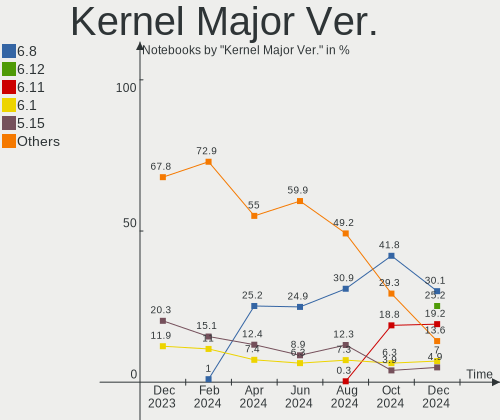

| Version | Notebooks | Percent |
|---------|-----------|---------|
| 5.15    | 126       | 43.6%   |
| 6.0     | 69        | 23.88%  |
| 5.19    | 31        | 10.73%  |
| 5.4     | 18        | 6.23%   |
| 5.10    | 17        | 5.88%   |
| 5.16    | 8         | 2.77%   |
| 5.13    | 6         | 2.08%   |
| 5.14    | 4         | 1.38%   |
| 6.1     | 2         | 0.69%   |
| 5.11    | 2         | 0.69%   |
| 5.3     | 1         | 0.35%   |
| 5.17    | 1         | 0.35%   |
| 4.9     | 1         | 0.35%   |
| 4.19    | 1         | 0.35%   |
| 4.18    | 1         | 0.35%   |
| 4.15    | 1         | 0.35%   |

Arch
----

OS architecture (x86_64, i586, etc.)

| Name   | Notebooks | Percent |
|--------|-----------|---------|
| x86_64 | 284       | 98.27%  |
| i686   | 5         | 1.73%   |

DE
--

Desktop Environment

| Name          | Notebooks | Percent |
|---------------|-----------|---------|
| GNOME         | 133       | 46.02%  |
| KDE5          | 68        | 23.53%  |
| X-Cinnamon    | 28        | 9.69%   |
| XFCE          | 20        | 6.92%   |
| Pantheon      | 7         | 2.42%   |
| MATE          | 6         | 2.08%   |
| Unknown       | 6         | 2.08%   |
| LXQt          | 5         | 1.73%   |
| KDE           | 4         | 1.38%   |
| sway          | 2         | 0.69%   |
| Cinnamon      | 2         | 0.69%   |
| Budgie        | 2         | 0.69%   |
| awesome       | 2         | 0.69%   |
| trinity       | 1         | 0.35%   |
| i3            | 1         | 0.35%   |
| Enlightenment | 1         | 0.35%   |
| Deepin        | 1         | 0.35%   |

Display Server
--------------

X11 or Wayland

| Name    | Notebooks | Percent |
|---------|-----------|---------|
| X11     | 209       | 72.32%  |
| Wayland | 74        | 25.61%  |
| Unknown | 5         | 1.73%   |
| Tty     | 1         | 0.35%   |

Display Manager
---------------

SDDM, LightDM, etc.

| Name    | Notebooks | Percent |
|---------|-----------|---------|
| Unknown | 95        | 32.87%  |
| GDM3    | 77        | 26.64%  |
| LightDM | 49        | 16.96%  |
| SDDM    | 44        | 15.22%  |
| GDM     | 23        | 7.96%   |
| LXDM    | 1         | 0.35%   |

OS Lang
-------

Language

| Lang    | Notebooks | Percent |
|---------|-----------|---------|
| de_DE   | 195       | 67.47%  |
| en_US   | 72        | 24.91%  |
| ru_RU   | 3         | 1.04%   |
| en_DE   | 3         | 1.04%   |
| Unknown | 3         | 1.04%   |
| it_IT   | 2         | 0.69%   |
| en_GB   | 2         | 0.69%   |
| en_AG   | 2         | 0.69%   |
| POSIX   | 1         | 0.35%   |
| nl_NL   | 1         | 0.35%   |
| es_ES   | 1         | 0.35%   |
| en_CA   | 1         | 0.35%   |
| en_AU   | 1         | 0.35%   |
| el_GR   | 1         | 0.35%   |
| de_AT   | 1         | 0.35%   |

Boot Mode
---------

EFI or BIOS

| Mode | Notebooks | Percent |
|------|-----------|---------|
| EFI  | 153       | 52.94%  |
| BIOS | 136       | 47.06%  |

Filesystem
----------

Type of filesystem

| Type    | Notebooks | Percent |
|---------|-----------|---------|
| Ext4    | 227       | 78.55%  |
| Btrfs   | 40        | 13.84%  |
| Overlay | 16        | 5.54%   |
| Xfs     | 4         | 1.38%   |
| Zfs     | 2         | 0.69%   |

Part. scheme
------------

Scheme of partitioning

| Type    | Notebooks | Percent |
|---------|-----------|---------|
| GPT     | 159       | 55.02%  |
| Unknown | 91        | 31.49%  |
| MBR     | 39        | 13.49%  |

Dual Boot with Linux/BSD
------------------------

Hosting more than one Linux/BSD

| Dual boot | Notebooks | Percent |
|-----------|-----------|---------|
| No        | 260       | 89.97%  |
| Yes       | 29        | 10.03%  |

Dual Boot (Win)
---------------

Hosting Linux and Windows

| Dual boot | Notebooks | Percent |
|-----------|-----------|---------|
| No        | 224       | 77.51%  |
| Yes       | 65        | 22.49%  |

Board
-----

Vendor
------

Motherboard manufacturer

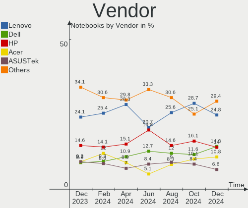

| Name                | Notebooks | Percent |
|---------------------|-----------|---------|
| Lenovo              | 69        | 23.88%  |
| Hewlett-Packard     | 42        | 14.53%  |
| Dell                | 42        | 14.53%  |
| Acer                | 24        | 8.3%    |
| ASUSTek Computer    | 17        | 5.88%   |
| Apple               | 11        | 3.81%   |
| Medion              | 8         | 2.77%   |
| TUXEDO              | 7         | 2.42%   |
| Samsung Electronics | 7         | 2.42%   |
| MSI                 | 7         | 2.42%   |
| Fujitsu             | 7         | 2.42%   |
| Valve               | 5         | 1.73%   |
| HUAWEI              | 5         | 1.73%   |
| Packard Bell        | 4         | 1.38%   |
| Sony                | 3         | 1.04%   |
| Notebook            | 3         | 1.04%   |
| Google              | 3         | 1.04%   |
| Chuwi               | 3         | 1.04%   |
| Wortmann AG         | 2         | 0.69%   |
| Toshiba             | 2         | 0.69%   |
| Tactus              | 2         | 0.69%   |
| Schenker            | 2         | 0.69%   |
| Gigabyte Technology | 2         | 0.69%   |
| Fujitsu Siemens     | 2         | 0.69%   |
| AXDIA International | 2         | 0.69%   |
| VALE                | 1         | 0.35%   |
| Timi                | 1         | 0.35%   |
| Thomson             | 1         | 0.35%   |
| Quanta              | 1         | 0.35%   |
| MPMAN               | 1         | 0.35%   |
| Getac               | 1         | 0.35%   |
| CSL-Computer        | 1         | 0.35%   |
| Unknown             | 1         | 0.35%   |

Model
-----

Motherboard model

| Name                                 | Notebooks | Percent |
|--------------------------------------|-----------|---------|
| Valve Jupiter                        | 5         | 1.73%   |
| Lenovo ThinkPad E15 Gen 4 21EES00100 | 4         | 1.38%   |
| HP EliteBook 850 G8 Notebook PC      | 3         | 1.04%   |
| Unknown                              | 3         | 1.04%   |
| TUXEDO Pulse 15 Gen1                 | 2         | 0.69%   |
| Tactus GeoBook 140                   | 2         | 0.69%   |
| Lenovo ThinkPad E14 Gen 4 21ECS00000 | 2         | 0.69%   |
| HP Laptop 17-cp0xxx                  | 2         | 0.69%   |
| HP EliteBook 8560w                   | 2         | 0.69%   |
| HP 255 G7 Notebook PC                | 2         | 0.69%   |
| Fujitsu LIFEBOOK A3510               | 2         | 0.69%   |
| Dell XPS 15 9510                     | 2         | 0.69%   |
| Dell Latitude E6320                  | 2         | 0.69%   |
| Dell Latitude 3320                   | 2         | 0.69%   |
| Apple MacBookPro9,2                  | 2         | 0.69%   |
| Apple MacBookPro12,1                 | 2         | 0.69%   |
| Acer Aspire A315-51                  | 2         | 0.69%   |
| Wortmann AG TERRA_MOBILE_1542        | 1         | 0.35%   |
| Wortmann AG 1220624_1470150          | 1         | 0.35%   |
| VALE Notebook Slim S132              | 1         | 0.35%   |
| TUXEDO XMG FUSION 15 (XFU15L19)      | 1         | 0.35%   |
| TUXEDO Stellaris Intel Gen4          | 1         | 0.35%   |
| TUXEDO InfinityBook S 15 Gen6        | 1         | 0.35%   |
| TUXEDO Aura 15 Gen1                  | 1         | 0.35%   |
| Toshiba Satellite P50-B-10Q          | 1         | 0.35%   |
| Toshiba Satellite C670D-126          | 1         | 0.35%   |
| Timi TM1701                          | 1         | 0.35%   |
| Thomson GEN17V3C8WH256               | 1         | 0.35%   |
| Sony VPCEB4L9E                       | 1         | 0.35%   |
| Sony SVT1511M1ES                     | 1         | 0.35%   |
| Sony SVF1532W4E                      | 1         | 0.35%   |
| Schenker XMG NEO (M22)               | 1         | 0.35%   |
| Schenker VISION 15 (SVS15E21)        | 1         | 0.35%   |
| Samsung SP55S                        | 1         | 0.35%   |
| Samsung RC530/RC730                  | 1         | 0.35%   |
| Samsung R59P/R60P/R61P               | 1         | 0.35%   |
| Samsung 600B4B/600B5B                | 1         | 0.35%   |
| Samsung 530U3C/530U4C/532U3C         | 1         | 0.35%   |
| Samsung 300E4C/300E5C/300E7C         | 1         | 0.35%   |
| Samsung 270E5J/2570EJ                | 1         | 0.35%   |

Model Family
------------

Motherboard model prefix

| Name                       | Notebooks | Percent |
|----------------------------|-----------|---------|
| Lenovo ThinkPad            | 43        | 14.88%  |
| Acer Aspire                | 18        | 6.23%   |
| HP EliteBook               | 14        | 4.84%   |
| Dell XPS                   | 11        | 3.81%   |
| Dell Latitude              | 10        | 3.46%   |
| Lenovo IdeaPad             | 8         | 2.77%   |
| Fujitsu LIFEBOOK           | 7         | 2.42%   |
| Dell Inspiron              | 7         | 2.42%   |
| Dell Precision             | 6         | 2.08%   |
| Valve Jupiter              | 5         | 1.73%   |
| HP Laptop                  | 5         | 1.73%   |
| Packard Bell EasyNote      | 4         | 1.38%   |
| HP ZBook                   | 4         | 1.38%   |
| HP ProBook                 | 4         | 1.38%   |
| HP 255                     | 4         | 1.38%   |
| ASUS VivoBook              | 4         | 1.38%   |
| HP Pavilion                | 3         | 1.04%   |
| Unknown                    | 3         | 1.04%   |
| TUXEDO Pulse               | 2         | 0.69%   |
| Toshiba Satellite          | 2         | 0.69%   |
| Tactus GeoBook             | 2         | 0.69%   |
| Lenovo ThinkBook           | 2         | 0.69%   |
| Lenovo Legion              | 2         | 0.69%   |
| HP 250                     | 2         | 0.69%   |
| Dell Vostro                | 2         | 0.69%   |
| Dell Studio                | 2         | 0.69%   |
| AXDIA International MYBOOK | 2         | 0.69%   |
| Apple MacBookPro9          | 2         | 0.69%   |
| Apple MacBookPro12         | 2         | 0.69%   |
| Apple MacBookPro11         | 2         | 0.69%   |
| Acer Swift                 | 2         | 0.69%   |
| Wortmann AG TERRA          | 1         | 0.35%   |
| Wortmann AG 1220624        | 1         | 0.35%   |
| VALE Notebook              | 1         | 0.35%   |
| TUXEDO XMG                 | 1         | 0.35%   |
| TUXEDO Stellaris           | 1         | 0.35%   |
| TUXEDO InfinityBook        | 1         | 0.35%   |
| TUXEDO Aura                | 1         | 0.35%   |
| Timi TM1701                | 1         | 0.35%   |
| Thomson GEN17V3C8WH256     | 1         | 0.35%   |

MFG Year
--------

Motherboard manufacture year

| Year | Notebooks | Percent |
|------|-----------|---------|
| 2021 | 39        | 13.49%  |
| 2022 | 30        | 10.38%  |
| 2020 | 29        | 10.03%  |
| 2019 | 28        | 9.69%   |
| 2015 | 21        | 7.27%   |
| 2012 | 18        | 6.23%   |
| 2011 | 18        | 6.23%   |
| 2018 | 17        | 5.88%   |
| 2017 | 14        | 4.84%   |
| 2016 | 13        | 4.5%    |
| 2014 | 13        | 4.5%    |
| 2010 | 13        | 4.5%    |
| 2013 | 11        | 3.81%   |
| 2008 | 9         | 3.11%   |
| 2009 | 8         | 2.77%   |
| 2007 | 5         | 1.73%   |
| 2006 | 2         | 0.69%   |
| 2005 | 1         | 0.35%   |

Form Factor
-----------

Physical design of the computer

| Name     | Notebooks | Percent |
|----------|-----------|---------|
| Notebook | 289       | 100%    |

Secure Boot
-----------

Enabled or disabled

| State    | Notebooks | Percent |
|----------|-----------|---------|
| Disabled | 255       | 88.24%  |
| Enabled  | 34        | 11.76%  |

Coreboot
--------

Have coreboot on board

| Used | Notebooks | Percent |
|------|-----------|---------|
| No   | 286       | 98.96%  |
| Yes  | 3         | 1.04%   |

RAM Size
--------

Total RAM memory

| Size in GB  | Notebooks | Percent |
|-------------|-----------|---------|
| 4.01-8.0    | 73        | 25.26%  |
| 16.01-24.0  | 56        | 19.38%  |
| 8.01-16.0   | 55        | 19.03%  |
| 3.01-4.0    | 51        | 17.65%  |
| 32.01-64.0  | 26        | 9%      |
| 24.01-32.0  | 7         | 2.42%   |
| 1.01-2.0    | 6         | 2.08%   |
| 2.01-3.0    | 5         | 1.73%   |
| 64.01-256.0 | 5         | 1.73%   |
| 0.51-1.0    | 5         | 1.73%   |

RAM Used
--------

Used RAM memory

| Used GB    | Notebooks | Percent |
|------------|-----------|---------|
| 1.01-2.0   | 102       | 35.29%  |
| 2.01-3.0   | 77        | 26.64%  |
| 4.01-8.0   | 44        | 15.22%  |
| 3.01-4.0   | 41        | 14.19%  |
| 8.01-16.0  | 12        | 4.15%   |
| 0.51-1.0   | 9         | 3.11%   |
| 16.01-24.0 | 2         | 0.69%   |
| 24.01-32.0 | 1         | 0.35%   |
| 0.01-0.5   | 1         | 0.35%   |

Total Drives
------------

Number of drives on board

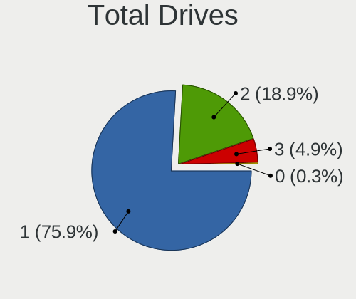

| Drives | Notebooks | Percent |
|--------|-----------|---------|
| 1      | 210       | 72.66%  |
| 2      | 70        | 24.22%  |
| 3      | 8         | 2.77%   |
| 4      | 1         | 0.35%   |

Has CD-ROM
----------

Has CD-ROM on board

| Presented | Notebooks | Percent |
|-----------|-----------|---------|
| No        | 190       | 65.74%  |
| Yes       | 99        | 34.26%  |

Has Ethernet
------------

Has Ethernet on board

| Presented | Notebooks | Percent |
|-----------|-----------|---------|
| Yes       | 233       | 80.62%  |
| No        | 56        | 19.38%  |

Has WiFi
--------

Has WiFi module

| Presented | Notebooks | Percent |
|-----------|-----------|---------|
| Yes       | 285       | 98.62%  |
| No        | 4         | 1.38%   |

Has Bluetooth
-------------

Has Bluetooth module

| Presented | Notebooks | Percent |
|-----------|-----------|---------|
| Yes       | 230       | 79.58%  |
| No        | 59        | 20.42%  |

Location
--------

Country
-------

Geographic location (country)

| Country | Notebooks | Percent |
|---------|-----------|---------|
| Germany | 289       | 100%    |

City
----

Geographic location (city)

| City                 | Notebooks | Percent |
|----------------------|-----------|---------|
| Berlin               | 31        | 10.73%  |
| Munich               | 14        | 4.84%   |
| Frankfurt am Main    | 11        | 3.81%   |
| Stuttgart            | 7         | 2.42%   |
| Hamburg              | 7         | 2.42%   |
| Cologne              | 7         | 2.42%   |
| Nuremberg            | 6         | 2.08%   |
| Wiesbaden            | 5         | 1.73%   |
| Leipzig              | 5         | 1.73%   |
| Mannheim             | 4         | 1.38%   |
| Wuppertal            | 3         | 1.04%   |
| Salzgitter           | 3         | 1.04%   |
| Gelsenkirchen        | 3         | 1.04%   |
| Freiburg im Breisgau | 3         | 1.04%   |
| Dortmund             | 3         | 1.04%   |
| Bremen               | 3         | 1.04%   |
| Braunschweig         | 3         | 1.04%   |
| Bocholt              | 3         | 1.04%   |
| Weisswasser          | 2         | 0.69%   |
| Weimar               | 2         | 0.69%   |
| Wangen               | 2         | 0.69%   |
| Rüsselsheim am Main | 2         | 0.69%   |
| Ochsenfurt           | 2         | 0.69%   |
| Mülheim             | 2         | 0.69%   |
| Ludwigsburg          | 2         | 0.69%   |
| Köthen              | 2         | 0.69%   |
| Karlsruhe            | 2         | 0.69%   |
| Hanover              | 2         | 0.69%   |
| Fehmarn              | 2         | 0.69%   |
| Essen                | 2         | 0.69%   |
| Erfurt               | 2         | 0.69%   |
| Dresden              | 2         | 0.69%   |
| Bochum               | 2         | 0.69%   |
| Bielefeld            | 2         | 0.69%   |
| Worms                | 1         | 0.35%   |
| Weissenfels          | 1         | 0.35%   |
| Wassenach            | 1         | 0.35%   |
| Waake                | 1         | 0.35%   |
| Viol                 | 1         | 0.35%   |
| Ulm                  | 1         | 0.35%   |

Drives
------

Drive Vendor
------------

Hard drive vendors

| Vendor                      | Notebooks | Drives | Percent |
|-----------------------------|-----------|--------|---------|
| Samsung Electronics         | 75        | 83     | 20.78%  |
| WDC                         | 36        | 36     | 9.97%   |
| SanDisk                     | 29        | 29     | 8.03%   |
| Seagate                     | 23        | 23     | 6.37%   |
| Unknown                     | 19        | 20     | 5.26%   |
| Toshiba                     | 19        | 19     | 5.26%   |
| SK hynix                    | 18        | 18     | 4.99%   |
| Crucial                     | 16        | 16     | 4.43%   |
| Kingston                    | 13        | 15     | 3.6%    |
| Intel                       | 12        | 12     | 3.32%   |
| Intenso                     | 10        | 10     | 2.77%   |
| Micron Technology           | 9         | 9      | 2.49%   |
| KIOXIA                      | 7         | 7      | 1.94%   |
| Phison Electronics          | 5         | 5      | 1.39%   |
| Hitachi                     | 5         | 6      | 1.39%   |
| Apple                       | 5         | 5      | 1.39%   |
| Kingston Technology Company | 4         | 4      | 1.11%   |
| Union Memory (Shenzhen)     | 3         | 3      | 0.83%   |
| UMIS                        | 3         | 3      | 0.83%   |
| SPCC                        | 3         | 3      | 0.83%   |
| Silicon Motion              | 3         | 3      | 0.83%   |
| Netac                       | 3         | 3      | 0.83%   |
| Unknown                     | 3         | 4      | 0.83%   |
| USB2.0                      | 2         | 2      | 0.55%   |
| Transcend                   | 2         | 2      | 0.55%   |
| O2 Micro                    | 2         | 2      | 0.55%   |
| Micron/Crucial Technology   | 2         | 2      | 0.55%   |
| LITEON                      | 2         | 2      | 0.55%   |
| HGST                        | 2         | 2      | 0.55%   |
| Fujitsu                     | 2         | 2      | 0.55%   |
| China                       | 2         | 2      | 0.55%   |
| ASMT                        | 2         | 2      | 0.55%   |
| A-DATA Technology           | 2         | 2      | 0.55%   |
| WDC WDS1                    | 1         | 1      | 0.28%   |
| Verbatim                    | 1         | 1      | 0.28%   |
| Vaseky                      | 1         | 1      | 0.28%   |
| USB3.0                      | 1         | 1      | 0.28%   |
| SSSTC                       | 1         | 1      | 0.28%   |
| QGEEM                       | 1         | 1      | 0.28%   |
| Phison                      | 1         | 1      | 0.28%   |

Drive Model
-----------

Hard drive models

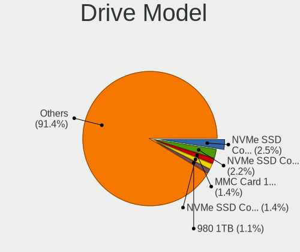

| Model                                                 | Notebooks | Percent |
|-------------------------------------------------------|-----------|---------|
| Samsung NVMe SSD Controller SM981/PM981/PM983 1TB     | 12        | 3.26%   |
| Unknown MMC Card  128GB                               | 6         | 1.63%   |
| Unknown MMC Card  64GB                                | 5         | 1.36%   |
| WDC WDS500G2B0B-00YS70 500GB SSD                      | 4         | 1.09%   |
| Toshiba XG6 NVMe SSD Controller 256GB                 | 4         | 1.09%   |
| SK hynix BC711 HFM512GD3JX013N 512GB                  | 4         | 1.09%   |
| Seagate ST9500325AS 500GB                             | 4         | 1.09%   |
| WDC WDS500G2B0A-00SM50 500GB SSD                      | 3         | 0.82%   |
| Union Memory (Shenzhen) UMIS RPJTJ512MGE1QDQ 512GB    | 3         | 0.82%   |
| UMIS RPJTJ512MGE1QDQ 512GB                            | 3         | 0.82%   |
| Toshiba MQ01ABD100 1TB                                | 3         | 0.82%   |
| SK hynix BC501 NVMe Solid State Drive 512GB           | 3         | 0.82%   |
| Sandisk WD Blue SN550 NVMe SSD 1TB                    | 3         | 0.82%   |
| Samsung SSD 980 1TB                                   | 3         | 0.82%   |
| Samsung SSD 860 EVO 1TB                               | 3         | 0.82%   |
| Samsung NVMe SSD Controller PM9A1/PM9A3/980PRO 250GB  | 3         | 0.82%   |
| Intenso SSD SATAIII 128GB                             | 3         | 0.82%   |
| Crucial CT1000BX500SSD1 1TB                           | 3         | 0.82%   |
| Unknown                                               | 3         | 0.82%   |
| WDC WD5000LPVX-22V0TT0 500GB                          | 2         | 0.54%   |
| WDC WD5000BEVT-22ZAT0 500GB                           | 2         | 0.54%   |
| WDC WD3200BEVT-22ZCT0 320GB                           | 2         | 0.54%   |
| WDC PC SN530 SDBPNPZ-256G-1114 256GB                  | 2         | 0.54%   |
| USB2.0 CardReader                                     | 2         | 0.54%   |
| Unknown MMC Card  7GB                                 | 2         | 0.54%   |
| Unknown MMC Card  32GB                                | 2         | 0.54%   |
| Unknown MMC Card  256GB                               | 2         | 0.54%   |
| Toshiba MQ01ABD050 500GB                              | 2         | 0.54%   |
| Toshiba KXG50ZNV512G 512GB                            | 2         | 0.54%   |
| SK hynix BC511 512GB                                  | 2         | 0.54%   |
| Silicon Motion SM2263EN/SM2263XT SSD Controller 128GB | 2         | 0.54%   |
| Seagate ST9250410AS 250GB                             | 2         | 0.54%   |
| Seagate ST750LM022 HN-M750MBB 752GB                   | 2         | 0.54%   |
| Seagate ST1000LM024 HN-M101MBB 1TB                    | 2         | 0.54%   |
| Sandisk WD Black NVMe SSD 512GB                       | 2         | 0.54%   |
| SanDisk SSD PLUS 480GB                                | 2         | 0.54%   |
| SanDisk SD8TB8U256G1001 256GB SSD                     | 2         | 0.54%   |
| Samsung SSD 980 PRO 1TB                               | 2         | 0.54%   |
| Samsung SSD 970 EVO Plus 1TB                          | 2         | 0.54%   |
| Samsung SSD 870 QVO 1TB                               | 2         | 0.54%   |

HDD Vendor
----------

Hard disk drive vendors

| Vendor              | Notebooks | Drives | Percent |
|---------------------|-----------|--------|---------|
| Seagate             | 21        | 21     | 34.43%  |
| WDC                 | 18        | 18     | 29.51%  |
| Toshiba             | 7         | 7      | 11.48%  |
| Hitachi             | 5         | 6      | 8.2%    |
| Samsung Electronics | 2         | 2      | 3.28%   |
| HGST                | 2         | 2      | 3.28%   |
| Fujitsu             | 2         | 2      | 3.28%   |
| USB3.0              | 1         | 1      | 1.64%   |
| Intenso             | 1         | 1      | 1.64%   |
| ASMT                | 1         | 1      | 1.64%   |
| ASMedia             | 1         | 1      | 1.64%   |

SSD Vendor
----------

Solid state drive vendors

| Vendor              | Notebooks | Drives | Percent |
|---------------------|-----------|--------|---------|
| Samsung Electronics | 36        | 39     | 27.91%  |
| SanDisk             | 19        | 19     | 14.73%  |
| Crucial             | 15        | 15     | 11.63%  |
| WDC                 | 9         | 9      | 6.98%   |
| Kingston            | 9         | 11     | 6.98%   |
| Intenso             | 7         | 7      | 5.43%   |
| Apple               | 5         | 5      | 3.88%   |
| SPCC                | 3         | 3      | 2.33%   |
| Netac               | 3         | 3      | 2.33%   |
| Intel               | 3         | 3      | 2.33%   |
| Transcend           | 2         | 2      | 1.55%   |
| Toshiba             | 2         | 2      | 1.55%   |
| LITEON              | 2         | 2      | 1.55%   |
| China               | 2         | 2      | 1.55%   |
| WDC WDS1            | 1         | 1      | 0.78%   |
| Verbatim            | 1         | 1      | 0.78%   |
| Vaseky              | 1         | 1      | 0.78%   |
| Seagate             | 1         | 1      | 0.78%   |
| Phison              | 1         | 1      | 0.78%   |
| Patriot             | 1         | 1      | 0.78%   |
| Micron Technology   | 1         | 1      | 0.78%   |
| Lexar               | 1         | 1      | 0.78%   |
| JMicron Technology  | 1         | 1      | 0.78%   |
| GLOBAL              | 1         | 1      | 0.78%   |
| ASMT                | 1         | 1      | 0.78%   |
| A-DATA Technology   | 1         | 1      | 0.78%   |

Drive Kind
----------

HDD or SSD

| Kind    | Notebooks | Drives | Percent |
|---------|-----------|--------|---------|
| NVMe    | 131       | 141    | 38.3%   |
| SSD     | 119       | 134    | 34.8%   |
| HDD     | 58        | 62     | 16.96%  |
| MMC     | 25        | 28     | 7.31%   |
| Unknown | 9         | 9      | 2.63%   |

Drive Connector
---------------

SATA, SAS, NVMe, etc.

| Type | Notebooks | Drives | Percent |
|------|-----------|--------|---------|
| SATA | 161       | 187    | 47.92%  |
| NVMe | 131       | 140    | 38.99%  |
| MMC  | 25        | 28     | 7.44%   |
| SAS  | 19        | 19     | 5.65%   |

Drive Size
----------

Size of hard drive

| Size in TB | Notebooks | Drives | Percent |
|------------|-----------|--------|---------|
| 0.01-0.5   | 117       | 133    | 66.1%   |
| 0.51-1.0   | 50        | 52     | 28.25%  |
| 1.01-2.0   | 8         | 9      | 4.52%   |
| 2.01-3.0   | 2         | 2      | 1.13%   |

Space Total
-----------

Amount of disk space available on the file system

| Size in GB     | Notebooks | Percent |
|----------------|-----------|---------|
| 251-500        | 85        | 29.41%  |
| 101-250        | 78        | 26.99%  |
| 501-1000       | 46        | 15.92%  |
| 1001-2000      | 20        | 6.92%   |
| 1-20           | 20        | 6.92%   |
| 51-100         | 14        | 4.84%   |
| More than 3000 | 9         | 3.11%   |
| Unknown        | 8         | 2.77%   |
| 21-50          | 5         | 1.73%   |
| 2001-3000      | 4         | 1.38%   |

Space Used
----------

Amount of used disk space

| Used GB        | Notebooks | Percent |
|----------------|-----------|---------|
| 1-20           | 94        | 32.53%  |
| 21-50          | 60        | 20.76%  |
| 51-100         | 42        | 14.53%  |
| 101-250        | 35        | 12.11%  |
| 251-500        | 28        | 9.69%   |
| 501-1000       | 11        | 3.81%   |
| 1001-2000      | 8         | 2.77%   |
| Unknown        | 8         | 2.77%   |
| 2001-3000      | 2         | 0.69%   |
| More than 3000 | 1         | 0.35%   |

Malfunc. Drives
---------------

Drive models with a malfunction

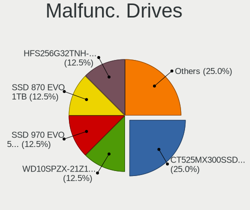

| Model                                         | Notebooks | Drives | Percent |
|-----------------------------------------------|-----------|--------|---------|
| WDC WD5000BEKT-60KA9T0 500GB                  | 1         | 1      | 14.29%  |
| SK hynix BC711 HFM512GD3JX013N 512GB          | 1         | 1      | 14.29%  |
| Seagate ST2000LM003 HN-M201RAD 2TB            | 1         | 1      | 14.29%  |
| Micron Technology MTFDHBA1T0TDV-1AZ15ABFA 1TB | 1         | 1      | 14.29%  |
| Intel SSDSC2BF240A5L 240GB                    | 1         | 1      | 14.29%  |
| Intel SSDSA1M160G2LE 160GB                    | 1         | 1      | 14.29%  |
| Hitachi HTS54323 320GB                        | 1         | 1      | 14.29%  |

Malfunc. Drive Vendor
---------------------

Vendors of faulty drives

| Vendor            | Notebooks | Drives | Percent |
|-------------------|-----------|--------|---------|
| Intel             | 2         | 2      | 28.57%  |
| WDC               | 1         | 1      | 14.29%  |
| SK hynix          | 1         | 1      | 14.29%  |
| Seagate           | 1         | 1      | 14.29%  |
| Micron Technology | 1         | 1      | 14.29%  |
| Hitachi           | 1         | 1      | 14.29%  |

Malfunc. HDD Vendor
-------------------

Vendors of faulty HDD drives

| Vendor  | Notebooks | Drives | Percent |
|---------|-----------|--------|---------|
| WDC     | 1         | 1      | 33.33%  |
| Seagate | 1         | 1      | 33.33%  |
| Hitachi | 1         | 1      | 33.33%  |

Malfunc. Drive Kind
-------------------

Kinds of faulty drives

| Kind | Notebooks | Drives | Percent |
|------|-----------|--------|---------|
| HDD  | 3         | 3      | 42.86%  |
| NVMe | 2         | 2      | 28.57%  |
| SSD  | 2         | 2      | 28.57%  |

Failed Drives
-------------

Failed drive models

Zero info for selected period =(

Failed Drive Vendor
-------------------

Failed drive vendors

Zero info for selected period =(

Drive Status
------------

Number of failed and malfunc. drives

| Status   | Notebooks | Drives | Percent |
|----------|-----------|--------|---------|
| Detected | 178       | 226    | 58.55%  |
| Works    | 119       | 141    | 39.14%  |
| Malfunc  | 7         | 7      | 2.3%    |

Storage controller
------------------

Storage Vendor
--------------

Storage controller vendors

| Vendor                           | Notebooks | Percent |
|----------------------------------|-----------|---------|
| Intel                            | 177       | 50.57%  |
| Samsung Electronics              | 43        | 12.29%  |
| AMD                              | 34        | 9.71%   |
| SK hynix                         | 17        | 4.86%   |
| SanDisk                          | 16        | 4.57%   |
| Toshiba America Info Systems     | 11        | 3.14%   |
| Micron Technology                | 8         | 2.29%   |
| Kingston Technology Company      | 8         | 2.29%   |
| Union Memory (Shenzhen)          | 6         | 1.71%   |
| KIOXIA                           | 6         | 1.71%   |
| Phison Electronics               | 5         | 1.43%   |
| Silicon Motion                   | 3         | 0.86%   |
| Nvidia                           | 3         | 0.86%   |
| Micron/Crucial Technology        | 3         | 0.86%   |
| Silicon Integrated Systems [SiS] | 2         | 0.57%   |
| O2 Micro                         | 2         | 0.57%   |
| Solid State Storage Technology   | 1         | 0.29%   |
| Seagate Technology               | 1         | 0.29%   |
| Realtek Semiconductor            | 1         | 0.29%   |
| Marvell Technology Group         | 1         | 0.29%   |
| JMicron Technology               | 1         | 0.29%   |
| ADATA Technology                 | 1         | 0.29%   |

Storage Model
-------------

Storage controller models

| Model                                                                          | Notebooks | Percent |
|--------------------------------------------------------------------------------|-----------|---------|
| AMD FCH SATA Controller [AHCI mode]                                            | 28        | 7.51%   |
| Samsung NVMe SSD Controller SM981/PM981/PM983                                  | 17        | 4.56%   |
| Intel Sunrise Point-LP SATA Controller [AHCI mode]                             | 17        | 4.56%   |
| Intel 7 Series Chipset Family 6-port SATA Controller [AHCI mode]               | 16        | 4.29%   |
| Intel 6 Series/C200 Series Chipset Family 6 port Mobile SATA AHCI Controller   | 15        | 4.02%   |
| Intel Volume Management Device NVMe RAID Controller                            | 14        | 3.75%   |
| Samsung NVMe SSD Controller 980                                                | 12        | 3.22%   |
| Intel Celeron/Pentium Silver Processor SATA Controller                         | 11        | 2.95%   |
| Intel 8 Series/C220 Series Chipset Family 6-port SATA Controller 1 [AHCI mode] | 10        | 2.68%   |
| Micron Non-Volatile memory controller                                          | 8         | 2.14%   |
| Intel 82801 Mobile SATA Controller [RAID mode]                                 | 8         | 2.14%   |
| Intel 8 Series SATA Controller 1 [AHCI mode]                                   | 8         | 2.14%   |
| Intel 5 Series/3400 Series Chipset 4 port SATA AHCI Controller                 | 8         | 2.14%   |
| Samsung NVMe SSD Controller PM9A1/PM9A3/980PRO                                 | 7         | 1.88%   |
| Intel Wildcat Point-LP SATA Controller [AHCI Mode]                             | 7         | 1.88%   |
| Intel Cannon Lake Mobile PCH SATA AHCI Controller                              | 7         | 1.88%   |
| Intel 82801IBM/IEM (ICH9M/ICH9M-E) 4 port SATA Controller [AHCI mode]          | 7         | 1.88%   |
| Union Memory (Shenzhen) AM630 PCIe 4.0 x4 NVMe SSD Controller                  | 6         | 1.61%   |
| Toshiba America Info Systems XG6 NVMe SSD Controller                           | 6         | 1.61%   |
| SK hynix Gold P31/PC711 NVMe Solid State Drive                                 | 6         | 1.61%   |
| SanDisk WD Blue SN550 NVMe SSD                                                 | 6         | 1.61%   |
| KIOXIA NVMe SSD Controller BG4                                                 | 5         | 1.34%   |
| Intel Tiger Lake-LP SATA Controller                                            | 5         | 1.34%   |
| Intel Ice Lake-LP SATA Controller [AHCI mode]                                  | 5         | 1.34%   |
| Intel HM170/QM170 Chipset SATA Controller [AHCI Mode]                          | 5         | 1.34%   |
| SK hynix BC511                                                                 | 4         | 1.07%   |
| Kingston Company Company Non-Volatile memory controller                        | 4         | 1.07%   |
| Intel SSD 660P Series                                                          | 4         | 1.07%   |
| Intel Q170/Q150/B150/H170/H110/Z170/CM236 Chipset SATA Controller [AHCI Mode]  | 4         | 1.07%   |
| Intel Comet Lake SATA AHCI Controller                                          | 4         | 1.07%   |
| Intel Celeron N3350/Pentium N4200/Atom E3900 Series SATA AHCI Controller       | 4         | 1.07%   |
| Intel 82801G (ICH7 Family) IDE Controller                                      | 4         | 1.07%   |
| Toshiba America Info Systems XG5 NVMe SSD Controller                           | 3         | 0.8%    |
| SK hynix Non-Volatile memory controller                                        | 3         | 0.8%    |
| SK hynix BC501 NVMe Solid State Drive                                          | 3         | 0.8%    |
| SanDisk WD Black SN750 / PC SN730 NVMe SSD                                     | 3         | 0.8%    |
| Samsung NVMe SSD Controller SM961/PM961/SM963                                  | 3         | 0.8%    |
| Samsung Electronics SATA controller                                            | 3         | 0.8%    |
| Intel Non-Volatile memory controller                                           | 3         | 0.8%    |
| Intel Atom Processor E3800 Series SATA AHCI Controller                         | 3         | 0.8%    |

Storage Kind
------------

Kind of storage controller (IDE, SATA, NVMe, SAS, ...)

| Kind | Notebooks | Percent |
|------|-----------|---------|
| SATA | 188       | 52.08%  |
| NVMe | 131       | 36.29%  |
| RAID | 22        | 6.09%   |
| IDE  | 20        | 5.54%   |

Processor
---------

CPU Vendor
----------

Processor vendors

| Vendor | Notebooks | Percent |
|--------|-----------|---------|
| Intel  | 223       | 77.16%  |
| AMD    | 66        | 22.84%  |

CPU Model
---------

Processor models

| Model                                         | Notebooks | Percent |
|-----------------------------------------------|-----------|---------|
| Intel 11th Gen Core i5-1135G7 @ 2.40GHz       | 7         | 2.42%   |
| Intel Core i5-6300U CPU @ 2.40GHz             | 6         | 2.08%   |
| Intel Core i7-8550U CPU @ 1.80GHz             | 5         | 1.73%   |
| Intel Core i5-2520M CPU @ 2.50GHz             | 5         | 1.73%   |
| Intel Celeron N4020 CPU @ 1.10GHz             | 5         | 1.73%   |
| Intel 11th Gen Core i7-1165G7 @ 2.80GHz       | 5         | 1.73%   |
| AMD Ryzen 5 5500U with Radeon Graphics        | 5         | 1.73%   |
| AMD Ryzen 5 3500U with Radeon Vega Mobile Gfx | 5         | 1.73%   |
| AMD Custom APU 0405                           | 5         | 1.73%   |
| Intel Core i7-9750H CPU @ 2.60GHz             | 4         | 1.38%   |
| Intel Core i7-6700HQ CPU @ 2.60GHz            | 4         | 1.38%   |
| Intel Core i5-3320M CPU @ 2.60GHz             | 4         | 1.38%   |
| AMD Ryzen 7 5825U with Radeon Graphics        | 4         | 1.38%   |
| Intel Pentium Silver N5000 CPU @ 1.10GHz      | 3         | 1.04%   |
| Intel Core i7-8565U CPU @ 1.80GHz             | 3         | 1.04%   |
| Intel Core i7-4810MQ CPU @ 2.80GHz            | 3         | 1.04%   |
| Intel Core i7-10510U CPU @ 1.80GHz            | 3         | 1.04%   |
| Intel Core i5-8350U CPU @ 1.70GHz             | 3         | 1.04%   |
| Intel Core i5-5300U CPU @ 2.30GHz             | 3         | 1.04%   |
| Intel Core i5-4210U CPU @ 1.70GHz             | 3         | 1.04%   |
| Intel Core i5-1035G1 CPU @ 1.00GHz            | 3         | 1.04%   |
| Intel Core i5 CPU M 460 @ 2.53GHz             | 3         | 1.04%   |
| Intel Celeron CPU N3450 @ 1.10GHz             | 3         | 1.04%   |
| Intel Celeron CPU N2940 @ 1.83GHz             | 3         | 1.04%   |
| Intel 11th Gen Core i7-1185G7 @ 3.00GHz       | 3         | 1.04%   |
| Intel 11th Gen Core i7-11800H @ 2.30GHz       | 3         | 1.04%   |
| AMD Ryzen 5 4600H with Radeon Graphics        | 3         | 1.04%   |
| Intel Pentium Gold 7505 @ 2.00GHz             | 2         | 0.69%   |
| Intel Pentium Dual-Core CPU T4300 @ 2.10GHz   | 2         | 0.69%   |
| Intel Core i7-8750H CPU @ 2.20GHz             | 2         | 0.69%   |
| Intel Core i7-7700HQ CPU @ 2.80GHz            | 2         | 0.69%   |
| Intel Core i7-6600U CPU @ 2.60GHz             | 2         | 0.69%   |
| Intel Core i7-5600U CPU @ 2.60GHz             | 2         | 0.69%   |
| Intel Core i7-4800MQ CPU @ 2.70GHz            | 2         | 0.69%   |
| Intel Core i7-3630QM CPU @ 2.40GHz            | 2         | 0.69%   |
| Intel Core i7-2670QM CPU @ 2.20GHz            | 2         | 0.69%   |
| Intel Core i7-10750H CPU @ 2.60GHz            | 2         | 0.69%   |
| Intel Core i5-7200U CPU @ 2.50GHz             | 2         | 0.69%   |
| Intel Core i5-5200U CPU @ 2.20GHz             | 2         | 0.69%   |
| Intel Core i5-4210M CPU @ 2.60GHz             | 2         | 0.69%   |

CPU Model Family
----------------

Processor model prefix

| Model                   | Notebooks | Percent |
|-------------------------|-----------|---------|
| Intel Core i5           | 62        | 21.45%  |
| Intel Core i7           | 59        | 20.42%  |
| Other                   | 36        | 12.46%  |
| AMD Ryzen 5             | 20        | 6.92%   |
| Intel Celeron           | 16        | 5.54%   |
| Intel Core i3           | 15        | 5.19%   |
| AMD Ryzen 7             | 14        | 4.84%   |
| Intel Core 2 Duo        | 13        | 4.5%    |
| Intel Atom              | 6         | 2.08%   |
| AMD Ryzen 7 PRO         | 5         | 1.73%   |
| Intel Pentium Silver    | 4         | 1.38%   |
| Intel Pentium           | 4         | 1.38%   |
| Intel Pentium Dual-Core | 3         | 1.04%   |
| AMD Ryzen 9             | 3         | 1.04%   |
| AMD Ryzen 5 PRO         | 3         | 1.04%   |
| Intel Pentium Gold      | 2         | 0.69%   |
| Intel Pentium Dual      | 2         | 0.69%   |
| Intel Genuine           | 2         | 0.69%   |
| AMD Ryzen 3             | 2         | 0.69%   |
| AMD E                   | 2         | 0.69%   |
| AMD A6                  | 2         | 0.69%   |
| AMD A4                  | 2         | 0.69%   |
| Intel Pentium M         | 1         | 0.35%   |
| Intel Core m5           | 1         | 0.35%   |
| Intel Core i9           | 1         | 0.35%   |
| Intel Core Duo          | 1         | 0.35%   |
| Intel Core 2 Extreme    | 1         | 0.35%   |
| AMD V140                | 1         | 0.35%   |
| AMD Turion 64 X2 Mobile | 1         | 0.35%   |
| AMD E2                  | 1         | 0.35%   |
| AMD E1                  | 1         | 0.35%   |
| AMD Athlon II           | 1         | 0.35%   |
| AMD Athlon 64 X2        | 1         | 0.35%   |
| AMD A8                  | 1         | 0.35%   |

CPU Cores
---------

Number of processor cores

| Number | Notebooks | Percent |
|--------|-----------|---------|
| 2      | 119       | 41.18%  |
| 4      | 111       | 38.41%  |
| 6      | 24        | 8.3%    |
| 8      | 23        | 7.96%   |
| 14     | 4         | 1.38%   |
| 1      | 4         | 1.38%   |
| 12     | 2         | 0.69%   |
| 10     | 2         | 0.69%   |

CPU Sockets
-----------

Number of sockets

| Number | Notebooks | Percent |
|--------|-----------|---------|
| 1      | 289       | 100%    |

CPU Threads
-----------

Threads per core (Hyper-Threading)

| Number | Notebooks | Percent |
|--------|-----------|---------|
| 2      | 218       | 75.43%  |
| 1      | 71        | 24.57%  |

CPU Op-Modes
------------

CPU Operation Modes (32-bit, 64-bit)

| Op mode        | Notebooks | Percent |
|----------------|-----------|---------|
| 32-bit, 64-bit | 284       | 98.27%  |
| 32-bit         | 5         | 1.73%   |

CPU Microcode
-------------

Microcode number

| Number     | Notebooks | Percent |
|------------|-----------|---------|
| Unknown    | 92        | 31.83%  |
| 0x806c1    | 14        | 4.84%   |
| 0x206a7    | 11        | 3.81%   |
| 0x0a50000c | 10        | 3.46%   |
| 0x806ea    | 9         | 3.11%   |
| 0x406e3    | 8         | 2.77%   |
| 0x806ec    | 7         | 2.42%   |
| 0x306d4    | 7         | 2.42%   |
| 0x306c3    | 7         | 2.42%   |
| 0x306a9    | 7         | 2.42%   |
| 0x906a3    | 6         | 2.08%   |
| 0x706a8    | 6         | 2.08%   |
| 0x08108109 | 6         | 2.08%   |
| 0x706e5    | 5         | 1.73%   |
| 0x706a1    | 5         | 1.73%   |
| 0x1067a    | 5         | 1.73%   |
| 0x10676    | 5         | 1.73%   |
| 0xa0652    | 4         | 1.38%   |
| 0x806e9    | 4         | 1.38%   |
| 0x506e3    | 4         | 1.38%   |
| 0x20655    | 4         | 1.38%   |
| 0x08608103 | 4         | 1.38%   |
| 0x08600106 | 4         | 1.38%   |
| 0x906ea    | 3         | 1.04%   |
| 0x906e9    | 3         | 1.04%   |
| 0x806d1    | 3         | 1.04%   |
| 0x40651    | 3         | 1.04%   |
| 0x30678    | 3         | 1.04%   |
| 0x08108102 | 3         | 1.04%   |
| 0x06006705 | 3         | 1.04%   |
| 0x906c0    | 2         | 0.69%   |
| 0x906a4    | 2         | 0.69%   |
| 0x806eb    | 2         | 0.69%   |
| 0x806c2    | 2         | 0.69%   |
| 0x6fd      | 2         | 0.69%   |
| 0x506c9    | 2         | 0.69%   |
| 0x20652    | 2         | 0.69%   |
| 0x0a404102 | 2         | 0.69%   |
| 0x906ed    | 1         | 0.35%   |
| 0x6fb      | 1         | 0.35%   |

CPU Microarch
-------------

Microarchitecture

| Name             | Notebooks | Percent |
|------------------|-----------|---------|
| KabyLake         | 40        | 13.84%  |
| Haswell          | 21        | 7.27%   |
| TigerLake        | 20        | 6.92%   |
| SandyBridge      | 18        | 6.23%   |
| Unknown          | 18        | 6.23%   |
| Skylake          | 17        | 5.88%   |
| IvyBridge        | 16        | 5.54%   |
| Penryn           | 15        | 5.19%   |
| Zen+             | 12        | 4.15%   |
| Zen 3            | 12        | 4.15%   |
| Goldmont plus    | 11        | 3.81%   |
| Zen 2            | 10        | 3.46%   |
| Broadwell        | 10        | 3.46%   |
| Westmere         | 9         | 3.11%   |
| Silvermont       | 8         | 2.77%   |
| IceLake          | 8         | 2.77%   |
| Alderlake Hybrid | 8         | 2.77%   |
| P6               | 4         | 1.38%   |
| Goldmont         | 4         | 1.38%   |
| Excavator        | 4         | 1.38%   |
| Core             | 4         | 1.38%   |
| CometLake        | 4         | 1.38%   |
| Bobcat           | 3         | 1.04%   |
| Zen              | 2         | 0.69%   |
| Tremont          | 2         | 0.69%   |
| K8 Hammer        | 2         | 0.69%   |
| K10              | 2         | 0.69%   |
| Bonnell          | 2         | 0.69%   |
| Puma             | 1         | 0.35%   |
| K10 Llano        | 1         | 0.35%   |
| Jaguar           | 1         | 0.35%   |

Graphics
--------

GPU Vendor
----------

Vendors of graphics cards

| Vendor                           | Notebooks | Percent |
|----------------------------------|-----------|---------|
| Intel                            | 200       | 56.98%  |
| AMD                              | 77        | 21.94%  |
| Nvidia                           | 73        | 20.8%   |
| Silicon Integrated Systems [SiS] | 1         | 0.28%   |

GPU Model
---------

Graphics card models

| Model                                                                         | Notebooks | Percent |
|-------------------------------------------------------------------------------|-----------|---------|
| Intel TigerLake-LP GT2 [Iris Xe Graphics]                                     | 18        | 5%      |
| Intel 3rd Gen Core processor Graphics Controller                              | 16        | 4.44%   |
| Intel 2nd Generation Core Processor Family Integrated Graphics Controller     | 15        | 4.17%   |
| AMD Picasso/Raven 2 [Radeon Vega Series / Radeon Vega Mobile Series]          | 12        | 3.33%   |
| Intel Skylake GT2 [HD Graphics 520]                                           | 10        | 2.78%   |
| Intel 4th Gen Core Processor Integrated Graphics Controller                   | 10        | 2.78%   |
| AMD Renoir                                                                    | 10        | 2.78%   |
| Intel UHD Graphics 620                                                        | 9         | 2.5%    |
| Intel GeminiLake [UHD Graphics 600]                                           | 8         | 2.22%   |
| Intel CoffeeLake-H GT2 [UHD Graphics 630]                                     | 8         | 2.22%   |
| AMD Lucienne                                                                  | 8         | 2.22%   |
| Intel HD Graphics 5500                                                        | 7         | 1.94%   |
| Intel Haswell-ULT Integrated Graphics Controller                              | 7         | 1.94%   |
| Intel WhiskeyLake-U GT2 [UHD Graphics 620]                                    | 6         | 1.67%   |
| Intel HD Graphics 620                                                         | 6         | 1.67%   |
| Intel Core Processor Integrated Graphics Controller                           | 6         | 1.67%   |
| Intel CometLake-U GT2 [UHD Graphics]                                          | 6         | 1.67%   |
| Intel Atom Processor Z36xxx/Z37xxx Series Graphics & Display                  | 6         | 1.67%   |
| AMD Cezanne [Radeon Vega Series / Radeon Vega Mobile Series]                  | 6         | 1.67%   |
| AMD Barcelo                                                                   | 6         | 1.67%   |
| Intel Iris Plus Graphics G1 (Ice Lake)                                        | 5         | 1.39%   |
| Intel Alder Lake-P Integrated Graphics Controller                             | 5         | 1.39%   |
| AMD VanGogh [AMD Custom GPU 0405]                                             | 5         | 1.39%   |
| Nvidia GP108M [GeForce MX150]                                                 | 4         | 1.11%   |
| Intel TigerLake-H GT1 [UHD Graphics]                                          | 4         | 1.11%   |
| Intel Mobile GM965/GL960 Integrated Graphics Controller (secondary)           | 4         | 1.11%   |
| Intel Mobile GM965/GL960 Integrated Graphics Controller (primary)             | 4         | 1.11%   |
| Intel Mobile 4 Series Chipset Integrated Graphics Controller                  | 4         | 1.11%   |
| Intel HD Graphics 630                                                         | 4         | 1.11%   |
| Intel HD Graphics 500                                                         | 4         | 1.11%   |
| Intel CometLake-H GT2 [UHD Graphics]                                          | 4         | 1.11%   |
| AMD Stoney [Radeon R2/R3/R4/R5 Graphics]                                      | 4         | 1.11%   |
| Nvidia GP107M [GeForce GTX 1050 Ti Mobile]                                    | 3         | 0.83%   |
| Nvidia GM107M [GeForce GTX 960M]                                              | 3         | 0.83%   |
| Intel Mobile 945GM/GMS/GME, 943/940GML Express Integrated Graphics Controller | 3         | 0.83%   |
| Intel HD Graphics 530                                                         | 3         | 0.83%   |
| Intel GeminiLake [UHD Graphics 605]                                           | 3         | 0.83%   |
| AMD RV710/M92 [Mobility Radeon HD 4530/4570/545v]                             | 3         | 0.83%   |
| AMD Rembrandt [Radeon 680M]                                                   | 3         | 0.83%   |
| Nvidia TU117M [GeForce GTX 1650 Ti Mobile]                                    | 2         | 0.56%   |

GPU Combo
---------

Combinations of graphics cards

| Name           | Notebooks | Percent |
|----------------|-----------|---------|
| 1 x Intel      | 144       | 49.83%  |
| 1 x AMD        | 63        | 21.8%   |
| Intel + Nvidia | 50        | 17.3%   |
| 1 x Nvidia     | 16        | 5.54%   |
| AMD + Nvidia   | 7         | 2.42%   |
| Intel + AMD    | 5         | 1.73%   |
| 2 x AMD        | 2         | 0.69%   |
| 2 x Intel      | 1         | 0.35%   |
| 1 x SiS        | 1         | 0.35%   |

GPU Driver
----------

Free vs proprietary

| Driver      | Notebooks | Percent |
|-------------|-----------|---------|
| Free        | 250       | 86.51%  |
| Proprietary | 32        | 11.07%  |
| Unknown     | 7         | 2.42%   |

GPU Memory
----------

Total video memory

| Size in GB     | Notebooks | Percent |
|----------------|-----------|---------|
| Unknown        | 209       | 72.32%  |
| 0.01-0.5       | 29        | 10.03%  |
| 1.01-2.0       | 25        | 8.65%   |
| 0.51-1.0       | 14        | 4.84%   |
| 3.01-4.0       | 8         | 2.77%   |
| 5.01-6.0       | 2         | 0.69%   |
| More than 64.0 | 1         | 0.35%   |
| 7.01-8.0       | 1         | 0.35%   |

Monitor
-------

Monitor Vendor
--------------

Monitor vendors

| Vendor                  | Notebooks | Percent |
|-------------------------|-----------|---------|
| AU Optronics            | 60        | 18.24%  |
| Chimei Innolux          | 52        | 15.81%  |
| BOE                     | 48        | 14.59%  |
| LG Display              | 43        | 13.07%  |
| Samsung Electronics     | 32        | 9.73%   |
| Sharp                   | 11        | 3.34%   |
| Apple                   | 11        | 3.34%   |
| Dell                    | 9         | 2.74%   |
| Chi Mei Optoelectronics | 9         | 2.74%   |
| Hewlett-Packard         | 5         | 1.52%   |
| BenQ                    | 5         | 1.52%   |
| Analogix                | 4         | 1.22%   |
| LG Philips              | 3         | 0.91%   |
| Lenovo                  | 3         | 0.91%   |
| Iiyama                  | 3         | 0.91%   |
| Fujitsu Siemens         | 3         | 0.91%   |
| Eizo                    | 3         | 0.91%   |
| CSO                     | 3         | 0.91%   |
| Unknown                 | 2         | 0.61%   |
| InfoVision              | 2         | 0.61%   |
| Goldstar                | 2         | 0.61%   |
| ASUSTek Computer        | 2         | 0.61%   |
| Ancor Communications    | 2         | 0.61%   |
| ___                     | 1         | 0.3%    |
| Yamaha                  | 1         | 0.3%    |
| Valve                   | 1         | 0.3%    |
| Philips                 | 1         | 0.3%    |
| NEC Computers           | 1         | 0.3%    |
| LNV                     | 1         | 0.3%    |
| KDC                     | 1         | 0.3%    |
| JDI                     | 1         | 0.3%    |
| HUAWEI                  | 1         | 0.3%    |
| CPT                     | 1         | 0.3%    |
| AOC                     | 1         | 0.3%    |
| Acer                    | 1         | 0.3%    |

Monitor Model
-------------

Monitor models

| Model                                                                | Notebooks | Percent |
|----------------------------------------------------------------------|-----------|---------|
| Chimei Innolux LCD Monitor CMN14C9 1920x1080 309x173mm 13.9-inch     | 6         | 1.8%    |
| Analogix ANX7530 U ANX7539 800x1280                                  | 4         | 1.2%    |
| Samsung Electronics LCD Monitor SEC5441 1366x768 344x194mm 15.5-inch | 3         | 0.9%    |
| LG Display LCD Monitor LGD0521 1920x1080 309x174mm 14.0-inch         | 3         | 0.9%    |
| LG Display LCD Monitor LGD0259 1920x1080 345x194mm 15.6-inch         | 3         | 0.9%    |
| Chimei Innolux LCD Monitor CMN1728 1600x900 382x215mm 17.3-inch      | 3         | 0.9%    |
| Chimei Innolux LCD Monitor CMN15E7 1920x1080 344x193mm 15.5-inch     | 3         | 0.9%    |
| BOE LCD Monitor BOE08E2 1920x1080 344x194mm 15.5-inch                | 3         | 0.9%    |
| AU Optronics LCD Monitor AUO5B2D 1920x1080 293x162mm 13.2-inch       | 3         | 0.9%    |
| Samsung Electronics LCD Monitor SEC3245 1366x768 344x194mm 15.5-inch | 2         | 0.6%    |
| Samsung Electronics C49RG9x SAM0F9C 2560x1440 1193x336mm 48.8-inch   | 2         | 0.6%    |
| Samsung Electronics C49RG9x SAM0F9B 2560x1440 1193x336mm 48.8-inch   | 2         | 0.6%    |
| LG Display LCD Monitor LGD06B3 1920x1200 336x210mm 15.6-inch         | 2         | 0.6%    |
| LG Display LCD Monitor LGD05E5 1920x1080 344x194mm 15.5-inch         | 2         | 0.6%    |
| LG Display LCD Monitor LGD046F 1920x1080 345x194mm 15.6-inch         | 2         | 0.6%    |
| LG Display LCD Monitor LGD0353 1366x768 345x194mm 15.6-inch          | 2         | 0.6%    |
| Chimei Innolux LCD Monitor CMN1735 1920x1080 382x215mm 17.3-inch     | 2         | 0.6%    |
| Chimei Innolux LCD Monitor CMN15E8 1920x1080 344x193mm 15.5-inch     | 2         | 0.6%    |
| Chimei Innolux LCD Monitor CMN15DB 1366x768 344x193mm 15.5-inch      | 2         | 0.6%    |
| Chimei Innolux LCD Monitor CMN15C3 1920x1080 344x193mm 15.5-inch     | 2         | 0.6%    |
| Chimei Innolux LCD Monitor CMN15BA 1920x1080 344x194mm 15.5-inch     | 2         | 0.6%    |
| Chimei Innolux LCD Monitor CMN14F2 1920x1080 309x173mm 13.9-inch     | 2         | 0.6%    |
| Chimei Innolux LCD Monitor CMN14D4 1920x1080 309x173mm 13.9-inch     | 2         | 0.6%    |
| Chimei Innolux LCD Monitor CMN1482 1600x900 309x174mm 14.0-inch      | 2         | 0.6%    |
| BOE LCD Monitor BOE0A67 2560x1440 344x194mm 15.5-inch                | 2         | 0.6%    |
| BOE LCD Monitor BOE09D8 1920x1080 344x194mm 15.5-inch                | 2         | 0.6%    |
| BOE LCD Monitor BOE0953 1920x1080 382x215mm 17.3-inch                | 2         | 0.6%    |
| BOE LCD Monitor BOE08D7 1920x1080 309x174mm 14.0-inch                | 2         | 0.6%    |
| BOE LCD Monitor BOE08C6 1920x1080 344x194mm 15.5-inch                | 2         | 0.6%    |
| BOE LCD Monitor BOE084E 1920x1080 382x215mm 17.3-inch                | 2         | 0.6%    |
| BOE LCD Monitor BOE0687 1920x1080 344x193mm 15.5-inch                | 2         | 0.6%    |
| BOE LCD Monitor BOE0675 1366x768 344x194mm 15.5-inch                 | 2         | 0.6%    |
| AU Optronics LCD Monitor AUO61ED 1920x1080 344x193mm 15.5-inch       | 2         | 0.6%    |
| AU Optronics LCD Monitor AUO573D 1920x1080 309x174mm 14.0-inch       | 2         | 0.6%    |
| AU Optronics LCD Monitor AUO40EC 1366x768 344x193mm 15.5-inch        | 2         | 0.6%    |
| AU Optronics LCD Monitor AUO2B99 1920x1080 293x165mm 13.2-inch       | 2         | 0.6%    |
| AU Optronics LCD Monitor AUO23ED 1920x1080 344x194mm 15.5-inch       | 2         | 0.6%    |
| AU Optronics LCD Monitor AUO213D 1920x1080 309x173mm 13.9-inch       | 2         | 0.6%    |
| AU Optronics LCD Monitor AUO139E 1600x900 382x214mm 17.2-inch        | 2         | 0.6%    |
| AU Optronics LCD Monitor AUO133D 1920x1080 309x173mm 13.9-inch       | 2         | 0.6%    |

Monitor Resolution
------------------

Monitor screen resolution

| Resolution         | Notebooks | Percent |
|--------------------|-----------|---------|
| 1920x1080 (FHD)    | 149       | 47%     |
| 1366x768 (WXGA)    | 53        | 16.72%  |
| 1600x900 (HD+)     | 24        | 7.57%   |
| 2560x1440 (QHD)    | 15        | 4.73%   |
| 3840x2160 (4K)     | 11        | 3.47%   |
| 1280x800 (WXGA)    | 10        | 3.15%   |
| 1920x1200 (WUXGA)  | 9         | 2.84%   |
| 1440x900 (WXGA+)   | 7         | 2.21%   |
| 800x1280           | 5         | 1.58%   |
| 3440x1440          | 5         | 1.58%   |
| 3840x1080          | 4         | 1.26%   |
| 2880x1800          | 4         | 1.26%   |
| 2560x1600          | 3         | 0.95%   |
| 3840x2400          | 2         | 0.63%   |
| 1680x1050 (WSXGA+) | 2         | 0.63%   |
| 1400x1050          | 2         | 0.63%   |
| 3456x2160          | 1         | 0.32%   |
| 3072x1920          | 1         | 0.32%   |
| 3000x2000          | 1         | 0.32%   |
| 2520x1680          | 1         | 0.32%   |
| 2288x1287          | 1         | 0.32%   |
| 2160x1440          | 1         | 0.32%   |
| 2160x1350          | 1         | 0.32%   |
| 1920x540           | 1         | 0.32%   |
| 1920x1280          | 1         | 0.32%   |
| 1360x768           | 1         | 0.32%   |
| 1280x1024 (SXGA)   | 1         | 0.32%   |
| 1024x600           | 1         | 0.32%   |

Monitor Diagonal
----------------

Diagonal size in inches

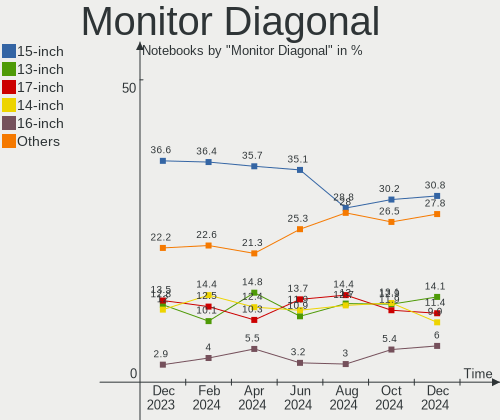

| Inches  | Notebooks | Percent |
|---------|-----------|---------|
| 15      | 121       | 36.67%  |
| 13      | 50        | 15.15%  |
| 14      | 40        | 12.12%  |
| 17      | 39        | 11.82%  |
| 27      | 15        | 4.55%   |
| 24      | 10        | 3.03%   |
| Unknown | 8         | 2.42%   |
| 23      | 6         | 1.82%   |
| 16      | 5         | 1.52%   |
| 12      | 5         | 1.52%   |
| 11      | 5         | 1.52%   |
| 48      | 3         | 0.91%   |
| 34      | 3         | 0.91%   |
| 21      | 3         | 0.91%   |
| 31      | 2         | 0.61%   |
| 22      | 2         | 0.61%   |
| 18      | 2         | 0.61%   |
| 142     | 1         | 0.3%    |
| 84      | 1         | 0.3%    |
| 72      | 1         | 0.3%    |
| 49      | 1         | 0.3%    |
| 40      | 1         | 0.3%    |
| 35      | 1         | 0.3%    |
| 26      | 1         | 0.3%    |
| 25      | 1         | 0.3%    |
| 19      | 1         | 0.3%    |
| 10      | 1         | 0.3%    |
| 7       | 1         | 0.3%    |

Monitor Width
-------------

Physical width

| Width in mm    | Notebooks | Percent |
|----------------|-----------|---------|
| 301-350        | 180       | 55.05%  |
| 351-400        | 46        | 14.07%  |
| 201-300        | 41        | 12.54%  |
| 501-600        | 29        | 8.87%   |
| Unknown        | 8         | 2.45%   |
| 401-500        | 6         | 1.83%   |
| 601-700        | 4         | 1.22%   |
| 1001-1500      | 4         | 1.22%   |
| 701-800        | 3         | 0.92%   |
| 801-900        | 2         | 0.61%   |
| 1501-2000      | 2         | 0.61%   |
| More than 2000 | 1         | 0.31%   |
| 1-100          | 1         | 0.31%   |

Aspect Ratio
------------

Proportional relationship between the width and the height

| Ratio   | Notebooks | Percent |
|---------|-----------|---------|
| 16/9    | 232       | 78.11%  |
| 16/10   | 41        | 13.8%   |
| 32/9    | 5         | 1.68%   |
| 3/2     | 4         | 1.35%   |
| 21/9    | 4         | 1.35%   |
| 0.62    | 4         | 1.35%   |
| 4/3     | 2         | 0.67%   |
| Unknown | 2         | 0.67%   |
| 5/4     | 1         | 0.34%   |
| 1.00    | 1         | 0.34%   |
| 0.67    | 1         | 0.34%   |

Monitor Area
------------

Area in inch²

| Area in inch² | Notebooks | Percent |
|----------------|-----------|---------|
| 101-110        | 122       | 37.08%  |
| 81-90          | 67        | 20.36%  |
| 121-130        | 29        | 8.81%   |
| 71-80          | 21        | 6.38%   |
| 201-250        | 18        | 5.47%   |
| 301-350        | 16        | 4.86%   |
| 131-140        | 9         | 2.74%   |
| Unknown        | 8         | 2.43%   |
| 351-500        | 6         | 1.82%   |
| 61-70          | 5         | 1.52%   |
| 51-60          | 5         | 1.52%   |
| 251-300        | 4         | 1.22%   |
| 501-1000       | 4         | 1.22%   |
| More than 1000 | 3         | 0.91%   |
| 141-150        | 3         | 0.91%   |
| 111-120        | 3         | 0.91%   |
| 91-100         | 3         | 0.91%   |
| 41-50          | 1         | 0.3%    |
| 1-40           | 1         | 0.3%    |
| 151-200        | 1         | 0.3%    |

Pixel Density
-------------

Pixels per inch

| Density       | Notebooks | Percent |
|---------------|-----------|---------|
| 121-160       | 144       | 44.44%  |
| 101-120       | 86        | 26.54%  |
| 51-100        | 41        | 12.65%  |
| 161-240       | 30        | 9.26%   |
| More than 240 | 12        | 3.7%    |
| Unknown       | 8         | 2.47%   |
| 1-50          | 3         | 0.93%   |

Multiple Monitors
-----------------

Total monitors connected

| Total | Notebooks | Percent |
|-------|-----------|---------|
| 1     | 239       | 82.7%   |
| 2     | 35        | 12.11%  |
| 3     | 11        | 3.81%   |
| 0     | 4         | 1.38%   |

Network
-------

Net Controller Vendor
---------------------

Controller vendors

| Vendor                            | Notebooks | Percent |
|-----------------------------------|-----------|---------|
| Intel                             | 166       | 36.24%  |
| Realtek Semiconductor             | 145       | 31.66%  |
| Qualcomm Atheros                  | 51        | 11.14%  |
| Broadcom                          | 26        | 5.68%   |
| MediaTek                          | 11        | 2.4%    |
| Broadcom Limited                  | 7         | 1.53%   |
| ASIX Electronics                  | 7         | 1.53%   |
| Marvell Technology Group          | 5         | 1.09%   |
| Sierra Wireless                   | 4         | 0.87%   |
| Ericsson Business Mobile Networks | 4         | 0.87%   |
| Dell                              | 4         | 0.87%   |
| TP-Link                           | 3         | 0.66%   |
| Samsung Electronics               | 3         | 0.66%   |
| Hewlett-Packard                   | 3         | 0.66%   |
| Silicon Integrated Systems [SiS]  | 2         | 0.44%   |
| MosChip Semiconductor             | 2         | 0.44%   |
| Lenovo                            | 2         | 0.44%   |
| DisplayLink                       | 2         | 0.44%   |
| AVM                               | 2         | 0.44%   |
| U-Blox                            | 1         | 0.22%   |
| Ralink Technology                 | 1         | 0.22%   |
| Ralink                            | 1         | 0.22%   |
| Quectel Wireless Solutions        | 1         | 0.22%   |
| Nvidia                            | 1         | 0.22%   |
| Huawei Technologies               | 1         | 0.22%   |
| Google                            | 1         | 0.22%   |
| Fibocom                           | 1         | 0.22%   |
| ASUSTek Computer                  | 1         | 0.22%   |

Net Controller Model
--------------------

Controller models

| Model                                                                   | Notebooks | Percent |
|-------------------------------------------------------------------------|-----------|---------|
| Realtek RTL8111/8168/8411 PCI Express Gigabit Ethernet Controller       | 88        | 15.88%  |
| Realtek RTL8153 Gigabit Ethernet Adapter                                | 17        | 3.07%   |
| Intel Wi-Fi 6 AX200                                                     | 17        | 3.07%   |
| Realtek RTL8821CE 802.11ac PCIe Wireless Network Adapter                | 16        | 2.89%   |
| Realtek RTL810xE PCI Express Fast Ethernet controller                   | 15        | 2.71%   |
| Intel Wi-Fi 6 AX201                                                     | 14        | 2.53%   |
| Intel 82579LM Gigabit Network Connection (Lewisville)                   | 14        | 2.53%   |
| Intel Wireless 8260                                                     | 13        | 2.35%   |
| Realtek RTL8822CE 802.11ac PCIe Wireless Network Adapter                | 12        | 2.17%   |
| Intel Wireless 8265 / 8275                                              | 12        | 2.17%   |
| Intel Centrino Advanced-N 6205 [Taylor Peak]                            | 12        | 2.17%   |
| Qualcomm Atheros QCA9377 802.11ac Wireless Network Adapter              | 10        | 1.81%   |
| MediaTek MT7921 802.11ax PCI Express Wireless Network Adapter           | 8         | 1.44%   |
| Intel Wireless 7260                                                     | 8         | 1.44%   |
| Qualcomm Atheros QCA6174 802.11ac Wireless Network Adapter              | 7         | 1.26%   |
| Intel Wireless 7265                                                     | 7         | 1.26%   |
| Intel Ethernet Connection I219-LM                                       | 7         | 1.26%   |
| Intel Alder Lake-P PCH CNVi WiFi                                        | 7         | 1.26%   |
| Realtek Realtek Network controller                                      | 6         | 1.08%   |
| Intel Wireless-AC 9260                                                  | 6         | 1.08%   |
| Intel Ethernet Connection I217-LM                                       | 6         | 1.08%   |
| ASIX AX88179 Gigabit Ethernet                                           | 6         | 1.08%   |
| Qualcomm Atheros QCA9565 / AR9565 Wireless Network Adapter              | 5         | 0.9%    |
| Qualcomm Atheros AR9485 Wireless Network Adapter                        | 5         | 0.9%    |
| Intel Ethernet Connection (3) I218-LM                                   | 5         | 0.9%    |
| Qualcomm Atheros AR242x / AR542x Wireless Network Adapter (PCI-Express) | 4         | 0.72%   |
| Intel Ice Lake-LP PCH CNVi WiFi                                         | 4         | 0.72%   |
| Intel Gemini Lake PCH CNVi WiFi                                         | 4         | 0.72%   |
| Intel Ethernet Connection (4) I219-LM                                   | 4         | 0.72%   |
| Intel Comet Lake PCH-LP CNVi WiFi                                       | 4         | 0.72%   |
| Intel Comet Lake PCH CNVi WiFi                                          | 4         | 0.72%   |
| Sierra Wireless EM7345 4G LTE                                           | 3         | 0.54%   |
| Realtek RTL8723BE PCIe Wireless Network Adapter                         | 3         | 0.54%   |
| Qualcomm Atheros QCA8172 Fast Ethernet                                  | 3         | 0.54%   |
| Qualcomm Atheros AR928X Wireless Network Adapter (PCI-Express)          | 3         | 0.54%   |
| Qualcomm Atheros AR9285 Wireless Network Adapter (PCI-Express)          | 3         | 0.54%   |
| Qualcomm Atheros AR8151 v2.0 Gigabit Ethernet                           | 3         | 0.54%   |
| Intel Wireless 3160                                                     | 3         | 0.54%   |
| Intel WiFi Link 5100                                                    | 3         | 0.54%   |
| Intel Tiger Lake PCH CNVi WiFi                                          | 3         | 0.54%   |

Wireless Vendor
---------------

Wireless vendors

| Vendor                     | Notebooks | Percent |
|----------------------------|-----------|---------|
| Intel                      | 161       | 53.31%  |
| Realtek Semiconductor      | 49        | 16.23%  |
| Qualcomm Atheros           | 41        | 13.58%  |
| Broadcom                   | 19        | 6.29%   |
| MediaTek                   | 11        | 3.64%   |
| Sierra Wireless            | 4         | 1.32%   |
| Dell                       | 4         | 1.32%   |
| Hewlett-Packard            | 3         | 0.99%   |
| Broadcom Limited           | 2         | 0.66%   |
| AVM                        | 2         | 0.66%   |
| TP-Link                    | 1         | 0.33%   |
| Ralink Technology          | 1         | 0.33%   |
| Ralink                     | 1         | 0.33%   |
| Quectel Wireless Solutions | 1         | 0.33%   |
| Fibocom                    | 1         | 0.33%   |
| ASUSTek Computer           | 1         | 0.33%   |

Wireless Model
--------------

Wireless models

| Model                                                                   | Notebooks | Percent |
|-------------------------------------------------------------------------|-----------|---------|
| Intel Wi-Fi 6 AX200                                                     | 17        | 5.63%   |
| Realtek RTL8821CE 802.11ac PCIe Wireless Network Adapter                | 16        | 5.3%    |
| Intel Wi-Fi 6 AX201                                                     | 14        | 4.64%   |
| Intel Wireless 8260                                                     | 13        | 4.3%    |
| Realtek RTL8822CE 802.11ac PCIe Wireless Network Adapter                | 12        | 3.97%   |
| Intel Wireless 8265 / 8275                                              | 12        | 3.97%   |
| Intel Centrino Advanced-N 6205 [Taylor Peak]                            | 12        | 3.97%   |
| Qualcomm Atheros QCA9377 802.11ac Wireless Network Adapter              | 10        | 3.31%   |
| MediaTek MT7921 802.11ax PCI Express Wireless Network Adapter           | 8         | 2.65%   |
| Intel Wireless 7260                                                     | 8         | 2.65%   |
| Qualcomm Atheros QCA6174 802.11ac Wireless Network Adapter              | 7         | 2.32%   |
| Intel Wireless 7265                                                     | 7         | 2.32%   |
| Intel Alder Lake-P PCH CNVi WiFi                                        | 7         | 2.32%   |
| Realtek Realtek Network controller                                      | 6         | 1.99%   |
| Intel Wireless-AC 9260                                                  | 6         | 1.99%   |
| Qualcomm Atheros QCA9565 / AR9565 Wireless Network Adapter              | 5         | 1.66%   |
| Qualcomm Atheros AR9485 Wireless Network Adapter                        | 5         | 1.66%   |
| Qualcomm Atheros AR242x / AR542x Wireless Network Adapter (PCI-Express) | 4         | 1.32%   |
| Intel Ice Lake-LP PCH CNVi WiFi                                         | 4         | 1.32%   |
| Intel Gemini Lake PCH CNVi WiFi                                         | 4         | 1.32%   |
| Intel Comet Lake PCH-LP CNVi WiFi                                       | 4         | 1.32%   |
| Intel Comet Lake PCH CNVi WiFi                                          | 4         | 1.32%   |
| Sierra Wireless EM7345 4G LTE                                           | 3         | 0.99%   |
| Realtek RTL8723BE PCIe Wireless Network Adapter                         | 3         | 0.99%   |
| Qualcomm Atheros AR928X Wireless Network Adapter (PCI-Express)          | 3         | 0.99%   |
| Qualcomm Atheros AR9285 Wireless Network Adapter (PCI-Express)          | 3         | 0.99%   |
| Intel Wireless 3160                                                     | 3         | 0.99%   |
| Intel WiFi Link 5100                                                    | 3         | 0.99%   |
| Intel Tiger Lake PCH CNVi WiFi                                          | 3         | 0.99%   |
| Intel PRO/Wireless 3945ABG [Golan] Network Connection                   | 3         | 0.99%   |
| Intel Dual Band Wireless-AC 3165 Plus Bluetooth                         | 3         | 0.99%   |
| Intel Centrino Wireless-N 1030 [Rainbow Peak]                           | 3         | 0.99%   |
| Intel Cannon Lake PCH CNVi WiFi                                         | 3         | 0.99%   |
| Broadcom BCM43602 802.11ac Wireless LAN SoC                             | 3         | 0.99%   |
| Broadcom BCM43142 802.11b/g/n                                           | 3         | 0.99%   |
| Broadcom BCM4313 802.11bgn Wireless Network Adapter                     | 3         | 0.99%   |
| Realtek RTL88x2bu [AC1200 Techkey]                                      | 2         | 0.66%   |
| Realtek RTL8852AE 802.11ax PCIe Wireless Network Adapter                | 2         | 0.66%   |
| Realtek RTL8822BE 802.11a/b/g/n/ac WiFi adapter                         | 2         | 0.66%   |
| Realtek RTL8723BU 802.11b/g/n WLAN Adapter                              | 2         | 0.66%   |

Ethernet Vendor
---------------

Ethernet vendors

| Vendor                           | Notebooks | Percent |
|----------------------------------|-----------|---------|
| Realtek Semiconductor            | 124       | 50.82%  |
| Intel                            | 63        | 25.82%  |
| Broadcom                         | 13        | 5.33%   |
| Qualcomm Atheros                 | 12        | 4.92%   |
| ASIX Electronics                 | 7         | 2.87%   |
| Marvell Technology Group         | 5         | 2.05%   |
| Broadcom Limited                 | 5         | 2.05%   |
| Samsung Electronics              | 3         | 1.23%   |
| TP-Link                          | 2         | 0.82%   |
| Silicon Integrated Systems [SiS] | 2         | 0.82%   |
| MosChip Semiconductor            | 2         | 0.82%   |
| Lenovo                           | 2         | 0.82%   |
| DisplayLink                      | 2         | 0.82%   |
| Nvidia                           | 1         | 0.41%   |
| Google                           | 1         | 0.41%   |

Ethernet Model
--------------

Ethernet models

| Model                                                             | Notebooks | Percent |
|-------------------------------------------------------------------|-----------|---------|
| Realtek RTL8111/8168/8411 PCI Express Gigabit Ethernet Controller | 88        | 35.77%  |
| Realtek RTL8153 Gigabit Ethernet Adapter                          | 17        | 6.91%   |
| Realtek RTL810xE PCI Express Fast Ethernet controller             | 15        | 6.1%    |
| Intel 82579LM Gigabit Network Connection (Lewisville)             | 14        | 5.69%   |
| Intel Ethernet Connection I219-LM                                 | 7         | 2.85%   |
| Intel Ethernet Connection I217-LM                                 | 6         | 2.44%   |
| ASIX AX88179 Gigabit Ethernet                                     | 6         | 2.44%   |
| Intel Ethernet Connection (3) I218-LM                             | 5         | 2.03%   |
| Intel Ethernet Connection (4) I219-LM                             | 4         | 1.63%   |
| Qualcomm Atheros QCA8172 Fast Ethernet                            | 3         | 1.22%   |
| Qualcomm Atheros AR8151 v2.0 Gigabit Ethernet                     | 3         | 1.22%   |
| Broadcom NetLink BCM57780 Gigabit Ethernet PCIe                   | 3         | 1.22%   |
| Silicon Integrated Systems [SiS] 191 Gigabit Ethernet Adapter     | 2         | 0.81%   |
| Realtek RTL8152 Fast Ethernet Adapter                             | 2         | 0.81%   |
| Realtek RTL8125 2.5GbE Controller                                 | 2         | 0.81%   |
| Qualcomm Atheros Killer E220x Gigabit Ethernet Controller         | 2         | 0.81%   |
| MosChip MCS7830 10/100 Mbps Ethernet adapter                      | 2         | 0.81%   |
| Marvell Group 88E8058 PCI-E Gigabit Ethernet Controller           | 2         | 0.81%   |
| Intel Ethernet Connection (6) I219-V                              | 2         | 0.81%   |
| Intel Ethernet Connection (6) I219-LM                             | 2         | 0.81%   |
| Intel Ethernet Connection (4) I219-V                              | 2         | 0.81%   |
| Intel Ethernet Connection (3) I218-V                              | 2         | 0.81%   |
| Intel Ethernet Connection (13) I219-V                             | 2         | 0.81%   |
| Intel 82567LM Gigabit Network Connection                          | 2         | 0.81%   |
| Intel 82566MC Gigabit Network Connection                          | 2         | 0.81%   |
| Broadcom NetXtreme BCM57765 Gigabit Ethernet PCIe                 | 2         | 0.81%   |
| Broadcom NetLink BCM5784M Gigabit Ethernet PCIe                   | 2         | 0.81%   |
| Broadcom NetLink BCM57785 Gigabit Ethernet PCIe                   | 2         | 0.81%   |
| TP-Link UE300 10/100/1000 LAN (ethernet mode) [Realtek RTL8153]   | 1         | 0.41%   |
| TP-Link M7200                                                     | 1         | 0.41%   |
| Samsung Kiera                                                     | 1         | 0.41%   |
| Samsung GT-I9070 (network tethering, USB debugging enabled)       | 1         | 0.41%   |
| Samsung Galaxy series, misc. (tethering mode)                     | 1         | 0.41%   |
| Realtek RTL-8110SC/8169SC Gigabit Ethernet                        | 1         | 0.41%   |
| Realtek Killer E2500 Gigabit Ethernet Controller                  | 1         | 0.41%   |
| Qualcomm Atheros Killer E2500 Gigabit Ethernet Controller         | 1         | 0.41%   |
| Qualcomm Atheros AR8152 v1.1 Fast Ethernet                        | 1         | 0.41%   |
| Qualcomm Atheros AR8151 v1.0 Gigabit Ethernet                     | 1         | 0.41%   |
| Qualcomm Atheros AR8121/AR8113/AR8114 Gigabit or Fast Ethernet    | 1         | 0.41%   |
| Nvidia MCP67 Ethernet                                             | 1         | 0.41%   |

Net Controller Kind
-------------------

Ethernet, WiFi or modem

| Kind     | Notebooks | Percent |
|----------|-----------|---------|
| WiFi     | 285       | 54.39%  |
| Ethernet | 233       | 44.47%  |
| Modem    | 6         | 1.15%   |

Used Controller
---------------

Currently used network controller

| Kind     | Notebooks | Percent |
|----------|-----------|---------|
| WiFi     | 238       | 79.6%   |
| Ethernet | 61        | 20.4%   |

NICs
----

Total network controllers on board

| Total | Notebooks | Percent |
|-------|-----------|---------|
| 2     | 200       | 69.2%   |
| 1     | 80        | 27.68%  |
| 0     | 6         | 2.08%   |
| 3     | 3         | 1.04%   |

IPv6
----

IPv6 vs IPv4

| Used | Notebooks | Percent |
|------|-----------|---------|
| No   | 148       | 51.21%  |
| Yes  | 141       | 48.79%  |

Bluetooth
---------

Bluetooth Vendor
----------------

Controller vendors

| Vendor                          | Notebooks | Percent |
|---------------------------------|-----------|---------|
| Intel                           | 118       | 50.86%  |
| Realtek Semiconductor           | 32        | 13.79%  |
| Qualcomm Atheros Communications | 12        | 5.17%   |
| Lite-On Technology              | 12        | 5.17%   |
| Foxconn / Hon Hai               | 12        | 5.17%   |
| Apple                           | 11        | 4.74%   |
| IMC Networks                    | 10        | 4.31%   |
| Broadcom                        | 9         | 3.88%   |
| Cambridge Silicon Radio         | 4         | 1.72%   |
| Realtek                         | 3         | 1.29%   |
| Dell                            | 3         | 1.29%   |
| Foxconn International           | 2         | 0.86%   |
| Qcom                            | 1         | 0.43%   |
| MediaTek                        | 1         | 0.43%   |
| Hewlett-Packard                 | 1         | 0.43%   |
| ASUSTek Computer                | 1         | 0.43%   |

Bluetooth Model
---------------

Controller models

| Model                                                                               | Notebooks | Percent |
|-------------------------------------------------------------------------------------|-----------|---------|
| Intel Bluetooth wireless interface                                                  | 42        | 18.1%   |
| Intel AX201 Bluetooth                                                               | 29        | 12.5%   |
| Realtek Bluetooth Radio                                                             | 25        | 10.78%  |
| Intel AX200 Bluetooth                                                               | 14        | 6.03%   |
| Intel Bluetooth 9460/9560 Jefferson Peak (JfP)                                      | 12        | 5.17%   |
| IMC Networks Bluetooth Radio                                                        | 7         | 3.02%   |
| Qualcomm Atheros  Bluetooth Device                                                  | 6         | 2.59%   |
| Intel Wireless-AC 9260 Bluetooth Adapter                                            | 6         | 2.59%   |
| Realtek  Bluetooth 4.2 Adapter                                                      | 5         | 2.16%   |
| Intel Bluetooth Device                                                              | 5         | 2.16%   |
| Foxconn / Hon Hai Wireless_Device                                                   | 5         | 2.16%   |
| Apple Bluetooth Host Controller                                                     | 5         | 2.16%   |
| Qualcomm Atheros AR3012 Bluetooth 4.0                                               | 4         | 1.72%   |
| Lite-On Wireless_Device                                                             | 4         | 1.72%   |
| Lite-On Qualcomm Atheros QCA9377 Bluetooth                                          | 4         | 1.72%   |
| Intel Centrino Bluetooth Wireless Transceiver                                       | 4         | 1.72%   |
| Cambridge Silicon Radio Bluetooth Dongle (HCI mode)                                 | 4         | 1.72%   |
| Realtek Bluetooth Radio                                                             | 3         | 1.29%   |
| Lite-On Bluetooth Device                                                            | 3         | 1.29%   |
| IMC Networks Bluetooth Device                                                       | 3         | 1.29%   |
| Broadcom BCM20702 Bluetooth 4.0 [ThinkPad]                                          | 3         | 1.29%   |
| Broadcom BCM2045B (BDC-2.1) [Bluetooth Controller]                                  | 3         | 1.29%   |
| Apple Bluetooth USB Host Controller                                                 | 3         | 1.29%   |
| Apple Bluetooth HCI                                                                 | 3         | 1.29%   |
| Realtek RTL8723B Bluetooth                                                          | 2         | 0.86%   |
| Intel Wireless-AC 3168 Bluetooth                                                    | 2         | 0.86%   |
| Intel Centrino Advanced-N 6230 Bluetooth adapter                                    | 2         | 0.86%   |
| Intel AX210 Bluetooth                                                               | 2         | 0.86%   |
| Foxconn International BCM43142A0 Bluetooth module                                   | 2         | 0.86%   |
| Foxconn / Hon Hai Bluetooth Device                                                  | 2         | 0.86%   |
| Foxconn / Hon Hai BCM20702A0                                                        | 2         | 0.86%   |
| Broadcom BCM2045 Bluetooth                                                          | 2         | 0.86%   |
| Qualcomm Atheros QCA61x4 Bluetooth 4.0                                              | 1         | 0.43%   |
| Qualcomm Atheros AR9462 Bluetooth                                                   | 1         | 0.43%   |
| Qcom Broadcom Bluetooth USB                                                         | 1         | 0.43%   |
| MediaTek Wireless_Device                                                            | 1         | 0.43%   |
| Lite-On Atheros AR3012 Bluetooth                                                    | 1         | 0.43%   |
| HP Broadcom 2070 Bluetooth Combo                                                    | 1         | 0.43%   |
| Foxconn / Hon Hai Foxconn T77H114 BCM2070 [Single-Chip Bluetooth 2.1 + EDR Adapter] | 1         | 0.43%   |
| Foxconn / Hon Hai Bluetooth USB Host Controller                                     | 1         | 0.43%   |

Sound
-----

Sound Vendor
------------

Sound card vendors

| Vendor                           | Notebooks | Percent |
|----------------------------------|-----------|---------|
| Intel                            | 214       | 61.49%  |
| AMD                              | 72        | 20.69%  |
| Nvidia                           | 34        | 9.77%   |
| Focusrite-Novation               | 3         | 0.86%   |
| Silicon Integrated Systems [SiS] | 2         | 0.57%   |
| Realtek Semiconductor            | 2         | 0.57%   |
| Kingston Technology              | 2         | 0.57%   |
| GN Netcom                        | 2         | 0.57%   |
| Texas Instruments                | 1         | 0.29%   |
| SAVITECH                         | 1         | 0.29%   |
| Samson Technologies              | 1         | 0.29%   |
| RODE Microphones                 | 1         | 0.29%   |
| PreSonus Audio Electronics       | 1         | 0.29%   |
| Logitech                         | 1         | 0.29%   |
| LINE TECH INDUSTRIAL             | 1         | 0.29%   |
| Lenovo                           | 1         | 0.29%   |
| JMTek                            | 1         | 0.29%   |
| JBL                              | 1         | 0.29%   |
| Hewlett-Packard                  | 1         | 0.29%   |
| DSEA A/S                         | 1         | 0.29%   |
| Creative Technology              | 1         | 0.29%   |
| Conexant Systems                 | 1         | 0.29%   |
| C-Media Electronics              | 1         | 0.29%   |
| Blue Microphones                 | 1         | 0.29%   |
| Beyerdynamic                     | 1         | 0.29%   |

Sound Model
-----------

Sound card models

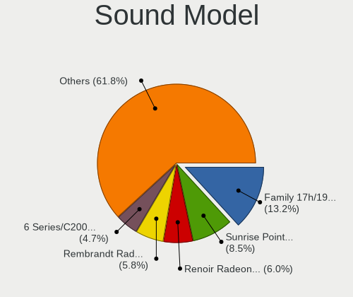

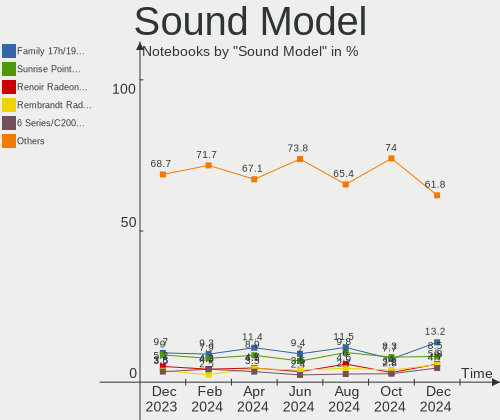

| Model                                                                      | Notebooks | Percent |
|----------------------------------------------------------------------------|-----------|---------|
| AMD Family 17h/19h HD Audio Controller                                     | 46        | 10.67%  |
| AMD Renoir Radeon High Definition Audio Controller                         | 29        | 6.73%   |
| Intel Sunrise Point-LP HD Audio                                            | 28        | 6.5%    |
| Intel Tiger Lake-LP Smart Sound Technology Audio Controller                | 20        | 4.64%   |
| Intel 7 Series/C216 Chipset Family High Definition Audio Controller        | 18        | 4.18%   |
| Intel 6 Series/C200 Series Chipset Family High Definition Audio Controller | 16        | 3.71%   |
| AMD Raven/Raven2/Fenghuang HDMI/DP Audio Controller                        | 14        | 3.25%   |
| Intel 8 Series/C220 Series Chipset High Definition Audio Controller        | 13        | 3.02%   |
| Intel Celeron/Pentium Silver Processor High Definition Audio               | 11        | 2.55%   |
| Intel Wildcat Point-LP High Definition Audio Controller                    | 10        | 2.32%   |
| Intel Broadwell-U Audio Controller                                         | 10        | 2.32%   |
| Intel 82801I (ICH9 Family) HD Audio Controller                             | 10        | 2.32%   |
| Intel 5 Series/3400 Series Chipset High Definition Audio                   | 9         | 2.09%   |
| Intel Xeon E3-1200 v3/4th Gen Core Processor HD Audio Controller           | 8         | 1.86%   |
| Intel Haswell-ULT HD Audio Controller                                      | 8         | 1.86%   |
| Intel Cannon Lake PCH cAVS                                                 | 8         | 1.86%   |
| Intel 8 Series HD Audio Controller                                         | 8         | 1.86%   |
| Intel Alder Lake PCH-P High Definition Audio Controller                    | 7         | 1.62%   |
| AMD Rembrandt Radeon High Definition Audio Controller                      | 7         | 1.62%   |
| Intel Ice Lake-LP Smart Sound Technology Audio Controller                  | 6         | 1.39%   |
| Intel Comet Lake PCH-LP cAVS                                               | 6         | 1.39%   |
| Intel Cannon Point-LP High Definition Audio Controller                     | 6         | 1.39%   |
| AMD SBx00 Azalia (Intel HDA)                                               | 6         | 1.39%   |
| Nvidia GF108 High Definition Audio Controller                              | 5         | 1.16%   |
| Nvidia GA104 High Definition Audio Controller                              | 5         | 1.16%   |
| Intel NM10/ICH7 Family High Definition Audio Controller                    | 5         | 1.16%   |
| Intel 100 Series/C230 Series Chipset Family HD Audio Controller            | 5         | 1.16%   |
| Intel Tiger Lake-H HD Audio Controller                                     | 4         | 0.93%   |
| Intel Comet Lake PCH cAVS                                                  | 4         | 0.93%   |
| Intel CM238 HD Audio Controller                                            | 4         | 0.93%   |
| Intel Celeron N3350/Pentium N4200/Atom E3900 Series Audio Cluster          | 4         | 0.93%   |
| Intel Atom Processor Z36xxx/Z37xxx Series High Definition Audio Controller | 4         | 0.93%   |
| Intel 82801H (ICH8 Family) HD Audio Controller                             | 4         | 0.93%   |
| AMD RV710/730 HDMI Audio [Radeon HD 4000 series]                           | 4         | 0.93%   |
| AMD High Definition Audio Controller                                       | 4         | 0.93%   |
| AMD FCH Azalia Controller                                                  | 4         | 0.93%   |
| AMD Family 15h (Models 60h-6fh) Audio Controller                           | 4         | 0.93%   |
| Nvidia TU106 High Definition Audio Controller                              | 3         | 0.7%    |
| Silicon Integrated Systems [SiS] Azalia Audio Controller                   | 2         | 0.46%   |
| Realtek Semiconductor USB Audio                                            | 2         | 0.46%   |

Memory
------

Memory Vendor
-------------

Memory module vendors

| Vendor                     | Notebooks | Percent |
|----------------------------|-----------|---------|
| Samsung Electronics        | 50        | 29.24%  |
| SK hynix                   | 36        | 21.05%  |
| Micron Technology          | 20        | 11.7%   |
| Unknown                    | 14        | 8.19%   |
| Unknown (ABCD)             | 8         | 4.68%   |
| Crucial                    | 8         | 4.68%   |
| Ramaxel Technology         | 6         | 3.51%   |
| Kingston                   | 6         | 3.51%   |
| Transcend                  | 4         | 2.34%   |
| Elpida                     | 3         | 1.75%   |
| A-DATA Technology          | 3         | 1.75%   |
| GOODRAM                    | 2         | 1.17%   |
| Corsair                    | 2         | 1.17%   |
| Unknown                    | 2         | 1.17%   |
| Unknown (8ECE)             | 1         | 0.58%   |
| Unknown (7F7F7F7F7F7F7F25) | 1         | 0.58%   |
| Qimonda                    | 1         | 0.58%   |
| Nanya Technology           | 1         | 0.58%   |
| Melco                      | 1         | 0.58%   |
| Avant                      | 1         | 0.58%   |
| ASint Technology           | 1         | 0.58%   |

Memory Model
------------

Memory module models

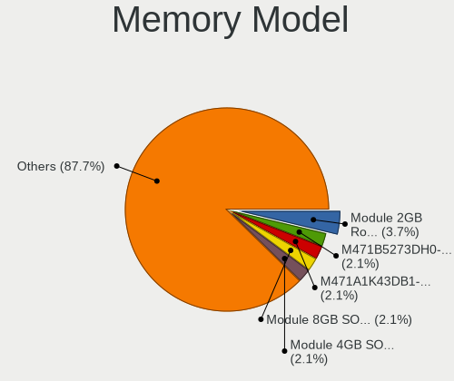

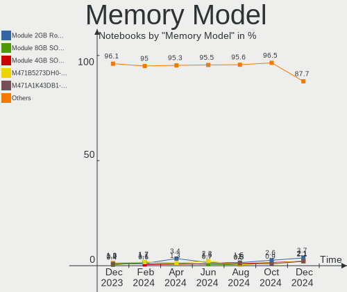

| Model                                                                  | Notebooks | Percent |
|------------------------------------------------------------------------|-----------|---------|
| Unknown (ABCD) RAM 123456789012345678 2GB SODIMM LPDDR4 2400MT/s       | 8         | 4.49%   |
| SK hynix RAM HMAA1GS6CJR6N-XN 8GB SODIMM DDR4 3200MT/s                 | 7         | 3.93%   |
| Samsung RAM M471A1G44BB0-CWE 8GB SODIMM DDR4 3200MT/s                  | 6         | 3.37%   |
| Samsung RAM Module 8GB SODIMM DDR4 2133MT/s                            | 3         | 1.69%   |
| Samsung RAM M471B1G73QH0-YK0 8GB SODIMM DDR3 1600MT/s                  | 3         | 1.69%   |
| Samsung RAM M471A2K43DB1-CWE 16GB SODIMM DDR4 3200MT/s                 | 3         | 1.69%   |
| Micron RAM 8ATF1G64HZ-3G2R1 8GB SODIMM DDR4 3200MT/s                   | 3         | 1.69%   |
| Unknown RAM Module 8192MB SODIMM DDR3 1600MT/s                         | 2         | 1.12%   |
| Unknown RAM Module 4GB Row Of Chips LPDDR4 4267MT/s                    | 2         | 1.12%   |
| SK hynix RAM Module 8GB SODIMM DDR4 2133MT/s                           | 2         | 1.12%   |
| SK hynix RAM Module 16GB SODIMM DDR4 3200MT/s                          | 2         | 1.12%   |
| SK hynix RAM HMT41GS6BFR8A-PB 8GB SODIMM DDR3 1600MT/s                 | 2         | 1.12%   |
| SK hynix RAM HMA851S6CJR6N-XN 4GB SODIMM DDR4 3200MT/s                 | 2         | 1.12%   |
| SK hynix RAM HMA81GS6JJR8N-VK 8GB SODIMM DDR4 2667MT/s                 | 2         | 1.12%   |
| SK hynix RAM HMA81GS6DJR8N-XN 8GB SODIMM DDR4 3200MT/s                 | 2         | 1.12%   |
| Samsung RAM M471B5173QH0-YK0 4GB SODIMM DDR3 1600MT/s                  | 2         | 1.12%   |
| Samsung RAM M471B5173DB0-YK0 4096MB SODIMM DDR3 1600MT/s               | 2         | 1.12%   |
| Samsung RAM M471B1G73DB0-YK0 8GB SODIMM DDR3 1600MT/s                  | 2         | 1.12%   |
| Samsung RAM M471A5244CB0-CWE 4096MB SODIMM DDR4 3200MT/s               | 2         | 1.12%   |
| Samsung RAM M471A5244CB0-CTD 4GB Row Of Chips DDR4 2667MT/s            | 2         | 1.12%   |
| Samsung RAM M471A1K43DB1-CWE 8192MB SODIMM DDR4 3200MT/s               | 2         | 1.12%   |
| Samsung RAM M471A1K43CB1-CTD 8GB SODIMM DDR4 2667MT/s                  | 2         | 1.12%   |
| Samsung RAM M471A1G44AB0-CWE 8GB SODIMM DDR4 3200MT/s                  | 2         | 1.12%   |
| Micron RAM 4ATF51264HZ-3G2E1 4GB SODIMM DDR4 3200MT/s                  | 2         | 1.12%   |
| Micron RAM 4ATF1G64HZ-3G2E1 8GB SODIMM DDR4 3200MT/s                   | 2         | 1.12%   |
| Micron RAM 16JSF25664HZ-1G1F1 2GB SODIMM DDR3 1067MT/s                 | 2         | 1.12%   |
| Unknown                                                                | 2         | 1.12%   |
| Unknown RAM Module 8GB SODIMM DDR3                                     | 1         | 0.56%   |
| Unknown RAM Module 8GB Row Of Chips LPDDR4 4267MT/s                    | 1         | 0.56%   |
| Unknown RAM Module 512MB SODIMM DDR2 533MT/s                           | 1         | 0.56%   |
| Unknown RAM Module 512MB SODIMM DDR                                    | 1         | 0.56%   |
| Unknown RAM Module 2GB SODIMM SDRAM                                    | 1         | 0.56%   |
| Unknown RAM Module 2GB Row Of Chips LPDDR4 4267MT/s                    | 1         | 0.56%   |
| Unknown RAM Module 1GB SODIMM DDR2                                     | 1         | 0.56%   |
| Unknown RAM Module 1024MB SODIMM DRAM                                  | 1         | 0.56%   |
| Unknown RAM Module 1024MB SODIMM DDR3 667MT/s                          | 1         | 0.56%   |
| Unknown RAM Module 1024MB SODIMM DDR3 1066MT/s                         | 1         | 0.56%   |
| Unknown (8ECE) RAM BS-D3-4G-SO-1600 4GB SODIMM DDR3 1067MT/s           | 1         | 0.56%   |
| Unknown (7F7F7F7F7F7F7F25) RAM RM1GO464CA-64FL 1GB SODIMM DDR2 667MT/s | 1         | 0.56%   |
| Transcend RAM TS1GSK64W6H 8GB SODIMM DDR3 1600MT/s                     | 1         | 0.56%   |

Memory Kind
-----------

Memory module kinds

| Kind   | Notebooks | Percent |
|--------|-----------|---------|
| DDR4   | 69        | 46.62%  |
| DDR3   | 39        | 26.35%  |
| LPDDR4 | 19        | 12.84%  |
| DDR2   | 6         | 4.05%   |
| DDR5   | 5         | 3.38%   |
| LPDDR3 | 4         | 2.7%    |
| LPDDR5 | 3         | 2.03%   |
| SDRAM  | 1         | 0.68%   |
| DRAM   | 1         | 0.68%   |
| DDR    | 1         | 0.68%   |

Memory Form Factor
------------------

Physical design of the memory module

| Name         | Notebooks | Percent |
|--------------|-----------|---------|
| SODIMM       | 132       | 88.59%  |
| Row Of Chips | 16        | 10.74%  |
| Unknown      | 1         | 0.67%   |

Memory Size
-----------

Memory module size

| Size  | Notebooks | Percent |
|-------|-----------|---------|
| 8192  | 71        | 46.71%  |
| 4096  | 34        | 22.37%  |
| 16384 | 22        | 14.47%  |
| 2048  | 13        | 8.55%   |
| 32768 | 5         | 3.29%   |
| 1024  | 5         | 3.29%   |
| 512   | 2         | 1.32%   |

Memory Speed
------------

Memory module speed

| Speed   | Notebooks | Percent |
|---------|-----------|---------|
| 3200    | 36        | 23.38%  |
| 2667    | 30        | 19.48%  |
| 1600    | 23        | 14.94%  |
| 2400    | 14        | 9.09%   |
| 4267    | 7         | 4.55%   |
| 2133    | 7         | 4.55%   |
| 4800    | 5         | 3.25%   |
| Unknown | 5         | 3.25%   |
| 1334    | 4         | 2.6%    |
| 667     | 4         | 2.6%    |
| 6400    | 3         | 1.95%   |
| 1067    | 3         | 1.95%   |
| 1066    | 3         | 1.95%   |
| 4266    | 2         | 1.3%    |
| 1867    | 2         | 1.3%    |
| 1333    | 2         | 1.3%    |
| 8400    | 1         | 0.65%   |
| 2933    | 1         | 0.65%   |
| 975     | 1         | 0.65%   |
| 533     | 1         | 0.65%   |

Printers & scanners
-------------------

Printer Vendor
--------------

Printer device vendors

| Vendor          | Notebooks | Percent |
|-----------------|-----------|---------|
| Hewlett-Packard | 1         | 50%     |
| Canon           | 1         | 50%     |

Printer Model
-------------

Printer device models

| Model                    | Notebooks | Percent |
|--------------------------|-----------|---------|
| HP Laser 107a            | 1         | 50%     |
| Canon PIXMA MX920 Series | 1         | 50%     |

Scanner Vendor
--------------

Scanner device vendors

| Vendor | Notebooks | Percent |
|--------|-----------|---------|
| Canon  | 1         | 100%    |

Scanner Model
-------------

Scanner device models

| Model                   | Notebooks | Percent |
|-------------------------|-----------|---------|
| Canon CanoScan LiDE 200 | 1         | 100%    |

Camera
------

Camera Vendor
-------------

Camera device vendors

| Vendor                                 | Notebooks | Percent |
|----------------------------------------|-----------|---------|
| Chicony Electronics                    | 61        | 25.31%  |
| Acer                                   | 29        | 12.03%  |
| Microdia                               | 26        | 10.79%  |
| Quanta                                 | 19        | 7.88%   |
| IMC Networks                           | 16        | 6.64%   |
| Cheng Uei Precision Industry (Foxlink) | 11        | 4.56%   |
| Realtek Semiconductor                  | 10        | 4.15%   |
| Logitech                               | 9         | 3.73%   |
| Sunplus Innovation Technology          | 8         | 3.32%   |
| Suyin                                  | 7         | 2.9%    |
| Lite-On Technology                     | 6         | 2.49%   |
| Apple                                  | 5         | 2.07%   |
| Silicon Motion                         | 4         | 1.66%   |
| Luxvisions Innotech Limited            | 4         | 1.66%   |
| Lenovo                                 | 4         | 1.66%   |
| USB Camera                             | 3         | 1.24%   |
| Syntek                                 | 3         | 1.24%   |
| SunplusIT                              | 3         | 1.24%   |
| Ricoh                                  | 3         | 1.24%   |
| ALi                                    | 3         | 1.24%   |
| Z-Star Microelectronics                | 2         | 0.83%   |
| Alcor Micro                            | 2         | 0.83%   |
| Sunplus Technology                     | 1         | 0.41%   |
| OYT Tech                               | 1         | 0.41%   |
| KYE Systems (Mouse Systems)            | 1         | 0.41%   |

Camera Model
------------

Camera device models

| Model                                                         | Notebooks | Percent |
|---------------------------------------------------------------|-----------|---------|
| Chicony Integrated Camera                                     | 15        | 6.17%   |
| Microdia Integrated_Webcam_HD                                 | 13        | 5.35%   |
| IMC Networks Integrated Camera                                | 8         | 3.29%   |
| Chicony HD WebCam                                             | 7         | 2.88%   |
| Acer Integrated RGB Camera                                    | 6         | 2.47%   |
| Acer Integrated Camera                                        | 6         | 2.47%   |
| Sunplus Integrated_Webcam_HD                                  | 4         | 1.65%   |
| Logitech HD Pro Webcam C920                                   | 4         | 1.65%   |
| IMC Networks USB2.0 HD UVC WebCam                             | 4         | 1.65%   |
| Chicony USB2.0 HD UVC WebCam                                  | 4         | 1.65%   |
| Chicony HD User Facing                                        | 4         | 1.65%   |
| USB Camera USB Camera                                         | 3         | 1.23%   |
| Syntek Integrated Camera                                      | 3         | 1.23%   |
| Quanta HP TrueVision HD Camera                                | 3         | 1.23%   |
| Quanta HD User Facing                                         | 3         | 1.23%   |
| Microdia USB 2.0 Camera                                       | 3         | 1.23%   |
| Microdia Integrated Webcam                                    | 3         | 1.23%   |
| Luxvisions Innotech Limited HP HD Camera                      | 3         | 1.23%   |
| Lite-On HP Webcam                                             | 3         | 1.23%   |
| Chicony USB2.0 Camera                                         | 3         | 1.23%   |
| Chicony ThinkPad T490 Webcam                                  | 3         | 1.23%   |
| Chicony HP HD Camera                                          | 3         | 1.23%   |
| Chicony FJ Camera                                             | 3         | 1.23%   |
| ALi Gateway Webcam                                            | 3         | 1.23%   |
| Acer Lenovo Integrated Webcam                                 | 3         | 1.23%   |
| Acer EasyCamera                                               | 3         | 1.23%   |
| Suyin Acer/HP Integrated Webcam [CN0314]                      | 2         | 0.82%   |
| Suyin 1.3M HD WebCam                                          | 2         | 0.82%   |
| SunplusIT USB camera                                          | 2         | 0.82%   |
| Realtek USB Camera                                            | 2         | 0.82%   |
| Realtek Lenovo EasyCamera                                     | 2         | 0.82%   |
| Realtek Integrated_Webcam_HD                                  | 2         | 0.82%   |
| Quanta HP Wide Vision HD Camera                               | 2         | 0.82%   |
| Quanta HP HD Camera                                           | 2         | 0.82%   |
| Lite-On Integrated Camera                                     | 2         | 0.82%   |
| Chicony VGA Webcam                                            | 2         | 0.82%   |
| Chicony FHD Webcam                                            | 2         | 0.82%   |
| Cheng Uei Precision Industry (Foxlink) USB2.0 UVC 1.3M Webcam | 2         | 0.82%   |
| Cheng Uei Precision Industry (Foxlink) HP Webcam              | 2         | 0.82%   |
| Cheng Uei Precision Industry (Foxlink) HP HD Camera           | 2         | 0.82%   |

Security
--------

Fingerprint Vendor
------------------

Fingerprint sensor vendors

| Vendor                     | Notebooks | Percent |
|----------------------------|-----------|---------|
| Validity Sensors           | 20        | 32.79%  |
| Synaptics                  | 17        | 27.87%  |
| Shenzhen Goodix Technology | 15        | 24.59%  |
| AuthenTec                  | 4         | 6.56%   |
| Upek                       | 2         | 3.28%   |
| Elan Microelectronics      | 2         | 3.28%   |
| LighTuning Technology      | 1         | 1.64%   |

Fingerprint Model
-----------------

Fingerprint sensor models

| Model                                                                      | Notebooks | Percent |
|----------------------------------------------------------------------------|-----------|---------|
| Synaptics Prometheus MIS Touch Fingerprint Reader                          | 9         | 14.75%  |
| Shenzhen Goodix  Fingerprint Device                                        | 9         | 14.75%  |
| Validity Sensors VFS495 Fingerprint Reader                                 | 7         | 11.48%  |
| Unknown                                                                    | 5         | 8.2%    |
| Validity Sensors VFS5011 Fingerprint Reader                                | 3         | 4.92%   |
| Validity Sensors VFS 5011 fingerprint sensor                               | 3         | 4.92%   |
| Shenzhen Goodix Fingerprint Reader                                         | 3         | 4.92%   |
| Shenzhen Goodix FingerPrint                                                | 3         | 4.92%   |
| Validity Sensors VFS471 Fingerprint Reader                                 | 2         | 3.28%   |
| Upek Biometric Touchchip/Touchstrip Fingerprint Sensor                     | 2         | 3.28%   |
| Elan ELAN:Fingerprint                                                      | 2         | 3.28%   |
| AuthenTec AES2810                                                          | 2         | 3.28%   |
| Validity Sensors VFS300 Fingerprint Reader                                 | 1         | 1.64%   |
| Validity Sensors VFS Fingerprint sensor                                    | 1         | 1.64%   |
| Validity Sensors Synaptics WBDI                                            | 1         | 1.64%   |
| Validity Sensors Synaptics VFS7552 Touch Fingerprint Sensor with PurePrint | 1         | 1.64%   |
| Validity Sensors Swipe Fingerprint Sensor                                  | 1         | 1.64%   |
| Synaptics  WBDI                                                            | 1         | 1.64%   |
| Synaptics  VFS7552 Touch Fingerprint Sensor with PurePrint                 | 1         | 1.64%   |
| Synaptics Metallica MIS Touch Fingerprint Reader                           | 1         | 1.64%   |
| LighTuning ES603 Swipe Fingerprint Sensor                                  | 1         | 1.64%   |
| AuthenTec Fingerprint Sensor                                               | 1         | 1.64%   |
| AuthenTec AES1600                                                          | 1         | 1.64%   |

Chipcard Vendor
---------------

Chipcard module vendors

| Vendor      | Notebooks | Percent |
|-------------|-----------|---------|
| Alcor Micro | 22        | 59.46%  |
| Broadcom    | 8         | 21.62%  |
| O2 Micro    | 2         | 5.41%   |
| Lenovo      | 2         | 5.41%   |
| Clay Logic  | 2         | 5.41%   |
| Yubico.com  | 1         | 2.7%    |

Chipcard Model
--------------

Chipcard module models

| Model                                                                        | Notebooks | Percent |
|------------------------------------------------------------------------------|-----------|---------|
| Alcor Micro AU9540 Smartcard Reader                                          | 22        | 59.46%  |
| Broadcom BCM5880 Secure Applications Processor                               | 3         | 8.11%   |
| Broadcom 5880                                                                | 3         | 8.11%   |
| O2 Micro OZ776 CCID Smartcard Reader                                         | 2         | 5.41%   |
| Lenovo Integrated Smart Card Reader                                          | 2         | 5.41%   |
| Clay Logic Nitrokey Pro                                                      | 2         | 5.41%   |
| Broadcom BCM5880 Secure Applications Processor with fingerprint swipe sensor | 2         | 5.41%   |
| Yubico.com Yubikey NEO(-N) OTP+CCID                                          | 1         | 2.7%    |

Unsupported
-----------

Unsupported Devices
-------------------

Total unsupported devices on board

| Total | Notebooks | Percent |
|-------|-----------|---------|
| 0     | 166       | 57.44%  |
| 1     | 96        | 33.22%  |
| 2     | 23        | 7.96%   |
| 3     | 4         | 1.38%   |

Unsupported Device Types
------------------------

Types of unsupported devices

| Type                     | Notebooks | Percent |
|--------------------------|-----------|---------|
| Fingerprint reader       | 60        | 39.22%  |
| Chipcard                 | 30        | 19.61%  |
| Graphics card            | 21        | 13.73%  |
| Multimedia controller    | 14        | 9.15%   |
| Net/wireless             | 13        | 8.5%    |
| Camera                   | 6         | 3.92%   |
| Storage                  | 2         | 1.31%   |
| Communication controller | 2         | 1.31%   |
| Bluetooth                | 2         | 1.31%   |
| Network                  | 1         | 0.65%   |
| Net/ethernet             | 1         | 0.65%   |
| Card reader              | 1         | 0.65%   |

