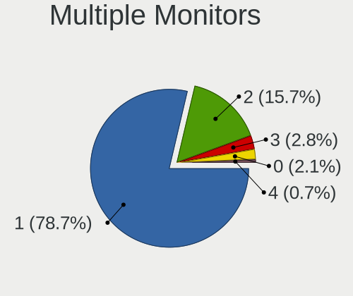
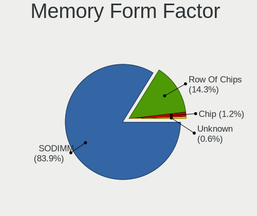
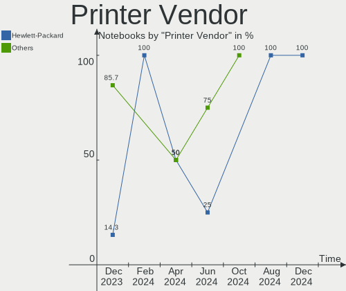

Linux in Germany - Hardware Trends (Notebooks)
----------------------------------------------

A project to identify most popular hardware characteristics and track their change
over time based on data collected by Linux users at https://Linux-Hardware.org.

Anyone can contribute to this report by the [hw-probe](https://github.com/linuxhw/hw-probe) tool:

    sudo -E hw-probe -all -upload

Period: Oct, 2022.

Contents
--------

* [ System ](#system)
  - [ OS                       ](#os)
  - [ OS Family                ](#os-family)
  - [ Kernel                   ](#kernel)
  - [ Kernel Family            ](#kernel-family)
  - [ Kernel Major Ver.        ](#kernel-major-ver)
  - [ Arch                     ](#arch)
  - [ DE                       ](#de)
  - [ Display Server           ](#display-server)
  - [ Display Manager          ](#display-manager)
  - [ OS Lang                  ](#os-lang)
  - [ Boot Mode                ](#boot-mode)
  - [ Filesystem               ](#filesystem)
  - [ Part. scheme             ](#part-scheme)
  - [ Dual Boot with Linux/BSD ](#dual-boot-with-linuxbsd)
  - [ Dual Boot (Win)          ](#dual-boot-win)

* [ Board ](#board)
  - [ Vendor                   ](#vendor)
  - [ Model                    ](#model)
  - [ Model Family             ](#model-family)
  - [ MFG Year                 ](#mfg-year)
  - [ Form Factor              ](#form-factor)
  - [ Secure Boot              ](#secure-boot)
  - [ Coreboot                 ](#coreboot)
  - [ RAM Size                 ](#ram-size)
  - [ RAM Used                 ](#ram-used)
  - [ Total Drives             ](#total-drives)
  - [ Has CD-ROM               ](#has-cd-rom)
  - [ Has Ethernet             ](#has-ethernet)
  - [ Has WiFi                 ](#has-wifi)
  - [ Has Bluetooth            ](#has-bluetooth)

* [ Location ](#location)
  - [ Country                  ](#country)
  - [ City                     ](#city)

* [ Drives ](#drives)
  - [ Drive Vendor             ](#drive-vendor)
  - [ Drive Model              ](#drive-model)
  - [ HDD Vendor               ](#hdd-vendor)
  - [ SSD Vendor               ](#ssd-vendor)
  - [ Drive Kind               ](#drive-kind)
  - [ Drive Connector          ](#drive-connector)
  - [ Drive Size               ](#drive-size)
  - [ Space Total              ](#space-total)
  - [ Space Used               ](#space-used)
  - [ Malfunc. Drives          ](#malfunc-drives)
  - [ Malfunc. Drive Vendor    ](#malfunc-drive-vendor)
  - [ Malfunc. HDD Vendor      ](#malfunc-hdd-vendor)
  - [ Malfunc. Drive Kind      ](#malfunc-drive-kind)
  - [ Failed Drives            ](#failed-drives)
  - [ Failed Drive Vendor      ](#failed-drive-vendor)
  - [ Drive Status             ](#drive-status)

* [ Storage controller ](#storage-controller)
  - [ Storage Vendor           ](#storage-vendor)
  - [ Storage Model            ](#storage-model)
  - [ Storage Kind             ](#storage-kind)

* [ Processor ](#processor)
  - [ CPU Vendor               ](#cpu-vendor)
  - [ CPU Model                ](#cpu-model)
  - [ CPU Model Family         ](#cpu-model-family)
  - [ CPU Cores                ](#cpu-cores)
  - [ CPU Sockets              ](#cpu-sockets)
  - [ CPU Threads              ](#cpu-threads)
  - [ CPU Op-Modes             ](#cpu-op-modes)
  - [ CPU Microcode            ](#cpu-microcode)
  - [ CPU Microarch            ](#cpu-microarch)

* [ Graphics ](#graphics)
  - [ GPU Vendor               ](#gpu-vendor)
  - [ GPU Model                ](#gpu-model)
  - [ GPU Combo                ](#gpu-combo)
  - [ GPU Driver               ](#gpu-driver)
  - [ GPU Memory               ](#gpu-memory)

* [ Monitor ](#monitor)
  - [ Monitor Vendor           ](#monitor-vendor)
  - [ Monitor Model            ](#monitor-model)
  - [ Monitor Resolution       ](#monitor-resolution)
  - [ Monitor Diagonal         ](#monitor-diagonal)
  - [ Monitor Width            ](#monitor-width)
  - [ Aspect Ratio             ](#aspect-ratio)
  - [ Monitor Area             ](#monitor-area)
  - [ Pixel Density            ](#pixel-density)
  - [ Multiple Monitors        ](#multiple-monitors)

* [ Network ](#network)
  - [ Net Controller Vendor    ](#net-controller-vendor)
  - [ Net Controller Model     ](#net-controller-model)
  - [ Wireless Vendor          ](#wireless-vendor)
  - [ Wireless Model           ](#wireless-model)
  - [ Ethernet Vendor          ](#ethernet-vendor)
  - [ Ethernet Model           ](#ethernet-model)
  - [ Net Controller Kind      ](#net-controller-kind)
  - [ Used Controller          ](#used-controller)
  - [ NICs                     ](#nics)
  - [ IPv6                     ](#ipv6)

* [ Bluetooth ](#bluetooth)
  - [ Bluetooth Vendor         ](#bluetooth-vendor)
  - [ Bluetooth Model          ](#bluetooth-model)

* [ Sound ](#sound)
  - [ Sound Vendor             ](#sound-vendor)
  - [ Sound Model              ](#sound-model)

* [ Memory ](#memory)
  - [ Memory Vendor            ](#memory-vendor)
  - [ Memory Model             ](#memory-model)
  - [ Memory Kind              ](#memory-kind)
  - [ Memory Form Factor       ](#memory-form-factor)
  - [ Memory Size              ](#memory-size)
  - [ Memory Speed             ](#memory-speed)

* [ Printers & scanners ](#printers--scanners)
  - [ Printer Vendor           ](#printer-vendor)
  - [ Printer Model            ](#printer-model)
  - [ Scanner Vendor           ](#scanner-vendor)
  - [ Scanner Model            ](#scanner-model)

* [ Camera ](#camera)
  - [ Camera Vendor            ](#camera-vendor)
  - [ Camera Model             ](#camera-model)

* [ Security ](#security)
  - [ Fingerprint Vendor       ](#fingerprint-vendor)
  - [ Fingerprint Model        ](#fingerprint-model)
  - [ Chipcard Vendor          ](#chipcard-vendor)
  - [ Chipcard Model           ](#chipcard-model)

* [ Unsupported ](#unsupported)
  - [ Unsupported Devices      ](#unsupported-devices)
  - [ Unsupported Device Types ](#unsupported-device-types)

System
------

OS
--

Installed operating systems

| Name                         | Notebooks | Percent |
|------------------------------|-----------|---------|
| Ubuntu 22.04                 | 52        | 19.48%  |
| Linux Mint 21                | 16        | 5.99%   |
| Debian 11                    | 16        | 5.99%   |
| Ubuntu 20.04                 | 13        | 4.87%   |
| Fedora 36                    | 12        | 4.49%   |
| Linux Mint 20.3              | 11        | 4.12%   |
| OpenMandriva 4.3             | 9         | 3.37%   |
| Arch Rolling                 | 9         | 3.37%   |
| Zorin 16                     | 8         | 3%      |
| Ubuntu 22.10                 | 8         | 3%      |
| SteamOS 3.3.2                | 8         | 3%      |
| Pop!_OS 22.04                | 8         | 3%      |
| Manjaro 22.0.0               | 6         | 2.25%   |
| Manjaro                      | 6         | 2.25%   |
| Kali 2022.3                  | 5         | 1.87%   |
| Gentoo 2.8                   | 5         | 1.87%   |
| openSUSE Tumbleweed-XXXXXXXX | 4         | 1.5%    |
| MX 21                        | 4         | 1.5%    |
| KDE neon 20.04               | 4         | 1.5%    |
| Xubuntu 22.04                | 3         | 1.12%   |
| Ubuntu 18.04                 | 3         | 1.12%   |
| TUXEDO OS 22.04              | 3         | 1.12%   |
| OpenMandriva 4.50            | 3         | 1.12%   |
| Nobara 36                    | 3         | 1.12%   |
| Kubuntu 22.04                | 3         | 1.12%   |
| Fedora 37                    | 3         | 1.12%   |
| Debian Testing               | 3         | 1.12%   |
| ArcoLinux Rolling            | 3         | 1.12%   |
| Xubuntu 20.04                | 2         | 0.75%   |
| SteamOS 3.3.1                | 2         | 0.75%   |
| LMDE 5                       | 2         | 0.75%   |
| Kubuntu 11                   | 2         | 0.75%   |
| Elementary 6.1               | 2         | 0.75%   |
| Zorin 15                     | 1         | 0.37%   |
| Xubuntu 18.04                | 1         | 0.37%   |
| Ubuntu Unity 20.04           | 1         | 0.37%   |
| Ubuntu Unity 16.04           | 1         | 0.37%   |
| Ubuntu MATE 22.04            | 1         | 0.37%   |
| Ubuntu MATE 18.04            | 1         | 0.37%   |
| Ubuntu Budgie 22.04          | 1         | 0.37%   |

OS Family
---------

OS without a version

| Name          | Notebooks | Percent |
|---------------|-----------|---------|
| Ubuntu        | 77        | 28.84%  |
| Linux Mint    | 29        | 10.86%  |
| Debian        | 19        | 7.12%   |
| Fedora        | 15        | 5.62%   |
| OpenMandriva  | 13        | 4.87%   |
| Manjaro       | 13        | 4.87%   |
| SteamOS       | 10        | 3.75%   |
| Zorin         | 9         | 3.37%   |
| Arch          | 9         | 3.37%   |
| Pop!_OS       | 8         | 3%      |
| Xubuntu       | 6         | 2.25%   |
| Gentoo        | 6         | 2.25%   |
| openSUSE      | 5         | 1.87%   |
| Kubuntu       | 5         | 1.87%   |
| Kali          | 5         | 1.87%   |
| MX            | 4         | 1.5%    |
| KDE neon      | 4         | 1.5%    |
| ArcoLinux     | 4         | 1.5%    |
| TUXEDO OS     | 3         | 1.12%   |
| Nobara        | 3         | 1.12%   |
| Endless       | 3         | 1.12%   |
| Ubuntu Unity  | 2         | 0.75%   |
| Ubuntu MATE   | 2         | 0.75%   |
| Ubuntu Budgie | 2         | 0.75%   |
| LMDE          | 2         | 0.75%   |
| Elementary    | 2         | 0.75%   |
| Slackware     | 1         | 0.37%   |
| ROSA          | 1         | 0.37%   |
| Linux Lite    | 1         | 0.37%   |
| KaOS          | 1         | 0.37%   |
| Garuda Linux  | 1         | 0.37%   |
| EuroLinux     | 1         | 0.37%   |
| EndeavourOS   | 1         | 0.37%   |

Kernel
------

Version of the Linux kernel

| Version                                        | Notebooks | Percent |
|------------------------------------------------|-----------|---------|
| 5.15.0-48-generic                              | 32        | 11.99%  |
| 5.15.0-52-generic                              | 27        | 10.11%  |
| 5.15.0-50-generic                              | 23        | 8.61%   |
| 5.10.0-18-amd64                                | 13        | 4.87%   |
| 5.16.7-desktop-1omv4003                        | 9         | 3.37%   |
| 5.4.0-131-generic                              | 8         | 3%      |
| 5.13.0-valve21.3-1-neptune                     | 8         | 3%      |
| 6.0.2-76060002-generic                         | 5         | 1.87%   |
| 5.15.0-43-generic                              | 5         | 1.87%   |
| 6.0.2-arch1-1                                  | 4         | 1.5%    |
| 5.19.0-23-generic                              | 4         | 1.5%    |
| 5.4.0-126-generic                              | 3         | 1.12%   |
| 5.19.14-200.fc36.x86_64                        | 3         | 1.12%   |
| 5.19.13-arch1-1                                | 3         | 1.12%   |
| 5.19.0-76051900-generic                        | 3         | 1.12%   |
| 5.19.0-2-amd64                                 | 3         | 1.12%   |
| 5.15.65-1-MANJARO                              | 3         | 1.12%   |
| 5.15.0-47-generic                              | 3         | 1.12%   |
| 5.15.0-41-generic                              | 3         | 1.12%   |
| 5.15.0-10050-tuxedo                            | 3         | 1.12%   |
| 5.10.0-19-amd64                                | 3         | 1.12%   |
| 6.0.5-arch1-1                                  | 2         | 0.75%   |
| 5.19.16-200.fc36.x86_64                        | 2         | 0.75%   |
| 5.19.16-2-MANJARO                              | 2         | 0.75%   |
| 5.19.14-201.fsync.fc36.x86_64                  | 2         | 0.75%   |
| 5.19.13-200.fc36.x86_64                        | 2         | 0.75%   |
| 5.19.12-arch1-1                                | 2         | 0.75%   |
| 5.19.12-200.fc36.x86_64                        | 2         | 0.75%   |
| 5.19.0-kali2-amd64                             | 2         | 0.75%   |
| 5.19.0-15-generic                              | 2         | 0.75%   |
| 5.18.0-kali7-amd64                             | 2         | 0.75%   |
| 5.15.0-46-generic                              | 2         | 0.75%   |
| 5.15.0-10052-tuxedo                            | 2         | 0.75%   |
| 5.14.0-1054-oem                                | 2         | 0.75%   |
| 5.14.0-1052-oem                                | 2         | 0.75%   |
| 5.13.0-valve21.1-1-neptune-02211-gc54cda5a36f3 | 2         | 0.75%   |
| 5.13.0-39-generic                              | 2         | 0.75%   |
| 5.11.0-35-generic                              | 2         | 0.75%   |
| 5.10.0-16-amd64                                | 2         | 0.75%   |
| 6.1.0-1-MANJARO                                | 1         | 0.37%   |

Kernel Family
-------------

Linux kernel without a distro release

| Version  | Notebooks | Percent |
|----------|-----------|---------|
| 5.15.0   | 104       | 38.95%  |
| 5.10.0   | 20        | 7.49%   |
| 5.19.0   | 16        | 5.99%   |
| 5.4.0    | 15        | 5.62%   |
| 5.13.0   | 13        | 4.87%   |
| 6.0.2    | 12        | 4.49%   |
| 5.16.7   | 9         | 3.37%   |
| 5.19.13  | 7         | 2.62%   |
| 5.14.0   | 6         | 2.25%   |
| 5.19.16  | 5         | 1.87%   |
| 5.19.14  | 5         | 1.87%   |
| 5.19.12  | 5         | 1.87%   |
| 5.11.0   | 5         | 1.87%   |
| 6.0.0    | 4         | 1.5%    |
| 5.18.0   | 4         | 1.5%    |
| 6.0.5    | 3         | 1.12%   |
| 6.0.1    | 3         | 1.12%   |
| 5.19.15  | 3         | 1.12%   |
| 5.19.11  | 3         | 1.12%   |
| 5.15.65  | 3         | 1.12%   |
| 4.15.0   | 3         | 1.12%   |
| 5.15.74  | 2         | 0.75%   |
| 5.15.72  | 2         | 0.75%   |
| 5.14.21  | 2         | 0.75%   |
| 6.1.0    | 1         | 0.37%   |
| 6.0.6    | 1         | 0.37%   |
| 6.0.3    | 1         | 0.37%   |
| 5.19.8   | 1         | 0.37%   |
| 5.19.7   | 1         | 0.37%   |
| 5.19.5   | 1         | 0.37%   |
| 5.15.75  | 1         | 0.37%   |
| 5.15.71  | 1         | 0.37%   |
| 5.15.63  | 1         | 0.37%   |
| 5.15.52  | 1         | 0.37%   |
| 5.10.14  | 1         | 0.37%   |
| 5.10.136 | 1         | 0.37%   |
| 5.10.118 | 1         | 0.37%   |

Kernel Major Ver.
-----------------

Linux kernel major version

| Version | Notebooks | Percent |
|---------|-----------|---------|
| 5.15    | 115       | 43.07%  |
| 5.19    | 47        | 17.6%   |
| 6.0     | 24        | 8.99%   |
| 5.10    | 23        | 8.61%   |
| 5.4     | 15        | 5.62%   |
| 5.13    | 13        | 4.87%   |
| 5.16    | 9         | 3.37%   |
| 5.14    | 8         | 3%      |
| 5.11    | 5         | 1.87%   |
| 5.18    | 4         | 1.5%    |
| 4.15    | 3         | 1.12%   |
| 6.1     | 1         | 0.37%   |

Arch
----

OS architecture (x86_64, i586, etc.)

| Name   | Notebooks | Percent |
|--------|-----------|---------|
| x86_64 | 263       | 98.5%   |
| i686   | 4         | 1.5%    |

DE
--

Desktop Environment

| Name            | Notebooks | Percent |
|-----------------|-----------|---------|
| GNOME           | 133       | 49.81%  |
| KDE5            | 55        | 20.6%   |
| X-Cinnamon      | 22        | 8.24%   |
| XFCE            | 19        | 7.12%   |
| Unknown         | 9         | 3.37%   |
| Cinnamon        | 6         | 2.25%   |
| MATE            | 5         | 1.87%   |
| i3              | 3         | 1.12%   |
| GNOME Flashback | 3         | 1.12%   |
| Unity           | 2         | 0.75%   |
| Pantheon        | 2         | 0.75%   |
| LXQt            | 2         | 0.75%   |
| Budgie          | 2         | 0.75%   |
| sway            | 1         | 0.37%   |
| LXDE            | 1         | 0.37%   |
| bspwm           | 1         | 0.37%   |
| awesome         | 1         | 0.37%   |

Display Server
--------------

X11 or Wayland

| Name    | Notebooks | Percent |
|---------|-----------|---------|
| X11     | 181       | 67.79%  |
| Wayland | 75        | 28.09%  |
| Tty     | 6         | 2.25%   |
| Unknown | 5         | 1.87%   |

Display Manager
---------------

SDDM, LightDM, etc.

| Name    | Notebooks | Percent |
|---------|-----------|---------|
| Unknown | 84        | 31.46%  |
| GDM3    | 78        | 29.21%  |
| LightDM | 48        | 17.98%  |
| SDDM    | 34        | 12.73%  |
| GDM     | 21        | 7.87%   |
| XDM     | 2         | 0.75%   |

OS Lang
-------

Language

| Lang    | Notebooks | Percent |
|---------|-----------|---------|
| de_DE   | 171       | 64.04%  |
| en_US   | 60        | 22.47%  |
| en_GB   | 7         | 2.62%   |
| C       | 4         | 1.5%    |
| ru_RU   | 3         | 1.12%   |
| pl_PL   | 3         | 1.12%   |
| it_IT   | 3         | 1.12%   |
| en_DE   | 3         | 1.12%   |
| Unknown | 3         | 1.12%   |
| POSIX   | 2         | 0.75%   |
| en_SG   | 2         | 0.75%   |
| Default | 2         | 0.75%   |
| C.UTF8  | 2         | 0.75%   |
| uk_UA   | 1         | 0.37%   |
| de_IT   | 1         | 0.37%   |

Boot Mode
---------

EFI or BIOS

| Mode | Notebooks | Percent |
|------|-----------|---------|
| BIOS | 139       | 52.06%  |
| EFI  | 128       | 47.94%  |

Filesystem
----------

Type of filesystem

| Type    | Notebooks | Percent |
|---------|-----------|---------|
| Ext4    | 210       | 78.65%  |
| Btrfs   | 35        | 13.11%  |
| Overlay | 18        | 6.74%   |
| Zfs     | 1         | 0.37%   |
| Xfs     | 1         | 0.37%   |
| F2fs    | 1         | 0.37%   |
| Ext2    | 1         | 0.37%   |

Part. scheme
------------

Scheme of partitioning

| Type    | Notebooks | Percent |
|---------|-----------|---------|
| GPT     | 152       | 56.93%  |
| Unknown | 82        | 30.71%  |
| MBR     | 33        | 12.36%  |

Dual Boot with Linux/BSD
------------------------

Hosting more than one Linux/BSD

| Dual boot | Notebooks | Percent |
|-----------|-----------|---------|
| No        | 238       | 89.14%  |
| Yes       | 29        | 10.86%  |

Dual Boot (Win)
---------------

Hosting Linux and Windows

| Dual boot | Notebooks | Percent |
|-----------|-----------|---------|
| No        | 188       | 70.41%  |
| Yes       | 79        | 29.59%  |

Board
-----

Vendor
------

Motherboard manufacturer

| Name                    | Notebooks | Percent |
|-------------------------|-----------|---------|
| Lenovo                  | 79        | 29.59%  |
| Hewlett-Packard         | 39        | 14.61%  |
| Dell                    | 31        | 11.61%  |
| Acer                    | 19        | 7.12%   |
| ASUSTek Computer        | 18        | 6.74%   |
| Valve                   | 11        | 4.12%   |
| MSI                     | 9         | 3.37%   |
| Toshiba                 | 7         | 2.62%   |
| Sony                    | 6         | 2.25%   |
| TUXEDO                  | 5         | 1.87%   |
| Medion                  | 5         | 1.87%   |
| HUAWEI                  | 4         | 1.5%    |
| Fujitsu                 | 4         | 1.5%    |
| Tactus                  | 3         | 1.12%   |
| Schenker                | 3         | 1.12%   |
| Packard Bell            | 3         | 1.12%   |
| Notebook                | 3         | 1.12%   |
| Timi                    | 2         | 0.75%   |
| Samsung Electronics     | 2         | 0.75%   |
| Apple                   | 2         | 0.75%   |
| Vulcan Electronics      | 1         | 0.37%   |
| TERRA                   | 1         | 0.37%   |
| PC Specialist           | 1         | 0.37%   |
| Panasonic               | 1         | 0.37%   |
| OEM                     | 1         | 0.37%   |
| LincPlus                | 1         | 0.37%   |
| Global Distribution FZE | 1         | 0.37%   |
| Gigabyte Technology     | 1         | 0.37%   |
| Clevo                   | 1         | 0.37%   |
| AXDIA International     | 1         | 0.37%   |
| Alienware               | 1         | 0.37%   |
| Unknown                 | 1         | 0.37%   |

Model
-----

Motherboard model

| Name                                 | Notebooks | Percent |
|--------------------------------------|-----------|---------|
| Valve Jupiter                        | 11        | 4.12%   |
| Unknown                              | 4         | 1.5%    |
| Lenovo ThinkPad E15 Gen 4 21EES00100 | 3         | 1.12%   |
| Lenovo G710 20252                    | 3         | 1.12%   |
| Toshiba Satellite L300               | 2         | 0.75%   |
| Tactus GeoBook 140                   | 2         | 0.75%   |
| Schenker VISION 15 (SVS15E21)        | 2         | 0.75%   |
| Lenovo Yoga Slim 7 14ARE05 82A2      | 2         | 0.75%   |
| Lenovo ThinkPad T495 20NKS01Y00      | 2         | 0.75%   |
| Lenovo ThinkPad L14 Gen 1 20U50001GE | 2         | 0.75%   |
| HP EliteBook 850 G2                  | 2         | 0.75%   |
| HP 255 G8 Notebook PC                | 2         | 0.75%   |
| Dell Precision 7760                  | 2         | 0.75%   |
| Dell Latitude 3320                   | 2         | 0.75%   |
| ASUS X510UQ                          | 2         | 0.75%   |
| Acer Swift SF314-42                  | 2         | 0.75%   |
| Vulcan Excursion XB                  | 1         | 0.37%   |
| TUXEDO Pulse 15 Gen1                 | 1         | 0.37%   |
| TUXEDO Polaris (CML/Gen2)            | 1         | 0.37%   |
| TUXEDO InfinityBook_Pro13_14_v4      | 1         | 0.37%   |
| TUXEDO Aura 15 Gen1                  | 1         | 0.37%   |
| Toshiba Satellite P200               | 1         | 0.37%   |
| Toshiba Satellite L755               | 1         | 0.37%   |
| Toshiba Satellite L500               | 1         | 0.37%   |
| Toshiba Satellite C70-B              | 1         | 0.37%   |
| Toshiba Satellite C650D              | 1         | 0.37%   |
| Timi Xiaomi Book Pro 16 2022         | 1         | 0.37%   |
| Timi TM1701                          | 1         | 0.37%   |
| TERRA TERRAPC                        | 1         | 0.37%   |
| Tactus GeoBook_240                   | 1         | 0.37%   |
| Sony VPCZ12C5E                       | 1         | 0.37%   |
| Sony VGN-N21E_W                      | 1         | 0.37%   |
| Sony VGN-AR71J                       | 1         | 0.37%   |
| Sony SVT13118FXS                     | 1         | 0.37%   |
| Sony SVF1532W4E                      | 1         | 0.37%   |
| Sony SVE1712C1EW                     | 1         | 0.37%   |
| Schenker SLIM_13_14_SSL13_14L18      | 1         | 0.37%   |
| Samsung R59P/R60P/R61P               | 1         | 0.37%   |
| Samsung NC10                         | 1         | 0.37%   |
| PC Specialist N750HU                 | 1         | 0.37%   |

Model Family
------------

Motherboard model prefix

| Name                  | Notebooks | Percent |
|-----------------------|-----------|---------|
| Lenovo ThinkPad       | 49        | 18.35%  |
| Dell Latitude         | 13        | 4.87%   |
| Acer Aspire           | 12        | 4.49%   |
| Valve Jupiter         | 11        | 4.12%   |
| Lenovo IdeaPad        | 11        | 4.12%   |
| HP EliteBook          | 10        | 3.75%   |
| HP ProBook            | 9         | 3.37%   |
| Toshiba Satellite     | 7         | 2.62%   |
| HP Laptop             | 6         | 2.25%   |
| Dell Precision        | 5         | 1.87%   |
| Dell Inspiron         | 5         | 1.87%   |
| Lenovo Yoga           | 4         | 1.5%    |
| Lenovo Legion         | 4         | 1.5%    |
| Fujitsu LIFEBOOK      | 4         | 1.5%    |
| Dell XPS              | 4         | 1.5%    |
| Unknown               | 4         | 1.5%    |
| Tactus GeoBook        | 3         | 1.12%   |
| Packard Bell EasyNote | 3         | 1.12%   |
| Lenovo G710           | 3         | 1.12%   |
| HP ZBook              | 3         | 1.12%   |
| HP Pavilion           | 3         | 1.12%   |
| Dell Vostro           | 3         | 1.12%   |
| ASUS VivoBook         | 3         | 1.12%   |
| Acer Swift            | 3         | 1.12%   |
| Schenker VISION       | 2         | 0.75%   |
| MSI Katana            | 2         | 0.75%   |
| MSI GE60              | 2         | 0.75%   |
| HP 255                | 2         | 0.75%   |
| HP 250                | 2         | 0.75%   |
| ASUS X510UQ           | 2         | 0.75%   |
| Acer Extensa          | 2         | 0.75%   |
| Vulcan Excursion      | 1         | 0.37%   |
| TUXEDO Pulse          | 1         | 0.37%   |
| TUXEDO Polaris        | 1         | 0.37%   |
| TUXEDO InfinityBook   | 1         | 0.37%   |
| TUXEDO Aura           | 1         | 0.37%   |
| Timi Xiaomi           | 1         | 0.37%   |
| Timi TM1701           | 1         | 0.37%   |
| TERRA TERRAPC         | 1         | 0.37%   |
| Sony VPCZ12C5E        | 1         | 0.37%   |

MFG Year
--------

Motherboard manufacture year

| Year | Notebooks | Percent |
|------|-----------|---------|
| 2020 | 44        | 16.48%  |
| 2022 | 31        | 11.61%  |
| 2021 | 31        | 11.61%  |
| 2017 | 19        | 7.12%   |
| 2016 | 18        | 6.74%   |
| 2011 | 17        | 6.37%   |
| 2019 | 15        | 5.62%   |
| 2012 | 14        | 5.24%   |
| 2018 | 12        | 4.49%   |
| 2008 | 12        | 4.49%   |
| 2013 | 10        | 3.75%   |
| 2010 | 10        | 3.75%   |
| 2015 | 9         | 3.37%   |
| 2014 | 9         | 3.37%   |
| 2009 | 8         | 3%      |
| 2007 | 6         | 2.25%   |
| 2006 | 2         | 0.75%   |

Form Factor
-----------

Physical design of the computer

| Name     | Notebooks | Percent |
|----------|-----------|---------|
| Notebook | 267       | 100%    |

Secure Boot
-----------

Enabled or disabled

| State    | Notebooks | Percent |
|----------|-----------|---------|
| Disabled | 238       | 89.14%  |
| Enabled  | 29        | 10.86%  |

Coreboot
--------

Have coreboot on board

| Used | Notebooks | Percent |
|------|-----------|---------|
| No   | 264       | 98.88%  |
| Yes  | 3         | 1.12%   |

RAM Size
--------

Total RAM memory

| Size in GB  | Notebooks | Percent |
|-------------|-----------|---------|
| 4.01-8.0    | 60        | 22.47%  |
| 8.01-16.0   | 57        | 21.35%  |
| 16.01-24.0  | 56        | 20.97%  |
| 3.01-4.0    | 54        | 20.22%  |
| 32.01-64.0  | 19        | 7.12%   |
| 1.01-2.0    | 11        | 4.12%   |
| 64.01-256.0 | 7         | 2.62%   |
| 24.01-32.0  | 1         | 0.37%   |
| 2.01-3.0    | 1         | 0.37%   |
| 0.51-1.0    | 1         | 0.37%   |

RAM Used
--------

Used RAM memory

| Used GB    | Notebooks | Percent |
|------------|-----------|---------|
| 1.01-2.0   | 95        | 35.58%  |
| 2.01-3.0   | 77        | 28.84%  |
| 3.01-4.0   | 34        | 12.73%  |
| 4.01-8.0   | 33        | 12.36%  |
| 8.01-16.0  | 13        | 4.87%   |
| 0.51-1.0   | 11        | 4.12%   |
| 16.01-24.0 | 3         | 1.12%   |
| 0.01-0.5   | 1         | 0.37%   |

Total Drives
------------

Number of drives on board

| Drives | Notebooks | Percent |
|--------|-----------|---------|
| 1      | 189       | 70.79%  |
| 2      | 62        | 23.22%  |
| 3      | 13        | 4.87%   |
| 0      | 2         | 0.75%   |
| 4      | 1         | 0.37%   |

Has CD-ROM
----------

Has CD-ROM on board

| Presented | Notebooks | Percent |
|-----------|-----------|---------|
| No        | 187       | 70.04%  |
| Yes       | 80        | 29.96%  |

Has Ethernet
------------

Has Ethernet on board

| Presented | Notebooks | Percent |
|-----------|-----------|---------|
| Yes       | 213       | 79.78%  |
| No        | 54        | 20.22%  |

Has WiFi
--------

Has WiFi module

| Presented | Notebooks | Percent |
|-----------|-----------|---------|
| Yes       | 260       | 97.38%  |
| No        | 7         | 2.62%   |

Has Bluetooth
-------------

Has Bluetooth module

| Presented | Notebooks | Percent |
|-----------|-----------|---------|
| Yes       | 212       | 79.4%   |
| No        | 55        | 20.6%   |

Location
--------

Country
-------

Geographic location (country)

| Country | Notebooks | Percent |
|---------|-----------|---------|
| Germany | 267       | 100%    |

City
----

Geographic location (city)

| City                  | Notebooks | Percent |
|-----------------------|-----------|---------|
| Berlin                | 25        | 9.36%   |
| Munich                | 17        | 6.37%   |
| Hamburg               | 12        | 4.49%   |
| Frankfurt am Main     | 9         | 3.37%   |
| Dresden               | 7         | 2.62%   |
| Leipzig               | 6         | 2.25%   |
| Cologne               | 6         | 2.25%   |
| Kiel                  | 4         | 1.5%    |
| Aachen                | 4         | 1.5%    |
| Stuttgart             | 3         | 1.12%   |
| Nuremberg             | 3         | 1.12%   |
| Mannheim              | 3         | 1.12%   |
| Mainz                 | 3         | 1.12%   |
| Hamm                  | 3         | 1.12%   |
| Duisburg              | 3         | 1.12%   |
| Wuppertal             | 2         | 0.75%   |
| Schmalkalden          | 2         | 0.75%   |
| Saarlouis             | 2         | 0.75%   |
| Reutlingen            | 2         | 0.75%   |
| Recklinghausen        | 2         | 0.75%   |
| Oberhausen            | 2         | 0.75%   |
| Mönchengladbach      | 2         | 0.75%   |
| Ludwigshafen am Rhein | 2         | 0.75%   |
| Kirchseeon            | 2         | 0.75%   |
| Heidelberg            | 2         | 0.75%   |
| Hanover               | 2         | 0.75%   |
| Göttingen            | 2         | 0.75%   |
| Gelsenkirchen         | 2         | 0.75%   |
| Friedrichstadt        | 2         | 0.75%   |
| Freiburg im Breisgau  | 2         | 0.75%   |
| Essen                 | 2         | 0.75%   |
| Erfurt                | 2         | 0.75%   |
| Düsseldorf           | 2         | 0.75%   |
| Bremen                | 2         | 0.75%   |
| Zirndorf              | 1         | 0.37%   |
| Zimmern ob Rottweil   | 1         | 0.37%   |
| Worpswede             | 1         | 0.37%   |
| Wolfsburg             | 1         | 0.37%   |
| Winnenden             | 1         | 0.37%   |
| Wiesbaden             | 1         | 0.37%   |

Drives
------

Drive Vendor
------------

Hard drive vendors

| Vendor                       | Notebooks | Drives | Percent |
|------------------------------|-----------|--------|---------|
| Samsung Electronics          | 76        | 83     | 23.1%   |
| SanDisk                      | 34        | 35     | 10.33%  |
| WDC                          | 21        | 21     | 6.38%   |
| Unknown                      | 21        | 23     | 6.38%   |
| Seagate                      | 20        | 21     | 6.08%   |
| SK hynix                     | 19        | 20     | 5.78%   |
| Intenso                      | 15        | 15     | 4.56%   |
| Crucial                      | 15        | 16     | 4.56%   |
| Toshiba                      | 14        | 15     | 4.26%   |
| Intel                        | 13        | 14     | 3.95%   |
| Micron Technology            | 11        | 11     | 3.34%   |
| Kingston                     | 11        | 12     | 3.34%   |
| KIOXIA                       | 6         | 6      | 1.82%   |
| Hitachi                      | 6         | 6      | 1.82%   |
| UMIS                         | 5         | 5      | 1.52%   |
| Kingston Technology Company  | 5         | 5      | 1.52%   |
| HGST                         | 5         | 5      | 1.52%   |
| Phison Electronics           | 4         | 4      | 1.22%   |
| Transcend                    | 3         | 3      | 0.91%   |
| Netac                        | 3         | 3      | 0.91%   |
| Micron/Crucial Technology    | 2         | 2      | 0.61%   |
| Fujitsu                      | 2         | 3      | 0.61%   |
| China                        | 2         | 2      | 0.61%   |
| ASMT                         | 2         | 2      | 0.61%   |
| Union Memory (Shenzhen)      | 1         | 1      | 0.3%    |
| SSSTC                        | 1         | 1      | 0.3%    |
| SSD0240S                     | 1         | 1      | 0.3%    |
| Silicon Motion               | 1         | 1      | 0.3%    |
| Shenzhen Longsys Electronics | 1         | 1      | 0.3%    |
| MKNSSDAT                     | 1         | 1      | 0.3%    |
| LITEON                       | 1         | 1      | 0.3%    |
| JMicron Technology           | 1         | 1      | 0.3%    |
| Hewlett-Packard              | 1         | 1      | 0.3%    |
| Emtec                        | 1         | 1      | 0.3%    |
| Dogfish                      | 1         | 1      | 0.3%    |
| BIWIN                        | 1         | 1      | 0.3%    |
| Apple                        | 1         | 1      | 0.3%    |
| A-DATA Technology            | 1         | 1      | 0.3%    |

Drive Model
-----------

Hard drive models

| Model                                                | Notebooks | Percent |
|------------------------------------------------------|-----------|---------|
| Samsung NVMe SSD Controller SM981/PM981/PM983 500GB  | 11        | 3.22%   |
| Unknown MMC Card  32GB                               | 5         | 1.46%   |
| Kingston Company OM3PDP3 NVMe SSD 512GB              | 5         | 1.46%   |
| Samsung NVMe SSD Controller SM961/PM961/SM963 250GB  | 4         | 1.17%   |
| Samsung NVMe SSD Controller PM9A1/PM9A3/980PRO 250GB | 4         | 1.17%   |
| Intenso 128GB                                        | 4         | 1.17%   |
| Crucial CT500MX500SSD1 500GB                         | 4         | 1.17%   |
| Unknown MMC Card  256GB                              | 3         | 0.88%   |
| UMIS RPJTJ512MGE1QDQ 512GB                           | 3         | 0.88%   |
| Toshiba MQ01ABD100 1TB                               | 3         | 0.88%   |
| Seagate ST1000LM035-1RK172 1TB                       | 3         | 0.88%   |
| Sandisk WD Blue SN550 NVMe SSD 1TB                   | 3         | 0.88%   |
| SanDisk SSD PLUS 1000GB                              | 3         | 0.88%   |
| Samsung SSD 980 PRO 1TB                              | 3         | 0.88%   |
| Samsung SSD 870 EVO 1TB                              | 3         | 0.88%   |
| Samsung SSD 850 EVO 500GB                            | 3         | 0.88%   |
| Samsung MZVLB512HBJQ-000L7 512GB                     | 3         | 0.88%   |
| Samsung MZ9LQ256HBJD-00BVL 256GB                     | 3         | 0.88%   |
| KIOXIA KBG40ZNV512G 512GB                            | 3         | 0.88%   |
| Intenso 120GB                                        | 3         | 0.88%   |
| WDC WDS100T2B0A 1TB SSD                              | 2         | 0.58%   |
| WDC PC SN530 SDBPMPZ-512G-1101 512GB                 | 2         | 0.58%   |
| Unknown SD/MMC/MS PRO 1TB                            | 2         | 0.58%   |
| Unknown MMC Card  64GB                               | 2         | 0.58%   |
| Unknown MMC Card  512GB                              | 2         | 0.58%   |
| Unknown MMC Card  128GB                              | 2         | 0.58%   |
| Toshiba XG6 NVMe SSD Controller 512GB                | 2         | 0.58%   |
| Toshiba THNSNH128GBST SSD                            | 2         | 0.58%   |
| Toshiba MQ01ABF050 500GB                             | 2         | 0.58%   |
| SK hynix SKHynix_HFS512GD9TNG-L5B0B 512GB            | 2         | 0.58%   |
| SK hynix BC711 NVMe 256GB                            | 2         | 0.58%   |
| SK hynix BC711 HFM512GD3JX013N 512GB                 | 2         | 0.58%   |
| Seagate ST9500325AS 500GB                            | 2         | 0.58%   |
| Seagate ST1000LM024 HN-M101MBB 1TB                   | 2         | 0.58%   |
| SanDisk SSD PLUS 480 GB                              | 2         | 0.58%   |
| SanDisk SSD PLUS 240GB                               | 2         | 0.58%   |
| Samsung SSD 980 1TB                                  | 2         | 0.58%   |
| Samsung SSD 970 EVO Plus 500GB                       | 2         | 0.58%   |
| Samsung SSD 860 EVO 1TB                              | 2         | 0.58%   |
| Samsung SSD 850 PRO 512GB                            | 2         | 0.58%   |

HDD Vendor
----------

Hard disk drive vendors

| Vendor              | Notebooks | Drives | Percent |
|---------------------|-----------|--------|---------|
| Seagate             | 20        | 21     | 39.22%  |
| WDC                 | 7         | 7      | 13.73%  |
| Toshiba             | 7         | 7      | 13.73%  |
| Hitachi             | 6         | 6      | 11.76%  |
| HGST                | 5         | 5      | 9.8%    |
| Unknown             | 2         | 2      | 3.92%   |
| Samsung Electronics | 2         | 2      | 3.92%   |
| Fujitsu             | 2         | 3      | 3.92%   |

SSD Vendor
----------

Solid state drive vendors

| Vendor              | Notebooks | Drives | Percent |
|---------------------|-----------|--------|---------|
| Samsung Electronics | 26        | 27     | 23.21%  |
| SanDisk             | 21        | 22     | 18.75%  |
| Crucial             | 14        | 15     | 12.5%   |
| Intenso             | 7         | 7      | 6.25%   |
| Micron Technology   | 6         | 6      | 5.36%   |
| WDC                 | 5         | 5      | 4.46%   |
| SK hynix            | 5         | 5      | 4.46%   |
| Kingston            | 5         | 5      | 4.46%   |
| Toshiba             | 4         | 5      | 3.57%   |
| Transcend           | 3         | 3      | 2.68%   |
| Netac               | 3         | 3      | 2.68%   |
| Intel               | 2         | 2      | 1.79%   |
| China               | 2         | 2      | 1.79%   |
| ASMT                | 2         | 2      | 1.79%   |
| LITEON              | 1         | 1      | 0.89%   |
| Hewlett-Packard     | 1         | 1      | 0.89%   |
| Emtec               | 1         | 1      | 0.89%   |
| Dogfish             | 1         | 1      | 0.89%   |
| BIWIN               | 1         | 1      | 0.89%   |
| Apple               | 1         | 1      | 0.89%   |
| A-DATA Technology   | 1         | 1      | 0.89%   |

Drive Kind
----------

HDD or SSD

| Kind    | Notebooks | Drives | Percent |
|---------|-----------|--------|---------|
| NVMe    | 132       | 144    | 41.77%  |
| SSD     | 102       | 116    | 32.28%  |
| HDD     | 51        | 53     | 16.14%  |
| MMC     | 20        | 22     | 6.33%   |
| Unknown | 11        | 11     | 3.48%   |

Drive Connector
---------------

SATA, SAS, NVMe, etc.

| Type | Notebooks | Drives | Percent |
|------|-----------|--------|---------|
| SATA | 141       | 165    | 46.08%  |
| NVMe | 131       | 143    | 42.81%  |
| MMC  | 20        | 22     | 6.54%   |
| SAS  | 14        | 16     | 4.58%   |

Drive Size
----------

Size of hard drive

| Size in TB | Notebooks | Drives | Percent |
|------------|-----------|--------|---------|
| 0.01-0.5   | 95        | 107    | 62.5%   |
| 0.51-1.0   | 52        | 56     | 34.21%  |
| 1.01-2.0   | 4         | 5      | 2.63%   |
| 3.01-4.0   | 1         | 1      | 0.66%   |

Space Total
-----------

Amount of disk space available on the file system

| Size in GB     | Notebooks | Percent |
|----------------|-----------|---------|
| 101-250        | 76        | 28.46%  |
| 251-500        | 68        | 25.47%  |
| 501-1000       | 40        | 14.98%  |
| 1001-2000      | 21        | 7.87%   |
| 1-20           | 16        | 5.99%   |
| 21-50          | 15        | 5.62%   |
| 51-100         | 14        | 5.24%   |
| More than 3000 | 7         | 2.62%   |
| Unknown        | 7         | 2.62%   |
| 2001-3000      | 3         | 1.12%   |

Space Used
----------

Amount of used disk space

| Used GB        | Notebooks | Percent |
|----------------|-----------|---------|
| 1-20           | 95        | 35.58%  |
| 21-50          | 50        | 18.73%  |
| 101-250        | 42        | 15.73%  |
| 51-100         | 27        | 10.11%  |
| 251-500        | 25        | 9.36%   |
| 501-1000       | 14        | 5.24%   |
| Unknown        | 7         | 2.62%   |
| 1001-2000      | 6         | 2.25%   |
| More than 3000 | 1         | 0.37%   |

Malfunc. Drives
---------------

Drive models with a malfunction

| Model                                          | Notebooks | Drives | Percent |
|------------------------------------------------|-----------|--------|---------|
| Seagate ST2000LM 015-2E8174 2TB                | 1         | 1      | 14.29%  |
| Seagate ST1000LM014-SSHD-8GB                   | 1         | 1      | 14.29%  |
| SanDisk SSD PLUS 1000GB                        | 1         | 1      | 14.29%  |
| Samsung Electronics SSD 870 EVO 1TB            | 1         | 1      | 14.29%  |
| Micron Technology MTFDDAK256MAM-1K12 256GB SSD | 1         | 1      | 14.29%  |
| Crucial CT525MX300SSD1 528GB                   | 1         | 1      | 14.29%  |
| China SSD 32GB                                 | 1         | 1      | 14.29%  |

Malfunc. Drive Vendor
---------------------

Vendors of faulty drives

| Vendor              | Notebooks | Drives | Percent |
|---------------------|-----------|--------|---------|
| Seagate             | 2         | 2      | 28.57%  |
| SanDisk             | 1         | 1      | 14.29%  |
| Samsung Electronics | 1         | 1      | 14.29%  |
| Micron Technology   | 1         | 1      | 14.29%  |
| Crucial             | 1         | 1      | 14.29%  |
| China               | 1         | 1      | 14.29%  |

Malfunc. HDD Vendor
-------------------

Vendors of faulty HDD drives

| Vendor  | Notebooks | Drives | Percent |
|---------|-----------|--------|---------|
| Seagate | 2         | 2      | 100%    |

Malfunc. Drive Kind
-------------------

Kinds of faulty drives

| Kind | Notebooks | Drives | Percent |
|------|-----------|--------|---------|
| SSD  | 5         | 5      | 71.43%  |
| HDD  | 2         | 2      | 28.57%  |

Failed Drives
-------------

Failed drive models

Zero info for selected period =(

Failed Drive Vendor
-------------------

Failed drive vendors

Zero info for selected period =(

Drive Status
------------

Number of failed and malfunc. drives

| Status   | Notebooks | Drives | Percent |
|----------|-----------|--------|---------|
| Detected | 155       | 198    | 55.76%  |
| Works    | 116       | 141    | 41.73%  |
| Malfunc  | 7         | 7      | 2.52%   |

Storage controller
------------------

Storage Vendor
--------------

Storage controller vendors

| Vendor                         | Notebooks | Percent |
|--------------------------------|-----------|---------|
| Intel                          | 165       | 51.89%  |
| Samsung Electronics            | 52        | 16.35%  |
| AMD                            | 25        | 7.86%   |
| SanDisk                        | 21        | 6.6%    |
| SK hynix                       | 13        | 4.09%   |
| Kingston Technology Company    | 11        | 3.46%   |
| Union Memory (Shenzhen)        | 6         | 1.89%   |
| Micron Technology              | 5         | 1.57%   |
| KIOXIA                         | 5         | 1.57%   |
| Toshiba America Info Systems   | 4         | 1.26%   |
| Phison Electronics             | 4         | 1.26%   |
| Micron/Crucial Technology      | 3         | 0.94%   |
| Solid State Storage Technology | 1         | 0.31%   |
| Silicon Motion                 | 1         | 0.31%   |
| Shenzhen Longsys Electronics   | 1         | 0.31%   |
| Nvidia                         | 1         | 0.31%   |

Storage Model
-------------

Storage controller models

| Model                                                                          | Notebooks | Percent |
|--------------------------------------------------------------------------------|-----------|---------|
| AMD FCH SATA Controller [AHCI mode]                                            | 22        | 6.45%   |
| Samsung NVMe SSD Controller SM981/PM981/PM983                                  | 21        | 6.16%   |
| Intel Sunrise Point-LP SATA Controller [AHCI mode]                             | 16        | 4.69%   |
| Samsung NVMe SSD Controller 980                                                | 15        | 4.4%    |
| Intel 82801IBM/IEM (ICH9M/ICH9M-E) 4 port SATA Controller [AHCI mode]          | 14        | 4.11%   |
| Intel 82801 Mobile SATA Controller [RAID mode]                                 | 13        | 3.81%   |
| Intel 7 Series Chipset Family 6-port SATA Controller [AHCI mode]               | 11        | 3.23%   |
| Intel 6 Series/C200 Series Chipset Family 6 port Mobile SATA AHCI Controller   | 11        | 3.23%   |
| Intel Volume Management Device NVMe RAID Controller                            | 10        | 2.93%   |
| Intel 8 Series/C220 Series Chipset Family 6-port SATA Controller 1 [AHCI mode] | 10        | 2.93%   |
| SanDisk Non-Volatile memory controller                                         | 9         | 2.64%   |
| Samsung NVMe SSD Controller PM9A1/PM9A3/980PRO                                 | 9         | 2.64%   |
| Intel 5 Series/3400 Series Chipset 4 port SATA AHCI Controller                 | 8         | 2.35%   |
| Samsung NVMe SSD Controller SM961/PM961/SM963                                  | 7         | 2.05%   |
| Intel Celeron/Pentium Silver Processor SATA Controller                         | 7         | 2.05%   |
| Intel 82801HM/HEM (ICH8M/ICH8M-E) SATA Controller [AHCI mode]                  | 7         | 2.05%   |
| Intel 82801HM/HEM (ICH8M/ICH8M-E) IDE Controller                               | 7         | 2.05%   |
| Intel 8 Series SATA Controller 1 [AHCI mode]                                   | 7         | 2.05%   |
| SK hynix Gold P31 SSD                                                          | 6         | 1.76%   |
| Kingston Company OM3PDP3 NVMe SSD                                              | 6         | 1.76%   |
| Micron Non-Volatile memory controller                                          | 5         | 1.47%   |
| Union Memory (Shenzhen) AM630 PCIe 4.0 x4 NVMe SSD Controller                  | 4         | 1.17%   |
| SK hynix Non-Volatile memory controller                                        | 4         | 1.17%   |
| SanDisk WD Blue SN550 NVMe SSD                                                 | 4         | 1.17%   |
| KIOXIA NVMe SSD Controller BG4                                                 | 4         | 1.17%   |
| Intel Wildcat Point-LP SATA Controller [AHCI Mode]                             | 4         | 1.17%   |
| Intel Tiger Lake-LP SATA Controller                                            | 4         | 1.17%   |
| Intel Q170/Q150/B150/H170/H110/Z170/CM236 Chipset SATA Controller [AHCI Mode]  | 4         | 1.17%   |
| Intel HM170/QM170 Chipset SATA Controller [AHCI Mode]                          | 4         | 1.17%   |
| Intel Comet Lake SATA AHCI Controller                                          | 4         | 1.17%   |
| Toshiba America Info Systems XG6 NVMe SSD Controller                           | 3         | 0.88%   |
| SanDisk WD Blue SN500 / PC SN520 NVMe SSD                                      | 3         | 0.88%   |
| Intel SSD 660P Series                                                          | 3         | 0.88%   |
| Intel Non-Volatile memory controller                                           | 3         | 0.88%   |
| Intel Celeron N3350/Pentium N4200/Atom E3900 Series SATA AHCI Controller       | 3         | 0.88%   |
| Intel Cannon Point-LP SATA Controller [AHCI Mode]                              | 3         | 0.88%   |
| Intel Atom Processor E3800 Series SATA AHCI Controller                         | 3         | 0.88%   |
| Intel 82801GBM/GHM (ICH7-M Family) SATA Controller [IDE mode]                  | 3         | 0.88%   |
| Intel 500 Series Chipset Family SATA AHCI Controller                           | 3         | 0.88%   |
| Intel 5 Series/3400 Series Chipset 6 port SATA AHCI Controller                 | 3         | 0.88%   |

Storage Kind
------------

Kind of storage controller (IDE, SATA, NVMe, SAS, ...)

| Kind | Notebooks | Percent |
|------|-----------|---------|
| SATA | 159       | 48.33%  |
| NVMe | 131       | 39.82%  |
| RAID | 22        | 6.69%   |
| IDE  | 17        | 5.17%   |

Processor
---------

CPU Vendor
----------

Processor vendors

| Vendor | Notebooks | Percent |
|--------|-----------|---------|
| Intel  | 200       | 74.91%  |
| AMD    | 67        | 25.09%  |

CPU Model
---------

Processor models

| Model                                      | Notebooks | Percent |
|--------------------------------------------|-----------|---------|
| AMD Custom APU 0405                        | 11        | 4.12%   |
| Intel 11th Gen Core i7-1165G7 @ 2.80GHz    | 6         | 2.25%   |
| Intel Core i7-7500U CPU @ 2.70GHz          | 5         | 1.87%   |
| Intel Core i5-6300U CPU @ 2.40GHz          | 5         | 1.87%   |
| Intel Core i5-6200U CPU @ 2.30GHz          | 5         | 1.87%   |
| Intel 11th Gen Core i7-1185G7 @ 3.00GHz    | 5         | 1.87%   |
| AMD Ryzen 7 PRO 4750U with Radeon Graphics | 5         | 1.87%   |
| AMD Ryzen 7 4700U with Radeon Graphics     | 5         | 1.87%   |
| AMD Ryzen 5 4500U with Radeon Graphics     | 5         | 1.87%   |
| Intel Core i7-8565U CPU @ 1.80GHz          | 4         | 1.5%    |
| Intel Core i5-7200U CPU @ 2.50GHz          | 4         | 1.5%    |
| Intel Core i5-10210U CPU @ 1.60GHz         | 4         | 1.5%    |
| Intel 11th Gen Core i5-1135G7 @ 2.40GHz    | 4         | 1.5%    |
| AMD Ryzen 5 5500U with Radeon Graphics     | 4         | 1.5%    |
| Intel Core i7-8550U CPU @ 1.80GHz          | 3         | 1.12%   |
| Intel Core i3-2310M CPU @ 2.10GHz          | 3         | 1.12%   |
| Intel Core i3 CPU M 380 @ 2.53GHz          | 3         | 1.12%   |
| Intel Celeron N4020 CPU @ 1.10GHz          | 3         | 1.12%   |
| Intel Celeron CPU N2940 @ 1.83GHz          | 3         | 1.12%   |
| Intel 12th Gen Core i7-12700H              | 3         | 1.12%   |
| AMD Ryzen 7 5825U with Radeon Graphics     | 3         | 1.12%   |
| AMD Ryzen 7 5700U with Radeon Graphics     | 3         | 1.12%   |
| AMD Ryzen 3 5300U with Radeon Graphics     | 3         | 1.12%   |
| Intel Pentium Silver N5030 CPU @ 1.10GHz   | 2         | 0.75%   |
| Intel Pentium CPU N4200 @ 1.10GHz          | 2         | 0.75%   |
| Intel Genuine CPU U7300 @ 1.30GHz          | 2         | 0.75%   |
| Intel Core i7-7700HQ CPU @ 2.80GHz         | 2         | 0.75%   |
| Intel Core i7-6820HQ CPU @ 2.70GHz         | 2         | 0.75%   |
| Intel Core i7-6700HQ CPU @ 2.60GHz         | 2         | 0.75%   |
| Intel Core i7-4702MQ CPU @ 2.20GHz         | 2         | 0.75%   |
| Intel Core i7-3610QM CPU @ 2.30GHz         | 2         | 0.75%   |
| Intel Core i7-3517U CPU @ 1.90GHz          | 2         | 0.75%   |
| Intel Core i7-10870H CPU @ 2.20GHz         | 2         | 0.75%   |
| Intel Core i7-10750H CPU @ 2.60GHz         | 2         | 0.75%   |
| Intel Core i7-10510U CPU @ 1.80GHz         | 2         | 0.75%   |
| Intel Core i7 CPU M 620 @ 2.67GHz          | 2         | 0.75%   |
| Intel Core i5-8350U CPU @ 1.70GHz          | 2         | 0.75%   |
| Intel Core i5-5200U CPU @ 2.20GHz          | 2         | 0.75%   |
| Intel Core i5-4300M CPU @ 2.60GHz          | 2         | 0.75%   |
| Intel Core i5-4200M CPU @ 2.50GHz          | 2         | 0.75%   |

CPU Model Family
----------------

Processor model prefix

| Model                   | Notebooks | Percent |
|-------------------------|-----------|---------|
| Intel Core i5           | 55        | 20.6%   |
| Intel Core i7           | 47        | 17.6%   |
| Other                   | 44        | 16.48%  |
| AMD Ryzen 7             | 18        | 6.74%   |
| AMD Ryzen 5             | 17        | 6.37%   |
| Intel Core i3           | 16        | 5.99%   |
| Intel Core 2 Duo        | 16        | 5.99%   |
| Intel Celeron           | 11        | 4.12%   |
| AMD Ryzen 7 PRO         | 7         | 2.62%   |
| Intel Pentium           | 6         | 2.25%   |
| AMD Ryzen 3             | 5         | 1.87%   |
| Intel Pentium Silver    | 4         | 1.5%    |
| Intel Atom              | 4         | 1.5%    |
| Intel Pentium Dual-Core | 3         | 1.12%   |
| Intel Genuine           | 3         | 1.12%   |
| Intel Pentium Dual      | 2         | 0.75%   |
| AMD Ryzen 5 PRO         | 2         | 0.75%   |
| Intel Xeon              | 1         | 0.37%   |
| Intel Core 2            | 1         | 0.37%   |
| AMD V120                | 1         | 0.37%   |
| AMD Turion 64 X2 Mobile | 1         | 0.37%   |
| AMD Ryzen 9             | 1         | 0.37%   |
| AMD E2                  | 1         | 0.37%   |
| AMD A8                  | 1         | 0.37%   |

CPU Cores
---------

Number of processor cores

| Number | Notebooks | Percent |
|--------|-----------|---------|
| 2      | 112       | 41.95%  |
| 4      | 96        | 35.96%  |
| 8      | 29        | 10.86%  |
| 6      | 18        | 6.74%   |
| 12     | 4         | 1.5%    |
| 14     | 3         | 1.12%   |
| 1      | 3         | 1.12%   |
| 10     | 2         | 0.75%   |

CPU Sockets
-----------

Number of sockets

| Number | Notebooks | Percent |
|--------|-----------|---------|
| 1      | 267       | 100%    |

CPU Threads
-----------

Threads per core (Hyper-Threading)

| Number | Notebooks | Percent |
|--------|-----------|---------|
| 2      | 196       | 73.41%  |
| 1      | 71        | 26.59%  |

CPU Op-Modes
------------

CPU Operation Modes (32-bit, 64-bit)

| Op mode        | Notebooks | Percent |
|----------------|-----------|---------|
| 32-bit, 64-bit | 265       | 99.25%  |
| 32-bit         | 2         | 0.75%   |

CPU Microcode
-------------

Microcode number

| Number     | Notebooks | Percent |
|------------|-----------|---------|
| Unknown    | 95        | 35.58%  |
| 0x806c1    | 15        | 5.62%   |
| 0x08600106 | 11        | 4.12%   |
| 0x806ec    | 9         | 3.37%   |
| 0x806e9    | 8         | 3%      |
| 0x406e3    | 8         | 3%      |
| 0x306a9    | 8         | 3%      |
| 0x1067a    | 8         | 3%      |
| 0x0a50000c | 8         | 3%      |
| 0x306c3    | 7         | 2.62%   |
| 0x906a3    | 6         | 2.25%   |
| 0x206a7    | 5         | 1.87%   |
| 0x08608103 | 5         | 1.87%   |
| 0x506e3    | 4         | 1.5%    |
| 0x40651    | 4         | 1.5%    |
| 0x30678    | 4         | 1.5%    |
| 0x20655    | 4         | 1.5%    |
| 0x08608102 | 4         | 1.5%    |
| 0x08108109 | 4         | 1.5%    |
| 0xa0652    | 3         | 1.12%   |
| 0x806ea    | 3         | 1.12%   |
| 0x506c9    | 3         | 1.12%   |
| 0x306d4    | 3         | 1.12%   |
| 0x906e9    | 2         | 0.75%   |
| 0x906a4    | 2         | 0.75%   |
| 0x806d1    | 2         | 0.75%   |
| 0x706a1    | 2         | 0.75%   |
| 0x6fd      | 2         | 0.75%   |
| 0x20652    | 2         | 0.75%   |
| 0x10676    | 2         | 0.75%   |
| 0x0a404102 | 2         | 0.75%   |
| 0x08600104 | 2         | 0.75%   |
| 0x08600103 | 2         | 0.75%   |
| 0x08108102 | 2         | 0.75%   |
| 0x06006705 | 2         | 0.75%   |
| 0x906ea    | 1         | 0.37%   |
| 0x906c0    | 1         | 0.37%   |
| 0x806c2    | 1         | 0.37%   |
| 0x706e5    | 1         | 0.37%   |
| 0x706a8    | 1         | 0.37%   |

CPU Microarch
-------------

Microarchitecture

| Name             | Notebooks | Percent |
|------------------|-----------|---------|
| KabyLake         | 36        | 13.48%  |
| Unknown          | 29        | 10.86%  |
| Zen 2            | 20        | 7.49%   |
| TigerLake        | 18        | 6.74%   |
| Haswell          | 18        | 6.74%   |
| Penryn           | 17        | 6.37%   |
| Skylake          | 16        | 5.99%   |
| IvyBridge        | 14        | 5.24%   |
| SandyBridge      | 13        | 4.87%   |
| Westmere         | 12        | 4.49%   |
| Zen 3            | 9         | 3.37%   |
| Silvermont       | 9         | 3.37%   |
| Zen+             | 8         | 3%      |
| Core             | 8         | 3%      |
| Goldmont plus    | 7         | 2.62%   |
| Alderlake Hybrid | 7         | 2.62%   |
| Icelake          | 4         | 1.5%    |
| CometLake        | 4         | 1.5%    |
| Broadwell        | 4         | 1.5%    |
| Goldmont         | 3         | 1.12%   |
| Excavator        | 3         | 1.12%   |
| Zen              | 1         | 0.37%   |
| Tremont          | 1         | 0.37%   |
| P6               | 1         | 0.37%   |
| Nehalem          | 1         | 0.37%   |
| K8 Hammer        | 1         | 0.37%   |
| K10 Llano        | 1         | 0.37%   |
| K10              | 1         | 0.37%   |
| Bonnell          | 1         | 0.37%   |

Graphics
--------

GPU Vendor
----------

Vendors of graphics cards

| Vendor | Notebooks | Percent |
|--------|-----------|---------|
| Intel  | 181       | 55.52%  |
| AMD    | 81        | 24.85%  |
| Nvidia | 64        | 19.63%  |

GPU Model
---------

Graphics card models

| Model                                                                                    | Notebooks | Percent |
|------------------------------------------------------------------------------------------|-----------|---------|
| AMD Renoir                                                                               | 20        | 5.95%   |
| Intel TigerLake-LP GT2 [Iris Xe Graphics]                                                | 16        | 4.76%   |
| Intel 3rd Gen Core processor Graphics Controller                                         | 13        | 3.87%   |
| Intel Skylake GT2 [HD Graphics 520]                                                      | 11        | 3.27%   |
| Intel HD Graphics 620                                                                    | 11        | 3.27%   |
| Intel 2nd Generation Core Processor Family Integrated Graphics Controller                | 11        | 3.27%   |
| AMD VanGogh [AMD Custom GPU 0405]                                                        | 11        | 3.27%   |
| Intel Mobile 4 Series Chipset Integrated Graphics Controller                             | 10        | 2.98%   |
| Intel Core Processor Integrated Graphics Controller                                      | 10        | 2.98%   |
| Intel 4th Gen Core Processor Integrated Graphics Controller                              | 10        | 2.98%   |
| AMD Lucienne                                                                             | 10        | 2.98%   |
| AMD Picasso/Raven 2 [Radeon Vega Series / Radeon Vega Mobile Series]                     | 8         | 2.38%   |
| Intel UHD Graphics 620                                                                   | 7         | 2.08%   |
| Intel Haswell-ULT Integrated Graphics Controller                                         | 7         | 2.08%   |
| Intel CometLake-U GT2 [UHD Graphics]                                                     | 7         | 2.08%   |
| Intel Alder Lake-P Integrated Graphics Controller                                        | 7         | 2.08%   |
| AMD Barcelo                                                                              | 6         | 1.79%   |
| Nvidia GF117M [GeForce 610M/710M/810M/820M / GT 620M/625M/630M/720M]                     | 5         | 1.49%   |
| Nvidia GA106M [GeForce RTX 3060 Mobile / Max-Q]                                          | 5         | 1.49%   |
| Intel WhiskeyLake-U GT2 [UHD Graphics 620]                                               | 5         | 1.49%   |
| Intel Atom Processor Z36xxx/Z37xxx Series Graphics & Display                             | 5         | 1.49%   |
| Nvidia GM108M [GeForce 940MX]                                                            | 4         | 1.19%   |
| Intel TigerLake-H GT1 [UHD Graphics]                                                     | 4         | 1.19%   |
| Intel HD Graphics 630                                                                    | 4         | 1.19%   |
| Intel HD Graphics 5500                                                                   | 4         | 1.19%   |
| Intel GeminiLake [UHD Graphics 600]                                                      | 4         | 1.19%   |
| Intel CometLake-H GT2 [UHD Graphics]                                                     | 4         | 1.19%   |
| Intel Atom/Celeron/Pentium Processor x5-E8000/J3xxx/N3xxx Integrated Graphics Controller | 4         | 1.19%   |
| Nvidia TU117M [GeForce GTX 1650 Ti Mobile]                                               | 3         | 0.89%   |
| Intel Mobile GM965/GL960 Integrated Graphics Controller (secondary)                      | 3         | 0.89%   |
| Intel Mobile GM965/GL960 Integrated Graphics Controller (primary)                        | 3         | 0.89%   |
| Intel HD Graphics 530                                                                    | 3         | 0.89%   |
| Intel GeminiLake [UHD Graphics 605]                                                      | 3         | 0.89%   |
| AMD Stoney [Radeon R2/R3/R4/R5 Graphics]                                                 | 3         | 0.89%   |
| Nvidia GM107M [GeForce GTX 850M]                                                         | 2         | 0.6%    |
| Nvidia GK107M [GeForce GTX 660M]                                                         | 2         | 0.6%    |
| Nvidia GF108M [GeForce GT 620M/630M/635M/640M LE]                                        | 2         | 0.6%    |
| Nvidia GA104M [GeForce RTX 3070 Mobile / Max-Q]                                          | 2         | 0.6%    |
| Nvidia G84M [GeForce 8600M GT]                                                           | 2         | 0.6%    |
| Intel VGA compatible controller                                                          | 2         | 0.6%    |

GPU Combo
---------

Combinations of graphics cards

| Name           | Notebooks | Percent |
|----------------|-----------|---------|
| 1 x Intel      | 123       | 46.07%  |
| 1 x AMD        | 68        | 25.47%  |
| Intel + Nvidia | 50        | 18.73%  |
| 1 x Nvidia     | 11        | 4.12%   |
| Intel + AMD    | 7         | 2.62%   |
| 2 x AMD        | 4         | 1.5%    |
| AMD + Nvidia   | 2         | 0.75%   |
| 2 x Nvidia     | 1         | 0.37%   |
| 2 x Intel      | 1         | 0.37%   |

GPU Driver
----------

Free vs proprietary

| Driver      | Notebooks | Percent |
|-------------|-----------|---------|
| Free        | 239       | 89.51%  |
| Proprietary | 22        | 8.24%   |
| Unknown     | 6         | 2.25%   |

GPU Memory
----------

Total video memory

| Size in GB | Notebooks | Percent |
|------------|-----------|---------|
| Unknown    | 192       | 71.91%  |
| 0.01-0.5   | 29        | 10.86%  |
| 0.51-1.0   | 20        | 7.49%   |
| 1.01-2.0   | 15        | 5.62%   |
| 3.01-4.0   | 5         | 1.87%   |
| 7.01-8.0   | 2         | 0.75%   |
| 5.01-6.0   | 2         | 0.75%   |
| 2.01-3.0   | 1         | 0.37%   |
| 8.01-16.0  | 1         | 0.37%   |

Monitor
-------

Monitor Vendor
--------------

Monitor vendors

| Vendor                  | Notebooks | Percent |
|-------------------------|-----------|---------|
| AU Optronics            | 66        | 20.82%  |
| BOE                     | 40        | 12.62%  |
| Chimei Innolux          | 37        | 11.67%  |
| LG Display              | 34        | 10.73%  |
| Samsung Electronics     | 29        | 9.15%   |
| Lenovo                  | 10        | 3.15%   |
| Dell                    | 10        | 3.15%   |
| Analogix                | 10        | 3.15%   |
| Chi Mei Optoelectronics | 9         | 2.84%   |
| PANDA                   | 6         | 1.89%   |
| Goldstar                | 6         | 1.89%   |
| Acer                    | 6         | 1.89%   |
| Sharp                   | 5         | 1.58%   |
| LG Philips              | 5         | 1.58%   |
| InfoVision              | 4         | 1.26%   |
| Hewlett-Packard         | 4         | 1.26%   |
| Ancor Communications    | 4         | 1.26%   |
| Iiyama                  | 3         | 0.95%   |
| CSO                     | 3         | 0.95%   |
| BenQ                    | 3         | 0.95%   |
| ASUSTek Computer        | 2         | 0.63%   |
| Apple                   | 2         | 0.63%   |
| Vita                    | 1         | 0.32%   |
| Valve                   | 1         | 0.32%   |
| Toshiba                 | 1         | 0.32%   |
| TopView                 | 1         | 0.32%   |
| TMX                     | 1         | 0.32%   |
| Sony                    | 1         | 0.32%   |
| Panasonic               | 1         | 0.32%   |
| Packard Bell            | 1         | 0.32%   |
| ONB                     | 1         | 0.32%   |
| Nvidia                  | 1         | 0.32%   |
| MSI                     | 1         | 0.32%   |
| IBM                     | 1         | 0.32%   |
| HannStar                | 1         | 0.32%   |
| Gigabyte Technology     | 1         | 0.32%   |
| EQV                     | 1         | 0.32%   |
| Eizo                    | 1         | 0.32%   |
| CVT                     | 1         | 0.32%   |
| CPT                     | 1         | 0.32%   |

Monitor Model
-------------

Monitor models

| Model                                                                     | Notebooks | Percent |
|---------------------------------------------------------------------------|-----------|---------|
| Analogix ANX7530 U ANX7539 800x1280                                       | 10        | 3.13%   |
| AU Optronics LCD Monitor AUO21ED 1920x1080 344x193mm 15.5-inch            | 5         | 1.56%   |
| Samsung Electronics LCD Monitor SEC5441 1366x768 344x194mm 15.5-inch      | 3         | 0.94%   |
| Samsung Electronics LCD Monitor SEC4256 1600x900 382x215mm 17.3-inch      | 3         | 0.94%   |
| AU Optronics LCD Monitor AUO573D 1920x1080 309x174mm 14.0-inch            | 3         | 0.94%   |
| AU Optronics LCD Monitor AUO23EC 1366x768 344x193mm 15.5-inch             | 3         | 0.94%   |
| LG Display LCD Monitor LGD060F 1920x1080 309x174mm 14.0-inch              | 2         | 0.63%   |
| LG Display LCD Monitor LGD0259 1920x1080 345x194mm 15.6-inch              | 2         | 0.63%   |
| Lenovo LCD Monitor LEN40B2 1920x1080 340x190mm 15.3-inch                  | 2         | 0.63%   |
| Lenovo LCD Monitor LEN4010 1280x800 261x163mm 12.1-inch                   | 2         | 0.63%   |
| Dell U2414H DELA0A4 1920x1080 527x296mm 23.8-inch                         | 2         | 0.63%   |
| Chimei Innolux LCD Monitor CMN176E 1920x1080 381x214mm 17.2-inch          | 2         | 0.63%   |
| Chimei Innolux LCD Monitor CMN1735 1920x1080 382x215mm 17.3-inch          | 2         | 0.63%   |
| Chimei Innolux LCD Monitor CMN1728 1600x900 382x215mm 17.3-inch           | 2         | 0.63%   |
| Chimei Innolux LCD Monitor CMN15C3 1920x1080 344x193mm 15.5-inch          | 2         | 0.63%   |
| Chimei Innolux LCD Monitor CMN151E 1920x1080 344x193mm 15.5-inch          | 2         | 0.63%   |
| Chimei Innolux LCD Monitor CMN14D2 1920x1080 309x173mm 13.9-inch          | 2         | 0.63%   |
| Chimei Innolux LCD Monitor CMN14C9 1920x1080 309x173mm 13.9-inch          | 2         | 0.63%   |
| Chimei Innolux LCD Monitor CMN1239 1920x1080 276x155mm 12.5-inch          | 2         | 0.63%   |
| Chi Mei Optoelectronics LCD Monitor CMO1720 1920x1080 382x215mm 17.3-inch | 2         | 0.63%   |
| BOE LCD Monitor BOE08F5 1920x1080 344x194mm 15.5-inch                     | 2         | 0.63%   |
| BOE LCD Monitor BOE08E2 1920x1080 344x194mm 15.5-inch                     | 2         | 0.63%   |
| BOE LCD Monitor BOE08D7 1920x1080 309x174mm 14.0-inch                     | 2         | 0.63%   |
| BOE LCD Monitor BOE08C7 1920x1080 309x174mm 14.0-inch                     | 2         | 0.63%   |
| BOE LCD Monitor BOE07F6 1920x1080 309x174mm 14.0-inch                     | 2         | 0.63%   |
| BOE LCD Monitor BOE0747 1920x1080 344x194mm 15.5-inch                     | 2         | 0.63%   |
| AU Optronics LCD Monitor AUOAF90 1920x1080 344x193mm 15.5-inch            | 2         | 0.63%   |
| AU Optronics LCD Monitor AUO683D 1920x1080 309x174mm 14.0-inch            | 2         | 0.63%   |
| AU Optronics LCD Monitor AUO61ED 1920x1080 344x194mm 15.5-inch            | 2         | 0.63%   |
| AU Optronics LCD Monitor AUO40EC 1366x768 344x193mm 15.5-inch             | 2         | 0.63%   |
| AU Optronics LCD Monitor AUO38ED 1920x1080 344x193mm 15.5-inch            | 2         | 0.63%   |
| AU Optronics LCD Monitor AUO35ED 1920x1080 344x193mm 15.5-inch            | 2         | 0.63%   |
| AU Optronics LCD Monitor AUO34ED 1920x1080 344x193mm 15.5-inch            | 2         | 0.63%   |
| AU Optronics LCD Monitor AUO2E8D 1920x1080 344x194mm 15.5-inch            | 2         | 0.63%   |
| AU Optronics LCD Monitor AUO2E3C 1366x768 309x173mm 13.9-inch             | 2         | 0.63%   |
| AU Optronics LCD Monitor AUO2B99 1920x1080 293x165mm 13.2-inch            | 2         | 0.63%   |
| AU Optronics LCD Monitor AUO26EC 1366x768 344x193mm 15.5-inch             | 2         | 0.63%   |
| AU Optronics LCD Monitor AUO159E 1600x900 382x214mm 17.2-inch             | 2         | 0.63%   |
| AU Optronics LCD Monitor AUO139E 1600x900 382x214mm 17.2-inch             | 2         | 0.63%   |
| AU Optronics LCD Monitor AUO109D 1920x1080 381x214mm 17.2-inch            | 2         | 0.63%   |

Monitor Resolution
------------------

Monitor screen resolution

| Resolution         | Notebooks | Percent |
|--------------------|-----------|---------|
| 1920x1080 (FHD)    | 151       | 51.36%  |
| 1366x768 (WXGA)    | 44        | 14.97%  |
| 1600x900 (HD+)     | 23        | 7.82%   |
| 1280x800 (WXGA)    | 13        | 4.42%   |
| 800x1280           | 11        | 3.74%   |
| 1920x1200 (WUXGA)  | 11        | 3.74%   |
| 2560x1440 (QHD)    | 10        | 3.4%    |
| 3840x2160 (4K)     | 8         | 2.72%   |
| 3440x1440          | 4         | 1.36%   |
| 3840x2400          | 3         | 1.02%   |
| 2560x1600          | 3         | 1.02%   |
| 1440x900 (WXGA+)   | 3         | 1.02%   |
| 2880x1800          | 2         | 0.68%   |
| 3840x1600          | 1         | 0.34%   |
| 2560x1080          | 1         | 0.34%   |
| 1920x540           | 1         | 0.34%   |
| 1680x945           | 1         | 0.34%   |
| 1680x1050 (WSXGA+) | 1         | 0.34%   |
| 1280x1024 (SXGA)   | 1         | 0.34%   |
| 1024x768 (XGA)     | 1         | 0.34%   |
| 1024x600           | 1         | 0.34%   |

Monitor Diagonal
----------------

Diagonal size in inches

| Inches  | Notebooks | Percent |
|---------|-----------|---------|
| 15      | 105       | 33.12%  |
| 17      | 39        | 12.3%   |
| 14      | 38        | 11.99%  |
| 13      | 37        | 11.67%  |
| 24      | 16        | 5.05%   |
| Unknown | 14        | 4.42%   |
| 27      | 13        | 4.1%    |
| 12      | 8         | 2.52%   |
| 21      | 7         | 2.21%   |
| 16      | 6         | 1.89%   |
| 23      | 5         | 1.58%   |
| 34      | 4         | 1.26%   |
| 31      | 3         | 0.95%   |
| 18      | 3         | 0.95%   |
| 11      | 3         | 0.95%   |
| 26      | 2         | 0.63%   |
| 25      | 2         | 0.63%   |
| 19      | 2         | 0.63%   |
| 10      | 2         | 0.63%   |
| 84      | 1         | 0.32%   |
| 72      | 1         | 0.32%   |
| 48      | 1         | 0.32%   |
| 37      | 1         | 0.32%   |
| 35      | 1         | 0.32%   |
| 32      | 1         | 0.32%   |
| 28      | 1         | 0.32%   |
| 7       | 1         | 0.32%   |

Monitor Width
-------------

Physical width

| Width in mm | Notebooks | Percent |
|-------------|-----------|---------|
| 301-350     | 159       | 50.8%   |
| 351-400     | 47        | 15.02%  |
| 501-600     | 33        | 10.54%  |
| 201-300     | 33        | 10.54%  |
| Unknown     | 14        | 4.47%   |
| 401-500     | 11        | 3.51%   |
| 701-800     | 5         | 1.6%    |
| 601-700     | 5         | 1.6%    |
| 801-900     | 2         | 0.64%   |
| 1501-2000   | 2         | 0.64%   |
| 1001-1500   | 1         | 0.32%   |
| 1-100       | 1         | 0.32%   |

Aspect Ratio
------------

Proportional relationship between the width and the height

| Ratio   | Notebooks | Percent |
|---------|-----------|---------|
| 16/9    | 220       | 79.14%  |
| 16/10   | 36        | 12.95%  |
| 0.62    | 10        | 3.6%    |
| 21/9    | 6         | 2.16%   |
| Unknown | 2         | 0.72%   |
| 5/4     | 1         | 0.36%   |
| 4/3     | 1         | 0.36%   |
| 3/2     | 1         | 0.36%   |
| 0.67    | 1         | 0.36%   |

Monitor Area
------------

Area in inch²

| Area in inch² | Notebooks | Percent |
|----------------|-----------|---------|
| 101-110        | 107       | 33.97%  |
| 81-90          | 55        | 17.46%  |
| 121-130        | 35        | 11.11%  |
| 71-80          | 20        | 6.35%   |
| 201-250        | 17        | 5.4%    |
| Unknown        | 14        | 4.44%   |
| 301-350        | 13        | 4.13%   |
| 351-500        | 11        | 3.49%   |
| 251-300        | 9         | 2.86%   |
| 61-70          | 8         | 2.54%   |
| 151-200        | 5         | 1.59%   |
| 111-120        | 5         | 1.59%   |
| 131-140        | 4         | 1.27%   |
| More than 1000 | 3         | 0.95%   |
| 51-60          | 3         | 0.95%   |
| 141-150        | 3         | 0.95%   |
| 41-50          | 2         | 0.63%   |
| 1-40           | 1         | 0.32%   |

Pixel Density
-------------

Pixels per inch

| Density       | Notebooks | Percent |
|---------------|-----------|---------|
| 121-160       | 135       | 43.97%  |
| 101-120       | 75        | 24.43%  |
| 51-100        | 50        | 16.29%  |
| 161-240       | 26        | 8.47%   |
| Unknown       | 14        | 4.56%   |
| More than 240 | 5         | 1.63%   |
| 1-50          | 2         | 0.65%   |

Multiple Monitors
-----------------

Total monitors connected

| Total | Notebooks | Percent |
|-------|-----------|---------|
| 1     | 202       | 75.66%  |
| 2     | 53        | 19.85%  |
| 0     | 6         | 2.25%   |
| 3     | 5         | 1.87%   |
| 4     | 1         | 0.37%   |

Network
-------

Net Controller Vendor
---------------------

Controller vendors

| Vendor                            | Notebooks | Percent |
|-----------------------------------|-----------|---------|
| Intel                             | 158       | 37.26%  |
| Realtek Semiconductor             | 134       | 31.6%   |
| Qualcomm Atheros                  | 48        | 11.32%  |
| Broadcom                          | 22        | 5.19%   |
| MediaTek                          | 7         | 1.65%   |
| Broadcom Limited                  | 6         | 1.42%   |
| ASIX Electronics                  | 6         | 1.42%   |
| Marvell Technology Group          | 5         | 1.18%   |
| Lenovo                            | 5         | 1.18%   |
| Ericsson Business Mobile Networks | 4         | 0.94%   |
| Dell                              | 4         | 0.94%   |
| Ralink                            | 3         | 0.71%   |
| Huawei Technologies               | 3         | 0.71%   |
| TP-Link                           | 2         | 0.47%   |
| Sierra Wireless                   | 2         | 0.47%   |
| DisplayLink                       | 2         | 0.47%   |
| D-Link                            | 2         | 0.47%   |
| Xiaomi                            | 1         | 0.24%   |
| Samsung Electronics               | 1         | 0.24%   |
| Ralink Technology                 | 1         | 0.24%   |
| Qualcomm                          | 1         | 0.24%   |
| Nvidia                            | 1         | 0.24%   |
| NetGear                           | 1         | 0.24%   |
| JMicron Technology                | 1         | 0.24%   |
| HMD Global                        | 1         | 0.24%   |
| FIBOCOM                           | 1         | 0.24%   |
| AVM                               | 1         | 0.24%   |
| Arduino SA                        | 1         | 0.24%   |

Net Controller Model
--------------------

Controller models

| Model                                                                   | Notebooks | Percent |
|-------------------------------------------------------------------------|-----------|---------|
| Realtek RTL8111/8168/8411 PCI Express Gigabit Ethernet Controller       | 86        | 16.73%  |
| Intel Wi-Fi 6 AX200                                                     | 25        | 4.86%   |
| Realtek RTL8153 Gigabit Ethernet Adapter                                | 18        | 3.5%    |
| Realtek RTL8822CE 802.11ac PCIe Wireless Network Adapter                | 16        | 3.11%   |
| Realtek RTL8821CE 802.11ac PCIe Wireless Network Adapter                | 15        | 2.92%   |
| Intel Wi-Fi 6 AX201                                                     | 15        | 2.92%   |
| Intel Wireless 8265 / 8275                                              | 14        | 2.72%   |
| Intel Wireless 8260                                                     | 11        | 2.14%   |
| Realtek RTL810xE PCI Express Fast Ethernet controller                   | 10        | 1.95%   |
| Intel Wireless 7260                                                     | 9         | 1.75%   |
| Intel Alder Lake-P PCH CNVi WiFi                                        | 9         | 1.75%   |
| Intel 82579LM Gigabit Network Connection (Lewisville)                   | 8         | 1.56%   |
| Broadcom BCM43142 802.11b/g/n                                           | 8         | 1.56%   |
| Qualcomm Atheros QCA9377 802.11ac Wireless Network Adapter              | 6         | 1.17%   |
| Qualcomm Atheros AR242x / AR542x Wireless Network Adapter (PCI-Express) | 6         | 1.17%   |
| MediaTek MT7921 802.11ax PCI Express Wireless Network Adapter           | 6         | 1.17%   |
| Intel Wireless 3165                                                     | 6         | 1.17%   |
| Intel WiFi Link 5100                                                    | 6         | 1.17%   |
| Intel Ethernet Connection I219-V                                        | 6         | 1.17%   |
| Intel Comet Lake PCH-LP CNVi WiFi                                       | 6         | 1.17%   |
| ASIX AX88179 Gigabit Ethernet                                           | 6         | 1.17%   |
| Realtek Realtek Network controller                                      | 5         | 0.97%   |
| Qualcomm Atheros QCA6174 802.11ac Wireless Network Adapter              | 5         | 0.97%   |
| Qualcomm Atheros AR9485 Wireless Network Adapter                        | 5         | 0.97%   |
| Intel Ethernet Connection (4) I219-LM                                   | 5         | 0.97%   |
| Intel Centrino Advanced-N 6205 [Taylor Peak]                            | 5         | 0.97%   |
| Qualcomm Atheros QCA8172 Fast Ethernet                                  | 4         | 0.78%   |
| Qualcomm Atheros AR9285 Wireless Network Adapter (PCI-Express)          | 4         | 0.78%   |
| Qualcomm Atheros AR8151 v2.0 Gigabit Ethernet                           | 4         | 0.78%   |
| Qualcomm Atheros AR8131 Gigabit Ethernet                                | 4         | 0.78%   |
| Intel Wireless-AC 9260                                                  | 4         | 0.78%   |
| Intel Wireless 7265                                                     | 4         | 0.78%   |
| Intel Ethernet Connection I219-LM                                       | 4         | 0.78%   |
| Intel Comet Lake PCH CNVi WiFi                                          | 4         | 0.78%   |
| Realtek RTL8188CE 802.11b/g/n WiFi Adapter                              | 3         | 0.58%   |
| Qualcomm Atheros Killer E220x Gigabit Ethernet Controller               | 3         | 0.58%   |
| Intel Wi-Fi 6 AX210/AX211/AX411 160MHz                                  | 3         | 0.58%   |
| Intel Tiger Lake PCH CNVi WiFi                                          | 3         | 0.58%   |
| Intel PRO/Wireless 4965 AG or AGN [Kedron] Network Connection           | 3         | 0.58%   |
| Intel Ethernet Connection I218-LM                                       | 3         | 0.58%   |

Wireless Vendor
---------------

Wireless vendors

| Vendor                | Notebooks | Percent |
|-----------------------|-----------|---------|
| Intel                 | 150       | 54.55%  |
| Realtek Semiconductor | 50        | 18.18%  |
| Qualcomm Atheros      | 35        | 12.73%  |
| Broadcom              | 15        | 5.45%   |
| MediaTek              | 7         | 2.55%   |
| Ralink                | 3         | 1.09%   |
| Dell                  | 3         | 1.09%   |
| TP-Link               | 2         | 0.73%   |
| Sierra Wireless       | 2         | 0.73%   |
| Broadcom Limited      | 2         | 0.73%   |
| Ralink Technology     | 1         | 0.36%   |
| Qualcomm              | 1         | 0.36%   |
| NetGear               | 1         | 0.36%   |
| FIBOCOM               | 1         | 0.36%   |
| D-Link                | 1         | 0.36%   |
| AVM                   | 1         | 0.36%   |

Wireless Model
--------------

Wireless models

| Model                                                                   | Notebooks | Percent |
|-------------------------------------------------------------------------|-----------|---------|
| Intel Wi-Fi 6 AX200                                                     | 25        | 9.06%   |
| Realtek RTL8822CE 802.11ac PCIe Wireless Network Adapter                | 16        | 5.8%    |
| Realtek RTL8821CE 802.11ac PCIe Wireless Network Adapter                | 15        | 5.43%   |
| Intel Wi-Fi 6 AX201                                                     | 15        | 5.43%   |
| Intel Wireless 8265 / 8275                                              | 14        | 5.07%   |
| Intel Wireless 8260                                                     | 11        | 3.99%   |
| Intel Wireless 7260                                                     | 9         | 3.26%   |
| Intel Alder Lake-P PCH CNVi WiFi                                        | 9         | 3.26%   |
| Broadcom BCM43142 802.11b/g/n                                           | 8         | 2.9%    |
| Qualcomm Atheros QCA9377 802.11ac Wireless Network Adapter              | 6         | 2.17%   |
| Qualcomm Atheros AR242x / AR542x Wireless Network Adapter (PCI-Express) | 6         | 2.17%   |
| MediaTek MT7921 802.11ax PCI Express Wireless Network Adapter           | 6         | 2.17%   |
| Intel Wireless 3165                                                     | 6         | 2.17%   |
| Intel WiFi Link 5100                                                    | 6         | 2.17%   |
| Intel Comet Lake PCH-LP CNVi WiFi                                       | 6         | 2.17%   |
| Realtek Realtek Network controller                                      | 5         | 1.81%   |
| Qualcomm Atheros QCA6174 802.11ac Wireless Network Adapter              | 5         | 1.81%   |
| Qualcomm Atheros AR9485 Wireless Network Adapter                        | 5         | 1.81%   |
| Intel Centrino Advanced-N 6205 [Taylor Peak]                            | 5         | 1.81%   |
| Qualcomm Atheros AR9285 Wireless Network Adapter (PCI-Express)          | 4         | 1.45%   |
| Intel Wireless-AC 9260                                                  | 4         | 1.45%   |
| Intel Wireless 7265                                                     | 4         | 1.45%   |
| Intel Comet Lake PCH CNVi WiFi                                          | 4         | 1.45%   |
| Realtek RTL8188CE 802.11b/g/n WiFi Adapter                              | 3         | 1.09%   |
| Intel Wi-Fi 6 AX210/AX211/AX411 160MHz                                  | 3         | 1.09%   |
| Intel Tiger Lake PCH CNVi WiFi                                          | 3         | 1.09%   |
| Intel PRO/Wireless 4965 AG or AGN [Kedron] Network Connection           | 3         | 1.09%   |
| Intel Centrino Ultimate-N 6300                                          | 3         | 1.09%   |
| Sierra Wireless EM7455 Qualcomm Snapdragon X7 LTE-A                     | 2         | 0.72%   |
| Realtek RTL8821AE 802.11ac PCIe Wireless Network Adapter                | 2         | 0.72%   |
| Realtek RTL8723BE PCIe Wireless Network Adapter                         | 2         | 0.72%   |
| Qualcomm Atheros AR9462 Wireless Network Adapter                        | 2         | 0.72%   |
| Qualcomm Atheros AR928X Wireless Network Adapter (PCI-Express)          | 2         | 0.72%   |
| Qualcomm Atheros AR9287 Wireless Network Adapter (PCI-Express)          | 2         | 0.72%   |
| Intel Gemini Lake PCH CNVi WiFi                                         | 2         | 0.72%   |
| Intel Dual Band Wireless-AC 3168NGW [Stone Peak]                        | 2         | 0.72%   |
| Intel Centrino Wireless-N 135                                           | 2         | 0.72%   |
| Intel Centrino Advanced-N 6235                                          | 2         | 0.72%   |
| Intel Centrino Advanced-N 6200                                          | 2         | 0.72%   |
| Dell DW5811e Snapdragon™ X7 LTE                                    | 2         | 0.72%   |

Ethernet Vendor
---------------

Ethernet vendors

| Vendor                   | Notebooks | Percent |
|--------------------------|-----------|---------|
| Realtek Semiconductor    | 111       | 49.33%  |
| Intel                    | 59        | 26.22%  |
| Qualcomm Atheros         | 20        | 8.89%   |
| Broadcom                 | 7         | 3.11%   |
| ASIX Electronics         | 6         | 2.67%   |
| Marvell Technology Group | 5         | 2.22%   |
| Lenovo                   | 5         | 2.22%   |
| Broadcom Limited         | 4         | 1.78%   |
| DisplayLink              | 2         | 0.89%   |
| Xiaomi                   | 1         | 0.44%   |
| Nvidia                   | 1         | 0.44%   |
| JMicron Technology       | 1         | 0.44%   |
| Huawei Technologies      | 1         | 0.44%   |
| HMD Global               | 1         | 0.44%   |
| D-Link                   | 1         | 0.44%   |

Ethernet Model
--------------

Ethernet models

| Model                                                             | Notebooks | Percent |
|-------------------------------------------------------------------|-----------|---------|
| Realtek RTL8111/8168/8411 PCI Express Gigabit Ethernet Controller | 86        | 37.55%  |
| Realtek RTL8153 Gigabit Ethernet Adapter                          | 18        | 7.86%   |
| Realtek RTL810xE PCI Express Fast Ethernet controller             | 10        | 4.37%   |
| Intel 82579LM Gigabit Network Connection (Lewisville)             | 8         | 3.49%   |
| Intel Ethernet Connection I219-V                                  | 6         | 2.62%   |
| ASIX AX88179 Gigabit Ethernet                                     | 6         | 2.62%   |
| Intel Ethernet Connection (4) I219-LM                             | 5         | 2.18%   |
| Qualcomm Atheros QCA8172 Fast Ethernet                            | 4         | 1.75%   |
| Qualcomm Atheros AR8151 v2.0 Gigabit Ethernet                     | 4         | 1.75%   |
| Qualcomm Atheros AR8131 Gigabit Ethernet                          | 4         | 1.75%   |
| Intel Ethernet Connection I219-LM                                 | 4         | 1.75%   |
| Qualcomm Atheros Killer E220x Gigabit Ethernet Controller         | 3         | 1.31%   |
| Intel Ethernet Connection I218-LM                                 | 3         | 1.31%   |
| Intel Ethernet Connection I217-LM                                 | 3         | 1.31%   |
| Intel Ethernet Connection (4) I219-V                              | 3         | 1.31%   |
| Intel 82577LM Gigabit Network Connection                          | 3         | 1.31%   |
| Intel 82567LM Gigabit Network Connection                          | 3         | 1.31%   |
| Broadcom Limited NetLink BCM57780 Gigabit Ethernet PCIe           | 3         | 1.31%   |
| Qualcomm Atheros AR8151 v1.0 Gigabit Ethernet                     | 2         | 0.87%   |
| Lenovo USB-C Dock Ethernet                                        | 2         | 0.87%   |
| Intel Ethernet Connection (6) I219-V                              | 2         | 0.87%   |
| Intel Ethernet Connection (3) I218-LM                             | 2         | 0.87%   |
| Intel Ethernet Connection (2) I219-LM                             | 2         | 0.87%   |
| Intel Ethernet Connection (16) I219-V                             | 2         | 0.87%   |
| Intel Ethernet Connection (14) I219-LM                            | 2         | 0.87%   |
| Intel 82567LF Gigabit Network Connection                          | 2         | 0.87%   |
| Broadcom NetLink BCM57785 Gigabit Ethernet PCIe                   | 2         | 0.87%   |
| Xiaomi Mi/Redmi series (RNDIS)                                    | 1         | 0.44%   |
| Realtek RTL8125 2.5GbE Controller                                 | 1         | 0.44%   |
| Qualcomm Atheros Killer E2500 Gigabit Ethernet Controller         | 1         | 0.44%   |
| Qualcomm Atheros AR8162 Fast Ethernet                             | 1         | 0.44%   |
| Qualcomm Atheros AR8152 v1.1 Fast Ethernet                        | 1         | 0.44%   |
| Nvidia MCP79 Ethernet                                             | 1         | 0.44%   |
| Marvell Group 88E8058 PCI-E Gigabit Ethernet Controller           | 1         | 0.44%   |
| Marvell Group 88E8055 PCI-E Gigabit Ethernet Controller           | 1         | 0.44%   |
| Marvell Group 88E8040 PCI-E Fast Ethernet Controller              | 1         | 0.44%   |
| Marvell Group 88E8039 PCI-E Fast Ethernet Controller              | 1         | 0.44%   |
| Marvell Group 88E8036 PCI-E Fast Ethernet Controller              | 1         | 0.44%   |
| Lenovo USB-C to LAN                                               | 1         | 0.44%   |
| Lenovo ThinkPad TBT3 LAN                                          | 1         | 0.44%   |

Net Controller Kind
-------------------

Ethernet, WiFi or modem

| Kind     | Notebooks | Percent |
|----------|-----------|---------|
| WiFi     | 260       | 53.83%  |
| Ethernet | 214       | 44.31%  |
| Modem    | 9         | 1.86%   |

Used Controller
---------------

Currently used network controller

| Kind     | Notebooks | Percent |
|----------|-----------|---------|
| WiFi     | 209       | 74.64%  |
| Ethernet | 71        | 25.36%  |

NICs
----

Total network controllers on board

| Total | Notebooks | Percent |
|-------|-----------|---------|
| 2     | 182       | 68.16%  |
| 1     | 78        | 29.21%  |
| 3     | 5         | 1.87%   |
| 0     | 2         | 0.75%   |

IPv6
----

IPv6 vs IPv4

| Used | Notebooks | Percent |
|------|-----------|---------|
| Yes  | 142       | 53.18%  |
| No   | 125       | 46.82%  |

Bluetooth
---------

Bluetooth Vendor
----------------

Controller vendors

| Vendor                          | Notebooks | Percent |
|---------------------------------|-----------|---------|
| Intel                           | 116       | 53.46%  |
| Realtek Semiconductor           | 25        | 11.52%  |
| IMC Networks                    | 17        | 7.83%   |
| Broadcom                        | 14        | 6.45%   |
| Foxconn / Hon Hai               | 10        | 4.61%   |
| Qualcomm Atheros Communications | 9         | 4.15%   |
| Cambridge Silicon Radio         | 6         | 2.76%   |
| Foxconn International           | 4         | 1.84%   |
| Dell                            | 4         | 1.84%   |
| Lite-On Technology              | 3         | 1.38%   |
| Realtek                         | 2         | 0.92%   |
| ASUSTek Computer                | 2         | 0.92%   |
| Apple                           | 2         | 0.92%   |
| Toshiba                         | 1         | 0.46%   |
| Hewlett-Packard                 | 1         | 0.46%   |
| Chicony Electronics             | 1         | 0.46%   |

Bluetooth Model
---------------

Controller models

| Model                                                                               | Notebooks | Percent |
|-------------------------------------------------------------------------------------|-----------|---------|
| Intel Bluetooth wireless interface                                                  | 41        | 18.89%  |
| Intel AX201 Bluetooth                                                               | 24        | 11.06%  |
| Intel AX200 Bluetooth                                                               | 24        | 11.06%  |
| Realtek Bluetooth Radio                                                             | 18        | 8.29%   |
| IMC Networks Bluetooth Radio                                                        | 15        | 6.91%   |
| Intel Bluetooth Device                                                              | 9         | 4.15%   |
| Intel Bluetooth 9460/9560 Jefferson Peak (JfP)                                      | 6         | 2.76%   |
| Cambridge Silicon Radio Bluetooth Dongle (HCI mode)                                 | 6         | 2.76%   |
| Broadcom BCM2045B (BDC-2.1)                                                         | 6         | 2.76%   |
| Realtek  Bluetooth 4.2 Adapter                                                      | 5         | 2.3%    |
| Foxconn / Hon Hai Wireless_Device                                                   | 5         | 2.3%    |
| Qualcomm Atheros  Bluetooth Device                                                  | 4         | 1.84%   |
| Intel Wireless-AC 9260 Bluetooth Adapter                                            | 4         | 1.84%   |
| Foxconn International BCM43142A0 Bluetooth module                                   | 4         | 1.84%   |
| Qualcomm Atheros QCA61x4 Bluetooth 4.0                                              | 3         | 1.38%   |
| Intel Centrino Bluetooth Wireless Transceiver                                       | 3         | 1.38%   |
| Intel AX210 Bluetooth                                                               | 3         | 1.38%   |
| Realtek RTL8821A Bluetooth                                                          | 2         | 0.92%   |
| Realtek Bluetooth Radio                                                             | 2         | 0.92%   |
| Lite-On Bluetooth Device                                                            | 2         | 0.92%   |
| Intel Wireless-AC 3168 Bluetooth                                                    | 2         | 0.92%   |
| IMC Networks Wireless_Device                                                        | 2         | 0.92%   |
| Broadcom BCM2045B (BDC-2.1) [Bluetooth Controller]                                  | 2         | 0.92%   |
| Toshiba BCM43142A0                                                                  | 1         | 0.46%   |
| Qualcomm Atheros AR3012 Bluetooth 4.0                                               | 1         | 0.46%   |
| Qualcomm Atheros AR3011 Bluetooth                                                   | 1         | 0.46%   |
| Lite-On Qualcomm Atheros QCA9377 Bluetooth                                          | 1         | 0.46%   |
| HP Broadcom 2070 Bluetooth Combo                                                    | 1         | 0.46%   |
| Foxconn / Hon Hai Foxconn T77H114 BCM2070 [Single-Chip Bluetooth 2.1 + EDR Adapter] | 1         | 0.46%   |
| Foxconn / Hon Hai Broadcom BCM20702 Bluetooth                                       | 1         | 0.46%   |
| Foxconn / Hon Hai Bluetooth USB Host Controller                                     | 1         | 0.46%   |
| Foxconn / Hon Hai BCM43142A0                                                        | 1         | 0.46%   |
| Foxconn / Hon Hai Acer Bluetooth module                                             | 1         | 0.46%   |
| Dell Wireless 370 Bluetooth Mini-card                                               | 1         | 0.46%   |
| Dell Wireless 365 Bluetooth                                                         | 1         | 0.46%   |
| Dell Wireless 350 Bluetooth                                                         | 1         | 0.46%   |
| Dell DW375 Bluetooth Module                                                         | 1         | 0.46%   |
| Chicony Bluetooth (RTL8723BE)                                                       | 1         | 0.46%   |
| Broadcom HP Portable Bumble Bee                                                     | 1         | 0.46%   |
| Broadcom Bluetooth                                                                  | 1         | 0.46%   |

Sound
-----

Sound Vendor
------------

Sound card vendors

| Vendor                               | Notebooks | Percent |
|--------------------------------------|-----------|---------|
| Intel                                | 194       | 58.97%  |
| AMD                                  | 77        | 23.4%   |
| Nvidia                               | 32        | 9.73%   |
| Lenovo                               | 5         | 1.52%   |
| C-Media Electronics                  | 4         | 1.22%   |
| Logitech                             | 2         | 0.61%   |
| Hewlett-Packard                      | 2         | 0.61%   |
| Conexant Systems                     | 2         | 0.61%   |
| Thesycon Systemsoftware & Consulting | 1         | 0.3%    |
| RODE Microphones                     | 1         | 0.3%    |
| Reloop                               | 1         | 0.3%    |
| Realtek Semiconductor                | 1         | 0.3%    |
| Plantronics                          | 1         | 0.3%    |
| KORG                                 | 1         | 0.3%    |
| Kingston Technology                  | 1         | 0.3%    |
| GN Netcom                            | 1         | 0.3%    |
| Focusrite-Novation                   | 1         | 0.3%    |
| Dell                                 | 1         | 0.3%    |
| BEHRINGER International              | 1         | 0.3%    |

Sound Model
-----------

Sound card models

| Model                                                                      | Notebooks | Percent |
|----------------------------------------------------------------------------|-----------|---------|
| AMD Family 17h/19h HD Audio Controller                                     | 47        | 11.66%  |
| AMD Renoir Radeon High Definition Audio Controller                         | 37        | 9.18%   |
| Intel Sunrise Point-LP HD Audio                                            | 30        | 7.44%   |
| Intel Tiger Lake-LP Smart Sound Technology Audio Controller                | 18        | 4.47%   |
| Intel 82801I (ICH9 Family) HD Audio Controller                             | 15        | 3.72%   |
| Intel 7 Series/C216 Chipset Family High Definition Audio Controller        | 15        | 3.72%   |
| Intel 5 Series/3400 Series Chipset High Definition Audio                   | 13        | 3.23%   |
| AMD Rembrandt Radeon High Definition Audio Controller                      | 13        | 3.23%   |
| Intel 6 Series/C200 Series Chipset Family High Definition Audio Controller | 12        | 2.98%   |
| Intel 8 Series/C220 Series Chipset High Definition Audio Controller        | 11        | 2.73%   |
| Intel Xeon E3-1200 v3/4th Gen Core Processor HD Audio Controller           | 10        | 2.48%   |
| Intel Alder Lake PCH-P High Definition Audio Controller                    | 9         | 2.23%   |
| AMD Raven/Raven2/Fenghuang HDMI/DP Audio Controller                        | 9         | 2.23%   |
| Intel Haswell-ULT HD Audio Controller                                      | 7         | 1.74%   |
| Intel Comet Lake PCH-LP cAVS                                               | 7         | 1.74%   |
| Intel Celeron/Pentium Silver Processor High Definition Audio               | 7         | 1.74%   |
| Intel 82801H (ICH8 Family) HD Audio Controller                             | 7         | 1.74%   |
| Intel 8 Series HD Audio Controller                                         | 7         | 1.74%   |
| Nvidia GA106 High Definition Audio Controller                              | 5         | 1.24%   |
| Intel Tiger Lake-H HD Audio Controller                                     | 5         | 1.24%   |
| Intel CM238 HD Audio Controller                                            | 5         | 1.24%   |
| Intel Cannon Point-LP High Definition Audio Controller                     | 5         | 1.24%   |
| Nvidia GF108 High Definition Audio Controller                              | 4         | 0.99%   |
| Nvidia GA104 High Definition Audio Controller                              | 4         | 0.99%   |
| Intel Wildcat Point-LP High Definition Audio Controller                    | 4         | 0.99%   |
| Intel Comet Lake PCH cAVS                                                  | 4         | 0.99%   |
| Intel Broadwell-U Audio Controller                                         | 4         | 0.99%   |
| Intel Atom Processor Z36xxx/Z37xxx Series High Definition Audio Controller | 4         | 0.99%   |
| Nvidia GT216 HDMI Audio Controller                                         | 3         | 0.74%   |
| Intel NM10/ICH7 Family High Definition Audio Controller                    | 3         | 0.74%   |
| Intel Ice Lake-LP Smart Sound Technology Audio Controller                  | 3         | 0.74%   |
| Intel Celeron N3350/Pentium N4200/Atom E3900 Series Audio Cluster          | 3         | 0.74%   |
| Intel 100 Series/C230 Series Chipset Family HD Audio Controller            | 3         | 0.74%   |
| C-Media Electronics Audio Adapter (Unitek Y-247A)                          | 3         | 0.74%   |
| AMD SBx00 Azalia (Intel HDA)                                               | 3         | 0.74%   |
| AMD RV710/730 HDMI Audio [Radeon HD 4000 series]                           | 3         | 0.74%   |
| AMD Redwood HDMI Audio [Radeon HD 5000 Series]                             | 3         | 0.74%   |
| AMD High Definition Audio Controller                                       | 3         | 0.74%   |
| AMD Family 15h (Models 60h-6fh) Audio Controller                           | 3         | 0.74%   |
| Nvidia High Definition Audio Controller                                    | 2         | 0.5%    |

Memory
------

Memory Vendor
-------------

Memory module vendors

| Vendor              | Notebooks | Percent |
|---------------------|-----------|---------|
| Samsung Electronics | 57        | 36.31%  |
| SK hynix            | 29        | 18.47%  |
| Micron Technology   | 23        | 14.65%  |
| Unknown             | 16        | 10.19%  |
| Kingston            | 6         | 3.82%   |
| Crucial             | 6         | 3.82%   |
| Ramaxel Technology  | 4         | 2.55%   |
| Unknown (ABCD)      | 3         | 1.91%   |
| Elpida              | 3         | 1.91%   |
| Unknown             | 2         | 1.27%   |
| Transcend           | 1         | 0.64%   |
| Toshiba             | 1         | 0.64%   |
| Nanya Technology    | 1         | 0.64%   |
| G.Skill             | 1         | 0.64%   |
| Corsair             | 1         | 0.64%   |
| ASint Technology    | 1         | 0.64%   |
| A-DATA Technology   | 1         | 0.64%   |
| 48spaces            | 1         | 0.64%   |

Memory Model
------------

Memory module models

| Model                                                            | Notebooks | Percent |
|------------------------------------------------------------------|-----------|---------|
| Samsung RAM M471A1G44BB0-CWE 8GB SODIMM DDR4 3200MT/s            | 6         | 3.66%   |
| Samsung RAM M471A2K43DB1-CWE 16GB SODIMM DDR4 3200MT/s           | 5         | 3.05%   |
| SK hynix RAM HMAA1GS6CJR6N-XN 8192MB SODIMM DDR4 3200MT/s        | 4         | 2.44%   |
| Samsung RAM M471A1K43DB1-CWE 8GB SODIMM DDR4 3200MT/s            | 4         | 2.44%   |
| Unknown RAM Module 4GB Chip DDR4 2133MT/s                        | 3         | 1.83%   |
| Unknown (ABCD) RAM 123456789012345678 2GB SODIMM LPDDR4 2400MT/s | 3         | 1.83%   |
| SK hynix RAM HMA81GS6DJR8N-XN 8GB SODIMM DDR4 3200MT/s           | 3         | 1.83%   |
| SK hynix RAM HMA81GS6AFR8N-UH 8GB SODIMM DDR4 2667MT/s           | 3         | 1.83%   |
| Samsung RAM Module 16GB SODIMM DDR4 2667MT/s                     | 3         | 1.83%   |
| Samsung RAM M471A1G44AB0-CWE 8GB SODIMM DDR4 3200MT/s            | 3         | 1.83%   |
| Unknown RAM Module 4GB Row Of Chips LPDDR4 4267MT/s              | 2         | 1.22%   |
| Samsung RAM M471B5273CH0-CH9 4GB SODIMM DDR3 1334MT/s            | 2         | 1.22%   |
| Samsung RAM M471A5244CB0-CWE 4GB SODIMM DDR4 3200MT/s            | 2         | 1.22%   |
| Samsung RAM M471A5244CB0-CWE 4GB Row Of Chips DDR4 3200MT/s      | 2         | 1.22%   |
| Samsung RAM M471A5143EB0-CPB 4GB SODIMM DDR4 2133MT/s            | 2         | 1.22%   |
| Samsung RAM M471A2K43DB1-CTD 16GB SODIMM DDR4 2667MT/s           | 2         | 1.22%   |
| Samsung RAM M471A2G44AM0-CWE 16384MB SODIMM DDR4 3200MT/s        | 2         | 1.22%   |
| Samsung RAM M471A1K43CB1-CRC 8GB SODIMM DDR4 2667MT/s            | 2         | 1.22%   |
| Micron RAM MT53E1G32D4NQ-046WTE 8GB Row Of Chips LPDDR4 4266MT/s | 2         | 1.22%   |
| Micron RAM Module 16GB SODIMM DDR4 3200MT/s                      | 2         | 1.22%   |
| Micron RAM 53E1G32D4NQ-046 2GB Row Of Chips LPDDR4 4267MT/s      | 2         | 1.22%   |
| Micron RAM 4ATF1G64HZ-3G2E1 8GB SODIMM DDR4 3200MT/s             | 2         | 1.22%   |
| Unknown                                                          | 2         | 1.22%   |
| Unknown RAM Module 8GB SODIMM LPDDR4 4266MT/s                    | 1         | 0.61%   |
| Unknown RAM Module 8GB SODIMM DDR4 2400MT/s                      | 1         | 0.61%   |
| Unknown RAM Module 8GB SODIMM DDR4 2133MT/s                      | 1         | 0.61%   |
| Unknown RAM Module 8GB SODIMM DDR3 1600MT/s                      | 1         | 0.61%   |
| Unknown RAM Module 8GB SODIMM DDR3 1333MT/s                      | 1         | 0.61%   |
| Unknown RAM Module 8GB SODIMM DDR3                               | 1         | 0.61%   |
| Unknown RAM Module 2GB SODIMM DDR2 667MT/s                       | 1         | 0.61%   |
| Unknown RAM Module 2GB DIMM DDR3 1333MT/s                        | 1         | 0.61%   |
| Unknown RAM Module 1GB SODIMM DDR2 667MT/s                       | 1         | 0.61%   |
| Unknown RAM Module 1GB SODIMM DDR2                               | 1         | 0.61%   |
| Unknown RAM Module 1GB DIMM DDR2 333MT/s                         | 1         | 0.61%   |
| Transcend RAM Module 16GB SODIMM DDR4 3200MT/s                   | 1         | 0.61%   |
| Toshiba RAM 8HTF12864HDY-800G1 2GB SODIMM 1066MT/s               | 1         | 0.61%   |
| Toshiba RAM 64T128020EDL2.5C2 2GB SODIMM 1066MT/s                | 1         | 0.61%   |
| SK hynix RAM Module 8GB SODIMM DDR4 2133MT/s                     | 1         | 0.61%   |
| SK hynix RAM Module 8192MB SODIMM DDR4 2133MT/s                  | 1         | 0.61%   |
| SK hynix RAM Module 16GB SODIMM DDR4 3200MT/s                    | 1         | 0.61%   |

Memory Kind
-----------

Memory module kinds

| Kind    | Notebooks | Percent |
|---------|-----------|---------|
| DDR4    | 78        | 57.78%  |
| DDR3    | 24        | 17.78%  |
| LPDDR4  | 14        | 10.37%  |
| DDR2    | 7         | 5.19%   |
| LPDDR5  | 6         | 4.44%   |
| LPDDR3  | 2         | 1.48%   |
| DDR5    | 2         | 1.48%   |
| SDRAM   | 1         | 0.74%   |
| Unknown | 1         | 0.74%   |

Memory Form Factor
------------------

Physical design of the memory module

| Name         | Notebooks | Percent |
|--------------|-----------|---------|
| SODIMM       | 112       | 81.16%  |
| Row Of Chips | 21        | 15.22%  |
| Chip         | 3         | 2.17%   |
| DIMM         | 2         | 1.45%   |

Memory Size
-----------

Memory module size

| Size  | Notebooks | Percent |
|-------|-----------|---------|
| 8192  | 59        | 42.45%  |
| 4096  | 33        | 23.74%  |
| 16384 | 27        | 19.42%  |
| 2048  | 12        | 8.63%   |
| 32768 | 4         | 2.88%   |
| 1024  | 4         | 2.88%   |

Memory Speed
------------

Memory module speed

| Speed   | Notebooks | Percent |
|---------|-----------|---------|
| 3200    | 46        | 32.17%  |
| 2667    | 25        | 17.48%  |
| 1600    | 15        | 10.49%  |
| 2400    | 9         | 6.29%   |
| 2133    | 8         | 5.59%   |
| 6400    | 6         | 4.2%    |
| 4267    | 6         | 4.2%    |
| 4266    | 5         | 3.5%    |
| 667     | 4         | 2.8%    |
| 1334    | 3         | 2.1%    |
| 1333    | 3         | 2.1%    |
| 4800    | 2         | 1.4%    |
| 1067    | 2         | 1.4%    |
| Unknown | 2         | 1.4%    |
| 3733    | 1         | 0.7%    |
| 3266    | 1         | 0.7%    |
| 2048    | 1         | 0.7%    |
| 1867    | 1         | 0.7%    |
| 1866    | 1         | 0.7%    |
| 1066    | 1         | 0.7%    |
| 333     | 1         | 0.7%    |

Printers & scanners
-------------------

Printer Vendor
--------------

Printer device vendors

| Vendor              | Notebooks | Percent |
|---------------------|-----------|---------|
| Samsung Electronics | 1         | 33.33%  |
| Hewlett-Packard     | 1         | 33.33%  |
| Canon               | 1         | 33.33%  |

Printer Model
-------------

Printer device models

| Model                               | Notebooks | Percent |
|-------------------------------------|-----------|---------|
| Samsung CLP-325 Color Laser Printer | 1         | 33.33%  |
| HP DeskJet 930c                     | 1         | 33.33%  |
| Canon MF633C/635C                   | 1         | 33.33%  |

Scanner Vendor
--------------

Scanner device vendors

| Vendor | Notebooks | Percent |
|--------|-----------|---------|
| Canon  | 1         | 100%    |

Scanner Model
-------------

Scanner device models

| Model                  | Notebooks | Percent |
|------------------------|-----------|---------|
| Canon CanoScan LIDE 25 | 1         | 100%    |

Camera
------

Camera Vendor
-------------

Camera device vendors

| Vendor                                 | Notebooks | Percent |
|----------------------------------------|-----------|---------|
| Chicony Electronics                    | 65        | 28.89%  |
| Acer                                   | 32        | 14.22%  |
| Microdia                               | 16        | 7.11%   |
| IMC Networks                           | 14        | 6.22%   |
| Realtek Semiconductor                  | 13        | 5.78%   |
| Quanta                                 | 13        | 5.78%   |
| Cheng Uei Precision Industry (Foxlink) | 9         | 4%      |
| Sunplus Innovation Technology          | 7         | 3.11%   |
| Suyin                                  | 6         | 2.67%   |
| Luxvisions Innotech Limited            | 6         | 2.67%   |
| Alcor Micro                            | 5         | 2.22%   |
| Logitech                               | 4         | 1.78%   |
| Lite-On Technology                     | 4         | 1.78%   |
| Lenovo                                 | 4         | 1.78%   |
| Apple                                  | 4         | 1.78%   |
| Z-Star Microelectronics                | 3         | 1.33%   |
| Syntek                                 | 3         | 1.33%   |
| SunplusIT                              | 3         | 1.33%   |
| Sunplus Technology                     | 2         | 0.89%   |
| Samsung Electronics                    | 2         | 0.89%   |
| Ricoh                                  | 2         | 0.89%   |
| Primax Electronics                     | 2         | 0.89%   |
| Sonix Technology                       | 1         | 0.44%   |
| Genesys Logic                          | 1         | 0.44%   |
| Generalplus Technology                 | 1         | 0.44%   |
| Dell                                   | 1         | 0.44%   |
| ALi                                    | 1         | 0.44%   |
| Unknown                                | 1         | 0.44%   |

Camera Model
------------

Camera device models

| Model                                               | Notebooks | Percent |
|-----------------------------------------------------|-----------|---------|
| Chicony Integrated Camera                           | 20        | 8.81%   |
| Microdia Integrated_Webcam_HD                       | 9         | 3.96%   |
| Chicony HD WebCam                                   | 7         | 3.08%   |
| Acer Integrated RGB Camera                          | 7         | 3.08%   |
| IMC Networks Integrated Camera                      | 6         | 2.64%   |
| Acer Integrated Camera                              | 6         | 2.64%   |
| Acer Lenovo Integrated Webcam                       | 5         | 2.2%    |
| Realtek Integrated_Webcam_HD                        | 4         | 1.76%   |
| Quanta HP HD Camera                                 | 4         | 1.76%   |
| Chicony USB2.0 Camera                               | 4         | 1.76%   |
| Chicony HP HD Camera                                | 4         | 1.76%   |
| SunplusIT USB camera                                | 3         | 1.32%   |
| Luxvisions Innotech Limited HP HD Camera            | 3         | 1.32%   |
| IMC Networks HD Camera                              | 3         | 1.32%   |
| Apple iPhone 5/5C/5S/6/SE                           | 3         | 1.32%   |
| Acer BisonCam, NB Pro                               | 3         | 1.32%   |
| Syntek Lenovo EasyCamera                            | 2         | 0.88%   |
| Sunplus 1.3M HD WebCam                              | 2         | 0.88%   |
| Sunplus Integrated_Webcam_HD                        | 2         | 0.88%   |
| Samsung Galaxy series, misc. (MTP mode)             | 2         | 0.88%   |
| Realtek USB Camera                                  | 2         | 0.88%   |
| Quanta USB2.0 HD UVC WebCam                         | 2         | 0.88%   |
| Quanta HP TrueVision HD Camera                      | 2         | 0.88%   |
| Quanta HD User Facing                               | 2         | 0.88%   |
| Microdia Integrated_Webcam_FHD                      | 2         | 0.88%   |
| Microdia Integrated Webcam                          | 2         | 0.88%   |
| Luxvisions Innotech Limited HP TrueVision HD Camera | 2         | 0.88%   |
| Lite-On Integrated Camera                           | 2         | 0.88%   |
| Lenovo Integrated Webcam [R5U877]                   | 2         | 0.88%   |
| Lenovo Integrated Webcam                            | 2         | 0.88%   |
| IMC Networks VGA UVC WebCam                         | 2         | 0.88%   |
| Chicony USB 2.0 Camera                              | 2         | 0.88%   |
| Chicony ThinkPad T490 Webcam                        | 2         | 0.88%   |
| Chicony Integrated IR Camera                        | 2         | 0.88%   |
| Chicony HP Webcam                                   | 2         | 0.88%   |
| Chicony HP HD Webcam                                | 2         | 0.88%   |
| Chicony HD User Facing                              | 2         | 0.88%   |
| Cheng Uei Precision Industry (Foxlink) HP Webcam    | 2         | 0.88%   |
| Cheng Uei Precision Industry (Foxlink) HP HD Camera | 2         | 0.88%   |
| Acer HD Webcam                                      | 2         | 0.88%   |

Security
--------

Fingerprint Vendor
------------------

Fingerprint sensor vendors

| Vendor                     | Notebooks | Percent |
|----------------------------|-----------|---------|
| Validity Sensors           | 16        | 31.37%  |
| Synaptics                  | 15        | 29.41%  |
| Shenzhen Goodix Technology | 11        | 21.57%  |
| Upek                       | 3         | 5.88%   |
| LighTuning Technology      | 3         | 5.88%   |
| STMicroelectronics         | 1         | 1.96%   |
| Elan Microelectronics      | 1         | 1.96%   |
| AuthenTec                  | 1         | 1.96%   |

Fingerprint Model
-----------------

Fingerprint sensor models

| Model                                                      | Notebooks | Percent |
|------------------------------------------------------------|-----------|---------|
| Validity Sensors VFS495 Fingerprint Reader                 | 5         | 9.8%    |
| Synaptics Prometheus MIS Touch Fingerprint Reader          | 5         | 9.8%    |
| Shenzhen Goodix Fingerprint Reader                         | 5         | 9.8%    |
| Validity Sensors VFS5011 Fingerprint Reader                | 4         | 7.84%   |
| Shenzhen Goodix  FingerPrint Device                        | 4         | 7.84%   |
| Validity Sensors Synaptics WBDI                            | 3         | 5.88%   |
| Synaptics Metallica MIS Touch Fingerprint Reader           | 3         | 5.88%   |
| Unknown                                                    | 3         | 5.88%   |
| Upek Biometric Touchchip/Touchstrip Fingerprint Sensor     | 2         | 3.92%   |
| Synaptics  VFS7552 Touch Fingerprint Sensor with PurePrint | 2         | 3.92%   |
| Synaptics  FS7604 Touch Fingerprint Sensor with PurePrint  | 2         | 3.92%   |
| Shenzhen Goodix FingerPrint                                | 2         | 3.92%   |
| Validity Sensors VFS7500 Touch Fingerprint Sensor          | 1         | 1.96%   |
| Validity Sensors VFS471 Fingerprint Reader                 | 1         | 1.96%   |
| Validity Sensors VFS Fingerprint sensor                    | 1         | 1.96%   |
| Validity Sensors VFS 5011 fingerprint sensor               | 1         | 1.96%   |
| Upek TCS5B Fingerprint sensor                              | 1         | 1.96%   |
| STMicroelectronics Fingerprint Reader                      | 1         | 1.96%   |
| LighTuning Fingerprint Reader                              | 1         | 1.96%   |
| LighTuning EgisTec_ES603                                   | 1         | 1.96%   |
| LighTuning EgisTec Touch Fingerprint Sensor                | 1         | 1.96%   |
| Elan ELAN:Fingerprint                                      | 1         | 1.96%   |
| AuthenTec AES2810                                          | 1         | 1.96%   |

Chipcard Vendor
---------------

Chipcard module vendors

| Vendor                   | Notebooks | Percent |
|--------------------------|-----------|---------|
| Alcor Micro              | 16        | 50%     |
| Broadcom                 | 10        | 31.25%  |
| Lenovo                   | 2         | 6.25%   |
| Clay Logic               | 2         | 6.25%   |
| Reiner SCT Kartensysteme | 1         | 3.13%   |
| Gemalto (was Gemplus)    | 1         | 3.13%   |

Chipcard Model
--------------

Chipcard module models

| Model                                                                        | Notebooks | Percent |
|------------------------------------------------------------------------------|-----------|---------|
| Alcor Micro AU9540 Smartcard Reader                                          | 16        | 50%     |
| Broadcom BCM5880 Secure Applications Processor                               | 3         | 9.38%   |
| Broadcom 5880                                                                | 3         | 9.38%   |
| Broadcom 58200                                                               | 3         | 9.38%   |
| Lenovo Integrated Smart Card Reader                                          | 2         | 6.25%   |
| Clay Logic Nitrokey Pro                                                      | 2         | 6.25%   |
| Reiner SCT Kartensysteme cyberJack RFID basis contactless smartcard reader   | 1         | 3.13%   |
| Gemalto (was Gemplus) GemPC Twin SmartCard Reader                            | 1         | 3.13%   |
| Broadcom BCM5880 Secure Applications Processor with fingerprint touch sensor | 1         | 3.13%   |

Unsupported
-----------

Unsupported Devices
-------------------

Total unsupported devices on board

| Total | Notebooks | Percent |
|-------|-----------|---------|
| 0     | 153       | 57.3%   |
| 1     | 71        | 26.59%  |
| 2     | 36        | 13.48%  |
| 3     | 6         | 2.25%   |
| 5     | 1         | 0.37%   |

Unsupported Device Types
------------------------

Types of unsupported devices

| Type                     | Notebooks | Percent |
|--------------------------|-----------|---------|
| Fingerprint reader       | 50        | 30.3%   |
| Chipcard                 | 28        | 16.97%  |
| Graphics card            | 27        | 16.36%  |
| Net/wireless             | 25        | 15.15%  |
| Multimedia controller    | 13        | 7.88%   |
| Communication controller | 5         | 3.03%   |
| Camera                   | 5         | 3.03%   |
| Storage                  | 3         | 1.82%   |
| Sound                    | 3         | 1.82%   |
| Bluetooth                | 2         | 1.21%   |
| Network                  | 1         | 0.61%   |
| Modem                    | 1         | 0.61%   |
| Firewire controller      | 1         | 0.61%   |
| Card reader              | 1         | 0.61%   |

