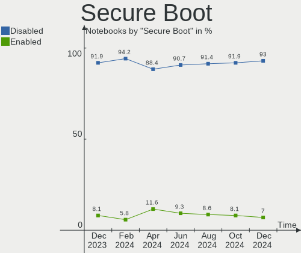
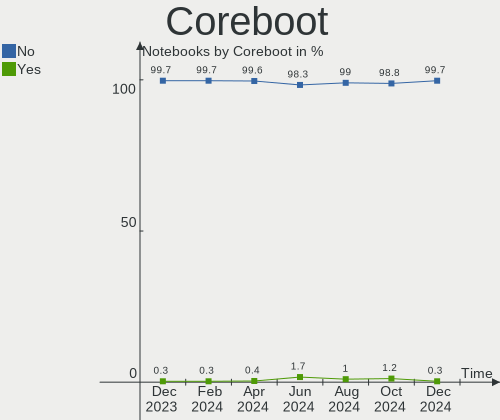
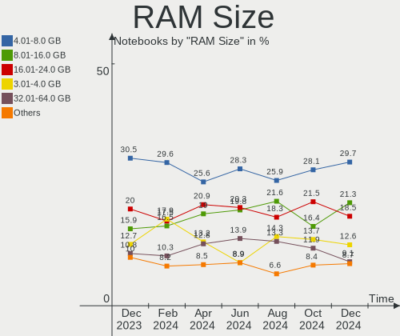
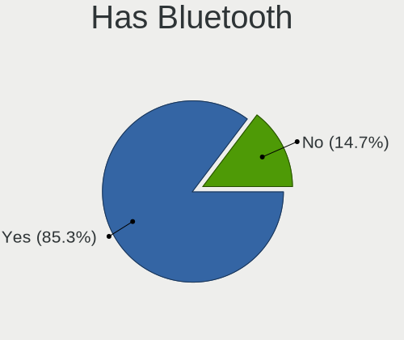
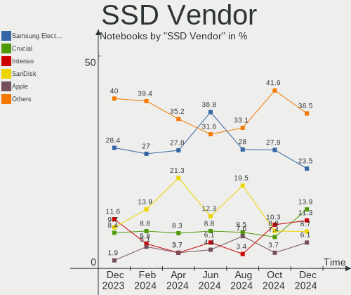
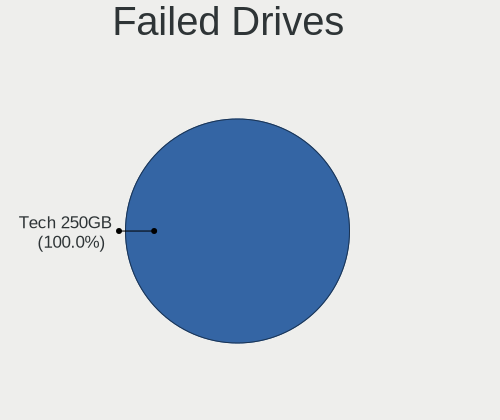
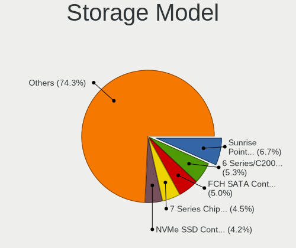
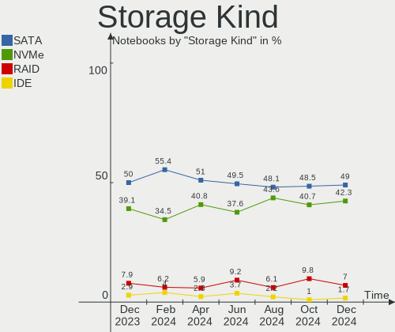
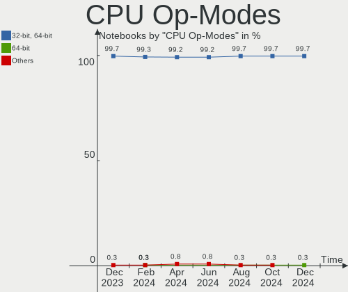
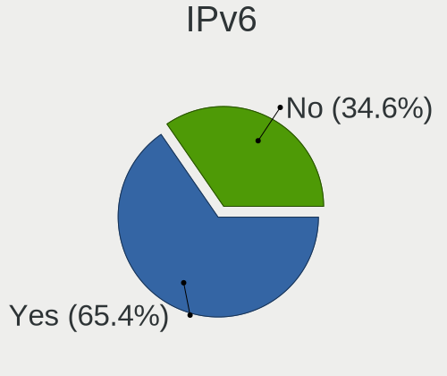

Linux in Germany - Hardware Trends (Notebooks)
----------------------------------------------

A project to identify most popular hardware characteristics and track their change
over time based on data collected by Linux users at https://Linux-Hardware.org.

Anyone can contribute to this report by the [hw-probe](https://github.com/linuxhw/hw-probe) tool:

    sudo -E hw-probe -all -upload

Period: Jul, 2022.

Contents
--------

* [ System ](#system)
  - [ OS                       ](#os)
  - [ OS Family                ](#os-family)
  - [ Kernel                   ](#kernel)
  - [ Kernel Family            ](#kernel-family)
  - [ Kernel Major Ver.        ](#kernel-major-ver)
  - [ Arch                     ](#arch)
  - [ DE                       ](#de)
  - [ Display Server           ](#display-server)
  - [ Display Manager          ](#display-manager)
  - [ OS Lang                  ](#os-lang)
  - [ Boot Mode                ](#boot-mode)
  - [ Filesystem               ](#filesystem)
  - [ Part. scheme             ](#part-scheme)
  - [ Dual Boot with Linux/BSD ](#dual-boot-with-linuxbsd)
  - [ Dual Boot (Win)          ](#dual-boot-win)

* [ Board ](#board)
  - [ Vendor                   ](#vendor)
  - [ Model                    ](#model)
  - [ Model Family             ](#model-family)
  - [ MFG Year                 ](#mfg-year)
  - [ Form Factor              ](#form-factor)
  - [ Secure Boot              ](#secure-boot)
  - [ Coreboot                 ](#coreboot)
  - [ RAM Size                 ](#ram-size)
  - [ RAM Used                 ](#ram-used)
  - [ Total Drives             ](#total-drives)
  - [ Has CD-ROM               ](#has-cd-rom)
  - [ Has Ethernet             ](#has-ethernet)
  - [ Has WiFi                 ](#has-wifi)
  - [ Has Bluetooth            ](#has-bluetooth)

* [ Location ](#location)
  - [ Country                  ](#country)
  - [ City                     ](#city)

* [ Drives ](#drives)
  - [ Drive Vendor             ](#drive-vendor)
  - [ Drive Model              ](#drive-model)
  - [ HDD Vendor               ](#hdd-vendor)
  - [ SSD Vendor               ](#ssd-vendor)
  - [ Drive Kind               ](#drive-kind)
  - [ Drive Connector          ](#drive-connector)
  - [ Drive Size               ](#drive-size)
  - [ Space Total              ](#space-total)
  - [ Space Used               ](#space-used)
  - [ Malfunc. Drives          ](#malfunc-drives)
  - [ Malfunc. Drive Vendor    ](#malfunc-drive-vendor)
  - [ Malfunc. HDD Vendor      ](#malfunc-hdd-vendor)
  - [ Malfunc. Drive Kind      ](#malfunc-drive-kind)
  - [ Failed Drives            ](#failed-drives)
  - [ Failed Drive Vendor      ](#failed-drive-vendor)
  - [ Drive Status             ](#drive-status)

* [ Storage controller ](#storage-controller)
  - [ Storage Vendor           ](#storage-vendor)
  - [ Storage Model            ](#storage-model)
  - [ Storage Kind             ](#storage-kind)

* [ Processor ](#processor)
  - [ CPU Vendor               ](#cpu-vendor)
  - [ CPU Model                ](#cpu-model)
  - [ CPU Model Family         ](#cpu-model-family)
  - [ CPU Cores                ](#cpu-cores)
  - [ CPU Sockets              ](#cpu-sockets)
  - [ CPU Threads              ](#cpu-threads)
  - [ CPU Op-Modes             ](#cpu-op-modes)
  - [ CPU Microcode            ](#cpu-microcode)
  - [ CPU Microarch            ](#cpu-microarch)

* [ Graphics ](#graphics)
  - [ GPU Vendor               ](#gpu-vendor)
  - [ GPU Model                ](#gpu-model)
  - [ GPU Combo                ](#gpu-combo)
  - [ GPU Driver               ](#gpu-driver)
  - [ GPU Memory               ](#gpu-memory)

* [ Monitor ](#monitor)
  - [ Monitor Vendor           ](#monitor-vendor)
  - [ Monitor Model            ](#monitor-model)
  - [ Monitor Resolution       ](#monitor-resolution)
  - [ Monitor Diagonal         ](#monitor-diagonal)
  - [ Monitor Width            ](#monitor-width)
  - [ Aspect Ratio             ](#aspect-ratio)
  - [ Monitor Area             ](#monitor-area)
  - [ Pixel Density            ](#pixel-density)
  - [ Multiple Monitors        ](#multiple-monitors)

* [ Network ](#network)
  - [ Net Controller Vendor    ](#net-controller-vendor)
  - [ Net Controller Model     ](#net-controller-model)
  - [ Wireless Vendor          ](#wireless-vendor)
  - [ Wireless Model           ](#wireless-model)
  - [ Ethernet Vendor          ](#ethernet-vendor)
  - [ Ethernet Model           ](#ethernet-model)
  - [ Net Controller Kind      ](#net-controller-kind)
  - [ Used Controller          ](#used-controller)
  - [ NICs                     ](#nics)
  - [ IPv6                     ](#ipv6)

* [ Bluetooth ](#bluetooth)
  - [ Bluetooth Vendor         ](#bluetooth-vendor)
  - [ Bluetooth Model          ](#bluetooth-model)

* [ Sound ](#sound)
  - [ Sound Vendor             ](#sound-vendor)
  - [ Sound Model              ](#sound-model)

* [ Memory ](#memory)
  - [ Memory Vendor            ](#memory-vendor)
  - [ Memory Model             ](#memory-model)
  - [ Memory Kind              ](#memory-kind)
  - [ Memory Form Factor       ](#memory-form-factor)
  - [ Memory Size              ](#memory-size)
  - [ Memory Speed             ](#memory-speed)

* [ Printers & scanners ](#printers--scanners)
  - [ Printer Vendor           ](#printer-vendor)
  - [ Printer Model            ](#printer-model)
  - [ Scanner Vendor           ](#scanner-vendor)
  - [ Scanner Model            ](#scanner-model)

* [ Camera ](#camera)
  - [ Camera Vendor            ](#camera-vendor)
  - [ Camera Model             ](#camera-model)

* [ Security ](#security)
  - [ Fingerprint Vendor       ](#fingerprint-vendor)
  - [ Fingerprint Model        ](#fingerprint-model)
  - [ Chipcard Vendor          ](#chipcard-vendor)
  - [ Chipcard Model           ](#chipcard-model)

* [ Unsupported ](#unsupported)
  - [ Unsupported Devices      ](#unsupported-devices)
  - [ Unsupported Device Types ](#unsupported-device-types)

System
------

OS
--

Installed operating systems

| Name                         | Notebooks | Percent |
|------------------------------|-----------|---------|
| Linux Mint 20.3              | 31        | 14.22%  |
| Ubuntu 22.04                 | 24        | 11.01%  |
| OpenMandriva 4.3             | 16        | 7.34%   |
| Fedora 36                    | 14        | 6.42%   |
| Debian 11                    | 13        | 5.96%   |
| Pop!_OS 22.04                | 12        | 5.5%    |
| Ubuntu 20.04                 | 10        | 4.59%   |
| Zorin 16                     | 8         | 3.67%   |
| Xubuntu 20.04                | 6         | 2.75%   |
| Manjaro                      | 5         | 2.29%   |
| SteamOS 3.2                  | 4         | 1.83%   |
| Linux Mint 19.3              | 4         | 1.83%   |
| Ubuntu 18.04                 | 3         | 1.38%   |
| OpenMandriva 4.90            | 3         | 1.38%   |
| LMDE 5                       | 3         | 1.38%   |
| Elementary 6.1               | 3         | 1.38%   |
| Debian Testing               | 3         | 1.38%   |
| Ubuntu Budgie 20.04          | 2         | 0.92%   |
| Ubuntu 21.10                 | 2         | 0.92%   |
| openSUSE Leap-15.3           | 2         | 0.92%   |
| OpenMandriva 4.2             | 2         | 0.92%   |
| Manjaro 21.3.6               | 2         | 0.92%   |
| Manjaro 21.3.5               | 2         | 0.92%   |
| Manjaro 21.3.1               | 2         | 0.92%   |
| Lubuntu 18.04                | 2         | 0.92%   |
| Kubuntu 22.04                | 2         | 0.92%   |
| Kubuntu 11.1                 | 2         | 0.92%   |
| KDE neon 20.04               | 2         | 0.92%   |
| Gentoo 2.8                   | 2         | 0.92%   |
| Arch                         | 2         | 0.92%   |
| Zorin 15                     | 1         | 0.46%   |
| Xubuntu 22.04                | 1         | 0.46%   |
| Xubuntu 18.04                | 1         | 0.46%   |
| Ubuntu MATE 20.10            | 1         | 0.46%   |
| Ubuntu MATE 20.04            | 1         | 0.46%   |
| Ubuntu Budgie 22.04          | 1         | 0.46%   |
| Ubuntu 22.10                 | 1         | 0.46%   |
| Ubuntu 19.04                 | 1         | 0.46%   |
| SteamOS 3.3                  | 1         | 0.46%   |
| Sparky 7                     | 1         | 0.46%   |
| ROSA 12.2                    | 1         | 0.46%   |
| Pop!_OS 21.10                | 1         | 0.46%   |
| Pop!_OS 20.04                | 1         | 0.46%   |
| openSUSE Tumbleweed-XXXXXXXX | 1         | 0.46%   |
| MX 21                        | 1         | 0.46%   |
| Lubuntu 22.04                | 1         | 0.46%   |
| Lubuntu 20.04                | 1         | 0.46%   |
| Linux Mint 21                | 1         | 0.46%   |
| Linux Mint 20.2              | 1         | 0.46%   |
| Linux Mint 20.1              | 1         | 0.46%   |
| Linux Mint 20                | 1         | 0.46%   |
| Linux Mint 19.1              | 1         | 0.46%   |
| Lilidog 22                   | 1         | 0.46%   |
| Kubuntu 20.04                | 1         | 0.46%   |
| EndeavourOS Rolling          | 1         | 0.46%   |
| EndeavourOS                  | 1         | 0.46%   |
| Devuan 4                     | 1         | 0.46%   |
| Debian Unstable              | 1         | 0.46%   |
| Clear Linux 36620            | 1         | 0.46%   |
| Arch Rolling                 | 1         | 0.46%   |

OS Family
---------

OS without a version

| Name          | Notebooks | Percent |
|---------------|-----------|---------|
| Ubuntu        | 41        | 18.81%  |
| Linux Mint    | 40        | 18.35%  |
| OpenMandriva  | 21        | 9.63%   |
| Debian        | 17        | 7.8%    |
| Pop!_OS       | 14        | 6.42%   |
| Fedora        | 14        | 6.42%   |
| Manjaro       | 11        | 5.05%   |
| Zorin         | 9         | 4.13%   |
| Xubuntu       | 8         | 3.67%   |
| SteamOS       | 5         | 2.29%   |
| Kubuntu       | 5         | 2.29%   |
| Lubuntu       | 4         | 1.83%   |
| Ubuntu Budgie | 3         | 1.38%   |
| openSUSE      | 3         | 1.38%   |
| LMDE          | 3         | 1.38%   |
| Elementary    | 3         | 1.38%   |
| Arch          | 3         | 1.38%   |
| Ubuntu MATE   | 2         | 0.92%   |
| KDE neon      | 2         | 0.92%   |
| Gentoo        | 2         | 0.92%   |
| EndeavourOS   | 2         | 0.92%   |
| Sparky        | 1         | 0.46%   |
| ROSA          | 1         | 0.46%   |
| MX            | 1         | 0.46%   |
| Lilidog       | 1         | 0.46%   |
| Devuan        | 1         | 0.46%   |
| Clear Linux   | 1         | 0.46%   |

Kernel
------

Version of the Linux kernel

| Version                                      | Notebooks | Percent |
|----------------------------------------------|-----------|---------|
| 5.15.0-41-generic                            | 31        | 14.22%  |
| 5.4.0-122-generic                            | 20        | 9.17%   |
| 5.13.0-52-generic                            | 18        | 8.26%   |
| 5.4.0-121-generic                            | 13        | 5.96%   |
| 5.16.7-desktop-1omv4003                      | 13        | 5.96%   |
| 5.15.0-40-generic                            | 12        | 5.5%    |
| 5.10.0-16-amd64                              | 9         | 4.13%   |
| 5.18.10-76051810-generic                     | 7         | 3.21%   |
| 5.18.0-2-amd64                               | 7         | 3.21%   |
| 5.10.0-15-amd64                              | 6         | 2.75%   |
| 5.18.10-200.fc36.x86_64                      | 4         | 1.83%   |
| 5.17.15-76051715-generic                     | 4         | 1.83%   |
| 5.13.0-valve15-1-neptune-02197-gf6ec7ad3762a | 4         | 1.83%   |
| 5.18.9-200.fc36.x86_64                       | 3         | 1.38%   |
| 5.18.12-desktop-3omv4090                     | 3         | 1.38%   |
| 5.18.11-200.fc36.x86_64                      | 3         | 1.38%   |
| 4.15.0-189-generic                           | 3         | 1.38%   |
| 5.4.0-91-generic                             | 2         | 0.92%   |
| 5.3.18-150300.59.49-default                  | 2         | 0.92%   |
| 5.18.0-0.bpo.1-amd64                         | 2         | 0.92%   |
| 5.17.5-76051705-generic                      | 2         | 0.92%   |
| 5.17.0-1013-oem                              | 2         | 0.92%   |
| 5.15.57-2-MANJARO                            | 2         | 0.92%   |
| 5.15.49-1-MANJARO                            | 2         | 0.92%   |
| 5.10.14-desktop-1omv4002                     | 2         | 0.92%   |
| 5.8.0-63-generic                             | 1         | 0.46%   |
| 5.8.0-44-generic                             | 1         | 0.46%   |
| 5.4.0-74-generic                             | 1         | 0.46%   |
| 5.4.0-56-generic                             | 1         | 0.46%   |
| 5.4.0-110-generic                            | 1         | 0.46%   |
| 5.4.0-107-generic                            | 1         | 0.46%   |
| 5.19.0-rc1+                                  | 1         | 0.46%   |
| 5.18.8-arch1-1                               | 1         | 0.46%   |
| 5.18.8-051808-generic                        | 1         | 0.46%   |
| 5.18.7-200.fc36.x86_64                       | 1         | 0.46%   |
| 5.18.6-1-MANJARO                             | 1         | 0.46%   |
| 5.18.5-200.fc36.x86_64                       | 1         | 0.46%   |
| 5.18.15-arch1-1                              | 1         | 0.46%   |
| 5.18.14-arch1-1                              | 1         | 0.46%   |
| 5.18.13-200.fc36.x86_64                      | 1         | 0.46%   |
| 5.18.12-zen1-1-zen                           | 1         | 0.46%   |
| 5.18.12-arch1-1                              | 1         | 0.46%   |
| 5.18.11-1-default                            | 1         | 0.46%   |
| 5.18.10-1-MANJARO                            | 1         | 0.46%   |
| 5.17.5-300.fc36.x86_64                       | 1         | 0.46%   |
| 5.17.1-desktop-clang-2omv4050                | 1         | 0.46%   |
| 5.17.1-desktop-2omv4050                      | 1         | 0.46%   |
| 5.16.20-2-MANJARO                            | 1         | 0.46%   |
| 5.16.13-1132.native                          | 1         | 0.46%   |
| 5.16.0-kali7-amd64                           | 1         | 0.46%   |
| 5.15.53-1-MANJARO                            | 1         | 0.46%   |
| 5.15.52-gentoo                               | 1         | 0.46%   |
| 5.15.32-1-MANJARO                            | 1         | 0.46%   |
| 5.15.14-1-lts                                | 1         | 0.46%   |
| 5.15.0-35-generic                            | 1         | 0.46%   |
| 5.15.0-33-generic                            | 1         | 0.46%   |
| 5.15.0-10041-tuxedo                          | 1         | 0.46%   |
| 5.14.0-1044-oem                              | 1         | 0.46%   |
| 5.13.19-2-MANJARO                            | 1         | 0.46%   |
| 5.13.0-valve21-1-neptune-02209-g2a5bdc1102a0 | 1         | 0.46%   |

Kernel Family
-------------

Linux kernel without a distro release

| Version  | Notebooks | Percent |
|----------|-----------|---------|
| 5.15.0   | 46        | 21.1%   |
| 5.4.0    | 39        | 17.89%  |
| 5.13.0   | 25        | 11.47%  |
| 5.10.0   | 15        | 6.88%   |
| 5.16.7   | 13        | 5.96%   |
| 5.18.10  | 12        | 5.5%    |
| 5.18.0   | 9         | 4.13%   |
| 5.18.12  | 5         | 2.29%   |
| 4.15.0   | 5         | 2.29%   |
| 5.18.11  | 4         | 1.83%   |
| 5.17.15  | 4         | 1.83%   |
| 5.18.9   | 3         | 1.38%   |
| 5.17.5   | 3         | 1.38%   |
| 5.8.0    | 2         | 0.92%   |
| 5.3.18   | 2         | 0.92%   |
| 5.18.8   | 2         | 0.92%   |
| 5.17.1   | 2         | 0.92%   |
| 5.17.0   | 2         | 0.92%   |
| 5.15.57  | 2         | 0.92%   |
| 5.15.49  | 2         | 0.92%   |
| 5.10.14  | 2         | 0.92%   |
| 5.19.0   | 1         | 0.46%   |
| 5.18.7   | 1         | 0.46%   |
| 5.18.6   | 1         | 0.46%   |
| 5.18.5   | 1         | 0.46%   |
| 5.18.15  | 1         | 0.46%   |
| 5.18.14  | 1         | 0.46%   |
| 5.18.13  | 1         | 0.46%   |
| 5.16.20  | 1         | 0.46%   |
| 5.16.13  | 1         | 0.46%   |
| 5.16.0   | 1         | 0.46%   |
| 5.15.53  | 1         | 0.46%   |
| 5.15.52  | 1         | 0.46%   |
| 5.15.32  | 1         | 0.46%   |
| 5.15.14  | 1         | 0.46%   |
| 5.14.0   | 1         | 0.46%   |
| 5.13.19  | 1         | 0.46%   |
| 5.10.131 | 1         | 0.46%   |
| 5.10.118 | 1         | 0.46%   |
| 5.0.0    | 1         | 0.46%   |

Kernel Major Ver.
-----------------

Linux kernel major version

| Version | Notebooks | Percent |
|---------|-----------|---------|
| 5.15    | 54        | 24.77%  |
| 5.18    | 41        | 18.81%  |
| 5.4     | 39        | 17.89%  |
| 5.13    | 26        | 11.93%  |
| 5.10    | 19        | 8.72%   |
| 5.16    | 16        | 7.34%   |
| 5.17    | 11        | 5.05%   |
| 4.15    | 5         | 2.29%   |
| 5.8     | 2         | 0.92%   |
| 5.3     | 2         | 0.92%   |
| 5.19    | 1         | 0.46%   |
| 5.14    | 1         | 0.46%   |
| 5.0     | 1         | 0.46%   |

Arch
----

OS architecture (x86_64, i586, etc.)

| Name   | Notebooks | Percent |
|--------|-----------|---------|
| x86_64 | 213       | 97.71%  |
| i686   | 5         | 2.29%   |

DE
--

Desktop Environment

| Name             | Notebooks | Percent |
|------------------|-----------|---------|
| GNOME            | 87        | 39.91%  |
| KDE5             | 53        | 24.31%  |
| X-Cinnamon       | 33        | 15.14%  |
| XFCE             | 16        | 7.34%   |
| MATE             | 12        | 5.5%    |
| Unknown          | 5         | 2.29%   |
| Pantheon         | 3         | 1.38%   |
| Budgie           | 3         | 1.38%   |
| LXQt             | 2         | 0.92%   |
| LXDE             | 2         | 0.92%   |
| trinity          | 1         | 0.46%   |
| lightdm-xsession | 1         | 0.46%   |

Display Server
--------------

X11 or Wayland

| Name    | Notebooks | Percent |
|---------|-----------|---------|
| X11     | 170       | 77.98%  |
| Wayland | 45        | 20.64%  |
| Unknown | 2         | 0.92%   |
| Tty     | 1         | 0.46%   |

Display Manager
---------------

SDDM, LightDM, etc.

| Name    | Notebooks | Percent |
|---------|-----------|---------|
| Unknown | 87        | 39.91%  |
| GDM3    | 42        | 19.27%  |
| LightDM | 39        | 17.89%  |
| SDDM    | 30        | 13.76%  |
| GDM     | 18        | 8.26%   |
| LXDM    | 2         | 0.92%   |

OS Lang
-------

Language

| Lang    | Notebooks | Percent |
|---------|-----------|---------|
| de_DE   | 148       | 67.89%  |
| en_US   | 52        | 23.85%  |
| hu_HU   | 2         | 0.92%   |
| fr_FR   | 2         | 0.92%   |
| en_GB   | 2         | 0.92%   |
| Unknown | 2         | 0.92%   |
| ru_UA   | 1         | 0.46%   |
| ru_RU   | 1         | 0.46%   |
| pl_PL   | 1         | 0.46%   |
| it_IT   | 1         | 0.46%   |
| en_IN   | 1         | 0.46%   |
| en_IE   | 1         | 0.46%   |
| en_DE   | 1         | 0.46%   |
| en_AU   | 1         | 0.46%   |
| C.UTF8  | 1         | 0.46%   |
| C       | 1         | 0.46%   |

Boot Mode
---------

EFI or BIOS

| Mode | Notebooks | Percent |
|------|-----------|---------|
| EFI  | 116       | 53.21%  |
| BIOS | 102       | 46.79%  |

Filesystem
----------

Type of filesystem

| Type    | Notebooks | Percent |
|---------|-----------|---------|
| Ext4    | 178       | 81.65%  |
| Btrfs   | 24        | 11.01%  |
| Overlay | 16        | 7.34%   |

Part. scheme
------------

Scheme of partitioning

| Type    | Notebooks | Percent |
|---------|-----------|---------|
| Unknown | 128       | 58.72%  |
| GPT     | 75        | 34.4%   |
| MBR     | 15        | 6.88%   |

Dual Boot with Linux/BSD
------------------------

Hosting more than one Linux/BSD

| Dual boot | Notebooks | Percent |
|-----------|-----------|---------|
| No        | 198       | 90.83%  |
| Yes       | 20        | 9.17%   |

Dual Boot (Win)
---------------

Hosting Linux and Windows

| Dual boot | Notebooks | Percent |
|-----------|-----------|---------|
| No        | 172       | 78.9%   |
| Yes       | 46        | 21.1%   |

Board
-----

Vendor
------

Motherboard manufacturer

| Name                 | Notebooks | Percent |
|----------------------|-----------|---------|
| Lenovo               | 69        | 31.65%  |
| Hewlett-Packard      | 32        | 14.68%  |
| Dell                 | 30        | 13.76%  |
| Acer                 | 17        | 7.8%    |
| ASUSTek Computer     | 16        | 7.34%   |
| Apple                | 6         | 2.75%   |
| Valve                | 5         | 2.29%   |
| Toshiba              | 5         | 2.29%   |
| HUAWEI               | 5         | 2.29%   |
| TUXEDO               | 4         | 1.83%   |
| Samsung Electronics  | 4         | 1.83%   |
| Schenker             | 3         | 1.38%   |
| Notebook             | 2         | 0.92%   |
| MSI                  | 2         | 0.92%   |
| Fujitsu              | 2         | 0.92%   |
| Wortmann AG          | 1         | 0.46%   |
| VALE                 | 1         | 0.46%   |
| TrekStor             | 1         | 0.46%   |
| Timi                 | 1         | 0.46%   |
| Sony                 | 1         | 0.46%   |
| Razer                | 1         | 0.46%   |
| Packard Bell         | 1         | 0.46%   |
| Nokia                | 1         | 0.46%   |
| Intel Client Systems | 1         | 0.46%   |
| Fujitsu Siemens      | 1         | 0.46%   |
| Framework            | 1         | 0.46%   |
| eMachines            | 1         | 0.46%   |
| Chuwi                | 1         | 0.46%   |
| BenQ                 | 1         | 0.46%   |
| AXDIA International  | 1         | 0.46%   |
| Unknown              | 1         | 0.46%   |

Model
-----

Motherboard model

| Name                                       | Notebooks | Percent |
|--------------------------------------------|-----------|---------|
| Valve Jupiter                              | 5         | 2.29%   |
| TUXEDO Pulse 15 Gen1                       | 3         | 1.38%   |
| Toshiba Satellite L350                     | 2         | 0.92%   |
| Lenovo V14-ADA 82C6                        | 2         | 0.92%   |
| Lenovo ThinkPad T460p 20FXS05500           | 2         | 0.92%   |
| Lenovo ThinkPad E14 Gen 3 20YDS00G00       | 2         | 0.92%   |
| Lenovo IdeaPad U430 Touch 20270            | 2         | 0.92%   |
| Lenovo IdeaPad Slim 1-14AST-05 81VS        | 2         | 0.92%   |
| Lenovo IdeaPad 5 14ALC05 82LM              | 2         | 0.92%   |
| Lenovo G550 2958                           | 2         | 0.92%   |
| HUAWEI NBLK-WAX9X                          | 2         | 0.92%   |
| HP Laptop 17-cn0xxx                        | 2         | 0.92%   |
| HP 250 G5 Notebook PC                      | 2         | 0.92%   |
| Dell Latitude E6320                        | 2         | 0.92%   |
| Apple MacBookPro12,1                       | 2         | 0.92%   |
| Wortmann AG TERRA_MOBILE_1528P/1748P       | 1         | 0.46%   |
| VALE Notebook Classic C140                 | 1         | 0.46%   |
| TUXEDO InfinityBook_Pro13_14_v4            | 1         | 0.46%   |
| TrekStor Primebook P14                     | 1         | 0.46%   |
| Toshiba TECRA S11                          | 1         | 0.46%   |
| Toshiba Satellite U920T                    | 1         | 0.46%   |
| Toshiba Satellite C50-A                    | 1         | 0.46%   |
| Timi TM1703                                | 1         | 0.46%   |
| Sony VPCEB1S1E                             | 1         | 0.46%   |
| Schenker XMG CORE 17(M20, GTX 1650xx)      | 1         | 0.46%   |
| Schenker WORK (Early 2021)                 | 1         | 0.46%   |
| Schenker VISION 15 (SVS15E21)              | 1         | 0.46%   |
| Samsung R59P/R60P/R61P                     | 1         | 0.46%   |
| Samsung R505                               | 1         | 0.46%   |
| Samsung N130                               | 1         | 0.46%   |
| Samsung 300E4A/300E5A/300E7A/3430EA/3530EA | 1         | 0.46%   |
| Razer Blade 15 Studio Edition - Late 2019  | 1         | 0.46%   |
| Packard Bell EasyNote_MX52-B-122GE         | 1         | 0.46%   |
| Notebook V15x_V17xPNKPNJPNH                | 1         | 0.46%   |
| Notebook MIM 2200                          | 1         | 0.46%   |
| Nokia Booklet 3G                           | 1         | 0.46%   |
| MSI U-100                                  | 1         | 0.46%   |
| MSI Katana GF76 11UG                       | 1         | 0.46%   |
| Lenovo Z40-70 80E6                         | 1         | 0.46%   |
| Lenovo Yoga 3 Pro-1370 80HE                | 1         | 0.46%   |
| Lenovo V340-17IWL 81RG                     | 1         | 0.46%   |
| Lenovo V145-15AST 81MT                     | 1         | 0.46%   |
| Lenovo V130-15IKB 81HN                     | 1         | 0.46%   |
| Lenovo ThinkPad X270 20HMS12K00            | 1         | 0.46%   |
| Lenovo ThinkPad X230 2325YHU               | 1         | 0.46%   |
| Lenovo ThinkPad X230 2325TXB               | 1         | 0.46%   |
| Lenovo ThinkPad X220 4291W3B               | 1         | 0.46%   |
| Lenovo ThinkPad X1 Carbon Gen 8 20U9CTO1WW | 1         | 0.46%   |
| Lenovo ThinkPad X1 Carbon 4th 20FB002UGE   | 1         | 0.46%   |
| Lenovo ThinkPad W541 20EGS1TB00            | 1         | 0.46%   |
| Lenovo ThinkPad W540 20BG001KGE            | 1         | 0.46%   |
| Lenovo ThinkPad T61 6458W4B                | 1         | 0.46%   |
| Lenovo ThinkPad T60 200749G                | 1         | 0.46%   |
| Lenovo ThinkPad T590 20N5S4R800            | 1         | 0.46%   |
| Lenovo ThinkPad T490s 20NYS0LY00           | 1         | 0.46%   |
| Lenovo ThinkPad T490 20N3SEYA00            | 1         | 0.46%   |
| Lenovo ThinkPad T480s 20L8S02D00           | 1         | 0.46%   |
| Lenovo ThinkPad T480 20L6S2EQ00            | 1         | 0.46%   |
| Lenovo ThinkPad T470s 20HGS0KE00           | 1         | 0.46%   |
| Lenovo ThinkPad T450 20BUS0VH06            | 1         | 0.46%   |

Model Family
------------

Motherboard model prefix

| Name                  | Notebooks | Percent |
|-----------------------|-----------|---------|
| Lenovo ThinkPad       | 38        | 17.43%  |
| Dell Latitude         | 19        | 8.72%   |
| Lenovo IdeaPad        | 11        | 5.05%   |
| Acer Aspire           | 9         | 4.13%   |
| HP Laptop             | 8         | 3.67%   |
| Valve Jupiter         | 5         | 2.29%   |
| HP EliteBook          | 5         | 2.29%   |
| ASUS VivoBook         | 5         | 2.29%   |
| Toshiba Satellite     | 4         | 1.83%   |
| HP ProBook            | 4         | 1.83%   |
| HP Pavilion           | 4         | 1.83%   |
| HP 250                | 4         | 1.83%   |
| Dell XPS              | 4         | 1.83%   |
| Dell Inspiron         | 4         | 1.83%   |
| Acer Swift            | 4         | 1.83%   |
| TUXEDO Pulse          | 3         | 1.38%   |
| Lenovo V14-ADA        | 2         | 0.92%   |
| Lenovo G550           | 2         | 0.92%   |
| HUAWEI NBLK-WAX9X     | 2         | 0.92%   |
| HP Compaq             | 2         | 0.92%   |
| Fujitsu LIFEBOOK      | 2         | 0.92%   |
| ASUS ASUS             | 2         | 0.92%   |
| Apple MacBookPro12    | 2         | 0.92%   |
| Wortmann AG TERRA     | 1         | 0.46%   |
| VALE Notebook         | 1         | 0.46%   |
| TUXEDO InfinityBook   | 1         | 0.46%   |
| TrekStor Primebook    | 1         | 0.46%   |
| Toshiba TECRA         | 1         | 0.46%   |
| Timi TM1703           | 1         | 0.46%   |
| Sony VPCEB1S1E        | 1         | 0.46%   |
| Schenker XMG          | 1         | 0.46%   |
| Schenker WORK         | 1         | 0.46%   |
| Schenker VISION       | 1         | 0.46%   |
| Samsung R59P          | 1         | 0.46%   |
| Samsung R505          | 1         | 0.46%   |
| Samsung N130          | 1         | 0.46%   |
| Samsung 300E4A        | 1         | 0.46%   |
| Razer Blade           | 1         | 0.46%   |
| Packard Bell EasyNote | 1         | 0.46%   |
| Notebook V15x         | 1         | 0.46%   |
| Notebook MIM          | 1         | 0.46%   |
| Nokia Booklet         | 1         | 0.46%   |
| MSI U-100             | 1         | 0.46%   |
| MSI Katana            | 1         | 0.46%   |
| Lenovo Z40-70         | 1         | 0.46%   |
| Lenovo Yoga           | 1         | 0.46%   |
| Lenovo V340-17IWL     | 1         | 0.46%   |
| Lenovo V145-15AST     | 1         | 0.46%   |
| Lenovo V130-15IKB     | 1         | 0.46%   |
| Lenovo ThinkBook      | 1         | 0.46%   |
| Lenovo Legion         | 1         | 0.46%   |
| Lenovo G710           | 1         | 0.46%   |
| Lenovo G700           | 1         | 0.46%   |
| Lenovo G50-80         | 1         | 0.46%   |
| Lenovo G50-70         | 1         | 0.46%   |
| Lenovo G50-45         | 1         | 0.46%   |
| Lenovo G50-30         | 1         | 0.46%   |
| Lenovo B580           | 1         | 0.46%   |
| Lenovo B560           | 1         | 0.46%   |
| Lenovo B50-30         | 1         | 0.46%   |

MFG Year
--------

Motherboard manufacture year

| Year    | Notebooks | Percent |
|---------|-----------|---------|
| 2021    | 38        | 17.43%  |
| 2020    | 24        | 11.01%  |
| 2019    | 20        | 9.17%   |
| 2013    | 16        | 7.34%   |
| 2015    | 14        | 6.42%   |
| 2018    | 13        | 5.96%   |
| 2012    | 11        | 5.05%   |
| 2011    | 11        | 5.05%   |
| 2014    | 10        | 4.59%   |
| 2017    | 9         | 4.13%   |
| 2016    | 9         | 4.13%   |
| 2022    | 8         | 3.67%   |
| 2010    | 8         | 3.67%   |
| 2009    | 8         | 3.67%   |
| 2008    | 7         | 3.21%   |
| 2007    | 7         | 3.21%   |
| 2006    | 3         | 1.38%   |
| 2005    | 1         | 0.46%   |
| Unknown | 1         | 0.46%   |

Form Factor
-----------

Physical design of the computer

| Name     | Notebooks | Percent |
|----------|-----------|---------|
| Notebook | 218       | 100%    |

Secure Boot
-----------

Enabled or disabled

| State    | Notebooks | Percent |
|----------|-----------|---------|
| Disabled | 197       | 90.37%  |
| Enabled  | 21        | 9.63%   |

Coreboot
--------

Have coreboot on board

| Used | Notebooks | Percent |
|------|-----------|---------|
| No   | 218       | 100%    |

RAM Size
--------

Total RAM memory

| Size in GB  | Notebooks | Percent |
|-------------|-----------|---------|
| 4.01-8.0    | 62        | 28.44%  |
| 8.01-16.0   | 59        | 27.06%  |
| 3.01-4.0    | 39        | 17.89%  |
| 16.01-24.0  | 27        | 12.39%  |
| 32.01-64.0  | 13        | 5.96%   |
| 1.01-2.0    | 7         | 3.21%   |
| 24.01-32.0  | 4         | 1.83%   |
| 0.51-1.0    | 3         | 1.38%   |
| 2.01-3.0    | 2         | 0.92%   |
| 64.01-256.0 | 2         | 0.92%   |

RAM Used
--------

Used RAM memory

| Used GB    | Notebooks | Percent |
|------------|-----------|---------|
| 1.01-2.0   | 85        | 38.99%  |
| 2.01-3.0   | 58        | 26.61%  |
| 3.01-4.0   | 28        | 12.84%  |
| 4.01-8.0   | 21        | 9.63%   |
| 8.01-16.0  | 11        | 5.05%   |
| 0.51-1.0   | 10        | 4.59%   |
| 0.01-0.5   | 3         | 1.38%   |
| 16.01-24.0 | 2         | 0.92%   |

Total Drives
------------

Number of drives on board

| Drives | Notebooks | Percent |
|--------|-----------|---------|
| 1      | 162       | 74.31%  |
| 2      | 44        | 20.18%  |
| 3      | 6         | 2.75%   |
| 4      | 3         | 1.38%   |
| 0      | 3         | 1.38%   |

Has CD-ROM
----------

Has CD-ROM on board

| Presented | Notebooks | Percent |
|-----------|-----------|---------|
| No        | 148       | 67.89%  |
| Yes       | 70        | 32.11%  |

Has Ethernet
------------

Has Ethernet on board

| Presented | Notebooks | Percent |
|-----------|-----------|---------|
| Yes       | 171       | 78.44%  |
| No        | 47        | 21.56%  |

Has WiFi
--------

Has WiFi module

| Presented | Notebooks | Percent |
|-----------|-----------|---------|
| Yes       | 217       | 99.54%  |
| No        | 1         | 0.46%   |

Has Bluetooth
-------------

Has Bluetooth module

| Presented | Notebooks | Percent |
|-----------|-----------|---------|
| Yes       | 162       | 74.31%  |
| No        | 56        | 25.69%  |

Location
--------

Country
-------

Geographic location (country)

| Country | Notebooks | Percent |
|---------|-----------|---------|
| Germany | 218       | 100%    |

City
----

Geographic location (city)

| City                    | Notebooks | Percent |
|-------------------------|-----------|---------|
| Berlin                  | 23        | 10.55%  |
| Hamburg                 | 11        | 5.05%   |
| Munich                  | 7         | 3.21%   |
| Frankfurt am Main       | 6         | 2.75%   |
| Dresden                 | 6         | 2.75%   |
| Wuppertal               | 5         | 2.29%   |
| Stuttgart               | 5         | 2.29%   |
| Leipzig                 | 4         | 1.83%   |
| Halle                   | 4         | 1.83%   |
| Mannheim                | 3         | 1.38%   |
| Karlsruhe               | 3         | 1.38%   |
| Heilbronn               | 3         | 1.38%   |
| Hanover                 | 3         | 1.38%   |
| Cologne                 | 3         | 1.38%   |
| Bielefeld               | 3         | 1.38%   |
| Würzburg               | 2         | 0.92%   |
| Solingen                | 2         | 0.92%   |
| Rinteln                 | 2         | 0.92%   |
| Nuremberg               | 2         | 0.92%   |
| Münster                | 2         | 0.92%   |
| Merseburg               | 2         | 0.92%   |
| Ilvesheim               | 2         | 0.92%   |
| Giessen                 | 2         | 0.92%   |
| Düsseldorf             | 2         | 0.92%   |
| Bonn                    | 2         | 0.92%   |
| Wolfsburg               | 1         | 0.46%   |
| Wolfhagen               | 1         | 0.46%   |
| Winterberg              | 1         | 0.46%   |
| Windeck                 | 1         | 0.46%   |
| Wilhelmshaven           | 1         | 0.46%   |
| Wildberg                | 1         | 0.46%   |
| Wettringen              | 1         | 0.46%   |
| Wesseling               | 1         | 0.46%   |
| Wertheim am Main        | 1         | 0.46%   |
| Weissenburg in Bayern   | 1         | 0.46%   |
| Waldkirchen             | 1         | 0.46%   |
| Waldfischbach-Burgalben | 1         | 0.46%   |
| Waldfeucht              | 1         | 0.46%   |
| Usingen                 | 1         | 0.46%   |
| Troisdorf               | 1         | 0.46%   |
| Traben-Trarbach         | 1         | 0.46%   |
| Sulzbach-Rosenberg      | 1         | 0.46%   |
| Steinhagen              | 1         | 0.46%   |
| Sindelfingen            | 1         | 0.46%   |
| Senden                  | 1         | 0.46%   |
| Seesen                  | 1         | 0.46%   |
| Schwerin                | 1         | 0.46%   |
| Schwelm                 | 1         | 0.46%   |
| Schnaittach             | 1         | 0.46%   |
| Sankt Johann            | 1         | 0.46%   |
| Saarbrücken            | 1         | 0.46%   |
| Rüsselsheim am Main    | 1         | 0.46%   |
| Rottenburg              | 1         | 0.46%   |
| Rositz                  | 1         | 0.46%   |
| Roesrath                | 1         | 0.46%   |
| Reichshof               | 1         | 0.46%   |
| Regensburg              | 1         | 0.46%   |
| Recklinghausen          | 1         | 0.46%   |
| Pullach im Isartal      | 1         | 0.46%   |
| Poxdorf                 | 1         | 0.46%   |

Drives
------

Drive Vendor
------------

Hard drive vendors

| Vendor                  | Notebooks | Drives | Percent |
|-------------------------|-----------|--------|---------|
| Samsung Electronics     | 57        | 64     | 21.35%  |
| SanDisk                 | 33        | 34     | 12.36%  |
| WDC                     | 20        | 20     | 7.49%   |
| Unknown                 | 20        | 22     | 7.49%   |
| Seagate                 | 17        | 19     | 6.37%   |
| Toshiba                 | 15        | 16     | 5.62%   |
| Kingston                | 14        | 15     | 5.24%   |
| Micron Technology       | 12        | 12     | 4.49%   |
| SK hynix                | 11        | 11     | 4.12%   |
| Crucial                 | 9         | 9      | 3.37%   |
| Intenso                 | 8         | 8      | 3%      |
| HGST                    | 6         | 6      | 2.25%   |
| Intel                   | 5         | 6      | 1.87%   |
| Apple                   | 5         | 5      | 1.87%   |
| Phison                  | 4         | 4      | 1.5%    |
| Transcend               | 3         | 3      | 1.12%   |
| UMIS                    | 2         | 2      | 0.75%   |
| OCZ                     | 2         | 2      | 0.75%   |
| JetFlash                | 2         | 2      | 0.75%   |
| Hitachi                 | 2         | 2      | 0.75%   |
| Vaseky                  | 1         | 1      | 0.37%   |
| Union Memory (Shenzhen) | 1         | 1      | 0.37%   |
| TrekStor                | 1         | 1      | 0.37%   |
| Team                    | 1         | 1      | 0.37%   |
| SSK                     | 1         | 1      | 0.37%   |
| SSD PHIS                | 1         | 1      | 0.37%   |
| SPCC                    | 1         | 1      | 0.37%   |
| Silicon Motion          | 1         | 1      | 0.37%   |
| LITEON                  | 1         | 1      | 0.37%   |
| Lite-On                 | 1         | 1      | 0.37%   |
| LaCie                   | 1         | 1      | 0.37%   |
| KIOXIA                  | 1         | 1      | 0.37%   |
| Hewlett-Packard         | 1         | 1      | 0.37%   |
| GOODRAM                 | 1         | 1      | 0.37%   |
| GLOWAY                  | 1         | 1      | 0.37%   |
| Fujitsu                 | 1         | 1      | 0.37%   |
| Emtec                   | 1         | 1      | 0.37%   |
| Dogfish                 | 1         | 1      | 0.37%   |
| Apacer                  | 1         | 1      | 0.37%   |
| Unknown                 | 1         | 1      | 0.37%   |

Drive Model
-----------

Hard drive models

| Model                                    | Notebooks | Percent |
|------------------------------------------|-----------|---------|
| Samsung NVMe SSD Drive 1024GB            | 5         | 1.79%   |
| Kingston NVMe SSD Drive 512GB            | 5         | 1.79%   |
| SanDisk NVMe SSD Drive 512GB             | 4         | 1.43%   |
| SanDisk NVMe SSD Drive 256GB             | 4         | 1.43%   |
| Unknown MMC Card  64GB                   | 3         | 1.07%   |
| Toshiba MQ01ABD100 1TB                   | 3         | 1.07%   |
| SK hynix NVMe SSD Drive 512GB            | 3         | 1.07%   |
| SK hynix NVMe SSD Drive 1024GB           | 3         | 1.07%   |
| SanDisk NVMe SSD Drive 1024GB            | 3         | 1.07%   |
| Samsung SSD 870 QVO 1TB                  | 3         | 1.07%   |
| Samsung SSD 850 EVO 500GB                | 3         | 1.07%   |
| Samsung SSD 840 EVO 250GB                | 3         | 1.07%   |
| Kingston SA400S37120G 120GB SSD          | 3         | 1.07%   |
| HGST HTS721010A9E630 1TB                 | 3         | 1.07%   |
| WDC WD5000LPCX-24C6HT0 500GB             | 2         | 0.71%   |
| WDC WD3200BEVT-22ZCT0 320GB              | 2         | 0.71%   |
| Unknown SD/MMC/MS PRO 64GB               | 2         | 0.71%   |
| Unknown MMC Card  32GB                   | 2         | 0.71%   |
| Unknown MMC Card  256GB                  | 2         | 0.71%   |
| Unknown MMC Card  128GB                  | 2         | 0.71%   |
| UMIS RPFTJ128PDD2EWX 128GB               | 2         | 0.71%   |
| Toshiba MQ04ABF100 1TB                   | 2         | 0.71%   |
| Toshiba KXG6AZNV512G 512GB               | 2         | 0.71%   |
| Seagate ST9500420AS 500GB                | 2         | 0.71%   |
| Seagate ST500LT012-9WS142 500GB          | 2         | 0.71%   |
| Seagate ST1000LM035-1RK172 1TB           | 2         | 0.71%   |
| Seagate ST1000LM024 HN-M101MBB 1TB       | 2         | 0.71%   |
| SanDisk X400 M.2 2280 256GB SSD          | 2         | 0.71%   |
| SanDisk SDSSDA120G 120GB                 | 2         | 0.71%   |
| SanDisk SD9SN8W-256G-1006 256GB SSD      | 2         | 0.71%   |
| SanDisk NVMe SSD Drive 1TB               | 2         | 0.71%   |
| Samsung SSD 870 EVO 500GB                | 2         | 0.71%   |
| Samsung SSD 870 EVO 1TB                  | 2         | 0.71%   |
| Samsung SSD 860 EVO 500GB                | 2         | 0.71%   |
| Samsung NVMe SSD Drive 512GB             | 2         | 0.71%   |
| Samsung MZVLB512HBJQ-000L7 512GB         | 2         | 0.71%   |
| Samsung MZALQ256HAJD-000L2 256GB         | 2         | 0.71%   |
| Phison NVMe SSD Drive 256GB              | 2         | 0.71%   |
| Micron NVMe SSD Drive 512GB              | 2         | 0.71%   |
| Kingston NVMe SSD Drive 500GB            | 2         | 0.71%   |
| JetFlash Transcend 128GB                 | 2         | 0.71%   |
| Intenso SSD SATAIII 512GB                | 2         | 0.71%   |
| Intenso SSD 128GB                        | 2         | 0.71%   |
| Apple SSD SM0128G 121GB                  | 2         | 0.71%   |
| WDC WDS240G2G0A-00JH30 240GB SSD         | 1         | 0.36%   |
| WDC WDS100T3X0C-00SJG0 1TB               | 1         | 0.36%   |
| WDC WDS100T2B0B-00YS70 1TB SSD           | 1         | 0.36%   |
| WDC WD5000LPCX-22VHAT1 500GB             | 1         | 0.36%   |
| WDC WD2500BEVT-24A23T0 250GB             | 1         | 0.36%   |
| WDC WD1600BEVT-22ZCT0 160GB              | 1         | 0.36%   |
| WDC WD10SPZX-21Z10T0 1TB                 | 1         | 0.36%   |
| WDC WD10JPCX-24UE4T0 1TB                 | 1         | 0.36%   |
| WDC PC SN730 SDBQNTY-512G-1001 512GB     | 1         | 0.36%   |
| WDC PC SN730 SDBPNTY-512G-1101 512GB     | 1         | 0.36%   |
| WDC PC SN730 SDBPNTY-512G                | 1         | 0.36%   |
| WDC PC SN730 NVMe 1024GB                 | 1         | 0.36%   |
| WDC PC SN530 SDBPNPZ-256G-1114 256GB     | 1         | 0.36%   |
| WDC PC SN530 NVMe 512GB                  | 1         | 0.36%   |
| WDC PC SN520 SDAPNUW-256G-1102 256GB     | 1         | 0.36%   |
| WDC PC SA530 SDATN8Y-256G-1006 256GB SSD | 1         | 0.36%   |

HDD Vendor
----------

Hard disk drive vendors

| Vendor  | Notebooks | Drives | Percent |
|---------|-----------|--------|---------|
| Seagate | 16        | 17     | 35.56%  |
| WDC     | 9         | 9      | 20%     |
| Toshiba | 9         | 9      | 20%     |
| HGST    | 6         | 6      | 13.33%  |
| Unknown | 2         | 2      | 4.44%   |
| Hitachi | 2         | 2      | 4.44%   |
| Fujitsu | 1         | 1      | 2.22%   |

SSD Vendor
----------

Solid state drive vendors

| Vendor              | Notebooks | Drives | Percent |
|---------------------|-----------|--------|---------|
| Samsung Electronics | 34        | 37     | 32.08%  |
| SanDisk             | 19        | 19     | 17.92%  |
| Crucial             | 8         | 8      | 7.55%   |
| Intenso             | 7         | 7      | 6.6%    |
| Kingston            | 5         | 6      | 4.72%   |
| Apple               | 5         | 5      | 4.72%   |
| Micron Technology   | 4         | 4      | 3.77%   |
| WDC                 | 3         | 3      | 2.83%   |
| Transcend           | 3         | 3      | 2.83%   |
| SK hynix            | 2         | 2      | 1.89%   |
| OCZ                 | 2         | 2      | 1.89%   |
| Vaseky              | 1         | 1      | 0.94%   |
| TrekStor            | 1         | 1      | 0.94%   |
| Toshiba             | 1         | 1      | 0.94%   |
| Team                | 1         | 1      | 0.94%   |
| SSD PHIS            | 1         | 1      | 0.94%   |
| SPCC                | 1         | 1      | 0.94%   |
| LITEON              | 1         | 1      | 0.94%   |
| Intel               | 1         | 1      | 0.94%   |
| Hewlett-Packard     | 1         | 1      | 0.94%   |
| GOODRAM             | 1         | 1      | 0.94%   |
| GLOWAY              | 1         | 1      | 0.94%   |
| Emtec               | 1         | 1      | 0.94%   |
| Dogfish             | 1         | 1      | 0.94%   |
| Apacer              | 1         | 1      | 0.94%   |

Drive Kind
----------

HDD or SSD

| Kind    | Notebooks | Drives | Percent |
|---------|-----------|--------|---------|
| SSD     | 96        | 110    | 37.35%  |
| NVMe    | 93        | 100    | 36.19%  |
| HDD     | 44        | 46     | 17.12%  |
| MMC     | 17        | 19     | 6.61%   |
| Unknown | 7         | 7      | 2.72%   |

Drive Connector
---------------

SATA, SAS, NVMe, etc.

| Type | Notebooks | Drives | Percent |
|------|-----------|--------|---------|
| SATA | 128       | 151    | 51.82%  |
| NVMe | 93        | 100    | 37.65%  |
| MMC  | 17        | 19     | 6.88%   |
| SAS  | 9         | 12     | 3.64%   |

Drive Size
----------

Size of hard drive

| Size in TB | Notebooks | Drives | Percent |
|------------|-----------|--------|---------|
| 0.01-0.5   | 101       | 113    | 70.63%  |
| 0.51-1.0   | 38        | 39     | 26.57%  |
| 1.01-2.0   | 3         | 3      | 2.1%    |
| 3.01-4.0   | 1         | 1      | 0.7%    |

Space Total
-----------

Amount of disk space available on the file system

| Size in GB     | Notebooks | Percent |
|----------------|-----------|---------|
| 251-500        | 68        | 31.19%  |
| 101-250        | 66        | 30.28%  |
| 501-1000       | 34        | 15.6%   |
| 1-20           | 17        | 7.8%    |
| 51-100         | 10        | 4.59%   |
| Unknown        | 7         | 3.21%   |
| 21-50          | 6         | 2.75%   |
| More than 3000 | 4         | 1.83%   |
| 1001-2000      | 4         | 1.83%   |
| 2001-3000      | 2         | 0.92%   |

Space Used
----------

Amount of used disk space

| Used GB   | Notebooks | Percent |
|-----------|-----------|---------|
| 1-20      | 75        | 34.4%   |
| 21-50     | 38        | 17.43%  |
| 101-250   | 37        | 16.97%  |
| 51-100    | 30        | 13.76%  |
| 251-500   | 22        | 10.09%  |
| Unknown   | 7         | 3.21%   |
| 501-1000  | 6         | 2.75%   |
| 1001-2000 | 2         | 0.92%   |
| 2001-3000 | 1         | 0.46%   |

Malfunc. Drives
---------------

Drive models with a malfunction

| Model                                    | Notebooks | Drives | Percent |
|------------------------------------------|-----------|--------|---------|
| WDC WD10JPCX-24UE4T0 1TB                 | 1         | 1      | 12.5%   |
| WDC PC SA530 SDATN8Y-256G-1006 256GB SSD | 1         | 1      | 12.5%   |
| Toshiba MQ01ABF032 320GB                 | 1         | 1      | 12.5%   |
| Seagate ST500LT012-9WS142 500GB          | 1         | 1      | 12.5%   |
| Seagate ST1000LM014-SSHD-8GB             | 1         | 1      | 12.5%   |
| SanDisk SD9SN8W-256G-1006 256GB SSD      | 1         | 1      | 12.5%   |
| Samsung Electronics SSD 970 EVO 500GB    | 1         | 1      | 12.5%   |
| Crucial M4-CT256M4SSD3 256GB             | 1         | 1      | 12.5%   |

Malfunc. Drive Vendor
---------------------

Vendors of faulty drives

| Vendor              | Notebooks | Drives | Percent |
|---------------------|-----------|--------|---------|
| WDC                 | 2         | 2      | 25%     |
| Seagate             | 2         | 2      | 25%     |
| Toshiba             | 1         | 1      | 12.5%   |
| SanDisk             | 1         | 1      | 12.5%   |
| Samsung Electronics | 1         | 1      | 12.5%   |
| Crucial             | 1         | 1      | 12.5%   |

Malfunc. HDD Vendor
-------------------

Vendors of faulty HDD drives

| Vendor  | Notebooks | Drives | Percent |
|---------|-----------|--------|---------|
| Seagate | 2         | 2      | 50%     |
| WDC     | 1         | 1      | 25%     |
| Toshiba | 1         | 1      | 25%     |

Malfunc. Drive Kind
-------------------

Kinds of faulty drives

| Kind | Notebooks | Drives | Percent |
|------|-----------|--------|---------|
| HDD  | 4         | 4      | 50%     |
| SSD  | 3         | 3      | 37.5%   |
| NVMe | 1         | 1      | 12.5%   |

Failed Drives
-------------

Failed drive models

| Model                     | Notebooks | Drives | Percent |
|---------------------------|-----------|--------|---------|
| Intel SSDSA2BW160G3 160GB | 1         | 1      | 100%    |

Failed Drive Vendor
-------------------

Failed drive vendors

| Vendor | Notebooks | Drives | Percent |
|--------|-----------|--------|---------|
| Intel  | 1         | 1      | 100%    |

Drive Status
------------

Number of failed and malfunc. drives

| Status   | Notebooks | Drives | Percent |
|----------|-----------|--------|---------|
| Detected | 135       | 181    | 60.81%  |
| Works    | 78        | 92     | 35.14%  |
| Malfunc  | 8         | 8      | 3.6%    |
| Failed   | 1         | 1      | 0.45%   |

Storage controller
------------------

Storage Vendor
--------------

Storage controller vendors

| Vendor                       | Notebooks | Percent |
|------------------------------|-----------|---------|
| Intel                        | 129       | 49.62%  |
| AMD                          | 29        | 11.15%  |
| Samsung Electronics          | 28        | 10.77%  |
| SanDisk                      | 22        | 8.46%   |
| SK hynix                     | 9         | 3.46%   |
| Kingston Technology Company  | 9         | 3.46%   |
| Micron Technology            | 8         | 3.08%   |
| Toshiba America Info Systems | 6         | 2.31%   |
| Phison Electronics           | 4         | 1.54%   |
| Nvidia                       | 4         | 1.54%   |
| Union Memory (Shenzhen)      | 3         | 1.15%   |
| Marvell Technology Group     | 2         | 0.77%   |
| KIOXIA                       | 2         | 0.77%   |
| VIA Technologies             | 1         | 0.38%   |
| Silicon Motion               | 1         | 0.38%   |
| Seagate Technology           | 1         | 0.38%   |
| Micron/Crucial Technology    | 1         | 0.38%   |
| Lite-On Technology           | 1         | 0.38%   |

Storage Model
-------------

Storage controller models

| Model                                                                            | Notebooks | Percent |
|----------------------------------------------------------------------------------|-----------|---------|
| AMD FCH SATA Controller [AHCI mode]                                              | 24        | 8.51%   |
| Intel 7 Series Chipset Family 6-port SATA Controller [AHCI mode]                 | 16        | 5.67%   |
| Intel Sunrise Point-LP SATA Controller [AHCI mode]                               | 15        | 5.32%   |
| Samsung NVMe SSD Controller SM981/PM981/PM983                                    | 13        | 4.61%   |
| Intel Volume Management Device NVMe RAID Controller                              | 10        | 3.55%   |
| SanDisk WD Black SN750 / PC SN730 NVMe SSD                                       | 9         | 3.19%   |
| Samsung NVMe SSD Controller 980                                                  | 9         | 3.19%   |
| Intel 82801IBM/IEM (ICH9M/ICH9M-E) 4 port SATA Controller [AHCI mode]            | 9         | 3.19%   |
| Intel 82801 Mobile SATA Controller [RAID mode]                                   | 9         | 3.19%   |
| Micron Non-Volatile memory controller                                            | 8         | 2.84%   |
| Intel 8 Series SATA Controller 1 [AHCI mode]                                     | 8         | 2.84%   |
| SK hynix Gold P31 SSD                                                            | 7         | 2.48%   |
| Intel 6 Series/C200 Series Chipset Family 6 port Mobile SATA AHCI Controller     | 7         | 2.48%   |
| SanDisk WD Blue SN550 NVMe SSD                                                   | 6         | 2.13%   |
| Intel Wildcat Point-LP SATA Controller [AHCI Mode]                               | 6         | 2.13%   |
| Intel Tiger Lake-LP SATA Controller                                              | 6         | 2.13%   |
| Intel HM170/QM170 Chipset SATA Controller [AHCI Mode]                            | 6         | 2.13%   |
| Intel 8 Series/C220 Series Chipset Family 6-port SATA Controller 1 [AHCI mode]   | 6         | 2.13%   |
| Phison PS5013 E13 NVMe Controller                                                | 4         | 1.42%   |
| Kingston Company OM3PDP3 NVMe SSD                                                | 4         | 1.42%   |
| Intel 82801HM/HEM (ICH8M/ICH8M-E) SATA Controller [AHCI mode]                    | 4         | 1.42%   |
| Intel 82801HM/HEM (ICH8M/ICH8M-E) IDE Controller                                 | 4         | 1.42%   |
| Toshiba America Info Systems XG6 NVMe SSD Controller                             | 3         | 1.06%   |
| Toshiba America Info Systems Toshiba America Info Non-Volatile memory controller | 3         | 1.06%   |
| Kingston Company Company Non-Volatile memory controller                          | 3         | 1.06%   |
| Intel Q170/Q150/B150/H170/H110/Z170/CM236 Chipset SATA Controller [AHCI Mode]    | 3         | 1.06%   |
| Intel Celeron/Pentium Silver Processor SATA Controller                           | 3         | 1.06%   |
| Intel Celeron N3350/Pentium N4200/Atom E3900 Series SATA AHCI Controller         | 3         | 1.06%   |
| Intel Atom Processor E3800 Series SATA AHCI Controller                           | 3         | 1.06%   |
| Intel 5 Series/3400 Series Chipset 4 port SATA AHCI Controller                   | 3         | 1.06%   |
| AMD SB600 IDE                                                                    | 3         | 1.06%   |
| Union Memory (Shenzhen) Non-Volatile memory controller                           | 2         | 0.71%   |
| SanDisk WD PC SN810 / Black SN850 NVMe SSD                                       | 2         | 0.71%   |
| SanDisk Non-Volatile memory controller                                           | 2         | 0.71%   |
| Samsung NVMe SSD Controller SM951/PM951                                          | 2         | 0.71%   |
| Samsung NVMe SSD Controller PM9A1/PM9A3/980PRO                                   | 2         | 0.71%   |
| Samsung Electronics SATA controller                                              | 2         | 0.71%   |
| Marvell Group 88SS9183 PCIe SSD Controller                                       | 2         | 0.71%   |
| KIOXIA NVMe SSD Controller BG4                                                   | 2         | 0.71%   |
| Intel SSD 660P Series                                                            | 2         | 0.71%   |
| Intel Jasper Lake SATA AHCI Controller                                           | 2         | 0.71%   |
| Intel Cannon Point-LP SATA Controller [AHCI Mode]                                | 2         | 0.71%   |
| Intel 82801GBM/GHM (ICH7-M Family) SATA Controller [IDE mode]                    | 2         | 0.71%   |
| Intel 82801GBM/GHM (ICH7-M Family) SATA Controller [AHCI mode]                   | 2         | 0.71%   |
| Intel 5 Series/3400 Series Chipset 6 port SATA AHCI Controller                   | 2         | 0.71%   |
| Intel 400 Series Chipset Family SATA AHCI Controller                             | 2         | 0.71%   |
| AMD SB600 Non-Raid-5 SATA                                                        | 2         | 0.71%   |
| VIA VT82C586A/B/VT82C686/A/B/VT823x/A/C PIPC Bus Master IDE                      | 1         | 0.35%   |
| Union Memory (Shenzhen) AM630 PCIe 4.0 x4 NVMe SSD Controller                    | 1         | 0.35%   |
| SK hynix BC511                                                                   | 1         | 0.35%   |
| SK hynix BC501 NVMe Solid State Drive                                            | 1         | 0.35%   |
| Silicon Motion Non-Volatile memory controller                                    | 1         | 0.35%   |
| Seagate FireCuda 520 SSD                                                         | 1         | 0.35%   |
| Seagate FireCuda 510 SSD                                                         | 1         | 0.35%   |
| SanDisk WD Blue SN500 / PC SN520 NVMe SSD                                        | 1         | 0.35%   |
| SanDisk WD Black 2018/SN750 / PC SN720 NVMe SSD                                  | 1         | 0.35%   |
| SanDisk PC SN520 NVMe SSD                                                        | 1         | 0.35%   |
| Samsung NVMe SSD Controller SM961/PM961/SM963                                    | 1         | 0.35%   |
| Nvidia MCP89 SATA Controller (AHCI mode)                                         | 1         | 0.35%   |
| Nvidia MCP79 AHCI Controller                                                     | 1         | 0.35%   |

Storage Kind
------------

Kind of storage controller (IDE, SATA, NVMe, SAS, ...)

| Kind | Notebooks | Percent |
|------|-----------|---------|
| SATA | 145       | 52.92%  |
| NVMe | 94        | 34.31%  |
| RAID | 19        | 6.93%   |
| IDE  | 16        | 5.84%   |

Processor
---------

CPU Vendor
----------

Processor vendors

| Vendor | Notebooks | Percent |
|--------|-----------|---------|
| Intel  | 163       | 74.77%  |
| AMD    | 55        | 25.23%  |

CPU Model
---------

Processor models

| Model                                         | Notebooks | Percent |
|-----------------------------------------------|-----------|---------|
| AMD Ryzen 5 3500U with Radeon Vega Mobile Gfx | 7         | 3.21%   |
| Intel 11th Gen Core i7-11800H @ 2.30GHz       | 6         | 2.75%   |
| Intel Core i7-6700HQ CPU @ 2.60GHz            | 5         | 2.29%   |
| Intel Core i5-3320M CPU @ 2.60GHz             | 5         | 2.29%   |
| Intel 11th Gen Core i7-1165G7 @ 2.80GHz       | 5         | 2.29%   |
| AMD Custom APU 0405                           | 5         | 2.29%   |
| Intel Core i5-6200U CPU @ 2.30GHz             | 4         | 1.83%   |
| Intel Core i5-4210U CPU @ 1.70GHz             | 4         | 1.83%   |
| AMD Ryzen 7 5700U with Radeon Graphics        | 4         | 1.83%   |
| AMD Ryzen 7 4800H with Radeon Graphics        | 4         | 1.83%   |
| AMD Ryzen 5 5500U with Radeon Graphics        | 4         | 1.83%   |
| Intel Core i5-8350U CPU @ 1.70GHz             | 3         | 1.38%   |
| Intel Core i5-8250U CPU @ 1.60GHz             | 3         | 1.38%   |
| Intel Core i5-10210U CPU @ 1.60GHz            | 3         | 1.38%   |
| AMD Ryzen 7 PRO 5850U with Radeon Graphics    | 3         | 1.38%   |
| Intel Pentium Dual CPU T2390 @ 1.86GHz        | 2         | 0.92%   |
| Intel Core i7-8550U CPU @ 1.80GHz             | 2         | 0.92%   |
| Intel Core i7-6820HQ CPU @ 2.70GHz            | 2         | 0.92%   |
| Intel Core i7-4500U CPU @ 1.80GHz             | 2         | 0.92%   |
| Intel Core i7-3632QM CPU @ 2.20GHz            | 2         | 0.92%   |
| Intel Core i7-10750H CPU @ 2.60GHz            | 2         | 0.92%   |
| Intel Core i7-10510U CPU @ 1.80GHz            | 2         | 0.92%   |
| Intel Core i5-8365U CPU @ 1.60GHz             | 2         | 0.92%   |
| Intel Core i5-7300U CPU @ 2.60GHz             | 2         | 0.92%   |
| Intel Core i5-5200U CPU @ 2.20GHz             | 2         | 0.92%   |
| Intel Core i5-4310U CPU @ 2.00GHz             | 2         | 0.92%   |
| Intel Core i5-2520M CPU @ 2.50GHz             | 2         | 0.92%   |
| Intel Core i5-1035G1 CPU @ 1.00GHz            | 2         | 0.92%   |
| Intel Core i5 CPU M 430 @ 2.27GHz             | 2         | 0.92%   |
| Intel Core i3-3110M CPU @ 2.40GHz             | 2         | 0.92%   |
| Intel Core i3-2350M CPU @ 2.30GHz             | 2         | 0.92%   |
| Intel Core 2 Duo CPU T9300 @ 2.50GHz          | 2         | 0.92%   |
| Intel Core 2 Duo CPU T7300 @ 2.00GHz          | 2         | 0.92%   |
| Intel Celeron CPU N3350 @ 1.10GHz             | 2         | 0.92%   |
| Intel Atom CPU N270 @ 1.60GHz                 | 2         | 0.92%   |
| Intel 11th Gen Core i5-1135G7 @ 2.40GHz       | 2         | 0.92%   |
| Intel 11th Gen Core i3-1125G4 @ 2.00GHz       | 2         | 0.92%   |
| AMD Ryzen 7 PRO 4750U with Radeon Graphics    | 2         | 0.92%   |
| AMD Ryzen 7 5800H with Radeon Graphics        | 2         | 0.92%   |
| AMD Ryzen 5 4500U with Radeon Graphics        | 2         | 0.92%   |
| AMD A9-9420e RADEON R5, 5 COMPUTE CORES 2C+3G | 2         | 0.92%   |
| AMD A4-9125 RADEON R3, 4 COMPUTE CORES 2C+2G  | 2         | 0.92%   |
| AMD 3020e with Radeon Graphics                | 2         | 0.92%   |
| Intel Xeon CPU E3-1505M v5 @ 2.80GHz          | 1         | 0.46%   |
| Intel Pentium Silver N6000 @ 1.10GHz          | 1         | 0.46%   |
| Intel Pentium Dual-Core CPU T4500 @ 2.30GHz   | 1         | 0.46%   |
| Intel Pentium Dual-Core CPU T4400 @ 2.20GHz   | 1         | 0.46%   |
| Intel Pentium Dual-Core CPU T4200 @ 2.00GHz   | 1         | 0.46%   |
| Intel Pentium Dual CPU T3400 @ 2.16GHz        | 1         | 0.46%   |
| Intel Pentium CPU P6200 @ 2.13GHz             | 1         | 0.46%   |
| Intel Pentium CPU P6100 @ 2.00GHz             | 1         | 0.46%   |
| Intel Pentium CPU B960 @ 2.20GHz              | 1         | 0.46%   |
| Intel Pentium CPU 987 @ 1.50GHz               | 1         | 0.46%   |
| Intel Pentium CPU 5405U @ 2.30GHz             | 1         | 0.46%   |
| Intel Pentium CPU 4417U @ 2.30GHz             | 1         | 0.46%   |
| Intel Genuine CPU T2400 @ 1.83GHz             | 1         | 0.46%   |
| Intel Core M-5Y51 CPU @ 1.10GHz               | 1         | 0.46%   |
| Intel Core i7-9750H CPU @ 2.60GHz             | 1         | 0.46%   |
| Intel Core i7-8565U CPU @ 1.80GHz             | 1         | 0.46%   |
| Intel Core i7-7500U CPU @ 2.70GHz             | 1         | 0.46%   |

CPU Model Family
----------------

Processor model prefix

| Model                          | Notebooks | Percent |
|--------------------------------|-----------|---------|
| Intel Core i5                  | 58        | 26.61%  |
| Other                          | 30        | 13.76%  |
| Intel Core i7                  | 29        | 13.3%   |
| AMD Ryzen 5                    | 16        | 7.34%   |
| Intel Celeron                  | 12        | 5.5%    |
| AMD Ryzen 7                    | 12        | 5.5%    |
| Intel Core 2 Duo               | 11        | 5.05%   |
| Intel Core i3                  | 10        | 4.59%   |
| Intel Pentium                  | 6         | 2.75%   |
| AMD Ryzen 7 PRO                | 5         | 2.29%   |
| Intel Pentium Dual-Core        | 3         | 1.38%   |
| Intel Pentium Dual             | 3         | 1.38%   |
| Intel Atom                     | 3         | 1.38%   |
| Intel Celeron M                | 2         | 0.92%   |
| AMD Ryzen 9                    | 2         | 0.92%   |
| AMD A6                         | 2         | 0.92%   |
| AMD A4                         | 2         | 0.92%   |
| Intel Xeon                     | 1         | 0.46%   |
| Intel Pentium Silver           | 1         | 0.46%   |
| Intel Genuine                  | 1         | 0.46%   |
| Intel Core M                   | 1         | 0.46%   |
| Intel Core 2                   | 1         | 0.46%   |
| AMD Turion X2 Dual-Core Mobile | 1         | 0.46%   |
| AMD Turion 64 X2 Mobile        | 1         | 0.46%   |
| AMD Ryzen 5 PRO                | 1         | 0.46%   |
| AMD Ryzen 3                    | 1         | 0.46%   |
| AMD Mobile Sempron             | 1         | 0.46%   |
| AMD Athlon 64 X2               | 1         | 0.46%   |
| AMD A10                        | 1         | 0.46%   |

CPU Cores
---------

Number of processor cores

| Number | Notebooks | Percent |
|--------|-----------|---------|
| 2      | 101       | 46.33%  |
| 4      | 69        | 31.65%  |
| 8      | 25        | 11.47%  |
| 6      | 13        | 5.96%   |
| 1      | 8         | 3.67%   |
| 12     | 1         | 0.46%   |
| 10     | 1         | 0.46%   |

CPU Sockets
-----------

Number of sockets

| Number | Notebooks | Percent |
|--------|-----------|---------|
| 1      | 218       | 100%    |

CPU Threads
-----------

Threads per core (Hyper-Threading)

| Number | Notebooks | Percent |
|--------|-----------|---------|
| 2      | 161       | 73.85%  |
| 1      | 56        | 25.69%  |
| 4      | 1         | 0.46%   |

CPU Op-Modes
------------

CPU Operation Modes (32-bit, 64-bit)

| Op mode        | Notebooks | Percent |
|----------------|-----------|---------|
| 32-bit, 64-bit | 213       | 97.71%  |
| 32-bit         | 5         | 2.29%   |

CPU Microcode
-------------

Microcode number

| Number     | Notebooks | Percent |
|------------|-----------|---------|
| Unknown    | 61        | 27.98%  |
| 0x306a9    | 13        | 5.96%   |
| 0x806ea    | 9         | 4.13%   |
| 0x806c1    | 9         | 4.13%   |
| 0x0a50000c | 9         | 4.13%   |
| 0x40651    | 8         | 3.67%   |
| 0x206a7    | 7         | 3.21%   |
| 0x806ec    | 6         | 2.75%   |
| 0x506e3    | 6         | 2.75%   |
| 0x1067a    | 6         | 2.75%   |
| 0x406e3    | 5         | 2.29%   |
| 0x306d4    | 5         | 2.29%   |
| 0x08608103 | 5         | 2.29%   |
| 0x6fd      | 4         | 1.83%   |
| 0x306c3    | 4         | 1.83%   |
| 0x10676    | 4         | 1.83%   |
| 0x08600106 | 4         | 1.83%   |
| 0x08108109 | 4         | 1.83%   |
| 0x06006705 | 4         | 1.83%   |
| 0x806e9    | 3         | 1.38%   |
| 0x806d1    | 3         | 1.38%   |
| 0x506c9    | 3         | 1.38%   |
| 0x106c2    | 3         | 1.38%   |
| 0x08108102 | 3         | 1.38%   |
| 0x906c0    | 2         | 0.92%   |
| 0x706e5    | 2         | 0.92%   |
| 0x706a8    | 2         | 0.92%   |
| 0x20655    | 2         | 0.92%   |
| 0x20652    | 2         | 0.92%   |
| 0x08200103 | 2         | 0.92%   |
| 0xa0652    | 1         | 0.46%   |
| 0x906ea    | 1         | 0.46%   |
| 0x906a4    | 1         | 0.46%   |
| 0x906a3    | 1         | 0.46%   |
| 0x806eb    | 1         | 0.46%   |
| 0x806c2    | 1         | 0.46%   |
| 0x706a1    | 1         | 0.46%   |
| 0x6fb      | 1         | 0.46%   |
| 0x6fa      | 1         | 0.46%   |
| 0x6f6      | 1         | 0.46%   |
| 0x6e8      | 1         | 0.46%   |
| 0x6d8      | 1         | 0.46%   |
| 0x30673    | 1         | 0.46%   |
| 0x08608102 | 1         | 0.46%   |
| 0x08600104 | 1         | 0.46%   |
| 0x07030105 | 1         | 0.46%   |
| 0x07030104 | 1         | 0.46%   |
| 0x02000032 | 1         | 0.46%   |

CPU Microarch
-------------

Microarchitecture

| Name             | Notebooks | Percent |
|------------------|-----------|---------|
| KabyLake         | 28        | 12.84%  |
| Unknown          | 19        | 8.72%   |
| Haswell          | 17        | 7.8%    |
| Skylake          | 15        | 6.88%   |
| IvyBridge        | 15        | 6.88%   |
| TigerLake        | 12        | 5.5%    |
| Penryn           | 12        | 5.5%    |
| Zen 3            | 11        | 5.05%   |
| SandyBridge      | 10        | 4.59%   |
| Zen 2            | 9         | 4.13%   |
| Broadwell        | 9         | 4.13%   |
| Zen+             | 8         | 3.67%   |
| Core             | 8         | 3.67%   |
| Westmere         | 6         | 2.75%   |
| Icelake          | 6         | 2.75%   |
| Excavator        | 4         | 1.83%   |
| Zen              | 3         | 1.38%   |
| Silvermont       | 3         | 1.38%   |
| K8 Hammer        | 3         | 1.38%   |
| Goldmont plus    | 3         | 1.38%   |
| Goldmont         | 3         | 1.38%   |
| CometLake        | 3         | 1.38%   |
| Bonnell          | 3         | 1.38%   |
| Puma             | 2         | 0.92%   |
| P6               | 2         | 0.92%   |
| Tremont          | 1         | 0.46%   |
| Piledriver       | 1         | 0.46%   |
| K8 & K10 hybrid  | 1         | 0.46%   |
| Alderlake Hybrid | 1         | 0.46%   |

Graphics
--------

GPU Vendor
----------

Vendors of graphics cards

| Vendor           | Notebooks | Percent |
|------------------|-----------|---------|
| Intel            | 148       | 57.14%  |
| AMD              | 61        | 23.55%  |
| Nvidia           | 49        | 18.92%  |
| VIA Technologies | 1         | 0.39%   |

GPU Model
---------

Graphics card models

| Model                                                                         | Notebooks | Percent |
|-------------------------------------------------------------------------------|-----------|---------|
| Intel 3rd Gen Core processor Graphics Controller                              | 15        | 5.62%   |
| Intel Haswell-ULT Integrated Graphics Controller                              | 11        | 4.12%   |
| Intel TigerLake-LP GT2 [Iris Xe Graphics]                                     | 10        | 3.75%   |
| Intel 2nd Generation Core Processor Family Integrated Graphics Controller     | 10        | 3.75%   |
| AMD Picasso/Raven 2 [Radeon Vega Series / Radeon Vega Mobile Series]          | 10        | 3.75%   |
| AMD Cezanne                                                                   | 10        | 3.75%   |
| Intel UHD Graphics 620                                                        | 9         | 3.37%   |
| Intel Mobile 4 Series Chipset Integrated Graphics Controller                  | 9         | 3.37%   |
| AMD Renoir                                                                    | 9         | 3.37%   |
| AMD Lucienne                                                                  | 8         | 3%      |
| Intel Skylake GT2 [HD Graphics 520]                                           | 7         | 2.62%   |
| Intel HD Graphics 530                                                         | 7         | 2.62%   |
| Intel TigerLake-H GT1 [UHD Graphics]                                          | 6         | 2.25%   |
| Intel 4th Gen Core Processor Integrated Graphics Controller                   | 6         | 2.25%   |
| Intel HD Graphics 620                                                         | 5         | 1.87%   |
| Intel HD Graphics 5500                                                        | 5         | 1.87%   |
| Intel CometLake-U GT2 [UHD Graphics]                                          | 5         | 1.87%   |
| AMD VanGogh [AMD Custom GPU 0405]                                             | 5         | 1.87%   |
| Intel WhiskeyLake-U GT2 [UHD Graphics 620]                                    | 4         | 1.5%    |
| Intel Mobile GM965/GL960 Integrated Graphics Controller (secondary)           | 4         | 1.5%    |
| Intel Mobile GM965/GL960 Integrated Graphics Controller (primary)             | 4         | 1.5%    |
| AMD Stoney [Radeon R2/R3/R4/R5 Graphics]                                      | 4         | 1.5%    |
| Nvidia GF117M [GeForce 610M/710M/810M/820M / GT 620M/625M/630M/720M]          | 3         | 1.12%   |
| Nvidia GA107M [GeForce RTX 3050 Ti Mobile]                                    | 3         | 1.12%   |
| Nvidia GA104M [GeForce RTX 3070 Mobile / Max-Q]                               | 3         | 1.12%   |
| Intel HD Graphics 500                                                         | 3         | 1.12%   |
| Intel GeminiLake [UHD Graphics 600]                                           | 3         | 1.12%   |
| Intel CometLake-H GT2 [UHD Graphics]                                          | 3         | 1.12%   |
| Intel Atom Processor Z36xxx/Z37xxx Series Graphics & Display                  | 3         | 1.12%   |
| Nvidia TU117M [GeForce GTX 1650 Ti Mobile]                                    | 2         | 0.75%   |
| Nvidia GM108M [GeForce 940MX]                                                 | 2         | 0.75%   |
| Nvidia GM107M [GeForce GTX 960M]                                              | 2         | 0.75%   |
| Nvidia GM107GLM [Quadro M2000M]                                               | 2         | 0.75%   |
| Nvidia GK208M [GeForce GT 730M]                                               | 2         | 0.75%   |
| Intel Tiger Lake UHD Graphics                                                 | 2         | 0.75%   |
| Intel Mobile 945GSE Express Integrated Graphics Controller                    | 2         | 0.75%   |
| Intel Mobile 945GM/GMS/GME, 943/940GML Express Integrated Graphics Controller | 2         | 0.75%   |
| Intel JasperLake [UHD Graphics]                                               | 2         | 0.75%   |
| Intel Iris Plus Graphics G1 (Ice Lake)                                        | 2         | 0.75%   |
| Intel Iris Graphics 6100                                                      | 2         | 0.75%   |
| Intel Core Processor Integrated Graphics Controller                           | 2         | 0.75%   |
| Intel CoffeeLake-H GT2 [UHD Graphics 630]                                     | 2         | 0.75%   |
| AMD Sun XT [Radeon HD 8670A/8670M/8690M / R5 M330 / M430 / Radeon 520 Mobile] | 2         | 0.75%   |
| AMD Mullins [Radeon R4/R5 Graphics]                                           | 2         | 0.75%   |
| VIA Technologies CN400/PM800/PM880/PN800/PN880 [S3 UniChrome Pro]             | 1         | 0.37%   |
| Nvidia TU117M [GeForce MX450]                                                 | 1         | 0.37%   |
| Nvidia TU117M [GeForce GTX 1650 Mobile / Max-Q]                               | 1         | 0.37%   |
| Nvidia TU117M                                                                 | 1         | 0.37%   |
| Nvidia TU116M [GeForce GTX 1650 Ti Mobile]                                    | 1         | 0.37%   |
| Nvidia TU106M [GeForce RTX 2060 Mobile]                                       | 1         | 0.37%   |
| Nvidia TU104GLM [Quadro RTX 5000 Mobile / Max-Q]                              | 1         | 0.37%   |
| Nvidia MCP89 [GeForce 320M]                                                   | 1         | 0.37%   |
| Nvidia GT218M [NVS 3100M]                                                     | 1         | 0.37%   |
| Nvidia GT218M [NVS 2100M]                                                     | 1         | 0.37%   |
| Nvidia GT216M [GeForce GT 320M]                                               | 1         | 0.37%   |
| Nvidia GP108M [GeForce MX150]                                                 | 1         | 0.37%   |
| Nvidia GP108GLM [Quadro P520]                                                 | 1         | 0.37%   |
| Nvidia GP107M [GeForce GTX 1050 Ti Mobile]                                    | 1         | 0.37%   |
| Nvidia GP107M [GeForce GTX 1050 Mobile]                                       | 1         | 0.37%   |
| Nvidia GM204M [GeForce GTX 970M]                                              | 1         | 0.37%   |

GPU Combo
---------

Combinations of graphics cards

| Name           | Notebooks | Percent |
|----------------|-----------|---------|
| 1 x Intel      | 111       | 50.92%  |
| 1 x AMD        | 54        | 24.77%  |
| Intel + Nvidia | 36        | 16.51%  |
| 1 x Nvidia     | 9         | 4.13%   |
| AMD + Nvidia   | 4         | 1.83%   |
| 2 x AMD        | 2         | 0.92%   |
| 1 x VIA        | 1         | 0.46%   |
| Intel + AMD    | 1         | 0.46%   |

GPU Driver
----------

Free vs proprietary

| Driver      | Notebooks | Percent |
|-------------|-----------|---------|
| Free        | 185       | 84.86%  |
| Proprietary | 24        | 11.01%  |
| Unknown     | 9         | 4.13%   |

GPU Memory
----------

Total video memory

| Size in GB | Notebooks | Percent |
|------------|-----------|---------|
| Unknown    | 158       | 72.48%  |
| 0.01-0.5   | 28        | 12.84%  |
| 1.01-2.0   | 17        | 7.8%    |
| 3.01-4.0   | 6         | 2.75%   |
| 0.51-1.0   | 6         | 2.75%   |
| 7.01-8.0   | 1         | 0.46%   |
| 5.01-6.0   | 1         | 0.46%   |
| 8.01-16.0  | 1         | 0.46%   |

Monitor
-------

Monitor Vendor
--------------

Monitor vendors

| Vendor                  | Notebooks | Percent |
|-------------------------|-----------|---------|
| AU Optronics            | 54        | 21.86%  |
| Chimei Innolux          | 35        | 14.17%  |
| BOE                     | 31        | 12.55%  |
| LG Display              | 25        | 10.12%  |
| Samsung Electronics     | 22        | 8.91%   |
| Dell                    | 11        | 4.45%   |
| Lenovo                  | 7         | 2.83%   |
| Sharp                   | 6         | 2.43%   |
| Apple                   | 6         | 2.43%   |
| ANX                     | 5         | 2.02%   |
| CSO                     | 4         | 1.62%   |
| Chi Mei Optoelectronics | 4         | 1.62%   |
| BenQ                    | 4         | 1.62%   |
| Ancor Communications    | 4         | 1.62%   |
| Philips                 | 3         | 1.21%   |
| CPT                     | 3         | 1.21%   |
| PANDA                   | 2         | 0.81%   |
| Hewlett-Packard         | 2         | 0.81%   |
| Fujitsu Siemens         | 2         | 0.81%   |
| Eizo                    | 2         | 0.81%   |
| Vestel Elektronik       | 1         | 0.4%    |
| Toshiba                 | 1         | 0.4%    |
| TMX                     | 1         | 0.4%    |
| Sony                    | 1         | 0.4%    |
| Quanta Display          | 1         | 0.4%    |
| Panasonic               | 1         | 0.4%    |
| MSI                     | 1         | 0.4%    |
| LG Philips              | 1         | 0.4%    |
| InfoVision              | 1         | 0.4%    |
| Iiyama                  | 1         | 0.4%    |
| IBM                     | 1         | 0.4%    |
| HannStar                | 1         | 0.4%    |
| Goldstar                | 1         | 0.4%    |
| AOC                     | 1         | 0.4%    |
| Acer                    | 1         | 0.4%    |

Monitor Model
-------------

Monitor models

| Model                                                                 | Notebooks | Percent |
|-----------------------------------------------------------------------|-----------|---------|
| ANX ANX7530 U ANX7539 800x1280                                        | 5         | 1.99%   |
| Chimei Innolux LCD Monitor CMN14D4 1920x1080 309x173mm 13.9-inch      | 4         | 1.59%   |
| Samsung Electronics LCD Monitor SEC5441 1366x768 344x194mm 15.5-inch  | 3         | 1.2%    |
| Chimei Innolux LCD Monitor CMN140A 1920x1080 309x173mm 13.9-inch      | 3         | 1.2%    |
| Chimei Innolux LCD Monitor CMN1404 1920x1080 309x173mm 13.9-inch      | 3         | 1.2%    |
| BOE LCD Monitor BOE08D7 1920x1080 309x174mm 14.0-inch                 | 3         | 1.2%    |
| AU Optronics LCD Monitor AUO23EC 1366x768 344x193mm 15.5-inch         | 3         | 1.2%    |
| AU Optronics LCD Monitor AUO203D 1920x1080 309x174mm 14.0-inch        | 3         | 1.2%    |
| Samsung Electronics LCD Monitor SEC4256 1600x900 382x215mm 17.3-inch  | 2         | 0.8%    |
| Samsung Electronics LCD Monitor SEC3245 1280x800 331x207mm 15.4-inch  | 2         | 0.8%    |
| LG Display LP156WH2-TLAA LGD0230 1366x768 344x194mm 15.5-inch         | 2         | 0.8%    |
| LG Display LCD Monitor LGD02DC 1366x768 344x194mm 15.5-inch           | 2         | 0.8%    |
| Lenovo LCD Monitor LEN40BA 1920x1080 344x194mm 15.5-inch              | 2         | 0.8%    |
| Lenovo LCD Monitor LEN40B0 1366x768 344x194mm 15.5-inch               | 2         | 0.8%    |
| CSO LCD Monitor CSO1500 3840x2160 344x194mm 15.5-inch                 | 2         | 0.8%    |
| CSO LCD Monitor CSO1407 3840x2160 309x174mm 14.0-inch                 | 2         | 0.8%    |
| Chimei Innolux LCD Monitor CMN15E3 1920x1080 344x193mm 15.5-inch      | 2         | 0.8%    |
| Chimei Innolux LCD Monitor CMN15DB 1366x768 344x193mm 15.5-inch       | 2         | 0.8%    |
| Chimei Innolux LCD Monitor CMN14C9 1920x1080 309x173mm 13.9-inch      | 2         | 0.8%    |
| BOE LCD Monitor BOE0900 1920x1080 344x194mm 15.5-inch                 | 2         | 0.8%    |
| AU Optronics LCD Monitor AUO81EC 1366x768 344x193mm 15.5-inch         | 2         | 0.8%    |
| AU Optronics LCD Monitor AUO8174 1280x800 331x207mm 15.4-inch         | 2         | 0.8%    |
| AU Optronics LCD Monitor AUO6287 1440x900 367x229mm 17.0-inch         | 2         | 0.8%    |
| AU Optronics LCD Monitor AUO61ED 1920x1080 344x193mm 15.5-inch        | 2         | 0.8%    |
| AU Optronics LCD Monitor AUO573D 1920x1080 309x174mm 14.0-inch        | 2         | 0.8%    |
| AU Optronics LCD Monitor AUO303E 1600x900 309x174mm 14.0-inch         | 2         | 0.8%    |
| AU Optronics LCD Monitor AUO123D 1920x1080 309x173mm 13.9-inch        | 2         | 0.8%    |
| Apple Color LCD APPA02A 2560x1600 286x179mm 13.3-inch                 | 2         | 0.8%    |
| Apple Color LCD APP9CF0 1440x900 290x180mm 13.4-inch                  | 2         | 0.8%    |
| Vestel Elektronik 39FHD_LCD_TV VES3700 1920x1080 1280x720mm 57.8-inch | 1         | 0.4%    |
| Toshiba LCD Monitor LCD2207 1280x800 287x180mm 13.3-inch              | 1         | 0.4%    |
| TMX TL140BDXP01-0 TMX1400 2560x1440 310x174mm 14.0-inch               | 1         | 0.4%    |
| Sony LCD Monitor SNY05FA 1366x768 310x170mm 13.9-inch                 | 1         | 0.4%    |
| Sharp LQ156M1JW01 SHP14C3 1920x1080 344x194mm 15.5-inch               | 1         | 0.4%    |
| Sharp LCD Monitor SHP1517 3840x2400 366x229mm 17.0-inch               | 1         | 0.4%    |
| Sharp LCD Monitor SHP14D0 3840x2400 336x210mm 15.6-inch               | 1         | 0.4%    |
| Sharp LCD Monitor SHP1479 1920x1280 259x173mm 12.3-inch               | 1         | 0.4%    |
| Sharp LCD Monitor SHP1447 1920x1080 294x165mm 13.3-inch               | 1         | 0.4%    |
| Sharp LCD Monitor SHP143B 3840x2160 346x194mm 15.6-inch               | 1         | 0.4%    |
| Samsung Electronics SyncMaster SAM056A 1680x1050 459x296mm 21.5-inch  | 1         | 0.4%    |
| Samsung Electronics S24E650 SAM0CB8 1920x1080 521x293mm 23.5-inch     | 1         | 0.4%    |
| Samsung Electronics S24E650 SAM0CB7 1920x1080 521x293mm 23.5-inch     | 1         | 0.4%    |
| Samsung Electronics S24D390 SAM0B65 1920x1080 520x290mm 23.4-inch     | 1         | 0.4%    |
| Samsung Electronics LCD Monitor SEC5448 1920x1080 344x194mm 15.5-inch | 1         | 0.4%    |
| Samsung Electronics LCD Monitor SEC3847 1440x900 367x230mm 17.1-inch  | 1         | 0.4%    |
| Samsung Electronics LCD Monitor SEC364D 1600x900 382x214mm 17.2-inch  | 1         | 0.4%    |
| Samsung Electronics LCD Monitor SEC3157 1280x800 303x190mm 14.1-inch  | 1         | 0.4%    |
| Samsung Electronics LCD Monitor SEC3047 1366x768 277x156mm 12.5-inch  | 1         | 0.4%    |
| Samsung Electronics LCD Monitor SDCA029 3840x2160 344x194mm 15.5-inch | 1         | 0.4%    |
| Samsung Electronics LCD Monitor SDC4852 1366x768 344x194mm 15.5-inch  | 1         | 0.4%    |
| Samsung Electronics LCD Monitor SDC4851 1366x768 344x194mm 15.5-inch  | 1         | 0.4%    |
| Samsung Electronics LCD Monitor SDC434A 3200x1800 293x165mm 13.2-inch | 1         | 0.4%    |
| Samsung Electronics LCD Monitor SDC4161 1920x1080 344x194mm 15.5-inch | 1         | 0.4%    |
| Samsung Electronics LCD Monitor SDC414D 3456x2160 336x210mm 15.6-inch | 1         | 0.4%    |
| Samsung Electronics C49HG9x SAM0E5E 3840x1080 1196x336mm 48.9-inch    | 1         | 0.4%    |
| Samsung Electronics C27FG7x SAM0E42 1920x1080 598x337mm 27.0-inch     | 1         | 0.4%    |
| Quanta Display LCD Monitor QDS003D 1680x1050 331x207mm 15.4-inch      | 1         | 0.4%    |
| Philips PHL 326M6V PHLC193 3840x2160 698x398mm 31.6-inch              | 1         | 0.4%    |
| Philips PHL 273V7 PHLC156 1920x1080 598x336mm 27.0-inch               | 1         | 0.4%    |
| Philips PHL 223V7 PHLC154 1920x1080 476x268mm 21.5-inch               | 1         | 0.4%    |

Monitor Resolution
------------------

Monitor screen resolution

| Resolution         | Notebooks | Percent |
|--------------------|-----------|---------|
| 1920x1080 (FHD)    | 106       | 44.73%  |
| 1366x768 (WXGA)    | 45        | 18.99%  |
| 1600x900 (HD+)     | 15        | 6.33%   |
| 3840x2160 (4K)     | 13        | 5.49%   |
| 2560x1440 (QHD)    | 13        | 5.49%   |
| 1440x900 (WXGA+)   | 10        | 4.22%   |
| 1280x800 (WXGA)    | 6         | 2.53%   |
| 800x1280           | 5         | 2.11%   |
| 2560x1600          | 4         | 1.69%   |
| 3440x1440          | 3         | 1.27%   |
| 1680x1050 (WSXGA+) | 3         | 1.27%   |
| 3840x2400          | 2         | 0.84%   |
| 1024x600           | 2         | 0.84%   |
| 3840x1080          | 1         | 0.42%   |
| 3456x2160          | 1         | 0.42%   |
| 3200x1800 (QHD+)   | 1         | 0.42%   |
| 2520x1680          | 1         | 0.42%   |
| 2256x1504          | 1         | 0.42%   |
| 1920x1280          | 1         | 0.42%   |
| 1920x1200 (WUXGA)  | 1         | 0.42%   |
| 1400x1050          | 1         | 0.42%   |
| 1280x720 (HD)      | 1         | 0.42%   |
| 1280x1024 (SXGA)   | 1         | 0.42%   |

Monitor Diagonal
----------------

Diagonal size in inches

| Inches  | Notebooks | Percent |
|---------|-----------|---------|
| 15      | 85        | 34.27%  |
| 13      | 42        | 16.94%  |
| 14      | 30        | 12.1%   |
| 17      | 26        | 10.48%  |
| 27      | 12        | 4.84%   |
| 12      | 8         | 3.23%   |
| 24      | 7         | 2.82%   |
| 23      | 7         | 2.82%   |
| Unknown | 5         | 2.02%   |
| 21      | 4         | 1.61%   |
| 11      | 4         | 1.61%   |
| 34      | 3         | 1.21%   |
| 19      | 3         | 1.21%   |
| 16      | 3         | 1.21%   |
| 10      | 3         | 1.21%   |
| 18      | 2         | 0.81%   |
| 84      | 1         | 0.4%    |
| 49      | 1         | 0.4%    |
| 31      | 1         | 0.4%    |
| 22      | 1         | 0.4%    |

Monitor Width
-------------

Physical width

| Width in mm | Notebooks | Percent |
|-------------|-----------|---------|
| 301-350     | 138       | 56.33%  |
| 201-300     | 32        | 13.06%  |
| 351-400     | 31        | 12.65%  |
| 501-600     | 24        | 9.8%    |
| 401-500     | 9         | 3.67%   |
| Unknown     | 5         | 2.04%   |
| 701-800     | 3         | 1.22%   |
| 601-700     | 1         | 0.41%   |
| 1501-2000   | 1         | 0.41%   |
| 1001-1500   | 1         | 0.41%   |

Aspect Ratio
------------

Proportional relationship between the width and the height

| Ratio | Notebooks | Percent |
|-------|-----------|---------|
| 16/9  | 178       | 81.28%  |
| 16/10 | 27        | 12.33%  |
| 0.62  | 5         | 2.28%   |
| 3/2   | 3         | 1.37%   |
| 21/9  | 3         | 1.37%   |
| 5/4   | 1         | 0.46%   |
| 4/3   | 1         | 0.46%   |
| 32/9  | 1         | 0.46%   |

Monitor Area
------------

Area in inch²

| Area in inch² | Notebooks | Percent |
|----------------|-----------|---------|
| 101-110        | 86        | 34.68%  |
| 81-90          | 61        | 24.6%   |
| 121-130        | 20        | 8.06%   |
| 201-250        | 15        | 6.05%   |
| 301-350        | 12        | 4.84%   |
| 71-80          | 10        | 4.03%   |
| 61-70          | 8         | 3.23%   |
| 131-140        | 5         | 2.02%   |
| Unknown        | 5         | 2.02%   |
| 51-60          | 4         | 1.61%   |
| 351-500        | 4         | 1.61%   |
| 151-200        | 4         | 1.61%   |
| 41-50          | 3         | 1.21%   |
| 141-150        | 3         | 1.21%   |
| 91-100         | 3         | 1.21%   |
| 251-300        | 2         | 0.81%   |
| More than 1000 | 1         | 0.4%    |
| 111-120        | 1         | 0.4%    |
| 501-1000       | 1         | 0.4%    |

Pixel Density
-------------

Pixels per inch

| Density       | Notebooks | Percent |
|---------------|-----------|---------|
| 121-160       | 112       | 46.47%  |
| 101-120       | 62        | 25.73%  |
| 51-100        | 31        | 12.86%  |
| 161-240       | 17        | 7.05%   |
| More than 240 | 13        | 5.39%   |
| Unknown       | 5         | 2.07%   |
| 1-50          | 1         | 0.41%   |

Multiple Monitors
-----------------

Total monitors connected

| Total | Notebooks | Percent |
|-------|-----------|---------|
| 1     | 173       | 79.36%  |
| 2     | 32        | 14.68%  |
| 0     | 7         | 3.21%   |
| 3     | 6         | 2.75%   |

Network
-------

Net Controller Vendor
---------------------

Controller vendors

| Vendor                            | Notebooks | Percent |
|-----------------------------------|-----------|---------|
| Intel                             | 118       | 35.22%  |
| Realtek Semiconductor             | 109       | 32.54%  |
| Qualcomm Atheros                  | 32        | 9.55%   |
| Broadcom                          | 29        | 8.66%   |
| MediaTek                          | 6         | 1.79%   |
| Broadcom Limited                  | 6         | 1.79%   |
| Ralink                            | 4         | 1.19%   |
| Lenovo                            | 4         | 1.19%   |
| Sierra Wireless                   | 3         | 0.9%    |
| Marvell Technology Group          | 3         | 0.9%    |
| Dell                              | 3         | 0.9%    |
| Nvidia                            | 2         | 0.6%    |
| Fibocom                           | 2         | 0.6%    |
| Ericsson Business Mobile Networks | 2         | 0.6%    |
| Edimax Technology                 | 2         | 0.6%    |
| DisplayLink                       | 2         | 0.6%    |
| Xiaomi                            | 1         | 0.3%    |
| VIA Technologies                  | 1         | 0.3%    |
| TP-Link                           | 1         | 0.3%    |
| Ralink Technology                 | 1         | 0.3%    |
| Qualcomm Atheros Communications   | 1         | 0.3%    |
| ICS Advent                        | 1         | 0.3%    |
| Hewlett-Packard                   | 1         | 0.3%    |
| ASIX Electronics                  | 1         | 0.3%    |

Net Controller Model
--------------------

Controller models

| Model                                                                   | Notebooks | Percent |
|-------------------------------------------------------------------------|-----------|---------|
| Realtek RTL8111/8168/8411 PCI Express Gigabit Ethernet Controller       | 66        | 15.64%  |
| Realtek RTL8153 Gigabit Ethernet Adapter                                | 17        | 4.03%   |
| Intel Wi-Fi 6 AX200                                                     | 16        | 3.79%   |
| Realtek RTL810xE PCI Express Fast Ethernet controller                   | 13        | 3.08%   |
| Intel Wireless 8265 / 8275                                              | 13        | 3.08%   |
| Realtek RTL8821CE 802.11ac PCIe Wireless Network Adapter                | 12        | 2.84%   |
| Realtek RTL8822CE 802.11ac PCIe Wireless Network Adapter                | 11        | 2.61%   |
| Intel Wireless 7260                                                     | 9         | 2.13%   |
| Intel 82579LM Gigabit Network Connection (Lewisville)                   | 8         | 1.9%    |
| Qualcomm Atheros QCA9377 802.11ac Wireless Network Adapter              | 7         | 1.66%   |
| Intel Wireless 8260                                                     | 7         | 1.66%   |
| Broadcom BCM4313 802.11bgn Wireless Network Adapter                     | 7         | 1.66%   |
| Qualcomm Atheros AR242x / AR542x Wireless Network Adapter (PCI-Express) | 6         | 1.42%   |
| Intel Wireless 7265                                                     | 6         | 1.42%   |
| Intel Wireless 3165                                                     | 6         | 1.42%   |
| Intel Wi-Fi 6 AX201                                                     | 6         | 1.42%   |
| Intel Tiger Lake PCH CNVi WiFi                                          | 6         | 1.42%   |
| Intel Centrino Advanced-N 6205 [Taylor Peak]                            | 6         | 1.42%   |
| Realtek RTL8852AE 802.11ax PCIe Wireless Network Adapter                | 5         | 1.18%   |
| Realtek RTL8723BE PCIe Wireless Network Adapter                         | 5         | 1.18%   |
| Qualcomm Atheros QCA6174 802.11ac Wireless Network Adapter              | 5         | 1.18%   |
| Qualcomm Atheros AR9285 Wireless Network Adapter (PCI-Express)          | 5         | 1.18%   |
| MediaTek MT7921 802.11ax PCI Express Wireless Network Adapter           | 5         | 1.18%   |
| Intel Ethernet Connection (4) I219-LM                                   | 5         | 1.18%   |
| Intel Ethernet Connection (2) I219-LM                                   | 5         | 1.18%   |
| Broadcom BCM43142 802.11b/g/n                                           | 5         | 1.18%   |
| Intel Ethernet Connection I218-LM                                       | 4         | 0.95%   |
| Intel Comet Lake PCH-LP CNVi WiFi                                       | 4         | 0.95%   |
| Intel Cannon Point-LP CNVi [Wireless-AC]                                | 4         | 0.95%   |
| Lenovo USB-C Dock Ethernet                                              | 3         | 0.71%   |
| Intel Wi-Fi 6 AX210/AX211/AX411 160MHz                                  | 3         | 0.71%   |
| Intel PRO/Wireless 3945ABG [Golan] Network Connection                   | 3         | 0.71%   |
| Intel Ethernet Controller I225-V                                        | 3         | 0.71%   |
| Intel Ethernet Connection (10) I219-V                                   | 3         | 0.71%   |
| Intel Centrino Wireless-N 2230                                          | 3         | 0.71%   |
| Intel Centrino Ultimate-N 6300                                          | 3         | 0.71%   |
| Broadcom NetXtreme BCM5761 Gigabit Ethernet PCIe                        | 3         | 0.71%   |
| Broadcom NetLink BCM57785 Gigabit Ethernet PCIe                         | 3         | 0.71%   |
| Broadcom Limited BCM4360 802.11ac Wireless Network Adapter              | 3         | 0.71%   |
| Sierra Wireless EM7345 4G LTE                                           | 2         | 0.47%   |
| Realtek RTL8822BE 802.11a/b/g/n/ac WiFi adapter                         | 2         | 0.47%   |
| Qualcomm Atheros QCA9565 / AR9565 Wireless Network Adapter              | 2         | 0.47%   |
| Qualcomm Atheros QCA8172 Fast Ethernet                                  | 2         | 0.47%   |
| Qualcomm Atheros AR8121/AR8113/AR8114 Gigabit or Fast Ethernet          | 2         | 0.47%   |
| Intel Wireless-AC 9260                                                  | 2         | 0.47%   |
| Intel PRO/Wireless 4965 AG or AGN [Kedron] Network Connection           | 2         | 0.47%   |
| Intel Ethernet Connection I219-LM                                       | 2         | 0.47%   |
| Intel Ethernet Connection I217-LM                                       | 2         | 0.47%   |
| Intel Ethernet Connection (6) I219-LM                                   | 2         | 0.47%   |
| Intel Ethernet Connection (4) I219-V                                    | 2         | 0.47%   |
| Intel Ethernet Connection (3) I218-LM                                   | 2         | 0.47%   |
| Intel Dual Band Wireless-AC 3165 Plus Bluetooth                         | 2         | 0.47%   |
| Intel Comet Lake PCH CNVi WiFi                                          | 2         | 0.47%   |
| Intel Alder Lake-P PCH CNVi WiFi                                        | 2         | 0.47%   |
| Intel 82577LM Gigabit Network Connection                                | 2         | 0.47%   |
| Intel 82566MM Gigabit Network Connection                                | 2         | 0.47%   |
| Dell F3607gw v2 Mobile Broadband Module                                 | 2         | 0.47%   |
| Broadcom NetLink BCM5906M Fast Ethernet PCI Express                     | 2         | 0.47%   |
| Broadcom BCM43602 802.11ac Wireless LAN SoC                             | 2         | 0.47%   |
| Broadcom BCM43228 802.11a/b/g/n                                         | 2         | 0.47%   |

Wireless Vendor
---------------

Wireless vendors

| Vendor                          | Notebooks | Percent |
|---------------------------------|-----------|---------|
| Intel                           | 113       | 48.92%  |
| Realtek Semiconductor           | 41        | 17.75%  |
| Qualcomm Atheros                | 28        | 12.12%  |
| Broadcom                        | 23        | 9.96%   |
| Broadcom Limited                | 6         | 2.6%    |
| MediaTek                        | 5         | 2.16%   |
| Ralink                          | 4         | 1.73%   |
| Sierra Wireless                 | 3         | 1.3%    |
| Edimax Technology               | 2         | 0.87%   |
| TP-Link                         | 1         | 0.43%   |
| Ralink Technology               | 1         | 0.43%   |
| Qualcomm Atheros Communications | 1         | 0.43%   |
| Hewlett-Packard                 | 1         | 0.43%   |
| Fibocom                         | 1         | 0.43%   |
| Dell                            | 1         | 0.43%   |

Wireless Model
--------------

Wireless models

| Model                                                                                         | Notebooks | Percent |
|-----------------------------------------------------------------------------------------------|-----------|---------|
| Intel Wi-Fi 6 AX200                                                                           | 16        | 6.93%   |
| Intel Wireless 8265 / 8275                                                                    | 13        | 5.63%   |
| Realtek RTL8821CE 802.11ac PCIe Wireless Network Adapter                                      | 12        | 5.19%   |
| Realtek RTL8822CE 802.11ac PCIe Wireless Network Adapter                                      | 11        | 4.76%   |
| Intel Wireless 7260                                                                           | 9         | 3.9%    |
| Qualcomm Atheros QCA9377 802.11ac Wireless Network Adapter                                    | 7         | 3.03%   |
| Intel Wireless 8260                                                                           | 7         | 3.03%   |
| Broadcom BCM4313 802.11bgn Wireless Network Adapter                                           | 7         | 3.03%   |
| Qualcomm Atheros AR242x / AR542x Wireless Network Adapter (PCI-Express)                       | 6         | 2.6%    |
| Intel Wireless 7265                                                                           | 6         | 2.6%    |
| Intel Wireless 3165                                                                           | 6         | 2.6%    |
| Intel Wi-Fi 6 AX201                                                                           | 6         | 2.6%    |
| Intel Tiger Lake PCH CNVi WiFi                                                                | 6         | 2.6%    |
| Intel Centrino Advanced-N 6205 [Taylor Peak]                                                  | 6         | 2.6%    |
| Realtek RTL8852AE 802.11ax PCIe Wireless Network Adapter                                      | 5         | 2.16%   |
| Realtek RTL8723BE PCIe Wireless Network Adapter                                               | 5         | 2.16%   |
| Qualcomm Atheros QCA6174 802.11ac Wireless Network Adapter                                    | 5         | 2.16%   |
| Qualcomm Atheros AR9285 Wireless Network Adapter (PCI-Express)                                | 5         | 2.16%   |
| MediaTek MT7921 802.11ax PCI Express Wireless Network Adapter                                 | 5         | 2.16%   |
| Broadcom BCM43142 802.11b/g/n                                                                 | 5         | 2.16%   |
| Intel Comet Lake PCH-LP CNVi WiFi                                                             | 4         | 1.73%   |
| Intel Cannon Point-LP CNVi [Wireless-AC]                                                      | 4         | 1.73%   |
| Intel Wi-Fi 6 AX210/AX211/AX411 160MHz                                                        | 3         | 1.3%    |
| Intel PRO/Wireless 3945ABG [Golan] Network Connection                                         | 3         | 1.3%    |
| Intel Centrino Wireless-N 2230                                                                | 3         | 1.3%    |
| Intel Centrino Ultimate-N 6300                                                                | 3         | 1.3%    |
| Broadcom Limited BCM4360 802.11ac Wireless Network Adapter                                    | 3         | 1.3%    |
| Sierra Wireless EM7345 4G LTE                                                                 | 2         | 0.87%   |
| Realtek RTL8822BE 802.11a/b/g/n/ac WiFi adapter                                               | 2         | 0.87%   |
| Qualcomm Atheros QCA9565 / AR9565 Wireless Network Adapter                                    | 2         | 0.87%   |
| Intel Wireless-AC 9260                                                                        | 2         | 0.87%   |
| Intel PRO/Wireless 4965 AG or AGN [Kedron] Network Connection                                 | 2         | 0.87%   |
| Intel Dual Band Wireless-AC 3165 Plus Bluetooth                                               | 2         | 0.87%   |
| Intel Comet Lake PCH CNVi WiFi                                                                | 2         | 0.87%   |
| Intel Alder Lake-P PCH CNVi WiFi                                                              | 2         | 0.87%   |
| Broadcom BCM43602 802.11ac Wireless LAN SoC                                                   | 2         | 0.87%   |
| Broadcom BCM43228 802.11a/b/g/n                                                               | 2         | 0.87%   |
| Broadcom BCM43224 802.11a/b/g/n                                                               | 2         | 0.87%   |
| Broadcom BCM4312 802.11b/g LP-PHY                                                             | 2         | 0.87%   |
| TP-Link AC600 wireless Realtek RTL8811AU [Archer T2U Nano]                                    | 1         | 0.43%   |
| Sierra Wireless EM7455                                                                        | 1         | 0.43%   |
| Realtek RTL8723BU 802.11b/g/n WLAN Adapter                                                    | 1         | 0.43%   |
| Realtek RTL8188EUS 802.11n Wireless Network Adapter                                           | 1         | 0.43%   |
| Realtek RTL8188EE Wireless Network Adapter                                                    | 1         | 0.43%   |
| Realtek RTL8187B Wireless Adapter                                                             | 1         | 0.43%   |
| Realtek Realtek Network controller                                                            | 1         | 0.43%   |
| Realtek Realtek 8812AU/8821AU 802.11ac WLAN Adapter [USB Wireless Dual-Band Adapter 2.4/5Ghz] | 1         | 0.43%   |
| Ralink MT7610U ("Archer T2U" 2.4G+5G WLAN Adapter                                             | 1         | 0.43%   |
| Ralink RT5390R 802.11bgn PCIe Wireless Network Adapter                                        | 1         | 0.43%   |
| Ralink RT3090 Wireless 802.11n 1T/1R PCIe                                                     | 1         | 0.43%   |
| Ralink RT2790 Wireless 802.11n 1T/2R PCIe                                                     | 1         | 0.43%   |
| Ralink RT2500 Wireless 802.11bg                                                               | 1         | 0.43%   |
| Qualcomm Atheros AR9271 802.11n                                                               | 1         | 0.43%   |
| Qualcomm Atheros AR9485 Wireless Network Adapter                                              | 1         | 0.43%   |
| Qualcomm Atheros AR9462 Wireless Network Adapter                                              | 1         | 0.43%   |
| Qualcomm Atheros AR928X Wireless Network Adapter (PCI-Express)                                | 1         | 0.43%   |
| Intel Wireless 3160                                                                           | 1         | 0.43%   |
| Intel WiFi Link 5100                                                                          | 1         | 0.43%   |
| Intel Wi-Fi 6 AX201 160MHz                                                                    | 1         | 0.43%   |
| Intel Gemini Lake PCH CNVi WiFi                                                               | 1         | 0.43%   |

Ethernet Vendor
---------------

Ethernet vendors

| Vendor                   | Notebooks | Percent |
|--------------------------|-----------|---------|
| Realtek Semiconductor    | 93        | 51.38%  |
| Intel                    | 53        | 29.28%  |
| Broadcom                 | 12        | 6.63%   |
| Qualcomm Atheros         | 6         | 3.31%   |
| Lenovo                   | 4         | 2.21%   |
| Marvell Technology Group | 3         | 1.66%   |
| Nvidia                   | 2         | 1.1%    |
| DisplayLink              | 2         | 1.1%    |
| Xiaomi                   | 1         | 0.55%   |
| VIA Technologies         | 1         | 0.55%   |
| MediaTek                 | 1         | 0.55%   |
| ICS Advent               | 1         | 0.55%   |
| Fibocom                  | 1         | 0.55%   |
| ASIX Electronics         | 1         | 0.55%   |

Ethernet Model
--------------

Ethernet models

| Model                                                                          | Notebooks | Percent |
|--------------------------------------------------------------------------------|-----------|---------|
| Realtek RTL8111/8168/8411 PCI Express Gigabit Ethernet Controller              | 66        | 35.48%  |
| Realtek RTL8153 Gigabit Ethernet Adapter                                       | 17        | 9.14%   |
| Realtek RTL810xE PCI Express Fast Ethernet controller                          | 13        | 6.99%   |
| Intel 82579LM Gigabit Network Connection (Lewisville)                          | 8         | 4.3%    |
| Intel Ethernet Connection (4) I219-LM                                          | 5         | 2.69%   |
| Intel Ethernet Connection (2) I219-LM                                          | 5         | 2.69%   |
| Intel Ethernet Connection I218-LM                                              | 4         | 2.15%   |
| Lenovo USB-C Dock Ethernet                                                     | 3         | 1.61%   |
| Intel Ethernet Controller I225-V                                               | 3         | 1.61%   |
| Intel Ethernet Connection (10) I219-V                                          | 3         | 1.61%   |
| Broadcom NetXtreme BCM5761 Gigabit Ethernet PCIe                               | 3         | 1.61%   |
| Broadcom NetLink BCM57785 Gigabit Ethernet PCIe                                | 3         | 1.61%   |
| Qualcomm Atheros QCA8172 Fast Ethernet                                         | 2         | 1.08%   |
| Qualcomm Atheros AR8121/AR8113/AR8114 Gigabit or Fast Ethernet                 | 2         | 1.08%   |
| Intel Ethernet Connection I219-LM                                              | 2         | 1.08%   |
| Intel Ethernet Connection I217-LM                                              | 2         | 1.08%   |
| Intel Ethernet Connection (6) I219-LM                                          | 2         | 1.08%   |
| Intel Ethernet Connection (4) I219-V                                           | 2         | 1.08%   |
| Intel Ethernet Connection (3) I218-LM                                          | 2         | 1.08%   |
| Intel 82577LM Gigabit Network Connection                                       | 2         | 1.08%   |
| Intel 82566MM Gigabit Network Connection                                       | 2         | 1.08%   |
| Broadcom NetLink BCM5906M Fast Ethernet PCI Express                            | 2         | 1.08%   |
| Xiaomi Mi/Redmi series (RNDIS)                                                 | 1         | 0.54%   |
| VIA VT6102/VT6103 [Rhine-II]                                                   | 1         | 0.54%   |
| Realtek RTL-8100/8101L/8139 PCI Fast Ethernet Adapter                          | 1         | 0.54%   |
| Qualcomm Atheros Killer E2400 Gigabit Ethernet Controller                      | 1         | 0.54%   |
| Qualcomm Atheros AR8131 Gigabit Ethernet                                       | 1         | 0.54%   |
| Nvidia MCP67 Ethernet                                                          | 1         | 0.54%   |
| Nvidia MCP51 Ethernet Controller                                               | 1         | 0.54%   |
| MediaTek moto e(6) plus                                                        | 1         | 0.54%   |
| Marvell Group Yukon Optima 88E8059 [PCIe Gigabit Ethernet Controller with AVB] | 1         | 0.54%   |
| Marvell Group 88E8057 PCI-E Gigabit Ethernet Controller                        | 1         | 0.54%   |
| Marvell Group 88E8039 PCI-E Fast Ethernet Controller                           | 1         | 0.54%   |
| Lenovo Thinkpad LAN                                                            | 1         | 0.54%   |
| Intel PRO/100 VE Network Connection                                            | 1         | 0.54%   |
| Intel I210 Gigabit Network Connection                                          | 1         | 0.54%   |
| Intel Ethernet Connection I219-V                                               | 1         | 0.54%   |
| Intel Ethernet Connection I217-V                                               | 1         | 0.54%   |
| Intel Ethernet Connection (6) I219-V                                           | 1         | 0.54%   |
| Intel Ethernet Connection (16) I219-V                                          | 1         | 0.54%   |
| Intel Ethernet Connection (14) I219-V                                          | 1         | 0.54%   |
| Intel Ethernet Connection (14) I219-LM                                         | 1         | 0.54%   |
| Intel Ethernet Connection (13) I219-V                                          | 1         | 0.54%   |
| Intel 82573L Gigabit Ethernet Controller                                       | 1         | 0.54%   |
| Intel 82567LM Gigabit Network Connection                                       | 1         | 0.54%   |
| Intel 82562GT 10/100 Network Connection                                        | 1         | 0.54%   |
| ICS Advent 10/100M LAN                                                         | 1         | 0.54%   |
| Fibocom L831-EAU-00                                                            | 1         | 0.54%   |
| DisplayLink USB-C Hybrid UHD Video Dock                                        | 1         | 0.54%   |
| DisplayLink Dell D3100 Docking Station                                         | 1         | 0.54%   |
| Broadcom NetXtreme BCM5756ME Gigabit Ethernet PCI Express                      | 1         | 0.54%   |
| Broadcom NetXtreme BCM5755M Gigabit Ethernet PCI Express                       | 1         | 0.54%   |
| Broadcom NetLink BCM5784M Gigabit Ethernet PCIe                                | 1         | 0.54%   |
| Broadcom NetLink BCM57780 Gigabit Ethernet PCIe                                | 1         | 0.54%   |
| ASIX AX88179 Gigabit Ethernet                                                  | 1         | 0.54%   |

Net Controller Kind
-------------------

Ethernet, WiFi or modem

| Kind     | Notebooks | Percent |
|----------|-----------|---------|
| WiFi     | 217       | 55.5%   |
| Ethernet | 169       | 43.22%  |
| Modem    | 5         | 1.28%   |

Used Controller
---------------

Currently used network controller

| Kind     | Notebooks | Percent |
|----------|-----------|---------|
| WiFi     | 170       | 73.91%  |
| Ethernet | 60        | 26.09%  |

NICs
----

Total network controllers on board

| Total | Notebooks | Percent |
|-------|-----------|---------|
| 2     | 151       | 69.27%  |
| 1     | 62        | 28.44%  |
| 3     | 4         | 1.83%   |
| 0     | 1         | 0.46%   |

IPv6
----

IPv6 vs IPv4

| Used | Notebooks | Percent |
|------|-----------|---------|
| Yes  | 121       | 55.5%   |
| No   | 97        | 44.5%   |

Bluetooth
---------

Bluetooth Vendor
----------------

Controller vendors

| Vendor                          | Notebooks | Percent |
|---------------------------------|-----------|---------|
| Intel                           | 81        | 49.69%  |
| Realtek Semiconductor           | 28        | 17.18%  |
| Lite-On Technology              | 9         | 5.52%   |
| IMC Networks                    | 8         | 4.91%   |
| Qualcomm Atheros Communications | 7         | 4.29%   |
| Broadcom                        | 7         | 4.29%   |
| Dell                            | 6         | 3.68%   |
| Apple                           | 6         | 3.68%   |
| Foxconn / Hon Hai               | 4         | 2.45%   |
| Realtek                         | 3         | 1.84%   |
| Foxconn International           | 2         | 1.23%   |
| Ralink Technology               | 1         | 0.61%   |
| Hewlett-Packard                 | 1         | 0.61%   |

Bluetooth Model
---------------

Controller models

| Model                                             | Notebooks | Percent |
|---------------------------------------------------|-----------|---------|
| Intel Bluetooth wireless interface                | 38        | 23.31%  |
| Realtek Bluetooth Radio                           | 17        | 10.43%  |
| Intel AX201 Bluetooth                             | 17        | 10.43%  |
| Intel AX200 Bluetooth                             | 13        | 7.98%   |
| Qualcomm Atheros  Bluetooth Device                | 7         | 4.29%   |
| IMC Networks Bluetooth Radio                      | 7         | 4.29%   |
| Intel Bluetooth 9460/9560 Jefferson Peak (JfP)    | 6         | 3.68%   |
| Realtek RTL8723B Bluetooth                        | 5         | 3.07%   |
| Realtek  Bluetooth 4.2 Adapter                    | 5         | 3.07%   |
| Realtek Bluetooth Radio                           | 3         | 1.84%   |
| Intel Bluetooth Device                            | 3         | 1.84%   |
| Intel AX210 Bluetooth                             | 3         | 1.84%   |
| Apple Bluetooth USB Host Controller               | 3         | 1.84%   |
| Apple Bluetooth Host Controller                   | 3         | 1.84%   |
| Lite-On Wireless_Device                           | 2         | 1.23%   |
| Lite-On Qualcomm Atheros QCA9377 Bluetooth        | 2         | 1.23%   |
| Lite-On Bluetooth Device                          | 2         | 1.23%   |
| Foxconn International BCM43142A0 Bluetooth module | 2         | 1.23%   |
| Foxconn / Hon Hai Wireless_Device                 | 2         | 1.23%   |
| Dell Wireless 360 Bluetooth                       | 2         | 1.23%   |
| Dell BCM20702A0 Bluetooth Module                  | 2         | 1.23%   |
| Broadcom BCM43142A0 Bluetooth Device              | 2         | 1.23%   |
| Realtek RTL8822BE Bluetooth 4.2 Adapter           | 1         | 0.61%   |
| Ralink Motorola BC4 Bluetooth 3.0+HS Adapter      | 1         | 0.61%   |
| Lite-On Broadcom BCM43142A0 Bluetooth Device      | 1         | 0.61%   |
| Lite-On Atheros Bluetooth                         | 1         | 0.61%   |
| Lite-On Atheros AR3012 Bluetooth                  | 1         | 0.61%   |
| Intel Centrino Bluetooth Wireless Transceiver     | 1         | 0.61%   |
| IMC Networks Wireless_Device                      | 1         | 0.61%   |
| HP Bluetooth 2.0 Interface [Broadcom BCM2045]     | 1         | 0.61%   |
| Foxconn / Hon Hai Bluetooth Device                | 1         | 0.61%   |
| Foxconn / Hon Hai BCM20702A0                      | 1         | 0.61%   |
| Dell Wireless 370 Bluetooth Mini-card             | 1         | 0.61%   |
| Dell DW375 Bluetooth Module                       | 1         | 0.61%   |
| Broadcom HP Portable SoftSailing                  | 1         | 0.61%   |
| Broadcom HP Portable Bumble Bee                   | 1         | 0.61%   |
| Broadcom BCM2045B (BDC-2.1)                       | 1         | 0.61%   |
| Broadcom BCM2045B (BDC-2) [Bluetooth Controller]  | 1         | 0.61%   |
| Broadcom BCM2045 Bluetooth                        | 1         | 0.61%   |

Sound
-----

Sound Vendor
------------

Sound card vendors

| Vendor                               | Notebooks | Percent |
|--------------------------------------|-----------|---------|
| Intel                                | 158       | 59.4%   |
| AMD                                  | 58        | 21.8%   |
| Nvidia                               | 24        | 9.02%   |
| Lenovo                               | 6         | 2.26%   |
| Realtek Semiconductor                | 3         | 1.13%   |
| Hewlett-Packard                      | 2         | 0.75%   |
| GN Netcom                            | 2         | 0.75%   |
| VIA Technologies                     | 1         | 0.38%   |
| Thesycon Systemsoftware & Consulting | 1         | 0.38%   |
| TerraTec Electronic                  | 1         | 0.38%   |
| SteelSeries ApS                      | 1         | 0.38%   |
| RODE Microphones                     | 1         | 0.38%   |
| Plantronics                          | 1         | 0.38%   |
| JBL                                  | 1         | 0.38%   |
| GYROCOM C&C                          | 1         | 0.38%   |
| Generalplus Technology               | 1         | 0.38%   |
| Elgato Systems                       | 1         | 0.38%   |
| Creative Technology                  | 1         | 0.38%   |
| C-Media Electronics                  | 1         | 0.38%   |
| Blue Microphones                     | 1         | 0.38%   |

Sound Model
-----------

Sound card models

| Model                                                                      | Notebooks | Percent |
|----------------------------------------------------------------------------|-----------|---------|
| AMD Family 17h/19h HD Audio Controller                                     | 38        | 11.28%  |
| AMD Renoir Radeon High Definition Audio Controller                         | 26        | 7.72%   |
| Intel Sunrise Point-LP HD Audio                                            | 22        | 6.53%   |
| Intel 7 Series/C216 Chipset Family High Definition Audio Controller        | 17        | 5.04%   |
| Intel Tiger Lake-LP Smart Sound Technology Audio Controller                | 12        | 3.56%   |
| Intel Haswell-ULT HD Audio Controller                                      | 11        | 3.26%   |
| Intel 8 Series HD Audio Controller                                         | 11        | 3.26%   |
| AMD Raven/Raven2/Fenghuang HDMI/DP Audio Controller                        | 11        | 3.26%   |
| Intel 82801I (ICH9 Family) HD Audio Controller                             | 10        | 2.97%   |
| Intel Wildcat Point-LP High Definition Audio Controller                    | 9         | 2.67%   |
| Intel Broadwell-U Audio Controller                                         | 9         | 2.67%   |
| Intel 6 Series/C200 Series Chipset Family High Definition Audio Controller | 8         | 2.37%   |
| Intel 100 Series/C230 Series Chipset Family HD Audio Controller            | 8         | 2.37%   |
| Intel Tiger Lake-H HD Audio Controller                                     | 7         | 2.08%   |
| Intel Xeon E3-1200 v3/4th Gen Core Processor HD Audio Controller           | 6         | 1.78%   |
| Intel 8 Series/C220 Series Chipset High Definition Audio Controller        | 6         | 1.78%   |
| Intel 5 Series/3400 Series Chipset High Definition Audio                   | 6         | 1.78%   |
| Intel Comet Lake PCH-LP cAVS                                               | 5         | 1.48%   |
| Intel Cannon Point-LP High Definition Audio Controller                     | 5         | 1.48%   |
| Intel 82801H (ICH8 Family) HD Audio Controller                             | 5         | 1.48%   |
| AMD Rembrandt Radeon High Definition Audio Controller                      | 5         | 1.48%   |
| Intel NM10/ICH7 Family High Definition Audio Controller                    | 4         | 1.19%   |
| AMD SBx00 Azalia (Intel HDA)                                               | 4         | 1.19%   |
| AMD High Definition Audio Controller                                       | 4         | 1.19%   |
| AMD Family 15h (Models 60h-6fh) Audio Controller                           | 4         | 1.19%   |
| Realtek Semiconductor USB Audio                                            | 3         | 0.89%   |
| Nvidia GM107 High Definition Audio Controller [GeForce 940MX]              | 3         | 0.89%   |
| Nvidia GA104 High Definition Audio Controller                              | 3         | 0.89%   |
| Lenovo ThinkPad USB-C Dock Gen2 USB Audio                                  | 3         | 0.89%   |
| Intel Ice Lake-LP Smart Sound Technology Audio Controller                  | 3         | 0.89%   |
| Intel Comet Lake PCH cAVS                                                  | 3         | 0.89%   |
| Intel Celeron/Pentium Silver Processor High Definition Audio               | 3         | 0.89%   |
| Intel Celeron N3350/Pentium N4200/Atom E3900 Series Audio Cluster          | 3         | 0.89%   |
| Intel Atom Processor Z36xxx/Z37xxx Series High Definition Audio Controller | 3         | 0.89%   |
| AMD FCH Azalia Controller                                                  | 3         | 0.89%   |
| Nvidia High Definition Audio Controller                                    | 2         | 0.59%   |
| Nvidia Audio device                                                        | 2         | 0.59%   |
| Intel Jasper Lake HD Audio                                                 | 2         | 0.59%   |
| Intel Cannon Lake PCH cAVS                                                 | 2         | 0.59%   |
| Intel Alder Lake PCH-P High Definition Audio Controller                    | 2         | 0.59%   |
| Hewlett-Packard USB Audio                                                  | 2         | 0.59%   |
| AMD Kabini HDMI/DP Audio                                                   | 2         | 0.59%   |
| VIA Technologies VT8233/A/8235/8237 AC97 Audio Controller                  | 1         | 0.3%    |
| Thesycon Systemsoftware & Consulting DX3 Pro                               | 1         | 0.3%    |
| TerraTec Electronic Aureon Dual USB                                        | 1         | 0.3%    |
| SteelSeries ApS SteelSeries Arctis 1 Wireless                              | 1         | 0.3%    |
| RODE Microphones RODE NT-USB Mini                                          | 1         | 0.3%    |
| Plantronics BT300                                                          | 1         | 0.3%    |
| Nvidia TU116 High Definition Audio Controller                              | 1         | 0.3%    |
| Nvidia TU107 GeForce GTX 1650 High Definition Audio Controller             | 1         | 0.3%    |
| Nvidia TU106 High Definition Audio Controller                              | 1         | 0.3%    |
| Nvidia TU104 HD Audio Controller                                           | 1         | 0.3%    |
| Nvidia MCP89 High Definition Audio                                         | 1         | 0.3%    |
| Nvidia MCP79 High Definition Audio                                         | 1         | 0.3%    |
| Nvidia MCP67 High Definition Audio                                         | 1         | 0.3%    |
| Nvidia MCP51 High Definition Audio                                         | 1         | 0.3%    |
| Nvidia GT216 HDMI Audio Controller                                         | 1         | 0.3%    |
| Nvidia GM204 High Definition Audio Controller                              | 1         | 0.3%    |
| Nvidia GK107 HDMI Audio Controller                                         | 1         | 0.3%    |
| Nvidia GK106 HDMI Audio Controller                                         | 1         | 0.3%    |

Memory
------

Memory Vendor
-------------

Memory module vendors

| Vendor              | Notebooks | Percent |
|---------------------|-----------|---------|
| Samsung Electronics | 44        | 34.92%  |
| SK hynix            | 26        | 20.63%  |
| Micron Technology   | 17        | 13.49%  |
| Unknown             | 8         | 6.35%   |
| Kingston            | 8         | 6.35%   |
| A-DATA Technology   | 5         | 3.97%   |
| Corsair             | 4         | 3.17%   |
| Crucial             | 3         | 2.38%   |
| Ramaxel Technology  | 2         | 1.59%   |
| Elpida              | 2         | 1.59%   |
| Unknown (ABCD)      | 1         | 0.79%   |
| SHARETRONIC         | 1         | 0.79%   |
| Qimonda             | 1         | 0.79%   |
| PNY                 | 1         | 0.79%   |
| Netlist             | 1         | 0.79%   |
| Nanya Technology    | 1         | 0.79%   |
| Avant               | 1         | 0.79%   |

Memory Model
------------

Memory module models

| Model                                                               | Notebooks | Percent |
|---------------------------------------------------------------------|-----------|---------|
| Micron RAM 4ATF1G64HZ-3G2E1 8GB Row Of Chips DDR4 3200MT/s          | 5         | 3.79%   |
| SK hynix RAM HMA81GS6AFR8N-UH 8GB SODIMM DDR4 2667MT/s              | 3         | 2.27%   |
| Samsung RAM M471A5244CB0-CRC 4GB SODIMM DDR4 2667MT/s               | 3         | 2.27%   |
| SK hynix RAM HMA851S6CJR6N-VK 4GB Row Of Chips DDR4 1866MT/s        | 2         | 1.52%   |
| Samsung RAM M471B5173QH0-YK0 4GB SODIMM DDR3 1600MT/s               | 2         | 1.52%   |
| Samsung RAM M471B1G73QH0-YK0 8GB SODIMM DDR3 1600MT/s               | 2         | 1.52%   |
| Samsung RAM M471A2K43DB1-CWE 16GB SODIMM DDR4 3200MT/s              | 2         | 1.52%   |
| Samsung RAM M471A2G43AB2-CWE 16GB SODIMM DDR4 3200MT/s              | 2         | 1.52%   |
| Samsung RAM M471A1K43BB1-CTD 8192MB SODIMM DDR4 2667MT/s            | 2         | 1.52%   |
| Samsung RAM M471A1K43BB1-CRC 8GB SODIMM DDR4 2667MT/s               | 2         | 1.52%   |
| Samsung RAM M471A1G44AB0-CWE 8192MB SODIMM DDR4 3200MT/s            | 2         | 1.52%   |
| Micron RAM 4ATF1G64HZ-3G2E1 8GB SODIMM DDR4 3200MT/s                | 2         | 1.52%   |
| Corsair RAM CMSO8GX4M1A2133C15 8GB SODIMM DDR4 2133MT/s             | 2         | 1.52%   |
| Unknown RAM Module 8GB SODIMM LPDDR4 4266MT/s                       | 1         | 0.76%   |
| Unknown RAM Module 4GB SODIMM DDR3 1066MT/s                         | 1         | 0.76%   |
| Unknown RAM Module 4GB Row Of Chips LPDDR3 1867MT/s                 | 1         | 0.76%   |
| Unknown RAM Module 2GB SODIMM DDR2 667MT/s                          | 1         | 0.76%   |
| Unknown RAM Module 2GB SODIMM DDR2                                  | 1         | 0.76%   |
| Unknown RAM Module 1GB SODIMM DDR2 667MT/s                          | 1         | 0.76%   |
| Unknown RAM Module 1GB SODIMM DDR2 533MT/s                          | 1         | 0.76%   |
| Unknown RAM Module 1GB SODIMM DDR2                                  | 1         | 0.76%   |
| Unknown (ABCD) RAM 123456789012345678 4GB SODIMM LPDDR4 2400MT/s    | 1         | 0.76%   |
| SK hynix RAM Module 8GB SODIMM DDR3 1600MT/s                        | 1         | 0.76%   |
| SK hynix RAM HMT451S6AFR8A-PB 4GB SODIMM DDR3 1600MT/s              | 1         | 0.76%   |
| SK hynix RAM HMT351S6EFR8C-PB 4096MB SODIMM DDR3 1600MT/s           | 1         | 0.76%   |
| SK hynix RAM HMT351S6EFR8A-PB 4GB SODIMM DDR3 1600MT/s              | 1         | 0.76%   |
| SK hynix RAM HMT325S6BFR8C-H9 2GB SODIMM DDR3 1600MT/s              | 1         | 0.76%   |
| SK hynix RAM HMT112S6AFP6C-G7 1024MB SODIMM 800MT/s                 | 1         | 0.76%   |
| SK hynix RAM HMAB2GS6CMR6N-XN 16GB SODIMM DDR4 3200MT/s             | 1         | 0.76%   |
| SK hynix RAM HMAA2GS6CJR8N-XN 16GB SODIMM DDR4 3200MT/s             | 1         | 0.76%   |
| SK hynix RAM HMAA1GS6CJR6N-XN 8GB SODIMM DDR4 3200MT/s              | 1         | 0.76%   |
| SK hynix RAM HMA851S6JJR6N-VK 4GB SODIMM DDR4 2667MT/s              | 1         | 0.76%   |
| SK hynix RAM HMA851S6CJR6N-VK 4GB Row Of Chips DDR4 2667MT/s        | 1         | 0.76%   |
| SK hynix RAM HMA851S6AFR6N-UH 4096MB SODIMM DDR4 2400MT/s           | 1         | 0.76%   |
| SK hynix RAM HMA82GS6AFR8N-UH 16GB SODIMM DDR4 2667MT/s             | 1         | 0.76%   |
| SK hynix RAM HMA81GS6DJR8N-XN 8GB SODIMM DDR4 3200MT/s              | 1         | 0.76%   |
| SK hynix RAM HMA81GS6DJR8N-VK 8192MB SODIMM DDR4 2667MT/s           | 1         | 0.76%   |
| SK hynix RAM HMA81GS6CJR8N-XN 8192MB SODIMM DDR4 3200MT/s           | 1         | 0.76%   |
| SK hynix RAM HMA451S6AFR8N-TF 4GB SODIMM DDR4 2133MT/s              | 1         | 0.76%   |
| SK hynix RAM HCNNNCPMMLXR-NEE 2GB Row Of Chips LPDDR4 4267MT/s      | 1         | 0.76%   |
| SK hynix RAM HCNNNCPMBLHR-NEE 2GB Row Of Chips LPDDR4 4267MT/s      | 1         | 0.76%   |
| SK hynix RAM H9HCNNNCPMMLXR-NEE 8192MB SODIMM LPDDR4 4266MT/s       | 1         | 0.76%   |
| SK hynix RAM H9CCNNNCLGALAR-NVD 8192MB Row Of Chips LPDDR3 2133MT/s | 1         | 0.76%   |
| SHARETRONIC RAM Module 8GB SODIMM DDR3 1600MT/s                     | 1         | 0.76%   |
| Samsung RAM V01D2SF4GB26826880 4GB SODIMM DDR 667MT/s               | 1         | 0.76%   |
| Samsung RAM Module 8GB SODIMM DDR4 2400MT/s                         | 1         | 0.76%   |
| Samsung RAM Module 8GB Row Of Chips LPDDR3 2133MT/s                 | 1         | 0.76%   |
| Samsung RAM Module 8192MB SODIMM DDR4 2400MT/s                      | 1         | 0.76%   |
| Samsung RAM Module 4096MB SODIMM DDR3 1867MT/s                      | 1         | 0.76%   |
| Samsung RAM Module 32GB SODIMM DDR4 3200MT/s                        | 1         | 0.76%   |
| Samsung RAM Module 2GB SODIMM DDR3 1067MT/s                         | 1         | 0.76%   |
| Samsung RAM Module 1GB SODIMM DDR2 533MT/s                          | 1         | 0.76%   |
| Samsung RAM Module 16GB SODIMM DDR4 3200MT/s                        | 1         | 0.76%   |
| Samsung RAM M474A1G43DB0-CPB 8GB SODIMM DDR4 2133MT/s               | 1         | 0.76%   |
| Samsung RAM M471B5673FH0-CF8 2GB SODIMM DDR3 1067MT/s               | 1         | 0.76%   |
| Samsung RAM M471B5673EH1-CH9 2GB SODIMM DDR3 1334MT/s               | 1         | 0.76%   |
| Samsung RAM M471B5673EH1-CF8 2GB SODIMM DDR3 4199MT/s               | 1         | 0.76%   |
| Samsung RAM M471B5173EB0-YK0 4GB SODIMM DDR3 1600MT/s               | 1         | 0.76%   |
| Samsung RAM M471B5173BH0-YK0 4GB SODIMM DDR3 1600MT/s               | 1         | 0.76%   |
| Samsung RAM M471B2874EH1-CF8 1GB SODIMM 1067MT/s                    | 1         | 0.76%   |

Memory Kind
-----------

Memory module kinds

| Kind    | Notebooks | Percent |
|---------|-----------|---------|
| DDR4    | 54        | 53.47%  |
| DDR3    | 25        | 24.75%  |
| DDR2    | 8         | 7.92%   |
| LPDDR4  | 7         | 6.93%   |
| LPDDR3  | 4         | 3.96%   |
| SDRAM   | 1         | 0.99%   |
| DDR     | 1         | 0.99%   |
| Unknown | 1         | 0.99%   |

Memory Form Factor
------------------

Physical design of the memory module

| Name         | Notebooks | Percent |
|--------------|-----------|---------|
| SODIMM       | 85        | 83.33%  |
| Row Of Chips | 15        | 14.71%  |
| Chip         | 2         | 1.96%   |

Memory Size
-----------

Memory module size

| Size  | Notebooks | Percent |
|-------|-----------|---------|
| 8192  | 45        | 40.91%  |
| 4096  | 29        | 26.36%  |
| 2048  | 13        | 11.82%  |
| 16384 | 12        | 10.91%  |
| 1024  | 8         | 7.27%   |
| 32768 | 3         | 2.73%   |

Memory Speed
------------

Memory module speed

| Speed   | Notebooks | Percent |
|---------|-----------|---------|
| 3200    | 27        | 24.32%  |
| 2667    | 22        | 19.82%  |
| 1600    | 17        | 15.32%  |
| 2133    | 9         | 8.11%   |
| 2400    | 6         | 5.41%   |
| 667     | 5         | 4.5%    |
| 1067    | 4         | 3.6%    |
| 4267    | 3         | 2.7%    |
| 1867    | 3         | 2.7%    |
| 4266    | 2         | 1.8%    |
| 1866    | 2         | 1.8%    |
| 1334    | 2         | 1.8%    |
| 533     | 2         | 1.8%    |
| Unknown | 2         | 1.8%    |
| 4199    | 1         | 0.9%    |
| 3266    | 1         | 0.9%    |
| 1066    | 1         | 0.9%    |
| 975     | 1         | 0.9%    |
| 800     | 1         | 0.9%    |

Printers & scanners
-------------------

Printer Vendor
--------------

Printer device vendors

| Vendor                | Notebooks | Percent |
|-----------------------|-----------|---------|
| Lexmark International | 1         | 33.33%  |
| Hewlett-Packard       | 1         | 33.33%  |
| Brother Industries    | 1         | 33.33%  |

Printer Model
-------------

Printer device models

| Model                       | Notebooks | Percent |
|-----------------------------|-----------|---------|
| Lexmark International E360d | 1         | 33.33%  |
| HP DeskJet 2130 series      | 1         | 33.33%  |
| Brother DCP-7055W           | 1         | 33.33%  |

Scanner Vendor
--------------

Scanner device vendors

Zero info for selected period =(

Scanner Model
-------------

Scanner device models

Zero info for selected period =(

Camera
------

Camera Vendor
-------------

Camera device vendors

| Vendor                                 | Notebooks | Percent |
|----------------------------------------|-----------|---------|
| Chicony Electronics                    | 51        | 27.27%  |
| IMC Networks                           | 26        | 13.9%   |
| Acer                                   | 19        | 10.16%  |
| Microdia                               | 15        | 8.02%   |
| Realtek Semiconductor                  | 14        | 7.49%   |
| Quanta                                 | 11        | 5.88%   |
| Sunplus Innovation Technology          | 8         | 4.28%   |
| Syntek                                 | 6         | 3.21%   |
| Suyin                                  | 6         | 3.21%   |
| Cheng Uei Precision Industry (Foxlink) | 5         | 2.67%   |
| Luxvisions Innotech Limited            | 4         | 2.14%   |
| Lite-On Technology                     | 3         | 1.6%    |
| Apple                                  | 3         | 1.6%    |
| Z-Star Microelectronics                | 2         | 1.07%   |
| Silicon Motion                         | 2         | 1.07%   |
| Logitech                               | 2         | 1.07%   |
| Alcor Micro                            | 2         | 1.07%   |
| Xiaomi                                 | 1         | 0.53%   |
| ShineTech                              | 1         | 0.53%   |
| Ricoh                                  | 1         | 0.53%   |
| Lenovo                                 | 1         | 0.53%   |
| Importek                               | 1         | 0.53%   |
| Foxconn / Hon Hai                      | 1         | 0.53%   |
| BKX-210918                             | 1         | 0.53%   |
| ALi                                    | 1         | 0.53%   |

Camera Model
------------

Camera device models

| Model                                                   | Notebooks | Percent |
|---------------------------------------------------------|-----------|---------|
| Chicony Integrated Camera                               | 15        | 8.02%   |
| IMC Networks Integrated Camera                          | 11        | 5.88%   |
| Chicony HD WebCam                                       | 8         | 4.28%   |
| IMC Networks USB2.0 HD UVC WebCam                       | 6         | 3.21%   |
| Acer Integrated Camera                                  | 6         | 3.21%   |
| Microdia Integrated_Webcam_HD                           | 5         | 2.67%   |
| Chicony HP TrueVision HD Camera                         | 5         | 2.67%   |
| Acer Lenovo EasyCamera                                  | 5         | 2.67%   |
| Syntek Integrated Camera                                | 4         | 2.14%   |
| Sunplus Integrated_Webcam_HD                            | 3         | 1.6%    |
| Realtek Lenovo EasyCamera                               | 3         | 1.6%    |
| Realtek EasyCamera                                      | 3         | 1.6%    |
| Quanta HP TrueVision HD Camera                          | 3         | 1.6%    |
| Quanta HD User Facing                                   | 3         | 1.6%    |
| Lite-On Integrated Camera                               | 3         | 1.6%    |
| Realtek Integrated_Webcam_HD                            | 2         | 1.07%   |
| Realtek Integrated Webcam HD                            | 2         | 1.07%   |
| Quanta VGA WebCam                                       | 2         | 1.07%   |
| Quanta HP Webcam                                        | 2         | 1.07%   |
| Microdia Webcam                                         | 2         | 1.07%   |
| Luxvisions Innotech Limited HP Wide Vision HD Camera    | 2         | 1.07%   |
| IMC Networks ov9734_azurewave_camera                    | 2         | 1.07%   |
| Chicony USB2.0 Camera                                   | 2         | 1.07%   |
| Chicony Integrated Camera (1280x720@30)                 | 2         | 1.07%   |
| Chicony HP HD Camera                                    | 2         | 1.07%   |
| Chicony HD User Facing                                  | 2         | 1.07%   |
| Chicony FJ Camera                                       | 2         | 1.07%   |
| Apple iPhone 5/5C/5S/6/SE                               | 2         | 1.07%   |
| Acer Lenovo Integrated Webcam                           | 2         | 1.07%   |
| Z-Star Webcam                                           | 1         | 0.53%   |
| Z-Star Vega USB 2.0 Camera                              | 1         | 0.53%   |
| Xiaomi Redmi Note 10 Pro                                | 1         | 0.53%   |
| Syntek Lenovo EasyCamera                                | 1         | 0.53%   |
| Syntek EasyCamera                                       | 1         | 0.53%   |
| Suyin Integrated Webcam                                 | 1         | 0.53%   |
| Suyin HP Truevision HD                                  | 1         | 0.53%   |
| Suyin HD WebCam                                         | 1         | 0.53%   |
| Suyin Acer/HP Integrated Webcam [CN0314]                | 1         | 0.53%   |
| Suyin Acer CrystalEye Webcam                            | 1         | 0.53%   |
| Suyin 1.3M HD WebCam                                    | 1         | 0.53%   |
| Sunplus Lenovo EasyCamera                               | 1         | 0.53%   |
| Sunplus Laptop_Integrated_Webcam_HD                     | 1         | 0.53%   |
| Sunplus Laptop Integrated Webcam HD                     | 1         | 0.53%   |
| Sunplus Integrated_Webcam_FHD                           | 1         | 0.53%   |
| Sunplus Aukey-PC-LM1E Camera                            | 1         | 0.53%   |
| Silicon Motion WebCam SC-03FFL11939N                    | 1         | 0.53%   |
| Silicon Motion Lenovo EasyCamera                        | 1         | 0.53%   |
| ShineTech HD Camera                                     | 1         | 0.53%   |
| Ricoh HD Webcam                                         | 1         | 0.53%   |
| Realtek USB2.0 HD UVC WebCam                            | 1         | 0.53%   |
| Realtek Integrated Webcam_HD                            | 1         | 0.53%   |
| Realtek HP Truevision HD                                | 1         | 0.53%   |
| Realtek HD Webcam - Realtek                             | 1         | 0.53%   |
| Quanta HP HD Camera                                     | 1         | 0.53%   |
| Microdia USB 2.0 Camera                                 | 1         | 0.53%   |
| Microdia Lenovo EasyCamera                              | 1         | 0.53%   |
| Microdia Laptop_Integrated_Webcam_E4HD                  | 1         | 0.53%   |
| Microdia Laptop_Integrated_Webcam_2M                    | 1         | 0.53%   |
| Microdia Laptop Integrated Webcam HD (Composite Device) | 1         | 0.53%   |
| Microdia Integrated Webcam                              | 1         | 0.53%   |

Security
--------

Fingerprint Vendor
------------------

Fingerprint sensor vendors

| Vendor                     | Notebooks | Percent |
|----------------------------|-----------|---------|
| Validity Sensors           | 16        | 34.04%  |
| Synaptics                  | 13        | 27.66%  |
| Shenzhen Goodix Technology | 9         | 19.15%  |
| STMicroelectronics         | 2         | 4.26%   |
| LighTuning Technology      | 2         | 4.26%   |
| Elan Microelectronics      | 2         | 4.26%   |
| AuthenTec                  | 2         | 4.26%   |
| Upek                       | 1         | 2.13%   |

Fingerprint Model
-----------------

Fingerprint sensor models

| Model                                                                      | Notebooks | Percent |
|----------------------------------------------------------------------------|-----------|---------|
| Synaptics Prometheus MIS Touch Fingerprint Reader                          | 10        | 21.28%  |
| Shenzhen Goodix  FingerPrint Device                                        | 7         | 14.89%  |
| Validity Sensors VFS7500 Touch Fingerprint Sensor                          | 6         | 12.77%  |
| Validity Sensors VFS495 Fingerprint Reader                                 | 6         | 12.77%  |
| Synaptics Metallica MIS Touch Fingerprint Reader                           | 2         | 4.26%   |
| STMicroelectronics Fingerprint Reader                                      | 2         | 4.26%   |
| Validity Sensors VFS 5011 fingerprint sensor                               | 1         | 2.13%   |
| Validity Sensors Synaptics WBDI                                            | 1         | 2.13%   |
| Validity Sensors Synaptics VFS7552 Touch Fingerprint Sensor with PurePrint | 1         | 2.13%   |
| Validity Sensors Swipe Fingerprint Sensor                                  | 1         | 2.13%   |
| Upek Biometric Touchchip/Touchstrip Fingerprint Sensor                     | 1         | 2.13%   |
| Shenzhen Goodix Fingerprint Reader                                         | 1         | 2.13%   |
| Shenzhen Goodix FingerPrint                                                | 1         | 2.13%   |
| LighTuning Fingerprint Reader                                              | 1         | 2.13%   |
| LighTuning EgisTec Touch Fingerprint Sensor                                | 1         | 2.13%   |
| Elan ELAN:Fingerprint                                                      | 1         | 2.13%   |
| Elan ELAN:ARM-M4                                                           | 1         | 2.13%   |
| AuthenTec Fingerprint Sensor                                               | 1         | 2.13%   |
| AuthenTec AES2501 Fingerprint Sensor                                       | 1         | 2.13%   |
| Unknown                                                                    | 1         | 2.13%   |

Chipcard Vendor
---------------

Chipcard module vendors

| Vendor                   | Notebooks | Percent |
|--------------------------|-----------|---------|
| Alcor Micro              | 19        | 57.58%  |
| Broadcom                 | 9         | 27.27%  |
| O2 Micro                 | 2         | 6.06%   |
| Reiner SCT Kartensysteme | 1         | 3.03%   |
| Gemalto (was Gemplus)    | 1         | 3.03%   |
| Clay Logic               | 1         | 3.03%   |

Chipcard Model
--------------

Chipcard module models

| Model                                                                        | Notebooks | Percent |
|------------------------------------------------------------------------------|-----------|---------|
| Alcor Micro AU9540 Smartcard Reader                                          | 19        | 57.58%  |
| Broadcom BCM5880 Secure Applications Processor                               | 3         | 9.09%   |
| O2 Micro OZ776 CCID Smartcard Reader                                         | 2         | 6.06%   |
| Broadcom BCM5880 Secure Applications Processor with fingerprint swipe sensor | 2         | 6.06%   |
| Broadcom 5880                                                                | 2         | 6.06%   |
| Reiner SCT Kartensysteme cyberJack RFID basis contactless smartcard reader   | 1         | 3.03%   |
| Gemalto (was Gemplus) Compact Smart Card Reader Writer                       | 1         | 3.03%   |
| Clay Logic Nitrokey Pro                                                      | 1         | 3.03%   |
| Broadcom BCM5880 Secure Applications Processor with fingerprint touch sensor | 1         | 3.03%   |
| Broadcom 58200                                                               | 1         | 3.03%   |

Unsupported
-----------

Unsupported Devices
-------------------

Total unsupported devices on board

| Total | Notebooks | Percent |
|-------|-----------|---------|
| 0     | 117       | 53.67%  |
| 1     | 73        | 33.49%  |
| 2     | 20        | 9.17%   |
| 3     | 5         | 2.29%   |
| 6     | 2         | 0.92%   |
| 5     | 1         | 0.46%   |

Unsupported Device Types
------------------------

Types of unsupported devices

| Type                     | Notebooks | Percent |
|--------------------------|-----------|---------|
| Fingerprint reader       | 46        | 32.39%  |
| Chipcard                 | 28        | 19.72%  |
| Graphics card            | 20        | 14.08%  |
| Net/wireless             | 14        | 9.86%   |
| Multimedia controller    | 12        | 8.45%   |
| Camera                   | 5         | 3.52%   |
| Communication controller | 4         | 2.82%   |
| Card reader              | 4         | 2.82%   |
| Bluetooth                | 3         | 2.11%   |
| Storage                  | 2         | 1.41%   |
| Sound                    | 2         | 1.41%   |
| Net/ethernet             | 2         | 1.41%   |

