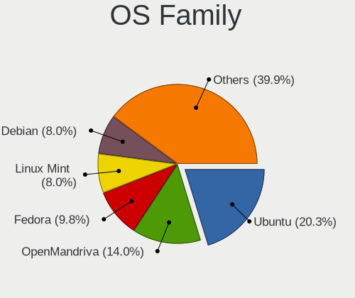
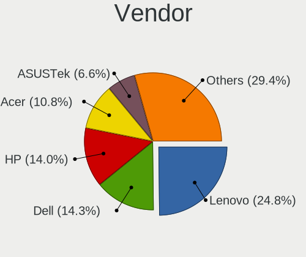
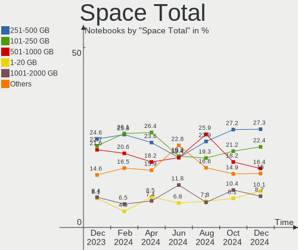
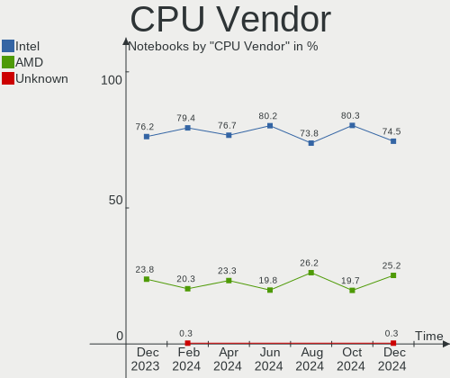
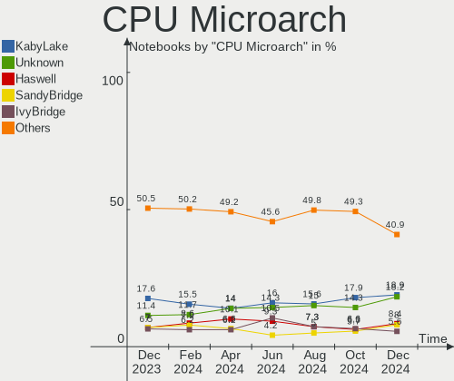
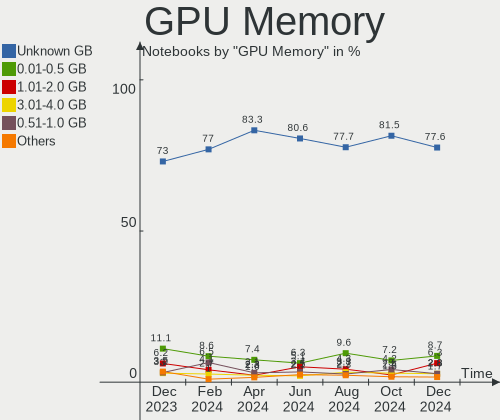
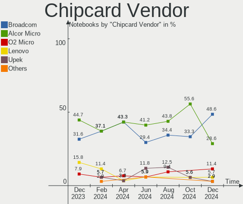

Linux in Germany - Hardware Trends (Notebooks)
----------------------------------------------

A project to identify most popular hardware characteristics and track their change
over time based on data collected by Linux users at https://Linux-Hardware.org.

Anyone can contribute to this report by the [hw-probe](https://github.com/linuxhw/hw-probe) tool:

    sudo -E hw-probe -all -upload

Period: Jan, 2024.

Contents
--------

* [ System ](#system)
  - [ OS                       ](#os)
  - [ OS Family                ](#os-family)
  - [ Kernel                   ](#kernel)
  - [ Kernel Family            ](#kernel-family)
  - [ Kernel Major Ver.        ](#kernel-major-ver)
  - [ Arch                     ](#arch)
  - [ DE                       ](#de)
  - [ Display Server           ](#display-server)
  - [ Display Manager          ](#display-manager)
  - [ OS Lang                  ](#os-lang)
  - [ Boot Mode                ](#boot-mode)
  - [ Filesystem               ](#filesystem)
  - [ Part. scheme             ](#part-scheme)
  - [ Dual Boot with Linux/BSD ](#dual-boot-with-linuxbsd)
  - [ Dual Boot (Win)          ](#dual-boot-win)

* [ Board ](#board)
  - [ Vendor                   ](#vendor)
  - [ Model                    ](#model)
  - [ Model Family             ](#model-family)
  - [ MFG Year                 ](#mfg-year)
  - [ Form Factor              ](#form-factor)
  - [ Secure Boot              ](#secure-boot)
  - [ Coreboot                 ](#coreboot)
  - [ RAM Size                 ](#ram-size)
  - [ RAM Used                 ](#ram-used)
  - [ Total Drives             ](#total-drives)
  - [ Has CD-ROM               ](#has-cd-rom)
  - [ Has Ethernet             ](#has-ethernet)
  - [ Has WiFi                 ](#has-wifi)
  - [ Has Bluetooth            ](#has-bluetooth)

* [ Location ](#location)
  - [ Country                  ](#country)
  - [ City                     ](#city)

* [ Drives ](#drives)
  - [ Drive Vendor             ](#drive-vendor)
  - [ Drive Model              ](#drive-model)
  - [ HDD Vendor               ](#hdd-vendor)
  - [ SSD Vendor               ](#ssd-vendor)
  - [ Drive Kind               ](#drive-kind)
  - [ Drive Connector          ](#drive-connector)
  - [ Drive Size               ](#drive-size)
  - [ Space Total              ](#space-total)
  - [ Space Used               ](#space-used)
  - [ Malfunc. Drives          ](#malfunc-drives)
  - [ Malfunc. Drive Vendor    ](#malfunc-drive-vendor)
  - [ Malfunc. HDD Vendor      ](#malfunc-hdd-vendor)
  - [ Malfunc. Drive Kind      ](#malfunc-drive-kind)
  - [ Failed Drives            ](#failed-drives)
  - [ Failed Drive Vendor      ](#failed-drive-vendor)
  - [ Drive Status             ](#drive-status)

* [ Storage controller ](#storage-controller)
  - [ Storage Vendor           ](#storage-vendor)
  - [ Storage Model            ](#storage-model)
  - [ Storage Kind             ](#storage-kind)

* [ Processor ](#processor)
  - [ CPU Vendor               ](#cpu-vendor)
  - [ CPU Model                ](#cpu-model)
  - [ CPU Model Family         ](#cpu-model-family)
  - [ CPU Cores                ](#cpu-cores)
  - [ CPU Sockets              ](#cpu-sockets)
  - [ CPU Threads              ](#cpu-threads)
  - [ CPU Op-Modes             ](#cpu-op-modes)
  - [ CPU Microcode            ](#cpu-microcode)
  - [ CPU Microarch            ](#cpu-microarch)

* [ Graphics ](#graphics)
  - [ GPU Vendor               ](#gpu-vendor)
  - [ GPU Model                ](#gpu-model)
  - [ GPU Combo                ](#gpu-combo)
  - [ GPU Driver               ](#gpu-driver)
  - [ GPU Memory               ](#gpu-memory)

* [ Monitor ](#monitor)
  - [ Monitor Vendor           ](#monitor-vendor)
  - [ Monitor Model            ](#monitor-model)
  - [ Monitor Resolution       ](#monitor-resolution)
  - [ Monitor Diagonal         ](#monitor-diagonal)
  - [ Monitor Width            ](#monitor-width)
  - [ Aspect Ratio             ](#aspect-ratio)
  - [ Monitor Area             ](#monitor-area)
  - [ Pixel Density            ](#pixel-density)
  - [ Multiple Monitors        ](#multiple-monitors)

* [ Network ](#network)
  - [ Net Controller Vendor    ](#net-controller-vendor)
  - [ Net Controller Model     ](#net-controller-model)
  - [ Wireless Vendor          ](#wireless-vendor)
  - [ Wireless Model           ](#wireless-model)
  - [ Ethernet Vendor          ](#ethernet-vendor)
  - [ Ethernet Model           ](#ethernet-model)
  - [ Net Controller Kind      ](#net-controller-kind)
  - [ Used Controller          ](#used-controller)
  - [ NICs                     ](#nics)
  - [ IPv6                     ](#ipv6)

* [ Bluetooth ](#bluetooth)
  - [ Bluetooth Vendor         ](#bluetooth-vendor)
  - [ Bluetooth Model          ](#bluetooth-model)

* [ Sound ](#sound)
  - [ Sound Vendor             ](#sound-vendor)
  - [ Sound Model              ](#sound-model)

* [ Memory ](#memory)
  - [ Memory Vendor            ](#memory-vendor)
  - [ Memory Model             ](#memory-model)
  - [ Memory Kind              ](#memory-kind)
  - [ Memory Form Factor       ](#memory-form-factor)
  - [ Memory Size              ](#memory-size)
  - [ Memory Speed             ](#memory-speed)

* [ Printers & scanners ](#printers--scanners)
  - [ Printer Vendor           ](#printer-vendor)
  - [ Printer Model            ](#printer-model)
  - [ Scanner Vendor           ](#scanner-vendor)
  - [ Scanner Model            ](#scanner-model)

* [ Camera ](#camera)
  - [ Camera Vendor            ](#camera-vendor)
  - [ Camera Model             ](#camera-model)

* [ Security ](#security)
  - [ Fingerprint Vendor       ](#fingerprint-vendor)
  - [ Fingerprint Model        ](#fingerprint-model)
  - [ Chipcard Vendor          ](#chipcard-vendor)
  - [ Chipcard Model           ](#chipcard-model)

* [ Unsupported ](#unsupported)
  - [ Unsupported Devices      ](#unsupported-devices)
  - [ Unsupported Device Types ](#unsupported-device-types)

System
------

OS
--

Installed operating systems

| Name                         | Notebooks | Percent |
|------------------------------|-----------|---------|
| Ubuntu 22.04                 | 66        | 17.93%  |
| Fedora 39                    | 32        | 8.7%    |
| Linux Mint 21.2              | 22        | 5.98%   |
| Linux Mint 21.3              | 19        | 5.16%   |
| Debian 12                    | 19        | 5.16%   |
| Ubuntu 23.10                 | 15        | 4.08%   |
| Zorin 17                     | 14        | 3.8%    |
| Debian                       | 12        | 3.26%   |
| Pop!_OS 22.04                | 11        | 2.99%   |
| openSUSE Tumbleweed-XXXXXXXX | 9         | 2.45%   |
| Manjaro                      | 9         | 2.45%   |
| Zorin 16                     | 8         | 2.17%   |
| OpenMandriva 5.0             | 7         | 1.9%    |
| OpenMandriva 23.08           | 7         | 1.9%    |
| LMDE 6                       | 7         | 1.9%    |
| Gentoo 2.14                  | 6         | 1.63%   |
| ArcoLinux Rolling            | 6         | 1.63%   |
| openSUSE Leap-15.5           | 5         | 1.36%   |
| Linux Mint 20.3              | 5         | 1.36%   |
| Kubuntu 23.10                | 5         | 1.36%   |
| Kubuntu 22.04                | 5         | 1.36%   |
| Kali 2023.4                  | 5         | 1.36%   |
| Arch Rolling                 | 5         | 1.36%   |
| KDE neon 22.04               | 4         | 1.09%   |
| Xubuntu 22.04                | 3         | 0.82%   |
| NixOS 23.11                  | 3         | 0.82%   |
| Xubuntu 23.10                | 2         | 0.54%   |
| Xero Rolling                 | 2         | 0.54%   |
| Ubuntu MATE 23.10            | 2         | 0.54%   |
| Ubuntu 23.04                 | 2         | 0.54%   |
| Ubuntu 21.10                 | 2         | 0.54%   |
| SteamOS 3.5.7                | 2         | 0.54%   |
| ROSA R11.1                   | 2         | 0.54%   |
| OpenMandriva 23.03           | 2         | 0.54%   |
| Nobara 39                    | 2         | 0.54%   |
| Manjaro 23.1.3               | 2         | 0.54%   |
| Linux Mint 21.1              | 2         | 0.54%   |
| Fedora 38                    | 2         | 0.54%   |
| EndeavourOS Rolling          | 2         | 0.54%   |
| Elementary 7.1               | 2         | 0.54%   |

OS Family
---------

OS without a version

| Name               | Notebooks | Percent |
|--------------------|-----------|---------|
| Ubuntu             | 86        | 23.37%  |
| Linux Mint         | 49        | 13.32%  |
| Fedora             | 34        | 9.24%   |
| Debian             | 33        | 8.97%   |
| Zorin              | 22        | 5.98%   |
| OpenMandriva       | 18        | 4.89%   |
| openSUSE           | 15        | 4.08%   |
| Pop!_OS            | 11        | 2.99%   |
| Manjaro            | 11        | 2.99%   |
| Kubuntu            | 10        | 2.72%   |
| LMDE               | 7         | 1.9%    |
| Xubuntu            | 6         | 1.63%   |
| Gentoo             | 6         | 1.63%   |
| ArcoLinux          | 6         | 1.63%   |
| Kali               | 5         | 1.36%   |
| Arch               | 5         | 1.36%   |
| SteamOS            | 4         | 1.09%   |
| KDE neon           | 4         | 1.09%   |
| Ubuntu MATE        | 3         | 0.82%   |
| ROSA               | 3         | 0.82%   |
| NixOS              | 3         | 0.82%   |
| Elementary         | 3         | 0.82%   |
| Xero               | 2         | 0.54%   |
| Nobara             | 2         | 0.54%   |
| MX                 | 2         | 0.54%   |
| Lubuntu            | 2         | 0.54%   |
| EndeavourOS        | 2         | 0.54%   |
| BunsenLabs         | 2         | 0.54%   |
| AlmaLinux          | 2         | 0.54%   |
| Ubuntu Studio      | 1         | 0.27%   |
| Ubuntu Budgie      | 1         | 0.27%   |
| TUXEDO OS          | 1         | 0.27%   |
| Siduction          | 1         | 0.27%   |
| Red OS             | 1         | 0.27%   |
| Guix               | 1         | 0.27%   |
| Fedora-asahi-remix | 1         | 0.27%   |
| Endless            | 1         | 0.27%   |
| BlackPanther       | 1         | 0.27%   |
| Alpine             | 1         | 0.27%   |

Kernel
------

Version of the Linux kernel

| Version                      | Notebooks | Percent |
|------------------------------|-----------|---------|
| 6.5.0-14-generic             | 56        | 15.22%  |
| 5.15.0-91-generic            | 44        | 11.96%  |
| 6.2.0-39-generic             | 23        | 6.25%   |
| 6.5.0-15-generic             | 20        | 5.43%   |
| 6.1.0-17-amd64               | 13        | 3.53%   |
| 6.6.6-76060606-generic       | 10        | 2.72%   |
| 6.6.9-200.fc39.x86_64        | 9         | 2.45%   |
| 6.6.2-desktop-1omv2390       | 7         | 1.9%    |
| 6.6.13-200.fc39.x86_64       | 7         | 1.9%    |
| 6.4.11-desktop-1omv2390      | 6         | 1.63%   |
| 6.6.11-200.fc39.x86_64       | 5         | 1.36%   |
| 6.5.0-kali3-amd64            | 5         | 1.36%   |
| 6.2.0-26-generic             | 5         | 1.36%   |
| 5.4.0-169-generic            | 5         | 1.36%   |
| 5.15.0-92-generic            | 5         | 1.36%   |
| 5.14.21-150500.55.39-default | 5         | 1.36%   |
| 6.6.8-200.fc39.x86_64        | 4         | 1.09%   |
| 6.5.0-5-amd64                | 4         | 1.09%   |
| 6.7.0-arch3-1                | 3         | 0.82%   |
| 6.6.9-amd64                  | 3         | 0.82%   |
| 6.6.8-arch1-1                | 3         | 0.82%   |
| 6.6.7-1-default              | 3         | 0.82%   |
| 6.6.10-1-MANJARO             | 3         | 0.82%   |
| 6.5.6-300.fc39.x86_64        | 3         | 0.82%   |
| 6.1.0-12-amd64               | 3         | 0.82%   |
| 5.15.0-89-generic            | 3         | 0.82%   |
| 6.7.0-0-MANJARO              | 2         | 0.54%   |
| 6.7-amd64                    | 2         | 0.54%   |
| 6.6.9-1-default              | 2         | 0.54%   |
| 6.6.8-200.fsync.fc39.x86_64  | 2         | 0.54%   |
| 6.6.14-1-lts                 | 2         | 0.54%   |
| 6.6.12-200.fc39.x86_64       | 2         | 0.54%   |
| 6.6.11-amd64                 | 2         | 0.54%   |
| 6.6.11-1-default             | 2         | 0.54%   |
| 6.5.0-17-generic             | 2         | 0.54%   |
| 6.5.0-10013-tuxedo           | 2         | 0.54%   |
| 6.2.6-desktop-1omv2390       | 2         | 0.54%   |
| 6.2.0-37-generic             | 2         | 0.54%   |
| 6.1.69-1-MANJARO             | 2         | 0.54%   |
| 6.1.69                       | 2         | 0.54%   |

Kernel Family
-------------

Linux kernel without a distro release

| Version | Notebooks | Percent |
|---------|-----------|---------|
| 6.5.0   | 93        | 25.27%  |
| 5.15.0  | 58        | 15.76%  |
| 6.2.0   | 32        | 8.7%    |
| 6.1.0   | 26        | 7.07%   |
| 6.6.9   | 17        | 4.62%   |
| 6.6.8   | 11        | 2.99%   |
| 6.6.6   | 11        | 2.99%   |
| 6.6.10  | 11        | 2.99%   |
| 6.6.11  | 10        | 2.72%   |
| 6.6.13  | 9         | 2.45%   |
| 6.7.0   | 7         | 1.9%    |
| 6.6.2   | 7         | 1.9%    |
| 5.4.0   | 7         | 1.9%    |
| 6.4.11  | 6         | 1.63%   |
| 6.6.7   | 5         | 1.36%   |
| 6.1.69  | 5         | 1.36%   |
| 6.1.52  | 5         | 1.36%   |
| 5.14.21 | 5         | 1.36%   |
| 6.6.12  | 3         | 0.82%   |
| 6.5.6   | 3         | 0.82%   |
| 5.10.0  | 3         | 0.82%   |
| 6.7     | 2         | 0.54%   |
| 6.6.14  | 2         | 0.54%   |
| 6.6.1   | 2         | 0.54%   |
| 6.5.9   | 2         | 0.54%   |
| 6.2.6   | 2         | 0.54%   |
| 5.13.0  | 2         | 0.54%   |
| 5.11.0  | 2         | 0.54%   |
| 6.7.2   | 1         | 0.27%   |
| 6.6.3   | 1         | 0.27%   |
| 6.5.8   | 1         | 0.27%   |
| 6.5.5   | 1         | 0.27%   |
| 6.5.13  | 1         | 0.27%   |
| 6.4.6   | 1         | 0.27%   |
| 6.3.11  | 1         | 0.27%   |
| 6.1.71  | 1         | 0.27%   |
| 6.1.68  | 1         | 0.27%   |
| 6.1.67  | 1         | 0.27%   |
| 6.1.20  | 1         | 0.27%   |
| 6.0.10  | 1         | 0.27%   |

Kernel Major Ver.
-----------------

Linux kernel major version

| Version | Notebooks | Percent |
|---------|-----------|---------|
| 6.5     | 101       | 27.45%  |
| 6.6     | 89        | 24.18%  |
| 5.15    | 59        | 16.03%  |
| 6.1     | 40        | 10.87%  |
| 6.2     | 34        | 9.24%   |
| 6.7     | 8         | 2.17%   |
| 5.4     | 8         | 2.17%   |
| 6.4     | 7         | 1.9%    |
| 5.14    | 6         | 1.63%   |
| 5.10    | 3         | 0.82%   |
| 6       | 2         | 0.54%   |
| 5.13    | 2         | 0.54%   |
| 5.11    | 2         | 0.54%   |
| 6.3     | 1         | 0.27%   |
| 6.0     | 1         | 0.27%   |
| 5.6     | 1         | 0.27%   |
| 5.16    | 1         | 0.27%   |
| 4.19    | 1         | 0.27%   |
| 4.18    | 1         | 0.27%   |
| 4.15    | 1         | 0.27%   |

Arch
----

OS architecture (x86_64, i586, etc.)

| Name    | Notebooks | Percent |
|---------|-----------|---------|
| x86_64  | 361       | 98.1%   |
| i686    | 6         | 1.63%   |
| aarch64 | 1         | 0.27%   |

DE
--

Desktop Environment

| Name          | Notebooks | Percent |
|---------------|-----------|---------|
| GNOME         | 173       | 47.01%  |
| KDE5          | 70        | 19.02%  |
| X-Cinnamon    | 45        | 12.23%  |
| XFCE          | 26        | 7.07%   |
| Unknown       | 13        | 3.53%   |
| MATE          | 10        | 2.72%   |
| LXQt          | 6         | 1.63%   |
| Pantheon      | 3         | 0.82%   |
| LXDE          | 3         | 0.82%   |
| KDE           | 3         | 0.82%   |
| Hyprland      | 3         | 0.82%   |
| Cinnamon      | 3         | 0.82%   |
| sway          | 2         | 0.54%   |
| KDE6          | 2         | 0.54%   |
| Unity         | 1         | 0.27%   |
| KDE4          | 1         | 0.27%   |
| i3            | 1         | 0.27%   |
| Enlightenment | 1         | 0.27%   |
| Deepin        | 1         | 0.27%   |
| Budgie        | 1         | 0.27%   |

Display Server
--------------

X11 or Wayland

| Name    | Notebooks | Percent |
|---------|-----------|---------|
| X11     | 204       | 55.43%  |
| Wayland | 152       | 41.3%   |
| Unknown | 8         | 2.17%   |
| Tty     | 4         | 1.09%   |

Display Manager
---------------

SDDM, LightDM, etc.

| Name    | Notebooks | Percent |
|---------|-----------|---------|
| Unknown | 125       | 33.97%  |
| GDM3    | 105       | 28.53%  |
| LightDM | 59        | 16.03%  |
| SDDM    | 57        | 15.49%  |
| GDM     | 19        | 5.16%   |
| XDM     | 2         | 0.54%   |
| KDM     | 1         | 0.27%   |

OS Lang
-------

Language

| Lang    | Notebooks | Percent |
|---------|-----------|---------|
| de_DE   | 251       | 68.21%  |
| en_US   | 81        | 22.01%  |
| en_GB   | 9         | 2.45%   |
| Unknown | 9         | 2.45%   |
| C       | 5         | 1.36%   |
| pl_PL   | 4         | 1.09%   |
| ru_RU   | 3         | 0.82%   |
| hu_HU   | 2         | 0.54%   |
| POSIX   | 1         | 0.27%   |
| it_IT   | 1         | 0.27%   |
| fr_FR   | 1         | 0.27%   |
| de_LU   | 1         | 0.27%   |

Boot Mode
---------

EFI or BIOS

| Mode | Notebooks | Percent |
|------|-----------|---------|
| BIOS | 195       | 52.99%  |
| EFI  | 173       | 47.01%  |

Filesystem
----------

Type of filesystem

| Type    | Notebooks | Percent |
|---------|-----------|---------|
| Ext4    | 216       | 58.7%   |
| Tmpfs   | 72        | 19.57%  |
| Btrfs   | 59        | 16.03%  |
| Overlay | 16        | 4.35%   |
| Zfs     | 2         | 0.54%   |
| Xfs     | 1         | 0.27%   |
| F2fs    | 1         | 0.27%   |
| Ext3    | 1         | 0.27%   |

Part. scheme
------------

Scheme of partitioning

| Type    | Notebooks | Percent |
|---------|-----------|---------|
| GPT     | 208       | 56.52%  |
| Unknown | 111       | 30.16%  |
| MBR     | 49        | 13.32%  |

Dual Boot with Linux/BSD
------------------------

Hosting more than one Linux/BSD

| Dual boot | Notebooks | Percent |
|-----------|-----------|---------|
| No        | 323       | 87.77%  |
| Yes       | 45        | 12.23%  |

Dual Boot (Win)
---------------

Hosting Linux and Windows

| Dual boot | Notebooks | Percent |
|-----------|-----------|---------|
| No        | 291       | 79.08%  |
| Yes       | 77        | 20.92%  |

Board
-----

Vendor
------

Motherboard manufacturer

| Name                             | Notebooks | Percent |
|----------------------------------|-----------|---------|
| Lenovo                           | 94        | 25.54%  |
| Hewlett-Packard                  | 49        | 13.32%  |
| Dell                             | 41        | 11.14%  |
| Acer                             | 38        | 10.33%  |
| ASUSTek Computer                 | 28        | 7.61%   |
| Apple                            | 19        | 5.16%   |
| Fujitsu                          | 15        | 4.08%   |
| TUXEDO                           | 12        | 3.26%   |
| Medion                           | 12        | 3.26%   |
| MSI                              | 8         | 2.17%   |
| Toshiba                          | 7         | 1.9%    |
| Sony                             | 5         | 1.36%   |
| Samsung Electronics              | 5         | 1.36%   |
| Valve                            | 4         | 1.09%   |
| Packard Bell                     | 4         | 1.09%   |
| VALE                             | 3         | 0.82%   |
| HUAWEI                           | 3         | 0.82%   |
| Unknown                          | 3         | 0.82%   |
| Wortmann AG                      | 2         | 0.54%   |
| Google                           | 2         | 0.54%   |
| Framework                        | 2         | 0.54%   |
| Teclast                          | 1         | 0.27%   |
| Schenker                         | 1         | 0.27%   |
| Razer                            | 1         | 0.27%   |
| Notebook                         | 1         | 0.27%   |
| Micro Computer (HK) Tech Limited | 1         | 0.27%   |
| Matsushita Electric Industrial   | 1         | 0.27%   |
| LG Electronics                   | 1         | 0.27%   |
| IBM                              | 1         | 0.27%   |
| GTZS                             | 1         | 0.27%   |
| Fujitsu Siemens                  | 1         | 0.27%   |
| AXDIA International              | 1         | 0.27%   |
| Alienware                        | 1         | 0.27%   |

Model
-----

Motherboard model

| Name                                       | Notebooks | Percent |
|--------------------------------------------|-----------|---------|
| Valve Jupiter                              | 4         | 1.09%   |
| Unknown                                    | 4         | 1.09%   |
| Fujitsu LIFEBOOK U7412                     | 3         | 0.82%   |
| Apple MacBookPro14,1                       | 3         | 0.82%   |
| Apple MacBookAir7,2                        | 3         | 0.82%   |
| VALE Notebook Classic C140                 | 2         | 0.54%   |
| TUXEDO Pulse 14 Gen3                       | 2         | 0.54%   |
| TUXEDO Aura 15 Gen2                        | 2         | 0.54%   |
| Medion P15648                              | 2         | 0.54%   |
| HP Pavilion 17                             | 2         | 0.54%   |
| HP Pavilion 15                             | 2         | 0.54%   |
| HP Notebook                                | 2         | 0.54%   |
| HP EliteBook 2570p                         | 2         | 0.54%   |
| Framework Laptop 13 (AMD Ryzen 7040Series) | 2         | 0.54%   |
| Dell XPS 13 9360                           | 2         | 0.54%   |
| Dell Latitude E6410                        | 2         | 0.54%   |
| Dell Latitude 3320                         | 2         | 0.54%   |
| Dell Inspiron 15 3520                      | 2         | 0.54%   |
| ASUS ROG Zephyrus G14 GA401QM_GA401QM      | 2         | 0.54%   |
| Apple MacBookPro11,4                       | 2         | 0.54%   |
| Apple MacBookAir6,2                        | 2         | 0.54%   |
| Acer TravelMate 5735Z                      | 2         | 0.54%   |
| Acer Aspire V5-573G                        | 2         | 0.54%   |
| Acer Aspire 5750G                          | 2         | 0.54%   |
| Wortmann AG TERRA_MOBILE_1513A             | 1         | 0.27%   |
| Wortmann AG M660SE                         | 1         | 0.27%   |
| VALE Notebook Slim S132                    | 1         | 0.27%   |
| TUXEDO Pulse 15 Gen2                       | 1         | 0.27%   |
| TUXEDO Polaris AMD Gen5                    | 1         | 0.27%   |
| TUXEDO N8xxEZ                              | 1         | 0.27%   |
| TUXEDO InfinityBook S 15 Gen6              | 1         | 0.27%   |
| TUXEDO InfinityBook Pro Gen8 (MK1)         | 1         | 0.27%   |
| TUXEDO InfinityBook Pro 14 Gen6            | 1         | 0.27%   |
| TUXEDO Aura 15 Gen1                        | 1         | 0.27%   |
| TUXEDO Aura 14 Gen3                        | 1         | 0.27%   |
| Toshiba Satellite R630                     | 1         | 0.27%   |
| Toshiba Satellite L670D                    | 1         | 0.27%   |
| Toshiba Satellite C855-2J5                 | 1         | 0.27%   |
| Toshiba Satellite C850-1MF                 | 1         | 0.27%   |
| Toshiba Satellite C670D-12Q                | 1         | 0.27%   |

Model Family
------------

Motherboard model prefix

| Name                  | Notebooks | Percent |
|-----------------------|-----------|---------|
| Lenovo ThinkPad       | 63        | 17.12%  |
| Acer Aspire           | 28        | 7.61%   |
| Dell Latitude         | 22        | 5.98%   |
| Fujitsu LIFEBOOK      | 14        | 3.8%    |
| Lenovo IdeaPad        | 11        | 2.99%   |
| HP EliteBook          | 9         | 2.45%   |
| HP Pavilion           | 8         | 2.17%   |
| Dell Inspiron         | 8         | 2.17%   |
| HP ProBook            | 7         | 1.9%    |
| Toshiba Satellite     | 6         | 1.63%   |
| Dell XPS              | 5         | 1.36%   |
| Dell Precision        | 5         | 1.36%   |
| Apple MacBookPro11    | 5         | 1.36%   |
| Valve Jupiter         | 4         | 1.09%   |
| TUXEDO Aura           | 4         | 1.09%   |
| Packard Bell EasyNote | 4         | 1.09%   |
| Lenovo ThinkBook      | 4         | 1.09%   |
| HP Laptop             | 4         | 1.09%   |
| ASUS VivoBook         | 4         | 1.09%   |
| Acer Swift            | 4         | 1.09%   |
| Unknown               | 4         | 1.09%   |
| VALE Notebook         | 3         | 0.82%   |
| TUXEDO Pulse          | 3         | 0.82%   |
| TUXEDO InfinityBook   | 3         | 0.82%   |
| Lenovo Legion         | 3         | 0.82%   |
| HP ZBook              | 3         | 0.82%   |
| HP Compaq             | 3         | 0.82%   |
| ASUS ROG              | 3         | 0.82%   |
| ASUS ASUS             | 3         | 0.82%   |
| Apple MacBookPro14    | 3         | 0.82%   |
| Apple MacBookAir7     | 3         | 0.82%   |
| Acer TravelMate       | 3         | 0.82%   |
| MSI Katana            | 2         | 0.54%   |
| Medion P15648         | 2         | 0.54%   |
| Medion Akoya          | 2         | 0.54%   |
| Lenovo Yoga           | 2         | 0.54%   |
| HP Victus             | 2         | 0.54%   |
| HP Notebook           | 2         | 0.54%   |
| HP 255                | 2         | 0.54%   |
| Framework Laptop      | 2         | 0.54%   |

MFG Year
--------

Motherboard manufacture year

| Year    | Notebooks | Percent |
|---------|-----------|---------|
| 2023    | 41        | 11.14%  |
| 2013    | 28        | 7.61%   |
| 2021    | 25        | 6.79%   |
| 2012    | 25        | 6.79%   |
| 2011    | 25        | 6.79%   |
| 2020    | 24        | 6.52%   |
| 2016    | 24        | 6.52%   |
| 2010    | 24        | 6.52%   |
| 2014    | 23        | 6.25%   |
| 2022    | 21        | 5.71%   |
| 2019    | 20        | 5.43%   |
| 2018    | 19        | 5.16%   |
| 2017    | 19        | 5.16%   |
| 2015    | 19        | 5.16%   |
| 2009    | 10        | 2.72%   |
| 2008    | 8         | 2.17%   |
| 2007    | 7         | 1.9%    |
| 2006    | 2         | 0.54%   |
| 2005    | 2         | 0.54%   |
| 2024    | 1         | 0.27%   |
| Unknown | 1         | 0.27%   |

Form Factor
-----------

Physical design of the computer

| Name     | Notebooks | Percent |
|----------|-----------|---------|
| Notebook | 368       | 100%    |

Secure Boot
-----------

Enabled or disabled

| State    | Notebooks | Percent |
|----------|-----------|---------|
| Disabled | 335       | 91.03%  |
| Enabled  | 33        | 8.97%   |

Coreboot
--------

Have coreboot on board

| Used | Notebooks | Percent |
|------|-----------|---------|
| No   | 365       | 99.18%  |
| Yes  | 3         | 0.82%   |

RAM Size
--------

Total RAM memory

| Size in GB  | Notebooks | Percent |
|-------------|-----------|---------|
| 4.01-8.0    | 115       | 31.25%  |
| 16.01-24.0  | 69        | 18.75%  |
| 3.01-4.0    | 63        | 17.12%  |
| 8.01-16.0   | 57        | 15.49%  |
| 32.01-64.0  | 28        | 7.61%   |
| 24.01-32.0  | 12        | 3.26%   |
| 2.01-3.0    | 9         | 2.45%   |
| 64.01-256.0 | 8         | 2.17%   |
| 1.01-2.0    | 6         | 1.63%   |
| 0.51-1.0    | 1         | 0.27%   |

RAM Used
--------

Used RAM memory

| Used GB    | Notebooks | Percent |
|------------|-----------|---------|
| 2.01-3.0   | 116       | 31.52%  |
| 1.01-2.0   | 116       | 31.52%  |
| 4.01-8.0   | 55        | 14.95%  |
| 3.01-4.0   | 53        | 14.4%   |
| 0.51-1.0   | 11        | 2.99%   |
| 8.01-16.0  | 10        | 2.72%   |
| 16.01-24.0 | 4         | 1.09%   |
| 0.01-0.5   | 2         | 0.54%   |
| 32.01-64.0 | 1         | 0.27%   |

Total Drives
------------

Number of drives on board

| Drives | Notebooks | Percent |
|--------|-----------|---------|
| 1      | 272       | 73.91%  |
| 2      | 78        | 21.2%   |
| 3      | 12        | 3.26%   |
| 0      | 4         | 1.09%   |
| 13     | 1         | 0.27%   |
| 4      | 1         | 0.27%   |

Has CD-ROM
----------

Has CD-ROM on board

| Presented | Notebooks | Percent |
|-----------|-----------|---------|
| No        | 243       | 66.03%  |
| Yes       | 125       | 33.97%  |

Has Ethernet
------------

Has Ethernet on board

| Presented | Notebooks | Percent |
|-----------|-----------|---------|
| Yes       | 291       | 79.08%  |
| No        | 77        | 20.92%  |

Has WiFi
--------

Has WiFi module

| Presented | Notebooks | Percent |
|-----------|-----------|---------|
| Yes       | 365       | 99.18%  |
| No        | 3         | 0.82%   |

Has Bluetooth
-------------

Has Bluetooth module

| Presented | Notebooks | Percent |
|-----------|-----------|---------|
| Yes       | 297       | 80.71%  |
| No        | 71        | 19.29%  |

Location
--------

Country
-------

Geographic location (country)

| Country | Notebooks | Percent |
|---------|-----------|---------|
| Germany | 368       | 100%    |

City
----

Geographic location (city)

| City                   | Notebooks | Percent |
|------------------------|-----------|---------|
| Berlin                 | 36        | 9.78%   |
| Munich                 | 18        | 4.89%   |
| Hamburg                | 18        | 4.89%   |
| Frankfurt am Main      | 12        | 3.26%   |
| Stuttgart              | 10        | 2.72%   |
| Leipzig                | 10        | 2.72%   |
| Bremen                 | 8         | 2.17%   |
| Dresden                | 7         | 1.9%    |
| Nuremberg              | 5         | 1.36%   |
| Mannheim               | 5         | 1.36%   |
| Cologne                | 4         | 1.09%   |
| Bonn                   | 4         | 1.09%   |
| Bochum                 | 4         | 1.09%   |
| Traunstein             | 3         | 0.82%   |
| Saarbrücken           | 3         | 0.82%   |
| Mainz                  | 3         | 0.82%   |
| Lübeck                | 3         | 0.82%   |
| Karlsruhe              | 3         | 0.82%   |
| Jena                   | 3         | 0.82%   |
| Hanover                | 3         | 0.82%   |
| Düsseldorf            | 3         | 0.82%   |
| Bielefeld              | 3         | 0.82%   |
| Worms                  | 2         | 0.54%   |
| Wiesbaden              | 2         | 0.54%   |
| Wetzlar                | 2         | 0.54%   |
| Weimar                 | 2         | 0.54%   |
| Villingen-Schwenningen | 2         | 0.54%   |
| Tuttlingen             | 2         | 0.54%   |
| Sindelfingen           | 2         | 0.54%   |
| Siegsdorf              | 2         | 0.54%   |
| Reutlingen             | 2         | 0.54%   |
| Paderborn              | 2         | 0.54%   |
| Oldenburg              | 2         | 0.54%   |
| Münster               | 2         | 0.54%   |
| Mönchengladbach       | 2         | 0.54%   |
| Linsengericht          | 2         | 0.54%   |
| Lilienthal             | 2         | 0.54%   |
| Kropp                  | 2         | 0.54%   |
| Kronach                | 2         | 0.54%   |
| Krefeld                | 2         | 0.54%   |

Drives
------

Drive Vendor
------------

Hard drive vendors

| Vendor                       | Notebooks | Drives | Percent |
|------------------------------|-----------|--------|---------|
| Samsung Electronics          | 94        | 108    | 21.27%  |
| SanDisk                      | 51        | 53     | 11.54%  |
| WDC                          | 28        | 28     | 6.33%   |
| Intenso                      | 26        | 26     | 5.88%   |
| Crucial                      | 24        | 24     | 5.43%   |
| SK hynix                     | 19        | 19     | 4.3%    |
| Unknown                      | 18        | 18     | 4.07%   |
| Seagate                      | 16        | 16     | 3.62%   |
| Apple                        | 15        | 20     | 3.39%   |
| Toshiba                      | 14        | 14     | 3.17%   |
| Micron Technology            | 14        | 16     | 3.17%   |
| Intel                        | 14        | 15     | 3.17%   |
| Kingston                     | 12        | 13     | 2.71%   |
| HGST                         | 10        | 10     | 2.26%   |
| Hitachi                      | 9         | 9      | 2.04%   |
| KIOXIA                       | 8         | 8      | 1.81%   |
| Phison Electronics           | 6         | 6      | 1.36%   |
| MAXIO Technology (Hangzhou)  | 4         | 5      | 0.9%    |
| Transcend                    | 3         | 3      | 0.68%   |
| OCZ                          | 3         | 3      | 0.68%   |
| LITEONIT                     | 3         | 3      | 0.68%   |
| Kingston Technology Company  | 3         | 3      | 0.68%   |
| JMicron Technology           | 3         | 3      | 0.68%   |
| Fanxiang                     | 3         | 3      | 0.68%   |
| Shenzhen Longsys Electronics | 2         | 2      | 0.45%   |
| SD                           | 2         | 2      | 0.45%   |
| PNY                          | 2         | 2      | 0.45%   |
| Phison                       | 2         | 2      | 0.45%   |
| Micron/Crucial Technology    | 2         | 2      | 0.45%   |
| Dogfish                      | 2         | 2      | 0.45%   |
| ASMT                         | 2         | 2      | 0.45%   |
| Unknown                      | 2         | 2      | 0.45%   |
| WDC WDS                      | 1         | 1      | 0.23%   |
| Vi3000 I                     | 1         | 1      | 0.23%   |
| V7                           | 1         | 1      | 0.23%   |
| UMIS                         | 1         | 1      | 0.23%   |
| TCSUNBOW                     | 1         | 1      | 0.23%   |
| Silicon Motion               | 1         | 1      | 0.23%   |
| SC550                        | 1         | 1      | 0.23%   |
| SABRENT                      | 1         | 1      | 0.23%   |

Drive Model
-----------

Hard drive models

| Model                                              | Notebooks | Percent |
|----------------------------------------------------|-----------|---------|
| Samsung NVMe SSD Controller PM9A1/PM9A3/980PRO 2TB | 8         | 1.76%   |
| Sandisk WD Blue SN550 NVMe SSD 512GB               | 5         | 1.1%    |
| Crucial CT1000BX500SSD1 1TB                        | 5         | 1.1%    |
| Unknown MMC Card  64GB                             | 4         | 0.88%   |
| Toshiba MQ01ABD100 1TB                             | 4         | 0.88%   |
| SanDisk NVMe SSD Drive 1TB                         | 4         | 0.88%   |
| Samsung SSD 860 EVO 500GB                          | 4         | 0.88%   |
| Samsung NVMe SSD Controller SM981/PM981/PM983 1TB  | 4         | 0.88%   |
| MAXIO (Hangzhou) NVMe SSD Controller MAP1202 512GB | 4         | 0.88%   |
| HGST HTS541010A9E680 1TB                           | 4         | 0.88%   |
| Crucial CT480BX500SSD1 480GB                       | 4         | 0.88%   |
| Unknown MMC Card  32GB                             | 3         | 0.66%   |
| Sandisk WD Blue SN570 1TB                          | 3         | 0.66%   |
| Sandisk WD Black SN750 / PC SN730 NVMe SSD 512GB   | 3         | 0.66%   |
| SanDisk SSD PLUS 240GB                             | 3         | 0.66%   |
| Samsung SSD 980 500GB                              | 3         | 0.66%   |
| Samsung SSD 980 1TB                                | 3         | 0.66%   |
| Samsung SSD 860 EVO 250GB                          | 3         | 0.66%   |
| Samsung SSD 860 EVO 1TB                            | 3         | 0.66%   |
| Samsung SSD 850 EVO 250GB                          | 3         | 0.66%   |
| Samsung PSSD T7 1TB                                | 3         | 0.66%   |
| Phison PS5013 E13 NVMe Controller 256GB            | 3         | 0.66%   |
| Kingston SNVS500G 500GB                            | 3         | 0.66%   |
| Intenso SSD 1TB                                    | 3         | 0.66%   |
| Intel SSD 660P Series 1024GB                       | 3         | 0.66%   |
| Crucial CT500MX500SSD1 500GB                       | 3         | 0.66%   |
| Crucial CT1000MX500SSD1 1TB                        | 3         | 0.66%   |
| Apple S3X NVMe Controller 256GB                    | 3         | 0.66%   |
| Unknown MMC Card  16GB                             | 2         | 0.44%   |
| SK hynix HFS060G32MNB-2000A 64GB SSD               | 2         | 0.44%   |
| Seagate ST9500325AS 500GB                          | 2         | 0.44%   |
| Seagate ST500LM021-1KJ152 500GB                    | 2         | 0.44%   |
| Seagate ST320LT007-9ZV142 320GB                    | 2         | 0.44%   |
| Seagate ST1000LM035-1RK172 1TB                     | 2         | 0.44%   |
| Sandisk WDC PC SN530 SDBPMPZ-256G-1101 256GB       | 2         | 0.44%   |
| Sandisk WD Blue SN500 / PC SN520 NVMe SSD 512GB    | 2         | 0.44%   |
| Sandisk WD Black SN850 1024GB                      | 2         | 0.44%   |
| SanDisk SSD PLUS 480GB                             | 2         | 0.44%   |
| SanDisk SDSSDH3 500G                               | 2         | 0.44%   |
| SanDisk SDSSDH3 1T00 1TB                           | 2         | 0.44%   |

HDD Vendor
----------

Hard disk drive vendors

| Vendor             | Notebooks | Drives | Percent |
|--------------------|-----------|--------|---------|
| Seagate            | 16        | 16     | 25.4%   |
| WDC                | 14        | 14     | 22.22%  |
| HGST               | 10        | 10     | 15.87%  |
| Hitachi            | 9         | 9      | 14.29%  |
| Toshiba            | 8         | 8      | 12.7%   |
| JMicron Technology | 2         | 2      | 3.17%   |
| Unknown            | 1         | 1      | 1.59%   |
| Intenso            | 1         | 1      | 1.59%   |
| Fujitsu            | 1         | 1      | 1.59%   |
| ASMT               | 1         | 1      | 1.59%   |

SSD Vendor
----------

Solid state drive vendors

| Vendor              | Notebooks | Drives | Percent |
|---------------------|-----------|--------|---------|
| Samsung Electronics | 53        | 58     | 27.89%  |
| SanDisk             | 23        | 23     | 12.11%  |
| Crucial             | 22        | 22     | 11.58%  |
| Intenso             | 18        | 18     | 9.47%   |
| Apple               | 9         | 9      | 4.74%   |
| WDC                 | 6         | 6      | 3.16%   |
| SK hynix            | 6         | 6      | 3.16%   |
| Kingston            | 4         | 4      | 2.11%   |
| Intel               | 4         | 4      | 2.11%   |
| Transcend           | 3         | 3      | 1.58%   |
| Toshiba             | 3         | 3      | 1.58%   |
| OCZ                 | 3         | 3      | 1.58%   |
| Micron Technology   | 3         | 5      | 1.58%   |
| LITEONIT            | 3         | 3      | 1.58%   |
| SD                  | 2         | 2      | 1.05%   |
| PNY                 | 2         | 2      | 1.05%   |
| Phison              | 2         | 2      | 1.05%   |
| Fanxiang            | 2         | 2      | 1.05%   |
| Dogfish             | 2         | 2      | 1.05%   |
| WDC WDS             | 1         | 1      | 0.53%   |
| V7                  | 1         | 1      | 0.53%   |
| TCSUNBOW            | 1         | 1      | 0.53%   |
| SABRENT             | 1         | 1      | 0.53%   |
| NT-512              | 1         | 1      | 0.53%   |
| KIOXIA-EXCERIA      | 1         | 1      | 0.53%   |
| KingSpec            | 1         | 1      | 0.53%   |
| INTEL SS            | 1         | 1      | 0.53%   |
| Indilinx            | 1         | 1      | 0.53%   |
| GLOWAY              | 1         | 1      | 0.53%   |
| GLOBAL              | 1         | 1      | 0.53%   |
| Emtec               | 1         | 1      | 0.53%   |
| CT500MX5            | 1         | 1      | 0.53%   |
| China               | 1         | 1      | 0.53%   |
| C300-CTF            | 1         | 1      | 0.53%   |
| Aura                | 1         | 1      | 0.53%   |
| ASMT                | 1         | 1      | 0.53%   |
| ASMedia             | 1         | 1      | 0.53%   |
| A-DATA Technology   | 1         | 1      | 0.53%   |
| Unknown             | 1         | 1      | 0.53%   |

Drive Kind
----------

HDD or SSD

| Kind    | Notebooks | Drives | Percent |
|---------|-----------|--------|---------|
| SSD     | 174       | 197    | 42.13%  |
| NVMe    | 150       | 179    | 36.32%  |
| HDD     | 62        | 63     | 15.01%  |
| MMC     | 17        | 18     | 4.12%   |
| Unknown | 10        | 11     | 2.42%   |

Drive Connector
---------------

SATA, SAS, NVMe, etc.

| Type | Notebooks | Drives | Percent |
|------|-----------|--------|---------|
| SATA | 216       | 241    | 52.94%  |
| NVMe | 148       | 171    | 36.27%  |
| SAS  | 27        | 38     | 6.62%   |
| MMC  | 17        | 18     | 4.17%   |

Drive Size
----------

Size of hard drive

| Size in TB | Notebooks | Drives | Percent |
|------------|-----------|--------|---------|
| 0.01-0.5   | 161       | 173    | 67.36%  |
| 0.51-1.0   | 64        | 71     | 26.78%  |
| 1.01-2.0   | 11        | 12     | 4.6%    |
| 3.01-4.0   | 2         | 3      | 0.84%   |
| 2.01-3.0   | 1         | 1      | 0.42%   |

Space Total
-----------

Amount of disk space available on the file system

| Size in GB     | Notebooks | Percent |
|----------------|-----------|---------|
| 101-250        | 102       | 27.72%  |
| 251-500        | 92        | 25%     |
| 501-1000       | 57        | 15.49%  |
| 1001-2000      | 25        | 6.79%   |
| 1-20           | 21        | 5.71%   |
| 51-100         | 21        | 5.71%   |
| More than 3000 | 17        | 4.62%   |
| Unknown        | 14        | 3.8%    |
| 2001-3000      | 10        | 2.72%   |
| 21-50          | 9         | 2.45%   |

Space Used
----------

Amount of used disk space

| Used GB        | Notebooks | Percent |
|----------------|-----------|---------|
| 1-20           | 117       | 31.79%  |
| 21-50          | 68        | 18.48%  |
| 101-250        | 65        | 17.66%  |
| 51-100         | 47        | 12.77%  |
| 251-500        | 24        | 6.52%   |
| 501-1000       | 17        | 4.62%   |
| Unknown        | 14        | 3.8%    |
| 1001-2000      | 11        | 2.99%   |
| 2001-3000      | 4         | 1.09%   |
| More than 3000 | 1         | 0.27%   |

Malfunc. Drives
---------------

Drive models with a malfunction

| Model                                | Notebooks | Drives | Percent |
|--------------------------------------|-----------|--------|---------|
| SK hynix HFS060G32MNB-2000A 64GB SSD | 2         | 2      | 8%      |
| WDC WD7500BPVT-22HXZT3 752GB         | 1         | 1      | 4%      |
| WDC WD3200BEVT-08A23T1 320GB         | 1         | 1      | 4%      |
| WDC WD10SPCX-22HWST0 1TB             | 1         | 1      | 4%      |
| SK hynix PC711 HFS512GDE9X073N 512GB | 1         | 1      | 4%      |
| Seagate ST9500325AS 500GB            | 1         | 1      | 4%      |
| Seagate ST500LT012-1DG142 500GB      | 1         | 1      | 4%      |
| Seagate ST320LT020-9YG142 320GB      | 1         | 1      | 4%      |
| Seagate ST320LT007-9ZV142 320GB      | 1         | 1      | 4%      |
| SanDisk SSD PLUS 120GB               | 1         | 1      | 4%      |
| SanDisk SSD PLUS 1000GB              | 1         | 1      | 4%      |
| OCZ VERTEX3 120GB SSD                | 1         | 1      | 4%      |
| LITEONIT LSS-16L6G-HP 16GB SSD       | 1         | 1      | 4%      |
| LITEONIT LMS-32L6M-HP 32GB SSD       | 1         | 1      | 4%      |
| Lenovo LENSE20256GMSP34MEAT2TA 256GB | 1         | 1      | 4%      |
| Kingston SKC600512G 512GB SSD        | 1         | 1      | 4%      |
| Kingston OM8PDP3512B-AA1 512GB       | 1         | 1      | 4%      |
| KingSpec KSD-PA18.6-064MS 64GB SSD   | 1         | 1      | 4%      |
| Intel SSDSC2BF180A4L 180GB           | 1         | 1      | 4%      |
| Intel SSDMAEMC080G2 80GB             | 1         | 1      | 4%      |
| Hitachi HTS548080M9AT00 80GB         | 1         | 1      | 4%      |
| Hitachi HTS543232L9A300 320GB        | 1         | 1      | 4%      |
| HGST HTS545050A7E680 500GB           | 1         | 1      | 4%      |
| HGST HTS545050A7E380 500GB           | 1         | 1      | 4%      |

Malfunc. Drive Vendor
---------------------

Vendors of faulty drives

| Vendor   | Notebooks | Drives | Percent |
|----------|-----------|--------|---------|
| Seagate  | 4         | 4      | 16%     |
| WDC      | 3         | 3      | 12%     |
| SK hynix | 3         | 3      | 12%     |
| SanDisk  | 2         | 2      | 8%      |
| LITEONIT | 2         | 2      | 8%      |
| Kingston | 2         | 2      | 8%      |
| Intel    | 2         | 2      | 8%      |
| Hitachi  | 2         | 2      | 8%      |
| HGST     | 2         | 2      | 8%      |
| OCZ      | 1         | 1      | 4%      |
| Lenovo   | 1         | 1      | 4%      |
| KingSpec | 1         | 1      | 4%      |

Malfunc. HDD Vendor
-------------------

Vendors of faulty HDD drives

| Vendor  | Notebooks | Drives | Percent |
|---------|-----------|--------|---------|
| Seagate | 4         | 4      | 36.36%  |
| WDC     | 3         | 3      | 27.27%  |
| Hitachi | 2         | 2      | 18.18%  |
| HGST    | 2         | 2      | 18.18%  |

Malfunc. Drive Kind
-------------------

Kinds of faulty drives

| Kind | Notebooks | Drives | Percent |
|------|-----------|--------|---------|
| SSD  | 11        | 11     | 44%     |
| HDD  | 11        | 11     | 44%     |
| NVMe | 3         | 3      | 12%     |

Failed Drives
-------------

Failed drive models

Zero info for selected period =(

Failed Drive Vendor
-------------------

Failed drive vendors

Zero info for selected period =(

Drive Status
------------

Number of failed and malfunc. drives

| Status   | Notebooks | Drives | Percent |
|----------|-----------|--------|---------|
| Detected | 195       | 249    | 51.45%  |
| Works    | 160       | 194    | 42.22%  |
| Malfunc  | 24        | 25     | 6.33%   |

Storage controller
------------------

Storage Vendor
--------------

Storage controller vendors

| Vendor                       | Notebooks | Percent |
|------------------------------|-----------|---------|
| Intel                        | 232       | 54.21%  |
| Samsung Electronics          | 48        | 11.21%  |
| SanDisk                      | 37        | 8.64%   |
| AMD                          | 33        | 7.71%   |
| SK hynix                     | 12        | 2.8%    |
| Micron Technology            | 11        | 2.57%   |
| Kingston Technology Company  | 11        | 2.57%   |
| KIOXIA                       | 8         | 1.87%   |
| Phison Electronics           | 6         | 1.4%    |
| Apple                        | 5         | 1.17%   |
| Micron/Crucial Technology    | 4         | 0.93%   |
| MAXIO Technology (Hangzhou)  | 4         | 0.93%   |
| Toshiba America Info Systems | 3         | 0.7%    |
| Marvell Technology Group     | 3         | 0.7%    |
| Shenzhen Longsys Electronics | 2         | 0.47%   |
| Nvidia                       | 2         | 0.47%   |
| VIA Technologies             | 1         | 0.23%   |
| Union Memory (Shenzhen)      | 1         | 0.23%   |
| Silicon Motion               | 1         | 0.23%   |
| Lenovo                       | 1         | 0.23%   |
| JMicron Technology           | 1         | 0.23%   |
| ASMedia Technology           | 1         | 0.23%   |
| Unknown                      | 1         | 0.23%   |

Storage Model
-------------

Storage controller models

| Model                                                                            | Notebooks | Percent |
|----------------------------------------------------------------------------------|-----------|---------|
| Intel Sunrise Point-LP SATA Controller [AHCI mode]                               | 25        | 5.43%   |
| Intel 7 Series Chipset Family 6-port SATA Controller [AHCI mode]                 | 24        | 5.22%   |
| AMD FCH SATA Controller [AHCI mode]                                              | 23        | 5%      |
| Intel 82801 Mobile SATA Controller [RAID mode]                                   | 22        | 4.78%   |
| Intel 6 Series/C200 Series Chipset Family 6 port Mobile SATA AHCI Controller     | 22        | 4.78%   |
| Intel 8 Series SATA Controller 1 [AHCI mode]                                     | 17        | 3.7%    |
| Samsung NVMe SSD Controller 980 (DRAM-less)                                      | 13        | 2.83%   |
| Intel Wildcat Point-LP SATA Controller [AHCI Mode]                               | 13        | 2.83%   |
| Intel Volume Management Device NVMe RAID Controller                              | 13        | 2.83%   |
| Samsung NVMe SSD Controller PM9A1/PM9A3/980PRO                                   | 11        | 2.39%   |
| Samsung NVMe SSD Controller SM981/PM981/PM983                                    | 10        | 2.17%   |
| Intel 82801IBM/IEM (ICH9M/ICH9M-E) 4 port SATA Controller [AHCI mode]            | 10        | 2.17%   |
| Intel 8 Series/C220 Series Chipset Family 6-port SATA Controller 1 [AHCI mode]   | 9         | 1.96%   |
| Intel 5 Series/3400 Series Chipset 4 port SATA AHCI Controller                   | 9         | 1.96%   |
| AMD SB7x0/SB8x0/SB9x0 SATA Controller [AHCI mode]                                | 8         | 1.74%   |
| Intel 5 Series/3400 Series Chipset 6 port SATA AHCI Controller                   | 7         | 1.52%   |
| SanDisk Ultra 3D / WD Blue SN550 NVMe SSD                                        | 6         | 1.3%    |
| Intel Tiger Lake-LP SATA Controller                                              | 6         | 1.3%    |
| Intel Celeron/Pentium Silver Processor SATA Controller                           | 6         | 1.3%    |
| SanDisk Extreme Pro / WD Black SN750 / PC SN730 / Red SN700 NVMe SSD             | 5         | 1.09%   |
| SK hynix Gold P31/BC711/PC711 NVMe Solid State Drive                             | 4         | 0.87%   |
| SanDisk WD Black SN770 / PC SN740 256GB / PC SN560 (DRAM-less) NVMe SSD          | 4         | 0.87%   |
| SanDisk Ultra 3D / WD Blue SN570 NVMe SSD (DRAM-less)                            | 4         | 0.87%   |
| Samsung S4LN058A01[SSUBX] AHCI SSD Controller (Apple slot)                       | 4         | 0.87%   |
| MAXIO (Hangzhou) NVMe SSD Controller MAP1202 (DRAM-less)                         | 4         | 0.87%   |
| KIOXIA NVMe SSD Controller XG8                                                   | 4         | 0.87%   |
| KIOXIA NVMe SSD Controller BG4 (DRAM-less)                                       | 4         | 0.87%   |
| Intel Celeron N3350/Pentium N4200/Atom E3900 Series SATA AHCI Controller         | 4         | 0.87%   |
| Intel Cannon Lake Mobile PCH SATA AHCI Controller                                | 4         | 0.87%   |
| Intel Atom/Celeron/Pentium Processor x5-E8000/J3xxx/N3xxx Series SATA Controller | 4         | 0.87%   |
| Intel 82801HM/HEM (ICH8M/ICH8M-E) SATA Controller [AHCI mode]                    | 4         | 0.87%   |
| Intel 7 Series Chipset Family 4-port SATA Controller [IDE mode]                  | 4         | 0.87%   |
| Intel 7 Series Chipset Family 2-port SATA Controller [IDE mode]                  | 4         | 0.87%   |
| SK hynix BC901 NVMe Solid State Drive (DRAM-less)                                | 3         | 0.65%   |
| Sandisk WD PC SN740 NVMe SSD 512GB (DRAM-less)                                   | 3         | 0.65%   |
| Samsung NVMe SSD Controller S4LV008[Pascal]                                      | 3         | 0.65%   |
| Samsung NVMe SSD Controller PM9B1 (DRAM-less)                                    | 3         | 0.65%   |
| Phison PS5013-E13 PCIe3 NVMe Controller (DRAM-less)                              | 3         | 0.65%   |
| Micron/Crucial P2 [Nick P2] / P3 / P3 Plus NVMe PCIe SSD (DRAM-less)             | 3         | 0.65%   |
| Micron 2450 NVMe SSD [HendrixV] (DRAM-less)                                      | 3         | 0.65%   |

Storage Kind
------------

Kind of storage controller (IDE, SATA, NVMe, SAS, ...)

| Kind | Notebooks | Percent |
|------|-----------|---------|
| SATA | 227       | 51.83%  |
| NVMe | 147       | 33.56%  |
| RAID | 40        | 9.13%   |
| IDE  | 24        | 5.48%   |

Processor
---------

CPU Vendor
----------

Processor vendors

| Vendor  | Notebooks | Percent |
|---------|-----------|---------|
| Intel   | 295       | 80.16%  |
| AMD     | 72        | 19.57%  |
| Unknown | 1         | 0.27%   |

CPU Model
---------

Processor models

| Model                                       | Notebooks | Percent |
|---------------------------------------------|-----------|---------|
| Intel Core i5-5300U CPU @ 2.30GHz           | 7         | 1.9%    |
| Intel Core i5-3320M CPU @ 2.60GHz           | 7         | 1.9%    |
| Intel Core i5-7200U CPU @ 2.50GHz           | 6         | 1.63%   |
| Intel Core i7-7500U CPU @ 2.70GHz           | 5         | 1.36%   |
| Intel Core i5-8250U CPU @ 1.60GHz           | 5         | 1.36%   |
| Intel Core i5-6300U CPU @ 2.40GHz           | 5         | 1.36%   |
| Intel Core i5-2410M CPU @ 2.30GHz           | 5         | 1.36%   |
| Intel Core i5-10210U CPU @ 1.60GHz          | 5         | 1.36%   |
| Intel 11th Gen Core i7-1165G7 @ 2.80GHz     | 5         | 1.36%   |
| Intel 11th Gen Core i5-1135G7 @ 2.40GHz     | 5         | 1.36%   |
| AMD Ryzen 5 5500U with Radeon Graphics      | 5         | 1.36%   |
| Intel Core i5-4210U CPU @ 1.70GHz           | 4         | 1.09%   |
| Intel 12th Gen Core i5-1235U                | 4         | 1.09%   |
| AMD Ryzen 7 7840U w/ Radeon 780M Graphics   | 4         | 1.09%   |
| AMD Ryzen 7 7840HS w/ Radeon 780M Graphics  | 4         | 1.09%   |
| AMD Ryzen 7 7730U with Radeon Graphics      | 4         | 1.09%   |
| AMD Custom APU 0405                         | 4         | 1.09%   |
| Intel Pentium CPU N3710 @ 1.60GHz           | 3         | 0.82%   |
| Intel Core i7-8565U CPU @ 1.80GHz           | 3         | 0.82%   |
| Intel Core i7-8550U CPU @ 1.80GHz           | 3         | 0.82%   |
| Intel Core i7-2670QM CPU @ 2.20GHz          | 3         | 0.82%   |
| Intel Core i5-8265U CPU @ 1.60GHz           | 3         | 0.82%   |
| Intel Core i5-7360U CPU @ 2.30GHz           | 3         | 0.82%   |
| Intel Core i5-4200U CPU @ 1.60GHz           | 3         | 0.82%   |
| Intel Core i5-3210M CPU @ 2.50GHz           | 3         | 0.82%   |
| Intel Core i5-2520M CPU @ 2.50GHz           | 3         | 0.82%   |
| Intel Core i5-10310U CPU @ 1.70GHz          | 3         | 0.82%   |
| Intel 12th Gen Core i7-1270P                | 3         | 0.82%   |
| Intel 12th Gen Core i7-1255U                | 3         | 0.82%   |
| Intel Pentium Silver N5030 CPU @ 1.10GHz    | 2         | 0.54%   |
| Intel Pentium Dual-Core CPU T4500 @ 2.30GHz | 2         | 0.54%   |
| Intel Pentium CPU P6200 @ 2.13GHz           | 2         | 0.54%   |
| Intel Pentium CPU N4200 @ 1.10GHz           | 2         | 0.54%   |
| Intel Pentium CPU N3540 @ 2.16GHz           | 2         | 0.54%   |
| Intel Pentium CPU B960 @ 2.20GHz            | 2         | 0.54%   |
| Intel Pentium CPU 2020M @ 2.40GHz           | 2         | 0.54%   |
| Intel Core i7-9750H CPU @ 2.60GHz           | 2         | 0.54%   |
| Intel Core i7-8750H CPU @ 2.20GHz           | 2         | 0.54%   |
| Intel Core i7-7600U CPU @ 2.80GHz           | 2         | 0.54%   |
| Intel Core i7-6600U CPU @ 2.60GHz           | 2         | 0.54%   |

CPU Model Family
----------------

Processor model prefix

| Model                          | Notebooks | Percent |
|--------------------------------|-----------|---------|
| Intel Core i5                  | 109       | 29.62%  |
| Intel Core i7                  | 62        | 16.85%  |
| Other                          | 49        | 13.32%  |
| AMD Ryzen 7                    | 25        | 6.79%   |
| Intel Core i3                  | 21        | 5.71%   |
| Intel Pentium                  | 16        | 4.35%   |
| Intel Core 2 Duo               | 13        | 3.53%   |
| AMD Ryzen 5                    | 12        | 3.26%   |
| Intel Celeron                  | 10        | 2.72%   |
| AMD Ryzen 9                    | 4         | 1.09%   |
| AMD A8                         | 4         | 1.09%   |
| Intel Pentium Silver           | 3         | 0.82%   |
| Intel Atom                     | 3         | 0.82%   |
| AMD Ryzen 3                    | 3         | 0.82%   |
| AMD E1                         | 3         | 0.82%   |
| AMD Athlon II                  | 3         | 0.82%   |
| Intel Pentium M                | 2         | 0.54%   |
| Intel Pentium Dual-Core        | 2         | 0.54%   |
| Intel Genuine                  | 2         | 0.54%   |
| AMD Ryzen 7 PRO                | 2         | 0.54%   |
| AMD Ryzen 5 PRO                | 2         | 0.54%   |
| AMD E                          | 2         | 0.54%   |
| AMD A10                        | 2         | 0.54%   |
| Intel Pentium Gold             | 1         | 0.27%   |
| Intel Core m5                  | 1         | 0.27%   |
| Intel Core M                   | 1         | 0.27%   |
| Intel Core i9                  | 1         | 0.27%   |
| Intel Core Duo                 | 1         | 0.27%   |
| Intel Core 2 Solo              | 1         | 0.27%   |
| Intel Core 2                   | 1         | 0.27%   |
| Intel Celeron Dual-Core        | 1         | 0.27%   |
| AMD Turion X2 Dual-Core Mobile | 1         | 0.27%   |
| AMD Sempron                    | 1         | 0.27%   |
| AMD Phenom II                  | 1         | 0.27%   |
| AMD Mobile Sempron             | 1         | 0.27%   |
| AMD C-60                       | 1         | 0.27%   |
| AMD Athlon                     | 1         | 0.27%   |

CPU Cores
---------

Number of processor cores

| Number | Notebooks | Percent |
|--------|-----------|---------|
| 2      | 181       | 49.18%  |
| 4      | 99        | 26.9%   |
| 8      | 33        | 8.97%   |
| 6      | 20        | 5.43%   |
| 10     | 11        | 2.99%   |
| 14     | 8         | 2.17%   |
| 12     | 7         | 1.9%    |
| 1      | 7         | 1.9%    |
| 16     | 1         | 0.27%   |
| 3      | 1         | 0.27%   |

CPU Sockets
-----------

Number of sockets

| Number | Notebooks | Percent |
|--------|-----------|---------|
| 1      | 368       | 100%    |

CPU Threads
-----------

Threads per core (Hyper-Threading)

| Number | Notebooks | Percent |
|--------|-----------|---------|
| 2      | 285       | 77.45%  |
| 1      | 83        | 22.55%  |

CPU Op-Modes
------------

CPU Operation Modes (32-bit, 64-bit)

| Op mode        | Notebooks | Percent |
|----------------|-----------|---------|
| 32-bit, 64-bit | 363       | 98.64%  |
| 32-bit         | 3         | 0.82%   |
| 64-bit         | 1         | 0.27%   |
| Unknown        | 1         | 0.27%   |

CPU Microcode
-------------

Microcode number

| Number     | Notebooks | Percent |
|------------|-----------|---------|
| Unknown    | 247       | 67.12%  |
| 0x206a7    | 10        | 2.72%   |
| 0x40651    | 8         | 2.17%   |
| 0x306a9    | 8         | 2.17%   |
| 0x20655    | 8         | 2.17%   |
| 0x0a704104 | 5         | 1.36%   |
| 0x0a50000d | 5         | 1.36%   |
| 0x0a404102 | 5         | 1.36%   |
| 0x806ea    | 4         | 1.09%   |
| 0x20652    | 4         | 1.09%   |
| 0x08608103 | 4         | 1.09%   |
| 0x806e9    | 3         | 0.82%   |
| 0x306d4    | 3         | 0.82%   |
| 0x306c3    | 3         | 0.82%   |
| 0x1067a    | 3         | 0.82%   |
| 0x906a3    | 2         | 0.54%   |
| 0x806c1    | 2         | 0.54%   |
| 0x6d8      | 2         | 0.54%   |
| 0x506c9    | 2         | 0.54%   |
| 0x40661    | 2         | 0.54%   |
| 0x0a704103 | 2         | 0.54%   |
| 0x0a601203 | 2         | 0.54%   |
| 0x0a50000c | 2         | 0.54%   |
| 0x08608104 | 2         | 0.54%   |
| 0x08600109 | 2         | 0.54%   |
| 0x07030105 | 2         | 0.54%   |
| 0xb06a2    | 1         | 0.27%   |
| 0x906ea    | 1         | 0.27%   |
| 0x906e9    | 1         | 0.27%   |
| 0x906a4    | 1         | 0.27%   |
| 0x806ec    | 1         | 0.27%   |
| 0x706a8    | 1         | 0.27%   |
| 0x706a1    | 1         | 0.27%   |
| 0x6e8      | 1         | 0.27%   |
| 0x406e3    | 1         | 0.27%   |
| 0x406c4    | 1         | 0.27%   |
| 0x30678    | 1         | 0.27%   |
| 0x30673    | 1         | 0.27%   |
| 0x106ca    | 1         | 0.27%   |
| 0x10676    | 1         | 0.27%   |

CPU Microarch
-------------

Microarchitecture

| Name             | Notebooks | Percent |
|------------------|-----------|---------|
| KabyLake         | 58        | 15.76%  |
| Unknown          | 41        | 11.14%  |
| Haswell          | 35        | 9.51%   |
| SandyBridge      | 29        | 7.88%   |
| IvyBridge        | 23        | 6.25%   |
| Broadwell        | 20        | 5.43%   |
| Westmere         | 19        | 5.16%   |
| Alderlake Hybrid | 19        | 5.16%   |
| TigerLake        | 16        | 4.35%   |
| Skylake          | 16        | 4.35%   |
| Penryn           | 15        | 4.08%   |
| Zen 3            | 10        | 2.72%   |
| Silvermont       | 10        | 2.72%   |
| Goldmont plus    | 7         | 1.9%    |
| Zen 2            | 6         | 1.63%   |
| Bobcat           | 5         | 1.36%   |
| Zen+             | 4         | 1.09%   |
| P6               | 4         | 1.09%   |
| K10              | 4         | 1.09%   |
| Icelake          | 4         | 1.09%   |
| Goldmont         | 4         | 1.09%   |
| Core             | 4         | 1.09%   |
| Puma             | 3         | 0.82%   |
| CometLake        | 3         | 0.82%   |
| K8 & K10 hybrid  | 2         | 0.54%   |
| Zen              | 1         | 0.27%   |
| Steamroller      | 1         | 0.27%   |
| Piledriver       | 1         | 0.27%   |
| K8 Hammer        | 1         | 0.27%   |
| Jaguar           | 1         | 0.27%   |
| Excavator        | 1         | 0.27%   |
| Bonnell          | 1         | 0.27%   |

Graphics
--------

GPU Vendor
----------

Vendors of graphics cards

| Vendor           | Notebooks | Percent |
|------------------|-----------|---------|
| Intel            | 270       | 59.73%  |
| Nvidia           | 93        | 20.58%  |
| AMD              | 88        | 19.47%  |
| VIA Technologies | 1         | 0.22%   |

GPU Model
---------

Graphics card models

| Model                                                                                    | Notebooks | Percent |
|------------------------------------------------------------------------------------------|-----------|---------|
| Intel 2nd Generation Core Processor Family Integrated Graphics Controller                | 25        | 5.36%   |
| Intel Haswell-ULT Integrated Graphics Controller                                         | 20        | 4.29%   |
| Intel 3rd Gen Core processor Graphics Controller                                         | 20        | 4.29%   |
| Intel HD Graphics 620                                                                    | 16        | 3.43%   |
| Intel HD Graphics 5500                                                                   | 14        | 3%      |
| Intel Core Processor Integrated Graphics Controller                                      | 14        | 3%      |
| Intel TigerLake-LP GT2 [Iris Xe Graphics]                                                | 13        | 2.79%   |
| Intel UHD Graphics 620                                                                   | 12        | 2.58%   |
| Intel Skylake GT2 [HD Graphics 520]                                                      | 11        | 2.36%   |
| Intel Raptor Lake-P [Iris Xe Graphics]                                                   | 11        | 2.36%   |
| Intel 4th Gen Core Processor Integrated Graphics Controller                              | 11        | 2.36%   |
| AMD Phoenix1                                                                             | 10        | 2.15%   |
| Intel Mobile 4 Series Chipset Integrated Graphics Controller                             | 9         | 1.93%   |
| Intel CometLake-U GT2 [UHD Graphics]                                                     | 9         | 1.93%   |
| Intel WhiskeyLake-U GT2 [UHD Graphics 620]                                               | 8         | 1.72%   |
| AMD Lucienne                                                                             | 8         | 1.72%   |
| Intel Alder Lake-UP3 GT2 [Iris Xe Graphics]                                              | 7         | 1.5%    |
| Intel Atom/Celeron/Pentium Processor x5-E8000/J3xxx/N3xxx Integrated Graphics Controller | 6         | 1.29%   |
| AMD Renoir [Radeon RX Vega 6 (Ryzen 4000/5000 Mobile Series)]                            | 6         | 1.29%   |
| AMD Rembrandt [Radeon 680M]                                                              | 6         | 1.29%   |
| AMD Barcelo                                                                              | 6         | 1.29%   |
| Intel Alder Lake-P GT2 [Iris Xe Graphics]                                                | 5         | 1.07%   |
| Nvidia GP108M [GeForce MX250]                                                            | 4         | 0.86%   |
| Nvidia GF108M [GeForce GT 540M]                                                          | 4         | 0.86%   |
| Intel HD Graphics 530                                                                    | 4         | 0.86%   |
| Intel GeminiLake [UHD Graphics 600]                                                      | 4         | 0.86%   |
| Intel CoffeeLake-H GT2 [UHD Graphics 630]                                                | 4         | 0.86%   |
| Intel Atom Processor Z36xxx/Z37xxx Series Graphics & Display                             | 4         | 0.86%   |
| AMD VanGogh [AMD Custom GPU 0405]                                                        | 4         | 0.86%   |
| AMD Sun XT [Radeon HD 8670A/8670M/8690M / R5 M330 / M430 / Radeon 520 Mobile]            | 4         | 0.86%   |
| AMD Picasso/Raven 2 [Radeon Vega Series / Radeon Vega Mobile Series]                     | 4         | 0.86%   |
| AMD Cezanne [Radeon Vega Series / Radeon Vega Mobile Series]                             | 4         | 0.86%   |
| Nvidia GT218M [GeForce G210M]                                                            | 3         | 0.64%   |
| Nvidia GT218M [GeForce 310M]                                                             | 3         | 0.64%   |
| Nvidia GK107M [GeForce GT 750M]                                                          | 3         | 0.64%   |
| Nvidia GA106M [GeForce RTX 3060 Mobile / Max-Q]                                          | 3         | 0.64%   |
| Nvidia AD107M [GeForce RTX 4060 Max-Q / Mobile]                                          | 3         | 0.64%   |
| Intel Tiger Lake-LP GT2 [UHD Graphics G4]                                                | 3         | 0.64%   |
| Intel Iris Plus Graphics 640                                                             | 3         | 0.64%   |
| Intel HD Graphics 630                                                                    | 3         | 0.64%   |

GPU Combo
---------

Combinations of graphics cards

| Name           | Notebooks | Percent |
|----------------|-----------|---------|
| 1 x Intel      | 193       | 52.45%  |
| Intel + Nvidia | 59        | 16.03%  |
| 1 x AMD        | 52        | 14.13%  |
| 1 x Nvidia     | 20        | 5.43%   |
| Intel + AMD    | 13        | 3.53%   |
| AMD + Nvidia   | 13        | 3.53%   |
| 2 x AMD        | 10        | 2.72%   |
| 2 x Intel      | 5         | 1.36%   |
| Other          | 1         | 0.27%   |
| 2 x Nvidia     | 1         | 0.27%   |
| 1 x VIA        | 1         | 0.27%   |

GPU Driver
----------

Free vs proprietary

| Driver      | Notebooks | Percent |
|-------------|-----------|---------|
| Free        | 315       | 85.6%   |
| Proprietary | 43        | 11.68%  |
| Unknown     | 10        | 2.72%   |

GPU Memory
----------

Total video memory

| Size in GB | Notebooks | Percent |
|------------|-----------|---------|
| Unknown    | 271       | 73.64%  |
| 0.01-0.5   | 34        | 9.24%   |
| 1.01-2.0   | 27        | 7.34%   |
| 0.51-1.0   | 18        | 4.89%   |
| 3.01-4.0   | 8         | 2.17%   |
| 5.01-6.0   | 4         | 1.09%   |
| 7.01-8.0   | 3         | 0.82%   |
| 2.01-3.0   | 1         | 0.27%   |
| 16.01-24.0 | 1         | 0.27%   |
| 8.01-16.0  | 1         | 0.27%   |

Monitor
-------

Monitor Vendor
--------------

Monitor vendors

| Vendor                  | Notebooks | Percent |
|-------------------------|-----------|---------|
| AU Optronics            | 94        | 23.1%   |
| Chimei Innolux          | 56        | 13.76%  |
| LG Display              | 50        | 12.29%  |
| Samsung Electronics     | 40        | 9.83%   |
| BOE                     | 37        | 9.09%   |
| Apple                   | 18        | 4.42%   |
| Lenovo                  | 11        | 2.7%    |
| Dell                    | 11        | 2.7%    |
| Sharp                   | 9         | 2.21%   |
| Chi Mei Optoelectronics | 9         | 2.21%   |
| PANDA                   | 7         | 1.72%   |
| Iiyama                  | 6         | 1.47%   |
| CSO                     | 6         | 1.47%   |
| Ancor Communications    | 5         | 1.23%   |
| Acer                    | 5         | 1.23%   |
| Valve                   | 4         | 0.98%   |
| InfoVision              | 4         | 0.98%   |
| AOC                     | 4         | 0.98%   |
| Hewlett-Packard         | 3         | 0.74%   |
| Goldstar                | 3         | 0.74%   |
| TMX                     | 2         | 0.49%   |
| Sony                    | 2         | 0.49%   |
| Quanta Display          | 2         | 0.49%   |
| Gigabyte Technology     | 2         | 0.49%   |
| Fujitsu Siemens         | 2         | 0.49%   |
| BenQ                    | 2         | 0.49%   |
| ViewSonic               | 1         | 0.25%   |
| TMA                     | 1         | 0.25%   |
| Philips                 | 1         | 0.25%   |
| Panasonic               | 1         | 0.25%   |
| Nvidia                  | 1         | 0.25%   |
| NEC Computers           | 1         | 0.25%   |
| JDI                     | 1         | 0.25%   |
| InnoLux Display         | 1         | 0.25%   |
| HUAWEI                  | 1         | 0.25%   |
| HKC                     | 1         | 0.25%   |
| Grundig                 | 1         | 0.25%   |
| Denver                  | 1         | 0.25%   |
| ASUSTek Computer        | 1         | 0.25%   |

Monitor Model
-------------

Monitor models

| Model                                                                    | Notebooks | Percent |
|--------------------------------------------------------------------------|-----------|---------|
| Samsung Electronics LCD Monitor SEC5441 1366x768 344x194mm 15.5-inch     | 5         | 1.22%   |
| Valve ANX7530 U VLV3001 800x1280 100x150mm 7.1-inch                      | 4         | 0.98%   |
| LG Display LCD Monitor LGD0259 1920x1080 345x194mm 15.6-inch             | 4         | 0.98%   |
| Chimei Innolux LCD Monitor CMN1734 1600x900 382x214mm 17.2-inch          | 4         | 0.98%   |
| Chimei Innolux LCD Monitor CMN14B1 1920x1080 308x173mm 13.9-inch         | 4         | 0.98%   |
| Chi Mei Optoelectronics LCD Monitor CMO1721 1600x900 382x215mm 17.3-inch | 4         | 0.98%   |
| AU Optronics LCD Monitor AUO22EC 1366x768 344x193mm 15.5-inch            | 4         | 0.98%   |
| LG Display LCD Monitor LGD046D 1920x1080 309x174mm 14.0-inch             | 3         | 0.73%   |
| Chimei Innolux LCD Monitor CMN14F2 1920x1080 309x173mm 13.9-inch         | 3         | 0.73%   |
| Chimei Innolux LCD Monitor CMN14C9 1920x1080 309x173mm 13.9-inch         | 3         | 0.73%   |
| AU Optronics LCD Monitor AUO978F 1920x1080 382x215mm 17.3-inch           | 3         | 0.73%   |
| AU Optronics LCD Monitor AUO34ED 1920x1080 344x193mm 15.5-inch           | 3         | 0.73%   |
| AU Optronics LCD Monitor AUO26EC 1366x768 344x193mm 15.5-inch            | 3         | 0.73%   |
| AU Optronics LCD Monitor AUO133D 1920x1080 309x173mm 13.9-inch           | 3         | 0.73%   |
| Samsung Electronics LCD Monitor SEC314C 1920x1080 344x194mm 15.5-inch    | 2         | 0.49%   |
| Samsung Electronics LCD Monitor SEC3047 1366x768 277x156mm 12.5-inch     | 2         | 0.49%   |
| Samsung Electronics LCD Monitor SDC3654 1600x900 382x215mm 17.3-inch     | 2         | 0.49%   |
| PANDA LCD Monitor NCP004A 1920x1080 309x174mm 14.0-inch                  | 2         | 0.49%   |
| LG Display LCD Monitor LGD0683 1920x1080 344x194mm 15.5-inch             | 2         | 0.49%   |
| LG Display LCD Monitor LGD05EC 1920x1080 309x174mm 14.0-inch             | 2         | 0.49%   |
| LG Display LCD Monitor LGD05E5 1920x1080 344x194mm 15.5-inch             | 2         | 0.49%   |
| Chimei Innolux LCD Monitor CMN1738 1920x1080 381x214mm 17.2-inch         | 2         | 0.49%   |
| Chimei Innolux LCD Monitor CMN1735 1920x1080 382x215mm 17.3-inch         | 2         | 0.49%   |
| Chimei Innolux LCD Monitor CMN15F5 1920x1080 344x193mm 15.5-inch         | 2         | 0.49%   |
| Chimei Innolux LCD Monitor CMN15DB 1366x768 344x193mm 15.5-inch          | 2         | 0.49%   |
| Chimei Innolux LCD Monitor CMN151E 1920x1080 344x193mm 15.5-inch         | 2         | 0.49%   |
| Chi Mei Optoelectronics LCD Monitor CMO15A1 1366x768 344x193mm 15.5-inch | 2         | 0.49%   |
| BOE LCD Monitor BOE0BCA 2256x1504 285x190mm 13.5-inch                    | 2         | 0.49%   |
| BOE LCD Monitor BOE084E 1920x1080 382x215mm 17.3-inch                    | 2         | 0.49%   |
| BOE LCD Monitor BOE0747 1920x1080 345x195mm 15.6-inch                    | 2         | 0.49%   |
| AU Optronics LCD Monitor AUO573D 1920x1080 309x174mm 14.0-inch           | 2         | 0.49%   |
| AU Optronics LCD Monitor AUO47EC 1366x768 344x193mm 15.5-inch            | 2         | 0.49%   |
| AU Optronics LCD Monitor AUO46EC 1366x768 344x193mm 15.5-inch            | 2         | 0.49%   |
| AU Optronics LCD Monitor AUO45EC 1366x768 340x190mm 15.3-inch            | 2         | 0.49%   |
| AU Optronics LCD Monitor AUO38ED 1920x1080 344x193mm 15.5-inch           | 2         | 0.49%   |
| AU Optronics LCD Monitor AUO35EC 1366x768 344x193mm 15.5-inch            | 2         | 0.49%   |
| AU Optronics LCD Monitor AUO33ED 1920x1080 344x193mm 15.5-inch           | 2         | 0.49%   |
| AU Optronics LCD Monitor AUO303E 1600x900 309x174mm 14.0-inch            | 2         | 0.49%   |
| AU Optronics LCD Monitor AUO2B99 1920x1080 293x165mm 13.2-inch           | 2         | 0.49%   |
| AU Optronics LCD Monitor AUO23EC 1366x768 344x193mm 15.5-inch            | 2         | 0.49%   |

Monitor Resolution
------------------

Monitor screen resolution

| Resolution         | Notebooks | Percent |
|--------------------|-----------|---------|
| 1920x1080 (FHD)    | 162       | 42.19%  |
| 1366x768 (WXGA)    | 76        | 19.79%  |
| 1600x900 (HD+)     | 36        | 9.38%   |
| 3840x2160 (4K)     | 18        | 4.69%   |
| 2560x1440 (QHD)    | 14        | 3.65%   |
| 2880x1800          | 13        | 3.39%   |
| 1920x1200 (WUXGA)  | 12        | 3.13%   |
| 1440x900 (WXGA+)   | 11        | 2.86%   |
| 1280x800 (WXGA)    | 8         | 2.08%   |
| 800x1280           | 4         | 1.04%   |
| 3840x2400          | 4         | 1.04%   |
| 2560x1600          | 4         | 1.04%   |
| 1024x768 (XGA)     | 3         | 0.78%   |
| 3440x1440          | 2         | 0.52%   |
| 3200x1800 (QHD+)   | 2         | 0.52%   |
| 2256x1504          | 2         | 0.52%   |
| 1680x1050 (WSXGA+) | 2         | 0.52%   |
| 1024x600           | 2         | 0.52%   |
| 3840x1600          | 1         | 0.26%   |
| 3200x2000          | 1         | 0.26%   |
| 3120x2080          | 1         | 0.26%   |
| 3000x2000          | 1         | 0.26%   |
| 2880x1620          | 1         | 0.26%   |
| 2520x1680          | 1         | 0.26%   |
| 2304x1440          | 1         | 0.26%   |
| 1920x1280          | 1         | 0.26%   |
| 1680x945           | 1         | 0.26%   |

Monitor Diagonal
----------------

Diagonal size in inches

| Inches  | Notebooks | Percent |
|---------|-----------|---------|
| 15      | 125       | 30.79%  |
| 13      | 67        | 16.5%   |
| 14      | 59        | 14.53%  |
| 17      | 51        | 12.56%  |
| 27      | 19        | 4.68%   |
| 12      | 14        | 3.45%   |
| 16      | 12        | 2.96%   |
| 23      | 11        | 2.71%   |
| 24      | 8         | 1.97%   |
| 11      | 7         | 1.72%   |
| 31      | 6         | 1.48%   |
| 7       | 4         | 0.99%   |
| 21      | 3         | 0.74%   |
| Unknown | 3         | 0.74%   |
| 34      | 2         | 0.49%   |
| 25      | 2         | 0.49%   |
| 22      | 2         | 0.49%   |
| 18      | 2         | 0.49%   |
| 10      | 2         | 0.49%   |
| 84      | 1         | 0.25%   |
| 72      | 1         | 0.25%   |
| 54      | 1         | 0.25%   |
| 43      | 1         | 0.25%   |
| 32      | 1         | 0.25%   |
| 26      | 1         | 0.25%   |
| 19      | 1         | 0.25%   |

Monitor Width
-------------

Physical width

| Width in mm | Notebooks | Percent |
|-------------|-----------|---------|
| 301-350     | 208       | 51.49%  |
| 201-300     | 67        | 16.58%  |
| 351-400     | 62        | 15.35%  |
| 501-600     | 38        | 9.41%   |
| 601-700     | 8         | 1.98%   |
| 401-500     | 7         | 1.73%   |
| 1-100       | 4         | 0.99%   |
| 701-800     | 3         | 0.74%   |
| Unknown     | 3         | 0.74%   |
| 1501-2000   | 2         | 0.5%    |
| 1001-1500   | 1         | 0.25%   |
| 901-1000    | 1         | 0.25%   |

Aspect Ratio
------------

Proportional relationship between the width and the height

| Ratio   | Notebooks | Percent |
|---------|-----------|---------|
| 16/9    | 293       | 79.62%  |
| 16/10   | 57        | 15.49%  |
| 3/2     | 7         | 1.9%    |
| 4/3     | 4         | 1.09%   |
| 0.67    | 4         | 1.09%   |
| 21/9    | 2         | 0.54%   |
| Unknown | 1         | 0.27%   |

Monitor Area
------------

Area in inch²

| Area in inch² | Notebooks | Percent |
|----------------|-----------|---------|
| 101-110        | 127       | 31.36%  |
| 81-90          | 92        | 22.72%  |
| 121-130        | 50        | 12.35%  |
| 71-80          | 30        | 7.41%   |
| 201-250        | 21        | 5.19%   |
| 301-350        | 20        | 4.94%   |
| 61-70          | 14        | 3.46%   |
| 351-500        | 9         | 2.22%   |
| 111-120        | 8         | 1.98%   |
| 51-60          | 7         | 1.73%   |
| 1-40           | 4         | 0.99%   |
| 251-300        | 4         | 0.99%   |
| 91-100         | 4         | 0.99%   |
| More than 1000 | 3         | 0.74%   |
| 131-140        | 3         | 0.74%   |
| Unknown        | 3         | 0.74%   |
| 41-50          | 2         | 0.49%   |
| 141-150        | 2         | 0.49%   |
| 151-200        | 1         | 0.25%   |
| 501-1000       | 1         | 0.25%   |

Pixel Density
-------------

Pixels per inch

| Density       | Notebooks | Percent |
|---------------|-----------|---------|
| 121-160       | 168       | 42.21%  |
| 101-120       | 96        | 24.12%  |
| 51-100        | 55        | 13.82%  |
| 161-240       | 53        | 13.32%  |
| More than 240 | 22        | 5.53%   |
| Unknown       | 3         | 0.75%   |
| 1-50          | 1         | 0.25%   |

Multiple Monitors
-----------------

Total monitors connected

| Total | Notebooks | Percent |
|-------|-----------|---------|
| 1     | 300       | 81.52%  |
| 2     | 50        | 13.59%  |
| 0     | 12        | 3.26%   |
| 3     | 6         | 1.63%   |

Network
-------

Net Controller Vendor
---------------------

Controller vendors

| Vendor                            | Notebooks | Percent |
|-----------------------------------|-----------|---------|
| Intel                             | 198       | 33.73%  |
| Realtek Semiconductor             | 158       | 26.92%  |
| Qualcomm Atheros                  | 74        | 12.61%  |
| Broadcom                          | 39        | 6.64%   |
| MediaTek                          | 25        | 4.26%   |
| Broadcom Limited                  | 17        | 2.9%    |
| ASIX Electronics                  | 11        | 1.87%   |
| Sierra Wireless                   | 10        | 1.7%    |
| Marvell Technology Group          | 8         | 1.36%   |
| Lenovo                            | 6         | 1.02%   |
| Dell                              | 6         | 1.02%   |
| Ralink                            | 5         | 0.85%   |
| Fibocom                           | 5         | 0.85%   |
| Ralink Technology                 | 3         | 0.51%   |
| Hewlett-Packard                   | 3         | 0.51%   |
| Ericsson Business Mobile Networks | 3         | 0.51%   |
| Qualcomm Technologies             | 2         | 0.34%   |
| ZyXEL Communications              | 1         | 0.17%   |
| Xiaomi                            | 1         | 0.17%   |
| VIA Technologies                  | 1         | 0.17%   |
| TP-Link                           | 1         | 0.17%   |
| Microsoft                         | 1         | 0.17%   |
| ICS Advent                        | 1         | 0.17%   |
| Huawei Technologies               | 1         | 0.17%   |
| Google                            | 1         | 0.17%   |
| GlobeSpan                         | 1         | 0.17%   |
| DisplayLink                       | 1         | 0.17%   |
| D-Link System                     | 1         | 0.17%   |
| AVM                               | 1         | 0.17%   |
| ASUSTek Computer                  | 1         | 0.17%   |
| Arduino SA                        | 1         | 0.17%   |

Net Controller Model
--------------------

Controller models

| Model                                                                  | Notebooks | Percent |
|------------------------------------------------------------------------|-----------|---------|
| Realtek RTL8111/8168/8211/8411 PCI Express Gigabit Ethernet Controller | 95        | 13.27%  |
| Realtek RTL8153 Gigabit Ethernet Adapter                               | 21        | 2.93%   |
| Realtek RTL810xE PCI Express Fast Ethernet controller                  | 17        | 2.37%   |
| Intel Wireless 8260                                                    | 16        | 2.23%   |
| Intel Wireless 7265                                                    | 16        | 2.23%   |
| Intel 82579LM Gigabit Network Connection (Lewisville)                  | 16        | 2.23%   |
| Intel Wireless 8265 / 8275                                             | 15        | 2.09%   |
| Intel Wireless 7260                                                    | 13        | 1.82%   |
| Intel Wi-Fi 6 AX200                                                    | 13        | 1.82%   |
| Intel Alder Lake-P PCH CNVi WiFi                                       | 13        | 1.82%   |
| Qualcomm Atheros QCA9377 802.11ac Wireless Network Adapter             | 12        | 1.68%   |
| Intel Wi-Fi 6 AX201                                                    | 12        | 1.68%   |
| Intel Centrino Advanced-N 6205 [Taylor Peak]                           | 12        | 1.68%   |
| MediaTek MT7921 802.11ax PCI Express Wireless Network Adapter          | 11        | 1.54%   |
| Intel Raptor Lake PCH CNVi WiFi                                        | 11        | 1.54%   |
| Qualcomm Atheros QCA9565 / AR9565 Wireless Network Adapter             | 10        | 1.4%    |
| Qualcomm Atheros AR9285 Wireless Network Adapter (PCI-Express)         | 10        | 1.4%    |
| Intel Ethernet Connection (4) I219-LM                                  | 9         | 1.26%   |
| Intel Ethernet Connection (3) I218-LM                                  | 9         | 1.26%   |
| ASIX AX88179 Gigabit Ethernet                                          | 9         | 1.26%   |
| Realtek RTL8821CE 802.11ac PCIe Wireless Network Adapter               | 8         | 1.12%   |
| Qualcomm Atheros AR9485 Wireless Network Adapter                       | 8         | 1.12%   |
| MediaTek MT7922 802.11ax PCI Express Wireless Network Adapter          | 8         | 1.12%   |
| Qualcomm Atheros QCA6174 802.11ac Wireless Network Adapter             | 7         | 0.98%   |
| Qualcomm Atheros AR9462 Wireless Network Adapter                       | 7         | 0.98%   |
| Intel Ethernet Connection I219-LM                                      | 7         | 0.98%   |
| Intel Centrino Ultimate-N 6300                                         | 7         | 0.98%   |
| Realtek RTL8822CE 802.11ac PCIe Wireless Network Adapter               | 6         | 0.84%   |
| Realtek RTL8723BE PCIe Wireless Network Adapter                        | 6         | 0.84%   |
| Intel Ethernet Connection I217-LM                                      | 6         | 0.84%   |
| Intel Comet Lake PCH-LP CNVi WiFi                                      | 6         | 0.84%   |
| Intel Centrino Wireless-N 2230                                         | 6         | 0.84%   |
| Intel Cannon Point-LP CNVi [Wireless-AC]                               | 6         | 0.84%   |
| Intel 82577LM Gigabit Network Connection                               | 6         | 0.84%   |
| Broadcom Limited BCM4360 802.11ac Dual Band Wireless Network Adapter   | 6         | 0.84%   |
| Sierra Wireless EM7305 Modem                                           | 5         | 0.7%    |
| Realtek RTL8852BE PCIe 802.11ax Wireless Network Controller            | 5         | 0.7%    |
| Realtek RTL8188CE 802.11b/g/n WiFi Adapter                             | 5         | 0.7%    |
| Qualcomm Atheros AR8131 Gigabit Ethernet                               | 5         | 0.7%    |
| Broadcom BCM43142 802.11b/g/n                                          | 5         | 0.7%    |

Wireless Vendor
---------------

Wireless vendors

| Vendor                | Notebooks | Percent |
|-----------------------|-----------|---------|
| Intel                 | 188       | 47.59%  |
| Qualcomm Atheros      | 61        | 15.44%  |
| Realtek Semiconductor | 48        | 12.15%  |
| Broadcom              | 29        | 7.34%   |
| MediaTek              | 25        | 6.33%   |
| Broadcom Limited      | 11        | 2.78%   |
| Sierra Wireless       | 10        | 2.53%   |
| Ralink                | 5         | 1.27%   |
| Fibocom               | 5         | 1.27%   |
| Ralink Technology     | 3         | 0.76%   |
| Dell                  | 2         | 0.51%   |
| ZyXEL Communications  | 1         | 0.25%   |
| Qualcomm Technologies | 1         | 0.25%   |
| Microsoft             | 1         | 0.25%   |
| Hewlett-Packard       | 1         | 0.25%   |
| GlobeSpan             | 1         | 0.25%   |
| D-Link System         | 1         | 0.25%   |
| AVM                   | 1         | 0.25%   |
| ASUSTek Computer      | 1         | 0.25%   |

Wireless Model
--------------

Wireless models

| Model                                                                | Notebooks | Percent |
|----------------------------------------------------------------------|-----------|---------|
| Intel Wireless 8260                                                  | 16        | 4.03%   |
| Intel Wireless 7265                                                  | 16        | 4.03%   |
| Intel Wireless 8265 / 8275                                           | 15        | 3.78%   |
| Intel Wireless 7260                                                  | 13        | 3.27%   |
| Intel Wi-Fi 6 AX200                                                  | 13        | 3.27%   |
| Intel Alder Lake-P PCH CNVi WiFi                                     | 13        | 3.27%   |
| Qualcomm Atheros QCA9377 802.11ac Wireless Network Adapter           | 12        | 3.02%   |
| Intel Wi-Fi 6 AX201                                                  | 12        | 3.02%   |
| Intel Centrino Advanced-N 6205 [Taylor Peak]                         | 12        | 3.02%   |
| MediaTek MT7921 802.11ax PCI Express Wireless Network Adapter        | 11        | 2.77%   |
| Intel Raptor Lake PCH CNVi WiFi                                      | 11        | 2.77%   |
| Qualcomm Atheros QCA9565 / AR9565 Wireless Network Adapter           | 10        | 2.52%   |
| Qualcomm Atheros AR9285 Wireless Network Adapter (PCI-Express)       | 10        | 2.52%   |
| Realtek RTL8821CE 802.11ac PCIe Wireless Network Adapter             | 8         | 2.02%   |
| Qualcomm Atheros AR9485 Wireless Network Adapter                     | 8         | 2.02%   |
| MediaTek MT7922 802.11ax PCI Express Wireless Network Adapter        | 8         | 2.02%   |
| Qualcomm Atheros QCA6174 802.11ac Wireless Network Adapter           | 7         | 1.76%   |
| Qualcomm Atheros AR9462 Wireless Network Adapter                     | 7         | 1.76%   |
| Intel Centrino Ultimate-N 6300                                       | 7         | 1.76%   |
| Realtek RTL8822CE 802.11ac PCIe Wireless Network Adapter             | 6         | 1.51%   |
| Realtek RTL8723BE PCIe Wireless Network Adapter                      | 6         | 1.51%   |
| Intel Comet Lake PCH-LP CNVi WiFi                                    | 6         | 1.51%   |
| Intel Centrino Wireless-N 2230                                       | 6         | 1.51%   |
| Intel Cannon Point-LP CNVi [Wireless-AC]                             | 6         | 1.51%   |
| Broadcom Limited BCM4360 802.11ac Dual Band Wireless Network Adapter | 6         | 1.51%   |
| Sierra Wireless EM7305 Modem                                         | 5         | 1.26%   |
| Realtek RTL8852BE PCIe 802.11ax Wireless Network Controller          | 5         | 1.26%   |
| Realtek RTL8188CE 802.11b/g/n WiFi Adapter                           | 5         | 1.26%   |
| Broadcom BCM43142 802.11b/g/n                                        | 5         | 1.26%   |
| Intel Wireless 3165                                                  | 4         | 1.01%   |
| Intel Wi-Fi 6E(802.11ax) AX210/AX1675* 2x2 [Typhoon Peak]            | 4         | 1.01%   |
| Intel Gemini Lake PCH CNVi WiFi                                      | 4         | 1.01%   |
| Fibocom L830-EB-00 LTE WWAN Modem                                    | 4         | 1.01%   |
| Broadcom BCM4350 802.11ac Wireless Network Adapter                   | 4         | 1.01%   |
| Sierra Wireless EM7345 4G LTE                                        | 3         | 0.76%   |
| Qualcomm Atheros AR9287 Wireless Network Adapter (PCI-Express)       | 3         | 0.76%   |
| MediaTek MT7921K (RZ608) Wi-Fi 6E 80MHz                              | 3         | 0.76%   |
| Intel Wireless 3160                                                  | 3         | 0.76%   |
| Intel WiFi Link 5100                                                 | 3         | 0.76%   |
| Intel Comet Lake PCH CNVi WiFi                                       | 3         | 0.76%   |

Ethernet Vendor
---------------

Ethernet vendors

| Vendor                   | Notebooks | Percent |
|--------------------------|-----------|---------|
| Realtek Semiconductor    | 137       | 45.07%  |
| Intel                    | 95        | 31.25%  |
| Qualcomm Atheros         | 21        | 6.91%   |
| Broadcom                 | 14        | 4.61%   |
| ASIX Electronics         | 11        | 3.62%   |
| Marvell Technology Group | 8         | 2.63%   |
| Broadcom Limited         | 6         | 1.97%   |
| Lenovo                   | 5         | 1.64%   |
| Xiaomi                   | 1         | 0.33%   |
| VIA Technologies         | 1         | 0.33%   |
| TP-Link                  | 1         | 0.33%   |
| ICS Advent               | 1         | 0.33%   |
| Hewlett-Packard          | 1         | 0.33%   |
| Google                   | 1         | 0.33%   |
| DisplayLink              | 1         | 0.33%   |

Ethernet Model
--------------

Ethernet models

| Model                                                                          | Notebooks | Percent |
|--------------------------------------------------------------------------------|-----------|---------|
| Realtek RTL8111/8168/8211/8411 PCI Express Gigabit Ethernet Controller         | 95        | 31.05%  |
| Realtek RTL8153 Gigabit Ethernet Adapter                                       | 21        | 6.86%   |
| Realtek RTL810xE PCI Express Fast Ethernet controller                          | 17        | 5.56%   |
| Intel 82579LM Gigabit Network Connection (Lewisville)                          | 16        | 5.23%   |
| Intel Ethernet Connection (4) I219-LM                                          | 9         | 2.94%   |
| Intel Ethernet Connection (3) I218-LM                                          | 9         | 2.94%   |
| ASIX AX88179 Gigabit Ethernet                                                  | 9         | 2.94%   |
| Intel Ethernet Connection I219-LM                                              | 7         | 2.29%   |
| Intel Ethernet Connection I217-LM                                              | 6         | 1.96%   |
| Intel 82577LM Gigabit Network Connection                                       | 6         | 1.96%   |
| Qualcomm Atheros AR8131 Gigabit Ethernet                                       | 5         | 1.63%   |
| Realtek RTL8125 2.5GbE Controller                                              | 4         | 1.31%   |
| Qualcomm Atheros AR8151 v2.0 Gigabit Ethernet                                  | 4         | 1.31%   |
| Intel Ethernet Connection (16) I219-LM                                         | 4         | 1.31%   |
| Intel 82567LM Gigabit Network Connection                                       | 4         | 1.31%   |
| Broadcom NetLink BCM57785 Gigabit Ethernet PCIe                                | 4         | 1.31%   |
| Broadcom Limited NetLink BCM57780 Gigabit Ethernet PCIe                        | 4         | 1.31%   |
| Qualcomm Atheros AR8152 v2.0 Fast Ethernet                                     | 3         | 0.98%   |
| Intel Ethernet Connection (6) I219-V                                           | 3         | 0.98%   |
| Intel Ethernet Connection (4) I219-V                                           | 3         | 0.98%   |
| Intel Ethernet Connection (16) I219-V                                          | 3         | 0.98%   |
| Intel Ethernet Connection (10) I219-LM                                         | 3         | 0.98%   |
| Qualcomm Atheros AR8152 v1.1 Fast Ethernet                                     | 2         | 0.65%   |
| Marvell Group Yukon Optima 88E8059 [PCIe Gigabit Ethernet Controller with AVB] | 2         | 0.65%   |
| Marvell Group 88E8057 PCI-E Gigabit Ethernet Controller                        | 2         | 0.65%   |
| Lenovo USB-C Dock Ethernet                                                     | 2         | 0.65%   |
| Intel Ethernet Controller I225-V                                               | 2         | 0.65%   |
| Intel Ethernet Connection I219-V                                               | 2         | 0.65%   |
| Intel Ethernet Connection I218-V                                               | 2         | 0.65%   |
| Intel Ethernet Connection I218-LM                                              | 2         | 0.65%   |
| Intel Ethernet Connection (6) I219-LM                                          | 2         | 0.65%   |
| Intel Ethernet Connection (23) I219-LM                                         | 2         | 0.65%   |
| Intel Ethernet Connection (2) I219-LM                                          | 2         | 0.65%   |
| Broadcom NetXtreme BCM57786 Gigabit Ethernet PCIe                              | 2         | 0.65%   |
| Broadcom NetXtreme BCM5764M Gigabit Ethernet PCIe                              | 2         | 0.65%   |
| Broadcom NetLink BCM57780 Gigabit Ethernet PCIe                                | 2         | 0.65%   |
| Xiaomi Mi/Redmi series (RNDIS)                                                 | 1         | 0.33%   |
| VIA VT6102/VT6103 [Rhine-II]                                                   | 1         | 0.33%   |
| TP-Link UE300 10/100/1000 LAN (ethernet mode) [Realtek RTL8153]                | 1         | 0.33%   |
| Realtek PCIe GbE Family Controller                                             | 1         | 0.33%   |

Net Controller Kind
-------------------

Ethernet, WiFi or modem

| Kind     | Notebooks | Percent |
|----------|-----------|---------|
| WiFi     | 365       | 54.56%  |
| Ethernet | 291       | 43.5%   |
| Modem    | 11        | 1.64%   |
| Unknown  | 2         | 0.3%    |

Used Controller
---------------

Currently used network controller

| Kind     | Notebooks | Percent |
|----------|-----------|---------|
| WiFi     | 289       | 76.25%  |
| Ethernet | 90        | 23.75%  |

NICs
----

Total network controllers on board

| Total | Notebooks | Percent |
|-------|-----------|---------|
| 2     | 257       | 69.84%  |
| 1     | 102       | 27.72%  |
| 0     | 5         | 1.36%   |
| 3     | 4         | 1.09%   |

IPv6
----

IPv6 vs IPv4

| Used | Notebooks | Percent |
|------|-----------|---------|
| Yes  | 234       | 63.59%  |
| No   | 134       | 36.41%  |

Bluetooth
---------

Bluetooth Vendor
----------------

Controller vendors

| Vendor                          | Notebooks | Percent |
|---------------------------------|-----------|---------|
| Intel                           | 135       | 44.41%  |
| Realtek Semiconductor           | 23        | 7.57%   |
| Foxconn / Hon Hai               | 23        | 7.57%   |
| Qualcomm Atheros Communications | 20        | 6.58%   |
| IMC Networks                    | 20        | 6.58%   |
| Broadcom                        | 19        | 6.25%   |
| Lite-On Technology              | 17        | 5.59%   |
| Apple                           | 14        | 4.61%   |
| MediaTek                        | 6         | 1.97%   |
| Cambridge Silicon Radio         | 5         | 1.64%   |
| Dell                            | 4         | 1.32%   |
| ASUSTek Computer                | 4         | 1.32%   |
| Toshiba                         | 3         | 0.99%   |
| Taiyo Yuden                     | 2         | 0.66%   |
| Hewlett-Packard                 | 2         | 0.66%   |
| USI                             | 1         | 0.33%   |
| TP-Link                         | 1         | 0.33%   |
| Ralink                          | 1         | 0.33%   |
| Fujitsu                         | 1         | 0.33%   |
| Foxconn International           | 1         | 0.33%   |
| Chicony Electronics             | 1         | 0.33%   |
| Askey Computer                  | 1         | 0.33%   |

Bluetooth Model
---------------

Controller models

| Model                                                                               | Notebooks | Percent |
|-------------------------------------------------------------------------------------|-----------|---------|
| Intel Bluetooth wireless interface                                                  | 62        | 20.39%  |
| Intel AX201 Bluetooth                                                               | 25        | 8.22%   |
| Realtek Bluetooth Radio                                                             | 19        | 6.25%   |
| Intel Bluetooth Device                                                              | 14        | 4.61%   |
| Intel AX200 Bluetooth                                                               | 13        | 4.28%   |
| Intel Bluetooth 9460/9560 Jefferson Peak (JfP)                                      | 12        | 3.95%   |
| Foxconn / Hon Hai Wireless_Device                                                   | 9         | 2.96%   |
| IMC Networks Bluetooth Radio                                                        | 8         | 2.63%   |
| Qualcomm Atheros  Bluetooth Device                                                  | 7         | 2.3%    |
| Apple Bluetooth Host Controller                                                     | 7         | 2.3%    |
| MediaTek Wireless_Device                                                            | 6         | 1.97%   |
| Lite-On Qualcomm Atheros QCA9377 Bluetooth                                          | 6         | 1.97%   |
| Intel Centrino Bluetooth Wireless Transceiver                                       | 6         | 1.97%   |
| IMC Networks Wireless_Device                                                        | 6         | 1.97%   |
| Broadcom BCM2045B (BDC-2.1)                                                         | 6         | 1.97%   |
| Apple Bluetooth USB Host Controller                                                 | 6         | 1.97%   |
| Qualcomm Atheros QCA61x4 Bluetooth 4.0                                              | 5         | 1.64%   |
| Foxconn / Hon Hai Bluetooth Device                                                  | 5         | 1.64%   |
| Cambridge Silicon Radio Bluetooth Dongle (HCI mode)                                 | 5         | 1.64%   |
| Lite-On Bluetooth Device                                                            | 4         | 1.32%   |
| IMC Networks Bluetooth Device                                                       | 4         | 1.32%   |
| Realtek  Bluetooth 4.2 Adapter                                                      | 3         | 0.99%   |
| Qualcomm Atheros AR3011 Bluetooth                                                   | 3         | 0.99%   |
| Lite-On Wireless_Device                                                             | 3         | 0.99%   |
| Lite-On Atheros AR3012 Bluetooth                                                    | 3         | 0.99%   |
| Foxconn / Hon Hai BCM20702A0                                                        | 3         | 0.99%   |
| Broadcom HP Portable SoftSailing                                                    | 3         | 0.99%   |
| Broadcom BCM20702 Bluetooth 4.0 [ThinkPad]                                          | 3         | 0.99%   |
| Qualcomm Atheros AR3012 Bluetooth 4.0                                               | 2         | 0.66%   |
| Intel AX210 Bluetooth                                                               | 2         | 0.66%   |
| Foxconn / Hon Hai Foxconn T77H114 BCM2070 [Single-Chip Bluetooth 2.1 + EDR Adapter] | 2         | 0.66%   |
| Foxconn / Hon Hai Broadcom Bluetooth 2.1 Device                                     | 2         | 0.66%   |
| Dell DW375 Bluetooth Module                                                         | 2         | 0.66%   |
| Broadcom BCM43142A0 Bluetooth Device                                                | 2         | 0.66%   |
| ASUS Broadcom BCM20702A0 Bluetooth                                                  | 2         | 0.66%   |
| USI Bluetooth Module BCM92070                                                       | 1         | 0.33%   |
| TP-Link UB500 Adapter                                                               | 1         | 0.33%   |
| Toshiba RT Bluetooth Radio                                                          | 1         | 0.33%   |
| Toshiba Bluetooth Device                                                            | 1         | 0.33%   |
| Toshiba Askey Bluetooth Module                                                      | 1         | 0.33%   |

Sound
-----

Sound Vendor
------------

Sound card vendors

| Vendor                            | Notebooks | Percent |
|-----------------------------------|-----------|---------|
| Intel                             | 289       | 62.55%  |
| AMD                               | 76        | 16.45%  |
| Nvidia                            | 59        | 12.77%  |
| Lenovo                            | 6         | 1.3%    |
| C-Media Electronics               | 5         | 1.08%   |
| Plantronics                       | 3         | 0.65%   |
| GN Netcom                         | 3         | 0.65%   |
| Logitech                          | 2         | 0.43%   |
| Generalplus Technology            | 2         | 0.43%   |
| Dell                              | 2         | 0.43%   |
| VIA Technologies                  | 1         | 0.22%   |
| Texas Instruments                 | 1         | 0.22%   |
| Sony                              | 1         | 0.22%   |
| Realtek Semiconductor             | 1         | 0.22%   |
| Kingston Technology               | 1         | 0.22%   |
| Hewlett-Packard                   | 1         | 0.22%   |
| Focusrite-Novation                | 1         | 0.22%   |
| Elitegroup Computer Systems (ECS) | 1         | 0.22%   |
| DSEA A/S                          | 1         | 0.22%   |
| Creative Technology               | 1         | 0.22%   |
| Conrad Electronic SE              | 1         | 0.22%   |
| Cambridge Audio                   | 1         | 0.22%   |
| BEHRINGER International           | 1         | 0.22%   |
| Apple                             | 1         | 0.22%   |
| AKAI Professional M.I.            | 1         | 0.22%   |

Sound Model
-----------

Sound card models

| Model                                                                                             | Notebooks | Percent |
|---------------------------------------------------------------------------------------------------|-----------|---------|
| AMD Family 17h/19h HD Audio Controller                                                            | 49        | 8.51%   |
| Intel Sunrise Point-LP HD Audio                                                                   | 43        | 7.47%   |
| Intel 7 Series/C216 Chipset Family High Definition Audio Controller                               | 29        | 5.03%   |
| Intel 6 Series/C200 Series Chipset Family High Definition Audio Controller                        | 23        | 3.99%   |
| AMD Rembrandt Radeon High Definition Audio Controller                                             | 22        | 3.82%   |
| AMD Renoir Radeon High Definition Audio Controller                                                | 21        | 3.65%   |
| Intel Wildcat Point-LP High Definition Audio Controller                                           | 20        | 3.47%   |
| Intel Haswell-ULT HD Audio Controller                                                             | 20        | 3.47%   |
| Intel Broadwell-U Audio Controller                                                                | 20        | 3.47%   |
| Intel 8 Series HD Audio Controller                                                                | 20        | 3.47%   |
| Intel 5 Series/3400 Series Chipset High Definition Audio                                          | 19        | 3.3%    |
| Intel Tiger Lake-LP Smart Sound Technology Audio Controller                                       | 16        | 2.78%   |
| Intel 8 Series/C220 Series Chipset High Definition Audio Controller                               | 15        | 2.6%    |
| Intel Alder Lake PCH-P High Definition Audio Controller                                           | 13        | 2.26%   |
| Intel 82801I (ICH9 Family) HD Audio Controller                                                    | 13        | 2.26%   |
| Intel Raptor Lake-P/U/H cAVS                                                                      | 12        | 2.08%   |
| Nvidia Audio device                                                                               | 11        | 1.91%   |
| Nvidia GF108 High Definition Audio Controller                                                     | 10        | 1.74%   |
| Intel Xeon E3-1200 v3/4th Gen Core Processor HD Audio Controller                                  | 10        | 1.74%   |
| Intel Comet Lake PCH-LP cAVS                                                                      | 10        | 1.74%   |
| Intel Cannon Point-LP High Definition Audio Controller                                            | 8         | 1.39%   |
| AMD SBx00 Azalia (Intel HDA)                                                                      | 8         | 1.39%   |
| AMD FCH Azalia Controller                                                                         | 8         | 1.39%   |
| Nvidia High Definition Audio Controller                                                           | 7         | 1.22%   |
| Intel Celeron/Pentium Silver Processor High Definition Audio                                      | 7         | 1.22%   |
| Intel Cannon Lake PCH cAVS                                                                        | 5         | 0.87%   |
| Intel Atom/Celeron/Pentium Processor x5-E8000/J3xxx/N3xxx Series High Definition Audio Controller | 5         | 0.87%   |
| AMD Raven/Raven2/Fenghuang HDMI/DP Audio Controller                                               | 5         | 0.87%   |
| AMD Kabini HDMI/DP Audio                                                                          | 5         | 0.87%   |
| Nvidia TU106 High Definition Audio Controller                                                     | 4         | 0.69%   |
| Nvidia GF119 HDMI Audio Controller                                                                | 4         | 0.69%   |
| Intel Celeron N3350/Pentium N4200/Atom E3900 Series Audio Cluster                                 | 4         | 0.69%   |
| Intel 82801H (ICH8 Family) HD Audio Controller                                                    | 4         | 0.69%   |
| Intel 100 Series/C230 Series Chipset Family HD Audio Controller                                   | 4         | 0.69%   |
| Nvidia GT216 HDMI Audio Controller                                                                | 3         | 0.52%   |
| Nvidia GK107 HDMI Audio Controller                                                                | 3         | 0.52%   |
| Nvidia GA106 High Definition Audio Controller                                                     | 3         | 0.52%   |
| Intel NM10/ICH7 Family High Definition Audio Controller                                           | 3         | 0.52%   |
| Intel Comet Lake PCH cAVS                                                                         | 3         | 0.52%   |
| Intel CM238 HD Audio Controller                                                                   | 3         | 0.52%   |

Memory
------

Memory Vendor
-------------

Memory module vendors

| Vendor              | Notebooks | Percent |
|---------------------|-----------|---------|
| Samsung Electronics | 65        | 28.02%  |
| SK hynix            | 57        | 24.57%  |
| Micron Technology   | 25        | 10.78%  |
| Unknown             | 19        | 8.19%   |
| Kingston            | 19        | 8.19%   |
| Crucial             | 13        | 5.6%    |
| Corsair             | 6         | 2.59%   |
| Ramaxel Technology  | 5         | 2.16%   |
| Nanya Technology    | 5         | 2.16%   |
| Elpida              | 4         | 1.72%   |
| Unknown (ABCD)      | 3         | 1.29%   |
| A-DATA Technology   | 3         | 1.29%   |
| Unknown             | 3         | 1.29%   |
| G.Skill             | 1         | 0.43%   |
| ff                  | 1         | 0.43%   |
| CSX                 | 1         | 0.43%   |
| Apacer              | 1         | 0.43%   |
| 4ea5                | 1         | 0.43%   |

Memory Model
------------

Memory module models

| Model                                                               | Notebooks | Percent |
|---------------------------------------------------------------------|-----------|---------|
| Samsung RAM M471A1K43DB1-CWE 8GB SODIMM DDR4 3200MT/s               | 7         | 2.8%    |
| SK hynix RAM Module 8GB SODIMM DDR3 1600MT/s                        | 4         | 1.6%    |
| SK hynix RAM HMAA1GS6CJR6N-XN 8GB SODIMM DDR4 3200MT/s              | 4         | 1.6%    |
| Samsung RAM M471B1G73DB0-YK0 8GB SODIMM DDR3 1600MT/s               | 4         | 1.6%    |
| Samsung RAM M471A1K43CB1-CRC 8GB SODIMM DDR4 2667MT/s               | 4         | 1.6%    |
| SK hynix RAM HMT41GS6BFR8A-PB 8GB SODIMM DDR3 1600MT/s              | 3         | 1.2%    |
| SK hynix RAM HMT41GS6AFR8A-PB 8GB SODIMM DDR3 1600MT/s              | 3         | 1.2%    |
| Samsung RAM M471B5273DH0-CH9 4GB SODIMM DDR3 1334MT/s               | 3         | 1.2%    |
| Samsung RAM M471A2K43CB1-CTD 16GB SODIMM DDR4 8400MT/s              | 3         | 1.2%    |
| Samsung RAM M471A1K43EB1-CWE 8GB SODIMM DDR4 3200MT/s               | 3         | 1.2%    |
| Samsung RAM M471A1K43BB0-CPB 8GB SODIMM DDR4 2133MT/s               | 3         | 1.2%    |
| Unknown                                                             | 3         | 1.2%    |
| Unknown RAM Module 4GB SODIMM DDR3                                  | 2         | 0.8%    |
| Unknown RAM Module 4GB Row Of Chips LPDDR4 4267MT/s                 | 2         | 0.8%    |
| Unknown RAM Module 2GB SODIMM DDR3 1333MT/s                         | 2         | 0.8%    |
| Unknown (ABCD) RAM 123456789012345678 2048MB SODIMM LPDDR4 2400MT/s | 2         | 0.8%    |
| SK hynix RAM Module 8GB Row Of Chips LPDDR3 2133MT/s                | 2         | 0.8%    |
| SK hynix RAM Module 4GB SODIMM DDR3 1600MT/s                        | 2         | 0.8%    |
| SK hynix RAM HMT451S6BFR8A-PB 4GB SODIMM DDR3 1600MT/s              | 2         | 0.8%    |
| SK hynix RAM HMCG78AGBSA092N 16GB SODIMM DDR5 5600MT/s              | 2         | 0.8%    |
| SK hynix RAM HMAA2GS6CJR8N-XN 16GB SODIMM DDR4 3200MT/s             | 2         | 0.8%    |
| SK hynix RAM HMAA1GS6CJR6N-XN 8GB Row Of Chips DDR4 3200MT/s        | 2         | 0.8%    |
| SK hynix RAM HMA81GS6CJR8N-VK 8GB SODIMM DDR4 2667MT/s              | 2         | 0.8%    |
| SK hynix RAM HMA81GS6AFR8N-UH 8GB SODIMM DDR4 2667MT/s              | 2         | 0.8%    |
| Samsung RAM M471B5273CH0-CH9 4GB SODIMM DDR3 1334MT/s               | 2         | 0.8%    |
| Samsung RAM M471B5173QH0-YK0 4096MB SODIMM DDR3 1600MT/s            | 2         | 0.8%    |
| Samsung RAM M471B1G73EB0-YK0 8GB SODIMM DDR3 1600MT/s               | 2         | 0.8%    |
| Samsung RAM M471A5244CB0-CWE 4GB SODIMM DDR4 3200MT/s               | 2         | 0.8%    |
| Samsung RAM M471A2K43CB1-CRC 16GB SODIMM DDR4 2667MT/s              | 2         | 0.8%    |
| Samsung RAM M471A1G44BB0-CWE 8GB SODIMM DDR4 3200MT/s               | 2         | 0.8%    |
| Samsung RAM M471A1G44AB0-CWE 8GB SODIMM DDR4 3200MT/s               | 2         | 0.8%    |
| Micron RAM MT62F2G32D4DS-026 WT 8GB SODIMM LPDDR5 7500MT/s          | 2         | 0.8%    |
| Micron RAM 8ATF1G64HZ-3G2J1 8GB SODIMM DDR4 3200MT/s                | 2         | 0.8%    |
| Micron RAM 8ATF1G64HZ-2G3B1 8GB SODIMM DDR4 2400MT/s                | 2         | 0.8%    |
| Micron RAM 4ATF1G64HZ-3G2E2 8GB SODIMM DDR4 3200MT/s                | 2         | 0.8%    |
| Micron RAM 16KTF1G64HZ-1G6E1 8GB SODIMM DDR3 1600MT/s               | 2         | 0.8%    |
| Micron RAM 16ATF1G64HZ-2G1B1 8GB SODIMM DDR4 2133MT/s               | 2         | 0.8%    |
| Kingston RAM KN2M64-ETB 8GB SODIMM DDR3 1600MT/s                    | 2         | 0.8%    |
| Kingston RAM 9905428-417.A00LF 8GB SODIMM DDR3 1600MT/s             | 2         | 0.8%    |
| Crucial RAM CT102464BF160B.M16 8GB SODIMM DDR3 1600MT/s             | 2         | 0.8%    |

Memory Kind
-----------

Memory module kinds

| Kind    | Notebooks | Percent |
|---------|-----------|---------|
| DDR3    | 77        | 37.93%  |
| DDR4    | 74        | 36.45%  |
| LPDDR5  | 12        | 5.91%   |
| LPDDR4  | 9         | 4.43%   |
| DDR5    | 9         | 4.43%   |
| LPDDR3  | 7         | 3.45%   |
| DDR2    | 7         | 3.45%   |
| SDRAM   | 4         | 1.97%   |
| DDR     | 2         | 0.99%   |
| DRAM    | 1         | 0.49%   |
| Unknown | 1         | 0.49%   |

Memory Form Factor
------------------

Physical design of the memory module

| Name         | Notebooks | Percent |
|--------------|-----------|---------|
| SODIMM       | 178       | 88.56%  |
| Row Of Chips | 20        | 9.95%   |
| DIMM         | 1         | 0.5%    |
| Chip         | 1         | 0.5%    |
| Unknown      | 1         | 0.5%    |

Memory Size
-----------

Memory module size

| Size  | Notebooks | Percent |
|-------|-----------|---------|
| 8192  | 93        | 41.7%   |
| 4096  | 58        | 26.01%  |
| 16384 | 33        | 14.8%   |
| 2048  | 23        | 10.31%  |
| 1024  | 8         | 3.59%   |
| 32768 | 5         | 2.24%   |
| 512   | 2         | 0.9%    |
| 49152 | 1         | 0.45%   |

Memory Speed
------------

Memory module speed

| Speed   | Notebooks | Percent |
|---------|-----------|---------|
| 1600    | 51        | 23.39%  |
| 3200    | 42        | 19.27%  |
| 2667    | 21        | 9.63%   |
| 2400    | 15        | 6.88%   |
| 1334    | 12        | 5.5%    |
| 2133    | 10        | 4.59%   |
| 6400    | 8         | 3.67%   |
| 5600    | 7         | 3.21%   |
| 1333    | 7         | 3.21%   |
| 667     | 6         | 2.75%   |
| Unknown | 6         | 2.75%   |
| 800     | 5         | 2.29%   |
| 4267    | 4         | 1.83%   |
| 1867    | 4         | 1.83%   |
| 8400    | 3         | 1.38%   |
| 7500    | 2         | 0.92%   |
| 4800    | 2         | 0.92%   |
| 2048    | 2         | 0.92%   |
| 1067    | 2         | 0.92%   |
| 533     | 2         | 0.92%   |
| 7467    | 1         | 0.46%   |
| 4266    | 1         | 0.46%   |
| 4199    | 1         | 0.46%   |
| 4000    | 1         | 0.46%   |
| 3266    | 1         | 0.46%   |
| 1776    | 1         | 0.46%   |
| 1639    | 1         | 0.46%   |

Printers & scanners
-------------------

Printer Vendor
--------------

Printer device vendors

| Vendor          | Notebooks | Percent |
|-----------------|-----------|---------|
| Hewlett-Packard | 3         | 75%     |
| Seiko Epson     | 1         | 25%     |

Printer Model
-------------

Printer device models

| Model                         | Notebooks | Percent |
|-------------------------------|-----------|---------|
| Seiko Epson XP-215 217 Series | 1         | 25%     |
| HP OfficeJet 4650 series      | 1         | 25%     |
| HP DeskJet 2700 series        | 1         | 25%     |
| HP Color LaserJet CP1215      | 1         | 25%     |

Scanner Vendor
--------------

Scanner device vendors

| Vendor | Notebooks | Percent |
|--------|-----------|---------|
| Canon  | 1         | 100%    |

Scanner Model
-------------

Scanner device models

| Model                   | Notebooks | Percent |
|-------------------------|-----------|---------|
| Canon CanoScan LiDE 210 | 1         | 100%    |

Camera
------

Camera Vendor
-------------

Camera device vendors

| Vendor                                 | Notebooks | Percent |
|----------------------------------------|-----------|---------|
| Chicony Electronics                    | 97        | 31.49%  |
| Microdia                               | 23        | 7.47%   |
| Bison Electronics                      | 22        | 7.14%   |
| Realtek Semiconductor                  | 21        | 6.82%   |
| Suyin                                  | 15        | 4.87%   |
| IMC Networks                           | 14        | 4.55%   |
| Sunplus Innovation Technology          | 13        | 4.22%   |
| Luxvisions Innotech Limited            | 11        | 3.57%   |
| Acer                                   | 11        | 3.57%   |
| Quanta                                 | 10        | 3.25%   |
| Cheng Uei Precision Industry (Foxlink) | 10        | 3.25%   |
| Lite-On Technology                     | 6         | 1.95%   |
| Apple                                  | 6         | 1.95%   |
| Syntek                                 | 5         | 1.62%   |
| Logitech                               | 5         | 1.62%   |
| Sonix Technology                       | 4         | 1.3%    |
| Lenovo                                 | 4         | 1.3%    |
| Z-Star Microelectronics                | 3         | 0.97%   |
| Silicon Motion                         | 3         | 0.97%   |
| Primax Electronics                     | 3         | 0.97%   |
| USB Camera                             | 2         | 0.65%   |
| SunplusIT                              | 2         | 0.65%   |
| ShineTech                              | 2         | 0.65%   |
| Ricoh                                  | 2         | 0.65%   |
| Google                                 | 2         | 0.65%   |
| Generalplus Technology                 | 2         | 0.65%   |
| BKX-210918                             | 2         | 0.65%   |
| ALi                                    | 2         | 0.65%   |
| Alcor Micro                            | 2         | 0.65%   |
| Unknown (3730304233333731323245)       | 1         | 0.32%   |
| Importek                               | 1         | 0.32%   |
| Foxconn / Hon Hai                      | 1         | 0.32%   |
| DigiTech                               | 1         | 0.32%   |

Camera Model
------------

Camera device models

| Model                                               | Notebooks | Percent |
|-----------------------------------------------------|-----------|---------|
| Chicony Integrated Camera                           | 23        | 7.44%   |
| Chicony FJ Camera                                   | 11        | 3.56%   |
| Microdia Integrated_Webcam_HD                       | 8         | 2.59%   |
| Chicony HD WebCam                                   | 8         | 2.59%   |
| Chicony USB2.0 HD UVC WebCam                        | 7         | 2.27%   |
| Realtek Integrated_Webcam_HD                        | 6         | 1.94%   |
| IMC Networks Integrated Camera                      | 6         | 1.94%   |
| Quanta HD User Facing                               | 5         | 1.62%   |
| Syntek Integrated Camera                            | 4         | 1.29%   |
| Sunplus HD WebCam                                   | 4         | 1.29%   |
| Microdia USB 2.0 Camera                             | 4         | 1.29%   |
| Microdia Integrated_Webcam_FHD                      | 4         | 1.29%   |
| Luxvisions Innotech Limited Integrated RGB Camera   | 4         | 1.29%   |
| Chicony Lenovo EasyCamera                           | 4         | 1.29%   |
| Bison Integrated Camera                             | 4         | 1.29%   |
| Acer Integrated Camera                              | 4         | 1.29%   |
| Suyin HD WebCam                                     | 3         | 0.97%   |
| Sonix USB2.0 HD UVC WebCam                          | 3         | 0.97%   |
| Realtek USB Camera                                  | 3         | 0.97%   |
| Primax HP HD Webcam [Fixed]                         | 3         | 0.97%   |
| Microdia Sonix USB 2.0 Camera                       | 3         | 0.97%   |
| Lite-On Integrated Camera                           | 3         | 0.97%   |
| Chicony USB2.0 Camera                               | 3         | 0.97%   |
| Chicony Integrated Camera (1280x720@30)             | 3         | 0.97%   |
| Chicony HP TrueVision HD                            | 3         | 0.97%   |
| Chicony HP HD Camera                                | 3         | 0.97%   |
| Bison ThinkPad P50 Integrated Camera                | 3         | 0.97%   |
| Bison Lenovo EasyCamera                             | 3         | 0.97%   |
| Bison HD Webcam                                     | 3         | 0.97%   |
| Bison BisonCam,NB Pro                               | 3         | 0.97%   |
| USB Camera USB Camera                               | 2         | 0.65%   |
| Suyin HP Truevision HD                              | 2         | 0.65%   |
| Suyin Acer/HP Integrated Webcam [CN0314]            | 2         | 0.65%   |
| Suyin 1.3M HD WebCam                                | 2         | 0.65%   |
| Sunplus Integrated_Webcam_HD                        | 2         | 0.65%   |
| Sunplus Dell E5570 integrated webcam                | 2         | 0.65%   |
| ShineTech USB2.0 HD UVC WebCam                      | 2         | 0.65%   |
| Realtek USB2.0 VGA UVC WebCam                       | 2         | 0.65%   |
| Quanta HP Webcam                                    | 2         | 0.65%   |
| Luxvisions Innotech Limited HP TrueVision HD Camera | 2         | 0.65%   |

Security
--------

Fingerprint Vendor
------------------

Fingerprint sensor vendors

| Vendor                             | Notebooks | Percent |
|------------------------------------|-----------|---------|
| Validity Sensors                   | 21        | 36.21%  |
| Synaptics                          | 16        | 27.59%  |
| Shenzhen Goodix Technology         | 5         | 8.62%   |
| AuthenTec                          | 5         | 8.62%   |
| Elan Microelectronics              | 4         | 6.9%    |
| Upek                               | 3         | 5.17%   |
| LighTuning Technology              | 2         | 3.45%   |
| Realtek USB2.0 Finger Print Bridge | 1         | 1.72%   |
| HOLTEK                             | 1         | 1.72%   |

Fingerprint Model
-----------------

Fingerprint sensor models

| Model                                                           | Notebooks | Percent |
|-----------------------------------------------------------------|-----------|---------|
| Synaptics Prometheus MIS Touch Fingerprint Reader               | 6         | 10.34%  |
| Synaptics Metallica MIS Touch Fingerprint Reader                | 4         | 6.9%    |
| Shenzhen Goodix  Fingerprint Device                             | 4         | 6.9%    |
| Validity Sensors VFS5011 Fingerprint Reader                     | 3         | 5.17%   |
| Validity Sensors VFS495 Fingerprint Reader                      | 3         | 5.17%   |
| Validity Sensors VFS491                                         | 3         | 5.17%   |
| Validity Sensors VFS 5011 fingerprint sensor                    | 3         | 5.17%   |
| Upek Biometric Touchchip/Touchstrip Fingerprint Sensor          | 3         | 5.17%   |
| Validity Sensors VFS471 Fingerprint Reader                      | 2         | 3.45%   |
| Validity Sensors Synaptics WBDI                                 | 2         | 3.45%   |
| Validity Sensors Swipe Fingerprint Sensor                       | 2         | 3.45%   |
| Synaptics UWP WBDI Device                                       | 2         | 3.45%   |
| Synaptics FS7604 Touch Fingerprint Sensor with PurePrint        | 2         | 3.45%   |
| Elan ELAN:Fingerprint                                           | 2         | 3.45%   |
| Elan ELAN:ARM-M4                                                | 2         | 3.45%   |
| AuthenTec AES2550 Fingerprint Sensor                            | 2         | 3.45%   |
| Validity Sensors VFS7500 Touch Fingerprint Sensor               | 1         | 1.72%   |
| Validity Sensors VFS451 Fingerprint Reader                      | 1         | 1.72%   |
| Validity Sensors VFS101 Fingerprint Reader                      | 1         | 1.72%   |
| Synaptics Metallica MOH Touch Fingerprint Reader                | 1         | 1.72%   |
| Synaptics Fingerprint reader [HP G6]                            | 1         | 1.72%   |
| Shenzhen Goodix FingerPrint                                     | 1         | 1.72%   |
| Realtek USB2.0 Finger Print Bridge FocalTech Fingerprint Device | 1         | 1.72%   |
| LighTuning Fingerprint Reader                                   | 1         | 1.72%   |
| LighTuning EgisTec Touch Fingerprint Sensor                     | 1         | 1.72%   |
| HOLTEK FocalTech Fingerprint Device                             | 1         | 1.72%   |
| AuthenTec Fingerprint Sensor                                    | 1         | 1.72%   |
| AuthenTec AES2501 Fingerprint Sensor                            | 1         | 1.72%   |
| AuthenTec AES1660 Fingerprint Sensor                            | 1         | 1.72%   |

Chipcard Vendor
---------------

Chipcard module vendors

| Vendor                    | Notebooks | Percent |
|---------------------------|-----------|---------|
| Broadcom                  | 20        | 44.44%  |
| Alcor Micro               | 20        | 44.44%  |
| Lenovo                    | 2         | 4.44%   |
| Upek                      | 1         | 2.22%   |
| O2 Micro                  | 1         | 2.22%   |
| Fujitsu Siemens Computers | 1         | 2.22%   |

Chipcard Model
--------------

Chipcard module models

| Model                                                                        | Notebooks | Percent |
|------------------------------------------------------------------------------|-----------|---------|
| Alcor Micro AU9540 Smartcard Reader                                          | 20        | 44.44%  |
| Broadcom BCM5880 Secure Applications Processor                               | 6         | 13.33%  |
| Broadcom 58200                                                               | 6         | 13.33%  |
| Broadcom BCM5880 Secure Applications Processor with fingerprint swipe sensor | 4         | 8.89%   |
| Broadcom 5880                                                                | 4         | 8.89%   |
| Lenovo Integrated Smart Card Reader                                          | 2         | 4.44%   |
| Upek TouchChip Fingerprint Coprocessor (WBF advanced mode)                   | 1         | 2.22%   |
| O2 Micro OZ776 CCID Smartcard Reader                                         | 1         | 2.22%   |
| Fujitsu Siemens Computers Keyboard KB100 SCR eSIG                            | 1         | 2.22%   |

Unsupported
-----------

Unsupported Devices
-------------------

Total unsupported devices on board

| Total | Notebooks | Percent |
|-------|-----------|---------|
| 0     | 224       | 60.87%  |
| 1     | 114       | 30.98%  |
| 2     | 23        | 6.25%   |
| 3     | 5         | 1.36%   |
| 5     | 1         | 0.27%   |
| 4     | 1         | 0.27%   |

Unsupported Device Types
------------------------

Types of unsupported devices

| Type                     | Notebooks | Percent |
|--------------------------|-----------|---------|
| Fingerprint reader       | 58        | 32.04%  |
| Graphics card            | 38        | 20.99%  |
| Chipcard                 | 35        | 19.34%  |
| Multimedia controller    | 17        | 9.39%   |
| Net/wireless             | 12        | 6.63%   |
| Card reader              | 4         | 2.21%   |
| Bluetooth                | 4         | 2.21%   |
| Storage                  | 3         | 1.66%   |
| Communication controller | 3         | 1.66%   |
| Camera                   | 3         | 1.66%   |
| Sound                    | 1         | 0.55%   |
| Network                  | 1         | 0.55%   |
| Net/ethernet             | 1         | 0.55%   |
| Flash memory             | 1         | 0.55%   |

