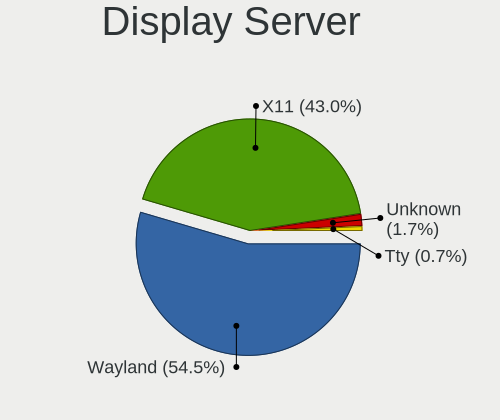
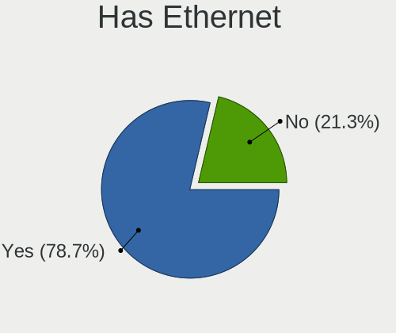
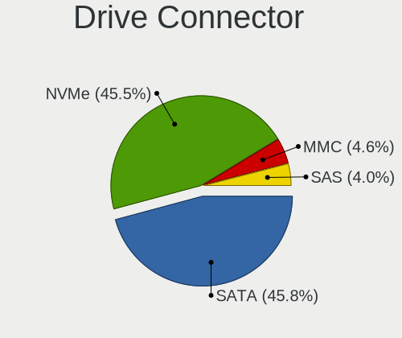
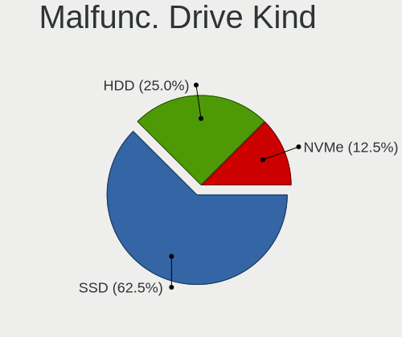
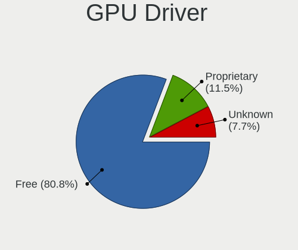
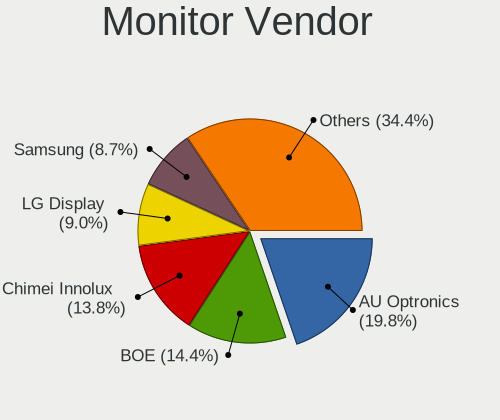
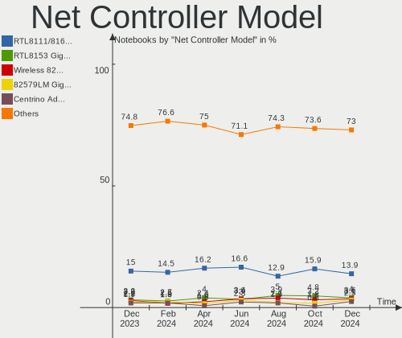
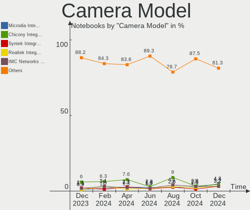
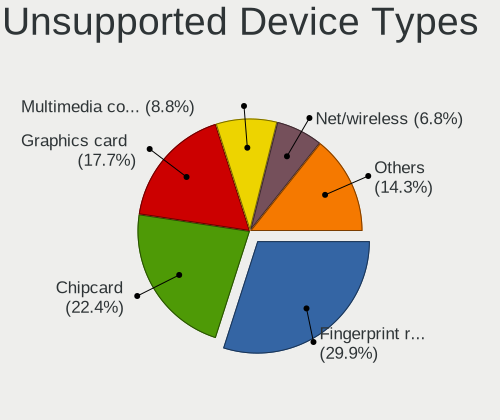

Linux in Germany - Hardware Trends (Notebooks)
----------------------------------------------

A project to identify most popular hardware characteristics and track their change
over time based on data collected by Linux users at https://Linux-Hardware.org.

Anyone can contribute to this report by the [hw-probe](https://github.com/linuxhw/hw-probe) tool:

    sudo -E hw-probe -all -upload

Period: Jul, 2023.

Contents
--------

* [ System ](#system)
  - [ OS                       ](#os)
  - [ OS Family                ](#os-family)
  - [ Kernel                   ](#kernel)
  - [ Kernel Family            ](#kernel-family)
  - [ Kernel Major Ver.        ](#kernel-major-ver)
  - [ Arch                     ](#arch)
  - [ DE                       ](#de)
  - [ Display Server           ](#display-server)
  - [ Display Manager          ](#display-manager)
  - [ OS Lang                  ](#os-lang)
  - [ Boot Mode                ](#boot-mode)
  - [ Filesystem               ](#filesystem)
  - [ Part. scheme             ](#part-scheme)
  - [ Dual Boot with Linux/BSD ](#dual-boot-with-linuxbsd)
  - [ Dual Boot (Win)          ](#dual-boot-win)

* [ Board ](#board)
  - [ Vendor                   ](#vendor)
  - [ Model                    ](#model)
  - [ Model Family             ](#model-family)
  - [ MFG Year                 ](#mfg-year)
  - [ Form Factor              ](#form-factor)
  - [ Secure Boot              ](#secure-boot)
  - [ Coreboot                 ](#coreboot)
  - [ RAM Size                 ](#ram-size)
  - [ RAM Used                 ](#ram-used)
  - [ Total Drives             ](#total-drives)
  - [ Has CD-ROM               ](#has-cd-rom)
  - [ Has Ethernet             ](#has-ethernet)
  - [ Has WiFi                 ](#has-wifi)
  - [ Has Bluetooth            ](#has-bluetooth)

* [ Location ](#location)
  - [ Country                  ](#country)
  - [ City                     ](#city)

* [ Drives ](#drives)
  - [ Drive Vendor             ](#drive-vendor)
  - [ Drive Model              ](#drive-model)
  - [ HDD Vendor               ](#hdd-vendor)
  - [ SSD Vendor               ](#ssd-vendor)
  - [ Drive Kind               ](#drive-kind)
  - [ Drive Connector          ](#drive-connector)
  - [ Drive Size               ](#drive-size)
  - [ Space Total              ](#space-total)
  - [ Space Used               ](#space-used)
  - [ Malfunc. Drives          ](#malfunc-drives)
  - [ Malfunc. Drive Vendor    ](#malfunc-drive-vendor)
  - [ Malfunc. HDD Vendor      ](#malfunc-hdd-vendor)
  - [ Malfunc. Drive Kind      ](#malfunc-drive-kind)
  - [ Failed Drives            ](#failed-drives)
  - [ Failed Drive Vendor      ](#failed-drive-vendor)
  - [ Drive Status             ](#drive-status)

* [ Storage controller ](#storage-controller)
  - [ Storage Vendor           ](#storage-vendor)
  - [ Storage Model            ](#storage-model)
  - [ Storage Kind             ](#storage-kind)

* [ Processor ](#processor)
  - [ CPU Vendor               ](#cpu-vendor)
  - [ CPU Model                ](#cpu-model)
  - [ CPU Model Family         ](#cpu-model-family)
  - [ CPU Cores                ](#cpu-cores)
  - [ CPU Sockets              ](#cpu-sockets)
  - [ CPU Threads              ](#cpu-threads)
  - [ CPU Op-Modes             ](#cpu-op-modes)
  - [ CPU Microcode            ](#cpu-microcode)
  - [ CPU Microarch            ](#cpu-microarch)

* [ Graphics ](#graphics)
  - [ GPU Vendor               ](#gpu-vendor)
  - [ GPU Model                ](#gpu-model)
  - [ GPU Combo                ](#gpu-combo)
  - [ GPU Driver               ](#gpu-driver)
  - [ GPU Memory               ](#gpu-memory)

* [ Monitor ](#monitor)
  - [ Monitor Vendor           ](#monitor-vendor)
  - [ Monitor Model            ](#monitor-model)
  - [ Monitor Resolution       ](#monitor-resolution)
  - [ Monitor Diagonal         ](#monitor-diagonal)
  - [ Monitor Width            ](#monitor-width)
  - [ Aspect Ratio             ](#aspect-ratio)
  - [ Monitor Area             ](#monitor-area)
  - [ Pixel Density            ](#pixel-density)
  - [ Multiple Monitors        ](#multiple-monitors)

* [ Network ](#network)
  - [ Net Controller Vendor    ](#net-controller-vendor)
  - [ Net Controller Model     ](#net-controller-model)
  - [ Wireless Vendor          ](#wireless-vendor)
  - [ Wireless Model           ](#wireless-model)
  - [ Ethernet Vendor          ](#ethernet-vendor)
  - [ Ethernet Model           ](#ethernet-model)
  - [ Net Controller Kind      ](#net-controller-kind)
  - [ Used Controller          ](#used-controller)
  - [ NICs                     ](#nics)
  - [ IPv6                     ](#ipv6)

* [ Bluetooth ](#bluetooth)
  - [ Bluetooth Vendor         ](#bluetooth-vendor)
  - [ Bluetooth Model          ](#bluetooth-model)

* [ Sound ](#sound)
  - [ Sound Vendor             ](#sound-vendor)
  - [ Sound Model              ](#sound-model)

* [ Memory ](#memory)
  - [ Memory Vendor            ](#memory-vendor)
  - [ Memory Model             ](#memory-model)
  - [ Memory Kind              ](#memory-kind)
  - [ Memory Form Factor       ](#memory-form-factor)
  - [ Memory Size              ](#memory-size)
  - [ Memory Speed             ](#memory-speed)

* [ Printers & scanners ](#printers--scanners)
  - [ Printer Vendor           ](#printer-vendor)
  - [ Printer Model            ](#printer-model)
  - [ Scanner Vendor           ](#scanner-vendor)
  - [ Scanner Model            ](#scanner-model)

* [ Camera ](#camera)
  - [ Camera Vendor            ](#camera-vendor)
  - [ Camera Model             ](#camera-model)

* [ Security ](#security)
  - [ Fingerprint Vendor       ](#fingerprint-vendor)
  - [ Fingerprint Model        ](#fingerprint-model)
  - [ Chipcard Vendor          ](#chipcard-vendor)
  - [ Chipcard Model           ](#chipcard-model)

* [ Unsupported ](#unsupported)
  - [ Unsupported Devices      ](#unsupported-devices)
  - [ Unsupported Device Types ](#unsupported-device-types)

System
------

OS
--

Installed operating systems

| Name                         | Notebooks | Percent |
|------------------------------|-----------|---------|
| Ubuntu 22.04                 | 30        | 10.79%  |
| Linux Mint 21.1              | 26        | 9.35%   |
| Linux Mint 21.2              | 23        | 8.27%   |
| Fedora 38                    | 23        | 8.27%   |
| Ubuntu 23.04                 | 18        | 6.47%   |
| Arch Rolling                 | 15        | 5.4%    |
| Debian 12                    | 12        | 4.32%   |
| Kubuntu 22.04                | 9         | 3.24%   |
| Manjaro                      | 8         | 2.88%   |
| OpenMandriva 23.07           | 6         | 2.16%   |
| OpenMandriva 23.03           | 6         | 2.16%   |
| Manjaro 23.0.0               | 6         | 2.16%   |
| Debian 11                    | 6         | 2.16%   |
| Xero Rolling                 | 5         | 1.8%    |
| Pop!_OS 22.04                | 5         | 1.8%    |
| KDE neon 22.04               | 5         | 1.8%    |
| EndeavourOS Rolling          | 5         | 1.8%    |
| Xubuntu 22.04                | 4         | 1.44%   |
| TUXEDO OS 22.04              | 4         | 1.44%   |
| openSUSE Tumbleweed-XXXXXXXX | 4         | 1.44%   |
| openSUSE Leap-15.5           | 4         | 1.44%   |
| ArcoLinux Rolling            | 4         | 1.44%   |
| Zorin 16                     | 3         | 1.08%   |
| Ubuntu Budgie 22.04          | 3         | 1.08%   |
| LMDE 5                       | 3         | 1.08%   |
| Ubuntu 22.10                 | 2         | 0.72%   |
| ROSA 12.4                    | 2         | 0.72%   |
| OpenMandriva 4.3             | 2         | 0.72%   |
| Linux Mint 20.3              | 2         | 0.72%   |
| Linux Mint 20                | 2         | 0.72%   |
| Kubuntu 23.04                | 2         | 0.72%   |
| Kali 2023.2                  | 2         | 0.72%   |
| Fedora 37                    | 2         | 0.72%   |
| Elementary 7                 | 2         | 0.72%   |
| Debian                       | 2         | 0.72%   |
| Ultramarine 38               | 1         | 0.36%   |
| Ubuntu Unity 22.04           | 1         | 0.36%   |
| Ubuntu MATE 20.04            | 1         | 0.36%   |
| Trisquel 11.0                | 1         | 0.36%   |
| SteamOS 3.4.8                | 1         | 0.36%   |

OS Family
---------

OS without a version

| Name          | Notebooks | Percent |
|---------------|-----------|---------|
| Linux Mint    | 54        | 19.42%  |
| Ubuntu        | 50        | 17.99%  |
| Fedora        | 25        | 8.99%   |
| Debian        | 20        | 7.19%   |
| OpenMandriva  | 16        | 5.76%   |
| Arch          | 15        | 5.4%    |
| Manjaro       | 14        | 5.04%   |
| Kubuntu       | 11        | 3.96%   |
| openSUSE      | 9         | 3.24%   |
| Xero          | 5         | 1.8%    |
| Pop!_OS       | 5         | 1.8%    |
| KDE neon      | 5         | 1.8%    |
| EndeavourOS   | 5         | 1.8%    |
| Xubuntu       | 4         | 1.44%   |
| TUXEDO OS     | 4         | 1.44%   |
| ArcoLinux     | 4         | 1.44%   |
| Zorin         | 3         | 1.08%   |
| Ubuntu Budgie | 3         | 1.08%   |
| LMDE          | 3         | 1.08%   |
| Elementary    | 3         | 1.08%   |
| ROSA          | 2         | 0.72%   |
| Kali          | 2         | 0.72%   |
| Gentoo        | 2         | 0.72%   |
| Ultramarine   | 1         | 0.36%   |
| Ubuntu Unity  | 1         | 0.36%   |
| Ubuntu MATE   | 1         | 0.36%   |
| Trisquel      | 1         | 0.36%   |
| SteamOS       | 1         | 0.36%   |
| Q4OS          | 1         | 0.36%   |
| Parrot        | 1         | 0.36%   |
| Nobara        | 1         | 0.36%   |
| Lubuntu       | 1         | 0.36%   |
| Linux Lite    | 1         | 0.36%   |
| Devuan        | 1         | 0.36%   |
| Clear Linux   | 1         | 0.36%   |
| Axyl          | 1         | 0.36%   |
| Alpine        | 1         | 0.36%   |

Kernel
------

Version of the Linux kernel

| Version                     | Notebooks | Percent |
|-----------------------------|-----------|---------|
| 5.19.0-46-generic           | 39        | 14.03%  |
| 5.15.0-76-generic           | 38        | 13.67%  |
| 5.15.0-78-generic           | 14        | 5.04%   |
| 6.2.0-25-generic            | 9         | 3.24%   |
| 6.1.0-10-amd64              | 9         | 3.24%   |
| 6.3.8-200.fc38.x86_64       | 8         | 2.88%   |
| 5.19.0-50-generic           | 8         | 2.88%   |
| 5.10.0-23-amd64             | 8         | 2.88%   |
| 6.3.12-200.fc38.x86_64      | 7         | 2.52%   |
| 6.3.5-desktop-3omv2390      | 6         | 2.16%   |
| 6.2.6-desktop-1omv2390      | 6         | 2.16%   |
| 6.2.0-24-generic            | 6         | 2.16%   |
| 6.4.3-arch1-2               | 5         | 1.8%    |
| 6.3.9-arch1-1               | 4         | 1.44%   |
| 6.1.31-2-MANJARO            | 4         | 1.44%   |
| 6.4.6-200.fc38.x86_64       | 3         | 1.08%   |
| 6.4.4-arch1-1               | 3         | 1.08%   |
| 6.3.9-1-default             | 3         | 1.08%   |
| 6.2.6-76060206-generic      | 3         | 1.08%   |
| 6.1.38-1-MANJARO            | 3         | 1.08%   |
| 5.4.0-153-generic           | 3         | 1.08%   |
| 5.19.0-32-generic           | 3         | 1.08%   |
| 6.4.7-arch1-1               | 2         | 0.72%   |
| 6.4.4-200.fc38.x86_64       | 2         | 0.72%   |
| 6.4.3-arch1-1               | 2         | 0.72%   |
| 6.4.2-arch1-1               | 2         | 0.72%   |
| 6.4.2-3-MANJARO             | 2         | 0.72%   |
| 6.3.8-100.fc37.x86_64       | 2         | 0.72%   |
| 6.2.9-300.fc38.x86_64       | 2         | 0.72%   |
| 6.2.0-26-generic            | 2         | 0.72%   |
| 6.2.0-23-generic            | 2         | 0.72%   |
| 6.2.0-10011-tuxedo          | 2         | 0.72%   |
| 6.2.0-10010-tuxedo          | 2         | 0.72%   |
| 6.1.39-1-lts                | 2         | 0.72%   |
| 6.1.38-1-lts                | 2         | 0.72%   |
| 5.15.0-71-generic           | 2         | 0.72%   |
| 5.14.21-150500.55.7-default | 2         | 0.72%   |
| 5.14.21-150500.53-default   | 2         | 0.72%   |
| 5.10.0-12-amd64             | 2         | 0.72%   |
| 6.4.6-060406-generic        | 1         | 0.36%   |

Kernel Family
-------------

Linux kernel without a distro release

| Version  | Notebooks | Percent |
|----------|-----------|---------|
| 5.15.0   | 59        | 21.22%  |
| 5.19.0   | 51        | 18.35%  |
| 6.2.0    | 26        | 9.35%   |
| 6.1.0    | 14        | 5.04%   |
| 6.3.8    | 11        | 3.96%   |
| 5.10.0   | 10        | 3.6%    |
| 6.4.3    | 9         | 3.24%   |
| 6.2.6    | 9         | 3.24%   |
| 6.3.12   | 8         | 2.88%   |
| 6.4.2    | 7         | 2.52%   |
| 6.3.9    | 7         | 2.52%   |
| 6.1.38   | 7         | 2.52%   |
| 6.4.4    | 6         | 2.16%   |
| 6.3.5    | 6         | 2.16%   |
| 5.4.0    | 5         | 1.8%    |
| 5.14.21  | 5         | 1.8%    |
| 6.4.6    | 4         | 1.44%   |
| 6.1.31   | 4         | 1.44%   |
| 6.3.0    | 3         | 1.08%   |
| 6.1.39   | 3         | 1.08%   |
| 6.4.7    | 2         | 0.72%   |
| 6.4.1    | 2         | 0.72%   |
| 6.4.0    | 2         | 0.72%   |
| 6.2.9    | 2         | 0.72%   |
| 6.4.5    | 1         | 0.36%   |
| 6.3.4    | 1         | 0.36%   |
| 6.3.11   | 1         | 0.36%   |
| 6.2.16   | 1         | 0.36%   |
| 6.2.15   | 1         | 0.36%   |
| 6.1.41   | 1         | 0.36%   |
| 6.1.20   | 1         | 0.36%   |
| 6.1.1    | 1         | 0.36%   |
| 6.0.0    | 1         | 0.36%   |
| 5.18.19  | 1         | 0.36%   |
| 5.16.7   | 1         | 0.36%   |
| 5.16.13  | 1         | 0.36%   |
| 5.15.59  | 1         | 0.36%   |
| 5.15.114 | 1         | 0.36%   |
| 5.13.0   | 1         | 0.36%   |
| 5.10.14  | 1         | 0.36%   |

Kernel Major Ver.
-----------------

Linux kernel major version

| Version | Notebooks | Percent |
|---------|-----------|---------|
| 5.15    | 61        | 21.94%  |
| 5.19    | 51        | 18.35%  |
| 6.2     | 39        | 14.03%  |
| 6.3     | 37        | 13.31%  |
| 6.4     | 33        | 11.87%  |
| 6.1     | 31        | 11.15%  |
| 5.10    | 11        | 3.96%   |
| 5.4     | 5         | 1.8%    |
| 5.14    | 5         | 1.8%    |
| 5.16    | 2         | 0.72%   |
| 6.0     | 1         | 0.36%   |
| 5.18    | 1         | 0.36%   |
| 5.13    | 1         | 0.36%   |

Arch
----

OS architecture (x86_64, i586, etc.)

| Name   | Notebooks | Percent |
|--------|-----------|---------|
| x86_64 | 277       | 99.64%  |
| i686   | 1         | 0.36%   |

DE
--

Desktop Environment

| Name       | Notebooks | Percent |
|------------|-----------|---------|
| GNOME      | 99        | 35.61%  |
| KDE5       | 73        | 26.26%  |
| X-Cinnamon | 48        | 17.27%  |
| XFCE       | 23        | 8.27%   |
| Unknown    | 8         | 2.88%   |
| MATE       | 7         | 2.52%   |
| Pantheon   | 4         | 1.44%   |
| Cinnamon   | 3         | 1.08%   |
| Budgie     | 3         | 1.08%   |
| LXQt       | 2         | 0.72%   |
| i3         | 2         | 0.72%   |
| Unity      | 1         | 0.36%   |
| river      | 1         | 0.36%   |
| LeftWM     | 1         | 0.36%   |
| KDE        | 1         | 0.36%   |
| Hyprland   | 1         | 0.36%   |
| awesome    | 1         | 0.36%   |

Display Server
--------------

X11 or Wayland

| Name    | Notebooks | Percent |
|---------|-----------|---------|
| X11     | 184       | 66.19%  |
| Wayland | 86        | 30.94%  |
| Tty     | 5         | 1.8%    |
| Unknown | 3         | 1.08%   |

Display Manager
---------------

SDDM, LightDM, etc.

| Name    | Notebooks | Percent |
|---------|-----------|---------|
| Unknown | 105       | 37.77%  |
| LightDM | 58        | 20.86%  |
| SDDM    | 50        | 17.99%  |
| GDM3    | 50        | 17.99%  |
| GDM     | 12        | 4.32%   |
| SLiM    | 1         | 0.36%   |
| LY-DM   | 1         | 0.36%   |
| Ly      | 1         | 0.36%   |

OS Lang
-------

Language

| Lang    | Notebooks | Percent |
|---------|-----------|---------|
| de_DE   | 197       | 70.86%  |
| en_US   | 51        | 18.35%  |
| en_GB   | 11        | 3.96%   |
| ru_RU   | 4         | 1.44%   |
| en_DE   | 3         | 1.08%   |
| C       | 3         | 1.08%   |
| it_IT   | 2         | 0.72%   |
| Unknown | 2         | 0.72%   |
| ru_UA   | 1         | 0.36%   |
| pl_PL   | 1         | 0.36%   |
| eo      | 1         | 0.36%   |
| en_DK   | 1         | 0.36%   |
| en_CA   | 1         | 0.36%   |

Boot Mode
---------

EFI or BIOS

| Mode | Notebooks | Percent |
|------|-----------|---------|
| EFI  | 140       | 50.36%  |
| BIOS | 138       | 49.64%  |

Filesystem
----------

Type of filesystem

| Type    | Notebooks | Percent |
|---------|-----------|---------|
| Ext4    | 163       | 58.63%  |
| Btrfs   | 48        | 17.27%  |
| Tmpfs   | 43        | 15.47%  |
| Overlay | 15        | 5.4%    |
| Xfs     | 5         | 1.8%    |
| Zfs     | 3         | 1.08%   |
| Unknown | 1         | 0.36%   |

Part. scheme
------------

Scheme of partitioning

| Type    | Notebooks | Percent |
|---------|-----------|---------|
| GPT     | 154       | 55.4%   |
| Unknown | 100       | 35.97%  |
| MBR     | 24        | 8.63%   |

Dual Boot with Linux/BSD
------------------------

Hosting more than one Linux/BSD

| Dual boot | Notebooks | Percent |
|-----------|-----------|---------|
| No        | 254       | 91.37%  |
| Yes       | 24        | 8.63%   |

Dual Boot (Win)
---------------

Hosting Linux and Windows

| Dual boot | Notebooks | Percent |
|-----------|-----------|---------|
| No        | 214       | 76.98%  |
| Yes       | 64        | 23.02%  |

Board
-----

Vendor
------

Motherboard manufacturer

| Name                | Notebooks | Percent |
|---------------------|-----------|---------|
| Lenovo              | 68        | 24.46%  |
| Hewlett-Packard     | 44        | 15.83%  |
| Dell                | 26        | 9.35%   |
| Acer                | 26        | 9.35%   |
| ASUSTek Computer    | 25        | 8.99%   |
| Fujitsu             | 19        | 6.83%   |
| Apple               | 15        | 5.4%    |
| TUXEDO              | 12        | 4.32%   |
| Medion              | 8         | 2.88%   |
| HUAWEI              | 6         | 2.16%   |
| MSI                 | 5         | 1.8%    |
| Toshiba             | 3         | 1.08%   |
| Valve               | 2         | 0.72%   |
| Sony                | 2         | 0.72%   |
| Schenker            | 2         | 0.72%   |
| Packard Bell        | 2         | 0.72%   |
| Fujitsu Siemens     | 2         | 0.72%   |
| Wortmann AG         | 1         | 0.36%   |
| VALE                | 1         | 0.36%   |
| Thomson             | 1         | 0.36%   |
| Samsung Electronics | 1         | 0.36%   |
| Panasonic           | 1         | 0.36%   |
| Lex BayTrail        | 1         | 0.36%   |
| Gigabyte Technology | 1         | 0.36%   |
| ECT                 | 1         | 0.36%   |
| Chuwi               | 1         | 0.36%   |
| Aava Mobile Oy      | 1         | 0.36%   |
| Unknown             | 1         | 0.36%   |

Model
-----

Motherboard model

| Name                               | Notebooks | Percent |
|------------------------------------|-----------|---------|
| TUXEDO InfinityBook S 15/17 Gen7   | 3         | 1.08%   |
| Lenovo G50-70 20351                | 3         | 1.08%   |
| Fujitsu LIFEBOOK A3510             | 3         | 1.08%   |
| Valve Jupiter                      | 2         | 0.72%   |
| TUXEDO Pulse 15 Gen1               | 2         | 0.72%   |
| Lenovo IdeaPad 100-15IBY 80MJ      | 2         | 0.72%   |
| Lenovo G550 2958                   | 2         | 0.72%   |
| HP Pavilion 17                     | 2         | 0.72%   |
| HP Pavilion 15                     | 2         | 0.72%   |
| HP OMEN Laptop 15-en0xxx           | 2         | 0.72%   |
| HP G62                             | 2         | 0.72%   |
| HP EliteBook 840 G3                | 2         | 0.72%   |
| HP EliteBook 2540p                 | 2         | 0.72%   |
| Fujitsu LIFEBOOK E780              | 2         | 0.72%   |
| Fujitsu LIFEBOOK A544              | 2         | 0.72%   |
| Dell Latitude E7270                | 2         | 0.72%   |
| Dell Latitude E6230                | 2         | 0.72%   |
| ASUS X555LAB                       | 2         | 0.72%   |
| Apple MacBookPro8,1                | 2         | 0.72%   |
| Apple MacBookPro11,1               | 2         | 0.72%   |
| Acer Aspire E5-774G                | 2         | 0.72%   |
| Acer Aspire A517-52                | 2         | 0.72%   |
| Unknown                            | 2         | 0.72%   |
| Wortmann AG 1220624_1470150        | 1         | 0.36%   |
| VALE Notebook Classic C140         | 1         | 0.36%   |
| TUXEDO Polaris 15 AMD Gen1         | 1         | 0.36%   |
| TUXEDO N7x0WU                      | 1         | 0.36%   |
| TUXEDO InfinityBook Pro Gen7 (MK1) | 1         | 0.36%   |
| TUXEDO InfinityBook Pro 14 Gen6    | 1         | 0.36%   |
| TUXEDO Book XUX7 Gen13             | 1         | 0.36%   |
| TUXEDO Aura 15 Gen1                | 1         | 0.36%   |
| Toshiba TECRA A50-A                | 1         | 0.36%   |
| Toshiba Satellite L755             | 1         | 0.36%   |
| Toshiba Satellite C850-1MN         | 1         | 0.36%   |
| Thomson GEN15C8SL256               | 1         | 0.36%   |
| Sony VPCEA1AGG                     | 1         | 0.36%   |
| Sony SVF1521B4E                    | 1         | 0.36%   |
| Schenker XMG NEO (CML/E20)         | 1         | 0.36%   |
| Schenker VIA 15 Pro                | 1         | 0.36%   |
| Samsung R780                       | 1         | 0.36%   |

Model Family
------------

Motherboard model prefix

| Name                | Notebooks | Percent |
|---------------------|-----------|---------|
| Lenovo ThinkPad     | 43        | 15.47%  |
| Acer Aspire         | 19        | 6.83%   |
| Fujitsu LIFEBOOK    | 18        | 6.47%   |
| Dell Latitude       | 16        | 5.76%   |
| Lenovo IdeaPad      | 12        | 4.32%   |
| HP EliteBook        | 12        | 4.32%   |
| HP Laptop           | 9         | 3.24%   |
| HP Pavilion         | 6         | 2.16%   |
| TUXEDO InfinityBook | 5         | 1.8%    |
| HP 255              | 4         | 1.44%   |
| Apple MacBookPro11  | 4         | 1.44%   |
| Medion Akoya        | 3         | 1.08%   |
| Lenovo G50-70       | 3         | 1.08%   |
| HP ProBook          | 3         | 1.08%   |
| HP OMEN             | 3         | 1.08%   |
| Dell XPS            | 3         | 1.08%   |
| Dell Inspiron       | 3         | 1.08%   |
| ASUS ZenBook        | 3         | 1.08%   |
| ASUS ASUS           | 3         | 1.08%   |
| Apple MacBookPro8   | 3         | 1.08%   |
| Apple MacBookPro5   | 3         | 1.08%   |
| Valve Jupiter       | 2         | 0.72%   |
| TUXEDO Pulse        | 2         | 0.72%   |
| Toshiba Satellite   | 2         | 0.72%   |
| Lenovo G550         | 2         | 0.72%   |
| HP G62              | 2         | 0.72%   |
| HP Compaq           | 2         | 0.72%   |
| Dell Precision      | 2         | 0.72%   |
| ASUS X555LAB        | 2         | 0.72%   |
| ASUS VivoBook       | 2         | 0.72%   |
| Acer Swift          | 2         | 0.72%   |
| Acer Nitro          | 2         | 0.72%   |
| Unknown             | 2         | 0.72%   |
| Wortmann AG 1220624 | 1         | 0.36%   |
| VALE Notebook       | 1         | 0.36%   |
| TUXEDO Polaris      | 1         | 0.36%   |
| TUXEDO N7x0WU       | 1         | 0.36%   |
| TUXEDO Book         | 1         | 0.36%   |
| TUXEDO Aura         | 1         | 0.36%   |
| Toshiba TECRA       | 1         | 0.36%   |

MFG Year
--------

Motherboard manufacture year

| Year | Notebooks | Percent |
|------|-----------|---------|
| 2022 | 31        | 11.15%  |
| 2020 | 30        | 10.79%  |
| 2021 | 26        | 9.35%   |
| 2010 | 21        | 7.55%   |
| 2018 | 20        | 7.19%   |
| 2013 | 20        | 7.19%   |
| 2015 | 17        | 6.12%   |
| 2017 | 16        | 5.76%   |
| 2012 | 16        | 5.76%   |
| 2016 | 15        | 5.4%    |
| 2011 | 15        | 5.4%    |
| 2019 | 14        | 5.04%   |
| 2014 | 12        | 4.32%   |
| 2023 | 9         | 3.24%   |
| 2009 | 7         | 2.52%   |
| 2008 | 5         | 1.8%    |
| 2007 | 2         | 0.72%   |
| 2006 | 2         | 0.72%   |

Form Factor
-----------

Physical design of the computer

| Name     | Notebooks | Percent |
|----------|-----------|---------|
| Notebook | 278       | 100%    |

Secure Boot
-----------

Enabled or disabled

| State    | Notebooks | Percent |
|----------|-----------|---------|
| Disabled | 255       | 91.73%  |
| Enabled  | 23        | 8.27%   |

Coreboot
--------

Have coreboot on board

| Used | Notebooks | Percent |
|------|-----------|---------|
| No   | 277       | 99.64%  |
| Yes  | 1         | 0.36%   |

RAM Size
--------

Total RAM memory

| Size in GB  | Notebooks | Percent |
|-------------|-----------|---------|
| 4.01-8.0    | 92        | 33.09%  |
| 16.01-24.0  | 52        | 18.71%  |
| 3.01-4.0    | 47        | 16.91%  |
| 8.01-16.0   | 38        | 13.67%  |
| 32.01-64.0  | 34        | 12.23%  |
| 24.01-32.0  | 5         | 1.8%    |
| 64.01-256.0 | 5         | 1.8%    |
| 1.01-2.0    | 4         | 1.44%   |
| 0.51-1.0    | 1         | 0.36%   |

RAM Used
--------

Used RAM memory

| Used GB    | Notebooks | Percent |
|------------|-----------|---------|
| 1.01-2.0   | 110       | 39.57%  |
| 2.01-3.0   | 50        | 17.99%  |
| 4.01-8.0   | 49        | 17.63%  |
| 3.01-4.0   | 44        | 15.83%  |
| 8.01-16.0  | 15        | 5.4%    |
| 0.51-1.0   | 4         | 1.44%   |
| 0.01-0.5   | 3         | 1.08%   |
| 16.01-24.0 | 2         | 0.72%   |
| 24.01-32.0 | 1         | 0.36%   |

Total Drives
------------

Number of drives on board

| Drives | Notebooks | Percent |
|--------|-----------|---------|
| 1      | 204       | 73.38%  |
| 2      | 64        | 23.02%  |
| 3      | 6         | 2.16%   |
| 4      | 2         | 0.72%   |
| 0      | 2         | 0.72%   |

Has CD-ROM
----------

Has CD-ROM on board

| Presented | Notebooks | Percent |
|-----------|-----------|---------|
| No        | 183       | 65.83%  |
| Yes       | 95        | 34.17%  |

Has Ethernet
------------

Has Ethernet on board

| Presented | Notebooks | Percent |
|-----------|-----------|---------|
| Yes       | 227       | 81.65%  |
| No        | 51        | 18.35%  |

Has WiFi
--------

Has WiFi module

| Presented | Notebooks | Percent |
|-----------|-----------|---------|
| Yes       | 273       | 98.2%   |
| No        | 5         | 1.8%    |

Has Bluetooth
-------------

Has Bluetooth module

| Presented | Notebooks | Percent |
|-----------|-----------|---------|
| Yes       | 229       | 82.37%  |
| No        | 49        | 17.63%  |

Location
--------

Country
-------

Geographic location (country)

| Country | Notebooks | Percent |
|---------|-----------|---------|
| Germany | 278       | 100%    |

City
----

Geographic location (city)

| City               | Notebooks | Percent |
|--------------------|-----------|---------|
| Berlin             | 29        | 10.43%  |
| Munich             | 11        | 3.96%   |
| Hamburg            | 9         | 3.24%   |
| Cologne            | 8         | 2.88%   |
| Leipzig            | 7         | 2.52%   |
| Frankfurt am Main  | 6         | 2.16%   |
| Ulm                | 5         | 1.8%    |
| Dresden            | 5         | 1.8%    |
| Bonn               | 5         | 1.8%    |
| Schwäbisch Gmünd | 4         | 1.44%   |
| Mannheim           | 4         | 1.44%   |
| Kiel               | 4         | 1.44%   |
| Karlsruhe          | 4         | 1.44%   |
| Hanover            | 4         | 1.44%   |
| Essen              | 4         | 1.44%   |
| Bremen             | 4         | 1.44%   |
| Bielefeld          | 4         | 1.44%   |
| Wiesbaden          | 3         | 1.08%   |
| Nuremberg          | 3         | 1.08%   |
| Gelsenkirchen      | 3         | 1.08%   |
| Düsseldorf        | 3         | 1.08%   |
| Dortmund           | 3         | 1.08%   |
| Bochum             | 3         | 1.08%   |
| Wyk auf Foehr      | 2         | 0.72%   |
| Wegberg            | 2         | 0.72%   |
| Reutlingen         | 2         | 0.72%   |
| Regensburg         | 2         | 0.72%   |
| Ravensburg         | 2         | 0.72%   |
| Pforzheim          | 2         | 0.72%   |
| Oberursel          | 2         | 0.72%   |
| Neumünster        | 2         | 0.72%   |
| Mainz              | 2         | 0.72%   |
| Lüdenscheid       | 2         | 0.72%   |
| Lübeck            | 2         | 0.72%   |
| Koblenz            | 2         | 0.72%   |
| Hildesheim         | 2         | 0.72%   |
| Erfurt             | 2         | 0.72%   |
| Brilon             | 2         | 0.72%   |
| Bornheim           | 2         | 0.72%   |
| Bamberg            | 2         | 0.72%   |

Drives
------

Drive Vendor
------------

Hard drive vendors

| Vendor                       | Notebooks | Drives | Percent |
|------------------------------|-----------|--------|---------|
| Samsung Electronics          | 86        | 96     | 25.37%  |
| WDC                          | 34        | 34     | 10.03%  |
| Toshiba                      | 21        | 21     | 6.19%   |
| SanDisk                      | 20        | 22     | 5.9%    |
| Seagate                      | 19        | 19     | 5.6%    |
| Micron Technology            | 19        | 19     | 5.6%    |
| Crucial                      | 14        | 14     | 4.13%   |
| SK hynix                     | 13        | 13     | 3.83%   |
| Intel                        | 12        | 12     | 3.54%   |
| Unknown                      | 11        | 11     | 3.24%   |
| Kingston                     | 11        | 11     | 3.24%   |
| Intenso                      | 10        | 11     | 2.95%   |
| Apple                        | 6         | 6      | 1.77%   |
| Unknown                      | 6         | 6      | 1.77%   |
| Hitachi                      | 5         | 5      | 1.47%   |
| Micron/Crucial Technology    | 4         | 4      | 1.18%   |
| KIOXIA                       | 4         | 4      | 1.18%   |
| A-DATA Technology            | 4         | 4      | 1.18%   |
| Silicon Motion               | 3         | 3      | 0.88%   |
| Phison                       | 3         | 3      | 0.88%   |
| LITEON                       | 3         | 3      | 0.88%   |
| HGST                         | 3         | 3      | 0.88%   |
| Verbatim                     | 2         | 2      | 0.59%   |
| Union Memory (Shenzhen)      | 2         | 2      | 0.59%   |
| Transcend                    | 2         | 2      | 0.59%   |
| Phison Electronics           | 2         | 2      | 0.59%   |
| Kingston Technology Company  | 2         | 2      | 0.59%   |
| JMicron Technology           | 2         | 2      | 0.59%   |
| China                        | 2         | 2      | 0.59%   |
| WODPOSIT                     | 1         | 2      | 0.29%   |
| SPCC                         | 1         | 1      | 0.29%   |
| Shenzhen Longsys Electronics | 1         | 1      | 0.29%   |
| Seagate Technology           | 1         | 1      | 0.29%   |
| OCZ                          | 1         | 1      | 0.29%   |
| Netac                        | 1         | 1      | 0.29%   |
| KBG40ZNV                     | 1         | 1      | 0.29%   |
| JetFlash                     | 1         | 1      | 0.29%   |
| GOODRAM                      | 1         | 1      | 0.29%   |
| GLOWAY                       | 1         | 1      | 0.29%   |
| Emtec                        | 1         | 1      | 0.29%   |

Drive Model
-----------

Hard drive models

| Model                                                 | Notebooks | Percent |
|-------------------------------------------------------|-----------|---------|
| Samsung NVMe SSD Controller SM981/PM981/PM983 500GB   | 17        | 4.97%   |
| Samsung NVMe SSD Controller PM9A1/PM9A3/980PRO 1TB    | 6         | 1.75%   |
| Unknown                                               | 6         | 1.75%   |
| Toshiba MQ01ABD100 1TB                                | 5         | 1.46%   |
| Samsung SSD 850 EVO 250GB                             | 4         | 1.17%   |
| WDC WD5000LPCX-24C6HT0 500GB                          | 3         | 0.88%   |
| Unknown MMC Card  64GB                                | 3         | 0.88%   |
| Toshiba MQ01ABF050 500GB                              | 3         | 0.88%   |
| Seagate ST1000LM035-1RK172 1TB                        | 3         | 0.88%   |
| Sandisk WD Black SN750 / PC SN730 NVMe SSD 1024GB     | 3         | 0.88%   |
| Samsung SSD 980 1TB                                   | 3         | 0.88%   |
| Samsung SSD 870 QVO 1TB                               | 3         | 0.88%   |
| Samsung SSD 850 EVO 500GB                             | 3         | 0.88%   |
| Samsung PSSD T7 1TB                                   | 3         | 0.88%   |
| Micron/Crucial P2 NVMe PCIe SSD 1TB                   | 3         | 0.88%   |
| Crucial CT500MX500SSD1 500GB                          | 3         | 0.88%   |
| WDC WDS500G2B0A-00SM50 500GB SSD                      | 2         | 0.58%   |
| WDC WD10JPVX-22JC3T0 1TB                              | 2         | 0.58%   |
| WDC PC SN720 SDAPNTW-512G-1014 512GB                  | 2         | 0.58%   |
| Unknown MMC Card  512GB                               | 2         | 0.58%   |
| Toshiba MK2533GSG 250GB                               | 2         | 0.58%   |
| SK hynix SKHynix_HFS001TDE9X081N 1TB                  | 2         | 0.58%   |
| SK hynix HFM512GD3JX013N 512GB                        | 2         | 0.58%   |
| Silicon Motion SM2263EN/SM2263XT SSD Controller 500GB | 2         | 0.58%   |
| Seagate ST500LT012-9WS142 500GB                       | 2         | 0.58%   |
| Seagate ST500LT012-1DG142 500GB                       | 2         | 0.58%   |
| Seagate ST1000LM024 HN-M101MBB 1TB                    | 2         | 0.58%   |
| Sandisk WD Black SN850 1TB                            | 2         | 0.58%   |
| SanDisk SSD PLUS 1000GB                               | 2         | 0.58%   |
| Samsung SSD 980 500GB                                 | 2         | 0.58%   |
| Samsung SSD 870 EVO 1TB                               | 2         | 0.58%   |
| Samsung SSD 840 EVO 250GB                             | 2         | 0.58%   |
| Samsung MZVLQ256HAJD-00007 256GB                      | 2         | 0.58%   |
| Samsung MZNLN256HCHP-00000 256GB SSD                  | 2         | 0.58%   |
| Samsung MZ7LM240HMHQ-00003 240GB SSD                  | 2         | 0.58%   |
| Micron MTFDKBA512TFK 512GB                            | 2         | 0.58%   |
| Micron 2450_MTFDKBA1T0TFK 1TB                         | 2         | 0.58%   |
| Micron 2210_MTFDHBA1T0QFD 1024GB                      | 2         | 0.58%   |
| JMicron Generic 512GB                                 | 2         | 0.58%   |
| Intenso SSD 128GB                                     | 2         | 0.58%   |

HDD Vendor
----------

Hard disk drive vendors

| Vendor              | Notebooks | Drives | Percent |
|---------------------|-----------|--------|---------|
| WDC                 | 22        | 22     | 33.33%  |
| Seagate             | 17        | 17     | 25.76%  |
| Toshiba             | 15        | 15     | 22.73%  |
| Hitachi             | 5         | 5      | 7.58%   |
| HGST                | 3         | 3      | 4.55%   |
| JMicron Technology  | 2         | 2      | 3.03%   |
| Samsung Electronics | 1         | 1      | 1.52%   |
| ASMT                | 1         | 1      | 1.52%   |

SSD Vendor
----------

Solid state drive vendors

| Vendor              | Notebooks | Drives | Percent |
|---------------------|-----------|--------|---------|
| Samsung Electronics | 43        | 46     | 33.33%  |
| Crucial             | 12        | 12     | 9.3%    |
| SanDisk             | 11        | 11     | 8.53%   |
| Intenso             | 8         | 9      | 6.2%    |
| Kingston            | 7         | 7      | 5.43%   |
| Apple               | 6         | 6      | 4.65%   |
| Intel               | 5         | 5      | 3.88%   |
| Micron Technology   | 4         | 4      | 3.1%    |
| Unknown             | 4         | 4      | 3.1%    |
| WDC                 | 3         | 3      | 2.33%   |
| LITEON              | 3         | 3      | 2.33%   |
| A-DATA Technology   | 3         | 3      | 2.33%   |
| Verbatim            | 2         | 2      | 1.55%   |
| Transcend           | 2         | 2      | 1.55%   |
| Toshiba             | 2         | 2      | 1.55%   |
| Phison              | 2         | 2      | 1.55%   |
| China               | 2         | 2      | 1.55%   |
| WODPOSIT            | 1         | 2      | 0.78%   |
| SPCC                | 1         | 1      | 0.78%   |
| SK hynix            | 1         | 1      | 0.78%   |
| OCZ                 | 1         | 1      | 0.78%   |
| Netac               | 1         | 1      | 0.78%   |
| GOODRAM             | 1         | 1      | 0.78%   |
| GLOWAY              | 1         | 1      | 0.78%   |
| Emtec               | 1         | 1      | 0.78%   |
| CT2000P3            | 1         | 1      | 0.78%   |
| Apacer              | 1         | 1      | 0.78%   |

Drive Kind
----------

HDD or SSD

| Kind    | Notebooks | Drives | Percent |
|---------|-----------|--------|---------|
| SSD     | 123       | 134    | 38.08%  |
| NVMe    | 120       | 135    | 37.15%  |
| HDD     | 63        | 66     | 19.5%   |
| MMC     | 14        | 14     | 4.33%   |
| Unknown | 3         | 4      | 0.93%   |

Drive Connector
---------------

SATA, SAS, NVMe, etc.

| Type | Notebooks | Drives | Percent |
|------|-----------|--------|---------|
| SATA | 161       | 190    | 52.1%   |
| NVMe | 120       | 134    | 38.83%  |
| SAS  | 14        | 15     | 4.53%   |
| MMC  | 14        | 14     | 4.53%   |

Drive Size
----------

Size of hard drive

| Size in TB | Notebooks | Drives | Percent |
|------------|-----------|--------|---------|
| 0.01-0.5   | 127       | 140    | 69.78%  |
| 0.51-1.0   | 48        | 52     | 26.37%  |
| 1.01-2.0   | 6         | 7      | 3.3%    |
| 3.01-4.0   | 1         | 1      | 0.55%   |

Space Total
-----------

Amount of disk space available on the file system

| Size in GB     | Notebooks | Percent |
|----------------|-----------|---------|
| 101-250        | 70        | 25.18%  |
| 251-500        | 68        | 24.46%  |
| 501-1000       | 50        | 17.99%  |
| 1001-2000      | 23        | 8.27%   |
| 1-20           | 17        | 6.12%   |
| More than 3000 | 15        | 5.4%    |
| Unknown        | 13        | 4.68%   |
| 2001-3000      | 11        | 3.96%   |
| 51-100         | 7         | 2.52%   |
| 21-50          | 4         | 1.44%   |

Space Used
----------

Amount of used disk space

| Used GB        | Notebooks | Percent |
|----------------|-----------|---------|
| 1-20           | 74        | 26.62%  |
| 21-50          | 48        | 17.27%  |
| 101-250        | 47        | 16.91%  |
| 51-100         | 41        | 14.75%  |
| 251-500        | 25        | 8.99%   |
| 501-1000       | 14        | 5.04%   |
| Unknown        | 13        | 4.68%   |
| 1001-2000      | 8         | 2.88%   |
| More than 3000 | 6         | 2.16%   |
| 2001-3000      | 2         | 0.72%   |

Malfunc. Drives
---------------

Drive models with a malfunction

| Model                           | Notebooks | Drives | Percent |
|---------------------------------|-----------|--------|---------|
| Toshiba MQ01ABD100 1TB          | 2         | 2      | 14.29%  |
| Toshiba MK2533GSG 250GB         | 2         | 2      | 14.29%  |
| HGST HTS725050A7E630 500GB      | 2         | 2      | 14.29%  |
| WDC WD5000BEKT-60KA9T0 500GB    | 1         | 1      | 7.14%   |
| WDC WD1200BEVS-07LAT0 120GB     | 1         | 1      | 7.14%   |
| Transcend TS256GSSD720 256GB    | 1         | 1      | 7.14%   |
| Toshiba MK3261GSY 320GB         | 1         | 1      | 7.14%   |
| Samsung Electronics HD154UI 1TB | 1         | 1      | 7.14%   |
| Hitachi HTS543232A7A384 320GB   | 1         | 1      | 7.14%   |
| HGST HTS721010A9E630 1TB        | 1         | 1      | 7.14%   |
| Crucial M4-CT128M4SSD2 128GB    | 1         | 1      | 7.14%   |

Malfunc. Drive Vendor
---------------------

Vendors of faulty drives

| Vendor              | Notebooks | Drives | Percent |
|---------------------|-----------|--------|---------|
| Toshiba             | 5         | 5      | 35.71%  |
| HGST                | 3         | 3      | 21.43%  |
| WDC                 | 2         | 2      | 14.29%  |
| Transcend           | 1         | 1      | 7.14%   |
| Samsung Electronics | 1         | 1      | 7.14%   |
| Hitachi             | 1         | 1      | 7.14%   |
| Crucial             | 1         | 1      | 7.14%   |

Malfunc. HDD Vendor
-------------------

Vendors of faulty HDD drives

| Vendor              | Notebooks | Drives | Percent |
|---------------------|-----------|--------|---------|
| Toshiba             | 5         | 5      | 41.67%  |
| HGST                | 3         | 3      | 25%     |
| WDC                 | 2         | 2      | 16.67%  |
| Samsung Electronics | 1         | 1      | 8.33%   |
| Hitachi             | 1         | 1      | 8.33%   |

Malfunc. Drive Kind
-------------------

Kinds of faulty drives

| Kind | Notebooks | Drives | Percent |
|------|-----------|--------|---------|
| HDD  | 12        | 12     | 85.71%  |
| SSD  | 2         | 2      | 14.29%  |

Failed Drives
-------------

Failed drive models

Zero info for selected period =(

Failed Drive Vendor
-------------------

Failed drive vendors

Zero info for selected period =(

Drive Status
------------

Number of failed and malfunc. drives

| Status   | Notebooks | Drives | Percent |
|----------|-----------|--------|---------|
| Detected | 154       | 195    | 53.1%   |
| Works    | 122       | 144    | 42.07%  |
| Malfunc  | 14        | 14     | 4.83%   |

Storage controller
------------------

Storage Vendor
--------------

Storage controller vendors

| Vendor                                  | Notebooks | Percent |
|-----------------------------------------|-----------|---------|
| Intel                                   | 175       | 52.08%  |
| Samsung Electronics                     | 47        | 13.99%  |
| AMD                                     | 32        | 9.52%   |
| SanDisk                                 | 18        | 5.36%   |
| Micron Technology                       | 15        | 4.46%   |
| SK hynix                                | 11        | 3.27%   |
| Micron/Crucial Technology               | 6         | 1.79%   |
| Kingston Technology Company             | 6         | 1.79%   |
| Toshiba America Info Systems            | 4         | 1.19%   |
| Nvidia                                  | 4         | 1.19%   |
| KIOXIA                                  | 4         | 1.19%   |
| Silicon Motion                          | 3         | 0.89%   |
| Phison Electronics                      | 3         | 0.89%   |
| Seagate Technology                      | 2         | 0.6%    |
| Union Memory (Shenzhen)                 | 1         | 0.3%    |
| Silicon Integrated Systems [SiS]        | 1         | 0.3%    |
| Silicon Image                           | 1         | 0.3%    |
| Shenzhen Unionmemory Information System | 1         | 0.3%    |
| Shenzhen Longsys Electronics            | 1         | 0.3%    |
| Realtek Semiconductor                   | 1         | 0.3%    |

Storage Model
-------------

Storage controller models

| Model                                                                          | Notebooks | Percent |
|--------------------------------------------------------------------------------|-----------|---------|
| Intel Sunrise Point-LP SATA Controller [AHCI mode]                             | 31        | 8.64%   |
| AMD FCH SATA Controller [AHCI mode]                                            | 30        | 8.36%   |
| Samsung NVMe SSD Controller SM981/PM981/PM983                                  | 19        | 5.29%   |
| Intel 7 Series Chipset Family 6-port SATA Controller [AHCI mode]               | 18        | 5.01%   |
| Intel Volume Management Device NVMe RAID Controller                            | 15        | 4.18%   |
| Samsung NVMe SSD Controller 980                                                | 12        | 3.34%   |
| Intel 6 Series/C200 Series Chipset Family 6 port Mobile SATA AHCI Controller   | 11        | 3.06%   |
| Intel 5 Series/3400 Series Chipset 6 port SATA AHCI Controller                 | 11        | 3.06%   |
| Intel 5 Series/3400 Series Chipset 4 port SATA AHCI Controller                 | 10        | 2.79%   |
| Intel 82801 Mobile SATA Controller [RAID mode]                                 | 9         | 2.51%   |
| Samsung NVMe SSD Controller PM9A1/PM9A3/980PRO                                 | 8         | 2.23%   |
| Micron 2450 NVMe SSD [HendrixV] (DRAM-less)                                    | 8         | 2.23%   |
| Intel 8 Series/C220 Series Chipset Family 6-port SATA Controller 1 [AHCI mode] | 8         | 2.23%   |
| Intel 8 Series SATA Controller 1 [AHCI mode]                                   | 8         | 2.23%   |
| Intel Wildcat Point-LP SATA Controller [AHCI Mode]                             | 7         | 1.95%   |
| Intel 82801IBM/IEM (ICH9M/ICH9M-E) 4 port SATA Controller [AHCI mode]          | 6         | 1.67%   |
| SK hynix Gold P31/BC711/PC711 NVMe Solid State Drive                           | 5         | 1.39%   |
| Micron/Crucial P2 [Nick P2] / P3 / P3 Plus NVMe PCIe SSD (DRAM-less)           | 5         | 1.39%   |
| Micron 2210 NVMe SSD [Cobain]                                                  | 4         | 1.11%   |
| Intel Celeron/Pentium Silver Processor SATA Controller                         | 4         | 1.11%   |
| Intel Atom Processor E3800 Series SATA AHCI Controller                         | 4         | 1.11%   |
| Intel 82801HM/HEM (ICH8M/ICH8M-E) SATA Controller [AHCI mode]                  | 4         | 1.11%   |
| Intel 82801HM/HEM (ICH8M/ICH8M-E) IDE Controller                               | 4         | 1.11%   |
| Intel 400 Series Chipset Family SATA AHCI Controller                           | 4         | 1.11%   |
| SanDisk WD Blue SN550 NVMe SSD                                                 | 3         | 0.84%   |
| SanDisk WD Black SN750 / PC SN730 NVMe SSD                                     | 3         | 0.84%   |
| SanDisk WD Black 2018/SN750 / PC SN720 NVMe SSD                                | 3         | 0.84%   |
| Samsung S4LN058A01[SSUBX] AHCI SSD Controller (Apple slot)                     | 3         | 0.84%   |
| Nvidia MCP79 AHCI Controller                                                   | 3         | 0.84%   |
| Intel Tiger Lake-LP SATA Controller                                            | 3         | 0.84%   |
| Intel SSD 660P Series                                                          | 3         | 0.84%   |
| Intel Ice Lake-LP SATA Controller [AHCI mode]                                  | 3         | 0.84%   |
| Intel HM170/QM170 Chipset SATA Controller [AHCI Mode]                          | 3         | 0.84%   |
| Intel Alder Lake-P SATA AHCI Controller                                        | 3         | 0.84%   |
| Intel 5 Series/3400 Series Chipset PT IDER Controller                          | 3         | 0.84%   |
| SK hynix BC901 NVMe Solid State Drive (DRAM-less)                              | 2         | 0.56%   |
| Silicon Motion SM2263EN/SM2263XT (DRAM-less) NVMe SSD Controllers              | 2         | 0.56%   |
| SanDisk WD PC SN810 / Black SN850 NVMe SSD                                     | 2         | 0.56%   |
| SanDisk PC SN530 NVMe SSD (DRAM-less)                                          | 2         | 0.56%   |
| Samsung S4LN053X01 AHCI SSD Controller(Apple slot)                             | 2         | 0.56%   |

Storage Kind
------------

Kind of storage controller (IDE, SATA, NVMe, SAS, ...)

| Kind | Notebooks | Percent |
|------|-----------|---------|
| SATA | 188       | 54.18%  |
| NVMe | 120       | 34.58%  |
| RAID | 25        | 7.2%    |
| IDE  | 14        | 4.03%   |

Processor
---------

CPU Vendor
----------

Processor vendors

| Vendor | Notebooks | Percent |
|--------|-----------|---------|
| Intel  | 220       | 79.14%  |
| AMD    | 58        | 20.86%  |

CPU Model
---------

Processor models

| Model                                   | Notebooks | Percent |
|-----------------------------------------|-----------|---------|
| Intel Core i5-8250U CPU @ 1.60GHz       | 5         | 1.8%    |
| Intel Core i5-6300U CPU @ 2.40GHz       | 5         | 1.8%    |
| Intel Core i5-6200U CPU @ 2.30GHz       | 5         | 1.8%    |
| Intel 12th Gen Core i7-12700H           | 5         | 1.8%    |
| Intel 11th Gen Core i7-1165G7 @ 2.80GHz | 5         | 1.8%    |
| AMD Ryzen 7 4800H with Radeon Graphics  | 5         | 1.8%    |
| AMD Ryzen 5 5500U with Radeon Graphics  | 5         | 1.8%    |
| Intel Core i7-8750H CPU @ 2.20GHz       | 4         | 1.44%   |
| Intel Core i5-8265U CPU @ 1.60GHz       | 4         | 1.44%   |
| Intel Core i5-7200U CPU @ 2.50GHz       | 4         | 1.44%   |
| Intel Core i5-4210U CPU @ 1.70GHz       | 4         | 1.44%   |
| Intel Core i5-4200M CPU @ 2.50GHz       | 4         | 1.44%   |
| Intel Core i5-3320M CPU @ 2.60GHz       | 4         | 1.44%   |
| Intel Core i3-3110M CPU @ 2.40GHz       | 4         | 1.44%   |
| Intel Core i3-1005G1 CPU @ 1.20GHz      | 4         | 1.44%   |
| Intel 12th Gen Core i7-1260P            | 4         | 1.44%   |
| Intel 11th Gen Core i5-1135G7 @ 2.40GHz | 4         | 1.44%   |
| AMD Ryzen 5 4600H with Radeon Graphics  | 4         | 1.44%   |
| Intel Core i7-8565U CPU @ 1.80GHz       | 3         | 1.08%   |
| Intel Core i7-8550U CPU @ 1.80GHz       | 3         | 1.08%   |
| Intel Core i7-6600U CPU @ 2.60GHz       | 3         | 1.08%   |
| Intel Core i7-2640M CPU @ 2.80GHz       | 3         | 1.08%   |
| Intel Core i5-7300U CPU @ 2.60GHz       | 3         | 1.08%   |
| Intel Core i5 CPU M 560 @ 2.67GHz       | 3         | 1.08%   |
| Intel Core i5 CPU M 520 @ 2.40GHz       | 3         | 1.08%   |
| AMD Ryzen 7 5825U with Radeon Graphics  | 3         | 1.08%   |
| Intel Pentium CPU 4415U @ 2.30GHz       | 2         | 0.72%   |
| Intel Pentium CPU 2020M @ 2.40GHz       | 2         | 0.72%   |
| Intel Core m5-6Y57 CPU @ 1.10GHz        | 2         | 0.72%   |
| Intel Core i7-6700HQ CPU @ 2.60GHz      | 2         | 0.72%   |
| Intel Core i7-4770HQ CPU @ 2.20GHz      | 2         | 0.72%   |
| Intel Core i7-10750H CPU @ 2.60GHz      | 2         | 0.72%   |
| Intel Core i7 CPU M 640 @ 2.80GHz       | 2         | 0.72%   |
| Intel Core i7 CPU L 640 @ 2.13GHz       | 2         | 0.72%   |
| Intel Core i5-5300U CPU @ 2.30GHz       | 2         | 0.72%   |
| Intel Core i5-5200U CPU @ 2.20GHz       | 2         | 0.72%   |
| Intel Core i5-4308U CPU @ 2.80GHz       | 2         | 0.72%   |
| Intel Core i5-3337U CPU @ 1.80GHz       | 2         | 0.72%   |
| Intel Core i5-3230M CPU @ 2.60GHz       | 2         | 0.72%   |
| Intel Core i5-2520M CPU @ 2.50GHz       | 2         | 0.72%   |

CPU Model Family
----------------

Processor model prefix

| Model                   | Notebooks | Percent |
|-------------------------|-----------|---------|
| Intel Core i5           | 75        | 26.98%  |
| Intel Core i7           | 49        | 17.63%  |
| Other                   | 40        | 14.39%  |
| Intel Core i3           | 20        | 7.19%   |
| AMD Ryzen 7             | 15        | 5.4%    |
| AMD Ryzen 5             | 15        | 5.4%    |
| Intel Core 2 Duo        | 11        | 3.96%   |
| Intel Pentium           | 8         | 2.88%   |
| Intel Celeron           | 7         | 2.52%   |
| AMD Ryzen 3             | 5         | 1.8%    |
| AMD A8                  | 4         | 1.44%   |
| AMD Ryzen 7 PRO         | 3         | 1.08%   |
| AMD Ryzen 5 PRO         | 3         | 1.08%   |
| Intel Pentium Silver    | 2         | 0.72%   |
| Intel Pentium Dual-Core | 2         | 0.72%   |
| Intel Core m5           | 2         | 0.72%   |
| Intel Atom              | 2         | 0.72%   |
| AMD Ryzen 9             | 2         | 0.72%   |
| AMD E2                  | 2         | 0.72%   |
| Intel Pentium M         | 1         | 0.36%   |
| Intel Pentium Dual      | 1         | 0.36%   |
| Intel Genuine           | 1         | 0.36%   |
| Intel Core i9           | 1         | 0.36%   |
| Intel Core 2 Quad       | 1         | 0.36%   |
| AMD Turion 64 X2 Mobile | 1         | 0.36%   |
| AMD E                   | 1         | 0.36%   |
| AMD Athlon              | 1         | 0.36%   |
| AMD A6                  | 1         | 0.36%   |
| AMD A4                  | 1         | 0.36%   |
| AMD A10                 | 1         | 0.36%   |

CPU Cores
---------

Number of processor cores

| Number | Notebooks | Percent |
|--------|-----------|---------|
| 2      | 133       | 47.84%  |
| 4      | 72        | 25.9%   |
| 6      | 26        | 9.35%   |
| 8      | 24        | 8.63%   |
| 14     | 9         | 3.24%   |
| 12     | 7         | 2.52%   |
| 10     | 4         | 1.44%   |
| 1      | 2         | 0.72%   |
| 24     | 1         | 0.36%   |

CPU Sockets
-----------

Number of sockets

| Number | Notebooks | Percent |
|--------|-----------|---------|
| 1      | 278       | 100%    |

CPU Threads
-----------

Threads per core (Hyper-Threading)

| Number | Notebooks | Percent |
|--------|-----------|---------|
| 2      | 233       | 83.81%  |
| 1      | 45        | 16.19%  |

CPU Op-Modes
------------

CPU Operation Modes (32-bit, 64-bit)

| Op mode        | Notebooks | Percent |
|----------------|-----------|---------|
| 32-bit, 64-bit | 277       | 99.64%  |
| Unknown        | 1         | 0.36%   |

CPU Microcode
-------------

Microcode number

| Number     | Notebooks | Percent |
|------------|-----------|---------|
| Unknown    | 151       | 54.32%  |
| 0x306a9    | 11        | 3.96%   |
| 0x206a7    | 7         | 2.52%   |
| 0x1067a    | 6         | 2.16%   |
| 0x806ea    | 5         | 1.8%    |
| 0x306d4    | 5         | 1.8%    |
| 0x20655    | 5         | 1.8%    |
| 0x806ec    | 4         | 1.44%   |
| 0x806e9    | 4         | 1.44%   |
| 0x806c1    | 4         | 1.44%   |
| 0x40651    | 4         | 1.44%   |
| 0x0a50000c | 4         | 1.44%   |
| 0x08608103 | 4         | 1.44%   |
| 0x08600106 | 4         | 1.44%   |
| 0xa0652    | 3         | 1.08%   |
| 0x906ea    | 3         | 1.08%   |
| 0x906a3    | 3         | 1.08%   |
| 0x306c3    | 3         | 1.08%   |
| 0x10676    | 3         | 1.08%   |
| 0x0a50000d | 3         | 1.08%   |
| 0x0a404102 | 3         | 1.08%   |
| 0x08108109 | 3         | 1.08%   |
| 0xb06a3    | 2         | 0.72%   |
| 0x806eb    | 2         | 0.72%   |
| 0x406e3    | 2         | 0.72%   |
| 0x20652    | 2         | 0.72%   |
| 0x08608102 | 2         | 0.72%   |
| 0x0700010f | 2         | 0.72%   |
| 0xb0671    | 1         | 0.36%   |
| 0x906a4    | 1         | 0.36%   |
| 0x706e5    | 1         | 0.36%   |
| 0x706a8    | 1         | 0.36%   |
| 0x706a1    | 1         | 0.36%   |
| 0x6fb      | 1         | 0.36%   |
| 0x406c4    | 1         | 0.36%   |
| 0x40661    | 1         | 0.36%   |
| 0x30678    | 1         | 0.36%   |
| 0x106ca    | 1         | 0.36%   |
| 0x08a00006 | 1         | 0.36%   |
| 0x08900201 | 1         | 0.36%   |

CPU Microarch
-------------

Microarchitecture

| Name             | Notebooks | Percent |
|------------------|-----------|---------|
| KabyLake         | 40        | 14.39%  |
| Unknown          | 26        | 9.35%   |
| Westmere         | 22        | 7.91%   |
| Skylake          | 22        | 7.91%   |
| Haswell          | 20        | 7.19%   |
| IvyBridge        | 19        | 6.83%   |
| Zen 2            | 13        | 4.68%   |
| SandyBridge      | 13        | 4.68%   |
| Zen 3            | 12        | 4.32%   |
| Penryn           | 12        | 4.32%   |
| Alderlake Hybrid | 12        | 4.32%   |
| TigerLake        | 11        | 3.96%   |
| Silvermont       | 8         | 2.88%   |
| Icelake          | 8         | 2.88%   |
| Broadwell        | 8         | 2.88%   |
| CometLake        | 5         | 1.8%    |
| Zen+             | 4         | 1.44%   |
| Goldmont plus    | 4         | 1.44%   |
| Piledriver       | 3         | 1.08%   |
| Core             | 3         | 1.08%   |
| Zen              | 2         | 0.72%   |
| Jaguar           | 2         | 0.72%   |
| Excavator        | 2         | 0.72%   |
| Steamroller      | 1         | 0.36%   |
| Puma             | 1         | 0.36%   |
| P6               | 1         | 0.36%   |
| K8 Hammer        | 1         | 0.36%   |
| K10 Llano        | 1         | 0.36%   |
| Bonnell          | 1         | 0.36%   |
| Bobcat           | 1         | 0.36%   |

Graphics
--------

GPU Vendor
----------

Vendors of graphics cards

| Vendor | Notebooks | Percent |
|--------|-----------|---------|
| Intel  | 196       | 58.33%  |
| AMD    | 71        | 21.13%  |
| Nvidia | 69        | 20.54%  |

GPU Model
---------

Graphics card models

| Model                                                                         | Notebooks | Percent |
|-------------------------------------------------------------------------------|-----------|---------|
| Intel 3rd Gen Core processor Graphics Controller                              | 19        | 5.48%   |
| Intel Skylake GT2 [HD Graphics 520]                                           | 16        | 4.61%   |
| Intel Core Processor Integrated Graphics Controller                           | 15        | 4.32%   |
| Intel Alder Lake-P Integrated Graphics Controller                             | 15        | 4.32%   |
| AMD Renoir                                                                    | 13        | 3.75%   |
| Intel 2nd Generation Core Processor Family Integrated Graphics Controller     | 12        | 3.46%   |
| Intel UHD Graphics 620                                                        | 10        | 2.88%   |
| Intel TigerLake-LP GT2 [Iris Xe Graphics]                                     | 10        | 2.88%   |
| Intel Haswell-ULT Integrated Graphics Controller                              | 10        | 2.88%   |
| Intel HD Graphics 620                                                         | 9         | 2.59%   |
| Intel WhiskeyLake-U GT2 [UHD Graphics 620]                                    | 8         | 2.31%   |
| AMD Lucienne                                                                  | 8         | 2.31%   |
| Intel Atom Processor Z36xxx/Z37xxx Series Graphics & Display                  | 7         | 2.02%   |
| Intel 4th Gen Core Processor Integrated Graphics Controller                   | 7         | 2.02%   |
| Intel HD Graphics 5500                                                        | 6         | 1.73%   |
| AMD Cezanne [Radeon Vega Series / Radeon Vega Mobile Series]                  | 6         | 1.73%   |
| AMD Barcelo                                                                   | 6         | 1.73%   |
| Intel CometLake-H GT2 [UHD Graphics]                                          | 5         | 1.44%   |
| Intel CoffeeLake-H GT2 [UHD Graphics 630]                                     | 5         | 1.44%   |
| Intel Mobile 4 Series Chipset Integrated Graphics Controller                  | 4         | 1.15%   |
| Intel Iris Plus Graphics G1 (Ice Lake)                                        | 4         | 1.15%   |
| AMD Picasso/Raven 2 [Radeon Vega Series / Radeon Vega Mobile Series]          | 4         | 1.15%   |
| Nvidia TU106M [GeForce RTX 2060 Mobile]                                       | 3         | 0.86%   |
| Nvidia GT216M [GeForce GT 330M]                                               | 3         | 0.86%   |
| Nvidia GM107M [GeForce GTX 950M]                                              | 3         | 0.86%   |
| Nvidia C79 [GeForce 9400M]                                                    | 3         | 0.86%   |
| Intel TigerLake-H GT1 [UHD Graphics]                                          | 3         | 0.86%   |
| Intel Mobile GM965/GL960 Integrated Graphics Controller (secondary)           | 3         | 0.86%   |
| Intel Mobile GM965/GL960 Integrated Graphics Controller (primary)             | 3         | 0.86%   |
| Intel HD Graphics 530                                                         | 3         | 0.86%   |
| AMD Sun XT [Radeon HD 8670A/8670M/8690M / R5 M330 / M430 / Radeon 520 Mobile] | 3         | 0.86%   |
| AMD Rembrandt [Radeon 680M]                                                   | 3         | 0.86%   |
| AMD Madison [Mobility Radeon HD 5650/5750 / 6530M/6550M]                      | 3         | 0.86%   |
| Nvidia TU117M [GeForce MX450]                                                 | 2         | 0.58%   |
| Nvidia TU117M [GeForce GTX 1650 Ti Mobile]                                    | 2         | 0.58%   |
| Nvidia TU104BM [GeForce RTX 2080 Mobile]                                      | 2         | 0.58%   |
| Nvidia GP108M [GeForce MX250]                                                 | 2         | 0.58%   |
| Nvidia GP108M [GeForce MX150]                                                 | 2         | 0.58%   |
| Nvidia GM108M [GeForce 940MX]                                                 | 2         | 0.58%   |
| Nvidia GK106GLM [Quadro K2100M]                                               | 2         | 0.58%   |

GPU Combo
---------

Combinations of graphics cards

| Name           | Notebooks | Percent |
|----------------|-----------|---------|
| 1 x Intel      | 144       | 51.8%   |
| 1 x AMD        | 52        | 18.71%  |
| Intel + Nvidia | 45        | 16.19%  |
| 1 x Nvidia     | 15        | 5.4%    |
| AMD + Nvidia   | 7         | 2.52%   |
| 2 x AMD        | 6         | 2.16%   |
| Intel + AMD    | 6         | 2.16%   |
| 2 x Nvidia     | 2         | 0.72%   |
| 2 x Intel      | 1         | 0.36%   |

GPU Driver
----------

Free vs proprietary

| Driver      | Notebooks | Percent |
|-------------|-----------|---------|
| Free        | 232       | 83.45%  |
| Proprietary | 38        | 13.67%  |
| Unknown     | 8         | 2.88%   |

GPU Memory
----------

Total video memory

| Size in GB | Notebooks | Percent |
|------------|-----------|---------|
| Unknown    | 197       | 70.86%  |
| 0.01-0.5   | 28        | 10.07%  |
| 0.51-1.0   | 20        | 7.19%   |
| 1.01-2.0   | 15        | 5.4%    |
| 3.01-4.0   | 7         | 2.52%   |
| 7.01-8.0   | 6         | 2.16%   |
| 5.01-6.0   | 5         | 1.8%    |

Monitor
-------

Monitor Vendor
--------------

Monitor vendors

| Vendor                  | Notebooks | Percent |
|-------------------------|-----------|---------|
| AU Optronics            | 60        | 18.75%  |
| LG Display              | 48        | 15%     |
| BOE                     | 42        | 13.13%  |
| Chimei Innolux          | 39        | 12.19%  |
| Samsung Electronics     | 28        | 8.75%   |
| Apple                   | 15        | 4.69%   |
| Dell                    | 12        | 3.75%   |
| Lenovo                  | 11        | 3.44%   |
| Goldstar                | 8         | 2.5%    |
| Sharp                   | 7         | 2.19%   |
| Hewlett-Packard         | 6         | 1.88%   |
| Chi Mei Optoelectronics | 6         | 1.88%   |
| PANDA                   | 4         | 1.25%   |
| Valve                   | 2         | 0.63%   |
| TMX                     | 2         | 0.63%   |
| Sony                    | 2         | 0.63%   |
| LG Philips              | 2         | 0.63%   |
| Fujitsu Siemens         | 2         | 0.63%   |
| CSO                     | 2         | 0.63%   |
| AOC                     | 2         | 0.63%   |
| Ancor Communications    | 2         | 0.63%   |
| Yamaha                  | 1         | 0.31%   |
| XGM                     | 1         | 0.31%   |
| ViewSonic               | 1         | 0.31%   |
| Unknown                 | 1         | 0.31%   |
| Quanta Display          | 1         | 0.31%   |
| Philips                 | 1         | 0.31%   |
| Panasonic               | 1         | 0.31%   |
| Orion                   | 1         | 0.31%   |
| NEC Computers           | 1         | 0.31%   |
| LGD                     | 1         | 0.31%   |
| InfoVision              | 1         | 0.31%   |
| Iiyama                  | 1         | 0.31%   |
| Hyundai ImageQuest      | 1         | 0.31%   |
| HIK                     | 1         | 0.31%   |
| HannStar                | 1         | 0.31%   |
| CTO                     | 1         | 0.31%   |
| CHD                     | 1         | 0.31%   |
| BenQ                    | 1         | 0.31%   |

Monitor Model
-------------

Monitor models

| Model                                                                    | Notebooks | Percent |
|--------------------------------------------------------------------------|-----------|---------|
| LG Display LCD Monitor LGD046F 1920x1080 344x194mm 15.5-inch             | 3         | 0.93%   |
| Lenovo LCD Monitor LEN40B1 1600x900 345x194mm 15.6-inch                  | 3         | 0.93%   |
| Chimei Innolux LCD Monitor CMN1521 1920x1080 344x193mm 15.5-inch         | 3         | 0.93%   |
| Chimei Innolux LCD Monitor CMN14C0 1920x1080 308x173mm 13.9-inch         | 3         | 0.93%   |
| BOE LCD Monitor BOE084E 1920x1080 382x215mm 17.3-inch                    | 3         | 0.93%   |
| BOE LCD Monitor BOE07D8 1920x1080 344x194mm 15.5-inch                    | 3         | 0.93%   |
| AU Optronics LCD Monitor AUO119E 1600x900 382x214mm 17.2-inch            | 3         | 0.93%   |
| Valve ANX7530 U VLV3001 800x1280 100x150mm 7.1-inch                      | 2         | 0.62%   |
| Samsung Electronics LCD Monitor SEC4B41 1280x800 261x163mm 12.1-inch     | 2         | 0.62%   |
| Samsung Electronics LCD Monitor SEC3642 1366x768 344x194mm 15.5-inch     | 2         | 0.62%   |
| Samsung Electronics LCD Monitor SEC3152 1366x768 344x194mm 15.5-inch     | 2         | 0.62%   |
| Samsung Electronics LCD Monitor SDC4171 2880x1800 302x189mm 14.0-inch    | 2         | 0.62%   |
| LG Display LCD Monitor LGD0680 1920x1080 344x194mm 15.5-inch             | 2         | 0.62%   |
| LG Display LCD Monitor LGD05FE 1920x1080 344x194mm 15.5-inch             | 2         | 0.62%   |
| LG Display LCD Monitor LGD04E1 1366x768 344x194mm 15.5-inch              | 2         | 0.62%   |
| LG Display LCD Monitor LGD04A7 1920x1080 344x194mm 15.5-inch             | 2         | 0.62%   |
| LG Display LCD Monitor LGD0395 1366x768 344x194mm 15.5-inch              | 2         | 0.62%   |
| LG Display LCD Monitor LGD02E3 1366x768 344x194mm 15.5-inch              | 2         | 0.62%   |
| Lenovo LCD Monitor LEN40BA 1920x1080 344x194mm 15.5-inch                 | 2         | 0.62%   |
| Lenovo LCD Monitor LEN4036 1440x900 303x189mm 14.1-inch                  | 2         | 0.62%   |
| Dell S2722DGM DEL423A 2560x1440 597x336mm 27.0-inch                      | 2         | 0.62%   |
| Chimei Innolux LCD Monitor CMN1604 1920x1080 355x199mm 16.0-inch         | 2         | 0.62%   |
| Chimei Innolux LCD Monitor CMN15E8 1920x1080 344x193mm 15.5-inch         | 2         | 0.62%   |
| Chimei Innolux LCD Monitor CMN15C9 1366x768 344x193mm 15.5-inch          | 2         | 0.62%   |
| Chimei Innolux LCD Monitor CMN15B1 1920x1080 344x194mm 15.5-inch         | 2         | 0.62%   |
| Chimei Innolux LCD Monitor CMN153B 1920x1080 344x193mm 15.5-inch         | 2         | 0.62%   |
| Chi Mei Optoelectronics LCD Monitor CMO1424 1280x800 303x190mm 14.1-inch | 2         | 0.62%   |
| BOE LCD Monitor BOE0921 1920x515                                         | 2         | 0.62%   |
| BOE LCD Monitor BOE0900 1920x1080 344x194mm 15.5-inch                    | 2         | 0.62%   |
| BOE LCD Monitor BOE0893 2160x1440 296x197mm 14.0-inch                    | 2         | 0.62%   |
| BOE LCD Monitor BOE0687 1920x1080 344x193mm 15.5-inch                    | 2         | 0.62%   |
| AU Optronics LCD Monitor AUOA48F 1920x1080 309x174mm 14.0-inch           | 2         | 0.62%   |
| AU Optronics LCD Monitor AUO61ED 1920x1080 344x193mm 15.5-inch           | 2         | 0.62%   |
| AU Optronics LCD Monitor AUO315D 1920x1080 256x144mm 11.6-inch           | 2         | 0.62%   |
| AU Optronics LCD Monitor AUO243D 1920x1080 309x173mm 13.9-inch           | 2         | 0.62%   |
| AU Optronics LCD Monitor AUO22EC 1366x768 344x193mm 15.5-inch            | 2         | 0.62%   |
| AU Optronics LCD Monitor AUO159E 1600x900 382x214mm 17.2-inch            | 2         | 0.62%   |
| AU Optronics LCD Monitor AUO106C 1366x768 277x156mm 12.5-inch            | 2         | 0.62%   |
| Apple LCD Monitor APP9CC5 1280x800 286x179mm 13.3-inch                   | 2         | 0.62%   |
| Apple Color LCD APPA018 2560x1600 286x179mm 13.3-inch                    | 2         | 0.62%   |

Monitor Resolution
------------------

Monitor screen resolution

| Resolution         | Notebooks | Percent |
|--------------------|-----------|---------|
| 1920x1080 (FHD)    | 125       | 41.67%  |
| 1366x768 (WXGA)    | 51        | 17%     |
| 1600x900 (HD+)     | 26        | 8.67%   |
| 2560x1440 (QHD)    | 13        | 4.33%   |
| 3840x2160 (4K)     | 12        | 4%      |
| 1280x800 (WXGA)    | 12        | 4%      |
| 1920x1200 (WUXGA)  | 9         | 3%      |
| 1440x900 (WXGA+)   | 9         | 3%      |
| 2880x1800          | 6         | 2%      |
| 2560x1600          | 6         | 2%      |
| 1680x1050 (WSXGA+) | 4         | 1.33%   |
| 3440x1440          | 3         | 1%      |
| 2560x1080          | 3         | 1%      |
| 2160x1440          | 3         | 1%      |
| 800x1280           | 2         | 0.67%   |
| 3840x2400          | 2         | 0.67%   |
| 1920x540           | 2         | 0.67%   |
| 1920x515           | 2         | 0.67%   |
| 3456x2160          | 1         | 0.33%   |
| 3072x1920          | 1         | 0.33%   |
| 2520x1680          | 1         | 0.33%   |
| 2288x1287          | 1         | 0.33%   |
| 2240x1400          | 1         | 0.33%   |
| 2160x1350          | 1         | 0.33%   |
| 1920x1280          | 1         | 0.33%   |
| 1280x1024 (SXGA)   | 1         | 0.33%   |
| 1024x768 (XGA)     | 1         | 0.33%   |
| 1024x600           | 1         | 0.33%   |

Monitor Diagonal
----------------

Diagonal size in inches

| Inches  | Notebooks | Percent |
|---------|-----------|---------|
| 15      | 123       | 38.44%  |
| 14      | 47        | 14.69%  |
| 17      | 37        | 11.56%  |
| 13      | 25        | 7.81%   |
| 27      | 16        | 5%      |
| 12      | 15        | 4.69%   |
| 23      | 9         | 2.81%   |
| 16      | 7         | 2.19%   |
| 31      | 6         | 1.88%   |
| 24      | 6         | 1.88%   |
| Unknown | 6         | 1.88%   |
| 34      | 4         | 1.25%   |
| 11      | 4         | 1.25%   |
| 28      | 2         | 0.63%   |
| 21      | 2         | 0.63%   |
| 19      | 2         | 0.63%   |
| 10      | 2         | 0.63%   |
| 7       | 2         | 0.63%   |
| 142     | 1         | 0.31%   |
| 55      | 1         | 0.31%   |
| 32      | 1         | 0.31%   |
| 22      | 1         | 0.31%   |
| 20      | 1         | 0.31%   |

Monitor Width
-------------

Physical width

| Width in mm    | Notebooks | Percent |
|----------------|-----------|---------|
| 301-350        | 179       | 56.83%  |
| 201-300        | 41        | 13.02%  |
| 351-400        | 40        | 12.7%   |
| 501-600        | 25        | 7.94%   |
| 601-700        | 10        | 3.17%   |
| Unknown        | 6         | 1.9%    |
| 701-800        | 5         | 1.59%   |
| 401-500        | 5         | 1.59%   |
| 1-100          | 2         | 0.63%   |
| More than 2000 | 1         | 0.32%   |
| 1001-1500      | 1         | 0.32%   |

Aspect Ratio
------------

Proportional relationship between the width and the height

| Ratio   | Notebooks | Percent |
|---------|-----------|---------|
| 16/9    | 213       | 74.74%  |
| 16/10   | 51        | 17.89%  |
| 3/2     | 6         | 2.11%   |
| 21/9    | 5         | 1.75%   |
| 3.73    | 2         | 0.7%    |
| 0.67    | 2         | 0.7%    |
| Unknown | 2         | 0.7%    |
| 5/4     | 1         | 0.35%   |
| 4/3     | 1         | 0.35%   |
| 32/9    | 1         | 0.35%   |
| 1.00    | 1         | 0.35%   |

Monitor Area
------------

Area in inch²

| Area in inch² | Notebooks | Percent |
|----------------|-----------|---------|
| 101-110        | 125       | 39.18%  |
| 81-90          | 57        | 17.87%  |
| 121-130        | 32        | 10.03%  |
| 301-350        | 16        | 5.02%   |
| 61-70          | 15        | 4.7%    |
| 201-250        | 14        | 4.39%   |
| 71-80          | 13        | 4.08%   |
| 351-500        | 12        | 3.76%   |
| Unknown        | 6         | 1.88%   |
| 131-140        | 5         | 1.57%   |
| 111-120        | 5         | 1.57%   |
| 51-60          | 4         | 1.25%   |
| 251-300        | 4         | 1.25%   |
| 151-200        | 3         | 0.94%   |
| More than 1000 | 2         | 0.63%   |
| 41-50          | 2         | 0.63%   |
| 1-40           | 2         | 0.63%   |
| 91-100         | 2         | 0.63%   |

Pixel Density
-------------

Pixels per inch

| Density       | Notebooks | Percent |
|---------------|-----------|---------|
| 121-160       | 136       | 43.73%  |
| 101-120       | 77        | 24.76%  |
| 161-240       | 42        | 13.5%   |
| 51-100        | 35        | 11.25%  |
| More than 240 | 12        | 3.86%   |
| Unknown       | 6         | 1.93%   |
| 1-50          | 3         | 0.96%   |

Multiple Monitors
-----------------

Total monitors connected

| Total | Notebooks | Percent |
|-------|-----------|---------|
| 1     | 221       | 79.5%   |
| 2     | 41        | 14.75%  |
| 0     | 7         | 2.52%   |
| 3     | 6         | 2.16%   |
| 4     | 3         | 1.08%   |

Network
-------

Net Controller Vendor
---------------------

Controller vendors

| Vendor                            | Notebooks | Percent |
|-----------------------------------|-----------|---------|
| Intel                             | 156       | 36.45%  |
| Realtek Semiconductor             | 138       | 32.24%  |
| Qualcomm Atheros                  | 40        | 9.35%   |
| Broadcom                          | 31        | 7.24%   |
| MediaTek                          | 14        | 3.27%   |
| Sierra Wireless                   | 8         | 1.87%   |
| Broadcom Limited                  | 6         | 1.4%    |
| ASIX Electronics                  | 5         | 1.17%   |
| Marvell Technology Group          | 4         | 0.93%   |
| Ralink                            | 3         | 0.7%    |
| Nvidia                            | 3         | 0.7%    |
| Fibocom                           | 3         | 0.7%    |
| Ralink Technology                 | 2         | 0.47%   |
| Lenovo                            | 2         | 0.47%   |
| Hewlett-Packard                   | 2         | 0.47%   |
| Dresden Elektronik                | 2         | 0.47%   |
| TP-Link                           | 1         | 0.23%   |
| Silicon Integrated Systems [SiS]  | 1         | 0.23%   |
| Shenzhen Goodix Technology        | 1         | 0.23%   |
| Qualcomm                          | 1         | 0.23%   |
| QinHeng Electronics               | 1         | 0.23%   |
| MicroPython                       | 1         | 0.23%   |
| ICS Advent                        | 1         | 0.23%   |
| Ericsson Business Mobile Networks | 1         | 0.23%   |
| Dell                              | 1         | 0.23%   |

Net Controller Model
--------------------

Controller models

| Model                                                             | Notebooks | Percent |
|-------------------------------------------------------------------|-----------|---------|
| Realtek RTL8111/8168/8411 PCI Express Gigabit Ethernet Controller | 82        | 15.16%  |
| Intel Wireless 8260                                               | 17        | 3.14%   |
| Realtek RTL8153 Gigabit Ethernet Adapter                          | 16        | 2.96%   |
| Realtek RTL810xE PCI Express Fast Ethernet controller             | 16        | 2.96%   |
| Intel Wi-Fi 6 AX200                                               | 16        | 2.96%   |
| Realtek RTL8821CE 802.11ac PCIe Wireless Network Adapter          | 14        | 2.59%   |
| Intel Wireless 8265 / 8275                                        | 13        | 2.4%    |
| Intel Alder Lake-P PCH CNVi WiFi                                  | 13        | 2.4%    |
| MediaTek MT7921 802.11ax PCI Express Wireless Network Adapter     | 12        | 2.22%   |
| Realtek RTL8822CE 802.11ac PCIe Wireless Network Adapter          | 10        | 1.85%   |
| Intel 82577LM Gigabit Network Connection                          | 10        | 1.85%   |
| Intel Wireless 7260                                               | 8         | 1.48%   |
| Intel Ethernet Connection I219-LM                                 | 8         | 1.48%   |
| Intel Ethernet Connection (4) I219-LM                             | 8         | 1.48%   |
| Intel Centrino Advanced-N 6205 [Taylor Peak]                      | 8         | 1.48%   |
| Intel Centrino Advanced-N 6200                                    | 8         | 1.48%   |
| Intel 82579LM Gigabit Network Connection (Lewisville)             | 8         | 1.48%   |
| Qualcomm Atheros QCA9377 802.11ac Wireless Network Adapter        | 7         | 1.29%   |
| Qualcomm Atheros AR9462 Wireless Network Adapter                  | 7         | 1.29%   |
| Intel Wireless 3160                                               | 7         | 1.29%   |
| Intel Cannon Lake PCH CNVi WiFi                                   | 6         | 1.11%   |
| Realtek RTL8723BE PCIe Wireless Network Adapter                   | 5         | 0.92%   |
| Qualcomm Atheros AR9485 Wireless Network Adapter                  | 5         | 0.92%   |
| Qualcomm Atheros AR8151 v2.0 Gigabit Ethernet                     | 5         | 0.92%   |
| Intel Wi-Fi 6 AX201                                               | 5         | 0.92%   |
| Intel Comet Lake PCH CNVi WiFi                                    | 5         | 0.92%   |
| Intel Centrino Ultimate-N 6300                                    | 5         | 0.92%   |
| Intel Cannon Point-LP CNVi [Wireless-AC]                          | 5         | 0.92%   |
| ASIX AX88179 Gigabit Ethernet                                     | 5         | 0.92%   |
| Sierra Wireless EM7455                                            | 4         | 0.74%   |
| Realtek RTL8852BE PCIe 802.11ax Wireless Network Controller       | 4         | 0.74%   |
| Qualcomm Atheros QCA9565 / AR9565 Wireless Network Adapter        | 4         | 0.74%   |
| Qualcomm Atheros AR9285 Wireless Network Adapter (PCI-Express)    | 4         | 0.74%   |
| Intel Ice Lake-LP PCH CNVi WiFi                                   | 4         | 0.74%   |
| Intel Ethernet Connection I219-V                                  | 4         | 0.74%   |
| Broadcom NetXtreme BCM57765 Gigabit Ethernet PCIe                 | 4         | 0.74%   |
| Broadcom BCM4331 802.11a/b/g/n                                    | 4         | 0.74%   |
| Broadcom BCM43224 802.11a/b/g/n                                   | 4         | 0.74%   |
| Broadcom BCM43142 802.11b/g/n                                     | 4         | 0.74%   |
| Broadcom BCM4313 802.11bgn Wireless Network Adapter               | 4         | 0.74%   |

Wireless Vendor
---------------

Wireless vendors

| Vendor                | Notebooks | Percent |
|-----------------------|-----------|---------|
| Intel                 | 151       | 51.54%  |
| Realtek Semiconductor | 46        | 15.7%   |
| Qualcomm Atheros      | 33        | 11.26%  |
| Broadcom              | 26        | 8.87%   |
| MediaTek              | 14        | 4.78%   |
| Sierra Wireless       | 8         | 2.73%   |
| Broadcom Limited      | 4         | 1.37%   |
| Ralink                | 3         | 1.02%   |
| Fibocom               | 3         | 1.02%   |
| Ralink Technology     | 2         | 0.68%   |
| TP-Link               | 1         | 0.34%   |
| Qualcomm              | 1         | 0.34%   |
| Dell                  | 1         | 0.34%   |

Wireless Model
--------------

Wireless models

| Model                                                          | Notebooks | Percent |
|----------------------------------------------------------------|-----------|---------|
| Intel Wireless 8260                                            | 17        | 5.78%   |
| Intel Wi-Fi 6 AX200                                            | 16        | 5.44%   |
| Realtek RTL8821CE 802.11ac PCIe Wireless Network Adapter       | 14        | 4.76%   |
| Intel Wireless 8265 / 8275                                     | 13        | 4.42%   |
| Intel Alder Lake-P PCH CNVi WiFi                               | 13        | 4.42%   |
| MediaTek MT7921 802.11ax PCI Express Wireless Network Adapter  | 12        | 4.08%   |
| Realtek RTL8822CE 802.11ac PCIe Wireless Network Adapter       | 10        | 3.4%    |
| Intel Wireless 7260                                            | 8         | 2.72%   |
| Intel Centrino Advanced-N 6205 [Taylor Peak]                   | 8         | 2.72%   |
| Intel Centrino Advanced-N 6200                                 | 8         | 2.72%   |
| Qualcomm Atheros QCA9377 802.11ac Wireless Network Adapter     | 7         | 2.38%   |
| Qualcomm Atheros AR9462 Wireless Network Adapter               | 7         | 2.38%   |
| Intel Wireless 3160                                            | 7         | 2.38%   |
| Intel Cannon Lake PCH CNVi WiFi                                | 6         | 2.04%   |
| Realtek RTL8723BE PCIe Wireless Network Adapter                | 5         | 1.7%    |
| Qualcomm Atheros AR9485 Wireless Network Adapter               | 5         | 1.7%    |
| Intel Wi-Fi 6 AX201                                            | 5         | 1.7%    |
| Intel Comet Lake PCH CNVi WiFi                                 | 5         | 1.7%    |
| Intel Centrino Ultimate-N 6300                                 | 5         | 1.7%    |
| Intel Cannon Point-LP CNVi [Wireless-AC]                       | 5         | 1.7%    |
| Sierra Wireless EM7455                                         | 4         | 1.36%   |
| Realtek RTL8852BE PCIe 802.11ax Wireless Network Controller    | 4         | 1.36%   |
| Qualcomm Atheros QCA9565 / AR9565 Wireless Network Adapter     | 4         | 1.36%   |
| Qualcomm Atheros AR9285 Wireless Network Adapter (PCI-Express) | 4         | 1.36%   |
| Intel Ice Lake-LP PCH CNVi WiFi                                | 4         | 1.36%   |
| Broadcom BCM4331 802.11a/b/g/n                                 | 4         | 1.36%   |
| Broadcom BCM43224 802.11a/b/g/n                                | 4         | 1.36%   |
| Broadcom BCM43142 802.11b/g/n                                  | 4         | 1.36%   |
| Broadcom BCM4313 802.11bgn Wireless Network Adapter            | 4         | 1.36%   |
| Sierra Wireless EM7305 Modem                                   | 3         | 1.02%   |
| Qualcomm Atheros QCA6174 802.11ac Wireless Network Adapter     | 3         | 1.02%   |
| Intel Wireless 7265                                            | 3         | 1.02%   |
| Intel Wireless 3165                                            | 3         | 1.02%   |
| Intel Tiger Lake PCH CNVi WiFi                                 | 3         | 1.02%   |
| Fibocom L830-EB-00 LTE WWAN Modem                              | 3         | 1.02%   |
| Broadcom Limited BCM4360 802.11ac Wireless Network Adapter     | 3         | 1.02%   |
| Broadcom BCM43225 802.11b/g/n                                  | 3         | 1.02%   |
| Broadcom BCM4322 802.11a/b/g/n Wireless LAN Controller         | 3         | 1.02%   |
| Realtek RTL8188CE 802.11b/g/n WiFi Adapter                     | 2         | 0.68%   |
| Ralink RT5370 Wireless Adapter                                 | 2         | 0.68%   |

Ethernet Vendor
---------------

Ethernet vendors

| Vendor                           | Notebooks | Percent |
|----------------------------------|-----------|---------|
| Realtek Semiconductor            | 121       | 50.84%  |
| Intel                            | 71        | 29.83%  |
| Qualcomm Atheros                 | 13        | 5.46%   |
| Broadcom                         | 13        | 5.46%   |
| ASIX Electronics                 | 5         | 2.1%    |
| Marvell Technology Group         | 4         | 1.68%   |
| Nvidia                           | 3         | 1.26%   |
| Lenovo                           | 2         | 0.84%   |
| Hewlett-Packard                  | 2         | 0.84%   |
| Broadcom Limited                 | 2         | 0.84%   |
| Silicon Integrated Systems [SiS] | 1         | 0.42%   |
| ICS Advent                       | 1         | 0.42%   |

Ethernet Model
--------------

Ethernet models

| Model                                                                          | Notebooks | Percent |
|--------------------------------------------------------------------------------|-----------|---------|
| Realtek RTL8111/8168/8411 PCI Express Gigabit Ethernet Controller              | 82        | 34.02%  |
| Realtek RTL8153 Gigabit Ethernet Adapter                                       | 16        | 6.64%   |
| Realtek RTL810xE PCI Express Fast Ethernet controller                          | 16        | 6.64%   |
| Intel 82577LM Gigabit Network Connection                                       | 10        | 4.15%   |
| Intel Ethernet Connection I219-LM                                              | 8         | 3.32%   |
| Intel Ethernet Connection (4) I219-LM                                          | 8         | 3.32%   |
| Intel 82579LM Gigabit Network Connection (Lewisville)                          | 8         | 3.32%   |
| Qualcomm Atheros AR8151 v2.0 Gigabit Ethernet                                  | 5         | 2.07%   |
| ASIX AX88179 Gigabit Ethernet                                                  | 5         | 2.07%   |
| Intel Ethernet Connection I219-V                                               | 4         | 1.66%   |
| Broadcom NetXtreme BCM57765 Gigabit Ethernet PCIe                              | 4         | 1.66%   |
| Realtek Killer E3000 2.5GbE Controller                                         | 3         | 1.24%   |
| Qualcomm Atheros AR8161 Gigabit Ethernet                                       | 3         | 1.24%   |
| Nvidia MCP79 Ethernet                                                          | 3         | 1.24%   |
| Intel Ethernet Connection I217-LM                                              | 3         | 1.24%   |
| Intel Ethernet Connection (6) I219-V                                           | 3         | 1.24%   |
| Intel 82567LM Gigabit Network Connection                                       | 3         | 1.24%   |
| Realtek RTL-8100/8101L/8139 PCI Fast Ethernet Adapter                          | 2         | 0.83%   |
| Realtek Killer E2600 Gigabit Ethernet Controller                               | 2         | 0.83%   |
| Qualcomm Atheros Killer E220x Gigabit Ethernet Controller                      | 2         | 0.83%   |
| Marvell Group Yukon Optima 88E8059 [PCIe Gigabit Ethernet Controller with AVB] | 2         | 0.83%   |
| Lenovo USB-C Dock Ethernet                                                     | 2         | 0.83%   |
| Intel Ethernet Connection (4) I219-V                                           | 2         | 0.83%   |
| Intel Ethernet Connection (3) I218-LM                                          | 2         | 0.83%   |
| Intel Ethernet Connection (16) I219-V                                          | 2         | 0.83%   |
| Intel 82579V Gigabit Network Connection                                        | 2         | 0.83%   |
| HP lt4120 Snapdragon X5 LTE                                                    | 2         | 0.83%   |
| Broadcom NetXtreme BCM5761 Gigabit Ethernet PCIe                               | 2         | 0.83%   |
| Broadcom NetLink BCM5906M Fast Ethernet PCI Express                            | 2         | 0.83%   |
| Broadcom NetLink BCM57780 Gigabit Ethernet PCIe                                | 2         | 0.83%   |
| Silicon Integrated Systems [SiS] 191 Gigabit Ethernet Adapter                  | 1         | 0.41%   |
| Realtek USB 10/100/1G/2.5G LAN                                                 | 1         | 0.41%   |
| Realtek RTL8125 2.5GbE Controller                                              | 1         | 0.41%   |
| Realtek Killer E2500 Gigabit Ethernet Controller                               | 1         | 0.41%   |
| Qualcomm Atheros AR8151 v1.0 Gigabit Ethernet                                  | 1         | 0.41%   |
| Qualcomm Atheros AR8132 Fast Ethernet                                          | 1         | 0.41%   |
| Qualcomm Atheros AR8131 Gigabit Ethernet                                       | 1         | 0.41%   |
| Marvell Group 88E8071 PCI-E Gigabit Ethernet Controller                        | 1         | 0.41%   |
| Marvell Group 88E8055 PCI-E Gigabit Ethernet Controller                        | 1         | 0.41%   |
| Intel I211 Gigabit Network Connection                                          | 1         | 0.41%   |

Net Controller Kind
-------------------

Ethernet, WiFi or modem

| Kind     | Notebooks | Percent |
|----------|-----------|---------|
| WiFi     | 273       | 54.06%  |
| Ethernet | 227       | 44.95%  |
| Modem    | 4         | 0.79%   |
| Unknown  | 1         | 0.2%    |

Used Controller
---------------

Currently used network controller

| Kind     | Notebooks | Percent |
|----------|-----------|---------|
| WiFi     | 223       | 75.34%  |
| Ethernet | 73        | 24.66%  |

NICs
----

Total network controllers on board

| Total | Notebooks | Percent |
|-------|-----------|---------|
| 2     | 210       | 75.54%  |
| 1     | 65        | 23.38%  |
| 0     | 2         | 0.72%   |
| 3     | 1         | 0.36%   |

IPv6
----

IPv6 vs IPv4

| Used | Notebooks | Percent |
|------|-----------|---------|
| Yes  | 160       | 57.55%  |
| No   | 118       | 42.45%  |

Bluetooth
---------

Bluetooth Vendor
----------------

Controller vendors

| Vendor                          | Notebooks | Percent |
|---------------------------------|-----------|---------|
| Intel                           | 112       | 48.07%  |
| Realtek Semiconductor           | 26        | 11.16%  |
| Foxconn / Hon Hai               | 18        | 7.73%   |
| Apple                           | 15        | 6.44%   |
| Lite-On Technology              | 11        | 4.72%   |
| Qualcomm Atheros Communications | 9         | 3.86%   |
| Broadcom                        | 9         | 3.86%   |
| IMC Networks                    | 8         | 3.43%   |
| Hewlett-Packard                 | 5         | 2.15%   |
| Cambridge Silicon Radio         | 5         | 2.15%   |
| Realtek                         | 4         | 1.72%   |
| Askey Computer                  | 3         | 1.29%   |
| Chicony Electronics             | 2         | 0.86%   |
| USI                             | 1         | 0.43%   |
| TP-Link                         | 1         | 0.43%   |
| Taiyo Yuden                     | 1         | 0.43%   |
| Fujitsu                         | 1         | 0.43%   |
| Dell                            | 1         | 0.43%   |
| Unknown                         | 1         | 0.43%   |

Bluetooth Model
---------------

Controller models

| Model                                               | Notebooks | Percent |
|-----------------------------------------------------|-----------|---------|
| Intel Bluetooth wireless interface                  | 44        | 18.88%  |
| Intel Bluetooth 9460/9560 Jefferson Peak (JfP)      | 18        | 7.73%   |
| Realtek Bluetooth Radio                             | 17        | 7.3%    |
| Intel AX200 Bluetooth                               | 16        | 6.87%   |
| Intel AX201 Bluetooth                               | 15        | 6.44%   |
| Intel Bluetooth Device                              | 13        | 5.58%   |
| Apple Bluetooth Host Controller                     | 10        | 4.29%   |
| Foxconn / Hon Hai MediaTek Bluetooth Adapter        | 8         | 3.43%   |
| Foxconn / Hon Hai Bluetooth Device                  | 6         | 2.58%   |
| Realtek  Bluetooth 4.2 Adapter                      | 5         | 2.15%   |
| Cambridge Silicon Radio Bluetooth Dongle (HCI mode) | 5         | 2.15%   |
| Realtek 802.11ac WLAN Adapter                       | 4         | 1.72%   |
| Qualcomm Atheros  Bluetooth Device                  | 4         | 1.72%   |
| Lite-On Wireless_Device                             | 4         | 1.72%   |
| IMC Networks Bluetooth Radio                        | 4         | 1.72%   |
| Broadcom BCM2045B (BDC-2.1)                         | 4         | 1.72%   |
| Apple Bluetooth USB Host Controller                 | 4         | 1.72%   |
| Lite-On Qualcomm Atheros QCA9377 Bluetooth          | 3         | 1.29%   |
| HP Bluetooth 2.0 Interface [Broadcom BCM2045]       | 3         | 1.29%   |
| Askey Bluetooth Device                              | 3         | 1.29%   |
| Realtek RTL8723B Bluetooth                          | 2         | 0.86%   |
| Qualcomm Atheros AR3012 Bluetooth 4.0               | 2         | 0.86%   |
| Qualcomm Atheros AR3011 Bluetooth                   | 2         | 0.86%   |
| Lite-On Bluetooth Device                            | 2         | 0.86%   |
| Intel Centrino Bluetooth Wireless Transceiver       | 2         | 0.86%   |
| Intel AX210 Bluetooth                               | 2         | 0.86%   |
| HP Broadcom 2070 Bluetooth Combo                    | 2         | 0.86%   |
| Foxconn / Hon Hai BCM20702A0                        | 2         | 0.86%   |
| Chicony Bluetooth (RTL8723BE)                       | 2         | 0.86%   |
| Broadcom BCM20702 Bluetooth 4.0 [ThinkPad]          | 2         | 0.86%   |
| USI Bluetooth Device                                | 1         | 0.43%   |
| TP-Link UB500 Adapter                               | 1         | 0.43%   |
| Taiyo Yuden Bluetooth Device (V2.1+EDR)             | 1         | 0.43%   |
| Realtek RTL8822BE Bluetooth 4.2 Adapter             | 1         | 0.43%   |
| Realtek RTL8821A Bluetooth                          | 1         | 0.43%   |
| Qualcomm Atheros QCA61x4 Bluetooth 4.0              | 1         | 0.43%   |
| Lite-On Broadcom BCM43142A0 Bluetooth Device        | 1         | 0.43%   |
| Lite-On Atheros AR3012 Bluetooth                    | 1         | 0.43%   |
| Intel Wireless-AC 9260 Bluetooth Adapter            | 1         | 0.43%   |
| Intel Wireless-AC 3168 Bluetooth                    | 1         | 0.43%   |

Sound
-----

Sound Vendor
------------

Sound card vendors

| Vendor                           | Notebooks | Percent |
|----------------------------------|-----------|---------|
| Intel                            | 213       | 62.28%  |
| AMD                              | 65        | 19.01%  |
| Nvidia                           | 39        | 11.4%   |
| Lenovo                           | 5         | 1.46%   |
| JMTek                            | 4         | 1.17%   |
| GN Netcom                        | 4         | 1.17%   |
| C-Media Electronics              | 2         | 0.58%   |
| VIA Technologies                 | 1         | 0.29%   |
| Silicon Integrated Systems [SiS] | 1         | 0.29%   |
| Scarlett                         | 1         | 0.29%   |
| Realtek Semiconductor            | 1         | 0.29%   |
| Razer USA                        | 1         | 0.29%   |
| Plantronics                      | 1         | 0.29%   |
| Native Instruments               | 1         | 0.29%   |
| KORG                             | 1         | 0.29%   |
| Hewlett-Packard                  | 1         | 0.29%   |
| Alesis                           | 1         | 0.29%   |

Sound Model
-----------

Sound card models

| Model                                                                      | Notebooks | Percent |
|----------------------------------------------------------------------------|-----------|---------|
| AMD Family 17h/19h HD Audio Controller                                     | 41        | 9.79%   |
| Intel Sunrise Point-LP HD Audio                                            | 39        | 9.31%   |
| AMD Renoir Radeon High Definition Audio Controller                         | 29        | 6.92%   |
| Intel 5 Series/3400 Series Chipset High Definition Audio                   | 22        | 5.25%   |
| Intel 7 Series/C216 Chipset Family High Definition Audio Controller        | 20        | 4.77%   |
| Intel Alder Lake PCH-P High Definition Audio Controller                    | 17        | 4.06%   |
| Intel 6 Series/C200 Series Chipset Family High Definition Audio Controller | 12        | 2.86%   |
| Intel Tiger Lake-LP Smart Sound Technology Audio Controller                | 11        | 2.63%   |
| Intel Haswell-ULT HD Audio Controller                                      | 10        | 2.39%   |
| Intel 8 Series/C220 Series Chipset High Definition Audio Controller        | 10        | 2.39%   |
| Intel 8 Series HD Audio Controller                                         | 10        | 2.39%   |
| Intel Wildcat Point-LP High Definition Audio Controller                    | 8         | 1.91%   |
| Intel Cannon Point-LP High Definition Audio Controller                     | 8         | 1.91%   |
| Intel Broadwell-U Audio Controller                                         | 8         | 1.91%   |
| AMD FCH Azalia Controller                                                  | 8         | 1.91%   |
| Intel Xeon E3-1200 v3/4th Gen Core Processor HD Audio Controller           | 7         | 1.67%   |
| Intel Cannon Lake PCH cAVS                                                 | 7         | 1.67%   |
| AMD Rembrandt Radeon High Definition Audio Controller                      | 7         | 1.67%   |
| Intel 82801I (ICH9 Family) HD Audio Controller                             | 6         | 1.43%   |
| AMD Raven/Raven2/Fenghuang HDMI/DP Audio Controller                        | 6         | 1.43%   |
| Intel Tiger Lake-H HD Audio Controller                                     | 5         | 1.19%   |
| Intel Ice Lake-LP Smart Sound Technology Audio Controller                  | 5         | 1.19%   |
| Intel Comet Lake PCH cAVS                                                  | 5         | 1.19%   |
| Intel Atom Processor Z36xxx/Z37xxx Series High Definition Audio Controller | 5         | 1.19%   |
| Intel 100 Series/C230 Series Chipset Family HD Audio Controller            | 5         | 1.19%   |
| Nvidia TU106 High Definition Audio Controller                              | 4         | 0.95%   |
| Nvidia GT216 HDMI Audio Controller                                         | 4         | 0.95%   |
| JMTek USB PnP Audio Device                                                 | 4         | 0.95%   |
| Intel Celeron/Pentium Silver Processor High Definition Audio               | 4         | 0.95%   |
| Intel 82801H (ICH8 Family) HD Audio Controller                             | 4         | 0.95%   |
| AMD Kabini HDMI/DP Audio                                                   | 4         | 0.95%   |
| Nvidia TU104 HD Audio Controller                                           | 3         | 0.72%   |
| Nvidia MCP79 High Definition Audio                                         | 3         | 0.72%   |
| Nvidia GA104 High Definition Audio Controller                              | 3         | 0.72%   |
| Nvidia Audio device                                                        | 3         | 0.72%   |
| Intel Raptor Lake-P/U/H cAVS                                               | 3         | 0.72%   |
| AMD Trinity HDMI Audio Controller                                          | 3         | 0.72%   |
| AMD Redwood HDMI Audio [Radeon HD 5000 Series]                             | 3         | 0.72%   |
| Nvidia TU116 High Definition Audio Controller                              | 2         | 0.48%   |
| Nvidia High Definition Audio Controller                                    | 2         | 0.48%   |

Memory
------

Memory Vendor
-------------

Memory module vendors

| Vendor              | Notebooks | Percent |
|---------------------|-----------|---------|
| Samsung Electronics | 58        | 36.48%  |
| SK hynix            | 38        | 23.9%   |
| Micron Technology   | 16        | 10.06%  |
| Unknown             | 10        | 6.29%   |
| Kingston            | 7         | 4.4%    |
| Crucial             | 7         | 4.4%    |
| Ramaxel Technology  | 5         | 3.14%   |
| Unknown             | 4         | 2.52%   |
| Elpida              | 3         | 1.89%   |
| Timetec             | 2         | 1.26%   |
| G.Skill             | 2         | 1.26%   |
| A-DATA Technology   | 2         | 1.26%   |
| Unknown (F785)      | 1         | 0.63%   |
| Unknown (0B45)      | 1         | 0.63%   |
| Corsair             | 1         | 0.63%   |
| Avant               | 1         | 0.63%   |
| 8ECE000000000000    | 1         | 0.63%   |

Memory Model
------------

Memory module models

| Model                                                    | Notebooks | Percent |
|----------------------------------------------------------|-----------|---------|
| SK hynix RAM HMA851S6CJR6N-VK 4GB SODIMM DDR4 2667MT/s   | 4         | 2.34%   |
| Samsung RAM M471A2K43CB1-CRC 16GB SODIMM DDR4 2667MT/s   | 4         | 2.34%   |
| Samsung RAM M471A1K43DB1-CWE 8192MB SODIMM DDR4 3200MT/s | 4         | 2.34%   |
| Samsung RAM M471A1G44BB0-CWE 8GB SODIMM DDR4 3200MT/s    | 4         | 2.34%   |
| Unknown                                                  | 4         | 2.34%   |
| Samsung RAM M471B5173QH0-YK0 4096MB SODIMM DDR3 1600MT/s | 3         | 1.75%   |
| Samsung RAM M471A4G43AB1-CWE 32GB SODIMM DDR4 3200MT/s   | 3         | 1.75%   |
| Unknown RAM Module 2GB SODIMM DDR3 1333MT/s              | 2         | 1.17%   |
| Unknown RAM Module 2GB SODIMM DDR2 667MT/s               | 2         | 1.17%   |
| SK hynix RAM HMT451S6BFR8A-PB 4GB SODIMM DDR3 1600MT/s   | 2         | 1.17%   |
| SK hynix RAM HMT41GS6BFR8A-PB 8GB SODIMM DDR3 1600MT/s   | 2         | 1.17%   |
| SK hynix RAM HMT351S6CFR8C-H9 4GB SODIMM DDR3 1333MT/s   | 2         | 1.17%   |
| SK hynix RAM HMAA1GS6CJR6N-XN 8GB SODIMM DDR4 3200MT/s   | 2         | 1.17%   |
| SK hynix RAM HMA81GS6DJR8N-XN 8GB SODIMM DDR4 3200MT/s   | 2         | 1.17%   |
| Samsung RAM M471B5673FH0-CH9 2GB SODIMM DDR3 1334MT/s    | 2         | 1.17%   |
| Samsung RAM M471B5173EB0-YK0 4GB SODIMM DDR3 1600MT/s    | 2         | 1.17%   |
| Samsung RAM M471A5244CB0-CWE 4GB SODIMM DDR4 3200MT/s    | 2         | 1.17%   |
| Samsung RAM M471A5244CB0-CRC 4GB SODIMM DDR4 2667MT/s    | 2         | 1.17%   |
| Samsung RAM M471A2K43EB1-CWE 16GB SODIMM DDR4 3200MT/s   | 2         | 1.17%   |
| Samsung RAM M471A2K43DB1-CTD 16GB SODIMM DDR4 2667MT/s   | 2         | 1.17%   |
| Samsung RAM M471A1K43EB1-CWE 8GB SODIMM DDR4 3200MT/s    | 2         | 1.17%   |
| Samsung RAM M471A1G44AB0-CWE 8GB SODIMM DDR4 3200MT/s    | 2         | 1.17%   |
| Micron RAM 8ATF1G64HZ-2G6E1 8GB SODIMM DDR4 2667MT/s     | 2         | 1.17%   |
| Crucial RAM CT16G48C40S5.M8A1 16GB SODIMM DDR5 4800MT/s  | 2         | 1.17%   |
| Crucial RAM CT102464BF160B.C16 8GB SODIMM DDR3 1600MT/s  | 2         | 1.17%   |
| Unknown RAM Module 8GB SODIMM DDR3 1600MT/s              | 1         | 0.58%   |
| Unknown RAM Module 4GB SODIMM DDR3 1066MT/s              | 1         | 0.58%   |
| Unknown RAM Module 4GB Chip DDR4 2133MT/s                | 1         | 0.58%   |
| Unknown RAM Module 4096MB SODIMM DDR3                    | 1         | 0.58%   |
| Unknown RAM Module 2GB SODIMM DRAM                       | 1         | 0.58%   |
| Unknown RAM Module 1GB SODIMM SDRAM                      | 1         | 0.58%   |
| Unknown (F785) RAM Module 16GB SODIMM DDR4 3200MT/s      | 1         | 0.58%   |
| Unknown (0B45) RAM Module 8GB SODIMM DDR4 2667MT/s       | 1         | 0.58%   |
| Timetec RAM SD3-1333 8GB SODIMM DDR3 1333MT/s            | 1         | 0.58%   |
| Timetec RAM Module 8GB SODIMM DDR3 1600MT/s              | 1         | 0.58%   |
| SK hynix RAM Module 8GB SODIMM DDR3 1600MT/s             | 1         | 0.58%   |
| SK hynix RAM Module 4GB SODIMM DDR3 1600MT/s             | 1         | 0.58%   |
| SK hynix RAM Module 16GB SODIMM DDR4 3200MT/s            | 1         | 0.58%   |
| SK hynix RAM HMT451S6MFR6A-PB 4GB SODIMM DDR3 1600MT/s   | 1         | 0.58%   |
| SK hynix RAM HMT451S6AFR8C-PB 4GB SODIMM DDR3 1600MT/s   | 1         | 0.58%   |

Memory Kind
-----------

Memory module kinds

| Kind   | Notebooks | Percent |
|--------|-----------|---------|
| DDR4   | 68        | 48.92%  |
| DDR3   | 48        | 34.53%  |
| LPDDR5 | 6         | 4.32%   |
| LPDDR4 | 4         | 2.88%   |
| DDR5   | 4         | 2.88%   |
| DDR2   | 4         | 2.88%   |
| SDRAM  | 3         | 2.16%   |
| LPDDR3 | 1         | 0.72%   |
| DRAM   | 1         | 0.72%   |

Memory Form Factor
------------------

Physical design of the memory module

| Name         | Notebooks | Percent |
|--------------|-----------|---------|
| SODIMM       | 125       | 88.03%  |
| Row Of Chips | 13        | 9.15%   |
| Chip         | 3         | 2.11%   |
| DIMM         | 1         | 0.7%    |

Memory Size
-----------

Memory module size

| Size  | Notebooks | Percent |
|-------|-----------|---------|
| 8192  | 57        | 39.04%  |
| 4096  | 43        | 29.45%  |
| 16384 | 24        | 16.44%  |
| 2048  | 13        | 8.9%    |
| 32768 | 7         | 4.79%   |
| 1024  | 2         | 1.37%   |

Memory Speed
------------

Memory module speed

| Speed   | Notebooks | Percent |
|---------|-----------|---------|
| 1600    | 33        | 22.3%   |
| 3200    | 31        | 20.95%  |
| 2667    | 30        | 20.27%  |
| 2400    | 7         | 4.73%   |
| 1334    | 6         | 4.05%   |
| 6400    | 5         | 3.38%   |
| 1333    | 5         | 3.38%   |
| 4800    | 4         | 2.7%    |
| 2133    | 4         | 2.7%    |
| 1067    | 4         | 2.7%    |
| 4267    | 3         | 2.03%   |
| 667     | 3         | 2.03%   |
| Unknown | 3         | 2.03%   |
| 1066    | 2         | 1.35%   |
| 4266    | 1         | 0.68%   |
| 4199    | 1         | 0.68%   |
| 3733    | 1         | 0.68%   |
| 3600    | 1         | 0.68%   |
| 3266    | 1         | 0.68%   |
| 2933    | 1         | 0.68%   |
| 2048    | 1         | 0.68%   |
| 1867    | 1         | 0.68%   |

Printers & scanners
-------------------

Printer Vendor
--------------

Printer device vendors

| Vendor             | Notebooks | Percent |
|--------------------|-----------|---------|
| Hewlett-Packard    | 2         | 40%     |
| Brother Industries | 2         | 40%     |
| Canon              | 1         | 20%     |

Printer Model
-------------

Printer device models

| Model                           | Notebooks | Percent |
|---------------------------------|-----------|---------|
| HP PSC 1400                     | 1         | 20%     |
| HP DeskJet 4100 series          | 1         | 20%     |
| Canon Pixma iP4500 Printer      | 1         | 20%     |
| Brother MFC-L3750CDW            | 1         | 20%     |
| Brother HL-2250DN Laser Printer | 1         | 20%     |

Scanner Vendor
--------------

Scanner device vendors

| Vendor | Notebooks | Percent |
|--------|-----------|---------|
| Canon  | 1         | 100%    |

Scanner Model
-------------

Scanner device models

| Model                  | Notebooks | Percent |
|------------------------|-----------|---------|
| Canon CanoScan LiDE 90 | 1         | 100%    |

Camera
------

Camera Vendor
-------------

Camera device vendors

| Vendor                                 | Notebooks | Percent |
|----------------------------------------|-----------|---------|
| Chicony Electronics                    | 88        | 37.13%  |
| IMC Networks                           | 19        | 8.02%   |
| Realtek Semiconductor                  | 14        | 5.91%   |
| Quanta                                 | 13        | 5.49%   |
| Apple                                  | 12        | 5.06%   |
| Microdia                               | 11        | 4.64%   |
| Bison Electronics                      | 11        | 4.64%   |
| Acer                                   | 11        | 4.64%   |
| Sunplus Innovation Technology          | 9         | 3.8%    |
| Cheng Uei Precision Industry (Foxlink) | 9         | 3.8%    |
| Luxvisions Innotech Limited            | 6         | 2.53%   |
| Suyin                                  | 4         | 1.69%   |
| Lite-On Technology                     | 4         | 1.69%   |
| Sonix Technology                       | 3         | 1.27%   |
| Lenovo                                 | 3         | 1.27%   |
| Syntek                                 | 2         | 0.84%   |
| Silicon Motion                         | 2         | 0.84%   |
| Primax Electronics                     | 2         | 0.84%   |
| Logitech                               | 2         | 0.84%   |
| ALi                                    | 2         | 0.84%   |
| Z-Star Microelectronics                | 1         | 0.42%   |
| Y Media                                | 1         | 0.42%   |
| Unknown (3730304231385031345945)       | 1         | 0.42%   |
| Samsung Electronics                    | 1         | 0.42%   |
| Razer USA                              | 1         | 0.42%   |
| Importek                               | 1         | 0.42%   |
| Google                                 | 1         | 0.42%   |
| BKX-FAY-220407                         | 1         | 0.42%   |
| Anker PowerConf C200                   | 1         | 0.42%   |
| Alcor Micro                            | 1         | 0.42%   |

Camera Model
------------

Camera device models

| Model                                                           | Notebooks | Percent |
|-----------------------------------------------------------------|-----------|---------|
| Chicony Integrated Camera                                       | 18        | 7.44%   |
| Chicony FJ Camera                                               | 13        | 5.37%   |
| Chicony HD WebCam                                               | 11        | 4.55%   |
| IMC Networks USB2.0 HD UVC WebCam                               | 7         | 2.89%   |
| IMC Networks Integrated Camera                                  | 6         | 2.48%   |
| Chicony USB2.0 Camera                                           | 5         | 2.07%   |
| Chicony Integrated IR Camera                                    | 5         | 2.07%   |
| Sunplus HD WebCam                                               | 4         | 1.65%   |
| Realtek Integrated_Webcam_HD                                    | 4         | 1.65%   |
| Quanta HD User Facing                                           | 4         | 1.65%   |
| Microdia Integrated_Webcam_HD                                   | 4         | 1.65%   |
| Chicony HP TrueVision HD Camera                                 | 4         | 1.65%   |
| Apple FaceTime HD Camera                                        | 4         | 1.65%   |
| Apple Built-in iSight                                           | 4         | 1.65%   |
| Acer BisonCam,NB Pro                                            | 4         | 1.65%   |
| Sonix USB2.0 HD UVC WebCam                                      | 3         | 1.24%   |
| Quanta HP Webcam                                                | 3         | 1.24%   |
| Luxvisions Innotech Limited HP TrueVision HD Camera             | 3         | 1.24%   |
| Chicony ThinkPad T490 Webcam                                    | 3         | 1.24%   |
| Chicony Lenovo Integrated Camera (0.3MP)                        | 3         | 1.24%   |
| Chicony HP HD Webcam                                            | 3         | 1.24%   |
| Bison Lenovo EasyCamera                                         | 3         | 1.24%   |
| Syntek Lenovo EasyCamera                                        | 2         | 0.83%   |
| Sunplus Integrated_Webcam_HD                                    | 2         | 0.83%   |
| Quanta VGA WebCam                                               | 2         | 0.83%   |
| Quanta HP HD Camera                                             | 2         | 0.83%   |
| Microdia Webcam Vitade AF                                       | 2         | 0.83%   |
| Microdia Integrated_Webcam_FHD                                  | 2         | 0.83%   |
| Microdia Integrated Webcam                                      | 2         | 0.83%   |
| Luxvisions Innotech Limited Integrated RGB Camera               | 2         | 0.83%   |
| Lenovo Integrated Webcam [R5U877]                               | 2         | 0.83%   |
| IMC Networks HD Camera                                          | 2         | 0.83%   |
| Chicony UVC 1.00 device HD UVC WebCam                           | 2         | 0.83%   |
| Chicony USB2.0 VGA UVC WebCam                                   | 2         | 0.83%   |
| Chicony USB2.0 HD UVC WebCam                                    | 2         | 0.83%   |
| Chicony TOSHIBA Web Camera - HD                                 | 2         | 0.83%   |
| Chicony HP HD Camera                                            | 2         | 0.83%   |
| Cheng Uei Precision Industry (Foxlink) HP Wide Vision HD Camera | 2         | 0.83%   |
| Cheng Uei Precision Industry (Foxlink) HD Camera                | 2         | 0.83%   |
| Bison SunplusIT Integrated Camera                               | 2         | 0.83%   |

Security
--------

Fingerprint Vendor
------------------

Fingerprint sensor vendors

| Vendor                             | Notebooks | Percent |
|------------------------------------|-----------|---------|
| Synaptics                          | 13        | 27.08%  |
| Validity Sensors                   | 12        | 25%     |
| Shenzhen Goodix Technology         | 9         | 18.75%  |
| AuthenTec                          | 7         | 14.58%  |
| Upek                               | 3         | 6.25%   |
| LighTuning Technology              | 2         | 4.17%   |
| Realtek USB2.0 Finger Print Bridge | 1         | 2.08%   |
| Focal-systems.Corp                 | 1         | 2.08%   |

Fingerprint Model
-----------------

Fingerprint sensor models

| Model                                                                      | Notebooks | Percent |
|----------------------------------------------------------------------------|-----------|---------|
| Validity Sensors VFS495 Fingerprint Reader                                 | 7         | 14.58%  |
| Synaptics Prometheus MIS Touch Fingerprint Reader                          | 6         | 12.5%   |
| Shenzhen Goodix  Fingerprint Device                                        | 5         | 10.42%  |
| Upek Biometric Touchchip/Touchstrip Fingerprint Sensor                     | 3         | 6.25%   |
| Synaptics Metallica MIS Touch Fingerprint Reader                           | 3         | 6.25%   |
| Shenzhen Goodix Fingerprint Reader                                         | 3         | 6.25%   |
| AuthenTec AES2501 Fingerprint Sensor                                       | 3         | 6.25%   |
| Validity Sensors Synaptics WBDI                                            | 2         | 4.17%   |
| Synaptics UWP WBDI Device                                                  | 2         | 4.17%   |
| AuthenTec AES2810                                                          | 2         | 4.17%   |
| AuthenTec AES2550 Fingerprint Sensor                                       | 2         | 4.17%   |
| Validity Sensors VFS7500 Touch Fingerprint Sensor                          | 1         | 2.08%   |
| Validity Sensors VFS 5011 fingerprint sensor                               | 1         | 2.08%   |
| Validity Sensors Synaptics VFS7552 Touch Fingerprint Sensor with PurePrint | 1         | 2.08%   |
| Synaptics  WBDI                                                            | 1         | 2.08%   |
| Shenzhen Goodix FingerPrint                                                | 1         | 2.08%   |
| Realtek USB2.0 Finger Print Bridge FocalTech Fingerprint Device            | 1         | 2.08%   |
| LighTuning Fingerprint Reader                                              | 1         | 2.08%   |
| LighTuning EgisTec Touch Fingerprint Sensor                                | 1         | 2.08%   |
| Focal-systems.Corp FT9201Fingerprint.                                      | 1         | 2.08%   |
| Unknown                                                                    | 1         | 2.08%   |

Chipcard Vendor
---------------

Chipcard module vendors

| Vendor                | Notebooks | Percent |
|-----------------------|-----------|---------|
| Alcor Micro           | 15        | 46.88%  |
| Broadcom              | 9         | 28.13%  |
| O2 Micro              | 3         | 9.38%   |
| Lenovo                | 3         | 9.38%   |
| Gemalto (was Gemplus) | 1         | 3.13%   |
| Cherry                | 1         | 3.13%   |

Chipcard Model
--------------

Chipcard module models

| Model                                                  | Notebooks | Percent |
|--------------------------------------------------------|-----------|---------|
| Alcor Micro AU9540 Smartcard Reader                    | 15        | 46.88%  |
| Broadcom 58200                                         | 4         | 12.5%   |
| O2 Micro OZ776 CCID Smartcard Reader                   | 3         | 9.38%   |
| Lenovo Integrated Smart Card Reader                    | 3         | 9.38%   |
| Broadcom BCM5880 Secure Applications Processor         | 3         | 9.38%   |
| Broadcom 5880                                          | 2         | 6.25%   |
| Gemalto (was Gemplus) Compact Smart Card Reader Writer | 1         | 3.13%   |
| Cherry SmartCard Reader Keyboard KC 1000 SC            | 1         | 3.13%   |

Unsupported
-----------

Unsupported Devices
-------------------

Total unsupported devices on board

| Total | Notebooks | Percent |
|-------|-----------|---------|
| 0     | 161       | 57.91%  |
| 1     | 89        | 32.01%  |
| 2     | 26        | 9.35%   |
| 3     | 2         | 0.72%   |

Unsupported Device Types
------------------------

Types of unsupported devices

| Type                  | Notebooks | Percent |
|-----------------------|-----------|---------|
| Fingerprint reader    | 48        | 32.88%  |
| Chipcard              | 29        | 19.86%  |
| Graphics card         | 22        | 15.07%  |
| Multimedia controller | 16        | 10.96%  |
| Net/wireless          | 9         | 6.16%   |
| Storage               | 7         | 4.79%   |
| Camera                | 7         | 4.79%   |
| Bluetooth             | 3         | 2.05%   |
| Net/ethernet          | 2         | 1.37%   |
| Card reader           | 2         | 1.37%   |
| Network               | 1         | 0.68%   |

