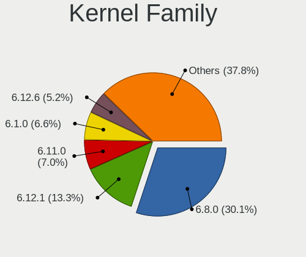
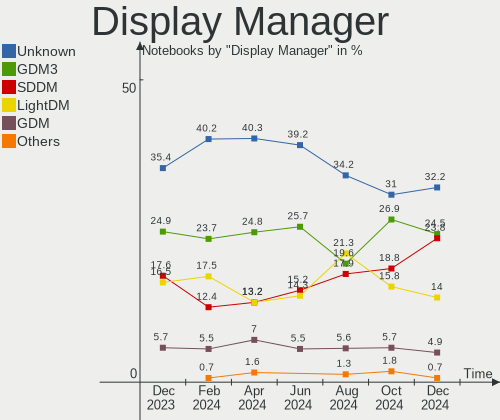
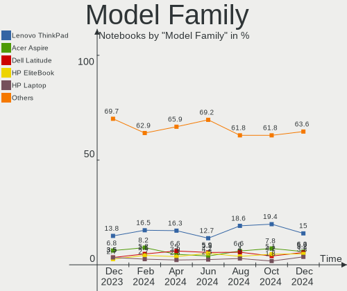
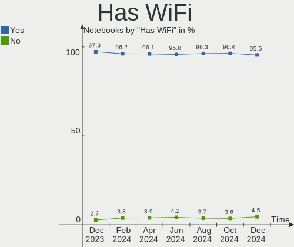
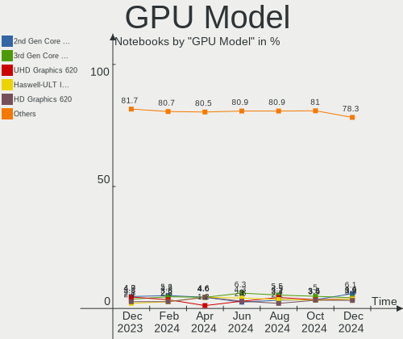
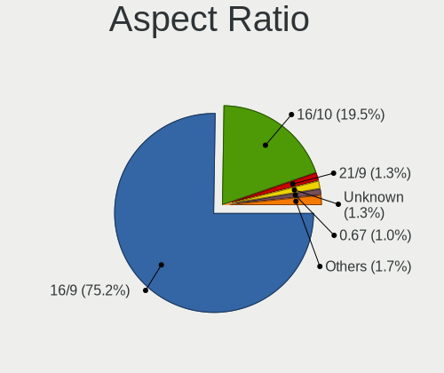
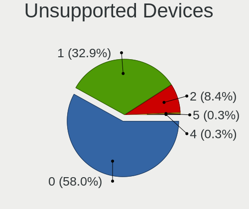

Linux in Germany - Hardware Trends (Notebooks)
----------------------------------------------

A project to identify most popular hardware characteristics and track their change
over time based on data collected by Linux users at https://Linux-Hardware.org.

Anyone can contribute to this report by the [hw-probe](https://github.com/linuxhw/hw-probe) tool:

    sudo -E hw-probe -all -upload

Period: Dec, 2022.

Contents
--------

* [ System ](#system)
  - [ OS                       ](#os)
  - [ OS Family                ](#os-family)
  - [ Kernel                   ](#kernel)
  - [ Kernel Family            ](#kernel-family)
  - [ Kernel Major Ver.        ](#kernel-major-ver)
  - [ Arch                     ](#arch)
  - [ DE                       ](#de)
  - [ Display Server           ](#display-server)
  - [ Display Manager          ](#display-manager)
  - [ OS Lang                  ](#os-lang)
  - [ Boot Mode                ](#boot-mode)
  - [ Filesystem               ](#filesystem)
  - [ Part. scheme             ](#part-scheme)
  - [ Dual Boot with Linux/BSD ](#dual-boot-with-linuxbsd)
  - [ Dual Boot (Win)          ](#dual-boot-win)

* [ Board ](#board)
  - [ Vendor                   ](#vendor)
  - [ Model                    ](#model)
  - [ Model Family             ](#model-family)
  - [ MFG Year                 ](#mfg-year)
  - [ Form Factor              ](#form-factor)
  - [ Secure Boot              ](#secure-boot)
  - [ Coreboot                 ](#coreboot)
  - [ RAM Size                 ](#ram-size)
  - [ RAM Used                 ](#ram-used)
  - [ Total Drives             ](#total-drives)
  - [ Has CD-ROM               ](#has-cd-rom)
  - [ Has Ethernet             ](#has-ethernet)
  - [ Has WiFi                 ](#has-wifi)
  - [ Has Bluetooth            ](#has-bluetooth)

* [ Location ](#location)
  - [ Country                  ](#country)
  - [ City                     ](#city)

* [ Drives ](#drives)
  - [ Drive Vendor             ](#drive-vendor)
  - [ Drive Model              ](#drive-model)
  - [ HDD Vendor               ](#hdd-vendor)
  - [ SSD Vendor               ](#ssd-vendor)
  - [ Drive Kind               ](#drive-kind)
  - [ Drive Connector          ](#drive-connector)
  - [ Drive Size               ](#drive-size)
  - [ Space Total              ](#space-total)
  - [ Space Used               ](#space-used)
  - [ Malfunc. Drives          ](#malfunc-drives)
  - [ Malfunc. Drive Vendor    ](#malfunc-drive-vendor)
  - [ Malfunc. HDD Vendor      ](#malfunc-hdd-vendor)
  - [ Malfunc. Drive Kind      ](#malfunc-drive-kind)
  - [ Failed Drives            ](#failed-drives)
  - [ Failed Drive Vendor      ](#failed-drive-vendor)
  - [ Drive Status             ](#drive-status)

* [ Storage controller ](#storage-controller)
  - [ Storage Vendor           ](#storage-vendor)
  - [ Storage Model            ](#storage-model)
  - [ Storage Kind             ](#storage-kind)

* [ Processor ](#processor)
  - [ CPU Vendor               ](#cpu-vendor)
  - [ CPU Model                ](#cpu-model)
  - [ CPU Model Family         ](#cpu-model-family)
  - [ CPU Cores                ](#cpu-cores)
  - [ CPU Sockets              ](#cpu-sockets)
  - [ CPU Threads              ](#cpu-threads)
  - [ CPU Op-Modes             ](#cpu-op-modes)
  - [ CPU Microcode            ](#cpu-microcode)
  - [ CPU Microarch            ](#cpu-microarch)

* [ Graphics ](#graphics)
  - [ GPU Vendor               ](#gpu-vendor)
  - [ GPU Model                ](#gpu-model)
  - [ GPU Combo                ](#gpu-combo)
  - [ GPU Driver               ](#gpu-driver)
  - [ GPU Memory               ](#gpu-memory)

* [ Monitor ](#monitor)
  - [ Monitor Vendor           ](#monitor-vendor)
  - [ Monitor Model            ](#monitor-model)
  - [ Monitor Resolution       ](#monitor-resolution)
  - [ Monitor Diagonal         ](#monitor-diagonal)
  - [ Monitor Width            ](#monitor-width)
  - [ Aspect Ratio             ](#aspect-ratio)
  - [ Monitor Area             ](#monitor-area)
  - [ Pixel Density            ](#pixel-density)
  - [ Multiple Monitors        ](#multiple-monitors)

* [ Network ](#network)
  - [ Net Controller Vendor    ](#net-controller-vendor)
  - [ Net Controller Model     ](#net-controller-model)
  - [ Wireless Vendor          ](#wireless-vendor)
  - [ Wireless Model           ](#wireless-model)
  - [ Ethernet Vendor          ](#ethernet-vendor)
  - [ Ethernet Model           ](#ethernet-model)
  - [ Net Controller Kind      ](#net-controller-kind)
  - [ Used Controller          ](#used-controller)
  - [ NICs                     ](#nics)
  - [ IPv6                     ](#ipv6)

* [ Bluetooth ](#bluetooth)
  - [ Bluetooth Vendor         ](#bluetooth-vendor)
  - [ Bluetooth Model          ](#bluetooth-model)

* [ Sound ](#sound)
  - [ Sound Vendor             ](#sound-vendor)
  - [ Sound Model              ](#sound-model)

* [ Memory ](#memory)
  - [ Memory Vendor            ](#memory-vendor)
  - [ Memory Model             ](#memory-model)
  - [ Memory Kind              ](#memory-kind)
  - [ Memory Form Factor       ](#memory-form-factor)
  - [ Memory Size              ](#memory-size)
  - [ Memory Speed             ](#memory-speed)

* [ Printers & scanners ](#printers--scanners)
  - [ Printer Vendor           ](#printer-vendor)
  - [ Printer Model            ](#printer-model)
  - [ Scanner Vendor           ](#scanner-vendor)
  - [ Scanner Model            ](#scanner-model)

* [ Camera ](#camera)
  - [ Camera Vendor            ](#camera-vendor)
  - [ Camera Model             ](#camera-model)

* [ Security ](#security)
  - [ Fingerprint Vendor       ](#fingerprint-vendor)
  - [ Fingerprint Model        ](#fingerprint-model)
  - [ Chipcard Vendor          ](#chipcard-vendor)
  - [ Chipcard Model           ](#chipcard-model)

* [ Unsupported ](#unsupported)
  - [ Unsupported Devices      ](#unsupported-devices)
  - [ Unsupported Device Types ](#unsupported-device-types)

System
------

OS
--

Installed operating systems

| Name                         | Notebooks | Percent |
|------------------------------|-----------|---------|
| Ubuntu 22.04                 | 56        | 19.24%  |
| Linux Mint 21                | 21        | 7.22%   |
| Debian 11                    | 18        | 6.19%   |
| Ubuntu 22.10                 | 15        | 5.15%   |
| Zorin 16                     | 14        | 4.81%   |
| Fedora 37                    | 14        | 4.81%   |
| Linux Mint 20.3              | 13        | 4.47%   |
| Linux Mint 21.1              | 12        | 4.12%   |
| Ubuntu 20.04                 | 11        | 3.78%   |
| Manjaro 22.0.0               | 8         | 2.75%   |
| Arch Rolling                 | 8         | 2.75%   |
| openSUSE Tumbleweed-XXXXXXXX | 7         | 2.41%   |
| Xubuntu 22.04                | 6         | 2.06%   |
| Pop!_OS 22.04                | 6         | 2.06%   |
| OpenMandriva 4.3             | 6         | 2.06%   |
| LMDE 5                       | 5         | 1.72%   |
| Debian                       | 5         | 1.72%   |
| SteamOS 3.4.2                | 4         | 1.37%   |
| SteamOS 3.3.3                | 4         | 1.37%   |
| OpenMandriva 4.50            | 4         | 1.37%   |
| Kubuntu 22.04                | 4         | 1.37%   |
| Elementary 6.1               | 4         | 1.37%   |
| SteamOS 3.3.2                | 3         | 1.03%   |
| Kali 2022.4                  | 3         | 1.03%   |
| Ubuntu MATE 22.04            | 2         | 0.69%   |
| TUXEDO OS 22.04              | 2         | 0.69%   |
| Kubuntu 22.10                | 2         | 0.69%   |
| Fedora 36                    | 2         | 0.69%   |
| ArcoLinux Rolling            | 2         | 0.69%   |
| Zorin 12                     | 1         | 0.34%   |
| UbuntuDDE 22.04              | 1         | 0.34%   |
| Ubuntu Budgie 20.04          | 1         | 0.34%   |
| Ubuntu 23.04                 | 1         | 0.34%   |
| Ubuntu 20.10                 | 1         | 0.34%   |
| Ubuntu 18.04                 | 1         | 0.34%   |
| SteamOS Rolling              | 1         | 0.34%   |
| SteamOS 3.4.4                | 1         | 0.34%   |
| ROSA 12.3                    | 1         | 0.34%   |
| Pardus 21.4                  | 1         | 0.34%   |
| openSUSE Leap-15.4           | 1         | 0.34%   |

OS Family
---------

OS without a version

| Name          | Notebooks | Percent |
|---------------|-----------|---------|
| Ubuntu        | 85        | 29.21%  |
| Linux Mint    | 48        | 16.49%  |
| Debian        | 23        | 7.9%    |
| Fedora        | 16        | 5.5%    |
| Zorin         | 15        | 5.15%   |
| SteamOS       | 13        | 4.47%   |
| OpenMandriva  | 13        | 4.47%   |
| openSUSE      | 9         | 3.09%   |
| Manjaro       | 9         | 3.09%   |
| Arch          | 8         | 2.75%   |
| Kubuntu       | 7         | 2.41%   |
| Xubuntu       | 6         | 2.06%   |
| Pop!_OS       | 6         | 2.06%   |
| LMDE          | 5         | 1.72%   |
| Elementary    | 4         | 1.37%   |
| Kali          | 3         | 1.03%   |
| Ubuntu MATE   | 2         | 0.69%   |
| TUXEDO OS     | 2         | 0.69%   |
| Endless       | 2         | 0.69%   |
| ArcoLinux     | 2         | 0.69%   |
| UbuntuDDE     | 1         | 0.34%   |
| Ubuntu Budgie | 1         | 0.34%   |
| ROSA          | 1         | 0.34%   |
| Pardus        | 1         | 0.34%   |
| MX            | 1         | 0.34%   |
| Lubuntu       | 1         | 0.34%   |
| Linux Lite    | 1         | 0.34%   |
| KDE neon      | 1         | 0.34%   |
| Garuda Linux  | 1         | 0.34%   |
| EndeavourOS   | 1         | 0.34%   |
| CentOS        | 1         | 0.34%   |
| BlackPanther  | 1         | 0.34%   |
| AlmaLinux     | 1         | 0.34%   |

Kernel
------

Version of the Linux kernel

| Version                    | Notebooks | Percent |
|----------------------------|-----------|---------|
| 5.15.0-56-generic          | 110       | 37.8%   |
| 5.4.0-135-generic          | 15        | 5.15%   |
| 5.19.0-26-generic          | 12        | 4.12%   |
| 5.10.0-19-amd64            | 10        | 3.44%   |
| 5.15.0-57-generic          | 8         | 2.75%   |
| 5.13.0-valve21.3-1-neptune | 8         | 2.75%   |
| 5.10.0-20-amd64            | 8         | 2.75%   |
| 5.16.7-desktop-1omv4003    | 6         | 2.06%   |
| 6.0.6-76060006-generic     | 5         | 1.72%   |
| 6.0.12-300.fc37.x86_64     | 5         | 1.72%   |
| 5.13.0-valve36-1-neptune   | 5         | 1.72%   |
| 5.15.0-53-generic          | 4         | 1.37%   |
| 6.0.15-300.fc37.x86_64     | 3         | 1.03%   |
| 6.0.11-300.fc37.x86_64     | 3         | 1.03%   |
| 5.19.12-desktop-2omv4090   | 3         | 1.03%   |
| 5.15.81-1-MANJARO          | 3         | 1.03%   |
| 6.1.1-zen1-1-zen           | 2         | 0.69%   |
| 6.0.9-300.fc37.x86_64      | 2         | 0.69%   |
| 6.0.11-1-MANJARO           | 2         | 0.69%   |
| 6.0.10-arch2-1             | 2         | 0.69%   |
| 6.0.10-1-default           | 2         | 0.69%   |
| 6.0.0-kali5-amd64          | 2         | 0.69%   |
| 6.0.0-5-amd64              | 2         | 0.69%   |
| 6.0.0-4-amd64              | 2         | 0.69%   |
| 6.0.0-0.deb11.2-amd64      | 2         | 0.69%   |
| 5.19.0-27-generic          | 2         | 0.69%   |
| 5.19.0-23-generic          | 2         | 0.69%   |
| 5.15.85-1-MANJARO          | 2         | 0.69%   |
| 5.15.0-10053-tuxedo        | 2         | 0.69%   |
| 5.10.0-18-amd64            | 2         | 0.69%   |
| 6.1.1-pkg1                 | 1         | 0.34%   |
| 6.1.1-arch1-1              | 1         | 0.34%   |
| 6.1.1-1-MANJARO            | 1         | 0.34%   |
| 6.1.1-1-default            | 1         | 0.34%   |
| 6.1.1                      | 1         | 0.34%   |
| 6.1.0-desktop-1omv2290     | 1         | 0.34%   |
| 6.1.0-arch1-1              | 1         | 0.34%   |
| 6.1.0-1.linuxlite          | 1         | 0.34%   |
| 6.1.0-1-default            | 1         | 0.34%   |
| 6.0.9-arch1-1              | 1         | 0.34%   |

Kernel Family
-------------

Linux kernel without a distro release

| Version | Notebooks | Percent |
|---------|-----------|---------|
| 5.15.0  | 129       | 44.33%  |
| 5.10.0  | 21        | 7.22%   |
| 5.19.0  | 18        | 6.19%   |
| 5.4.0   | 15        | 5.15%   |
| 5.13.0  | 15        | 5.15%   |
| 6.0.0   | 11        | 3.78%   |
| 6.0.12  | 8         | 2.75%   |
| 6.1.1   | 7         | 2.41%   |
| 6.0.11  | 6         | 2.06%   |
| 6.0.10  | 6         | 2.06%   |
| 5.16.7  | 6         | 2.06%   |
| 6.0.6   | 5         | 1.72%   |
| 6.1.0   | 4         | 1.37%   |
| 6.0.9   | 4         | 1.37%   |
| 6.0.15  | 3         | 1.03%   |
| 5.19.12 | 3         | 1.03%   |
| 5.15.81 | 3         | 1.03%   |
| 6.0.8   | 2         | 0.69%   |
| 5.8.0   | 2         | 0.69%   |
| 5.15.85 | 2         | 0.69%   |
| 4.15.0  | 2         | 0.69%   |
| 6.0.14  | 1         | 0.34%   |
| 6.0.13  | 1         | 0.34%   |
| 5.6.14  | 1         | 0.34%   |
| 5.19.5  | 1         | 0.34%   |
| 5.18.9  | 1         | 0.34%   |
| 5.18.12 | 1         | 0.34%   |
| 5.18.10 | 1         | 0.34%   |
| 5.18.0  | 1         | 0.34%   |
| 5.17.5  | 1         | 0.34%   |
| 5.15.84 | 1         | 0.34%   |
| 5.15.80 | 1         | 0.34%   |
| 5.15.79 | 1         | 0.34%   |
| 5.14.21 | 1         | 0.34%   |
| 5.14.0  | 1         | 0.34%   |
| 5.11.0  | 1         | 0.34%   |
| 4.4.0   | 1         | 0.34%   |
| 4.18.0  | 1         | 0.34%   |
| 4.16.0  | 1         | 0.34%   |
| 4.12.14 | 1         | 0.34%   |

Kernel Major Ver.
-----------------

Linux kernel major version

| Version | Notebooks | Percent |
|---------|-----------|---------|
| 5.15    | 137       | 47.08%  |
| 6.0     | 47        | 16.15%  |
| 5.19    | 22        | 7.56%   |
| 5.10    | 21        | 7.22%   |
| 5.4     | 15        | 5.15%   |
| 5.13    | 15        | 5.15%   |
| 6.1     | 11        | 3.78%   |
| 5.16    | 6         | 2.06%   |
| 5.18    | 4         | 1.37%   |
| 5.8     | 2         | 0.69%   |
| 5.14    | 2         | 0.69%   |
| 4.15    | 2         | 0.69%   |
| 5.6     | 1         | 0.34%   |
| 5.17    | 1         | 0.34%   |
| 5.11    | 1         | 0.34%   |
| 4.4     | 1         | 0.34%   |
| 4.18    | 1         | 0.34%   |
| 4.16    | 1         | 0.34%   |
| 4.12    | 1         | 0.34%   |

Arch
----

OS architecture (x86_64, i586, etc.)

| Name   | Notebooks | Percent |
|--------|-----------|---------|
| x86_64 | 289       | 99.31%  |
| i686   | 2         | 0.69%   |

DE
--

Desktop Environment

| Name              | Notebooks | Percent |
|-------------------|-----------|---------|
| GNOME             | 130       | 44.67%  |
| KDE5              | 60        | 20.62%  |
| X-Cinnamon        | 47        | 16.15%  |
| XFCE              | 21        | 7.22%   |
| MATE              | 8         | 2.75%   |
| LXQt              | 5         | 1.72%   |
| Cinnamon          | 4         | 1.37%   |
| Unknown           | 4         | 1.37%   |
| Pantheon          | 3         | 1.03%   |
| sway              | 2         | 0.69%   |
| x-session-manager | 1         | 0.34%   |
| i3                | 1         | 0.34%   |
| fluxbox           | 1         | 0.34%   |
| Enlightenment     | 1         | 0.34%   |
| Deepin            | 1         | 0.34%   |
| Budgie            | 1         | 0.34%   |
| awesome           | 1         | 0.34%   |

Display Server
--------------

X11 or Wayland

| Name    | Notebooks | Percent |
|---------|-----------|---------|
| X11     | 197       | 67.7%   |
| Wayland | 88        | 30.24%  |
| Tty     | 5         | 1.72%   |
| Unknown | 1         | 0.34%   |

Display Manager
---------------

SDDM, LightDM, etc.

| Name    | Notebooks | Percent |
|---------|-----------|---------|
| Unknown | 96        | 32.99%  |
| GDM3    | 88        | 30.24%  |
| LightDM | 52        | 17.87%  |
| SDDM    | 40        | 13.75%  |
| GDM     | 14        | 4.81%   |
| LXDM    | 1         | 0.34%   |

OS Lang
-------

Language

| Lang    | Notebooks | Percent |
|---------|-----------|---------|
| de_DE   | 201       | 69.07%  |
| en_US   | 64        | 21.99%  |
| en_GB   | 9         | 3.09%   |
| en_DE   | 4         | 1.37%   |
| POSIX   | 3         | 1.03%   |
| C       | 2         | 0.69%   |
| ru_UA   | 1         | 0.34%   |
| pl_PL   | 1         | 0.34%   |
| nl_BE   | 1         | 0.34%   |
| ksh_DE  | 1         | 0.34%   |
| it_IT   | 1         | 0.34%   |
| hu_HU   | 1         | 0.34%   |
| es_ES   | 1         | 0.34%   |
| Unknown | 1         | 0.34%   |

Boot Mode
---------

EFI or BIOS

| Mode | Notebooks | Percent |
|------|-----------|---------|
| EFI  | 147       | 50.52%  |
| BIOS | 144       | 49.48%  |

Filesystem
----------

Type of filesystem

| Type    | Notebooks | Percent |
|---------|-----------|---------|
| Ext4    | 228       | 78.35%  |
| Btrfs   | 42        | 14.43%  |
| Overlay | 17        | 5.84%   |
| Xfs     | 4         | 1.37%   |

Part. scheme
------------

Scheme of partitioning

| Type    | Notebooks | Percent |
|---------|-----------|---------|
| GPT     | 167       | 57.39%  |
| Unknown | 92        | 31.62%  |
| MBR     | 32        | 11%     |

Dual Boot with Linux/BSD
------------------------

Hosting more than one Linux/BSD

| Dual boot | Notebooks | Percent |
|-----------|-----------|---------|
| No        | 258       | 88.66%  |
| Yes       | 33        | 11.34%  |

Dual Boot (Win)
---------------

Hosting Linux and Windows

| Dual boot | Notebooks | Percent |
|-----------|-----------|---------|
| No        | 221       | 75.95%  |
| Yes       | 70        | 24.05%  |

Board
-----

Vendor
------

Motherboard manufacturer

| Name                | Notebooks | Percent |
|---------------------|-----------|---------|
| Lenovo              | 75        | 25.77%  |
| Hewlett-Packard     | 41        | 14.09%  |
| Dell                | 30        | 10.31%  |
| Acer                | 30        | 10.31%  |
| ASUSTek Computer    | 24        | 8.25%   |
| Valve               | 13        | 4.47%   |
| HUAWEI              | 10        | 3.44%   |
| Samsung Electronics | 7         | 2.41%   |
| Apple               | 7         | 2.41%   |
| Sony                | 6         | 2.06%   |
| TUXEDO              | 5         | 1.72%   |
| Schenker            | 5         | 1.72%   |
| MSI                 | 5         | 1.72%   |
| Toshiba             | 4         | 1.37%   |
| Medion              | 4         | 1.37%   |
| Fujitsu             | 4         | 1.37%   |
| Packard Bell        | 2         | 0.69%   |
| Notebook            | 2         | 0.69%   |
| Google              | 2         | 0.69%   |
| Framework           | 2         | 0.69%   |
| Unknown             | 2         | 0.69%   |
| Wortmann AG         | 1         | 0.34%   |
| TrekStor            | 1         | 0.34%   |
| Timi                | 1         | 0.34%   |
| System76            | 1         | 0.34%   |
| SGIN                | 1         | 0.34%   |
| LG Electronics      | 1         | 0.34%   |
| Jumper              | 1         | 0.34%   |
| Fusion5             | 1         | 0.34%   |
| Fujitsu Siemens     | 1         | 0.34%   |
| Dynabook            | 1         | 0.34%   |
| Alienware           | 1         | 0.34%   |

Model
-----

Motherboard model

| Name                                   | Notebooks | Percent |
|----------------------------------------|-----------|---------|
| Valve Jupiter                          | 13        | 4.47%   |
| Schenker VISION 15 (SVS15E21)          | 3         | 1.03%   |
| Lenovo V17 G2 ITL 82NX                 | 2         | 0.69%   |
| Lenovo IdeaPad Y560                    | 2         | 0.69%   |
| Lenovo IdeaPad 3 17ABA7 82RQ           | 2         | 0.69%   |
| HUAWEI BOM-WXX9                        | 2         | 0.69%   |
| HP Pavilion Notebook                   | 2         | 0.69%   |
| Framework Laptop (12th Gen Intel Core) | 2         | 0.69%   |
| Dell Latitude E6540                    | 2         | 0.69%   |
| Dell Latitude E6430                    | 2         | 0.69%   |
| Dell Inspiron 3593                     | 2         | 0.69%   |
| Dell G15 5515                          | 2         | 0.69%   |
| ASUS X751MA                            | 2         | 0.69%   |
| ASUS UX31E                             | 2         | 0.69%   |
| Unknown                                | 2         | 0.69%   |
| Wortmann AG 1220569_1470092            | 1         | 0.34%   |
| TUXEDO Pulse 14 Gen1                   | 1         | 0.34%   |
| TUXEDO Polaris (CML/Gen2)              | 1         | 0.34%   |
| TUXEDO N8xxEZ                          | 1         | 0.34%   |
| TUXEDO N13xWU                          | 1         | 0.34%   |
| TUXEDO Book BA1510                     | 1         | 0.34%   |
| TrekStor Primebook P14                 | 1         | 0.34%   |
| Toshiba Satellite P500                 | 1         | 0.34%   |
| Toshiba Satellite L500                 | 1         | 0.34%   |
| Toshiba Satellite C870-1C2             | 1         | 0.34%   |
| Toshiba Satellite C850-1C8             | 1         | 0.34%   |
| Timi TM1703                            | 1         | 0.34%   |
| System76 Oryx Pro                      | 1         | 0.34%   |
| Sony VPCS12V9E                         | 1         | 0.34%   |
| Sony VPCF23S1E                         | 1         | 0.34%   |
| Sony VPCEB1M1E                         | 1         | 0.34%   |
| Sony VGN-NW31JF_S                      | 1         | 0.34%   |
| Sony VGN-NR32M_S                       | 1         | 0.34%   |
| Sony SVE1512H1EB                       | 1         | 0.34%   |
| SGIN laptop                            | 1         | 0.34%   |
| Schenker VISION 16 Pro (L22)           | 1         | 0.34%   |
| Schenker VIA 15                        | 1         | 0.34%   |
| Samsung SP55S                          | 1         | 0.34%   |
| Samsung R540/R580/R780/SA41/E452/E852  | 1         | 0.34%   |
| Samsung 935XDB                         | 1         | 0.34%   |

Model Family
------------

Motherboard model prefix

| Name                | Notebooks | Percent |
|---------------------|-----------|---------|
| Lenovo ThinkPad     | 46        | 15.81%  |
| Acer Aspire         | 21        | 7.22%   |
| Dell Latitude       | 14        | 4.81%   |
| Valve Jupiter       | 13        | 4.47%   |
| HP EliteBook        | 12        | 4.12%   |
| Lenovo IdeaPad      | 11        | 3.78%   |
| HP ZBook            | 7         | 2.41%   |
| HP Pavilion         | 6         | 2.06%   |
| Dell Inspiron       | 6         | 2.06%   |
| ASUS VivoBook       | 6         | 2.06%   |
| Toshiba Satellite   | 4         | 1.37%   |
| Schenker VISION     | 4         | 1.37%   |
| Lenovo Yoga         | 4         | 1.37%   |
| HP ProBook          | 4         | 1.37%   |
| Fujitsu LIFEBOOK    | 4         | 1.37%   |
| Acer TravelMate     | 4         | 1.37%   |
| Acer Swift          | 4         | 1.37%   |
| HP Laptop           | 3         | 1.03%   |
| HP 255              | 3         | 1.03%   |
| Lenovo V17          | 2         | 0.69%   |
| HUAWEI BOM-WXX9     | 2         | 0.69%   |
| HP 250              | 2         | 0.69%   |
| Framework Laptop    | 2         | 0.69%   |
| Dell XPS            | 2         | 0.69%   |
| Dell Vostro         | 2         | 0.69%   |
| Dell Precision      | 2         | 0.69%   |
| Dell G15            | 2         | 0.69%   |
| ASUS X751MA         | 2         | 0.69%   |
| ASUS UX31E          | 2         | 0.69%   |
| ASUS ASUS           | 2         | 0.69%   |
| Apple MacBookAir5   | 2         | 0.69%   |
| Unknown             | 2         | 0.69%   |
| Wortmann AG 1220569 | 1         | 0.34%   |
| TUXEDO Pulse        | 1         | 0.34%   |
| TUXEDO Polaris      | 1         | 0.34%   |
| TUXEDO N8xxEZ       | 1         | 0.34%   |
| TUXEDO N13xWU       | 1         | 0.34%   |
| TUXEDO Book         | 1         | 0.34%   |
| TrekStor Primebook  | 1         | 0.34%   |
| Timi TM1703         | 1         | 0.34%   |

MFG Year
--------

Motherboard manufacture year

| Year | Notebooks | Percent |
|------|-----------|---------|
| 2022 | 40        | 13.75%  |
| 2021 | 35        | 12.03%  |
| 2018 | 25        | 8.59%   |
| 2012 | 24        | 8.25%   |
| 2020 | 22        | 7.56%   |
| 2015 | 21        | 7.22%   |
| 2013 | 18        | 6.19%   |
| 2011 | 18        | 6.19%   |
| 2019 | 17        | 5.84%   |
| 2010 | 15        | 5.15%   |
| 2017 | 14        | 4.81%   |
| 2009 | 12        | 4.12%   |
| 2014 | 11        | 3.78%   |
| 2016 | 10        | 3.44%   |
| 2008 | 5         | 1.72%   |
| 2007 | 3         | 1.03%   |
| 2005 | 1         | 0.34%   |

Form Factor
-----------

Physical design of the computer

| Name     | Notebooks | Percent |
|----------|-----------|---------|
| Notebook | 291       | 100%    |

Secure Boot
-----------

Enabled or disabled

| State    | Notebooks | Percent |
|----------|-----------|---------|
| Disabled | 263       | 90.38%  |
| Enabled  | 28        | 9.62%   |

Coreboot
--------

Have coreboot on board

| Used | Notebooks | Percent |
|------|-----------|---------|
| No   | 287       | 98.63%  |
| Yes  | 4         | 1.37%   |

RAM Size
--------

Total RAM memory

| Size in GB  | Notebooks | Percent |
|-------------|-----------|---------|
| 4.01-8.0    | 91        | 31.27%  |
| 8.01-16.0   | 65        | 22.34%  |
| 3.01-4.0    | 49        | 16.84%  |
| 16.01-24.0  | 43        | 14.78%  |
| 32.01-64.0  | 22        | 7.56%   |
| 1.01-2.0    | 10        | 3.44%   |
| 64.01-256.0 | 6         | 2.06%   |
| 2.01-3.0    | 4         | 1.37%   |
| 24.01-32.0  | 1         | 0.34%   |

RAM Used
--------

Used RAM memory

| Used GB    | Notebooks | Percent |
|------------|-----------|---------|
| 1.01-2.0   | 105       | 36.08%  |
| 2.01-3.0   | 76        | 26.12%  |
| 3.01-4.0   | 47        | 16.15%  |
| 4.01-8.0   | 32        | 11%     |
| 0.51-1.0   | 16        | 5.5%    |
| 8.01-16.0  | 14        | 4.81%   |
| 16.01-24.0 | 1         | 0.34%   |

Total Drives
------------

Number of drives on board

| Drives | Notebooks | Percent |
|--------|-----------|---------|
| 1      | 211       | 72.51%  |
| 2      | 70        | 24.05%  |
| 3      | 6         | 2.06%   |
| 4      | 2         | 0.69%   |
| 0      | 2         | 0.69%   |

Has CD-ROM
----------

Has CD-ROM on board

| Presented | Notebooks | Percent |
|-----------|-----------|---------|
| No        | 185       | 63.57%  |
| Yes       | 106       | 36.43%  |

Has Ethernet
------------

Has Ethernet on board

| Presented | Notebooks | Percent |
|-----------|-----------|---------|
| Yes       | 230       | 79.04%  |
| No        | 61        | 20.96%  |

Has WiFi
--------

Has WiFi module

| Presented | Notebooks | Percent |
|-----------|-----------|---------|
| Yes       | 288       | 98.97%  |
| No        | 3         | 1.03%   |

Has Bluetooth
-------------

Has Bluetooth module

| Presented | Notebooks | Percent |
|-----------|-----------|---------|
| Yes       | 237       | 81.44%  |
| No        | 54        | 18.56%  |

Location
--------

Country
-------

Geographic location (country)

| Country | Notebooks | Percent |
|---------|-----------|---------|
| Germany | 291       | 100%    |

City
----

Geographic location (city)

| City                   | Notebooks | Percent |
|------------------------|-----------|---------|
| Berlin                 | 27        | 9.28%   |
| Hamburg                | 18        | 6.19%   |
| Frankfurt am Main      | 14        | 4.81%   |
| Munich                 | 10        | 3.44%   |
| Stuttgart              | 8         | 2.75%   |
| Nuremberg              | 8         | 2.75%   |
| Cologne                | 8         | 2.75%   |
| Leipzig                | 6         | 2.06%   |
| Essen                  | 4         | 1.37%   |
| Düsseldorf            | 4         | 1.37%   |
| Duisburg               | 4         | 1.37%   |
| Pforzheim              | 3         | 1.03%   |
| Bremen                 | 3         | 1.03%   |
| Bad Essen              | 3         | 1.03%   |
| Wuppertal              | 2         | 0.69%   |
| Villingen-Schwenningen | 2         | 0.69%   |
| Salzgitter             | 2         | 0.69%   |
| Saarbrücken           | 2         | 0.69%   |
| Ravensburg             | 2         | 0.69%   |
| Oberhausen             | 2         | 0.69%   |
| Mönchengladbach       | 2         | 0.69%   |
| Mannheim               | 2         | 0.69%   |
| Konstanz               | 2         | 0.69%   |
| Kiel                   | 2         | 0.69%   |
| Kerpen                 | 2         | 0.69%   |
| Heyerode               | 2         | 0.69%   |
| Heidelberg             | 2         | 0.69%   |
| Hagen                  | 2         | 0.69%   |
| Grafing bei Munchen    | 2         | 0.69%   |
| Freiburg im Breisgau   | 2         | 0.69%   |
| Erlangen               | 2         | 0.69%   |
| Düren                 | 2         | 0.69%   |
| Dresden                | 2         | 0.69%   |
| Braunschweig           | 2         | 0.69%   |
| Bonn                   | 2         | 0.69%   |
| Bielefeld              | 2         | 0.69%   |
| Bad Kreuznach          | 2         | 0.69%   |
| Augsburg               | 2         | 0.69%   |
| Aachen                 | 2         | 0.69%   |
| Zeithain               | 1         | 0.34%   |

Drives
------

Drive Vendor
------------

Hard drive vendors

| Vendor                      | Notebooks | Drives | Percent |
|-----------------------------|-----------|--------|---------|
| Samsung Electronics         | 86        | 89     | 23.76%  |
| Sandisk                     | 38        | 41     | 10.5%   |
| WDC                         | 30        | 31     | 8.29%   |
| Unknown                     | 28        | 29     | 7.73%   |
| Toshiba                     | 27        | 27     | 7.46%   |
| SK hynix                    | 17        | 17     | 4.7%    |
| Seagate                     | 13        | 16     | 3.59%   |
| Micron Technology           | 12        | 12     | 3.31%   |
| Kingston                    | 9         | 10     | 2.49%   |
| Crucial                     | 9         | 9      | 2.49%   |
| KIOXIA                      | 8         | 8      | 2.21%   |
| Intenso                     | 8         | 10     | 2.21%   |
| Kingston Technology Company | 6         | 6      | 1.66%   |
| Intel                       | 6         | 6      | 1.66%   |
| Hitachi                     | 6         | 6      | 1.66%   |
| O2 Micro                    | 5         | 5      | 1.38%   |
| Apple                       | 4         | 4      | 1.1%    |
| Silicon Motion              | 3         | 3      | 0.83%   |
| Phison Electronics          | 3         | 3      | 0.83%   |
| Phison                      | 3         | 3      | 0.83%   |
| OCZ                         | 3         | 3      | 0.83%   |
| LITEONIT                    | 3         | 3      | 0.83%   |
| HGST                        | 3         | 3      | 0.83%   |
| Unknown                     | 3         | 3      | 0.83%   |
| UMIS                        | 2         | 2      | 0.55%   |
| Netac                       | 2         | 2      | 0.55%   |
| Hjwdz                       | 2         | 2      | 0.55%   |
| Apacer                      | 2         | 2      | 0.55%   |
| ZOTAC                       | 1         | 1      | 0.28%   |
| YMTC                        | 1         | 1      | 0.28%   |
| XPG                         | 1         | 1      | 0.28%   |
| WDC WDS                     | 1         | 1      | 0.28%   |
| V7                          | 1         | 1      | 0.28%   |
| TrekStor                    | 1         | 1      | 0.28%   |
| Transcend                   | 1         | 1      | 0.28%   |
| StoreJet                    | 1         | 1      | 0.28%   |
| SPCC                        | 1         | 1      | 0.28%   |
| Solid State Storage         | 1         | 1      | 0.28%   |
| NGFF                        | 1         | 1      | 0.28%   |
| Micron/Crucial Technology   | 1         | 1      | 0.28%   |

Drive Model
-----------

Hard drive models

| Model                                               | Notebooks | Percent |
|-----------------------------------------------------|-----------|---------|
| Samsung NVMe SSD Controller SM981/PM981/PM983 500GB | 12        | 3.23%   |
| Unknown MMC Card  512GB                             | 7         | 1.88%   |
| Unknown MMC Card  32GB                              | 7         | 1.88%   |
| Sandisk WD Black SN750 / PC SN730 NVMe SSD 512GB    | 6         | 1.61%   |
| Kingston Company OM3PDP3 NVMe SSD 512GB             | 6         | 1.61%   |
| O2 Micro E2M2 64GB                                  | 5         | 1.34%   |
| Toshiba XG6 NVMe SSD Controller 256GB               | 4         | 1.08%   |
| Toshiba MQ01ABF050 500GB                            | 4         | 1.08%   |
| Samsung SSD 850 EVO 500GB                           | 4         | 1.08%   |
| Samsung SSD 850 EVO 250GB                           | 4         | 1.08%   |
| Unknown MMC Card  64GB                              | 3         | 0.81%   |
| Toshiba MQ01ABD100 1TB                              | 3         | 0.81%   |
| Toshiba MQ01ABD050 500GB                            | 3         | 0.81%   |
| Samsung SSD 980 1TB                                 | 3         | 0.81%   |
| Phison 311CD0512GB                                  | 3         | 0.81%   |
| Unknown                                             | 3         | 0.81%   |
| WDC WDS500G2B0A-00SM50 500GB SSD                    | 2         | 0.54%   |
| WDC WDS100T2B0C-00PXH0 1TB                          | 2         | 0.54%   |
| WDC WDS100T2B0A-00SM50 1TB SSD                      | 2         | 0.54%   |
| WDC WD5000LPVX-22V0TT0 500GB                        | 2         | 0.54%   |
| WDC WD5000BEVT-22ZAT0 500GB                         | 2         | 0.54%   |
| Unknown SSD_2.5"_TLC_256 256GB                      | 2         | 0.54%   |
| Unknown SD/MMC/MS PRO 64GB                          | 2         | 0.54%   |
| Unknown MMC Card  256GB                             | 2         | 0.54%   |
| UMIS RPJTJ512MGE1QDQ 512GB                          | 2         | 0.54%   |
| SK hynix SKHynix_HFS512GD9TNG-L3A0B 512GB           | 2         | 0.54%   |
| SK hynix HFS256G39TND-N210A 256GB SSD               | 2         | 0.54%   |
| SK hynix BC501 NVMe Solid State Drive 512GB         | 2         | 0.54%   |
| Seagate ST9160412AS 160GB                           | 2         | 0.54%   |
| Seagate ST1000LM024 HN-M101MBB 1TB                  | 2         | 0.54%   |
| SanDisk Ultra II 960GB SSD                          | 2         | 0.54%   |
| SanDisk SDSSDP128G 128GB                            | 2         | 0.54%   |
| SanDisk SDSSDHII240G 240GB                          | 2         | 0.54%   |
| Sandisk PC SN520 NVMe SSD 128GB                     | 2         | 0.54%   |
| SanDisk NVMe SSD Drive 1TB                          | 2         | 0.54%   |
| Samsung SSD 980 500GB                               | 2         | 0.54%   |
| Samsung SSD 970 EVO Plus 2TB                        | 2         | 0.54%   |
| Samsung SSD 970 EVO Plus 1TB                        | 2         | 0.54%   |
| Samsung SSD 870 QVO 1TB                             | 2         | 0.54%   |
| Samsung SSD 860 PRO 512GB                           | 2         | 0.54%   |

HDD Vendor
----------

Hard disk drive vendors

| Vendor              | Notebooks | Drives | Percent |
|---------------------|-----------|--------|---------|
| WDC                 | 19        | 20     | 27.94%  |
| Toshiba             | 16        | 16     | 23.53%  |
| Seagate             | 13        | 15     | 19.12%  |
| Hitachi             | 6         | 6      | 8.82%   |
| Samsung Electronics | 5         | 5      | 7.35%   |
| HGST                | 3         | 3      | 4.41%   |
| Unknown             | 2         | 2      | 2.94%   |
| StoreJet            | 1         | 1      | 1.47%   |
| Fujitsu             | 1         | 1      | 1.47%   |
| ASMT                | 1         | 1      | 1.47%   |
| Apple               | 1         | 1      | 1.47%   |

SSD Vendor
----------

Solid state drive vendors

| Vendor              | Notebooks | Drives | Percent |
|---------------------|-----------|--------|---------|
| Samsung Electronics | 35        | 35     | 28.46%  |
| SanDisk             | 20        | 20     | 16.26%  |
| Crucial             | 9         | 9      | 7.32%   |
| Micron Technology   | 8         | 8      | 6.5%    |
| WDC                 | 6         | 6      | 4.88%   |
| SK hynix            | 4         | 4      | 3.25%   |
| Kingston            | 4         | 5      | 3.25%   |
| Intenso             | 4         | 5      | 3.25%   |
| Toshiba             | 3         | 3      | 2.44%   |
| OCZ                 | 3         | 3      | 2.44%   |
| LITEONIT            | 3         | 3      | 2.44%   |
| Intel               | 3         | 3      | 2.44%   |
| Apple               | 3         | 3      | 2.44%   |
| Unknown             | 2         | 2      | 1.63%   |
| Netac               | 2         | 2      | 1.63%   |
| Apacer              | 2         | 2      | 1.63%   |
| ZOTAC               | 1         | 1      | 0.81%   |
| WDC WDS             | 1         | 1      | 0.81%   |
| V7                  | 1         | 1      | 0.81%   |
| TrekStor            | 1         | 1      | 0.81%   |
| Transcend           | 1         | 1      | 0.81%   |
| SPCC                | 1         | 1      | 0.81%   |
| NGFF                | 1         | 1      | 0.81%   |
| LITEON              | 1         | 1      | 0.81%   |
| Hewlett-Packard     | 1         | 1      | 0.81%   |
| FORESEE             | 1         | 1      | 0.81%   |
| A-DATA Technology   | 1         | 1      | 0.81%   |
| Unknown             | 1         | 1      | 0.81%   |

Drive Kind
----------

HDD or SSD

| Kind    | Notebooks | Drives | Percent |
|---------|-----------|--------|---------|
| NVMe    | 125       | 141    | 36.13%  |
| SSD     | 116       | 125    | 33.53%  |
| HDD     | 68        | 71     | 19.65%  |
| MMC     | 28        | 29     | 8.09%   |
| Unknown | 9         | 10     | 2.6%    |

Drive Connector
---------------

SATA, SAS, NVMe, etc.

| Type | Notebooks | Drives | Percent |
|------|-----------|--------|---------|
| SATA | 171       | 192    | 50.89%  |
| NVMe | 125       | 141    | 37.2%   |
| MMC  | 28        | 29     | 8.33%   |
| SAS  | 12        | 14     | 3.57%   |

Drive Size
----------

Size of hard drive

| Size in TB | Notebooks | Drives | Percent |
|------------|-----------|--------|---------|
| 0.01-0.5   | 133       | 146    | 73.89%  |
| 0.51-1.0   | 37        | 39     | 20.56%  |
| 1.01-2.0   | 8         | 8      | 4.44%   |
| 3.01-4.0   | 1         | 1      | 0.56%   |
| 4.01-10.0  | 1         | 2      | 0.56%   |

Space Total
-----------

Amount of disk space available on the file system

| Size in GB     | Notebooks | Percent |
|----------------|-----------|---------|
| 101-250        | 91        | 31.27%  |
| 251-500        | 87        | 29.9%   |
| 501-1000       | 46        | 15.81%  |
| 51-100         | 18        | 6.19%   |
| 1001-2000      | 15        | 5.15%   |
| 1-20           | 15        | 5.15%   |
| 21-50          | 6         | 2.06%   |
| More than 3000 | 5         | 1.72%   |
| 2001-3000      | 5         | 1.72%   |
| Unknown        | 3         | 1.03%   |

Space Used
----------

Amount of used disk space

| Used GB        | Notebooks | Percent |
|----------------|-----------|---------|
| 1-20           | 91        | 31.27%  |
| 21-50          | 66        | 22.68%  |
| 51-100         | 45        | 15.46%  |
| 101-250        | 39        | 13.4%   |
| 251-500        | 30        | 10.31%  |
| 501-1000       | 12        | 4.12%   |
| More than 3000 | 3         | 1.03%   |
| Unknown        | 3         | 1.03%   |
| 1001-2000      | 2         | 0.69%   |

Malfunc. Drives
---------------

Drive models with a malfunction

| Model                                                               | Notebooks | Drives | Percent |
|---------------------------------------------------------------------|-----------|--------|---------|
| Toshiba THNSNK256GCS8 SATA 256GB SSD                                | 1         | 1      | 10%     |
| Toshiba MK4055GSX 400GB                                             | 1         | 1      | 10%     |
| Seagate ST9500423AS 500GB                                           | 1         | 1      | 10%     |
| SanDisk SSD U100 128GB                                              | 1         | 1      | 10%     |
| Samsung Electronics SSD 970 EVO 500GB                               | 1         | 1      | 10%     |
| Micron Technology MTFDDAK960TCB-1AR1ZA 01GV854 01GV857LEN 960GB SSD | 1         | 1      | 10%     |
| Micron Technology 1100_MTFDDAV256TBN 256GB SSD                      | 1         | 1      | 10%     |
| Micron Technology 1100 SATA 512GB SSD                               | 1         | 1      | 10%     |
| LITEONIT LSS-16L6G-HP 16GB SSD                                      | 1         | 1      | 10%     |
| Intel SSDSC2BW180H6 180GB                                           | 1         | 1      | 10%     |

Malfunc. Drive Vendor
---------------------

Vendors of faulty drives

| Vendor              | Notebooks | Drives | Percent |
|---------------------|-----------|--------|---------|
| Micron Technology   | 3         | 3      | 30%     |
| Toshiba             | 2         | 2      | 20%     |
| Seagate             | 1         | 1      | 10%     |
| SanDisk             | 1         | 1      | 10%     |
| Samsung Electronics | 1         | 1      | 10%     |
| LITEONIT            | 1         | 1      | 10%     |
| Intel               | 1         | 1      | 10%     |

Malfunc. HDD Vendor
-------------------

Vendors of faulty HDD drives

| Vendor  | Notebooks | Drives | Percent |
|---------|-----------|--------|---------|
| Toshiba | 1         | 1      | 50%     |
| Seagate | 1         | 1      | 50%     |

Malfunc. Drive Kind
-------------------

Kinds of faulty drives

| Kind | Notebooks | Drives | Percent |
|------|-----------|--------|---------|
| SSD  | 7         | 7      | 70%     |
| HDD  | 2         | 2      | 20%     |
| NVMe | 1         | 1      | 10%     |

Failed Drives
-------------

Failed drive models

Zero info for selected period =(

Failed Drive Vendor
-------------------

Failed drive vendors

Zero info for selected period =(

Drive Status
------------

Number of failed and malfunc. drives

| Status   | Notebooks | Drives | Percent |
|----------|-----------|--------|---------|
| Detected | 186       | 237    | 60.98%  |
| Works    | 109       | 129    | 35.74%  |
| Malfunc  | 10        | 10     | 3.28%   |

Storage controller
------------------

Storage Vendor
--------------

Storage controller vendors

| Vendor                         | Notebooks | Percent |
|--------------------------------|-----------|---------|
| Intel                          | 181       | 51.42%  |
| Samsung Electronics            | 46        | 13.07%  |
| AMD                            | 36        | 10.23%  |
| SanDisk                        | 24        | 6.82%   |
| SK hynix                       | 12        | 3.41%   |
| Kingston Technology Company    | 11        | 3.13%   |
| Toshiba America Info Systems   | 10        | 2.84%   |
| Phison Electronics             | 6         | 1.7%    |
| KIOXIA                         | 6         | 1.7%    |
| O2 Micro                       | 5         | 1.42%   |
| Micron Technology              | 4         | 1.14%   |
| Silicon Motion                 | 3         | 0.85%   |
| Union Memory (Shenzhen)        | 2         | 0.57%   |
| Yangtze Memory Technologies    | 1         | 0.28%   |
| Solid State Storage Technology | 1         | 0.28%   |
| Nvidia                         | 1         | 0.28%   |
| Micron/Crucial Technology      | 1         | 0.28%   |
| Marvell Technology Group       | 1         | 0.28%   |
| ADATA Technology               | 1         | 0.28%   |

Storage Model
-------------

Storage controller models

| Model                                                                            | Notebooks | Percent |
|----------------------------------------------------------------------------------|-----------|---------|
| AMD FCH SATA Controller [AHCI mode]                                              | 32        | 8.56%   |
| Intel 7 Series Chipset Family 6-port SATA Controller [AHCI mode]                 | 27        | 7.22%   |
| Samsung NVMe SSD Controller SM981/PM981/PM983                                    | 21        | 5.61%   |
| Samsung NVMe SSD Controller 980                                                  | 17        | 4.55%   |
| Intel Sunrise Point-LP SATA Controller [AHCI mode]                               | 16        | 4.28%   |
| Intel 82801 Mobile SATA Controller [RAID mode]                                   | 14        | 3.74%   |
| Intel Volume Management Device NVMe RAID Controller                              | 13        | 3.48%   |
| Intel 5 Series/3400 Series Chipset 4 port SATA AHCI Controller                   | 13        | 3.48%   |
| Intel 82801IBM/IEM (ICH9M/ICH9M-E) 4 port SATA Controller [AHCI mode]            | 11        | 2.94%   |
| Intel 6 Series/C200 Series Chipset Family 6 port Mobile SATA AHCI Controller     | 11        | 2.94%   |
| Intel 8 Series/C220 Series Chipset Family 6-port SATA Controller 1 [AHCI mode]   | 10        | 2.67%   |
| Intel Wildcat Point-LP SATA Controller [AHCI Mode]                               | 9         | 2.41%   |
| Sandisk Non-Volatile memory controller                                           | 8         | 2.14%   |
| Toshiba America Info Systems XG6 NVMe SSD Controller                             | 7         | 1.87%   |
| Kingston Company OM3PDP3 NVMe SSD                                                | 7         | 1.87%   |
| Intel Atom/Celeron/Pentium Processor x5-E8000/J3xxx/N3xxx Series SATA Controller | 7         | 1.87%   |
| SanDisk WD Black SN750 / PC SN730 NVMe SSD                                       | 6         | 1.6%    |
| Intel Ice Lake-LP SATA Controller [AHCI mode]                                    | 6         | 1.6%    |
| SanDisk WD Blue SN550 NVMe SSD                                                   | 5         | 1.34%   |
| Phison PS5013 E13 NVMe Controller                                                | 5         | 1.34%   |
| O2 Micro Non-Volatile memory controller                                          | 5         | 1.34%   |
| Intel Tiger Lake-LP SATA Controller                                              | 5         | 1.34%   |
| Intel Cannon Lake Mobile PCH SATA AHCI Controller                                | 5         | 1.34%   |
| SK hynix Non-Volatile memory controller                                          | 4         | 1.07%   |
| SK hynix Gold P31/PC711 NVMe Solid State Drive                                   | 4         | 1.07%   |
| SK hynix BC501 NVMe Solid State Drive                                            | 4         | 1.07%   |
| Samsung NVMe SSD Controller PM9A1/PM9A3/980PRO                                   | 4         | 1.07%   |
| Micron Non-Volatile memory controller                                            | 4         | 1.07%   |
| Intel Atom Processor E3800 Series SATA AHCI Controller                           | 4         | 1.07%   |
| Intel 8 Series SATA Controller 1 [AHCI mode]                                     | 4         | 1.07%   |
| Intel 5 Series/3400 Series Chipset 6 port SATA AHCI Controller                   | 4         | 1.07%   |
| Samsung NVMe SSD Controller SM961/PM961/SM963                                    | 3         | 0.8%    |
| KIOXIA NVMe SSD Controller BG4                                                   | 3         | 0.8%    |
| KIOXIA Non-Volatile memory controller                                            | 3         | 0.8%    |
| Kingston Company Company Non-Volatile memory controller                          | 3         | 0.8%    |
| Intel Q170/Q150/B150/H170/H110/Z170/CM236 Chipset SATA Controller [AHCI Mode]    | 3         | 0.8%    |
| Intel HM170/QM170 Chipset SATA Controller [AHCI Mode]                            | 3         | 0.8%    |
| Intel Celeron/Pentium Silver Processor SATA Controller                           | 3         | 0.8%    |
| Intel Alder Lake-P SATA AHCI Controller                                          | 3         | 0.8%    |
| Intel 82801HM/HEM (ICH8M/ICH8M-E) SATA Controller [AHCI mode]                    | 3         | 0.8%    |

Storage Kind
------------

Kind of storage controller (IDE, SATA, NVMe, SAS, ...)

| Kind | Notebooks | Percent |
|------|-----------|---------|
| SATA | 192       | 53.48%  |
| NVMe | 125       | 34.82%  |
| RAID | 27        | 7.52%   |
| IDE  | 15        | 4.18%   |

Processor
---------

CPU Vendor
----------

Processor vendors

| Vendor | Notebooks | Percent |
|--------|-----------|---------|
| Intel  | 223       | 76.63%  |
| AMD    | 68        | 23.37%  |

CPU Model
---------

Processor models

| Model                                         | Notebooks | Percent |
|-----------------------------------------------|-----------|---------|
| AMD Custom APU 0405                           | 13        | 4.47%   |
| Intel Core i5-3320M CPU @ 2.60GHz             | 8         | 2.75%   |
| Intel 11th Gen Core i5-1135G7 @ 2.40GHz       | 7         | 2.41%   |
| AMD Ryzen 7 5800H with Radeon Graphics        | 6         | 2.06%   |
| Intel Core i5-8250U CPU @ 1.60GHz             | 5         | 1.72%   |
| Intel Core i5 CPU M 520 @ 2.40GHz             | 5         | 1.72%   |
| Intel 11th Gen Core i7-1165G7 @ 2.80GHz       | 5         | 1.72%   |
| Intel Core i7-7820HQ CPU @ 2.90GHz            | 4         | 1.37%   |
| Intel Core i5-6200U CPU @ 2.30GHz             | 4         | 1.37%   |
| Intel Core i5-1035G1 CPU @ 1.00GHz            | 4         | 1.37%   |
| AMD Ryzen 5 5500U with Radeon Graphics        | 4         | 1.37%   |
| Intel Pentium CPU B960 @ 2.20GHz              | 3         | 1.03%   |
| Intel Core i7-8550U CPU @ 1.80GHz             | 3         | 1.03%   |
| Intel Core i7-10510U CPU @ 1.80GHz            | 3         | 1.03%   |
| Intel Core i5-8350U CPU @ 1.70GHz             | 3         | 1.03%   |
| Intel Core i5-5200U CPU @ 2.20GHz             | 3         | 1.03%   |
| Intel Core i5-3210M CPU @ 2.50GHz             | 3         | 1.03%   |
| Intel Core i3-3110M CPU @ 2.40GHz             | 3         | 1.03%   |
| Intel Core 2 Duo CPU P8700 @ 2.53GHz          | 3         | 1.03%   |
| Intel 12th Gen Core i7-1260P                  | 3         | 1.03%   |
| AMD Ryzen 7 3700U with Radeon Vega Mobile Gfx | 3         | 1.03%   |
| AMD Ryzen 5 5625U with Radeon Graphics        | 3         | 1.03%   |
| AMD Ryzen 5 3500U with Radeon Vega Mobile Gfx | 3         | 1.03%   |
| Intel Pentium Silver N5000 CPU @ 1.10GHz      | 2         | 0.69%   |
| Intel Pentium Dual-Core CPU T4400 @ 2.20GHz   | 2         | 0.69%   |
| Intel Pentium CPU N3700 @ 1.60GHz             | 2         | 0.69%   |
| Intel Core i7-8750H CPU @ 2.20GHz             | 2         | 0.69%   |
| Intel Core i7-5500U CPU @ 2.40GHz             | 2         | 0.69%   |
| Intel Core i7-4810MQ CPU @ 2.80GHz            | 2         | 0.69%   |
| Intel Core i7-4800MQ CPU @ 2.70GHz            | 2         | 0.69%   |
| Intel Core i7-1065G7 CPU @ 1.30GHz            | 2         | 0.69%   |
| Intel Core i7 CPU Q 720 @ 1.60GHz             | 2         | 0.69%   |
| Intel Core i5-8265U CPU @ 1.60GHz             | 2         | 0.69%   |
| Intel Core i5-7300U CPU @ 2.60GHz             | 2         | 0.69%   |
| Intel Core i5-7200U CPU @ 2.50GHz             | 2         | 0.69%   |
| Intel Core i5-6300U CPU @ 2.40GHz             | 2         | 0.69%   |
| Intel Core i5-5300U CPU @ 2.30GHz             | 2         | 0.69%   |
| Intel Core i5-4210M CPU @ 2.60GHz             | 2         | 0.69%   |
| Intel Core i5-4200M CPU @ 2.50GHz             | 2         | 0.69%   |
| Intel Core i5-3427U CPU @ 1.80GHz             | 2         | 0.69%   |

CPU Model Family
----------------

Processor model prefix

| Model                   | Notebooks | Percent |
|-------------------------|-----------|---------|
| Intel Core i5           | 80        | 27.49%  |
| Intel Core i7           | 45        | 15.46%  |
| Other                   | 44        | 15.12%  |
| AMD Ryzen 7             | 18        | 6.19%   |
| AMD Ryzen 5             | 16        | 5.5%    |
| Intel Core i3           | 15        | 5.15%   |
| Intel Pentium           | 13        | 4.47%   |
| Intel Core 2 Duo        | 12        | 4.12%   |
| Intel Celeron           | 12        | 4.12%   |
| Intel Atom              | 5         | 1.72%   |
| AMD Ryzen 3             | 5         | 1.72%   |
| AMD A8                  | 4         | 1.37%   |
| Intel Pentium Dual-Core | 3         | 1.03%   |
| Intel Pentium Silver    | 2         | 0.69%   |
| AMD E                   | 2         | 0.69%   |
| AMD A6                  | 2         | 0.69%   |
| Intel Xeon              | 1         | 0.34%   |
| Intel Pentium M         | 1         | 0.34%   |
| Intel Pentium Gold      | 1         | 0.34%   |
| Intel Pentium Dual      | 1         | 0.34%   |
| Intel Core 2            | 1         | 0.34%   |
| AMD Turion II Dual-Core | 1         | 0.34%   |
| AMD Turion 64 X2 Mobile | 1         | 0.34%   |
| AMD Ryzen 7 PRO         | 1         | 0.34%   |
| AMD Ryzen 5 PRO         | 1         | 0.34%   |
| AMD E2                  | 1         | 0.34%   |
| AMD Athlon              | 1         | 0.34%   |
| AMD A4                  | 1         | 0.34%   |
| AMD A12                 | 1         | 0.34%   |

CPU Cores
---------

Number of processor cores

| Number | Notebooks | Percent |
|--------|-----------|---------|
| 2      | 130       | 44.67%  |
| 4      | 105       | 36.08%  |
| 6      | 21        | 7.22%   |
| 8      | 20        | 6.87%   |
| 12     | 6         | 2.06%   |
| 14     | 3         | 1.03%   |
| 10     | 3         | 1.03%   |
| 1      | 3         | 1.03%   |

CPU Sockets
-----------

Number of sockets

| Number | Notebooks | Percent |
|--------|-----------|---------|
| 1      | 291       | 100%    |

CPU Threads
-----------

Threads per core (Hyper-Threading)

| Number | Notebooks | Percent |
|--------|-----------|---------|
| 2      | 229       | 78.69%  |
| 1      | 62        | 21.31%  |

CPU Op-Modes
------------

CPU Operation Modes (32-bit, 64-bit)

| Op mode        | Notebooks | Percent |
|----------------|-----------|---------|
| 32-bit, 64-bit | 290       | 99.66%  |
| 32-bit         | 1         | 0.34%   |

CPU Microcode
-------------

Microcode number

| Number     | Notebooks | Percent |
|------------|-----------|---------|
| Unknown    | 94        | 32.3%   |
| 0x306a9    | 19        | 6.53%   |
| 0x806c1    | 12        | 4.12%   |
| 0x806ea    | 10        | 3.44%   |
| 0x206a7    | 10        | 3.44%   |
| 0x406e3    | 8         | 2.75%   |
| 0x906a3    | 7         | 2.41%   |
| 0x806ec    | 7         | 2.41%   |
| 0x306d4    | 7         | 2.41%   |
| 0x306c3    | 7         | 2.41%   |
| 0x1067a    | 7         | 2.41%   |
| 0x0a50000c | 7         | 2.41%   |
| 0x706e5    | 6         | 2.06%   |
| 0x406c4    | 5         | 1.72%   |
| 0x20655    | 5         | 1.72%   |
| 0x806e9    | 4         | 1.37%   |
| 0x406c3    | 4         | 1.37%   |
| 0x40651    | 4         | 1.37%   |
| 0x0a50000d | 4         | 1.37%   |
| 0x08608103 | 4         | 1.37%   |
| 0x08600106 | 4         | 1.37%   |
| 0x08108109 | 4         | 1.37%   |
| 0x07030105 | 4         | 1.37%   |
| 0x906e9    | 3         | 1.03%   |
| 0x906a4    | 3         | 1.03%   |
| 0x806d1    | 3         | 1.03%   |
| 0x20652    | 3         | 1.03%   |
| 0xa0652    | 2         | 0.69%   |
| 0x906ea    | 2         | 0.69%   |
| 0x506e3    | 2         | 0.69%   |
| 0x506c9    | 2         | 0.69%   |
| 0x30678    | 2         | 0.69%   |
| 0x106e5    | 2         | 0.69%   |
| 0x08108102 | 2         | 0.69%   |
| 0x906ed    | 1         | 0.34%   |
| 0x806eb    | 1         | 0.34%   |
| 0x806c2    | 1         | 0.34%   |
| 0x706a8    | 1         | 0.34%   |
| 0x706a1    | 1         | 0.34%   |
| 0x6fd      | 1         | 0.34%   |

CPU Microarch
-------------

Microarchitecture

| Name             | Notebooks | Percent |
|------------------|-----------|---------|
| KabyLake         | 40        | 13.75%  |
| IvyBridge        | 27        | 9.28%   |
| Unknown          | 25        | 8.59%   |
| Haswell          | 18        | 6.19%   |
| Zen 3            | 17        | 5.84%   |
| TigerLake        | 17        | 5.84%   |
| Silvermont       | 16        | 5.5%    |
| SandyBridge      | 16        | 5.5%    |
| Westmere         | 15        | 5.15%   |
| Penryn           | 13        | 4.47%   |
| Skylake          | 11        | 3.78%   |
| IceLake          | 11        | 3.78%   |
| Broadwell        | 9         | 3.09%   |
| Alderlake Hybrid | 9         | 3.09%   |
| Zen+             | 8         | 2.75%   |
| Zen 2            | 7         | 2.41%   |
| Puma             | 4         | 1.37%   |
| Core             | 4         | 1.37%   |
| Goldmont plus    | 3         | 1.03%   |
| CometLake        | 3         | 1.03%   |
| Zen              | 2         | 0.69%   |
| Nehalem          | 2         | 0.69%   |
| Goldmont         | 2         | 0.69%   |
| Excavator        | 2         | 0.69%   |
| Bonnell          | 2         | 0.69%   |
| Bobcat           | 2         | 0.69%   |
| Piledriver       | 1         | 0.34%   |
| P6               | 1         | 0.34%   |
| K8 Hammer        | 1         | 0.34%   |
| K10 Llano        | 1         | 0.34%   |
| K10              | 1         | 0.34%   |
| Jaguar           | 1         | 0.34%   |

Graphics
--------

GPU Vendor
----------

Vendors of graphics cards

| Vendor | Notebooks | Percent |
|--------|-----------|---------|
| Intel  | 198       | 56.73%  |
| AMD    | 89        | 25.5%   |
| Nvidia | 62        | 17.77%  |

GPU Model
---------

Graphics card models

| Model                                                                                    | Notebooks | Percent |
|------------------------------------------------------------------------------------------|-----------|---------|
| Intel 3rd Gen Core processor Graphics Controller                                         | 25        | 7.06%   |
| Intel 2nd Generation Core Processor Family Integrated Graphics Controller                | 14        | 3.95%   |
| Intel TigerLake-LP GT2 [Iris Xe Graphics]                                                | 13        | 3.67%   |
| AMD VanGogh [AMD Custom GPU 0405]                                                        | 13        | 3.67%   |
| Intel UHD Graphics 620                                                                   | 12        | 3.39%   |
| Intel 4th Gen Core Processor Integrated Graphics Controller                              | 11        | 3.11%   |
| Intel Atom/Celeron/Pentium Processor x5-E8000/J3xxx/N3xxx Integrated Graphics Controller | 10        | 2.82%   |
| AMD Cezanne [Radeon Vega Series / Radeon Vega Mobile Series]                             | 10        | 2.82%   |
| Intel Core Processor Integrated Graphics Controller                                      | 9         | 2.54%   |
| Intel Alder Lake-P Integrated Graphics Controller                                        | 9         | 2.54%   |
| Intel Skylake GT2 [HD Graphics 520]                                                      | 8         | 2.26%   |
| Intel HD Graphics 5500                                                                   | 8         | 2.26%   |
| AMD Picasso/Raven 2 [Radeon Vega Series / Radeon Vega Mobile Series]                     | 8         | 2.26%   |
| AMD Renoir                                                                               | 7         | 1.98%   |
| AMD Lucienne                                                                             | 7         | 1.98%   |
| AMD Barcelo                                                                              | 7         | 1.98%   |
| Intel HD Graphics 620                                                                    | 6         | 1.69%   |
| Intel Haswell-ULT Integrated Graphics Controller                                         | 6         | 1.69%   |
| Intel CometLake-U GT2 [UHD Graphics]                                                     | 6         | 1.69%   |
| Intel Atom Processor Z36xxx/Z37xxx Series Graphics & Display                             | 6         | 1.69%   |
| Nvidia GA106M [GeForce RTX 3060 Mobile / Max-Q]                                          | 5         | 1.41%   |
| Intel Mobile 4 Series Chipset Integrated Graphics Controller                             | 5         | 1.41%   |
| Intel Iris Plus Graphics G1 (Ice Lake)                                                   | 5         | 1.41%   |
| Intel CoffeeLake-H GT2 [UHD Graphics 630]                                                | 5         | 1.41%   |
| Intel WhiskeyLake-U GT2 [UHD Graphics 620]                                               | 4         | 1.13%   |
| Intel HD Graphics 630                                                                    | 4         | 1.13%   |
| AMD Mullins [Radeon R4/R5 Graphics]                                                      | 4         | 1.13%   |
| Intel TigerLake-H GT1 [UHD Graphics]                                                     | 3         | 0.85%   |
| Intel Tiger Lake-LP GT2 [UHD Graphics G4]                                                | 3         | 0.85%   |
| Intel Mobile GM965/GL960 Integrated Graphics Controller (secondary)                      | 3         | 0.85%   |
| Intel Mobile GM965/GL960 Integrated Graphics Controller (primary)                        | 3         | 0.85%   |
| Intel CometLake-H GT2 [UHD Graphics]                                                     | 3         | 0.85%   |
| Intel Alder Lake-UP3 GT2 [Iris Xe Graphics]                                              | 3         | 0.85%   |
| AMD Madison [Mobility Radeon HD 5650/5750 / 6530M/6550M]                                 | 3         | 0.85%   |
| Nvidia GT216M [GeForce GT 330M]                                                          | 2         | 0.56%   |
| Nvidia GT216M [GeForce GT 240M]                                                          | 2         | 0.56%   |
| Nvidia GM108M [GeForce 940MX]                                                            | 2         | 0.56%   |
| Nvidia GK107GLM [Quadro K1100M]                                                          | 2         | 0.56%   |
| Nvidia GF108M [NVS 5400M]                                                                | 2         | 0.56%   |
| Nvidia GF108M [GeForce GT 620M/630M/635M/640M LE]                                        | 2         | 0.56%   |

GPU Combo
---------

Combinations of graphics cards

| Name           | Notebooks | Percent |
|----------------|-----------|---------|
| 1 x Intel      | 145       | 49.83%  |
| 1 x AMD        | 72        | 24.74%  |
| Intel + Nvidia | 43        | 14.78%  |
| 1 x Nvidia     | 13        | 4.47%   |
| Intel + AMD    | 9         | 3.09%   |
| AMD + Nvidia   | 6         | 2.06%   |
| 2 x AMD        | 2         | 0.69%   |
| 2 x Intel      | 1         | 0.34%   |

GPU Driver
----------

Free vs proprietary

| Driver      | Notebooks | Percent |
|-------------|-----------|---------|
| Free        | 253       | 86.94%  |
| Proprietary | 33        | 11.34%  |
| Unknown     | 5         | 1.72%   |

GPU Memory
----------

Total video memory

| Size in GB | Notebooks | Percent |
|------------|-----------|---------|
| Unknown    | 213       | 73.2%   |
| 0.01-0.5   | 25        | 8.59%   |
| 0.51-1.0   | 22        | 7.56%   |
| 1.01-2.0   | 21        | 7.22%   |
| 3.01-4.0   | 6         | 2.06%   |
| 5.01-6.0   | 2         | 0.69%   |
| 7.01-8.0   | 1         | 0.34%   |
| 8.01-16.0  | 1         | 0.34%   |

Monitor
-------

Monitor Vendor
--------------

Monitor vendors

| Vendor                  | Notebooks | Percent |
|-------------------------|-----------|---------|
| AU Optronics            | 67        | 20.12%  |
| BOE                     | 47        | 14.11%  |
| LG Display              | 46        | 13.81%  |
| Chimei Innolux          | 43        | 12.91%  |
| Samsung Electronics     | 30        | 9.01%   |
| Lenovo                  | 10        | 3%      |
| Dell                    | 10        | 3%      |
| Chi Mei Optoelectronics | 9         | 2.7%    |
| Analogix                | 8         | 2.4%    |
| Apple                   | 7         | 2.1%    |
| Valve                   | 5         | 1.5%    |
| Goldstar                | 5         | 1.5%    |
| Sharp                   | 4         | 1.2%    |
| Acer                    | 4         | 1.2%    |
| Hewlett-Packard         | 3         | 0.9%    |
| CSO                     | 3         | 0.9%    |
| Vestel Elektronik       | 2         | 0.6%    |
| Sony                    | 2         | 0.6%    |
| PANDA                   | 2         | 0.6%    |
| Lenovo Group Limited    | 2         | 0.6%    |
| InfoVision              | 2         | 0.6%    |
| CPT                     | 2         | 0.6%    |
| BenQ                    | 2         | 0.6%    |
| AOC                     | 2         | 0.6%    |
| Ancor Communications    | 2         | 0.6%    |
| Yamaha                  | 1         | 0.3%    |
| ViewSonic               | 1         | 0.3%    |
| Philips                 | 1         | 0.3%    |
| Panasonic               | 1         | 0.3%    |
| Optoma                  | 1         | 0.3%    |
| Medion                  | 1         | 0.3%    |
| LG Philips              | 1         | 0.3%    |
| JDI                     | 1         | 0.3%    |
| IBM                     | 1         | 0.3%    |
| HUAWEI                  | 1         | 0.3%    |
| HKC                     | 1         | 0.3%    |
| Fujitsu Siemens         | 1         | 0.3%    |
| Eizo                    | 1         | 0.3%    |
| CVT                     | 1         | 0.3%    |

Monitor Model
-------------

Monitor models

| Model                                                                | Notebooks | Percent |
|----------------------------------------------------------------------|-----------|---------|
| Analogix ANX7530 U ANX7539 800x1280                                  | 8         | 2.4%    |
| Valve ANX7530 U VLV3001 800x1280 100x150mm 7.1-inch                  | 5         | 1.5%    |
| Chimei Innolux LCD Monitor CMN15D5 1920x1080 344x193mm 15.5-inch     | 4         | 1.2%    |
| AU Optronics LCD Monitor AUO71EC 1366x768 344x193mm 15.5-inch        | 4         | 1.2%    |
| LG Display LCD Monitor LGD02DC 1366x768 344x194mm 15.5-inch          | 3         | 0.9%    |
| Chimei Innolux LCD Monitor CMN1728 1600x900 382x215mm 17.3-inch      | 3         | 0.9%    |
| Chimei Innolux LCD Monitor CMN15E7 1920x1080 344x193mm 15.5-inch     | 3         | 0.9%    |
| BOE LCD Monitor BOE095F 2256x1504 285x190mm 13.5-inch                | 3         | 0.9%    |
| BOE LCD Monitor BOE08F5 1920x1080 344x194mm 15.5-inch                | 3         | 0.9%    |
| Vestel Elektronik 40UHD_LCD_TV VES3700 3840x2160 890x500mm 40.2-inch | 2         | 0.6%    |
| Sony NvidiaDefault SNY05FA 1366x768 290x170mm 13.2-inch              | 2         | 0.6%    |
| Samsung Electronics LCD Monitor SEC314F 1600x900 382x215mm 17.3-inch | 2         | 0.6%    |
| Samsung Electronics LCD Monitor SDC3654 1600x900 382x215mm 17.3-inch | 2         | 0.6%    |
| LG Display LCD Monitor LGD03FC 1600x900 309x174mm 14.0-inch          | 2         | 0.6%    |
| LG Display LCD Monitor LGD02D8 1366x768 277x156mm 12.5-inch          | 2         | 0.6%    |
| Lenovo LCD Monitor LEN40B1 1600x900 344x193mm 15.5-inch              | 2         | 0.6%    |
| Dell S2721DS DELA19D 2560x1440 597x336mm 27.0-inch                   | 2         | 0.6%    |
| CPT LCD Monitor COR17DB 1600x900 293x164mm 13.2-inch                 | 2         | 0.6%    |
| Chimei Innolux LCD Monitor CMN1745 1600x900 382x214mm 17.2-inch      | 2         | 0.6%    |
| Chimei Innolux LCD Monitor CMN1735 1920x1080 382x215mm 17.3-inch     | 2         | 0.6%    |
| Chimei Innolux LCD Monitor CMN15E8 1920x1080 344x193mm 15.5-inch     | 2         | 0.6%    |
| Chimei Innolux LCD Monitor CMN15DB 1366x768 344x193mm 15.5-inch      | 2         | 0.6%    |
| Chimei Innolux LCD Monitor CMN15C2 1920x1080 344x194mm 15.5-inch     | 2         | 0.6%    |
| Chimei Innolux LCD Monitor CMN14C9 1920x1080 309x173mm 13.9-inch     | 2         | 0.6%    |
| BOE LCD Monitor BOE08D7 1920x1080 309x174mm 14.0-inch                | 2         | 0.6%    |
| BOE LCD Monitor BOE0872 1920x1080 344x194mm 15.5-inch                | 2         | 0.6%    |
| BOE LCD Monitor BOE084E 1920x1080 382x215mm 17.3-inch                | 2         | 0.6%    |
| BOE LCD Monitor BOE06B3 1920x1080                                    | 2         | 0.6%    |
| BOE LCD Monitor BOE069C 1920x1080 344x193mm 15.5-inch                | 2         | 0.6%    |
| AU Optronics LCD Monitor AUOE48D 1920x1080 344x194mm 15.5-inch       | 2         | 0.6%    |
| AU Optronics LCD Monitor AUO683D 1920x1080 309x174mm 14.0-inch       | 2         | 0.6%    |
| AU Optronics LCD Monitor AUO40EC 1366x768 344x193mm 15.5-inch        | 2         | 0.6%    |
| AU Optronics LCD Monitor AUO3A94 1600x900 382x215mm 17.3-inch        | 2         | 0.6%    |
| AU Optronics LCD Monitor AUO28ED 1920x1080 344x193mm 15.5-inch       | 2         | 0.6%    |
| AU Optronics LCD Monitor AUO23EC 1366x768 344x193mm 15.5-inch        | 2         | 0.6%    |
| AU Optronics LCD Monitor AUO22EC 1366x768 344x193mm 15.5-inch        | 2         | 0.6%    |
| AU Optronics LCD Monitor AUO21ED 1920x1080 344x193mm 15.5-inch       | 2         | 0.6%    |
| AU Optronics LCD Monitor AUO21EC 1366x768 344x193mm 15.5-inch        | 2         | 0.6%    |
| AU Optronics LCD Monitor AUO206C 1366x768 277x156mm 12.5-inch        | 2         | 0.6%    |
| AU Optronics LCD Monitor AUO109E 1600x900 382x214mm 17.2-inch        | 2         | 0.6%    |

Monitor Resolution
------------------

Monitor screen resolution

| Resolution         | Notebooks | Percent |
|--------------------|-----------|---------|
| 1920x1080 (FHD)    | 136       | 43.31%  |
| 1366x768 (WXGA)    | 63        | 20.06%  |
| 1600x900 (HD+)     | 34        | 10.83%  |
| 800x1280           | 13        | 4.14%   |
| 3840x2160 (4K)     | 11        | 3.5%    |
| 2560x1440 (QHD)    | 9         | 2.87%   |
| 1280x800 (WXGA)    | 6         | 1.91%   |
| 1920x1200 (WUXGA)  | 5         | 1.59%   |
| 1440x900 (WXGA+)   | 5         | 1.59%   |
| 3440x1440          | 4         | 1.27%   |
| 2560x1600          | 4         | 1.27%   |
| 2256x1504          | 4         | 1.27%   |
| 1680x1050 (WSXGA+) | 4         | 1.27%   |
| 3000x2000          | 2         | 0.64%   |
| 2880x1800          | 2         | 0.64%   |
| 1024x600           | 2         | 0.64%   |
| 3840x1080          | 1         | 0.32%   |
| 3200x1800 (QHD+)   | 1         | 0.32%   |
| 2880x1920          | 1         | 0.32%   |
| 2520x1680          | 1         | 0.32%   |
| 2160x1440          | 1         | 0.32%   |
| 1920x540           | 1         | 0.32%   |
| 1920x515           | 1         | 0.32%   |
| 1400x1050          | 1         | 0.32%   |
| 1360x768           | 1         | 0.32%   |
| 1280x1024 (SXGA)   | 1         | 0.32%   |

Monitor Diagonal
----------------

Diagonal size in inches

| Inches  | Notebooks | Percent |
|---------|-----------|---------|
| 15      | 111       | 33.43%  |
| 17      | 49        | 14.76%  |
| 13      | 41        | 12.35%  |
| 14      | 38        | 11.45%  |
| Unknown | 15        | 4.52%   |
| 24      | 12        | 3.61%   |
| 23      | 11        | 3.31%   |
| 27      | 10        | 3.01%   |
| 12      | 10        | 3.01%   |
| 31      | 5         | 1.51%   |
| 16      | 5         | 1.51%   |
| 7       | 5         | 1.51%   |
| 84      | 3         | 0.9%    |
| 18      | 3         | 0.9%    |
| 11      | 3         | 0.9%    |
| 34      | 2         | 0.6%    |
| 10      | 2         | 0.6%    |
| 48      | 1         | 0.3%    |
| 40      | 1         | 0.3%    |
| 35      | 1         | 0.3%    |
| 26      | 1         | 0.3%    |
| 22      | 1         | 0.3%    |
| 21      | 1         | 0.3%    |
| 19      | 1         | 0.3%    |

Monitor Width
-------------

Physical width

| Width in mm | Notebooks | Percent |
|-------------|-----------|---------|
| 301-350     | 167       | 50.61%  |
| 351-400     | 52        | 15.76%  |
| 201-300     | 40        | 12.12%  |
| 501-600     | 30        | 9.09%   |
| Unknown     | 15        | 4.55%   |
| 601-700     | 8         | 2.42%   |
| 401-500     | 5         | 1.52%   |
| 1-100       | 5         | 1.52%   |
| 1501-2000   | 3         | 0.91%   |
| 801-900     | 2         | 0.61%   |
| 701-800     | 2         | 0.61%   |
| 1001-1500   | 1         | 0.3%    |

Aspect Ratio
------------

Proportional relationship between the width and the height

| Ratio   | Notebooks | Percent |
|---------|-----------|---------|
| 16/9    | 240       | 80.54%  |
| 16/10   | 26        | 8.72%   |
| 3/2     | 8         | 2.68%   |
| 0.62    | 8         | 2.68%   |
| 0.67    | 5         | 1.68%   |
| 21/9    | 3         | 1.01%   |
| 4/3     | 2         | 0.67%   |
| 32/9    | 2         | 0.67%   |
| Unknown | 2         | 0.67%   |
| 5/4     | 1         | 0.34%   |
| 3.73    | 1         | 0.34%   |

Monitor Area
------------

Area in inch²

| Area in inch² | Notebooks | Percent |
|----------------|-----------|---------|
| 101-110        | 109       | 32.93%  |
| 81-90          | 63        | 19.03%  |
| 121-130        | 45        | 13.6%   |
| 201-250        | 19        | 5.74%   |
| 71-80          | 16        | 4.83%   |
| Unknown        | 15        | 4.53%   |
| 61-70          | 10        | 3.02%   |
| 301-350        | 10        | 3.02%   |
| 351-500        | 8         | 2.42%   |
| 251-300        | 6         | 1.81%   |
| 1-40           | 5         | 1.51%   |
| 131-140        | 4         | 1.21%   |
| 111-120        | 4         | 1.21%   |
| More than 1000 | 3         | 0.91%   |
| 51-60          | 3         | 0.91%   |
| 141-150        | 3         | 0.91%   |
| 41-50          | 2         | 0.6%    |
| 151-200        | 2         | 0.6%    |
| 501-1000       | 2         | 0.6%    |
| 91-100         | 2         | 0.6%    |

Pixel Density
-------------

Pixels per inch

| Density       | Notebooks | Percent |
|---------------|-----------|---------|
| 121-160       | 132       | 40.62%  |
| 101-120       | 100       | 30.77%  |
| 51-100        | 39        | 12%     |
| 161-240       | 33        | 10.15%  |
| Unknown       | 15        | 4.62%   |
| More than 240 | 6         | 1.85%   |

Multiple Monitors
-----------------

Total monitors connected

| Total | Notebooks | Percent |
|-------|-----------|---------|
| 1     | 236       | 81.1%   |
| 2     | 46        | 15.81%  |
| 0     | 5         | 1.72%   |
| 3     | 3         | 1.03%   |
| 4     | 1         | 0.34%   |

Network
-------

Net Controller Vendor
---------------------

Controller vendors

| Vendor                            | Notebooks | Percent |
|-----------------------------------|-----------|---------|
| Intel                             | 160       | 35.09%  |
| Realtek Semiconductor             | 143       | 31.36%  |
| Qualcomm Atheros                  | 60        | 13.16%  |
| Broadcom                          | 20        | 4.39%   |
| MediaTek                          | 13        | 2.85%   |
| Ericsson Business Mobile Networks | 7         | 1.54%   |
| Broadcom Limited                  | 7         | 1.54%   |
| ASIX Electronics                  | 7         | 1.54%   |
| Sierra Wireless                   | 6         | 1.32%   |
| Marvell Technology Group          | 5         | 1.1%    |
| Dell                              | 4         | 0.88%   |
| TP-Link                           | 3         | 0.66%   |
| Ralink Technology                 | 3         | 0.66%   |
| Lenovo                            | 3         | 0.66%   |
| Hewlett-Packard                   | 2         | 0.44%   |
| DisplayLink                       | 2         | 0.44%   |
| Texas Instruments                 | 1         | 0.22%   |
| Samsung Electronics               | 1         | 0.22%   |
| Ralink                            | 1         | 0.22%   |
| Quectel Wireless Solutions        | 1         | 0.22%   |
| Qualcomm                          | 1         | 0.22%   |
| OPPO Electronics                  | 1         | 0.22%   |
| Nvidia                            | 1         | 0.22%   |
| MosChip Semiconductor             | 1         | 0.22%   |
| Microsoft                         | 1         | 0.22%   |
| Huawei Technologies               | 1         | 0.22%   |
| Belkin Components                 | 1         | 0.22%   |

Net Controller Model
--------------------

Controller models

| Model                                                              | Notebooks | Percent |
|--------------------------------------------------------------------|-----------|---------|
| Realtek RTL8111/8168/8411 PCI Express Gigabit Ethernet Controller  | 78        | 13.88%  |
| Realtek RTL8153 Gigabit Ethernet Adapter                           | 19        | 3.38%   |
| Realtek RTL8822CE 802.11ac PCIe Wireless Network Adapter           | 18        | 3.2%    |
| Intel 82579LM Gigabit Network Connection (Lewisville)              | 18        | 3.2%    |
| Intel Wireless 8265 / 8275                                         | 17        | 3.02%   |
| Realtek RTL810xE PCI Express Fast Ethernet controller              | 16        | 2.85%   |
| Intel Wi-Fi 6 AX200                                                | 14        | 2.49%   |
| Qualcomm Atheros QCA9377 802.11ac Wireless Network Adapter         | 13        | 2.31%   |
| Intel Centrino Advanced-N 6205 [Taylor Peak]                       | 13        | 2.31%   |
| Qualcomm Atheros AR9485 Wireless Network Adapter                   | 12        | 2.14%   |
| MediaTek MT7921 802.11ax PCI Express Wireless Network Adapter      | 12        | 2.14%   |
| Intel Wi-Fi 6 AX201                                                | 12        | 2.14%   |
| Intel Wireless 7260                                                | 9         | 1.6%    |
| Qualcomm Atheros AR9285 Wireless Network Adapter (PCI-Express)     | 8         | 1.42%   |
| Intel Wireless 7265                                                | 8         | 1.42%   |
| Intel Wi-Fi 6 AX210/AX211/AX411 160MHz                             | 8         | 1.42%   |
| Realtek RTL8821CE 802.11ac PCIe Wireless Network Adapter           | 7         | 1.25%   |
| Intel Ethernet Connection I217-LM                                  | 7         | 1.25%   |
| Intel Ethernet Connection (4) I219-LM                              | 7         | 1.25%   |
| Intel Centrino Ultimate-N 6300                                     | 7         | 1.25%   |
| Intel Alder Lake-P PCH CNVi WiFi                                   | 7         | 1.25%   |
| Realtek Realtek Network controller                                 | 6         | 1.07%   |
| Qualcomm Atheros QCA9565 / AR9565 Wireless Network Adapter         | 6         | 1.07%   |
| Ericsson Business Mobile Networks H5321 gw Mobile Broadband Module | 6         | 1.07%   |
| ASIX AX88179 Gigabit Ethernet                                      | 6         | 1.07%   |
| Qualcomm Atheros AR8131 Gigabit Ethernet                           | 5         | 0.89%   |
| Intel Wireless 8260                                                | 5         | 0.89%   |
| Intel Wireless 3165                                                | 5         | 0.89%   |
| Intel Comet Lake PCH-LP CNVi WiFi                                  | 5         | 0.89%   |
| Broadcom BCM43142 802.11b/g/n                                      | 5         | 0.89%   |
| Realtek RTL8191SEvB Wireless LAN Controller                        | 4         | 0.71%   |
| Realtek RTL8125 2.5GbE Controller                                  | 4         | 0.71%   |
| Qualcomm Atheros AR928X Wireless Network Adapter (PCI-Express)     | 4         | 0.71%   |
| Intel Wireless 3160                                                | 4         | 0.71%   |
| Intel Ultimate N WiFi Link 5300                                    | 4         | 0.71%   |
| Intel Centrino Advanced-N 6200                                     | 4         | 0.71%   |
| Intel Cannon Point-LP CNVi [Wireless-AC]                           | 4         | 0.71%   |
| Broadcom Limited NetLink BCM57780 Gigabit Ethernet PCIe            | 4         | 0.71%   |
| Broadcom BCM4313 802.11bgn Wireless Network Adapter                | 4         | 0.71%   |
| Realtek RTL8852AE 802.11ax PCIe Wireless Network Adapter           | 3         | 0.53%   |

Wireless Vendor
---------------

Wireless vendors

| Vendor                     | Notebooks | Percent |
|----------------------------|-----------|---------|
| Intel                      | 154       | 50.16%  |
| Realtek Semiconductor      | 51        | 16.61%  |
| Qualcomm Atheros           | 50        | 16.29%  |
| Broadcom                   | 16        | 5.21%   |
| MediaTek                   | 13        | 4.23%   |
| Sierra Wireless            | 6         | 1.95%   |
| Dell                       | 4         | 1.3%    |
| Ralink Technology          | 3         | 0.98%   |
| TP-Link                    | 2         | 0.65%   |
| Broadcom Limited           | 2         | 0.65%   |
| Texas Instruments          | 1         | 0.33%   |
| Ralink                     | 1         | 0.33%   |
| Quectel Wireless Solutions | 1         | 0.33%   |
| Microsoft                  | 1         | 0.33%   |
| Hewlett-Packard            | 1         | 0.33%   |
| Belkin Components          | 1         | 0.33%   |

Wireless Model
--------------

Wireless models

| Model                                                          | Notebooks | Percent |
|----------------------------------------------------------------|-----------|---------|
| Realtek RTL8822CE 802.11ac PCIe Wireless Network Adapter       | 18        | 5.84%   |
| Intel Wireless 8265 / 8275                                     | 17        | 5.52%   |
| Intel Wi-Fi 6 AX200                                            | 14        | 4.55%   |
| Qualcomm Atheros QCA9377 802.11ac Wireless Network Adapter     | 13        | 4.22%   |
| Intel Centrino Advanced-N 6205 [Taylor Peak]                   | 13        | 4.22%   |
| Qualcomm Atheros AR9485 Wireless Network Adapter               | 12        | 3.9%    |
| MediaTek MT7921 802.11ax PCI Express Wireless Network Adapter  | 12        | 3.9%    |
| Intel Wi-Fi 6 AX201                                            | 12        | 3.9%    |
| Intel Wireless 7260                                            | 9         | 2.92%   |
| Qualcomm Atheros AR9285 Wireless Network Adapter (PCI-Express) | 8         | 2.6%    |
| Intel Wireless 7265                                            | 8         | 2.6%    |
| Intel Wi-Fi 6 AX210/AX211/AX411 160MHz                         | 8         | 2.6%    |
| Realtek RTL8821CE 802.11ac PCIe Wireless Network Adapter       | 7         | 2.27%   |
| Intel Centrino Ultimate-N 6300                                 | 7         | 2.27%   |
| Intel Alder Lake-P PCH CNVi WiFi                               | 7         | 2.27%   |
| Realtek Realtek Network controller                             | 6         | 1.95%   |
| Qualcomm Atheros QCA9565 / AR9565 Wireless Network Adapter     | 6         | 1.95%   |
| Intel Wireless 8260                                            | 5         | 1.62%   |
| Intel Wireless 3165                                            | 5         | 1.62%   |
| Intel Comet Lake PCH-LP CNVi WiFi                              | 5         | 1.62%   |
| Broadcom BCM43142 802.11b/g/n                                  | 5         | 1.62%   |
| Realtek RTL8191SEvB Wireless LAN Controller                    | 4         | 1.3%    |
| Qualcomm Atheros AR928X Wireless Network Adapter (PCI-Express) | 4         | 1.3%    |
| Intel Wireless 3160                                            | 4         | 1.3%    |
| Intel Ultimate N WiFi Link 5300                                | 4         | 1.3%    |
| Intel Centrino Advanced-N 6200                                 | 4         | 1.3%    |
| Intel Cannon Point-LP CNVi [Wireless-AC]                       | 4         | 1.3%    |
| Broadcom BCM4313 802.11bgn Wireless Network Adapter            | 4         | 1.3%    |
| Realtek RTL8852AE 802.11ax PCIe Wireless Network Adapter       | 3         | 0.97%   |
| Realtek RTL8821AE 802.11ac PCIe Wireless Network Adapter       | 3         | 0.97%   |
| Realtek RTL8723BE PCIe Wireless Network Adapter                | 3         | 0.97%   |
| Qualcomm Atheros AR9462 Wireless Network Adapter               | 3         | 0.97%   |
| Intel WiFi Link 5100                                           | 3         | 0.97%   |
| Intel PRO/Wireless 3945ABG [Golan] Network Connection          | 3         | 0.97%   |
| Intel Ice Lake-LP PCH CNVi WiFi                                | 3         | 0.97%   |
| Intel Comet Lake PCH CNVi WiFi                                 | 3         | 0.97%   |
| Intel Cannon Lake PCH CNVi WiFi                                | 3         | 0.97%   |
| Broadcom BCM43224 802.11a/b/g/n                                | 3         | 0.97%   |
| Sierra Wireless MC8305 Modem                                   | 2         | 0.65%   |
| Sierra Wireless EM7455                                         | 2         | 0.65%   |

Ethernet Vendor
---------------

Ethernet vendors

| Vendor                   | Notebooks | Percent |
|--------------------------|-----------|---------|
| Realtek Semiconductor    | 116       | 47.93%  |
| Intel                    | 77        | 31.82%  |
| Qualcomm Atheros         | 14        | 5.79%   |
| Broadcom                 | 7         | 2.89%   |
| ASIX Electronics         | 7         | 2.89%   |
| Marvell Technology Group | 5         | 2.07%   |
| Broadcom Limited         | 5         | 2.07%   |
| Lenovo                   | 3         | 1.24%   |
| DisplayLink              | 2         | 0.83%   |
| TP-Link                  | 1         | 0.41%   |
| Samsung Electronics      | 1         | 0.41%   |
| Qualcomm                 | 1         | 0.41%   |
| OPPO Electronics         | 1         | 0.41%   |
| Nvidia                   | 1         | 0.41%   |
| MosChip Semiconductor    | 1         | 0.41%   |

Ethernet Model
--------------

Ethernet models

| Model                                                                          | Notebooks | Percent |
|--------------------------------------------------------------------------------|-----------|---------|
| Realtek RTL8111/8168/8411 PCI Express Gigabit Ethernet Controller              | 78        | 31.97%  |
| Realtek RTL8153 Gigabit Ethernet Adapter                                       | 19        | 7.79%   |
| Intel 82579LM Gigabit Network Connection (Lewisville)                          | 18        | 7.38%   |
| Realtek RTL810xE PCI Express Fast Ethernet controller                          | 16        | 6.56%   |
| Intel Ethernet Connection I217-LM                                              | 7         | 2.87%   |
| Intel Ethernet Connection (4) I219-LM                                          | 7         | 2.87%   |
| ASIX AX88179 Gigabit Ethernet                                                  | 6         | 2.46%   |
| Qualcomm Atheros AR8131 Gigabit Ethernet                                       | 5         | 2.05%   |
| Realtek RTL8125 2.5GbE Controller                                              | 4         | 1.64%   |
| Broadcom Limited NetLink BCM57780 Gigabit Ethernet PCIe                        | 4         | 1.64%   |
| Intel Ethernet Connection (7) I219-LM                                          | 3         | 1.23%   |
| Intel Ethernet Connection (5) I219-LM                                          | 3         | 1.23%   |
| Intel Ethernet Connection (3) I218-LM                                          | 3         | 1.23%   |
| Intel 82579V Gigabit Network Connection                                        | 3         | 1.23%   |
| Intel 82577LM Gigabit Network Connection                                       | 3         | 1.23%   |
| Intel 82567LM Gigabit Network Connection                                       | 3         | 1.23%   |
| Qualcomm Atheros AR8151 v1.0 Gigabit Ethernet                                  | 2         | 0.82%   |
| Qualcomm Atheros AR8132 Fast Ethernet                                          | 2         | 0.82%   |
| Intel Ethernet Connection I219-V                                               | 2         | 0.82%   |
| Intel Ethernet Connection I219-LM                                              | 2         | 0.82%   |
| Intel Ethernet Connection (6) I219-LM                                          | 2         | 0.82%   |
| Intel Ethernet Connection (2) I219-LM                                          | 2         | 0.82%   |
| Intel Ethernet Connection (13) I219-V                                          | 2         | 0.82%   |
| Intel Ethernet Connection (10) I219-LM                                         | 2         | 0.82%   |
| Intel 82566MM Gigabit Network Connection                                       | 2         | 0.82%   |
| Broadcom NetXtreme BCM5764M Gigabit Ethernet PCIe                              | 2         | 0.82%   |
| TP-Link UE300 10/100/1000 LAN (ethernet mode) [Realtek RTL8153]                | 1         | 0.41%   |
| Samsung Galaxy series, misc. (tethering mode)                                  | 1         | 0.41%   |
| Realtek RTL8169 PCI Gigabit Ethernet Controller                                | 1         | 0.41%   |
| Qualcomm MegaFon M150-4                                                        | 1         | 0.41%   |
| Qualcomm Atheros QCA8172 Fast Ethernet                                         | 1         | 0.41%   |
| Qualcomm Atheros Osprey Emulation Wireless Network Adapter                     | 1         | 0.41%   |
| Qualcomm Atheros Killer E2400 Gigabit Ethernet Controller                      | 1         | 0.41%   |
| Qualcomm Atheros AR8152 v2.0 Fast Ethernet                                     | 1         | 0.41%   |
| Qualcomm Atheros AR8151 v2.0 Gigabit Ethernet                                  | 1         | 0.41%   |
| OPPO RMX3263                                                                   | 1         | 0.41%   |
| Nvidia MCP89 Ethernet                                                          | 1         | 0.41%   |
| MosChip MCS7830 10/100 Mbps Ethernet adapter                                   | 1         | 0.41%   |
| Marvell Group Yukon Optima 88E8059 [PCIe Gigabit Ethernet Controller with AVB] | 1         | 0.41%   |
| Marvell Group 88E8057 PCI-E Gigabit Ethernet Controller                        | 1         | 0.41%   |

Net Controller Kind
-------------------

Ethernet, WiFi or modem

| Kind     | Notebooks | Percent |
|----------|-----------|---------|
| WiFi     | 288       | 54.55%  |
| Ethernet | 230       | 43.56%  |
| Modem    | 10        | 1.89%   |

Used Controller
---------------

Currently used network controller

| Kind     | Notebooks | Percent |
|----------|-----------|---------|
| WiFi     | 236       | 76.13%  |
| Ethernet | 74        | 23.87%  |

NICs
----

Total network controllers on board

| Total | Notebooks | Percent |
|-------|-----------|---------|
| 2     | 202       | 69.42%  |
| 1     | 84        | 28.87%  |
| 0     | 3         | 1.03%   |
| 3     | 2         | 0.69%   |

IPv6
----

IPv6 vs IPv4

| Used | Notebooks | Percent |
|------|-----------|---------|
| Yes  | 153       | 52.58%  |
| No   | 138       | 47.42%  |

Bluetooth
---------

Bluetooth Vendor
----------------

Controller vendors

| Vendor                          | Notebooks | Percent |
|---------------------------------|-----------|---------|
| Intel                           | 110       | 46.41%  |
| IMC Networks                    | 23        | 9.7%    |
| Realtek Semiconductor           | 21        | 8.86%   |
| Broadcom                        | 17        | 7.17%   |
| Lite-On Technology              | 14        | 5.91%   |
| Qualcomm Atheros Communications | 12        | 5.06%   |
| Foxconn / Hon Hai               | 12        | 5.06%   |
| Apple                           | 6         | 2.53%   |
| Hewlett-Packard                 | 5         | 2.11%   |
| Realtek                         | 4         | 1.69%   |
| Cambridge Silicon Radio         | 4         | 1.69%   |
| Toshiba                         | 3         | 1.27%   |
| Foxconn International           | 2         | 0.84%   |
| Dell                            | 2         | 0.84%   |
| Taiyo Yuden                     | 1         | 0.42%   |
| Fujitsu Siemens Computers       | 1         | 0.42%   |

Bluetooth Model
---------------

Controller models

| Model                                               | Notebooks | Percent |
|-----------------------------------------------------|-----------|---------|
| Intel Bluetooth wireless interface                  | 46        | 19.41%  |
| Intel AX201 Bluetooth                               | 23        | 9.7%    |
| Realtek Bluetooth Radio                             | 16        | 6.75%   |
| IMC Networks Bluetooth Radio                        | 16        | 6.75%   |
| Intel AX200 Bluetooth                               | 14        | 5.91%   |
| Intel Bluetooth 9460/9560 Jefferson Peak (JfP)      | 9         | 3.8%    |
| Intel AX210 Bluetooth                               | 8         | 3.38%   |
| Qualcomm Atheros  Bluetooth Device                  | 7         | 2.95%   |
| Foxconn / Hon Hai Wireless_Device                   | 6         | 2.53%   |
| Broadcom BCM20702 Bluetooth 4.0 [ThinkPad]          | 6         | 2.53%   |
| Lite-On Qualcomm Atheros QCA9377 Bluetooth          | 5         | 2.11%   |
| Realtek  Bluetooth 4.2 Adapter                      | 4         | 1.69%   |
| Realtek Bluetooth Radio                             | 4         | 1.69%   |
| Qualcomm Atheros AR3012 Bluetooth 4.0               | 4         | 1.69%   |
| Lite-On Wireless_Device                             | 4         | 1.69%   |
| Intel Centrino Bluetooth Wireless Transceiver       | 4         | 1.69%   |
| Intel Bluetooth Device                              | 4         | 1.69%   |
| HP Broadcom 2070 Bluetooth Combo                    | 4         | 1.69%   |
| Cambridge Silicon Radio Bluetooth Dongle (HCI mode) | 4         | 1.69%   |
| IMC Networks Wireless_Device                        | 3         | 1.27%   |
| Broadcom HP Portable SoftSailing                    | 3         | 1.27%   |
| Broadcom BCM2045B (BDC-2.1)                         | 3         | 1.27%   |
| Apple Bluetooth Host Controller                     | 3         | 1.27%   |
| Lite-On Bluetooth Device                            | 2         | 0.84%   |
| Lite-On Atheros AR3012 Bluetooth                    | 2         | 0.84%   |
| Intel Wireless-AC 3168 Bluetooth                    | 2         | 0.84%   |
| IMC Networks Bluetooth Device                       | 2         | 0.84%   |
| Foxconn International BCM43142A0 Bluetooth module   | 2         | 0.84%   |
| Foxconn / Hon Hai Bluetooth Device                  | 2         | 0.84%   |
| Dell BCM20702A0 Bluetooth Module                    | 2         | 0.84%   |
| Apple Built-in Bluetooth 2.0+EDR HCI                | 2         | 0.84%   |
| Toshiba RT Bluetooth Radio                          | 1         | 0.42%   |
| Toshiba Integrated Bluetooth HCI                    | 1         | 0.42%   |
| Toshiba Askey for                                   | 1         | 0.42%   |
| Taiyo Yuden Bluetooth Device                        | 1         | 0.42%   |
| Realtek RTL8723B Bluetooth                          | 1         | 0.42%   |
| Qualcomm Atheros Bluetooth                          | 1         | 0.42%   |
| Lite-On Atheros Bluetooth                           | 1         | 0.42%   |
| IMC Networks Bluetooth Module                       | 1         | 0.42%   |
| IMC Networks Atheros AR3012 Bluetooth 4.0 Adapter   | 1         | 0.42%   |

Sound
-----

Sound Vendor
------------

Sound card vendors

| Vendor                | Notebooks | Percent |
|-----------------------|-----------|---------|
| Intel                 | 219       | 60%     |
| AMD                   | 82        | 22.47%  |
| Nvidia                | 37        | 10.14%  |
| Lenovo                | 4         | 1.1%    |
| Logitech              | 3         | 0.82%   |
| GN Netcom             | 3         | 0.82%   |
| Realtek Semiconductor | 2         | 0.55%   |
| Hewlett-Packard       | 2         | 0.55%   |
| C-Media Electronics   | 2         | 0.55%   |
| Texas Instruments     | 1         | 0.27%   |
| SAVITECH              | 1         | 0.27%   |
| Samsung Electronics   | 1         | 0.27%   |
| Power Delivery        | 1         | 0.27%   |
| JMTek                 | 1         | 0.27%   |
| GYROCOM C&C           | 1         | 0.27%   |
| Focusrite-Novation    | 1         | 0.27%   |
| Dell                  | 1         | 0.27%   |
| Creative Technology   | 1         | 0.27%   |
| Conrad Electronic SE  | 1         | 0.27%   |
| Conexant Systems      | 1         | 0.27%   |

Sound Model
-----------

Sound card models

| Model                                                                                             | Notebooks | Percent |
|---------------------------------------------------------------------------------------------------|-----------|---------|
| AMD Family 17h/19h HD Audio Controller                                                            | 38        | 8.72%   |
| Intel 7 Series/C216 Chipset Family High Definition Audio Controller                               | 31        | 7.11%   |
| Intel Sunrise Point-LP HD Audio                                                                   | 29        | 6.65%   |
| AMD Renoir Radeon High Definition Audio Controller                                                | 28        | 6.42%   |
| Intel Tiger Lake-LP Smart Sound Technology Audio Controller                                       | 17        | 3.9%    |
| Intel 5 Series/3400 Series Chipset High Definition Audio                                          | 17        | 3.9%    |
| AMD Rembrandt Radeon High Definition Audio Controller                                             | 13        | 2.98%   |
| Intel Alder Lake PCH-P High Definition Audio Controller                                           | 12        | 2.75%   |
| Intel 8 Series/C220 Series Chipset High Definition Audio Controller                               | 12        | 2.75%   |
| Intel 6 Series/C200 Series Chipset Family High Definition Audio Controller                        | 12        | 2.75%   |
| Intel 82801I (ICH9 Family) HD Audio Controller                                                    | 11        | 2.52%   |
| Intel Xeon E3-1200 v3/4th Gen Core Processor HD Audio Controller                                  | 10        | 2.29%   |
| AMD Raven/Raven2/Fenghuang HDMI/DP Audio Controller                                               | 10        | 2.29%   |
| Intel Wildcat Point-LP High Definition Audio Controller                                           | 9         | 2.06%   |
| Intel Broadwell-U Audio Controller                                                                | 9         | 2.06%   |
| Nvidia GF108 High Definition Audio Controller                                                     | 8         | 1.83%   |
| Intel Ice Lake-LP Smart Sound Technology Audio Controller                                         | 8         | 1.83%   |
| Intel Atom/Celeron/Pentium Processor x5-E8000/J3xxx/N3xxx Series High Definition Audio Controller | 8         | 1.83%   |
| AMD FCH Azalia Controller                                                                         | 7         | 1.61%   |
| Intel Haswell-ULT HD Audio Controller                                                             | 6         | 1.38%   |
| Intel Comet Lake PCH-LP cAVS                                                                      | 6         | 1.38%   |
| Intel 8 Series HD Audio Controller                                                                | 6         | 1.38%   |
| AMD Kabini HDMI/DP Audio                                                                          | 6         | 1.38%   |
| Nvidia GA106 High Definition Audio Controller                                                     | 5         | 1.15%   |
| Nvidia GA104 High Definition Audio Controller                                                     | 5         | 1.15%   |
| Intel CM238 HD Audio Controller                                                                   | 5         | 1.15%   |
| Intel Cannon Lake PCH cAVS                                                                        | 5         | 1.15%   |
| Intel Atom Processor Z36xxx/Z37xxx Series High Definition Audio Controller                        | 5         | 1.15%   |
| AMD Redwood HDMI Audio [Radeon HD 5000 Series]                                                    | 5         | 1.15%   |
| Nvidia GT216 HDMI Audio Controller                                                                | 4         | 0.92%   |
| Intel Tiger Lake-H HD Audio Controller                                                            | 4         | 0.92%   |
| Intel Cannon Point-LP High Definition Audio Controller                                            | 4         | 0.92%   |
| Intel 82801H (ICH8 Family) HD Audio Controller                                                    | 4         | 0.92%   |
| AMD SBx00 Azalia (Intel HDA)                                                                      | 4         | 0.92%   |
| AMD RV710/730 HDMI Audio [Radeon HD 4000 series]                                                  | 4         | 0.92%   |
| Lenovo ThinkPad Dock USB Audio                                                                    | 3         | 0.69%   |
| Intel NM10/ICH7 Family High Definition Audio Controller                                           | 3         | 0.69%   |
| Intel Comet Lake PCH cAVS                                                                         | 3         | 0.69%   |
| Intel Celeron/Pentium Silver Processor High Definition Audio                                      | 3         | 0.69%   |
| Realtek Semiconductor USB Audio                                                                   | 2         | 0.46%   |

Memory
------

Memory Vendor
-------------

Memory module vendors

| Vendor              | Notebooks | Percent |
|---------------------|-----------|---------|
| SK hynix            | 45        | 27.27%  |
| Samsung Electronics | 45        | 27.27%  |
| Micron Technology   | 26        | 15.76%  |
| Kingston            | 13        | 7.88%   |
| Unknown             | 12        | 7.27%   |
| Crucial             | 10        | 6.06%   |
| Ramaxel Technology  | 4         | 2.42%   |
| Elpida              | 2         | 1.21%   |
| A-DATA Technology   | 2         | 1.21%   |
| Unknown (ABCD)      | 1         | 0.61%   |
| Toshiba             | 1         | 0.61%   |
| Neo Forza           | 1         | 0.61%   |
| Corsair             | 1         | 0.61%   |
| ChangXin Memory     | 1         | 0.61%   |
| Unknown             | 1         | 0.61%   |

Memory Model
------------

Memory module models

| Model                                                            | Notebooks | Percent |
|------------------------------------------------------------------|-----------|---------|
| SK hynix RAM HMAA1GS6CJR6N-XN 8GB SODIMM DDR4 3200MT/s           | 6         | 3.47%   |
| SK hynix RAM HMA81GS6AFR8N-UH 8GB SODIMM DDR4 2667MT/s           | 5         | 2.89%   |
| Micron RAM 8ATF1G64HZ-3G2R1 8GB SODIMM DDR4 3200MT/s             | 5         | 2.89%   |
| Samsung RAM M471B5273DH0-CK0 4GB SODIMM DDR3 1600MT/s            | 4         | 2.31%   |
| Unknown RAM Module 4GB SODIMM DDR3                               | 3         | 1.73%   |
| Micron RAM 53E1G32D4NQ-046 2GB Row Of Chips LPDDR4 4267MT/s      | 3         | 1.73%   |
| SK hynix RAM Module 2GB SODIMM DDR3 1600MT/s                     | 2         | 1.16%   |
| SK hynix RAM Module 2GB SODIMM DDR3 1067MT/s                     | 2         | 1.16%   |
| SK hynix RAM HMT451S6BFR8A-PB 4GB SODIMM DDR3 1600MT/s           | 2         | 1.16%   |
| SK hynix RAM HMT351S6CFR8C-PB 4GB SODIMM DDR3 1600MT/s           | 2         | 1.16%   |
| Samsung RAM M471B5773CHS-CH9 2GB SODIMM DDR3 4199MT/s            | 2         | 1.16%   |
| Samsung RAM M471B5273CH0-CK0 4GB SODIMM DDR3 1600MT/s            | 2         | 1.16%   |
| Samsung RAM M471B5173DB0-YK0 4GB SODIMM DDR3 1600MT/s            | 2         | 1.16%   |
| Samsung RAM M471B1G73QH0-YK0 8192MB SODIMM DDR3 1600MT/s         | 2         | 1.16%   |
| Samsung RAM M471A2K43DB1-CWE 16GB SODIMM DDR4 3200MT/s           | 2         | 1.16%   |
| Samsung RAM M471A2K43CB1-CTD 16GB SODIMM DDR4 8400MT/s           | 2         | 1.16%   |
| Samsung RAM M471A2K43CB1-CRC 16GB SODIMM DDR4 2667MT/s           | 2         | 1.16%   |
| Samsung RAM M471A1K43BB1-CRC 8192MB SODIMM DDR4 2667MT/s         | 2         | 1.16%   |
| Samsung RAM M471A1G44BB0-CWE 8GB SODIMM DDR4 3200MT/s            | 2         | 1.16%   |
| Micron RAM MT40A1G16RC-062E:B 8GB SODIMM DDR4 3200MT/s           | 2         | 1.16%   |
| Micron RAM 4ATF51264HZ-2G3B1 4GB SODIMM DDR4 2400MT/s            | 2         | 1.16%   |
| Unknown RAM Module 8GB SODIMM DDR3 1600MT/s                      | 1         | 0.58%   |
| Unknown RAM Module 8GB Row Of Chips LPDDR4 4266MT/s              | 1         | 0.58%   |
| Unknown RAM Module 4GB SODIMM DDR4 2667MT/s                      | 1         | 0.58%   |
| Unknown RAM Module 4GB SODIMM DDR2 800MT/s                       | 1         | 0.58%   |
| Unknown RAM Module 4GB SODIMM DDR2 667MT/s                       | 1         | 0.58%   |
| Unknown RAM Module 2GB SODIMM DDR3                               | 1         | 0.58%   |
| Unknown RAM Module 2GB SODIMM DDR2                               | 1         | 0.58%   |
| Unknown RAM Module 1GB SODIMM DDR2                               | 1         | 0.58%   |
| Unknown RAM Module 1024MB SODIMM DDR3 1066MT/s                   | 1         | 0.58%   |
| Unknown RAM Module 1024MB SODIMM DDR2                            | 1         | 0.58%   |
| Unknown (ABCD) RAM 123456789012345678 2GB SODIMM LPDDR4 2400MT/s | 1         | 0.58%   |
| Toshiba RAM 8HTF12864HDY-800G1 4GB SODIMM 1066MT/s               | 1         | 0.58%   |
| Toshiba RAM 64T128020EDL2.5C2 2GB SODIMM DDR2 1066MT/s           | 1         | 0.58%   |
| SK hynix RAM Module 8GB SODIMM DDR4 2667MT/s                     | 1         | 0.58%   |
| SK hynix RAM Module 8GB SODIMM DDR4 2400MT/s                     | 1         | 0.58%   |
| SK hynix RAM Module 8GB SODIMM DDR4 2133MT/s                     | 1         | 0.58%   |
| SK hynix RAM Module 8GB SODIMM DDR3 1066MT/s                     | 1         | 0.58%   |
| SK hynix RAM Module 4GB SODIMM DDR3 1600MT/s                     | 1         | 0.58%   |
| SK hynix RAM Module 32GB SODIMM DDR4 3200MT/s                    | 1         | 0.58%   |

Memory Kind
-----------

Memory module kinds

| Kind   | Notebooks | Percent |
|--------|-----------|---------|
| DDR4   | 70        | 48.95%  |
| DDR3   | 48        | 33.57%  |
| LPDDR4 | 10        | 6.99%   |
| DDR2   | 5         | 3.5%    |
| SDRAM  | 4         | 2.8%    |
| LPDDR5 | 3         | 2.1%    |
| LPDDR3 | 2         | 1.4%    |
| DDR5   | 1         | 0.7%    |

Memory Form Factor
------------------

Physical design of the memory module

| Name         | Notebooks | Percent |
|--------------|-----------|---------|
| SODIMM       | 122       | 86.52%  |
| Row Of Chips | 18        | 12.77%  |
| Chip         | 1         | 0.71%   |

Memory Size
-----------

Memory module size

| Size  | Notebooks | Percent |
|-------|-----------|---------|
| 8192  | 53        | 35.57%  |
| 4096  | 43        | 28.86%  |
| 16384 | 27        | 18.12%  |
| 2048  | 18        | 12.08%  |
| 32768 | 5         | 3.36%   |
| 1024  | 3         | 2.01%   |

Memory Speed
------------

Memory module speed

| Speed   | Notebooks | Percent |
|---------|-----------|---------|
| 3200    | 36        | 24.32%  |
| 1600    | 29        | 19.59%  |
| 2667    | 28        | 18.92%  |
| 2400    | 9         | 6.08%   |
| 4267    | 6         | 4.05%   |
| Unknown | 6         | 4.05%   |
| 4199    | 4         | 2.7%    |
| 2133    | 4         | 2.7%    |
| 1867    | 3         | 2.03%   |
| 1334    | 3         | 2.03%   |
| 1333    | 3         | 2.03%   |
| 1067    | 3         | 2.03%   |
| 1066    | 3         | 2.03%   |
| 8400    | 2         | 1.35%   |
| 6400    | 2         | 1.35%   |
| 4266    | 2         | 1.35%   |
| 4800    | 1         | 0.68%   |
| 3733    | 1         | 0.68%   |
| 3266    | 1         | 0.68%   |
| 800     | 1         | 0.68%   |
| 667     | 1         | 0.68%   |

Printers & scanners
-------------------

Printer Vendor
--------------

Printer device vendors

| Vendor              | Notebooks | Percent |
|---------------------|-----------|---------|
| Samsung Electronics | 2         | 33.33%  |
| Hewlett-Packard     | 2         | 33.33%  |
| Seiko Epson         | 1         | 16.67%  |
| Brother Industries  | 1         | 16.67%  |

Printer Model
-------------

Printer device models

| Model                                | Notebooks | Percent |
|--------------------------------------|-----------|---------|
| Seiko Epson XP-4100 Series           | 1         | 16.67%  |
| Samsung ML-216x Series Laser Printer | 1         | 16.67%  |
| Samsung M2020 Series                 | 1         | 16.67%  |
| HP Laser 107a                        | 1         | 16.67%  |
| HP Color LaserJet CP1215             | 1         | 16.67%  |
| Brother HL-3142CW series             | 1         | 16.67%  |

Scanner Vendor
--------------

Scanner device vendors

| Vendor | Notebooks | Percent |
|--------|-----------|---------|
| Canon  | 1         | 100%    |

Scanner Model
-------------

Scanner device models

| Model                  | Notebooks | Percent |
|------------------------|-----------|---------|
| Canon CanoScan LIDE 25 | 1         | 100%    |

Camera
------

Camera Vendor
-------------

Camera device vendors

| Vendor                                 | Notebooks | Percent |
|----------------------------------------|-----------|---------|
| Chicony Electronics                    | 60        | 24.79%  |
| Acer                                   | 26        | 10.74%  |
| Microdia                               | 21        | 8.68%   |
| IMC Networks                           | 20        | 8.26%   |
| Realtek Semiconductor                  | 18        | 7.44%   |
| Quanta                                 | 17        | 7.02%   |
| Suyin                                  | 13        | 5.37%   |
| Sunplus Innovation Technology          | 11        | 4.55%   |
| Cheng Uei Precision Industry (Foxlink) | 11        | 4.55%   |
| Syntek                                 | 6         | 2.48%   |
| Silicon Motion                         | 4         | 1.65%   |
| Luxvisions Innotech Limited            | 4         | 1.65%   |
| Apple                                  | 4         | 1.65%   |
| Ricoh                                  | 3         | 1.24%   |
| Lenovo                                 | 3         | 1.24%   |
| Alcor Micro                            | 3         | 1.24%   |
| Z-Star Microelectronics                | 2         | 0.83%   |
| Primax Electronics                     | 2         | 0.83%   |
| Logitech                               | 2         | 0.83%   |
| ALi                                    | 2         | 0.83%   |
| USB Camera CS                          | 1         | 0.41%   |
| Unknown                                | 1         | 0.41%   |
| Sonix Technology                       | 1         | 0.41%   |
| ShineTech                              | 1         | 0.41%   |
| Nebraska Furniture Mart                | 1         | 0.41%   |
| Microsoft                              | 1         | 0.41%   |
| Lite-On Technology                     | 1         | 0.41%   |
| Jieli Technology                       | 1         | 0.41%   |
| eMPIA Technology                       | 1         | 0.41%   |
| Elgato Systems                         | 1         | 0.41%   |

Camera Model
------------

Camera device models

| Model                                                | Notebooks | Percent |
|------------------------------------------------------|-----------|---------|
| Chicony Integrated Camera                            | 16        | 6.58%   |
| Acer Integrated Camera                               | 13        | 5.35%   |
| Chicony HD WebCam                                    | 11        | 4.53%   |
| IMC Networks Integrated Camera                       | 7         | 2.88%   |
| Microdia Integrated_Webcam_HD                        | 6         | 2.47%   |
| IMC Networks USB2.0 HD UVC WebCam                    | 6         | 2.47%   |
| Realtek Integrated_Webcam_HD                         | 5         | 2.06%   |
| Syntek Integrated Camera                             | 4         | 1.65%   |
| Quanta HP HD Camera                                  | 4         | 1.65%   |
| Microdia Integrated Webcam                           | 4         | 1.65%   |
| Cheng Uei Precision Industry (Foxlink) HD Camera     | 4         | 1.65%   |
| Sunplus HD WebCam                                    | 3         | 1.23%   |
| Microdia USB 2.0 Camera                              | 3         | 1.23%   |
| IMC Networks USB2.0 VGA UVC WebCam                   | 3         | 1.23%   |
| Chicony HP Webcam                                    | 3         | 1.23%   |
| Chicony HP HD Camera                                 | 3         | 1.23%   |
| Syntek EasyCamera                                    | 2         | 0.82%   |
| Suyin UVC 0.3M Webcam                                | 2         | 0.82%   |
| Suyin Acer/HP Integrated Webcam [CN0314]             | 2         | 0.82%   |
| Sunplus SPCA2650 AV Camera                           | 2         | 0.82%   |
| Sunplus Integrated_Webcam_HD                         | 2         | 0.82%   |
| Sunplus HP HD Webcam [Fixed]                         | 2         | 0.82%   |
| Realtek USB2.0 VGA UVC WebCam                        | 2         | 0.82%   |
| Realtek USB Camera                                   | 2         | 0.82%   |
| Realtek Lenovo EasyCamera                            | 2         | 0.82%   |
| Realtek Integrated Webcam HD                         | 2         | 0.82%   |
| Quanta VGA WebCam                                    | 2         | 0.82%   |
| Quanta HD Webcam                                     | 2         | 0.82%   |
| Quanta HD User Facing                                | 2         | 0.82%   |
| Quanta HD Camera                                     | 2         | 0.82%   |
| Quanta ACER HD User Facing                           | 2         | 0.82%   |
| Primax HP HD Webcam [Fixed]                          | 2         | 0.82%   |
| Luxvisions Innotech Limited HP Wide Vision HD Camera | 2         | 0.82%   |
| Lenovo Integrated Webcam [R5U877]                    | 2         | 0.82%   |
| Chicony VGA Webcam                                   | 2         | 0.82%   |
| Chicony Lenovo EasyCamera                            | 2         | 0.82%   |
| Chicony Integrated Camera [ThinkPad]                 | 2         | 0.82%   |
| Chicony HP Truevision HD                             | 2         | 0.82%   |
| Chicony HP HD Webcam                                 | 2         | 0.82%   |
| Chicony HD User Facing                               | 2         | 0.82%   |

Security
--------

Fingerprint Vendor
------------------

Fingerprint sensor vendors

| Vendor                     | Notebooks | Percent |
|----------------------------|-----------|---------|
| Validity Sensors           | 17        | 27.87%  |
| Synaptics                  | 15        | 24.59%  |
| Shenzhen Goodix Technology | 12        | 19.67%  |
| LighTuning Technology      | 5         | 8.2%    |
| Upek                       | 4         | 6.56%   |
| AuthenTec                  | 4         | 6.56%   |
| Elan Microelectronics      | 3         | 4.92%   |
| STMicroelectronics         | 1         | 1.64%   |

Fingerprint Model
-----------------

Fingerprint sensor models

| Model                                                                      | Notebooks | Percent |
|----------------------------------------------------------------------------|-----------|---------|
| Shenzhen Goodix  FingerPrint Device                                        | 12        | 19.67%  |
| Synaptics Prometheus MIS Touch Fingerprint Reader                          | 6         | 9.84%   |
| Validity Sensors Synaptics WBDI                                            | 4         | 6.56%   |
| Validity Sensors VFS495 Fingerprint Reader                                 | 3         | 4.92%   |
| Validity Sensors VFS 5011 fingerprint sensor                               | 3         | 4.92%   |
| Upek Biometric Touchchip/Touchstrip Fingerprint Sensor                     | 3         | 4.92%   |
| LighTuning EgisTec Touch Fingerprint Sensor                                | 3         | 4.92%   |
| Unknown                                                                    | 3         | 4.92%   |
| Validity Sensors VFS7500 Touch Fingerprint Sensor                          | 2         | 3.28%   |
| Validity Sensors VFS471 Fingerprint Reader                                 | 2         | 3.28%   |
| Validity Sensors Synaptics VFS7552 Touch Fingerprint Sensor with PurePrint | 2         | 3.28%   |
| Synaptics  VFS7552 Touch Fingerprint Sensor with PurePrint                 | 2         | 3.28%   |
| Synaptics  FS7604 Touch Fingerprint Sensor with PurePrint                  | 2         | 3.28%   |
| Synaptics Metallica MIS Touch Fingerprint Reader                           | 2         | 3.28%   |
| Elan ELAN:ARM-M4                                                           | 2         | 3.28%   |
| Validity Sensors VFS451 Fingerprint Reader                                 | 1         | 1.64%   |
| Upek TCS5B Fingerprint sensor                                              | 1         | 1.64%   |
| STMicroelectronics Fingerprint Reader                                      | 1         | 1.64%   |
| LighTuning Fingerprint Reader                                              | 1         | 1.64%   |
| LighTuning ES603 Swipe Fingerprint Sensor                                  | 1         | 1.64%   |
| Elan ELAN:Fingerprint                                                      | 1         | 1.64%   |
| AuthenTec Fingerprint Sensor                                               | 1         | 1.64%   |
| AuthenTec AES2810                                                          | 1         | 1.64%   |
| AuthenTec AES2550 Fingerprint Sensor                                       | 1         | 1.64%   |
| AuthenTec AES1600                                                          | 1         | 1.64%   |

Chipcard Vendor
---------------

Chipcard module vendors

| Vendor      | Notebooks | Percent |
|-------------|-----------|---------|
| Alcor Micro | 15        | 60%     |
| Lenovo      | 3         | 12%     |
| Broadcom    | 3         | 12%     |
| O2 Micro    | 2         | 8%      |
| Upek        | 1         | 4%      |
| Clay Logic  | 1         | 4%      |

Chipcard Model
--------------

Chipcard module models

| Model                                                                        | Notebooks | Percent |
|------------------------------------------------------------------------------|-----------|---------|
| Alcor Micro AU9540 Smartcard Reader                                          | 15        | 60%     |
| Lenovo Integrated Smart Card Reader                                          | 3         | 12%     |
| O2 Micro OZ776 CCID Smartcard Reader                                         | 2         | 8%      |
| Upek TouchChip Fingerprint Coprocessor (WBF advanced mode)                   | 1         | 4%      |
| Clay Logic Nitrokey Pro                                                      | 1         | 4%      |
| Broadcom BCM5880 Secure Applications Processor with fingerprint swipe sensor | 1         | 4%      |
| Broadcom BCM5880 Secure Applications Processor                               | 1         | 4%      |
| Broadcom 58200                                                               | 1         | 4%      |

Unsupported
-----------

Unsupported Devices
-------------------

Total unsupported devices on board

| Total | Notebooks | Percent |
|-------|-----------|---------|
| 0     | 182       | 62.54%  |
| 1     | 73        | 25.09%  |
| 2     | 30        | 10.31%  |
| 3     | 5         | 1.72%   |
| 4     | 1         | 0.34%   |

Unsupported Device Types
------------------------

Types of unsupported devices

| Type                     | Notebooks | Percent |
|--------------------------|-----------|---------|
| Fingerprint reader       | 60        | 40.27%  |
| Graphics card            | 20        | 13.42%  |
| Chipcard                 | 20        | 13.42%  |
| Net/wireless             | 18        | 12.08%  |
| Multimedia controller    | 10        | 6.71%   |
| Camera                   | 7         | 4.7%    |
| Storage                  | 5         | 3.36%   |
| Card reader              | 5         | 3.36%   |
| Sound                    | 1         | 0.67%   |
| Net/ethernet             | 1         | 0.67%   |
| Modem                    | 1         | 0.67%   |
| Communication controller | 1         | 0.67%   |

