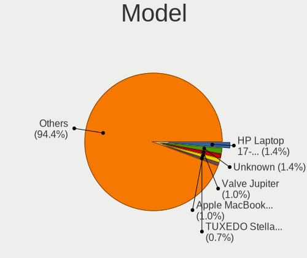
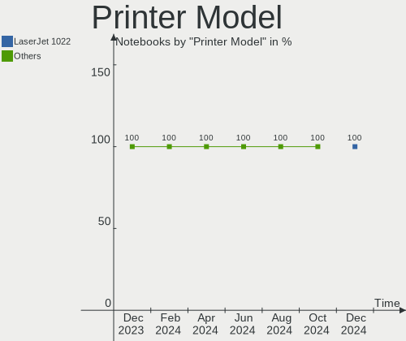

Linux in Germany - Hardware Trends (Notebooks)
----------------------------------------------

A project to identify most popular hardware characteristics and track their change
over time based on data collected by Linux users at https://Linux-Hardware.org.

Anyone can contribute to this report by the [hw-probe](https://github.com/linuxhw/hw-probe) tool:

    sudo -E hw-probe -all -upload

Period: Feb, 2023.

Contents
--------

* [ System ](#system)
  - [ OS                       ](#os)
  - [ OS Family                ](#os-family)
  - [ Kernel                   ](#kernel)
  - [ Kernel Family            ](#kernel-family)
  - [ Kernel Major Ver.        ](#kernel-major-ver)
  - [ Arch                     ](#arch)
  - [ DE                       ](#de)
  - [ Display Server           ](#display-server)
  - [ Display Manager          ](#display-manager)
  - [ OS Lang                  ](#os-lang)
  - [ Boot Mode                ](#boot-mode)
  - [ Filesystem               ](#filesystem)
  - [ Part. scheme             ](#part-scheme)
  - [ Dual Boot with Linux/BSD ](#dual-boot-with-linuxbsd)
  - [ Dual Boot (Win)          ](#dual-boot-win)

* [ Board ](#board)
  - [ Vendor                   ](#vendor)
  - [ Model                    ](#model)
  - [ Model Family             ](#model-family)
  - [ MFG Year                 ](#mfg-year)
  - [ Form Factor              ](#form-factor)
  - [ Secure Boot              ](#secure-boot)
  - [ Coreboot                 ](#coreboot)
  - [ RAM Size                 ](#ram-size)
  - [ RAM Used                 ](#ram-used)
  - [ Total Drives             ](#total-drives)
  - [ Has CD-ROM               ](#has-cd-rom)
  - [ Has Ethernet             ](#has-ethernet)
  - [ Has WiFi                 ](#has-wifi)
  - [ Has Bluetooth            ](#has-bluetooth)

* [ Location ](#location)
  - [ Country                  ](#country)
  - [ City                     ](#city)

* [ Drives ](#drives)
  - [ Drive Vendor             ](#drive-vendor)
  - [ Drive Model              ](#drive-model)
  - [ HDD Vendor               ](#hdd-vendor)
  - [ SSD Vendor               ](#ssd-vendor)
  - [ Drive Kind               ](#drive-kind)
  - [ Drive Connector          ](#drive-connector)
  - [ Drive Size               ](#drive-size)
  - [ Space Total              ](#space-total)
  - [ Space Used               ](#space-used)
  - [ Malfunc. Drives          ](#malfunc-drives)
  - [ Malfunc. Drive Vendor    ](#malfunc-drive-vendor)
  - [ Malfunc. HDD Vendor      ](#malfunc-hdd-vendor)
  - [ Malfunc. Drive Kind      ](#malfunc-drive-kind)
  - [ Failed Drives            ](#failed-drives)
  - [ Failed Drive Vendor      ](#failed-drive-vendor)
  - [ Drive Status             ](#drive-status)

* [ Storage controller ](#storage-controller)
  - [ Storage Vendor           ](#storage-vendor)
  - [ Storage Model            ](#storage-model)
  - [ Storage Kind             ](#storage-kind)

* [ Processor ](#processor)
  - [ CPU Vendor               ](#cpu-vendor)
  - [ CPU Model                ](#cpu-model)
  - [ CPU Model Family         ](#cpu-model-family)
  - [ CPU Cores                ](#cpu-cores)
  - [ CPU Sockets              ](#cpu-sockets)
  - [ CPU Threads              ](#cpu-threads)
  - [ CPU Op-Modes             ](#cpu-op-modes)
  - [ CPU Microcode            ](#cpu-microcode)
  - [ CPU Microarch            ](#cpu-microarch)

* [ Graphics ](#graphics)
  - [ GPU Vendor               ](#gpu-vendor)
  - [ GPU Model                ](#gpu-model)
  - [ GPU Combo                ](#gpu-combo)
  - [ GPU Driver               ](#gpu-driver)
  - [ GPU Memory               ](#gpu-memory)

* [ Monitor ](#monitor)
  - [ Monitor Vendor           ](#monitor-vendor)
  - [ Monitor Model            ](#monitor-model)
  - [ Monitor Resolution       ](#monitor-resolution)
  - [ Monitor Diagonal         ](#monitor-diagonal)
  - [ Monitor Width            ](#monitor-width)
  - [ Aspect Ratio             ](#aspect-ratio)
  - [ Monitor Area             ](#monitor-area)
  - [ Pixel Density            ](#pixel-density)
  - [ Multiple Monitors        ](#multiple-monitors)

* [ Network ](#network)
  - [ Net Controller Vendor    ](#net-controller-vendor)
  - [ Net Controller Model     ](#net-controller-model)
  - [ Wireless Vendor          ](#wireless-vendor)
  - [ Wireless Model           ](#wireless-model)
  - [ Ethernet Vendor          ](#ethernet-vendor)
  - [ Ethernet Model           ](#ethernet-model)
  - [ Net Controller Kind      ](#net-controller-kind)
  - [ Used Controller          ](#used-controller)
  - [ NICs                     ](#nics)
  - [ IPv6                     ](#ipv6)

* [ Bluetooth ](#bluetooth)
  - [ Bluetooth Vendor         ](#bluetooth-vendor)
  - [ Bluetooth Model          ](#bluetooth-model)

* [ Sound ](#sound)
  - [ Sound Vendor             ](#sound-vendor)
  - [ Sound Model              ](#sound-model)

* [ Memory ](#memory)
  - [ Memory Vendor            ](#memory-vendor)
  - [ Memory Model             ](#memory-model)
  - [ Memory Kind              ](#memory-kind)
  - [ Memory Form Factor       ](#memory-form-factor)
  - [ Memory Size              ](#memory-size)
  - [ Memory Speed             ](#memory-speed)

* [ Printers & scanners ](#printers--scanners)
  - [ Printer Vendor           ](#printer-vendor)
  - [ Printer Model            ](#printer-model)
  - [ Scanner Vendor           ](#scanner-vendor)
  - [ Scanner Model            ](#scanner-model)

* [ Camera ](#camera)
  - [ Camera Vendor            ](#camera-vendor)
  - [ Camera Model             ](#camera-model)

* [ Security ](#security)
  - [ Fingerprint Vendor       ](#fingerprint-vendor)
  - [ Fingerprint Model        ](#fingerprint-model)
  - [ Chipcard Vendor          ](#chipcard-vendor)
  - [ Chipcard Model           ](#chipcard-model)

* [ Unsupported ](#unsupported)
  - [ Unsupported Devices      ](#unsupported-devices)
  - [ Unsupported Device Types ](#unsupported-device-types)

System
------

OS
--

Installed operating systems

| Name                         | Notebooks | Percent |
|------------------------------|-----------|---------|
| Ubuntu 22.04                 | 53        | 14.68%  |
| Linux Mint 21.1              | 45        | 12.47%  |
| Ubuntu 22.10                 | 25        | 6.93%   |
| OpenMandriva 23.01           | 24        | 6.65%   |
| Fedora 37                    | 20        | 5.54%   |
| Debian 11                    | 17        | 4.71%   |
| Ubuntu 20.04                 | 13        | 3.6%    |
| Linux Mint 20.3              | 13        | 3.6%    |
| Pop!_OS 22.04                | 11        | 3.05%   |
| Arch Rolling                 | 11        | 3.05%   |
| Zorin 16                     | 10        | 2.77%   |
| SteamOS 3.4.4                | 10        | 2.77%   |
| openSUSE Tumbleweed-XXXXXXXX | 8         | 2.22%   |
| Elementary 7                 | 8         | 2.22%   |
| OpenMandriva 4.3             | 7         | 1.94%   |
| Manjaro                      | 6         | 1.66%   |
| Kubuntu 22.04                | 5         | 1.39%   |
| KDE neon 22.04               | 5         | 1.39%   |
| ArcoLinux Rolling            | 5         | 1.39%   |
| Xubuntu 22.04                | 4         | 1.11%   |
| Linux Mint 21                | 4         | 1.11%   |
| LMDE 5                       | 3         | 0.83%   |
| Kubuntu 22.10                | 3         | 0.83%   |
| Kali 2022.4                  | 3         | 0.83%   |
| Debian                       | 3         | 0.83%   |
| openSUSE Microos-XXXXXXXX    | 2         | 0.55%   |
| Manjaro 22.0.2               | 2         | 0.55%   |
| Linux Mint 19.3              | 2         | 0.55%   |
| Gentoo 2.9                   | 2         | 0.55%   |
| Garuda Linux Rolling         | 2         | 0.55%   |
| Endless 4.0.13               | 2         | 0.55%   |
| Elementary 6.1               | 2         | 0.55%   |
| blendOS                      | 2         | 0.55%   |
| Zorin 15                     | 1         | 0.28%   |
| Xubuntu 22.10                | 1         | 0.28%   |
| Xubuntu 20.04                | 1         | 0.28%   |
| Xero Rolling                 | 1         | 0.28%   |
| Ubuntu MATE 22.10            | 1         | 0.28%   |
| Ubuntu MATE 22.04            | 1         | 0.28%   |
| Ubuntu MATE 20.04            | 1         | 0.28%   |

OS Family
---------

OS without a version

| Name          | Notebooks | Percent |
|---------------|-----------|---------|
| Ubuntu        | 92        | 25.48%  |
| Linux Mint    | 67        | 18.56%  |
| OpenMandriva  | 33        | 9.14%   |
| Fedora        | 20        | 5.54%   |
| Debian        | 20        | 5.54%   |
| openSUSE      | 12        | 3.32%   |
| Zorin         | 11        | 3.05%   |
| SteamOS       | 11        | 3.05%   |
| Pop!_OS       | 11        | 3.05%   |
| Manjaro       | 11        | 3.05%   |
| Arch          | 11        | 3.05%   |
| Elementary    | 10        | 2.77%   |
| Kubuntu       | 8         | 2.22%   |
| Xubuntu       | 6         | 1.66%   |
| KDE neon      | 5         | 1.39%   |
| ArcoLinux     | 5         | 1.39%   |
| Kali          | 4         | 1.11%   |
| Ubuntu MATE   | 3         | 0.83%   |
| LMDE          | 3         | 0.83%   |
| Garuda Linux  | 3         | 0.83%   |
| Endless       | 3         | 0.83%   |
| Gentoo        | 2         | 0.55%   |
| blendOS       | 2         | 0.55%   |
| Xero          | 1         | 0.28%   |
| Ubuntu Budgie | 1         | 0.28%   |
| TUXEDO OS     | 1         | 0.28%   |
| Reborn OS     | 1         | 0.28%   |
| MX            | 1         | 0.28%   |
| Lubuntu       | 1         | 0.28%   |
| Gnoppix       | 1         | 0.28%   |
| Artix         | 1         | 0.28%   |

Kernel
------

Version of the Linux kernel

| Version                      | Notebooks | Percent |
|------------------------------|-----------|---------|
| 5.15.0-60-generic            | 63        | 17.45%  |
| 5.15.0-58-generic            | 42        | 11.63%  |
| 5.19.0-32-generic            | 24        | 6.65%   |
| 6.1.1-desktop-1omv2290       | 18        | 4.99%   |
| 5.19.0-31-generic            | 14        | 3.88%   |
| 5.10.0-21-amd64              | 12        | 3.32%   |
| 5.4.0-139-generic            | 11        | 3.05%   |
| 5.13.0-valve36-1-neptune     | 10        | 2.77%   |
| 6.0.12-76060006-generic      | 7         | 1.94%   |
| 5.19.0-29-generic            | 7         | 1.94%   |
| 5.4.0-137-generic            | 6         | 1.66%   |
| 5.19.0-21-generic            | 6         | 1.66%   |
| 6.1.4-desktop-1omv2301       | 5         | 1.39%   |
| 6.1.12-arch1-1               | 5         | 1.39%   |
| 6.1.10-arch1-1               | 5         | 1.39%   |
| 6.1.10-200.fc37.x86_64       | 5         | 1.39%   |
| 5.19.0-28-generic            | 5         | 1.39%   |
| 6.1.8-1-default              | 4         | 1.11%   |
| 6.1.12-1-default             | 4         | 1.11%   |
| 6.0.0-kali6-amd64            | 4         | 1.11%   |
| 5.10.0-20-amd64              | 4         | 1.11%   |
| 6.1.9-arch1-1                | 3         | 0.83%   |
| 6.1.9-200.fc37.x86_64        | 3         | 0.83%   |
| 6.1.8-200.fc37.x86_64        | 3         | 0.83%   |
| 6.1.11-200.fc37.x86_64       | 3         | 0.83%   |
| 5.16.7-desktop-1omv4003      | 3         | 0.83%   |
| 5.16.13-desktop-1omv4003     | 3         | 0.83%   |
| 6.1.9-1-MANJARO              | 2         | 0.55%   |
| 6.1.8-arch1-1                | 2         | 0.55%   |
| 6.1.7-200.fc37.x86_64        | 2         | 0.55%   |
| 6.1.12-1-MANJARO             | 2         | 0.55%   |
| 6.1.12-060112-generic        | 2         | 0.55%   |
| 6.1.11-zen1-1-zen            | 2         | 0.55%   |
| 6.1.11-arch1-1               | 2         | 0.55%   |
| 6.1.11-1-MANJARO             | 2         | 0.55%   |
| 5.19.0-26-generic            | 2         | 0.55%   |
| 5.15.0-58-lowlatency         | 2         | 0.55%   |
| 5.11.0-35-generic            | 2         | 0.55%   |
| 6.2.0-desktop-0.rc2.1omv2301 | 1         | 0.28%   |
| 6.2.0-060200-generic         | 1         | 0.28%   |

Kernel Family
-------------

Linux kernel without a distro release

| Version  | Notebooks | Percent |
|----------|-----------|---------|
| 5.15.0   | 114       | 31.58%  |
| 5.19.0   | 60        | 16.62%  |
| 6.1.1    | 19        | 5.26%   |
| 5.4.0    | 19        | 5.26%   |
| 5.10.0   | 17        | 4.71%   |
| 6.1.12   | 16        | 4.43%   |
| 5.13.0   | 13        | 3.6%    |
| 6.1.10   | 12        | 3.32%   |
| 6.1.9    | 11        | 3.05%   |
| 6.1.8    | 11        | 3.05%   |
| 6.1.11   | 11        | 3.05%   |
| 6.0.0    | 8         | 2.22%   |
| 6.0.12   | 7         | 1.94%   |
| 6.1.4    | 5         | 1.39%   |
| 6.1.7    | 3         | 0.83%   |
| 6.1.0    | 3         | 0.83%   |
| 5.16.7   | 3         | 0.83%   |
| 5.16.13  | 3         | 0.83%   |
| 6.2.0    | 2         | 0.55%   |
| 6.1.13   | 2         | 0.55%   |
| 5.15.91  | 2         | 0.55%   |
| 5.11.0   | 2         | 0.55%   |
| 6.1.6    | 1         | 0.28%   |
| 6.0.6    | 1         | 0.28%   |
| 6.0.19   | 1         | 0.28%   |
| 6.0.18   | 1         | 0.28%   |
| 6.0.10   | 1         | 0.28%   |
| 5.8.0    | 1         | 0.28%   |
| 5.3.18   | 1         | 0.28%   |
| 5.17.0   | 1         | 0.28%   |
| 5.16.0   | 1         | 0.28%   |
| 5.15.94  | 1         | 0.28%   |
| 5.15.88  | 1         | 0.28%   |
| 5.15.80  | 1         | 0.28%   |
| 5.14.21  | 1         | 0.28%   |
| 5.14.0   | 1         | 0.28%   |
| 5.10.164 | 1         | 0.28%   |
| 5.10.14  | 1         | 0.28%   |
| 4.15.0   | 1         | 0.28%   |
| 4.14.254 | 1         | 0.28%   |

Kernel Major Ver.
-----------------

Linux kernel major version

| Version | Notebooks | Percent |
|---------|-----------|---------|
| 5.15    | 119       | 32.96%  |
| 6.1     | 94        | 26.04%  |
| 5.19    | 60        | 16.62%  |
| 6.0     | 19        | 5.26%   |
| 5.4     | 19        | 5.26%   |
| 5.10    | 19        | 5.26%   |
| 5.13    | 13        | 3.6%    |
| 5.16    | 7         | 1.94%   |
| 6.2     | 2         | 0.55%   |
| 5.14    | 2         | 0.55%   |
| 5.11    | 2         | 0.55%   |
| 5.8     | 1         | 0.28%   |
| 5.3     | 1         | 0.28%   |
| 5.17    | 1         | 0.28%   |
| 4.15    | 1         | 0.28%   |
| 4.14    | 1         | 0.28%   |

Arch
----

OS architecture (x86_64, i586, etc.)

| Name   | Notebooks | Percent |
|--------|-----------|---------|
| x86_64 | 359       | 99.45%  |
| i686   | 2         | 0.55%   |

DE
--

Desktop Environment

| Name             | Notebooks | Percent |
|------------------|-----------|---------|
| GNOME            | 143       | 39.61%  |
| KDE5             | 85        | 23.55%  |
| X-Cinnamon       | 50        | 13.85%  |
| XFCE             | 35        | 9.7%    |
| MATE             | 12        | 3.32%   |
| Pantheon         | 10        | 2.77%   |
| Unknown          | 7         | 1.94%   |
| Cinnamon         | 3         | 0.83%   |
| LXQt             | 2         | 0.55%   |
| Hyprland         | 2         | 0.55%   |
| chadwm           | 2         | 0.55%   |
| sway             | 1         | 0.28%   |
| qtile            | 1         | 0.28%   |
| LXDE             | 1         | 0.28%   |
| lightdm-xsession | 1         | 0.28%   |
| KDE              | 1         | 0.28%   |
| i3               | 1         | 0.28%   |
| GNOME-Classic    | 1         | 0.28%   |
| GNOME Flashback  | 1         | 0.28%   |
| Budgie           | 1         | 0.28%   |
| awesome          | 1         | 0.28%   |

Display Server
--------------

X11 or Wayland

| Name    | Notebooks | Percent |
|---------|-----------|---------|
| X11     | 261       | 72.3%   |
| Wayland | 92        | 25.48%  |
| Tty     | 5         | 1.39%   |
| Unknown | 3         | 0.83%   |

Display Manager
---------------

SDDM, LightDM, etc.

| Name    | Notebooks | Percent |
|---------|-----------|---------|
| Unknown | 111       | 30.75%  |
| GDM3    | 84        | 23.27%  |
| LightDM | 75        | 20.78%  |
| SDDM    | 67        | 18.56%  |
| GDM     | 21        | 5.82%   |
| XDM     | 1         | 0.28%   |
| Ly      | 1         | 0.28%   |
| LXDM    | 1         | 0.28%   |

OS Lang
-------

Language

| Lang    | Notebooks | Percent |
|---------|-----------|---------|
| de_DE   | 252       | 69.81%  |
| en_US   | 83        | 22.99%  |
| en_GB   | 8         | 2.22%   |
| pl_PL   | 2         | 0.55%   |
| en_DE   | 2         | 0.55%   |
| C       | 2         | 0.55%   |
| ru_RU   | 1         | 0.28%   |
| ro_RO   | 1         | 0.28%   |
| POSIX   | 1         | 0.28%   |
| nl_NL   | 1         | 0.28%   |
| ksh_DE  | 1         | 0.28%   |
| it_IT   | 1         | 0.28%   |
| hu_HU   | 1         | 0.28%   |
| fr_FR   | 1         | 0.28%   |
| de_CH   | 1         | 0.28%   |
| de_AT   | 1         | 0.28%   |
| C.UTF8  | 1         | 0.28%   |
| Unknown | 1         | 0.28%   |

Boot Mode
---------

EFI or BIOS

| Mode | Notebooks | Percent |
|------|-----------|---------|
| BIOS | 188       | 52.08%  |
| EFI  | 173       | 47.92%  |

Filesystem
----------

Type of filesystem

| Type    | Notebooks | Percent |
|---------|-----------|---------|
| Ext4    | 284       | 78.67%  |
| Btrfs   | 54        | 14.96%  |
| Overlay | 20        | 5.54%   |
| Zfs     | 1         | 0.28%   |
| XXXfs   | 1         | 0.28%   |
| Tmpfs   | 1         | 0.28%   |

Part. scheme
------------

Scheme of partitioning

| Type    | Notebooks | Percent |
|---------|-----------|---------|
| GPT     | 200       | 55.4%   |
| Unknown | 104       | 28.81%  |
| MBR     | 57        | 15.79%  |

Dual Boot with Linux/BSD
------------------------

Hosting more than one Linux/BSD

| Dual boot | Notebooks | Percent |
|-----------|-----------|---------|
| No        | 307       | 85.04%  |
| Yes       | 54        | 14.96%  |

Dual Boot (Win)
---------------

Hosting Linux and Windows

| Dual boot | Notebooks | Percent |
|-----------|-----------|---------|
| No        | 287       | 79.5%   |
| Yes       | 74        | 20.5%   |

Board
-----

Vendor
------

Motherboard manufacturer

| Name                | Notebooks | Percent |
|---------------------|-----------|---------|
| Lenovo              | 107       | 29.64%  |
| Hewlett-Packard     | 44        | 12.19%  |
| Acer                | 39        | 10.8%   |
| Dell                | 33        | 9.14%   |
| ASUSTek Computer    | 27        | 7.48%   |
| TUXEDO              | 11        | 3.05%   |
| Medion              | 11        | 3.05%   |
| Valve               | 10        | 2.77%   |
| Toshiba             | 10        | 2.77%   |
| Apple               | 9         | 2.49%   |
| Sony                | 8         | 2.22%   |
| Samsung Electronics | 7         | 1.94%   |
| MSI                 | 7         | 1.94%   |
| Fujitsu             | 7         | 1.94%   |
| Schenker            | 4         | 1.11%   |
| Packard Bell        | 3         | 0.83%   |
| HUAWEI              | 3         | 0.83%   |
| Google              | 3         | 0.83%   |
| Fujitsu Siemens     | 3         | 0.83%   |
| Tactus              | 2         | 0.55%   |
| Notebook            | 2         | 0.55%   |
| Wortmann AG         | 1         | 0.28%   |
| Star Labs           | 1         | 0.28%   |
| SLIMBOOK            | 1         | 0.28%   |
| Insyde              | 1         | 0.28%   |
| IBM                 | 1         | 0.28%   |
| HONOR               | 1         | 0.28%   |
| CSL-Computer        | 1         | 0.28%   |
| AXDIA International | 1         | 0.28%   |
| AMI                 | 1         | 0.28%   |
| Alienware           | 1         | 0.28%   |
| Acidanthera         | 1         | 0.28%   |

Model
-----

Motherboard model

| Name                                 | Notebooks | Percent |
|--------------------------------------|-----------|---------|
| Valve Jupiter                        | 10        | 2.77%   |
| Lenovo IdeaPad 5 Pro 16ARH7 82SN     | 3         | 0.83%   |
| Lenovo IdeaPad 3 15ALC6 82KU         | 3         | 0.83%   |
| Unknown                              | 3         | 0.83%   |
| Toshiba Satellite L50-B              | 2         | 0.55%   |
| Tactus GeoBook 140                   | 2         | 0.55%   |
| Lenovo ThinkPad E495 20NEA001GE      | 2         | 0.55%   |
| Lenovo ThinkPad E15 Gen 4 21EES00100 | 2         | 0.55%   |
| Lenovo Legion 5 15ACH6A 82NW         | 2         | 0.55%   |
| Lenovo IdeaPad L340-15API 81LW       | 2         | 0.55%   |
| Lenovo IdeaPad 5 Pro 16ACH6 82L5     | 2         | 0.55%   |
| Lenovo G780 2182                     | 2         | 0.55%   |
| HP ProBook 430 G4                    | 2         | 0.55%   |
| HP Notebook                          | 2         | 0.55%   |
| HP 250 G6 Notebook PC                | 2         | 0.55%   |
| Fujitsu LIFEBOOK E754                | 2         | 0.55%   |
| Dell XPS 13 9360                     | 2         | 0.55%   |
| Dell Precision M4800                 | 2         | 0.55%   |
| Dell Latitude E7470                  | 2         | 0.55%   |
| Apple MacBookPro15,1                 | 2         | 0.55%   |
| Acer Swift SF114-34                  | 2         | 0.55%   |
| Acer Aspire V3-771                   | 2         | 0.55%   |
| Acer Aspire E1-572G                  | 2         | 0.55%   |
| Wortmann AG TERRA_MOBILE_1512/1712   | 1         | 0.28%   |
| TUXEDO Stellaris/Polaris AMD Gen4    | 1         | 0.28%   |
| TUXEDO Stellaris Intel Gen4          | 1         | 0.28%   |
| TUXEDO Pulse 15 Gen2                 | 1         | 0.28%   |
| TUXEDO Pulse 14 Gen1                 | 1         | 0.28%   |
| TUXEDO Polaris Intel Gen3 (TGL)      | 1         | 0.28%   |
| TUXEDO Polaris AMD Gen3 (CZN)        | 1         | 0.28%   |
| TUXEDO N8xxEZ                        | 1         | 0.28%   |
| TUXEDO InfinityBook S 15/17 Gen7     | 1         | 0.28%   |
| TUXEDO Aura 15 Gen2                  | 1         | 0.28%   |
| Toshiba Satellite Pro S300L          | 1         | 0.28%   |
| Toshiba Satellite P775               | 1         | 0.28%   |
| Toshiba Satellite L70-B              | 1         | 0.28%   |
| Toshiba Satellite L550               | 1         | 0.28%   |
| Toshiba Satellite C855-2J5           | 1         | 0.28%   |
| Toshiba Satellite C660D              | 1         | 0.28%   |
| Toshiba Satellite C55-A              | 1         | 0.28%   |

Model Family
------------

Motherboard model prefix

| Name                  | Notebooks | Percent |
|-----------------------|-----------|---------|
| Lenovo ThinkPad       | 74        | 20.5%   |
| Acer Aspire           | 31        | 8.59%   |
| Lenovo IdeaPad        | 19        | 5.26%   |
| Dell Latitude         | 15        | 4.16%   |
| Valve Jupiter         | 10        | 2.77%   |
| Toshiba Satellite     | 10        | 2.77%   |
| Fujitsu LIFEBOOK      | 7         | 1.94%   |
| HP Laptop             | 6         | 1.66%   |
| HP EliteBook          | 6         | 1.66%   |
| Dell Precision        | 6         | 1.66%   |
| HP 250                | 5         | 1.39%   |
| Dell XPS              | 5         | 1.39%   |
| Dell Inspiron         | 5         | 1.39%   |
| HP ZBook              | 4         | 1.11%   |
| HP ProBook            | 4         | 1.11%   |
| HP ENVY               | 4         | 1.11%   |
| HP Compaq             | 4         | 1.11%   |
| Acer Swift            | 4         | 1.11%   |
| Packard Bell EasyNote | 3         | 0.83%   |
| Medion Akoya          | 3         | 0.83%   |
| Lenovo Legion         | 3         | 0.83%   |
| HP Pavilion           | 3         | 0.83%   |
| ASUS VivoBook         | 3         | 0.83%   |
| ASUS ASUS             | 3         | 0.83%   |
| Unknown               | 3         | 0.83%   |
| TUXEDO Stellaris      | 2         | 0.55%   |
| TUXEDO Pulse          | 2         | 0.55%   |
| TUXEDO Polaris        | 2         | 0.55%   |
| Tactus GeoBook        | 2         | 0.55%   |
| Schenker XMG          | 2         | 0.55%   |
| Medion Erazer         | 2         | 0.55%   |
| Lenovo G780           | 2         | 0.55%   |
| HP Notebook           | 2         | 0.55%   |
| Fujitsu Siemens AMILO | 2         | 0.55%   |
| Dell Vostro           | 2         | 0.55%   |
| ASUS ZenBook          | 2         | 0.55%   |
| Apple MacBookPro15    | 2         | 0.55%   |
| Wortmann AG TERRA     | 1         | 0.28%   |
| TUXEDO N8xxEZ         | 1         | 0.28%   |
| TUXEDO InfinityBook   | 1         | 0.28%   |

MFG Year
--------

Motherboard manufacture year

| Year | Notebooks | Percent |
|------|-----------|---------|
| 2021 | 44        | 12.19%  |
| 2022 | 37        | 10.25%  |
| 2019 | 32        | 8.86%   |
| 2013 | 31        | 8.59%   |
| 2012 | 30        | 8.31%   |
| 2010 | 23        | 6.37%   |
| 2018 | 22        | 6.09%   |
| 2016 | 21        | 5.82%   |
| 2020 | 20        | 5.54%   |
| 2017 | 20        | 5.54%   |
| 2011 | 19        | 5.26%   |
| 2014 | 18        | 4.99%   |
| 2015 | 13        | 3.6%    |
| 2009 | 12        | 3.32%   |
| 2008 | 11        | 3.05%   |
| 2007 | 5         | 1.39%   |
| 2006 | 2         | 0.55%   |
| 2023 | 1         | 0.28%   |

Form Factor
-----------

Physical design of the computer

| Name     | Notebooks | Percent |
|----------|-----------|---------|
| Notebook | 361       | 100%    |

Secure Boot
-----------

Enabled or disabled

| State    | Notebooks | Percent |
|----------|-----------|---------|
| Disabled | 327       | 90.58%  |
| Enabled  | 34        | 9.42%   |

Coreboot
--------

Have coreboot on board

| Used | Notebooks | Percent |
|------|-----------|---------|
| No   | 357       | 98.89%  |
| Yes  | 4         | 1.11%   |

RAM Size
--------

Total RAM memory

| Size in GB  | Notebooks | Percent |
|-------------|-----------|---------|
| 4.01-8.0    | 88        | 24.38%  |
| 8.01-16.0   | 79        | 21.88%  |
| 3.01-4.0    | 72        | 19.94%  |
| 16.01-24.0  | 59        | 16.34%  |
| 32.01-64.0  | 27        | 7.48%   |
| 64.01-256.0 | 11        | 3.05%   |
| 1.01-2.0    | 10        | 2.77%   |
| 24.01-32.0  | 7         | 1.94%   |
| 2.01-3.0    | 6         | 1.66%   |
| 0.51-1.0    | 2         | 0.55%   |

RAM Used
--------

Used RAM memory

| Used GB    | Notebooks | Percent |
|------------|-----------|---------|
| 1.01-2.0   | 140       | 38.78%  |
| 2.01-3.0   | 94        | 26.04%  |
| 4.01-8.0   | 55        | 15.24%  |
| 3.01-4.0   | 34        | 9.42%   |
| 8.01-16.0  | 16        | 4.43%   |
| 0.51-1.0   | 14        | 3.88%   |
| 0.01-0.5   | 5         | 1.39%   |
| 32.01-64.0 | 1         | 0.28%   |
| 24.01-32.0 | 1         | 0.28%   |
| 16.01-24.0 | 1         | 0.28%   |

Total Drives
------------

Number of drives on board

| Drives | Notebooks | Percent |
|--------|-----------|---------|
| 1      | 272       | 75.35%  |
| 2      | 81        | 22.44%  |
| 3      | 6         | 1.66%   |
| 4      | 2         | 0.55%   |

Has CD-ROM
----------

Has CD-ROM on board

| Presented | Notebooks | Percent |
|-----------|-----------|---------|
| No        | 222       | 61.5%   |
| Yes       | 139       | 38.5%   |

Has Ethernet
------------

Has Ethernet on board

| Presented | Notebooks | Percent |
|-----------|-----------|---------|
| Yes       | 301       | 83.38%  |
| No        | 60        | 16.62%  |

Has WiFi
--------

Has WiFi module

| Presented | Notebooks | Percent |
|-----------|-----------|---------|
| Yes       | 350       | 96.95%  |
| No        | 11        | 3.05%   |

Has Bluetooth
-------------

Has Bluetooth module

| Presented | Notebooks | Percent |
|-----------|-----------|---------|
| Yes       | 280       | 77.56%  |
| No        | 81        | 22.44%  |

Location
--------

Country
-------

Geographic location (country)

| Country | Notebooks | Percent |
|---------|-----------|---------|
| Germany | 361       | 100%    |

City
----

Geographic location (city)

| City                   | Notebooks | Percent |
|------------------------|-----------|---------|
| Berlin                 | 33        | 9.14%   |
| Munich                 | 16        | 4.43%   |
| Cologne                | 11        | 3.05%   |
| Frankfurt am Main      | 10        | 2.77%   |
| Leipzig                | 7         | 1.94%   |
| Hanover                | 7         | 1.94%   |
| Hamburg                | 7         | 1.94%   |
| Stuttgart              | 6         | 1.66%   |
| Stuhr                  | 6         | 1.66%   |
| Nuremberg              | 6         | 1.66%   |
| Dortmund               | 6         | 1.66%   |
| Wuppertal              | 5         | 1.39%   |
| Karlsruhe              | 5         | 1.39%   |
| Essen                  | 5         | 1.39%   |
| Ludwigsburg            | 4         | 1.11%   |
| Cottbus                | 4         | 1.11%   |
| Vechelde               | 3         | 0.83%   |
| Salzgitter             | 3         | 0.83%   |
| Mannheim               | 3         | 0.83%   |
| Hamm                   | 3         | 0.83%   |
| Duisburg               | 3         | 0.83%   |
| Dresden                | 3         | 0.83%   |
| Wilhelmshaven          | 2         | 0.55%   |
| Weimar                 | 2         | 0.55%   |
| Solingen               | 2         | 0.55%   |
| Schwarzenbek           | 2         | 0.55%   |
| Rieschweiler-Muehlbach | 2         | 0.55%   |
| Pforzheim              | 2         | 0.55%   |
| Oldenburg              | 2         | 0.55%   |
| Neuss                  | 2         | 0.55%   |
| Nandlstadt             | 2         | 0.55%   |
| Münster               | 2         | 0.55%   |
| Mainz                  | 2         | 0.55%   |
| Luechow                | 2         | 0.55%   |
| Langenfeld             | 2         | 0.55%   |
| Krumbach               | 2         | 0.55%   |
| Konstanz               | 2         | 0.55%   |
| Heidelberg             | 2         | 0.55%   |
| Gelsenkirchen          | 2         | 0.55%   |
| Dessau                 | 2         | 0.55%   |

Drives
------

Drive Vendor
------------

Hard drive vendors

| Vendor                      | Notebooks | Drives | Percent |
|-----------------------------|-----------|--------|---------|
| Samsung Electronics         | 97        | 107    | 22.3%   |
| SanDisk                     | 55        | 58     | 12.64%  |
| WDC                         | 33        | 33     | 7.59%   |
| Toshiba                     | 30        | 30     | 6.9%    |
| Unknown                     | 27        | 28     | 6.21%   |
| Seagate                     | 27        | 27     | 6.21%   |
| Micron Technology           | 17        | 17     | 3.91%   |
| Intenso                     | 16        | 17     | 3.68%   |
| Crucial                     | 16        | 17     | 3.68%   |
| Kingston                    | 15        | 15     | 3.45%   |
| Intel                       | 14        | 15     | 3.22%   |
| SK hynix                    | 12        | 13     | 2.76%   |
| Hitachi                     | 8         | 8      | 1.84%   |
| Unknown                     | 8         | 8      | 1.84%   |
| HGST                        | 5         | 5      | 1.15%   |
| Apple                       | 5         | 5      | 1.15%   |
| Transcend                   | 4         | 4      | 0.92%   |
| Phison Electronics          | 4         | 4      | 0.92%   |
| Kingston Technology Company | 4         | 4      | 0.92%   |
| A-DATA Technology           | 4         | 4      | 0.92%   |
| UMIS                        | 3         | 3      | 0.69%   |
| KIOXIA                      | 3         | 3      | 0.69%   |
| Silicon Motion              | 2         | 2      | 0.46%   |
| Netac                       | 2         | 2      | 0.46%   |
| Micron/Crucial Technology   | 2         | 2      | 0.46%   |
| China                       | 2         | 2      | 0.46%   |
| Union Memory                | 1         | 1      | 0.23%   |
| TrekStor                    | 1         | 1      | 0.23%   |
| Star Drive                  | 1         | 1      | 0.23%   |
| SSSTC                       | 1         | 1      | 0.23%   |
| Phison                      | 1         | 1      | 0.23%   |
| Patriot                     | 1         | 1      | 0.23%   |
| O2 Micro                    | 1         | 1      | 0.23%   |
| MAXIO Technology (Hangzhou) | 1         | 1      | 0.23%   |
| LITEONIT                    | 1         | 1      | 0.23%   |
| LITEON                      | 1         | 1      | 0.23%   |
| Leven                       | 1         | 1      | 0.23%   |
| Lenovo                      | 1         | 1      | 0.23%   |
| LaCie                       | 1         | 1      | 0.23%   |
| KingSpec                    | 1         | 1      | 0.23%   |

Drive Model
-----------

Hard drive models

| Model                                                | Notebooks | Percent |
|------------------------------------------------------|-----------|---------|
| Samsung NVMe SSD Controller PM9A1/PM9A3/980PRO 960GB | 10        | 2.24%   |
| Unknown                                              | 8         | 1.79%   |
| Samsung NVMe SSD Controller SM981/PM981/PM983 250GB  | 7         | 1.57%   |
| Unknown MMC Card  32GB                               | 6         | 1.35%   |
| Unknown MMC Card  64GB                               | 5         | 1.12%   |
| Toshiba MQ01ABF050 500GB                             | 5         | 1.12%   |
| Micron MTFDHBA512QFD 512GB                           | 5         | 1.12%   |
| Crucial CT500MX500SSD1 500GB                         | 5         | 1.12%   |
| WDC WD10JPVX-22JC3T0 1TB                             | 4         | 0.9%    |
| Sandisk WD Black SN750 / PC SN730 NVMe SSD 512GB     | 4         | 0.9%    |
| SanDisk SSD PLUS 1000GB                              | 4         | 0.9%    |
| Sandisk PC SN520 NVMe SSD 512GB                      | 4         | 0.9%    |
| Samsung SSD 860 EVO 500GB                            | 4         | 0.9%    |
| Samsung SSD 860 EVO 250GB                            | 4         | 0.9%    |
| Samsung SSD 860 EVO 1TB                              | 4         | 0.9%    |
| Kingston Company OM3PDP3 NVMe SSD 512GB              | 4         | 0.9%    |
| Crucial CT1000MX500SSD1 1TB                          | 4         | 0.9%    |
| SK hynix SKHynix_HFM512GD3HX015N 512GB               | 3         | 0.67%   |
| SK hynix BC501 NVMe Solid State Drive 512GB          | 3         | 0.67%   |
| Seagate ST9500325AS 500GB                            | 3         | 0.67%   |
| Seagate ST9320325AS 320GB                            | 3         | 0.67%   |
| SanDisk SSD PLUS 480GB                               | 3         | 0.67%   |
| SanDisk SSD PLUS 240GB                               | 3         | 0.67%   |
| SanDisk SDSSDP064G 64GB                              | 3         | 0.67%   |
| SanDisk SDSSDH3 500G                                 | 3         | 0.67%   |
| SanDisk SD8TB8U256G1001 256GB SSD                    | 3         | 0.67%   |
| SanDisk NVMe SSD Drive 1TB                           | 3         | 0.67%   |
| Samsung SSD 980 PRO 1TB                              | 3         | 0.67%   |
| Samsung SSD 970 EVO 1TB                              | 3         | 0.67%   |
| Samsung SSD 840 EVO 250GB                            | 3         | 0.67%   |
| Samsung NVMe SSD Controller SM961/PM961/SM963 512GB  | 3         | 0.67%   |
| Phison PS5013 E13 NVMe Controller 500GB              | 3         | 0.67%   |
| Intel SSDPEKNU512GZ 512GB                            | 3         | 0.67%   |
| WDC WDS500G2B0A-00SM50 500GB SSD                     | 2         | 0.45%   |
| WDC WD1600BEVT-22ZCT0 160GB                          | 2         | 0.45%   |
| WDC WD10SPZX-60Z10T0 1TB                             | 2         | 0.45%   |
| WDC WD10SPZX-24Z10 1TB                               | 2         | 0.45%   |
| WDC WD10SPZX-21Z10T0 1TB                             | 2         | 0.45%   |
| Unknown SD/MMC/MS PRO 16GB                           | 2         | 0.45%   |
| Unknown MMC Card  512GB                              | 2         | 0.45%   |

HDD Vendor
----------

Hard disk drive vendors

| Vendor              | Notebooks | Drives | Percent |
|---------------------|-----------|--------|---------|
| WDC                 | 26        | 26     | 28.89%  |
| Seagate             | 26        | 26     | 28.89%  |
| Toshiba             | 17        | 17     | 18.89%  |
| Hitachi             | 8         | 8      | 8.89%   |
| HGST                | 5         | 5      | 5.56%   |
| Samsung Electronics | 3         | 3      | 3.33%   |
| Unknown             | 2         | 3      | 2.22%   |
| LaCie               | 1         | 1      | 1.11%   |
| Intenso             | 1         | 1      | 1.11%   |
| Fujitsu             | 1         | 1      | 1.11%   |

SSD Vendor
----------

Solid state drive vendors

| Vendor              | Notebooks | Drives | Percent |
|---------------------|-----------|--------|---------|
| Samsung Electronics | 43        | 44     | 26.88%  |
| SanDisk             | 38        | 40     | 23.75%  |
| Crucial             | 16        | 17     | 10%     |
| Intenso             | 14        | 14     | 8.75%   |
| Kingston            | 11        | 11     | 6.88%   |
| Toshiba             | 5         | 5      | 3.13%   |
| Transcend           | 4         | 4      | 2.5%    |
| Intel               | 4         | 4      | 2.5%    |
| A-DATA Technology   | 3         | 3      | 1.88%   |
| WDC                 | 2         | 2      | 1.25%   |
| Netac               | 2         | 2      | 1.25%   |
| Micron Technology   | 2         | 2      | 1.25%   |
| China               | 2         | 2      | 1.25%   |
| Apple               | 2         | 2      | 1.25%   |
| Unknown             | 2         | 2      | 1.25%   |
| Unknown             | 1         | 1      | 0.63%   |
| SK hynix            | 1         | 1      | 0.63%   |
| Patriot             | 1         | 1      | 0.63%   |
| LITEONIT            | 1         | 1      | 0.63%   |
| LITEON              | 1         | 1      | 0.63%   |
| Leven               | 1         | 1      | 0.63%   |
| KingSpec            | 1         | 1      | 0.63%   |
| INNOVATION IT       | 1         | 1      | 0.63%   |
| Dogfish             | 1         | 1      | 0.63%   |
| ASMT                | 1         | 1      | 0.63%   |

Drive Kind
----------

HDD or SSD

| Kind    | Notebooks | Drives | Percent |
|---------|-----------|--------|---------|
| SSD     | 149       | 164    | 35.82%  |
| NVMe    | 144       | 163    | 34.62%  |
| HDD     | 88        | 91     | 21.15%  |
| MMC     | 31        | 31     | 7.45%   |
| Unknown | 4         | 4      | 0.96%   |

Drive Connector
---------------

SATA, SAS, NVMe, etc.

| Type | Notebooks | Drives | Percent |
|------|-----------|--------|---------|
| SATA | 218       | 247    | 54.09%  |
| NVMe | 144       | 163    | 35.73%  |
| MMC  | 31        | 31     | 7.69%   |
| SAS  | 10        | 12     | 2.48%   |

Drive Size
----------

Size of hard drive

| Size in TB | Notebooks | Drives | Percent |
|------------|-----------|--------|---------|
| 0.01-0.5   | 164       | 179    | 68.62%  |
| 0.51-1.0   | 63        | 64     | 26.36%  |
| 1.01-2.0   | 11        | 11     | 4.6%    |
| 3.01-4.0   | 1         | 1      | 0.42%   |

Space Total
-----------

Amount of disk space available on the file system

| Size in GB     | Notebooks | Percent |
|----------------|-----------|---------|
| 101-250        | 116       | 32.13%  |
| 251-500        | 69        | 19.11%  |
| 501-1000       | 64        | 17.73%  |
| 1-20           | 25        | 6.93%   |
| 51-100         | 25        | 6.93%   |
| 1001-2000      | 22        | 6.09%   |
| More than 3000 | 14        | 3.88%   |
| 21-50          | 11        | 3.05%   |
| Unknown        | 8         | 2.22%   |
| 2001-3000      | 7         | 1.94%   |

Space Used
----------

Amount of used disk space

| Used GB        | Notebooks | Percent |
|----------------|-----------|---------|
| 1-20           | 114       | 31.58%  |
| 21-50          | 76        | 21.05%  |
| 101-250        | 57        | 15.79%  |
| 51-100         | 47        | 13.02%  |
| 251-500        | 28        | 7.76%   |
| 501-1000       | 17        | 4.71%   |
| 1001-2000      | 9         | 2.49%   |
| Unknown        | 8         | 2.22%   |
| More than 3000 | 4         | 1.11%   |
| 2001-3000      | 1         | 0.28%   |

Malfunc. Drives
---------------

Drive models with a malfunction

| Model                                                           | Notebooks | Drives | Percent |
|-----------------------------------------------------------------|-----------|--------|---------|
| Seagate ST9320325AS 320GB                                       | 2         | 2      | 8.7%    |
| WDC WD5000LPCX-24C6HT0 500GB                                    | 1         | 1      | 4.35%   |
| WDC WD10JPVX-22JC3T0 1TB                                        | 1         | 1      | 4.35%   |
| WDC WD10JPVX-00JC3T0 1TB                                        | 1         | 1      | 4.35%   |
| Toshiba MQ01ABD075 752GB                                        | 1         | 1      | 4.35%   |
| Toshiba MK3265GSX 320GB                                         | 1         | 1      | 4.35%   |
| Seagate ST9500325AS 500GB                                       | 1         | 1      | 4.35%   |
| Seagate ST9320320AS 320GB                                       | 1         | 1      | 4.35%   |
| Seagate ST320LT020-9YG142 320GB                                 | 1         | 1      | 4.35%   |
| Seagate ST1000LX015-1U7172 1TB                                  | 1         | 1      | 4.35%   |
| Seagate ST1000LM024 HN-M101MBB 1TB                              | 1         | 1      | 4.35%   |
| SanDisk SSD U100 24GB                                           | 1         | 1      | 4.35%   |
| SanDisk SSD PLUS 240GB                                          | 1         | 1      | 4.35%   |
| SanDisk SSD PLUS 240 GB                                         | 1         | 1      | 4.35%   |
| SanDisk SSD PLUS 1000GB                                         | 1         | 1      | 4.35%   |
| Samsung Electronics SSD 970 EVO 500GB                           | 1         | 1      | 4.35%   |
| Samsung Electronics NVMe SSD Controller SM981/PM981/PM983 250GB | 1         | 1      | 4.35%   |
| Samsung Electronics HM250JI 250GB                               | 1         | 1      | 4.35%   |
| Samsung Electronics HM100JC 100GB                               | 1         | 1      | 4.35%   |
| Micron Technology 1100_MTFDDAV512TBN 512GB SSD                  | 1         | 1      | 4.35%   |
| Intel SSDSC2BF180A5L 180GB                                      | 1         | 1      | 4.35%   |
| China Solid 512GB SSD                                           | 1         | 1      | 4.35%   |

Malfunc. Drive Vendor
---------------------

Vendors of faulty drives

| Vendor              | Notebooks | Drives | Percent |
|---------------------|-----------|--------|---------|
| Seagate             | 7         | 7      | 30.43%  |
| SanDisk             | 4         | 4      | 17.39%  |
| Samsung Electronics | 4         | 4      | 17.39%  |
| WDC                 | 3         | 3      | 13.04%  |
| Toshiba             | 2         | 2      | 8.7%    |
| Micron Technology   | 1         | 1      | 4.35%   |
| Intel               | 1         | 1      | 4.35%   |
| China               | 1         | 1      | 4.35%   |

Malfunc. HDD Vendor
-------------------

Vendors of faulty HDD drives

| Vendor              | Notebooks | Drives | Percent |
|---------------------|-----------|--------|---------|
| Seagate             | 7         | 7      | 50%     |
| WDC                 | 3         | 3      | 21.43%  |
| Toshiba             | 2         | 2      | 14.29%  |
| Samsung Electronics | 2         | 2      | 14.29%  |

Malfunc. Drive Kind
-------------------

Kinds of faulty drives

| Kind | Notebooks | Drives | Percent |
|------|-----------|--------|---------|
| HDD  | 14        | 14     | 60.87%  |
| SSD  | 7         | 7      | 30.43%  |
| NVMe | 2         | 2      | 8.7%    |

Failed Drives
-------------

Failed drive models

Zero info for selected period =(

Failed Drive Vendor
-------------------

Failed drive vendors

Zero info for selected period =(

Drive Status
------------

Number of failed and malfunc. drives

| Status   | Notebooks | Drives | Percent |
|----------|-----------|--------|---------|
| Detected | 196       | 250    | 52.27%  |
| Works    | 156       | 180    | 41.6%   |
| Malfunc  | 23        | 23     | 6.13%   |

Storage controller
------------------

Storage Vendor
--------------

Storage controller vendors

| Vendor                           | Notebooks | Percent |
|----------------------------------|-----------|---------|
| Intel                            | 221       | 53.13%  |
| Samsung Electronics              | 57        | 13.7%   |
| AMD                              | 42        | 10.1%   |
| SanDisk                          | 22        | 5.29%   |
| Micron Technology                | 15        | 3.61%   |
| SK hynix                         | 11        | 2.64%   |
| Kingston Technology Company      | 8         | 1.92%   |
| Toshiba America Info Systems     | 7         | 1.68%   |
| Phison Electronics               | 6         | 1.44%   |
| Union Memory (Shenzhen)          | 4         | 0.96%   |
| KIOXIA                           | 4         | 0.96%   |
| Nvidia                           | 3         | 0.72%   |
| Silicon Motion                   | 2         | 0.48%   |
| Silicon Integrated Systems [SiS] | 2         | 0.48%   |
| Micron/Crucial Technology        | 2         | 0.48%   |
| Apple                            | 2         | 0.48%   |
| ADATA Technology                 | 2         | 0.48%   |
| ULi Electronics                  | 1         | 0.24%   |
| Solid State Storage Technology   | 1         | 0.24%   |
| Seagate Technology               | 1         | 0.24%   |
| O2 Micro                         | 1         | 0.24%   |
| MAXIO Technology (Hangzhou)      | 1         | 0.24%   |
| Lenovo                           | 1         | 0.24%   |

Storage Model
-------------

Storage controller models

| Model                                                                            | Notebooks | Percent |
|----------------------------------------------------------------------------------|-----------|---------|
| AMD FCH SATA Controller [AHCI mode]                                              | 36        | 8.05%   |
| Intel Sunrise Point-LP SATA Controller [AHCI mode]                               | 33        | 7.38%   |
| Intel 7 Series Chipset Family 6-port SATA Controller [AHCI mode]                 | 24        | 5.37%   |
| Samsung NVMe SSD Controller SM981/PM981/PM983                                    | 22        | 4.92%   |
| Samsung NVMe SSD Controller PM9A1/PM9A3/980PRO                                   | 19        | 4.25%   |
| Intel 8 Series SATA Controller 1 [AHCI mode]                                     | 18        | 4.03%   |
| Intel 6 Series/C200 Series Chipset Family 6 port Mobile SATA AHCI Controller     | 18        | 4.03%   |
| Intel 82801 Mobile SATA Controller [RAID mode]                                   | 16        | 3.58%   |
| Micron Non-Volatile memory controller                                            | 15        | 3.36%   |
| Intel 8 Series/C220 Series Chipset Family 6-port SATA Controller 1 [AHCI mode]   | 14        | 3.13%   |
| Intel 5 Series/3400 Series Chipset 4 port SATA AHCI Controller                   | 12        | 2.68%   |
| Samsung NVMe SSD Controller 980                                                  | 8         | 1.79%   |
| Intel Volume Management Device NVMe RAID Controller                              | 8         | 1.79%   |
| Intel 82801IBM/IEM (ICH9M/ICH9M-E) 4 port SATA Controller [AHCI mode]            | 8         | 1.79%   |
| Samsung NVMe SSD Controller SM961/PM961/SM963                                    | 7         | 1.57%   |
| Intel Cannon Lake Mobile PCH SATA AHCI Controller                                | 7         | 1.57%   |
| Intel 82801HM/HEM (ICH8M/ICH8M-E) IDE Controller                                 | 6         | 1.34%   |
| Intel 5 Series/3400 Series Chipset 6 port SATA AHCI Controller                   | 6         | 1.34%   |
| SK hynix Gold P31/PC711 NVMe Solid State Drive                                   | 5         | 1.12%   |
| Intel Wildcat Point-LP SATA Controller [AHCI Mode]                               | 5         | 1.12%   |
| Intel Celeron/Pentium Silver Processor SATA Controller                           | 5         | 1.12%   |
| Intel 82801HM/HEM (ICH8M/ICH8M-E) SATA Controller [AHCI mode]                    | 5         | 1.12%   |
| AMD SB7x0/SB8x0/SB9x0 SATA Controller [AHCI mode]                                | 5         | 1.12%   |
| Toshiba America Info Systems XG5 NVMe SSD Controller                             | 4         | 0.89%   |
| SanDisk WD Blue SN550 NVMe SSD                                                   | 4         | 0.89%   |
| SanDisk WD Black SN750 / PC SN730 NVMe SSD                                       | 4         | 0.89%   |
| SanDisk PC SN520 NVMe SSD                                                        | 4         | 0.89%   |
| Sandisk Non-Volatile memory controller                                           | 4         | 0.89%   |
| Kingston Company Company Non-Volatile memory controller                          | 4         | 0.89%   |
| Kingston Company OM3PDP3 NVMe SSD                                                | 4         | 0.89%   |
| Intel Non-Volatile memory controller                                             | 4         | 0.89%   |
| Intel HM170/QM170 Chipset SATA Controller [AHCI Mode]                            | 4         | 0.89%   |
| SK hynix BC501 NVMe Solid State Drive                                            | 3         | 0.67%   |
| SanDisk WD PC SN810 / Black SN850 NVMe SSD                                       | 3         | 0.67%   |
| Phison PS5013 E13 NVMe Controller                                                | 3         | 0.67%   |
| KIOXIA Non-Volatile memory controller                                            | 3         | 0.67%   |
| Intel Cannon Point-LP SATA Controller [AHCI Mode]                                | 3         | 0.67%   |
| Intel Atom/Celeron/Pentium Processor x5-E8000/J3xxx/N3xxx Series SATA Controller | 3         | 0.67%   |
| Intel Atom Processor E3800 Series SATA AHCI Controller                           | 3         | 0.67%   |
| Intel 82801IBM/IEM (ICH9M/ICH9M-E) 2 port SATA Controller [IDE mode]             | 3         | 0.67%   |

Storage Kind
------------

Kind of storage controller (IDE, SATA, NVMe, SAS, ...)

| Kind | Notebooks | Percent |
|------|-----------|---------|
| SATA | 229       | 54.01%  |
| NVMe | 145       | 34.2%   |
| IDE  | 26        | 6.13%   |
| RAID | 24        | 5.66%   |

Processor
---------

CPU Vendor
----------

Processor vendors

| Vendor | Notebooks | Percent |
|--------|-----------|---------|
| Intel  | 276       | 76.45%  |
| AMD    | 85        | 23.55%  |

CPU Model
---------

Processor models

| Model                                         | Notebooks | Percent |
|-----------------------------------------------|-----------|---------|
| Intel Core i5-6300U CPU @ 2.40GHz             | 11        | 3.05%   |
| AMD Custom APU 0405                           | 10        | 2.77%   |
| Intel Core i5-7200U CPU @ 2.50GHz             | 9         | 2.49%   |
| Intel 11th Gen Core i7-1165G7 @ 2.80GHz       | 7         | 1.94%   |
| Intel Core i5-4210U CPU @ 1.70GHz             | 6         | 1.66%   |
| Intel Core i5-2520M CPU @ 2.50GHz             | 6         | 1.66%   |
| Intel 12th Gen Core i7-1260P                  | 6         | 1.66%   |
| Intel Core i7-9750H CPU @ 2.60GHz             | 5         | 1.39%   |
| Intel Core i7-8550U CPU @ 1.80GHz             | 5         | 1.39%   |
| Intel Core i5-6200U CPU @ 2.30GHz             | 5         | 1.39%   |
| AMD Ryzen 7 5700U with Radeon Graphics        | 5         | 1.39%   |
| AMD Ryzen 5 5500U with Radeon Graphics        | 5         | 1.39%   |
| Intel Core i7-8750H CPU @ 2.20GHz             | 4         | 1.11%   |
| Intel Core i7-4702MQ CPU @ 2.20GHz            | 4         | 1.11%   |
| Intel Core i5-8265U CPU @ 1.60GHz             | 4         | 1.11%   |
| Intel Core i5-3230M CPU @ 2.60GHz             | 4         | 1.11%   |
| Intel Celeron N4020 CPU @ 1.10GHz             | 4         | 1.11%   |
| Intel 11th Gen Core i5-1135G7 @ 2.40GHz       | 4         | 1.11%   |
| AMD Ryzen 7 PRO 4750U with Radeon Graphics    | 4         | 1.11%   |
| AMD Ryzen 7 5800H with Radeon Graphics        | 4         | 1.11%   |
| AMD Ryzen 5 3500U with Radeon Vega Mobile Gfx | 4         | 1.11%   |
| AMD Ryzen 3 5300U with Radeon Graphics        | 4         | 1.11%   |
| Intel Pentium Silver N6000 @ 1.10GHz          | 3         | 0.83%   |
| Intel Core i7-7500U CPU @ 2.70GHz             | 3         | 0.83%   |
| Intel Core i7-6600U CPU @ 2.60GHz             | 3         | 0.83%   |
| Intel Core i7-4710MQ CPU @ 2.50GHz            | 3         | 0.83%   |
| Intel Core i7 CPU M 620 @ 2.67GHz             | 3         | 0.83%   |
| Intel Core i5-8350U CPU @ 1.70GHz             | 3         | 0.83%   |
| Intel Core i5-4300U CPU @ 1.90GHz             | 3         | 0.83%   |
| Intel Core i5-4200U CPU @ 1.60GHz             | 3         | 0.83%   |
| Intel Core i5-3320M CPU @ 2.60GHz             | 3         | 0.83%   |
| Intel Core i5-3210M CPU @ 2.50GHz             | 3         | 0.83%   |
| Intel Core i5-2450M CPU @ 2.50GHz             | 3         | 0.83%   |
| Intel Core i3 CPU M 370 @ 2.40GHz             | 3         | 0.83%   |
| Intel Core 2 Duo CPU T6500 @ 2.10GHz          | 3         | 0.83%   |
| Intel Core 2 Duo CPU P8700 @ 2.53GHz          | 3         | 0.83%   |
| Intel 11th Gen Core i5-11400H @ 2.70GHz       | 3         | 0.83%   |
| AMD Ryzen 7 5825U with Radeon Graphics        | 3         | 0.83%   |
| AMD Ryzen 7 4800H with Radeon Graphics        | 3         | 0.83%   |
| AMD E-450 APU with Radeon HD Graphics         | 3         | 0.83%   |

CPU Model Family
----------------

Processor model prefix

| Model                   | Notebooks | Percent |
|-------------------------|-----------|---------|
| Intel Core i5           | 95        | 26.32%  |
| Intel Core i7           | 69        | 19.11%  |
| Other                   | 39        | 10.8%   |
| AMD Ryzen 7             | 25        | 6.93%   |
| Intel Pentium           | 16        | 4.43%   |
| AMD Ryzen 5             | 16        | 4.43%   |
| Intel Core i3           | 15        | 4.16%   |
| Intel Core 2 Duo        | 15        | 4.16%   |
| Intel Celeron           | 15        | 4.16%   |
| AMD Ryzen 3             | 7         | 1.94%   |
| Intel Atom              | 6         | 1.66%   |
| AMD Ryzen 7 PRO         | 5         | 1.39%   |
| AMD A6                  | 5         | 1.39%   |
| Intel Pentium Dual      | 4         | 1.11%   |
| AMD E                   | 4         | 1.11%   |
| Intel Pentium Silver    | 3         | 0.83%   |
| Intel Pentium Dual-Core | 3         | 0.83%   |
| Intel Core i9           | 3         | 0.83%   |
| AMD Turion 64 X2 Mobile | 2         | 0.55%   |
| AMD Ryzen 5 PRO         | 2         | 0.55%   |
| AMD A4                  | 2         | 0.55%   |
| Intel Xeon              | 1         | 0.28%   |
| Intel Pentium M         | 1         | 0.28%   |
| Intel Genuine           | 1         | 0.28%   |
| AMD Turion 64 Mobile    | 1         | 0.28%   |
| AMD Ryzen 9             | 1         | 0.28%   |
| AMD E2                  | 1         | 0.28%   |
| AMD E1                  | 1         | 0.28%   |
| AMD C-60                | 1         | 0.28%   |
| AMD Athlon II           | 1         | 0.28%   |
| AMD A10                 | 1         | 0.28%   |

CPU Cores
---------

Number of processor cores

| Number | Notebooks | Percent |
|--------|-----------|---------|
| 2      | 171       | 47.37%  |
| 4      | 111       | 30.75%  |
| 6      | 31        | 8.59%   |
| 8      | 28        | 7.76%   |
| 1      | 9         | 2.49%   |
| 12     | 6         | 1.66%   |
| 10     | 3         | 0.83%   |
| 14     | 2         | 0.55%   |

CPU Sockets
-----------

Number of sockets

| Number | Notebooks | Percent |
|--------|-----------|---------|
| 1      | 361       | 100%    |

CPU Threads
-----------

Threads per core (Hyper-Threading)

| Number | Notebooks | Percent |
|--------|-----------|---------|
| 2      | 277       | 76.73%  |
| 1      | 82        | 22.71%  |
| 4      | 2         | 0.55%   |

CPU Op-Modes
------------

CPU Operation Modes (32-bit, 64-bit)

| Op mode        | Notebooks | Percent |
|----------------|-----------|---------|
| 32-bit, 64-bit | 359       | 99.45%  |
| 32-bit         | 2         | 0.55%   |

CPU Microcode
-------------

Microcode number

| Number     | Notebooks | Percent |
|------------|-----------|---------|
| Unknown    | 126       | 34.9%   |
| 0x40651    | 16        | 4.43%   |
| 0x206a7    | 13        | 3.6%    |
| 0x08608103 | 12        | 3.32%   |
| 0x906ea    | 11        | 3.05%   |
| 0x306a9    | 11        | 3.05%   |
| 0x806ea    | 10        | 2.77%   |
| 0x406e3    | 10        | 2.77%   |
| 0x806c1    | 9         | 2.49%   |
| 0x306c3    | 9         | 2.49%   |
| 0x20655    | 9         | 2.49%   |
| 0x1067a    | 8         | 2.22%   |
| 0x806e9    | 7         | 1.94%   |
| 0x906a3    | 6         | 1.66%   |
| 0x806ec    | 6         | 1.66%   |
| 0x08108102 | 6         | 1.66%   |
| 0x806d1    | 5         | 1.39%   |
| 0x0a50000c | 5         | 1.39%   |
| 0x08600106 | 5         | 1.39%   |
| 0x906c0    | 4         | 1.11%   |
| 0x6fd      | 4         | 1.11%   |
| 0x20652    | 4         | 1.11%   |
| 0x0a404101 | 4         | 1.11%   |
| 0x906e9    | 3         | 0.83%   |
| 0x906a4    | 3         | 0.83%   |
| 0x806eb    | 3         | 0.83%   |
| 0x706a8    | 3         | 0.83%   |
| 0x506c9    | 3         | 0.83%   |
| 0x306d4    | 3         | 0.83%   |
| 0x30678    | 3         | 0.83%   |
| 0x0a50000d | 3         | 0.83%   |
| 0xa0652    | 2         | 0.55%   |
| 0x706e5    | 2         | 0.55%   |
| 0x506e3    | 2         | 0.55%   |
| 0x406c3    | 2         | 0.55%   |
| 0x106ca    | 2         | 0.55%   |
| 0x0a404102 | 2         | 0.55%   |
| 0x08600103 | 2         | 0.55%   |
| 0x0810100b | 2         | 0.55%   |
| 0x0700010f | 2         | 0.55%   |

CPU Microarch
-------------

Microarchitecture

| Name             | Notebooks | Percent |
|------------------|-----------|---------|
| KabyLake         | 57        | 15.79%  |
| Haswell          | 38        | 10.53%  |
| Unknown          | 34        | 9.42%   |
| SandyBridge      | 24        | 6.65%   |
| IvyBridge        | 24        | 6.65%   |
| Skylake          | 23        | 6.37%   |
| Westmere         | 17        | 4.71%   |
| Penryn           | 14        | 3.88%   |
| Zen 3            | 13        | 3.6%    |
| TigerLake        | 13        | 3.6%    |
| Zen 2            | 11        | 3.05%   |
| Silvermont       | 10        | 2.77%   |
| Zen+             | 9         | 2.49%   |
| Icelake          | 9         | 2.49%   |
| Core             | 9         | 2.49%   |
| Alderlake Hybrid | 8         | 2.22%   |
| Goldmont plus    | 6         | 1.66%   |
| Broadwell        | 6         | 1.66%   |
| Bobcat           | 5         | 1.39%   |
| Tremont          | 4         | 1.11%   |
| Zen              | 3         | 0.83%   |
| Puma             | 3         | 0.83%   |
| Piledriver       | 3         | 0.83%   |
| K8 Hammer        | 3         | 0.83%   |
| Goldmont         | 3         | 0.83%   |
| P6               | 2         | 0.55%   |
| Jaguar           | 2         | 0.55%   |
| Excavator        | 2         | 0.55%   |
| CometLake        | 2         | 0.55%   |
| Bonnell          | 2         | 0.55%   |
| Nehalem          | 1         | 0.28%   |
| K10              | 1         | 0.28%   |

Graphics
--------

GPU Vendor
----------

Vendors of graphics cards

| Vendor | Notebooks | Percent |
|--------|-----------|---------|
| Intel  | 243       | 54%     |
| AMD    | 114       | 25.33%  |
| Nvidia | 93        | 20.67%  |

GPU Model
---------

Graphics card models

| Model                                                                                    | Notebooks | Percent |
|------------------------------------------------------------------------------------------|-----------|---------|
| Intel 2nd Generation Core Processor Family Integrated Graphics Controller                | 24        | 5.24%   |
| Intel Skylake GT2 [HD Graphics 520]                                                      | 21        | 4.59%   |
| Intel 3rd Gen Core processor Graphics Controller                                         | 21        | 4.59%   |
| Intel Haswell-ULT Integrated Graphics Controller                                         | 19        | 4.15%   |
| Intel 4th Gen Core Processor Integrated Graphics Controller                              | 16        | 3.49%   |
| Intel HD Graphics 620                                                                    | 14        | 3.06%   |
| AMD Lucienne                                                                             | 14        | 3.06%   |
| Intel TigerLake-LP GT2 [Iris Xe Graphics]                                                | 13        | 2.84%   |
| AMD Renoir                                                                               | 11        | 2.4%    |
| Intel Core Processor Integrated Graphics Controller                                      | 10        | 2.18%   |
| AMD VanGogh [AMD Custom GPU 0405]                                                        | 10        | 2.18%   |
| Intel WhiskeyLake-U GT2 [UHD Graphics 620]                                               | 9         | 1.97%   |
| Intel UHD Graphics 620                                                                   | 9         | 1.97%   |
| Intel CoffeeLake-H GT2 [UHD Graphics 630]                                                | 9         | 1.97%   |
| AMD Picasso/Raven 2 [Radeon Vega Series / Radeon Vega Mobile Series]                     | 9         | 1.97%   |
| Intel Mobile 4 Series Chipset Integrated Graphics Controller                             | 8         | 1.75%   |
| Intel Alder Lake-P Integrated Graphics Controller                                        | 8         | 1.75%   |
| AMD Cezanne [Radeon Vega Series / Radeon Vega Mobile Series]                             | 7         | 1.53%   |
| Nvidia GA106M [GeForce RTX 3060 Mobile / Max-Q]                                          | 6         | 1.31%   |
| Intel GeminiLake [UHD Graphics 600]                                                      | 6         | 1.31%   |
| Intel Atom/Celeron/Pentium Processor x5-E8000/J3xxx/N3xxx Integrated Graphics Controller | 6         | 1.31%   |
| AMD Sun XT [Radeon HD 8670A/8670M/8690M / R5 M330 / M430 / Radeon 520 Mobile]            | 6         | 1.31%   |
| AMD Rembrandt [Radeon 680M]                                                              | 6         | 1.31%   |
| AMD Barcelo                                                                              | 6         | 1.31%   |
| Nvidia TU117M [GeForce GTX 1650 Mobile / Max-Q]                                          | 5         | 1.09%   |
| Intel JasperLake [UHD Graphics]                                                          | 5         | 1.09%   |
| Intel HD Graphics 630                                                                    | 5         | 1.09%   |
| Intel HD Graphics 5500                                                                   | 5         | 1.09%   |
| Nvidia GM108M [GeForce 840M]                                                             | 4         | 0.87%   |
| Nvidia GF117M [GeForce 610M/710M/810M/820M / GT 620M/625M/630M/720M]                     | 4         | 0.87%   |
| Intel TigerLake-H GT1 [UHD Graphics]                                                     | 4         | 0.87%   |
| Intel Mobile GM965/GL960 Integrated Graphics Controller (secondary)                      | 4         | 0.87%   |
| Intel Mobile GM965/GL960 Integrated Graphics Controller (primary)                        | 4         | 0.87%   |
| Intel Atom Processor Z36xxx/Z37xxx Series Graphics & Display                             | 4         | 0.87%   |
| Nvidia GP108M [GeForce MX150]                                                            | 3         | 0.66%   |
| Nvidia GM108M [GeForce 940MX]                                                            | 3         | 0.66%   |
| Nvidia GM107M [GeForce GTX 950M]                                                         | 3         | 0.66%   |
| Nvidia GK107M [GeForce GT 750M]                                                          | 3         | 0.66%   |
| Nvidia GF108M [GeForce GT 620M/630M/635M/640M LE]                                        | 3         | 0.66%   |
| Nvidia GA107M [GeForce RTX 3050 Mobile]                                                  | 3         | 0.66%   |

GPU Combo
---------

Combinations of graphics cards

| Name           | Notebooks | Percent |
|----------------|-----------|---------|
| 1 x Intel      | 160       | 44.32%  |
| 1 x AMD        | 87        | 24.1%   |
| Intel + Nvidia | 66        | 18.28%  |
| 1 x Nvidia     | 18        | 4.99%   |
| Intel + AMD    | 14        | 3.88%   |
| AMD + Nvidia   | 9         | 2.49%   |
| 2 x AMD        | 4         | 1.11%   |
| 2 x Intel      | 2         | 0.55%   |
| Other          | 1         | 0.28%   |

GPU Driver
----------

Free vs proprietary

| Driver      | Notebooks | Percent |
|-------------|-----------|---------|
| Free        | 311       | 86.15%  |
| Proprietary | 39        | 10.8%   |
| Unknown     | 11        | 3.05%   |

GPU Memory
----------

Total video memory

| Size in GB | Notebooks | Percent |
|------------|-----------|---------|
| Unknown    | 244       | 67.59%  |
| 0.01-0.5   | 37        | 10.25%  |
| 1.01-2.0   | 36        | 9.97%   |
| 0.51-1.0   | 19        | 5.26%   |
| 3.01-4.0   | 15        | 4.16%   |
| 5.01-6.0   | 6         | 1.66%   |
| 7.01-8.0   | 4         | 1.11%   |

Monitor
-------

Monitor Vendor
--------------

Monitor vendors

| Vendor                  | Notebooks | Percent |
|-------------------------|-----------|---------|
| AU Optronics            | 88        | 22.11%  |
| Chimei Innolux          | 63        | 15.83%  |
| LG Display              | 52        | 13.07%  |
| BOE                     | 42        | 10.55%  |
| Samsung Electronics     | 33        | 8.29%   |
| Valve                   | 10        | 2.51%   |
| Chi Mei Optoelectronics | 10        | 2.51%   |
| Apple                   | 10        | 2.51%   |
| Lenovo                  | 8         | 2.01%   |
| Dell                    | 7         | 1.76%   |
| Hewlett-Packard         | 6         | 1.51%   |
| Goldstar                | 6         | 1.51%   |
| BenQ                    | 6         | 1.51%   |
| Sharp                   | 5         | 1.26%   |
| Philips                 | 5         | 1.26%   |
| CSO                     | 5         | 1.26%   |
| LG Philips              | 4         | 1.01%   |
| Ancor Communications    | 4         | 1.01%   |
| PANDA                   | 3         | 0.75%   |
| Fujitsu Siemens         | 3         | 0.75%   |
| Sony                    | 2         | 0.5%    |
| Iiyama                  | 2         | 0.5%    |
| HUAWEI                  | 2         | 0.5%    |
| AOC                     | 2         | 0.5%    |
| Acer                    | 2         | 0.5%    |
| ViewSonic               | 1         | 0.25%   |
| Vestel Elektronik       | 1         | 0.25%   |
| Tianma XM               | 1         | 0.25%   |
| Quanta Display          | 1         | 0.25%   |
| MS_ Nvidia              | 1         | 0.25%   |
| LGD                     | 1         | 0.25%   |
| LG Electronics          | 1         | 0.25%   |
| KDB                     | 1         | 0.25%   |
| InfoVision              | 1         | 0.25%   |
| HannStar                | 1         | 0.25%   |
| Grundig                 | 1         | 0.25%   |
| Eizo                    | 1         | 0.25%   |
| Denver                  | 1         | 0.25%   |
| CTO                     | 1         | 0.25%   |
| CPT                     | 1         | 0.25%   |

Monitor Model
-------------

Monitor models

| Model                                                                     | Notebooks | Percent |
|---------------------------------------------------------------------------|-----------|---------|
| Valve ANX7530 U VLV3001 800x1280 100x150mm 7.1-inch                       | 10        | 2.5%    |
| Chimei Innolux LCD Monitor CMN15F5 1920x1080 344x193mm 15.5-inch          | 4         | 1%      |
| Chimei Innolux LCD Monitor CMN14D4 1920x1080 309x173mm 13.9-inch          | 4         | 1%      |
| AU Optronics LCD Monitor AUO22EC 1366x768 344x193mm 15.5-inch             | 4         | 1%      |
| AU Optronics LCD Monitor AUO21ED 1920x1080 344x193mm 15.5-inch            | 4         | 1%      |
| Samsung Electronics LCD Monitor SEC544B 1600x900 382x214mm 17.2-inch      | 3         | 0.75%   |
| Samsung Electronics LCD Monitor SEC4256 1600x900 382x215mm 17.3-inch      | 3         | 0.75%   |
| LG Display LCD Monitor LGD056D 1920x1080 382x215mm 17.3-inch              | 3         | 0.75%   |
| LG Display LCD Monitor LGD02E3 1366x768 344x194mm 15.5-inch               | 3         | 0.75%   |
| LG Display LCD Monitor LGD02DC 1366x768 344x194mm 15.5-inch               | 3         | 0.75%   |
| Chimei Innolux LCD Monitor CMN15E8 1920x1080 344x193mm 15.5-inch          | 3         | 0.75%   |
| Chimei Innolux LCD Monitor CMN14C9 1920x1080 309x173mm 13.9-inch          | 3         | 0.75%   |
| Chimei Innolux LCD Monitor CMN1482 1600x900 309x174mm 14.0-inch           | 3         | 0.75%   |
| BOE LCD Monitor BOE0700 1920x1080 344x194mm 15.5-inch                     | 3         | 0.75%   |
| BOE LCD Monitor BOE0687 1920x1080 344x193mm 15.5-inch                     | 3         | 0.75%   |
| AU Optronics LCD Monitor AUO61ED 1920x1080 344x193mm 15.5-inch            | 3         | 0.75%   |
| AU Optronics LCD Monitor AUO45EC 1366x768 344x193mm 15.5-inch             | 3         | 0.75%   |
| AU Optronics LCD Monitor AUO408D 1920x1080 309x174mm 14.0-inch            | 3         | 0.75%   |
| Sony LCD Monitor SNY05FA 1366x768 310x170mm 13.9-inch                     | 2         | 0.5%    |
| Samsung Electronics LCD Monitor SEC314B 1600x900 344x194mm 15.5-inch      | 2         | 0.5%    |
| LG Display LCD Monitor LGD06A5 1920x1080 344x194mm 15.5-inch              | 2         | 0.5%    |
| LG Display LCD Monitor LGD0521 1920x1080 309x174mm 14.0-inch              | 2         | 0.5%    |
| LG Display LCD Monitor LGD046C 1920x1080 382x215mm 17.3-inch              | 2         | 0.5%    |
| LG Display LCD Monitor LGD0465 1366x768 344x194mm 15.5-inch               | 2         | 0.5%    |
| LG Display LCD Monitor LGD040F 1920x1080 345x194mm 15.6-inch              | 2         | 0.5%    |
| LG Display LCD Monitor LGD033A 1366x768 344x194mm 15.5-inch               | 2         | 0.5%    |
| CSO LCD Monitor CSO1615 2560x1600 344x215mm 16.0-inch                     | 2         | 0.5%    |
| Chimei Innolux LCD Monitor CMN1745 1600x900 382x214mm 17.2-inch           | 2         | 0.5%    |
| Chimei Innolux LCD Monitor CMN1735 1920x1080 382x215mm 17.3-inch          | 2         | 0.5%    |
| Chimei Innolux LCD Monitor CMN1728 1600x900 382x215mm 17.3-inch           | 2         | 0.5%    |
| Chimei Innolux LCD Monitor CMN15E7 1920x1080 344x193mm 15.5-inch          | 2         | 0.5%    |
| Chimei Innolux LCD Monitor CMN15DB 1366x768 344x193mm 15.5-inch           | 2         | 0.5%    |
| Chimei Innolux LCD Monitor CMN15C3 1920x1080 344x193mm 15.5-inch          | 2         | 0.5%    |
| Chimei Innolux LCD Monitor CMN1521 1920x1080 344x193mm 15.5-inch          | 2         | 0.5%    |
| Chimei Innolux LCD Monitor CMN151E 1920x1080 344x193mm 15.5-inch          | 2         | 0.5%    |
| Chimei Innolux LCD Monitor CMN1368 1366x768 293x164mm 13.2-inch           | 2         | 0.5%    |
| Chi Mei Optoelectronics LCD Monitor CMO1720 1920x1080 382x215mm 17.3-inch | 2         | 0.5%    |
| BOE LCD Monitor BOE0A67 2560x1440 344x194mm 15.5-inch                     | 2         | 0.5%    |
| BOE LCD Monitor BOE0977 2560x1440 381x214mm 17.2-inch                     | 2         | 0.5%    |
| BOE LCD Monitor BOE094C 1920x1200 302x188mm 14.0-inch                     | 2         | 0.5%    |

Monitor Resolution
------------------

Monitor screen resolution

| Resolution         | Notebooks | Percent |
|--------------------|-----------|---------|
| 1920x1080 (FHD)    | 172       | 46.11%  |
| 1366x768 (WXGA)    | 74        | 19.84%  |
| 1600x900 (HD+)     | 32        | 8.58%   |
| 2560x1440 (QHD)    | 16        | 4.29%   |
| 1280x800 (WXGA)    | 14        | 3.75%   |
| 3840x2160 (4K)     | 13        | 3.49%   |
| 800x1280           | 10        | 2.68%   |
| 1920x1200 (WUXGA)  | 8         | 2.14%   |
| 1680x1050 (WSXGA+) | 7         | 1.88%   |
| 2880x1800          | 4         | 1.07%   |
| 2560x1600          | 4         | 1.07%   |
| 3440x1440          | 3         | 0.8%    |
| 1440x900 (WXGA+)   | 3         | 0.8%    |
| 1680x945           | 2         | 0.54%   |
| 1024x600           | 2         | 0.54%   |
| Unknown            | 2         | 0.54%   |
| 7280x1440          | 1         | 0.27%   |
| 3840x2400          | 1         | 0.27%   |
| 3840x1080          | 1         | 0.27%   |
| 3200x1800 (QHD+)   | 1         | 0.27%   |
| 3000x2000          | 1         | 0.27%   |
| 1400x1050          | 1         | 0.27%   |
| 1360x768           | 1         | 0.27%   |

Monitor Diagonal
----------------

Diagonal size in inches

| Inches  | Notebooks | Percent |
|---------|-----------|---------|
| 15      | 140       | 35.44%  |
| 17      | 53        | 13.42%  |
| 14      | 51        | 12.91%  |
| 13      | 47        | 11.9%   |
| 27      | 20        | 5.06%   |
| 24      | 18        | 4.56%   |
| 7       | 10        | 2.53%   |
| 12      | 9         | 2.28%   |
| 11      | 7         | 1.77%   |
| 23      | 6         | 1.52%   |
| Unknown | 6         | 1.52%   |
| 16      | 5         | 1.27%   |
| 18      | 4         | 1.01%   |
| 34      | 3         | 0.76%   |
| 21      | 3         | 0.76%   |
| 84      | 2         | 0.51%   |
| 54      | 2         | 0.51%   |
| 31      | 2         | 0.51%   |
| 22      | 2         | 0.51%   |
| 10      | 2         | 0.51%   |
| 40      | 1         | 0.25%   |
| 32      | 1         | 0.25%   |
| 28      | 1         | 0.25%   |

Monitor Width
-------------

Physical width

| Width in mm | Notebooks | Percent |
|-------------|-----------|---------|
| 301-350     | 221       | 55.95%  |
| 351-400     | 55        | 13.92%  |
| 501-600     | 41        | 10.38%  |
| 201-300     | 38        | 9.62%   |
| 1-100       | 10        | 2.53%   |
| 401-500     | 9         | 2.28%   |
| 601-700     | 6         | 1.52%   |
| Unknown     | 6         | 1.52%   |
| 701-800     | 4         | 1.01%   |
| 1501-2000   | 2         | 0.51%   |
| 1001-1500   | 2         | 0.51%   |
| 801-900     | 1         | 0.25%   |

Aspect Ratio
------------

Proportional relationship between the width and the height

| Ratio   | Notebooks | Percent |
|---------|-----------|---------|
| 16/9    | 290       | 82.86%  |
| 16/10   | 39        | 11.14%  |
| 0.67    | 10        | 2.86%   |
| Unknown | 5         | 1.43%   |
| 21/9    | 3         | 0.86%   |
| 3/2     | 2         | 0.57%   |
| 4/3     | 1         | 0.29%   |

Monitor Area
------------

Area in inch²

| Area in inch² | Notebooks | Percent |
|----------------|-----------|---------|
| 101-110        | 139       | 35.19%  |
| 81-90          | 83        | 21.01%  |
| 121-130        | 48        | 12.15%  |
| 201-250        | 26        | 6.58%   |
| 301-350        | 20        | 5.06%   |
| 71-80          | 15        | 3.8%    |
| 1-40           | 10        | 2.53%   |
| 61-70          | 9         | 2.28%   |
| 51-60          | 7         | 1.77%   |
| 351-500        | 7         | 1.77%   |
| Unknown        | 6         | 1.52%   |
| 131-140        | 5         | 1.27%   |
| More than 1000 | 4         | 1.01%   |
| 141-150        | 4         | 1.01%   |
| 111-120        | 4         | 1.01%   |
| 251-300        | 3         | 0.76%   |
| 41-50          | 2         | 0.51%   |
| 91-100         | 2         | 0.51%   |
| 501-1000       | 1         | 0.25%   |

Pixel Density
-------------

Pixels per inch

| Density       | Notebooks | Percent |
|---------------|-----------|---------|
| 121-160       | 179       | 46.25%  |
| 101-120       | 102       | 26.36%  |
| 51-100        | 52        | 13.44%  |
| 161-240       | 39        | 10.08%  |
| More than 240 | 8         | 2.07%   |
| Unknown       | 6         | 1.55%   |
| 1-50          | 1         | 0.26%   |

Multiple Monitors
-----------------

Total monitors connected

| Total | Notebooks | Percent |
|-------|-----------|---------|
| 1     | 288       | 79.78%  |
| 2     | 56        | 15.51%  |
| 0     | 12        | 3.32%   |
| 3     | 5         | 1.39%   |

Network
-------

Net Controller Vendor
---------------------

Controller vendors

| Vendor                            | Notebooks | Percent |
|-----------------------------------|-----------|---------|
| Intel                             | 191       | 33.1%   |
| Realtek Semiconductor             | 170       | 29.46%  |
| Qualcomm Atheros                  | 81        | 14.04%  |
| Broadcom                          | 37        | 6.41%   |
| Broadcom Limited                  | 14        | 2.43%   |
| MediaTek                          | 9         | 1.56%   |
| Marvell Technology Group          | 8         | 1.39%   |
| Sierra Wireless                   | 7         | 1.21%   |
| Dell                              | 7         | 1.21%   |
| ASIX Electronics                  | 5         | 0.87%   |
| Samsung Electronics               | 4         | 0.69%   |
| Fibocom                           | 4         | 0.69%   |
| Ericsson Business Mobile Networks | 4         | 0.69%   |
| Ralink                            | 3         | 0.52%   |
| Lenovo                            | 3         | 0.52%   |
| DisplayLink                       | 3         | 0.52%   |
| TP-Link                           | 2         | 0.35%   |
| Silicon Integrated Systems [SiS]  | 2         | 0.35%   |
| Ralink Technology                 | 2         | 0.35%   |
| OnePlus Technology (Shenzhen)     | 2         | 0.35%   |
| Nvidia                            | 2         | 0.35%   |
| JMicron Technology                | 2         | 0.35%   |
| Huawei Technologies               | 2         | 0.35%   |
| Hewlett-Packard                   | 2         | 0.35%   |
| Xiaomi                            | 1         | 0.17%   |
| Winbond Electronics               | 1         | 0.17%   |
| Wacom                             | 1         | 0.17%   |
| ULi Electronics                   | 1         | 0.17%   |
| Qualcomm Atheros Communications   | 1         | 0.17%   |
| Qualcomm                          | 1         | 0.17%   |
| NetGear                           | 1         | 0.17%   |
| Google                            | 1         | 0.17%   |
| Edimax Technology                 | 1         | 0.17%   |
| D-Link                            | 1         | 0.17%   |
| AVM                               | 1         | 0.17%   |

Net Controller Model
--------------------

Controller models

| Model                                                                   | Notebooks | Percent |
|-------------------------------------------------------------------------|-----------|---------|
| Realtek RTL8111/8168/8411 PCI Express Gigabit Ethernet Controller       | 103       | 14.55%  |
| Realtek RTL810xE PCI Express Fast Ethernet controller                   | 18        | 2.54%   |
| Intel Wi-Fi 6 AX200                                                     | 17        | 2.4%    |
| Realtek RTL8822CE 802.11ac PCIe Wireless Network Adapter                | 16        | 2.26%   |
| Intel Wireless 8265 / 8275                                              | 16        | 2.26%   |
| Intel Wireless 7260                                                     | 16        | 2.26%   |
| Qualcomm Atheros QCA9377 802.11ac Wireless Network Adapter              | 15        | 2.12%   |
| Intel Wireless 8260                                                     | 15        | 2.12%   |
| Intel Ethernet Connection I219-LM                                       | 14        | 1.98%   |
| Realtek RTL8153 Gigabit Ethernet Adapter                                | 13        | 1.84%   |
| Intel 82579LM Gigabit Network Connection (Lewisville)                   | 13        | 1.84%   |
| Intel Centrino Advanced-N 6205 [Taylor Peak]                            | 12        | 1.69%   |
| Qualcomm Atheros AR9285 Wireless Network Adapter (PCI-Express)          | 11        | 1.55%   |
| Intel Wi-Fi 6 AX201                                                     | 11        | 1.55%   |
| Intel Alder Lake-P PCH CNVi WiFi                                        | 10        | 1.41%   |
| Realtek RTL8852AE 802.11ax PCIe Wireless Network Adapter                | 9         | 1.27%   |
| Realtek RTL8821CE 802.11ac PCIe Wireless Network Adapter                | 9         | 1.27%   |
| Qualcomm Atheros AR9462 Wireless Network Adapter                        | 9         | 1.27%   |
| Qualcomm Atheros AR8151 v2.0 Gigabit Ethernet                           | 8         | 1.13%   |
| MediaTek MT7921 802.11ax PCI Express Wireless Network Adapter           | 8         | 1.13%   |
| Intel Ethernet Connection I217-LM                                       | 8         | 1.13%   |
| Realtek Realtek Network controller                                      | 7         | 0.99%   |
| Qualcomm Atheros QCA9565 / AR9565 Wireless Network Adapter              | 7         | 0.99%   |
| Qualcomm Atheros AR9485 Wireless Network Adapter                        | 7         | 0.99%   |
| Intel Wireless 3160                                                     | 7         | 0.99%   |
| Intel Ethernet Connection I218-LM                                       | 7         | 0.99%   |
| Broadcom BCM43142 802.11b/g/n                                           | 7         | 0.99%   |
| Realtek RTL8125 2.5GbE Controller                                       | 6         | 0.85%   |
| Qualcomm Atheros QCA6174 802.11ac Wireless Network Adapter              | 6         | 0.85%   |
| Intel Wireless-AC 9260                                                  | 6         | 0.85%   |
| Intel Wireless 7265                                                     | 6         | 0.85%   |
| Intel Cannon Point-LP CNVi [Wireless-AC]                                | 6         | 0.85%   |
| Intel Ethernet Connection (4) I219-V                                    | 5         | 0.71%   |
| Intel Centrino Wireless-N 1030 [Rainbow Peak]                           | 5         | 0.71%   |
| Broadcom NetLink BCM57785 Gigabit Ethernet PCIe                         | 5         | 0.71%   |
| Broadcom BCM4313 802.11bgn Wireless Network Adapter                     | 5         | 0.71%   |
| ASIX AX88179 Gigabit Ethernet                                           | 5         | 0.71%   |
| Sierra Wireless EM7455                                                  | 4         | 0.56%   |
| Realtek RTL8723BE PCIe Wireless Network Adapter                         | 4         | 0.56%   |
| Qualcomm Atheros AR242x / AR542x Wireless Network Adapter (PCI-Express) | 4         | 0.56%   |

Wireless Vendor
---------------

Wireless vendors

| Vendor                            | Notebooks | Percent |
|-----------------------------------|-----------|---------|
| Intel                             | 183       | 48.16%  |
| Qualcomm Atheros                  | 65        | 17.11%  |
| Realtek Semiconductor             | 61        | 16.05%  |
| Broadcom                          | 26        | 6.84%   |
| Sierra Wireless                   | 7         | 1.84%   |
| Broadcom Limited                  | 6         | 1.58%   |
| Dell                              | 5         | 1.32%   |
| MediaTek                          | 4         | 1.05%   |
| FIBOCOM                           | 4         | 1.05%   |
| Ralink                            | 3         | 0.79%   |
| TP-Link                           | 2         | 0.53%   |
| Ralink Technology                 | 2         | 0.53%   |
| Hewlett-Packard                   | 2         | 0.53%   |
| Ericsson Business Mobile Networks | 2         | 0.53%   |
| Winbond Electronics               | 1         | 0.26%   |
| Wacom                             | 1         | 0.26%   |
| Qualcomm Atheros Communications   | 1         | 0.26%   |
| Qualcomm                          | 1         | 0.26%   |
| NetGear                           | 1         | 0.26%   |
| Edimax Technology                 | 1         | 0.26%   |
| D-Link                            | 1         | 0.26%   |
| AVM                               | 1         | 0.26%   |

Wireless Model
--------------

Wireless models

| Model                                                                   | Notebooks | Percent |
|-------------------------------------------------------------------------|-----------|---------|
| Intel Wi-Fi 6 AX200                                                     | 17        | 4.47%   |
| Realtek RTL8822CE 802.11ac PCIe Wireless Network Adapter                | 16        | 4.21%   |
| Intel Wireless 8265 / 8275                                              | 16        | 4.21%   |
| Intel Wireless 7260                                                     | 16        | 4.21%   |
| Qualcomm Atheros QCA9377 802.11ac Wireless Network Adapter              | 15        | 3.95%   |
| Intel Wireless 8260                                                     | 15        | 3.95%   |
| Intel Centrino Advanced-N 6205 [Taylor Peak]                            | 12        | 3.16%   |
| Qualcomm Atheros AR9285 Wireless Network Adapter (PCI-Express)          | 11        | 2.89%   |
| Intel Wi-Fi 6 AX201                                                     | 11        | 2.89%   |
| Intel Alder Lake-P PCH CNVi WiFi                                        | 10        | 2.63%   |
| Realtek RTL8852AE 802.11ax PCIe Wireless Network Adapter                | 9         | 2.37%   |
| Realtek RTL8821CE 802.11ac PCIe Wireless Network Adapter                | 9         | 2.37%   |
| Qualcomm Atheros AR9462 Wireless Network Adapter                        | 9         | 2.37%   |
| Realtek Realtek Network controller                                      | 7         | 1.84%   |
| Qualcomm Atheros QCA9565 / AR9565 Wireless Network Adapter              | 7         | 1.84%   |
| Qualcomm Atheros AR9485 Wireless Network Adapter                        | 7         | 1.84%   |
| Intel Wireless 3160                                                     | 7         | 1.84%   |
| Broadcom BCM43142 802.11b/g/n                                           | 7         | 1.84%   |
| Qualcomm Atheros QCA6174 802.11ac Wireless Network Adapter              | 6         | 1.58%   |
| Intel Wireless-AC 9260                                                  | 6         | 1.58%   |
| Intel Wireless 7265                                                     | 6         | 1.58%   |
| Intel Cannon Point-LP CNVi [Wireless-AC]                                | 6         | 1.58%   |
| Intel Centrino Wireless-N 1030 [Rainbow Peak]                           | 5         | 1.32%   |
| Broadcom BCM4313 802.11bgn Wireless Network Adapter                     | 5         | 1.32%   |
| Sierra Wireless EM7455                                                  | 4         | 1.05%   |
| Realtek RTL8723BE PCIe Wireless Network Adapter                         | 4         | 1.05%   |
| Qualcomm Atheros AR242x / AR542x Wireless Network Adapter (PCI-Express) | 4         | 1.05%   |
| Intel WiFi Link 5100                                                    | 4         | 1.05%   |
| Intel Wi-Fi 6 AX210/AX211/AX411 160MHz                                  | 4         | 1.05%   |
| Intel Wi-Fi 6 AX201 160MHz                                              | 4         | 1.05%   |
| Intel Dual Band Wireless-AC 3165 Plus Bluetooth                         | 4         | 1.05%   |
| Realtek RTL8188CE 802.11b/g/n WiFi Adapter                              | 3         | 0.79%   |
| MediaTek MT7921 802.11ax PCI Express Wireless Network Adapter           | 3         | 0.79%   |
| Intel Wireless 3165                                                     | 3         | 0.79%   |
| Intel Tiger Lake PCH CNVi WiFi                                          | 3         | 0.79%   |
| Intel PRO/Wireless 3945ABG [Golan] Network Connection                   | 3         | 0.79%   |
| Intel Centrino Wireless-N 2230                                          | 3         | 0.79%   |
| Intel Centrino Ultimate-N 6300                                          | 3         | 0.79%   |
| Intel Centrino Advanced-N 6200                                          | 3         | 0.79%   |
| Intel Cannon Lake PCH CNVi WiFi                                         | 3         | 0.79%   |

Ethernet Vendor
---------------

Ethernet vendors

| Vendor                           | Notebooks | Percent |
|----------------------------------|-----------|---------|
| Realtek Semiconductor            | 144       | 45.28%  |
| Intel                            | 84        | 26.42%  |
| Qualcomm Atheros                 | 26        | 8.18%   |
| Broadcom                         | 17        | 5.35%   |
| Marvell Technology Group         | 8         | 2.52%   |
| Broadcom Limited                 | 8         | 2.52%   |
| MediaTek                         | 5         | 1.57%   |
| ASIX Electronics                 | 5         | 1.57%   |
| Samsung Electronics              | 4         | 1.26%   |
| Lenovo                           | 3         | 0.94%   |
| DisplayLink                      | 3         | 0.94%   |
| Silicon Integrated Systems [SiS] | 2         | 0.63%   |
| OnePlus Technology (Shenzhen)    | 2         | 0.63%   |
| Nvidia                           | 2         | 0.63%   |
| JMicron Technology               | 2         | 0.63%   |
| Xiaomi                           | 1         | 0.31%   |
| ULi Electronics                  | 1         | 0.31%   |
| Google                           | 1         | 0.31%   |

Ethernet Model
--------------

Ethernet models

| Model                                                                          | Notebooks | Percent |
|--------------------------------------------------------------------------------|-----------|---------|
| Realtek RTL8111/8168/8411 PCI Express Gigabit Ethernet Controller              | 103       | 32.19%  |
| Realtek RTL810xE PCI Express Fast Ethernet controller                          | 18        | 5.63%   |
| Intel Ethernet Connection I219-LM                                              | 14        | 4.38%   |
| Realtek RTL8153 Gigabit Ethernet Adapter                                       | 13        | 4.06%   |
| Intel 82579LM Gigabit Network Connection (Lewisville)                          | 13        | 4.06%   |
| Qualcomm Atheros AR8151 v2.0 Gigabit Ethernet                                  | 8         | 2.5%    |
| Intel Ethernet Connection I217-LM                                              | 8         | 2.5%    |
| Intel Ethernet Connection I218-LM                                              | 7         | 2.19%   |
| Realtek RTL8125 2.5GbE Controller                                              | 6         | 1.88%   |
| MediaTek MT7921 802.11ax PCI Express Wireless Network Adapter                  | 5         | 1.56%   |
| Intel Ethernet Connection (4) I219-V                                           | 5         | 1.56%   |
| Broadcom NetLink BCM57785 Gigabit Ethernet PCIe                                | 5         | 1.56%   |
| ASIX AX88179 Gigabit Ethernet                                                  | 5         | 1.56%   |
| Intel Ethernet Connection (4) I219-LM                                          | 4         | 1.25%   |
| Intel 82577LM Gigabit Network Connection                                       | 4         | 1.25%   |
| Samsung Galaxy series, misc. (tethering mode)                                  | 3         | 0.94%   |
| Realtek Realtek Ethernet controller                                            | 3         | 0.94%   |
| Qualcomm Atheros QCA8171 Gigabit Ethernet                                      | 3         | 0.94%   |
| Qualcomm Atheros AR8162 Fast Ethernet                                          | 3         | 0.94%   |
| Qualcomm Atheros AR8161 Gigabit Ethernet                                       | 3         | 0.94%   |
| Qualcomm Atheros AR8131 Gigabit Ethernet                                       | 3         | 0.94%   |
| Marvell Group Yukon Optima 88E8059 [PCIe Gigabit Ethernet Controller with AVB] | 3         | 0.94%   |
| Intel Ethernet Connection (6) I219-LM                                          | 3         | 0.94%   |
| Intel Ethernet Connection (5) I219-LM                                          | 3         | 0.94%   |
| Silicon Integrated Systems [SiS] 191 Gigabit Ethernet Adapter                  | 2         | 0.63%   |
| Realtek Killer E3000 2.5GbE Controller                                         | 2         | 0.63%   |
| Qualcomm Atheros Killer E2400 Gigabit Ethernet Controller                      | 2         | 0.63%   |
| Qualcomm Atheros Killer E220x Gigabit Ethernet Controller                      | 2         | 0.63%   |
| OnePlus (Shenzhen) Android                                                     | 2         | 0.63%   |
| Marvell Group 88E8057 PCI-E Gigabit Ethernet Controller                        | 2         | 0.63%   |
| Marvell Group 88E8040 PCI-E Fast Ethernet Controller                           | 2         | 0.63%   |
| Lenovo USB-C Dock Ethernet                                                     | 2         | 0.63%   |
| JMicron JMC250 PCI Express Gigabit Ethernet Controller                         | 2         | 0.63%   |
| Intel Ethernet Connection (7) I219-LM                                          | 2         | 0.63%   |
| Intel Ethernet Connection (13) I219-V                                          | 2         | 0.63%   |
| Intel 82567LM Gigabit Network Connection                                       | 2         | 0.63%   |
| DisplayLink Quad Video Dock                                                    | 2         | 0.63%   |
| Broadcom NetXtreme BCM57786 Gigabit Ethernet PCIe                              | 2         | 0.63%   |
| Broadcom NetXtreme BCM57765 Gigabit Ethernet PCIe                              | 2         | 0.63%   |
| Broadcom NetXtreme BCM5764M Gigabit Ethernet PCIe                              | 2         | 0.63%   |

Net Controller Kind
-------------------

Ethernet, WiFi or modem

| Kind     | Notebooks | Percent |
|----------|-----------|---------|
| WiFi     | 350       | 53.19%  |
| Ethernet | 300       | 45.59%  |
| Modem    | 8         | 1.22%   |

Used Controller
---------------

Currently used network controller

| Kind     | Notebooks | Percent |
|----------|-----------|---------|
| WiFi     | 282       | 74.41%  |
| Ethernet | 97        | 25.59%  |

NICs
----

Total network controllers on board

| Total | Notebooks | Percent |
|-------|-----------|---------|
| 2     | 274       | 75.9%   |
| 1     | 78        | 21.61%  |
| 0     | 5         | 1.39%   |
| 3     | 3         | 0.83%   |
| 4     | 1         | 0.28%   |

IPv6
----

IPv6 vs IPv4

| Used | Notebooks | Percent |
|------|-----------|---------|
| Yes  | 205       | 56.79%  |
| No   | 156       | 43.21%  |

Bluetooth
---------

Bluetooth Vendor
----------------

Controller vendors

| Vendor                          | Notebooks | Percent |
|---------------------------------|-----------|---------|
| Intel                           | 136       | 48.06%  |
| Realtek Semiconductor           | 35        | 12.37%  |
| IMC Networks                    | 23        | 8.13%   |
| Foxconn / Hon Hai               | 22        | 7.77%   |
| Qualcomm Atheros Communications | 14        | 4.95%   |
| Lite-On Technology              | 14        | 4.95%   |
| Broadcom                        | 12        | 4.24%   |
| Dell                            | 8         | 2.83%   |
| Apple                           | 7         | 2.47%   |
| Realtek                         | 2         | 0.71%   |
| Cambridge Silicon Radio         | 2         | 0.71%   |
| ASUSTek Computer                | 2         | 0.71%   |
| Toshiba                         | 1         | 0.35%   |
| Taiyo Yuden                     | 1         | 0.35%   |
| Qcom                            | 1         | 0.35%   |
| Foxconn International           | 1         | 0.35%   |
| Askey Computer                  | 1         | 0.35%   |
| Alps Electric                   | 1         | 0.35%   |

Bluetooth Model
---------------

Controller models

| Model                                                                               | Notebooks | Percent |
|-------------------------------------------------------------------------------------|-----------|---------|
| Intel Bluetooth wireless interface                                                  | 58        | 20.49%  |
| Realtek Bluetooth Radio                                                             | 30        | 10.6%   |
| Intel AX201 Bluetooth                                                               | 23        | 8.13%   |
| Intel AX200 Bluetooth                                                               | 15        | 5.3%    |
| Intel Bluetooth 9460/9560 Jefferson Peak (JfP)                                      | 13        | 4.59%   |
| IMC Networks Bluetooth Radio                                                        | 13        | 4.59%   |
| Intel Bluetooth Device                                                              | 8         | 2.83%   |
| Qualcomm Atheros  Bluetooth Device                                                  | 6         | 2.12%   |
| Lite-On Qualcomm Atheros QCA9377 Bluetooth                                          | 6         | 2.12%   |
| Intel Wireless-AC 9260 Bluetooth Adapter                                            | 6         | 2.12%   |
| Lite-On Bluetooth Device                                                            | 5         | 1.77%   |
| Intel Centrino Bluetooth Wireless Transceiver                                       | 5         | 1.77%   |
| Intel Centrino Advanced-N 6230 Bluetooth adapter                                    | 5         | 1.77%   |
| IMC Networks Bluetooth Device                                                       | 5         | 1.77%   |
| Foxconn / Hon Hai Wireless_Device                                                   | 5         | 1.77%   |
| Foxconn / Hon Hai Bluetooth Device                                                  | 5         | 1.77%   |
| Realtek  Bluetooth 4.2 Adapter                                                      | 4         | 1.41%   |
| Apple Bluetooth Host Controller                                                     | 4         | 1.41%   |
| Qualcomm Atheros QCA61x4 Bluetooth 4.0                                              | 3         | 1.06%   |
| Qualcomm Atheros AR3012 Bluetooth 4.0                                               | 3         | 1.06%   |
| IMC Networks Wireless_Device                                                        | 3         | 1.06%   |
| Foxconn / Hon Hai Foxconn T77H114 BCM2070 [Single-Chip Bluetooth 2.1 + EDR Adapter] | 3         | 1.06%   |
| Broadcom BCM2045B (BDC-2.1)                                                         | 3         | 1.06%   |
| Broadcom BCM2045 Bluetooth                                                          | 3         | 1.06%   |
| Apple Bluetooth USB Host Controller                                                 | 3         | 1.06%   |
| Realtek 802.11ac WLAN Adapter                                                       | 2         | 0.71%   |
| Qualcomm Atheros AR3011 Bluetooth                                                   | 2         | 0.71%   |
| Lite-On Atheros AR3012 Bluetooth                                                    | 2         | 0.71%   |
| Intel AX210 Bluetooth                                                               | 2         | 0.71%   |
| Foxconn / Hon Hai Broadcom BCM20702 Bluetooth                                       | 2         | 0.71%   |
| Foxconn / Hon Hai Bluetooth USB Host Controller                                     | 2         | 0.71%   |
| Foxconn / Hon Hai BCM20702A0                                                        | 2         | 0.71%   |
| Dell DW375 Bluetooth Module                                                         | 2         | 0.71%   |
| Dell BCM20702A0 Bluetooth Module                                                    | 2         | 0.71%   |
| Cambridge Silicon Radio Bluetooth Dongle (HCI mode)                                 | 2         | 0.71%   |
| Broadcom BCM43142A0 Bluetooth Device                                                | 2         | 0.71%   |
| ASUS Broadcom BCM20702A0 Bluetooth                                                  | 2         | 0.71%   |
| Toshiba RT Bluetooth Radio                                                          | 1         | 0.35%   |
| Taiyo Yuden Bluetooth Device (V2.0+EDR)                                             | 1         | 0.35%   |
| Realtek RTL8822BE Bluetooth 4.2 Adapter                                             | 1         | 0.35%   |

Sound
-----

Sound Vendor
------------

Sound card vendors

| Vendor                           | Notebooks | Percent |
|----------------------------------|-----------|---------|
| Intel                            | 266       | 59.51%  |
| AMD                              | 98        | 21.92%  |
| Nvidia                           | 52        | 11.63%  |
| Lenovo                           | 5         | 1.12%   |
| GN Netcom                        | 5         | 1.12%   |
| C-Media Electronics              | 4         | 0.89%   |
| Silicon Integrated Systems [SiS] | 2         | 0.45%   |
| Hewlett-Packard                  | 2         | 0.45%   |
| DSEA A/S                         | 2         | 0.45%   |
| Apple                            | 2         | 0.45%   |
| ULi Electronics                  | 1         | 0.22%   |
| Texas Instruments                | 1         | 0.22%   |
| SteelSeries ApS                  | 1         | 0.22%   |
| Plantronics                      | 1         | 0.22%   |
| Logitech                         | 1         | 0.22%   |
| Jieli Technology                 | 1         | 0.22%   |
| Elgato Systems                   | 1         | 0.22%   |
| Creative Technology              | 1         | 0.22%   |
| Corsair                          | 1         | 0.22%   |

Sound Model
-----------

Sound card models

| Model                                                                      | Notebooks | Percent |
|----------------------------------------------------------------------------|-----------|---------|
| AMD Family 17h/19h HD Audio Controller                                     | 54        | 9.82%   |
| Intel Sunrise Point-LP HD Audio                                            | 47        | 8.55%   |
| AMD Renoir Radeon High Definition Audio Controller                         | 33        | 6%      |
| Intel 7 Series/C216 Chipset Family High Definition Audio Controller        | 28        | 5.09%   |
| Intel 6 Series/C200 Series Chipset Family High Definition Audio Controller | 20        | 3.64%   |
| Intel Haswell-ULT HD Audio Controller                                      | 19        | 3.45%   |
| Intel 8 Series/C220 Series Chipset High Definition Audio Controller        | 19        | 3.45%   |
| Intel 8 Series HD Audio Controller                                         | 19        | 3.45%   |
| Intel 5 Series/3400 Series Chipset High Definition Audio                   | 18        | 3.27%   |
| Intel Xeon E3-1200 v3/4th Gen Core Processor HD Audio Controller           | 15        | 2.73%   |
| AMD Rembrandt Radeon High Definition Audio Controller                      | 14        | 2.55%   |
| Intel Tiger Lake-LP Smart Sound Technology Audio Controller                | 13        | 2.36%   |
| Intel 82801I (ICH9 Family) HD Audio Controller                             | 12        | 2.18%   |
| Intel Cannon Lake PCH cAVS                                                 | 11        | 2%      |
| Intel Alder Lake PCH-P High Definition Audio Controller                    | 11        | 2%      |
| Intel Cannon Point-LP High Definition Audio Controller                     | 9         | 1.64%   |
| AMD Raven/Raven2/Fenghuang HDMI/DP Audio Controller                        | 9         | 1.64%   |
| AMD FCH Azalia Controller                                                  | 9         | 1.64%   |
| Nvidia GF108 High Definition Audio Controller                              | 7         | 1.27%   |
| Intel 82801H (ICH8 Family) HD Audio Controller                             | 7         | 1.27%   |
| Nvidia GA106 High Definition Audio Controller                              | 6         | 1.09%   |
| Intel Wildcat Point-LP High Definition Audio Controller                    | 6         | 1.09%   |
| Intel CM238 HD Audio Controller                                            | 6         | 1.09%   |
| Intel Celeron/Pentium Silver Processor High Definition Audio               | 6         | 1.09%   |
| Intel Broadwell-U Audio Controller                                         | 6         | 1.09%   |
| AMD SBx00 Azalia (Intel HDA)                                               | 6         | 1.09%   |
| Intel Tiger Lake-H HD Audio Controller                                     | 5         | 0.91%   |
| Intel Jasper Lake HD Audio                                                 | 5         | 0.91%   |
| AMD Kabini HDMI/DP Audio                                                   | 5         | 0.91%   |
| Nvidia GK107 HDMI Audio Controller                                         | 4         | 0.73%   |
| Nvidia Audio device                                                        | 4         | 0.73%   |
| Intel Ice Lake-LP Smart Sound Technology Audio Controller                  | 4         | 0.73%   |
| AMD Wrestler HDMI Audio                                                    | 4         | 0.73%   |
| AMD Baffin HDMI/DP Audio [Radeon RX 550 640SP / RX 560/560X]               | 4         | 0.73%   |
| Nvidia TU106 High Definition Audio Controller                              | 3         | 0.55%   |
| Nvidia High Definition Audio Controller                                    | 3         | 0.55%   |
| Nvidia GP107GL High Definition Audio Controller                            | 3         | 0.55%   |
| Intel NM10/ICH7 Family High Definition Audio Controller                    | 3         | 0.55%   |
| Intel Comet Lake PCH-LP cAVS                                               | 3         | 0.55%   |
| Intel Celeron N3350/Pentium N4200/Atom E3900 Series Audio Cluster          | 3         | 0.55%   |

Memory
------

Memory Vendor
-------------

Memory module vendors

| Vendor              | Notebooks | Percent |
|---------------------|-----------|---------|
| Samsung Electronics | 76        | 31.54%  |
| SK hynix            | 51        | 21.16%  |
| Micron Technology   | 37        | 15.35%  |
| Kingston            | 14        | 5.81%   |
| Crucial             | 12        | 4.98%   |
| Unknown             | 11        | 4.56%   |
| Ramaxel Technology  | 9         | 3.73%   |
| A-DATA Technology   | 6         | 2.49%   |
| Corsair             | 5         | 2.07%   |
| G.Skill             | 4         | 1.66%   |
| Elpida              | 3         | 1.24%   |
| Unknown             | 3         | 1.24%   |
| Unknown (ABCD)      | 2         | 0.83%   |
| Transcend           | 1         | 0.41%   |
| Toshiba             | 1         | 0.41%   |
| SHARETRONIC         | 1         | 0.41%   |
| Qimonda             | 1         | 0.41%   |
| Nanya Technology    | 1         | 0.41%   |
| GSkill              | 1         | 0.41%   |
| fef5                | 1         | 0.41%   |
| 48spaces            | 1         | 0.41%   |

Memory Model
------------

Memory module models

| Model                                                             | Notebooks | Percent |
|-------------------------------------------------------------------|-----------|---------|
| Samsung RAM M471B5273DH0-CH9 4GB SODIMM DDR3 1334MT/s             | 6         | 2.37%   |
| Samsung RAM M471A4G43MB1-CTD 32GB SODIMM DDR4 2667MT/s            | 5         | 1.98%   |
| Samsung RAM M471A4G43AB1-CWE 32GB SODIMM DDR4 3200MT/s            | 5         | 1.98%   |
| Samsung RAM M471A1G44BB0-CWE 8GB SODIMM DDR4 3200MT/s             | 5         | 1.98%   |
| Samsung RAM M471B1G73EB0-YK0 8192MB SODIMM DDR3 1600MT/s          | 4         | 1.58%   |
| SK hynix RAM HMT451S6BFR8A-PB 4GB SODIMM DDR3 1600MT/s            | 3         | 1.19%   |
| SK hynix RAM HMT451S6AFR8A-PB 4GB SODIMM DDR3 1600MT/s            | 3         | 1.19%   |
| SK hynix RAM HMT41GS6BFR8A-PB 8GB SODIMM DDR3 1600MT/s            | 3         | 1.19%   |
| SK hynix RAM HMAA1GS6CJR6N-XN 8GB SODIMM DDR4 3200MT/s            | 3         | 1.19%   |
| SK hynix RAM HMA851S6DJR6N-XN 4GB Row Of Chips DDR4 3200MT/s      | 3         | 1.19%   |
| SK hynix RAM HMA41GS6AFR8N-TF 8GB SODIMM DDR4 2667MT/s            | 3         | 1.19%   |
| Samsung RAM M471B5173QH0-YK0 4GB SODIMM DDR3 1600MT/s             | 3         | 1.19%   |
| Samsung RAM M471B1G73QH0-YK0 8GB SODIMM DDR3 1867MT/s             | 3         | 1.19%   |
| Samsung RAM M471B1G73DB0-YK0 8192MB SODIMM DDR3 1600MT/s          | 3         | 1.19%   |
| Samsung RAM M471A1K43CB1-CTD 8GB SODIMM DDR4 2667MT/s             | 3         | 1.19%   |
| Samsung RAM M471A1G44AB0-CWE 8GB SODIMM DDR4 3200MT/s             | 3         | 1.19%   |
| Ramaxel RAM RMSA3310MJ86H9F-3200 4GB SODIMM DDR4 3200MT/s         | 3         | 1.19%   |
| Micron RAM MT40A1G16RC-062E:B 8GB SODIMM DDR4 3200MT/s            | 3         | 1.19%   |
| Unknown                                                           | 3         | 1.19%   |
| Unknown (ABCD) RAM 123456789012345678 2GB SODIMM LPDDR4 2400MT/s  | 2         | 0.79%   |
| SK hynix RAM Module 16GB SODIMM DDR4 3200MT/s                     | 2         | 0.79%   |
| SK hynix RAM HMA851S6CJR6N-VK 4GB SODIMM DDR4 2667MT/s            | 2         | 0.79%   |
| SK hynix RAM HMA851S6AFR6N-UH 4GB SODIMM DDR4 2667MT/s            | 2         | 0.79%   |
| SK hynix RAM HMA81GS6DJR8N-XN 8GB SODIMM DDR4 3200MT/s            | 2         | 0.79%   |
| Samsung RAM U6E3S4AA-MGCR 1GB Row Of Chips LPDDR4 4267MT/s        | 2         | 0.79%   |
| Samsung RAM Module 8GB SODIMM DDR4 2400MT/s                       | 2         | 0.79%   |
| Samsung RAM M471B5173DB0-YK0 4GB SODIMM DDR3 1600MT/s             | 2         | 0.79%   |
| Samsung RAM M471A2G44AM0-CWE 16GB SODIMM DDR4 3200MT/s            | 2         | 0.79%   |
| Samsung RAM M471A1K43EB1-CWE 8GB SODIMM DDR4 3200MT/s             | 2         | 0.79%   |
| Samsung RAM M471A1K43DB1-CTD 8GB SODIMM DDR4 2667MT/s             | 2         | 0.79%   |
| Samsung RAM M471A1K43BB1-CRC 8GB SODIMM DDR4 2667MT/s             | 2         | 0.79%   |
| Samsung RAM M471A1G43DB0-CPB 8GB SODIMM DDR4 2400MT/s             | 2         | 0.79%   |
| Ramaxel RAM RMT3160MP68FAF1600 8192MB SODIMM DDR3 1600MT/s        | 2         | 0.79%   |
| Micron RAM MT62F1G32D4DR-031 WT 4GB Row Of Chips LPDDR5 6400MT/s  | 2         | 0.79%   |
| Micron RAM MT52L512M32D2PF-10 4096MB Row Of Chips LPDDR3 1867MT/s | 2         | 0.79%   |
| Micron RAM 8ATF1G64HZ-3G2J1 8GB SODIMM DDR4 3200MT/s              | 2         | 0.79%   |
| Micron RAM 8ATF1G64HZ-2G6E1 8GB SODIMM DDR4 2667MT/s              | 2         | 0.79%   |
| Micron RAM 53E1G32D2NP-046 8GB Row Of Chips LPDDR4 4267MT/s       | 2         | 0.79%   |
| Micron RAM 4ATF51264HZ-3G2J1 4GB SODIMM DDR4 3200MT/s             | 2         | 0.79%   |
| Micron RAM 4ATF1G64HZ-3G2E1 8GB SODIMM DDR4 3200MT/s              | 2         | 0.79%   |

Memory Kind
-----------

Memory module kinds

| Kind    | Notebooks | Percent |
|---------|-----------|---------|
| DDR4    | 93        | 45.81%  |
| DDR3    | 69        | 33.99%  |
| LPDDR4  | 14        | 6.9%    |
| LPDDR5  | 6         | 2.96%   |
| LPDDR3  | 5         | 2.46%   |
| DDR2    | 5         | 2.46%   |
| Unknown | 5         | 2.46%   |
| SDRAM   | 3         | 1.48%   |
| DDR5    | 2         | 0.99%   |
| DDR     | 1         | 0.49%   |

Memory Form Factor
------------------

Physical design of the memory module

| Name         | Notebooks | Percent |
|--------------|-----------|---------|
| SODIMM       | 173       | 83.57%  |
| Row Of Chips | 27        | 13.04%  |
| Chip         | 3         | 1.45%   |
| DIMM         | 2         | 0.97%   |
| Unknown      | 2         | 0.97%   |

Memory Size
-----------

Memory module size

| Size  | Notebooks | Percent |
|-------|-----------|---------|
| 8192  | 82        | 38.14%  |
| 4096  | 66        | 30.7%   |
| 16384 | 27        | 12.56%  |
| 2048  | 19        | 8.84%   |
| 32768 | 13        | 6.05%   |
| 1024  | 6         | 2.79%   |
| 512   | 1         | 0.47%   |
| 384   | 1         | 0.47%   |

Memory Speed
------------

Memory module speed

| Speed   | Notebooks | Percent |
|---------|-----------|---------|
| 3200    | 51        | 24.29%  |
| 1600    | 47        | 22.38%  |
| 2667    | 38        | 18.1%   |
| 2400    | 14        | 6.67%   |
| 1334    | 9         | 4.29%   |
| 4267    | 7         | 3.33%   |
| 6400    | 6         | 2.86%   |
| 1333    | 5         | 2.38%   |
| 667     | 5         | 2.38%   |
| 2133    | 4         | 1.9%    |
| 1067    | 4         | 1.9%    |
| 4800    | 3         | 1.43%   |
| 1867    | 3         | 1.43%   |
| 800     | 3         | 1.43%   |
| Unknown | 3         | 1.43%   |
| 4199    | 2         | 0.95%   |
| 3266    | 1         | 0.48%   |
| 2800    | 1         | 0.48%   |
| 1066    | 1         | 0.48%   |
| 975     | 1         | 0.48%   |
| 533     | 1         | 0.48%   |
| 166     | 1         | 0.48%   |

Printers & scanners
-------------------

Printer Vendor
--------------

Printer device vendors

| Vendor              | Notebooks | Percent |
|---------------------|-----------|---------|
| Seiko Epson         | 2         | 40%     |
| Samsung Electronics | 2         | 40%     |
| Canon               | 1         | 20%     |

Printer Model
-------------

Printer device models

| Model                                | Notebooks | Percent |
|--------------------------------------|-----------|---------|
| Seiko Epson WF-2510 Series           | 1         | 20%     |
| Seiko Epson ET-2850 Series           | 1         | 20%     |
| Samsung ML-216x Series Laser Printer | 1         | 20%     |
| Samsung M288x Series                 | 1         | 20%     |
| Canon TR8500 series                  | 1         | 20%     |

Scanner Vendor
--------------

Scanner device vendors

| Vendor                                         | Notebooks | Percent |
|------------------------------------------------|-----------|---------|
| Canon                                          | 2         | 66.67%  |
| Siemens Information and Communication Products | 1         | 33.33%  |

Scanner Model
-------------

Scanner device models

| Model                                                                           | Notebooks | Percent |
|---------------------------------------------------------------------------------|-----------|---------|
| Siemens Information and Communication Products ID-Mouse with Fingerprint Reader | 1         | 33.33%  |
| Canon CanoScan N670U/N676U/LiDE 20                                              | 1         | 33.33%  |
| Canon CanoScan LIDE 25                                                          | 1         | 33.33%  |

Camera
------

Camera Vendor
-------------

Camera device vendors

| Vendor                                 | Notebooks | Percent |
|----------------------------------------|-----------|---------|
| Chicony Electronics                    | 94        | 29.84%  |
| Acer                                   | 32        | 10.16%  |
| IMC Networks                           | 27        | 8.57%   |
| Quanta                                 | 22        | 6.98%   |
| Realtek Semiconductor                  | 20        | 6.35%   |
| Microdia                               | 20        | 6.35%   |
| Suyin                                  | 14        | 4.44%   |
| Sunplus Innovation Technology          | 13        | 4.13%   |
| Syntek                                 | 12        | 3.81%   |
| Cheng Uei Precision Industry (Foxlink) | 11        | 3.49%   |
| Logitech                               | 7         | 2.22%   |
| Lite-On Technology                     | 6         | 1.9%    |
| Apple                                  | 6         | 1.9%    |
| Lenovo                                 | 4         | 1.27%   |
| Alcor Micro                            | 4         | 1.27%   |
| Silicon Motion                         | 3         | 0.95%   |
| SunplusIT                              | 2         | 0.63%   |
| Sonix Technology                       | 2         | 0.63%   |
| Ricoh                                  | 2         | 0.63%   |
| Luxvisions Innotech Limited            | 2         | 0.63%   |
| Jieli Technology                       | 2         | 0.63%   |
| DigiTech                               | 2         | 0.63%   |
| Bison Electronics                      | 2         | 0.63%   |
| Z-Star Microelectronics                | 1         | 0.32%   |
| OmniVision Technologies                | 1         | 0.32%   |
| kingcome                               | 1         | 0.32%   |
| Importek                               | 1         | 0.32%   |
| HD USB Camera                          | 1         | 0.32%   |
| DLEQNA19IFK6G2                         | 1         | 0.32%   |

Camera Model
------------

Camera device models

| Model                                                         | Notebooks | Percent |
|---------------------------------------------------------------|-----------|---------|
| Chicony Integrated Camera                                     | 27        | 8.52%   |
| Chicony HD WebCam                                             | 21        | 6.62%   |
| IMC Networks Integrated Camera                                | 13        | 4.1%    |
| Syntek Integrated Camera                                      | 10        | 3.15%   |
| Acer Integrated Camera                                        | 10        | 3.15%   |
| IMC Networks USB2.0 HD UVC WebCam                             | 7         | 2.21%   |
| Realtek Integrated_Webcam_HD                                  | 6         | 1.89%   |
| Microdia Integrated Webcam                                    | 6         | 1.89%   |
| Sunplus HD WebCam                                             | 5         | 1.58%   |
| Acer HD Webcam                                                | 5         | 1.58%   |
| Sunplus Integrated_Webcam_HD                                  | 4         | 1.26%   |
| Quanta HP HD Camera                                           | 4         | 1.26%   |
| Quanta HD Webcam                                              | 4         | 1.26%   |
| Chicony HP Webcam                                             | 4         | 1.26%   |
| Realtek USB Camera                                            | 3         | 0.95%   |
| Quanta HP TrueVision HD Camera                                | 3         | 0.95%   |
| Lite-On Integrated Camera                                     | 3         | 0.95%   |
| Chicony USB2.0 Camera                                         | 3         | 0.95%   |
| Chicony TOSHIBA Web Camera - HD                               | 3         | 0.95%   |
| Chicony Lenovo Integrated Camera (0.3MP)                      | 3         | 0.95%   |
| Chicony HP HD Camera                                          | 3         | 0.95%   |
| Cheng Uei Precision Industry (Foxlink) Webcam                 | 3         | 0.95%   |
| Cheng Uei Precision Industry (Foxlink) USB2.0 UVC 1.3M Webcam | 3         | 0.95%   |
| Apple Built-in iSight                                         | 3         | 0.95%   |
| Acer SunplusIT Integrated Camera                              | 3         | 0.95%   |
| Acer Lenovo Integrated Webcam                                 | 3         | 0.95%   |
| Acer Integrated RGB Camera                                    | 3         | 0.95%   |
| Suyin USB 2.0 Camera                                          | 2         | 0.63%   |
| Suyin Acer/HP Integrated Webcam [CN0314]                      | 2         | 0.63%   |
| Suyin Acer HD Crystal Eye webcam                              | 2         | 0.63%   |
| Suyin 1.3M HD WebCam                                          | 2         | 0.63%   |
| SunplusIT USB camera                                          | 2         | 0.63%   |
| Sonix USB2.0 HD UVC WebCam                                    | 2         | 0.63%   |
| Realtek USB2.0 VGA UVC WebCam                                 | 2         | 0.63%   |
| Realtek Lenovo EasyCamera                                     | 2         | 0.63%   |
| Quanta VGA WebCam                                             | 2         | 0.63%   |
| Quanta HD User Facing                                         | 2         | 0.63%   |
| Quanta HD Camera                                              | 2         | 0.63%   |
| Microdia Webcam Vitade AF                                     | 2         | 0.63%   |
| Microdia Integrated_Webcam_FHD                                | 2         | 0.63%   |

Security
--------

Fingerprint Vendor
------------------

Fingerprint sensor vendors

| Vendor                     | Notebooks | Percent |
|----------------------------|-----------|---------|
| Validity Sensors           | 23        | 38.33%  |
| Synaptics                  | 18        | 30%     |
| Shenzhen Goodix Technology | 5         | 8.33%   |
| AuthenTec                  | 5         | 8.33%   |
| LighTuning Technology      | 4         | 6.67%   |
| Elan Microelectronics      | 3         | 5%      |
| Upek                       | 2         | 3.33%   |

Fingerprint Model
-----------------

Fingerprint sensor models

| Model                                                                      | Notebooks | Percent |
|----------------------------------------------------------------------------|-----------|---------|
| Synaptics Prometheus MIS Touch Fingerprint Reader                          | 7         | 11.67%  |
| Validity Sensors VFS495 Fingerprint Reader                                 | 6         | 10%     |
| Validity Sensors VFS 5011 fingerprint sensor                               | 5         | 8.33%   |
| Synaptics Metallica MIS Touch Fingerprint Reader                           | 5         | 8.33%   |
| Validity Sensors Synaptics WBDI                                            | 4         | 6.67%   |
| Unknown                                                                    | 4         | 6.67%   |
| Validity Sensors Swipe Fingerprint Sensor                                  | 3         | 5%      |
| Shenzhen Goodix  FingerPrint Device                                        | 3         | 5%      |
| LighTuning Fingerprint Reader                                              | 3         | 5%      |
| Elan ELAN:Fingerprint                                                      | 3         | 5%      |
| Validity Sensors VFS5011 Fingerprint Reader                                | 2         | 3.33%   |
| Upek Biometric Touchchip/Touchstrip Fingerprint Sensor                     | 2         | 3.33%   |
| Shenzhen Goodix Fingerprint Reader                                         | 2         | 3.33%   |
| AuthenTec AES2501 Fingerprint Sensor                                       | 2         | 3.33%   |
| Validity Sensors VFS101 Fingerprint Reader                                 | 1         | 1.67%   |
| Validity Sensors Synaptics VFS7552 Touch Fingerprint Sensor with PurePrint | 1         | 1.67%   |
| Validity Sensors Fingerprint scanner                                       | 1         | 1.67%   |
| Synaptics  WBDI                                                            | 1         | 1.67%   |
| Synaptics  FS7604 Touch Fingerprint Sensor with PurePrint                  | 1         | 1.67%   |
| LighTuning ES603 Swipe Fingerprint Sensor                                  | 1         | 1.67%   |
| AuthenTec Fingerprint Sensor                                               | 1         | 1.67%   |
| AuthenTec AES2810                                                          | 1         | 1.67%   |
| AuthenTec AES1600                                                          | 1         | 1.67%   |

Chipcard Vendor
---------------

Chipcard module vendors

| Vendor                | Notebooks | Percent |
|-----------------------|-----------|---------|
| Alcor Micro           | 26        | 50%     |
| Broadcom              | 16        | 30.77%  |
| Upek                  | 2         | 3.85%   |
| O2 Micro              | 2         | 3.85%   |
| Lenovo                | 2         | 3.85%   |
| Gemalto (was Gemplus) | 2         | 3.85%   |
| Yubico.com            | 1         | 1.92%   |
| Clay Logic            | 1         | 1.92%   |

Chipcard Model
--------------

Chipcard module models

| Model                                                                        | Notebooks | Percent |
|------------------------------------------------------------------------------|-----------|---------|
| Alcor Micro AU9540 Smartcard Reader                                          | 26        | 50%     |
| Broadcom BCM5880 Secure Applications Processor                               | 6         | 11.54%  |
| Broadcom 5880                                                                | 5         | 9.62%   |
| Broadcom 58200                                                               | 3         | 5.77%   |
| Upek TouchChip Fingerprint Coprocessor (WBF advanced mode)                   | 2         | 3.85%   |
| O2 Micro OZ776 CCID Smartcard Reader                                         | 2         | 3.85%   |
| Lenovo Integrated Smart Card Reader                                          | 2         | 3.85%   |
| Broadcom BCM5880 Secure Applications Processor with fingerprint swipe sensor | 2         | 3.85%   |
| Yubico.com Yubikey 4 U2F+CCID                                                | 1         | 1.92%   |
| Gemalto (was Gemplus) GemPC Twin SmartCard Reader                            | 1         | 1.92%   |
| Gemalto (was Gemplus) Compact Smart Card Reader Writer                       | 1         | 1.92%   |
| Clay Logic Nitrokey Pro                                                      | 1         | 1.92%   |

Unsupported
-----------

Unsupported Devices
-------------------

Total unsupported devices on board

| Total | Notebooks | Percent |
|-------|-----------|---------|
| 0     | 213       | 59%     |
| 1     | 115       | 31.86%  |
| 2     | 27        | 7.48%   |
| 3     | 4         | 1.11%   |
| 5     | 1         | 0.28%   |
| 4     | 1         | 0.28%   |

Unsupported Device Types
------------------------

Types of unsupported devices

| Type                     | Notebooks | Percent |
|--------------------------|-----------|---------|
| Fingerprint reader       | 59        | 31.38%  |
| Chipcard                 | 48        | 25.53%  |
| Graphics card            | 34        | 18.09%  |
| Net/wireless             | 12        | 6.38%   |
| Multimedia controller    | 11        | 5.85%   |
| Communication controller | 5         | 2.66%   |
| Camera                   | 4         | 2.13%   |
| Storage                  | 3         | 1.6%    |
| Bluetooth                | 3         | 1.6%    |
| Sound                    | 2         | 1.06%   |
| Net/ethernet             | 2         | 1.06%   |
| Modem                    | 2         | 1.06%   |
| Card reader              | 2         | 1.06%   |
| Storage/nvme             | 1         | 0.53%   |

