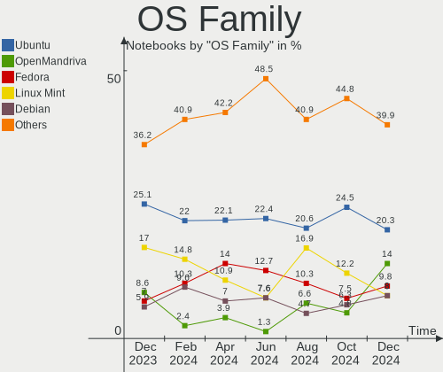
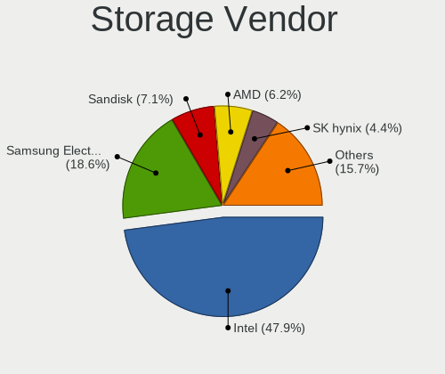
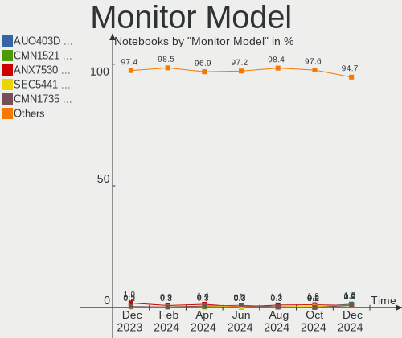
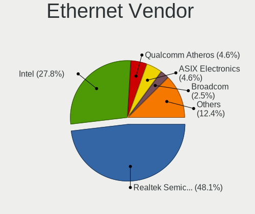
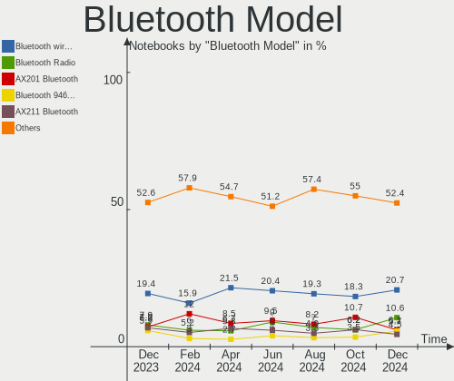
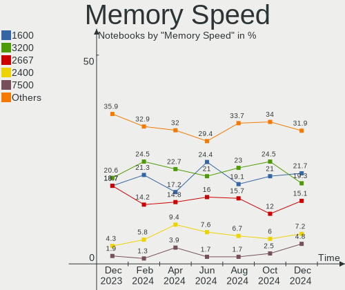

Linux in Germany - Hardware Trends (Notebooks)
----------------------------------------------

A project to identify most popular hardware characteristics and track their change
over time based on data collected by Linux users at https://Linux-Hardware.org.

Anyone can contribute to this report by the [hw-probe](https://github.com/linuxhw/hw-probe) tool:

    sudo -E hw-probe -all -upload

Period: Apr, 2023.

Contents
--------

* [ System ](#system)
  - [ OS                       ](#os)
  - [ OS Family                ](#os-family)
  - [ Kernel                   ](#kernel)
  - [ Kernel Family            ](#kernel-family)
  - [ Kernel Major Ver.        ](#kernel-major-ver)
  - [ Arch                     ](#arch)
  - [ DE                       ](#de)
  - [ Display Server           ](#display-server)
  - [ Display Manager          ](#display-manager)
  - [ OS Lang                  ](#os-lang)
  - [ Boot Mode                ](#boot-mode)
  - [ Filesystem               ](#filesystem)
  - [ Part. scheme             ](#part-scheme)
  - [ Dual Boot with Linux/BSD ](#dual-boot-with-linuxbsd)
  - [ Dual Boot (Win)          ](#dual-boot-win)

* [ Board ](#board)
  - [ Vendor                   ](#vendor)
  - [ Model                    ](#model)
  - [ Model Family             ](#model-family)
  - [ MFG Year                 ](#mfg-year)
  - [ Form Factor              ](#form-factor)
  - [ Secure Boot              ](#secure-boot)
  - [ Coreboot                 ](#coreboot)
  - [ RAM Size                 ](#ram-size)
  - [ RAM Used                 ](#ram-used)
  - [ Total Drives             ](#total-drives)
  - [ Has CD-ROM               ](#has-cd-rom)
  - [ Has Ethernet             ](#has-ethernet)
  - [ Has WiFi                 ](#has-wifi)
  - [ Has Bluetooth            ](#has-bluetooth)

* [ Location ](#location)
  - [ Country                  ](#country)
  - [ City                     ](#city)

* [ Drives ](#drives)
  - [ Drive Vendor             ](#drive-vendor)
  - [ Drive Model              ](#drive-model)
  - [ HDD Vendor               ](#hdd-vendor)
  - [ SSD Vendor               ](#ssd-vendor)
  - [ Drive Kind               ](#drive-kind)
  - [ Drive Connector          ](#drive-connector)
  - [ Drive Size               ](#drive-size)
  - [ Space Total              ](#space-total)
  - [ Space Used               ](#space-used)
  - [ Malfunc. Drives          ](#malfunc-drives)
  - [ Malfunc. Drive Vendor    ](#malfunc-drive-vendor)
  - [ Malfunc. HDD Vendor      ](#malfunc-hdd-vendor)
  - [ Malfunc. Drive Kind      ](#malfunc-drive-kind)
  - [ Failed Drives            ](#failed-drives)
  - [ Failed Drive Vendor      ](#failed-drive-vendor)
  - [ Drive Status             ](#drive-status)

* [ Storage controller ](#storage-controller)
  - [ Storage Vendor           ](#storage-vendor)
  - [ Storage Model            ](#storage-model)
  - [ Storage Kind             ](#storage-kind)

* [ Processor ](#processor)
  - [ CPU Vendor               ](#cpu-vendor)
  - [ CPU Model                ](#cpu-model)
  - [ CPU Model Family         ](#cpu-model-family)
  - [ CPU Cores                ](#cpu-cores)
  - [ CPU Sockets              ](#cpu-sockets)
  - [ CPU Threads              ](#cpu-threads)
  - [ CPU Op-Modes             ](#cpu-op-modes)
  - [ CPU Microcode            ](#cpu-microcode)
  - [ CPU Microarch            ](#cpu-microarch)

* [ Graphics ](#graphics)
  - [ GPU Vendor               ](#gpu-vendor)
  - [ GPU Model                ](#gpu-model)
  - [ GPU Combo                ](#gpu-combo)
  - [ GPU Driver               ](#gpu-driver)
  - [ GPU Memory               ](#gpu-memory)

* [ Monitor ](#monitor)
  - [ Monitor Vendor           ](#monitor-vendor)
  - [ Monitor Model            ](#monitor-model)
  - [ Monitor Resolution       ](#monitor-resolution)
  - [ Monitor Diagonal         ](#monitor-diagonal)
  - [ Monitor Width            ](#monitor-width)
  - [ Aspect Ratio             ](#aspect-ratio)
  - [ Monitor Area             ](#monitor-area)
  - [ Pixel Density            ](#pixel-density)
  - [ Multiple Monitors        ](#multiple-monitors)

* [ Network ](#network)
  - [ Net Controller Vendor    ](#net-controller-vendor)
  - [ Net Controller Model     ](#net-controller-model)
  - [ Wireless Vendor          ](#wireless-vendor)
  - [ Wireless Model           ](#wireless-model)
  - [ Ethernet Vendor          ](#ethernet-vendor)
  - [ Ethernet Model           ](#ethernet-model)
  - [ Net Controller Kind      ](#net-controller-kind)
  - [ Used Controller          ](#used-controller)
  - [ NICs                     ](#nics)
  - [ IPv6                     ](#ipv6)

* [ Bluetooth ](#bluetooth)
  - [ Bluetooth Vendor         ](#bluetooth-vendor)
  - [ Bluetooth Model          ](#bluetooth-model)

* [ Sound ](#sound)
  - [ Sound Vendor             ](#sound-vendor)
  - [ Sound Model              ](#sound-model)

* [ Memory ](#memory)
  - [ Memory Vendor            ](#memory-vendor)
  - [ Memory Model             ](#memory-model)
  - [ Memory Kind              ](#memory-kind)
  - [ Memory Form Factor       ](#memory-form-factor)
  - [ Memory Size              ](#memory-size)
  - [ Memory Speed             ](#memory-speed)

* [ Printers & scanners ](#printers--scanners)
  - [ Printer Vendor           ](#printer-vendor)
  - [ Printer Model            ](#printer-model)
  - [ Scanner Vendor           ](#scanner-vendor)
  - [ Scanner Model            ](#scanner-model)

* [ Camera ](#camera)
  - [ Camera Vendor            ](#camera-vendor)
  - [ Camera Model             ](#camera-model)

* [ Security ](#security)
  - [ Fingerprint Vendor       ](#fingerprint-vendor)
  - [ Fingerprint Model        ](#fingerprint-model)
  - [ Chipcard Vendor          ](#chipcard-vendor)
  - [ Chipcard Model           ](#chipcard-model)

* [ Unsupported ](#unsupported)
  - [ Unsupported Devices      ](#unsupported-devices)
  - [ Unsupported Device Types ](#unsupported-device-types)

System
------

OS
--

Installed operating systems

| Name                         | Notebooks | Percent |
|------------------------------|-----------|---------|
| Ubuntu 22.04                 | 48        | 15.43%  |
| Linux Mint 21.1              | 42        | 13.5%   |
| OpenMandriva 23.03           | 36        | 11.58%  |
| Debian 11                    | 14        | 4.5%    |
| Ubuntu 22.10                 | 12        | 3.86%   |
| Fedora 38                    | 12        | 3.86%   |
| Ubuntu 23.04                 | 11        | 3.54%   |
| Debian 12                    | 9         | 2.89%   |
| Zorin 16                     | 8         | 2.57%   |
| Pop!_OS 22.04                | 8         | 2.57%   |
| Arch Rolling                 | 7         | 2.25%   |
| Xubuntu 22.04                | 6         | 1.93%   |
| SteamOS 3.4.6                | 6         | 1.93%   |
| Ubuntu 20.04                 | 5         | 1.61%   |
| Manjaro                      | 5         | 1.61%   |
| Fedora 37                    | 5         | 1.61%   |
| EndeavourOS Rolling          | 5         | 1.61%   |
| Linux Mint 20.3              | 4         | 1.29%   |
| Elementary 7                 | 4         | 1.29%   |
| ArcoLinux Rolling            | 4         | 1.29%   |
| TUXEDO OS 22.04              | 3         | 0.96%   |
| openSUSE Tumbleweed-XXXXXXXX | 3         | 0.96%   |
| MX 21                        | 3         | 0.96%   |
| Manjaro 22.1.0               | 3         | 0.96%   |
| Lubuntu 22.04                | 3         | 0.96%   |
| Kubuntu 22.04                | 3         | 0.96%   |
| ROSA 12.4                    | 2         | 0.64%   |
| openSUSE Leap-15.4           | 2         | 0.64%   |
| Nobara 37                    | 2         | 0.64%   |
| Kubuntu 23.04                | 2         | 0.64%   |
| KDE neon 22.04               | 2         | 0.64%   |
| Kali 2023.1                  | 2         | 0.64%   |
| BunsenLabs 11                | 2         | 0.64%   |
| Xubuntu 22.10                | 1         | 0.32%   |
| Void Linux Rolling           | 1         | 0.32%   |
| UbuntuDDE 22.04              | 1         | 0.32%   |
| Ubuntu Unity 22.04           | 1         | 0.32%   |
| Ubuntu MATE 22.04            | 1         | 0.32%   |
| Solus 4.3                    | 1         | 0.32%   |
| Redcore Rolling              | 1         | 0.32%   |

OS Family
---------

OS without a version

| Name         | Notebooks | Percent |
|--------------|-----------|---------|
| Ubuntu       | 76        | 24.44%  |
| Linux Mint   | 49        | 15.76%  |
| OpenMandriva | 39        | 12.54%  |
| Debian       | 23        | 7.4%    |
| Fedora       | 18        | 5.79%   |
| Zorin        | 8         | 2.57%   |
| Pop!_OS      | 8         | 2.57%   |
| Manjaro      | 8         | 2.57%   |
| Xubuntu      | 7         | 2.25%   |
| Arch         | 7         | 2.25%   |
| SteamOS      | 6         | 1.93%   |
| Kubuntu      | 6         | 1.93%   |
| openSUSE     | 5         | 1.61%   |
| EndeavourOS  | 5         | 1.61%   |
| Elementary   | 5         | 1.61%   |
| Lubuntu      | 4         | 1.29%   |
| ArcoLinux    | 4         | 1.29%   |
| TUXEDO OS    | 3         | 0.96%   |
| MX           | 3         | 0.96%   |
| ROSA         | 2         | 0.64%   |
| Nobara       | 2         | 0.64%   |
| KDE neon     | 2         | 0.64%   |
| Kali         | 2         | 0.64%   |
| BunsenLabs   | 2         | 0.64%   |
| Void Linux   | 1         | 0.32%   |
| UbuntuDDE    | 1         | 0.32%   |
| Ubuntu Unity | 1         | 0.32%   |
| Ubuntu MATE  | 1         | 0.32%   |
| Solus        | 1         | 0.32%   |
| Redcore      | 1         | 0.32%   |
| Parrot       | 1         | 0.32%   |
| Pardus       | 1         | 0.32%   |
| Openmamba    | 1         | 0.32%   |
| NixOS        | 1         | 0.32%   |
| LMDE         | 1         | 0.32%   |
| Gentoo       | 1         | 0.32%   |
| Devuan       | 1         | 0.32%   |
| Clear Linux  | 1         | 0.32%   |
| CentOS       | 1         | 0.32%   |
| blendOS      | 1         | 0.32%   |

Kernel
------

Version of the Linux kernel

| Version                                            | Notebooks | Percent |
|----------------------------------------------------|-----------|---------|
| 6.2.6-desktop-1omv2390                             | 36        | 11.58%  |
| 5.19.0-38-generic                                  | 35        | 11.25%  |
| 5.15.0-69-generic                                  | 34        | 10.93%  |
| 5.19.0-40-generic                                  | 28        | 9%      |
| 5.10.0-21-amd64                                    | 13        | 4.18%   |
| 6.2.0-20-generic                                   | 10        | 3.22%   |
| 6.1.0-7-amd64                                      | 10        | 3.22%   |
| 6.2.11-300.fc38.x86_64                             | 9         | 2.89%   |
| 6.2.6-76060206-generic                             | 8         | 2.57%   |
| 5.15.0-70-generic                                  | 7         | 2.25%   |
| 5.15.0-71-generic                                  | 6         | 1.93%   |
| 5.13.0-valve36-1-neptune                           | 6         | 1.93%   |
| 6.2.11-arch1-1                                     | 4         | 1.29%   |
| 6.2.0-10005-tuxedo                                 | 4         | 1.29%   |
| 5.4.0-146-generic                                  | 4         | 1.29%   |
| 5.15.0-56-generic                                  | 4         | 1.29%   |
| 6.2.8-arch1-1                                      | 3         | 0.96%   |
| 6.2.12-arch1-1                                     | 3         | 0.96%   |
| 6.2.10-arch1-1                                     | 3         | 0.96%   |
| 6.1.25-1-MANJARO                                   | 3         | 0.96%   |
| 5.4.0-147-generic                                  | 3         | 0.96%   |
| 6.2.9-arch1-1                                      | 2         | 0.64%   |
| 6.2.9-200.fc37.x86_64                              | 2         | 0.64%   |
| 6.2.9-1-default                                    | 2         | 0.64%   |
| 6.2.11-060211-generic                              | 2         | 0.64%   |
| 6.2.0-18-generic                                   | 2         | 0.64%   |
| 6.1.23-1-MANJARO                                   | 2         | 0.64%   |
| 6.1.20-generic-2rosa2021.1-x86_64                  | 2         | 0.64%   |
| 6.1.0-kali7-amd64                                  | 2         | 0.64%   |
| 5.19.0-41-generic                                  | 2         | 0.64%   |
| 5.19.0-35-generic                                  | 2         | 0.64%   |
| 5.19.0-32-generic                                  | 2         | 0.64%   |
| 5.19.0-21-generic                                  | 2         | 0.64%   |
| 5.10.0-20-amd64                                    | 2         | 0.64%   |
| 6.3.0-0.rc7.20230420gitcb0856346a60.59.fc39.x86_64 | 1         | 0.32%   |
| 6.2.9-300.fc38.x86_64                              | 1         | 0.32%   |
| 6.2.8-200.fc37.x86_64                              | 1         | 0.32%   |
| 6.2.8-1-MANJARO                                    | 1         | 0.32%   |
| 6.2.13-arch1-1                                     | 1         | 0.32%   |
| 6.2.13-300.fc38.x86_64                             | 1         | 0.32%   |

Kernel Family
-------------

Linux kernel without a distro release

| Version  | Notebooks | Percent |
|----------|-----------|---------|
| 5.19.0   | 72        | 23.15%  |
| 5.15.0   | 59        | 18.97%  |
| 6.2.6    | 44        | 14.15%  |
| 6.2.11   | 19        | 6.11%   |
| 5.10.0   | 18        | 5.79%   |
| 6.2.0    | 17        | 5.47%   |
| 6.1.0    | 14        | 4.5%    |
| 5.4.0    | 9         | 2.89%   |
| 6.2.9    | 7         | 2.25%   |
| 5.13.0   | 6         | 1.93%   |
| 6.2.8    | 5         | 1.61%   |
| 6.2.12   | 4         | 1.29%   |
| 6.2.10   | 4         | 1.29%   |
| 6.1.25   | 4         | 1.29%   |
| 6.1.21   | 3         | 0.96%   |
| 6.0.0    | 3         | 0.96%   |
| 6.2.13   | 2         | 0.64%   |
| 6.1.23   | 2         | 0.64%   |
| 6.1.20   | 2         | 0.64%   |
| 5.17.0   | 2         | 0.64%   |
| 5.14.21  | 2         | 0.64%   |
| 6.3.0    | 1         | 0.32%   |
| 6.1.5    | 1         | 0.32%   |
| 6.1.24   | 1         | 0.32%   |
| 6.1.22   | 1         | 0.32%   |
| 6.1.18   | 1         | 0.32%   |
| 6.1.12   | 1         | 0.32%   |
| 6.1.1    | 1         | 0.32%   |
| 5.6.0    | 1         | 0.32%   |
| 5.5.7    | 1         | 0.32%   |
| 5.19.8   | 1         | 0.32%   |
| 5.16.7   | 1         | 0.32%   |
| 5.10.133 | 1         | 0.32%   |
| 4.18.0   | 1         | 0.32%   |

Kernel Major Ver.
-----------------

Linux kernel major version

| Version | Notebooks | Percent |
|---------|-----------|---------|
| 6.2     | 102       | 32.8%   |
| 5.19    | 73        | 23.47%  |
| 5.15    | 59        | 18.97%  |
| 6.1     | 31        | 9.97%   |
| 5.10    | 19        | 6.11%   |
| 5.4     | 9         | 2.89%   |
| 5.13    | 6         | 1.93%   |
| 6.0     | 3         | 0.96%   |
| 5.17    | 2         | 0.64%   |
| 5.14    | 2         | 0.64%   |
| 6.3     | 1         | 0.32%   |
| 5.6     | 1         | 0.32%   |
| 5.5     | 1         | 0.32%   |
| 5.16    | 1         | 0.32%   |
| 4.18    | 1         | 0.32%   |

Arch
----

OS architecture (x86_64, i586, etc.)

| Name   | Notebooks | Percent |
|--------|-----------|---------|
| x86_64 | 310       | 99.68%  |
| i686   | 1         | 0.32%   |

DE
--

Desktop Environment

| Name            | Notebooks | Percent |
|-----------------|-----------|---------|
| GNOME           | 130       | 41.8%   |
| KDE5            | 68        | 21.86%  |
| X-Cinnamon      | 42        | 13.5%   |
| XFCE            | 27        | 8.68%   |
| Unknown         | 8         | 2.57%   |
| LXQt            | 7         | 2.25%   |
| MATE            | 6         | 1.93%   |
| Pantheon        | 5         | 1.61%   |
| i3              | 4         | 1.29%   |
| LXDE            | 3         | 0.96%   |
| xmonad          | 1         | 0.32%   |
| Unity           | 1         | 0.32%   |
| sway            | 1         | 0.32%   |
| KDE             | 1         | 0.32%   |
| Hyprland        | 1         | 0.32%   |
| GNOME Flashback | 1         | 0.32%   |
| Deepin          | 1         | 0.32%   |
| Cinnamon        | 1         | 0.32%   |
| chadwm          | 1         | 0.32%   |
| BunsenLabs      | 1         | 0.32%   |
| Budgie          | 1         | 0.32%   |

Display Server
--------------

X11 or Wayland

| Name    | Notebooks | Percent |
|---------|-----------|---------|
| X11     | 201       | 64.63%  |
| Wayland | 98        | 31.51%  |
| Tty     | 7         | 2.25%   |
| Unknown | 5         | 1.61%   |

Display Manager
---------------

SDDM, LightDM, etc.

| Name    | Notebooks | Percent |
|---------|-----------|---------|
| Unknown | 91        | 29.26%  |
| GDM3    | 76        | 24.44%  |
| LightDM | 57        | 18.33%  |
| SDDM    | 55        | 17.68%  |
| GDM     | 28        | 9%      |
| XDM     | 3         | 0.96%   |
| LXDM    | 1         | 0.32%   |

OS Lang
-------

Language

| Lang       | Notebooks | Percent |
|------------|-----------|---------|
| de_DE      | 224       | 72.03%  |
| en_US      | 64        | 20.58%  |
| en_GB      | 8         | 2.57%   |
| Unknown    | 4         | 1.29%   |
| pl_PL      | 2         | 0.64%   |
| en_US-UTF8 | 2         | 0.64%   |
| uk_UA      | 1         | 0.32%   |
| tr_TR      | 1         | 0.32%   |
| ru_RU      | 1         | 0.32%   |
| pt_PT      | 1         | 0.32%   |
| nl_NL      | 1         | 0.32%   |
| en_CA      | 1         | 0.32%   |
| C          | 1         | 0.32%   |

Boot Mode
---------

EFI or BIOS

| Mode | Notebooks | Percent |
|------|-----------|---------|
| EFI  | 182       | 58.52%  |
| BIOS | 129       | 41.48%  |

Filesystem
----------

Type of filesystem

| Type    | Notebooks | Percent |
|---------|-----------|---------|
| Ext4    | 217       | 69.77%  |
| Btrfs   | 40        | 12.86%  |
| Tmpfs   | 22        | 7.07%   |
| Overlay | 20        | 6.43%   |
| Zfs     | 6         | 1.93%   |
| Xfs     | 6         | 1.93%   |

Part. scheme
------------

Scheme of partitioning

| Type    | Notebooks | Percent |
|---------|-----------|---------|
| GPT     | 202       | 64.95%  |
| Unknown | 82        | 26.37%  |
| MBR     | 27        | 8.68%   |

Dual Boot with Linux/BSD
------------------------

Hosting more than one Linux/BSD

| Dual boot | Notebooks | Percent |
|-----------|-----------|---------|
| No        | 268       | 86.17%  |
| Yes       | 43        | 13.83%  |

Dual Boot (Win)
---------------

Hosting Linux and Windows

| Dual boot | Notebooks | Percent |
|-----------|-----------|---------|
| No        | 250       | 80.39%  |
| Yes       | 61        | 19.61%  |

Board
-----

Vendor
------

Motherboard manufacturer

| Name                | Notebooks | Percent |
|---------------------|-----------|---------|
| Lenovo              | 75        | 24.12%  |
| Hewlett-Packard     | 43        | 13.83%  |
| Acer                | 38        | 12.22%  |
| Dell                | 37        | 11.9%   |
| ASUSTek Computer    | 25        | 8.04%   |
| Fujitsu             | 12        | 3.86%   |
| HUAWEI              | 9         | 2.89%   |
| Apple               | 9         | 2.89%   |
| Sony                | 8         | 2.57%   |
| Medion              | 8         | 2.57%   |
| Samsung Electronics | 7         | 2.25%   |
| Valve               | 6         | 1.93%   |
| TUXEDO              | 4         | 1.29%   |
| Toshiba             | 4         | 1.29%   |
| Notebook            | 4         | 1.29%   |
| Google              | 4         | 1.29%   |
| Schenker            | 2         | 0.64%   |
| Packard Bell        | 2         | 0.64%   |
| MSI                 | 2         | 0.64%   |
| Unknown             | 2         | 0.64%   |
| Wortmann AG         | 1         | 0.32%   |
| Timi                | 1         | 0.32%   |
| Tactus              | 1         | 0.32%   |
| LG Electronics      | 1         | 0.32%   |
| Hampoo              | 1         | 0.32%   |
| GPD                 | 1         | 0.32%   |
| Gigabyte Technology | 1         | 0.32%   |
| Fujitsu Siemens     | 1         | 0.32%   |
| eMachines           | 1         | 0.32%   |
| AMI                 | 1         | 0.32%   |

Model
-----

Motherboard model

| Name                                | Notebooks | Percent |
|-------------------------------------|-----------|---------|
| Valve Jupiter                       | 6         | 1.93%   |
| Acer Aspire V3-772                  | 4         | 1.29%   |
| HUAWEI NBLK-WAX9X                   | 3         | 0.96%   |
| Fujitsu LIFEBOOK S935               | 3         | 0.96%   |
| Acer TravelMate 5735Z               | 3         | 0.96%   |
| Unknown                             | 3         | 0.96%   |
| TUXEDO InfinityBook Pro Gen7 (MK1)  | 2         | 0.64%   |
| Samsung 750XDA                      | 2         | 0.64%   |
| Samsung 355V4C/356V4C/3445VC/3545VC | 2         | 0.64%   |
| Lenovo V15 G2 IJL 82QY              | 2         | 0.64%   |
| Lenovo G50-70 20351                 | 2         | 0.64%   |
| HUAWEI BOHK-WAX9X                   | 2         | 0.64%   |
| HP Pavilion g6                      | 2         | 0.64%   |
| HP Laptop 15s-eq2xxx                | 2         | 0.64%   |
| Fujitsu LIFEBOOK U747               | 2         | 0.64%   |
| Dell XPS 13 9350                    | 2         | 0.64%   |
| Dell XPS 13 9305                    | 2         | 0.64%   |
| Dell XPS 13 7390                    | 2         | 0.64%   |
| Dell Latitude E6420                 | 2         | 0.64%   |
| Dell Latitude E5450                 | 2         | 0.64%   |
| Dell Latitude 3320                  | 2         | 0.64%   |
| ASUS N501VW                         | 2         | 0.64%   |
| Acer Aspire A315-56                 | 2         | 0.64%   |
| Wortmann AG TERRA_MOBILE_1749       | 1         | 0.32%   |
| TUXEDO Book XUX7 Gen11              | 1         | 0.32%   |
| TUXEDO Book XP1511                  | 1         | 0.32%   |
| Toshiba TECRA R950                  | 1         | 0.32%   |
| Toshiba Satellite Pro L350          | 1         | 0.32%   |
| Toshiba Satellite Pro C850-1K0      | 1         | 0.32%   |
| Toshiba Satellite C70D-A            | 1         | 0.32%   |
| Timi TM1604                         | 1         | 0.32%   |
| Tactus GeoBook 140                  | 1         | 0.32%   |
| Sony VPCSB1V9E                      | 1         | 0.32%   |
| Sony VPCS13V9E                      | 1         | 0.32%   |
| Sony VPCF13M1E                      | 1         | 0.32%   |
| Sony VPCCA1S1E                      | 1         | 0.32%   |
| Sony VGN-NR11Z_T                    | 1         | 0.32%   |
| Sony SVF1521C6EW                    | 1         | 0.32%   |
| Sony SVE1713Q1EB                    | 1         | 0.32%   |
| Sony SVD1322X2EW                    | 1         | 0.32%   |

Model Family
------------

Motherboard model prefix

| Name                  | Notebooks | Percent |
|-----------------------|-----------|---------|
| Lenovo ThinkPad       | 50        | 16.08%  |
| Acer Aspire           | 25        | 8.04%   |
| Dell Latitude         | 21        | 6.75%   |
| Fujitsu LIFEBOOK      | 12        | 3.86%   |
| HP Laptop             | 9         | 2.89%   |
| Dell XPS              | 9         | 2.89%   |
| HP Pavilion           | 8         | 2.57%   |
| Lenovo IdeaPad        | 7         | 2.25%   |
| Acer TravelMate       | 7         | 2.25%   |
| Valve Jupiter         | 6         | 1.93%   |
| ASUS VivoBook         | 6         | 1.93%   |
| HP EliteBook          | 5         | 1.61%   |
| HP 255                | 5         | 1.61%   |
| Toshiba Satellite     | 3         | 0.96%   |
| Lenovo Yoga           | 3         | 0.96%   |
| HUAWEI NBLK-WAX9X     | 3         | 0.96%   |
| HP Compaq             | 3         | 0.96%   |
| HP 250                | 3         | 0.96%   |
| Dell Precision        | 3         | 0.96%   |
| Dell Inspiron         | 3         | 0.96%   |
| Apple MacBookPro11    | 3         | 0.96%   |
| Acer Swift            | 3         | 0.96%   |
| Unknown               | 3         | 0.96%   |
| TUXEDO InfinityBook   | 2         | 0.64%   |
| TUXEDO Book           | 2         | 0.64%   |
| Samsung 750XDA        | 2         | 0.64%   |
| Samsung 355V4C        | 2         | 0.64%   |
| Packard Bell EasyNote | 2         | 0.64%   |
| Lenovo V17            | 2         | 0.64%   |
| Lenovo V15            | 2         | 0.64%   |
| Lenovo Legion         | 2         | 0.64%   |
| Lenovo G50-70         | 2         | 0.64%   |
| HUAWEI BOHK-WAX9X     | 2         | 0.64%   |
| HP ZBook              | 2         | 0.64%   |
| HP ENVY               | 2         | 0.64%   |
| ASUS N501VW           | 2         | 0.64%   |
| ASUS ASUS             | 2         | 0.64%   |
| Apple MacBookAir6     | 2         | 0.64%   |
| Acer Extensa          | 2         | 0.64%   |
| Wortmann AG TERRA     | 1         | 0.32%   |

MFG Year
--------

Motherboard manufacture year

| Year | Notebooks | Percent |
|------|-----------|---------|
| 2022 | 37        | 11.9%   |
| 2013 | 34        | 10.93%  |
| 2021 | 33        | 10.61%  |
| 2020 | 31        | 9.97%   |
| 2011 | 24        | 7.72%   |
| 2019 | 23        | 7.4%    |
| 2012 | 20        | 6.43%   |
| 2015 | 18        | 5.79%   |
| 2014 | 16        | 5.14%   |
| 2010 | 15        | 4.82%   |
| 2018 | 14        | 4.5%    |
| 2017 | 12        | 3.86%   |
| 2016 | 12        | 3.86%   |
| 2009 | 11        | 3.54%   |
| 2023 | 4         | 1.29%   |
| 2008 | 4         | 1.29%   |
| 2007 | 3         | 0.96%   |

Form Factor
-----------

Physical design of the computer

| Name     | Notebooks | Percent |
|----------|-----------|---------|
| Notebook | 311       | 100%    |

Secure Boot
-----------

Enabled or disabled

| State    | Notebooks | Percent |
|----------|-----------|---------|
| Disabled | 287       | 92.28%  |
| Enabled  | 24        | 7.72%   |

Coreboot
--------

Have coreboot on board

| Used | Notebooks | Percent |
|------|-----------|---------|
| No   | 306       | 98.39%  |
| Yes  | 5         | 1.61%   |

RAM Size
--------

Total RAM memory

| Size in GB  | Notebooks | Percent |
|-------------|-----------|---------|
| 4.01-8.0    | 109       | 35.05%  |
| 16.01-24.0  | 60        | 19.29%  |
| 8.01-16.0   | 52        | 16.72%  |
| 3.01-4.0    | 49        | 15.76%  |
| 32.01-64.0  | 21        | 6.75%   |
| 24.01-32.0  | 7         | 2.25%   |
| 1.01-2.0    | 5         | 1.61%   |
| 64.01-256.0 | 4         | 1.29%   |
| 2.01-3.0    | 3         | 0.96%   |
| 0.51-1.0    | 1         | 0.32%   |

RAM Used
--------

Used RAM memory

| Used GB    | Notebooks | Percent |
|------------|-----------|---------|
| 1.01-2.0   | 102       | 32.8%   |
| 2.01-3.0   | 92        | 29.58%  |
| 3.01-4.0   | 51        | 16.4%   |
| 4.01-8.0   | 46        | 14.79%  |
| 0.51-1.0   | 9         | 2.89%   |
| 8.01-16.0  | 7         | 2.25%   |
| 0.01-0.5   | 2         | 0.64%   |
| 24.01-32.0 | 1         | 0.32%   |
| 16.01-24.0 | 1         | 0.32%   |

Total Drives
------------

Number of drives on board

| Drives | Notebooks | Percent |
|--------|-----------|---------|
| 1      | 232       | 74.6%   |
| 2      | 70        | 22.51%  |
| 3      | 7         | 2.25%   |
| 4      | 1         | 0.32%   |
| 0      | 1         | 0.32%   |

Has CD-ROM
----------

Has CD-ROM on board

| Presented | Notebooks | Percent |
|-----------|-----------|---------|
| No        | 203       | 65.27%  |
| Yes       | 108       | 34.73%  |

Has Ethernet
------------

Has Ethernet on board

| Presented | Notebooks | Percent |
|-----------|-----------|---------|
| Yes       | 243       | 78.14%  |
| No        | 68        | 21.86%  |

Has WiFi
--------

Has WiFi module

| Presented | Notebooks | Percent |
|-----------|-----------|---------|
| Yes       | 305       | 98.07%  |
| No        | 6         | 1.93%   |

Has Bluetooth
-------------

Has Bluetooth module

| Presented | Notebooks | Percent |
|-----------|-----------|---------|
| Yes       | 248       | 79.74%  |
| No        | 63        | 20.26%  |

Location
--------

Country
-------

Geographic location (country)

| Country | Notebooks | Percent |
|---------|-----------|---------|
| Germany | 311       | 100%    |

City
----

Geographic location (city)

| City                   | Notebooks | Percent |
|------------------------|-----------|---------|
| Berlin                 | 29        | 9.32%   |
| Frankfurt am Main      | 19        | 6.11%   |
| Munich                 | 13        | 4.18%   |
| Mannheim               | 10        | 3.22%   |
| Hamburg                | 10        | 3.22%   |
| Cologne                | 10        | 3.22%   |
| Dresden                | 8         | 2.57%   |
| Nuremberg              | 4         | 1.29%   |
| Kirchhain              | 4         | 1.29%   |
| Dortmund               | 4         | 1.29%   |
| Ludwigshafen am Rhein  | 3         | 0.96%   |
| Leipzig                | 3         | 0.96%   |
| Essen                  | 3         | 0.96%   |
| Bremen                 | 3         | 0.96%   |
| Bonn                   | 3         | 0.96%   |
| Augsburg               | 3         | 0.96%   |
| Tübingen              | 2         | 0.64%   |
| Stuttgart              | 2         | 0.64%   |
| Rothenburg upon Tauber | 2         | 0.64%   |
| Offenbach              | 2         | 0.64%   |
| Maxhutte-Haidhof       | 2         | 0.64%   |
| Lübeck                | 2         | 0.64%   |
| Karlsruhe              | 2         | 0.64%   |
| Jessen                 | 2         | 0.64%   |
| Jena                   | 2         | 0.64%   |
| Hanover                | 2         | 0.64%   |
| Hanau                  | 2         | 0.64%   |
| Grafing bei Munchen    | 2         | 0.64%   |
| Freising               | 2         | 0.64%   |
| Freiburg im Breisgau   | 2         | 0.64%   |
| Elmshorn               | 2         | 0.64%   |
| Eberbach               | 2         | 0.64%   |
| Düsseldorf            | 2         | 0.64%   |
| Chemnitz               | 2         | 0.64%   |
| Boennigheim            | 2         | 0.64%   |
| Bielefeld              | 2         | 0.64%   |
| Zella-Mehlis           | 1         | 0.32%   |
| Zell im Wiesental      | 1         | 0.32%   |
| Wuppertal              | 1         | 0.32%   |
| Wolgast                | 1         | 0.32%   |

Drives
------

Drive Vendor
------------

Hard drive vendors

| Vendor                         | Notebooks | Drives | Percent |
|--------------------------------|-----------|--------|---------|
| Samsung Electronics            | 77        | 82     | 20.53%  |
| WDC                            | 32        | 32     | 8.53%   |
| SanDisk                        | 30        | 31     | 8%      |
| Crucial                        | 23        | 23     | 6.13%   |
| Unknown                        | 20        | 21     | 5.33%   |
| Seagate                        | 20        | 20     | 5.33%   |
| Toshiba                        | 19        | 19     | 5.07%   |
| Intenso                        | 14        | 14     | 3.73%   |
| SK hynix                       | 12        | 14     | 3.2%    |
| Kingston                       | 12        | 13     | 3.2%    |
| Micron Technology              | 11        | 11     | 2.93%   |
| KIOXIA                         | 10        | 10     | 2.67%   |
| Intel                          | 10        | 10     | 2.67%   |
| Hitachi                        | 8         | 9      | 2.13%   |
| Apple                          | 6         | 9      | 1.6%    |
| Unknown                        | 6         | 6      | 1.6%    |
| Phison                         | 4         | 4      | 1.07%   |
| LITEON                         | 4         | 4      | 1.07%   |
| HGST                           | 4         | 4      | 1.07%   |
| ASMT                           | 4         | 4      | 1.07%   |
| Verbatim                       | 3         | 3      | 0.8%    |
| UMIS                           | 3         | 3      | 0.8%    |
| Silicon Motion                 | 3         | 3      | 0.8%    |
| Micron/Crucial Technology      | 3         | 3      | 0.8%    |
| Kingston Technology Company    | 3         | 3      | 0.8%    |
| Fujitsu                        | 3         | 3      | 0.8%    |
| China                          | 3         | 3      | 0.8%    |
| Union Memory                   | 2         | 2      | 0.53%   |
| Phison Electronics             | 2         | 2      | 0.53%   |
| V7                             | 1         | 1      | 0.27%   |
| Transcend                      | 1         | 1      | 0.27%   |
| SSSTC                          | 1         | 1      | 0.27%   |
| SPCC                           | 1         | 1      | 0.27%   |
| Solid State Storage Technology | 1         | 1      | 0.27%   |
| Solid State Storage            | 1         | 1      | 0.27%   |
| ShiJi                          | 1         | 1      | 0.27%   |
| O2 Micro                       | 1         | 1      | 0.27%   |
| Netac                          | 1         | 1      | 0.27%   |
| Maxtor                         | 1         | 1      | 0.27%   |
| MAXIO Technology (Hangzhou)    | 1         | 1      | 0.27%   |

Drive Model
-----------

Hard drive models

| Model                                                  | Notebooks | Percent |
|--------------------------------------------------------|-----------|---------|
| Crucial CT500MX500SSD1 500GB                           | 7         | 1.83%   |
| Unknown                                                | 6         | 1.57%   |
| Unknown MMC Card  32GB                                 | 5         | 1.31%   |
| Samsung SSD 860 EVO 500GB                              | 5         | 1.31%   |
| Samsung NVMe SSD Controller SM981/PM981/PM983 1TB      | 5         | 1.31%   |
| Unknown MMC Card  128GB                                | 4         | 1.05%   |
| Toshiba MQ01ABF050 500GB                               | 4         | 1.05%   |
| Samsung SSD 850 EVO 250GB                              | 4         | 1.05%   |
| WDC PC SN730 SDBPNTY-512G-1006 512GB                   | 3         | 0.79%   |
| Silicon Motion SM2263EN/SM2263XT SSD Controller 1024GB | 3         | 0.79%   |
| Sandisk WD Black SN750 / PC SN730 NVMe SSD 512GB       | 3         | 0.79%   |
| SanDisk SDSSDH3 1T00 1TB                               | 3         | 0.79%   |
| SanDisk NVMe SSD Drive 1TB                             | 3         | 0.79%   |
| Samsung SSD 980 500GB                                  | 3         | 0.79%   |
| Samsung NVMe SSD Controller SM961/PM961/SM963 500GB    | 3         | 0.79%   |
| Samsung NVMe SSD Controller PM9A1/PM9A3/980PRO 2TB     | 3         | 0.79%   |
| Micron/Crucial P2 NVMe PCIe SSD 1TB                    | 3         | 0.79%   |
| Micron 2300 NVMe 512GB                                 | 3         | 0.79%   |
| Intenso SSD SATAIII 256GB                              | 3         | 0.79%   |
| Intenso SSD 256GB                                      | 3         | 0.79%   |
| WDC WDS500G2B0A-00SM50 500GB SSD                       | 2         | 0.52%   |
| WDC WD10JPVX-22JC3T0 1TB                               | 2         | 0.52%   |
| Verbatim Vi550 S3 128GB                                | 2         | 0.52%   |
| Unknown SC256  256GB                                   | 2         | 0.52%   |
| Unknown MMC Card  7GB                                  | 2         | 0.52%   |
| UMIS RPJTJ512MGE1QDQ 512GB                             | 2         | 0.52%   |
| Toshiba MQ01ABD075 752GB                               | 2         | 0.52%   |
| Seagate ST500LT012-1DG142 500GB                        | 2         | 0.52%   |
| SanDisk SSD PLUS 240GB                                 | 2         | 0.52%   |
| SanDisk SSD PLUS 1000GB                                | 2         | 0.52%   |
| SanDisk SD8TB8U256G1001 256GB SSD                      | 2         | 0.52%   |
| Samsung SSD 980 PRO 1TB                                | 2         | 0.52%   |
| Samsung SSD 970 EVO Plus 1TB                           | 2         | 0.52%   |
| Samsung SSD 860 EVO M.2 500GB                          | 2         | 0.52%   |
| Samsung SSD 860 EVO 1TB                                | 2         | 0.52%   |
| Samsung MZVLQ256HBJD-00BH1 256GB                       | 2         | 0.52%   |
| Samsung MZNLN128HAHQ-000H1 128GB SSD                   | 2         | 0.52%   |
| Phison E12 NVMe Controller 512GB                       | 2         | 0.52%   |
| Micron 2450_MTFDKBA512TFK 512GB                        | 2         | 0.52%   |
| KIOXIA KBG40ZNV1T02 1024GB                             | 2         | 0.52%   |

HDD Vendor
----------

Hard disk drive vendors

| Vendor             | Notebooks | Drives | Percent |
|--------------------|-----------|--------|---------|
| Seagate            | 20        | 20     | 29.41%  |
| WDC                | 16        | 16     | 23.53%  |
| Toshiba            | 12        | 12     | 17.65%  |
| Hitachi            | 8         | 9      | 11.76%  |
| HGST               | 4         | 4      | 5.88%   |
| Fujitsu            | 3         | 3      | 4.41%   |
| Intenso            | 2         | 2      | 2.94%   |
| ASMT               | 2         | 2      | 2.94%   |
| JMicron Technology | 1         | 1      | 1.47%   |

SSD Vendor
----------

Solid state drive vendors

| Vendor              | Notebooks | Drives | Percent |
|---------------------|-----------|--------|---------|
| Samsung Electronics | 39        | 41     | 27.66%  |
| SanDisk             | 20        | 20     | 14.18%  |
| Crucial             | 20        | 20     | 14.18%  |
| Intenso             | 11        | 11     | 7.8%    |
| Kingston            | 7         | 7      | 4.96%   |
| WDC                 | 6         | 6      | 4.26%   |
| Toshiba             | 5         | 5      | 3.55%   |
| Apple               | 5         | 5      | 3.55%   |
| Verbatim            | 3         | 3      | 2.13%   |
| LITEON              | 3         | 3      | 2.13%   |
| Intel               | 3         | 3      | 2.13%   |
| China               | 3         | 3      | 2.13%   |
| Micron Technology   | 2         | 2      | 1.42%   |
| V7                  | 1         | 1      | 0.71%   |
| Transcend           | 1         | 1      | 0.71%   |
| SPCC                | 1         | 1      | 0.71%   |
| ShiJi               | 1         | 1      | 0.71%   |
| Netac               | 1         | 1      | 0.71%   |
| Maxtor              | 1         | 1      | 0.71%   |
| LITEONIT            | 1         | 1      | 0.71%   |
| KingSpec            | 1         | 1      | 0.71%   |
| INNOVATION IT       | 1         | 1      | 0.71%   |
| GOODRAM             | 1         | 1      | 0.71%   |
| Fanxiang            | 1         | 1      | 0.71%   |
| CT1000BX            | 1         | 1      | 0.71%   |
| ASMT                | 1         | 1      | 0.71%   |
| Unknown             | 1         | 1      | 0.71%   |

Drive Kind
----------

HDD or SSD

| Kind    | Notebooks | Drives | Percent |
|---------|-----------|--------|---------|
| NVMe    | 134       | 148    | 37.54%  |
| SSD     | 128       | 143    | 35.85%  |
| HDD     | 67        | 69     | 18.77%  |
| MMC     | 25        | 26     | 7%      |
| Unknown | 3         | 3      | 0.84%   |

Drive Connector
---------------

SATA, SAS, NVMe, etc.

| Type | Notebooks | Drives | Percent |
|------|-----------|--------|---------|
| SATA | 180       | 201    | 50.85%  |
| NVMe | 134       | 147    | 37.85%  |
| MMC  | 25        | 26     | 7.06%   |
| SAS  | 15        | 15     | 4.24%   |

Drive Size
----------

Size of hard drive

| Size in TB | Notebooks | Drives | Percent |
|------------|-----------|--------|---------|
| 0.01-0.5   | 138       | 148    | 69.7%   |
| 0.51-1.0   | 46        | 50     | 23.23%  |
| 1.01-2.0   | 11        | 11     | 5.56%   |
| 3.01-4.0   | 2         | 2      | 1.01%   |
| 4.01-10.0  | 1         | 1      | 0.51%   |

Space Total
-----------

Amount of disk space available on the file system

| Size in GB     | Notebooks | Percent |
|----------------|-----------|---------|
| 251-500        | 98        | 31.51%  |
| 101-250        | 76        | 24.44%  |
| 501-1000       | 48        | 15.43%  |
| 1-20           | 33        | 10.61%  |
| 1001-2000      | 16        | 5.14%   |
| Unknown        | 14        | 4.5%    |
| 51-100         | 11        | 3.54%   |
| More than 3000 | 9         | 2.89%   |
| 21-50          | 5         | 1.61%   |
| 2001-3000      | 1         | 0.32%   |

Space Used
----------

Amount of used disk space

| Used GB        | Notebooks | Percent |
|----------------|-----------|---------|
| 1-20           | 115       | 36.98%  |
| 21-50          | 54        | 17.36%  |
| 101-250        | 49        | 15.76%  |
| 51-100         | 35        | 11.25%  |
| 251-500        | 19        | 6.11%   |
| Unknown        | 14        | 4.5%    |
| 501-1000       | 12        | 3.86%   |
| 1001-2000      | 7         | 2.25%   |
| 2001-3000      | 5         | 1.61%   |
| More than 3000 | 1         | 0.32%   |

Malfunc. Drives
---------------

Drive models with a malfunction

| Model                                | Notebooks | Drives | Percent |
|--------------------------------------|-----------|--------|---------|
| WDC WD5000LPCX-24C6HT0 500GB         | 1         | 1      | 8.33%   |
| WDC WD5000BPVT-22HXZT3 500GB         | 1         | 1      | 8.33%   |
| Toshiba MK2035GSS 200GB              | 1         | 1      | 8.33%   |
| SK hynix BC711 HFM512GD3JX013N 512GB | 1         | 1      | 8.33%   |
| Seagate ST500LT012-1DG142 500GB      | 1         | 1      | 8.33%   |
| Seagate ST320LM002-1EJ16C 320GB      | 1         | 1      | 8.33%   |
| Micron Technology 2300 NVMe 512GB    | 1         | 1      | 8.33%   |
| Kingston SNV425S264GB SSD            | 1         | 1      | 8.33%   |
| Intenso SSD SATAIII 256GB            | 1         | 1      | 8.33%   |
| Hitachi HTS545050B9SA00 500GB        | 1         | 1      | 8.33%   |
| Hitachi HTS545032B9A300 320GB        | 1         | 1      | 8.33%   |
| Fujitsu MHZ2160BJ FFS G2 160GB       | 1         | 1      | 8.33%   |

Malfunc. Drive Vendor
---------------------

Vendors of faulty drives

| Vendor            | Notebooks | Drives | Percent |
|-------------------|-----------|--------|---------|
| WDC               | 2         | 2      | 16.67%  |
| Seagate           | 2         | 2      | 16.67%  |
| Hitachi           | 2         | 2      | 16.67%  |
| Toshiba           | 1         | 1      | 8.33%   |
| SK hynix          | 1         | 1      | 8.33%   |
| Micron Technology | 1         | 1      | 8.33%   |
| Kingston          | 1         | 1      | 8.33%   |
| Intenso           | 1         | 1      | 8.33%   |
| Fujitsu           | 1         | 1      | 8.33%   |

Malfunc. HDD Vendor
-------------------

Vendors of faulty HDD drives

| Vendor  | Notebooks | Drives | Percent |
|---------|-----------|--------|---------|
| WDC     | 2         | 2      | 25%     |
| Seagate | 2         | 2      | 25%     |
| Hitachi | 2         | 2      | 25%     |
| Toshiba | 1         | 1      | 12.5%   |
| Fujitsu | 1         | 1      | 12.5%   |

Malfunc. Drive Kind
-------------------

Kinds of faulty drives

| Kind | Notebooks | Drives | Percent |
|------|-----------|--------|---------|
| HDD  | 8         | 8      | 66.67%  |
| NVMe | 2         | 2      | 16.67%  |
| SSD  | 2         | 2      | 16.67%  |

Failed Drives
-------------

Failed drive models

Zero info for selected period =(

Failed Drive Vendor
-------------------

Failed drive vendors

Zero info for selected period =(

Drive Status
------------

Number of failed and malfunc. drives

| Status   | Notebooks | Drives | Percent |
|----------|-----------|--------|---------|
| Works    | 170       | 191    | 51.83%  |
| Detected | 146       | 186    | 44.51%  |
| Malfunc  | 12        | 12     | 3.66%   |

Storage controller
------------------

Storage Vendor
--------------

Storage controller vendors

| Vendor                         | Notebooks | Percent |
|--------------------------------|-----------|---------|
| Intel                          | 207       | 56.4%   |
| Samsung Electronics            | 43        | 11.72%  |
| AMD                            | 22        | 5.99%   |
| SanDisk                        | 20        | 5.45%   |
| SK hynix                       | 12        | 3.27%   |
| Micron Technology              | 9         | 2.45%   |
| Kingston Technology Company    | 8         | 2.18%   |
| Phison Electronics             | 7         | 1.91%   |
| KIOXIA                         | 7         | 1.91%   |
| Toshiba America Info Systems   | 6         | 1.63%   |
| Micron/Crucial Technology      | 6         | 1.63%   |
| Silicon Motion                 | 5         | 1.36%   |
| Union Memory (Shenzhen)        | 4         | 1.09%   |
| Solid State Storage Technology | 3         | 0.82%   |
| Nvidia                         | 3         | 0.82%   |
| Lite-On Technology             | 2         | 0.54%   |
| O2 Micro                       | 1         | 0.27%   |
| MAXIO Technology (Hangzhou)    | 1         | 0.27%   |
| Apple                          | 1         | 0.27%   |

Storage Model
-------------

Storage controller models

| Model                                                                          | Notebooks | Percent |
|--------------------------------------------------------------------------------|-----------|---------|
| Intel 7 Series Chipset Family 6-port SATA Controller [AHCI mode]               | 26        | 6.68%   |
| AMD FCH SATA Controller [AHCI mode]                                            | 22        | 5.66%   |
| Intel Sunrise Point-LP SATA Controller [AHCI mode]                             | 21        | 5.4%    |
| Intel 6 Series/C200 Series Chipset Family 6 port Mobile SATA AHCI Controller   | 20        | 5.14%   |
| Intel Volume Management Device NVMe RAID Controller                            | 17        | 4.37%   |
| Samsung NVMe SSD Controller 980                                                | 15        | 3.86%   |
| Intel 82801 Mobile SATA Controller [RAID mode]                                 | 15        | 3.86%   |
| Samsung NVMe SSD Controller PM9A1/PM9A3/980PRO                                 | 12        | 3.08%   |
| Intel 8 Series/C220 Series Chipset Family 6-port SATA Controller 1 [AHCI mode] | 12        | 3.08%   |
| Intel Wildcat Point-LP SATA Controller [AHCI Mode]                             | 11        | 2.83%   |
| Intel 82801IBM/IEM (ICH9M/ICH9M-E) 4 port SATA Controller [AHCI mode]          | 11        | 2.83%   |
| Intel 8 Series SATA Controller 1 [AHCI mode]                                   | 10        | 2.57%   |
| SanDisk WD Black SN750 / PC SN730 NVMe SSD                                     | 9         | 2.31%   |
| Samsung NVMe SSD Controller SM981/PM981/PM983                                  | 9         | 2.31%   |
| Micron NVMe Storage Controller                                                 | 9         | 2.31%   |
| Intel 5 Series/3400 Series Chipset 4 port SATA AHCI Controller                 | 9         | 2.31%   |
| Intel Tiger Lake-LP SATA Controller                                            | 8         | 2.06%   |
| SK hynix Gold P31/PC711 NVMe Solid State Drive                                 | 6         | 1.54%   |
| Micron/Crucial P2 NVMe PCIe SSD                                                | 6         | 1.54%   |
| KIOXIA NVMe SSD Controller BG4                                                 | 6         | 1.54%   |
| Intel HM170/QM170 Chipset SATA Controller [AHCI Mode]                          | 6         | 1.54%   |
| Silicon Motion SM2263EN/SM2263XT SSD Controller                                | 5         | 1.29%   |
| Intel Celeron/Pentium Silver Processor SATA Controller                         | 5         | 1.29%   |
| Toshiba America Info Systems XG6 NVMe SSD Controller                           | 4         | 1.03%   |
| SanDisk Non-Volatile memory controller                                         | 4         | 1.03%   |
| Samsung NVMe SSD Controller SM961/PM961/SM963                                  | 4         | 1.03%   |
| Intel SSD 660P Series                                                          | 4         | 1.03%   |
| Intel Atom Processor E3800 Series SATA AHCI Controller                         | 4         | 1.03%   |
| Intel Alder Lake-P SATA AHCI Controller                                        | 4         | 1.03%   |
| Intel 5 Series/3400 Series Chipset 6 port SATA AHCI Controller                 | 4         | 1.03%   |
| Solid State Storage Non-Volatile memory controller                             | 3         | 0.77%   |
| SK hynix Platinum P41 NVMe Solid State Drive 2TB                               | 3         | 0.77%   |
| SanDisk WD PC SN810 / Black SN850 NVMe SSD                                     | 3         | 0.77%   |
| Phison PS5013 E13 NVMe Controller                                              | 3         | 0.77%   |
| Phison E12 NVMe Controller                                                     | 3         | 0.77%   |
| Kingston Company Company Non-Volatile memory controller                        | 3         | 0.77%   |
| Intel Jasper Lake SATA AHCI Controller                                         | 3         | 0.77%   |
| Intel Ice Lake-LP SATA Controller [AHCI mode]                                  | 3         | 0.77%   |
| Intel Comet Lake SATA AHCI Controller                                          | 3         | 0.77%   |
| Intel Cannon Lake Mobile PCH SATA AHCI Controller                              | 3         | 0.77%   |

Storage Kind
------------

Kind of storage controller (IDE, SATA, NVMe, SAS, ...)

| Kind | Notebooks | Percent |
|------|-----------|---------|
| SATA | 203       | 53.42%  |
| NVMe | 134       | 35.26%  |
| RAID | 33        | 8.68%   |
| IDE  | 10        | 2.63%   |

Processor
---------

CPU Vendor
----------

Processor vendors

| Vendor | Notebooks | Percent |
|--------|-----------|---------|
| Intel  | 252       | 81.03%  |
| AMD    | 59        | 18.97%  |

CPU Model
---------

Processor models

| Model                                         | Notebooks | Percent |
|-----------------------------------------------|-----------|---------|
| Intel 11th Gen Core i5-1135G7 @ 2.40GHz       | 15        | 4.82%   |
| Intel Core i5-5300U CPU @ 2.30GHz             | 7         | 2.25%   |
| AMD Ryzen 5 3500U with Radeon Vega Mobile Gfx | 7         | 2.25%   |
| Intel Core i7-4702MQ CPU @ 2.20GHz            | 6         | 1.93%   |
| AMD Ryzen 5 5500U with Radeon Graphics        | 6         | 1.93%   |
| AMD Custom APU 0405                           | 6         | 1.93%   |
| Intel Core i7-10510U CPU @ 1.80GHz            | 5         | 1.61%   |
| Intel Core i5-6300U CPU @ 2.40GHz             | 5         | 1.61%   |
| Intel Core i5-3230M CPU @ 2.60GHz             | 5         | 1.61%   |
| Intel Core i5-2520M CPU @ 2.50GHz             | 5         | 1.61%   |
| Intel 12th Gen Core i7-12700H                 | 5         | 1.61%   |
| Intel 12th Gen Core i7-1260P                  | 5         | 1.61%   |
| Intel Pentium Dual-Core CPU T4500 @ 2.30GHz   | 4         | 1.29%   |
| Intel Core i5-8250U CPU @ 1.60GHz             | 4         | 1.29%   |
| Intel Core i5-7200U CPU @ 2.50GHz             | 4         | 1.29%   |
| Intel Core i5-3320M CPU @ 2.60GHz             | 4         | 1.29%   |
| AMD Ryzen 5 4600H with Radeon Graphics        | 4         | 1.29%   |
| Intel Core i7-6700HQ CPU @ 2.60GHz            | 3         | 0.96%   |
| Intel Core i7-10750H CPU @ 2.60GHz            | 3         | 0.96%   |
| Intel Core i7-10610U CPU @ 1.80GHz            | 3         | 0.96%   |
| Intel Core i5-4210U CPU @ 1.70GHz             | 3         | 0.96%   |
| Intel Core i5-4200U CPU @ 1.60GHz             | 3         | 0.96%   |
| Intel Core i5-4200M CPU @ 2.50GHz             | 3         | 0.96%   |
| Intel Core i5-2450M CPU @ 2.50GHz             | 3         | 0.96%   |
| Intel Core i5-2410M CPU @ 2.30GHz             | 3         | 0.96%   |
| Intel Core i3-1005G1 CPU @ 1.20GHz            | 3         | 0.96%   |
| Intel Celeron N4000 CPU @ 1.10GHz             | 3         | 0.96%   |
| Intel 12th Gen Core i5-1235U                  | 3         | 0.96%   |
| AMD Ryzen 5 5625U with Radeon Graphics        | 3         | 0.96%   |
| AMD A8-4500M APU with Radeon HD Graphics      | 3         | 0.96%   |
| Intel Pentium Silver N6000 @ 1.10GHz          | 2         | 0.64%   |
| Intel Pentium Dual-Core CPU T4400 @ 2.20GHz   | 2         | 0.64%   |
| Intel Pentium 3805U @ 1.90GHz                 | 2         | 0.64%   |
| Intel Core i7-9750H CPU @ 2.60GHz             | 2         | 0.64%   |
| Intel Core i7-7500U CPU @ 2.70GHz             | 2         | 0.64%   |
| Intel Core i7-4870HQ CPU @ 2.50GHz            | 2         | 0.64%   |
| Intel Core i7-3632QM CPU @ 2.20GHz            | 2         | 0.64%   |
| Intel Core i7-3520M CPU @ 2.90GHz             | 2         | 0.64%   |
| Intel Core i7-2670QM CPU @ 2.20GHz            | 2         | 0.64%   |
| Intel Core i7-2630QM CPU @ 2.00GHz            | 2         | 0.64%   |

CPU Model Family
----------------

Processor model prefix

| Model                   | Notebooks | Percent |
|-------------------------|-----------|---------|
| Intel Core i5           | 83        | 26.69%  |
| Intel Core i7           | 54        | 17.36%  |
| Other                   | 49        | 15.76%  |
| AMD Ryzen 5             | 23        | 7.4%    |
| Intel Core i3           | 20        | 6.43%   |
| Intel Celeron           | 17        | 5.47%   |
| Intel Pentium           | 10        | 3.22%   |
| Intel Core 2 Duo        | 10        | 3.22%   |
| Intel Pentium Dual-Core | 7         | 2.25%   |
| AMD Ryzen 7             | 7         | 2.25%   |
| AMD Ryzen 3             | 5         | 1.61%   |
| AMD Ryzen 7 PRO         | 4         | 1.29%   |
| AMD A8                  | 4         | 1.29%   |
| AMD Ryzen 9             | 3         | 0.96%   |
| Intel Pentium Silver    | 2         | 0.64%   |
| Intel Core m5           | 2         | 0.64%   |
| Intel Atom              | 2         | 0.64%   |
| AMD A6                  | 2         | 0.64%   |
| Intel Pentium Gold      | 1         | 0.32%   |
| Intel Pentium Dual      | 1         | 0.32%   |
| AMD Ryzen 5 PRO         | 1         | 0.32%   |
| AMD Ryzen 3 PRO         | 1         | 0.32%   |
| AMD E2                  | 1         | 0.32%   |
| AMD E1                  | 1         | 0.32%   |
| AMD Athlon              | 1         | 0.32%   |

CPU Cores
---------

Number of processor cores

| Number | Notebooks | Percent |
|--------|-----------|---------|
| 2      | 151       | 48.55%  |
| 4      | 102       | 32.8%   |
| 6      | 22        | 7.07%   |
| 8      | 15        | 4.82%   |
| 12     | 7         | 2.25%   |
| 14     | 6         | 1.93%   |
| 10     | 4         | 1.29%   |
| 1      | 3         | 0.96%   |
| 5      | 1         | 0.32%   |

CPU Sockets
-----------

Number of sockets

| Number | Notebooks | Percent |
|--------|-----------|---------|
| 1      | 311       | 100%    |

CPU Threads
-----------

Threads per core (Hyper-Threading)

| Number | Notebooks | Percent |
|--------|-----------|---------|
| 2      | 253       | 81.35%  |
| 1      | 57        | 18.33%  |
| 8      | 1         | 0.32%   |

CPU Op-Modes
------------

CPU Operation Modes (32-bit, 64-bit)

| Op mode        | Notebooks | Percent |
|----------------|-----------|---------|
| 32-bit, 64-bit | 310       | 99.68%  |
| 32-bit         | 1         | 0.32%   |

CPU Microcode
-------------

Microcode number

| Number     | Notebooks | Percent |
|------------|-----------|---------|
| Unknown    | 141       | 45.34%  |
| 0x806c1    | 17        | 5.47%   |
| 0x306a9    | 15        | 4.82%   |
| 0x40651    | 9         | 2.89%   |
| 0x206a7    | 8         | 2.57%   |
| 0x906a3    | 7         | 2.25%   |
| 0x306c3    | 7         | 2.25%   |
| 0x1067a    | 7         | 2.25%   |
| 0x806ec    | 6         | 1.93%   |
| 0x406e3    | 6         | 1.93%   |
| 0x306d4    | 6         | 1.93%   |
| 0x20655    | 6         | 1.93%   |
| 0x0a50000c | 6         | 1.93%   |
| 0x08608103 | 6         | 1.93%   |
| 0x08108109 | 6         | 1.93%   |
| 0x806e9    | 5         | 1.61%   |
| 0x806ea    | 3         | 0.96%   |
| 0x806d1    | 3         | 0.96%   |
| 0x706a1    | 3         | 0.96%   |
| 0x20652    | 3         | 0.96%   |
| 0x0a50000d | 3         | 0.96%   |
| 0x08600106 | 3         | 0.96%   |
| 0x08108102 | 3         | 0.96%   |
| 0xa0652    | 2         | 0.64%   |
| 0x906ea    | 2         | 0.64%   |
| 0x906a4    | 2         | 0.64%   |
| 0x706e5    | 2         | 0.64%   |
| 0x706a8    | 2         | 0.64%   |
| 0x0a404102 | 2         | 0.64%   |
| 0x08a00006 | 2         | 0.64%   |
| 0x0810100b | 2         | 0.64%   |
| 0x906ed    | 1         | 0.32%   |
| 0x906c0    | 1         | 0.32%   |
| 0x406c4    | 1         | 0.32%   |
| 0x30673    | 1         | 0.32%   |
| 0x106e5    | 1         | 0.32%   |
| 0x106c2    | 1         | 0.32%   |
| 0x10676    | 1         | 0.32%   |
| 0x08900201 | 1         | 0.32%   |
| 0x08608104 | 1         | 0.32%   |

CPU Microarch
-------------

Microarchitecture

| Name             | Notebooks | Percent |
|------------------|-----------|---------|
| KabyLake         | 35        | 11.25%  |
| Unknown          | 31        | 9.97%   |
| Haswell          | 29        | 9.32%   |
| IvyBridge        | 26        | 8.36%   |
| SandyBridge      | 25        | 8.04%   |
| TigerLake        | 23        | 7.4%    |
| Skylake          | 16        | 5.14%   |
| Penryn           | 15        | 4.82%   |
| Westmere         | 13        | 4.18%   |
| Broadwell        | 13        | 4.18%   |
| Zen+             | 11        | 3.54%   |
| Alderlake Hybrid | 10        | 3.22%   |
| Zen 3            | 9         | 2.89%   |
| Silvermont       | 9         | 2.89%   |
| Zen 2            | 8         | 2.57%   |
| Icelake          | 8         | 2.57%   |
| Goldmont plus    | 7         | 2.25%   |
| CometLake        | 5         | 1.61%   |
| Core             | 4         | 1.29%   |
| Zen              | 3         | 0.96%   |
| Piledriver       | 3         | 0.96%   |
| Puma             | 2         | 0.64%   |
| Tremont          | 1         | 0.32%   |
| Nehalem          | 1         | 0.32%   |
| Jaguar           | 1         | 0.32%   |
| Excavator        | 1         | 0.32%   |
| Bonnell          | 1         | 0.32%   |
| Bobcat           | 1         | 0.32%   |

Graphics
--------

GPU Vendor
----------

Vendors of graphics cards

| Vendor | Notebooks | Percent |
|--------|-----------|---------|
| Intel  | 227       | 60.37%  |
| Nvidia | 77        | 20.48%  |
| AMD    | 72        | 19.15%  |

GPU Model
---------

Graphics card models

| Model                                                                                    | Notebooks | Percent |
|------------------------------------------------------------------------------------------|-----------|---------|
| Intel 3rd Gen Core processor Graphics Controller                                         | 25        | 6.53%   |
| Intel TigerLake-LP GT2 [Iris Xe Graphics]                                                | 21        | 5.48%   |
| Intel 2nd Generation Core Processor Family Integrated Graphics Controller                | 20        | 5.22%   |
| Intel Haswell-ULT Integrated Graphics Controller                                         | 13        | 3.39%   |
| Intel Alder Lake-P Integrated Graphics Controller                                        | 12        | 3.13%   |
| Intel HD Graphics 5500                                                                   | 11        | 2.87%   |
| Intel 4th Gen Core Processor Integrated Graphics Controller                              | 11        | 2.87%   |
| AMD Picasso/Raven 2 [Radeon Vega Series / Radeon Vega Mobile Series]                     | 11        | 2.87%   |
| Intel CometLake-U GT2 [UHD Graphics]                                                     | 9         | 2.35%   |
| Intel UHD Graphics 620                                                                   | 8         | 2.09%   |
| Intel Mobile 4 Series Chipset Integrated Graphics Controller                             | 8         | 2.09%   |
| Intel HD Graphics 620                                                                    | 8         | 2.09%   |
| Intel Core Processor Integrated Graphics Controller                                      | 8         | 2.09%   |
| AMD Renoir                                                                               | 8         | 2.09%   |
| AMD Lucienne                                                                             | 8         | 2.09%   |
| Intel Skylake GT2 [HD Graphics 520]                                                      | 7         | 1.83%   |
| Intel GeminiLake [UHD Graphics 600]                                                      | 7         | 1.83%   |
| Nvidia GK107M [GeForce GT 750M]                                                          | 6         | 1.57%   |
| AMD VanGogh [AMD Custom GPU 0405]                                                        | 6         | 1.57%   |
| AMD Barcelo                                                                              | 6         | 1.57%   |
| Intel HD Graphics 530                                                                    | 5         | 1.31%   |
| Intel Atom Processor Z36xxx/Z37xxx Series Graphics & Display                             | 5         | 1.31%   |
| Nvidia TU117M [GeForce MX450]                                                            | 4         | 1.04%   |
| Nvidia GM107M [GeForce GTX 960M]                                                         | 4         | 1.04%   |
| Nvidia GF117M [GeForce 610M/710M/810M/820M / GT 620M/625M/630M/720M]                     | 4         | 1.04%   |
| Intel JasperLake [UHD Graphics]                                                          | 4         | 1.04%   |
| Intel CometLake-H GT2 [UHD Graphics]                                                     | 4         | 1.04%   |
| Intel CoffeeLake-H GT2 [UHD Graphics 630]                                                | 4         | 1.04%   |
| Intel Atom/Celeron/Pentium Processor x5-E8000/J3xxx/N3xxx Integrated Graphics Controller | 4         | 1.04%   |
| AMD Seymour [Radeon HD 6400M/7400M Series]                                               | 4         | 1.04%   |
| AMD Rembrandt [Radeon 680M]                                                              | 4         | 1.04%   |
| Nvidia TU117M [GeForce MX550]                                                            | 3         | 0.78%   |
| Nvidia TU116M [GeForce GTX 1660 Ti Mobile]                                               | 3         | 0.78%   |
| Nvidia TU106M [GeForce RTX 2060 Mobile]                                                  | 3         | 0.78%   |
| Nvidia GP108M [GeForce MX150]                                                            | 3         | 0.78%   |
| Nvidia GM108M [GeForce 940MX]                                                            | 3         | 0.78%   |
| Nvidia GK208M [GeForce GT 740M]                                                          | 3         | 0.78%   |
| Nvidia GF119M [NVS 4200M]                                                                | 3         | 0.78%   |
| Intel WhiskeyLake-U GT2 [UHD Graphics 620]                                               | 3         | 0.78%   |
| Intel TigerLake-H GT1 [UHD Graphics]                                                     | 3         | 0.78%   |

GPU Combo
---------

Combinations of graphics cards

| Name           | Notebooks | Percent |
|----------------|-----------|---------|
| 1 x Intel      | 160       | 51.45%  |
| 1 x AMD        | 60        | 19.29%  |
| Intel + Nvidia | 55        | 17.68%  |
| 1 x Nvidia     | 16        | 5.14%   |
| 2 x Intel      | 6         | 1.93%   |
| Intel + AMD    | 5         | 1.61%   |
| AMD + Nvidia   | 5         | 1.61%   |
| 2 x AMD        | 2         | 0.64%   |
| Other          | 1         | 0.32%   |
| 2 x Nvidia     | 1         | 0.32%   |

GPU Driver
----------

Free vs proprietary

| Driver      | Notebooks | Percent |
|-------------|-----------|---------|
| Free        | 275       | 88.42%  |
| Proprietary | 27        | 8.68%   |
| Unknown     | 9         | 2.89%   |

GPU Memory
----------

Total video memory

| Size in GB | Notebooks | Percent |
|------------|-----------|---------|
| Unknown    | 221       | 71.06%  |
| 0.01-0.5   | 32        | 10.29%  |
| 1.01-2.0   | 25        | 8.04%   |
| 0.51-1.0   | 19        | 6.11%   |
| 3.01-4.0   | 9         | 2.89%   |
| 5.01-6.0   | 3         | 0.96%   |
| 2.01-3.0   | 1         | 0.32%   |
| 8.01-16.0  | 1         | 0.32%   |

Monitor
-------

Monitor Vendor
--------------

Monitor vendors

| Vendor                  | Notebooks | Percent |
|-------------------------|-----------|---------|
| AU Optronics            | 70        | 19.89%  |
| Chimei Innolux          | 50        | 14.2%   |
| LG Display              | 47        | 13.35%  |
| BOE                     | 38        | 10.8%   |
| Samsung Electronics     | 25        | 7.1%    |
| Dell                    | 13        | 3.69%   |
| Sharp                   | 12        | 3.41%   |
| Lenovo                  | 10        | 2.84%   |
| PANDA                   | 8         | 2.27%   |
| Apple                   | 8         | 2.27%   |
| InfoVision              | 7         | 1.99%   |
| Hewlett-Packard         | 7         | 1.99%   |
| Valve                   | 6         | 1.7%    |
| Chi Mei Optoelectronics | 6         | 1.7%    |
| Acer                    | 6         | 1.7%    |
| BenQ                    | 5         | 1.42%   |
| Sony                    | 3         | 0.85%   |
| Goldstar                | 3         | 0.85%   |
| ViewSonic               | 2         | 0.57%   |
| LGD                     | 2         | 0.57%   |
| LG Philips              | 2         | 0.57%   |
| Fujitsu Siemens         | 2         | 0.57%   |
| Denver                  | 2         | 0.57%   |
| CSO                     | 2         | 0.57%   |
| Ancor Communications    | 2         | 0.57%   |
| Unknown                 | 1         | 0.28%   |
| Toshiba                 | 1         | 0.28%   |
| RTD                     | 1         | 0.28%   |
| Panasonic               | 1         | 0.28%   |
| MSI                     | 1         | 0.28%   |
| Mi                      | 1         | 0.28%   |
| KDC                     | 1         | 0.28%   |
| KDB                     | 1         | 0.28%   |
| ITE                     | 1         | 0.28%   |
| Iiyama                  | 1         | 0.28%   |
| HKC                     | 1         | 0.28%   |
| HannStar                | 1         | 0.28%   |
| ASUSTek Computer        | 1         | 0.28%   |
| AOC                     | 1         | 0.28%   |

Monitor Model
-------------

Monitor models

| Model                                                                     | Notebooks | Percent |
|---------------------------------------------------------------------------|-----------|---------|
| Valve ANX7530 U VLV3001 800x1280 100x150mm 7.1-inch                       | 6         | 1.69%   |
| AU Optronics LCD Monitor AUO23EC 1366x768 344x193mm 15.5-inch             | 5         | 1.41%   |
| Sharp LCD Monitor SHP141B 1920x1080 294x165mm 13.3-inch                   | 4         | 1.13%   |
| LG Display LCD Monitor LGD046D 1920x1080 309x174mm 14.0-inch              | 4         | 1.13%   |
| LG Display LCD Monitor LGD02DF 1600x900 310x174mm 14.0-inch               | 3         | 0.85%   |
| LG Display LCD Monitor LGD02D8 1366x768 277x156mm 12.5-inch               | 3         | 0.85%   |
| InfoVision LCD Monitor IVO057D 1920x1080 309x174mm 14.0-inch              | 3         | 0.85%   |
| Chimei Innolux LCD Monitor CMN15E7 1920x1080 344x193mm 15.5-inch          | 3         | 0.85%   |
| Chimei Innolux LCD Monitor CMN1404 1920x1080 309x173mm 13.9-inch          | 3         | 0.85%   |
| AU Optronics LCD Monitor AUO5B2D 1920x1080 293x162mm 13.2-inch            | 3         | 0.85%   |
| PANDA LCD Monitor NCP0064 1920x1080 344x194mm 15.5-inch                   | 2         | 0.56%   |
| LG Display LCD Monitor LGD063F 1920x1080 382x215mm 17.3-inch              | 2         | 0.56%   |
| LG Display LCD Monitor LGD04D4 3840x2160 344x194mm 15.5-inch              | 2         | 0.56%   |
| LG Display LCD Monitor LGD02DC 1366x768 344x194mm 15.5-inch               | 2         | 0.56%   |
| LG Display LCD Monitor LGD0250 1366x768 345x194mm 15.6-inch               | 2         | 0.56%   |
| Lenovo LCD Monitor LEN40B1 1600x900 345x194mm 15.6-inch                   | 2         | 0.56%   |
| Hewlett-Packard 22m HPN3575 1920x1080 476x268mm 21.5-inch                 | 2         | 0.56%   |
| Dell U2412M DELA07A 1920x1200 518x324mm 24.1-inch                         | 2         | 0.56%   |
| Chimei Innolux LCD Monitor CMN1735 1920x1080 381x214mm 17.2-inch          | 2         | 0.56%   |
| Chimei Innolux LCD Monitor CMN1734 1600x900 382x214mm 17.2-inch           | 2         | 0.56%   |
| Chimei Innolux LCD Monitor CMN15B7 1366x768 344x194mm 15.5-inch           | 2         | 0.56%   |
| Chimei Innolux LCD Monitor CMN153B 1920x1080 344x193mm 15.5-inch          | 2         | 0.56%   |
| Chimei Innolux LCD Monitor CMN1538 1920x1080 344x193mm 15.5-inch          | 2         | 0.56%   |
| Chimei Innolux LCD Monitor CMN151B 1920x1080 344x193mm 15.5-inch          | 2         | 0.56%   |
| Chimei Innolux LCD Monitor CMN14C9 1920x1080 309x173mm 13.9-inch          | 2         | 0.56%   |
| Chimei Innolux LCD Monitor CMN1406 1920x1080 309x173mm 13.9-inch          | 2         | 0.56%   |
| Chi Mei Optoelectronics LCD Monitor CMO1720 1920x1080 382x215mm 17.3-inch | 2         | 0.56%   |
| BOE LCD Monitor BOE08D5 1920x1080 344x194mm 15.5-inch                     | 2         | 0.56%   |
| BOE LCD Monitor BOE0872 1920x1080 344x194mm 15.5-inch                     | 2         | 0.56%   |
| BOE LCD Monitor BOE084E 1920x1080 382x215mm 17.3-inch                     | 2         | 0.56%   |
| BOE LCD Monitor BOE06A5 1366x768 344x194mm 15.5-inch                      | 2         | 0.56%   |
| AU Optronics LCD Monitor AUO9C92 1600x900 382x215mm 17.3-inch             | 2         | 0.56%   |
| AU Optronics LCD Monitor AUO61ED 1920x1080 344x193mm 15.5-inch            | 2         | 0.56%   |
| AU Optronics LCD Monitor AUO2E3C 1366x768 309x173mm 13.9-inch             | 2         | 0.56%   |
| AU Optronics LCD Monitor AUO2B99 1920x1080 293x165mm 13.2-inch            | 2         | 0.56%   |
| AU Optronics LCD Monitor AUO22EC 1366x768 344x193mm 15.5-inch             | 2         | 0.56%   |
| AU Optronics LCD Monitor AUO226D 1920x1080 276x155mm 12.5-inch            | 2         | 0.56%   |
| AU Optronics LCD Monitor AUO149E 1600x900 382x214mm 17.2-inch             | 2         | 0.56%   |
| AU Optronics LCD Monitor AUO139E 1600x900 382x214mm 17.2-inch             | 2         | 0.56%   |
| Apple Color LCD APPA02E 2880x1800 331x207mm 15.4-inch                     | 2         | 0.56%   |

Monitor Resolution
------------------

Monitor screen resolution

| Resolution         | Notebooks | Percent |
|--------------------|-----------|---------|
| 1920x1080 (FHD)    | 151       | 46.32%  |
| 1366x768 (WXGA)    | 72        | 22.09%  |
| 1600x900 (HD+)     | 27        | 8.28%   |
| 1920x1200 (WUXGA)  | 11        | 3.37%   |
| 3840x2160 (4K)     | 9         | 2.76%   |
| 1440x900 (WXGA+)   | 8         | 2.45%   |
| 2880x1800          | 7         | 2.15%   |
| 2560x1440 (QHD)    | 7         | 2.15%   |
| 800x1280           | 6         | 1.84%   |
| 3840x2400          | 4         | 1.23%   |
| 2560x1600          | 4         | 1.23%   |
| 1680x1050 (WSXGA+) | 4         | 1.23%   |
| 3440x1440          | 3         | 0.92%   |
| 3200x1800 (QHD+)   | 2         | 0.61%   |
| 1280x800 (WXGA)    | 2         | 0.61%   |
| 1280x1024 (SXGA)   | 2         | 0.61%   |
| 3840x1080          | 1         | 0.31%   |
| 2256x1504          | 1         | 0.31%   |
| 2160x1440          | 1         | 0.31%   |
| 1920x1280          | 1         | 0.31%   |
| 1600x2560          | 1         | 0.31%   |
| 1024x768 (XGA)     | 1         | 0.31%   |
| Unknown            | 1         | 0.31%   |

Monitor Diagonal
----------------

Diagonal size in inches

| Inches  | Notebooks | Percent |
|---------|-----------|---------|
| 15      | 124       | 35.43%  |
| 13      | 48        | 13.71%  |
| 14      | 39        | 11.14%  |
| 17      | 38        | 10.86%  |
| 24      | 17        | 4.86%   |
| 27      | 16        | 4.57%   |
| 12      | 13        | 3.71%   |
| 23      | 12        | 3.43%   |
| 16      | 8         | 2.29%   |
| 7       | 6         | 1.71%   |
| 11      | 5         | 1.43%   |
| Unknown | 4         | 1.14%   |
| 31      | 3         | 0.86%   |
| 21      | 3         | 0.86%   |
| 54      | 2         | 0.57%   |
| 34      | 2         | 0.57%   |
| 18      | 2         | 0.57%   |
| 55      | 1         | 0.29%   |
| 48      | 1         | 0.29%   |
| 40      | 1         | 0.29%   |
| 35      | 1         | 0.29%   |
| 26      | 1         | 0.29%   |
| 22      | 1         | 0.29%   |
| 19      | 1         | 0.29%   |
| 8       | 1         | 0.29%   |

Monitor Width
-------------

Physical width

| Width in mm | Notebooks | Percent |
|-------------|-----------|---------|
| 301-350     | 188       | 53.87%  |
| 501-600     | 45        | 12.89%  |
| 351-400     | 44        | 12.61%  |
| 201-300     | 44        | 12.61%  |
| 401-500     | 6         | 1.72%   |
| 1-100       | 6         | 1.72%   |
| 1001-1500   | 4         | 1.15%   |
| Unknown     | 4         | 1.15%   |
| 601-700     | 3         | 0.86%   |
| 801-900     | 2         | 0.57%   |
| 701-800     | 2         | 0.57%   |
| 101-200     | 1         | 0.29%   |

Aspect Ratio
------------

Proportional relationship between the width and the height

| Ratio   | Notebooks | Percent |
|---------|-----------|---------|
| 16/9    | 252       | 81.29%  |
| 16/10   | 38        | 12.26%  |
| 0.67    | 6         | 1.94%   |
| 3/2     | 3         | 0.97%   |
| 21/9    | 3         | 0.97%   |
| Unknown | 3         | 0.97%   |
| 4/3     | 2         | 0.65%   |
| 5/4     | 1         | 0.32%   |
| 32/9    | 1         | 0.32%   |
| 0.63    | 1         | 0.32%   |

Monitor Area
------------

Area in inch²

| Area in inch² | Notebooks | Percent |
|----------------|-----------|---------|
| 101-110        | 126       | 36.1%   |
| 81-90          | 62        | 17.77%  |
| 121-130        | 34        | 9.74%   |
| 71-80          | 24        | 6.88%   |
| 201-250        | 24        | 6.88%   |
| 301-350        | 17        | 4.87%   |
| 61-70          | 13        | 3.72%   |
| 1-40           | 7         | 2.01%   |
| 351-500        | 6         | 1.72%   |
| 251-300        | 6         | 1.72%   |
| 51-60          | 5         | 1.43%   |
| 111-120        | 5         | 1.43%   |
| 131-140        | 4         | 1.15%   |
| Unknown        | 4         | 1.15%   |
| More than 1000 | 3         | 0.86%   |
| 151-200        | 3         | 0.86%   |
| 141-150        | 2         | 0.57%   |
| 501-1000       | 2         | 0.57%   |
| 91-100         | 2         | 0.57%   |

Pixel Density
-------------

Pixels per inch

| Density       | Notebooks | Percent |
|---------------|-----------|---------|
| 121-160       | 144       | 41.74%  |
| 101-120       | 90        | 26.09%  |
| 51-100        | 50        | 14.49%  |
| 161-240       | 38        | 11.01%  |
| More than 240 | 15        | 4.35%   |
| 1-50          | 4         | 1.16%   |
| Unknown       | 4         | 1.16%   |

Multiple Monitors
-----------------

Total monitors connected

| Total | Notebooks | Percent |
|-------|-----------|---------|
| 1     | 239       | 76.85%  |
| 2     | 55        | 17.68%  |
| 0     | 13        | 4.18%   |
| 3     | 4         | 1.29%   |

Network
-------

Net Controller Vendor
---------------------

Controller vendors

| Vendor                            | Notebooks | Percent |
|-----------------------------------|-----------|---------|
| Intel                             | 171       | 34.97%  |
| Realtek Semiconductor             | 146       | 29.86%  |
| Qualcomm Atheros                  | 56        | 11.45%  |
| Broadcom                          | 33        | 6.75%   |
| Broadcom Limited                  | 13        | 2.66%   |
| MediaTek                          | 12        | 2.45%   |
| Sierra Wireless                   | 10        | 2.04%   |
| ASIX Electronics                  | 7         | 1.43%   |
| Ericsson Business Mobile Networks | 6         | 1.23%   |
| Lenovo                            | 4         | 0.82%   |
| Dell                              | 4         | 0.82%   |
| Ralink                            | 3         | 0.61%   |
| Marvell Technology Group          | 3         | 0.61%   |
| JMicron Technology                | 3         | 0.61%   |
| Qualcomm                          | 2         | 0.41%   |
| Nvidia                            | 2         | 0.41%   |
| Huawei Technologies               | 2         | 0.41%   |
| Xiaomi                            | 1         | 0.2%    |
| TP-Link                           | 1         | 0.2%    |
| T & A Mobile Phones               | 1         | 0.2%    |
| Samsung Electronics               | 1         | 0.2%    |
| Ralink Technology                 | 1         | 0.2%    |
| OPPO Electronics                  | 1         | 0.2%    |
| Hewlett-Packard                   | 1         | 0.2%    |
| Fibocom                           | 1         | 0.2%    |
| DisplayLink                       | 1         | 0.2%    |
| AVM                               | 1         | 0.2%    |
| Arduino SA                        | 1         | 0.2%    |
| AboCom Systems                    | 1         | 0.2%    |

Net Controller Model
--------------------

Controller models

| Model                                                             | Notebooks | Percent |
|-------------------------------------------------------------------|-----------|---------|
| Realtek RTL8111/8168/8411 PCI Express Gigabit Ethernet Controller | 83        | 13.81%  |
| Realtek RTL8153 Gigabit Ethernet Adapter                          | 25        | 4.16%   |
| Realtek RTL8822CE 802.11ac PCIe Wireless Network Adapter          | 20        | 3.33%   |
| Intel Wi-Fi 6 AX201                                               | 17        | 2.83%   |
| Intel 82579LM Gigabit Network Connection (Lewisville)             | 16        | 2.66%   |
| Intel Wi-Fi 6 AX200                                               | 14        | 2.33%   |
| Intel Alder Lake-P PCH CNVi WiFi                                  | 14        | 2.33%   |
| Realtek RTL8821CE 802.11ac PCIe Wireless Network Adapter          | 13        | 2.16%   |
| Realtek RTL810xE PCI Express Fast Ethernet controller             | 13        | 2.16%   |
| Intel Wireless 8265 / 8275                                        | 13        | 2.16%   |
| Qualcomm Atheros AR9485 Wireless Network Adapter                  | 11        | 1.83%   |
| Intel Wireless 7265                                               | 11        | 1.83%   |
| Intel Centrino Advanced-N 6205 [Taylor Peak]                      | 11        | 1.83%   |
| Intel Wireless 8260                                               | 10        | 1.66%   |
| Intel Wireless 7260                                               | 9         | 1.5%    |
| Qualcomm Atheros AR9462 Wireless Network Adapter                  | 8         | 1.33%   |
| Qualcomm Atheros AR9285 Wireless Network Adapter (PCI-Express)    | 8         | 1.33%   |
| Intel Ethernet Connection (3) I218-LM                             | 8         | 1.33%   |
| Broadcom Limited NetLink BCM57780 Gigabit Ethernet PCIe           | 8         | 1.33%   |
| Qualcomm Atheros QCA9377 802.11ac Wireless Network Adapter        | 7         | 1.16%   |
| MediaTek MT7921 802.11ax PCI Express Wireless Network Adapter     | 7         | 1.16%   |
| Intel Ethernet Connection (4) I219-LM                             | 7         | 1.16%   |
| Intel Comet Lake PCH-LP CNVi WiFi                                 | 7         | 1.16%   |
| Intel Centrino Ultimate-N 6300                                    | 7         | 1.16%   |
| ASIX AX88179 Gigabit Ethernet                                     | 7         | 1.16%   |
| Qualcomm Atheros QCA9565 / AR9565 Wireless Network Adapter        | 6         | 1%      |
| Qualcomm Atheros AR8151 v2.0 Gigabit Ethernet                     | 6         | 1%      |
| Intel Ethernet Connection (16) I219-V                             | 6         | 1%      |
| Sierra Wireless EM7305 Modem                                      | 5         | 0.83%   |
| Intel Gemini Lake PCH CNVi WiFi                                   | 5         | 0.83%   |
| Broadcom BCM43225 802.11b/g/n                                     | 5         | 0.83%   |
| Broadcom BCM43142 802.11b/g/n                                     | 5         | 0.83%   |
| Realtek RTL88x2bu [AC1200 Techkey]                                | 4         | 0.67%   |
| Qualcomm Atheros AR9287 Wireless Network Adapter (PCI-Express)    | 4         | 0.67%   |
| MediaTek MT7922 802.11ax PCI Express Wireless Network Adapter     | 4         | 0.67%   |
| Intel Wireless 3165                                               | 4         | 0.67%   |
| Intel Ethernet Connection I219-LM                                 | 4         | 0.67%   |
| Intel Ethernet Connection (10) I219-LM                            | 4         | 0.67%   |
| Broadcom NetLink BCM57785 Gigabit Ethernet PCIe                   | 4         | 0.67%   |
| Broadcom BCM43602 802.11ac Wireless LAN SoC                       | 4         | 0.67%   |

Wireless Vendor
---------------

Wireless vendors

| Vendor                | Notebooks | Percent |
|-----------------------|-----------|---------|
| Intel                 | 166       | 50.92%  |
| Realtek Semiconductor | 53        | 16.26%  |
| Qualcomm Atheros      | 47        | 14.42%  |
| Broadcom              | 23        | 7.06%   |
| MediaTek              | 11        | 3.37%   |
| Sierra Wireless       | 9         | 2.76%   |
| Broadcom Limited      | 5         | 1.53%   |
| Ralink                | 3         | 0.92%   |
| Qualcomm              | 2         | 0.61%   |
| Dell                  | 2         | 0.61%   |
| TP-Link               | 1         | 0.31%   |
| Ralink Technology     | 1         | 0.31%   |
| Fibocom               | 1         | 0.31%   |
| AVM                   | 1         | 0.31%   |
| AboCom Systems        | 1         | 0.31%   |

Wireless Model
--------------

Wireless models

| Model                                                          | Notebooks | Percent |
|----------------------------------------------------------------|-----------|---------|
| Realtek RTL8822CE 802.11ac PCIe Wireless Network Adapter       | 20        | 6.12%   |
| Intel Wi-Fi 6 AX201                                            | 17        | 5.2%    |
| Intel Wi-Fi 6 AX200                                            | 14        | 4.28%   |
| Intel Alder Lake-P PCH CNVi WiFi                               | 14        | 4.28%   |
| Realtek RTL8821CE 802.11ac PCIe Wireless Network Adapter       | 13        | 3.98%   |
| Intel Wireless 8265 / 8275                                     | 13        | 3.98%   |
| Qualcomm Atheros AR9485 Wireless Network Adapter               | 11        | 3.36%   |
| Intel Wireless 7265                                            | 11        | 3.36%   |
| Intel Centrino Advanced-N 6205 [Taylor Peak]                   | 11        | 3.36%   |
| Intel Wireless 8260                                            | 10        | 3.06%   |
| Intel Wireless 7260                                            | 9         | 2.75%   |
| Qualcomm Atheros AR9462 Wireless Network Adapter               | 8         | 2.45%   |
| Qualcomm Atheros AR9285 Wireless Network Adapter (PCI-Express) | 8         | 2.45%   |
| Qualcomm Atheros QCA9377 802.11ac Wireless Network Adapter     | 7         | 2.14%   |
| MediaTek MT7921 802.11ax PCI Express Wireless Network Adapter  | 7         | 2.14%   |
| Intel Comet Lake PCH-LP CNVi WiFi                              | 7         | 2.14%   |
| Intel Centrino Ultimate-N 6300                                 | 7         | 2.14%   |
| Qualcomm Atheros QCA9565 / AR9565 Wireless Network Adapter     | 6         | 1.83%   |
| Sierra Wireless EM7305 Modem                                   | 5         | 1.53%   |
| Intel Gemini Lake PCH CNVi WiFi                                | 5         | 1.53%   |
| Broadcom BCM43225 802.11b/g/n                                  | 5         | 1.53%   |
| Broadcom BCM43142 802.11b/g/n                                  | 5         | 1.53%   |
| Realtek RTL88x2bu [AC1200 Techkey]                             | 4         | 1.22%   |
| Qualcomm Atheros AR9287 Wireless Network Adapter (PCI-Express) | 4         | 1.22%   |
| MediaTek MT7922 802.11ax PCI Express Wireless Network Adapter  | 4         | 1.22%   |
| Intel Wireless 3165                                            | 4         | 1.22%   |
| Broadcom BCM43602 802.11ac Wireless LAN SoC                    | 4         | 1.22%   |
| Realtek RTL8852BE PCIe 802.11ax Wireless Network Controller    | 3         | 0.92%   |
| Realtek RTL8852AE 802.11ax PCIe Wireless Network Adapter       | 3         | 0.92%   |
| Realtek RTL8723BE PCIe Wireless Network Adapter                | 3         | 0.92%   |
| Intel Tiger Lake PCH CNVi WiFi                                 | 3         | 0.92%   |
| Intel Ice Lake-LP PCH CNVi WiFi                                | 3         | 0.92%   |
| Intel Comet Lake PCH CNVi WiFi                                 | 3         | 0.92%   |
| Intel Centrino Wireless-N 1030 [Rainbow Peak]                  | 3         | 0.92%   |
| Intel Centrino Wireless-N 1000 [Condor Peak]                   | 3         | 0.92%   |
| Intel Centrino Advanced-N 6235                                 | 3         | 0.92%   |
| Intel Cannon Point-LP CNVi [Wireless-AC]                       | 3         | 0.92%   |
| Broadcom BCM4322 802.11a/b/g/n Wireless LAN Controller         | 3         | 0.92%   |
| Sierra Wireless EM7455                                         | 2         | 0.61%   |
| Ralink RT5390 Wireless 802.11n 1T/1R PCIe                      | 2         | 0.61%   |

Ethernet Vendor
---------------

Ethernet vendors

| Vendor                   | Notebooks | Percent |
|--------------------------|-----------|---------|
| Realtek Semiconductor    | 119       | 45.95%  |
| Intel                    | 76        | 29.34%  |
| Qualcomm Atheros         | 17        | 6.56%   |
| Broadcom                 | 12        | 4.63%   |
| Broadcom Limited         | 8         | 3.09%   |
| ASIX Electronics         | 7         | 2.7%    |
| Lenovo                   | 4         | 1.54%   |
| Marvell Technology Group | 3         | 1.16%   |
| JMicron Technology       | 3         | 1.16%   |
| Nvidia                   | 2         | 0.77%   |
| Xiaomi                   | 1         | 0.39%   |
| Sierra Wireless          | 1         | 0.39%   |
| Samsung Electronics      | 1         | 0.39%   |
| OPPO Electronics         | 1         | 0.39%   |
| MediaTek                 | 1         | 0.39%   |
| Huawei Technologies      | 1         | 0.39%   |
| Hewlett-Packard          | 1         | 0.39%   |
| DisplayLink              | 1         | 0.39%   |

Ethernet Model
--------------

Ethernet models

| Model                                                             | Notebooks | Percent |
|-------------------------------------------------------------------|-----------|---------|
| Realtek RTL8111/8168/8411 PCI Express Gigabit Ethernet Controller | 83        | 31.56%  |
| Realtek RTL8153 Gigabit Ethernet Adapter                          | 25        | 9.51%   |
| Intel 82579LM Gigabit Network Connection (Lewisville)             | 16        | 6.08%   |
| Realtek RTL810xE PCI Express Fast Ethernet controller             | 13        | 4.94%   |
| Intel Ethernet Connection (3) I218-LM                             | 8         | 3.04%   |
| Broadcom Limited NetLink BCM57780 Gigabit Ethernet PCIe           | 8         | 3.04%   |
| Intel Ethernet Connection (4) I219-LM                             | 7         | 2.66%   |
| ASIX AX88179 Gigabit Ethernet                                     | 7         | 2.66%   |
| Qualcomm Atheros AR8151 v2.0 Gigabit Ethernet                     | 6         | 2.28%   |
| Intel Ethernet Connection (16) I219-V                             | 6         | 2.28%   |
| Intel Ethernet Connection I219-LM                                 | 4         | 1.52%   |
| Intel Ethernet Connection (10) I219-LM                            | 4         | 1.52%   |
| Broadcom NetLink BCM57785 Gigabit Ethernet PCIe                   | 4         | 1.52%   |
| Qualcomm Atheros AR8131 Gigabit Ethernet                          | 3         | 1.14%   |
| JMicron JMC250 PCI Express Gigabit Ethernet Controller            | 3         | 1.14%   |
| Intel Ethernet Connection I218-LM                                 | 3         | 1.14%   |
| Intel Ethernet Connection I217-LM                                 | 3         | 1.14%   |
| Intel Ethernet Connection (4) I219-V                              | 3         | 1.14%   |
| Intel 82577LM Gigabit Network Connection                          | 3         | 1.14%   |
| Intel 82567LM Gigabit Network Connection                          | 3         | 1.14%   |
| Qualcomm Atheros AR8162 Fast Ethernet                             | 2         | 0.76%   |
| Qualcomm Atheros AR8161 Gigabit Ethernet                          | 2         | 0.76%   |
| Nvidia MCP79 Ethernet                                             | 2         | 0.76%   |
| Lenovo ThinkPad Lan                                               | 2         | 0.76%   |
| Intel Ethernet Connection I219-V                                  | 2         | 0.76%   |
| Intel Ethernet Connection (6) I219-V                              | 2         | 0.76%   |
| Intel Ethernet Connection (13) I219-LM                            | 2         | 0.76%   |
| Intel 82579V Gigabit Network Connection                           | 2         | 0.76%   |
| Broadcom NetLink BCM5784M Gigabit Ethernet PCIe                   | 2         | 0.76%   |
| Broadcom NetLink BCM57780 Gigabit Ethernet PCIe                   | 2         | 0.76%   |
| Xiaomi Mi/Redmi series (RNDIS + ADB)                              | 1         | 0.38%   |
| Sierra Wireless EM7345 4G LTE                                     | 1         | 0.38%   |
| Samsung Galaxy series, misc. (tethering mode)                     | 1         | 0.38%   |
| Realtek Killer E3000 2.5GbE Controller                            | 1         | 0.38%   |
| Qualcomm Atheros QCA8172 Fast Ethernet                            | 1         | 0.38%   |
| Qualcomm Atheros QCA8171 Gigabit Ethernet                         | 1         | 0.38%   |
| Qualcomm Atheros AR8151 v1.0 Gigabit Ethernet                     | 1         | 0.38%   |
| Qualcomm Atheros AR8132 Fast Ethernet                             | 1         | 0.38%   |
| OPPO KALAMA-MTP_CID:0437_SN:AEEEF597                              | 1         | 0.38%   |
| MediaTek PRESIDENT_GOLD_10                                        | 1         | 0.38%   |

Net Controller Kind
-------------------

Ethernet, WiFi or modem

| Kind     | Notebooks | Percent |
|----------|-----------|---------|
| WiFi     | 305       | 54.56%  |
| Ethernet | 243       | 43.47%  |
| Modem    | 11        | 1.97%   |

Used Controller
---------------

Currently used network controller

| Kind     | Notebooks | Percent |
|----------|-----------|---------|
| WiFi     | 238       | 72.34%  |
| Ethernet | 90        | 27.36%  |
| Modem    | 1         | 0.3%    |

NICs
----

Total network controllers on board

| Total | Notebooks | Percent |
|-------|-----------|---------|
| 2     | 209       | 67.2%   |
| 1     | 97        | 31.19%  |
| 3     | 3         | 0.96%   |
| 0     | 2         | 0.64%   |

IPv6
----

IPv6 vs IPv4

| Used | Notebooks | Percent |
|------|-----------|---------|
| Yes  | 169       | 54.34%  |
| No   | 142       | 45.66%  |

Bluetooth
---------

Bluetooth Vendor
----------------

Controller vendors

| Vendor                          | Notebooks | Percent |
|---------------------------------|-----------|---------|
| Intel                           | 124       | 49.01%  |
| Realtek Semiconductor           | 28        | 11.07%  |
| Foxconn / Hon Hai               | 22        | 8.7%    |
| IMC Networks                    | 11        | 4.35%   |
| Qualcomm Atheros Communications | 10        | 3.95%   |
| Lite-On Technology              | 10        | 3.95%   |
| Broadcom                        | 10        | 3.95%   |
| Cambridge Silicon Radio         | 8         | 3.16%   |
| Apple                           | 8         | 3.16%   |
| Realtek                         | 7         | 2.77%   |
| Dell                            | 4         | 1.58%   |
| Toshiba                         | 3         | 1.19%   |
| Foxconn International           | 2         | 0.79%   |
| USI                             | 1         | 0.4%    |
| TP-Link                         | 1         | 0.4%    |
| Qcom                            | 1         | 0.4%    |
| Hewlett-Packard                 | 1         | 0.4%    |
| Fujitsu                         | 1         | 0.4%    |
| Belkin Components               | 1         | 0.4%    |

Bluetooth Model
---------------

Controller models

| Model                                                                               | Notebooks | Percent |
|-------------------------------------------------------------------------------------|-----------|---------|
| Intel Bluetooth wireless interface                                                  | 44        | 17.39%  |
| Intel AX201 Bluetooth                                                               | 35        | 13.83%  |
| Realtek Bluetooth Radio                                                             | 22        | 8.7%    |
| Intel Bluetooth 9460/9560 Jefferson Peak (JfP)                                      | 14        | 5.53%   |
| Intel AX200 Bluetooth                                                               | 14        | 5.53%   |
| Foxconn / Hon Hai Wireless_Device                                                   | 8         | 3.16%   |
| Cambridge Silicon Radio Bluetooth Dongle (HCI mode)                                 | 8         | 3.16%   |
| Realtek 802.11ac WLAN Adapter                                                       | 7         | 2.77%   |
| Intel Bluetooth Device                                                              | 7         | 2.77%   |
| IMC Networks Bluetooth Radio                                                        | 7         | 2.77%   |
| Apple Bluetooth Host Controller                                                     | 6         | 2.37%   |
| Intel Centrino Bluetooth Wireless Transceiver                                       | 5         | 1.98%   |
| Foxconn / Hon Hai Bluetooth Device                                                  | 5         | 1.98%   |
| Realtek  Bluetooth 4.2 Adapter                                                      | 4         | 1.58%   |
| Qualcomm Atheros AR3012 Bluetooth 4.0                                               | 4         | 1.58%   |
| Qualcomm Atheros  Bluetooth Device                                                  | 3         | 1.19%   |
| Qualcomm Atheros AR3011 Bluetooth                                                   | 3         | 1.19%   |
| Lite-On Qualcomm Atheros QCA9377 Bluetooth                                          | 3         | 1.19%   |
| Foxconn / Hon Hai Foxconn T77H114 BCM2070 [Single-Chip Bluetooth 2.1 + EDR Adapter] | 3         | 1.19%   |
| Realtek RTL8723B Bluetooth                                                          | 2         | 0.79%   |
| Lite-On Wireless_Device                                                             | 2         | 0.79%   |
| Lite-On Atheros AR3012 Bluetooth                                                    | 2         | 0.79%   |
| Intel Wireless-AC 3168 Bluetooth                                                    | 2         | 0.79%   |
| Intel Centrino Advanced-N 6230 Bluetooth adapter                                    | 2         | 0.79%   |
| IMC Networks Bluetooth Device                                                       | 2         | 0.79%   |
| Foxconn International BCM43142A0 Bluetooth module                                   | 2         | 0.79%   |
| Foxconn / Hon Hai Broadcom BCM20702 Bluetooth                                       | 2         | 0.79%   |
| Dell DW375 Bluetooth Module                                                         | 2         | 0.79%   |
| Broadcom BCM20702 Bluetooth 4.0 [ThinkPad]                                          | 2         | 0.79%   |
| Broadcom BCM2045B (BDC-2.1)                                                         | 2         | 0.79%   |
| Apple Bluetooth USB Host Controller                                                 | 2         | 0.79%   |
| USI Bluetooth Device                                                                | 1         | 0.4%    |
| TP-Link UB500 Adapter                                                               | 1         | 0.4%    |
| Toshiba Bluetooth USB Host Controller                                               | 1         | 0.4%    |
| Toshiba Bluetooth Device                                                            | 1         | 0.4%    |
| Toshiba Atheros AR3012 Bluetooth                                                    | 1         | 0.4%    |
| Qcom Broadcom Bluetooth USB                                                         | 1         | 0.4%    |
| Lite-On Broadcom BCM43142A0 Bluetooth Device                                        | 1         | 0.4%    |
| Lite-On Bluetooth Radio                                                             | 1         | 0.4%    |
| Lite-On Bluetooth 4.0 [Broadcom BCM20702A0]                                         | 1         | 0.4%    |

Sound
-----

Sound Vendor
------------

Sound card vendors

| Vendor                    | Notebooks | Percent |
|---------------------------|-----------|---------|
| Intel                     | 248       | 63.92%  |
| AMD                       | 69        | 17.78%  |
| Nvidia                    | 33        | 8.51%   |
| Logitech                  | 5         | 1.29%   |
| Lenovo                    | 5         | 1.29%   |
| GN Netcom                 | 5         | 1.29%   |
| Texas Instruments         | 4         | 1.03%   |
| Sony                      | 2         | 0.52%   |
| Realtek Semiconductor     | 2         | 0.52%   |
| C-Media Electronics       | 2         | 0.52%   |
| Yamaha                    | 1         | 0.26%   |
| Sennheiser Communications | 1         | 0.26%   |
| Polycom                   | 1         | 0.26%   |
| Plantronics               | 1         | 0.26%   |
| Phison Electronics        | 1         | 0.26%   |
| Huawei Technologies       | 1         | 0.26%   |
| Generalplus Technology    | 1         | 0.26%   |
| Fujitsu                   | 1         | 0.26%   |
| Dell                      | 1         | 0.26%   |
| Creative Technology       | 1         | 0.26%   |
| Corsair                   | 1         | 0.26%   |
| Conexant Systems          | 1         | 0.26%   |
| Asahi Kasei Microsystems  | 1         | 0.26%   |

Sound Model
-----------

Sound card models

| Model                                                                                             | Notebooks | Percent |
|---------------------------------------------------------------------------------------------------|-----------|---------|
| AMD Family 17h/19h HD Audio Controller                                                            | 43        | 9.07%   |
| Intel Sunrise Point-LP HD Audio                                                                   | 29        | 6.12%   |
| Intel 7 Series/C216 Chipset Family High Definition Audio Controller                               | 28        | 5.91%   |
| Intel Tiger Lake-LP Smart Sound Technology Audio Controller                                       | 23        | 4.85%   |
| Intel 6 Series/C200 Series Chipset Family High Definition Audio Controller                        | 23        | 4.85%   |
| AMD Renoir Radeon High Definition Audio Controller                                                | 22        | 4.64%   |
| Intel Alder Lake PCH-P High Definition Audio Controller                                           | 17        | 3.59%   |
| Intel 8 Series/C220 Series Chipset High Definition Audio Controller                               | 16        | 3.38%   |
| Intel 5 Series/3400 Series Chipset High Definition Audio                                          | 14        | 2.95%   |
| AMD Raven/Raven2/Fenghuang HDMI/DP Audio Controller                                               | 14        | 2.95%   |
| Intel Wildcat Point-LP High Definition Audio Controller                                           | 13        | 2.74%   |
| Intel Haswell-ULT HD Audio Controller                                                             | 13        | 2.74%   |
| Intel Broadwell-U Audio Controller                                                                | 13        | 2.74%   |
| Intel 82801I (ICH9 Family) HD Audio Controller                                                    | 13        | 2.74%   |
| Intel 8 Series HD Audio Controller                                                                | 13        | 2.74%   |
| AMD Rembrandt Radeon High Definition Audio Controller                                             | 12        | 2.53%   |
| Intel Xeon E3-1200 v3/4th Gen Core Processor HD Audio Controller                                  | 11        | 2.32%   |
| Intel Comet Lake PCH-LP cAVS                                                                      | 9         | 1.9%    |
| Intel Celeron/Pentium Silver Processor High Definition Audio                                      | 7         | 1.48%   |
| AMD FCH Azalia Controller                                                                         | 7         | 1.48%   |
| Intel Ice Lake-LP Smart Sound Technology Audio Controller                                         | 5         | 1.05%   |
| Intel Comet Lake PCH cAVS                                                                         | 5         | 1.05%   |
| Intel Atom Processor Z36xxx/Z37xxx Series High Definition Audio Controller                        | 5         | 1.05%   |
| Intel 100 Series/C230 Series Chipset Family HD Audio Controller                                   | 5         | 1.05%   |
| Nvidia TU106 High Definition Audio Controller                                                     | 4         | 0.84%   |
| Nvidia GF108 High Definition Audio Controller                                                     | 4         | 0.84%   |
| Intel Jasper Lake HD Audio                                                                        | 4         | 0.84%   |
| Intel Cannon Lake PCH cAVS                                                                        | 4         | 0.84%   |
| Nvidia TU116 High Definition Audio Controller                                                     | 3         | 0.63%   |
| Nvidia High Definition Audio Controller                                                           | 3         | 0.63%   |
| Nvidia GF119 HDMI Audio Controller                                                                | 3         | 0.63%   |
| Intel Tiger Lake-H HD Audio Controller                                                            | 3         | 0.63%   |
| Intel Cannon Point-LP High Definition Audio Controller                                            | 3         | 0.63%   |
| Intel Atom/Celeron/Pentium Processor x5-E8000/J3xxx/N3xxx Series High Definition Audio Controller | 3         | 0.63%   |
| Intel 82801H (ICH8 Family) HD Audio Controller                                                    | 3         | 0.63%   |
| AMD Trinity HDMI Audio Controller                                                                 | 3         | 0.63%   |
| AMD Kabini HDMI/DP Audio                                                                          | 3         | 0.63%   |
| Texas Instruments Sabaj A4 AMP                                                                    | 2         | 0.42%   |
| Realtek Semiconductor USB Audio                                                                   | 2         | 0.42%   |
| Nvidia TU107 GeForce GTX 1650 High Definition Audio Controller                                    | 2         | 0.42%   |

Memory
------

Memory Vendor
-------------

Memory module vendors

| Vendor              | Notebooks | Percent |
|---------------------|-----------|---------|
| Samsung Electronics | 74        | 31.09%  |
| SK hynix            | 56        | 23.53%  |
| Micron Technology   | 31        | 13.03%  |
| Kingston            | 17        | 7.14%   |
| Unknown             | 16        | 6.72%   |
| Crucial             | 10        | 4.2%    |
| Ramaxel Technology  | 7         | 2.94%   |
| A-DATA Technology   | 4         | 1.68%   |
| G.Skill             | 3         | 1.26%   |
| Elpida              | 3         | 1.26%   |
| Corsair             | 3         | 1.26%   |
| Unknown (ABCD)      | 2         | 0.84%   |
| Transcend           | 2         | 0.84%   |
| Team                | 2         | 0.84%   |
| Nanya Technology    | 2         | 0.84%   |
| Wilk                | 1         | 0.42%   |
| Micron/Elpida       | 1         | 0.42%   |
| ff                  | 1         | 0.42%   |
| Avant               | 1         | 0.42%   |
| 4ea5                | 1         | 0.42%   |
| Unknown             | 1         | 0.42%   |

Memory Model
------------

Memory module models

| Model                                                            | Notebooks | Percent |
|------------------------------------------------------------------|-----------|---------|
| Samsung RAM M471A1K43DB1-CWE 8GB SODIMM DDR4 3200MT/s            | 7         | 2.75%   |
| Samsung RAM M471A1K43EB1-CWE 8GB SODIMM DDR4 3200MT/s            | 5         | 1.96%   |
| SK hynix RAM HMA81GS6DJR8N-XN 8GB SODIMM DDR4 3200MT/s           | 4         | 1.57%   |
| Samsung RAM M471B5273DH0-CH9 4GB SODIMM DDR3 1334MT/s            | 4         | 1.57%   |
| Samsung RAM M471B5173DB0-YK0 4GB SODIMM DDR3 1600MT/s            | 4         | 1.57%   |
| Samsung RAM M471A1K43BB0-CPB 8192MB SODIMM DDR4 2133MT/s         | 4         | 1.57%   |
| Samsung RAM M471A1G44BB0-CWE 8GB SODIMM DDR4 3200MT/s            | 4         | 1.57%   |
| Micron RAM 16KTF1G64HZ-1G6E1 8192MB SODIMM DDR3 1600MT/s         | 4         | 1.57%   |
| Unknown RAM Module 4GB SODIMM DDR3                               | 3         | 1.18%   |
| SK hynix RAM HMT451S6BFR8A-PB 4GB SODIMM DDR3 1600MT/s           | 3         | 1.18%   |
| SK hynix RAM HMAA1GS6CJR6N-XN 8GB SODIMM DDR4 3200MT/s           | 3         | 1.18%   |
| Samsung RAM M471B5173QH0-YK0 4GB SODIMM DDR3 1600MT/s            | 3         | 1.18%   |
| Samsung RAM M471A5244CB0-CTD 4GB SODIMM DDR4 3266MT/s            | 3         | 1.18%   |
| Micron RAM Module 4GB SODIMM DDR3 1600MT/s                       | 3         | 1.18%   |
| Unknown RAM Module 4GB Row Of Chips LPDDR4 4267MT/s              | 2         | 0.78%   |
| Unknown RAM Module 2GB SODIMM DDR3                               | 2         | 0.78%   |
| Unknown RAM Module 2GB SODIMM 800MT/s                            | 2         | 0.78%   |
| Unknown RAM Module 1GB SODIMM DDR2                               | 2         | 0.78%   |
| Unknown (ABCD) RAM 123456789012345678 3GB SODIMM LPDDR4 2400MT/s | 2         | 0.78%   |
| Transcend RAM JM3200HSE-32G 32GB SODIMM DDR4 3200MT/s            | 2         | 0.78%   |
| Team RAM TEAMGROUP-SD4-2666 16GB SODIMM DDR4 2667MT/s            | 2         | 0.78%   |
| SK hynix RAM HMT451S6AFR8A-PB 4GB SODIMM DDR3 1600MT/s           | 2         | 0.78%   |
| SK hynix RAM HMT41GS6BFR8A-PB 8GB SODIMM DDR3 1600MT/s           | 2         | 0.78%   |
| SK hynix RAM HMT351S6EFR8A-PB 4GB SODIMM DDR3 1600MT/s           | 2         | 0.78%   |
| SK hynix RAM HMT351S6CFR8C-H9 4GB SODIMM DDR3 1334MT/s           | 2         | 0.78%   |
| SK hynix RAM HMAB2GS6CMR6N-XN 16GB SODIMM DDR4 3200MT/s          | 2         | 0.78%   |
| SK hynix RAM HMA851S6CJR6N-VK 4GB SODIMM DDR4 2667MT/s           | 2         | 0.78%   |
| SK hynix RAM HMA81GS6AFR8N-UH 8GB SODIMM DDR4 2667MT/s           | 2         | 0.78%   |
| SK hynix RAM HCNNNCPMBLHR-NEE 2GB Row Of Chips LPDDR4 4267MT/s   | 2         | 0.78%   |
| Samsung RAM M471B5273CH0-CH9 4GB SODIMM DDR3 1334MT/s            | 2         | 0.78%   |
| Samsung RAM M471B5173EB0-YK0 4GB SODIMM DDR3 1600MT/s            | 2         | 0.78%   |
| Samsung RAM M471B1G73DB0-YK0 8GB SODIMM DDR3 1600MT/s            | 2         | 0.78%   |
| Samsung RAM M471A5244CB0-CTD 4GB Row Of Chips DDR4 2667MT/s      | 2         | 0.78%   |
| Samsung RAM M471A2K43DB1-CWE 16GB SODIMM DDR4 3200MT/s           | 2         | 0.78%   |
| Samsung RAM M471A2G44AM0-CWE 16GB SODIMM DDR4 3200MT/s           | 2         | 0.78%   |
| Samsung RAM M471A1K43CB1-CTD 8GB SODIMM DDR4 2667MT/s            | 2         | 0.78%   |
| Samsung RAM M471A1G44AB0-CWE 8GB SODIMM DDR4 3200MT/s            | 2         | 0.78%   |
| Samsung RAM K3LKCKC0BM-MGCP 4GB Row Of Chips LPDDR5 6400MT/s     | 2         | 0.78%   |
| Ramaxel RAM RMT3170EF68F9W1600 4GB SODIMM DDR3 1600MT/s          | 2         | 0.78%   |
| Ramaxel RAM RMSA3340MB88HBF-3200 16GB SODIMM DDR4 3200MT/s       | 2         | 0.78%   |

Memory Kind
-----------

Memory module kinds

| Kind    | Notebooks | Percent |
|---------|-----------|---------|
| DDR4    | 88        | 44.67%  |
| DDR3    | 63        | 31.98%  |
| LPDDR4  | 13        | 6.6%    |
| DDR2    | 11        | 5.58%   |
| LPDDR5  | 7         | 3.55%   |
| LPDDR3  | 7         | 3.55%   |
| DDR5    | 4         | 2.03%   |
| Unknown | 3         | 1.52%   |
| SDRAM   | 1         | 0.51%   |

Memory Form Factor
------------------

Physical design of the memory module

| Name         | Notebooks | Percent |
|--------------|-----------|---------|
| SODIMM       | 166       | 83.42%  |
| Row Of Chips | 25        | 12.56%  |
| Chip         | 4         | 2.01%   |
| Unknown      | 4         | 2.01%   |

Memory Size
-----------

Memory module size

| Size  | Notebooks | Percent |
|-------|-----------|---------|
| 8192  | 86        | 40.76%  |
| 4096  | 68        | 32.23%  |
| 2048  | 21        | 9.95%   |
| 16384 | 19        | 9%      |
| 32768 | 11        | 5.21%   |
| 1024  | 5         | 2.37%   |
| 512   | 1         | 0.47%   |

Memory Speed
------------

Memory module speed

| Speed   | Notebooks | Percent |
|---------|-----------|---------|
| 3200    | 52        | 24.41%  |
| 1600    | 41        | 19.25%  |
| 2667    | 29        | 13.62%  |
| 2400    | 14        | 6.57%   |
| 1334    | 10        | 4.69%   |
| 4267    | 8         | 3.76%   |
| 2133    | 8         | 3.76%   |
| Unknown | 8         | 3.76%   |
| 6400    | 6         | 2.82%   |
| 1867    | 6         | 2.82%   |
| 800     | 6         | 2.82%   |
| 1333    | 5         | 2.35%   |
| 1067    | 5         | 2.35%   |
| 4800    | 4         | 1.88%   |
| 3266    | 3         | 1.41%   |
| 667     | 3         | 1.41%   |
| 5500    | 1         | 0.47%   |
| 4199    | 1         | 0.47%   |
| 975     | 1         | 0.47%   |
| 666     | 1         | 0.47%   |
| 533     | 1         | 0.47%   |

Printers & scanners
-------------------

Printer Vendor
--------------

Printer device vendors

| Vendor          | Notebooks | Percent |
|-----------------|-----------|---------|
| Hewlett-Packard | 2         | 50%     |
| Seiko Epson     | 1         | 25%     |
| Canon           | 1         | 25%     |

Printer Model
-------------

Printer device models

| Model                               | Notebooks | Percent |
|-------------------------------------|-----------|---------|
| Seiko Epson Epson Stylus Photo 1500 | 1         | 25%     |
| HP ENVY 4500 series                 | 1         | 25%     |
| HP Deskjet F4500 series             | 1         | 25%     |
| Canon LiDE 300                      | 1         | 25%     |

Scanner Vendor
--------------

Scanner device vendors

Zero info for selected period =(

Scanner Model
-------------

Scanner device models

Zero info for selected period =(

Camera
------

Camera Vendor
-------------

Camera device vendors

| Vendor                                 | Notebooks | Percent |
|----------------------------------------|-----------|---------|
| Chicony Electronics                    | 73        | 25.98%  |
| IMC Networks                           | 30        | 10.68%  |
| Sunplus Innovation Technology          | 20        | 7.12%   |
| Realtek Semiconductor                  | 19        | 6.76%   |
| Quanta                                 | 16        | 5.69%   |
| Microdia                               | 16        | 5.69%   |
| Suyin                                  | 13        | 4.63%   |
| Cheng Uei Precision Industry (Foxlink) | 12        | 4.27%   |
| Syntek                                 | 11        | 3.91%   |
| Bison Electronics                      | 11        | 3.91%   |
| Acer                                   | 10        | 3.56%   |
| Luxvisions Innotech Limited            | 8         | 2.85%   |
| Logitech                               | 8         | 2.85%   |
| Silicon Motion                         | 6         | 2.14%   |
| Ricoh                                  | 5         | 1.78%   |
| Apple                                  | 4         | 1.42%   |
| Lite-On Technology                     | 3         | 1.07%   |
| Sonix Technology                       | 2         | 0.71%   |
| Samsung Electronics                    | 2         | 0.71%   |
| Lenovo                                 | 2         | 0.71%   |
| ALi                                    | 2         | 0.71%   |
| ValueHD                                | 1         | 0.36%   |
| SunplusIT                              | 1         | 0.36%   |
| Sunplus Technology                     | 1         | 0.36%   |
| Nokia Mobile Phones                    | 1         | 0.36%   |
| Goodong                                | 1         | 0.36%   |
| DigiTech                               | 1         | 0.36%   |
| BRS 2Mp Camera                         | 1         | 0.36%   |
| Alcor Micro                            | 1         | 0.36%   |

Camera Model
------------

Camera device models

| Model                                                       | Notebooks | Percent |
|-------------------------------------------------------------|-----------|---------|
| Chicony Integrated Camera                                   | 18        | 6.38%   |
| Chicony FJ Camera                                           | 9         | 3.19%   |
| Syntek Integrated Camera                                    | 8         | 2.84%   |
| Microdia Integrated_Webcam_HD                               | 8         | 2.84%   |
| Sunplus HD WebCam                                           | 7         | 2.48%   |
| IMC Networks Integrated Camera                              | 7         | 2.48%   |
| IMC Networks USB2.0 HD UVC WebCam                           | 6         | 2.13%   |
| IMC Networks ov9734_azurewave_camera                        | 6         | 2.13%   |
| Chicony HD WebCam                                           | 6         | 2.13%   |
| Realtek Integrated_Webcam_HD                                | 5         | 1.77%   |
| Sunplus Integrated_Webcam_HD                                | 4         | 1.42%   |
| Luxvisions Innotech Limited HP TrueVision HD Camera         | 4         | 1.42%   |
| Acer Integrated Camera                                      | 4         | 1.42%   |
| Suyin Acer/HP Integrated Webcam [CN0314]                    | 3         | 1.06%   |
| Realtek USB Camera                                          | 3         | 1.06%   |
| Quanta HP Webcam                                            | 3         | 1.06%   |
| Quanta HP TrueVision HD Camera                              | 3         | 1.06%   |
| Quanta HD User Facing                                       | 3         | 1.06%   |
| Microdia Integrated Webcam                                  | 3         | 1.06%   |
| Luxvisions Innotech Limited HP Wide Vision HD Camera        | 3         | 1.06%   |
| IMC Networks Integrated Webcam                              | 3         | 1.06%   |
| Chicony USB2.0 Camera                                       | 3         | 1.06%   |
| Chicony Integrated Camera [ThinkPad]                        | 3         | 1.06%   |
| Chicony HP Webcam                                           | 3         | 1.06%   |
| Chicony HP HD Camera                                        | 3         | 1.06%   |
| Bison SunplusIT Integrated Camera                           | 3         | 1.06%   |
| Bison Integrated RGB Camera                                 | 3         | 1.06%   |
| Apple Built-in iSight                                       | 3         | 1.06%   |
| Syntek EasyCamera                                           | 2         | 0.71%   |
| Suyin HP TrueVision HD Integrated Webcam                    | 2         | 0.71%   |
| Suyin HP Truevision HD                                      | 2         | 0.71%   |
| Suyin 1.3M WebCam (notebook emachines E730, Acer sub-brand) | 2         | 0.71%   |
| Suyin 1.3M HD WebCam                                        | 2         | 0.71%   |
| Sunplus Laptop_Integrated_Webcam_FHD                        | 2         | 0.71%   |
| Sonix USB2.0 HD UVC WebCam                                  | 2         | 0.71%   |
| Silicon Motion WebCam SC-13HDL11939N                        | 2         | 0.71%   |
| Samsung Galaxy series, misc. (MTP mode)                     | 2         | 0.71%   |
| Ricoh USB2.0 Camera                                         | 2         | 0.71%   |
| Realtek Lenovo EasyCamera                                   | 2         | 0.71%   |
| Realtek Integrated Camera                                   | 2         | 0.71%   |

Security
--------

Fingerprint Vendor
------------------

Fingerprint sensor vendors

| Vendor                     | Notebooks | Percent |
|----------------------------|-----------|---------|
| Synaptics                  | 14        | 24.56%  |
| Shenzhen Goodix Technology | 13        | 22.81%  |
| Validity Sensors           | 11        | 19.3%   |
| Elan Microelectronics      | 6         | 10.53%  |
| Upek                       | 5         | 8.77%   |
| AuthenTec                  | 4         | 7.02%   |
| LighTuning Technology      | 2         | 3.51%   |
| HOLTEK                     | 2         | 3.51%   |

Fingerprint Model
-----------------

Fingerprint sensor models

| Model                                                    | Notebooks | Percent |
|----------------------------------------------------------|-----------|---------|
| Shenzhen Goodix  Fingerprint Device                      | 10        | 17.54%  |
| Synaptics Prometheus MIS Touch Fingerprint Reader        | 6         | 10.53%  |
| Elan ELAN:ARM-M4                                         | 5         | 8.77%   |
| Upek Biometric Touchchip/Touchstrip Fingerprint Sensor   | 4         | 7.02%   |
| Validity Sensors VFS5011 Fingerprint Reader              | 3         | 5.26%   |
| Synaptics UWP WBDI Device                                | 3         | 5.26%   |
| Shenzhen Goodix Fingerprint Reader                       | 3         | 5.26%   |
| Validity Sensors VFS 5011 fingerprint sensor             | 2         | 3.51%   |
| Validity Sensors Synaptics WBDI                          | 2         | 3.51%   |
| Validity Sensors Swipe Fingerprint Sensor                | 2         | 3.51%   |
| Synaptics Metallica MIS Touch Fingerprint Reader         | 2         | 3.51%   |
| Synaptics FS7604 Touch Fingerprint Sensor with PurePrint | 2         | 3.51%   |
| HOLTEK FocalTech Fingerprint Device                      | 2         | 3.51%   |
| Validity Sensors VFS495 Fingerprint Reader               | 1         | 1.75%   |
| Validity Sensors VFS491                                  | 1         | 1.75%   |
| Upek TCS5B Fingerprint sensor                            | 1         | 1.75%   |
| LighTuning Fingerprint Reader                            | 1         | 1.75%   |
| LighTuning EgisTec Touch Fingerprint Sensor              | 1         | 1.75%   |
| Elan ELAN:Fingerprint                                    | 1         | 1.75%   |
| AuthenTec Fingerprint Sensor                             | 1         | 1.75%   |
| AuthenTec AES2550 Fingerprint Sensor                     | 1         | 1.75%   |
| AuthenTec AES2501 Fingerprint Sensor                     | 1         | 1.75%   |
| AuthenTec AES1660 Fingerprint Sensor                     | 1         | 1.75%   |
| Unknown                                                  | 1         | 1.75%   |

Chipcard Vendor
---------------

Chipcard module vendors

| Vendor                | Notebooks | Percent |
|-----------------------|-----------|---------|
| Alcor Micro           | 16        | 37.21%  |
| Broadcom              | 14        | 32.56%  |
| O2 Micro              | 7         | 16.28%  |
| Upek                  | 2         | 4.65%   |
| Lenovo                | 2         | 4.65%   |
| OmniKey               | 1         | 2.33%   |
| Gemalto (was Gemplus) | 1         | 2.33%   |

Chipcard Model
--------------

Chipcard module models

| Model                                                                        | Notebooks | Percent |
|------------------------------------------------------------------------------|-----------|---------|
| Alcor Micro AU9540 Smartcard Reader                                          | 16        | 37.21%  |
| Broadcom BCM5880 Secure Applications Processor                               | 8         | 18.6%   |
| O2 Micro OZ776 CCID Smartcard Reader                                         | 7         | 16.28%  |
| Broadcom 58200                                                               | 3         | 6.98%   |
| Upek TouchChip Fingerprint Coprocessor (WBF advanced mode)                   | 2         | 4.65%   |
| Lenovo Integrated Smart Card Reader                                          | 2         | 4.65%   |
| Broadcom BCM5880 Secure Applications Processor with fingerprint swipe sensor | 2         | 4.65%   |
| OmniKey CardMan 3021 / 3121                                                  | 1         | 2.33%   |
| Gemalto (was Gemplus) Compact Smart Card Reader Writer                       | 1         | 2.33%   |
| Broadcom 5880                                                                | 1         | 2.33%   |

Unsupported
-----------

Unsupported Devices
-------------------

Total unsupported devices on board

| Total | Notebooks | Percent |
|-------|-----------|---------|
| 0     | 185       | 59.49%  |
| 1     | 99        | 31.83%  |
| 2     | 21        | 6.75%   |
| 3     | 4         | 1.29%   |
| 4     | 2         | 0.64%   |

Unsupported Device Types
------------------------

Types of unsupported devices

| Type                     | Notebooks | Percent |
|--------------------------|-----------|---------|
| Fingerprint reader       | 55        | 34.38%  |
| Chipcard                 | 34        | 21.25%  |
| Graphics card            | 31        | 19.38%  |
| Camera                   | 12        | 7.5%    |
| Net/wireless             | 9         | 5.63%   |
| Multimedia controller    | 6         | 3.75%   |
| Storage                  | 3         | 1.88%   |
| Communication controller | 3         | 1.88%   |
| Sound                    | 2         | 1.25%   |
| Card reader              | 2         | 1.25%   |
| Bluetooth                | 2         | 1.25%   |
| Modem                    | 1         | 0.63%   |

