Linux in Germany - Hardware Trends (Notebooks)
----------------------------------------------

A project to identify most popular hardware characteristics and track their change
over time based on data collected by Linux users at https://Linux-Hardware.org.

Anyone can contribute to this report by the [hw-probe](https://github.com/linuxhw/hw-probe) tool:

    sudo -E hw-probe -all -upload

Period: Oct, 2023.

Contents
--------

* [ System ](#system)
  - [ OS                       ](#os)
  - [ OS Family                ](#os-family)
  - [ Kernel                   ](#kernel)
  - [ Kernel Family            ](#kernel-family)
  - [ Kernel Major Ver.        ](#kernel-major-ver)
  - [ Arch                     ](#arch)
  - [ DE                       ](#de)
  - [ Display Server           ](#display-server)
  - [ Display Manager          ](#display-manager)
  - [ OS Lang                  ](#os-lang)
  - [ Boot Mode                ](#boot-mode)
  - [ Filesystem               ](#filesystem)
  - [ Part. scheme             ](#part-scheme)
  - [ Dual Boot with Linux/BSD ](#dual-boot-with-linuxbsd)
  - [ Dual Boot (Win)          ](#dual-boot-win)

* [ Board ](#board)
  - [ Vendor                   ](#vendor)
  - [ Model                    ](#model)
  - [ Model Family             ](#model-family)
  - [ MFG Year                 ](#mfg-year)
  - [ Form Factor              ](#form-factor)
  - [ Secure Boot              ](#secure-boot)
  - [ Coreboot                 ](#coreboot)
  - [ RAM Size                 ](#ram-size)
  - [ RAM Used                 ](#ram-used)
  - [ Total Drives             ](#total-drives)
  - [ Has CD-ROM               ](#has-cd-rom)
  - [ Has Ethernet             ](#has-ethernet)
  - [ Has WiFi                 ](#has-wifi)
  - [ Has Bluetooth            ](#has-bluetooth)

* [ Location ](#location)
  - [ Country                  ](#country)
  - [ City                     ](#city)

* [ Drives ](#drives)
  - [ Drive Vendor             ](#drive-vendor)
  - [ Drive Model              ](#drive-model)
  - [ HDD Vendor               ](#hdd-vendor)
  - [ SSD Vendor               ](#ssd-vendor)
  - [ Drive Kind               ](#drive-kind)
  - [ Drive Connector          ](#drive-connector)
  - [ Drive Size               ](#drive-size)
  - [ Space Total              ](#space-total)
  - [ Space Used               ](#space-used)
  - [ Malfunc. Drives          ](#malfunc-drives)
  - [ Malfunc. Drive Vendor    ](#malfunc-drive-vendor)
  - [ Malfunc. HDD Vendor      ](#malfunc-hdd-vendor)
  - [ Malfunc. Drive Kind      ](#malfunc-drive-kind)
  - [ Failed Drives            ](#failed-drives)
  - [ Failed Drive Vendor      ](#failed-drive-vendor)
  - [ Drive Status             ](#drive-status)

* [ Storage controller ](#storage-controller)
  - [ Storage Vendor           ](#storage-vendor)
  - [ Storage Model            ](#storage-model)
  - [ Storage Kind             ](#storage-kind)

* [ Processor ](#processor)
  - [ CPU Vendor               ](#cpu-vendor)
  - [ CPU Model                ](#cpu-model)
  - [ CPU Model Family         ](#cpu-model-family)
  - [ CPU Cores                ](#cpu-cores)
  - [ CPU Sockets              ](#cpu-sockets)
  - [ CPU Threads              ](#cpu-threads)
  - [ CPU Op-Modes             ](#cpu-op-modes)
  - [ CPU Microcode            ](#cpu-microcode)
  - [ CPU Microarch            ](#cpu-microarch)

* [ Graphics ](#graphics)
  - [ GPU Vendor               ](#gpu-vendor)
  - [ GPU Model                ](#gpu-model)
  - [ GPU Combo                ](#gpu-combo)
  - [ GPU Driver               ](#gpu-driver)
  - [ GPU Memory               ](#gpu-memory)

* [ Monitor ](#monitor)
  - [ Monitor Vendor           ](#monitor-vendor)
  - [ Monitor Model            ](#monitor-model)
  - [ Monitor Resolution       ](#monitor-resolution)
  - [ Monitor Diagonal         ](#monitor-diagonal)
  - [ Monitor Width            ](#monitor-width)
  - [ Aspect Ratio             ](#aspect-ratio)
  - [ Monitor Area             ](#monitor-area)
  - [ Pixel Density            ](#pixel-density)
  - [ Multiple Monitors        ](#multiple-monitors)

* [ Network ](#network)
  - [ Net Controller Vendor    ](#net-controller-vendor)
  - [ Net Controller Model     ](#net-controller-model)
  - [ Wireless Vendor          ](#wireless-vendor)
  - [ Wireless Model           ](#wireless-model)
  - [ Ethernet Vendor          ](#ethernet-vendor)
  - [ Ethernet Model           ](#ethernet-model)
  - [ Net Controller Kind      ](#net-controller-kind)
  - [ Used Controller          ](#used-controller)
  - [ NICs                     ](#nics)
  - [ IPv6                     ](#ipv6)

* [ Bluetooth ](#bluetooth)
  - [ Bluetooth Vendor         ](#bluetooth-vendor)
  - [ Bluetooth Model          ](#bluetooth-model)

* [ Sound ](#sound)
  - [ Sound Vendor             ](#sound-vendor)
  - [ Sound Model              ](#sound-model)

* [ Memory ](#memory)
  - [ Memory Vendor            ](#memory-vendor)
  - [ Memory Model             ](#memory-model)
  - [ Memory Kind              ](#memory-kind)
  - [ Memory Form Factor       ](#memory-form-factor)
  - [ Memory Size              ](#memory-size)
  - [ Memory Speed             ](#memory-speed)

* [ Printers & scanners ](#printers--scanners)
  - [ Printer Vendor           ](#printer-vendor)
  - [ Printer Model            ](#printer-model)
  - [ Scanner Vendor           ](#scanner-vendor)
  - [ Scanner Model            ](#scanner-model)

* [ Camera ](#camera)
  - [ Camera Vendor            ](#camera-vendor)
  - [ Camera Model             ](#camera-model)

* [ Security ](#security)
  - [ Fingerprint Vendor       ](#fingerprint-vendor)
  - [ Fingerprint Model        ](#fingerprint-model)
  - [ Chipcard Vendor          ](#chipcard-vendor)
  - [ Chipcard Model           ](#chipcard-model)

* [ Unsupported ](#unsupported)
  - [ Unsupported Devices      ](#unsupported-devices)
  - [ Unsupported Device Types ](#unsupported-device-types)

System
------

OS
--

Installed operating systems

| Name                         | Notebooks | Percent |
|------------------------------|-----------|---------|
| Ubuntu 22.04                 | 54        | 17.59%  |
| Linux Mint 21.2              | 42        | 13.68%  |
| Debian 12                    | 17        | 5.54%   |
| Zorin 16                     | 16        | 5.21%   |
| Fedora 38                    | 14        | 4.56%   |
| Ubuntu 23.10                 | 13        | 4.23%   |
| Ubuntu 23.04                 | 13        | 4.23%   |
| OpenMandriva 23.08           | 9         | 2.93%   |
| Kubuntu 22.04                | 9         | 2.93%   |
| Pop!_OS 22.04                | 7         | 2.28%   |
| openSUSE Tumbleweed-XXXXXXXX | 7         | 2.28%   |
| Arch Rolling                 | 7         | 2.28%   |
| Linux Mint 21.1              | 6         | 1.95%   |
| Ubuntu 20.04                 | 5         | 1.63%   |
| Debian                       | 5         | 1.63%   |
| Xero Rolling                 | 4         | 1.3%    |
| OpenMandriva 23.10           | 4         | 1.3%    |
| LMDE 6                       | 4         | 1.3%    |
| TUXEDO OS 22.04              | 3         | 0.98%   |
| SteamOS 3.4.11               | 3         | 0.98%   |
| MX 23                        | 3         | 0.98%   |
| Kali 2023.3                  | 3         | 0.98%   |
| EndeavourOS Rolling          | 3         | 0.98%   |
| SteamOS 3.5.1                | 2         | 0.65%   |
| openSUSE Leap-15.5           | 2         | 0.65%   |
| OpenMandriva 23.03           | 2         | 0.65%   |
| MX 21                        | 2         | 0.65%   |
| Linux Mint 20.1              | 2         | 0.65%   |
| Kubuntu 23.10                | 2         | 0.65%   |
| Kubuntu 23.04                | 2         | 0.65%   |
| KDE neon 22.04               | 2         | 0.65%   |
| Garuda Linux Rolling         | 2         | 0.65%   |
| Elementary 7.1               | 2         | 0.65%   |
| Debian 11                    | 2         | 0.65%   |
| BlackPanther 18.1            | 2         | 0.65%   |
| ArcoLinux Rolling            | 2         | 0.65%   |
| Ubuntu MATE 23.04            | 1         | 0.33%   |
| Ubuntu MATE 22.04            | 1         | 0.33%   |
| Ubuntu 22.10                 | 1         | 0.33%   |
| Ubuntu 18.04                 | 1         | 0.33%   |

OS Family
---------

OS without a version

| Name         | Notebooks | Percent |
|--------------|-----------|---------|
| Ubuntu       | 87        | 28.34%  |
| Linux Mint   | 52        | 16.94%  |
| Debian       | 24        | 7.82%   |
| OpenMandriva | 17        | 5.54%   |
| Zorin        | 16        | 5.21%   |
| Fedora       | 16        | 5.21%   |
| Kubuntu      | 13        | 4.23%   |
| openSUSE     | 10        | 3.26%   |
| SteamOS      | 7         | 2.28%   |
| Pop!_OS      | 7         | 2.28%   |
| Arch         | 7         | 2.28%   |
| MX           | 5         | 1.63%   |
| Manjaro      | 5         | 1.63%   |
| Xero         | 4         | 1.3%    |
| LMDE         | 4         | 1.3%    |
| TUXEDO OS    | 3         | 0.98%   |
| Kali         | 3         | 0.98%   |
| EndeavourOS  | 3         | 0.98%   |
| Elementary   | 3         | 0.98%   |
| Ubuntu MATE  | 2         | 0.65%   |
| KDE neon     | 2         | 0.65%   |
| Garuda Linux | 2         | 0.65%   |
| Devuan       | 2         | 0.65%   |
| BlackPanther | 2         | 0.65%   |
| ArcoLinux    | 2         | 0.65%   |
| Siduction    | 1         | 0.33%   |
| ROSA         | 1         | 0.33%   |
| Parrot       | 1         | 0.33%   |
| Nobara       | 1         | 0.33%   |
| Gentoo       | 1         | 0.33%   |
| CachyOS      | 1         | 0.33%   |
| BunsenLabs   | 1         | 0.33%   |
| BigLinux     | 1         | 0.33%   |
| Arch ARM     | 1         | 0.33%   |

Kernel
------

Version of the Linux kernel

| Version                    | Notebooks | Percent |
|----------------------------|-----------|---------|
| 6.2.0-34-generic           | 33        | 10.75%  |
| 5.15.0-86-generic          | 28        | 9.12%   |
| 6.2.0-35-generic           | 27        | 8.79%   |
| 6.1.0-13-amd64             | 15        | 4.89%   |
| 5.15.0-87-generic          | 15        | 4.89%   |
| 6.2.0-33-generic           | 11        | 3.58%   |
| 5.15.0-84-generic          | 11        | 3.58%   |
| 6.5.0-9-generic            | 9         | 2.93%   |
| 6.4.11-desktop-1omv2390    | 9         | 2.93%   |
| 6.5.6-76060506-generic     | 6         | 1.95%   |
| 6.5.5-arch1-1              | 6         | 1.95%   |
| 6.1.0-12-amd64             | 6         | 1.95%   |
| 6.5.6-200.fc38.x86_64      | 4         | 1.3%    |
| 6.5.6-1-default            | 4         | 1.3%    |
| 6.5.5-desktop-1omv2390     | 4         | 1.3%    |
| 6.5.5-200.fc38.x86_64      | 4         | 1.3%    |
| 6.5.0-10-generic           | 4         | 1.3%    |
| 5.15.0-76-generic          | 4         | 1.3%    |
| 5.13.0-valve37-1-neptune   | 4         | 1.3%    |
| 6.5.7-200.fc38.x86_64      | 3         | 0.98%   |
| 6.5.0-kali2-amd64          | 3         | 0.98%   |
| 6.5.0-1-amd64              | 3         | 0.98%   |
| 6.1.55-1-MANJARO           | 3         | 0.98%   |
| 6.5.9-zen2-1-zen           | 2         | 0.65%   |
| 6.5.4-1-default            | 2         | 0.65%   |
| 6.5.3-1-MANJARO            | 2         | 0.65%   |
| 6.2.6-desktop-1omv2390     | 2         | 0.65%   |
| 6.2.0-32-generic           | 2         | 0.65%   |
| 6.2.0-10027-tuxedo         | 2         | 0.65%   |
| 6.1.52-valve3-1-neptune-61 | 2         | 0.65%   |
| 6.1.0-1023-oem             | 2         | 0.65%   |
| 6.1.0-10-amd64             | 2         | 0.65%   |
| 5.6.14-desktop-2bP         | 2         | 0.65%   |
| 5.4.0-164-generic          | 2         | 0.65%   |
| 5.15.0-88-generic          | 2         | 0.65%   |
| 5.15.0-83-generic          | 2         | 0.65%   |
| 5.15.0-67-generic          | 2         | 0.65%   |
| 5.10.0-25-amd64            | 2         | 0.65%   |
| 6.5.9-zen2-1.1-zen         | 1         | 0.33%   |
| 6.5.8-zen1-1-zen           | 1         | 0.33%   |

Kernel Family
-------------

Linux kernel without a distro release

| Version | Notebooks | Percent |
|---------|-----------|---------|
| 6.2.0   | 81        | 26.38%  |
| 5.15.0  | 68        | 22.15%  |
| 6.1.0   | 28        | 9.12%   |
| 6.5.0   | 24        | 7.82%   |
| 6.5.6   | 18        | 5.86%   |
| 6.5.5   | 15        | 4.89%   |
| 6.4.11  | 9         | 2.93%   |
| 6.5.7   | 8         | 2.61%   |
| 6.5.8   | 5         | 1.63%   |
| 5.4.0   | 5         | 1.63%   |
| 5.13.0  | 4         | 1.3%    |
| 5.10.0  | 4         | 1.3%    |
| 6.5.9   | 3         | 0.98%   |
| 6.5.4   | 3         | 0.98%   |
| 6.5.3   | 3         | 0.98%   |
| 6.1.55  | 3         | 0.98%   |
| 6.1.52  | 3         | 0.98%   |
| 6.4.8   | 2         | 0.65%   |
| 6.2.6   | 2         | 0.65%   |
| 5.6.14  | 2         | 0.65%   |
| 5.19.0  | 2         | 0.65%   |
| 5.14.21 | 2         | 0.65%   |
| 6.4.9   | 1         | 0.33%   |
| 6.4.6   | 1         | 0.33%   |
| 6.4.4   | 1         | 0.33%   |
| 6.4.12  | 1         | 0.33%   |
| 6.4.0   | 1         | 0.33%   |
| 6.2.9   | 1         | 0.33%   |
| 6.1.57  | 1         | 0.33%   |
| 6.1.46  | 1         | 0.33%   |
| 6.1.27  | 1         | 0.33%   |
| 6.1.22  | 1         | 0.33%   |
| 6.1.1   | 1         | 0.33%   |
| 5.17.0  | 1         | 0.33%   |
| 5.16.7  | 1         | 0.33%   |

Kernel Major Ver.
-----------------

Linux kernel major version

| Version | Notebooks | Percent |
|---------|-----------|---------|
| 6.2     | 84        | 27.36%  |
| 6.5     | 79        | 25.73%  |
| 5.15    | 68        | 22.15%  |
| 6.1     | 39        | 12.7%   |
| 6.4     | 16        | 5.21%   |
| 5.4     | 5         | 1.63%   |
| 5.13    | 4         | 1.3%    |
| 5.10    | 4         | 1.3%    |
| 5.6     | 2         | 0.65%   |
| 5.19    | 2         | 0.65%   |
| 5.14    | 2         | 0.65%   |
| 5.17    | 1         | 0.33%   |
| 5.16    | 1         | 0.33%   |

Arch
----

OS architecture (x86_64, i586, etc.)

| Name    | Notebooks | Percent |
|---------|-----------|---------|
| x86_64  | 305       | 99.35%  |
| i686    | 1         | 0.33%   |
| aarch64 | 1         | 0.33%   |

DE
--

Desktop Environment

| Name       | Notebooks | Percent |
|------------|-----------|---------|
| GNOME      | 131       | 42.67%  |
| KDE5       | 80        | 26.06%  |
| X-Cinnamon | 50        | 16.29%  |
| XFCE       | 21        | 6.84%   |
| MATE       | 7         | 2.28%   |
| Cinnamon   | 4         | 1.3%    |
| Unknown    | 4         | 1.3%    |
| Pantheon   | 3         | 0.98%   |
| LXQt       | 2         | 0.65%   |
| i3         | 2         | 0.65%   |
| LXDE       | 1         | 0.33%   |
| KDE        | 1         | 0.33%   |
| awesome    | 1         | 0.33%   |

Display Server
--------------

X11 or Wayland

| Name    | Notebooks | Percent |
|---------|-----------|---------|
| X11     | 190       | 61.89%  |
| Wayland | 111       | 36.16%  |
| Unknown | 4         | 1.3%    |
| Tty     | 2         | 0.65%   |

Display Manager
---------------

SDDM, LightDM, etc.

| Name    | Notebooks | Percent |
|---------|-----------|---------|
| Unknown | 113       | 36.81%  |
| GDM3    | 88        | 28.66%  |
| SDDM    | 52        | 16.94%  |
| LightDM | 41        | 13.36%  |
| GDM     | 11        | 3.58%   |
| XDM     | 1         | 0.33%   |
| LXDM    | 1         | 0.33%   |

OS Lang
-------

Language

| Lang       | Notebooks | Percent |
|------------|-----------|---------|
| de_DE      | 222       | 72.31%  |
| en_US      | 63        | 20.52%  |
| C          | 6         | 1.95%   |
| Unknown    | 5         | 1.63%   |
| ru_RU      | 2         | 0.65%   |
| POSIX      | 2         | 0.65%   |
| en_GB      | 2         | 0.65%   |
| uk_UA      | 1         | 0.33%   |
| pl_PL      | 1         | 0.33%   |
| en_DK      | 1         | 0.33%   |
| de_DE.UTF8 | 1         | 0.33%   |
| de_AT      | 1         | 0.33%   |

Boot Mode
---------

EFI or BIOS

| Mode | Notebooks | Percent |
|------|-----------|---------|
| EFI  | 168       | 54.72%  |
| BIOS | 139       | 45.28%  |

Filesystem
----------

Type of filesystem

| Type    | Notebooks | Percent |
|---------|-----------|---------|
| Ext4    | 189       | 61.56%  |
| Tmpfs   | 59        | 19.22%  |
| Btrfs   | 46        | 14.98%  |
| Overlay | 11        | 3.58%   |
| Jfs     | 1         | 0.33%   |
| F2fs    | 1         | 0.33%   |

Part. scheme
------------

Scheme of partitioning

| Type    | Notebooks | Percent |
|---------|-----------|---------|
| GPT     | 177       | 57.65%  |
| Unknown | 105       | 34.2%   |
| MBR     | 25        | 8.14%   |

Dual Boot with Linux/BSD
------------------------

Hosting more than one Linux/BSD

| Dual boot | Notebooks | Percent |
|-----------|-----------|---------|
| No        | 281       | 91.53%  |
| Yes       | 26        | 8.47%   |

Dual Boot (Win)
---------------

Hosting Linux and Windows

| Dual boot | Notebooks | Percent |
|-----------|-----------|---------|
| No        | 237       | 77.2%   |
| Yes       | 70        | 22.8%   |

Board
-----

Vendor
------

Motherboard manufacturer

| Name                | Notebooks | Percent |
|---------------------|-----------|---------|
| Lenovo              | 90        | 29.32%  |
| Hewlett-Packard     | 54        | 17.59%  |
| Dell                | 31        | 10.1%   |
| Acer                | 26        | 8.47%   |
| ASUSTek Computer    | 15        | 4.89%   |
| Toshiba             | 8         | 2.61%   |
| Medion              | 8         | 2.61%   |
| Apple               | 8         | 2.61%   |
| Valve               | 7         | 2.28%   |
| Samsung Electronics | 7         | 2.28%   |
| Sony                | 6         | 1.95%   |
| HUAWEI              | 6         | 1.95%   |
| TUXEDO              | 5         | 1.63%   |
| MSI                 | 5         | 1.63%   |
| Schenker            | 4         | 1.3%    |
| Fujitsu             | 4         | 1.3%    |
| Notebook            | 3         | 0.98%   |
| VALE                | 2         | 0.65%   |
| Google              | 2         | 0.65%   |
| Alienware           | 2         | 0.65%   |
| Wortmann AG         | 1         | 0.33%   |
| TrekStor            | 1         | 0.33%   |
| Thomson             | 1         | 0.33%   |
| Teclast             | 1         | 0.33%   |
| Razer               | 1         | 0.33%   |
| Packard Bell        | 1         | 0.33%   |
| Inter Sales A/S     | 1         | 0.33%   |
| Framework           | 1         | 0.33%   |
| EXTRA Computer      | 1         | 0.33%   |
| Clevo               | 1         | 0.33%   |
| Chuwi               | 1         | 0.33%   |
| AXDIA International | 1         | 0.33%   |
| AWOW                | 1         | 0.33%   |
| Unknown             | 1         | 0.33%   |

Model
-----

Motherboard model

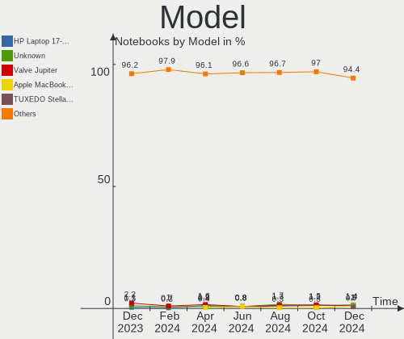

| Name                                 | Notebooks | Percent |
|--------------------------------------|-----------|---------|
| Valve Jupiter                        | 7         | 2.28%   |
| Unknown                              | 4         | 1.3%    |
| Lenovo ThinkPad E14 Gen 4 21ECS00000 | 3         | 0.98%   |
| HP Laptop 17-cp0xxx                  | 3         | 0.98%   |
| Apple MacBookPro12,1                 | 3         | 0.98%   |
| Acer Aspire 7750G                    | 3         | 0.98%   |
| VALE Notebook Classic C140           | 2         | 0.65%   |
| Samsung RC530/RC730                  | 2         | 0.65%   |
| Lenovo ThinkPad L14 Gen 1 20U1002KGE | 2         | 0.65%   |
| Lenovo G700 20251                    | 2         | 0.65%   |
| Lenovo G50-80 80E5                   | 2         | 0.65%   |
| HUAWEI KLVL-WXXW                     | 2         | 0.65%   |
| HP ZBook 15 G3                       | 2         | 0.65%   |
| HP Victus by Laptop 16-e0xxx         | 2         | 0.65%   |
| HP Laptop 15s-fq3xxx                 | 2         | 0.65%   |
| HP EliteBook 2570p                   | 2         | 0.65%   |
| Dell XPS 13 9370                     | 2         | 0.65%   |
| Dell Precision M4700                 | 2         | 0.65%   |
| Dell Latitude E6440                  | 2         | 0.65%   |
| Acer Extensa 215-55                  | 2         | 0.65%   |
| Acer Aspire ES1-521                  | 2         | 0.65%   |
| Wortmann AG 1220766_1470449          | 1         | 0.33%   |
| TUXEDO XP1610                        | 1         | 0.33%   |
| TUXEDO XMG FUSION 15 (XFU15L19)      | 1         | 0.33%   |
| TUXEDO Polaris Intel Gen3 (TGL)      | 1         | 0.33%   |
| TUXEDO InfinityBook S 14 v5          | 1         | 0.33%   |
| TUXEDO Book XP15 / XP17 Gen12        | 1         | 0.33%   |
| TrekStor Surfbook W2                 | 1         | 0.33%   |
| Toshiba Satellite Pro L770-12Q       | 1         | 0.33%   |
| Toshiba Satellite Pro C70-A          | 1         | 0.33%   |
| Toshiba Satellite L850               | 1         | 0.33%   |
| Toshiba Satellite L50-C              | 1         | 0.33%   |
| Toshiba Satellite C670D-126          | 1         | 0.33%   |
| Toshiba Satellite C670-169           | 1         | 0.33%   |
| Toshiba Satellite C660D              | 1         | 0.33%   |
| Toshiba PORTEGE Z10T-A               | 1         | 0.33%   |
| Thomson GEN360-4C128BK               | 1         | 0.33%   |
| Teclast F15Plus 2                    | 1         | 0.33%   |
| Sony VPCEH2N1E                       | 1         | 0.33%   |
| Sony VPCEF2S1E                       | 1         | 0.33%   |

Model Family
------------

Motherboard model prefix

| Name                | Notebooks | Percent |
|---------------------|-----------|---------|
| Lenovo ThinkPad     | 51        | 16.61%  |
| Acer Aspire         | 19        | 6.19%   |
| HP Laptop           | 15        | 4.89%   |
| Lenovo IdeaPad      | 12        | 3.91%   |
| Dell Latitude       | 12        | 3.91%   |
| Dell Precision      | 10        | 3.26%   |
| HP EliteBook        | 8         | 2.61%   |
| Valve Jupiter       | 7         | 2.28%   |
| Toshiba Satellite   | 7         | 2.28%   |
| Dell XPS            | 7         | 2.28%   |
| HP ProBook          | 6         | 1.95%   |
| HP Pavilion         | 6         | 1.95%   |
| Lenovo Yoga         | 4         | 1.3%    |
| Lenovo Legion       | 4         | 1.3%    |
| Fujitsu LIFEBOOK    | 4         | 1.3%    |
| Unknown             | 4         | 1.3%    |
| Lenovo ThinkBook    | 3         | 0.98%   |
| HP ZBook            | 3         | 0.98%   |
| HP Victus           | 3         | 0.98%   |
| HP 255              | 3         | 0.98%   |
| ASUS ROG            | 3         | 0.98%   |
| Apple MacBookPro12  | 3         | 0.98%   |
| VALE Notebook       | 2         | 0.65%   |
| Schenker XMG        | 2         | 0.65%   |
| Samsung RC530       | 2         | 0.65%   |
| Lenovo G700         | 2         | 0.65%   |
| Lenovo G50-80       | 2         | 0.65%   |
| HUAWEI KLVL-WXXW    | 2         | 0.65%   |
| HP 250              | 2         | 0.65%   |
| ASUS Zenbook        | 2         | 0.65%   |
| ASUS VivoBook       | 2         | 0.65%   |
| Apple MacBookPro5   | 2         | 0.65%   |
| Acer TravelMate     | 2         | 0.65%   |
| Acer Extensa        | 2         | 0.65%   |
| Wortmann AG 1220766 | 1         | 0.33%   |
| TUXEDO XP1610       | 1         | 0.33%   |
| TUXEDO XMG          | 1         | 0.33%   |
| TUXEDO Polaris      | 1         | 0.33%   |
| TUXEDO InfinityBook | 1         | 0.33%   |
| TUXEDO Book         | 1         | 0.33%   |

MFG Year
--------

Motherboard manufacture year

| Year    | Notebooks | Percent |
|---------|-----------|---------|
| 2021    | 35        | 11.4%   |
| 2022    | 31        | 10.1%   |
| 2013    | 28        | 9.12%   |
| 2023    | 27        | 8.79%   |
| 2020    | 26        | 8.47%   |
| 2018    | 25        | 8.14%   |
| 2011    | 21        | 6.84%   |
| 2012    | 20        | 6.51%   |
| 2016    | 19        | 6.19%   |
| 2015    | 17        | 5.54%   |
| 2019    | 16        | 5.21%   |
| 2017    | 12        | 3.91%   |
| 2010    | 10        | 3.26%   |
| 2014    | 6         | 1.95%   |
| 2008    | 6         | 1.95%   |
| 2009    | 4         | 1.3%    |
| 2007    | 3         | 0.98%   |
| Unknown | 1         | 0.33%   |

Form Factor
-----------

Physical design of the computer

| Name     | Notebooks | Percent |
|----------|-----------|---------|
| Notebook | 307       | 100%    |

Secure Boot
-----------

Enabled or disabled

| State    | Notebooks | Percent |
|----------|-----------|---------|
| Disabled | 283       | 92.18%  |
| Enabled  | 24        | 7.82%   |

Coreboot
--------

Have coreboot on board

| Used | Notebooks | Percent |
|------|-----------|---------|
| No   | 305       | 99.35%  |
| Yes  | 2         | 0.65%   |

RAM Size
--------

Total RAM memory

| Size in GB  | Notebooks | Percent |
|-------------|-----------|---------|
| 4.01-8.0    | 95        | 30.94%  |
| 8.01-16.0   | 56        | 18.24%  |
| 16.01-24.0  | 51        | 16.61%  |
| 3.01-4.0    | 47        | 15.31%  |
| 32.01-64.0  | 33        | 10.75%  |
| 64.01-256.0 | 9         | 2.93%   |
| 24.01-32.0  | 7         | 2.28%   |
| 1.01-2.0    | 5         | 1.63%   |
| 2.01-3.0    | 4         | 1.3%    |

RAM Used
--------

Used RAM memory

| Used GB    | Notebooks | Percent |
|------------|-----------|---------|
| 1.01-2.0   | 103       | 33.55%  |
| 2.01-3.0   | 72        | 23.45%  |
| 4.01-8.0   | 55        | 17.92%  |
| 3.01-4.0   | 52        | 16.94%  |
| 8.01-16.0  | 19        | 6.19%   |
| 0.51-1.0   | 3         | 0.98%   |
| 0.01-0.5   | 2         | 0.65%   |
| 32.01-64.0 | 1         | 0.33%   |

Total Drives
------------

Number of drives on board

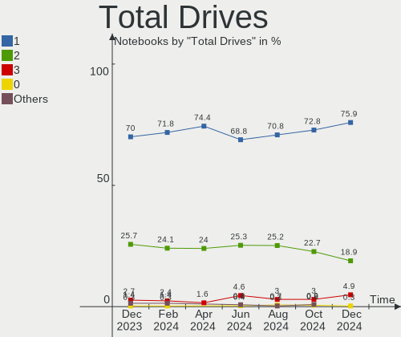

| Drives | Notebooks | Percent |
|--------|-----------|---------|
| 1      | 227       | 73.94%  |
| 2      | 65        | 21.17%  |
| 3      | 11        | 3.58%   |
| 4      | 2         | 0.65%   |
| 0      | 2         | 0.65%   |

Has CD-ROM
----------

Has CD-ROM on board

| Presented | Notebooks | Percent |
|-----------|-----------|---------|
| No        | 205       | 66.78%  |
| Yes       | 102       | 33.22%  |

Has Ethernet
------------

Has Ethernet on board

| Presented | Notebooks | Percent |
|-----------|-----------|---------|
| Yes       | 241       | 78.5%   |
| No        | 66        | 21.5%   |

Has WiFi
--------

Has WiFi module

| Presented | Notebooks | Percent |
|-----------|-----------|---------|
| Yes       | 302       | 98.37%  |
| No        | 5         | 1.63%   |

Has Bluetooth
-------------

Has Bluetooth module

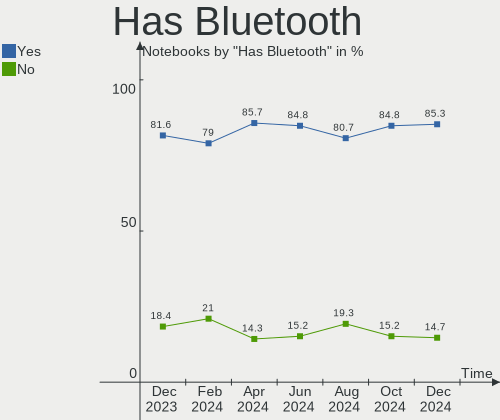

| Presented | Notebooks | Percent |
|-----------|-----------|---------|
| Yes       | 246       | 80.13%  |
| No        | 61        | 19.87%  |

Location
--------

Country
-------

Geographic location (country)

| Country | Notebooks | Percent |
|---------|-----------|---------|
| Germany | 307       | 100%    |

City
----

Geographic location (city)

| City               | Notebooks | Percent |
|--------------------|-----------|---------|
| Berlin             | 28        | 9.12%   |
| Hamburg            | 13        | 4.23%   |
| Munich             | 9         | 2.93%   |
| Nuremberg          | 8         | 2.61%   |
| Leipzig            | 7         | 2.28%   |
| Frankfurt am Main  | 7         | 2.28%   |
| Mannheim           | 6         | 1.95%   |
| Cologne            | 6         | 1.95%   |
| Stuttgart          | 5         | 1.63%   |
| Karlsruhe          | 5         | 1.63%   |
| Hanover            | 4         | 1.3%    |
| Düsseldorf        | 4         | 1.3%    |
| Saarbrücken       | 3         | 0.98%   |
| Ratingen           | 3         | 0.98%   |
| Norden             | 3         | 0.98%   |
| Marburg            | 3         | 0.98%   |
| Mainz              | 3         | 0.98%   |
| Halle              | 3         | 0.98%   |
| Essen              | 3         | 0.98%   |
| Dresden            | 3         | 0.98%   |
| Aachen             | 3         | 0.98%   |
| Würzburg          | 2         | 0.65%   |
| Wendeburg          | 2         | 0.65%   |
| Sulzbach-Rosenberg | 2         | 0.65%   |
| Paderborn          | 2         | 0.65%   |
| Niebuell           | 2         | 0.65%   |
| Neumünster        | 2         | 0.65%   |
| Meschede           | 2         | 0.65%   |
| Krefeld            | 2         | 0.65%   |
| Koblenz            | 2         | 0.65%   |
| Jena               | 2         | 0.65%   |
| Hohen Neuendorf    | 2         | 0.65%   |
| Göttingen         | 2         | 0.65%   |
| Fürstenfeldbruck  | 2         | 0.65%   |
| Flensburg          | 2         | 0.65%   |
| Coburg             | 2         | 0.65%   |
| Buende             | 2         | 0.65%   |
| Braunschweig       | 2         | 0.65%   |
| Bochum             | 2         | 0.65%   |
| Bad Krozingen      | 2         | 0.65%   |

Drives
------

Drive Vendor
------------

Hard drive vendors

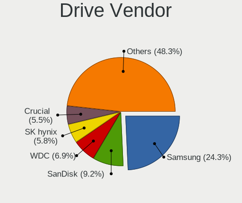

| Vendor                      | Notebooks | Drives | Percent |
|-----------------------------|-----------|--------|---------|
| Samsung Electronics         | 88        | 104    | 24.11%  |
| Sandisk                     | 43        | 46     | 11.78%  |
| Unknown                     | 24        | 25     | 6.58%   |
| Seagate                     | 24        | 24     | 6.58%   |
| SK hynix                    | 18        | 18     | 4.93%   |
| WDC                         | 17        | 17     | 4.66%   |
| Micron Technology           | 15        | 15     | 4.11%   |
| Toshiba                     | 14        | 14     | 3.84%   |
| Intenso                     | 13        | 13     | 3.56%   |
| Intel                       | 12        | 12     | 3.29%   |
| Crucial                     | 11        | 11     | 3.01%   |
| HGST                        | 9         | 9      | 2.47%   |
| KIOXIA                      | 8         | 8      | 2.19%   |
| Phison Electronics          | 5         | 5      | 1.37%   |
| Kingston Technology Company | 5         | 5      | 1.37%   |
| Hitachi                     | 5         | 5      | 1.37%   |
| Apple                       | 5         | 7      | 1.37%   |
| Phison                      | 4         | 4      | 1.1%    |
| Unknown                     | 4         | 5      | 1.1%    |
| Micron/Crucial Technology   | 3         | 3      | 0.82%   |
| China                       | 3         | 3      | 0.82%   |
| Union Memory (Shenzhen)     | 2         | 2      | 0.55%   |
| Union Memory                | 2         | 2      | 0.55%   |
| Silicon Motion              | 2         | 2      | 0.55%   |
| Patriot                     | 2         | 2      | 0.55%   |
| Lenovo                      | 2         | 2      | 0.55%   |
| Kingston                    | 2         | 2      | 0.55%   |
| GLOWAY                      | 2         | 2      | 0.55%   |
| 2-Power                     | 2         | 2      | 0.55%   |
| UMIS                        | 1         | 1      | 0.27%   |
| Transcend                   | 1         | 1      | 0.27%   |
| Teclast                     | 1         | 1      | 0.27%   |
| SSSTC                       | 1         | 1      | 0.27%   |
| SSK SD30                    | 1         | 1      | 0.27%   |
| Sonnics                     | 1         | 1      | 0.27%   |
| SATA3 12                    | 1         | 1      | 0.27%   |
| PNY                         | 1         | 1      | 0.27%   |
| OCZ                         | 1         | 1      | 0.27%   |
| Netac                       | 1         | 1      | 0.27%   |
| LITEON                      | 1         | 1      | 0.27%   |

Drive Model
-----------

Hard drive models

| Model                                                 | Notebooks | Percent |
|-------------------------------------------------------|-----------|---------|
| Samsung NVMe SSD Controller PM9A1/PM9A3/980PRO 1TB    | 13        | 3.41%   |
| Samsung NVMe SSD Controller SM981/PM981/PM983 1TB     | 11        | 2.89%   |
| Samsung SSD 850 EVO 250GB                             | 6         | 1.57%   |
| Unknown MMC Card  64GB                                | 5         | 1.31%   |
| Toshiba MQ01ABD100 1TB                                | 5         | 1.31%   |
| Seagate ST1000LM035-1RK172 1TB                        | 5         | 1.31%   |
| Phison E12 NVMe Controller 1TB                        | 5         | 1.31%   |
| Kingston Company OM3PDP3 NVMe SSD 512GB               | 5         | 1.31%   |
| Sandisk WD Black SN750 / PC SN730 NVMe SSD 1024GB     | 4         | 1.05%   |
| Unknown                                               | 4         | 1.05%   |
| WDC WD10SPZX-24Z10 1TB                                | 3         | 0.79%   |
| Unknown SD/MMC/MS PRO 16GB                            | 3         | 0.79%   |
| Unknown MMC Card  256GB                               | 3         | 0.79%   |
| Seagate ST500LT012-1DG142 500GB                       | 3         | 0.79%   |
| Sandisk WD Blue SN570 1TB                             | 3         | 0.79%   |
| Sandisk WD Blue SN550 NVMe SSD 1TB                    | 3         | 0.79%   |
| Samsung SSD 980 1TB                                   | 3         | 0.79%   |
| Samsung SSD 860 EVO 1TB                               | 3         | 0.79%   |
| Micron/Crucial P2 NVMe PCIe SSD 500GB                 | 3         | 0.79%   |
| Unknown MMC Card  32GB                                | 2         | 0.52%   |
| Union Memory (Shenzhen) UMIS RPJTJ512MGE1QDQ 512GB    | 2         | 0.52%   |
| Toshiba MQ01ABF050 500GB                              | 2         | 0.52%   |
| Silicon Motion SM2263EN/SM2263XT SSD Controller 256GB | 2         | 0.52%   |
| Seagate ST980811AS 80GB                               | 2         | 0.52%   |
| Seagate ST500LM000-1EJ162 500GB                       | 2         | 0.52%   |
| Seagate ST1000LM014-1EJ164 1TB                        | 2         | 0.52%   |
| SanDisk SSD i100 24GB                                 | 2         | 0.52%   |
| SanDisk SDSSDH3500G 500GB                             | 2         | 0.52%   |
| SanDisk SDSSDH3 250G                                  | 2         | 0.52%   |
| SanDisk NVMe SSD Drive 512GB                          | 2         | 0.52%   |
| SanDisk NVMe SSD Drive 2TB                            | 2         | 0.52%   |
| Samsung SSD 980 500GB                                 | 2         | 0.52%   |
| Samsung SSD 970 EVO Plus 500GB                        | 2         | 0.52%   |
| Samsung SSD 870 EVO 1TB                               | 2         | 0.52%   |
| Samsung SSD 860 EVO M.2 1TB                           | 2         | 0.52%   |
| Samsung MZVLB1T0HBLR-000L7 1TB                        | 2         | 0.52%   |
| Micron MTFDKCD512TFK 512GB                            | 2         | 0.52%   |
| Micron 2450_MTFDKBA512TFK 512GB                       | 2         | 0.52%   |
| Micron 2450_MTFDKBA1T0TFK 1TB                         | 2         | 0.52%   |
| Intenso SSD 512GB                                     | 2         | 0.52%   |

HDD Vendor
----------

Hard disk drive vendors

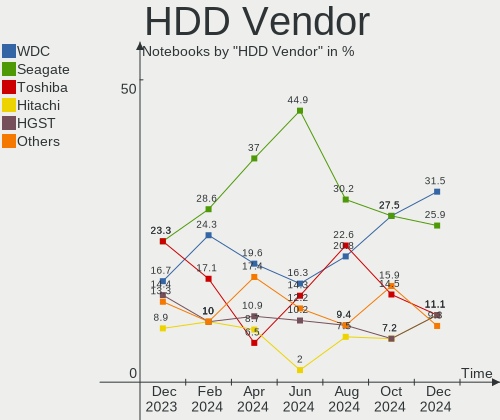

| Vendor              | Notebooks | Drives | Percent |
|---------------------|-----------|--------|---------|
| Seagate             | 24        | 24     | 34.78%  |
| Toshiba             | 12        | 12     | 17.39%  |
| WDC                 | 11        | 11     | 15.94%  |
| HGST                | 9         | 9      | 13.04%  |
| Hitachi             | 5         | 5      | 7.25%   |
| Unknown             | 3         | 3      | 4.35%   |
| Samsung Electronics | 3         | 3      | 4.35%   |
| HGST HTS            | 1         | 1      | 1.45%   |
| Apple               | 1         | 1      | 1.45%   |

SSD Vendor
----------

Solid state drive vendors

| Vendor              | Notebooks | Drives | Percent |
|---------------------|-----------|--------|---------|
| Samsung Electronics | 39        | 41     | 33.62%  |
| SanDisk             | 23        | 24     | 19.83%  |
| Intenso             | 11        | 11     | 9.48%   |
| Crucial             | 9         | 9      | 7.76%   |
| Intel               | 5         | 5      | 4.31%   |
| China               | 3         | 3      | 2.59%   |
| Apple               | 3         | 3      | 2.59%   |
| SK hynix            | 2         | 2      | 1.72%   |
| GLOWAY              | 2         | 2      | 1.72%   |
| WDC                 | 1         | 1      | 0.86%   |
| Unknown             | 1         | 1      | 0.86%   |
| Transcend           | 1         | 1      | 0.86%   |
| Teclast             | 1         | 1      | 0.86%   |
| SATA3 12            | 1         | 1      | 0.86%   |
| PNY                 | 1         | 1      | 0.86%   |
| Phison              | 1         | 1      | 0.86%   |
| Patriot             | 1         | 1      | 0.86%   |
| OCZ                 | 1         | 1      | 0.86%   |
| Netac               | 1         | 1      | 0.86%   |
| Micron Technology   | 1         | 1      | 0.86%   |
| LITEON              | 1         | 1      | 0.86%   |
| Lexar               | 1         | 1      | 0.86%   |
| KUIJIA              | 1         | 1      | 0.86%   |
| KingSpec            | 1         | 1      | 0.86%   |
| INNOVATION IT       | 1         | 1      | 0.86%   |
| Emtec               | 1         | 1      | 0.86%   |
| A-DATA Technology   | 1         | 1      | 0.86%   |
| 2-Power             | 1         | 1      | 0.86%   |

Drive Kind
----------

HDD or SSD

| Kind    | Notebooks | Drives | Percent |
|---------|-----------|--------|---------|
| NVMe    | 145       | 169    | 41.55%  |
| SSD     | 108       | 119    | 30.95%  |
| HDD     | 67        | 69     | 19.2%   |
| MMC     | 24        | 26     | 6.88%   |
| Unknown | 5         | 5      | 1.43%   |

Drive Connector
---------------

SATA, SAS, NVMe, etc.

| Type | Notebooks | Drives | Percent |
|------|-----------|--------|---------|
| SATA | 164       | 182    | 47.67%  |
| NVMe | 145       | 169    | 42.15%  |
| MMC  | 24        | 26     | 6.98%   |
| SAS  | 11        | 11     | 3.2%    |

Drive Size
----------

Size of hard drive

| Size in TB | Notebooks | Drives | Percent |
|------------|-----------|--------|---------|
| 0.01-0.5   | 108       | 116    | 60.67%  |
| 0.51-1.0   | 63        | 65     | 35.39%  |
| 1.01-2.0   | 5         | 5      | 2.81%   |
| 3.01-4.0   | 1         | 1      | 0.56%   |
| 4.01-10.0  | 1         | 1      | 0.56%   |

Space Total
-----------

Amount of disk space available on the file system

| Size in GB     | Notebooks | Percent |
|----------------|-----------|---------|
| 101-250        | 80        | 26.06%  |
| 251-500        | 76        | 24.76%  |
| 501-1000       | 63        | 20.52%  |
| 1001-2000      | 25        | 8.14%   |
| 1-20           | 18        | 5.86%   |
| 51-100         | 13        | 4.23%   |
| More than 3000 | 9         | 2.93%   |
| 2001-3000      | 8         | 2.61%   |
| Unknown        | 8         | 2.61%   |
| 21-50          | 7         | 2.28%   |

Space Used
----------

Amount of used disk space

| Used GB        | Notebooks | Percent |
|----------------|-----------|---------|
| 1-20           | 98        | 31.92%  |
| 21-50          | 57        | 18.57%  |
| 101-250        | 48        | 15.64%  |
| 51-100         | 45        | 14.66%  |
| 251-500        | 24        | 7.82%   |
| 501-1000       | 14        | 4.56%   |
| 1001-2000      | 10        | 3.26%   |
| Unknown        | 8         | 2.61%   |
| 2001-3000      | 2         | 0.65%   |
| More than 3000 | 1         | 0.33%   |

Malfunc. Drives
---------------

Drive models with a malfunction

| Model                                 | Notebooks | Drives | Percent |
|---------------------------------------|-----------|--------|---------|
| WDC WD1600BEKT-75PVMT0 160GB          | 1         | 1      | 12.5%   |
| Toshiba MQ01ABF050 500GB              | 1         | 1      | 12.5%   |
| Toshiba MK1255GSX H 120GB             | 1         | 1      | 12.5%   |
| Seagate ST500LT012-1DG142 500GB       | 1         | 1      | 12.5%   |
| Samsung Electronics SSD 870 EVO 500GB | 1         | 1      | 12.5%   |
| Lenovo LENSE20512GMSP34MEAT2TA 512GB  | 1         | 1      | 12.5%   |
| Hitachi HTS545032B9A300 320GB         | 1         | 1      | 12.5%   |
| HGST HTS541010A9E680 1TB              | 1         | 1      | 12.5%   |

Malfunc. Drive Vendor
---------------------

Vendors of faulty drives

| Vendor              | Notebooks | Drives | Percent |
|---------------------|-----------|--------|---------|
| Toshiba             | 2         | 2      | 25%     |
| WDC                 | 1         | 1      | 12.5%   |
| Seagate             | 1         | 1      | 12.5%   |
| Samsung Electronics | 1         | 1      | 12.5%   |
| Lenovo              | 1         | 1      | 12.5%   |
| Hitachi             | 1         | 1      | 12.5%   |
| HGST                | 1         | 1      | 12.5%   |

Malfunc. HDD Vendor
-------------------

Vendors of faulty HDD drives

| Vendor  | Notebooks | Drives | Percent |
|---------|-----------|--------|---------|
| Toshiba | 2         | 2      | 33.33%  |
| WDC     | 1         | 1      | 16.67%  |
| Seagate | 1         | 1      | 16.67%  |
| Hitachi | 1         | 1      | 16.67%  |
| HGST    | 1         | 1      | 16.67%  |

Malfunc. Drive Kind
-------------------

Kinds of faulty drives

| Kind | Notebooks | Drives | Percent |
|------|-----------|--------|---------|
| HDD  | 6         | 6      | 75%     |
| NVMe | 1         | 1      | 12.5%   |
| SSD  | 1         | 1      | 12.5%   |

Failed Drives
-------------

Failed drive models

Zero info for selected period =(

Failed Drive Vendor
-------------------

Failed drive vendors

Zero info for selected period =(

Drive Status
------------

Number of failed and malfunc. drives

| Status   | Notebooks | Drives | Percent |
|----------|-----------|--------|---------|
| Detected | 181       | 226    | 57.83%  |
| Works    | 124       | 154    | 39.62%  |
| Malfunc  | 8         | 8      | 2.56%   |

Storage controller
------------------

Storage Vendor
--------------

Storage controller vendors

| Vendor                         | Notebooks | Percent |
|--------------------------------|-----------|---------|
| Intel                          | 173       | 48.46%  |
| Samsung Electronics            | 52        | 14.57%  |
| AMD                            | 29        | 8.12%   |
| SanDisk                        | 26        | 7.28%   |
| SK hynix                       | 16        | 4.48%   |
| Micron Technology              | 14        | 3.92%   |
| KIOXIA                         | 9         | 2.52%   |
| Phison Electronics             | 8         | 2.24%   |
| Kingston Technology Company    | 7         | 1.96%   |
| Union Memory (Shenzhen)        | 5         | 1.4%    |
| Micron/Crucial Technology      | 5         | 1.4%    |
| Silicon Motion                 | 3         | 0.84%   |
| Nvidia                         | 3         | 0.84%   |
| Toshiba America Info Systems   | 2         | 0.56%   |
| Lenovo                         | 2         | 0.56%   |
| Solid State Storage Technology | 1         | 0.28%   |
| MAXIO Technology (Hangzhou)    | 1         | 0.28%   |
| JMicron Technology             | 1         | 0.28%   |

Storage Model
-------------

Storage controller models

| Model                                                                                  | Notebooks | Percent |
|----------------------------------------------------------------------------------------|-----------|---------|
| Intel 7 Series Chipset Family 6-port SATA Controller [AHCI mode]                       | 24        | 6.25%   |
| AMD FCH SATA Controller [AHCI mode]                                                    | 24        | 6.25%   |
| Samsung NVMe SSD Controller SM981/PM981/PM983                                          | 21        | 5.47%   |
| Samsung NVMe SSD Controller PM9A1/PM9A3/980PRO                                         | 18        | 4.69%   |
| Intel Sunrise Point-LP SATA Controller [AHCI mode]                                     | 14        | 3.65%   |
| Intel 6 Series/C200 Series Chipset Family 6 port Mobile SATA AHCI Controller           | 14        | 3.65%   |
| Intel 82801 Mobile SATA Controller [RAID mode]                                         | 11        | 2.86%   |
| Intel Celeron/Pentium Silver Processor SATA Controller                                 | 10        | 2.6%    |
| Intel Wildcat Point-LP SATA Controller [AHCI Mode]                                     | 9         | 2.34%   |
| Samsung NVMe SSD Controller 980 (DRAM-less)                                            | 8         | 2.08%   |
| Micron 2450 NVMe SSD [HendrixV] (DRAM-less)                                            | 8         | 2.08%   |
| Intel Volume Management Device NVMe RAID Controller                                    | 8         | 2.08%   |
| SanDisk Extreme Pro / WD Black SN750 / PC SN730 / Red SN700 NVMe SSD                   | 7         | 1.82%   |
| Intel Q170/Q150/B150/H170/H110/Z170/CM236 Chipset SATA Controller [AHCI Mode]          | 7         | 1.82%   |
| Intel 6 Series/C200 Series Chipset Family Mobile SATA Controller (IDE mode, ports 4-5) | 7         | 1.82%   |
| Intel 6 Series/C200 Series Chipset Family Mobile SATA Controller (IDE mode, ports 0-3) | 7         | 1.82%   |
| Intel Alder Lake-P SATA AHCI Controller                                                | 6         | 1.56%   |
| SK hynix Gold P31/BC711/PC711 NVMe Solid State Drive                                   | 5         | 1.3%    |
| Phison E12 NVMe Controller                                                             | 5         | 1.3%    |
| KIOXIA NVMe SSD Controller BG4 (DRAM-less)                                             | 5         | 1.3%    |
| Kingston Company OM3PDP3 NVMe SSD                                                      | 5         | 1.3%    |
| Intel Celeron N3350/Pentium N4200/Atom E3900 Series SATA AHCI Controller               | 5         | 1.3%    |
| Intel 8 Series SATA Controller 1 [AHCI mode]                                           | 5         | 1.3%    |
| SanDisk WD Black SN770 / PC SN740 256GB / PC SN560 (DRAM-less) NVMe SSD                | 4         | 1.04%   |
| SanDisk Ultra 3D / WD Blue SN570 NVMe SSD (DRAM-less)                                  | 4         | 1.04%   |
| SanDisk Ultra 3D / WD Blue SN550 NVMe SSD                                              | 4         | 1.04%   |
| Samsung NVMe SSD Controller PM9B1 (DRAM-less)                                          | 4         | 1.04%   |
| Micron/Crucial P2 [Nick P2] / P3 / P3 Plus NVMe PCIe SSD (DRAM-less)                   | 4         | 1.04%   |
| Intel Tiger Lake-LP SATA Controller                                                    | 4         | 1.04%   |
| Intel Comet Lake SATA AHCI Controller                                                  | 4         | 1.04%   |
| Intel 8 Series/C220 Series Chipset Family 6-port SATA Controller 1 [AHCI mode]         | 4         | 1.04%   |
| Intel 5 Series/3400 Series Chipset 6 port SATA AHCI Controller                         | 4         | 1.04%   |
| AMD SB7x0/SB8x0/SB9x0 SATA Controller [AHCI mode]                                      | 4         | 1.04%   |
| Union Memory (Shenzhen) AM630 PCIe 4.0 x4 NVMe SSD Controller                          | 3         | 0.78%   |
| SK hynix Platinum P41/PC801 NVMe Solid State Drive                                     | 3         | 0.78%   |
| SK hynix BC901 NVMe Solid State Drive (DRAM-less)                                      | 3         | 0.78%   |
| Silicon Motion SM2263EN/SM2263XT (DRAM-less) NVMe SSD Controllers                      | 3         | 0.78%   |
| Samsung S4LN058A01[SSUBX] AHCI SSD Controller (Apple slot)                             | 3         | 0.78%   |
| KIOXIA NVMe SSD Controller XG8                                                         | 3         | 0.78%   |
| Intel HM170/QM170 Chipset SATA Controller [AHCI Mode]                                  | 3         | 0.78%   |

Storage Kind
------------

Kind of storage controller (IDE, SATA, NVMe, SAS, ...)

| Kind | Notebooks | Percent |
|------|-----------|---------|
| SATA | 174       | 48.6%   |
| NVMe | 145       | 40.5%   |
| RAID | 21        | 5.87%   |
| IDE  | 18        | 5.03%   |

Processor
---------

CPU Vendor
----------

Processor vendors

| Vendor  | Notebooks | Percent |
|---------|-----------|---------|
| Intel   | 229       | 74.59%  |
| AMD     | 77        | 25.08%  |
| Unknown | 1         | 0.33%   |

CPU Model
---------

Processor models

| Model                                         | Notebooks | Percent |
|-----------------------------------------------|-----------|---------|
| AMD Custom APU 0405                           | 7         | 2.28%   |
| Intel Core i5-8250U CPU @ 1.60GHz             | 6         | 1.95%   |
| AMD Ryzen 5 5625U with Radeon Graphics        | 6         | 1.95%   |
| Intel Core i7-6600U CPU @ 2.60GHz             | 5         | 1.63%   |
| Intel Core i7-10510U CPU @ 1.80GHz            | 5         | 1.63%   |
| Intel Core i5-6300U CPU @ 2.40GHz             | 5         | 1.63%   |
| Intel 12th Gen Core i5-1235U                  | 5         | 1.63%   |
| Intel Core i7-6820HQ CPU @ 2.70GHz            | 4         | 1.3%    |
| Intel Core i5-8365U CPU @ 1.60GHz             | 4         | 1.3%    |
| Intel Core i5-2430M CPU @ 2.40GHz             | 4         | 1.3%    |
| Intel Celeron CPU N3350 @ 1.10GHz             | 4         | 1.3%    |
| Intel 11th Gen Core i7-1165G7 @ 2.80GHz       | 4         | 1.3%    |
| Intel 11th Gen Core i3-1115G4 @ 3.00GHz       | 4         | 1.3%    |
| AMD Ryzen 7 PRO 7840U w/ Radeon 780M Graphics | 4         | 1.3%    |
| AMD Ryzen 5 5500U with Radeon Graphics        | 4         | 1.3%    |
| Intel Pentium Silver N5030 CPU @ 1.10GHz      | 3         | 0.98%   |
| Intel Pentium CPU 2020M @ 2.40GHz             | 3         | 0.98%   |
| Intel Core i7-9750H CPU @ 2.60GHz             | 3         | 0.98%   |
| Intel Core i7-8565U CPU @ 1.80GHz             | 3         | 0.98%   |
| Intel Core i7-2670QM CPU @ 2.20GHz            | 3         | 0.98%   |
| Intel Core i7-2630QM CPU @ 2.00GHz            | 3         | 0.98%   |
| Intel Core i5-7200U CPU @ 2.50GHz             | 3         | 0.98%   |
| Intel Core i5-3320M CPU @ 2.60GHz             | 3         | 0.98%   |
| Intel Core i5-3230M CPU @ 2.60GHz             | 3         | 0.98%   |
| Intel Core i5-3210M CPU @ 2.50GHz             | 3         | 0.98%   |
| Intel Core i5-10210U CPU @ 1.60GHz            | 3         | 0.98%   |
| Intel 13th Gen Core i7-13700H                 | 3         | 0.98%   |
| Intel 11th Gen Core i7-11800H @ 2.30GHz       | 3         | 0.98%   |
| AMD Ryzen 7 5825U with Radeon Graphics        | 3         | 0.98%   |
| Intel Core i7-8650U CPU @ 1.90GHz             | 2         | 0.65%   |
| Intel Core i7-8550U CPU @ 1.80GHz             | 2         | 0.65%   |
| Intel Core i7-7700HQ CPU @ 2.80GHz            | 2         | 0.65%   |
| Intel Core i7-6700HQ CPU @ 2.60GHz            | 2         | 0.65%   |
| Intel Core i7-5500U CPU @ 2.40GHz             | 2         | 0.65%   |
| Intel Core i7-4700MQ CPU @ 2.40GHz            | 2         | 0.65%   |
| Intel Core i7-3720QM CPU @ 2.60GHz            | 2         | 0.65%   |
| Intel Core i7-3630QM CPU @ 2.40GHz            | 2         | 0.65%   |
| Intel Core i7-2640M CPU @ 2.80GHz             | 2         | 0.65%   |
| Intel Core i5-8265U CPU @ 1.60GHz             | 2         | 0.65%   |
| Intel Core i5-6200U CPU @ 2.30GHz             | 2         | 0.65%   |

CPU Model Family
----------------

Processor model prefix

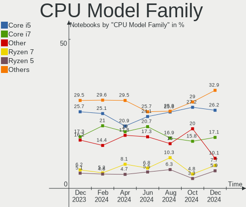

| Model                   | Notebooks | Percent |
|-------------------------|-----------|---------|
| Intel Core i5           | 68        | 22.15%  |
| Intel Core i7           | 62        | 20.2%   |
| Other                   | 49        | 15.96%  |
| Intel Celeron           | 19        | 6.19%   |
| AMD Ryzen 5             | 19        | 6.19%   |
| AMD Ryzen 7             | 16        | 5.21%   |
| Intel Pentium           | 10        | 3.26%   |
| Intel Core i3           | 10        | 3.26%   |
| Intel Core 2 Duo        | 6         | 1.95%   |
| AMD Ryzen 7 PRO         | 6         | 1.95%   |
| Intel Atom              | 5         | 1.63%   |
| AMD Ryzen 9             | 5         | 1.63%   |
| Intel Pentium Silver    | 4         | 1.3%    |
| AMD A6                  | 4         | 1.3%    |
| AMD E2                  | 3         | 0.98%   |
| AMD Athlon              | 3         | 0.98%   |
| AMD A8                  | 3         | 0.98%   |
| AMD Ryzen 3             | 2         | 0.65%   |
| AMD E                   | 2         | 0.65%   |
| AMD Athlon X2           | 2         | 0.65%   |
| Intel Pentium Dual-Core | 1         | 0.33%   |
| Intel Pentium Dual      | 1         | 0.33%   |
| Intel Core m5           | 1         | 0.33%   |
| Intel Core i9           | 1         | 0.33%   |
| Intel Core 2            | 1         | 0.33%   |
| AMD Ryzen 3 PRO         | 1         | 0.33%   |
| AMD Phenom II           | 1         | 0.33%   |
| AMD A4                  | 1         | 0.33%   |
| AMD A10                 | 1         | 0.33%   |

CPU Cores
---------

Number of processor cores

| Number | Notebooks | Percent |
|--------|-----------|---------|
| 2      | 121       | 39.41%  |
| 4      | 101       | 32.9%   |
| 8      | 33        | 10.75%  |
| 6      | 24        | 7.82%   |
| 10     | 10        | 3.26%   |
| 14     | 7         | 2.28%   |
| 12     | 4         | 1.3%    |
| 1      | 3         | 0.98%   |
| 16     | 2         | 0.65%   |
| 24     | 1         | 0.33%   |
| 3      | 1         | 0.33%   |

CPU Sockets
-----------

Number of sockets

| Number | Notebooks | Percent |
|--------|-----------|---------|
| 1      | 307       | 100%    |

CPU Threads
-----------

Threads per core (Hyper-Threading)

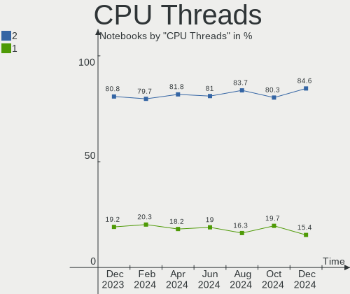

| Number | Notebooks | Percent |
|--------|-----------|---------|
| 2      | 231       | 75.24%  |
| 1      | 76        | 24.76%  |

CPU Op-Modes
------------

CPU Operation Modes (32-bit, 64-bit)

| Op mode        | Notebooks | Percent |
|----------------|-----------|---------|
| 32-bit, 64-bit | 305       | 99.35%  |
| 64-bit         | 1         | 0.33%   |
| 32-bit         | 1         | 0.33%   |

CPU Microcode
-------------

Microcode number

| Number     | Notebooks | Percent |
|------------|-----------|---------|
| Unknown    | 170       | 55.37%  |
| 0x206a7    | 13        | 4.23%   |
| 0x306a9    | 11        | 3.58%   |
| 0x406e3    | 7         | 2.28%   |
| 0x0a50000d | 7         | 2.28%   |
| 0x0a50000c | 7         | 2.28%   |
| 0x806c1    | 4         | 1.3%    |
| 0x0a404102 | 4         | 1.3%    |
| 0x08600106 | 4         | 1.3%    |
| 0x806ec    | 3         | 0.98%   |
| 0x706a8    | 3         | 0.98%   |
| 0x506c9    | 3         | 0.98%   |
| 0x406c4    | 3         | 0.98%   |
| 0x40651    | 3         | 0.98%   |
| 0x20655    | 3         | 0.98%   |
| 0x07030105 | 3         | 0.98%   |
| 0x906ea    | 2         | 0.65%   |
| 0x906e9    | 2         | 0.65%   |
| 0x906a4    | 2         | 0.65%   |
| 0x806ea    | 2         | 0.65%   |
| 0x506e3    | 2         | 0.65%   |
| 0x306d4    | 2         | 0.65%   |
| 0x306c3    | 2         | 0.65%   |
| 0x106ca    | 2         | 0.65%   |
| 0x10676    | 2         | 0.65%   |
| 0x0a704103 | 2         | 0.65%   |
| 0x08608104 | 2         | 0.65%   |
| 0x08608103 | 2         | 0.65%   |
| 0x08608102 | 2         | 0.65%   |
| 0x08600109 | 2         | 0.65%   |
| 0x08600103 | 2         | 0.65%   |
| 0x0810100b | 2         | 0.65%   |
| 0x02000057 | 2         | 0.65%   |
| 0xb06a3    | 1         | 0.33%   |
| 0xb06a2    | 1         | 0.33%   |
| 0x906ec    | 1         | 0.33%   |
| 0x806eb    | 1         | 0.33%   |
| 0x806e9    | 1         | 0.33%   |
| 0x806d1    | 1         | 0.33%   |
| 0x6fd      | 1         | 0.33%   |

CPU Microarch
-------------

Microarchitecture

| Name             | Notebooks | Percent |
|------------------|-----------|---------|
| KabyLake         | 44        | 14.33%  |
| Unknown          | 40        | 13.03%  |
| IvyBridge        | 26        | 8.47%   |
| SandyBridge      | 24        | 7.82%   |
| Skylake          | 19        | 6.19%   |
| Alderlake Hybrid | 16        | 5.21%   |
| Zen 3            | 15        | 4.89%   |
| Haswell          | 14        | 4.56%   |
| Broadwell        | 12        | 3.91%   |
| TigerLake        | 11        | 3.58%   |
| Zen 2            | 10        | 3.26%   |
| Goldmont plus    | 10        | 3.26%   |
| Silvermont       | 8         | 2.61%   |
| Westmere         | 7         | 2.28%   |
| Penryn           | 6         | 1.95%   |
| Goldmont         | 6         | 1.95%   |
| Excavator        | 6         | 1.95%   |
| Puma             | 5         | 1.63%   |
| IceLake          | 5         | 1.63%   |
| Zen+             | 4         | 1.3%    |
| Core             | 3         | 0.98%   |
| Bonnell          | 3         | 0.98%   |
| Zen              | 2         | 0.65%   |
| K8 & K10 hybrid  | 2         | 0.65%   |
| CometLake        | 2         | 0.65%   |
| Bobcat           | 2         | 0.65%   |
| Tremont          | 1         | 0.33%   |
| Piledriver       | 1         | 0.33%   |
| Nehalem          | 1         | 0.33%   |
| K10              | 1         | 0.33%   |
| Jaguar           | 1         | 0.33%   |

Graphics
--------

GPU Vendor
----------

Vendors of graphics cards

| Vendor | Notebooks | Percent |
|--------|-----------|---------|
| Intel  | 206       | 53.79%  |
| AMD    | 92        | 24.02%  |
| Nvidia | 85        | 22.19%  |

GPU Model
---------

Graphics card models

| Model                                                                                    | Notebooks | Percent |
|------------------------------------------------------------------------------------------|-----------|---------|
| Intel 3rd Gen Core processor Graphics Controller                                         | 23        | 5.93%   |
| Intel 2nd Generation Core Processor Family Integrated Graphics Controller                | 18        | 4.64%   |
| Intel Skylake GT2 [HD Graphics 520]                                                      | 12        | 3.09%   |
| Intel UHD Graphics 620                                                                   | 11        | 2.84%   |
| AMD Renoir [Radeon RX Vega 6 (Ryzen 4000/5000 Mobile Series)]                            | 10        | 2.58%   |
| AMD Barcelo                                                                              | 10        | 2.58%   |
| Intel WhiskeyLake-U GT2 [UHD Graphics 620]                                               | 9         | 2.32%   |
| Intel CometLake-U GT2 [UHD Graphics]                                                     | 9         | 2.32%   |
| Intel HD Graphics 5500                                                                   | 8         | 2.06%   |
| AMD Rembrandt [Radeon 680M]                                                              | 8         | 2.06%   |
| Intel GeminiLake [UHD Graphics 600]                                                      | 7         | 1.8%    |
| Intel Core Processor Integrated Graphics Controller                                      | 7         | 1.8%    |
| Intel Alder Lake-P GT2 [Iris Xe Graphics]                                                | 7         | 1.8%    |
| AMD VanGogh [AMD Custom GPU 0405]                                                        | 7         | 1.8%    |
| AMD Lucienne                                                                             | 7         | 1.8%    |
| Intel Tiger Lake-LP GT2 [UHD Graphics G4]                                                | 6         | 1.55%   |
| Intel HD Graphics 500                                                                    | 6         | 1.55%   |
| Intel CoffeeLake-H GT2 [UHD Graphics 630]                                                | 6         | 1.55%   |
| Intel 4th Gen Core Processor Integrated Graphics Controller                              | 6         | 1.55%   |
| Nvidia GA106M [GeForce RTX 3060 Mobile / Max-Q]                                          | 5         | 1.29%   |
| Intel TigerLake-LP GT2 [Iris Xe Graphics]                                                | 5         | 1.29%   |
| Intel HD Graphics 530                                                                    | 5         | 1.29%   |
| Intel Haswell-ULT Integrated Graphics Controller                                         | 5         | 1.29%   |
| Intel Alder Lake-UP3 GT2 [Iris Xe Graphics]                                              | 5         | 1.29%   |
| AMD Stoney [Radeon R2/R3/R4/R5 Graphics]                                                 | 5         | 1.29%   |
| AMD Phoenix1                                                                             | 5         | 1.29%   |
| AMD Mullins [Radeon R4/R5 Graphics]                                                      | 5         | 1.29%   |
| AMD Cezanne [Radeon Vega Series / Radeon Vega Mobile Series]                             | 5         | 1.29%   |
| Intel TigerLake-H GT1 [UHD Graphics]                                                     | 4         | 1.03%   |
| Intel Raptor Lake-P [Iris Xe Graphics]                                                   | 4         | 1.03%   |
| Intel Mobile 4 Series Chipset Integrated Graphics Controller                             | 4         | 1.03%   |
| Intel HD Graphics 620                                                                    | 4         | 1.03%   |
| Intel Atom/Celeron/Pentium Processor x5-E8000/J3xxx/N3xxx Integrated Graphics Controller | 4         | 1.03%   |
| Intel Atom Processor Z36xxx/Z37xxx Series Graphics & Display                             | 4         | 1.03%   |
| AMD Picasso/Raven 2 [Radeon Vega Series / Radeon Vega Mobile Series]                     | 4         | 1.03%   |
| Nvidia GF119M [NVS 4200M]                                                                | 3         | 0.77%   |
| Nvidia GF117M [GeForce 610M/710M/810M/820M / GT 620M/625M/630M/720M]                     | 3         | 0.77%   |
| Nvidia GF108M [GeForce GT 540M]                                                          | 3         | 0.77%   |
| Intel Iris Graphics 6100                                                                 | 3         | 0.77%   |
| Intel HD Graphics 630                                                                    | 3         | 0.77%   |

GPU Combo
---------

Combinations of graphics cards

| Name           | Notebooks | Percent |
|----------------|-----------|---------|
| 1 x Intel      | 139       | 45.28%  |
| 1 x AMD        | 67        | 21.82%  |
| Intel + Nvidia | 54        | 17.59%  |
| 1 x Nvidia     | 18        | 5.86%   |
| Intel + AMD    | 11        | 3.58%   |
| AMD + Nvidia   | 11        | 3.58%   |
| 2 x AMD        | 3         | 0.98%   |
| 2 x Intel      | 2         | 0.65%   |
| Other          | 1         | 0.33%   |
| 2 x Nvidia     | 1         | 0.33%   |

GPU Driver
----------

Free vs proprietary

| Driver      | Notebooks | Percent |
|-------------|-----------|---------|
| Free        | 259       | 84.36%  |
| Proprietary | 40        | 13.03%  |
| Unknown     | 8         | 2.61%   |

GPU Memory
----------

Total video memory

| Size in GB | Notebooks | Percent |
|------------|-----------|---------|
| Unknown    | 217       | 70.68%  |
| 0.01-0.5   | 40        | 13.03%  |
| 0.51-1.0   | 19        | 6.19%   |
| 1.01-2.0   | 17        | 5.54%   |
| 3.01-4.0   | 7         | 2.28%   |
| 7.01-8.0   | 4         | 1.3%    |
| 5.01-6.0   | 2         | 0.65%   |
| 8.01-16.0  | 1         | 0.33%   |

Monitor
-------

Monitor Vendor
--------------

Monitor vendors

| Vendor                  | Notebooks | Percent |
|-------------------------|-----------|---------|
| AU Optronics            | 67        | 19.48%  |
| Chimei Innolux          | 54        | 15.7%   |
| BOE                     | 46        | 13.37%  |
| LG Display              | 42        | 12.21%  |
| Samsung Electronics     | 35        | 10.17%  |
| Dell                    | 11        | 3.2%    |
| CSO                     | 9         | 2.62%   |
| Sharp                   | 8         | 2.33%   |
| Chi Mei Optoelectronics | 8         | 2.33%   |
| Apple                   | 8         | 2.33%   |
| Valve                   | 7         | 2.03%   |
| Lenovo                  | 7         | 2.03%   |
| BenQ                    | 6         | 1.74%   |
| PANDA                   | 5         | 1.45%   |
| InfoVision              | 3         | 0.87%   |
| Goldstar                | 3         | 0.87%   |
| Acer                    | 3         | 0.87%   |
| Panasonic               | 2         | 0.58%   |
| MSI                     | 2         | 0.58%   |
| Ancor Communications    | 2         | 0.58%   |
| ViewSonic               | 1         | 0.29%   |
| Unknown                 | 1         | 0.29%   |
| Tianma XM               | 1         | 0.29%   |
| Philips                 | 1         | 0.29%   |
| Orion                   | 1         | 0.29%   |
| LGD                     | 1         | 0.29%   |
| LG Philips              | 1         | 0.29%   |
| KDC                     | 1         | 0.29%   |
| HUAWEI                  | 1         | 0.29%   |
| Hitachi                 | 1         | 0.29%   |
| Hewlett-Packard         | 1         | 0.29%   |
| HannStar                | 1         | 0.29%   |
| Gigabyte Technology     | 1         | 0.29%   |
| Fujitsu Siemens         | 1         | 0.29%   |
| Eizo                    | 1         | 0.29%   |
| AOC                     | 1         | 0.29%   |

Monitor Model
-------------

Monitor models

| Model                                                                     | Notebooks | Percent |
|---------------------------------------------------------------------------|-----------|---------|
| Valve ANX7530 U VLV3001 800x1280 100x150mm 7.1-inch                       | 7         | 2.02%   |
| Chimei Innolux LCD Monitor CMN153B 1920x1080 344x193mm 15.5-inch          | 4         | 1.15%   |
| AU Optronics LCD Monitor AUO38ED 1920x1080 344x193mm 15.5-inch            | 4         | 1.15%   |
| AU Optronics LCD Monitor AUO243D 1920x1080 309x173mm 13.9-inch            | 4         | 1.15%   |
| Samsung Electronics LCD Monitor SEC3245 1366x768 344x194mm 15.5-inch      | 3         | 0.86%   |
| LG Display LCD Monitor LGD056D 1920x1080 382x215mm 17.3-inch              | 3         | 0.86%   |
| LG Display LCD Monitor LGD02DC 1366x768 344x194mm 15.5-inch               | 3         | 0.86%   |
| CSO LCD Monitor CSO1404 1920x1200 302x189mm 14.0-inch                     | 3         | 0.86%   |
| Chimei Innolux LCD Monitor CMN15F5 1920x1080 344x193mm 15.5-inch          | 3         | 0.86%   |
| Chimei Innolux LCD Monitor CMN15E7 1920x1080 344x193mm 15.5-inch          | 3         | 0.86%   |
| Chimei Innolux LCD Monitor CMN15DB 1366x768 344x193mm 15.5-inch           | 3         | 0.86%   |
| Chi Mei Optoelectronics LCD Monitor CMO1720 1920x1080 382x215mm 17.3-inch | 3         | 0.86%   |
| BOE LCD Monitor BOE0974 2560x1440 344x194mm 15.5-inch                     | 3         | 0.86%   |
| BOE LCD Monitor BOE0893 2160x1440 296x197mm 14.0-inch                     | 3         | 0.86%   |
| AU Optronics LCD Monitor AUO61ED 1920x1080 344x194mm 15.5-inch            | 3         | 0.86%   |
| Apple Color LCD APPA029 2560x1600 286x179mm 13.3-inch                     | 3         | 0.86%   |
| Sharp LCD Monitor SHP1484 1920x1080 294x165mm 13.3-inch                   | 2         | 0.58%   |
| Samsung Electronics LCD Monitor SEC544B 1600x900 382x214mm 17.2-inch      | 2         | 0.58%   |
| PANDA LCD Monitor NCP004A 1920x1080 309x174mm 14.0-inch                   | 2         | 0.58%   |
| MSI MP271Q MSI30A3 2560x1440 597x336mm 27.0-inch                          | 2         | 0.58%   |
| LG Display LCD Monitor LGD05E5 1920x1080 344x194mm 15.5-inch              | 2         | 0.58%   |
| LG Display LCD Monitor LGD0340 1600x900 383x215mm 17.3-inch               | 2         | 0.58%   |
| Chimei Innolux LCD Monitor CMN176F 1920x1080 381x214mm 17.2-inch          | 2         | 0.58%   |
| Chimei Innolux LCD Monitor CMN1735 1920x1080 381x214mm 17.2-inch          | 2         | 0.58%   |
| Chimei Innolux LCD Monitor CMN1728 1600x900 382x215mm 17.3-inch           | 2         | 0.58%   |
| Chimei Innolux LCD Monitor CMN15C9 1366x768 344x193mm 15.5-inch           | 2         | 0.58%   |
| Chimei Innolux LCD Monitor CMN15C3 1920x1080 344x193mm 15.5-inch          | 2         | 0.58%   |
| Chimei Innolux LCD Monitor CMN14B1 1920x1080 308x173mm 13.9-inch          | 2         | 0.58%   |
| Chimei Innolux LCD Monitor CMN1490 1366x768 309x173mm 13.9-inch           | 2         | 0.58%   |
| Chimei Innolux LCD Monitor CMN140A 1920x1080 309x173mm 13.9-inch          | 2         | 0.58%   |
| Chi Mei Optoelectronics LCD Monitor CMO15A7 1366x768 344x193mm 15.5-inch  | 2         | 0.58%   |
| BOE LCD Monitor BOE08D7 1920x1080 309x174mm 14.0-inch                     | 2         | 0.58%   |
| BOE LCD Monitor BOE084D 1920x1080 344x193mm 15.5-inch                     | 2         | 0.58%   |
| BOE LCD Monitor BOE07C9 1920x1080 309x173mm 13.9-inch                     | 2         | 0.58%   |
| AU Optronics LCD Monitor AUO9C92 1600x900 382x215mm 17.3-inch             | 2         | 0.58%   |
| AU Optronics LCD Monitor AUO5799 1920x1080 344x194mm 15.5-inch            | 2         | 0.58%   |
| AU Optronics LCD Monitor AUO4A99 1920x1080 344x194mm 15.5-inch            | 2         | 0.58%   |
| AU Optronics LCD Monitor AUO403D 1920x1080 309x173mm 13.9-inch            | 2         | 0.58%   |
| AU Optronics LCD Monitor AUO20EC 1366x768 344x193mm 15.5-inch             | 2         | 0.58%   |
| AU Optronics LCD Monitor AUO206C 1366x768 277x156mm 12.5-inch             | 2         | 0.58%   |

Monitor Resolution
------------------

Monitor screen resolution

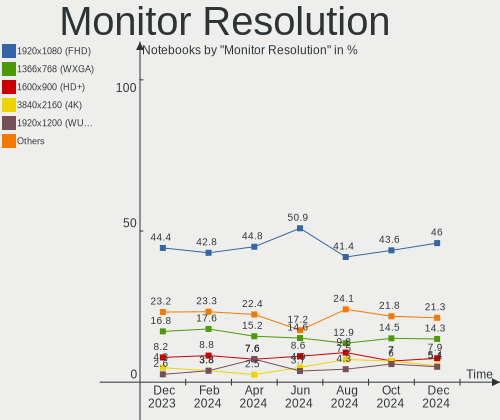

| Resolution         | Notebooks | Percent |
|--------------------|-----------|---------|
| 1920x1080 (FHD)    | 145       | 44.34%  |
| 1366x768 (WXGA)    | 52        | 15.9%   |
| 1600x900 (HD+)     | 34        | 10.4%   |
| 2560x1440 (QHD)    | 17        | 5.2%    |
| 1920x1200 (WUXGA)  | 14        | 4.28%   |
| 2560x1600          | 12        | 3.67%   |
| 3840x2160 (4K)     | 11        | 3.36%   |
| 800x1280           | 7         | 2.14%   |
| 2880x1800          | 5         | 1.53%   |
| 3440x1440          | 4         | 1.22%   |
| 2160x1440          | 4         | 1.22%   |
| 3840x2400          | 3         | 0.92%   |
| 1280x800 (WXGA)    | 3         | 0.92%   |
| 1920x1280          | 2         | 0.61%   |
| 1680x1050 (WSXGA+) | 2         | 0.61%   |
| 1440x900 (WXGA+)   | 2         | 0.61%   |
| 1024x600           | 2         | 0.61%   |
| 3840x1080          | 1         | 0.31%   |
| 3200x1800 (QHD+)   | 1         | 0.31%   |
| 3072x1920          | 1         | 0.31%   |
| 3000x2000          | 1         | 0.31%   |
| 2288x1287          | 1         | 0.31%   |
| 2256x1504          | 1         | 0.31%   |
| 1280x720 (HD)      | 1         | 0.31%   |
| 1280x1024 (SXGA)   | 1         | 0.31%   |

Monitor Diagonal
----------------

Diagonal size in inches

| Inches  | Notebooks | Percent |
|---------|-----------|---------|
| 15      | 123       | 35.86%  |
| 14      | 50        | 14.58%  |
| 17      | 45        | 13.12%  |
| 13      | 37        | 10.79%  |
| 16      | 17        | 4.96%   |
| 24      | 12        | 3.5%    |
| 27      | 11        | 3.21%   |
| 7       | 7         | 2.04%   |
| 12      | 6         | 1.75%   |
| 23      | 5         | 1.46%   |
| 11      | 4         | 1.17%   |
| 34      | 3         | 0.87%   |
| 21      | 3         | 0.87%   |
| 10      | 3         | 0.87%   |
| Unknown | 3         | 0.87%   |
| 84      | 2         | 0.58%   |
| 40      | 2         | 0.58%   |
| 29      | 2         | 0.58%   |
| 22      | 2         | 0.58%   |
| 142     | 1         | 0.29%   |
| 65      | 1         | 0.29%   |
| 48      | 1         | 0.29%   |
| 31      | 1         | 0.29%   |
| 28      | 1         | 0.29%   |
| 25      | 1         | 0.29%   |

Monitor Width
-------------

Physical width

| Width in mm    | Notebooks | Percent |
|----------------|-----------|---------|
| 301-350        | 193       | 56.93%  |
| 351-400        | 54        | 15.93%  |
| 201-300        | 37        | 10.91%  |
| 501-600        | 25        | 7.37%   |
| 1-100          | 7         | 2.06%   |
| 601-700        | 5         | 1.47%   |
| 401-500        | 5         | 1.47%   |
| 701-800        | 3         | 0.88%   |
| Unknown        | 3         | 0.88%   |
| 801-900        | 2         | 0.59%   |
| 1501-2000      | 2         | 0.59%   |
| 1001-1500      | 2         | 0.59%   |
| More than 2000 | 1         | 0.29%   |

Aspect Ratio
------------

Proportional relationship between the width and the height

| Ratio   | Notebooks | Percent |
|---------|-----------|---------|
| 16/9    | 246       | 78.59%  |
| 16/10   | 45        | 14.38%  |
| 3/2     | 8         | 2.56%   |
| 0.67    | 7         | 2.24%   |
| 21/9    | 3         | 0.96%   |
| 5/4     | 1         | 0.32%   |
| 32/9    | 1         | 0.32%   |
| 1.00    | 1         | 0.32%   |
| Unknown | 1         | 0.32%   |

Monitor Area
------------

Area in inch²

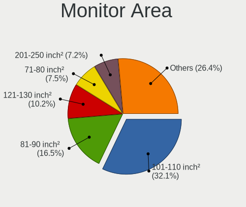

| Area in inch² | Notebooks | Percent |
|----------------|-----------|---------|
| 101-110        | 129       | 37.61%  |
| 81-90          | 73        | 21.28%  |
| 121-130        | 36        | 10.5%   |
| 201-250        | 17        | 4.96%   |
| 71-80          | 13        | 3.79%   |
| 301-350        | 11        | 3.21%   |
| 111-120        | 11        | 3.21%   |
| 131-140        | 8         | 2.33%   |
| 351-500        | 7         | 2.04%   |
| 1-40           | 7         | 2.04%   |
| 61-70          | 6         | 1.75%   |
| 251-300        | 5         | 1.46%   |
| More than 1000 | 4         | 1.17%   |
| 51-60          | 4         | 1.17%   |
| 41-50          | 3         | 0.87%   |
| 501-1000       | 3         | 0.87%   |
| Unknown        | 3         | 0.87%   |
| 151-200        | 1         | 0.29%   |
| 141-150        | 1         | 0.29%   |
| 91-100         | 1         | 0.29%   |

Pixel Density
-------------

Pixels per inch

| Density       | Notebooks | Percent |
|---------------|-----------|---------|
| 121-160       | 145       | 42.65%  |
| 101-120       | 92        | 27.06%  |
| 161-240       | 49        | 14.41%  |
| 51-100        | 35        | 10.29%  |
| More than 240 | 14        | 4.12%   |
| Unknown       | 3         | 0.88%   |
| 1-50          | 2         | 0.59%   |

Multiple Monitors
-----------------

Total monitors connected

| Total | Notebooks | Percent |
|-------|-----------|---------|
| 1     | 252       | 82.08%  |
| 2     | 39        | 12.7%   |
| 0     | 9         | 2.93%   |
| 3     | 4         | 1.3%    |
| 4     | 3         | 0.98%   |

Network
-------

Net Controller Vendor
---------------------

Controller vendors

| Vendor                   | Notebooks | Percent |
|--------------------------|-----------|---------|
| Realtek Semiconductor    | 163       | 34.53%  |
| Intel                    | 154       | 32.63%  |
| Qualcomm Atheros         | 53        | 11.23%  |
| Broadcom                 | 32        | 6.78%   |
| MediaTek                 | 18        | 3.81%   |
| Sierra Wireless          | 8         | 1.69%   |
| Ralink Technology        | 7         | 1.48%   |
| Qualcomm                 | 5         | 1.06%   |
| Marvell Technology Group | 4         | 0.85%   |
| Hewlett-Packard          | 4         | 0.85%   |
| ASIX Electronics         | 4         | 0.85%   |
| TP-Link                  | 2         | 0.42%   |
| Nvidia                   | 2         | 0.42%   |
| Lenovo                   | 2         | 0.42%   |
| Dell                     | 2         | 0.42%   |
| Broadcom Limited         | 2         | 0.42%   |
| Arduino SA               | 2         | 0.42%   |
| Microchip Technology     | 1         | 0.21%   |
| JMicron Technology       | 1         | 0.21%   |
| Huawei Technologies      | 1         | 0.21%   |
| Fibocom                  | 1         | 0.21%   |
| DisplayLink              | 1         | 0.21%   |
| Belkin Components        | 1         | 0.21%   |
| AVM                      | 1         | 0.21%   |
| ASUSTek Computer         | 1         | 0.21%   |

Net Controller Model
--------------------

Controller models

| Model                                                             | Notebooks | Percent |
|-------------------------------------------------------------------|-----------|---------|
| Realtek RTL8111/8168/8411 PCI Express Gigabit Ethernet Controller | 96        | 16.35%  |
| Intel Wi-Fi 6 AX200                                               | 18        | 3.07%   |
| Realtek RTL8821CE 802.11ac PCIe Wireless Network Adapter          | 17        | 2.9%    |
| Realtek RTL8153 Gigabit Ethernet Adapter                          | 17        | 2.9%    |
| Intel Wireless 8260                                               | 17        | 2.9%    |
| Realtek RTL810xE PCI Express Fast Ethernet controller             | 13        | 2.21%   |
| Realtek RTL8822CE 802.11ac PCIe Wireless Network Adapter          | 12        | 2.04%   |
| Qualcomm Atheros AR9485 Wireless Network Adapter                  | 10        | 1.7%    |
| MediaTek MT7921 802.11ax PCI Express Wireless Network Adapter     | 10        | 1.7%    |
| Intel Alder Lake-P PCH CNVi WiFi                                  | 10        | 1.7%    |
| Intel 82579LM Gigabit Network Connection (Lewisville)             | 10        | 1.7%    |
| Qualcomm Atheros AR9285 Wireless Network Adapter (PCI-Express)    | 8         | 1.36%   |
| Intel Wi-Fi 6 AX201                                               | 8         | 1.36%   |
| Intel Ethernet Connection I219-LM                                 | 8         | 1.36%   |
| Broadcom BCM43142 802.11b/g/n                                     | 8         | 1.36%   |
| Realtek RTL8852BE PCIe 802.11ax Wireless Network Controller       | 7         | 1.19%   |
| Qualcomm Atheros QCA6174 802.11ac Wireless Network Adapter        | 7         | 1.19%   |
| Intel Wireless 8265 / 8275                                        | 7         | 1.19%   |
| Intel Wireless 7260                                               | 7         | 1.19%   |
| Intel Centrino Advanced-N 6235                                    | 7         | 1.19%   |
| Qualcomm Atheros QCA9377 802.11ac Wireless Network Adapter        | 6         | 1.02%   |
| Intel Wi-Fi 6 AX210/AX211/AX411 160MHz                            | 6         | 1.02%   |
| Intel Comet Lake PCH-LP CNVi WiFi                                 | 6         | 1.02%   |
| Intel Centrino Advanced-N 6205 [Taylor Peak]                      | 6         | 1.02%   |
| Sierra Wireless EM7455                                            | 5         | 0.85%   |
| Qualcomm QCNFA765 Wireless Network Adapter                        | 5         | 0.85%   |
| Qualcomm Atheros QCA9565 / AR9565 Wireless Network Adapter        | 5         | 0.85%   |
| MediaTek MT7922 802.11ax PCI Express Wireless Network Adapter     | 5         | 0.85%   |
| Intel Wireless 7265                                               | 5         | 0.85%   |
| Intel Raptor Lake PCH CNVi WiFi                                   | 5         | 0.85%   |
| Intel Ethernet Connection I217-LM                                 | 5         | 0.85%   |
| Intel Ethernet Connection (2) I219-LM                             | 5         | 0.85%   |
| Intel Centrino Ultimate-N 6300                                    | 5         | 0.85%   |
| Intel Cannon Point-LP CNVi [Wireless-AC]                          | 5         | 0.85%   |
| Broadcom BCM4313 802.11bgn Wireless Network Adapter               | 5         | 0.85%   |
| Realtek RTL8125 2.5GbE Controller                                 | 4         | 0.68%   |
| Qualcomm Atheros AR8162 Fast Ethernet                             | 4         | 0.68%   |
| Qualcomm Atheros AR8151 v2.0 Gigabit Ethernet                     | 4         | 0.68%   |
| Intel Wireless 3165                                               | 4         | 0.68%   |
| Intel Wireless 3160                                               | 4         | 0.68%   |

Wireless Vendor
---------------

Wireless vendors

| Vendor                | Notebooks | Percent |
|-----------------------|-----------|---------|
| Intel                 | 147       | 44.95%  |
| Realtek Semiconductor | 63        | 19.27%  |
| Qualcomm Atheros      | 44        | 13.46%  |
| Broadcom              | 26        | 7.95%   |
| MediaTek              | 18        | 5.5%    |
| Sierra Wireless       | 8         | 2.45%   |
| Ralink Technology     | 7         | 2.14%   |
| Qualcomm              | 5         | 1.53%   |
| Broadcom Limited      | 2         | 0.61%   |
| TP-Link               | 1         | 0.31%   |
| Hewlett-Packard       | 1         | 0.31%   |
| Fibocom               | 1         | 0.31%   |
| Dell                  | 1         | 0.31%   |
| Belkin Components     | 1         | 0.31%   |
| AVM                   | 1         | 0.31%   |
| Arduino SA            | 1         | 0.31%   |

Wireless Model
--------------

Wireless models

| Model                                                                   | Notebooks | Percent |
|-------------------------------------------------------------------------|-----------|---------|
| Intel Wi-Fi 6 AX200                                                     | 18        | 5.45%   |
| Realtek RTL8821CE 802.11ac PCIe Wireless Network Adapter                | 17        | 5.15%   |
| Intel Wireless 8260                                                     | 17        | 5.15%   |
| Realtek RTL8822CE 802.11ac PCIe Wireless Network Adapter                | 12        | 3.64%   |
| Qualcomm Atheros AR9485 Wireless Network Adapter                        | 10        | 3.03%   |
| MediaTek MT7921 802.11ax PCI Express Wireless Network Adapter           | 10        | 3.03%   |
| Intel Alder Lake-P PCH CNVi WiFi                                        | 10        | 3.03%   |
| Qualcomm Atheros AR9285 Wireless Network Adapter (PCI-Express)          | 8         | 2.42%   |
| Intel Wi-Fi 6 AX201                                                     | 8         | 2.42%   |
| Broadcom BCM43142 802.11b/g/n                                           | 8         | 2.42%   |
| Realtek RTL8852BE PCIe 802.11ax Wireless Network Controller             | 7         | 2.12%   |
| Qualcomm Atheros QCA6174 802.11ac Wireless Network Adapter              | 7         | 2.12%   |
| Intel Wireless 8265 / 8275                                              | 7         | 2.12%   |
| Intel Wireless 7260                                                     | 7         | 2.12%   |
| Intel Centrino Advanced-N 6235                                          | 7         | 2.12%   |
| Qualcomm Atheros QCA9377 802.11ac Wireless Network Adapter              | 6         | 1.82%   |
| Intel Wi-Fi 6 AX210/AX211/AX411 160MHz                                  | 6         | 1.82%   |
| Intel Comet Lake PCH-LP CNVi WiFi                                       | 6         | 1.82%   |
| Intel Centrino Advanced-N 6205 [Taylor Peak]                            | 6         | 1.82%   |
| Sierra Wireless EM7455                                                  | 5         | 1.52%   |
| Qualcomm QCNFA765 Wireless Network Adapter                              | 5         | 1.52%   |
| Qualcomm Atheros QCA9565 / AR9565 Wireless Network Adapter              | 5         | 1.52%   |
| MediaTek MT7922 802.11ax PCI Express Wireless Network Adapter           | 5         | 1.52%   |
| Intel Wireless 7265                                                     | 5         | 1.52%   |
| Intel Raptor Lake PCH CNVi WiFi                                         | 5         | 1.52%   |
| Intel Centrino Ultimate-N 6300                                          | 5         | 1.52%   |
| Intel Cannon Point-LP CNVi [Wireless-AC]                                | 5         | 1.52%   |
| Broadcom BCM4313 802.11bgn Wireless Network Adapter                     | 5         | 1.52%   |
| Intel Wireless 3165                                                     | 4         | 1.21%   |
| Intel Wireless 3160                                                     | 4         | 1.21%   |
| Broadcom BCM43602 802.11ac Wireless LAN SoC                             | 4         | 1.21%   |
| Realtek RTL88x2bu [AC1200 Techkey]                                      | 3         | 0.91%   |
| Realtek RTL8852AE 802.11ax PCIe Wireless Network Adapter                | 3         | 0.91%   |
| Realtek RTL8723BE PCIe Wireless Network Adapter                         | 3         | 0.91%   |
| Realtek Realtek WLAN controller                                         | 3         | 0.91%   |
| Qualcomm Atheros AR9287 Wireless Network Adapter (PCI-Express)          | 3         | 0.91%   |
| Qualcomm Atheros AR242x / AR542x Wireless Network Adapter (PCI-Express) | 3         | 0.91%   |
| Intel Wireless-AC 9260                                                  | 3         | 0.91%   |
| Intel Dual Band Wireless-AC 3168NGW [Stone Peak]                        | 3         | 0.91%   |
| Broadcom BCM4322 802.11a/b/g/n Wireless LAN Controller                  | 3         | 0.91%   |

Ethernet Vendor
---------------

Ethernet vendors

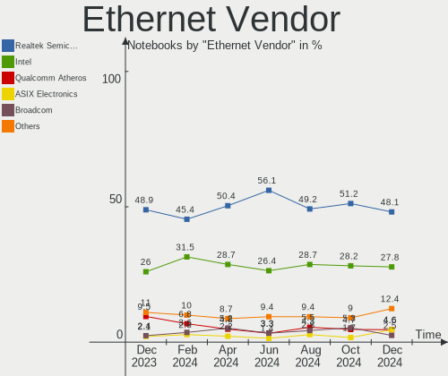

| Vendor                   | Notebooks | Percent |
|--------------------------|-----------|---------|
| Realtek Semiconductor    | 131       | 52.61%  |
| Intel                    | 69        | 27.71%  |
| Qualcomm Atheros         | 20        | 8.03%   |
| Broadcom                 | 10        | 4.02%   |
| Marvell Technology Group | 4         | 1.61%   |
| ASIX Electronics         | 4         | 1.61%   |
| Nvidia                   | 2         | 0.8%    |
| Lenovo                   | 2         | 0.8%    |
| TP-Link                  | 1         | 0.4%    |
| Microchip Technology     | 1         | 0.4%    |
| JMicron Technology       | 1         | 0.4%    |
| Huawei Technologies      | 1         | 0.4%    |
| Hewlett-Packard          | 1         | 0.4%    |
| DisplayLink              | 1         | 0.4%    |
| ASUSTek Computer         | 1         | 0.4%    |

Ethernet Model
--------------

Ethernet models

| Model                                                             | Notebooks | Percent |
|-------------------------------------------------------------------|-----------|---------|
| Realtek RTL8111/8168/8411 PCI Express Gigabit Ethernet Controller | 96        | 38.1%   |
| Realtek RTL8153 Gigabit Ethernet Adapter                          | 17        | 6.75%   |
| Realtek RTL810xE PCI Express Fast Ethernet controller             | 13        | 5.16%   |
| Intel 82579LM Gigabit Network Connection (Lewisville)             | 10        | 3.97%   |
| Intel Ethernet Connection I219-LM                                 | 8         | 3.17%   |
| Intel Ethernet Connection I217-LM                                 | 5         | 1.98%   |
| Intel Ethernet Connection (2) I219-LM                             | 5         | 1.98%   |
| Realtek RTL8125 2.5GbE Controller                                 | 4         | 1.59%   |
| Qualcomm Atheros AR8162 Fast Ethernet                             | 4         | 1.59%   |
| Qualcomm Atheros AR8151 v2.0 Gigabit Ethernet                     | 4         | 1.59%   |
| Intel Ethernet Connection (6) I219-LM                             | 4         | 1.59%   |
| Intel Ethernet Connection (4) I219-LM                             | 4         | 1.59%   |
| Intel Ethernet Connection (16) I219-V                             | 4         | 1.59%   |
| Intel Ethernet Controller I225-V                                  | 3         | 1.19%   |
| Intel Ethernet Connection (4) I219-V                              | 3         | 1.19%   |
| Intel 82577LM Gigabit Network Connection                          | 3         | 1.19%   |
| Broadcom NetLink BCM57785 Gigabit Ethernet PCIe                   | 3         | 1.19%   |
| ASIX AX88179 Gigabit Ethernet                                     | 3         | 1.19%   |
| Realtek RTL8152 Fast Ethernet Adapter                             | 2         | 0.79%   |
| Qualcomm Atheros QCA8172 Fast Ethernet                            | 2         | 0.79%   |
| Qualcomm Atheros Killer E2500 Gigabit Ethernet Controller         | 2         | 0.79%   |
| Qualcomm Atheros Killer E220x Gigabit Ethernet Controller         | 2         | 0.79%   |
| Qualcomm Atheros AR8161 Gigabit Ethernet                          | 2         | 0.79%   |
| Qualcomm Atheros AR8132 Fast Ethernet                             | 2         | 0.79%   |
| Nvidia MCP79 Ethernet                                             | 2         | 0.79%   |
| Marvell Group 88E8040 PCI-E Fast Ethernet Controller              | 2         | 0.79%   |
| Intel Ethernet Connection I219-V                                  | 2         | 0.79%   |
| Intel Ethernet Connection I218-LM                                 | 2         | 0.79%   |
| Intel Ethernet Connection (3) I218-LM                             | 2         | 0.79%   |
| Intel Ethernet Connection (10) I219-V                             | 2         | 0.79%   |
| Intel 82579V Gigabit Network Connection                           | 2         | 0.79%   |
| TP-Link UE300 10/100/1000 LAN (ethernet mode) [Realtek RTL8153]   | 1         | 0.4%    |
| Realtek RTL8169 PCI Gigabit Ethernet Controller                   | 1         | 0.4%    |
| Realtek Killer E2600 Gigabit Ethernet Controller                  | 1         | 0.4%    |
| Qualcomm Atheros AR8152 v2.0 Fast Ethernet                        | 1         | 0.4%    |
| Qualcomm Atheros AR8151 v1.0 Gigabit Ethernet                     | 1         | 0.4%    |
| Microchip SMSC9512/9514 Fast Ethernet Adapter                     | 1         | 0.4%    |
| Marvell Group 88E8058 PCI-E Gigabit Ethernet Controller           | 1         | 0.4%    |
| Marvell Group 88E8036 PCI-E Fast Ethernet Controller              | 1         | 0.4%    |
| Lenovo USB-C Dock Ethernet                                        | 1         | 0.4%    |

Net Controller Kind
-------------------

Ethernet, WiFi or modem

| Kind     | Notebooks | Percent |
|----------|-----------|---------|
| WiFi     | 302       | 55.11%  |
| Ethernet | 241       | 43.98%  |
| Modem    | 4         | 0.73%   |
| Unknown  | 1         | 0.18%   |

Used Controller
---------------

Currently used network controller

| Kind     | Notebooks | Percent |
|----------|-----------|---------|
| WiFi     | 250       | 77.16%  |
| Ethernet | 74        | 22.84%  |

NICs
----

Total network controllers on board

| Total | Notebooks | Percent |
|-------|-----------|---------|
| 2     | 216       | 70.36%  |
| 1     | 82        | 26.71%  |
| 0     | 7         | 2.28%   |
| 3     | 2         | 0.65%   |

IPv6
----

IPv6 vs IPv4

| Used | Notebooks | Percent |
|------|-----------|---------|
| Yes  | 177       | 57.65%  |
| No   | 130       | 42.35%  |

Bluetooth
---------

Bluetooth Vendor
----------------

Controller vendors

| Vendor                          | Notebooks | Percent |
|---------------------------------|-----------|---------|
| Intel                           | 118       | 47.58%  |
| Realtek Semiconductor           | 40        | 16.13%  |
| IMC Networks                    | 18        | 7.26%   |
| Foxconn / Hon Hai               | 17        | 6.85%   |
| Qualcomm Atheros Communications | 14        | 5.65%   |
| Lite-On Technology              | 10        | 4.03%   |
| Apple                           | 8         | 3.23%   |
| USI                             | 5         | 2.02%   |
| Realtek                         | 4         | 1.61%   |
| Dell                            | 4         | 1.61%   |
| Broadcom                        | 4         | 1.61%   |
| Toshiba                         | 2         | 0.81%   |
| Foxconn International           | 2         | 0.81%   |
| Edimax Technology               | 1         | 0.4%    |
| Alps Electric                   | 1         | 0.4%    |

Bluetooth Model
---------------

Controller models

| Model                                                                               | Notebooks | Percent |
|-------------------------------------------------------------------------------------|-----------|---------|
| Intel Bluetooth wireless interface                                                  | 39        | 15.73%  |
| Realtek Bluetooth Radio                                                             | 31        | 12.5%   |
| Intel AX201 Bluetooth                                                               | 18        | 7.26%   |
| Intel AX200 Bluetooth                                                               | 17        | 6.85%   |
| Intel Bluetooth Device                                                              | 14        | 5.65%   |
| Intel Bluetooth 9460/9560 Jefferson Peak (JfP)                                      | 13        | 5.24%   |
| Foxconn / Hon Hai Wireless_Device                                                   | 10        | 4.03%   |
| IMC Networks Bluetooth Radio                                                        | 8         | 3.23%   |
| Intel Centrino Bluetooth Wireless Transceiver                                       | 7         | 2.82%   |
| Apple Bluetooth Host Controller                                                     | 7         | 2.82%   |
| Realtek  Bluetooth 4.2 Adapter                                                      | 6         | 2.42%   |
| USI Bluetooth Device                                                                | 5         | 2.02%   |
| Qualcomm Atheros AR3012 Bluetooth 4.0                                               | 5         | 2.02%   |
| IMC Networks Wireless_Device                                                        | 5         | 2.02%   |
| Realtek Bluetooth Radio                                                             | 4         | 1.61%   |
| Qualcomm Atheros  Bluetooth Device                                                  | 4         | 1.61%   |
| Lite-On Wireless_Device                                                             | 4         | 1.61%   |
| Intel AX210 Bluetooth                                                               | 4         | 1.61%   |
| Qualcomm Atheros AR3011 Bluetooth                                                   | 3         | 1.21%   |
| Intel Wireless-AC 9260 Bluetooth Adapter                                            | 3         | 1.21%   |
| Intel Wireless-AC 3168 Bluetooth                                                    | 3         | 1.21%   |
| Foxconn / Hon Hai Bluetooth Device                                                  | 3         | 1.21%   |
| Realtek RTL8821A Bluetooth                                                          | 2         | 0.81%   |
| Qualcomm Atheros QCA61x4 Bluetooth 4.0                                              | 2         | 0.81%   |
| Lite-On Qualcomm Atheros QCA9377 Bluetooth                                          | 2         | 0.81%   |
| Lite-On Bluetooth Device                                                            | 2         | 0.81%   |
| IMC Networks Bluetooth Device                                                       | 2         | 0.81%   |
| Foxconn International BCM43142A0 Bluetooth module                                   | 2         | 0.81%   |
| Dell BCM20702A0 Bluetooth Module                                                    | 2         | 0.81%   |
| Broadcom HP Portable SoftSailing                                                    | 2         | 0.81%   |
| Toshiba Bluetooth USB Host Controller                                               | 1         | 0.4%    |
| Toshiba Bluetooth Device                                                            | 1         | 0.4%    |
| Realtek RTL8822BE Bluetooth 4.2 Adapter                                             | 1         | 0.4%    |
| Lite-On BCM43142A0                                                                  | 1         | 0.4%    |
| Lite-On Atheros AR3012 Bluetooth                                                    | 1         | 0.4%    |
| IMC Networks Bluetooth module                                                       | 1         | 0.4%    |
| IMC Networks Bluetooth                                                              | 1         | 0.4%    |
| IMC Networks BCM20702A0                                                             | 1         | 0.4%    |
| Foxconn / Hon Hai Foxconn T77H114 BCM2070 [Single-Chip Bluetooth 2.1 + EDR Adapter] | 1         | 0.4%    |
| Foxconn / Hon Hai Broadcom BCM20702A1 Bluetooth                                     | 1         | 0.4%    |

Sound
-----

Sound Vendor
------------

Sound card vendors

| Vendor                 | Notebooks | Percent |
|------------------------|-----------|---------|
| Intel                  | 225       | 57.99%  |
| AMD                    | 83        | 21.39%  |
| Nvidia                 | 56        | 14.43%  |
| Lenovo                 | 4         | 1.03%   |
| JMTek                  | 4         | 1.03%   |
| C-Media Electronics    | 4         | 1.03%   |
| GN Netcom              | 3         | 0.77%   |
| Logitech               | 2         | 0.52%   |
| Generalplus Technology | 2         | 0.52%   |
| Realtek Semiconductor  | 1         | 0.26%   |
| M-Audio                | 1         | 0.26%   |
| Kingston Technology    | 1         | 0.26%   |
| DSEA A/S               | 1         | 0.26%   |
| Corsair                | 1         | 0.26%   |

Sound Model
-----------

Sound card models

| Model                                                                      | Notebooks | Percent |
|----------------------------------------------------------------------------|-----------|---------|
| AMD Family 17h/19h HD Audio Controller                                     | 49        | 10.47%  |
| Intel 7 Series/C216 Chipset Family High Definition Audio Controller        | 29        | 6.2%    |
| Intel Sunrise Point-LP HD Audio                                            | 28        | 5.98%   |
| AMD Renoir Radeon High Definition Audio Controller                         | 26        | 5.56%   |
| Intel 6 Series/C200 Series Chipset Family High Definition Audio Controller | 21        | 4.49%   |
| AMD Rembrandt Radeon High Definition Audio Controller                      | 19        | 4.06%   |
| Intel Alder Lake PCH-P High Definition Audio Controller                    | 16        | 3.42%   |
| Intel Wildcat Point-LP High Definition Audio Controller                    | 12        | 2.56%   |
| Intel Broadwell-U Audio Controller                                         | 12        | 2.56%   |
| Intel Tiger Lake-LP Smart Sound Technology Audio Controller                | 11        | 2.35%   |
| Intel Celeron/Pentium Silver Processor High Definition Audio               | 10        | 2.14%   |
| Intel Comet Lake PCH-LP cAVS                                               | 9         | 1.92%   |
| Intel Cannon Point-LP High Definition Audio Controller                     | 9         | 1.92%   |
| Intel 8 Series/C220 Series Chipset High Definition Audio Controller        | 9         | 1.92%   |
| Nvidia Audio device                                                        | 8         | 1.71%   |
| Intel 5 Series/3400 Series Chipset High Definition Audio                   | 8         | 1.71%   |
| AMD Kabini HDMI/DP Audio                                                   | 7         | 1.5%    |
| AMD FCH Azalia Controller                                                  | 7         | 1.5%    |
| Nvidia GF108 High Definition Audio Controller                              | 6         | 1.28%   |
| Intel Xeon E3-1200 v3/4th Gen Core Processor HD Audio Controller           | 6         | 1.28%   |
| Intel Raptor Lake-P/U/H cAVS                                               | 6         | 1.28%   |
| Intel Celeron N3350/Pentium N4200/Atom E3900 Series Audio Cluster          | 6         | 1.28%   |
| Intel Cannon Lake PCH cAVS                                                 | 6         | 1.28%   |
| Intel 100 Series/C230 Series Chipset Family HD Audio Controller            | 6         | 1.28%   |
| AMD Raven/Raven2/Fenghuang HDMI/DP Audio Controller                        | 6         | 1.28%   |
| AMD Family 15h (Models 60h-6fh) Audio Controller                           | 6         | 1.28%   |
| Intel Tiger Lake-H HD Audio Controller                                     | 5         | 1.07%   |
| Intel Haswell-ULT HD Audio Controller                                      | 5         | 1.07%   |
| Intel 8 Series HD Audio Controller                                         | 5         | 1.07%   |
| AMD High Definition Audio Controller                                       | 5         | 1.07%   |
| Nvidia GM107 High Definition Audio Controller [GeForce 940MX]              | 4         | 0.85%   |
| Nvidia GA106 High Definition Audio Controller                              | 4         | 0.85%   |
| Nvidia GA104 High Definition Audio Controller                              | 4         | 0.85%   |
| Intel NM10/ICH7 Family High Definition Audio Controller                    | 4         | 0.85%   |
| Intel CM238 HD Audio Controller                                            | 4         | 0.85%   |
| Intel 82801I (ICH9 Family) HD Audio Controller                             | 4         | 0.85%   |
| AMD SBx00 Azalia (Intel HDA)                                               | 4         | 0.85%   |
| Nvidia TU107 GeForce GTX 1650 High Definition Audio Controller             | 3         | 0.64%   |
| Nvidia High Definition Audio Controller                                    | 3         | 0.64%   |
| Nvidia GP107GL High Definition Audio Controller                            | 3         | 0.64%   |

Memory
------

Memory Vendor
-------------

Memory module vendors

| Vendor              | Notebooks | Percent |
|---------------------|-----------|---------|
| Samsung Electronics | 62        | 34.64%  |
| SK hynix            | 36        | 20.11%  |
| Micron Technology   | 19        | 10.61%  |
| Kingston            | 12        | 6.7%    |
| Unknown             | 10        | 5.59%   |
| Crucial             | 9         | 5.03%   |
| Elpida              | 6         | 3.35%   |
| Unknown (ABCD)      | 5         | 2.79%   |
| Nanya Technology    | 5         | 2.79%   |
| Ramaxel Technology  | 3         | 1.68%   |
| Unknown             | 3         | 1.68%   |
| Corsair             | 2         | 1.12%   |
| A-DATA Technology   | 2         | 1.12%   |
| SHARETRONIC         | 1         | 0.56%   |
| Qimonda             | 1         | 0.56%   |
| ASint Technology    | 1         | 0.56%   |
| 8CFD000080AD        | 1         | 0.56%   |
| 48spaces            | 1         | 0.56%   |

Memory Model
------------

Memory module models

| Model                                                            | Notebooks | Percent |
|------------------------------------------------------------------|-----------|---------|
| Samsung RAM M471A1G44BB0-CWE 8GB SODIMM DDR4 3200MT/s            | 6         | 3.21%   |
| SK hynix RAM HMAA1GS6CJR6N-XN 8GB SODIMM DDR4 3200MT/s           | 5         | 2.67%   |
| Unknown (ABCD) RAM 123456789012345678 2GB SODIMM LPDDR4 2400MT/s | 4         | 2.14%   |
| Samsung RAM M471B1G73EB0-YK0 8GB SODIMM DDR3 1600MT/s            | 4         | 2.14%   |
| Samsung RAM M471A1K43DB1-CWE 8GB SODIMM DDR4 3200MT/s            | 4         | 2.14%   |
| Samsung RAM Module 16GB SODIMM DDR4 3200MT/s                     | 3         | 1.6%    |
| Samsung RAM M471A5244CB0-CWE 4GB SODIMM DDR4 3200MT/s            | 3         | 1.6%    |
| Samsung RAM M471A5244CB0-CTD 4GB SODIMM DDR4 3266MT/s            | 3         | 1.6%    |
| Samsung RAM M471A5244CB0-CRC 4GB SODIMM DDR4 2667MT/s            | 3         | 1.6%    |
| Samsung RAM M471A4G43AB1-CWE 32GB SODIMM DDR4 3200MT/s           | 3         | 1.6%    |
| Nanya RAM NT4GC64B8HG0NS-CG 4GB SODIMM DDR3 1334MT/s             | 3         | 1.6%    |
| Unknown                                                          | 3         | 1.6%    |
| SK hynix RAM HMT41GS6BFR8A-PB 8192MB SODIMM DDR3 1600MT/s        | 2         | 1.07%   |
| SK hynix RAM HMT351S6CFR8C-PB 4GB SODIMM DDR3 1600MT/s           | 2         | 1.07%   |
| SK hynix RAM HMT325S6CFR8C-PB 2048MB SODIMM DDR3 1600MT/s        | 2         | 1.07%   |
| SK hynix RAM HMA81GS6AFR8N-UH 8GB SODIMM DDR4 2667MT/s           | 2         | 1.07%   |
| Samsung RAM M471B5273CH0-CK0 4GB SODIMM DDR3 1600MT/s            | 2         | 1.07%   |
| Samsung RAM M471A1K43EB1-CWE 8GB SODIMM DDR4 3200MT/s            | 2         | 1.07%   |
| Samsung RAM M471A1K43CB1-CTD 8GB SODIMM DDR4 2667MT/s            | 2         | 1.07%   |
| Samsung RAM M471A1K43CB1-CRC 8GB SODIMM DDR4 2667MT/s            | 2         | 1.07%   |
| Samsung RAM K4EBE304EB-EGCG 8GB Row Of Chips LPDDR3 2133MT/s     | 2         | 1.07%   |
| Micron RAM MT62F2G32D4DS-026 WT 8GB SODIMM LPDDR5 7500MT/s       | 2         | 1.07%   |
| Kingston RAM KF3200C20S4/16G 16GB SODIMM DDR4 3200MT/s           | 2         | 1.07%   |
| Elpida RAM EBJ20UF8BCS0-DJ-F 2GB SODIMM DDR3 1334MT/s            | 2         | 1.07%   |
| Unknown RAM Module 8GB SODIMM DDR3 1600MT/s                      | 1         | 0.53%   |
| Unknown RAM Module 4GB SODIMM DDR4 2667MT/s                      | 1         | 0.53%   |
| Unknown RAM Module 4GB SODIMM                                    | 1         | 0.53%   |
| Unknown RAM Module 4GB Chip DDR4 2133MT/s                        | 1         | 0.53%   |
| Unknown RAM Module 4096MB SODIMM DDR3                            | 1         | 0.53%   |
| Unknown RAM Module 4096MB Chip DDR4 2133MT/s                     | 1         | 0.53%   |
| Unknown RAM Module 2GB SODIMM LPDDR4 2133MT/s                    | 1         | 0.53%   |
| Unknown RAM Module 2GB SODIMM DDR3                               | 1         | 0.53%   |
| Unknown RAM Module 2GB SODIMM DDR2 667MT/s                       | 1         | 0.53%   |
| Unknown RAM Module 2GB Row Of Chips LPDDR4 4267MT/s              | 1         | 0.53%   |
| Unknown (ABCD) RAM 123456789012345678 2GB DIMM LPDDR4 2400MT/s   | 1         | 0.53%   |
| SK hynix RAM Module 2GB SODIMM DDR3 1067MT/s                     | 1         | 0.53%   |
| SK hynix RAM Module 2GB SODIMM DDR3 1066MT/s                     | 1         | 0.53%   |
| SK hynix RAM HMT451S6BFR8A-PB 4GB SODIMM DDR3 1600MT/s           | 1         | 0.53%   |
| SK hynix RAM HMT451S6AFR8A-PB 4GB SODIMM DDR3 1600MT/s           | 1         | 0.53%   |
| SK hynix RAM HMT41GS6DFR8A-PB 8GB SODIMM DDR3 1600MT/s           | 1         | 0.53%   |

Memory Kind
-----------

Memory module kinds

| Kind    | Notebooks | Percent |
|---------|-----------|---------|
| DDR4    | 75        | 48.7%   |
| DDR3    | 46        | 29.87%  |
| LPDDR4  | 10        | 6.49%   |
| LPDDR5  | 9         | 5.84%   |
| DDR5    | 6         | 3.9%    |
| LPDDR3  | 4         | 2.6%    |
| DDR2    | 3         | 1.95%   |
| Unknown | 1         | 0.65%   |

Memory Form Factor
------------------

Physical design of the memory module

| Name            | Notebooks | Percent |
|-----------------|-----------|---------|
| SODIMM          | 135       | 85.99%  |
| Row Of Chips    | 17        | 10.83%  |
| Chip            | 2         | 1.27%   |
| Proprietary Car | 1         | 0.64%   |
| DIMM            | 1         | 0.64%   |
| Unknown         | 1         | 0.64%   |

Memory Size
-----------

Memory module size

| Size  | Notebooks | Percent |
|-------|-----------|---------|
| 8192  | 59        | 36.2%   |
| 4096  | 42        | 25.77%  |
| 16384 | 35        | 21.47%  |
| 2048  | 16        | 9.82%   |
| 32768 | 8         | 4.91%   |
| 1024  | 2         | 1.23%   |
| 65536 | 1         | 0.61%   |

Memory Speed
------------

Memory module speed

| Speed   | Notebooks | Percent |
|---------|-----------|---------|
| 3200    | 45        | 27.11%  |
| 1600    | 29        | 17.47%  |
| 2667    | 21        | 12.65%  |
| 2400    | 16        | 9.64%   |
| 1334    | 10        | 6.02%   |
| 2133    | 9         | 5.42%   |
| 6400    | 7         | 4.22%   |
| 4800    | 4         | 2.41%   |
| 3266    | 3         | 1.81%   |
| Unknown | 3         | 1.81%   |
| 7500    | 2         | 1.2%    |
| 5600    | 2         | 1.2%    |
| 4267    | 2         | 1.2%    |
| 1867    | 2         | 1.2%    |
| 1333    | 2         | 1.2%    |
| 1067    | 2         | 1.2%    |
| 800     | 2         | 1.2%    |
| 667     | 2         | 1.2%    |
| 1066    | 1         | 0.6%    |
| 975     | 1         | 0.6%    |
| 533     | 1         | 0.6%    |

Printers & scanners
-------------------

Printer Vendor
--------------

Printer device vendors

| Vendor             | Notebooks | Percent |
|--------------------|-----------|---------|
| Hewlett-Packard    | 2         | 40%     |
| Brother Industries | 2         | 40%     |
| Seiko Epson        | 1         | 20%     |

Printer Model
-------------

Printer device models

| Model                      | Notebooks | Percent |
|----------------------------|-----------|---------|
| Seiko Epson ET-2600 Series | 1         | 20%     |
| HP PSC 1400                | 1         | 20%     |
| HP DeskJet 4100 series     | 1         | 20%     |
| Brother HL-L2340D series   | 1         | 20%     |
| Brother DCP-L2530DW series | 1         | 20%     |

Scanner Vendor
--------------

Scanner device vendors

| Vendor | Notebooks | Percent |
|--------|-----------|---------|
| Canon  | 1         | 100%    |

Scanner Model
-------------

Scanner device models

| Model                | Notebooks | Percent |
|----------------------|-----------|---------|
| Canon CanoScan 4400F | 1         | 100%    |

Camera
------

Camera Vendor
-------------

Camera device vendors

| Vendor                                 | Notebooks | Percent |
|----------------------------------------|-----------|---------|
| Chicony Electronics                    | 69        | 25.75%  |
| IMC Networks                           | 24        | 8.96%   |
| Bison Electronics                      | 20        | 7.46%   |
| Realtek Semiconductor                  | 18        | 6.72%   |
| Quanta                                 | 17        | 6.34%   |
| Microdia                               | 17        | 6.34%   |
| Syntek                                 | 15        | 5.6%    |
| Luxvisions Innotech Limited            | 13        | 4.85%   |
| Cheng Uei Precision Industry (Foxlink) | 8         | 2.99%   |
| Acer                                   | 8         | 2.99%   |
| Suyin                                  | 7         | 2.61%   |
| Lite-On Technology                     | 7         | 2.61%   |
| Sunplus Innovation Technology          | 4         | 1.49%   |
| Silicon Motion                         | 4         | 1.49%   |
| Apple                                  | 4         | 1.49%   |
| Logitech                               | 3         | 1.12%   |
| DigiTech                               | 3         | 1.12%   |
| Alcor Micro                            | 3         | 1.12%   |
| Y Media                                | 2         | 0.75%   |
| Ricoh                                  | 2         | 0.75%   |
| Microsoft                              | 2         | 0.75%   |
| Lenovo                                 | 2         | 0.75%   |
| icSpring                               | 2         | 0.75%   |
| BKX-210918                             | 2         | 0.75%   |
| 8SSC21D67422V1SR28902JL                | 2         | 0.75%   |
| Z-Star Microelectronics                | 1         | 0.37%   |
| Trust                                  | 1         | 0.37%   |
| SunplusIT                              | 1         | 0.37%   |
| Shinetech                              | 1         | 0.37%   |
| OYT Tech                               | 1         | 0.37%   |
| GenesysLogic Technology                | 1         | 0.37%   |
| GEMBIRD                                | 1         | 0.37%   |
| Gearway Electronics (Dong Guan)        | 1         | 0.37%   |
| ALi                                    | 1         | 0.37%   |
| Unknown                                | 1         | 0.37%   |

Camera Model
------------

Camera device models

| Model                                                       | Notebooks | Percent |
|-------------------------------------------------------------|-----------|---------|
| Chicony Integrated Camera                                   | 16        | 5.9%    |
| Syntek Integrated Camera                                    | 10        | 3.69%   |
| IMC Networks Integrated Camera                              | 10        | 3.69%   |
| Chicony HP TrueVision HD Camera                             | 7         | 2.58%   |
| Chicony HD Webcam                                           | 7         | 2.58%   |
| Realtek Lenovo EasyCamera                                   | 5         | 1.85%   |
| Bison Integrated RGB Camera                                 | 5         | 1.85%   |
| Bison Integrated Camera                                     | 5         | 1.85%   |
| Acer ThinkPad P50 Integrated Camera                         | 5         | 1.85%   |
| Syntek Lenovo EasyCamera                                    | 4         | 1.48%   |
| Realtek Integrated_Webcam_HD                                | 4         | 1.48%   |
| Quanta ACER HD User Facing                                  | 4         | 1.48%   |
| Microdia Integrated_Webcam_HD                               | 4         | 1.48%   |
| Microdia Integrated Webcam                                  | 4         | 1.48%   |
| Microdia Webcam Vitade AF                                   | 3         | 1.11%   |
| Luxvisions Innotech Limited Integrated Camera               | 3         | 1.11%   |
| Luxvisions Innotech Limited HP Wide Vision HD Camera        | 3         | 1.11%   |
| Lite-On HP HD Camera                                        | 3         | 1.11%   |
| IMC Networks USB2.0 HD UVC WebCam                           | 3         | 1.11%   |
| Chicony USB2.0 HD UVC WebCam                                | 3         | 1.11%   |
| Chicony USB2.0 Camera                                       | 3         | 1.11%   |
| Chicony TOSHIBA Web Camera - HD                             | 3         | 1.11%   |
| Chicony Lenovo EasyCamera                                   | 3         | 1.11%   |
| Chicony FJ Camera                                           | 3         | 1.11%   |
| Chicony EasyCamera                                          | 3         | 1.11%   |
| Bison BisonCam,NB Pro                                       | 3         | 1.11%   |
| Apple Built-in iSight                                       | 3         | 1.11%   |
| Acer Integrated Camera                                      | 3         | 1.11%   |
| Y Media USB Camera                                          | 2         | 0.74%   |
| Suyin 1.3M WebCam (notebook emachines E730, Acer sub-brand) | 2         | 0.74%   |
| Suyin 1.3M HD WebCam                                        | 2         | 0.74%   |
| Realtek USB Camera                                          | 2         | 0.74%   |
| Realtek Front Camera                                        | 2         | 0.74%   |
| Quanta VGA WebCam                                           | 2         | 0.74%   |
| Quanta HP Webcam                                            | 2         | 0.74%   |
| Quanta HP TrueVision HD Camera                              | 2         | 0.74%   |
| Quanta HP HD Camera                                         | 2         | 0.74%   |
| Quanta HD User Facing                                       | 2         | 0.74%   |
| Luxvisions Innotech Limited Integrated RGB Camera           | 2         | 0.74%   |
| Luxvisions Innotech Limited HP TrueVision HD Camera         | 2         | 0.74%   |

Security
--------

Fingerprint Vendor
------------------

Fingerprint sensor vendors

| Vendor                     | Notebooks | Percent |
|----------------------------|-----------|---------|
| Synaptics                  | 16        | 33.33%  |
| Validity Sensors           | 15        | 31.25%  |
| Shenzhen Goodix Technology | 11        | 22.92%  |
| Upek                       | 2         | 4.17%   |
| Elan Microelectronics      | 2         | 4.17%   |
| LighTuning Technology      | 1         | 2.08%   |
| AuthenTec                  | 1         | 2.08%   |

Fingerprint Model
-----------------

Fingerprint sensor models

| Model                                                                      | Notebooks | Percent |
|----------------------------------------------------------------------------|-----------|---------|
| Shenzhen Goodix  FingerPrint Device                                        | 8         | 16.67%  |
| Validity Sensors VFS7500 Touch Fingerprint Sensor                          | 4         | 8.33%   |
| Synaptics Metallica MIS Touch Fingerprint Reader                           | 4         | 8.33%   |
| Synaptics UWP WBDI Device                                                  | 3         | 6.25%   |
| Synaptics Prometheus MIS Touch Fingerprint Reader                          | 3         | 6.25%   |
| Validity Sensors VFS491                                                    | 2         | 4.17%   |
| Validity Sensors VFS 5011 fingerprint sensor                               | 2         | 4.17%   |
| Validity Sensors Synaptics WBDI                                            | 2         | 4.17%   |
| Upek Biometric Touchchip/Touchstrip Fingerprint Sensor                     | 2         | 4.17%   |
| Synaptics TouchPad                                                         | 2         | 4.17%   |
| Synaptics Fingerprint reader [HP G6]                                       | 2         | 4.17%   |
| Shenzhen Goodix Fingerprint Reader                                         | 2         | 4.17%   |
| Elan ELAN:ARM-M4                                                           | 2         | 4.17%   |
| Validity Sensors VFS5011 Fingerprint Reader                                | 1         | 2.08%   |
| Validity Sensors VFS495 Fingerprint Reader                                 | 1         | 2.08%   |
| Validity Sensors Synaptics VFS7552 Touch Fingerprint Sensor with PurePrint | 1         | 2.08%   |
| Validity Sensors Swipe Fingerprint Sensor                                  | 1         | 2.08%   |
| Validity Sensors Fingerprint scanner                                       | 1         | 2.08%   |
| Synaptics WBDI Device                                                      | 1         | 2.08%   |
| Synaptics WBDI                                                             | 1         | 2.08%   |
| Shenzhen Goodix FingerPrint                                                | 1         | 2.08%   |
| LighTuning ES603 Swipe Fingerprint Sensor                                  | 1         | 2.08%   |
| AuthenTec AES2810                                                          | 1         | 2.08%   |

Chipcard Vendor
---------------

Chipcard module vendors

| Vendor      | Notebooks | Percent |
|-------------|-----------|---------|
| Broadcom    | 17        | 50%     |
| Alcor Micro | 13        | 38.24%  |
| Yubico.com  | 1         | 2.94%   |
| O2 Micro    | 1         | 2.94%   |
| Lenovo      | 1         | 2.94%   |
| Cherry      | 1         | 2.94%   |

Chipcard Model
--------------

Chipcard module models

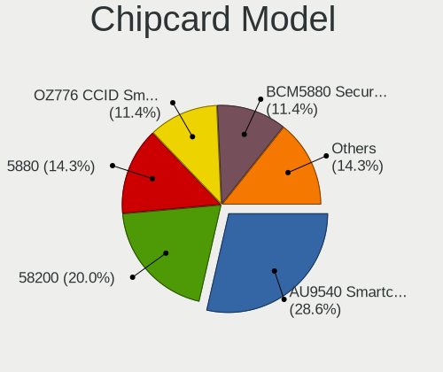

| Model                                                                        | Notebooks | Percent |
|------------------------------------------------------------------------------|-----------|---------|
| Alcor Micro AU9540 Smartcard Reader                                          | 13        | 38.24%  |
| Broadcom BCM5880 Secure Applications Processor with fingerprint swipe sensor | 4         | 11.76%  |
| Broadcom BCM5880 Secure Applications Processor                               | 4         | 11.76%  |
| Broadcom 58200                                                               | 4         | 11.76%  |
| Broadcom BCM5880 Secure Applications Processor with fingerprint touch sensor | 3         | 8.82%   |
| Broadcom 5880                                                                | 2         | 5.88%   |
| Yubico.com Yubikey 4/5 U2F+CCID                                              | 1         | 2.94%   |
| O2 Micro OZ776 CCID Smartcard Reader                                         | 1         | 2.94%   |
| Lenovo Integrated Smart Card Reader                                          | 1         | 2.94%   |
| Cherry SmartCard Reader Keyboard KC 1000 SC                                  | 1         | 2.94%   |

Unsupported
-----------

Unsupported Devices
-------------------

Total unsupported devices on board

| Total | Notebooks | Percent |
|-------|-----------|---------|
| 0     | 190       | 61.89%  |
| 1     | 95        | 30.94%  |
| 2     | 13        | 4.23%   |
| 3     | 7         | 2.28%   |
| 4     | 2         | 0.65%   |

Unsupported Device Types
------------------------

Types of unsupported devices

| Type                     | Notebooks | Percent |
|--------------------------|-----------|---------|
| Fingerprint reader       | 47        | 31.76%  |
| Chipcard                 | 30        | 20.27%  |
| Graphics card            | 23        | 15.54%  |
| Net/wireless             | 17        | 11.49%  |
| Multimedia controller    | 12        | 8.11%   |
| Camera                   | 6         | 4.05%   |
| Communication controller | 4         | 2.7%    |
| Storage                  | 3         | 2.03%   |
| Card reader              | 3         | 2.03%   |
| Network                  | 1         | 0.68%   |
| Modem                    | 1         | 0.68%   |
| Bluetooth                | 1         | 0.68%   |

