Linux in Germany - Hardware Trends (Notebooks)
----------------------------------------------

A project to identify most popular hardware characteristics and track their change
over time based on data collected by Linux users at https://Linux-Hardware.org.

Anyone can contribute to this report by the [hw-probe](https://github.com/linuxhw/hw-probe) tool:

    sudo -E hw-probe -all -upload

Period: Jan, 2023.

Contents
--------

* [ System ](#system)
  - [ OS                       ](#os)
  - [ OS Family                ](#os-family)
  - [ Kernel                   ](#kernel)
  - [ Kernel Family            ](#kernel-family)
  - [ Kernel Major Ver.        ](#kernel-major-ver)
  - [ Arch                     ](#arch)
  - [ DE                       ](#de)
  - [ Display Server           ](#display-server)
  - [ Display Manager          ](#display-manager)
  - [ OS Lang                  ](#os-lang)
  - [ Boot Mode                ](#boot-mode)
  - [ Filesystem               ](#filesystem)
  - [ Part. scheme             ](#part-scheme)
  - [ Dual Boot with Linux/BSD ](#dual-boot-with-linuxbsd)
  - [ Dual Boot (Win)          ](#dual-boot-win)

* [ Board ](#board)
  - [ Vendor                   ](#vendor)
  - [ Model                    ](#model)
  - [ Model Family             ](#model-family)
  - [ MFG Year                 ](#mfg-year)
  - [ Form Factor              ](#form-factor)
  - [ Secure Boot              ](#secure-boot)
  - [ Coreboot                 ](#coreboot)
  - [ RAM Size                 ](#ram-size)
  - [ RAM Used                 ](#ram-used)
  - [ Total Drives             ](#total-drives)
  - [ Has CD-ROM               ](#has-cd-rom)
  - [ Has Ethernet             ](#has-ethernet)
  - [ Has WiFi                 ](#has-wifi)
  - [ Has Bluetooth            ](#has-bluetooth)

* [ Location ](#location)
  - [ Country                  ](#country)
  - [ City                     ](#city)

* [ Drives ](#drives)
  - [ Drive Vendor             ](#drive-vendor)
  - [ Drive Model              ](#drive-model)
  - [ HDD Vendor               ](#hdd-vendor)
  - [ SSD Vendor               ](#ssd-vendor)
  - [ Drive Kind               ](#drive-kind)
  - [ Drive Connector          ](#drive-connector)
  - [ Drive Size               ](#drive-size)
  - [ Space Total              ](#space-total)
  - [ Space Used               ](#space-used)
  - [ Malfunc. Drives          ](#malfunc-drives)
  - [ Malfunc. Drive Vendor    ](#malfunc-drive-vendor)
  - [ Malfunc. HDD Vendor      ](#malfunc-hdd-vendor)
  - [ Malfunc. Drive Kind      ](#malfunc-drive-kind)
  - [ Failed Drives            ](#failed-drives)
  - [ Failed Drive Vendor      ](#failed-drive-vendor)
  - [ Drive Status             ](#drive-status)

* [ Storage controller ](#storage-controller)
  - [ Storage Vendor           ](#storage-vendor)
  - [ Storage Model            ](#storage-model)
  - [ Storage Kind             ](#storage-kind)

* [ Processor ](#processor)
  - [ CPU Vendor               ](#cpu-vendor)
  - [ CPU Model                ](#cpu-model)
  - [ CPU Model Family         ](#cpu-model-family)
  - [ CPU Cores                ](#cpu-cores)
  - [ CPU Sockets              ](#cpu-sockets)
  - [ CPU Threads              ](#cpu-threads)
  - [ CPU Op-Modes             ](#cpu-op-modes)
  - [ CPU Microcode            ](#cpu-microcode)
  - [ CPU Microarch            ](#cpu-microarch)

* [ Graphics ](#graphics)
  - [ GPU Vendor               ](#gpu-vendor)
  - [ GPU Model                ](#gpu-model)
  - [ GPU Combo                ](#gpu-combo)
  - [ GPU Driver               ](#gpu-driver)
  - [ GPU Memory               ](#gpu-memory)

* [ Monitor ](#monitor)
  - [ Monitor Vendor           ](#monitor-vendor)
  - [ Monitor Model            ](#monitor-model)
  - [ Monitor Resolution       ](#monitor-resolution)
  - [ Monitor Diagonal         ](#monitor-diagonal)
  - [ Monitor Width            ](#monitor-width)
  - [ Aspect Ratio             ](#aspect-ratio)
  - [ Monitor Area             ](#monitor-area)
  - [ Pixel Density            ](#pixel-density)
  - [ Multiple Monitors        ](#multiple-monitors)

* [ Network ](#network)
  - [ Net Controller Vendor    ](#net-controller-vendor)
  - [ Net Controller Model     ](#net-controller-model)
  - [ Wireless Vendor          ](#wireless-vendor)
  - [ Wireless Model           ](#wireless-model)
  - [ Ethernet Vendor          ](#ethernet-vendor)
  - [ Ethernet Model           ](#ethernet-model)
  - [ Net Controller Kind      ](#net-controller-kind)
  - [ Used Controller          ](#used-controller)
  - [ NICs                     ](#nics)
  - [ IPv6                     ](#ipv6)

* [ Bluetooth ](#bluetooth)
  - [ Bluetooth Vendor         ](#bluetooth-vendor)
  - [ Bluetooth Model          ](#bluetooth-model)

* [ Sound ](#sound)
  - [ Sound Vendor             ](#sound-vendor)
  - [ Sound Model              ](#sound-model)

* [ Memory ](#memory)
  - [ Memory Vendor            ](#memory-vendor)
  - [ Memory Model             ](#memory-model)
  - [ Memory Kind              ](#memory-kind)
  - [ Memory Form Factor       ](#memory-form-factor)
  - [ Memory Size              ](#memory-size)
  - [ Memory Speed             ](#memory-speed)

* [ Printers & scanners ](#printers--scanners)
  - [ Printer Vendor           ](#printer-vendor)
  - [ Printer Model            ](#printer-model)
  - [ Scanner Vendor           ](#scanner-vendor)
  - [ Scanner Model            ](#scanner-model)

* [ Camera ](#camera)
  - [ Camera Vendor            ](#camera-vendor)
  - [ Camera Model             ](#camera-model)

* [ Security ](#security)
  - [ Fingerprint Vendor       ](#fingerprint-vendor)
  - [ Fingerprint Model        ](#fingerprint-model)
  - [ Chipcard Vendor          ](#chipcard-vendor)
  - [ Chipcard Model           ](#chipcard-model)

* [ Unsupported ](#unsupported)
  - [ Unsupported Devices      ](#unsupported-devices)
  - [ Unsupported Device Types ](#unsupported-device-types)

System
------

OS
--

Installed operating systems

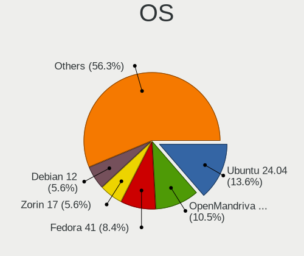

| Name                         | Notebooks | Percent |
|------------------------------|-----------|---------|
| Ubuntu 22.04                 | 56        | 15.56%  |
| OpenMandriva 23.01           | 52        | 14.44%  |
| Linux Mint 21.1              | 36        | 10%     |
| Fedora 37                    | 20        | 5.56%   |
| Ubuntu 22.10                 | 19        | 5.28%   |
| Debian 11                    | 17        | 4.72%   |
| Linux Mint 20.3              | 16        | 4.44%   |
| Zorin 16                     | 12        | 3.33%   |
| SteamOS 3.4.4                | 9         | 2.5%    |
| Ubuntu 20.04                 | 8         | 2.22%   |
| Debian                       | 8         | 2.22%   |
| KDE neon 22.04               | 7         | 1.94%   |
| OpenMandriva 4.3             | 5         | 1.39%   |
| Arch Rolling                 | 5         | 1.39%   |
| Xubuntu 20.04                | 4         | 1.11%   |
| Linux Mint 21                | 4         | 1.11%   |
| Kubuntu 22.10                | 4         | 1.11%   |
| Kubuntu 22.04                | 4         | 1.11%   |
| EndeavourOS Rolling          | 4         | 1.11%   |
| Xubuntu 22.04                | 3         | 0.83%   |
| Ubuntu 18.04                 | 3         | 0.83%   |
| ROSA 12.3                    | 3         | 0.83%   |
| Pop!_OS 22.04                | 3         | 0.83%   |
| openSUSE Tumbleweed-XXXXXXXX | 3         | 0.83%   |
| Nobara 37                    | 3         | 0.83%   |
| Lubuntu 22.04                | 3         | 0.83%   |
| LMDE 5                       | 3         | 0.83%   |
| Fedora 36                    | 3         | 0.83%   |
| Ubuntu MATE 22.04            | 2         | 0.56%   |
| OpenMandriva 22.12           | 2         | 0.56%   |
| Manjaro                      | 2         | 0.56%   |
| Kubuntu 20.04                | 2         | 0.56%   |
| KDE neon 20.04               | 2         | 0.56%   |
| Kali 2022.4                  | 2         | 0.56%   |
| Elementary 6.1               | 2         | 0.56%   |
| Void Linux Rolling           | 1         | 0.28%   |
| Ubuntu MATE 22.10            | 1         | 0.28%   |
| Ubuntu MATE 20.04            | 1         | 0.28%   |
| Ubuntu Budgie 22.04          | 1         | 0.28%   |
| Ubuntu 19.10                 | 1         | 0.28%   |

OS Family
---------

OS without a version

| Name          | Notebooks | Percent |
|---------------|-----------|---------|
| Ubuntu        | 87        | 24.17%  |
| OpenMandriva  | 61        | 16.94%  |
| Linux Mint    | 59        | 16.39%  |
| Debian        | 25        | 6.94%   |
| Fedora        | 24        | 6.67%   |
| Zorin         | 12        | 3.33%   |
| Kubuntu       | 11        | 3.06%   |
| SteamOS       | 10        | 2.78%   |
| KDE neon      | 9         | 2.5%    |
| Xubuntu       | 7         | 1.94%   |
| Manjaro       | 5         | 1.39%   |
| Arch          | 5         | 1.39%   |
| Ubuntu MATE   | 4         | 1.11%   |
| ROSA          | 4         | 1.11%   |
| openSUSE      | 4         | 1.11%   |
| EndeavourOS   | 4         | 1.11%   |
| Pop!_OS       | 3         | 0.83%   |
| Nobara        | 3         | 0.83%   |
| Lubuntu       | 3         | 0.83%   |
| LMDE          | 3         | 0.83%   |
| Kali          | 2         | 0.56%   |
| Endless       | 2         | 0.56%   |
| Elementary    | 2         | 0.56%   |
| Void Linux    | 1         | 0.28%   |
| Ubuntu Budgie | 1         | 0.28%   |
| TUXEDO OS     | 1         | 0.28%   |
| Sparky        | 1         | 0.28%   |
| PureOS        | 1         | 0.28%   |
| Parrot        | 1         | 0.28%   |
| MX            | 1         | 0.28%   |
| Gentoo        | 1         | 0.28%   |
| Garuda Linux  | 1         | 0.28%   |
| Devuan        | 1         | 0.28%   |
| AlmaLinux     | 1         | 0.28%   |

Kernel
------

Version of the Linux kernel

| Version                                            | Notebooks | Percent |
|----------------------------------------------------|-----------|---------|
| 5.15.0-58-generic                                  | 65        | 18.06%  |
| 6.1.1-desktop-1omv2290                             | 51        | 14.17%  |
| 5.15.0-56-generic                                  | 35        | 9.72%   |
| 5.15.0-57-generic                                  | 22        | 6.11%   |
| 5.10.0-20-amd64                                    | 16        | 4.44%   |
| 5.19.0-28-generic                                  | 10        | 2.78%   |
| 5.13.0-valve36-1-neptune                           | 10        | 2.78%   |
| 5.4.0-136-generic                                  | 7         | 1.94%   |
| 6.1.7-200.fc37.x86_64                              | 6         | 1.67%   |
| 5.4.0-137-generic                                  | 6         | 1.67%   |
| 5.19.0-29-generic                                  | 6         | 1.67%   |
| 6.0.0-6-amd64                                      | 5         | 1.39%   |
| 5.16.7-desktop-1omv4003                            | 5         | 1.39%   |
| 6.1.6-200.fc37.x86_64                              | 4         | 1.11%   |
| 5.4.0-135-generic                                  | 4         | 1.11%   |
| 5.19.0-26-generic                                  | 4         | 1.11%   |
| 5.19.0-21-generic                                  | 4         | 1.11%   |
| 6.0.12-76060006-generic                            | 3         | 0.83%   |
| 5.15.79-generic-1rosa2021.1-x86_64                 | 3         | 0.83%   |
| 5.15.0-43-generic                                  | 3         | 0.83%   |
| 5.15.0-10058-tuxedo                                | 3         | 0.83%   |
| 6.1.7-arch1-1                                      | 2         | 0.56%   |
| 6.1.7-1-MANJARO                                    | 2         | 0.56%   |
| 6.1.7-1-default                                    | 2         | 0.56%   |
| 6.1.1-1-MANJARO                                    | 2         | 0.56%   |
| 6.1.0-1-amd64                                      | 2         | 0.56%   |
| 6.0.16-300.fc37.x86_64                             | 2         | 0.56%   |
| 6.0.15-300.fc37.x86_64                             | 2         | 0.56%   |
| 6.0.10-desktop-2omv22090                           | 2         | 0.56%   |
| 5.4.0-132-generic                                  | 2         | 0.56%   |
| 5.15.0-47-generic                                  | 2         | 0.56%   |
| 6.2.0-0.rc5.20230126git7c46948a6e9c.41.fc38.x86_64 | 1         | 0.28%   |
| 6.1.8-200.fc37.x86_64                              | 1         | 0.28%   |
| 6.1.8-060108-generic                               | 1         | 0.28%   |
| 6.1.7-100.fc36.x86_64                              | 1         | 0.28%   |
| 6.1.6-arch1-3                                      | 1         | 0.28%   |
| 6.1.6-202.fsync.fc37.x86_64                        | 1         | 0.28%   |
| 6.1.6-201.fsync.fc37.x86_64                        | 1         | 0.28%   |
| 6.1.6-060106-generic                               | 1         | 0.28%   |
| 6.1.5-desktop-1omv2390                             | 1         | 0.28%   |

Kernel Family
-------------

Linux kernel without a distro release

| Version | Notebooks | Percent |
|---------|-----------|---------|
| 5.15.0  | 138       | 38.33%  |
| 6.1.1   | 54        | 15%     |
| 5.19.0  | 26        | 7.22%   |
| 5.4.0   | 23        | 6.39%   |
| 5.10.0  | 23        | 6.39%   |
| 6.1.7   | 13        | 3.61%   |
| 5.13.0  | 13        | 3.61%   |
| 6.1.6   | 8         | 2.22%   |
| 6.0.0   | 8         | 2.22%   |
| 6.1.4   | 6         | 1.67%   |
| 6.0.12  | 5         | 1.39%   |
| 5.16.7  | 5         | 1.39%   |
| 6.1.5   | 3         | 0.83%   |
| 6.1.0   | 3         | 0.83%   |
| 6.0.16  | 3         | 0.83%   |
| 6.0.15  | 3         | 0.83%   |
| 5.15.79 | 3         | 0.83%   |
| 6.1.8   | 2         | 0.56%   |
| 6.0.10  | 2         | 0.56%   |
| 6.2.0   | 1         | 0.28%   |
| 6.1.3   | 1         | 0.28%   |
| 6.0.7   | 1         | 0.28%   |
| 6.0.6   | 1         | 0.28%   |
| 6.0.19  | 1         | 0.28%   |
| 6.0.18  | 1         | 0.28%   |
| 6.0.17  | 1         | 0.28%   |
| 6.0.13  | 1         | 0.28%   |
| 6.0.11  | 1         | 0.28%   |
| 5.4.32  | 1         | 0.28%   |
| 5.3.0   | 1         | 0.28%   |
| 5.19.5  | 1         | 0.28%   |
| 5.17.5  | 1         | 0.28%   |
| 5.17.0  | 1         | 0.28%   |
| 5.14.0  | 1         | 0.28%   |
| 5.13.19 | 1         | 0.28%   |
| 5.11.0  | 1         | 0.28%   |
| 4.18.0  | 1         | 0.28%   |
| 4.15.0  | 1         | 0.28%   |

Kernel Major Ver.
-----------------

Linux kernel major version

| Version | Notebooks | Percent |
|---------|-----------|---------|
| 5.15    | 141       | 39.17%  |
| 6.1     | 90        | 25%     |
| 6.0     | 28        | 7.78%   |
| 5.19    | 27        | 7.5%    |
| 5.4     | 24        | 6.67%   |
| 5.10    | 23        | 6.39%   |
| 5.13    | 14        | 3.89%   |
| 5.16    | 5         | 1.39%   |
| 5.17    | 2         | 0.56%   |
| 6.2     | 1         | 0.28%   |
| 5.3     | 1         | 0.28%   |
| 5.14    | 1         | 0.28%   |
| 5.11    | 1         | 0.28%   |
| 4.18    | 1         | 0.28%   |
| 4.15    | 1         | 0.28%   |

Arch
----

OS architecture (x86_64, i586, etc.)

| Name    | Notebooks | Percent |
|---------|-----------|---------|
| x86_64  | 355       | 98.61%  |
| i686    | 4         | 1.11%   |
| aarch64 | 1         | 0.28%   |

DE
--

Desktop Environment

| Name              | Notebooks | Percent |
|-------------------|-----------|---------|
| GNOME             | 148       | 41.11%  |
| KDE5              | 93        | 25.83%  |
| X-Cinnamon        | 54        | 15%     |
| XFCE              | 27        | 7.5%    |
| MATE              | 8         | 2.22%   |
| i3                | 5         | 1.39%   |
| Cinnamon          | 4         | 1.11%   |
| Unknown           | 4         | 1.11%   |
| LXQt              | 3         | 0.83%   |
| Pantheon          | 2         | 0.56%   |
| x-session-manager | 1         | 0.28%   |
| sway              | 1         | 0.28%   |
| Phosh:GNOME       | 1         | 0.28%   |
| openbox           | 1         | 0.28%   |
| LXDE              | 1         | 0.28%   |
| KDE               | 1         | 0.28%   |
| GNOME Flashback   | 1         | 0.28%   |
| GNOME Classic     | 1         | 0.28%   |
| fluxbox           | 1         | 0.28%   |
| Enlightenment     | 1         | 0.28%   |
| Budgie            | 1         | 0.28%   |
| bspwm             | 1         | 0.28%   |

Display Server
--------------

X11 or Wayland

| Name    | Notebooks | Percent |
|---------|-----------|---------|
| X11     | 248       | 68.89%  |
| Wayland | 107       | 29.72%  |
| Unknown | 4         | 1.11%   |
| Tty     | 1         | 0.28%   |

Display Manager
---------------

SDDM, LightDM, etc.

| Name    | Notebooks | Percent |
|---------|-----------|---------|
| Unknown | 110       | 30.56%  |
| GDM3    | 83        | 23.06%  |
| SDDM    | 68        | 18.89%  |
| LightDM | 65        | 18.06%  |
| GDM     | 31        | 8.61%   |
| SLiM    | 1         | 0.28%   |
| LXDM    | 1         | 0.28%   |
| GREETD  | 1         | 0.28%   |

OS Lang
-------

Language

| Lang  | Notebooks | Percent |
|-------|-----------|---------|
| de_DE | 247       | 68.61%  |
| en_US | 88        | 24.44%  |
| C     | 6         | 1.67%   |
| ru_RU | 5         | 1.39%   |
| en_DE | 4         | 1.11%   |
| en_GB | 2         | 0.56%   |
| uk_UA | 1         | 0.28%   |
| tr_TR | 1         | 0.28%   |
| ru_UA | 1         | 0.28%   |
| hu_HU | 1         | 0.28%   |
| fr_FR | 1         | 0.28%   |
| es_ES | 1         | 0.28%   |
| en_DK | 1         | 0.28%   |
| de_AT | 1         | 0.28%   |

Boot Mode
---------

EFI or BIOS

| Mode | Notebooks | Percent |
|------|-----------|---------|
| EFI  | 185       | 51.39%  |
| BIOS | 175       | 48.61%  |

Filesystem
----------

Type of filesystem

| Type    | Notebooks | Percent |
|---------|-----------|---------|
| Ext4    | 254       | 70.56%  |
| Btrfs   | 52        | 14.44%  |
| Overlay | 50        | 13.89%  |
| Xfs     | 3         | 0.83%   |
| Ext3    | 1         | 0.28%   |

Part. scheme
------------

Scheme of partitioning

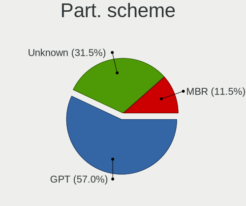

| Type    | Notebooks | Percent |
|---------|-----------|---------|
| GPT     | 195       | 54.17%  |
| Unknown | 108       | 30%     |
| MBR     | 57        | 15.83%  |

Dual Boot with Linux/BSD
------------------------

Hosting more than one Linux/BSD

| Dual boot | Notebooks | Percent |
|-----------|-----------|---------|
| No        | 295       | 81.94%  |
| Yes       | 65        | 18.06%  |

Dual Boot (Win)
---------------

Hosting Linux and Windows

| Dual boot | Notebooks | Percent |
|-----------|-----------|---------|
| No        | 277       | 76.94%  |
| Yes       | 83        | 23.06%  |

Board
-----

Vendor
------

Motherboard manufacturer

| Name                | Notebooks | Percent |
|---------------------|-----------|---------|
| Lenovo              | 92        | 25.56%  |
| Hewlett-Packard     | 48        | 13.33%  |
| Acer                | 44        | 12.22%  |
| Dell                | 41        | 11.39%  |
| ASUSTek Computer    | 30        | 8.33%   |
| Valve               | 11        | 3.06%   |
| Fujitsu             | 11        | 3.06%   |
| TUXEDO              | 8         | 2.22%   |
| Medion              | 8         | 2.22%   |
| HUAWEI              | 8         | 2.22%   |
| Apple               | 8         | 2.22%   |
| Schenker            | 7         | 1.94%   |
| Toshiba             | 6         | 1.67%   |
| MSI                 | 6         | 1.67%   |
| Notebook            | 4         | 1.11%   |
| Samsung Electronics | 3         | 0.83%   |
| Packard Bell        | 3         | 0.83%   |
| Wortmann AG         | 2         | 0.56%   |
| Sony                | 2         | 0.56%   |
| Gigabyte Technology | 2         | 0.56%   |
| Unknown             | 2         | 0.56%   |
| TrekStor            | 1         | 0.28%   |
| Tactus              | 1         | 0.28%   |
| SLIMBOOK            | 1         | 0.28%   |
| Quanta              | 1         | 0.28%   |
| Panasonic           | 1         | 0.28%   |
| MPMAN               | 1         | 0.28%   |
| MicroByte           | 1         | 0.28%   |
| LG Electronics      | 1         | 0.28%   |
| Google              | 1         | 0.28%   |
| Fujitsu Siemens     | 1         | 0.28%   |
| Framework           | 1         | 0.28%   |
| Dynabook            | 1         | 0.28%   |
| AXDIA International | 1         | 0.28%   |
| &#er &&             | 1         | 0.28%   |

Model
-----

Motherboard model

| Name                                 | Notebooks | Percent |
|--------------------------------------|-----------|---------|
| Valve Jupiter                        | 11        | 3.06%   |
| Unknown                              | 4         | 1.11%   |
| Lenovo IdeaPad 5 15ARE05 81YQ        | 3         | 0.83%   |
| HP Laptop 17-bs0xx                   | 3         | 0.83%   |
| Acer Aspire ES1-711                  | 3         | 0.83%   |
| Lenovo ThinkPad T480s 20L8S02D00     | 2         | 0.56%   |
| Lenovo ThinkPad E15 Gen 2 20T9S00K00 | 2         | 0.56%   |
| HUAWEI NBLK-WAX9X                    | 2         | 0.56%   |
| HP Laptop 17-ak0xx                   | 2         | 0.56%   |
| HP Laptop 15s-eq2xxx                 | 2         | 0.56%   |
| Fujitsu LIFEBOOK U7511               | 2         | 0.56%   |
| Fujitsu LIFEBOOK E752                | 2         | 0.56%   |
| Dell Precision 7720                  | 2         | 0.56%   |
| Dell Latitude E7240                  | 2         | 0.56%   |
| Dell Latitude 3320                   | 2         | 0.56%   |
| Dell G5 5590                         | 2         | 0.56%   |
| ASUS ZenBook UX431DA_UM431DA         | 2         | 0.56%   |
| ASUS ZenBook UX425UA_UM425UA         | 2         | 0.56%   |
| ASUS K50IJ                           | 2         | 0.56%   |
| ASUS F5VL                            | 2         | 0.56%   |
| Acer Aspire E5-771                   | 2         | 0.56%   |
| Acer Aspire E1-572G                  | 2         | 0.56%   |
| Acer Aspire 7741                     | 2         | 0.56%   |
| Wortmann AG Mobile 1524              | 1         | 0.28%   |
| Wortmann AG 1220583_1470086          | 1         | 0.28%   |
| TUXEDO Stellaris Intel Gen4          | 1         | 0.28%   |
| TUXEDO Pulse 15 Gen1                 | 1         | 0.28%   |
| TUXEDO N14xWU                        | 1         | 0.28%   |
| TUXEDO InfinityBook S 15 Gen6        | 1         | 0.28%   |
| TUXEDO InfinityBook Pro Gen7 (MK1)   | 1         | 0.28%   |
| TUXEDO Aura 15 Gen1                  | 1         | 0.28%   |
| TrekStor Primebook_P15               | 1         | 0.28%   |
| Toshiba Satellite S50D-B             | 1         | 0.28%   |
| Toshiba Satellite M70                | 1         | 0.28%   |
| Toshiba Satellite L775-18J           | 1         | 0.28%   |
| Toshiba Satellite L755               | 1         | 0.28%   |
| Toshiba Satellite C870-19R           | 1         | 0.28%   |
| Toshiba Satellite C660               | 1         | 0.28%   |
| Tactus GeoBook 140                   | 1         | 0.28%   |
| Sony VPCEH3J1E                       | 1         | 0.28%   |

Model Family
------------

Motherboard model prefix

| Name                  | Notebooks | Percent |
|-----------------------|-----------|---------|
| Lenovo ThinkPad       | 57        | 15.83%  |
| Acer Aspire           | 31        | 8.61%   |
| Dell Latitude         | 20        | 5.56%   |
| Lenovo IdeaPad        | 14        | 3.89%   |
| HP Laptop             | 12        | 3.33%   |
| Valve Jupiter         | 11        | 3.06%   |
| Fujitsu LIFEBOOK      | 10        | 2.78%   |
| Dell XPS              | 8         | 2.22%   |
| HP EliteBook          | 7         | 1.94%   |
| Toshiba Satellite     | 6         | 1.67%   |
| Acer Swift            | 6         | 1.67%   |
| HP Compaq             | 5         | 1.39%   |
| Dell Precision        | 5         | 1.39%   |
| Dell Inspiron         | 5         | 1.39%   |
| ASUS ZenBook          | 5         | 1.39%   |
| Schenker XMG          | 4         | 1.11%   |
| HP ProBook            | 4         | 1.11%   |
| HP 255                | 4         | 1.11%   |
| Acer Nitro            | 4         | 1.11%   |
| Unknown               | 4         | 1.11%   |
| Packard Bell EasyNote | 3         | 0.83%   |
| Lenovo Yoga           | 3         | 0.83%   |
| Lenovo Legion         | 3         | 0.83%   |
| HP Pavilion           | 3         | 0.83%   |
| ASUS VivoBook         | 3         | 0.83%   |
| ASUS ASUS             | 3         | 0.83%   |
| TUXEDO InfinityBook   | 2         | 0.56%   |
| Schenker VISION       | 2         | 0.56%   |
| Lenovo G700           | 2         | 0.56%   |
| HUAWEI NBLK-WAX9X     | 2         | 0.56%   |
| HP ZBook              | 2         | 0.56%   |
| HP ENVY               | 2         | 0.56%   |
| HP 250                | 2         | 0.56%   |
| Dell G5               | 2         | 0.56%   |
| ASUS K50IJ            | 2         | 0.56%   |
| ASUS F5VL             | 2         | 0.56%   |
| Apple MacBookPro8     | 2         | 0.56%   |
| Wortmann AG Mobile    | 1         | 0.28%   |
| Wortmann AG 1220583   | 1         | 0.28%   |
| TUXEDO Stellaris      | 1         | 0.28%   |

MFG Year
--------

Motherboard manufacture year

| Year    | Notebooks | Percent |
|---------|-----------|---------|
| 2021    | 47        | 13.06%  |
| 2022    | 45        | 12.5%   |
| 2020    | 33        | 9.17%   |
| 2019    | 26        | 7.22%   |
| 2013    | 26        | 7.22%   |
| 2012    | 24        | 6.67%   |
| 2017    | 23        | 6.39%   |
| 2014    | 22        | 6.11%   |
| 2018    | 21        | 5.83%   |
| 2011    | 20        | 5.56%   |
| 2016    | 16        | 4.44%   |
| 2015    | 14        | 3.89%   |
| 2010    | 14        | 3.89%   |
| 2008    | 11        | 3.06%   |
| 2009    | 9         | 2.5%    |
| 2007    | 4         | 1.11%   |
| 2006    | 2         | 0.56%   |
| 2005    | 2         | 0.56%   |
| Unknown | 1         | 0.28%   |

Form Factor
-----------

Physical design of the computer

| Name     | Notebooks | Percent |
|----------|-----------|---------|
| Notebook | 360       | 100%    |

Secure Boot
-----------

Enabled or disabled

| State    | Notebooks | Percent |
|----------|-----------|---------|
| Disabled | 332       | 92.22%  |
| Enabled  | 28        | 7.78%   |

Coreboot
--------

Have coreboot on board

| Used | Notebooks | Percent |
|------|-----------|---------|
| No   | 358       | 99.44%  |
| Yes  | 2         | 0.56%   |

RAM Size
--------

Total RAM memory

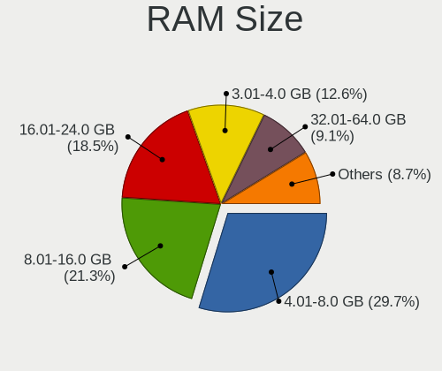

| Size in GB  | Notebooks | Percent |
|-------------|-----------|---------|
| 4.01-8.0    | 96        | 26.67%  |
| 3.01-4.0    | 71        | 19.72%  |
| 8.01-16.0   | 66        | 18.33%  |
| 16.01-24.0  | 62        | 17.22%  |
| 32.01-64.0  | 33        | 9.17%   |
| 1.01-2.0    | 11        | 3.06%   |
| 24.01-32.0  | 10        | 2.78%   |
| 64.01-256.0 | 9         | 2.5%    |
| 2.01-3.0    | 1         | 0.28%   |
| 0.51-1.0    | 1         | 0.28%   |

RAM Used
--------

Used RAM memory

| Used GB    | Notebooks | Percent |
|------------|-----------|---------|
| 1.01-2.0   | 142       | 39.44%  |
| 2.01-3.0   | 104       | 28.89%  |
| 4.01-8.0   | 42        | 11.67%  |
| 3.01-4.0   | 37        | 10.28%  |
| 0.51-1.0   | 17        | 4.72%   |
| 8.01-16.0  | 13        | 3.61%   |
| 16.01-24.0 | 4         | 1.11%   |
| 0.01-0.5   | 1         | 0.28%   |

Total Drives
------------

Number of drives on board

| Drives | Notebooks | Percent |
|--------|-----------|---------|
| 1      | 264       | 73.33%  |
| 2      | 82        | 22.78%  |
| 3      | 10        | 2.78%   |
| 0      | 3         | 0.83%   |
| 4      | 1         | 0.28%   |

Has CD-ROM
----------

Has CD-ROM on board

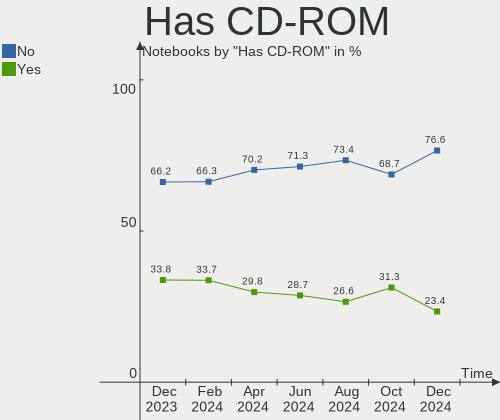

| Presented | Notebooks | Percent |
|-----------|-----------|---------|
| No        | 233       | 64.72%  |
| Yes       | 127       | 35.28%  |

Has Ethernet
------------

Has Ethernet on board

| Presented | Notebooks | Percent |
|-----------|-----------|---------|
| Yes       | 295       | 81.94%  |
| No        | 65        | 18.06%  |

Has WiFi
--------

Has WiFi module

| Presented | Notebooks | Percent |
|-----------|-----------|---------|
| Yes       | 352       | 97.78%  |
| No        | 8         | 2.22%   |

Has Bluetooth
-------------

Has Bluetooth module

| Presented | Notebooks | Percent |
|-----------|-----------|---------|
| Yes       | 284       | 78.89%  |
| No        | 76        | 21.11%  |

Location
--------

Country
-------

Geographic location (country)

| Country | Notebooks | Percent |
|---------|-----------|---------|
| Germany | 360       | 100%    |

City
----

Geographic location (city)

| City                     | Notebooks | Percent |
|--------------------------|-----------|---------|
| Berlin                   | 28        | 7.78%   |
| Munich                   | 18        | 5%      |
| Hamburg                  | 15        | 4.17%   |
| Frankfurt am Main        | 15        | 4.17%   |
| Cologne                  | 11        | 3.06%   |
| Stuttgart                | 6         | 1.67%   |
| Nuremberg                | 6         | 1.67%   |
| Karlsruhe                | 6         | 1.67%   |
| Ulm                      | 4         | 1.11%   |
| Mannheim                 | 4         | 1.11%   |
| Essen                    | 4         | 1.11%   |
| Düsseldorf              | 4         | 1.11%   |
| Dresden                  | 4         | 1.11%   |
| Bergkamen                | 4         | 1.11%   |
| Mainz                    | 3         | 0.83%   |
| Leipzig                  | 3         | 0.83%   |
| Kiel                     | 3         | 0.83%   |
| Heilbronn                | 3         | 0.83%   |
| Hanover                  | 3         | 0.83%   |
| Geislingen an der Steige | 3         | 0.83%   |
| Freiberg                 | 3         | 0.83%   |
| Darmstadt                | 3         | 0.83%   |
| Braunschweig             | 3         | 0.83%   |
| Bargteheide              | 3         | 0.83%   |
| Wuppertal                | 2         | 0.56%   |
| Worms                    | 2         | 0.56%   |
| Wiesbaden                | 2         | 0.56%   |
| Weimar                   | 2         | 0.56%   |
| Waldshut-Tiengen         | 2         | 0.56%   |
| Steinfurt                | 2         | 0.56%   |
| Rosenheim                | 2         | 0.56%   |
| Osnabrück               | 2         | 0.56%   |
| Oberursel                | 2         | 0.56%   |
| Neunkirchen              | 2         | 0.56%   |
| Lübeck                  | 2         | 0.56%   |
| Lippstadt                | 2         | 0.56%   |
| Langenhagen              | 2         | 0.56%   |
| Koblenz                  | 2         | 0.56%   |
| Ilmenau                  | 2         | 0.56%   |
| Halle                    | 2         | 0.56%   |

Drives
------

Drive Vendor
------------

Hard drive vendors

| Vendor                         | Notebooks | Drives | Percent |
|--------------------------------|-----------|--------|---------|
| Samsung Electronics            | 102       | 108    | 23.18%  |
| SanDisk                        | 50        | 51     | 11.36%  |
| WDC                            | 47        | 49     | 10.68%  |
| SK hynix                       | 27        | 28     | 6.14%   |
| Unknown                        | 22        | 27     | 5%      |
| Seagate                        | 22        | 22     | 5%      |
| Toshiba                        | 20        | 21     | 4.55%   |
| Intel                          | 16        | 16     | 3.64%   |
| Crucial                        | 15        | 15     | 3.41%   |
| Kingston                       | 14        | 14     | 3.18%   |
| Hitachi                        | 13        | 13     | 2.95%   |
| Micron Technology              | 10        | 10     | 2.27%   |
| Intenso                        | 8         | 8      | 1.82%   |
| Phison Electronics             | 7         | 7      | 1.59%   |
| KIOXIA                         | 7         | 7      | 1.59%   |
| HGST                           | 5         | 5      | 1.14%   |
| LITEON                         | 4         | 4      | 0.91%   |
| Kingston Technology Company    | 4         | 4      | 0.91%   |
| SPCC                           | 3         | 3      | 0.68%   |
| Micron/Crucial Technology      | 3         | 3      | 0.68%   |
| China                          | 3         | 3      | 0.68%   |
| Apple                          | 3         | 3      | 0.68%   |
| TO Exter                       | 2         | 2      | 0.45%   |
| SABRENT                        | 2         | 3      | 0.45%   |
| PNY                            | 2         | 2      | 0.45%   |
| LITEONIT                       | 2         | 2      | 0.45%   |
| JMicron Technology             | 2         | 2      | 0.45%   |
| Fujitsu                        | 2         | 2      | 0.45%   |
| Apacer                         | 2         | 2      | 0.45%   |
| A-DATA Technology              | 2         | 2      | 0.45%   |
| Unknown                        | 2         | 2      | 0.45%   |
| Verbatim                       | 1         | 1      | 0.23%   |
| UMIS                           | 1         | 1      | 0.23%   |
| TS1TSSD2                       | 1         | 1      | 0.23%   |
| Transcend                      | 1         | 1      | 0.23%   |
| SSD 2TB                        | 1         | 1      | 0.23%   |
| SPCC Sol                       | 1         | 1      | 0.23%   |
| Solid State Storage Technology | 1         | 1      | 0.23%   |
| Silicon Motion                 | 1         | 1      | 0.23%   |
| S3+                            | 1         | 1      | 0.23%   |

Drive Model
-----------

Hard drive models

| Model                                                | Notebooks | Percent |
|------------------------------------------------------|-----------|---------|
| Samsung NVMe SSD Controller SM981/PM981/PM983 500GB  | 14        | 3.08%   |
| Samsung NVMe SSD Controller PM9A1/PM9A3/980PRO 512GB | 9         | 1.98%   |
| Sandisk WD Black SN750 / PC SN730 NVMe SSD 1TB       | 8         | 1.76%   |
| SanDisk SSD PLUS 1000GB                              | 5         | 1.1%    |
| Samsung SSD 860 EVO 500GB                            | 5         | 1.1%    |
| Samsung SSD 850 EVO 250GB                            | 5         | 1.1%    |
| Crucial CT500MX500SSD1 500GB                         | 5         | 1.1%    |
| WDC WD10JPVX-22JC3T0 1TB                             | 4         | 0.88%   |
| Unknown MMC Card  128GB                              | 4         | 0.88%   |
| Toshiba MQ04ABF100 1TB                               | 4         | 0.88%   |
| Seagate ST1000LM035-1RK172 1TB                       | 4         | 0.88%   |
| Seagate ST1000LM024 HN-M101MBB 1TB                   | 4         | 0.88%   |
| SanDisk NVMe SSD Drive 1TB                           | 4         | 0.88%   |
| Samsung SSD 850 EVO 500GB                            | 4         | 0.88%   |
| Phison PS5013 E13 NVMe Controller 256GB              | 4         | 0.88%   |
| Unknown MMC Card  512GB                              | 3         | 0.66%   |
| Unknown MMC Card  32GB                               | 3         | 0.66%   |
| Unknown MMC Card  256GB                              | 3         | 0.66%   |
| Toshiba MQ01ABD100 1TB                               | 3         | 0.66%   |
| SK hynix BC501 NVMe Solid State Drive 512GB          | 3         | 0.66%   |
| Sandisk WD Black SN850 2TB                           | 3         | 0.66%   |
| SanDisk SSD PLUS 480GB                               | 3         | 0.66%   |
| Samsung SSD 870 QVO 1TB                              | 3         | 0.66%   |
| Samsung NVMe SSD Controller SM961/PM961/SM963 256GB  | 3         | 0.66%   |
| Samsung MZVL21T0HCLR-00BL7 1TB                       | 3         | 0.66%   |
| Kingston Company OM3PDP3 NVMe SSD 512GB              | 3         | 0.66%   |
| Intel SSDPEKNU512GZ 512GB                            | 3         | 0.66%   |
| WDC WDS500G2B0A-00SM50 500GB SSD                     | 2         | 0.44%   |
| WDC WD5000LPCX-21VHAT0 500GB                         | 2         | 0.44%   |
| WDC WD3200BEVT-22ZCT0 320GB                          | 2         | 0.44%   |
| WDC WD10JPVX-60JC3T1 1TB                             | 2         | 0.44%   |
| WDC PC SN730 SDBQNTY-512G-1001 512GB                 | 2         | 0.44%   |
| WDC PC SN530 SDBPMPZ-256G-1101 256GB                 | 2         | 0.44%   |
| Unknown MMC Card  64GB                               | 2         | 0.44%   |
| Unknown MMC Card  16GB                               | 2         | 0.44%   |
| Toshiba KXG5AZNV512G 512GB                           | 2         | 0.44%   |
| Toshiba KXG50ZNV512G NVMe 512GB                      | 2         | 0.44%   |
| TO Exter nal USB 3.0 500GB                           | 2         | 0.44%   |
| SK hynix SKHynix_HFM512GDHTNI-87A0B 512GB            | 2         | 0.44%   |
| SK hynix PC801 NVMe 1TB                              | 2         | 0.44%   |

HDD Vendor
----------

Hard disk drive vendors

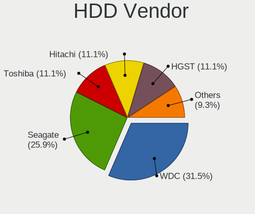

| Vendor              | Notebooks | Drives | Percent |
|---------------------|-----------|--------|---------|
| WDC                 | 27        | 28     | 33.33%  |
| Seagate             | 20        | 20     | 24.69%  |
| Hitachi             | 13        | 13     | 16.05%  |
| Toshiba             | 10        | 11     | 12.35%  |
| HGST                | 5         | 5      | 6.17%   |
| Samsung Electronics | 2         | 2      | 2.47%   |
| Fujitsu             | 2         | 2      | 2.47%   |
| Unknown             | 1         | 1      | 1.23%   |
| SABRENT             | 1         | 1      | 1.23%   |

SSD Vendor
----------

Solid state drive vendors

| Vendor              | Notebooks | Drives | Percent |
|---------------------|-----------|--------|---------|
| Samsung Electronics | 43        | 44     | 28.86%  |
| SanDisk             | 27        | 27     | 18.12%  |
| Crucial             | 14        | 14     | 9.4%    |
| Kingston            | 10        | 10     | 6.71%   |
| WDC                 | 7         | 7      | 4.7%    |
| Intenso             | 6         | 6      | 4.03%   |
| Intel               | 5         | 5      | 3.36%   |
| Micron Technology   | 4         | 4      | 2.68%   |
| LITEON              | 4         | 4      | 2.68%   |
| China               | 3         | 3      | 2.01%   |
| Apple               | 3         | 3      | 2.01%   |
| TO Exter            | 2         | 2      | 1.34%   |
| SPCC                | 2         | 2      | 1.34%   |
| LITEONIT            | 2         | 2      | 1.34%   |
| Apacer              | 2         | 2      | 1.34%   |
| A-DATA Technology   | 2         | 2      | 1.34%   |
| Verbatim            | 1         | 1      | 0.67%   |
| Transcend           | 1         | 1      | 0.67%   |
| SPCC Sol            | 1         | 1      | 0.67%   |
| SK hynix            | 1         | 1      | 0.67%   |
| SABRENT             | 1         | 2      | 0.67%   |
| S3+                 | 1         | 1      | 0.67%   |
| PNY                 | 1         | 1      | 0.67%   |
| Netac               | 1         | 1      | 0.67%   |
| JMicron Technology  | 1         | 1      | 0.67%   |
| BIWIN               | 1         | 1      | 0.67%   |
| ASMT                | 1         | 1      | 0.67%   |
| 2-Power             | 1         | 1      | 0.67%   |
| Unknown             | 1         | 1      | 0.67%   |

Drive Kind
----------

HDD or SSD

| Kind    | Notebooks | Drives | Percent |
|---------|-----------|--------|---------|
| NVMe    | 167       | 187    | 39.86%  |
| SSD     | 142       | 151    | 33.89%  |
| HDD     | 79        | 83     | 18.85%  |
| MMC     | 23        | 28     | 5.49%   |
| Unknown | 8         | 8      | 1.91%   |

Drive Connector
---------------

SATA, SAS, NVMe, etc.

| Type | Notebooks | Drives | Percent |
|------|-----------|--------|---------|
| SATA | 205       | 218    | 49.16%  |
| NVMe | 167       | 187    | 40.05%  |
| MMC  | 23        | 28     | 5.52%   |
| SAS  | 22        | 24     | 5.28%   |

Drive Size
----------

Size of hard drive

| Size in TB | Notebooks | Drives | Percent |
|------------|-----------|--------|---------|
| 0.01-0.5   | 140       | 150    | 63.35%  |
| 0.51-1.0   | 73        | 76     | 33.03%  |
| 1.01-2.0   | 6         | 6      | 2.71%   |
| 3.01-4.0   | 1         | 1      | 0.45%   |
| 4.01-10.0  | 1         | 1      | 0.45%   |

Space Total
-----------

Amount of disk space available on the file system

| Size in GB     | Notebooks | Percent |
|----------------|-----------|---------|
| 251-500        | 101       | 28.06%  |
| 101-250        | 73        | 20.28%  |
| 501-1000       | 73        | 20.28%  |
| 1-20           | 38        | 10.56%  |
| 51-100         | 24        | 6.67%   |
| Unknown        | 12        | 3.33%   |
| 21-50          | 11        | 3.06%   |
| 1001-2000      | 11        | 3.06%   |
| More than 3000 | 10        | 2.78%   |
| 2001-3000      | 7         | 1.94%   |

Space Used
----------

Amount of used disk space

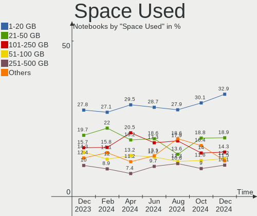

| Used GB        | Notebooks | Percent |
|----------------|-----------|---------|
| 1-20           | 126       | 35%     |
| 21-50          | 75        | 20.83%  |
| 51-100         | 44        | 12.22%  |
| 101-250        | 40        | 11.11%  |
| 251-500        | 38        | 10.56%  |
| 501-1000       | 16        | 4.44%   |
| Unknown        | 12        | 3.33%   |
| 1001-2000      | 5         | 1.39%   |
| 2001-3000      | 3         | 0.83%   |
| More than 3000 | 1         | 0.28%   |

Malfunc. Drives
---------------

Drive models with a malfunction

| Model                                                           | Notebooks | Drives | Percent |
|-----------------------------------------------------------------|-----------|--------|---------|
| WDC WD2500BEVT-00A23T0 250GB                                    | 1         | 1      | 7.14%   |
| WDC PC SA530 SDASN8Y-256G-1006 256GB SSD                        | 1         | 1      | 7.14%   |
| Toshiba MQ01ABD050 500GB                                        | 1         | 1      | 7.14%   |
| Toshiba MQ01ABC150 1TB                                          | 1         | 1      | 7.14%   |
| SK hynix SH920 mSATA 256GB SSD                                  | 1         | 1      | 7.14%   |
| Seagate ST500LT012-1DG142 500GB                                 | 1         | 1      | 7.14%   |
| SanDisk SSD PLUS 480GB                                          | 1         | 1      | 7.14%   |
| SanDisk SSD PLUS 1000GB                                         | 1         | 1      | 7.14%   |
| Samsung Electronics NVMe SSD Controller SM981/PM981/PM983 500GB | 1         | 1      | 7.14%   |
| LITEONIT LSS-16L6G-HP 16GB SSD                                  | 1         | 1      | 7.14%   |
| Intel SSDSC2CW060A3 64GB                                        | 1         | 1      | 7.14%   |
| Hitachi HTS542525K9SA00 250GB                                   | 1         | 1      | 7.14%   |
| Hitachi HTS541080G9SA00 80GB                                    | 1         | 1      | 7.14%   |
| Hitachi HTS541010G9SA00 100GB                                   | 1         | 1      | 7.14%   |

Malfunc. Drive Vendor
---------------------

Vendors of faulty drives

| Vendor              | Notebooks | Drives | Percent |
|---------------------|-----------|--------|---------|
| Hitachi             | 3         | 3      | 23.08%  |
| WDC                 | 2         | 2      | 15.38%  |
| SanDisk             | 2         | 2      | 15.38%  |
| Toshiba             | 1         | 2      | 7.69%   |
| SK hynix            | 1         | 1      | 7.69%   |
| Seagate             | 1         | 1      | 7.69%   |
| Samsung Electronics | 1         | 1      | 7.69%   |
| LITEONIT            | 1         | 1      | 7.69%   |
| Intel               | 1         | 1      | 7.69%   |

Malfunc. HDD Vendor
-------------------

Vendors of faulty HDD drives

| Vendor  | Notebooks | Drives | Percent |
|---------|-----------|--------|---------|
| Hitachi | 3         | 3      | 50%     |
| WDC     | 1         | 1      | 16.67%  |
| Toshiba | 1         | 2      | 16.67%  |
| Seagate | 1         | 1      | 16.67%  |

Malfunc. Drive Kind
-------------------

Kinds of faulty drives

| Kind | Notebooks | Drives | Percent |
|------|-----------|--------|---------|
| SSD  | 6         | 6      | 46.15%  |
| HDD  | 6         | 7      | 46.15%  |
| NVMe | 1         | 1      | 7.69%   |

Failed Drives
-------------

Failed drive models

Zero info for selected period =(

Failed Drive Vendor
-------------------

Failed drive vendors

Zero info for selected period =(

Drive Status
------------

Number of failed and malfunc. drives

| Status   | Notebooks | Drives | Percent |
|----------|-----------|--------|---------|
| Detected | 206       | 259    | 54.5%   |
| Works    | 159       | 184    | 42.06%  |
| Malfunc  | 13        | 14     | 3.44%   |

Storage controller
------------------

Storage Vendor
--------------

Storage controller vendors

| Vendor                           | Notebooks | Percent |
|----------------------------------|-----------|---------|
| Intel                            | 213       | 49.53%  |
| Samsung Electronics              | 59        | 13.72%  |
| AMD                              | 39        | 9.07%   |
| SanDisk                          | 36        | 8.37%   |
| SK hynix                         | 25        | 5.81%   |
| Phison Electronics               | 9         | 2.09%   |
| KIOXIA                           | 9         | 2.09%   |
| Toshiba America Info Systems     | 8         | 1.86%   |
| Kingston Technology Company      | 8         | 1.86%   |
| Micron Technology                | 6         | 1.4%    |
| Silicon Integrated Systems [SiS] | 4         | 0.93%   |
| Micron/Crucial Technology        | 4         | 0.93%   |
| Nvidia                           | 2         | 0.47%   |
| Union Memory (Shenzhen)          | 1         | 0.23%   |
| Solid State Storage Technology   | 1         | 0.23%   |
| Silicon Motion                   | 1         | 0.23%   |
| Seagate Technology               | 1         | 0.23%   |
| Realtek Semiconductor            | 1         | 0.23%   |
| MAXIO Technology (Hangzhou)      | 1         | 0.23%   |
| Marvell Technology Group         | 1         | 0.23%   |
| Lite-On Technology               | 1         | 0.23%   |

Storage Model
-------------

Storage controller models

| Model                                                                          | Notebooks | Percent |
|--------------------------------------------------------------------------------|-----------|---------|
| AMD FCH SATA Controller [AHCI mode]                                            | 32        | 6.96%   |
| Samsung NVMe SSD Controller SM981/PM981/PM983                                  | 25        | 5.43%   |
| Intel 7 Series Chipset Family 6-port SATA Controller [AHCI mode]               | 25        | 5.43%   |
| Intel Sunrise Point-LP SATA Controller [AHCI mode]                             | 20        | 4.35%   |
| Intel 6 Series/C200 Series Chipset Family 6 port Mobile SATA AHCI Controller   | 20        | 4.35%   |
| Intel 8 Series SATA Controller 1 [AHCI mode]                                   | 19        | 4.13%   |
| SanDisk WD Black SN750 / PC SN730 NVMe SSD                                     | 14        | 3.04%   |
| Samsung NVMe SSD Controller PM9A1/PM9A3/980PRO                                 | 14        | 3.04%   |
| Intel 82801 Mobile SATA Controller [RAID mode]                                 | 13        | 2.83%   |
| Intel Volume Management Device NVMe RAID Controller                            | 12        | 2.61%   |
| Intel Cannon Lake Mobile PCH SATA AHCI Controller                              | 12        | 2.61%   |
| Samsung NVMe SSD Controller 980                                                | 11        | 2.39%   |
| Intel 5 Series/3400 Series Chipset 4 port SATA AHCI Controller                 | 11        | 2.39%   |
| SanDisk Non-Volatile memory controller                                         | 9         | 1.96%   |
| SK hynix Gold P31/PC711 NVMe Solid State Drive                                 | 8         | 1.74%   |
| Samsung NVMe SSD Controller SM961/PM961/SM963                                  | 8         | 1.74%   |
| SK hynix Non-Volatile memory controller                                        | 7         | 1.52%   |
| KIOXIA NVMe SSD Controller BG4                                                 | 7         | 1.52%   |
| Intel Wildcat Point-LP SATA Controller [AHCI Mode]                             | 7         | 1.52%   |
| Intel Tiger Lake-LP SATA Controller                                            | 7         | 1.52%   |
| Intel 82801IBM/IEM (ICH9M/ICH9M-E) 4 port SATA Controller [AHCI mode]          | 7         | 1.52%   |
| Intel 8 Series/C220 Series Chipset Family 6-port SATA Controller 1 [AHCI mode] | 7         | 1.52%   |
| Micron Non-Volatile memory controller                                          | 6         | 1.3%    |
| Intel Celeron/Pentium Silver Processor SATA Controller                         | 6         | 1.3%    |
| Intel Atom Processor E3800 Series SATA AHCI Controller                         | 6         | 1.3%    |
| Toshiba America Info Systems XG5 NVMe SSD Controller                           | 5         | 1.09%   |
| SK hynix BC501 NVMe Solid State Drive                                          | 5         | 1.09%   |
| SanDisk WD PC SN810 / Black SN850 NVMe SSD                                     | 5         | 1.09%   |
| Intel Non-Volatile memory controller                                           | 5         | 1.09%   |
| Intel HM170/QM170 Chipset SATA Controller [AHCI Mode]                          | 5         | 1.09%   |
| SK hynix BC511                                                                 | 4         | 0.87%   |
| Silicon Integrated Systems [SiS] SATA Controller / IDE mode                    | 4         | 0.87%   |
| Silicon Integrated Systems [SiS] 5513 IDE Controller                           | 4         | 0.87%   |
| Phison PS5013 E13 NVMe Controller                                              | 4         | 0.87%   |
| Intel SSD 660P Series                                                          | 4         | 0.87%   |
| Intel Comet Lake SATA AHCI Controller                                          | 4         | 0.87%   |
| Intel 82801HM/HEM (ICH8M/ICH8M-E) SATA Controller [AHCI mode]                  | 4         | 0.87%   |
| Intel 82801HM/HEM (ICH8M/ICH8M-E) IDE Controller                               | 4         | 0.87%   |
| Intel 400 Series Chipset Family SATA AHCI Controller                           | 4         | 0.87%   |
| AMD SB7x0/SB8x0/SB9x0 SATA Controller [AHCI mode]                              | 4         | 0.87%   |

Storage Kind
------------

Kind of storage controller (IDE, SATA, NVMe, SAS, ...)

| Kind | Notebooks | Percent |
|------|-----------|---------|
| SATA | 222       | 51.15%  |
| NVMe | 167       | 38.48%  |
| RAID | 25        | 5.76%   |
| IDE  | 20        | 4.61%   |

Processor
---------

CPU Vendor
----------

Processor vendors

| Vendor  | Notebooks | Percent |
|---------|-----------|---------|
| Intel   | 271       | 75.28%  |
| AMD     | 88        | 24.44%  |
| Unknown | 1         | 0.28%   |

CPU Model
---------

Processor models

| Model                                         | Notebooks | Percent |
|-----------------------------------------------|-----------|---------|
| AMD Custom APU 0405                           | 11        | 3.06%   |
| Intel 12th Gen Core i7-12700H                 | 9         | 2.5%    |
| Intel 11th Gen Core i7-1165G7 @ 2.80GHz       | 7         | 1.94%   |
| Intel 11th Gen Core i5-1135G7 @ 2.40GHz       | 7         | 1.94%   |
| Intel Core i7-8550U CPU @ 1.80GHz             | 6         | 1.67%   |
| Intel Core i5-10210U CPU @ 1.60GHz            | 6         | 1.67%   |
| AMD Ryzen 7 5800H with Radeon Graphics        | 6         | 1.67%   |
| AMD Ryzen 7 4700U with Radeon Graphics        | 6         | 1.67%   |
| Intel Core i7-8750H CPU @ 2.20GHz             | 5         | 1.39%   |
| Intel Core i5-8250U CPU @ 1.60GHz             | 5         | 1.39%   |
| Intel Core i5-6300U CPU @ 2.40GHz             | 5         | 1.39%   |
| Intel Core i5-6200U CPU @ 2.30GHz             | 5         | 1.39%   |
| Intel Core i5-2520M CPU @ 2.50GHz             | 5         | 1.39%   |
| AMD Ryzen 5 5500U with Radeon Graphics        | 5         | 1.39%   |
| AMD Ryzen 5 3500U with Radeon Vega Mobile Gfx | 5         | 1.39%   |
| Intel Core i7-7700HQ CPU @ 2.80GHz            | 4         | 1.11%   |
| Intel Core i5-4300U CPU @ 1.90GHz             | 4         | 1.11%   |
| Intel Core i5-3320M CPU @ 2.60GHz             | 4         | 1.11%   |
| AMD Ryzen 7 PRO 5850U with Radeon Graphics    | 4         | 1.11%   |
| AMD Ryzen 7 5700U with Radeon Graphics        | 4         | 1.11%   |
| Intel Core i7-7500U CPU @ 2.70GHz             | 3         | 0.83%   |
| Intel Core i7-6600U CPU @ 2.60GHz             | 3         | 0.83%   |
| Intel Core i7-6500U CPU @ 2.50GHz             | 3         | 0.83%   |
| Intel Core i7-4600U CPU @ 2.10GHz             | 3         | 0.83%   |
| Intel Core i7-2670QM CPU @ 2.20GHz            | 3         | 0.83%   |
| Intel Core i7-10510U CPU @ 1.80GHz            | 3         | 0.83%   |
| Intel Core i5-4210U CPU @ 1.70GHz             | 3         | 0.83%   |
| Intel Core i5-3230M CPU @ 2.60GHz             | 3         | 0.83%   |
| Intel Core i5-3210M CPU @ 2.50GHz             | 3         | 0.83%   |
| Intel Core i5 CPU M 430 @ 2.27GHz             | 3         | 0.83%   |
| Intel Core i3-4030U CPU @ 1.90GHz             | 3         | 0.83%   |
| Intel Celeron N4020 CPU @ 1.10GHz             | 3         | 0.83%   |
| Intel 11th Gen Core i7-11800H @ 2.30GHz       | 3         | 0.83%   |
| AMD Ryzen 5 4600H with Radeon Graphics        | 3         | 0.83%   |
| Intel Pentium Dual-Core CPU T4300 @ 2.10GHz   | 2         | 0.56%   |
| Intel Pentium Dual CPU T2330 @ 1.60GHz        | 2         | 0.56%   |
| Intel Pentium CPU N3710 @ 1.60GHz             | 2         | 0.56%   |
| Intel Pentium CPU N3540 @ 2.16GHz             | 2         | 0.56%   |
| Intel Core i7-9750H CPU @ 2.60GHz             | 2         | 0.56%   |
| Intel Core i7-8565U CPU @ 1.80GHz             | 2         | 0.56%   |

CPU Model Family
----------------

Processor model prefix

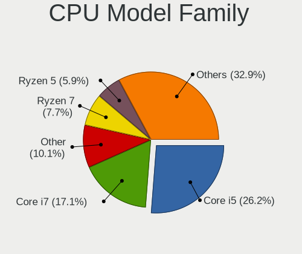

| Model                   | Notebooks | Percent |
|-------------------------|-----------|---------|
| Intel Core i5           | 86        | 23.89%  |
| Intel Core i7           | 65        | 18.06%  |
| Other                   | 55        | 15.28%  |
| Intel Core i3           | 25        | 6.94%   |
| AMD Ryzen 7             | 23        | 6.39%   |
| Intel Celeron           | 17        | 4.72%   |
| AMD Ryzen 5             | 17        | 4.72%   |
| Intel Core 2 Duo        | 10        | 2.78%   |
| Intel Pentium           | 8         | 2.22%   |
| AMD Ryzen 7 PRO         | 7         | 1.94%   |
| Intel Pentium Dual-Core | 4         | 1.11%   |
| Intel Pentium Dual      | 4         | 1.11%   |
| Intel Atom              | 4         | 1.11%   |
| AMD Ryzen 9             | 4         | 1.11%   |
| AMD Ryzen 5 PRO         | 4         | 1.11%   |
| AMD A6                  | 4         | 1.11%   |
| AMD Ryzen 3             | 3         | 0.83%   |
| Intel Pentium M         | 2         | 0.56%   |
| Intel Core i9           | 2         | 0.56%   |
| AMD E2                  | 2         | 0.56%   |
| AMD Athlon X2           | 2         | 0.56%   |
| AMD A8                  | 2         | 0.56%   |
| Intel Pentium Silver    | 1         | 0.28%   |
| Intel Genuine           | 1         | 0.28%   |
| Intel Core 2            | 1         | 0.28%   |
| AMD Turion 64 X2 Mobile | 1         | 0.28%   |
| AMD Turion              | 1         | 0.28%   |
| AMD E                   | 1         | 0.28%   |
| AMD Athlon II           | 1         | 0.28%   |
| AMD Athlon              | 1         | 0.28%   |
| AMD A4                  | 1         | 0.28%   |
| AMD A10                 | 1         | 0.28%   |

CPU Cores
---------

Number of processor cores

| Number  | Notebooks | Percent |
|---------|-----------|---------|
| 2       | 167       | 46.39%  |
| 4       | 109       | 30.28%  |
| 8       | 40        | 11.11%  |
| 6       | 23        | 6.39%   |
| 14      | 11        | 3.06%   |
| 12      | 4         | 1.11%   |
| 1       | 3         | 0.83%   |
| 16      | 1         | 0.28%   |
| 10      | 1         | 0.28%   |
| Unknown | 1         | 0.28%   |

CPU Sockets
-----------

Number of sockets

| Number  | Notebooks | Percent |
|---------|-----------|---------|
| 1       | 359       | 99.72%  |
| Unknown | 1         | 0.28%   |

CPU Threads
-----------

Threads per core (Hyper-Threading)

| Number  | Notebooks | Percent |
|---------|-----------|---------|
| 2       | 280       | 77.78%  |
| 1       | 79        | 21.94%  |
| Unknown | 1         | 0.28%   |

CPU Op-Modes
------------

CPU Operation Modes (32-bit, 64-bit)

| Op mode        | Notebooks | Percent |
|----------------|-----------|---------|
| 32-bit, 64-bit | 355       | 98.61%  |
| 32-bit         | 4         | 1.11%   |
| 64-bit         | 1         | 0.28%   |

CPU Microcode
-------------

Microcode number

| Number     | Notebooks | Percent |
|------------|-----------|---------|
| Unknown    | 105       | 29.17%  |
| 0x306a9    | 18        | 5%      |
| 0x40651    | 17        | 4.72%   |
| 0x206a7    | 17        | 4.72%   |
| 0x406e3    | 15        | 4.17%   |
| 0x906a3    | 14        | 3.89%   |
| 0x806c1    | 12        | 3.33%   |
| 0x806ec    | 11        | 3.06%   |
| 0x08108109 | 10        | 2.78%   |
| 0x806ea    | 9         | 2.5%    |
| 0x0a50000c | 7         | 1.94%   |
| 0x08608103 | 7         | 1.94%   |
| 0x30678    | 6         | 1.67%   |
| 0x906ea    | 5         | 1.39%   |
| 0x906e9    | 5         | 1.39%   |
| 0x306d4    | 5         | 1.39%   |
| 0x1067a    | 5         | 1.39%   |
| 0x08600106 | 5         | 1.39%   |
| 0x806e9    | 4         | 1.11%   |
| 0x806d1    | 4         | 1.11%   |
| 0x6fd      | 4         | 1.11%   |
| 0x306c3    | 4         | 1.11%   |
| 0x20655    | 4         | 1.11%   |
| 0x10676    | 4         | 1.11%   |
| 0x0a404102 | 4         | 1.11%   |
| 0x706a8    | 3         | 0.83%   |
| 0x706a1    | 3         | 0.83%   |
| 0x20652    | 3         | 0.83%   |
| 0x08600103 | 3         | 0.83%   |
| 0xa0652    | 2         | 0.56%   |
| 0x806eb    | 2         | 0.56%   |
| 0x6d8      | 2         | 0.56%   |
| 0x506e3    | 2         | 0.56%   |
| 0x506c9    | 2         | 0.56%   |
| 0x406c4    | 2         | 0.56%   |
| 0x0a50000d | 2         | 0.56%   |
| 0x0a404101 | 2         | 0.56%   |
| 0x08108102 | 2         | 0.56%   |
| 0x0700010f | 2         | 0.56%   |
| 0x06006705 | 2         | 0.56%   |

CPU Microarch
-------------

Microarchitecture

| Name             | Notebooks | Percent |
|------------------|-----------|---------|
| KabyLake         | 56        | 15.56%  |
| Unknown          | 35        | 9.72%   |
| Haswell          | 30        | 8.33%   |
| SandyBridge      | 25        | 6.94%   |
| IvyBridge        | 24        | 6.67%   |
| Skylake          | 21        | 5.83%   |
| Zen 3            | 16        | 4.44%   |
| TigerLake        | 16        | 4.44%   |
| Alderlake Hybrid | 15        | 4.17%   |
| Westmere         | 14        | 3.89%   |
| Zen+             | 13        | 3.61%   |
| Silvermont       | 13        | 3.61%   |
| Zen 2            | 12        | 3.33%   |
| Penryn           | 12        | 3.33%   |
| Broadwell        | 8         | 2.22%   |
| Core             | 7         | 1.94%   |
| Goldmont plus    | 6         | 1.67%   |
| Excavator        | 5         | 1.39%   |
| CometLake        | 5         | 1.39%   |
| Icelake          | 4         | 1.11%   |
| P6               | 3         | 0.83%   |
| K8 & K10 hybrid  | 3         | 0.83%   |
| Jaguar           | 3         | 0.83%   |
| Goldmont         | 3         | 0.83%   |
| Zen              | 2         | 0.56%   |
| Puma             | 2         | 0.56%   |
| Tremont          | 1         | 0.28%   |
| Steamroller      | 1         | 0.28%   |
| K8 Hammer        | 1         | 0.28%   |
| K10 Llano        | 1         | 0.28%   |
| K10              | 1         | 0.28%   |
| Bonnell          | 1         | 0.28%   |
| Bobcat           | 1         | 0.28%   |

Graphics
--------

GPU Vendor
----------

Vendors of graphics cards

| Vendor | Notebooks | Percent |
|--------|-----------|---------|
| Intel  | 252       | 55.26%  |
| AMD    | 112       | 24.56%  |
| Nvidia | 92        | 20.18%  |

GPU Model
---------

Graphics card models

| Model                                                                                    | Notebooks | Percent |
|------------------------------------------------------------------------------------------|-----------|---------|
| Intel 3rd Gen Core processor Graphics Controller                                         | 23        | 4.89%   |
| Intel Haswell-ULT Integrated Graphics Controller                                         | 22        | 4.68%   |
| Intel 2nd Generation Core Processor Family Integrated Graphics Controller                | 19        | 4.04%   |
| Intel Skylake GT2 [HD Graphics 520]                                                      | 18        | 3.83%   |
| Intel Alder Lake-P Integrated Graphics Controller                                        | 15        | 3.19%   |
| Intel TigerLake-LP GT2 [Iris Xe Graphics]                                                | 14        | 2.98%   |
| AMD Cezanne [Radeon Vega Series / Radeon Vega Mobile Series]                             | 14        | 2.98%   |
| Intel CometLake-U GT2 [UHD Graphics]                                                     | 13        | 2.77%   |
| AMD Picasso/Raven 2 [Radeon Vega Series / Radeon Vega Mobile Series]                     | 13        | 2.77%   |
| Intel UHD Graphics 620                                                                   | 12        | 2.55%   |
| Intel CoffeeLake-H GT2 [UHD Graphics 630]                                                | 12        | 2.55%   |
| AMD Renoir                                                                               | 12        | 2.55%   |
| Intel Core Processor Integrated Graphics Controller                                      | 11        | 2.34%   |
| AMD VanGogh [AMD Custom GPU 0405]                                                        | 11        | 2.34%   |
| AMD Lucienne                                                                             | 10        | 2.13%   |
| Intel Atom Processor Z36xxx/Z37xxx Series Graphics & Display                             | 8         | 1.7%    |
| Intel 4th Gen Core Processor Integrated Graphics Controller                              | 8         | 1.7%    |
| Intel TigerLake-H GT1 [UHD Graphics]                                                     | 7         | 1.49%   |
| Intel HD Graphics 620                                                                    | 7         | 1.49%   |
| Intel HD Graphics 5500                                                                   | 7         | 1.49%   |
| Intel Mobile 4 Series Chipset Integrated Graphics Controller                             | 6         | 1.28%   |
| Intel HD Graphics 630                                                                    | 6         | 1.28%   |
| AMD Rembrandt [Radeon 680M]                                                              | 6         | 1.28%   |
| Nvidia TU117M [GeForce GTX 1650 Mobile / Max-Q]                                          | 5         | 1.06%   |
| Nvidia GA106M [GeForce RTX 3060 Mobile / Max-Q]                                          | 5         | 1.06%   |
| Intel WhiskeyLake-U GT2 [UHD Graphics 620]                                               | 5         | 1.06%   |
| Intel GeminiLake [UHD Graphics 600]                                                      | 5         | 1.06%   |
| Intel Atom/Celeron/Pentium Processor x5-E8000/J3xxx/N3xxx Integrated Graphics Controller | 5         | 1.06%   |
| AMD Stoney [Radeon R2/R3/R4/R5 Graphics]                                                 | 5         | 1.06%   |
| Nvidia GP108M [GeForce MX150]                                                            | 4         | 0.85%   |
| Nvidia GA107M [GeForce RTX 3050 Mobile]                                                  | 4         | 0.85%   |
| Intel Mobile GM965/GL960 Integrated Graphics Controller (secondary)                      | 4         | 0.85%   |
| Intel Mobile GM965/GL960 Integrated Graphics Controller (primary)                        | 4         | 0.85%   |
| Intel CometLake-H GT2 [UHD Graphics]                                                     | 4         | 0.85%   |
| AMD Seymour [Radeon HD 6400M/7400M Series]                                               | 4         | 0.85%   |
| Nvidia TU106M [GeForce RTX 2060 Mobile]                                                  | 3         | 0.64%   |
| Nvidia GF117M [GeForce 610M/710M/810M/820M / GT 620M/625M/630M/720M]                     | 3         | 0.64%   |
| Nvidia GA107M [GeForce RTX 3050 Ti Mobile]                                               | 3         | 0.64%   |
| Nvidia GA107GLM [RTX A1000 Laptop GPU]                                                   | 3         | 0.64%   |
| AMD RV620/M82 [Mobility Radeon HD 3450/3470]                                             | 3         | 0.64%   |

GPU Combo
---------

Combinations of graphics cards

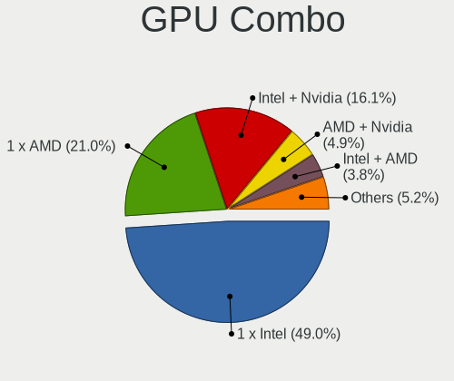

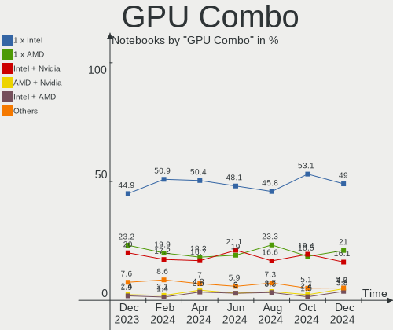

| Name               | Notebooks | Percent |
|--------------------|-----------|---------|
| 1 x Intel          | 159       | 44.17%  |
| 1 x AMD            | 84        | 23.33%  |
| Intel + Nvidia     | 74        | 20.56%  |
| Intel + AMD        | 14        | 3.89%   |
| 1 x Nvidia         | 9         | 2.5%    |
| AMD + Nvidia       | 8         | 2.22%   |
| 2 x AMD            | 6         | 1.67%   |
| 2 x Intel          | 4         | 1.11%   |
| Other              | 1         | 0.28%   |
| Intel + 2 x Nvidia | 1         | 0.28%   |

GPU Driver
----------

Free vs proprietary

| Driver      | Notebooks | Percent |
|-------------|-----------|---------|
| Free        | 308       | 85.56%  |
| Proprietary | 46        | 12.78%  |
| Unknown     | 6         | 1.67%   |

GPU Memory
----------

Total video memory

| Size in GB | Notebooks | Percent |
|------------|-----------|---------|
| Unknown    | 253       | 70.28%  |
| 0.01-0.5   | 36        | 10%     |
| 1.01-2.0   | 31        | 8.61%   |
| 0.51-1.0   | 17        | 4.72%   |
| 3.01-4.0   | 14        | 3.89%   |
| 5.01-6.0   | 6         | 1.67%   |
| 7.01-8.0   | 3         | 0.83%   |

Monitor
-------

Monitor Vendor
--------------

Monitor vendors

| Vendor                  | Notebooks | Percent |
|-------------------------|-----------|---------|
| AU Optronics            | 78        | 18.57%  |
| BOE                     | 62        | 14.76%  |
| Chimei Innolux          | 58        | 13.81%  |
| LG Display              | 52        | 12.38%  |
| Samsung Electronics     | 35        | 8.33%   |
| Goldstar                | 12        | 2.86%   |
| Lenovo                  | 11        | 2.62%   |
| Valve                   | 10        | 2.38%   |
| Dell                    | 10        | 2.38%   |
| Chi Mei Optoelectronics | 10        | 2.38%   |
| Sharp                   | 9         | 2.14%   |
| Apple                   | 8         | 1.9%    |
| PANDA                   | 5         | 1.19%   |
| Hewlett-Packard         | 5         | 1.19%   |
| CSO                     | 5         | 1.19%   |
| Acer                    | 5         | 1.19%   |
| CPT                     | 4         | 0.95%   |
| ViewSonic               | 3         | 0.71%   |
| InfoVision              | 3         | 0.71%   |
| BenQ                    | 3         | 0.71%   |
| AOC                     | 3         | 0.71%   |
| Ancor Communications    | 3         | 0.71%   |
| Philips                 | 2         | 0.48%   |
| LG Philips              | 2         | 0.48%   |
| HUAWEI                  | 2         | 0.48%   |
| Fujitsu Siemens         | 2         | 0.48%   |
| ASUSTek Computer        | 2         | 0.48%   |
| Yamaha                  | 1         | 0.24%   |
| Vestel Elektronik       | 1         | 0.24%   |
| Toshiba                 | 1         | 0.24%   |
| STA                     | 1         | 0.24%   |
| Quanta Display          | 1         | 0.24%   |
| NEC Computers           | 1         | 0.24%   |
| Medion                  | 1         | 0.24%   |
| JDI                     | 1         | 0.24%   |
| InnoLux Display         | 1         | 0.24%   |
| Iiyama                  | 1         | 0.24%   |
| IBM                     | 1         | 0.24%   |
| HannStar                | 1         | 0.24%   |
| DZX                     | 1         | 0.24%   |

Monitor Model
-------------

Monitor models

| Model                                                                     | Notebooks | Percent |
|---------------------------------------------------------------------------|-----------|---------|
| Valve ANX7530 U VLV3001 800x1280 100x150mm 7.1-inch                       | 10        | 2.35%   |
| LG Display LCD Monitor LGD02DC 1366x768 344x194mm 15.5-inch               | 4         | 0.94%   |
| Lenovo LCD Monitor LEN40BA 1920x1080 344x194mm 15.5-inch                  | 4         | 0.94%   |
| AU Optronics LCD Monitor AUO243D 1920x1080 309x173mm 13.9-inch            | 4         | 0.94%   |
| AU Optronics LCD Monitor AUO219E 1600x900 382x214mm 17.2-inch             | 4         | 0.94%   |
| Samsung Electronics LCD Monitor SEC5441 1366x768 344x194mm 15.5-inch      | 3         | 0.7%    |
| Chimei Innolux LCD Monitor CMNAE0D 1600x900 388x219mm 17.5-inch           | 3         | 0.7%    |
| Chimei Innolux LCD Monitor CMN15E7 1920x1080 344x193mm 15.5-inch          | 3         | 0.7%    |
| AU Optronics LCD Monitor AUO21ED 1920x1080 344x194mm 15.5-inch            | 3         | 0.7%    |
| Samsung Electronics LCD Monitor SEC3047 1366x768 277x156mm 12.5-inch      | 2         | 0.47%   |
| Samsung Electronics LCD Monitor SDC4171 2880x1800 302x189mm 14.0-inch     | 2         | 0.47%   |
| Samsung Electronics C24F390 SAM0D2C 1920x1080 521x293mm 23.5-inch         | 2         | 0.47%   |
| PANDA LCD Monitor NCP0035 1920x1080 309x174mm 14.0-inch                   | 2         | 0.47%   |
| LG Display LCD Monitor LGD058B 2560x1440 309x174mm 14.0-inch              | 2         | 0.47%   |
| LG Display LCD Monitor LGD02F7 1600x900 382x215mm 17.3-inch               | 2         | 0.47%   |
| LG Display LCD Monitor LGD02E3 1366x768 344x194mm 15.5-inch               | 2         | 0.47%   |
| LG Display LCD Monitor LGD027A 1600x900 382x215mm 17.3-inch               | 2         | 0.47%   |
| Lenovo LCD Monitor LEN40B1 1600x900 344x193mm 15.5-inch                   | 2         | 0.47%   |
| HUAWEI ZQE-CBA HWV6A25 3440x1440 797x334mm 34.0-inch                      | 2         | 0.47%   |
| Hewlett-Packard X27i HPN3679 2560x1440 597x336mm 27.0-inch                | 2         | 0.47%   |
| Goldstar ULTRAWIDE GSM76F6 3440x1440 800x335mm 34.1-inch                  | 2         | 0.47%   |
| Goldstar Ultra HD GSM5B09 3840x2160 600x340mm 27.2-inch                   | 2         | 0.47%   |
| Goldstar HDR 4K GSM7707 3840x2160 600x340mm 27.2-inch                     | 2         | 0.47%   |
| CPT LCD Monitor CPT1401 1280x800 331x207mm 15.4-inch                      | 2         | 0.47%   |
| Chimei Innolux LCD Monitor CMN1735 1920x1080 382x215mm 17.3-inch          | 2         | 0.47%   |
| Chimei Innolux LCD Monitor CMN1734 1600x900 382x214mm 17.2-inch           | 2         | 0.47%   |
| Chimei Innolux LCD Monitor CMN1728 1600x900 382x215mm 17.3-inch           | 2         | 0.47%   |
| Chimei Innolux LCD Monitor CMN15DB 1366x768 344x193mm 15.5-inch           | 2         | 0.47%   |
| Chimei Innolux LCD Monitor CMN1521 1920x1080 344x193mm 15.5-inch          | 2         | 0.47%   |
| Chimei Innolux LCD Monitor CMN151B 1920x1080 344x193mm 15.5-inch          | 2         | 0.47%   |
| Chimei Innolux LCD Monitor CMN14F2 1920x1080 309x173mm 13.9-inch          | 2         | 0.47%   |
| Chimei Innolux LCD Monitor CMN14D5 1920x1080 309x173mm 13.9-inch          | 2         | 0.47%   |
| Chi Mei Optoelectronics LCD Monitor CMO1720 1920x1080 382x215mm 17.3-inch | 2         | 0.47%   |
| BOE LCD Monitor BOE08E2 1920x1080 344x194mm 15.5-inch                     | 2         | 0.47%   |
| BOE LCD Monitor BOE0812 1920x1080 344x194mm 15.5-inch                     | 2         | 0.47%   |
| BOE LCD Monitor BOE07DB 1920x1080 309x174mm 14.0-inch                     | 2         | 0.47%   |
| BOE LCD Monitor BOE07C9 1920x1080 309x173mm 13.9-inch                     | 2         | 0.47%   |
| BOE LCD Monitor BOE0747 1920x1080 344x194mm 15.5-inch                     | 2         | 0.47%   |
| BOE LCD Monitor BOE0731 1366x768 256x144mm 11.6-inch                      | 2         | 0.47%   |
| BOE LCD Monitor BOE0700 1920x1080 344x194mm 15.5-inch                     | 2         | 0.47%   |

Monitor Resolution
------------------

Monitor screen resolution

| Resolution         | Notebooks | Percent |
|--------------------|-----------|---------|
| 1920x1080 (FHD)    | 174       | 43.28%  |
| 1366x768 (WXGA)    | 74        | 18.41%  |
| 1600x900 (HD+)     | 36        | 8.96%   |
| 2560x1440 (QHD)    | 24        | 5.97%   |
| 3840x2160 (4K)     | 17        | 4.23%   |
| 1280x800 (WXGA)    | 14        | 3.48%   |
| 800x1280           | 11        | 2.74%   |
| 2560x1600          | 10        | 2.49%   |
| 3440x1440          | 6         | 1.49%   |
| 1920x1200 (WUXGA)  | 6         | 1.49%   |
| 1680x1050 (WSXGA+) | 4         | 1%      |
| 3840x2400          | 3         | 0.75%   |
| 2880x1800          | 3         | 0.75%   |
| 2560x1080          | 3         | 0.75%   |
| 1440x900 (WXGA+)   | 3         | 0.75%   |
| 3072x1920          | 2         | 0.5%    |
| 2160x1440          | 2         | 0.5%    |
| 3840x1600          | 1         | 0.25%   |
| 3840x1080          | 1         | 0.25%   |
| 3200x1800 (QHD+)   | 1         | 0.25%   |
| 3000x2000          | 1         | 0.25%   |
| 2256x1504          | 1         | 0.25%   |
| 2240x1400          | 1         | 0.25%   |
| 1920x540           | 1         | 0.25%   |
| 1680x945           | 1         | 0.25%   |
| 1024x768 (XGA)     | 1         | 0.25%   |
| 1024x600           | 1         | 0.25%   |

Monitor Diagonal
----------------

Diagonal size in inches

| Inches  | Notebooks | Percent |
|---------|-----------|---------|
| 15      | 155       | 36.82%  |
| 17      | 54        | 12.83%  |
| 13      | 47        | 11.16%  |
| 14      | 45        | 10.69%  |
| 27      | 21        | 4.99%   |
| 23      | 17        | 4.04%   |
| 12      | 14        | 3.33%   |
| 24      | 11        | 2.61%   |
| 16      | 11        | 2.61%   |
| 7       | 10        | 2.38%   |
| 34      | 6         | 1.43%   |
| 31      | 6         | 1.43%   |
| 40      | 3         | 0.71%   |
| 18      | 3         | 0.71%   |
| 11      | 3         | 0.71%   |
| Unknown | 3         | 0.71%   |
| 84      | 2         | 0.48%   |
| 22      | 2         | 0.48%   |
| 21      | 2         | 0.48%   |
| 49      | 1         | 0.24%   |
| 37      | 1         | 0.24%   |
| 29      | 1         | 0.24%   |
| 25      | 1         | 0.24%   |
| 20      | 1         | 0.24%   |
| 10      | 1         | 0.24%   |

Monitor Width
-------------

Physical width

| Width in mm | Notebooks | Percent |
|-------------|-----------|---------|
| 301-350     | 223       | 53.35%  |
| 351-400     | 60        | 14.35%  |
| 501-600     | 46        | 11%     |
| 201-300     | 46        | 11%     |
| 1-100       | 10        | 2.39%   |
| 601-700     | 9         | 2.15%   |
| 401-500     | 8         | 1.91%   |
| 701-800     | 6         | 1.44%   |
| 801-900     | 4         | 0.96%   |
| Unknown     | 3         | 0.72%   |
| 1501-2000   | 2         | 0.48%   |
| 1001-1500   | 1         | 0.24%   |

Aspect Ratio
------------

Proportional relationship between the width and the height

| Ratio   | Notebooks | Percent |
|---------|-----------|---------|
| 16/9    | 295       | 79.73%  |
| 16/10   | 48        | 12.97%  |
| 0.67    | 10        | 2.7%    |
| 21/9    | 8         | 2.16%   |
| 3/2     | 4         | 1.08%   |
| 32/9    | 2         | 0.54%   |
| 4/3     | 1         | 0.27%   |
| 0.62    | 1         | 0.27%   |
| Unknown | 1         | 0.27%   |

Monitor Area
------------

Area in inch²

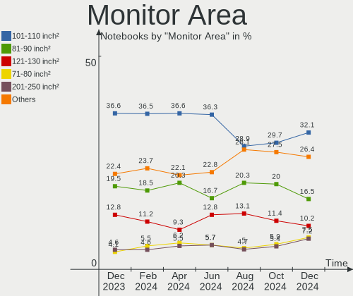

| Area in inch² | Notebooks | Percent |
|----------------|-----------|---------|
| 101-110        | 155       | 36.9%   |
| 81-90          | 72        | 17.14%  |
| 121-130        | 46        | 10.95%  |
| 201-250        | 25        | 5.95%   |
| 301-350        | 22        | 5.24%   |
| 71-80          | 20        | 4.76%   |
| 61-70          | 13        | 3.1%    |
| 351-500        | 12        | 2.86%   |
| 111-120        | 11        | 2.62%   |
| 1-40           | 10        | 2.38%   |
| 131-140        | 8         | 1.9%    |
| 251-300        | 5         | 1.19%   |
| 501-1000       | 5         | 1.19%   |
| 51-60          | 3         | 0.71%   |
| 151-200        | 3         | 0.71%   |
| 141-150        | 3         | 0.71%   |
| Unknown        | 3         | 0.71%   |
| More than 1000 | 2         | 0.48%   |
| 41-50          | 1         | 0.24%   |
| 91-100         | 1         | 0.24%   |

Pixel Density
-------------

Pixels per inch

| Density       | Notebooks | Percent |
|---------------|-----------|---------|
| 121-160       | 161       | 38.7%   |
| 101-120       | 117       | 28.13%  |
| 51-100        | 64        | 15.38%  |
| 161-240       | 55        | 13.22%  |
| More than 240 | 15        | 3.61%   |
| Unknown       | 3         | 0.72%   |
| 1-50          | 1         | 0.24%   |

Multiple Monitors
-----------------

Total monitors connected

| Total | Notebooks | Percent |
|-------|-----------|---------|
| 1     | 287       | 79.72%  |
| 2     | 60        | 16.67%  |
| 3     | 10        | 2.78%   |
| 0     | 3         | 0.83%   |

Network
-------

Net Controller Vendor
---------------------

Controller vendors

| Vendor                                 | Notebooks | Percent |
|----------------------------------------|-----------|---------|
| Intel                                  | 197       | 34.02%  |
| Realtek Semiconductor                  | 192       | 33.16%  |
| Qualcomm Atheros                       | 71        | 12.26%  |
| Broadcom                               | 32        | 5.53%   |
| MediaTek                               | 13        | 2.25%   |
| Broadcom Limited                       | 10        | 1.73%   |
| ASIX Electronics                       | 10        | 1.73%   |
| DisplayLink                            | 7         | 1.21%   |
| Sierra Wireless                        | 6         | 1.04%   |
| Lenovo                                 | 5         | 0.86%   |
| Qualcomm                               | 4         | 0.69%   |
| Dell                                   | 4         | 0.69%   |
| Marvell Technology Group               | 3         | 0.52%   |
| TP-Link                                | 2         | 0.35%   |
| Silicon Integrated Systems [SiS]       | 2         | 0.35%   |
| Ralink                                 | 2         | 0.35%   |
| Nvidia                                 | 2         | 0.35%   |
| Huawei Technologies                    | 2         | 0.35%   |
| Fibocom                                | 2         | 0.35%   |
| Ericsson Business Mobile Networks      | 2         | 0.35%   |
| ASUSTek Computer                       | 2         | 0.35%   |
| U-Blox                                 | 1         | 0.17%   |
| SparkFun                               | 1         | 0.17%   |
| Sony Ericsson Mobile Communications AB | 1         | 0.17%   |
| Samsung Electronics                    | 1         | 0.17%   |
| Ralink Technology                      | 1         | 0.17%   |
| Qualcomm Atheros Communications        | 1         | 0.17%   |
| JMicron Technology                     | 1         | 0.17%   |
| Hewlett-Packard                        | 1         | 0.17%   |
| Apple                                  | 1         | 0.17%   |

Net Controller Model
--------------------

Controller models

| Model                                                                   | Notebooks | Percent |
|-------------------------------------------------------------------------|-----------|---------|
| Realtek RTL8111/8168/8411 PCI Express Gigabit Ethernet Controller       | 106       | 15.21%  |
| Intel Wi-Fi 6 AX200                                                     | 22        | 3.16%   |
| Intel Wireless 8265 / 8275                                              | 21        | 3.01%   |
| Realtek RTL8822CE 802.11ac PCIe Wireless Network Adapter                | 19        | 2.73%   |
| Realtek RTL8153 Gigabit Ethernet Adapter                                | 19        | 2.73%   |
| Realtek RTL810xE PCI Express Fast Ethernet controller                   | 18        | 2.58%   |
| Intel 82579LM Gigabit Network Connection (Lewisville)                   | 17        | 2.44%   |
| Realtek RTL8821CE 802.11ac PCIe Wireless Network Adapter                | 14        | 2.01%   |
| Qualcomm Atheros QCA9565 / AR9565 Wireless Network Adapter              | 13        | 1.87%   |
| Intel Alder Lake-P PCH CNVi WiFi                                        | 13        | 1.87%   |
| Intel Centrino Advanced-N 6205 [Taylor Peak]                            | 12        | 1.72%   |
| Intel Wireless 8260                                                     | 11        | 1.58%   |
| Realtek RTL8723BE PCIe Wireless Network Adapter                         | 10        | 1.43%   |
| Qualcomm Atheros AR9285 Wireless Network Adapter (PCI-Express)          | 10        | 1.43%   |
| MediaTek MT7921 802.11ax PCI Express Wireless Network Adapter           | 10        | 1.43%   |
| Intel Wireless 7260                                                     | 10        | 1.43%   |
| Intel Wi-Fi 6 AX201                                                     | 10        | 1.43%   |
| ASIX AX88179 Gigabit Ethernet                                           | 10        | 1.43%   |
| Intel Ethernet Connection I218-LM                                       | 9         | 1.29%   |
| Intel Comet Lake PCH-LP CNVi WiFi                                       | 9         | 1.29%   |
| Intel Cannon Lake PCH CNVi WiFi                                         | 9         | 1.29%   |
| Intel Ethernet Connection I219-LM                                       | 8         | 1.15%   |
| Qualcomm Atheros QCA9377 802.11ac Wireless Network Adapter              | 7         | 1%      |
| Intel Wi-Fi 6 AX210/AX211/AX411 160MHz                                  | 7         | 1%      |
| Qualcomm Atheros QCA6174 802.11ac Wireless Network Adapter              | 6         | 0.86%   |
| Qualcomm Atheros AR242x / AR542x Wireless Network Adapter (PCI-Express) | 6         | 0.86%   |
| Intel Wireless 7265                                                     | 6         | 0.86%   |
| Broadcom BCM43142 802.11b/g/n                                           | 6         | 0.86%   |
| Realtek RTL-8100/8101L/8139 PCI Fast Ethernet Adapter                   | 5         | 0.72%   |
| Qualcomm Atheros AR9462 Wireless Network Adapter                        | 5         | 0.72%   |
| Intel Dual Band Wireless-AC 3168NGW [Stone Peak]                        | 5         | 0.72%   |
| Intel Centrino Ultimate-N 6300                                          | 5         | 0.72%   |
| Broadcom BCM4313 802.11bgn Wireless Network Adapter                     | 5         | 0.72%   |
| Realtek RTL8852AE 802.11ax PCIe Wireless Network Adapter                | 4         | 0.57%   |
| Realtek RTL8723DE Wireless Network Adapter                              | 4         | 0.57%   |
| Realtek RTL8188CE 802.11b/g/n WiFi Adapter                              | 4         | 0.57%   |
| Realtek RTL8125 2.5GbE Controller                                       | 4         | 0.57%   |
| Qualcomm Atheros AR9485 Wireless Network Adapter                        | 4         | 0.57%   |
| Qualcomm Atheros AR928X Wireless Network Adapter (PCI-Express)          | 4         | 0.57%   |
| Intel Ethernet Connection I217-LM                                       | 4         | 0.57%   |

Wireless Vendor
---------------

Wireless vendors

| Vendor                          | Notebooks | Percent |
|---------------------------------|-----------|---------|
| Intel                           | 184       | 49.6%   |
| Realtek Semiconductor           | 69        | 18.6%   |
| Qualcomm Atheros                | 59        | 15.9%   |
| Broadcom                        | 20        | 5.39%   |
| MediaTek                        | 13        | 3.5%    |
| Sierra Wireless                 | 6         | 1.62%   |
| Broadcom Limited                | 5         | 1.35%   |
| Qualcomm                        | 3         | 0.81%   |
| Dell                            | 3         | 0.81%   |
| Ralink                          | 2         | 0.54%   |
| Fibocom                         | 2         | 0.54%   |
| ASUSTek Computer                | 2         | 0.54%   |
| TP-Link                         | 1         | 0.27%   |
| Ralink Technology               | 1         | 0.27%   |
| Qualcomm Atheros Communications | 1         | 0.27%   |

Wireless Model
--------------

Wireless models

| Model                                                                   | Notebooks | Percent |
|-------------------------------------------------------------------------|-----------|---------|
| Intel Wi-Fi 6 AX200                                                     | 22        | 5.93%   |
| Intel Wireless 8265 / 8275                                              | 21        | 5.66%   |
| Realtek RTL8822CE 802.11ac PCIe Wireless Network Adapter                | 19        | 5.12%   |
| Realtek RTL8821CE 802.11ac PCIe Wireless Network Adapter                | 14        | 3.77%   |
| Qualcomm Atheros QCA9565 / AR9565 Wireless Network Adapter              | 13        | 3.5%    |
| Intel Alder Lake-P PCH CNVi WiFi                                        | 13        | 3.5%    |
| Intel Centrino Advanced-N 6205 [Taylor Peak]                            | 12        | 3.23%   |
| Intel Wireless 8260                                                     | 11        | 2.96%   |
| Realtek RTL8723BE PCIe Wireless Network Adapter                         | 10        | 2.7%    |
| Qualcomm Atheros AR9285 Wireless Network Adapter (PCI-Express)          | 10        | 2.7%    |
| MediaTek MT7921 802.11ax PCI Express Wireless Network Adapter           | 10        | 2.7%    |
| Intel Wireless 7260                                                     | 10        | 2.7%    |
| Intel Wi-Fi 6 AX201                                                     | 10        | 2.7%    |
| Intel Comet Lake PCH-LP CNVi WiFi                                       | 9         | 2.43%   |
| Intel Cannon Lake PCH CNVi WiFi                                         | 9         | 2.43%   |
| Qualcomm Atheros QCA9377 802.11ac Wireless Network Adapter              | 7         | 1.89%   |
| Intel Wi-Fi 6 AX210/AX211/AX411 160MHz                                  | 7         | 1.89%   |
| Qualcomm Atheros QCA6174 802.11ac Wireless Network Adapter              | 6         | 1.62%   |
| Qualcomm Atheros AR242x / AR542x Wireless Network Adapter (PCI-Express) | 6         | 1.62%   |
| Intel Wireless 7265                                                     | 6         | 1.62%   |
| Broadcom BCM43142 802.11b/g/n                                           | 6         | 1.62%   |
| Qualcomm Atheros AR9462 Wireless Network Adapter                        | 5         | 1.35%   |
| Intel Dual Band Wireless-AC 3168NGW [Stone Peak]                        | 5         | 1.35%   |
| Intel Centrino Ultimate-N 6300                                          | 5         | 1.35%   |
| Broadcom BCM4313 802.11bgn Wireless Network Adapter                     | 5         | 1.35%   |
| Realtek RTL8852AE 802.11ax PCIe Wireless Network Adapter                | 4         | 1.08%   |
| Realtek RTL8723DE Wireless Network Adapter                              | 4         | 1.08%   |
| Realtek RTL8188CE 802.11b/g/n WiFi Adapter                              | 4         | 1.08%   |
| Qualcomm Atheros AR9485 Wireless Network Adapter                        | 4         | 1.08%   |
| Qualcomm Atheros AR928X Wireless Network Adapter (PCI-Express)          | 4         | 1.08%   |
| Intel Comet Lake PCH CNVi WiFi                                          | 4         | 1.08%   |
| Intel Cannon Point-LP CNVi [Wireless-AC]                                | 4         | 1.08%   |
| Qualcomm QCNFA765 Wireless Network Adapter                              | 3         | 0.81%   |
| Intel Wireless-AC 9260                                                  | 3         | 0.81%   |
| Intel Wireless 3165                                                     | 3         | 0.81%   |
| Intel PRO/Wireless 3945ABG [Golan] Network Connection                   | 3         | 0.81%   |
| Intel Centrino Wireless-N 135                                           | 3         | 0.81%   |
| Intel Centrino Wireless-N 1030 [Rainbow Peak]                           | 3         | 0.81%   |
| Intel Centrino Advanced-N 6235                                          | 3         | 0.81%   |
| Broadcom Limited BCM4352 802.11ac Wireless Network Adapter              | 3         | 0.81%   |

Ethernet Vendor
---------------

Ethernet vendors

| Vendor                                 | Notebooks | Percent |
|----------------------------------------|-----------|---------|
| Realtek Semiconductor                  | 160       | 50.96%  |
| Intel                                  | 81        | 25.8%   |
| Qualcomm Atheros                       | 18        | 5.73%   |
| Broadcom                               | 15        | 4.78%   |
| ASIX Electronics                       | 10        | 3.18%   |
| DisplayLink                            | 7         | 2.23%   |
| Lenovo                                 | 5         | 1.59%   |
| Broadcom Limited                       | 5         | 1.59%   |
| Marvell Technology Group               | 3         | 0.96%   |
| Silicon Integrated Systems [SiS]       | 2         | 0.64%   |
| Nvidia                                 | 2         | 0.64%   |
| TP-Link                                | 1         | 0.32%   |
| Sony Ericsson Mobile Communications AB | 1         | 0.32%   |
| Samsung Electronics                    | 1         | 0.32%   |
| Qualcomm                               | 1         | 0.32%   |
| JMicron Technology                     | 1         | 0.32%   |
| Apple                                  | 1         | 0.32%   |

Ethernet Model
--------------

Ethernet models

| Model                                                             | Notebooks | Percent |
|-------------------------------------------------------------------|-----------|---------|
| Realtek RTL8111/8168/8411 PCI Express Gigabit Ethernet Controller | 106       | 33.54%  |
| Realtek RTL8153 Gigabit Ethernet Adapter                          | 19        | 6.01%   |
| Realtek RTL810xE PCI Express Fast Ethernet controller             | 18        | 5.7%    |
| Intel 82579LM Gigabit Network Connection (Lewisville)             | 17        | 5.38%   |
| ASIX AX88179 Gigabit Ethernet                                     | 10        | 3.16%   |
| Intel Ethernet Connection I218-LM                                 | 9         | 2.85%   |
| Intel Ethernet Connection I219-LM                                 | 8         | 2.53%   |
| Realtek RTL-8100/8101L/8139 PCI Fast Ethernet Adapter             | 5         | 1.58%   |
| Realtek RTL8125 2.5GbE Controller                                 | 4         | 1.27%   |
| Intel Ethernet Connection I217-LM                                 | 4         | 1.27%   |
| Intel Ethernet Connection (4) I219-V                              | 4         | 1.27%   |
| Intel Ethernet Connection (16) I219-V                             | 4         | 1.27%   |
| Intel Ethernet Connection (10) I219-V                             | 4         | 1.27%   |
| Intel Ethernet Connection (10) I219-LM                            | 4         | 1.27%   |
| Broadcom NetLink BCM57785 Gigabit Ethernet PCIe                   | 4         | 1.27%   |
| Broadcom NetLink BCM57780 Gigabit Ethernet PCIe                   | 4         | 1.27%   |
| Qualcomm Atheros QCA8172 Fast Ethernet                            | 3         | 0.95%   |
| Qualcomm Atheros AR8151 v2.0 Gigabit Ethernet                     | 3         | 0.95%   |
| Qualcomm Atheros AR8131 Gigabit Ethernet                          | 3         | 0.95%   |
| Lenovo ThinkPad Dock Ethernet [Realtek RTL8153B]                  | 3         | 0.95%   |
| DisplayLink LAPDOCK                                               | 3         | 0.95%   |
| Broadcom NetXtreme BCM57786 Gigabit Ethernet PCIe                 | 3         | 0.95%   |
| Silicon Integrated Systems [SiS] 191 Gigabit Ethernet Adapter     | 2         | 0.63%   |
| Realtek RTL8152 Fast Ethernet Adapter                             | 2         | 0.63%   |
| Realtek Realtek Ethernet controller                               | 2         | 0.63%   |
| Realtek Killer E2600 Gigabit Ethernet Controller                  | 2         | 0.63%   |
| Realtek Killer E2500 Gigabit Ethernet Controller                  | 2         | 0.63%   |
| Qualcomm Atheros Killer E2500 Gigabit Ethernet Controller         | 2         | 0.63%   |
| Qualcomm Atheros AR8151 v1.0 Gigabit Ethernet                     | 2         | 0.63%   |
| Qualcomm Atheros AR8121/AR8113/AR8114 Gigabit or Fast Ethernet    | 2         | 0.63%   |
| Nvidia MCP79 Ethernet                                             | 2         | 0.63%   |
| Intel Ethernet Controller I225-V                                  | 2         | 0.63%   |
| Intel Ethernet Connection I219-V                                  | 2         | 0.63%   |
| Intel Ethernet Connection (7) I219-LM                             | 2         | 0.63%   |
| Intel Ethernet Connection (5) I219-LM                             | 2         | 0.63%   |
| Intel Ethernet Connection (4) I219-LM                             | 2         | 0.63%   |
| Intel Ethernet Connection (3) I218-LM                             | 2         | 0.63%   |
| Intel Ethernet Connection (13) I219-LM                            | 2         | 0.63%   |
| Intel 82579V Gigabit Network Connection                           | 2         | 0.63%   |
| Intel 82577LM Gigabit Network Connection                          | 2         | 0.63%   |

Net Controller Kind
-------------------

Ethernet, WiFi or modem

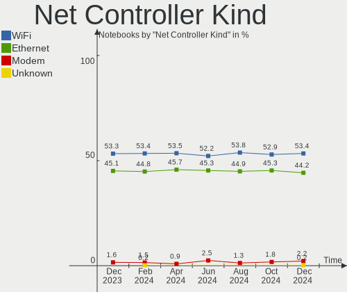

| Kind     | Notebooks | Percent |
|----------|-----------|---------|
| WiFi     | 352       | 53.66%  |
| Ethernet | 294       | 44.82%  |
| Modem    | 10        | 1.52%   |

Used Controller
---------------

Currently used network controller

| Kind     | Notebooks | Percent |
|----------|-----------|---------|
| WiFi     | 274       | 71.35%  |
| Ethernet | 110       | 28.65%  |

NICs
----

Total network controllers on board

| Total | Notebooks | Percent |
|-------|-----------|---------|
| 2     | 259       | 71.94%  |
| 1     | 93        | 25.83%  |
| 0     | 5         | 1.39%   |
| 3     | 3         | 0.83%   |

IPv6
----

IPv6 vs IPv4

| Used | Notebooks | Percent |
|------|-----------|---------|
| Yes  | 182       | 50.56%  |
| No   | 178       | 49.44%  |

Bluetooth
---------

Bluetooth Vendor
----------------

Controller vendors

| Vendor                          | Notebooks | Percent |
|---------------------------------|-----------|---------|
| Intel                           | 133       | 46.5%   |
| Realtek Semiconductor           | 38        | 13.29%  |
| IMC Networks                    | 19        | 6.64%   |
| Lite-On Technology              | 14        | 4.9%    |
| Broadcom                        | 14        | 4.9%    |
| Foxconn / Hon Hai               | 13        | 4.55%   |
| Qualcomm Atheros Communications | 11        | 3.85%   |
| Apple                           | 8         | 2.8%    |
| Hewlett-Packard                 | 7         | 2.45%   |
| Cambridge Silicon Radio         | 7         | 2.45%   |
| Realtek                         | 4         | 1.4%    |
| Dell                            | 4         | 1.4%    |
| USI                             | 3         | 1.05%   |
| ASUSTek Computer                | 3         | 1.05%   |
| Toshiba                         | 2         | 0.7%    |
| Foxconn International           | 2         | 0.7%    |
| Taiyo Yuden                     | 1         | 0.35%   |
| MediaTek                        | 1         | 0.35%   |
| Askey Computer                  | 1         | 0.35%   |
| Alps Electric                   | 1         | 0.35%   |

Bluetooth Model
---------------

Controller models

| Model                                               | Notebooks | Percent |
|-----------------------------------------------------|-----------|---------|
| Intel Bluetooth wireless interface                  | 46        | 16.08%  |
| Intel Bluetooth Device                              | 34        | 11.89%  |
| Realtek Bluetooth Radio                             | 26        | 9.09%   |
| Intel AX200 Bluetooth                               | 21        | 7.34%   |
| Intel Bluetooth 9460/9560 Jefferson Peak (JfP)      | 15        | 5.24%   |
| IMC Networks Bluetooth Radio                        | 12        | 4.2%    |
| Realtek  Bluetooth 4.2 Adapter                      | 7         | 2.45%   |
| Cambridge Silicon Radio Bluetooth Dongle (HCI mode) | 7         | 2.45%   |
| Lite-On Bluetooth Device                            | 6         | 2.1%    |
| Foxconn / Hon Hai Wireless_Device                   | 6         | 2.1%    |
| Intel Wireless-AC 3168 Bluetooth                    | 5         | 1.75%   |
| Intel Centrino Bluetooth Wireless Transceiver       | 5         | 1.75%   |
| HP Broadcom 2070 Bluetooth Combo                    | 5         | 1.75%   |
| Foxconn / Hon Hai Bluetooth Device                  | 5         | 1.75%   |
| Apple Bluetooth Host Controller                     | 5         | 1.75%   |
| Realtek Bluetooth Radio                             | 4         | 1.4%    |
| Qualcomm Atheros  Bluetooth Device                  | 4         | 1.4%    |
| Lite-On Atheros AR3012 Bluetooth                    | 4         | 1.4%    |
| Intel AX210 Bluetooth                               | 4         | 1.4%    |
| IMC Networks Wireless_Device                        | 4         | 1.4%    |
| Broadcom BCM20702 Bluetooth 4.0 [ThinkPad]          | 4         | 1.4%    |
| USI Bluetooth Device                                | 3         | 1.05%   |
| Realtek RTL8723B Bluetooth                          | 3         | 1.05%   |
| Qualcomm Atheros AR3012 Bluetooth 4.0               | 3         | 1.05%   |
| IMC Networks Bluetooth Device                       | 3         | 1.05%   |
| Qualcomm Atheros QCA61x4 Bluetooth 4.0              | 2         | 0.7%    |
| Qualcomm Atheros AR3011 Bluetooth                   | 2         | 0.7%    |
| Lite-On Wireless_Device                             | 2         | 0.7%    |
| Lite-On Qualcomm Atheros Bluetooth                  | 2         | 0.7%    |
| Intel Wireless-AC 9260 Bluetooth Adapter            | 2         | 0.7%    |
| HP Bluetooth 2.0 Interface [Broadcom BCM2045]       | 2         | 0.7%    |
| Foxconn International BCM43142A0 Bluetooth module   | 2         | 0.7%    |
| Foxconn / Hon Hai BCM20702A0                        | 2         | 0.7%    |
| Dell DW375 Bluetooth Module                         | 2         | 0.7%    |
| Broadcom BCM43142A0 Bluetooth 4.0                   | 2         | 0.7%    |
| Broadcom BCM2045B (BDC-2) [Bluetooth Controller]    | 2         | 0.7%    |
| ASUS BT-270 Bluetooth Adapter                       | 2         | 0.7%    |
| Toshiba RT Bluetooth Radio                          | 1         | 0.35%   |
| Toshiba BCM43142A0                                  | 1         | 0.35%   |
| Taiyo Yuden Bluetooth Device (V2.0+EDR)             | 1         | 0.35%   |

Sound
-----

Sound Vendor
------------

Sound card vendors

| Vendor                           | Notebooks | Percent |
|----------------------------------|-----------|---------|
| Intel                            | 263       | 57.55%  |
| AMD                              | 100       | 21.88%  |
| Nvidia                           | 52        | 11.38%  |
| Lenovo                           | 7         | 1.53%   |
| GN Netcom                        | 6         | 1.31%   |
| C-Media Electronics              | 5         | 1.09%   |
| Silicon Integrated Systems [SiS] | 4         | 0.88%   |
| Texas Instruments                | 3         | 0.66%   |
| Creative Technology              | 3         | 0.66%   |
| Hewlett-Packard                  | 2         | 0.44%   |
| Yamaha                           | 1         | 0.22%   |
| SteelSeries ApS                  | 1         | 0.22%   |
| RODE Microphones                 | 1         | 0.22%   |
| Plantronics                      | 1         | 0.22%   |
| Pioneer DJ                       | 1         | 0.22%   |
| Logitech                         | 1         | 0.22%   |
| JMTek                            | 1         | 0.22%   |
| Focusrite-Novation               | 1         | 0.22%   |
| DSEA A/S                         | 1         | 0.22%   |
| Conrad Electronic SE             | 1         | 0.22%   |
| Blue Microphones                 | 1         | 0.22%   |
| Asahi Kasei Microsystems         | 1         | 0.22%   |

Sound Model
-----------

Sound card models

| Model                                                                                             | Notebooks | Percent |
|---------------------------------------------------------------------------------------------------|-----------|---------|
| AMD Family 17h/19h HD Audio Controller                                                            | 57        | 10.11%  |
| Intel Sunrise Point-LP HD Audio                                                                   | 39        | 6.91%   |
| AMD Renoir Radeon High Definition Audio Controller                                                | 34        | 6.03%   |
| Intel 7 Series/C216 Chipset Family High Definition Audio Controller                               | 28        | 4.96%   |
| Intel Haswell-ULT HD Audio Controller                                                             | 22        | 3.9%    |
| Intel 8 Series HD Audio Controller                                                                | 22        | 3.9%    |
| Intel 6 Series/C200 Series Chipset Family High Definition Audio Controller                        | 21        | 3.72%   |
| Intel Alder Lake PCH-P High Definition Audio Controller                                           | 17        | 3.01%   |
| Intel Tiger Lake-LP Smart Sound Technology Audio Controller                                       | 16        | 2.84%   |
| AMD Rembrandt Radeon High Definition Audio Controller                                             | 16        | 2.84%   |
| AMD Raven/Raven2/Fenghuang HDMI/DP Audio Controller                                               | 15        | 2.66%   |
| Intel 5 Series/3400 Series Chipset High Definition Audio                                          | 14        | 2.48%   |
| Intel Comet Lake PCH-LP cAVS                                                                      | 13        | 2.3%    |
| Intel Cannon Lake PCH cAVS                                                                        | 12        | 2.13%   |
| Intel Xeon E3-1200 v3/4th Gen Core Processor HD Audio Controller                                  | 8         | 1.42%   |
| Intel Wildcat Point-LP High Definition Audio Controller                                           | 8         | 1.42%   |
| Intel Broadwell-U Audio Controller                                                                | 8         | 1.42%   |
| Intel 82801I (ICH9 Family) HD Audio Controller                                                    | 8         | 1.42%   |
| Intel 8 Series/C220 Series Chipset High Definition Audio Controller                               | 8         | 1.42%   |
| Intel Tiger Lake-H HD Audio Controller                                                            | 7         | 1.24%   |
| Intel CM238 HD Audio Controller                                                                   | 7         | 1.24%   |
| AMD FCH Azalia Controller                                                                         | 7         | 1.24%   |
| Nvidia GF108 High Definition Audio Controller                                                     | 6         | 1.06%   |
| Nvidia GA104 High Definition Audio Controller                                                     | 6         | 1.06%   |
| Nvidia Audio device                                                                               | 6         | 1.06%   |
| Intel Celeron/Pentium Silver Processor High Definition Audio                                      | 6         | 1.06%   |
| Intel Atom Processor Z36xxx/Z37xxx Series High Definition Audio Controller                        | 6         | 1.06%   |
| Nvidia TU107 GeForce GTX 1650 High Definition Audio Controller                                    | 5         | 0.89%   |
| Nvidia GA106 High Definition Audio Controller                                                     | 5         | 0.89%   |
| Lenovo ThinkPad Dock Audio                                                                        | 5         | 0.89%   |
| Intel Cannon Point-LP High Definition Audio Controller                                            | 5         | 0.89%   |
| AMD SBx00 Azalia (Intel HDA)                                                                      | 5         | 0.89%   |
| AMD Kabini HDMI/DP Audio                                                                          | 5         | 0.89%   |
| AMD High Definition Audio Controller                                                              | 5         | 0.89%   |
| AMD Family 15h (Models 60h-6fh) Audio Controller                                                  | 5         | 0.89%   |
| Silicon Integrated Systems [SiS] Azalia Audio Controller                                          | 4         | 0.71%   |
| Intel Comet Lake PCH cAVS                                                                         | 4         | 0.71%   |
| Intel Atom/Celeron/Pentium Processor x5-E8000/J3xxx/N3xxx Series High Definition Audio Controller | 4         | 0.71%   |
| Intel 82801H (ICH8 Family) HD Audio Controller                                                    | 4         | 0.71%   |
| Nvidia TU106 High Definition Audio Controller                                                     | 3         | 0.53%   |

Memory
------

Memory Vendor
-------------

Memory module vendors

| Vendor              | Notebooks | Percent |
|---------------------|-----------|---------|
| Samsung Electronics | 71        | 31.28%  |
| SK hynix            | 53        | 23.35%  |
| Micron Technology   | 36        | 15.86%  |
| Kingston            | 19        | 8.37%   |
| Unknown             | 16        | 7.05%   |
| Crucial             | 5         | 2.2%    |
| A-DATA Technology   | 5         | 2.2%    |
| Elpida              | 4         | 1.76%   |
| Ramaxel Technology  | 3         | 1.32%   |
| Corsair             | 3         | 1.32%   |
| Unknown (ABCD)      | 1         | 0.44%   |
| Unknown (8ECE)      | 1         | 0.44%   |
| Transcend           | 1         | 0.44%   |
| SHARETRONIC         | 1         | 0.44%   |
| Neo Forza           | 1         | 0.44%   |
| Nanya Technology    | 1         | 0.44%   |
| Kllisre             | 1         | 0.44%   |
| GOODRAM             | 1         | 0.44%   |
| G.Skill             | 1         | 0.44%   |
| CSX                 | 1         | 0.44%   |
| Avant               | 1         | 0.44%   |
| Unknown             | 1         | 0.44%   |

Memory Model
------------

Memory module models

| Model                                                            | Notebooks | Percent |
|------------------------------------------------------------------|-----------|---------|
| Samsung RAM M471B5273DH0-CH9 4GB SODIMM DDR3 1334MT/s            | 5         | 2.08%   |
| Samsung RAM M471B5173QH0-YK0 4GB SODIMM DDR3 1600MT/s            | 4         | 1.67%   |
| Samsung RAM M471B5173EB0-YK0 4GB SODIMM DDR3 1600MT/s            | 4         | 1.67%   |
| Samsung RAM M471A5244CB0-CTD 4GB SODIMM DDR4 3266MT/s            | 4         | 1.67%   |
| Samsung RAM M471A2G44AM0-CWE 16GB SODIMM DDR4 3200MT/s           | 4         | 1.67%   |
| SK hynix RAM HMT451S6BFR8A-PB 4096MB SODIMM DDR3 1600MT/s        | 3         | 1.25%   |
| SK hynix RAM HMT451S6AFR8A-PB 4GB SODIMM DDR3 1600MT/s           | 3         | 1.25%   |
| Samsung RAM M471B5273CH0-CH9 4GB SODIMM DDR3 1334MT/s            | 3         | 1.25%   |
| Samsung RAM M471A5244CB0-CWE 4GB SODIMM DDR4 3200MT/s            | 3         | 1.25%   |
| Samsung RAM M471A1K43DB1-CWE 8GB SODIMM DDR4 3200MT/s            | 3         | 1.25%   |
| Samsung RAM M471A1K43BB1-CRC 8GB SODIMM DDR4 2667MT/s            | 3         | 1.25%   |
| Samsung RAM M471A1G44AB0-CWE 8GB SODIMM DDR4 3200MT/s            | 3         | 1.25%   |
| Samsung RAM M471A1G44AB0-CWE 8GB Row Of Chips DDR4 3200MT/s      | 3         | 1.25%   |
| Unknown RAM Module 4GB SODIMM DDR2 667MT/s                       | 2         | 0.83%   |
| Unknown RAM Module 4GB Row Of Chips LPDDR4 4267MT/s              | 2         | 0.83%   |
| SK hynix RAM HMT851S6AMR6A-PB 4096MB Chip DDR3 1600MT/s          | 2         | 0.83%   |
| SK hynix RAM HMT451S6MFR8A-PB 4GB SODIMM DDR3 1600MT/s           | 2         | 0.83%   |
| SK hynix RAM HMT351S6CFR8C-PB 4GB SODIMM DDR3 1600MT/s           | 2         | 0.83%   |
| SK hynix RAM HMAA4GS6CJR8N-XN 32GB SODIMM DDR4 3200MT/s          | 2         | 0.83%   |
| SK hynix RAM HMAA2GS6CJR8N-XN 16GB SODIMM DDR4 3200MT/s          | 2         | 0.83%   |
| SK hynix RAM HMAA1GS6CJR6N-XN 8GB SODIMM DDR4 3200MT/s           | 2         | 0.83%   |
| SK hynix RAM HMA82GS6DJR8N-XN 16GB SODIMM DDR4 3200MT/s          | 2         | 0.83%   |
| SK hynix RAM HMA82GS6CJR8N-VK 16GB SODIMM DDR4 2667MT/s          | 2         | 0.83%   |
| SK hynix RAM HMA82GS6AFR8N-UH 16GB SODIMM DDR4 2667MT/s          | 2         | 0.83%   |
| SK hynix RAM HMA81GS6DJR8N-XN 8GB SODIMM DDR4 3200MT/s           | 2         | 0.83%   |
| SK hynix RAM H9JCNNNCP3MLYR-N6E 2GB Row Of Chips LPDDR5 6400MT/s | 2         | 0.83%   |
| SK hynix RAM H9HCNNNCPMMLXR-NEE 8GB SODIMM LPDDR4 4266MT/s       | 2         | 0.83%   |
| Samsung RAM M471B5173DB0-YK0 4GB SODIMM DDR3 1600MT/s            | 2         | 0.83%   |
| Samsung RAM M471A2K43EB1-CWE 16GB SODIMM DDR4 3200MT/s           | 2         | 0.83%   |
| Samsung RAM M471A2K43CB1-CTD 16384MB SODIMM DDR4 8400MT/s        | 2         | 0.83%   |
| Samsung RAM M471A2K43CB1-CRC 16GB SODIMM DDR4 2667MT/s           | 2         | 0.83%   |
| Samsung RAM M471A1G44BB0-CWE 8GB SODIMM DDR4 3200MT/s            | 2         | 0.83%   |
| Ramaxel RAM RMT3170ME68F9F1600 4096MB SODIMM DDR3 1600MT/s       | 2         | 0.83%   |
| Micron RAM MT62F1G32D4DR-031 WT 4GB Row Of Chips LPDDR5 6400MT/s | 2         | 0.83%   |
| Micron RAM 4ATS1G64HZ-2G6E1 8GB SODIMM DDR4 2667MT/s             | 2         | 0.83%   |
| Micron RAM 4ATF1G64HZ-3G2E1 8GB SODIMM DDR4 3200MT/s             | 2         | 0.83%   |
| Micron RAM 4ATF1G64HZ-3G2E1 8GB Row Of Chips DDR4 3200MT/s       | 2         | 0.83%   |
| Kingston RAM KF3200C20S4/32GX 32GB SODIMM DDR4 3200MT/s          | 2         | 0.83%   |
| Kingston RAM ACR16D3LS1KFG/4G 4GB SODIMM DDR3 1600MT/s           | 2         | 0.83%   |
| Unknown RAM Module 512MB SODIMM DDR                              | 1         | 0.42%   |

Memory Kind
-----------

Memory module kinds

| Kind    | Notebooks | Percent |
|---------|-----------|---------|
| DDR4    | 91        | 46.91%  |
| DDR3    | 57        | 29.38%  |
| LPDDR4  | 12        | 6.19%   |
| DDR2    | 11        | 5.67%   |
| LPDDR5  | 8         | 4.12%   |
| LPDDR3  | 6         | 3.09%   |
| DDR5    | 4         | 2.06%   |
| SDRAM   | 3         | 1.55%   |
| DDR     | 1         | 0.52%   |
| Unknown | 1         | 0.52%   |

Memory Form Factor
------------------

Physical design of the memory module

| Name         | Notebooks | Percent |
|--------------|-----------|---------|
| SODIMM       | 167       | 84.77%  |
| Row Of Chips | 27        | 13.71%  |
| Chip         | 3         | 1.52%   |

Memory Size
-----------

Memory module size

| Size  | Notebooks | Percent |
|-------|-----------|---------|
| 4096  | 69        | 33.66%  |
| 8192  | 63        | 30.73%  |
| 16384 | 39        | 19.02%  |
| 2048  | 22        | 10.73%  |
| 32768 | 8         | 3.9%    |
| 1024  | 3         | 1.46%   |
| 512   | 1         | 0.49%   |

Memory Speed
------------

Memory module speed

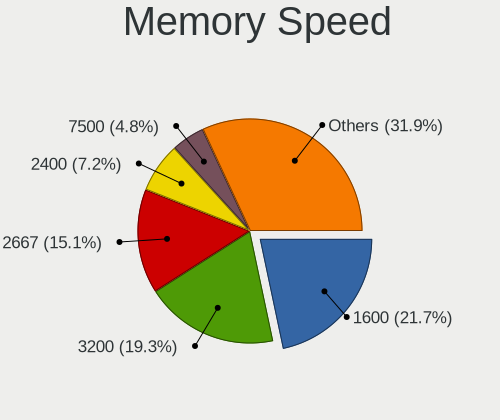

| Speed   | Notebooks | Percent |
|---------|-----------|---------|
| 3200    | 48        | 22.75%  |
| 1600    | 44        | 20.85%  |
| 2667    | 34        | 16.11%  |
| 2400    | 13        | 6.16%   |
| 1334    | 9         | 4.27%   |
| 6400    | 8         | 3.79%   |
| 2133    | 8         | 3.79%   |
| 667     | 6         | 2.84%   |
| 4267    | 5         | 2.37%   |
| 4800    | 4         | 1.9%    |
| 3266    | 4         | 1.9%    |
| 1867    | 4         | 1.9%    |
| 1067    | 4         | 1.9%    |
| Unknown | 4         | 1.9%    |
| 4266    | 3         | 1.42%   |
| 1333    | 3         | 1.42%   |
| 8400    | 2         | 0.95%   |
| 2048    | 2         | 0.95%   |
| 800     | 2         | 0.95%   |
| 975     | 1         | 0.47%   |
| 533     | 1         | 0.47%   |
| 333     | 1         | 0.47%   |
| 266     | 1         | 0.47%   |

Printers & scanners
-------------------

Printer Vendor
--------------

Printer device vendors

| Vendor              | Notebooks | Percent |
|---------------------|-----------|---------|
| Samsung Electronics | 1         | 25%     |
| Hewlett-Packard     | 1         | 25%     |
| Canon               | 1         | 25%     |
| Brother Industries  | 1         | 25%     |

Printer Model
-------------

Printer device models

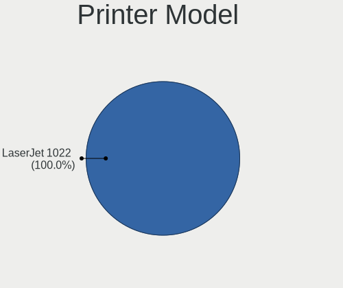

| Model                  | Notebooks | Percent |
|------------------------|-----------|---------|
| Samsung ML-2950 Series | 1         | 25%     |
| HP EWS UPD             | 1         | 25%     |
| Canon TR8500 series    | 1         | 25%     |
| Brother MFC-J245       | 1         | 25%     |

Scanner Vendor
--------------

Scanner device vendors

| Vendor | Notebooks | Percent |
|--------|-----------|---------|
| Canon  | 1         | 100%    |

Scanner Model
-------------

Scanner device models

| Model                   | Notebooks | Percent |
|-------------------------|-----------|---------|
| Canon CanoScan LiDE 110 | 1         | 100%    |

Camera
------

Camera Vendor
-------------

Camera device vendors

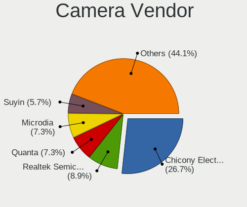

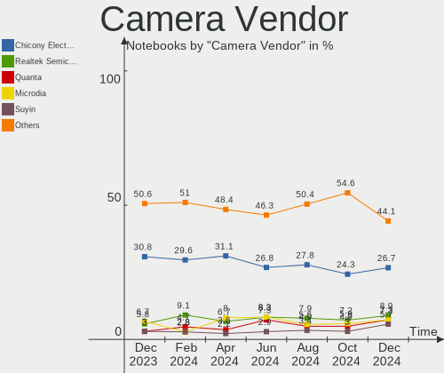

| Vendor                                 | Notebooks | Percent |
|----------------------------------------|-----------|---------|
| Chicony Electronics                    | 91        | 28.8%   |
| IMC Networks                           | 35        | 11.08%  |
| Microdia                               | 28        | 8.86%   |
| Acer                                   | 26        | 8.23%   |
| Realtek Semiconductor                  | 19        | 6.01%   |
| Quanta                                 | 17        | 5.38%   |
| Suyin                                  | 14        | 4.43%   |
| Cheng Uei Precision Industry (Foxlink) | 13        | 4.11%   |
| Syntek                                 | 11        | 3.48%   |
| Sunplus Innovation Technology          | 7         | 2.22%   |
| Apple                                  | 7         | 2.22%   |
| Luxvisions Innotech Limited            | 6         | 1.9%    |
| Lite-On Technology                     | 6         | 1.9%    |
| Primax Electronics                     | 4         | 1.27%   |
| Logitech                               | 4         | 1.27%   |
| SunplusIT                              | 3         | 0.95%   |
| Sonix Technology                       | 3         | 0.95%   |
| Silicon Motion                         | 3         | 0.95%   |
| Alcor Micro                            | 3         | 0.95%   |
| Microsoft                              | 2         | 0.63%   |
| Z-Star Microelectronics                | 1         | 0.32%   |
| Y Media                                | 1         | 0.32%   |
| Samsung Electronics                    | 1         | 0.32%   |
| Ricoh                                  | 1         | 0.32%   |
| OYT Tech                               | 1         | 0.32%   |
| LG Electronics                         | 1         | 0.32%   |
| Lenovo                                 | 1         | 0.32%   |
| Importek                               | 1         | 0.32%   |
| Generalplus Technology                 | 1         | 0.32%   |
| eMeet-200611                           | 1         | 0.32%   |
| Cubeternet                             | 1         | 0.32%   |
| ARC International                      | 1         | 0.32%   |
| Anker                                  | 1         | 0.32%   |
| ALi                                    | 1         | 0.32%   |

Camera Model
------------

Camera device models

| Model                                                       | Notebooks | Percent |
|-------------------------------------------------------------|-----------|---------|
| Chicony Integrated Camera                                   | 18        | 5.63%   |
| IMC Networks Integrated Camera                              | 16        | 5%      |
| Chicony HD WebCam                                           | 13        | 4.06%   |
| Microdia Integrated_Webcam_HD                               | 11        | 3.44%   |
| Syntek Integrated Camera                                    | 8         | 2.5%    |
| IMC Networks USB2.0 HD UVC WebCam                           | 7         | 2.19%   |
| Chicony USB2.0 Camera                                       | 7         | 2.19%   |
| Microdia Integrated Webcam                                  | 6         | 1.88%   |
| Cheng Uei Precision Industry (Foxlink) HP Webcam            | 6         | 1.88%   |
| Realtek Integrated_Webcam_HD                                | 4         | 1.25%   |
| Realtek Acer 640 x 480 laptop camera                        | 4         | 1.25%   |
| Lite-On Integrated Camera                                   | 4         | 1.25%   |
| IMC Networks ov9734_azurewave_camera                        | 4         | 1.25%   |
| Chicony HP TrueVision HD Camera                             | 4         | 1.25%   |
| Chicony HD User Facing                                      | 4         | 1.25%   |
| Chicony FJ Camera                                           | 4         | 1.25%   |
| Acer SunplusIT Integrated Camera                            | 4         | 1.25%   |
| Acer Lenovo EasyCamera                                      | 4         | 1.25%   |
| Acer Integrated Camera                                      | 4         | 1.25%   |
| Acer BisonCam,NB Pro                                        | 4         | 1.25%   |
| Acer BisonCam, NB Pro                                       | 4         | 1.25%   |
| Sunplus HD WebCam                                           | 3         | 0.94%   |
| Sonix USB2.0 HD UVC WebCam                                  | 3         | 0.94%   |
| Quanta VGA WebCam                                           | 3         | 0.94%   |
| Quanta HP HD Camera                                         | 3         | 0.94%   |
| Quanta HD User Facing                                       | 3         | 0.94%   |
| Primax HP HD Webcam [Fixed]                                 | 3         | 0.94%   |
| Chicony HP Webcam                                           | 3         | 0.94%   |
| Chicony EasyCamera                                          | 3         | 0.94%   |
| Chicony CNF9055 Toshiba Webcam                              | 3         | 0.94%   |
| Cheng Uei Precision Industry (Foxlink) HD Camera            | 3         | 0.94%   |
| Acer HD Webcam                                              | 3         | 0.94%   |
| Syntek Lenovo EasyCamera                                    | 2         | 0.63%   |
| Suyin HP Truevision HD                                      | 2         | 0.63%   |
| Suyin HD WebCam                                             | 2         | 0.63%   |
| Suyin 1.3M WebCam (notebook emachines E730, Acer sub-brand) | 2         | 0.63%   |
| Sunplus Integrated_Webcam_HD                                | 2         | 0.63%   |
| Realtek EasyCamera                                          | 2         | 0.63%   |
| Microsoft LifeCam HD-3000                                   | 2         | 0.63%   |
| Microdia Webcam Vitade AF                                   | 2         | 0.63%   |

Security
--------

Fingerprint Vendor
------------------

Fingerprint sensor vendors

| Vendor                     | Notebooks | Percent |
|----------------------------|-----------|---------|
| Synaptics                  | 28        | 37.84%  |
| Validity Sensors           | 16        | 21.62%  |
| Shenzhen Goodix Technology | 13        | 17.57%  |
| LighTuning Technology      | 5         | 6.76%   |
| Elan Microelectronics      | 4         | 5.41%   |
| AuthenTec                  | 4         | 5.41%   |
| Upek                       | 2         | 2.7%    |
| STMicroelectronics         | 1         | 1.35%   |
| HOLTEK                     | 1         | 1.35%   |

Fingerprint Model
-----------------

Fingerprint sensor models

| Model                                                      | Notebooks | Percent |
|------------------------------------------------------------|-----------|---------|
| Synaptics Prometheus MIS Touch Fingerprint Reader          | 14        | 18.92%  |
| Shenzhen Goodix  Fingerprint Device                        | 9         | 12.16%  |
| Unknown                                                    | 6         | 8.11%   |
| Validity Sensors Synaptics WBDI                            | 5         | 6.76%   |
| Validity Sensors VFS 5011 fingerprint sensor               | 4         | 5.41%   |
| Synaptics  WBDI                                            | 4         | 5.41%   |
| Shenzhen Goodix Fingerprint Reader                         | 4         | 5.41%   |
| Validity Sensors VFS495 Fingerprint Reader                 | 3         | 4.05%   |
| Synaptics Metallica MIS Touch Fingerprint Reader           | 3         | 4.05%   |
| LighTuning EgisTec Touch Fingerprint Sensor                | 3         | 4.05%   |
| AuthenTec AES2501 Fingerprint Sensor                       | 3         | 4.05%   |
| Validity Sensors VFS471 Fingerprint Reader                 | 2         | 2.7%    |
| Upek Biometric Touchchip/Touchstrip Fingerprint Sensor     | 2         | 2.7%    |
| Elan ELAN:Fingerprint                                      | 2         | 2.7%    |
| Elan ELAN:ARM-M4                                           | 2         | 2.7%    |
| Validity Sensors VFS491                                    | 1         | 1.35%   |
| Validity Sensors VFS301 Fingerprint Reader                 | 1         | 1.35%   |
| Synaptics  VFS7552 Touch Fingerprint Sensor with PurePrint | 1         | 1.35%   |
| STMicroelectronics Fingerprint Reader                      | 1         | 1.35%   |
| LighTuning Fingerprint Reader                              | 1         | 1.35%   |
| LighTuning ES603 Swipe Fingerprint Sensor                  | 1         | 1.35%   |
| HOLTEK FocalTech Fingerprint Device                        | 1         | 1.35%   |
| AuthenTec AES1600                                          | 1         | 1.35%   |

Chipcard Vendor
---------------

Chipcard module vendors

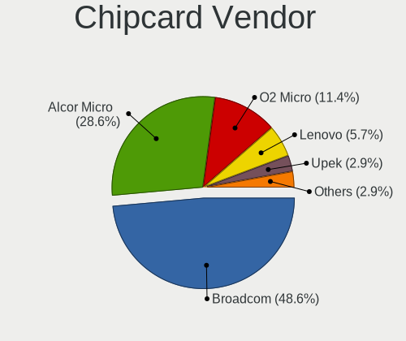

| Vendor      | Notebooks | Percent |
|-------------|-----------|---------|
| Alcor Micro | 22        | 53.66%  |
| Broadcom    | 12        | 29.27%  |
| Upek        | 2         | 4.88%   |
| O2 Micro    | 2         | 4.88%   |
| Lenovo      | 2         | 4.88%   |
| Clay Logic  | 1         | 2.44%   |

Chipcard Model
--------------

Chipcard module models

| Model                                                                        | Notebooks | Percent |
|------------------------------------------------------------------------------|-----------|---------|
| Alcor Micro AU9540 Smartcard Reader                                          | 22        | 53.66%  |
| Broadcom 5880                                                                | 5         | 12.2%   |
| Broadcom BCM5880 Secure Applications Processor                               | 3         | 7.32%   |
| Upek TouchChip Fingerprint Coprocessor (WBF advanced mode)                   | 2         | 4.88%   |
| O2 Micro OZ776 CCID Smartcard Reader                                         | 2         | 4.88%   |
| Lenovo Integrated Smart Card Reader                                          | 2         | 4.88%   |
| Broadcom BCM5880 Secure Applications Processor with fingerprint swipe sensor | 2         | 4.88%   |
| Broadcom 58200                                                               | 2         | 4.88%   |
| Clay Logic Nitrokey Pro                                                      | 1         | 2.44%   |

Unsupported
-----------

Unsupported Devices
-------------------

Total unsupported devices on board

| Total | Notebooks | Percent |
|-------|-----------|---------|
| 0     | 225       | 62.5%   |
| 1     | 98        | 27.22%  |
| 2     | 29        | 8.06%   |
| 3     | 7         | 1.94%   |
| 5     | 1         | 0.28%   |

Unsupported Device Types
------------------------

Types of unsupported devices

| Type                     | Notebooks | Percent |
|--------------------------|-----------|---------|
| Fingerprint reader       | 72        | 40.22%  |
| Chipcard                 | 37        | 20.67%  |
| Graphics card            | 24        | 13.41%  |
| Multimedia controller    | 12        | 6.7%    |
| Net/wireless             | 10        | 5.59%   |
| Camera                   | 8         | 4.47%   |
| Communication controller | 4         | 2.23%   |
| Storage                  | 3         | 1.68%   |
| Bluetooth                | 3         | 1.68%   |
| Sound                    | 2         | 1.12%   |
| Modem                    | 2         | 1.12%   |
| Network                  | 1         | 0.56%   |
| Flash memory             | 1         | 0.56%   |

