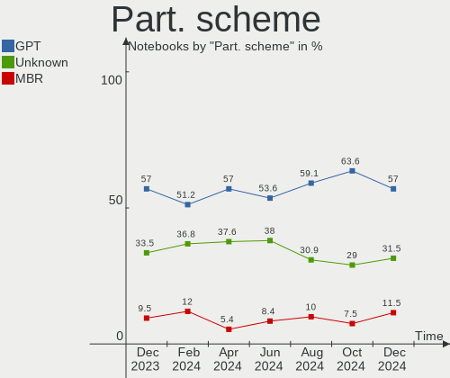
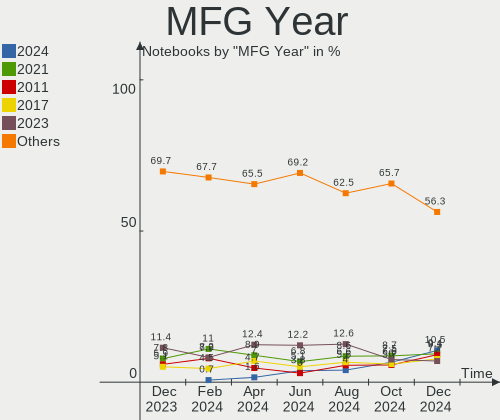
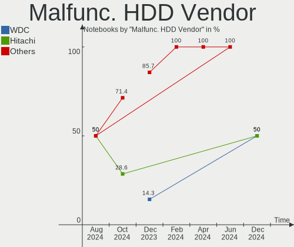
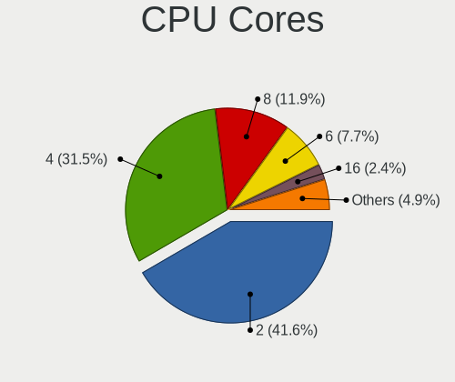
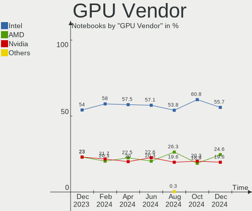
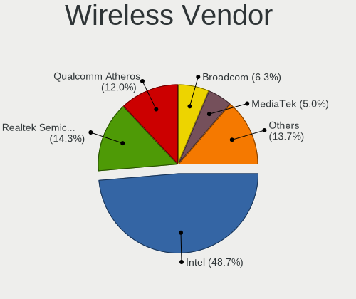
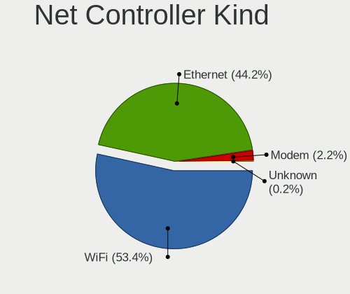
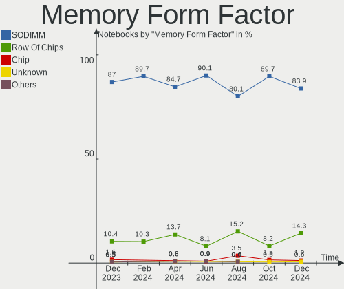

Linux in Germany - Hardware Trends (Notebooks)
----------------------------------------------

A project to identify most popular hardware characteristics and track their change
over time based on data collected by Linux users at https://Linux-Hardware.org.

Anyone can contribute to this report by the [hw-probe](https://github.com/linuxhw/hw-probe) tool:

    sudo -E hw-probe -all -upload

Period: Jun, 2022.

Contents
--------

* [ System ](#system)
  - [ OS                       ](#os)
  - [ OS Family                ](#os-family)
  - [ Kernel                   ](#kernel)
  - [ Kernel Family            ](#kernel-family)
  - [ Kernel Major Ver.        ](#kernel-major-ver)
  - [ Arch                     ](#arch)
  - [ DE                       ](#de)
  - [ Display Server           ](#display-server)
  - [ Display Manager          ](#display-manager)
  - [ OS Lang                  ](#os-lang)
  - [ Boot Mode                ](#boot-mode)
  - [ Filesystem               ](#filesystem)
  - [ Part. scheme             ](#part-scheme)
  - [ Dual Boot with Linux/BSD ](#dual-boot-with-linuxbsd)
  - [ Dual Boot (Win)          ](#dual-boot-win)

* [ Board ](#board)
  - [ Vendor                   ](#vendor)
  - [ Model                    ](#model)
  - [ Model Family             ](#model-family)
  - [ MFG Year                 ](#mfg-year)
  - [ Form Factor              ](#form-factor)
  - [ Secure Boot              ](#secure-boot)
  - [ Coreboot                 ](#coreboot)
  - [ RAM Size                 ](#ram-size)
  - [ RAM Used                 ](#ram-used)
  - [ Total Drives             ](#total-drives)
  - [ Has CD-ROM               ](#has-cd-rom)
  - [ Has Ethernet             ](#has-ethernet)
  - [ Has WiFi                 ](#has-wifi)
  - [ Has Bluetooth            ](#has-bluetooth)

* [ Location ](#location)
  - [ Country                  ](#country)
  - [ City                     ](#city)

* [ Drives ](#drives)
  - [ Drive Vendor             ](#drive-vendor)
  - [ Drive Model              ](#drive-model)
  - [ HDD Vendor               ](#hdd-vendor)
  - [ SSD Vendor               ](#ssd-vendor)
  - [ Drive Kind               ](#drive-kind)
  - [ Drive Connector          ](#drive-connector)
  - [ Drive Size               ](#drive-size)
  - [ Space Total              ](#space-total)
  - [ Space Used               ](#space-used)
  - [ Malfunc. Drives          ](#malfunc-drives)
  - [ Malfunc. Drive Vendor    ](#malfunc-drive-vendor)
  - [ Malfunc. HDD Vendor      ](#malfunc-hdd-vendor)
  - [ Malfunc. Drive Kind      ](#malfunc-drive-kind)
  - [ Failed Drives            ](#failed-drives)
  - [ Failed Drive Vendor      ](#failed-drive-vendor)
  - [ Drive Status             ](#drive-status)

* [ Storage controller ](#storage-controller)
  - [ Storage Vendor           ](#storage-vendor)
  - [ Storage Model            ](#storage-model)
  - [ Storage Kind             ](#storage-kind)

* [ Processor ](#processor)
  - [ CPU Vendor               ](#cpu-vendor)
  - [ CPU Model                ](#cpu-model)
  - [ CPU Model Family         ](#cpu-model-family)
  - [ CPU Cores                ](#cpu-cores)
  - [ CPU Sockets              ](#cpu-sockets)
  - [ CPU Threads              ](#cpu-threads)
  - [ CPU Op-Modes             ](#cpu-op-modes)
  - [ CPU Microcode            ](#cpu-microcode)
  - [ CPU Microarch            ](#cpu-microarch)

* [ Graphics ](#graphics)
  - [ GPU Vendor               ](#gpu-vendor)
  - [ GPU Model                ](#gpu-model)
  - [ GPU Combo                ](#gpu-combo)
  - [ GPU Driver               ](#gpu-driver)
  - [ GPU Memory               ](#gpu-memory)

* [ Monitor ](#monitor)
  - [ Monitor Vendor           ](#monitor-vendor)
  - [ Monitor Model            ](#monitor-model)
  - [ Monitor Resolution       ](#monitor-resolution)
  - [ Monitor Diagonal         ](#monitor-diagonal)
  - [ Monitor Width            ](#monitor-width)
  - [ Aspect Ratio             ](#aspect-ratio)
  - [ Monitor Area             ](#monitor-area)
  - [ Pixel Density            ](#pixel-density)
  - [ Multiple Monitors        ](#multiple-monitors)

* [ Network ](#network)
  - [ Net Controller Vendor    ](#net-controller-vendor)
  - [ Net Controller Model     ](#net-controller-model)
  - [ Wireless Vendor          ](#wireless-vendor)
  - [ Wireless Model           ](#wireless-model)
  - [ Ethernet Vendor          ](#ethernet-vendor)
  - [ Ethernet Model           ](#ethernet-model)
  - [ Net Controller Kind      ](#net-controller-kind)
  - [ Used Controller          ](#used-controller)
  - [ NICs                     ](#nics)
  - [ IPv6                     ](#ipv6)

* [ Bluetooth ](#bluetooth)
  - [ Bluetooth Vendor         ](#bluetooth-vendor)
  - [ Bluetooth Model          ](#bluetooth-model)

* [ Sound ](#sound)
  - [ Sound Vendor             ](#sound-vendor)
  - [ Sound Model              ](#sound-model)

* [ Memory ](#memory)
  - [ Memory Vendor            ](#memory-vendor)
  - [ Memory Model             ](#memory-model)
  - [ Memory Kind              ](#memory-kind)
  - [ Memory Form Factor       ](#memory-form-factor)
  - [ Memory Size              ](#memory-size)
  - [ Memory Speed             ](#memory-speed)

* [ Printers & scanners ](#printers--scanners)
  - [ Printer Vendor           ](#printer-vendor)
  - [ Printer Model            ](#printer-model)
  - [ Scanner Vendor           ](#scanner-vendor)
  - [ Scanner Model            ](#scanner-model)

* [ Camera ](#camera)
  - [ Camera Vendor            ](#camera-vendor)
  - [ Camera Model             ](#camera-model)

* [ Security ](#security)
  - [ Fingerprint Vendor       ](#fingerprint-vendor)
  - [ Fingerprint Model        ](#fingerprint-model)
  - [ Chipcard Vendor          ](#chipcard-vendor)
  - [ Chipcard Model           ](#chipcard-model)

* [ Unsupported ](#unsupported)
  - [ Unsupported Devices      ](#unsupported-devices)
  - [ Unsupported Device Types ](#unsupported-device-types)

System
------

OS
--

Installed operating systems

| Name                 | Notebooks | Percent |
|----------------------|-----------|---------|
| Ubuntu 22.04         | 28        | 13.53%  |
| Linux Mint 20.3      | 28        | 13.53%  |
| Ubuntu 20.04         | 25        | 12.08%  |
| Debian 11            | 15        | 7.25%   |
| OpenMandriva 4.3     | 10        | 4.83%   |
| Fedora 36            | 9         | 4.35%   |
| Zorin 16             | 8         | 3.86%   |
| Pop!_OS 22.04        | 7         | 3.38%   |
| KDE neon 20.04       | 6         | 2.9%    |
| Manjaro              | 5         | 2.42%   |
| Arch                 | 4         | 1.93%   |
| Xubuntu 21.10        | 3         | 1.45%   |
| SteamOS 3.2          | 3         | 1.45%   |
| Manjaro 21.2.6       | 3         | 1.45%   |
| LMDE 5               | 3         | 1.45%   |
| Linux Mint 20.2      | 3         | 1.45%   |
| ArcoLinux Rolling    | 3         | 1.45%   |
| Arch Rolling         | 3         | 1.45%   |
| Xubuntu 20.04        | 2         | 0.97%   |
| Xubuntu 18.04        | 2         | 0.97%   |
| Ubuntu MATE 22.04    | 2         | 0.97%   |
| Ubuntu 21.10         | 2         | 0.97%   |
| ROSA 12.2            | 2         | 0.97%   |
| openSUSE Leap-15.4   | 2         | 0.97%   |
| Manjaro 21.3.1       | 2         | 0.97%   |
| Kubuntu 22.04        | 2         | 0.97%   |
| Kubuntu 11.1         | 2         | 0.97%   |
| Elementary 6.1       | 2         | 0.97%   |
| Zorin 15             | 1         | 0.48%   |
| Xubuntu 22.04        | 1         | 0.48%   |
| Ubuntu Budgie 22.04  | 1         | 0.48%   |
| Ubuntu 20.10         | 1         | 0.48%   |
| OpenMandriva 4.2     | 1         | 0.48%   |
| Lubuntu 22.04        | 1         | 0.48%   |
| LinuxFX 10           | 1         | 0.48%   |
| Linux Mint 19.3      | 1         | 0.48%   |
| Lilidog 22           | 1         | 0.48%   |
| Kubuntu 20.04        | 1         | 0.48%   |
| Kubuntu 11           | 1         | 0.48%   |
| Kali 2022.2          | 1         | 0.48%   |
| Garuda Linux Soaring | 1         | 0.48%   |
| Garuda Linux         | 1         | 0.48%   |
| Fedora 35            | 1         | 0.48%   |
| EndeavourOS Rolling  | 1         | 0.48%   |
| Devuan 5             | 1         | 0.48%   |
| Debian Testing       | 1         | 0.48%   |
| Debian 10            | 1         | 0.48%   |
| Alpine 3.16.0        | 1         | 0.48%   |
| AlmaLinux 8.6        | 1         | 0.48%   |

OS Family
---------

OS without a version

| Name          | Notebooks | Percent |
|---------------|-----------|---------|
| Ubuntu        | 56        | 27.05%  |
| Linux Mint    | 32        | 15.46%  |
| Debian        | 17        | 8.21%   |
| OpenMandriva  | 11        | 5.31%   |
| Manjaro       | 10        | 4.83%   |
| Fedora        | 10        | 4.83%   |
| Zorin         | 9         | 4.35%   |
| Xubuntu       | 8         | 3.86%   |
| Pop!_OS       | 7         | 3.38%   |
| Arch          | 7         | 3.38%   |
| Kubuntu       | 6         | 2.9%    |
| KDE neon      | 6         | 2.9%    |
| SteamOS       | 3         | 1.45%   |
| LMDE          | 3         | 1.45%   |
| ArcoLinux     | 3         | 1.45%   |
| Ubuntu MATE   | 2         | 0.97%   |
| ROSA          | 2         | 0.97%   |
| openSUSE      | 2         | 0.97%   |
| Garuda Linux  | 2         | 0.97%   |
| Elementary    | 2         | 0.97%   |
| Ubuntu Budgie | 1         | 0.48%   |
| Lubuntu       | 1         | 0.48%   |
| LinuxFX       | 1         | 0.48%   |
| Lilidog       | 1         | 0.48%   |
| Kali          | 1         | 0.48%   |
| EndeavourOS   | 1         | 0.48%   |
| Devuan        | 1         | 0.48%   |
| Alpine        | 1         | 0.48%   |
| AlmaLinux     | 1         | 0.48%   |

Kernel
------

Version of the Linux kernel

| Version                                      | Notebooks | Percent |
|----------------------------------------------|-----------|---------|
| 5.13.0-51-generic                            | 17        | 8.21%   |
| 5.13.0-44-generic                            | 15        | 7.25%   |
| 5.4.0-117-generic                            | 10        | 4.83%   |
| 5.13.0-48-generic                            | 10        | 4.83%   |
| 5.15.0-37-generic                            | 9         | 4.35%   |
| 5.10.0-15-amd64                              | 9         | 4.35%   |
| 5.4.0-113-generic                            | 8         | 3.86%   |
| 5.15.0-33-generic                            | 8         | 3.86%   |
| 5.16.7-desktop-1omv4003                      | 7         | 3.38%   |
| 5.4.0-120-generic                            | 6         | 2.9%    |
| 5.15.0-40-generic                            | 6         | 2.9%    |
| 5.15.0-39-generic                            | 6         | 2.9%    |
| 5.4.0-121-generic                            | 5         | 2.42%   |
| 5.15.0-35-generic                            | 5         | 2.42%   |
| 5.10.0-14-amd64                              | 5         | 2.42%   |
| 5.17.5-76051705-generic                      | 4         | 1.93%   |
| 5.4.0-91-generic                             | 3         | 1.45%   |
| 5.18.3-arch1-1                               | 3         | 1.45%   |
| 5.15.41-1-MANJARO                            | 3         | 1.45%   |
| 5.13.0-valve15-1-neptune-02197-gf6ec7ad3762a | 3         | 1.45%   |
| 5.18.1-zen1-1-zen                            | 2         | 0.97%   |
| 5.18.0-1-amd64                               | 2         | 0.97%   |
| 5.17.5-300.fc36.x86_64                       | 2         | 0.97%   |
| 5.17.15-76051715-generic                     | 2         | 0.97%   |
| 5.17.14-300.fc36.x86_64                      | 2         | 0.97%   |
| 5.14.21-150400.22-default                    | 2         | 0.97%   |
| 5.14.0-1042-oem                              | 2         | 0.97%   |
| 5.10.74-generic-2rosa2021.1-x86_64           | 2         | 0.97%   |
| 5.8.0-29-generic                             | 1         | 0.48%   |
| 5.4.0-74-generic                             | 1         | 0.48%   |
| 5.4.0-72-generic                             | 1         | 0.48%   |
| 5.4.0-112-generic                            | 1         | 0.48%   |
| 5.4.0-110-generic                            | 1         | 0.48%   |
| 5.18.7-zen1-1-zen                            | 1         | 0.48%   |
| 5.18.6-zen1-1-zen                            | 1         | 0.48%   |
| 5.18.6-arch1-1                               | 1         | 0.48%   |
| 5.18.6-200.fc36.x86_64                       | 1         | 0.48%   |
| 5.18.6-1-MANJARO                             | 1         | 0.48%   |
| 5.18.5-arch1-1                               | 1         | 0.48%   |
| 5.18.5-200.fc36.x86_64                       | 1         | 0.48%   |
| 5.18.5-1-MANJARO                             | 1         | 0.48%   |
| 5.18.3-1-MANJARO                             | 1         | 0.48%   |
| 5.18.2-arch1-1                               | 1         | 0.48%   |
| 5.18.2-1-blueperil                           | 1         | 0.48%   |
| 5.18.1-arch1-1                               | 1         | 0.48%   |
| 5.18.0-2-amd64                               | 1         | 0.48%   |
| 5.17.5-tkg-bmq                               | 1         | 0.48%   |
| 5.17.13-300.fc36.x86_64                      | 1         | 0.48%   |
| 5.17.12-300.fc36.x86_64                      | 1         | 0.48%   |
| 5.17.11-300.fc36.x86_64                      | 1         | 0.48%   |
| 5.17.11-200.fc35.x86_64                      | 1         | 0.48%   |
| 5.17.1-desktop-clang-2omv4050                | 1         | 0.48%   |
| 5.17.1-desktop-2omv4050                      | 1         | 0.48%   |
| 5.17.0-2mx-amd64                             | 1         | 0.48%   |
| 5.17.0-2-amd64                               | 1         | 0.48%   |
| 5.16.13-desktop-1omv4003                     | 1         | 0.48%   |
| 5.16.0-kali7-amd64                           | 1         | 0.48%   |
| 5.15.49-1-MANJARO                            | 1         | 0.48%   |
| 5.15.48-1-MANJARO                            | 1         | 0.48%   |
| 5.15.47-0-lts                                | 1         | 0.48%   |

Kernel Family
-------------

Linux kernel without a distro release

| Version | Notebooks | Percent |
|---------|-----------|---------|
| 5.13.0  | 50        | 24.15%  |
| 5.4.0   | 36        | 17.39%  |
| 5.15.0  | 36        | 17.39%  |
| 5.10.0  | 17        | 8.21%   |
| 5.17.5  | 7         | 3.38%   |
| 5.16.7  | 7         | 3.38%   |
| 5.18.6  | 4         | 1.93%   |
| 5.18.3  | 4         | 1.93%   |
| 5.18.5  | 3         | 1.45%   |
| 5.18.1  | 3         | 1.45%   |
| 5.18.0  | 3         | 1.45%   |
| 5.15.41 | 3         | 1.45%   |
| 5.18.2  | 2         | 0.97%   |
| 5.17.15 | 2         | 0.97%   |
| 5.17.14 | 2         | 0.97%   |
| 5.17.11 | 2         | 0.97%   |
| 5.17.1  | 2         | 0.97%   |
| 5.17.0  | 2         | 0.97%   |
| 5.14.21 | 2         | 0.97%   |
| 5.14.0  | 2         | 0.97%   |
| 5.10.74 | 2         | 0.97%   |
| 5.8.0   | 1         | 0.48%   |
| 5.18.7  | 1         | 0.48%   |
| 5.17.13 | 1         | 0.48%   |
| 5.17.12 | 1         | 0.48%   |
| 5.16.13 | 1         | 0.48%   |
| 5.16.0  | 1         | 0.48%   |
| 5.15.49 | 1         | 0.48%   |
| 5.15.48 | 1         | 0.48%   |
| 5.15.47 | 1         | 0.48%   |
| 5.15.46 | 1         | 0.48%   |
| 5.15.44 | 1         | 0.48%   |
| 5.15.32 | 1         | 0.48%   |
| 5.10.14 | 1         | 0.48%   |
| 5.0.0   | 1         | 0.48%   |
| 4.18.0  | 1         | 0.48%   |
| 4.15.0  | 1         | 0.48%   |

Kernel Major Ver.
-----------------

Linux kernel major version

| Version | Notebooks | Percent |
|---------|-----------|---------|
| 5.13    | 50        | 24.15%  |
| 5.15    | 45        | 21.74%  |
| 5.4     | 36        | 17.39%  |
| 5.18    | 20        | 9.66%   |
| 5.10    | 20        | 9.66%   |
| 5.17    | 19        | 9.18%   |
| 5.16    | 9         | 4.35%   |
| 5.14    | 4         | 1.93%   |
| 5.8     | 1         | 0.48%   |
| 5.0     | 1         | 0.48%   |
| 4.18    | 1         | 0.48%   |
| 4.15    | 1         | 0.48%   |

Arch
----

OS architecture (x86_64, i586, etc.)

| Name   | Notebooks | Percent |
|--------|-----------|---------|
| x86_64 | 205       | 99.03%  |
| i686   | 2         | 0.97%   |

DE
--

Desktop Environment

| Name             | Notebooks | Percent |
|------------------|-----------|---------|
| GNOME            | 88        | 42.51%  |
| KDE5             | 41        | 19.81%  |
| X-Cinnamon       | 34        | 16.43%  |
| XFCE             | 16        | 7.73%   |
| MATE             | 6         | 2.9%    |
| Unknown          | 5         | 2.42%   |
| Cinnamon         | 3         | 1.45%   |
| Unity            | 2         | 0.97%   |
| sway             | 2         | 0.97%   |
| Pantheon         | 2         | 0.97%   |
| lightdm-xsession | 2         | 0.97%   |
| i3               | 2         | 0.97%   |
| trinity          | 1         | 0.48%   |
| LXQt             | 1         | 0.48%   |
| LXDE             | 1         | 0.48%   |
| Budgie           | 1         | 0.48%   |

Display Server
--------------

X11 or Wayland

| Name    | Notebooks | Percent |
|---------|-----------|---------|
| X11     | 158       | 76.33%  |
| Wayland | 44        | 21.26%  |
| Unknown | 5         | 2.42%   |

Display Manager
---------------

SDDM, LightDM, etc.

| Name    | Notebooks | Percent |
|---------|-----------|---------|
| Unknown | 61        | 29.47%  |
| GDM3    | 54        | 26.09%  |
| LightDM | 43        | 20.77%  |
| SDDM    | 28        | 13.53%  |
| GDM     | 18        | 8.7%    |
| GREETD  | 2         | 0.97%   |
| SLiM    | 1         | 0.48%   |

OS Lang
-------

Language

| Lang    | Notebooks | Percent |
|---------|-----------|---------|
| de_DE   | 147       | 71.01%  |
| en_US   | 46        | 22.22%  |
| en_GB   | 5         | 2.42%   |
| C       | 3         | 1.45%   |
| pl_PL   | 2         | 0.97%   |
| en_DE   | 2         | 0.97%   |
| ru_RU   | 1         | 0.48%   |
| Unknown | 1         | 0.48%   |

Boot Mode
---------

EFI or BIOS

| Mode | Notebooks | Percent |
|------|-----------|---------|
| EFI  | 116       | 56.04%  |
| BIOS | 91        | 43.96%  |

Filesystem
----------

Type of filesystem

| Type    | Notebooks | Percent |
|---------|-----------|---------|
| Ext4    | 176       | 85.02%  |
| Btrfs   | 17        | 8.21%   |
| Overlay | 10        | 4.83%   |
| Zfs     | 3         | 1.45%   |
| Xfs     | 1         | 0.48%   |

Part. scheme
------------

Scheme of partitioning

| Type    | Notebooks | Percent |
|---------|-----------|---------|
| Unknown | 109       | 52.66%  |
| GPT     | 81        | 39.13%  |
| MBR     | 17        | 8.21%   |

Dual Boot with Linux/BSD
------------------------

Hosting more than one Linux/BSD

| Dual boot | Notebooks | Percent |
|-----------|-----------|---------|
| No        | 181       | 87.44%  |
| Yes       | 26        | 12.56%  |

Dual Boot (Win)
---------------

Hosting Linux and Windows

| Dual boot | Notebooks | Percent |
|-----------|-----------|---------|
| No        | 152       | 73.43%  |
| Yes       | 55        | 26.57%  |

Board
-----

Vendor
------

Motherboard manufacturer

| Name                    | Notebooks | Percent |
|-------------------------|-----------|---------|
| Lenovo                  | 50        | 24.15%  |
| Hewlett-Packard         | 31        | 14.98%  |
| Acer                    | 26        | 12.56%  |
| Dell                    | 21        | 10.14%  |
| ASUSTek Computer        | 19        | 9.18%   |
| Samsung Electronics     | 8         | 3.86%   |
| Fujitsu                 | 7         | 3.38%   |
| Toshiba                 | 5         | 2.42%   |
| Medion                  | 5         | 2.42%   |
| HUAWEI                  | 4         | 1.93%   |
| Valve                   | 3         | 1.45%   |
| TUXEDO                  | 3         | 1.45%   |
| Gigabyte Technology     | 3         | 1.45%   |
| Apple                   | 3         | 1.45%   |
| Razer                   | 2         | 0.97%   |
| MSI                     | 2         | 0.97%   |
| TrekStor                | 1         | 0.48%   |
| Timi                    | 1         | 0.48%   |
| Tactus                  | 1         | 0.48%   |
| Sony                    | 1         | 0.48%   |
| Shuttle                 | 1         | 0.48%   |
| Schenker                | 1         | 0.48%   |
| Inter Sales A/S         | 1         | 0.48%   |
| Google                  | 1         | 0.48%   |
| Global Distribution FZE | 1         | 0.48%   |
| Fujitsu Siemens         | 1         | 0.48%   |
| eMachines               | 1         | 0.48%   |
| Clevo                   | 1         | 0.48%   |
| AXDIA International     | 1         | 0.48%   |
| Alienware               | 1         | 0.48%   |
| Unknown                 | 1         | 0.48%   |

Model
-----

Motherboard model

| Name                                               | Notebooks | Percent |
|----------------------------------------------------|-----------|---------|
| Valve Jupiter                                      | 3         | 1.45%   |
| Dell Precision M6800                               | 3         | 1.45%   |
| Unknown                                            | 3         | 1.45%   |
| Samsung R530/R730                                  | 2         | 0.97%   |
| Lenovo Legion 5 15ACH6H 82JU                       | 2         | 0.97%   |
| Lenovo IdeaPad 330-17IKB 81DK                      | 2         | 0.97%   |
| HP ProBook 455 G8 Notebook PC                      | 2         | 0.97%   |
| HP Pavilion Gaming Laptop 15-ec0xxx                | 2         | 0.97%   |
| HP Laptop 15s-fq3xxx                               | 2         | 0.97%   |
| Fujitsu LIFEBOOK E752                              | 2         | 0.97%   |
| Dell Precision 5540                                | 2         | 0.97%   |
| Dell Latitude E5530 non-vPro                       | 2         | 0.97%   |
| ASUS UL50Vg                                        | 2         | 0.97%   |
| Acer Swift SF314-511                               | 2         | 0.97%   |
| Acer Aspire ES1-711                                | 2         | 0.97%   |
| TUXEDO Polaris Intel Gen3 (TGL)                    | 1         | 0.48%   |
| TrekStor Surfbook A13B                             | 1         | 0.48%   |
| Toshiba Satellite Pro S300L                        | 1         | 0.48%   |
| Toshiba Satellite Pro S300                         | 1         | 0.48%   |
| Toshiba Satellite C870-1C2                         | 1         | 0.48%   |
| Toshiba Satellite C670D-11G                        | 1         | 0.48%   |
| Toshiba Satellite C50t-B                           | 1         | 0.48%   |
| Timi TM1604                                        | 1         | 0.48%   |
| Tactus GeoBook 140                                 | 1         | 0.48%   |
| Sony VPCEA3S1E                                     | 1         | 0.48%   |
| Shuttle DS47D                                      | 1         | 0.48%   |
| Schenker VIA 15 Pro                                | 1         | 0.48%   |
| Samsung RV420/RV520/RV720/E3530/S3530/E3420/E3520  | 1         | 0.48%   |
| Samsung RF510/RF410/RF710                          | 1         | 0.48%   |
| Samsung 700Z3A/700Z4A/700Z5A/700Z5B                | 1         | 0.48%   |
| Samsung 600B4B/600B5B                              | 1         | 0.48%   |
| Samsung 530U3BI/530U4BI/530U4BH                    | 1         | 0.48%   |
| Samsung 300E4C/300E5C/300E7C                       | 1         | 0.48%   |
| Razer Blade 17 (Mid 2021) - RZ09-0406              | 1         | 0.48%   |
| Razer Blade 15 Base Model (Early 2020) - RZ09-0328 | 1         | 0.48%   |
| MSI MS-1688                                        | 1         | 0.48%   |
| MSI GT75VR 7RF                                     | 1         | 0.48%   |
| Medion WIM2180                                     | 1         | 0.48%   |
| Medion E7220                                       | 1         | 0.48%   |
| Medion E6416 MD99553                               | 1         | 0.48%   |
| Medion E6222                                       | 1         | 0.48%   |
| Medion E16402                                      | 1         | 0.48%   |
| Lenovo Yoga 2 11 20332                             | 1         | 0.48%   |
| Lenovo V17-IIL 82GX                                | 1         | 0.48%   |
| Lenovo V14-ADA 82C6                                | 1         | 0.48%   |
| Lenovo V130-15IGM 81HL                             | 1         | 0.48%   |
| Lenovo ThinkPad X270 W10DG 20K5S1AP1W              | 1         | 0.48%   |
| Lenovo ThinkPad X250 20CLS06L00                    | 1         | 0.48%   |
| Lenovo ThinkPad X240 20AMS4XT01                    | 1         | 0.48%   |
| Lenovo ThinkPad X230 2325AEG                       | 1         | 0.48%   |
| Lenovo ThinkPad X220 4291W3B                       | 1         | 0.48%   |
| Lenovo ThinkPad X201 4492BT6                       | 1         | 0.48%   |
| Lenovo ThinkPad X1 Carbon Gen 9 20XW0050GE         | 1         | 0.48%   |
| Lenovo ThinkPad X1 Carbon 4th 20FCS14X04           | 1         | 0.48%   |
| Lenovo ThinkPad X1 Carbon 2nd 20A7002WUS           | 1         | 0.48%   |
| Lenovo ThinkPad W510 431963G                       | 1         | 0.48%   |
| Lenovo ThinkPad T61 7659CA1                        | 1         | 0.48%   |
| Lenovo ThinkPad T540p 20BF0038GE                   | 1         | 0.48%   |
| Lenovo ThinkPad T510 4384FF3                       | 1         | 0.48%   |
| Lenovo ThinkPad T495s 20QJ0012GE                   | 1         | 0.48%   |

Model Family
------------

Motherboard model prefix

| Name                        | Notebooks | Percent |
|-----------------------------|-----------|---------|
| Lenovo ThinkPad             | 34        | 16.43%  |
| Acer Aspire                 | 16        | 7.73%   |
| Dell Latitude               | 8         | 3.86%   |
| HP ProBook                  | 7         | 3.38%   |
| HP EliteBook                | 7         | 3.38%   |
| Fujitsu LIFEBOOK            | 7         | 3.38%   |
| Lenovo IdeaPad              | 6         | 2.9%    |
| HP Pavilion                 | 6         | 2.9%    |
| Dell Precision              | 6         | 2.9%    |
| Toshiba Satellite           | 5         | 2.42%   |
| HP Laptop                   | 5         | 2.42%   |
| Valve Jupiter               | 3         | 1.45%   |
| Lenovo Legion               | 3         | 1.45%   |
| Dell XPS                    | 3         | 1.45%   |
| Acer Swift                  | 3         | 1.45%   |
| Unknown                     | 3         | 1.45%   |
| Samsung R530                | 2         | 0.97%   |
| Razer Blade                 | 2         | 0.97%   |
| HP 255                      | 2         | 0.97%   |
| Dell Vostro                 | 2         | 0.97%   |
| Dell Inspiron               | 2         | 0.97%   |
| ASUS ZenBook                | 2         | 0.97%   |
| ASUS UL50Vg                 | 2         | 0.97%   |
| ASUS ASUS                   | 2         | 0.97%   |
| Acer TravelMate             | 2         | 0.97%   |
| TUXEDO Polaris              | 1         | 0.48%   |
| TrekStor Surfbook           | 1         | 0.48%   |
| Timi TM1604                 | 1         | 0.48%   |
| Tactus GeoBook              | 1         | 0.48%   |
| Sony VPCEA3S1E              | 1         | 0.48%   |
| Shuttle DS47D               | 1         | 0.48%   |
| Schenker VIA                | 1         | 0.48%   |
| Samsung RV420               | 1         | 0.48%   |
| Samsung RF510               | 1         | 0.48%   |
| Samsung 700Z3A              | 1         | 0.48%   |
| Samsung 600B4B              | 1         | 0.48%   |
| Samsung 530U3BI             | 1         | 0.48%   |
| Samsung 300E4C              | 1         | 0.48%   |
| MSI MS-1688                 | 1         | 0.48%   |
| MSI GT75VR                  | 1         | 0.48%   |
| Medion WIM2180              | 1         | 0.48%   |
| Medion E7220                | 1         | 0.48%   |
| Medion E6416                | 1         | 0.48%   |
| Medion E6222                | 1         | 0.48%   |
| Medion E16402               | 1         | 0.48%   |
| Lenovo Yoga                 | 1         | 0.48%   |
| Lenovo V17-IIL              | 1         | 0.48%   |
| Lenovo V14-ADA              | 1         | 0.48%   |
| Lenovo V130-15IGM           | 1         | 0.48%   |
| Lenovo IdeaPadFlex          | 1         | 0.48%   |
| Lenovo G500                 | 1         | 0.48%   |
| Lenovo G50-70               | 1         | 0.48%   |
| Inter Sales A/S NID-11125DE | 1         | 0.48%   |
| HUAWEI NBLK-WAX9X           | 1         | 0.48%   |
| HUAWEI HBB-WX9              | 1         | 0.48%   |
| HUAWEI CREM-WXX9            | 1         | 0.48%   |
| HUAWEI BOM-WXX9             | 1         | 0.48%   |
| HP OMEN                     | 1         | 0.48%   |
| HP Notebook                 | 1         | 0.48%   |
| HP HDX                      | 1         | 0.48%   |

MFG Year
--------

Motherboard manufacture year

| Year | Notebooks | Percent |
|------|-----------|---------|
| 2021 | 30        | 14.49%  |
| 2020 | 20        | 9.66%   |
| 2019 | 17        | 8.21%   |
| 2018 | 17        | 8.21%   |
| 2013 | 17        | 8.21%   |
| 2012 | 15        | 7.25%   |
| 2014 | 12        | 5.8%    |
| 2011 | 12        | 5.8%    |
| 2010 | 12        | 5.8%    |
| 2017 | 11        | 5.31%   |
| 2016 | 10        | 4.83%   |
| 2009 | 10        | 4.83%   |
| 2015 | 8         | 3.86%   |
| 2008 | 8         | 3.86%   |
| 2022 | 6         | 2.9%    |
| 2007 | 1         | 0.48%   |
| 2006 | 1         | 0.48%   |

Form Factor
-----------

Physical design of the computer

| Name     | Notebooks | Percent |
|----------|-----------|---------|
| Notebook | 207       | 100%    |

Secure Boot
-----------

Enabled or disabled

| State    | Notebooks | Percent |
|----------|-----------|---------|
| Disabled | 177       | 85.51%  |
| Enabled  | 30        | 14.49%  |

Coreboot
--------

Have coreboot on board

| Used | Notebooks | Percent |
|------|-----------|---------|
| No   | 206       | 99.52%  |
| Yes  | 1         | 0.48%   |

RAM Size
--------

Total RAM memory

| Size in GB  | Notebooks | Percent |
|-------------|-----------|---------|
| 4.01-8.0    | 63        | 30.43%  |
| 16.01-24.0  | 41        | 19.81%  |
| 3.01-4.0    | 40        | 19.32%  |
| 8.01-16.0   | 35        | 16.91%  |
| 32.01-64.0  | 14        | 6.76%   |
| 1.01-2.0    | 8         | 3.86%   |
| 2.01-3.0    | 3         | 1.45%   |
| 64.01-256.0 | 2         | 0.97%   |
| 24.01-32.0  | 1         | 0.48%   |

RAM Used
--------

Used RAM memory

| Used GB   | Notebooks | Percent |
|-----------|-----------|---------|
| 1.01-2.0  | 71        | 34.3%   |
| 2.01-3.0  | 57        | 27.54%  |
| 3.01-4.0  | 29        | 14.01%  |
| 4.01-8.0  | 26        | 12.56%  |
| 0.51-1.0  | 12        | 5.8%    |
| 8.01-16.0 | 10        | 4.83%   |
| 0.01-0.5  | 2         | 0.97%   |

Total Drives
------------

Number of drives on board

| Drives | Notebooks | Percent |
|--------|-----------|---------|
| 1      | 149       | 71.98%  |
| 2      | 49        | 23.67%  |
| 4      | 4         | 1.93%   |
| 3      | 4         | 1.93%   |
| 6      | 1         | 0.48%   |

Has CD-ROM
----------

Has CD-ROM on board

| Presented | Notebooks | Percent |
|-----------|-----------|---------|
| No        | 138       | 66.67%  |
| Yes       | 69        | 33.33%  |

Has Ethernet
------------

Has Ethernet on board

| Presented | Notebooks | Percent |
|-----------|-----------|---------|
| Yes       | 163       | 78.74%  |
| No        | 44        | 21.26%  |

Has WiFi
--------

Has WiFi module

| Presented | Notebooks | Percent |
|-----------|-----------|---------|
| Yes       | 202       | 97.58%  |
| No        | 5         | 2.42%   |

Has Bluetooth
-------------

Has Bluetooth module

| Presented | Notebooks | Percent |
|-----------|-----------|---------|
| Yes       | 155       | 74.88%  |
| No        | 52        | 25.12%  |

Location
--------

Country
-------

Geographic location (country)

| Country | Notebooks | Percent |
|---------|-----------|---------|
| Germany | 207       | 100%    |

City
----

Geographic location (city)

| City                   | Notebooks | Percent |
|------------------------|-----------|---------|
| Berlin                 | 21        | 10.14%  |
| Munich                 | 12        | 5.8%    |
| Hamburg                | 8         | 3.86%   |
| Frankfurt am Main      | 6         | 2.9%    |
| Leipzig                | 5         | 2.42%   |
| Nuremberg              | 4         | 1.93%   |
| Essen                  | 4         | 1.93%   |
| Düsseldorf            | 4         | 1.93%   |
| Dortmund               | 4         | 1.93%   |
| Mannheim               | 3         | 1.45%   |
| Kiel                   | 3         | 1.45%   |
| Heidelberg             | 3         | 1.45%   |
| Dresden                | 3         | 1.45%   |
| Stuttgart              | 2         | 0.97%   |
| Saarbrücken           | 2         | 0.97%   |
| Ochsenfurt             | 2         | 0.97%   |
| Mönchengladbach       | 2         | 0.97%   |
| Lampertheim            | 2         | 0.97%   |
| Karlsruhe              | 2         | 0.97%   |
| Heusweiler             | 2         | 0.97%   |
| Hanover                | 2         | 0.97%   |
| Gelsenkirchen          | 2         | 0.97%   |
| Freiburg im Breisgau   | 2         | 0.97%   |
| Diespeck               | 2         | 0.97%   |
| Darmstadt              | 2         | 0.97%   |
| Bochum                 | 2         | 0.97%   |
| Bielefeld              | 2         | 0.97%   |
| Wuppertal              | 1         | 0.48%   |
| Wolfsburg              | 1         | 0.48%   |
| Wolfhagen              | 1         | 0.48%   |
| Wittmund               | 1         | 0.48%   |
| Wittingen              | 1         | 0.48%   |
| Wettringen             | 1         | 0.48%   |
| Weselberg              | 1         | 0.48%   |
| Wernigerode            | 1         | 0.48%   |
| Weissenthurm           | 1         | 0.48%   |
| Weimar                 | 1         | 0.48%   |
| Weilheim               | 1         | 0.48%   |
| Walluf                 | 1         | 0.48%   |
| Waldfeucht             | 1         | 0.48%   |
| Wadersloh              | 1         | 0.48%   |
| Voerde                 | 1         | 0.48%   |
| Troisdorf              | 1         | 0.48%   |
| Traunreut              | 1         | 0.48%   |
| Tirschenreuth          | 1         | 0.48%   |
| Solingen               | 1         | 0.48%   |
| Singen                 | 1         | 0.48%   |
| Schwabach              | 1         | 0.48%   |
| Salzgitter             | 1         | 0.48%   |
| Rotenburg an der Fulda | 1         | 0.48%   |
| Rosenheim              | 1         | 0.48%   |
| Rinteln                | 1         | 0.48%   |
| Rheinberg              | 1         | 0.48%   |
| Reutlingen             | 1         | 0.48%   |
| Pullenreuth            | 1         | 0.48%   |
| Pocking                | 1         | 0.48%   |
| Paderborn              | 1         | 0.48%   |
| Offenburg              | 1         | 0.48%   |
| Oeversee               | 1         | 0.48%   |
| Obertshausen           | 1         | 0.48%   |

Drives
------

Drive Vendor
------------

Hard drive vendors

| Vendor                         | Notebooks | Drives | Percent |
|--------------------------------|-----------|--------|---------|
| Samsung Electronics            | 54        | 59     | 20.22%  |
| SanDisk                        | 24        | 24     | 8.99%   |
| WDC                            | 23        | 23     | 8.61%   |
| Seagate                        | 21        | 21     | 7.87%   |
| Toshiba                        | 16        | 17     | 5.99%   |
| Unknown                        | 14        | 16     | 5.24%   |
| Crucial                        | 14        | 14     | 5.24%   |
| Hitachi                        | 11        | 11     | 4.12%   |
| SK hynix                       | 9         | 9      | 3.37%   |
| Kingston                       | 9         | 9      | 3.37%   |
| Micron Technology              | 8         | 8      | 3%      |
| Intenso                        | 8         | 8      | 3%      |
| Intel                          | 6         | 6      | 2.25%   |
| Phison                         | 4         | 5      | 1.5%    |
| HGST                           | 4         | 4      | 1.5%    |
| Apacer                         | 4         | 4      | 1.5%    |
| UMIS                           | 3         | 3      | 1.12%   |
| LITEON                         | 3         | 3      | 1.12%   |
| Solid State Storage Technology | 2         | 2      | 0.75%   |
| OCZ                            | 2         | 2      | 0.75%   |
| Micron/Crucial Technology      | 2         | 2      | 0.75%   |
| INNOVATION IT                  | 2         | 2      | 0.75%   |
| Hewlett-Packard                | 2         | 2      | 0.75%   |
| Unknown                        | 2         | 2      | 0.75%   |
| WODPOSIT                       | 1         | 2      | 0.37%   |
| Verbatim                       | 1         | 1      | 0.37%   |
| USB3.0                         | 1         | 1      | 0.37%   |
| Transcend                      | 1         | 1      | 0.37%   |
| Team                           | 1         | 1      | 0.37%   |
| SPCC                           | 1         | 1      | 0.37%   |
| SMI DISK                       | 1         | 1      | 0.37%   |
| ORICO                          | 1         | 1      | 0.37%   |
| Netac                          | 1         | 1      | 0.37%   |
| My                             | 1         | 1      | 0.37%   |
| Mushkin                        | 1         | 1      | 0.37%   |
| Lite-On                        | 1         | 1      | 0.37%   |
| Leven                          | 1         | 1      | 0.37%   |
| Lenovo                         | 1         | 1      | 0.37%   |
| KIOXIA                         | 1         | 1      | 0.37%   |
| KingDian                       | 1         | 1      | 0.37%   |
| JetFlash                       | 1         | 1      | 0.37%   |
| External                       | 1         | 1      | 0.37%   |
| Dogfish                        | 1         | 1      | 0.37%   |
| A-DATA Technology              | 1         | 1      | 0.37%   |

Drive Model
-----------

Hard drive models

| Model                                  | Notebooks | Percent |
|----------------------------------------|-----------|---------|
| Samsung SSD 850 EVO 500GB              | 5         | 1.83%   |
| Samsung NVMe SSD Drive 1024GB          | 5         | 1.83%   |
| Toshiba MQ01ABD100 1TB                 | 4         | 1.47%   |
| Seagate ST1000LM024 HN-M101MBB 1TB     | 4         | 1.47%   |
| Crucial CT240BX500SSD1 240GB           | 4         | 1.47%   |
| Apacer AS350 240GB SSD                 | 4         | 1.47%   |
| Seagate ST2000LM015-2E8174 2TB         | 3         | 1.1%    |
| HGST HTS721010A9E630 1TB               | 3         | 1.1%    |
| Crucial M4-CT256M4SSD3 256GB           | 3         | 1.1%    |
| WDC WD3200BEVT-22ZCT0 320GB            | 2         | 0.73%   |
| WDC WD3200BEVT-22A23T0 320GB           | 2         | 0.73%   |
| WDC PC SN730 SDBQNTY-1T00-1001 1TB     | 2         | 0.73%   |
| WDC PC SN730 SDBPNTY-512G-1006 512GB   | 2         | 0.73%   |
| UMIS RPJTJ512MGE1QDQ 512GB             | 2         | 0.73%   |
| SK hynix SKHynix_HFM512GD3HX015N 512GB | 2         | 0.73%   |
| Seagate ST2000LM007-1R8174 2TB         | 2         | 0.73%   |
| SanDisk SSD U100 24GB                  | 2         | 0.73%   |
| SanDisk SDSSDH3 4T00 4TB               | 2         | 0.73%   |
| SanDisk NVMe SSD Drive 512GB           | 2         | 0.73%   |
| Samsung SSD 970 EVO Plus 2TB           | 2         | 0.73%   |
| Samsung SSD 970 EVO Plus 1TB           | 2         | 0.73%   |
| Samsung SSD 860 EVO M.2 2TB            | 2         | 0.73%   |
| Samsung NVMe SSD Drive 256GB           | 2         | 0.73%   |
| Samsung NVMe SSD Drive 1TB             | 2         | 0.73%   |
| Micron 2210_MTFDHBA512QFD 512GB        | 2         | 0.73%   |
| LITEON CV1-8B512 512GB SSD             | 2         | 0.73%   |
| Kingston SV300S37A120G 120GB SSD       | 2         | 0.73%   |
| Kingston SA400S37240G 240GB SSD        | 2         | 0.73%   |
| Intenso SATA III SSD 120GB             | 2         | 0.73%   |
| Intel NVMe SSD Drive 512GB             | 2         | 0.73%   |
| INNOVATION IT IT 512GB SSD             | 2         | 0.73%   |
| Hitachi HTS545050B9A300 500GB          | 2         | 0.73%   |
| Hitachi HTS543232A7A384 320GB          | 2         | 0.73%   |
| Hitachi HTS543225L9SA00 250GB          | 2         | 0.73%   |
| HP SSD S700 500GB                      | 2         | 0.73%   |
| Crucial CT1000MX500SSD4 1TB            | 2         | 0.73%   |
| Crucial CT1000MX500SSD1 1TB            | 2         | 0.73%   |
| Unknown                                | 2         | 0.73%   |
| WODPOSIT SSD WPSM28-256G               | 1         | 0.37%   |
| WDC WDS500G2B0B-00YS70 500GB SSD       | 1         | 0.37%   |
| WDC WDS100T2B0A 1TB SSD                | 1         | 0.37%   |
| WDC WD7500BPVT-22HXZT3 752GB           | 1         | 0.37%   |
| WDC WD5000MPCK-24AWHT0 500GB           | 1         | 0.37%   |
| WDC WD5000LPVX-22V0TT0 500GB           | 1         | 0.37%   |
| WDC WD5000BEVT-60ZAT0 500GB            | 1         | 0.37%   |
| WDC WD5000BEVT-00ZAT0 500GB            | 1         | 0.37%   |
| WDC WD2500BEVS-60UST0 250GB            | 1         | 0.37%   |
| WDC WD2500BEKT-75A25T0 250GB           | 1         | 0.37%   |
| WDC WD10SPZX-21Z10T0 1TB               | 1         | 0.37%   |
| WDC WD10SPCX-00KHST0 1TB               | 1         | 0.37%   |
| WDC PC SN730 SDBPNTY-512G              | 1         | 0.37%   |
| WDC PC SN530 SDBPNPZ-512G-1006 512GB   | 1         | 0.37%   |
| WDC PC SN530 SDBPNPZ-256G-1006 256GB   | 1         | 0.37%   |
| WDC PC SN520 SDAPNUW-512G-1014 512GB   | 1         | 0.37%   |
| Verbatim Vi550 S3 SSD 128GB            | 1         | 0.37%   |
| USB3.0 Super Speed 320GB               | 1         | 0.37%   |
| Unknown SN400  394GB                   | 1         | 0.37%   |
| Unknown SMI  16GB                      | 1         | 0.37%   |
| Unknown SLD64G  64GB                   | 1         | 0.37%   |
| Unknown SD/MMC/MS PRO 128GB            | 1         | 0.37%   |

HDD Vendor
----------

Hard disk drive vendors

| Vendor              | Notebooks | Drives | Percent |
|---------------------|-----------|--------|---------|
| Seagate             | 21        | 21     | 36.21%  |
| WDC                 | 13        | 13     | 22.41%  |
| Hitachi             | 11        | 11     | 18.97%  |
| Toshiba             | 7         | 7      | 12.07%  |
| HGST                | 4         | 4      | 6.9%    |
| Unknown             | 1         | 1      | 1.72%   |
| Samsung Electronics | 1         | 1      | 1.72%   |

SSD Vendor
----------

Solid state drive vendors

| Vendor              | Notebooks | Drives | Percent |
|---------------------|-----------|--------|---------|
| Samsung Electronics | 29        | 29     | 27.62%  |
| SanDisk             | 19        | 19     | 18.1%   |
| Crucial             | 13        | 13     | 12.38%  |
| Intenso             | 6         | 6      | 5.71%   |
| Kingston            | 5         | 5      | 4.76%   |
| Apacer              | 4         | 4      | 3.81%   |
| LITEON              | 3         | 3      | 2.86%   |
| WDC                 | 2         | 2      | 1.9%    |
| SK hynix            | 2         | 2      | 1.9%    |
| OCZ                 | 2         | 2      | 1.9%    |
| Micron Technology   | 2         | 2      | 1.9%    |
| Intel               | 2         | 2      | 1.9%    |
| INNOVATION IT       | 2         | 2      | 1.9%    |
| Hewlett-Packard     | 2         | 2      | 1.9%    |
| WODPOSIT            | 1         | 2      | 0.95%   |
| Verbatim            | 1         | 1      | 0.95%   |
| USB3.0              | 1         | 1      | 0.95%   |
| Transcend           | 1         | 1      | 0.95%   |
| Toshiba             | 1         | 1      | 0.95%   |
| Team                | 1         | 1      | 0.95%   |
| ORICO               | 1         | 1      | 0.95%   |
| Netac               | 1         | 1      | 0.95%   |
| My                  | 1         | 1      | 0.95%   |
| Mushkin             | 1         | 1      | 0.95%   |
| KingDian            | 1         | 1      | 0.95%   |
| Dogfish             | 1         | 1      | 0.95%   |

Drive Kind
----------

HDD or SSD

| Kind    | Notebooks | Drives | Percent |
|---------|-----------|--------|---------|
| SSD     | 87        | 106    | 35.66%  |
| NVMe    | 81        | 91     | 33.2%   |
| HDD     | 56        | 58     | 22.95%  |
| MMC     | 15        | 17     | 6.15%   |
| Unknown | 5         | 5      | 2.05%   |

Drive Connector
---------------

SATA, SAS, NVMe, etc.

| Type | Notebooks | Drives | Percent |
|------|-----------|--------|---------|
| SATA | 131       | 159    | 55.74%  |
| NVMe | 81        | 90     | 34.47%  |
| MMC  | 15        | 17     | 6.38%   |
| SAS  | 8         | 11     | 3.4%    |

Drive Size
----------

Size of hard drive

| Size in TB | Notebooks | Drives | Percent |
|------------|-----------|--------|---------|
| 0.01-0.5   | 93        | 110    | 64.14%  |
| 0.51-1.0   | 38        | 40     | 26.21%  |
| 1.01-2.0   | 10        | 10     | 6.9%    |
| 3.01-4.0   | 2         | 2      | 1.38%   |
| 4.01-10.0  | 2         | 2      | 1.38%   |

Space Total
-----------

Amount of disk space available on the file system

| Size in GB     | Notebooks | Percent |
|----------------|-----------|---------|
| 101-250        | 63        | 30.43%  |
| 251-500        | 55        | 26.57%  |
| 501-1000       | 32        | 15.46%  |
| 1-20           | 16        | 7.73%   |
| 1001-2000      | 13        | 6.28%   |
| Unknown        | 9         | 4.35%   |
| 21-50          | 6         | 2.9%    |
| 51-100         | 6         | 2.9%    |
| More than 3000 | 5         | 2.42%   |
| 2001-3000      | 2         | 0.97%   |

Space Used
----------

Amount of used disk space

| Used GB        | Notebooks | Percent |
|----------------|-----------|---------|
| 1-20           | 66        | 31.88%  |
| 21-50          | 41        | 19.81%  |
| 101-250        | 41        | 19.81%  |
| 51-100         | 23        | 11.11%  |
| 251-500        | 14        | 6.76%   |
| Unknown        | 9         | 4.35%   |
| 501-1000       | 8         | 3.86%   |
| 1001-2000      | 3         | 1.45%   |
| More than 3000 | 2         | 0.97%   |

Malfunc. Drives
---------------

Drive models with a malfunction

| Model                                          | Notebooks | Drives | Percent |
|------------------------------------------------|-----------|--------|---------|
| Crucial M4-CT256M4SSD3 256GB                   | 3         | 3      | 20%     |
| SK hynix BC501 HFM256GDJTNG-8310A 256GB        | 1         | 1      | 6.67%   |
| Seagate ST9500423AS 500GB                      | 1         | 1      | 6.67%   |
| Seagate ST9320320AS 320GB                      | 1         | 1      | 6.67%   |
| Seagate ST9250315AS 250GB                      | 1         | 1      | 6.67%   |
| Seagate ST1000LM024 HN-M101MBB 1TB             | 1         | 1      | 6.67%   |
| SanDisk SSD U100 24GB                          | 1         | 1      | 6.67%   |
| SanDisk iSSD P4 8GB                            | 1         | 1      | 6.67%   |
| Micron Technology 1100_MTFDDAV512TBN 512GB SSD | 1         | 1      | 6.67%   |
| Intel SSDSA2M160G2LE 160GB                     | 1         | 1      | 6.67%   |
| Hitachi HTS723232A7A364 320GB                  | 1         | 1      | 6.67%   |
| Hitachi HTS543225L9SA00 250GB                  | 1         | 1      | 6.67%   |
| A-DATA Technology SX8100NP 4TB                 | 1         | 1      | 6.67%   |

Malfunc. Drive Vendor
---------------------

Vendors of faulty drives

| Vendor            | Notebooks | Drives | Percent |
|-------------------|-----------|--------|---------|
| Seagate           | 4         | 4      | 26.67%  |
| Crucial           | 3         | 3      | 20%     |
| SanDisk           | 2         | 2      | 13.33%  |
| Hitachi           | 2         | 2      | 13.33%  |
| SK hynix          | 1         | 1      | 6.67%   |
| Micron Technology | 1         | 1      | 6.67%   |
| Intel             | 1         | 1      | 6.67%   |
| A-DATA Technology | 1         | 1      | 6.67%   |

Malfunc. HDD Vendor
-------------------

Vendors of faulty HDD drives

| Vendor  | Notebooks | Drives | Percent |
|---------|-----------|--------|---------|
| Seagate | 4         | 4      | 66.67%  |
| Hitachi | 2         | 2      | 33.33%  |

Malfunc. Drive Kind
-------------------

Kinds of faulty drives

| Kind | Notebooks | Drives | Percent |
|------|-----------|--------|---------|
| SSD  | 7         | 7      | 46.67%  |
| HDD  | 6         | 6      | 40%     |
| NVMe | 2         | 2      | 13.33%  |

Failed Drives
-------------

Failed drive models

| Model                    | Notebooks | Drives | Percent |
|--------------------------|-----------|--------|---------|
| HGST HTS721010A9E630 1TB | 1         | 1      | 100%    |

Failed Drive Vendor
-------------------

Failed drive vendors

| Vendor | Notebooks | Drives | Percent |
|--------|-----------|--------|---------|
| HGST   | 1         | 1      | 100%    |

Drive Status
------------

Number of failed and malfunc. drives

| Status   | Notebooks | Drives | Percent |
|----------|-----------|--------|---------|
| Detected | 117       | 156    | 53.67%  |
| Works    | 86        | 105    | 39.45%  |
| Malfunc  | 14        | 15     | 6.42%   |
| Failed   | 1         | 1      | 0.46%   |

Storage controller
------------------

Storage Vendor
--------------

Storage controller vendors

| Vendor                         | Notebooks | Percent |
|--------------------------------|-----------|---------|
| Intel                          | 140       | 57.38%  |
| Samsung Electronics            | 26        | 10.66%  |
| AMD                            | 21        | 8.61%   |
| SanDisk                        | 13        | 5.33%   |
| Toshiba America Info Systems   | 8         | 3.28%   |
| SK hynix                       | 7         | 2.87%   |
| Micron Technology              | 6         | 2.46%   |
| Phison Electronics             | 5         | 2.05%   |
| Kingston Technology Company    | 4         | 1.64%   |
| Union Memory (Shenzhen)        | 3         | 1.23%   |
| Micron/Crucial Technology      | 3         | 1.23%   |
| Solid State Storage Technology | 2         | 0.82%   |
| Silicon Image                  | 1         | 0.41%   |
| Realtek Semiconductor          | 1         | 0.41%   |
| Nvidia                         | 1         | 0.41%   |
| Lite-On Technology             | 1         | 0.41%   |
| Lenovo                         | 1         | 0.41%   |
| KIOXIA                         | 1         | 0.41%   |

Storage Model
-------------

Storage controller models

| Model                                                                            | Notebooks | Percent |
|----------------------------------------------------------------------------------|-----------|---------|
| Intel Sunrise Point-LP SATA Controller [AHCI mode]                               | 18        | 6.92%   |
| AMD FCH SATA Controller [AHCI mode]                                              | 16        | 6.15%   |
| Samsung NVMe SSD Controller SM981/PM981/PM983                                    | 15        | 5.77%   |
| Intel 6 Series/C200 Series Chipset Family 6 port Mobile SATA AHCI Controller     | 13        | 5%      |
| Intel 82801IBM/IEM (ICH9M/ICH9M-E) 4 port SATA Controller [AHCI mode]            | 12        | 4.62%   |
| Intel 7 Series Chipset Family 6-port SATA Controller [AHCI mode]                 | 12        | 4.62%   |
| Intel 8 Series/C220 Series Chipset Family 6-port SATA Controller 1 [AHCI mode]   | 10        | 3.85%   |
| Intel 8 Series SATA Controller 1 [AHCI mode]                                     | 9         | 3.46%   |
| SanDisk WD Black SN750 / PC SN730 NVMe SSD                                       | 7         | 2.69%   |
| Intel Volume Management Device NVMe RAID Controller                              | 7         | 2.69%   |
| Micron Non-Volatile memory controller                                            | 6         | 2.31%   |
| Intel Wildcat Point-LP SATA Controller [AHCI Mode]                               | 6         | 2.31%   |
| SK hynix Gold P31 SSD                                                            | 5         | 1.92%   |
| Samsung NVMe SSD Controller 980                                                  | 5         | 1.92%   |
| Intel HM170/QM170 Chipset SATA Controller [AHCI Mode]                            | 5         | 1.92%   |
| Intel Celeron/Pentium Silver Processor SATA Controller                           | 5         | 1.92%   |
| Intel Cannon Lake Mobile PCH SATA AHCI Controller                                | 5         | 1.92%   |
| Intel 82801 Mobile SATA Controller [RAID mode]                                   | 5         | 1.92%   |
| Samsung NVMe SSD Controller PM9A1/PM9A3/980PRO                                   | 4         | 1.54%   |
| Intel Atom Processor E3800 Series SATA AHCI Controller                           | 4         | 1.54%   |
| Intel 5 Series/3400 Series Chipset 6 port SATA AHCI Controller                   | 4         | 1.54%   |
| AMD SB7x0/SB8x0/SB9x0 SATA Controller [AHCI mode]                                | 4         | 1.54%   |
| Toshiba America Info Systems XG6 NVMe SSD Controller                             | 3         | 1.15%   |
| Phison E12 NVMe Controller                                                       | 3         | 1.15%   |
| Intel Tiger Lake-LP SATA Controller [AHCI mode]                                  | 3         | 1.15%   |
| Intel Celeron N3350/Pentium N4200/Atom E3900 Series SATA AHCI Controller         | 3         | 1.15%   |
| Intel 5 Series/3400 Series Chipset 4 port SATA AHCI Controller                   | 3         | 1.15%   |
| Union Memory (Shenzhen) AM630 PCIe 4.0 x4 NVMe SSD Controller                    | 2         | 0.77%   |
| Toshiba America Info Systems Toshiba America Info Non-Volatile memory controller | 2         | 0.77%   |
| Toshiba America Info Systems NVMe Controller                                     | 2         | 0.77%   |
| Solid State Storage Non-Volatile memory controller                               | 2         | 0.77%   |
| SK hynix BC501 NVMe Solid State Drive                                            | 2         | 0.77%   |
| SanDisk WD Blue SN550 NVMe SSD                                                   | 2         | 0.77%   |
| SanDisk WD Blue SN500 / PC SN520 NVMe SSD                                        | 2         | 0.77%   |
| Samsung NVMe SSD Controller SM961/PM961/SM963                                    | 2         | 0.77%   |
| Micron/Crucial P2 NVMe PCIe SSD                                                  | 2         | 0.77%   |
| Kingston Company Company Non-Volatile memory controller                          | 2         | 0.77%   |
| Kingston Company OM3PDP3 NVMe SSD                                                | 2         | 0.77%   |
| Intel SSD 660P Series                                                            | 2         | 0.77%   |
| Intel Q170/Q150/B150/H170/H110/Z170/CM236 Chipset SATA Controller [AHCI Mode]    | 2         | 0.77%   |
| Intel 82801IBM/IEM (ICH9M/ICH9M-E) 2 port SATA Controller [IDE mode]             | 2         | 0.77%   |
| Intel 82801HM/HEM (ICH8M/ICH8M-E) SATA Controller [AHCI mode]                    | 2         | 0.77%   |
| Intel 82801HM/HEM (ICH8M/ICH8M-E) IDE Controller                                 | 2         | 0.77%   |
| Intel 5 Series/3400 Series Chipset 4 port SATA IDE Controller                    | 2         | 0.77%   |
| Intel 5 Series/3400 Series Chipset 2 port SATA IDE Controller                    | 2         | 0.77%   |
| AMD SB7x0/SB8x0/SB9x0 IDE Controller                                             | 2         | 0.77%   |
| Union Memory (Shenzhen) Non-Volatile memory controller                           | 1         | 0.38%   |
| Toshiba America Info Systems XG4 NVMe SSD Controller                             | 1         | 0.38%   |
| Silicon Image SiI 3531 [SATALink/SATARaid] Serial ATA Controller                 | 1         | 0.38%   |
| SanDisk WD Blue SN570 NVMe SSD                                                   | 1         | 0.38%   |
| SanDisk PC SN520 NVMe SSD                                                        | 1         | 0.38%   |
| Realtek RTS5763DL NVMe SSD Controller                                            | 1         | 0.38%   |
| Phison PS5013 E13 NVMe Controller                                                | 1         | 0.38%   |
| Phison E16 PCIe4 NVMe Controller                                                 | 1         | 0.38%   |
| Nvidia nForce SATA Controller                                                    | 1         | 0.38%   |
| Micron/Crucial P1 NVMe PCIe SSD                                                  | 1         | 0.38%   |
| Lite-On Non-Volatile memory controller                                           | 1         | 0.38%   |
| Lenovo Non-Volatile memory controller                                            | 1         | 0.38%   |
| KIOXIA Non-Volatile memory controller                                            | 1         | 0.38%   |
| Intel SSD Pro 7600p/760p/E 6100p Series                                          | 1         | 0.38%   |

Storage Kind
------------

Kind of storage controller (IDE, SATA, NVMe, SAS, ...)

| Kind | Notebooks | Percent |
|------|-----------|---------|
| SATA | 143       | 57.2%   |
| NVMe | 81        | 32.4%   |
| RAID | 13        | 5.2%    |
| IDE  | 13        | 5.2%    |

Processor
---------

CPU Vendor
----------

Processor vendors

| Vendor | Notebooks | Percent |
|--------|-----------|---------|
| Intel  | 165       | 79.71%  |
| AMD    | 42        | 20.29%  |

CPU Model
---------

Processor models

| Model                                         | Notebooks | Percent |
|-----------------------------------------------|-----------|---------|
| Intel Core i5-2520M CPU @ 2.50GHz             | 5         | 2.42%   |
| Intel 11th Gen Core i5-1135G7 @ 2.40GHz       | 5         | 2.42%   |
| Intel Core i5-8250U CPU @ 1.60GHz             | 4         | 1.93%   |
| Intel Core i5-4300M CPU @ 2.60GHz             | 4         | 1.93%   |
| Intel Core i7-9750H CPU @ 2.60GHz             | 3         | 1.45%   |
| Intel Core i7-8750H CPU @ 2.20GHz             | 3         | 1.45%   |
| Intel Core i7-7700HQ CPU @ 2.80GHz            | 3         | 1.45%   |
| Intel Core i7-7500U CPU @ 2.70GHz             | 3         | 1.45%   |
| Intel Core i7-4900MQ CPU @ 2.80GHz            | 3         | 1.45%   |
| Intel Core i7-10510U CPU @ 1.80GHz            | 3         | 1.45%   |
| Intel Core i5-6200U CPU @ 2.30GHz             | 3         | 1.45%   |
| Intel Core i5-5200U CPU @ 2.20GHz             | 3         | 1.45%   |
| Intel Core i5-4300U CPU @ 1.90GHz             | 3         | 1.45%   |
| Intel Core i5-3320M CPU @ 2.60GHz             | 3         | 1.45%   |
| Intel Core i5 CPU M 560 @ 2.67GHz             | 3         | 1.45%   |
| Intel 11th Gen Core i7-1165G7 @ 2.80GHz       | 3         | 1.45%   |
| AMD Ryzen 5 5600H with Radeon Graphics        | 3         | 1.45%   |
| AMD Ryzen 5 5500U with Radeon Graphics        | 3         | 1.45%   |
| AMD Ryzen 5 3500U with Radeon Vega Mobile Gfx | 3         | 1.45%   |
| AMD Custom APU 0405                           | 3         | 1.45%   |
| Intel Pentium CPU N3540 @ 2.16GHz             | 2         | 0.97%   |
| Intel Genuine CPU U7300 @ 1.30GHz             | 2         | 0.97%   |
| Intel Core i7-8550U CPU @ 1.80GHz             | 2         | 0.97%   |
| Intel Core i7-4510U CPU @ 2.00GHz             | 2         | 0.97%   |
| Intel Core i7-2630QM CPU @ 2.00GHz            | 2         | 0.97%   |
| Intel Core i5-7200U CPU @ 2.50GHz             | 2         | 0.97%   |
| Intel Core i5-6300U CPU @ 2.40GHz             | 2         | 0.97%   |
| Intel Core i5-5300U CPU @ 2.30GHz             | 2         | 0.97%   |
| Intel Core i5-3230M CPU @ 2.60GHz             | 2         | 0.97%   |
| Intel Core i5-2410M CPU @ 2.30GHz             | 2         | 0.97%   |
| Intel Core i5-10210U CPU @ 1.60GHz            | 2         | 0.97%   |
| Intel Core i3-8130U CPU @ 2.20GHz             | 2         | 0.97%   |
| Intel Core i3-2310M CPU @ 2.10GHz             | 2         | 0.97%   |
| Intel Core i3 CPU M 370 @ 2.40GHz             | 2         | 0.97%   |
| Intel Celeron N4020 CPU @ 1.10GHz             | 2         | 0.97%   |
| Intel 11th Gen Core i7-11800H @ 2.30GHz       | 2         | 0.97%   |
| AMD Ryzen 7 PRO 4750U with Radeon Graphics    | 2         | 0.97%   |
| AMD Ryzen 7 5800U with Radeon Graphics        | 2         | 0.97%   |
| AMD Ryzen 7 5800H with Radeon Graphics        | 2         | 0.97%   |
| AMD Ryzen 7 4800H with Radeon Graphics        | 2         | 0.97%   |
| AMD Ryzen 7 3700U with Radeon Vega Mobile Gfx | 2         | 0.97%   |
| Intel Pentium Silver N6000 @ 1.10GHz          | 1         | 0.48%   |
| Intel Pentium Silver N5030 CPU @ 1.10GHz      | 1         | 0.48%   |
| Intel Pentium Silver N5000 CPU @ 1.10GHz      | 1         | 0.48%   |
| Intel Pentium Dual-Core CPU T4500 @ 2.30GHz   | 1         | 0.48%   |
| Intel Pentium Dual-Core CPU T4400 @ 2.20GHz   | 1         | 0.48%   |
| Intel Pentium Dual CPU T3400 @ 2.16GHz        | 1         | 0.48%   |
| Intel Pentium CPU P6200 @ 2.13GHz             | 1         | 0.48%   |
| Intel Pentium CPU N4200 @ 1.10GHz             | 1         | 0.48%   |
| Intel Pentium CPU B950 @ 2.10GHz              | 1         | 0.48%   |
| Intel Pentium CPU 987 @ 1.50GHz               | 1         | 0.48%   |
| Intel Pentium CPU 4415U @ 2.30GHz             | 1         | 0.48%   |
| Intel Pentium CPU 2020M @ 2.40GHz             | 1         | 0.48%   |
| Intel Genuine CPU T2600 @ 2.16GHz             | 1         | 0.48%   |
| Intel Core i9-10885H CPU @ 2.40GHz            | 1         | 0.48%   |
| Intel Core i7-9850H CPU @ 2.60GHz             | 1         | 0.48%   |
| Intel Core i7-8565U CPU @ 1.80GHz             | 1         | 0.48%   |
| Intel Core i7-7820HK CPU @ 2.90GHz            | 1         | 0.48%   |
| Intel Core i7-7560U CPU @ 2.40GHz             | 1         | 0.48%   |
| Intel Core i7-6820HQ CPU @ 2.70GHz            | 1         | 0.48%   |

CPU Model Family
----------------

Processor model prefix

| Model                          | Notebooks | Percent |
|--------------------------------|-----------|---------|
| Intel Core i5                  | 53        | 25.6%   |
| Intel Core i7                  | 42        | 20.29%  |
| Other                          | 20        | 9.66%   |
| AMD Ryzen 5                    | 14        | 6.76%   |
| Intel Core i3                  | 13        | 6.28%   |
| AMD Ryzen 7                    | 11        | 5.31%   |
| Intel Celeron                  | 10        | 4.83%   |
| Intel Pentium                  | 8         | 3.86%   |
| Intel Core 2 Duo               | 8         | 3.86%   |
| Intel Pentium Silver           | 3         | 1.45%   |
| Intel Genuine                  | 3         | 1.45%   |
| Intel Atom                     | 3         | 1.45%   |
| AMD Ryzen 7 PRO                | 3         | 1.45%   |
| Intel Pentium Dual-Core        | 2         | 0.97%   |
| AMD E                          | 2         | 0.97%   |
| Intel Pentium Dual             | 1         | 0.48%   |
| Intel Core i9                  | 1         | 0.48%   |
| Intel Core 2 Quad              | 1         | 0.48%   |
| Intel Core 2 Extreme           | 1         | 0.48%   |
| Intel Celeron Dual-Core        | 1         | 0.48%   |
| AMD Turion X2 Dual-Core Mobile | 1         | 0.48%   |
| AMD Sempron                    | 1         | 0.48%   |
| AMD Ryzen 5 PRO                | 1         | 0.48%   |
| AMD Ryzen 3                    | 1         | 0.48%   |
| AMD E2                         | 1         | 0.48%   |
| AMD Athlon X2                  | 1         | 0.48%   |
| AMD A10                        | 1         | 0.48%   |

CPU Cores
---------

Number of processor cores

| Number | Notebooks | Percent |
|--------|-----------|---------|
| 2      | 102       | 49.28%  |
| 4      | 69        | 33.33%  |
| 6      | 18        | 8.7%    |
| 8      | 14        | 6.76%   |
| 1      | 4         | 1.93%   |

CPU Sockets
-----------

Number of sockets

| Number | Notebooks | Percent |
|--------|-----------|---------|
| 1      | 207       | 100%    |

CPU Threads
-----------

Threads per core (Hyper-Threading)

| Number | Notebooks | Percent |
|--------|-----------|---------|
| 2      | 155       | 74.88%  |
| 1      | 52        | 25.12%  |

CPU Op-Modes
------------

CPU Operation Modes (32-bit, 64-bit)

| Op mode        | Notebooks | Percent |
|----------------|-----------|---------|
| 32-bit, 64-bit | 206       | 99.52%  |
| 32-bit         | 1         | 0.48%   |

CPU Microcode
-------------

Microcode number

| Number     | Notebooks | Percent |
|------------|-----------|---------|
| Unknown    | 48        | 23.19%  |
| 0x206a7    | 13        | 6.28%   |
| 0x806c1    | 11        | 5.31%   |
| 0x306c3    | 10        | 4.83%   |
| 0x806ea    | 8         | 3.86%   |
| 0x40651    | 8         | 3.86%   |
| 0x306a9    | 8         | 3.86%   |
| 0x0a50000c | 8         | 3.86%   |
| 0x406e3    | 7         | 3.38%   |
| 0x906ea    | 6         | 2.9%    |
| 0x1067a    | 6         | 2.9%    |
| 0x08108109 | 6         | 2.9%    |
| 0x20655    | 5         | 2.42%   |
| 0x806e9    | 4         | 1.93%   |
| 0x706a8    | 4         | 1.93%   |
| 0x6fd      | 4         | 1.93%   |
| 0x306d4    | 4         | 1.93%   |
| 0xa0652    | 3         | 1.45%   |
| 0x906e9    | 3         | 1.45%   |
| 0x806ec    | 3         | 1.45%   |
| 0x30678    | 3         | 1.45%   |
| 0x10676    | 3         | 1.45%   |
| 0x08608103 | 3         | 1.45%   |
| 0x08600106 | 3         | 1.45%   |
| 0x806d1    | 2         | 0.97%   |
| 0x506e3    | 2         | 0.97%   |
| 0x506c9    | 2         | 0.97%   |
| 0x08600103 | 2         | 0.97%   |
| 0x06006705 | 2         | 0.97%   |
| 0x05000119 | 2         | 0.97%   |
| 0x906c0    | 1         | 0.48%   |
| 0x806eb    | 1         | 0.48%   |
| 0x806c2    | 1         | 0.48%   |
| 0x706e5    | 1         | 0.48%   |
| 0x6e8      | 1         | 0.48%   |
| 0x406c3    | 1         | 0.48%   |
| 0x20652    | 1         | 0.48%   |
| 0x106ca    | 1         | 0.48%   |
| 0x08200103 | 1         | 0.48%   |
| 0x08108102 | 1         | 0.48%   |
| 0x0810100b | 1         | 0.48%   |
| 0x08101007 | 1         | 0.48%   |
| 0x0600111f | 1         | 0.48%   |
| 0x02000057 | 1         | 0.48%   |

CPU Microarch
-------------

Microarchitecture

| Name            | Notebooks | Percent |
|-----------------|-----------|---------|
| KabyLake        | 37        | 17.87%  |
| SandyBridge     | 19        | 9.18%   |
| Haswell         | 19        | 9.18%   |
| TigerLake       | 12        | 5.8%    |
| Penryn          | 12        | 5.8%    |
| Zen 3           | 11        | 5.31%   |
| IvyBridge       | 11        | 5.31%   |
| Skylake         | 9         | 4.35%   |
| Unknown         | 9         | 4.35%   |
| Zen+            | 8         | 3.86%   |
| Westmere        | 8         | 3.86%   |
| Broadwell       | 7         | 3.38%   |
| Zen 2           | 6         | 2.9%    |
| Silvermont      | 6         | 2.9%    |
| Goldmont plus   | 5         | 2.42%   |
| Core            | 5         | 2.42%   |
| Zen             | 3         | 1.45%   |
| K8 & K10 hybrid | 3         | 1.45%   |
| IceLake         | 3         | 1.45%   |
| Goldmont        | 3         | 1.45%   |
| CometLake       | 3         | 1.45%   |
| Excavator       | 2         | 0.97%   |
| Bobcat          | 2         | 0.97%   |
| Piledriver      | 1         | 0.48%   |
| P6              | 1         | 0.48%   |
| Nehalem         | 1         | 0.48%   |
| Bonnell         | 1         | 0.48%   |

Graphics
--------

GPU Vendor
----------

Vendors of graphics cards

| Vendor | Notebooks | Percent |
|--------|-----------|---------|
| Intel  | 145       | 56.86%  |
| Nvidia | 61        | 23.92%  |
| AMD    | 49        | 19.22%  |

GPU Model
---------

Graphics card models

| Model                                                                                    | Notebooks | Percent |
|------------------------------------------------------------------------------------------|-----------|---------|
| Intel 2nd Generation Core Processor Family Integrated Graphics Controller                | 17        | 6.61%   |
| Intel TigerLake-LP GT2 [Iris Xe Graphics]                                                | 11        | 4.28%   |
| Intel 3rd Gen Core processor Graphics Controller                                         | 11        | 4.28%   |
| Intel UHD Graphics 620                                                                   | 9         | 3.5%    |
| Intel Haswell-ULT Integrated Graphics Controller                                         | 9         | 3.5%    |
| AMD Picasso/Raven 2 [Radeon Vega Series / Radeon Vega Mobile Series]                     | 9         | 3.5%    |
| Intel Mobile 4 Series Chipset Integrated Graphics Controller                             | 8         | 3.11%   |
| Intel 4th Gen Core Processor Integrated Graphics Controller                              | 8         | 3.11%   |
| Intel Skylake GT2 [HD Graphics 520]                                                      | 7         | 2.72%   |
| Intel HD Graphics 620                                                                    | 7         | 2.72%   |
| AMD Cezanne                                                                              | 7         | 2.72%   |
| Intel HD Graphics 5500                                                                   | 6         | 2.33%   |
| Intel CoffeeLake-H GT2 [UHD Graphics 630]                                                | 6         | 2.33%   |
| AMD Renoir                                                                               | 6         | 2.33%   |
| Intel Core Processor Integrated Graphics Controller                                      | 5         | 1.95%   |
| Intel CometLake-U GT2 [UHD Graphics]                                                     | 5         | 1.95%   |
| Intel Atom Processor Z36xxx/Z37xxx Series Graphics & Display                             | 4         | 1.56%   |
| Nvidia GP108M [GeForce MX150]                                                            | 3         | 1.17%   |
| Nvidia GK104GLM [Quadro K3100M]                                                          | 3         | 1.17%   |
| Nvidia GA106M [GeForce RTX 3060 Mobile / Max-Q]                                          | 3         | 1.17%   |
| Intel TigerLake-H GT1 [UHD Graphics]                                                     | 3         | 1.17%   |
| Intel HD Graphics 630                                                                    | 3         | 1.17%   |
| Intel GeminiLake [UHD Graphics 600]                                                      | 3         | 1.17%   |
| AMD VanGogh [AMD Custom GPU 0405]                                                        | 3         | 1.17%   |
| AMD Lucienne                                                                             | 3         | 1.17%   |
| Nvidia TU117M [GeForce GTX 1650 Ti Mobile]                                               | 2         | 0.78%   |
| Nvidia TU106M [GeForce RTX 2070 Mobile]                                                  | 2         | 0.78%   |
| Nvidia GT218M [GeForce G210M]                                                            | 2         | 0.78%   |
| Nvidia GP107M [GeForce MX350]                                                            | 2         | 0.78%   |
| Nvidia GP107M [GeForce GTX 1050 Ti Mobile]                                               | 2         | 0.78%   |
| Nvidia GP106M [GeForce GTX 1060 Mobile]                                                  | 2         | 0.78%   |
| Nvidia GM107M [GeForce GTX 950M]                                                         | 2         | 0.78%   |
| Nvidia GF108M [GeForce GT 540M]                                                          | 2         | 0.78%   |
| Nvidia GA104M [GeForce RTX 3070 Mobile / Max-Q]                                          | 2         | 0.78%   |
| Nvidia G96CM [GeForce 9600M GT]                                                          | 2         | 0.78%   |
| Intel WhiskeyLake-U GT2 [UHD Graphics 620]                                               | 2         | 0.78%   |
| Intel JasperLake [UHD Graphics]                                                          | 2         | 0.78%   |
| Intel HD Graphics 530                                                                    | 2         | 0.78%   |
| Intel HD Graphics 500                                                                    | 2         | 0.78%   |
| Intel GeminiLake [UHD Graphics 605]                                                      | 2         | 0.78%   |
| Intel CometLake-H GT2 [UHD Graphics]                                                     | 2         | 0.78%   |
| Intel Atom/Celeron/Pentium Processor x5-E8000/J3xxx/N3xxx Integrated Graphics Controller | 2         | 0.78%   |
| AMD Stoney [Radeon R2/R3/R4/R5 Graphics]                                                 | 2         | 0.78%   |
| AMD RV710/M92 [Mobility Radeon HD 4530/4570/545v]                                        | 2         | 0.78%   |
| AMD Raven Ridge [Radeon Vega Series / Radeon Vega Mobile Series]                         | 2         | 0.78%   |
| AMD Park [Mobility Radeon HD 5430/5450/5470]                                             | 2         | 0.78%   |
| AMD Barcelo                                                                              | 2         | 0.78%   |
| Nvidia TU117M [GeForce GTX 1650 Mobile / Max-Q]                                          | 1         | 0.39%   |
| Nvidia TU117GLM [Quadro T2000 Mobile / Max-Q]                                            | 1         | 0.39%   |
| Nvidia TU117GLM [Quadro T1000 Mobile]                                                    | 1         | 0.39%   |
| Nvidia TU116M [GeForce GTX 1660 Ti Mobile]                                               | 1         | 0.39%   |
| Nvidia TU106M [GeForce RTX 2070 Mobile / Max-Q Refresh]                                  | 1         | 0.39%   |
| Nvidia TU106GLM [Quadro RTX 3000 Mobile / Max-Q]                                         | 1         | 0.39%   |
| Nvidia GT218M [GeForce 310M]                                                             | 1         | 0.39%   |
| Nvidia GT216GLM [Quadro FX 880M]                                                         | 1         | 0.39%   |
| Nvidia GP108GLM [Quadro P520]                                                            | 1         | 0.39%   |
| Nvidia GP107M [GeForce GTX 1050 3 GB Max-Q]                                              | 1         | 0.39%   |
| Nvidia GP106BM [GeForce GTX 1060 Mobile 6GB]                                             | 1         | 0.39%   |
| Nvidia GP104BM [GeForce GTX 1080 Mobile]                                                 | 1         | 0.39%   |
| Nvidia GM108M [GeForce 940M]                                                             | 1         | 0.39%   |

GPU Combo
---------

Combinations of graphics cards

| Name           | Notebooks | Percent |
|----------------|-----------|---------|
| 1 x Intel      | 101       | 48.79%  |
| Intel + Nvidia | 39        | 18.84%  |
| 1 x AMD        | 39        | 18.84%  |
| 1 x Nvidia     | 17        | 8.21%   |
| AMD + Nvidia   | 5         | 2.42%   |
| Intel + AMD    | 4         | 1.93%   |
| 2 x Intel      | 1         | 0.48%   |
| 2 x AMD        | 1         | 0.48%   |

GPU Driver
----------

Free vs proprietary

| Driver      | Notebooks | Percent |
|-------------|-----------|---------|
| Free        | 177       | 85.51%  |
| Proprietary | 26        | 12.56%  |
| Unknown     | 4         | 1.93%   |

GPU Memory
----------

Total video memory

| Size in GB | Notebooks | Percent |
|------------|-----------|---------|
| Unknown    | 137       | 66.18%  |
| 0.01-0.5   | 23        | 11.11%  |
| 1.01-2.0   | 20        | 9.66%   |
| 0.51-1.0   | 10        | 4.83%   |
| 3.01-4.0   | 9         | 4.35%   |
| 7.01-8.0   | 4         | 1.93%   |
| 5.01-6.0   | 4         | 1.93%   |

Monitor
-------

Monitor Vendor
--------------

Monitor vendors

| Vendor                  | Notebooks | Percent |
|-------------------------|-----------|---------|
| AU Optronics            | 51        | 21.98%  |
| Chimei Innolux          | 34        | 14.66%  |
| LG Display              | 27        | 11.64%  |
| Samsung Electronics     | 26        | 11.21%  |
| BOE                     | 24        | 10.34%  |
| Chi Mei Optoelectronics | 6         | 2.59%   |
| Sharp                   | 5         | 2.16%   |
| Dell                    | 5         | 2.16%   |
| Lenovo                  | 4         | 1.72%   |
| Goldstar                | 4         | 1.72%   |
| BenQ                    | 4         | 1.72%   |
| PANDA                   | 3         | 1.29%   |
| Iiyama                  | 3         | 1.29%   |
| Hewlett-Packard         | 3         | 1.29%   |
| CSO                     | 3         | 1.29%   |
| Apple                   | 3         | 1.29%   |
| ANX                     | 3         | 1.29%   |
| Ancor Communications    | 3         | 1.29%   |
| Unknown                 | 2         | 0.86%   |
| Sony                    | 2         | 0.86%   |
| Seiko/Epson             | 2         | 0.86%   |
| AOC                     | 2         | 0.86%   |
| Acer                    | 2         | 0.86%   |
| ___                     | 1         | 0.43%   |
| Toshiba                 | 1         | 0.43%   |
| TM@                     | 1         | 0.43%   |
| Tianma XM               | 1         | 0.43%   |
| Philips                 | 1         | 0.43%   |
| Panasonic               | 1         | 0.43%   |
| ONB                     | 1         | 0.43%   |
| OEM                     | 1         | 0.43%   |
| LG Philips              | 1         | 0.43%   |
| InfoVision              | 1         | 0.43%   |
| Eizo                    | 1         | 0.43%   |

Monitor Model
-------------

Monitor models

| Model                                                                     | Notebooks | Percent |
|---------------------------------------------------------------------------|-----------|---------|
| Samsung Electronics LCD Monitor SEC5441 1366x768 344x194mm 15.5-inch      | 4         | 1.69%   |
| LG Display LCD Monitor LGD046F 1920x1080 344x194mm 15.5-inch              | 3         | 1.27%   |
| LG Display LCD Monitor LGD02DA 1920x1080 382x215mm 17.3-inch              | 3         | 1.27%   |
| BenQ G2220HD BNQ7821 1920x1080 477x268mm 21.5-inch                        | 3         | 1.27%   |
| ANX ANX7530 U ANX7539 800x1280                                            | 3         | 1.27%   |
| Sharp LCD Monitor SHP14BA 1920x1080 344x194mm 15.5-inch                   | 2         | 0.85%   |
| Samsung Electronics LCD Monitor SEC314B 1600x900 344x194mm 15.5-inch      | 2         | 0.85%   |
| LG Display LCD Monitor LGD065A 1920x1080 344x194mm 15.5-inch              | 2         | 0.85%   |
| LG Display LCD Monitor LGD05F6 1920x1080 309x174mm 14.0-inch              | 2         | 0.85%   |
| Chimei Innolux LCD Monitor CMN1604 1920x1080 355x199mm 16.0-inch          | 2         | 0.85%   |
| Chimei Innolux LCD Monitor CMN1602 1920x1080 355x199mm 16.0-inch          | 2         | 0.85%   |
| Chimei Innolux LCD Monitor CMN14F2 1920x1080 309x173mm 13.9-inch          | 2         | 0.85%   |
| Chimei Innolux LCD Monitor CMN14D2 1920x1080 309x173mm 13.9-inch          | 2         | 0.85%   |
| Chi Mei Optoelectronics LCD Monitor CMO1720 1920x1080 382x215mm 17.3-inch | 2         | 0.85%   |
| BOE LCD Monitor BOE069C 1920x1080 344x193mm 15.5-inch                     | 2         | 0.85%   |
| BOE LCD Monitor BOE0687 1920x1080 344x193mm 15.5-inch                     | 2         | 0.85%   |
| BOE LCD Monitor BOE05E0 1366x768 277x156mm 12.5-inch                      | 2         | 0.85%   |
| AU Optronics LCD Monitor AUO573D 1920x1080 309x174mm 14.0-inch            | 2         | 0.85%   |
| AU Optronics LCD Monitor AUO32EC 1366x768 344x193mm 15.5-inch             | 2         | 0.85%   |
| AU Optronics LCD Monitor AUO2E8D 1920x1080 344x194mm 15.5-inch            | 2         | 0.85%   |
| AU Optronics LCD Monitor AUO203D 1920x1080 309x174mm 14.0-inch            | 2         | 0.85%   |
| AU Optronics LCD Monitor AUO193C 1366x768 309x173mm 13.9-inch             | 2         | 0.85%   |
| AU Optronics LCD Monitor AUO119E 1600x900 382x214mm 17.2-inch             | 2         | 0.85%   |
| AU Optronics LCD Monitor AUO109B 3840x2160 380x210mm 17.1-inch            | 2         | 0.85%   |
| AU Optronics LCD Monitor AUO103D 1920x1080 309x173mm 13.9-inch            | 2         | 0.85%   |
| ___ LCDTV16 ___9000 1360x768                                              | 1         | 0.42%   |
| Unknown LCD TV 9000 1360x768 1600x900mm 72.3-inch                         | 1         | 0.42%   |
| Unknown LCD Monitor FFFF 2288x1287 2550x2550mm 142.0-inch                 | 1         | 0.42%   |
| Toshiba TV TSB0108 1920x540                                               | 1         | 0.42%   |
| TM@ LCD Monitor TM@1390 1920x1080 310x170mm 13.9-inch                     | 1         | 0.42%   |
| Tianma XM LCD Monitor 1390 1920x1080 308x173mm 13.9-inch                  | 1         | 0.42%   |
| Sony TV SNY2C02 1920x1080 1018x573mm 46.0-inch                            | 1         | 0.42%   |
| Sony LCD Monitor SNY05FA 1366x768 310x170mm 13.9-inch                     | 1         | 0.42%   |
| Sharp LCD Monitor SHP14FA 3840x2400 288x180mm 13.4-inch                   | 1         | 0.42%   |
| Sharp LCD Monitor SHP1449 1920x1080 294x165mm 13.3-inch                   | 1         | 0.42%   |
| Sharp LCD Monitor SHP1447 1920x1080 294x165mm 13.3-inch                   | 1         | 0.42%   |
| Seiko/Epson LCD Monitor 1920x1080                                         | 1         | 0.42%   |
| Seiko/Epson LCD Monitor 1600x900                                          | 1         | 0.42%   |
| Samsung Electronics T27B551 SAM09A8 1920x1080 598x336mm 27.0-inch         | 1         | 0.42%   |
| Samsung Electronics SyncMaster SAM03E4 1680x1050 474x296mm 22.0-inch      | 1         | 0.42%   |
| Samsung Electronics SA300/SA350 SAM0795 1920x1080 521x293mm 23.5-inch     | 1         | 0.42%   |
| Samsung Electronics S24H85x SAM0E0D 2560x1440 530x300mm 24.0-inch         | 1         | 0.42%   |
| Samsung Electronics S24H85x SAM0E0C 2560x1440 530x300mm 24.0-inch         | 1         | 0.42%   |
| Samsung Electronics S24D300 SAM0B43 1920x1080 530x300mm 24.0-inch         | 1         | 0.42%   |
| Samsung Electronics S24C770 SAM0AF7 1920x1080 531x299mm 24.0-inch         | 1         | 0.42%   |
| Samsung Electronics S22C450 SAM09C7 1680x1050 473x291mm 21.9-inch         | 1         | 0.42%   |
| Samsung Electronics LCD Monitor SEC5A42 1366x768 309x174mm 14.0-inch      | 1         | 0.42%   |
| Samsung Electronics LCD Monitor SEC544B 1600x900 310x174mm 14.0-inch      | 1         | 0.42%   |
| Samsung Electronics LCD Monitor SEC5448 1920x1080 344x194mm 15.5-inch     | 1         | 0.42%   |
| Samsung Electronics LCD Monitor SEC5442 1440x900 303x190mm 14.1-inch      | 1         | 0.42%   |
| Samsung Electronics LCD Monitor SEC5341 1366x768 344x193mm 15.5-inch      | 1         | 0.42%   |
| Samsung Electronics LCD Monitor SEC3859 1366x768 293x165mm 13.2-inch      | 1         | 0.42%   |
| Samsung Electronics LCD Monitor SEC3651 1366x768 344x194mm 15.5-inch      | 1         | 0.42%   |
| Samsung Electronics LCD Monitor SEC3449 1366x768 309x174mm 14.0-inch      | 1         | 0.42%   |
| Samsung Electronics LCD Monitor SEC334A 1366x768 344x194mm 15.5-inch      | 1         | 0.42%   |
| Samsung Electronics LCD Monitor SEC325A 1366x768 344x194mm 15.5-inch      | 1         | 0.42%   |
| Samsung Electronics LCD Monitor SEC3245 1280x800 261x163mm 12.1-inch      | 1         | 0.42%   |
| Samsung Electronics LCD Monitor SDC4A42 1366x768 309x174mm 14.0-inch      | 1         | 0.42%   |
| Samsung Electronics LCD Monitor SDC415D 3840x2400 344x215mm 16.0-inch     | 1         | 0.42%   |
| Samsung Electronics LCD Monitor SDC4146 1366x768 344x194mm 15.5-inch      | 1         | 0.42%   |

Monitor Resolution
------------------

Monitor screen resolution

| Resolution         | Notebooks | Percent |
|--------------------|-----------|---------|
| 1920x1080 (FHD)    | 103       | 47.47%  |
| 1366x768 (WXGA)    | 46        | 21.2%   |
| 1600x900 (HD+)     | 18        | 8.29%   |
| 2560x1440 (QHD)    | 10        | 4.61%   |
| 1440x900 (WXGA+)   | 7         | 3.23%   |
| 3840x2160 (4K)     | 5         | 2.3%    |
| 1280x800 (WXGA)    | 5         | 2.3%    |
| 1920x1200 (WUXGA)  | 4         | 1.84%   |
| 800x1280           | 3         | 1.38%   |
| 1680x1050 (WSXGA+) | 3         | 1.38%   |
| 3840x2400          | 2         | 0.92%   |
| 2560x1080          | 2         | 0.92%   |
| 1920x540           | 2         | 0.92%   |
| 1680x945           | 2         | 0.92%   |
| 2880x1800          | 1         | 0.46%   |
| 2520x1680          | 1         | 0.46%   |
| 2288x1287          | 1         | 0.46%   |
| 1360x768           | 1         | 0.46%   |
| 1024x600           | 1         | 0.46%   |

Monitor Diagonal
----------------

Diagonal size in inches

| Inches  | Notebooks | Percent |
|---------|-----------|---------|
| 15      | 78        | 33.62%  |
| 17      | 29        | 12.5%   |
| 14      | 29        | 12.5%   |
| 13      | 27        | 11.64%  |
| 24      | 9         | 3.88%   |
| 27      | 8         | 3.45%   |
| 12      | 7         | 3.02%   |
| Unknown | 7         | 3.02%   |
| 21      | 6         | 2.59%   |
| 16      | 6         | 2.59%   |
| 23      | 4         | 1.72%   |
| 11      | 4         | 1.72%   |
| 18      | 3         | 1.29%   |
| 72      | 2         | 0.86%   |
| 34      | 2         | 0.86%   |
| 22      | 2         | 0.86%   |
| 142     | 1         | 0.43%   |
| 84      | 1         | 0.43%   |
| 55      | 1         | 0.43%   |
| 40      | 1         | 0.43%   |
| 33      | 1         | 0.43%   |
| 31      | 1         | 0.43%   |
| 25      | 1         | 0.43%   |
| 19      | 1         | 0.43%   |
| 10      | 1         | 0.43%   |

Monitor Width
-------------

Physical width

| Width in mm    | Notebooks | Percent |
|----------------|-----------|---------|
| 301-350        | 120       | 51.72%  |
| 351-400        | 37        | 15.95%  |
| 201-300        | 24        | 10.34%  |
| 501-600        | 22        | 9.48%   |
| 401-500        | 12        | 5.17%   |
| Unknown        | 7         | 3.02%   |
| 701-800        | 3         | 1.29%   |
| 1501-2000      | 3         | 1.29%   |
| More than 2000 | 1         | 0.43%   |
| 801-900        | 1         | 0.43%   |
| 601-700        | 1         | 0.43%   |
| 1001-1500      | 1         | 0.43%   |

Aspect Ratio
------------

Proportional relationship between the width and the height

| Ratio   | Notebooks | Percent |
|---------|-----------|---------|
| 16/9    | 171       | 84.65%  |
| 16/10   | 21        | 10.4%   |
| 0.62    | 3         | 1.49%   |
| 3/2     | 2         | 0.99%   |
| 21/9    | 2         | 0.99%   |
| Unknown | 2         | 0.99%   |
| 1.00    | 1         | 0.5%    |

Monitor Area
------------

Area in inch²

| Area in inch² | Notebooks | Percent |
|----------------|-----------|---------|
| 101-110        | 81        | 35.06%  |
| 81-90          | 45        | 19.48%  |
| 121-130        | 24        | 10.39%  |
| 201-250        | 18        | 7.79%   |
| 71-80          | 11        | 4.76%   |
| 301-350        | 8         | 3.46%   |
| 61-70          | 7         | 3.03%   |
| Unknown        | 7         | 3.03%   |
| More than 1000 | 5         | 2.16%   |
| 131-140        | 5         | 2.16%   |
| 51-60          | 4         | 1.73%   |
| 351-500        | 4         | 1.73%   |
| 251-300        | 3         | 1.3%    |
| 141-150        | 3         | 1.3%    |
| 111-120        | 2         | 0.87%   |
| 41-50          | 1         | 0.43%   |
| 151-200        | 1         | 0.43%   |
| 501-1000       | 1         | 0.43%   |
| 91-100         | 1         | 0.43%   |

Pixel Density
-------------

Pixels per inch

| Density       | Notebooks | Percent |
|---------------|-----------|---------|
| 121-160       | 99        | 43.23%  |
| 101-120       | 58        | 25.33%  |
| 51-100        | 39        | 17.03%  |
| 161-240       | 16        | 6.99%   |
| Unknown       | 7         | 3.06%   |
| More than 240 | 6         | 2.62%   |
| 1-50          | 4         | 1.75%   |

Multiple Monitors
-----------------

Total monitors connected

| Total | Notebooks | Percent |
|-------|-----------|---------|
| 1     | 164       | 79.23%  |
| 2     | 35        | 16.91%  |
| 3     | 4         | 1.93%   |
| 0     | 4         | 1.93%   |

Network
-------

Net Controller Vendor
---------------------

Controller vendors

| Vendor                            | Notebooks | Percent |
|-----------------------------------|-----------|---------|
| Intel                             | 108       | 33.44%  |
| Realtek Semiconductor             | 100       | 30.96%  |
| Qualcomm Atheros                  | 39        | 12.07%  |
| Broadcom                          | 22        | 6.81%   |
| MediaTek                          | 8         | 2.48%   |
| Marvell Technology Group          | 6         | 1.86%   |
| Sierra Wireless                   | 5         | 1.55%   |
| Broadcom Limited                  | 5         | 1.55%   |
| ASIX Electronics                  | 4         | 1.24%   |
| Ralink                            | 3         | 0.93%   |
| Lenovo                            | 3         | 0.93%   |
| Hewlett-Packard                   | 2         | 0.62%   |
| Google                            | 2         | 0.62%   |
| Ericsson Business Mobile Networks | 2         | 0.62%   |
| Edimax Technology                 | 2         | 0.62%   |
| Dell                              | 2         | 0.62%   |
| Xiaomi                            | 1         | 0.31%   |
| TP-Link                           | 1         | 0.31%   |
| Samsung Electronics               | 1         | 0.31%   |
| Ralink Technology                 | 1         | 0.31%   |
| LG Electronics                    | 1         | 0.31%   |
| JMicron Technology                | 1         | 0.31%   |
| Fibocom                           | 1         | 0.31%   |
| DisplayLink                       | 1         | 0.31%   |
| D-Link                            | 1         | 0.31%   |
| Aquantia                          | 1         | 0.31%   |

Net Controller Model
--------------------

Controller models

| Model                                                                          | Notebooks | Percent |
|--------------------------------------------------------------------------------|-----------|---------|
| Realtek RTL8111/8168/8411 PCI Express Gigabit Ethernet Controller              | 62        | 15.62%  |
| Intel Wi-Fi 6 AX200                                                            | 11        | 2.77%   |
| Realtek RTL8822CE 802.11ac PCIe Wireless Network Adapter                       | 10        | 2.52%   |
| Intel Wireless 7260                                                            | 10        | 2.52%   |
| Intel Wi-Fi 6 AX201                                                            | 10        | 2.52%   |
| Realtek RTL8821CE 802.11ac PCIe Wireless Network Adapter                       | 9         | 2.27%   |
| Realtek RTL810xE PCI Express Fast Ethernet controller                          | 9         | 2.27%   |
| Intel 82579LM Gigabit Network Connection (Lewisville)                          | 9         | 2.27%   |
| Realtek RTL8153 Gigabit Ethernet Adapter                                       | 8         | 2.02%   |
| Qualcomm Atheros QCA6174 802.11ac Wireless Network Adapter                     | 8         | 2.02%   |
| MediaTek MT7921 802.11ax PCI Express Wireless Network Adapter                  | 8         | 2.02%   |
| Intel Wireless 8265 / 8275                                                     | 8         | 2.02%   |
| Qualcomm Atheros AR9285 Wireless Network Adapter (PCI-Express)                 | 7         | 1.76%   |
| Intel Wireless 8260                                                            | 7         | 1.76%   |
| Intel Wireless 7265                                                            | 7         | 1.76%   |
| Qualcomm Atheros QCA9377 802.11ac Wireless Network Adapter                     | 6         | 1.51%   |
| Intel Centrino Advanced-N 6205 [Taylor Peak]                                   | 6         | 1.51%   |
| Broadcom BCM4313 802.11bgn Wireless Network Adapter                            | 5         | 1.26%   |
| Realtek RTL88x2bu [AC1200 Techkey]                                             | 4         | 1.01%   |
| Realtek RTL8723BE PCIe Wireless Network Adapter                                | 4         | 1.01%   |
| Qualcomm Atheros QCA9565 / AR9565 Wireless Network Adapter                     | 4         | 1.01%   |
| Qualcomm Atheros AR9462 Wireless Network Adapter                               | 4         | 1.01%   |
| Intel Wireless-AC 9260                                                         | 4         | 1.01%   |
| Intel Ethernet Connection I218-LM                                              | 4         | 1.01%   |
| Intel Ethernet Connection I217-LM                                              | 4         | 1.01%   |
| Intel Comet Lake PCH-LP CNVi WiFi                                              | 4         | 1.01%   |
| Intel Centrino Wireless-N 1000 [Condor Peak]                                   | 4         | 1.01%   |
| Intel 82577LM Gigabit Network Connection                                       | 4         | 1.01%   |
| ASIX AX88179 Gigabit Ethernet                                                  | 4         | 1.01%   |
| Realtek RTL8822BE 802.11a/b/g/n/ac WiFi adapter                                | 3         | 0.76%   |
| Qualcomm Atheros AR8151 v2.0 Gigabit Ethernet                                  | 3         | 0.76%   |
| Intel Ethernet Connection I219-LM                                              | 3         | 0.76%   |
| Intel Ethernet Connection (4) I219-LM                                          | 3         | 0.76%   |
| Intel Ethernet Connection (10) I219-V                                          | 3         | 0.76%   |
| Intel Centrino Ultimate-N 6300                                                 | 3         | 0.76%   |
| Intel Centrino Advanced-N 6200                                                 | 3         | 0.76%   |
| Intel 82579V Gigabit Network Connection                                        | 3         | 0.76%   |
| Broadcom NetXtreme BCM5761 Gigabit Ethernet PCIe                               | 3         | 0.76%   |
| Broadcom BCM43224 802.11a/b/g/n                                                | 3         | 0.76%   |
| Sierra Wireless EM7455                                                         | 2         | 0.5%    |
| Realtek RTL8188CE 802.11b/g/n WiFi Adapter                                     | 2         | 0.5%    |
| Realtek RTL8125 2.5GbE Controller                                              | 2         | 0.5%    |
| Qualcomm Atheros AR8131 Gigabit Ethernet                                       | 2         | 0.5%    |
| Qualcomm Atheros AR242x / AR542x Wireless Network Adapter (PCI-Express)        | 2         | 0.5%    |
| Marvell Group Yukon Optima 88E8059 [PCIe Gigabit Ethernet Controller with AVB] | 2         | 0.5%    |
| Marvell Group 88E8040 PCI-E Fast Ethernet Controller                           | 2         | 0.5%    |
| Intel Wireless 3160                                                            | 2         | 0.5%    |
| Intel WiFi Link 5100                                                           | 2         | 0.5%    |
| Intel Wi-Fi 6 AX210/AX211/AX411 160MHz                                         | 2         | 0.5%    |
| Intel Ethernet Connection I218-V                                               | 2         | 0.5%    |
| Intel Ethernet Connection (4) I219-V                                           | 2         | 0.5%    |
| Intel Ethernet Connection (3) I218-LM                                          | 2         | 0.5%    |
| Intel Comet Lake PCH CNVi WiFi                                                 | 2         | 0.5%    |
| Intel Centrino Advanced-N 6230 [Rainbow Peak]                                  | 2         | 0.5%    |
| Google Nexus/Pixel Device (tether)                                             | 2         | 0.5%    |
| Broadcom NetXtreme BCM5764M Gigabit Ethernet PCIe                              | 2         | 0.5%    |
| Broadcom NetLink BCM57785 Gigabit Ethernet PCIe                                | 2         | 0.5%    |
| Broadcom Limited BCM4312 802.11b/g LP-PHY                                      | 2         | 0.5%    |
| Broadcom BCM43225 802.11b/g/n                                                  | 2         | 0.5%    |
| Broadcom BCM43142 802.11b/g/n                                                  | 2         | 0.5%    |

Wireless Vendor
---------------

Wireless vendors

| Vendor                | Notebooks | Percent |
|-----------------------|-----------|---------|
| Intel                 | 102       | 46.36%  |
| Realtek Semiconductor | 42        | 19.09%  |
| Qualcomm Atheros      | 33        | 15%     |
| Broadcom              | 16        | 7.27%   |
| MediaTek              | 8         | 3.64%   |
| Sierra Wireless       | 5         | 2.27%   |
| Broadcom Limited      | 4         | 1.82%   |
| Ralink                | 3         | 1.36%   |
| Edimax Technology     | 2         | 0.91%   |
| TP-Link               | 1         | 0.45%   |
| Ralink Technology     | 1         | 0.45%   |
| Hewlett-Packard       | 1         | 0.45%   |
| Fibocom               | 1         | 0.45%   |
| D-Link                | 1         | 0.45%   |

Wireless Model
--------------

Wireless models

| Model                                                                   | Notebooks | Percent |
|-------------------------------------------------------------------------|-----------|---------|
| Intel Wi-Fi 6 AX200                                                     | 11        | 5%      |
| Realtek RTL8822CE 802.11ac PCIe Wireless Network Adapter                | 10        | 4.55%   |
| Intel Wireless 7260                                                     | 10        | 4.55%   |
| Intel Wi-Fi 6 AX201                                                     | 10        | 4.55%   |
| Realtek RTL8821CE 802.11ac PCIe Wireless Network Adapter                | 9         | 4.09%   |
| Qualcomm Atheros QCA6174 802.11ac Wireless Network Adapter              | 8         | 3.64%   |
| MediaTek MT7921 802.11ax PCI Express Wireless Network Adapter           | 8         | 3.64%   |
| Intel Wireless 8265 / 8275                                              | 8         | 3.64%   |
| Qualcomm Atheros AR9285 Wireless Network Adapter (PCI-Express)          | 7         | 3.18%   |
| Intel Wireless 8260                                                     | 7         | 3.18%   |
| Intel Wireless 7265                                                     | 7         | 3.18%   |
| Qualcomm Atheros QCA9377 802.11ac Wireless Network Adapter              | 6         | 2.73%   |
| Intel Centrino Advanced-N 6205 [Taylor Peak]                            | 6         | 2.73%   |
| Broadcom BCM4313 802.11bgn Wireless Network Adapter                     | 5         | 2.27%   |
| Realtek RTL88x2bu [AC1200 Techkey]                                      | 4         | 1.82%   |
| Realtek RTL8723BE PCIe Wireless Network Adapter                         | 4         | 1.82%   |
| Qualcomm Atheros QCA9565 / AR9565 Wireless Network Adapter              | 4         | 1.82%   |
| Qualcomm Atheros AR9462 Wireless Network Adapter                        | 4         | 1.82%   |
| Intel Wireless-AC 9260                                                  | 4         | 1.82%   |
| Intel Comet Lake PCH-LP CNVi WiFi                                       | 4         | 1.82%   |
| Intel Centrino Wireless-N 1000 [Condor Peak]                            | 4         | 1.82%   |
| Realtek RTL8822BE 802.11a/b/g/n/ac WiFi adapter                         | 3         | 1.36%   |
| Intel Centrino Ultimate-N 6300                                          | 3         | 1.36%   |
| Intel Centrino Advanced-N 6200                                          | 3         | 1.36%   |
| Broadcom BCM43224 802.11a/b/g/n                                         | 3         | 1.36%   |
| Sierra Wireless EM7455                                                  | 2         | 0.91%   |
| Realtek RTL8188CE 802.11b/g/n WiFi Adapter                              | 2         | 0.91%   |
| Qualcomm Atheros AR242x / AR542x Wireless Network Adapter (PCI-Express) | 2         | 0.91%   |
| Intel Wireless 3160                                                     | 2         | 0.91%   |
| Intel WiFi Link 5100                                                    | 2         | 0.91%   |
| Intel Wi-Fi 6 AX210/AX211/AX411 160MHz                                  | 2         | 0.91%   |
| Intel Comet Lake PCH CNVi WiFi                                          | 2         | 0.91%   |
| Intel Centrino Advanced-N 6230 [Rainbow Peak]                           | 2         | 0.91%   |
| Broadcom Limited BCM4312 802.11b/g LP-PHY                               | 2         | 0.91%   |
| Broadcom BCM43225 802.11b/g/n                                           | 2         | 0.91%   |
| Broadcom BCM43142 802.11b/g/n                                           | 2         | 0.91%   |
| TP-Link Archer T2U PLUS [RTL8821AU]                                     | 1         | 0.45%   |
| Sierra Wireless MC7710                                                  | 1         | 0.45%   |
| Sierra Wireless EM7345 4G LTE                                           | 1         | 0.45%   |
| Sierra Wireless EM7305 Modem                                            | 1         | 0.45%   |
| Realtek RTL8821AE 802.11ac PCIe Wireless Network Adapter                | 1         | 0.45%   |
| Realtek RTL8812AU 802.11a/b/g/n/ac 2T2R DB WLAN Adapter                 | 1         | 0.45%   |
| Realtek RTL8811AU 802.11a/b/g/n/ac WLAN Adapter                         | 1         | 0.45%   |
| Realtek RTL8723BU 802.11b/g/n WLAN Adapter                              | 1         | 0.45%   |
| Realtek RTL8723AE PCIe Wireless Network Adapter                         | 1         | 0.45%   |
| Realtek RTL8192CU 802.11n WLAN Adapter                                  | 1         | 0.45%   |
| Realtek RTL8191SEvB Wireless LAN Controller                             | 1         | 0.45%   |
| Realtek RTL8187B Wireless 802.11g 54Mbps Network Adapter                | 1         | 0.45%   |
| Realtek Realtek Network controller                                      | 1         | 0.45%   |
| Realtek 802.11n WLAN Adapter                                            | 1         | 0.45%   |
| Ralink MT7610U ("Archer T2U" 2.4G+5G WLAN Adapter                       | 1         | 0.45%   |
| Ralink RT5390 Wireless 802.11n 1T/1R PCIe                               | 1         | 0.45%   |
| Ralink RT3090 Wireless 802.11n 1T/1R PCIe                               | 1         | 0.45%   |
| Ralink RT2790 Wireless 802.11n 1T/2R PCIe                               | 1         | 0.45%   |
| Qualcomm Atheros AR9485 Wireless Network Adapter                        | 1         | 0.45%   |
| Qualcomm Atheros AR928X Wireless Network Adapter (PCI-Express)          | 1         | 0.45%   |
| Intel Wireless 3165                                                     | 1         | 0.45%   |
| Intel Ultimate N WiFi Link 5300                                         | 1         | 0.45%   |
| Intel Tiger Lake PCH CNVi WiFi                                          | 1         | 0.45%   |
| Intel PRO/Wireless 5100 AGN [Shiloh] Network Connection                 | 1         | 0.45%   |

Ethernet Vendor
---------------

Ethernet vendors

| Vendor                   | Notebooks | Percent |
|--------------------------|-----------|---------|
| Realtek Semiconductor    | 79        | 46.47%  |
| Intel                    | 49        | 28.82%  |
| Broadcom                 | 11        | 6.47%   |
| Qualcomm Atheros         | 9         | 5.29%   |
| Marvell Technology Group | 6         | 3.53%   |
| ASIX Electronics         | 4         | 2.35%   |
| Lenovo                   | 3         | 1.76%   |
| Google                   | 2         | 1.18%   |
| Xiaomi                   | 1         | 0.59%   |
| Samsung Electronics      | 1         | 0.59%   |
| LG Electronics           | 1         | 0.59%   |
| JMicron Technology       | 1         | 0.59%   |
| DisplayLink              | 1         | 0.59%   |
| Broadcom Limited         | 1         | 0.59%   |
| Aquantia                 | 1         | 0.59%   |

Ethernet Model
--------------

Ethernet models

| Model                                                                          | Notebooks | Percent |
|--------------------------------------------------------------------------------|-----------|---------|
| Realtek RTL8111/8168/8411 PCI Express Gigabit Ethernet Controller              | 62        | 36.05%  |
| Realtek RTL810xE PCI Express Fast Ethernet controller                          | 9         | 5.23%   |
| Intel 82579LM Gigabit Network Connection (Lewisville)                          | 9         | 5.23%   |
| Realtek RTL8153 Gigabit Ethernet Adapter                                       | 8         | 4.65%   |
| Intel Ethernet Connection I218-LM                                              | 4         | 2.33%   |
| Intel Ethernet Connection I217-LM                                              | 4         | 2.33%   |
| Intel 82577LM Gigabit Network Connection                                       | 4         | 2.33%   |
| ASIX AX88179 Gigabit Ethernet                                                  | 4         | 2.33%   |
| Qualcomm Atheros AR8151 v2.0 Gigabit Ethernet                                  | 3         | 1.74%   |
| Intel Ethernet Connection I219-LM                                              | 3         | 1.74%   |
| Intel Ethernet Connection (4) I219-LM                                          | 3         | 1.74%   |
| Intel Ethernet Connection (10) I219-V                                          | 3         | 1.74%   |
| Intel 82579V Gigabit Network Connection                                        | 3         | 1.74%   |
| Broadcom NetXtreme BCM5761 Gigabit Ethernet PCIe                               | 3         | 1.74%   |
| Realtek RTL8125 2.5GbE Controller                                              | 2         | 1.16%   |
| Qualcomm Atheros AR8131 Gigabit Ethernet                                       | 2         | 1.16%   |
| Marvell Group Yukon Optima 88E8059 [PCIe Gigabit Ethernet Controller with AVB] | 2         | 1.16%   |
| Marvell Group 88E8040 PCI-E Fast Ethernet Controller                           | 2         | 1.16%   |
| Intel Ethernet Connection I218-V                                               | 2         | 1.16%   |
| Intel Ethernet Connection (4) I219-V                                           | 2         | 1.16%   |
| Intel Ethernet Connection (3) I218-LM                                          | 2         | 1.16%   |
| Google Nexus/Pixel Device (tether)                                             | 2         | 1.16%   |
| Broadcom NetXtreme BCM5764M Gigabit Ethernet PCIe                              | 2         | 1.16%   |
| Broadcom NetLink BCM57785 Gigabit Ethernet PCIe                                | 2         | 1.16%   |
| Xiaomi Mi/Redmi series (RNDIS)                                                 | 1         | 0.58%   |
| Samsung Kiera                                                                  | 1         | 0.58%   |
| Qualcomm Atheros QCA8172 Fast Ethernet                                         | 1         | 0.58%   |
| Qualcomm Atheros Killer E220x Gigabit Ethernet Controller                      | 1         | 0.58%   |
| Qualcomm Atheros AR8152 v1.1 Fast Ethernet                                     | 1         | 0.58%   |
| Qualcomm Atheros AR8121/AR8113/AR8114 Gigabit or Fast Ethernet                 | 1         | 0.58%   |
| Marvell Group 88E8071 PCI-E Gigabit Ethernet Controller                        | 1         | 0.58%   |
| Marvell Group 88E8053 PCI-E Gigabit Ethernet Controller                        | 1         | 0.58%   |
| LG G2 Android Phone [tethering mode]                                           | 1         | 0.58%   |
| Lenovo USB-C Dock Ethernet                                                     | 1         | 0.58%   |
| Lenovo ThinkPad Lan                                                            | 1         | 0.58%   |
| Lenovo Mini Dock                                                               | 1         | 0.58%   |
| JMicron JMC260 PCI Express Fast Ethernet Controller                            | 1         | 0.58%   |
| Intel Ethernet Controller I225-LM                                              | 1         | 0.58%   |
| Intel Ethernet Connection I219-V                                               | 1         | 0.58%   |
| Intel Ethernet Connection I217-V                                               | 1         | 0.58%   |
| Intel Ethernet Connection (7) I219-LM                                          | 1         | 0.58%   |
| Intel Ethernet Connection (2) I219-LM                                          | 1         | 0.58%   |
| Intel Ethernet Connection (13) I219-V                                          | 1         | 0.58%   |
| Intel Ethernet Connection (11) I219-LM                                         | 1         | 0.58%   |
| Intel 82567V Gigabit Network Connection                                        | 1         | 0.58%   |
| Intel 82567LM Gigabit Network Connection                                       | 1         | 0.58%   |
| Intel 82566MM Gigabit Network Connection                                       | 1         | 0.58%   |
| DisplayLink USB-C Dual-4K Dock                                                 | 1         | 0.58%   |
| Broadcom NetXtreme BCM57786 Gigabit Ethernet PCIe                              | 1         | 0.58%   |
| Broadcom NetXtreme BCM57765 Gigabit Ethernet PCIe                              | 1         | 0.58%   |
| Broadcom NetXtreme BCM5756ME Gigabit Ethernet PCI Express                      | 1         | 0.58%   |
| Broadcom NetLink BCM57780 Gigabit Ethernet PCIe                                | 1         | 0.58%   |
| Broadcom Limited NetLink BCM57780 Gigabit Ethernet PCIe                        | 1         | 0.58%   |
| Aquantia AQC107 NBase-T/IEEE 802.3bz Ethernet Controller [AQtion]              | 1         | 0.58%   |

Net Controller Kind
-------------------

Ethernet, WiFi or modem

| Kind     | Notebooks | Percent |
|----------|-----------|---------|
| WiFi     | 202       | 54.59%  |
| Ethernet | 163       | 44.05%  |
| Modem    | 5         | 1.35%   |

Used Controller
---------------

Currently used network controller

| Kind     | Notebooks | Percent |
|----------|-----------|---------|
| WiFi     | 155       | 71.76%  |
| Ethernet | 61        | 28.24%  |

NICs
----

Total network controllers on board

| Total | Notebooks | Percent |
|-------|-----------|---------|
| 2     | 145       | 70.05%  |
| 1     | 57        | 27.54%  |
| 0     | 4         | 1.93%   |
| 3     | 1         | 0.48%   |

IPv6
----

IPv6 vs IPv4

| Used | Notebooks | Percent |
|------|-----------|---------|
| Yes  | 125       | 60.39%  |
| No   | 82        | 39.61%  |

Bluetooth
---------

Bluetooth Vendor
----------------

Controller vendors

| Vendor                          | Notebooks | Percent |
|---------------------------------|-----------|---------|
| Intel                           | 72        | 45.86%  |
| Realtek Semiconductor           | 23        | 14.65%  |
| Lite-On Technology              | 12        | 7.64%   |
| Qualcomm Atheros Communications | 10        | 6.37%   |
| IMC Networks                    | 8         | 5.1%    |
| Foxconn / Hon Hai               | 8         | 5.1%    |
| Dell                            | 6         | 3.82%   |
| Broadcom                        | 6         | 3.82%   |
| Hewlett-Packard                 | 3         | 1.91%   |
| Apple                           | 3         | 1.91%   |
| Cambridge Silicon Radio         | 2         | 1.27%   |
| Toshiba                         | 1         | 0.64%   |
| Realtek                         | 1         | 0.64%   |
| Ralink Technology               | 1         | 0.64%   |
| Foxconn International           | 1         | 0.64%   |

Bluetooth Model
---------------

Controller models

| Model                                               | Notebooks | Percent |
|-----------------------------------------------------|-----------|---------|
| Intel Bluetooth wireless interface                  | 31        | 19.75%  |
| Realtek Bluetooth Radio                             | 18        | 11.46%  |
| Intel Bluetooth Device                              | 17        | 10.83%  |
| Intel AX200 Bluetooth                               | 11        | 7.01%   |
| Lite-On Bluetooth Device                            | 6         | 3.82%   |
| Realtek  Bluetooth 4.2 Adapter                      | 5         | 3.18%   |
| IMC Networks Bluetooth Radio                        | 5         | 3.18%   |
| Foxconn / Hon Hai Wireless_Device                   | 5         | 3.18%   |
| Qualcomm Atheros  Bluetooth Device                  | 4         | 2.55%   |
| Lite-On Qualcomm Atheros QCA9377 Bluetooth          | 4         | 2.55%   |
| Intel Wireless-AC 9260 Bluetooth Adapter            | 4         | 2.55%   |
| Intel Bluetooth 9460/9560 Jefferson Peak (JfP)      | 4         | 2.55%   |
| Dell BCM20702A0 Bluetooth Module                    | 4         | 2.55%   |
| Qualcomm Atheros AR3012 Bluetooth 4.0               | 3         | 1.91%   |
| Broadcom BCM2045B (BDC-2.1)                         | 3         | 1.91%   |
| Qualcomm Atheros QCA61x4 Bluetooth 4.0              | 2         | 1.27%   |
| Intel Centrino Advanced-N 6230 Bluetooth adapter    | 2         | 1.27%   |
| Intel AX210 Bluetooth                               | 2         | 1.27%   |
| IMC Networks Wireless_Device                        | 2         | 1.27%   |
| HP Broadcom 2070 Bluetooth Combo                    | 2         | 1.27%   |
| Foxconn / Hon Hai BCM20702A0                        | 2         | 1.27%   |
| Cambridge Silicon Radio Bluetooth Dongle (HCI mode) | 2         | 1.27%   |
| Toshiba RT Bluetooth Radio                          | 1         | 0.64%   |
| Realtek Bluetooth Radio                             | 1         | 0.64%   |
| Ralink Motorola BC4 Bluetooth 3.0+HS Adapter        | 1         | 0.64%   |
| Qualcomm Atheros AR3011 Bluetooth                   | 1         | 0.64%   |
| Lite-On Wireless_Device                             | 1         | 0.64%   |
| Lite-On Atheros AR3012 Bluetooth                    | 1         | 0.64%   |
| Intel Wireless-AC 3168 Bluetooth                    | 1         | 0.64%   |
| IMC Networks BCM20702A0                             | 1         | 0.64%   |
| HP Bluetooth 2.0 Interface [Broadcom BCM2045]       | 1         | 0.64%   |
| Foxconn International BCM43142A0 Bluetooth module   | 1         | 0.64%   |
| Foxconn / Hon Hai Bluetooth Device                  | 1         | 0.64%   |
| Dell Wireless 360 Bluetooth                         | 1         | 0.64%   |
| Dell DW375 Bluetooth Module                         | 1         | 0.64%   |
| Broadcom HP Portable Valentine                      | 1         | 0.64%   |
| Broadcom HP Portable SoftSailing                    | 1         | 0.64%   |
| Broadcom Bluetooth Device                           | 1         | 0.64%   |
| Apple Bluetooth USB Host Controller                 | 1         | 0.64%   |
| Apple Bluetooth Host Controller                     | 1         | 0.64%   |
| Apple Bluetooth HCI                                 | 1         | 0.64%   |

Sound
-----

Sound Vendor
------------

Sound card vendors

| Vendor                               | Notebooks | Percent |
|--------------------------------------|-----------|---------|
| Intel                                | 162       | 60.45%  |
| AMD                                  | 47        | 17.54%  |
| Nvidia                               | 33        | 12.31%  |
| Lenovo                               | 4         | 1.49%   |
| GN Netcom                            | 4         | 1.49%   |
| Generalplus Technology               | 4         | 1.49%   |
| C-Media Electronics                  | 3         | 1.12%   |
| Realtek Semiconductor                | 2         | 0.75%   |
| Mackie Designs                       | 2         | 0.75%   |
| Thesycon Systemsoftware & Consulting | 1         | 0.37%   |
| Tenx Technology                      | 1         | 0.37%   |
| Razer USA                            | 1         | 0.37%   |
| Plantronics                          | 1         | 0.37%   |
| JMTek                                | 1         | 0.37%   |
| Arturia                              | 1         | 0.37%   |
| Apple                                | 1         | 0.37%   |

Sound Model
-----------

Sound card models

| Model                                                                      | Notebooks | Percent |
|----------------------------------------------------------------------------|-----------|---------|
| AMD Family 17h/19h HD Audio Controller                                     | 30        | 9.32%   |
| Intel Sunrise Point-LP HD Audio                                            | 25        | 7.76%   |
| AMD Renoir Radeon High Definition Audio Controller                         | 17        | 5.28%   |
| Intel 7 Series/C216 Chipset Family High Definition Audio Controller        | 15        | 4.66%   |
| Intel 6 Series/C200 Series Chipset Family High Definition Audio Controller | 15        | 4.66%   |
| Intel 82801I (ICH9 Family) HD Audio Controller                             | 14        | 4.35%   |
| Intel Tiger Lake-LP Smart Sound Technology Audio Controller                | 12        | 3.73%   |
| Intel 8 Series/C220 Series Chipset High Definition Audio Controller        | 10        | 3.11%   |
| Intel Haswell-ULT HD Audio Controller                                      | 9         | 2.8%    |
| Intel 8 Series HD Audio Controller                                         | 9         | 2.8%    |
| Intel 5 Series/3400 Series Chipset High Definition Audio                   | 9         | 2.8%    |
| AMD Raven/Raven2/Fenghuang HDMI/DP Audio Controller                        | 9         | 2.8%    |
| Intel Xeon E3-1200 v3/4th Gen Core Processor HD Audio Controller           | 8         | 2.48%   |
| Intel Wildcat Point-LP High Definition Audio Controller                    | 7         | 2.17%   |
| Intel Cannon Lake PCH cAVS                                                 | 7         | 2.17%   |
| Intel Broadwell-U Audio Controller                                         | 7         | 2.17%   |
| Intel Comet Lake PCH-LP cAVS                                               | 5         | 1.55%   |
| Intel CM238 HD Audio Controller                                            | 5         | 1.55%   |
| Intel Celeron/Pentium Silver Processor High Definition Audio               | 5         | 1.55%   |
| AMD SBx00 Azalia (Intel HDA)                                               | 5         | 1.55%   |
| Nvidia GF108 High Definition Audio Controller                              | 4         | 1.24%   |
| Intel Atom Processor Z36xxx/Z37xxx Series High Definition Audio Controller | 4         | 1.24%   |
| Nvidia TU106 High Definition Audio Controller                              | 3         | 0.93%   |
| Nvidia High Definition Audio Controller                                    | 3         | 0.93%   |
| Nvidia GP107GL High Definition Audio Controller                            | 3         | 0.93%   |
| Nvidia GP106 High Definition Audio Controller                              | 3         | 0.93%   |
| Nvidia GK104 HDMI Audio Controller                                         | 3         | 0.93%   |
| Nvidia GA104 High Definition Audio Controller                              | 3         | 0.93%   |
| Nvidia Audio device                                                        | 3         | 0.93%   |
| Intel Tiger Lake-H HD Audio Controller                                     | 3         | 0.93%   |
| Intel Comet Lake PCH cAVS                                                  | 3         | 0.93%   |
| Intel Celeron N3350/Pentium N4200/Atom E3900 Series Audio Cluster          | 3         | 0.93%   |
| GN Netcom Jabra Link 370                                                   | 3         | 0.93%   |
| Generalplus Technology USB Audio Device                                    | 3         | 0.93%   |
| AMD Rembrandt Radeon High Definition Audio Controller                      | 3         | 0.93%   |
| Realtek Semiconductor USB Audio                                            | 2         | 0.62%   |
| Mackie Designs Onyx Producer 2-2                                           | 2         | 0.62%   |
| Intel NM10/ICH7 Family High Definition Audio Controller                    | 2         | 0.62%   |
| Intel Jasper Lake HD Audio                                                 | 2         | 0.62%   |
| Intel Cannon Point-LP High Definition Audio Controller                     | 2         | 0.62%   |
| Intel 82801H (ICH8 Family) HD Audio Controller                             | 2         | 0.62%   |
| Intel 100 Series/C230 Series Chipset Family HD Audio Controller            | 2         | 0.62%   |
| AMD High Definition Audio Controller                                       | 2         | 0.62%   |
| AMD Family 15h (Models 60h-6fh) Audio Controller                           | 2         | 0.62%   |
| AMD Cedar HDMI Audio [Radeon HD 5400/6300/7300 Series]                     | 2         | 0.62%   |
| Thesycon Systemsoftware & Consulting E30                                   | 1         | 0.31%   |
| Tenx Technology USB AUDIO                                                  | 1         | 0.31%   |
| Razer USA Razer Seiren Mini                                                | 1         | 0.31%   |
| Plantronics Poly Blackwire 3325 Series                                     | 1         | 0.31%   |
| Nvidia TU116 High Definition Audio Controller                              | 1         | 0.31%   |
| Nvidia TU107 GeForce GTX 1650 High Definition Audio Controller             | 1         | 0.31%   |
| Nvidia MCP72XE/MCP72P/MCP78U/MCP78S High Definition Audio                  | 1         | 0.31%   |
| Nvidia GT216 HDMI Audio Controller                                         | 1         | 0.31%   |
| Nvidia GP104 High Definition Audio Controller                              | 1         | 0.31%   |
| Nvidia GM107 High Definition Audio Controller [GeForce 940MX]              | 1         | 0.31%   |
| Nvidia GK106 HDMI Audio Controller                                         | 1         | 0.31%   |
| Nvidia GF119 HDMI Audio Controller                                         | 1         | 0.31%   |
| Lenovo USB-C Mini Dock                                                     | 1         | 0.31%   |
| Lenovo ThinkPad USB-C Dock Gen2 USB Audio                                  | 1         | 0.31%   |
| Lenovo ThinkPad USB-C Dock Audio                                           | 1         | 0.31%   |

Memory
------

Memory Vendor
-------------

Memory module vendors

| Vendor              | Notebooks | Percent |
|---------------------|-----------|---------|
| Samsung Electronics | 45        | 36.89%  |
| SK hynix            | 32        | 26.23%  |
| Micron Technology   | 19        | 15.57%  |
| Unknown             | 6         | 4.92%   |
| Kingston            | 6         | 4.92%   |
| Crucial             | 4         | 3.28%   |
| Nanya Technology    | 2         | 1.64%   |
| Unknown (ABCD)      | 1         | 0.82%   |
| Ramaxel Technology  | 1         | 0.82%   |
| Elpida              | 1         | 0.82%   |
| Corsair             | 1         | 0.82%   |
| Avant               | 1         | 0.82%   |
| ASint Technology    | 1         | 0.82%   |
| A-DATA Technology   | 1         | 0.82%   |
| Unknown             | 1         | 0.82%   |

Memory Model
------------

Memory module models

| Model                                                               | Notebooks | Percent |
|---------------------------------------------------------------------|-----------|---------|
| Samsung RAM M471B5173QH0-YK0 4GB SODIMM DDR3 1600MT/s               | 6         | 4.48%   |
| Samsung RAM M471B1G73DB0-YK0 8GB SODIMM DDR3 1600MT/s               | 4         | 2.99%   |
| Samsung RAM M471A1G44AB0-CWE 8192MB SODIMM DDR4 3200MT/s            | 4         | 2.99%   |
| SK hynix RAM HMT451S6AFR8A-PB 4GB SODIMM DDR3 1600MT/s              | 3         | 2.24%   |
| SK hynix RAM HMAA1GS6CJR6N-XN 8GB SODIMM DDR4 3200MT/s              | 3         | 2.24%   |
| Samsung RAM M471B5273DH0-CH9 4GB SODIMM DDR3 1334MT/s               | 3         | 2.24%   |
| Samsung RAM M471B5273CH0-CH9 4GB SODIMM DDR3 1334MT/s               | 3         | 2.24%   |
| Samsung RAM M471A2K43CB1-CRC 16GB SODIMM DDR4 2667MT/s              | 3         | 2.24%   |
| Samsung RAM M471A1K43EB1-CWE 8GB SODIMM DDR4 3200MT/s               | 3         | 2.24%   |
| Micron RAM 8ATF1G64HZ-2G6E1 8192MB SODIMM DDR4 2667MT/s             | 3         | 2.24%   |
| Micron RAM 4ATF1G64HZ-3G2E1 8GB SODIMM DDR4 3200MT/s                | 3         | 2.24%   |
| Unknown RAM Module 2048MB SODIMM DDR2 800MT/s                       | 2         | 1.49%   |
| SK hynix RAM HMT451S6BFR8A-PB 4096MB SODIMM DDR3 1600MT/s           | 2         | 1.49%   |
| SK hynix RAM HMA851S6AFR6N-UH 4GB SODIMM DDR4 2667MT/s              | 2         | 1.49%   |
| SK hynix RAM HCNNNCPMBLHR-NEE 2GB Row Of Chips LPDDR4 4267MT/s      | 2         | 1.49%   |
| Samsung RAM Module 16GB SODIMM DDR4 3200MT/s                        | 2         | 1.49%   |
| Samsung RAM M471A5244CB0-CTD 4GB SODIMM DDR4 3266MT/s               | 2         | 1.49%   |
| Samsung RAM M471A4G43MB1-CTD 32GB SODIMM DDR4 2667MT/s              | 2         | 1.49%   |
| Samsung RAM M471A1K43DB1-CWE 8GB SODIMM DDR4 3200MT/s               | 2         | 1.49%   |
| Samsung RAM M471A1G44BB0-CWE 8GB SODIMM DDR4 3200MT/s               | 2         | 1.49%   |
| Micron RAM 8ATF2G64HZ-3G2E1 16GB SODIMM DDR4 3200MT/s               | 2         | 1.49%   |
| Micron RAM 4ATS2G64HZ-3G2B1 16GB SODIMM DDR4 3200MT/s               | 2         | 1.49%   |
| Unknown RAM Module 2GB SODIMM DDR3 667MT/s                          | 1         | 0.75%   |
| Unknown RAM Module 2GB SODIMM DDR2 667MT/s                          | 1         | 0.75%   |
| Unknown RAM Module 2048MB Row Of Chips LPDDR4 4267MT/s              | 1         | 0.75%   |
| Unknown RAM Module 1GB SODIMM DDR2 667MT/s                          | 1         | 0.75%   |
| Unknown RAM Module 1024MB SODIMM DDR2 800MT/s                       | 1         | 0.75%   |
| Unknown (ABCD) RAM 123456789012345678 2048MB SODIMM LPDDR4 2400MT/s | 1         | 0.75%   |
| SK hynix RAM Module 8GB SODIMM DDR4 2133MT/s                        | 1         | 0.75%   |
| SK hynix RAM Module 8192MB SODIMM DDR4 2400MT/s                     | 1         | 0.75%   |
| SK hynix RAM Module 4GB SODIMM DDR3 1600MT/s                        | 1         | 0.75%   |
| SK hynix RAM Module 2048MB DIMM DDR3 1600MT/s                       | 1         | 0.75%   |
| SK hynix RAM HMT425S6AFR6A-H9 2GB SODIMM DDR3 1333MT/s              | 1         | 0.75%   |
| SK hynix RAM HMT41GS6BFR8A-PB 8GB SODIMM DDR3 1600MT/s              | 1         | 0.75%   |
| SK hynix RAM HMT41GS6BFR8A-PB 8192MB SODIMM DDR3 1600MT/s           | 1         | 0.75%   |
| SK hynix RAM HMT351S6BFR8C-H9 4GB SODIMM DDR3 1333MT/s              | 1         | 0.75%   |
| SK hynix RAM HMAA1GS6CMR8N-VK 8192MB SODIMM DDR4 2667MT/s           | 1         | 0.75%   |
| SK hynix RAM HMAA1GS6CMR6N-XN 4GB SODIMM DDR4 3200MT/s              | 1         | 0.75%   |
| SK hynix RAM HMAA1GS6CMR6N-VK 8GB SODIMM DDR4 2667MT/s              | 1         | 0.75%   |
| SK hynix RAM HMA851S6JJR6N-VK 4GB SODIMM DDR4 2667MT/s              | 1         | 0.75%   |
| SK hynix RAM HMA851S6CJR6N-VK 4GB SODIMM DDR4 2400MT/s              | 1         | 0.75%   |
| SK hynix RAM HMA851S6CJR6N-VK 4GB Row Of Chips DDR4 1866MT/s        | 1         | 0.75%   |
| SK hynix RAM HMA851S6AFR6N-UH 4GB SODIMM DDR4 2400MT/s              | 1         | 0.75%   |
| SK hynix RAM HMA82GS6JJR8N-VK 16GB SODIMM DDR4 2667MT/s             | 1         | 0.75%   |
| SK hynix RAM HMA81GS6DJR8N-XN 8GB SODIMM DDR4 3200MT/s              | 1         | 0.75%   |
| SK hynix RAM HMA451S6AFR8N-TF 4GB SODIMM DDR4 2133MT/s              | 1         | 0.75%   |
| SK hynix RAM HMA41GS6AFR8N-TF 8GB SODIMM DDR4 2667MT/s              | 1         | 0.75%   |
| SK hynix RAM HCNNNCPMMLXR-NEE 2GB Row Of Chips LPDDR4 4267MT/s      | 1         | 0.75%   |
| SK hynix RAM H9CCNNNCLGALAR-NVD 8GB Row Of Chips LPDDR3 2133MT/s    | 1         | 0.75%   |
| Samsung RAM Module 8GB SODIMM DDR4 2133MT/s                         | 1         | 0.75%   |
| Samsung RAM Module 16GB SODIMM DDR4 2400MT/s                        | 1         | 0.75%   |
| Samsung RAM M471B5674-H0-YK0--- 4GB Chip DDR3 1600MT/s              | 1         | 0.75%   |
| Samsung RAM M471B5173EB0-YK0 4GB SODIMM DDR3 1600MT/s               | 1         | 0.75%   |
| Samsung RAM M471B5173BH0-YK0 4GB SODIMM DDR3 1600MT/s               | 1         | 0.75%   |
| Samsung RAM M471B1G73QH0-YK0 8GB SODIMM DDR3 1600MT/s               | 1         | 0.75%   |
| Samsung RAM M471A2K43BB1-CPB 16GB SODIMM DDR4 2133MT/s              | 1         | 0.75%   |
| Samsung RAM M471A2G44AM0-CWE 16384MB SODIMM DDR4 3200MT/s           | 1         | 0.75%   |
| Samsung RAM M471A1K43DB1-CTD 8GB SODIMM DDR4 2667MT/s               | 1         | 0.75%   |
| Samsung RAM M471A1K43CB1-CTD 8GB SODIMM DDR4 2667MT/s               | 1         | 0.75%   |
| Samsung RAM M471A1K43CB1-CRC 8192MB SODIMM DDR4 2667MT/s            | 1         | 0.75%   |

Memory Kind
-----------

Memory module kinds

| Kind   | Notebooks | Percent |
|--------|-----------|---------|
| DDR4   | 63        | 57.8%   |
| DDR3   | 29        | 26.61%  |
| LPDDR4 | 7         | 6.42%   |
| DDR2   | 5         | 4.59%   |
| LPDDR3 | 4         | 3.67%   |
| SDRAM  | 1         | 0.92%   |

Memory Form Factor
------------------

Physical design of the memory module

| Name         | Notebooks | Percent |
|--------------|-----------|---------|
| SODIMM       | 94        | 87.04%  |
| Row Of Chips | 11        | 10.19%  |
| Chip         | 2         | 1.85%   |
| DIMM         | 1         | 0.93%   |

Memory Size
-----------

Memory module size

| Size  | Notebooks | Percent |
|-------|-----------|---------|
| 8192  | 51        | 43.97%  |
| 4096  | 32        | 27.59%  |
| 16384 | 16        | 13.79%  |
| 2048  | 11        | 9.48%   |
| 32768 | 3         | 2.59%   |
| 1024  | 3         | 2.59%   |

Memory Speed
------------

Memory module speed

| Speed | Notebooks | Percent |
|-------|-----------|---------|
| 3200  | 29        | 25.44%  |
| 2667  | 22        | 19.3%   |
| 1600  | 19        | 16.67%  |
| 2400  | 13        | 11.4%   |
| 2133  | 7         | 6.14%   |
| 1334  | 6         | 5.26%   |
| 4267  | 4         | 3.51%   |
| 800   | 3         | 2.63%   |
| 667   | 3         | 2.63%   |
| 3266  | 2         | 1.75%   |
| 1333  | 2         | 1.75%   |
| 2048  | 1         | 0.88%   |
| 1867  | 1         | 0.88%   |
| 1866  | 1         | 0.88%   |
| 1067  | 1         | 0.88%   |

Printers & scanners
-------------------

Printer Vendor
--------------

Printer device vendors

| Vendor             | Notebooks | Percent |
|--------------------|-----------|---------|
| Brother Industries | 3         | 50%     |
| Hewlett-Packard    | 2         | 33.33%  |
| Canon              | 1         | 16.67%  |

Printer Model
-------------

Printer device models

| Model                       | Notebooks | Percent |
|-----------------------------|-----------|---------|
| Brother DCP-7055W           | 3         | 50%     |
| HP OfficeJet 3830 series    | 1         | 16.67%  |
| HP Deskjet 1000 J110 series | 1         | 16.67%  |
| Canon PIXMA MX920 Series    | 1         | 16.67%  |

Scanner Vendor
--------------

Scanner device vendors

Zero info for selected period =(

Scanner Model
-------------

Scanner device models

Zero info for selected period =(

Camera
------

Camera Vendor
-------------

Camera device vendors

| Vendor                                 | Notebooks | Percent |
|----------------------------------------|-----------|---------|
| Chicony Electronics                    | 57        | 31.67%  |
| IMC Networks                           | 15        | 8.33%   |
| Quanta                                 | 13        | 7.22%   |
| Realtek Semiconductor                  | 11        | 6.11%   |
| Microdia                               | 11        | 6.11%   |
| Suyin                                  | 9         | 5%      |
| Sunplus Innovation Technology          | 9         | 5%      |
| Acer                                   | 9         | 5%      |
| Cheng Uei Precision Industry (Foxlink) | 8         | 4.44%   |
| Silicon Motion                         | 6         | 3.33%   |
| Lite-On Technology                     | 6         | 3.33%   |
| Syntek                                 | 5         | 2.78%   |
| Logitech                               | 5         | 2.78%   |
| Luxvisions Innotech Limited            | 2         | 1.11%   |
| DigiTech                               | 2         | 1.11%   |
| ALi                                    | 2         | 1.11%   |
| Alcor Micro                            | 2         | 1.11%   |
| SunplusIT                              | 1         | 0.56%   |
| Sonix Technology                       | 1         | 0.56%   |
| Ricoh                                  | 1         | 0.56%   |
| Lenovo                                 | 1         | 0.56%   |
| KYE Systems (Mouse Systems)            | 1         | 0.56%   |
| icSpring                               | 1         | 0.56%   |
| ARC International                      | 1         | 0.56%   |
| Apple                                  | 1         | 0.56%   |

Camera Model
------------

Camera device models

| Model                                                           | Notebooks | Percent |
|-----------------------------------------------------------------|-----------|---------|
| Chicony Integrated Camera                                       | 16        | 8.79%   |
| Chicony HD WebCam                                               | 8         | 4.4%    |
| Microdia Integrated_Webcam_HD                                   | 7         | 3.85%   |
| IMC Networks Integrated Camera                                  | 4         | 2.2%    |
| Chicony HD User Facing                                          | 4         | 2.2%    |
| Chicony FJ Camera                                               | 4         | 2.2%    |
| Acer Integrated Camera                                          | 4         | 2.2%    |
| Syntek Integrated Camera                                        | 3         | 1.65%   |
| Quanta HP TrueVision HD Camera                                  | 3         | 1.65%   |
| Quanta HP HD Camera                                             | 3         | 1.65%   |
| Lite-On Integrated Camera                                       | 3         | 1.65%   |
| Suyin Asus Integrated Webcam [CN031B]                           | 2         | 1.1%    |
| Sunplus HD WebCam                                               | 2         | 1.1%    |
| Sunplus FHD Camera Microphone                                   | 2         | 1.1%    |
| Silicon Motion WebCam SC-13HDL11431N                            | 2         | 1.1%    |
| Realtek USB Camera                                              | 2         | 1.1%    |
| Realtek HD Webcam - Realtek                                     | 2         | 1.1%    |
| Quanta HD User Facing                                           | 2         | 1.1%    |
| Logitech HD Webcam C910                                         | 2         | 1.1%    |
| Lite-On HP HD Webcam                                            | 2         | 1.1%    |
| IMC Networks USB2.0 VGA UVC WebCam                              | 2         | 1.1%    |
| IMC Networks USB2.0 HD UVC WebCam                               | 2         | 1.1%    |
| IMC Networks HD Camera                                          | 2         | 1.1%    |
| DigiTech USB 2.0 PC Camera                                      | 2         | 1.1%    |
| Chicony VGA Webcam                                              | 2         | 1.1%    |
| Chicony USB2.0 HD UVC WebCam                                    | 2         | 1.1%    |
| Chicony USB2.0 Camera                                           | 2         | 1.1%    |
| Chicony HP HD Camera                                            | 2         | 1.1%    |
| Chicony 2.0M UVC Webcam / CNF7129                               | 2         | 1.1%    |
| Cheng Uei Precision Industry (Foxlink) USB2.0 UVC 1.3M Webcam   | 2         | 1.1%    |
| Cheng Uei Precision Industry (Foxlink) HP True Vision HD Camera | 2         | 1.1%    |
| Alcor Micro USB 2.0 Camera                                      | 2         | 1.1%    |
| Acer Integrated RGB Camera                                      | 2         | 1.1%    |
| Syntek Lenovo EasyCamera                                        | 1         | 0.55%   |
| Syntek EasyCamera                                               | 1         | 0.55%   |
| Suyin Integrated Webcam                                         | 1         | 0.55%   |
| Suyin HP TrueVision HD                                          | 1         | 0.55%   |
| Suyin HD WebCam                                                 | 1         | 0.55%   |
| Suyin Asus Integrated Webcam                                    | 1         | 0.55%   |
| Suyin Acer/HP Integrated Webcam [CN0314]                        | 1         | 0.55%   |
| Suyin Acer HD Crystal Eye webcam                                | 1         | 0.55%   |
| Suyin 1.3M HD WebCam                                            | 1         | 0.55%   |
| SunplusIT MTD camera                                            | 1         | 0.55%   |
| Sunplus Lenovo EasyCamera                                       | 1         | 0.55%   |
| Sunplus Laptop Integrated Webcam FHD                            | 1         | 0.55%   |
| Sunplus Integrated_Webcam_HD                                    | 1         | 0.55%   |
| Sunplus HP Universal Camera                                     | 1         | 0.55%   |
| Sunplus Full HD webcam                                          | 1         | 0.55%   |
| Sonix USB2.0 HD UVC WebCam                                      | 1         | 0.55%   |
| Silicon Motion WebCam SCB-0370N                                 | 1         | 0.55%   |
| Silicon Motion WebCam SC-13HDN10939N                            | 1         | 0.55%   |
| Silicon Motion WebCam SC-13HDL11939N                            | 1         | 0.55%   |
| Silicon Motion WebCam SC-0311139N                               | 1         | 0.55%   |
| Ricoh HD Webcam                                                 | 1         | 0.55%   |
| Realtek USB2.0 VGA UVC WebCam                                   | 1         | 0.55%   |
| Realtek USB2.0 HD UVC WebCam                                    | 1         | 0.55%   |
| Realtek Integrated_Webcam_HD                                    | 1         | 0.55%   |
| Realtek HP "Truevision HD" laptop camera                        | 1         | 0.55%   |
| Realtek HD WebCam                                               | 1         | 0.55%   |
| Realtek FJ Camera                                               | 1         | 0.55%   |

Security
--------

Fingerprint Vendor
------------------

Fingerprint sensor vendors

| Vendor                     | Notebooks | Percent |
|----------------------------|-----------|---------|
| Validity Sensors           | 15        | 31.25%  |
| Synaptics                  | 14        | 29.17%  |
| Shenzhen Goodix Technology | 7         | 14.58%  |
| Elan Microelectronics      | 5         | 10.42%  |
| AuthenTec                  | 3         | 6.25%   |
| Upek                       | 1         | 2.08%   |
| STMicroelectronics         | 1         | 2.08%   |
| LighTuning Technology      | 1         | 2.08%   |
| Focal-systems.Corp         | 1         | 2.08%   |

Fingerprint Model
-----------------

Fingerprint sensor models

| Model                                                                      | Notebooks | Percent |
|----------------------------------------------------------------------------|-----------|---------|
| Synaptics Prometheus MIS Touch Fingerprint Reader                          | 8         | 16.67%  |
| Shenzhen Goodix  FingerPrint Device                                        | 6         | 12.5%   |
| Validity Sensors VFS 5011 fingerprint sensor                               | 5         | 10.42%  |
| Elan ELAN:Fingerprint                                                      | 5         | 10.42%  |
| Validity Sensors VFS495 Fingerprint Reader                                 | 3         | 6.25%   |
| Unknown                                                                    | 3         | 6.25%   |
| Synaptics Metallica MIS Touch Fingerprint Reader                           | 2         | 4.17%   |
| AuthenTec AES1600                                                          | 2         | 4.17%   |
| Validity Sensors VFS7500 Touch Fingerprint Sensor                          | 1         | 2.08%   |
| Validity Sensors VFS491                                                    | 1         | 2.08%   |
| Validity Sensors VFS471 Fingerprint Reader                                 | 1         | 2.08%   |
| Validity Sensors VFS101 Fingerprint Reader                                 | 1         | 2.08%   |
| Validity Sensors Synaptics WBDI                                            | 1         | 2.08%   |
| Validity Sensors Synaptics VFS7552 Touch Fingerprint Sensor with PurePrint | 1         | 2.08%   |
| Validity Sensors Swipe Fingerprint Sensor                                  | 1         | 2.08%   |
| Upek Biometric Touchchip/Touchstrip Fingerprint Sensor                     | 1         | 2.08%   |
| Synaptics  VFS7552 Touch Fingerprint Sensor with PurePrint                 | 1         | 2.08%   |
| STMicroelectronics Fingerprint Reader                                      | 1         | 2.08%   |
| Shenzhen Goodix FingerPrint                                                | 1         | 2.08%   |
| LighTuning EgisTec Touch Fingerprint Sensor                                | 1         | 2.08%   |
| Focal-systems.Corp FT9201Fingerprint.                                      | 1         | 2.08%   |
| AuthenTec Fingerprint Sensor                                               | 1         | 2.08%   |

Chipcard Vendor
---------------

Chipcard module vendors

| Vendor      | Notebooks | Percent |
|-------------|-----------|---------|
| Alcor Micro | 16        | 61.54%  |
| Broadcom    | 5         | 19.23%  |
| O2 Micro    | 2         | 7.69%   |
| Upek        | 1         | 3.85%   |
| OmniKey     | 1         | 3.85%   |
| Lenovo      | 1         | 3.85%   |

Chipcard Model
--------------

Chipcard module models

| Model                                                                        | Notebooks | Percent |
|------------------------------------------------------------------------------|-----------|---------|
| Alcor Micro AU9540 Smartcard Reader                                          | 16        | 61.54%  |
| O2 Micro OZ776 CCID Smartcard Reader                                         | 2         | 7.69%   |
| Broadcom BCM5880 Secure Applications Processor with fingerprint swipe sensor | 2         | 7.69%   |
| Broadcom BCM5880 Secure Applications Processor                               | 2         | 7.69%   |
| Upek TouchChip Fingerprint Coprocessor (WBF advanced mode)                   | 1         | 3.85%   |
| OmniKey CardMan 4321                                                         | 1         | 3.85%   |
| Lenovo Integrated Smart Card Reader                                          | 1         | 3.85%   |
| Broadcom 5880                                                                | 1         | 3.85%   |

Unsupported
-----------

Unsupported Devices
-------------------

Total unsupported devices on board

| Total | Notebooks | Percent |
|-------|-----------|---------|
| 0     | 119       | 57.49%  |
| 1     | 66        | 31.88%  |
| 2     | 19        | 9.18%   |
| 3     | 3         | 1.45%   |

Unsupported Device Types
------------------------

Types of unsupported devices

| Type                     | Notebooks | Percent |
|--------------------------|-----------|---------|
| Fingerprint reader       | 47        | 41.96%  |
| Chipcard                 | 26        | 23.21%  |
| Graphics card            | 14        | 12.5%   |
| Net/wireless             | 10        | 8.93%   |
| Multimedia controller    | 4         | 3.57%   |
| Camera                   | 4         | 3.57%   |
| Card reader              | 3         | 2.68%   |
| Communication controller | 2         | 1.79%   |
| Unassigned class         | 1         | 0.89%   |
| Storage                  | 1         | 0.89%   |

