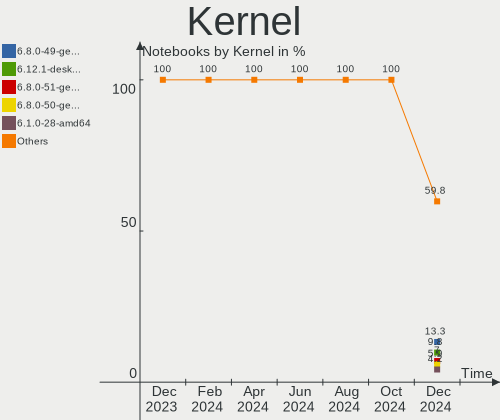
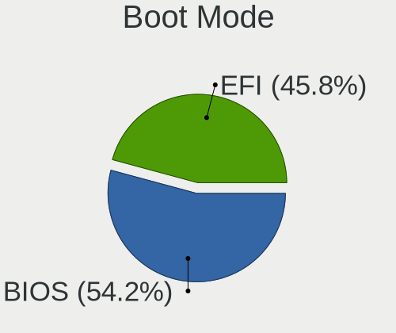
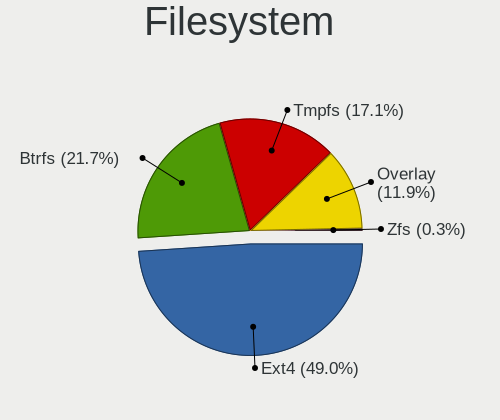
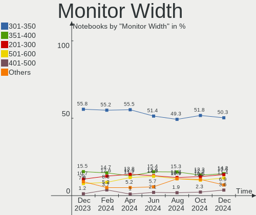
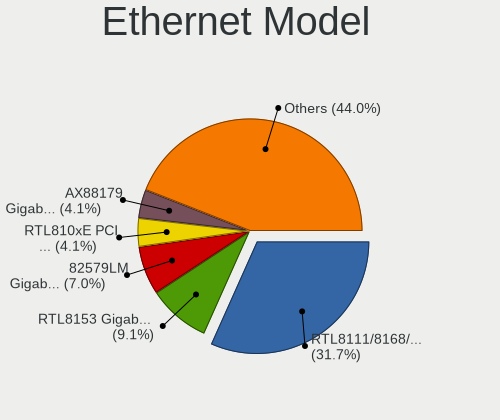

Linux in Germany - Hardware Trends (Notebooks)
----------------------------------------------

A project to identify most popular hardware characteristics and track their change
over time based on data collected by Linux users at https://Linux-Hardware.org.

Anyone can contribute to this report by the [hw-probe](https://github.com/linuxhw/hw-probe) tool:

    sudo -E hw-probe -all -upload

Period: Mar, 2023.

Contents
--------

* [ System ](#system)
  - [ OS                       ](#os)
  - [ OS Family                ](#os-family)
  - [ Kernel                   ](#kernel)
  - [ Kernel Family            ](#kernel-family)
  - [ Kernel Major Ver.        ](#kernel-major-ver)
  - [ Arch                     ](#arch)
  - [ DE                       ](#de)
  - [ Display Server           ](#display-server)
  - [ Display Manager          ](#display-manager)
  - [ OS Lang                  ](#os-lang)
  - [ Boot Mode                ](#boot-mode)
  - [ Filesystem               ](#filesystem)
  - [ Part. scheme             ](#part-scheme)
  - [ Dual Boot with Linux/BSD ](#dual-boot-with-linuxbsd)
  - [ Dual Boot (Win)          ](#dual-boot-win)

* [ Board ](#board)
  - [ Vendor                   ](#vendor)
  - [ Model                    ](#model)
  - [ Model Family             ](#model-family)
  - [ MFG Year                 ](#mfg-year)
  - [ Form Factor              ](#form-factor)
  - [ Secure Boot              ](#secure-boot)
  - [ Coreboot                 ](#coreboot)
  - [ RAM Size                 ](#ram-size)
  - [ RAM Used                 ](#ram-used)
  - [ Total Drives             ](#total-drives)
  - [ Has CD-ROM               ](#has-cd-rom)
  - [ Has Ethernet             ](#has-ethernet)
  - [ Has WiFi                 ](#has-wifi)
  - [ Has Bluetooth            ](#has-bluetooth)

* [ Location ](#location)
  - [ Country                  ](#country)
  - [ City                     ](#city)

* [ Drives ](#drives)
  - [ Drive Vendor             ](#drive-vendor)
  - [ Drive Model              ](#drive-model)
  - [ HDD Vendor               ](#hdd-vendor)
  - [ SSD Vendor               ](#ssd-vendor)
  - [ Drive Kind               ](#drive-kind)
  - [ Drive Connector          ](#drive-connector)
  - [ Drive Size               ](#drive-size)
  - [ Space Total              ](#space-total)
  - [ Space Used               ](#space-used)
  - [ Malfunc. Drives          ](#malfunc-drives)
  - [ Malfunc. Drive Vendor    ](#malfunc-drive-vendor)
  - [ Malfunc. HDD Vendor      ](#malfunc-hdd-vendor)
  - [ Malfunc. Drive Kind      ](#malfunc-drive-kind)
  - [ Failed Drives            ](#failed-drives)
  - [ Failed Drive Vendor      ](#failed-drive-vendor)
  - [ Drive Status             ](#drive-status)

* [ Storage controller ](#storage-controller)
  - [ Storage Vendor           ](#storage-vendor)
  - [ Storage Model            ](#storage-model)
  - [ Storage Kind             ](#storage-kind)

* [ Processor ](#processor)
  - [ CPU Vendor               ](#cpu-vendor)
  - [ CPU Model                ](#cpu-model)
  - [ CPU Model Family         ](#cpu-model-family)
  - [ CPU Cores                ](#cpu-cores)
  - [ CPU Sockets              ](#cpu-sockets)
  - [ CPU Threads              ](#cpu-threads)
  - [ CPU Op-Modes             ](#cpu-op-modes)
  - [ CPU Microcode            ](#cpu-microcode)
  - [ CPU Microarch            ](#cpu-microarch)

* [ Graphics ](#graphics)
  - [ GPU Vendor               ](#gpu-vendor)
  - [ GPU Model                ](#gpu-model)
  - [ GPU Combo                ](#gpu-combo)
  - [ GPU Driver               ](#gpu-driver)
  - [ GPU Memory               ](#gpu-memory)

* [ Monitor ](#monitor)
  - [ Monitor Vendor           ](#monitor-vendor)
  - [ Monitor Model            ](#monitor-model)
  - [ Monitor Resolution       ](#monitor-resolution)
  - [ Monitor Diagonal         ](#monitor-diagonal)
  - [ Monitor Width            ](#monitor-width)
  - [ Aspect Ratio             ](#aspect-ratio)
  - [ Monitor Area             ](#monitor-area)
  - [ Pixel Density            ](#pixel-density)
  - [ Multiple Monitors        ](#multiple-monitors)

* [ Network ](#network)
  - [ Net Controller Vendor    ](#net-controller-vendor)
  - [ Net Controller Model     ](#net-controller-model)
  - [ Wireless Vendor          ](#wireless-vendor)
  - [ Wireless Model           ](#wireless-model)
  - [ Ethernet Vendor          ](#ethernet-vendor)
  - [ Ethernet Model           ](#ethernet-model)
  - [ Net Controller Kind      ](#net-controller-kind)
  - [ Used Controller          ](#used-controller)
  - [ NICs                     ](#nics)
  - [ IPv6                     ](#ipv6)

* [ Bluetooth ](#bluetooth)
  - [ Bluetooth Vendor         ](#bluetooth-vendor)
  - [ Bluetooth Model          ](#bluetooth-model)

* [ Sound ](#sound)
  - [ Sound Vendor             ](#sound-vendor)
  - [ Sound Model              ](#sound-model)

* [ Memory ](#memory)
  - [ Memory Vendor            ](#memory-vendor)
  - [ Memory Model             ](#memory-model)
  - [ Memory Kind              ](#memory-kind)
  - [ Memory Form Factor       ](#memory-form-factor)
  - [ Memory Size              ](#memory-size)
  - [ Memory Speed             ](#memory-speed)

* [ Printers & scanners ](#printers--scanners)
  - [ Printer Vendor           ](#printer-vendor)
  - [ Printer Model            ](#printer-model)
  - [ Scanner Vendor           ](#scanner-vendor)
  - [ Scanner Model            ](#scanner-model)

* [ Camera ](#camera)
  - [ Camera Vendor            ](#camera-vendor)
  - [ Camera Model             ](#camera-model)

* [ Security ](#security)
  - [ Fingerprint Vendor       ](#fingerprint-vendor)
  - [ Fingerprint Model        ](#fingerprint-model)
  - [ Chipcard Vendor          ](#chipcard-vendor)
  - [ Chipcard Model           ](#chipcard-model)

* [ Unsupported ](#unsupported)
  - [ Unsupported Devices      ](#unsupported-devices)
  - [ Unsupported Device Types ](#unsupported-device-types)

System
------

OS
--

Installed operating systems

| Name                         | Notebooks | Percent |
|------------------------------|-----------|---------|
| Ubuntu 22.04                 | 62        | 15.5%   |
| Linux Mint 21.1              | 44        | 11%     |
| OpenMandriva 23.03           | 27        | 6.75%   |
| Debian 11                    | 25        | 6.25%   |
| Ubuntu 22.10                 | 22        | 5.5%    |
| Fedora 37                    | 19        | 4.75%   |
| Pop!_OS 22.04                | 11        | 2.75%   |
| Linux Mint 20.3              | 11        | 2.75%   |
| Arch Rolling                 | 11        | 2.75%   |
| Ubuntu 20.04                 | 10        | 2.5%    |
| OpenMandriva 4.3             | 8         | 2%      |
| OpenMandriva 23.01           | 8         | 2%      |
| Debian                       | 8         | 2%      |
| Zorin 16                     | 7         | 1.75%   |
| TUXEDO OS 22.04              | 7         | 1.75%   |
| SteamOS 3.4.6                | 7         | 1.75%   |
| Kali 2023.1                  | 7         | 1.75%   |
| Manjaro 22.0.5               | 6         | 1.5%    |
| openSUSE Tumbleweed-XXXXXXXX | 5         | 1.25%   |
| LMDE 5                       | 5         | 1.25%   |
| Kubuntu 22.04                | 5         | 1.25%   |
| EndeavourOS Rolling          | 5         | 1.25%   |
| ArcoLinux Rolling            | 5         | 1.25%   |
| Xubuntu 22.04                | 4         | 1%      |
| Manjaro                      | 4         | 1%      |
| KDE neon 22.04               | 4         | 1%      |
| Elementary 7                 | 4         | 1%      |
| Debian 12                    | 4         | 1%      |
| ROSA 12.3                    | 3         | 0.75%   |
| Linux Mint 21                | 3         | 0.75%   |
| Ubuntu 23.04                 | 2         | 0.5%    |
| Siduction 12                 | 2         | 0.5%    |
| openSUSE Leap-15.4           | 2         | 0.5%    |
| OpenMandriva 23.90           | 2         | 0.5%    |
| MX 21                        | 2         | 0.5%    |
| Manjaro 22.0.4               | 2         | 0.5%    |
| Lubuntu 22.04                | 2         | 0.5%    |
| Garuda Linux Soaring         | 2         | 0.5%    |
| Fedora 38                    | 2         | 0.5%    |
| Elementary 6.1               | 2         | 0.5%    |

OS Family
---------

OS without a version

| Name          | Notebooks | Percent |
|---------------|-----------|---------|
| Ubuntu        | 98        | 24.5%   |
| Linux Mint    | 60        | 15%     |
| OpenMandriva  | 46        | 11.5%   |
| Debian        | 38        | 9.5%    |
| Fedora        | 23        | 5.75%   |
| Manjaro       | 12        | 3%      |
| Pop!_OS       | 11        | 2.75%   |
| Arch          | 11        | 2.75%   |
| Zorin         | 8         | 2%      |
| Kali          | 8         | 2%      |
| TUXEDO OS     | 7         | 1.75%   |
| SteamOS       | 7         | 1.75%   |
| openSUSE      | 7         | 1.75%   |
| Kubuntu       | 6         | 1.5%    |
| Elementary    | 6         | 1.5%    |
| Xubuntu       | 5         | 1.25%   |
| LMDE          | 5         | 1.25%   |
| EndeavourOS   | 5         | 1.25%   |
| ArcoLinux     | 5         | 1.25%   |
| ROSA          | 4         | 1%      |
| KDE neon      | 4         | 1%      |
| Garuda Linux  | 3         | 0.75%   |
| Siduction     | 2         | 0.5%    |
| Nobara        | 2         | 0.5%    |
| MX            | 2         | 0.5%    |
| Lubuntu       | 2         | 0.5%    |
| Void Linux    | 1         | 0.25%   |
| Ubuntu Studio | 1         | 0.25%   |
| Ubuntu MATE   | 1         | 0.25%   |
| Ubuntu Budgie | 1         | 0.25%   |
| Sparky        | 1         | 0.25%   |
| Solus         | 1         | 0.25%   |
| RHEL          | 1         | 0.25%   |
| Mageia        | 1         | 0.25%   |
| Linux Lite    | 1         | 0.25%   |
| Gentoo        | 1         | 0.25%   |
| Devuan        | 1         | 0.25%   |
| blendOS       | 1         | 0.25%   |
| BlackPanther  | 1         | 0.25%   |

Kernel
------

Version of the Linux kernel

| Version                  | Notebooks | Percent |
|--------------------------|-----------|---------|
| 5.19.0-35-generic        | 60        | 15%     |
| 5.15.0-67-generic        | 51        | 12.75%  |
| 6.2.6-desktop-1omv2390   | 24        | 6%      |
| 5.10.0-21-amd64          | 19        | 4.75%   |
| 5.19.0-32-generic        | 13        | 3.25%   |
| 5.15.0-60-generic        | 11        | 2.75%   |
| 5.4.0-144-generic        | 10        | 2.5%    |
| 6.1.1-desktop-1omv2290   | 9         | 2.25%   |
| 6.1.0-1009-tuxedo        | 9         | 2.25%   |
| 6.1.14-200.fc37.x86_64   | 8         | 2%      |
| 5.19.0-38-generic        | 8         | 2%      |
| 5.13.0-valve36-1-neptune | 7         | 1.75%   |
| 6.1.0-kali5-amd64        | 6         | 1.5%    |
| 6.1.0-6-amd64            | 6         | 1.5%    |
| 6.2.2-arch1-1            | 5         | 1.25%   |
| 6.2.0-76060200-generic   | 5         | 1.25%   |
| 5.19.0-21-generic        | 5         | 1.25%   |
| 5.16.13-desktop-1omv4003 | 5         | 1.25%   |
| 6.2.7-arch1-1            | 4         | 1%      |
| 6.2.2-1-default          | 4         | 1%      |
| 6.1.19-1-MANJARO         | 4         | 1%      |
| 6.1.0-5-amd64            | 4         | 1%      |
| 6.0.0-0.deb11.6-amd64    | 4         | 1%      |
| 5.15.0-69-generic        | 4         | 1%      |
| 6.2.8-200.fc37.x86_64    | 3         | 0.75%   |
| 6.1.12-1-MANJARO         | 3         | 0.75%   |
| 6.1.11-76060111-generic  | 3         | 0.75%   |
| 6.0.12-76060006-generic  | 3         | 0.75%   |
| 5.4.0-139-generic        | 3         | 0.75%   |
| 5.19.0-31-generic        | 3         | 0.75%   |
| 5.16.7-desktop-1omv4003  | 3         | 0.75%   |
| 5.15.0-56-generic        | 3         | 0.75%   |
| 5.10.0-20-amd64          | 3         | 0.75%   |
| 6.2.8-arch1-1            | 2         | 0.5%    |
| 6.2.5-arch1-1            | 2         | 0.5%    |
| 6.1.4-desktop-1omv2301   | 2         | 0.5%    |
| 6.1.20-1-lts             | 2         | 0.5%    |
| 6.1.18-200.fc37.x86_64   | 2         | 0.5%    |
| 6.1.0-3-amd64            | 2         | 0.5%    |
| 6.1.0-1007-oem           | 2         | 0.5%    |

Kernel Family
-------------

Linux kernel without a distro release

| Version  | Notebooks | Percent |
|----------|-----------|---------|
| 5.19.0   | 90        | 22.5%   |
| 5.15.0   | 72        | 18%     |
| 6.1.0    | 32        | 8%      |
| 6.2.6    | 31        | 7.75%   |
| 5.10.0   | 25        | 6.25%   |
| 5.4.0    | 17        | 4.25%   |
| 6.2.2    | 12        | 3%      |
| 6.1.14   | 10        | 2.5%    |
| 6.2.8    | 9         | 2.25%   |
| 6.1.1    | 9         | 2.25%   |
| 6.0.0    | 9         | 2.25%   |
| 6.2.7    | 8         | 2%      |
| 5.13.0   | 8         | 2%      |
| 6.2.0    | 5         | 1.25%   |
| 6.1.11   | 5         | 1.25%   |
| 5.16.13  | 5         | 1.25%   |
| 6.1.19   | 4         | 1%      |
| 6.1.12   | 4         | 1%      |
| 6.2.1    | 3         | 0.75%   |
| 6.0.12   | 3         | 0.75%   |
| 5.16.7   | 3         | 0.75%   |
| 4.15.0   | 3         | 0.75%   |
| 6.2.5    | 2         | 0.5%    |
| 6.1.8    | 2         | 0.5%    |
| 6.1.4    | 2         | 0.5%    |
| 6.1.20   | 2         | 0.5%    |
| 6.1.18   | 2         | 0.5%    |
| 6.1.15   | 2         | 0.5%    |
| 5.15.75  | 2         | 0.5%    |
| 5.15.102 | 2         | 0.5%    |
| 5.14.21  | 2         | 0.5%    |
| 6.2.9    | 1         | 0.25%   |
| 6.1.7    | 1         | 0.25%   |
| 6.1.5    | 1         | 0.25%   |
| 6.1.21   | 1         | 0.25%   |
| 6.0.7    | 1         | 0.25%   |
| 6.0.18   | 1         | 0.25%   |
| 6.0.14   | 1         | 0.25%   |
| 5.6.14   | 1         | 0.25%   |
| 5.18.15  | 1         | 0.25%   |

Kernel Major Ver.
-----------------

Linux kernel major version

| Version | Notebooks | Percent |
|---------|-----------|---------|
| 5.19    | 90        | 22.5%   |
| 5.15    | 78        | 19.5%   |
| 6.1     | 77        | 19.25%  |
| 6.2     | 71        | 17.75%  |
| 5.10    | 28        | 7%      |
| 5.4     | 17        | 4.25%   |
| 6.0     | 15        | 3.75%   |
| 5.16    | 8         | 2%      |
| 5.13    | 8         | 2%      |
| 4.15    | 3         | 0.75%   |
| 5.14    | 2         | 0.5%    |
| 5.6     | 1         | 0.25%   |
| 5.18    | 1         | 0.25%   |
| 4.18    | 1         | 0.25%   |

Arch
----

OS architecture (x86_64, i586, etc.)

| Name   | Notebooks | Percent |
|--------|-----------|---------|
| x86_64 | 396       | 99%     |
| i686   | 4         | 1%      |

DE
--

Desktop Environment

| Name              | Notebooks | Percent |
|-------------------|-----------|---------|
| GNOME             | 166       | 41.5%   |
| KDE5              | 98        | 24.5%   |
| X-Cinnamon        | 55        | 13.75%  |
| XFCE              | 37        | 9.25%   |
| Cinnamon          | 10        | 2.5%    |
| MATE              | 7         | 1.75%   |
| Pantheon          | 6         | 1.5%    |
| Unknown           | 6         | 1.5%    |
| LXQt              | 4         | 1%      |
| LXDE              | 3         | 0.75%   |
| Budgie            | 3         | 0.75%   |
| x-session-manager | 1         | 0.25%   |
| KDE               | 1         | 0.25%   |
| ICEWM             | 1         | 0.25%   |
| i3                | 1         | 0.25%   |
| awesome           | 1         | 0.25%   |

Display Server
--------------

X11 or Wayland

| Name    | Notebooks | Percent |
|---------|-----------|---------|
| X11     | 279       | 69.75%  |
| Wayland | 109       | 27.25%  |
| Tty     | 7         | 1.75%   |
| Unknown | 5         | 1.25%   |

Display Manager
---------------

SDDM, LightDM, etc.

| Name    | Notebooks | Percent |
|---------|-----------|---------|
| Unknown | 105       | 26.25%  |
| GDM3    | 94        | 23.5%   |
| LightDM | 86        | 21.5%   |
| SDDM    | 81        | 20.25%  |
| GDM     | 32        | 8%      |
| KDM     | 1         | 0.25%   |
| GREETD  | 1         | 0.25%   |

OS Lang
-------

Language

| Lang       | Notebooks | Percent |
|------------|-----------|---------|
| de_DE      | 281       | 70.25%  |
| en_US      | 88        | 22%     |
| en_GB      | 11        | 2.75%   |
| Unknown    | 5         | 1.25%   |
| C          | 3         | 0.75%   |
| en_IN      | 2         | 0.5%    |
| en_DE      | 2         | 0.5%    |
| ru_RU      | 1         | 0.25%   |
| pt_PT      | 1         | 0.25%   |
| pt_BR      | 1         | 0.25%   |
| pl_PL      | 1         | 0.25%   |
| nl_NL      | 1         | 0.25%   |
| it_IT      | 1         | 0.25%   |
| en_AG      | 1         | 0.25%   |
| de_DE.UTF8 | 1         | 0.25%   |

Boot Mode
---------

EFI or BIOS

| Mode | Notebooks | Percent |
|------|-----------|---------|
| EFI  | 208       | 52%     |
| BIOS | 192       | 48%     |

Filesystem
----------

Type of filesystem

| Type    | Notebooks | Percent |
|---------|-----------|---------|
| Ext4    | 298       | 74.5%   |
| Btrfs   | 65        | 16.25%  |
| Overlay | 25        | 6.25%   |
| Zfs     | 4         | 1%      |
| Xfs     | 3         | 0.75%   |
| F2fs    | 2         | 0.5%    |
| Tmpfs   | 1         | 0.25%   |
| Rootfs  | 1         | 0.25%   |
| Unknown | 1         | 0.25%   |

Part. scheme
------------

Scheme of partitioning

| Type    | Notebooks | Percent |
|---------|-----------|---------|
| GPT     | 246       | 61.5%   |
| Unknown | 99        | 24.75%  |
| MBR     | 55        | 13.75%  |

Dual Boot with Linux/BSD
------------------------

Hosting more than one Linux/BSD

| Dual boot | Notebooks | Percent |
|-----------|-----------|---------|
| No        | 338       | 84.5%   |
| Yes       | 62        | 15.5%   |

Dual Boot (Win)
---------------

Hosting Linux and Windows

| Dual boot | Notebooks | Percent |
|-----------|-----------|---------|
| No        | 305       | 76.25%  |
| Yes       | 95        | 23.75%  |

Board
-----

Vendor
------

Motherboard manufacturer

| Name                | Notebooks | Percent |
|---------------------|-----------|---------|
| Lenovo              | 116       | 29%     |
| Acer                | 50        | 12.5%   |
| Hewlett-Packard     | 46        | 11.5%   |
| Dell                | 42        | 10.5%   |
| ASUSTek Computer    | 25        | 6.25%   |
| TUXEDO              | 19        | 4.75%   |
| Apple               | 16        | 4%      |
| Medion              | 12        | 3%      |
| Fujitsu             | 10        | 2.5%    |
| MSI                 | 8         | 2%      |
| Valve               | 7         | 1.75%   |
| Toshiba             | 7         | 1.75%   |
| Samsung Electronics | 6         | 1.5%    |
| Sony                | 5         | 1.25%   |
| HUAWEI              | 5         | 1.25%   |
| Schenker            | 4         | 1%      |
| Notebook            | 3         | 0.75%   |
| Gigabyte Technology | 3         | 0.75%   |
| Fujitsu Siemens     | 2         | 0.5%    |
| Unknown             | 2         | 0.5%    |
| VALE                | 1         | 0.25%   |
| Teclast             | 1         | 0.25%   |
| Star Labs           | 1         | 0.25%   |
| Packard Bell        | 1         | 0.25%   |
| LG Electronics      | 1         | 0.25%   |
| Insyde              | 1         | 0.25%   |
| IGEL Technology     | 1         | 0.25%   |
| GPD                 | 1         | 0.25%   |
| Google              | 1         | 0.25%   |
| DTRI                | 1         | 0.25%   |
| Clevo               | 1         | 0.25%   |
| AXDIA International | 1         | 0.25%   |

Model
-----

Motherboard model

| Name                                     | Notebooks | Percent |
|------------------------------------------|-----------|---------|
| Valve Jupiter                            | 7         | 1.75%   |
| TUXEDO InfinityBook Pro Gen7 (MK1)       | 4         | 1%      |
| Apple MacBookPro9,2                      | 4         | 1%      |
| Lenovo IdeaPad 3 15ALC6 82KU             | 3         | 0.75%   |
| Dell XPS 13 7390                         | 3         | 0.75%   |
| Unknown                                  | 3         | 0.75%   |
| TUXEDO Pulse 15 Gen1                     | 2         | 0.5%    |
| TUXEDO InfinityBook S 15/17 Gen7         | 2         | 0.5%    |
| TUXEDO InfinityBook Pro 14 v4            | 2         | 0.5%    |
| TUXEDO InfinityBook Pro 14 Gen6          | 2         | 0.5%    |
| Notebook N8xxEP6                         | 2         | 0.5%    |
| Lenovo Yoga Slim 7 Pro 14ACH5 OD 82NK    | 2         | 0.5%    |
| Lenovo ThinkPad T14s Gen 3 21CQCTO1WW    | 2         | 0.5%    |
| HUAWEI KPL-W0X                           | 2         | 0.5%    |
| Gigabyte A7 K1                           | 2         | 0.5%    |
| Fujitsu LIFEBOOK S760                    | 2         | 0.5%    |
| Fujitsu LIFEBOOK E556                    | 2         | 0.5%    |
| Dell Latitude E5570                      | 2         | 0.5%    |
| Dell Latitude 3320                       | 2         | 0.5%    |
| ASUS VivoBook_ASUSLaptop S5402ZA_K5402ZA | 2         | 0.5%    |
| ASUS K56CB                               | 2         | 0.5%    |
| ASUS K50IJ                               | 2         | 0.5%    |
| Apple MacBook5,1                         | 2         | 0.5%    |
| Acer Aspire V3-772                       | 2         | 0.5%    |
| Acer Aspire V3-571G                      | 2         | 0.5%    |
| Acer Aspire E1-572G                      | 2         | 0.5%    |
| Acer Aspire A315-56                      | 2         | 0.5%    |
| Acer Aspire 8930                         | 2         | 0.5%    |
| Acer Aspire 7745G                        | 2         | 0.5%    |
| Acer Aspire 7741                         | 2         | 0.5%    |
| VALE Notebook Classic C140               | 1         | 0.25%   |
| TUXEDO Pulse 15 Gen2                     | 1         | 0.25%   |
| TUXEDO Pulse 14 Gen1                     | 1         | 0.25%   |
| TUXEDO Polaris Intel Gen3 (TGL)          | 1         | 0.25%   |
| TUXEDO Polaris AMD Gen3 (CZN)            | 1         | 0.25%   |
| TUXEDO N13xWU                            | 1         | 0.25%   |
| TUXEDO Aura 15 Gen2                      | 1         | 0.25%   |
| TUXEDO Aura 15 Gen1                      | 1         | 0.25%   |
| Toshiba TECRA Z40-C                      | 1         | 0.25%   |
| Toshiba TECRA M10                        | 1         | 0.25%   |

Model Family
------------

Motherboard model prefix

| Name                | Notebooks | Percent |
|---------------------|-----------|---------|
| Lenovo ThinkPad     | 79        | 19.75%  |
| Acer Aspire         | 36        | 9%      |
| Lenovo IdeaPad      | 17        | 4.25%   |
| Dell Latitude       | 16        | 4%      |
| TUXEDO InfinityBook | 10        | 2.5%    |
| Fujitsu LIFEBOOK    | 10        | 2.5%    |
| HP Pavilion         | 8         | 2%      |
| Dell XPS            | 8         | 2%      |
| Dell Precision      | 8         | 2%      |
| Valve Jupiter       | 7         | 1.75%   |
| HP ProBook          | 7         | 1.75%   |
| HP Laptop           | 7         | 1.75%   |
| HP EliteBook        | 7         | 1.75%   |
| Dell Inspiron       | 7         | 1.75%   |
| ASUS VivoBook       | 6         | 1.5%    |
| Lenovo Legion       | 5         | 1.25%   |
| Apple MacBookPro9   | 5         | 1.25%   |
| TUXEDO Pulse        | 4         | 1%      |
| Toshiba Satellite   | 4         | 1%      |
| Acer Swift          | 4         | 1%      |
| Lenovo Yoga         | 3         | 0.75%   |
| HP ZBook            | 3         | 0.75%   |
| HP 250              | 3         | 0.75%   |
| Apple MacBookPro11  | 3         | 0.75%   |
| Acer TravelMate     | 3         | 0.75%   |
| Acer Nitro          | 3         | 0.75%   |
| Unknown             | 3         | 0.75%   |
| TUXEDO Polaris      | 2         | 0.5%    |
| TUXEDO Aura         | 2         | 0.5%    |
| Toshiba TECRA       | 2         | 0.5%    |
| Schenker XMG        | 2         | 0.5%    |
| Notebook N8xxEP6    | 2         | 0.5%    |
| MSI Modern          | 2         | 0.5%    |
| Medion Akoya        | 2         | 0.5%    |
| Lenovo ThinkBook    | 2         | 0.5%    |
| HUAWEI KPL-W0X      | 2         | 0.5%    |
| HP Compaq           | 2         | 0.5%    |
| HP 255              | 2         | 0.5%    |
| Gigabyte A7         | 2         | 0.5%    |
| Dell Vostro         | 2         | 0.5%    |

MFG Year
--------

Motherboard manufacture year

| Year | Notebooks | Percent |
|------|-----------|---------|
| 2022 | 47        | 11.75%  |
| 2021 | 46        | 11.5%   |
| 2020 | 39        | 9.75%   |
| 2012 | 36        | 9%      |
| 2019 | 31        | 7.75%   |
| 2018 | 29        | 7.25%   |
| 2013 | 26        | 6.5%    |
| 2016 | 23        | 5.75%   |
| 2014 | 21        | 5.25%   |
| 2011 | 21        | 5.25%   |
| 2010 | 20        | 5%      |
| 2015 | 16        | 4%      |
| 2009 | 14        | 3.5%    |
| 2017 | 13        | 3.25%   |
| 2008 | 7         | 1.75%   |
| 2006 | 4         | 1%      |
| 2023 | 3         | 0.75%   |
| 2007 | 3         | 0.75%   |
| 2005 | 1         | 0.25%   |

Form Factor
-----------

Physical design of the computer

| Name     | Notebooks | Percent |
|----------|-----------|---------|
| Notebook | 400       | 100%    |

Secure Boot
-----------

Enabled or disabled

| State    | Notebooks | Percent |
|----------|-----------|---------|
| Disabled | 366       | 91.5%   |
| Enabled  | 34        | 8.5%    |

Coreboot
--------

Have coreboot on board

| Used | Notebooks | Percent |
|------|-----------|---------|
| No   | 398       | 99.5%   |
| Yes  | 2         | 0.5%    |

RAM Size
--------

Total RAM memory

| Size in GB  | Notebooks | Percent |
|-------------|-----------|---------|
| 4.01-8.0    | 123       | 30.75%  |
| 8.01-16.0   | 77        | 19.25%  |
| 3.01-4.0    | 70        | 17.5%   |
| 16.01-24.0  | 67        | 16.75%  |
| 32.01-64.0  | 38        | 9.5%    |
| 24.01-32.0  | 8         | 2%      |
| 64.01-256.0 | 7         | 1.75%   |
| 1.01-2.0    | 7         | 1.75%   |
| 2.01-3.0    | 3         | 0.75%   |

RAM Used
--------

Used RAM memory

| Used GB    | Notebooks | Percent |
|------------|-----------|---------|
| 1.01-2.0   | 136       | 34%     |
| 2.01-3.0   | 101       | 25.25%  |
| 4.01-8.0   | 74        | 18.5%   |
| 3.01-4.0   | 52        | 13%     |
| 8.01-16.0  | 19        | 4.75%   |
| 0.51-1.0   | 12        | 3%      |
| 16.01-24.0 | 3         | 0.75%   |
| 24.01-32.0 | 2         | 0.5%    |
| 0.01-0.5   | 1         | 0.25%   |

Total Drives
------------

Number of drives on board

| Drives | Notebooks | Percent |
|--------|-----------|---------|
| 1      | 294       | 73.5%   |
| 2      | 95        | 23.75%  |
| 3      | 9         | 2.25%   |
| 7      | 1         | 0.25%   |
| 0      | 1         | 0.25%   |

Has CD-ROM
----------

Has CD-ROM on board

| Presented | Notebooks | Percent |
|-----------|-----------|---------|
| No        | 260       | 65%     |
| Yes       | 140       | 35%     |

Has Ethernet
------------

Has Ethernet on board

| Presented | Notebooks | Percent |
|-----------|-----------|---------|
| Yes       | 330       | 82.5%   |
| No        | 70        | 17.5%   |

Has WiFi
--------

Has WiFi module

| Presented | Notebooks | Percent |
|-----------|-----------|---------|
| Yes       | 393       | 98.25%  |
| No        | 7         | 1.75%   |

Has Bluetooth
-------------

Has Bluetooth module

| Presented | Notebooks | Percent |
|-----------|-----------|---------|
| Yes       | 334       | 83.5%   |
| No        | 66        | 16.5%   |

Location
--------

Country
-------

Geographic location (country)

| Country | Notebooks | Percent |
|---------|-----------|---------|
| Germany | 400       | 100%    |

City
----

Geographic location (city)

| City              | Notebooks | Percent |
|-------------------|-----------|---------|
| Berlin            | 37        | 9.25%   |
| Frankfurt am Main | 20        | 5%      |
| Munich            | 19        | 4.75%   |
| Hamburg           | 14        | 3.5%    |
| Cologne           | 12        | 3%      |
| Stuttgart         | 10        | 2.5%    |
| Leipzig           | 8         | 2%      |
| Bonn              | 6         | 1.5%    |
| Nuremberg         | 5         | 1.25%   |
| Dortmund          | 5         | 1.25%   |
| Chemnitz          | 5         | 1.25%   |
| Bochum            | 5         | 1.25%   |
| Ulm               | 4         | 1%      |
| Augsburg          | 4         | 1%      |
| Konstanz          | 3         | 0.75%   |
| Kiel              | 3         | 0.75%   |
| Karlsruhe         | 3         | 0.75%   |
| Jena              | 3         | 0.75%   |
| Gummersbach       | 3         | 0.75%   |
| Greifswald        | 3         | 0.75%   |
| Göttingen        | 3         | 0.75%   |
| Gera              | 3         | 0.75%   |
| Wuppertal         | 2         | 0.5%    |
| Weyhe             | 2         | 0.5%    |
| Ueckermuende      | 2         | 0.5%    |
| Scharbeutz        | 2         | 0.5%    |
| Reutlingen        | 2         | 0.5%    |
| Regensburg        | 2         | 0.5%    |
| Ohringen          | 2         | 0.5%    |
| Offenbach         | 2         | 0.5%    |
| Mönchengladbach  | 2         | 0.5%    |
| Ludwigsburg       | 2         | 0.5%    |
| Landau            | 2         | 0.5%    |
| Kassel            | 2         | 0.5%    |
| Hohen Neuendorf   | 2         | 0.5%    |
| Herne             | 2         | 0.5%    |
| Hanover           | 2         | 0.5%    |
| Hamm              | 2         | 0.5%    |
| Halle             | 2         | 0.5%    |
| Gelsenkirchen     | 2         | 0.5%    |

Drives
------

Drive Vendor
------------

Hard drive vendors

| Vendor                         | Notebooks | Drives | Percent |
|--------------------------------|-----------|--------|---------|
| Samsung Electronics            | 112       | 127    | 22.86%  |
| WDC                            | 42        | 44     | 8.57%   |
| SanDisk                        | 37        | 38     | 7.55%   |
| Seagate                        | 33        | 34     | 6.73%   |
| Toshiba                        | 29        | 29     | 5.92%   |
| Crucial                        | 23        | 23     | 4.69%   |
| Unknown                        | 21        | 22     | 4.29%   |
| SK hynix                       | 21        | 21     | 4.29%   |
| Micron Technology              | 19        | 19     | 3.88%   |
| Kingston                       | 19        | 19     | 3.88%   |
| Intenso                        | 18        | 18     | 3.67%   |
| Intel                          | 14        | 14     | 2.86%   |
| HGST                           | 9         | 9      | 1.84%   |
| Hitachi                        | 8         | 8      | 1.63%   |
| Unknown                        | 8         | 9      | 1.63%   |
| Phison                         | 6         | 6      | 1.22%   |
| KIOXIA                         | 6         | 6      | 1.22%   |
| Kingston Technology Company    | 5         | 5      | 1.02%   |
| Micron/Crucial Technology      | 4         | 4      | 0.82%   |
| China                          | 4         | 4      | 0.82%   |
| Apple                          | 4         | 4      | 0.82%   |
| Transcend                      | 3         | 3      | 0.61%   |
| JMicron Technology             | 3         | 3      | 0.61%   |
| A-DATA Technology              | 3         | 3      | 0.61%   |
| SPCC                           | 2         | 2      | 0.41%   |
| Solid State Storage Technology | 2         | 2      | 0.41%   |
| Silicon Motion                 | 2         | 2      | 0.41%   |
| Phison Electronics             | 2         | 3      | 0.41%   |
| Netac                          | 2         | 2      | 0.41%   |
| INNOVATION IT                  | 2         | 2      | 0.41%   |
| Fanxiang                       | 2         | 2      | 0.41%   |
| ASMT                           | 2         | 2      | 0.41%   |
| Wdstars                        | 1         | 1      | 0.2%    |
| Verbatim                       | 1         | 1      | 0.2%    |
| Vaseky                         | 1         | 1      | 0.2%    |
| Teclast                        | 1         | 1      | 0.2%    |
| Star Drive                     | 1         | 1      | 0.2%    |
| SSSTC                          | 1         | 1      | 0.2%    |
| SABRENT                        | 1         | 1      | 0.2%    |
| Radeon                         | 1         | 1      | 0.2%    |

Drive Model
-----------

Hard drive models

| Model                                               | Notebooks | Percent |
|-----------------------------------------------------|-----------|---------|
| Samsung NVMe SSD Controller SM981/PM981/PM983 250GB | 15        | 2.96%   |
| Samsung NVMe SSD Controller PM9A1/PM9A3/980PRO 1TB  | 9         | 1.78%   |
| Samsung SSD 860 EVO 500GB                           | 8         | 1.58%   |
| Unknown                                             | 8         | 1.58%   |
| Seagate ST1000LM024 HN-M101MBB 1TB                  | 7         | 1.38%   |
| SanDisk NVMe SSD Drive 1TB                          | 5         | 0.99%   |
| Samsung SSD 850 EVO 250GB                           | 5         | 0.99%   |
| Micron MTFDHBA512QFD 512GB                          | 5         | 0.99%   |
| Kingston Company OM3PDP3 NVMe SSD 256GB             | 5         | 0.99%   |
| Toshiba MQ01ABD100 1TB                              | 4         | 0.79%   |
| Samsung SSD 980 500GB                               | 4         | 0.79%   |
| Samsung SSD 840 EVO 250GB                           | 4         | 0.79%   |
| Samsung MZVLB1T0HBLR-000L2 1TB                      | 4         | 0.79%   |
| Crucial CT1000MX500SSD1 1TB                         | 4         | 0.79%   |
| WDC WDS500G2B0A-00SM50 500GB SSD                    | 3         | 0.59%   |
| WDC WD10JPVX-22JC3T0 1TB                            | 3         | 0.59%   |
| Unknown MMC Card  64GB                              | 3         | 0.59%   |
| Unknown MMC Card  512GB                             | 3         | 0.59%   |
| Toshiba MQ01ABD075 752GB                            | 3         | 0.59%   |
| SK hynix BC511 512GB                                | 3         | 0.59%   |
| Seagate ST9500325AS 500GB                           | 3         | 0.59%   |
| Seagate ST1000LM035-1RK172 1TB                      | 3         | 0.59%   |
| Sandisk PC SN520 NVMe SSD 128GB                     | 3         | 0.59%   |
| Samsung SSD 980 PRO 1TB                             | 3         | 0.59%   |
| Samsung SSD 980 1TB                                 | 3         | 0.59%   |
| Samsung SSD 870 QVO 4TB                             | 3         | 0.59%   |
| Samsung SSD 850 EVO 1TB                             | 3         | 0.59%   |
| Micron/Crucial P2 NVMe PCIe SSD 1TB                 | 3         | 0.59%   |
| Intenso SSD SATAIII 512GB                           | 3         | 0.59%   |
| Intenso SSD 128GB                                   | 3         | 0.59%   |
| Intenso SATA III SSD 120GB                          | 3         | 0.59%   |
| HGST HTS721010A9E630 1TB                            | 3         | 0.59%   |
| Crucial CT480BX500SSD1 480GB                        | 3         | 0.59%   |
| Crucial CT240BX500SSD1 240GB                        | 3         | 0.59%   |
| WDC WDS240G2G0A-00JH30 240GB SSD                    | 2         | 0.39%   |
| WDC WDS100T2B0B-00YS70 1TB SSD                      | 2         | 0.39%   |
| WDC WD10JPCX-24UE4T0 1TB                            | 2         | 0.39%   |
| Unknown SD/MMC/MS PRO 64GB                          | 2         | 0.39%   |
| Unknown MMC Card  32GB                              | 2         | 0.39%   |
| Unknown MMC Card  16GB                              | 2         | 0.39%   |

HDD Vendor
----------

Hard disk drive vendors

| Vendor              | Notebooks | Drives | Percent |
|---------------------|-----------|--------|---------|
| Seagate             | 31        | 32     | 35.23%  |
| WDC                 | 20        | 20     | 22.73%  |
| Toshiba             | 14        | 14     | 15.91%  |
| HGST                | 9         | 9      | 10.23%  |
| Hitachi             | 8         | 8      | 9.09%   |
| Unknown             | 2         | 2      | 2.27%   |
| Samsung Electronics | 1         | 1      | 1.14%   |
| SABRENT             | 1         | 1      | 1.14%   |
| Fujitsu             | 1         | 1      | 1.14%   |
| ASMT                | 1         | 1      | 1.14%   |

SSD Vendor
----------

Solid state drive vendors

| Vendor              | Notebooks | Drives | Percent |
|---------------------|-----------|--------|---------|
| Samsung Electronics | 49        | 53     | 26.34%  |
| SanDisk             | 21        | 21     | 11.29%  |
| Crucial             | 21        | 21     | 11.29%  |
| Intenso             | 17        | 17     | 9.14%   |
| WDC                 | 10        | 10     | 5.38%   |
| Kingston            | 10        | 10     | 5.38%   |
| Toshiba             | 8         | 8      | 4.3%    |
| Intel               | 4         | 4      | 2.15%   |
| China               | 4         | 4      | 2.15%   |
| Transcend           | 3         | 3      | 1.61%   |
| SK hynix            | 3         | 3      | 1.61%   |
| Phison              | 3         | 3      | 1.61%   |
| Apple               | 3         | 3      | 1.61%   |
| Seagate             | 2         | 2      | 1.08%   |
| Netac               | 2         | 2      | 1.08%   |
| Micron Technology   | 2         | 2      | 1.08%   |
| INNOVATION IT       | 2         | 2      | 1.08%   |
| Fanxiang            | 2         | 2      | 1.08%   |
| A-DATA Technology   | 2         | 2      | 1.08%   |
| Unknown             | 2         | 3      | 1.08%   |
| Wdstars             | 1         | 1      | 0.54%   |
| Verbatim            | 1         | 1      | 0.54%   |
| Vaseky              | 1         | 1      | 0.54%   |
| Teclast             | 1         | 1      | 0.54%   |
| SPCC                | 1         | 1      | 0.54%   |
| Radeon              | 1         | 1      | 0.54%   |
| Patriot             | 1         | 1      | 0.54%   |
| OCZ                 | 1         | 1      | 0.54%   |
| JMicron Technology  | 1         | 1      | 0.54%   |
| GOODRAM             | 1         | 1      | 0.54%   |
| GLOWAY              | 1         | 1      | 0.54%   |
| FORESEE             | 1         | 1      | 0.54%   |
| Emtec               | 1         | 1      | 0.54%   |
| CT500MX5            | 1         | 1      | 0.54%   |
| BAITITON            | 1         | 1      | 0.54%   |
| ASMT                | 1         | 1      | 0.54%   |

Drive Kind
----------

HDD or SSD

| Kind    | Notebooks | Drives | Percent |
|---------|-----------|--------|---------|
| NVMe    | 179       | 199    | 38.74%  |
| SSD     | 170       | 191    | 36.8%   |
| HDD     | 84        | 89     | 18.18%  |
| MMC     | 24        | 26     | 5.19%   |
| Unknown | 5         | 7      | 1.08%   |

Drive Connector
---------------

SATA, SAS, NVMe, etc.

| Type | Notebooks | Drives | Percent |
|------|-----------|--------|---------|
| SATA | 235       | 266    | 51.54%  |
| NVMe | 178       | 197    | 39.04%  |
| MMC  | 24        | 26     | 5.26%   |
| SAS  | 19        | 23     | 4.17%   |

Drive Size
----------

Size of hard drive

| Size in TB | Notebooks | Drives | Percent |
|------------|-----------|--------|---------|
| 0.01-0.5   | 170       | 181    | 64.39%  |
| 0.51-1.0   | 77        | 81     | 29.17%  |
| 1.01-2.0   | 10        | 11     | 3.79%   |
| 3.01-4.0   | 5         | 5      | 1.89%   |
| 4.01-10.0  | 2         | 2      | 0.76%   |

Space Total
-----------

Amount of disk space available on the file system

| Size in GB     | Notebooks | Percent |
|----------------|-----------|---------|
| 251-500        | 110       | 27.5%   |
| 101-250        | 94        | 23.5%   |
| 501-1000       | 76        | 19%     |
| 1-20           | 33        | 8.25%   |
| 1001-2000      | 26        | 6.5%    |
| 51-100         | 19        | 4.75%   |
| Unknown        | 15        | 3.75%   |
| 21-50          | 13        | 3.25%   |
| More than 3000 | 7         | 1.75%   |
| 2001-3000      | 7         | 1.75%   |

Space Used
----------

Amount of used disk space

| Used GB        | Notebooks | Percent |
|----------------|-----------|---------|
| 1-20           | 123       | 30.75%  |
| 21-50          | 78        | 19.5%   |
| 101-250        | 64        | 16%     |
| 51-100         | 42        | 10.5%   |
| 251-500        | 41        | 10.25%  |
| 501-1000       | 19        | 4.75%   |
| Unknown        | 15        | 3.75%   |
| 1001-2000      | 14        | 3.5%    |
| More than 3000 | 2         | 0.5%    |
| 2001-3000      | 2         | 0.5%    |

Malfunc. Drives
---------------

Drive models with a malfunction

| Model                                                           | Notebooks | Drives | Percent |
|-----------------------------------------------------------------|-----------|--------|---------|
| WDC PC SN730 SDBPNTY-512G-1101 512GB                            | 1         | 1      | 5.88%   |
| Toshiba MQ04ABF100 1TB                                          | 1         | 1      | 5.88%   |
| Seagate STT_FTM56GX25H 256GB SSD                                | 1         | 1      | 5.88%   |
| Seagate ST980813AS 80GB                                         | 1         | 1      | 5.88%   |
| Seagate ST500LM000-1EJ162 500GB                                 | 1         | 1      | 5.88%   |
| Seagate ST320LM001 HN-M320MBB 320GB                             | 1         | 1      | 5.88%   |
| Seagate ST1000LM049-2GH172 1TB                                  | 1         | 1      | 5.88%   |
| Seagate ST1000LM035-1RK172 1TB                                  | 1         | 1      | 5.88%   |
| Samsung Electronics SSD 840 EVO 1TB                             | 1         | 1      | 5.88%   |
| Samsung Electronics NVMe SSD Controller SM961/PM961/SM963 256GB | 1         | 1      | 5.88%   |
| Kingston SH103S3240G 240GB SSD                                  | 1         | 1      | 5.88%   |
| Intel SSDPEKNU512GZH 512GB                                      | 1         | 1      | 5.88%   |
| HGST HTS721010A9E630 1TB                                        | 1         | 1      | 5.88%   |
| HGST HTS545050A7E680 500GB                                      | 1         | 1      | 5.88%   |
| HGST HTS541010A9E680 1TB                                        | 1         | 1      | 5.88%   |
| China SATA SSD 20GB                                             | 1         | 1      | 5.88%   |
| A-DATA Technology FALCON 1TB                                    | 1         | 1      | 5.88%   |

Malfunc. Drive Vendor
---------------------

Vendors of faulty drives

| Vendor              | Notebooks | Drives | Percent |
|---------------------|-----------|--------|---------|
| Seagate             | 6         | 6      | 35.29%  |
| HGST                | 3         | 3      | 17.65%  |
| Samsung Electronics | 2         | 2      | 11.76%  |
| WDC                 | 1         | 1      | 5.88%   |
| Toshiba             | 1         | 1      | 5.88%   |
| Kingston            | 1         | 1      | 5.88%   |
| Intel               | 1         | 1      | 5.88%   |
| China               | 1         | 1      | 5.88%   |
| A-DATA Technology   | 1         | 1      | 5.88%   |

Malfunc. HDD Vendor
-------------------

Vendors of faulty HDD drives

| Vendor  | Notebooks | Drives | Percent |
|---------|-----------|--------|---------|
| Seagate | 5         | 5      | 55.56%  |
| HGST    | 3         | 3      | 33.33%  |
| Toshiba | 1         | 1      | 11.11%  |

Malfunc. Drive Kind
-------------------

Kinds of faulty drives

| Kind | Notebooks | Drives | Percent |
|------|-----------|--------|---------|
| HDD  | 9         | 9      | 52.94%  |
| NVMe | 4         | 4      | 23.53%  |
| SSD  | 4         | 4      | 23.53%  |

Failed Drives
-------------

Failed drive models

Zero info for selected period =(

Failed Drive Vendor
-------------------

Failed drive vendors

Zero info for selected period =(

Drive Status
------------

Number of failed and malfunc. drives

| Status   | Notebooks | Drives | Percent |
|----------|-----------|--------|---------|
| Works    | 210       | 240    | 49.07%  |
| Detected | 201       | 255    | 46.96%  |
| Malfunc  | 17        | 17     | 3.97%   |

Storage controller
------------------

Storage Vendor
--------------

Storage controller vendors

| Vendor                           | Notebooks | Percent |
|----------------------------------|-----------|---------|
| Intel                            | 246       | 50.62%  |
| Samsung Electronics              | 67        | 13.79%  |
| AMD                              | 53        | 10.91%  |
| SanDisk                          | 31        | 6.38%   |
| SK hynix                         | 18        | 3.7%    |
| Micron Technology                | 17        | 3.5%    |
| Kingston Technology Company      | 14        | 2.88%   |
| Toshiba America Info Systems     | 7         | 1.44%   |
| Phison Electronics               | 6         | 1.23%   |
| Micron/Crucial Technology        | 6         | 1.23%   |
| KIOXIA                           | 6         | 1.23%   |
| Solid State Storage Technology   | 3         | 0.62%   |
| Nvidia                           | 3         | 0.62%   |
| Silicon Motion                   | 2         | 0.41%   |
| Silicon Integrated Systems [SiS] | 2         | 0.41%   |
| Realtek Semiconductor            | 1         | 0.21%   |
| O2 Micro                         | 1         | 0.21%   |
| MAXIO Technology (Hangzhou)      | 1         | 0.21%   |
| Biwin Storage Technology         | 1         | 0.21%   |
| Apple                            | 1         | 0.21%   |

Storage Model
-------------

Storage controller models

| Model                                                                            | Notebooks | Percent |
|----------------------------------------------------------------------------------|-----------|---------|
| AMD FCH SATA Controller [AHCI mode]                                              | 49        | 9.66%   |
| Intel 7 Series Chipset Family 6-port SATA Controller [AHCI mode]                 | 38        | 7.5%    |
| Samsung NVMe SSD Controller SM981/PM981/PM983                                    | 31        | 6.11%   |
| Intel Sunrise Point-LP SATA Controller [AHCI mode]                               | 27        | 5.33%   |
| Samsung NVMe SSD Controller 980                                                  | 17        | 3.35%   |
| Intel 6 Series/C200 Series Chipset Family 6 port Mobile SATA AHCI Controller     | 17        | 3.35%   |
| Micron NVMe Storage Controller                                                   | 16        | 3.16%   |
| Samsung NVMe SSD Controller PM9A1/PM9A3/980PRO                                   | 15        | 2.96%   |
| Intel 82801IBM/IEM (ICH9M/ICH9M-E) 4 port SATA Controller [AHCI mode]            | 14        | 2.76%   |
| Intel 8 Series SATA Controller 1 [AHCI mode]                                     | 13        | 2.56%   |
| Intel 5 Series/3400 Series Chipset 4 port SATA AHCI Controller                   | 13        | 2.56%   |
| Intel Cannon Lake Mobile PCH SATA AHCI Controller                                | 12        | 2.37%   |
| Intel 82801 Mobile SATA Controller [RAID mode]                                   | 12        | 2.37%   |
| Intel Wildcat Point-LP SATA Controller [AHCI Mode]                               | 11        | 2.17%   |
| Intel Volume Management Device NVMe RAID Controller                              | 11        | 2.17%   |
| Intel 8 Series/C220 Series Chipset Family 6-port SATA Controller 1 [AHCI mode]   | 10        | 1.97%   |
| SK hynix Gold P31/PC711 NVMe Solid State Drive                                   | 8         | 1.58%   |
| SanDisk WD Black SN750 / PC SN730 NVMe SSD                                       | 7         | 1.38%   |
| SanDisk NVMe Controller                                                          | 7         | 1.38%   |
| Intel 5 Series/3400 Series Chipset 6 port SATA AHCI Controller                   | 7         | 1.38%   |
| Intel Atom/Celeron/Pentium Processor x5-E8000/J3xxx/N3xxx Series SATA Controller | 6         | 1.18%   |
| Kingston Company Company Non-Volatile memory controller                          | 5         | 0.99%   |
| Kingston Company OM3PDP3 NVMe SSD                                                | 5         | 0.99%   |
| Intel Q170/Q150/B150/H170/H110/Z170/CM236 Chipset SATA Controller [AHCI Mode]    | 5         | 0.99%   |
| Intel Celeron/Pentium Silver Processor SATA Controller                           | 5         | 0.99%   |
| Intel Atom Processor E3800 Series SATA AHCI Controller                           | 5         | 0.99%   |
| Intel 82801G (ICH7 Family) IDE Controller                                        | 5         | 0.99%   |
| SK hynix BC511                                                                   | 4         | 0.79%   |
| SanDisk WD Blue SN550 NVMe SSD                                                   | 4         | 0.79%   |
| Micron/Crucial P2 NVMe PCIe SSD                                                  | 4         | 0.79%   |
| Intel Tiger Lake-LP SATA Controller                                              | 4         | 0.79%   |
| Intel SSD 660P Series                                                            | 4         | 0.79%   |
| Intel Non-Volatile memory controller                                             | 4         | 0.79%   |
| Intel Ice Lake-LP SATA Controller [AHCI mode]                                    | 4         | 0.79%   |
| Intel Comet Lake SATA AHCI Controller                                            | 4         | 0.79%   |
| Intel Cannon Point-LP SATA Controller [AHCI Mode]                                | 4         | 0.79%   |
| Intel 82801GBM/GHM (ICH7-M Family) SATA Controller [AHCI mode]                   | 4         | 0.79%   |
| Toshiba America Info Systems XG5 NVMe SSD Controller                             | 3         | 0.59%   |
| Solid State Storage Non-Volatile memory controller                               | 3         | 0.59%   |
| SK hynix Non-Volatile memory controller                                          | 3         | 0.59%   |

Storage Kind
------------

Kind of storage controller (IDE, SATA, NVMe, SAS, ...)

| Kind | Notebooks | Percent |
|------|-----------|---------|
| SATA | 274       | 55.92%  |
| NVMe | 178       | 36.33%  |
| RAID | 23        | 4.69%   |
| IDE  | 15        | 3.06%   |

Processor
---------

CPU Vendor
----------

Processor vendors

| Vendor | Notebooks | Percent |
|--------|-----------|---------|
| Intel  | 304       | 76%     |
| AMD    | 96        | 24%     |

CPU Model
---------

Processor models

| Model                                         | Notebooks | Percent |
|-----------------------------------------------|-----------|---------|
| AMD Ryzen 7 5800H with Radeon Graphics        | 9         | 2.25%   |
| Intel Core i7-10510U CPU @ 1.80GHz            | 8         | 2%      |
| Intel 12th Gen Core i7-12700H                 | 8         | 2%      |
| Intel Core i5-3320M CPU @ 2.60GHz             | 7         | 1.75%   |
| Intel Core i5-2520M CPU @ 2.50GHz             | 7         | 1.75%   |
| Intel 11th Gen Core i7-1165G7 @ 2.80GHz       | 7         | 1.75%   |
| AMD Ryzen 5 5500U with Radeon Graphics        | 7         | 1.75%   |
| AMD Custom APU 0405                           | 7         | 1.75%   |
| Intel Core i5-8250U CPU @ 1.60GHz             | 6         | 1.5%    |
| Intel Core i5-3210M CPU @ 2.50GHz             | 6         | 1.5%    |
| Intel Core i5 CPU M 520 @ 2.40GHz             | 6         | 1.5%    |
| AMD Ryzen 7 5700U with Radeon Graphics        | 6         | 1.5%    |
| AMD Ryzen 5 3500U with Radeon Vega Mobile Gfx | 6         | 1.5%    |
| Intel Core i7-9750H CPU @ 2.60GHz             | 5         | 1.25%   |
| Intel Core i7-8750H CPU @ 2.20GHz             | 5         | 1.25%   |
| Intel Core i7-8550U CPU @ 1.80GHz             | 5         | 1.25%   |
| Intel Core i5-6300U CPU @ 2.40GHz             | 5         | 1.25%   |
| Intel 12th Gen Core i7-1260P                  | 5         | 1.25%   |
| Intel 11th Gen Core i5-1135G7 @ 2.40GHz       | 5         | 1.25%   |
| Intel Core i7-6820HQ CPU @ 2.70GHz            | 4         | 1%      |
| Intel Core i7-6500U CPU @ 2.50GHz             | 4         | 1%      |
| Intel Core i5-8265U CPU @ 1.60GHz             | 4         | 1%      |
| Intel Core i5-4200U CPU @ 1.60GHz             | 4         | 1%      |
| Intel Core i5-3230M CPU @ 2.60GHz             | 4         | 1%      |
| Intel Core i5 CPU M 430 @ 2.27GHz             | 4         | 1%      |
| Intel Core i3-6006U CPU @ 2.00GHz             | 4         | 1%      |
| Intel 12th Gen Core i5-1235U                  | 4         | 1%      |
| AMD Ryzen 3 5300U with Radeon Graphics        | 4         | 1%      |
| Intel Pentium CPU 2020M @ 2.40GHz             | 3         | 0.75%   |
| Intel Core i7-8565U CPU @ 1.80GHz             | 3         | 0.75%   |
| Intel Core i5-6200U CPU @ 2.30GHz             | 3         | 0.75%   |
| Intel Core i5-5300U CPU @ 2.30GHz             | 3         | 0.75%   |
| Intel Core i5-4210U CPU @ 1.70GHz             | 3         | 0.75%   |
| Intel Core i5-3337U CPU @ 1.80GHz             | 3         | 0.75%   |
| Intel Core i5-2430M CPU @ 2.40GHz             | 3         | 0.75%   |
| Intel Core i5-10210U CPU @ 1.60GHz            | 3         | 0.75%   |
| Intel Atom x5-Z8350 CPU @ 1.44GHz             | 3         | 0.75%   |
| AMD Ryzen 7 5825U with Radeon Graphics        | 3         | 0.75%   |
| AMD Ryzen 7 4800H with Radeon Graphics        | 3         | 0.75%   |
| Intel Pentium Dual-Core CPU T4300 @ 2.10GHz   | 2         | 0.5%    |

CPU Model Family
----------------

Processor model prefix

| Model                   | Notebooks | Percent |
|-------------------------|-----------|---------|
| Intel Core i5           | 101       | 25.25%  |
| Intel Core i7           | 76        | 19%     |
| Other                   | 49        | 12.25%  |
| AMD Ryzen 7             | 27        | 6.75%   |
| AMD Ryzen 5             | 25        | 6.25%   |
| Intel Core i3           | 24        | 6%      |
| Intel Core 2 Duo        | 15        | 3.75%   |
| Intel Pentium           | 13        | 3.25%   |
| Intel Celeron           | 12        | 3%      |
| AMD Ryzen 7 PRO         | 7         | 1.75%   |
| AMD Ryzen 3             | 7         | 1.75%   |
| Intel Genuine           | 5         | 1.25%   |
| Intel Atom              | 5         | 1.25%   |
| Intel Pentium Silver    | 3         | 0.75%   |
| Intel Pentium Dual-Core | 3         | 0.75%   |
| AMD Ryzen 9             | 3         | 0.75%   |
| AMD Ryzen 5 PRO         | 2         | 0.5%    |
| AMD Ryzen 3 PRO         | 2         | 0.5%    |
| AMD FX                  | 2         | 0.5%    |
| AMD E2                  | 2         | 0.5%    |
| AMD A8                  | 2         | 0.5%    |
| Intel Xeon              | 1         | 0.25%   |
| Intel Pentium Dual      | 1         | 0.25%   |
| Intel Core M            | 1         | 0.25%   |
| Intel Core i9           | 1         | 0.25%   |
| Intel Core 2            | 1         | 0.25%   |
| Intel Celeron Dual-Core | 1         | 0.25%   |
| AMD Sempron             | 1         | 0.25%   |
| AMD GX                  | 1         | 0.25%   |
| AMD E                   | 1         | 0.25%   |
| AMD C-60                | 1         | 0.25%   |
| AMD Athlon II           | 1         | 0.25%   |
| AMD Athlon 64           | 1         | 0.25%   |
| AMD A6                  | 1         | 0.25%   |
| AMD A4                  | 1         | 0.25%   |
| AMD A10                 | 1         | 0.25%   |

CPU Cores
---------

Number of processor cores

| Number | Notebooks | Percent |
|--------|-----------|---------|
| 2      | 176       | 44%     |
| 4      | 129       | 32.25%  |
| 8      | 38        | 9.5%    |
| 6      | 34        | 8.5%    |
| 14     | 9         | 2.25%   |
| 10     | 6         | 1.5%    |
| 12     | 5         | 1.25%   |
| 1      | 3         | 0.75%   |

CPU Sockets
-----------

Number of sockets

| Number | Notebooks | Percent |
|--------|-----------|---------|
| 1      | 400       | 100%    |

CPU Threads
-----------

Threads per core (Hyper-Threading)

| Number | Notebooks | Percent |
|--------|-----------|---------|
| 2      | 321       | 80.25%  |
| 1      | 79        | 19.75%  |

CPU Op-Modes
------------

CPU Operation Modes (32-bit, 64-bit)

| Op mode        | Notebooks | Percent |
|----------------|-----------|---------|
| 32-bit, 64-bit | 396       | 99%     |
| 32-bit         | 4         | 1%      |

CPU Microcode
-------------

Microcode number

| Number     | Notebooks | Percent |
|------------|-----------|---------|
| Unknown    | 165       | 41.25%  |
| 0x306a9    | 19        | 4.75%   |
| 0x0a50000c | 16        | 4%      |
| 0x806ec    | 15        | 3.75%   |
| 0x206a7    | 12        | 3%      |
| 0x08608103 | 12        | 3%      |
| 0x806ea    | 11        | 2.75%   |
| 0x406e3    | 11        | 2.75%   |
| 0x806c1    | 10        | 2.5%    |
| 0x20655    | 8         | 2%      |
| 0x40651    | 7         | 1.75%   |
| 0x1067a    | 7         | 1.75%   |
| 0x08108102 | 7         | 1.75%   |
| 0x906ea    | 6         | 1.5%    |
| 0x906a3    | 6         | 1.5%    |
| 0x306d4    | 6         | 1.5%    |
| 0x08600106 | 6         | 1.5%    |
| 0x306c3    | 5         | 1.25%   |
| 0x20652    | 5         | 1.25%   |
| 0x906a4    | 4         | 1%      |
| 0x706e5    | 4         | 1%      |
| 0x08600103 | 4         | 1%      |
| 0x806eb    | 3         | 0.75%   |
| 0x806e9    | 3         | 0.75%   |
| 0x706a8    | 3         | 0.75%   |
| 0x6e8      | 3         | 0.75%   |
| 0x506e3    | 3         | 0.75%   |
| 0x08608102 | 3         | 0.75%   |
| 0x08108109 | 3         | 0.75%   |
| 0x406c4    | 2         | 0.5%    |
| 0x406c3    | 2         | 0.5%    |
| 0x30678    | 2         | 0.5%    |
| 0x0a50000d | 2         | 0.5%    |
| 0x0a404102 | 2         | 0.5%    |
| 0x08600104 | 2         | 0.5%    |
| 0x08101007 | 2         | 0.5%    |
| 0x07030104 | 2         | 0.5%    |
| 0x06003106 | 2         | 0.5%    |
| 0x05000119 | 2         | 0.5%    |
| 0xa0652    | 1         | 0.25%   |

CPU Microarch
-------------

Microarchitecture

| Name             | Notebooks | Percent |
|------------------|-----------|---------|
| KabyLake         | 58        | 14.5%   |
| Unknown          | 38        | 9.5%    |
| IvyBridge        | 37        | 9.25%   |
| Haswell          | 27        | 6.75%   |
| SandyBridge      | 24        | 6%      |
| Skylake          | 23        | 5.75%   |
| Zen 3            | 22        | 5.5%    |
| Westmere         | 20        | 5%      |
| Penryn           | 18        | 4.5%    |
| TigerLake        | 16        | 4%      |
| Zen 2            | 15        | 3.75%   |
| Silvermont       | 15        | 3.75%   |
| Alderlake Hybrid | 14        | 3.5%    |
| Zen+             | 12        | 3%      |
| Broadwell        | 11        | 2.75%   |
| Icelake          | 8         | 2%      |
| Goldmont plus    | 6         | 1.5%    |
| Puma             | 5         | 1.25%   |
| CometLake        | 5         | 1.25%   |
| P6               | 4         | 1%      |
| Core             | 4         | 1%      |
| Zen              | 3         | 0.75%   |
| Goldmont         | 3         | 0.75%   |
| Bobcat           | 3         | 0.75%   |
| Steamroller      | 2         | 0.5%    |
| Excavator        | 2         | 0.5%    |
| Piledriver       | 1         | 0.25%   |
| K8 Hammer        | 1         | 0.25%   |
| K8 & K10 hybrid  | 1         | 0.25%   |
| K10              | 1         | 0.25%   |
| Bonnell          | 1         | 0.25%   |

Graphics
--------

GPU Vendor
----------

Vendors of graphics cards

| Vendor                           | Notebooks | Percent |
|----------------------------------|-----------|---------|
| Intel                            | 272       | 55.97%  |
| AMD                              | 123       | 25.31%  |
| Nvidia                           | 90        | 18.52%  |
| Silicon Integrated Systems [SiS] | 1         | 0.21%   |

GPU Model
---------

Graphics card models

| Model                                                                                    | Notebooks | Percent |
|------------------------------------------------------------------------------------------|-----------|---------|
| Intel 3rd Gen Core processor Graphics Controller                                         | 35        | 7.13%   |
| Intel 2nd Generation Core Processor Family Integrated Graphics Controller                | 23        | 4.68%   |
| AMD Lucienne                                                                             | 17        | 3.46%   |
| AMD Cezanne [Radeon Vega Series / Radeon Vega Mobile Series]                             | 17        | 3.46%   |
| Intel Skylake GT2 [HD Graphics 520]                                                      | 16        | 3.26%   |
| AMD Renoir                                                                               | 15        | 3.05%   |
| Intel TigerLake-LP GT2 [Iris Xe Graphics]                                                | 14        | 2.85%   |
| Intel Haswell-ULT Integrated Graphics Controller                                         | 14        | 2.85%   |
| Intel Core Processor Integrated Graphics Controller                                      | 14        | 2.85%   |
| Intel CometLake-U GT2 [UHD Graphics]                                                     | 14        | 2.85%   |
| Intel Alder Lake-P Integrated Graphics Controller                                        | 14        | 2.85%   |
| Intel UHD Graphics 620                                                                   | 12        | 2.44%   |
| AMD Picasso/Raven 2 [Radeon Vega Series / Radeon Vega Mobile Series]                     | 12        | 2.44%   |
| Intel WhiskeyLake-U GT2 [UHD Graphics 620]                                               | 10        | 2.04%   |
| Intel Mobile 4 Series Chipset Integrated Graphics Controller                             | 10        | 2.04%   |
| Intel HD Graphics 5500                                                                   | 10        | 2.04%   |
| Intel CoffeeLake-H GT2 [UHD Graphics 630]                                                | 10        | 2.04%   |
| Intel 4th Gen Core Processor Integrated Graphics Controller                              | 10        | 2.04%   |
| Nvidia GA106M [GeForce RTX 3060 Mobile / Max-Q]                                          | 9         | 1.83%   |
| Intel Atom/Celeron/Pentium Processor x5-E8000/J3xxx/N3xxx Integrated Graphics Controller | 9         | 1.83%   |
| Intel HD Graphics 620                                                                    | 8         | 1.63%   |
| AMD VanGogh [AMD Custom GPU 0405]                                                        | 7         | 1.43%   |
| Intel Atom Processor Z36xxx/Z37xxx Series Graphics & Display                             | 6         | 1.22%   |
| Nvidia GP108M [GeForce MX150]                                                            | 5         | 1.02%   |
| Nvidia GP106M [GeForce GTX 1060 Mobile]                                                  | 5         | 1.02%   |
| Intel CometLake-H GT2 [UHD Graphics]                                                     | 5         | 1.02%   |
| AMD Sun XT [Radeon HD 8670A/8670M/8690M / R5 M330 / M430 / Radeon 520 Mobile]            | 5         | 1.02%   |
| AMD Barcelo                                                                              | 5         | 1.02%   |
| Nvidia TU116M [GeForce GTX 1660 Ti Mobile]                                               | 4         | 0.81%   |
| Nvidia GF117M [GeForce 610M/710M/810M/820M / GT 620M/625M/630M/720M]                     | 4         | 0.81%   |
| Intel Iris Plus Graphics G1 (Ice Lake)                                                   | 4         | 0.81%   |
| Intel HD Graphics 530                                                                    | 4         | 0.81%   |
| Intel GeminiLake [UHD Graphics 600]                                                      | 4         | 0.81%   |
| Intel Alder Lake-UP3 GT2 [Iris Xe Graphics]                                              | 4         | 0.81%   |
| AMD Rembrandt [Radeon 680M]                                                              | 4         | 0.81%   |
| Nvidia TU117M [GeForce MX450]                                                            | 3         | 0.61%   |
| Nvidia C79 [GeForce 9400M]                                                               | 3         | 0.61%   |
| AMD Raven Ridge [Radeon Vega Series / Radeon Vega Mobile Series]                         | 3         | 0.61%   |
| AMD Park [Mobility Radeon HD 5430/5450/5470]                                             | 3         | 0.61%   |
| AMD Madison [Mobility Radeon HD 5650/5750 / 6530M/6550M]                                 | 3         | 0.61%   |

GPU Combo
---------

Combinations of graphics cards

| Name           | Notebooks | Percent |
|----------------|-----------|---------|
| 1 x Intel      | 196       | 49%     |
| 1 x AMD        | 90        | 22.5%   |
| Intel + Nvidia | 57        | 14.25%  |
| 1 x Nvidia     | 19        | 4.75%   |
| Intel + AMD    | 15        | 3.75%   |
| AMD + Nvidia   | 14        | 3.5%    |
| 2 x AMD        | 4         | 1%      |
| 2 x Intel      | 3         | 0.75%   |
| Other          | 1         | 0.25%   |
| 1 x SiS        | 1         | 0.25%   |

GPU Driver
----------

Free vs proprietary

| Driver      | Notebooks | Percent |
|-------------|-----------|---------|
| Free        | 354       | 88.5%   |
| Proprietary | 38        | 9.5%    |
| Unknown     | 8         | 2%      |

GPU Memory
----------

Total video memory

| Size in GB | Notebooks | Percent |
|------------|-----------|---------|
| Unknown    | 285       | 71.25%  |
| 0.01-0.5   | 42        | 10.5%   |
| 1.01-2.0   | 40        | 10%     |
| 0.51-1.0   | 19        | 4.75%   |
| 3.01-4.0   | 7         | 1.75%   |
| 5.01-6.0   | 5         | 1.25%   |
| 7.01-8.0   | 2         | 0.5%    |

Monitor
-------

Monitor Vendor
--------------

Monitor vendors

| Vendor                  | Notebooks | Percent |
|-------------------------|-----------|---------|
| AU Optronics            | 89        | 19.69%  |
| Chimei Innolux          | 65        | 14.38%  |
| LG Display              | 64        | 14.16%  |
| BOE                     | 53        | 11.73%  |
| Samsung Electronics     | 38        | 8.41%   |
| Apple                   | 15        | 3.32%   |
| Sharp                   | 14        | 3.1%    |
| Dell                    | 14        | 3.1%    |
| Lenovo                  | 9         | 1.99%   |
| Chi Mei Optoelectronics | 9         | 1.99%   |
| Goldstar                | 8         | 1.77%   |
| Valve                   | 7         | 1.55%   |
| CSO                     | 7         | 1.55%   |
| PANDA                   | 6         | 1.33%   |
| Acer                    | 5         | 1.11%   |
| Iiyama                  | 4         | 0.88%   |
| AOC                     | 4         | 0.88%   |
| Hewlett-Packard         | 3         | 0.66%   |
| BenQ                    | 3         | 0.66%   |
| ASUSTek Computer        | 3         | 0.66%   |
| ViewSonic               | 2         | 0.44%   |
| Toshiba                 | 2         | 0.44%   |
| Sony                    | 2         | 0.44%   |
| Philips                 | 2         | 0.44%   |
| NEC Computers           | 2         | 0.44%   |
| CPT                     | 2         | 0.44%   |
| Ancor Communications    | 2         | 0.44%   |
| WST                     | 1         | 0.22%   |
| Wacom                   | 1         | 0.22%   |
| STA                     | 1         | 0.22%   |
| SKY                     | 1         | 0.22%   |
| Seiko/Epson             | 1         | 0.22%   |
| RTK                     | 1         | 0.22%   |
| Quanta Display          | 1         | 0.22%   |
| Pixio                   | 1         | 0.22%   |
| Panasonic               | 1         | 0.22%   |
| Olevia                  | 1         | 0.22%   |
| MSI                     | 1         | 0.22%   |
| KDB                     | 1         | 0.22%   |
| InnoLux Display         | 1         | 0.22%   |

Monitor Model
-------------

Monitor models

| Model                                                                 | Notebooks | Percent |
|-----------------------------------------------------------------------|-----------|---------|
| Valve ANX7530 U VLV3001 800x1280 100x150mm 7.1-inch                   | 7         | 1.54%   |
| LG Display LCD Monitor LGD02D8 1366x768 277x156mm 12.5-inch           | 5         | 1.1%    |
| AU Optronics LCD Monitor AUO23EC 1366x768 344x193mm 15.5-inch         | 5         | 1.1%    |
| Sharp LQ156M1JW01 SHP14C3 1920x1080 344x194mm 15.5-inch               | 4         | 0.88%   |
| LG Display LCD Monitor LGD04A7 1920x1080 344x194mm 15.5-inch          | 4         | 0.88%   |
| Chimei Innolux LCD Monitor CMN15F5 1920x1080 344x193mm 15.5-inch      | 4         | 0.88%   |
| Chimei Innolux LCD Monitor CMN15DB 1366x768 344x193mm 15.5-inch       | 4         | 0.88%   |
| Chimei Innolux LCD Monitor CMN14D4 1920x1080 309x173mm 13.9-inch      | 4         | 0.88%   |
| AU Optronics LCD Monitor AUOE48D 1920x1080 344x194mm 15.5-inch        | 4         | 0.88%   |
| LG Display LCD Monitor LGD033A 1366x768 344x194mm 15.5-inch           | 3         | 0.66%   |
| CSO LCD Monitor CSO1402 2880x1800 302x188mm 14.0-inch                 | 3         | 0.66%   |
| Chimei Innolux LCD Monitor CMN1738 1920x1080 381x214mm 17.2-inch      | 3         | 0.66%   |
| Chimei Innolux LCD Monitor CMN15E7 1920x1080 344x193mm 15.5-inch      | 3         | 0.66%   |
| Chimei Innolux LCD Monitor CMN151E 1920x1080 344x193mm 15.5-inch      | 3         | 0.66%   |
| Chimei Innolux LCD Monitor CMN14D5 1920x1080 309x173mm 13.9-inch      | 3         | 0.66%   |
| BOE LCD Monitor BOE0ACA 2560x1600 344x215mm 16.0-inch                 | 3         | 0.66%   |
| BOE LCD Monitor BOE06BA 1920x1080 344x193mm 15.5-inch                 | 3         | 0.66%   |
| AU Optronics LCD Monitor AUO47EC 1366x768 344x193mm 15.5-inch         | 3         | 0.66%   |
| AU Optronics LCD Monitor AUO403D 1920x1080 309x173mm 13.9-inch        | 3         | 0.66%   |
| AU Optronics LCD Monitor AUO26EC 1366x768 344x193mm 15.5-inch         | 3         | 0.66%   |
| AU Optronics LCD Monitor AUO21ED 1920x1080 344x194mm 15.5-inch        | 3         | 0.66%   |
| Samsung Electronics LCD Monitor SEC544B 1600x900 310x174mm 14.0-inch  | 2         | 0.44%   |
| Samsung Electronics LCD Monitor SEC324A 1366x768 344x194mm 15.5-inch  | 2         | 0.44%   |
| Samsung Electronics LCD Monitor SEC3152 1366x768 344x194mm 15.5-inch  | 2         | 0.44%   |
| Samsung Electronics LCD Monitor SDC416D 2880x1800 312x195mm 14.5-inch | 2         | 0.44%   |
| Samsung Electronics LCD Monitor SDC4152 2880x1800 302x189mm 14.0-inch | 2         | 0.44%   |
| LG Display LCD Monitor LGD0563 1920x1080 344x194mm 15.5-inch          | 2         | 0.44%   |
| LG Display LCD Monitor LGD053B 1920x1080 294x165mm 13.3-inch          | 2         | 0.44%   |
| LG Display LCD Monitor LGD046D 1920x1080 309x174mm 14.0-inch          | 2         | 0.44%   |
| LG Display LCD Monitor LGD0465 1366x768 344x194mm 15.5-inch           | 2         | 0.44%   |
| LG Display LCD Monitor LGD0430 1366x768 345x194mm 15.6-inch           | 2         | 0.44%   |
| LG Display LCD Monitor LGD02DA 1920x1080 382x215mm 17.3-inch          | 2         | 0.44%   |
| Lenovo LCD Monitor LEN4011 1280x800 261x163mm 12.1-inch               | 2         | 0.44%   |
| Iiyama PL2875UH IVM7111 3840x2160 621x341mm 27.9-inch                 | 2         | 0.44%   |
| Goldstar HDR 4K GSM7706 3840x2160 600x340mm 27.2-inch                 | 2         | 0.44%   |
| Chimei Innolux LCD Monitor CMN1735 1920x1080 382x215mm 17.3-inch      | 2         | 0.44%   |
| Chimei Innolux LCD Monitor CMN1734 1600x900 382x214mm 17.2-inch       | 2         | 0.44%   |
| Chimei Innolux LCD Monitor CMN1728 1600x900 382x215mm 17.3-inch       | 2         | 0.44%   |
| Chimei Innolux LCD Monitor CMN153B 1920x1080 344x193mm 15.5-inch      | 2         | 0.44%   |
| Chimei Innolux LCD Monitor CMN14F2 1920x1080 309x173mm 13.9-inch      | 2         | 0.44%   |

Monitor Resolution
------------------

Monitor screen resolution

| Resolution         | Notebooks | Percent |
|--------------------|-----------|---------|
| 1920x1080 (FHD)    | 193       | 45.2%   |
| 1366x768 (WXGA)    | 90        | 21.08%  |
| 1600x900 (HD+)     | 32        | 7.49%   |
| 3840x2160 (4K)     | 22        | 5.15%   |
| 1920x1200 (WUXGA)  | 15        | 3.51%   |
| 2560x1440 (QHD)    | 14        | 3.28%   |
| 2880x1800          | 11        | 2.58%   |
| 1280x800 (WXGA)    | 11        | 2.58%   |
| 2560x1600          | 9         | 2.11%   |
| 800x1280           | 7         | 1.64%   |
| 1440x900 (WXGA+)   | 6         | 1.41%   |
| 3440x1440          | 4         | 0.94%   |
| 1680x1050 (WSXGA+) | 3         | 0.7%    |
| 3840x2400          | 2         | 0.47%   |
| Unknown            | 2         | 0.47%   |
| 5120x1440          | 1         | 0.23%   |
| 3840x1080          | 1         | 0.23%   |
| 2520x1680          | 1         | 0.23%   |
| 1600x1200          | 1         | 0.23%   |
| 1280x720 (HD)      | 1         | 0.23%   |
| 1024x600           | 1         | 0.23%   |

Monitor Diagonal
----------------

Diagonal size in inches

| Inches  | Notebooks | Percent |
|---------|-----------|---------|
| 15      | 165       | 36.42%  |
| 13      | 63        | 13.91%  |
| 17      | 60        | 13.25%  |
| 14      | 48        | 10.6%   |
| 27      | 20        | 4.42%   |
| 24      | 14        | 3.09%   |
| 12      | 14        | 3.09%   |
| 23      | 12        | 2.65%   |
| 16      | 9         | 1.99%   |
| 7       | 7         | 1.55%   |
| 31      | 6         | 1.32%   |
| Unknown | 6         | 1.32%   |
| 21      | 4         | 0.88%   |
| 54      | 3         | 0.66%   |
| 34      | 3         | 0.66%   |
| 18      | 3         | 0.66%   |
| 11      | 3         | 0.66%   |
| 40      | 2         | 0.44%   |
| 26      | 2         | 0.44%   |
| 84      | 1         | 0.22%   |
| 72      | 1         | 0.22%   |
| 49      | 1         | 0.22%   |
| 43      | 1         | 0.22%   |
| 35      | 1         | 0.22%   |
| 33      | 1         | 0.22%   |
| 25      | 1         | 0.22%   |
| 20      | 1         | 0.22%   |
| 10      | 1         | 0.22%   |

Monitor Width
-------------

Physical width

| Width in mm | Notebooks | Percent |
|-------------|-----------|---------|
| 301-350     | 249       | 54.97%  |
| 351-400     | 65        | 14.35%  |
| 201-300     | 50        | 11.04%  |
| 501-600     | 44        | 9.71%   |
| 601-700     | 9         | 1.99%   |
| 401-500     | 9         | 1.99%   |
| 1-100       | 7         | 1.55%   |
| Unknown     | 6         | 1.32%   |
| 701-800     | 4         | 0.88%   |
| 1001-1500   | 4         | 0.88%   |
| 801-900     | 3         | 0.66%   |
| 1501-2000   | 2         | 0.44%   |
| 901-1000    | 1         | 0.22%   |

Aspect Ratio
------------

Proportional relationship between the width and the height

| Ratio   | Notebooks | Percent |
|---------|-----------|---------|
| 16/9    | 331       | 81.33%  |
| 16/10   | 54        | 13.27%  |
| 0.67    | 7         | 1.72%   |
| 3/2     | 4         | 0.98%   |
| 21/9    | 4         | 0.98%   |
| Unknown | 4         | 0.98%   |
| 4/3     | 2         | 0.49%   |
| 32/9    | 1         | 0.25%   |

Monitor Area
------------

Area in inch²

| Area in inch² | Notebooks | Percent |
|----------------|-----------|---------|
| 101-110        | 166       | 36.56%  |
| 81-90          | 85        | 18.72%  |
| 121-130        | 52        | 11.45%  |
| 71-80          | 25        | 5.51%   |
| 201-250        | 24        | 5.29%   |
| 301-350        | 22        | 4.85%   |
| 61-70          | 14        | 3.08%   |
| 351-500        | 11        | 2.42%   |
| 131-140        | 8         | 1.76%   |
| 111-120        | 8         | 1.76%   |
| 1-40           | 7         | 1.54%   |
| 251-300        | 7         | 1.54%   |
| Unknown        | 6         | 1.32%   |
| More than 1000 | 5         | 1.1%    |
| 501-1000       | 4         | 0.88%   |
| 51-60          | 3         | 0.66%   |
| 141-150        | 3         | 0.66%   |
| 91-100         | 2         | 0.44%   |
| 41-50          | 1         | 0.22%   |
| 151-200        | 1         | 0.22%   |

Pixel Density
-------------

Pixels per inch

| Density       | Notebooks | Percent |
|---------------|-----------|---------|
| 121-160       | 191       | 42.63%  |
| 101-120       | 124       | 27.68%  |
| 51-100        | 60        | 13.39%  |
| 161-240       | 45        | 10.04%  |
| More than 240 | 19        | 4.24%   |
| Unknown       | 6         | 1.34%   |
| 1-50          | 3         | 0.67%   |

Multiple Monitors
-----------------

Total monitors connected

| Total | Notebooks | Percent |
|-------|-----------|---------|
| 1     | 318       | 79.5%   |
| 2     | 65        | 16.25%  |
| 0     | 11        | 2.75%   |
| 3     | 6         | 1.5%    |

Network
-------

Net Controller Vendor
---------------------

Controller vendors

| Vendor                            | Notebooks | Percent |
|-----------------------------------|-----------|---------|
| Intel                             | 227       | 35.52%  |
| Realtek Semiconductor             | 191       | 29.89%  |
| Qualcomm Atheros                  | 80        | 12.52%  |
| Broadcom                          | 40        | 6.26%   |
| MediaTek                          | 18        | 2.82%   |
| Broadcom Limited                  | 13        | 2.03%   |
| Sierra Wireless                   | 6         | 0.94%   |
| Marvell Technology Group          | 6         | 0.94%   |
| Lenovo                            | 6         | 0.94%   |
| ASIX Electronics                  | 6         | 0.94%   |
| TP-Link                           | 5         | 0.78%   |
| Ericsson Business Mobile Networks | 5         | 0.78%   |
| Ralink                            | 4         | 0.63%   |
| Qualcomm                          | 4         | 0.63%   |
| Dell                              | 4         | 0.63%   |
| Nvidia                            | 3         | 0.47%   |
| DisplayLink                       | 3         | 0.47%   |
| Silicon Integrated Systems [SiS]  | 2         | 0.31%   |
| Huawei Technologies               | 2         | 0.31%   |
| ZyDAS                             | 1         | 0.16%   |
| Xiaomi                            | 1         | 0.16%   |
| Samsung Electronics               | 1         | 0.16%   |
| ROCCAT                            | 1         | 0.16%   |
| Ralink Technology                 | 1         | 0.16%   |
| Qualcomm Atheros Communications   | 1         | 0.16%   |
| Motorola PCS                      | 1         | 0.16%   |
| Metrologic Instruments            | 1         | 0.16%   |
| JMicron Technology                | 1         | 0.16%   |
| Hewlett-Packard                   | 1         | 0.16%   |
| Fibocom                           | 1         | 0.16%   |
| Edimax Technology                 | 1         | 0.16%   |
| Arduino SA                        | 1         | 0.16%   |
| Apple                             | 1         | 0.16%   |

Net Controller Model
--------------------

Controller models

| Model                                                             | Notebooks | Percent |
|-------------------------------------------------------------------|-----------|---------|
| Realtek RTL8111/8168/8411 PCI Express Gigabit Ethernet Controller | 120       | 15.36%  |
| Intel Wi-Fi 6 AX200                                               | 28        | 3.59%   |
| Realtek RTL8153 Gigabit Ethernet Adapter                          | 27        | 3.46%   |
| Intel 82579LM Gigabit Network Connection (Lewisville)             | 21        | 2.69%   |
| Realtek RTL810xE PCI Express Fast Ethernet controller             | 20        | 2.56%   |
| Intel Wireless 8265 / 8275                                        | 17        | 2.18%   |
| Intel Alder Lake-P PCH CNVi WiFi                                  | 17        | 2.18%   |
| Realtek RTL8822CE 802.11ac PCIe Wireless Network Adapter          | 16        | 2.05%   |
| Intel Centrino Advanced-N 6205 [Taylor Peak]                      | 16        | 2.05%   |
| Qualcomm Atheros QCA9565 / AR9565 Wireless Network Adapter        | 14        | 1.79%   |
| Qualcomm Atheros AR9485 Wireless Network Adapter                  | 14        | 1.79%   |
| Intel Wi-Fi 6 AX201                                               | 14        | 1.79%   |
| MediaTek MT7921 802.11ax PCI Express Wireless Network Adapter     | 12        | 1.54%   |
| Intel Wireless 8260                                               | 11        | 1.41%   |
| Intel Wireless 7265                                               | 11        | 1.41%   |
| Intel Wireless 7260                                               | 11        | 1.41%   |
| Realtek RTL8852AE 802.11ax PCIe Wireless Network Adapter          | 10        | 1.28%   |
| Qualcomm Atheros QCA9377 802.11ac Wireless Network Adapter        | 10        | 1.28%   |
| Intel Comet Lake PCH-LP CNVi WiFi                                 | 9         | 1.15%   |
| Intel Wireless 3165                                               | 8         | 1.02%   |
| Intel WiFi Link 5100                                              | 8         | 1.02%   |
| Realtek RTL8821CE 802.11ac PCIe Wireless Network Adapter          | 7         | 0.9%    |
| Qualcomm Atheros AR9462 Wireless Network Adapter                  | 7         | 0.9%    |
| Intel Cannon Lake PCH CNVi WiFi                                   | 7         | 0.9%    |
| Intel 82577LM Gigabit Network Connection                          | 7         | 0.9%    |
| Qualcomm Atheros AR9285 Wireless Network Adapter (PCI-Express)    | 6         | 0.77%   |
| Intel Ethernet Connection I219-LM                                 | 6         | 0.77%   |
| Intel Ethernet Connection (3) I218-LM                             | 6         | 0.77%   |
| Intel Centrino Ultimate-N 6300                                    | 6         | 0.77%   |
| Intel Cannon Point-LP CNVi [Wireless-AC]                          | 6         | 0.77%   |
| Broadcom NetXtreme BCM57765 Gigabit Ethernet PCIe                 | 6         | 0.77%   |
| Broadcom BCM4331 802.11a/b/g/n                                    | 6         | 0.77%   |
| ASIX AX88179 Gigabit Ethernet                                     | 6         | 0.77%   |
| Realtek RTL8125 2.5GbE Controller                                 | 5         | 0.64%   |
| Qualcomm Atheros AR9287 Wireless Network Adapter (PCI-Express)    | 5         | 0.64%   |
| Intel Wireless 3160                                               | 5         | 0.64%   |
| Intel Ethernet Connection (4) I219-LM                             | 5         | 0.64%   |
| Intel Ethernet Connection (16) I219-V                             | 5         | 0.64%   |
| Broadcom Limited NetLink BCM57780 Gigabit Ethernet PCIe           | 5         | 0.64%   |
| Qualcomm Atheros QCA6174 802.11ac Wireless Network Adapter        | 4         | 0.51%   |

Wireless Vendor
---------------

Wireless vendors

| Vendor                          | Notebooks | Percent |
|---------------------------------|-----------|---------|
| Intel                           | 220       | 53.14%  |
| Qualcomm Atheros                | 65        | 15.7%   |
| Realtek Semiconductor           | 56        | 13.53%  |
| Broadcom                        | 26        | 6.28%   |
| MediaTek                        | 18        | 4.35%   |
| Sierra Wireless                 | 6         | 1.45%   |
| TP-Link                         | 5         | 1.21%   |
| Ralink                          | 4         | 0.97%   |
| Qualcomm                        | 4         | 0.97%   |
| Broadcom Limited                | 3         | 0.72%   |
| Dell                            | 2         | 0.48%   |
| ZyDAS                           | 1         | 0.24%   |
| Ralink Technology               | 1         | 0.24%   |
| Qualcomm Atheros Communications | 1         | 0.24%   |
| Fibocom                         | 1         | 0.24%   |
| Edimax Technology               | 1         | 0.24%   |

Wireless Model
--------------

Wireless models

| Model                                                          | Notebooks | Percent |
|----------------------------------------------------------------|-----------|---------|
| Intel Wi-Fi 6 AX200                                            | 28        | 6.75%   |
| Intel Wireless 8265 / 8275                                     | 17        | 4.1%    |
| Intel Alder Lake-P PCH CNVi WiFi                               | 17        | 4.1%    |
| Realtek RTL8822CE 802.11ac PCIe Wireless Network Adapter       | 16        | 3.86%   |
| Intel Centrino Advanced-N 6205 [Taylor Peak]                   | 16        | 3.86%   |
| Qualcomm Atheros QCA9565 / AR9565 Wireless Network Adapter     | 14        | 3.37%   |
| Qualcomm Atheros AR9485 Wireless Network Adapter               | 14        | 3.37%   |
| Intel Wi-Fi 6 AX201                                            | 14        | 3.37%   |
| MediaTek MT7921 802.11ax PCI Express Wireless Network Adapter  | 12        | 2.89%   |
| Intel Wireless 8260                                            | 11        | 2.65%   |
| Intel Wireless 7265                                            | 11        | 2.65%   |
| Intel Wireless 7260                                            | 11        | 2.65%   |
| Realtek RTL8852AE 802.11ax PCIe Wireless Network Adapter       | 10        | 2.41%   |
| Qualcomm Atheros QCA9377 802.11ac Wireless Network Adapter     | 10        | 2.41%   |
| Intel Comet Lake PCH-LP CNVi WiFi                              | 9         | 2.17%   |
| Intel Wireless 3165                                            | 8         | 1.93%   |
| Intel WiFi Link 5100                                           | 8         | 1.93%   |
| Realtek RTL8821CE 802.11ac PCIe Wireless Network Adapter       | 7         | 1.69%   |
| Qualcomm Atheros AR9462 Wireless Network Adapter               | 7         | 1.69%   |
| Intel Cannon Lake PCH CNVi WiFi                                | 7         | 1.69%   |
| Qualcomm Atheros AR9285 Wireless Network Adapter (PCI-Express) | 6         | 1.45%   |
| Intel Centrino Ultimate-N 6300                                 | 6         | 1.45%   |
| Intel Cannon Point-LP CNVi [Wireless-AC]                       | 6         | 1.45%   |
| Broadcom BCM4331 802.11a/b/g/n                                 | 6         | 1.45%   |
| Qualcomm Atheros AR9287 Wireless Network Adapter (PCI-Express) | 5         | 1.2%    |
| Intel Wireless 3160                                            | 5         | 1.2%    |
| Qualcomm Atheros QCA6174 802.11ac Wireless Network Adapter     | 4         | 0.96%   |
| Intel Ice Lake-LP PCH CNVi WiFi                                | 4         | 0.96%   |
| Intel Dual Band Wireless-AC 3168NGW [Stone Peak]               | 4         | 0.96%   |
| Intel Dual Band Wireless-AC 3165 Plus Bluetooth                | 4         | 0.96%   |
| Intel Comet Lake PCH CNVi WiFi                                 | 4         | 0.96%   |
| Intel Centrino Advanced-N 6235                                 | 4         | 0.96%   |
| Intel Centrino Advanced-N 6200                                 | 4         | 0.96%   |
| Broadcom BCM4322 802.11a/b/g/n Wireless LAN Controller         | 4         | 0.96%   |
| Broadcom BCM43142 802.11b/g/n                                  | 4         | 0.96%   |
| Sierra Wireless EM7455                                         | 3         | 0.72%   |
| Realtek RTL8852BE PCIe 802.11ax Wireless Network Controller    | 3         | 0.72%   |
| Realtek RTL8822BE 802.11a/b/g/n/ac WiFi adapter                | 3         | 0.72%   |
| Realtek RTL8191SEvB Wireless LAN Controller                    | 3         | 0.72%   |
| Qualcomm QCNFA765 Wireless Network Adapter                     | 3         | 0.72%   |

Ethernet Vendor
---------------

Ethernet vendors

| Vendor                           | Notebooks | Percent |
|----------------------------------|-----------|---------|
| Realtek Semiconductor            | 167       | 48.41%  |
| Intel                            | 88        | 25.51%  |
| Qualcomm Atheros                 | 27        | 7.83%   |
| Broadcom                         | 22        | 6.38%   |
| Broadcom Limited                 | 10        | 2.9%    |
| Marvell Technology Group         | 6         | 1.74%   |
| Lenovo                           | 6         | 1.74%   |
| ASIX Electronics                 | 6         | 1.74%   |
| Nvidia                           | 3         | 0.87%   |
| DisplayLink                      | 3         | 0.87%   |
| Silicon Integrated Systems [SiS] | 2         | 0.58%   |
| Xiaomi                           | 1         | 0.29%   |
| Samsung Electronics              | 1         | 0.29%   |
| Motorola PCS                     | 1         | 0.29%   |
| JMicron Technology               | 1         | 0.29%   |
| Apple                            | 1         | 0.29%   |

Ethernet Model
--------------

Ethernet models

| Model                                                             | Notebooks | Percent |
|-------------------------------------------------------------------|-----------|---------|
| Realtek RTL8111/8168/8411 PCI Express Gigabit Ethernet Controller | 120       | 34.09%  |
| Realtek RTL8153 Gigabit Ethernet Adapter                          | 27        | 7.67%   |
| Intel 82579LM Gigabit Network Connection (Lewisville)             | 21        | 5.97%   |
| Realtek RTL810xE PCI Express Fast Ethernet controller             | 20        | 5.68%   |
| Intel 82577LM Gigabit Network Connection                          | 7         | 1.99%   |
| Intel Ethernet Connection I219-LM                                 | 6         | 1.7%    |
| Intel Ethernet Connection (3) I218-LM                             | 6         | 1.7%    |
| Broadcom NetXtreme BCM57765 Gigabit Ethernet PCIe                 | 6         | 1.7%    |
| ASIX AX88179 Gigabit Ethernet                                     | 6         | 1.7%    |
| Realtek RTL8125 2.5GbE Controller                                 | 5         | 1.42%   |
| Intel Ethernet Connection (4) I219-LM                             | 5         | 1.42%   |
| Intel Ethernet Connection (16) I219-V                             | 5         | 1.42%   |
| Broadcom Limited NetLink BCM57780 Gigabit Ethernet PCIe           | 5         | 1.42%   |
| Qualcomm Atheros AR8151 v2.0 Gigabit Ethernet                     | 4         | 1.14%   |
| Qualcomm Atheros AR8121/AR8113/AR8114 Gigabit or Fast Ethernet    | 4         | 1.14%   |
| Intel Ethernet Connection (4) I219-V                              | 4         | 1.14%   |
| Qualcomm Atheros QCA8172 Fast Ethernet                            | 3         | 0.85%   |
| Qualcomm Atheros AR8161 Gigabit Ethernet                          | 3         | 0.85%   |
| Qualcomm Atheros AR8151 v1.0 Gigabit Ethernet                     | 3         | 0.85%   |
| Nvidia MCP79 Ethernet                                             | 3         | 0.85%   |
| Intel Ethernet Connection I217-LM                                 | 3         | 0.85%   |
| Intel Ethernet Connection (6) I219-LM                             | 3         | 0.85%   |
| Intel Ethernet Connection (2) I219-LM                             | 3         | 0.85%   |
| Intel Ethernet Connection (10) I219-V                             | 3         | 0.85%   |
| Broadcom NetXtreme BCM57786 Gigabit Ethernet PCIe                 | 3         | 0.85%   |
| Broadcom NetXtreme BCM5764M Gigabit Ethernet PCIe                 | 3         | 0.85%   |
| Broadcom NetLink BCM57785 Gigabit Ethernet PCIe                   | 3         | 0.85%   |
| Qualcomm Atheros Killer E2400 Gigabit Ethernet Controller         | 2         | 0.57%   |
| Qualcomm Atheros Killer E220x Gigabit Ethernet Controller         | 2         | 0.57%   |
| Qualcomm Atheros AR8131 Gigabit Ethernet                          | 2         | 0.57%   |
| Marvell Group 88E8053 PCI-E Gigabit Ethernet Controller           | 2         | 0.57%   |
| Lenovo USB-C Dock Ethernet                                        | 2         | 0.57%   |
| Lenovo ThinkPad TBT 3 Dock                                        | 2         | 0.57%   |
| Intel Ethernet Connection I218-LM                                 | 2         | 0.57%   |
| Intel Ethernet Connection (7) I219-LM                             | 2         | 0.57%   |
| Intel Ethernet Connection (6) I219-V                              | 2         | 0.57%   |
| Intel Ethernet Connection (5) I219-LM                             | 2         | 0.57%   |
| Intel Ethernet Connection (13) I219-V                             | 2         | 0.57%   |
| Intel Ethernet Connection (10) I219-LM                            | 2         | 0.57%   |
| DisplayLink USB 3.0 Dual Video Dock                               | 2         | 0.57%   |

Net Controller Kind
-------------------

Ethernet, WiFi or modem

| Kind     | Notebooks | Percent |
|----------|-----------|---------|
| WiFi     | 393       | 53.32%  |
| Ethernet | 330       | 44.78%  |
| Modem    | 12        | 1.63%   |
| Unknown  | 2         | 0.27%   |

Used Controller
---------------

Currently used network controller

| Kind     | Notebooks | Percent |
|----------|-----------|---------|
| WiFi     | 307       | 73.44%  |
| Ethernet | 111       | 26.56%  |

NICs
----

Total network controllers on board

| Total | Notebooks | Percent |
|-------|-----------|---------|
| 2     | 295       | 73.75%  |
| 1     | 97        | 24.25%  |
| 3     | 4         | 1%      |
| 0     | 4         | 1%      |

IPv6
----

IPv6 vs IPv4

| Used | Notebooks | Percent |
|------|-----------|---------|
| Yes  | 220       | 55%     |
| No   | 180       | 45%     |

Bluetooth
---------

Bluetooth Vendor
----------------

Controller vendors

| Vendor                          | Notebooks | Percent |
|---------------------------------|-----------|---------|
| Intel                           | 173       | 51.64%  |
| Realtek Semiconductor           | 34        | 10.15%  |
| Foxconn / Hon Hai               | 22        | 6.57%   |
| Broadcom                        | 17        | 5.07%   |
| Qualcomm Atheros Communications | 16        | 4.78%   |
| IMC Networks                    | 16        | 4.78%   |
| Apple                           | 15        | 4.48%   |
| Lite-On Technology              | 14        | 4.18%   |
| Dell                            | 5         | 1.49%   |
| Toshiba                         | 4         | 1.19%   |
| USI                             | 3         | 0.9%    |
| Hewlett-Packard                 | 3         | 0.9%    |
| Cambridge Silicon Radio         | 3         | 0.9%    |
| Realtek                         | 2         | 0.6%    |
| Roper                           | 1         | 0.3%    |
| Ralink Technology               | 1         | 0.3%    |
| MediaTek                        | 1         | 0.3%    |
| Fujitsu                         | 1         | 0.3%    |
| Foxconn International           | 1         | 0.3%    |
| ASUSTek Computer                | 1         | 0.3%    |
| Askey Computer                  | 1         | 0.3%    |
| Alps Electric                   | 1         | 0.3%    |

Bluetooth Model
---------------

Controller models

| Model                                               | Notebooks | Percent |
|-----------------------------------------------------|-----------|---------|
| Intel Bluetooth wireless interface                  | 60        | 17.91%  |
| Intel AX201 Bluetooth                               | 36        | 10.75%  |
| Intel AX200 Bluetooth                               | 28        | 8.36%   |
| Realtek Bluetooth Radio                             | 23        | 6.87%   |
| Intel Bluetooth 9460/9560 Jefferson Peak (JfP)      | 22        | 6.57%   |
| Qualcomm Atheros  Bluetooth Device                  | 10        | 2.99%   |
| IMC Networks Bluetooth Radio                        | 10        | 2.99%   |
| Intel Bluetooth Device                              | 8         | 2.39%   |
| Foxconn / Hon Hai Wireless_Device                   | 8         | 2.39%   |
| Apple Bluetooth Host Controller                     | 8         | 2.39%   |
| Intel Centrino Bluetooth Wireless Transceiver       | 7         | 2.09%   |
| Foxconn / Hon Hai Bluetooth Device                  | 7         | 2.09%   |
| Broadcom BCM2045B (BDC-2.1)                         | 7         | 2.09%   |
| Realtek  Bluetooth 4.2 Adapter                      | 5         | 1.49%   |
| Lite-On Atheros AR3012 Bluetooth                    | 5         | 1.49%   |
| Apple Bluetooth USB Host Controller                 | 5         | 1.49%   |
| Intel Wireless-AC 3168 Bluetooth                    | 4         | 1.19%   |
| Broadcom BCM20702 Bluetooth 4.0 [ThinkPad]          | 4         | 1.19%   |
| USI Bluetooth Device                                | 3         | 0.9%    |
| Realtek RTL8822BE Bluetooth 4.2 Adapter             | 3         | 0.9%    |
| Qualcomm Atheros AR3012 Bluetooth 4.0               | 3         | 0.9%    |
| Lite-On Wireless_Device                             | 3         | 0.9%    |
| Lite-On Bluetooth Device                            | 3         | 0.9%    |
| Intel Centrino Advanced-N 6230 Bluetooth adapter    | 3         | 0.9%    |
| Intel AX210 Bluetooth                               | 3         | 0.9%    |
| IMC Networks Wireless_Device                        | 3         | 0.9%    |
| Dell BCM20702A0 Bluetooth Module                    | 3         | 0.9%    |
| Cambridge Silicon Radio Bluetooth Dongle (HCI mode) | 3         | 0.9%    |
| Toshiba Bluetooth Device                            | 2         | 0.6%    |
| Realtek Bluetooth Radio                             | 2         | 0.6%    |
| Qualcomm Atheros AR3011 Bluetooth                   | 2         | 0.6%    |
| Lite-On Qualcomm Atheros QCA9377 Bluetooth          | 2         | 0.6%    |
| Intel Wireless-AC 9260 Bluetooth Adapter            | 2         | 0.6%    |
| HP Broadcom 2070 Bluetooth Combo                    | 2         | 0.6%    |
| Foxconn / Hon Hai Bluetooth USB Host Controller     | 2         | 0.6%    |
| Foxconn / Hon Hai BCM20702A0                        | 2         | 0.6%    |
| Broadcom BCM20702A0                                 | 2         | 0.6%    |
| Broadcom BCM2045 Bluetooth                          | 2         | 0.6%    |
| Apple Bluetooth HCI                                 | 2         | 0.6%    |
| Toshiba Integrated Bluetooth HCI                    | 1         | 0.3%    |

Sound
-----

Sound Vendor
------------

Sound card vendors

| Vendor                           | Notebooks | Percent |
|----------------------------------|-----------|---------|
| Intel                            | 295       | 59%     |
| AMD                              | 108       | 21.6%   |
| Nvidia                           | 52        | 10.4%   |
| Lenovo                           | 8         | 1.6%    |
| Realtek Semiconductor            | 4         | 0.8%    |
| Razer USA                        | 3         | 0.6%    |
| Logitech                         | 3         | 0.6%    |
| Generalplus Technology           | 3         | 0.6%    |
| Silicon Integrated Systems [SiS] | 2         | 0.4%    |
| Plantronics                      | 2         | 0.4%    |
| Hewlett-Packard                  | 2         | 0.4%    |
| C-Media Electronics              | 2         | 0.4%    |
| BEHRINGER International          | 2         | 0.4%    |
| Yamaha                           | 1         | 0.2%    |
| Texas Instruments                | 1         | 0.2%    |
| Phoenix Audio Technologies       | 1         | 0.2%    |
| Kingston Technology              | 1         | 0.2%    |
| JMTek                            | 1         | 0.2%    |
| Harman International             | 1         | 0.2%    |
| GN Netcom                        | 1         | 0.2%    |
| Global Sun Technology            | 1         | 0.2%    |
| DSEA A/S                         | 1         | 0.2%    |
| Creative Technology              | 1         | 0.2%    |
| Conexant Systems                 | 1         | 0.2%    |
| Cambridge Silicon Radio          | 1         | 0.2%    |
| Beyerdynamic                     | 1         | 0.2%    |
| Apple                            | 1         | 0.2%    |

Sound Model
-----------

Sound card models

| Model                                                                                             | Notebooks | Percent |
|---------------------------------------------------------------------------------------------------|-----------|---------|
| AMD Family 17h/19h HD Audio Controller                                                            | 72        | 11.78%  |
| AMD Renoir Radeon High Definition Audio Controller                                                | 48        | 7.86%   |
| Intel 7 Series/C216 Chipset Family High Definition Audio Controller                               | 42        | 6.87%   |
| Intel Sunrise Point-LP HD Audio                                                                   | 37        | 6.06%   |
| Intel Alder Lake PCH-P High Definition Audio Controller                                           | 22        | 3.6%    |
| Intel 5 Series/3400 Series Chipset High Definition Audio                                          | 20        | 3.27%   |
| Intel 6 Series/C200 Series Chipset Family High Definition Audio Controller                        | 19        | 3.11%   |
| Intel Tiger Lake-LP Smart Sound Technology Audio Controller                                       | 16        | 2.62%   |
| Intel 82801I (ICH9 Family) HD Audio Controller                                                    | 16        | 2.62%   |
| Intel Haswell-ULT HD Audio Controller                                                             | 14        | 2.29%   |
| Intel Comet Lake PCH-LP cAVS                                                                      | 14        | 2.29%   |
| Intel 8 Series HD Audio Controller                                                                | 14        | 2.29%   |
| Intel 8 Series/C220 Series Chipset High Definition Audio Controller                               | 13        | 2.13%   |
| AMD Raven/Raven2/Fenghuang HDMI/DP Audio Controller                                               | 13        | 2.13%   |
| Intel Cannon Lake PCH cAVS                                                                        | 12        | 1.96%   |
| Intel Wildcat Point-LP High Definition Audio Controller                                           | 11        | 1.8%    |
| Intel Cannon Point-LP High Definition Audio Controller                                            | 11        | 1.8%    |
| Intel Broadwell-U Audio Controller                                                                | 11        | 1.8%    |
| AMD Rembrandt Radeon High Definition Audio Controller                                             | 10        | 1.64%   |
| AMD FCH Azalia Controller                                                                         | 10        | 1.64%   |
| Nvidia GA106 High Definition Audio Controller                                                     | 9         | 1.47%   |
| Intel Xeon E3-1200 v3/4th Gen Core Processor HD Audio Controller                                  | 8         | 1.31%   |
| AMD Kabini HDMI/DP Audio                                                                          | 7         | 1.15%   |
| Intel NM10/ICH7 Family High Definition Audio Controller                                           | 6         | 0.98%   |
| Intel Ice Lake-LP Smart Sound Technology Audio Controller                                         | 6         | 0.98%   |
| Intel Celeron/Pentium Silver Processor High Definition Audio                                      | 6         | 0.98%   |
| Intel Atom/Celeron/Pentium Processor x5-E8000/J3xxx/N3xxx Series High Definition Audio Controller | 6         | 0.98%   |
| Nvidia GP106 High Definition Audio Controller                                                     | 5         | 0.82%   |
| Nvidia GK107 HDMI Audio Controller                                                                | 5         | 0.82%   |
| Intel Comet Lake PCH cAVS                                                                         | 5         | 0.82%   |
| Intel Atom Processor Z36xxx/Z37xxx Series High Definition Audio Controller                        | 5         | 0.82%   |
| Nvidia TU116 High Definition Audio Controller                                                     | 4         | 0.65%   |
| Intel 100 Series/C230 Series Chipset Family HD Audio Controller                                   | 4         | 0.65%   |
| Realtek Semiconductor USB Audio                                                                   | 3         | 0.49%   |
| Nvidia TU106 High Definition Audio Controller                                                     | 3         | 0.49%   |
| Nvidia MCP79 High Definition Audio                                                                | 3         | 0.49%   |
| Nvidia High Definition Audio Controller                                                           | 3         | 0.49%   |
| Nvidia GP107GL High Definition Audio Controller                                                   | 3         | 0.49%   |
| Nvidia GM107 High Definition Audio Controller [GeForce 940MX]                                     | 3         | 0.49%   |
| Nvidia GK104 HDMI Audio Controller                                                                | 3         | 0.49%   |

Memory
------

Memory Vendor
-------------

Memory module vendors

| Vendor              | Notebooks | Percent |
|---------------------|-----------|---------|
| Samsung Electronics | 94        | 31.44%  |
| SK hynix            | 71        | 23.75%  |
| Micron Technology   | 28        | 9.36%   |
| Kingston            | 27        | 9.03%   |
| Unknown             | 23        | 7.69%   |
| Crucial             | 13        | 4.35%   |
| Ramaxel Technology  | 10        | 3.34%   |
| Elpida              | 7         | 2.34%   |
| Corsair             | 6         | 2.01%   |
| A-DATA Technology   | 5         | 1.67%   |
| Unknown (ABCD)      | 3         | 1%      |
| SHARETRONIC         | 1         | 0.33%   |
| Neo Forza           | 1         | 0.33%   |
| Nanya Technology    | 1         | 0.33%   |
| GSkill              | 1         | 0.33%   |
| GOODRAM             | 1         | 0.33%   |
| Goldkey             | 1         | 0.33%   |
| G.Skill             | 1         | 0.33%   |
| ff                  | 1         | 0.33%   |
| BANK 2              | 1         | 0.33%   |
| BANK 0              | 1         | 0.33%   |
| ASint Technology    | 1         | 0.33%   |
| 4ea5                | 1         | 0.33%   |

Memory Model
------------

Memory module models

| Model                                                            | Notebooks | Percent |
|------------------------------------------------------------------|-----------|---------|
| SK hynix RAM HMT451S6BFR8A-PB 4GB SODIMM DDR3 1600MT/s           | 8         | 2.48%   |
| SK hynix RAM HMAA1GS6CJR6N-XN 8GB SODIMM DDR4 3200MT/s           | 6         | 1.86%   |
| Samsung RAM M471A2K43DB1-CWE 16GB SODIMM DDR4 3200MT/s           | 6         | 1.86%   |
| Samsung RAM M471A1G44BB0-CWE 8GB SODIMM DDR4 3200MT/s            | 6         | 1.86%   |
| Samsung RAM M471B5273DH0-CH9 4GB SODIMM DDR3 1334MT/s            | 5         | 1.55%   |
| Samsung RAM M471B5273CH0-CH9 4GB SODIMM DDR3 1334MT/s            | 5         | 1.55%   |
| Elpida RAM EBJ40UG8BBU0-GN-F 4GB SODIMM DDR3 1600MT/s            | 5         | 1.55%   |
| SK hynix RAM HMT41GS6BFR8A-PB 8GB SODIMM DDR3 1600MT/s           | 4         | 1.24%   |
| SK hynix RAM HMA81GS6AFR8N-UH 8GB SODIMM DDR4 2667MT/s           | 4         | 1.24%   |
| Samsung RAM M471A2G44AM0-CWE 16GB SODIMM DDR4 3200MT/s           | 4         | 1.24%   |
| Samsung RAM M471A1K43EB1-CWE 8GB SODIMM DDR4 3200MT/s            | 4         | 1.24%   |
| Samsung RAM M471A1K43DB1-CWE 8GB SODIMM DDR4 3200MT/s            | 4         | 1.24%   |
| Unknown (ABCD) RAM 123456789012345678 2GB SODIMM LPDDR4 2400MT/s | 3         | 0.93%   |
| SK hynix RAM HMA851S6JJR6N-VK 4GB SODIMM DDR4 2667MT/s           | 3         | 0.93%   |
| SK hynix RAM HMA851S6DJR6N-XN 4GB Row Of Chips DDR4 3200MT/s     | 3         | 0.93%   |
| SK hynix RAM H9CCNNNCLGALAR-NVD 8GB Row Of Chips LPDDR3 2133MT/s | 3         | 0.93%   |
| Samsung RAM M471A5244CB0-CWE 4GB SODIMM DDR4 3200MT/s            | 3         | 0.93%   |
| Samsung RAM M471A5244CB0-CTD 4GB SODIMM DDR4 3266MT/s            | 3         | 0.93%   |
| Samsung RAM M471A2K43EB1-CWE 16GB SODIMM DDR4 3200MT/s           | 3         | 0.93%   |
| Samsung RAM M471A1K43DB1-CTD 8GB SODIMM DDR4 2667MT/s            | 3         | 0.93%   |
| Samsung RAM M471A1K43CB1-CTD 8GB SODIMM DDR4 2667MT/s            | 3         | 0.93%   |
| Samsung RAM M471A1G44AB0-CWE 8GB Row Of Chips DDR4 3200MT/s      | 3         | 0.93%   |
| Samsung RAM M471A1G43DB0-CPB 8GB SODIMM DDR4 2400MT/s            | 3         | 0.93%   |
| Samsung RAM K4E6E304EC-EGCG 4GB Row Of Chips LPDDR3 2133MT/s     | 3         | 0.93%   |
| Ramaxel RAM RMSA3310MJ86H9F-3200 4096MB SODIMM DDR4 3200MT/s     | 3         | 0.93%   |
| Micron RAM 4ATF51264HZ-3G2J1 4GB SODIMM DDR4 3200MT/s            | 3         | 0.93%   |
| Unknown RAM Module 4GB SODIMM DDR3                               | 2         | 0.62%   |
| Unknown RAM Module 4GB Row Of Chips LPDDR4 4267MT/s              | 2         | 0.62%   |
| Unknown RAM Module 4GB Chip DDR4 2133MT/s                        | 2         | 0.62%   |
| Unknown RAM Module 2GB SODIMM DDR3 1333MT/s                      | 2         | 0.62%   |
| Unknown RAM Module 2GB SODIMM 800MT/s                            | 2         | 0.62%   |
| SK hynix RAM Module 8GB SODIMM DDR4 2133MT/s                     | 2         | 0.62%   |
| SK hynix RAM HMT451S6AFR8C-PB 4GB SODIMM DDR3 1600MT/s           | 2         | 0.62%   |
| SK hynix RAM HMT41GS6AFR8A-PB 8GB SODIMM DDR3 1600MT/s           | 2         | 0.62%   |
| SK hynix RAM HMT351S6CFR8C-PB 4GB SODIMM DDR3 1600MT/s           | 2         | 0.62%   |
| SK hynix RAM HMA82GS6DJR8N-XN 16GB SODIMM DDR4 3200MT/s          | 2         | 0.62%   |
| SK hynix RAM HMA81GS6DJR8N-XN 8GB SODIMM DDR4 3200MT/s           | 2         | 0.62%   |
| SK hynix RAM HMA81GS6CJR8N-VK 8GB SODIMM DDR4 2667MT/s           | 2         | 0.62%   |
| Samsung RAM Module 4GB SODIMM DDR3 1600MT/s                      | 2         | 0.62%   |
| Samsung RAM M471B5173QH0-YK0 4GB SODIMM DDR3 1600MT/s            | 2         | 0.62%   |

Memory Kind
-----------

Memory module kinds

| Kind    | Notebooks | Percent |
|---------|-----------|---------|
| DDR4    | 125       | 49.6%   |
| DDR3    | 85        | 33.73%  |
| LPDDR4  | 16        | 6.35%   |
| LPDDR3  | 8         | 3.17%   |
| DDR2    | 7         | 2.78%   |
| LPDDR5  | 3         | 1.19%   |
| DDR5    | 3         | 1.19%   |
| Unknown | 3         | 1.19%   |
| SDRAM   | 1         | 0.4%    |
| DRAM    | 1         | 0.4%    |

Memory Form Factor
------------------

Physical design of the memory module

| Name         | Notebooks | Percent |
|--------------|-----------|---------|
| SODIMM       | 230       | 88.46%  |
| Row Of Chips | 25        | 9.62%   |
| Chip         | 3         | 1.15%   |
| DIMM         | 1         | 0.38%   |
| Unknown      | 1         | 0.38%   |

Memory Size
-----------

Memory module size

| Size  | Notebooks | Percent |
|-------|-----------|---------|
| 8192  | 107       | 39.19%  |
| 4096  | 86        | 31.5%   |
| 16384 | 41        | 15.02%  |
| 2048  | 27        | 9.89%   |
| 32768 | 8         | 2.93%   |
| 1024  | 4         | 1.47%   |

Memory Speed
------------

Memory module speed

| Speed   | Notebooks | Percent |
|---------|-----------|---------|
| 3200    | 69        | 25.46%  |
| 1600    | 60        | 22.14%  |
| 2667    | 38        | 14.02%  |
| 2400    | 19        | 7.01%   |
| 2133    | 15        | 5.54%   |
| 1334    | 15        | 5.54%   |
| 1333    | 9         | 3.32%   |
| 4267    | 8         | 2.95%   |
| 1067    | 6         | 2.21%   |
| Unknown | 5         | 1.85%   |
| 6400    | 3         | 1.11%   |
| 4800    | 3         | 1.11%   |
| 4266    | 3         | 1.11%   |
| 3266    | 3         | 1.11%   |
| 800     | 3         | 1.11%   |
| 667     | 3         | 1.11%   |
| 1867    | 2         | 0.74%   |
| 975     | 2         | 0.74%   |
| 8400    | 1         | 0.37%   |
| 4199    | 1         | 0.37%   |
| 3000    | 1         | 0.37%   |
| 2933    | 1         | 0.37%   |
| 1066    | 1         | 0.37%   |

Printers & scanners
-------------------

Printer Vendor
--------------

Printer device vendors

| Vendor             | Notebooks | Percent |
|--------------------|-----------|---------|
| Hewlett-Packard    | 2         | 40%     |
| Seiko Epson        | 1         | 20%     |
| Canon              | 1         | 20%     |
| Brother Industries | 1         | 20%     |

Printer Model
-------------

Printer device models

| Model                                  | Notebooks | Percent |
|----------------------------------------|-----------|---------|
| Seiko Epson Stylus NX230/SX235W Series | 1         | 20%     |
| HP OfficeJet 4650 series               | 1         | 20%     |
| HP Deskjet 2050 J510                   | 1         | 20%     |
| Canon PIXMA MX920 Series               | 1         | 20%     |
| Brother DCP-7010                       | 1         | 20%     |

Scanner Vendor
--------------

Scanner device vendors

Zero info for selected period =(

Scanner Model
-------------

Scanner device models

Zero info for selected period =(

Camera
------

Camera Vendor
-------------

Camera device vendors

| Vendor                                 | Notebooks | Percent |
|----------------------------------------|-----------|---------|
| Chicony Electronics                    | 117       | 32.96%  |
| Acer                                   | 33        | 9.3%    |
| IMC Networks                           | 29        | 8.17%   |
| Realtek Semiconductor                  | 20        | 5.63%   |
| Microdia                               | 20        | 5.63%   |
| Quanta                                 | 18        | 5.07%   |
| Sunplus Innovation Technology          | 17        | 4.79%   |
| Suyin                                  | 14        | 3.94%   |
| Apple                                  | 11        | 3.1%    |
| Syntek                                 | 9         | 2.54%   |
| Cheng Uei Precision Industry (Foxlink) | 8         | 2.25%   |
| Bison Electronics                      | 7         | 1.97%   |
| Luxvisions Innotech Limited            | 6         | 1.69%   |
| Ricoh                                  | 5         | 1.41%   |
| Logitech                               | 5         | 1.41%   |
| Lite-On Technology                     | 5         | 1.41%   |
| Lenovo                                 | 4         | 1.13%   |
| SunplusIT                              | 3         | 0.85%   |
| Samsung Electronics                    | 3         | 0.85%   |
| ALi                                    | 3         | 0.85%   |
| Alcor Micro                            | 3         | 0.85%   |
| USB Camera                             | 2         | 0.56%   |
| Silicon Motion                         | 2         | 0.56%   |
| Z-Star Microelectronics                | 1         | 0.28%   |
| Y Media                                | 1         | 0.28%   |
| Sunplus Technology                     | 1         | 0.28%   |
| Sonix Technology                       | 1         | 0.28%   |
| Microsoft                              | 1         | 0.28%   |
| MacroSilicon                           | 1         | 0.28%   |
| Genesys Logic                          | 1         | 0.28%   |
| eMPIA Technology                       | 1         | 0.28%   |
| DigiTech                               | 1         | 0.28%   |
| BKX-210918                             | 1         | 0.28%   |
| Alpha Imaging Technology               | 1         | 0.28%   |

Camera Model
------------

Camera device models

| Model                                                       | Notebooks | Percent |
|-------------------------------------------------------------|-----------|---------|
| Chicony Integrated Camera                                   | 31        | 8.71%   |
| Chicony HD WebCam                                           | 16        | 4.49%   |
| IMC Networks Integrated Camera                              | 15        | 4.21%   |
| Microdia Integrated_Webcam_HD                               | 11        | 3.09%   |
| Chicony USB2.0 Camera                                       | 8         | 2.25%   |
| Syntek Integrated Camera                                    | 7         | 1.97%   |
| Chicony HP HD Camera                                        | 7         | 1.97%   |
| Realtek Integrated_Webcam_HD                                | 6         | 1.69%   |
| Apple FaceTime HD Camera                                    | 6         | 1.69%   |
| Acer Integrated Camera                                      | 6         | 1.69%   |
| Sunplus HD WebCam                                           | 5         | 1.4%    |
| IMC Networks USB2.0 HD UVC WebCam                           | 5         | 1.4%    |
| Chicony Lenovo Integrated Camera (0.3MP)                    | 5         | 1.4%    |
| Chicony Integrated IR Camera                                | 5         | 1.4%    |
| Chicony FJ Camera                                           | 5         | 1.4%    |
| Chicony HD User Facing                                      | 4         | 1.12%   |
| Bison Integrated Camera                                     | 4         | 1.12%   |
| Apple Built-in iSight                                       | 4         | 1.12%   |
| Acer Lenovo Integrated Webcam                               | 4         | 1.12%   |
| Acer HD Webcam                                              | 4         | 1.12%   |
| Suyin Acer/HP Integrated Webcam [CN0314]                    | 3         | 0.84%   |
| Sunplus Integrated_Webcam_HD                                | 3         | 0.84%   |
| Samsung Galaxy A5 (MTP)                                     | 3         | 0.84%   |
| Ricoh USB2.0 Camera                                         | 3         | 0.84%   |
| Realtek USB Camera                                          | 3         | 0.84%   |
| Quanta USB2.0 HD UVC WebCam                                 | 3         | 0.84%   |
| Quanta HD Webcam                                            | 3         | 0.84%   |
| Quanta HD User Facing                                       | 3         | 0.84%   |
| Microdia Integrated Webcam                                  | 3         | 0.84%   |
| Lite-On Integrated Camera                                   | 3         | 0.84%   |
| Chicony HP Webcam                                           | 3         | 0.84%   |
| Bison ThinkPad Integrated Camera                            | 3         | 0.84%   |
| ALi Gateway Webcam                                          | 3         | 0.84%   |
| Acer SunplusIT Integrated Camera                            | 3         | 0.84%   |
| Acer Integrated RGB Camera                                  | 3         | 0.84%   |
| Acer BisonCam, NB Pro                                       | 3         | 0.84%   |
| USB Camera USB Camera                                       | 2         | 0.56%   |
| Suyin Acer HD Crystal Eye webcam                            | 2         | 0.56%   |
| Suyin 1.3M WebCam (notebook emachines E730, Acer sub-brand) | 2         | 0.56%   |
| Suyin 1.3M HD WebCam                                        | 2         | 0.56%   |

Security
--------

Fingerprint Vendor
------------------

Fingerprint sensor vendors

| Vendor                             | Notebooks | Percent |
|------------------------------------|-----------|---------|
| Validity Sensors                   | 25        | 31.25%  |
| Synaptics                          | 24        | 30%     |
| Shenzhen Goodix Technology         | 11        | 13.75%  |
| Upek                               | 6         | 7.5%    |
| AuthenTec                          | 5         | 6.25%   |
| Realtek USB2.0 Finger Print Bridge | 3         | 3.75%   |
| LighTuning Technology              | 3         | 3.75%   |
| STMicroelectronics                 | 1         | 1.25%   |
| HOLTEK                             | 1         | 1.25%   |
| Elan Microelectronics              | 1         | 1.25%   |

Fingerprint Model
-----------------

Fingerprint sensor models

| Model                                                           | Notebooks | Percent |
|-----------------------------------------------------------------|-----------|---------|
| Synaptics Prometheus MIS Touch Fingerprint Reader               | 14        | 17.5%   |
| Validity Sensors VFS495 Fingerprint Reader                      | 6         | 7.5%    |
| Upek Biometric Touchchip/Touchstrip Fingerprint Sensor          | 6         | 7.5%    |
| Shenzhen Goodix  FingerPrint Device                             | 5         | 6.25%   |
| Validity Sensors VFS 5011 fingerprint sensor                    | 4         | 5%      |
| Validity Sensors VFS7500 Touch Fingerprint Sensor               | 3         | 3.75%   |
| Validity Sensors VFS5011 Fingerprint Reader                     | 3         | 3.75%   |
| Synaptics Metallica MIS Touch Fingerprint Reader                | 3         | 3.75%   |
| Shenzhen Goodix Fingerprint Reader                              | 3         | 3.75%   |
| Shenzhen Goodix FingerPrint                                     | 3         | 3.75%   |
| Realtek USB2.0 Finger Print Bridge FocalTech Fingerprint Device | 3         | 3.75%   |
| Validity Sensors VFS101 Fingerprint Reader                      | 2         | 2.5%    |
| Validity Sensors VFS Fingerprint sensor                         | 2         | 2.5%    |
| Validity Sensors Synaptics WBDI                                 | 2         | 2.5%    |
| Synaptics  VFS7552 Touch Fingerprint Sensor with PurePrint      | 2         | 2.5%    |
| LighTuning EgisTec Touch Fingerprint Sensor                     | 2         | 2.5%    |
| AuthenTec AES1660 Fingerprint Sensor                            | 2         | 2.5%    |
| Validity Sensors VFS471 Fingerprint Reader                      | 1         | 1.25%   |
| Validity Sensors VFS451 Fingerprint Reader                      | 1         | 1.25%   |
| Validity Sensors Swipe Fingerprint Sensor                       | 1         | 1.25%   |
| Synaptics WBDI Fingerprint Reader USB 086                       | 1         | 1.25%   |
| Synaptics UWP WBDI Device                                       | 1         | 1.25%   |
| Synaptics UWP WBDI                                              | 1         | 1.25%   |
| Synaptics Metallica MOH Touch Fingerprint Reader                | 1         | 1.25%   |
| STMicroelectronics Fingerprint Reader                           | 1         | 1.25%   |
| LighTuning Fingerprint Reader                                   | 1         | 1.25%   |
| HOLTEK FocalTech Fingerprint Device                             | 1         | 1.25%   |
| Elan ELAN:ARM-M4                                                | 1         | 1.25%   |
| AuthenTec Fingerprint Sensor                                    | 1         | 1.25%   |
| AuthenTec AES2810                                               | 1         | 1.25%   |
| AuthenTec AES1600                                               | 1         | 1.25%   |
| Unknown                                                         | 1         | 1.25%   |

Chipcard Vendor
---------------

Chipcard module vendors

| Vendor                   | Notebooks | Percent |
|--------------------------|-----------|---------|
| Alcor Micro              | 16        | 37.21%  |
| Broadcom                 | 10        | 23.26%  |
| O2 Micro                 | 6         | 13.95%  |
| Upek                     | 4         | 9.3%    |
| Lenovo                   | 2         | 4.65%   |
| Reiner SCT Kartensysteme | 1         | 2.33%   |
| OmniKey                  | 1         | 2.33%   |
| Gemalto (was Gemplus)    | 1         | 2.33%   |
| Clay Logic               | 1         | 2.33%   |
| Cherry                   | 1         | 2.33%   |

Chipcard Model
--------------

Chipcard module models

| Model                                                                      | Notebooks | Percent |
|----------------------------------------------------------------------------|-----------|---------|
| Alcor Micro AU9540 Smartcard Reader                                        | 16        | 37.21%  |
| O2 Micro OZ776 CCID Smartcard Reader                                       | 6         | 13.95%  |
| Broadcom BCM5880 Secure Applications Processor                             | 5         | 11.63%  |
| Broadcom 5880                                                              | 5         | 11.63%  |
| Upek TouchChip Fingerprint Coprocessor (WBF advanced mode)                 | 4         | 9.3%    |
| Lenovo Integrated Smart Card Reader                                        | 2         | 4.65%   |
| Reiner SCT Kartensysteme cyberJack RFID basis contactless smartcard reader | 1         | 2.33%   |
| OmniKey CardMan 3121 (HID Technologies)                                    | 1         | 2.33%   |
| Gemalto (was Gemplus) GemPC Twin SmartCard Reader                          | 1         | 2.33%   |
| Clay Logic Nitrokey Pro                                                    | 1         | 2.33%   |
| Cherry SmartCard Reader Keyboard KC 1000 SC                                | 1         | 2.33%   |

Unsupported
-----------

Unsupported Devices
-------------------

Total unsupported devices on board

| Total | Notebooks | Percent |
|-------|-----------|---------|
| 0     | 240       | 60%     |
| 1     | 123       | 30.75%  |
| 2     | 29        | 7.25%   |
| 3     | 8         | 2%      |

Unsupported Device Types
------------------------

Types of unsupported devices

| Type                     | Notebooks | Percent |
|--------------------------|-----------|---------|
| Fingerprint reader       | 80        | 39.6%   |
| Chipcard                 | 34        | 16.83%  |
| Graphics card            | 33        | 16.34%  |
| Net/wireless             | 20        | 9.9%    |
| Multimedia controller    | 10        | 4.95%   |
| Camera                   | 7         | 3.47%   |
| Communication controller | 5         | 2.48%   |
| Card reader              | 4         | 1.98%   |
| Storage                  | 3         | 1.49%   |
| Bluetooth                | 3         | 1.49%   |
| Sound                    | 1         | 0.5%    |
| Net/ethernet             | 1         | 0.5%    |
| Modem                    | 1         | 0.5%    |

