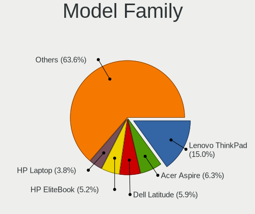
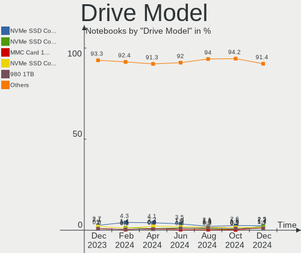
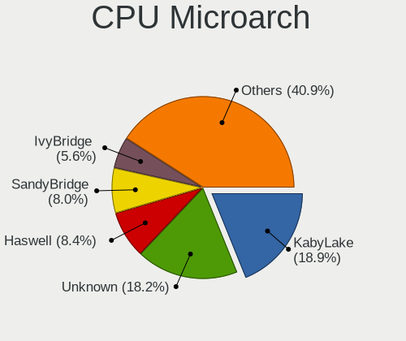
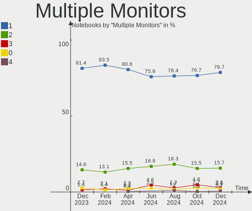
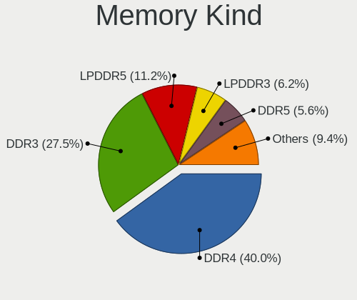
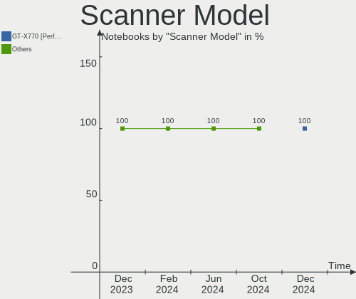

Linux in Germany - Hardware Trends (Notebooks)
----------------------------------------------

A project to identify most popular hardware characteristics and track their change
over time based on data collected by Linux users at https://Linux-Hardware.org.

Anyone can contribute to this report by the [hw-probe](https://github.com/linuxhw/hw-probe) tool:

    sudo -E hw-probe -all -upload

Period: Aug, 2023.

Contents
--------

* [ System ](#system)
  - [ OS                       ](#os)
  - [ OS Family                ](#os-family)
  - [ Kernel                   ](#kernel)
  - [ Kernel Family            ](#kernel-family)
  - [ Kernel Major Ver.        ](#kernel-major-ver)
  - [ Arch                     ](#arch)
  - [ DE                       ](#de)
  - [ Display Server           ](#display-server)
  - [ Display Manager          ](#display-manager)
  - [ OS Lang                  ](#os-lang)
  - [ Boot Mode                ](#boot-mode)
  - [ Filesystem               ](#filesystem)
  - [ Part. scheme             ](#part-scheme)
  - [ Dual Boot with Linux/BSD ](#dual-boot-with-linuxbsd)
  - [ Dual Boot (Win)          ](#dual-boot-win)

* [ Board ](#board)
  - [ Vendor                   ](#vendor)
  - [ Model                    ](#model)
  - [ Model Family             ](#model-family)
  - [ MFG Year                 ](#mfg-year)
  - [ Form Factor              ](#form-factor)
  - [ Secure Boot              ](#secure-boot)
  - [ Coreboot                 ](#coreboot)
  - [ RAM Size                 ](#ram-size)
  - [ RAM Used                 ](#ram-used)
  - [ Total Drives             ](#total-drives)
  - [ Has CD-ROM               ](#has-cd-rom)
  - [ Has Ethernet             ](#has-ethernet)
  - [ Has WiFi                 ](#has-wifi)
  - [ Has Bluetooth            ](#has-bluetooth)

* [ Location ](#location)
  - [ Country                  ](#country)
  - [ City                     ](#city)

* [ Drives ](#drives)
  - [ Drive Vendor             ](#drive-vendor)
  - [ Drive Model              ](#drive-model)
  - [ HDD Vendor               ](#hdd-vendor)
  - [ SSD Vendor               ](#ssd-vendor)
  - [ Drive Kind               ](#drive-kind)
  - [ Drive Connector          ](#drive-connector)
  - [ Drive Size               ](#drive-size)
  - [ Space Total              ](#space-total)
  - [ Space Used               ](#space-used)
  - [ Malfunc. Drives          ](#malfunc-drives)
  - [ Malfunc. Drive Vendor    ](#malfunc-drive-vendor)
  - [ Malfunc. HDD Vendor      ](#malfunc-hdd-vendor)
  - [ Malfunc. Drive Kind      ](#malfunc-drive-kind)
  - [ Failed Drives            ](#failed-drives)
  - [ Failed Drive Vendor      ](#failed-drive-vendor)
  - [ Drive Status             ](#drive-status)

* [ Storage controller ](#storage-controller)
  - [ Storage Vendor           ](#storage-vendor)
  - [ Storage Model            ](#storage-model)
  - [ Storage Kind             ](#storage-kind)

* [ Processor ](#processor)
  - [ CPU Vendor               ](#cpu-vendor)
  - [ CPU Model                ](#cpu-model)
  - [ CPU Model Family         ](#cpu-model-family)
  - [ CPU Cores                ](#cpu-cores)
  - [ CPU Sockets              ](#cpu-sockets)
  - [ CPU Threads              ](#cpu-threads)
  - [ CPU Op-Modes             ](#cpu-op-modes)
  - [ CPU Microcode            ](#cpu-microcode)
  - [ CPU Microarch            ](#cpu-microarch)

* [ Graphics ](#graphics)
  - [ GPU Vendor               ](#gpu-vendor)
  - [ GPU Model                ](#gpu-model)
  - [ GPU Combo                ](#gpu-combo)
  - [ GPU Driver               ](#gpu-driver)
  - [ GPU Memory               ](#gpu-memory)

* [ Monitor ](#monitor)
  - [ Monitor Vendor           ](#monitor-vendor)
  - [ Monitor Model            ](#monitor-model)
  - [ Monitor Resolution       ](#monitor-resolution)
  - [ Monitor Diagonal         ](#monitor-diagonal)
  - [ Monitor Width            ](#monitor-width)
  - [ Aspect Ratio             ](#aspect-ratio)
  - [ Monitor Area             ](#monitor-area)
  - [ Pixel Density            ](#pixel-density)
  - [ Multiple Monitors        ](#multiple-monitors)

* [ Network ](#network)
  - [ Net Controller Vendor    ](#net-controller-vendor)
  - [ Net Controller Model     ](#net-controller-model)
  - [ Wireless Vendor          ](#wireless-vendor)
  - [ Wireless Model           ](#wireless-model)
  - [ Ethernet Vendor          ](#ethernet-vendor)
  - [ Ethernet Model           ](#ethernet-model)
  - [ Net Controller Kind      ](#net-controller-kind)
  - [ Used Controller          ](#used-controller)
  - [ NICs                     ](#nics)
  - [ IPv6                     ](#ipv6)

* [ Bluetooth ](#bluetooth)
  - [ Bluetooth Vendor         ](#bluetooth-vendor)
  - [ Bluetooth Model          ](#bluetooth-model)

* [ Sound ](#sound)
  - [ Sound Vendor             ](#sound-vendor)
  - [ Sound Model              ](#sound-model)

* [ Memory ](#memory)
  - [ Memory Vendor            ](#memory-vendor)
  - [ Memory Model             ](#memory-model)
  - [ Memory Kind              ](#memory-kind)
  - [ Memory Form Factor       ](#memory-form-factor)
  - [ Memory Size              ](#memory-size)
  - [ Memory Speed             ](#memory-speed)

* [ Printers & scanners ](#printers--scanners)
  - [ Printer Vendor           ](#printer-vendor)
  - [ Printer Model            ](#printer-model)
  - [ Scanner Vendor           ](#scanner-vendor)
  - [ Scanner Model            ](#scanner-model)

* [ Camera ](#camera)
  - [ Camera Vendor            ](#camera-vendor)
  - [ Camera Model             ](#camera-model)

* [ Security ](#security)
  - [ Fingerprint Vendor       ](#fingerprint-vendor)
  - [ Fingerprint Model        ](#fingerprint-model)
  - [ Chipcard Vendor          ](#chipcard-vendor)
  - [ Chipcard Model           ](#chipcard-model)

* [ Unsupported ](#unsupported)
  - [ Unsupported Devices      ](#unsupported-devices)
  - [ Unsupported Device Types ](#unsupported-device-types)

System
------

OS
--

Installed operating systems

| Name                         | Notebooks | Percent |
|------------------------------|-----------|---------|
| Ubuntu 22.04                 | 38        | 11.99%  |
| Linux Mint 21.2              | 30        | 9.46%   |
| Fedora 38                    | 26        | 8.2%    |
| OpenMandriva 23.08           | 24        | 7.57%   |
| Ubuntu 23.04                 | 19        | 5.99%   |
| Debian 12                    | 14        | 4.42%   |
| Zorin 16                     | 10        | 3.15%   |
| Arch Rolling                 | 10        | 3.15%   |
| Ubuntu 20.04                 | 9         | 2.84%   |
| Manjaro                      | 8         | 2.52%   |
| Linux Mint 21.1              | 8         | 2.52%   |
| Kubuntu 23.04                | 7         | 2.21%   |
| ArcoLinux Rolling            | 7         | 2.21%   |
| Pop!_OS 22.04                | 6         | 1.89%   |
| openSUSE Tumbleweed-XXXXXXXX | 6         | 1.89%   |
| Ubuntu MATE 22.04            | 5         | 1.58%   |
| TUXEDO OS 22.04              | 5         | 1.58%   |
| SteamOS 3.4.8                | 5         | 1.58%   |
| openSUSE Leap-15.5           | 5         | 1.58%   |
| Manjaro 23.0.0               | 5         | 1.58%   |
| Kubuntu 22.04                | 4         | 1.26%   |
| Debian                       | 4         | 1.26%   |
| Xubuntu 22.04                | 3         | 0.95%   |
| OpenMandriva 23.03           | 3         | 0.95%   |
| MX 23                        | 3         | 0.95%   |
| Linux Mint 20.3              | 3         | 0.95%   |
| KDE neon 22.04               | 3         | 0.95%   |
| EndeavourOS Rolling          | 3         | 0.95%   |
| Debian 11                    | 3         | 0.95%   |
| Xero Rolling                 | 2         | 0.63%   |
| openSUSE Microos-XXXXXXXX    | 2         | 0.63%   |
| OpenMandriva 23.90           | 2         | 0.63%   |
| NixOS 23.11                  | 2         | 0.63%   |
| LMDE 5                       | 2         | 0.63%   |
| BlackPanther 18.1            | 2         | 0.63%   |
| Xubuntu 22.10                | 1         | 0.32%   |
| Xubuntu 20.04                | 1         | 0.32%   |
| Xubuntu 18.04                | 1         | 0.32%   |
| Ubuntu MATE 23.04            | 1         | 0.32%   |
| Ubuntu Core 22               | 1         | 0.32%   |

OS Family
---------

OS without a version

| Name          | Notebooks | Percent |
|---------------|-----------|---------|
| Ubuntu        | 68        | 21.45%  |
| Linux Mint    | 43        | 13.56%  |
| OpenMandriva  | 29        | 9.15%   |
| Fedora        | 26        | 8.2%    |
| Debian        | 21        | 6.62%   |
| openSUSE      | 13        | 4.1%    |
| Manjaro       | 13        | 4.1%    |
| Kubuntu       | 12        | 3.79%   |
| Zorin         | 10        | 3.15%   |
| Arch          | 10        | 3.15%   |
| ArcoLinux     | 7         | 2.21%   |
| Xubuntu       | 6         | 1.89%   |
| Ubuntu MATE   | 6         | 1.89%   |
| Pop!_OS       | 6         | 1.89%   |
| TUXEDO OS     | 5         | 1.58%   |
| SteamOS       | 5         | 1.58%   |
| MX            | 4         | 1.26%   |
| KDE neon      | 3         | 0.95%   |
| EndeavourOS   | 3         | 0.95%   |
| Xero          | 2         | 0.63%   |
| Ubuntu Budgie | 2         | 0.63%   |
| NixOS         | 2         | 0.63%   |
| Lubuntu       | 2         | 0.63%   |
| LMDE          | 2         | 0.63%   |
| Elementary    | 2         | 0.63%   |
| BlackPanther  | 2         | 0.63%   |
| Siduction     | 1         | 0.32%   |
| ROSA          | 1         | 0.32%   |
| Rocky Linux   | 1         | 0.32%   |
| Nobara        | 1         | 0.32%   |
| Linux Lite    | 1         | 0.32%   |
| Kali          | 1         | 0.32%   |
| Gentoo        | 1         | 0.32%   |
| Garuda Linux  | 1         | 0.32%   |
| Endless       | 1         | 0.32%   |
| Clear Linux   | 1         | 0.32%   |
| CentOS        | 1         | 0.32%   |
| Artix         | 1         | 0.32%   |
| antiX         | 1         | 0.32%   |

Kernel
------

Version of the Linux kernel

| Version                  | Notebooks | Percent |
|--------------------------|-----------|---------|
| 6.2.0-26-generic         | 38        | 11.99%  |
| 5.15.0-78-generic        | 30        | 9.46%   |
| 5.15.0-79-generic        | 21        | 6.62%   |
| 6.4.11-desktop-1omv2390  | 19        | 5.99%   |
| 6.2.0-27-generic         | 14        | 4.42%   |
| 6.1.0-10-amd64           | 8         | 2.52%   |
| 6.4.8-desktop-2omv2390   | 7         | 2.21%   |
| 6.2.0-10018-tuxedo       | 7         | 2.21%   |
| 5.19.0-50-generic        | 6         | 1.89%   |
| 6.4.6-76060406-generic   | 5         | 1.58%   |
| 6.4.11-arch2-1           | 5         | 1.58%   |
| 6.4.10-200.fc38.x86_64   | 5         | 1.58%   |
| 5.13.0-valve36-1-neptune | 5         | 1.58%   |
| 6.4.9-arch1-1            | 4         | 1.26%   |
| 6.4.7-200.fc38.x86_64    | 4         | 1.26%   |
| 6.2.9-300.fc38.x86_64    | 4         | 1.26%   |
| 6.2.0-31-generic         | 4         | 1.26%   |
| 6.1.0-11-amd64           | 4         | 1.26%   |
| 5.15.0-82-generic        | 4         | 1.26%   |
| 6.4.9-1-default          | 3         | 0.95%   |
| 6.4.8-arch1-1            | 3         | 0.95%   |
| 6.4.8-060408-generic     | 3         | 0.95%   |
| 6.4.6-200.fc38.x86_64    | 3         | 0.95%   |
| 6.4.11-200.fc38.x86_64   | 3         | 0.95%   |
| 6.2.6-desktop-1omv2390   | 3         | 0.95%   |
| 6.1.41-1-MANJARO         | 3         | 0.95%   |
| 6.4.9-200.fc38.x86_64    | 2         | 0.63%   |
| 6.4.9-1-MANJARO          | 2         | 0.63%   |
| 6.4.8-200.fc38.x86_64    | 2         | 0.63%   |
| 6.4.12-200.fc38.x86_64   | 2         | 0.63%   |
| 6.4.11-1-default         | 2         | 0.63%   |
| 6.4.0-1mx-ahs-amd64      | 2         | 0.63%   |
| 6.4.0-1-amd64            | 2         | 0.63%   |
| 5.4.0-155-generic        | 2         | 0.63%   |
| 5.4.0-150-generic        | 2         | 0.63%   |
| 5.19.0-46-generic        | 2         | 0.63%   |
| 5.19.0-32-generic        | 2         | 0.63%   |
| 5.15.125-1-MANJARO       | 2         | 0.63%   |
| 5.15.0-76-generic        | 2         | 0.63%   |
| 5.15.0-73-generic        | 2         | 0.63%   |

Kernel Family
-------------

Linux kernel without a distro release

| Version  | Notebooks | Percent |
|----------|-----------|---------|
| 5.15.0   | 67        | 21.14%  |
| 6.2.0    | 65        | 20.5%   |
| 6.4.11   | 30        | 9.46%   |
| 6.4.8    | 16        | 5.05%   |
| 6.1.0    | 14        | 4.42%   |
| 6.4.9    | 13        | 4.1%    |
| 5.19.0   | 13        | 4.1%    |
| 6.4.6    | 11        | 3.47%   |
| 6.4.10   | 8         | 2.52%   |
| 5.4.0    | 8         | 2.52%   |
| 5.13.0   | 7         | 2.21%   |
| 6.4.7    | 6         | 1.89%   |
| 6.4.12   | 6         | 1.89%   |
| 6.4.0    | 6         | 1.89%   |
| 5.14.21  | 5         | 1.58%   |
| 6.2.9    | 4         | 1.26%   |
| 6.2.6    | 4         | 1.26%   |
| 6.1.41   | 4         | 1.26%   |
| 6.3.0    | 3         | 0.95%   |
| 6.0.0    | 2         | 0.63%   |
| 5.15.125 | 2         | 0.63%   |
| 5.10.0   | 2         | 0.63%   |
| 6.5.0    | 1         | 0.32%   |
| 6.4.4    | 1         | 0.32%   |
| 6.4.3    | 1         | 0.32%   |
| 6.4.2    | 1         | 0.32%   |
| 6.3.7    | 1         | 0.32%   |
| 6.3.5    | 1         | 0.32%   |
| 6.3.12   | 1         | 0.32%   |
| 6.3.11   | 1         | 0.32%   |
| 6.2.16   | 1         | 0.32%   |
| 6.1.49   | 1         | 0.32%   |
| 6.1.46   | 1         | 0.32%   |
| 6.1.44   | 1         | 0.32%   |
| 6.1.43   | 1         | 0.32%   |
| 6.1.39   | 1         | 0.32%   |
| 6.1.38   | 1         | 0.32%   |
| 5.6.14   | 1         | 0.32%   |
| 5.15.122 | 1         | 0.32%   |
| 5.15.108 | 1         | 0.32%   |

Kernel Major Ver.
-----------------

Linux kernel major version

| Version | Notebooks | Percent |
|---------|-----------|---------|
| 6.4     | 99        | 31.23%  |
| 6.2     | 74        | 23.34%  |
| 5.15    | 71        | 22.4%   |
| 6.1     | 24        | 7.57%   |
| 5.19    | 13        | 4.1%    |
| 5.4     | 8         | 2.52%   |
| 6.3     | 7         | 2.21%   |
| 5.13    | 7         | 2.21%   |
| 5.14    | 6         | 1.89%   |
| 5.10    | 3         | 0.95%   |
| 6.0     | 2         | 0.63%   |
| 6.5     | 1         | 0.32%   |
| 5.6     | 1         | 0.32%   |
| 4.18    | 1         | 0.32%   |

Arch
----

OS architecture (x86_64, i586, etc.)

| Name   | Notebooks | Percent |
|--------|-----------|---------|
| x86_64 | 315       | 99.37%  |
| i686   | 2         | 0.63%   |

DE
--

Desktop Environment

| Name          | Notebooks | Percent |
|---------------|-----------|---------|
| GNOME         | 122       | 38.49%  |
| KDE5          | 91        | 28.71%  |
| X-Cinnamon    | 42        | 13.25%  |
| XFCE          | 25        | 7.89%   |
| MATE          | 8         | 2.52%   |
| Unknown       | 7         | 2.21%   |
| LXQt          | 5         | 1.58%   |
| i3            | 3         | 0.95%   |
| Cinnamon      | 3         | 0.95%   |
| Pantheon      | 2         | 0.63%   |
| Hyprland      | 2         | 0.63%   |
| GNOME Classic | 2         | 0.63%   |
| Budgie        | 2         | 0.63%   |
| LXDE          | 1         | 0.32%   |
| KDE           | 1         | 0.32%   |
| icewm         | 1         | 0.32%   |

Display Server
--------------

X11 or Wayland

| Name    | Notebooks | Percent |
|---------|-----------|---------|
| X11     | 187       | 58.99%  |
| Wayland | 123       | 38.8%   |
| Tty     | 4         | 1.26%   |
| Unknown | 3         | 0.95%   |

Display Manager
---------------

SDDM, LightDM, etc.

| Name    | Notebooks | Percent |
|---------|-----------|---------|
| Unknown | 113       | 35.65%  |
| SDDM    | 72        | 22.71%  |
| GDM3    | 66        | 20.82%  |
| LightDM | 50        | 15.77%  |
| GDM     | 15        | 4.73%   |
| XDM     | 1         | 0.32%   |

OS Lang
-------

Language

| Lang            | Notebooks | Percent |
|-----------------|-----------|---------|
| de_DE           | 227       | 71.61%  |
| en_US           | 62        | 19.56%  |
| en_GB           | 10        | 3.15%   |
| Unknown         | 4         | 1.26%   |
| hu_HU           | 2         | 0.63%   |
| zh_TW           | 1         | 0.32%   |
| uk_UA           | 1         | 0.32%   |
| ru_RU           | 1         | 0.32%   |
| pl_PL           | 1         | 0.32%   |
| it_IT           | 1         | 0.32%   |
| es_ES           | 1         | 0.32%   |
| en_US.UTF8      | 1         | 0.32%   |
| en_US.ISO8859-1 | 1         | 0.32%   |
| en_DE           | 1         | 0.32%   |
| en_BW           | 1         | 0.32%   |
| de_BE           | 1         | 0.32%   |
| C               | 1         | 0.32%   |

Boot Mode
---------

EFI or BIOS

| Mode | Notebooks | Percent |
|------|-----------|---------|
| EFI  | 168       | 53%     |
| BIOS | 149       | 47%     |

Filesystem
----------

Type of filesystem

| Type    | Notebooks | Percent |
|---------|-----------|---------|
| Ext4    | 183       | 57.73%  |
| Tmpfs   | 58        | 18.3%   |
| Btrfs   | 52        | 16.4%   |
| Overlay | 19        | 5.99%   |
| Xfs     | 4         | 1.26%   |
| Zfs     | 1         | 0.32%   |

Part. scheme
------------

Scheme of partitioning

| Type    | Notebooks | Percent |
|---------|-----------|---------|
| GPT     | 178       | 56.15%  |
| Unknown | 109       | 34.38%  |
| MBR     | 30        | 9.46%   |

Dual Boot with Linux/BSD
------------------------

Hosting more than one Linux/BSD

| Dual boot | Notebooks | Percent |
|-----------|-----------|---------|
| No        | 272       | 85.8%   |
| Yes       | 45        | 14.2%   |

Dual Boot (Win)
---------------

Hosting Linux and Windows

| Dual boot | Notebooks | Percent |
|-----------|-----------|---------|
| No        | 239       | 75.39%  |
| Yes       | 78        | 24.61%  |

Board
-----

Vendor
------

Motherboard manufacturer

| Name                | Notebooks | Percent |
|---------------------|-----------|---------|
| Lenovo              | 74        | 23.34%  |
| Hewlett-Packard     | 59        | 18.61%  |
| Dell                | 41        | 12.93%  |
| Acer                | 38        | 11.99%  |
| ASUSTek Computer    | 22        | 6.94%   |
| Medion              | 10        | 3.15%   |
| Apple               | 10        | 3.15%   |
| TUXEDO              | 8         | 2.52%   |
| Valve               | 6         | 1.89%   |
| HUAWEI              | 6         | 1.89%   |
| Toshiba             | 5         | 1.58%   |
| Fujitsu             | 5         | 1.58%   |
| Schenker            | 4         | 1.26%   |
| Packard Bell        | 4         | 1.26%   |
| Notebook            | 3         | 0.95%   |
| MSI                 | 3         | 0.95%   |
| Gigabyte Technology | 2         | 0.63%   |
| Clevo               | 2         | 0.63%   |
| Wortmann AG         | 1         | 0.32%   |
| VALE                | 1         | 0.32%   |
| Timi                | 1         | 0.32%   |
| Thomson             | 1         | 0.32%   |
| TERRA               | 1         | 0.32%   |
| System76            | 1         | 0.32%   |
| Sony                | 1         | 0.32%   |
| Shuttle             | 1         | 0.32%   |
| Samsung Electronics | 1         | 0.32%   |
| Panasonic           | 1         | 0.32%   |
| Intel               | 1         | 0.32%   |
| Insyde              | 1         | 0.32%   |
| Chuwi               | 1         | 0.32%   |
| Bluechip Computer   | 1         | 0.32%   |
| Alienware           | 1         | 0.32%   |

Model
-----

Motherboard model

| Name                                    | Notebooks | Percent |
|-----------------------------------------|-----------|---------|
| Valve Jupiter                           | 6         | 1.89%   |
| HP OMEN by Laptop                       | 4         | 1.26%   |
| HP EliteBook 840 G3                     | 3         | 0.95%   |
| Acer Aspire V3-771                      | 3         | 0.95%   |
| Packard Bell EasyNote LS11HR            | 2         | 0.63%   |
| Lenovo ThinkPad T420 4236MBG            | 2         | 0.63%   |
| Lenovo Legion 5 15ARH05 82B5            | 2         | 0.63%   |
| Lenovo IdeaPad Pro 5 14APH8 83AM        | 2         | 0.63%   |
| Lenovo IdeaPad L340-15IRH Gaming 81LK   | 2         | 0.63%   |
| Lenovo G50-70 20351                     | 2         | 0.63%   |
| HP Notebook                             | 2         | 0.63%   |
| HP EliteBook 8470p                      | 2         | 0.63%   |
| HP EliteBook 845 14 inch G9 Notebook PC | 2         | 0.63%   |
| HP EliteBook 830 G8 Notebook PC         | 2         | 0.63%   |
| Dell XPS 15 7590                        | 2         | 0.63%   |
| Dell Precision M4500                    | 2         | 0.63%   |
| Dell Latitude E5470                     | 2         | 0.63%   |
| Dell Latitude 5420                      | 2         | 0.63%   |
| Clevo W150HRM                           | 2         | 0.63%   |
| Apple MacBookAir6,2                     | 2         | 0.63%   |
| Acer Swift SF114-34                     | 2         | 0.63%   |
| Acer Aspire VN7-793G                    | 2         | 0.63%   |
| Acer Aspire E5-774G                     | 2         | 0.63%   |
| Acer Aspire A317-33                     | 2         | 0.63%   |
| Wortmann AG TERRA_MOBILE_1749           | 1         | 0.32%   |
| VALE Notebook Classic C140              | 1         | 0.32%   |
| TUXEDO Pulse 15 Gen2                    | 1         | 0.32%   |
| TUXEDO Pulse 15 Gen1                    | 1         | 0.32%   |
| TUXEDO Polaris AMD Gen3 (CZN)           | 1         | 0.32%   |
| TUXEDO N7x0WU                           | 1         | 0.32%   |
| TUXEDO InfinityBook S 15 Gen6           | 1         | 0.32%   |
| TUXEDO InfinityBook Pro Gen7 (MK1)      | 1         | 0.32%   |
| TUXEDO Aura 15 Gen2                     | 1         | 0.32%   |
| Toshiba Satellite T110                  | 1         | 0.32%   |
| Toshiba Satellite Pro C70-A             | 1         | 0.32%   |
| Toshiba Satellite C870-19R              | 1         | 0.32%   |
| Toshiba Satellite C50D-B                | 1         | 0.32%   |
| Toshiba Satellite C50-A510              | 1         | 0.32%   |
| Timi TM1607                             | 1         | 0.32%   |
| Thomson GENEO14C-4WH128                 | 1         | 0.32%   |

Model Family
------------

Motherboard model prefix

| Name                  | Notebooks | Percent |
|-----------------------|-----------|---------|
| Lenovo ThinkPad       | 48        | 15.14%  |
| Acer Aspire           | 29        | 9.15%   |
| Dell Latitude         | 20        | 6.31%   |
| HP EliteBook          | 16        | 5.05%   |
| HP Laptop             | 11        | 3.47%   |
| Lenovo IdeaPad        | 10        | 3.15%   |
| HP Pavilion           | 9         | 2.84%   |
| Dell Precision        | 7         | 2.21%   |
| Valve Jupiter         | 6         | 1.89%   |
| Dell XPS              | 6         | 1.89%   |
| Dell Inspiron         | 6         | 1.89%   |
| ASUS ROG              | 6         | 1.89%   |
| Toshiba Satellite     | 5         | 1.58%   |
| Fujitsu LIFEBOOK      | 5         | 1.58%   |
| Packard Bell EasyNote | 4         | 1.26%   |
| HP ProBook            | 4         | 1.26%   |
| HP OMEN               | 4         | 1.26%   |
| Acer Extensa          | 4         | 1.26%   |
| Lenovo Legion         | 3         | 0.95%   |
| HP ZBook              | 3         | 0.95%   |
| HP 255                | 3         | 0.95%   |
| ASUS ASUS             | 3         | 0.95%   |
| Acer Swift            | 3         | 0.95%   |
| TUXEDO Pulse          | 2         | 0.63%   |
| TUXEDO InfinityBook   | 2         | 0.63%   |
| Schenker XMG          | 2         | 0.63%   |
| Medion Akoya          | 2         | 0.63%   |
| Lenovo Yoga           | 2         | 0.63%   |
| Lenovo ThinkBook      | 2         | 0.63%   |
| Lenovo G50-70         | 2         | 0.63%   |
| HP Notebook           | 2         | 0.63%   |
| Clevo W150HRM         | 2         | 0.63%   |
| Apple MacBookPro8     | 2         | 0.63%   |
| Apple MacBookAir6     | 2         | 0.63%   |
| Acer Nitro            | 2         | 0.63%   |
| Wortmann AG TERRA     | 1         | 0.32%   |
| VALE Notebook         | 1         | 0.32%   |
| TUXEDO Polaris        | 1         | 0.32%   |
| TUXEDO N7x0WU         | 1         | 0.32%   |
| TUXEDO Aura           | 1         | 0.32%   |

MFG Year
--------

Motherboard manufacture year

| Year | Notebooks | Percent |
|------|-----------|---------|
| 2021 | 37        | 11.67%  |
| 2022 | 30        | 9.46%   |
| 2020 | 30        | 9.46%   |
| 2013 | 23        | 7.26%   |
| 2011 | 23        | 7.26%   |
| 2012 | 22        | 6.94%   |
| 2017 | 21        | 6.62%   |
| 2016 | 19        | 5.99%   |
| 2019 | 18        | 5.68%   |
| 2018 | 18        | 5.68%   |
| 2015 | 18        | 5.68%   |
| 2014 | 16        | 5.05%   |
| 2023 | 15        | 4.73%   |
| 2010 | 13        | 4.1%    |
| 2008 | 6         | 1.89%   |
| 2009 | 5         | 1.58%   |
| 2007 | 2         | 0.63%   |
| 2006 | 1         | 0.32%   |

Form Factor
-----------

Physical design of the computer

| Name     | Notebooks | Percent |
|----------|-----------|---------|
| Notebook | 317       | 100%    |

Secure Boot
-----------

Enabled or disabled

| State    | Notebooks | Percent |
|----------|-----------|---------|
| Disabled | 285       | 89.91%  |
| Enabled  | 32        | 10.09%  |

Coreboot
--------

Have coreboot on board

| Used | Notebooks | Percent |
|------|-----------|---------|
| No   | 317       | 100%    |

RAM Size
--------

Total RAM memory

| Size in GB  | Notebooks | Percent |
|-------------|-----------|---------|
| 4.01-8.0    | 91        | 28.71%  |
| 8.01-16.0   | 59        | 18.61%  |
| 16.01-24.0  | 55        | 17.35%  |
| 3.01-4.0    | 47        | 14.83%  |
| 32.01-64.0  | 39        | 12.3%   |
| 24.01-32.0  | 9         | 2.84%   |
| 1.01-2.0    | 7         | 2.21%   |
| 64.01-256.0 | 6         | 1.89%   |
| 2.01-3.0    | 3         | 0.95%   |
| 0.01-0.5    | 1         | 0.32%   |

RAM Used
--------

Used RAM memory

| Used GB    | Notebooks | Percent |
|------------|-----------|---------|
| 1.01-2.0   | 105       | 33.12%  |
| 2.01-3.0   | 73        | 23.03%  |
| 4.01-8.0   | 53        | 16.72%  |
| 3.01-4.0   | 53        | 16.72%  |
| 8.01-16.0  | 19        | 5.99%   |
| 0.51-1.0   | 10        | 3.15%   |
| 16.01-24.0 | 2         | 0.63%   |
| 0.01-0.5   | 2         | 0.63%   |

Total Drives
------------

Number of drives on board

| Drives | Notebooks | Percent |
|--------|-----------|---------|
| 1      | 224       | 70.66%  |
| 2      | 77        | 24.29%  |
| 3      | 13        | 4.1%    |
| 0      | 2         | 0.63%   |
| 5      | 1         | 0.32%   |

Has CD-ROM
----------

Has CD-ROM on board

| Presented | Notebooks | Percent |
|-----------|-----------|---------|
| No        | 218       | 68.77%  |
| Yes       | 99        | 31.23%  |

Has Ethernet
------------

Has Ethernet on board

| Presented | Notebooks | Percent |
|-----------|-----------|---------|
| Yes       | 261       | 82.33%  |
| No        | 56        | 17.67%  |

Has WiFi
--------

Has WiFi module

| Presented | Notebooks | Percent |
|-----------|-----------|---------|
| Yes       | 313       | 98.74%  |
| No        | 4         | 1.26%   |

Has Bluetooth
-------------

Has Bluetooth module

| Presented | Notebooks | Percent |
|-----------|-----------|---------|
| Yes       | 278       | 87.7%   |
| No        | 39        | 12.3%   |

Location
--------

Country
-------

Geographic location (country)

| Country | Notebooks | Percent |
|---------|-----------|---------|
| Germany | 317       | 100%    |

City
----

Geographic location (city)

| City                 | Notebooks | Percent |
|----------------------|-----------|---------|
| Berlin               | 30        | 9.46%   |
| Hamburg              | 19        | 5.99%   |
| Cologne              | 10        | 3.15%   |
| Munich               | 9         | 2.84%   |
| Mönchengladbach     | 5         | 1.58%   |
| Karlsruhe            | 5         | 1.58%   |
| Frankfurt am Main    | 5         | 1.58%   |
| Essen                | 5         | 1.58%   |
| Bielefeld            | 5         | 1.58%   |
| Wuppertal            | 4         | 1.26%   |
| Düren               | 4         | 1.26%   |
| Braunschweig         | 4         | 1.26%   |
| Bonn                 | 4         | 1.26%   |
| Stuttgart            | 3         | 0.95%   |
| Ludwigsburg          | 3         | 0.95%   |
| Jena                 | 3         | 0.95%   |
| Düsseldorf          | 3         | 0.95%   |
| Bremen               | 3         | 0.95%   |
| Bochum               | 3         | 0.95%   |
| Bamberg              | 3         | 0.95%   |
| Winsen               | 2         | 0.63%   |
| Ulm                  | 2         | 0.63%   |
| Regensburg           | 2         | 0.63%   |
| Ratingen             | 2         | 0.63%   |
| Pforzheim            | 2         | 0.63%   |
| Oberhausen           | 2         | 0.63%   |
| Nuremberg            | 2         | 0.63%   |
| Nordenham            | 2         | 0.63%   |
| Münster             | 2         | 0.63%   |
| Leipzig              | 2         | 0.63%   |
| Kirchheim unter Teck | 2         | 0.63%   |
| Kassel               | 2         | 0.63%   |
| Hanover              | 2         | 0.63%   |
| Greifswald           | 2         | 0.63%   |
| Göppingen           | 2         | 0.63%   |
| Flensburg            | 2         | 0.63%   |
| Eberswalde           | 2         | 0.63%   |
| Dresden              | 2         | 0.63%   |
| Dortmund             | 2         | 0.63%   |
| Brunsbuettel         | 2         | 0.63%   |

Drives
------

Drive Vendor
------------

Hard drive vendors

| Vendor                       | Notebooks | Drives | Percent |
|------------------------------|-----------|--------|---------|
| Samsung Electronics          | 100       | 107    | 25.32%  |
| Sandisk                      | 36        | 40     | 9.11%   |
| WDC                          | 30        | 32     | 7.59%   |
| Toshiba                      | 21        | 21     | 5.32%   |
| Seagate                      | 21        | 21     | 5.32%   |
| Crucial                      | 21        | 23     | 5.32%   |
| Unknown                      | 20        | 22     | 5.06%   |
| Micron Technology            | 16        | 16     | 4.05%   |
| SK hynix                     | 14        | 14     | 3.54%   |
| Intel                        | 12        | 12     | 3.04%   |
| Kingston                     | 11        | 13     | 2.78%   |
| Intenso                      | 9         | 9      | 2.28%   |
| KIOXIA                       | 7         | 7      | 1.77%   |
| Hitachi                      | 6         | 8      | 1.52%   |
| HGST                         | 6         | 6      | 1.52%   |
| Apple                        | 5         | 5      | 1.27%   |
| Transcend                    | 4         | 4      | 1.01%   |
| Phison Electronics           | 4         | 4      | 1.01%   |
| Kingston Technology Company  | 4         | 4      | 1.01%   |
| Silicon Motion               | 3         | 3      | 0.76%   |
| Phison                       | 3         | 3      | 0.76%   |
| Micron/Crucial Technology    | 3         | 3      | 0.76%   |
| LITEON                       | 3         | 3      | 0.76%   |
| China                        | 3         | 3      | 0.76%   |
| Union Memory                 | 2         | 2      | 0.51%   |
| UMIS                         | 2         | 2      | 0.51%   |
| Patriot                      | 2         | 2      | 0.51%   |
| Lenovo                       | 2         | 2      | 0.51%   |
| INNOVATION IT                | 2         | 2      | 0.51%   |
| Fujitsu                      | 2         | 2      | 0.51%   |
| A-DATA Technology            | 2         | 2      | 0.51%   |
| Unknown                      | 2         | 2      | 0.51%   |
| WD_BLACK                     | 1         | 1      | 0.25%   |
| Verbatim                     | 1         | 1      | 0.25%   |
| Union Memory (Shenzhen)      | 1         | 1      | 0.25%   |
| SPCC                         | 1         | 1      | 0.25%   |
| Shenzhen Longsys Electronics | 1         | 1      | 0.25%   |
| SD                           | 1         | 1      | 0.25%   |
| SABRENT                      | 1         | 1      | 0.25%   |
| RDM-II                       | 1         | 1      | 0.25%   |

Drive Model
-----------

Hard drive models

| Model                                                 | Notebooks | Percent |
|-------------------------------------------------------|-----------|---------|
| Samsung NVMe SSD Controller SM981/PM981/PM983 500GB   | 10        | 2.44%   |
| Samsung NVMe SSD Controller PM9A1/PM9A3/980PRO 1024GB | 10        | 2.44%   |
| Sandisk WD Blue SN550 NVMe SSD 250GB                  | 6         | 1.46%   |
| WDC WD10JPVX-22JC3T0 1TB                              | 5         | 1.22%   |
| Unknown MMC Card  64GB                                | 5         | 1.22%   |
| Toshiba MQ01ABD100 1TB                                | 4         | 0.98%   |
| Seagate ST1000LM024 HN-M101MBB 1TB                    | 4         | 0.98%   |
| Samsung SSD 870 QVO 1TB                               | 4         | 0.98%   |
| Crucial CT1000MX500SSD1 1TB                           | 4         | 0.98%   |
| Unknown SD/MMC/MS PRO 1GB                             | 3         | 0.73%   |
| Unknown MMC Card  128GB                               | 3         | 0.73%   |
| Transcend TS512GMTS430S 512GB SSD                     | 3         | 0.73%   |
| Seagate ST1000LM035-1RK172 1TB                        | 3         | 0.73%   |
| Sandisk WD Blue SN570 1TB                             | 3         | 0.73%   |
| Samsung SSD 980 1TB                                   | 3         | 0.73%   |
| Samsung SSD 860 QVO 1TB                               | 3         | 0.73%   |
| Samsung MZ9LQ512HBLU-00BVL 512GB                      | 3         | 0.73%   |
| Phison PS5013 E13 NVMe Controller 512GB               | 3         | 0.73%   |
| Micron/Crucial P2 NVMe PCIe SSD 1TB                   | 3         | 0.73%   |
| Kingston Company SNV2S1000G 1TB                       | 3         | 0.73%   |
| HGST HTS721010A9E630 1TB                              | 3         | 0.73%   |
| Crucial CT500MX500SSD1 500GB                          | 3         | 0.73%   |
| WDC WD10SPZX-24Z10 1TB                                | 2         | 0.49%   |
| WDC PC SN730 SDBQNTY-512G-1001 512GB                  | 2         | 0.49%   |
| WDC PC SN530 SDBPNPZ-256G-1114 256GB                  | 2         | 0.49%   |
| Unknown MMC Card  32GB                                | 2         | 0.49%   |
| Toshiba XG6 NVMe SSD Controller 1024GB                | 2         | 0.49%   |
| Toshiba MQ01ABF050 500GB                              | 2         | 0.49%   |
| Toshiba MQ01ABD075 752GB                              | 2         | 0.49%   |
| Toshiba KXG50ZNV256G 256GB                            | 2         | 0.49%   |
| SK hynix SKHynix_HFS001TEJ4X112N 1024GB               | 2         | 0.49%   |
| SK hynix BC711 HFM512GD3JX013N 512GB                  | 2         | 0.49%   |
| Seagate ST500LT012-1DG142 500GB                       | 2         | 0.49%   |
| Seagate ST500LM021-1KJ152 500GB                       | 2         | 0.49%   |
| Sandisk WD_BLACK SN750 SE NVMe 500GB                  | 2         | 0.49%   |
| SanDisk SSD PLUS 240GB                                | 2         | 0.49%   |
| SanDisk SDSSDHII120G 120GB                            | 2         | 0.49%   |
| SanDisk SD8TB8U256G1001 256GB SSD                     | 2         | 0.49%   |
| Samsung SSD 980 PRO 1TB                               | 2         | 0.49%   |
| Samsung SSD 980 500GB                                 | 2         | 0.49%   |

HDD Vendor
----------

Hard disk drive vendors

| Vendor              | Notebooks | Drives | Percent |
|---------------------|-----------|--------|---------|
| WDC                 | 22        | 22     | 28.21%  |
| Seagate             | 21        | 21     | 26.92%  |
| Toshiba             | 13        | 13     | 16.67%  |
| Hitachi             | 6         | 8      | 7.69%   |
| HGST                | 6         | 6      | 7.69%   |
| Unknown             | 3         | 3      | 3.85%   |
| Samsung Electronics | 2         | 2      | 2.56%   |
| Fujitsu             | 2         | 2      | 2.56%   |
| WD_BLACK            | 1         | 1      | 1.28%   |
| SABRENT             | 1         | 1      | 1.28%   |
| Apple               | 1         | 1      | 1.28%   |

SSD Vendor
----------

Solid state drive vendors

| Vendor              | Notebooks | Drives | Percent |
|---------------------|-----------|--------|---------|
| Samsung Electronics | 47        | 48     | 31.76%  |
| Crucial             | 19        | 20     | 12.84%  |
| SanDisk             | 17        | 17     | 11.49%  |
| Intenso             | 8         | 8      | 5.41%   |
| Micron Technology   | 6         | 6      | 4.05%   |
| Kingston            | 5         | 6      | 3.38%   |
| Intel               | 5         | 5      | 3.38%   |
| Transcend           | 4         | 4      | 2.7%    |
| SK hynix            | 4         | 4      | 2.7%    |
| Apple               | 4         | 4      | 2.7%    |
| WDC                 | 3         | 3      | 2.03%   |
| LITEON              | 3         | 3      | 2.03%   |
| China               | 3         | 3      | 2.03%   |
| Toshiba             | 2         | 2      | 1.35%   |
| Phison              | 2         | 2      | 1.35%   |
| INNOVATION IT       | 2         | 2      | 1.35%   |
| Verbatim            | 1         | 1      | 0.68%   |
| Unknown             | 1         | 1      | 0.68%   |
| SPCC                | 1         | 1      | 0.68%   |
| SD                  | 1         | 1      | 0.68%   |
| RDM-II              | 1         | 1      | 0.68%   |
| Patriot             | 1         | 1      | 0.68%   |
| Netac               | 1         | 1      | 0.68%   |
| Leven               | 1         | 1      | 0.68%   |
| KIOXIA-EXCERIA      | 1         | 1      | 0.68%   |
| GLOWAY              | 1         | 1      | 0.68%   |
| Fanxiang            | 1         | 1      | 0.68%   |
| CT500MX5            | 1         | 1      | 0.68%   |
| A-DATA Technology   | 1         | 1      | 0.68%   |
| Unknown             | 1         | 1      | 0.68%   |

Drive Kind
----------

HDD or SSD

| Kind    | Notebooks | Drives | Percent |
|---------|-----------|--------|---------|
| NVMe    | 147       | 164    | 38.89%  |
| SSD     | 136       | 151    | 35.98%  |
| HDD     | 74        | 80     | 19.58%  |
| MMC     | 17        | 17     | 4.5%    |
| Unknown | 4         | 4      | 1.06%   |

Drive Connector
---------------

SATA, SAS, NVMe, etc.

| Type | Notebooks | Drives | Percent |
|------|-----------|--------|---------|
| SATA | 186       | 220    | 50.96%  |
| NVMe | 147       | 164    | 40.27%  |
| MMC  | 17        | 17     | 4.66%   |
| SAS  | 15        | 15     | 4.11%   |

Drive Size
----------

Size of hard drive

| Size in TB | Notebooks | Drives | Percent |
|------------|-----------|--------|---------|
| 0.01-0.5   | 121       | 130    | 56.81%  |
| 0.51-1.0   | 75        | 81     | 35.21%  |
| 1.01-2.0   | 14        | 17     | 6.57%   |
| 3.01-4.0   | 2         | 2      | 0.94%   |
| 4.01-10.0  | 1         | 1      | 0.47%   |

Space Total
-----------

Amount of disk space available on the file system

| Size in GB     | Notebooks | Percent |
|----------------|-----------|---------|
| 101-250        | 82        | 25.87%  |
| 501-1000       | 66        | 20.82%  |
| 251-500        | 61        | 19.24%  |
| 1001-2000      | 34        | 10.73%  |
| 1-20           | 28        | 8.83%   |
| 51-100         | 14        | 4.42%   |
| More than 3000 | 11        | 3.47%   |
| 2001-3000      | 8         | 2.52%   |
| Unknown        | 7         | 2.21%   |
| 21-50          | 6         | 1.89%   |

Space Used
----------

Amount of used disk space

| Used GB        | Notebooks | Percent |
|----------------|-----------|---------|
| 1-20           | 92        | 29.02%  |
| 21-50          | 68        | 21.45%  |
| 101-250        | 45        | 14.2%   |
| 51-100         | 39        | 12.3%   |
| 251-500        | 33        | 10.41%  |
| 501-1000       | 21        | 6.62%   |
| 1001-2000      | 7         | 2.21%   |
| Unknown        | 7         | 2.21%   |
| 2001-3000      | 3         | 0.95%   |
| More than 3000 | 2         | 0.63%   |

Malfunc. Drives
---------------

Drive models with a malfunction

| Model                                       | Notebooks | Drives | Percent |
|---------------------------------------------|-----------|--------|---------|
| HGST HTS721010A9E630 1TB                    | 2         | 2      | 10.53%  |
| WDC WD40 EFRX-68N32N0 4TB                   | 1         | 1      | 5.26%   |
| WDC WD10JPVX-60JC3T0 1TB                    | 1         | 1      | 5.26%   |
| WDC WD10JPVX-22JC3T0 1TB                    | 1         | 1      | 5.26%   |
| Toshiba MQ01ABD100 1TB                      | 1         | 1      | 5.26%   |
| Toshiba MK2555GSX 250GB                     | 1         | 1      | 5.26%   |
| SK hynix HFS128G32TND-N210A 128GB SSD       | 1         | 1      | 5.26%   |
| SK hynix BC711 HFM512GD3JX013N 512GB        | 1         | 1      | 5.26%   |
| Seagate ST320LM001 HN-M320MBB 320GB         | 1         | 1      | 5.26%   |
| Seagate ST1000LM024 HN-M101MBB 1TB          | 1         | 1      | 5.26%   |
| SanDisk SD8SBAT256G1122 256GB SSD           | 1         | 1      | 5.26%   |
| Samsung Electronics SSD PM810 2.5 7mm 256GB | 1         | 1      | 5.26%   |
| Samsung Electronics SSD 750 EVO 250GB       | 1         | 1      | 5.26%   |
| Samsung Electronics HM160HI 160GB           | 1         | 1      | 5.26%   |
| RDM-II XM020C024G 24GB SSD                  | 1         | 1      | 5.26%   |
| Kingston SEDC450R7680G 8TB SSD              | 1         | 1      | 5.26%   |
| Intel SSDSC2BW120A4 120GB                   | 1         | 1      | 5.26%   |
| Crucial CT480M500SSD3 480GB                 | 1         | 1      | 5.26%   |

Malfunc. Drive Vendor
---------------------

Vendors of faulty drives

| Vendor              | Notebooks | Drives | Percent |
|---------------------|-----------|--------|---------|
| WDC                 | 3         | 3      | 15.79%  |
| Samsung Electronics | 3         | 3      | 15.79%  |
| Toshiba             | 2         | 2      | 10.53%  |
| SK hynix            | 2         | 2      | 10.53%  |
| Seagate             | 2         | 2      | 10.53%  |
| HGST                | 2         | 2      | 10.53%  |
| SanDisk             | 1         | 1      | 5.26%   |
| RDM-II              | 1         | 1      | 5.26%   |
| Kingston            | 1         | 1      | 5.26%   |
| Intel               | 1         | 1      | 5.26%   |
| Crucial             | 1         | 1      | 5.26%   |

Malfunc. HDD Vendor
-------------------

Vendors of faulty HDD drives

| Vendor              | Notebooks | Drives | Percent |
|---------------------|-----------|--------|---------|
| WDC                 | 3         | 3      | 30%     |
| Toshiba             | 2         | 2      | 20%     |
| Seagate             | 2         | 2      | 20%     |
| HGST                | 2         | 2      | 20%     |
| Samsung Electronics | 1         | 1      | 10%     |

Malfunc. Drive Kind
-------------------

Kinds of faulty drives

| Kind | Notebooks | Drives | Percent |
|------|-----------|--------|---------|
| HDD  | 10        | 10     | 52.63%  |
| SSD  | 8         | 8      | 42.11%  |
| NVMe | 1         | 1      | 5.26%   |

Failed Drives
-------------

Failed drive models

Zero info for selected period =(

Failed Drive Vendor
-------------------

Failed drive vendors

Zero info for selected period =(

Drive Status
------------

Number of failed and malfunc. drives

| Status   | Notebooks | Drives | Percent |
|----------|-----------|--------|---------|
| Detected | 178       | 237    | 53.78%  |
| Works    | 134       | 160    | 40.48%  |
| Malfunc  | 19        | 19     | 5.74%   |

Storage controller
------------------

Storage Vendor
--------------

Storage controller vendors

| Vendor                       | Notebooks | Percent |
|------------------------------|-----------|---------|
| Intel                        | 204       | 51.78%  |
| Samsung Electronics          | 55        | 13.96%  |
| AMD                          | 33        | 8.38%   |
| SanDisk                      | 28        | 7.11%   |
| SK hynix                     | 10        | 2.54%   |
| Micron Technology            | 10        | 2.54%   |
| Kingston Technology Company  | 10        | 2.54%   |
| Phison Electronics           | 7         | 1.78%   |
| KIOXIA                       | 7         | 1.78%   |
| Toshiba America Info Systems | 6         | 1.52%   |
| Union Memory (Shenzhen)      | 5         | 1.27%   |
| Micron/Crucial Technology    | 5         | 1.27%   |
| Silicon Motion               | 3         | 0.76%   |
| Nvidia                       | 3         | 0.76%   |
| MAXIO Technology (Hangzhou)  | 2         | 0.51%   |
| Lenovo                       | 2         | 0.51%   |
| Silicon Image                | 1         | 0.25%   |
| Shenzhen Longsys Electronics | 1         | 0.25%   |
| Marvell Technology Group     | 1         | 0.25%   |
| ADATA Technology             | 1         | 0.25%   |

Storage Model
-------------

Storage controller models

| Model                                                                            | Notebooks | Percent |
|----------------------------------------------------------------------------------|-----------|---------|
| AMD FCH SATA Controller [AHCI mode]                                              | 32        | 7.77%   |
| Intel 7 Series Chipset Family 6-port SATA Controller [AHCI mode]                 | 28        | 6.8%    |
| Intel Sunrise Point-LP SATA Controller [AHCI mode]                               | 27        | 6.55%   |
| Samsung NVMe SSD Controller SM981/PM981/PM983                                    | 18        | 4.37%   |
| Intel 6 Series/C200 Series Chipset Family 6 port Mobile SATA AHCI Controller     | 17        | 4.13%   |
| Samsung NVMe SSD Controller 980                                                  | 16        | 3.88%   |
| Intel Volume Management Device NVMe RAID Controller                              | 16        | 3.88%   |
| Intel 82801 Mobile SATA Controller [RAID mode]                                   | 15        | 3.64%   |
| Samsung NVMe SSD Controller PM9A1/PM9A3/980PRO                                   | 13        | 3.16%   |
| SanDisk WD Blue SN550 NVMe SSD                                                   | 10        | 2.43%   |
| Intel 8 Series SATA Controller 1 [AHCI mode]                                     | 10        | 2.43%   |
| Intel Wildcat Point-LP SATA Controller [AHCI Mode]                               | 9         | 2.18%   |
| Intel HM170/QM170 Chipset SATA Controller [AHCI Mode]                            | 8         | 1.94%   |
| Intel 82801IBM/IEM (ICH9M/ICH9M-E) 4 port SATA Controller [AHCI mode]            | 7         | 1.7%    |
| Intel Alder Lake-P SATA AHCI Controller                                          | 6         | 1.46%   |
| Intel 8 Series/C220 Series Chipset Family 6-port SATA Controller 1 [AHCI mode]   | 6         | 1.46%   |
| Samsung NVMe SSD Controller SM961/PM961/SM963                                    | 5         | 1.21%   |
| Micron/Crucial P2 [Nick P2] / P3 / P3 Plus NVMe PCIe SSD (DRAM-less)             | 5         | 1.21%   |
| Intel Tiger Lake-LP SATA Controller                                              | 5         | 1.21%   |
| Intel Q170/Q150/B150/H170/H110/Z170/CM236 Chipset SATA Controller [AHCI Mode]    | 5         | 1.21%   |
| Intel Celeron/Pentium Silver Processor SATA Controller                           | 5         | 1.21%   |
| Intel Cannon Lake Mobile PCH SATA AHCI Controller                                | 5         | 1.21%   |
| Intel Atom Processor E3800 Series SATA AHCI Controller                           | 5         | 1.21%   |
| Toshiba America Info Systems XG5 NVMe SSD Controller                             | 4         | 0.97%   |
| SK hynix Gold P31/BC711/PC711 NVMe Solid State Drive                             | 4         | 0.97%   |
| SanDisk WD Blue SN570 NVMe SSD 1TB                                               | 4         | 0.97%   |
| Intel 5 Series/3400 Series Chipset 4 port SATA AHCI Controller                   | 4         | 0.97%   |
| Silicon Motion Non-Volatile memory controller                                    | 3         | 0.73%   |
| SanDisk WD Black SN750 / PC SN730 NVMe SSD                                       | 3         | 0.73%   |
| Phison PS5013 E13 NVMe Controller                                                | 3         | 0.73%   |
| Phison E12 NVMe Controller                                                       | 3         | 0.73%   |
| Micron 2300 NVMe SSD [Santana]                                                   | 3         | 0.73%   |
| KIOXIA NVMe SSD Controller BG5 (DRAM-less)                                       | 3         | 0.73%   |
| Kingston Company Company Non-Volatile memory controller                          | 3         | 0.73%   |
| Intel SSD 670p Series [Keystone Harbor]                                          | 3         | 0.73%   |
| Intel Atom/Celeron/Pentium Processor x5-E8000/J3xxx/N3xxx Series SATA Controller | 3         | 0.73%   |
| Intel 82801HM/HEM (ICH8M/ICH8M-E) SATA Controller [AHCI mode]                    | 3         | 0.73%   |
| Intel 82801HM/HEM (ICH8M/ICH8M-E) IDE Controller                                 | 3         | 0.73%   |
| Intel 5 Series/3400 Series Chipset 6 port SATA AHCI Controller                   | 3         | 0.73%   |
| Toshiba America Info Systems XG6 NVMe SSD Controller                             | 2         | 0.49%   |

Storage Kind
------------

Kind of storage controller (IDE, SATA, NVMe, SAS, ...)

| Kind | Notebooks | Percent |
|------|-----------|---------|
| SATA | 203       | 51.26%  |
| NVMe | 148       | 37.37%  |
| RAID | 34        | 8.59%   |
| IDE  | 11        | 2.78%   |

Processor
---------

CPU Vendor
----------

Processor vendors

| Vendor | Notebooks | Percent |
|--------|-----------|---------|
| Intel  | 241       | 76.03%  |
| AMD    | 76        | 23.97%  |

CPU Model
---------

Processor models

| Model                                         | Notebooks | Percent |
|-----------------------------------------------|-----------|---------|
| Intel Core i5-3210M CPU @ 2.50GHz             | 7         | 2.21%   |
| Intel Core i5-6300U CPU @ 2.40GHz             | 6         | 1.89%   |
| AMD Ryzen 7 5700U with Radeon Graphics        | 6         | 1.89%   |
| AMD Custom APU 0405                           | 6         | 1.89%   |
| Intel Core i5-8350U CPU @ 1.70GHz             | 5         | 1.58%   |
| Intel Core i5-8265U CPU @ 1.60GHz             | 5         | 1.58%   |
| Intel Core i5-4210U CPU @ 1.70GHz             | 5         | 1.58%   |
| Intel Core i5-3320M CPU @ 2.60GHz             | 5         | 1.58%   |
| Intel 11th Gen Core i5-1135G7 @ 2.40GHz       | 5         | 1.58%   |
| AMD Ryzen 7 4800H with Radeon Graphics        | 5         | 1.58%   |
| Intel Pentium Silver N6000 @ 1.10GHz          | 4         | 1.26%   |
| Intel Core i7-9750H CPU @ 2.60GHz             | 4         | 1.26%   |
| Intel Core i7-6500U CPU @ 2.50GHz             | 4         | 1.26%   |
| Intel Core i7-2630QM CPU @ 2.00GHz            | 4         | 1.26%   |
| Intel Core i5-2520M CPU @ 2.50GHz             | 4         | 1.26%   |
| Intel Core i3-3110M CPU @ 2.40GHz             | 4         | 1.26%   |
| Intel 12th Gen Core i7-12700H                 | 4         | 1.26%   |
| AMD Ryzen 7 PRO 5850U with Radeon Graphics    | 4         | 1.26%   |
| AMD Ryzen 5 5500U with Radeon Graphics        | 4         | 1.26%   |
| AMD Ryzen 5 3500U with Radeon Vega Mobile Gfx | 4         | 1.26%   |
| Intel Pentium CPU 2020M @ 2.40GHz             | 3         | 0.95%   |
| Intel Core i7-8750H CPU @ 2.20GHz             | 3         | 0.95%   |
| Intel Core i7-6820HQ CPU @ 2.70GHz            | 3         | 0.95%   |
| Intel Core i7-6700HQ CPU @ 2.60GHz            | 3         | 0.95%   |
| Intel Core i7-2670QM CPU @ 2.20GHz            | 3         | 0.95%   |
| Intel Core i5-8250U CPU @ 1.60GHz             | 3         | 0.95%   |
| Intel Core i5-7300HQ CPU @ 2.50GHz            | 3         | 0.95%   |
| Intel Core i5-6200U CPU @ 2.30GHz             | 3         | 0.95%   |
| Intel Core i5-2540M CPU @ 2.60GHz             | 3         | 0.95%   |
| Intel Celeron N4020 CPU @ 1.10GHz             | 3         | 0.95%   |
| Intel 11th Gen Core i7-1185G7 @ 3.00GHz       | 3         | 0.95%   |
| Intel 11th Gen Core i7-1165G7 @ 2.80GHz       | 3         | 0.95%   |
| AMD Ryzen 7 7840HS with Radeon 780M Graphics  | 3         | 0.95%   |
| AMD Ryzen 7 5825U with Radeon Graphics        | 3         | 0.95%   |
| AMD Ryzen 7 5800H with Radeon Graphics        | 3         | 0.95%   |
| Intel Pentium Dual-Core CPU T4200 @ 2.00GHz   | 2         | 0.63%   |
| Intel Core i7-8550U CPU @ 1.80GHz             | 2         | 0.63%   |
| Intel Core i7-7700HQ CPU @ 2.80GHz            | 2         | 0.63%   |
| Intel Core i7-7600U CPU @ 2.80GHz             | 2         | 0.63%   |
| Intel Core i7-7500U CPU @ 2.70GHz             | 2         | 0.63%   |

CPU Model Family
----------------

Processor model prefix

| Model                   | Notebooks | Percent |
|-------------------------|-----------|---------|
| Intel Core i5           | 78        | 24.61%  |
| Intel Core i7           | 65        | 20.5%   |
| Other                   | 42        | 13.25%  |
| AMD Ryzen 7             | 26        | 8.2%    |
| Intel Core i3           | 20        | 6.31%   |
| AMD Ryzen 5             | 15        | 4.73%   |
| Intel Celeron           | 13        | 4.1%    |
| AMD Ryzen 7 PRO         | 7         | 2.21%   |
| Intel Pentium           | 6         | 1.89%   |
| Intel Core 2 Duo        | 6         | 1.89%   |
| Intel Pentium Silver    | 5         | 1.58%   |
| AMD Ryzen 3             | 5         | 1.58%   |
| AMD Ryzen 9             | 4         | 1.26%   |
| AMD E2                  | 3         | 0.95%   |
| Intel Pentium Dual-Core | 2         | 0.63%   |
| Intel Pentium Dual      | 2         | 0.63%   |
| Intel Genuine           | 2         | 0.63%   |
| Intel Atom              | 2         | 0.63%   |
| AMD A6                  | 2         | 0.63%   |
| AMD A10                 | 2         | 0.63%   |
| Intel Xeon              | 1         | 0.32%   |
| Intel Core m5           | 1         | 0.32%   |
| Intel Core m3           | 1         | 0.32%   |
| Intel Core M            | 1         | 0.32%   |
| AMD E1                  | 1         | 0.32%   |
| AMD Athlon II           | 1         | 0.32%   |
| AMD Athlon 64 X2        | 1         | 0.32%   |
| AMD Athlon              | 1         | 0.32%   |
| AMD A8                  | 1         | 0.32%   |
| AMD A4                  | 1         | 0.32%   |

CPU Cores
---------

Number of processor cores

| Number | Notebooks | Percent |
|--------|-----------|---------|
| 2      | 134       | 42.27%  |
| 4      | 106       | 33.44%  |
| 8      | 39        | 12.3%   |
| 6      | 18        | 5.68%   |
| 14     | 5         | 1.58%   |
| 12     | 5         | 1.58%   |
| 24     | 3         | 0.95%   |
| 10     | 3         | 0.95%   |
| 1      | 3         | 0.95%   |
| 5      | 1         | 0.32%   |

CPU Sockets
-----------

Number of sockets

| Number | Notebooks | Percent |
|--------|-----------|---------|
| 1      | 317       | 100%    |

CPU Threads
-----------

Threads per core (Hyper-Threading)

| Number | Notebooks | Percent |
|--------|-----------|---------|
| 2      | 261       | 82.33%  |
| 1      | 56        | 17.67%  |

CPU Op-Modes
------------

CPU Operation Modes (32-bit, 64-bit)

| Op mode        | Notebooks | Percent |
|----------------|-----------|---------|
| 32-bit, 64-bit | 315       | 99.37%  |
| 32-bit         | 2         | 0.63%   |

CPU Microcode
-------------

Microcode number

| Number     | Notebooks | Percent |
|------------|-----------|---------|
| Unknown    | 191       | 60.25%  |
| 0x306a9    | 13        | 4.1%    |
| 0x206a7    | 10        | 3.15%   |
| 0x08608103 | 8         | 2.52%   |
| 0x40651    | 6         | 1.89%   |
| 0x0a50000c | 6         | 1.89%   |
| 0x806c1    | 5         | 1.58%   |
| 0x306c3    | 5         | 1.58%   |
| 0x406e3    | 4         | 1.26%   |
| 0x306d4    | 4         | 1.26%   |
| 0x1067a    | 4         | 1.26%   |
| 0x0a404102 | 4         | 1.26%   |
| 0x20655    | 3         | 0.95%   |
| 0x0a704101 | 3         | 0.95%   |
| 0x0a50000d | 3         | 0.95%   |
| 0x08108102 | 3         | 0.95%   |
| 0xb06a3    | 2         | 0.63%   |
| 0xa0652    | 2         | 0.63%   |
| 0x906a3    | 2         | 0.63%   |
| 0x806ec    | 2         | 0.63%   |
| 0x806e9    | 2         | 0.63%   |
| 0x506e3    | 2         | 0.63%   |
| 0x08608102 | 2         | 0.63%   |
| 0x08600106 | 2         | 0.63%   |
| 0x08108109 | 2         | 0.63%   |
| 0x07030105 | 2         | 0.63%   |
| 0xb06a2    | 1         | 0.32%   |
| 0x906e9    | 1         | 0.32%   |
| 0x806eb    | 1         | 0.32%   |
| 0x806ea    | 1         | 0.32%   |
| 0x806c2    | 1         | 0.32%   |
| 0x706e5    | 1         | 0.32%   |
| 0x706a8    | 1         | 0.32%   |
| 0x6fd      | 1         | 0.32%   |
| 0x6ec      | 1         | 0.32%   |
| 0x406c4    | 1         | 0.32%   |
| 0x406c3    | 1         | 0.32%   |
| 0x30678    | 1         | 0.32%   |
| 0x20652    | 1         | 0.32%   |
| 0x106e5    | 1         | 0.32%   |

CPU Microarch
-------------

Microarchitecture

| Name             | Notebooks | Percent |
|------------------|-----------|---------|
| KabyLake         | 43        | 13.56%  |
| Unknown          | 35        | 11.04%  |
| IvyBridge        | 30        | 9.46%   |
| Skylake          | 28        | 8.83%   |
| SandyBridge      | 23        | 7.26%   |
| Haswell          | 20        | 6.31%   |
| Zen 3            | 15        | 4.73%   |
| TigerLake        | 15        | 4.73%   |
| Alderlake Hybrid | 12        | 3.79%   |
| Broadwell        | 11        | 3.47%   |
| Westmere         | 10        | 3.15%   |
| Zen 2            | 9         | 2.84%   |
| Silvermont       | 9         | 2.84%   |
| Penryn           | 9         | 2.84%   |
| Zen+             | 8         | 2.52%   |
| Icelake          | 6         | 1.89%   |
| Goldmont plus    | 6         | 1.89%   |
| Puma             | 4         | 1.26%   |
| Excavator        | 4         | 1.26%   |
| CometLake        | 4         | 1.26%   |
| Zen              | 3         | 0.95%   |
| Tremont          | 3         | 0.95%   |
| Core             | 3         | 0.95%   |
| Steamroller      | 1         | 0.32%   |
| P6               | 1         | 0.32%   |
| Nehalem          | 1         | 0.32%   |
| K8 Hammer        | 1         | 0.32%   |
| K10 Llano        | 1         | 0.32%   |
| K10              | 1         | 0.32%   |
| Bonnell          | 1         | 0.32%   |

Graphics
--------

GPU Vendor
----------

Vendors of graphics cards

| Vendor         | Notebooks | Percent |
|----------------|-----------|---------|
| Intel          | 225       | 56.82%  |
| Nvidia         | 86        | 21.72%  |
| AMD            | 84        | 21.21%  |
| Silicon Motion | 1         | 0.25%   |

GPU Model
---------

Graphics card models

| Model                                                                                    | Notebooks | Percent |
|------------------------------------------------------------------------------------------|-----------|---------|
| Intel 3rd Gen Core processor Graphics Controller                                         | 27        | 6.67%   |
| Intel 2nd Generation Core Processor Family Integrated Graphics Controller                | 22        | 5.43%   |
| Intel Skylake GT2 [HD Graphics 520]                                                      | 19        | 4.69%   |
| Intel TigerLake-LP GT2 [Iris Xe Graphics]                                                | 15        | 3.7%    |
| Intel UHD Graphics 620                                                                   | 12        | 2.96%   |
| AMD Lucienne                                                                             | 12        | 2.96%   |
| Intel Haswell-ULT Integrated Graphics Controller                                         | 11        | 2.72%   |
| AMD Cezanne [Radeon Vega Series / Radeon Vega Mobile Series]                             | 9         | 2.22%   |
| Intel HD Graphics 530                                                                    | 8         | 1.98%   |
| AMD Picasso/Raven 2 [Radeon Vega Series / Radeon Vega Mobile Series]                     | 8         | 1.98%   |
| Intel HD Graphics 620                                                                    | 7         | 1.73%   |
| Intel Core Processor Integrated Graphics Controller                                      | 7         | 1.73%   |
| Intel Alder Lake-P Integrated Graphics Controller                                        | 7         | 1.73%   |
| Intel 4th Gen Core Processor Integrated Graphics Controller                              | 7         | 1.73%   |
| AMD Renoir                                                                               | 7         | 1.73%   |
| Intel HD Graphics 630                                                                    | 6         | 1.48%   |
| Intel HD Graphics 5500                                                                   | 6         | 1.48%   |
| Intel CoffeeLake-H GT2 [UHD Graphics 630]                                                | 6         | 1.48%   |
| Intel Atom Processor Z36xxx/Z37xxx Series Graphics & Display                             | 6         | 1.48%   |
| AMD VanGogh [AMD Custom GPU 0405]                                                        | 6         | 1.48%   |
| AMD Rembrandt [Radeon 680M]                                                              | 6         | 1.48%   |
| AMD Barcelo                                                                              | 6         | 1.48%   |
| Nvidia TU117M [GeForce GTX 1650 Mobile / Max-Q]                                          | 5         | 1.23%   |
| Intel WhiskeyLake-U GT2 [UHD Graphics 620]                                               | 5         | 1.23%   |
| Intel GeminiLake [UHD Graphics 600]                                                      | 5         | 1.23%   |
| Nvidia GA107M [GeForce RTX 3050 Ti Mobile]                                               | 4         | 0.99%   |
| Nvidia GA106M [GeForce RTX 3060 Mobile / Max-Q]                                          | 4         | 0.99%   |
| Intel Mobile 4 Series Chipset Integrated Graphics Controller                             | 4         | 0.99%   |
| Intel JasperLake [UHD Graphics]                                                          | 4         | 0.99%   |
| Intel CometLake-H GT2 [UHD Graphics]                                                     | 4         | 0.99%   |
| Nvidia TU117M                                                                            | 3         | 0.74%   |
| Nvidia GM107M [GeForce GTX 950M]                                                         | 3         | 0.74%   |
| Nvidia GA107M [GeForce RTX 3050 Mobile]                                                  | 3         | 0.74%   |
| Intel TigerLake-H GT1 [UHD Graphics]                                                     | 3         | 0.74%   |
| Intel Raptor Lake-S UHD Graphics                                                         | 3         | 0.74%   |
| Intel Raptor Lake-P [Iris Xe Graphics]                                                   | 3         | 0.74%   |
| Intel Mobile GM965/GL960 Integrated Graphics Controller (secondary)                      | 3         | 0.74%   |
| Intel Mobile GM965/GL960 Integrated Graphics Controller (primary)                        | 3         | 0.74%   |
| Intel CometLake-U GT2 [UHD Graphics]                                                     | 3         | 0.74%   |
| Intel Atom/Celeron/Pentium Processor x5-E8000/J3xxx/N3xxx Integrated Graphics Controller | 3         | 0.74%   |

GPU Combo
---------

Combinations of graphics cards

| Name               | Notebooks | Percent |
|--------------------|-----------|---------|
| 1 x Intel          | 155       | 48.9%   |
| 1 x AMD            | 59        | 18.61%  |
| Intel + Nvidia     | 57        | 17.98%  |
| 1 x Nvidia         | 18        | 5.68%   |
| Intel + AMD        | 11        | 3.47%   |
| AMD + Nvidia       | 10        | 3.15%   |
| 2 x AMD            | 4         | 1.26%   |
| 2 x Intel          | 2         | 0.63%   |
| 1 x Silicon Motion | 1         | 0.32%   |

GPU Driver
----------

Free vs proprietary

| Driver      | Notebooks | Percent |
|-------------|-----------|---------|
| Free        | 272       | 85.8%   |
| Proprietary | 41        | 12.93%  |
| Unknown     | 4         | 1.26%   |

GPU Memory
----------

Total video memory

| Size in GB | Notebooks | Percent |
|------------|-----------|---------|
| Unknown    | 228       | 71.92%  |
| 1.01-2.0   | 23        | 7.26%   |
| 0.01-0.5   | 23        | 7.26%   |
| 3.01-4.0   | 17        | 5.36%   |
| 0.51-1.0   | 15        | 4.73%   |
| 7.01-8.0   | 5         | 1.58%   |
| 5.01-6.0   | 3         | 0.95%   |
| 8.01-16.0  | 3         | 0.95%   |

Monitor
-------

Monitor Vendor
--------------

Monitor vendors

| Vendor                  | Notebooks | Percent |
|-------------------------|-----------|---------|
| AU Optronics            | 69        | 17.92%  |
| BOE                     | 64        | 16.62%  |
| LG Display              | 49        | 12.73%  |
| Chimei Innolux          | 46        | 11.95%  |
| Samsung Electronics     | 30        | 7.79%   |
| Goldstar                | 12        | 3.12%   |
| Dell                    | 12        | 3.12%   |
| Apple                   | 10        | 2.6%    |
| Chi Mei Optoelectronics | 9         | 2.34%   |
| Sharp                   | 8         | 2.08%   |
| Lenovo                  | 8         | 2.08%   |
| BenQ                    | 7         | 1.82%   |
| Valve                   | 6         | 1.56%   |
| Hewlett-Packard         | 6         | 1.56%   |
| CSO                     | 5         | 1.3%    |
| MSI                     | 4         | 1.04%   |
| LG Philips              | 4         | 1.04%   |
| InfoVision              | 4         | 1.04%   |
| ASUSTek Computer        | 4         | 1.04%   |
| Acer                    | 4         | 1.04%   |
| PANDA                   | 3         | 0.78%   |
| Philips                 | 2         | 0.52%   |
| Ancor Communications    | 2         | 0.52%   |
| ViewSonic               | 1         | 0.26%   |
| Vestel Elektronik       | 1         | 0.26%   |
| TMX                     | 1         | 0.26%   |
| TCL                     | 1         | 0.26%   |
| NEC Computers           | 1         | 0.26%   |
| LGD                     | 1         | 0.26%   |
| LG Electronics          | 1         | 0.26%   |
| JDI                     | 1         | 0.26%   |
| Iiyama                  | 1         | 0.26%   |
| Gigabyte Technology     | 1         | 0.26%   |
| Fujitsu Siemens         | 1         | 0.26%   |
| CS_                     | 1         | 0.26%   |
| CPT                     | 1         | 0.26%   |
| Belinea                 | 1         | 0.26%   |
| ART                     | 1         | 0.26%   |
| AOC                     | 1         | 0.26%   |
| Unknown                 | 1         | 0.26%   |

Monitor Model
-------------

Monitor models

| Model                                                                     | Notebooks | Percent |
|---------------------------------------------------------------------------|-----------|---------|
| Valve ANX7530 U VLV3001 800x1280 100x150mm 7.1-inch                       | 6         | 1.54%   |
| Samsung Electronics LCD Monitor SEC5441 1280x800 331x207mm 15.4-inch      | 5         | 1.28%   |
| Chi Mei Optoelectronics LCD Monitor CMO1720 1920x1080 382x215mm 17.3-inch | 4         | 1.03%   |
| BOE LCD Monitor BOE07DB 1920x1080 309x174mm 14.0-inch                     | 4         | 1.03%   |
| LG Display LCD Monitor LGD02E3 1366x768 344x194mm 15.5-inch               | 3         | 0.77%   |
| LG Display LCD Monitor LGD02E2 1600x900 310x174mm 14.0-inch               | 3         | 0.77%   |
| Chimei Innolux LCD Monitor CMN15C9 1366x768 344x193mm 15.5-inch           | 3         | 0.77%   |
| BOE LCD Monitor BOE084E 1920x1080 382x215mm 17.3-inch                     | 3         | 0.77%   |
| AU Optronics LCD Monitor AUOF992 1920x1080 382x215mm 17.3-inch            | 3         | 0.77%   |
| AU Optronics LCD Monitor AUOE48D 1920x1080 344x194mm 15.5-inch            | 3         | 0.77%   |
| AU Optronics LCD Monitor AUOD1ED 1920x1080 344x193mm 15.5-inch            | 3         | 0.77%   |
| AU Optronics LCD Monitor AUO109D 1920x1080 381x214mm 17.2-inch            | 3         | 0.77%   |
| Apple Color LCD APP9CF0 1440x900 290x180mm 13.4-inch                      | 3         | 0.77%   |
| Sharp LCD Monitor SHP14BA 1920x1080 340x190mm 15.3-inch                   | 2         | 0.51%   |
| Samsung Electronics LCD Monitor SEC544B 1600x900 382x214mm 17.2-inch      | 2         | 0.51%   |
| MSI G27CQ4 MSI3CB0 2560x1440 597x336mm 27.0-inch                          | 2         | 0.51%   |
| LG Display LCD Monitor LGD06FB 1920x1080 309x174mm 14.0-inch              | 2         | 0.51%   |
| LG Display LCD Monitor LGD068D 1920x1080 309x174mm 14.0-inch              | 2         | 0.51%   |
| Lenovo LCD Monitor LEN40BA 1920x1080 344x194mm 15.5-inch                  | 2         | 0.51%   |
| CSO LCD Monitor CSO1416 2880x1800 301x188mm 14.0-inch                     | 2         | 0.51%   |
| Chimei Innolux LCD Monitor CMN1728 1600x900 382x215mm 17.3-inch           | 2         | 0.51%   |
| Chimei Innolux LCD Monitor CMN15F5 1920x1080 344x193mm 15.5-inch          | 2         | 0.51%   |
| Chimei Innolux LCD Monitor CMN1521 1920x1080 344x193mm 15.5-inch          | 2         | 0.51%   |
| Chimei Innolux LCD Monitor CMN1515 1920x1080 344x193mm 15.5-inch          | 2         | 0.51%   |
| Chimei Innolux LCD Monitor CMN14C0 1920x1080 308x173mm 13.9-inch          | 2         | 0.51%   |
| Chimei Innolux LCD Monitor CMN14A7 1920x1080 308x173mm 13.9-inch          | 2         | 0.51%   |
| BOE LCD Monitor BOE0700 1920x1080 344x194mm 15.5-inch                     | 2         | 0.51%   |
| AU Optronics LCD Monitor AUO61ED 1920x1080 344x194mm 15.5-inch            | 2         | 0.51%   |
| AU Optronics LCD Monitor AUO38ED 1920x1080 344x193mm 15.5-inch            | 2         | 0.51%   |
| AU Optronics LCD Monitor AUO22EC 1366x768 344x193mm 15.5-inch             | 2         | 0.51%   |
| AU Optronics LCD Monitor AUO226D 1920x1080 276x155mm 12.5-inch            | 2         | 0.51%   |
| AU Optronics LCD Monitor AUO219E 1600x900 382x214mm 17.2-inch             | 2         | 0.51%   |
| AU Optronics LCD Monitor AUO213E 1600x900 309x174mm 14.0-inch             | 2         | 0.51%   |
| AU Optronics LCD Monitor AUO159E 1600x900 382x214mm 17.2-inch             | 2         | 0.51%   |
| AU Optronics LCD Monitor AUO149E 1600x900 380x210mm 17.1-inch             | 2         | 0.51%   |
| AU Optronics LCD Monitor AUO106C 1366x768 276x155mm 12.5-inch             | 2         | 0.51%   |
| ViewSonic VG2748 VSC7936 1920x1080 598x336mm 27.0-inch                    | 1         | 0.26%   |
| Vestel Elektronik 40W_LCD_TV VES3700 1920x540                             | 1         | 0.26%   |
| TMX TL156VDXP0101 TMX1561 1920x1080 344x194mm 15.5-inch                   | 1         | 0.26%   |
| TCL LCD TV TCL0030 1920x1080 708x398mm 32.0-inch                          | 1         | 0.26%   |

Monitor Resolution
------------------

Monitor screen resolution

| Resolution         | Notebooks | Percent |
|--------------------|-----------|---------|
| 1920x1080 (FHD)    | 164       | 44.81%  |
| 1366x768 (WXGA)    | 59        | 16.12%  |
| 1600x900 (HD+)     | 33        | 9.02%   |
| 2560x1440 (QHD)    | 21        | 5.74%   |
| 3840x2160 (4K)     | 17        | 4.64%   |
| 1920x1200 (WUXGA)  | 11        | 3.01%   |
| 1280x800 (WXGA)    | 9         | 2.46%   |
| 1440x900 (WXGA+)   | 7         | 1.91%   |
| 800x1280           | 6         | 1.64%   |
| 2560x1600          | 6         | 1.64%   |
| 3440x1440          | 4         | 1.09%   |
| 2880x1800          | 4         | 1.09%   |
| 1680x1050 (WSXGA+) | 3         | 0.82%   |
| 1280x1024 (SXGA)   | 3         | 0.82%   |
| 2560x1080          | 2         | 0.55%   |
| 2160x1440          | 2         | 0.55%   |
| 1920x1280          | 2         | 0.55%   |
| Unknown            | 2         | 0.55%   |
| 5760x2160          | 1         | 0.27%   |
| 3840x2400          | 1         | 0.27%   |
| 3840x1600          | 1         | 0.27%   |
| 3840x1200          | 1         | 0.27%   |
| 3840x1080          | 1         | 0.27%   |
| 3456x2160          | 1         | 0.27%   |
| 3200x1800 (QHD+)   | 1         | 0.27%   |
| 3072x1920          | 1         | 0.27%   |
| 2520x1680          | 1         | 0.27%   |
| 1600x1200          | 1         | 0.27%   |
| 1024x600           | 1         | 0.27%   |

Monitor Diagonal
----------------

Diagonal size in inches

| Inches  | Notebooks | Percent |
|---------|-----------|---------|
| 15      | 122       | 31.77%  |
| 17      | 59        | 15.36%  |
| 13      | 46        | 11.98%  |
| 14      | 40        | 10.42%  |
| 27      | 28        | 7.29%   |
| 12      | 13        | 3.39%   |
| 24      | 9         | 2.34%   |
| 16      | 9         | 2.34%   |
| 23      | 7         | 1.82%   |
| 7       | 6         | 1.56%   |
| 34      | 5         | 1.3%    |
| 31      | 5         | 1.3%    |
| 21      | 5         | 1.3%    |
| 19      | 4         | 1.04%   |
| 11      | 4         | 1.04%   |
| Unknown | 4         | 1.04%   |
| 84      | 2         | 0.52%   |
| 32      | 2         | 0.52%   |
| 18      | 2         | 0.52%   |
| 72      | 1         | 0.26%   |
| 54      | 1         | 0.26%   |
| 49      | 1         | 0.26%   |
| 43      | 1         | 0.26%   |
| 40      | 1         | 0.26%   |
| 37      | 1         | 0.26%   |
| 28      | 1         | 0.26%   |
| 26      | 1         | 0.26%   |
| 25      | 1         | 0.26%   |
| 22      | 1         | 0.26%   |
| 20      | 1         | 0.26%   |
| 10      | 1         | 0.26%   |

Monitor Width
-------------

Physical width

| Width in mm | Notebooks | Percent |
|-------------|-----------|---------|
| 301-350     | 184       | 48.17%  |
| 351-400     | 68        | 17.8%   |
| 201-300     | 45        | 11.78%  |
| 501-600     | 42        | 10.99%  |
| 401-500     | 11        | 2.88%   |
| 701-800     | 7         | 1.83%   |
| 601-700     | 7         | 1.83%   |
| 1-100       | 6         | 1.57%   |
| Unknown     | 4         | 1.05%   |
| 1501-2000   | 3         | 0.79%   |
| 801-900     | 2         | 0.52%   |
| 1001-1500   | 2         | 0.52%   |
| 901-1000    | 1         | 0.26%   |

Aspect Ratio
------------

Proportional relationship between the width and the height

| Ratio   | Notebooks | Percent |
|---------|-----------|---------|
| 16/9    | 259       | 78.48%  |
| 16/10   | 43        | 13.03%  |
| 3/2     | 7         | 2.12%   |
| 21/9    | 6         | 1.82%   |
| 0.67    | 6         | 1.82%   |
| Unknown | 4         | 1.21%   |
| 5/4     | 2         | 0.61%   |
| 6/5     | 1         | 0.3%    |
| 4/3     | 1         | 0.3%    |
| 32/9    | 1         | 0.3%    |

Monitor Area
------------

Area in inch²

| Area in inch² | Notebooks | Percent |
|----------------|-----------|---------|
| 101-110        | 123       | 32.2%   |
| 81-90          | 67        | 17.54%  |
| 121-130        | 50        | 13.09%  |
| 301-350        | 29        | 7.59%   |
| 71-80          | 20        | 5.24%   |
| 201-250        | 15        | 3.93%   |
| 351-500        | 13        | 3.4%    |
| 61-70          | 12        | 3.14%   |
| 131-140        | 9         | 2.36%   |
| 111-120        | 8         | 2.09%   |
| 1-40           | 6         | 1.57%   |
| 151-200        | 6         | 1.57%   |
| 251-300        | 5         | 1.31%   |
| More than 1000 | 4         | 1.05%   |
| 51-60          | 4         | 1.05%   |
| 501-1000       | 4         | 1.05%   |
| Unknown        | 4         | 1.05%   |
| 141-150        | 2         | 0.52%   |
| 41-50          | 1         | 0.26%   |

Pixel Density
-------------

Pixels per inch

| Density       | Notebooks | Percent |
|---------------|-----------|---------|
| 121-160       | 158       | 42.59%  |
| 101-120       | 99        | 26.68%  |
| 51-100        | 51        | 13.75%  |
| 161-240       | 48        | 12.94%  |
| More than 240 | 9         | 2.43%   |
| Unknown       | 4         | 1.08%   |
| 1-50          | 2         | 0.54%   |

Multiple Monitors
-----------------

Total monitors connected

| Total | Notebooks | Percent |
|-------|-----------|---------|
| 1     | 244       | 76.97%  |
| 2     | 59        | 18.61%  |
| 3     | 12        | 3.79%   |
| 0     | 2         | 0.63%   |

Network
-------

Net Controller Vendor
---------------------

Controller vendors

| Vendor                            | Notebooks | Percent |
|-----------------------------------|-----------|---------|
| Intel                             | 167       | 34.08%  |
| Realtek Semiconductor             | 166       | 33.88%  |
| Qualcomm Atheros                  | 50        | 10.2%   |
| Broadcom                          | 21        | 4.29%   |
| MediaTek                          | 19        | 3.88%   |
| ASIX Electronics                  | 10        | 2.04%   |
| Ralink                            | 7         | 1.43%   |
| Sierra Wireless                   | 6         | 1.22%   |
| Dell                              | 6         | 1.22%   |
| Broadcom Limited                  | 6         | 1.22%   |
| Hewlett-Packard                   | 5         | 1.02%   |
| Lenovo                            | 4         | 0.82%   |
| Ericsson Business Mobile Networks | 4         | 0.82%   |
| Qualcomm                          | 3         | 0.61%   |
| Fibocom                           | 3         | 0.61%   |
| Nvidia                            | 2         | 0.41%   |
| JMicron Technology                | 2         | 0.41%   |
| DisplayLink                       | 2         | 0.41%   |
| U-Blox                            | 1         | 0.2%    |
| TP-Link                           | 1         | 0.2%    |
| Samsung Electronics               | 1         | 0.2%    |
| Huawei Technologies               | 1         | 0.2%    |
| D-Link                            | 1         | 0.2%    |
| AVM                               | 1         | 0.2%    |
| ASUSTek Computer                  | 1         | 0.2%    |

Net Controller Model
--------------------

Controller models

| Model                                                             | Notebooks | Percent |
|-------------------------------------------------------------------|-----------|---------|
| Realtek RTL8111/8168/8411 PCI Express Gigabit Ethernet Controller | 106       | 16.85%  |
| Intel 82579LM Gigabit Network Connection (Lewisville)             | 19        | 3.02%   |
| Realtek RTL8821CE 802.11ac PCIe Wireless Network Adapter          | 18        | 2.86%   |
| Realtek RTL810xE PCI Express Fast Ethernet controller             | 18        | 2.86%   |
| Intel Wireless 8265 / 8275                                        | 18        | 2.86%   |
| Intel Wireless 8260                                               | 17        | 2.7%    |
| Intel Centrino Advanced-N 6205 [Taylor Peak]                      | 17        | 2.7%    |
| Realtek RTL8153 Gigabit Ethernet Adapter                          | 16        | 2.54%   |
| Intel Wi-Fi 6 AX200                                               | 15        | 2.38%   |
| Realtek RTL8822CE 802.11ac PCIe Wireless Network Adapter          | 13        | 2.07%   |
| Intel Wi-Fi 6 AX201                                               | 12        | 1.91%   |
| Qualcomm Atheros QCA9565 / AR9565 Wireless Network Adapter        | 11        | 1.75%   |
| MediaTek MT7921 802.11ax PCI Express Wireless Network Adapter     | 11        | 1.75%   |
| Qualcomm Atheros AR9462 Wireless Network Adapter                  | 10        | 1.59%   |
| Intel Ethernet Connection (4) I219-LM                             | 10        | 1.59%   |
| Intel Wireless 7265                                               | 9         | 1.43%   |
| ASIX AX88179 Gigabit Ethernet                                     | 9         | 1.43%   |
| Qualcomm Atheros AR8151 v2.0 Gigabit Ethernet                     | 8         | 1.27%   |
| Intel Ethernet Connection I219-LM                                 | 7         | 1.11%   |
| Intel Alder Lake-P PCH CNVi WiFi                                  | 7         | 1.11%   |
| Intel 82577LM Gigabit Network Connection                          | 7         | 1.11%   |
| Realtek RTL8852AE 802.11ax PCIe Wireless Network Adapter          | 6         | 0.95%   |
| Qualcomm Atheros QCA9377 802.11ac Wireless Network Adapter        | 6         | 0.95%   |
| Intel Wireless 3160                                               | 6         | 0.95%   |
| Intel Centrino Advanced-N 6200                                    | 5         | 0.79%   |
| Realtek RTL8852BE PCIe 802.11ax Wireless Network Controller       | 4         | 0.64%   |
| Realtek RTL8723BE PCIe Wireless Network Adapter                   | 4         | 0.64%   |
| Realtek RTL8125 2.5GbE Controller                                 | 4         | 0.64%   |
| Qualcomm Atheros QCA6174 802.11ac Wireless Network Adapter        | 4         | 0.64%   |
| MediaTek MT7922 802.11ax PCI Express Wireless Network Adapter     | 4         | 0.64%   |
| Intel Wireless 7260                                               | 4         | 0.64%   |
| Intel Wireless 3165                                               | 4         | 0.64%   |
| Intel Wi-Fi 6 AX201 160MHz                                        | 4         | 0.64%   |
| Intel Raptor Lake PCH CNVi WiFi                                   | 4         | 0.64%   |
| Intel Ethernet Connection I219-V                                  | 4         | 0.64%   |
| Intel Ethernet Connection (4) I219-V                              | 4         | 0.64%   |
| Intel Ethernet Connection (3) I218-LM                             | 4         | 0.64%   |
| Intel Comet Lake PCH CNVi WiFi                                    | 4         | 0.64%   |
| Intel Centrino Wireless-N 2230                                    | 4         | 0.64%   |
| Sierra Wireless EM7455                                            | 3         | 0.48%   |

Wireless Vendor
---------------

Wireless vendors

| Vendor                | Notebooks | Percent |
|-----------------------|-----------|---------|
| Intel                 | 162       | 48.65%  |
| Realtek Semiconductor | 67        | 20.12%  |
| Qualcomm Atheros      | 40        | 12.01%  |
| MediaTek              | 19        | 5.71%   |
| Broadcom              | 15        | 4.5%    |
| Ralink                | 7         | 2.1%    |
| Sierra Wireless       | 6         | 1.8%    |
| Broadcom Limited      | 5         | 1.5%    |
| Qualcomm              | 3         | 0.9%    |
| Fibocom               | 3         | 0.9%    |
| TP-Link               | 1         | 0.3%    |
| Hewlett-Packard       | 1         | 0.3%    |
| Dell                  | 1         | 0.3%    |
| D-Link                | 1         | 0.3%    |
| AVM                   | 1         | 0.3%    |
| ASUSTek Computer      | 1         | 0.3%    |

Wireless Model
--------------

Wireless models

| Model                                                          | Notebooks | Percent |
|----------------------------------------------------------------|-----------|---------|
| Realtek RTL8821CE 802.11ac PCIe Wireless Network Adapter       | 18        | 5.39%   |
| Intel Wireless 8265 / 8275                                     | 18        | 5.39%   |
| Intel Wireless 8260                                            | 17        | 5.09%   |
| Intel Centrino Advanced-N 6205 [Taylor Peak]                   | 17        | 5.09%   |
| Intel Wi-Fi 6 AX200                                            | 15        | 4.49%   |
| Realtek RTL8822CE 802.11ac PCIe Wireless Network Adapter       | 13        | 3.89%   |
| Intel Wi-Fi 6 AX201                                            | 12        | 3.59%   |
| Qualcomm Atheros QCA9565 / AR9565 Wireless Network Adapter     | 11        | 3.29%   |
| MediaTek MT7921 802.11ax PCI Express Wireless Network Adapter  | 11        | 3.29%   |
| Qualcomm Atheros AR9462 Wireless Network Adapter               | 10        | 2.99%   |
| Intel Wireless 7265                                            | 9         | 2.69%   |
| Intel Alder Lake-P PCH CNVi WiFi                               | 7         | 2.1%    |
| Realtek RTL8852AE 802.11ax PCIe Wireless Network Adapter       | 6         | 1.8%    |
| Qualcomm Atheros QCA9377 802.11ac Wireless Network Adapter     | 6         | 1.8%    |
| Intel Wireless 3160                                            | 6         | 1.8%    |
| Intel Centrino Advanced-N 6200                                 | 5         | 1.5%    |
| Realtek RTL8852BE PCIe 802.11ax Wireless Network Controller    | 4         | 1.2%    |
| Realtek RTL8723BE PCIe Wireless Network Adapter                | 4         | 1.2%    |
| Qualcomm Atheros QCA6174 802.11ac Wireless Network Adapter     | 4         | 1.2%    |
| MediaTek MT7922 802.11ax PCI Express Wireless Network Adapter  | 4         | 1.2%    |
| Intel Wireless 7260                                            | 4         | 1.2%    |
| Intel Wireless 3165                                            | 4         | 1.2%    |
| Intel Wi-Fi 6 AX201 160MHz                                     | 4         | 1.2%    |
| Intel Raptor Lake PCH CNVi WiFi                                | 4         | 1.2%    |
| Intel Comet Lake PCH CNVi WiFi                                 | 4         | 1.2%    |
| Intel Centrino Wireless-N 2230                                 | 4         | 1.2%    |
| Sierra Wireless EM7455                                         | 3         | 0.9%    |
| Realtek RTL8822BE 802.11a/b/g/n/ac WiFi adapter                | 3         | 0.9%    |
| Realtek RTL8188CE 802.11b/g/n WiFi Adapter                     | 3         | 0.9%    |
| Ralink RT2790 Wireless 802.11n 1T/2R PCIe                      | 3         | 0.9%    |
| Qualcomm QCNFA765 Wireless Network Adapter                     | 3         | 0.9%    |
| Qualcomm Atheros AR9285 Wireless Network Adapter (PCI-Express) | 3         | 0.9%    |
| Intel Wireless-AC 9260                                         | 3         | 0.9%    |
| Intel Wi-Fi 6 AX210/AX211/AX411 160MHz                         | 3         | 0.9%    |
| Intel Centrino Ultimate-N 6300                                 | 3         | 0.9%    |
| Intel Cannon Lake PCH CNVi WiFi                                | 3         | 0.9%    |
| Intel 700 Series Chipset Family Wi-Fi                          | 3         | 0.9%    |
| Broadcom Limited BCM4360 802.11ac Wireless Network Adapter     | 3         | 0.9%    |
| Broadcom BCM4331 802.11a/b/g/n                                 | 3         | 0.9%    |
| Realtek RTL8821AE 802.11ac PCIe Wireless Network Adapter       | 2         | 0.6%    |

Ethernet Vendor
---------------

Ethernet vendors

| Vendor                | Notebooks | Percent |
|-----------------------|-----------|---------|
| Realtek Semiconductor | 142       | 51.26%  |
| Intel                 | 78        | 28.16%  |
| Qualcomm Atheros      | 21        | 7.58%   |
| Broadcom              | 11        | 3.97%   |
| ASIX Electronics      | 10        | 3.61%   |
| Lenovo                | 4         | 1.44%   |
| Hewlett-Packard       | 3         | 1.08%   |
| Nvidia                | 2         | 0.72%   |
| JMicron Technology    | 2         | 0.72%   |
| DisplayLink           | 2         | 0.72%   |
| Samsung Electronics   | 1         | 0.36%   |
| Broadcom Limited      | 1         | 0.36%   |

Ethernet Model
--------------

Ethernet models

| Model                                                             | Notebooks | Percent |
|-------------------------------------------------------------------|-----------|---------|
| Realtek RTL8111/8168/8411 PCI Express Gigabit Ethernet Controller | 106       | 37.46%  |
| Intel 82579LM Gigabit Network Connection (Lewisville)             | 19        | 6.71%   |
| Realtek RTL810xE PCI Express Fast Ethernet controller             | 18        | 6.36%   |
| Realtek RTL8153 Gigabit Ethernet Adapter                          | 16        | 5.65%   |
| Intel Ethernet Connection (4) I219-LM                             | 10        | 3.53%   |
| ASIX AX88179 Gigabit Ethernet                                     | 9         | 3.18%   |
| Qualcomm Atheros AR8151 v2.0 Gigabit Ethernet                     | 8         | 2.83%   |
| Intel Ethernet Connection I219-LM                                 | 7         | 2.47%   |
| Intel 82577LM Gigabit Network Connection                          | 7         | 2.47%   |
| Realtek RTL8125 2.5GbE Controller                                 | 4         | 1.41%   |
| Intel Ethernet Connection I219-V                                  | 4         | 1.41%   |
| Intel Ethernet Connection (4) I219-V                              | 4         | 1.41%   |
| Intel Ethernet Connection (3) I218-LM                             | 4         | 1.41%   |
| Qualcomm Atheros AR8161 Gigabit Ethernet                          | 3         | 1.06%   |
| Intel Ethernet Connection (6) I219-V                              | 3         | 1.06%   |
| Intel Ethernet Connection (2) I219-LM                             | 3         | 1.06%   |
| HP HP lt4120 Snapdragon X5 LTE                                    | 3         | 1.06%   |
| Broadcom NetXtreme BCM57765 Gigabit Ethernet PCIe                 | 3         | 1.06%   |
| Realtek Killer E2600 Gigabit Ethernet Controller                  | 2         | 0.71%   |
| Qualcomm Atheros QCA8172 Fast Ethernet                            | 2         | 0.71%   |
| Lenovo USB-C Dock Ethernet                                        | 2         | 0.71%   |
| Lenovo ThinkPad TBT 3 Dock                                        | 2         | 0.71%   |
| JMicron JMC250 PCI Express Gigabit Ethernet Controller            | 2         | 0.71%   |
| Intel Ethernet Connection I217-LM                                 | 2         | 0.71%   |
| Intel Ethernet Connection (13) I219-LM                            | 2         | 0.71%   |
| Intel Ethernet Connection (10) I219-LM                            | 2         | 0.71%   |
| Broadcom NetXtreme BCM5764M Gigabit Ethernet PCIe                 | 2         | 0.71%   |
| Broadcom NetXtreme BCM5761 Gigabit Ethernet PCIe                  | 2         | 0.71%   |
| Samsung GT-I9070 (network tethering, USB debugging enabled)       | 1         | 0.35%   |
| Realtek RTL8152 Fast Ethernet Adapter                             | 1         | 0.35%   |
| Qualcomm Atheros Killer E2500 Gigabit Ethernet Controller         | 1         | 0.35%   |
| Qualcomm Atheros Killer E2400 Gigabit Ethernet Controller         | 1         | 0.35%   |
| Qualcomm Atheros Killer E220x Gigabit Ethernet Controller         | 1         | 0.35%   |
| Qualcomm Atheros AR8162 Fast Ethernet                             | 1         | 0.35%   |
| Qualcomm Atheros AR8151 v1.0 Gigabit Ethernet                     | 1         | 0.35%   |
| Qualcomm Atheros AR8132 Fast Ethernet                             | 1         | 0.35%   |
| Qualcomm Atheros AR8131 Gigabit Ethernet                          | 1         | 0.35%   |
| Qualcomm Atheros AR8121/AR8113/AR8114 Gigabit or Fast Ethernet    | 1         | 0.35%   |
| Nvidia MCP79 Ethernet                                             | 1         | 0.35%   |
| Nvidia MCP67 Ethernet                                             | 1         | 0.35%   |

Net Controller Kind
-------------------

Ethernet, WiFi or modem

| Kind     | Notebooks | Percent |
|----------|-----------|---------|
| WiFi     | 313       | 53.41%  |
| Ethernet | 261       | 44.54%  |
| Modem    | 11        | 1.88%   |
| Unknown  | 1         | 0.17%   |

Used Controller
---------------

Currently used network controller

| Kind     | Notebooks | Percent |
|----------|-----------|---------|
| WiFi     | 255       | 74.78%  |
| Ethernet | 86        | 25.22%  |

NICs
----

Total network controllers on board

| Total | Notebooks | Percent |
|-------|-----------|---------|
| 2     | 240       | 75.71%  |
| 1     | 72        | 22.71%  |
| 3     | 3         | 0.95%   |
| 0     | 2         | 0.63%   |

IPv6
----

IPv6 vs IPv4

| Used | Notebooks | Percent |
|------|-----------|---------|
| Yes  | 208       | 65.62%  |
| No   | 109       | 34.38%  |

Bluetooth
---------

Bluetooth Vendor
----------------

Controller vendors

| Vendor                          | Notebooks | Percent |
|---------------------------------|-----------|---------|
| Intel                           | 123       | 44.24%  |
| Realtek Semiconductor           | 38        | 13.67%  |
| Foxconn / Hon Hai               | 22        | 7.91%   |
| IMC Networks                    | 16        | 5.76%   |
| Lite-On Technology              | 15        | 5.4%    |
| Broadcom                        | 14        | 5.04%   |
| Dell                            | 10        | 3.6%    |
| Apple                           | 10        | 3.6%    |
| Qualcomm Atheros Communications | 9         | 3.24%   |
| Cambridge Silicon Radio         | 7         | 2.52%   |
| Toshiba                         | 3         | 1.08%   |
| Realtek                         | 3         | 1.08%   |
| Ralink                          | 2         | 0.72%   |
| USI                             | 1         | 0.36%   |
| TP-Link                         | 1         | 0.36%   |
| MediaTek                        | 1         | 0.36%   |
| Hewlett-Packard                 | 1         | 0.36%   |
| Askey Computer                  | 1         | 0.36%   |
| Unknown                         | 1         | 0.36%   |

Bluetooth Model
---------------

Controller models

| Model                                               | Notebooks | Percent |
|-----------------------------------------------------|-----------|---------|
| Intel Bluetooth wireless interface                  | 51        | 18.35%  |
| Realtek Bluetooth Radio                             | 26        | 9.35%   |
| Intel AX201 Bluetooth                               | 21        | 7.55%   |
| Intel AX200 Bluetooth                               | 15        | 5.4%    |
| Intel Bluetooth 9460/9560 Jefferson Peak (JfP)      | 14        | 5.04%   |
| Intel Bluetooth Device                              | 10        | 3.6%    |
| IMC Networks Bluetooth Radio                        | 10        | 3.6%    |
| Realtek  Bluetooth 4.2 Adapter                      | 9         | 3.24%   |
| Foxconn / Hon Hai Bluetooth Device                  | 8         | 2.88%   |
| Cambridge Silicon Radio Bluetooth Dongle (HCI mode) | 7         | 2.52%   |
| Intel Centrino Bluetooth Wireless Transceiver       | 6         | 2.16%   |
| Dell DW375 Bluetooth Module                         | 6         | 2.16%   |
| Broadcom BCM2045B (BDC-2.1)                         | 6         | 2.16%   |
| Apple Bluetooth Host Controller                     | 6         | 2.16%   |
| IMC Networks Wireless_Device                        | 5         | 1.8%    |
| Lite-On Wireless_Device                             | 4         | 1.44%   |
| Lite-On Bluetooth Device                            | 4         | 1.44%   |
| Lite-On Atheros AR3012 Bluetooth                    | 4         | 1.44%   |
| Foxconn / Hon Hai Wireless_Device                   | 4         | 1.44%   |
| Broadcom BCM20702 Bluetooth 4.0 [ThinkPad]          | 4         | 1.44%   |
| Apple Bluetooth USB Host Controller                 | 4         | 1.44%   |
| Realtek 802.11ac WLAN Adapter                       | 3         | 1.08%   |
| Qualcomm Atheros QCA61x4 Bluetooth 4.0              | 3         | 1.08%   |
| Qualcomm Atheros AR3012 Bluetooth 4.0               | 3         | 1.08%   |
| Lite-On Qualcomm Atheros QCA9377 Bluetooth          | 3         | 1.08%   |
| Intel Wireless-AC 9260 Bluetooth Adapter            | 3         | 1.08%   |
| Intel AX210 Bluetooth                               | 3         | 1.08%   |
| Foxconn / Hon Hai MediaTek Bluetooth Adapter        | 3         | 1.08%   |
| Foxconn / Hon Hai BCM20702A0                        | 3         | 1.08%   |
| Dell BCM20702A0 Bluetooth Module                    | 3         | 1.08%   |
| Broadcom HP Portable SoftSailing                    | 3         | 1.08%   |
| Toshiba Bluetooth Device                            | 2         | 0.72%   |
| Realtek RTL8822BE Bluetooth 4.2 Adapter             | 2         | 0.72%   |
| Ralink RT3290 Bluetooth                             | 2         | 0.72%   |
| Qualcomm Atheros  Bluetooth Device                  | 2         | 0.72%   |
| Foxconn / Hon Hai BT                                | 2         | 0.72%   |
| USI Bluetooth Device                                | 1         | 0.36%   |
| TP-Link UB5A Adapter                                | 1         | 0.36%   |
| Toshiba Askey for                                   | 1         | 0.36%   |
| Realtek RTL8821A Bluetooth                          | 1         | 0.36%   |

Sound
-----

Sound Vendor
------------

Sound card vendors

| Vendor                      | Notebooks | Percent |
|-----------------------------|-----------|---------|
| Intel                       | 235       | 58.17%  |
| AMD                         | 79        | 19.55%  |
| Nvidia                      | 52        | 12.87%  |
| Lenovo                      | 9         | 2.23%   |
| C-Media Electronics         | 6         | 1.49%   |
| Realtek Semiconductor       | 3         | 0.74%   |
| Generalplus Technology      | 3         | 0.74%   |
| Plantronics                 | 2         | 0.5%    |
| Kingston Technology         | 2         | 0.5%    |
| Hewlett-Packard             | 2         | 0.5%    |
| Texas Instruments           | 1         | 0.25%   |
| ROCCAT                      | 1         | 0.25%   |
| Phoenix Audio Technologies  | 1         | 0.25%   |
| No brand                    | 1         | 0.25%   |
| Logitech                    | 1         | 0.25%   |
| JMTek                       | 1         | 0.25%   |
| Focusrite-Novation          | 1         | 0.25%   |
| FiiO Electronics Technology | 1         | 0.25%   |
| Elite Silicon               | 1         | 0.25%   |
| Corsair                     | 1         | 0.25%   |
| Blue Microphones            | 1         | 0.25%   |

Sound Model
-----------

Sound card models

| Model                                                                      | Notebooks | Percent |
|----------------------------------------------------------------------------|-----------|---------|
| AMD Family 17h/19h HD Audio Controller                                     | 55        | 11.18%  |
| Intel Sunrise Point-LP HD Audio                                            | 40        | 8.13%   |
| Intel 7 Series/C216 Chipset Family High Definition Audio Controller        | 32        | 6.5%    |
| AMD Renoir Radeon High Definition Audio Controller                         | 29        | 5.89%   |
| Intel 6 Series/C200 Series Chipset Family High Definition Audio Controller | 20        | 4.07%   |
| AMD Rembrandt Radeon High Definition Audio Controller                      | 16        | 3.25%   |
| Intel Tiger Lake-LP Smart Sound Technology Audio Controller                | 14        | 2.85%   |
| Intel Haswell-ULT HD Audio Controller                                      | 12        | 2.44%   |
| Intel 8 Series HD Audio Controller                                         | 12        | 2.44%   |
| Intel Broadwell-U Audio Controller                                         | 11        | 2.24%   |
| Intel 5 Series/3400 Series Chipset High Definition Audio                   | 11        | 2.24%   |
| Intel Wildcat Point-LP High Definition Audio Controller                    | 10        | 2.03%   |
| Intel Alder Lake PCH-P High Definition Audio Controller                    | 10        | 2.03%   |
| AMD Raven/Raven2/Fenghuang HDMI/DP Audio Controller                        | 10        | 2.03%   |
| Nvidia TU107 GeForce GTX 1650 High Definition Audio Controller             | 8         | 1.63%   |
| Intel Cannon Lake PCH cAVS                                                 | 8         | 1.63%   |
| Intel 8 Series/C220 Series Chipset High Definition Audio Controller        | 8         | 1.63%   |
| Intel CM238 HD Audio Controller                                            | 7         | 1.42%   |
| Intel 82801I (ICH9 Family) HD Audio Controller                             | 7         | 1.42%   |
| Intel 100 Series/C230 Series Chipset Family HD Audio Controller            | 7         | 1.42%   |
| Intel Xeon E3-1200 v3/4th Gen Core Processor HD Audio Controller           | 6         | 1.22%   |
| Intel Celeron/Pentium Silver Processor High Definition Audio               | 6         | 1.22%   |
| AMD FCH Azalia Controller                                                  | 6         | 1.22%   |
| Nvidia GK107 HDMI Audio Controller                                         | 5         | 1.02%   |
| Nvidia Audio device                                                        | 5         | 1.02%   |
| Intel Cannon Point-LP High Definition Audio Controller                     | 5         | 1.02%   |
| Intel Atom Processor Z36xxx/Z37xxx Series High Definition Audio Controller | 5         | 1.02%   |
| AMD Kabini HDMI/DP Audio                                                   | 5         | 1.02%   |
| Nvidia GP104 High Definition Audio Controller                              | 4         | 0.81%   |
| Nvidia GF108 High Definition Audio Controller                              | 4         | 0.81%   |
| Nvidia GA106 High Definition Audio Controller                              | 4         | 0.81%   |
| Intel Raptor Lake-P/U/H cAVS                                               | 4         | 0.81%   |
| Intel Jasper Lake HD Audio                                                 | 4         | 0.81%   |
| Intel Comet Lake PCH cAVS                                                  | 4         | 0.81%   |
| AMD Family 15h (Models 60h-6fh) Audio Controller                           | 4         | 0.81%   |
| Realtek Semiconductor USB Audio                                            | 3         | 0.61%   |
| Lenovo ThinkPad Dock USB Audio                                             | 3         | 0.61%   |
| Intel Tiger Lake-H HD Audio Controller                                     | 3         | 0.61%   |
| Intel Ice Lake-LP Smart Sound Technology Audio Controller                  | 3         | 0.61%   |
| Intel Comet Lake PCH-LP cAVS                                               | 3         | 0.61%   |

Memory
------

Memory Vendor
-------------

Memory module vendors

| Vendor              | Notebooks | Percent |
|---------------------|-----------|---------|
| Samsung Electronics | 56        | 30.27%  |
| SK hynix            | 48        | 25.95%  |
| Micron Technology   | 29        | 15.68%  |
| Kingston            | 11        | 5.95%   |
| Unknown             | 8         | 4.32%   |
| Crucial             | 7         | 3.78%   |
| Ramaxel Technology  | 5         | 2.7%    |
| G.Skill             | 5         | 2.7%    |
| Unknown             | 4         | 2.16%   |
| Unknown (ABCD)      | 3         | 1.62%   |
| Corsair             | 2         | 1.08%   |
| Unknown (268C)      | 1         | 0.54%   |
| Unknown (06CE)      | 1         | 0.54%   |
| Nanya Technology    | 1         | 0.54%   |
| Innodisk            | 1         | 0.54%   |
| Elpida              | 1         | 0.54%   |
| EDB536160000        | 1         | 0.54%   |
| CSX                 | 1         | 0.54%   |

Memory Model
------------

Memory module models

| Model                                                            | Notebooks | Percent |
|------------------------------------------------------------------|-----------|---------|
| SK hynix RAM HMA81GS6AFR8N-UH 8GB SODIMM DDR4 2667MT/s           | 5         | 2.55%   |
| Samsung RAM M471A5244CB0-CWE 4GB SODIMM DDR4 3200MT/s            | 4         | 2.04%   |
| Unknown                                                          | 4         | 2.04%   |
| Unknown (ABCD) RAM 123456789012345678 4GB SODIMM LPDDR4 2400MT/s | 3         | 1.53%   |
| SK hynix RAM HMT451S6MFR8A-PB 4GB SODIMM DDR3 1600MT/s           | 3         | 1.53%   |
| SK hynix RAM HMA82GS6AFR8N-UH 16GB SODIMM DDR4 2667MT/s          | 3         | 1.53%   |
| Samsung RAM M471A2G43BB2-CWE 16GB SODIMM DDR4 3200MT/s           | 3         | 1.53%   |
| Samsung RAM M471A1G44AB0-CWE 8GB SODIMM DDR4 3200MT/s            | 3         | 1.53%   |
| SK hynix RAM HMT451S6MFR8C-H9 4GB SODIMM DDR3 1333MT/s           | 2         | 1.02%   |
| SK hynix RAM HMT451S6BFR8A-PB 4GB SODIMM DDR3 1600MT/s           | 2         | 1.02%   |
| SK hynix RAM HMT41GS6AFR8A-PB 8GB SODIMM DDR3 1600MT/s           | 2         | 1.02%   |
| SK hynix RAM HMA81GS6DJR8N-XN 8GB SODIMM DDR4 3200MT/s           | 2         | 1.02%   |
| Samsung RAM Module 8GB SODIMM DDR4 2133MT/s                      | 2         | 1.02%   |
| Samsung RAM M471B5173QH0-YK0 4GB SODIMM DDR3 1600MT/s            | 2         | 1.02%   |
| Samsung RAM M471B5173DB0-YK0 4GB SODIMM DDR3 1600MT/s            | 2         | 1.02%   |
| Samsung RAM M471A2K43DB1-CTD 16GB SODIMM DDR4 2667MT/s           | 2         | 1.02%   |
| Samsung RAM M471A2K43CB1-CTD 16GB SODIMM DDR4 8400MT/s           | 2         | 1.02%   |
| Samsung RAM M471A2K43CB1-CRC 16GB SODIMM DDR4 2667MT/s           | 2         | 1.02%   |
| Samsung RAM M471A1K43DB1-CWE 8GB SODIMM DDR4 3200MT/s            | 2         | 1.02%   |
| Samsung RAM M471A1K43DB1-CTD 8GB SODIMM DDR4 2667MT/s            | 2         | 1.02%   |
| Samsung RAM M471A1K43BB1-CRC 8GB SODIMM DDR4 2667MT/s            | 2         | 1.02%   |
| Samsung RAM M471A1G44BB0-CWE 8GB SODIMM DDR4 3200MT/s            | 2         | 1.02%   |
| Samsung RAM M471A1G44BB0-CWE 8GB Row Of Chips DDR4 3200MT/s      | 2         | 1.02%   |
| Samsung RAM M471A1G44AB0-CWE 8GB Row Of Chips DDR4 3200MT/s      | 2         | 1.02%   |
| Ramaxel RAM RMT3170EF68F9W1600 4GB SODIMM DDR3 1600MT/s          | 2         | 1.02%   |
| Micron RAM MTC4C10163S1SC48BA1 8GB SODIMM DDR5 4800MT/s          | 2         | 1.02%   |
| Micron RAM Module 16GB SODIMM DDR4 3200MT/s                      | 2         | 1.02%   |
| Micron RAM 8ATF1G64HZ-3G2R1 8GB SODIMM DDR4 3200MT/s             | 2         | 1.02%   |
| Micron RAM 4ATF1G64HZ-3G2E1 8GB Row Of Chips DDR4 3200MT/s       | 2         | 1.02%   |
| Micron RAM 16ATF2G64HZ-2G3E1 16384MB SODIMM DDR4 2667MT/s        | 2         | 1.02%   |
| G.Skill RAM F4-3200C22-32GRS 32GB SODIMM DDR4 3200MT/s           | 2         | 1.02%   |
| Unknown RAM Module 8GB SODIMM DDR3 1600MT/s                      | 1         | 0.51%   |
| Unknown RAM Module 4GB SODIMM LPDDR3 1600MT/s                    | 1         | 0.51%   |
| Unknown RAM Module 4GB SODIMM 800MT/s                            | 1         | 0.51%   |
| Unknown RAM Module 4GB Row Of Chips LPDDR3 1867MT/s              | 1         | 0.51%   |
| Unknown RAM Module 4096MB SODIMM DDR3                            | 1         | 0.51%   |
| Unknown RAM Module 2GB SODIMM DDR3 1333MT/s                      | 1         | 0.51%   |
| Unknown RAM Module 2GB SODIMM 800MT/s                            | 1         | 0.51%   |
| Unknown RAM Module 2GB Row Of Chips LPDDR4 4267MT/s              | 1         | 0.51%   |
| Unknown RAM DDR3 1600 8G 8GB SODIMM DDR3 1333MT/s                | 1         | 0.51%   |

Memory Kind
-----------

Memory module kinds

| Kind    | Notebooks | Percent |
|---------|-----------|---------|
| DDR4    | 84        | 52.17%  |
| DDR3    | 47        | 29.19%  |
| LPDDR5  | 8         | 4.97%   |
| LPDDR4  | 8         | 4.97%   |
| LPDDR3  | 5         | 3.11%   |
| DDR5    | 5         | 3.11%   |
| SDRAM   | 2         | 1.24%   |
| DDR2    | 1         | 0.62%   |
| Unknown | 1         | 0.62%   |

Memory Form Factor
------------------

Physical design of the memory module

| Name         | Notebooks | Percent |
|--------------|-----------|---------|
| SODIMM       | 137       | 84.05%  |
| Row Of Chips | 25        | 15.34%  |
| DIMM         | 1         | 0.61%   |

Memory Size
-----------

Memory module size

| Size  | Notebooks | Percent |
|-------|-----------|---------|
| 8192  | 67        | 38.73%  |
| 4096  | 48        | 27.75%  |
| 16384 | 37        | 21.39%  |
| 2048  | 15        | 8.67%   |
| 32768 | 5         | 2.89%   |
| 1024  | 1         | 0.58%   |

Memory Speed
------------

Memory module speed

| Speed   | Notebooks | Percent |
|---------|-----------|---------|
| 3200    | 43        | 25.6%   |
| 1600    | 32        | 19.05%  |
| 2667    | 30        | 17.86%  |
| 2400    | 10        | 5.95%   |
| 2133    | 8         | 4.76%   |
| 6400    | 7         | 4.17%   |
| 1333    | 7         | 4.17%   |
| 1867    | 6         | 3.57%   |
| 4267    | 5         | 2.98%   |
| 4800    | 4         | 2.38%   |
| 1334    | 4         | 2.38%   |
| 1067    | 3         | 1.79%   |
| 8400    | 2         | 1.19%   |
| 4199    | 2         | 1.19%   |
| 7500    | 1         | 0.6%    |
| 5600    | 1         | 0.6%    |
| 975     | 1         | 0.6%    |
| 800     | 1         | 0.6%    |
| Unknown | 1         | 0.6%    |

Printers & scanners
-------------------

Printer Vendor
--------------

Printer device vendors

| Vendor              | Notebooks | Percent |
|---------------------|-----------|---------|
| Hewlett-Packard     | 3         | 42.86%  |
| Samsung Electronics | 1         | 14.29%  |
| Dymo-CoStar         | 1         | 14.29%  |
| Canon               | 1         | 14.29%  |
| Brother Industries  | 1         | 14.29%  |

Printer Model
-------------

Printer device models

| Model                                                 | Notebooks | Percent |
|-------------------------------------------------------|-----------|---------|
| Samsung C48x Series Color Laser Multifunction Printer | 1         | 14.29%  |
| HP ENVY 6000 series                                   | 1         | 14.29%  |
| HP DeskJet 4100 series                                | 1         | 14.29%  |
| HP DeskJet 2700 series                                | 1         | 14.29%  |
| Dymo-CoStar LabelWriter 450                           | 1         | 14.29%  |
| Canon PIXMA MX920 Series                              | 1         | 14.29%  |
| Brother DCP-J1050DW                                   | 1         | 14.29%  |

Scanner Vendor
--------------

Scanner device vendors

| Vendor | Notebooks | Percent |
|--------|-----------|---------|
| Canon  | 1         | 100%    |

Scanner Model
-------------

Scanner device models

| Model                   | Notebooks | Percent |
|-------------------------|-----------|---------|
| Canon CanoScan LiDE 120 | 1         | 100%    |

Camera
------

Camera Vendor
-------------

Camera device vendors

| Vendor                                 | Notebooks | Percent |
|----------------------------------------|-----------|---------|
| Chicony Electronics                    | 87        | 31.75%  |
| Bison Electronics                      | 24        | 8.76%   |
| Quanta                                 | 23        | 8.39%   |
| Microdia                               | 20        | 7.3%    |
| Realtek Semiconductor                  | 18        | 6.57%   |
| Cheng Uei Precision Industry (Foxlink) | 16        | 5.84%   |
| Sunplus Innovation Technology          | 15        | 5.47%   |
| IMC Networks                           | 14        | 5.11%   |
| Syntek                                 | 9         | 3.28%   |
| Suyin                                  | 6         | 2.19%   |
| Logitech                               | 5         | 1.82%   |
| Apple                                  | 5         | 1.82%   |
| Alcor Micro                            | 5         | 1.82%   |
| Sonix Technology                       | 4         | 1.46%   |
| Ricoh                                  | 3         | 1.09%   |
| Luxvisions Innotech Limited            | 3         | 1.09%   |
| Lite-On Technology                     | 3         | 1.09%   |
| Lenovo                                 | 3         | 1.09%   |
| Razer USA                              | 2         | 0.73%   |
| Primax Electronics                     | 2         | 0.73%   |
| Acer                                   | 2         | 0.73%   |
| Silicon Motion                         | 1         | 0.36%   |
| icSpring                               | 1         | 0.36%   |
| BKX-210918                             | 1         | 0.36%   |
| Anker PowerConf C200                   | 1         | 0.36%   |
| Alpha Imaging Technology               | 1         | 0.36%   |

Camera Model
------------

Camera device models

| Model                                                          | Notebooks | Percent |
|----------------------------------------------------------------|-----------|---------|
| Chicony integrated camera                                      | 25        | 9.03%   |
| Chicony HD Webcam                                              | 15        | 5.42%   |
| Realtek Integrated_Webcam_HD                                   | 8         | 2.89%   |
| Microdia Integrated_Webcam_HD                                  | 8         | 2.89%   |
| Syntek Integrated Camera                                       | 7         | 2.53%   |
| Chicony HP HD Camera                                           | 7         | 2.53%   |
| Bison Integrated Camera                                        | 7         | 2.53%   |
| Quanta HD User Facing                                          | 6         | 2.17%   |
| IMC Networks Integrated Camera                                 | 6         | 2.17%   |
| Sunplus Integrated_Webcam_HD                                   | 4         | 1.44%   |
| Sunplus HD WebCam                                              | 4         | 1.44%   |
| IMC Networks USB2.0 HD UVC WebCam                              | 4         | 1.44%   |
| Chicony VGA WebCam                                             | 4         | 1.44%   |
| Chicony USB2.0 Camera                                          | 4         | 1.44%   |
| Cheng Uei Precision Industry (Foxlink) HP Webcam               | 4         | 1.44%   |
| Bison BisonCam,NB Pro                                          | 4         | 1.44%   |
| Ricoh HD Webcam                                                | 3         | 1.08%   |
| Quanta VGA WebCam                                              | 3         | 1.08%   |
| Quanta HP HD Camera                                            | 3         | 1.08%   |
| Microdia USB 2.0 Camera                                        | 3         | 1.08%   |
| Chicony TOSHIBA Web Camera - HD                                | 3         | 1.08%   |
| Chicony Integrated IR Camera                                   | 3         | 1.08%   |
| Chicony HP Wide Vision HD Camera                               | 3         | 1.08%   |
| Cheng Uei Precision Industry (Foxlink) HP TrueVision HD Camera | 3         | 1.08%   |
| Cheng Uei Precision Industry (Foxlink) HP HD Camera            | 3         | 1.08%   |
| Bison BisonCam, NB Pro                                         | 3         | 1.08%   |
| Apple FaceTime HD Camera                                       | 3         | 1.08%   |
| Sunplus FHD Camera Microphone                                  | 2         | 0.72%   |
| Sonix USB2.0 HD UVC WebCam                                     | 2         | 0.72%   |
| Realtek USB2.0 VGA UVC WebCam                                  | 2         | 0.72%   |
| Realtek Lenovo EasyCamera                                      | 2         | 0.72%   |
| Razer USA Razer Kiyo Pro                                       | 2         | 0.72%   |
| Quanta HP Wide Vision HD Camera                                | 2         | 0.72%   |
| Quanta HP Webcam                                               | 2         | 0.72%   |
| Quanta HP TrueVision HD Camera                                 | 2         | 0.72%   |
| Quanta ACER HD User Facing                                     | 2         | 0.72%   |
| Microdia Webcam Vitade AF                                      | 2         | 0.72%   |
| Microdia Integrated_Webcam_FHD                                 | 2         | 0.72%   |
| Logitech HD Pro Webcam C920                                    | 2         | 0.72%   |
| Lite-On HP HD Webcam                                           | 2         | 0.72%   |

Security
--------

Fingerprint Vendor
------------------

Fingerprint sensor vendors

| Vendor                     | Notebooks | Percent |
|----------------------------|-----------|---------|
| Validity Sensors           | 21        | 35.59%  |
| Synaptics                  | 16        | 27.12%  |
| Shenzhen Goodix Technology | 9         | 15.25%  |
| Elan Microelectronics      | 6         | 10.17%  |
| Upek                       | 4         | 6.78%   |
| AuthenTec                  | 2         | 3.39%   |
| LighTuning Technology      | 1         | 1.69%   |

Fingerprint Model
-----------------

Fingerprint sensor models

| Model                                                                      | Notebooks | Percent |
|----------------------------------------------------------------------------|-----------|---------|
| Validity Sensors VFS495 Fingerprint Reader                                 | 6         | 10.17%  |
| Synaptics Prometheus MIS Touch Fingerprint Reader                          | 6         | 10.17%  |
| Shenzhen Goodix  FingerPrint Device                                        | 5         | 8.47%   |
| Validity Sensors Synaptics WBDI                                            | 4         | 6.78%   |
| Validity Sensors Synaptics VFS7552 Touch Fingerprint Sensor with PurePrint | 3         | 5.08%   |
| Synaptics Metallica MIS Touch Fingerprint Reader                           | 3         | 5.08%   |
| Synaptics FS7604 Touch Fingerprint Sensor with PurePrint                   | 3         | 5.08%   |
| Shenzhen Goodix Fingerprint Reader                                         | 3         | 5.08%   |
| Elan WBF Fingerprint Sensor                                                | 3         | 5.08%   |
| Elan ELAN:ARM-M4                                                           | 3         | 5.08%   |
| Validity Sensors VFS5011 Fingerprint Reader                                | 2         | 3.39%   |
| Validity Sensors VFS491                                                    | 2         | 3.39%   |
| Validity Sensors VFS451 Fingerprint Reader                                 | 2         | 3.39%   |
| Upek TCS5B Fingerprint sensor                                              | 2         | 3.39%   |
| Upek Biometric Touchchip/Touchstrip Fingerprint Sensor                     | 2         | 3.39%   |
| Synaptics UWP WBDI Device                                                  | 2         | 3.39%   |
| Validity Sensors VFS101 Fingerprint Reader                                 | 1         | 1.69%   |
| Validity Sensors VFS 5011 fingerprint sensor                               | 1         | 1.69%   |
| Synaptics WBDI                                                             | 1         | 1.69%   |
| Synaptics  FS7604 Touch Fingerprint Sensor with PurePrint                  | 1         | 1.69%   |
| Shenzhen Goodix FingerPrint                                                | 1         | 1.69%   |
| LighTuning EgisTec Touch Fingerprint Sensor                                | 1         | 1.69%   |
| AuthenTec Fingerprint Sensor                                               | 1         | 1.69%   |
| AuthenTec AES2810                                                          | 1         | 1.69%   |

Chipcard Vendor
---------------

Chipcard module vendors

| Vendor      | Notebooks | Percent |
|-------------|-----------|---------|
| Alcor Micro | 17        | 47.22%  |
| Broadcom    | 16        | 44.44%  |
| Upek        | 1         | 2.78%   |
| Lenovo      | 1         | 2.78%   |
| Clay Logic  | 1         | 2.78%   |

Chipcard Model
--------------

Chipcard module models

| Model                                                      | Notebooks | Percent |
|------------------------------------------------------------|-----------|---------|
| Alcor Micro AU9540 Smartcard Reader                        | 17        | 47.22%  |
| Broadcom BCM5880 Secure Applications Processor             | 7         | 19.44%  |
| Broadcom 5880                                              | 6         | 16.67%  |
| Broadcom 58200                                             | 3         | 8.33%   |
| Upek TouchChip Fingerprint Coprocessor (WBF advanced mode) | 1         | 2.78%   |
| Lenovo Integrated Smart Card Reader                        | 1         | 2.78%   |
| Clay Logic Nitrokey Pro                                    | 1         | 2.78%   |

Unsupported
-----------

Unsupported Devices
-------------------

Total unsupported devices on board

| Total | Notebooks | Percent |
|-------|-----------|---------|
| 0     | 196       | 61.83%  |
| 1     | 94        | 29.65%  |
| 2     | 23        | 7.26%   |
| 3     | 3         | 0.95%   |
| 4     | 1         | 0.32%   |

Unsupported Device Types
------------------------

Types of unsupported devices

| Type                     | Notebooks | Percent |
|--------------------------|-----------|---------|
| Fingerprint reader       | 58        | 38.16%  |
| Chipcard                 | 30        | 19.74%  |
| Graphics card            | 21        | 13.82%  |
| Multimedia controller    | 10        | 6.58%   |
| Net/wireless             | 9         | 5.92%   |
| Bluetooth                | 8         | 5.26%   |
| Card reader              | 4         | 2.63%   |
| Camera                   | 4         | 2.63%   |
| Storage                  | 3         | 1.97%   |
| Communication controller | 2         | 1.32%   |
| Sound                    | 1         | 0.66%   |
| Firewire controller      | 1         | 0.66%   |
| Dvb card                 | 1         | 0.66%   |

