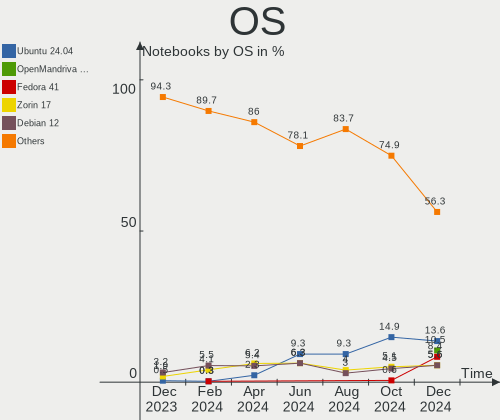
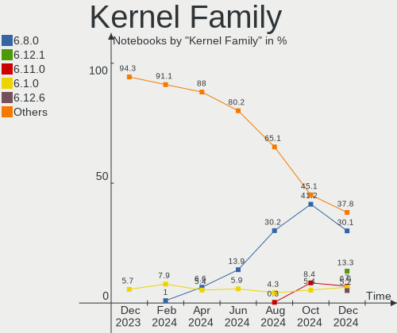
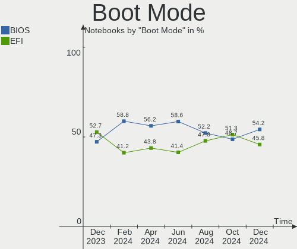
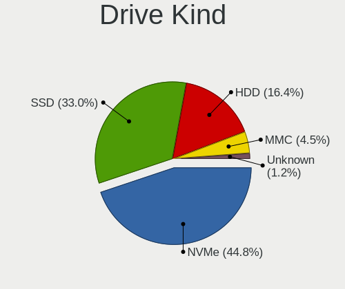
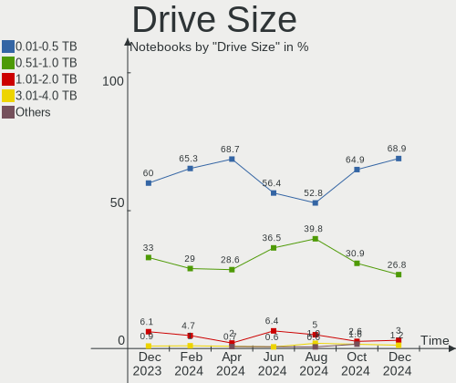
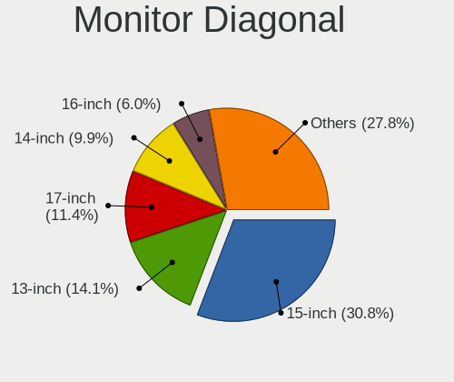
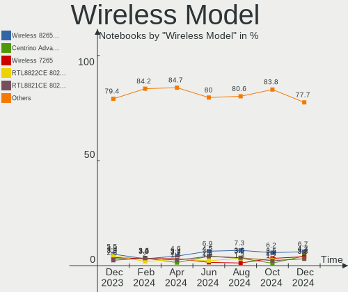
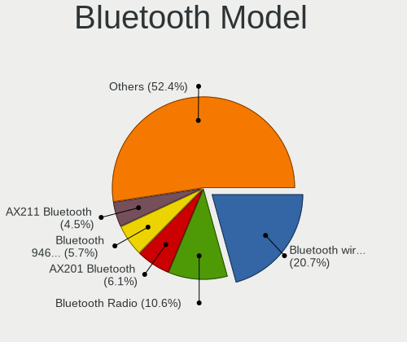
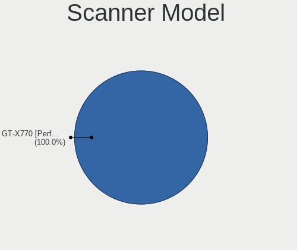
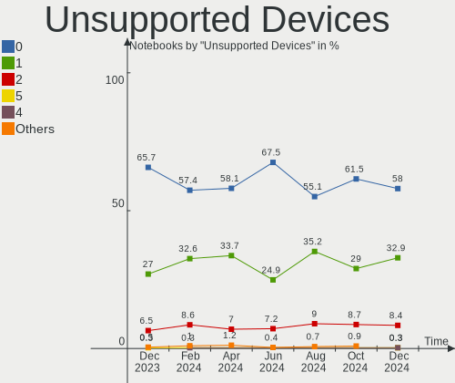

Linux in Germany - Hardware Trends (Notebooks)
----------------------------------------------

A project to identify most popular hardware characteristics and track their change
over time based on data collected by Linux users at https://Linux-Hardware.org.

Anyone can contribute to this report by the [hw-probe](https://github.com/linuxhw/hw-probe) tool:

    sudo -E hw-probe -all -upload

Contents
--------

* [ System ](#system)
  - [ OS                       ](#os)
  - [ OS Family                ](#os-family)
  - [ Kernel                   ](#kernel)
  - [ Kernel Family            ](#kernel-family)
  - [ Kernel Major Ver.        ](#kernel-major-ver)
  - [ Arch                     ](#arch)
  - [ DE                       ](#de)
  - [ Display Server           ](#display-server)
  - [ Display Manager          ](#display-manager)
  - [ OS Lang                  ](#os-lang)
  - [ Boot Mode                ](#boot-mode)
  - [ Filesystem               ](#filesystem)
  - [ Part. scheme             ](#part-scheme)
  - [ Dual Boot with Linux/BSD ](#dual-boot-with-linuxbsd)
  - [ Dual Boot (Win)          ](#dual-boot-win)

* [ Board ](#board)
  - [ Vendor                   ](#vendor)
  - [ Model                    ](#model)
  - [ Model Family             ](#model-family)
  - [ MFG Year                 ](#mfg-year)
  - [ Form Factor              ](#form-factor)
  - [ Secure Boot              ](#secure-boot)
  - [ Coreboot                 ](#coreboot)
  - [ RAM Size                 ](#ram-size)
  - [ RAM Used                 ](#ram-used)
  - [ Total Drives             ](#total-drives)
  - [ Has CD-ROM               ](#has-cd-rom)
  - [ Has Ethernet             ](#has-ethernet)
  - [ Has WiFi                 ](#has-wifi)
  - [ Has Bluetooth            ](#has-bluetooth)

* [ Location ](#location)
  - [ Country                  ](#country)
  - [ City                     ](#city)

* [ Drives ](#drives)
  - [ Drive Vendor             ](#drive-vendor)
  - [ Drive Model              ](#drive-model)
  - [ HDD Vendor               ](#hdd-vendor)
  - [ SSD Vendor               ](#ssd-vendor)
  - [ Drive Kind               ](#drive-kind)
  - [ Drive Connector          ](#drive-connector)
  - [ Drive Size               ](#drive-size)
  - [ Space Total              ](#space-total)
  - [ Space Used               ](#space-used)
  - [ Malfunc. Drives          ](#malfunc-drives)
  - [ Malfunc. Drive Vendor    ](#malfunc-drive-vendor)
  - [ Malfunc. HDD Vendor      ](#malfunc-hdd-vendor)
  - [ Malfunc. Drive Kind      ](#malfunc-drive-kind)
  - [ Failed Drives            ](#failed-drives)
  - [ Failed Drive Vendor      ](#failed-drive-vendor)
  - [ Drive Status             ](#drive-status)

* [ Storage controller ](#storage-controller)
  - [ Storage Vendor           ](#storage-vendor)
  - [ Storage Model            ](#storage-model)
  - [ Storage Kind             ](#storage-kind)

* [ Processor ](#processor)
  - [ CPU Vendor               ](#cpu-vendor)
  - [ CPU Model                ](#cpu-model)
  - [ CPU Model Family         ](#cpu-model-family)
  - [ CPU Cores                ](#cpu-cores)
  - [ CPU Sockets              ](#cpu-sockets)
  - [ CPU Threads              ](#cpu-threads)
  - [ CPU Op-Modes             ](#cpu-op-modes)
  - [ CPU Microcode            ](#cpu-microcode)
  - [ CPU Microarch            ](#cpu-microarch)

* [ Graphics ](#graphics)
  - [ GPU Vendor               ](#gpu-vendor)
  - [ GPU Model                ](#gpu-model)
  - [ GPU Combo                ](#gpu-combo)
  - [ GPU Driver               ](#gpu-driver)
  - [ GPU Memory               ](#gpu-memory)

* [ Monitor ](#monitor)
  - [ Monitor Vendor           ](#monitor-vendor)
  - [ Monitor Model            ](#monitor-model)
  - [ Monitor Resolution       ](#monitor-resolution)
  - [ Monitor Diagonal         ](#monitor-diagonal)
  - [ Monitor Width            ](#monitor-width)
  - [ Aspect Ratio             ](#aspect-ratio)
  - [ Monitor Area             ](#monitor-area)
  - [ Pixel Density            ](#pixel-density)
  - [ Multiple Monitors        ](#multiple-monitors)

* [ Network ](#network)
  - [ Net Controller Vendor    ](#net-controller-vendor)
  - [ Net Controller Model     ](#net-controller-model)
  - [ Wireless Vendor          ](#wireless-vendor)
  - [ Wireless Model           ](#wireless-model)
  - [ Ethernet Vendor          ](#ethernet-vendor)
  - [ Ethernet Model           ](#ethernet-model)
  - [ Net Controller Kind      ](#net-controller-kind)
  - [ Used Controller          ](#used-controller)
  - [ NICs                     ](#nics)
  - [ IPv6                     ](#ipv6)

* [ Bluetooth ](#bluetooth)
  - [ Bluetooth Vendor         ](#bluetooth-vendor)
  - [ Bluetooth Model          ](#bluetooth-model)

* [ Sound ](#sound)
  - [ Sound Vendor             ](#sound-vendor)
  - [ Sound Model              ](#sound-model)

* [ Memory ](#memory)
  - [ Memory Vendor            ](#memory-vendor)
  - [ Memory Model             ](#memory-model)
  - [ Memory Kind              ](#memory-kind)
  - [ Memory Form Factor       ](#memory-form-factor)
  - [ Memory Size              ](#memory-size)
  - [ Memory Speed             ](#memory-speed)

* [ Printers & scanners ](#printers--scanners)
  - [ Printer Vendor           ](#printer-vendor)
  - [ Printer Model            ](#printer-model)
  - [ Scanner Vendor           ](#scanner-vendor)
  - [ Scanner Model            ](#scanner-model)

* [ Camera ](#camera)
  - [ Camera Vendor            ](#camera-vendor)
  - [ Camera Model             ](#camera-model)

* [ Security ](#security)
  - [ Fingerprint Vendor       ](#fingerprint-vendor)
  - [ Fingerprint Model        ](#fingerprint-model)
  - [ Chipcard Vendor          ](#chipcard-vendor)
  - [ Chipcard Model           ](#chipcard-model)

* [ Unsupported ](#unsupported)
  - [ Unsupported Devices      ](#unsupported-devices)
  - [ Unsupported Device Types ](#unsupported-device-types)

System
------

OS
--

Installed operating systems

| Name                         | Notebooks | Percent |
|------------------------------|-----------|---------|
| Ubuntu 20.04                 | 40        | 13.61%  |
| Linux Mint 20.3              | 40        | 13.61%  |
| Ubuntu 21.10                 | 21        | 7.14%   |
| OpenMandriva 4.3             | 18        | 6.12%   |
| Fedora 35                    | 14        | 4.76%   |
| Ubuntu 22.04                 | 12        | 4.08%   |
| Debian 11                    | 11        | 3.74%   |
| Zorin 16                     | 9         | 3.06%   |
| Arch                         | 9         | 3.06%   |
| Pop!_OS 21.10                | 7         | 2.38%   |
| Linux Mint 20.2              | 6         | 2.04%   |
| Manjaro                      | 5         | 1.7%    |
| Kubuntu 21.10                | 5         | 1.7%    |
| Kubuntu 20.04                | 5         | 1.7%    |
| ArcoLinux Rolling            | 5         | 1.7%    |
| SteamOS Snapshot             | 4         | 1.36%   |
| Pop!_OS 22.04                | 4         | 1.36%   |
| Manjaro 21.2.6               | 4         | 1.36%   |
| KDE neon 20.04               | 4         | 1.36%   |
| Xubuntu 20.04                | 3         | 1.02%   |
| Ubuntu MATE 20.04            | 3         | 1.02%   |
| Ubuntu Budgie 20.04          | 3         | 1.02%   |
| Parrot 5.0                   | 3         | 1.02%   |
| MX 21                        | 3         | 1.02%   |
| Linux Mint 20.1              | 3         | 1.02%   |
| Linux Mint 19.2              | 3         | 1.02%   |
| Kubuntu 11                   | 3         | 1.02%   |
| Kali 2022.1                  | 3         | 1.02%   |
| Elementary 6.1               | 3         | 1.02%   |
| Xubuntu 22.04                | 2         | 0.68%   |
| Xero Rolling                 | 2         | 0.68%   |
| Ubuntu 18.04                 | 2         | 0.68%   |
| ROSA 12.2                    | 2         | 0.68%   |
| Manjaro 21.2.5               | 2         | 0.68%   |
| Fedora 36                    | 2         | 0.68%   |
| Arch Rolling                 | 2         | 0.68%   |
| Ubuntu Budgie 21.10          | 1         | 0.34%   |
| Ubuntu 20.10                 | 1         | 0.34%   |
| ROSA 12.1                    | 1         | 0.34%   |
| openSUSE Tumbleweed-20220427 | 1         | 0.34%   |
| openSUSE Tumbleweed-20220412 | 1         | 0.34%   |
| openSUSE Tumbleweed-20220406 | 1         | 0.34%   |
| openSUSE Tumbleweed-20220330 | 1         | 0.34%   |
| openSUSE Leap-15.3           | 1         | 0.34%   |
| openSUSE 20220425            | 1         | 0.34%   |
| OpenMandriva 4.2             | 1         | 0.34%   |
| NixOS 22.05                  | 1         | 0.34%   |
| Lubuntu 22.04                | 1         | 0.34%   |
| Lubuntu 18.04                | 1         | 0.34%   |
| LMDE 5                       | 1         | 0.34%   |
| LMDE 4                       | 1         | 0.34%   |
| LinuxFX 11                   | 1         | 0.34%   |
| Linux Mint 19.3              | 1         | 0.34%   |
| Linux Lite 5.8               | 1         | 0.34%   |
| Kubuntu 22.04                | 1         | 0.34%   |
| Gentoo 2.7                   | 1         | 0.34%   |
| Garuda Linux Soaring         | 1         | 0.34%   |
| Fedora 34                    | 1         | 0.34%   |
| Endless 4.0.4                | 1         | 0.34%   |
| Debian Unstable              | 1         | 0.34%   |

OS Family
---------

OS without a version

| Name          | Notebooks | Percent |
|---------------|-----------|---------|
| Ubuntu        | 76        | 25.85%  |
| Linux Mint    | 53        | 18.03%  |
| OpenMandriva  | 19        | 6.46%   |
| Fedora        | 17        | 5.78%   |
| Kubuntu       | 14        | 4.76%   |
| Debian        | 13        | 4.42%   |
| Pop!_OS       | 11        | 3.74%   |
| Manjaro       | 11        | 3.74%   |
| Arch          | 11        | 3.74%   |
| Zorin         | 9         | 3.06%   |
| openSUSE      | 6         | 2.04%   |
| ArcoLinux     | 6         | 2.04%   |
| Xubuntu       | 5         | 1.7%    |
| Ubuntu Budgie | 4         | 1.36%   |
| SteamOS       | 4         | 1.36%   |
| KDE neon      | 4         | 1.36%   |
| Ubuntu MATE   | 3         | 1.02%   |
| ROSA          | 3         | 1.02%   |
| Parrot        | 3         | 1.02%   |
| MX            | 3         | 1.02%   |
| Kali          | 3         | 1.02%   |
| Elementary    | 3         | 1.02%   |
| Xero          | 2         | 0.68%   |
| Lubuntu       | 2         | 0.68%   |
| LMDE          | 2         | 0.68%   |
| NixOS         | 1         | 0.34%   |
| LinuxFX       | 1         | 0.34%   |
| Linux Lite    | 1         | 0.34%   |
| Gentoo        | 1         | 0.34%   |
| Garuda Linux  | 1         | 0.34%   |
| Endless       | 1         | 0.34%   |
| Clear Linux   | 1         | 0.34%   |

Kernel
------

Version of the Linux kernel

| Version                                        | Notebooks | Percent |
|------------------------------------------------|-----------|---------|
| 5.13.0-39-generic                              | 55        | 18.71%  |
| 5.4.0-107-generic                              | 26        | 8.84%   |
| 5.13.0-40-generic                              | 22        | 7.48%   |
| 5.4.0-109-generic                              | 20        | 6.8%    |
| 5.16.7-desktop-1omv4003                        | 16        | 5.44%   |
| 5.17.1-arch1-1                                 | 10        | 3.4%    |
| 5.10.0-13-amd64                                | 10        | 3.4%    |
| 5.16.15-76051615-generic                       | 7         | 2.38%   |
| 5.16.18-200.fc35.x86_64                        | 6         | 2.04%   |
| 5.15.0-27-generic                              | 6         | 2.04%   |
| 5.16.19-76051619-generic                       | 4         | 1.36%   |
| 5.15.32-1-MANJARO                              | 4         | 1.36%   |
| 5.15.0-25-generic                              | 4         | 1.36%   |
| 5.16.0-6-amd64                                 | 3         | 1.02%   |
| 5.16.0-12parrot1-amd64                         | 3         | 1.02%   |
| 5.15.0-23-generic                              | 3         | 1.02%   |
| 5.14.0-1032-oem                                | 3         | 1.02%   |
| 5.13.0-valve10.1-1-neptune-02144-g7fffaf925dfb | 3         | 1.02%   |
| 5.13.0-19-generic                              | 3         | 1.02%   |
| 5.17.4-1-default                               | 2         | 0.68%   |
| 5.17.3-zen1-1-zen                              | 2         | 0.68%   |
| 5.17.1-3-MANJARO                               | 2         | 0.68%   |
| 5.17.1-1-default                               | 2         | 0.68%   |
| 5.16.20-200.fc35.x86_64                        | 2         | 0.68%   |
| 5.16.14-1-MANJARO                              | 2         | 0.68%   |
| 5.16.13-desktop-1omv4003                       | 2         | 0.68%   |
| 5.15.33-1-lts                                  | 2         | 0.68%   |
| 5.15.32-1-lts                                  | 2         | 0.68%   |
| 5.13.0-37-generic                              | 2         | 0.68%   |
| 5.13.0-35-generic                              | 2         | 0.68%   |
| 5.13.0-27-generic                              | 2         | 0.68%   |
| 5.10.74-generic-2rosa2021.1-x86_64             | 2         | 0.68%   |
| 5.10.0-13-686-pae                              | 2         | 0.68%   |
| 4.15.0-54-generic                              | 2         | 0.68%   |
| 5.8.0-43-generic                               | 1         | 0.34%   |
| 5.8.0-25-generic                               | 1         | 0.34%   |
| 5.8.0-050800-generic                           | 1         | 0.34%   |
| 5.4.0-91-generic                               | 1         | 0.34%   |
| 5.4.0-42-generic                               | 1         | 0.34%   |
| 5.4.0-107-lowlatency                           | 1         | 0.34%   |
| 5.4.0-105-generic                              | 1         | 0.34%   |
| 5.4.0-1048-fips                                | 1         | 0.34%   |
| 5.3.18-150300.59.63-default                    | 1         | 0.34%   |
| 5.3.0-18-generic                               | 1         | 0.34%   |
| 5.18.0-051800rc1-generic                       | 1         | 0.34%   |
| 5.17.4-200.fc35.x86_64                         | 1         | 0.34%   |
| 5.17.3-gentoo                                  | 1         | 0.34%   |
| 5.17.3-302.fc36.x86_64                         | 1         | 0.34%   |
| 5.17.3-051703-generic                          | 1         | 0.34%   |
| 5.17.2-arch3-1                                 | 1         | 0.34%   |
| 5.17.2-300.fc36.x86_64                         | 1         | 0.34%   |
| 5.17.1-zen1-1-zen                              | 1         | 0.34%   |
| 5.17.1                                         | 1         | 0.34%   |
| 5.17.0-trunk-amd64                             | 1         | 0.34%   |
| 5.17.0-1003-oem                                | 1         | 0.34%   |
| 5.17.0-1-MANJARO                               | 1         | 0.34%   |
| 5.17.0-051700-generic                          | 1         | 0.34%   |
| 5.16.9-200.fc35.x86_64                         | 1         | 0.34%   |
| 5.16.18-1138.native                            | 1         | 0.34%   |
| 5.16.18-100.fc34.x86_64                        | 1         | 0.34%   |

Kernel Family
-------------

Linux kernel without a distro release

| Version  | Notebooks | Percent |
|----------|-----------|---------|
| 5.13.0   | 93        | 31.63%  |
| 5.4.0    | 51        | 17.35%  |
| 5.17.1   | 16        | 5.44%   |
| 5.16.7   | 16        | 5.44%   |
| 5.15.0   | 16        | 5.44%   |
| 5.10.0   | 13        | 4.42%   |
| 5.16.15  | 9         | 3.06%   |
| 5.16.18  | 8         | 2.72%   |
| 5.16.0   | 8         | 2.72%   |
| 5.15.32  | 6         | 2.04%   |
| 5.17.3   | 5         | 1.7%    |
| 5.17.0   | 4         | 1.36%   |
| 5.16.19  | 4         | 1.36%   |
| 5.14.0   | 4         | 1.36%   |
| 4.15.0   | 4         | 1.36%   |
| 5.8.0    | 3         | 1.02%   |
| 5.17.4   | 3         | 1.02%   |
| 5.11.0   | 3         | 1.02%   |
| 5.10.74  | 3         | 1.02%   |
| 5.17.2   | 2         | 0.68%   |
| 5.16.20  | 2         | 0.68%   |
| 5.16.14  | 2         | 0.68%   |
| 5.16.13  | 2         | 0.68%   |
| 5.16.12  | 2         | 0.68%   |
| 5.15.33  | 2         | 0.68%   |
| 5.3.18   | 1         | 0.34%   |
| 5.3.0    | 1         | 0.34%   |
| 5.18.0   | 1         | 0.34%   |
| 5.16.9   | 1         | 0.34%   |
| 5.16.17  | 1         | 0.34%   |
| 5.15.6   | 1         | 0.34%   |
| 5.15.34  | 1         | 0.34%   |
| 5.14.7   | 1         | 0.34%   |
| 5.14.17  | 1         | 0.34%   |
| 5.14.10  | 1         | 0.34%   |
| 5.10.14  | 1         | 0.34%   |
| 5.10.105 | 1         | 0.34%   |
| 4.19.0   | 1         | 0.34%   |

Kernel Major Ver.
-----------------

Linux kernel major version

| Version | Notebooks | Percent |
|---------|-----------|---------|
| 5.13    | 93        | 31.63%  |
| 5.16    | 55        | 18.71%  |
| 5.4     | 51        | 17.35%  |
| 5.17    | 30        | 10.2%   |
| 5.15    | 26        | 8.84%   |
| 5.10    | 18        | 6.12%   |
| 5.14    | 7         | 2.38%   |
| 4.15    | 4         | 1.36%   |
| 5.8     | 3         | 1.02%   |
| 5.11    | 3         | 1.02%   |
| 5.3     | 2         | 0.68%   |
| 5.18    | 1         | 0.34%   |
| 4.19    | 1         | 0.34%   |

Arch
----

OS architecture (x86_64, i586, etc.)

| Name   | Notebooks | Percent |
|--------|-----------|---------|
| x86_64 | 287       | 97.62%  |
| i686   | 7         | 2.38%   |

DE
--

Desktop Environment

| Name            | Notebooks | Percent |
|-----------------|-----------|---------|
| GNOME           | 122       | 41.5%   |
| KDE5            | 63        | 21.43%  |
| X-Cinnamon      | 41        | 13.95%  |
| XFCE            | 25        | 8.5%    |
| MATE            | 12        | 4.08%   |
| Unknown         | 10        | 3.4%    |
| LXQt            | 4         | 1.36%   |
| Budgie          | 4         | 1.36%   |
| Pantheon        | 3         | 1.02%   |
| Unity           | 2         | 0.68%   |
| trinity         | 1         | 0.34%   |
| sway            | 1         | 0.34%   |
| qtile           | 1         | 0.34%   |
| LXDE            | 1         | 0.34%   |
| KDE             | 1         | 0.34%   |
| herbstluftwm    | 1         | 0.34%   |
| GNOME Flashback | 1         | 0.34%   |
| awesome         | 1         | 0.34%   |

Display Server
--------------

X11 or Wayland

| Name    | Notebooks | Percent |
|---------|-----------|---------|
| X11     | 229       | 77.89%  |
| Wayland | 58        | 19.73%  |
| Unknown | 6         | 2.04%   |
| Tty     | 1         | 0.34%   |

Display Manager
---------------

SDDM, LightDM, etc.

| Name    | Notebooks | Percent |
|---------|-----------|---------|
| Unknown | 99        | 33.67%  |
| GDM3    | 59        | 20.07%  |
| LightDM | 50        | 17.01%  |
| SDDM    | 44        | 14.97%  |
| GDM     | 39        | 13.27%  |
| XDM     | 1         | 0.34%   |
| Ly      | 1         | 0.34%   |
| GREETD  | 1         | 0.34%   |

OS Lang
-------

Language

| Lang    | Notebooks | Percent |
|---------|-----------|---------|
| de_DE   | 203       | 69.05%  |
| en_US   | 62        | 21.09%  |
| en_GB   | 8         | 2.72%   |
| ru_RU   | 4         | 1.36%   |
| it_IT   | 3         | 1.02%   |
| Unknown | 3         | 1.02%   |
| pl_PL   | 2         | 0.68%   |
| en_DE   | 2         | 0.68%   |
| de_AT   | 2         | 0.68%   |
| C       | 2         | 0.68%   |
| es_ES   | 1         | 0.34%   |
| en_DK   | 1         | 0.34%   |
| ar_EG   | 1         | 0.34%   |

Boot Mode
---------

EFI or BIOS

| Mode | Notebooks | Percent |
|------|-----------|---------|
| BIOS | 148       | 50.34%  |
| EFI  | 146       | 49.66%  |

Filesystem
----------

Type of filesystem

| Type    | Notebooks | Percent |
|---------|-----------|---------|
| Ext4    | 227       | 77.21%  |
| Btrfs   | 41        | 13.95%  |
| Overlay | 18        | 6.12%   |
| Xfs     | 4         | 1.36%   |
| Zfs     | 3         | 1.02%   |
| Ext3    | 1         | 0.34%   |

Part. scheme
------------

Scheme of partitioning

| Type    | Notebooks | Percent |
|---------|-----------|---------|
| Unknown | 152       | 51.7%   |
| GPT     | 113       | 38.44%  |
| MBR     | 29        | 9.86%   |

Dual Boot with Linux/BSD
------------------------

Hosting more than one Linux/BSD

| Dual boot | Notebooks | Percent |
|-----------|-----------|---------|
| No        | 259       | 88.1%   |
| Yes       | 35        | 11.9%   |

Dual Boot (Win)
---------------

Hosting Linux and Windows

| Dual boot | Notebooks | Percent |
|-----------|-----------|---------|
| No        | 220       | 74.83%  |
| Yes       | 74        | 25.17%  |

Board
-----

Vendor
------

Motherboard manufacturer

| Name                           | Notebooks | Percent |
|--------------------------------|-----------|---------|
| Lenovo                         | 75        | 25.51%  |
| Hewlett-Packard                | 40        | 13.61%  |
| Dell                           | 36        | 12.24%  |
| ASUSTek Computer               | 26        | 8.84%   |
| Acer                           | 25        | 8.5%    |
| Medion                         | 12        | 4.08%   |
| Samsung Electronics            | 8         | 2.72%   |
| TUXEDO                         | 7         | 2.38%   |
| Toshiba                        | 7         | 2.38%   |
| Sony                           | 6         | 2.04%   |
| Packard Bell                   | 5         | 1.7%    |
| Notebook                       | 5         | 1.7%    |
| Fujitsu                        | 5         | 1.7%    |
| Valve                          | 4         | 1.36%   |
| MSI                            | 4         | 1.36%   |
| Framework                      | 4         | 1.36%   |
| Apple                          | 4         | 1.36%   |
| Wortmann AG                    | 3         | 1.02%   |
| Timi                           | 3         | 1.02%   |
| HUAWEI                         | 2         | 0.68%   |
| Fujitsu Siemens                | 2         | 0.68%   |
| Schenker                       | 1         | 0.34%   |
| Razer                          | 1         | 0.34%   |
| Matsushita Electric Industrial | 1         | 0.34%   |
| LincPlus                       | 1         | 0.34%   |
| Jumper                         | 1         | 0.34%   |
| Intel                          | 1         | 0.34%   |
| CSL-Computer                   | 1         | 0.34%   |
| Chuwi                          | 1         | 0.34%   |
| AWOW                           | 1         | 0.34%   |
| AMI                            | 1         | 0.34%   |
| Alienware                      | 1         | 0.34%   |

Model
-----

Motherboard model

| Name                                 | Notebooks | Percent |
|--------------------------------------|-----------|---------|
| Valve Jupiter                        | 4         | 1.36%   |
| Framework Laptop                     | 4         | 1.36%   |
| Acer Swift SF114-34                  | 4         | 1.36%   |
| Lenovo ThinkPad L15 Gen 1 20U8S0AH00 | 2         | 0.68%   |
| HP ZBook 15 G3                       | 2         | 0.68%   |
| HP ProBook 455 G7                    | 2         | 0.68%   |
| HP Laptop 17-bs0xx                   | 2         | 0.68%   |
| HP EliteBook 840 G5                  | 2         | 0.68%   |
| HP 625                               | 2         | 0.68%   |
| HP 255 G8 Notebook PC                | 2         | 0.68%   |
| HP 255 G7 Notebook PC                | 2         | 0.68%   |
| Dell XPS 13 9370                     | 2         | 0.68%   |
| Dell XPS 13 9310                     | 2         | 0.68%   |
| Dell Latitude E6540                  | 2         | 0.68%   |
| Dell Latitude E5530 non-vPro         | 2         | 0.68%   |
| Apple MacBookAir4,2                  | 2         | 0.68%   |
| Acer Aspire A717-71G                 | 2         | 0.68%   |
| Wortmann AG TERRA_MOBILE_1749        | 1         | 0.34%   |
| Wortmann AG M7x0S                    | 1         | 0.34%   |
| Wortmann AG 1220663_1470189          | 1         | 0.34%   |
| TUXEDO Stellaris Intel Gen3 (TGL)    | 1         | 0.34%   |
| TUXEDO Polaris Intel Gen3 (TGL)      | 1         | 0.34%   |
| TUXEDO PA70ES                        | 1         | 0.34%   |
| TUXEDO N15_17RD                      | 1         | 0.34%   |
| TUXEDO InfinityBook S 15 Gen6        | 1         | 0.34%   |
| TUXEDO InfinityBook S 14 v5          | 1         | 0.34%   |
| TUXEDO Aura 15 Gen1                  | 1         | 0.34%   |
| Toshiba TECRA X40-E                  | 1         | 0.34%   |
| Toshiba TECRA R940                   | 1         | 0.34%   |
| Toshiba Satellite P200               | 1         | 0.34%   |
| Toshiba Satellite L755               | 1         | 0.34%   |
| Toshiba Satellite C870-1C2           | 1         | 0.34%   |
| Toshiba Satellite C50t-B             | 1         | 0.34%   |
| Toshiba PORTEGE M800                 | 1         | 0.34%   |
| Timi TM1701                          | 1         | 0.34%   |
| Timi TM1612                          | 1         | 0.34%   |
| Timi TM1604                          | 1         | 0.34%   |
| Sony VPCY21S1E                       | 1         | 0.34%   |
| Sony VGN-FZ21M                       | 1         | 0.34%   |
| Sony VGN-CS31S_W                     | 1         | 0.34%   |
| Sony SVE1713A1EW                     | 1         | 0.34%   |
| Sony SVE1712C1EW                     | 1         | 0.34%   |
| Sony SVE1511W1ESI                    | 1         | 0.34%   |
| Schenker VISION 15 (SVS15E21)        | 1         | 0.34%   |
| Samsung SX10P                        | 1         | 0.34%   |
| Samsung RC530/RC730                  | 1         | 0.34%   |
| Samsung R580/R590                    | 1         | 0.34%   |
| Samsung R505                         | 1         | 0.34%   |
| Samsung 870Z5E/880Z5E/680Z5E         | 1         | 0.34%   |
| Samsung 755XDA                       | 1         | 0.34%   |
| Samsung 750XDA                       | 1         | 0.34%   |
| Samsung 700T                         | 1         | 0.34%   |
| Razer Blade Stealth                  | 1         | 0.34%   |
| Packard Bell EasyNote TS11HR         | 1         | 0.34%   |
| Packard Bell EasyNote TK85           | 1         | 0.34%   |
| Packard Bell EasyNote LV11HC         | 1         | 0.34%   |
| Packard Bell DOTM                    | 1         | 0.34%   |
| Packard Bell DOT S                   | 1         | 0.34%   |
| Notebook W65_67SZ                    | 1         | 0.34%   |
| Notebook W35xSTQ_370ST               | 1         | 0.34%   |

Model Family
------------

Motherboard model prefix

| Name                  | Notebooks | Percent |
|-----------------------|-----------|---------|
| Lenovo ThinkPad       | 54        | 18.37%  |
| Dell Latitude         | 15        | 5.1%    |
| Acer Aspire           | 15        | 5.1%    |
| Lenovo IdeaPad        | 13        | 4.42%   |
| Dell XPS              | 10        | 3.4%    |
| HP Laptop             | 8         | 2.72%   |
| HP EliteBook          | 8         | 2.72%   |
| HP 255                | 6         | 2.04%   |
| Dell Inspiron         | 6         | 2.04%   |
| Fujitsu LIFEBOOK      | 5         | 1.7%    |
| Acer Swift            | 5         | 1.7%    |
| Valve Jupiter         | 4         | 1.36%   |
| Toshiba Satellite     | 4         | 1.36%   |
| HP ProBook            | 4         | 1.36%   |
| HP Pavilion           | 4         | 1.36%   |
| Framework Laptop      | 4         | 1.36%   |
| Packard Bell EasyNote | 3         | 1.02%   |
| HP ZBook              | 3         | 1.02%   |
| Dell Precision        | 3         | 1.02%   |
| Acer TravelMate       | 3         | 1.02%   |
| TUXEDO InfinityBook   | 2         | 0.68%   |
| Toshiba TECRA         | 2         | 0.68%   |
| Lenovo ThinkBook      | 2         | 0.68%   |
| HP 625                | 2         | 0.68%   |
| Fujitsu Siemens AMILO | 2         | 0.68%   |
| ASUS ZenBook          | 2         | 0.68%   |
| ASUS ROG              | 2         | 0.68%   |
| ASUS ASUS             | 2         | 0.68%   |
| Apple MacBookAir4     | 2         | 0.68%   |
| Acer Nitro            | 2         | 0.68%   |
| Wortmann AG TERRA     | 1         | 0.34%   |
| Wortmann AG M7x0S     | 1         | 0.34%   |
| Wortmann AG 1220663   | 1         | 0.34%   |
| TUXEDO Stellaris      | 1         | 0.34%   |
| TUXEDO Polaris        | 1         | 0.34%   |
| TUXEDO PA70ES         | 1         | 0.34%   |
| TUXEDO N15            | 1         | 0.34%   |
| TUXEDO Aura           | 1         | 0.34%   |
| Toshiba PORTEGE       | 1         | 0.34%   |
| Timi TM1701           | 1         | 0.34%   |
| Timi TM1612           | 1         | 0.34%   |
| Timi TM1604           | 1         | 0.34%   |
| Sony VPCY21S1E        | 1         | 0.34%   |
| Sony VGN-FZ21M        | 1         | 0.34%   |
| Sony VGN-CS31S        | 1         | 0.34%   |
| Sony SVE1713A1EW      | 1         | 0.34%   |
| Sony SVE1712C1EW      | 1         | 0.34%   |
| Sony SVE1511W1ESI     | 1         | 0.34%   |
| Schenker VISION       | 1         | 0.34%   |
| Samsung SX10P         | 1         | 0.34%   |
| Samsung RC530         | 1         | 0.34%   |
| Samsung R580          | 1         | 0.34%   |
| Samsung R505          | 1         | 0.34%   |
| Samsung 870Z5E        | 1         | 0.34%   |
| Samsung 755XDA        | 1         | 0.34%   |
| Samsung 750XDA        | 1         | 0.34%   |
| Samsung 700T          | 1         | 0.34%   |
| Razer Blade           | 1         | 0.34%   |
| Packard Bell DOTM     | 1         | 0.34%   |
| Packard Bell DOT      | 1         | 0.34%   |

MFG Year
--------

Motherboard manufacture year

| Year    | Notebooks | Percent |
|---------|-----------|---------|
| 2020    | 39        | 13.27%  |
| 2021    | 37        | 12.59%  |
| 2012    | 29        | 9.86%   |
| 2017    | 25        | 8.5%    |
| 2018    | 22        | 7.48%   |
| 2011    | 20        | 6.8%    |
| 2019    | 18        | 6.12%   |
| 2016    | 17        | 5.78%   |
| 2013    | 14        | 4.76%   |
| 2010    | 13        | 4.42%   |
| 2015    | 12        | 4.08%   |
| 2009    | 12        | 4.08%   |
| 2008    | 12        | 4.08%   |
| 2014    | 10        | 3.4%    |
| 2022    | 4         | 1.36%   |
| 2007    | 4         | 1.36%   |
| Unknown | 3         | 1.02%   |
| 2006    | 1         | 0.34%   |
| 2005    | 1         | 0.34%   |
| 2004    | 1         | 0.34%   |

Form Factor
-----------

Physical design of the computer

| Name     | Notebooks | Percent |
|----------|-----------|---------|
| Notebook | 294       | 100%    |

Secure Boot
-----------

Enabled or disabled

| State    | Notebooks | Percent |
|----------|-----------|---------|
| Disabled | 270       | 91.84%  |
| Enabled  | 24        | 8.16%   |

Coreboot
--------

Have coreboot on board

| Used | Notebooks | Percent |
|------|-----------|---------|
| No   | 294       | 100%    |

RAM Size
--------

Total RAM memory

| Size in GB  | Notebooks | Percent |
|-------------|-----------|---------|
| 4.01-8.0    | 81        | 27.55%  |
| 3.01-4.0    | 68        | 23.13%  |
| 8.01-16.0   | 49        | 16.67%  |
| 16.01-24.0  | 46        | 15.65%  |
| 32.01-64.0  | 25        | 8.5%    |
| 2.01-3.0    | 8         | 2.72%   |
| 64.01-256.0 | 8         | 2.72%   |
| 1.01-2.0    | 7         | 2.38%   |
| 24.01-32.0  | 2         | 0.68%   |

RAM Used
--------

Used RAM memory

| Used GB    | Notebooks | Percent |
|------------|-----------|---------|
| 1.01-2.0   | 107       | 36.39%  |
| 2.01-3.0   | 81        | 27.55%  |
| 4.01-8.0   | 43        | 14.63%  |
| 3.01-4.0   | 35        | 11.9%   |
| 8.01-16.0  | 14        | 4.76%   |
| 0.51-1.0   | 8         | 2.72%   |
| 16.01-24.0 | 4         | 1.36%   |
| 32.01-64.0 | 1         | 0.34%   |
| 24.01-32.0 | 1         | 0.34%   |

Total Drives
------------

Number of drives on board

| Drives | Notebooks | Percent |
|--------|-----------|---------|
| 1      | 214       | 72.79%  |
| 2      | 66        | 22.45%  |
| 3      | 12        | 4.08%   |
| 5      | 1         | 0.34%   |
| 4      | 1         | 0.34%   |

Has CD-ROM
----------

Has CD-ROM on board

| Presented | Notebooks | Percent |
|-----------|-----------|---------|
| No        | 187       | 63.61%  |
| Yes       | 107       | 36.39%  |

Has Ethernet
------------

Has Ethernet on board

| Presented | Notebooks | Percent |
|-----------|-----------|---------|
| Yes       | 236       | 80.27%  |
| No        | 58        | 19.73%  |

Has WiFi
--------

Has WiFi module

| Presented | Notebooks | Percent |
|-----------|-----------|---------|
| Yes       | 290       | 98.64%  |
| No        | 4         | 1.36%   |

Has Bluetooth
-------------

Has Bluetooth module

| Presented | Notebooks | Percent |
|-----------|-----------|---------|
| Yes       | 234       | 79.59%  |
| No        | 60        | 20.41%  |

Location
--------

Country
-------

Geographic location (country)

| Country | Notebooks | Percent |
|---------|-----------|---------|
| Germany | 294       | 100%    |

City
----

Geographic location (city)

| City                   | Notebooks | Percent |
|------------------------|-----------|---------|
| Berlin                 | 25        | 8.5%    |
| Munich                 | 15        | 5.1%    |
| Cologne                | 10        | 3.4%    |
| Frankfurt am Main      | 9         | 3.06%   |
| Stuttgart              | 7         | 2.38%   |
| Nuremberg              | 6         | 2.04%   |
| Leipzig                | 6         | 2.04%   |
| Karlsruhe              | 6         | 2.04%   |
| Dresden                | 5         | 1.7%    |
| Hamburg                | 4         | 1.36%   |
| Essen                  | 4         | 1.36%   |
| Dortmund               | 4         | 1.36%   |
| Chemnitz               | 4         | 1.36%   |
| Wiesbaden              | 3         | 1.02%   |
| Ulm                    | 3         | 1.02%   |
| Erfurt                 | 3         | 1.02%   |
| Bamberg                | 3         | 1.02%   |
| Wuppertal              | 2         | 0.68%   |
| Wettringen             | 2         | 0.68%   |
| Wegberg                | 2         | 0.68%   |
| Villingen-Schwenningen | 2         | 0.68%   |
| Sindelfingen           | 2         | 0.68%   |
| Moerfelden-Walldorf    | 2         | 0.68%   |
| Marburg                | 2         | 0.68%   |
| Mainz                  | 2         | 0.68%   |
| Lünen                 | 2         | 0.68%   |
| Kollow                 | 2         | 0.68%   |
| Koblenz                | 2         | 0.68%   |
| Hemmingen              | 2         | 0.68%   |
| Haßfurt               | 2         | 0.68%   |
| Göttingen             | 2         | 0.68%   |
| Euskirchen             | 2         | 0.68%   |
| Düsseldorf            | 2         | 0.68%   |
| Düren                 | 2         | 0.68%   |
| Duisburg               | 2         | 0.68%   |
| Darmstadt              | 2         | 0.68%   |
| Bremen                 | 2         | 0.68%   |
| Bonn                   | 2         | 0.68%   |
| Bochum                 | 2         | 0.68%   |
| Bergheim               | 2         | 0.68%   |
| Bad Nauheim            | 2         | 0.68%   |
| Aidlingen              | 2         | 0.68%   |
| Aachen                 | 2         | 0.68%   |
| Worms                  | 1         | 0.34%   |
| Wernigerode            | 1         | 0.34%   |
| Werder                 | 1         | 0.34%   |
| Weilheim               | 1         | 0.34%   |
| Vechelde               | 1         | 0.34%   |
| Vaihingen an der Enz   | 1         | 0.34%   |
| Uelzen                 | 1         | 0.34%   |
| Troisdorf              | 1         | 0.34%   |
| Trier                  | 1         | 0.34%   |
| Treffurt               | 1         | 0.34%   |
| Titisee-Neustadt       | 1         | 0.34%   |
| Thungersheim           | 1         | 0.34%   |
| Tholey                 | 1         | 0.34%   |
| Teutschenthal          | 1         | 0.34%   |
| Tarmstedt              | 1         | 0.34%   |
| Suhl                   | 1         | 0.34%   |
| Strullendorf           | 1         | 0.34%   |

Drives
------

Drive Vendor
------------

Hard drive vendors

| Vendor                         | Notebooks | Drives | Percent |
|--------------------------------|-----------|--------|---------|
| Samsung Electronics            | 90        | 97     | 24.59%  |
| Seagate                        | 35        | 35     | 9.56%   |
| WDC                            | 31        | 35     | 8.47%   |
| SanDisk                        | 28        | 29     | 7.65%   |
| Unknown                        | 24        | 24     | 6.56%   |
| Toshiba                        | 24        | 24     | 6.56%   |
| Crucial                        | 17        | 19     | 4.64%   |
| Micron Technology              | 16        | 16     | 4.37%   |
| SK Hynix                       | 11        | 11     | 3.01%   |
| HGST                           | 11        | 11     | 3.01%   |
| Kingston                       | 9         | 10     | 2.46%   |
| Hitachi                        | 9         | 9      | 2.46%   |
| Phison                         | 6         | 6      | 1.64%   |
| Intel                          | 6         | 6      | 1.64%   |
| KIOXIA                         | 4         | 4      | 1.09%   |
| Intenso                        | 4         | 4      | 1.09%   |
| Transcend                      | 3         | 3      | 0.82%   |
| JMicron                        | 3         | 3      | 0.82%   |
| Fujitsu                        | 3         | 3      | 0.82%   |
| Apple                          | 3         | 3      | 0.82%   |
| SPCC                           | 2         | 2      | 0.55%   |
| Leven                          | 2         | 2      | 0.55%   |
| Lenovo                         | 2         | 2      | 0.55%   |
| KingSpec                       | 2         | 2      | 0.55%   |
| Unknown                        | 2         | 2      | 0.55%   |
| Union Memory (Shenzhen)        | 1         | 1      | 0.27%   |
| UMIS                           | 1         | 1      | 0.27%   |
| TO Exter                       | 1         | 1      | 0.27%   |
| Solid State Storage Technology | 1         | 1      | 0.27%   |
| Realtek                        | 1         | 1      | 0.27%   |
| Ramaxel Technology             | 1         | 1      | 0.27%   |
| Netac                          | 1         | 1      | 0.27%   |
| MAXTOR                         | 1         | 1      | 0.27%   |
| MAXIO Technology (Hangzhou)    | 1         | 1      | 0.27%   |
| Mass                           | 1         | 1      | 0.27%   |
| LITEON                         | 1         | 1      | 0.27%   |
| Lite-On                        | 1         | 1      | 0.27%   |
| Inateck                        | 1         | 1      | 0.27%   |
| China                          | 1         | 1      | 0.27%   |
| ASUS-PHISON                    | 1         | 1      | 0.27%   |
| Apacer                         | 1         | 1      | 0.27%   |
| AirDisk                        | 1         | 1      | 0.27%   |
| ADATA Technology               | 1         | 1      | 0.27%   |
| A-DATA Technology              | 1         | 1      | 0.27%   |

Drive Model
-----------

Hard drive models

| Model                                | Notebooks | Percent |
|--------------------------------------|-----------|---------|
| Samsung NVMe SSD Drive 512GB         | 7         | 1.84%   |
| Seagate ST9500325AS 500GB            | 6         | 1.58%   |
| Crucial CT500MX500SSD1 500GB         | 5         | 1.32%   |
| Unknown MMC Card  32GB               | 4         | 1.05%   |
| Unknown MMC Card  128GB              | 4         | 1.05%   |
| Toshiba MQ01ABF050 500GB             | 4         | 1.05%   |
| Toshiba MQ01ABD100 1TB               | 4         | 1.05%   |
| Seagate ST1000LM035-1RK172 1TB       | 4         | 1.05%   |
| Sandisk NVMe SSD Drive 1TB           | 4         | 1.05%   |
| Samsung NVMe SSD Drive 1024GB        | 4         | 1.05%   |
| Phison NVMe SSD Drive 512GB          | 4         | 1.05%   |
| WDC WD10JPVX-22JC3T0 1TB             | 3         | 0.79%   |
| Unknown MMC Card  64GB               | 3         | 0.79%   |
| Toshiba MQ04ABF100 1TB               | 3         | 0.79%   |
| Seagate ST500LM012 HN-M500MBB 500GB  | 3         | 0.79%   |
| Sandisk NVMe SSD Drive 512GB         | 3         | 0.79%   |
| Samsung SSD 980 PRO 1TB              | 3         | 0.79%   |
| Samsung SSD 970 EVO Plus 2TB         | 3         | 0.79%   |
| Samsung SSD 840 EVO 250GB            | 3         | 0.79%   |
| Samsung NVMe SSD Drive 2TB           | 3         | 0.79%   |
| Samsung NVMe SSD Drive 1TB           | 3         | 0.79%   |
| WDC WDS100T2B0B-00YS70 1TB SSD       | 2         | 0.53%   |
| WDC WD5000BPVT-22HXZT3 500GB         | 2         | 0.53%   |
| WDC PC SN730 SDBQNTY-1T00-1001 1TB   | 2         | 0.53%   |
| Unknown SD/MMC/MS PRO 128GB          | 2         | 0.53%   |
| Seagate ST9500420AS 500GB            | 2         | 0.53%   |
| Seagate ST500LM000-1EJ162 500GB      | 2         | 0.53%   |
| Seagate ST2000LM015-2E8174 2TB       | 2         | 0.53%   |
| Seagate ST2000LM007-1R8174 2TB       | 2         | 0.53%   |
| Seagate ST1000LM048-2E7172 1TB       | 2         | 0.53%   |
| Seagate ST1000LM024 HN-M101MBB 1TB   | 2         | 0.53%   |
| SanDisk SSD PLUS 240GB               | 2         | 0.53%   |
| SanDisk SSD PLUS 120GB               | 2         | 0.53%   |
| SanDisk SDSSDA120G 120GB             | 2         | 0.53%   |
| Sandisk NVMe SSD Drive 1024GB        | 2         | 0.53%   |
| Samsung SSD 980 1TB                  | 2         | 0.53%   |
| Samsung SSD 970 EVO Plus 1TB         | 2         | 0.53%   |
| Samsung SSD 860 QVO 1TB              | 2         | 0.53%   |
| Samsung SSD 850 EVO 500GB            | 2         | 0.53%   |
| Samsung SSD 840 EVO 500GB            | 2         | 0.53%   |
| Samsung MZVLQ512HALU-000H1 512GB     | 2         | 0.53%   |
| Samsung MZVLB512HAJQ-000L7 512GB     | 2         | 0.53%   |
| Samsung MZVLB1T0HBLR-000L7 1TB       | 2         | 0.53%   |
| Samsung MZVL22T0HBLB-00B00 2TB       | 2         | 0.53%   |
| Samsung MZNLN256HCHP-00000 256GB SSD | 2         | 0.53%   |
| Samsung HM500JI 500GB                | 2         | 0.53%   |
| Micron 2210_MTFDHBA1T0QFD 1TB        | 2         | 0.53%   |
| Leven JAJS600M256C 256GB             | 2         | 0.53%   |
| KIOXIA NVMe SSD Drive 512GB          | 2         | 0.53%   |
| Kingston SA400S37480G 480GB SSD      | 2         | 0.53%   |
| JMicron Generic 160GB                | 2         | 0.53%   |
| Hitachi HTS547575A9E384 752GB        | 2         | 0.53%   |
| Hitachi HTS542525K9SA00 250GB        | 2         | 0.53%   |
| HGST HTS725050A7E630 500GB           | 2         | 0.53%   |
| HGST HTS725032A7E630 320GB           | 2         | 0.53%   |
| HGST HTS721010A9E630 1TB             | 2         | 0.53%   |
| HGST HTS545050A7E380 500GB           | 2         | 0.53%   |
| Crucial CT1000P2SSD8 1TB             | 2         | 0.53%   |
| Crucial CT1000BX500SSD1 1TB          | 2         | 0.53%   |
| Apple SSD SM256C 256GB               | 2         | 0.53%   |

HDD Vendor
----------

Hard disk drive vendors

| Vendor              | Notebooks | Drives | Percent |
|---------------------|-----------|--------|---------|
| Seagate             | 34        | 34     | 34.34%  |
| WDC                 | 19        | 22     | 19.19%  |
| Toshiba             | 16        | 16     | 16.16%  |
| HGST                | 11        | 11     | 11.11%  |
| Hitachi             | 9         | 9      | 9.09%   |
| Samsung Electronics | 5         | 5      | 5.05%   |
| Fujitsu             | 3         | 3      | 3.03%   |
| Unknown             | 2         | 2      | 2.02%   |

SSD Vendor
----------

Solid state drive vendors

| Vendor              | Notebooks | Drives | Percent |
|---------------------|-----------|--------|---------|
| Samsung Electronics | 33        | 35     | 28.21%  |
| SanDisk             | 17        | 18     | 14.53%  |
| Crucial             | 14        | 15     | 11.97%  |
| Micron Technology   | 10        | 10     | 8.55%   |
| WDC                 | 5         | 5      | 4.27%   |
| Intel               | 4         | 4      | 3.42%   |
| Transcend           | 3         | 3      | 2.56%   |
| SK Hynix            | 3         | 3      | 2.56%   |
| Kingston            | 3         | 3      | 2.56%   |
| Intenso             | 3         | 3      | 2.56%   |
| Apple               | 3         | 3      | 2.56%   |
| SPCC                | 2         | 2      | 1.71%   |
| Leven               | 2         | 2      | 1.71%   |
| KingSpec            | 2         | 2      | 1.71%   |
| JMicron             | 2         | 2      | 1.71%   |
| Toshiba             | 1         | 1      | 0.85%   |
| TO Exter            | 1         | 1      | 0.85%   |
| Ramaxel Technology  | 1         | 1      | 0.85%   |
| Netac               | 1         | 1      | 0.85%   |
| MAXTOR              | 1         | 1      | 0.85%   |
| LITEON              | 1         | 1      | 0.85%   |
| China               | 1         | 1      | 0.85%   |
| ASUS-PHISON         | 1         | 1      | 0.85%   |
| Apacer              | 1         | 1      | 0.85%   |
| AirDisk             | 1         | 1      | 0.85%   |
| A-DATA Technology   | 1         | 1      | 0.85%   |

Drive Kind
----------

HDD or SSD

| Kind    | Notebooks | Drives | Percent |
|---------|-----------|--------|---------|
| NVMe    | 116       | 129    | 32.95%  |
| SSD     | 109       | 121    | 30.97%  |
| HDD     | 98        | 102    | 27.84%  |
| MMC     | 24        | 24     | 6.82%   |
| Unknown | 5         | 5      | 1.42%   |

Drive Connector
---------------

SATA, SAS, NVMe, etc.

| Type | Notebooks | Drives | Percent |
|------|-----------|--------|---------|
| SATA | 186       | 213    | 55.03%  |
| NVMe | 115       | 127    | 34.02%  |
| MMC  | 24        | 24     | 7.1%    |
| SAS  | 13        | 17     | 3.85%   |

Drive Size
----------

Size of hard drive

| Size in TB | Notebooks | Drives | Percent |
|------------|-----------|--------|---------|
| 0.01-0.5   | 145       | 158    | 70.05%  |
| 0.51-1.0   | 55        | 58     | 26.57%  |
| 1.01-2.0   | 6         | 6      | 2.9%    |
| 3.01-4.0   | 1         | 1      | 0.48%   |

Space Total
-----------

Amount of disk space available on the file system

| Size in GB     | Notebooks | Percent |
|----------------|-----------|---------|
| 251-500        | 81        | 27.55%  |
| 101-250        | 81        | 27.55%  |
| 501-1000       | 47        | 15.99%  |
| 1001-2000      | 22        | 7.48%   |
| 1-20           | 22        | 7.48%   |
| 51-100         | 15        | 5.1%    |
| More than 3000 | 12        | 4.08%   |
| 2001-3000      | 6         | 2.04%   |
| Unknown        | 5         | 1.7%    |
| 21-50          | 3         | 1.02%   |

Space Used
----------

Amount of used disk space

| Used GB        | Notebooks | Percent |
|----------------|-----------|---------|
| 1-20           | 90        | 30.61%  |
| 21-50          | 52        | 17.69%  |
| 101-250        | 48        | 16.33%  |
| 51-100         | 40        | 13.61%  |
| 251-500        | 36        | 12.24%  |
| 501-1000       | 12        | 4.08%   |
| 1001-2000      | 8         | 2.72%   |
| Unknown        | 5         | 1.7%    |
| 2001-3000      | 2         | 0.68%   |
| More than 3000 | 1         | 0.34%   |

Malfunc. Drives
---------------

Drive models with a malfunction

| Model                                               | Notebooks | Drives | Percent |
|-----------------------------------------------------|-----------|--------|---------|
| WDC WD3200BUDT-63DPZY0 320GB                        | 1         | 1      | 6.67%   |
| Toshiba MQ01ABD100 1TB                              | 1         | 1      | 6.67%   |
| SK Hynix HFM512GDJTNG-8310A 512GB                   | 1         | 1      | 6.67%   |
| Seagate ST9500420AS 500GB                           | 1         | 1      | 6.67%   |
| Seagate ST9500325AS 500GB                           | 1         | 1      | 6.67%   |
| Seagate ST9320325AS 320GB                           | 1         | 1      | 6.67%   |
| Seagate ST1000LM048-2E7172 1TB                      | 1         | 1      | 6.67%   |
| Seagate ST1000LM035-1RK172 1TB                      | 1         | 1      | 6.67%   |
| Micron Technology MTFDDAV256TDL-1AW1ZABHA 256GB SSD | 1         | 1      | 6.67%   |
| Intel SSDSA2M160G2LE 160GB                          | 1         | 1      | 6.67%   |
| Hitachi HTS547575A9E384 752GB                       | 1         | 1      | 6.67%   |
| HGST HTS725050A7E630 500GB                          | 1         | 1      | 6.67%   |
| HGST HTS725032A7E630 320GB                          | 1         | 1      | 6.67%   |
| HGST HTS545050A7E380 500GB                          | 1         | 1      | 6.67%   |
| Apple SSD SM256C 256GB                              | 1         | 1      | 6.67%   |

Malfunc. Drive Vendor
---------------------

Vendors of faulty drives

| Vendor            | Notebooks | Drives | Percent |
|-------------------|-----------|--------|---------|
| Seagate           | 5         | 5      | 33.33%  |
| HGST              | 3         | 3      | 20%     |
| WDC               | 1         | 1      | 6.67%   |
| Toshiba           | 1         | 1      | 6.67%   |
| SK Hynix          | 1         | 1      | 6.67%   |
| Micron Technology | 1         | 1      | 6.67%   |
| Intel             | 1         | 1      | 6.67%   |
| Hitachi           | 1         | 1      | 6.67%   |
| Apple             | 1         | 1      | 6.67%   |

Malfunc. HDD Vendor
-------------------

Vendors of faulty HDD drives

| Vendor  | Notebooks | Drives | Percent |
|---------|-----------|--------|---------|
| Seagate | 5         | 5      | 45.45%  |
| HGST    | 3         | 3      | 27.27%  |
| WDC     | 1         | 1      | 9.09%   |
| Toshiba | 1         | 1      | 9.09%   |
| Hitachi | 1         | 1      | 9.09%   |

Malfunc. Drive Kind
-------------------

Kinds of faulty drives

| Kind | Notebooks | Drives | Percent |
|------|-----------|--------|---------|
| HDD  | 11        | 11     | 73.33%  |
| SSD  | 3         | 3      | 20%     |
| NVMe | 1         | 1      | 6.67%   |

Failed Drives
-------------

Failed drive models

Zero info for selected period =(

Failed Drive Vendor
-------------------

Failed drive vendors

Zero info for selected period =(

Drive Status
------------

Number of failed and malfunc. drives

| Status   | Notebooks | Drives | Percent |
|----------|-----------|--------|---------|
| Detected | 171       | 213    | 54.63%  |
| Works    | 127       | 153    | 40.58%  |
| Malfunc  | 15        | 15     | 4.79%   |

Storage controller
------------------

Storage Vendor
--------------

Storage controller vendors

| Vendor                           | Notebooks | Percent |
|----------------------------------|-----------|---------|
| Intel                            | 188       | 55.46%  |
| Samsung Electronics              | 53        | 15.63%  |
| AMD                              | 28        | 8.26%   |
| Sandisk                          | 19        | 5.6%    |
| SK Hynix                         | 7         | 2.06%   |
| Toshiba America Info Systems     | 6         | 1.77%   |
| Phison Electronics               | 6         | 1.77%   |
| Kingston Technology Company      | 6         | 1.77%   |
| Micron Technology                | 5         | 1.47%   |
| KIOXIA                           | 5         | 1.47%   |
| Micron/Crucial Technology        | 3         | 0.88%   |
| Union Memory (Shenzhen)          | 2         | 0.59%   |
| Nvidia                           | 2         | 0.59%   |
| Lenovo                           | 2         | 0.59%   |
| Solid State Storage Technology   | 1         | 0.29%   |
| Silicon Integrated Systems [SiS] | 1         | 0.29%   |
| Silicon Image                    | 1         | 0.29%   |
| MAXIO Technology (Hangzhou)      | 1         | 0.29%   |
| Lite-On Technology               | 1         | 0.29%   |
| ASMedia Technology               | 1         | 0.29%   |
| ADATA Technology                 | 1         | 0.29%   |

Storage Model
-------------

Storage controller models

| Model                                                                                  | Notebooks | Percent |
|----------------------------------------------------------------------------------------|-----------|---------|
| Samsung NVMe SSD Controller SM981/PM981/PM983                                          | 28        | 7.82%   |
| Intel 7 Series Chipset Family 6-port SATA Controller [AHCI mode]                       | 28        | 7.82%   |
| Intel Sunrise Point-LP SATA Controller [AHCI mode]                                     | 25        | 6.98%   |
| AMD FCH SATA Controller [AHCI mode]                                                    | 21        | 5.87%   |
| Samsung NVMe SSD Controller 980                                                        | 16        | 4.47%   |
| Intel 6 Series/C200 Series Chipset Family 6 port Mobile SATA AHCI Controller           | 15        | 4.19%   |
| Intel 82801IBM/IEM (ICH9M/ICH9M-E) 4 port SATA Controller [AHCI mode]                  | 13        | 3.63%   |
| Intel Volume Management Device NVMe RAID Controller                                    | 10        | 2.79%   |
| Intel 8 Series/C220 Series Chipset Family 6-port SATA Controller 1 [AHCI mode]         | 10        | 2.79%   |
| Intel 8 Series SATA Controller 1 [AHCI mode]                                           | 9         | 2.51%   |
| Sandisk WD Black SN750 / PC SN730 NVMe SSD                                             | 8         | 2.23%   |
| Intel 82801 Mobile SATA Controller [RAID mode]                                         | 8         | 2.23%   |
| Samsung NVMe SSD Controller PM9A1/PM9A3/980PRO                                         | 7         | 1.96%   |
| Intel 5 Series/3400 Series Chipset 4 port SATA AHCI Controller                         | 7         | 1.96%   |
| Intel HM170/QM170 Chipset SATA Controller [AHCI Mode]                                  | 6         | 1.68%   |
| Phison PS5013 E13 NVMe Controller                                                      | 5         | 1.4%    |
| Micron Non-Volatile memory controller                                                  | 5         | 1.4%    |
| KIOXIA Non-Volatile memory controller                                                  | 5         | 1.4%    |
| Intel Tiger Lake-LP SATA Controller [AHCI mode]                                        | 5         | 1.4%    |
| Intel 82801HM/HEM (ICH8M/ICH8M-E) SATA Controller [AHCI mode]                          | 5         | 1.4%    |
| Intel 82801HM/HEM (ICH8M/ICH8M-E) IDE Controller                                       | 5         | 1.4%    |
| Intel 5 Series/3400 Series Chipset 6 port SATA AHCI Controller                         | 5         | 1.4%    |
| Sandisk WD Blue SN550 NVMe SSD                                                         | 4         | 1.12%   |
| Kingston Company Company Non-Volatile memory controller                                | 4         | 1.12%   |
| Intel Wildcat Point-LP SATA Controller [AHCI Mode]                                     | 4         | 1.12%   |
| Intel Q170/Q150/B150/H170/H110/Z170/CM236 Chipset SATA Controller [AHCI Mode]          | 4         | 1.12%   |
| Intel Comet Lake SATA AHCI Controller                                                  | 4         | 1.12%   |
| Intel Celeron N3350/Pentium N4200/Atom E3900 Series SATA AHCI Controller               | 4         | 1.12%   |
| Intel Cannon Lake Mobile PCH SATA AHCI Controller                                      | 4         | 1.12%   |
| Toshiba America Info Systems XG6 NVMe SSD Controller                                   | 3         | 0.84%   |
| Sandisk WD PC SN810 / Black SN850 NVMe SSD                                             | 3         | 0.84%   |
| Intel NM10/ICH7 Family SATA Controller [AHCI mode]                                     | 3         | 0.84%   |
| Intel Celeron/Pentium Silver Processor SATA Controller                                 | 3         | 0.84%   |
| Intel 500 Series Chipset Family SATA AHCI Controller                                   | 3         | 0.84%   |
| Intel 400 Series Chipset Family SATA AHCI Controller                                   | 3         | 0.84%   |
| AMD SB7x0/SB8x0/SB9x0 SATA Controller [AHCI mode]                                      | 3         | 0.84%   |
| Union Memory (Shenzhen) AM630 PCIe 4.0 x4 NVMe SSD Controller                          | 2         | 0.56%   |
| Toshiba America Info Systems Toshiba America Info Non-Volatile memory controller       | 2         | 0.56%   |
| SK Hynix Gold P31 SSD                                                                  | 2         | 0.56%   |
| SK Hynix BC511                                                                         | 2         | 0.56%   |
| SK Hynix BC501 NVMe Solid State Drive                                                  | 2         | 0.56%   |
| Samsung NVMe SSD Controller SM961/PM961/SM963                                          | 2         | 0.56%   |
| Nvidia MCP79 AHCI Controller                                                           | 2         | 0.56%   |
| Micron/Crucial P2 NVMe PCIe SSD                                                        | 2         | 0.56%   |
| Lenovo Non-Volatile memory controller                                                  | 2         | 0.56%   |
| Intel US15W/US15X/US15L/UL11L SCH [Poulsbo] IDE Controller                             | 2         | 0.56%   |
| Intel Atom/Celeron/Pentium Processor x5-E8000/J3xxx/N3xxx Series SATA Controller       | 2         | 0.56%   |
| Intel 82801IBM/IEM (ICH9M/ICH9M-E) 2 port SATA Controller [IDE mode]                   | 2         | 0.56%   |
| Intel 6 Series/C200 Series Chipset Family Mobile SATA Controller (IDE mode, ports 0-3) | 2         | 0.56%   |
| AMD SB7x0/SB8x0/SB9x0 SATA Controller [IDE mode]                                       | 2         | 0.56%   |
| Toshiba America Info Systems XG4 NVMe SSD Controller                                   | 1         | 0.28%   |
| Solid State Storage Non-Volatile memory controller                                     | 1         | 0.28%   |
| SK Hynix Non-Volatile memory controller                                                | 1         | 0.28%   |
| Silicon Integrated Systems [SiS] SATA Controller / IDE mode                            | 1         | 0.28%   |
| Silicon Integrated Systems [SiS] 5513 IDE Controller                                   | 1         | 0.28%   |
| Silicon Image SiI 3531 [SATALink/SATARaid] Serial ATA Controller                       | 1         | 0.28%   |
| Sandisk WD Blue SN570 NVMe SSD                                                         | 1         | 0.28%   |
| Sandisk WD Blue SN500 / PC SN520 NVMe SSD                                              | 1         | 0.28%   |
| Sandisk WD Black 2018/SN750 / PC SN720 NVMe SSD                                        | 1         | 0.28%   |
| Sandisk Non-Volatile memory controller                                                 | 1         | 0.28%   |

Storage Kind
------------

Kind of storage controller (IDE, SATA, NVMe, SAS, ...)

| Kind | Notebooks | Percent |
|------|-----------|---------|
| SATA | 195       | 56.03%  |
| NVMe | 114       | 32.76%  |
| IDE  | 20        | 5.75%   |
| RAID | 19        | 5.46%   |

Processor
---------

CPU Vendor
----------

Processor vendors

| Vendor | Notebooks | Percent |
|--------|-----------|---------|
| Intel  | 243       | 82.65%  |
| AMD    | 51        | 17.35%  |

CPU Model
---------

Processor models

| Model                                         | Notebooks | Percent |
|-----------------------------------------------|-----------|---------|
| Intel Core i5-3320M CPU @ 2.60GHz             | 9         | 3.06%   |
| Intel 11th Gen Core i7-1165G7 @ 2.80GHz       | 9         | 3.06%   |
| Intel Core i7-8550U CPU @ 1.80GHz             | 7         | 2.38%   |
| Intel Core i5-8250U CPU @ 1.60GHz             | 7         | 2.38%   |
| Intel 11th Gen Core i5-1135G7 @ 2.40GHz       | 5         | 1.7%    |
| Intel Pentium Silver N6000 @ 1.10GHz          | 4         | 1.36%   |
| Intel Core i7-8565U CPU @ 1.80GHz             | 4         | 1.36%   |
| Intel Core i7-6700HQ CPU @ 2.60GHz            | 4         | 1.36%   |
| Intel Core i7-10510U CPU @ 1.80GHz            | 4         | 1.36%   |
| Intel Core i5-7200U CPU @ 2.50GHz             | 4         | 1.36%   |
| Intel Core i5-6200U CPU @ 2.30GHz             | 4         | 1.36%   |
| Intel Core 2 Duo CPU P8400 @ 2.26GHz          | 4         | 1.36%   |
| Intel 11th Gen Core i7-11800H @ 2.30GHz       | 4         | 1.36%   |
| AMD Ryzen 7 PRO 4750U with Radeon Graphics    | 4         | 1.36%   |
| AMD Ryzen 5 5500U with Radeon Graphics        | 4         | 1.36%   |
| AMD Ryzen 5 4500U with Radeon Graphics        | 4         | 1.36%   |
| AMD Custom APU 0405                           | 4         | 1.36%   |
| Intel Pentium CPU P6200 @ 2.13GHz             | 3         | 1.02%   |
| Intel Core i7-4500U CPU @ 1.80GHz             | 3         | 1.02%   |
| Intel Core i7-10875H CPU @ 2.30GHz            | 3         | 1.02%   |
| Intel Core i7-10750H CPU @ 2.60GHz            | 3         | 1.02%   |
| Intel Core i5-6300U CPU @ 2.40GHz             | 3         | 1.02%   |
| Intel Core i5-3210M CPU @ 2.50GHz             | 3         | 1.02%   |
| Intel Core i5-2520M CPU @ 2.50GHz             | 3         | 1.02%   |
| Intel Core i5-2430M CPU @ 2.40GHz             | 3         | 1.02%   |
| Intel Core i5-2410M CPU @ 2.30GHz             | 3         | 1.02%   |
| Intel Core i3-3110M CPU @ 2.40GHz             | 3         | 1.02%   |
| Intel Core i3-2310M CPU @ 2.10GHz             | 3         | 1.02%   |
| Intel 11th Gen Core i7-11370H @ 3.30GHz       | 3         | 1.02%   |
| AMD Ryzen 5 3500U with Radeon Vega Mobile Gfx | 3         | 1.02%   |
| Intel Pentium Dual-Core CPU T4200 @ 2.00GHz   | 2         | 0.68%   |
| Intel Core i7-7820HQ CPU @ 2.90GHz            | 2         | 0.68%   |
| Intel Core i7-7700HQ CPU @ 2.80GHz            | 2         | 0.68%   |
| Intel Core i7-7600U CPU @ 2.80GHz             | 2         | 0.68%   |
| Intel Core i5-8350U CPU @ 1.70GHz             | 2         | 0.68%   |
| Intel Core i5-4310M CPU @ 2.70GHz             | 2         | 0.68%   |
| Intel Core i5-4200U CPU @ 1.60GHz             | 2         | 0.68%   |
| Intel Core i5-3230M CPU @ 2.60GHz             | 2         | 0.68%   |
| Intel Core i5-2450M CPU @ 2.50GHz             | 2         | 0.68%   |
| Intel Core i5-10210U CPU @ 1.60GHz            | 2         | 0.68%   |
| Intel Core i5 CPU M 540 @ 2.53GHz             | 2         | 0.68%   |
| Intel Core i5 CPU M 450 @ 2.40GHz             | 2         | 0.68%   |
| Intel Core i3-6006U CPU @ 2.00GHz             | 2         | 0.68%   |
| Intel Core i3-5010U CPU @ 2.10GHz             | 2         | 0.68%   |
| Intel Core i3-2370M CPU @ 2.40GHz             | 2         | 0.68%   |
| Intel Core 2 Duo CPU T7100 @ 1.80GHz          | 2         | 0.68%   |
| Intel Core 2 Duo CPU P8700 @ 2.53GHz          | 2         | 0.68%   |
| Intel Core 2 Duo CPU P7350 @ 2.00GHz          | 2         | 0.68%   |
| Intel Celeron N4020 CPU @ 1.10GHz             | 2         | 0.68%   |
| Intel Atom Processor E3950 @ 1.60GHz          | 2         | 0.68%   |
| Intel Atom CPU Z520 @ 1.33GHz                 | 2         | 0.68%   |
| Intel Atom CPU N270 @ 1.60GHz                 | 2         | 0.68%   |
| Intel 11th Gen Core i7-1185G7 @ 3.00GHz       | 2         | 0.68%   |
| AMD V140 Processor                            | 2         | 0.68%   |
| AMD Ryzen 7 5800U with Radeon Graphics        | 2         | 0.68%   |
| AMD Ryzen 7 5800H with Radeon Graphics        | 2         | 0.68%   |
| AMD Ryzen 7 5700U with Radeon Graphics        | 2         | 0.68%   |
| AMD Ryzen 7 4700U with Radeon Graphics        | 2         | 0.68%   |
| AMD A9-9425 RADEON R5, 5 COMPUTE CORES 2C+3G  | 2         | 0.68%   |
| AMD 3020e with Radeon Graphics                | 2         | 0.68%   |

CPU Model Family
----------------

Processor model prefix

| Model                          | Notebooks | Percent |
|--------------------------------|-----------|---------|
| Intel Core i5                  | 70        | 23.81%  |
| Intel Core i7                  | 62        | 21.09%  |
| Other                          | 35        | 11.9%   |
| Intel Core i3                  | 19        | 6.46%   |
| Intel Core 2 Duo               | 19        | 6.46%   |
| AMD Ryzen 5                    | 15        | 5.1%    |
| Intel Celeron                  | 12        | 4.08%   |
| Intel Atom                     | 10        | 3.4%    |
| AMD Ryzen 7                    | 10        | 3.4%    |
| Intel Pentium                  | 9         | 3.06%   |
| AMD Ryzen 7 PRO                | 5         | 1.7%    |
| Intel Pentium Silver           | 4         | 1.36%   |
| Intel Pentium Dual-Core        | 3         | 1.02%   |
| Intel Genuine                  | 2         | 0.68%   |
| Intel Core m3                  | 2         | 0.68%   |
| Intel Core i9                  | 2         | 0.68%   |
| AMD V140                       | 2         | 0.68%   |
| AMD A4                         | 2         | 0.68%   |
| Intel Pentium M                | 1         | 0.34%   |
| Intel Core m5                  | 1         | 0.34%   |
| Intel Core M                   | 1         | 0.34%   |
| AMD Turion X2 Dual-Core Mobile | 1         | 0.34%   |
| AMD Turion 64 Mobile           | 1         | 0.34%   |
| AMD Ryzen 5 PRO                | 1         | 0.34%   |
| AMD Ryzen 3                    | 1         | 0.34%   |
| AMD E2                         | 1         | 0.34%   |
| AMD E                          | 1         | 0.34%   |
| AMD Athlon                     | 1         | 0.34%   |
| AMD A10                        | 1         | 0.34%   |

CPU Cores
---------

Number of processor cores

| Number | Notebooks | Percent |
|--------|-----------|---------|
| 2      | 146       | 49.66%  |
| 4      | 93        | 31.63%  |
| 8      | 23        | 7.82%   |
| 6      | 20        | 6.8%    |
| 1      | 11        | 3.74%   |
| 14     | 1         | 0.34%   |

CPU Sockets
-----------

Number of sockets

| Number | Notebooks | Percent |
|--------|-----------|---------|
| 1      | 294       | 100%    |

CPU Threads
-----------

Threads per core (Hyper-Threading)

| Number | Notebooks | Percent |
|--------|-----------|---------|
| 2      | 219       | 74.49%  |
| 1      | 75        | 25.51%  |

CPU Op-Modes
------------

CPU Operation Modes (32-bit, 64-bit)

| Op mode        | Notebooks | Percent |
|----------------|-----------|---------|
| 32-bit, 64-bit | 288       | 97.96%  |
| 32-bit         | 6         | 2.04%   |

CPU Microcode
-------------

Microcode number

| Number     | Notebooks | Percent |
|------------|-----------|---------|
| Unknown    | 67        | 22.79%  |
| 0x306a9    | 23        | 7.82%   |
| 0x206a7    | 22        | 7.48%   |
| 0x806c1    | 15        | 5.1%    |
| 0x806ea    | 14        | 4.76%   |
| 0x406e3    | 10        | 3.4%    |
| 0x1067a    | 10        | 3.4%    |
| 0x806e9    | 9         | 3.06%   |
| 0x20655    | 9         | 3.06%   |
| 0x08600106 | 9         | 3.06%   |
| 0xa0652    | 8         | 2.72%   |
| 0x806ec    | 7         | 2.38%   |
| 0x306c3    | 7         | 2.38%   |
| 0x506e3    | 5         | 1.7%    |
| 0x10676    | 5         | 1.7%    |
| 0x906e9    | 4         | 1.36%   |
| 0x906c0    | 4         | 1.36%   |
| 0x806d1    | 4         | 1.36%   |
| 0x6fd      | 4         | 1.36%   |
| 0x40651    | 4         | 1.36%   |
| 0x106c2    | 4         | 1.36%   |
| 0x08608103 | 4         | 1.36%   |
| 0x906ea    | 3         | 1.02%   |
| 0x506c9    | 3         | 1.02%   |
| 0x306d4    | 3         | 1.02%   |
| 0x106ca    | 3         | 1.02%   |
| 0x0a50000c | 3         | 1.02%   |
| 0x08108109 | 3         | 1.02%   |
| 0x08108102 | 3         | 1.02%   |
| 0x06006705 | 3         | 1.02%   |
| 0x806eb    | 2         | 0.68%   |
| 0x706a8    | 2         | 0.68%   |
| 0x406c4    | 2         | 0.68%   |
| 0x406c3    | 2         | 0.68%   |
| 0x010000c8 | 2         | 0.68%   |
| 0x906a3    | 1         | 0.34%   |
| 0x6e8      | 1         | 0.34%   |
| 0x6d6      | 1         | 0.34%   |
| 0x30678    | 1         | 0.34%   |
| 0x20652    | 1         | 0.34%   |
| 0x08608102 | 1         | 0.34%   |
| 0x08600103 | 1         | 0.34%   |
| 0x08200103 | 1         | 0.34%   |
| 0x07000110 | 1         | 0.34%   |
| 0x06001119 | 1         | 0.34%   |
| 0x05000119 | 1         | 0.34%   |
| 0x02000032 | 1         | 0.34%   |

CPU Microarch
-------------

Microarchitecture

| Name             | Notebooks | Percent |
|------------------|-----------|---------|
| KabyLake         | 50        | 17.01%  |
| IvyBridge        | 27        | 9.18%   |
| SandyBridge      | 24        | 8.16%   |
| TigerLake        | 20        | 6.8%    |
| Skylake          | 20        | 6.8%    |
| Haswell          | 20        | 6.8%    |
| Penryn           | 18        | 6.12%   |
| Zen 2            | 12        | 4.08%   |
| Westmere         | 12        | 4.08%   |
| Unknown          | 12        | 4.08%   |
| CometLake        | 10        | 3.4%    |
| Zen+             | 8         | 2.72%   |
| Bonnell          | 7         | 2.38%   |
| Zen 3            | 6         | 2.04%   |
| Silvermont       | 5         | 1.7%    |
| Core             | 5         | 1.7%    |
| Tremont          | 4         | 1.36%   |
| Icelake          | 4         | 1.36%   |
| Goldmont plus    | 4         | 1.36%   |
| Goldmont         | 4         | 1.36%   |
| Excavator        | 4         | 1.36%   |
| Broadwell        | 4         | 1.36%   |
| Zen              | 3         | 1.02%   |
| P6               | 2         | 0.68%   |
| K10              | 2         | 0.68%   |
| Bobcat           | 2         | 0.68%   |
| Piledriver       | 1         | 0.34%   |
| K8 Hammer        | 1         | 0.34%   |
| K8 & K10 hybrid  | 1         | 0.34%   |
| Jaguar           | 1         | 0.34%   |
| Alderlake Hybrid | 1         | 0.34%   |

Graphics
--------

GPU Vendor
----------

Vendors of graphics cards

| Vendor                           | Notebooks | Percent |
|----------------------------------|-----------|---------|
| Intel                            | 220       | 60.11%  |
| Nvidia                           | 78        | 21.31%  |
| AMD                              | 67        | 18.31%  |
| Silicon Integrated Systems [SiS] | 1         | 0.27%   |

GPU Model
---------

Graphics card models

| Model                                                                                    | Notebooks | Percent |
|------------------------------------------------------------------------------------------|-----------|---------|
| Intel 3rd Gen Core processor Graphics Controller                                         | 25        | 6.74%   |
| Intel 2nd Generation Core Processor Family Integrated Graphics Controller                | 21        | 5.66%   |
| Intel TigerLake-LP GT2 [Iris Xe Graphics]                                                | 19        | 5.12%   |
| Intel UHD Graphics 620                                                                   | 17        | 4.58%   |
| AMD Renoir                                                                               | 12        | 3.23%   |
| Intel Skylake GT2 [HD Graphics 520]                                                      | 11        | 2.96%   |
| Intel Mobile 4 Series Chipset Integrated Graphics Controller                             | 10        | 2.7%    |
| Intel Haswell-ULT Integrated Graphics Controller                                         | 10        | 2.7%    |
| AMD Picasso/Raven 2 [Radeon Vega Series / Radeon Vega Mobile Series]                     | 10        | 2.7%    |
| Intel HD Graphics 620                                                                    | 9         | 2.43%   |
| Intel Core Processor Integrated Graphics Controller                                      | 9         | 2.43%   |
| Intel CometLake-H GT2 [UHD Graphics]                                                     | 9         | 2.43%   |
| Intel 4th Gen Core Processor Integrated Graphics Controller                              | 9         | 2.43%   |
| Nvidia GA106M [GeForce RTX 3060 Mobile / Max-Q]                                          | 7         | 1.89%   |
| Intel WhiskeyLake-U GT2 [UHD Graphics 620]                                               | 6         | 1.62%   |
| Intel CoffeeLake-H GT2 [UHD Graphics 630]                                                | 6         | 1.62%   |
| AMD Lucienne                                                                             | 6         | 1.62%   |
| Nvidia GP108M [GeForce MX150]                                                            | 5         | 1.35%   |
| Intel TigerLake-H GT1 [UHD Graphics]                                                     | 5         | 1.35%   |
| Intel JasperLake [UHD Graphics]                                                          | 5         | 1.35%   |
| Intel HD Graphics 630                                                                    | 5         | 1.35%   |
| Intel HD Graphics 530                                                                    | 5         | 1.35%   |
| Intel CometLake-U GT2 [UHD Graphics]                                                     | 5         | 1.35%   |
| AMD Cezanne                                                                              | 5         | 1.35%   |
| Intel GeminiLake [UHD Graphics 600]                                                      | 4         | 1.08%   |
| Intel Atom/Celeron/Pentium Processor x5-E8000/J3xxx/N3xxx Integrated Graphics Controller | 4         | 1.08%   |
| AMD VanGogh [AMD Custom GPU 0405]                                                        | 4         | 1.08%   |
| AMD Stoney [Radeon R2/R3/R4/R5 Graphics]                                                 | 4         | 1.08%   |
| Nvidia GP108M [GeForce MX250]                                                            | 3         | 0.81%   |
| Nvidia GM107M [GeForce GTX 960M]                                                         | 3         | 0.81%   |
| Nvidia GF119M [Quadro NVS 4200M]                                                         | 3         | 0.81%   |
| Nvidia G96CM [GeForce 9600M GT]                                                          | 3         | 0.81%   |
| Intel HD Graphics 5500                                                                   | 3         | 0.81%   |
| Intel Atom Processor D4xx/D5xx/N4xx/N5xx Integrated Graphics Controller                  | 3         | 0.81%   |
| Nvidia GP107M [GeForce GTX 1050 Ti Mobile]                                               | 2         | 0.54%   |
| Nvidia GP106M [GeForce GTX 1060 Mobile]                                                  | 2         | 0.54%   |
| Nvidia GM108M [GeForce 940MX]                                                            | 2         | 0.54%   |
| Nvidia GM107GLM [Quadro M2000M]                                                          | 2         | 0.54%   |
| Nvidia GF117M [GeForce 610M/710M/810M/820M / GT 620M/625M/630M/720M]                     | 2         | 0.54%   |
| Nvidia GF108M [GeForce GT 540M]                                                          | 2         | 0.54%   |
| Intel US15W/US15X SCH [Poulsbo] Graphics Controller                                      | 2         | 0.54%   |
| Intel Mobile GM965/GL960 Integrated Graphics Controller (secondary)                      | 2         | 0.54%   |
| Intel Mobile GM965/GL960 Integrated Graphics Controller (primary)                        | 2         | 0.54%   |
| Intel Mobile 945GM/GMS/GME, 943/940GML Express Integrated Graphics Controller            | 2         | 0.54%   |
| Intel HD Graphics 515                                                                    | 2         | 0.54%   |
| Intel HD Graphics 500                                                                    | 2         | 0.54%   |
| Intel Celeron N3350/Pentium N4200/Atom E3900 Series Integrated Graphics Controller       | 2         | 0.54%   |
| AMD Thames [Radeon HD 7550M/7570M/7650M]                                                 | 2         | 0.54%   |
| AMD Seymour [Radeon HD 6400M/7400M Series]                                               | 2         | 0.54%   |
| AMD RV710/M92 [Mobility Radeon HD 4530/4570/545v]                                        | 2         | 0.54%   |
| AMD RV620/M82 [Mobility Radeon HD 3450/3470]                                             | 2         | 0.54%   |
| AMD RS880M [Mobility Radeon HD 4225/4250]                                                | 2         | 0.54%   |
| AMD Mars XTX [Radeon HD 8790M]                                                           | 2         | 0.54%   |
| AMD Lexa PRO [Radeon 540/540X/550/550X / RX 540X/550/550X]                               | 2         | 0.54%   |
| Silicon Integrated Systems [SiS] 771/671 PCIE VGA Display Adapter                        | 1         | 0.27%   |
| Nvidia TU117M [GeForce MX450]                                                            | 1         | 0.27%   |
| Nvidia TU117M [GeForce GTX 1650 Ti Mobile]                                               | 1         | 0.27%   |
| Nvidia TU117M [GeForce GTX 1650 Mobile / Max-Q]                                          | 1         | 0.27%   |
| Nvidia TU117M                                                                            | 1         | 0.27%   |
| Nvidia TU117GLM [Quadro T500 Mobile]                                                     | 1         | 0.27%   |

GPU Combo
---------

Combinations of graphics cards

| Name           | Notebooks | Percent |
|----------------|-----------|---------|
| 1 x Intel      | 151       | 51.36%  |
| Intel + Nvidia | 60        | 20.41%  |
| 1 x AMD        | 54        | 18.37%  |
| 1 x Nvidia     | 15        | 5.1%    |
| Intel + AMD    | 9         | 3.06%   |
| AMD + Nvidia   | 3         | 1.02%   |
| 2 x AMD        | 1         | 0.34%   |
| 1 x SiS        | 1         | 0.34%   |

GPU Driver
----------

Free vs proprietary

| Driver      | Notebooks | Percent |
|-------------|-----------|---------|
| Free        | 249       | 84.69%  |
| Proprietary | 39        | 13.27%  |
| Unknown     | 6         | 2.04%   |

GPU Memory
----------

Total video memory

| Size in GB | Notebooks | Percent |
|------------|-----------|---------|
| Unknown    | 203       | 69.05%  |
| 0.01-0.5   | 39        | 13.27%  |
| 1.01-2.0   | 26        | 8.84%   |
| 5.01-6.0   | 9         | 3.06%   |
| 3.01-4.0   | 8         | 2.72%   |
| 0.51-1.0   | 7         | 2.38%   |
| 7.01-8.0   | 2         | 0.68%   |

Monitor
-------

Monitor Vendor
--------------

Monitor vendors

| Vendor                  | Notebooks | Percent |
|-------------------------|-----------|---------|
| AU Optronics            | 72        | 21.56%  |
| LG Display              | 53        | 15.87%  |
| Chimei Innolux          | 36        | 10.78%  |
| BOE                     | 35        | 10.48%  |
| Samsung Electronics     | 30        | 8.98%   |
| Dell                    | 14        | 4.19%   |
| Lenovo                  | 12        | 3.59%   |
| Sharp                   | 10        | 2.99%   |
| Goldstar                | 8         | 2.4%    |
| Chi Mei Optoelectronics | 7         | 2.1%    |
| PANDA                   | 6         | 1.8%    |
| Hewlett-Packard         | 5         | 1.5%    |
| Apple                   | 5         | 1.5%    |
| AOC                     | 4         | 1.2%    |
| ANX                     | 4         | 1.2%    |
| Philips                 | 3         | 0.9%    |
| LG Philips              | 3         | 0.9%    |
| Toshiba                 | 2         | 0.6%    |
| Seiko/Epson             | 2         | 0.6%    |
| Panasonic               | 2         | 0.6%    |
| Iiyama                  | 2         | 0.6%    |
| CPT                     | 2         | 0.6%    |
| BenQ                    | 2         | 0.6%    |
| Targa Visionary         | 1         | 0.3%    |
| RTK                     | 1         | 0.3%    |
| Nvidia                  | 1         | 0.3%    |
| NUL                     | 1         | 0.3%    |
| MStar                   | 1         | 0.3%    |
| LTM                     | 1         | 0.3%    |
| JDI                     | 1         | 0.3%    |
| InfoVision              | 1         | 0.3%    |
| HUAWEI                  | 1         | 0.3%    |
| HannStar                | 1         | 0.3%    |
| Fujitsu Siemens         | 1         | 0.3%    |
| DZX                     | 1         | 0.3%    |
| Daewoo                  | 1         | 0.3%    |
| CSO                     | 1         | 0.3%    |
| Acer                    | 1         | 0.3%    |

Monitor Model
-------------

Monitor models

| Model                                                                     | Notebooks | Percent |
|---------------------------------------------------------------------------|-----------|---------|
| AU Optronics LCD Monitor AUO21ED 1920x1080 344x193mm 15.5-inch            | 5         | 1.47%   |
| LG Display LCD Monitor LGD056D 1920x1080 382x215mm 17.3-inch              | 4         | 1.17%   |
| Chimei Innolux LCD Monitor CMN14D4 1920x1080 309x173mm 13.9-inch          | 4         | 1.17%   |
| BOE LCD Monitor BOE095F 2256x1504 285x190mm 13.5-inch                     | 4         | 1.17%   |
| ANX ANX7530 U ANX7539 800x1280                                            | 4         | 1.17%   |
| Samsung Electronics LCD Monitor SEC3245 1366x768 344x194mm 15.5-inch      | 3         | 0.88%   |
| LG Display LCD Monitor LGD02D8 1366x768 277x156mm 12.5-inch               | 3         | 0.88%   |
| Chimei Innolux LCD Monitor CMN15E7 1920x1080 344x193mm 15.5-inch          | 3         | 0.88%   |
| Chimei Innolux LCD Monitor CMN14F2 1920x1080 309x173mm 13.9-inch          | 3         | 0.88%   |
| Chi Mei Optoelectronics LCD Monitor CMO1720 1920x1080 382x215mm 17.3-inch | 3         | 0.88%   |
| AU Optronics LCD Monitor AUO423D 1920x1080 309x173mm 13.9-inch            | 3         | 0.88%   |
| AU Optronics LCD Monitor AUO23EC 1366x768 344x193mm 15.5-inch             | 3         | 0.88%   |
| AU Optronics LCD Monitor AUO11ED 1920x1080 344x193mm 15.5-inch            | 3         | 0.88%   |
| Sharp LCD Monitor SHP14F9 1920x1200 288x180mm 13.4-inch                   | 2         | 0.59%   |
| PANDA LCD Monitor NCP004D 1920x1080 344x194mm 15.5-inch                   | 2         | 0.59%   |
| LG Display LCD Monitor LGD071D 1920x1080 344x194mm 15.5-inch              | 2         | 0.59%   |
| LG Display LCD Monitor LGD06FB 1920x1080 309x174mm 14.0-inch              | 2         | 0.59%   |
| LG Display LCD Monitor LGD0533 1920x1080 344x194mm 15.5-inch              | 2         | 0.59%   |
| LG Display LCD Monitor LGD03A3 1366x768 277x156mm 12.5-inch               | 2         | 0.59%   |
| LG Display LCD Monitor LGD033B 1366x768 344x194mm 15.5-inch               | 2         | 0.59%   |
| LG Display LCD Monitor LGD02E3 1366x768 344x194mm 15.5-inch               | 2         | 0.59%   |
| LG Display LCD Monitor LGD02AD 1366x768 344x194mm 15.5-inch               | 2         | 0.59%   |
| Lenovo LCD Monitor LEN40B2 1920x1080 344x193mm 15.5-inch                  | 2         | 0.59%   |
| Lenovo LCD Monitor LEN4035 1280x800 303x190mm 14.1-inch                   | 2         | 0.59%   |
| Lenovo LCD Monitor LEN4031 1280x800 304x190mm 14.1-inch                   | 2         | 0.59%   |
| Goldstar LG ULTRAWIDE GSM59F1 2560x1080 800x340mm 34.2-inch               | 2         | 0.59%   |
| Goldstar HDR 4K GSM7706 3840x2160 600x340mm 27.2-inch                     | 2         | 0.59%   |
| Dell U2415 DELA0BA 1920x1200 518x324mm 24.1-inch                          | 2         | 0.59%   |
| Dell U2415 DELA0B8 1920x1200 518x324mm 24.1-inch                          | 2         | 0.59%   |
| Chimei Innolux LCD Monitor CMN15E3 1920x1080 344x193mm 15.5-inch          | 2         | 0.59%   |
| Chimei Innolux LCD Monitor CMN15DB 1366x768 344x193mm 15.5-inch           | 2         | 0.59%   |
| Chimei Innolux LCD Monitor CMN15C3 1920x1080 344x193mm 15.5-inch          | 2         | 0.59%   |
| Chimei Innolux LCD Monitor CMN150D 1920x1080 344x193mm 15.5-inch          | 2         | 0.59%   |
| Chimei Innolux LCD Monitor CMN14C9 1920x1080 309x173mm 13.9-inch          | 2         | 0.59%   |
| BOE LCD Monitor BOE0819 1920x1080 344x194mm 15.5-inch                     | 2         | 0.59%   |
| BOE LCD Monitor BOE0747 1920x1080 344x194mm 15.5-inch                     | 2         | 0.59%   |
| BOE LCD Monitor BOE0675 1366x768 344x194mm 15.5-inch                      | 2         | 0.59%   |
| BOE LCD Monitor BOE0660 1600x900 382x215mm 17.3-inch                      | 2         | 0.59%   |
| AU Optronics LCD Monitor AUO978F 1920x1080 382x215mm 17.3-inch            | 2         | 0.59%   |
| AU Optronics LCD Monitor AUO5B2D 1920x1080 293x162mm 13.2-inch            | 2         | 0.59%   |
| AU Optronics LCD Monitor AUO403D 1920x1080 309x173mm 13.9-inch            | 2         | 0.59%   |
| AU Optronics LCD Monitor AUO38ED 1920x1080 344x193mm 15.5-inch            | 2         | 0.59%   |
| AU Optronics LCD Monitor AUO2E8D 1920x1080 344x194mm 15.5-inch            | 2         | 0.59%   |
| AU Optronics LCD Monitor AUO219E 1600x900 382x214mm 17.2-inch             | 2         | 0.59%   |
| AU Optronics LCD Monitor AUO123D 1920x1080 309x173mm 13.9-inch            | 2         | 0.59%   |
| Toshiba TV TSB0108 1920x540                                               | 1         | 0.29%   |
| Toshiba TV TSB0106 1920x1080                                              | 1         | 0.29%   |
| Targa Visionary Monitor TAR0C19 1280x1024                                 | 1         | 0.29%   |
| Sharp LQ156M1JW09 SHP14D3 1920x1080 344x194mm 15.5-inch                   | 1         | 0.29%   |
| Sharp LCD Monitor SHP14D6 3840x2400 366x229mm 17.0-inch                   | 1         | 0.29%   |
| Sharp LCD Monitor SHP14BA 1920x1080 344x194mm 15.5-inch                   | 1         | 0.29%   |
| Sharp LCD Monitor SHP149A 1920x1080 344x194mm 15.5-inch                   | 1         | 0.29%   |
| Sharp LCD Monitor SHP148B 3840x2160 294x165mm 13.3-inch                   | 1         | 0.29%   |
| Sharp LCD Monitor SHP1484 1920x1080 294x165mm 13.3-inch                   | 1         | 0.29%   |
| Sharp LCD Monitor SHP1476 3840x2160 346x194mm 15.6-inch                   | 1         | 0.29%   |
| Sharp LCD Monitor SHP1447 1920x1080 294x165mm 13.3-inch                   | 1         | 0.29%   |
| Seiko/Epson LCD Monitor 1680x945                                          | 1         | 0.29%   |
| Seiko/Epson LCD Monitor 1366x768                                          | 1         | 0.29%   |
| Samsung Electronics S24H85x SAM0E0D 2560x1440 527x296mm 23.8-inch         | 1         | 0.29%   |
| Samsung Electronics S24F350 SAM0D20 1920x1080 520x290mm 23.4-inch         | 1         | 0.29%   |

Monitor Resolution
------------------

Monitor screen resolution

| Resolution         | Notebooks | Percent |
|--------------------|-----------|---------|
| 1920x1080 (FHD)    | 144       | 45.14%  |
| 1366x768 (WXGA)    | 62        | 19.44%  |
| 1600x900 (HD+)     | 25        | 7.84%   |
| 3840x2160 (4K)     | 18        | 5.64%   |
| 2560x1440 (QHD)    | 13        | 4.08%   |
| 1280x800 (WXGA)    | 11        | 3.45%   |
| 1920x1200 (WUXGA)  | 6         | 1.88%   |
| 1440x900 (WXGA+)   | 5         | 1.57%   |
| 800x1280           | 4         | 1.25%   |
| 2256x1504          | 4         | 1.25%   |
| 2560x1080          | 3         | 0.94%   |
| 1680x1050 (WSXGA+) | 3         | 0.94%   |
| 1280x1024 (SXGA)   | 3         | 0.94%   |
| 1024x600           | 3         | 0.94%   |
| 3840x1080          | 2         | 0.63%   |
| 1920x540           | 2         | 0.63%   |
| 1680x945           | 2         | 0.63%   |
| 3840x2560          | 1         | 0.31%   |
| 3840x2400          | 1         | 0.31%   |
| 3440x1440          | 1         | 0.31%   |
| 3000x2000          | 1         | 0.31%   |
| 2560x1600          | 1         | 0.31%   |
| 1920x1280          | 1         | 0.31%   |
| 1280x720 (HD)      | 1         | 0.31%   |
| 1200x1920          | 1         | 0.31%   |
| Unknown            | 1         | 0.31%   |

Monitor Diagonal
----------------

Diagonal size in inches

| Inches  | Notebooks | Percent |
|---------|-----------|---------|
| 15      | 113       | 33.83%  |
| 13      | 52        | 15.57%  |
| 17      | 40        | 11.98%  |
| 14      | 38        | 11.38%  |
| 24      | 15        | 4.49%   |
| 12      | 12        | 3.59%   |
| 27      | 11        | 3.29%   |
| Unknown | 10        | 2.99%   |
| 21      | 7         | 2.1%    |
| 11      | 5         | 1.5%    |
| 34      | 4         | 1.2%    |
| 23      | 4         | 1.2%    |
| 84      | 2         | 0.6%    |
| 28      | 2         | 0.6%    |
| 25      | 2         | 0.6%    |
| 18      | 2         | 0.6%    |
| 10      | 2         | 0.6%    |
| 8       | 2         | 0.6%    |
| 72      | 1         | 0.3%    |
| 54      | 1         | 0.3%    |
| 52      | 1         | 0.3%    |
| 48      | 1         | 0.3%    |
| 47      | 1         | 0.3%    |
| 46      | 1         | 0.3%    |
| 39      | 1         | 0.3%    |
| 22      | 1         | 0.3%    |
| 20      | 1         | 0.3%    |
| 19      | 1         | 0.3%    |
| 16      | 1         | 0.3%    |

Monitor Width
-------------

Physical width

| Width in mm | Notebooks | Percent |
|-------------|-----------|---------|
| 301-350     | 174       | 52.57%  |
| 201-300     | 48        | 14.5%   |
| 351-400     | 42        | 12.69%  |
| 501-600     | 29        | 8.76%   |
| 401-500     | 11        | 3.32%   |
| Unknown     | 10        | 3.02%   |
| 1001-1500   | 5         | 1.51%   |
| 701-800     | 4         | 1.21%   |
| 1501-2000   | 3         | 0.91%   |
| 601-700     | 2         | 0.6%    |
| 101-200     | 2         | 0.6%    |
| 901-1000    | 1         | 0.3%    |

Aspect Ratio
------------

Proportional relationship between the width and the height

| Ratio   | Notebooks | Percent |
|---------|-----------|---------|
| 16/9    | 244       | 81.33%  |
| 16/10   | 31        | 10.33%  |
| 3/2     | 7         | 2.33%   |
| 21/9    | 5         | 1.67%   |
| 0.62    | 4         | 1.33%   |
| Unknown | 4         | 1.33%   |
| 5/4     | 3         | 1%      |
| 32/9    | 1         | 0.33%   |
| 0.65    | 1         | 0.33%   |

Monitor Area
------------

Area in inch²

| Area in inch² | Notebooks | Percent |
|----------------|-----------|---------|
| 101-110        | 114       | 34.13%  |
| 81-90          | 66        | 19.76%  |
| 121-130        | 36        | 10.78%  |
| 71-80          | 24        | 7.19%   |
| 201-250        | 16        | 4.79%   |
| 61-70          | 11        | 3.29%   |
| 301-350        | 11        | 3.29%   |
| 251-300        | 11        | 3.29%   |
| Unknown        | 10        | 2.99%   |
| 351-500        | 6         | 1.8%    |
| More than 1000 | 5         | 1.5%    |
| 51-60          | 5         | 1.5%    |
| 151-200        | 4         | 1.2%    |
| 501-1000       | 4         | 1.2%    |
| 141-150        | 3         | 0.9%    |
| 131-140        | 3         | 0.9%    |
| 41-50          | 2         | 0.6%    |
| 1-40           | 2         | 0.6%    |
| 91-100         | 1         | 0.3%    |

Pixel Density
-------------

Pixels per inch

| Density       | Notebooks | Percent |
|---------------|-----------|---------|
| 121-160       | 148       | 45.12%  |
| 101-120       | 88        | 26.83%  |
| 51-100        | 37        | 11.28%  |
| 161-240       | 29        | 8.84%   |
| More than 240 | 11        | 3.35%   |
| Unknown       | 10        | 3.05%   |
| 1-50          | 5         | 1.52%   |

Multiple Monitors
-----------------

Total monitors connected

| Total | Notebooks | Percent |
|-------|-----------|---------|
| 1     | 235       | 79.93%  |
| 2     | 40        | 13.61%  |
| 3     | 12        | 4.08%   |
| 0     | 6         | 2.04%   |
| 4     | 1         | 0.34%   |

Network
-------

Net Controller Vendor
---------------------

Controller vendors

| Vendor                            | Notebooks | Percent |
|-----------------------------------|-----------|---------|
| Intel                             | 185       | 38.95%  |
| Realtek Semiconductor             | 146       | 30.74%  |
| Qualcomm Atheros                  | 58        | 12.21%  |
| Broadcom                          | 22        | 4.63%   |
| MEDIATEK                          | 7         | 1.47%   |
| Marvell Technology Group          | 7         | 1.47%   |
| Ericsson Business Mobile Networks | 7         | 1.47%   |
| Sierra Wireless                   | 6         | 1.26%   |
| Lenovo                            | 4         | 0.84%   |
| Dell                              | 4         | 0.84%   |
| Ralink Technology                 | 3         | 0.63%   |
| Broadcom Limited                  | 3         | 0.63%   |
| ASIX Electronics                  | 3         | 0.63%   |
| Lego Group                        | 2         | 0.42%   |
| Hewlett-Packard                   | 2         | 0.42%   |
| AVM                               | 2         | 0.42%   |
| Xiaomi                            | 1         | 0.21%   |
| TP-Link                           | 1         | 0.21%   |
| Silicon Integrated Systems [SiS]  | 1         | 0.21%   |
| Ralink                            | 1         | 0.21%   |
| Qualcomm                          | 1         | 0.21%   |
| Nvidia                            | 1         | 0.21%   |
| JMicron Technology                | 1         | 0.21%   |
| Huawei Technologies               | 1         | 0.21%   |
| Fibocom                           | 1         | 0.21%   |
| DisplayLink                       | 1         | 0.21%   |
| D-Link                            | 1         | 0.21%   |
| Attansic Technology               | 1         | 0.21%   |
| ASUSTek Computer                  | 1         | 0.21%   |
| AMD                               | 1         | 0.21%   |

Net Controller Model
--------------------

Controller models

| Model                                                                   | Notebooks | Percent |
|-------------------------------------------------------------------------|-----------|---------|
| Realtek RTL8111/8168/8411 PCI Express Gigabit Ethernet Controller       | 90        | 15.73%  |
| Intel Wireless 8265 / 8275                                              | 20        | 3.5%    |
| Intel Wi-Fi 6 AX200                                                     | 19        | 3.32%   |
| Realtek RTL810xE PCI Express Fast Ethernet controller                   | 18        | 3.15%   |
| Intel 82579LM Gigabit Network Connection (Lewisville)                   | 18        | 3.15%   |
| Realtek RTL8821CE 802.11ac PCIe Wireless Network Adapter                | 13        | 2.27%   |
| Qualcomm Atheros AR9285 Wireless Network Adapter (PCI-Express)          | 13        | 2.27%   |
| Intel Wireless 7260                                                     | 13        | 2.27%   |
| Intel Centrino Advanced-N 6205 [Taylor Peak]                            | 13        | 2.27%   |
| Realtek RTL8153 Gigabit Ethernet Adapter                                | 12        | 2.1%    |
| Intel Wireless 8260                                                     | 12        | 2.1%    |
| Realtek RTL8822CE 802.11ac PCIe Wireless Network Adapter                | 10        | 1.75%   |
| Qualcomm Atheros QCA6174 802.11ac Wireless Network Adapter              | 10        | 1.75%   |
| Intel Comet Lake PCH CNVi WiFi                                          | 9         | 1.57%   |
| Intel Wi-Fi 6 AX201                                                     | 8         | 1.4%    |
| Qualcomm Atheros AR9485 Wireless Network Adapter                        | 7         | 1.22%   |
| Qualcomm Atheros AR8151 v2.0 Gigabit Ethernet                           | 7         | 1.22%   |
| Intel Centrino Advanced-N 6235                                          | 7         | 1.22%   |
| Qualcomm Atheros QCA9377 802.11ac Wireless Network Adapter              | 6         | 1.05%   |
| MEDIATEK MT7921 802.11ax PCI Express Wireless Network Adapter           | 6         | 1.05%   |
| Intel Wireless-AC 9260                                                  | 6         | 1.05%   |
| Intel Ethernet Connection (4) I219-LM                                   | 6         | 1.05%   |
| Qualcomm Atheros QCA9565 / AR9565 Wireless Network Adapter              | 5         | 0.87%   |
| Intel Wireless 3160                                                     | 5         | 0.87%   |
| Intel Wi-Fi 6 AX210/AX211/AX411 160MHz                                  | 5         | 0.87%   |
| Intel Dual Band Wireless-AC 3165 Plus Bluetooth                         | 5         | 0.87%   |
| Intel Centrino Ultimate-N 6300                                          | 5         | 0.87%   |
| Intel 82567LM Gigabit Network Connection                                | 5         | 0.87%   |
| Ericsson Business Mobile Networks H5321 gw Mobile Broadband Module      | 5         | 0.87%   |
| Broadcom BCM4313 802.11bgn Wireless Network Adapter                     | 5         | 0.87%   |
| Qualcomm Atheros AR8121/AR8113/AR8114 Gigabit or Fast Ethernet          | 4         | 0.7%    |
| Intel Wireless 3165                                                     | 4         | 0.7%    |
| Intel WiFi Link 5100                                                    | 4         | 0.7%    |
| Intel Wi-Fi 6 AX201 160MHz                                              | 4         | 0.7%    |
| Intel PRO/Wireless 5100 AGN [Shiloh] Network Connection                 | 4         | 0.7%    |
| Intel Ethernet Connection I219-LM                                       | 4         | 0.7%    |
| Intel Ethernet Connection I218-LM                                       | 4         | 0.7%    |
| Intel Ethernet Connection (4) I219-V                                    | 4         | 0.7%    |
| Intel Cannon Point-LP CNVi [Wireless-AC]                                | 4         | 0.7%    |
| Intel 82577LM Gigabit Network Connection                                | 4         | 0.7%    |
| Sierra Wireless EM7455                                                  | 3         | 0.52%   |
| Realtek RTL8191SEvB Wireless LAN Controller                             | 3         | 0.52%   |
| Realtek RTL8125 2.5GbE Controller                                       | 3         | 0.52%   |
| Qualcomm Atheros AR8131 Gigabit Ethernet                                | 3         | 0.52%   |
| Qualcomm Atheros AR242x / AR542x Wireless Network Adapter (PCI-Express) | 3         | 0.52%   |
| Intel Wireless 7265                                                     | 3         | 0.52%   |
| Intel Tiger Lake PCH CNVi WiFi                                          | 3         | 0.52%   |
| Intel PRO/Wireless 4965 AG or AGN [Kedron] Network Connection           | 3         | 0.52%   |
| Intel PRO/Wireless 3945ABG [Golan] Network Connection                   | 3         | 0.52%   |
| Intel Ethernet Connection I219-V                                        | 3         | 0.52%   |
| Intel Ethernet Connection (13) I219-V                                   | 3         | 0.52%   |
| Intel Centrino Advanced-N 6200                                          | 3         | 0.52%   |
| Intel 82579V Gigabit Network Connection                                 | 3         | 0.52%   |
| ASIX AX88179 Gigabit Ethernet                                           | 3         | 0.52%   |
| Sierra Wireless MC8305 Modem                                            | 2         | 0.35%   |
| Realtek RTL8852AE 802.11ax PCIe Wireless Network Adapter                | 2         | 0.35%   |
| Realtek RTL8822BE 802.11a/b/g/n/ac WiFi adapter                         | 2         | 0.35%   |
| Realtek Killer E2600 Gigabit Ethernet Controller                        | 2         | 0.35%   |
| Qualcomm Atheros AR9462 Wireless Network Adapter                        | 2         | 0.35%   |
| Qualcomm Atheros AR9287 Wireless Network Adapter (PCI-Express)          | 2         | 0.35%   |

Wireless Vendor
---------------

Wireless vendors

| Vendor                | Notebooks | Percent |
|-----------------------|-----------|---------|
| Intel                 | 180       | 58.25%  |
| Qualcomm Atheros      | 51        | 16.5%   |
| Realtek Semiconductor | 39        | 12.62%  |
| Broadcom              | 13        | 4.21%   |
| MEDIATEK              | 7         | 2.27%   |
| Sierra Wireless       | 5         | 1.62%   |
| Ralink Technology     | 3         | 0.97%   |
| AVM                   | 2         | 0.65%   |
| TP-Link               | 1         | 0.32%   |
| Ralink                | 1         | 0.32%   |
| Qualcomm              | 1         | 0.32%   |
| Lenovo                | 1         | 0.32%   |
| Fibocom               | 1         | 0.32%   |
| Dell                  | 1         | 0.32%   |
| D-Link                | 1         | 0.32%   |
| Broadcom Limited      | 1         | 0.32%   |
| ASUSTek Computer      | 1         | 0.32%   |

Wireless Model
--------------

Wireless models

| Model                                                                                         | Notebooks | Percent |
|-----------------------------------------------------------------------------------------------|-----------|---------|
| Intel Wireless 8265 / 8275                                                                    | 20        | 6.47%   |
| Intel Wi-Fi 6 AX200                                                                           | 19        | 6.15%   |
| Realtek RTL8821CE 802.11ac PCIe Wireless Network Adapter                                      | 13        | 4.21%   |
| Qualcomm Atheros AR9285 Wireless Network Adapter (PCI-Express)                                | 13        | 4.21%   |
| Intel Wireless 7260                                                                           | 13        | 4.21%   |
| Intel Centrino Advanced-N 6205 [Taylor Peak]                                                  | 13        | 4.21%   |
| Intel Wireless 8260                                                                           | 12        | 3.88%   |
| Realtek RTL8822CE 802.11ac PCIe Wireless Network Adapter                                      | 10        | 3.24%   |
| Qualcomm Atheros QCA6174 802.11ac Wireless Network Adapter                                    | 10        | 3.24%   |
| Intel Comet Lake PCH CNVi WiFi                                                                | 9         | 2.91%   |
| Intel Wi-Fi 6 AX201                                                                           | 8         | 2.59%   |
| Qualcomm Atheros AR9485 Wireless Network Adapter                                              | 7         | 2.27%   |
| Intel Centrino Advanced-N 6235                                                                | 7         | 2.27%   |
| Qualcomm Atheros QCA9377 802.11ac Wireless Network Adapter                                    | 6         | 1.94%   |
| MEDIATEK MT7921 802.11ax PCI Express Wireless Network Adapter                                 | 6         | 1.94%   |
| Intel Wireless-AC 9260                                                                        | 6         | 1.94%   |
| Qualcomm Atheros QCA9565 / AR9565 Wireless Network Adapter                                    | 5         | 1.62%   |
| Intel Wireless 3160                                                                           | 5         | 1.62%   |
| Intel Wi-Fi 6 AX210/AX211/AX411 160MHz                                                        | 5         | 1.62%   |
| Intel Dual Band Wireless-AC 3165 Plus Bluetooth                                               | 5         | 1.62%   |
| Intel Centrino Ultimate-N 6300                                                                | 5         | 1.62%   |
| Broadcom BCM4313 802.11bgn Wireless Network Adapter                                           | 5         | 1.62%   |
| Intel Wireless 3165                                                                           | 4         | 1.29%   |
| Intel WiFi Link 5100                                                                          | 4         | 1.29%   |
| Intel Wi-Fi 6 AX201 160MHz                                                                    | 4         | 1.29%   |
| Intel PRO/Wireless 5100 AGN [Shiloh] Network Connection                                       | 4         | 1.29%   |
| Intel Cannon Point-LP CNVi [Wireless-AC]                                                      | 4         | 1.29%   |
| Sierra Wireless EM7455                                                                        | 3         | 0.97%   |
| Realtek RTL8191SEvB Wireless LAN Controller                                                   | 3         | 0.97%   |
| Qualcomm Atheros AR242x / AR542x Wireless Network Adapter (PCI-Express)                       | 3         | 0.97%   |
| Intel Wireless 7265                                                                           | 3         | 0.97%   |
| Intel Tiger Lake PCH CNVi WiFi                                                                | 3         | 0.97%   |
| Intel PRO/Wireless 4965 AG or AGN [Kedron] Network Connection                                 | 3         | 0.97%   |
| Intel PRO/Wireless 3945ABG [Golan] Network Connection                                         | 3         | 0.97%   |
| Intel Centrino Advanced-N 6200                                                                | 3         | 0.97%   |
| Sierra Wireless MC8305 Modem                                                                  | 2         | 0.65%   |
| Realtek RTL8852AE 802.11ax PCIe Wireless Network Adapter                                      | 2         | 0.65%   |
| Realtek RTL8822BE 802.11a/b/g/n/ac WiFi adapter                                               | 2         | 0.65%   |
| Qualcomm Atheros AR9462 Wireless Network Adapter                                              | 2         | 0.65%   |
| Qualcomm Atheros AR9287 Wireless Network Adapter (PCI-Express)                                | 2         | 0.65%   |
| Intel Dual Band Wireless-AC 3168NGW [Stone Peak]                                              | 2         | 0.65%   |
| Intel Comet Lake PCH-LP CNVi WiFi                                                             | 2         | 0.65%   |
| Intel Centrino Wireless-N 2230                                                                | 2         | 0.65%   |
| Intel Centrino Wireless-N 2200                                                                | 2         | 0.65%   |
| Intel Centrino Wireless-N 1030 [Rainbow Peak]                                                 | 2         | 0.65%   |
| Intel Centrino Wireless-N 100                                                                 | 2         | 0.65%   |
| Intel Cannon Lake PCH CNVi WiFi                                                               | 2         | 0.65%   |
| Broadcom BCM43224 802.11a/b/g/n                                                               | 2         | 0.65%   |
| TP-Link Archer T3U [Realtek RTL8812BU]                                                        | 1         | 0.32%   |
| Realtek RTL8821AE 802.11ac PCIe Wireless Network Adapter                                      | 1         | 0.32%   |
| Realtek RTL8814AU 802.11a/b/g/n/ac Wireless Adapter                                           | 1         | 0.32%   |
| Realtek RTL8812AU 802.11a/b/g/n/ac 2T2R DB WLAN Adapter                                       | 1         | 0.32%   |
| Realtek RTL8723DE Wireless Network Adapter                                                    | 1         | 0.32%   |
| Realtek RTL8723AE PCIe Wireless Network Adapter                                               | 1         | 0.32%   |
| Realtek RTL8188EUS 802.11n Wireless Network Adapter                                           | 1         | 0.32%   |
| Realtek RTL8188CE 802.11b/g/n WiFi Adapter                                                    | 1         | 0.32%   |
| Realtek Realtek 8812AU/8821AU 802.11ac WLAN Adapter [USB Wireless Dual-Band Adapter 2.4/5Ghz] | 1         | 0.32%   |
| Realtek 802.11ac NIC                                                                          | 1         | 0.32%   |
| Ralink RT5370 Wireless Adapter                                                                | 1         | 0.32%   |
| Ralink RT3072 Wireless Adapter                                                                | 1         | 0.32%   |

Ethernet Vendor
---------------

Ethernet vendors

| Vendor                           | Notebooks | Percent |
|----------------------------------|-----------|---------|
| Realtek Semiconductor            | 126       | 51.43%  |
| Intel                            | 69        | 28.16%  |
| Qualcomm Atheros                 | 16        | 6.53%   |
| Broadcom                         | 10        | 4.08%   |
| Marvell Technology Group         | 7         | 2.86%   |
| Lenovo                           | 3         | 1.22%   |
| ASIX Electronics                 | 3         | 1.22%   |
| Broadcom Limited                 | 2         | 0.82%   |
| Xiaomi                           | 1         | 0.41%   |
| Silicon Integrated Systems [SiS] | 1         | 0.41%   |
| Sierra Wireless                  | 1         | 0.41%   |
| Nvidia                           | 1         | 0.41%   |
| JMicron Technology               | 1         | 0.41%   |
| Huawei Technologies              | 1         | 0.41%   |
| Hewlett-Packard                  | 1         | 0.41%   |
| DisplayLink                      | 1         | 0.41%   |
| Attansic Technology              | 1         | 0.41%   |

Ethernet Model
--------------

Ethernet models

| Model                                                                          | Notebooks | Percent |
|--------------------------------------------------------------------------------|-----------|---------|
| Realtek RTL8111/8168/8411 PCI Express Gigabit Ethernet Controller              | 90        | 36.44%  |
| Realtek RTL810xE PCI Express Fast Ethernet controller                          | 18        | 7.29%   |
| Intel 82579LM Gigabit Network Connection (Lewisville)                          | 18        | 7.29%   |
| Realtek RTL8153 Gigabit Ethernet Adapter                                       | 12        | 4.86%   |
| Qualcomm Atheros AR8151 v2.0 Gigabit Ethernet                                  | 7         | 2.83%   |
| Intel Ethernet Connection (4) I219-LM                                          | 6         | 2.43%   |
| Intel 82567LM Gigabit Network Connection                                       | 5         | 2.02%   |
| Qualcomm Atheros AR8121/AR8113/AR8114 Gigabit or Fast Ethernet                 | 4         | 1.62%   |
| Intel Ethernet Connection I219-LM                                              | 4         | 1.62%   |
| Intel Ethernet Connection I218-LM                                              | 4         | 1.62%   |
| Intel Ethernet Connection (4) I219-V                                           | 4         | 1.62%   |
| Intel 82577LM Gigabit Network Connection                                       | 4         | 1.62%   |
| Realtek RTL8125 2.5GbE Controller                                              | 3         | 1.21%   |
| Qualcomm Atheros AR8131 Gigabit Ethernet                                       | 3         | 1.21%   |
| Intel Ethernet Connection I219-V                                               | 3         | 1.21%   |
| Intel Ethernet Connection (13) I219-V                                          | 3         | 1.21%   |
| Intel 82579V Gigabit Network Connection                                        | 3         | 1.21%   |
| ASIX AX88179 Gigabit Ethernet                                                  | 3         | 1.21%   |
| Realtek Killer E2600 Gigabit Ethernet Controller                               | 2         | 0.81%   |
| Qualcomm Atheros AR8132 Fast Ethernet                                          | 2         | 0.81%   |
| Marvell Group 88E8055 PCI-E Gigabit Ethernet Controller                        | 2         | 0.81%   |
| Intel Ethernet Connection I217-LM                                              | 2         | 0.81%   |
| Intel Ethernet Connection (2) I219-LM                                          | 2         | 0.81%   |
| Intel Ethernet Connection (11) I219-LM                                         | 2         | 0.81%   |
| Broadcom NetXtreme BCM57786 Gigabit Ethernet PCIe                              | 2         | 0.81%   |
| Broadcom NetXtreme BCM57761 Gigabit Ethernet PCIe                              | 2         | 0.81%   |
| Broadcom NetXtreme BCM5761 Gigabit Ethernet PCIe                               | 2         | 0.81%   |
| Broadcom Limited NetLink BCM5906M Fast Ethernet PCI Express                    | 2         | 0.81%   |
| Xiaomi Mi/Redmi series (RNDIS)                                                 | 1         | 0.4%    |
| Silicon Integrated Systems [SiS] 191 Gigabit Ethernet Adapter                  | 1         | 0.4%    |
| Sierra Wireless EM7345 4G LTE                                                  | 1         | 0.4%    |
| Realtek RTL-8100/8101L/8139 PCI Fast Ethernet Adapter                          | 1         | 0.4%    |
| Realtek Realtek Ethernet controller                                            | 1         | 0.4%    |
| Realtek Killer E2500 Gigabit Ethernet Controller                               | 1         | 0.4%    |
| Nvidia MCP79 Ethernet                                                          | 1         | 0.4%    |
| Marvell Group Yukon Optima 88E8059 [PCIe Gigabit Ethernet Controller with AVB] | 1         | 0.4%    |
| Marvell Group 88E8057 PCI-E Gigabit Ethernet Controller                        | 1         | 0.4%    |
| Marvell Group 88E8040T PCI-E Fast Ethernet Controller                          | 1         | 0.4%    |
| Marvell Group 88E8040 PCI-E Fast Ethernet Controller                           | 1         | 0.4%    |
| Marvell Group 88E8036 PCI-E Fast Ethernet Controller                           | 1         | 0.4%    |
| Lenovo USB-C to LAN                                                            | 1         | 0.4%    |
| Lenovo ThinkPad TBT3 LAN                                                       | 1         | 0.4%    |
| Lenovo ThinkPad TBT 3 Dock                                                     | 1         | 0.4%    |
| JMicron JMC250 PCI Express Gigabit Ethernet Controller                         | 1         | 0.4%    |
| Intel Ethernet Controller I225-V                                               | 1         | 0.4%    |
| Intel Ethernet Connection (7) I219-LM                                          | 1         | 0.4%    |
| Intel Ethernet Connection (6) I219-V                                           | 1         | 0.4%    |
| Intel Ethernet Connection (5) I219-V                                           | 1         | 0.4%    |
| Intel Ethernet Connection (5) I219-LM                                          | 1         | 0.4%    |
| Intel Ethernet Connection (11) I219-V                                          | 1         | 0.4%    |
| Intel Ethernet Connection (10) I219-V                                          | 1         | 0.4%    |
| Intel Ethernet Connection (10) I219-LM                                         | 1         | 0.4%    |
| Intel 82567LF Gigabit Network Connection                                       | 1         | 0.4%    |
| Huawei JNY-LX1                                                                 | 1         | 0.4%    |
| HP lt4120 Snapdragon X5 LTE                                                    | 1         | 0.4%    |
| DisplayLink GIQ Triple-display Mini Docking station                            | 1         | 0.4%    |
| Broadcom NetLink BCM5784M Gigabit Ethernet PCIe                                | 1         | 0.4%    |
| Broadcom NetLink BCM57785 Gigabit Ethernet PCIe                                | 1         | 0.4%    |
| Broadcom NetLink BCM57780 Gigabit Ethernet PCIe                                | 1         | 0.4%    |
| Broadcom BCM4401 100Base-T                                                     | 1         | 0.4%    |

Net Controller Kind
-------------------

Ethernet, WiFi or modem

| Kind     | Notebooks | Percent |
|----------|-----------|---------|
| WiFi     | 290       | 53.6%   |
| Ethernet | 236       | 43.62%  |
| Modem    | 14        | 2.59%   |
| Unknown  | 1         | 0.18%   |

Used Controller
---------------

Currently used network controller

| Kind     | Notebooks | Percent |
|----------|-----------|---------|
| WiFi     | 235       | 74.84%  |
| Ethernet | 79        | 25.16%  |

NICs
----

Total network controllers on board

| Total | Notebooks | Percent |
|-------|-----------|---------|
| 2     | 219       | 74.49%  |
| 1     | 72        | 24.49%  |
| 0     | 2         | 0.68%   |
| 3     | 1         | 0.34%   |

IPv6
----

IPv6 vs IPv4

| Used | Notebooks | Percent |
|------|-----------|---------|
| Yes  | 162       | 55.1%   |
| No   | 132       | 44.9%   |

Bluetooth
---------

Bluetooth Vendor
----------------

Controller vendors

| Vendor                          | Notebooks | Percent |
|---------------------------------|-----------|---------|
| Intel                           | 127       | 54.04%  |
| Realtek Semiconductor           | 23        | 9.79%   |
| Broadcom                        | 17        | 7.23%   |
| Qualcomm Atheros Communications | 13        | 5.53%   |
| Foxconn / Hon Hai               | 13        | 5.53%   |
| Lite-On Technology              | 10        | 4.26%   |
| IMC Networks                    | 6         | 2.55%   |
| Dell                            | 4         | 1.7%    |
| Cambridge Silicon Radio         | 4         | 1.7%    |
| Apple                           | 4         | 1.7%    |
| Toshiba                         | 3         | 1.28%   |
| Hewlett-Packard                 | 3         | 1.28%   |
| ASUSTek Computer                | 3         | 1.28%   |
| Taiyo Yuden                     | 1         | 0.43%   |
| Realtek                         | 1         | 0.43%   |
| MediaTek                        | 1         | 0.43%   |
| Logitech                        | 1         | 0.43%   |
| Askey Computer                  | 1         | 0.43%   |

Bluetooth Model
---------------

Controller models

| Model                                               | Notebooks | Percent |
|-----------------------------------------------------|-----------|---------|
| Intel Bluetooth wireless interface                  | 55        | 23.4%   |
| Intel AX201 Bluetooth                               | 24        | 10.21%  |
| Intel AX200 Bluetooth                               | 19        | 8.09%   |
| Realtek Bluetooth Radio                             | 16        | 6.81%   |
| Intel Bluetooth 9460/9560 Jefferson Peak (JfP)      | 8         | 3.4%    |
| Qualcomm Atheros  Bluetooth Device                  | 6         | 2.55%   |
| Foxconn / Hon Hai Bluetooth Device                  | 6         | 2.55%   |
| Intel Wireless-AC 9260 Bluetooth Adapter            | 5         | 2.13%   |
| Intel Centrino Bluetooth Wireless Transceiver       | 5         | 2.13%   |
| Intel AX210 Bluetooth                               | 5         | 2.13%   |
| IMC Networks Bluetooth Radio                        | 5         | 2.13%   |
| Broadcom BCM2045B (BDC-2.1)                         | 5         | 2.13%   |
| Realtek  Bluetooth 4.2 Adapter                      | 4         | 1.7%    |
| Qualcomm Atheros AR3011 Bluetooth                   | 4         | 1.7%    |
| Lite-On Wireless_Device                             | 4         | 1.7%    |
| Lite-On Bluetooth Device                            | 4         | 1.7%    |
| Intel Bluetooth Device                              | 4         | 1.7%    |
| Dell BCM20702A0 Bluetooth Module                    | 4         | 1.7%    |
| Cambridge Silicon Radio Bluetooth Dongle (HCI mode) | 4         | 1.7%    |
| Foxconn / Hon Hai Bluetooth USB Host Controller     | 3         | 1.28%   |
| Broadcom BCM20702 Bluetooth 4.0 [ThinkPad]          | 3         | 1.28%   |
| Qualcomm Atheros QCA61x4 Bluetooth 4.0              | 2         | 0.85%   |
| Lite-On Atheros AR3012 Bluetooth                    | 2         | 0.85%   |
| Intel Wireless-AC 3168 Bluetooth                    | 2         | 0.85%   |
| HP Broadcom 2070 Bluetooth Combo                    | 2         | 0.85%   |
| Foxconn / Hon Hai BCM20702A0                        | 2         | 0.85%   |
| Broadcom BCM2045B (BDC-2.1) [Bluetooth Controller]  | 2         | 0.85%   |
| ASUS Broadcom Bluetooth 2.1                         | 2         | 0.85%   |
| Apple Built-in Bluetooth 2.0+EDR HCI                | 2         | 0.85%   |
| Apple Bluetooth Host Controller                     | 2         | 0.85%   |
| Toshiba RT Bluetooth Radio                          | 1         | 0.43%   |
| Toshiba Integrated Bluetooth (Taiyo Yuden)          | 1         | 0.43%   |
| Toshiba Bluetooth Device                            | 1         | 0.43%   |
| Taiyo Yuden Bluetooth Device(BC04-External)         | 1         | 0.43%   |
| Realtek RTL8821A Bluetooth                          | 1         | 0.43%   |
| Realtek Bluetooth 5.1 Radio                         | 1         | 0.43%   |
| Realtek 802.11n WLAN Adapter                        | 1         | 0.43%   |
| Realtek Bluetooth Radio                             | 1         | 0.43%   |
| Qualcomm Atheros AR3012 Bluetooth 4.0               | 1         | 0.43%   |
| MediaTek Wireless_Device                            | 1         | 0.43%   |
| Logitech BT Mini-Receiver (HCI mode)                | 1         | 0.43%   |
| IMC Networks Wireless_Device                        | 1         | 0.43%   |
| HP Bluetooth 2.0 Interface [Broadcom BCM2045]       | 1         | 0.43%   |
| Foxconn / Hon Hai Wireless_Device                   | 1         | 0.43%   |
| Foxconn / Hon Hai Acer Module                       | 1         | 0.43%   |
| Broadcom HP Portable SoftSailing                    | 1         | 0.43%   |
| Broadcom Bluetooth 2.0+eDR dongle                   | 1         | 0.43%   |
| Broadcom BCM43142A0 Bluetooth 4.0                   | 1         | 0.43%   |
| Broadcom BCM20702A0 Bluetooth 4.0                   | 1         | 0.43%   |
| Broadcom BCM2070 Bluetooth 2.1 + EDR                | 1         | 0.43%   |
| Broadcom BCM2046 Bluetooth Device                   | 1         | 0.43%   |
| Broadcom BCM2045 Bluetooth                          | 1         | 0.43%   |
| ASUS Broadcom BCM20702A0 Bluetooth                  | 1         | 0.43%   |
| Askey Bluetooth Device                              | 1         | 0.43%   |

Sound
-----

Sound Vendor
------------

Sound card vendors

| Vendor                           | Notebooks | Percent |
|----------------------------------|-----------|---------|
| Intel                            | 237       | 63.54%  |
| AMD                              | 58        | 15.55%  |
| Nvidia                           | 41        | 10.99%  |
| Realtek Semiconductor            | 8         | 2.14%   |
| C-Media Electronics              | 6         | 1.61%   |
| Lenovo                           | 5         | 1.34%   |
| Texas Instruments                | 3         | 0.8%    |
| Logitech                         | 3         | 0.8%    |
| Plantronics                      | 2         | 0.54%   |
| GN Netcom                        | 2         | 0.54%   |
| Silicon Integrated Systems [SiS] | 1         | 0.27%   |
| Sennheiser Communications        | 1         | 0.27%   |
| RODE Microphones                 | 1         | 0.27%   |
| Huawei Technologies              | 1         | 0.27%   |
| Elite Silicon                    | 1         | 0.27%   |
| Digidesign                       | 1         | 0.27%   |
| Creative Technology              | 1         | 0.27%   |
| Conexant Systems                 | 1         | 0.27%   |

Sound Model
-----------

Sound card models

| Model                                                                                             | Notebooks | Percent |
|---------------------------------------------------------------------------------------------------|-----------|---------|
| Intel Sunrise Point-LP HD Audio                                                                   | 41        | 9.36%   |
| AMD Family 17h/19h HD Audio Controller                                                            | 34        | 7.76%   |
| Intel 7 Series/C216 Chipset Family High Definition Audio Controller                               | 33        | 7.53%   |
| AMD Renoir Radeon High Definition Audio Controller                                                | 21        | 4.79%   |
| Intel Tiger Lake-LP Smart Sound Technology Audio Controller                                       | 20        | 4.57%   |
| Intel 6 Series/C200 Series Chipset Family High Definition Audio Controller                        | 18        | 4.11%   |
| Intel 82801I (ICH9 Family) HD Audio Controller                                                    | 16        | 3.65%   |
| Intel 5 Series/3400 Series Chipset High Definition Audio                                          | 12        | 2.74%   |
| AMD Raven/Raven2/Fenghuang HDMI/DP Audio Controller                                               | 11        | 2.51%   |
| Intel Haswell-ULT HD Audio Controller                                                             | 10        | 2.28%   |
| Intel 8 Series HD Audio Controller                                                                | 10        | 2.28%   |
| Intel Xeon E3-1200 v3/4th Gen Core Processor HD Audio Controller                                  | 9         | 2.05%   |
| Intel Comet Lake PCH cAVS                                                                         | 9         | 2.05%   |
| Intel 8 Series/C220 Series Chipset High Definition Audio Controller                               | 9         | 2.05%   |
| Nvidia Audio device                                                                               | 8         | 1.83%   |
| Realtek Semiconductor USB Audio                                                                   | 7         | 1.6%    |
| Intel Cannon Point-LP High Definition Audio Controller                                            | 7         | 1.6%    |
| Intel Comet Lake PCH-LP cAVS                                                                      | 6         | 1.37%   |
| Intel Cannon Lake PCH cAVS                                                                        | 6         | 1.37%   |
| Intel 100 Series/C230 Series Chipset Family HD Audio Controller                                   | 6         | 1.37%   |
| Intel Tiger Lake-H HD Audio Controller                                                            | 5         | 1.14%   |
| Intel NM10/ICH7 Family High Definition Audio Controller                                           | 5         | 1.14%   |
| Intel Jasper Lake HD Audio                                                                        | 5         | 1.14%   |
| Intel CM238 HD Audio Controller                                                                   | 5         | 1.14%   |
| Intel 82801H (ICH8 Family) HD Audio Controller                                                    | 5         | 1.14%   |
| AMD SBx00 Azalia (Intel HDA)                                                                      | 5         | 1.14%   |
| Nvidia GM107 High Definition Audio Controller [GeForce 940MX]                                     | 4         | 0.91%   |
| Intel Wildcat Point-LP High Definition Audio Controller                                           | 4         | 0.91%   |
| Intel Celeron/Pentium Silver Processor High Definition Audio                                      | 4         | 0.91%   |
| Intel Broadwell-U Audio Controller                                                                | 4         | 0.91%   |
| AMD Rembrandt Radeon High Definition Audio Controller                                             | 4         | 0.91%   |
| AMD High Definition Audio Controller                                                              | 4         | 0.91%   |
| AMD Family 15h (Models 60h-6fh) Audio Controller                                                  | 4         | 0.91%   |
| Nvidia TU106 High Definition Audio Controller                                                     | 3         | 0.68%   |
| Nvidia GP106 High Definition Audio Controller                                                     | 3         | 0.68%   |
| Nvidia GF108 High Definition Audio Controller                                                     | 3         | 0.68%   |
| Intel Celeron N3350/Pentium N4200/Atom E3900 Series Audio Cluster                                 | 3         | 0.68%   |
| Intel Atom/Celeron/Pentium Processor x5-E8000/J3xxx/N3xxx Series High Definition Audio Controller | 3         | 0.68%   |
| Plantronics BT600                                                                                 | 2         | 0.46%   |
| Nvidia TU107 GeForce GTX 1650 High Definition Audio Controller                                    | 2         | 0.46%   |
| Nvidia MCP79 High Definition Audio                                                                | 2         | 0.46%   |
| Nvidia High Definition Audio Controller                                                           | 2         | 0.46%   |
| Nvidia GT216 HDMI Audio Controller                                                                | 2         | 0.46%   |
| Nvidia GP107GL High Definition Audio Controller                                                   | 2         | 0.46%   |
| Nvidia GF119 HDMI Audio Controller                                                                | 2         | 0.46%   |
| Lenovo ThinkPad Dock USB Audio                                                                    | 2         | 0.46%   |
| Intel US15W/US15X/US15L/UL11L SCH [Poulsbo] HD Audio Controller                                   | 2         | 0.46%   |
| C-Media Electronics USB Advanced Audio Device                                                     | 2         | 0.46%   |
| AMD Turks HDMI Audio [Radeon HD 6500/6600 / 6700M Series]                                         | 2         | 0.46%   |
| AMD RV710/730 HDMI Audio [Radeon HD 4000 series]                                                  | 2         | 0.46%   |
| AMD RS880 HDMI Audio [Radeon HD 4200 Series]                                                      | 2         | 0.46%   |
| AMD FCH Azalia Controller                                                                         | 2         | 0.46%   |
| Texas Instruments PCM2902C Audio CODEC                                                            | 1         | 0.23%   |
| Texas Instruments PCM2902 Audio Codec                                                             | 1         | 0.23%   |
| Texas Instruments PCM2702 16-bit stereo audio DAC                                                 | 1         | 0.23%   |
| Silicon Integrated Systems [SiS] Azalia Audio Controller                                          | 1         | 0.23%   |
| Sennheiser Communications Headset [PC 8]                                                          | 1         | 0.23%   |
| RODE Microphones RODE NT-USB Mini                                                                 | 1         | 0.23%   |
| Realtek Semiconductor USB-C to 3.5mm-Headphone Adapter                                            | 1         | 0.23%   |
| Nvidia TU116 High Definition Audio Controller                                                     | 1         | 0.23%   |

Memory
------

Memory Vendor
-------------

Memory module vendors

| Vendor              | Notebooks | Percent |
|---------------------|-----------|---------|
| Samsung Electronics | 53        | 28.19%  |
| SK Hynix            | 39        | 20.74%  |
| Micron Technology   | 26        | 13.83%  |
| Kingston            | 17        | 9.04%   |
| Unknown             | 15        | 7.98%   |
| Crucial             | 13        | 6.91%   |
| Ramaxel Technology  | 7         | 3.72%   |
| Elpida              | 5         | 2.66%   |
| Unknown (ABCD)      | 3         | 1.6%    |
| Nanya Technology    | 3         | 1.6%    |
| Corsair             | 3         | 1.6%    |
| A-DATA Technology   | 2         | 1.06%   |
| SHARETRONIC         | 1         | 0.53%   |
| G.Skill             | 1         | 0.53%   |

Memory Model
------------

Memory module models

| Model                                                               | Notebooks | Percent |
|---------------------------------------------------------------------|-----------|---------|
| Samsung RAM M471A1K43DB1-CWE 8GB SODIMM DDR4 3200MT/s               | 6         | 3%      |
| SK Hynix RAM HMA81GS6AFR8N-UH 8GB SODIMM DDR4 2667MT/s              | 5         | 2.5%    |
| Unknown (ABCD) RAM 123456789012345678 2048MB SODIMM LPDDR4 2400MT/s | 3         | 1.5%    |
| SK Hynix RAM HMT351S6CFR8C-PB 4GB SODIMM DDR3 1600MT/s              | 3         | 1.5%    |
| Samsung RAM M471A5244CB0-CTD 4GB SODIMM DDR4 3266MT/s               | 3         | 1.5%    |
| Samsung RAM M471A1K43CB1-CRC 8GB SODIMM DDR4 2667MT/s               | 3         | 1.5%    |
| Samsung RAM M471A1K43BB1-CRC 8GB SODIMM DDR4 2667MT/s               | 3         | 1.5%    |
| Micron RAM 4ATF1G64HZ-3G2E2 8GB SODIMM DDR4 3200MT/s                | 3         | 1.5%    |
| Unknown RAM Module 2GB SODIMM DDR2                                  | 2         | 1%      |
| Unknown RAM Module 2048MB SODIMM DDR2                               | 2         | 1%      |
| SK Hynix RAM HMT351S6BFR8C-H9 4096MB SODIMM DDR3 1333MT/s           | 2         | 1%      |
| SK Hynix RAM HMA81GS6DJR8N-XN 8GB SODIMM DDR4 3200MT/s              | 2         | 1%      |
| SK Hynix RAM H9CCNNNCLGALAR-NVD 8192MB Row Of Chips LPDDR3 2133MT/s | 2         | 1%      |
| Samsung RAM U6E3S4AA-MGCR 1GB Row Of Chips LPDDR4 4267MT/s          | 2         | 1%      |
| Samsung RAM M471B5273DH0-CK0 4GB SODIMM DDR3 1600MT/s               | 2         | 1%      |
| Samsung RAM M471B5273CH0-CH9 4096MB SODIMM DDR3 1334MT/s            | 2         | 1%      |
| Samsung RAM M471B5173QH0-YK0 4GB SODIMM DDR3 1600MT/s               | 2         | 1%      |
| Samsung RAM M471B1G73QH0-YK0 8GB SODIMM DDR3 1600MT/s               | 2         | 1%      |
| Samsung RAM M471A5244CB0-CRC 4096MB SODIMM DDR4 2667MT/s            | 2         | 1%      |
| Samsung RAM M471A5244BB0-CPB 4GB SODIMM DDR4 2400MT/s               | 2         | 1%      |
| Samsung RAM M471A4G43AB1-CWE 32GB SODIMM DDR4 3200MT/s              | 2         | 1%      |
| Samsung RAM M471A2K43DB1-CWE 16GB SODIMM DDR4 3200MT/s              | 2         | 1%      |
| Samsung RAM M471A1G44AB0-CWE 8GB SODIMM DDR4 3200MT/s               | 2         | 1%      |
| Samsung RAM M471A1G44AB0-CTD 8GB SODIMM DDR4 2667MT/s               | 2         | 1%      |
| Micron RAM 8ATF1G64HZ-2G6E1 8192MB SODIMM DDR4 2667MT/s             | 2         | 1%      |
| Micron RAM 4ATF1G64HZ-3G2E1 8GB SODIMM DDR4 3200MT/s                | 2         | 1%      |
| Micron RAM 16KTF51264HZ-1G6M1 4096MB SODIMM DDR3 1600MT/s           | 2         | 1%      |
| Kingston RAM KHX2666C15S4/8G 8192MB SODIMM DDR4 2667MT/s            | 2         | 1%      |
| Kingston RAM 9905744-064.A00G 32GB SODIMM DDR4 3200MT/s             | 2         | 1%      |
| Crucial RAM CT32G4SFD832A.M16FF 32GB SODIMM DDR4 3200MT/s           | 2         | 1%      |
| Crucial RAM CT102464BF160B.M16 8GB SODIMM DDR3 1600MT/s             | 2         | 1%      |
| Unknown RAM Module 8GB SODIMM DDR4 2133MT/s                         | 1         | 0.5%    |
| Unknown RAM Module 4GB Row Of Chips LPDDR4 4267MT/s                 | 1         | 0.5%    |
| Unknown RAM Module 2GB SODIMM DRAM                                  | 1         | 0.5%    |
| Unknown RAM Module 2GB SODIMM DDR3 1600MT/s                         | 1         | 0.5%    |
| Unknown RAM Module 2GB SODIMM DDR2 667MT/s                          | 1         | 0.5%    |
| Unknown RAM Module 2GB Row Of Chips LPDDR4 4267MT/s                 | 1         | 0.5%    |
| Unknown RAM Module 2048MB SODIMM LPDDR4 2133MT/s                    | 1         | 0.5%    |
| Unknown RAM Module 2048MB SODIMM 800MT/s                            | 1         | 0.5%    |
| Unknown RAM Module 1GB SODIMM DRAM                                  | 1         | 0.5%    |
| Unknown RAM Module 1GB SODIMM DDR2 533MT/s                          | 1         | 0.5%    |
| Unknown RAM Module 1024MB SODIMM DDR                                | 1         | 0.5%    |
| SK Hynix RAM Module 4GB SODIMM LPDDR3 1867MT/s                      | 1         | 0.5%    |
| SK Hynix RAM Module 2GB SODIMM DDR3 1333MT/s                        | 1         | 0.5%    |
| SK Hynix RAM Module 16GB SODIMM DDR4 2133MT/s                       | 1         | 0.5%    |
| SK Hynix RAM Module 16384MB SODIMM DDR4 2667MT/s                    | 1         | 0.5%    |
| SK Hynix RAM HMT451S6MFR8C-PB 4GB SODIMM DDR3 1600MT/s              | 1         | 0.5%    |
| SK Hynix RAM HMT451S6DFR8A-PB 4GB SODIMM DDR3 1600MT/s              | 1         | 0.5%    |
| SK Hynix RAM HMT451S6BFR8A-PB 4096MB SODIMM DDR3 1600MT/s           | 1         | 0.5%    |
| SK Hynix RAM HMT451S6AFR8A-PB 4GB SODIMM DDR3 1600MT/s              | 1         | 0.5%    |
| SK Hynix RAM HMT451S6AFR8A-PB 4096MB SODIMM DDR3 1600MT/s           | 1         | 0.5%    |
| SK Hynix RAM HMT351S6EFR8C-PB 4096MB SODIMM DDR3 1600MT/s           | 1         | 0.5%    |
| SK Hynix RAM HMT325S6CFR8C-PB 2048MB SODIMM DDR3 1600MT/s           | 1         | 0.5%    |
| SK Hynix RAM HMT325S6BFR8C-H9 2GB SODIMM DDR3 1600MT/s              | 1         | 0.5%    |
| SK Hynix RAM HMT325S6BFR8C-H9 2048MB SODIMM DDR3 1333MT/s           | 1         | 0.5%    |
| SK Hynix RAM HMAA4GS6AJR8N-XN 32GB SODIMM DDR4 3200MT/s             | 1         | 0.5%    |
| SK Hynix RAM HMAA1GS6CJR6N-XN 8GB Row Of Chips DDR4 3200MT/s        | 1         | 0.5%    |
| SK Hynix RAM HMA851S6CJR6N-VK 4GB SODIMM DDR4 2667MT/s              | 1         | 0.5%    |
| SK Hynix RAM HMA82GS6JJR8N-VK 16GB SODIMM DDR4 2667MT/s             | 1         | 0.5%    |
| SK Hynix RAM HMA82GS6DJR8N-XN 16384MB SODIMM DDR4 3200MT/s          | 1         | 0.5%    |

Memory Kind
-----------

Memory module kinds

| Kind    | Notebooks | Percent |
|---------|-----------|---------|
| DDR4    | 78        | 48.75%  |
| DDR3    | 46        | 28.75%  |
| LPDDR4  | 14        | 8.75%   |
| LPDDR3  | 9         | 5.63%   |
| DDR2    | 8         | 5%      |
| DRAM    | 2         | 1.25%   |
| Unknown | 2         | 1.25%   |
| DDR     | 1         | 0.63%   |

Memory Form Factor
------------------

Physical design of the memory module

| Name         | Notebooks | Percent |
|--------------|-----------|---------|
| SODIMM       | 143       | 87.2%   |
| Row Of Chips | 18        | 10.98%  |
| Chip         | 3         | 1.83%   |

Memory Size
-----------

Memory module size

| Size  | Notebooks | Percent |
|-------|-----------|---------|
| 8192  | 65        | 38.01%  |
| 4096  | 51        | 29.82%  |
| 16384 | 22        | 12.87%  |
| 2048  | 20        | 11.7%   |
| 32768 | 10        | 5.85%   |
| 1024  | 3         | 1.75%   |

Memory Speed
------------

Memory module speed

| Speed   | Notebooks | Percent |
|---------|-----------|---------|
| 2667    | 37        | 22.02%  |
| 1600    | 33        | 19.64%  |
| 3200    | 30        | 17.86%  |
| 2400    | 12        | 7.14%   |
| 2133    | 10        | 5.95%   |
| 4267    | 8         | 4.76%   |
| 1334    | 8         | 4.76%   |
| 1333    | 7         | 4.17%   |
| Unknown | 7         | 4.17%   |
| 1867    | 4         | 2.38%   |
| 3266    | 3         | 1.79%   |
| 4266    | 2         | 1.19%   |
| 800     | 2         | 1.19%   |
| 533     | 2         | 1.19%   |
| 4800    | 1         | 0.6%    |
| 1067    | 1         | 0.6%    |
| 667     | 1         | 0.6%    |

Printers & scanners
-------------------

Printer Vendor
--------------

Printer device vendors

| Vendor                | Notebooks | Percent |
|-----------------------|-----------|---------|
| Hewlett-Packard       | 2         | 40%     |
| Samsung Electronics   | 1         | 20%     |
| MIIIW                 | 1         | 20%     |
| Lexmark International | 1         | 20%     |

Printer Model
-------------

Printer device models

| Model                       | Notebooks | Percent |
|-----------------------------|-----------|---------|
| Samsung M267x 287x Series   | 1         | 20%     |
| MIIIW MW Keyboard Air Mini  | 1         | 20%     |
| Lexmark International E360d | 1         | 20%     |
| HP DeskJet 2700 series      | 1         | 20%     |
| HP Deskjet 1050 J410        | 1         | 20%     |

Scanner Vendor
--------------

Scanner device vendors

| Vendor         | Notebooks | Percent |
|----------------|-----------|---------|
| Mustek Systems | 1         | 50%     |
| Canon          | 1         | 50%     |

Scanner Model
-------------

Scanner device models

| Model                       | Notebooks | Percent |
|-----------------------------|-----------|---------|
| Mustek Systems SNAPSCAN e22 | 1         | 50%     |
| Canon CanoScan LiDE 110     | 1         | 50%     |

Camera
------

Camera Vendor
-------------

Camera device vendors

| Vendor                                 | Notebooks | Percent |
|----------------------------------------|-----------|---------|
| Chicony Electronics                    | 91        | 34.47%  |
| Realtek Semiconductor                  | 29        | 10.98%  |
| Acer                                   | 25        | 9.47%   |
| IMC Networks                           | 23        | 8.71%   |
| Microdia                               | 19        | 7.2%    |
| Quanta                                 | 13        | 4.92%   |
| Suyin                                  | 8         | 3.03%   |
| Sunplus Innovation Technology          | 6         | 2.27%   |
| Logitech                               | 6         | 2.27%   |
| Cheng Uei Precision Industry (Foxlink) | 6         | 2.27%   |
| Lite-On Technology                     | 5         | 1.89%   |
| Apple                                  | 5         | 1.89%   |
| Silicon Motion                         | 4         | 1.52%   |
| Luxvisions Innotech Limited            | 4         | 1.52%   |
| Syntek                                 | 3         | 1.14%   |
| Ricoh                                  | 3         | 1.14%   |
| Z-Star Microelectronics                | 2         | 0.76%   |
| Tripath Technology                     | 1         | 0.38%   |
| SunplusIT                              | 1         | 0.38%   |
| Sonix Technology                       | 1         | 0.38%   |
| Samsung Electronics                    | 1         | 0.38%   |
| Nebraska Furniture Mart                | 1         | 0.38%   |
| MacroSilicon                           | 1         | 0.38%   |
| Lenovo                                 | 1         | 0.38%   |
| Intel                                  | 1         | 0.38%   |
| Importek                               | 1         | 0.38%   |
| Generalplus Technology                 | 1         | 0.38%   |
| DigiTech                               | 1         | 0.38%   |
| ALi                                    | 1         | 0.38%   |

Camera Model
------------

Camera device models

| Model                                            | Notebooks | Percent |
|--------------------------------------------------|-----------|---------|
| Chicony Integrated Camera                        | 19        | 7.12%   |
| Microdia Integrated_Webcam_HD                    | 10        | 3.75%   |
| Realtek Integrated_Webcam_HD                     | 8         | 3%      |
| IMC Networks Integrated Camera                   | 8         | 3%      |
| Chicony HD WebCam                                | 7         | 2.62%   |
| Chicony HD User Facing                           | 6         | 2.25%   |
| Quanta HP HD Camera                              | 5         | 1.87%   |
| Quanta HD User Facing                            | 4         | 1.5%    |
| Chicony USB2.0 Camera                            | 4         | 1.5%    |
| Chicony USB 2.0 Camera                           | 4         | 1.5%    |
| Chicony Integrated Camera (1280x720@30)          | 4         | 1.5%    |
| Acer Integrated Camera                           | 4         | 1.5%    |
| Realtek Laptop Camera                            | 3         | 1.12%   |
| Realtek HP Webcam                                | 3         | 1.12%   |
| Quanta HP TrueVision HD Camera                   | 3         | 1.12%   |
| Microdia Integrated Webcam                       | 3         | 1.12%   |
| IMC Networks UVC VGA Webcam                      | 3         | 1.12%   |
| Chicony XiaoMi USB 2.0 Webcam                    | 3         | 1.12%   |
| Chicony USB2.0 HD UVC WebCam                     | 3         | 1.12%   |
| Chicony TOSHIBA Web Camera - HD                  | 3         | 1.12%   |
| Chicony Lenovo Integrated Camera (0.3MP)         | 3         | 1.12%   |
| Chicony FJ Camera                                | 3         | 1.12%   |
| Acer SunplusIT Integrated Camera                 | 3         | 1.12%   |
| Acer HD Webcam                                   | 3         | 1.12%   |
| Acer EasyCamera                                  | 3         | 1.12%   |
| Acer BisonCam,NB Pro                             | 3         | 1.12%   |
| Acer BisonCam, NB Pro                            | 3         | 1.12%   |
| Suyin Integrated Webcam                          | 2         | 0.75%   |
| Sunplus HD Webcam                                | 2         | 0.75%   |
| Realtek USB2.0 HD UVC WebCam                     | 2         | 0.75%   |
| Realtek USB Camera                               | 2         | 0.75%   |
| Realtek Integrated Webcam HD                     | 2         | 0.75%   |
| Realtek HD Webcam - Realtek                      | 2         | 0.75%   |
| Luxvisions Innotech Limited HP HD Camera         | 2         | 0.75%   |
| Lite-On Integrated Camera                        | 2         | 0.75%   |
| Lite-On HP Webcam                                | 2         | 0.75%   |
| IMC Networks HD Camera                           | 2         | 0.75%   |
| Chicony ThinkPad T490 Webcam                     | 2         | 0.75%   |
| Chicony thinkpad t430s camera                    | 2         | 0.75%   |
| Chicony Integrated IR Camera                     | 2         | 0.75%   |
| Chicony HP Webcam [2 MP Macro]                   | 2         | 0.75%   |
| Chicony HP Webcam                                | 2         | 0.75%   |
| Chicony HP TrueVision HD Camera                  | 2         | 0.75%   |
| Chicony HP Laptop Integrated Webcam [2 MP Fixed] | 2         | 0.75%   |
| Chicony HD WebCam (Acer)                         | 2         | 0.75%   |
| Chicony EasyCamera                               | 2         | 0.75%   |
| Chicony 2.0M UVC Webcam / CNF7129                | 2         | 0.75%   |
| Cheng Uei Precision Industry (Foxlink) HP Webcam | 2         | 0.75%   |
| Apple FaceTime Camera                            | 2         | 0.75%   |
| Acer ThinkPad Integrated Camera                  | 2         | 0.75%   |
| Z-Star WebCam SCB-1900N                          | 1         | 0.37%   |
| Z-Star Vega USB 2.0 Camera                       | 1         | 0.37%   |
| Tripath 2M Front Camera                          | 1         | 0.37%   |
| Syntek USB2.0 Camera                             | 1         | 0.37%   |
| Syntek Lenovo EasyCamera                         | 1         | 0.37%   |
| Syntek EasyCamera                                | 1         | 0.37%   |
| Suyin USB 2.0 UVC 1.3M WebCam                    | 1         | 0.37%   |
| Suyin Laptop_Integrated_Webcam_FHD               | 1         | 0.37%   |
| Suyin Acer/HP Integrated Webcam [CN0314]         | 1         | 0.37%   |
| Suyin Acer HD Crystal Eye webcam                 | 1         | 0.37%   |

Security
--------

Fingerprint Vendor
------------------

Fingerprint sensor vendors

| Vendor                     | Notebooks | Percent |
|----------------------------|-----------|---------|
| Synaptics                  | 20        | 32.79%  |
| Validity Sensors           | 12        | 19.67%  |
| Shenzhen Goodix Technology | 9         | 14.75%  |
| Elan Microelectronics      | 6         | 9.84%   |
| LighTuning Technology      | 5         | 8.2%    |
| AuthenTec                  | 4         | 6.56%   |
| Upek                       | 3         | 4.92%   |
| HOLTEK                     | 2         | 3.28%   |

Fingerprint Model
-----------------

Fingerprint sensor models

| Model                                                                      | Notebooks | Percent |
|----------------------------------------------------------------------------|-----------|---------|
| Synaptics Prometheus MIS Touch Fingerprint Reader                          | 9         | 14.75%  |
| Validity Sensors Synaptics WBDI                                            | 4         | 6.56%   |
| Shenzhen Goodix Fingerprint Reader                                         | 4         | 6.56%   |
| Elan ELAN:Fingerprint                                                      | 4         | 6.56%   |
| Upek Biometric Touchchip/Touchstrip Fingerprint Sensor                     | 3         | 4.92%   |
| Synaptics  FS7604 Touch Fingerprint Sensor with PurePrint                  | 3         | 4.92%   |
| Synaptics Metallica MOH Touch Fingerprint Reader                           | 3         | 4.92%   |
| Shenzhen Goodix FingerPrint                                                | 3         | 4.92%   |
| LighTuning ES603 Swipe Fingerprint Sensor                                  | 3         | 4.92%   |
| Validity Sensors VFS451 Fingerprint Reader                                 | 2         | 3.28%   |
| Synaptics Metallica MIS Touch Fingerprint Reader                           | 2         | 3.28%   |
| Shenzhen Goodix  Fingerprint Device                                        | 2         | 3.28%   |
| LighTuning Fingerprint Reader                                              | 2         | 3.28%   |
| HOLTEK FocalTech Fingerprint Device                                        | 2         | 3.28%   |
| Elan ELAN:ARM-M4                                                           | 2         | 3.28%   |
| Validity Sensors VFS7500 Touch Fingerprint Sensor                          | 1         | 1.64%   |
| Validity Sensors VFS5011 Fingerprint Reader                                | 1         | 1.64%   |
| Validity Sensors VFS491                                                    | 1         | 1.64%   |
| Validity Sensors VFS101 Fingerprint Reader                                 | 1         | 1.64%   |
| Validity Sensors VFS 5011 fingerprint sensor                               | 1         | 1.64%   |
| Validity Sensors Synaptics VFS7552 Touch Fingerprint Sensor with PurePrint | 1         | 1.64%   |
| Synaptics WBDI Device                                                      | 1         | 1.64%   |
| Synaptics  VFS7552 Touch Fingerprint Sensor with PurePrint                 | 1         | 1.64%   |
| AuthenTec AES3500 TruePrint Sensor                                         | 1         | 1.64%   |
| AuthenTec AES2810                                                          | 1         | 1.64%   |
| AuthenTec AES2501 Fingerprint Sensor                                       | 1         | 1.64%   |
| AuthenTec AES1600                                                          | 1         | 1.64%   |
| Unknown                                                                    | 1         | 1.64%   |

Chipcard Vendor
---------------

Chipcard module vendors

| Vendor                | Notebooks | Percent |
|-----------------------|-----------|---------|
| Alcor Micro           | 20        | 48.78%  |
| Broadcom              | 10        | 24.39%  |
| Upek                  | 3         | 7.32%   |
| O2 Micro              | 2         | 4.88%   |
| Lenovo                | 2         | 4.88%   |
| Yubico.com            | 1         | 2.44%   |
| In Focus Systems      | 1         | 2.44%   |
| Gemalto (was Gemplus) | 1         | 2.44%   |
| Clay Logic            | 1         | 2.44%   |

Chipcard Model
--------------

Chipcard module models

| Model                                                                        | Notebooks | Percent |
|------------------------------------------------------------------------------|-----------|---------|
| Alcor Micro AU9540 Smartcard Reader                                          | 20        | 48.78%  |
| Upek TouchChip Fingerprint Coprocessor (WBF advanced mode)                   | 3         | 7.32%   |
| Broadcom BCM5880 Secure Applications Processor with fingerprint swipe sensor | 3         | 7.32%   |
| Broadcom 58200                                                               | 3         | 7.32%   |
| O2 Micro OZ776 CCID Smartcard Reader                                         | 2         | 4.88%   |
| Lenovo Integrated Smart Card Reader                                          | 2         | 4.88%   |
| Broadcom BCM5880 Secure Applications Processor                               | 2         | 4.88%   |
| Broadcom 5880                                                                | 2         | 4.88%   |
| Yubico.com Yubikey 4/5 U2F+CCID                                              | 1         | 2.44%   |
| In Focus Systems EMV Smartcard Reader                                        | 1         | 2.44%   |
| Gemalto (was Gemplus) GemPC Twin SmartCard Reader                            | 1         | 2.44%   |
| Clay Logic Nitrokey Pro                                                      | 1         | 2.44%   |

Unsupported
-----------

Unsupported Devices
-------------------

Total unsupported devices on board

| Total | Notebooks | Percent |
|-------|-----------|---------|
| 0     | 183       | 62.24%  |
| 1     | 82        | 27.89%  |
| 2     | 25        | 8.5%    |
| 4     | 2         | 0.68%   |
| 3     | 2         | 0.68%   |

Unsupported Device Types
------------------------

Types of unsupported devices

| Type                     | Notebooks | Percent |
|--------------------------|-----------|---------|
| Fingerprint reader       | 59        | 41.84%  |
| Chipcard                 | 32        | 22.7%   |
| Graphics card            | 18        | 12.77%  |
| Net/wireless             | 9         | 6.38%   |
| Multimedia controller    | 6         | 4.26%   |
| Communication controller | 4         | 2.84%   |
| Network                  | 3         | 2.13%   |
| Storage                  | 2         | 1.42%   |
| Net/ethernet             | 2         | 1.42%   |
| Bluetooth                | 2         | 1.42%   |
| Modem                    | 1         | 0.71%   |
| Flash memory             | 1         | 0.71%   |
| Card reader              | 1         | 0.71%   |
| Camera                   | 1         | 0.71%   |

