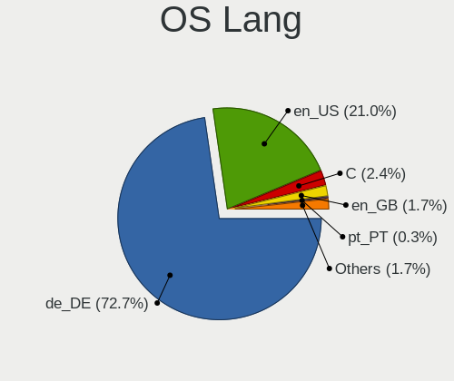
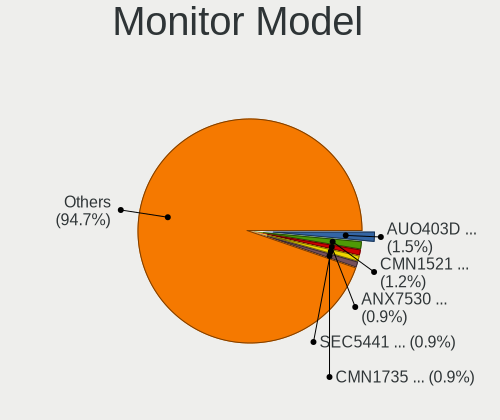
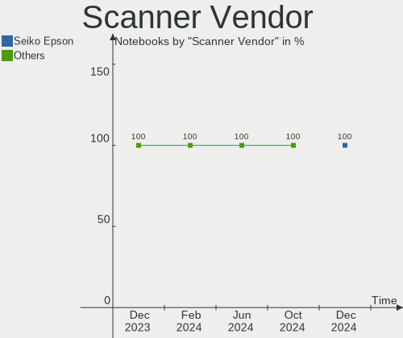
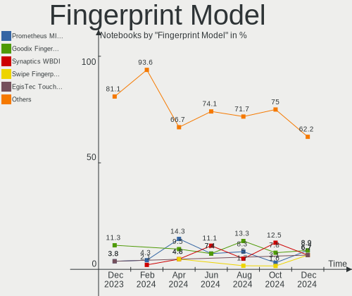

Linux in Germany - Hardware Trends (Notebooks)
----------------------------------------------

A project to identify most popular hardware characteristics and track their change
over time based on data collected by Linux users at https://Linux-Hardware.org.

Anyone can contribute to this report by the [hw-probe](https://github.com/linuxhw/hw-probe) tool:

    sudo -E hw-probe -all -upload

Period: Dec, 2024.

Contents
--------

* [ System ](#system)
  - [ OS                       ](#os)
  - [ OS Family                ](#os-family)
  - [ Kernel                   ](#kernel)
  - [ Kernel Family            ](#kernel-family)
  - [ Kernel Major Ver.        ](#kernel-major-ver)
  - [ Arch                     ](#arch)
  - [ DE                       ](#de)
  - [ Display Server           ](#display-server)
  - [ Display Manager          ](#display-manager)
  - [ OS Lang                  ](#os-lang)
  - [ Boot Mode                ](#boot-mode)
  - [ Filesystem               ](#filesystem)
  - [ Part. scheme             ](#part-scheme)
  - [ Dual Boot with Linux/BSD ](#dual-boot-with-linuxbsd)
  - [ Dual Boot (Win)          ](#dual-boot-win)

* [ Board ](#board)
  - [ Vendor                   ](#vendor)
  - [ Model                    ](#model)
  - [ Model Family             ](#model-family)
  - [ MFG Year                 ](#mfg-year)
  - [ Form Factor              ](#form-factor)
  - [ Secure Boot              ](#secure-boot)
  - [ Coreboot                 ](#coreboot)
  - [ RAM Size                 ](#ram-size)
  - [ RAM Used                 ](#ram-used)
  - [ Total Drives             ](#total-drives)
  - [ Has CD-ROM               ](#has-cd-rom)
  - [ Has Ethernet             ](#has-ethernet)
  - [ Has WiFi                 ](#has-wifi)
  - [ Has Bluetooth            ](#has-bluetooth)

* [ Location ](#location)
  - [ Country                  ](#country)
  - [ City                     ](#city)

* [ Drives ](#drives)
  - [ Drive Vendor             ](#drive-vendor)
  - [ Drive Model              ](#drive-model)
  - [ HDD Vendor               ](#hdd-vendor)
  - [ SSD Vendor               ](#ssd-vendor)
  - [ Drive Kind               ](#drive-kind)
  - [ Drive Connector          ](#drive-connector)
  - [ Drive Size               ](#drive-size)
  - [ Space Total              ](#space-total)
  - [ Space Used               ](#space-used)
  - [ Malfunc. Drives          ](#malfunc-drives)
  - [ Malfunc. Drive Vendor    ](#malfunc-drive-vendor)
  - [ Malfunc. HDD Vendor      ](#malfunc-hdd-vendor)
  - [ Malfunc. Drive Kind      ](#malfunc-drive-kind)
  - [ Failed Drives            ](#failed-drives)
  - [ Failed Drive Vendor      ](#failed-drive-vendor)
  - [ Drive Status             ](#drive-status)

* [ Storage controller ](#storage-controller)
  - [ Storage Vendor           ](#storage-vendor)
  - [ Storage Model            ](#storage-model)
  - [ Storage Kind             ](#storage-kind)

* [ Processor ](#processor)
  - [ CPU Vendor               ](#cpu-vendor)
  - [ CPU Model                ](#cpu-model)
  - [ CPU Model Family         ](#cpu-model-family)
  - [ CPU Cores                ](#cpu-cores)
  - [ CPU Sockets              ](#cpu-sockets)
  - [ CPU Threads              ](#cpu-threads)
  - [ CPU Op-Modes             ](#cpu-op-modes)
  - [ CPU Microcode            ](#cpu-microcode)
  - [ CPU Microarch            ](#cpu-microarch)

* [ Graphics ](#graphics)
  - [ GPU Vendor               ](#gpu-vendor)
  - [ GPU Model                ](#gpu-model)
  - [ GPU Combo                ](#gpu-combo)
  - [ GPU Driver               ](#gpu-driver)
  - [ GPU Memory               ](#gpu-memory)

* [ Monitor ](#monitor)
  - [ Monitor Vendor           ](#monitor-vendor)
  - [ Monitor Model            ](#monitor-model)
  - [ Monitor Resolution       ](#monitor-resolution)
  - [ Monitor Diagonal         ](#monitor-diagonal)
  - [ Monitor Width            ](#monitor-width)
  - [ Aspect Ratio             ](#aspect-ratio)
  - [ Monitor Area             ](#monitor-area)
  - [ Pixel Density            ](#pixel-density)
  - [ Multiple Monitors        ](#multiple-monitors)

* [ Network ](#network)
  - [ Net Controller Vendor    ](#net-controller-vendor)
  - [ Net Controller Model     ](#net-controller-model)
  - [ Wireless Vendor          ](#wireless-vendor)
  - [ Wireless Model           ](#wireless-model)
  - [ Ethernet Vendor          ](#ethernet-vendor)
  - [ Ethernet Model           ](#ethernet-model)
  - [ Net Controller Kind      ](#net-controller-kind)
  - [ Used Controller          ](#used-controller)
  - [ NICs                     ](#nics)
  - [ IPv6                     ](#ipv6)

* [ Bluetooth ](#bluetooth)
  - [ Bluetooth Vendor         ](#bluetooth-vendor)
  - [ Bluetooth Model          ](#bluetooth-model)

* [ Sound ](#sound)
  - [ Sound Vendor             ](#sound-vendor)
  - [ Sound Model              ](#sound-model)

* [ Memory ](#memory)
  - [ Memory Vendor            ](#memory-vendor)
  - [ Memory Model             ](#memory-model)
  - [ Memory Kind              ](#memory-kind)
  - [ Memory Form Factor       ](#memory-form-factor)
  - [ Memory Size              ](#memory-size)
  - [ Memory Speed             ](#memory-speed)

* [ Printers & scanners ](#printers--scanners)
  - [ Printer Vendor           ](#printer-vendor)
  - [ Printer Model            ](#printer-model)
  - [ Scanner Vendor           ](#scanner-vendor)
  - [ Scanner Model            ](#scanner-model)

* [ Camera ](#camera)
  - [ Camera Vendor            ](#camera-vendor)
  - [ Camera Model             ](#camera-model)

* [ Security ](#security)
  - [ Fingerprint Vendor       ](#fingerprint-vendor)
  - [ Fingerprint Model        ](#fingerprint-model)
  - [ Chipcard Vendor          ](#chipcard-vendor)
  - [ Chipcard Model           ](#chipcard-model)

* [ Unsupported ](#unsupported)
  - [ Unsupported Devices      ](#unsupported-devices)
  - [ Unsupported Device Types ](#unsupported-device-types)

System
------

OS
--

Installed operating systems

| Name                         | Notebooks | Percent |
|------------------------------|-----------|---------|
| Ubuntu 24.04                 | 39        | 13.64%  |
| OpenMandriva 24.12           | 30        | 10.49%  |
| Fedora 41                    | 24        | 8.39%   |
| Zorin 17                     | 16        | 5.59%   |
| Debian 12                    | 16        | 5.59%   |
| Arch Rolling                 | 12        | 4.2%    |
| Linux Mint 22                | 11        | 3.85%   |
| Ubuntu 24.10                 | 10        | 3.5%    |
| Linux Mint 21.3              | 7         | 2.45%   |
| Debian                       | 7         | 2.45%   |
| Ubuntu 22.04                 | 6         | 2.1%    |
| openSUSE Tumbleweed-XXXXXXXX | 5         | 1.75%   |
| OpenMandriva 5.0             | 5         | 1.75%   |
| Kubuntu 24.10                | 5         | 1.75%   |
| TUXEDO OS 24.04              | 4         | 1.4%    |
| SteamOS 3.6.20               | 4         | 1.4%    |
| Pop!_OS 22.04                | 4         | 1.4%    |
| Manjaro                      | 4         | 1.4%    |
| EndeavourOS Rolling          | 4         | 1.4%    |
| Elementary 7.1               | 4         | 1.4%    |
| Ubuntu 20.04                 | 3         | 1.05%   |
| NixOS 24.11                  | 3         | 1.05%   |
| Manjaro 24.2.0               | 3         | 1.05%   |
| LMDE 6                       | 3         | 1.05%   |
| Kubuntu 24.04                | 3         | 1.05%   |
| Fedora 40                    | 3         | 1.05%   |
| Elementary 8                 | 3         | 1.05%   |
| Xubuntu 24.04                | 2         | 0.7%    |
| openSUSE Leap-15.6           | 2         | 0.7%    |
| openSUSE Leap-15.5           | 2         | 0.7%    |
| MX 23                        | 2         | 0.7%    |
| Lubuntu 24.04                | 2         | 0.7%    |
| Kali 2024.4                  | 2         | 0.7%    |
| Garuda Linux Soaring         | 2         | 0.7%    |
| Garuda Linux Rolling         | 2         | 0.7%    |
| CachyOS Rolling              | 2         | 0.7%    |
| Bazzite 41                   | 2         | 0.7%    |
| ArcoLinux Rolling            | 2         | 0.7%    |
| Zorin 16                     | 1         | 0.35%   |
| Xubuntu 22.04                | 1         | 0.35%   |

OS Family
---------

OS without a version

| Name             | Notebooks | Percent |
|------------------|-----------|---------|
| Ubuntu           | 58        | 20.28%  |
| OpenMandriva     | 40        | 13.99%  |
| Fedora           | 28        | 9.79%   |
| Linux Mint       | 23        | 8.04%   |
| Debian           | 23        | 8.04%   |
| Zorin            | 17        | 5.94%   |
| Arch             | 12        | 4.2%    |
| openSUSE         | 9         | 3.15%   |
| Kubuntu          | 9         | 3.15%   |
| Manjaro          | 8         | 2.8%    |
| Elementary       | 7         | 2.45%   |
| TUXEDO OS        | 5         | 1.75%   |
| SteamOS          | 4         | 1.4%    |
| Pop!_OS          | 4         | 1.4%    |
| Garuda Linux     | 4         | 1.4%    |
| EndeavourOS      | 4         | 1.4%    |
| Xubuntu          | 3         | 1.05%   |
| NixOS            | 3         | 1.05%   |
| MX               | 3         | 1.05%   |
| LMDE             | 3         | 1.05%   |
| Kali             | 3         | 1.05%   |
| Ubuntu MATE      | 2         | 0.7%    |
| Lubuntu          | 2         | 0.7%    |
| CachyOS          | 2         | 0.7%    |
| Bazzite          | 2         | 0.7%    |
| ArcoLinux        | 2         | 0.7%    |
| org.kde.Platform | 1         | 0.35%   |
| Nobara           | 1         | 0.35%   |
| KDE neon         | 1         | 0.35%   |
| Gentoo           | 1         | 0.35%   |
| Endless          | 1         | 0.35%   |
| Dts-distro       | 1         | 0.35%   |

Kernel
------

Version of the Linux kernel

| Version                                  | Notebooks | Percent |
|------------------------------------------|-----------|---------|
| 6.8.0-49-generic                         | 38        | 13.29%  |
| 6.12.1-desktop-1omv2490                  | 28        | 9.79%   |
| 6.8.0-51-generic                         | 20        | 6.99%   |
| 6.8.0-50-generic                         | 17        | 5.94%   |
| 6.1.0-28-amd64                           | 12        | 4.2%    |
| 6.11.0-9-generic                         | 9         | 3.15%   |
| 6.12.6-arch1-1                           | 6         | 2.1%    |
| 6.6.2-desktop-1omv2390                   | 5         | 1.75%   |
| 6.12.4-arch1-1                           | 5         | 1.75%   |
| 6.12.1-4-MANJARO                         | 5         | 1.75%   |
| 6.11.0-13-generic                        | 5         | 1.75%   |
| 6.9.3-76060903-generic                   | 4         | 1.4%    |
| 6.5.0-valve22-1-neptune-65-g9a338ed8a75e | 4         | 1.4%    |
| 6.12.6-200.fc41.x86_64                   | 4         | 1.4%    |
| 6.12.4-200.fc41.x86_64                   | 4         | 1.4%    |
| 6.11.8-1-default                         | 4         | 1.4%    |
| 6.11.4-301.fc41.x86_64                   | 4         | 1.4%    |
| 6.11.10-amd64                            | 4         | 1.4%    |
| 6.11.10-300.fc41.x86_64                  | 4         | 1.4%    |
| 6.8.0-48-generic                         | 3         | 1.05%   |
| 6.8.0-38-generic                         | 3         | 1.05%   |
| 6.12.5-200.fc41.x86_64                   | 3         | 1.05%   |
| 6.12.1-arch1-1                           | 3         | 1.05%   |
| 6.11.2-amd64                             | 3         | 1.05%   |
| 6.11.11-300.fc41.x86_64                  | 3         | 1.05%   |
| 5.15.0-130-generic                       | 3         | 1.05%   |
| 5.15.0-127-generic                       | 3         | 1.05%   |
| 5.15.0-126-generic                       | 3         | 1.05%   |
| 6.8.0-41-generic                         | 2         | 0.7%    |
| 6.6.63                                   | 2         | 0.7%    |
| 6.4.0-150600.23.30-default               | 2         | 0.7%    |
| 6.2.0-33-generic                         | 2         | 0.7%    |
| 6.12.6-desktop-1omv2490                  | 2         | 0.7%    |
| 6.12.4-zen1-1-zen                        | 2         | 0.7%    |
| 6.12.1-zen1-1-zen                        | 2         | 0.7%    |
| 6.11.8-300.fc41.x86_64                   | 2         | 0.7%    |
| 6.11.11-1-MANJARO                        | 2         | 0.7%    |
| 6.11.10-304.bazzite.fc41.x86_64          | 2         | 0.7%    |
| 6.11.0-108013-tuxedo                     | 2         | 0.7%    |
| 6.1.0-27-amd64                           | 2         | 0.7%    |

Kernel Family
-------------

Linux kernel without a distro release

| Version | Notebooks | Percent |
|---------|-----------|---------|
| 6.8.0   | 86        | 30.07%  |
| 6.12.1  | 38        | 13.29%  |
| 6.11.0  | 20        | 6.99%   |
| 6.1.0   | 19        | 6.64%   |
| 6.12.6  | 15        | 5.24%   |
| 5.15.0  | 14        | 4.9%    |
| 6.11.10 | 12        | 4.2%    |
| 6.12.4  | 11        | 3.85%   |
| 6.11.8  | 6         | 2.1%    |
| 6.6.2   | 5         | 1.75%   |
| 6.11.4  | 5         | 1.75%   |
| 6.11.11 | 5         | 1.75%   |
| 6.9.3   | 4         | 1.4%    |
| 6.5.0   | 4         | 1.4%    |
| 6.12.5  | 4         | 1.4%    |
| 5.4.0   | 4         | 1.4%    |
| 6.13.0  | 3         | 1.05%   |
| 6.11.2  | 3         | 1.05%   |
| 6.6.63  | 2         | 0.7%    |
| 6.4.0   | 2         | 0.7%    |
| 6.2.0   | 2         | 0.7%    |
| 6.12.7  | 2         | 0.7%    |
| 6.12.3  | 2         | 0.7%    |
| 6.11.9  | 2         | 0.7%    |
| 5.14.21 | 2         | 0.7%    |
| 6.9.7   | 1         | 0.35%   |
| 6.9.10  | 1         | 0.35%   |
| 6.7.4   | 1         | 0.35%   |
| 6.6.66  | 1         | 0.35%   |
| 6.6.21  | 1         | 0.35%   |
| 6.4.11  | 1         | 0.35%   |
| 6.2.6   | 1         | 0.35%   |
| 6.11.7  | 1         | 0.35%   |
| 6.11.5  | 1         | 0.35%   |
| 6.10.0  | 1         | 0.35%   |
| 6.1.69  | 1         | 0.35%   |
| 6.0.0   | 1         | 0.35%   |
| 5.19.0  | 1         | 0.35%   |
| 4.15.0  | 1         | 0.35%   |

Kernel Major Ver.
-----------------

Linux kernel major version

| Version | Notebooks | Percent |
|---------|-----------|---------|
| 6.8     | 86        | 30.07%  |
| 6.12    | 72        | 25.17%  |
| 6.11    | 55        | 19.23%  |
| 6.1     | 20        | 6.99%   |
| 5.15    | 14        | 4.9%    |
| 6.6     | 9         | 3.15%   |
| 6.9     | 6         | 2.1%    |
| 6.5     | 4         | 1.4%    |
| 5.4     | 4         | 1.4%    |
| 6.4     | 3         | 1.05%   |
| 6.2     | 3         | 1.05%   |
| 6.13    | 3         | 1.05%   |
| 5.14    | 2         | 0.7%    |
| 6.7     | 1         | 0.35%   |
| 6.10    | 1         | 0.35%   |
| 6.0     | 1         | 0.35%   |
| 5.19    | 1         | 0.35%   |
| 4.15    | 1         | 0.35%   |

Arch
----

OS architecture (x86_64, i586, etc.)

| Name    | Notebooks | Percent |
|---------|-----------|---------|
| x86_64  | 284       | 99.3%   |
| i686    | 1         | 0.35%   |
| aarch64 | 1         | 0.35%   |

DE
--

Desktop Environment

| Name          | Notebooks | Percent |
|---------------|-----------|---------|
| GNOME         | 114       | 39.86%  |
| Unknown       | 31        | 10.84%  |
| KDE6          | 30        | 10.49%  |
| X-Cinnamon    | 27        | 9.44%   |
| KDE5          | 23        | 8.04%   |
| XFCE          | 19        | 6.64%   |
| KDE           | 9         | 3.15%   |
| Pantheon      | 7         | 2.45%   |
| LXQt          | 7         | 2.45%   |
| MATE          | 4         | 1.4%    |
| Hyprland      | 3         | 1.05%   |
| Cinnamon      | 3         | 1.05%   |
| sway          | 2         | 0.7%    |
| Enlightenment | 2         | 0.7%    |
| KDE4          | 1         | 0.35%   |
| i3            | 1         | 0.35%   |
| Endless:GNOME | 1         | 0.35%   |
| COSMIC        | 1         | 0.35%   |
| Budgie        | 1         | 0.35%   |

Display Server
--------------

X11 or Wayland

| Name    | Notebooks | Percent |
|---------|-----------|---------|
| Wayland | 156       | 54.55%  |
| X11     | 123       | 43.01%  |
| Unknown | 5         | 1.75%   |
| Tty     | 2         | 0.7%    |

Display Manager
---------------

SDDM, LightDM, etc.

| Name    | Notebooks | Percent |
|---------|-----------|---------|
| Unknown | 92        | 32.17%  |
| GDM3    | 70        | 24.48%  |
| SDDM    | 68        | 23.78%  |
| LightDM | 40        | 13.99%  |
| GDM     | 14        | 4.9%    |
| SLiM    | 1         | 0.35%   |
| LY-DM   | 1         | 0.35%   |

OS Lang
-------

Language

| Lang    | Notebooks | Percent |
|---------|-----------|---------|
| de_DE   | 208       | 72.73%  |
| en_US   | 60        | 20.98%  |
| C       | 7         | 2.45%   |
| en_GB   | 5         | 1.75%   |
| pt_PT   | 1         | 0.35%   |
| pl_PL   | 1         | 0.35%   |
| es_ES   | 1         | 0.35%   |
| en_IN   | 1         | 0.35%   |
| de_IT   | 1         | 0.35%   |
| Unknown | 1         | 0.35%   |

Boot Mode
---------

EFI or BIOS

| Mode | Notebooks | Percent |
|------|-----------|---------|
| BIOS | 155       | 54.2%   |
| EFI  | 131       | 45.8%   |

Filesystem
----------

Type of filesystem

| Type    | Notebooks | Percent |
|---------|-----------|---------|
| Ext4    | 140       | 48.95%  |
| Btrfs   | 62        | 21.68%  |
| Tmpfs   | 49        | 17.13%  |
| Overlay | 34        | 11.89%  |
| Zfs     | 1         | 0.35%   |

Part. scheme
------------

Scheme of partitioning

| Type    | Notebooks | Percent |
|---------|-----------|---------|
| GPT     | 163       | 56.99%  |
| Unknown | 90        | 31.47%  |
| MBR     | 33        | 11.54%  |

Dual Boot with Linux/BSD
------------------------

Hosting more than one Linux/BSD

| Dual boot | Notebooks | Percent |
|-----------|-----------|---------|
| No        | 239       | 83.57%  |
| Yes       | 47        | 16.43%  |

Dual Boot (Win)
---------------

Hosting Linux and Windows

| Dual boot | Notebooks | Percent |
|-----------|-----------|---------|
| No        | 230       | 80.42%  |
| Yes       | 56        | 19.58%  |

Board
-----

Vendor
------

Motherboard manufacturer

| Name                | Notebooks | Percent |
|---------------------|-----------|---------|
| Lenovo              | 71        | 24.83%  |
| Dell                | 41        | 14.34%  |
| Hewlett-Packard     | 40        | 13.99%  |
| Acer                | 31        | 10.84%  |
| ASUSTek Computer    | 19        | 6.64%   |
| Apple               | 13        | 4.55%   |
| TUXEDO              | 8         | 2.8%    |
| Fujitsu             | 8         | 2.8%    |
| HUAWEI              | 6         | 2.1%    |
| Medion              | 5         | 1.75%   |
| Valve               | 4         | 1.4%    |
| Toshiba             | 4         | 1.4%    |
| Samsung Electronics | 4         | 1.4%    |
| Notebook            | 3         | 1.05%   |
| MSI                 | 3         | 1.05%   |
| Packard Bell        | 2         | 0.7%    |
| Fujitsu Siemens     | 2         | 0.7%    |
| Framework           | 2         | 0.7%    |
| Clevo               | 2         | 0.7%    |
| Unknown             | 2         | 0.7%    |
| youyeetoo           | 1         | 0.35%   |
| Wortmann AG         | 1         | 0.35%   |
| Teclast             | 1         | 0.35%   |
| Sony                | 1         | 0.35%   |
| Shuttle             | 1         | 0.35%   |
| Schenker            | 1         | 0.35%   |
| Razer               | 1         | 0.35%   |
| Panasonic           | 1         | 0.35%   |
| Motion Computing    | 1         | 0.35%   |
| MicroByte           | 1         | 0.35%   |
| Insyde              | 1         | 0.35%   |
| Google              | 1         | 0.35%   |
| Gigabyte Technology | 1         | 0.35%   |
| ECT                 | 1         | 0.35%   |
| Chuwi               | 1         | 0.35%   |
| AWOW                | 1         | 0.35%   |

Model
-----

Motherboard model

| Name                                        | Notebooks | Percent |
|---------------------------------------------|-----------|---------|
| HP Laptop 17-cp0xxx                         | 4         | 1.4%    |
| Unknown                                     | 4         | 1.4%    |
| Valve Jupiter                               | 3         | 1.05%   |
| Apple MacBookPro11,1                        | 3         | 1.05%   |
| TUXEDO Stellaris Slim 15 Intel Gen6         | 2         | 0.7%    |
| Lenovo V15 G4 AMN 82YU                      | 2         | 0.7%    |
| Lenovo ThinkPad T570 20H90002RI             | 2         | 0.7%    |
| HUAWEI FLMH-XX                              | 2         | 0.7%    |
| HP Laptop 15-fc0xxx                         | 2         | 0.7%    |
| HP Laptop 15-db1xxx                         | 2         | 0.7%    |
| Framework Laptop 16 (AMD Ryzen 7040 Series) | 2         | 0.7%    |
| Dell XPS 13 9370                            | 2         | 0.7%    |
| Dell Precision 7520                         | 2         | 0.7%    |
| Dell Latitude E6320                         | 2         | 0.7%    |
| Dell Latitude 3320                          | 2         | 0.7%    |
| ASUS VivoBook_ASUSLaptop M1605YA_M1605YA    | 2         | 0.7%    |
| ASUS UX305FA                                | 2         | 0.7%    |
| Apple MacBookPro8,1                         | 2         | 0.7%    |
| Apple MacBookPro11,3                        | 2         | 0.7%    |
| Apple MacBookAir7,2                         | 2         | 0.7%    |
| Acer TravelMate B117-M                      | 2         | 0.7%    |
| Acer Aspire A515-51G                        | 2         | 0.7%    |
| Acer Aspire 7750G                           | 2         | 0.7%    |
| youyeetoo X1 SBC                            | 1         | 0.35%   |
| Wortmann AG 1220622_1470142                 | 1         | 0.35%   |
| Valve Galileo                               | 1         | 0.35%   |
| TUXEDO W65_W67RC                            | 1         | 0.35%   |
| TUXEDO N650DU                               | 1         | 0.35%   |
| TUXEDO InfinityBook Pro Intel Gen9          | 1         | 0.35%   |
| TUXEDO InfinityBook Pro Gen8 (MK2)          | 1         | 0.35%   |
| TUXEDO InfinityBook Pro Gen7 (MK1)          | 1         | 0.35%   |
| TUXEDO InfinityBook Pro AMD Gen9            | 1         | 0.35%   |
| Toshiba Satellite U400                      | 1         | 0.35%   |
| Toshiba Satellite S70-B                     | 1         | 0.35%   |
| Toshiba Satellite Pro S500                  | 1         | 0.35%   |
| Toshiba Satellite Pro L70-A                 | 1         | 0.35%   |
| Teclast F6 Plus                             | 1         | 0.35%   |
| Sony VPCM12M1E                              | 1         | 0.35%   |
| Shuttle NC03U                               | 1         | 0.35%   |
| Schenker XMG Mobile A507 VE                 | 1         | 0.35%   |

Model Family
------------

Motherboard model prefix

| Name                  | Notebooks | Percent |
|-----------------------|-----------|---------|
| Lenovo ThinkPad       | 43        | 15.03%  |
| Acer Aspire           | 18        | 6.29%   |
| Dell Latitude         | 17        | 5.94%   |
| HP EliteBook          | 15        | 5.24%   |
| HP Laptop             | 11        | 3.85%   |
| Lenovo IdeaPad        | 9         | 3.15%   |
| Dell Inspiron         | 8         | 2.8%    |
| Fujitsu LIFEBOOK      | 7         | 2.45%   |
| Dell XPS              | 6         | 2.1%    |
| Dell Precision        | 6         | 2.1%    |
| ASUS VivoBook         | 6         | 2.1%    |
| Apple MacBookPro11    | 6         | 2.1%    |
| Acer Swift            | 5         | 1.75%   |
| TUXEDO InfinityBook   | 4         | 1.4%    |
| Toshiba Satellite     | 4         | 1.4%    |
| Lenovo V15            | 4         | 1.4%    |
| ASUS ASUS             | 4         | 1.4%    |
| Unknown               | 4         | 1.4%    |
| Valve Jupiter         | 3         | 1.05%   |
| Lenovo Legion         | 3         | 1.05%   |
| HP ENVY               | 3         | 1.05%   |
| Acer TravelMate       | 3         | 1.05%   |
| Acer Nitro            | 3         | 1.05%   |
| TUXEDO Stellaris      | 2         | 0.7%    |
| Samsung R530          | 2         | 0.7%    |
| Packard Bell EasyNote | 2         | 0.7%    |
| Lenovo Yoga           | 2         | 0.7%    |
| Lenovo ThinkBook      | 2         | 0.7%    |
| Lenovo B560           | 2         | 0.7%    |
| HUAWEI FLMH-XX        | 2         | 0.7%    |
| HP ProBook            | 2         | 0.7%    |
| HP 255                | 2         | 0.7%    |
| HP 250                | 2         | 0.7%    |
| Framework Laptop      | 2         | 0.7%    |
| Dell Venue            | 2         | 0.7%    |
| ASUS UX305FA          | 2         | 0.7%    |
| ASUS ROG              | 2         | 0.7%    |
| Apple MacBookPro8     | 2         | 0.7%    |
| Apple MacBookAir7     | 2         | 0.7%    |
| youyeetoo X1          | 1         | 0.35%   |

MFG Year
--------

Motherboard manufacture year

| Year    | Notebooks | Percent |
|---------|-----------|---------|
| 2024    | 30        | 10.49%  |
| 2021    | 27        | 9.44%   |
| 2011    | 26        | 9.09%   |
| 2017    | 22        | 7.69%   |
| 2023    | 20        | 6.99%   |
| 2018    | 20        | 6.99%   |
| 2019    | 19        | 6.64%   |
| 2014    | 18        | 6.29%   |
| 2013    | 16        | 5.59%   |
| 2016    | 15        | 5.24%   |
| 2012    | 15        | 5.24%   |
| 2022    | 14        | 4.9%    |
| 2020    | 12        | 4.2%    |
| 2010    | 9         | 3.15%   |
| 2015    | 8         | 2.8%    |
| 2009    | 6         | 2.1%    |
| 2008    | 4         | 1.4%    |
| 2007    | 4         | 1.4%    |
| Unknown | 1         | 0.35%   |

Form Factor
-----------

Physical design of the computer

| Name     | Notebooks | Percent |
|----------|-----------|---------|
| Notebook | 286       | 100%    |

Secure Boot
-----------

Enabled or disabled

| State    | Notebooks | Percent |
|----------|-----------|---------|
| Disabled | 266       | 93.01%  |
| Enabled  | 20        | 6.99%   |

Coreboot
--------

Have coreboot on board

| Used | Notebooks | Percent |
|------|-----------|---------|
| No   | 285       | 99.65%  |
| Yes  | 1         | 0.35%   |

RAM Size
--------

Total RAM memory

| Size in GB  | Notebooks | Percent |
|-------------|-----------|---------|
| 4.01-8.0    | 85        | 29.72%  |
| 8.01-16.0   | 61        | 21.33%  |
| 16.01-24.0  | 53        | 18.53%  |
| 3.01-4.0    | 36        | 12.59%  |
| 32.01-64.0  | 26        | 9.09%   |
| 64.01-256.0 | 9         | 3.15%   |
| 24.01-32.0  | 8         | 2.8%    |
| 1.01-2.0    | 4         | 1.4%    |
| 2.01-3.0    | 3         | 1.05%   |
| 0.51-1.0    | 1         | 0.35%   |

RAM Used
--------

Used RAM memory

| Used GB    | Notebooks | Percent |
|------------|-----------|---------|
| 2.01-3.0   | 78        | 27.27%  |
| 1.01-2.0   | 76        | 26.57%  |
| 4.01-8.0   | 58        | 20.28%  |
| 3.01-4.0   | 44        | 15.38%  |
| 8.01-16.0  | 15        | 5.24%   |
| 0.51-1.0   | 9         | 3.15%   |
| 16.01-24.0 | 5         | 1.75%   |
| 32.01-64.0 | 1         | 0.35%   |

Total Drives
------------

Number of drives on board

| Drives | Notebooks | Percent |
|--------|-----------|---------|
| 1      | 217       | 75.87%  |
| 2      | 54        | 18.88%  |
| 3      | 14        | 4.9%    |
| 0      | 1         | 0.35%   |

Has CD-ROM
----------

Has CD-ROM on board

| Presented | Notebooks | Percent |
|-----------|-----------|---------|
| No        | 219       | 76.57%  |
| Yes       | 67        | 23.43%  |

Has Ethernet
------------

Has Ethernet on board

| Presented | Notebooks | Percent |
|-----------|-----------|---------|
| Yes       | 225       | 78.67%  |
| No        | 61        | 21.33%  |

Has WiFi
--------

Has WiFi module

| Presented | Notebooks | Percent |
|-----------|-----------|---------|
| Yes       | 273       | 95.45%  |
| No        | 13        | 4.55%   |

Has Bluetooth
-------------

Has Bluetooth module

| Presented | Notebooks | Percent |
|-----------|-----------|---------|
| Yes       | 244       | 85.31%  |
| No        | 42        | 14.69%  |

Location
--------

Country
-------

Geographic location (country)

| Country | Notebooks | Percent |
|---------|-----------|---------|
| Germany | 286       | 100%    |

City
----

Geographic location (city)

| City              | Notebooks | Percent |
|-------------------|-----------|---------|
| Berlin            | 30        | 10.49%  |
| Munich            | 15        | 5.24%   |
| Frankfurt am Main | 11        | 3.85%   |
| Hamburg           | 8         | 2.8%    |
| Düsseldorf       | 8         | 2.8%    |
| Stuttgart         | 7         | 2.45%   |
| Darmstadt         | 6         | 2.1%    |
| Reutlingen        | 5         | 1.75%   |
| Karlsruhe         | 5         | 1.75%   |
| Cologne           | 5         | 1.75%   |
| Osnabrück        | 4         | 1.4%    |
| Leipzig           | 4         | 1.4%    |
| Hanover           | 4         | 1.4%    |
| Essen             | 4         | 1.4%    |
| Mannheim          | 3         | 1.05%   |
| Bochum            | 3         | 1.05%   |
| Aachen            | 3         | 1.05%   |
| Wiesbaden         | 2         | 0.7%    |
| Stuhr             | 2         | 0.7%    |
| Senden            | 2         | 0.7%    |
| Rostock           | 2         | 0.7%    |
| Potsdam           | 2         | 0.7%    |
| Nuremberg         | 2         | 0.7%    |
| Meppen            | 2         | 0.7%    |
| Mainz             | 2         | 0.7%    |
| Ludwigsburg       | 2         | 0.7%    |
| Kropp             | 2         | 0.7%    |
| Kiel              | 2         | 0.7%    |
| Ingolstadt        | 2         | 0.7%    |
| Elmshorn          | 2         | 0.7%    |
| Dortmund          | 2         | 0.7%    |
| Dieterskirchen    | 2         | 0.7%    |
| Dachau            | 2         | 0.7%    |
| Braunschweig      | 2         | 0.7%    |
| Bielefeld         | 2         | 0.7%    |
| Altenburg         | 2         | 0.7%    |
| Zwochau           | 1         | 0.35%   |
| Zittau            | 1         | 0.35%   |
| Würzburg         | 1         | 0.35%   |
| Wuppertal         | 1         | 0.35%   |

Drives
------

Drive Vendor
------------

Hard drive vendors

| Vendor                         | Notebooks | Drives | Percent |
|--------------------------------|-----------|--------|---------|
| Samsung Electronics            | 84        | 94     | 24.28%  |
| SanDisk                        | 32        | 34     | 9.25%   |
| WDC                            | 24        | 24     | 6.94%   |
| SK hynix                       | 20        | 20     | 5.78%   |
| Crucial                        | 19        | 20     | 5.49%   |
| Micron Technology              | 18        | 18     | 5.2%    |
| Seagate                        | 16        | 16     | 4.62%   |
| Unknown                        | 14        | 14     | 4.05%   |
| Intenso                        | 13        | 13     | 3.76%   |
| Toshiba                        | 11        | 12     | 3.18%   |
| Apple                          | 10        | 13     | 2.89%   |
| Intel                          | 8         | 9      | 2.31%   |
| Kingston                       | 7         | 7      | 2.02%   |
| Hitachi                        | 6         | 6      | 1.73%   |
| HGST                           | 6         | 6      | 1.73%   |
| KIOXIA                         | 5         | 5      | 1.45%   |
| Kingston Technology Company    | 5         | 5      | 1.45%   |
| Phison Electronics             | 4         | 4      | 1.16%   |
| Verbatim                       | 3         | 3      | 0.87%   |
| LITEON                         | 3         | 3      | 0.87%   |
| Unknown                        | 3         | 3      | 0.87%   |
| UMIS                           | 2         | 2      | 0.58%   |
| Silicon Motion                 | 2         | 2      | 0.58%   |
| Micron/Crucial Technology      | 2         | 2      | 0.58%   |
| Emtec                          | 2         | 2      | 0.58%   |
| A-DATA Technology              | 2         | 2      | 0.58%   |
| Union Memory (Shenzhen)        | 1         | 1      | 0.29%   |
| Transcend                      | 1         | 1      | 0.29%   |
| TO Exter                       | 1         | 1      | 0.29%   |
| Teclast                        | 1         | 1      | 0.29%   |
| Solid State Storage Technology | 1         | 1      | 0.29%   |
| Solid State Storage            | 1         | 1      | 0.29%   |
| ShiJi                          | 1         | 1      | 0.29%   |
| SD                             | 1         | 1      | 0.29%   |
| Patriot                        | 1         | 1      | 0.29%   |
| O2 Micro                       | 1         | 1      | 0.29%   |
| Netac                          | 1         | 2      | 0.29%   |
| Neo                            | 1         | 1      | 0.29%   |
| MAXIO Technology (Hangzhou)    | 1         | 1      | 0.29%   |
| LITEONIT                       | 1         | 1      | 0.29%   |

Drive Model
-----------

Hard drive models

| Model                                                | Notebooks | Percent |
|------------------------------------------------------|-----------|---------|
| Samsung NVMe SSD Controller SM981/PM981/PM983 512GB  | 9         | 2.51%   |
| Samsung NVMe SSD Controller SM961/PM961/SM963 256GB  | 8         | 2.23%   |
| Unknown MMC Card  128GB                              | 5         | 1.39%   |
| Samsung NVMe SSD Controller PM9A1/PM9A3/980PRO 512GB | 5         | 1.39%   |
| Samsung SSD 980 1TB                                  | 4         | 1.11%   |
| Apple SSD SM0512F 500GB                              | 4         | 1.11%   |
| WDC WD10JPVX-22JC3T0 1TB                             | 3         | 0.84%   |
| Samsung SSD 870 QVO 1TB                              | 3         | 0.84%   |
| Samsung SSD 860 EVO 500GB                            | 3         | 0.84%   |
| Samsung SSD 850 EVO 250GB                            | 3         | 0.84%   |
| Samsung MZVL4512HBLU-00BH1 512GB                     | 3         | 0.84%   |
| Crucial CT500MX500SSD1 500GB                         | 3         | 0.84%   |
| Unknown                                              | 3         | 0.84%   |
| WDC WD5000LPCX-21VHAT0 500GB                         | 2         | 0.56%   |
| WDC WD3200BEVT-22ZCT0 320GB                          | 2         | 0.56%   |
| WDC WD10SPZX-21Z10T0 1TB                             | 2         | 0.56%   |
| Unknown SD/MMC/MS PRO 128GB                          | 2         | 0.56%   |
| Unknown MMC Card  64GB                               | 2         | 0.56%   |
| Sandisk WD_BLACK SN770 1TB                           | 2         | 0.56%   |
| Sandisk WDC PC SN530 SDBPMPZ-512G-1101 512GB         | 2         | 0.56%   |
| Sandisk WD PC SN740 SDDPNQD-512G-1127 512GB          | 2         | 0.56%   |
| Sandisk WD PC SN560 SDDPNQE-1T00-1102 1024GB         | 2         | 0.56%   |
| Sandisk WD Blue SN550 NVMe SSD 256GB                 | 2         | 0.56%   |
| Samsung SSD 990 PRO 1TB                              | 2         | 0.56%   |
| Samsung SSD 990 EVO 1TB                              | 2         | 0.56%   |
| Samsung SSD 870 EVO 1TB                              | 2         | 0.56%   |
| Samsung SSD 840 EVO 250GB                            | 2         | 0.56%   |
| Samsung MZVLQ512HBLU-00BH1 512GB                     | 2         | 0.56%   |
| Samsung MZVLQ256HAJD-000H1 256GB                     | 2         | 0.56%   |
| Samsung MZVL21T0HCLR-00BL2 1TB                       | 2         | 0.56%   |
| Samsung MZ7LN256HCHP-000L7 256GB SSD                 | 2         | 0.56%   |
| Phison PS5013 E13 NVMe Controller 512GB              | 2         | 0.56%   |
| Micron/Crucial P2 NVMe PCIe SSD 500GB                | 2         | 0.56%   |
| KIOXIA KXG8AZNV1T02 LA 1024GB                        | 2         | 0.56%   |
| Kingston Company OM3PDP3 NVMe SSD 512GB              | 2         | 0.56%   |
| Intenso SSD 512GB                                    | 2         | 0.56%   |
| Intenso SSD 480GB                                    | 2         | 0.56%   |
| Intenso SSD 256GB                                    | 2         | 0.56%   |
| Intenso Portable SSD 128GB                           | 2         | 0.56%   |
| Intel SSD Pro 7600p/760p/E 6100p Series 512GB        | 2         | 0.56%   |

HDD Vendor
----------

Hard disk drive vendors

| Vendor              | Notebooks | Drives | Percent |
|---------------------|-----------|--------|---------|
| WDC                 | 17        | 17     | 31.48%  |
| Seagate             | 14        | 14     | 25.93%  |
| Toshiba             | 6         | 7      | 11.11%  |
| Hitachi             | 6         | 6      | 11.11%  |
| HGST                | 6         | 6      | 11.11%  |
| Unknown             | 2         | 2      | 3.7%    |
| TO Exter            | 1         | 1      | 1.85%   |
| Samsung Electronics | 1         | 1      | 1.85%   |
| ASMT                | 1         | 1      | 1.85%   |

SSD Vendor
----------

Solid state drive vendors

| Vendor              | Notebooks | Drives | Percent |
|---------------------|-----------|--------|---------|
| Samsung Electronics | 27        | 31     | 23.48%  |
| Crucial             | 16        | 17     | 13.91%  |
| Intenso             | 13        | 13     | 11.3%   |
| SanDisk             | 10        | 10     | 8.7%    |
| Apple               | 7         | 7      | 6.09%   |
| WDC                 | 6         | 6      | 5.22%   |
| Micron Technology   | 6         | 6      | 5.22%   |
| Kingston            | 5         | 5      | 4.35%   |
| SK hynix            | 4         | 4      | 3.48%   |
| Toshiba             | 3         | 3      | 2.61%   |
| LITEON              | 3         | 3      | 2.61%   |
| Verbatim            | 2         | 2      | 1.74%   |
| Teclast             | 1         | 1      | 0.87%   |
| ShiJi               | 1         | 1      | 0.87%   |
| Patriot             | 1         | 1      | 0.87%   |
| Netac               | 1         | 2      | 0.87%   |
| Neo                 | 1         | 1      | 0.87%   |
| LITEONIT            | 1         | 1      | 0.87%   |
| Lexar               | 1         | 1      | 0.87%   |
| KingSpec            | 1         | 1      | 0.87%   |
| KingDian            | 1         | 1      | 0.87%   |
| FORESEE             | 1         | 1      | 0.87%   |
| Emtec               | 1         | 1      | 0.87%   |
| China               | 1         | 1      | 0.87%   |
| A-DATA Technology   | 1         | 1      | 0.87%   |

Drive Kind
----------

HDD or SSD

| Kind    | Notebooks | Drives | Percent |
|---------|-----------|--------|---------|
| NVMe    | 148       | 170    | 44.85%  |
| SSD     | 109       | 121    | 33.03%  |
| HDD     | 54        | 55     | 16.36%  |
| MMC     | 15        | 15     | 4.55%   |
| Unknown | 4         | 4      | 1.21%   |

Drive Connector
---------------

SATA, SAS, NVMe, etc.

| Type | Notebooks | Drives | Percent |
|------|-----------|--------|---------|
| SATA | 148       | 168    | 45.82%  |
| NVMe | 147       | 169    | 45.51%  |
| MMC  | 15        | 15     | 4.64%   |
| SAS  | 13        | 13     | 4.02%   |

Drive Size
----------

Size of hard drive

| Size in TB | Notebooks | Drives | Percent |
|------------|-----------|--------|---------|
| 0.01-0.5   | 113       | 121    | 68.9%   |
| 0.51-1.0   | 44        | 48     | 26.83%  |
| 1.01-2.0   | 5         | 5      | 3.05%   |
| 3.01-4.0   | 2         | 2      | 1.22%   |

Space Total
-----------

Amount of disk space available on the file system

| Size in GB     | Notebooks | Percent |
|----------------|-----------|---------|
| 251-500        | 78        | 27.27%  |
| 101-250        | 64        | 22.38%  |
| 501-1000       | 47        | 16.43%  |
| 1-20           | 29        | 10.14%  |
| 1001-2000      | 25        | 8.74%   |
| More than 3000 | 13        | 4.55%   |
| Unknown        | 11        | 3.85%   |
| 51-100         | 9         | 3.15%   |
| 21-50          | 6         | 2.1%    |
| 2001-3000      | 4         | 1.4%    |

Space Used
----------

Amount of used disk space

| Used GB   | Notebooks | Percent |
|-----------|-----------|---------|
| 1-20      | 94        | 32.87%  |
| 21-50     | 54        | 18.88%  |
| 101-250   | 41        | 14.34%  |
| 51-100    | 35        | 12.24%  |
| 251-500   | 29        | 10.14%  |
| Unknown   | 11        | 3.85%   |
| 501-1000  | 10        | 3.5%    |
| 1001-2000 | 7         | 2.45%   |
| 2001-3000 | 4         | 1.4%    |
| 0         | 1         | 0.35%   |

Malfunc. Drives
---------------

Drive models with a malfunction

| Model                                          | Notebooks | Drives | Percent |
|------------------------------------------------|-----------|--------|---------|
| Crucial CT525MX300SSD1 528GB                   | 2         | 3      | 25%     |
| WDC WD10SPZX-21Z10T0 1TB                       | 1         | 1      | 12.5%   |
| SK hynix HFS256G32TNH-73A0A 256GB SSD          | 1         | 1      | 12.5%   |
| Samsung Electronics SSD 970 EVO 500GB          | 1         | 1      | 12.5%   |
| Samsung Electronics SSD 870 EVO 1TB            | 1         | 2      | 12.5%   |
| Micron Technology 1100_MTFDDAV512TBN 512GB SSD | 1         | 1      | 12.5%   |
| Hitachi HTS723232A7A364 320GB                  | 1         | 1      | 12.5%   |

Malfunc. Drive Vendor
---------------------

Vendors of faulty drives

| Vendor              | Notebooks | Drives | Percent |
|---------------------|-----------|--------|---------|
| Samsung Electronics | 2         | 3      | 25%     |
| Crucial             | 2         | 3      | 25%     |
| WDC                 | 1         | 1      | 12.5%   |
| SK hynix            | 1         | 1      | 12.5%   |
| Micron Technology   | 1         | 1      | 12.5%   |
| Hitachi             | 1         | 1      | 12.5%   |

Malfunc. HDD Vendor
-------------------

Vendors of faulty HDD drives

| Vendor  | Notebooks | Drives | Percent |
|---------|-----------|--------|---------|
| WDC     | 1         | 1      | 50%     |
| Hitachi | 1         | 1      | 50%     |

Malfunc. Drive Kind
-------------------

Kinds of faulty drives

| Kind | Notebooks | Drives | Percent |
|------|-----------|--------|---------|
| SSD  | 5         | 7      | 62.5%   |
| HDD  | 2         | 2      | 25%     |
| NVMe | 1         | 1      | 12.5%   |

Failed Drives
-------------

Failed drive models

Zero info for selected period =(

Failed Drive Vendor
-------------------

Failed drive vendors

Zero info for selected period =(

Drive Status
------------

Number of failed and malfunc. drives

| Status   | Notebooks | Drives | Percent |
|----------|-----------|--------|---------|
| Detected | 153       | 199    | 51.34%  |
| Works    | 137       | 156    | 45.97%  |
| Malfunc  | 8         | 10     | 2.68%   |

Storage controller
------------------

Storage Vendor
--------------

Storage controller vendors

| Vendor                         | Notebooks | Percent |
|--------------------------------|-----------|---------|
| Intel                          | 162       | 47.93%  |
| Samsung Electronics            | 63        | 18.64%  |
| Sandisk                        | 24        | 7.1%    |
| AMD                            | 21        | 6.21%   |
| SK hynix                       | 15        | 4.44%   |
| Micron Technology              | 12        | 3.55%   |
| Kingston Technology Company    | 7         | 2.07%   |
| KIOXIA                         | 6         | 1.78%   |
| Phison Electronics             | 5         | 1.48%   |
| Micron/Crucial Technology      | 5         | 1.48%   |
| Union Memory (Shenzhen)        | 2         | 0.59%   |
| Toshiba America Info Systems   | 2         | 0.59%   |
| Solid State Storage Technology | 2         | 0.59%   |
| Silicon Motion                 | 2         | 0.59%   |
| Seagate Technology             | 2         | 0.59%   |
| ADATA Technology               | 2         | 0.59%   |
| Transcend                      | 1         | 0.3%    |
| Solidigm                       | 1         | 0.3%    |
| O2 Micro                       | 1         | 0.3%    |
| MAXIO Technology (Hangzhou)    | 1         | 0.3%    |
| Marvell Technology Group       | 1         | 0.3%    |
| Apple                          | 1         | 0.3%    |

Storage Model
-------------

Storage controller models

| Model                                                                            | Notebooks | Percent |
|----------------------------------------------------------------------------------|-----------|---------|
| Intel Sunrise Point-LP SATA Controller [AHCI mode]                               | 24        | 6.7%    |
| Intel 6 Series/C200 Series Chipset Family 6 port Mobile SATA AHCI Controller     | 19        | 5.31%   |
| AMD FCH SATA Controller [AHCI mode]                                              | 18        | 5.03%   |
| Intel 7 Series Chipset Family 6-port SATA Controller [AHCI mode]                 | 16        | 4.47%   |
| Samsung NVMe SSD Controller SM981/PM981/PM983                                    | 15        | 4.19%   |
| Samsung NVMe SSD Controller 980 (DRAM-less)                                      | 13        | 3.63%   |
| Intel 82801 Mobile SATA Controller [RAID mode]                                   | 12        | 3.35%   |
| Intel 8 Series SATA Controller 1 [AHCI mode]                                     | 10        | 2.79%   |
| Samsung NVMe SSD Controller SM961/PM961/SM963                                    | 9         | 2.51%   |
| SanDisk WD Black SN770 / PC SN740 256GB / PC SN560 (DRAM-less) NVMe SSD          | 8         | 2.23%   |
| Samsung NVMe SSD Controller PM9A1/PM9A3/980PRO                                   | 8         | 2.23%   |
| Intel Volume Management Device NVMe RAID Controller                              | 8         | 2.23%   |
| Intel 82801IBM/IEM (ICH9M/ICH9M-E) 4 port SATA Controller [AHCI mode]            | 8         | 2.23%   |
| Intel Cannon Lake Mobile PCH SATA AHCI Controller                                | 7         | 1.96%   |
| Intel Wildcat Point-LP SATA Controller [AHCI Mode]                               | 6         | 1.68%   |
| Intel Tiger Lake-LP SATA Controller                                              | 6         | 1.68%   |
| Intel 8 Series/C220 Series Chipset Family 6-port SATA Controller 1 [AHCI mode]   | 6         | 1.68%   |
| Intel 5 Series/3400 Series Chipset 4 port SATA AHCI Controller                   | 6         | 1.68%   |
| Samsung NVMe SSD Controller S4LV008[Pascal]                                      | 5         | 1.4%    |
| Samsung NVMe SSD Controller PM9B1 (DRAM-less)                                    | 5         | 1.4%    |
| Micron/Crucial P2 [Nick P2] / P3 / P3 Plus NVMe PCIe SSD (DRAM-less)             | 5         | 1.4%    |
| Intel Q170/Q150/B150/H170/H110/Z170/CM236 Chipset SATA Controller [AHCI Mode]    | 5         | 1.4%    |
| Samsung S4LN053X01 AHCI SSD Controller(Apple slot)                               | 4         | 1.12%   |
| Intel Volume Management Device NVMe RAID Controller Intel Corporation            | 4         | 1.12%   |
| Intel Celeron N3350/Pentium N4200/Atom E3900 Series SATA AHCI Controller         | 4         | 1.12%   |
| SK hynix Gold P31/BC711/PC711 NVMe Solid State Drive                             | 3         | 0.84%   |
| SK hynix BC901 NVMe Solid State Drive (DRAM-less)                                | 3         | 0.84%   |
| Sandisk WD PC SN740 NVMe SSD 512GB (DRAM-less)                                   | 3         | 0.84%   |
| Micron 2550 NVMe SSD (DRAM-less)                                                 | 3         | 0.84%   |
| Micron 2210 NVMe SSD [Cobain]                                                    | 3         | 0.84%   |
| KIOXIA NVMe SSD Controller XG8                                                   | 3         | 0.84%   |
| Intel SSD 600P Series                                                            | 3         | 0.84%   |
| Intel Celeron/Pentium Silver Processor SATA Controller                           | 3         | 0.84%   |
| Intel Cannon Point-LP SATA Controller [AHCI Mode]                                | 3         | 0.84%   |
| Intel Atom/Celeron/Pentium Processor x5-E8000/J3xxx/N3xxx Series SATA Controller | 3         | 0.84%   |
| Intel Alder Lake-P SATA AHCI Controller                                          | 3         | 0.84%   |
| AMD SB7x0/SB8x0/SB9x0 SATA Controller [AHCI mode]                                | 3         | 0.84%   |
| SK hynix Platinum P41/PC801 NVMe Solid State Drive                               | 2         | 0.56%   |
| SK hynix PC601 NVMe Solid State Drive                                            | 2         | 0.56%   |
| SK hynix BC501 NVMe Solid State Drive                                            | 2         | 0.56%   |

Storage Kind
------------

Kind of storage controller (IDE, SATA, NVMe, SAS, ...)

| Kind | Notebooks | Percent |
|------|-----------|---------|
| SATA | 168       | 48.98%  |
| NVMe | 145       | 42.27%  |
| RAID | 24        | 7%      |
| IDE  | 6         | 1.75%   |

Processor
---------

CPU Vendor
----------

Processor vendors

| Vendor  | Notebooks | Percent |
|---------|-----------|---------|
| Intel   | 213       | 74.48%  |
| AMD     | 72        | 25.17%  |
| Unknown | 1         | 0.35%   |

CPU Model
---------

Processor models

| Model                                         | Notebooks | Percent |
|-----------------------------------------------|-----------|---------|
| Intel Core i5-7200U CPU @ 2.50GHz             | 8         | 2.8%    |
| Intel Core i5-2520M CPU @ 2.50GHz             | 6         | 2.1%    |
| Intel 11th Gen Core i5-1135G7 @ 2.40GHz       | 6         | 2.1%    |
| Intel Core Ultra 7 155H                       | 5         | 1.75%   |
| Intel Core i7-8550U CPU @ 1.80GHz             | 5         | 1.75%   |
| Intel Core i5-8350U CPU @ 1.70GHz             | 5         | 1.75%   |
| AMD Ryzen 5 5500U with Radeon Graphics        | 5         | 1.75%   |
| Intel Core i7-2620M CPU @ 2.70GHz             | 4         | 1.4%    |
| Intel Core i5-6300U CPU @ 2.40GHz             | 4         | 1.4%    |
| AMD Ryzen 7 8845HS w/ Radeon 780M Graphics    | 4         | 1.4%    |
| AMD Ryzen 7 7730U with Radeon Graphics        | 4         | 1.4%    |
| Intel Core i5-8265U CPU @ 1.60GHz             | 3         | 1.05%   |
| Intel Core i5-6200U CPU @ 2.30GHz             | 3         | 1.05%   |
| Intel Core i5-3320M CPU @ 2.60GHz             | 3         | 1.05%   |
| Intel Core i5-3210M CPU @ 2.50GHz             | 3         | 1.05%   |
| Intel Core i5-2450M CPU @ 2.50GHz             | 3         | 1.05%   |
| Intel Core i3-4030U CPU @ 1.90GHz             | 3         | 1.05%   |
| Intel Core i3 CPU M 380 @ 2.53GHz             | 3         | 1.05%   |
| AMD Ryzen 7 PRO 7840U w/ Radeon 780M Graphics | 3         | 1.05%   |
| AMD Ryzen 7 5700U with Radeon Graphics        | 3         | 1.05%   |
| AMD Ryzen 5 PRO 4650U with Radeon Graphics    | 3         | 1.05%   |
| AMD Ryzen 5 7520U with Radeon Graphics        | 3         | 1.05%   |
| AMD Ryzen 3 5300U with Radeon Graphics        | 3         | 1.05%   |
| AMD Custom APU 0405                           | 3         | 1.05%   |
| Intel Pentium CPU N4200 @ 1.10GHz             | 2         | 0.7%    |
| Intel N100                                    | 2         | 0.7%    |
| Intel Core Ultra 7 165H                       | 2         | 0.7%    |
| Intel Core Ultra 5 125H                       | 2         | 0.7%    |
| Intel Core M-5Y10c CPU @ 0.80GHz              | 2         | 0.7%    |
| Intel Core i9-14900HX                         | 2         | 0.7%    |
| Intel Core i7-8665U CPU @ 1.90GHz             | 2         | 0.7%    |
| Intel Core i7-7500U CPU @ 2.70GHz             | 2         | 0.7%    |
| Intel Core i7-6820HQ CPU @ 2.70GHz            | 2         | 0.7%    |
| Intel Core i7-5600U CPU @ 2.60GHz             | 2         | 0.7%    |
| Intel Core i7-4870HQ CPU @ 2.50GHz            | 2         | 0.7%    |
| Intel Core i7-4702MQ CPU @ 2.20GHz            | 2         | 0.7%    |
| Intel Core i5-8365U CPU @ 1.60GHz             | 2         | 0.7%    |
| Intel Core i5-8300H CPU @ 2.30GHz             | 2         | 0.7%    |
| Intel Core i5-8250U CPU @ 1.60GHz             | 2         | 0.7%    |
| Intel Core i5-5250U CPU @ 1.60GHz             | 2         | 0.7%    |

CPU Model Family
----------------

Processor model prefix

| Model                   | Notebooks | Percent |
|-------------------------|-----------|---------|
| Intel Core i5           | 75        | 26.22%  |
| Intel Core i7           | 49        | 17.13%  |
| Other                   | 29        | 10.14%  |
| AMD Ryzen 7             | 22        | 7.69%   |
| AMD Ryzen 5             | 17        | 5.94%   |
| Intel Core i3           | 16        | 5.59%   |
| Intel Celeron           | 12        | 4.2%    |
| Intel Core              | 11        | 3.85%   |
| Intel Pentium           | 7         | 2.45%   |
| AMD Ryzen 5 PRO         | 7         | 2.45%   |
| Intel Core 2 Duo        | 6         | 2.1%    |
| AMD Ryzen 3             | 6         | 2.1%    |
| Intel Core i9           | 4         | 1.4%    |
| Intel Core M            | 3         | 1.05%   |
| Intel Atom              | 3         | 1.05%   |
| AMD Ryzen 9             | 3         | 1.05%   |
| AMD Ryzen 7 PRO         | 3         | 1.05%   |
| Intel Xeon              | 2         | 0.7%    |
| Intel Pentium Dual-Core | 2         | 0.7%    |
| AMD E2                  | 2         | 0.7%    |
| AMD E                   | 2         | 0.7%    |
| Intel Pentium Dual      | 1         | 0.35%   |
| Intel Genuine           | 1         | 0.35%   |
| AMD C-50                | 1         | 0.35%   |
| AMD A8                  | 1         | 0.35%   |
| AMD A4                  | 1         | 0.35%   |

CPU Cores
---------

Number of processor cores

| Number | Notebooks | Percent |
|--------|-----------|---------|
| 2      | 119       | 41.61%  |
| 4      | 90        | 31.47%  |
| 8      | 34        | 11.89%  |
| 6      | 22        | 7.69%   |
| 16     | 7         | 2.45%   |
| 14     | 6         | 2.1%    |
| 12     | 3         | 1.05%   |
| 24     | 2         | 0.7%    |
| 10     | 2         | 0.7%    |
| 1      | 1         | 0.35%   |

CPU Sockets
-----------

Number of sockets

| Number | Notebooks | Percent |
|--------|-----------|---------|
| 1      | 285       | 99.65%  |
| 2      | 1         | 0.35%   |

CPU Threads
-----------

Threads per core (Hyper-Threading)

| Number | Notebooks | Percent |
|--------|-----------|---------|
| 2      | 242       | 84.62%  |
| 1      | 44        | 15.38%  |

CPU Op-Modes
------------

CPU Operation Modes (32-bit, 64-bit)

| Op mode        | Notebooks | Percent |
|----------------|-----------|---------|
| 32-bit, 64-bit | 285       | 99.65%  |
| 64-bit         | 1         | 0.35%   |

CPU Microcode
-------------

Microcode number

| Number     | Notebooks | Percent |
|------------|-----------|---------|
| Unknown    | 250       | 87.41%  |
| 0x206a7    | 5         | 1.75%   |
| 0x306a9    | 3         | 1.05%   |
| 0x08608103 | 3         | 1.05%   |
| 0xa06a4    | 2         | 0.7%    |
| 0x306d4    | 2         | 0.7%    |
| 0x20655    | 2         | 0.7%    |
| 0x906ea    | 1         | 0.35%   |
| 0x906c0    | 1         | 0.35%   |
| 0x806ec    | 1         | 0.35%   |
| 0x806ea    | 1         | 0.35%   |
| 0x806e9    | 1         | 0.35%   |
| 0x6fd      | 1         | 0.35%   |
| 0x506c9    | 1         | 0.35%   |
| 0x40651    | 1         | 0.35%   |
| 0x306c3    | 1         | 0.35%   |
| 0x30678    | 1         | 0.35%   |
| 0x106e5    | 1         | 0.35%   |
| 0x106ca    | 1         | 0.35%   |
| 0x1067a    | 1         | 0.35%   |
| 0x10676    | 1         | 0.35%   |
| 0x0a704107 | 1         | 0.35%   |
| 0x0a404105 | 1         | 0.35%   |
| 0x0a404102 | 1         | 0.35%   |
| 0x08600109 | 1         | 0.35%   |
| 0x05000119 | 1         | 0.35%   |

CPU Microarch
-------------

Microarchitecture

| Name              | Notebooks | Percent |
|-------------------|-----------|---------|
| KabyLake          | 54        | 18.88%  |
| Unknown           | 52        | 18.18%  |
| Haswell           | 24        | 8.39%   |
| SandyBridge       | 23        | 8.04%   |
| IvyBridge         | 16        | 5.59%   |
| Skylake           | 12        | 4.2%    |
| TigerLake         | 11        | 3.85%   |
| Zen 3             | 10        | 3.5%    |
| Broadwell         | 10        | 3.5%    |
| Zen 2             | 8         | 2.8%    |
| Westmere          | 8         | 2.8%    |
| Silvermont        | 8         | 2.8%    |
| Zen+              | 6         | 2.1%    |
| Penryn            | 6         | 2.1%    |
| Meteorlake Hybrid | 6         | 2.1%    |
| Alderlake Hybrid  | 5         | 1.75%   |
| Goldmont          | 4         | 1.4%    |
| Core              | 4         | 1.4%    |
| Bobcat            | 4         | 1.4%    |
| Goldmont plus     | 3         | 1.05%   |
| Zen               | 2         | 0.7%    |
| IceLake           | 2         | 0.7%    |
| Excavator         | 2         | 0.7%    |
| Tremont           | 1         | 0.35%   |
| Puma              | 1         | 0.35%   |
| Nehalem           | 1         | 0.35%   |
| K10 Llano         | 1         | 0.35%   |
| CometLake         | 1         | 0.35%   |
| Bonnell           | 1         | 0.35%   |

Graphics
--------

GPU Vendor
----------

Vendors of graphics cards

| Vendor | Notebooks | Percent |
|--------|-----------|---------|
| Intel  | 199       | 55.74%  |
| AMD    | 88        | 24.65%  |
| Nvidia | 70        | 19.61%  |

GPU Model
---------

Graphics card models

| Model                                                                                    | Notebooks | Percent |
|------------------------------------------------------------------------------------------|-----------|---------|
| Intel 2nd Generation Core Processor Family Integrated Graphics Controller                | 22        | 6.11%   |
| Intel 3rd Gen Core processor Graphics Controller                                         | 16        | 4.44%   |
| Intel UHD Graphics 620                                                                   | 14        | 3.89%   |
| Intel Haswell-ULT Integrated Graphics Controller                                         | 14        | 3.89%   |
| Intel HD Graphics 620                                                                    | 12        | 3.33%   |
| AMD Lucienne                                                                             | 11        | 3.06%   |
| Intel TigerLake-LP GT2 [Iris Xe Graphics]                                                | 10        | 2.78%   |
| Nvidia AD107M [GeForce RTX 4060 Max-Q / Mobile]                                          | 9         | 2.5%    |
| Intel WhiskeyLake-U GT2 [UHD Graphics 620]                                               | 9         | 2.5%    |
| Intel Skylake GT2 [HD Graphics 520]                                                      | 9         | 2.5%    |
| Intel Meteor Lake-P [Intel Arc Graphics]                                                 | 9         | 2.5%    |
| AMD Renoir [Radeon Vega Series / Radeon Vega Mobile Series]                              | 8         | 2.22%   |
| Intel CoffeeLake-H GT2 [UHD Graphics 630]                                                | 7         | 1.94%   |
| Intel 4th Gen Core Processor Integrated Graphics Controller                              | 7         | 1.94%   |
| AMD Phoenix3                                                                             | 7         | 1.94%   |
| Intel Mobile 4 Series Chipset Integrated Graphics Controller                             | 6         | 1.67%   |
| AMD Picasso/Raven 2 [Radeon Vega Series / Radeon Vega Mobile Series]                     | 6         | 1.67%   |
| AMD Phoenix1                                                                             | 6         | 1.67%   |
| AMD Barcelo                                                                              | 6         | 1.67%   |
| Intel Core Processor Integrated Graphics Controller                                      | 5         | 1.39%   |
| Intel Atom Processor Z36xxx/Z37xxx Series Graphics & Display                             | 5         | 1.39%   |
| Intel HD Graphics 5500                                                                   | 4         | 1.11%   |
| Intel CometLake-U GT2 [UHD Graphics]                                                     | 4         | 1.11%   |
| AMD Rembrandt [Radeon 680M]                                                              | 4         | 1.11%   |
| AMD Cezanne [Radeon Vega Series / Radeon Vega Mobile Series]                             | 4         | 1.11%   |
| Nvidia TU117M [GeForce GTX 1650 Mobile / Max-Q]                                          | 3         | 0.83%   |
| Nvidia GP108M [GeForce MX150]                                                            | 3         | 0.83%   |
| Nvidia GA107M [GeForce RTX 3050 Mobile]                                                  | 3         | 0.83%   |
| Intel Raptor Lake-S UHD Graphics                                                         | 3         | 0.83%   |
| Intel HD Graphics 5300                                                                   | 3         | 0.83%   |
| Intel HD Graphics 530                                                                    | 3         | 0.83%   |
| Intel GeminiLake [UHD Graphics 600]                                                      | 3         | 0.83%   |
| Intel Atom/Celeron/Pentium Processor x5-E8000/J3xxx/N3xxx Integrated Graphics Controller | 3         | 0.83%   |
| Intel Alder Lake-P GT2 [Iris Xe Graphics]                                                | 3         | 0.83%   |
| AMD VanGogh [AMD Custom GPU 0405]                                                        | 3         | 0.83%   |
| AMD Seymour [Radeon HD 6400M/7400M Series]                                               | 3         | 0.83%   |
| AMD Mendocino                                                                            | 3         | 0.83%   |
| Nvidia TU116M [GeForce GTX 1660 Ti Mobile]                                               | 2         | 0.56%   |
| Nvidia GT218M [GeForce 310M]                                                             | 2         | 0.56%   |
| Nvidia GP107M [GeForce MX350]                                                            | 2         | 0.56%   |

GPU Combo
---------

Combinations of graphics cards

| Name           | Notebooks | Percent |
|----------------|-----------|---------|
| 1 x Intel      | 140       | 48.95%  |
| 1 x AMD        | 60        | 20.98%  |
| Intel + Nvidia | 46        | 16.08%  |
| AMD + Nvidia   | 14        | 4.9%    |
| Intel + AMD    | 11        | 3.85%   |
| 1 x Nvidia     | 9         | 3.15%   |
| 2 x AMD        | 3         | 1.05%   |
| 2 x Intel      | 2         | 0.7%    |
| Other          | 1         | 0.35%   |

GPU Driver
----------

Free vs proprietary

| Driver      | Notebooks | Percent |
|-------------|-----------|---------|
| Free        | 231       | 80.77%  |
| Proprietary | 33        | 11.54%  |
| Unknown     | 22        | 7.69%   |

GPU Memory
----------

Total video memory

| Size in GB | Notebooks | Percent |
|------------|-----------|---------|
| Unknown    | 222       | 77.62%  |
| 0.01-0.5   | 25        | 8.74%   |
| 1.01-2.0   | 18        | 6.29%   |
| 3.01-4.0   | 8         | 2.8%    |
| 0.51-1.0   | 8         | 2.8%    |
| 7.01-8.0   | 2         | 0.7%    |
| 5.01-6.0   | 2         | 0.7%    |
| 2.01-3.0   | 1         | 0.35%   |

Monitor
-------

Monitor Vendor
--------------

Monitor vendors

| Vendor                  | Notebooks | Percent |
|-------------------------|-----------|---------|
| AU Optronics            | 66        | 19.76%  |
| BOE                     | 48        | 14.37%  |
| Chimei Innolux          | 46        | 13.77%  |
| LG Display              | 30        | 8.98%   |
| Samsung Electronics     | 29        | 8.68%   |
| Dell                    | 13        | 3.89%   |
| Apple                   | 13        | 3.89%   |
| Lenovo                  | 9         | 2.69%   |
| Chi Mei Optoelectronics | 8         | 2.4%    |
| Hewlett-Packard         | 6         | 1.8%    |
| Goldstar                | 6         | 1.8%    |
| CSO                     | 6         | 1.8%    |
| Sharp                   | 5         | 1.5%    |
| Valve                   | 4         | 1.2%    |
| InfoVision              | 4         | 1.2%    |
| PANDA                   | 3         | 0.9%    |
| MSI                     | 3         | 0.9%    |
| BenQ                    | 3         | 0.9%    |
| LG Philips              | 2         | 0.6%    |
| InnoLux Display         | 2         | 0.6%    |
| GreenWood               | 2         | 0.6%    |
| EDO                     | 2         | 0.6%    |
| ASUSTek Computer        | 2         | 0.6%    |
| Acer                    | 2         | 0.6%    |
| VXN                     | 1         | 0.3%    |
| ViewSonic               | 1         | 0.3%    |
| SWE                     | 1         | 0.3%    |
| S2-Tek                  | 1         | 0.3%    |
| RTK                     | 1         | 0.3%    |
| Philips                 | 1         | 0.3%    |
| Medion                  | 1         | 0.3%    |
| LPL                     | 1         | 0.3%    |
| Iiyama                  | 1         | 0.3%    |
| HYD                     | 1         | 0.3%    |
| HKC                     | 1         | 0.3%    |
| HannStar                | 1         | 0.3%    |
| Gigabyte Technology     | 1         | 0.3%    |
| Fujitsu Siemens         | 1         | 0.3%    |
| Eizo                    | 1         | 0.3%    |
| CS_                     | 1         | 0.3%    |

Monitor Model
-------------

Monitor models

| Model                                                                     | Notebooks | Percent |
|---------------------------------------------------------------------------|-----------|---------|
| AU Optronics LCD Monitor AUO403D 1920x1080 309x174mm 14.0-inch            | 5         | 1.47%   |
| Chimei Innolux LCD Monitor CMN1521 1920x1080 344x193mm 15.5-inch          | 4         | 1.17%   |
| Valve ANX7530 U VLV3001 800x1280 100x150mm 7.1-inch                       | 3         | 0.88%   |
| Samsung Electronics LCD Monitor SEC5441 1280x800 286x179mm 13.3-inch      | 3         | 0.88%   |
| Chimei Innolux LCD Monitor CMN1735 1920x1080 382x215mm 17.3-inch          | 3         | 0.88%   |
| Chimei Innolux LCD Monitor CMN151E 1920x1080 344x193mm 15.5-inch          | 3         | 0.88%   |
| BOE LCD Monitor BOE0C8E 2560x1600 329x206mm 15.3-inch                     | 3         | 0.88%   |
| AU Optronics LCD Monitor AUO38ED 1920x1080 344x193mm 15.5-inch            | 3         | 0.88%   |
| Apple Color LCD APPA020 2560x1600 286x179mm 13.3-inch                     | 3         | 0.88%   |
| Samsung Electronics T24C370 SAM0ADB 1920x1080 521x293mm 23.5-inch         | 2         | 0.59%   |
| Samsung Electronics LCD Monitor SEC544B 1600x900 382x215mm 17.3-inch      | 2         | 0.59%   |
| Samsung Electronics LCD Monitor SDC4C48 1920x1080 239x134mm 10.8-inch     | 2         | 0.59%   |
| LG Display LCD Monitor LGD0590 1920x1080 344x194mm 15.5-inch              | 2         | 0.59%   |
| Lenovo LCD Monitor LEN40BA 1920x1080 344x194mm 15.5-inch                  | 2         | 0.59%   |
| InnoLux Display LCD Monitor INL0005 1366x768 344x194mm 15.5-inch          | 2         | 0.59%   |
| GreenWood ARZOPA GWD0156 1920x1080 344x193mm 15.5-inch                    | 2         | 0.59%   |
| EDO EDO142 EDO0142                                                        | 2         | 0.59%   |
| Dell U2723QE DEL4279 3840x2160 597x336mm 27.0-inch                        | 2         | 0.59%   |
| Dell P2418HZm DELD0C5 1920x1080 527x296mm 23.8-inch                       | 2         | 0.59%   |
| Chimei Innolux LCD Monitor CMN176F 1920x1080 381x214mm 17.2-inch          | 2         | 0.59%   |
| Chimei Innolux LCD Monitor CMN1738 1920x1080 381x214mm 17.2-inch          | 2         | 0.59%   |
| Chimei Innolux LCD Monitor CMN1550 1920x1080 344x193mm 15.5-inch          | 2         | 0.59%   |
| Chimei Innolux LCD Monitor CMN14D5 1920x1080 309x173mm 13.9-inch          | 2         | 0.59%   |
| Chimei Innolux LCD Monitor CMN1132 1366x768 256x144mm 11.6-inch           | 2         | 0.59%   |
| Chi Mei Optoelectronics LCD Monitor CMO1720 1920x1080 382x215mm 17.3-inch | 2         | 0.59%   |
| Chi Mei Optoelectronics LCD Monitor CMO15A7 1366x768 344x193mm 15.5-inch  | 2         | 0.59%   |
| BOE LCD Monitor BOE0BC9 2560x1600 345x215mm 16.0-inch                     | 2         | 0.59%   |
| BOE LCD Monitor BOE09DE 1920x1080 309x174mm 14.0-inch                     | 2         | 0.59%   |
| BOE LCD Monitor BOE0954 1600x900 382x215mm 17.3-inch                      | 2         | 0.59%   |
| BOE LCD Monitor BOE06B3 1366x768 309x173mm 13.9-inch                      | 2         | 0.59%   |
| BOE LCD Monitor BOE0687 1920x1080 344x193mm 15.5-inch                     | 2         | 0.59%   |
| BOE LCD Monitor BOE0675 1366x768 344x194mm 15.5-inch                      | 2         | 0.59%   |
| AU Optronics LCD Monitor AUO47EC 1366x768 344x193mm 15.5-inch             | 2         | 0.59%   |
| AU Optronics LCD Monitor AUO2B99 1920x1080 293x165mm 13.2-inch            | 2         | 0.59%   |
| AU Optronics LCD Monitor AUO23EC 1366x768 344x193mm 15.5-inch             | 2         | 0.59%   |
| AU Optronics LCD Monitor AUO22EC 1366x768 344x193mm 15.5-inch             | 2         | 0.59%   |
| AU Optronics LCD Monitor AUO212D 1920x1080 293x165mm 13.2-inch            | 2         | 0.59%   |
| AU Optronics LCD Monitor AUO149E 1600x900 382x214mm 17.2-inch             | 2         | 0.59%   |
| AU Optronics LCD Monitor AUO11ED 1920x1080 344x193mm 15.5-inch            | 2         | 0.59%   |
| AU Optronics LCD Monitor AUO109E 1600x900 382x214mm 17.2-inch             | 2         | 0.59%   |

Monitor Resolution
------------------

Monitor screen resolution

| Resolution         | Notebooks | Percent |
|--------------------|-----------|---------|
| 1920x1080 (FHD)    | 145       | 46.03%  |
| 1366x768 (WXGA)    | 45        | 14.29%  |
| 1600x900 (HD+)     | 25        | 7.94%   |
| 3840x2160 (4K)     | 17        | 5.4%    |
| 1920x1200 (WUXGA)  | 16        | 5.08%   |
| 2560x1600          | 14        | 4.44%   |
| 2880x1800          | 10        | 3.17%   |
| 2560x1440 (QHD)    | 6         | 1.9%    |
| 1680x1050 (WSXGA+) | 5         | 1.59%   |
| 1440x900 (WXGA+)   | 5         | 1.59%   |
| 1280x800 (WXGA)    | 5         | 1.59%   |
| 800x1280           | 4         | 1.27%   |
| Unknown            | 3         | 0.95%   |
| 3440x1440          | 2         | 0.63%   |
| 3072x1920          | 2         | 0.63%   |
| 2880x1620          | 2         | 0.63%   |
| 2560x1080          | 2         | 0.63%   |
| 3840x2400          | 1         | 0.32%   |
| 3200x1800 (QHD+)   | 1         | 0.32%   |
| 2160x1440          | 1         | 0.32%   |
| 1280x720 (HD)      | 1         | 0.32%   |
| 1280x1024 (SXGA)   | 1         | 0.32%   |
| 1024x768 (XGA)     | 1         | 0.32%   |
| 1024x600           | 1         | 0.32%   |

Monitor Diagonal
----------------

Diagonal size in inches

| Inches  | Notebooks | Percent |
|---------|-----------|---------|
| 15      | 103       | 30.84%  |
| 13      | 47        | 14.07%  |
| 17      | 38        | 11.38%  |
| 14      | 33        | 9.88%   |
| 16      | 20        | 5.99%   |
| 27      | 16        | 4.79%   |
| 23      | 12        | 3.59%   |
| 24      | 10        | 2.99%   |
| 12      | 9         | 2.69%   |
| 21      | 6         | 1.8%    |
| 11      | 5         | 1.5%    |
| 25      | 4         | 1.2%    |
| 22      | 4         | 1.2%    |
| 7       | 4         | 1.2%    |
| Unknown | 4         | 1.2%    |
| 34      | 3         | 0.9%    |
| 10      | 3         | 0.9%    |
| 32      | 2         | 0.6%    |
| 31      | 2         | 0.6%    |
| 18      | 2         | 0.6%    |
| 65      | 1         | 0.3%    |
| 57      | 1         | 0.3%    |
| 54      | 1         | 0.3%    |
| 42      | 1         | 0.3%    |
| 39      | 1         | 0.3%    |
| 28      | 1         | 0.3%    |
| 19      | 1         | 0.3%    |

Monitor Width
-------------

Physical width

| Width in mm | Notebooks | Percent |
|-------------|-----------|---------|
| 301-350     | 167       | 50.3%   |
| 351-400     | 47        | 14.16%  |
| 201-300     | 45        | 13.55%  |
| 501-600     | 38        | 11.45%  |
| 401-500     | 12        | 3.61%   |
| 701-800     | 6         | 1.81%   |
| 601-700     | 5         | 1.51%   |
| 1-100       | 4         | 1.2%    |
| Unknown     | 4         | 1.2%    |
| 1001-1500   | 2         | 0.6%    |
| 901-1000    | 2         | 0.6%    |

Aspect Ratio
------------

Proportional relationship between the width and the height

| Ratio   | Notebooks | Percent |
|---------|-----------|---------|
| 16/9    | 228       | 75.25%  |
| 16/10   | 59        | 19.47%  |
| 21/9    | 4         | 1.32%   |
| Unknown | 4         | 1.32%   |
| 0.67    | 3         | 0.99%   |
| 5/4     | 1         | 0.33%   |
| 4/3     | 1         | 0.33%   |
| 3/2     | 1         | 0.33%   |
| 0.62    | 1         | 0.33%   |
| 0.56    | 1         | 0.33%   |

Monitor Area
------------

Area in inch²

| Area in inch² | Notebooks | Percent |
|----------------|-----------|---------|
| 101-110        | 107       | 32.13%  |
| 81-90          | 55        | 16.52%  |
| 121-130        | 34        | 10.21%  |
| 71-80          | 25        | 7.51%   |
| 201-250        | 24        | 7.21%   |
| 301-350        | 16        | 4.8%    |
| 111-120        | 15        | 4.5%    |
| 251-300        | 10        | 3%      |
| 61-70          | 8         | 2.4%    |
| 351-500        | 8         | 2.4%    |
| 51-60          | 6         | 1.8%    |
| 1-40           | 4         | 1.2%    |
| 131-140        | 4         | 1.2%    |
| Unknown        | 4         | 1.2%    |
| More than 1000 | 3         | 0.9%    |
| 151-200        | 3         | 0.9%    |
| 41-50          | 2         | 0.6%    |
| 141-150        | 2         | 0.6%    |
| 501-1000       | 2         | 0.6%    |
| 91-100         | 1         | 0.3%    |

Pixel Density
-------------

Pixels per inch

| Density       | Notebooks | Percent |
|---------------|-----------|---------|
| 121-160       | 141       | 42.99%  |
| 101-120       | 72        | 21.95%  |
| 161-240       | 47        | 14.33%  |
| 51-100        | 47        | 14.33%  |
| More than 240 | 15        | 4.57%   |
| Unknown       | 4         | 1.22%   |
| 1-50          | 2         | 0.61%   |

Multiple Monitors
-----------------

Total monitors connected

| Total | Notebooks | Percent |
|-------|-----------|---------|
| 1     | 225       | 78.67%  |
| 2     | 45        | 15.73%  |
| 3     | 8         | 2.8%    |
| 0     | 6         | 2.1%    |
| 4     | 2         | 0.7%    |

Network
-------

Net Controller Vendor
---------------------

Controller vendors

| Vendor                                 | Notebooks | Percent |
|----------------------------------------|-----------|---------|
| Intel                                  | 154       | 33.12%  |
| Realtek Semiconductor                  | 138       | 29.68%  |
| Qualcomm Atheros                       | 43        | 9.25%   |
| Broadcom                               | 22        | 4.73%   |
| MediaTek                               | 20        | 4.3%    |
| ASIX Electronics                       | 11        | 2.37%   |
| Dell                                   | 9         | 1.94%   |
| Broadcom Limited                       | 8         | 1.72%   |
| Ericsson Business Mobile Networks      | 6         | 1.29%   |
| Sierra Wireless                        | 5         | 1.08%   |
| Ralink                                 | 5         | 1.08%   |
| Marvell Technology Group               | 5         | 1.08%   |
| Suzhou Motorcomm Electronic Technology | 4         | 0.86%   |
| Qualcomm                               | 4         | 0.86%   |
| TP-Link                                | 3         | 0.65%   |
| Ralink Technology                      | 3         | 0.65%   |
| JMicron Technology                     | 3         | 0.65%   |
| DisplayLink                            | 3         | 0.65%   |
| Xiaomi                                 | 2         | 0.43%   |
| Samsung Electronics                    | 2         | 0.43%   |
| Qualcomm Atheros Communications        | 2         | 0.43%   |
| Microsoft                              | 2         | 0.43%   |
| Lenovo                                 | 2         | 0.43%   |
| VIA Technologies                       | 1         | 0.22%   |
| Qualcomm Technologies                  | 1         | 0.22%   |
| OnePlus Technology (Shenzhen)          | 1         | 0.22%   |
| Microchip Technology                   | 1         | 0.22%   |
| Hewlett-Packard                        | 1         | 0.22%   |
| D-Link System                          | 1         | 0.22%   |
| Belkin Components                      | 1         | 0.22%   |
| AVM                                    | 1         | 0.22%   |
| 802.11g Adapter [Linksys WUSB54GC v3]  | 1         | 0.22%   |

Net Controller Model
--------------------

Controller models

| Model                                                                  | Notebooks | Percent |
|------------------------------------------------------------------------|-----------|---------|
| Realtek RTL8111/8168/8211/8411 PCI Express Gigabit Ethernet Controller | 77        | 13.87%  |
| Realtek RTL8153 Gigabit Ethernet Adapter                               | 22        | 3.96%   |
| Intel Wireless 8265 / 8275                                             | 20        | 3.6%    |
| Intel 82579LM Gigabit Network Connection (Lewisville)                  | 17        | 3.06%   |
| Intel Centrino Advanced-N 6205 [Taylor Peak]                           | 14        | 2.52%   |
| Intel Wireless 7265                                                    | 13        | 2.34%   |
| Realtek RTL8822CE 802.11ac PCIe Wireless Network Adapter               | 10        | 1.8%    |
| Realtek RTL8821CE 802.11ac PCIe Wireless Network Adapter               | 10        | 1.8%    |
| Realtek RTL810xE PCI Express Fast Ethernet controller                  | 10        | 1.8%    |
| Intel Wi-Fi 6 AX200                                                    | 10        | 1.8%    |
| ASIX AX88179 Gigabit Ethernet                                          | 10        | 1.8%    |
| MediaTek MT7922 802.11ax PCI Express Wireless Network Adapter          | 9         | 1.62%   |
| Intel Meteor Lake PCH CNVi WiFi                                        | 9         | 1.62%   |
| Qualcomm Atheros QCA9377 802.11ac Wireless Network Adapter             | 8         | 1.44%   |
| Intel Wireless 8260                                                    | 8         | 1.44%   |
| Intel Wi-Fi 6 AX201                                                    | 8         | 1.44%   |
| Intel Ethernet Connection (4) I219-LM                                  | 8         | 1.44%   |
| Qualcomm Atheros QCA6174 802.11ac Wireless Network Adapter             | 7         | 1.26%   |
| Qualcomm Atheros AR9285 Wireless Network Adapter (PCI-Express)         | 6         | 1.08%   |
| MediaTek MT7921 802.11ax PCI Express Wireless Network Adapter          | 6         | 1.08%   |
| Intel Wireless 3165                                                    | 6         | 1.08%   |
| Intel Cannon Point-LP CNVi [Wireless-AC]                               | 6         | 1.08%   |
| Realtek RTL8852BE PCIe 802.11ax Wireless Network Controller            | 5         | 0.9%    |
| Qualcomm Atheros QCA9565 / AR9565 Wireless Network Adapter             | 5         | 0.9%    |
| MediaTek Wi-Fi 6E MT7902 Wireless Network Adapter                      | 5         | 0.9%    |
| Intel Wi-Fi 6E(802.11ax) AX210/AX1675* 2x2 [Typhoon Peak]              | 5         | 0.9%    |
| Intel Ethernet Connection I219-LM                                      | 5         | 0.9%    |
| Intel Centrino Wireless-N 2230                                         | 5         | 0.9%    |
| Intel Centrino Advanced-N 6235                                         | 5         | 0.9%    |
| Broadcom Limited BCM4360 802.11ac Dual Band Wireless Network Adapter   | 5         | 0.9%    |
| Suzhou Motorcomm Electronic YT6801 Gigabit Ethernet Controller         | 4         | 0.72%   |
| Realtek RTL88x2bu [AC1200 Techkey]                                     | 4         | 0.72%   |
| Realtek RTL8852BE PCIe 802.11ax Wireless Network Controller [1T1R]     | 4         | 0.72%   |
| Qualcomm QCNFA765 Wireless Network Adapter                             | 4         | 0.72%   |
| Qualcomm Atheros AR9485 Wireless Network Adapter                       | 4         | 0.72%   |
| Qualcomm Atheros AR8151 v2.0 Gigabit Ethernet                          | 4         | 0.72%   |
| Intel Ethernet Connection (4) I219-V                                   | 4         | 0.72%   |
| Intel Comet Lake PCH-LP CNVi WiFi                                      | 4         | 0.72%   |
| Intel Cannon Lake PCH CNVi WiFi                                        | 4         | 0.72%   |
| Ericsson Business Mobile Networks F5521gw                              | 4         | 0.72%   |

Wireless Vendor
---------------

Wireless vendors

| Vendor                                | Notebooks | Percent |
|---------------------------------------|-----------|---------|
| Intel                                 | 146       | 48.67%  |
| Realtek Semiconductor                 | 43        | 14.33%  |
| Qualcomm Atheros                      | 36        | 12%     |
| Broadcom                              | 19        | 6.33%   |
| MediaTek                              | 15        | 5%      |
| Broadcom Limited                      | 7         | 2.33%   |
| Dell                                  | 6         | 2%      |
| Sierra Wireless                       | 5         | 1.67%   |
| Ralink                                | 5         | 1.67%   |
| Qualcomm                              | 4         | 1.33%   |
| TP-Link                               | 3         | 1%      |
| Ralink Technology                     | 3         | 1%      |
| Qualcomm Atheros Communications       | 2         | 0.67%   |
| Qualcomm Technologies                 | 1         | 0.33%   |
| Microsoft                             | 1         | 0.33%   |
| D-Link System                         | 1         | 0.33%   |
| Belkin Components                     | 1         | 0.33%   |
| AVM                                   | 1         | 0.33%   |
| 802.11g Adapter [Linksys WUSB54GC v3] | 1         | 0.33%   |

Wireless Model
--------------

Wireless models

| Model                                                                | Notebooks | Percent |
|----------------------------------------------------------------------|-----------|---------|
| Intel Wireless 8265 / 8275                                           | 20        | 6.67%   |
| Intel Centrino Advanced-N 6205 [Taylor Peak]                         | 14        | 4.67%   |
| Intel Wireless 7265                                                  | 13        | 4.33%   |
| Realtek RTL8822CE 802.11ac PCIe Wireless Network Adapter             | 10        | 3.33%   |
| Realtek RTL8821CE 802.11ac PCIe Wireless Network Adapter             | 10        | 3.33%   |
| Intel Wi-Fi 6 AX200                                                  | 10        | 3.33%   |
| Intel Meteor Lake PCH CNVi WiFi                                      | 9         | 3%      |
| Qualcomm Atheros QCA9377 802.11ac Wireless Network Adapter           | 8         | 2.67%   |
| Intel Wireless 8260                                                  | 8         | 2.67%   |
| Intel Wi-Fi 6 AX201                                                  | 8         | 2.67%   |
| Qualcomm Atheros QCA6174 802.11ac Wireless Network Adapter           | 7         | 2.33%   |
| Qualcomm Atheros AR9285 Wireless Network Adapter (PCI-Express)       | 6         | 2%      |
| MediaTek MT7921 802.11ax PCI Express Wireless Network Adapter        | 6         | 2%      |
| Intel Wireless 3165                                                  | 6         | 2%      |
| Intel Cannon Point-LP CNVi [Wireless-AC]                             | 6         | 2%      |
| Realtek RTL8852BE PCIe 802.11ax Wireless Network Controller          | 5         | 1.67%   |
| Qualcomm Atheros QCA9565 / AR9565 Wireless Network Adapter           | 5         | 1.67%   |
| MediaTek Wi-Fi 6E MT7902 Wireless Network Adapter                    | 5         | 1.67%   |
| Intel Wi-Fi 6E(802.11ax) AX210/AX1675* 2x2 [Typhoon Peak]            | 5         | 1.67%   |
| Intel Centrino Wireless-N 2230                                       | 5         | 1.67%   |
| Intel Centrino Advanced-N 6235                                       | 5         | 1.67%   |
| Broadcom Limited BCM4360 802.11ac Dual Band Wireless Network Adapter | 5         | 1.67%   |
| Realtek RTL88x2bu [AC1200 Techkey]                                   | 4         | 1.33%   |
| Qualcomm QCNFA765 Wireless Network Adapter                           | 4         | 1.33%   |
| Qualcomm Atheros AR9485 Wireless Network Adapter                     | 4         | 1.33%   |
| MediaTek MT7922 802.11ax PCI Express Wireless Network Adapter        | 4         | 1.33%   |
| Intel Comet Lake PCH-LP CNVi WiFi                                    | 4         | 1.33%   |
| Intel Cannon Lake PCH CNVi WiFi                                      | 4         | 1.33%   |
| Dell DW5811e Snapdragon™ X7 LTE                                 | 4         | 1.33%   |
| Realtek RTL8852AE 802.11ax PCIe Wireless Network Adapter             | 3         | 1%      |
| Intel Wireless 7260                                                  | 3         | 1%      |
| Intel Wireless 3160                                                  | 3         | 1%      |
| Intel Alder Lake-P PCH CNVi WiFi                                     | 3         | 1%      |
| Broadcom BCM4331 802.11a/b/g/n                                       | 3         | 1%      |
| Broadcom BCM43228 802.11a/b/g/n                                      | 3         | 1%      |
| Broadcom BCM4313 802.11bgn Wireless Network Adapter                  | 3         | 1%      |
| Sierra Wireless EM7455                                               | 2         | 0.67%   |
| Sierra Wireless EM7305 Modem                                         | 2         | 0.67%   |
| Realtek RTL8852AE WiFi 6 802.11ax PCIe Adapter                       | 2         | 0.67%   |
| Realtek RTL8723BE PCIe Wireless Network Adapter                      | 2         | 0.67%   |

Ethernet Vendor
---------------

Ethernet vendors

| Vendor                                 | Notebooks | Percent |
|----------------------------------------|-----------|---------|
| Realtek Semiconductor                  | 116       | 48.13%  |
| Intel                                  | 67        | 27.8%   |
| Qualcomm Atheros                       | 11        | 4.56%   |
| ASIX Electronics                       | 11        | 4.56%   |
| Broadcom                               | 6         | 2.49%   |
| MediaTek                               | 5         | 2.07%   |
| Marvell Technology Group               | 5         | 2.07%   |
| Suzhou Motorcomm Electronic Technology | 4         | 1.66%   |
| JMicron Technology                     | 3         | 1.24%   |
| DisplayLink                            | 3         | 1.24%   |
| Xiaomi                                 | 2         | 0.83%   |
| Lenovo                                 | 2         | 0.83%   |
| VIA Technologies                       | 1         | 0.41%   |
| Samsung Electronics                    | 1         | 0.41%   |
| OnePlus Technology (Shenzhen)          | 1         | 0.41%   |
| Microsoft                              | 1         | 0.41%   |
| Microchip Technology                   | 1         | 0.41%   |
| Broadcom Limited                       | 1         | 0.41%   |

Ethernet Model
--------------

Ethernet models

| Model                                                                          | Notebooks | Percent |
|--------------------------------------------------------------------------------|-----------|---------|
| Realtek RTL8111/8168/8211/8411 PCI Express Gigabit Ethernet Controller         | 77        | 31.69%  |
| Realtek RTL8153 Gigabit Ethernet Adapter                                       | 22        | 9.05%   |
| Intel 82579LM Gigabit Network Connection (Lewisville)                          | 17        | 7%      |
| Realtek RTL810xE PCI Express Fast Ethernet controller                          | 10        | 4.12%   |
| ASIX AX88179 Gigabit Ethernet                                                  | 10        | 4.12%   |
| Intel Ethernet Connection (4) I219-LM                                          | 8         | 3.29%   |
| MediaTek MT7922 802.11ax PCI Express Wireless Network Adapter                  | 5         | 2.06%   |
| Intel Ethernet Connection I219-LM                                              | 5         | 2.06%   |
| Suzhou Motorcomm Electronic YT6801 Gigabit Ethernet Controller                 | 4         | 1.65%   |
| Realtek RTL8852BE PCIe 802.11ax Wireless Network Controller [1T1R]             | 4         | 1.65%   |
| Qualcomm Atheros AR8151 v2.0 Gigabit Ethernet                                  | 4         | 1.65%   |
| Intel Ethernet Connection (4) I219-V                                           | 4         | 1.65%   |
| Qualcomm Atheros AR8131 Gigabit Ethernet                                       | 3         | 1.23%   |
| Intel Ethernet Connection I218-LM                                              | 3         | 1.23%   |
| Intel Ethernet Connection (6) I219-LM                                          | 3         | 1.23%   |
| Intel Ethernet Connection (5) I219-LM                                          | 3         | 1.23%   |
| Intel Ethernet Connection (3) I218-LM                                          | 3         | 1.23%   |
| Broadcom NetXtreme BCM57765 Gigabit Ethernet PCIe                              | 3         | 1.23%   |
| Xiaomi Mi/Redmi series (RNDIS)                                                 | 2         | 0.82%   |
| Realtek RTL8152 Fast Ethernet Adapter                                          | 2         | 0.82%   |
| Qualcomm Atheros AR8152 v2.0 Fast Ethernet                                     | 2         | 0.82%   |
| JMicron JMC250 PCI Express Gigabit Ethernet Controller                         | 2         | 0.82%   |
| Intel Ethernet Connection I217-LM                                              | 2         | 0.82%   |
| Intel Ethernet Connection (7) I219-LM                                          | 2         | 0.82%   |
| Intel Ethernet Connection (2) I219-LM                                          | 2         | 0.82%   |
| VIA VT6120/VT6121/VT6122/VT6130 Gigabit Ethernet Adapter                       | 1         | 0.41%   |
| Samsung Galaxy series, misc. (tethering mode)                                  | 1         | 0.41%   |
| Realtek USB 10/100/1G/2.5G LAN                                                 | 1         | 0.41%   |
| Realtek Killer E2600 GbE Controller                                            | 1         | 0.41%   |
| Realtek Killer E2500 Gigabit Ethernet Controller                               | 1         | 0.41%   |
| Qualcomm Atheros AR8161 Gigabit Ethernet                                       | 1         | 0.41%   |
| Qualcomm Atheros AR8151 v1.0 Gigabit Ethernet                                  | 1         | 0.41%   |
| OnePlus (Shenzhen) OnePlus                                                     | 1         | 0.41%   |
| Microsoft RTL8153 GigE [Surface Ethernet Adapter]                              | 1         | 0.41%   |
| Microchip SMSC9512/9514 Fast Ethernet Adapter                                  | 1         | 0.41%   |
| Marvell Group Yukon Optima 88E8059 [PCIe Gigabit Ethernet Controller with AVB] | 1         | 0.41%   |
| Marvell Group 88E8071 PCI-E Gigabit Ethernet Controller                        | 1         | 0.41%   |
| Marvell Group 88E8055 PCI-E Gigabit Ethernet Controller                        | 1         | 0.41%   |
| Marvell Group 88E8040T PCI-E Fast Ethernet Controller                          | 1         | 0.41%   |
| Marvell Group 88E8040 PCI-E Fast Ethernet Controller                           | 1         | 0.41%   |

Net Controller Kind
-------------------

Ethernet, WiFi or modem

| Kind     | Notebooks | Percent |
|----------|-----------|---------|
| WiFi     | 273       | 53.42%  |
| Ethernet | 226       | 44.23%  |
| Modem    | 11        | 2.15%   |
| Unknown  | 1         | 0.2%    |

Used Controller
---------------

Currently used network controller

| Kind     | Notebooks | Percent |
|----------|-----------|---------|
| WiFi     | 224       | 73.68%  |
| Ethernet | 80        | 26.32%  |

NICs
----

Total network controllers on board

| Total | Notebooks | Percent |
|-------|-----------|---------|
| 2     | 181       | 63.29%  |
| 1     | 99        | 34.62%  |
| 3     | 3         | 1.05%   |
| 0     | 3         | 1.05%   |

IPv6
----

IPv6 vs IPv4

| Used | Notebooks | Percent |
|------|-----------|---------|
| Yes  | 187       | 65.38%  |
| No   | 99        | 34.62%  |

Bluetooth
---------

Bluetooth Vendor
----------------

Controller vendors

| Vendor                          | Notebooks | Percent |
|---------------------------------|-----------|---------|
| Intel                           | 120       | 48.78%  |
| Realtek Semiconductor           | 34        | 13.82%  |
| Foxconn / Hon Hai               | 19        | 7.72%   |
| Broadcom                        | 14        | 5.69%   |
| Apple                           | 12        | 4.88%   |
| Qualcomm Atheros Communications | 11        | 4.47%   |
| IMC Networks                    | 11        | 4.47%   |
| Lite-On Technology              | 9         | 3.66%   |
| Cambridge Silicon Radio         | 4         | 1.63%   |
| Dell                            | 3         | 1.22%   |
| Toshiba                         | 2         | 0.81%   |
| MediaTek                        | 2         | 0.81%   |
| USI                             | 1         | 0.41%   |
| Taiyo Yuden                     | 1         | 0.41%   |
| Realtek                         | 1         | 0.41%   |
| Ralink                          | 1         | 0.41%   |
| Hewlett-Packard                 | 1         | 0.41%   |

Bluetooth Model
---------------

Controller models

| Model                                               | Notebooks | Percent |
|-----------------------------------------------------|-----------|---------|
| Intel Bluetooth wireless interface                  | 51        | 20.73%  |
| Realtek Bluetooth Radio                             | 26        | 10.57%  |
| Intel AX201 Bluetooth                               | 15        | 6.1%    |
| Intel Bluetooth 9460/9560 Jefferson Peak (JfP)      | 14        | 5.69%   |
| Intel AX211 Bluetooth                               | 11        | 4.47%   |
| Intel AX200 Bluetooth                               | 10        | 4.07%   |
| Intel Centrino Bluetooth Wireless Transceiver       | 9         | 3.66%   |
| Apple Bluetooth Host Controller                     | 9         | 3.66%   |
| Foxconn / Hon Hai Wireless_Device                   | 8         | 3.25%   |
| IMC Networks Wireless_Device                        | 6         | 2.44%   |
| Realtek  Bluetooth 4.2 Adapter                      | 5         | 2.03%   |
| Qualcomm Atheros  Bluetooth Device                  | 5         | 2.03%   |
| Intel AX210 Bluetooth                               | 5         | 2.03%   |
| IMC Networks Bluetooth Radio                        | 5         | 2.03%   |
| Foxconn / Hon Hai Bluetooth Device                  | 5         | 2.03%   |
| Broadcom BCM2045B (BDC-2.1)                         | 5         | 2.03%   |
| Lite-On Qualcomm Atheros QCA9377 Bluetooth          | 4         | 1.63%   |
| Cambridge Silicon Radio Bluetooth Dongle (HCI mode) | 4         | 1.63%   |
| Qualcomm Atheros QCA61x4 Bluetooth 4.0              | 3         | 1.22%   |
| Lite-On Bluetooth Device                            | 3         | 1.22%   |
| Foxconn / Hon Hai MediaTek Bluetooth Adapter        | 3         | 1.22%   |
| Apple Bluetooth USB Host Controller                 | 3         | 1.22%   |
| Realtek 802.11ac WLAN Adapter                       | 2         | 0.81%   |
| Qualcomm Atheros AR3012 Bluetooth 4.0               | 2         | 0.81%   |
| MediaTek Wireless_Device                            | 2         | 0.81%   |
| Intel Wireless-AC 9260 Bluetooth Adapter            | 2         | 0.81%   |
| Intel Bluetooth Device                              | 2         | 0.81%   |
| Dell DW375 Bluetooth Module                         | 2         | 0.81%   |
| Broadcom HP Portable SoftSailing                    | 2         | 0.81%   |
| Broadcom HP Portable Bumble Bee                     | 2         | 0.81%   |
| Broadcom BCM43142 Bluetooth 4.0                     | 2         | 0.81%   |
| Broadcom BCM20702 Bluetooth 4.0 [ThinkPad]          | 2         | 0.81%   |
| USI Bluetooth Device                                | 1         | 0.41%   |
| Toshiba Integrated Bluetooth (Taiyo Yuden)          | 1         | 0.41%   |
| Toshiba Bluetooth Device                            | 1         | 0.41%   |
| Taiyo Yuden Bluetooth Device (V2.1+EDR)             | 1         | 0.41%   |
| Realtek Bluetooth 5.4 Radio                         | 1         | 0.41%   |
| Realtek Bluetooth Radio                             | 1         | 0.41%   |
| Ralink RT3290 Bluetooth                             | 1         | 0.41%   |
| Qualcomm Atheros AR3011 Bluetooth                   | 1         | 0.41%   |

Sound
-----

Sound Vendor
------------

Sound card vendors

| Vendor                | Notebooks | Percent |
|-----------------------|-----------|---------|
| Intel                 | 210       | 59.32%  |
| AMD                   | 77        | 21.75%  |
| Nvidia                | 42        | 11.86%  |
| GN Netcom             | 6         | 1.69%   |
| C-Media Electronics   | 3         | 0.85%   |
| Texas Instruments     | 2         | 0.56%   |
| Realtek Semiconductor | 2         | 0.56%   |
| Kingston Technology   | 2         | 0.56%   |
| Jieli Technology      | 2         | 0.56%   |
| Conexant Systems      | 2         | 0.56%   |
| Unknown               | 1         | 0.28%   |
| Logitech              | 1         | 0.28%   |
| Lenovo                | 1         | 0.28%   |
| DSEA A/S              | 1         | 0.28%   |
| Audio-Technica        | 1         | 0.28%   |
| Apple                 | 1         | 0.28%   |

Sound Model
-----------

Sound card models

| Model                                                                                             | Notebooks | Percent |
|---------------------------------------------------------------------------------------------------|-----------|---------|
| AMD Family 17h/19h/1ah HD Audio Controller                                                        | 59        | 13.17%  |
| Intel Sunrise Point-LP HD Audio                                                                   | 38        | 8.48%   |
| AMD Renoir Radeon High Definition Audio Controller                                                | 27        | 6.03%   |
| AMD Rembrandt Radeon High Definition Audio Controller                                             | 26        | 5.8%    |
| Intel 6 Series/C200 Series Chipset Family High Definition Audio Controller                        | 21        | 4.69%   |
| Intel 7 Series/C216 Chipset Family High Definition Audio Controller                               | 18        | 4.02%   |
| Intel Haswell-ULT HD Audio Controller                                                             | 14        | 3.13%   |
| Intel 8 Series HD Audio Controller                                                                | 14        | 3.13%   |
| Intel Tiger Lake-LP Smart Sound Technology Audio Controller                                       | 11        | 2.46%   |
| Intel Meteor Lake-P HD Audio Controller                                                           | 10        | 2.23%   |
| Intel Broadwell-U Audio Controller                                                                | 10        | 2.23%   |
| Intel 8 Series/C220 Series Chipset High Definition Audio Controller                               | 10        | 2.23%   |
| Nvidia AD107 High Definition Audio Controller                                                     | 9         | 2.01%   |
| Intel Wildcat Point-LP High Definition Audio Controller                                           | 9         | 2.01%   |
| Intel Cannon Point-LP High Definition Audio Controller                                            | 9         | 2.01%   |
| Intel 5 Series/3400 Series Chipset High Definition Audio                                          | 9         | 2.01%   |
| Intel 82801I (ICH9 Family) HD Audio Controller                                                    | 8         | 1.79%   |
| AMD Raven/Raven2/Fenghuang HDMI/DP Audio Controller                                               | 8         | 1.79%   |
| Intel Xeon E3-1200 v3/4th Gen Core Processor HD Audio Controller                                  | 7         | 1.56%   |
| Intel Cannon Lake PCH cAVS                                                                        | 7         | 1.56%   |
| Nvidia GA107 High Definition Audio Controller                                                     | 6         | 1.34%   |
| Intel Alder Lake PCH-P High Definition Audio Controller                                           | 5         | 1.12%   |
| Nvidia GM107 High Definition Audio Controller [GeForce 940MX]                                     | 4         | 0.89%   |
| Intel Comet Lake PCH-LP cAVS                                                                      | 4         | 0.89%   |
| Intel CM238 HD Audio Controller                                                                   | 4         | 0.89%   |
| Intel Celeron N3350/Pentium N4200/Atom E3900 Series Audio Cluster                                 | 4         | 0.89%   |
| Nvidia TU116 High Definition Audio Controller                                                     | 3         | 0.67%   |
| Nvidia High Definition Audio Controller                                                           | 3         | 0.67%   |
| Nvidia GK107 HDMI Audio Controller                                                                | 3         | 0.67%   |
| Intel Raptor Lake-P/U/H cAVS                                                                      | 3         | 0.67%   |
| Intel Raptor Lake High Definition Audio Controller                                                | 3         | 0.67%   |
| Intel Celeron/Pentium Silver Processor High Definition Audio                                      | 3         | 0.67%   |
| Intel Atom/Celeron/Pentium Processor x5-E8000/J3xxx/N3xxx Series High Definition Audio Controller | 3         | 0.67%   |
| Intel Atom Processor Z36xxx/Z37xxx Series High Definition Audio Controller                        | 3         | 0.67%   |
| Intel 100 Series/C230 Series Chipset Family HD Audio Controller                                   | 3         | 0.67%   |
| AMD Wrestler HDMI Audio                                                                           | 3         | 0.67%   |
| AMD SBx00 Azalia (Intel HDA)                                                                      | 3         | 0.67%   |
| AMD FCH Azalia Controller                                                                         | 3         | 0.67%   |
| Nvidia GF108 High Definition Audio Controller                                                     | 2         | 0.45%   |
| Nvidia GF106 High Definition Audio Controller                                                     | 2         | 0.45%   |

Memory
------

Memory Vendor
-------------

Memory module vendors

| Vendor              | Notebooks | Percent |
|---------------------|-----------|---------|
| Samsung Electronics | 50        | 28.09%  |
| SK hynix            | 49        | 27.53%  |
| Micron Technology   | 24        | 13.48%  |
| Unknown             | 12        | 6.74%   |
| Kingston            | 9         | 5.06%   |
| Crucial             | 9         | 5.06%   |
| Unknown             | 7         | 3.93%   |
| A-DATA Technology   | 3         | 1.69%   |
| Unknown (ABCD)      | 2         | 1.12%   |
| Ramaxel Technology  | 2         | 1.12%   |
| Nanya Technology    | 2         | 1.12%   |
| Elpida              | 2         | 1.12%   |
| Unknown (268C)      | 1         | 0.56%   |
| Unknown (0x0EEF)    | 1         | 0.56%   |
| Unifosa             | 1         | 0.56%   |
| Silicon Power       | 1         | 0.56%   |
| INNOVATION PC       | 1         | 0.56%   |
| G.Skill             | 1         | 0.56%   |
| Apacer              | 1         | 0.56%   |

Memory Model
------------

Memory module models

| Model                                                            | Notebooks | Percent |
|------------------------------------------------------------------|-----------|---------|
| Unknown                                                          | 7         | 3.74%   |
| SK hynix RAM Module 8GB SODIMM DDR3 1600MT/s                     | 4         | 2.14%   |
| SK hynix RAM Module 4GB SODIMM DDR3 1600MT/s                     | 4         | 2.14%   |
| Samsung RAM M471B5273DH0-CH9 4GB SODIMM DDR3 1334MT/s            | 4         | 2.14%   |
| Samsung RAM M471A1K43DB1-CWE 8GB SODIMM DDR4 3200MT/s            | 4         | 2.14%   |
| SK hynix RAM HMA81GS6CJR8N-VK 8GB SODIMM DDR4 2667MT/s           | 3         | 1.6%    |
| Samsung RAM M471B5173EB0-YK0 4GB SODIMM DDR3 1600MT/s            | 3         | 1.6%    |
| Samsung RAM M471A1K43EB1-CWE 8GB SODIMM DDR4 3200MT/s            | 3         | 1.6%    |
| Micron RAM 4ATF51264HZ-2G3B1 4GB SODIMM DDR4 3200MT/s            | 3         | 1.6%    |
| Unknown RAM Module 4GB Row Of Chips LPDDR4 4267MT/s              | 2         | 1.07%   |
| Unknown RAM Module 2GB SODIMM DDR3 1333MT/s                      | 2         | 1.07%   |
| Unknown (ABCD) RAM 123456789012345678 2GB SODIMM LPDDR3 2400MT/s | 2         | 1.07%   |
| SK hynix RAM Module 2GB SODIMM DDR3 1600MT/s                     | 2         | 1.07%   |
| SK hynix RAM HMT451S6BFR8A-PB 4096MB SODIMM DDR3 1600MT/s        | 2         | 1.07%   |
| SK hynix RAM HMT351S6EFR8A-PB 4GB SODIMM DDR3 1600MT/s           | 2         | 1.07%   |
| SK hynix RAM HMA851S6AFR6N-UH 4GB SODIMM DDR4 2667MT/s           | 2         | 1.07%   |
| SK hynix RAM HMA82GS6JJR8N-VK 16GB SODIMM DDR4 2667MT/s          | 2         | 1.07%   |
| SK hynix RAM HMA81GS6AFR8N-UH 8GB SODIMM DDR4 2667MT/s           | 2         | 1.07%   |
| Samsung RAM Module 16GB SODIMM DDR4 3200MT/s                     | 2         | 1.07%   |
| Samsung RAM M471B5773DH0-CH9 2GB SODIMM DDR3 1600MT/s            | 2         | 1.07%   |
| Samsung RAM M471A1K43CB1-CRC 8GB SODIMM DDR4 2667MT/s            | 2         | 1.07%   |
| Samsung RAM M471A1G44AB0-CWE 8GB SODIMM DDR4 3200MT/s            | 2         | 1.07%   |
| Samsung RAM K4B8G1646B-MYK0 4GB SODIMM DDR3 1600MT/s             | 2         | 1.07%   |
| Samsung RAM K3KL9L90CM-MGCT 8GB SODIMM LPDDR5 7500MT/s           | 2         | 1.07%   |
| Samsung RAM K3KL8L80CM-MGCT 4GB SODIMM LPDDR5 7500MT/s           | 2         | 1.07%   |
| Micron RAM MT62F2G32D4DS-026 WT 8GB SODIMM LPDDR5 7500MT/s       | 2         | 1.07%   |
| Micron RAM 4ATF51264HZ-2G6E1 4GB SODIMM DDR4 2667MT/s            | 2         | 1.07%   |
| Unknown RAM Module 8GB SODIMM DDR4 2400MT/s                      | 1         | 0.53%   |
| Unknown RAM Module 8GB SODIMM DDR3 1600MT/s                      | 1         | 0.53%   |
| Unknown RAM Module 4GB SODIMM LPDDR3 1600MT/s                    | 1         | 0.53%   |
| Unknown RAM Module 4GB SODIMM DDR4 2667MT/s                      | 1         | 0.53%   |
| Unknown RAM Module 4GB SODIMM DDR2 800MT/s                       | 1         | 0.53%   |
| Unknown RAM Module 2GB SODIMM DDR2 667MT/s                       | 1         | 0.53%   |
| Unknown RAM Module 2GB SODIMM 800MT/s                            | 1         | 0.53%   |
| Unknown RAM Module 1GB SODIMM DDR2 667MT/s                       | 1         | 0.53%   |
| Unknown RAM Module 1GB SODIMM 800MT/s                            | 1         | 0.53%   |
| Unknown (268C) RAM Module 16GB SODIMM DDR4 2133MT/s              | 1         | 0.53%   |
| Unknown (0x0EEF) RAM AGI320016SD138 16GB SODIMM DDR4 3200MT/s    | 1         | 0.53%   |
| Unifosa RAM GU332G0ALEPR8H2C6F 2GB SODIMM DDR2 800MT/s           | 1         | 0.53%   |
| SK hynix RAM Module 8GB SODIMM DDR4 2667MT/s                     | 1         | 0.53%   |

Memory Kind
-----------

Memory module kinds

| Kind    | Notebooks | Percent |
|---------|-----------|---------|
| DDR4    | 64        | 40%     |
| DDR3    | 44        | 27.5%   |
| LPDDR5  | 18        | 11.25%  |
| LPDDR3  | 10        | 6.25%   |
| DDR5    | 9         | 5.63%   |
| LPDDR4  | 7         | 4.38%   |
| DDR2    | 5         | 3.13%   |
| SDRAM   | 1         | 0.63%   |
| RAM     | 1         | 0.63%   |
| Unknown | 1         | 0.63%   |

Memory Form Factor
------------------

Physical design of the memory module

| Name         | Notebooks | Percent |
|--------------|-----------|---------|
| SODIMM       | 135       | 83.85%  |
| Row Of Chips | 23        | 14.29%  |
| Chip         | 2         | 1.24%   |
| Unknown      | 1         | 0.62%   |

Memory Size
-----------

Memory module size

| Size  | Notebooks | Percent |
|-------|-----------|---------|
| 8192  | 70        | 40.46%  |
| 4096  | 52        | 30.06%  |
| 16384 | 23        | 13.29%  |
| 2048  | 14        | 8.09%   |
| 32768 | 10        | 5.78%   |
| 1024  | 4         | 2.31%   |

Memory Speed
------------

Memory module speed

| Speed   | Notebooks | Percent |
|---------|-----------|---------|
| 1600    | 36        | 21.69%  |
| 3200    | 32        | 19.28%  |
| 2667    | 25        | 15.06%  |
| 2400    | 12        | 7.23%   |
| 7500    | 8         | 4.82%   |
| 1334    | 7         | 4.22%   |
| 5600    | 6         | 3.61%   |
| 1867    | 5         | 3.01%   |
| 1333    | 5         | 3.01%   |
| 2133    | 4         | 2.41%   |
| 800     | 4         | 2.41%   |
| 7467    | 3         | 1.81%   |
| 5500    | 3         | 1.81%   |
| 4800    | 3         | 1.81%   |
| 8533    | 2         | 1.2%    |
| 6400    | 2         | 1.2%    |
| 4267    | 2         | 1.2%    |
| 667     | 2         | 1.2%    |
| 3733    | 1         | 0.6%    |
| 3266    | 1         | 0.6%    |
| 2048    | 1         | 0.6%    |
| 1067    | 1         | 0.6%    |
| Unknown | 1         | 0.6%    |

Printers & scanners
-------------------

Printer Vendor
--------------

Printer device vendors

| Vendor          | Notebooks | Percent |
|-----------------|-----------|---------|
| Hewlett-Packard | 1         | 100%    |

Printer Model
-------------

Printer device models

| Model            | Notebooks | Percent |
|------------------|-----------|---------|
| HP LaserJet 1022 | 1         | 100%    |

Scanner Vendor
--------------

Scanner device vendors

| Vendor      | Notebooks | Percent |
|-------------|-----------|---------|
| Seiko Epson | 1         | 100%    |

Scanner Model
-------------

Scanner device models

| Model                                 | Notebooks | Percent |
|---------------------------------------|-----------|---------|
| Seiko Epson GT-X770 [Perfection V500] | 1         | 100%    |

Camera
------

Camera Vendor
-------------

Camera device vendors

| Vendor                                 | Notebooks | Percent |
|----------------------------------------|-----------|---------|
| Chicony Electronics                    | 66        | 26.72%  |
| Realtek Semiconductor                  | 22        | 8.91%   |
| Quanta                                 | 18        | 7.29%   |
| Microdia                               | 18        | 7.29%   |
| Suyin                                  | 14        | 5.67%   |
| Bison Electronics                      | 14        | 5.67%   |
| IMC Networks                           | 13        | 5.26%   |
| Syntek                                 | 10        | 4.05%   |
| Sunplus Innovation Technology          | 8         | 3.24%   |
| Luxvisions Innotech Limited            | 7         | 2.83%   |
| Cheng Uei Precision Industry (Foxlink) | 7         | 2.83%   |
| Sonix Technology                       | 5         | 2.02%   |
| Logitech                               | 5         | 2.02%   |
| Lite-On Technology                     | 5         | 2.02%   |
| Shinetech                              | 4         | 1.62%   |
| Apple                                  | 4         | 1.62%   |
| DigiTech                               | 3         | 1.21%   |
| Unknown (3000595910700011708)          | 2         | 0.81%   |
| kingcome                               | 2         | 0.81%   |
| Alcor Micro                            | 2         | 0.81%   |
| Acer                                   | 2         | 0.81%   |
| Tripath Technology                     | 1         | 0.4%    |
| SunplusIT                              | 1         | 0.4%    |
| Silicon Motion                         | 1         | 0.4%    |
| Ricoh                                  | 1         | 0.4%    |
| OYT Tech                               | 1         | 0.4%    |
| OmniVision Technologies                | 1         | 0.4%    |
| Mimaki Engineering                     | 1         | 0.4%    |
| Lenovo                                 | 1         | 0.4%    |
| Importek                               | 1         | 0.4%    |
| icSpring                               | 1         | 0.4%    |
| Google                                 | 1         | 0.4%    |
| Genesys Logic                          | 1         | 0.4%    |
| Generalplus Technology                 | 1         | 0.4%    |
| Elecom                                 | 1         | 0.4%    |
| ALi                                    | 1         | 0.4%    |
| Unknown                                | 1         | 0.4%    |

Camera Model
------------

Camera device models

| Model                                                | Notebooks | Percent |
|------------------------------------------------------|-----------|---------|
| Microdia Integrated_Webcam_HD                        | 12        | 4.78%   |
| Chicony Integrated Camera                            | 11        | 4.38%   |
| Syntek Integrated Camera                             | 8         | 3.19%   |
| Realtek Integrated_Webcam_HD                         | 8         | 3.19%   |
| IMC Networks Integrated Camera                       | 8         | 3.19%   |
| Bison Integrated Camera                              | 8         | 3.19%   |
| Chicony HP HD Camera                                 | 5         | 1.99%   |
| Quanta HD User Facing                                | 4         | 1.59%   |
| Chicony USB 2.0 Camera                               | 4         | 1.59%   |
| Chicony Lenovo Integrated Camera (0.3MP)             | 4         | 1.59%   |
| Chicony Lenovo EasyCamera                            | 4         | 1.59%   |
| Chicony HD WebCam                                    | 4         | 1.59%   |
| Chicony FJ Camera                                    | 4         | 1.59%   |
| Suyin HD WebCam                                      | 3         | 1.2%    |
| Luxvisions Innotech Limited HP True Vision HD Camera | 3         | 1.2%    |
| Lite-On Integrated Camera                            | 3         | 1.2%    |
| Chicony USB2.0 HD UVC WebCam                         | 3         | 1.2%    |
| Chicony Integrated IR Camera                         | 3         | 1.2%    |
| Chicony Integrated Camera (1280x720@30)              | 3         | 1.2%    |
| Chicony HP TrueVision HD Camera                      | 3         | 1.2%    |
| Bison BisonCam, NB Pro                               | 3         | 1.2%    |
| Apple FaceTime HD Camera                             | 3         | 1.2%    |
| Unknown (3000595910700011708) FHD Camera             | 2         | 0.8%    |
| Suyin HP Truevision HD                               | 2         | 0.8%    |
| Suyin Asus Integrated Webcam                         | 2         | 0.8%    |
| Sunplus HD WebCam                                    | 2         | 0.8%    |
| Sonix USB2.0 HD UVC WebCam                           | 2         | 0.8%    |
| Sonix USB2.0 FHD UVC WebCam                          | 2         | 0.8%    |
| ShineTech USB2.0 HD UVC WebCam                       | 2         | 0.8%    |
| Realtek Laptop Camera                                | 2         | 0.8%    |
| Realtek Integrated_Webcam_FHD                        | 2         | 0.8%    |
| Realtek Dell_Monitor_IR_Webcam                       | 2         | 0.8%    |
| Quanta HP TrueVision HD Camera                       | 2         | 0.8%    |
| Quanta HP True Vision HD Camera                      | 2         | 0.8%    |
| Quanta HD Webcam                                     | 2         | 0.8%    |
| Microdia USB 2.0 Camera                              | 2         | 0.8%    |
| Microdia Integrated Webcam                           | 2         | 0.8%    |
| Luxvisions Innotech Limited Integrated RGB Camera    | 2         | 0.8%    |
| Luxvisions Innotech Limited Integrated Camera        | 2         | 0.8%    |
| Logitech StreamCam                                   | 2         | 0.8%    |

Security
--------

Fingerprint Vendor
------------------

Fingerprint sensor vendors

| Vendor                             | Notebooks | Percent |
|------------------------------------|-----------|---------|
| Validity Sensors                   | 17        | 37.78%  |
| Synaptics                          | 8         | 17.78%  |
| Shenzhen Goodix Technology         | 6         | 13.33%  |
| LighTuning Technology              | 5         | 11.11%  |
| Upek                               | 3         | 6.67%   |
| AuthenTec                          | 3         | 6.67%   |
| Elan Microelectronics              | 2         | 4.44%   |
| Realtek USB2.0 Finger Print Bridge | 1         | 2.22%   |

Fingerprint Model
-----------------

Fingerprint sensor models

| Model                                                                      | Notebooks | Percent |
|----------------------------------------------------------------------------|-----------|---------|
| Synaptics Prometheus MIS Touch Fingerprint Reader                          | 4         | 8.89%   |
| Shenzhen Goodix  Fingerprint Device                                        | 4         | 8.89%   |
| Validity Sensors Synaptics WBDI                                            | 3         | 6.67%   |
| Validity Sensors Swipe Fingerprint Sensor                                  | 3         | 6.67%   |
| LighTuning EgisTec Touch Fingerprint Sensor                                | 3         | 6.67%   |
| Validity Sensors VFS7500 Touch Fingerprint Sensor                          | 2         | 4.44%   |
| Validity Sensors VFS5011 Fingerprint Reader                                | 2         | 4.44%   |
| Validity Sensors VFS495 Fingerprint Reader                                 | 2         | 4.44%   |
| Validity Sensors VFS 5011 fingerprint sensor                               | 2         | 4.44%   |
| Upek Biometric Touchchip/Touchstrip Fingerprint Sensor                     | 2         | 4.44%   |
| Synaptics Metallica MIS Touch Fingerprint Reader                           | 2         | 4.44%   |
| Shenzhen Goodix Fingerprint Reader                                         | 2         | 4.44%   |
| LighTuning Fingerprint Reader                                              | 2         | 4.44%   |
| Elan ELAN:ARM-M4                                                           | 2         | 4.44%   |
| Validity Sensors VFS491                                                    | 1         | 2.22%   |
| Validity Sensors Synaptics VFS7552 Touch Fingerprint Sensor with PurePrint | 1         | 2.22%   |
| Validity Sensors Fingerprint scanner                                       | 1         | 2.22%   |
| Upek TCS5B Fingerprint sensor                                              | 1         | 2.22%   |
| Synaptics FS7604 Touch Fingerprint Sensor with PurePrint                   | 1         | 2.22%   |
| Synaptics Fingerprint reader [HP G6]                                       | 1         | 2.22%   |
| Realtek USB2.0 Finger Print Bridge FocalTech Fingerprint Device            | 1         | 2.22%   |
| AuthenTec Fingerprint Sensor                                               | 1         | 2.22%   |
| AuthenTec AES2810                                                          | 1         | 2.22%   |
| AuthenTec AES2501 Fingerprint Sensor                                       | 1         | 2.22%   |

Chipcard Vendor
---------------

Chipcard module vendors

| Vendor           | Notebooks | Percent |
|------------------|-----------|---------|
| Broadcom         | 17        | 48.57%  |
| Alcor Micro      | 10        | 28.57%  |
| O2 Micro         | 4         | 11.43%  |
| Lenovo           | 2         | 5.71%   |
| Upek             | 1         | 2.86%   |
| SCM Microsystems | 1         | 2.86%   |

Chipcard Model
--------------

Chipcard module models

| Model                                                                        | Notebooks | Percent |
|------------------------------------------------------------------------------|-----------|---------|
| Alcor Micro AU9540 Smartcard Reader                                          | 10        | 28.57%  |
| Broadcom 58200                                                               | 7         | 20%     |
| Broadcom 5880                                                                | 5         | 14.29%  |
| O2 Micro OZ776 CCID Smartcard Reader                                         | 4         | 11.43%  |
| Broadcom BCM5880 Secure Applications Processor                               | 4         | 11.43%  |
| Lenovo Integrated Smart Card Reader                                          | 2         | 5.71%   |
| Upek TouchChip Fingerprint Coprocessor (WBF advanced mode)                   | 1         | 2.86%   |
| SCM Microsystems SCR35xx Smart Card Reader                                   | 1         | 2.86%   |
| Broadcom BCM5880 Secure Applications Processor with fingerprint swipe sensor | 1         | 2.86%   |

Unsupported
-----------

Unsupported Devices
-------------------

Total unsupported devices on board

| Total | Notebooks | Percent |
|-------|-----------|---------|
| 0     | 166       | 58.04%  |
| 1     | 94        | 32.87%  |
| 2     | 24        | 8.39%   |
| 5     | 1         | 0.35%   |
| 4     | 1         | 0.35%   |

Unsupported Device Types
------------------------

Types of unsupported devices

| Type                     | Notebooks | Percent |
|--------------------------|-----------|---------|
| Fingerprint reader       | 44        | 29.93%  |
| Chipcard                 | 33        | 22.45%  |
| Graphics card            | 26        | 17.69%  |
| Multimedia controller    | 13        | 8.84%   |
| Net/wireless             | 10        | 6.8%    |
| Communication controller | 4         | 2.72%   |
| Card reader              | 4         | 2.72%   |
| Storage                  | 3         | 2.04%   |
| Net/ethernet             | 3         | 2.04%   |
| Bluetooth                | 3         | 2.04%   |
| Storage/raid             | 1         | 0.68%   |
| Storage/ata              | 1         | 0.68%   |
| Sound                    | 1         | 0.68%   |
| Network                  | 1         | 0.68%   |

