Linux in Germany - Hardware Trends (Notebooks)
----------------------------------------------

A project to identify most popular hardware characteristics and track their change
over time based on data collected by Linux users at https://Linux-Hardware.org.

Anyone can contribute to this report by the [hw-probe](https://github.com/linuxhw/hw-probe) tool:

    sudo -E hw-probe -all -upload

Period: Dec, 2023.

Contents
--------

* [ System ](#system)
  - [ OS                       ](#os)
  - [ OS Family                ](#os-family)
  - [ Kernel                   ](#kernel)
  - [ Kernel Family            ](#kernel-family)
  - [ Kernel Major Ver.        ](#kernel-major-ver)
  - [ Arch                     ](#arch)
  - [ DE                       ](#de)
  - [ Display Server           ](#display-server)
  - [ Display Manager          ](#display-manager)
  - [ OS Lang                  ](#os-lang)
  - [ Boot Mode                ](#boot-mode)
  - [ Filesystem               ](#filesystem)
  - [ Part. scheme             ](#part-scheme)
  - [ Dual Boot with Linux/BSD ](#dual-boot-with-linuxbsd)
  - [ Dual Boot (Win)          ](#dual-boot-win)

* [ Board ](#board)
  - [ Vendor                   ](#vendor)
  - [ Model                    ](#model)
  - [ Model Family             ](#model-family)
  - [ MFG Year                 ](#mfg-year)
  - [ Form Factor              ](#form-factor)
  - [ Secure Boot              ](#secure-boot)
  - [ Coreboot                 ](#coreboot)
  - [ RAM Size                 ](#ram-size)
  - [ RAM Used                 ](#ram-used)
  - [ Total Drives             ](#total-drives)
  - [ Has CD-ROM               ](#has-cd-rom)
  - [ Has Ethernet             ](#has-ethernet)
  - [ Has WiFi                 ](#has-wifi)
  - [ Has Bluetooth            ](#has-bluetooth)

* [ Location ](#location)
  - [ Country                  ](#country)
  - [ City                     ](#city)

* [ Drives ](#drives)
  - [ Drive Vendor             ](#drive-vendor)
  - [ Drive Model              ](#drive-model)
  - [ HDD Vendor               ](#hdd-vendor)
  - [ SSD Vendor               ](#ssd-vendor)
  - [ Drive Kind               ](#drive-kind)
  - [ Drive Connector          ](#drive-connector)
  - [ Drive Size               ](#drive-size)
  - [ Space Total              ](#space-total)
  - [ Space Used               ](#space-used)
  - [ Malfunc. Drives          ](#malfunc-drives)
  - [ Malfunc. Drive Vendor    ](#malfunc-drive-vendor)
  - [ Malfunc. HDD Vendor      ](#malfunc-hdd-vendor)
  - [ Malfunc. Drive Kind      ](#malfunc-drive-kind)
  - [ Failed Drives            ](#failed-drives)
  - [ Failed Drive Vendor      ](#failed-drive-vendor)
  - [ Drive Status             ](#drive-status)

* [ Storage controller ](#storage-controller)
  - [ Storage Vendor           ](#storage-vendor)
  - [ Storage Model            ](#storage-model)
  - [ Storage Kind             ](#storage-kind)

* [ Processor ](#processor)
  - [ CPU Vendor               ](#cpu-vendor)
  - [ CPU Model                ](#cpu-model)
  - [ CPU Model Family         ](#cpu-model-family)
  - [ CPU Cores                ](#cpu-cores)
  - [ CPU Sockets              ](#cpu-sockets)
  - [ CPU Threads              ](#cpu-threads)
  - [ CPU Op-Modes             ](#cpu-op-modes)
  - [ CPU Microcode            ](#cpu-microcode)
  - [ CPU Microarch            ](#cpu-microarch)

* [ Graphics ](#graphics)
  - [ GPU Vendor               ](#gpu-vendor)
  - [ GPU Model                ](#gpu-model)
  - [ GPU Combo                ](#gpu-combo)
  - [ GPU Driver               ](#gpu-driver)
  - [ GPU Memory               ](#gpu-memory)

* [ Monitor ](#monitor)
  - [ Monitor Vendor           ](#monitor-vendor)
  - [ Monitor Model            ](#monitor-model)
  - [ Monitor Resolution       ](#monitor-resolution)
  - [ Monitor Diagonal         ](#monitor-diagonal)
  - [ Monitor Width            ](#monitor-width)
  - [ Aspect Ratio             ](#aspect-ratio)
  - [ Monitor Area             ](#monitor-area)
  - [ Pixel Density            ](#pixel-density)
  - [ Multiple Monitors        ](#multiple-monitors)

* [ Network ](#network)
  - [ Net Controller Vendor    ](#net-controller-vendor)
  - [ Net Controller Model     ](#net-controller-model)
  - [ Wireless Vendor          ](#wireless-vendor)
  - [ Wireless Model           ](#wireless-model)
  - [ Ethernet Vendor          ](#ethernet-vendor)
  - [ Ethernet Model           ](#ethernet-model)
  - [ Net Controller Kind      ](#net-controller-kind)
  - [ Used Controller          ](#used-controller)
  - [ NICs                     ](#nics)
  - [ IPv6                     ](#ipv6)

* [ Bluetooth ](#bluetooth)
  - [ Bluetooth Vendor         ](#bluetooth-vendor)
  - [ Bluetooth Model          ](#bluetooth-model)

* [ Sound ](#sound)
  - [ Sound Vendor             ](#sound-vendor)
  - [ Sound Model              ](#sound-model)

* [ Memory ](#memory)
  - [ Memory Vendor            ](#memory-vendor)
  - [ Memory Model             ](#memory-model)
  - [ Memory Kind              ](#memory-kind)
  - [ Memory Form Factor       ](#memory-form-factor)
  - [ Memory Size              ](#memory-size)
  - [ Memory Speed             ](#memory-speed)

* [ Printers & scanners ](#printers--scanners)
  - [ Printer Vendor           ](#printer-vendor)
  - [ Printer Model            ](#printer-model)
  - [ Scanner Vendor           ](#scanner-vendor)
  - [ Scanner Model            ](#scanner-model)

* [ Camera ](#camera)
  - [ Camera Vendor            ](#camera-vendor)
  - [ Camera Model             ](#camera-model)

* [ Security ](#security)
  - [ Fingerprint Vendor       ](#fingerprint-vendor)
  - [ Fingerprint Model        ](#fingerprint-model)
  - [ Chipcard Vendor          ](#chipcard-vendor)
  - [ Chipcard Model           ](#chipcard-model)

* [ Unsupported ](#unsupported)
  - [ Unsupported Devices      ](#unsupported-devices)
  - [ Unsupported Device Types ](#unsupported-device-types)

System
------

OS
--

Installed operating systems

| Name                         | Notebooks | Percent |
|------------------------------|-----------|---------|
| Ubuntu 22.04                 | 58        | 15.68%  |
| Linux Mint 21.2              | 47        | 12.7%   |
| Fedora 39                    | 21        | 5.68%   |
| Ubuntu 23.10                 | 19        | 5.14%   |
| Arch Rolling                 | 14        | 3.78%   |
| OpenMandriva 5.0             | 13        | 3.51%   |
| Zorin 16                     | 12        | 3.24%   |
| Debian 12                    | 12        | 3.24%   |
| OpenMandriva 23.08           | 10        | 2.7%    |
| SteamOS 3.5.7                | 9         | 2.43%   |
| Zorin 17                     | 7         | 1.89%   |
| Linux Mint 20.3              | 7         | 1.89%   |
| Debian                       | 7         | 1.89%   |
| Ubuntu 23.04                 | 6         | 1.62%   |
| Ubuntu 20.04                 | 6         | 1.62%   |
| Pop!_OS 22.04                | 6         | 1.62%   |
| OpenMandriva 23.11           | 6         | 1.62%   |
| Linux Mint 21.1              | 6         | 1.62%   |
| ArcoLinux Rolling            | 6         | 1.62%   |
| Manjaro                      | 5         | 1.35%   |
| Kali 2023.4                  | 5         | 1.35%   |
| Xubuntu 22.04                | 4         | 1.08%   |
| LMDE 6                       | 4         | 1.08%   |
| Kubuntu 23.10                | 4         | 1.08%   |
| Kubuntu 22.04                | 4         | 1.08%   |
| Fedora 38                    | 4         | 1.08%   |
| EndeavourOS Rolling          | 4         | 1.08%   |
| openSUSE Tumbleweed-XXXXXXXX | 3         | 0.81%   |
| Nobara 38                    | 3         | 0.81%   |
| Debian 11                    | 3         | 0.81%   |
| blendOS                      | 3         | 0.81%   |
| Xubuntu 23.10                | 2         | 0.54%   |
| Ubuntu 24.04                 | 2         | 0.54%   |
| TUXEDO OS 22.04              | 2         | 0.54%   |
| openSUSE Leap-15.6           | 2         | 0.54%   |
| NixOS 24.05                  | 2         | 0.54%   |
| Manjaro 23.1.1               | 2         | 0.54%   |
| Manjaro 23.1.0               | 2         | 0.54%   |
| Linux Mint 21                | 2         | 0.54%   |
| Gentoo 2.14                  | 2         | 0.54%   |

OS Family
---------

OS without a version

| Name         | Notebooks | Percent |
|--------------|-----------|---------|
| Ubuntu       | 93        | 25.14%  |
| Linux Mint   | 63        | 17.03%  |
| OpenMandriva | 32        | 8.65%   |
| Fedora       | 26        | 7.03%   |
| Debian       | 22        | 5.95%   |
| Zorin        | 19        | 5.14%   |
| Arch         | 14        | 3.78%   |
| SteamOS      | 10        | 2.7%    |
| Manjaro      | 9         | 2.43%   |
| Kubuntu      | 9         | 2.43%   |
| openSUSE     | 7         | 1.89%   |
| Xubuntu      | 6         | 1.62%   |
| Pop!_OS      | 6         | 1.62%   |
| ArcoLinux    | 6         | 1.62%   |
| LMDE         | 5         | 1.35%   |
| Kali         | 5         | 1.35%   |
| EndeavourOS  | 5         | 1.35%   |
| Nobara       | 3         | 0.81%   |
| blendOS      | 3         | 0.81%   |
| Ubuntu Unity | 2         | 0.54%   |
| Ubuntu MATE  | 2         | 0.54%   |
| TUXEDO OS    | 2         | 0.54%   |
| NixOS        | 2         | 0.54%   |
| MX           | 2         | 0.54%   |
| Lubuntu      | 2         | 0.54%   |
| Gentoo       | 2         | 0.54%   |
| Garuda Linux | 2         | 0.54%   |
| Xero         | 1         | 0.27%   |
| Siduction    | 1         | 0.27%   |
| ROSA         | 1         | 0.27%   |
| Parrot       | 1         | 0.27%   |
| Oracle Linux | 1         | 0.27%   |
| KDE neon     | 1         | 0.27%   |
| Endless      | 1         | 0.27%   |
| Devuan       | 1         | 0.27%   |
| BunsenLabs   | 1         | 0.27%   |
| BlackPanther | 1         | 0.27%   |
| BigLinux     | 1         | 0.27%   |

Kernel
------

Version of the Linux kernel

| Version                    | Notebooks | Percent |
|----------------------------|-----------|---------|
| 5.15.0-91-generic          | 44        | 11.89%  |
| 6.2.0-39-generic           | 43        | 11.62%  |
| 6.2.0-37-generic           | 22        | 5.95%   |
| 6.6.2-desktop-1omv2390     | 18        | 4.86%   |
| 6.5.0-14-generic           | 17        | 4.59%   |
| 5.15.0-89-generic          | 16        | 4.32%   |
| 6.6.7-arch1-1              | 9         | 2.43%   |
| 6.4.11-desktop-1omv2390    | 9         | 2.43%   |
| 6.1.52-valve9-1-neptune-61 | 9         | 2.43%   |
| 6.1.0-16-amd64             | 7         | 1.89%   |
| 6.6.8-200.fc39.x86_64      | 6         | 1.62%   |
| 6.5.0-13-generic           | 6         | 1.62%   |
| 6.6.7-200.fc39.x86_64      | 5         | 1.35%   |
| 6.5.0-kali3-amd64          | 5         | 1.35%   |
| 6.2.0-26-generic           | 5         | 1.35%   |
| 6.1.0-13-amd64             | 5         | 1.35%   |
| 5.4.0-169-generic          | 5         | 1.35%   |
| 6.6.8-arch1-1              | 4         | 1.08%   |
| 6.6.6-1-default            | 4         | 1.08%   |
| 6.6.4-200.fc39.x86_64      | 4         | 1.08%   |
| 6.6.3-arch1-1              | 4         | 1.08%   |
| 6.5.0-10010-tuxedo         | 4         | 1.08%   |
| 6.1.0-15-amd64             | 4         | 1.08%   |
| 6.5.6-76060506-generic     | 3         | 0.81%   |
| 6.5.0-9-generic            | 3         | 0.81%   |
| 6.5.0-1009-oem             | 3         | 0.81%   |
| 5.15.0-76-generic          | 3         | 0.81%   |
| 6.6.8-amd64                | 2         | 0.54%   |
| 6.6.8-2-MANJARO            | 2         | 0.54%   |
| 6.6.7-060607-generic       | 2         | 0.54%   |
| 6.6.6-76060606-generic     | 2         | 0.54%   |
| 6.6.4-arch1-1              | 2         | 0.54%   |
| 6.6.4-100.fc38.x86_64      | 2         | 0.54%   |
| 6.6.2-201.fc39.x86_64      | 2         | 0.54%   |
| 6.5.13-7-MANJARO           | 2         | 0.54%   |
| 6.5.12-300.fc39.x86_64     | 2         | 0.54%   |
| 6.5.0-5-amd64              | 2         | 0.54%   |
| 6.5.0-14-lowlatency        | 2         | 0.54%   |
| 6.3.9-zen1-1-zen           | 2         | 0.54%   |
| 6.1.57-gentoo-x86_64       | 2         | 0.54%   |

Kernel Family
-------------

Linux kernel without a distro release

| Version | Notebooks | Percent |
|---------|-----------|---------|
| 5.15.0  | 73        | 19.73%  |
| 6.2.0   | 72        | 19.46%  |
| 6.5.0   | 45        | 12.16%  |
| 6.6.2   | 22        | 5.95%   |
| 6.1.0   | 21        | 5.68%   |
| 6.6.7   | 17        | 4.59%   |
| 6.6.8   | 16        | 4.32%   |
| 6.6.4   | 10        | 2.7%    |
| 6.4.11  | 10        | 2.7%    |
| 6.1.52  | 10        | 2.7%    |
| 5.4.0   | 10        | 2.7%    |
| 6.6.6   | 7         | 1.89%   |
| 6.6.3   | 5         | 1.35%   |
| 6.5.12  | 4         | 1.08%   |
| 6.5.9   | 3         | 0.81%   |
| 6.5.6   | 3         | 0.81%   |
| 6.5.5   | 2         | 0.54%   |
| 6.5.13  | 2         | 0.54%   |
| 6.4.0   | 2         | 0.54%   |
| 6.3.9   | 2         | 0.54%   |
| 6.1.69  | 2         | 0.54%   |
| 6.1.64  | 2         | 0.54%   |
| 6.1.57  | 2         | 0.54%   |
| 5.10.0  | 2         | 0.54%   |
| 6.7.0   | 1         | 0.27%   |
| 6.6     | 1         | 0.27%   |
| 6.5.4   | 1         | 0.27%   |
| 6.5.11  | 1         | 0.27%   |
| 6.4.8   | 1         | 0.27%   |
| 6.3.2   | 1         | 0.27%   |
| 6.2.9   | 1         | 0.27%   |
| 6.1.68  | 1         | 0.27%   |
| 6.1.67  | 1         | 0.27%   |
| 6.1.66  | 1         | 0.27%   |
| 6.1.65  | 1         | 0.27%   |
| 6.1.63  | 1         | 0.27%   |
| 6.1.20  | 1         | 0.27%   |
| 6.1.1   | 1         | 0.27%   |
| 6.0.0   | 1         | 0.27%   |
| 5.8.0   | 1         | 0.27%   |

Kernel Major Ver.
-----------------

Linux kernel major version

| Version | Notebooks | Percent |
|---------|-----------|---------|
| 6.6     | 77        | 20.81%  |
| 5.15    | 75        | 20.27%  |
| 6.2     | 73        | 19.73%  |
| 6.5     | 61        | 16.49%  |
| 6.1     | 44        | 11.89%  |
| 6.4     | 13        | 3.51%   |
| 5.4     | 11        | 2.97%   |
| 6.3     | 3         | 0.81%   |
| 5.10    | 3         | 0.81%   |
| 6.7     | 1         | 0.27%   |
| 6.0     | 1         | 0.27%   |
| 6       | 1         | 0.27%   |
| 5.8     | 1         | 0.27%   |
| 5.16    | 1         | 0.27%   |
| 5.14    | 1         | 0.27%   |
| 5.13    | 1         | 0.27%   |
| 5.11    | 1         | 0.27%   |
| 4.19    | 1         | 0.27%   |
| 4.18    | 1         | 0.27%   |

Arch
----

OS architecture (x86_64, i586, etc.)

| Name   | Notebooks | Percent |
|--------|-----------|---------|
| x86_64 | 369       | 99.73%  |
| i686   | 1         | 0.27%   |

DE
--

Desktop Environment

| Name          | Notebooks | Percent |
|---------------|-----------|---------|
| GNOME         | 163       | 44.05%  |
| KDE5          | 87        | 23.51%  |
| X-Cinnamon    | 55        | 14.86%  |
| XFCE          | 25        | 6.76%   |
| MATE          | 10        | 2.7%    |
| Cinnamon      | 8         | 2.16%   |
| Unknown       | 6         | 1.62%   |
| LXQt          | 3         | 0.81%   |
| Unity         | 2         | 0.54%   |
| i3            | 2         | 0.54%   |
| xmonad        | 1         | 0.27%   |
| LXDE          | 1         | 0.27%   |
| Lubuntu       | 1         | 0.27%   |
| KDE           | 1         | 0.27%   |
| Hyprland      | 1         | 0.27%   |
| GNOME-Classic | 1         | 0.27%   |
| GNOME Classic | 1         | 0.27%   |
| fluxbox       | 1         | 0.27%   |
| BunsenLabs    | 1         | 0.27%   |

Display Server
--------------

X11 or Wayland

| Name    | Notebooks | Percent |
|---------|-----------|---------|
| X11     | 197       | 53.24%  |
| Wayland | 156       | 42.16%  |
| Unknown | 10        | 2.7%    |
| Tty     | 7         | 1.89%   |

Display Manager
---------------

SDDM, LightDM, etc.

| Name    | Notebooks | Percent |
|---------|-----------|---------|
| Unknown | 131       | 35.41%  |
| GDM3    | 92        | 24.86%  |
| SDDM    | 65        | 17.57%  |
| LightDM | 61        | 16.49%  |
| GDM     | 21        | 5.68%   |

OS Lang
-------

Language

| Lang    | Notebooks | Percent |
|---------|-----------|---------|
| de_DE   | 257       | 69.46%  |
| en_US   | 85        | 22.97%  |
| en_GB   | 6         | 1.62%   |
| C       | 6         | 1.62%   |
| Unknown | 5         | 1.35%   |
| ru_RU   | 3         | 0.81%   |
| en_DK   | 2         | 0.54%   |
| ru_UA   | 1         | 0.27%   |
| ro_RO   | 1         | 0.27%   |
| POSIX   | 1         | 0.27%   |
| hu_HU   | 1         | 0.27%   |
| de_IT   | 1         | 0.27%   |
| de_CH   | 1         | 0.27%   |

Boot Mode
---------

EFI or BIOS

| Mode | Notebooks | Percent |
|------|-----------|---------|
| EFI  | 194       | 52.43%  |
| BIOS | 176       | 47.57%  |

Filesystem
----------

Type of filesystem

| Type    | Notebooks | Percent |
|---------|-----------|---------|
| Ext4    | 208       | 56.22%  |
| Tmpfs   | 73        | 19.73%  |
| Btrfs   | 59        | 15.95%  |
| Overlay | 20        | 5.41%   |
| Zfs     | 5         | 1.35%   |
| Xfs     | 4         | 1.08%   |
| Ext3    | 1         | 0.27%   |

Part. scheme
------------

Scheme of partitioning

| Type    | Notebooks | Percent |
|---------|-----------|---------|
| GPT     | 211       | 57.03%  |
| Unknown | 124       | 33.51%  |
| MBR     | 35        | 9.46%   |

Dual Boot with Linux/BSD
------------------------

Hosting more than one Linux/BSD

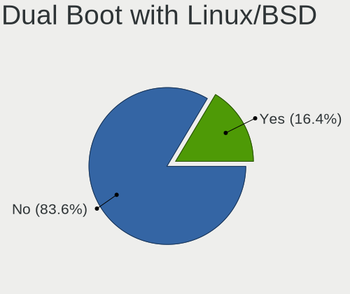

| Dual boot | Notebooks | Percent |
|-----------|-----------|---------|
| No        | 321       | 86.76%  |
| Yes       | 49        | 13.24%  |

Dual Boot (Win)
---------------

Hosting Linux and Windows

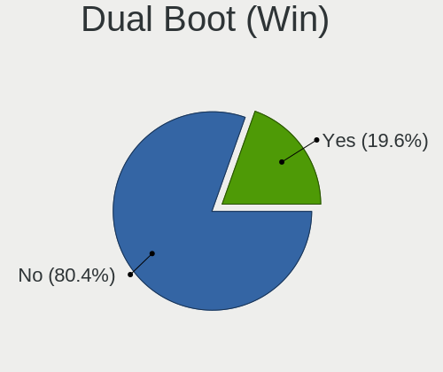

| Dual boot | Notebooks | Percent |
|-----------|-----------|---------|
| No        | 287       | 77.57%  |
| Yes       | 83        | 22.43%  |

Board
-----

Vendor
------

Motherboard manufacturer

| Name                             | Notebooks | Percent |
|----------------------------------|-----------|---------|
| Lenovo                           | 89        | 24.05%  |
| Hewlett-Packard                  | 54        | 14.59%  |
| ASUSTek Computer                 | 34        | 9.19%   |
| Acer                             | 34        | 9.19%   |
| Dell                             | 33        | 8.92%   |
| Medion                           | 15        | 4.05%   |
| Fujitsu                          | 13        | 3.51%   |
| Apple                            | 12        | 3.24%   |
| Valve                            | 10        | 2.7%    |
| TUXEDO                           | 10        | 2.7%    |
| HUAWEI                           | 7         | 1.89%   |
| Sony                             | 6         | 1.62%   |
| Toshiba                          | 5         | 1.35%   |
| Samsung Electronics              | 5         | 1.35%   |
| MSI                              | 5         | 1.35%   |
| Razer                            | 4         | 1.08%   |
| Packard Bell                     | 4         | 1.08%   |
| Wortmann AG                      | 3         | 0.81%   |
| LG Electronics                   | 3         | 0.81%   |
| Alienware                        | 3         | 0.81%   |
| Schenker                         | 2         | 0.54%   |
| Fujitsu Siemens                  | 2         | 0.54%   |
| Framework                        | 2         | 0.54%   |
| VALE                             | 1         | 0.27%   |
| Teclast                          | 1         | 0.27%   |
| System76                         | 1         | 0.27%   |
| ShangMai                         | 1         | 0.27%   |
| SDZ                              | 1         | 0.27%   |
| Panasonic                        | 1         | 0.27%   |
| Notebook                         | 1         | 0.27%   |
| Monster                          | 1         | 0.27%   |
| Micro Computer (HK) Tech Limited | 1         | 0.27%   |
| Inter Sales A/S                  | 1         | 0.27%   |
| In-S                             | 1         | 0.27%   |
| HONOR                            | 1         | 0.27%   |
| GPD                              | 1         | 0.27%   |
| Gigabyte Technology              | 1         | 0.27%   |
| AWOW                             | 1         | 0.27%   |

Model
-----

Motherboard model

| Name                                        | Notebooks | Percent |
|---------------------------------------------|-----------|---------|
| Valve Jupiter                               | 8         | 2.16%   |
| ASUS K50AF                                  | 4         | 1.08%   |
| Unknown                                     | 4         | 1.08%   |
| HP Laptop 15s-eq2xxx                        | 3         | 0.81%   |
| Valve Galileo                               | 2         | 0.54%   |
| Razer Blade 17 (2022) - RZ09-0423           | 2         | 0.54%   |
| Lenovo ThinkPad X1 Carbon Gen 10 21CBCTO1WW | 2         | 0.54%   |
| Lenovo IdeaPad 1 15ALC7 82R4                | 2         | 0.54%   |
| HUAWEI NBLK-WAX9X                           | 2         | 0.54%   |
| HP ProBook 430 G4                           | 2         | 0.54%   |
| HP Pavilion Notebook                        | 2         | 0.54%   |
| HP Laptop 17-cp0xxx                         | 2         | 0.54%   |
| HP EliteBook 8560p                          | 2         | 0.54%   |
| HP EliteBook 840 G5                         | 2         | 0.54%   |
| HP 625                                      | 2         | 0.54%   |
| HP 255 15.6 inch G9 Notebook PC             | 2         | 0.54%   |
| Fujitsu LIFEBOOK U749                       | 2         | 0.54%   |
| Fujitsu LIFEBOOK A357                       | 2         | 0.54%   |
| Framework Laptop 13 (AMD Ryzen 7040Series)  | 2         | 0.54%   |
| Dell XPS 15 7590                            | 2         | 0.54%   |
| Dell XPS 13 9360                            | 2         | 0.54%   |
| Dell Precision M4800                        | 2         | 0.54%   |
| Dell Precision 7520                         | 2         | 0.54%   |
| ASUS VivoBook_ASUSLaptop E510KA_E510KA      | 2         | 0.54%   |
| Acer Nitro AN517-41                         | 2         | 0.54%   |
| Acer Aspire V3-772                          | 2         | 0.54%   |
| Acer Aspire V3-771                          | 2         | 0.54%   |
| Acer Aspire 7750G                           | 2         | 0.54%   |
| Wortmann AG TERRA_MOBILE_1542               | 1         | 0.27%   |
| Wortmann AG TERRA_MOBILE_1529H              | 1         | 0.27%   |
| Wortmann AG 1220657_1470295                 | 1         | 0.27%   |
| VALE Notebook Classic C140                  | 1         | 0.27%   |
| TUXEDO U931                                 | 1         | 0.27%   |
| TUXEDO Pulse 15 Gen2                        | 1         | 0.27%   |
| TUXEDO Pulse 14 Gen3                        | 1         | 0.27%   |
| TUXEDO Pulse 14 Gen1                        | 1         | 0.27%   |
| TUXEDO Polaris AMD Gen5                     | 1         | 0.27%   |
| TUXEDO N24_25JU                             | 1         | 0.27%   |
| TUXEDO InfinityBook Pro Gen7 (MK2)          | 1         | 0.27%   |
| TUXEDO InfinityBook Pro Gen7 (MK1)          | 1         | 0.27%   |

Model Family
------------

Motherboard model prefix

| Name                     | Notebooks | Percent |
|--------------------------|-----------|---------|
| Lenovo ThinkPad          | 51        | 13.78%  |
| Acer Aspire              | 25        | 6.76%   |
| Lenovo IdeaPad           | 18        | 4.86%   |
| HP Laptop                | 13        | 3.51%   |
| Fujitsu LIFEBOOK         | 13        | 3.51%   |
| Dell Latitude            | 13        | 3.51%   |
| HP EliteBook             | 10        | 2.7%    |
| Valve Jupiter            | 8         | 2.16%   |
| HP Pavilion              | 8         | 2.16%   |
| Dell Inspiron            | 8         | 2.16%   |
| Lenovo Legion            | 6         | 1.62%   |
| HP ProBook               | 6         | 1.62%   |
| Dell XPS                 | 6         | 1.62%   |
| Dell Precision           | 6         | 1.62%   |
| ASUS VivoBook            | 6         | 1.62%   |
| Toshiba Satellite        | 5         | 1.35%   |
| Razer Blade              | 4         | 1.08%   |
| HP 255                   | 4         | 1.08%   |
| ASUS Zenbook             | 4         | 1.08%   |
| ASUS K50AF               | 4         | 1.08%   |
| ASUS ASUS                | 4         | 1.08%   |
| Unknown                  | 4         | 1.08%   |
| TUXEDO Pulse             | 3         | 0.81%   |
| TUXEDO InfinityBook      | 3         | 0.81%   |
| Packard Bell EasyNote    | 3         | 0.81%   |
| Lenovo Yoga              | 3         | 0.81%   |
| Lenovo ThinkBook         | 3         | 0.81%   |
| HP ZBook                 | 3         | 0.81%   |
| ASUS ROG                 | 3         | 0.81%   |
| Wortmann AG TERRA        | 2         | 0.54%   |
| Valve Galileo            | 2         | 0.54%   |
| MSI Katana               | 2         | 0.54%   |
| Medion Akoya             | 2         | 0.54%   |
| HUAWEI NBLK-WAX9X        | 2         | 0.54%   |
| HP ENVY                  | 2         | 0.54%   |
| HP Compaq                | 2         | 0.54%   |
| HP 625                   | 2         | 0.54%   |
| Fujitsu Siemens LIFEBOOK | 2         | 0.54%   |
| Framework Laptop         | 2         | 0.54%   |
| Apple MacBookPro5        | 2         | 0.54%   |

MFG Year
--------

Motherboard manufacture year

| Year | Notebooks | Percent |
|------|-----------|---------|
| 2023 | 42        | 11.35%  |
| 2018 | 34        | 9.19%   |
| 2013 | 32        | 8.65%   |
| 2022 | 31        | 8.38%   |
| 2021 | 29        | 7.84%   |
| 2020 | 27        | 7.3%    |
| 2012 | 25        | 6.76%   |
| 2019 | 23        | 6.22%   |
| 2011 | 22        | 5.95%   |
| 2017 | 19        | 5.14%   |
| 2016 | 18        | 4.86%   |
| 2009 | 16        | 4.32%   |
| 2010 | 15        | 4.05%   |
| 2015 | 14        | 3.78%   |
| 2014 | 12        | 3.24%   |
| 2007 | 6         | 1.62%   |
| 2008 | 4         | 1.08%   |
| 2006 | 1         | 0.27%   |

Form Factor
-----------

Physical design of the computer

| Name     | Notebooks | Percent |
|----------|-----------|---------|
| Notebook | 370       | 100%    |

Secure Boot
-----------

Enabled or disabled

| State    | Notebooks | Percent |
|----------|-----------|---------|
| Disabled | 340       | 91.89%  |
| Enabled  | 30        | 8.11%   |

Coreboot
--------

Have coreboot on board

| Used | Notebooks | Percent |
|------|-----------|---------|
| No   | 369       | 99.73%  |
| Yes  | 1         | 0.27%   |

RAM Size
--------

Total RAM memory

| Size in GB  | Notebooks | Percent |
|-------------|-----------|---------|
| 4.01-8.0    | 113       | 30.54%  |
| 16.01-24.0  | 74        | 20%     |
| 8.01-16.0   | 59        | 15.95%  |
| 3.01-4.0    | 47        | 12.7%   |
| 32.01-64.0  | 40        | 10.81%  |
| 24.01-32.0  | 15        | 4.05%   |
| 1.01-2.0    | 9         | 2.43%   |
| 64.01-256.0 | 8         | 2.16%   |
| 2.01-3.0    | 5         | 1.35%   |

RAM Used
--------

Used RAM memory

| Used GB    | Notebooks | Percent |
|------------|-----------|---------|
| 1.01-2.0   | 118       | 31.89%  |
| 2.01-3.0   | 106       | 28.65%  |
| 4.01-8.0   | 69        | 18.65%  |
| 3.01-4.0   | 47        | 12.7%   |
| 8.01-16.0  | 17        | 4.59%   |
| 0.51-1.0   | 10        | 2.7%    |
| 0.01-0.5   | 2         | 0.54%   |
| 16.01-24.0 | 1         | 0.27%   |

Total Drives
------------

Number of drives on board

| Drives | Notebooks | Percent |
|--------|-----------|---------|
| 1      | 259       | 70%     |
| 2      | 95        | 25.68%  |
| 3      | 10        | 2.7%    |
| 4      | 4         | 1.08%   |
| 6      | 1         | 0.27%   |
| 0      | 1         | 0.27%   |

Has CD-ROM
----------

Has CD-ROM on board

| Presented | Notebooks | Percent |
|-----------|-----------|---------|
| No        | 246       | 66.49%  |
| Yes       | 124       | 33.51%  |

Has Ethernet
------------

Has Ethernet on board

| Presented | Notebooks | Percent |
|-----------|-----------|---------|
| Yes       | 302       | 81.62%  |
| No        | 68        | 18.38%  |

Has WiFi
--------

Has WiFi module

| Presented | Notebooks | Percent |
|-----------|-----------|---------|
| Yes       | 367       | 99.19%  |
| No        | 3         | 0.81%   |

Has Bluetooth
-------------

Has Bluetooth module

| Presented | Notebooks | Percent |
|-----------|-----------|---------|
| Yes       | 302       | 81.62%  |
| No        | 68        | 18.38%  |

Location
--------

Country
-------

Geographic location (country)

| Country | Notebooks | Percent |
|---------|-----------|---------|
| Germany | 370       | 100%    |

City
----

Geographic location (city)

| City                | Notebooks | Percent |
|---------------------|-----------|---------|
| Berlin              | 37        | 10%     |
| Munich              | 24        | 6.49%   |
| Hamburg             | 16        | 4.32%   |
| Cologne             | 11        | 2.97%   |
| Frankfurt am Main   | 8         | 2.16%   |
| Dresden             | 8         | 2.16%   |
| Stuttgart           | 7         | 1.89%   |
| Leipzig             | 7         | 1.89%   |
| Nuremberg           | 6         | 1.62%   |
| Mannheim            | 5         | 1.35%   |
| Hanover             | 5         | 1.35%   |
| Essen               | 5         | 1.35%   |
| Düsseldorf         | 5         | 1.35%   |
| Augsburg            | 4         | 1.08%   |
| Trier               | 3         | 0.81%   |
| Stuhr               | 3         | 0.81%   |
| Mönchengladbach    | 3         | 0.81%   |
| Bremen              | 3         | 0.81%   |
| Bielefeld           | 3         | 0.81%   |
| Wiesbaden           | 2         | 0.54%   |
| Weil am Rhein       | 2         | 0.54%   |
| Velbert             | 2         | 0.54%   |
| Sindelfingen        | 2         | 0.54%   |
| Salzgitter          | 2         | 0.54%   |
| Passau              | 2         | 0.54%   |
| Osnabrück          | 2         | 0.54%   |
| Neuss               | 2         | 0.54%   |
| Münster            | 2         | 0.54%   |
| Mainz               | 2         | 0.54%   |
| Koblenz             | 2         | 0.54%   |
| Ingolstadt          | 2         | 0.54%   |
| Geretsried          | 2         | 0.54%   |
| Esslingen am Neckar | 2         | 0.54%   |
| Erlangen            | 2         | 0.54%   |
| Erfurt              | 2         | 0.54%   |
| Duisburg            | 2         | 0.54%   |
| Dortmund            | 2         | 0.54%   |
| Dessau              | 2         | 0.54%   |
| Darmstadt           | 2         | 0.54%   |
| Chemnitz            | 2         | 0.54%   |

Drives
------

Drive Vendor
------------

Hard drive vendors

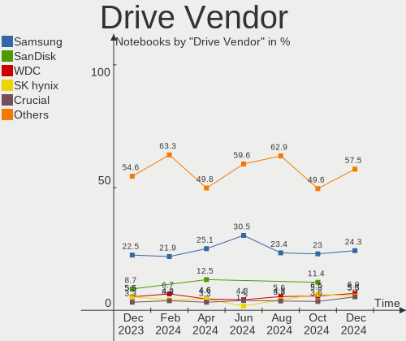

| Vendor                      | Notebooks | Drives | Percent |
|-----------------------------|-----------|--------|---------|
| Samsung Electronics         | 103       | 120    | 22.49%  |
| SanDisk                     | 40        | 45     | 8.73%   |
| Toshiba                     | 32        | 35     | 6.99%   |
| WDC                         | 25        | 26     | 5.46%   |
| SK hynix                    | 25        | 25     | 5.46%   |
| Seagate                     | 21        | 21     | 4.59%   |
| Unknown                     | 20        | 20     | 4.37%   |
| Intenso                     | 20        | 20     | 4.37%   |
| Crucial                     | 15        | 15     | 3.28%   |
| Micron Technology           | 14        | 14     | 3.06%   |
| Kingston                    | 14        | 15     | 3.06%   |
| Intel                       | 13        | 13     | 2.84%   |
| HGST                        | 13        | 13     | 2.84%   |
| Phison Electronics          | 11        | 11     | 2.4%    |
| Hitachi                     | 8         | 8      | 1.75%   |
| Micron/Crucial Technology   | 6         | 7      | 1.31%   |
| Kingston Technology Company | 6         | 6      | 1.31%   |
| Apple                       | 6         | 8      | 1.31%   |
| Phison                      | 5         | 5      | 1.09%   |
| Silicon Motion              | 4         | 4      | 0.87%   |
| KIOXIA                      | 4         | 4      | 0.87%   |
| JMicron Technology          | 4         | 4      | 0.87%   |
| LITEON                      | 3         | 3      | 0.66%   |
| China                       | 3         | 3      | 0.66%   |
| ASMT                        | 3         | 3      | 0.66%   |
| Unknown                     | 3         | 3      | 0.66%   |
| Transcend                   | 2         | 2      | 0.44%   |
| SPCC                        | 2         | 2      | 0.44%   |
| MAXIO Technology (Hangzhou) | 2         | 3      | 0.44%   |
| LITEONIT                    | 2         | 2      | 0.44%   |
| JetFlash                    | 2         | 2      | 0.44%   |
| ASMedia                     | 2         | 2      | 0.44%   |
| USB3.0                      | 1         | 1      | 0.22%   |
| Union Memory (Shenzhen)     | 1         | 1      | 0.22%   |
| UMIS                        | 1         | 1      | 0.22%   |
| Teclast                     | 1         | 1      | 0.22%   |
| Team                        | 1         | 1      | 0.22%   |
| SD                          | 1         | 1      | 0.22%   |
| Realtek                     | 1         | 1      | 0.22%   |
| Patriot                     | 1         | 1      | 0.22%   |

Drive Model
-----------

Hard drive models

| Model                                               | Notebooks | Percent |
|-----------------------------------------------------|-----------|---------|
| Samsung NVMe SSD Controller SM981/PM981/PM983 512GB | 13        | 2.71%   |
| Samsung NVMe SSD Controller PM9A1/PM9A3/980PRO 2TB  | 10        | 2.09%   |
| Unknown MMC Card  64GB                              | 5         | 1.04%   |
| Unknown MMC Card  128GB                             | 5         | 1.04%   |
| Toshiba MQ01ABD100 1TB                              | 5         | 1.04%   |
| SK hynix BC511 512GB                                | 4         | 0.84%   |
| Seagate ST1000LM035-1RK172 1TB                      | 4         | 0.84%   |
| Sandisk WD Blue SN550 NVMe SSD 1TB                  | 4         | 0.84%   |
| SanDisk NVMe SSD Drive 512GB                        | 4         | 0.84%   |
| Samsung SSD 980 1TB                                 | 4         | 0.84%   |
| Kingston Company OM3PDP3 NVMe SSD 512GB             | 4         | 0.84%   |
| HGST HTS721010A9E630 1TB                            | 4         | 0.84%   |
| Crucial CT500MX500SSD1 500GB                        | 4         | 0.84%   |
| WDC WDS100T2B0A-00SM50 1TB SSD                      | 3         | 0.63%   |
| Toshiba MQ01ABD075 752GB                            | 3         | 0.63%   |
| SanDisk SDSSDH3 1T00 1TB                            | 3         | 0.63%   |
| SanDisk SD8SN8U-256G-1006 256GB SSD                 | 3         | 0.63%   |
| Samsung SSD 980 500GB                               | 3         | 0.63%   |
| Samsung SSD 970 EVO Plus 1TB                        | 3         | 0.63%   |
| Samsung SSD 870 EVO 500GB                           | 3         | 0.63%   |
| Samsung SSD 860 EVO 500GB                           | 3         | 0.63%   |
| Samsung SSD 860 EVO 1TB                             | 3         | 0.63%   |
| Samsung SSD 840 EVO 250GB                           | 3         | 0.63%   |
| Samsung MZVLB512HAJQ-000L7 512GB                    | 3         | 0.63%   |
| Samsung MZAL4512HBLU-00BL2 512GB                    | 3         | 0.63%   |
| Kingston SA400S37240G 240GB SSD                     | 3         | 0.63%   |
| Intenso SSD Sata  256GB                             | 3         | 0.63%   |
| Intenso SSD 1024GB                                  | 3         | 0.63%   |
| HGST HTS541010A9E680 1TB                            | 3         | 0.63%   |
| Crucial CT1000MX500SSD1 1TB                         | 3         | 0.63%   |
| Unknown                                             | 3         | 0.63%   |
| WDC WD6400BEVT-22A0RT0 640GB                        | 2         | 0.42%   |
| Unknown MMC Card  512GB                             | 2         | 0.42%   |
| Unknown MMC Card  32GB                              | 2         | 0.42%   |
| Unknown MMC Card  256GB                             | 2         | 0.42%   |
| Toshiba XG6 NVMe SSD Controller 512GB               | 2         | 0.42%   |
| Toshiba MQ01ACF050 500GB                            | 2         | 0.42%   |
| Toshiba MK2555GSXF 250GB                            | 2         | 0.42%   |
| Toshiba KXG50ZNV256G NVMe 256GB                     | 2         | 0.42%   |
| SK hynix SKHynix_HFS512GD9TNI-L2B0B 512GB           | 2         | 0.42%   |

HDD Vendor
----------

Hard disk drive vendors

| Vendor              | Notebooks | Drives | Percent |
|---------------------|-----------|--------|---------|
| Toshiba             | 21        | 21     | 24.42%  |
| Seagate             | 21        | 21     | 24.42%  |
| WDC                 | 15        | 16     | 17.44%  |
| HGST                | 13        | 13     | 15.12%  |
| Hitachi             | 8         | 8      | 9.3%    |
| Samsung Electronics | 3         | 3      | 3.49%   |
| USB3.0              | 1         | 1      | 1.16%   |
| Unknown             | 1         | 1      | 1.16%   |
| LIO-ORG             | 1         | 4      | 1.16%   |
| Intenso             | 1         | 1      | 1.16%   |
| Fujitsu             | 1         | 1      | 1.16%   |

SSD Vendor
----------

Solid state drive vendors

| Vendor              | Notebooks | Drives | Percent |
|---------------------|-----------|--------|---------|
| Samsung Electronics | 45        | 47     | 28.13%  |
| Intenso             | 18        | 18     | 11.25%  |
| SanDisk             | 15        | 19     | 9.38%   |
| Crucial             | 13        | 13     | 8.13%   |
| Kingston            | 10        | 10     | 6.25%   |
| WDC                 | 7         | 7      | 4.38%   |
| Intel               | 7         | 7      | 4.38%   |
| Phison              | 4         | 4      | 2.5%    |
| Micron Technology   | 4         | 4      | 2.5%    |
| Toshiba             | 3         | 3      | 1.88%   |
| China               | 3         | 3      | 1.88%   |
| ASMT                | 3         | 3      | 1.88%   |
| Apple               | 3         | 3      | 1.88%   |
| Transcend           | 2         | 2      | 1.25%   |
| SPCC                | 2         | 2      | 1.25%   |
| LITEONIT            | 2         | 2      | 1.25%   |
| LITEON              | 2         | 2      | 1.25%   |
| JMicron Technology  | 2         | 2      | 1.25%   |
| ASMedia             | 2         | 2      | 1.25%   |
| Teclast             | 1         | 1      | 0.63%   |
| Team                | 1         | 1      | 0.63%   |
| SK hynix            | 1         | 1      | 0.63%   |
| SD                  | 1         | 1      | 0.63%   |
| Patriot             | 1         | 1      | 0.63%   |
| Netac               | 1         | 1      | 0.63%   |
| Neo Forza           | 1         | 1      | 0.63%   |
| GLOWAY              | 1         | 1      | 0.63%   |
| FORESEE             | 1         | 1      | 0.63%   |
| Dogfish             | 1         | 1      | 0.63%   |
| C300-CTF            | 1         | 1      | 0.63%   |
| ASMT109x            | 1         | 1      | 0.63%   |
| A-DATA Technology   | 1         | 1      | 0.63%   |

Drive Kind
----------

HDD or SSD

| Kind    | Notebooks | Drives | Percent |
|---------|-----------|--------|---------|
| NVMe    | 173       | 204    | 40.14%  |
| SSD     | 144       | 166    | 33.41%  |
| HDD     | 83        | 90     | 19.26%  |
| MMC     | 22        | 22     | 5.1%    |
| Unknown | 9         | 10     | 2.09%   |

Drive Connector
---------------

SATA, SAS, NVMe, etc.

| Type | Notebooks | Drives | Percent |
|------|-----------|--------|---------|
| SATA | 207       | 243    | 49.05%  |
| NVMe | 173       | 202    | 41%     |
| MMC  | 22        | 22     | 5.21%   |
| SAS  | 20        | 25     | 4.74%   |

Drive Size
----------

Size of hard drive

| Size in TB | Notebooks | Drives | Percent |
|------------|-----------|--------|---------|
| 0.01-0.5   | 140       | 158    | 59.57%  |
| 0.51-1.0   | 77        | 80     | 32.77%  |
| 1.01-2.0   | 15        | 15     | 6.38%   |
| 3.01-4.0   | 3         | 3      | 1.28%   |

Space Total
-----------

Amount of disk space available on the file system

| Size in GB     | Notebooks | Percent |
|----------------|-----------|---------|
| 251-500        | 91        | 24.59%  |
| 101-250        | 83        | 22.43%  |
| 501-1000       | 80        | 21.62%  |
| 1001-2000      | 33        | 8.92%   |
| 1-20           | 30        | 8.11%   |
| Unknown        | 17        | 4.59%   |
| 51-100         | 12        | 3.24%   |
| More than 3000 | 10        | 2.7%    |
| 2001-3000      | 8         | 2.16%   |
| 21-50          | 6         | 1.62%   |

Space Used
----------

Amount of used disk space

| Used GB        | Notebooks | Percent |
|----------------|-----------|---------|
| 1-20           | 103       | 27.84%  |
| 21-50          | 73        | 19.73%  |
| 101-250        | 59        | 15.95%  |
| 51-100         | 52        | 14.05%  |
| 251-500        | 37        | 10%     |
| 501-1000       | 22        | 5.95%   |
| Unknown        | 17        | 4.59%   |
| 1001-2000      | 5         | 1.35%   |
| More than 3000 | 1         | 0.27%   |
| 2001-3000      | 1         | 0.27%   |

Malfunc. Drives
---------------

Drive models with a malfunction

| Model                                 | Notebooks | Drives | Percent |
|---------------------------------------|-----------|--------|---------|
| WDC WDS100T2G0A-00JH30 1TB SSD        | 1         | 1      | 7.14%   |
| WDC WD10SPCX-22HWST0 1TB              | 1         | 1      | 7.14%   |
| WDC WD Blue SA510 2.5 1000GB SSD      | 1         | 1      | 7.14%   |
| Toshiba MQ01ABD075 752GB              | 1         | 1      | 7.14%   |
| Toshiba MK3259GSXP 320GB              | 1         | 1      | 7.14%   |
| SK hynix PC711 HFS001TDE9X073N 1024GB | 1         | 1      | 7.14%   |
| SK hynix BC711 HFM512GD3JX013N 512GB  | 1         | 1      | 7.14%   |
| SK hynix BC711 HFM256GD3JX013N 256GB  | 1         | 1      | 7.14%   |
| Seagate ST9320423AS 320GB             | 1         | 1      | 7.14%   |
| Seagate ST9100821AS 100GB             | 1         | 1      | 7.14%   |
| Seagate ST2000LM003 HN-M201RAD 2TB    | 1         | 1      | 7.14%   |
| LITEONIT LCT-256M3S 256GB SSD         | 1         | 1      | 7.14%   |
| Kingston SA400S37240G 240GB SSD       | 1         | 1      | 7.14%   |
| HGST HTS725050A7E630 500GB            | 1         | 1      | 7.14%   |

Malfunc. Drive Vendor
---------------------

Vendors of faulty drives

| Vendor   | Notebooks | Drives | Percent |
|----------|-----------|--------|---------|
| WDC      | 3         | 3      | 21.43%  |
| SK hynix | 3         | 3      | 21.43%  |
| Seagate  | 3         | 3      | 21.43%  |
| Toshiba  | 2         | 2      | 14.29%  |
| LITEONIT | 1         | 1      | 7.14%   |
| Kingston | 1         | 1      | 7.14%   |
| HGST     | 1         | 1      | 7.14%   |

Malfunc. HDD Vendor
-------------------

Vendors of faulty HDD drives

| Vendor  | Notebooks | Drives | Percent |
|---------|-----------|--------|---------|
| Seagate | 3         | 3      | 42.86%  |
| Toshiba | 2         | 2      | 28.57%  |
| WDC     | 1         | 1      | 14.29%  |
| HGST    | 1         | 1      | 14.29%  |

Malfunc. Drive Kind
-------------------

Kinds of faulty drives

| Kind | Notebooks | Drives | Percent |
|------|-----------|--------|---------|
| HDD  | 7         | 7      | 50%     |
| SSD  | 4         | 4      | 28.57%  |
| NVMe | 3         | 3      | 21.43%  |

Failed Drives
-------------

Failed drive models

| Model                         | Notebooks | Drives | Percent |
|-------------------------------|-----------|--------|---------|
| JMicron Technology Tech 250GB | 1         | 1      | 100%    |

Failed Drive Vendor
-------------------

Failed drive vendors

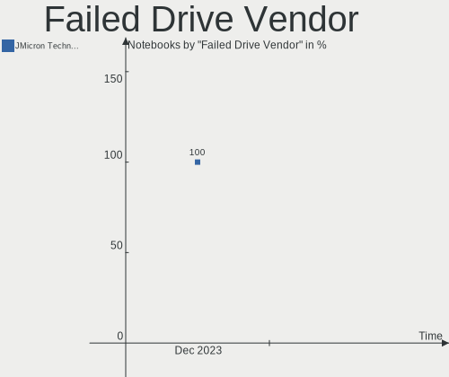

| Vendor             | Notebooks | Drives | Percent |
|--------------------|-----------|--------|---------|
| JMicron Technology | 1         | 1      | 100%    |

Drive Status
------------

Number of failed and malfunc. drives

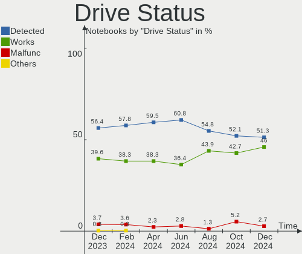

| Status   | Notebooks | Drives | Percent |
|----------|-----------|--------|---------|
| Detected | 215       | 287    | 56.43%  |
| Works    | 151       | 190    | 39.63%  |
| Malfunc  | 14        | 14     | 3.67%   |
| Failed   | 1         | 1      | 0.26%   |

Storage controller
------------------

Storage Vendor
--------------

Storage controller vendors

| Vendor                       | Notebooks | Percent |
|------------------------------|-----------|---------|
| Intel                        | 221       | 50.34%  |
| Samsung Electronics          | 60        | 13.67%  |
| AMD                          | 34        | 7.74%   |
| SanDisk                      | 27        | 6.15%   |
| SK hynix                     | 24        | 5.47%   |
| Phison Electronics           | 13        | 2.96%   |
| Kingston Technology Company  | 11        | 2.51%   |
| Micron Technology            | 10        | 2.28%   |
| Toshiba America Info Systems | 9         | 2.05%   |
| Micron/Crucial Technology    | 8         | 1.82%   |
| Silicon Motion               | 4         | 0.91%   |
| Nvidia                       | 4         | 0.91%   |
| KIOXIA                       | 4         | 0.91%   |
| Union Memory (Shenzhen)      | 2         | 0.46%   |
| MAXIO Technology (Hangzhou)  | 2         | 0.46%   |
| Marvell Technology Group     | 2         | 0.46%   |
| Apple                        | 2         | 0.46%   |
| Shenzhen Longsys Electronics | 1         | 0.23%   |
| Lite-On Technology           | 1         | 0.23%   |

Storage Model
-------------

Storage controller models

| Model                                                                          | Notebooks | Percent |
|--------------------------------------------------------------------------------|-----------|---------|
| Intel Sunrise Point-LP SATA Controller [AHCI mode]                             | 28        | 6.1%    |
| Intel 7 Series Chipset Family 6-port SATA Controller [AHCI mode]               | 26        | 5.66%   |
| AMD FCH SATA Controller [AHCI mode]                                            | 25        | 5.45%   |
| Samsung NVMe SSD Controller SM981/PM981/PM983                                  | 24        | 5.23%   |
| Intel 6 Series/C200 Series Chipset Family 6 port Mobile SATA AHCI Controller   | 18        | 3.92%   |
| Samsung NVMe SSD Controller PM9A1/PM9A3/980PRO                                 | 16        | 3.49%   |
| Intel Volume Management Device NVMe RAID Controller                            | 16        | 3.49%   |
| Intel 82801 Mobile SATA Controller [RAID mode]                                 | 16        | 3.49%   |
| Samsung NVMe SSD Controller 980 (DRAM-less)                                    | 11        | 2.4%    |
| Intel Wildcat Point-LP SATA Controller [AHCI Mode]                             | 11        | 2.4%    |
| Intel 8 Series/C220 Series Chipset Family 6-port SATA Controller 1 [AHCI mode] | 11        | 2.4%    |
| Intel 8 Series SATA Controller 1 [AHCI mode]                                   | 9         | 1.96%   |
| Intel Cannon Lake Mobile PCH SATA AHCI Controller                              | 8         | 1.74%   |
| Intel 82801IBM/IEM (ICH9M/ICH9M-E) 4 port SATA Controller [AHCI mode]          | 8         | 1.74%   |
| AMD SB7x0/SB8x0/SB9x0 SATA Controller [AHCI mode]                              | 8         | 1.74%   |
| SK hynix Gold P31/BC711/PC711 NVMe Solid State Drive                           | 7         | 1.53%   |
| SK hynix BC511 NVMe SSD                                                        | 7         | 1.53%   |
| Intel 5 Series/3400 Series Chipset 4 port SATA AHCI Controller                 | 7         | 1.53%   |
| SanDisk Ultra 3D / WD Blue SN550 NVMe SSD                                      | 6         | 1.31%   |
| Intel Tiger Lake-LP SATA Controller                                            | 6         | 1.31%   |
| Intel Celeron/Pentium Silver Processor SATA Controller                         | 6         | 1.31%   |
| Intel Alder Lake-P SATA AHCI Controller                                        | 6         | 1.31%   |
| Sandisk WD PC SN740 NVMe SSD 512GB (DRAM-less)                                 | 5         | 1.09%   |
| Samsung NVMe SSD Controller PM9B1 (DRAM-less)                                  | 5         | 1.09%   |
| Phison PS5021-E21 PCIe4 NVMe Controller (DRAM-less)                            | 5         | 1.09%   |
| Kingston Company OM3PDP3 NVMe SSD                                              | 5         | 1.09%   |
| SK hynix Platinum P41/PC801 NVMe Solid State Drive                             | 4         | 0.87%   |
| SanDisk WD Black SN770 / PC SN740 256GB / PC SN560 (DRAM-less) NVMe SSD        | 4         | 0.87%   |
| Intel Q170/Q150/B150/H170/H110/Z170/CM236 Chipset SATA Controller [AHCI Mode]  | 4         | 0.87%   |
| Intel HM170/QM170 Chipset SATA Controller [AHCI Mode]                          | 4         | 0.87%   |
| Intel Celeron N3350/Pentium N4200/Atom E3900 Series SATA AHCI Controller       | 4         | 0.87%   |
| Intel Atom Processor E3800 Series SATA AHCI Controller                         | 4         | 0.87%   |
| Intel 82801HM/HEM (ICH8M/ICH8M-E) SATA Controller [AHCI mode]                  | 4         | 0.87%   |
| Intel 82801HM/HEM (ICH8M/ICH8M-E) IDE Controller                               | 4         | 0.87%   |
| Intel 5 Series/3400 Series Chipset 6 port SATA AHCI Controller                 | 4         | 0.87%   |
| Intel 400 Series Chipset Family SATA AHCI Controller                           | 4         | 0.87%   |
| Toshiba America Info Systems XG6 NVMe SSD Controller                           | 3         | 0.65%   |
| Toshiba America Info Systems XG5 NVMe SSD Controller                           | 3         | 0.65%   |
| Phison E12 NVMe Controller                                                     | 3         | 0.65%   |
| Micron/Crucial P5 Plus NVMe PCIe SSD                                           | 3         | 0.65%   |

Storage Kind
------------

Kind of storage controller (IDE, SATA, NVMe, SAS, ...)

| Kind | Notebooks | Percent |
|------|-----------|---------|
| SATA | 221       | 50%     |
| NVMe | 173       | 39.14%  |
| RAID | 35        | 7.92%   |
| IDE  | 13        | 2.94%   |

Processor
---------

CPU Vendor
----------

Processor vendors

| Vendor | Notebooks | Percent |
|--------|-----------|---------|
| Intel  | 282       | 76.22%  |
| AMD    | 88        | 23.78%  |

CPU Model
---------

Processor models

| Model                                         | Notebooks | Percent |
|-----------------------------------------------|-----------|---------|
| AMD Custom APU 0405                           | 10        | 2.7%    |
| Intel Core i5-7200U CPU @ 2.50GHz             | 9         | 2.43%   |
| Intel Core i5-8250U CPU @ 1.60GHz             | 8         | 2.16%   |
| Intel Core i5-8350U CPU @ 1.70GHz             | 7         | 1.89%   |
| Intel Core i7-8550U CPU @ 1.80GHz             | 6         | 1.62%   |
| Intel 12th Gen Core i7-12700H                 | 6         | 1.62%   |
| Intel Core i7-8750H CPU @ 2.20GHz             | 5         | 1.35%   |
| Intel Core i5-3320M CPU @ 2.60GHz             | 5         | 1.35%   |
| Intel Core i5-2520M CPU @ 2.50GHz             | 5         | 1.35%   |
| AMD Ryzen 7 5800H with Radeon Graphics        | 5         | 1.35%   |
| AMD Ryzen 5 5500U with Radeon Graphics        | 5         | 1.35%   |
| AMD Ryzen 5 3500U with Radeon Vega Mobile Gfx | 5         | 1.35%   |
| AMD Athlon II Dual-Core M320                  | 5         | 1.35%   |
| Intel Core i7-9750H CPU @ 2.60GHz             | 4         | 1.08%   |
| Intel Core i7-7500U CPU @ 2.70GHz             | 4         | 1.08%   |
| Intel Core i5-8265U CPU @ 1.60GHz             | 4         | 1.08%   |
| Intel Core i5-5200U CPU @ 2.20GHz             | 4         | 1.08%   |
| Intel Core i5-2410M CPU @ 2.30GHz             | 4         | 1.08%   |
| Intel Core i5-10210U CPU @ 1.60GHz            | 4         | 1.08%   |
| Intel Core 2 Duo CPU P8700 @ 2.53GHz          | 4         | 1.08%   |
| Intel Pentium CPU 2020M @ 2.40GHz             | 3         | 0.81%   |
| Intel Core i7-7700HQ CPU @ 2.80GHz            | 3         | 0.81%   |
| Intel Core i7-6700HQ CPU @ 2.60GHz            | 3         | 0.81%   |
| Intel Core i7-4700MQ CPU @ 2.40GHz            | 3         | 0.81%   |
| Intel Core i7-2630QM CPU @ 2.00GHz            | 3         | 0.81%   |
| Intel Core i7-10750H CPU @ 2.60GHz            | 3         | 0.81%   |
| Intel Core i5-5300U CPU @ 2.30GHz             | 3         | 0.81%   |
| Intel Core i5-4300M CPU @ 2.60GHz             | 3         | 0.81%   |
| Intel Core i5-4200U CPU @ 1.60GHz             | 3         | 0.81%   |
| Intel Core i5-3230M CPU @ 2.60GHz             | 3         | 0.81%   |
| Intel Core i5-3210M CPU @ 2.50GHz             | 3         | 0.81%   |
| Intel Core i5 CPU M 430 @ 2.27GHz             | 3         | 0.81%   |
| Intel Core i3-6100U CPU @ 2.30GHz             | 3         | 0.81%   |
| Intel Core i3-2328M CPU @ 2.20GHz             | 3         | 0.81%   |
| Intel Core i3 CPU M 370 @ 2.40GHz             | 3         | 0.81%   |
| Intel 12th Gen Core i7-1270P                  | 3         | 0.81%   |
| Intel 11th Gen Core i7-1165G7 @ 2.80GHz       | 3         | 0.81%   |
| AMD Ryzen 7 PRO 7840U w/ Radeon 780M Graphics | 3         | 0.81%   |
| AMD Ryzen 7 PRO 4750U with Radeon Graphics    | 3         | 0.81%   |
| AMD Ryzen 7 7840U w/ Radeon 780M Graphics     | 3         | 0.81%   |

CPU Model Family
----------------

Processor model prefix

| Model                   | Notebooks | Percent |
|-------------------------|-----------|---------|
| Intel Core i5           | 95        | 25.68%  |
| Intel Core i7           | 64        | 17.3%   |
| Other                   | 60        | 16.22%  |
| AMD Ryzen 7             | 23        | 6.22%   |
| Intel Core i3           | 20        | 5.41%   |
| AMD Ryzen 5             | 19        | 5.14%   |
| Intel Core 2 Duo        | 16        | 4.32%   |
| Intel Celeron           | 13        | 3.51%   |
| Intel Pentium           | 9         | 2.43%   |
| AMD Ryzen 7 PRO         | 7         | 1.89%   |
| AMD Ryzen 3             | 6         | 1.62%   |
| AMD Athlon II Dual-Core | 5         | 1.35%   |
| Intel Pentium Silver    | 4         | 1.08%   |
| Intel Atom              | 3         | 0.81%   |
| AMD A6                  | 3         | 0.81%   |
| Intel Xeon              | 2         | 0.54%   |
| Intel Pentium Gold      | 2         | 0.54%   |
| Intel Pentium Dual-Core | 2         | 0.54%   |
| Intel Genuine           | 2         | 0.54%   |
| AMD Ryzen 9             | 2         | 0.54%   |
| AMD E1                  | 2         | 0.54%   |
| AMD Athlon II           | 2         | 0.54%   |
| AMD A4                  | 2         | 0.54%   |
| Intel Core m7           | 1         | 0.27%   |
| AMD V160                | 1         | 0.27%   |
| AMD V140                | 1         | 0.27%   |
| AMD Turion 64 X2 Mobile | 1         | 0.27%   |
| AMD Athlon              | 1         | 0.27%   |
| AMD A8                  | 1         | 0.27%   |
| AMD A10                 | 1         | 0.27%   |

CPU Cores
---------

Number of processor cores

| Number | Notebooks | Percent |
|--------|-----------|---------|
| 2      | 159       | 42.97%  |
| 4      | 111       | 30%     |
| 8      | 35        | 9.46%   |
| 6      | 28        | 7.57%   |
| 14     | 15        | 4.05%   |
| 12     | 8         | 2.16%   |
| 10     | 8         | 2.16%   |
| 1      | 3         | 0.81%   |
| 16     | 2         | 0.54%   |
| 5      | 1         | 0.27%   |

CPU Sockets
-----------

Number of sockets

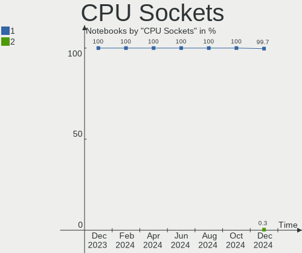

| Number | Notebooks | Percent |
|--------|-----------|---------|
| 1      | 370       | 100%    |

CPU Threads
-----------

Threads per core (Hyper-Threading)

| Number | Notebooks | Percent |
|--------|-----------|---------|
| 2      | 299       | 80.81%  |
| 1      | 71        | 19.19%  |

CPU Op-Modes
------------

CPU Operation Modes (32-bit, 64-bit)

| Op mode        | Notebooks | Percent |
|----------------|-----------|---------|
| 32-bit, 64-bit | 369       | 99.73%  |
| 32-bit         | 1         | 0.27%   |

CPU Microcode
-------------

Microcode number

| Number     | Notebooks | Percent |
|------------|-----------|---------|
| Unknown    | 231       | 62.43%  |
| 0x206a7    | 10        | 2.7%    |
| 0x806ea    | 7         | 1.89%   |
| 0x306c3    | 7         | 1.89%   |
| 0x0a50000d | 7         | 1.89%   |
| 0x306d4    | 6         | 1.62%   |
| 0x306a9    | 6         | 1.62%   |
| 0x1067a    | 6         | 1.62%   |
| 0x0a50000c | 6         | 1.62%   |
| 0x806c1    | 5         | 1.35%   |
| 0x0a704103 | 5         | 1.35%   |
| 0x906a3    | 4         | 1.08%   |
| 0x20655    | 4         | 1.08%   |
| 0x08600106 | 4         | 1.08%   |
| 0x08108109 | 4         | 1.08%   |
| 0x806e9    | 3         | 0.81%   |
| 0x406e3    | 3         | 0.81%   |
| 0x40651    | 3         | 0.81%   |
| 0x08608103 | 3         | 0.81%   |
| 0xa0652    | 2         | 0.54%   |
| 0x906ea    | 2         | 0.54%   |
| 0x806d1    | 2         | 0.54%   |
| 0x6fd      | 2         | 0.54%   |
| 0x506c9    | 2         | 0.54%   |
| 0x30678    | 2         | 0.54%   |
| 0x30673    | 2         | 0.54%   |
| 0x20652    | 2         | 0.54%   |
| 0x10676    | 2         | 0.54%   |
| 0x0a404102 | 2         | 0.54%   |
| 0x08608104 | 2         | 0.54%   |
| 0x08600103 | 2         | 0.54%   |
| 0x010000c8 | 2         | 0.54%   |
| 0xb06a3    | 1         | 0.27%   |
| 0x906e9    | 1         | 0.27%   |
| 0x906a4    | 1         | 0.27%   |
| 0x806ec    | 1         | 0.27%   |
| 0x806eb    | 1         | 0.27%   |
| 0x806c2    | 1         | 0.27%   |
| 0x6ec      | 1         | 0.27%   |
| 0x506e3    | 1         | 0.27%   |

CPU Microarch
-------------

Microarchitecture

| Name             | Notebooks | Percent |
|------------------|-----------|---------|
| KabyLake         | 65        | 17.57%  |
| Unknown          | 43        | 11.62%  |
| Alderlake Hybrid | 27        | 7.3%    |
| SandyBridge      | 26        | 7.03%   |
| Haswell          | 26        | 7.03%   |
| IvyBridge        | 24        | 6.49%   |
| Skylake          | 20        | 5.41%   |
| Zen 3            | 16        | 4.32%   |
| Penryn           | 16        | 4.32%   |
| TigerLake        | 13        | 3.51%   |
| Broadwell        | 12        | 3.24%   |
| Westmere         | 11        | 2.97%   |
| K10              | 9         | 2.43%   |
| Zen+             | 8         | 2.16%   |
| Zen 2            | 8         | 2.16%   |
| Silvermont       | 7         | 1.89%   |
| Goldmont plus    | 6         | 1.62%   |
| CometLake        | 5         | 1.35%   |
| Goldmont         | 4         | 1.08%   |
| Excavator        | 4         | 1.08%   |
| Zen              | 3         | 0.81%   |
| IceLake          | 3         | 0.81%   |
| Core             | 3         | 0.81%   |
| Tremont          | 2         | 0.54%   |
| Jaguar           | 2         | 0.54%   |
| Puma             | 1         | 0.27%   |
| Piledriver       | 1         | 0.27%   |
| P6               | 1         | 0.27%   |
| K8 Hammer        | 1         | 0.27%   |
| K10 Llano        | 1         | 0.27%   |
| Bonnell          | 1         | 0.27%   |
| Bobcat           | 1         | 0.27%   |

Graphics
--------

GPU Vendor
----------

Vendors of graphics cards

| Vendor | Notebooks | Percent |
|--------|-----------|---------|
| Intel  | 249       | 54.01%  |
| Nvidia | 106       | 22.99%  |
| AMD    | 106       | 22.99%  |

GPU Model
---------

Graphics card models

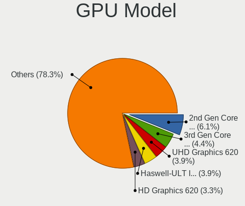

| Model                                                                     | Notebooks | Percent |
|---------------------------------------------------------------------------|-----------|---------|
| Intel 2nd Generation Core Processor Family Integrated Graphics Controller | 23        | 4.9%    |
| Intel UHD Graphics 620                                                    | 22        | 4.69%   |
| Intel 3rd Gen Core processor Graphics Controller                          | 18        | 3.84%   |
| Intel Alder Lake-P GT2 [Iris Xe Graphics]                                 | 14        | 2.99%   |
| Intel HD Graphics 620                                                     | 13        | 2.77%   |
| Intel Skylake GT2 [HD Graphics 520]                                       | 12        | 2.56%   |
| Intel 4th Gen Core Processor Integrated Graphics Controller               | 12        | 2.56%   |
| Intel Raptor Lake-P [Iris Xe Graphics]                                    | 10        | 2.13%   |
| Intel Haswell-ULT Integrated Graphics Controller                          | 10        | 2.13%   |
| Intel TigerLake-LP GT2 [Iris Xe Graphics]                                 | 9         | 1.92%   |
| Intel HD Graphics 5500                                                    | 9         | 1.92%   |
| AMD Picasso/Raven 2 [Radeon Vega Series / Radeon Vega Mobile Series]      | 9         | 1.92%   |
| AMD Phoenix1                                                              | 9         | 1.92%   |
| AMD Lucienne                                                              | 9         | 1.92%   |
| AMD VanGogh [AMD Custom GPU 0405]                                         | 8         | 1.71%   |
| AMD Renoir [Radeon RX Vega 6 (Ryzen 4000/5000 Mobile Series)]             | 8         | 1.71%   |
| AMD Cezanne [Radeon Vega Series / Radeon Vega Mobile Series]              | 8         | 1.71%   |
| AMD Barcelo                                                               | 8         | 1.71%   |
| Intel Mobile 4 Series Chipset Integrated Graphics Controller              | 7         | 1.49%   |
| Intel CoffeeLake-H GT2 [UHD Graphics 630]                                 | 7         | 1.49%   |
| Intel WhiskeyLake-U GT2 [UHD Graphics 620]                                | 6         | 1.28%   |
| Intel HD Graphics 530                                                     | 6         | 1.28%   |
| Intel Core Processor Integrated Graphics Controller                       | 6         | 1.28%   |
| Intel CometLake-U GT2 [UHD Graphics]                                      | 6         | 1.28%   |
| Nvidia TU117M [GeForce GTX 1650 Mobile / Max-Q]                           | 5         | 1.07%   |
| Nvidia GF117M [GeForce 610M/710M/810M/820M / GT 620M/625M/630M/720M]      | 5         | 1.07%   |
| Intel Atom Processor Z36xxx/Z37xxx Series Graphics & Display              | 5         | 1.07%   |
| AMD RS880M [Mobility Radeon HD 4225/4250]                                 | 5         | 1.07%   |
| AMD Rembrandt [Radeon 680M]                                               | 5         | 1.07%   |
| Nvidia GA107M [GeForce RTX 3050 Ti Mobile]                                | 4         | 0.85%   |
| Nvidia GA106M [GeForce RTX 3060 Mobile / Max-Q]                           | 4         | 0.85%   |
| Intel CometLake-H GT2 [UHD Graphics]                                      | 4         | 0.85%   |
| AMD RV710/M92 [Mobility Radeon HD 4530/4570/5145/530v/540v/545v]          | 4         | 0.85%   |
| Nvidia TU117M [GeForce MX450]                                             | 3         | 0.64%   |
| Nvidia GP108M [GeForce MX150]                                             | 3         | 0.64%   |
| Nvidia GM107M [GeForce GTX 960M]                                          | 3         | 0.64%   |
| Nvidia GF108M [GeForce GT 540M]                                           | 3         | 0.64%   |
| Nvidia GA107M [GeForce RTX 3050 Mobile]                                   | 3         | 0.64%   |
| Nvidia AD107M [GeForce RTX 4060 Max-Q / Mobile]                           | 3         | 0.64%   |
| Intel TigerLake-H GT1 [UHD Graphics]                                      | 3         | 0.64%   |

GPU Combo
---------

Combinations of graphics cards

| Name           | Notebooks | Percent |
|----------------|-----------|---------|
| 1 x Intel      | 166       | 44.86%  |
| 1 x AMD        | 86        | 23.24%  |
| Intel + Nvidia | 74        | 20%     |
| 1 x Nvidia     | 23        | 6.22%   |
| AMD + Nvidia   | 9         | 2.43%   |
| Intel + AMD    | 7         | 1.89%   |
| 2 x AMD        | 4         | 1.08%   |
| 2 x Intel      | 1         | 0.27%   |

GPU Driver
----------

Free vs proprietary

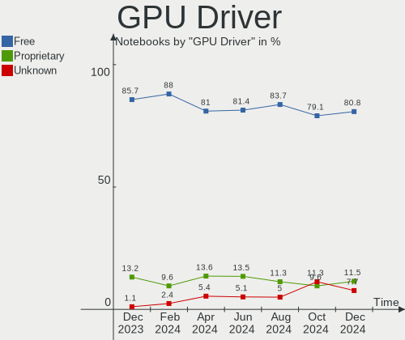

| Driver      | Notebooks | Percent |
|-------------|-----------|---------|
| Free        | 317       | 85.68%  |
| Proprietary | 49        | 13.24%  |
| Unknown     | 4         | 1.08%   |

GPU Memory
----------

Total video memory

| Size in GB | Notebooks | Percent |
|------------|-----------|---------|
| Unknown    | 270       | 72.97%  |
| 0.01-0.5   | 41        | 11.08%  |
| 1.01-2.0   | 23        | 6.22%   |
| 0.51-1.0   | 12        | 3.24%   |
| 3.01-4.0   | 11        | 2.97%   |
| 7.01-8.0   | 7         | 1.89%   |
| 5.01-6.0   | 6         | 1.62%   |

Monitor
-------

Monitor Vendor
--------------

Monitor vendors

| Vendor                  | Notebooks | Percent |
|-------------------------|-----------|---------|
| AU Optronics            | 89        | 21.45%  |
| LG Display              | 65        | 15.66%  |
| BOE                     | 58        | 13.98%  |
| Chimei Innolux          | 50        | 12.05%  |
| Samsung Electronics     | 35        | 8.43%   |
| Lenovo                  | 13        | 3.13%   |
| Apple                   | 11        | 2.65%   |
| Valve                   | 10        | 2.41%   |
| Sharp                   | 8         | 1.93%   |
| Dell                    | 8         | 1.93%   |
| InfoVision              | 6         | 1.45%   |
| Chi Mei Optoelectronics | 6         | 1.45%   |
| PANDA                   | 5         | 1.2%    |
| Hewlett-Packard         | 5         | 1.2%    |
| Philips                 | 4         | 0.96%   |
| CSO                     | 4         | 0.96%   |
| LG Philips              | 3         | 0.72%   |
| HUAWEI                  | 3         | 0.72%   |
| BenQ                    | 3         | 0.72%   |
| Ancor Communications    | 3         | 0.72%   |
| TMX                     | 2         | 0.48%   |
| Sony                    | 2         | 0.48%   |
| Hitachi                 | 2         | 0.48%   |
| Goldstar                | 2         | 0.48%   |
| CPT                     | 2         | 0.48%   |
| AOC                     | 2         | 0.48%   |
| ViewSonic               | 1         | 0.24%   |
| Toshiba                 | 1         | 0.24%   |
| TopView                 | 1         | 0.24%   |
| TMA                     | 1         | 0.24%   |
| Seiko/Epson             | 1         | 0.24%   |
| Orion                   | 1         | 0.24%   |
| Mi                      | 1         | 0.24%   |
| JDI                     | 1         | 0.24%   |
| InnoLux Display         | 1         | 0.24%   |
| Iiyama                  | 1         | 0.24%   |
| Gigabyte Technology     | 1         | 0.24%   |
| Fujitsu Siemens         | 1         | 0.24%   |
| DENON                   | 1         | 0.24%   |
| Acer                    | 1         | 0.24%   |

Monitor Model
-------------

Monitor models

| Model                                                                    | Notebooks | Percent |
|--------------------------------------------------------------------------|-----------|---------|
| Valve ANX7530 U VLV3001 800x1280 100x150mm 7.1-inch                      | 8         | 1.92%   |
| AU Optronics LCD Monitor AUO21ED 1920x1080 344x193mm 15.5-inch           | 6         | 1.44%   |
| LG Display LCD Monitor LGD046D 1920x1080 309x174mm 14.0-inch             | 5         | 1.2%    |
| LG Display LCD Monitor LGD01E8 1366x768 344x194mm 15.5-inch              | 4         | 0.96%   |
| Lenovo LCD Monitor LEN40B1 1600x900 344x193mm 15.5-inch                  | 3         | 0.72%   |
| Chimei Innolux LCD Monitor CMN15F5 1920x1080 344x193mm 15.5-inch         | 3         | 0.72%   |
| Chimei Innolux LCD Monitor CMN153B 1920x1080 344x193mm 15.5-inch         | 3         | 0.72%   |
| Chimei Innolux LCD Monitor CMN14D5 1920x1080 309x173mm 13.9-inch         | 3         | 0.72%   |
| Chimei Innolux LCD Monitor CMN14C9 1920x1080 309x173mm 13.9-inch         | 3         | 0.72%   |
| BOE LCD Monitor BOE0700 1920x1080 344x194mm 15.5-inch                    | 3         | 0.72%   |
| Valve ANX7530 U VLV3003 800x1280 100x160mm 7.4-inch                      | 2         | 0.48%   |
| PANDA LCD Monitor NCP004D 1920x1080 344x194mm 15.5-inch                  | 2         | 0.48%   |
| LG Display LCD Monitor LGD071E 1920x1080 344x194mm 15.5-inch             | 2         | 0.48%   |
| LG Display LCD Monitor LGD0671 1920x1080 382x215mm 17.3-inch             | 2         | 0.48%   |
| LG Display LCD Monitor LGD063F 1920x1080 382x215mm 17.3-inch             | 2         | 0.48%   |
| LG Display LCD Monitor LGD05E5 1920x1080 344x194mm 15.5-inch             | 2         | 0.48%   |
| LG Display LCD Monitor LGD056D 1920x1080 382x215mm 17.3-inch             | 2         | 0.48%   |
| LG Display LCD Monitor LGD0563 1920x1080 344x194mm 15.5-inch             | 2         | 0.48%   |
| LG Display LCD Monitor LGD052D 1920x1080 294x165mm 13.3-inch             | 2         | 0.48%   |
| LG Display LCD Monitor LGD0259 1920x1080 345x194mm 15.6-inch             | 2         | 0.48%   |
| CSO LCD Monitor CSO1402 2880x1800 302x188mm 14.0-inch                    | 2         | 0.48%   |
| Chimei Innolux N156HMA-GA1 CMN1556 1920x1080 344x193mm 15.5-inch         | 2         | 0.48%   |
| Chimei Innolux LCD Monitor CMN1745 1600x900 382x214mm 17.2-inch          | 2         | 0.48%   |
| Chimei Innolux LCD Monitor CMN1735 1920x1080 382x215mm 17.3-inch         | 2         | 0.48%   |
| Chimei Innolux LCD Monitor CMN15DB 1366x768 344x193mm 15.5-inch          | 2         | 0.48%   |
| Chimei Innolux LCD Monitor CMN15D3 1920x1080 344x193mm 15.5-inch         | 2         | 0.48%   |
| Chimei Innolux LCD Monitor CMN15C3 1920x1080 344x193mm 15.5-inch         | 2         | 0.48%   |
| Chi Mei Optoelectronics LCD Monitor CMO15A1 1366x768 344x193mm 15.5-inch | 2         | 0.48%   |
| BOE LCD Monitor BOE0BCA 2256x1504 285x190mm 13.5-inch                    | 2         | 0.48%   |
| BOE LCD Monitor BOE0877 1920x1080 309x173mm 13.9-inch                    | 2         | 0.48%   |
| BOE LCD Monitor BOE06BA 1920x1080 344x193mm 15.5-inch                    | 2         | 0.48%   |
| AU Optronics LCD Monitor AUO8294 1920x1080 382x215mm 17.3-inch           | 2         | 0.48%   |
| AU Optronics LCD Monitor AUO80ED 1920x1080 344x193mm 15.5-inch           | 2         | 0.48%   |
| AU Optronics LCD Monitor AUO749D 3840x2160 381x214mm 17.2-inch           | 2         | 0.48%   |
| AU Optronics LCD Monitor AUO61ED 1920x1080 344x194mm 15.5-inch           | 2         | 0.48%   |
| AU Optronics LCD Monitor AUO35EC 1366x768 344x193mm 15.5-inch            | 2         | 0.48%   |
| AU Optronics LCD Monitor AUO26EC 1366x768 344x193mm 15.5-inch            | 2         | 0.48%   |
| AU Optronics LCD Monitor AUO219E 1600x900 382x214mm 17.2-inch            | 2         | 0.48%   |
| AU Optronics LCD Monitor AUO20EC 1366x768 344x193mm 15.5-inch            | 2         | 0.48%   |
| AU Optronics LCD Monitor AUO159E 1600x900 382x214mm 17.2-inch            | 2         | 0.48%   |

Monitor Resolution
------------------

Monitor screen resolution

| Resolution         | Notebooks | Percent |
|--------------------|-----------|---------|
| 1920x1080 (FHD)    | 174       | 44.39%  |
| 1366x768 (WXGA)    | 66        | 16.84%  |
| 1600x900 (HD+)     | 32        | 8.16%   |
| 2560x1440 (QHD)    | 20        | 5.1%    |
| 3840x2160 (4K)     | 18        | 4.59%   |
| 2880x1800          | 11        | 2.81%   |
| 2560x1600          | 11        | 2.81%   |
| 800x1280           | 10        | 2.55%   |
| 1920x1200 (WUXGA)  | 10        | 2.55%   |
| 1280x800 (WXGA)    | 9         | 2.3%    |
| 1440x900 (WXGA+)   | 6         | 1.53%   |
| 3200x1800 (QHD+)   | 3         | 0.77%   |
| 3440x1440          | 2         | 0.51%   |
| 3072x1920          | 2         | 0.51%   |
| 2256x1504          | 2         | 0.51%   |
| 1920x540           | 2         | 0.51%   |
| 1680x1050 (WSXGA+) | 2         | 0.51%   |
| 1280x1024 (SXGA)   | 2         | 0.51%   |
| 3840x2400          | 1         | 0.26%   |
| 3840x1080          | 1         | 0.26%   |
| 3200x2000          | 1         | 0.26%   |
| 3120x2080          | 1         | 0.26%   |
| 2520x1680          | 1         | 0.26%   |
| 2160x1440          | 1         | 0.26%   |
| 2160x1350          | 1         | 0.26%   |
| 1920x515           | 1         | 0.26%   |
| 1680x945           | 1         | 0.26%   |
| 1024x600           | 1         | 0.26%   |

Monitor Diagonal
----------------

Diagonal size in inches

| Inches  | Notebooks | Percent |
|---------|-----------|---------|
| 15      | 152       | 36.63%  |
| 17      | 56        | 13.49%  |
| 13      | 53        | 12.77%  |
| 14      | 50        | 12.05%  |
| 24      | 16        | 3.86%   |
| 27      | 12        | 2.89%   |
| 16      | 12        | 2.89%   |
| 7       | 10        | 2.41%   |
| 12      | 6         | 1.45%   |
| 40      | 5         | 1.2%    |
| 23      | 5         | 1.2%    |
| 11      | 5         | 1.2%    |
| Unknown | 5         | 1.2%    |
| 84      | 3         | 0.72%   |
| 31      | 3         | 0.72%   |
| 21      | 3         | 0.72%   |
| 18      | 3         | 0.72%   |
| 72      | 2         | 0.48%   |
| 19      | 2         | 0.48%   |
| 10      | 2         | 0.48%   |
| 75      | 1         | 0.24%   |
| 65      | 1         | 0.24%   |
| 49      | 1         | 0.24%   |
| 35      | 1         | 0.24%   |
| 34      | 1         | 0.24%   |
| 32      | 1         | 0.24%   |
| 29      | 1         | 0.24%   |
| 28      | 1         | 0.24%   |
| 25      | 1         | 0.24%   |
| 22      | 1         | 0.24%   |

Monitor Width
-------------

Physical width

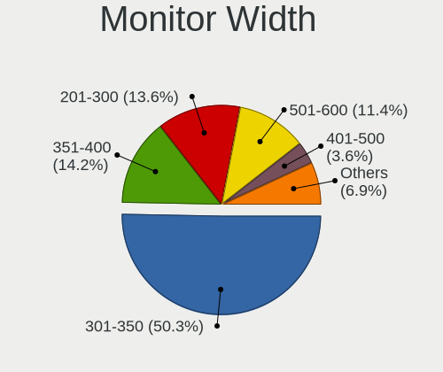

| Width in mm | Notebooks | Percent |
|-------------|-----------|---------|
| 301-350     | 230       | 55.83%  |
| 351-400     | 64        | 15.53%  |
| 201-300     | 44        | 10.68%  |
| 501-600     | 32        | 7.77%   |
| 1-100       | 10        | 2.43%   |
| 801-900     | 6         | 1.46%   |
| 601-700     | 6         | 1.46%   |
| 1501-2000   | 6         | 1.46%   |
| 401-500     | 5         | 1.21%   |
| Unknown     | 5         | 1.21%   |
| 701-800     | 2         | 0.49%   |
| 1001-1500   | 2         | 0.49%   |

Aspect Ratio
------------

Proportional relationship between the width and the height

| Ratio   | Notebooks | Percent |
|---------|-----------|---------|
| 16/9    | 297       | 79.2%   |
| 16/10   | 54        | 14.4%   |
| 0.67    | 8         | 2.13%   |
| 3/2     | 6         | 1.6%    |
| 5/4     | 2         | 0.53%   |
| 32/9    | 2         | 0.53%   |
| 21/9    | 2         | 0.53%   |
| 0.62    | 2         | 0.53%   |
| 3.73    | 1         | 0.27%   |
| Unknown | 1         | 0.27%   |

Monitor Area
------------

Area in inch²

| Area in inch² | Notebooks | Percent |
|----------------|-----------|---------|
| 101-110        | 152       | 36.63%  |
| 81-90          | 81        | 19.52%  |
| 121-130        | 53        | 12.77%  |
| 201-250        | 22        | 5.3%    |
| 71-80          | 17        | 4.1%    |
| 301-350        | 12        | 2.89%   |
| 1-40           | 10        | 2.41%   |
| 111-120        | 10        | 2.41%   |
| 351-500        | 8         | 1.93%   |
| More than 1000 | 7         | 1.69%   |
| 61-70          | 6         | 1.45%   |
| 501-1000       | 6         | 1.45%   |
| 91-100         | 6         | 1.45%   |
| 51-60          | 5         | 1.2%    |
| Unknown        | 5         | 1.2%    |
| 251-300        | 4         | 0.96%   |
| 131-140        | 4         | 0.96%   |
| 141-150        | 3         | 0.72%   |
| 41-50          | 2         | 0.48%   |
| 151-200        | 2         | 0.48%   |

Pixel Density
-------------

Pixels per inch

| Density       | Notebooks | Percent |
|---------------|-----------|---------|
| 121-160       | 174       | 42.75%  |
| 101-120       | 100       | 24.57%  |
| 161-240       | 57        | 14%     |
| 51-100        | 47        | 11.55%  |
| More than 240 | 21        | 5.16%   |
| Unknown       | 5         | 1.23%   |
| 1-50          | 3         | 0.74%   |

Multiple Monitors
-----------------

Total monitors connected

| Total | Notebooks | Percent |
|-------|-----------|---------|
| 1     | 301       | 81.35%  |
| 2     | 54        | 14.59%  |
| 0     | 10        | 2.7%    |
| 3     | 5         | 1.35%   |

Network
-------

Net Controller Vendor
---------------------

Controller vendors

| Vendor                            | Notebooks | Percent |
|-----------------------------------|-----------|---------|
| Intel                             | 205       | 34.4%   |
| Realtek Semiconductor             | 187       | 31.38%  |
| Qualcomm Atheros                  | 78        | 13.09%  |
| Broadcom                          | 25        | 4.19%   |
| MediaTek                          | 20        | 3.36%   |
| Broadcom Limited                  | 9         | 1.51%   |
| Lenovo                            | 8         | 1.34%   |
| ASIX Electronics                  | 7         | 1.17%   |
| Qualcomm                          | 5         | 0.84%   |
| Marvell Technology Group          | 5         | 0.84%   |
| Fibocom                           | 5         | 0.84%   |
| Sierra Wireless                   | 4         | 0.67%   |
| Samsung Electronics               | 4         | 0.67%   |
| Ericsson Business Mobile Networks | 4         | 0.67%   |
| TP-Link                           | 3         | 0.5%    |
| Ralink Technology                 | 3         | 0.5%    |
| Nvidia                            | 3         | 0.5%    |
| DisplayLink                       | 3         | 0.5%    |
| Dell                              | 3         | 0.5%    |
| Ralink                            | 2         | 0.34%   |
| Huawei Technologies               | 2         | 0.34%   |
| Hewlett-Packard                   | 2         | 0.34%   |
| D-Link System                     | 2         | 0.34%   |
| Xiaomi                            | 1         | 0.17%   |
| OnePlus Technology (Shenzhen)     | 1         | 0.17%   |
| MicroPython                       | 1         | 0.17%   |
| JMicron Technology                | 1         | 0.17%   |
| Dresden Elektronik                | 1         | 0.17%   |
| D-Link                            | 1         | 0.17%   |
| Belkin Components                 | 1         | 0.17%   |

Net Controller Model
--------------------

Controller models

| Model                                                             | Notebooks | Percent |
|-------------------------------------------------------------------|-----------|---------|
| Realtek RTL8111/8168/8411 PCI Express Gigabit Ethernet Controller | 109       | 15.03%  |
| Realtek RTL8153 Gigabit Ethernet Adapter                          | 23        | 3.17%   |
| Intel Wireless 8265 / 8275                                        | 21        | 2.9%    |
| Realtek RTL8822CE 802.11ac PCIe Wireless Network Adapter          | 19        | 2.62%   |
| Intel Alder Lake-P PCH CNVi WiFi                                  | 18        | 2.48%   |
| Realtek RTL810xE PCI Express Fast Ethernet controller             | 16        | 2.21%   |
| Intel 82579LM Gigabit Network Connection (Lewisville)             | 16        | 2.21%   |
| Qualcomm Atheros AR9485 Wireless Network Adapter                  | 15        | 2.07%   |
| Intel Wireless 7265                                               | 15        | 2.07%   |
| Intel Centrino Advanced-N 6205 [Taylor Peak]                      | 14        | 1.93%   |
| Qualcomm Atheros AR9285 Wireless Network Adapter (PCI-Express)    | 13        | 1.79%   |
| Intel Wi-Fi 6 AX200                                               | 11        | 1.52%   |
| Realtek RTL8821CE 802.11ac PCIe Wireless Network Adapter          | 10        | 1.38%   |
| Qualcomm Atheros QCA9377 802.11ac Wireless Network Adapter        | 10        | 1.38%   |
| Intel Raptor Lake PCH CNVi WiFi                                   | 10        | 1.38%   |
| Intel Ethernet Connection (4) I219-LM                             | 10        | 1.38%   |
| Qualcomm Atheros AR8151 v2.0 Gigabit Ethernet                     | 9         | 1.24%   |
| Intel Wireless 7260                                               | 9         | 1.24%   |
| MediaTek MT7922 802.11ax PCI Express Wireless Network Adapter     | 8         | 1.1%    |
| Intel Wireless 8260                                               | 8         | 1.1%    |
| Intel Wireless 3165                                               | 8         | 1.1%    |
| MediaTek MT7921 802.11ax PCI Express Wireless Network Adapter     | 7         | 0.97%   |
| Intel Wi-Fi 6 AX201                                               | 7         | 0.97%   |
| Intel Ethernet Connection I217-LM                                 | 7         | 0.97%   |
| ASIX AX88179 Gigabit Ethernet                                     | 7         | 0.97%   |
| Realtek RTL8125 2.5GbE Controller                                 | 6         | 0.83%   |
| Qualcomm Atheros QCA9565 / AR9565 Wireless Network Adapter        | 6         | 0.83%   |
| Qualcomm Atheros QCA6174 802.11ac Wireless Network Adapter        | 6         | 0.83%   |
| Intel Wi-Fi 6 AX210/AX211/AX411 160MHz                            | 6         | 0.83%   |
| Intel Ethernet Connection (4) I219-V                              | 6         | 0.83%   |
| Intel Centrino Ultimate-N 6300                                    | 6         | 0.83%   |
| Realtek RTL8852BE PCIe 802.11ax Wireless Network Controller       | 5         | 0.69%   |
| Qualcomm QCNFA765 Wireless Network Adapter                        | 5         | 0.69%   |
| Qualcomm Atheros AR9462 Wireless Network Adapter                  | 5         | 0.69%   |
| Qualcomm Atheros AR9287 Wireless Network Adapter (PCI-Express)    | 5         | 0.69%   |
| Intel Ethernet Connection (3) I218-LM                             | 5         | 0.69%   |
| Intel Comet Lake PCH-LP CNVi WiFi                                 | 5         | 0.69%   |
| Intel Comet Lake PCH CNVi WiFi                                    | 5         | 0.69%   |
| Intel Cannon Lake PCH CNVi WiFi                                   | 5         | 0.69%   |
| Fibocom L830-EB-00 LTE WWAN Modem                                 | 5         | 0.69%   |

Wireless Vendor
---------------

Wireless vendors

| Vendor                            | Notebooks | Percent |
|-----------------------------------|-----------|---------|
| Intel                             | 199       | 50.9%   |
| Qualcomm Atheros                  | 62        | 15.86%  |
| Realtek Semiconductor             | 55        | 14.07%  |
| Broadcom                          | 22        | 5.63%   |
| MediaTek                          | 18        | 4.6%    |
| Qualcomm                          | 5         | 1.28%   |
| Fibocom                           | 5         | 1.28%   |
| Broadcom Limited                  | 5         | 1.28%   |
| Sierra Wireless                   | 4         | 1.02%   |
| TP-Link                           | 3         | 0.77%   |
| Ralink Technology                 | 3         | 0.77%   |
| Ralink                            | 2         | 0.51%   |
| Dell                              | 2         | 0.51%   |
| D-Link System                     | 2         | 0.51%   |
| Hewlett-Packard                   | 1         | 0.26%   |
| Ericsson Business Mobile Networks | 1         | 0.26%   |
| D-Link                            | 1         | 0.26%   |
| Belkin Components                 | 1         | 0.26%   |

Wireless Model
--------------

Wireless models

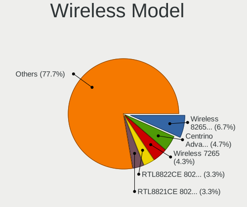

| Model                                                          | Notebooks | Percent |
|----------------------------------------------------------------|-----------|---------|
| Intel Wireless 8265 / 8275                                     | 21        | 5.36%   |
| Realtek RTL8822CE 802.11ac PCIe Wireless Network Adapter       | 19        | 4.85%   |
| Intel Alder Lake-P PCH CNVi WiFi                               | 18        | 4.59%   |
| Qualcomm Atheros AR9485 Wireless Network Adapter               | 15        | 3.83%   |
| Intel Wireless 7265                                            | 15        | 3.83%   |
| Intel Centrino Advanced-N 6205 [Taylor Peak]                   | 14        | 3.57%   |
| Qualcomm Atheros AR9285 Wireless Network Adapter (PCI-Express) | 13        | 3.32%   |
| Intel Wi-Fi 6 AX200                                            | 11        | 2.81%   |
| Realtek RTL8821CE 802.11ac PCIe Wireless Network Adapter       | 10        | 2.55%   |
| Qualcomm Atheros QCA9377 802.11ac Wireless Network Adapter     | 10        | 2.55%   |
| Intel Raptor Lake PCH CNVi WiFi                                | 10        | 2.55%   |
| Intel Wireless 7260                                            | 9         | 2.3%    |
| MediaTek MT7922 802.11ax PCI Express Wireless Network Adapter  | 8         | 2.04%   |
| Intel Wireless 8260                                            | 8         | 2.04%   |
| Intel Wireless 3165                                            | 8         | 2.04%   |
| MediaTek MT7921 802.11ax PCI Express Wireless Network Adapter  | 7         | 1.79%   |
| Intel Wi-Fi 6 AX201                                            | 7         | 1.79%   |
| Qualcomm Atheros QCA9565 / AR9565 Wireless Network Adapter     | 6         | 1.53%   |
| Qualcomm Atheros QCA6174 802.11ac Wireless Network Adapter     | 6         | 1.53%   |
| Intel Wi-Fi 6 AX210/AX211/AX411 160MHz                         | 6         | 1.53%   |
| Intel Centrino Ultimate-N 6300                                 | 6         | 1.53%   |
| Realtek RTL8852BE PCIe 802.11ax Wireless Network Controller    | 5         | 1.28%   |
| Qualcomm QCNFA765 Wireless Network Adapter                     | 5         | 1.28%   |
| Qualcomm Atheros AR9462 Wireless Network Adapter               | 5         | 1.28%   |
| Qualcomm Atheros AR9287 Wireless Network Adapter (PCI-Express) | 5         | 1.28%   |
| Intel Comet Lake PCH-LP CNVi WiFi                              | 5         | 1.28%   |
| Intel Comet Lake PCH CNVi WiFi                                 | 5         | 1.28%   |
| Intel Cannon Lake PCH CNVi WiFi                                | 5         | 1.28%   |
| Fibocom L830-EB-00 LTE WWAN Modem                              | 5         | 1.28%   |
| Realtek RTL8852AE 802.11ax PCIe Wireless Network Adapter       | 4         | 1.02%   |
| Realtek RTL8723DE Wireless Network Adapter                     | 4         | 1.02%   |
| Intel Wireless 3160                                            | 4         | 1.02%   |
| Intel PRO/Wireless 4965 AG or AGN [Kedron] Network Connection  | 4         | 1.02%   |
| Intel Dual Band Wireless-AC 3168NGW [Stone Peak]               | 4         | 1.02%   |
| Intel Centrino Wireless-N 2230                                 | 4         | 1.02%   |
| Intel Cannon Point-LP CNVi [Wireless-AC]                       | 4         | 1.02%   |
| Broadcom BCM43142 802.11b/g/n                                  | 4         | 1.02%   |
| Broadcom BCM4313 802.11bgn Wireless Network Adapter            | 4         | 1.02%   |
| Realtek RTL8723BE PCIe Wireless Network Adapter                | 3         | 0.77%   |
| Intel Wireless-AC 9260                                         | 3         | 0.77%   |

Ethernet Vendor
---------------

Ethernet vendors

| Vendor                        | Notebooks | Percent |
|-------------------------------|-----------|---------|
| Realtek Semiconductor         | 159       | 49.53%  |
| Intel                         | 85        | 26.48%  |
| Qualcomm Atheros              | 31        | 9.66%   |
| Broadcom                      | 8         | 2.49%   |
| Lenovo                        | 7         | 2.18%   |
| ASIX Electronics              | 7         | 2.18%   |
| Marvell Technology Group      | 5         | 1.56%   |
| Broadcom Limited              | 4         | 1.25%   |
| Samsung Electronics           | 3         | 0.93%   |
| Nvidia                        | 3         | 0.93%   |
| DisplayLink                   | 3         | 0.93%   |
| MediaTek                      | 2         | 0.62%   |
| Xiaomi                        | 1         | 0.31%   |
| OnePlus Technology (Shenzhen) | 1         | 0.31%   |
| JMicron Technology            | 1         | 0.31%   |
| Huawei Technologies           | 1         | 0.31%   |

Ethernet Model
--------------

Ethernet models

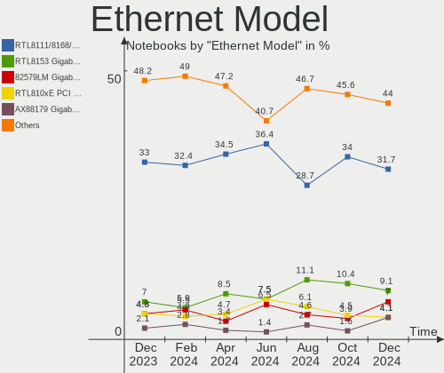

| Model                                                             | Notebooks | Percent |
|-------------------------------------------------------------------|-----------|---------|
| Realtek RTL8111/8168/8411 PCI Express Gigabit Ethernet Controller | 109       | 33.75%  |
| Realtek RTL8153 Gigabit Ethernet Adapter                          | 23        | 7.12%   |
| Realtek RTL810xE PCI Express Fast Ethernet controller             | 16        | 4.95%   |
| Intel 82579LM Gigabit Network Connection (Lewisville)             | 16        | 4.95%   |
| Intel Ethernet Connection (4) I219-LM                             | 10        | 3.1%    |
| Qualcomm Atheros AR8151 v2.0 Gigabit Ethernet                     | 9         | 2.79%   |
| Intel Ethernet Connection I217-LM                                 | 7         | 2.17%   |
| ASIX AX88179 Gigabit Ethernet                                     | 7         | 2.17%   |
| Realtek RTL8125 2.5GbE Controller                                 | 6         | 1.86%   |
| Intel Ethernet Connection (4) I219-V                              | 6         | 1.86%   |
| Intel Ethernet Connection (3) I218-LM                             | 5         | 1.55%   |
| Qualcomm Atheros AR8161 Gigabit Ethernet                          | 4         | 1.24%   |
| Intel Ethernet Connection I219-V                                  | 4         | 1.24%   |
| Intel Ethernet Connection I218-LM                                 | 4         | 1.24%   |
| Samsung Galaxy series, misc. (tethering mode)                     | 3         | 0.93%   |
| Realtek Killer E2600 Gigabit Ethernet Controller                  | 3         | 0.93%   |
| Qualcomm Atheros Killer E220x Gigabit Ethernet Controller         | 3         | 0.93%   |
| Lenovo ThinkPad Lan                                               | 3         | 0.93%   |
| Intel Ethernet Connection (5) I219-LM                             | 3         | 0.93%   |
| Intel Ethernet Connection (16) I219-LM                            | 3         | 0.93%   |
| Intel 82577LM Gigabit Network Connection                          | 3         | 0.93%   |
| Broadcom Limited NetLink BCM57780 Gigabit Ethernet PCIe           | 3         | 0.93%   |
| Realtek USB 10/100/1G/2.5G LAN                                    | 2         | 0.62%   |
| Qualcomm Atheros QCA8172 Fast Ethernet                            | 2         | 0.62%   |
| Qualcomm Atheros Killer E2400 Gigabit Ethernet Controller         | 2         | 0.62%   |
| Qualcomm Atheros AR8162 Fast Ethernet                             | 2         | 0.62%   |
| Qualcomm Atheros AR8131 Gigabit Ethernet                          | 2         | 0.62%   |
| Qualcomm Atheros AR8121/AR8113/AR8114 Gigabit or Fast Ethernet    | 2         | 0.62%   |
| Nvidia MCP79 Ethernet                                             | 2         | 0.62%   |
| MediaTek M40Air_EEA                                               | 2         | 0.62%   |
| Marvell Group 88E8055 PCI-E Gigabit Ethernet Controller           | 2         | 0.62%   |
| Lenovo ThinkPad TBT 3 Dock                                        | 2         | 0.62%   |
| Intel Ethernet Connection I219-LM                                 | 2         | 0.62%   |
| Intel Ethernet Connection (7) I219-LM                             | 2         | 0.62%   |
| Intel Ethernet Connection (6) I219-LM                             | 2         | 0.62%   |
| Intel Ethernet Connection (23) I219-V                             | 2         | 0.62%   |
| Intel 82579V Gigabit Network Connection                           | 2         | 0.62%   |
| Intel 82567LM Gigabit Network Connection                          | 2         | 0.62%   |
| Broadcom NetXtreme BCM5764M Gigabit Ethernet PCIe                 | 2         | 0.62%   |
| Xiaomi Mi/Redmi series (RNDIS)                                    | 1         | 0.31%   |

Net Controller Kind
-------------------

Ethernet, WiFi or modem

| Kind     | Notebooks | Percent |
|----------|-----------|---------|
| WiFi     | 367       | 54.05%  |
| Ethernet | 302       | 44.48%  |
| Modem    | 10        | 1.47%   |

Used Controller
---------------

Currently used network controller

| Kind     | Notebooks | Percent |
|----------|-----------|---------|
| WiFi     | 304       | 78.76%  |
| Ethernet | 82        | 21.24%  |

NICs
----

Total network controllers on board

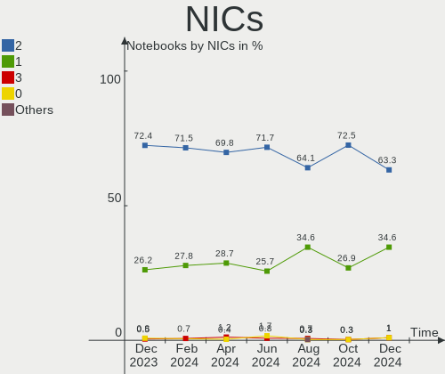

| Total | Notebooks | Percent |
|-------|-----------|---------|
| 2     | 268       | 72.43%  |
| 1     | 97        | 26.22%  |
| 0     | 3         | 0.81%   |
| 3     | 2         | 0.54%   |

IPv6
----

IPv6 vs IPv4

| Used | Notebooks | Percent |
|------|-----------|---------|
| Yes  | 228       | 61.62%  |
| No   | 142       | 38.38%  |

Bluetooth
---------

Bluetooth Vendor
----------------

Controller vendors

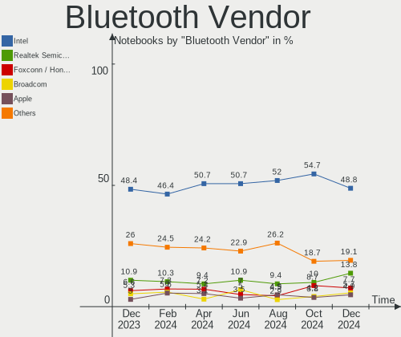

| Vendor                          | Notebooks | Percent |
|---------------------------------|-----------|---------|
| Intel                           | 147       | 48.36%  |
| Realtek Semiconductor           | 33        | 10.86%  |
| IMC Networks                    | 22        | 7.24%   |
| Foxconn / Hon Hai               | 20        | 6.58%   |
| Broadcom                        | 16        | 5.26%   |
| Qualcomm Atheros Communications | 14        | 4.61%   |
| Lite-On Technology              | 9         | 2.96%   |
| Apple                           | 9         | 2.96%   |
| Dell                            | 5         | 1.64%   |
| MediaTek                        | 4         | 1.32%   |
| Cambridge Silicon Radio         | 4         | 1.32%   |
| Realtek                         | 3         | 0.99%   |
| Hewlett-Packard                 | 3         | 0.99%   |
| Askey Computer                  | 3         | 0.99%   |
| USI                             | 2         | 0.66%   |
| Toshiba                         | 2         | 0.66%   |
| Taiyo Yuden                     | 2         | 0.66%   |
| Foxconn International           | 2         | 0.66%   |
| Alps Electric                   | 2         | 0.66%   |
| Ralink                          | 1         | 0.33%   |
| ASUSTek Computer                | 1         | 0.33%   |

Bluetooth Model
---------------

Controller models

| Model                                               | Notebooks | Percent |
|-----------------------------------------------------|-----------|---------|
| Intel Bluetooth wireless interface                  | 59        | 19.41%  |
| Intel Bluetooth Device                              | 43        | 14.14%  |
| Realtek Bluetooth Radio                             | 26        | 8.55%   |
| Intel Bluetooth 9460/9560 Jefferson Peak (JfP)      | 18        | 5.92%   |
| Intel AX200 Bluetooth                               | 10        | 3.29%   |
| IMC Networks 802.11ac WLAN Adapter                  | 8         | 2.63%   |
| Qualcomm Atheros  Bluetooth Device                  | 6         | 1.97%   |
| Realtek  Bluetooth 4.2 Adapter                      | 5         | 1.64%   |
| Intel Centrino Bluetooth Wireless Transceiver       | 5         | 1.64%   |
| IMC Networks Bluetooth Radio                        | 5         | 1.64%   |
| Foxconn / Hon Hai Bluetooth Device                  | 5         | 1.64%   |
| Qualcomm Atheros AR3012 Bluetooth 4.0               | 4         | 1.32%   |
| MediaTek Wireless_Device                            | 4         | 1.32%   |
| Lite-On Bluetooth Device                            | 4         | 1.32%   |
| Intel Wireless-AC 3168 Bluetooth                    | 4         | 1.32%   |
| Intel AX210 Bluetooth                               | 4         | 1.32%   |
| IMC Networks Wireless_Device                        | 4         | 1.32%   |
| Foxconn / Hon Hai BCM20702A0                        | 4         | 1.32%   |
| Cambridge Silicon Radio Bluetooth Dongle (HCI mode) | 4         | 1.32%   |
| Broadcom BCM2045B (BDC-2.1)                         | 4         | 1.32%   |
| Apple Bluetooth USB Host Controller                 | 4         | 1.32%   |
| Apple Bluetooth Host Controller                     | 4         | 1.32%   |
| Realtek Bluetooth Radio                             | 3         | 0.99%   |
| Qualcomm Atheros QCA61x4 Bluetooth 4.0              | 3         | 0.99%   |
| Lite-On Wireless_Device                             | 3         | 0.99%   |
| Intel Wireless-AC 9260 Bluetooth Adapter            | 3         | 0.99%   |
| HP Broadcom 2070 Bluetooth Combo                    | 3         | 0.99%   |
| Foxconn / Hon Hai Bluetooth Adapter                 | 3         | 0.99%   |
| Broadcom BCM20702 Bluetooth 4.0 [ThinkPad]          | 3         | 0.99%   |
| Askey Bluetooth Device                              | 3         | 0.99%   |
| USI Bluetooth Device                                | 2         | 0.66%   |
| Realtek RTL8822BE Bluetooth 4.2 Adapter             | 2         | 0.66%   |
| Lite-On Qualcomm Atheros QCA9377 Bluetooth          | 2         | 0.66%   |
| IMC Networks Bluetooth Device                       | 2         | 0.66%   |
| Foxconn International BCM43142A0 Bluetooth module   | 2         | 0.66%   |
| Foxconn / Hon Hai Wireless_Device                   | 2         | 0.66%   |
| Foxconn / Hon Hai MediaTek Bluetooth Adapter        | 2         | 0.66%   |
| Foxconn / Hon Hai Bluetooth USB Host Controller     | 2         | 0.66%   |
| Dell DW375 Bluetooth Module                         | 2         | 0.66%   |
| Broadcom BCM2070 Bluetooth 2.1 + EDR                | 2         | 0.66%   |

Sound
-----

Sound Vendor
------------

Sound card vendors

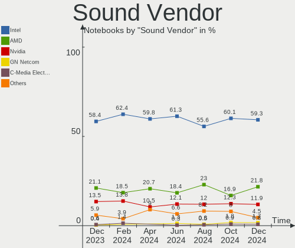

| Vendor                | Notebooks | Percent |
|-----------------------|-----------|---------|
| Intel                 | 277       | 58.44%  |
| AMD                   | 100       | 21.1%   |
| Nvidia                | 64        | 13.5%   |
| Lenovo                | 6         | 1.27%   |
| Realtek Semiconductor | 3         | 0.63%   |
| Creative Technology   | 3         | 0.63%   |
| C-Media Electronics   | 3         | 0.63%   |
| Plantronics           | 2         | 0.42%   |
| GN Netcom             | 2         | 0.42%   |
| Dell                  | 2         | 0.42%   |
| Thomann               | 1         | 0.21%   |
| Texas Instruments     | 1         | 0.21%   |
| TerraTec Electronic   | 1         | 0.21%   |
| Sony                  | 1         | 0.21%   |
| SM950T Microphone     | 1         | 0.21%   |
| Silicon Motion        | 1         | 0.21%   |
| Samsung Electronics   | 1         | 0.21%   |
| Huawei Technologies   | 1         | 0.21%   |
| Hewlett-Packard       | 1         | 0.21%   |
| Goldvish              | 1         | 0.21%   |
| Audio-Technica        | 1         | 0.21%   |
| Unknown               | 1         | 0.21%   |

Sound Model
-----------

Sound card models

| Model                                                                      | Notebooks | Percent |
|----------------------------------------------------------------------------|-----------|---------|
| AMD Family 17h/19h HD Audio Controller                                     | 56        | 9.74%   |
| Intel Sunrise Point-LP HD Audio                                            | 52        | 9.04%   |
| Intel 7 Series/C216 Chipset Family High Definition Audio Controller        | 30        | 5.22%   |
| AMD Renoir Radeon High Definition Audio Controller                         | 30        | 5.22%   |
| AMD Rembrandt Radeon High Definition Audio Controller                      | 22        | 3.83%   |
| Intel Alder Lake PCH-P High Definition Audio Controller                    | 21        | 3.65%   |
| Intel 6 Series/C200 Series Chipset Family High Definition Audio Controller | 20        | 3.48%   |
| Intel 8 Series/C220 Series Chipset High Definition Audio Controller        | 15        | 2.61%   |
| Nvidia Audio device                                                        | 14        | 2.43%   |
| Intel Tiger Lake-LP Smart Sound Technology Audio Controller                | 13        | 2.26%   |
| Intel Xeon E3-1200 v3/4th Gen Core Processor HD Audio Controller           | 12        | 2.09%   |
| Intel Broadwell-U Audio Controller                                         | 12        | 2.09%   |
| Intel Wildcat Point-LP High Definition Audio Controller                    | 11        | 1.91%   |
| Intel Haswell-ULT HD Audio Controller                                      | 11        | 1.91%   |
| Intel Cannon Lake PCH cAVS                                                 | 11        | 1.91%   |
| Intel 8 Series HD Audio Controller                                         | 11        | 1.91%   |
| Intel 5 Series/3400 Series Chipset High Definition Audio                   | 11        | 1.91%   |
| AMD Raven/Raven2/Fenghuang HDMI/DP Audio Controller                        | 11        | 1.91%   |
| Intel Raptor Lake-P/U/H cAVS                                               | 10        | 1.74%   |
| Intel 82801I (ICH9 Family) HD Audio Controller                             | 10        | 1.74%   |
| AMD SBx00 Azalia (Intel HDA)                                               | 9         | 1.57%   |
| Intel Comet Lake PCH-LP cAVS                                               | 6         | 1.04%   |
| Intel Celeron/Pentium Silver Processor High Definition Audio               | 6         | 1.04%   |
| Intel Cannon Point-LP High Definition Audio Controller                     | 6         | 1.04%   |
| Intel 82801H (ICH8 Family) HD Audio Controller                             | 6         | 1.04%   |
| AMD FCH Azalia Controller                                                  | 6         | 1.04%   |
| Nvidia GP107GL High Definition Audio Controller                            | 5         | 0.87%   |
| Nvidia GK107 HDMI Audio Controller                                         | 5         | 0.87%   |
| Nvidia GA104 High Definition Audio Controller                              | 5         | 0.87%   |
| Intel Comet Lake PCH cAVS                                                  | 5         | 0.87%   |
| Intel CM238 HD Audio Controller                                            | 5         | 0.87%   |
| Intel 100 Series/C230 Series Chipset Family HD Audio Controller            | 5         | 0.87%   |
| Nvidia TU107 GeForce GTX 1650 High Definition Audio Controller             | 4         | 0.7%    |
| Nvidia GF108 High Definition Audio Controller                              | 4         | 0.7%    |
| Nvidia GA106 High Definition Audio Controller                              | 4         | 0.7%    |
| Intel Celeron N3350/Pentium N4200/Atom E3900 Series Audio Cluster          | 4         | 0.7%    |
| Intel Atom Processor Z36xxx/Z37xxx Series High Definition Audio Controller | 4         | 0.7%    |
| AMD Turks HDMI Audio [Radeon HD 6500/6600 / 6700M Series]                  | 4         | 0.7%    |
| AMD RS880 HDMI Audio [Radeon HD 4200 Series]                               | 4         | 0.7%    |
| AMD Kabini HDMI/DP Audio                                                   | 4         | 0.7%    |

Memory
------

Memory Vendor
-------------

Memory module vendors

| Vendor              | Notebooks | Percent |
|---------------------|-----------|---------|
| Samsung Electronics | 69        | 32.55%  |
| SK hynix            | 57        | 26.89%  |
| Micron Technology   | 29        | 13.68%  |
| Kingston            | 14        | 6.6%    |
| Unknown             | 8         | 3.77%   |
| Crucial             | 7         | 3.3%    |
| Elpida              | 6         | 2.83%   |
| Unknown (ABCD)      | 3         | 1.42%   |
| A-DATA Technology   | 3         | 1.42%   |
| Unknown             | 3         | 1.42%   |
| Ramaxel Technology  | 2         | 0.94%   |
| Nanya Technology    | 2         | 0.94%   |
| G.Skill             | 2         | 0.94%   |
| TwinMOS             | 1         | 0.47%   |
| TakeMS              | 1         | 0.47%   |
| SHARETRONIC         | 1         | 0.47%   |
| Sesame              | 1         | 0.47%   |
| Neo Forza           | 1         | 0.47%   |
| Corsair             | 1         | 0.47%   |
| ChangXin Memory     | 1         | 0.47%   |

Memory Model
------------

Memory module models

| Model                                                            | Notebooks | Percent |
|------------------------------------------------------------------|-----------|---------|
| Samsung RAM M471A1K43EB1-CWE 8GB SODIMM DDR4 3200MT/s            | 6         | 2.59%   |
| SK hynix RAM HYMP125S64CP8-Y5 2GB SODIMM DDR2 667MT/s            | 4         | 1.72%   |
| SK hynix RAM HMA81GS6AFR8N-UH 8GB SODIMM DDR4 2667MT/s           | 4         | 1.72%   |
| Samsung RAM M471B1G73QH0-YK0 8GB SODIMM DDR3 1867MT/s            | 4         | 1.72%   |
| Unknown (ABCD) RAM 123456789012345678 2GB SODIMM LPDDR4 2400MT/s | 3         | 1.29%   |
| SK hynix RAM HMT41GS6AFR8A-PB 8GB SODIMM DDR3 1600MT/s           | 3         | 1.29%   |
| SK hynix RAM HMA81GS6CJR8N-VK 8GB SODIMM DDR4 2667MT/s           | 3         | 1.29%   |
| Samsung RAM M471B5773CHS-CH9 2GB SODIMM DDR3 4199MT/s            | 3         | 1.29%   |
| Samsung RAM M471B5273DH0-CH9 4096MB SODIMM DDR3 1334MT/s         | 3         | 1.29%   |
| Samsung RAM M471B5273CH0-CH9 4096MB SODIMM DDR3 1334MT/s         | 3         | 1.29%   |
| Samsung RAM M471B5173DB0-YK0 4GB SODIMM DDR3 1600MT/s            | 3         | 1.29%   |
| Samsung RAM M471A5244CB0-CTD 4GB SODIMM DDR4 3266MT/s            | 3         | 1.29%   |
| Samsung RAM M4 70T2864EH3-CE6 1GB SODIMM DDR2 800MT/s            | 3         | 1.29%   |
| Unknown                                                          | 3         | 1.29%   |
| Unknown RAM Module 2GB SODIMM DDR2 667MT/s                       | 2         | 0.86%   |
| Unknown RAM Module 1GB SODIMM DDR2 667MT/s                       | 2         | 0.86%   |
| SK hynix RAM HMT451S6BFR8A-PB 4GB SODIMM DDR3 1600MT/s           | 2         | 0.86%   |
| SK hynix RAM HMT41GS6BFR8A-PB 8GB SODIMM DDR3 1600MT/s           | 2         | 0.86%   |
| SK hynix RAM HMAA1GS6CJR6N-XN 8GB Row Of Chips DDR4 3200MT/s     | 2         | 0.86%   |
| SK hynix RAM HMA851S6CJR6N-VK 4GB SODIMM DDR4 2667MT/s           | 2         | 0.86%   |
| SK hynix RAM HMA851S6AFR6N-UH 4GB SODIMM DDR4 2400MT/s           | 2         | 0.86%   |
| SK hynix RAM HMA82GS6CJR8N-VK 16GB SODIMM DDR4 2667MT/s          | 2         | 0.86%   |
| SK hynix RAM HMA81GS6JJR8N-VK 8GB SODIMM DDR4 2667MT/s           | 2         | 0.86%   |
| Samsung RAM M471B5773DH0-CH9 2048MB SODIMM DDR3 1600MT/s         | 2         | 0.86%   |
| Samsung RAM M471B5673FH0-CF8 2GB SODIMM 1067MT/s                 | 2         | 0.86%   |
| Samsung RAM M471A5244CB0-CWE 4GB SODIMM DDR4 3200MT/s            | 2         | 0.86%   |
| Samsung RAM M471A2K43DB1-CWE 16GB SODIMM DDR4 3200MT/s           | 2         | 0.86%   |
| Samsung RAM M471A2K43CB1-CRC 16GB SODIMM DDR4 2667MT/s           | 2         | 0.86%   |
| Samsung RAM M471A1K43DB1-CWE 8GB SODIMM DDR4 3200MT/s            | 2         | 0.86%   |
| Samsung RAM M471A1K43DB1-CTD 8GB SODIMM DDR4 2667MT/s            | 2         | 0.86%   |
| Samsung RAM M471A1G44BB0-CWE 8GB Row Of Chips DDR4 3200MT/s      | 2         | 0.86%   |
| Samsung RAM M425R2GA3BB0-CQKOL 16GB SODIMM DDR5 4800MT/s         | 2         | 0.86%   |
| Micron RAM MT62F2G32D4DS-026 WT 8GB SODIMM LPDDR5 7500MT/s       | 2         | 0.86%   |
| Micron RAM 4ATF1G64HZ-3G2B2 8GB SODIMM DDR4 3200MT/s             | 2         | 0.86%   |
| Kingston RAM 9905428-417.A00LF 8GB SODIMM DDR3 1600MT/s          | 2         | 0.86%   |
| Elpida RAM EBJ21UE8BAU0-AE-E 2GB SODIMM DDR3 1067MT/s            | 2         | 0.86%   |
| Crucial RAM CT102464BF160B.C16 8GB SODIMM DDR3 1600MT/s          | 2         | 0.86%   |
| Unknown RAM Module 8GB SODIMM DDR4 2667MT/s                      | 1         | 0.43%   |
| Unknown RAM Module 4GB SODIMM DDR4 2400MT/s                      | 1         | 0.43%   |
| Unknown RAM Module 4GB SODIMM DDR2 800MT/s                       | 1         | 0.43%   |

Memory Kind
-----------

Memory module kinds

| Kind   | Notebooks | Percent |
|--------|-----------|---------|
| DDR4   | 81        | 41.97%  |
| DDR3   | 62        | 32.12%  |
| DDR5   | 12        | 6.22%   |
| DDR2   | 11        | 5.7%    |
| LPDDR5 | 9         | 4.66%   |
| LPDDR4 | 7         | 3.63%   |
| LPDDR3 | 6         | 3.11%   |
| SDRAM  | 5         | 2.59%   |

Memory Form Factor
------------------

Physical design of the memory module

| Name         | Notebooks | Percent |
|--------------|-----------|---------|
| SODIMM       | 168       | 87.05%  |
| Row Of Chips | 20        | 10.36%  |
| Chip         | 3         | 1.55%   |
| DIMM         | 1         | 0.52%   |
| Unknown      | 1         | 0.52%   |

Memory Size
-----------

Memory module size

| Size  | Notebooks | Percent |
|-------|-----------|---------|
| 8192  | 85        | 40.67%  |
| 4096  | 51        | 24.4%   |
| 16384 | 32        | 15.31%  |
| 2048  | 27        | 12.92%  |
| 32768 | 7         | 3.35%   |
| 1024  | 7         | 3.35%   |

Memory Speed
------------

Memory module speed

| Speed | Notebooks | Percent |
|-------|-----------|---------|
| 3200  | 43        | 20.67%  |
| 1600  | 40        | 19.23%  |
| 2667  | 37        | 17.79%  |
| 1334  | 11        | 5.29%   |
| 2400  | 9         | 4.33%   |
| 4800  | 8         | 3.85%   |
| 667   | 8         | 3.85%   |
| 6400  | 6         | 2.88%   |
| 1333  | 6         | 2.88%   |
| 1067  | 6         | 2.88%   |
| 800   | 5         | 2.4%    |
| 5600  | 4         | 1.92%   |
| 4199  | 4         | 1.92%   |
| 2133  | 4         | 1.92%   |
| 3266  | 3         | 1.44%   |
| 1867  | 3         | 1.44%   |
| 7500  | 2         | 0.96%   |
| 4267  | 2         | 0.96%   |
| 7467  | 1         | 0.48%   |
| 4266  | 1         | 0.48%   |
| 3733  | 1         | 0.48%   |
| 2933  | 1         | 0.48%   |
| 2048  | 1         | 0.48%   |
| 1066  | 1         | 0.48%   |
| 333   | 1         | 0.48%   |

Printers & scanners
-------------------

Printer Vendor
--------------

Printer device vendors

| Vendor              | Notebooks | Percent |
|---------------------|-----------|---------|
| Samsung Electronics | 2         | 28.57%  |
| Brother Industries  | 2         | 28.57%  |
| Minolta             | 1         | 14.29%  |
| Hewlett-Packard     | 1         | 14.29%  |
| Dymo-CoStar         | 1         | 14.29%  |

Printer Model
-------------

Printer device models

| Model                       | Notebooks | Percent |
|-----------------------------|-----------|---------|
| Samsung M267x 287x Series   | 1         | 14.29%  |
| Samsung C48x Series         | 1         | 14.29%  |
| Minolta PagePro 1300W       | 1         | 14.29%  |
| HP LaserJet 1020            | 1         | 14.29%  |
| Dymo-CoStar LabelWriter 400 | 1         | 14.29%  |
| Brother MFC-J5730DW         | 1         | 14.29%  |
| Brother DCP-L2530DW series  | 1         | 14.29%  |

Scanner Vendor
--------------

Scanner device vendors

| Vendor | Notebooks | Percent |
|--------|-----------|---------|
| Canon  | 1         | 100%    |

Scanner Model
-------------

Scanner device models

| Model                   | Notebooks | Percent |
|-------------------------|-----------|---------|
| Canon CanoScan LiDE 220 | 1         | 100%    |

Camera
------

Camera Vendor
-------------

Camera device vendors

| Vendor                                 | Notebooks | Percent |
|----------------------------------------|-----------|---------|
| Chicony Electronics                    | 101       | 30.98%  |
| IMC Networks                           | 28        | 8.59%   |
| Microdia                               | 22        | 6.75%   |
| Bison Electronics                      | 21        | 6.44%   |
| Realtek Semiconductor                  | 19        | 5.83%   |
| Sunplus Innovation Technology          | 17        | 5.21%   |
| Cheng Uei Precision Industry (Foxlink) | 11        | 3.37%   |
| Syntek                                 | 10        | 3.07%   |
| Suyin                                  | 10        | 3.07%   |
| Quanta                                 | 10        | 3.07%   |
| Luxvisions Innotech Limited            | 9         | 2.76%   |
| Lite-On Technology                     | 9         | 2.76%   |
| Acer                                   | 9         | 2.76%   |
| Sonix Technology                       | 5         | 1.53%   |
| Ricoh                                  | 5         | 1.53%   |
| Apple                                  | 5         | 1.53%   |
| Silicon Motion                         | 4         | 1.23%   |
| Alcor Micro                            | 4         | 1.23%   |
| Microsoft                              | 3         | 0.92%   |
| ALi                                    | 3         | 0.92%   |
| Primax Electronics                     | 2         | 0.61%   |
| Logitech                               | 2         | 0.61%   |
| DQYGF0A9IHU4ID                         | 2         | 0.61%   |
| Z-Star Microelectronics                | 1         | 0.31%   |
| Unknown (3730304233333731323245)       | 1         | 0.31%   |
| Tripath Technology                     | 1         | 0.31%   |
| Tenveo                                 | 1         | 0.31%   |
| Shinetech                              | 1         | 0.31%   |
| Shenzhen Kingcome Optoelectronic       | 1         | 0.31%   |
| LG Innotek                             | 1         | 0.31%   |
| Lenovo                                 | 1         | 0.31%   |
| Importek                               | 1         | 0.31%   |
| icSpring                               | 1         | 0.31%   |
| Genesys Logic                          | 1         | 0.31%   |
| Elecom                                 | 1         | 0.31%   |
| DigiTech                               | 1         | 0.31%   |
| BKX-210918                             | 1         | 0.31%   |
| Unknown                                | 1         | 0.31%   |

Camera Model
------------

Camera device models

| Model                                                           | Notebooks | Percent |
|-----------------------------------------------------------------|-----------|---------|
| Chicony Integrated Camera                                       | 20        | 6.04%   |
| Chicony FJ Camera                                               | 12        | 3.63%   |
| Syntek Integrated Camera                                        | 7         | 2.11%   |
| Sunplus HD WebCam                                               | 7         | 2.11%   |
| Chicony USB2.0 HD UVC WebCam                                    | 7         | 2.11%   |
| IMC Networks USB2.0 HD UVC WebCam                               | 6         | 1.81%   |
| IMC Networks Integrated Camera                                  | 6         | 1.81%   |
| Bison SunplusIT Integrated Camera                               | 6         | 1.81%   |
| Lite-On Integrated Camera                                       | 5         | 1.51%   |
| IMC Networks Integrated Webcam                                  | 5         | 1.51%   |
| Chicony Integrated IR Camera                                    | 5         | 1.51%   |
| Chicony HD WebCam                                               | 5         | 1.51%   |
| Bison Integrated Camera                                         | 5         | 1.51%   |
| Microdia Integrated Webcam                                      | 4         | 1.21%   |
| Chicony USB2.0 Camera                                           | 4         | 1.21%   |
| Chicony HP TrueVision HD Camera                                 | 4         | 1.21%   |
| Chicony HP HD Camera                                            | 4         | 1.21%   |
| Chicony EasyCamera                                              | 4         | 1.21%   |
| Suyin Acer/HP Integrated Webcam [CN0314]                        | 3         | 0.91%   |
| Sunplus Integrated_Webcam_HD                                    | 3         | 0.91%   |
| Sonix USB2.0 HD UVC WebCam                                      | 3         | 0.91%   |
| Realtek Integrated_Webcam_HD                                    | 3         | 0.91%   |
| Microdia Integrated_Webcam_HD                                   | 3         | 0.91%   |
| Microdia Integrated Webcam HD                                   | 3         | 0.91%   |
| Luxvisions Innotech Limited HP TrueVision HD Camera             | 3         | 0.91%   |
| Chicony USB 2.0 Camera                                          | 3         | 0.91%   |
| Chicony TOSHIBA Web Camera - HD                                 | 3         | 0.91%   |
| Chicony Lenovo Integrated Camera (0.3MP)                        | 3         | 0.91%   |
| Chicony Integrated Camera (1280x720@30)                         | 3         | 0.91%   |
| Chicony FHD Webcam                                              | 3         | 0.91%   |
| Cheng Uei Precision Industry (Foxlink) HP True Vision HD Camera | 3         | 0.91%   |
| Apple Built-in iSight                                           | 3         | 0.91%   |
| ALi Gateway Webcam                                              | 3         | 0.91%   |
| Acer Integrated RGB Camera                                      | 3         | 0.91%   |
| Acer BisonCam,NB Pro                                            | 3         | 0.91%   |
| Syntek Lenovo EasyCamera                                        | 2         | 0.6%    |
| Suyin 1.3M HD WebCam                                            | 2         | 0.6%    |
| Ricoh USB2.0 Camera                                             | 2         | 0.6%    |
| Realtek USB Camera                                              | 2         | 0.6%    |
| Realtek Integrated Webcam_HD                                    | 2         | 0.6%    |

Security
--------

Fingerprint Vendor
------------------

Fingerprint sensor vendors

| Vendor                     | Notebooks | Percent |
|----------------------------|-----------|---------|
| Synaptics                  | 15        | 30.61%  |
| Validity Sensors           | 14        | 28.57%  |
| Shenzhen Goodix Technology | 9         | 18.37%  |
| AuthenTec                  | 5         | 10.2%   |
| LighTuning Technology      | 4         | 8.16%   |
| Upek                       | 1         | 2.04%   |
| Samsung Electronics        | 1         | 2.04%   |

Fingerprint Model
-----------------

Fingerprint sensor models

| Model                                                                      | Notebooks | Percent |
|----------------------------------------------------------------------------|-----------|---------|
| Synaptics Metallica MIS Touch Fingerprint Reader                           | 9         | 18%     |
| Shenzhen Goodix  Fingerprint Device                                        | 6         | 12%     |
| Validity Sensors VFS495 Fingerprint Reader                                 | 4         | 8%      |
| Shenzhen Goodix Fingerprint Reader                                         | 3         | 6%      |
| Validity Sensors VFS471 Fingerprint Reader                                 | 2         | 4%      |
| Validity Sensors VFS 5011 fingerprint sensor                               | 2         | 4%      |
| Validity Sensors Synaptics VFS7552 Touch Fingerprint Sensor with PurePrint | 2         | 4%      |
| Synaptics Prometheus MIS Touch Fingerprint Reader                          | 2         | 4%      |
| Synaptics FS7604 Touch Fingerprint Sensor with PurePrint                   | 2         | 4%      |
| LighTuning ES603 Swipe Fingerprint Sensor                                  | 2         | 4%      |
| LighTuning EgisTec Touch Fingerprint Sensor                                | 2         | 4%      |
| AuthenTec AES2550 Fingerprint Sensor                                       | 2         | 4%      |
| Validity Sensors VFS7500 Touch Fingerprint Sensor                          | 1         | 2%      |
| Validity Sensors VFS5011 Fingerprint Reader                                | 1         | 2%      |
| Validity Sensors VFS491                                                    | 1         | 2%      |
| Validity Sensors VFS101 Fingerprint Reader                                 | 1         | 2%      |
| Upek Biometric Touchchip/Touchstrip Fingerprint Sensor                     | 1         | 2%      |
| Synaptics UWP WBDI Device                                                  | 1         | 2%      |
| Synaptics  WBDI Fingerprint Reader - USB 052                               | 1         | 2%      |
| Synaptics  FS7604 Touch Fingerprint Sensor with PurePrint                  | 1         | 2%      |
| Samsung Fingerprint Sensor Device - 730B                                   | 1         | 2%      |
| AuthenTec Fingerprint Sensor                                               | 1         | 2%      |
| AuthenTec AES2501 Fingerprint Sensor                                       | 1         | 2%      |
| AuthenTec AES1600                                                          | 1         | 2%      |

Chipcard Vendor
---------------

Chipcard module vendors

| Vendor      | Notebooks | Percent |
|-------------|-----------|---------|
| Alcor Micro | 17        | 44.74%  |
| Broadcom    | 12        | 31.58%  |
| Lenovo      | 6         | 15.79%  |
| O2 Micro    | 3         | 7.89%   |

Chipcard Model
--------------

Chipcard module models

| Model                                                                        | Notebooks | Percent |
|------------------------------------------------------------------------------|-----------|---------|
| Alcor Micro AU9540 Smartcard Reader                                          | 17        | 44.74%  |
| Lenovo Integrated Smart Card Reader                                          | 6         | 15.79%  |
| Broadcom BCM5880 Secure Applications Processor                               | 5         | 13.16%  |
| Broadcom 5880                                                                | 4         | 10.53%  |
| O2 Micro OZ776 CCID Smartcard Reader                                         | 3         | 7.89%   |
| Broadcom 58200                                                               | 2         | 5.26%   |
| Broadcom BCM5880 Secure Applications Processor with fingerprint swipe sensor | 1         | 2.63%   |

Unsupported
-----------

Unsupported Devices
-------------------

Total unsupported devices on board

| Total | Notebooks | Percent |
|-------|-----------|---------|
| 0     | 245       | 66.22%  |
| 1     | 101       | 27.3%   |
| 2     | 22        | 5.95%   |
| 5     | 1         | 0.27%   |
| 3     | 1         | 0.27%   |

Unsupported Device Types
------------------------

Types of unsupported devices

| Type                     | Notebooks | Percent |
|--------------------------|-----------|---------|
| Fingerprint reader       | 49        | 32.45%  |
| Graphics card            | 31        | 20.53%  |
| Chipcard                 | 30        | 19.87%  |
| Multimedia controller    | 11        | 7.28%   |
| Net/wireless             | 10        | 6.62%   |
| Camera                   | 6         | 3.97%   |
| Storage                  | 4         | 2.65%   |
| Bluetooth                | 4         | 2.65%   |
| Card reader              | 3         | 1.99%   |
| Net/ethernet             | 2         | 1.32%   |
| Communication controller | 1         | 0.66%   |

