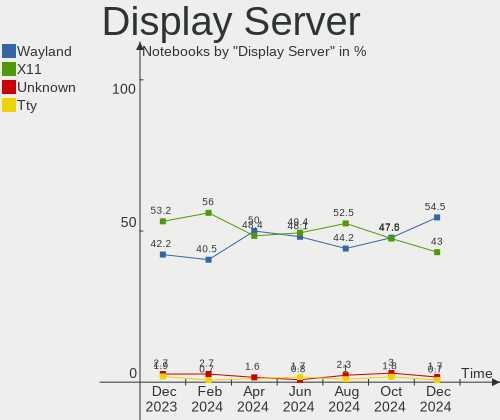
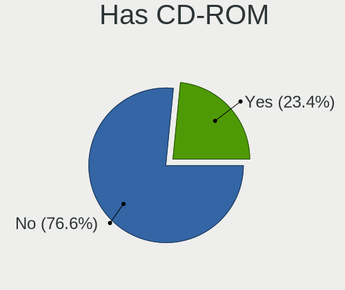
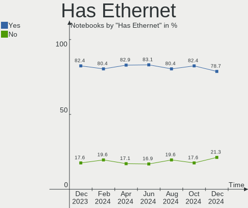
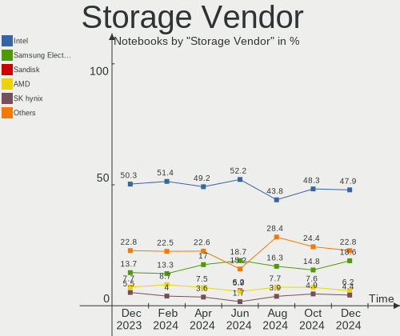
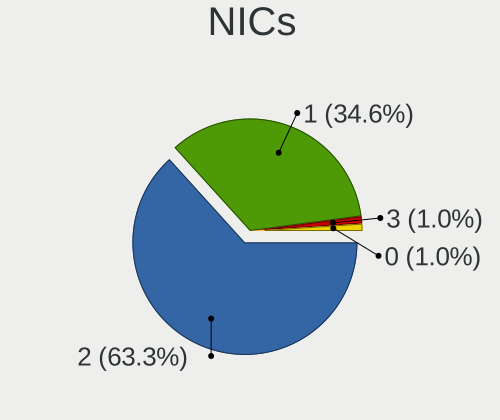

Linux in Germany - Hardware Trends (Notebooks)
----------------------------------------------

A project to identify most popular hardware characteristics and track their change
over time based on data collected by Linux users at https://Linux-Hardware.org.

Anyone can contribute to this report by the [hw-probe](https://github.com/linuxhw/hw-probe) tool:

    sudo -E hw-probe -all -upload

Period: Nov, 2023.

Contents
--------

* [ System ](#system)
  - [ OS                       ](#os)
  - [ OS Family                ](#os-family)
  - [ Kernel                   ](#kernel)
  - [ Kernel Family            ](#kernel-family)
  - [ Kernel Major Ver.        ](#kernel-major-ver)
  - [ Arch                     ](#arch)
  - [ DE                       ](#de)
  - [ Display Server           ](#display-server)
  - [ Display Manager          ](#display-manager)
  - [ OS Lang                  ](#os-lang)
  - [ Boot Mode                ](#boot-mode)
  - [ Filesystem               ](#filesystem)
  - [ Part. scheme             ](#part-scheme)
  - [ Dual Boot with Linux/BSD ](#dual-boot-with-linuxbsd)
  - [ Dual Boot (Win)          ](#dual-boot-win)

* [ Board ](#board)
  - [ Vendor                   ](#vendor)
  - [ Model                    ](#model)
  - [ Model Family             ](#model-family)
  - [ MFG Year                 ](#mfg-year)
  - [ Form Factor              ](#form-factor)
  - [ Secure Boot              ](#secure-boot)
  - [ Coreboot                 ](#coreboot)
  - [ RAM Size                 ](#ram-size)
  - [ RAM Used                 ](#ram-used)
  - [ Total Drives             ](#total-drives)
  - [ Has CD-ROM               ](#has-cd-rom)
  - [ Has Ethernet             ](#has-ethernet)
  - [ Has WiFi                 ](#has-wifi)
  - [ Has Bluetooth            ](#has-bluetooth)

* [ Location ](#location)
  - [ Country                  ](#country)
  - [ City                     ](#city)

* [ Drives ](#drives)
  - [ Drive Vendor             ](#drive-vendor)
  - [ Drive Model              ](#drive-model)
  - [ HDD Vendor               ](#hdd-vendor)
  - [ SSD Vendor               ](#ssd-vendor)
  - [ Drive Kind               ](#drive-kind)
  - [ Drive Connector          ](#drive-connector)
  - [ Drive Size               ](#drive-size)
  - [ Space Total              ](#space-total)
  - [ Space Used               ](#space-used)
  - [ Malfunc. Drives          ](#malfunc-drives)
  - [ Malfunc. Drive Vendor    ](#malfunc-drive-vendor)
  - [ Malfunc. HDD Vendor      ](#malfunc-hdd-vendor)
  - [ Malfunc. Drive Kind      ](#malfunc-drive-kind)
  - [ Failed Drives            ](#failed-drives)
  - [ Failed Drive Vendor      ](#failed-drive-vendor)
  - [ Drive Status             ](#drive-status)

* [ Storage controller ](#storage-controller)
  - [ Storage Vendor           ](#storage-vendor)
  - [ Storage Model            ](#storage-model)
  - [ Storage Kind             ](#storage-kind)

* [ Processor ](#processor)
  - [ CPU Vendor               ](#cpu-vendor)
  - [ CPU Model                ](#cpu-model)
  - [ CPU Model Family         ](#cpu-model-family)
  - [ CPU Cores                ](#cpu-cores)
  - [ CPU Sockets              ](#cpu-sockets)
  - [ CPU Threads              ](#cpu-threads)
  - [ CPU Op-Modes             ](#cpu-op-modes)
  - [ CPU Microcode            ](#cpu-microcode)
  - [ CPU Microarch            ](#cpu-microarch)

* [ Graphics ](#graphics)
  - [ GPU Vendor               ](#gpu-vendor)
  - [ GPU Model                ](#gpu-model)
  - [ GPU Combo                ](#gpu-combo)
  - [ GPU Driver               ](#gpu-driver)
  - [ GPU Memory               ](#gpu-memory)

* [ Monitor ](#monitor)
  - [ Monitor Vendor           ](#monitor-vendor)
  - [ Monitor Model            ](#monitor-model)
  - [ Monitor Resolution       ](#monitor-resolution)
  - [ Monitor Diagonal         ](#monitor-diagonal)
  - [ Monitor Width            ](#monitor-width)
  - [ Aspect Ratio             ](#aspect-ratio)
  - [ Monitor Area             ](#monitor-area)
  - [ Pixel Density            ](#pixel-density)
  - [ Multiple Monitors        ](#multiple-monitors)

* [ Network ](#network)
  - [ Net Controller Vendor    ](#net-controller-vendor)
  - [ Net Controller Model     ](#net-controller-model)
  - [ Wireless Vendor          ](#wireless-vendor)
  - [ Wireless Model           ](#wireless-model)
  - [ Ethernet Vendor          ](#ethernet-vendor)
  - [ Ethernet Model           ](#ethernet-model)
  - [ Net Controller Kind      ](#net-controller-kind)
  - [ Used Controller          ](#used-controller)
  - [ NICs                     ](#nics)
  - [ IPv6                     ](#ipv6)

* [ Bluetooth ](#bluetooth)
  - [ Bluetooth Vendor         ](#bluetooth-vendor)
  - [ Bluetooth Model          ](#bluetooth-model)

* [ Sound ](#sound)
  - [ Sound Vendor             ](#sound-vendor)
  - [ Sound Model              ](#sound-model)

* [ Memory ](#memory)
  - [ Memory Vendor            ](#memory-vendor)
  - [ Memory Model             ](#memory-model)
  - [ Memory Kind              ](#memory-kind)
  - [ Memory Form Factor       ](#memory-form-factor)
  - [ Memory Size              ](#memory-size)
  - [ Memory Speed             ](#memory-speed)

* [ Printers & scanners ](#printers--scanners)
  - [ Printer Vendor           ](#printer-vendor)
  - [ Printer Model            ](#printer-model)
  - [ Scanner Vendor           ](#scanner-vendor)
  - [ Scanner Model            ](#scanner-model)

* [ Camera ](#camera)
  - [ Camera Vendor            ](#camera-vendor)
  - [ Camera Model             ](#camera-model)

* [ Security ](#security)
  - [ Fingerprint Vendor       ](#fingerprint-vendor)
  - [ Fingerprint Model        ](#fingerprint-model)
  - [ Chipcard Vendor          ](#chipcard-vendor)
  - [ Chipcard Model           ](#chipcard-model)

* [ Unsupported ](#unsupported)
  - [ Unsupported Devices      ](#unsupported-devices)
  - [ Unsupported Device Types ](#unsupported-device-types)

System
------

OS
--

Installed operating systems

| Name                         | Notebooks | Percent |
|------------------------------|-----------|---------|
| Linux Mint 21.2              | 44        | 11.96%  |
| Ubuntu 22.04                 | 42        | 11.41%  |
| Fedora 39                    | 20        | 5.43%   |
| Ubuntu 23.10                 | 15        | 4.08%   |
| openSUSE Tumbleweed-XXXXXXXX | 15        | 4.08%   |
| OpenMandriva 23.08           | 15        | 4.08%   |
| Zorin 16                     | 14        | 3.8%    |
| Debian 12                    | 13        | 3.53%   |
| Arch Rolling                 | 13        | 3.53%   |
| OpenMandriva 5.0             | 8         | 2.17%   |
| Ubuntu 20.04                 | 7         | 1.9%    |
| TUXEDO OS 22.04              | 7         | 1.9%    |
| Pop!_OS 22.04                | 7         | 1.9%    |
| Kali 2023.3                  | 7         | 1.9%    |
| Fedora 38                    | 7         | 1.9%    |
| Nobara 38                    | 6         | 1.63%   |
| LMDE 6                       | 6         | 1.63%   |
| Debian 11                    | 6         | 1.63%   |
| Debian                       | 6         | 1.63%   |
| Ubuntu 23.04                 | 5         | 1.36%   |
| Kubuntu 23.10                | 5         | 1.36%   |
| Elementary 7.1               | 5         | 1.36%   |
| ArcoLinux Rolling            | 5         | 1.36%   |
| SteamOS 3.5.5                | 4         | 1.09%   |
| openSUSE Leap-15.5           | 4         | 1.09%   |
| Linux Mint 21.1              | 4         | 1.09%   |
| Linux Mint 21                | 4         | 1.09%   |
| Gentoo 2.14                  | 4         | 1.09%   |
| EndeavourOS Rolling          | 4         | 1.09%   |
| Ubuntu Budgie 22.04          | 3         | 0.82%   |
| SteamOS 3.5.7                | 3         | 0.82%   |
| Manjaro                      | 3         | 0.82%   |
| Linux Mint 20.3              | 3         | 0.82%   |
| Kubuntu 22.04                | 3         | 0.82%   |
| Ubuntu MATE 22.04            | 2         | 0.54%   |
| ROSA 12.4                    | 2         | 0.54%   |
| OpenMandriva 23.11           | 2         | 0.54%   |
| OpenMandriva 23.01           | 2         | 0.54%   |
| MX 23                        | 2         | 0.54%   |
| Manjaro 23.1.0               | 2         | 0.54%   |

OS Family
---------

OS without a version

| Name          | Notebooks | Percent |
|---------------|-----------|---------|
| Ubuntu        | 71        | 19.29%  |
| Linux Mint    | 57        | 15.49%  |
| OpenMandriva  | 31        | 8.42%   |
| Fedora        | 27        | 7.34%   |
| Debian        | 25        | 6.79%   |
| openSUSE      | 21        | 5.71%   |
| Zorin         | 14        | 3.8%    |
| Arch          | 13        | 3.53%   |
| SteamOS       | 9         | 2.45%   |
| Kubuntu       | 9         | 2.45%   |
| TUXEDO OS     | 7         | 1.9%    |
| Pop!_OS       | 7         | 1.9%    |
| Manjaro       | 7         | 1.9%    |
| Kali          | 7         | 1.9%    |
| Nobara        | 6         | 1.63%   |
| LMDE          | 6         | 1.63%   |
| Elementary    | 5         | 1.36%   |
| ArcoLinux     | 5         | 1.36%   |
| Ubuntu MATE   | 4         | 1.09%   |
| Gentoo        | 4         | 1.09%   |
| EndeavourOS   | 4         | 1.09%   |
| Ubuntu Budgie | 3         | 0.82%   |
| KDE neon      | 3         | 0.82%   |
| ROSA          | 2         | 0.54%   |
| MX            | 2         | 0.54%   |
| Garuda Linux  | 2         | 0.54%   |
| BlackPanther  | 2         | 0.54%   |
| Alpine        | 2         | 0.54%   |
| AlmaLinux     | 2         | 0.54%   |
| Xubuntu       | 1         | 0.27%   |
| Xero          | 1         | 0.27%   |
| Siduction     | 1         | 0.27%   |
| Q4OS          | 1         | 0.27%   |
| Parrot        | 1         | 0.27%   |
| Lubuntu       | 1         | 0.27%   |
| Lilidog       | 1         | 0.27%   |
| Feren OS      | 1         | 0.27%   |
| ChimeraOS     | 1         | 0.27%   |
| blendOS       | 1         | 0.27%   |
| BigLinux      | 1         | 0.27%   |

Kernel
------

Version of the Linux kernel

| Version                      | Notebooks | Percent |
|------------------------------|-----------|---------|
| 5.15.0-88-generic            | 47        | 12.77%  |
| 6.2.0-36-generic             | 33        | 8.97%   |
| 6.2.0-37-generic             | 16        | 4.35%   |
| 6.4.11-desktop-1omv2390      | 15        | 4.08%   |
| 6.5.0-10-generic             | 14        | 3.8%    |
| 6.1.0-13-amd64               | 14        | 3.8%    |
| 5.15.0-89-generic            | 14        | 3.8%    |
| 6.5.11-300.fc39.x86_64       | 11        | 2.99%   |
| 6.6.2-desktop-1omv2390       | 9         | 2.45%   |
| 6.6.1-arch1-1                | 8         | 2.17%   |
| 6.5.9-1-default              | 8         | 2.17%   |
| 6.5.6-76060506-generic       | 5         | 1.36%   |
| 6.5.0-kali3-amd64            | 5         | 1.36%   |
| 6.5.0-10008-tuxedo           | 5         | 1.36%   |
| 6.1.52-valve7-1-neptune-61   | 5         | 1.36%   |
| 5.4.0-166-generic            | 5         | 1.36%   |
| 6.6.2-arch1-1                | 4         | 1.09%   |
| 6.6.2-1-default              | 4         | 1.09%   |
| 6.6.1-1-default              | 4         | 1.09%   |
| 6.5.9-200.fc38.x86_64        | 4         | 1.09%   |
| 6.5.0-4-amd64                | 4         | 1.09%   |
| 6.5.0-13-generic             | 4         | 1.09%   |
| 6.4.10-202.fsync.fc38.x86_64 | 4         | 1.09%   |
| 6.2.0-35-generic             | 4         | 1.09%   |
| 5.15.0-76-generic            | 4         | 1.09%   |
| 5.10.0-26-amd64              | 4         | 1.09%   |
| 6.5.6-300.fc39.x86_64        | 3         | 0.82%   |
| 6.5.12-300.fc39.x86_64       | 3         | 0.82%   |
| 6.5.0-9-generic              | 3         | 0.82%   |
| 6.5.0-10006-tuxedo           | 3         | 0.82%   |
| 6.2.0-26-generic             | 3         | 0.82%   |
| 6.1.52-valve9-1-neptune-61   | 3         | 0.82%   |
| 6.5.9-zen2-1-zen             | 2         | 0.54%   |
| 6.5.9-arch2-1                | 2         | 0.54%   |
| 6.5.9-201.fsync.fc38.x86_64  | 2         | 0.54%   |
| 6.4.12-arch1-1               | 2         | 0.54%   |
| 6.3.0-kali1-amd64            | 2         | 0.54%   |
| 6.2.0-34-generic             | 2         | 0.54%   |
| 6.2.0-33-generic             | 2         | 0.54%   |
| 6.1.62-0-lts                 | 2         | 0.54%   |

Kernel Family
-------------

Linux kernel without a distro release

| Version | Notebooks | Percent |
|---------|-----------|---------|
| 5.15.0  | 74        | 20.11%  |
| 6.2.0   | 62        | 16.85%  |
| 6.5.0   | 43        | 11.68%  |
| 6.1.0   | 21        | 5.71%   |
| 6.6.2   | 20        | 5.43%   |
| 6.5.9   | 18        | 4.89%   |
| 6.6.1   | 17        | 4.62%   |
| 6.4.11  | 16        | 4.35%   |
| 6.5.11  | 12        | 3.26%   |
| 6.5.6   | 9         | 2.45%   |
| 6.1.52  | 9         | 2.45%   |
| 5.4.0   | 6         | 1.63%   |
| 5.10.0  | 5         | 1.36%   |
| 6.4.10  | 4         | 1.09%   |
| 6.1.62  | 4         | 1.09%   |
| 5.14.21 | 4         | 1.09%   |
| 6.5.12  | 3         | 0.82%   |
| 6.5.10  | 3         | 0.82%   |
| 6.1.57  | 3         | 0.82%   |
| 6.6.0   | 2         | 0.54%   |
| 6.4.12  | 2         | 0.54%   |
| 6.3.0   | 2         | 0.54%   |
| 6.1.55  | 2         | 0.54%   |
| 6.1.1   | 2         | 0.54%   |
| 5.14.0  | 2         | 0.54%   |
| 6.5.8   | 1         | 0.27%   |
| 6.5.7   | 1         | 0.27%   |
| 6.5.5   | 1         | 0.27%   |
| 6.5.4   | 1         | 0.27%   |
| 6.5.2   | 1         | 0.27%   |
| 6.4.16  | 1         | 0.27%   |
| 6.4.0   | 1         | 0.27%   |
| 6.3.9   | 1         | 0.27%   |
| 6.3.8   | 1         | 0.27%   |
| 6.2.9   | 1         | 0.27%   |
| 6.2.6   | 1         | 0.27%   |
| 6.1.61  | 1         | 0.27%   |
| 6.1.60  | 1         | 0.27%   |
| 6.1.58  | 1         | 0.27%   |
| 6.0.0   | 1         | 0.27%   |

Kernel Major Ver.
-----------------

Linux kernel major version

| Version | Notebooks | Percent |
|---------|-----------|---------|
| 6.5     | 93        | 25.27%  |
| 5.15    | 77        | 20.92%  |
| 6.2     | 64        | 17.39%  |
| 6.1     | 44        | 11.96%  |
| 6.6     | 39        | 10.6%   |
| 6.4     | 24        | 6.52%   |
| 5.4     | 6         | 1.63%   |
| 5.14    | 6         | 1.63%   |
| 5.10    | 6         | 1.63%   |
| 6.3     | 4         | 1.09%   |
| 6.0     | 1         | 0.27%   |
| 5.8     | 1         | 0.27%   |
| 5.19    | 1         | 0.27%   |
| 5.16    | 1         | 0.27%   |
| 4.15    | 1         | 0.27%   |

Arch
----

OS architecture (x86_64, i586, etc.)

| Name   | Notebooks | Percent |
|--------|-----------|---------|
| x86_64 | 361       | 98.1%   |
| i686   | 7         | 1.9%    |

DE
--

Desktop Environment

| Name             | Notebooks | Percent |
|------------------|-----------|---------|
| GNOME            | 147       | 39.95%  |
| KDE5             | 93        | 25.27%  |
| X-Cinnamon       | 61        | 16.58%  |
| XFCE             | 26        | 7.07%   |
| Unknown          | 8         | 2.17%   |
| MATE             | 7         | 1.9%    |
| Pantheon         | 5         | 1.36%   |
| LXQt             | 4         | 1.09%   |
| Budgie           | 4         | 1.09%   |
| Hyprland         | 3         | 0.82%   |
| Cinnamon         | 3         | 0.82%   |
| LXDE             | 2         | 0.54%   |
| i3               | 2         | 0.54%   |
| Trinity          | 1         | 0.27%   |
| lightdm-xsession | 1         | 0.27%   |
| KDE              | 1         | 0.27%   |

Display Server
--------------

X11 or Wayland

| Name    | Notebooks | Percent |
|---------|-----------|---------|
| X11     | 215       | 58.42%  |
| Wayland | 144       | 39.13%  |
| Unknown | 5         | 1.36%   |
| Tty     | 4         | 1.09%   |

Display Manager
---------------

SDDM, LightDM, etc.

| Name    | Notebooks | Percent |
|---------|-----------|---------|
| Unknown | 161       | 43.75%  |
| GDM3    | 74        | 20.11%  |
| SDDM    | 60        | 16.3%   |
| LightDM | 57        | 15.49%  |
| GDM     | 15        | 4.08%   |
| LXDM    | 1         | 0.27%   |

OS Lang
-------

Language

| Lang    | Notebooks | Percent |
|---------|-----------|---------|
| de_DE   | 242       | 65.76%  |
| en_US   | 90        | 24.46%  |
| en_GB   | 11        | 2.99%   |
| C       | 8         | 2.17%   |
| Unknown | 6         | 1.63%   |
| de_AT   | 2         | 0.54%   |
| sk_SK   | 1         | 0.27%   |
| ru_RU   | 1         | 0.27%   |
| POSIX   | 1         | 0.27%   |
| it_IT   | 1         | 0.27%   |
| hr_HR   | 1         | 0.27%   |
| es_ES   | 1         | 0.27%   |
| en_DK   | 1         | 0.27%   |
| de_CH   | 1         | 0.27%   |
| C.UTF8  | 1         | 0.27%   |

Boot Mode
---------

EFI or BIOS

| Mode | Notebooks | Percent |
|------|-----------|---------|
| EFI  | 194       | 52.72%  |
| BIOS | 174       | 47.28%  |

Filesystem
----------

Type of filesystem

| Type    | Notebooks | Percent |
|---------|-----------|---------|
| Ext4    | 198       | 53.8%   |
| Btrfs   | 72        | 19.57%  |
| Tmpfs   | 60        | 16.3%   |
| Overlay | 27        | 7.34%   |
| Xfs     | 7         | 1.9%    |
| Zfs     | 2         | 0.54%   |
| Ext3    | 2         | 0.54%   |

Part. scheme
------------

Scheme of partitioning

| Type    | Notebooks | Percent |
|---------|-----------|---------|
| GPT     | 183       | 49.73%  |
| Unknown | 153       | 41.58%  |
| MBR     | 32        | 8.7%    |

Dual Boot with Linux/BSD
------------------------

Hosting more than one Linux/BSD

| Dual boot | Notebooks | Percent |
|-----------|-----------|---------|
| No        | 324       | 88.04%  |
| Yes       | 44        | 11.96%  |

Dual Boot (Win)
---------------

Hosting Linux and Windows

| Dual boot | Notebooks | Percent |
|-----------|-----------|---------|
| No        | 289       | 78.53%  |
| Yes       | 79        | 21.47%  |

Board
-----

Vendor
------

Motherboard manufacturer

| Name                             | Notebooks | Percent |
|----------------------------------|-----------|---------|
| Lenovo                           | 101       | 27.45%  |
| Hewlett-Packard                  | 58        | 15.76%  |
| Acer                             | 35        | 9.51%   |
| Dell                             | 31        | 8.42%   |
| ASUSTek Computer                 | 26        | 7.07%   |
| TUXEDO                           | 13        | 3.53%   |
| Apple                            | 12        | 3.26%   |
| Medion                           | 10        | 2.72%   |
| Valve                            | 9         | 2.45%   |
| Samsung Electronics              | 9         | 2.45%   |
| Toshiba                          | 7         | 1.9%    |
| MSI                              | 7         | 1.9%    |
| Fujitsu                          | 5         | 1.36%   |
| Sony                             | 4         | 1.09%   |
| Packard Bell                     | 4         | 1.09%   |
| VALE                             | 3         | 0.82%   |
| Notebook                         | 3         | 0.82%   |
| HUAWEI                           | 3         | 0.82%   |
| Framework                        | 3         | 0.82%   |
| Unknown                          | 3         | 0.82%   |
| Wortmann AG                      | 2         | 0.54%   |
| Timi                             | 2         | 0.54%   |
| Schenker                         | 2         | 0.54%   |
| IBM                              | 2         | 0.54%   |
| Google                           | 2         | 0.54%   |
| Gigabyte Technology              | 2         | 0.54%   |
| TrekStor                         | 1         | 0.27%   |
| Panasonic                        | 1         | 0.27%   |
| Micro Computer (HK) Tech Limited | 1         | 0.27%   |
| LETSUNG                          | 1         | 0.27%   |
| Inter Sales A/S                  | 1         | 0.27%   |
| Intel                            | 1         | 0.27%   |
| Chuwi                            | 1         | 0.27%   |
| AOCWEI                           | 1         | 0.27%   |
| AMI                              | 1         | 0.27%   |
| Alienware                        | 1         | 0.27%   |

Model
-----

Motherboard model

| Name                                       | Notebooks | Percent |
|--------------------------------------------|-----------|---------|
| Valve Jupiter                              | 9         | 2.45%   |
| Unknown                                    | 7         | 1.9%    |
| TUXEDO Pulse 15 Gen1                       | 4         | 1.09%   |
| VALE Notebook Classic C140                 | 3         | 0.82%   |
| Dell Latitude 5420                         | 3         | 0.82%   |
| Acer Aspire 7750G                          | 3         | 0.82%   |
| Samsung 530U3C/530U4C/532U3C               | 2         | 0.54%   |
| Lenovo V17 G3 IAP 82U1                     | 2         | 0.54%   |
| Lenovo ThinkPad X13 Gen 2a 20XJS28V01      | 2         | 0.54%   |
| Lenovo ThinkPad E14 Gen 4 21ECS00000       | 2         | 0.54%   |
| Lenovo Legion 7 16ITHg6 82K6               | 2         | 0.54%   |
| HP Laptop 17-cp0xxx                        | 2         | 0.54%   |
| HP 255 G7 Notebook PC                      | 2         | 0.54%   |
| Fujitsu LIFEBOOK E736                      | 2         | 0.54%   |
| Framework Laptop 13 (AMD Ryzen 7040Series) | 2         | 0.54%   |
| Dell Latitude E6540                        | 2         | 0.54%   |
| Dell Latitude E6430                        | 2         | 0.54%   |
| Dell Latitude 3320                         | 2         | 0.54%   |
| Apple MacBookPro12,1                       | 2         | 0.54%   |
| Acer Aspire V3-771                         | 2         | 0.54%   |
| Wortmann AG 1220777_1400328                | 1         | 0.27%   |
| Wortmann AG 1220571_1470066                | 1         | 0.27%   |
| TUXEDO Stellaris Intel Gen5                | 1         | 0.27%   |
| TUXEDO Stellaris Intel Gen4                | 1         | 0.27%   |
| TUXEDO Polaris AMD Gen3 (CZN)              | 1         | 0.27%   |
| TUXEDO Polaris 15 AMD Gen1                 | 1         | 0.27%   |
| TUXEDO InfinityBook S 15/17 Gen7           | 1         | 0.27%   |
| TUXEDO InfinityBook S 15 Gen6              | 1         | 0.27%   |
| TUXEDO InfinityBook Pro Gen8 (MK1)         | 1         | 0.27%   |
| TUXEDO Aura 15 Gen2                        | 1         | 0.27%   |
| TrekStor Surfbook W2                       | 1         | 0.27%   |
| Toshiba Satellite Pro L770-12Q             | 1         | 0.27%   |
| Toshiba Satellite Pro L100                 | 1         | 0.27%   |
| Toshiba Satellite L70-A                    | 1         | 0.27%   |
| Toshiba Satellite L50-A-1DL                | 1         | 0.27%   |
| Toshiba Satellite C850-19D                 | 1         | 0.27%   |
| Toshiba Satellite C50D-B                   | 1         | 0.27%   |
| Toshiba Satellite C50-A                    | 1         | 0.27%   |
| Timi TM1604                                | 1         | 0.27%   |
| Timi Redmi G 2022                          | 1         | 0.27%   |

Model Family
------------

Motherboard model prefix

| Name                  | Notebooks | Percent |
|-----------------------|-----------|---------|
| Lenovo ThinkPad       | 68        | 18.48%  |
| Acer Aspire           | 27        | 7.34%   |
| Dell Latitude         | 22        | 5.98%   |
| HP ProBook            | 11        | 2.99%   |
| Lenovo IdeaPad        | 10        | 2.72%   |
| HP Laptop             | 10        | 2.72%   |
| ASUS VivoBook         | 10        | 2.72%   |
| Valve Jupiter         | 9         | 2.45%   |
| HP Pavilion           | 9         | 2.45%   |
| HP EliteBook          | 9         | 2.45%   |
| Lenovo Legion         | 8         | 2.17%   |
| Toshiba Satellite     | 7         | 1.9%    |
| Unknown               | 7         | 1.9%    |
| HP 255                | 5         | 1.36%   |
| TUXEDO Pulse          | 4         | 1.09%   |
| Packard Bell EasyNote | 4         | 1.09%   |
| HP Compaq             | 4         | 1.09%   |
| Fujitsu LIFEBOOK      | 4         | 1.09%   |
| Dell Precision        | 4         | 1.09%   |
| ASUS ROG              | 4         | 1.09%   |
| VALE Notebook         | 3         | 0.82%   |
| TUXEDO InfinityBook   | 3         | 0.82%   |
| Lenovo ThinkBook      | 3         | 0.82%   |
| Framework Laptop      | 3         | 0.82%   |
| TUXEDO Stellaris      | 2         | 0.54%   |
| TUXEDO Polaris        | 2         | 0.54%   |
| Samsung 530U3C        | 2         | 0.54%   |
| Medion Akoya          | 2         | 0.54%   |
| Lenovo Yoga           | 2         | 0.54%   |
| Lenovo V17            | 2         | 0.54%   |
| IBM ThinkPad          | 2         | 0.54%   |
| HP 250                | 2         | 0.54%   |
| Dell XPS              | 2         | 0.54%   |
| Dell Inspiron         | 2         | 0.54%   |
| Apple MacBookPro5     | 2         | 0.54%   |
| Apple MacBookPro12    | 2         | 0.54%   |
| Acer Swift            | 2         | 0.54%   |
| Acer Extensa          | 2         | 0.54%   |
| Wortmann AG 1220777   | 1         | 0.27%   |
| Wortmann AG 1220571   | 1         | 0.27%   |

MFG Year
--------

Motherboard manufacture year

| Year    | Notebooks | Percent |
|---------|-----------|---------|
| 2022    | 37        | 10.05%  |
| 2021    | 36        | 9.78%   |
| 2012    | 34        | 9.24%   |
| 2023    | 33        | 8.97%   |
| 2020    | 27        | 7.34%   |
| 2011    | 26        | 7.07%   |
| 2018    | 25        | 6.79%   |
| 2016    | 22        | 5.98%   |
| 2017    | 21        | 5.71%   |
| 2013    | 21        | 5.71%   |
| 2019    | 18        | 4.89%   |
| 2014    | 15        | 4.08%   |
| 2015    | 14        | 3.8%    |
| 2010    | 14        | 3.8%    |
| 2008    | 9         | 2.45%   |
| 2009    | 7         | 1.9%    |
| 2007    | 4         | 1.09%   |
| 2006    | 2         | 0.54%   |
| 2004    | 1         | 0.27%   |
| 2003    | 1         | 0.27%   |
| Unknown | 1         | 0.27%   |

Form Factor
-----------

Physical design of the computer

| Name     | Notebooks | Percent |
|----------|-----------|---------|
| Notebook | 368       | 100%    |

Secure Boot
-----------

Enabled or disabled

| State    | Notebooks | Percent |
|----------|-----------|---------|
| Disabled | 342       | 92.93%  |
| Enabled  | 26        | 7.07%   |

Coreboot
--------

Have coreboot on board

| Used | Notebooks | Percent |
|------|-----------|---------|
| No   | 366       | 99.46%  |
| Yes  | 2         | 0.54%   |

RAM Size
--------

Total RAM memory

| Size in GB  | Notebooks | Percent |
|-------------|-----------|---------|
| 4.01-8.0    | 108       | 29.35%  |
| 16.01-24.0  | 78        | 21.2%   |
| 8.01-16.0   | 64        | 17.39%  |
| 3.01-4.0    | 53        | 14.4%   |
| 32.01-64.0  | 33        | 8.97%   |
| 24.01-32.0  | 13        | 3.53%   |
| 1.01-2.0    | 8         | 2.17%   |
| 64.01-256.0 | 5         | 1.36%   |
| 2.01-3.0    | 3         | 0.82%   |
| 0.51-1.0    | 3         | 0.82%   |

RAM Used
--------

Used RAM memory

| Used GB    | Notebooks | Percent |
|------------|-----------|---------|
| 1.01-2.0   | 111       | 30.16%  |
| 2.01-3.0   | 97        | 26.36%  |
| 4.01-8.0   | 64        | 17.39%  |
| 3.01-4.0   | 53        | 14.4%   |
| 8.01-16.0  | 22        | 5.98%   |
| 0.51-1.0   | 14        | 3.8%    |
| 0.01-0.5   | 4         | 1.09%   |
| 16.01-24.0 | 3         | 0.82%   |

Total Drives
------------

Number of drives on board

| Drives | Notebooks | Percent |
|--------|-----------|---------|
| 1      | 272       | 73.91%  |
| 2      | 81        | 22.01%  |
| 3      | 11        | 2.99%   |
| 4      | 2         | 0.54%   |
| 6      | 1         | 0.27%   |
| 0      | 1         | 0.27%   |

Has CD-ROM
----------

Has CD-ROM on board

| Presented | Notebooks | Percent |
|-----------|-----------|---------|
| No        | 250       | 67.93%  |
| Yes       | 118       | 32.07%  |

Has Ethernet
------------

Has Ethernet on board

| Presented | Notebooks | Percent |
|-----------|-----------|---------|
| Yes       | 303       | 82.34%  |
| No        | 65        | 17.66%  |

Has WiFi
--------

Has WiFi module

| Presented | Notebooks | Percent |
|-----------|-----------|---------|
| Yes       | 360       | 97.83%  |
| No        | 8         | 2.17%   |

Has Bluetooth
-------------

Has Bluetooth module

| Presented | Notebooks | Percent |
|-----------|-----------|---------|
| Yes       | 287       | 77.99%  |
| No        | 81        | 22.01%  |

Location
--------

Country
-------

Geographic location (country)

| Country | Notebooks | Percent |
|---------|-----------|---------|
| Germany | 368       | 100%    |

City
----

Geographic location (city)

| City              | Notebooks | Percent |
|-------------------|-----------|---------|
| Berlin            | 47        | 12.77%  |
| Munich            | 15        | 4.08%   |
| Hamburg           | 14        | 3.8%    |
| Leipzig           | 13        | 3.53%   |
| Frankfurt am Main | 12        | 3.26%   |
| Stuttgart         | 9         | 2.45%   |
| Dresden           | 8         | 2.17%   |
| Cologne           | 7         | 1.9%    |
| Düsseldorf       | 5         | 1.36%   |
| Nuremberg         | 4         | 1.09%   |
| Mannheim          | 4         | 1.09%   |
| Hanover           | 4         | 1.09%   |
| Essen             | 4         | 1.09%   |
| Braunschweig      | 4         | 1.09%   |
| Bonn              | 4         | 1.09%   |
| Wuppertal         | 3         | 0.82%   |
| Trier             | 3         | 0.82%   |
| Duisburg          | 3         | 0.82%   |
| Bremen            | 3         | 0.82%   |
| Augsburg          | 3         | 0.82%   |
| Würzburg         | 2         | 0.54%   |
| Worms             | 2         | 0.54%   |
| Wittingen         | 2         | 0.54%   |
| Wilhelmshaven     | 2         | 0.54%   |
| Wiesbaden         | 2         | 0.54%   |
| Wendeburg         | 2         | 0.54%   |
| Wegberg           | 2         | 0.54%   |
| Turkheim          | 2         | 0.54%   |
| Saarbrücken      | 2         | 0.54%   |
| Rostock           | 2         | 0.54%   |
| Reichenschwand    | 2         | 0.54%   |
| Oberhausen        | 2         | 0.54%   |
| Münster          | 2         | 0.54%   |
| Mühlhausen       | 2         | 0.54%   |
| Moosburg          | 2         | 0.54%   |
| Mainz             | 2         | 0.54%   |
| Kropp             | 2         | 0.54%   |
| Koblenz           | 2         | 0.54%   |
| Kiel              | 2         | 0.54%   |
| Kassel            | 2         | 0.54%   |

Drives
------

Drive Vendor
------------

Hard drive vendors

| Vendor                       | Notebooks | Drives | Percent |
|------------------------------|-----------|--------|---------|
| Samsung Electronics          | 98        | 110    | 21.59%  |
| SanDisk                      | 46        | 49     | 10.13%  |
| WDC                          | 35        | 36     | 7.71%   |
| Seagate                      | 23        | 26     | 5.07%   |
| Unknown                      | 22        | 22     | 4.85%   |
| Toshiba                      | 21        | 23     | 4.63%   |
| SK hynix                     | 20        | 21     | 4.41%   |
| Micron Technology            | 19        | 19     | 4.19%   |
| Crucial                      | 17        | 18     | 3.74%   |
| Intel                        | 15        | 15     | 3.3%    |
| Kingston                     | 12        | 13     | 2.64%   |
| Intenso                      | 12        | 12     | 2.64%   |
| KIOXIA                       | 9         | 11     | 1.98%   |
| Hitachi                      | 9         | 10     | 1.98%   |
| HGST                         | 9         | 9      | 1.98%   |
| Micron/Crucial Technology    | 8         | 8      | 1.76%   |
| Phison Electronics           | 6         | 6      | 1.32%   |
| Transcend                    | 5         | 5      | 1.1%    |
| Phison                       | 5         | 5      | 1.1%    |
| Apple                        | 5         | 6      | 1.1%    |
| UMIS                         | 3         | 3      | 0.66%   |
| Silicon Motion               | 3         | 3      | 0.66%   |
| Kingston Technology Company  | 3         | 4      | 0.66%   |
| GLOWAY                       | 3         | 3      | 0.66%   |
| Emtec                        | 3         | 3      | 0.66%   |
| Dogfish                      | 3         | 3      | 0.66%   |
| Unknown                      | 3         | 3      | 0.66%   |
| Verbatim                     | 2         | 2      | 0.44%   |
| SABRENT                      | 2         | 2      | 0.44%   |
| O2 Micro                     | 2         | 2      | 0.44%   |
| LITEON                       | 2         | 2      | 0.44%   |
| ASMT                         | 2         | 2      | 0.44%   |
| A-DATA Technology            | 2         | 2      | 0.44%   |
| Zheino                       | 1         | 1      | 0.22%   |
| WDC WDS                      | 1         | 1      | 0.22%   |
| Teclast                      | 1         | 1      | 0.22%   |
| T-FORCE                      | 1         | 1      | 0.22%   |
| SPCC                         | 1         | 1      | 0.22%   |
| Solid State Storage          | 1         | 1      | 0.22%   |
| Shenzhen Longsys Electronics | 1         | 1      | 0.22%   |

Drive Model
-----------

Hard drive models

| Model                                               | Notebooks | Percent |
|-----------------------------------------------------|-----------|---------|
| Samsung NVMe SSD Controller SM981/PM981/PM983 250GB | 13        | 2.78%   |
| Samsung NVMe SSD Controller PM9A1/PM9A3/980PRO 2TB  | 10        | 2.14%   |
| Micron/Crucial P2 NVMe PCIe SSD 1TB                 | 6         | 1.28%   |
| SanDisk SSD PLUS 1000GB                             | 5         | 1.07%   |
| Sandisk WD Blue SN550 NVMe SSD 512GB                | 4         | 0.85%   |
| SanDisk SSD PLUS 480GB                              | 4         | 0.85%   |
| Samsung SSD 870 QVO 1TB                             | 4         | 0.85%   |
| Intenso SSD SATAIII 512GB                           | 4         | 0.85%   |
| Crucial CT1000MX500SSD1 1TB                         | 4         | 0.85%   |
| WDC WD10SPZX-60Z10T0 1TB                            | 3         | 0.64%   |
| Unknown MMC Card  64GB                              | 3         | 0.64%   |
| UMIS RPJTJ512MGE1QDQ 512GB                          | 3         | 0.64%   |
| SK hynix SKHynix_HFS001TDE9X081N 1024GB             | 3         | 0.64%   |
| Seagate ST1000LM035-1RK172 1TB                      | 3         | 0.64%   |
| Sandisk WD Black SN750 / PC SN730 NVMe SSD 500GB    | 3         | 0.64%   |
| Samsung SSD 980 1TB                                 | 3         | 0.64%   |
| Samsung SSD 850 EVO 500GB                           | 3         | 0.64%   |
| Samsung SSD 850 EVO 250GB                           | 3         | 0.64%   |
| Micron 2450_MTFDKBA512TFK 512GB                     | 3         | 0.64%   |
| Micron 1100_MTFDDAV256TBN 256GB SSD                 | 3         | 0.64%   |
| Kingston SA400S37480G 480GB SSD                     | 3         | 0.64%   |
| Intel SSD Pro 7600p/760p/E 6100p Series 1TB         | 3         | 0.64%   |
| HGST HTS545050A7E680 500GB                          | 3         | 0.64%   |
| HGST HTS541010A9E680 1TB                            | 3         | 0.64%   |
| GLOWAY VAL128GS3-M.2 80 128GB SSD                   | 3         | 0.64%   |
| Crucial CT500MX500SSD1 500GB                        | 3         | 0.64%   |
| Crucial CT240BX500SSD1 240GB                        | 3         | 0.64%   |
| Unknown                                             | 3         | 0.64%   |
| WDC WD3200BEKT-08PVMT1 320GB                        | 2         | 0.43%   |
| Verbatim Vi550 S3 512GB                             | 2         | 0.43%   |
| Unknown USB DISK 3.2 1TB                            | 2         | 0.43%   |
| Unknown MMC Card  512GB                             | 2         | 0.43%   |
| Unknown MMC Card  32GB                              | 2         | 0.43%   |
| Unknown MMC Card  256GB                             | 2         | 0.43%   |
| Unknown MMC Card  128GB                             | 2         | 0.43%   |
| Transcend TS512GMTS430S 512GB SSD                   | 2         | 0.43%   |
| Toshiba TR200 240GB SSD                             | 2         | 0.43%   |
| Toshiba MQ04ABF100 1TB                              | 2         | 0.43%   |
| Toshiba MQ01ABD100 1TB                              | 2         | 0.43%   |
| Toshiba MQ01ABD075 752GB                            | 2         | 0.43%   |

HDD Vendor
----------

Hard disk drive vendors

| Vendor              | Notebooks | Drives | Percent |
|---------------------|-----------|--------|---------|
| WDC                 | 27        | 28     | 31.76%  |
| Seagate             | 22        | 25     | 25.88%  |
| Toshiba             | 13        | 13     | 15.29%  |
| Hitachi             | 9         | 10     | 10.59%  |
| HGST                | 9         | 9      | 10.59%  |
| Samsung Electronics | 2         | 3      | 2.35%   |
| SABRENT             | 1         | 1      | 1.18%   |
| Fujitsu             | 1         | 1      | 1.18%   |
| ASMT                | 1         | 1      | 1.18%   |

SSD Vendor
----------

Solid state drive vendors

| Vendor              | Notebooks | Drives | Percent |
|---------------------|-----------|--------|---------|
| Samsung Electronics | 42        | 42     | 26.42%  |
| SanDisk             | 28        | 30     | 17.61%  |
| Crucial             | 17        | 18     | 10.69%  |
| Intenso             | 11        | 11     | 6.92%   |
| Kingston            | 7         | 7      | 4.4%    |
| Transcend           | 4         | 4      | 2.52%   |
| Apple               | 4         | 4      | 2.52%   |
| Toshiba             | 3         | 3      | 1.89%   |
| Phison              | 3         | 3      | 1.89%   |
| Micron Technology   | 3         | 3      | 1.89%   |
| GLOWAY              | 3         | 3      | 1.89%   |
| Emtec               | 3         | 3      | 1.89%   |
| Dogfish             | 3         | 3      | 1.89%   |
| WDC                 | 2         | 2      | 1.26%   |
| Verbatim            | 2         | 2      | 1.26%   |
| SK hynix            | 2         | 2      | 1.26%   |
| LITEON              | 2         | 2      | 1.26%   |
| Intel               | 2         | 2      | 1.26%   |
| Zheino              | 1         | 1      | 0.63%   |
| WDC WDS             | 1         | 1      | 0.63%   |
| Unknown             | 1         | 1      | 0.63%   |
| Teclast             | 1         | 1      | 0.63%   |
| SPCC                | 1         | 1      | 0.63%   |
| S3+                 | 1         | 1      | 0.63%   |
| Plextor             | 1         | 1      | 0.63%   |
| Patriot             | 1         | 1      | 0.63%   |
| Leven               | 1         | 1      | 0.63%   |
| KingDian            | 1         | 1      | 0.63%   |
| Hoodisk             | 1         | 1      | 0.63%   |
| HJDK                | 1         | 1      | 0.63%   |
| GeIL                | 1         | 1      | 0.63%   |
| Fanxiang            | 1         | 1      | 0.63%   |
| China               | 1         | 1      | 0.63%   |
| ASMT                | 1         | 1      | 0.63%   |
| AirDisk             | 1         | 1      | 0.63%   |
| A-DATA Technology   | 1         | 1      | 0.63%   |

Drive Kind
----------

HDD or SSD

| Kind    | Notebooks | Drives | Percent |
|---------|-----------|--------|---------|
| NVMe    | 173       | 200    | 40.23%  |
| SSD     | 144       | 162    | 33.49%  |
| HDD     | 84        | 91     | 19.53%  |
| MMC     | 20        | 20     | 4.65%   |
| Unknown | 9         | 10     | 2.09%   |

Drive Connector
---------------

SATA, SAS, NVMe, etc.

| Type | Notebooks | Drives | Percent |
|------|-----------|--------|---------|
| SATA | 207       | 240    | 49.4%   |
| NVMe | 173       | 199    | 41.29%  |
| MMC  | 20        | 20     | 4.77%   |
| SAS  | 19        | 24     | 4.53%   |

Drive Size
----------

Size of hard drive

| Size in TB | Notebooks | Drives | Percent |
|------------|-----------|--------|---------|
| 0.01-0.5   | 142       | 160    | 61.74%  |
| 0.51-1.0   | 72        | 77     | 31.3%   |
| 1.01-2.0   | 13        | 13     | 5.65%   |
| 4.01-10.0  | 2         | 2      | 0.87%   |
| 3.01-4.0   | 1         | 1      | 0.43%   |

Space Total
-----------

Amount of disk space available on the file system

| Size in GB     | Notebooks | Percent |
|----------------|-----------|---------|
| 251-500        | 92        | 25%     |
| 101-250        | 77        | 20.92%  |
| 501-1000       | 70        | 19.02%  |
| 1-20           | 34        | 9.24%   |
| 1001-2000      | 29        | 7.88%   |
| 51-100         | 21        | 5.71%   |
| Unknown        | 17        | 4.62%   |
| More than 3000 | 12        | 3.26%   |
| 21-50          | 8         | 2.17%   |
| 2001-3000      | 8         | 2.17%   |

Space Used
----------

Amount of used disk space

| Used GB        | Notebooks | Percent |
|----------------|-----------|---------|
| 1-20           | 104       | 28.26%  |
| 21-50          | 72        | 19.57%  |
| 101-250        | 59        | 16.03%  |
| 51-100         | 47        | 12.77%  |
| 251-500        | 37        | 10.05%  |
| Unknown        | 17        | 4.62%   |
| 501-1000       | 15        | 4.08%   |
| 1001-2000      | 7         | 1.9%    |
| More than 3000 | 5         | 1.36%   |
| 2001-3000      | 4         | 1.09%   |
| 0              | 1         | 0.27%   |

Malfunc. Drives
---------------

Drive models with a malfunction

| Model                                | Notebooks | Drives | Percent |
|--------------------------------------|-----------|--------|---------|
| SanDisk SSD PLUS 480GB               | 2         | 2      | 14.29%  |
| WDC WD5000LPVX-22V0TT0 500GB         | 1         | 1      | 7.14%   |
| WDC WD2500BEVT-60ZCT1 250GB          | 1         | 1      | 7.14%   |
| Toshiba MQ01ABD100 1TB               | 1         | 1      | 7.14%   |
| SK hynix SH920 2.5 7MM 256GB SSD     | 1         | 1      | 7.14%   |
| SK hynix BC711 HFM512GD3JX013N 512GB | 1         | 1      | 7.14%   |
| Seagate ST9320423AS 320GB            | 1         | 1      | 7.14%   |
| Seagate ST9250315AS 250GB            | 1         | 1      | 7.14%   |
| SanDisk SDSSDX240GG25 240GB          | 1         | 1      | 7.14%   |
| Samsung Electronics HM160JC 160GB    | 1         | 1      | 7.14%   |
| Hitachi HTS723225A7A364 250GB        | 1         | 1      | 7.14%   |
| HGST HTS725050A7E630 500GB           | 1         | 1      | 7.14%   |
| HGST HTS545050A7E380 500GB           | 1         | 1      | 7.14%   |

Malfunc. Drive Vendor
---------------------

Vendors of faulty drives

| Vendor              | Notebooks | Drives | Percent |
|---------------------|-----------|--------|---------|
| SanDisk             | 3         | 3      | 21.43%  |
| WDC                 | 2         | 2      | 14.29%  |
| SK hynix            | 2         | 2      | 14.29%  |
| Seagate             | 2         | 2      | 14.29%  |
| HGST                | 2         | 2      | 14.29%  |
| Toshiba             | 1         | 1      | 7.14%   |
| Samsung Electronics | 1         | 1      | 7.14%   |
| Hitachi             | 1         | 1      | 7.14%   |

Malfunc. HDD Vendor
-------------------

Vendors of faulty HDD drives

| Vendor              | Notebooks | Drives | Percent |
|---------------------|-----------|--------|---------|
| WDC                 | 2         | 2      | 22.22%  |
| Seagate             | 2         | 2      | 22.22%  |
| HGST                | 2         | 2      | 22.22%  |
| Toshiba             | 1         | 1      | 11.11%  |
| Samsung Electronics | 1         | 1      | 11.11%  |
| Hitachi             | 1         | 1      | 11.11%  |

Malfunc. Drive Kind
-------------------

Kinds of faulty drives

| Kind | Notebooks | Drives | Percent |
|------|-----------|--------|---------|
| HDD  | 9         | 9      | 64.29%  |
| SSD  | 4         | 4      | 28.57%  |
| NVMe | 1         | 1      | 7.14%   |

Failed Drives
-------------

Failed drive models

Zero info for selected period =(

Failed Drive Vendor
-------------------

Failed drive vendors

Zero info for selected period =(

Drive Status
------------

Number of failed and malfunc. drives

| Status   | Notebooks | Drives | Percent |
|----------|-----------|--------|---------|
| Detected | 229       | 298    | 59.48%  |
| Works    | 142       | 171    | 36.88%  |
| Malfunc  | 14        | 14     | 3.64%   |

Storage controller
------------------

Storage Vendor
--------------

Storage controller vendors

| Vendor                         | Notebooks | Percent |
|--------------------------------|-----------|---------|
| Intel                          | 216       | 49.32%  |
| Samsung Electronics            | 58        | 13.24%  |
| AMD                            | 43        | 9.82%   |
| Sandisk                        | 23        | 5.25%   |
| SK hynix                       | 18        | 4.11%   |
| Micron Technology              | 16        | 3.65%   |
| Phison Electronics             | 10        | 2.28%   |
| Kingston Technology Company    | 9         | 2.05%   |
| Micron/Crucial Technology      | 8         | 1.83%   |
| KIOXIA                         | 8         | 1.83%   |
| Toshiba America Info Systems   | 7         | 1.6%    |
| Nvidia                         | 4         | 0.91%   |
| Union Memory (Shenzhen)        | 3         | 0.68%   |
| Silicon Motion                 | 3         | 0.68%   |
| O2 Micro                       | 2         | 0.46%   |
| Transcend                      | 1         | 0.23%   |
| Solid State Storage Technology | 1         | 0.23%   |
| Shenzhen Longsys Electronics   | 1         | 0.23%   |
| Seagate Technology             | 1         | 0.23%   |
| MAXIO Technology (Hangzhou)    | 1         | 0.23%   |
| Marvell Technology Group       | 1         | 0.23%   |
| Lenovo                         | 1         | 0.23%   |
| INNOGRIT                       | 1         | 0.23%   |
| Apple                          | 1         | 0.23%   |
| ADATA Technology               | 1         | 0.23%   |

Storage Model
-------------

Storage controller models

| Model                                                                            | Notebooks | Percent |
|----------------------------------------------------------------------------------|-----------|---------|
| AMD FCH SATA Controller [AHCI mode]                                              | 39        | 8.48%   |
| Intel Sunrise Point-LP SATA Controller [AHCI mode]                               | 32        | 6.96%   |
| Intel 7 Series Chipset Family 6-port SATA Controller [AHCI mode]                 | 26        | 5.65%   |
| Intel 6 Series/C200 Series Chipset Family 6 port Mobile SATA AHCI Controller     | 25        | 5.43%   |
| Samsung NVMe SSD Controller SM981/PM981/PM983                                    | 20        | 4.35%   |
| Samsung NVMe SSD Controller PM9A1/PM9A3/980PRO                                   | 15        | 3.26%   |
| Intel 82801 Mobile SATA Controller [RAID mode]                                   | 14        | 3.04%   |
| Samsung NVMe SSD Controller 980 (DRAM-less)                                      | 13        | 2.83%   |
| Intel Volume Management Device NVMe RAID Controller                              | 12        | 2.61%   |
| Intel 8 Series/C220 Series Chipset Family 6-port SATA Controller 1 [AHCI mode]   | 10        | 2.17%   |
| SK hynix Gold P31/BC711/PC711 NVMe Solid State Drive                             | 8         | 1.74%   |
| Micron 2450 NVMe SSD [HendrixV] (DRAM-less)                                      | 8         | 1.74%   |
| Intel Wildcat Point-LP SATA Controller [AHCI Mode]                               | 8         | 1.74%   |
| Intel Alder Lake-P SATA AHCI Controller                                          | 8         | 1.74%   |
| Intel Celeron/Pentium Silver Processor SATA Controller                           | 7         | 1.52%   |
| Intel 82801HM/HEM (ICH8M/ICH8M-E) SATA Controller [AHCI mode]                    | 7         | 1.52%   |
| Intel 82801HM/HEM (ICH8M/ICH8M-E) IDE Controller                                 | 7         | 1.52%   |
| Micron/Crucial P2 [Nick P2] / P3 / P3 Plus NVMe PCIe SSD (DRAM-less)             | 6         | 1.3%    |
| SanDisk Ultra 3D / WD Blue SN550 NVMe SSD                                        | 5         | 1.09%   |
| Samsung NVMe SSD Controller PM9B1 (DRAM-less)                                    | 5         | 1.09%   |
| Phison PS5013-E13 PCIe3 NVMe Controller (DRAM-less)                              | 5         | 1.09%   |
| Intel Tiger Lake-LP SATA Controller                                              | 5         | 1.09%   |
| Intel SSD 670p Series [Keystone Harbor]                                          | 5         | 1.09%   |
| Intel Atom Processor E3800 Series SATA AHCI Controller                           | 5         | 1.09%   |
| Intel 82801IBM/IEM (ICH9M/ICH9M-E) 4 port SATA Controller [AHCI mode]            | 5         | 1.09%   |
| SanDisk WD Black SN770 / PC SN740 256GB / PC SN560 (DRAM-less) NVMe SSD          | 4         | 0.87%   |
| SanDisk Extreme Pro / WD Black SN750 / PC SN730 / Red SN700 NVMe SSD             | 4         | 0.87%   |
| Intel SSD DC P4101/Pro 7600p/760p/E 6100p Series                                 | 4         | 0.87%   |
| Intel NM10/ICH7 Family SATA Controller [AHCI mode]                               | 4         | 0.87%   |
| Intel HM170/QM170 Chipset SATA Controller [AHCI Mode]                            | 4         | 0.87%   |
| Intel Atom/Celeron/Pentium Processor x5-E8000/J3xxx/N3xxx Series SATA Controller | 4         | 0.87%   |
| Intel 8 Series SATA Controller 1 [AHCI mode]                                     | 4         | 0.87%   |
| Intel 5 Series/3400 Series Chipset 6 port SATA AHCI Controller                   | 4         | 0.87%   |
| Intel 5 Series/3400 Series Chipset 4 port SATA AHCI Controller                   | 4         | 0.87%   |
| Union Memory (Shenzhen) AM630 PCIe 4.0 x4 NVMe SSD Controller                    | 3         | 0.65%   |
| SK hynix BC511 NVMe SSD                                                          | 3         | 0.65%   |
| Sandisk WD PC SN740 NVMe SSD 512GB (DRAM-less)                                   | 3         | 0.65%   |
| Phison PS5021-E21 PCIe4 NVMe Controller (DRAM-less)                              | 3         | 0.65%   |
| Nvidia MCP79 AHCI Controller                                                     | 3         | 0.65%   |
| Micron 3400 NVMe SSD [Hendrix]                                                   | 3         | 0.65%   |

Storage Kind
------------

Kind of storage controller (IDE, SATA, NVMe, SAS, ...)

| Kind | Notebooks | Percent |
|------|-----------|---------|
| SATA | 227       | 51.13%  |
| NVMe | 173       | 38.96%  |
| RAID | 27        | 6.08%   |
| IDE  | 17        | 3.83%   |

Processor
---------

CPU Vendor
----------

Processor vendors

| Vendor | Notebooks | Percent |
|--------|-----------|---------|
| Intel  | 275       | 74.73%  |
| AMD    | 93        | 25.27%  |

CPU Model
---------

Processor models

| Model                                         | Notebooks | Percent |
|-----------------------------------------------|-----------|---------|
| Intel Core i5-7200U CPU @ 2.50GHz             | 9         | 2.45%   |
| AMD Custom APU 0405                           | 9         | 2.45%   |
| Intel Core i5-3210M CPU @ 2.50GHz             | 7         | 1.9%    |
| Intel 11th Gen Core i7-1165G7 @ 2.80GHz       | 7         | 1.9%    |
| AMD Ryzen 7 4800H with Radeon Graphics        | 7         | 1.9%    |
| Intel Core i7-8550U CPU @ 1.80GHz             | 6         | 1.63%   |
| Intel Core i5-6300U CPU @ 2.40GHz             | 6         | 1.63%   |
| Intel Core i5-2520M CPU @ 2.50GHz             | 6         | 1.63%   |
| Intel Core i5-10210U CPU @ 1.60GHz            | 6         | 1.63%   |
| Intel Core i5-8350U CPU @ 1.70GHz             | 5         | 1.36%   |
| Intel Core i5-8250U CPU @ 1.60GHz             | 5         | 1.36%   |
| Intel 11th Gen Core i5-1135G7 @ 2.40GHz       | 5         | 1.36%   |
| AMD Ryzen 5 5625U with Radeon Graphics        | 5         | 1.36%   |
| AMD Ryzen 5 5500U with Radeon Graphics        | 5         | 1.36%   |
| AMD A8-6410 APU with AMD Radeon R5 Graphics   | 5         | 1.36%   |
| Intel Pentium Silver N5030 CPU @ 1.10GHz      | 4         | 1.09%   |
| Intel Core i7-7500U CPU @ 2.70GHz             | 4         | 1.09%   |
| Intel Core i5-6200U CPU @ 2.30GHz             | 4         | 1.09%   |
| Intel Core i5-3320M CPU @ 2.60GHz             | 4         | 1.09%   |
| AMD Ryzen 5 3500U with Radeon Vega Mobile Gfx | 4         | 1.09%   |
| Intel Core i7-8650U CPU @ 1.90GHz             | 3         | 0.82%   |
| Intel Core i7-8565U CPU @ 1.80GHz             | 3         | 0.82%   |
| Intel Core i7-4700MQ CPU @ 2.40GHz            | 3         | 0.82%   |
| Intel Core i7-2670QM CPU @ 2.20GHz            | 3         | 0.82%   |
| Intel Core i7-2630QM CPU @ 2.00GHz            | 3         | 0.82%   |
| Intel Core i5-8365U CPU @ 1.60GHz             | 3         | 0.82%   |
| Intel Core i5-3360M CPU @ 2.80GHz             | 3         | 0.82%   |
| Intel Core i5-10300H CPU @ 2.50GHz            | 3         | 0.82%   |
| Intel Core i3 CPU M 370 @ 2.40GHz             | 3         | 0.82%   |
| Intel Atom CPU N450 @ 1.66GHz                 | 3         | 0.82%   |
| Intel 12th Gen Core i7-12700H                 | 3         | 0.82%   |
| Intel 12th Gen Core i7-1260P                  | 3         | 0.82%   |
| Intel 12th Gen Core i7-1255U                  | 3         | 0.82%   |
| AMD E2-9000e RADEON R2, 4 COMPUTE CORES 2C+2G | 3         | 0.82%   |
| Intel Pentium Silver N6000 @ 1.10GHz          | 2         | 0.54%   |
| Intel Pentium Gold 7505 @ 2.00GHz             | 2         | 0.54%   |
| Intel Pentium Dual-Core CPU T4200 @ 2.00GHz   | 2         | 0.54%   |
| Intel Pentium CPU N3700 @ 1.60GHz             | 2         | 0.54%   |
| Intel Core i7-6600U CPU @ 2.60GHz             | 2         | 0.54%   |
| Intel Core i7-5600U CPU @ 2.60GHz             | 2         | 0.54%   |

CPU Model Family
----------------

Processor model prefix

| Model                   | Notebooks | Percent |
|-------------------------|-----------|---------|
| Intel Core i5           | 93        | 25.27%  |
| Other                   | 61        | 16.58%  |
| Intel Core i7           | 57        | 15.49%  |
| AMD Ryzen 7             | 22        | 5.98%   |
| AMD Ryzen 5             | 20        | 5.43%   |
| Intel Core i3           | 12        | 3.26%   |
| Intel Pentium           | 11        | 2.99%   |
| Intel Core 2 Duo        | 11        | 2.99%   |
| Intel Celeron           | 10        | 2.72%   |
| Intel Atom              | 8         | 2.17%   |
| Intel Pentium Silver    | 6         | 1.63%   |
| AMD Ryzen 7 PRO         | 6         | 1.63%   |
| AMD Ryzen 3             | 6         | 1.63%   |
| AMD Ryzen 9             | 5         | 1.36%   |
| AMD A8                  | 5         | 1.36%   |
| AMD A6                  | 4         | 1.09%   |
| Intel Pentium Dual-Core | 3         | 0.82%   |
| AMD Ryzen 5 PRO         | 3         | 0.82%   |
| AMD E2                  | 3         | 0.82%   |
| Intel Pentium M         | 2         | 0.54%   |
| Intel Pentium Gold      | 2         | 0.54%   |
| AMD E1                  | 2         | 0.54%   |
| AMD Athlon II           | 2         | 0.54%   |
| AMD A4                  | 2         | 0.54%   |
| Intel Xeon              | 1         | 0.27%   |
| Intel Pentium Dual      | 1         | 0.27%   |
| Intel Genuine           | 1         | 0.27%   |
| Intel Core m7           | 1         | 0.27%   |
| Intel Core m5           | 1         | 0.27%   |
| Intel Core i9           | 1         | 0.27%   |
| Intel Core 2            | 1         | 0.27%   |
| Intel Celeron M         | 1         | 0.27%   |
| AMD Turion 64 X2 Mobile | 1         | 0.27%   |
| AMD Quad-Core           | 1         | 0.27%   |
| AMD FX                  | 1         | 0.27%   |
| AMD E                   | 1         | 0.27%   |

CPU Cores
---------

Number of processor cores

| Number | Notebooks | Percent |
|--------|-----------|---------|
| 2      | 145       | 39.4%   |
| 4      | 121       | 32.88%  |
| 8      | 40        | 10.87%  |
| 6      | 22        | 5.98%   |
| 1      | 11        | 2.99%   |
| 12     | 9         | 2.45%   |
| 10     | 9         | 2.45%   |
| 14     | 7         | 1.9%    |
| 24     | 2         | 0.54%   |
| 16     | 1         | 0.27%   |
| 5      | 1         | 0.27%   |

CPU Sockets
-----------

Number of sockets

| Number | Notebooks | Percent |
|--------|-----------|---------|
| 1      | 368       | 100%    |

CPU Threads
-----------

Threads per core (Hyper-Threading)

| Number | Notebooks | Percent |
|--------|-----------|---------|
| 2      | 288       | 78.26%  |
| 1      | 80        | 21.74%  |

CPU Op-Modes
------------

CPU Operation Modes (32-bit, 64-bit)

| Op mode        | Notebooks | Percent |
|----------------|-----------|---------|
| 32-bit, 64-bit | 362       | 98.37%  |
| 32-bit         | 5         | 1.36%   |
| Unknown        | 1         | 0.27%   |

CPU Microcode
-------------

Microcode number

| Number     | Notebooks | Percent |
|------------|-----------|---------|
| Unknown    | 218       | 59.24%  |
| 0x206a7    | 12        | 3.26%   |
| 0x306a9    | 10        | 2.72%   |
| 0x806ea    | 8         | 2.17%   |
| 0x0a50000d | 8         | 2.17%   |
| 0x0a50000c | 7         | 1.9%    |
| 0x406e3    | 6         | 1.63%   |
| 0x306c3    | 5         | 1.36%   |
| 0x08608103 | 5         | 1.36%   |
| 0x08108109 | 5         | 1.36%   |
| 0x806d1    | 4         | 1.09%   |
| 0x806c1    | 4         | 1.09%   |
| 0x706a8    | 4         | 1.09%   |
| 0x0a704103 | 4         | 1.09%   |
| 0x08600106 | 4         | 1.09%   |
| 0x08600103 | 4         | 1.09%   |
| 0x306d4    | 3         | 0.82%   |
| 0x106ca    | 3         | 0.82%   |
| 0x0a404102 | 3         | 0.82%   |
| 0x906a4    | 2         | 0.54%   |
| 0x806ec    | 2         | 0.54%   |
| 0x806e9    | 2         | 0.54%   |
| 0x406c4    | 2         | 0.54%   |
| 0x406c3    | 2         | 0.54%   |
| 0x40651    | 2         | 0.54%   |
| 0x30673    | 2         | 0.54%   |
| 0x20655    | 2         | 0.54%   |
| 0x106c2    | 2         | 0.54%   |
| 0x1067a    | 2         | 0.54%   |
| 0x10676    | 2         | 0.54%   |
| 0x0a704101 | 2         | 0.54%   |
| 0x08608104 | 2         | 0.54%   |
| 0xb06a2    | 1         | 0.27%   |
| 0xa0652    | 1         | 0.27%   |
| 0x906ed    | 1         | 0.27%   |
| 0x906c0    | 1         | 0.27%   |
| 0x906a3    | 1         | 0.27%   |
| 0x806eb    | 1         | 0.27%   |
| 0x6fd      | 1         | 0.27%   |
| 0x6fa      | 1         | 0.27%   |

CPU Microarch
-------------

Microarchitecture

| Name             | Notebooks | Percent |
|------------------|-----------|---------|
| KabyLake         | 53        | 14.4%   |
| Unknown          | 45        | 12.23%  |
| SandyBridge      | 29        | 7.88%   |
| IvyBridge        | 28        | 7.61%   |
| Skylake          | 20        | 5.43%   |
| Zen 3            | 19        | 5.16%   |
| Haswell          | 18        | 4.89%   |
| Alderlake Hybrid | 18        | 4.89%   |
| TigerLake        | 17        | 4.62%   |
| Zen 2            | 12        | 3.26%   |
| Penryn           | 12        | 3.26%   |
| Silvermont       | 11        | 2.99%   |
| Broadwell        | 10        | 2.72%   |
| Zen+             | 9         | 2.45%   |
| Westmere         | 9         | 2.45%   |
| Puma             | 7         | 1.9%    |
| Goldmont plus    | 7         | 1.9%    |
| Icelake          | 6         | 1.63%   |
| Bonnell          | 6         | 1.63%   |
| Core             | 5         | 1.36%   |
| Jaguar           | 4         | 1.09%   |
| CometLake        | 4         | 1.09%   |
| Piledriver       | 3         | 0.82%   |
| P6               | 3         | 0.82%   |
| Excavator        | 3         | 0.82%   |
| Tremont          | 2         | 0.54%   |
| K10              | 2         | 0.54%   |
| Zen              | 1         | 0.27%   |
| Steamroller      | 1         | 0.27%   |
| K8 Hammer        | 1         | 0.27%   |
| Gracemont        | 1         | 0.27%   |
| Goldmont         | 1         | 0.27%   |
| Bobcat           | 1         | 0.27%   |

Graphics
--------

GPU Vendor
----------

Vendors of graphics cards

| Vendor | Notebooks | Percent |
|--------|-----------|---------|
| Intel  | 244       | 54.59%  |
| AMD    | 114       | 25.5%   |
| Nvidia | 89        | 19.91%  |

GPU Model
---------

Graphics card models

| Model                                                                                    | Notebooks | Percent |
|------------------------------------------------------------------------------------------|-----------|---------|
| Intel 3rd Gen Core processor Graphics Controller                                         | 25        | 5.43%   |
| Intel 2nd Generation Core Processor Family Integrated Graphics Controller                | 22        | 4.78%   |
| Intel UHD Graphics 620                                                                   | 19        | 4.13%   |
| Intel TigerLake-LP GT2 [Iris Xe Graphics]                                                | 15        | 3.26%   |
| Intel HD Graphics 620                                                                    | 15        | 3.26%   |
| Intel Skylake GT2 [HD Graphics 520]                                                      | 14        | 3.04%   |
| Intel Alder Lake-P GT2 [Iris Xe Graphics]                                                | 13        | 2.83%   |
| AMD Renoir [Radeon RX Vega 6 (Ryzen 4000/5000 Mobile Series)]                            | 12        | 2.61%   |
| Intel 4th Gen Core Processor Integrated Graphics Controller                              | 11        | 2.39%   |
| AMD Cezanne [Radeon Vega Series / Radeon Vega Mobile Series]                             | 11        | 2.39%   |
| AMD VanGogh [AMD Custom GPU 0405]                                                        | 9         | 1.96%   |
| AMD Picasso/Raven 2 [Radeon Vega Series / Radeon Vega Mobile Series]                     | 9         | 1.96%   |
| AMD Lucienne                                                                             | 8         | 1.74%   |
| AMD Barcelo                                                                              | 8         | 1.74%   |
| Nvidia GA106M [GeForce RTX 3060 Mobile / Max-Q]                                          | 7         | 1.52%   |
| Nvidia AD107M [GeForce RTX 4060 Max-Q / Mobile]                                          | 7         | 1.52%   |
| Intel WhiskeyLake-U GT2 [UHD Graphics 620]                                               | 7         | 1.52%   |
| Intel HD Graphics 5500                                                                   | 6         | 1.3%    |
| Intel Haswell-ULT Integrated Graphics Controller                                         | 6         | 1.3%    |
| Intel CometLake-U GT2 [UHD Graphics]                                                     | 6         | 1.3%    |
| Intel Atom/Celeron/Pentium Processor x5-E8000/J3xxx/N3xxx Integrated Graphics Controller | 6         | 1.3%    |
| AMD Rembrandt [Radeon 680M]                                                              | 6         | 1.3%    |
| AMD Phoenix1                                                                             | 6         | 1.3%    |
| AMD Mullins [Radeon R4/R5 Graphics]                                                      | 6         | 1.3%    |
| Nvidia GP107M [GeForce GTX 1050 Mobile]                                                  | 5         | 1.09%   |
| Intel TigerLake-H GT1 [UHD Graphics]                                                     | 5         | 1.09%   |
| Intel Mobile 4 Series Chipset Integrated Graphics Controller                             | 5         | 1.09%   |
| Intel Atom Processor Z36xxx/Z37xxx Series Graphics & Display                             | 5         | 1.09%   |
| Nvidia TU106M [GeForce RTX 2060 Mobile]                                                  | 4         | 0.87%   |
| Intel Raptor Lake-P [Iris Xe Graphics]                                                   | 4         | 0.87%   |
| Intel GeminiLake [UHD Graphics 605]                                                      | 4         | 0.87%   |
| Intel Core Processor Integrated Graphics Controller                                      | 4         | 0.87%   |
| Intel Atom Processor D4xx/D5xx/N4xx/N5xx Integrated Graphics Controller                  | 4         | 0.87%   |
| Nvidia GK208M [GeForce GT 740M]                                                          | 3         | 0.65%   |
| Nvidia GK107M [GeForce GT 750M]                                                          | 3         | 0.65%   |
| Nvidia GA107M [GeForce RTX 3050 Ti Mobile]                                               | 3         | 0.65%   |
| Nvidia C79 [GeForce 9400M]                                                               | 3         | 0.65%   |
| Intel Raptor Lake-S UHD Graphics                                                         | 3         | 0.65%   |
| Intel Mobile GM965/GL960 Integrated Graphics Controller (secondary)                      | 3         | 0.65%   |
| Intel Mobile GM965/GL960 Integrated Graphics Controller (primary)                        | 3         | 0.65%   |

GPU Combo
---------

Combinations of graphics cards

| Name           | Notebooks | Percent |
|----------------|-----------|---------|
| 1 x Intel      | 169       | 45.92%  |
| 1 x AMD        | 89        | 24.18%  |
| Intel + Nvidia | 59        | 16.03%  |
| 1 x Nvidia     | 19        | 5.16%   |
| AMD + Nvidia   | 10        | 2.72%   |
| Intel + AMD    | 9         | 2.45%   |
| 2 x Intel      | 6         | 1.63%   |
| 2 x AMD        | 6         | 1.63%   |
| 2 x Nvidia     | 1         | 0.27%   |

GPU Driver
----------

Free vs proprietary

| Driver      | Notebooks | Percent |
|-------------|-----------|---------|
| Free        | 319       | 86.68%  |
| Proprietary | 41        | 11.14%  |
| Unknown     | 8         | 2.17%   |

GPU Memory
----------

Total video memory

| Size in GB | Notebooks | Percent |
|------------|-----------|---------|
| Unknown    | 255       | 69.29%  |
| 0.01-0.5   | 40        | 10.87%  |
| 1.01-2.0   | 38        | 10.33%  |
| 0.51-1.0   | 19        | 5.16%   |
| 3.01-4.0   | 6         | 1.63%   |
| 5.01-6.0   | 5         | 1.36%   |
| 8.01-16.0  | 3         | 0.82%   |
| 7.01-8.0   | 2         | 0.54%   |

Monitor
-------

Monitor Vendor
--------------

Monitor vendors

| Vendor                  | Notebooks | Percent |
|-------------------------|-----------|---------|
| AU Optronics            | 74        | 17.83%  |
| BOE                     | 66        | 15.9%   |
| LG Display              | 51        | 12.29%  |
| Chimei Innolux          | 50        | 12.05%  |
| Samsung Electronics     | 41        | 9.88%   |
| Lenovo                  | 14        | 3.37%   |
| Apple                   | 11        | 2.65%   |
| Sharp                   | 10        | 2.41%   |
| Valve                   | 9         | 2.17%   |
| Dell                    | 9         | 2.17%   |
| CSO                     | 9         | 2.17%   |
| Chi Mei Optoelectronics | 8         | 1.93%   |
| PANDA                   | 6         | 1.45%   |
| BenQ                    | 6         | 1.45%   |
| InfoVision              | 4         | 0.96%   |
| Iiyama                  | 4         | 0.96%   |
| Hewlett-Packard         | 4         | 0.96%   |
| ASUSTek Computer        | 4         | 0.96%   |
| Acer                    | 4         | 0.96%   |
| HannStar                | 3         | 0.72%   |
| Gigabyte Technology     | 3         | 0.72%   |
| Philips                 | 2         | 0.48%   |
| Panasonic               | 2         | 0.48%   |
| Compal                  | 2         | 0.48%   |
| ViewSonic               | 1         | 0.24%   |
| Vestel Elektronik       | 1         | 0.24%   |
| TMX                     | 1         | 0.24%   |
| STA                     | 1         | 0.24%   |
| Seiko/Epson             | 1         | 0.24%   |
| Nvidia                  | 1         | 0.24%   |
| NEC Computers           | 1         | 0.24%   |
| LGD                     | 1         | 0.24%   |
| LG Philips              | 1         | 0.24%   |
| InnoLux Display         | 1         | 0.24%   |
| Goldstar                | 1         | 0.24%   |
| Fujitsu Siemens         | 1         | 0.24%   |
| Eizo                    | 1         | 0.24%   |
| Denver                  | 1         | 0.24%   |
| DENON                   | 1         | 0.24%   |
| Belinea                 | 1         | 0.24%   |

Monitor Model
-------------

Monitor models

| Model                                                                    | Notebooks | Percent |
|--------------------------------------------------------------------------|-----------|---------|
| Valve ANX7530 U VLV3001 800x1280 100x150mm 7.1-inch                      | 9         | 2.14%   |
| Lenovo LCD Monitor LEN40BA 1920x1080 344x194mm 15.5-inch                 | 5         | 1.19%   |
| Chimei Innolux LCD Monitor CMN14D4 1920x1080 309x173mm 13.9-inch         | 4         | 0.95%   |
| PANDA LCD Monitor NCP004A 1920x1080 309x174mm 14.0-inch                  | 3         | 0.71%   |
| Lenovo LCD Monitor LEN40B2 1920x1080 344x193mm 15.5-inch                 | 3         | 0.71%   |
| BOE LCD Monitor BOE0900 1920x1080 344x194mm 15.5-inch                    | 3         | 0.71%   |
| BOE LCD Monitor BOE08D7 1920x1080 309x174mm 14.0-inch                    | 3         | 0.71%   |
| BOE LCD Monitor BOE084E 1920x1080 382x215mm 17.3-inch                    | 3         | 0.71%   |
| AU Optronics LCD Monitor AUO35EC 1366x768 344x193mm 15.5-inch            | 3         | 0.71%   |
| AU Optronics LCD Monitor AUO159E 1600x900 382x214mm 17.2-inch            | 3         | 0.71%   |
| Sharp LQ156M1JW01 SHP14C3 1920x1080 344x194mm 15.5-inch                  | 2         | 0.48%   |
| Samsung Electronics LCD Monitor SEC325A 1366x768 344x194mm 15.5-inch     | 2         | 0.48%   |
| Samsung Electronics C27F390 SAM0D32 1920x1080 598x336mm 27.0-inch        | 2         | 0.48%   |
| Philips FTV PHL04C3 1920x1080 1440x810mm 65.0-inch                       | 2         | 0.48%   |
| LG Display LCD Monitor LGD40A0 1366x768 310x174mm 14.0-inch              | 2         | 0.48%   |
| LG Display LCD Monitor LGD0590 1920x1080 344x194mm 15.5-inch             | 2         | 0.48%   |
| LG Display LCD Monitor LGD0533 1920x1080 344x194mm 15.5-inch             | 2         | 0.48%   |
| LG Display LCD Monitor LGD0521 1920x1080 309x174mm 14.0-inch             | 2         | 0.48%   |
| LG Display LCD Monitor LGD0490 1920x1080 309x174mm 14.0-inch             | 2         | 0.48%   |
| LG Display LCD Monitor LGD039F 1366x768 345x194mm 15.6-inch              | 2         | 0.48%   |
| Lenovo G32qc-30 LEN66F2 2560x1440 697x392mm 31.5-inch                    | 2         | 0.48%   |
| InfoVision LCD Monitor IVO854A 1920x1200 286x179mm 13.3-inch             | 2         | 0.48%   |
| HannStar LCD Monitor HSD03E9 1024x600 220x129mm 10.0-inch                | 2         | 0.48%   |
| CSO LCD Monitor CSO1404 1920x1200 302x189mm 14.0-inch                    | 2         | 0.48%   |
| Chimei Innolux LCD Monitor CMN175C 1920x1080 380x210mm 17.1-inch         | 2         | 0.48%   |
| Chimei Innolux LCD Monitor CMN1738 1920x1080 381x214mm 17.2-inch         | 2         | 0.48%   |
| Chimei Innolux LCD Monitor CMN1735 1920x1080 382x215mm 17.3-inch         | 2         | 0.48%   |
| Chimei Innolux LCD Monitor CMN15F5 1920x1080 344x193mm 15.5-inch         | 2         | 0.48%   |
| Chimei Innolux LCD Monitor CMN15DB 1366x768 344x193mm 15.5-inch          | 2         | 0.48%   |
| Chimei Innolux LCD Monitor CMN15C4 1920x1080 344x193mm 15.5-inch         | 2         | 0.48%   |
| Chimei Innolux LCD Monitor CMN15C3 1920x1080 344x193mm 15.5-inch         | 2         | 0.48%   |
| Chimei Innolux LCD Monitor CMN1538 1920x1080 344x193mm 15.5-inch         | 2         | 0.48%   |
| Chimei Innolux LCD Monitor CMN14C9 1920x1080 309x173mm 13.9-inch         | 2         | 0.48%   |
| Chimei Innolux LCD Monitor CMN140A 1920x1080 309x173mm 13.9-inch         | 2         | 0.48%   |
| Chi Mei Optoelectronics LCD Monitor CMO1469 1366x768 309x174mm 14.0-inch | 2         | 0.48%   |
| BOE LCD Monitor BOE0BCA 2256x1504 285x190mm 13.5-inch                    | 2         | 0.48%   |
| BOE LCD Monitor BOE09C1 1920x1080 382x215mm 17.3-inch                    | 2         | 0.48%   |
| BOE LCD Monitor BOE0903 1920x1080 344x194mm 15.5-inch                    | 2         | 0.48%   |
| BOE LCD Monitor BOE08E2 1920x1080 344x194mm 15.5-inch                    | 2         | 0.48%   |
| BOE LCD Monitor BOE0877 1920x1080 309x173mm 13.9-inch                    | 2         | 0.48%   |

Monitor Resolution
------------------

Monitor screen resolution

| Resolution         | Notebooks | Percent |
|--------------------|-----------|---------|
| 1920x1080 (FHD)    | 182       | 46.55%  |
| 1366x768 (WXGA)    | 68        | 17.39%  |
| 1600x900 (HD+)     | 28        | 7.16%   |
| 2560x1440 (QHD)    | 21        | 5.37%   |
| 1920x1200 (WUXGA)  | 16        | 4.09%   |
| 3840x2160 (4K)     | 11        | 2.81%   |
| 2560x1600          | 11        | 2.81%   |
| 800x1280           | 9         | 2.3%    |
| 1280x800 (WXGA)    | 8         | 2.05%   |
| 2880x1800          | 6         | 1.53%   |
| 1024x600           | 6         | 1.53%   |
| 1440x900 (WXGA+)   | 4         | 1.02%   |
| 3440x1440          | 3         | 0.77%   |
| 2256x1504          | 3         | 0.77%   |
| 1680x1050 (WSXGA+) | 3         | 0.77%   |
| 1280x1024 (SXGA)   | 3         | 0.77%   |
| 3200x1800 (QHD+)   | 2         | 0.51%   |
| 3840x2400          | 1         | 0.26%   |
| 3840x1600          | 1         | 0.26%   |
| 3072x1920          | 1         | 0.26%   |
| 1920x1280          | 1         | 0.26%   |
| 1680x945           | 1         | 0.26%   |
| 1600x1200          | 1         | 0.26%   |
| 1024x768 (XGA)     | 1         | 0.26%   |

Monitor Diagonal
----------------

Diagonal size in inches

| Inches  | Notebooks | Percent |
|---------|-----------|---------|
| 15      | 137       | 33.17%  |
| 14      | 59        | 14.29%  |
| 13      | 53        | 12.83%  |
| 17      | 49        | 11.86%  |
| 24      | 18        | 4.36%   |
| 16      | 13        | 3.15%   |
| 27      | 12        | 2.91%   |
| 12      | 9         | 2.18%   |
| 7       | 9         | 2.18%   |
| 31      | 8         | 1.94%   |
| 23      | 6         | 1.45%   |
| 18      | 6         | 1.45%   |
| 10      | 5         | 1.21%   |
| 21      | 4         | 0.97%   |
| Unknown | 4         | 0.97%   |
| 84      | 3         | 0.73%   |
| 65      | 3         | 0.73%   |
| 40      | 3         | 0.73%   |
| 19      | 3         | 0.73%   |
| 34      | 2         | 0.48%   |
| 11      | 2         | 0.48%   |
| 54      | 1         | 0.24%   |
| 37      | 1         | 0.24%   |
| 35      | 1         | 0.24%   |
| 28      | 1         | 0.24%   |
| 8       | 1         | 0.24%   |

Monitor Width
-------------

Physical width

| Width in mm | Notebooks | Percent |
|-------------|-----------|---------|
| 301-350     | 228       | 55.47%  |
| 351-400     | 55        | 13.38%  |
| 201-300     | 47        | 11.44%  |
| 501-600     | 33        | 8.03%   |
| 601-700     | 11        | 2.68%   |
| 401-500     | 9         | 2.19%   |
| 1-100       | 9         | 2.19%   |
| 801-900     | 5         | 1.22%   |
| 1001-1500   | 4         | 0.97%   |
| Unknown     | 4         | 0.97%   |
| 1501-2000   | 3         | 0.73%   |
| 701-800     | 2         | 0.49%   |
| 101-200     | 1         | 0.24%   |

Aspect Ratio
------------

Proportional relationship between the width and the height

| Ratio   | Notebooks | Percent |
|---------|-----------|---------|
| 16/9    | 297       | 79.84%  |
| 16/10   | 48        | 12.9%   |
| 0.67    | 9         | 2.42%   |
| 3/2     | 6         | 1.61%   |
| 21/9    | 4         | 1.08%   |
| 5/4     | 3         | 0.81%   |
| Unknown | 3         | 0.81%   |
| 4/3     | 2         | 0.54%   |

Monitor Area
------------

Area in inch²

| Area in inch² | Notebooks | Percent |
|----------------|-----------|---------|
| 101-110        | 136       | 32.93%  |
| 81-90          | 87        | 21.07%  |
| 121-130        | 48        | 11.62%  |
| 71-80          | 23        | 5.57%   |
| 201-250        | 23        | 5.57%   |
| 111-120        | 13        | 3.15%   |
| 351-500        | 12        | 2.91%   |
| 301-350        | 12        | 2.91%   |
| 1-40           | 10        | 2.42%   |
| 61-70          | 9         | 2.18%   |
| More than 1000 | 7         | 1.69%   |
| 141-150        | 6         | 1.45%   |
| 41-50          | 5         | 1.21%   |
| 251-300        | 4         | 0.97%   |
| 151-200        | 4         | 0.97%   |
| 501-1000       | 4         | 0.97%   |
| Unknown        | 4         | 0.97%   |
| 51-60          | 2         | 0.48%   |
| 131-140        | 2         | 0.48%   |
| 91-100         | 2         | 0.48%   |

Pixel Density
-------------

Pixels per inch

| Density       | Notebooks | Percent |
|---------------|-----------|---------|
| 121-160       | 167       | 40.73%  |
| 101-120       | 113       | 27.56%  |
| 161-240       | 59        | 14.39%  |
| 51-100        | 52        | 12.68%  |
| More than 240 | 11        | 2.68%   |
| 1-50          | 4         | 0.98%   |
| Unknown       | 4         | 0.98%   |

Multiple Monitors
-----------------

Total monitors connected

| Total | Notebooks | Percent |
|-------|-----------|---------|
| 1     | 298       | 80.98%  |
| 2     | 55        | 14.95%  |
| 3     | 8         | 2.17%   |
| 0     | 7         | 1.9%    |

Network
-------

Net Controller Vendor
---------------------

Controller vendors

| Vendor                                | Notebooks | Percent |
|---------------------------------------|-----------|---------|
| Intel                                 | 197       | 33.33%  |
| Realtek Semiconductor                 | 190       | 32.15%  |
| Qualcomm Atheros                      | 68        | 11.51%  |
| Broadcom                              | 36        | 6.09%   |
| MediaTek                              | 17        | 2.88%   |
| ASIX Electronics                      | 11        | 1.86%   |
| Dell                                  | 7         | 1.18%   |
| Sierra Wireless                       | 6         | 1.02%   |
| Ericsson Business Mobile Networks     | 6         | 1.02%   |
| Ralink Technology                     | 5         | 0.85%   |
| Marvell Technology Group              | 5         | 0.85%   |
| TP-Link                               | 4         | 0.68%   |
| Ralink                                | 4         | 0.68%   |
| Qualcomm                              | 4         | 0.68%   |
| Nvidia                                | 4         | 0.68%   |
| Broadcom Limited                      | 4         | 0.68%   |
| Lenovo                                | 3         | 0.51%   |
| Hewlett-Packard                       | 3         | 0.51%   |
| Fibocom                               | 3         | 0.51%   |
| DisplayLink                           | 3         | 0.51%   |
| Samsung Electronics                   | 2         | 0.34%   |
| AVM                                   | 2         | 0.34%   |
| Xiaomi                                | 1         | 0.17%   |
| OPPO Electronics                      | 1         | 0.17%   |
| JMicron Technology                    | 1         | 0.17%   |
| Huawei Technologies                   | 1         | 0.17%   |
| Edimax Technology                     | 1         | 0.17%   |
| Cisco Aironet Wireless Communications | 1         | 0.17%   |
| AMD                                   | 1         | 0.17%   |

Net Controller Model
--------------------

Controller models

| Model                                                             | Notebooks | Percent |
|-------------------------------------------------------------------|-----------|---------|
| Realtek RTL8111/8168/8411 PCI Express Gigabit Ethernet Controller | 120       | 16.44%  |
| Realtek RTL8153 Gigabit Ethernet Adapter                          | 22        | 3.01%   |
| Intel Wireless 8265 / 8275                                        | 22        | 3.01%   |
| Intel Wi-Fi 6 AX200                                               | 20        | 2.74%   |
| Realtek RTL810xE PCI Express Fast Ethernet controller             | 17        | 2.33%   |
| Intel Alder Lake-P PCH CNVi WiFi                                  | 17        | 2.33%   |
| Intel 82579LM Gigabit Network Connection (Lewisville)             | 17        | 2.33%   |
| Intel Wireless 8260                                               | 16        | 2.19%   |
| Realtek RTL8822CE 802.11ac PCIe Wireless Network Adapter          | 15        | 2.05%   |
| Intel Centrino Advanced-N 6205 [Taylor Peak]                      | 15        | 2.05%   |
| Intel Wi-Fi 6 AX201                                               | 14        | 1.92%   |
| Realtek RTL8821CE 802.11ac PCIe Wireless Network Adapter          | 13        | 1.78%   |
| Qualcomm Atheros QCA9565 / AR9565 Wireless Network Adapter        | 12        | 1.64%   |
| Qualcomm Atheros QCA9377 802.11ac Wireless Network Adapter        | 12        | 1.64%   |
| Qualcomm Atheros AR9285 Wireless Network Adapter (PCI-Express)    | 11        | 1.51%   |
| ASIX AX88179 Gigabit Ethernet                                     | 11        | 1.51%   |
| Qualcomm Atheros AR8151 v2.0 Gigabit Ethernet                     | 10        | 1.37%   |
| Intel Ethernet Connection (4) I219-LM                             | 9         | 1.23%   |
| Intel Ethernet Connection I219-LM                                 | 8         | 1.1%    |
| Realtek RTL8852BE PCIe 802.11ax Wireless Network Controller       | 7         | 0.96%   |
| Qualcomm Atheros AR9485 Wireless Network Adapter                  | 7         | 0.96%   |
| MediaTek MT7922 802.11ax PCI Express Wireless Network Adapter     | 7         | 0.96%   |
| MediaTek MT7921 802.11ax PCI Express Wireless Network Adapter     | 7         | 0.96%   |
| Intel Wireless 7265                                               | 7         | 0.96%   |
| Realtek RTL8152 Fast Ethernet Adapter                             | 6         | 0.82%   |
| Realtek RTL8125 2.5GbE Controller                                 | 6         | 0.82%   |
| Intel Cannon Point-LP CNVi [Wireless-AC]                          | 6         | 0.82%   |
| Broadcom BCM4313 802.11bgn Wireless Network Adapter               | 6         | 0.82%   |
| Intel Wireless 7260                                               | 5         | 0.68%   |
| Intel Ethernet Connection I219-V                                  | 5         | 0.68%   |
| Intel Ethernet Connection (4) I219-V                              | 5         | 0.68%   |
| Intel Centrino Advanced-N 6235                                    | 5         | 0.68%   |
| Sierra Wireless EM7455                                            | 4         | 0.55%   |
| Realtek RTL8852AE 802.11ax PCIe Wireless Network Adapter          | 4         | 0.55%   |
| Qualcomm Atheros QCA6174 802.11ac Wireless Network Adapter        | 4         | 0.55%   |
| Qualcomm Atheros AR9462 Wireless Network Adapter                  | 4         | 0.55%   |
| Qualcomm Atheros AR9287 Wireless Network Adapter (PCI-Express)    | 4         | 0.55%   |
| Intel Wireless 3160                                               | 4         | 0.55%   |
| Intel Tiger Lake PCH CNVi WiFi                                    | 4         | 0.55%   |
| Intel Ethernet Connection I217-LM                                 | 4         | 0.55%   |

Wireless Vendor
---------------

Wireless vendors

| Vendor                                | Notebooks | Percent |
|---------------------------------------|-----------|---------|
| Intel                                 | 186       | 48.19%  |
| Qualcomm Atheros                      | 60        | 15.54%  |
| Realtek Semiconductor                 | 59        | 15.28%  |
| Broadcom                              | 31        | 8.03%   |
| MediaTek                              | 16        | 4.15%   |
| Sierra Wireless                       | 6         | 1.55%   |
| Ralink Technology                     | 5         | 1.3%    |
| Dell                                  | 5         | 1.3%    |
| Ralink                                | 4         | 1.04%   |
| Qualcomm                              | 3         | 0.78%   |
| Fibocom                               | 3         | 0.78%   |
| TP-Link                               | 2         | 0.52%   |
| Broadcom Limited                      | 2         | 0.52%   |
| AVM                                   | 2         | 0.52%   |
| Edimax Technology                     | 1         | 0.26%   |
| Cisco Aironet Wireless Communications | 1         | 0.26%   |

Wireless Model
--------------

Wireless models

| Model                                                                   | Notebooks | Percent |
|-------------------------------------------------------------------------|-----------|---------|
| Intel Wireless 8265 / 8275                                              | 22        | 5.67%   |
| Intel Wi-Fi 6 AX200                                                     | 20        | 5.15%   |
| Intel Alder Lake-P PCH CNVi WiFi                                        | 17        | 4.38%   |
| Intel Wireless 8260                                                     | 16        | 4.12%   |
| Realtek RTL8822CE 802.11ac PCIe Wireless Network Adapter                | 15        | 3.87%   |
| Intel Centrino Advanced-N 6205 [Taylor Peak]                            | 15        | 3.87%   |
| Intel Wi-Fi 6 AX201                                                     | 14        | 3.61%   |
| Realtek RTL8821CE 802.11ac PCIe Wireless Network Adapter                | 13        | 3.35%   |
| Qualcomm Atheros QCA9565 / AR9565 Wireless Network Adapter              | 12        | 3.09%   |
| Qualcomm Atheros QCA9377 802.11ac Wireless Network Adapter              | 12        | 3.09%   |
| Qualcomm Atheros AR9285 Wireless Network Adapter (PCI-Express)          | 11        | 2.84%   |
| Realtek RTL8852BE PCIe 802.11ax Wireless Network Controller             | 7         | 1.8%    |
| Qualcomm Atheros AR9485 Wireless Network Adapter                        | 7         | 1.8%    |
| MediaTek MT7922 802.11ax PCI Express Wireless Network Adapter           | 7         | 1.8%    |
| MediaTek MT7921 802.11ax PCI Express Wireless Network Adapter           | 7         | 1.8%    |
| Intel Wireless 7265                                                     | 7         | 1.8%    |
| Intel Cannon Point-LP CNVi [Wireless-AC]                                | 6         | 1.55%   |
| Broadcom BCM4313 802.11bgn Wireless Network Adapter                     | 6         | 1.55%   |
| Intel Wireless 7260                                                     | 5         | 1.29%   |
| Intel Centrino Advanced-N 6235                                          | 5         | 1.29%   |
| Sierra Wireless EM7455                                                  | 4         | 1.03%   |
| Realtek RTL8852AE 802.11ax PCIe Wireless Network Adapter                | 4         | 1.03%   |
| Qualcomm Atheros QCA6174 802.11ac Wireless Network Adapter              | 4         | 1.03%   |
| Qualcomm Atheros AR9462 Wireless Network Adapter                        | 4         | 1.03%   |
| Qualcomm Atheros AR9287 Wireless Network Adapter (PCI-Express)          | 4         | 1.03%   |
| Intel Wireless 3160                                                     | 4         | 1.03%   |
| Intel Tiger Lake PCH CNVi WiFi                                          | 4         | 1.03%   |
| Intel Dual Band Wireless-AC 3168NGW [Stone Peak]                        | 4         | 1.03%   |
| Intel Dual Band Wireless-AC 3165 Plus Bluetooth                         | 4         | 1.03%   |
| Intel Comet Lake PCH-LP CNVi WiFi                                       | 4         | 1.03%   |
| Intel Comet Lake PCH CNVi WiFi                                          | 4         | 1.03%   |
| Intel Centrino Ultimate-N 6300                                          | 4         | 1.03%   |
| Broadcom BCM43228 802.11a/b/g/n                                         | 4         | 1.03%   |
| Qualcomm QCNFA765 Wireless Network Adapter                              | 3         | 0.77%   |
| Qualcomm Atheros AR242x / AR542x Wireless Network Adapter (PCI-Express) | 3         | 0.77%   |
| Intel Wireless 3165                                                     | 3         | 0.77%   |
| Intel Wi-Fi 6 AX210/AX211/AX411 160MHz                                  | 3         | 0.77%   |
| Intel Raptor Lake PCH CNVi WiFi                                         | 3         | 0.77%   |
| Intel Gemini Lake PCH CNVi WiFi                                         | 3         | 0.77%   |
| Intel 700 Series Chipset Family Wi-Fi                                   | 3         | 0.77%   |

Ethernet Vendor
---------------

Ethernet vendors

| Vendor                   | Notebooks | Percent |
|--------------------------|-----------|---------|
| Realtek Semiconductor    | 166       | 51.55%  |
| Intel                    | 85        | 26.4%   |
| Qualcomm Atheros         | 23        | 7.14%   |
| ASIX Electronics         | 11        | 3.42%   |
| Broadcom                 | 9         | 2.8%    |
| Marvell Technology Group | 5         | 1.55%   |
| Nvidia                   | 4         | 1.24%   |
| Lenovo                   | 3         | 0.93%   |
| DisplayLink              | 3         | 0.93%   |
| TP-Link                  | 2         | 0.62%   |
| Samsung Electronics      | 2         | 0.62%   |
| Hewlett-Packard          | 2         | 0.62%   |
| Broadcom Limited         | 2         | 0.62%   |
| Xiaomi                   | 1         | 0.31%   |
| Qualcomm                 | 1         | 0.31%   |
| OPPO Electronics         | 1         | 0.31%   |
| MediaTek                 | 1         | 0.31%   |
| JMicron Technology       | 1         | 0.31%   |

Ethernet Model
--------------

Ethernet models

| Model                                                             | Notebooks | Percent |
|-------------------------------------------------------------------|-----------|---------|
| Realtek RTL8111/8168/8411 PCI Express Gigabit Ethernet Controller | 120       | 36.47%  |
| Realtek RTL8153 Gigabit Ethernet Adapter                          | 22        | 6.69%   |
| Realtek RTL810xE PCI Express Fast Ethernet controller             | 17        | 5.17%   |
| Intel 82579LM Gigabit Network Connection (Lewisville)             | 17        | 5.17%   |
| ASIX AX88179 Gigabit Ethernet                                     | 11        | 3.34%   |
| Qualcomm Atheros AR8151 v2.0 Gigabit Ethernet                     | 10        | 3.04%   |
| Intel Ethernet Connection (4) I219-LM                             | 9         | 2.74%   |
| Intel Ethernet Connection I219-LM                                 | 8         | 2.43%   |
| Realtek RTL8152 Fast Ethernet Adapter                             | 6         | 1.82%   |
| Realtek RTL8125 2.5GbE Controller                                 | 6         | 1.82%   |
| Intel Ethernet Connection I219-V                                  | 5         | 1.52%   |
| Intel Ethernet Connection (4) I219-V                              | 5         | 1.52%   |
| Intel Ethernet Connection I217-LM                                 | 4         | 1.22%   |
| Qualcomm Atheros AR8132 Fast Ethernet                             | 3         | 0.91%   |
| Nvidia MCP79 Ethernet                                             | 3         | 0.91%   |
| Intel Ethernet Controller I225-V                                  | 3         | 0.91%   |
| Intel Ethernet Connection (6) I219-V                              | 3         | 0.91%   |
| Intel Ethernet Connection (6) I219-LM                             | 3         | 0.91%   |
| Intel Ethernet Connection (3) I218-LM                             | 3         | 0.91%   |
| Intel Ethernet Connection (13) I219-LM                            | 3         | 0.91%   |
| TP-Link UE300 10/100/1000 LAN (ethernet mode) [Realtek RTL8153]   | 2         | 0.61%   |
| Qualcomm Atheros Killer E220x Gigabit Ethernet Controller         | 2         | 0.61%   |
| Qualcomm Atheros AR8131 Gigabit Ethernet                          | 2         | 0.61%   |
| Marvell Group 88E8058 PCI-E Gigabit Ethernet Controller           | 2         | 0.61%   |
| Marvell Group 88E8040 PCI-E Fast Ethernet Controller              | 2         | 0.61%   |
| Lenovo ThinkPad TBT 3 Dock                                        | 2         | 0.61%   |
| Intel Ethernet Connection (23) I219-V                             | 2         | 0.61%   |
| Intel Ethernet Connection (16) I219-V                             | 2         | 0.61%   |
| Intel Ethernet Connection (14) I219-LM                            | 2         | 0.61%   |
| Intel 82579V Gigabit Network Connection                           | 2         | 0.61%   |
| Intel 82577LM Gigabit Network Connection                          | 2         | 0.61%   |
| Intel 82577LC Gigabit Network Connection                          | 2         | 0.61%   |
| Intel 82567LM Gigabit Network Connection                          | 2         | 0.61%   |
| HP lt4120 Snapdragon X5 LTE                                       | 2         | 0.61%   |
| Broadcom NetXtreme BCM5761 Gigabit Ethernet PCIe                  | 2         | 0.61%   |
| Broadcom NetLink BCM57785 Gigabit Ethernet PCIe                   | 2         | 0.61%   |
| Broadcom NetLink BCM57780 Gigabit Ethernet PCIe                   | 2         | 0.61%   |
| Broadcom Limited NetLink BCM57780 Gigabit Ethernet PCIe           | 2         | 0.61%   |
| Xiaomi Mi/Redmi series (RNDIS + ADB)                              | 1         | 0.3%    |
| Samsung Galaxy series, misc. (tethering mode)                     | 1         | 0.3%    |

Net Controller Kind
-------------------

Ethernet, WiFi or modem

| Kind     | Notebooks | Percent |
|----------|-----------|---------|
| WiFi     | 360       | 53.25%  |
| Ethernet | 303       | 44.82%  |
| Modem    | 13        | 1.92%   |

Used Controller
---------------

Currently used network controller

| Kind     | Notebooks | Percent |
|----------|-----------|---------|
| WiFi     | 280       | 72.73%  |
| Ethernet | 105       | 27.27%  |

NICs
----

Total network controllers on board

| Total | Notebooks | Percent |
|-------|-----------|---------|
| 2     | 260       | 70.65%  |
| 1     | 100       | 27.17%  |
| 3     | 4         | 1.09%   |
| 0     | 4         | 1.09%   |

IPv6
----

IPv6 vs IPv4

| Used | Notebooks | Percent |
|------|-----------|---------|
| Yes  | 212       | 57.61%  |
| No   | 156       | 42.39%  |

Bluetooth
---------

Bluetooth Vendor
----------------

Controller vendors

| Vendor                          | Notebooks | Percent |
|---------------------------------|-----------|---------|
| Intel                           | 144       | 49.83%  |
| Realtek Semiconductor           | 34        | 11.76%  |
| IMC Networks                    | 18        | 6.23%   |
| Foxconn / Hon Hai               | 16        | 5.54%   |
| Qualcomm Atheros Communications | 14        | 4.84%   |
| Broadcom                        | 14        | 4.84%   |
| Lite-On Technology              | 12        | 4.15%   |
| Apple                           | 11        | 3.81%   |
| Cambridge Silicon Radio         | 5         | 1.73%   |
| Hewlett-Packard                 | 4         | 1.38%   |
| Dell                            | 4         | 1.38%   |
| MediaTek                        | 3         | 1.04%   |
| USI                             | 2         | 0.69%   |
| ASUSTek Computer                | 2         | 0.69%   |
| TP-Link                         | 1         | 0.35%   |
| Ralink                          | 1         | 0.35%   |
| Opticis                         | 1         | 0.35%   |
| Foxconn International           | 1         | 0.35%   |
| Alps Electric                   | 1         | 0.35%   |
| Unknown                         | 1         | 0.35%   |

Bluetooth Model
---------------

Controller models

| Model                                               | Notebooks | Percent |
|-----------------------------------------------------|-----------|---------|
| Intel Bluetooth wireless interface                  | 51        | 17.65%  |
| Intel AX201 Bluetooth                               | 31        | 10.73%  |
| Realtek Bluetooth Radio                             | 20        | 6.92%   |
| Intel AX200 Bluetooth                               | 19        | 6.57%   |
| Intel Bluetooth Device                              | 16        | 5.54%   |
| Intel Bluetooth 9460/9560 Jefferson Peak (JfP)      | 14        | 4.84%   |
| IMC Networks Bluetooth Radio                        | 10        | 3.46%   |
| Realtek  Bluetooth 4.2 Adapter                      | 8         | 2.77%   |
| Apple Bluetooth Host Controller                     | 6         | 2.08%   |
| Qualcomm Atheros  Bluetooth Device                  | 5         | 1.73%   |
| Intel Centrino Bluetooth Wireless Transceiver       | 5         | 1.73%   |
| Foxconn / Hon Hai Bluetooth Adapter                 | 5         | 1.73%   |
| Cambridge Silicon Radio Bluetooth Dongle (HCI mode) | 5         | 1.73%   |
| Realtek 802.11ac WLAN Adapter                       | 4         | 1.38%   |
| Qualcomm Atheros AR3011 Bluetooth                   | 4         | 1.38%   |
| Lite-On Qualcomm Atheros QCA9377 Bluetooth          | 4         | 1.38%   |
| Intel Wireless-AC 3168 Bluetooth                    | 4         | 1.38%   |
| IMC Networks Wireless_Device                        | 4         | 1.38%   |
| Foxconn / Hon Hai MediaTek Bluetooth Adapter        | 4         | 1.38%   |
| Broadcom BCM2045B (BDC-2.1)                         | 4         | 1.38%   |
| Qualcomm Atheros QCA61x4 Bluetooth 4.0              | 3         | 1.04%   |
| MediaTek Wireless_Device                            | 3         | 1.04%   |
| Lite-On Bluetooth Device                            | 3         | 1.04%   |
| Lite-On Atheros AR3012 Bluetooth                    | 3         | 1.04%   |
| Intel AX210 Bluetooth                               | 3         | 1.04%   |
| IMC Networks Bluetooth Device                       | 3         | 1.04%   |
| Broadcom BCM20702 Bluetooth 4.0 [ThinkPad]          | 3         | 1.04%   |
| USI Bluetooth Device                                | 2         | 0.69%   |
| HP Broadcom 2070 Bluetooth Combo                    | 2         | 0.69%   |
| HP Bluetooth 2.0 Interface [Broadcom BCM2045]       | 2         | 0.69%   |
| Foxconn / Hon Hai Bluetooth Device                  | 2         | 0.69%   |
| Dell DW375 Bluetooth Module                         | 2         | 0.69%   |
| Dell BCM20702A0 Bluetooth Module                    | 2         | 0.69%   |
| Broadcom HP Portable Bumble Bee                     | 2         | 0.69%   |
| Apple Bluetooth USB Host Controller                 | 2         | 0.69%   |
| Apple Bluetooth HCI                                 | 2         | 0.69%   |
| TP-Link TP-Cdj+ UB5A Adapter                        | 1         | 0.35%   |
| Realtek RTL8822BE Bluetooth 4.2 Adapter             | 1         | 0.35%   |
| Realtek RTL8723B Bluetooth                          | 1         | 0.35%   |
| Ralink RT3290 Bluetooth                             | 1         | 0.35%   |

Sound
-----

Sound Vendor
------------

Sound card vendors

| Vendor                | Notebooks | Percent |
|-----------------------|-----------|---------|
| Intel                 | 270       | 58.19%  |
| AMD                   | 104       | 22.41%  |
| Nvidia                | 53        | 11.42%  |
| Lenovo                | 5         | 1.08%   |
| C-Media Electronics   | 5         | 1.08%   |
| Hewlett-Packard       | 3         | 0.65%   |
| Realtek Semiconductor | 2         | 0.43%   |
| Logitech              | 2         | 0.43%   |
| GN Netcom             | 2         | 0.43%   |
| DSEA A/S              | 2         | 0.43%   |
| USB Audio             | 1         | 0.22%   |
| Trust                 | 1         | 0.22%   |
| Texas Instruments     | 1         | 0.22%   |
| STMicroelectronics    | 1         | 0.22%   |
| SteelSeries ApS       | 1         | 0.22%   |
| Sony                  | 1         | 0.22%   |
| ROCCAT                | 1         | 0.22%   |
| Razer USA             | 1         | 0.22%   |
| Microsoft             | 1         | 0.22%   |
| Kingston Technology   | 1         | 0.22%   |
| JMTek                 | 1         | 0.22%   |
| Huawei Technologies   | 1         | 0.22%   |
| Focusrite-Novation    | 1         | 0.22%   |
| Dell                  | 1         | 0.22%   |
| Conexant Systems      | 1         | 0.22%   |
| BR25                  | 1         | 0.22%   |

Sound Model
-----------

Sound card models

| Model                                                                                             | Notebooks | Percent |
|---------------------------------------------------------------------------------------------------|-----------|---------|
| AMD Family 17h/19h HD Audio Controller                                                            | 62        | 10.86%  |
| Intel Sunrise Point-LP HD Audio                                                                   | 52        | 9.11%   |
| AMD Renoir Radeon High Definition Audio Controller                                                | 35        | 6.13%   |
| Intel 7 Series/C216 Chipset Family High Definition Audio Controller                               | 31        | 5.43%   |
| Intel 6 Series/C200 Series Chipset Family High Definition Audio Controller                        | 26        | 4.55%   |
| Intel Alder Lake PCH-P High Definition Audio Controller                                           | 22        | 3.85%   |
| AMD Rembrandt Radeon High Definition Audio Controller                                             | 21        | 3.68%   |
| Intel Tiger Lake-LP Smart Sound Technology Audio Controller                                       | 17        | 2.98%   |
| AMD FCH Azalia Controller                                                                         | 15        | 2.63%   |
| Intel 8 Series/C220 Series Chipset High Definition Audio Controller                               | 12        | 2.1%    |
| Nvidia Audio device                                                                               | 11        | 1.93%   |
| Intel Xeon E3-1200 v3/4th Gen Core Processor HD Audio Controller                                  | 11        | 1.93%   |
| AMD Kabini HDMI/DP Audio                                                                          | 11        | 1.93%   |
| Intel Wildcat Point-LP High Definition Audio Controller                                           | 10        | 1.75%   |
| Intel Broadwell-U Audio Controller                                                                | 10        | 1.75%   |
| AMD Raven/Raven2/Fenghuang HDMI/DP Audio Controller                                               | 10        | 1.75%   |
| Intel 5 Series/3400 Series Chipset High Definition Audio                                          | 9         | 1.58%   |
| Nvidia GA106 High Definition Audio Controller                                                     | 7         | 1.23%   |
| Intel NM10/ICH7 Family High Definition Audio Controller                                           | 7         | 1.23%   |
| Intel Celeron/Pentium Silver Processor High Definition Audio                                      | 7         | 1.23%   |
| Intel Cannon Point-LP High Definition Audio Controller                                            | 7         | 1.23%   |
| Intel 82801H (ICH8 Family) HD Audio Controller                                                    | 7         | 1.23%   |
| Nvidia GF108 High Definition Audio Controller                                                     | 6         | 1.05%   |
| Intel Tiger Lake-H HD Audio Controller                                                            | 6         | 1.05%   |
| Intel Haswell-ULT HD Audio Controller                                                             | 6         | 1.05%   |
| Intel Comet Lake PCH-LP cAVS                                                                      | 6         | 1.05%   |
| Intel 82801I (ICH9 Family) HD Audio Controller                                                    | 6         | 1.05%   |
| Intel 8 Series HD Audio Controller                                                                | 6         | 1.05%   |
| Nvidia TU106 High Definition Audio Controller                                                     | 5         | 0.88%   |
| Intel Atom Processor Z36xxx/Z37xxx Series High Definition Audio Controller                        | 5         | 0.88%   |
| Nvidia GK107 HDMI Audio Controller                                                                | 4         | 0.7%    |
| Nvidia GA104 High Definition Audio Controller                                                     | 4         | 0.7%    |
| Intel Raptor Lake-P/U/H cAVS                                                                      | 4         | 0.7%    |
| Intel Comet Lake PCH cAVS                                                                         | 4         | 0.7%    |
| Intel Atom/Celeron/Pentium Processor x5-E8000/J3xxx/N3xxx Series High Definition Audio Controller | 4         | 0.7%    |
| Nvidia MCP79 High Definition Audio                                                                | 3         | 0.53%   |
| Nvidia GF119 HDMI Audio Controller                                                                | 3         | 0.53%   |
| Intel CM238 HD Audio Controller                                                                   | 3         | 0.53%   |
| Intel 700 Series Chipset Family Precise Touch and Stylus Port #1                                  | 3         | 0.53%   |
| Intel 100 Series/C230 Series Chipset Family HD Audio Controller                                   | 3         | 0.53%   |

Memory
------

Memory Vendor
-------------

Memory module vendors

| Vendor                                  | Notebooks | Percent |
|-----------------------------------------|-----------|---------|
| Samsung Electronics                     | 55        | 26.7%   |
| SK hynix                                | 47        | 22.82%  |
| Micron Technology                       | 30        | 14.56%  |
| Unknown                                 | 17        | 8.25%   |
| Kingston                                | 15        | 7.28%   |
| Crucial                                 | 15        | 7.28%   |
| Ramaxel Technology                      | 7         | 3.4%    |
| Corsair                                 | 4         | 1.94%   |
| A-DATA Technology                       | 4         | 1.94%   |
| Nanya Technology                        | 3         | 1.46%   |
| Unknown (ABCD)                          | 1         | 0.49%   |
| Smart                                   | 1         | 0.49%   |
| Silicon Power Computer & Communications | 1         | 0.49%   |
| Neo Forza                               | 1         | 0.49%   |
| MCI Computer                            | 1         | 0.49%   |
| GOODRAM                                 | 1         | 0.49%   |
| Goldkey                                 | 1         | 0.49%   |
| ASint Technology                        | 1         | 0.49%   |
| Unknown                                 | 1         | 0.49%   |

Memory Model
------------

Memory module models

| Model                                                       | Notebooks | Percent |
|-------------------------------------------------------------|-----------|---------|
| Samsung RAM M471A1G44BB0-CWE 8GB SODIMM DDR4 3200MT/s       | 5         | 2.31%   |
| SK hynix RAM HMAA1GS6CJR6N-XN 8GB SODIMM DDR4 3200MT/s      | 4         | 1.85%   |
| SK hynix RAM HMA851S6AFR6N-UH 4GB SODIMM DDR4 2667MT/s      | 3         | 1.39%   |
| Samsung RAM M471B5273DH0-CH9 4GB SODIMM DDR3 1334MT/s       | 3         | 1.39%   |
| Samsung RAM M471A1K43EB1-CWE 8GB SODIMM DDR4 3200MT/s       | 3         | 1.39%   |
| Micron RAM Module 2GB Row Of Chips LPDDR5 6400MT/s          | 3         | 1.39%   |
| Crucial RAM CT8G4SFS824A.M8FR 8GB SODIMM DDR4 2400MT/s      | 3         | 1.39%   |
| Crucial RAM CT102464BF160B.C16 8GB SODIMM DDR3 1600MT/s     | 3         | 1.39%   |
| Unknown RAM Module 4GB Row Of Chips LPDDR4 4267MT/s         | 2         | 0.93%   |
| SK hynix RAM HMT351S6EFR8A-PB 4096MB SODIMM DDR3 1600MT/s   | 2         | 0.93%   |
| SK hynix RAM HMT351S6BFR8C-H9 4GB SODIMM DDR3 1333MT/s      | 2         | 0.93%   |
| SK hynix RAM HMCG78AGBSA092N 16GB SODIMM DDR5 5600MT/s      | 2         | 0.93%   |
| SK hynix RAM HMA81GS6DJR8N-XN 8GB SODIMM DDR4 3200MT/s      | 2         | 0.93%   |
| SK hynix RAM HMA81GS6AFR8N-UH 8GB SODIMM DDR4 2667MT/s      | 2         | 0.93%   |
| Samsung RAM M471B5173QH0-YK0 4GB SODIMM DDR3 1600MT/s       | 2         | 0.93%   |
| Samsung RAM M471B1G73QH0-YK0 8GB SODIMM DDR3 1867MT/s       | 2         | 0.93%   |
| Samsung RAM M471B1G73EB0-YK0 8GB SODIMM DDR3 1600MT/s       | 2         | 0.93%   |
| Samsung RAM M471B1G73DB0-YK0 8GB SODIMM DDR3 1600MT/s       | 2         | 0.93%   |
| Samsung RAM M471A5244CB0-CWE 4GB SODIMM DDR4 3200MT/s       | 2         | 0.93%   |
| Samsung RAM M471A5244CB0-CWE 4GB Row Of Chips DDR4 3200MT/s | 2         | 0.93%   |
| Samsung RAM M471A5244CB0-CTD 4GB SODIMM DDR4 3266MT/s       | 2         | 0.93%   |
| Samsung RAM M471A2K43EB1-CWE 16GB SODIMM DDR4 3200MT/s      | 2         | 0.93%   |
| Samsung RAM M471A2G43BB2-CWE 16GB SODIMM DDR4 3200MT/s      | 2         | 0.93%   |
| Samsung RAM M471A1K43CB1-CRC 8GB SODIMM DDR4 2667MT/s       | 2         | 0.93%   |
| Samsung RAM M471A1K43BB1-CTD 8GB SODIMM DDR4 2667MT/s       | 2         | 0.93%   |
| Samsung RAM M425R1GB4BB0-CQKOD 8GB SODIMM DDR5 4800MT/s     | 2         | 0.93%   |
| Ramaxel RAM RMSA3260MH78HAF-2666 8GB SODIMM DDR4 2667MT/s   | 2         | 0.93%   |
| Micron RAM 8ATF1G64HZ-3G2R1 8GB SODIMM DDR4 3200MT/s        | 2         | 0.93%   |
| Micron RAM 4ATF1G64HZ-3G2E2 8GB SODIMM DDR4 3200MT/s        | 2         | 0.93%   |
| Micron RAM 16KTF51264HZ-1G6M1 4GB SODIMM DDR3 1600MT/s      | 2         | 0.93%   |
| Crucial RAM CT8G4SFRA266.M8FRS 8GB SODIMM DDR4 2667MT/s     | 2         | 0.93%   |
| Unknown RAM Module 8GB SODIMM DDR4 2667MT/s                 | 1         | 0.46%   |
| Unknown RAM Module 8GB SODIMM DDR3 1600MT/s                 | 1         | 0.46%   |
| Unknown RAM Module 8GB Chip DDR4 2133MT/s                   | 1         | 0.46%   |
| Unknown RAM Module 512MB SODIMM DRAM                        | 1         | 0.46%   |
| Unknown RAM Module 512MB SODIMM DDR                         | 1         | 0.46%   |
| Unknown RAM Module 4GB SODIMM DDR4 2667MT/s                 | 1         | 0.46%   |
| Unknown RAM Module 4GB SODIMM DDR3 1600MT/s                 | 1         | 0.46%   |
| Unknown RAM Module 4GB SODIMM DDR3 1333MT/s                 | 1         | 0.46%   |
| Unknown RAM Module 4GB SODIMM DDR3 1067MT/s                 | 1         | 0.46%   |

Memory Kind
-----------

Memory module kinds

| Kind    | Notebooks | Percent |
|---------|-----------|---------|
| DDR4    | 76        | 43.68%  |
| DDR3    | 50        | 28.74%  |
| LPDDR4  | 13        | 7.47%   |
| DDR5    | 10        | 5.75%   |
| DDR2    | 8         | 4.6%    |
| LPDDR5  | 7         | 4.02%   |
| LPDDR3  | 4         | 2.3%    |
| DDR     | 3         | 1.72%   |
| SDRAM   | 1         | 0.57%   |
| DRAM    | 1         | 0.57%   |
| Unknown | 1         | 0.57%   |

Memory Form Factor
------------------

Physical design of the memory module

| Name         | Notebooks | Percent |
|--------------|-----------|---------|
| SODIMM       | 145       | 83.82%  |
| Row Of Chips | 24        | 13.87%  |
| Chip         | 3         | 1.73%   |
| DIMM         | 1         | 0.58%   |

Memory Size
-----------

Memory module size

| Size  | Notebooks | Percent |
|-------|-----------|---------|
| 8192  | 84        | 44.92%  |
| 4096  | 54        | 28.88%  |
| 16384 | 26        | 13.9%   |
| 2048  | 12        | 6.42%   |
| 1024  | 5         | 2.67%   |
| 32768 | 3         | 1.6%    |
| 512   | 3         | 1.6%    |

Memory Speed
------------

Memory module speed

| Speed   | Notebooks | Percent |
|---------|-----------|---------|
| 3200    | 37        | 20.22%  |
| 1600    | 35        | 19.13%  |
| 2667    | 28        | 15.3%   |
| 2400    | 13        | 7.1%    |
| 2133    | 8         | 4.37%   |
| 1334    | 7         | 3.83%   |
| 6400    | 6         | 3.28%   |
| 5600    | 6         | 3.28%   |
| 4267    | 6         | 3.28%   |
| 1333    | 5         | 2.73%   |
| 4800    | 4         | 2.19%   |
| 667     | 4         | 2.19%   |
| Unknown | 4         | 2.19%   |
| 1867    | 3         | 1.64%   |
| 1067    | 3         | 1.64%   |
| 4266    | 2         | 1.09%   |
| 3266    | 2         | 1.09%   |
| 800     | 2         | 1.09%   |
| 533     | 2         | 1.09%   |
| 7500    | 1         | 0.55%   |
| 3733    | 1         | 0.55%   |
| 2933    | 1         | 0.55%   |
| 2048    | 1         | 0.55%   |
| 1066    | 1         | 0.55%   |
| 975     | 1         | 0.55%   |

Printers & scanners
-------------------

Printer Vendor
--------------

Printer device vendors

| Vendor              | Notebooks | Percent |
|---------------------|-----------|---------|
| Brother Industries  | 2         | 28.57%  |
| Samsung Electronics | 1         | 14.29%  |
| Kyocera             | 1         | 14.29%  |
| Hewlett-Packard     | 1         | 14.29%  |
| Dymo-CoStar         | 1         | 14.29%  |
| Canon               | 1         | 14.29%  |

Printer Model
-------------

Printer device models

| Model                       | Notebooks | Percent |
|-----------------------------|-----------|---------|
| Samsung SCX-472x Series     | 1         | 14.29%  |
| Kyocera ECOSYS M5526cdw     | 1         | 14.29%  |
| HP DeskJet 2700 series      | 1         | 14.29%  |
| Dymo-CoStar LabelWriter 400 | 1         | 14.29%  |
| Canon TS3400 series         | 1         | 14.29%  |
| Brother MFC-J5730DW         | 1         | 14.29%  |
| Brother DCP-7010            | 1         | 14.29%  |

Scanner Vendor
--------------

Scanner device vendors

| Vendor | Notebooks | Percent |
|--------|-----------|---------|
| Canon  | 1         | 100%    |

Scanner Model
-------------

Scanner device models

| Model                   | Notebooks | Percent |
|-------------------------|-----------|---------|
| Canon CanoScan LiDE 100 | 1         | 100%    |

Camera
------

Camera Vendor
-------------

Camera device vendors

| Vendor                                 | Notebooks | Percent |
|----------------------------------------|-----------|---------|
| Chicony Electronics                    | 84        | 26.42%  |
| IMC Networks                           | 26        | 8.18%   |
| Bison Electronics                      | 25        | 7.86%   |
| Quanta                                 | 20        | 6.29%   |
| Sunplus Innovation Technology          | 19        | 5.97%   |
| Microdia                               | 19        | 5.97%   |
| Realtek Semiconductor                  | 15        | 4.72%   |
| Cheng Uei Precision Industry (Foxlink) | 15        | 4.72%   |
| Suyin                                  | 12        | 3.77%   |
| Syntek                                 | 11        | 3.46%   |
| Luxvisions Innotech Limited            | 8         | 2.52%   |
| Acer                                   | 7         | 2.2%    |
| Silicon Motion                         | 6         | 1.89%   |
| Lite-On Technology                     | 6         | 1.89%   |
| Apple                                  | 6         | 1.89%   |
| Logitech                               | 5         | 1.57%   |
| Alcor Micro                            | 5         | 1.57%   |
| Microsoft                              | 4         | 1.26%   |
| SunplusIT                              | 3         | 0.94%   |
| BKX-210918                             | 3         | 0.94%   |
| Z-Star Microelectronics                | 2         | 0.63%   |
| Sunplus Technology                     | 2         | 0.63%   |
| Sonix Technology                       | 2         | 0.63%   |
| Ricoh                                  | 2         | 0.63%   |
| icSpring                               | 2         | 0.63%   |
| ALi                                    | 2         | 0.63%   |
| Tripath Technology                     | 1         | 0.31%   |
| Lenovo                                 | 1         | 0.31%   |
| Leap Motion                            | 1         | 0.31%   |
| Importek                               | 1         | 0.31%   |
| Genesys Logic                          | 1         | 0.31%   |
| DigiTech                               | 1         | 0.31%   |
| ARC International                      | 1         | 0.31%   |

Camera Model
------------

Camera device models

| Model                                             | Notebooks | Percent |
|---------------------------------------------------|-----------|---------|
| Chicony Integrated Camera                         | 31        | 9.72%   |
| IMC Networks Integrated Camera                    | 11        | 3.45%   |
| Chicony HD Webcam                                 | 11        | 3.45%   |
| Syntek Integrated Camera                          | 10        | 3.13%   |
| IMC Networks USB2.0 HD UVC WebCam                 | 10        | 3.13%   |
| Bison Integrated Camera                           | 8         | 2.51%   |
| Sunplus HD WebCam                                 | 6         | 1.88%   |
| Microdia Integrated Webcam                        | 6         | 1.88%   |
| Realtek Integrated_Webcam_HD                      | 4         | 1.25%   |
| Quanta HD Webcam                                  | 4         | 1.25%   |
| Microdia Integrated_Webcam_HD                     | 4         | 1.25%   |
| Chicony USB2.0 Camera                             | 4         | 1.25%   |
| Bison Integrated RGB Camera                       | 4         | 1.25%   |
| Bison HD Webcam                                   | 4         | 1.25%   |
| Apple Built-in iSight                             | 4         | 1.25%   |
| Sunplus Integrated_Webcam_HD                      | 3         | 0.94%   |
| Sunplus FHD Camera Microphone                     | 3         | 0.94%   |
| Realtek USB2.0 HD UVC WebCam                      | 3         | 0.94%   |
| Quanta HP Webcam                                  | 3         | 0.94%   |
| Quanta HP TrueVision HD Camera                    | 3         | 0.94%   |
| Quanta HP HD Camera                               | 3         | 0.94%   |
| Luxvisions Innotech Limited Integrated RGB Camera | 3         | 0.94%   |
| Luxvisions Innotech Limited Integrated Camera     | 3         | 0.94%   |
| Chicony Integrated HP HD Webcam                   | 3         | 0.94%   |
| Chicony Integrated Camera (1280x720@30)           | 3         | 0.94%   |
| Chicony HP Wide Vision HD Camera                  | 3         | 0.94%   |
| Cheng Uei Precision Industry (Foxlink) Webcam     | 3         | 0.94%   |
| BKX-210918 SPCA2650 AV Camera                     | 3         | 0.94%   |
| Acer BisonCam,NB Pro                              | 3         | 0.94%   |
| Suyin HP Webcam-50                                | 2         | 0.63%   |
| Suyin HD WebCam                                   | 2         | 0.63%   |
| Suyin Acer/HP Integrated Webcam [CN0314]          | 2         | 0.63%   |
| Sunplus 1.3M HD WebCam                            | 2         | 0.63%   |
| Sunplus Laptop_Integrated_Webcam_FHD              | 2         | 0.63%   |
| Silicon Motion WebCam SC-13HDL12131N              | 2         | 0.63%   |
| Realtek Lenovo EasyCamera                         | 2         | 0.63%   |
| Realtek HP "Truevision HD" laptop camera          | 2         | 0.63%   |
| Realtek Acer 640 x 480 laptop camera              | 2         | 0.63%   |
| Quanta HD User Facing                             | 2         | 0.63%   |
| Microdia Webcam Vitade AF                         | 2         | 0.63%   |

Security
--------

Fingerprint Vendor
------------------

Fingerprint sensor vendors

| Vendor                             | Notebooks | Percent |
|------------------------------------|-----------|---------|
| Validity Sensors                   | 23        | 38.33%  |
| Synaptics                          | 20        | 33.33%  |
| Upek                               | 5         | 8.33%   |
| Shenzhen Goodix Technology         | 5         | 8.33%   |
| LighTuning Technology              | 2         | 3.33%   |
| Elan Microelectronics              | 2         | 3.33%   |
| AuthenTec                          | 2         | 3.33%   |
| Realtek USB2.0 Finger Print Bridge | 1         | 1.67%   |

Fingerprint Model
-----------------

Fingerprint sensor models

| Model                                                                      | Notebooks | Percent |
|----------------------------------------------------------------------------|-----------|---------|
| Synaptics Metallica MIS Touch Fingerprint Reader                           | 6         | 10%     |
| Validity Sensors VFS495 Fingerprint Reader                                 | 5         | 8.33%   |
| Upek Biometric Touchchip/Touchstrip Fingerprint Sensor                     | 5         | 8.33%   |
| Shenzhen Goodix  FingerPrint Device                                        | 5         | 8.33%   |
| Synaptics Prometheus MIS Touch Fingerprint Reader                          | 4         | 6.67%   |
| Validity Sensors VFS7500 Touch Fingerprint Sensor                          | 3         | 5%      |
| Validity Sensors VFS 5011 fingerprint sensor                               | 3         | 5%      |
| Validity Sensors Synaptics WBDI                                            | 3         | 5%      |
| Synaptics FS7604 Touch Fingerprint Sensor with PurePrint                   | 3         | 5%      |
| Validity Sensors VFS101 Fingerprint Reader                                 | 2         | 3.33%   |
| Validity Sensors Swipe Fingerprint Sensor                                  | 2         | 3.33%   |
| Synaptics  FS7604 Touch Fingerprint Sensor with PurePrint                  | 2         | 3.33%   |
| Synaptics Metallica MOH Touch Fingerprint Reader                           | 2         | 3.33%   |
| Validity Sensors VFS5011 Fingerprint Reader                                | 1         | 1.67%   |
| Validity Sensors VFS491                                                    | 1         | 1.67%   |
| Validity Sensors VFS471 Fingerprint Reader                                 | 1         | 1.67%   |
| Validity Sensors VFS451 Fingerprint Reader                                 | 1         | 1.67%   |
| Validity Sensors Synaptics VFS7552 Touch Fingerprint Sensor with PurePrint | 1         | 1.67%   |
| Synaptics WBDI                                                             | 1         | 1.67%   |
| Synaptics UWP WBDI Device                                                  | 1         | 1.67%   |
| Synaptics  WBDI                                                            | 1         | 1.67%   |
| Realtek USB2.0 Finger Print Bridge FocalTech Fingerprint Device            | 1         | 1.67%   |
| LighTuning Fingerprint Reader                                              | 1         | 1.67%   |
| LighTuning ES603 Swipe Fingerprint Sensor                                  | 1         | 1.67%   |
| Elan ELAN:Fingerprint                                                      | 1         | 1.67%   |
| Elan ELAN:ARM-M4                                                           | 1         | 1.67%   |
| AuthenTec AES2810                                                          | 1         | 1.67%   |
| AuthenTec AES2501 Fingerprint Sensor                                       | 1         | 1.67%   |

Chipcard Vendor
---------------

Chipcard module vendors

| Vendor                   | Notebooks | Percent |
|--------------------------|-----------|---------|
| Alcor Micro              | 14        | 35.9%   |
| Broadcom                 | 12        | 30.77%  |
| Lenovo                   | 5         | 12.82%  |
| O2 Micro                 | 4         | 10.26%  |
| Yubico.com               | 1         | 2.56%   |
| Upek                     | 1         | 2.56%   |
| Reiner SCT Kartensysteme | 1         | 2.56%   |
| Cherry                   | 1         | 2.56%   |

Chipcard Model
--------------

Chipcard module models

| Model                                                                        | Notebooks | Percent |
|------------------------------------------------------------------------------|-----------|---------|
| Alcor Micro AU9540 Smartcard Reader                                          | 14        | 35.9%   |
| Lenovo Integrated Smart Card Reader                                          | 5         | 12.82%  |
| Broadcom 58200                                                               | 4         | 10.26%  |
| O2 Micro OZ776 CCID Smartcard Reader                                         | 3         | 7.69%   |
| Broadcom BCM5880 Secure Applications Processor                               | 3         | 7.69%   |
| Broadcom BCM5880 Secure Applications Processor with fingerprint touch sensor | 2         | 5.13%   |
| Broadcom 5880                                                                | 2         | 5.13%   |
| Yubico.com Yubikey 4/5 U2F+CCID                                              | 1         | 2.56%   |
| Upek TouchChip Fingerprint Coprocessor (WBF advanced mode)                   | 1         | 2.56%   |
| Reiner SCT Kartensysteme cyberJack RFID basis contactless smartcard reader   | 1         | 2.56%   |
| O2 Micro Oz776 SmartCard Reader                                              | 1         | 2.56%   |
| Cherry SmartCard Reader Keyboard KC 1000 SC                                  | 1         | 2.56%   |
| Broadcom BCM5880 Secure Applications Processor with fingerprint swipe sensor | 1         | 2.56%   |

Unsupported
-----------

Unsupported Devices
-------------------

Total unsupported devices on board

| Total | Notebooks | Percent |
|-------|-----------|---------|
| 0     | 212       | 57.61%  |
| 1     | 128       | 34.78%  |
| 2     | 20        | 5.43%   |
| 3     | 6         | 1.63%   |
| 6     | 1         | 0.27%   |
| 4     | 1         | 0.27%   |

Unsupported Device Types
------------------------

Types of unsupported devices

| Type                     | Notebooks | Percent |
|--------------------------|-----------|---------|
| Fingerprint reader       | 59        | 30.57%  |
| Graphics card            | 34        | 17.62%  |
| Chipcard                 | 32        | 16.58%  |
| Multimedia controller    | 23        | 11.92%  |
| Net/wireless             | 17        | 8.81%   |
| Storage                  | 5         | 2.59%   |
| Camera                   | 5         | 2.59%   |
| Communication controller | 4         | 2.07%   |
| Card reader              | 4         | 2.07%   |
| Bluetooth                | 4         | 2.07%   |
| Sound                    | 2         | 1.04%   |
| Network                  | 1         | 0.52%   |
| Net/ethernet             | 1         | 0.52%   |
| Modem                    | 1         | 0.52%   |
| Firewire controller      | 1         | 0.52%   |

