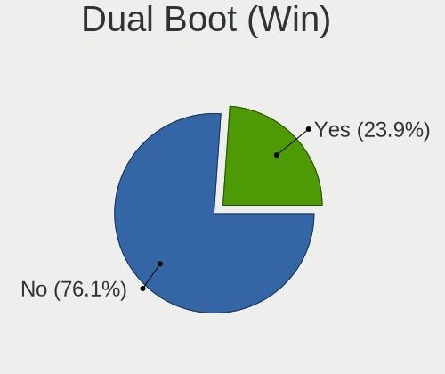
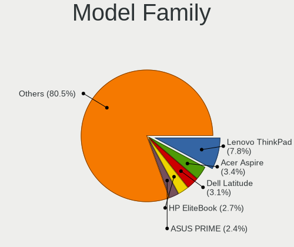
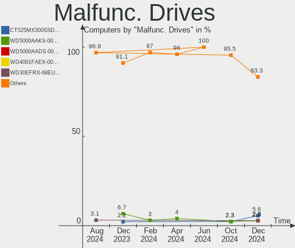
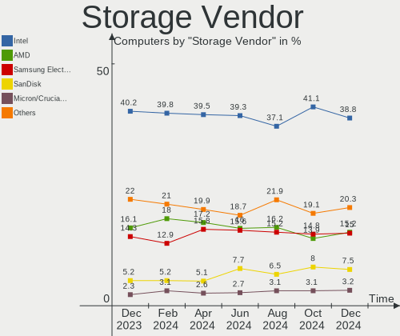
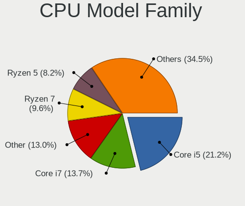
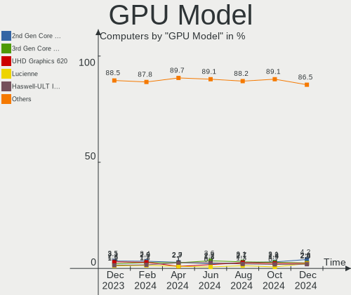
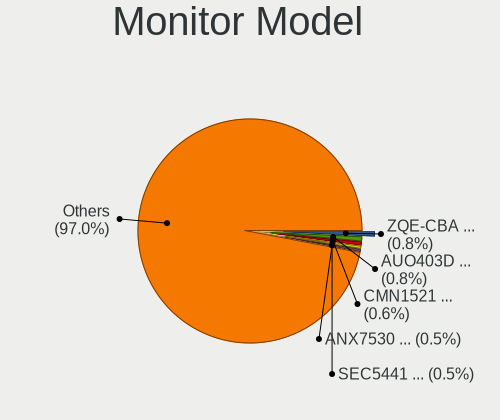
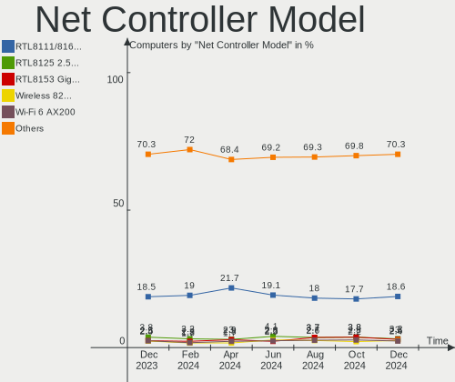
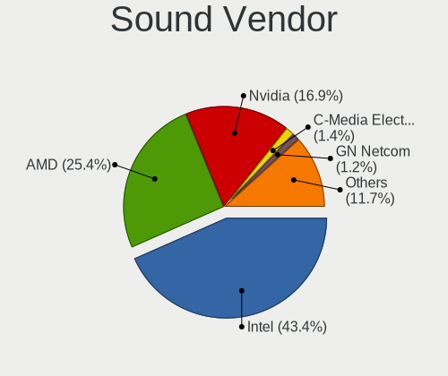

Linux in Germany - Hardware Trends
----------------------------------

A project to identify most popular hardware characteristics and track their change
over time based on data collected by Linux users at https://Linux-Hardware.org.

Anyone can contribute to this report by the [hw-probe](https://github.com/linuxhw/hw-probe) tool:

    sudo -E hw-probe -all -upload

This is a report for all computer types. See also reports for [desktops](/Location/Germany/Desktop/README.md) and [notebooks](/Location/Germany/Notebook/README.md).

Period: Aug, 2022.

Contents
--------

* [ System ](#system)
  - [ OS                       ](#os)
  - [ OS Family                ](#os-family)
  - [ Kernel                   ](#kernel)
  - [ Kernel Family            ](#kernel-family)
  - [ Kernel Major Ver.        ](#kernel-major-ver)
  - [ Arch                     ](#arch)
  - [ DE                       ](#de)
  - [ Display Server           ](#display-server)
  - [ Display Manager          ](#display-manager)
  - [ OS Lang                  ](#os-lang)
  - [ Boot Mode                ](#boot-mode)
  - [ Filesystem               ](#filesystem)
  - [ Part. scheme             ](#part-scheme)
  - [ Dual Boot with Linux/BSD ](#dual-boot-with-linuxbsd)
  - [ Dual Boot (Win)          ](#dual-boot-win)

* [ Board ](#board)
  - [ Vendor                   ](#vendor)
  - [ Model                    ](#model)
  - [ Model Family             ](#model-family)
  - [ MFG Year                 ](#mfg-year)
  - [ Form Factor              ](#form-factor)
  - [ Secure Boot              ](#secure-boot)
  - [ Coreboot                 ](#coreboot)
  - [ RAM Size                 ](#ram-size)
  - [ RAM Used                 ](#ram-used)
  - [ Total Drives             ](#total-drives)
  - [ Has CD-ROM               ](#has-cd-rom)
  - [ Has Ethernet             ](#has-ethernet)
  - [ Has WiFi                 ](#has-wifi)
  - [ Has Bluetooth            ](#has-bluetooth)

* [ Location ](#location)
  - [ Country                  ](#country)
  - [ City                     ](#city)

* [ Drives ](#drives)
  - [ Drive Vendor             ](#drive-vendor)
  - [ Drive Model              ](#drive-model)
  - [ HDD Vendor               ](#hdd-vendor)
  - [ SSD Vendor               ](#ssd-vendor)
  - [ Drive Kind               ](#drive-kind)
  - [ Drive Connector          ](#drive-connector)
  - [ Drive Size               ](#drive-size)
  - [ Space Total              ](#space-total)
  - [ Space Used               ](#space-used)
  - [ Malfunc. Drives          ](#malfunc-drives)
  - [ Malfunc. Drive Vendor    ](#malfunc-drive-vendor)
  - [ Malfunc. HDD Vendor      ](#malfunc-hdd-vendor)
  - [ Malfunc. Drive Kind      ](#malfunc-drive-kind)
  - [ Failed Drives            ](#failed-drives)
  - [ Failed Drive Vendor      ](#failed-drive-vendor)
  - [ Drive Status             ](#drive-status)

* [ Storage controller ](#storage-controller)
  - [ Storage Vendor           ](#storage-vendor)
  - [ Storage Model            ](#storage-model)
  - [ Storage Kind             ](#storage-kind)

* [ Processor ](#processor)
  - [ CPU Vendor               ](#cpu-vendor)
  - [ CPU Model                ](#cpu-model)
  - [ CPU Model Family         ](#cpu-model-family)
  - [ CPU Cores                ](#cpu-cores)
  - [ CPU Sockets              ](#cpu-sockets)
  - [ CPU Threads              ](#cpu-threads)
  - [ CPU Op-Modes             ](#cpu-op-modes)
  - [ CPU Microcode            ](#cpu-microcode)
  - [ CPU Microarch            ](#cpu-microarch)

* [ Graphics ](#graphics)
  - [ GPU Vendor               ](#gpu-vendor)
  - [ GPU Model                ](#gpu-model)
  - [ GPU Combo                ](#gpu-combo)
  - [ GPU Driver               ](#gpu-driver)
  - [ GPU Memory               ](#gpu-memory)

* [ Monitor ](#monitor)
  - [ Monitor Vendor           ](#monitor-vendor)
  - [ Monitor Model            ](#monitor-model)
  - [ Monitor Resolution       ](#monitor-resolution)
  - [ Monitor Diagonal         ](#monitor-diagonal)
  - [ Monitor Width            ](#monitor-width)
  - [ Aspect Ratio             ](#aspect-ratio)
  - [ Monitor Area             ](#monitor-area)
  - [ Pixel Density            ](#pixel-density)
  - [ Multiple Monitors        ](#multiple-monitors)

* [ Network ](#network)
  - [ Net Controller Vendor    ](#net-controller-vendor)
  - [ Net Controller Model     ](#net-controller-model)
  - [ Wireless Vendor          ](#wireless-vendor)
  - [ Wireless Model           ](#wireless-model)
  - [ Ethernet Vendor          ](#ethernet-vendor)
  - [ Ethernet Model           ](#ethernet-model)
  - [ Net Controller Kind      ](#net-controller-kind)
  - [ Used Controller          ](#used-controller)
  - [ NICs                     ](#nics)
  - [ IPv6                     ](#ipv6)

* [ Bluetooth ](#bluetooth)
  - [ Bluetooth Vendor         ](#bluetooth-vendor)
  - [ Bluetooth Model          ](#bluetooth-model)

* [ Sound ](#sound)
  - [ Sound Vendor             ](#sound-vendor)
  - [ Sound Model              ](#sound-model)

* [ Memory ](#memory)
  - [ Memory Vendor            ](#memory-vendor)
  - [ Memory Model             ](#memory-model)
  - [ Memory Kind              ](#memory-kind)
  - [ Memory Form Factor       ](#memory-form-factor)
  - [ Memory Size              ](#memory-size)
  - [ Memory Speed             ](#memory-speed)

* [ Printers & scanners ](#printers--scanners)
  - [ Printer Vendor           ](#printer-vendor)
  - [ Printer Model            ](#printer-model)
  - [ Scanner Vendor           ](#scanner-vendor)
  - [ Scanner Model            ](#scanner-model)

* [ Camera ](#camera)
  - [ Camera Vendor            ](#camera-vendor)
  - [ Camera Model             ](#camera-model)

* [ Security ](#security)
  - [ Fingerprint Vendor       ](#fingerprint-vendor)
  - [ Fingerprint Model        ](#fingerprint-model)
  - [ Chipcard Vendor          ](#chipcard-vendor)
  - [ Chipcard Model           ](#chipcard-model)

* [ Unsupported ](#unsupported)
  - [ Unsupported Devices      ](#unsupported-devices)
  - [ Unsupported Device Types ](#unsupported-device-types)

System
------

OS
--

Installed operating systems

| Name                         | Computers | Percent |
|------------------------------|-----------|---------|
| Ubuntu 22.04                 | 70        | 17.86%  |
| Linux Mint 21                | 31        | 7.91%   |
| Ubuntu 20.04                 | 27        | 6.89%   |
| Linux Mint 20.3              | 27        | 6.89%   |
| Debian 11                    | 24        | 6.12%   |
| Fedora 36                    | 22        | 5.61%   |
| Pop!_OS 22.04                | 17        | 4.34%   |
| OpenMandriva 4.3             | 17        | 4.34%   |
| Zorin 16                     | 16        | 4.08%   |
| OpenMandriva 4.90            | 10        | 2.55%   |
| KDE neon 20.04               | 8         | 2.04%   |
| Gentoo 2.8                   | 8         | 2.04%   |
| Arch                         | 6         | 1.53%   |
| Xubuntu 20.04                | 5         | 1.28%   |
| Kali 2022.3                  | 5         | 1.28%   |
| Manjaro 21.3.7               | 4         | 1.02%   |
| Manjaro                      | 4         | 1.02%   |
| Kubuntu 22.04                | 4         | 1.02%   |
| Elementary 6.1               | 4         | 1.02%   |
| Xubuntu 22.04                | 3         | 0.77%   |
| Ubuntu 22.10                 | 3         | 0.77%   |
| Ubuntu 18.04                 | 3         | 0.77%   |
| Raspbian 11                  | 3         | 0.77%   |
| MX 21                        | 3         | 0.77%   |
| Lubuntu 22.04                | 3         | 0.77%   |
| LMDE 5                       | 3         | 0.77%   |
| Linux Mint 20                | 3         | 0.77%   |
| Linux Mint 19.3              | 3         | 0.77%   |
| ArcoLinux Rolling            | 3         | 0.77%   |
| Arch Rolling                 | 3         | 0.77%   |
| Xubuntu 18.04                | 2         | 0.51%   |
| Ubuntu MATE 22.04            | 2         | 0.51%   |
| Ubuntu 21.10                 | 2         | 0.51%   |
| SteamOS 3.3.1                | 2         | 0.51%   |
| SteamOS 3.3                  | 2         | 0.51%   |
| Raspbian 10                  | 2         | 0.51%   |
| Manjaro 21.3.6               | 2         | 0.51%   |
| Kubuntu 20.04                | 2         | 0.51%   |
| Fedora 35                    | 2         | 0.51%   |
| Debian Testing               | 2         | 0.51%   |
| Zorin 15                     | 1         | 0.26%   |
| Ubuntu Budgie 22.04          | 1         | 0.26%   |
| Ubuntu Budgie 18.04          | 1         | 0.26%   |
| Ubuntu 21.04                 | 1         | 0.26%   |
| Ubuntu 16.04                 | 1         | 0.26%   |
| Sparky 7                     | 1         | 0.26%   |
| Reborn OS                    | 1         | 0.26%   |
| Q4OS 4                       | 1         | 0.26%   |
| openSUSE Tumbleweed-XXXXXXXX | 1         | 0.26%   |
| openSUSE Leap-15.4           | 1         | 0.26%   |
| openSUSE Leap-15.3           | 1         | 0.26%   |
| OpenMandriva 4.50            | 1         | 0.26%   |
| Nobara 36                    | 1         | 0.26%   |
| MX 19                        | 1         | 0.26%   |
| Manjaro-ARM                  | 1         | 0.26%   |
| Linux Mint 20.2              | 1         | 0.26%   |
| Linux Mint 20.1              | 1         | 0.26%   |
| Linux Mint 19.2              | 1         | 0.26%   |
| Lilidog 22                   | 1         | 0.26%   |
| Kubuntu 18.04                | 1         | 0.26%   |

OS Family
---------

OS without a version

| Name          | Computers | Percent |
|---------------|-----------|---------|
| Ubuntu        | 107       | 27.3%   |
| Linux Mint    | 67        | 17.09%  |
| OpenMandriva  | 28        | 7.14%   |
| Debian        | 27        | 6.89%   |
| Fedora        | 24        | 6.12%   |
| Zorin         | 17        | 4.34%   |
| Pop!_OS       | 17        | 4.34%   |
| Xubuntu       | 10        | 2.55%   |
| Manjaro       | 10        | 2.55%   |
| Gentoo        | 9         | 2.3%    |
| Arch          | 9         | 2.3%    |
| KDE neon      | 8         | 2.04%   |
| Kubuntu       | 7         | 1.79%   |
| Raspbian      | 5         | 1.28%   |
| Kali          | 5         | 1.28%   |
| SteamOS       | 4         | 1.02%   |
| MX            | 4         | 1.02%   |
| Elementary    | 4         | 1.02%   |
| ArcoLinux     | 4         | 1.02%   |
| openSUSE      | 3         | 0.77%   |
| Lubuntu       | 3         | 0.77%   |
| LMDE          | 3         | 0.77%   |
| Ubuntu MATE   | 2         | 0.51%   |
| Ubuntu Budgie | 2         | 0.51%   |
| EndeavourOS   | 2         | 0.51%   |
| Sparky        | 1         | 0.26%   |
| Reborn OS     | 1         | 0.26%   |
| Q4OS          | 1         | 0.26%   |
| Nobara        | 1         | 0.26%   |
| Manjaro-ARM   | 1         | 0.26%   |
| Lilidog       | 1         | 0.26%   |
| Garuda Linux  | 1         | 0.26%   |
| CentOS        | 1         | 0.26%   |
| BlackPanther  | 1         | 0.26%   |
| Archcraft     | 1         | 0.26%   |
| Alpine        | 1         | 0.26%   |

Kernel
------

Version of the Linux kernel

| Version                                        | Computers | Percent |
|------------------------------------------------|-----------|---------|
| 5.15.0-46-generic                              | 95        | 24.23%  |
| 5.15.0-43-generic                              | 41        | 10.46%  |
| 5.16.7-desktop-1omv4003                        | 16        | 4.08%   |
| 5.4.0-124-generic                              | 14        | 3.57%   |
| 5.4.0-122-generic                              | 11        | 2.81%   |
| 5.15.0-41-generic                              | 11        | 2.81%   |
| 5.10.0-16-amd64                                | 11        | 2.81%   |
| 5.18.12-desktop-3omv4090                       | 10        | 2.55%   |
| 5.10.0-17-amd64                                | 9         | 2.3%    |
| 5.19.0-76051900-generic                        | 8         | 2.04%   |
| 5.18.16-200.fc36.x86_64                        | 8         | 2.04%   |
| 5.18.10-76051810-generic                       | 8         | 2.04%   |
| 5.4.0-125-generic                              | 6         | 1.53%   |
| 5.15.0-25-generic                              | 6         | 1.53%   |
| 5.18.16-arch1-1                                | 5         | 1.28%   |
| 5.18.0-kali5-amd64                             | 4         | 1.02%   |
| 5.15.0-47-generic                              | 4         | 1.02%   |
| 5.15.0-46-lowlatency                           | 4         | 1.02%   |
| 5.19.2-arch1-1                                 | 3         | 0.77%   |
| 5.19.1-3-MANJARO                               | 3         | 0.77%   |
| 5.18.18-200.fc36.x86_64                        | 3         | 0.77%   |
| 5.18.0-0.bpo.1-amd64                           | 3         | 0.77%   |
| 4.15.0-191-generic                             | 3         | 0.77%   |
| 5.18.19-200.fc36.x86_64                        | 2         | 0.51%   |
| 5.18.15-arch1-2                                | 2         | 0.51%   |
| 5.18.15-200.fc36.x86_64                        | 2         | 0.51%   |
| 5.18.0-3-amd64                                 | 2         | 0.51%   |
| 5.16.13-desktop-1omv4003                       | 2         | 0.51%   |
| 5.15.59-2-lts                                  | 2         | 0.51%   |
| 5.15.0-45-generic                              | 2         | 0.51%   |
| 5.13.0-valve21.1-1-neptune-02211-gc54cda5a36f3 | 2         | 0.51%   |
| 5.13.0-52-generic                              | 2         | 0.51%   |
| 5.11.0-46-generic                              | 2         | 0.51%   |
| 5.10.103-v8+                                   | 2         | 0.51%   |
| 6.0.0-rc2-v8+                                  | 1         | 0.26%   |
| 5.6.14-desktop-2bP                             | 1         | 0.26%   |
| 5.4.0-91-generic                               | 1         | 0.26%   |
| 5.4.0-70-generic                               | 1         | 0.26%   |
| 5.4.0-58-generic                               | 1         | 0.26%   |
| 5.4.0-47-generic                               | 1         | 0.26%   |
| 5.4.0-122-lowlatency                           | 1         | 0.26%   |
| 5.4.0-121-generic                              | 1         | 0.26%   |
| 5.4.0-110-generic                              | 1         | 0.26%   |
| 5.3.18-150300.59.87-default                    | 1         | 0.26%   |
| 5.3.0-46-generic                               | 1         | 0.26%   |
| 5.19.4-arch1-1                                 | 1         | 0.26%   |
| 5.19.4-269-tkg-bmq                             | 1         | 0.26%   |
| 5.19.4-200.fc36.x86_64                         | 1         | 0.26%   |
| 5.19.3-051903-generic                          | 1         | 0.26%   |
| 5.19.2-300.fc36.x86_64                         | 1         | 0.26%   |
| 5.19.2-1-default                               | 1         | 0.26%   |
| 5.19.2-051902-generic                          | 1         | 0.26%   |
| 5.19.1-zen1-1-zen                              | 1         | 0.26%   |
| 5.19.1-xm1.0e20220803.fc36.x86_64              | 1         | 0.26%   |
| 5.19.0-gentoo-x86_64                           | 1         | 0.26%   |
| 5.19.0-gentoo                                  | 1         | 0.26%   |
| 5.19.0-1-MANJARO                               | 1         | 0.26%   |
| 5.19.0-051900-generic                          | 1         | 0.26%   |
| 5.18.3-zen1                                    | 1         | 0.26%   |
| 5.18.17-200.fc36.x86_64                        | 1         | 0.26%   |

Kernel Family
-------------

Linux kernel without a distro release

| Version  | Computers | Percent |
|----------|-----------|---------|
| 5.15.0   | 167       | 42.6%   |
| 5.4.0    | 38        | 9.69%   |
| 5.10.0   | 22        | 5.61%   |
| 5.16.7   | 16        | 4.08%   |
| 5.18.16  | 13        | 3.32%   |
| 5.18.0   | 13        | 3.32%   |
| 5.19.0   | 12        | 3.06%   |
| 5.18.12  | 11        | 2.81%   |
| 5.18.15  | 8         | 2.04%   |
| 5.18.10  | 8         | 2.04%   |
| 5.13.0   | 8         | 2.04%   |
| 5.19.2   | 6         | 1.53%   |
| 5.15.59  | 6         | 1.53%   |
| 5.19.1   | 5         | 1.28%   |
| 4.15.0   | 5         | 1.28%   |
| 5.19.4   | 3         | 0.77%   |
| 5.18.18  | 3         | 0.77%   |
| 5.18.13  | 3         | 0.77%   |
| 5.15.52  | 3         | 0.77%   |
| 5.11.0   | 3         | 0.77%   |
| 5.10.103 | 3         | 0.77%   |
| 5.18.19  | 2         | 0.51%   |
| 5.18.17  | 2         | 0.51%   |
| 5.17.5   | 2         | 0.51%   |
| 5.16.13  | 2         | 0.51%   |
| 5.15.57  | 2         | 0.51%   |
| 5.15.56  | 2         | 0.51%   |
| 4.19.0   | 2         | 0.51%   |
| 6.0.0    | 1         | 0.26%   |
| 5.6.14   | 1         | 0.26%   |
| 5.3.18   | 1         | 0.26%   |
| 5.3.0    | 1         | 0.26%   |
| 5.19.3   | 1         | 0.26%   |
| 5.18.3   | 1         | 0.26%   |
| 5.18.14  | 1         | 0.26%   |
| 5.18.11  | 1         | 0.26%   |
| 5.17.15  | 1         | 0.26%   |
| 5.17.0   | 1         | 0.26%   |
| 5.16.5   | 1         | 0.26%   |
| 5.16.0   | 1         | 0.26%   |
| 5.15.55  | 1         | 0.26%   |
| 5.15.44  | 1         | 0.26%   |
| 5.15.32  | 1         | 0.26%   |
| 5.15.19  | 1         | 0.26%   |
| 5.15.14  | 1         | 0.26%   |
| 5.14.21  | 1         | 0.26%   |
| 5.14.0   | 1         | 0.26%   |
| 5.10.136 | 1         | 0.26%   |
| 4.4.0    | 1         | 0.26%   |
| 4.18.0   | 1         | 0.26%   |

Kernel Major Ver.
-----------------

Linux kernel major version

| Version | Computers | Percent |
|---------|-----------|---------|
| 5.15    | 185       | 47.19%  |
| 5.18    | 66        | 16.84%  |
| 5.4     | 38        | 9.69%   |
| 5.19    | 27        | 6.89%   |
| 5.10    | 26        | 6.63%   |
| 5.16    | 20        | 5.1%    |
| 5.13    | 8         | 2.04%   |
| 4.15    | 5         | 1.28%   |
| 5.17    | 4         | 1.02%   |
| 5.11    | 3         | 0.77%   |
| 5.3     | 2         | 0.51%   |
| 5.14    | 2         | 0.51%   |
| 4.19    | 2         | 0.51%   |
| 6.0     | 1         | 0.26%   |
| 5.6     | 1         | 0.26%   |
| 4.4     | 1         | 0.26%   |
| 4.18    | 1         | 0.26%   |

Arch
----

OS architecture (x86_64, i586, etc.)

| Name     | Computers | Percent |
|----------|-----------|---------|
| x86_64   | 377       | 96.17%  |
| aarch64  | 6         | 1.53%   |
| i686     | 4         | 1.02%   |
| armv7l   | 2         | 0.51%   |
| armv6l   | 2         | 0.51%   |
| armv5tel | 1         | 0.26%   |

DE
--

Desktop Environment

| Name             | Computers | Percent |
|------------------|-----------|---------|
| GNOME            | 164       | 41.84%  |
| KDE5             | 77        | 19.64%  |
| X-Cinnamon       | 62        | 15.82%  |
| XFCE             | 38        | 9.69%   |
| Unknown          | 16        | 4.08%   |
| MATE             | 7         | 1.79%   |
| LXQt             | 6         | 1.53%   |
| Pantheon         | 5         | 1.28%   |
| i3               | 4         | 1.02%   |
| Cinnamon         | 3         | 0.77%   |
| GNOME Flashback  | 2         | 0.51%   |
| Budgie           | 2         | 0.51%   |
| Unity            | 1         | 0.26%   |
| lightdm-xsession | 1         | 0.26%   |
| herbstluftwm     | 1         | 0.26%   |
| GNOME Classic    | 1         | 0.26%   |
| Enlightenment    | 1         | 0.26%   |
| dwm              | 1         | 0.26%   |

Display Server
--------------

X11 or Wayland

| Name    | Computers | Percent |
|---------|-----------|---------|
| X11     | 284       | 72.45%  |
| Wayland | 87        | 22.19%  |
| Tty     | 17        | 4.34%   |
| Unknown | 4         | 1.02%   |

Display Manager
---------------

SDDM, LightDM, etc.

| Name    | Computers | Percent |
|---------|-----------|---------|
| Unknown | 139       | 35.46%  |
| GDM3    | 97        | 24.74%  |
| LightDM | 70        | 17.86%  |
| SDDM    | 56        | 14.29%  |
| GDM     | 30        | 7.65%   |

OS Lang
-------

Language

| Lang       | Computers | Percent |
|------------|-----------|---------|
| de_DE      | 279       | 71.17%  |
| en_US      | 86        | 21.94%  |
| en_GB      | 7         | 1.79%   |
| C          | 6         | 1.53%   |
| es_ES      | 3         | 0.77%   |
| de_DE@euro | 2         | 0.51%   |
| C.UTF8     | 2         | 0.51%   |
| Unknown    | 2         | 0.51%   |
| uk_UA      | 1         | 0.26%   |
| POSIX      | 1         | 0.26%   |
| fr_FR      | 1         | 0.26%   |
| en_DE      | 1         | 0.26%   |
| en_AG      | 1         | 0.26%   |

Boot Mode
---------

EFI or BIOS

| Mode | Computers | Percent |
|------|-----------|---------|
| EFI  | 204       | 52.04%  |
| BIOS | 188       | 47.96%  |

Filesystem
----------

Type of filesystem

| Type    | Computers | Percent |
|---------|-----------|---------|
| Ext4    | 305       | 77.81%  |
| Btrfs   | 45        | 11.48%  |
| Overlay | 30        | 7.65%   |
| Zfs     | 4         | 1.02%   |
| Xfs     | 3         | 0.77%   |
| F2fs    | 2         | 0.51%   |
| Ext3    | 2         | 0.51%   |
| XXXXXXX | 1         | 0.26%   |

Part. scheme
------------

Scheme of partitioning

| Type    | Computers | Percent |
|---------|-----------|---------|
| Unknown | 217       | 55.36%  |
| GPT     | 138       | 35.2%   |
| MBR     | 37        | 9.44%   |

Dual Boot with Linux/BSD
------------------------

Hosting more than one Linux/BSD

| Dual boot | Computers | Percent |
|-----------|-----------|---------|
| No        | 340       | 86.73%  |
| Yes       | 52        | 13.27%  |

Dual Boot (Win)
---------------

Hosting Linux and Windows

| Dual boot | Computers | Percent |
|-----------|-----------|---------|
| No        | 283       | 72.19%  |
| Yes       | 109       | 27.81%  |

Board
-----

Vendor
------

Motherboard manufacturer

| Name                    | Computers | Percent |
|-------------------------|-----------|---------|
| Lenovo                  | 72        | 18.37%  |
| ASUSTek Computer        | 61        | 15.56%  |
| Hewlett-Packard         | 43        | 10.97%  |
| MSI                     | 34        | 8.67%   |
| Dell                    | 30        | 7.65%   |
| Gigabyte Technology     | 24        | 6.12%   |
| ASRock                  | 20        | 5.1%    |
| Acer                    | 20        | 5.1%    |
| Fujitsu                 | 10        | 2.55%   |
| Medion                  | 9         | 2.3%    |
| Raspberry Pi Foundation | 7         | 1.79%   |
| Apple                   | 7         | 1.79%   |
| HUAWEI                  | 5         | 1.28%   |
| TUXEDO                  | 4         | 1.02%   |
| Samsung Electronics     | 4         | 1.02%   |
| Valve                   | 3         | 0.77%   |
| Packard Bell            | 3         | 0.77%   |
| Notebook                | 3         | 0.77%   |
| Intel                   | 3         | 0.77%   |
| TrekStor                | 2         | 0.51%   |
| Toshiba                 | 2         | 0.51%   |
| IBM                     | 2         | 0.51%   |
| BESSTAR Tech            | 2         | 0.51%   |
| Alienware               | 2         | 0.51%   |
| Unknown                 | 2         | 0.51%   |
| Wortmann AG             | 1         | 0.26%   |
| Supermicro              | 1         | 0.26%   |
| Sony                    | 1         | 0.26%   |
| Schenker                | 1         | 0.26%   |
| Razer                   | 1         | 0.26%   |
| Pine Microsystems       | 1         | 0.26%   |
| Pegatron                | 1         | 0.26%   |
| Panasonic               | 1         | 0.26%   |
| Nvidia                  | 1         | 0.26%   |
| Microsoft               | 1         | 0.26%   |
| LincPlus                | 1         | 0.26%   |
| ICP / iEi               | 1         | 0.26%   |
| IBASE Technology        | 1         | 0.26%   |
| Hampoo                  | 1         | 0.26%   |
| Foxconn                 | 1         | 0.26%   |
| Biostar                 | 1         | 0.26%   |
| AXDIA International     | 1         | 0.26%   |
| Acidanthera             | 1         | 0.26%   |

Model
-----

Motherboard model

| Name                                  | Computers | Percent |
|---------------------------------------|-----------|---------|
| MSI MS-7C37                           | 5         | 1.28%   |
| Valve Jupiter                         | 3         | 0.77%   |
| Lenovo G500 20236                     | 3         | 0.77%   |
| Dell XPS 13 7390                      | 3         | 0.77%   |
| ASRock B450 Pro4                      | 3         | 0.77%   |
| RPi Raspberry Pi 400 Rev 1.1          | 2         | 0.51%   |
| MSI MS-7C56                           | 2         | 0.51%   |
| MSI MS-7721                           | 2         | 0.51%   |
| HP Pavilion Notebook                  | 2         | 0.51%   |
| HP 255 G6 Notebook PC                 | 2         | 0.51%   |
| Gigabyte MP32-AR1-SW-HZ-001           | 2         | 0.51%   |
| Gigabyte B550 GAMING X V2             | 2         | 0.51%   |
| Gigabyte AORUS 17 YE5                 | 2         | 0.51%   |
| Dell Latitude E5510                   | 2         | 0.51%   |
| ASUS TUF Gaming B550-PLUS             | 2         | 0.51%   |
| ASUS PRIME X370-PRO                   | 2         | 0.51%   |
| ASUS All Series                       | 2         | 0.51%   |
| ASUS A0000001                         | 2         | 0.51%   |
| ASRock A300M-STX                      | 2         | 0.51%   |
| Acer Aspire E5-771G                   | 2         | 0.51%   |
| Unknown                               | 2         | 0.51%   |
| Wortmann AG TERRA_MOBILE_1713A        | 1         | 0.26%   |
| TUXEDO W65_W67RZ1                     | 1         | 0.26%   |
| TUXEDO Polaris AMD Gen2 (REN)         | 1         | 0.26%   |
| TUXEDO InfinityBook Pro 14 v4         | 1         | 0.26%   |
| TUXEDO Book BA1510                    | 1         | 0.26%   |
| TrekStor Primebook P14                | 1         | 0.26%   |
| TrekStor Primebook C13                | 1         | 0.26%   |
| Toshiba Satellite L500                | 1         | 0.26%   |
| Toshiba PORTEGE M800                  | 1         | 0.26%   |
| Supermicro Super Server               | 1         | 0.26%   |
| Sony VGN-NR11Z_T                      | 1         | 0.26%   |
| Schenker VISION 15 (SVS15E21)         | 1         | 0.26%   |
| Samsung SP55S                         | 1         | 0.26%   |
| Samsung R59P/R60P/R61P                | 1         | 0.26%   |
| Samsung 700Z3A/700Z4A/700Z5A/700Z5B   | 1         | 0.26%   |
| Samsung 600B4B/600B5B                 | 1         | 0.26%   |
| Razer Blade 14 - RZ09-0370            | 1         | 0.26%   |
| RPi Raspberry Pi Zero W Rev 1.1       | 1         | 0.26%   |
| RPi Raspberry Pi Model B Plus Rev 1.2 | 1         | 0.26%   |
| RPi Raspberry Pi 4 Model B Rev 1.5    | 1         | 0.26%   |
| RPi Raspberry Pi 4 Model B Rev 1.1    | 1         | 0.26%   |
| RPi Raspberry Pi                      | 1         | 0.26%   |
| Pine Microsystems Pine64 Pinebook Pro | 1         | 0.26%   |
| Pegatron NQ840AA-ABD p6029de          | 1         | 0.26%   |
| Panasonic CF-53AAGZXDX                | 1         | 0.26%   |
| Packard Bell IMEDIA S3210             | 1         | 0.26%   |
| Packard Bell EasyNote LJ65            | 1         | 0.26%   |
| Packard Bell EasyNote LE69KB          | 1         | 0.26%   |
| Nvidia SN68PT                         | 1         | 0.26%   |
| Notebook V15x_V17xPNKPNJPNH           | 1         | 0.26%   |
| Notebook NS5x_NS7xPU                  | 1         | 0.26%   |
| Notebook N9x0TC                       | 1         | 0.26%   |
| MSI MS-7D22                           | 1         | 0.26%   |
| MSI MS-7D15                           | 1         | 0.26%   |
| MSI MS-7C52                           | 1         | 0.26%   |
| MSI MS-7C35                           | 1         | 0.26%   |
| MSI MS-7C02                           | 1         | 0.26%   |
| MSI MS-7B86                           | 1         | 0.26%   |
| MSI MS-7A54                           | 1         | 0.26%   |

Model Family
------------

Motherboard model prefix

| Name                        | Computers | Percent |
|-----------------------------|-----------|---------|
| Lenovo ThinkPad             | 39        | 9.95%   |
| Acer Aspire                 | 13        | 3.32%   |
| Lenovo IdeaPad              | 11        | 2.81%   |
| Dell Latitude               | 10        | 2.55%   |
| ASUS PRIME                  | 10        | 2.55%   |
| HP EliteBook                | 9         | 2.3%    |
| RPi Raspberry               | 7         | 1.79%   |
| Lenovo ThinkCentre          | 7         | 1.79%   |
| HP Compaq                   | 6         | 1.53%   |
| Dell XPS                    | 6         | 1.53%   |
| Dell Inspiron               | 6         | 1.53%   |
| MSI MS-7C37                 | 5         | 1.28%   |
| Fujitsu LIFEBOOK            | 5         | 1.28%   |
| ASUS VivoBook               | 5         | 1.28%   |
| ASUS TUF                    | 5         | 1.28%   |
| Medion Akoya                | 4         | 1.02%   |
| HP Pavilion                 | 4         | 1.02%   |
| Dell OptiPlex               | 4         | 1.02%   |
| ASUS ROG                    | 4         | 1.02%   |
| Valve Jupiter               | 3         | 0.77%   |
| Lenovo MIIX                 | 3         | 0.77%   |
| Lenovo G500                 | 3         | 0.77%   |
| HP ProBook                  | 3         | 0.77%   |
| HP 255                      | 3         | 0.77%   |
| Gigabyte B550               | 3         | 0.77%   |
| ASRock B450                 | 3         | 0.77%   |
| TrekStor Primebook          | 2         | 0.51%   |
| Packard Bell EasyNote       | 2         | 0.51%   |
| MSI MS-7C56                 | 2         | 0.51%   |
| MSI MS-7721                 | 2         | 0.51%   |
| Lenovo IdeaCentre           | 2         | 0.51%   |
| HP ZBook                    | 2         | 0.51%   |
| HP Laptop                   | 2         | 0.51%   |
| HP ENVY                     | 2         | 0.51%   |
| Gigabyte X570               | 2         | 0.51%   |
| Gigabyte MP32-AR1-SW-HZ-001 | 2         | 0.51%   |
| Gigabyte AORUS              | 2         | 0.51%   |
| Fujitsu PRIMERGY            | 2         | 0.51%   |
| Fujitsu ESPRIMO             | 2         | 0.51%   |
| Dell Precision              | 2         | 0.51%   |
| ASUS Pro                    | 2         | 0.51%   |
| ASUS All                    | 2         | 0.51%   |
| ASUS A0000001               | 2         | 0.51%   |
| ASRock A300M-STX            | 2         | 0.51%   |
| Alienware m15               | 2         | 0.51%   |
| Acer Nitro                  | 2         | 0.51%   |
| Unknown                     | 2         | 0.51%   |
| Wortmann AG TERRA           | 1         | 0.26%   |
| TUXEDO W65                  | 1         | 0.26%   |
| TUXEDO Polaris              | 1         | 0.26%   |
| TUXEDO InfinityBook         | 1         | 0.26%   |
| TUXEDO Book                 | 1         | 0.26%   |
| Toshiba Satellite           | 1         | 0.26%   |
| Toshiba PORTEGE             | 1         | 0.26%   |
| Supermicro Super            | 1         | 0.26%   |
| Sony VGN-NR11Z              | 1         | 0.26%   |
| Schenker VISION             | 1         | 0.26%   |
| Samsung SP55S               | 1         | 0.26%   |
| Samsung R59P                | 1         | 0.26%   |
| Samsung 700Z3A              | 1         | 0.26%   |

MFG Year
--------

Motherboard manufacture year

| Year    | Computers | Percent |
|---------|-----------|---------|
| 2019    | 43        | 10.97%  |
| 2018    | 41        | 10.46%  |
| 2021    | 39        | 9.95%   |
| 2013    | 35        | 8.93%   |
| 2020    | 33        | 8.42%   |
| 2012    | 33        | 8.42%   |
| 2022    | 26        | 6.63%   |
| 2011    | 20        | 5.1%    |
| 2015    | 17        | 4.34%   |
| 2014    | 16        | 4.08%   |
| 2008    | 16        | 4.08%   |
| 2009    | 15        | 3.83%   |
| 2017    | 14        | 3.57%   |
| 2010    | 13        | 3.32%   |
| 2016    | 10        | 2.55%   |
| Unknown | 9         | 2.3%    |
| 2007    | 7         | 1.79%   |
| 2006    | 5         | 1.28%   |

Form Factor
-----------

Physical design of the computer

| Name           | Computers | Percent |
|----------------|-----------|---------|
| Notebook       | 197       | 50.26%  |
| Desktop        | 158       | 40.31%  |
| Convertible    | 9         | 2.3%    |
| Mini pc        | 8         | 2.04%   |
| System on chip | 7         | 1.79%   |
| Server         | 6         | 1.53%   |
| Tablet         | 4         | 1.02%   |
| All in one     | 3         | 0.77%   |

Secure Boot
-----------

Enabled or disabled

| State    | Computers | Percent |
|----------|-----------|---------|
| Disabled | 359       | 91.58%  |
| Enabled  | 33        | 8.42%   |

Coreboot
--------

Have coreboot on board

| Used | Computers | Percent |
|------|-----------|---------|
| No   | 391       | 99.74%  |
| Yes  | 1         | 0.26%   |

RAM Size
--------

Total RAM memory

| Size in GB      | Computers | Percent |
|-----------------|-----------|---------|
| 4.01-8.0        | 83        | 21.17%  |
| 16.01-24.0      | 79        | 20.15%  |
| 8.01-16.0       | 79        | 20.15%  |
| 3.01-4.0        | 57        | 14.54%  |
| 32.01-64.0      | 46        | 11.73%  |
| 64.01-256.0     | 22        | 5.61%   |
| 1.01-2.0        | 13        | 3.32%   |
| 24.01-32.0      | 5         | 1.28%   |
| 2.01-3.0        | 3         | 0.77%   |
| More than 256.0 | 2         | 0.51%   |
| 0.01-0.5        | 2         | 0.51%   |
| 0.51-1.0        | 1         | 0.26%   |

RAM Used
--------

Used RAM memory

| Used GB    | Computers | Percent |
|------------|-----------|---------|
| 1.01-2.0   | 150       | 38.27%  |
| 2.01-3.0   | 84        | 21.43%  |
| 3.01-4.0   | 57        | 14.54%  |
| 4.01-8.0   | 47        | 11.99%  |
| 8.01-16.0  | 24        | 6.12%   |
| 0.51-1.0   | 18        | 4.59%   |
| 0.01-0.5   | 7         | 1.79%   |
| 32.01-64.0 | 2         | 0.51%   |
| 16.01-24.0 | 2         | 0.51%   |
| 24.01-32.0 | 1         | 0.26%   |

Total Drives
------------

Number of drives on board

| Drives | Computers | Percent |
|--------|-----------|---------|
| 1      | 211       | 53.83%  |
| 2      | 109       | 27.81%  |
| 3      | 39        | 9.95%   |
| 4      | 15        | 3.83%   |
| 5      | 10        | 2.55%   |
| 6      | 4         | 1.02%   |
| 12     | 2         | 0.51%   |
| 7      | 2         | 0.51%   |

Has CD-ROM
----------

Has CD-ROM on board

| Presented | Computers | Percent |
|-----------|-----------|---------|
| No        | 224       | 57.14%  |
| Yes       | 168       | 42.86%  |

Has Ethernet
------------

Has Ethernet on board

| Presented | Computers | Percent |
|-----------|-----------|---------|
| Yes       | 342       | 87.24%  |
| No        | 50        | 12.76%  |

Has WiFi
--------

Has WiFi module

| Presented | Computers | Percent |
|-----------|-----------|---------|
| Yes       | 277       | 70.66%  |
| No        | 115       | 29.34%  |

Has Bluetooth
-------------

Has Bluetooth module

| Presented | Computers | Percent |
|-----------|-----------|---------|
| Yes       | 207       | 52.81%  |
| No        | 185       | 47.19%  |

Location
--------

Country
-------

Geographic location (country)

| Country | Computers | Percent |
|---------|-----------|---------|
| Germany | 392       | 100%    |

City
----

Geographic location (city)

| City                 | Computers | Percent |
|----------------------|-----------|---------|
| Berlin               | 46        | 11.73%  |
| Munich               | 17        | 4.34%   |
| Hamburg              | 12        | 3.06%   |
| Stuttgart            | 11        | 2.81%   |
| Frankfurt am Main    | 11        | 2.81%   |
| Nuremberg            | 7         | 1.79%   |
| Darmstadt            | 6         | 1.53%   |
| Magdeburg            | 5         | 1.28%   |
| Leipzig              | 5         | 1.28%   |
| Koblenz              | 5         | 1.28%   |
| Hanover              | 5         | 1.28%   |
| Düsseldorf          | 5         | 1.28%   |
| Duisburg             | 5         | 1.28%   |
| Dresden              | 5         | 1.28%   |
| Cologne              | 5         | 1.28%   |
| Wuppertal            | 4         | 1.02%   |
| Rostock              | 4         | 1.02%   |
| Hamm                 | 4         | 1.02%   |
| Mannheim             | 3         | 0.77%   |
| Karlsruhe            | 3         | 0.77%   |
| Kaiserslautern       | 3         | 0.77%   |
| Jersbek              | 3         | 0.77%   |
| Giessen              | 3         | 0.77%   |
| Freiburg im Breisgau | 3         | 0.77%   |
| Essen                | 3         | 0.77%   |
| Dortmund             | 3         | 0.77%   |
| Augsburg             | 3         | 0.77%   |
| Werder               | 2         | 0.51%   |
| Ulm                  | 2         | 0.51%   |
| Saarbrücken         | 2         | 0.51%   |
| Rastatt              | 2         | 0.51%   |
| Postbauer-Heng       | 2         | 0.51%   |
| Oberursel            | 2         | 0.51%   |
| Niederndodeleben     | 2         | 0.51%   |
| Markneukirchen       | 2         | 0.51%   |
| Ludwigsburg          | 2         | 0.51%   |
| Lübeck              | 2         | 0.51%   |
| Kirchheim unter Teck | 2         | 0.51%   |
| Hannoversch Münden  | 2         | 0.51%   |
| Hanau                | 2         | 0.51%   |
| Gütersloh           | 2         | 0.51%   |
| Falkenstein          | 2         | 0.51%   |
| Düren               | 2         | 0.51%   |
| Bubenreuth           | 2         | 0.51%   |
| Bruchsal             | 2         | 0.51%   |
| Albstadt             | 2         | 0.51%   |
| Zeuthen              | 1         | 0.26%   |
| Worms                | 1         | 0.26%   |
| Wolnzach             | 1         | 0.26%   |
| Wolfhagen            | 1         | 0.26%   |
| Wilhelmshaven        | 1         | 0.26%   |
| Wiehl                | 1         | 0.26%   |
| Wiednitz             | 1         | 0.26%   |
| Werneck              | 1         | 0.26%   |
| Wenzenbach           | 1         | 0.26%   |
| Weimar               | 1         | 0.26%   |
| Weilmuenster         | 1         | 0.26%   |
| Weiler-Simmerberg    | 1         | 0.26%   |
| Weil am Rhein        | 1         | 0.26%   |
| Wegberg              | 1         | 0.26%   |

Drives
------

Drive Vendor
------------

Hard drive vendors

| Vendor                      | Computers | Drives | Percent |
|-----------------------------|-----------|--------|---------|
| Samsung Electronics         | 133       | 185    | 23.29%  |
| WDC                         | 82        | 111    | 14.36%  |
| SanDisk                     | 51        | 60     | 8.93%   |
| Seagate                     | 49        | 65     | 8.58%   |
| Unknown                     | 31        | 36     | 5.43%   |
| Crucial                     | 26        | 31     | 4.55%   |
| Kingston                    | 24        | 27     | 4.2%    |
| Toshiba                     | 22        | 34     | 3.85%   |
| Intenso                     | 15        | 18     | 2.63%   |
| Hitachi                     | 15        | 16     | 2.63%   |
| SK hynix                    | 13        | 14     | 2.28%   |
| Micron Technology           | 13        | 13     | 2.28%   |
| Micron/Crucial Technology   | 8         | 8      | 1.4%    |
| Phison                      | 7         | 7      | 1.23%   |
| Intel                       | 7         | 7      | 1.23%   |
| OCZ                         | 5         | 5      | 0.88%   |
| HGST                        | 5         | 6      | 0.88%   |
| PNY                         | 4         | 4      | 0.7%    |
| KIOXIA                      | 4         | 4      | 0.7%    |
| A-DATA Technology           | 4         | 4      | 0.7%    |
| TrekStor                    | 3         | 3      | 0.53%   |
| SABRENT                     | 3         | 3      | 0.53%   |
| Apple                       | 3         | 3      | 0.53%   |
| Unknown                     | 3         | 3      | 0.53%   |
| Union Memory (Shenzhen)     | 2         | 2      | 0.35%   |
| UMIS                        | 2         | 2      | 0.35%   |
| Transcend                   | 2         | 2      | 0.35%   |
| SPCC                        | 2         | 2      | 0.35%   |
| Silicon Motion              | 2         | 2      | 0.35%   |
| Patriot                     | 2         | 2      | 0.35%   |
| Maxtor                      | 2         | 2      | 0.35%   |
| Emtec                       | 2         | 2      | 0.35%   |
| Zheino                      | 1         | 1      | 0.18%   |
| YS                          | 1         | 1      | 0.18%   |
| WD MediaMax                 | 1         | 1      | 0.18%   |
| Verbatim                    | 1         | 1      | 0.18%   |
| USB                         | 1         | 1      | 0.18%   |
| TO Exter                    | 1         | 1      | 0.18%   |
| TCSUNBOW                    | 1         | 2      | 0.18%   |
| TANDBERG                    | 1         | 1      | 0.18%   |
| PUSKILL                     | 1         | 1      | 0.18%   |
| Plextor                     | 1         | 1      | 0.18%   |
| MAXIO Technology (Hangzhou) | 1         | 1      | 0.18%   |
| Magnetic Data               | 1         | 1      | 0.18%   |
| LITEON                      | 1         | 1      | 0.18%   |
| Lite-On                     | 1         | 1      | 0.18%   |
| Leven                       | 1         | 1      | 0.18%   |
| IBM-ESXS                    | 1         | 2      | 0.18%   |
| Hoodisk                     | 1         | 1      | 0.18%   |
| Fujitsu                     | 1         | 1      | 0.18%   |
| Dogfish                     | 1         | 1      | 0.18%   |
| Corsair                     | 1         | 1      | 0.18%   |
| China                       | 1         | 1      | 0.18%   |
| ASMedia                     | 1         | 1      | 0.18%   |
| Argon                       | 1         | 1      | 0.18%   |
| Apacer                      | 1         | 1      | 0.18%   |
| AMD                         | 1         | 1      | 0.18%   |

Drive Model
-----------

Hard drive models

| Model                              | Computers | Percent |
|------------------------------------|-----------|---------|
| Crucial CT1000MX500SSD1 1TB        | 10        | 1.52%   |
| Samsung SSD 860 EVO 1TB            | 8         | 1.22%   |
| Samsung SSD 850 EVO 500GB          | 8         | 1.22%   |
| Samsung NVMe SSD Drive 1TB         | 8         | 1.22%   |
| Samsung SSD 850 EVO 250GB          | 6         | 0.91%   |
| Micron/Crucial NVMe SSD Drive 1TB  | 6         | 0.91%   |
| WDC WD40EZRZ-00GXCB0 4TB           | 5         | 0.76%   |
| Unknown MMC Card  64GB             | 5         | 0.76%   |
| SanDisk SSD PLUS 480GB             | 5         | 0.76%   |
| Samsung SSD 980 PRO 1TB            | 5         | 0.76%   |
| Samsung SSD 860 EVO 500GB          | 5         | 0.76%   |
| Samsung SSD 840 EVO 250GB          | 5         | 0.76%   |
| Unknown SD/MMC/MS PRO 128GB        | 4         | 0.61%   |
| Unknown MMC Card  32GB             | 4         | 0.61%   |
| Seagate ST1000LM024 HN-M101MBB 1TB | 4         | 0.61%   |
| SanDisk SSD PLUS 240GB             | 4         | 0.61%   |
| SanDisk SDSSDP128G 128GB           | 4         | 0.61%   |
| SanDisk NVMe SSD Drive 1TB         | 4         | 0.61%   |
| Samsung SSD 970 EVO Plus 2TB       | 4         | 0.61%   |
| Samsung NVMe SSD Drive 2TB         | 4         | 0.61%   |
| Samsung NVMe SSD Drive 256GB       | 4         | 0.61%   |
| WDC WD40EFRX-68N32N0 4TB           | 3         | 0.46%   |
| WDC WD10EZEX-00BN5A0 1TB           | 3         | 0.46%   |
| Unknown SC64G  64GB                | 3         | 0.46%   |
| TrekStor TREKSTORSSD128GB          | 3         | 0.46%   |
| Toshiba DT01ACA050 500GB           | 3         | 0.46%   |
| Seagate Expansion 500GB            | 3         | 0.46%   |
| SanDisk SDSSDH3 500G               | 3         | 0.46%   |
| SanDisk SDSSDA240G 240GB           | 3         | 0.46%   |
| SanDisk SDSSDA120G 120GB           | 3         | 0.46%   |
| SanDisk NVMe SSD Drive 256GB       | 3         | 0.46%   |
| Samsung SSD 970 PRO 512GB          | 3         | 0.46%   |
| Samsung SSD 970 EVO Plus 500GB     | 3         | 0.46%   |
| Samsung SSD 870 QVO 1TB            | 3         | 0.46%   |
| Samsung SSD 870 EVO 1TB            | 3         | 0.46%   |
| Samsung SSD 750 EVO 250GB          | 3         | 0.46%   |
| SABRENT Disk 480GB                 | 3         | 0.46%   |
| Kingston SA400S37240G 240GB SSD    | 3         | 0.46%   |
| Kingston SA400M8240G 240GB SSD     | 3         | 0.46%   |
| Kingston NVMe SSD Drive 512GB      | 3         | 0.46%   |
| Kingston NVMe SSD Drive 1TB        | 3         | 0.46%   |
| Intenso SSD Sata III 256GB         | 3         | 0.46%   |
| Crucial CT500MX500SSD1 500GB       | 3         | 0.46%   |
| Crucial CT250MX500SSD1 250GB       | 3         | 0.46%   |
| Crucial CT240BX500SSD1 240GB       | 3         | 0.46%   |
| Unknown                            | 3         | 0.46%   |
| WDC WDS500G2B0A-00SM50 500GB SSD   | 2         | 0.3%    |
| WDC WDS240G2G0A-00JH30 240GB SSD   | 2         | 0.3%    |
| WDC WD5000LPVX-22V0TT0 500GB       | 2         | 0.3%    |
| WDC WD5000BEVT-22ZAT0 500GB        | 2         | 0.3%    |
| WDC WD20SPZX-22UA7T0 2TB           | 2         | 0.3%    |
| WDC WD20EARX-00PASB0 2TB           | 2         | 0.3%    |
| WDC WD10SPZX-22Z10T1 1TB           | 2         | 0.3%    |
| Unknown SL64G  64GB                | 2         | 0.3%    |
| Unknown SD32G  32GB                | 2         | 0.3%    |
| UMIS RPFTJ128PDD2EWX 128GB         | 2         | 0.3%    |
| Toshiba MQ04ABF100 1TB             | 2         | 0.3%    |
| Toshiba MQ01ABD100 1TB             | 2         | 0.3%    |
| Toshiba HDWD110 1TB                | 2         | 0.3%    |
| Toshiba DT01ACA100 1TB             | 2         | 0.3%    |

HDD Vendor
----------

Hard disk drive vendors

| Vendor              | Computers | Drives | Percent |
|---------------------|-----------|--------|---------|
| WDC                 | 69        | 93     | 36.9%   |
| Seagate             | 48        | 64     | 25.67%  |
| Toshiba             | 19        | 30     | 10.16%  |
| Samsung Electronics | 15        | 20     | 8.02%   |
| Hitachi             | 15        | 16     | 8.02%   |
| HGST                | 5         | 6      | 2.67%   |
| Unknown             | 4         | 4      | 2.14%   |
| SABRENT             | 3         | 3      | 1.6%    |
| Maxtor              | 2         | 2      | 1.07%   |
| USB                 | 1         | 1      | 0.53%   |
| TANDBERG            | 1         | 1      | 0.53%   |
| Magnetic Data       | 1         | 1      | 0.53%   |
| Intenso             | 1         | 1      | 0.53%   |
| IBM-ESXS            | 1         | 2      | 0.53%   |
| Fujitsu             | 1         | 1      | 0.53%   |
| ASMedia             | 1         | 1      | 0.53%   |

SSD Vendor
----------

Solid state drive vendors

| Vendor              | Computers | Drives | Percent |
|---------------------|-----------|--------|---------|
| Samsung Electronics | 69        | 82     | 33.17%  |
| SanDisk             | 37        | 44     | 17.79%  |
| Crucial             | 25        | 30     | 12.02%  |
| Intenso             | 11        | 13     | 5.29%   |
| Kingston            | 10        | 10     | 4.81%   |
| WDC                 | 8         | 9      | 3.85%   |
| OCZ                 | 5         | 5      | 2.4%    |
| Micron Technology   | 5         | 5      | 2.4%    |
| TrekStor            | 3         | 3      | 1.44%   |
| Intel               | 3         | 3      | 1.44%   |
| A-DATA Technology   | 3         | 3      | 1.44%   |
| Transcend           | 2         | 2      | 0.96%   |
| SPCC                | 2         | 2      | 0.96%   |
| PNY                 | 2         | 2      | 0.96%   |
| Phison              | 2         | 2      | 0.96%   |
| Patriot             | 2         | 2      | 0.96%   |
| Emtec               | 2         | 2      | 0.96%   |
| Unknown             | 2         | 2      | 0.96%   |
| YS                  | 1         | 1      | 0.48%   |
| Verbatim            | 1         | 1      | 0.48%   |
| Unknown             | 1         | 1      | 0.48%   |
| TO Exter            | 1         | 1      | 0.48%   |
| TCSUNBOW            | 1         | 2      | 0.48%   |
| SK hynix            | 1         | 1      | 0.48%   |
| PUSKILL             | 1         | 1      | 0.48%   |
| Plextor             | 1         | 1      | 0.48%   |
| LITEON              | 1         | 1      | 0.48%   |
| Hoodisk             | 1         | 1      | 0.48%   |
| Dogfish             | 1         | 1      | 0.48%   |
| China               | 1         | 1      | 0.48%   |
| Argon               | 1         | 1      | 0.48%   |
| Apple               | 1         | 1      | 0.48%   |
| Apacer              | 1         | 1      | 0.48%   |

Drive Kind
----------

HDD or SSD

| Kind    | Computers | Drives | Percent |
|---------|-----------|--------|---------|
| SSD     | 183       | 237    | 34.99%  |
| NVMe    | 154       | 185    | 29.45%  |
| HDD     | 153       | 246    | 29.25%  |
| MMC     | 27        | 35     | 5.16%   |
| Unknown | 6         | 7      | 1.15%   |

Drive Connector
---------------

SATA, SAS, NVMe, etc.

| Type | Computers | Drives | Percent |
|------|-----------|--------|---------|
| SATA | 274       | 462    | 57.44%  |
| NVMe | 154       | 185    | 32.29%  |
| MMC  | 27        | 35     | 5.66%   |
| SAS  | 22        | 28     | 4.61%   |

Drive Size
----------

Size of hard drive

| Size in TB | Computers | Drives | Percent |
|------------|-----------|--------|---------|
| 0.01-0.5   | 204       | 272    | 56.98%  |
| 0.51-1.0   | 92        | 118    | 25.7%   |
| 1.01-2.0   | 31        | 38     | 8.66%   |
| 3.01-4.0   | 13        | 16     | 3.63%   |
| 2.01-3.0   | 6         | 7      | 1.68%   |
| 10.01-20.0 | 6         | 19     | 1.68%   |
| 4.01-10.0  | 6         | 13     | 1.68%   |

Space Total
-----------

Amount of disk space available on the file system

| Size in GB     | Computers | Percent |
|----------------|-----------|---------|
| 101-250        | 94        | 23.98%  |
| 251-500        | 87        | 22.19%  |
| 501-1000       | 65        | 16.58%  |
| 1-20           | 35        | 8.93%   |
| 1001-2000      | 31        | 7.91%   |
| 51-100         | 25        | 6.38%   |
| More than 3000 | 22        | 5.61%   |
| 2001-3000      | 13        | 3.32%   |
| 21-50          | 10        | 2.55%   |
| Unknown        | 10        | 2.55%   |

Space Used
----------

Amount of used disk space

| Used GB        | Computers | Percent |
|----------------|-----------|---------|
| 1-20           | 134       | 34.18%  |
| 21-50          | 78        | 19.9%   |
| 51-100         | 44        | 11.22%  |
| 101-250        | 40        | 10.2%   |
| 251-500        | 33        | 8.42%   |
| 501-1000       | 25        | 6.38%   |
| 1001-2000      | 13        | 3.32%   |
| More than 3000 | 10        | 2.55%   |
| Unknown        | 10        | 2.55%   |
| 2001-3000      | 4         | 1.02%   |
| 0              | 1         | 0.26%   |

Malfunc. Drives
---------------

Drive models with a malfunction

| Model                                          | Computers | Drives | Percent |
|------------------------------------------------|-----------|--------|---------|
| WDC WD5000LPVX-80V0TT0 500GB                   | 1         | 1      | 3.7%    |
| WDC WD5000LPVX-22V0TT0 500GB                   | 1         | 1      | 3.7%    |
| WDC WD3200BEKT-75PVMT0 320GB                   | 1         | 1      | 3.7%    |
| WDC WD2500BEKT-60PVMT0 250GB                   | 1         | 1      | 3.7%    |
| WDC WD20EZRX-00DC0B0 2TB                       | 1         | 1      | 3.7%    |
| WDC WD20EFRX-68AX9N0 2TB                       | 1         | 1      | 3.7%    |
| WDC WD10EARS-00Y5B1 1TB                        | 1         | 1      | 3.7%    |
| Toshiba MK3255GSXF 320GB                       | 1         | 1      | 3.7%    |
| Toshiba MK2555GSX H 250GB                      | 1         | 1      | 3.7%    |
| SK hynix PC711 HFS512GDE9X073N 512GB           | 1         | 1      | 3.7%    |
| Seagate ST320LM010-1KJ15C 320GB                | 1         | 1      | 3.7%    |
| Seagate ST1500DL003-9VT16L 1TB                 | 1         | 1      | 3.7%    |
| Seagate ST10000VN0004-1ZD101 10TB              | 1         | 4      | 3.7%    |
| SanDisk SSD PLUS 120GB                         | 1         | 1      | 3.7%    |
| SanDisk SDSSDP128G 128GB                       | 1         | 1      | 3.7%    |
| Samsung Electronics SSD 850 PRO 256GB          | 1         | 4      | 3.7%    |
| Samsung Electronics SSD 840 PRO Series 512GB   | 1         | 1      | 3.7%    |
| Samsung Electronics HM251JI 250GB              | 1         | 1      | 3.7%    |
| Samsung Electronics HD321KJ 320GB              | 1         | 1      | 3.7%    |
| Samsung Electronics HD105SI 1TB                | 1         | 1      | 3.7%    |
| Samsung Electronics HD103SJ 1TB                | 1         | 1      | 3.7%    |
| Samsung Electronics HD103SI 1TB                | 1         | 1      | 3.7%    |
| Plextor PX-128M6M 128GB SSD                    | 1         | 1      | 3.7%    |
| Micron Technology 1100_MTFDDAK256TBN 256GB SSD | 1         | 1      | 3.7%    |
| Hitachi HTS545032B9A300 320GB                  | 1         | 1      | 3.7%    |
| Hitachi HCP725032GLA380 320GB                  | 1         | 2      | 3.7%    |
| Fujitsu MHW2040AT 40GB                         | 1         | 1      | 3.7%    |

Malfunc. Drive Vendor
---------------------

Vendors of faulty drives

| Vendor              | Computers | Drives | Percent |
|---------------------|-----------|--------|---------|
| WDC                 | 7         | 7      | 25.93%  |
| Samsung Electronics | 7         | 10     | 25.93%  |
| Seagate             | 3         | 6      | 11.11%  |
| Toshiba             | 2         | 2      | 7.41%   |
| SanDisk             | 2         | 2      | 7.41%   |
| Hitachi             | 2         | 3      | 7.41%   |
| SK hynix            | 1         | 1      | 3.7%    |
| Plextor             | 1         | 1      | 3.7%    |
| Micron Technology   | 1         | 1      | 3.7%    |
| Fujitsu             | 1         | 1      | 3.7%    |

Malfunc. HDD Vendor
-------------------

Vendors of faulty HDD drives

| Vendor              | Computers | Drives | Percent |
|---------------------|-----------|--------|---------|
| WDC                 | 7         | 7      | 35%     |
| Samsung Electronics | 5         | 5      | 25%     |
| Seagate             | 3         | 6      | 15%     |
| Toshiba             | 2         | 2      | 10%     |
| Hitachi             | 2         | 3      | 10%     |
| Fujitsu             | 1         | 1      | 5%      |

Malfunc. Drive Kind
-------------------

Kinds of faulty drives

| Kind | Computers | Drives | Percent |
|------|-----------|--------|---------|
| HDD  | 19        | 24     | 73.08%  |
| SSD  | 6         | 9      | 23.08%  |
| NVMe | 1         | 1      | 3.85%   |

Failed Drives
-------------

Failed drive models

Zero info for selected period =(

Failed Drive Vendor
-------------------

Failed drive vendors

Zero info for selected period =(

Drive Status
------------

Number of failed and malfunc. drives

| Status   | Computers | Drives | Percent |
|----------|-----------|--------|---------|
| Detected | 234       | 413    | 55.98%  |
| Works    | 160       | 263    | 38.28%  |
| Malfunc  | 24        | 34     | 5.74%   |

Storage controller
------------------

Storage Vendor
--------------

Storage controller vendors

| Vendor                       | Computers | Percent |
|------------------------------|-----------|---------|
| Intel                        | 213       | 41.44%  |
| AMD                          | 101       | 19.65%  |
| Samsung Electronics          | 68        | 13.23%  |
| SanDisk                      | 22        | 4.28%   |
| ASMedia Technology           | 15        | 2.92%   |
| Kingston Technology Company  | 14        | 2.72%   |
| Nvidia                       | 12        | 2.33%   |
| SK hynix                     | 11        | 2.14%   |
| Micron/Crucial Technology    | 9         | 1.75%   |
| Phison Electronics           | 8         | 1.56%   |
| Micron Technology            | 8         | 1.56%   |
| JMicron Technology           | 5         | 0.97%   |
| Union Memory (Shenzhen)      | 4         | 0.78%   |
| Toshiba America Info Systems | 4         | 0.78%   |
| Broadcom / LSI               | 4         | 0.78%   |
| KIOXIA                       | 3         | 0.58%   |
| Silicon Motion               | 2         | 0.39%   |
| Marvell Technology Group     | 2         | 0.39%   |
| Adaptec                      | 2         | 0.39%   |
| VIA Technologies             | 1         | 0.19%   |
| Silicon Image                | 1         | 0.19%   |
| Seagate Technology           | 1         | 0.19%   |
| Realtek Semiconductor        | 1         | 0.19%   |
| MAXIO Technology (Hangzhou)  | 1         | 0.19%   |
| Lite-On Technology           | 1         | 0.19%   |
| Apple                        | 1         | 0.19%   |

Storage Model
-------------

Storage controller models

| Model                                                                          | Computers | Percent |
|--------------------------------------------------------------------------------|-----------|---------|
| AMD FCH SATA Controller [AHCI mode]                                            | 71        | 12.03%  |
| Samsung NVMe SSD Controller SM981/PM981/PM983                                  | 35        | 5.93%   |
| Intel 8 Series/C220 Series Chipset Family 6-port SATA Controller 1 [AHCI mode] | 24        | 4.07%   |
| Samsung NVMe SSD Controller PM9A1/PM9A3/980PRO                                 | 20        | 3.39%   |
| Intel 7 Series Chipset Family 6-port SATA Controller [AHCI mode]               | 16        | 2.71%   |
| AMD 400 Series Chipset SATA Controller                                         | 16        | 2.71%   |
| Intel Sunrise Point-LP SATA Controller [AHCI mode]                             | 15        | 2.54%   |
| ASMedia ASM1062 Serial ATA Controller                                          | 14        | 2.37%   |
| Samsung NVMe SSD Controller 980                                                | 11        | 1.86%   |
| Intel 7 Series/C210 Series Chipset Family 6-port SATA Controller [AHCI mode]   | 11        | 1.86%   |
| Intel 6 Series/C200 Series Chipset Family 6 port Mobile SATA AHCI Controller   | 10        | 1.69%   |
| Intel Volume Management Device NVMe RAID Controller                            | 9         | 1.53%   |
| AMD 500 Series Chipset SATA Controller                                         | 9         | 1.53%   |
| Micron Non-Volatile memory controller                                          | 8         | 1.36%   |
| Intel Celeron/Pentium Silver Processor SATA Controller                         | 8         | 1.36%   |
| Intel 82801IBM/IEM (ICH9M/ICH9M-E) 4 port SATA Controller [AHCI mode]          | 8         | 1.36%   |
| AMD SB7x0/SB8x0/SB9x0 SATA Controller [AHCI mode]                              | 8         | 1.36%   |
| SanDisk WD Blue SN550 NVMe SSD                                                 | 7         | 1.19%   |
| SK hynix Gold P31 SSD                                                          | 6         | 1.02%   |
| Samsung NVMe SSD Controller SM961/PM961/SM963                                  | 6         | 1.02%   |
| Kingston Company Company Non-Volatile memory controller                        | 6         | 1.02%   |
| Intel Q170/Q150/B150/H170/H110/Z170/CM236 Chipset SATA Controller [AHCI Mode]  | 6         | 1.02%   |
| Intel 82801HM/HEM (ICH8M/ICH8M-E) SATA Controller [AHCI mode]                  | 6         | 1.02%   |
| Intel 82801HM/HEM (ICH8M/ICH8M-E) IDE Controller                               | 6         | 1.02%   |
| Intel 8 Series SATA Controller 1 [AHCI mode]                                   | 6         | 1.02%   |
| Intel 5 Series/3400 Series Chipset 4 port SATA AHCI Controller                 | 6         | 1.02%   |
| AMD SB7x0/SB8x0/SB9x0 IDE Controller                                           | 6         | 1.02%   |
| SanDisk WD Blue SN500 / PC SN520 NVMe SSD                                      | 5         | 0.85%   |
| Phison E12 NVMe Controller                                                     | 5         | 0.85%   |
| Micron/Crucial P2 NVMe PCIe SSD                                                | 5         | 0.85%   |
| Kingston Company A2000 NVMe SSD                                                | 5         | 0.85%   |
| Intel SATA Controller [RAID mode]                                              | 5         | 0.85%   |
| Intel Cannon Lake PCH SATA AHCI Controller                                     | 5         | 0.85%   |
| Intel 82801 Mobile SATA Controller [RAID mode]                                 | 5         | 0.85%   |
| Intel 200 Series PCH SATA controller [AHCI mode]                               | 5         | 0.85%   |
| AMD X370 Series Chipset SATA Controller                                        | 5         | 0.85%   |
| SK hynix Non-Volatile memory controller                                        | 4         | 0.68%   |
| SanDisk WD Black SN750 / PC SN730 NVMe SSD                                     | 4         | 0.68%   |
| Intel Wildcat Point-LP SATA Controller [AHCI Mode]                             | 4         | 0.68%   |
| Intel Celeron N3350/Pentium N4200/Atom E3900 Series SATA AHCI Controller       | 4         | 0.68%   |
| Intel Cannon Point-LP SATA Controller [AHCI Mode]                              | 4         | 0.68%   |
| Intel Alder Lake-S PCH SATA Controller [AHCI Mode]                             | 4         | 0.68%   |
| Intel 9 Series Chipset Family SATA Controller [AHCI Mode]                      | 4         | 0.68%   |
| Intel 82801JD/DO (ICH10 Family) SATA AHCI Controller                           | 4         | 0.68%   |
| Intel 6 Series/C200 Series Chipset Family 6 port Desktop SATA AHCI Controller  | 4         | 0.68%   |
| Intel 5 Series/3400 Series Chipset 6 port SATA AHCI Controller                 | 4         | 0.68%   |
| Intel 4 Series Chipset PT IDER Controller                                      | 4         | 0.68%   |
| Union Memory (Shenzhen) Non-Volatile memory controller                         | 3         | 0.51%   |
| Phison PS5013 E13 NVMe Controller                                              | 3         | 0.51%   |
| Nvidia MCP79 AHCI Controller                                                   | 3         | 0.51%   |
| KIOXIA NVMe SSD Controller BG4                                                 | 3         | 0.51%   |
| Kingston Company OM3PDP3 NVMe SSD                                              | 3         | 0.51%   |
| JMicron JMB363 SATA/IDE Controller                                             | 3         | 0.51%   |
| Intel Tiger Lake-LP SATA Controller                                            | 3         | 0.51%   |
| Intel SSD 660P Series                                                          | 3         | 0.51%   |
| Intel NM10/ICH7 Family SATA Controller [IDE mode]                              | 3         | 0.51%   |
| Intel C610/X99 series chipset 6-Port SATA Controller [AHCI mode]               | 3         | 0.51%   |
| Intel Alder Lake-P SATA AHCI Controller                                        | 3         | 0.51%   |
| Intel 500 Series Chipset Family SATA AHCI Controller                           | 3         | 0.51%   |
| AMD SB7x0/SB8x0/SB9x0 SATA Controller [IDE mode]                               | 3         | 0.51%   |

Storage Kind
------------

Kind of storage controller (IDE, SATA, NVMe, SAS, ...)

| Kind | Computers | Percent |
|------|-----------|---------|
| SATA | 286       | 54.68%  |
| NVMe | 154       | 29.45%  |
| IDE  | 51        | 9.75%   |
| RAID | 28        | 5.35%   |
| SAS  | 3         | 0.57%   |
| SCSI | 1         | 0.19%   |

Processor
---------

CPU Vendor
----------

Processor vendors

| Vendor                | Computers | Percent |
|-----------------------|-----------|---------|
| Intel                 | 252       | 64.29%  |
| AMD                   | 129       | 32.91%  |
| ARM                   | 10        | 2.55%   |
| Marvell Semiconductor | 1         | 0.26%   |

CPU Model
---------

Processor models

| Model                                         | Computers | Percent |
|-----------------------------------------------|-----------|---------|
| Intel Core i5-3320M CPU @ 2.60GHz             | 6         | 1.53%   |
| AMD Ryzen 5 3500U with Radeon Vega Mobile Gfx | 5         | 1.28%   |
| Intel Core i7-8565U CPU @ 1.80GHz             | 4         | 1.02%   |
| Intel Core i7-10510U CPU @ 1.80GHz            | 4         | 1.02%   |
| Intel Core i7 CPU 860 @ 2.80GHz               | 4         | 1.02%   |
| Intel Core i5-4570 CPU @ 3.20GHz              | 4         | 1.02%   |
| Intel Core i5-3470 CPU @ 3.20GHz              | 4         | 1.02%   |
| ARM Processor                                 | 4         | 1.02%   |
| ARM BCM2835 Processor                         | 4         | 1.02%   |
| AMD Ryzen 7 3700X 8-Core Processor            | 4         | 1.02%   |
| AMD Ryzen 5 5500U with Radeon Graphics        | 4         | 1.02%   |
| Intel Core i7-8550U CPU @ 1.80GHz             | 3         | 0.77%   |
| Intel Core i7-4790K CPU @ 4.00GHz             | 3         | 0.77%   |
| Intel Core i7-3520M CPU @ 2.90GHz             | 3         | 0.77%   |
| Intel Core i5-3210M CPU @ 2.50GHz             | 3         | 0.77%   |
| Intel Core i5-2520M CPU @ 2.50GHz             | 3         | 0.77%   |
| Intel Core i5-2450M CPU @ 2.50GHz             | 3         | 0.77%   |
| Intel Core 2 Duo CPU P8600 @ 2.40GHz          | 3         | 0.77%   |
| Intel 12th Gen Core i7-12700H                 | 3         | 0.77%   |
| Intel 11th Gen Core i7-1185G7 @ 3.00GHz       | 3         | 0.77%   |
| Intel 11th Gen Core i7-1165G7 @ 2.80GHz       | 3         | 0.77%   |
| Intel 11th Gen Core i5-1135G7 @ 2.40GHz       | 3         | 0.77%   |
| AMD Ryzen 9 5950X 16-Core Processor           | 3         | 0.77%   |
| AMD Ryzen 9 5900X 12-Core Processor           | 3         | 0.77%   |
| AMD Ryzen 7 1800X Eight-Core Processor        | 3         | 0.77%   |
| AMD Ryzen 5 5600X 6-Core Processor            | 3         | 0.77%   |
| AMD Ryzen 5 5600G with Radeon Graphics        | 3         | 0.77%   |
| AMD Ryzen 5 3550H with Radeon Vega Mobile Gfx | 3         | 0.77%   |
| AMD Ryzen 5 2600 Six-Core Processor           | 3         | 0.77%   |
| AMD E-450 APU with Radeon HD Graphics         | 3         | 0.77%   |
| AMD Custom APU 0405                           | 3         | 0.77%   |
| Intel Pentium Dual-Core CPU E5800 @ 3.20GHz   | 2         | 0.51%   |
| Intel Pentium CPU 2020M @ 2.40GHz             | 2         | 0.51%   |
| Intel Core i7-9750H CPU @ 2.60GHz             | 2         | 0.51%   |
| Intel Core i7-6700K CPU @ 4.00GHz             | 2         | 0.51%   |
| Intel Core i7-6600U CPU @ 2.60GHz             | 2         | 0.51%   |
| Intel Core i7-4500U CPU @ 1.80GHz             | 2         | 0.51%   |
| Intel Core i5-8350U CPU @ 1.70GHz             | 2         | 0.51%   |
| Intel Core i5-8300H CPU @ 2.30GHz             | 2         | 0.51%   |
| Intel Core i5-8250U CPU @ 1.60GHz             | 2         | 0.51%   |
| Intel Core i5-7500 CPU @ 3.40GHz              | 2         | 0.51%   |
| Intel Core i5-6200U CPU @ 2.30GHz             | 2         | 0.51%   |
| Intel Core i5-5300U CPU @ 2.30GHz             | 2         | 0.51%   |
| Intel Core i5-5257U CPU @ 2.70GHz             | 2         | 0.51%   |
| Intel Core i5-4300U CPU @ 1.90GHz             | 2         | 0.51%   |
| Intel Core i5-4300M CPU @ 2.60GHz             | 2         | 0.51%   |
| Intel Core i5-4210M CPU @ 2.60GHz             | 2         | 0.51%   |
| Intel Core i5-3230M CPU @ 2.60GHz             | 2         | 0.51%   |
| Intel Core i5-2500K CPU @ 3.30GHz             | 2         | 0.51%   |
| Intel Core i5 CPU M 520 @ 2.40GHz             | 2         | 0.51%   |
| Intel Core i3-10105 CPU @ 3.70GHz             | 2         | 0.51%   |
| Intel Core i3 CPU M 330 @ 2.13GHz             | 2         | 0.51%   |
| Intel Core 2 Duo CPU E8400 @ 3.00GHz          | 2         | 0.51%   |
| Intel Celeron N4000 CPU @ 1.10GHz             | 2         | 0.51%   |
| Intel Celeron CPU N3350 @ 1.10GHz             | 2         | 0.51%   |
| Intel Atom x5-Z8350 CPU @ 1.44GHz             | 2         | 0.51%   |
| Intel 12th Gen Core i9-12900K                 | 2         | 0.51%   |
| ARM BCM2711 Processor                         | 2         | 0.51%   |
| AMD Ryzen 9 3900X 12-Core Processor           | 2         | 0.51%   |
| AMD Ryzen 7 PRO 4750U with Radeon Graphics    | 2         | 0.51%   |

CPU Model Family
----------------

Processor model prefix

| Model                   | Computers | Percent |
|-------------------------|-----------|---------|
| Intel Core i5           | 77        | 19.64%  |
| Intel Core i7           | 55        | 14.03%  |
| AMD Ryzen 5             | 40        | 10.2%   |
| Other                   | 38        | 9.69%   |
| AMD Ryzen 7             | 24        | 6.12%   |
| Intel Core 2 Duo        | 21        | 5.36%   |
| Intel Xeon              | 14        | 3.57%   |
| Intel Celeron           | 13        | 3.32%   |
| Intel Core i3           | 12        | 3.06%   |
| AMD Ryzen 9             | 11        | 2.81%   |
| AMD A8                  | 7         | 1.79%   |
| Intel Pentium           | 6         | 1.53%   |
| Intel Atom              | 6         | 1.53%   |
| ARM BCM                 | 6         | 1.53%   |
| AMD E                   | 6         | 1.53%   |
| Intel Pentium Dual-Core | 4         | 1.02%   |
| Intel Core i9           | 4         | 1.02%   |
| AMD Ryzen 3             | 4         | 1.02%   |
| AMD E2                  | 4         | 1.02%   |
| Intel Pentium Silver    | 3         | 0.77%   |
| Intel Pentium Dual      | 3         | 0.77%   |
| Intel Core 2            | 3         | 0.77%   |
| AMD Ryzen 7 PRO         | 3         | 0.77%   |
| AMD FX                  | 3         | 0.77%   |
| AMD Athlon 64 X2        | 3         | 0.77%   |
| AMD A10                 | 3         | 0.77%   |
| AMD Ryzen Threadripper  | 2         | 0.51%   |
| AMD Athlon              | 2         | 0.51%   |
| AMD A6                  | 2         | 0.51%   |
| Intel Pentium M         | 1         | 0.26%   |
| Intel Core m5           | 1         | 0.26%   |
| Intel Core 2 Quad       | 1         | 0.26%   |
| Intel Core 2 Extreme    | 1         | 0.26%   |
| AMD Turion 64 X2 Mobile | 1         | 0.26%   |
| AMD Ryzen 5 PRO         | 1         | 0.26%   |
| AMD PRO A10             | 1         | 0.26%   |
| AMD Phenom II X2        | 1         | 0.26%   |
| AMD Phenom              | 1         | 0.26%   |
| AMD C-70                | 1         | 0.26%   |
| AMD Athlon II X4        | 1         | 0.26%   |
| AMD Athlon II X2        | 1         | 0.26%   |
| AMD A4                  | 1         | 0.26%   |

CPU Cores
---------

Number of processor cores

| Number | Computers | Percent |
|--------|-----------|---------|
| 2      | 145       | 36.99%  |
| 4      | 135       | 34.44%  |
| 6      | 41        | 10.46%  |
| 8      | 39        | 9.95%   |
| 12     | 10        | 2.55%   |
| 1      | 6         | 1.53%   |
| 16     | 5         | 1.28%   |
| 14     | 4         | 1.02%   |
| 80     | 2         | 0.51%   |
| 10     | 2         | 0.51%   |
| 64     | 1         | 0.26%   |
| 18     | 1         | 0.26%   |
| 5      | 1         | 0.26%   |

CPU Sockets
-----------

Number of sockets

| Number | Computers | Percent |
|--------|-----------|---------|
| 1      | 390       | 99.49%  |
| 2      | 2         | 0.51%   |

CPU Threads
-----------

Threads per core (Hyper-Threading)

| Number | Computers | Percent |
|--------|-----------|---------|
| 2      | 251       | 64.03%  |
| 1      | 140       | 35.71%  |
| 8      | 1         | 0.26%   |

CPU Op-Modes
------------

CPU Operation Modes (32-bit, 64-bit)

| Op mode        | Computers | Percent |
|----------------|-----------|---------|
| 32-bit, 64-bit | 382       | 97.45%  |
| Unknown        | 8         | 2.04%   |
| 64-bit         | 1         | 0.26%   |
| 32-bit         | 1         | 0.26%   |

CPU Microcode
-------------

Microcode number

| Number     | Computers | Percent |
|------------|-----------|---------|
| Unknown    | 112       | 28.57%  |
| 0x306a9    | 23        | 5.87%   |
| 0x306c3    | 16        | 4.08%   |
| 0x206a7    | 13        | 3.32%   |
| 0x1067a    | 13        | 3.32%   |
| 0x806c1    | 9         | 2.3%    |
| 0x806ec    | 8         | 2.04%   |
| 0x08108109 | 8         | 2.04%   |
| 0x906ea    | 7         | 1.79%   |
| 0x406e3    | 7         | 1.79%   |
| 0x08701021 | 7         | 1.79%   |
| 0x806ea    | 6         | 1.53%   |
| 0x40651    | 6         | 1.53%   |
| 0x08108102 | 6         | 1.53%   |
| 0x06001119 | 6         | 1.53%   |
| 0x906a3    | 5         | 1.28%   |
| 0x706a1    | 5         | 1.28%   |
| 0x20655    | 5         | 1.28%   |
| 0x0a50000c | 5         | 1.28%   |
| 0x08600106 | 5         | 1.28%   |
| 0x90672    | 4         | 1.02%   |
| 0x6fd      | 4         | 1.02%   |
| 0x306d4    | 4         | 1.02%   |
| 0x05000119 | 4         | 1.02%   |
| 0xa0652    | 3         | 0.77%   |
| 0x806d1    | 3         | 0.77%   |
| 0x706a8    | 3         | 0.77%   |
| 0x506c9    | 3         | 0.77%   |
| 0x406c4    | 3         | 0.77%   |
| 0x30678    | 3         | 0.77%   |
| 0x106e5    | 3         | 0.77%   |
| 0x10676    | 3         | 0.77%   |
| 0x0a201016 | 3         | 0.77%   |
| 0x08608103 | 3         | 0.77%   |
| 0x08101016 | 3         | 0.77%   |
| 0x0800820d | 3         | 0.77%   |
| 0x06006705 | 3         | 0.77%   |
| 0xa0653    | 2         | 0.51%   |
| 0x906ed    | 2         | 0.51%   |
| 0x6fb      | 2         | 0.51%   |
| 0x6f2      | 2         | 0.51%   |
| 0x506e3    | 2         | 0.51%   |
| 0x50657    | 2         | 0.51%   |
| 0x306f2    | 2         | 0.51%   |
| 0x30661    | 2         | 0.51%   |
| 0x206d7    | 2         | 0.51%   |
| 0x0a50000d | 2         | 0.51%   |
| 0x0a404102 | 2         | 0.51%   |
| 0x0a20120a | 2         | 0.51%   |
| 0x0a201204 | 2         | 0.51%   |
| 0x0830104d | 2         | 0.51%   |
| 0x0700010f | 2         | 0.51%   |
| 0x06000852 | 2         | 0.51%   |
| 0x05000029 | 2         | 0.51%   |
| 0x010000c8 | 2         | 0.51%   |
| 0xa0671    | 1         | 0.26%   |
| 0x906ec    | 1         | 0.26%   |
| 0x906e9    | 1         | 0.26%   |
| 0x906c0    | 1         | 0.26%   |
| 0x906a4    | 1         | 0.26%   |

CPU Microarch
-------------

Microarchitecture

| Name             | Computers | Percent |
|------------------|-----------|---------|
| KabyLake         | 36        | 9.18%   |
| Haswell          | 35        | 8.93%   |
| IvyBridge        | 34        | 8.67%   |
| Zen+             | 25        | 6.38%   |
| Unknown          | 25        | 6.38%   |
| Zen 3            | 24        | 6.12%   |
| Penryn           | 22        | 5.61%   |
| Zen 2            | 21        | 5.36%   |
| Skylake          | 18        | 4.59%   |
| SandyBridge      | 16        | 4.08%   |
| TigerLake        | 12        | 3.06%   |
| Core             | 12        | 3.06%   |
| Piledriver       | 10        | 2.55%   |
| Alderlake Hybrid | 9         | 2.3%    |
| Zen              | 8         | 2.04%   |
| Westmere         | 8         | 2.04%   |
| Goldmont plus    | 8         | 2.04%   |
| Bobcat           | 8         | 2.04%   |
| Silvermont       | 7         | 1.79%   |
| Broadwell        | 7         | 1.79%   |
| Nehalem          | 6         | 1.53%   |
| Excavator        | 6         | 1.53%   |
| CometLake        | 6         | 1.53%   |
| K8 Hammer        | 5         | 1.28%   |
| K10              | 5         | 1.28%   |
| Icelake          | 5         | 1.28%   |
| Goldmont         | 4         | 1.02%   |
| Steamroller      | 2         | 0.51%   |
| Jaguar           | 2         | 0.51%   |
| Bonnell          | 2         | 0.51%   |
| Tremont          | 1         | 0.26%   |
| Puma             | 1         | 0.26%   |
| P6               | 1         | 0.26%   |
| Bulldozer        | 1         | 0.26%   |

Graphics
--------

GPU Vendor
----------

Vendors of graphics cards

| Vendor                     | Computers | Percent |
|----------------------------|-----------|---------|
| Intel                      | 185       | 41.86%  |
| AMD                        | 133       | 30.09%  |
| Nvidia                     | 115       | 26.02%  |
| ASPEED Technology          | 5         | 1.13%   |
| Matrox Electronics Systems | 4         | 0.9%    |

GPU Model
---------

Graphics card models

| Model                                                                                    | Computers | Percent |
|------------------------------------------------------------------------------------------|-----------|---------|
| Intel 3rd Gen Core processor Graphics Controller                                         | 18        | 3.93%   |
| AMD Picasso/Raven 2 [Radeon Vega Series / Radeon Vega Mobile Series]                     | 15        | 3.28%   |
| Intel 2nd Generation Core Processor Family Integrated Graphics Controller                | 13        | 2.84%   |
| Intel TigerLake-LP GT2 [Iris Xe Graphics]                                                | 11        | 2.4%    |
| AMD Cezanne                                                                              | 11        | 2.4%    |
| Intel Xeon E3-1200 v3/4th Gen Core Processor Integrated Graphics Controller              | 9         | 1.97%   |
| AMD Ellesmere [Radeon RX 470/480/570/570X/580/580X/590]                                  | 9         | 1.97%   |
| Intel UHD Graphics 620                                                                   | 8         | 1.75%   |
| Intel Skylake GT2 [HD Graphics 520]                                                      | 8         | 1.75%   |
| Intel 4th Gen Core Processor Integrated Graphics Controller                              | 8         | 1.75%   |
| Intel Xeon E3-1200 v2/3rd Gen Core processor Graphics Controller                         | 7         | 1.53%   |
| AMD Renoir                                                                               | 7         | 1.53%   |
| Intel Haswell-ULT Integrated Graphics Controller                                         | 6         | 1.31%   |
| Intel GeminiLake [UHD Graphics 600]                                                      | 6         | 1.31%   |
| Intel Alder Lake-P Integrated Graphics Controller                                        | 6         | 1.31%   |
| AMD Navi 22 [Radeon RX 6700/6700 XT/6750 XT / 6800M]                                     | 6         | 1.31%   |
| Intel WhiskeyLake-U GT2 [UHD Graphics 620]                                               | 5         | 1.09%   |
| Intel Mobile GM965/GL960 Integrated Graphics Controller (secondary)                      | 5         | 1.09%   |
| Intel Mobile GM965/GL960 Integrated Graphics Controller (primary)                        | 5         | 1.09%   |
| Intel Core Processor Integrated Graphics Controller                                      | 5         | 1.09%   |
| Intel CometLake-U GT2 [UHD Graphics]                                                     | 5         | 1.09%   |
| ASPEED Technology ASPEED Graphics Family                                                 | 5         | 1.09%   |
| AMD Stoney [Radeon R2/R3/R4/R5 Graphics]                                                 | 5         | 1.09%   |
| AMD Lucienne                                                                             | 5         | 1.09%   |
| Nvidia TU116 [GeForce GTX 1660 Ti]                                                       | 4         | 0.87%   |
| Nvidia GM107 [GeForce GTX 750 Ti]                                                        | 4         | 0.87%   |
| Intel Mobile 4 Series Chipset Integrated Graphics Controller                             | 4         | 0.87%   |
| Intel CoffeeLake-H GT2 [UHD Graphics 630]                                                | 4         | 0.87%   |
| Intel Atom/Celeron/Pentium Processor x5-E8000/J3xxx/N3xxx Integrated Graphics Controller | 4         | 0.87%   |
| Intel 4 Series Chipset Integrated Graphics Controller                                    | 4         | 0.87%   |
| Nvidia TU104 [GeForce RTX 2080 Rev. A]                                                   | 3         | 0.66%   |
| Nvidia GP108 [GeForce GT 1030]                                                           | 3         | 0.66%   |
| Nvidia GM206 [GeForce GTX 960]                                                           | 3         | 0.66%   |
| Nvidia GK208B [GeForce GT 730]                                                           | 3         | 0.66%   |
| Nvidia GA106M [GeForce RTX 3060 Mobile / Max-Q]                                          | 3         | 0.66%   |
| Nvidia GA104 [GeForce RTX 3060]                                                          | 3         | 0.66%   |
| Intel TigerLake-H GT1 [UHD Graphics]                                                     | 3         | 0.66%   |
| Intel HD Graphics 530                                                                    | 3         | 0.66%   |
| Intel HD Graphics 500                                                                    | 3         | 0.66%   |
| Intel CometLake-S GT2 [UHD Graphics 630]                                                 | 3         | 0.66%   |
| Intel Atom Processor Z36xxx/Z37xxx Series Graphics & Display                             | 3         | 0.66%   |
| Intel AlderLake-S GT1                                                                    | 3         | 0.66%   |
| AMD Wrestler [Radeon HD 6310]                                                            | 3         | 0.66%   |
| AMD VanGogh [AMD Custom GPU 0405]                                                        | 3         | 0.66%   |
| AMD Rembrandt [Radeon 680M]                                                              | 3         | 0.66%   |
| AMD Raven Ridge [Radeon Vega Series / Radeon Vega Mobile Series]                         | 3         | 0.66%   |
| AMD Navi 21 [Radeon RX 6800/6800 XT / 6900 XT]                                           | 3         | 0.66%   |
| AMD Lexa PRO [Radeon 540/540X/550/550X / RX 540X/550/550X]                               | 3         | 0.66%   |
| Nvidia TU117M [GeForce GTX 1650 Mobile / Max-Q]                                          | 2         | 0.44%   |
| Nvidia TU117GLM [Quadro T1000 Mobile]                                                    | 2         | 0.44%   |
| Nvidia GP108M [GeForce MX150]                                                            | 2         | 0.44%   |
| Nvidia GP104 [GeForce GTX 1080]                                                          | 2         | 0.44%   |
| Nvidia GM200 [GeForce GTX 980 Ti]                                                        | 2         | 0.44%   |
| Nvidia GM108M [GeForce 940MX]                                                            | 2         | 0.44%   |
| Nvidia GM108M [GeForce 840M]                                                             | 2         | 0.44%   |
| Nvidia GK208B [GeForce GT 710]                                                           | 2         | 0.44%   |
| Nvidia GK107GLM [Quadro K2000M]                                                          | 2         | 0.44%   |
| Nvidia GA107M [GeForce RTX 3050 Ti Mobile]                                               | 2         | 0.44%   |
| Nvidia GA107M [GeForce RTX 3050 Mobile]                                                  | 2         | 0.44%   |
| Nvidia GA104M [GeForce RTX 3070 Mobile / Max-Q]                                          | 2         | 0.44%   |

GPU Combo
---------

Combinations of graphics cards

| Name           | Computers | Percent |
|----------------|-----------|---------|
| 1 x Intel      | 134       | 34.18%  |
| 1 x AMD        | 110       | 28.06%  |
| 1 x Nvidia     | 66        | 16.84%  |
| Intel + Nvidia | 38        | 9.69%   |
| Other          | 9         | 2.3%    |
| Intel + AMD    | 9         | 2.3%    |
| 2 x AMD        | 7         | 1.79%   |
| AMD + Nvidia   | 7         | 1.79%   |
| 1 x ASPEED     | 5         | 1.28%   |
| 1 x Matrox     | 4         | 1.02%   |
| 2 x Nvidia     | 2         | 0.51%   |
| 2 x Intel      | 1         | 0.26%   |

GPU Driver
----------

Free vs proprietary

| Driver      | Computers | Percent |
|-------------|-----------|---------|
| Free        | 306       | 78.06%  |
| Proprietary | 64        | 16.33%  |
| Unknown     | 22        | 5.61%   |

GPU Memory
----------

Total video memory

| Size in GB | Computers | Percent |
|------------|-----------|---------|
| Unknown    | 231       | 58.93%  |
| 1.01-2.0   | 43        | 10.97%  |
| 0.01-0.5   | 38        | 9.69%   |
| 7.01-8.0   | 20        | 5.1%    |
| 0.51-1.0   | 19        | 4.85%   |
| 3.01-4.0   | 18        | 4.59%   |
| 8.01-16.0  | 12        | 3.06%   |
| 5.01-6.0   | 10        | 2.55%   |
| 2.01-3.0   | 1         | 0.26%   |

Monitor
-------

Monitor Vendor
--------------

Monitor vendors

| Vendor                  | Computers | Percent |
|-------------------------|-----------|---------|
| Samsung Electronics     | 51        | 12.26%  |
| AU Optronics            | 50        | 12.02%  |
| Chimei Innolux          | 40        | 9.62%   |
| LG Display              | 36        | 8.65%   |
| Goldstar                | 23        | 5.53%   |
| Dell                    | 22        | 5.29%   |
| BOE                     | 22        | 5.29%   |
| Acer                    | 18        | 4.33%   |
| Ancor Communications    | 14        | 3.37%   |
| Eizo                    | 12        | 2.88%   |
| Hewlett-Packard         | 11        | 2.64%   |
| Philips                 | 10        | 2.4%    |
| AOC                     | 8         | 1.92%   |
| Lenovo                  | 7         | 1.68%   |
| BenQ                    | 7         | 1.68%   |
| Sharp                   | 6         | 1.44%   |
| Compal                  | 6         | 1.44%   |
| Apple                   | 6         | 1.44%   |
| Fujitsu Siemens         | 4         | 0.96%   |
| Chi Mei Optoelectronics | 4         | 0.96%   |
| ASUSTek Computer        | 4         | 0.96%   |
| ViewSonic               | 3         | 0.72%   |
| Unknown                 | 3         | 0.72%   |
| PANDA                   | 3         | 0.72%   |
| LG Philips              | 3         | 0.72%   |
| Iiyama                  | 3         | 0.72%   |
| Sony                    | 2         | 0.48%   |
| Panasonic               | 2         | 0.48%   |
| Idek Iiyama             | 2         | 0.48%   |
| HannStar                | 2         | 0.48%   |
| Belinea                 | 2         | 0.48%   |
| ANX                     | 2         | 0.48%   |
| ___                     | 1         | 0.24%   |
| Wacom                   | 1         | 0.24%   |
| Vestel Elektronik       | 1         | 0.24%   |
| UGD                     | 1         | 0.24%   |
| Toshiba                 | 1         | 0.24%   |
| TMX                     | 1         | 0.24%   |
| TFG                     | 1         | 0.24%   |
| Targa Visionary         | 1         | 0.24%   |
| Seiko/Epson             | 1         | 0.24%   |
| Quanta Display          | 1         | 0.24%   |
| Onkyo                   | 1         | 0.24%   |
| OEM                     | 1         | 0.24%   |
| Novatek                 | 1         | 0.24%   |
| NEC Computers           | 1         | 0.24%   |
| MSI                     | 1         | 0.24%   |
| MiTAC                   | 1         | 0.24%   |
| Microstep               | 1         | 0.24%   |
| Medion                  | 1         | 0.24%   |
| KON                     | 1         | 0.24%   |
| JDI                     | 1         | 0.24%   |
| ITE                     | 1         | 0.24%   |
| FUS                     | 1         | 0.24%   |
| CSO                     | 1         | 0.24%   |
| CPT                     | 1         | 0.24%   |
| Compaq Computer         | 1         | 0.24%   |
| CHR                     | 1         | 0.24%   |
| CASIO                   | 1         | 0.24%   |
| Unknown                 | 1         | 0.24%   |

Monitor Model
-------------

Monitor models

| Model                                                                  | Computers | Percent |
|------------------------------------------------------------------------|-----------|---------|
| Chimei Innolux LCD Monitor CMN1482 1600x900 309x174mm 14.0-inch        | 4         | 0.94%   |
| Samsung Electronics C27F390 SAM0D32 1920x1080 600x340mm 27.2-inch      | 3         | 0.71%   |
| LG Display LCD Monitor LGD033A 1366x768 344x194mm 15.5-inch            | 3         | 0.71%   |
| Dell P2719H DEL4185 1920x1080 598x336mm 27.0-inch                      | 3         | 0.71%   |
| AU Optronics LCD Monitor AUOE48D 1920x1080 344x194mm 15.5-inch         | 3         | 0.71%   |
| AU Optronics LCD Monitor AUO5B2D 1920x1080 293x162mm 13.2-inch         | 3         | 0.71%   |
| Samsung Electronics U28E590 SAM0C4D 3840x2160 607x345mm 27.5-inch      | 2         | 0.47%   |
| Philips LCD Monitor PHL0817 1280x1024 340x270mm 17.1-inch              | 2         | 0.47%   |
| LG Display LCD Monitor LGD0357 1600x900 382x215mm 17.3-inch            | 2         | 0.47%   |
| LG Display LCD Monitor LGD02E3 1366x768 344x194mm 15.5-inch            | 2         | 0.47%   |
| LG Display LCD Monitor LGD02DC 1366x768 344x194mm 15.5-inch            | 2         | 0.47%   |
| Hewlett-Packard 27f HPN354A 1920x1080 598x336mm 27.0-inch              | 2         | 0.47%   |
| Goldstar LG HDR 5K GSM7721 3440x1440 800x330mm 34.1-inch               | 2         | 0.47%   |
| Goldstar LCD Monitor GSM5AB8 1920x1080 480x270mm 21.7-inch             | 2         | 0.47%   |
| Goldstar IPS225 GSM587B 1920x1080 510x290mm 23.1-inch                  | 2         | 0.47%   |
| Eizo FS2331 ENC2211 1920x1080 510x287mm 23.0-inch                      | 2         | 0.47%   |
| Chimei Innolux LCD Monitor CMN1735 1920x1080 382x215mm 17.3-inch       | 2         | 0.47%   |
| Chimei Innolux LCD Monitor CMN1728 1600x900 382x215mm 17.3-inch        | 2         | 0.47%   |
| Chimei Innolux LCD Monitor CMN15DB 1366x768 344x193mm 15.5-inch        | 2         | 0.47%   |
| Chimei Innolux LCD Monitor CMN1515 1920x1080 344x193mm 15.5-inch       | 2         | 0.47%   |
| Chimei Innolux LCD Monitor CMN1404 1920x1080 309x173mm 13.9-inch       | 2         | 0.47%   |
| Chimei Innolux LCD Monitor CMN1132 1366x768 256x144mm 11.6-inch        | 2         | 0.47%   |
| BOE LCD Monitor BOE0687 1920x1080 344x193mm 15.5-inch                  | 2         | 0.47%   |
| BenQ EW2775ZH BNQ7944 1920x1080 598x336mm 27.0-inch                    | 2         | 0.47%   |
| AU Optronics LCD Monitor AUO573D 1920x1080 309x174mm 14.0-inch         | 2         | 0.47%   |
| AU Optronics LCD Monitor AUO34ED 1920x1080 344x193mm 15.5-inch         | 2         | 0.47%   |
| AU Optronics LCD Monitor AUO2036 2560x1440 310x170mm 13.9-inch         | 2         | 0.47%   |
| AU Optronics LCD Monitor AUO139E 1600x900 382x214mm 17.2-inch          | 2         | 0.47%   |
| AU Optronics LCD Monitor AUO119E 1600x900 382x214mm 17.2-inch          | 2         | 0.47%   |
| AU Optronics LCD Monitor AUO109D 1920x1080 381x214mm 17.2-inch         | 2         | 0.47%   |
| AU Optronics LCD Monitor AUO106C 1366x768 277x156mm 12.5-inch          | 2         | 0.47%   |
| ANX ANX7530 U ANX7539 800x1280                                         | 2         | 0.47%   |
| Acer S242HL ACR0216 1920x1080 531x299mm 24.0-inch                      | 2         | 0.47%   |
| ___ LCDTV16 ___0101 1920x1080                                          | 1         | 0.24%   |
| Wacom One 13 WAC1070 1920x1080 294x166mm 13.3-inch                     | 1         | 0.24%   |
| ViewSonic XG270QC VSCC438 2560x1440 597x336mm 27.0-inch                | 1         | 0.24%   |
| ViewSonic VX3211 SERIES VSCF534 1920x1080 698x392mm 31.5-inch          | 1         | 0.24%   |
| ViewSonic VG2755-2K VSC4E37 2560x1440 597x336mm 27.0-inch              | 1         | 0.24%   |
| Vestel Elektronik 50UHD_LCD_TV VES3700 3840x2160 1872x1053mm 84.6-inch | 1         | 0.24%   |
| Unknown LCDTV16 0101 1920x1080 1600x900mm 72.3-inch                    | 1         | 0.24%   |
| Unknown LCD Monitor MEC MD20491 1920x1080                              | 1         | 0.24%   |
| Unknown LCD Monitor FFFF 2288x1287 2550x2550mm 142.0-inch              | 1         | 0.24%   |
| UGD LCD Monitor UGD1503 1920x1080 340x190mm 15.3-inch                  | 1         | 0.24%   |
| Toshiba LCD Monitor TV                                                 | 1         | 0.24%   |
| TMX TL140BDXP01-0 TMX1400 2560x1440 310x174mm 14.0-inch                | 1         | 0.24%   |
| TFG WET TV TFG5633 3840x2160 800x450mm 36.1-inch                       | 1         | 0.24%   |
| Targa Visionary LCD19-4 TARA194 1280x1024 376x301mm 19.0-inch          | 1         | 0.24%   |
| Sony TV SNYD301 1360x768                                               | 1         | 0.24%   |
| Sony SDM-S95D/F/N SNY4000 1280x1024 376x301mm 19.0-inch                | 1         | 0.24%   |
| Sharp LQ173M1JW12 SHP1563 1920x1080 382x215mm 17.3-inch                | 1         | 0.24%   |
| Sharp LQ156M1JW26 SHP1532 1920x1080 344x194mm 15.5-inch                | 1         | 0.24%   |
| Sharp LQ144P1JX01 SHP1509 2400x1600 303x202mm 14.3-inch                | 1         | 0.24%   |
| Sharp LCD Monitor SHP151C 1920x1080 340x190mm 15.3-inch                | 1         | 0.24%   |
| Sharp LCD Monitor SHP14F8 3840x2400 288x180mm 13.4-inch                | 1         | 0.24%   |
| Sharp LCD Monitor SHP148D 3840x2160 344x194mm 15.5-inch                | 1         | 0.24%   |
| Seiko/Epson LCD Monitor 1366x768                                       | 1         | 0.24%   |
| Samsung Electronics U28E590 SAM0C4E 3840x2160 610x350mm 27.7-inch      | 1         | 0.24%   |
| Samsung Electronics T24B300 SAM0930 1920x1080 521x293mm 23.5-inch      | 1         | 0.24%   |
| Samsung Electronics SyncMaster SAM0656 1920x1080 510x287mm 23.0-inch   | 1         | 0.24%   |
| Samsung Electronics SyncMaster SAM05CC 1920x1080 530x300mm 24.0-inch   | 1         | 0.24%   |

Monitor Resolution
------------------

Monitor screen resolution

| Resolution         | Computers | Percent |
|--------------------|-----------|---------|
| 1920x1080 (FHD)    | 180       | 45.11%  |
| 1366x768 (WXGA)    | 38        | 9.52%   |
| 3840x2160 (4K)     | 31        | 7.77%   |
| 1600x900 (HD+)     | 28        | 7.02%   |
| 2560x1440 (QHD)    | 24        | 6.02%   |
| 1680x1050 (WSXGA+) | 18        | 4.51%   |
| 1280x1024 (SXGA)   | 15        | 3.76%   |
| 1280x800 (WXGA)    | 9         | 2.26%   |
| 1920x1200 (WUXGA)  | 8         | 2.01%   |
| 3440x1440          | 4         | 1%      |
| 2560x1600          | 4         | 1%      |
| 1440x900 (WXGA+)   | 4         | 1%      |
| Unknown            | 4         | 1%      |
| 3840x1080          | 3         | 0.75%   |
| 800x1280           | 2         | 0.5%    |
| 3840x2400          | 2         | 0.5%    |
| 3072x1920          | 2         | 0.5%    |
| 2560x1080          | 2         | 0.5%    |
| 1920x540           | 2         | 0.5%    |
| 1680x945           | 2         | 0.5%    |
| 5360x1440          | 1         | 0.25%   |
| 5120x1440          | 1         | 0.25%   |
| 4480x1440          | 1         | 0.25%   |
| 3840x1600          | 1         | 0.25%   |
| 3000x2000          | 1         | 0.25%   |
| 2880x1920          | 1         | 0.25%   |
| 2400x1600          | 1         | 0.25%   |
| 2288x1287          | 1         | 0.25%   |
| 2256x1504          | 1         | 0.25%   |
| 1920x800           | 1         | 0.25%   |
| 1920x1280          | 1         | 0.25%   |
| 1600x1200          | 1         | 0.25%   |
| 1400x1050          | 1         | 0.25%   |
| 1360x768           | 1         | 0.25%   |
| 1280x768           | 1         | 0.25%   |
| 1280x720 (HD)      | 1         | 0.25%   |
| 1024x768 (XGA)     | 1         | 0.25%   |

Monitor Diagonal
----------------

Diagonal size in inches

| Inches  | Computers | Percent |
|---------|-----------|---------|
| 15      | 80        | 19.46%  |
| 27      | 48        | 11.68%  |
| 17      | 36        | 8.76%   |
| 14      | 35        | 8.52%   |
| 24      | 33        | 8.03%   |
| 23      | 27        | 6.57%   |
| 13      | 24        | 5.84%   |
| Unknown | 24        | 5.84%   |
| 21      | 15        | 3.65%   |
| 22      | 13        | 3.16%   |
| 31      | 12        | 2.92%   |
| 12      | 12        | 2.92%   |
| 19      | 11        | 2.68%   |
| 11      | 7         | 1.7%    |
| 16      | 6         | 1.46%   |
| 34      | 5         | 1.22%   |
| 72      | 3         | 0.73%   |
| 32      | 3         | 0.73%   |
| 20      | 3         | 0.73%   |
| 84      | 2         | 0.49%   |
| 18      | 2         | 0.49%   |
| 142     | 1         | 0.24%   |
| 54      | 1         | 0.24%   |
| 50      | 1         | 0.24%   |
| 43      | 1         | 0.24%   |
| 39      | 1         | 0.24%   |
| 37      | 1         | 0.24%   |
| 36      | 1         | 0.24%   |
| 29      | 1         | 0.24%   |
| 25      | 1         | 0.24%   |
| 10      | 1         | 0.24%   |

Monitor Width
-------------

Physical width

| Width in mm    | Computers | Percent |
|----------------|-----------|---------|
| 301-350        | 136       | 33.5%   |
| 501-600        | 98        | 24.14%  |
| 351-400        | 43        | 10.59%  |
| 401-500        | 34        | 8.37%   |
| 201-300        | 32        | 7.88%   |
| Unknown        | 24        | 5.91%   |
| 601-700        | 19        | 4.68%   |
| 701-800        | 9         | 2.22%   |
| 1501-2000      | 5         | 1.23%   |
| 801-900        | 2         | 0.49%   |
| 1001-1500      | 2         | 0.49%   |
| More than 2000 | 1         | 0.25%   |
| 901-1000       | 1         | 0.25%   |

Aspect Ratio
------------

Proportional relationship between the width and the height

| Ratio   | Computers | Percent |
|---------|-----------|---------|
| 16/9    | 279       | 73.04%  |
| 16/10   | 50        | 13.09%  |
| Unknown | 17        | 4.45%   |
| 5/4     | 16        | 4.19%   |
| 4/3     | 6         | 1.57%   |
| 21/9    | 6         | 1.57%   |
| 3/2     | 4         | 1.05%   |
| 0.62    | 2         | 0.52%   |
| 32/9    | 1         | 0.26%   |
| 1.00    | 1         | 0.26%   |

Monitor Area
------------

Area in inch²

| Area in inch² | Computers | Percent |
|----------------|-----------|---------|
| 101-110        | 79        | 19.41%  |
| 201-250        | 66        | 16.22%  |
| 81-90          | 49        | 12.04%  |
| 301-350        | 48        | 11.79%  |
| 121-130        | 24        | 5.9%    |
| Unknown        | 24        | 5.9%    |
| 351-500        | 22        | 5.41%   |
| 151-200        | 19        | 4.67%   |
| 251-300        | 13        | 3.19%   |
| 61-70          | 12        | 2.95%   |
| 131-140        | 10        | 2.46%   |
| More than 1000 | 8         | 1.97%   |
| 71-80          | 8         | 1.97%   |
| 51-60          | 7         | 1.72%   |
| 141-150        | 7         | 1.72%   |
| 91-100         | 4         | 0.98%   |
| 111-120        | 3         | 0.74%   |
| 501-1000       | 3         | 0.74%   |
| 41-50          | 1         | 0.25%   |

Pixel Density
-------------

Pixels per inch

| Density       | Computers | Percent |
|---------------|-----------|---------|
| 121-160       | 125       | 31.49%  |
| 51-100        | 124       | 31.23%  |
| 101-120       | 86        | 21.66%  |
| 161-240       | 28        | 7.05%   |
| Unknown       | 24        | 6.05%   |
| More than 240 | 6         | 1.51%   |
| 1-50          | 4         | 1.01%   |

Multiple Monitors
-----------------

Total monitors connected

| Total | Computers | Percent |
|-------|-----------|---------|
| 1     | 302       | 77.04%  |
| 2     | 67        | 17.09%  |
| 0     | 21        | 5.36%   |
| 3     | 2         | 0.51%   |

Network
-------

Net Controller Vendor
---------------------

Controller vendors

| Vendor                            | Computers | Percent |
|-----------------------------------|-----------|---------|
| Intel                             | 214       | 37.22%  |
| Realtek Semiconductor             | 199       | 34.61%  |
| Qualcomm Atheros                  | 42        | 7.3%    |
| Broadcom                          | 28        | 4.87%   |
| Nvidia                            | 10        | 1.74%   |
| MediaTek                          | 9         | 1.57%   |
| Broadcom Limited                  | 8         | 1.39%   |
| TP-Link                           | 6         | 1.04%   |
| Microsoft                         | 5         | 0.87%   |
| Sierra Wireless                   | 4         | 0.7%    |
| Ralink Technology                 | 4         | 0.7%    |
| Dell                              | 4         | 0.7%    |
| AVM                               | 4         | 0.7%    |
| Marvell Technology Group          | 3         | 0.52%   |
| Aquantia                          | 3         | 0.52%   |
| Samsung Electronics               | 2         | 0.35%   |
| Realtek                           | 2         | 0.35%   |
| Ralink                            | 2         | 0.35%   |
| Lenovo                            | 2         | 0.35%   |
| Hewlett-Packard                   | 2         | 0.35%   |
| Fibocom                           | 2         | 0.35%   |
| Ericsson Business Mobile Networks | 2         | 0.35%   |
| ASIX Electronics                  | 2         | 0.35%   |
| Uniden                            | 1         | 0.17%   |
| SEGGER                            | 1         | 0.17%   |
| Qualcomm                          | 1         | 0.17%   |
| Promise Technology                | 1         | 0.17%   |
| Microchip Technology              | 1         | 0.17%   |
| Mellanox Technologies             | 1         | 0.17%   |
| InterBiometrics                   | 1         | 0.17%   |
| IBM                               | 1         | 0.17%   |
| Huawei Technologies               | 1         | 0.17%   |
| Holtek Semiconductor              | 1         | 0.17%   |
| Google                            | 1         | 0.17%   |
| Dresden Elektronik                | 1         | 0.17%   |
| DisplayLink                       | 1         | 0.17%   |
| D-Link                            | 1         | 0.17%   |
| Belkin Components                 | 1         | 0.17%   |
| Apple                             | 1         | 0.17%   |

Net Controller Model
--------------------

Controller models

| Model                                                             | Computers | Percent |
|-------------------------------------------------------------------|-----------|---------|
| Realtek RTL8111/8168/8411 PCI Express Gigabit Ethernet Controller | 140       | 20.68%  |
| Intel Wi-Fi 6 AX200                                               | 26        | 3.84%   |
| Intel 82579LM Gigabit Network Connection (Lewisville)             | 19        | 2.81%   |
| Realtek RTL8125 2.5GbE Controller                                 | 16        | 2.36%   |
| Realtek RTL810xE PCI Express Fast Ethernet controller             | 13        | 1.92%   |
| Intel Wireless 8265 / 8275                                        | 13        | 1.92%   |
| Realtek RTL8821CE 802.11ac PCIe Wireless Network Adapter          | 12        | 1.77%   |
| Realtek RTL8153 Gigabit Ethernet Adapter                          | 10        | 1.48%   |
| Intel Wi-Fi 6 AX201                                               | 10        | 1.48%   |
| Intel I211 Gigabit Network Connection                             | 10        | 1.48%   |
| Intel Ethernet Connection I217-LM                                 | 10        | 1.48%   |
| Intel Centrino Advanced-N 6205 [Taylor Peak]                      | 10        | 1.48%   |
| Qualcomm Atheros QCA9377 802.11ac Wireless Network Adapter        | 8         | 1.18%   |
| Intel Wireless 7260                                               | 8         | 1.18%   |
| Intel Wireless 3165                                               | 8         | 1.18%   |
| Intel Dual Band Wireless-AC 3168NGW [Stone Peak]                  | 8         | 1.18%   |
| Intel Alder Lake-P PCH CNVi WiFi                                  | 7         | 1.03%   |
| Realtek RTL8822CE 802.11ac PCIe Wireless Network Adapter          | 6         | 0.89%   |
| Intel Wireless 8260                                               | 6         | 0.89%   |
| Intel PRO/Wireless 3945ABG [Golan] Network Connection             | 6         | 0.89%   |
| Intel Ethernet Connection (4) I219-LM                             | 6         | 0.89%   |
| Realtek RTL8188EUS 802.11n Wireless Network Adapter               | 5         | 0.74%   |
| MediaTek MT7921 802.11ax PCI Express Wireless Network Adapter     | 5         | 0.74%   |
| Intel Wireless-AC 9260                                            | 5         | 0.74%   |
| Intel PRO/Wireless 4965 AG or AGN [Kedron] Network Connection     | 5         | 0.74%   |
| Qualcomm Atheros QCA8172 Fast Ethernet                            | 4         | 0.59%   |
| Qualcomm Atheros Killer E220x Gigabit Ethernet Controller         | 4         | 0.59%   |
| Microsoft XBOX ACC                                                | 4         | 0.59%   |
| Intel Wireless 7265                                               | 4         | 0.59%   |
| Intel I350 Gigabit Network Connection                             | 4         | 0.59%   |
| Intel Ethernet Controller I225-V                                  | 4         | 0.59%   |
| Intel Ethernet Connection I217-V                                  | 4         | 0.59%   |
| Intel Ethernet Connection (7) I219-V                              | 4         | 0.59%   |
| Intel Ethernet Connection (2) I219-V                              | 4         | 0.59%   |
| Intel Dual Band Wireless-AC 3165 Plus Bluetooth                   | 4         | 0.59%   |
| Intel Centrino Ultimate-N 6300                                    | 4         | 0.59%   |
| TP-Link TL-WN722N v2                                              | 3         | 0.44%   |
| Realtek RTL8723BE PCIe Wireless Network Adapter                   | 3         | 0.44%   |
| Realtek 802.11ac NIC                                              | 3         | 0.44%   |
| Qualcomm Atheros QCA9565 / AR9565 Wireless Network Adapter        | 3         | 0.44%   |
| Qualcomm Atheros QCA6174 802.11ac Wireless Network Adapter        | 3         | 0.44%   |
| Qualcomm Atheros AR9285 Wireless Network Adapter (PCI-Express)    | 3         | 0.44%   |
| Qualcomm Atheros AR8151 v2.0 Gigabit Ethernet                     | 3         | 0.44%   |
| Nvidia MCP79 Ethernet                                             | 3         | 0.44%   |
| Intel Wireless 3160                                               | 3         | 0.44%   |
| Intel WiFi Link 5100                                              | 3         | 0.44%   |
| Intel Wi-Fi 6 AX210/AX211/AX411 160MHz                            | 3         | 0.44%   |
| Intel Tiger Lake PCH CNVi WiFi                                    | 3         | 0.44%   |
| Intel I210 Gigabit Network Connection                             | 3         | 0.44%   |
| Intel Ethernet Connection (16) I219-LM                            | 3         | 0.44%   |
| Intel Comet Lake PCH CNVi WiFi                                    | 3         | 0.44%   |
| Intel Centrino Wireless-N 2230                                    | 3         | 0.44%   |
| Intel Centrino Advanced-N 6200                                    | 3         | 0.44%   |
| Intel 82574L Gigabit Network Connection                           | 3         | 0.44%   |
| Intel 82567LM-3 Gigabit Network Connection                        | 3         | 0.44%   |
| Broadcom NetLink BCM57780 Gigabit Ethernet PCIe                   | 3         | 0.44%   |
| Broadcom BCM43225 802.11b/g/n                                     | 3         | 0.44%   |
| Broadcom BCM43142 802.11b/g/n                                     | 3         | 0.44%   |
| Broadcom BCM4313 802.11bgn Wireless Network Adapter               | 3         | 0.44%   |
| AVM FRITZ!WLAN AC 860                                             | 3         | 0.44%   |

Wireless Vendor
---------------

Wireless vendors

| Vendor                | Computers | Percent |
|-----------------------|-----------|---------|
| Intel                 | 161       | 55.14%  |
| Realtek Semiconductor | 46        | 15.75%  |
| Qualcomm Atheros      | 26        | 8.9%    |
| Broadcom              | 17        | 5.82%   |
| MediaTek              | 8         | 2.74%   |
| TP-Link               | 6         | 2.05%   |
| Ralink Technology     | 4         | 1.37%   |
| Microsoft             | 4         | 1.37%   |
| AVM                   | 4         | 1.37%   |
| Sierra Wireless       | 3         | 1.03%   |
| Broadcom Limited      | 3         | 1.03%   |
| Realtek               | 2         | 0.68%   |
| Ralink                | 2         | 0.68%   |
| Dell                  | 2         | 0.68%   |
| Qualcomm              | 1         | 0.34%   |
| Fibocom               | 1         | 0.34%   |
| D-Link                | 1         | 0.34%   |
| Belkin Components     | 1         | 0.34%   |

Wireless Model
--------------

Wireless models

| Model                                                          | Computers | Percent |
|----------------------------------------------------------------|-----------|---------|
| Intel Wi-Fi 6 AX200                                            | 26        | 8.87%   |
| Intel Wireless 8265 / 8275                                     | 13        | 4.44%   |
| Realtek RTL8821CE 802.11ac PCIe Wireless Network Adapter       | 12        | 4.1%    |
| Intel Wi-Fi 6 AX201                                            | 10        | 3.41%   |
| Intel Centrino Advanced-N 6205 [Taylor Peak]                   | 10        | 3.41%   |
| Qualcomm Atheros QCA9377 802.11ac Wireless Network Adapter     | 8         | 2.73%   |
| Intel Wireless 7260                                            | 8         | 2.73%   |
| Intel Wireless 3165                                            | 8         | 2.73%   |
| Intel Dual Band Wireless-AC 3168NGW [Stone Peak]               | 8         | 2.73%   |
| Intel Alder Lake-P PCH CNVi WiFi                               | 7         | 2.39%   |
| Realtek RTL8822CE 802.11ac PCIe Wireless Network Adapter       | 6         | 2.05%   |
| Intel Wireless 8260                                            | 6         | 2.05%   |
| Intel PRO/Wireless 3945ABG [Golan] Network Connection          | 6         | 2.05%   |
| Realtek RTL8188EUS 802.11n Wireless Network Adapter            | 5         | 1.71%   |
| MediaTek MT7921 802.11ax PCI Express Wireless Network Adapter  | 5         | 1.71%   |
| Intel Wireless-AC 9260                                         | 5         | 1.71%   |
| Intel PRO/Wireless 4965 AG or AGN [Kedron] Network Connection  | 5         | 1.71%   |
| Microsoft XBOX ACC                                             | 4         | 1.37%   |
| Intel Wireless 7265                                            | 4         | 1.37%   |
| Intel Dual Band Wireless-AC 3165 Plus Bluetooth                | 4         | 1.37%   |
| Intel Centrino Ultimate-N 6300                                 | 4         | 1.37%   |
| TP-Link TL-WN722N v2                                           | 3         | 1.02%   |
| Realtek RTL8723BE PCIe Wireless Network Adapter                | 3         | 1.02%   |
| Realtek 802.11ac NIC                                           | 3         | 1.02%   |
| Qualcomm Atheros QCA9565 / AR9565 Wireless Network Adapter     | 3         | 1.02%   |
| Qualcomm Atheros QCA6174 802.11ac Wireless Network Adapter     | 3         | 1.02%   |
| Qualcomm Atheros AR9285 Wireless Network Adapter (PCI-Express) | 3         | 1.02%   |
| Intel Wireless 3160                                            | 3         | 1.02%   |
| Intel WiFi Link 5100                                           | 3         | 1.02%   |
| Intel Wi-Fi 6 AX210/AX211/AX411 160MHz                         | 3         | 1.02%   |
| Intel Tiger Lake PCH CNVi WiFi                                 | 3         | 1.02%   |
| Intel Comet Lake PCH CNVi WiFi                                 | 3         | 1.02%   |
| Intel Centrino Wireless-N 2230                                 | 3         | 1.02%   |
| Intel Centrino Advanced-N 6200                                 | 3         | 1.02%   |
| Broadcom BCM43225 802.11b/g/n                                  | 3         | 1.02%   |
| Broadcom BCM43142 802.11b/g/n                                  | 3         | 1.02%   |
| Broadcom BCM4313 802.11bgn Wireless Network Adapter            | 3         | 1.02%   |
| AVM FRITZ!WLAN AC 860                                          | 3         | 1.02%   |
| Sierra Wireless EM7455                                         | 2         | 0.68%   |
| Realtek RTL8852AE 802.11ax PCIe Wireless Network Adapter       | 2         | 0.68%   |
| Realtek RTL8191SEvB Wireless LAN Controller                    | 2         | 0.68%   |
| Realtek RTL8188EE Wireless Network Adapter                     | 2         | 0.68%   |
| Realtek 802.11ac NIC                                           | 2         | 0.68%   |
| Qualcomm Atheros AR9485 Wireless Network Adapter               | 2         | 0.68%   |
| Qualcomm Atheros AR9462 Wireless Network Adapter               | 2         | 0.68%   |
| Qualcomm Atheros AR93xx Wireless Network Adapter               | 2         | 0.68%   |
| MediaTek MT7921K (RZ608) Wi-Fi 6E 80MHz                        | 2         | 0.68%   |
| Intel Gemini Lake PCH CNVi WiFi                                | 2         | 0.68%   |
| Intel Comet Lake PCH-LP CNVi WiFi                              | 2         | 0.68%   |
| Intel Alder Lake-S PCH CNVi WiFi                               | 2         | 0.68%   |
| Broadcom BCM4364 802.11ac Wireless Network Adapter             | 2         | 0.68%   |
| Broadcom BCM4322 802.11a/b/g/n Wireless LAN Controller         | 2         | 0.68%   |
| TP-Link Archer T4U ver.3                                       | 1         | 0.34%   |
| TP-Link Archer T3U [Realtek RTL8812BU]                         | 1         | 0.34%   |
| TP-Link 802.11ac WLAN Adapter                                  | 1         | 0.34%   |
| Sierra Wireless EM7305 Modem                                   | 1         | 0.34%   |
| Realtek RTL88x2bu [AC1200 Techkey]                             | 1         | 0.34%   |
| Realtek RTL8822BE 802.11a/b/g/n/ac WiFi adapter                | 1         | 0.34%   |
| Realtek RTL8821AE 802.11ac PCIe Wireless Network Adapter       | 1         | 0.34%   |
| Realtek RTL8812AU 802.11a/b/g/n/ac 2T2R DB WLAN Adapter        | 1         | 0.34%   |

Ethernet Vendor
---------------

Ethernet vendors

| Vendor                   | Computers | Percent |
|--------------------------|-----------|---------|
| Realtek Semiconductor    | 182       | 49.59%  |
| Intel                    | 112       | 30.52%  |
| Qualcomm Atheros         | 18        | 4.9%    |
| Broadcom                 | 14        | 3.81%   |
| Nvidia                   | 10        | 2.72%   |
| Broadcom Limited         | 5         | 1.36%   |
| Marvell Technology Group | 3         | 0.82%   |
| Aquantia                 | 3         | 0.82%   |
| Samsung Electronics      | 2         | 0.54%   |
| Lenovo                   | 2         | 0.54%   |
| Hewlett-Packard          | 2         | 0.54%   |
| ASIX Electronics         | 2         | 0.54%   |
| Sierra Wireless          | 1         | 0.27%   |
| Promise Technology       | 1         | 0.27%   |
| Microsoft                | 1         | 0.27%   |
| Microchip Technology     | 1         | 0.27%   |
| Mellanox Technologies    | 1         | 0.27%   |
| MediaTek                 | 1         | 0.27%   |
| IBM                      | 1         | 0.27%   |
| Huawei Technologies      | 1         | 0.27%   |
| Google                   | 1         | 0.27%   |
| Fibocom                  | 1         | 0.27%   |
| DisplayLink              | 1         | 0.27%   |
| Apple                    | 1         | 0.27%   |

Ethernet Model
--------------

Ethernet models

| Model                                                             | Computers | Percent |
|-------------------------------------------------------------------|-----------|---------|
| Realtek RTL8111/8168/8411 PCI Express Gigabit Ethernet Controller | 140       | 37.43%  |
| Intel 82579LM Gigabit Network Connection (Lewisville)             | 19        | 5.08%   |
| Realtek RTL8125 2.5GbE Controller                                 | 16        | 4.28%   |
| Realtek RTL810xE PCI Express Fast Ethernet controller             | 13        | 3.48%   |
| Realtek RTL8153 Gigabit Ethernet Adapter                          | 10        | 2.67%   |
| Intel I211 Gigabit Network Connection                             | 10        | 2.67%   |
| Intel Ethernet Connection I217-LM                                 | 10        | 2.67%   |
| Intel Ethernet Connection (4) I219-LM                             | 6         | 1.6%    |
| Qualcomm Atheros QCA8172 Fast Ethernet                            | 4         | 1.07%   |
| Qualcomm Atheros Killer E220x Gigabit Ethernet Controller         | 4         | 1.07%   |
| Intel I350 Gigabit Network Connection                             | 4         | 1.07%   |
| Intel Ethernet Controller I225-V                                  | 4         | 1.07%   |
| Intel Ethernet Connection I217-V                                  | 4         | 1.07%   |
| Intel Ethernet Connection (7) I219-V                              | 4         | 1.07%   |
| Intel Ethernet Connection (2) I219-V                              | 4         | 1.07%   |
| Qualcomm Atheros AR8151 v2.0 Gigabit Ethernet                     | 3         | 0.8%    |
| Nvidia MCP79 Ethernet                                             | 3         | 0.8%    |
| Intel I210 Gigabit Network Connection                             | 3         | 0.8%    |
| Intel Ethernet Connection (16) I219-LM                            | 3         | 0.8%    |
| Intel 82574L Gigabit Network Connection                           | 3         | 0.8%    |
| Intel 82567LM-3 Gigabit Network Connection                        | 3         | 0.8%    |
| Broadcom NetLink BCM57780 Gigabit Ethernet PCIe                   | 3         | 0.8%    |
| Aquantia AQC107 NBase-T/IEEE 802.3bz Ethernet Controller [AQtion] | 3         | 0.8%    |
| Realtek RTL8169 PCI Gigabit Ethernet Controller                   | 2         | 0.53%   |
| Realtek Killer E2600 Gigabit Ethernet Controller                  | 2         | 0.53%   |
| Qualcomm Atheros AR8161 Gigabit Ethernet                          | 2         | 0.53%   |
| Qualcomm Atheros AR8121/AR8113/AR8114 Gigabit or Fast Ethernet    | 2         | 0.53%   |
| Nvidia MCP61 Ethernet                                             | 2         | 0.53%   |
| Nvidia MCP55 Ethernet                                             | 2         | 0.53%   |
| Marvell Group 88E8039 PCI-E Fast Ethernet Controller              | 2         | 0.53%   |
| Lenovo USB-C Dock Ethernet                                        | 2         | 0.53%   |
| Intel Ethernet Connection I219-LM                                 | 2         | 0.53%   |
| Intel Ethernet Connection I218-LM                                 | 2         | 0.53%   |
| Intel Ethernet Connection (3) I218-LM                             | 2         | 0.53%   |
| Intel Ethernet Connection (2) I218-V                              | 2         | 0.53%   |
| Intel Ethernet Connection (13) I219-LM                            | 2         | 0.53%   |
| Intel Ethernet Connection (10) I219-V                             | 2         | 0.53%   |
| Intel 82579V Gigabit Network Connection                           | 2         | 0.53%   |
| Intel 82567LM Gigabit Network Connection                          | 2         | 0.53%   |
| Intel 82566MM Gigabit Network Connection                          | 2         | 0.53%   |
| HP lt4120 Snapdragon X5 LTE                                       | 2         | 0.53%   |
| Broadcom Limited NetXtreme BCM5761e Gigabit Ethernet PCIe         | 2         | 0.53%   |
| ASIX AX88179 Gigabit Ethernet                                     | 2         | 0.53%   |
| Sierra Wireless EM7345 4G LTE                                     | 1         | 0.27%   |
| Samsung Kiera                                                     | 1         | 0.27%   |
| Samsung GT-I9070 (network tethering, USB debugging enabled)       | 1         | 0.27%   |
| Qualcomm Atheros Killer E2400 Gigabit Ethernet Controller         | 1         | 0.27%   |
| Qualcomm Atheros AR8152 v2.0 Fast Ethernet                        | 1         | 0.27%   |
| Qualcomm Atheros AR8151 v1.0 Gigabit Ethernet                     | 1         | 0.27%   |
| Promise Ethernet controller                                       | 1         | 0.27%   |
| Nvidia MCP77 Ethernet                                             | 1         | 0.27%   |
| Nvidia MCP73 Ethernet                                             | 1         | 0.27%   |
| Nvidia MCP67 Ethernet                                             | 1         | 0.27%   |
| Microsoft RTL8153B GigE [Surface Ethernet Adapter]                | 1         | 0.27%   |
| Microchip SMSC9512/9514 Fast Ethernet Adapter                     | 1         | 0.27%   |
| Mellanox MT27500 Family [ConnectX-3]                              | 1         | 0.27%   |
| MediaTek moto e6s                                                 | 1         | 0.27%   |
| Marvell Group 88E8040T PCI-E Fast Ethernet Controller             | 1         | 0.27%   |
| Intel Ethernet Controller 10-Gigabit X540-AT2                     | 1         | 0.27%   |
| Intel Ethernet Controller (2) I225-LMvP                           | 1         | 0.27%   |

Net Controller Kind
-------------------

Ethernet, WiFi or modem

| Kind     | Computers | Percent |
|----------|-----------|---------|
| Ethernet | 342       | 54.37%  |
| WiFi     | 277       | 44.04%  |
| Modem    | 9         | 1.43%   |
| Unknown  | 1         | 0.16%   |

Used Controller
---------------

Currently used network controller

| Kind     | Computers | Percent |
|----------|-----------|---------|
| Ethernet | 219       | 53.94%  |
| WiFi     | 187       | 46.06%  |

NICs
----

Total network controllers on board

| Total | Computers | Percent |
|-------|-----------|---------|
| 2     | 202       | 51.53%  |
| 1     | 164       | 41.84%  |
| 0     | 13        | 3.32%   |
| 3     | 12        | 3.06%   |
| 5     | 1         | 0.26%   |

IPv6
----

IPv6 vs IPv4

| Used | Computers | Percent |
|------|-----------|---------|
| Yes  | 213       | 54.34%  |
| No   | 179       | 45.66%  |

Bluetooth
---------

Bluetooth Vendor
----------------

Controller vendors

| Vendor                          | Computers | Percent |
|---------------------------------|-----------|---------|
| Intel                           | 110       | 52.13%  |
| Realtek Semiconductor           | 19        | 9%      |
| Broadcom                        | 14        | 6.64%   |
| IMC Networks                    | 11        | 5.21%   |
| Cambridge Silicon Radio         | 11        | 5.21%   |
| Qualcomm Atheros Communications | 9         | 4.27%   |
| Dell                            | 6         | 2.84%   |
| Foxconn / Hon Hai               | 5         | 2.37%   |
| Apple                           | 5         | 2.37%   |
| Lite-On Technology              | 4         | 1.9%    |
| ASUSTek Computer                | 4         | 1.9%    |
| Realtek                         | 2         | 0.95%   |
| MediaTek                        | 2         | 0.95%   |
| Hewlett-Packard                 | 2         | 0.95%   |
| Foxconn International           | 2         | 0.95%   |
| USI                             | 1         | 0.47%   |
| TP-Link                         | 1         | 0.47%   |
| Toshiba                         | 1         | 0.47%   |
| Askey Computer                  | 1         | 0.47%   |
| Alps Electric                   | 1         | 0.47%   |

Bluetooth Model
---------------

Controller models

| Model                                               | Computers | Percent |
|-----------------------------------------------------|-----------|---------|
| Intel Bluetooth wireless interface                  | 39        | 18.48%  |
| Intel AX200 Bluetooth                               | 25        | 11.85%  |
| Intel AX201 Bluetooth                               | 19        | 9%      |
| Realtek Bluetooth Radio                             | 14        | 6.64%   |
| Cambridge Silicon Radio Bluetooth Dongle (HCI mode) | 11        | 5.21%   |
| Qualcomm Atheros  Bluetooth Device                  | 7         | 3.32%   |
| Intel Wireless-AC 3168 Bluetooth                    | 7         | 3.32%   |
| IMC Networks Bluetooth Radio                        | 6         | 2.84%   |
| Realtek  Bluetooth 4.2 Adapter                      | 5         | 2.37%   |
| Intel Bluetooth 9460/9560 Jefferson Peak (JfP)      | 5         | 2.37%   |
| Intel Wireless-AC 9260 Bluetooth Adapter            | 4         | 1.9%    |
| Intel Centrino Bluetooth Wireless Transceiver       | 4         | 1.9%    |
| Intel Bluetooth Device                              | 4         | 1.9%    |
| Broadcom BCM20702 Bluetooth 4.0 [ThinkPad]          | 4         | 1.9%    |
| IMC Networks Bluetooth Device                       | 3         | 1.42%   |
| Foxconn / Hon Hai Wireless_Device                   | 3         | 1.42%   |
| Broadcom BCM2045 Bluetooth                          | 3         | 1.42%   |
| Apple Bluetooth Host Controller                     | 3         | 1.42%   |
| Realtek Bluetooth Radio                             | 2         | 0.95%   |
| MediaTek Wireless_Device                            | 2         | 0.95%   |
| Lite-On Wireless_Device                             | 2         | 0.95%   |
| Lite-On Bluetooth Device                            | 2         | 0.95%   |
| Intel AX210 Bluetooth                               | 2         | 0.95%   |
| HP Bluetooth 2.0 Interface [Broadcom BCM2045]       | 2         | 0.95%   |
| Foxconn International BCM43142A0 Bluetooth module   | 2         | 0.95%   |
| Dell DW375 Bluetooth Module                         | 2         | 0.95%   |
| Dell BCM20702A0 Bluetooth Module                    | 2         | 0.95%   |
| ASUS Broadcom BCM20702A0 Bluetooth                  | 2         | 0.95%   |
| Apple Bluetooth USB Host Controller                 | 2         | 0.95%   |
| USI Bluetooth Device                                | 1         | 0.47%   |
| TP-Link UB500 Adapter                               | 1         | 0.47%   |
| Toshiba Integrated Bluetooth HCI                    | 1         | 0.47%   |
| Qualcomm Atheros AR3012 Bluetooth 4.0               | 1         | 0.47%   |
| Qualcomm Atheros AR3011 Bluetooth                   | 1         | 0.47%   |
| Intel Centrino Advanced-N 6230 Bluetooth adapter    | 1         | 0.47%   |
| IMC Networks Wireless_Device                        | 1         | 0.47%   |
| IMC Networks Bluetooth                              | 1         | 0.47%   |
| Foxconn / Hon Hai Broadcom Bluetooth 2.1 Device     | 1         | 0.47%   |
| Foxconn / Hon Hai Acer Bluetooth module             | 1         | 0.47%   |
| Dell BT Mini-Receiver                               | 1         | 0.47%   |
| Dell Broadcom BCM20702A0 Bluetooth                  | 1         | 0.47%   |
| Broadcom HP Portable SoftSailing                    | 1         | 0.47%   |
| Broadcom Bluetooth Device                           | 1         | 0.47%   |
| Broadcom BCM2210 Bluetooth                          | 1         | 0.47%   |
| Broadcom BCM20702A0 Bluetooth 4.0                   | 1         | 0.47%   |
| Broadcom BCM2045B (BDC-2.1) [Bluetooth Controller]  | 1         | 0.47%   |
| Broadcom BCM2045B (BDC-2.1)                         | 1         | 0.47%   |
| Broadcom BCM2045B (BDC-2) [Bluetooth Controller]    | 1         | 0.47%   |
| ASUS Qualcomm Bluetooth 4.1                         | 1         | 0.47%   |
| ASUS ASUS USB-BT500                                 | 1         | 0.47%   |
| Askey Bluetooth Device                              | 1         | 0.47%   |
| Alps Electric UGTZ4 Bluetooth                       | 1         | 0.47%   |

Sound
-----

Sound Vendor
------------

Sound card vendors

| Vendor                    | Computers | Percent |
|---------------------------|-----------|---------|
| Intel                     | 229       | 43.87%  |
| AMD                       | 149       | 28.54%  |
| Nvidia                    | 86        | 16.48%  |
| C-Media Electronics       | 10        | 1.92%   |
| GN Netcom                 | 5         | 0.96%   |
| Sennheiser Communications | 4         | 0.77%   |
| Logitech                  | 4         | 0.77%   |
| Realtek Semiconductor     | 3         | 0.57%   |
| Lenovo                    | 3         | 0.57%   |
| ASUSTek Computer          | 3         | 0.57%   |
| Texas Instruments         | 2         | 0.38%   |
| Samson Technologies       | 2         | 0.38%   |
| Razer USA                 | 2         | 0.38%   |
| Creative Labs             | 2         | 0.38%   |
| Corsair                   | 2         | 0.38%   |
| Blue Microphones          | 2         | 0.38%   |
| Unknown                   | 1         | 0.19%   |
| SteelSeries ApS           | 1         | 0.19%   |
| Samsung Electronics       | 1         | 0.19%   |
| Plantronics               | 1         | 0.19%   |
| Mackie Designs            | 1         | 0.19%   |
| Kingston Technology       | 1         | 0.19%   |
| JMTek                     | 1         | 0.19%   |
| Hewlett-Packard           | 1         | 0.19%   |
| GYROCOM C&C               | 1         | 0.19%   |
| Focusrite-Novation        | 1         | 0.19%   |
| Creative Technology       | 1         | 0.19%   |
| BEHRINGER International   | 1         | 0.19%   |
| Audio-Technica            | 1         | 0.19%   |
| Apple                     | 1         | 0.19%   |

Sound Model
-----------

Sound card models

| Model                                                                             | Computers | Percent |
|-----------------------------------------------------------------------------------|-----------|---------|
| AMD Family 17h/19h HD Audio Controller                                            | 47        | 7.3%    |
| Intel 7 Series/C216 Chipset Family High Definition Audio Controller               | 31        | 4.81%   |
| AMD Starship/Matisse HD Audio Controller                                          | 25        | 3.88%   |
| Intel 8 Series/C220 Series Chipset High Definition Audio Controller               | 23        | 3.57%   |
| AMD Renoir Radeon High Definition Audio Controller                                | 21        | 3.26%   |
| Intel Sunrise Point-LP HD Audio                                                   | 18        | 2.8%    |
| AMD Raven/Raven2/Fenghuang HDMI/DP Audio Controller                               | 18        | 2.8%    |
| Intel Xeon E3-1200 v3/4th Gen Core Processor HD Audio Controller                  | 17        | 2.64%   |
| Intel 6 Series/C200 Series Chipset Family High Definition Audio Controller        | 15        | 2.33%   |
| AMD FCH Azalia Controller                                                         | 15        | 2.33%   |
| AMD SBx00 Azalia (Intel HDA)                                                      | 14        | 2.17%   |
| AMD Family 17h (Models 00h-0fh) HD Audio Controller                               | 13        | 2.02%   |
| Intel Tiger Lake-LP Smart Sound Technology Audio Controller                       | 12        | 1.86%   |
| Intel 5 Series/3400 Series Chipset High Definition Audio                          | 12        | 1.86%   |
| Intel 82801I (ICH9 Family) HD Audio Controller                                    | 11        | 1.71%   |
| AMD Navi 21/23 HDMI/DP Audio Controller                                           | 11        | 1.71%   |
| Nvidia GA104 High Definition Audio Controller                                     | 10        | 1.55%   |
| Intel Cannon Lake PCH cAVS                                                        | 10        | 1.55%   |
| AMD Ellesmere HDMI Audio [Radeon RX 470/480 / 570/580/590]                        | 9         | 1.4%    |
| Intel Celeron/Pentium Silver Processor High Definition Audio                      | 8         | 1.24%   |
| Intel Alder Lake PCH-P High Definition Audio Controller                           | 8         | 1.24%   |
| Intel 82801H (ICH8 Family) HD Audio Controller                                    | 7         | 1.09%   |
| Intel 100 Series/C230 Series Chipset Family HD Audio Controller                   | 7         | 1.09%   |
| Nvidia GK208 HDMI/DP Audio Controller                                             | 6         | 0.93%   |
| Intel NM10/ICH7 Family High Definition Audio Controller                           | 6         | 0.93%   |
| Intel Haswell-ULT HD Audio Controller                                             | 6         | 0.93%   |
| Intel Cannon Point-LP High Definition Audio Controller                            | 6         | 0.93%   |
| Intel 8 Series HD Audio Controller                                                | 6         | 0.93%   |
| AMD Rembrandt Radeon High Definition Audio Controller                             | 6         | 0.93%   |
| AMD Family 15h (Models 60h-6fh) Audio Controller                                  | 6         | 0.93%   |
| Nvidia TU116 High Definition Audio Controller                                     | 5         | 0.78%   |
| Nvidia GP104 High Definition Audio Controller                                     | 5         | 0.78%   |
| Nvidia Audio device                                                               | 5         | 0.78%   |
| Intel Wildcat Point-LP High Definition Audio Controller                           | 5         | 0.78%   |
| Intel Comet Lake PCH-LP cAVS                                                      | 5         | 0.78%   |
| Intel Broadwell-U Audio Controller                                                | 5         | 0.78%   |
| Intel 200 Series PCH HD Audio                                                     | 5         | 0.78%   |
| C-Media Electronics Audio Adapter (Unitek Y-247A)                                 | 5         | 0.78%   |
| AMD High Definition Audio Controller                                              | 5         | 0.78%   |
| Nvidia TU107 GeForce GTX 1650 High Definition Audio Controller                    | 4         | 0.62%   |
| Nvidia TU106 High Definition Audio Controller                                     | 4         | 0.62%   |
| Nvidia GK107 HDMI Audio Controller                                                | 4         | 0.62%   |
| Intel Tiger Lake-H HD Audio Controller                                            | 4         | 0.62%   |
| Intel Comet Lake PCH cAVS                                                         | 4         | 0.62%   |
| Intel Celeron N3350/Pentium N4200/Atom E3900 Series Audio Cluster                 | 4         | 0.62%   |
| Intel 9 Series Chipset Family HD Audio Controller                                 | 4         | 0.62%   |
| Intel 82801JD/DO (ICH10 Family) HD Audio Controller                               | 4         | 0.62%   |
| AMD Wrestler HDMI Audio                                                           | 4         | 0.62%   |
| AMD Trinity HDMI Audio Controller                                                 | 4         | 0.62%   |
| AMD Oland/Hainan/Cape Verde/Pitcairn HDMI Audio [Radeon HD 7000 Series]           | 4         | 0.62%   |
| AMD Kabini HDMI/DP Audio                                                          | 4         | 0.62%   |
| AMD Caicos HDMI Audio [Radeon HD 6450 / 7450/8450/8490 OEM / R5 230/235/235X OEM] | 4         | 0.62%   |
| Sennheiser Communications Sennheiser USB headset                                  | 3         | 0.47%   |
| Nvidia TU104 HD Audio Controller                                                  | 3         | 0.47%   |
| Nvidia MCP79 High Definition Audio                                                | 3         | 0.47%   |
| Nvidia GP108 High Definition Audio Controller                                     | 3         | 0.47%   |
| Nvidia GM206 High Definition Audio Controller                                     | 3         | 0.47%   |
| Nvidia GM107 High Definition Audio Controller [GeForce 940MX]                     | 3         | 0.47%   |
| Intel Alder Lake-S HD Audio Controller                                            | 3         | 0.47%   |
| AMD Tahiti HDMI Audio [Radeon HD 7870 XT / 7950/7970]                             | 3         | 0.47%   |

Memory
------

Memory Vendor
-------------

Memory module vendors

| Vendor                     | Computers | Percent |
|----------------------------|-----------|---------|
| Samsung Electronics        | 45        | 20.27%  |
| SK hynix                   | 42        | 18.92%  |
| Micron Technology          | 30        | 13.51%  |
| Unknown                    | 20        | 9.01%   |
| Kingston                   | 17        | 7.66%   |
| Crucial                    | 12        | 5.41%   |
| Corsair                    | 12        | 5.41%   |
| G.Skill                    | 8         | 3.6%    |
| Elpida                     | 8         | 3.6%    |
| Ramaxel Technology         | 4         | 1.8%    |
| A-DATA Technology          | 4         | 1.8%    |
| Transcend                  | 3         | 1.35%   |
| Unknown                    | 3         | 1.35%   |
| Unknown (ABCD)             | 2         | 0.9%    |
| Toshiba                    | 2         | 0.9%    |
| Team                       | 2         | 0.9%    |
| Nanya Technology           | 2         | 0.9%    |
| ASint Technology           | 2         | 0.9%    |
| Unknown (7F7F7F9400000000) | 1         | 0.45%   |
| Patriot Memory             | 1         | 0.45%   |
| Patriot                    | 1         | 0.45%   |
| Hewlett-Packard            | 1         | 0.45%   |

Memory Model
------------

Memory module models

| Model                                                                | Computers | Percent |
|----------------------------------------------------------------------|-----------|---------|
| Samsung RAM M471A5244CB0-CTD 4096MB SODIMM DDR4 3266MT/s             | 5         | 2.07%   |
| SK hynix RAM HMT451S6BFR8A-PB 4GB SODIMM DDR3 1600MT/s               | 3         | 1.24%   |
| SK hynix RAM HMA851S6JJR6N-VK 4096MB SODIMM DDR4 2667MT/s            | 3         | 1.24%   |
| SK hynix RAM H9CCNNNCLGALAR-NVD 8GB Row Of Chips LPDDR3 2133MT/s     | 3         | 1.24%   |
| Samsung RAM M471B5273DH0-CH9 4096MB SODIMM DDR3 1334MT/s             | 3         | 1.24%   |
| Samsung RAM M471A1G44BB0-CWE 8192MB SODIMM DDR4 3200MT/s             | 3         | 1.24%   |
| Samsung RAM M471A1G44AB0-CWE 8GB Row Of Chips DDR4 3200MT/s          | 3         | 1.24%   |
| Micron RAM 4ATF1G64HZ-3G2E1 8GB SODIMM DDR4 3200MT/s                 | 3         | 1.24%   |
| Unknown                                                              | 3         | 1.24%   |
| Unknown RAM Module 2GB SODIMM DDR3 1333MT/s                          | 2         | 0.83%   |
| Unknown (ABCD) RAM 123456789012345678 2048MB SODIMM LPDDR4 2400MT/s  | 2         | 0.83%   |
| SK hynix RAM HMT325S6BFR8C-H9 2GB SODIMM DDR3 1600MT/s               | 2         | 0.83%   |
| Samsung RAM M471B5173QH0-YK0 4GB SODIMM DDR3 1600MT/s                | 2         | 0.83%   |
| Samsung RAM M471B1G73EB0-YK0 8GB SODIMM DDR3 1600MT/s                | 2         | 0.83%   |
| Samsung RAM M471A2K43CB1-CRC 16GB SODIMM DDR4 2667MT/s               | 2         | 0.83%   |
| Samsung RAM M471A2G44AM0-CWE 16GB SODIMM DDR4 3200MT/s               | 2         | 0.83%   |
| Micron RAM MT52L1G32D4PG-093 8GB Row Of Chips LPDDR3 2133MT/s        | 2         | 0.83%   |
| Micron RAM 4ATF1G64HZ-3G2B2 8GB SODIMM DDR4 3200MT/s                 | 2         | 0.83%   |
| Micron RAM 16KTF51264HZ-1G6M1 4GB SODIMM DDR3 1600MT/s               | 2         | 0.83%   |
| Kingston RAM KHX3200C16D4/8GX 8GB DIMM DDR4 3600MT/s                 | 2         | 0.83%   |
| G.Skill RAM F4-3200C16-16GIS 16GB DIMM DDR4 3600MT/s                 | 2         | 0.83%   |
| Elpida RAM EBJ41UF8BCS0-DJ-F 4GB SODIMM DDR3 1334MT/s                | 2         | 0.83%   |
| Corsair RAM CMK32GX4M2E3200C16 16GB DIMM DDR4 3200MT/s               | 2         | 0.83%   |
| Corsair RAM CMK16GX4M2B3200C16 8GB DIMM DDR4 3600MT/s                | 2         | 0.83%   |
| A-DATA RAM AO1V48UCSV1-BGNS 16384MB SODIMM 4800MT/s                  | 2         | 0.83%   |
| Unknown RAM Module 8GB DIMM DDR3 667MT/s                             | 1         | 0.41%   |
| Unknown RAM Module 8GB DIMM DDR3 1600MT/s                            | 1         | 0.41%   |
| Unknown RAM Module 4GB SODIMM DDR4 2133MT/s                          | 1         | 0.41%   |
| Unknown RAM Module 4GB SODIMM DDR3 1600MT/s                          | 1         | 0.41%   |
| Unknown RAM Module 4GB SODIMM DDR3 1067MT/s                          | 1         | 0.41%   |
| Unknown RAM Module 4GB SODIMM DDR2 667MT/s                           | 1         | 0.41%   |
| Unknown RAM Module 4GB Row Of Chips LPDDR4 4267MT/s                  | 1         | 0.41%   |
| Unknown RAM Module 4GB DIMM DDR3 1333MT/s                            | 1         | 0.41%   |
| Unknown RAM Module 4GB DIMM DDR 1333MT/s                             | 1         | 0.41%   |
| Unknown RAM Module 4GB DIMM 1333MT/s                                 | 1         | 0.41%   |
| Unknown RAM Module 4GB Chip DDR4 2133MT/s                            | 1         | 0.41%   |
| Unknown RAM Module 4096MB DIMM 1333MT/s                              | 1         | 0.41%   |
| Unknown RAM Module 2GB DIMM DDR2 800MT/s                             | 1         | 0.41%   |
| Unknown RAM Module 2GB DIMM DDR 1333MT/s                             | 1         | 0.41%   |
| Unknown RAM Module 2GB DIMM 1333MT/s                                 | 1         | 0.41%   |
| Unknown RAM Module 2048MB SODIMM DDR3 1600MT/s                       | 1         | 0.41%   |
| Unknown RAM Module 2048MB SODIMM DDR2 667MT/s                        | 1         | 0.41%   |
| Unknown RAM Module 1GB SODIMM DRAM                                   | 1         | 0.41%   |
| Unknown RAM Module 1GB SODIMM DDR                                    | 1         | 0.41%   |
| Unknown RAM Module 1GB DIMM                                          | 1         | 0.41%   |
| Unknown RAM Module 1024MB SODIMM DDR2 667MT/s                        | 1         | 0.41%   |
| Unknown (7F7F7F9400000000) RAM 991756 (996756) 2GB DIMM DDR2 667MT/s | 1         | 0.41%   |
| Transcend RAM JM2666HSB-8G 8GB SODIMM DDR4 2667MT/s                  | 1         | 0.41%   |
| Transcend RAM JM1333KSN-4G 4GB SODIMM DDR3 1333MT/s                  | 1         | 0.41%   |
| Transcend RAM JM1333KSN-2G 2GB SODIMM DDR3 1333MT/s                  | 1         | 0.41%   |
| Toshiba RAM 99U5624-013.A00G 8GB SODIMM DDR4 2400MT/s                | 1         | 0.41%   |
| Toshiba RAM 8HTF12864HDY-800G1 2GB SODIMM 1066MT/s                   | 1         | 0.41%   |
| Toshiba RAM 64T128020EDL2.5C2 2GB SODIMM 1066MT/s                    | 1         | 0.41%   |
| Team RAM Elite-667 2GB SODIMM DDR2 667MT/s                           | 1         | 0.41%   |
| Team RAM Elite-1333 4GB DIMM DDR3 1333MT/s                           | 1         | 0.41%   |
| SK hynix RAM Module 8GB SODIMM DDR4 3200MT/s                         | 1         | 0.41%   |
| SK hynix RAM Module 8GB SODIMM DDR4 2400MT/s                         | 1         | 0.41%   |
| SK hynix RAM Module 4GB SODIMM DDR3 1867MT/s                         | 1         | 0.41%   |
| SK hynix RAM Module 2GB SODIMM DDR3 1333MT/s                         | 1         | 0.41%   |
| SK hynix RAM Module 16384MB SODIMM DDR4 3200MT/s                     | 1         | 0.41%   |

Memory Kind
-----------

Memory module kinds

| Kind    | Computers | Percent |
|---------|-----------|---------|
| DDR4    | 86        | 45.74%  |
| DDR3    | 65        | 34.57%  |
| Unknown | 9         | 4.79%   |
| DDR2    | 8         | 4.26%   |
| LPDDR4  | 7         | 3.72%   |
| LPDDR3  | 6         | 3.19%   |
| SDRAM   | 2         | 1.06%   |
| DDR     | 2         | 1.06%   |
| LPDDR5  | 1         | 0.53%   |
| DRAM    | 1         | 0.53%   |
| DDR5    | 1         | 0.53%   |

Memory Form Factor
------------------

Physical design of the memory module

| Name         | Computers | Percent |
|--------------|-----------|---------|
| SODIMM       | 111       | 58.73%  |
| DIMM         | 57        | 30.16%  |
| Row Of Chips | 16        | 8.47%   |
| Chip         | 5         | 2.65%   |

Memory Size
-----------

Memory module size

| Size  | Computers | Percent |
|-------|-----------|---------|
| 8192  | 65        | 31.71%  |
| 4096  | 62        | 30.24%  |
| 16384 | 34        | 16.59%  |
| 2048  | 25        | 12.2%   |
| 32768 | 12        | 5.85%   |
| 1024  | 7         | 3.41%   |

Memory Speed
------------

Memory module speed

| Speed   | Computers | Percent |
|---------|-----------|---------|
| 3200    | 43        | 20.28%  |
| 1600    | 39        | 18.4%   |
| 2667    | 23        | 10.85%  |
| 1333    | 17        | 8.02%   |
| 2400    | 13        | 6.13%   |
| 1334    | 12        | 5.66%   |
| 2133    | 11        | 5.19%   |
| 3600    | 7         | 3.3%    |
| 667     | 7         | 3.3%    |
| 4800    | 5         | 2.36%   |
| 3266    | 5         | 2.36%   |
| 4267    | 4         | 1.89%   |
| 1067    | 4         | 1.89%   |
| 1867    | 3         | 1.42%   |
| Unknown | 3         | 1.42%   |
| 6400    | 2         | 0.94%   |
| 3000    | 2         | 0.94%   |
| 2933    | 2         | 0.94%   |
| 1866    | 2         | 0.94%   |
| 800     | 2         | 0.94%   |
| 49926   | 1         | 0.47%   |
| 2666    | 1         | 0.47%   |
| 2200    | 1         | 0.47%   |
| 2048    | 1         | 0.47%   |
| 1800    | 1         | 0.47%   |
| 1066    | 1         | 0.47%   |

Printers & scanners
-------------------

Printer Vendor
--------------

Printer device vendors

| Vendor              | Computers | Percent |
|---------------------|-----------|---------|
| Hewlett-Packard     | 4         | 36.36%  |
| Brother Industries  | 4         | 36.36%  |
| Prolific Technology | 1         | 9.09%   |
| Kyocera             | 1         | 9.09%   |
| Canon               | 1         | 9.09%   |

Printer Model
-------------

Printer device models

| Model                         | Computers | Percent |
|-------------------------------|-----------|---------|
| Prolific PL2305 Parallel Port | 1         | 9.09%   |
| Kyocera ECOSYS M5521cdw       | 1         | 9.09%   |
| HP OfficeJet Pro 69           | 1         | 9.09%   |
| HP Officejet 4630 series      | 1         | 9.09%   |
| HP Deskjet 3520 series        | 1         | 9.09%   |
| HP DeskJet 1110 series        | 1         | 9.09%   |
| Canon PIXMA iP3000x Printer   | 1         | 9.09%   |
| Brother MFC-L2700DW           | 1         | 9.09%   |
| Brother MFC-J6930DW           | 1         | 9.09%   |
| Brother MFC-7420              | 1         | 9.09%   |
| Brother DCP-9022CDW           | 1         | 9.09%   |

Scanner Vendor
--------------

Scanner device vendors

| Vendor      | Computers | Percent |
|-------------|-----------|---------|
| Canon       | 2         | 66.67%  |
| Seiko Epson | 1         | 33.33%  |

Scanner Model
-------------

Scanner device models

| Model                         | Computers | Percent |
|-------------------------------|-----------|---------|
| Seiko Epson ES-H300 [GT-2500] | 1         | 33.33%  |
| Canon CanoScan LiDE 100       | 1         | 33.33%  |
| Canon CanoScan 8800F          | 1         | 33.33%  |

Camera
------

Camera Vendor
-------------

Camera device vendors

| Vendor                                 | Computers | Percent |
|----------------------------------------|-----------|---------|
| Chicony Electronics                    | 55        | 25.82%  |
| IMC Networks                           | 18        | 8.45%   |
| Realtek Semiconductor                  | 17        | 7.98%   |
| Microdia                               | 17        | 7.98%   |
| Logitech                               | 12        | 5.63%   |
| Acer                                   | 12        | 5.63%   |
| Quanta                                 | 10        | 4.69%   |
| Sunplus Innovation Technology          | 8         | 3.76%   |
| Cheng Uei Precision Industry (Foxlink) | 7         | 3.29%   |
| Microsoft                              | 6         | 2.82%   |
| Apple                                  | 6         | 2.82%   |
| Suyin                                  | 5         | 2.35%   |
| Luxvisions Innotech Limited            | 4         | 1.88%   |
| Lite-On Technology                     | 4         | 1.88%   |
| Z-Star Microelectronics                | 3         | 1.41%   |
| Syntek                                 | 3         | 1.41%   |
| Jieli Technology                       | 3         | 1.41%   |
| ARC International                      | 3         | 1.41%   |
| Alcor Micro                            | 3         | 1.41%   |
| Silicon Motion                         | 2         | 0.94%   |
| Goodong                                | 2         | 0.94%   |
| Generalplus Technology                 | 2         | 0.94%   |
| ALi                                    | 2         | 0.94%   |
| Trust                                  | 1         | 0.47%   |
| Sunplus Technology                     | 1         | 0.47%   |
| Sony Ericsson Mobile Communications AB | 1         | 0.47%   |
| Sonix Technology                       | 1         | 0.47%   |
| ShineTech                              | 1         | 0.47%   |
| Samsung Electronics                    | 1         | 0.47%   |
| Primax Electronics                     | 1         | 0.47%   |
| Lenovo                                 | 1         | 0.47%   |
| A4Tech                                 | 1         | 0.47%   |

Camera Model
------------

Camera device models

| Model                                                       | Computers | Percent |
|-------------------------------------------------------------|-----------|---------|
| Chicony Integrated Camera                                   | 13        | 6.07%   |
| Microdia Integrated_Webcam_HD                               | 8         | 3.74%   |
| IMC Networks Integrated Camera                              | 8         | 3.74%   |
| Chicony HD WebCam                                           | 6         | 2.8%    |
| Acer Integrated Camera                                      | 5         | 2.34%   |
| Chicony HP HD Camera                                        | 4         | 1.87%   |
| Realtek EasyCamera                                          | 3         | 1.4%    |
| Realtek Built-In Video Camera                               | 3         | 1.4%    |
| Quanta HD User Facing                                       | 3         | 1.4%    |
| Jieli USB PHY 2.0                                           | 3         | 1.4%    |
| IMC Networks USB2.0 VGA UVC WebCam                          | 3         | 1.4%    |
| Chicony USB2.0 HD UVC WebCam                                | 3         | 1.4%    |
| Chicony USB2.0 Camera                                       | 3         | 1.4%    |
| Chicony USB 2.0 Camera                                      | 3         | 1.4%    |
| ARC International Camera                                    | 3         | 1.4%    |
| Syntek Integrated Camera                                    | 2         | 0.93%   |
| Suyin Acer/HP Integrated Webcam [CN0314]                    | 2         | 0.93%   |
| Sunplus Integrated_Webcam_HD                                | 2         | 0.93%   |
| Sunplus Integrated_Webcam_FHD                               | 2         | 0.93%   |
| Sunplus HD WebCam                                           | 2         | 0.93%   |
| Realtek USB2.0 VGA UVC WebCam                               | 2         | 0.93%   |
| Realtek Lenovo EasyCamera                                   | 2         | 0.93%   |
| Realtek Integrated_Webcam_HD                                | 2         | 0.93%   |
| Quanta HP HD Camera                                         | 2         | 0.93%   |
| Microsoft LifeCam Cinema                                    | 2         | 0.93%   |
| Microdia USB 2.0 Camera                                     | 2         | 0.93%   |
| Microdia Integrated Webcam                                  | 2         | 0.93%   |
| Luxvisions Innotech Limited Integrated Camera               | 2         | 0.93%   |
| Logitech Webcam C310                                        | 2         | 0.93%   |
| Logitech Webcam C270                                        | 2         | 0.93%   |
| Logitech HD Pro Webcam C920                                 | 2         | 0.93%   |
| Lite-On Integrated Camera                                   | 2         | 0.93%   |
| IMC Networks USB2.0 HD UVC WebCam                           | 2         | 0.93%   |
| Goodong USB Camera                                          | 2         | 0.93%   |
| Chicony USB2.0 VGA UVC WebCam                               | 2         | 0.93%   |
| Chicony Lenovo EasyCamera                                   | 2         | 0.93%   |
| Chicony Integrated Camera [ThinkPad]                        | 2         | 0.93%   |
| Chicony HD User Facing                                      | 2         | 0.93%   |
| Chicony FJ Camera                                           | 2         | 0.93%   |
| Apple iPhone 5/5C/5S/6/SE                                   | 2         | 0.93%   |
| Apple FaceTime HD Camera (Built-in)                         | 2         | 0.93%   |
| Apple Built-in iSight                                       | 2         | 0.93%   |
| Alcor Micro USB 2.0 PC Camera                               | 2         | 0.93%   |
| Acer Lenovo Integrated Webcam                               | 2         | 0.93%   |
| Z-Star Venus USB2.0 Camera                                  | 1         | 0.47%   |
| Z-Star Vega USB 2.0 Camera                                  | 1         | 0.47%   |
| Z-Star Altair USB2.0 Camera                                 | 1         | 0.47%   |
| Trust WB-6250X Webcam                                       | 1         | 0.47%   |
| Syntek Lenovo EasyCamera                                    | 1         | 0.47%   |
| Suyin USB2.0 UVC 1.3M WebCam                                | 1         | 0.47%   |
| Suyin 1.3M WebCam (notebook emachines E730, Acer sub-brand) | 1         | 0.47%   |
| Suyin 1.3M HD WebCam                                        | 1         | 0.47%   |
| Sunplus HD Camera                                           | 1         | 0.47%   |
| Sunplus Full HD webcam                                      | 1         | 0.47%   |
| Sunplus Depstech webcam MIC                                 | 1         | 0.47%   |
| Sony Ericsson Mobile AB XQ-BT52                             | 1         | 0.47%   |
| Sonix USB2.0 HD UVC WebCam                                  | 1         | 0.47%   |
| Silicon Motion WebCam SC-13HDN10939N                        | 1         | 0.47%   |
| Silicon Motion WebCam SC-13HDL11431N                        | 1         | 0.47%   |
| ShineTech HD Camera                                         | 1         | 0.47%   |

Security
--------

Fingerprint Vendor
------------------

Fingerprint sensor vendors

| Vendor                     | Computers | Percent |
|----------------------------|-----------|---------|
| Validity Sensors           | 10        | 24.39%  |
| Synaptics                  | 10        | 24.39%  |
| Shenzhen Goodix Technology | 7         | 17.07%  |
| AuthenTec                  | 7         | 17.07%  |
| Upek                       | 3         | 7.32%   |
| Elan Microelectronics      | 2         | 4.88%   |
| STMicroelectronics         | 1         | 2.44%   |
| LighTuning Technology      | 1         | 2.44%   |

Fingerprint Model
-----------------

Fingerprint sensor models

| Model                                                     | Computers | Percent |
|-----------------------------------------------------------|-----------|---------|
| Shenzhen Goodix  FingerPrint Device                       | 5         | 12.2%   |
| Validity Sensors VFS495 Fingerprint Reader                | 3         | 7.32%   |
| Validity Sensors VFS 5011 fingerprint sensor              | 3         | 7.32%   |
| Upek Biometric Touchchip/Touchstrip Fingerprint Sensor    | 3         | 7.32%   |
| Synaptics Prometheus MIS Touch Fingerprint Reader         | 3         | 7.32%   |
| AuthenTec AES2810                                         | 3         | 7.32%   |
| Unknown                                                   | 3         | 7.32%   |
| Synaptics  FS7604 Touch Fingerprint Sensor with PurePrint | 2         | 4.88%   |
| Shenzhen Goodix Fingerprint Reader                        | 2         | 4.88%   |
| Elan fingerprint sensor [FeinTech FPS00200]               | 2         | 4.88%   |
| AuthenTec AES2501 Fingerprint Sensor                      | 2         | 4.88%   |
| AuthenTec AES1600                                         | 2         | 4.88%   |
| Validity Sensors VFS5011 Fingerprint Reader               | 1         | 2.44%   |
| Validity Sensors VFS491                                   | 1         | 2.44%   |
| Validity Sensors VFS300 Fingerprint Reader                | 1         | 2.44%   |
| Validity Sensors VFS101 Fingerprint Reader                | 1         | 2.44%   |
| Synaptics Metallica MOH Touch Fingerprint Reader          | 1         | 2.44%   |
| Synaptics Metallica MIS Touch Fingerprint Reader          | 1         | 2.44%   |
| STMicroelectronics Fingerprint Reader                     | 1         | 2.44%   |
| LighTuning Fingerprint Reader                             | 1         | 2.44%   |

Chipcard Vendor
---------------

Chipcard module vendors

| Vendor                   | Computers | Percent |
|--------------------------|-----------|---------|
| Alcor Micro              | 14        | 53.85%  |
| Upek                     | 3         | 11.54%  |
| Broadcom                 | 3         | 11.54%  |
| Lenovo                   | 2         | 7.69%   |
| Reiner SCT Kartensysteme | 1         | 3.85%   |
| O2 Micro                 | 1         | 3.85%   |
| Gemalto (was Gemplus)    | 1         | 3.85%   |
| Cherry                   | 1         | 3.85%   |

Chipcard Model
--------------

Chipcard module models

| Model                                                      | Computers | Percent |
|------------------------------------------------------------|-----------|---------|
| Alcor Micro AU9540 Smartcard Reader                        | 14        | 53.85%  |
| Upek TouchChip Fingerprint Coprocessor (WBF advanced mode) | 3         | 11.54%  |
| Broadcom 58200                                             | 3         | 11.54%  |
| Lenovo Integrated Smart Card Reader                        | 2         | 7.69%   |
| Reiner SCT Kartensysteme tanJack USB                       | 1         | 3.85%   |
| O2 Micro OZ776 CCID Smartcard Reader                       | 1         | 3.85%   |
| Gemalto (was Gemplus) GemPC Twin SmartCard Reader          | 1         | 3.85%   |
| Cherry SmartCard Reader Keyboard KC 1000 SC                | 1         | 3.85%   |

Unsupported
-----------

Unsupported Devices
-------------------

Total unsupported devices on board

| Total | Computers | Percent |
|-------|-----------|---------|
| 0     | 267       | 68.11%  |
| 1     | 92        | 23.47%  |
| 2     | 24        | 6.12%   |
| 3     | 7         | 1.79%   |
| 4     | 2         | 0.51%   |

Unsupported Device Types
------------------------

Types of unsupported devices

| Type                     | Computers | Percent |
|--------------------------|-----------|---------|
| Fingerprint reader       | 39        | 23.78%  |
| Graphics card            | 38        | 23.17%  |
| Chipcard                 | 22        | 13.41%  |
| Net/wireless             | 17        | 10.37%  |
| Multimedia controller    | 13        | 7.93%   |
| Communication controller | 12        | 7.32%   |
| Unassigned class         | 4         | 2.44%   |
| Storage                  | 3         | 1.83%   |
| Modem                    | 3         | 1.83%   |
| Card reader              | 3         | 1.83%   |
| Camera                   | 3         | 1.83%   |
| Sound                    | 2         | 1.22%   |
| Bluetooth                | 2         | 1.22%   |
| Storage/raid             | 1         | 0.61%   |
| Storage/ide              | 1         | 0.61%   |
| Net/ethernet             | 1         | 0.61%   |

