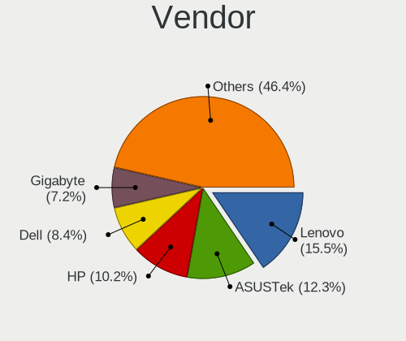
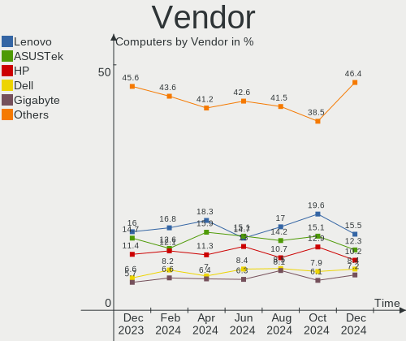
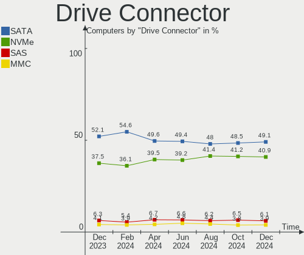
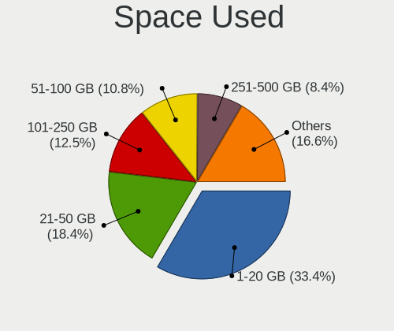
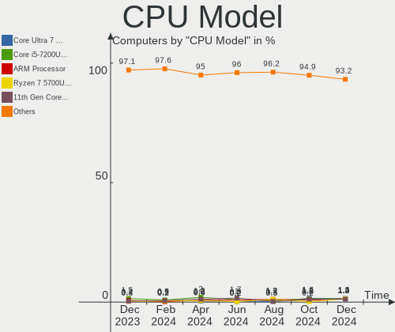
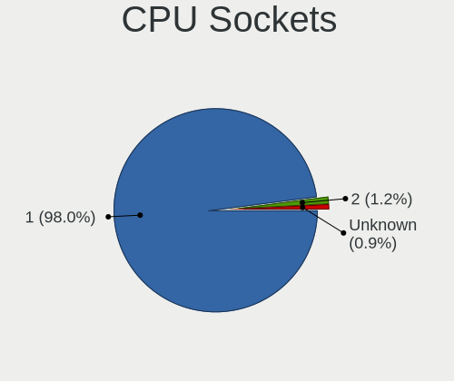
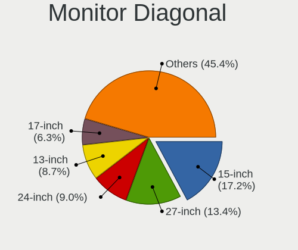
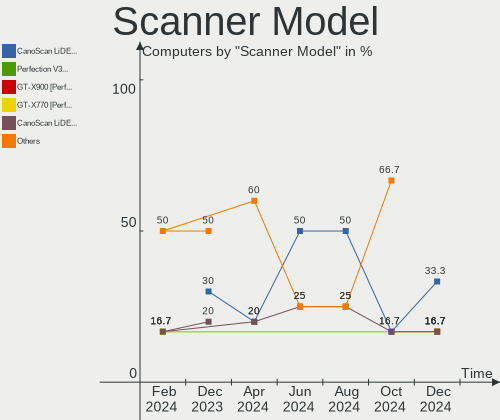
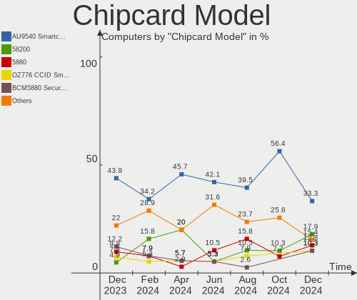
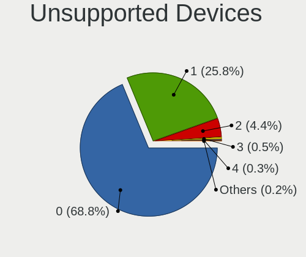

Linux in Germany - Hardware Trends
----------------------------------

A project to identify most popular hardware characteristics and track their change
over time based on data collected by Linux users at https://Linux-Hardware.org.

Anyone can contribute to this report by the [hw-probe](https://github.com/linuxhw/hw-probe) tool:

    sudo -E hw-probe -all -upload

This is a report for all computer types. See also reports for [desktops](/Location/Germany/Desktop/README.md) and [notebooks](/Location/Germany/Notebook/README.md).

Period: Nov, 2023.

Contents
--------

* [ System ](#system)
  - [ OS                       ](#os)
  - [ OS Family                ](#os-family)
  - [ Kernel                   ](#kernel)
  - [ Kernel Family            ](#kernel-family)
  - [ Kernel Major Ver.        ](#kernel-major-ver)
  - [ Arch                     ](#arch)
  - [ DE                       ](#de)
  - [ Display Server           ](#display-server)
  - [ Display Manager          ](#display-manager)
  - [ OS Lang                  ](#os-lang)
  - [ Boot Mode                ](#boot-mode)
  - [ Filesystem               ](#filesystem)
  - [ Part. scheme             ](#part-scheme)
  - [ Dual Boot with Linux/BSD ](#dual-boot-with-linuxbsd)
  - [ Dual Boot (Win)          ](#dual-boot-win)

* [ Board ](#board)
  - [ Vendor                   ](#vendor)
  - [ Model                    ](#model)
  - [ Model Family             ](#model-family)
  - [ MFG Year                 ](#mfg-year)
  - [ Form Factor              ](#form-factor)
  - [ Secure Boot              ](#secure-boot)
  - [ Coreboot                 ](#coreboot)
  - [ RAM Size                 ](#ram-size)
  - [ RAM Used                 ](#ram-used)
  - [ Total Drives             ](#total-drives)
  - [ Has CD-ROM               ](#has-cd-rom)
  - [ Has Ethernet             ](#has-ethernet)
  - [ Has WiFi                 ](#has-wifi)
  - [ Has Bluetooth            ](#has-bluetooth)

* [ Location ](#location)
  - [ Country                  ](#country)
  - [ City                     ](#city)

* [ Drives ](#drives)
  - [ Drive Vendor             ](#drive-vendor)
  - [ Drive Model              ](#drive-model)
  - [ HDD Vendor               ](#hdd-vendor)
  - [ SSD Vendor               ](#ssd-vendor)
  - [ Drive Kind               ](#drive-kind)
  - [ Drive Connector          ](#drive-connector)
  - [ Drive Size               ](#drive-size)
  - [ Space Total              ](#space-total)
  - [ Space Used               ](#space-used)
  - [ Malfunc. Drives          ](#malfunc-drives)
  - [ Malfunc. Drive Vendor    ](#malfunc-drive-vendor)
  - [ Malfunc. HDD Vendor      ](#malfunc-hdd-vendor)
  - [ Malfunc. Drive Kind      ](#malfunc-drive-kind)
  - [ Failed Drives            ](#failed-drives)
  - [ Failed Drive Vendor      ](#failed-drive-vendor)
  - [ Drive Status             ](#drive-status)

* [ Storage controller ](#storage-controller)
  - [ Storage Vendor           ](#storage-vendor)
  - [ Storage Model            ](#storage-model)
  - [ Storage Kind             ](#storage-kind)

* [ Processor ](#processor)
  - [ CPU Vendor               ](#cpu-vendor)
  - [ CPU Model                ](#cpu-model)
  - [ CPU Model Family         ](#cpu-model-family)
  - [ CPU Cores                ](#cpu-cores)
  - [ CPU Sockets              ](#cpu-sockets)
  - [ CPU Threads              ](#cpu-threads)
  - [ CPU Op-Modes             ](#cpu-op-modes)
  - [ CPU Microcode            ](#cpu-microcode)
  - [ CPU Microarch            ](#cpu-microarch)

* [ Graphics ](#graphics)
  - [ GPU Vendor               ](#gpu-vendor)
  - [ GPU Model                ](#gpu-model)
  - [ GPU Combo                ](#gpu-combo)
  - [ GPU Driver               ](#gpu-driver)
  - [ GPU Memory               ](#gpu-memory)

* [ Monitor ](#monitor)
  - [ Monitor Vendor           ](#monitor-vendor)
  - [ Monitor Model            ](#monitor-model)
  - [ Monitor Resolution       ](#monitor-resolution)
  - [ Monitor Diagonal         ](#monitor-diagonal)
  - [ Monitor Width            ](#monitor-width)
  - [ Aspect Ratio             ](#aspect-ratio)
  - [ Monitor Area             ](#monitor-area)
  - [ Pixel Density            ](#pixel-density)
  - [ Multiple Monitors        ](#multiple-monitors)

* [ Network ](#network)
  - [ Net Controller Vendor    ](#net-controller-vendor)
  - [ Net Controller Model     ](#net-controller-model)
  - [ Wireless Vendor          ](#wireless-vendor)
  - [ Wireless Model           ](#wireless-model)
  - [ Ethernet Vendor          ](#ethernet-vendor)
  - [ Ethernet Model           ](#ethernet-model)
  - [ Net Controller Kind      ](#net-controller-kind)
  - [ Used Controller          ](#used-controller)
  - [ NICs                     ](#nics)
  - [ IPv6                     ](#ipv6)

* [ Bluetooth ](#bluetooth)
  - [ Bluetooth Vendor         ](#bluetooth-vendor)
  - [ Bluetooth Model          ](#bluetooth-model)

* [ Sound ](#sound)
  - [ Sound Vendor             ](#sound-vendor)
  - [ Sound Model              ](#sound-model)

* [ Memory ](#memory)
  - [ Memory Vendor            ](#memory-vendor)
  - [ Memory Model             ](#memory-model)
  - [ Memory Kind              ](#memory-kind)
  - [ Memory Form Factor       ](#memory-form-factor)
  - [ Memory Size              ](#memory-size)
  - [ Memory Speed             ](#memory-speed)

* [ Printers & scanners ](#printers--scanners)
  - [ Printer Vendor           ](#printer-vendor)
  - [ Printer Model            ](#printer-model)
  - [ Scanner Vendor           ](#scanner-vendor)
  - [ Scanner Model            ](#scanner-model)

* [ Camera ](#camera)
  - [ Camera Vendor            ](#camera-vendor)
  - [ Camera Model             ](#camera-model)

* [ Security ](#security)
  - [ Fingerprint Vendor       ](#fingerprint-vendor)
  - [ Fingerprint Model        ](#fingerprint-model)
  - [ Chipcard Vendor          ](#chipcard-vendor)
  - [ Chipcard Model           ](#chipcard-model)

* [ Unsupported ](#unsupported)
  - [ Unsupported Devices      ](#unsupported-devices)
  - [ Unsupported Device Types ](#unsupported-device-types)

System
------

OS
--

Installed operating systems

| Name                         | Computers | Percent |
|------------------------------|-----------|---------|
| Linux Mint 21.2              | 92        | 13.35%  |
| Ubuntu 22.04                 | 82        | 11.9%   |
| Debian 12                    | 33        | 4.79%   |
| Ubuntu 23.10                 | 31        | 4.5%    |
| OpenMandriva 5.0             | 30        | 4.35%   |
| OpenMandriva 23.08           | 27        | 3.92%   |
| Fedora 39                    | 26        | 3.77%   |
| Arch Rolling                 | 26        | 3.77%   |
| Zorin 16                     | 24        | 3.48%   |
| openSUSE Tumbleweed-XXXXXXXX | 23        | 3.34%   |
| Pop!_OS 22.04                | 20        | 2.9%    |
| Fedora 38                    | 18        | 2.61%   |
| LMDE 6                       | 12        | 1.74%   |
| Nobara 38                    | 11        | 1.6%    |
| EndeavourOS Rolling          | 10        | 1.45%   |
| Debian 11                    | 10        | 1.45%   |
| ArcoLinux Rolling            | 10        | 1.45%   |
| TUXEDO OS 22.04              | 9         | 1.31%   |
| Debian                       | 9         | 1.31%   |
| Ubuntu 23.04                 | 8         | 1.16%   |
| Ubuntu 20.04                 | 8         | 1.16%   |
| OpenMandriva 23.11           | 7         | 1.02%   |
| Linux Mint 21.1              | 7         | 1.02%   |
| Kubuntu 23.10                | 7         | 1.02%   |
| Kubuntu 22.04                | 7         | 1.02%   |
| Kali 2023.3                  | 7         | 1.02%   |
| Elementary 7.1               | 7         | 1.02%   |
| Manjaro 23.1.0               | 6         | 0.87%   |
| Linux Mint 20.3              | 6         | 0.87%   |
| Gentoo 2.14                  | 6         | 0.87%   |
| openSUSE Leap-15.5           | 5         | 0.73%   |
| Manjaro                      | 5         | 0.73%   |
| SteamOS 3.5.5                | 4         | 0.58%   |
| ROSA 12.4                    | 4         | 0.58%   |
| Linux Mint 21                | 4         | 0.58%   |
| Xero Rolling                 | 3         | 0.44%   |
| Ubuntu Budgie 22.04          | 3         | 0.44%   |
| SteamOS 3.5.7                | 3         | 0.44%   |
| openSUSE Microos-XXXXXXXX    | 3         | 0.44%   |
| OpenMandriva 23.10           | 3         | 0.44%   |

OS Family
---------

OS without a version

| Name          | Computers | Percent |
|---------------|-----------|---------|
| Ubuntu        | 133       | 19.3%   |
| Linux Mint    | 113       | 16.4%   |
| OpenMandriva  | 77        | 11.18%  |
| Debian        | 52        | 7.55%   |
| Fedora        | 44        | 6.39%   |
| openSUSE      | 32        | 4.64%   |
| Arch          | 26        | 3.77%   |
| Zorin         | 24        | 3.48%   |
| Pop!_OS       | 20        | 2.9%    |
| Kubuntu       | 16        | 2.32%   |
| Manjaro       | 13        | 1.89%   |
| LMDE          | 12        | 1.74%   |
| Nobara        | 11        | 1.6%    |
| EndeavourOS   | 10        | 1.45%   |
| ArcoLinux     | 10        | 1.45%   |
| TUXEDO OS     | 9         | 1.31%   |
| SteamOS       | 9         | 1.31%   |
| Kali          | 7         | 1.02%   |
| Elementary    | 7         | 1.02%   |
| Gentoo        | 6         | 0.87%   |
| Ubuntu MATE   | 5         | 0.73%   |
| Xubuntu       | 4         | 0.58%   |
| Ubuntu Budgie | 4         | 0.58%   |
| ROSA          | 4         | 0.58%   |
| KDE neon      | 4         | 0.58%   |
| Xero          | 3         | 0.44%   |
| Raspbian      | 3         | 0.44%   |
| MX            | 3         | 0.44%   |
| OpenWrt       | 2         | 0.29%   |
| NixOS         | 2         | 0.29%   |
| Neptune OS    | 2         | 0.29%   |
| Garuda Linux  | 2         | 0.29%   |
| ChimeraOS     | 2         | 0.29%   |
| BlackPanther  | 2         | 0.29%   |
| Alpine        | 2         | 0.29%   |
| AlmaLinux     | 2         | 0.29%   |
| Void Linux    | 1         | 0.15%   |
| Ubuntu Unity  | 1         | 0.15%   |
| Siduction     | 1         | 0.15%   |
| Q4OS          | 1         | 0.15%   |

Kernel
------

Version of the Linux kernel

| Version                      | Computers | Percent |
|------------------------------|-----------|---------|
| 5.15.0-88-generic            | 79        | 11.47%  |
| 6.2.0-36-generic             | 68        | 9.87%   |
| 6.6.2-desktop-1omv2390       | 33        | 4.79%   |
| 6.1.0-13-amd64               | 30        | 4.35%   |
| 6.5.0-10-generic             | 29        | 4.21%   |
| 6.4.11-desktop-1omv2390      | 26        | 3.77%   |
| 5.15.0-89-generic            | 26        | 3.77%   |
| 6.2.0-37-generic             | 24        | 3.48%   |
| 6.5.6-76060506-generic       | 16        | 2.32%   |
| 6.5.9-1-default              | 14        | 2.03%   |
| 6.5.11-300.fc39.x86_64       | 13        | 1.89%   |
| 6.5.9-arch2-1                | 12        | 1.74%   |
| 6.6.2-arch1-1                | 10        | 1.45%   |
| 6.6.1-arch1-1                | 10        | 1.45%   |
| 5.15.0-87-generic            | 8         | 1.16%   |
| 6.5.12-300.fc39.x86_64       | 7         | 1.02%   |
| 5.4.0-166-generic            | 7         | 1.02%   |
| 6.6.2-1-default              | 6         | 0.87%   |
| 6.5.0-13-generic             | 6         | 0.87%   |
| 6.5.0-10006-tuxedo           | 6         | 0.87%   |
| 6.4.10-202.fsync.fc38.x86_64 | 6         | 0.87%   |
| 5.15.0-76-generic            | 6         | 0.87%   |
| 6.6.1-1-default              | 5         | 0.73%   |
| 6.5.9-200.fc38.x86_64        | 5         | 0.73%   |
| 6.5.8-200.fc38.x86_64        | 5         | 0.73%   |
| 6.5.10-200.fc38.x86_64       | 5         | 0.73%   |
| 6.5.0-kali3-amd64            | 5         | 0.73%   |
| 6.5.0-9-generic              | 5         | 0.73%   |
| 6.5.0-4-amd64                | 5         | 0.73%   |
| 6.5.0-10008-tuxedo           | 5         | 0.73%   |
| 6.2.0-35-generic             | 5         | 0.73%   |
| 6.1.52-valve7-1-neptune-61   | 5         | 0.73%   |
| 6.5.9-201.fsync.fc38.x86_64  | 4         | 0.58%   |
| 6.2.6-desktop-1omv2390       | 4         | 0.58%   |
| 6.2.0-34-generic             | 4         | 0.58%   |
| 6.2.0-26-generic             | 4         | 0.58%   |
| 6.1.0-12-amd64               | 4         | 0.58%   |
| 5.10.0-26-amd64              | 4         | 0.58%   |
| 6.5.6-300.fc39.x86_64        | 3         | 0.44%   |
| 6.5.4-76060504-generic       | 3         | 0.44%   |

Kernel Family
-------------

Linux kernel without a distro release

| Version | Computers | Percent |
|---------|-----------|---------|
| 5.15.0  | 137       | 19.88%  |
| 6.2.0   | 111       | 16.11%  |
| 6.5.0   | 71        | 10.3%   |
| 6.6.2   | 54        | 7.84%   |
| 6.1.0   | 49        | 7.11%   |
| 6.5.9   | 38        | 5.52%   |
| 6.4.11  | 27        | 3.92%   |
| 6.6.1   | 24        | 3.48%   |
| 6.5.6   | 21        | 3.05%   |
| 6.5.11  | 16        | 2.32%   |
| 6.1.52  | 9         | 1.31%   |
| 5.4.0   | 9         | 1.31%   |
| 6.5.10  | 8         | 1.16%   |
| 6.5.12  | 7         | 1.02%   |
| 6.4.10  | 6         | 0.87%   |
| 6.1.62  | 6         | 0.87%   |
| 6.5.8   | 5         | 0.73%   |
| 5.14.21 | 5         | 0.73%   |
| 5.10.0  | 5         | 0.73%   |
| 6.6.0   | 4         | 0.58%   |
| 6.5.5   | 4         | 0.58%   |
| 6.2.6   | 4         | 0.58%   |
| 6.5.7   | 3         | 0.44%   |
| 6.5.4   | 3         | 0.44%   |
| 6.5.2   | 3         | 0.44%   |
| 6.2.16  | 3         | 0.44%   |
| 6.1.61  | 3         | 0.44%   |
| 6.1.58  | 3         | 0.44%   |
| 6.1.57  | 3         | 0.44%   |
| 5.19.0  | 3         | 0.44%   |
| 6.4.12  | 2         | 0.29%   |
| 6.4.0   | 2         | 0.29%   |
| 6.3.9   | 2         | 0.29%   |
| 6.3.8   | 2         | 0.29%   |
| 6.3.0   | 2         | 0.29%   |
| 6.2.9   | 2         | 0.29%   |
| 6.1.60  | 2         | 0.29%   |
| 6.1.55  | 2         | 0.29%   |
| 6.1.21  | 2         | 0.29%   |
| 6.1.1   | 2         | 0.29%   |

Kernel Major Ver.
-----------------

Linux kernel major version

| Version | Computers | Percent |
|---------|-----------|---------|
| 6.5     | 181       | 26.27%  |
| 5.15    | 140       | 20.32%  |
| 6.2     | 120       | 17.42%  |
| 6.1     | 84        | 12.19%  |
| 6.6     | 82        | 11.9%   |
| 6.4     | 39        | 5.66%   |
| 6.3     | 9         | 1.31%   |
| 5.4     | 9         | 1.31%   |
| 5.10    | 9         | 1.31%   |
| 5.14    | 7         | 1.02%   |
| 5.19    | 3         | 0.44%   |
| 4.15    | 2         | 0.29%   |
| 6.0     | 1         | 0.15%   |
| 5.8     | 1         | 0.15%   |
| 5.16    | 1         | 0.15%   |
| 5.11    | 1         | 0.15%   |

Arch
----

OS architecture (x86_64, i586, etc.)

| Name    | Computers | Percent |
|---------|-----------|---------|
| x86_64  | 675       | 97.97%  |
| i686    | 7         | 1.02%   |
| aarch64 | 4         | 0.58%   |
| armv7l  | 3         | 0.44%   |

DE
--

Desktop Environment

| Name             | Computers | Percent |
|------------------|-----------|---------|
| GNOME            | 268       | 38.9%   |
| KDE5             | 177       | 25.69%  |
| X-Cinnamon       | 113       | 16.4%   |
| XFCE             | 40        | 5.81%   |
| Unknown          | 28        | 4.06%   |
| MATE             | 13        | 1.89%   |
| Cinnamon         | 8         | 1.16%   |
| Pantheon         | 7         | 1.02%   |
| LXQt             | 6         | 0.87%   |
| i3               | 5         | 0.73%   |
| Hyprland         | 5         | 0.73%   |
| Budgie           | 5         | 0.73%   |
| LXDE             | 4         | 0.58%   |
| Unity            | 2         | 0.29%   |
| KDE              | 2         | 0.29%   |
| Trinity          | 1         | 0.15%   |
| sway             | 1         | 0.15%   |
| Openbox          | 1         | 0.15%   |
| none+awesome     | 1         | 0.15%   |
| lightdm-xsession | 1         | 0.15%   |
| GNOME Classic    | 1         | 0.15%   |

Display Server
--------------

X11 or Wayland

| Name    | Computers | Percent |
|---------|-----------|---------|
| X11     | 398       | 57.76%  |
| Wayland | 259       | 37.59%  |
| Tty     | 18        | 2.61%   |
| Unknown | 14        | 2.03%   |

Display Manager
---------------

SDDM, LightDM, etc.

| Name    | Computers | Percent |
|---------|-----------|---------|
| Unknown | 290       | 42.09%  |
| SDDM    | 136       | 19.74%  |
| GDM3    | 136       | 19.74%  |
| LightDM | 100       | 14.51%  |
| GDM     | 25        | 3.63%   |
| WDM     | 1         | 0.15%   |
| LXDM    | 1         | 0.15%   |

OS Lang
-------

Language

| Lang    | Computers | Percent |
|---------|-----------|---------|
| de_DE   | 474       | 68.8%   |
| en_US   | 150       | 21.77%  |
| en_GB   | 15        | 2.18%   |
| Unknown | 15        | 2.18%   |
| C       | 14        | 2.03%   |
| it_IT   | 4         | 0.58%   |
| de_AT   | 3         | 0.44%   |
| ru_RU   | 2         | 0.29%   |
| pl_PL   | 2         | 0.29%   |
| UTF-8   | 1         | 0.15%   |
| sk_SK   | 1         | 0.15%   |
| POSIX   | 1         | 0.15%   |
| nl_NL   | 1         | 0.15%   |
| hr_HR   | 1         | 0.15%   |
| es_ES   | 1         | 0.15%   |
| en_IE   | 1         | 0.15%   |
| en_DK   | 1         | 0.15%   |
| de_CH   | 1         | 0.15%   |
| C.UTF8  | 1         | 0.15%   |

Boot Mode
---------

EFI or BIOS

| Mode | Computers | Percent |
|------|-----------|---------|
| EFI  | 356       | 51.67%  |
| BIOS | 333       | 48.33%  |

Filesystem
----------

Type of filesystem

| Type    | Computers | Percent |
|---------|-----------|---------|
| Ext4    | 379       | 55.01%  |
| Btrfs   | 122       | 17.71%  |
| Tmpfs   | 118       | 17.13%  |
| Overlay | 53        | 7.69%   |
| Xfs     | 7         | 1.02%   |
| Zfs     | 6         | 0.87%   |
| Ext3    | 3         | 0.44%   |
| Ext2    | 1         | 0.15%   |

Part. scheme
------------

Scheme of partitioning

| Type    | Computers | Percent |
|---------|-----------|---------|
| GPT     | 361       | 52.39%  |
| Unknown | 262       | 38.03%  |
| MBR     | 66        | 9.58%   |

Dual Boot with Linux/BSD
------------------------

Hosting more than one Linux/BSD

| Dual boot | Computers | Percent |
|-----------|-----------|---------|
| No        | 582       | 84.47%  |
| Yes       | 107       | 15.53%  |

Dual Boot (Win)
---------------

Hosting Linux and Windows

| Dual boot | Computers | Percent |
|-----------|-----------|---------|
| No        | 524       | 76.05%  |
| Yes       | 165       | 23.95%  |

Board
-----

Vendor
------

Motherboard manufacturer

| Name                                 | Computers | Percent |
|--------------------------------------|-----------|---------|
| Lenovo                               | 127       | 18.43%  |
| Hewlett-Packard                      | 84        | 12.19%  |
| ASUSTek Computer                     | 78        | 11.32%  |
| Dell                                 | 51        | 7.4%    |
| MSI                                  | 45        | 6.53%   |
| Acer                                 | 39        | 5.66%   |
| Gigabyte Technology                  | 37        | 5.37%   |
| ASRock                               | 33        | 4.79%   |
| Fujitsu                              | 24        | 3.48%   |
| Medion                               | 21        | 3.05%   |
| Apple                                | 19        | 2.76%   |
| TUXEDO                               | 13        | 1.89%   |
| Samsung Electronics                  | 10        | 1.45%   |
| Valve                                | 9         | 1.31%   |
| Intel                                | 8         | 1.16%   |
| Unknown                              | 8         | 1.16%   |
| Toshiba                              | 7         | 1.02%   |
| Raspberry Pi Foundation              | 5         | 0.73%   |
| Packard Bell                         | 5         | 0.73%   |
| Supermicro                           | 4         | 0.58%   |
| Sony                                 | 4         | 0.58%   |
| Inventec                             | 4         | 0.58%   |
| VALE                                 | 3         | 0.44%   |
| Notebook                             | 3         | 0.44%   |
| IBM                                  | 3         | 0.44%   |
| HUAWEI                               | 3         | 0.44%   |
| Framework                            | 3         | 0.44%   |
| Biostar                              | 3         | 0.44%   |
| Wortmann AG                          | 2         | 0.29%   |
| Timi                                 | 2         | 0.29%   |
| Shuttle                              | 2         | 0.29%   |
| Shenzhen Meigao Electronic Equipment | 2         | 0.29%   |
| Schenker                             | 2         | 0.29%   |
| Panasonic                            | 2         | 0.29%   |
| Google                               | 2         | 0.29%   |
| Chuwi                                | 2         | 0.29%   |
| BESSTAR Tech                         | 2         | 0.29%   |
| ZOTAC                                | 1         | 0.15%   |
| Wistron                              | 1         | 0.15%   |
| TrekStor                             | 1         | 0.15%   |

Model
-----

Motherboard model

| Name                                       | Computers | Percent |
|--------------------------------------------|-----------|---------|
| Unknown                                    | 12        | 1.74%   |
| Valve Jupiter                              | 9         | 1.31%   |
| TUXEDO Pulse 15 Gen1                       | 4         | 0.58%   |
| VALE Notebook Classic C140                 | 3         | 0.44%   |
| Supermicro Super Server                    | 3         | 0.44%   |
| MSI MS-7B86                                | 3         | 0.44%   |
| MSI MS-7B79                                | 3         | 0.44%   |
| Inventec D CLASS                           | 3         | 0.44%   |
| Dell Latitude 5420                         | 3         | 0.44%   |
| ASUS PRIME A320M-K                         | 3         | 0.44%   |
| ASUS A0000001                              | 3         | 0.44%   |
| ASRock B450 Steel Legend                   | 3         | 0.44%   |
| Acer Aspire 7750G                          | 3         | 0.44%   |
| Samsung 530U3C/530U4C/532U3C               | 2         | 0.29%   |
| RPi Raspberry Pi 3 Model B Plus Rev 1.3    | 2         | 0.29%   |
| MSI MS-7C91                                | 2         | 0.29%   |
| MSI MS-7C84                                | 2         | 0.29%   |
| MSI MS-7C37                                | 2         | 0.29%   |
| MSI MS-7996                                | 2         | 0.29%   |
| Medion MS-7728                             | 2         | 0.29%   |
| Lenovo Yoga C640-13IML 81UE                | 2         | 0.29%   |
| Lenovo V17 G3 IAP 82U1                     | 2         | 0.29%   |
| Lenovo ThinkPad X13 Gen 2a 20XJS28V01      | 2         | 0.29%   |
| Lenovo ThinkPad E14 Gen 4 21ECS00000       | 2         | 0.29%   |
| Lenovo Legion 7 16ITHg6 82K6               | 2         | 0.29%   |
| HP Laptop 17-cp0xxx                        | 2         | 0.29%   |
| HP ENVY x360 Convertible 13-ay0xxx         | 2         | 0.29%   |
| HP 255 G7 Notebook PC                      | 2         | 0.29%   |
| Gigabyte X570 AORUS PRO                    | 2         | 0.29%   |
| Gigabyte GA-790XTA-UD4                     | 2         | 0.29%   |
| Gigabyte B550 AORUS ELITE V2               | 2         | 0.29%   |
| Gigabyte 970A-DS3P FX                      | 2         | 0.29%   |
| Fujitsu LIFEBOOK E736                      | 2         | 0.29%   |
| Fujitsu ESPRIMO E720                       | 2         | 0.29%   |
| Framework Laptop 13 (AMD Ryzen 7040Series) | 2         | 0.29%   |
| Dell Precision 3660                        | 2         | 0.29%   |
| Dell OptiPlex 780                          | 2         | 0.29%   |
| Dell OptiPlex 3060                         | 2         | 0.29%   |
| Dell Latitude E6540                        | 2         | 0.29%   |
| Dell Latitude E6430                        | 2         | 0.29%   |

Model Family
------------

Motherboard model prefix

| Name                  | Computers | Percent |
|-----------------------|-----------|---------|
| Lenovo ThinkPad       | 70        | 10.16%  |
| Acer Aspire           | 30        | 4.35%   |
| Dell Latitude         | 24        | 3.48%   |
| Fujitsu ESPRIMO       | 13        | 1.89%   |
| ASUS ROG              | 13        | 1.89%   |
| HP ProBook            | 12        | 1.74%   |
| Unknown               | 12        | 1.74%   |
| Lenovo ThinkCentre    | 11        | 1.6%    |
| HP Pavilion           | 11        | 1.6%    |
| Dell OptiPlex         | 11        | 1.6%    |
| Lenovo IdeaPad        | 10        | 1.45%   |
| HP Laptop             | 10        | 1.45%   |
| HP EliteBook          | 10        | 1.45%   |
| ASUS VivoBook         | 10        | 1.45%   |
| Valve Jupiter         | 9         | 1.31%   |
| Lenovo Legion         | 9         | 1.31%   |
| ASUS PRIME            | 8         | 1.16%   |
| Toshiba Satellite     | 7         | 1.02%   |
| HP Compaq             | 7         | 1.02%   |
| Dell Precision        | 7         | 1.02%   |
| ASRock B450           | 6         | 0.87%   |
| RPi Raspberry         | 5         | 0.73%   |
| Lenovo Yoga           | 5         | 0.73%   |
| HP 255                | 5         | 0.73%   |
| Fujitsu LIFEBOOK      | 5         | 0.73%   |
| Dell XPS              | 5         | 0.73%   |
| ASUS TUF              | 5         | 0.73%   |
| TUXEDO Pulse          | 4         | 0.58%   |
| Packard Bell EasyNote | 4         | 0.58%   |
| Medion Akoya          | 4         | 0.58%   |
| Lenovo IdeaCentre     | 4         | 0.58%   |
| HP ENVY               | 4         | 0.58%   |
| HP Elite              | 4         | 0.58%   |
| VALE Notebook         | 3         | 0.44%   |
| TUXEDO InfinityBook   | 3         | 0.44%   |
| Supermicro Super      | 3         | 0.44%   |
| MSI MS-7B86           | 3         | 0.44%   |
| MSI MS-7B79           | 3         | 0.44%   |
| Lenovo ThinkBook      | 3         | 0.44%   |
| Inventec D            | 3         | 0.44%   |

MFG Year
--------

Motherboard manufacture year

| Year    | Computers | Percent |
|---------|-----------|---------|
| 2018    | 70        | 10.16%  |
| 2020    | 67        | 9.72%   |
| 2021    | 57        | 8.27%   |
| 2012    | 54        | 7.84%   |
| 2022    | 53        | 7.69%   |
| 2023    | 51        | 7.4%    |
| 2019    | 50        | 7.26%   |
| 2017    | 42        | 6.1%    |
| 2013    | 40        | 5.81%   |
| 2011    | 40        | 5.81%   |
| 2014    | 36        | 5.22%   |
| 2015    | 30        | 4.35%   |
| 2016    | 27        | 3.92%   |
| 2010    | 22        | 3.19%   |
| 2009    | 16        | 2.32%   |
| 2008    | 13        | 1.89%   |
| 2007    | 8         | 1.16%   |
| Unknown | 7         | 1.02%   |
| 2006    | 3         | 0.44%   |
| 2005    | 1         | 0.15%   |
| 2004    | 1         | 0.15%   |
| 2003    | 1         | 0.15%   |

Form Factor
-----------

Physical design of the computer

| Name           | Computers | Percent |
|----------------|-----------|---------|
| Notebook       | 368       | 53.41%  |
| Desktop        | 252       | 36.57%  |
| Convertible    | 21        | 3.05%   |
| Mini pc        | 14        | 2.03%   |
| All in one     | 10        | 1.45%   |
| Server         | 9         | 1.31%   |
| Tablet         | 8         | 1.16%   |
| System on chip | 7         | 1.02%   |

Secure Boot
-----------

Enabled or disabled

| State    | Computers | Percent |
|----------|-----------|---------|
| Disabled | 647       | 93.9%   |
| Enabled  | 42        | 6.1%    |

Coreboot
--------

Have coreboot on board

| Used | Computers | Percent |
|------|-----------|---------|
| No   | 687       | 99.71%  |
| Yes  | 2         | 0.29%   |

RAM Size
--------

Total RAM memory

| Size in GB  | Computers | Percent |
|-------------|-----------|---------|
| 4.01-8.0    | 164       | 23.8%   |
| 16.01-24.0  | 148       | 21.48%  |
| 8.01-16.0   | 118       | 17.13%  |
| 32.01-64.0  | 116       | 16.84%  |
| 3.01-4.0    | 83        | 12.05%  |
| 64.01-256.0 | 20        | 2.9%    |
| 24.01-32.0  | 17        | 2.47%   |
| 1.01-2.0    | 10        | 1.45%   |
| 2.01-3.0    | 6         | 0.87%   |
| 0.51-1.0    | 6         | 0.87%   |
| 0.01-0.5    | 1         | 0.15%   |

RAM Used
--------

Used RAM memory

| Used GB    | Computers | Percent |
|------------|-----------|---------|
| 1.01-2.0   | 211       | 30.62%  |
| 2.01-3.0   | 170       | 24.67%  |
| 4.01-8.0   | 120       | 17.42%  |
| 3.01-4.0   | 100       | 14.51%  |
| 8.01-16.0  | 41        | 5.95%   |
| 0.51-1.0   | 23        | 3.34%   |
| 0.01-0.5   | 14        | 2.03%   |
| 16.01-24.0 | 7         | 1.02%   |
| 24.01-32.0 | 2         | 0.29%   |
| 32.01-64.0 | 1         | 0.15%   |

Total Drives
------------

Number of drives on board

| Drives | Computers | Percent |
|--------|-----------|---------|
| 1      | 408       | 59.22%  |
| 2      | 166       | 24.09%  |
| 3      | 53        | 7.69%   |
| 4      | 27        | 3.92%   |
| 6      | 12        | 1.74%   |
| 5      | 10        | 1.45%   |
| 0      | 5         | 0.73%   |
| 9      | 3         | 0.44%   |
| 7      | 3         | 0.44%   |
| 17     | 1         | 0.15%   |
| 8      | 1         | 0.15%   |

Has CD-ROM
----------

Has CD-ROM on board

| Presented | Computers | Percent |
|-----------|-----------|---------|
| No        | 447       | 64.88%  |
| Yes       | 242       | 35.12%  |

Has Ethernet
------------

Has Ethernet on board

| Presented | Computers | Percent |
|-----------|-----------|---------|
| Yes       | 600       | 87.08%  |
| No        | 89        | 12.92%  |

Has WiFi
--------

Has WiFi module

| Presented | Computers | Percent |
|-----------|-----------|---------|
| Yes       | 520       | 75.47%  |
| No        | 169       | 24.53%  |

Has Bluetooth
-------------

Has Bluetooth module

| Presented | Computers | Percent |
|-----------|-----------|---------|
| Yes       | 424       | 61.54%  |
| No        | 265       | 38.46%  |

Location
--------

Country
-------

Geographic location (country)

| Country | Computers | Percent |
|---------|-----------|---------|
| Germany | 689       | 100%    |

City
----

Geographic location (city)

| City              | Computers | Percent |
|-------------------|-----------|---------|
| Berlin            | 76        | 11.03%  |
| Hamburg           | 28        | 4.06%   |
| Munich            | 23        | 3.34%   |
| Frankfurt am Main | 20        | 2.9%    |
| Leipzig           | 19        | 2.76%   |
| Cologne           | 17        | 2.47%   |
| Stuttgart         | 14        | 2.03%   |
| Düsseldorf       | 13        | 1.89%   |
| Karlsruhe         | 9         | 1.31%   |
| Essen             | 9         | 1.31%   |
| Dresden           | 8         | 1.16%   |
| Nussdorf am Inn   | 7         | 1.02%   |
| Mannheim          | 7         | 1.02%   |
| Mainz             | 7         | 1.02%   |
| Fürth            | 6         | 0.87%   |
| Duisburg          | 6         | 0.87%   |
| Dortmund          | 6         | 0.87%   |
| Bonn              | 6         | 0.87%   |
| Nuremberg         | 5         | 0.73%   |
| Hanover           | 5         | 0.73%   |
| Halle             | 5         | 0.73%   |
| Darmstadt         | 5         | 0.73%   |
| Braunschweig      | 5         | 0.73%   |
| Augsburg          | 5         | 0.73%   |
| Wuppertal         | 4         | 0.58%   |
| Kiel              | 4         | 0.58%   |
| Kassel            | 4         | 0.58%   |
| Delligsen         | 4         | 0.58%   |
| Bremen            | 4         | 0.58%   |
| Bochum            | 4         | 0.58%   |
| Würzburg         | 3         | 0.44%   |
| Trier             | 3         | 0.44%   |
| Schwerin          | 3         | 0.44%   |
| Saarbrücken      | 3         | 0.44%   |
| Paderborn         | 3         | 0.44%   |
| Oberhausen        | 3         | 0.44%   |
| Magdeburg         | 3         | 0.44%   |
| Langen            | 3         | 0.44%   |
| Koblenz           | 3         | 0.44%   |
| Hof               | 3         | 0.44%   |

Drives
------

Drive Vendor
------------

Hard drive vendors

| Vendor                       | Computers | Drives | Percent |
|------------------------------|-----------|--------|---------|
| Samsung Electronics          | 226       | 291    | 22.55%  |
| WDC                          | 112       | 134    | 11.18%  |
| SanDisk                      | 84        | 95     | 8.38%   |
| Seagate                      | 81        | 120    | 8.08%   |
| Toshiba                      | 46        | 60     | 4.59%   |
| Crucial                      | 44        | 49     | 4.39%   |
| Unknown                      | 40        | 48     | 3.99%   |
| Intenso                      | 32        | 34     | 3.19%   |
| Kingston                     | 30        | 33     | 2.99%   |
| Micron Technology            | 29        | 30     | 2.89%   |
| SK hynix                     | 26        | 27     | 2.59%   |
| Intel                        | 22        | 24     | 2.2%    |
| Hitachi                      | 19        | 21     | 1.9%    |
| Micron/Crucial Technology    | 17        | 18     | 1.7%    |
| Phison Electronics           | 14        | 15     | 1.4%    |
| HGST                         | 14        | 15     | 1.4%    |
| KIOXIA                       | 13        | 15     | 1.3%    |
| Silicon Motion               | 9         | 9      | 0.9%    |
| Kingston Technology Company  | 8         | 9      | 0.8%    |
| Transcend                    | 7         | 7      | 0.7%    |
| Phison                       | 7         | 7      | 0.7%    |
| China                        | 7         | 7      | 0.7%    |
| Apple                        | 6         | 7      | 0.6%    |
| Unknown                      | 6         | 6      | 0.6%    |
| Verbatim                     | 5         | 5      | 0.5%    |
| A-DATA Technology            | 5         | 5      | 0.5%    |
| UMIS                         | 4         | 4      | 0.4%    |
| SPCC                         | 4         | 5      | 0.4%    |
| WDC WDS                      | 3         | 3      | 0.3%    |
| Shenzhen Longsys Electronics | 3         | 4      | 0.3%    |
| SABRENT                      | 3         | 3      | 0.3%    |
| Plextor                      | 3         | 3      | 0.3%    |
| MAXIO Technology (Hangzhou)  | 3         | 3      | 0.3%    |
| KIOXIA-EXCERIA               | 3         | 3      | 0.3%    |
| JMicron Technology           | 3         | 3      | 0.3%    |
| GLOWAY                       | 3         | 3      | 0.3%    |
| Fanxiang                     | 3         | 3      | 0.3%    |
| Emtec                        | 3         | 3      | 0.3%    |
| Dogfish                      | 3         | 3      | 0.3%    |
| Corsair                      | 3         | 3      | 0.3%    |

Drive Model
-----------

Hard drive models

| Model                                                 | Computers | Percent |
|-------------------------------------------------------|-----------|---------|
| Samsung NVMe SSD Controller SM981/PM981/PM983 250GB   | 33        | 2.94%   |
| Samsung NVMe SSD Controller PM9A1/PM9A3/980PRO 2TB    | 22        | 1.96%   |
| Samsung SSD 850 EVO 250GB                             | 14        | 1.25%   |
| Samsung SSD 980 1TB                                   | 9         | 0.8%    |
| Samsung SSD 850 EVO 500GB                             | 9         | 0.8%    |
| Micron/Crucial P2 NVMe PCIe SSD 1TB                   | 9         | 0.8%    |
| SanDisk SSD PLUS 240GB                                | 8         | 0.71%   |
| SanDisk SSD PLUS 1000GB                               | 8         | 0.71%   |
| Samsung SSD 860 EVO 250GB                             | 8         | 0.71%   |
| Samsung NVMe SSD Controller SM961/PM961/SM963 256GB   | 8         | 0.71%   |
| SanDisk SSD PLUS 480GB                                | 7         | 0.62%   |
| Samsung SSD 860 EVO 500GB                             | 7         | 0.62%   |
| Crucial CT1000MX500SSD1 1TB                           | 7         | 0.62%   |
| Silicon Motion SM2263EN/SM2263XT SSD Controller 256GB | 6         | 0.53%   |
| Samsung SSD 870 QVO 1TB                               | 6         | 0.53%   |
| Samsung SSD 860 EVO 1TB                               | 6         | 0.53%   |
| Samsung SSD 840 EVO 250GB                             | 6         | 0.53%   |
| Intenso SSD SATAIII 512GB                             | 6         | 0.53%   |
| Crucial CT500MX500SSD1 500GB                          | 6         | 0.53%   |
| Crucial CT250MX500SSD1 250GB                          | 6         | 0.53%   |
| Unknown                                               | 6         | 0.53%   |
| Unknown MMC Card  64GB                                | 5         | 0.45%   |
| Unknown MMC Card  32GB                                | 5         | 0.45%   |
| Toshiba HDWD110 1TB                                   | 5         | 0.45%   |
| Toshiba DT01ACA100 1TB                                | 5         | 0.45%   |
| Seagate ST500DM002-1BD142 500GB                       | 5         | 0.45%   |
| Seagate ST2000DM008-2FR102 2TB                        | 5         | 0.45%   |
| Sandisk WD Black SN750 / PC SN730 NVMe SSD 500GB      | 5         | 0.45%   |
| Samsung HD103SI 1TB                                   | 5         | 0.45%   |
| Kingston SA400S37480G 480GB SSD                       | 5         | 0.45%   |
| Crucial CT240BX500SSD1 240GB                          | 5         | 0.45%   |
| WDC WDS500G2B0A-00SM50 500GB SSD                      | 4         | 0.36%   |
| WDC WD20EARS-00MVWB0 2TB                              | 4         | 0.36%   |
| Verbatim Vi550 S3 512GB                               | 4         | 0.36%   |
| Toshiba DT01ACA200 2TB                                | 4         | 0.36%   |
| Seagate ST1000LM035-1RK172 1TB                        | 4         | 0.36%   |
| Sandisk WD Blue SN570 1TB                             | 4         | 0.36%   |
| Sandisk WD Blue SN550 NVMe SSD 512GB                  | 4         | 0.36%   |
| SanDisk NVMe SSD Drive 1TB                            | 4         | 0.36%   |
| Samsung SSD 990 PRO 2TB                               | 4         | 0.36%   |

HDD Vendor
----------

Hard disk drive vendors

| Vendor              | Computers | Drives | Percent |
|---------------------|-----------|--------|---------|
| WDC                 | 88        | 106    | 32.71%  |
| Seagate             | 77        | 116    | 28.62%  |
| Toshiba             | 36        | 47     | 13.38%  |
| Samsung Electronics | 21        | 23     | 7.81%   |
| Hitachi             | 19        | 21     | 7.06%   |
| HGST                | 14        | 15     | 5.2%    |
| Unknown             | 3         | 3      | 1.12%   |
| Intenso             | 2         | 2      | 0.74%   |
| ExcelStor           | 2         | 2      | 0.74%   |
| ASMT                | 2         | 2      | 0.74%   |
| USB3.0              | 1         | 1      | 0.37%   |
| SABRENT             | 1         | 1      | 0.37%   |
| IB-377U3            | 1         | 1      | 0.37%   |
| Fujitsu             | 1         | 1      | 0.37%   |
| Apple               | 1         | 1      | 0.37%   |

SSD Vendor
----------

Solid state drive vendors

| Vendor              | Computers | Drives | Percent |
|---------------------|-----------|--------|---------|
| Samsung Electronics | 113       | 132    | 31.22%  |
| SanDisk             | 54        | 61     | 14.92%  |
| Crucial             | 40        | 45     | 11.05%  |
| Intenso             | 27        | 29     | 7.46%   |
| Kingston            | 17        | 17     | 4.7%    |
| WDC                 | 16        | 16     | 4.42%   |
| Transcend           | 6         | 6      | 1.66%   |
| Micron Technology   | 6         | 6      | 1.66%   |
| China               | 6         | 6      | 1.66%   |
| Phison              | 5         | 5      | 1.38%   |
| Verbatim            | 4         | 4      | 1.1%    |
| Intel               | 4         | 4      | 1.1%    |
| Apple               | 4         | 4      | 1.1%    |
| WDC WDS             | 3         | 3      | 0.83%   |
| Toshiba             | 3         | 3      | 0.83%   |
| SPCC                | 3         | 4      | 0.83%   |
| GLOWAY              | 3         | 3      | 0.83%   |
| Fanxiang            | 3         | 3      | 0.83%   |
| Emtec               | 3         | 3      | 0.83%   |
| Dogfish             | 3         | 3      | 0.83%   |
| A-DATA Technology   | 3         | 3      | 0.83%   |
| Zheino              | 2         | 2      | 0.55%   |
| Unknown             | 2         | 2      | 0.55%   |
| SK hynix            | 2         | 2      | 0.55%   |
| Seagate             | 2         | 2      | 0.55%   |
| PNY                 | 2         | 3      | 0.55%   |
| Plextor             | 2         | 2      | 0.55%   |
| Patriot             | 2         | 2      | 0.55%   |
| LITEON              | 2         | 2      | 0.55%   |
| Corsair             | 2         | 2      | 0.55%   |
| AirDisk             | 2         | 2      | 0.55%   |
| Unknown             | 2         | 2      | 0.55%   |
| Teclast             | 1         | 1      | 0.28%   |
| Team                | 1         | 1      | 0.28%   |
| S3+                 | 1         | 1      | 0.28%   |
| OCZ                 | 1         | 1      | 0.28%   |
| Mushkin             | 1         | 1      | 0.28%   |
| Lexar               | 1         | 1      | 0.28%   |
| Leven               | 1         | 1      | 0.28%   |
| KIOXIA-EXCERIA      | 1         | 1      | 0.28%   |

Drive Kind
----------

HDD or SSD

| Kind    | Computers | Drives | Percent |
|---------|-----------|--------|---------|
| SSD     | 314       | 397    | 34.39%  |
| NVMe    | 312       | 380    | 34.17%  |
| HDD     | 229       | 342    | 25.08%  |
| MMC     | 32        | 34     | 3.5%    |
| Unknown | 26        | 35     | 2.85%   |

Drive Connector
---------------

SATA, SAS, NVMe, etc.

| Type | Computers | Drives | Percent |
|------|-----------|--------|---------|
| SATA | 446       | 706    | 53.03%  |
| NVMe | 312       | 379    | 37.1%   |
| SAS  | 51        | 69     | 6.06%   |
| MMC  | 32        | 34     | 3.8%    |

Drive Size
----------

Size of hard drive

| Size in TB | Computers | Drives | Percent |
|------------|-----------|--------|---------|
| 0.01-0.5   | 306       | 385    | 52.67%  |
| 0.51-1.0   | 176       | 219    | 30.29%  |
| 1.01-2.0   | 56        | 71     | 9.64%   |
| 3.01-4.0   | 16        | 23     | 2.75%   |
| 2.01-3.0   | 15        | 21     | 2.58%   |
| 4.01-10.0  | 11        | 15     | 1.89%   |
| 10.01-20.0 | 1         | 5      | 0.17%   |

Space Total
-----------

Amount of disk space available on the file system

| Size in GB     | Computers | Percent |
|----------------|-----------|---------|
| 251-500        | 157       | 22.79%  |
| 101-250        | 137       | 19.88%  |
| 501-1000       | 111       | 16.11%  |
| 1001-2000      | 65        | 9.43%   |
| More than 3000 | 55        | 7.98%   |
| 1-20           | 51        | 7.4%    |
| 51-100         | 33        | 4.79%   |
| Unknown        | 33        | 4.79%   |
| 2001-3000      | 26        | 3.77%   |
| 21-50          | 21        | 3.05%   |

Space Used
----------

Amount of used disk space

| Used GB        | Computers | Percent |
|----------------|-----------|---------|
| 1-20           | 188       | 27.29%  |
| 21-50          | 121       | 17.56%  |
| 101-250        | 98        | 14.22%  |
| 51-100         | 80        | 11.61%  |
| 251-500        | 69        | 10.01%  |
| 501-1000       | 38        | 5.52%   |
| Unknown        | 33        | 4.79%   |
| 1001-2000      | 26        | 3.77%   |
| More than 3000 | 17        | 2.47%   |
| 2001-3000      | 17        | 2.47%   |
| 0              | 2         | 0.29%   |

Malfunc. Drives
---------------

Drive models with a malfunction

| Model                                                           | Computers | Drives | Percent |
|-----------------------------------------------------------------|-----------|--------|---------|
| Seagate ST500DM002-1BD142 500GB                                 | 3         | 3      | 6.12%   |
| Samsung Electronics HD103SI 1TB                                 | 3         | 3      | 6.12%   |
| SanDisk SSD PLUS 480GB                                          | 2         | 2      | 4.08%   |
| WDC WD5000LPVX-22V0TT0 500GB                                    | 1         | 1      | 2.04%   |
| WDC WD5000AAVS-00ZTB0 500GB                                     | 1         | 1      | 2.04%   |
| WDC WD5000AAKX-221CA1 500GB                                     | 1         | 1      | 2.04%   |
| WDC WD2500BEVT-60ZCT1 250GB                                     | 1         | 1      | 2.04%   |
| WDC WD20EARX-00PASB0 2TB                                        | 1         | 1      | 2.04%   |
| WDC WD1600AAJS-60B4A0 160GB                                     | 1         | 1      | 2.04%   |
| WDC WD10EZEX-08M2NA0 1TB                                        | 1         | 1      | 2.04%   |
| WDC WD Blue SA510 2.5 500GB                                     | 1         | 1      | 2.04%   |
| Transcend TS250GMTS425S 250GB SSD                               | 1         | 1      | 2.04%   |
| Toshiba MQ01ABD100 1TB                                          | 1         | 1      | 2.04%   |
| Toshiba MK5059GSXP 500GB                                        | 1         | 1      | 2.04%   |
| Toshiba DT01ACA100 1TB                                          | 1         | 1      | 2.04%   |
| SK hynix SH920 2.5 7MM 256GB SSD                                | 1         | 1      | 2.04%   |
| SK hynix BC711 HFM512GD3JX013N 512GB                            | 1         | 1      | 2.04%   |
| Silicon Motion SM2263EN/SM2263XT SSD Controller 256GB           | 1         | 1      | 2.04%   |
| Seagate ST9320423AS 320GB                                       | 1         | 1      | 2.04%   |
| Seagate ST9250315AS 250GB                                       | 1         | 1      | 2.04%   |
| Seagate ST3500830AS 500GB                                       | 1         | 1      | 2.04%   |
| Seagate ST3500630NS 500GB                                       | 1         | 1      | 2.04%   |
| Seagate ST3250620AS 250GB                                       | 1         | 1      | 2.04%   |
| Seagate ST1000DM003-9YN162 1TB                                  | 1         | 1      | 2.04%   |
| SanDisk SDSSDX240GG25 240GB                                     | 1         | 1      | 2.04%   |
| SanDisk SDSSDP128G 128GB                                        | 1         | 1      | 2.04%   |
| Samsung Electronics SSD 980 1TB                                 | 1         | 1      | 2.04%   |
| Samsung Electronics SSD 870 EVO 500GB                           | 1         | 1      | 2.04%   |
| Samsung Electronics SSD 840 EVO 250GB                           | 1         | 1      | 2.04%   |
| Samsung Electronics NVMe SSD Controller SM981/PM981/PM983 250GB | 1         | 1      | 2.04%   |
| Samsung Electronics MZ7KM960HAHP-00005 960GB SSD                | 1         | 1      | 2.04%   |
| Samsung Electronics HM160JC 160GB                               | 1         | 1      | 2.04%   |
| Samsung Electronics HD502HJ 500GB                               | 1         | 1      | 2.04%   |
| Samsung Electronics HD501LJ 500GB                               | 1         | 1      | 2.04%   |
| Samsung Electronics HD103UJ 1TB                                 | 1         | 1      | 2.04%   |
| Plextor PX-256M2S 256GB SSD                                     | 1         | 1      | 2.04%   |
| Micron Technology 1100_MTFDDAK256TBN 256GB SSD                  | 1         | 1      | 2.04%   |
| Intel SSDSCKKF180G8L 180GB                                      | 1         | 1      | 2.04%   |
| Hitachi HTS723225A7A364 250GB                                   | 1         | 1      | 2.04%   |
| HGST HTS725050A7E630 500GB                                      | 1         | 1      | 2.04%   |

Malfunc. Drive Vendor
---------------------

Vendors of faulty drives

| Vendor              | Computers | Drives | Percent |
|---------------------|-----------|--------|---------|
| Samsung Electronics | 12        | 12     | 24.49%  |
| Seagate             | 9         | 9      | 18.37%  |
| WDC                 | 8         | 8      | 16.33%  |
| SanDisk             | 4         | 4      | 8.16%   |
| Toshiba             | 3         | 3      | 6.12%   |
| SK hynix            | 2         | 2      | 4.08%   |
| HGST                | 2         | 2      | 4.08%   |
| A-DATA Technology   | 2         | 2      | 4.08%   |
| Transcend           | 1         | 1      | 2.04%   |
| Silicon Motion      | 1         | 1      | 2.04%   |
| Plextor             | 1         | 1      | 2.04%   |
| Micron Technology   | 1         | 1      | 2.04%   |
| Intel               | 1         | 1      | 2.04%   |
| Hitachi             | 1         | 1      | 2.04%   |
| Corsair             | 1         | 1      | 2.04%   |

Malfunc. HDD Vendor
-------------------

Vendors of faulty HDD drives

| Vendor              | Computers | Drives | Percent |
|---------------------|-----------|--------|---------|
| Seagate             | 9         | 9      | 31.03%  |
| WDC                 | 7         | 7      | 24.14%  |
| Samsung Electronics | 7         | 7      | 24.14%  |
| Toshiba             | 3         | 3      | 10.34%  |
| HGST                | 2         | 2      | 6.9%    |
| Hitachi             | 1         | 1      | 3.45%   |

Malfunc. Drive Kind
-------------------

Kinds of faulty drives

| Kind | Computers | Drives | Percent |
|------|-----------|--------|---------|
| HDD  | 28        | 29     | 60.87%  |
| SSD  | 14        | 16     | 30.43%  |
| NVMe | 4         | 4      | 8.7%    |

Failed Drives
-------------

Failed drive models

Zero info for selected period =(

Failed Drive Vendor
-------------------

Failed drive vendors

Zero info for selected period =(

Drive Status
------------

Number of failed and malfunc. drives

| Status   | Computers | Drives | Percent |
|----------|-----------|--------|---------|
| Detected | 417       | 679    | 56.5%   |
| Works    | 276       | 460    | 37.4%   |
| Malfunc  | 45        | 49     | 6.1%    |

Storage controller
------------------

Storage Vendor
--------------

Storage controller vendors

| Vendor                         | Computers | Percent |
|--------------------------------|-----------|---------|
| Intel                          | 396       | 42.67%  |
| AMD                            | 152       | 16.38%  |
| Samsung Electronics            | 119       | 12.82%  |
| SanDisk                        | 43        | 4.63%   |
| SK hynix                       | 24        | 2.59%   |
| Micron Technology              | 23        | 2.48%   |
| Kingston Technology Company    | 23        | 2.48%   |
| Micron/Crucial Technology      | 21        | 2.26%   |
| Phison Electronics             | 19        | 2.05%   |
| ASMedia Technology             | 19        | 2.05%   |
| KIOXIA                         | 14        | 1.51%   |
| Silicon Motion                 | 9         | 0.97%   |
| Toshiba America Info Systems   | 8         | 0.86%   |
| Marvell Technology Group       | 8         | 0.86%   |
| Nvidia                         | 6         | 0.65%   |
| JMicron Technology             | 6         | 0.65%   |
| Union Memory (Shenzhen)        | 4         | 0.43%   |
| Shenzhen Longsys Electronics   | 4         | 0.43%   |
| LSI Logic / Symbios Logic      | 4         | 0.43%   |
| Seagate Technology             | 3         | 0.32%   |
| Realtek Semiconductor          | 3         | 0.32%   |
| MAXIO Technology (Hangzhou)    | 3         | 0.32%   |
| VIA Technologies               | 2         | 0.22%   |
| O2 Micro                       | 2         | 0.22%   |
| Broadcom / LSI                 | 2         | 0.22%   |
| ADATA Technology               | 2         | 0.22%   |
| Adaptec                        | 2         | 0.22%   |
| Transcend                      | 1         | 0.11%   |
| Solid State Storage Technology | 1         | 0.11%   |
| OCZ Technology Group           | 1         | 0.11%   |
| Lite-On Technology             | 1         | 0.11%   |
| Lenovo                         | 1         | 0.11%   |
| INNOGRIT                       | 1         | 0.11%   |
| Apple                          | 1         | 0.11%   |

Storage Model
-------------

Storage controller models

| Model                                                                          | Computers | Percent |
|--------------------------------------------------------------------------------|-----------|---------|
| AMD FCH SATA Controller [AHCI mode]                                            | 95        | 9.19%   |
| Samsung NVMe SSD Controller SM981/PM981/PM983                                  | 52        | 5.03%   |
| Intel Sunrise Point-LP SATA Controller [AHCI mode]                             | 40        | 3.87%   |
| Intel 8 Series/C220 Series Chipset Family 6-port SATA Controller 1 [AHCI mode] | 36        | 3.48%   |
| Samsung NVMe SSD Controller PM9A1/PM9A3/980PRO                                 | 31        | 3%      |
| Intel 7 Series Chipset Family 6-port SATA Controller [AHCI mode]               | 27        | 2.61%   |
| Intel 6 Series/C200 Series Chipset Family 6 port Mobile SATA AHCI Controller   | 26        | 2.51%   |
| AMD 400 Series Chipset SATA Controller                                         | 25        | 2.42%   |
| Samsung NVMe SSD Controller 980 (DRAM-less)                                    | 21        | 2.03%   |
| AMD 500 Series Chipset SATA Controller                                         | 20        | 1.93%   |
| Intel Q170/Q150/B150/H170/H110/Z170/CM236 Chipset SATA Controller [AHCI Mode]  | 19        | 1.84%   |
| ASMedia ASM1062 Serial ATA Controller                                          | 16        | 1.55%   |
| Intel Celeron/Pentium Silver Processor SATA Controller                         | 15        | 1.45%   |
| Intel 82801 Mobile SATA Controller [RAID mode]                                 | 15        | 1.45%   |
| AMD SB7x0/SB8x0/SB9x0 SATA Controller [AHCI mode]                              | 15        | 1.45%   |
| Intel Cannon Lake PCH SATA AHCI Controller                                     | 14        | 1.35%   |
| AMD SB7x0/SB8x0/SB9x0 IDE Controller                                           | 14        | 1.35%   |
| Intel Volume Management Device NVMe RAID Controller                            | 13        | 1.26%   |
| Intel 6 Series/C200 Series Chipset Family 6 port Desktop SATA AHCI Controller  | 12        | 1.16%   |
| SK hynix Gold P31/BC711/PC711 NVMe Solid State Drive                           | 11        | 1.06%   |
| Micron/Crucial P2 [Nick P2] / P3 / P3 Plus NVMe PCIe SSD (DRAM-less)           | 11        | 1.06%   |
| AMD SB7x0/SB8x0/SB9x0 SATA Controller [IDE mode]                               | 11        | 1.06%   |
| Samsung NVMe SSD Controller SM961/PM961/SM963                                  | 10        | 0.97%   |
| Micron 2450 NVMe SSD [HendrixV] (DRAM-less)                                    | 10        | 0.97%   |
| SanDisk Extreme Pro / WD Black SN750 / PC SN730 / Red SN700 NVMe SSD           | 9         | 0.87%   |
| Intel Alder Lake-P SATA AHCI Controller                                        | 9         | 0.87%   |
| Intel 7 Series/C210 Series Chipset Family 6-port SATA Controller [AHCI mode]   | 9         | 0.87%   |
| Intel Wildcat Point-LP SATA Controller [AHCI Mode]                             | 8         | 0.77%   |
| Intel 82801HM/HEM (ICH8M/ICH8M-E) SATA Controller [AHCI mode]                  | 8         | 0.77%   |
| Intel 82801HM/HEM (ICH8M/ICH8M-E) IDE Controller                               | 8         | 0.77%   |
| Intel 500 Series Chipset Family SATA AHCI Controller                           | 8         | 0.77%   |
| Intel 200 Series PCH SATA controller [AHCI mode]                               | 8         | 0.77%   |
| Silicon Motion SM2263EN/SM2263XT (DRAM-less) NVMe SSD Controllers              | 7         | 0.68%   |
| Phison PS5013-E13 PCIe3 NVMe Controller (DRAM-less)                            | 7         | 0.68%   |
| Intel SSD 660P Series                                                          | 7         | 0.68%   |
| Intel Comet Lake SATA AHCI Controller                                          | 7         | 0.68%   |
| Intel Alder Lake-S PCH SATA Controller [AHCI Mode]                             | 7         | 0.68%   |
| AMD FCH SATA Controller D                                                      | 7         | 0.68%   |
| SanDisk WD Black SN770 / PC SN740 256GB / PC SN560 (DRAM-less) NVMe SSD        | 6         | 0.58%   |
| SanDisk Ultra 3D / WD Blue SN570 NVMe SSD (DRAM-less)                          | 6         | 0.58%   |

Storage Kind
------------

Kind of storage controller (IDE, SATA, NVMe, SAS, ...)

| Kind | Computers | Percent |
|------|-----------|---------|
| SATA | 489       | 53.74%  |
| NVMe | 313       | 34.4%   |
| IDE  | 55        | 6.04%   |
| RAID | 45        | 4.95%   |
| SAS  | 4         | 0.44%   |
| SCSI | 4         | 0.44%   |

Processor
---------

CPU Vendor
----------

Processor vendors

| Vendor | Computers | Percent |
|--------|-----------|---------|
| Intel  | 472       | 68.51%  |
| AMD    | 210       | 30.48%  |
| ARM    | 7         | 1.02%   |

CPU Model
---------

Processor models

| Model                                         | Computers | Percent |
|-----------------------------------------------|-----------|---------|
| Intel Core i5-7200U CPU @ 2.50GHz             | 10        | 1.45%   |
| Intel 11th Gen Core i7-1165G7 @ 2.80GHz       | 9         | 1.31%   |
| AMD Custom APU 0405                           | 9         | 1.31%   |
| Intel Core i7-8550U CPU @ 1.80GHz             | 7         | 1.02%   |
| Intel Core i5-6300U CPU @ 2.40GHz             | 7         | 1.02%   |
| Intel Core i5-3210M CPU @ 2.50GHz             | 7         | 1.02%   |
| AMD Ryzen 7 4800H with Radeon Graphics        | 7         | 1.02%   |
| Intel Core i5-8350U CPU @ 1.70GHz             | 6         | 0.87%   |
| Intel Core i5-8250U CPU @ 1.60GHz             | 6         | 0.87%   |
| Intel Core i5-2520M CPU @ 2.50GHz             | 6         | 0.87%   |
| Intel Core i5-10210U CPU @ 1.60GHz            | 6         | 0.87%   |
| AMD Ryzen 5 3600 6-Core Processor             | 6         | 0.87%   |
| Intel Core i5-6500 CPU @ 3.20GHz              | 5         | 0.73%   |
| Intel 11th Gen Core i5-1135G7 @ 2.40GHz       | 5         | 0.73%   |
| AMD Ryzen 7 5700X 8-Core Processor            | 5         | 0.73%   |
| AMD Ryzen 7 2700 Eight-Core Processor         | 5         | 0.73%   |
| AMD Ryzen 5 5625U with Radeon Graphics        | 5         | 0.73%   |
| AMD Ryzen 5 5600G with Radeon Graphics        | 5         | 0.73%   |
| AMD Ryzen 5 5500U with Radeon Graphics        | 5         | 0.73%   |
| AMD A8-6410 APU with AMD Radeon R5 Graphics   | 5         | 0.73%   |
| Intel Pentium Silver N5030 CPU @ 1.10GHz      | 4         | 0.58%   |
| Intel Core i9-9900K CPU @ 3.60GHz             | 4         | 0.58%   |
| Intel Core i7-8650U CPU @ 1.90GHz             | 4         | 0.58%   |
| Intel Core i7-7500U CPU @ 2.70GHz             | 4         | 0.58%   |
| Intel Core i5-8365U CPU @ 1.60GHz             | 4         | 0.58%   |
| Intel Core i5-7400 CPU @ 3.00GHz              | 4         | 0.58%   |
| Intel Core i5-7300U CPU @ 2.60GHz             | 4         | 0.58%   |
| Intel Core i5-6200U CPU @ 2.30GHz             | 4         | 0.58%   |
| Intel Core i5-3320M CPU @ 2.60GHz             | 4         | 0.58%   |
| Intel Atom x5-Z8350 CPU @ 1.44GHz             | 4         | 0.58%   |
| Intel 12th Gen Core i7-1260P                  | 4         | 0.58%   |
| Intel 12th Gen Core i7-1255U                  | 4         | 0.58%   |
| AMD Ryzen 9 5900X 12-Core Processor           | 4         | 0.58%   |
| AMD Ryzen 5 4500U with Radeon Graphics        | 4         | 0.58%   |
| AMD Ryzen 5 3500U with Radeon Vega Mobile Gfx | 4         | 0.58%   |
| AMD Ryzen 5 2600 Six-Core Processor           | 4         | 0.58%   |
| Intel Core i7-8565U CPU @ 1.80GHz             | 3         | 0.44%   |
| Intel Core i7-4700MQ CPU @ 2.40GHz            | 3         | 0.44%   |
| Intel Core i7-2670QM CPU @ 2.20GHz            | 3         | 0.44%   |
| Intel Core i7-2630QM CPU @ 2.00GHz            | 3         | 0.44%   |

CPU Model Family
----------------

Processor model prefix

| Model                   | Computers | Percent |
|-------------------------|-----------|---------|
| Intel Core i5           | 155       | 22.5%   |
| Intel Core i7           | 96        | 13.93%  |
| Other                   | 86        | 12.48%  |
| AMD Ryzen 7             | 53        | 7.69%   |
| AMD Ryzen 5             | 52        | 7.55%   |
| Intel Core i3           | 28        | 4.06%   |
| Intel Celeron           | 21        | 3.05%   |
| Intel Pentium           | 19        | 2.76%   |
| Intel Xeon              | 15        | 2.18%   |
| Intel Core 2 Duo        | 15        | 2.18%   |
| AMD Ryzen 9             | 15        | 2.18%   |
| Intel Atom              | 12        | 1.74%   |
| AMD FX                  | 12        | 1.74%   |
| AMD Ryzen 3             | 10        | 1.45%   |
| AMD A8                  | 9         | 1.31%   |
| Intel Pentium Silver    | 8         | 1.16%   |
| Intel Core i9           | 7         | 1.02%   |
| AMD Ryzen 7 PRO         | 7         | 1.02%   |
| Intel Pentium Dual-Core | 6         | 0.87%   |
| AMD Phenom II X4        | 6         | 0.87%   |
| AMD Ryzen 5 PRO         | 5         | 0.73%   |
| AMD A6                  | 5         | 0.73%   |
| AMD G                   | 4         | 0.58%   |
| ARM BCM                 | 3         | 0.44%   |
| AMD E2                  | 3         | 0.44%   |
| AMD A10                 | 3         | 0.44%   |
| Intel Pentium M         | 2         | 0.29%   |
| Intel Pentium Gold      | 2         | 0.29%   |
| Intel Pentium 4         | 2         | 0.29%   |
| Intel Core 2 Quad       | 2         | 0.29%   |
| Intel Core 2 Extreme    | 2         | 0.29%   |
| Intel Core 2            | 2         | 0.29%   |
| AMD PRO A10             | 2         | 0.29%   |
| AMD Phenom II X2        | 2         | 0.29%   |
| AMD E1                  | 2         | 0.29%   |
| AMD Athlon II           | 2         | 0.29%   |
| AMD A4                  | 2         | 0.29%   |
| Intel Pentium Dual      | 1         | 0.15%   |
| Intel Genuine           | 1         | 0.15%   |
| Intel Core m7           | 1         | 0.15%   |

CPU Cores
---------

Number of processor cores

| Number | Computers | Percent |
|--------|-----------|---------|
| 4      | 245       | 35.56%  |
| 2      | 213       | 30.91%  |
| 8      | 86        | 12.48%  |
| 6      | 74        | 10.74%  |
| 12     | 19        | 2.76%   |
| 1      | 13        | 1.89%   |
| 10     | 12        | 1.74%   |
| 16     | 10        | 1.45%   |
| 14     | 7         | 1.02%   |
| 24     | 6         | 0.87%   |
| 3      | 2         | 0.29%   |
| 20     | 1         | 0.15%   |
| 5      | 1         | 0.15%   |

CPU Sockets
-----------

Number of sockets

| Number | Computers | Percent |
|--------|-----------|---------|
| 1      | 683       | 99.13%  |
| 2      | 5         | 0.73%   |
| 3      | 1         | 0.15%   |

CPU Threads
-----------

Threads per core (Hyper-Threading)

| Number | Computers | Percent |
|--------|-----------|---------|
| 2      | 485       | 70.39%  |
| 1      | 204       | 29.61%  |

CPU Op-Modes
------------

CPU Operation Modes (32-bit, 64-bit)

| Op mode        | Computers | Percent |
|----------------|-----------|---------|
| 32-bit, 64-bit | 679       | 98.55%  |
| 32-bit         | 5         | 0.73%   |
| Unknown        | 5         | 0.73%   |

CPU Microcode
-------------

Microcode number

| Number     | Computers | Percent |
|------------|-----------|---------|
| Unknown    | 392       | 56.89%  |
| 0x206a7    | 18        | 2.61%   |
| 0x306c3    | 17        | 2.47%   |
| 0x306a9    | 14        | 2.03%   |
| 0x0a50000d | 12        | 1.74%   |
| 0x0a50000c | 10        | 1.45%   |
| 0x0800820d | 9         | 1.31%   |
| 0x806ea    | 8         | 1.16%   |
| 0x08108109 | 8         | 1.16%   |
| 0x0a20120a | 7         | 1.02%   |
| 0x706a8    | 6         | 0.87%   |
| 0x406e3    | 6         | 0.87%   |
| 0x08701021 | 6         | 0.87%   |
| 0x08600106 | 6         | 0.87%   |
| 0x806e9    | 5         | 0.73%   |
| 0x0a404102 | 5         | 0.73%   |
| 0x08701030 | 5         | 0.73%   |
| 0x08608103 | 5         | 0.73%   |
| 0x08600103 | 5         | 0.73%   |
| 0x806d1    | 4         | 0.58%   |
| 0x806c1    | 4         | 0.58%   |
| 0x106ca    | 4         | 0.58%   |
| 0x1067a    | 4         | 0.58%   |
| 0x0a704103 | 4         | 0.58%   |
| 0x08108102 | 4         | 0.58%   |
| 0x06000852 | 4         | 0.58%   |
| 0x010000c8 | 4         | 0.58%   |
| 0xa0655    | 3         | 0.44%   |
| 0x906a4    | 3         | 0.44%   |
| 0x806ec    | 3         | 0.44%   |
| 0x506e3    | 3         | 0.44%   |
| 0x406c4    | 3         | 0.44%   |
| 0x406c3    | 3         | 0.44%   |
| 0x306d4    | 3         | 0.44%   |
| 0x0a201025 | 3         | 0.44%   |
| 0xa0671    | 2         | 0.29%   |
| 0x906ed    | 2         | 0.29%   |
| 0x906ea    | 2         | 0.29%   |
| 0x906e9    | 2         | 0.29%   |
| 0x6f6      | 2         | 0.29%   |

CPU Microarch
-------------

Microarchitecture

| Name             | Computers | Percent |
|------------------|-----------|---------|
| KabyLake         | 97        | 14.08%  |
| Unknown          | 62        | 9%      |
| Zen 3            | 50        | 7.26%   |
| Haswell          | 50        | 7.26%   |
| SandyBridge      | 48        | 6.97%   |
| IvyBridge        | 41        | 5.95%   |
| Skylake          | 38        | 5.52%   |
| Zen 2            | 34        | 4.93%   |
| Zen+             | 27        | 3.92%   |
| Alderlake Hybrid | 27        | 3.92%   |
| TigerLake        | 19        | 2.76%   |
| Penryn           | 19        | 2.76%   |
| Silvermont       | 16        | 2.32%   |
| Piledriver       | 15        | 2.18%   |
| Goldmont plus    | 15        | 2.18%   |
| CometLake        | 13        | 1.89%   |
| Broadwell        | 13        | 1.89%   |
| Icelake          | 12        | 1.74%   |
| Westmere         | 11        | 1.6%    |
| K10              | 11        | 1.6%    |
| Core             | 10        | 1.45%   |
| Excavator        | 9         | 1.31%   |
| Puma             | 8         | 1.16%   |
| Zen              | 7         | 1.02%   |
| Bonnell          | 7         | 1.02%   |
| Bobcat           | 5         | 0.73%   |
| Steamroller      | 4         | 0.58%   |
| Jaguar           | 4         | 0.58%   |
| Tremont          | 3         | 0.44%   |
| P6               | 3         | 0.44%   |
| Nehalem          | 3         | 0.44%   |
| NetBurst         | 2         | 0.29%   |
| Gracemont        | 2         | 0.29%   |
| Goldmont         | 2         | 0.29%   |
| K8 Hammer        | 1         | 0.15%   |
| Bulldozer        | 1         | 0.15%   |

Graphics
--------

GPU Vendor
----------

Vendors of graphics cards

| Vendor                     | Computers | Percent |
|----------------------------|-----------|---------|
| Intel                      | 363       | 46.6%   |
| AMD                        | 213       | 27.34%  |
| Nvidia                     | 194       | 24.9%   |
| Matrox Electronics Systems | 4         | 0.51%   |
| ASPEED Technology          | 4         | 0.51%   |
| ATI Technologies           | 1         | 0.13%   |

GPU Model
---------

Graphics card models

| Model                                                                                    | Computers | Percent |
|------------------------------------------------------------------------------------------|-----------|---------|
| Intel 2nd Generation Core Processor Family Integrated Graphics Controller                | 32        | 4.01%   |
| Intel 3rd Gen Core processor Graphics Controller                                         | 26        | 3.25%   |
| Intel UHD Graphics 620                                                                   | 23        | 2.88%   |
| Intel HD Graphics 620                                                                    | 21        | 2.63%   |
| AMD Renoir [Radeon RX Vega 6 (Ryzen 4000/5000 Mobile Series)]                            | 19        | 2.38%   |
| AMD Cezanne [Radeon Vega Series / Radeon Vega Mobile Series]                             | 19        | 2.38%   |
| Intel TigerLake-LP GT2 [Iris Xe Graphics]                                                | 17        | 2.13%   |
| Intel Skylake GT2 [HD Graphics 520]                                                      | 15        | 1.88%   |
| Intel Alder Lake-P GT2 [Iris Xe Graphics]                                                | 15        | 1.88%   |
| AMD Picasso/Raven 2 [Radeon Vega Series / Radeon Vega Mobile Series]                     | 14        | 1.75%   |
| Intel Xeon E3-1200 v3/4th Gen Core Processor Integrated Graphics Controller              | 11        | 1.38%   |
| Intel Atom/Celeron/Pentium Processor x5-E8000/J3xxx/N3xxx Integrated Graphics Controller | 11        | 1.38%   |
| Intel 4th Gen Core Processor Integrated Graphics Controller                              | 11        | 1.38%   |
| Intel HD Graphics 530                                                                    | 10        | 1.25%   |
| Intel CoffeeLake-S GT2 [UHD Graphics 630]                                                | 10        | 1.25%   |
| AMD Ellesmere [Radeon RX 470/480/570/570X/580/580X/590]                                  | 10        | 1.25%   |
| Intel GeminiLake [UHD Graphics 600]                                                      | 9         | 1.13%   |
| AMD VanGogh [AMD Custom GPU 0405]                                                        | 9         | 1.13%   |
| AMD Barcelo                                                                              | 9         | 1.13%   |
| Intel WhiskeyLake-U GT2 [UHD Graphics 620]                                               | 8         | 1%      |
| Intel CometLake-U GT2 [UHD Graphics]                                                     | 8         | 1%      |
| AMD Rembrandt [Radeon 680M]                                                              | 8         | 1%      |
| AMD Lucienne                                                                             | 8         | 1%      |
| Nvidia GA106M [GeForce RTX 3060 Mobile / Max-Q]                                          | 7         | 0.88%   |
| Nvidia AD107M [GeForce RTX 4060 Max-Q / Mobile]                                          | 7         | 0.88%   |
| Intel Xeon E3-1200 v2/3rd Gen Core processor Graphics Controller                         | 7         | 0.88%   |
| Intel HD Graphics 630                                                                    | 7         | 0.88%   |
| AMD Mullins [Radeon R4/R5 Graphics]                                                      | 7         | 0.88%   |
| Nvidia GP107 [GeForce GTX 1050 Ti]                                                       | 6         | 0.75%   |
| Nvidia GP104 [GeForce GTX 1070]                                                          | 6         | 0.75%   |
| Intel HD Graphics 5500                                                                   | 6         | 0.75%   |
| Intel Haswell-ULT Integrated Graphics Controller                                         | 6         | 0.75%   |
| Intel GeminiLake [UHD Graphics 605]                                                      | 6         | 0.75%   |
| AMD Phoenix1                                                                             | 6         | 0.75%   |
| Nvidia GP107M [GeForce GTX 1050 Mobile]                                                  | 5         | 0.63%   |
| Nvidia GP106 [GeForce GTX 1060 6GB]                                                      | 5         | 0.63%   |
| Nvidia GK208B [GeForce GT 730]                                                           | 5         | 0.63%   |
| Nvidia GK208B [GeForce GT 710]                                                           | 5         | 0.63%   |
| Intel TigerLake-H GT1 [UHD Graphics]                                                     | 5         | 0.63%   |
| Intel Mobile 4 Series Chipset Integrated Graphics Controller                             | 5         | 0.63%   |

GPU Combo
---------

Combinations of graphics cards

| Name                    | Computers | Percent |
|-------------------------|-----------|---------|
| 1 x Intel               | 272       | 39.48%  |
| 1 x AMD                 | 185       | 26.85%  |
| 1 x Nvidia              | 114       | 16.55%  |
| Intel + Nvidia          | 64        | 9.29%   |
| Intel + AMD             | 10        | 1.45%   |
| AMD + Nvidia            | 10        | 1.45%   |
| 2 x Intel               | 8         | 1.16%   |
| 2 x AMD                 | 8         | 1.16%   |
| Other                   | 7         | 1.02%   |
| 2 x Nvidia              | 3         | 0.44%   |
| 1 x Matrox              | 3         | 0.44%   |
| Nvidia + ASPEED         | 2         | 0.29%   |
| 2 x Nvidia + 1 x Matrox | 1         | 0.15%   |
| 1 x ASPEED              | 1         | 0.15%   |
| AMD + ASPEED            | 1         | 0.15%   |

GPU Driver
----------

Free vs proprietary

| Driver      | Computers | Percent |
|-------------|-----------|---------|
| Free        | 559       | 81.13%  |
| Proprietary | 108       | 15.67%  |
| Unknown     | 22        | 3.19%   |

GPU Memory
----------

Total video memory

| Size in GB | Computers | Percent |
|------------|-----------|---------|
| Unknown    | 430       | 62.41%  |
| 0.01-0.5   | 65        | 9.43%   |
| 1.01-2.0   | 62        | 9%      |
| 0.51-1.0   | 35        | 5.08%   |
| 7.01-8.0   | 33        | 4.79%   |
| 3.01-4.0   | 25        | 3.63%   |
| 8.01-16.0  | 23        | 3.34%   |
| 5.01-6.0   | 14        | 2.03%   |
| 2.01-3.0   | 1         | 0.15%   |
| 16.01-24.0 | 1         | 0.15%   |

Monitor
-------

Monitor Vendor
--------------

Monitor vendors

| Vendor                  | Computers | Percent |
|-------------------------|-----------|---------|
| Samsung Electronics     | 95        | 12.52%  |
| AU Optronics            | 77        | 10.14%  |
| BOE                     | 70        | 9.22%   |
| LG Display              | 56        | 7.38%   |
| Chimei Innolux          | 53        | 6.98%   |
| Dell                    | 32        | 4.22%   |
| Hewlett-Packard         | 27        | 3.56%   |
| Acer                    | 25        | 3.29%   |
| Goldstar                | 20        | 2.64%   |
| BenQ                    | 20        | 2.64%   |
| Lenovo                  | 19        | 2.5%    |
| Ancor Communications    | 18        | 2.37%   |
| Apple                   | 17        | 2.24%   |
| Philips                 | 15        | 1.98%   |
| Sharp                   | 14        | 1.84%   |
| Iiyama                  | 14        | 1.84%   |
| AOC                     | 14        | 1.84%   |
| Fujitsu Siemens         | 12        | 1.58%   |
| Valve                   | 10        | 1.32%   |
| CSO                     | 10        | 1.32%   |
| ViewSonic               | 9         | 1.19%   |
| Chi Mei Optoelectronics | 9         | 1.19%   |
| PANDA                   | 8         | 1.05%   |
| Eizo                    | 8         | 1.05%   |
| ASUSTek Computer        | 8         | 1.05%   |
| NEC Computers           | 7         | 0.92%   |
| Medion                  | 7         | 0.92%   |
| Gigabyte Technology     | 7         | 0.92%   |
| Compal                  | 6         | 0.79%   |
| InfoVision              | 5         | 0.66%   |
| HannStar                | 5         | 0.66%   |
| Panasonic               | 4         | 0.53%   |
| Sony                    | 3         | 0.4%    |
| DENON                   | 3         | 0.4%    |
| Belinea                 | 3         | 0.4%    |
| MSI                     | 2         | 0.26%   |
| Medion Akoya            | 2         | 0.26%   |
| LG Electronics          | 2         | 0.26%   |
| HUAWEI                  | 2         | 0.26%   |
| HKC                     | 2         | 0.26%   |

Monitor Model
-------------

Monitor models

| Model                                                                   | Computers | Percent |
|-------------------------------------------------------------------------|-----------|---------|
| Valve ANX7530 U VLV3001 800x1280 100x150mm 7.1-inch                     | 9         | 1.15%   |
| Lenovo LCD Monitor LEN40BA 1920x1080 344x194mm 15.5-inch                | 5         | 0.64%   |
| Samsung Electronics U28E590 SAM0C4D 3840x2160 610x350mm 27.7-inch       | 4         | 0.51%   |
| Chimei Innolux LCD Monitor CMN14D4 1920x1080 309x173mm 13.9-inch        | 4         | 0.51%   |
| Samsung Electronics S27F350 SAM0D22 1920x1080 598x336mm 27.0-inch       | 3         | 0.38%   |
| Samsung Electronics C27F390 SAM0D32 1920x1080 598x336mm 27.0-inch       | 3         | 0.38%   |
| PANDA LCD Monitor NCP004A 1920x1080 309x174mm 14.0-inch                 | 3         | 0.38%   |
| Lenovo LCD Monitor LEN40B2 1920x1080 344x193mm 15.5-inch                | 3         | 0.38%   |
| Goldstar LG TV SSCR2 GSMC0C8 3840x2160                                  | 3         | 0.38%   |
| BOE LCD Monitor BOE0900 1920x1080 344x194mm 15.5-inch                   | 3         | 0.38%   |
| BOE LCD Monitor BOE08D7 1920x1080 309x174mm 14.0-inch                   | 3         | 0.38%   |
| BOE LCD Monitor BOE084E 1920x1080 382x215mm 17.3-inch                   | 3         | 0.38%   |
| BenQ GL2450H BNQ78A7 1920x1080 530x300mm 24.0-inch                      | 3         | 0.38%   |
| AU Optronics LCD Monitor AUO35EC 1366x768 344x193mm 15.5-inch           | 3         | 0.38%   |
| AU Optronics LCD Monitor AUO159E 1600x900 382x214mm 17.2-inch           | 3         | 0.38%   |
| AOC 27V2G5 AOC2702 1920x1080 598x336mm 27.0-inch                        | 3         | 0.38%   |
| ViewSonic VG2448 VSC3B35 1920x1080 527x296mm 23.8-inch                  | 2         | 0.25%   |
| Sharp LQ156M1JW01 SHP14C3 1920x1080 344x194mm 15.5-inch                 | 2         | 0.25%   |
| Samsung Electronics U28E590 SAM0C4E 3840x2160 608x345mm 27.5-inch       | 2         | 0.25%   |
| Samsung Electronics S24D330 SAM0D92 1920x1080 531x299mm 24.0-inch       | 2         | 0.25%   |
| Samsung Electronics S24D300 SAM0B43 1920x1080 531x299mm 24.0-inch       | 2         | 0.25%   |
| Samsung Electronics LU28R55 SAM1017 3840x2160 632x360mm 28.6-inch       | 2         | 0.25%   |
| Samsung Electronics LCD Monitor SEC325A 1366x768 344x194mm 15.5-inch    | 2         | 0.25%   |
| Samsung Electronics LCD Monitor SDC4C48 1920x1080 309x174mm 14.0-inch   | 2         | 0.25%   |
| Samsung Electronics LCD Monitor SAM0F14 3840x2160 1872x1053mm 84.6-inch | 2         | 0.25%   |
| Samsung Electronics LC34G55T SAM711A 1720x1440 800x340mm 34.2-inch      | 2         | 0.25%   |
| Samsung Electronics C24F390 SAM0D2C 1920x1080 521x293mm 23.5-inch       | 2         | 0.25%   |
| Philips FTV PHL04C3 1920x1080 1440x810mm 65.0-inch                      | 2         | 0.25%   |
| PANDA LM116LF3L02 NCP000A 1920x1080 256x144mm 11.6-inch                 | 2         | 0.25%   |
| Panasonic TV MEIA296 1920x1080 698x392mm 31.5-inch                      | 2         | 0.25%   |
| MSI MAG271CQR MSI3FA7 2560x1440 597x336mm 27.0-inch                     | 2         | 0.25%   |
| LG Display LCD Monitor LGD40A0 1366x768 310x174mm 14.0-inch             | 2         | 0.25%   |
| LG Display LCD Monitor LGD0590 1920x1080 344x194mm 15.5-inch            | 2         | 0.25%   |
| LG Display LCD Monitor LGD056F 2736x1824 260x173mm 12.3-inch            | 2         | 0.25%   |
| LG Display LCD Monitor LGD0533 1920x1080 344x194mm 15.5-inch            | 2         | 0.25%   |
| LG Display LCD Monitor LGD0521 1920x1080 309x174mm 14.0-inch            | 2         | 0.25%   |
| LG Display LCD Monitor LGD0490 1920x1080 309x174mm 14.0-inch            | 2         | 0.25%   |
| LG Display LCD Monitor LGD039F 1366x768 345x194mm 15.6-inch             | 2         | 0.25%   |
| Lenovo G32qc-30 LEN66F2 2560x1440 697x392mm 31.5-inch                   | 2         | 0.25%   |
| InfoVision LCD Monitor IVO854A 1920x1200 286x179mm 13.3-inch            | 2         | 0.25%   |

Monitor Resolution
------------------

Monitor screen resolution

| Resolution         | Computers | Percent |
|--------------------|-----------|---------|
| 1920x1080 (FHD)    | 333       | 45.49%  |
| 1366x768 (WXGA)    | 70        | 9.56%   |
| 2560x1440 (QHD)    | 58        | 7.92%   |
| 3840x2160 (4K)     | 54        | 7.38%   |
| 1600x900 (HD+)     | 34        | 4.64%   |
| 1920x1200 (WUXGA)  | 31        | 4.23%   |
| 1680x1050 (WSXGA+) | 26        | 3.55%   |
| 1280x1024 (SXGA)   | 17        | 2.32%   |
| 3440x1440          | 12        | 1.64%   |
| 2560x1600          | 12        | 1.64%   |
| 800x1280           | 9         | 1.23%   |
| 1440x900 (WXGA+)   | 9         | 1.23%   |
| 1280x800 (WXGA)    | 9         | 1.23%   |
| Unknown            | 8         | 1.09%   |
| 2880x1800          | 6         | 0.82%   |
| 1024x600           | 6         | 0.82%   |
| 1920x1280          | 4         | 0.55%   |
| 1024x768 (XGA)     | 4         | 0.55%   |
| 2256x1504          | 3         | 0.41%   |
| 1600x1200          | 3         | 0.41%   |
| 3840x2400          | 2         | 0.27%   |
| 3840x1080          | 2         | 0.27%   |
| 3360x1080          | 2         | 0.27%   |
| 3200x1800 (QHD+)   | 2         | 0.27%   |
| 2736x1824          | 2         | 0.27%   |
| 1920x540           | 2         | 0.27%   |
| 4800x1080          | 1         | 0.14%   |
| 4480x1440          | 1         | 0.14%   |
| 3840x1600          | 1         | 0.14%   |
| 3840x1200          | 1         | 0.14%   |
| 3200x1080          | 1         | 0.14%   |
| 3072x1920          | 1         | 0.14%   |
| 2560x1080          | 1         | 0.14%   |
| 2160x1440          | 1         | 0.14%   |
| 1680x945           | 1         | 0.14%   |
| 1360x768           | 1         | 0.14%   |
| 1280x960           | 1         | 0.14%   |
| 1280x720 (HD)      | 1         | 0.14%   |

Monitor Diagonal
----------------

Diagonal size in inches

| Inches  | Computers | Percent |
|---------|-----------|---------|
| 15      | 145       | 19.18%  |
| 27      | 77        | 10.19%  |
| 24      | 74        | 9.79%   |
| 13      | 69        | 9.13%   |
| 14      | 61        | 8.07%   |
| 17      | 57        | 7.54%   |
| 23      | 38        | 5.03%   |
| 21      | 33        | 4.37%   |
| 31      | 26        | 3.44%   |
| Unknown | 21        | 2.78%   |
| 22      | 18        | 2.38%   |
| 16      | 15        | 1.98%   |
| 19      | 14        | 1.85%   |
| 12      | 14        | 1.85%   |
| 7       | 10        | 1.32%   |
| 34      | 9         | 1.19%   |
| 72      | 8         | 1.06%   |
| 18      | 8         | 1.06%   |
| 84      | 7         | 0.93%   |
| 10      | 6         | 0.79%   |
| 40      | 5         | 0.66%   |
| 25      | 5         | 0.66%   |
| 20      | 5         | 0.66%   |
| 65      | 4         | 0.53%   |
| 54      | 4         | 0.53%   |
| 28      | 4         | 0.53%   |
| 11      | 4         | 0.53%   |
| 35      | 3         | 0.4%    |
| 42      | 2         | 0.26%   |
| 33      | 2         | 0.26%   |
| 26      | 2         | 0.26%   |
| 100     | 1         | 0.13%   |
| 48      | 1         | 0.13%   |
| 47      | 1         | 0.13%   |
| 37      | 1         | 0.13%   |
| 36      | 1         | 0.13%   |
| 8       | 1         | 0.13%   |

Monitor Width
-------------

Physical width

| Width in mm    | Computers | Percent |
|----------------|-----------|---------|
| 301-350        | 247       | 33.15%  |
| 501-600        | 175       | 23.49%  |
| 201-300        | 71        | 9.53%   |
| 401-500        | 69        | 9.26%   |
| 351-400        | 63        | 8.46%   |
| 601-700        | 39        | 5.23%   |
| Unknown        | 21        | 2.82%   |
| 1501-2000      | 15        | 2.01%   |
| 701-800        | 12        | 1.61%   |
| 1001-1500      | 10        | 1.34%   |
| 801-900        | 9         | 1.21%   |
| 1-100          | 9         | 1.21%   |
| 101-200        | 2         | 0.27%   |
| 901-1000       | 2         | 0.27%   |
| More than 2000 | 1         | 0.13%   |

Aspect Ratio
------------

Proportional relationship between the width and the height

| Ratio   | Computers | Percent |
|---------|-----------|---------|
| 16/9    | 519       | 74.46%  |
| 16/10   | 94        | 13.49%  |
| 5/4     | 17        | 2.44%   |
| Unknown | 16        | 2.3%    |
| 3/2     | 15        | 2.15%   |
| 21/9    | 13        | 1.87%   |
| 4/3     | 11        | 1.58%   |
| 0.67    | 9         | 1.29%   |
| 32/9    | 3         | 0.43%   |

Monitor Area
------------

Area in inch²

| Area in inch² | Computers | Percent |
|----------------|-----------|---------|
| 101-110        | 145       | 19.31%  |
| 201-250        | 122       | 16.25%  |
| 81-90          | 89        | 11.85%  |
| 301-350        | 79        | 10.52%  |
| 121-130        | 48        | 6.39%   |
| 351-500        | 44        | 5.86%   |
| 71-80          | 38        | 5.06%   |
| 151-200        | 33        | 4.39%   |
| 251-300        | 29        | 3.86%   |
| More than 1000 | 24        | 3.2%    |
| Unknown        | 21        | 2.8%    |
| 61-70          | 14        | 1.86%   |
| 141-150        | 14        | 1.86%   |
| 111-120        | 14        | 1.86%   |
| 1-40           | 11        | 1.46%   |
| 501-1000       | 11        | 1.46%   |
| 51-60          | 5         | 0.67%   |
| 41-50          | 5         | 0.67%   |
| 131-140        | 3         | 0.4%    |
| 91-100         | 2         | 0.27%   |

Pixel Density
-------------

Pixels per inch

| Density       | Computers | Percent |
|---------------|-----------|---------|
| 51-100        | 239       | 32.47%  |
| 121-160       | 191       | 25.95%  |
| 101-120       | 172       | 23.37%  |
| 161-240       | 86        | 11.68%  |
| Unknown       | 21        | 2.85%   |
| More than 240 | 15        | 2.04%   |
| 1-50          | 12        | 1.63%   |

Multiple Monitors
-----------------

Total monitors connected

| Total | Computers | Percent |
|-------|-----------|---------|
| 1     | 560       | 81.28%  |
| 2     | 90        | 13.06%  |
| 0     | 20        | 2.9%    |
| 3     | 18        | 2.61%   |
| 4     | 1         | 0.15%   |

Network
-------

Net Controller Vendor
---------------------

Controller vendors

| Vendor                            | Computers | Percent |
|-----------------------------------|-----------|---------|
| Realtek Semiconductor             | 377       | 36.11%  |
| Intel                             | 358       | 34.29%  |
| Qualcomm Atheros                  | 88        | 8.43%   |
| Broadcom                          | 49        | 4.69%   |
| MediaTek                          | 24        | 2.3%    |
| TP-Link                           | 15        | 1.44%   |
| ASIX Electronics                  | 12        | 1.15%   |
| Ralink Technology                 | 9         | 0.86%   |
| Sierra Wireless                   | 8         | 0.77%   |
| Microsoft                         | 8         | 0.77%   |
| Marvell Technology Group          | 7         | 0.67%   |
| Dell                              | 7         | 0.67%   |
| Ralink                            | 6         | 0.57%   |
| Nvidia                            | 6         | 0.57%   |
| Ericsson Business Mobile Networks | 6         | 0.57%   |
| Broadcom Limited                  | 6         | 0.57%   |
| AVM                               | 5         | 0.48%   |
| Qualcomm                          | 4         | 0.38%   |
| Fibocom                           | 4         | 0.38%   |
| Edimax Technology                 | 4         | 0.38%   |
| Lenovo                            | 3         | 0.29%   |
| IMC Networks                      | 3         | 0.29%   |
| Hewlett-Packard                   | 3         | 0.29%   |
| DisplayLink                       | 3         | 0.29%   |
| Xiaomi                            | 2         | 0.19%   |
| Standard Microsystems             | 2         | 0.19%   |
| Samsung Electronics               | 2         | 0.19%   |
| Insyde Software                   | 2         | 0.19%   |
| Holtek Semiconductor              | 2         | 0.19%   |
| D-Link System                     | 2         | 0.19%   |
| Aquantia                          | 2         | 0.19%   |
| UltiMachine (ultimachine.com)     | 1         | 0.1%    |
| PEAK-System Technik               | 1         | 0.1%    |
| OPPO Electronics                  | 1         | 0.1%    |
| NetGear                           | 1         | 0.1%    |
| Motorola PCS                      | 1         | 0.1%    |
| Microchip Technology              | 1         | 0.1%    |
| Mellanox Technologies             | 1         | 0.1%    |
| JMicron Technology                | 1         | 0.1%    |
| Intersil                          | 1         | 0.1%    |

Net Controller Model
--------------------

Controller models

| Model                                                             | Computers | Percent |
|-------------------------------------------------------------------|-----------|---------|
| Realtek RTL8111/8168/8411 PCI Express Gigabit Ethernet Controller | 259       | 20.74%  |
| Realtek RTL8125 2.5GbE Controller                                 | 37        | 2.96%   |
| Intel Wireless 8265 / 8275                                        | 36        | 2.88%   |
| Realtek RTL8153 Gigabit Ethernet Adapter                          | 31        | 2.48%   |
| Intel Wi-Fi 6 AX200                                               | 30        | 2.4%    |
| Intel 82579LM Gigabit Network Connection (Lewisville)             | 23        | 1.84%   |
| Intel Alder Lake-P PCH CNVi WiFi                                  | 20        | 1.6%    |
| Realtek RTL8822CE 802.11ac PCIe Wireless Network Adapter          | 19        | 1.52%   |
| Realtek RTL810xE PCI Express Fast Ethernet controller             | 19        | 1.52%   |
| Realtek RTL8821CE 802.11ac PCIe Wireless Network Adapter          | 17        | 1.36%   |
| Intel Wireless 8260                                               | 17        | 1.36%   |
| Intel Wi-Fi 6 AX201                                               | 16        | 1.28%   |
| Intel Ethernet Connection I217-LM                                 | 16        | 1.28%   |
| Intel I211 Gigabit Network Connection                             | 15        | 1.2%    |
| Intel Centrino Advanced-N 6205 [Taylor Peak]                      | 15        | 1.2%    |
| Qualcomm Atheros QCA9565 / AR9565 Wireless Network Adapter        | 13        | 1.04%   |
| Qualcomm Atheros QCA9377 802.11ac Wireless Network Adapter        | 13        | 1.04%   |
| ASIX AX88179 Gigabit Ethernet                                     | 12        | 0.96%   |
| Qualcomm Atheros AR9485 Wireless Network Adapter                  | 11        | 0.88%   |
| Qualcomm Atheros AR9285 Wireless Network Adapter (PCI-Express)    | 11        | 0.88%   |
| Intel Wireless 7265                                               | 11        | 0.88%   |
| Intel Ethernet Controller I225-V                                  | 11        | 0.88%   |
| Qualcomm Atheros AR8151 v2.0 Gigabit Ethernet                     | 10        | 0.8%    |
| Intel Ethernet Connection I219-LM                                 | 10        | 0.8%    |
| Intel Ethernet Connection (4) I219-LM                             | 10        | 0.8%    |
| Realtek RTL8852BE PCIe 802.11ax Wireless Network Controller       | 9         | 0.72%   |
| MediaTek MT7922 802.11ax PCI Express Wireless Network Adapter     | 9         | 0.72%   |
| Intel Ethernet Connection (7) I219-V                              | 9         | 0.72%   |
| Intel Ethernet Connection (4) I219-V                              | 9         | 0.72%   |
| Intel Ethernet Connection (2) I219-V                              | 9         | 0.72%   |
| Intel Dual Band Wireless-AC 3168NGW [Stone Peak]                  | 9         | 0.72%   |
| MediaTek MT7921 802.11ax PCI Express Wireless Network Adapter     | 8         | 0.64%   |
| Intel Wi-Fi 6 AX210/AX211/AX411 160MHz                            | 8         | 0.64%   |
| Intel Ethernet Connection (2) I219-LM                             | 8         | 0.64%   |
| Realtek RTL88x2bu [AC1200 Techkey]                                | 7         | 0.56%   |
| Realtek RTL8152 Fast Ethernet Adapter                             | 7         | 0.56%   |
| Intel Wireless 7260                                               | 7         | 0.56%   |
| Intel Wireless 3165                                               | 7         | 0.56%   |
| Intel I350 Gigabit Network Connection                             | 6         | 0.48%   |
| Intel I210 Gigabit Network Connection                             | 6         | 0.48%   |

Wireless Vendor
---------------

Wireless vendors

| Vendor                                | Computers | Percent |
|---------------------------------------|-----------|---------|
| Intel                                 | 256       | 46.21%  |
| Realtek Semiconductor                 | 87        | 15.7%   |
| Qualcomm Atheros                      | 74        | 13.36%  |
| Broadcom                              | 38        | 6.86%   |
| MediaTek                              | 23        | 4.15%   |
| TP-Link                               | 13        | 2.35%   |
| Ralink Technology                     | 9         | 1.62%   |
| Sierra Wireless                       | 8         | 1.44%   |
| Microsoft                             | 7         | 1.26%   |
| Ralink                                | 6         | 1.08%   |
| Dell                                  | 5         | 0.9%    |
| AVM                                   | 5         | 0.9%    |
| Fibocom                               | 4         | 0.72%   |
| Edimax Technology                     | 4         | 0.72%   |
| Broadcom Limited                      | 4         | 0.72%   |
| Qualcomm                              | 3         | 0.54%   |
| IMC Networks                          | 3         | 0.54%   |
| NetGear                               | 1         | 0.18%   |
| D-Link System                         | 1         | 0.18%   |
| Cisco Aironet Wireless Communications | 1         | 0.18%   |
| Belkin Components                     | 1         | 0.18%   |
| ASUSTek Computer                      | 1         | 0.18%   |

Wireless Model
--------------

Wireless models

| Model                                                          | Computers | Percent |
|----------------------------------------------------------------|-----------|---------|
| Intel Wireless 8265 / 8275                                     | 36        | 6.46%   |
| Intel Wi-Fi 6 AX200                                            | 30        | 5.39%   |
| Intel Alder Lake-P PCH CNVi WiFi                               | 20        | 3.59%   |
| Realtek RTL8822CE 802.11ac PCIe Wireless Network Adapter       | 19        | 3.41%   |
| Realtek RTL8821CE 802.11ac PCIe Wireless Network Adapter       | 17        | 3.05%   |
| Intel Wireless 8260                                            | 17        | 3.05%   |
| Intel Wi-Fi 6 AX201                                            | 16        | 2.87%   |
| Intel Centrino Advanced-N 6205 [Taylor Peak]                   | 15        | 2.69%   |
| Qualcomm Atheros QCA9565 / AR9565 Wireless Network Adapter     | 13        | 2.33%   |
| Qualcomm Atheros QCA9377 802.11ac Wireless Network Adapter     | 13        | 2.33%   |
| Qualcomm Atheros AR9485 Wireless Network Adapter               | 11        | 1.97%   |
| Qualcomm Atheros AR9285 Wireless Network Adapter (PCI-Express) | 11        | 1.97%   |
| Intel Wireless 7265                                            | 11        | 1.97%   |
| MediaTek MT7922 802.11ax PCI Express Wireless Network Adapter  | 9         | 1.62%   |
| Intel Dual Band Wireless-AC 3168NGW [Stone Peak]               | 9         | 1.62%   |
| MediaTek MT7921 802.11ax PCI Express Wireless Network Adapter  | 8         | 1.44%   |
| Intel Wi-Fi 6 AX210/AX211/AX411 160MHz                         | 8         | 1.44%   |
| Realtek RTL88x2bu [AC1200 Techkey]                             | 7         | 1.26%   |
| Realtek RTL8852BE PCIe 802.11ax Wireless Network Controller    | 7         | 1.26%   |
| Intel Wireless 7260                                            | 7         | 1.26%   |
| Intel Wireless 3165                                            | 7         | 1.26%   |
| Intel Gemini Lake PCH CNVi WiFi                                | 6         | 1.08%   |
| Intel Dual Band Wireless-AC 3165 Plus Bluetooth                | 6         | 1.08%   |
| Intel Comet Lake PCH-LP CNVi WiFi                              | 6         | 1.08%   |
| Intel Cannon Point-LP CNVi [Wireless-AC]                       | 6         | 1.08%   |
| Broadcom BCM4313 802.11bgn Wireless Network Adapter            | 6         | 1.08%   |
| Qualcomm Atheros AR9462 Wireless Network Adapter               | 5         | 0.9%    |
| Microsoft XBOX ACC                                             | 5         | 0.9%    |
| MediaTek MT7921K (RZ608) Wi-Fi 6E 80MHz                        | 5         | 0.9%    |
| Intel Wireless-AC 9260                                         | 5         | 0.9%    |
| Intel Centrino Advanced-N 6235                                 | 5         | 0.9%    |
| Sierra Wireless EM7455                                         | 4         | 0.72%   |
| Realtek RTL8852AE 802.11ax PCIe Wireless Network Adapter       | 4         | 0.72%   |
| Qualcomm Atheros QCA6174 802.11ac Wireless Network Adapter     | 4         | 0.72%   |
| Qualcomm Atheros AR9287 Wireless Network Adapter (PCI-Express) | 4         | 0.72%   |
| Intel Wireless 3160                                            | 4         | 0.72%   |
| Intel Tiger Lake PCH CNVi WiFi                                 | 4         | 0.72%   |
| Intel Comet Lake PCH CNVi WiFi                                 | 4         | 0.72%   |
| Intel Centrino Ultimate-N 6300                                 | 4         | 0.72%   |
| Intel Cannon Lake PCH CNVi WiFi                                | 4         | 0.72%   |

Ethernet Vendor
---------------

Ethernet vendors

| Vendor                   | Computers | Percent |
|--------------------------|-----------|---------|
| Realtek Semiconductor    | 343       | 53.34%  |
| Intel                    | 199       | 30.95%  |
| Qualcomm Atheros         | 29        | 4.51%   |
| Broadcom                 | 16        | 2.49%   |
| ASIX Electronics         | 12        | 1.87%   |
| Marvell Technology Group | 7         | 1.09%   |
| Nvidia                   | 6         | 0.93%   |
| Lenovo                   | 3         | 0.47%   |
| DisplayLink              | 3         | 0.47%   |
| Xiaomi                   | 2         | 0.31%   |
| TP-Link                  | 2         | 0.31%   |
| Standard Microsystems    | 2         | 0.31%   |
| Samsung Electronics      | 2         | 0.31%   |
| Insyde Software          | 2         | 0.31%   |
| Hewlett-Packard          | 2         | 0.31%   |
| Broadcom Limited         | 2         | 0.31%   |
| Aquantia                 | 2         | 0.31%   |
| Qualcomm                 | 1         | 0.16%   |
| OPPO Electronics         | 1         | 0.16%   |
| Motorola PCS             | 1         | 0.16%   |
| Microsoft                | 1         | 0.16%   |
| Microchip Technology     | 1         | 0.16%   |
| Mellanox Technologies    | 1         | 0.16%   |
| MediaTek                 | 1         | 0.16%   |
| JMicron Technology       | 1         | 0.16%   |
| D-Link System            | 1         | 0.16%   |

Ethernet Model
--------------

Ethernet models

| Model                                                             | Computers | Percent |
|-------------------------------------------------------------------|-----------|---------|
| Realtek RTL8111/8168/8411 PCI Express Gigabit Ethernet Controller | 259       | 38.54%  |
| Realtek RTL8125 2.5GbE Controller                                 | 37        | 5.51%   |
| Realtek RTL8153 Gigabit Ethernet Adapter                          | 31        | 4.61%   |
| Intel 82579LM Gigabit Network Connection (Lewisville)             | 23        | 3.42%   |
| Realtek RTL810xE PCI Express Fast Ethernet controller             | 19        | 2.83%   |
| Intel Ethernet Connection I217-LM                                 | 16        | 2.38%   |
| Intel I211 Gigabit Network Connection                             | 15        | 2.23%   |
| ASIX AX88179 Gigabit Ethernet                                     | 12        | 1.79%   |
| Intel Ethernet Controller I225-V                                  | 11        | 1.64%   |
| Qualcomm Atheros AR8151 v2.0 Gigabit Ethernet                     | 10        | 1.49%   |
| Intel Ethernet Connection I219-LM                                 | 10        | 1.49%   |
| Intel Ethernet Connection (4) I219-LM                             | 10        | 1.49%   |
| Intel Ethernet Connection (7) I219-V                              | 9         | 1.34%   |
| Intel Ethernet Connection (4) I219-V                              | 9         | 1.34%   |
| Intel Ethernet Connection (2) I219-V                              | 9         | 1.34%   |
| Intel Ethernet Connection (2) I219-LM                             | 8         | 1.19%   |
| Realtek RTL8152 Fast Ethernet Adapter                             | 7         | 1.04%   |
| Intel I350 Gigabit Network Connection                             | 6         | 0.89%   |
| Intel I210 Gigabit Network Connection                             | 6         | 0.89%   |
| Intel Ethernet Connection (17) I219-LM                            | 6         | 0.89%   |
| Qualcomm Atheros Killer E220x Gigabit Ethernet Controller         | 5         | 0.74%   |
| Intel Ethernet Connection I219-V                                  | 5         | 0.74%   |
| Intel Ethernet Connection I217-V                                  | 5         | 0.74%   |
| Intel 82579V Gigabit Network Connection                           | 5         | 0.74%   |
| Nvidia MCP79 Ethernet                                             | 4         | 0.6%    |
| Intel Ethernet Connection (2) I218-V                              | 4         | 0.6%    |
| Intel Ethernet Connection (14) I219-LM                            | 4         | 0.6%    |
| Qualcomm Atheros AR8132 Fast Ethernet                             | 3         | 0.45%   |
| Marvell Group 88E8058 PCI-E Gigabit Ethernet Controller           | 3         | 0.45%   |
| Intel Ethernet Connection (6) I219-V                              | 3         | 0.45%   |
| Intel Ethernet Connection (6) I219-LM                             | 3         | 0.45%   |
| Intel Ethernet Connection (3) I218-LM                             | 3         | 0.45%   |
| Intel Ethernet Connection (13) I219-LM                            | 3         | 0.45%   |
| Broadcom NetXtreme BCM57765 Gigabit Ethernet PCIe                 | 3         | 0.45%   |
| TP-Link UE300 10/100/1000 LAN (ethernet mode) [Realtek RTL8153]   | 2         | 0.3%    |
| Standard Microsystems Ethernet controller                         | 2         | 0.3%    |
| Realtek RTL8852BE PCIe 802.11ax Wireless Network Controller       | 2         | 0.3%    |
| Qualcomm Atheros QCA8171 Gigabit Ethernet                         | 2         | 0.3%    |
| Qualcomm Atheros AR8131 Gigabit Ethernet                          | 2         | 0.3%    |
| Marvell Group 88E8040 PCI-E Fast Ethernet Controller              | 2         | 0.3%    |

Net Controller Kind
-------------------

Ethernet, WiFi or modem

| Kind     | Computers | Percent |
|----------|-----------|---------|
| Ethernet | 599       | 52.59%  |
| WiFi     | 520       | 45.65%  |
| Modem    | 16        | 1.4%    |
| Unknown  | 4         | 0.35%   |

Used Controller
---------------

Currently used network controller

| Kind     | Computers | Percent |
|----------|-----------|---------|
| WiFi     | 360       | 51.06%  |
| Ethernet | 345       | 48.94%  |

NICs
----

Total network controllers on board

| Total | Computers | Percent |
|-------|-----------|---------|
| 2     | 360       | 52.25%  |
| 1     | 292       | 42.38%  |
| 3     | 17        | 2.47%   |
| 0     | 11        | 1.6%    |
| 5     | 3         | 0.44%   |
| 4     | 3         | 0.44%   |
| 6     | 2         | 0.29%   |
| 7     | 1         | 0.15%   |

IPv6
----

IPv6 vs IPv4

| Used | Computers | Percent |
|------|-----------|---------|
| Yes  | 413       | 59.94%  |
| No   | 276       | 40.06%  |

Bluetooth
---------

Bluetooth Vendor
----------------

Controller vendors

| Vendor                          | Computers | Percent |
|---------------------------------|-----------|---------|
| Intel                           | 212       | 49.65%  |
| Realtek Semiconductor           | 49        | 11.48%  |
| Cambridge Silicon Radio         | 25        | 5.85%   |
| IMC Networks                    | 22        | 5.15%   |
| Foxconn / Hon Hai               | 19        | 4.45%   |
| Apple                           | 18        | 4.22%   |
| Qualcomm Atheros Communications | 17        | 3.98%   |
| Broadcom                        | 15        | 3.51%   |
| Lite-On Technology              | 13        | 3.04%   |
| MediaTek                        | 8         | 1.87%   |
| ASUSTek Computer                | 6         | 1.41%   |
| Dell                            | 5         | 1.17%   |
| TP-Link                         | 4         | 0.94%   |
| Hewlett-Packard                 | 4         | 0.94%   |
| USI                             | 2         | 0.47%   |
| Unknown                         | 2         | 0.47%   |
| Ralink                          | 1         | 0.23%   |
| Opticis                         | 1         | 0.23%   |
| Motorola PCS                    | 1         | 0.23%   |
| Integrated System Solution      | 1         | 0.23%   |
| Foxconn International           | 1         | 0.23%   |
| Alps Electric                   | 1         | 0.23%   |

Bluetooth Model
---------------

Controller models

| Model                                               | Computers | Percent |
|-----------------------------------------------------|-----------|---------|
| Intel Bluetooth wireless interface                  | 77        | 18.03%  |
| Intel AX201 Bluetooth                               | 37        | 8.67%   |
| Realtek Bluetooth Radio                             | 30        | 7.03%   |
| Intel AX200 Bluetooth                               | 28        | 6.56%   |
| Cambridge Silicon Radio Bluetooth Dongle (HCI mode) | 25        | 5.85%   |
| Intel Bluetooth 9460/9560 Jefferson Peak (JfP)      | 22        | 5.15%   |
| Intel Bluetooth Device                              | 20        | 4.68%   |
| IMC Networks Bluetooth Radio                        | 14        | 3.28%   |
| Realtek  Bluetooth 4.2 Adapter                      | 9         | 2.11%   |
| Intel Wireless-AC 3168 Bluetooth                    | 9         | 2.11%   |
| MediaTek Wireless_Device                            | 8         | 1.87%   |
| Intel AX210 Bluetooth                               | 8         | 1.87%   |
| Apple Bluetooth Host Controller                     | 8         | 1.87%   |
| Realtek 802.11ac WLAN Adapter                       | 7         | 1.64%   |
| Qualcomm Atheros  Bluetooth Device                  | 6         | 1.41%   |
| Qualcomm Atheros AR3011 Bluetooth                   | 5         | 1.17%   |
| Intel Wireless-AC 9260 Bluetooth Adapter            | 5         | 1.17%   |
| Intel Centrino Bluetooth Wireless Transceiver       | 5         | 1.17%   |
| Foxconn / Hon Hai MediaTek Bluetooth Adapter        | 5         | 1.17%   |
| Foxconn / Hon Hai Bluetooth Adapter                 | 5         | 1.17%   |
| TP-Link TP-Cdj+ UB5A Adapter                        | 4         | 0.94%   |
| Lite-On Qualcomm Atheros QCA9377 Bluetooth          | 4         | 0.94%   |
| Lite-On Atheros AR3012 Bluetooth                    | 4         | 0.94%   |
| IMC Networks Wireless_Device                        | 4         | 0.94%   |
| Broadcom BCM2045B (BDC-2.1)                         | 4         | 0.94%   |
| ASUS ASUS USB-BT500                                 | 4         | 0.94%   |
| Apple Built-in Bluetooth 2.0+EDR HCI                | 4         | 0.94%   |
| Apple Bluetooth HCI                                 | 4         | 0.94%   |
| Qualcomm Atheros QCA61x4 Bluetooth 4.0              | 3         | 0.7%    |
| Lite-On Bluetooth Device                            | 3         | 0.7%    |
| IMC Networks Bluetooth Device                       | 3         | 0.7%    |
| Broadcom BCM20702 Bluetooth 4.0 [ThinkPad]          | 3         | 0.7%    |
| USI Bluetooth Device                                | 2         | 0.47%   |
| Realtek RTL8723B Bluetooth                          | 2         | 0.47%   |
| Qualcomm Atheros AR3012 Bluetooth 4.0               | 2         | 0.47%   |
| HP Broadcom 2070 Bluetooth Combo                    | 2         | 0.47%   |
| HP Bluetooth 2.0 Interface [Broadcom BCM2045]       | 2         | 0.47%   |
| Foxconn / Hon Hai Wireless_Device                   | 2         | 0.47%   |
| Foxconn / Hon Hai Bluetooth Device                  | 2         | 0.47%   |
| Dell DW375 Bluetooth Module                         | 2         | 0.47%   |

Sound
-----

Sound Vendor
------------

Sound card vendors

| Vendor                               | Computers | Percent |
|--------------------------------------|-----------|---------|
| Intel                                | 448       | 46.67%  |
| AMD                                  | 241       | 25.1%   |
| Nvidia                               | 152       | 15.83%  |
| C-Media Electronics                  | 16        | 1.67%   |
| Creative Labs                        | 9         | 0.94%   |
| SteelSeries ApS                      | 7         | 0.73%   |
| Lenovo                               | 5         | 0.52%   |
| Kingston Technology                  | 5         | 0.52%   |
| Generalplus Technology               | 5         | 0.52%   |
| DSEA A/S                             | 5         | 0.52%   |
| ASUSTek Computer                     | 5         | 0.52%   |
| Logitech                             | 4         | 0.42%   |
| Hewlett-Packard                      | 4         | 0.42%   |
| GN Netcom                            | 4         | 0.42%   |
| Texas Instruments                    | 3         | 0.31%   |
| Focusrite-Novation                   | 3         | 0.31%   |
| ROCCAT                               | 2         | 0.21%   |
| Realtek Semiconductor                | 2         | 0.21%   |
| Razer USA                            | 2         | 0.21%   |
| Plantronics                          | 2         | 0.21%   |
| Micro Star International             | 2         | 0.21%   |
| Mark of the Unicorn                  | 2         | 0.21%   |
| JMTek                                | 2         | 0.21%   |
| Dell                                 | 2         | 0.21%   |
| Creative Technology                  | 2         | 0.21%   |
| Yamaha                               | 1         | 0.1%    |
| Valve Software                       | 1         | 0.1%    |
| USB Audio                            | 1         | 0.1%    |
| Trust                                | 1         | 0.1%    |
| Thomann                              | 1         | 0.1%    |
| Thesycon Systemsoftware & Consulting | 1         | 0.1%    |
| Textech International                | 1         | 0.1%    |
| TEAC                                 | 1         | 0.1%    |
| STMicroelectronics                   | 1         | 0.1%    |
| Stadium USB microphone               | 1         | 0.1%    |
| Sony                                 | 1         | 0.1%    |
| PreSonus Audio Electronics           | 1         | 0.1%    |
| Native Instruments                   | 1         | 0.1%    |
| Microsoft                            | 1         | 0.1%    |
| Lautsprecher Teufel                  | 1         | 0.1%    |

Sound Model
-----------

Sound card models

| Model                                                                      | Computers | Percent |
|----------------------------------------------------------------------------|-----------|---------|
| AMD Family 17h/19h HD Audio Controller                                     | 94        | 8.09%   |
| Intel Sunrise Point-LP HD Audio                                            | 67        | 5.77%   |
| AMD Renoir Radeon High Definition Audio Controller                         | 56        | 4.82%   |
| Intel 7 Series/C216 Chipset Family High Definition Audio Controller        | 43        | 3.7%    |
| Intel 6 Series/C200 Series Chipset Family High Definition Audio Controller | 42        | 3.61%   |
| Intel 8 Series/C220 Series Chipset High Definition Audio Controller        | 38        | 3.27%   |
| AMD Starship/Matisse HD Audio Controller                                   | 31        | 2.67%   |
| Intel Xeon E3-1200 v3/4th Gen Core Processor HD Audio Controller           | 25        | 2.15%   |
| Intel Alder Lake PCH-P High Definition Audio Controller                    | 25        | 2.15%   |
| AMD SBx00 Azalia (Intel HDA)                                               | 25        | 2.15%   |
| AMD Rembrandt Radeon High Definition Audio Controller                      | 23        | 1.98%   |
| AMD FCH Azalia Controller                                                  | 22        | 1.89%   |
| Intel Tiger Lake-LP Smart Sound Technology Audio Controller                | 19        | 1.64%   |
| Intel 100 Series/C230 Series Chipset Family HD Audio Controller            | 19        | 1.64%   |
| Intel Cannon Lake PCH cAVS                                                 | 18        | 1.55%   |
| AMD Raven/Raven2/Fenghuang HDMI/DP Audio Controller                        | 16        | 1.38%   |
| Intel Celeron/Pentium Silver Processor High Definition Audio               | 15        | 1.29%   |
| AMD Navi 21/23 HDMI/DP Audio Controller                                    | 15        | 1.29%   |
| AMD Kabini HDMI/DP Audio                                                   | 15        | 1.29%   |
| Nvidia Audio device                                                        | 14        | 1.2%    |
| AMD Family 17h (Models 00h-0fh) HD Audio Controller                        | 14        | 1.2%    |
| Intel NM10/ICH7 Family High Definition Audio Controller                    | 13        | 1.12%   |
| Nvidia TU106 High Definition Audio Controller                              | 11        | 0.95%   |
| Nvidia GK208 HDMI/DP Audio Controller                                      | 11        | 0.95%   |
| Intel 5 Series/3400 Series Chipset High Definition Audio                   | 11        | 0.95%   |
| Nvidia GP107GL High Definition Audio Controller                            | 10        | 0.86%   |
| Nvidia GF108 High Definition Audio Controller                              | 10        | 0.86%   |
| Nvidia GA106 High Definition Audio Controller                              | 10        | 0.86%   |
| Intel Wildcat Point-LP High Definition Audio Controller                    | 10        | 0.86%   |
| Intel Tiger Lake-H HD Audio Controller                                     | 10        | 0.86%   |
| Intel Broadwell-U Audio Controller                                         | 10        | 0.86%   |
| AMD Ellesmere HDMI Audio [Radeon RX 470/480 / 570/580/590]                 | 10        | 0.86%   |
| Intel Comet Lake PCH-LP cAVS                                               | 9         | 0.77%   |
| AMD Family 15h (Models 60h-6fh) Audio Controller                           | 9         | 0.77%   |
| Nvidia GA104 High Definition Audio Controller                              | 8         | 0.69%   |
| Intel Cannon Point-LP High Definition Audio Controller                     | 8         | 0.69%   |
| Intel Alder Lake-S HD Audio Controller                                     | 8         | 0.69%   |
| Intel 82801I (ICH9 Family) HD Audio Controller                             | 8         | 0.69%   |
| Intel 82801H (ICH8 Family) HD Audio Controller                             | 8         | 0.69%   |
| Nvidia GP104 High Definition Audio Controller                              | 7         | 0.6%    |

Memory
------

Memory Vendor
-------------

Memory module vendors

| Vendor                                  | Computers | Percent |
|-----------------------------------------|-----------|---------|
| Samsung Electronics                     | 82        | 21.69%  |
| SK hynix                                | 61        | 16.14%  |
| Micron Technology                       | 43        | 11.38%  |
| Kingston                                | 37        | 9.79%   |
| Crucial                                 | 33        | 8.73%   |
| Unknown                                 | 32        | 8.47%   |
| G.Skill                                 | 28        | 7.41%   |
| Corsair                                 | 21        | 5.56%   |
| Ramaxel Technology                      | 8         | 2.12%   |
| Nanya Technology                        | 5         | 1.32%   |
| A-DATA Technology                       | 5         | 1.32%   |
| Unknown (ABCD)                          | 3         | 0.79%   |
| Team                                    | 2         | 0.53%   |
| Lexar                                   | 2         | 0.53%   |
| Wilk Elektronik                         | 1         | 0.26%   |
| Teclast                                 | 1         | 0.26%   |
| Smart                                   | 1         | 0.26%   |
| Silicon Power Computer & Communications | 1         | 0.26%   |
| Patriot                                 | 1         | 0.26%   |
| Neo Forza                               | 1         | 0.26%   |
| MCI Computer                            | 1         | 0.26%   |
| Lexar Co Limited                        | 1         | 0.26%   |
| INNOVATION PC                           | 1         | 0.26%   |
| GOODRAM                                 | 1         | 0.26%   |
| Goldkey                                 | 1         | 0.26%   |
| Exceleram                               | 1         | 0.26%   |
| Avant                                   | 1         | 0.26%   |
| ASint Technology                        | 1         | 0.26%   |
| Apacer                                  | 1         | 0.26%   |
| Unknown                                 | 1         | 0.26%   |

Memory Model
------------

Memory module models

| Model                                                            | Computers | Percent |
|------------------------------------------------------------------|-----------|---------|
| Samsung RAM M471A1G44BB0-CWE 8GB SODIMM DDR4 3200MT/s            | 5         | 1.26%   |
| G.Skill RAM F4-3200C16-16GIS 16GB DIMM DDR4 3600MT/s             | 5         | 1.26%   |
| SK hynix RAM HMAA1GS6CJR6N-XN 8GB SODIMM DDR4 3200MT/s           | 4         | 1.01%   |
| SK hynix RAM HMA81GS6AFR8N-UH 8GB SODIMM DDR4 2667MT/s           | 4         | 1.01%   |
| SK hynix RAM HMT351U6CFR8C-H9 4GB DIMM DDR3 1600MT/s             | 3         | 0.76%   |
| SK hynix RAM HMA851S6AFR6N-UH 4GB SODIMM DDR4 2667MT/s           | 3         | 0.76%   |
| Samsung RAM M471B5273DH0-CH9 4GB SODIMM DDR3 1334MT/s            | 3         | 0.76%   |
| Samsung RAM M471A2K43EB1-CWE 16GB SODIMM DDR4 3200MT/s           | 3         | 0.76%   |
| Samsung RAM M471A1K43EB1-CWE 8GB SODIMM DDR4 3200MT/s            | 3         | 0.76%   |
| Micron RAM Module 2GB Row Of Chips LPDDR5 6400MT/s               | 3         | 0.76%   |
| Micron RAM 8ATF1G64HZ-3G2R1 8GB SODIMM DDR4 3200MT/s             | 3         | 0.76%   |
| G.Skill RAM F4-3200C16-8GIS 8192MB DIMM DDR4 3200MT/s            | 3         | 0.76%   |
| G.Skill RAM F4-3000C16-8GISB 8192MB DIMM DDR4 3200MT/s           | 3         | 0.76%   |
| Crucial RAM CT8G4SFS824A.M8FR 8GB SODIMM DDR4 2400MT/s           | 3         | 0.76%   |
| Crucial RAM CT102464BF160B.C16 8GB SODIMM DDR3 1600MT/s          | 3         | 0.76%   |
| Corsair RAM CMK16GX4M2B3200C16 8GB DIMM DDR4 3600MT/s            | 3         | 0.76%   |
| Unknown RAM Module 8GB SODIMM DDR3 1600MT/s                      | 2         | 0.5%    |
| Unknown RAM Module 8GB DIMM DDR3 1600MT/s                        | 2         | 0.5%    |
| Unknown RAM Module 4GB SODIMM DDR3 1333MT/s                      | 2         | 0.5%    |
| Unknown RAM Module 4GB Row Of Chips LPDDR4 4267MT/s              | 2         | 0.5%    |
| Unknown RAM Module 4GB DIMM DDR3 1333MT/s                        | 2         | 0.5%    |
| Unknown (ABCD) RAM 123456789012345678 2GB SODIMM LPDDR4 2400MT/s | 2         | 0.5%    |
| SK hynix RAM Module 16GB SODIMM DDR4 3200MT/s                    | 2         | 0.5%    |
| SK hynix RAM HMT351S6EFR8A-PB 4096MB SODIMM DDR3 1600MT/s        | 2         | 0.5%    |
| SK hynix RAM HMT351S6BFR8C-H9 4GB SODIMM DDR3 1333MT/s           | 2         | 0.5%    |
| SK hynix RAM HMCG78AGBSA092N 16GB SODIMM DDR5 5600MT/s           | 2         | 0.5%    |
| SK hynix RAM HMA81GS6DJR8N-XN 8GB SODIMM DDR4 3200MT/s           | 2         | 0.5%    |
| Samsung RAM M471B5173QH0-YK0 4GB SODIMM DDR3 1600MT/s            | 2         | 0.5%    |
| Samsung RAM M471B1G73QH0-YK0 8GB SODIMM DDR3 1867MT/s            | 2         | 0.5%    |
| Samsung RAM M471B1G73EB0-YK0 8GB SODIMM DDR3 1600MT/s            | 2         | 0.5%    |
| Samsung RAM M471B1G73DB0-YK0 8GB SODIMM DDR3 1600MT/s            | 2         | 0.5%    |
| Samsung RAM M471A5244CB0-CWE 4GB SODIMM DDR4 3200MT/s            | 2         | 0.5%    |
| Samsung RAM M471A5244CB0-CWE 4GB Row Of Chips DDR4 3200MT/s      | 2         | 0.5%    |
| Samsung RAM M471A5244CB0-CTD 4GB SODIMM DDR4 3266MT/s            | 2         | 0.5%    |
| Samsung RAM M471A2G43BB2-CWE 16GB SODIMM DDR4 3200MT/s           | 2         | 0.5%    |
| Samsung RAM M471A1K43DB1-CTD 8GB SODIMM DDR4 2667MT/s            | 2         | 0.5%    |
| Samsung RAM M471A1K43CB1-CRC 8GB SODIMM DDR4 2667MT/s            | 2         | 0.5%    |
| Samsung RAM M471A1K43BB1-CTD 8GB SODIMM DDR4 2667MT/s            | 2         | 0.5%    |
| Samsung RAM M471A1K43BB0-CPB 8GB SODIMM DDR4 2133MT/s            | 2         | 0.5%    |
| Samsung RAM M425R1GB4BB0-CQKOD 8GB SODIMM DDR5 4800MT/s          | 2         | 0.5%    |

Memory Kind
-----------

Memory module kinds

| Kind    | Computers | Percent |
|---------|-----------|---------|
| DDR4    | 166       | 50.46%  |
| DDR3    | 92        | 27.96%  |
| LPDDR4  | 18        | 5.47%   |
| DDR5    | 18        | 5.47%   |
| DDR2    | 11        | 3.34%   |
| LPDDR5  | 9         | 2.74%   |
| LPDDR3  | 5         | 1.52%   |
| SDRAM   | 3         | 0.91%   |
| DDR     | 3         | 0.91%   |
| Unknown | 3         | 0.91%   |
| DRAM    | 1         | 0.3%    |

Memory Form Factor
------------------

Physical design of the memory module

| Name         | Computers | Percent |
|--------------|-----------|---------|
| SODIMM       | 179       | 54.74%  |
| DIMM         | 114       | 34.86%  |
| Row Of Chips | 30        | 9.17%   |
| Chip         | 4         | 1.22%   |

Memory Size
-----------

Memory module size

| Size  | Computers | Percent |
|-------|-----------|---------|
| 8192  | 155       | 44.29%  |
| 4096  | 85        | 24.29%  |
| 16384 | 61        | 17.43%  |
| 2048  | 23        | 6.57%   |
| 32768 | 14        | 4%      |
| 1024  | 8         | 2.29%   |
| 512   | 3         | 0.86%   |
| 3072  | 1         | 0.29%   |

Memory Speed
------------

Memory module speed

| Speed   | Computers | Percent |
|---------|-----------|---------|
| 1600    | 57        | 16.06%  |
| 3200    | 56        | 15.77%  |
| 2667    | 46        | 12.96%  |
| 2400    | 23        | 6.48%   |
| 2133    | 20        | 5.63%   |
| 3600    | 16        | 4.51%   |
| 1333    | 15        | 4.23%   |
| 3733    | 9         | 2.54%   |
| 6400    | 8         | 2.25%   |
| 4800    | 8         | 2.25%   |
| 1867    | 8         | 2.25%   |
| 5600    | 7         | 1.97%   |
| 4267    | 7         | 1.97%   |
| 1334    | 7         | 1.97%   |
| 1067    | 6         | 1.69%   |
| 667     | 6         | 1.69%   |
| Unknown | 6         | 1.69%   |
| 2933    | 3         | 0.85%   |
| 1866    | 3         | 0.85%   |
| 1066    | 3         | 0.85%   |
| 800     | 3         | 0.85%   |
| 6000    | 2         | 0.56%   |
| 4266    | 2         | 0.56%   |
| 3666    | 2         | 0.56%   |
| 3500    | 2         | 0.56%   |
| 3266    | 2         | 0.56%   |
| 3100    | 2         | 0.56%   |
| 3000    | 2         | 0.56%   |
| 2666    | 2         | 0.56%   |
| 1800    | 2         | 0.56%   |
| 533     | 2         | 0.56%   |
| 7500    | 1         | 0.28%   |
| 4802    | 1         | 0.28%   |
| 4000    | 1         | 0.28%   |
| 3933    | 1         | 0.28%   |
| 3866    | 1         | 0.28%   |
| 3800    | 1         | 0.28%   |
| 3533    | 1         | 0.28%   |
| 3466    | 1         | 0.28%   |
| 3400    | 1         | 0.28%   |

Printers & scanners
-------------------

Printer Vendor
--------------

Printer device vendors

| Vendor              | Computers | Percent |
|---------------------|-----------|---------|
| Hewlett-Packard     | 5         | 26.32%  |
| Brother Industries  | 5         | 26.32%  |
| Canon               | 3         | 15.79%  |
| Samsung Electronics | 2         | 10.53%  |
| Seiko Epson         | 1         | 5.26%   |
| QinHeng Electronics | 1         | 5.26%   |
| Kyocera             | 1         | 5.26%   |
| Dymo-CoStar         | 1         | 5.26%   |

Printer Model
-------------

Printer device models

| Model                         | Computers | Percent |
|-------------------------------|-----------|---------|
| Brother DCP-7010              | 2         | 10.53%  |
| Seiko Epson L3150 Series      | 1         | 5.26%   |
| Samsung SCX-472x Series       | 1         | 5.26%   |
| Samsung M2020 Series          | 1         | 5.26%   |
| QinHeng CH340S                | 1         | 5.26%   |
| Kyocera ECOSYS M5526cdw       | 1         | 5.26%   |
| HP LaserJet M402dn            | 1         | 5.26%   |
| HP DeskJet Plus 4100 series   | 1         | 5.26%   |
| HP DeskJet F4200 series       | 1         | 5.26%   |
| HP Deskjet F2280 series       | 1         | 5.26%   |
| HP DeskJet 2700 series        | 1         | 5.26%   |
| Dymo-CoStar LabelWriter 400   | 1         | 5.26%   |
| Canon TS6000 series           | 1         | 5.26%   |
| Canon TS3400 series           | 1         | 5.26%   |
| Canon PIXMA MG5500 Series     | 1         | 5.26%   |
| Brother MFC-J5730DW           | 1         | 5.26%   |
| Brother MFC-8510DN            | 1         | 5.26%   |
| Brother HL-2030 Laser Printer | 1         | 5.26%   |

Scanner Vendor
--------------

Scanner device vendors

| Vendor | Computers | Percent |
|--------|-----------|---------|
| Canon  | 6         | 100%    |

Scanner Model
-------------

Scanner device models

| Model                   | Computers | Percent |
|-------------------------|-----------|---------|
| Canon CanoScan LiDE 110 | 2         | 33.33%  |
| Canon CanoScan LiDE 220 | 1         | 16.67%  |
| Canon CanoScan LiDE 210 | 1         | 16.67%  |
| Canon CanoScan LiDE 120 | 1         | 16.67%  |
| Canon CanoScan LiDE 100 | 1         | 16.67%  |

Camera
------

Camera Vendor
-------------

Camera device vendors

| Vendor                                            | Computers | Percent |
|---------------------------------------------------|-----------|---------|
| Chicony Electronics                               | 90        | 22.61%  |
| Logitech                                          | 29        | 7.29%   |
| IMC Networks                                      | 28        | 7.04%   |
| Bison Electronics                                 | 27        | 6.78%   |
| Microdia                                          | 25        | 6.28%   |
| Sunplus Innovation Technology                     | 23        | 5.78%   |
| Quanta                                            | 22        | 5.53%   |
| Realtek Semiconductor                             | 18        | 4.52%   |
| Cheng Uei Precision Industry (Foxlink)            | 16        | 4.02%   |
| Suyin                                             | 12        | 3.02%   |
| Apple                                             | 12        | 3.02%   |
| Syntek                                            | 11        | 2.76%   |
| Luxvisions Innotech Limited                       | 8         | 2.01%   |
| Acer                                              | 7         | 1.76%   |
| Silicon Motion                                    | 6         | 1.51%   |
| Microsoft                                         | 6         | 1.51%   |
| Lite-On Technology                                | 6         | 1.51%   |
| Alcor Micro                                       | 5         | 1.26%   |
| Z-Star Microelectronics                           | 4         | 1.01%   |
| SunplusIT                                         | 3         | 0.75%   |
| Sunplus Technology                                | 3         | 0.75%   |
| Sonix Technology                                  | 3         | 0.75%   |
| BKX-210918                                        | 3         | 0.75%   |
| ARC International                                 | 3         | 0.75%   |
| Tripath Technology                                | 2         | 0.5%    |
| Samsung Electronics                               | 2         | 0.5%    |
| Ricoh                                             | 2         | 0.5%    |
| icSpring                                          | 2         | 0.5%    |
| GEMBIRD                                           | 2         | 0.5%    |
| ALi                                               | 2         | 0.5%    |
| Xiaomi                                            | 1         | 0.25%   |
| Valve Software                                    | 1         | 0.25%   |
| Trust                                             | 1         | 0.25%   |
| STMicroelectronics Imaging Division (VLSI Vision) | 1         | 0.25%   |
| Sony Ericsson Mobile Communications AB            | 1         | 0.25%   |
| SHENZHEN AONI ELECTRONIC                          | 1         | 0.25%   |
| Ruision                                           | 1         | 0.25%   |
| Razer USA                                         | 1         | 0.25%   |
| Lenovo                                            | 1         | 0.25%   |
| Leap Motion                                       | 1         | 0.25%   |

Camera Model
------------

Camera device models

| Model                                             | Computers | Percent |
|---------------------------------------------------|-----------|---------|
| Chicony Integrated Camera                         | 33        | 8.25%   |
| IMC Networks Integrated Camera                    | 13        | 3.25%   |
| Chicony HD Webcam                                 | 11        | 2.75%   |
| Syntek Integrated Camera                          | 10        | 2.5%    |
| IMC Networks USB2.0 HD UVC WebCam                 | 10        | 2.5%    |
| Bison Integrated Camera                           | 9         | 2.25%   |
| Logitech Webcam C270                              | 7         | 1.75%   |
| Apple Built-in iSight                             | 7         | 1.75%   |
| Sunplus HD WebCam                                 | 6         | 1.5%    |
| Microdia Integrated Webcam                        | 6         | 1.5%    |
| Realtek Integrated_Webcam_HD                      | 5         | 1.25%   |
| Quanta HD Webcam                                  | 5         | 1.25%   |
| Microdia Integrated_Webcam_HD                     | 5         | 1.25%   |
| Sunplus FHD Camera Microphone                     | 4         | 1%      |
| Logitech C922 Pro Stream Webcam                   | 4         | 1%      |
| Chicony USB2.0 Camera                             | 4         | 1%      |
| Bison Integrated RGB Camera                       | 4         | 1%      |
| Bison HD Webcam                                   | 4         | 1%      |
| Sunplus Integrated_Webcam_HD                      | 3         | 0.75%   |
| Realtek USB2.0 HD UVC WebCam                      | 3         | 0.75%   |
| Quanta HP Webcam                                  | 3         | 0.75%   |
| Quanta HP TrueVision HD Camera                    | 3         | 0.75%   |
| Quanta HP HD Camera                               | 3         | 0.75%   |
| Microdia USB 2.0 Camera                           | 3         | 0.75%   |
| Luxvisions Innotech Limited Integrated RGB Camera | 3         | 0.75%   |
| Luxvisions Innotech Limited Integrated Camera     | 3         | 0.75%   |
| Logitech HD Pro Webcam C920                       | 3         | 0.75%   |
| Logitech C920 PRO HD Webcam                       | 3         | 0.75%   |
| Chicony Integrated HP HD Webcam                   | 3         | 0.75%   |
| Chicony Integrated Camera (1280x720@30)           | 3         | 0.75%   |
| Chicony HP Wide Vision HD Camera                  | 3         | 0.75%   |
| Chicony HP HD Camera                              | 3         | 0.75%   |
| Cheng Uei Precision Industry (Foxlink) Webcam     | 3         | 0.75%   |
| BKX-210918 SPCA2650 AV Camera                     | 3         | 0.75%   |
| ARC International Camera                          | 3         | 0.75%   |
| Apple FaceTime HD Camera (Built-in)               | 3         | 0.75%   |
| Acer BisonCam,NB Pro                              | 3         | 0.75%   |
| Tripath USB Camera                                | 2         | 0.5%    |
| Suyin HP Webcam-50                                | 2         | 0.5%    |
| Suyin HD WebCam                                   | 2         | 0.5%    |

Security
--------

Fingerprint Vendor
------------------

Fingerprint sensor vendors

| Vendor                             | Computers | Percent |
|------------------------------------|-----------|---------|
| Synaptics                          | 27        | 37.5%   |
| Validity Sensors                   | 26        | 36.11%  |
| Shenzhen Goodix Technology         | 6         | 8.33%   |
| Upek                               | 5         | 6.94%   |
| LighTuning Technology              | 2         | 2.78%   |
| Elan Microelectronics              | 2         | 2.78%   |
| AuthenTec                          | 2         | 2.78%   |
| Realtek USB2.0 Finger Print Bridge | 1         | 1.39%   |
| Dell                               | 1         | 1.39%   |

Fingerprint Model
-----------------

Fingerprint sensor models

| Model                                                                      | Computers | Percent |
|----------------------------------------------------------------------------|-----------|---------|
| Synaptics Metallica MIS Touch Fingerprint Reader                           | 6         | 8.33%   |
| Validity Sensors VFS495 Fingerprint Reader                                 | 5         | 6.94%   |
| Upek Biometric Touchchip/Touchstrip Fingerprint Sensor                     | 5         | 6.94%   |
| Synaptics Prometheus MIS Touch Fingerprint Reader                          | 5         | 6.94%   |
| Shenzhen Goodix  FingerPrint Device                                        | 5         | 6.94%   |
| Validity Sensors Synaptics WBDI                                            | 4         | 5.56%   |
| Synaptics FS7604 Touch Fingerprint Sensor with PurePrint                   | 4         | 5.56%   |
| Validity Sensors VFS7500 Touch Fingerprint Sensor                          | 3         | 4.17%   |
| Validity Sensors VFS 5011 fingerprint sensor                               | 3         | 4.17%   |
| Synaptics WBDI                                                             | 3         | 4.17%   |
| Synaptics UWP WBDI                                                         | 3         | 4.17%   |
| Validity Sensors VFS101 Fingerprint Reader                                 | 2         | 2.78%   |
| Validity Sensors Synaptics VFS7552 Touch Fingerprint Sensor                | 2         | 2.78%   |
| Validity Sensors Swipe Fingerprint Sensor                                  | 2         | 2.78%   |
| Synaptics  FS7604 Touch Fingerprint Sensor with PurePrint                  | 2         | 2.78%   |
| Synaptics Metallica MOH Touch Fingerprint Reader                           | 2         | 2.78%   |
| Validity Sensors VFS5011 Fingerprint Reader                                | 1         | 1.39%   |
| Validity Sensors VFS491                                                    | 1         | 1.39%   |
| Validity Sensors VFS471 Fingerprint Reader                                 | 1         | 1.39%   |
| Validity Sensors VFS451 Fingerprint Reader                                 | 1         | 1.39%   |
| Validity Sensors Synaptics VFS7552 Touch Fingerprint Sensor with PurePrint | 1         | 1.39%   |
| Synaptics UWP WBDI Device                                                  | 1         | 1.39%   |
| Synaptics  WBDI                                                            | 1         | 1.39%   |
| Shenzhen Goodix Fingerprint Reader                                         | 1         | 1.39%   |
| Realtek USB2.0 Finger Print Bridge FocalTech Fingerprint Device            | 1         | 1.39%   |
| LighTuning Fingerprint Reader                                              | 1         | 1.39%   |
| LighTuning ES603 Swipe Fingerprint Sensor                                  | 1         | 1.39%   |
| Elan ELAN:Fingerprint                                                      | 1         | 1.39%   |
| Elan ELAN:ARM-M4                                                           | 1         | 1.39%   |
| Dell MS819 Wired Mouse With Fingerprint Reader                             | 1         | 1.39%   |
| AuthenTec AES2810                                                          | 1         | 1.39%   |
| AuthenTec AES2501 Fingerprint Sensor                                       | 1         | 1.39%   |

Chipcard Vendor
---------------

Chipcard module vendors

| Vendor                   | Computers | Percent |
|--------------------------|-----------|---------|
| Alcor Micro              | 15        | 34.09%  |
| Broadcom                 | 13        | 29.55%  |
| Lenovo                   | 5         | 11.36%  |
| O2 Micro                 | 4         | 9.09%   |
| Reiner SCT Kartensysteme | 2         | 4.55%   |
| Yubico.com               | 1         | 2.27%   |
| Upek                     | 1         | 2.27%   |
| Realtek Semiconductor    | 1         | 2.27%   |
| Gemalto (was Gemplus)    | 1         | 2.27%   |
| Cherry                   | 1         | 2.27%   |

Chipcard Model
--------------

Chipcard module models

| Model                                                                        | Computers | Percent |
|------------------------------------------------------------------------------|-----------|---------|
| Alcor Micro AU9540 Smartcard Reader                                          | 15        | 34.09%  |
| Lenovo Integrated Smart Card Reader                                          | 5         | 11.36%  |
| Broadcom 58200                                                               | 4         | 9.09%   |
| O2 Micro OZ776 CCID Smartcard Reader                                         | 3         | 6.82%   |
| Broadcom BCM5880 Secure Applications Processor                               | 3         | 6.82%   |
| Broadcom 5880                                                                | 3         | 6.82%   |
| Reiner SCT Kartensysteme cyberJack RFID basis contactless smartcard reader   | 2         | 4.55%   |
| Broadcom BCM5880 Secure Applications Processor with fingerprint touch sensor | 2         | 4.55%   |
| Yubico.com Yubikey 4/5 U2F+CCID                                              | 1         | 2.27%   |
| Upek TouchChip Fingerprint Coprocessor (WBF advanced mode)                   | 1         | 2.27%   |
| Realtek Semiconductor Smart Card Reader Interface                            | 1         | 2.27%   |
| O2 Micro Oz776 SmartCard Reader                                              | 1         | 2.27%   |
| Gemalto (was Gemplus) GemPC Twin SmartCard Reader                            | 1         | 2.27%   |
| Cherry SmartCard Reader Keyboard KC 1000 SC                                  | 1         | 2.27%   |
| Broadcom BCM5880 Secure Applications Processor with fingerprint swipe sensor | 1         | 2.27%   |

Unsupported
-----------

Unsupported Devices
-------------------

Total unsupported devices on board

| Total | Computers | Percent |
|-------|-----------|---------|
| 0     | 472       | 68.51%  |
| 1     | 176       | 25.54%  |
| 2     | 28        | 4.06%   |
| 3     | 10        | 1.45%   |
| 4     | 2         | 0.29%   |
| 6     | 1         | 0.15%   |

Unsupported Device Types
------------------------

Types of unsupported devices

| Type                     | Computers | Percent |
|--------------------------|-----------|---------|
| Fingerprint reader       | 70        | 26.32%  |
| Graphics card            | 49        | 18.42%  |
| Chipcard                 | 35        | 13.16%  |
| Net/wireless             | 31        | 11.65%  |
| Multimedia controller    | 28        | 10.53%  |
| Communication controller | 9         | 3.38%   |
| Sound                    | 8         | 3.01%   |
| Unassigned class         | 6         | 2.26%   |
| Storage                  | 6         | 2.26%   |
| Card reader              | 6         | 2.26%   |
| Bluetooth                | 6         | 2.26%   |
| Camera                   | 5         | 1.88%   |
| Network                  | 2         | 0.75%   |
| Net/ethernet             | 2         | 0.75%   |
| Modem                    | 1         | 0.38%   |
| Firewire controller      | 1         | 0.38%   |
| Dvb card                 | 1         | 0.38%   |

