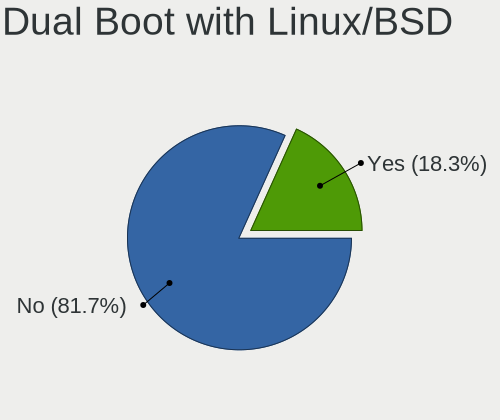
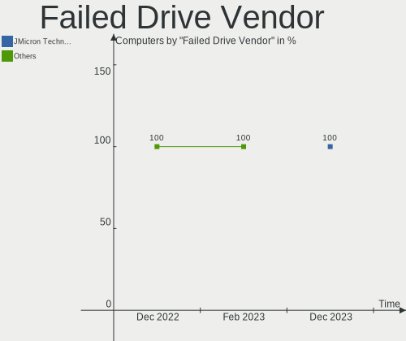
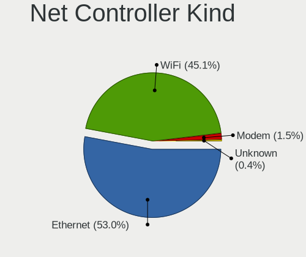
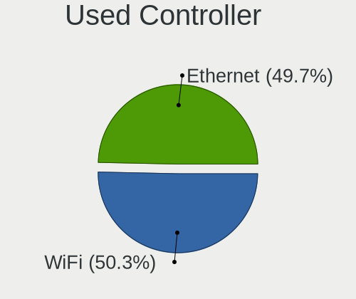
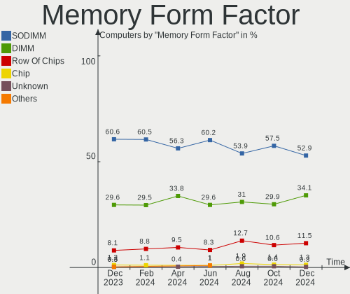
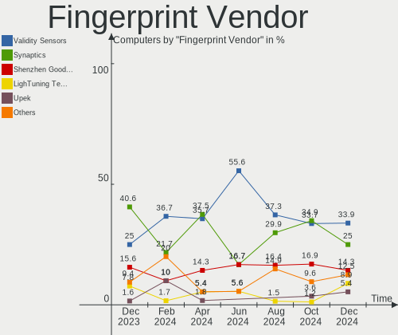

Linux in Germany - Hardware Trends
----------------------------------

A project to identify most popular hardware characteristics and track their change
over time based on data collected by Linux users at https://Linux-Hardware.org.

Anyone can contribute to this report by the [hw-probe](https://github.com/linuxhw/hw-probe) tool:

    sudo -E hw-probe -all -upload

This is a report for all computer types. See also reports for [desktops](/Location/Germany/Desktop/README.md) and [notebooks](/Location/Germany/Notebook/README.md).

Contents
--------

* [ System ](#system)
  - [ OS                       ](#os)
  - [ OS Family                ](#os-family)
  - [ Kernel                   ](#kernel)
  - [ Kernel Family            ](#kernel-family)
  - [ Kernel Major Ver.        ](#kernel-major-ver)
  - [ Arch                     ](#arch)
  - [ DE                       ](#de)
  - [ Display Server           ](#display-server)
  - [ Display Manager          ](#display-manager)
  - [ OS Lang                  ](#os-lang)
  - [ Boot Mode                ](#boot-mode)
  - [ Filesystem               ](#filesystem)
  - [ Part. scheme             ](#part-scheme)
  - [ Dual Boot with Linux/BSD ](#dual-boot-with-linuxbsd)
  - [ Dual Boot (Win)          ](#dual-boot-win)

* [ Board ](#board)
  - [ Vendor                   ](#vendor)
  - [ Model                    ](#model)
  - [ Model Family             ](#model-family)
  - [ MFG Year                 ](#mfg-year)
  - [ Form Factor              ](#form-factor)
  - [ Secure Boot              ](#secure-boot)
  - [ Coreboot                 ](#coreboot)
  - [ RAM Size                 ](#ram-size)
  - [ RAM Used                 ](#ram-used)
  - [ Total Drives             ](#total-drives)
  - [ Has CD-ROM               ](#has-cd-rom)
  - [ Has Ethernet             ](#has-ethernet)
  - [ Has WiFi                 ](#has-wifi)
  - [ Has Bluetooth            ](#has-bluetooth)

* [ Location ](#location)
  - [ Country                  ](#country)
  - [ City                     ](#city)

* [ Drives ](#drives)
  - [ Drive Vendor             ](#drive-vendor)
  - [ Drive Model              ](#drive-model)
  - [ HDD Vendor               ](#hdd-vendor)
  - [ SSD Vendor               ](#ssd-vendor)
  - [ Drive Kind               ](#drive-kind)
  - [ Drive Connector          ](#drive-connector)
  - [ Drive Size               ](#drive-size)
  - [ Space Total              ](#space-total)
  - [ Space Used               ](#space-used)
  - [ Malfunc. Drives          ](#malfunc-drives)
  - [ Malfunc. Drive Vendor    ](#malfunc-drive-vendor)
  - [ Malfunc. HDD Vendor      ](#malfunc-hdd-vendor)
  - [ Malfunc. Drive Kind      ](#malfunc-drive-kind)
  - [ Failed Drives            ](#failed-drives)
  - [ Failed Drive Vendor      ](#failed-drive-vendor)
  - [ Drive Status             ](#drive-status)

* [ Storage controller ](#storage-controller)
  - [ Storage Vendor           ](#storage-vendor)
  - [ Storage Model            ](#storage-model)
  - [ Storage Kind             ](#storage-kind)

* [ Processor ](#processor)
  - [ CPU Vendor               ](#cpu-vendor)
  - [ CPU Model                ](#cpu-model)
  - [ CPU Model Family         ](#cpu-model-family)
  - [ CPU Cores                ](#cpu-cores)
  - [ CPU Sockets              ](#cpu-sockets)
  - [ CPU Threads              ](#cpu-threads)
  - [ CPU Op-Modes             ](#cpu-op-modes)
  - [ CPU Microcode            ](#cpu-microcode)
  - [ CPU Microarch            ](#cpu-microarch)

* [ Graphics ](#graphics)
  - [ GPU Vendor               ](#gpu-vendor)
  - [ GPU Model                ](#gpu-model)
  - [ GPU Combo                ](#gpu-combo)
  - [ GPU Driver               ](#gpu-driver)
  - [ GPU Memory               ](#gpu-memory)

* [ Monitor ](#monitor)
  - [ Monitor Vendor           ](#monitor-vendor)
  - [ Monitor Model            ](#monitor-model)
  - [ Monitor Resolution       ](#monitor-resolution)
  - [ Monitor Diagonal         ](#monitor-diagonal)
  - [ Monitor Width            ](#monitor-width)
  - [ Aspect Ratio             ](#aspect-ratio)
  - [ Monitor Area             ](#monitor-area)
  - [ Pixel Density            ](#pixel-density)
  - [ Multiple Monitors        ](#multiple-monitors)

* [ Network ](#network)
  - [ Net Controller Vendor    ](#net-controller-vendor)
  - [ Net Controller Model     ](#net-controller-model)
  - [ Wireless Vendor          ](#wireless-vendor)
  - [ Wireless Model           ](#wireless-model)
  - [ Ethernet Vendor          ](#ethernet-vendor)
  - [ Ethernet Model           ](#ethernet-model)
  - [ Net Controller Kind      ](#net-controller-kind)
  - [ Used Controller          ](#used-controller)
  - [ NICs                     ](#nics)
  - [ IPv6                     ](#ipv6)

* [ Bluetooth ](#bluetooth)
  - [ Bluetooth Vendor         ](#bluetooth-vendor)
  - [ Bluetooth Model          ](#bluetooth-model)

* [ Sound ](#sound)
  - [ Sound Vendor             ](#sound-vendor)
  - [ Sound Model              ](#sound-model)

* [ Memory ](#memory)
  - [ Memory Vendor            ](#memory-vendor)
  - [ Memory Model             ](#memory-model)
  - [ Memory Kind              ](#memory-kind)
  - [ Memory Form Factor       ](#memory-form-factor)
  - [ Memory Size              ](#memory-size)
  - [ Memory Speed             ](#memory-speed)

* [ Printers & scanners ](#printers--scanners)
  - [ Printer Vendor           ](#printer-vendor)
  - [ Printer Model            ](#printer-model)
  - [ Scanner Vendor           ](#scanner-vendor)
  - [ Scanner Model            ](#scanner-model)

* [ Camera ](#camera)
  - [ Camera Vendor            ](#camera-vendor)
  - [ Camera Model             ](#camera-model)

* [ Security ](#security)
  - [ Fingerprint Vendor       ](#fingerprint-vendor)
  - [ Fingerprint Model        ](#fingerprint-model)
  - [ Chipcard Vendor          ](#chipcard-vendor)
  - [ Chipcard Model           ](#chipcard-model)

* [ Unsupported ](#unsupported)
  - [ Unsupported Devices      ](#unsupported-devices)
  - [ Unsupported Device Types ](#unsupported-device-types)

System
------

OS
--

Installed operating systems

| Name                         | Computers | Percent |
|------------------------------|-----------|---------|
| Ubuntu 20.04                 | 83        | 14.34%  |
| Linux Mint 20.3              | 68        | 11.74%  |
| Ubuntu 21.10                 | 45        | 7.77%   |
| OpenMandriva 4.3             | 39        | 6.74%   |
| Ubuntu 22.04                 | 28        | 4.84%   |
| Debian 11                    | 26        | 4.49%   |
| Fedora 35                    | 24        | 4.15%   |
| Pop!_OS 21.10                | 19        | 3.28%   |
| Arch                         | 19        | 3.28%   |
| Zorin 16                     | 15        | 2.59%   |
| Linux Mint 20.2              | 12        | 2.07%   |
| Xubuntu 20.04                | 10        | 1.73%   |
| Manjaro                      | 10        | 1.73%   |
| KDE neon 20.04               | 9         | 1.55%   |
| ArcoLinux Rolling            | 9         | 1.55%   |
| Kubuntu 20.04                | 7         | 1.21%   |
| Elementary 6.1               | 7         | 1.21%   |
| Arch Rolling                 | 7         | 1.21%   |
| Ubuntu MATE 20.04            | 6         | 1.04%   |
| Kubuntu 11                   | 6         | 1.04%   |
| Ubuntu 18.04                 | 5         | 0.86%   |
| Raspbian 11                  | 5         | 0.86%   |
| Pop!_OS 22.04                | 5         | 0.86%   |
| Manjaro 21.2.6               | 5         | 0.86%   |
| Linux Mint 20.1              | 5         | 0.86%   |
| Kubuntu 21.10                | 5         | 0.86%   |
| Kali 2022.1                  | 5         | 0.86%   |
| SteamOS Snapshot             | 4         | 0.69%   |
| OpenMandriva 4.2             | 4         | 0.69%   |
| MX 21                        | 4         | 0.69%   |
| Xero Rolling                 | 3         | 0.52%   |
| Ubuntu Budgie 20.04          | 3         | 0.52%   |
| Parrot 5.0                   | 3         | 0.52%   |
| openSUSE Leap-15.3           | 3         | 0.52%   |
| Manjaro 21.2.5               | 3         | 0.52%   |
| Linux Mint 19.2              | 3         | 0.52%   |
| Fedora 36                    | 3         | 0.52%   |
| Endless 4.0.4                | 3         | 0.52%   |
| Xubuntu 22.04                | 2         | 0.35%   |
| Solus 4.3                    | 2         | 0.35%   |
| ROSA 12.2                    | 2         | 0.35%   |
| LMDE 5                       | 2         | 0.35%   |
| Kubuntu 22.04                | 2         | 0.35%   |
| Kali 2022.2                  | 2         | 0.35%   |
| Gentoo 2.7                   | 2         | 0.35%   |
| Garuda Linux Soaring         | 2         | 0.35%   |
| Garuda Linux                 | 2         | 0.35%   |
| Fedora 34                    | 2         | 0.35%   |
| EndeavourOS Rolling          | 2         | 0.35%   |
| Debian 9                     | 2         | 0.35%   |
| Ubuntu Budgie 21.10          | 1         | 0.17%   |
| Ubuntu 20.10                 | 1         | 0.17%   |
| Siduction Unstable           | 1         | 0.17%   |
| ROSA R11.1                   | 1         | 0.17%   |
| ROSA 12.1                    | 1         | 0.17%   |
| Pop!_OS 21.04                | 1         | 0.17%   |
| org.kde.Platform 5.15-21.08  | 1         | 0.17%   |
| openSUSE Tumbleweed-20220427 | 1         | 0.17%   |
| openSUSE Tumbleweed-20220425 | 1         | 0.17%   |
| openSUSE Tumbleweed-20220412 | 1         | 0.17%   |

OS Family
---------

OS without a version

| Name             | Computers | Percent |
|------------------|-----------|---------|
| Ubuntu           | 162       | 27.98%  |
| Linux Mint       | 89        | 15.37%  |
| OpenMandriva     | 43        | 7.43%   |
| Debian           | 31        | 5.35%   |
| Fedora           | 29        | 5.01%   |
| Arch             | 26        | 4.49%   |
| Pop!_OS          | 25        | 4.32%   |
| Kubuntu          | 21        | 3.63%   |
| Manjaro          | 18        | 3.11%   |
| Zorin            | 15        | 2.59%   |
| Xubuntu          | 12        | 2.07%   |
| openSUSE         | 11        | 1.9%    |
| ArcoLinux        | 10        | 1.73%   |
| KDE neon         | 9         | 1.55%   |
| Elementary       | 8         | 1.38%   |
| Kali             | 7         | 1.21%   |
| Ubuntu MATE      | 6         | 1.04%   |
| Raspbian         | 5         | 0.86%   |
| Ubuntu Budgie    | 4         | 0.69%   |
| SteamOS          | 4         | 0.69%   |
| ROSA             | 4         | 0.69%   |
| MX               | 4         | 0.69%   |
| Garuda Linux     | 4         | 0.69%   |
| Xero             | 3         | 0.52%   |
| Parrot           | 3         | 0.52%   |
| Lubuntu          | 3         | 0.52%   |
| LMDE             | 3         | 0.52%   |
| Gentoo           | 3         | 0.52%   |
| Endless          | 3         | 0.52%   |
| Solus            | 2         | 0.35%   |
| LinuxFX          | 2         | 0.35%   |
| EndeavourOS      | 2         | 0.35%   |
| Siduction        | 1         | 0.17%   |
| org.kde.Platform | 1         | 0.17%   |
| NixOS            | 1         | 0.17%   |
| Linux Lite       | 1         | 0.17%   |
| HAOS             | 1         | 0.17%   |
| Devuan           | 1         | 0.17%   |
| Clear Linux      | 1         | 0.17%   |
| BlackPanther     | 1         | 0.17%   |

Kernel
------

Version of the Linux kernel

| Version                                        | Computers | Percent |
|------------------------------------------------|-----------|---------|
| 5.13.0-39-generic                              | 102       | 17.62%  |
| 5.4.0-107-generic                              | 52        | 8.98%   |
| 5.13.0-40-generic                              | 39        | 6.74%   |
| 5.16.7-desktop-1omv4003                        | 36        | 6.22%   |
| 5.4.0-109-generic                              | 31        | 5.35%   |
| 5.17.1-arch1-1                                 | 21        | 3.63%   |
| 5.10.0-13-amd64                                | 19        | 3.28%   |
| 5.15.0-27-generic                              | 15        | 2.59%   |
| 5.16.15-76051615-generic                       | 12        | 2.07%   |
| 5.16.18-200.fc35.x86_64                        | 11        | 1.9%    |
| 5.16.19-76051619-generic                       | 10        | 1.73%   |
| 5.13.0-37-generic                              | 8         | 1.38%   |
| 5.15.0-25-generic                              | 6         | 1.04%   |
| 5.15.0-23-generic                              | 6         | 1.04%   |
| 5.15.32-1-MANJARO                              | 5         | 0.86%   |
| 5.13.0-19-generic                              | 5         | 0.86%   |
| 5.17.1-zen1-1-zen                              | 4         | 0.69%   |
| 5.16.20-200.fc35.x86_64                        | 4         | 0.69%   |
| 5.17.4-arch1-1                                 | 3         | 0.52%   |
| 5.17.4-1-default                               | 3         | 0.52%   |
| 5.17.1-3-MANJARO                               | 3         | 0.52%   |
| 5.16.13-desktop-1omv4003                       | 3         | 0.52%   |
| 5.16.0-6-amd64                                 | 3         | 0.52%   |
| 5.16.0-12parrot1-amd64                         | 3         | 0.52%   |
| 5.15.33-1-lts                                  | 3         | 0.52%   |
| 5.15.28-1-MANJARO                              | 3         | 0.52%   |
| 5.14.0-1032-oem                                | 3         | 0.52%   |
| 5.13.0-valve10.1-1-neptune-02144-g7fffaf925dfb | 3         | 0.52%   |
| 5.13.0-35-generic                              | 3         | 0.52%   |
| 5.13.0-30-generic                              | 3         | 0.52%   |
| 5.13.0-27-generic                              | 3         | 0.52%   |
| 5.11.0-35-generic                              | 3         | 0.52%   |
| 5.10.14-desktop-1omv4002                       | 3         | 0.52%   |
| 5.10.0-12-amd64                                | 3         | 0.52%   |
| 5.8.0-43-generic                               | 2         | 0.35%   |
| 5.4.0-107-lowlatency                           | 2         | 0.35%   |
| 5.4.0-105-generic                              | 2         | 0.35%   |
| 5.3.18-150300.59.60-default                    | 2         | 0.35%   |
| 5.17.3-zen1-1-zen                              | 2         | 0.35%   |
| 5.17.2-arch3-1                                 | 2         | 0.35%   |
| 5.17.1-1-default                               | 2         | 0.35%   |
| 5.16.18-100.fc34.x86_64                        | 2         | 0.35%   |
| 5.16.14-1-MANJARO                              | 2         | 0.35%   |
| 5.16.0-0.bpo.4-amd64                           | 2         | 0.35%   |
| 5.15.32-1-lts                                  | 2         | 0.35%   |
| 5.15.0-kali3-amd64                             | 2         | 0.35%   |
| 5.13.0-41-generic                              | 2         | 0.35%   |
| 5.11.0-40-generic                              | 2         | 0.35%   |
| 5.10.74-generic-2rosa2021.1-x86_64             | 2         | 0.35%   |
| 5.10.0-13-686-pae                              | 2         | 0.35%   |
| 4.9.35-dyvi                                    | 2         | 0.35%   |
| 4.15.0-54-generic                              | 2         | 0.35%   |
| 4.15.0-175-generic                             | 2         | 0.35%   |
| 5.8.0-25-generic                               | 1         | 0.17%   |
| 5.8.0-050800-generic                           | 1         | 0.17%   |
| 5.6.0-050600-generic                           | 1         | 0.17%   |
| 5.4.65-sunxi                                   | 1         | 0.17%   |
| 5.4.0-faked                                    | 1         | 0.17%   |
| 5.4.0-96-generic                               | 1         | 0.17%   |
| 5.4.0-91-generic                               | 1         | 0.17%   |

Kernel Family
-------------

Linux kernel without a distro release

| Version  | Computers | Percent |
|----------|-----------|---------|
| 5.13.0   | 174       | 30.05%  |
| 5.4.0    | 102       | 17.62%  |
| 5.16.7   | 36        | 6.22%   |
| 5.17.1   | 35        | 6.04%   |
| 5.15.0   | 32        | 5.53%   |
| 5.10.0   | 25        | 4.32%   |
| 5.16.18  | 16        | 2.76%   |
| 5.16.15  | 14        | 2.42%   |
| 5.16.0   | 12        | 2.07%   |
| 5.16.19  | 11        | 1.9%    |
| 5.15.32  | 10        | 1.73%   |
| 5.17.4   | 9         | 1.55%   |
| 5.11.0   | 8         | 1.38%   |
| 5.17.3   | 7         | 1.21%   |
| 4.15.0   | 6         | 1.04%   |
| 5.17.2   | 5         | 0.86%   |
| 5.17.0   | 5         | 0.86%   |
| 5.14.0   | 5         | 0.86%   |
| 5.8.0    | 4         | 0.69%   |
| 5.16.20  | 4         | 0.69%   |
| 5.15.30  | 4         | 0.69%   |
| 5.3.18   | 3         | 0.52%   |
| 5.16.13  | 3         | 0.52%   |
| 5.15.33  | 3         | 0.52%   |
| 5.15.28  | 3         | 0.52%   |
| 5.10.74  | 3         | 0.52%   |
| 5.10.14  | 3         | 0.52%   |
| 5.16.17  | 2         | 0.35%   |
| 5.16.14  | 2         | 0.35%   |
| 5.16.12  | 2         | 0.35%   |
| 4.9.35   | 2         | 0.35%   |
| 4.19.0   | 2         | 0.35%   |
| 5.6.0    | 1         | 0.17%   |
| 5.4.65   | 1         | 0.17%   |
| 5.3.0    | 1         | 0.17%   |
| 5.18.0   | 1         | 0.17%   |
| 5.17.5   | 1         | 0.17%   |
| 5.16.9   | 1         | 0.17%   |
| 5.16.5   | 1         | 0.17%   |
| 5.16.16  | 1         | 0.17%   |
| 5.16.11  | 1         | 0.17%   |
| 5.15.8   | 1         | 0.17%   |
| 5.15.6   | 1         | 0.17%   |
| 5.15.36  | 1         | 0.17%   |
| 5.15.34  | 1         | 0.17%   |
| 5.15.11  | 1         | 0.17%   |
| 5.14.7   | 1         | 0.17%   |
| 5.14.17  | 1         | 0.17%   |
| 5.14.10  | 1         | 0.17%   |
| 5.13.19  | 1         | 0.17%   |
| 5.11.12  | 1         | 0.17%   |
| 5.10.98  | 1         | 0.17%   |
| 5.10.92  | 1         | 0.17%   |
| 5.10.108 | 1         | 0.17%   |
| 5.10.105 | 1         | 0.17%   |
| 5.10.101 | 1         | 0.17%   |
| 4.19.87  | 1         | 0.17%   |
| 4.19.113 | 1         | 0.17%   |
| 4.18.16  | 1         | 0.17%   |

Kernel Major Ver.
-----------------

Linux kernel major version

| Version | Computers | Percent |
|---------|-----------|---------|
| 5.13    | 175       | 30.22%  |
| 5.16    | 106       | 18.31%  |
| 5.4     | 103       | 17.79%  |
| 5.17    | 62        | 10.71%  |
| 5.15    | 57        | 9.84%   |
| 5.10    | 36        | 6.22%   |
| 5.11    | 9         | 1.55%   |
| 5.14    | 8         | 1.38%   |
| 4.15    | 6         | 1.04%   |
| 5.8     | 4         | 0.69%   |
| 5.3     | 4         | 0.69%   |
| 4.19    | 4         | 0.69%   |
| 4.9     | 2         | 0.35%   |
| 5.6     | 1         | 0.17%   |
| 5.18    | 1         | 0.17%   |
| 4.18    | 1         | 0.17%   |

Arch
----

OS architecture (x86_64, i586, etc.)

| Name    | Computers | Percent |
|---------|-----------|---------|
| x86_64  | 557       | 96.2%   |
| i686    | 8         | 1.38%   |
| aarch64 | 8         | 1.38%   |
| armv7l  | 4         | 0.69%   |
| armv6l  | 2         | 0.35%   |

DE
--

Desktop Environment

| Name            | Computers | Percent |
|-----------------|-----------|---------|
| GNOME           | 242       | 41.8%   |
| KDE5            | 127       | 21.93%  |
| X-Cinnamon      | 74        | 12.78%  |
| XFCE            | 44        | 7.6%    |
| Unknown         | 31        | 5.35%   |
| MATE            | 19        | 3.28%   |
| Pantheon        | 8         | 1.38%   |
| LXQt            | 6         | 1.04%   |
| i3              | 4         | 0.69%   |
| Budgie          | 4         | 0.69%   |
| Unity           | 3         | 0.52%   |
| LXDE            | 3         | 0.52%   |
| Cinnamon        | 3         | 0.52%   |
| sway            | 2         | 0.35%   |
| GNOME Flashback | 2         | 0.35%   |
| trinity         | 1         | 0.17%   |
| qtile           | 1         | 0.17%   |
| Openbox         | 1         | 0.17%   |
| KDE             | 1         | 0.17%   |
| herbstluftwm    | 1         | 0.17%   |
| Deepin          | 1         | 0.17%   |
| awesome         | 1         | 0.17%   |

Display Server
--------------

X11 or Wayland

| Name        | Computers | Percent |
|-------------|-----------|---------|
| X11         | 438       | 75.65%  |
| Wayland     | 107       | 18.48%  |
| Tty         | 18        | 3.11%   |
| Unknown     | 14        | 2.42%   |
| Web         | 1         | 0.17%   |
| Unspecified | 1         | 0.17%   |

Display Manager
---------------

SDDM, LightDM, etc.

| Name    | Computers | Percent |
|---------|-----------|---------|
| Unknown | 197       | 34.02%  |
| GDM3    | 123       | 21.24%  |
| LightDM | 99        | 17.1%   |
| SDDM    | 91        | 15.72%  |
| GDM     | 63        | 10.88%  |
| XDM     | 2         | 0.35%   |
| NODM    | 2         | 0.35%   |
| Ly      | 1         | 0.17%   |
| GREETD  | 1         | 0.17%   |

OS Lang
-------

Language

| Lang    | Computers | Percent |
|---------|-----------|---------|
| de_DE   | 417       | 72.02%  |
| en_US   | 103       | 17.79%  |
| en_GB   | 17        | 2.94%   |
| Unknown | 12        | 2.07%   |
| C       | 5         | 0.86%   |
| ru_RU   | 4         | 0.69%   |
| de_AT   | 4         | 0.69%   |
| it_IT   | 3         | 0.52%   |
| en_IE   | 3         | 0.52%   |
| en_DE   | 3         | 0.52%   |
| pl_PL   | 2         | 0.35%   |
| ro_RO   | 1         | 0.17%   |
| nl_NL   | 1         | 0.17%   |
| es_ES   | 1         | 0.17%   |
| en_DK   | 1         | 0.17%   |
| en_AU   | 1         | 0.17%   |
| ar_EG   | 1         | 0.17%   |

Boot Mode
---------

EFI or BIOS

| Mode | Computers | Percent |
|------|-----------|---------|
| BIOS | 295       | 50.95%  |
| EFI  | 284       | 49.05%  |

Filesystem
----------

Type of filesystem

| Type    | Computers | Percent |
|---------|-----------|---------|
| Ext4    | 451       | 77.89%  |
| Btrfs   | 71        | 12.26%  |
| Overlay | 42        | 7.25%   |
| Zfs     | 7         | 1.21%   |
| Xfs     | 6         | 1.04%   |
| Tmpfs   | 1         | 0.17%   |
| Ext3    | 1         | 0.17%   |

Part. scheme
------------

Scheme of partitioning

| Type    | Computers | Percent |
|---------|-----------|---------|
| Unknown | 304       | 52.5%   |
| GPT     | 210       | 36.27%  |
| MBR     | 65        | 11.23%  |

Dual Boot with Linux/BSD
------------------------

Hosting more than one Linux/BSD

| Dual boot | Computers | Percent |
|-----------|-----------|---------|
| No        | 491       | 84.8%   |
| Yes       | 88        | 15.2%   |

Dual Boot (Win)
---------------

Hosting Linux and Windows

| Dual boot | Computers | Percent |
|-----------|-----------|---------|
| No        | 422       | 72.88%  |
| Yes       | 157       | 27.12%  |

Board
-----

Vendor
------

Motherboard manufacturer

| Name                           | Computers | Percent |
|--------------------------------|-----------|---------|
| Lenovo                         | 101       | 17.44%  |
| ASUSTek Computer               | 81        | 13.99%  |
| Hewlett-Packard                | 62        | 10.71%  |
| MSI                            | 48        | 8.29%   |
| Dell                           | 43        | 7.43%   |
| Gigabyte Technology            | 34        | 5.87%   |
| Acer                           | 29        | 5.01%   |
| Medion                         | 21        | 3.63%   |
| ASRock                         | 20        | 3.45%   |
| Fujitsu                        | 19        | 3.28%   |
| Samsung Electronics            | 10        | 1.73%   |
| Raspberry Pi Foundation        | 9         | 1.55%   |
| TUXEDO                         | 7         | 1.21%   |
| Toshiba                        | 7         | 1.21%   |
| Apple                          | 7         | 1.21%   |
| Sony                           | 6         | 1.04%   |
| Packard Bell                   | 6         | 1.04%   |
| Notebook                       | 5         | 0.86%   |
| Intel                          | 5         | 0.86%   |
| Unknown                        | 5         | 0.86%   |
| Valve                          | 4         | 0.69%   |
| Fujitsu Siemens                | 4         | 0.69%   |
| Framework                      | 4         | 0.69%   |
| Wortmann AG                    | 3         | 0.52%   |
| Timi                           | 3         | 0.52%   |
| Shuttle                        | 3         | 0.52%   |
| HUAWEI                         | 2         | 0.35%   |
| HARDKERNEL                     | 2         | 0.35%   |
| Foxconn                        | 2         | 0.35%   |
| Chuwi                          | 2         | 0.35%   |
| Biostar                        | 2         | 0.35%   |
| BESSTAR Tech                   | 2         | 0.35%   |
| ASRockRack                     | 2         | 0.35%   |
| AMI                            | 2         | 0.35%   |
| ZOTAC                          | 1         | 0.17%   |
| Xunlong                        | 1         | 0.17%   |
| TrekStor                       | 1         | 0.17%   |
| Schenker                       | 1         | 0.17%   |
| rockchip                       | 1         | 0.17%   |
| Razer                          | 1         | 0.17%   |
| Microsoft                      | 1         | 0.17%   |
| Matsushita Electric Industrial | 1         | 0.17%   |
| LincPlus                       | 1         | 0.17%   |
| LG Electronics                 | 1         | 0.17%   |
| Jumper                         | 1         | 0.17%   |
| Inventec                       | 1         | 0.17%   |
| EVGA                           | 1         | 0.17%   |
| eMachines                      | 1         | 0.17%   |
| CSL-Computer                   | 1         | 0.17%   |
| AWOW                           | 1         | 0.17%   |
| Alienware                      | 1         | 0.17%   |

Model
-----

Motherboard model

| Name                                 | Computers | Percent |
|--------------------------------------|-----------|---------|
| ASUS All Series                      | 8         | 1.38%   |
| Unknown                              | 5         | 0.86%   |
| Valve Jupiter                        | 4         | 0.69%   |
| RPi Raspberry Pi                     | 4         | 0.69%   |
| MSI MS-7C37                          | 4         | 0.69%   |
| MSI MS-7A38                          | 4         | 0.69%   |
| Framework Laptop                     | 4         | 0.69%   |
| ASUS PRIME B450-PLUS                 | 4         | 0.69%   |
| Acer Swift SF114-34                  | 4         | 0.69%   |
| MSI MS-7B89                          | 3         | 0.52%   |
| HP ENVY x360 Convertible 15-eu0xxx   | 3         | 0.52%   |
| ASUS PRIME B350-PLUS                 | 3         | 0.52%   |
| MSI MS-7D22                          | 2         | 0.35%   |
| MSI MS-7C94                          | 2         | 0.35%   |
| MSI MS-7C52                          | 2         | 0.35%   |
| MSI MS-7C02                          | 2         | 0.35%   |
| MSI MS-7B86                          | 2         | 0.35%   |
| MSI MS-7B79                          | 2         | 0.35%   |
| Lenovo ThinkPad L15 Gen 1 20U8S0AH00 | 2         | 0.35%   |
| Lenovo ThinkBook 14s Yoga ITL 20WE   | 2         | 0.35%   |
| HP ZBook 15 G3                       | 2         | 0.35%   |
| HP ProBook 455 G7                    | 2         | 0.35%   |
| HP Laptop 17-bs0xx                   | 2         | 0.35%   |
| HP EliteBook 840 G5                  | 2         | 0.35%   |
| HP Compaq 8200 Elite CMT PC          | 2         | 0.35%   |
| HP 625                               | 2         | 0.35%   |
| HP 255 G8 Notebook PC                | 2         | 0.35%   |
| HP 255 G7 Notebook PC                | 2         | 0.35%   |
| HARDKERNEL ODROID-H2                 | 2         | 0.35%   |
| Gigabyte X570 AORUS ELITE            | 2         | 0.35%   |
| Gigabyte H97-D3H                     | 2         | 0.35%   |
| Gigabyte GB-BACE-3000-SBE            | 2         | 0.35%   |
| Gigabyte GA-78LMT-USB3 6.0           | 2         | 0.35%   |
| Gigabyte B550I AORUS PRO AX          | 2         | 0.35%   |
| Gigabyte 970A-DS3P                   | 2         | 0.35%   |
| Fujitsu CELSIUS W420                 | 2         | 0.35%   |
| Dell XPS 13 9370                     | 2         | 0.35%   |
| Dell XPS 13 9310                     | 2         | 0.35%   |
| Dell Latitude E6540                  | 2         | 0.35%   |
| Dell Latitude E5530 non-vPro         | 2         | 0.35%   |
| ASUS ROG STRIX B550-I GAMING         | 2         | 0.35%   |
| ASUS P8B75-M                         | 2         | 0.35%   |
| ASUS A68HM-PLUS                      | 2         | 0.35%   |
| ASRockRack B565D4-V1L                | 2         | 0.35%   |
| ASRock X570 Phantom Gaming 4         | 2         | 0.35%   |
| ASRock 970 Pro3 R2.0                 | 2         | 0.35%   |
| Apple MacBookAir4,2                  | 2         | 0.35%   |
| Acer Aspire A717-71G                 | 2         | 0.35%   |
| ZOTAC ZBOX-CI331NANO                 | 1         | 0.17%   |
| Xunlong Orange Pi PC                 | 1         | 0.17%   |
| Wortmann AG TERRA_MOBILE_1749        | 1         | 0.17%   |
| Wortmann AG M7x0S                    | 1         | 0.17%   |
| Wortmann AG 1220663_1470189          | 1         | 0.17%   |
| TUXEDO Stellaris Intel Gen3 (TGL)    | 1         | 0.17%   |
| TUXEDO Polaris Intel Gen3 (TGL)      | 1         | 0.17%   |
| TUXEDO PA70ES                        | 1         | 0.17%   |
| TUXEDO N15_17RD                      | 1         | 0.17%   |
| TUXEDO InfinityBook S 15 Gen6        | 1         | 0.17%   |
| TUXEDO InfinityBook S 14 v5          | 1         | 0.17%   |
| TUXEDO Aura 15 Gen1                  | 1         | 0.17%   |

Model Family
------------

Motherboard model prefix

| Name                      | Computers | Percent |
|---------------------------|-----------|---------|
| Lenovo ThinkPad           | 57        | 9.84%   |
| Dell Latitude             | 17        | 2.94%   |
| Acer Aspire               | 17        | 2.94%   |
| Lenovo IdeaPad            | 13        | 2.25%   |
| ASUS PRIME                | 13        | 2.25%   |
| Dell XPS                  | 10        | 1.73%   |
| HP EliteBook              | 9         | 1.55%   |
| Fujitsu ESPRIMO           | 9         | 1.55%   |
| RPi Raspberry             | 8         | 1.38%   |
| Lenovo ThinkCentre        | 8         | 1.38%   |
| HP Laptop                 | 8         | 1.38%   |
| ASUS All                  | 8         | 1.38%   |
| ASUS ROG                  | 7         | 1.21%   |
| HP ENVY                   | 6         | 1.04%   |
| HP 255                    | 6         | 1.04%   |
| Dell Inspiron             | 6         | 1.04%   |
| HP ProBook                | 5         | 0.86%   |
| HP Pavilion               | 5         | 0.86%   |
| Fujitsu LIFEBOOK          | 5         | 0.86%   |
| Acer Swift                | 5         | 0.86%   |
| Unknown                   | 5         | 0.86%   |
| Valve Jupiter             | 4         | 0.69%   |
| Toshiba Satellite         | 4         | 0.69%   |
| MSI MS-7C37               | 4         | 0.69%   |
| MSI MS-7A38               | 4         | 0.69%   |
| Lenovo Yoga               | 4         | 0.69%   |
| Lenovo ThinkBook          | 4         | 0.69%   |
| HP Compaq                 | 4         | 0.69%   |
| Gigabyte X570             | 4         | 0.69%   |
| Framework Laptop          | 4         | 0.69%   |
| Dell OptiPlex             | 4         | 0.69%   |
| ASUS M5A78L-M             | 4         | 0.69%   |
| Acer TravelMate           | 4         | 0.69%   |
| Packard Bell EasyNote     | 3         | 0.52%   |
| MSI MS-7B89               | 3         | 0.52%   |
| Medion Akoya              | 3         | 0.52%   |
| Lenovo IdeaCentre         | 3         | 0.52%   |
| HP ZBook                  | 3         | 0.52%   |
| Gigabyte B550M            | 3         | 0.52%   |
| Fujitsu CELSIUS           | 3         | 0.52%   |
| Dell Precision            | 3         | 0.52%   |
| TUXEDO InfinityBook       | 2         | 0.35%   |
| Toshiba TECRA             | 2         | 0.35%   |
| MSI MS-7D22               | 2         | 0.35%   |
| MSI MS-7C94               | 2         | 0.35%   |
| MSI MS-7C52               | 2         | 0.35%   |
| MSI MS-7C02               | 2         | 0.35%   |
| MSI MS-7B86               | 2         | 0.35%   |
| MSI MS-7B79               | 2         | 0.35%   |
| Lenovo ThinkStation       | 2         | 0.35%   |
| Lenovo IdeaPadFlex        | 2         | 0.35%   |
| HP Spectre                | 2         | 0.35%   |
| HP ProDesk                | 2         | 0.35%   |
| HP 625                    | 2         | 0.35%   |
| HARDKERNEL ODROID-H2      | 2         | 0.35%   |
| Gigabyte H97-D3H          | 2         | 0.35%   |
| Gigabyte GB-BACE-3000-SBE | 2         | 0.35%   |
| Gigabyte GA-78LMT-USB3    | 2         | 0.35%   |
| Gigabyte B550I            | 2         | 0.35%   |
| Gigabyte 970A-DS3P        | 2         | 0.35%   |

MFG Year
--------

Motherboard manufacture year

| Year    | Computers | Percent |
|---------|-----------|---------|
| 2021    | 70        | 12.09%  |
| 2020    | 66        | 11.4%   |
| 2019    | 57        | 9.84%   |
| 2012    | 46        | 7.94%   |
| 2018    | 44        | 7.6%    |
| 2017    | 44        | 7.6%    |
| 2013    | 32        | 5.53%   |
| 2011    | 32        | 5.53%   |
| 2014    | 31        | 5.35%   |
| 2015    | 26        | 4.49%   |
| 2016    | 25        | 4.32%   |
| 2010    | 24        | 4.15%   |
| 2009    | 20        | 3.45%   |
| 2008    | 19        | 3.28%   |
| Unknown | 16        | 2.76%   |
| 2022    | 12        | 2.07%   |
| 2007    | 9         | 1.55%   |
| 2006    | 4         | 0.69%   |
| 2005    | 1         | 0.17%   |
| 2004    | 1         | 0.17%   |

Form Factor
-----------

Physical design of the computer

| Name           | Computers | Percent |
|----------------|-----------|---------|
| Notebook       | 294       | 50.78%  |
| Desktop        | 223       | 38.51%  |
| Convertible    | 28        | 4.84%   |
| System on chip | 14        | 2.42%   |
| Mini pc        | 10        | 1.73%   |
| Tablet         | 6         | 1.04%   |
| All in one     | 3         | 0.52%   |
| Server         | 1         | 0.17%   |

Secure Boot
-----------

Enabled or disabled

| State    | Computers | Percent |
|----------|-----------|---------|
| Disabled | 539       | 93.09%  |
| Enabled  | 40        | 6.91%   |

Coreboot
--------

Have coreboot on board

| Used | Computers | Percent |
|------|-----------|---------|
| No   | 579       | 100%    |

RAM Size
--------

Total RAM memory

| Size in GB  | Computers | Percent |
|-------------|-----------|---------|
| 4.01-8.0    | 123       | 21.24%  |
| 16.01-24.0  | 116       | 20.03%  |
| 3.01-4.0    | 108       | 18.65%  |
| 8.01-16.0   | 102       | 17.62%  |
| 32.01-64.0  | 72        | 12.44%  |
| 64.01-256.0 | 27        | 4.66%   |
| 1.01-2.0    | 12        | 2.07%   |
| 2.01-3.0    | 9         | 1.55%   |
| 24.01-32.0  | 6         | 1.04%   |
| 0.51-1.0    | 2         | 0.35%   |
| 0.01-0.5    | 2         | 0.35%   |

RAM Used
--------

Used RAM memory

| Used GB    | Computers | Percent |
|------------|-----------|---------|
| 1.01-2.0   | 203       | 35.06%  |
| 2.01-3.0   | 128       | 22.11%  |
| 4.01-8.0   | 95        | 16.41%  |
| 3.01-4.0   | 75        | 12.95%  |
| 0.51-1.0   | 30        | 5.18%   |
| 8.01-16.0  | 26        | 4.49%   |
| 16.01-24.0 | 7         | 1.21%   |
| 0.01-0.5   | 7         | 1.21%   |
| 32.01-64.0 | 4         | 0.69%   |
| 24.01-32.0 | 4         | 0.69%   |

Total Drives
------------

Number of drives on board

| Drives | Computers | Percent |
|--------|-----------|---------|
| 1      | 331       | 57.17%  |
| 2      | 141       | 24.35%  |
| 3      | 51        | 8.81%   |
| 4      | 29        | 5.01%   |
| 5      | 13        | 2.25%   |
| 6      | 6         | 1.04%   |
| 0      | 6         | 1.04%   |
| 8      | 1         | 0.17%   |
| 7      | 1         | 0.17%   |

Has CD-ROM
----------

Has CD-ROM on board

| Presented | Computers | Percent |
|-----------|-----------|---------|
| No        | 346       | 59.76%  |
| Yes       | 233       | 40.24%  |

Has Ethernet
------------

Has Ethernet on board

| Presented | Computers | Percent |
|-----------|-----------|---------|
| Yes       | 484       | 83.59%  |
| No        | 95        | 16.41%  |

Has WiFi
--------

Has WiFi module

| Presented | Computers | Percent |
|-----------|-----------|---------|
| Yes       | 424       | 73.23%  |
| No        | 155       | 26.77%  |

Has Bluetooth
-------------

Has Bluetooth module

| Presented | Computers | Percent |
|-----------|-----------|---------|
| Yes       | 343       | 59.24%  |
| No        | 236       | 40.76%  |

Location
--------

Country
-------

Geographic location (country)

| Country | Computers | Percent |
|---------|-----------|---------|
| Germany | 579       | 100%    |

City
----

Geographic location (city)

| City                   | Computers | Percent |
|------------------------|-----------|---------|
| Berlin                 | 47        | 8.12%   |
| Munich                 | 28        | 4.84%   |
| Cologne                | 16        | 2.76%   |
| Frankfurt am Main      | 14        | 2.42%   |
| Hamburg                | 13        | 2.25%   |
| Stuttgart              | 12        | 2.07%   |
| Nuremberg              | 11        | 1.9%    |
| Leipzig                | 11        | 1.9%    |
| Karlsruhe              | 11        | 1.9%    |
| Essen                  | 8         | 1.38%   |
| Dresden                | 7         | 1.21%   |
| Dortmund               | 7         | 1.21%   |
| Chemnitz               | 7         | 1.21%   |
| Bonn                   | 6         | 1.04%   |
| Wettringen             | 5         | 0.86%   |
| Wiesbaden              | 4         | 0.69%   |
| Ulm                    | 4         | 0.69%   |
| Mannheim               | 4         | 0.69%   |
| Mainz                  | 4         | 0.69%   |
| Krefeld                | 4         | 0.69%   |
| Erfurt                 | 4         | 0.69%   |
| Düsseldorf            | 4         | 0.69%   |
| Bochum                 | 4         | 0.69%   |
| Villingen-Schwenningen | 3         | 0.52%   |
| Troisdorf              | 3         | 0.52%   |
| Singen                 | 3         | 0.52%   |
| Sindelfingen           | 3         | 0.52%   |
| Rostock                | 3         | 0.52%   |
| Offenbach              | 3         | 0.52%   |
| Kollow                 | 3         | 0.52%   |
| Koblenz                | 3         | 0.52%   |
| Hemmingen              | 3         | 0.52%   |
| Garbsen                | 3         | 0.52%   |
| Fürth                 | 3         | 0.52%   |
| Falkenstein            | 3         | 0.52%   |
| Dillenburg             | 3         | 0.52%   |
| Delmenhorst            | 3         | 0.52%   |
| Darmstadt              | 3         | 0.52%   |
| Bamberg                | 3         | 0.52%   |
| Aachen                 | 3         | 0.52%   |
| Wuppertal              | 2         | 0.35%   |
| Worms                  | 2         | 0.35%   |
| Wegberg                | 2         | 0.35%   |
| Waghausel              | 2         | 0.35%   |
| Uelzen                 | 2         | 0.35%   |
| Trier                  | 2         | 0.35%   |
| Treffurt               | 2         | 0.35%   |
| Rendsburg              | 2         | 0.35%   |
| Osternienburger Land   | 2         | 0.35%   |
| Oberursel              | 2         | 0.35%   |
| Moerfelden-Walldorf    | 2         | 0.35%   |
| Marburg                | 2         | 0.35%   |
| Lünen                 | 2         | 0.35%   |
| Ludwigshafen am Rhein  | 2         | 0.35%   |
| Lehrte                 | 2         | 0.35%   |
| Leer                   | 2         | 0.35%   |
| Kitzingen              | 2         | 0.35%   |
| Kiel                   | 2         | 0.35%   |
| Herne                  | 2         | 0.35%   |
| Heinersreuth           | 2         | 0.35%   |

Drives
------

Drive Vendor
------------

Hard drive vendors

| Vendor                         | Computers | Drives | Percent |
|--------------------------------|-----------|--------|---------|
| Samsung Electronics            | 199       | 264    | 23.78%  |
| WDC                            | 103       | 129    | 12.31%  |
| Seagate                        | 93        | 109    | 11.11%  |
| Sandisk                        | 58        | 65     | 6.93%   |
| Crucial                        | 51        | 55     | 6.09%   |
| Toshiba                        | 48        | 50     | 5.73%   |
| Unknown                        | 44        | 48     | 5.26%   |
| Kingston                       | 29        | 34     | 3.46%   |
| Micron Technology              | 22        | 22     | 2.63%   |
| Hitachi                        | 21        | 21     | 2.51%   |
| Intenso                        | 16        | 20     | 1.91%   |
| SK Hynix                       | 15        | 15     | 1.79%   |
| Intel                          | 15        | 16     | 1.79%   |
| Phison                         | 13        | 13     | 1.55%   |
| HGST                           | 13        | 15     | 1.55%   |
| KIOXIA                         | 9         | 9      | 1.08%   |
| Transcend                      | 7         | 8      | 0.84%   |
| Micron/Crucial Technology      | 6         | 7      | 0.72%   |
| Apple                          | 5         | 5      | 0.6%    |
| Unknown                        | 5         | 5      | 0.6%    |
| Fujitsu                        | 4         | 4      | 0.48%   |
| Apacer                         | 4         | 4      | 0.48%   |
| A-DATA Technology              | 4         | 6      | 0.48%   |
| OCZ                            | 3         | 3      | 0.36%   |
| JMicron                        | 3         | 3      | 0.36%   |
| Corsair                        | 3         | 3      | 0.36%   |
| XPG                            | 2         | 2      | 0.24%   |
| Verbatim                       | 2         | 2      | 0.24%   |
| SPCC                           | 2         | 2      | 0.24%   |
| Patriot                        | 2         | 2      | 0.24%   |
| Netac                          | 2         | 2      | 0.24%   |
| LITEON                         | 2         | 2      | 0.24%   |
| Leven                          | 2         | 2      | 0.24%   |
| Lenovo                         | 2         | 2      | 0.24%   |
| KingSpec                       | 2         | 2      | 0.24%   |
| China                          | 2         | 3      | 0.24%   |
| Union Memory (Shenzhen)        | 1         | 1      | 0.12%   |
| UMIS                           | 1         | 1      | 0.12%   |
| TO Exter                       | 1         | 1      | 0.12%   |
| TCSUNBOW                       | 1         | 1      | 0.12%   |
| Solid State Storage Technology | 1         | 1      | 0.12%   |
| Silicon Motion                 | 1         | 1      | 0.12%   |
| Realtek                        | 1         | 1      | 0.12%   |
| Ramaxel Technology             | 1         | 1      | 0.12%   |
| OCZ-VERTEX                     | 1         | 1      | 0.12%   |
| Mushkin                        | 1         | 2      | 0.12%   |
| MAXTOR                         | 1         | 1      | 0.12%   |
| MAXIO Technology (Hangzhou)    | 1         | 1      | 0.12%   |
| Mass                           | 1         | 1      | 0.12%   |
| Lite-On                        | 1         | 1      | 0.12%   |
| INDMEM                         | 1         | 1      | 0.12%   |
| Inateck                        | 1         | 1      | 0.12%   |
| Gigabyte Technology            | 1         | 1      | 0.12%   |
| EMTEC                          | 1         | 1      | 0.12%   |
| Dogfish                        | 1         | 1      | 0.12%   |
| ASUS-PHISON                    | 1         | 1      | 0.12%   |
| ASMT                           | 1         | 1      | 0.12%   |
| Argon                          | 1         | 1      | 0.12%   |
| AirDisk                        | 1         | 1      | 0.12%   |
| ADATA Technology               | 1         | 1      | 0.12%   |

Drive Model
-----------

Hard drive models

| Model                               | Computers | Percent |
|-------------------------------------|-----------|---------|
| Crucial CT1000MX500SSD1 1TB         | 11        | 1.18%   |
| Samsung SSD 850 EVO 250GB           | 10        | 1.07%   |
| Samsung NVMe SSD Drive 1TB          | 10        | 1.07%   |
| Samsung SSD 850 EVO 500GB           | 9         | 0.96%   |
| Samsung SSD 860 EVO 500GB           | 8         | 0.85%   |
| Samsung SSD 860 EVO 1TB             | 8         | 0.85%   |
| Samsung NVMe SSD Drive 512GB        | 8         | 0.85%   |
| Seagate ST9500325AS 500GB           | 7         | 0.75%   |
| Samsung NVMe SSD Drive 250GB        | 7         | 0.75%   |
| Crucial CT500MX500SSD1 500GB        | 7         | 0.75%   |
| Toshiba MQ01ABD100 1TB              | 6         | 0.64%   |
| Sandisk NVMe SSD Drive 1TB          | 6         | 0.64%   |
| Samsung SSD 970 EVO Plus 1TB        | 6         | 0.64%   |
| Samsung SSD 860 EVO 250GB           | 6         | 0.64%   |
| Samsung NVMe SSD Drive 1024GB       | 6         | 0.64%   |
| Unknown MMC Card  64GB              | 5         | 0.53%   |
| Unknown MMC Card  32GB              | 5         | 0.53%   |
| Unknown MMC Card  128GB             | 5         | 0.53%   |
| SanDisk SSD PLUS 1000GB             | 5         | 0.53%   |
| Samsung SSD 980 PRO 1TB             | 5         | 0.53%   |
| Samsung SSD 970 EVO Plus 2TB        | 5         | 0.53%   |
| Samsung SSD 860 QVO 1TB             | 5         | 0.53%   |
| Samsung NVMe SSD Drive 256GB        | 5         | 0.53%   |
| Crucial CT525MX300SSD1 528GB        | 5         | 0.53%   |
| Crucial CT240BX500SSD1 240GB        | 5         | 0.53%   |
| Unknown                             | 5         | 0.53%   |
| WDC WD10EZEX-00BN5A0 1TB            | 4         | 0.43%   |
| Unknown SD/MMC 16GB                 | 4         | 0.43%   |
| Unknown M.S./M.S.Pro/HG 16GB        | 4         | 0.43%   |
| Toshiba MQ01ABF050 500GB            | 4         | 0.43%   |
| Seagate ST500LM012 HN-M500MBB 500GB | 4         | 0.43%   |
| Seagate ST1000LM035-1RK172 1TB      | 4         | 0.43%   |
| Seagate ST1000DM003-1ER162 1TB      | 4         | 0.43%   |
| Seagate Expansion+ 2TB              | 4         | 0.43%   |
| Sandisk NVMe SSD Drive 512GB        | 4         | 0.43%   |
| Samsung SSD 840 EVO 500GB           | 4         | 0.43%   |
| Samsung SSD 840 EVO 250GB           | 4         | 0.43%   |
| Samsung SSD 840 EVO 120GB           | 4         | 0.43%   |
| Samsung SP2504C 250GB               | 4         | 0.43%   |
| Samsung NVMe SSD Drive 2TB          | 4         | 0.43%   |
| Phison NVMe SSD Drive 512GB         | 4         | 0.43%   |
| Micron/Crucial NVMe SSD Drive 1TB   | 4         | 0.43%   |
| Kingston SA400S37240G 240GB SSD     | 4         | 0.43%   |
| WDC WD40EZRZ-00GXCB0 4TB            | 3         | 0.32%   |
| WDC WD40EFRX-68N32N0 4TB            | 3         | 0.32%   |
| WDC WD30EFRX-68EUZN0 3TB            | 3         | 0.32%   |
| WDC WD10JPVX-22JC3T0 1TB            | 3         | 0.32%   |
| WDC WD10EZEX-08WN4A0 1TB            | 3         | 0.32%   |
| Toshiba MQ04ABF100 1TB              | 3         | 0.32%   |
| Toshiba HDWD110 1TB                 | 3         | 0.32%   |
| Toshiba DT01ACA100 1TB              | 3         | 0.32%   |
| Seagate ST4000DM004-2CV104 4TB      | 3         | 0.32%   |
| Seagate ST31000524AS 1TB            | 3         | 0.32%   |
| Seagate ST2000DM001-1ER164 2TB      | 3         | 0.32%   |
| Seagate ST2000DL003-9VT166 2TB      | 3         | 0.32%   |
| Seagate ST1000LM048-2E7172 1TB      | 3         | 0.32%   |
| Seagate ST1000DM003-1SB102 1TB      | 3         | 0.32%   |
| SanDisk SSD PLUS 240GB              | 3         | 0.32%   |
| SanDisk SDSSDH3 500G                | 3         | 0.32%   |
| SanDisk SDSSDA120G 120GB            | 3         | 0.32%   |

HDD Vendor
----------

Hard disk drive vendors

| Vendor              | Computers | Drives | Percent |
|---------------------|-----------|--------|---------|
| Seagate             | 91        | 106    | 33.7%   |
| WDC                 | 83        | 102    | 30.74%  |
| Toshiba             | 34        | 36     | 12.59%  |
| Hitachi             | 21        | 21     | 7.78%   |
| Samsung Electronics | 19        | 21     | 7.04%   |
| HGST                | 13        | 15     | 4.81%   |
| Fujitsu             | 4         | 4      | 1.48%   |
| Unknown             | 2         | 2      | 0.74%   |
| Intenso             | 1         | 2      | 0.37%   |
| ASMT                | 1         | 1      | 0.37%   |
| Apple               | 1         | 1      | 0.37%   |

SSD Vendor
----------

Solid state drive vendors

| Vendor              | Computers | Drives | Percent |
|---------------------|-----------|--------|---------|
| Samsung Electronics | 94        | 122    | 31.65%  |
| Crucial             | 46        | 49     | 15.49%  |
| SanDisk             | 41        | 48     | 13.8%   |
| Micron Technology   | 15        | 15     | 5.05%   |
| Kingston            | 14        | 17     | 4.71%   |
| Intenso             | 11        | 14     | 3.7%    |
| WDC                 | 10        | 13     | 3.37%   |
| Intel               | 7         | 7      | 2.36%   |
| Transcend           | 5         | 5      | 1.68%   |
| SK Hynix            | 4         | 4      | 1.35%   |
| Apple               | 4         | 4      | 1.35%   |
| Toshiba             | 3         | 3      | 1.01%   |
| Phison              | 3         | 3      | 1.01%   |
| OCZ                 | 3         | 3      | 1.01%   |
| Apacer              | 3         | 3      | 1.01%   |
| A-DATA Technology   | 3         | 3      | 1.01%   |
| Verbatim            | 2         | 2      | 0.67%   |
| SPCC                | 2         | 2      | 0.67%   |
| Patriot             | 2         | 2      | 0.67%   |
| Netac               | 2         | 2      | 0.67%   |
| LITEON              | 2         | 2      | 0.67%   |
| Leven               | 2         | 2      | 0.67%   |
| KingSpec            | 2         | 2      | 0.67%   |
| JMicron             | 2         | 2      | 0.67%   |
| China               | 2         | 3      | 0.67%   |
| TO Exter            | 1         | 1      | 0.34%   |
| Seagate             | 1         | 1      | 0.34%   |
| Ramaxel Technology  | 1         | 1      | 0.34%   |
| OCZ-VERTEX          | 1         | 1      | 0.34%   |
| Mushkin             | 1         | 2      | 0.34%   |
| MAXTOR              | 1         | 1      | 0.34%   |
| INDMEM              | 1         | 1      | 0.34%   |
| EMTEC               | 1         | 1      | 0.34%   |
| Dogfish             | 1         | 1      | 0.34%   |
| ASUS-PHISON         | 1         | 1      | 0.34%   |
| Argon               | 1         | 1      | 0.34%   |
| AirDisk             | 1         | 1      | 0.34%   |
| Unknown             | 1         | 1      | 0.34%   |

Drive Kind
----------

HDD or SSD

| Kind    | Computers | Drives | Percent |
|---------|-----------|--------|---------|
| SSD     | 260       | 346    | 33.77%  |
| HDD     | 238       | 311    | 30.91%  |
| NVMe    | 215       | 259    | 27.92%  |
| MMC     | 42        | 44     | 5.45%   |
| Unknown | 15        | 19     | 1.95%   |

Drive Connector
---------------

SATA, SAS, NVMe, etc.

| Type | Computers | Drives | Percent |
|------|-----------|--------|---------|
| SATA | 399       | 635    | 58.16%  |
| NVMe | 214       | 257    | 31.2%   |
| MMC  | 42        | 44     | 6.12%   |
| SAS  | 31        | 43     | 4.52%   |

Drive Size
----------

Size of hard drive

| Size in TB | Computers | Drives | Percent |
|------------|-----------|--------|---------|
| 0.01-0.5   | 299       | 364    | 56.95%  |
| 0.51-1.0   | 151       | 193    | 28.76%  |
| 1.01-2.0   | 39        | 52     | 7.43%   |
| 3.01-4.0   | 20        | 27     | 3.81%   |
| 2.01-3.0   | 8         | 9      | 1.52%   |
| 4.01-10.0  | 6         | 7      | 1.14%   |
| 10.01-20.0 | 2         | 5      | 0.38%   |

Space Total
-----------

Amount of disk space available on the file system

| Size in GB     | Computers | Percent |
|----------------|-----------|---------|
| 101-250        | 149       | 25.73%  |
| 251-500        | 124       | 21.42%  |
| 501-1000       | 79        | 13.64%  |
| 1001-2000      | 52        | 8.98%   |
| More than 3000 | 45        | 7.77%   |
| 1-20           | 45        | 7.77%   |
| 51-100         | 28        | 4.84%   |
| 2001-3000      | 24        | 4.15%   |
| Unknown        | 17        | 2.94%   |
| 21-50          | 16        | 2.76%   |

Space Used
----------

Amount of used disk space

| Used GB        | Computers | Percent |
|----------------|-----------|---------|
| 1-20           | 183       | 31.61%  |
| 21-50          | 85        | 14.68%  |
| 101-250        | 80        | 13.82%  |
| 51-100         | 69        | 11.92%  |
| 251-500        | 60        | 10.36%  |
| 501-1000       | 40        | 6.91%   |
| 1001-2000      | 26        | 4.49%   |
| Unknown        | 17        | 2.94%   |
| 2001-3000      | 10        | 1.73%   |
| More than 3000 | 8         | 1.38%   |
| 0              | 1         | 0.17%   |

Malfunc. Drives
---------------

Drive models with a malfunction

| Model                                               | Computers | Drives | Percent |
|-----------------------------------------------------|-----------|--------|---------|
| Seagate ST9500325AS 500GB                           | 2         | 2      | 4.55%   |
| Seagate ST9320325AS 320GB                           | 2         | 2      | 4.55%   |
| Micron Technology MTFDDAV256TDL-1AW1ZABHA 256GB SSD | 2         | 2      | 4.55%   |
| Micron Technology 5100_MTFDDAK240TCC 240GB SSD      | 2         | 2      | 4.55%   |
| WDC WD800JD-00LSA0 80GB                             | 1         | 1      | 2.27%   |
| WDC WD5000AAKS-60Z1A0 500GB                         | 1         | 1      | 2.27%   |
| WDC WD40EFRX-68N32N0 4TB                            | 1         | 2      | 2.27%   |
| WDC WD3200SD-01KNB0 320GB                           | 1         | 1      | 2.27%   |
| WDC WD3200BUDT-63DPZY0 320GB                        | 1         | 1      | 2.27%   |
| WDC WD30EFRX-68EUZN0 3TB                            | 1         | 1      | 2.27%   |
| WDC WD20EARX-22PASB0 2TB                            | 1         | 1      | 2.27%   |
| Toshiba MQ01ABD100 1TB                              | 1         | 1      | 2.27%   |
| SK Hynix HFM512GDJTNG-8310A 512GB                   | 1         | 1      | 2.27%   |
| Seagate ST9500420AS 500GB                           | 1         | 1      | 2.27%   |
| Seagate ST91000640NS 1TB                            | 1         | 1      | 2.27%   |
| Seagate ST3500412AS 500GB                           | 1         | 1      | 2.27%   |
| Seagate ST3250820AS 250GB                           | 1         | 1      | 2.27%   |
| Seagate ST1000LM048-2E7172 1TB                      | 1         | 1      | 2.27%   |
| Seagate ST1000LM035-1RK172 1TB                      | 1         | 1      | 2.27%   |
| Seagate ST1000DX001-SSHD-8GB                        | 1         | 1      | 2.27%   |
| Seagate ST1000DX001-1CM162 1TB                      | 1         | 1      | 2.27%   |
| Seagate ST1000DM003-9YN162 1TB                      | 1         | 1      | 2.27%   |
| Seagate ST1000DM003-1SB102 1TB                      | 1         | 1      | 2.27%   |
| Seagate OOS1000G 1TB                                | 1         | 1      | 2.27%   |
| SanDisk SSD PLUS 120 GB                             | 1         | 1      | 2.27%   |
| Samsung Electronics SSD 980 PRO 250GB               | 1         | 1      | 2.27%   |
| Samsung Electronics SSD 870 EVO 500GB               | 1         | 1      | 2.27%   |
| Samsung Electronics SP2504C 250GB                   | 1         | 1      | 2.27%   |
| Samsung Electronics HD753LJ 752GB                   | 1         | 1      | 2.27%   |
| Samsung Electronics HD642JJ 640GB                   | 1         | 1      | 2.27%   |
| Kingston SUV400S37240G 240GB SSD                    | 1         | 1      | 2.27%   |
| Intel SSDSA2M160G2LE 160GB                          | 1         | 1      | 2.27%   |
| Hitachi HTS547575A9E384 752GB                       | 1         | 1      | 2.27%   |
| Hitachi HDS721010CLA332 1TB                         | 1         | 1      | 2.27%   |
| Hitachi HDP725050GLAT80 500GB                       | 1         | 1      | 2.27%   |
| HGST HTS725050A7E630 500GB                          | 1         | 1      | 2.27%   |
| HGST HTS725032A7E630 320GB                          | 1         | 1      | 2.27%   |
| HGST HTS545050A7E380 500GB                          | 1         | 1      | 2.27%   |
| Crucial CT525MX300SSD1 528GB                        | 1         | 1      | 2.27%   |
| Apple SSD SM256C 256GB                              | 1         | 1      | 2.27%   |

Malfunc. Drive Vendor
---------------------

Vendors of faulty drives

| Vendor              | Computers | Drives | Percent |
|---------------------|-----------|--------|---------|
| Seagate             | 15        | 15     | 34.09%  |
| WDC                 | 7         | 8      | 15.91%  |
| Samsung Electronics | 5         | 5      | 11.36%  |
| Micron Technology   | 4         | 4      | 9.09%   |
| Hitachi             | 3         | 3      | 6.82%   |
| HGST                | 3         | 3      | 6.82%   |
| Toshiba             | 1         | 1      | 2.27%   |
| SK Hynix            | 1         | 1      | 2.27%   |
| SanDisk             | 1         | 1      | 2.27%   |
| Kingston            | 1         | 1      | 2.27%   |
| Intel               | 1         | 1      | 2.27%   |
| Crucial             | 1         | 1      | 2.27%   |
| Apple               | 1         | 1      | 2.27%   |

Malfunc. HDD Vendor
-------------------

Vendors of faulty HDD drives

| Vendor              | Computers | Drives | Percent |
|---------------------|-----------|--------|---------|
| Seagate             | 15        | 15     | 46.88%  |
| WDC                 | 7         | 8      | 21.88%  |
| Samsung Electronics | 3         | 3      | 9.38%   |
| Hitachi             | 3         | 3      | 9.38%   |
| HGST                | 3         | 3      | 9.38%   |
| Toshiba             | 1         | 1      | 3.13%   |

Malfunc. Drive Kind
-------------------

Kinds of faulty drives

| Kind | Computers | Drives | Percent |
|------|-----------|--------|---------|
| HDD  | 30        | 33     | 71.43%  |
| SSD  | 10        | 10     | 23.81%  |
| NVMe | 2         | 2      | 4.76%   |

Failed Drives
-------------

Failed drive models

| Model                           | Computers | Drives | Percent |
|---------------------------------|-----------|--------|---------|
| Samsung Electronics HD103UJ 1TB | 1         | 1      | 100%    |

Failed Drive Vendor
-------------------

Failed drive vendors

| Vendor              | Computers | Drives | Percent |
|---------------------|-----------|--------|---------|
| Samsung Electronics | 1         | 1      | 100%    |

Drive Status
------------

Number of failed and malfunc. drives

| Status   | Computers | Drives | Percent |
|----------|-----------|--------|---------|
| Detected | 342       | 573    | 55.16%  |
| Works    | 236       | 360    | 38.06%  |
| Malfunc  | 41        | 45     | 6.61%   |
| Failed   | 1         | 1      | 0.16%   |

Storage controller
------------------

Storage Vendor
--------------

Storage controller vendors

| Vendor                           | Computers | Percent |
|----------------------------------|-----------|---------|
| Intel                            | 337       | 46.23%  |
| AMD                              | 128       | 17.56%  |
| Samsung Electronics              | 107       | 14.68%  |
| Sandisk                          | 29        | 3.98%   |
| ASMedia Technology               | 15        | 2.06%   |
| Kingston Technology Company      | 14        | 1.92%   |
| Phison Electronics               | 13        | 1.78%   |
| Micron/Crucial Technology        | 11        | 1.51%   |
| Toshiba America Info Systems     | 10        | 1.37%   |
| KIOXIA                           | 9         | 1.23%   |
| SK Hynix                         | 8         | 1.1%    |
| Nvidia                           | 7         | 0.96%   |
| Micron Technology                | 6         | 0.82%   |
| Marvell Technology Group         | 6         | 0.82%   |
| JMicron Technology               | 5         | 0.69%   |
| ADATA Technology                 | 5         | 0.69%   |
| Silicon Motion                   | 3         | 0.41%   |
| Union Memory (Shenzhen)          | 2         | 0.27%   |
| LSI Logic / Symbios Logic        | 2         | 0.27%   |
| Lenovo                           | 2         | 0.27%   |
| Chelsio Communications           | 2         | 0.27%   |
| Solid State Storage Technology   | 1         | 0.14%   |
| Silicon Integrated Systems [SiS] | 1         | 0.14%   |
| Silicon Image                    | 1         | 0.14%   |
| Shenzhen Longsys Electronics     | 1         | 0.14%   |
| OCZ Technology Group             | 1         | 0.14%   |
| MAXIO Technology (Hangzhou)      | 1         | 0.14%   |
| Lite-On Technology               | 1         | 0.14%   |
| Broadcom / LSI                   | 1         | 0.14%   |

Storage Model
-------------

Storage controller models

| Model                                                                            | Computers | Percent |
|----------------------------------------------------------------------------------|-----------|---------|
| AMD FCH SATA Controller [AHCI mode]                                              | 76        | 9.09%   |
| Samsung NVMe SSD Controller SM981/PM981/PM983                                    | 59        | 7.06%   |
| Intel 8 Series/C220 Series Chipset Family 6-port SATA Controller 1 [AHCI mode]   | 29        | 3.47%   |
| Intel 7 Series Chipset Family 6-port SATA Controller [AHCI mode]                 | 28        | 3.35%   |
| Intel Sunrise Point-LP SATA Controller [AHCI mode]                               | 25        | 2.99%   |
| Samsung NVMe SSD Controller 980                                                  | 23        | 2.75%   |
| AMD 400 Series Chipset SATA Controller                                           | 22        | 2.63%   |
| AMD SB7x0/SB8x0/SB9x0 IDE Controller                                             | 20        | 2.39%   |
| Samsung NVMe SSD Controller PM9A1/PM9A3/980PRO                                   | 19        | 2.27%   |
| Intel Volume Management Device NVMe RAID Controller                              | 18        | 2.15%   |
| Intel Q170/Q150/B150/H170/H110/Z170/CM236 Chipset SATA Controller [AHCI Mode]    | 16        | 1.91%   |
| Intel 6 Series/C200 Series Chipset Family 6 port Mobile SATA AHCI Controller     | 15        | 1.79%   |
| AMD SB7x0/SB8x0/SB9x0 SATA Controller [AHCI mode]                                | 15        | 1.79%   |
| AMD 500 Series Chipset SATA Controller                                           | 15        | 1.79%   |
| ASMedia ASM1062 Serial ATA Controller                                            | 14        | 1.67%   |
| Intel 82801IBM/IEM (ICH9M/ICH9M-E) 4 port SATA Controller [AHCI mode]            | 13        | 1.56%   |
| AMD SB7x0/SB8x0/SB9x0 SATA Controller [IDE mode]                                 | 13        | 1.56%   |
| Intel 7 Series/C210 Series Chipset Family 6-port SATA Controller [AHCI mode]     | 12        | 1.44%   |
| Sandisk WD Black SN750 / PC SN730 NVMe SSD                                       | 11        | 1.32%   |
| Intel Celeron/Pentium Silver Processor SATA Controller                           | 11        | 1.32%   |
| Intel 8 Series SATA Controller 1 [AHCI mode]                                     | 10        | 1.2%    |
| Intel 200 Series PCH SATA controller [AHCI mode]                                 | 10        | 1.2%    |
| KIOXIA Non-Volatile memory controller                                            | 9         | 1.08%   |
| Intel NM10/ICH7 Family SATA Controller [IDE mode]                                | 9         | 1.08%   |
| Intel 82801 Mobile SATA Controller [RAID mode]                                   | 9         | 1.08%   |
| Intel 5 Series/3400 Series Chipset 6 port SATA AHCI Controller                   | 9         | 1.08%   |
| Sandisk WD Blue SN550 NVMe SSD                                                   | 8         | 0.96%   |
| Samsung NVMe SSD Controller SM961/PM961/SM963                                    | 8         | 0.96%   |
| Intel 9 Series Chipset Family SATA Controller [AHCI Mode]                        | 8         | 0.96%   |
| Intel 82801G (ICH7 Family) IDE Controller                                        | 8         | 0.96%   |
| Kingston Company Company Non-Volatile memory controller                          | 7         | 0.84%   |
| Intel Comet Lake SATA AHCI Controller                                            | 7         | 0.84%   |
| Intel Celeron N3350/Pentium N4200/Atom E3900 Series SATA AHCI Controller         | 7         | 0.84%   |
| Intel 5 Series/3400 Series Chipset 4 port SATA AHCI Controller                   | 7         | 0.84%   |
| AMD 300 Series Chipset SATA Controller                                           | 7         | 0.84%   |
| Micron Non-Volatile memory controller                                            | 6         | 0.72%   |
| Intel Tiger Lake-LP SATA Controller [AHCI mode]                                  | 6         | 0.72%   |
| Intel SATA Controller [RAID mode]                                                | 6         | 0.72%   |
| Intel HM170/QM170 Chipset SATA Controller [AHCI Mode]                            | 6         | 0.72%   |
| Intel 82801HM/HEM (ICH8M/ICH8M-E) SATA Controller [AHCI mode]                    | 6         | 0.72%   |
| Intel 82801HM/HEM (ICH8M/ICH8M-E) IDE Controller                                 | 6         | 0.72%   |
| Intel 6 Series/C200 Series Chipset Family 6 port Desktop SATA AHCI Controller    | 6         | 0.72%   |
| Intel 500 Series Chipset Family SATA AHCI Controller                             | 6         | 0.72%   |
| Phison PS5013 E13 NVMe Controller                                                | 5         | 0.6%    |
| Intel Atom/Celeron/Pentium Processor x5-E8000/J3xxx/N3xxx Series SATA Controller | 5         | 0.6%    |
| AMD FCH SATA Controller D                                                        | 5         | 0.6%    |
| Toshiba America Info Systems XG6 NVMe SSD Controller                             | 4         | 0.48%   |
| Sandisk WD PC SN810 / Black SN850 NVMe SSD                                       | 4         | 0.48%   |
| Phison E16 PCIe4 NVMe Controller                                                 | 4         | 0.48%   |
| Phison E12 NVMe Controller                                                       | 4         | 0.48%   |
| Micron/Crucial P2 NVMe PCIe SSD                                                  | 4         | 0.48%   |
| Micron/Crucial P1 NVMe PCIe SSD                                                  | 4         | 0.48%   |
| JMicron JMB363 SATA/IDE Controller                                               | 4         | 0.48%   |
| Intel Wildcat Point-LP SATA Controller [AHCI Mode]                               | 4         | 0.48%   |
| Intel Cannon Lake PCH SATA AHCI Controller                                       | 4         | 0.48%   |
| Intel Cannon Lake Mobile PCH SATA AHCI Controller                                | 4         | 0.48%   |
| Intel Alder Lake-S PCH SATA Controller [AHCI Mode]                               | 4         | 0.48%   |
| Intel 400 Series Chipset Family SATA AHCI Controller                             | 4         | 0.48%   |
| ADATA XPG SX8200 Pro PCIe Gen3x4 M.2 2280 Solid State Drive                      | 4         | 0.48%   |
| Nvidia MCP61 SATA Controller                                                     | 3         | 0.36%   |

Storage Kind
------------

Kind of storage controller (IDE, SATA, NVMe, SAS, ...)

| Kind | Computers | Percent |
|------|-----------|---------|
| SATA | 408       | 55.43%  |
| NVMe | 213       | 28.94%  |
| IDE  | 72        | 9.78%   |
| RAID | 37        | 5.03%   |
| SCSI | 4         | 0.54%   |
| SAS  | 2         | 0.27%   |

Processor
---------

CPU Vendor
----------

Processor vendors

| Vendor   | Computers | Percent |
|----------|-----------|---------|
| Intel    | 403       | 69.6%   |
| AMD      | 162       | 27.98%  |
| ARM      | 12        | 2.07%   |
| QUALCOMM | 2         | 0.35%   |

CPU Model
---------

Processor models

| Model                                         | Computers | Percent |
|-----------------------------------------------|-----------|---------|
| Intel 11th Gen Core i5-1135G7 @ 2.40GHz       | 13        | 2.25%   |
| Intel 11th Gen Core i7-1165G7 @ 2.80GHz       | 12        | 2.07%   |
| Intel Core i5-3320M CPU @ 2.60GHz             | 9         | 1.55%   |
| AMD Ryzen 5 3600 6-Core Processor             | 9         | 1.55%   |
| Intel Core i7-8550U CPU @ 1.80GHz             | 7         | 1.21%   |
| Intel Core i5-8250U CPU @ 1.60GHz             | 7         | 1.21%   |
| AMD Ryzen 9 3900X 12-Core Processor           | 7         | 1.21%   |
| Intel Core i7-10510U CPU @ 1.80GHz            | 6         | 1.04%   |
| ARM Processor                                 | 6         | 1.04%   |
| AMD Ryzen 9 5950X 16-Core Processor           | 6         | 1.04%   |
| AMD Ryzen 5 5500U with Radeon Graphics        | 6         | 1.04%   |
| Intel Core i7-8565U CPU @ 1.80GHz             | 5         | 0.86%   |
| AMD Ryzen 7 5800X 8-Core Processor            | 5         | 0.86%   |
| Intel Pentium Silver N6000 @ 1.10GHz          | 4         | 0.69%   |
| Intel Core i7-6700HQ CPU @ 2.60GHz            | 4         | 0.69%   |
| Intel Core i7-3770 CPU @ 3.40GHz              | 4         | 0.69%   |
| Intel Core i5-7200U CPU @ 2.50GHz             | 4         | 0.69%   |
| Intel Core i5-6200U CPU @ 2.30GHz             | 4         | 0.69%   |
| Intel Core i5-3470 CPU @ 3.20GHz              | 4         | 0.69%   |
| Intel Core 2 Duo CPU P8400 @ 2.26GHz          | 4         | 0.69%   |
| Intel 11th Gen Core i7-11800H @ 2.30GHz       | 4         | 0.69%   |
| AMD Ryzen 7 PRO 4750U with Radeon Graphics    | 4         | 0.69%   |
| AMD Ryzen 7 5700U with Radeon Graphics        | 4         | 0.69%   |
| AMD Ryzen 7 4700U with Radeon Graphics        | 4         | 0.69%   |
| AMD Ryzen 7 2700X Eight-Core Processor        | 4         | 0.69%   |
| AMD Ryzen 5 5600G with Radeon Graphics        | 4         | 0.69%   |
| AMD Ryzen 5 4500U with Radeon Graphics        | 4         | 0.69%   |
| AMD Ryzen 5 3500U with Radeon Vega Mobile Gfx | 4         | 0.69%   |
| AMD FX-6300 Six-Core Processor                | 4         | 0.69%   |
| AMD Custom APU 0405                           | 4         | 0.69%   |
| Intel Pentium CPU P6200 @ 2.13GHz             | 3         | 0.52%   |
| Intel Core i7-7600U CPU @ 2.80GHz             | 3         | 0.52%   |
| Intel Core i7-4790K CPU @ 4.00GHz             | 3         | 0.52%   |
| Intel Core i7-4500U CPU @ 1.80GHz             | 3         | 0.52%   |
| Intel Core i7-10875H CPU @ 2.30GHz            | 3         | 0.52%   |
| Intel Core i7-10750H CPU @ 2.60GHz            | 3         | 0.52%   |
| Intel Core i5-6300U CPU @ 2.40GHz             | 3         | 0.52%   |
| Intel Core i5-4590 CPU @ 3.30GHz              | 3         | 0.52%   |
| Intel Core i5-3210M CPU @ 2.50GHz             | 3         | 0.52%   |
| Intel Core i5-2520M CPU @ 2.50GHz             | 3         | 0.52%   |
| Intel Core i5-2500 CPU @ 3.30GHz              | 3         | 0.52%   |
| Intel Core i5-2430M CPU @ 2.40GHz             | 3         | 0.52%   |
| Intel Core i5-2410M CPU @ 2.30GHz             | 3         | 0.52%   |
| Intel Core i5-10210U CPU @ 1.60GHz            | 3         | 0.52%   |
| Intel Core i3-3110M CPU @ 2.40GHz             | 3         | 0.52%   |
| Intel Core i3-2310M CPU @ 2.10GHz             | 3         | 0.52%   |
| Intel Celeron N4020 CPU @ 1.10GHz             | 3         | 0.52%   |
| Intel 11th Gen Core i7-1185G7 @ 3.00GHz       | 3         | 0.52%   |
| Intel 11th Gen Core i7-11370H @ 3.30GHz       | 3         | 0.52%   |
| ARM BCM2711 Processor                         | 3         | 0.52%   |
| AMD Ryzen 7 3700X 8-Core Processor            | 3         | 0.52%   |
| AMD Ryzen 7 2700 Eight-Core Processor         | 3         | 0.52%   |
| AMD Ryzen 5 2600 Six-Core Processor           | 3         | 0.52%   |
| AMD Ryzen 5 1600 Six-Core Processor           | 3         | 0.52%   |
| AMD FX-4300 Quad-Core Processor               | 3         | 0.52%   |
| QUALCOMM AArch64 Processor rev 0 (aarch64)    | 2         | 0.35%   |
| Intel Pentium Dual-Core CPU T4200 @ 2.00GHz   | 2         | 0.35%   |
| Intel Pentium Dual-Core CPU E5800 @ 3.20GHz   | 2         | 0.35%   |
| Intel Pentium Dual CPU E2180 @ 2.00GHz        | 2         | 0.35%   |
| Intel Core i9-9900K CPU @ 3.60GHz             | 2         | 0.35%   |

CPU Model Family
----------------

Processor model prefix

| Model                          | Computers | Percent |
|--------------------------------|-----------|---------|
| Intel Core i5                  | 114       | 19.69%  |
| Intel Core i7                  | 92        | 15.89%  |
| Other                          | 62        | 10.71%  |
| AMD Ryzen 5                    | 44        | 7.6%    |
| Intel Core i3                  | 33        | 5.7%    |
| AMD Ryzen 7                    | 33        | 5.7%    |
| Intel Celeron                  | 27        | 4.66%   |
| Intel Core 2 Duo               | 21        | 3.63%   |
| AMD Ryzen 9                    | 17        | 2.94%   |
| Intel Atom                     | 14        | 2.42%   |
| AMD FX                         | 13        | 2.25%   |
| Intel Pentium                  | 12        | 2.07%   |
| Intel Xeon                     | 10        | 1.73%   |
| Intel Pentium Dual-Core        | 7         | 1.21%   |
| Intel Pentium Silver           | 6         | 1.04%   |
| AMD Ryzen 7 PRO                | 6         | 1.04%   |
| ARM BCM                        | 5         | 0.86%   |
| AMD Phenom II X4               | 5         | 0.86%   |
| Intel Core i9                  | 4         | 0.69%   |
| Intel Core 2 Quad              | 4         | 0.69%   |
| AMD Ryzen 3                    | 4         | 0.69%   |
| AMD A8                         | 4         | 0.69%   |
| AMD A4                         | 4         | 0.69%   |
| Intel Pentium Dual             | 3         | 0.52%   |
| AMD Athlon II X2               | 3         | 0.52%   |
| QUALCOMM AArch64               | 2         | 0.35%   |
| Intel Genuine                  | 2         | 0.35%   |
| Intel Core m3                  | 2         | 0.35%   |
| AMD V140                       | 2         | 0.35%   |
| AMD Ryzen 5 PRO                | 2         | 0.35%   |
| AMD E                          | 2         | 0.35%   |
| AMD Athlon II X4               | 2         | 0.35%   |
| AMD Athlon 64 X2               | 2         | 0.35%   |
| AMD A10                        | 2         | 0.35%   |
| Intel Xeon Gold                | 1         | 0.17%   |
| Intel Pentium M                | 1         | 0.17%   |
| Intel Pentium D                | 1         | 0.17%   |
| Intel Core m5                  | 1         | 0.17%   |
| Intel Core M                   | 1         | 0.17%   |
| ARM Allwinner                  | 1         | 0.17%   |
| AMD Turion X2 Dual-Core Mobile | 1         | 0.17%   |
| AMD Turion 64 Mobile           | 1         | 0.17%   |
| AMD Phenom II X6               | 1         | 0.17%   |
| AMD GX                         | 1         | 0.17%   |
| AMD G                          | 1         | 0.17%   |
| AMD E2                         | 1         | 0.17%   |
| AMD Athlon Dual Core           | 1         | 0.17%   |
| AMD Athlon                     | 1         | 0.17%   |

CPU Cores
---------

Number of processor cores

| Number  | Computers | Percent |
|---------|-----------|---------|
| 4       | 217       | 37.48%  |
| 2       | 200       | 34.54%  |
| 6       | 62        | 10.71%  |
| 8       | 54        | 9.33%   |
| 1       | 16        | 2.76%   |
| 12      | 11        | 1.9%    |
| 16      | 8         | 1.38%   |
| 3       | 4         | 0.69%   |
| 24      | 2         | 0.35%   |
| 10      | 2         | 0.35%   |
| Unknown | 2         | 0.35%   |
| 14      | 1         | 0.17%   |

CPU Sockets
-----------

Number of sockets

| Number  | Computers | Percent |
|---------|-----------|---------|
| 1       | 571       | 98.62%  |
| 2       | 6         | 1.04%   |
| Unknown | 2         | 0.35%   |

CPU Threads
-----------

Threads per core (Hyper-Threading)

| Number  | Computers | Percent |
|---------|-----------|---------|
| 2       | 389       | 67.18%  |
| 1       | 188       | 32.47%  |
| Unknown | 2         | 0.35%   |

CPU Op-Modes
------------

CPU Operation Modes (32-bit, 64-bit)

| Op mode        | Computers | Percent |
|----------------|-----------|---------|
| 32-bit, 64-bit | 563       | 97.24%  |
| Unknown        | 10        | 1.73%   |
| 32-bit         | 6         | 1.04%   |

CPU Microcode
-------------

Microcode number

| Number     | Computers | Percent |
|------------|-----------|---------|
| Unknown    | 139       | 24.01%  |
| 0x306a9    | 33        | 5.7%    |
| 0x306c3    | 30        | 5.18%   |
| 0x206a7    | 28        | 4.84%   |
| 0x806c1    | 23        | 3.97%   |
| 0x1067a    | 17        | 2.94%   |
| 0x506e3    | 15        | 2.59%   |
| 0x806ea    | 14        | 2.42%   |
| 0x806e9    | 12        | 2.07%   |
| 0x20655    | 11        | 1.9%    |
| 0x08701021 | 11        | 1.9%    |
| 0x906ea    | 10        | 1.73%   |
| 0x906e9    | 10        | 1.73%   |
| 0x406e3    | 10        | 1.73%   |
| 0x08600106 | 10        | 1.73%   |
| 0x806ec    | 9         | 1.55%   |
| 0x06000852 | 9         | 1.55%   |
| 0xa0652    | 8         | 1.38%   |
| 0x0a50000c | 8         | 1.38%   |
| 0x0a201016 | 8         | 1.38%   |
| 0x08608103 | 8         | 1.38%   |
| 0x0800820d | 8         | 1.38%   |
| 0x010000c8 | 8         | 1.38%   |
| 0x6fd      | 7         | 1.21%   |
| 0x906c0    | 6         | 1.04%   |
| 0x506c9    | 6         | 1.04%   |
| 0x10676    | 6         | 1.04%   |
| 0x706a8    | 5         | 0.86%   |
| 0x40651    | 5         | 0.86%   |
| 0x08108109 | 5         | 0.86%   |
| 0xa0671    | 4         | 0.69%   |
| 0x806d1    | 4         | 0.69%   |
| 0x706a1    | 4         | 0.69%   |
| 0x406c3    | 4         | 0.69%   |
| 0x106c2    | 4         | 0.69%   |
| 0x08108102 | 4         | 0.69%   |
| 0x90672    | 3         | 0.52%   |
| 0x806eb    | 3         | 0.52%   |
| 0x406c4    | 3         | 0.52%   |
| 0x306d4    | 3         | 0.52%   |
| 0x30678    | 3         | 0.52%   |
| 0x106ca    | 3         | 0.52%   |
| 0x08701013 | 3         | 0.52%   |
| 0x08001138 | 3         | 0.52%   |
| 0x06006705 | 3         | 0.52%   |
| 0x06001119 | 3         | 0.52%   |
| 0xa0655    | 2         | 0.35%   |
| 0x906ed    | 2         | 0.35%   |
| 0x50654    | 2         | 0.35%   |
| 0x206c2    | 2         | 0.35%   |
| 0x106e5    | 2         | 0.35%   |
| 0x0a201205 | 2         | 0.35%   |
| 0x06003106 | 2         | 0.35%   |
| 0x05000119 | 2         | 0.35%   |
| 0xa0660    | 1         | 0.17%   |
| 0xa0653    | 1         | 0.17%   |
| 0x906eb    | 1         | 0.17%   |
| 0x906a3    | 1         | 0.17%   |
| 0x90675    | 1         | 0.17%   |
| 0x706e5    | 1         | 0.17%   |

CPU Microarch
-------------

Microarchitecture

| Name             | Computers | Percent |
|------------------|-----------|---------|
| KabyLake         | 73        | 12.61%  |
| Haswell          | 50        | 8.64%   |
| IvyBridge        | 40        | 6.91%   |
| Zen 2            | 36        | 6.22%   |
| Skylake          | 34        | 5.87%   |
| Unknown          | 34        | 5.87%   |
| TigerLake        | 33        | 5.7%    |
| SandyBridge      | 33        | 5.7%    |
| Penryn           | 26        | 4.49%   |
| Zen+             | 25        | 4.32%   |
| Zen 3            | 25        | 4.32%   |
| Westmere         | 17        | 2.94%   |
| Piledriver       | 16        | 2.76%   |
| CometLake        | 14        | 2.42%   |
| Zen              | 13        | 2.25%   |
| K10              | 13        | 2.25%   |
| Silvermont       | 12        | 2.07%   |
| Goldmont plus    | 12        | 2.07%   |
| Core             | 10        | 1.73%   |
| Bonnell          | 8         | 1.38%   |
| Goldmont         | 7         | 1.21%   |
| Tremont          | 6         | 1.04%   |
| Icelake          | 6         | 1.04%   |
| Excavator        | 5         | 0.86%   |
| Broadwell        | 5         | 0.86%   |
| Nehalem          | 4         | 0.69%   |
| K8 Hammer        | 4         | 0.69%   |
| Bobcat           | 4         | 0.69%   |
| Alderlake Hybrid | 4         | 0.69%   |
| Steamroller      | 2         | 0.35%   |
| Puma             | 2         | 0.35%   |
| P6               | 2         | 0.35%   |
| NetBurst         | 1         | 0.17%   |
| K8 & K10 hybrid  | 1         | 0.17%   |
| Jaguar           | 1         | 0.17%   |
| Bulldozer        | 1         | 0.17%   |

Graphics
--------

GPU Vendor
----------

Vendors of graphics cards

| Vendor                           | Computers | Percent |
|----------------------------------|-----------|---------|
| Intel                            | 320       | 49%     |
| Nvidia                           | 164       | 25.11%  |
| AMD                              | 162       | 24.81%  |
| ASPEED Technology                | 5         | 0.77%   |
| Silicon Integrated Systems [SiS] | 1         | 0.15%   |
| Matrox Electronics Systems       | 1         | 0.15%   |

GPU Model
---------

Graphics card models

| Model                                                                                    | Computers | Percent |
|------------------------------------------------------------------------------------------|-----------|---------|
| Intel TigerLake-LP GT2 [Iris Xe Graphics]                                                | 31        | 4.68%   |
| Intel 2nd Generation Core Processor Family Integrated Graphics Controller                | 27        | 4.07%   |
| Intel 3rd Gen Core processor Graphics Controller                                         | 25        | 3.77%   |
| Intel UHD Graphics 620                                                                   | 17        | 2.56%   |
| AMD Ellesmere [Radeon RX 470/480/570/570X/580/580X/590]                                  | 15        | 2.26%   |
| AMD Renoir                                                                               | 14        | 2.11%   |
| AMD Picasso/Raven 2 [Radeon Vega Series / Radeon Vega Mobile Series]                     | 14        | 2.11%   |
| Intel Xeon E3-1200 v3/4th Gen Core Processor Integrated Graphics Controller              | 12        | 1.81%   |
| Intel Skylake GT2 [HD Graphics 520]                                                      | 11        | 1.66%   |
| Intel HD Graphics 630                                                                    | 11        | 1.66%   |
| Intel HD Graphics 620                                                                    | 11        | 1.66%   |
| Intel Haswell-ULT Integrated Graphics Controller                                         | 11        | 1.66%   |
| Intel GeminiLake [UHD Graphics 600]                                                      | 11        | 1.66%   |
| AMD Cezanne                                                                              | 11        | 1.66%   |
| Intel Mobile 4 Series Chipset Integrated Graphics Controller                             | 10        | 1.51%   |
| Intel HD Graphics 530                                                                    | 10        | 1.51%   |
| Intel Core Processor Integrated Graphics Controller                                      | 10        | 1.51%   |
| AMD Lucienne                                                                             | 10        | 1.51%   |
| Intel CometLake-H GT2 [UHD Graphics]                                                     | 9         | 1.36%   |
| Intel 4th Gen Core Processor Integrated Graphics Controller                              | 9         | 1.36%   |
| Intel CometLake-U GT2 [UHD Graphics]                                                     | 8         | 1.21%   |
| Intel Atom/Celeron/Pentium Processor x5-E8000/J3xxx/N3xxx Integrated Graphics Controller | 8         | 1.21%   |
| Nvidia GA106M [GeForce RTX 3060 Mobile / Max-Q]                                          | 7         | 1.06%   |
| Intel WhiskeyLake-U GT2 [UHD Graphics 620]                                               | 7         | 1.06%   |
| Intel JasperLake [UHD Graphics]                                                          | 7         | 1.06%   |
| AMD Navi 10 [Radeon RX 5600 OEM/5600 XT / 5700/5700 XT]                                  | 7         | 1.06%   |
| AMD Lexa PRO [Radeon 540/540X/550/550X / RX 540X/550/550X]                               | 7         | 1.06%   |
| Nvidia GP107 [GeForce GTX 1050 Ti]                                                       | 6         | 0.9%    |
| Intel CoffeeLake-H GT2 [UHD Graphics 630]                                                | 6         | 0.9%    |
| Nvidia GP108M [GeForce MX150]                                                            | 5         | 0.75%   |
| Nvidia GP106 [GeForce GTX 1060 6GB]                                                      | 5         | 0.75%   |
| Intel TigerLake-H GT1 [UHD Graphics]                                                     | 5         | 0.75%   |
| Intel CoffeeLake-S GT2 [UHD Graphics 630]                                                | 5         | 0.75%   |
| ASPEED Technology ASPEED Graphics Family                                                 | 5         | 0.75%   |
| AMD Cedar [Radeon HD 5000/6000/7350/8350 Series]                                         | 5         | 0.75%   |
| Nvidia GP108M [GeForce MX250]                                                            | 4         | 0.6%    |
| Nvidia GP108 [GeForce GT 1030]                                                           | 4         | 0.6%    |
| Nvidia GK208B [GeForce GT 710]                                                           | 4         | 0.6%    |
| Intel Xeon E3-1200 v2/3rd Gen Core processor Graphics Controller                         | 4         | 0.6%    |
| Intel HD Graphics 500                                                                    | 4         | 0.6%    |
| Intel Atom Processor Z36xxx/Z37xxx Series Graphics & Display                             | 4         | 0.6%    |
| AMD VanGogh [AMD Custom GPU 0405]                                                        | 4         | 0.6%    |
| AMD Turks XT [Radeon HD 6670/7670]                                                       | 4         | 0.6%    |
| AMD Stoney [Radeon R2/R3/R4/R5 Graphics]                                                 | 4         | 0.6%    |
| AMD Caicos [Radeon HD 6450/7450/8450 / R5 230 OEM]                                       | 4         | 0.6%    |
| Nvidia TU117 [GeForce GTX 1650]                                                          | 3         | 0.45%   |
| Nvidia TU116 [GeForce GTX 1660 SUPER]                                                    | 3         | 0.45%   |
| Nvidia GT218 [GeForce 210]                                                               | 3         | 0.45%   |
| Nvidia GP104 [GeForce GTX 1080]                                                          | 3         | 0.45%   |
| Nvidia GM107M [GeForce GTX 960M]                                                         | 3         | 0.45%   |
| Nvidia GF119M [Quadro NVS 4200M]                                                         | 3         | 0.45%   |
| Nvidia GA104 [GeForce RTX 3060]                                                          | 3         | 0.45%   |
| Nvidia G96CM [GeForce 9600M GT]                                                          | 3         | 0.45%   |
| Intel IvyBridge GT2 [HD Graphics 4000]                                                   | 3         | 0.45%   |
| Intel HD Graphics 5500                                                                   | 3         | 0.45%   |
| Intel Celeron N3350/Pentium N4200/Atom E3900 Series Integrated Graphics Controller       | 3         | 0.45%   |
| Intel Atom Processor D4xx/D5xx/N4xx/N5xx Integrated Graphics Controller                  | 3         | 0.45%   |
| Intel AlderLake-S GT1                                                                    | 3         | 0.45%   |
| Intel 4th Generation Core Processor Family Integrated Graphics Controller                | 3         | 0.45%   |
| AMD RV710/M92 [Mobility Radeon HD 4530/4570/545v]                                        | 3         | 0.45%   |

GPU Combo
---------

Combinations of graphics cards

| Name            | Computers | Percent |
|-----------------|-----------|---------|
| 1 x Intel       | 240       | 41.45%  |
| 1 x AMD         | 143       | 24.7%   |
| 1 x Nvidia      | 91        | 15.72%  |
| Intel + Nvidia  | 64        | 11.05%  |
| Other           | 14        | 2.42%   |
| Intel + AMD     | 11        | 1.9%    |
| AMD + Nvidia    | 4         | 0.69%   |
| 2 x AMD         | 3         | 0.52%   |
| 1 x ASPEED      | 3         | 0.52%   |
| 2 x Nvidia      | 2         | 0.35%   |
| Nvidia + ASPEED | 2         | 0.35%   |
| 1 x SiS         | 1         | 0.17%   |
| Nvidia + Matrox | 1         | 0.17%   |

GPU Driver
----------

Free vs proprietary

| Driver      | Computers | Percent |
|-------------|-----------|---------|
| Free        | 444       | 76.68%  |
| Proprietary | 96        | 16.58%  |
| Unknown     | 39        | 6.74%   |

GPU Memory
----------

Total video memory

| Size in GB | Computers | Percent |
|------------|-----------|---------|
| Unknown    | 362       | 62.52%  |
| 0.01-0.5   | 63        | 10.88%  |
| 1.01-2.0   | 44        | 7.6%    |
| 0.51-1.0   | 29        | 5.01%   |
| 7.01-8.0   | 25        | 4.32%   |
| 3.01-4.0   | 25        | 4.32%   |
| 5.01-6.0   | 15        | 2.59%   |
| 8.01-16.0  | 9         | 1.55%   |
| 2.01-3.0   | 5         | 0.86%   |
| 16.01-24.0 | 2         | 0.35%   |

Monitor
-------

Monitor Vendor
--------------

Monitor vendors

| Vendor                  | Computers | Percent |
|-------------------------|-----------|---------|
| AU Optronics            | 82        | 13%     |
| Samsung Electronics     | 77        | 12.2%   |
| LG Display              | 59        | 9.35%   |
| BOE                     | 42        | 6.66%   |
| Dell                    | 41        | 6.5%    |
| Chimei Innolux          | 38        | 6.02%   |
| Goldstar                | 33        | 5.23%   |
| Hewlett-Packard         | 19        | 3.01%   |
| Acer                    | 19        | 3.01%   |
| Lenovo                  | 17        | 2.69%   |
| BenQ                    | 17        | 2.69%   |
| AOC                     | 13        | 2.06%   |
| Sharp                   | 12        | 1.9%    |
| Philips                 | 11        | 1.74%   |
| Ancor Communications    | 10        | 1.58%   |
| Iiyama                  | 9         | 1.43%   |
| Fujitsu Siemens         | 9         | 1.43%   |
| PANDA                   | 7         | 1.11%   |
| Chi Mei Optoelectronics | 7         | 1.11%   |
| Apple                   | 7         | 1.11%   |
| HannStar                | 6         | 0.95%   |
| Panasonic               | 5         | 0.79%   |
| NEC Computers           | 5         | 0.79%   |
| Medion                  | 5         | 0.79%   |
| ASUSTek Computer        | 5         | 0.79%   |
| LG Electronics          | 4         | 0.63%   |
| Eizo                    | 4         | 0.63%   |
| Compal                  | 4         | 0.63%   |
| ANX                     | 4         | 0.63%   |
| Vestel Elektronik       | 3         | 0.48%   |
| MSI                     | 3         | 0.48%   |
| LG Philips              | 3         | 0.48%   |
| Belinea                 | 3         | 0.48%   |
| Valve                   | 2         | 0.32%   |
| Unknown                 | 2         | 0.32%   |
| Toshiba                 | 2         | 0.32%   |
| Sony                    | 2         | 0.32%   |
| Seiko/Epson             | 2         | 0.32%   |
| MStar                   | 2         | 0.32%   |
| CPT                     | 2         | 0.32%   |
| Unknown                 | 2         | 0.32%   |
| ___                     | 1         | 0.16%   |
| WST                     | 1         | 0.16%   |
| ViewSonic               | 1         | 0.16%   |
| Targa Visionary         | 1         | 0.16%   |
| SGT                     | 1         | 0.16%   |
| RTK                     | 1         | 0.16%   |
| RS                      | 1         | 0.16%   |
| QCM                     | 1         | 0.16%   |
| Pioneer Electronic      | 1         | 0.16%   |
| Nvidia                  | 1         | 0.16%   |
| NUL                     | 1         | 0.16%   |
| MiTAC                   | 1         | 0.16%   |
| Mi                      | 1         | 0.16%   |
| LTM                     | 1         | 0.16%   |
| KTC                     | 1         | 0.16%   |
| JDI                     | 1         | 0.16%   |
| InfoVision              | 1         | 0.16%   |
| Idek Iiyama             | 1         | 0.16%   |
| Hyundai ImageQuest      | 1         | 0.16%   |

Monitor Model
-------------

Monitor models

| Model                                                                     | Computers | Percent |
|---------------------------------------------------------------------------|-----------|---------|
| BOE LCD Monitor BOE095F 2256x1504 285x190mm 13.5-inch                     | 5         | 0.76%   |
| AU Optronics LCD Monitor AUO21ED 1920x1080 344x193mm 15.5-inch            | 5         | 0.76%   |
| LG Display LCD Monitor LGD056D 1920x1080 382x215mm 17.3-inch              | 4         | 0.61%   |
| Chimei Innolux LCD Monitor CMN14D4 1920x1080 309x173mm 13.9-inch          | 4         | 0.61%   |
| ANX ANX7530 U ANX7539 800x1280                                            | 4         | 0.61%   |
| Vestel Elektronik 32FHD_LCD_TV VES3700 1920x1080 700x390mm 31.5-inch      | 3         | 0.46%   |
| Samsung Electronics LCD Monitor SEC3245 1366x768 344x194mm 15.5-inch      | 3         | 0.46%   |
| LG Display LCD Monitor LGD02D8 1366x768 277x156mm 12.5-inch               | 3         | 0.46%   |
| Goldstar LG ULTRAWIDE GSM59F1 2560x1080 800x340mm 34.2-inch               | 3         | 0.46%   |
| Goldstar HDR 4K GSM7706 3840x2160 600x340mm 27.2-inch                     | 3         | 0.46%   |
| Dell LCD Monitor DELD0F4 2560x1440 700x400mm 31.7-inch                    | 3         | 0.46%   |
| Chimei Innolux LCD Monitor CMN15E7 1920x1080 344x193mm 15.5-inch          | 3         | 0.46%   |
| Chimei Innolux LCD Monitor CMN14F2 1920x1080 309x173mm 13.9-inch          | 3         | 0.46%   |
| Chi Mei Optoelectronics LCD Monitor CMO1720 1920x1080 382x215mm 17.3-inch | 3         | 0.46%   |
| AU Optronics LCD Monitor AUO423D 1920x1080 309x173mm 13.9-inch            | 3         | 0.46%   |
| AU Optronics LCD Monitor AUO23EC 1366x768 344x193mm 15.5-inch             | 3         | 0.46%   |
| AU Optronics LCD Monitor AUO11ED 1920x1080 344x193mm 15.5-inch            | 3         | 0.46%   |
| AOC 27B1 AOC2701 1920x1080 598x336mm 27.0-inch                            | 3         | 0.46%   |
| Ancor Communications ASUS VS247 ACI249A 1920x1080 521x293mm 23.5-inch     | 3         | 0.46%   |
| Valve Index HMD VLV91A8                                                   | 2         | 0.31%   |
| Sharp LCD Monitor SHP14F9 1920x1200 288x180mm 13.4-inch                   | 2         | 0.31%   |
| Samsung Electronics SMB2440MH SAM06DC 1920x1080 531x299mm 24.0-inch       | 2         | 0.31%   |
| Samsung Electronics S24F350 SAM0D20 1920x1080 520x290mm 23.4-inch         | 2         | 0.31%   |
| Samsung Electronics LU28R55 SAM1017 3840x2160 632x360mm 28.6-inch         | 2         | 0.31%   |
| Samsung Electronics LU28R55 SAM1015 3840x2160 630x360mm 28.6-inch         | 2         | 0.31%   |
| Samsung Electronics LCD Monitor SDCA029 3840x2160 344x194mm 15.5-inch     | 2         | 0.31%   |
| Samsung Electronics C27R50x SAM0F9D 1920x1080 600x340mm 27.2-inch         | 2         | 0.31%   |
| Samsung Electronics C27HG7x SAM0E16 2560x1440 598x336mm 27.0-inch         | 2         | 0.31%   |
| Samsung Electronics C27F390 SAM0D32 1920x1080 600x340mm 27.2-inch         | 2         | 0.31%   |
| PANDA LCD Monitor NCP004D 1920x1080 344x194mm 15.5-inch                   | 2         | 0.31%   |
| Panasonic TV MEIA296 1280x1024 698x392mm 31.5-inch                        | 2         | 0.31%   |
| NEC Computers LCD224WM NEC6733 1680x1050 474x296mm 22.0-inch              | 2         | 0.31%   |
| MStar Demo MST0030 1920x1080 708x398mm 32.0-inch                          | 2         | 0.31%   |
| LG Display LCD Monitor LGD071D 1920x1080 344x194mm 15.5-inch              | 2         | 0.31%   |
| LG Display LCD Monitor LGD06FB 1920x1080 309x174mm 14.0-inch              | 2         | 0.31%   |
| LG Display LCD Monitor LGD0533 1920x1080 344x194mm 15.5-inch              | 2         | 0.31%   |
| LG Display LCD Monitor LGD03A3 1366x768 277x156mm 12.5-inch               | 2         | 0.31%   |
| LG Display LCD Monitor LGD033B 1366x768 344x194mm 15.5-inch               | 2         | 0.31%   |
| LG Display LCD Monitor LGD02E3 1366x768 344x194mm 15.5-inch               | 2         | 0.31%   |
| LG Display LCD Monitor LGD02AD 1366x768 344x194mm 15.5-inch               | 2         | 0.31%   |
| Lenovo LCD Monitor LEN40B2 1920x1080 344x193mm 15.5-inch                  | 2         | 0.31%   |
| Lenovo LCD Monitor LEN4035 1280x800 303x190mm 14.1-inch                   | 2         | 0.31%   |
| Lenovo LCD Monitor LEN4031 1280x800 304x190mm 14.1-inch                   | 2         | 0.31%   |
| Iiyama PLX2283H IVM5638 1920x1080 477x268mm 21.5-inch                     | 2         | 0.31%   |
| Hewlett-Packard X27i HPN3678 2560x1440 597x336mm 27.0-inch                | 2         | 0.31%   |
| Goldstar ULTRAGEAR GSM773B 2560x1080 798x334mm 34.1-inch                  | 2         | 0.31%   |
| Goldstar E2251 GSM586E 1920x1080 477x268mm 21.5-inch                      | 2         | 0.31%   |
| Fujitsu Siemens LSL 3230T FUS07A6 1920x1080 509x286mm 23.0-inch           | 2         | 0.31%   |
| Dell U3818DW DELA0F3 3840x1600 880x367mm 37.5-inch                        | 2         | 0.31%   |
| Dell U2715H DELD069 2560x1440 597x336mm 27.0-inch                         | 2         | 0.31%   |
| Dell U2419H DEL415D 1920x1080 527x296mm 23.8-inch                         | 2         | 0.31%   |
| Dell U2415 DELA0BA 1920x1200 518x324mm 24.1-inch                          | 2         | 0.31%   |
| Dell U2415 DELA0B8 1920x1200 518x324mm 24.1-inch                          | 2         | 0.31%   |
| Chimei Innolux LCD Monitor CMN15E3 1920x1080 344x193mm 15.5-inch          | 2         | 0.31%   |
| Chimei Innolux LCD Monitor CMN15DB 1366x768 344x193mm 15.5-inch           | 2         | 0.31%   |
| Chimei Innolux LCD Monitor CMN15C3 1920x1080 344x193mm 15.5-inch          | 2         | 0.31%   |
| Chimei Innolux LCD Monitor CMN150D 1920x1080 344x193mm 15.5-inch          | 2         | 0.31%   |
| Chimei Innolux LCD Monitor CMN14C9 1920x1080 309x173mm 13.9-inch          | 2         | 0.31%   |
| BOE LCD Monitor BOE08B5 1920x1080 309x174mm 14.0-inch                     | 2         | 0.31%   |
| BOE LCD Monitor BOE08A8 1920x1080 344x194mm 15.5-inch                     | 2         | 0.31%   |

Monitor Resolution
------------------

Monitor screen resolution

| Resolution         | Computers | Percent |
|--------------------|-----------|---------|
| 1920x1080 (FHD)    | 268       | 44.37%  |
| 1366x768 (WXGA)    | 64        | 10.6%   |
| 3840x2160 (4K)     | 49        | 8.11%   |
| 2560x1440 (QHD)    | 44        | 7.28%   |
| 1680x1050 (WSXGA+) | 28        | 4.64%   |
| 1600x900 (HD+)     | 26        | 4.3%    |
| 1920x1200 (WUXGA)  | 15        | 2.48%   |
| 1280x1024 (SXGA)   | 14        | 2.32%   |
| 3440x1440          | 11        | 1.82%   |
| 1440x900 (WXGA+)   | 11        | 1.82%   |
| 1280x800 (WXGA)    | 11        | 1.82%   |
| Unknown            | 7         | 1.16%   |
| 2560x1080          | 6         | 0.99%   |
| 2256x1504          | 5         | 0.83%   |
| 800x1280           | 4         | 0.66%   |
| 3840x1080          | 4         | 0.66%   |
| 1920x540           | 4         | 0.66%   |
| 1360x768           | 4         | 0.66%   |
| 2560x1600          | 3         | 0.5%    |
| 1024x600           | 3         | 0.5%    |
| 3840x1600          | 2         | 0.33%   |
| 3000x2000          | 2         | 0.33%   |
| 1920x1280          | 2         | 0.33%   |
| 1680x945           | 2         | 0.33%   |
| 1600x1200          | 2         | 0.33%   |
| 1280x768           | 2         | 0.33%   |
| 4480x1440          | 1         | 0.17%   |
| 3840x2560          | 1         | 0.17%   |
| 3840x2400          | 1         | 0.17%   |
| 3840x1200          | 1         | 0.17%   |
| 2880x1920          | 1         | 0.17%   |
| 2800x1752          | 1         | 0.17%   |
| 2736x1824          | 1         | 0.17%   |
| 2160x1440          | 1         | 0.17%   |
| 1400x1050          | 1         | 0.17%   |
| 1280x720 (HD)      | 1         | 0.17%   |
| 1200x1920          | 1         | 0.17%   |

Monitor Diagonal
----------------

Diagonal size in inches

| Inches  | Computers | Percent |
|---------|-----------|---------|
| 15      | 122       | 19.58%  |
| 27      | 71        | 11.4%   |
| 13      | 64        | 10.27%  |
| 24      | 46        | 7.38%   |
| 14      | 44        | 7.06%   |
| 17      | 40        | 6.42%   |
| Unknown | 35        | 5.62%   |
| 23      | 28        | 4.49%   |
| 21      | 26        | 4.17%   |
| 22      | 22        | 3.53%   |
| 19      | 16        | 2.57%   |
| 34      | 15        | 2.41%   |
| 12      | 14        | 2.25%   |
| 84      | 8         | 1.28%   |
| 31      | 8         | 1.28%   |
| 11      | 8         | 1.28%   |
| 28      | 7         | 1.12%   |
| 72      | 6         | 0.96%   |
| 20      | 6         | 0.96%   |
| 18      | 4         | 0.64%   |
| 16      | 4         | 0.64%   |
| 54      | 3         | 0.48%   |
| 8       | 3         | 0.48%   |
| 52      | 2         | 0.32%   |
| 42      | 2         | 0.32%   |
| 37      | 2         | 0.32%   |
| 32      | 2         | 0.32%   |
| 25      | 2         | 0.32%   |
| 10      | 2         | 0.32%   |
| 66      | 1         | 0.16%   |
| 65      | 1         | 0.16%   |
| 64      | 1         | 0.16%   |
| 48      | 1         | 0.16%   |
| 47      | 1         | 0.16%   |
| 46      | 1         | 0.16%   |
| 40      | 1         | 0.16%   |
| 39      | 1         | 0.16%   |
| 35      | 1         | 0.16%   |
| 33      | 1         | 0.16%   |
| 26      | 1         | 0.16%   |

Monitor Width
-------------

Physical width

| Width in mm | Computers | Percent |
|-------------|-----------|---------|
| 301-350     | 193       | 31.64%  |
| 501-600     | 129       | 21.15%  |
| 201-300     | 64        | 10.49%  |
| 401-500     | 60        | 9.84%   |
| 351-400     | 53        | 8.69%   |
| Unknown     | 35        | 5.74%   |
| 601-700     | 25        | 4.1%    |
| 701-800     | 18        | 2.95%   |
| 1501-2000   | 13        | 2.13%   |
| 1001-1500   | 10        | 1.64%   |
| 801-900     | 4         | 0.66%   |
| 101-200     | 3         | 0.49%   |
| 901-1000    | 3         | 0.49%   |

Aspect Ratio
------------

Proportional relationship between the width and the height

| Ratio   | Computers | Percent |
|---------|-----------|---------|
| 16/9    | 414       | 72.76%  |
| 16/10   | 70        | 12.3%   |
| Unknown | 24        | 4.22%   |
| 21/9    | 19        | 3.34%   |
| 5/4     | 14        | 2.46%   |
| 3/2     | 14        | 2.46%   |
| 4/3     | 4         | 0.7%    |
| 0.62    | 4         | 0.7%    |
| 6/5     | 2         | 0.35%   |
| 32/9    | 2         | 0.35%   |
| 0.65    | 1         | 0.18%   |
| 0.45    | 1         | 0.18%   |

Monitor Area
------------

Area in inch²

| Area in inch² | Computers | Percent |
|----------------|-----------|---------|
| 101-110        | 122       | 19.77%  |
| 201-250        | 91        | 14.75%  |
| 81-90          | 76        | 12.32%  |
| 301-350        | 71        | 11.51%  |
| 121-130        | 37        | 6%      |
| Unknown        | 35        | 5.67%   |
| 351-500        | 34        | 5.51%   |
| 71-80          | 33        | 5.35%   |
| 151-200        | 30        | 4.86%   |
| 251-300        | 22        | 3.57%   |
| More than 1000 | 21        | 3.4%    |
| 61-70          | 13        | 2.11%   |
| 501-1000       | 9         | 1.46%   |
| 51-60          | 7         | 1.13%   |
| 131-140        | 5         | 0.81%   |
| 141-150        | 4         | 0.65%   |
| 1-40           | 3         | 0.49%   |
| 41-50          | 2         | 0.32%   |
| 111-120        | 1         | 0.16%   |
| 91-100         | 1         | 0.16%   |

Pixel Density
-------------

Pixels per inch

| Density       | Computers | Percent |
|---------------|-----------|---------|
| 121-160       | 179       | 29.59%  |
| 51-100        | 176       | 29.09%  |
| 101-120       | 138       | 22.81%  |
| 161-240       | 47        | 7.77%   |
| Unknown       | 35        | 5.79%   |
| More than 240 | 15        | 2.48%   |
| 1-50          | 15        | 2.48%   |

Multiple Monitors
-----------------

Total monitors connected

| Total | Computers | Percent |
|-------|-----------|---------|
| 1     | 428       | 73.92%  |
| 2     | 96        | 16.58%  |
| 0     | 34        | 5.87%   |
| 3     | 19        | 3.28%   |
| 4     | 2         | 0.35%   |

Network
-------

Net Controller Vendor
---------------------

Controller vendors

| Vendor                            | Computers | Percent |
|-----------------------------------|-----------|---------|
| Intel                             | 311       | 36.5%   |
| Realtek Semiconductor             | 307       | 36.03%  |
| Qualcomm Atheros                  | 78        | 9.15%   |
| Broadcom                          | 35        | 4.11%   |
| TP-Link                           | 11        | 1.29%   |
| MEDIATEK                          | 11        | 1.29%   |
| Marvell Technology Group          | 11        | 1.29%   |
| Ralink Technology                 | 8         | 0.94%   |
| Microsoft                         | 8         | 0.94%   |
| Sierra Wireless                   | 7         | 0.82%   |
| Ericsson Business Mobile Networks | 7         | 0.82%   |
| Nvidia                            | 5         | 0.59%   |
| AVM                               | 5         | 0.59%   |
| Lenovo                            | 4         | 0.47%   |
| Dell                              | 4         | 0.47%   |
| Broadcom Limited                  | 4         | 0.47%   |
| ASIX Electronics                  | 3         | 0.35%   |
| Samsung Electronics               | 2         | 0.23%   |
| Ralink                            | 2         | 0.23%   |
| Lego Group                        | 2         | 0.23%   |
| Huawei Technologies               | 2         | 0.23%   |
| Hewlett-Packard                   | 2         | 0.23%   |
| D-Link System                     | 2         | 0.23%   |
| Chelsio Communications            | 2         | 0.23%   |
| Xiaomi                            | 1         | 0.12%   |
| Wacom                             | 1         | 0.12%   |
| Standard Microsystems             | 1         | 0.12%   |
| Silicon Integrated Systems [SiS]  | 1         | 0.12%   |
| Qualcomm Atheros Communications   | 1         | 0.12%   |
| Qualcomm                          | 1         | 0.12%   |
| NetGear                           | 1         | 0.12%   |
| Mellanox Technologies             | 1         | 0.12%   |
| JMicron Technology                | 1         | 0.12%   |
| IMC Networks                      | 1         | 0.12%   |
| Fibocom                           | 1         | 0.12%   |
| DisplayLink                       | 1         | 0.12%   |
| Davicom Semiconductor             | 1         | 0.12%   |
| D-Link                            | 1         | 0.12%   |
| Belkin Components                 | 1         | 0.12%   |
| Attansic Technology               | 1         | 0.12%   |
| ASUSTek Computer                  | 1         | 0.12%   |
| American Megatrends               | 1         | 0.12%   |
| AMD                               | 1         | 0.12%   |

Net Controller Model
--------------------

Controller models

| Model                                                              | Computers | Percent |
|--------------------------------------------------------------------|-----------|---------|
| Realtek RTL8111/8168/8411 PCI Express Gigabit Ethernet Controller  | 208       | 21.1%   |
| Intel Wi-Fi 6 AX200                                                | 32        | 3.25%   |
| Intel 82579LM Gigabit Network Connection (Lewisville)              | 28        | 2.84%   |
| Intel Wireless 8265 / 8275                                         | 22        | 2.23%   |
| Realtek RTL810xE PCI Express Fast Ethernet controller              | 21        | 2.13%   |
| Intel Wi-Fi 6 AX201                                                | 19        | 1.93%   |
| Realtek RTL8153 Gigabit Ethernet Adapter                           | 17        | 1.72%   |
| Realtek RTL8821CE 802.11ac PCIe Wireless Network Adapter           | 15        | 1.52%   |
| Qualcomm Atheros AR9285 Wireless Network Adapter (PCI-Express)     | 14        | 1.42%   |
| Realtek RTL8125 2.5GbE Controller                                  | 13        | 1.32%   |
| Intel Wireless 8260                                                | 13        | 1.32%   |
| Intel Wireless 7260                                                | 13        | 1.32%   |
| Intel Centrino Advanced-N 6205 [Taylor Peak]                       | 13        | 1.32%   |
| Realtek RTL8822CE 802.11ac PCIe Wireless Network Adapter           | 12        | 1.22%   |
| Intel I211 Gigabit Network Connection                              | 12        | 1.22%   |
| Qualcomm Atheros QCA6174 802.11ac Wireless Network Adapter         | 11        | 1.12%   |
| Intel Comet Lake PCH CNVi WiFi                                     | 10        | 1.01%   |
| Qualcomm Atheros AR8151 v2.0 Gigabit Ethernet                      | 9         | 0.91%   |
| Intel Wireless 3165                                                | 9         | 0.91%   |
| Intel Ethernet Connection I217-V                                   | 9         | 0.91%   |
| Intel Wireless-AC 9260                                             | 8         | 0.81%   |
| Intel Ethernet Connection (2) I219-V                               | 8         | 0.81%   |
| Intel Dual Band Wireless-AC 3168NGW [Stone Peak]                   | 8         | 0.81%   |
| Intel Dual Band Wireless-AC 3165 Plus Bluetooth                    | 8         | 0.81%   |
| Realtek RTL8822BE 802.11a/b/g/n/ac WiFi adapter                    | 7         | 0.71%   |
| Qualcomm Atheros AR9485 Wireless Network Adapter                   | 7         | 0.71%   |
| Intel Wi-Fi 6 AX210/AX211/AX411 160MHz                             | 7         | 0.71%   |
| Intel Ethernet Controller I225-V                                   | 7         | 0.71%   |
| Intel Centrino Advanced-N 6235                                     | 7         | 0.71%   |
| Realtek RTL88x2bu [AC1200 Techkey]                                 | 6         | 0.61%   |
| Qualcomm Atheros QCA9565 / AR9565 Wireless Network Adapter         | 6         | 0.61%   |
| Qualcomm Atheros QCA9377 802.11ac Wireless Network Adapter         | 6         | 0.61%   |
| MEDIATEK MT7921 802.11ax PCI Express Wireless Network Adapter      | 6         | 0.61%   |
| Intel Wi-Fi 6 AX201 160MHz                                         | 6         | 0.61%   |
| Intel Ethernet Connection I217-LM                                  | 6         | 0.61%   |
| Intel Ethernet Connection (4) I219-LM                              | 6         | 0.61%   |
| Intel Comet Lake PCH-LP CNVi WiFi                                  | 6         | 0.61%   |
| Intel 82579V Gigabit Network Connection                            | 6         | 0.61%   |
| Realtek RTL8852AE 802.11ax PCIe Wireless Network Adapter           | 5         | 0.51%   |
| Qualcomm Atheros AR9462 Wireless Network Adapter                   | 5         | 0.51%   |
| Microsoft XBOX ACC                                                 | 5         | 0.51%   |
| Intel Wireless 3160                                                | 5         | 0.51%   |
| Intel I210 Gigabit Network Connection                              | 5         | 0.51%   |
| Intel Ethernet Connection (2) I219-LM                              | 5         | 0.51%   |
| Intel Ethernet Connection (10) I219-V                              | 5         | 0.51%   |
| Intel Centrino Ultimate-N 6300                                     | 5         | 0.51%   |
| Intel 82567LM Gigabit Network Connection                           | 5         | 0.51%   |
| Ericsson Business Mobile Networks H5321 gw Mobile Broadband Module | 5         | 0.51%   |
| Broadcom BCM4313 802.11bgn Wireless Network Adapter                | 5         | 0.51%   |
| TP-Link TL-WN823N v2/v3 [Realtek RTL8192EU]                        | 4         | 0.41%   |
| Sierra Wireless EM7455                                             | 4         | 0.41%   |
| Realtek RTL8188EUS 802.11n Wireless Network Adapter                | 4         | 0.41%   |
| Qualcomm Atheros Killer E220x Gigabit Ethernet Controller          | 4         | 0.41%   |
| Qualcomm Atheros AR8121/AR8113/AR8114 Gigabit or Fast Ethernet     | 4         | 0.41%   |
| MEDIATEK MT7921K (RZ608) Wi-Fi 6E 80MHz                            | 4         | 0.41%   |
| Intel Wireless 7265                                                | 4         | 0.41%   |
| Intel WiFi Link 5100                                               | 4         | 0.41%   |
| Intel PRO/Wireless 5100 AGN [Shiloh] Network Connection            | 4         | 0.41%   |
| Intel Ethernet Connection I219-LM                                  | 4         | 0.41%   |
| Intel Ethernet Connection I218-LM                                  | 4         | 0.41%   |

Wireless Vendor
---------------

Wireless vendors

| Vendor                          | Computers | Percent |
|---------------------------------|-----------|---------|
| Intel                           | 239       | 52.18%  |
| Realtek Semiconductor           | 75        | 16.38%  |
| Qualcomm Atheros                | 61        | 13.32%  |
| Broadcom                        | 16        | 3.49%   |
| TP-Link                         | 11        | 2.4%    |
| MEDIATEK                        | 11        | 2.4%    |
| Ralink Technology               | 8         | 1.75%   |
| Microsoft                       | 8         | 1.75%   |
| Sierra Wireless                 | 6         | 1.31%   |
| AVM                             | 5         | 1.09%   |
| Ralink                          | 2         | 0.44%   |
| D-Link System                   | 2         | 0.44%   |
| Broadcom Limited                | 2         | 0.44%   |
| Wacom                           | 1         | 0.22%   |
| Samsung Electronics             | 1         | 0.22%   |
| Qualcomm Atheros Communications | 1         | 0.22%   |
| Qualcomm                        | 1         | 0.22%   |
| NetGear                         | 1         | 0.22%   |
| Lenovo                          | 1         | 0.22%   |
| IMC Networks                    | 1         | 0.22%   |
| Fibocom                         | 1         | 0.22%   |
| Dell                            | 1         | 0.22%   |
| D-Link                          | 1         | 0.22%   |
| Belkin Components               | 1         | 0.22%   |
| ASUSTek Computer                | 1         | 0.22%   |

Wireless Model
--------------

Wireless models

| Model                                                                   | Computers | Percent |
|-------------------------------------------------------------------------|-----------|---------|
| Intel Wi-Fi 6 AX200                                                     | 32        | 6.97%   |
| Intel Wireless 8265 / 8275                                              | 22        | 4.79%   |
| Intel Wi-Fi 6 AX201                                                     | 19        | 4.14%   |
| Realtek RTL8821CE 802.11ac PCIe Wireless Network Adapter                | 15        | 3.27%   |
| Qualcomm Atheros AR9285 Wireless Network Adapter (PCI-Express)          | 14        | 3.05%   |
| Intel Wireless 8260                                                     | 13        | 2.83%   |
| Intel Wireless 7260                                                     | 13        | 2.83%   |
| Intel Centrino Advanced-N 6205 [Taylor Peak]                            | 13        | 2.83%   |
| Realtek RTL8822CE 802.11ac PCIe Wireless Network Adapter                | 12        | 2.61%   |
| Qualcomm Atheros QCA6174 802.11ac Wireless Network Adapter              | 11        | 2.4%    |
| Intel Comet Lake PCH CNVi WiFi                                          | 10        | 2.18%   |
| Intel Wireless 3165                                                     | 9         | 1.96%   |
| Intel Wireless-AC 9260                                                  | 8         | 1.74%   |
| Intel Dual Band Wireless-AC 3168NGW [Stone Peak]                        | 8         | 1.74%   |
| Intel Dual Band Wireless-AC 3165 Plus Bluetooth                         | 8         | 1.74%   |
| Realtek RTL8822BE 802.11a/b/g/n/ac WiFi adapter                         | 7         | 1.53%   |
| Qualcomm Atheros AR9485 Wireless Network Adapter                        | 7         | 1.53%   |
| Intel Wi-Fi 6 AX210/AX211/AX411 160MHz                                  | 7         | 1.53%   |
| Intel Centrino Advanced-N 6235                                          | 7         | 1.53%   |
| Realtek RTL88x2bu [AC1200 Techkey]                                      | 6         | 1.31%   |
| Qualcomm Atheros QCA9565 / AR9565 Wireless Network Adapter              | 6         | 1.31%   |
| Qualcomm Atheros QCA9377 802.11ac Wireless Network Adapter              | 6         | 1.31%   |
| MEDIATEK MT7921 802.11ax PCI Express Wireless Network Adapter           | 6         | 1.31%   |
| Intel Wi-Fi 6 AX201 160MHz                                              | 6         | 1.31%   |
| Intel Comet Lake PCH-LP CNVi WiFi                                       | 6         | 1.31%   |
| Realtek RTL8852AE 802.11ax PCIe Wireless Network Adapter                | 5         | 1.09%   |
| Qualcomm Atheros AR9462 Wireless Network Adapter                        | 5         | 1.09%   |
| Microsoft XBOX ACC                                                      | 5         | 1.09%   |
| Intel Wireless 3160                                                     | 5         | 1.09%   |
| Intel Centrino Ultimate-N 6300                                          | 5         | 1.09%   |
| Broadcom BCM4313 802.11bgn Wireless Network Adapter                     | 5         | 1.09%   |
| TP-Link TL-WN823N v2/v3 [Realtek RTL8192EU]                             | 4         | 0.87%   |
| Sierra Wireless EM7455                                                  | 4         | 0.87%   |
| Realtek RTL8188EUS 802.11n Wireless Network Adapter                     | 4         | 0.87%   |
| MEDIATEK MT7921K (RZ608) Wi-Fi 6E 80MHz                                 | 4         | 0.87%   |
| Intel Wireless 7265                                                     | 4         | 0.87%   |
| Intel WiFi Link 5100                                                    | 4         | 0.87%   |
| Intel PRO/Wireless 5100 AGN [Shiloh] Network Connection                 | 4         | 0.87%   |
| Intel Cannon Point-LP CNVi [Wireless-AC]                                | 4         | 0.87%   |
| Realtek RTL8812AU 802.11a/b/g/n/ac 2T2R DB WLAN Adapter                 | 3         | 0.65%   |
| Realtek RTL8191SEvB Wireless LAN Controller                             | 3         | 0.65%   |
| Realtek 802.11ac NIC                                                    | 3         | 0.65%   |
| Qualcomm Atheros AR9287 Wireless Network Adapter (PCI-Express)          | 3         | 0.65%   |
| Qualcomm Atheros AR242x / AR542x Wireless Network Adapter (PCI-Express) | 3         | 0.65%   |
| Intel Tiger Lake PCH CNVi WiFi                                          | 3         | 0.65%   |
| Intel PRO/Wireless 4965 AG or AGN [Kedron] Network Connection           | 3         | 0.65%   |
| Intel PRO/Wireless 3945ABG [Golan] Network Connection                   | 3         | 0.65%   |
| Intel Centrino Advanced-N 6200                                          | 3         | 0.65%   |
| Intel Cannon Lake PCH CNVi WiFi                                         | 3         | 0.65%   |
| AVM FRITZ!WLAN AC 860                                                   | 3         | 0.65%   |
| TP-Link Archer T3U [Realtek RTL8812BU]                                  | 2         | 0.44%   |
| Sierra Wireless MC8305 Modem                                            | 2         | 0.44%   |
| Realtek RTL8814AU 802.11a/b/g/n/ac Wireless Adapter                     | 2         | 0.44%   |
| Realtek RTL8192EE PCIe Wireless Network Adapter                         | 2         | 0.44%   |
| Realtek RTL8192CU 802.11n WLAN Adapter                                  | 2         | 0.44%   |
| Realtek RTL8188CUS 802.11n WLAN Adapter                                 | 2         | 0.44%   |
| Ralink RT5370 Wireless Adapter                                          | 2         | 0.44%   |
| Ralink RT2501/RT2573 Wireless Adapter                                   | 2         | 0.44%   |
| Ralink MT7610U ("Archer T2U" 2.4G+5G WLAN Adapter                       | 2         | 0.44%   |
| Ralink RT2790 Wireless 802.11n 1T/2R PCIe                               | 2         | 0.44%   |

Ethernet Vendor
---------------

Ethernet vendors

| Vendor                           | Computers | Percent |
|----------------------------------|-----------|---------|
| Realtek Semiconductor            | 264       | 52.69%  |
| Intel                            | 151       | 30.14%  |
| Qualcomm Atheros                 | 26        | 5.19%   |
| Broadcom                         | 20        | 3.99%   |
| Marvell Technology Group         | 11        | 2.2%    |
| Nvidia                           | 5         | 1%      |
| Lenovo                           | 3         | 0.6%    |
| ASIX Electronics                 | 3         | 0.6%    |
| Huawei Technologies              | 2         | 0.4%    |
| Chelsio Communications           | 2         | 0.4%    |
| Broadcom Limited                 | 2         | 0.4%    |
| Xiaomi                           | 1         | 0.2%    |
| Standard Microsystems            | 1         | 0.2%    |
| Silicon Integrated Systems [SiS] | 1         | 0.2%    |
| Sierra Wireless                  | 1         | 0.2%    |
| Samsung Electronics              | 1         | 0.2%    |
| Mellanox Technologies            | 1         | 0.2%    |
| JMicron Technology               | 1         | 0.2%    |
| Hewlett-Packard                  | 1         | 0.2%    |
| DisplayLink                      | 1         | 0.2%    |
| Davicom Semiconductor            | 1         | 0.2%    |
| Attansic Technology              | 1         | 0.2%    |
| American Megatrends              | 1         | 0.2%    |

Ethernet Model
--------------

Ethernet models

| Model                                                             | Computers | Percent |
|-------------------------------------------------------------------|-----------|---------|
| Realtek RTL8111/8168/8411 PCI Express Gigabit Ethernet Controller | 208       | 40.7%   |
| Intel 82579LM Gigabit Network Connection (Lewisville)             | 28        | 5.48%   |
| Realtek RTL810xE PCI Express Fast Ethernet controller             | 21        | 4.11%   |
| Realtek RTL8153 Gigabit Ethernet Adapter                          | 17        | 3.33%   |
| Realtek RTL8125 2.5GbE Controller                                 | 13        | 2.54%   |
| Intel I211 Gigabit Network Connection                             | 12        | 2.35%   |
| Qualcomm Atheros AR8151 v2.0 Gigabit Ethernet                     | 9         | 1.76%   |
| Intel Ethernet Connection I217-V                                  | 9         | 1.76%   |
| Intel Ethernet Connection (2) I219-V                              | 8         | 1.57%   |
| Intel Ethernet Controller I225-V                                  | 7         | 1.37%   |
| Intel Ethernet Connection I217-LM                                 | 6         | 1.17%   |
| Intel Ethernet Connection (4) I219-LM                             | 6         | 1.17%   |
| Intel 82579V Gigabit Network Connection                           | 6         | 1.17%   |
| Intel I210 Gigabit Network Connection                             | 5         | 0.98%   |
| Intel Ethernet Connection (2) I219-LM                             | 5         | 0.98%   |
| Intel Ethernet Connection (10) I219-V                             | 5         | 0.98%   |
| Intel 82567LM Gigabit Network Connection                          | 5         | 0.98%   |
| Qualcomm Atheros Killer E220x Gigabit Ethernet Controller         | 4         | 0.78%   |
| Qualcomm Atheros AR8121/AR8113/AR8114 Gigabit or Fast Ethernet    | 4         | 0.78%   |
| Intel Ethernet Connection I219-LM                                 | 4         | 0.78%   |
| Intel Ethernet Connection I218-LM                                 | 4         | 0.78%   |
| Intel Ethernet Connection (4) I219-V                              | 4         | 0.78%   |
| Intel Ethernet Connection (13) I219-V                             | 4         | 0.78%   |
| Intel 82577LM Gigabit Network Connection                          | 4         | 0.78%   |
| Qualcomm Atheros AR8131 Gigabit Ethernet                          | 3         | 0.59%   |
| Nvidia MCP61 Ethernet                                             | 3         | 0.59%   |
| Intel I350 Gigabit Network Connection                             | 3         | 0.59%   |
| Intel Ethernet Connection I219-V                                  | 3         | 0.59%   |
| Intel Ethernet Connection (7) I219-LM                             | 3         | 0.59%   |
| Intel Ethernet Connection (17) I219-V                             | 3         | 0.59%   |
| Intel Ethernet Connection (11) I219-LM                            | 3         | 0.59%   |
| Broadcom NetXtreme BCM5761 Gigabit Ethernet PCIe                  | 3         | 0.59%   |
| Broadcom NetLink BCM57780 Gigabit Ethernet PCIe                   | 3         | 0.59%   |
| ASIX AX88179 Gigabit Ethernet                                     | 3         | 0.59%   |
| Realtek RTL-8100/8101L/8139 PCI Fast Ethernet Adapter             | 2         | 0.39%   |
| Realtek Killer E2600 Gigabit Ethernet Controller                  | 2         | 0.39%   |
| Qualcomm Atheros AR8161 Gigabit Ethernet                          | 2         | 0.39%   |
| Qualcomm Atheros AR8132 Fast Ethernet                             | 2         | 0.39%   |
| Marvell Group 88E8057 PCI-E Gigabit Ethernet Controller           | 2         | 0.39%   |
| Marvell Group 88E8056 PCI-E Gigabit Ethernet Controller           | 2         | 0.39%   |
| Marvell Group 88E8055 PCI-E Gigabit Ethernet Controller           | 2         | 0.39%   |
| Intel Ethernet Connection (5) I219-LM                             | 2         | 0.39%   |
| Intel Ethernet Connection (2) I218-V                              | 2         | 0.39%   |
| Intel 82578DM Gigabit Network Connection                          | 2         | 0.39%   |
| Huawei JNY-LX1                                                    | 2         | 0.39%   |
| Broadcom NetXtreme BCM57786 Gigabit Ethernet PCIe                 | 2         | 0.39%   |
| Broadcom NetXtreme BCM57761 Gigabit Ethernet PCIe                 | 2         | 0.39%   |
| Broadcom NetXtreme BCM5764M Gigabit Ethernet PCIe                 | 2         | 0.39%   |
| Broadcom NetLink BCM5784M Gigabit Ethernet PCIe                   | 2         | 0.39%   |
| Broadcom Limited NetLink BCM5906M Fast Ethernet PCI Express       | 2         | 0.39%   |
| Xiaomi Mi/Redmi series (RNDIS)                                    | 1         | 0.2%    |
| Standard Microsystems Ethernet controller                         | 1         | 0.2%    |
| Silicon Integrated Systems [SiS] 191 Gigabit Ethernet Adapter     | 1         | 0.2%    |
| Sierra Wireless EM7345 4G LTE                                     | 1         | 0.2%    |
| Samsung Galaxy series, misc. (tethering mode)                     | 1         | 0.2%    |
| Realtek RTL8169 PCI Gigabit Ethernet Controller                   | 1         | 0.2%    |
| Realtek RTL8152 Fast Ethernet Adapter                             | 1         | 0.2%    |
| Realtek Realtek Ethernet controller                               | 1         | 0.2%    |
| Realtek Killer E2500 Gigabit Ethernet Controller                  | 1         | 0.2%    |
| Qualcomm Atheros QCA8171 Gigabit Ethernet                         | 1         | 0.2%    |

Net Controller Kind
-------------------

Ethernet, WiFi or modem

| Kind     | Computers | Percent |
|----------|-----------|---------|
| Ethernet | 482       | 52.33%  |
| WiFi     | 424       | 46.04%  |
| Modem    | 14        | 1.52%   |
| Unknown  | 1         | 0.11%   |

Used Controller
---------------

Currently used network controller

| Kind     | Computers | Percent |
|----------|-----------|---------|
| WiFi     | 305       | 51.96%  |
| Ethernet | 282       | 48.04%  |

NICs
----

Total network controllers on board

| Total | Computers | Percent |
|-------|-----------|---------|
| 2     | 285       | 49.22%  |
| 1     | 262       | 45.25%  |
| 0     | 19        | 3.28%   |
| 3     | 9         | 1.55%   |
| 8     | 2         | 0.35%   |
| 6     | 1         | 0.17%   |
| 4     | 1         | 0.17%   |

IPv6
----

IPv6 vs IPv4

| Used | Computers | Percent |
|------|-----------|---------|
| Yes  | 320       | 55.27%  |
| No   | 259       | 44.73%  |

Bluetooth
---------

Bluetooth Vendor
----------------

Controller vendors

| Vendor                          | Computers | Percent |
|---------------------------------|-----------|---------|
| Intel                           | 180       | 52.17%  |
| Realtek Semiconductor           | 43        | 12.46%  |
| Broadcom                        | 21        | 6.09%   |
| Cambridge Silicon Radio         | 20        | 5.8%    |
| Qualcomm Atheros Communications | 17        | 4.93%   |
| Foxconn / Hon Hai               | 13        | 3.77%   |
| Lite-On Technology              | 11        | 3.19%   |
| IMC Networks                    | 7         | 2.03%   |
| Apple                           | 7         | 2.03%   |
| ASUSTek Computer                | 5         | 1.45%   |
| MediaTek                        | 4         | 1.16%   |
| Dell                            | 4         | 1.16%   |
| Toshiba                         | 3         | 0.87%   |
| Hewlett-Packard                 | 3         | 0.87%   |
| Belkin Components               | 2         | 0.58%   |
| Taiyo Yuden                     | 1         | 0.29%   |
| Realtek                         | 1         | 0.29%   |
| Logitech                        | 1         | 0.29%   |
| Integrated System Solution      | 1         | 0.29%   |
| Askey Computer                  | 1         | 0.29%   |

Bluetooth Model
---------------

Controller models

| Model                                                 | Computers | Percent |
|-------------------------------------------------------|-----------|---------|
| Intel Bluetooth wireless interface                    | 65        | 18.84%  |
| Intel AX201 Bluetooth                                 | 38        | 11.01%  |
| Realtek Bluetooth Radio                               | 33        | 9.57%   |
| Intel AX200 Bluetooth                                 | 30        | 8.7%    |
| Cambridge Silicon Radio Bluetooth Dongle (HCI mode)   | 20        | 5.8%    |
| Intel Bluetooth 9460/9560 Jefferson Peak (JfP)        | 15        | 4.35%   |
| Intel Wireless-AC 3168 Bluetooth                      | 8         | 2.32%   |
| Qualcomm Atheros  Bluetooth Device                    | 7         | 2.03%   |
| Intel Wireless-AC 9260 Bluetooth Adapter              | 7         | 2.03%   |
| Intel AX210 Bluetooth                                 | 7         | 2.03%   |
| Realtek  Bluetooth 4.2 Adapter                        | 6         | 1.74%   |
| Qualcomm Atheros AR3011 Bluetooth                     | 6         | 1.74%   |
| Foxconn / Hon Hai Bluetooth Device                    | 6         | 1.74%   |
| Lite-On Bluetooth Device                              | 5         | 1.45%   |
| Intel Centrino Bluetooth Wireless Transceiver         | 5         | 1.45%   |
| Intel Bluetooth Device                                | 5         | 1.45%   |
| IMC Networks Bluetooth Radio                          | 5         | 1.45%   |
| Broadcom BCM2045B (BDC-2.1)                           | 5         | 1.45%   |
| MediaTek Wireless_Device                              | 4         | 1.16%   |
| Lite-On Wireless_Device                               | 4         | 1.16%   |
| Dell BCM20702A0 Bluetooth Module                      | 4         | 1.16%   |
| Qualcomm Atheros QCA61x4 Bluetooth 4.0                | 3         | 0.87%   |
| Foxconn / Hon Hai Bluetooth USB Host Controller       | 3         | 0.87%   |
| Broadcom BCM20702 Bluetooth 4.0 [ThinkPad]            | 3         | 0.87%   |
| Apple Built-in Bluetooth 2.0+EDR HCI                  | 3         | 0.87%   |
| Apple Bluetooth Host Controller                       | 3         | 0.87%   |
| Lite-On Atheros AR3012 Bluetooth                      | 2         | 0.58%   |
| HP Broadcom 2070 Bluetooth Combo                      | 2         | 0.58%   |
| Foxconn / Hon Hai BCM20702A0                          | 2         | 0.58%   |
| Broadcom Bluetooth 2.0+eDR dongle                     | 2         | 0.58%   |
| Broadcom BCM20702A0 Bluetooth 4.0                     | 2         | 0.58%   |
| Broadcom BCM2045B (BDC-2.1) [Bluetooth Controller]    | 2         | 0.58%   |
| Belkin Components F8T065BF Mini Bluetooth 4.0 Adapter | 2         | 0.58%   |
| ASUS Broadcom Bluetooth 2.1                           | 2         | 0.58%   |
| ASUS Broadcom BCM20702A0 Bluetooth                    | 2         | 0.58%   |
| Toshiba RT Bluetooth Radio                            | 1         | 0.29%   |
| Toshiba Integrated Bluetooth (Taiyo Yuden)            | 1         | 0.29%   |
| Toshiba Bluetooth Device                              | 1         | 0.29%   |
| Taiyo Yuden Bluetooth Device(BC04-External)           | 1         | 0.29%   |
| Realtek RTL8821A Bluetooth                            | 1         | 0.29%   |
| Realtek RTL8723B Bluetooth                            | 1         | 0.29%   |
| Realtek Bluetooth 5.1 Radio                           | 1         | 0.29%   |
| Realtek 802.11n WLAN Adapter                          | 1         | 0.29%   |
| Realtek Bluetooth Radio                               | 1         | 0.29%   |
| Qualcomm Atheros AR3012 Bluetooth 4.0                 | 1         | 0.29%   |
| Logitech BT Mini-Receiver (HCI mode)                  | 1         | 0.29%   |
| Integrated System Solution KY-BT100 Bluetooth Adapter | 1         | 0.29%   |
| IMC Networks Wireless_Device                          | 1         | 0.29%   |
| IMC Networks Bluetooth Device                         | 1         | 0.29%   |
| HP Bluetooth 2.0 Interface [Broadcom BCM2045]         | 1         | 0.29%   |
| Foxconn / Hon Hai Wireless_Device                     | 1         | 0.29%   |
| Foxconn / Hon Hai Acer Module                         | 1         | 0.29%   |
| Broadcom HP Portable SoftSailing                      | 1         | 0.29%   |
| Broadcom BCM43142A0 Bluetooth 4.0                     | 1         | 0.29%   |
| Broadcom BCM2070 Bluetooth 2.1 + EDR                  | 1         | 0.29%   |
| Broadcom BCM2046 Bluetooth Device                     | 1         | 0.29%   |
| Broadcom BCM2045 Bluetooth                            | 1         | 0.29%   |
| Broadcom BCM2035 Bluetooth dongle                     | 1         | 0.29%   |
| Broadcom ANYCOM Blue USB-UHE 200/250                  | 1         | 0.29%   |
| ASUS Bluetooth Radio                                  | 1         | 0.29%   |

Sound
-----

Sound Vendor
------------

Sound card vendors

| Vendor                           | Computers | Percent |
|----------------------------------|-----------|---------|
| Intel                            | 388       | 48.08%  |
| AMD                              | 182       | 22.55%  |
| Nvidia                           | 118       | 14.62%  |
| C-Media Electronics              | 20        | 2.48%   |
| Realtek Semiconductor            | 11        | 1.36%   |
| Logitech                         | 10        | 1.24%   |
| Texas Instruments                | 9         | 1.12%   |
| GN Netcom                        | 7         | 0.87%   |
| Lenovo                           | 5         | 0.62%   |
| Sennheiser Communications        | 4         | 0.5%    |
| Plantronics                      | 4         | 0.5%    |
| VIA Technologies                 | 3         | 0.37%   |
| Razer USA                        | 3         | 0.37%   |
| Kingston Technology              | 3         | 0.37%   |
| Creative Technology              | 3         | 0.37%   |
| Creative Labs                    | 3         | 0.37%   |
| XMOS                             | 2         | 0.25%   |
| Valve Software                   | 2         | 0.25%   |
| RODE Microphones                 | 2         | 0.25%   |
| M-Audio                          | 2         | 0.25%   |
| Focusrite-Novation               | 2         | 0.25%   |
| Blue Microphones                 | 2         | 0.25%   |
| ZOOM                             | 1         | 0.12%   |
| Veho                             | 1         | 0.12%   |
| USB MICROPHONE                   | 1         | 0.12%   |
| Trident Microsystems             | 1         | 0.12%   |
| Tenx Technology                  | 1         | 0.12%   |
| SteelSeries ApS                  | 1         | 0.12%   |
| Sony                             | 1         | 0.12%   |
| Silicon Integrated Systems [SiS] | 1         | 0.12%   |
| Samson Technologies              | 1         | 0.12%   |
| No brand                         | 1         | 0.12%   |
| JMTek                            | 1         | 0.12%   |
| Huawei Technologies              | 1         | 0.12%   |
| Holtek Semiconductor             | 1         | 0.12%   |
| ESS Technology                   | 1         | 0.12%   |
| Elite Silicon                    | 1         | 0.12%   |
| Digidesign                       | 1         | 0.12%   |
| Corsair                          | 1         | 0.12%   |
| Cooler Master                    | 1         | 0.12%   |
| Conexant Systems                 | 1         | 0.12%   |
| ASUSTek Computer                 | 1         | 0.12%   |
| Astro Gaming                     | 1         | 0.12%   |
| Arturia                          | 1         | 0.12%   |

Sound Model
-----------

Sound card models

| Model                                                                                             | Computers | Percent |
|---------------------------------------------------------------------------------------------------|-----------|---------|
| AMD Family 17h/19h HD Audio Controller                                                            | 52        | 5.41%   |
| Intel 7 Series/C216 Chipset Family High Definition Audio Controller                               | 46        | 4.78%   |
| Intel Sunrise Point-LP HD Audio                                                                   | 44        | 4.57%   |
| Intel Tiger Lake-LP Smart Sound Technology Audio Controller                                       | 33        | 3.43%   |
| AMD Renoir Radeon High Definition Audio Controller                                                | 33        | 3.43%   |
| Intel 8 Series/C220 Series Chipset High Definition Audio Controller                               | 29        | 3.01%   |
| AMD Starship/Matisse HD Audio Controller                                                          | 29        | 3.01%   |
| AMD SBx00 Azalia (Intel HDA)                                                                      | 27        | 2.81%   |
| Intel Xeon E3-1200 v3/4th Gen Core Processor HD Audio Controller                                  | 25        | 2.6%    |
| Intel 6 Series/C200 Series Chipset Family High Definition Audio Controller                        | 25        | 2.6%    |
| AMD Family 17h (Models 00h-0fh) HD Audio Controller                                               | 20        | 2.08%   |
| Intel 82801I (ICH9 Family) HD Audio Controller                                                    | 19        | 1.98%   |
| Intel 100 Series/C230 Series Chipset Family HD Audio Controller                                   | 18        | 1.87%   |
| Intel 5 Series/3400 Series Chipset High Definition Audio                                          | 17        | 1.77%   |
| AMD Raven/Raven2/Fenghuang HDMI/DP Audio Controller                                               | 17        | 1.77%   |
| AMD Ellesmere HDMI Audio [Radeon RX 470/480 / 570/580/590]                                        | 15        | 1.56%   |
| Intel NM10/ICH7 Family High Definition Audio Controller                                           | 13        | 1.35%   |
| Intel Celeron/Pentium Silver Processor High Definition Audio                                      | 12        | 1.25%   |
| Intel Haswell-ULT HD Audio Controller                                                             | 11        | 1.14%   |
| Intel 8 Series HD Audio Controller                                                                | 11        | 1.14%   |
| Intel 200 Series PCH HD Audio                                                                     | 11        | 1.14%   |
| Intel Comet Lake PCH-LP cAVS                                                                      | 10        | 1.04%   |
| Intel Comet Lake PCH cAVS                                                                         | 10        | 1.04%   |
| Intel Cannon Lake PCH cAVS                                                                        | 10        | 1.04%   |
| Realtek Semiconductor USB Audio                                                                   | 9         | 0.94%   |
| Nvidia GP107GL High Definition Audio Controller                                                   | 9         | 0.94%   |
| AMD FCH Azalia Controller                                                                         | 9         | 0.94%   |
| Nvidia GM107 High Definition Audio Controller [GeForce 940MX]                                     | 8         | 0.83%   |
| Nvidia Audio device                                                                               | 8         | 0.83%   |
| Intel Tiger Lake-H HD Audio Controller                                                            | 8         | 0.83%   |
| Intel Cannon Point-LP High Definition Audio Controller                                            | 8         | 0.83%   |
| Intel 9 Series Chipset Family HD Audio Controller                                                 | 8         | 0.83%   |
| AMD Navi 10 HDMI Audio                                                                            | 8         | 0.83%   |
| Nvidia GP106 High Definition Audio Controller                                                     | 7         | 0.73%   |
| Nvidia GK208 HDMI/DP Audio Controller                                                             | 7         | 0.73%   |
| Intel Jasper Lake HD Audio                                                                        | 7         | 0.73%   |
| AMD Baffin HDMI/DP Audio [Radeon RX 550 640SP / RX 560/560X]                                      | 7         | 0.73%   |
| Nvidia High Definition Audio Controller                                                           | 6         | 0.62%   |
| Nvidia GA104 High Definition Audio Controller                                                     | 6         | 0.62%   |
| Intel Celeron N3350/Pentium N4200/Atom E3900 Series Audio Cluster                                 | 6         | 0.62%   |
| Intel 82801H (ICH8 Family) HD Audio Controller                                                    | 6         | 0.62%   |
| AMD Turks HDMI Audio [Radeon HD 6500/6600 / 6700M Series]                                         | 6         | 0.62%   |
| AMD Navi 21/23 HDMI/DP Audio Controller                                                           | 6         | 0.62%   |
| AMD Cedar HDMI Audio [Radeon HD 5400/6300/7300 Series]                                            | 6         | 0.62%   |
| AMD Caicos HDMI Audio [Radeon HD 6450 / 7450/8450/8490 OEM / R5 230/235/235X OEM]                 | 6         | 0.62%   |
| Nvidia TU107 GeForce GTX 1650 High Definition Audio Controller                                    | 5         | 0.52%   |
| Nvidia TU106 High Definition Audio Controller                                                     | 5         | 0.52%   |
| Nvidia GP104 High Definition Audio Controller                                                     | 5         | 0.52%   |
| Nvidia GM204 High Definition Audio Controller                                                     | 5         | 0.52%   |
| Nvidia GF119 HDMI Audio Controller                                                                | 5         | 0.52%   |
| Intel CM238 HD Audio Controller                                                                   | 5         | 0.52%   |
| Intel Atom/Celeron/Pentium Processor x5-E8000/J3xxx/N3xxx Series High Definition Audio Controller | 5         | 0.52%   |
| Intel 82801JI (ICH10 Family) HD Audio Controller                                                  | 5         | 0.52%   |
| AMD RV710/730 HDMI Audio [Radeon HD 4000 series]                                                  | 5         | 0.52%   |
| AMD Family 15h (Models 60h-6fh) Audio Controller                                                  | 5         | 0.52%   |
| Texas Instruments PCM2902 Audio Codec                                                             | 4         | 0.42%   |
| Nvidia TU116 High Definition Audio Controller                                                     | 4         | 0.42%   |
| Nvidia TU104 HD Audio Controller                                                                  | 4         | 0.42%   |
| Nvidia GP108 High Definition Audio Controller                                                     | 4         | 0.42%   |
| Nvidia GK107 HDMI Audio Controller                                                                | 4         | 0.42%   |

Memory
------

Memory Vendor
-------------

Memory module vendors

| Vendor              | Computers | Percent |
|---------------------|-----------|---------|
| Samsung Electronics | 85        | 25.07%  |
| SK Hynix            | 48        | 14.16%  |
| Micron Technology   | 34        | 10.03%  |
| Kingston            | 34        | 10.03%  |
| Crucial             | 33        | 9.73%   |
| Unknown             | 28        | 8.26%   |
| G.Skill             | 20        | 5.9%    |
| Corsair             | 20        | 5.9%    |
| Unknown (ABCD)      | 9         | 2.65%   |
| Ramaxel Technology  | 7         | 2.06%   |
| Elpida              | 5         | 1.47%   |
| Team                | 3         | 0.88%   |
| Patriot             | 3         | 0.88%   |
| Nanya Technology    | 3         | 0.88%   |
| A-DATA Technology   | 2         | 0.59%   |
| Transcend           | 1         | 0.29%   |
| SHARETRONIC         | 1         | 0.29%   |
| OCZ                 | 1         | 0.29%   |
| I T T               | 1         | 0.29%   |
| Unknown             | 1         | 0.29%   |

Memory Model
------------

Memory module models

| Model                                                               | Computers | Percent |
|---------------------------------------------------------------------|-----------|---------|
| Unknown (ABCD) RAM 123456789012345678 2048MB SODIMM LPDDR4 2400MT/s | 6         | 1.67%   |
| Samsung RAM M471A1K43DB1-CWE 8GB SODIMM DDR4 3200MT/s               | 6         | 1.67%   |
| Corsair RAM CMK16GX4M2B3200C16 8GB DIMM DDR4 3600MT/s               | 6         | 1.67%   |
| SK Hynix RAM HMA81GS6AFR8N-UH 8GB SODIMM DDR4 2667MT/s              | 5         | 1.39%   |
| Samsung RAM M471A1G44AB0-CWE 8GB SODIMM DDR4 3200MT/s               | 4         | 1.11%   |
| Unknown (ABCD) RAM 123456789012345678 8GB DIMM DDR4 2400MT/s        | 3         | 0.84%   |
| SK Hynix RAM HMT351S6CFR8C-PB 4GB SODIMM DDR3 1600MT/s              | 3         | 0.84%   |
| SK Hynix RAM HMA81GS6DJR8N-XN 8GB SODIMM DDR4 3200MT/s              | 3         | 0.84%   |
| Samsung RAM U6E3S4AA-MGCR 1GB Row Of Chips LPDDR4 4267MT/s          | 3         | 0.84%   |
| Samsung RAM M471B1G73QH0-YK0 8GB SODIMM DDR3 1600MT/s               | 3         | 0.84%   |
| Samsung RAM M471A5244CB0-CTD 4GB SODIMM DDR4 3266MT/s               | 3         | 0.84%   |
| Samsung RAM M471A1K43CB1-CRC 8GB SODIMM DDR4 2667MT/s               | 3         | 0.84%   |
| Samsung RAM M471A1K43BB1-CRC 8GB SODIMM DDR4 2667MT/s               | 3         | 0.84%   |
| Micron RAM 8ATF1G64HZ-2G6E1 8192MB SODIMM DDR4 2667MT/s             | 3         | 0.84%   |
| Micron RAM 4ATF1G64HZ-3G2E2 8GB SODIMM DDR4 3200MT/s                | 3         | 0.84%   |
| Unknown RAM Module 2GB SODIMM DDR2                                  | 2         | 0.56%   |
| Unknown RAM Module 2048MB SODIMM DDR2                               | 2         | 0.56%   |
| Team RAM TEAMGROUP-UD4-3600 8GB DIMM DDR4 3600MT/s                  | 2         | 0.56%   |
| SK Hynix RAM HMT351S6BFR8C-H9 4096MB SODIMM DDR3 1333MT/s           | 2         | 0.56%   |
| SK Hynix RAM HMA81GS6CJR8N-VK 8GB SODIMM DDR4 2667MT/s              | 2         | 0.56%   |
| SK Hynix RAM H9CCNNNCLGALAR-NVD 8192MB Row Of Chips LPDDR3 2133MT/s | 2         | 0.56%   |
| Samsung RAM UBE3D4AA-MGCR 2GB Row Of Chips LPDDR4 4267MT/s          | 2         | 0.56%   |
| Samsung RAM M471B5273DH0-CK0 4GB SODIMM DDR3 1600MT/s               | 2         | 0.56%   |
| Samsung RAM M471B5273CH0-CH9 4096MB SODIMM DDR3 1334MT/s            | 2         | 0.56%   |
| Samsung RAM M471B5173QH0-YK0 4GB SODIMM DDR3 1600MT/s               | 2         | 0.56%   |
| Samsung RAM M471A5244CB0-CRC 4096MB SODIMM DDR4 2667MT/s            | 2         | 0.56%   |
| Samsung RAM M471A5244BB0-CPB 4GB SODIMM DDR4 2400MT/s               | 2         | 0.56%   |
| Samsung RAM M471A4G43AB1-CWE 32GB SODIMM DDR4 3200MT/s              | 2         | 0.56%   |
| Samsung RAM M471A2K43DB1-CWE 16GB SODIMM DDR4 3200MT/s              | 2         | 0.56%   |
| Samsung RAM M471A1K43EB1-CWE 8192MB SODIMM DDR4 3200MT/s            | 2         | 0.56%   |
| Samsung RAM M471A1K43BB0-CPB 8GB SODIMM DDR4 2133MT/s               | 2         | 0.56%   |
| Samsung RAM M471A1G44AB0-CTD 8GB SODIMM DDR4 2667MT/s               | 2         | 0.56%   |
| Samsung RAM M391A4G43BB1-CWE 32GB DIMM DDR4 3200MT/s                | 2         | 0.56%   |
| Samsung RAM M378A1K43CB2-CRC 8192MB DIMM DDR4 3500MT/s              | 2         | 0.56%   |
| Micron RAM 8ATF1G64AZ-2G6E1 8GB DIMM DDR4 2667MT/s                  | 2         | 0.56%   |
| Micron RAM 4ATF51264HZ-2G3E1 4GB SODIMM DDR4 2667MT/s               | 2         | 0.56%   |
| Micron RAM 4ATF1G64HZ-3G2E1 8GB SODIMM DDR4 3200MT/s                | 2         | 0.56%   |
| Micron RAM 16KTF51264HZ-1G6M1 4096MB SODIMM DDR3 1600MT/s           | 2         | 0.56%   |
| Micron RAM 16ATF2G64HZ-2G6E1 16GB SODIMM DDR4 2667MT/s              | 2         | 0.56%   |
| Kingston RAM KHX2666C15S4/8G 8192MB SODIMM DDR4 2667MT/s            | 2         | 0.56%   |
| Kingston RAM 9905744-064.A00G 32GB SODIMM DDR4 3200MT/s             | 2         | 0.56%   |
| G.Skill RAM F4-3200C16-8GIS 8GB DIMM DDR4 3200MT/s                  | 2         | 0.56%   |
| G.Skill RAM F4-3000C16-8GISB 8192MB DIMM DDR4 3200MT/s              | 2         | 0.56%   |
| Crucial RAM CT32G4SFD832A.M16FF 32GB SODIMM DDR4 3200MT/s           | 2         | 0.56%   |
| Crucial RAM CT102464BF160B.M16 8GB SODIMM DDR3 1600MT/s             | 2         | 0.56%   |
| Crucial RAM BLS8G3D1609DS1S00. 8GB DIMM DDR3 1600MT/s               | 2         | 0.56%   |
| Corsair RAM CMK32GX4M2B3200C16 16GB DIMM DDR4 3400MT/s              | 2         | 0.56%   |
| Unknown RAM Module 8GB SODIMM DDR4 2133MT/s                         | 1         | 0.28%   |
| Unknown RAM Module 8192MB DIMM DDR4 2667MT/s                        | 1         | 0.28%   |
| Unknown RAM Module 8192MB DIMM 667MT/s                              | 1         | 0.28%   |
| Unknown RAM Module 8192MB DIMM 1600MT/s                             | 1         | 0.28%   |
| Unknown RAM Module 512MB DIMM DDR 333MT/s                           | 1         | 0.28%   |
| Unknown RAM Module 4GB Row Of Chips LPDDR4 4267MT/s                 | 1         | 0.28%   |
| Unknown RAM Module 4GB DIMM DDR3 1333MT/s                           | 1         | 0.28%   |
| Unknown RAM Module 4GB DIMM 1066MT/s                                | 1         | 0.28%   |
| Unknown RAM Module 4096MB DIMM 1600MT/s                             | 1         | 0.28%   |
| Unknown RAM Module 2GB SODIMM DRAM                                  | 1         | 0.28%   |
| Unknown RAM Module 2GB SODIMM DDR3 1600MT/s                         | 1         | 0.28%   |
| Unknown RAM Module 2GB SODIMM DDR2 667MT/s                          | 1         | 0.28%   |
| Unknown RAM Module 2GB Row Of Chips LPDDR4 4267MT/s                 | 1         | 0.28%   |

Memory Kind
-----------

Memory module kinds

| Kind    | Computers | Percent |
|---------|-----------|---------|
| DDR4    | 153       | 51.17%  |
| DDR3    | 81        | 27.09%  |
| LPDDR4  | 27        | 9.03%   |
| DDR2    | 13        | 4.35%   |
| LPDDR3  | 10        | 3.34%   |
| Unknown | 10        | 3.34%   |
| DRAM    | 2         | 0.67%   |
| DDR     | 2         | 0.67%   |
| SDRAM   | 1         | 0.33%   |

Memory Form Factor
------------------

Physical design of the memory module

| Name         | Computers | Percent |
|--------------|-----------|---------|
| SODIMM       | 170       | 56.29%  |
| DIMM         | 102       | 33.77%  |
| Row Of Chips | 27        | 8.94%   |
| Chip         | 3         | 0.99%   |

Memory Size
-----------

Memory module size

| Size  | Computers | Percent |
|-------|-----------|---------|
| 8192  | 129       | 40.69%  |
| 4096  | 77        | 24.29%  |
| 16384 | 44        | 13.88%  |
| 2048  | 39        | 12.3%   |
| 32768 | 21        | 6.62%   |
| 1024  | 6         | 1.89%   |
| 512   | 1         | 0.32%   |

Memory Speed
------------

Memory module speed

| Speed   | Computers | Percent |
|---------|-----------|---------|
| 1600    | 58        | 18.59%  |
| 3200    | 55        | 17.63%  |
| 2667    | 48        | 15.38%  |
| 2400    | 25        | 8.01%   |
| 1333    | 17        | 5.45%   |
| 2133    | 15        | 4.81%   |
| 4267    | 14        | 4.49%   |
| 3600    | 12        | 3.85%   |
| 1334    | 9         | 2.88%   |
| Unknown | 8         | 2.56%   |
| 800     | 6         | 1.92%   |
| 1867    | 5         | 1.6%    |
| 2666    | 4         | 1.28%   |
| 667     | 4         | 1.28%   |
| 4266    | 3         | 0.96%   |
| 3733    | 3         | 0.96%   |
| 3266    | 3         | 0.96%   |
| 2933    | 3         | 0.96%   |
| 1066    | 3         | 0.96%   |
| 4800    | 2         | 0.64%   |
| 3500    | 2         | 0.64%   |
| 3400    | 2         | 0.64%   |
| 533     | 2         | 0.64%   |
| 4200    | 1         | 0.32%   |
| 4133    | 1         | 0.32%   |
| 3800    | 1         | 0.32%   |
| 3466    | 1         | 0.32%   |
| 3000    | 1         | 0.32%   |
| 1400    | 1         | 0.32%   |
| 1067    | 1         | 0.32%   |
| 400     | 1         | 0.32%   |
| 333     | 1         | 0.32%   |

Printers & scanners
-------------------

Printer Vendor
--------------

Printer device vendors

| Vendor                 | Computers | Percent |
|------------------------|-----------|---------|
| Hewlett-Packard        | 8         | 44.44%  |
| Seiko Epson            | 2         | 11.11%  |
| Samsung Electronics    | 2         | 11.11%  |
| Canon                  | 2         | 11.11%  |
| MIIIW                  | 1         | 5.56%   |
| Lexmark International  | 1         | 5.56%   |
| Brother Industries     | 1         | 5.56%   |
| Agere Systems (Lucent) | 1         | 5.56%   |

Printer Model
-------------

Printer device models

| Model                                       | Computers | Percent |
|---------------------------------------------|-----------|---------|
| Seiko Epson XP-7100 Series                  | 1         | 5.26%   |
| Seiko Epson WF-2860 Series                  | 1         | 5.26%   |
| Samsung M267x 287x Series                   | 1         | 5.26%   |
| Samsung CLX-4190 Series                     | 1         | 5.26%   |
| MIIIW MW Keyboard Air Mini                  | 1         | 5.26%   |
| Lexmark International E360d                 | 1         | 5.26%   |
| HP PSC 1500 series                          | 1         | 5.26%   |
| HP LaserJet 1012                            | 1         | 5.26%   |
| HP LaserJet 1010                            | 1         | 5.26%   |
| HP ENVY Inspire 7900 series                 | 1         | 5.26%   |
| HP DeskJet F4200 series                     | 1         | 5.26%   |
| HP DeskJet 980c                             | 1         | 5.26%   |
| HP DeskJet 3940                             | 1         | 5.26%   |
| HP DeskJet 2700 series                      | 1         | 5.26%   |
| HP Deskjet 1050 J410                        | 1         | 5.26%   |
| Canon PIXMA MG3600 Series                   | 1         | 5.26%   |
| Canon iP7200 series                         | 1         | 5.26%   |
| Brother DCP-L3550CDW series                 | 1         | 5.26%   |
| Agere Systems (Lucent) USS720 Parallel Port | 1         | 5.26%   |

Scanner Vendor
--------------

Scanner device vendors

| Vendor          | Computers | Percent |
|-----------------|-----------|---------|
| Canon           | 5         | 55.56%  |
| Mustek Systems  | 2         | 22.22%  |
| Nikon           | 1         | 11.11%  |
| Hewlett-Packard | 1         | 11.11%  |

Scanner Model
-------------

Scanner device models

| Model                              | Computers | Percent |
|------------------------------------|-----------|---------|
| Nikon Coolscan LS 40 ED            | 1         | 11.11%  |
| Mustek Systems SNAPSCAN e22        | 1         | 11.11%  |
| Mustek Systems ScanExpress 1200 CU | 1         | 11.11%  |
| HP Scanjet 300                     | 1         | 11.11%  |
| Canon CanoScan LiDE 600F           | 1         | 11.11%  |
| Canon CanoScan LiDE 60             | 1         | 11.11%  |
| Canon CanoScan LiDE 210            | 1         | 11.11%  |
| Canon CanoScan LiDE 120            | 1         | 11.11%  |
| Canon CanoScan LiDE 110            | 1         | 11.11%  |

Camera
------

Camera Vendor
-------------

Camera device vendors

| Vendor                                 | Computers | Percent |
|----------------------------------------|-----------|---------|
| Chicony Electronics                    | 100       | 29.59%  |
| Realtek Semiconductor                  | 30        | 8.88%   |
| Acer                                   | 30        | 8.88%   |
| IMC Networks                           | 24        | 7.1%    |
| Logitech                               | 22        | 6.51%   |
| Microdia                               | 21        | 6.21%   |
| Quanta                                 | 18        | 5.33%   |
| Sunplus Innovation Technology          | 10        | 2.96%   |
| Apple                                  | 9         | 2.66%   |
| Suyin                                  | 8         | 2.37%   |
| Lite-On Technology                     | 6         | 1.78%   |
| Cheng Uei Precision Industry (Foxlink) | 6         | 1.78%   |
| Syntek                                 | 5         | 1.48%   |
| Generalplus Technology                 | 5         | 1.48%   |
| Silicon Motion                         | 4         | 1.18%   |
| Luxvisions Innotech Limited            | 4         | 1.18%   |
| Ricoh                                  | 3         | 0.89%   |
| Creative Technology                    | 3         | 0.89%   |
| Z-Star Microelectronics                | 2         | 0.59%   |
| Valve Software                         | 2         | 0.59%   |
| Unknown                                | 2         | 0.59%   |
| Samsung Electronics                    | 2         | 0.59%   |
| Razer USA                              | 2         | 0.59%   |
| Microsoft                              | 2         | 0.59%   |
| MacroSilicon                           | 2         | 0.59%   |
| YGTek                                  | 1         | 0.3%    |
| Trust                                  | 1         | 0.3%    |
| Tripath Technology                     | 1         | 0.3%    |
| SunplusIT                              | 1         | 0.3%    |
| Sunplus Technology                     | 1         | 0.3%    |
| Sonix Technology                       | 1         | 0.3%    |
| Nebraska Furniture Mart                | 1         | 0.3%    |
| LG Electronics                         | 1         | 0.3%    |
| Lenovo                                 | 1         | 0.3%    |
| Intel                                  | 1         | 0.3%    |
| Importek                               | 1         | 0.3%    |
| Huawei Technologies                    | 1         | 0.3%    |
| DigiTech                               | 1         | 0.3%    |
| ARC International                      | 1         | 0.3%    |
| ALi                                    | 1         | 0.3%    |
| Alcor Micro                            | 1         | 0.3%    |

Camera Model
------------

Camera device models

| Model                                    | Computers | Percent |
|------------------------------------------|-----------|---------|
| Chicony Integrated Camera                | 21        | 6.14%   |
| Microdia Integrated_Webcam_HD            | 10        | 2.92%   |
| IMC Networks Integrated Camera           | 9         | 2.63%   |
| Realtek Integrated_Webcam_HD             | 8         | 2.34%   |
| Chicony HD WebCam                        | 8         | 2.34%   |
| Logitech Webcam C270                     | 7         | 2.05%   |
| Acer Integrated Camera                   | 7         | 2.05%   |
| Chicony HD User Facing                   | 6         | 1.75%   |
| Quanta HP HD Camera                      | 5         | 1.46%   |
| Generalplus GENERAL WEBCAM               | 5         | 1.46%   |
| Sunplus Integrated_Webcam_HD             | 4         | 1.17%   |
| Quanta HD User Facing                    | 4         | 1.17%   |
| Chicony USB2.0 Camera                    | 4         | 1.17%   |
| Chicony USB 2.0 Camera                   | 4         | 1.17%   |
| Chicony ThinkPad T490 Webcam             | 4         | 1.17%   |
| Chicony Integrated Camera (1280x720@30)  | 4         | 1.17%   |
| Acer HD Webcam                           | 4         | 1.17%   |
| Realtek Laptop Camera                    | 3         | 0.88%   |
| Realtek HP Webcam                        | 3         | 0.88%   |
| Quanta HP TrueVision HD Camera           | 3         | 0.88%   |
| Microdia Integrated Webcam               | 3         | 0.88%   |
| IMC Networks UVC VGA Webcam              | 3         | 0.88%   |
| Chicony XiaoMi USB 2.0 Webcam            | 3         | 0.88%   |
| Chicony USB2.0 HD UVC WebCam             | 3         | 0.88%   |
| Chicony TOSHIBA Web Camera - HD          | 3         | 0.88%   |
| Chicony Lenovo Integrated Camera (0.3MP) | 3         | 0.88%   |
| Chicony FJ Camera                        | 3         | 0.88%   |
| Chicony EasyCamera                       | 3         | 0.88%   |
| Apple iPhone 5/5C/5S/6/SE                | 3         | 0.88%   |
| Apple Built-in iSight                    | 3         | 0.88%   |
| Acer SunplusIT Integrated Camera         | 3         | 0.88%   |
| Acer EasyCamera                          | 3         | 0.88%   |
| Acer BisonCam,NB Pro                     | 3         | 0.88%   |
| Acer BisonCam, NB Pro                    | 3         | 0.88%   |
| Valve Software 3D Camera                 | 2         | 0.58%   |
| Unknown 720p HD Camera                   | 2         | 0.58%   |
| Syntek Integrated Camera                 | 2         | 0.58%   |
| Suyin Integrated Webcam                  | 2         | 0.58%   |
| Sunplus HD Webcam                        | 2         | 0.58%   |
| Samsung Galaxy A5 (MTP)                  | 2         | 0.58%   |
| Realtek USB2.0 HD UVC WebCam             | 2         | 0.58%   |
| Realtek USB Camera                       | 2         | 0.58%   |
| Realtek Integrated Webcam HD             | 2         | 0.58%   |
| Realtek HD Webcam - Realtek              | 2         | 0.58%   |
| Quanta HP Wide Vision HD Camera          | 2         | 0.58%   |
| Microdia Camera                          | 2         | 0.58%   |
| MacroSilicon USB Video                   | 2         | 0.58%   |
| Luxvisions Innotech Limited HP HD Camera | 2         | 0.58%   |
| Logitech StreamCam                       | 2         | 0.58%   |
| Logitech HD Pro Webcam C920              | 2         | 0.58%   |
| Logitech C920 PRO HD Webcam              | 2         | 0.58%   |
| Logitech BRIO Ultra HD Webcam            | 2         | 0.58%   |
| Lite-On Integrated Camera                | 2         | 0.58%   |
| Lite-On HP Webcam                        | 2         | 0.58%   |
| IMC Networks HD Camera                   | 2         | 0.58%   |
| Chicony thinkpad t430s camera            | 2         | 0.58%   |
| Chicony Integrated IR Camera             | 2         | 0.58%   |
| Chicony HP Webcam [2 MP Macro]           | 2         | 0.58%   |
| Chicony HP Webcam                        | 2         | 0.58%   |
| Chicony HP TrueVision HD Camera          | 2         | 0.58%   |

Security
--------

Fingerprint Vendor
------------------

Fingerprint sensor vendors

| Vendor                     | Computers | Percent |
|----------------------------|-----------|---------|
| Synaptics                  | 29        | 39.19%  |
| Validity Sensors           | 13        | 17.57%  |
| Shenzhen Goodix Technology | 11        | 14.86%  |
| Elan Microelectronics      | 6         | 8.11%   |
| LighTuning Technology      | 5         | 6.76%   |
| AuthenTec                  | 4         | 5.41%   |
| Upek                       | 3         | 4.05%   |
| HOLTEK                     | 2         | 2.7%    |
| Samsung Electronics        | 1         | 1.35%   |

Fingerprint Model
-----------------

Fingerprint sensor models

| Model                                                                      | Computers | Percent |
|----------------------------------------------------------------------------|-----------|---------|
| Synaptics Prometheus MIS Touch Fingerprint Reader                          | 10        | 13.51%  |
| Unknown                                                                    | 6         | 8.11%   |
| Validity Sensors Synaptics WBDI                                            | 5         | 6.76%   |
| Shenzhen Goodix Fingerprint Reader                                         | 5         | 6.76%   |
| Synaptics  FS7604 Touch Fingerprint Sensor with PurePrint                  | 4         | 5.41%   |
| Elan ELAN:Fingerprint                                                      | 4         | 5.41%   |
| Upek Biometric Touchchip/Touchstrip Fingerprint Sensor                     | 3         | 4.05%   |
| Synaptics Metallica MOH Touch Fingerprint Reader                           | 3         | 4.05%   |
| Shenzhen Goodix  Fingerprint Device                                        | 3         | 4.05%   |
| Shenzhen Goodix FingerPrint                                                | 3         | 4.05%   |
| LighTuning ES603 Swipe Fingerprint Sensor                                  | 3         | 4.05%   |
| Validity Sensors VFS451 Fingerprint Reader                                 | 2         | 2.7%    |
| Synaptics  WBDI                                                            | 2         | 2.7%    |
| Synaptics Metallica MIS Touch Fingerprint Reader                           | 2         | 2.7%    |
| LighTuning Fingerprint Reader                                              | 2         | 2.7%    |
| HOLTEK FocalTech Fingerprint Device                                        | 2         | 2.7%    |
| Elan ELAN:ARM-M4                                                           | 2         | 2.7%    |
| Validity Sensors VFS7500 Touch Fingerprint Sensor                          | 1         | 1.35%   |
| Validity Sensors VFS5011 Fingerprint Reader                                | 1         | 1.35%   |
| Validity Sensors VFS491                                                    | 1         | 1.35%   |
| Validity Sensors VFS101 Fingerprint Reader                                 | 1         | 1.35%   |
| Validity Sensors VFS 5011 fingerprint sensor                               | 1         | 1.35%   |
| Validity Sensors Synaptics VFS7552 Touch Fingerprint Sensor with PurePrint | 1         | 1.35%   |
| Synaptics WBDI Device                                                      | 1         | 1.35%   |
| Synaptics  VFS7552 Touch Fingerprint Sensor with PurePrint                 | 1         | 1.35%   |
| Samsung Fingerprint Sensor Device - 730B                                   | 1         | 1.35%   |
| AuthenTec AES3500 TruePrint Sensor                                         | 1         | 1.35%   |
| AuthenTec AES2810                                                          | 1         | 1.35%   |
| AuthenTec AES2501 Fingerprint Sensor                                       | 1         | 1.35%   |
| AuthenTec AES1600                                                          | 1         | 1.35%   |

Chipcard Vendor
---------------

Chipcard module vendors

| Vendor                   | Computers | Percent |
|--------------------------|-----------|---------|
| Alcor Micro              | 23        | 51.11%  |
| Broadcom                 | 10        | 22.22%  |
| Upek                     | 3         | 6.67%   |
| O2 Micro                 | 2         | 4.44%   |
| Lenovo                   | 2         | 4.44%   |
| Yubico.com               | 1         | 2.22%   |
| Reiner SCT Kartensysteme | 1         | 2.22%   |
| In Focus Systems         | 1         | 2.22%   |
| Gemalto (was Gemplus)    | 1         | 2.22%   |
| Clay Logic               | 1         | 2.22%   |

Chipcard Model
--------------

Chipcard module models

| Model                                                                        | Computers | Percent |
|------------------------------------------------------------------------------|-----------|---------|
| Alcor Micro AU9540 Smartcard Reader                                          | 23        | 51.11%  |
| Upek TouchChip Fingerprint Coprocessor (WBF advanced mode)                   | 3         | 6.67%   |
| Broadcom BCM5880 Secure Applications Processor with fingerprint swipe sensor | 3         | 6.67%   |
| Broadcom 58200                                                               | 3         | 6.67%   |
| O2 Micro OZ776 CCID Smartcard Reader                                         | 2         | 4.44%   |
| Lenovo Integrated Smart Card Reader                                          | 2         | 4.44%   |
| Broadcom BCM5880 Secure Applications Processor                               | 2         | 4.44%   |
| Broadcom 5880                                                                | 2         | 4.44%   |
| Yubico.com Yubikey 4/5 U2F+CCID                                              | 1         | 2.22%   |
| Reiner SCT Kartensysteme cyberJack one                                       | 1         | 2.22%   |
| In Focus Systems EMV Smartcard Reader                                        | 1         | 2.22%   |
| Gemalto (was Gemplus) GemPC Twin SmartCard Reader                            | 1         | 2.22%   |
| Clay Logic Nitrokey Pro                                                      | 1         | 2.22%   |

Unsupported
-----------

Unsupported Devices
-------------------

Total unsupported devices on board

| Total | Computers | Percent |
|-------|-----------|---------|
| 0     | 402       | 69.43%  |
| 1     | 126       | 21.76%  |
| 2     | 42        | 7.25%   |
| 3     | 4         | 0.69%   |
| 5     | 2         | 0.35%   |
| 4     | 2         | 0.35%   |
| 7     | 1         | 0.17%   |

Unsupported Device Types
------------------------

Types of unsupported devices

| Type                     | Computers | Percent |
|--------------------------|-----------|---------|
| Fingerprint reader       | 71        | 30.21%  |
| Graphics card            | 41        | 17.45%  |
| Chipcard                 | 34        | 14.47%  |
| Net/wireless             | 29        | 12.34%  |
| Multimedia controller    | 16        | 6.81%   |
| Communication controller | 15        | 6.38%   |
| Storage                  | 4         | 1.7%    |
| Sound                    | 4         | 1.7%    |
| Network                  | 4         | 1.7%    |
| Bluetooth                | 4         | 1.7%    |
| Unassigned class         | 3         | 1.28%   |
| Net/ethernet             | 3         | 1.28%   |
| Card reader              | 2         | 0.85%   |
| Camera                   | 2         | 0.85%   |
| Storage/raid             | 1         | 0.43%   |
| Modem                    | 1         | 0.43%   |
| Flash memory             | 1         | 0.43%   |

