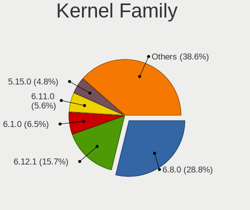
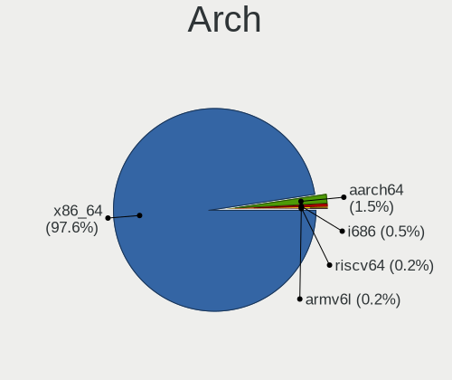
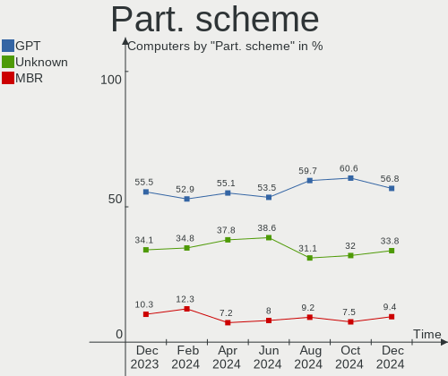
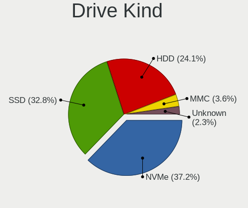
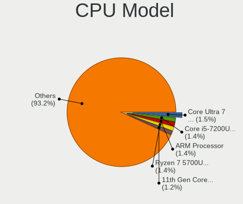
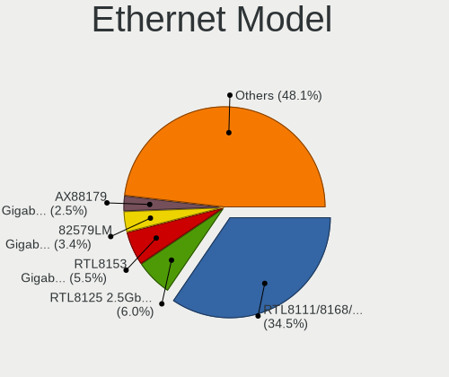
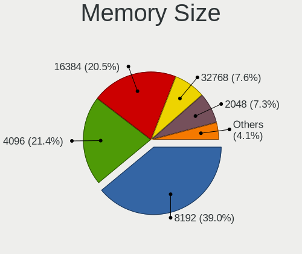
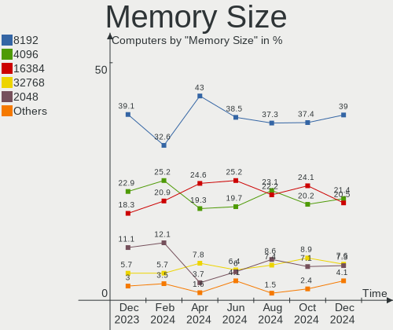

Linux in Germany - Hardware Trends
----------------------------------

A project to identify most popular hardware characteristics and track their change
over time based on data collected by Linux users at https://Linux-Hardware.org.

Anyone can contribute to this report by the [hw-probe](https://github.com/linuxhw/hw-probe) tool:

    sudo -E hw-probe -all -upload

This is a report for all computer types. See also reports for [desktops](/Location/Germany/Desktop/README.md) and [notebooks](/Location/Germany/Notebook/README.md).

Period: Jul, 2023.

Contents
--------

* [ System ](#system)
  - [ OS                       ](#os)
  - [ OS Family                ](#os-family)
  - [ Kernel                   ](#kernel)
  - [ Kernel Family            ](#kernel-family)
  - [ Kernel Major Ver.        ](#kernel-major-ver)
  - [ Arch                     ](#arch)
  - [ DE                       ](#de)
  - [ Display Server           ](#display-server)
  - [ Display Manager          ](#display-manager)
  - [ OS Lang                  ](#os-lang)
  - [ Boot Mode                ](#boot-mode)
  - [ Filesystem               ](#filesystem)
  - [ Part. scheme             ](#part-scheme)
  - [ Dual Boot with Linux/BSD ](#dual-boot-with-linuxbsd)
  - [ Dual Boot (Win)          ](#dual-boot-win)

* [ Board ](#board)
  - [ Vendor                   ](#vendor)
  - [ Model                    ](#model)
  - [ Model Family             ](#model-family)
  - [ MFG Year                 ](#mfg-year)
  - [ Form Factor              ](#form-factor)
  - [ Secure Boot              ](#secure-boot)
  - [ Coreboot                 ](#coreboot)
  - [ RAM Size                 ](#ram-size)
  - [ RAM Used                 ](#ram-used)
  - [ Total Drives             ](#total-drives)
  - [ Has CD-ROM               ](#has-cd-rom)
  - [ Has Ethernet             ](#has-ethernet)
  - [ Has WiFi                 ](#has-wifi)
  - [ Has Bluetooth            ](#has-bluetooth)

* [ Location ](#location)
  - [ Country                  ](#country)
  - [ City                     ](#city)

* [ Drives ](#drives)
  - [ Drive Vendor             ](#drive-vendor)
  - [ Drive Model              ](#drive-model)
  - [ HDD Vendor               ](#hdd-vendor)
  - [ SSD Vendor               ](#ssd-vendor)
  - [ Drive Kind               ](#drive-kind)
  - [ Drive Connector          ](#drive-connector)
  - [ Drive Size               ](#drive-size)
  - [ Space Total              ](#space-total)
  - [ Space Used               ](#space-used)
  - [ Malfunc. Drives          ](#malfunc-drives)
  - [ Malfunc. Drive Vendor    ](#malfunc-drive-vendor)
  - [ Malfunc. HDD Vendor      ](#malfunc-hdd-vendor)
  - [ Malfunc. Drive Kind      ](#malfunc-drive-kind)
  - [ Failed Drives            ](#failed-drives)
  - [ Failed Drive Vendor      ](#failed-drive-vendor)
  - [ Drive Status             ](#drive-status)

* [ Storage controller ](#storage-controller)
  - [ Storage Vendor           ](#storage-vendor)
  - [ Storage Model            ](#storage-model)
  - [ Storage Kind             ](#storage-kind)

* [ Processor ](#processor)
  - [ CPU Vendor               ](#cpu-vendor)
  - [ CPU Model                ](#cpu-model)
  - [ CPU Model Family         ](#cpu-model-family)
  - [ CPU Cores                ](#cpu-cores)
  - [ CPU Sockets              ](#cpu-sockets)
  - [ CPU Threads              ](#cpu-threads)
  - [ CPU Op-Modes             ](#cpu-op-modes)
  - [ CPU Microcode            ](#cpu-microcode)
  - [ CPU Microarch            ](#cpu-microarch)

* [ Graphics ](#graphics)
  - [ GPU Vendor               ](#gpu-vendor)
  - [ GPU Model                ](#gpu-model)
  - [ GPU Combo                ](#gpu-combo)
  - [ GPU Driver               ](#gpu-driver)
  - [ GPU Memory               ](#gpu-memory)

* [ Monitor ](#monitor)
  - [ Monitor Vendor           ](#monitor-vendor)
  - [ Monitor Model            ](#monitor-model)
  - [ Monitor Resolution       ](#monitor-resolution)
  - [ Monitor Diagonal         ](#monitor-diagonal)
  - [ Monitor Width            ](#monitor-width)
  - [ Aspect Ratio             ](#aspect-ratio)
  - [ Monitor Area             ](#monitor-area)
  - [ Pixel Density            ](#pixel-density)
  - [ Multiple Monitors        ](#multiple-monitors)

* [ Network ](#network)
  - [ Net Controller Vendor    ](#net-controller-vendor)
  - [ Net Controller Model     ](#net-controller-model)
  - [ Wireless Vendor          ](#wireless-vendor)
  - [ Wireless Model           ](#wireless-model)
  - [ Ethernet Vendor          ](#ethernet-vendor)
  - [ Ethernet Model           ](#ethernet-model)
  - [ Net Controller Kind      ](#net-controller-kind)
  - [ Used Controller          ](#used-controller)
  - [ NICs                     ](#nics)
  - [ IPv6                     ](#ipv6)

* [ Bluetooth ](#bluetooth)
  - [ Bluetooth Vendor         ](#bluetooth-vendor)
  - [ Bluetooth Model          ](#bluetooth-model)

* [ Sound ](#sound)
  - [ Sound Vendor             ](#sound-vendor)
  - [ Sound Model              ](#sound-model)

* [ Memory ](#memory)
  - [ Memory Vendor            ](#memory-vendor)
  - [ Memory Model             ](#memory-model)
  - [ Memory Kind              ](#memory-kind)
  - [ Memory Form Factor       ](#memory-form-factor)
  - [ Memory Size              ](#memory-size)
  - [ Memory Speed             ](#memory-speed)

* [ Printers & scanners ](#printers--scanners)
  - [ Printer Vendor           ](#printer-vendor)
  - [ Printer Model            ](#printer-model)
  - [ Scanner Vendor           ](#scanner-vendor)
  - [ Scanner Model            ](#scanner-model)

* [ Camera ](#camera)
  - [ Camera Vendor            ](#camera-vendor)
  - [ Camera Model             ](#camera-model)

* [ Security ](#security)
  - [ Fingerprint Vendor       ](#fingerprint-vendor)
  - [ Fingerprint Model        ](#fingerprint-model)
  - [ Chipcard Vendor          ](#chipcard-vendor)
  - [ Chipcard Model           ](#chipcard-model)

* [ Unsupported ](#unsupported)
  - [ Unsupported Devices      ](#unsupported-devices)
  - [ Unsupported Device Types ](#unsupported-device-types)

System
------

OS
--

Installed operating systems

| Name                         | Computers | Percent |
|------------------------------|-----------|---------|
| Ubuntu 22.04                 | 68        | 12.55%  |
| Linux Mint 21.1              | 48        | 8.86%   |
| Linux Mint 21.2              | 40        | 7.38%   |
| Ubuntu 23.04                 | 39        | 7.2%    |
| Fedora 38                    | 37        | 6.83%   |
| Debian 12                    | 23        | 4.24%   |
| Arch Rolling                 | 23        | 4.24%   |
| Manjaro                      | 16        | 2.95%   |
| openSUSE Leap-15.5           | 13        | 2.4%    |
| Debian 11                    | 12        | 2.21%   |
| Pop!_OS 22.04                | 11        | 2.03%   |
| OpenMandriva 23.07           | 11        | 2.03%   |
| Linux Mint 20.3              | 11        | 2.03%   |
| Kubuntu 22.04                | 11        | 2.03%   |
| openSUSE Tumbleweed-XXXXXXXX | 10        | 1.85%   |
| ArcoLinux Rolling            | 10        | 1.85%   |
| OpenMandriva 23.03           | 8         | 1.48%   |
| Kubuntu 23.04                | 8         | 1.48%   |
| Gentoo 2.13                  | 8         | 1.48%   |
| Zorin 16                     | 7         | 1.29%   |
| Ubuntu 20.04                 | 7         | 1.29%   |
| Manjaro 23.0.0               | 7         | 1.29%   |
| KDE neon 22.04               | 7         | 1.29%   |
| Debian                       | 7         | 1.29%   |
| Xubuntu 22.04                | 6         | 1.11%   |
| Xero Rolling                 | 6         | 1.11%   |
| LMDE 5                       | 6         | 1.11%   |
| EndeavourOS Rolling          | 6         | 1.11%   |
| Ubuntu 22.10                 | 5         | 0.92%   |
| TUXEDO OS 22.04              | 5         | 0.92%   |
| Ubuntu Budgie 22.04          | 4         | 0.74%   |
| Elementary 7                 | 4         | 0.74%   |
| OpenMandriva 4.3             | 3         | 0.55%   |
| Nobara 38                    | 3         | 0.55%   |
| Kali 2023.2                  | 3         | 0.55%   |
| Xubuntu 23.04                | 2         | 0.37%   |
| ROSA 12.4                    | 2         | 0.37%   |
| OpenMandriva 23.06           | 2         | 0.37%   |
| Linux Mint 20                | 2         | 0.37%   |
| Fedora 37                    | 2         | 0.37%   |

OS Family
---------

OS without a version

| Name          | Computers | Percent |
|---------------|-----------|---------|
| Ubuntu        | 121       | 22.32%  |
| Linux Mint    | 103       | 19%     |
| Debian        | 43        | 7.93%   |
| Fedora        | 39        | 7.2%    |
| OpenMandriva  | 26        | 4.8%    |
| openSUSE      | 24        | 4.43%   |
| Manjaro       | 23        | 4.24%   |
| Arch          | 23        | 4.24%   |
| Kubuntu       | 21        | 3.87%   |
| Pop!_OS       | 11        | 2.03%   |
| ArcoLinux     | 10        | 1.85%   |
| Gentoo        | 9         | 1.66%   |
| Xubuntu       | 8         | 1.48%   |
| Zorin         | 7         | 1.29%   |
| KDE neon      | 7         | 1.29%   |
| Xero          | 6         | 1.11%   |
| LMDE          | 6         | 1.11%   |
| EndeavourOS   | 6         | 1.11%   |
| TUXEDO OS     | 5         | 0.92%   |
| Elementary    | 5         | 0.92%   |
| Ubuntu Budgie | 4         | 0.74%   |
| Nobara        | 3         | 0.55%   |
| Kali          | 3         | 0.55%   |
| ChimeraOS     | 3         | 0.55%   |
| Ubuntu MATE   | 2         | 0.37%   |
| ROSA          | 2         | 0.37%   |
| Q4OS          | 2         | 0.37%   |
| Devuan        | 2         | 0.37%   |
| CentOS        | 2         | 0.37%   |
| blendOS       | 2         | 0.37%   |
| Ultramarine   | 1         | 0.18%   |
| Ubuntu Unity  | 1         | 0.18%   |
| Trisquel      | 1         | 0.18%   |
| SteamOS       | 1         | 0.18%   |
| Raspbian      | 1         | 0.18%   |
| Parrot        | 1         | 0.18%   |
| NixOS         | 1         | 0.18%   |
| Lubuntu       | 1         | 0.18%   |
| LinuxFX       | 1         | 0.18%   |
| Linux Lite    | 1         | 0.18%   |

Kernel
------

Version of the Linux kernel

| Version                     | Computers | Percent |
|-----------------------------|-----------|---------|
| 5.15.0-76-generic           | 76        | 14.02%  |
| 5.19.0-46-generic           | 66        | 12.18%  |
| 5.15.0-78-generic           | 24        | 4.43%   |
| 6.2.0-25-generic            | 20        | 3.69%   |
| 6.2.0-24-generic            | 19        | 3.51%   |
| 6.1.0-10-amd64              | 18        | 3.32%   |
| 5.10.0-23-amd64             | 15        | 2.77%   |
| 5.19.0-50-generic           | 14        | 2.58%   |
| 6.3.5-desktop-3omv2390      | 13        | 2.4%    |
| 6.3.8-200.fc38.x86_64       | 11        | 2.03%   |
| 6.3.12-200.fc38.x86_64      | 11        | 2.03%   |
| 5.4.0-153-generic           | 10        | 1.85%   |
| 6.3.9-arch1-1               | 8         | 1.48%   |
| 6.2.6-desktop-1omv2390      | 8         | 1.48%   |
| 6.2.6-76060206-generic      | 8         | 1.48%   |
| 5.14.21-150500.53-default   | 7         | 1.29%   |
| 6.4.3-arch1-2               | 6         | 1.11%   |
| 6.4.6-200.fc38.x86_64       | 5         | 0.92%   |
| 6.2.0-26-generic            | 5         | 0.92%   |
| 6.1.31-2-MANJARO            | 5         | 0.92%   |
| 5.14.21-150500.55.7-default | 5         | 0.92%   |
| 6.3.0-2-amd64               | 4         | 0.74%   |
| 6.3.0-1-amd64               | 4         | 0.74%   |
| 6.2.9-300.fc38.x86_64       | 4         | 0.74%   |
| 6.1.38-1-MANJARO            | 4         | 0.74%   |
| 5.19.0-32-generic           | 4         | 0.74%   |
| 5.15.0-56-generic           | 4         | 0.74%   |
| 6.4.4-arch1-1               | 3         | 0.55%   |
| 6.4.3-arch1-1               | 3         | 0.55%   |
| 6.4.3-1-MANJARO             | 3         | 0.55%   |
| 6.4.3-1-default             | 3         | 0.55%   |
| 6.4.2-arch1-1               | 3         | 0.55%   |
| 6.4.2-3-MANJARO             | 3         | 0.55%   |
| 6.4.1-arch2-1               | 3         | 0.55%   |
| 6.4.0-060400-generic        | 3         | 0.55%   |
| 6.3.9-chimeraos-1           | 3         | 0.55%   |
| 6.3.9-1-default             | 3         | 0.55%   |
| 6.3.11-200.fc38.x86_64      | 3         | 0.55%   |
| 6.2.0-20-generic            | 3         | 0.55%   |
| 6.1.39-1-lts                | 3         | 0.55%   |

Kernel Family
-------------

Linux kernel without a distro release

| Version | Computers | Percent |
|---------|-----------|---------|
| 5.15.0  | 117       | 21.59%  |
| 5.19.0  | 92        | 16.97%  |
| 6.2.0   | 56        | 10.33%  |
| 6.1.0   | 26        | 4.8%    |
| 6.4.3   | 19        | 3.51%   |
| 5.10.0  | 18        | 3.32%   |
| 6.3.9   | 16        | 2.95%   |
| 6.2.6   | 16        | 2.95%   |
| 6.3.8   | 15        | 2.77%   |
| 6.3.12  | 15        | 2.77%   |
| 5.4.0   | 15        | 2.77%   |
| 6.3.5   | 13        | 2.4%    |
| 5.14.21 | 13        | 2.4%    |
| 6.4.4   | 12        | 2.21%   |
| 6.4.2   | 10        | 1.85%   |
| 6.3.0   | 9         | 1.66%   |
| 6.1.38  | 9         | 1.66%   |
| 6.4.6   | 7         | 1.29%   |
| 6.1.31  | 6         | 1.11%   |
| 6.4.0   | 5         | 0.92%   |
| 6.4.1   | 4         | 0.74%   |
| 6.3.11  | 4         | 0.74%   |
| 6.2.9   | 4         | 0.74%   |
| 6.1.39  | 4         | 0.74%   |
| 6.4.7   | 2         | 0.37%   |
| 6.3.4   | 2         | 0.37%   |
| 6.2.16  | 2         | 0.37%   |
| 6.1.41  | 2         | 0.37%   |
| 6.1.21  | 2         | 0.37%   |
| 6.0.0   | 2         | 0.37%   |
| 5.16.7  | 2         | 0.37%   |
| 5.14.0  | 2         | 0.37%   |
| 4.19.0  | 2         | 0.37%   |
| 6.4.5   | 1         | 0.18%   |
| 6.3.6   | 1         | 0.18%   |
| 6.2.15  | 1         | 0.18%   |
| 6.1.30  | 1         | 0.18%   |
| 6.1.28  | 1         | 0.18%   |
| 6.1.20  | 1         | 0.18%   |
| 6.1.1   | 1         | 0.18%   |

Kernel Major Ver.
-----------------

Linux kernel major version

| Version | Computers | Percent |
|---------|-----------|---------|
| 5.15    | 121       | 22.32%  |
| 5.19    | 92        | 16.97%  |
| 6.2     | 79        | 14.58%  |
| 6.3     | 75        | 13.84%  |
| 6.4     | 60        | 11.07%  |
| 6.1     | 53        | 9.78%   |
| 5.10    | 20        | 3.69%   |
| 5.4     | 15        | 2.77%   |
| 5.14    | 15        | 2.77%   |
| 5.16    | 3         | 0.55%   |
| 6.0     | 2         | 0.37%   |
| 4.19    | 2         | 0.37%   |
| 5.8     | 1         | 0.18%   |
| 5.6     | 1         | 0.18%   |
| 5.18    | 1         | 0.18%   |
| 5.17    | 1         | 0.18%   |
| 5.13    | 1         | 0.18%   |

Arch
----

OS architecture (x86_64, i586, etc.)

| Name    | Computers | Percent |
|---------|-----------|---------|
| x86_64  | 536       | 98.89%  |
| aarch64 | 4         | 0.74%   |
| i686    | 1         | 0.18%   |
| armv7l  | 1         | 0.18%   |

DE
--

Desktop Environment

| Name         | Computers | Percent |
|--------------|-----------|---------|
| GNOME        | 203       | 37.45%  |
| KDE5         | 128       | 23.62%  |
| X-Cinnamon   | 87        | 16.05%  |
| XFCE         | 45        | 8.3%    |
| Unknown      | 28        | 5.17%   |
| MATE         | 11        | 2.03%   |
| Cinnamon     | 9         | 1.66%   |
| Pantheon     | 6         | 1.11%   |
| LXQt         | 4         | 0.74%   |
| Budgie       | 4         | 0.74%   |
| LXDE         | 3         | 0.55%   |
| KDE          | 3         | 0.55%   |
| Hyprland     | 3         | 0.55%   |
| i3           | 2         | 0.37%   |
| Unity        | 1         | 0.18%   |
| river        | 1         | 0.18%   |
| none+awesome | 1         | 0.18%   |
| LeftWM       | 1         | 0.18%   |
| chadwm       | 1         | 0.18%   |
| awesome      | 1         | 0.18%   |

Display Server
--------------

X11 or Wayland

| Name    | Computers | Percent |
|---------|-----------|---------|
| X11     | 342       | 63.1%   |
| Wayland | 166       | 30.63%  |
| Unknown | 18        | 3.32%   |
| Tty     | 16        | 2.95%   |

Display Manager
---------------

SDDM, LightDM, etc.

| Name    | Computers | Percent |
|---------|-----------|---------|
| Unknown | 217       | 40.04%  |
| GDM3    | 108       | 19.93%  |
| LightDM | 97        | 17.9%   |
| SDDM    | 96        | 17.71%  |
| GDM     | 20        | 3.69%   |
| SLiM    | 1         | 0.18%   |
| NODM    | 1         | 0.18%   |
| LY-DM   | 1         | 0.18%   |
| Ly      | 1         | 0.18%   |

OS Lang
-------

Language

| Lang    | Computers | Percent |
|---------|-----------|---------|
| de_DE   | 380       | 70.11%  |
| en_US   | 101       | 18.63%  |
| en_GB   | 18        | 3.32%   |
| C       | 12        | 2.21%   |
| Unknown | 9         | 1.66%   |
| en_DE   | 5         | 0.92%   |
| ru_RU   | 4         | 0.74%   |
| C.UTF8  | 3         | 0.55%   |
| it_IT   | 2         | 0.37%   |
| ru_UA   | 1         | 0.18%   |
| POSIX   | 1         | 0.18%   |
| pl_PL   | 1         | 0.18%   |
| es_DO   | 1         | 0.18%   |
| eo      | 1         | 0.18%   |
| en_DK   | 1         | 0.18%   |
| en_CA   | 1         | 0.18%   |
| bg_BG   | 1         | 0.18%   |

Boot Mode
---------

EFI or BIOS

| Mode | Computers | Percent |
|------|-----------|---------|
| BIOS | 275       | 50.74%  |
| EFI  | 267       | 49.26%  |

Filesystem
----------

Type of filesystem

| Type    | Computers | Percent |
|---------|-----------|---------|
| Ext4    | 313       | 57.75%  |
| Btrfs   | 94        | 17.34%  |
| Tmpfs   | 88        | 16.24%  |
| Overlay | 26        | 4.8%    |
| Xfs     | 10        | 1.85%   |
| Zfs     | 8         | 1.48%   |
| F2fs    | 1         | 0.18%   |
| Ext2    | 1         | 0.18%   |
| Unknown | 1         | 0.18%   |

Part. scheme
------------

Scheme of partitioning

| Type    | Computers | Percent |
|---------|-----------|---------|
| GPT     | 297       | 54.8%   |
| Unknown | 191       | 35.24%  |
| MBR     | 54        | 9.96%   |

Dual Boot with Linux/BSD
------------------------

Hosting more than one Linux/BSD

| Dual boot | Computers | Percent |
|-----------|-----------|---------|
| No        | 482       | 88.93%  |
| Yes       | 60        | 11.07%  |

Dual Boot (Win)
---------------

Hosting Linux and Windows

| Dual boot | Computers | Percent |
|-----------|-----------|---------|
| No        | 404       | 74.54%  |
| Yes       | 138       | 25.46%  |

Board
-----

Vendor
------

Motherboard manufacturer

| Name                                 | Computers | Percent |
|--------------------------------------|-----------|---------|
| Lenovo                               | 89        | 16.42%  |
| ASUSTek Computer                     | 76        | 14.02%  |
| Hewlett-Packard                      | 64        | 11.81%  |
| Gigabyte Technology                  | 46        | 8.49%   |
| MSI                                  | 37        | 6.83%   |
| Dell                                 | 34        | 6.27%   |
| Acer                                 | 32        | 5.9%    |
| Fujitsu                              | 27        | 4.98%   |
| ASRock                               | 21        | 3.87%   |
| Apple                                | 19        | 3.51%   |
| Medion                               | 15        | 2.77%   |
| TUXEDO                               | 12        | 2.21%   |
| Unknown                              | 7         | 1.29%   |
| HUAWEI                               | 6         | 1.11%   |
| Intel                                | 5         | 0.92%   |
| Biostar                              | 5         | 0.92%   |
| Toshiba                              | 3         | 0.55%   |
| Microsoft                            | 3         | 0.55%   |
| AZW                                  | 3         | 0.55%   |
| Wortmann AG                          | 2         | 0.37%   |
| Valve                                | 2         | 0.37%   |
| Supermicro                           | 2         | 0.37%   |
| Sony                                 | 2         | 0.37%   |
| Shenzhen Meigao Electronic Equipment | 2         | 0.37%   |
| Schenker                             | 2         | 0.37%   |
| Raspberry Pi Foundation              | 2         | 0.37%   |
| Packard Bell                         | 2         | 0.37%   |
| Fujitsu Siemens                      | 2         | 0.37%   |
| Foxconn                              | 2         | 0.37%   |
| Chuwi                                | 2         | 0.37%   |
| VALE                                 | 1         | 0.18%   |
| Thomson                              | 1         | 0.18%   |
| T-bao                                | 1         | 0.18%   |
| Samsung Electronics                  | 1         | 0.18%   |
| Rockchip                             | 1         | 0.18%   |
| raspberrypi,4-model-b                | 1         | 0.18%   |
| Pegatron                             | 1         | 0.18%   |
| Panasonic                            | 1         | 0.18%   |
| MW                                   | 1         | 0.18%   |
| Lex BayTrail                         | 1         | 0.18%   |

Model
-----

Motherboard model

| Name                               | Computers | Percent |
|------------------------------------|-----------|---------|
| Unknown                            | 8         | 1.48%   |
| ASUS All Series                    | 4         | 0.74%   |
| TUXEDO InfinityBook S 15/17 Gen7   | 3         | 0.55%   |
| MSI MS-7C56                        | 3         | 0.55%   |
| MSI MS-7B85                        | 3         | 0.55%   |
| Lenovo G50-70 20351                | 3         | 0.55%   |
| Fujitsu LIFEBOOK A3510             | 3         | 0.55%   |
| Valve Jupiter                      | 2         | 0.37%   |
| TUXEDO Pulse 15 Gen1               | 2         | 0.37%   |
| Lenovo IdeaPad 100-15IBY 80MJ      | 2         | 0.37%   |
| Lenovo G550 2958                   | 2         | 0.37%   |
| HP Pavilion 17                     | 2         | 0.37%   |
| HP Pavilion 15                     | 2         | 0.37%   |
| HP OMEN Laptop 15-en0xxx           | 2         | 0.37%   |
| HP G62                             | 2         | 0.37%   |
| HP EliteBook 840 G3                | 2         | 0.37%   |
| HP EliteBook 2540p                 | 2         | 0.37%   |
| Gigabyte GA-890GPA-UD3H            | 2         | 0.37%   |
| Gigabyte GA-78LMT-USB3 6.0         | 2         | 0.37%   |
| Gigabyte B550I AORUS PRO AX        | 2         | 0.37%   |
| Gigabyte B450 I AORUS PRO WIFI     | 2         | 0.37%   |
| Fujitsu LIFEBOOK E780              | 2         | 0.37%   |
| Fujitsu LIFEBOOK A544              | 2         | 0.37%   |
| Dell Latitude E7270                | 2         | 0.37%   |
| Dell Latitude E6230                | 2         | 0.37%   |
| Biostar A960D+V2                   | 2         | 0.37%   |
| ASUS X555LAB                       | 2         | 0.37%   |
| ASUS ROG STRIX B650E-I GAMING WIFI | 2         | 0.37%   |
| ASUS ROG STRIX B450-F GAMING II    | 2         | 0.37%   |
| ASUS ROG STRIX B450-E GAMING       | 2         | 0.37%   |
| ASUS PRIME B450M-A                 | 2         | 0.37%   |
| ASUS PRIME A320M-K                 | 2         | 0.37%   |
| Apple MacBookPro8,1                | 2         | 0.37%   |
| Apple MacBookPro11,1               | 2         | 0.37%   |
| Acer Aspire E5-774G                | 2         | 0.37%   |
| Acer Aspire A517-52                | 2         | 0.37%   |
| Wortmann AG TERRA_PC               | 1         | 0.18%   |
| Wortmann AG 1220624_1470150        | 1         | 0.18%   |
| VALE Notebook Classic C140         | 1         | 0.18%   |
| TUXEDO Polaris 15 AMD Gen1         | 1         | 0.18%   |

Model Family
------------

Motherboard model prefix

| Name                | Computers | Percent |
|---------------------|-----------|---------|
| Lenovo ThinkPad     | 46        | 8.49%   |
| Acer Aspire         | 23        | 4.24%   |
| Fujitsu LIFEBOOK    | 20        | 3.69%   |
| Dell Latitude       | 17        | 3.14%   |
| ASUS PRIME          | 14        | 2.58%   |
| Lenovo IdeaPad      | 12        | 2.21%   |
| HP EliteBook        | 12        | 2.21%   |
| ASUS ROG            | 12        | 2.21%   |
| Lenovo ThinkCentre  | 9         | 1.66%   |
| HP Laptop           | 9         | 1.66%   |
| HP Pavilion         | 8         | 1.48%   |
| Unknown             | 8         | 1.48%   |
| HP Compaq           | 6         | 1.11%   |
| Fujitsu ESPRIMO     | 6         | 1.11%   |
| TUXEDO InfinityBook | 5         | 0.92%   |
| HP EliteDesk        | 5         | 0.92%   |
| Dell Inspiron       | 5         | 0.92%   |
| Medion Akoya        | 4         | 0.74%   |
| HP 255              | 4         | 0.74%   |
| Gigabyte B550       | 4         | 0.74%   |
| ASUS All            | 4         | 0.74%   |
| Apple MacBookPro11  | 4         | 0.74%   |
| MSI MS-7C56         | 3         | 0.55%   |
| MSI MS-7B85         | 3         | 0.55%   |
| Microsoft Surface   | 3         | 0.55%   |
| Lenovo Yoga         | 3         | 0.55%   |
| Lenovo G50-70       | 3         | 0.55%   |
| HP ProBook          | 3         | 0.55%   |
| HP OMEN             | 3         | 0.55%   |
| HP ENVY             | 3         | 0.55%   |
| Dell XPS            | 3         | 0.55%   |
| Dell Precision      | 3         | 0.55%   |
| ASUS ZenBook        | 3         | 0.55%   |
| ASUS ASUS           | 3         | 0.55%   |
| Apple MacBookPro8   | 3         | 0.55%   |
| Apple MacBookPro5   | 3         | 0.55%   |
| Valve Jupiter       | 2         | 0.37%   |
| TUXEDO Pulse        | 2         | 0.37%   |
| Toshiba Satellite   | 2         | 0.37%   |
| RPi Raspberry       | 2         | 0.37%   |

MFG Year
--------

Motherboard manufacture year

| Year    | Computers | Percent |
|---------|-----------|---------|
| 2020    | 62        | 11.44%  |
| 2022    | 57        | 10.52%  |
| 2018    | 45        | 8.3%    |
| 2021    | 43        | 7.93%   |
| 2017    | 39        | 7.2%    |
| 2013    | 39        | 7.2%    |
| 2010    | 35        | 6.46%   |
| 2019    | 33        | 6.09%   |
| 2015    | 30        | 5.54%   |
| 2012    | 30        | 5.54%   |
| 2016    | 26        | 4.8%    |
| 2011    | 25        | 4.61%   |
| 2014    | 23        | 4.24%   |
| 2023    | 21        | 3.87%   |
| 2009    | 14        | 2.58%   |
| 2008    | 6         | 1.11%   |
| 2007    | 5         | 0.92%   |
| Unknown | 5         | 0.92%   |
| 2006    | 3         | 0.55%   |
| 2005    | 1         | 0.18%   |

Form Factor
-----------

Physical design of the computer

| Name           | Computers | Percent |
|----------------|-----------|---------|
| Notebook       | 278       | 51.29%  |
| Desktop        | 219       | 40.41%  |
| Convertible    | 15        | 2.77%   |
| Mini pc        | 8         | 1.48%   |
| Tablet         | 7         | 1.29%   |
| Server         | 6         | 1.11%   |
| System on chip | 5         | 0.92%   |
| All in one     | 4         | 0.74%   |

Secure Boot
-----------

Enabled or disabled

| State    | Computers | Percent |
|----------|-----------|---------|
| Disabled | 511       | 94.28%  |
| Enabled  | 31        | 5.72%   |

Coreboot
--------

Have coreboot on board

| Used | Computers | Percent |
|------|-----------|---------|
| No   | 541       | 99.82%  |
| Yes  | 1         | 0.18%   |

RAM Size
--------

Total RAM memory

| Size in GB      | Computers | Percent |
|-----------------|-----------|---------|
| 4.01-8.0        | 134       | 24.72%  |
| 16.01-24.0      | 107       | 19.74%  |
| 8.01-16.0       | 86        | 15.87%  |
| 32.01-64.0      | 84        | 15.5%   |
| 3.01-4.0        | 76        | 14.02%  |
| 64.01-256.0     | 27        | 4.98%   |
| 24.01-32.0      | 16        | 2.95%   |
| More than 256.0 | 4         | 0.74%   |
| 1.01-2.0        | 4         | 0.74%   |
| 2.01-3.0        | 2         | 0.37%   |
| 0.51-1.0        | 2         | 0.37%   |

RAM Used
--------

Used RAM memory

| Used GB    | Computers | Percent |
|------------|-----------|---------|
| 1.01-2.0   | 188       | 34.69%  |
| 2.01-3.0   | 110       | 20.3%   |
| 4.01-8.0   | 105       | 19.37%  |
| 3.01-4.0   | 78        | 14.39%  |
| 8.01-16.0  | 26        | 4.8%    |
| 0.51-1.0   | 16        | 2.95%   |
| 0.01-0.5   | 13        | 2.4%    |
| 16.01-24.0 | 5         | 0.92%   |
| 24.01-32.0 | 1         | 0.18%   |

Total Drives
------------

Number of drives on board

| Drives | Computers | Percent |
|--------|-----------|---------|
| 1      | 315       | 58.12%  |
| 2      | 126       | 23.25%  |
| 3      | 43        | 7.93%   |
| 4      | 30        | 5.54%   |
| 5      | 13        | 2.4%    |
| 6      | 6         | 1.11%   |
| 0      | 5         | 0.92%   |
| 7      | 2         | 0.37%   |
| 9      | 1         | 0.18%   |
| 8      | 1         | 0.18%   |

Has CD-ROM
----------

Has CD-ROM on board

| Presented | Computers | Percent |
|-----------|-----------|---------|
| No        | 335       | 61.81%  |
| Yes       | 207       | 38.19%  |

Has Ethernet
------------

Has Ethernet on board

| Presented | Computers | Percent |
|-----------|-----------|---------|
| Yes       | 469       | 86.53%  |
| No        | 73        | 13.47%  |

Has WiFi
--------

Has WiFi module

| Presented | Computers | Percent |
|-----------|-----------|---------|
| Yes       | 394       | 72.69%  |
| No        | 148       | 27.31%  |

Has Bluetooth
-------------

Has Bluetooth module

| Presented | Computers | Percent |
|-----------|-----------|---------|
| Yes       | 340       | 62.73%  |
| No        | 202       | 37.27%  |

Location
--------

Country
-------

Geographic location (country)

| Country | Computers | Percent |
|---------|-----------|---------|
| Germany | 542       | 100%    |

City
----

Geographic location (city)

| City               | Computers | Percent |
|--------------------|-----------|---------|
| Berlin             | 53        | 9.78%   |
| Hamburg            | 20        | 3.69%   |
| Munich             | 19        | 3.51%   |
| Cologne            | 13        | 2.4%    |
| Frankfurt am Main  | 11        | 2.03%   |
| Dresden            | 11        | 2.03%   |
| Kiel               | 10        | 1.85%   |
| Karlsruhe          | 9         | 1.66%   |
| Leipzig            | 8         | 1.48%   |
| Bonn               | 8         | 1.48%   |
| Wiesbaden          | 7         | 1.29%   |
| Ulm                | 7         | 1.29%   |
| Mannheim           | 7         | 1.29%   |
| Bielefeld          | 7         | 1.29%   |
| Hanover            | 6         | 1.11%   |
| Düsseldorf        | 6         | 1.11%   |
| Nuremberg          | 5         | 0.92%   |
| Essen              | 5         | 0.92%   |
| Dortmund           | 5         | 0.92%   |
| Bremen             | 5         | 0.92%   |
| Wegberg            | 4         | 0.74%   |
| Stuttgart          | 4         | 0.74%   |
| Schwäbisch Gmünd | 4         | 0.74%   |
| Lüdenscheid       | 4         | 0.74%   |
| Gelsenkirchen      | 4         | 0.74%   |
| Bochum             | 4         | 0.74%   |
| Saarbrücken       | 3         | 0.55%   |
| Reutlingen         | 3         | 0.55%   |
| Pirna              | 3         | 0.55%   |
| Oberursel          | 3         | 0.55%   |
| Mülheim           | 3         | 0.55%   |
| Michelstadt        | 3         | 0.55%   |
| Lübeck            | 3         | 0.55%   |
| Lemgo              | 3         | 0.55%   |
| Koblenz            | 3         | 0.55%   |
| Heubach            | 3         | 0.55%   |
| Delligsen          | 3         | 0.55%   |
| Braunschweig       | 3         | 0.55%   |
| Bornheim           | 3         | 0.55%   |
| Bendorf            | 3         | 0.55%   |

Drives
------

Drive Vendor
------------

Hard drive vendors

| Vendor                      | Computers | Drives | Percent |
|-----------------------------|-----------|--------|---------|
| Samsung Electronics         | 187       | 255    | 23.49%  |
| WDC                         | 87        | 106    | 10.93%  |
| Seagate                     | 79        | 94     | 9.92%   |
| SanDisk                     | 57        | 68     | 7.16%   |
| Crucial                     | 46        | 50     | 5.78%   |
| Toshiba                     | 41        | 49     | 5.15%   |
| Intenso                     | 29        | 32     | 3.64%   |
| Micron Technology           | 26        | 26     | 3.27%   |
| Kingston                    | 26        | 28     | 3.27%   |
| Unknown                     | 21        | 23     | 2.64%   |
| Hitachi                     | 21        | 22     | 2.64%   |
| SK hynix                    | 16        | 16     | 2.01%   |
| Intel                       | 15        | 15     | 1.88%   |
| Micron/Crucial Technology   | 13        | 13     | 1.63%   |
| Unknown                     | 9         | 9      | 1.13%   |
| KIOXIA                      | 7         | 7      | 0.88%   |
| Apple                       | 7         | 8      | 0.88%   |
| A-DATA Technology           | 7         | 7      | 0.88%   |
| Silicon Motion              | 6         | 6      | 0.75%   |
| Phison Electronics          | 6         | 7      | 0.75%   |
| Kingston Technology Company | 6         | 9      | 0.75%   |
| Phison                      | 5         | 5      | 0.63%   |
| OCZ                         | 5         | 5      | 0.63%   |
| Maxtor                      | 5         | 5      | 0.63%   |
| China                       | 5         | 5      | 0.63%   |
| Verbatim                    | 4         | 5      | 0.5%    |
| SPCC                        | 4         | 5      | 0.5%    |
| Transcend                   | 3         | 3      | 0.38%   |
| Netac                       | 3         | 3      | 0.38%   |
| LITEON                      | 3         | 3      | 0.38%   |
| HGST                        | 3         | 3      | 0.38%   |
| Fanxiang                    | 3         | 3      | 0.38%   |
| ASMT                        | 3         | 4      | 0.38%   |
| Union Memory (Shenzhen)     | 2         | 2      | 0.25%   |
| PNY                         | 2         | 2      | 0.25%   |
| Mushkin                     | 2         | 2      | 0.25%   |
| JMicron Technology          | 2         | 2      | 0.25%   |
| Corsair                     | 2         | 2      | 0.25%   |
| Apacer                      | 2         | 2      | 0.25%   |
| AMD                         | 2         | 2      | 0.25%   |

Drive Model
-----------

Hard drive models

| Model                                                 | Computers | Percent |
|-------------------------------------------------------|-----------|---------|
| Samsung NVMe SSD Controller SM981/PM981/PM983 500GB   | 37        | 4.22%   |
| Samsung NVMe SSD Controller PM9A1/PM9A3/980PRO 1TB    | 13        | 1.48%   |
| Samsung SSD 980 1TB                                   | 12        | 1.37%   |
| Samsung SSD 850 EVO 250GB                             | 9         | 1.03%   |
| Micron/Crucial P2 NVMe PCIe SSD 1TB                   | 9         | 1.03%   |
| Unknown                                               | 9         | 1.03%   |
| Unknown MMC Card  64GB                                | 7         | 0.8%    |
| SanDisk SSD PLUS 240GB                                | 7         | 0.8%    |
| Samsung SSD 870 QVO 1TB                               | 7         | 0.8%    |
| Crucial CT1000MX500SSD1 1TB                           | 7         | 0.8%    |
| Samsung SSD 980 500GB                                 | 6         | 0.68%   |
| Samsung SSD 850 EVO 500GB                             | 6         | 0.68%   |
| Toshiba MQ01ABD100 1TB                                | 5         | 0.57%   |
| SanDisk SSD PLUS 1000GB                               | 5         | 0.57%   |
| Samsung SSD 870 EVO 1TB                               | 5         | 0.57%   |
| Samsung SSD 860 EVO 500GB                             | 5         | 0.57%   |
| Samsung SSD 860 EVO 1TB                               | 5         | 0.57%   |
| Samsung SSD 840 EVO 250GB                             | 5         | 0.57%   |
| Samsung PSSD T7 1TB                                   | 5         | 0.57%   |
| Toshiba HDWD110 1TB                                   | 4         | 0.46%   |
| Silicon Motion SM2263EN/SM2263XT SSD Controller 500GB | 4         | 0.46%   |
| Seagate ST3500418AS 500GB                             | 4         | 0.46%   |
| Seagate ST2000DM008-2FR102 2TB                        | 4         | 0.46%   |
| Sandisk WD Blue SN570 1TB                             | 4         | 0.46%   |
| Sandisk WD Black SN750 / PC SN730 NVMe SSD 1024GB     | 4         | 0.46%   |
| Samsung SSD 870 QVO 2TB                               | 4         | 0.46%   |
| Samsung NVMe SSD Controller SM961/PM961/SM963 256GB   | 4         | 0.46%   |
| Samsung HD204UI 2TB                                   | 4         | 0.46%   |
| Kingston SA400S37120G 120GB SSD                       | 4         | 0.46%   |
| Intenso SSD 128GB                                     | 4         | 0.46%   |
| Crucial CT500MX500SSD1 500GB                          | 4         | 0.46%   |
| Crucial CT250MX500SSD1 250GB                          | 4         | 0.46%   |
| WDC WDS500G2B0A-00SM50 500GB SSD                      | 3         | 0.34%   |
| WDC WD5000LPCX-24C6HT0 500GB                          | 3         | 0.34%   |
| WDC WD30EFRX-68EUZN0 3TB                              | 3         | 0.34%   |
| WDC WD20EZRZ-00Z5HB0 2TB                              | 3         | 0.34%   |
| Verbatim Vi550 S3 128GB                               | 3         | 0.34%   |
| Unknown MMC Card  128GB                               | 3         | 0.34%   |
| Toshiba MQ01ABF050 500GB                              | 3         | 0.34%   |
| Seagate ST1000LM035-1RK172 1TB                        | 3         | 0.34%   |

HDD Vendor
----------

Hard disk drive vendors

| Vendor              | Computers | Drives | Percent |
|---------------------|-----------|--------|---------|
| Seagate             | 74        | 87     | 32.46%  |
| WDC                 | 65        | 81     | 28.51%  |
| Toshiba             | 31        | 37     | 13.6%   |
| Hitachi             | 21        | 22     | 9.21%   |
| Samsung Electronics | 18        | 21     | 7.89%   |
| Maxtor              | 5         | 5      | 2.19%   |
| HGST                | 3         | 3      | 1.32%   |
| JMicron Technology  | 2         | 2      | 0.88%   |
| Intenso             | 2         | 2      | 0.88%   |
| ASMT                | 2         | 2      | 0.88%   |
| QUANTUM             | 1         | 1      | 0.44%   |
| MDT                 | 1         | 1      | 0.44%   |
| IBM                 | 1         | 1      | 0.44%   |
| External            | 1         | 1      | 0.44%   |
| Apple               | 1         | 1      | 0.44%   |

SSD Vendor
----------

Solid state drive vendors

| Vendor              | Computers | Drives | Percent |
|---------------------|-----------|--------|---------|
| Samsung Electronics | 93        | 110    | 31%     |
| Crucial             | 37        | 40     | 12.33%  |
| SanDisk             | 35        | 39     | 11.67%  |
| Intenso             | 22        | 24     | 7.33%   |
| Kingston            | 18        | 20     | 6%      |
| WDC                 | 14        | 15     | 4.67%   |
| Micron Technology   | 7         | 7      | 2.33%   |
| Apple               | 6         | 6      | 2%      |
| OCZ                 | 5         | 5      | 1.67%   |
| Intel               | 5         | 5      | 1.67%   |
| China               | 5         | 5      | 1.67%   |
| A-DATA Technology   | 5         | 5      | 1.67%   |
| Verbatim            | 4         | 5      | 1.33%   |
| Toshiba             | 4         | 4      | 1.33%   |
| Unknown             | 4         | 4      | 1.33%   |
| Transcend           | 3         | 3      | 1%      |
| SPCC                | 3         | 4      | 1%      |
| Phison              | 3         | 3      | 1%      |
| LITEON              | 3         | 3      | 1%      |
| Fanxiang            | 3         | 3      | 1%      |
| Netac               | 2         | 2      | 0.67%   |
| Mushkin             | 2         | 2      | 0.67%   |
| Apacer              | 2         | 2      | 0.67%   |
| WODPOSIT            | 1         | 2      | 0.33%   |
| Vaseky              | 1         | 1      | 0.33%   |
| SK hynix            | 1         | 1      | 0.33%   |
| PNY                 | 1         | 1      | 0.33%   |
| LITEONIT            | 1         | 1      | 0.33%   |
| Leven               | 1         | 1      | 0.33%   |
| INNOVATION IT       | 1         | 1      | 0.33%   |
| GOODRAM             | 1         | 1      | 0.33%   |
| GLOWAY              | 1         | 1      | 0.33%   |
| Geonix              | 1         | 1      | 0.33%   |
| Emtec               | 1         | 1      | 0.33%   |
| CT2000P3            | 1         | 1      | 0.33%   |
| CT1000MX            | 1         | 1      | 0.33%   |
| Corsair             | 1         | 1      | 0.33%   |
| ASMT                | 1         | 2      | 0.33%   |

Drive Kind
----------

HDD or SSD

| Kind    | Computers | Drives | Percent |
|---------|-----------|--------|---------|
| SSD     | 265       | 333    | 36.25%  |
| NVMe    | 239       | 293    | 32.69%  |
| HDD     | 188       | 267    | 25.72%  |
| MMC     | 24        | 25     | 3.28%   |
| Unknown | 15        | 20     | 2.05%   |

Drive Connector
---------------

SATA, SAS, NVMe, etc.

| Type | Computers | Drives | Percent |
|------|-----------|--------|---------|
| SATA | 355       | 561    | 53.46%  |
| NVMe | 238       | 291    | 35.84%  |
| SAS  | 47        | 61     | 7.08%   |
| MMC  | 24        | 25     | 3.61%   |

Drive Size
----------

Size of hard drive

| Size in TB | Computers | Drives | Percent |
|------------|-----------|--------|---------|
| 0.01-0.5   | 250       | 323    | 53.19%  |
| 0.51-1.0   | 131       | 162    | 27.87%  |
| 1.01-2.0   | 49        | 55     | 10.43%  |
| 3.01-4.0   | 16        | 23     | 3.4%    |
| 4.01-10.0  | 12        | 23     | 2.55%   |
| 2.01-3.0   | 9         | 11     | 1.91%   |
| 10.01-20.0 | 2         | 2      | 0.43%   |
| 0          | 1         | 1      | 0.21%   |

Space Total
-----------

Amount of disk space available on the file system

| Size in GB     | Computers | Percent |
|----------------|-----------|---------|
| 101-250        | 122       | 22.51%  |
| 251-500        | 100       | 18.45%  |
| 501-1000       | 92        | 16.97%  |
| 1001-2000      | 63        | 11.62%  |
| More than 3000 | 56        | 10.33%  |
| 1-20           | 30        | 5.54%   |
| 2001-3000      | 27        | 4.98%   |
| Unknown        | 25        | 4.61%   |
| 51-100         | 17        | 3.14%   |
| 21-50          | 10        | 1.85%   |

Space Used
----------

Amount of used disk space

| Used GB        | Computers | Percent |
|----------------|-----------|---------|
| 1-20           | 134       | 24.72%  |
| 21-50          | 88        | 16.24%  |
| 101-250        | 83        | 15.31%  |
| 51-100         | 65        | 11.99%  |
| 251-500        | 54        | 9.96%   |
| 501-1000       | 35        | 6.46%   |
| More than 3000 | 26        | 4.8%    |
| Unknown        | 25        | 4.61%   |
| 1001-2000      | 24        | 4.43%   |
| 2001-3000      | 8         | 1.48%   |

Malfunc. Drives
---------------

Drive models with a malfunction

| Model                                 | Computers | Drives | Percent |
|---------------------------------------|-----------|--------|---------|
| WDC WD30EFRX-68EUZN0 3TB              | 2         | 2      | 3.7%    |
| WDC WD10EARS-00Y5B1 1TB               | 2         | 2      | 3.7%    |
| Toshiba MQ01ABD100 1TB                | 2         | 2      | 3.7%    |
| Toshiba MK2533GSG 250GB               | 2         | 2      | 3.7%    |
| HGST HTS725050A7E630 500GB            | 2         | 2      | 3.7%    |
| WDC WD800BB-55JKC0 80GB               | 1         | 1      | 1.85%   |
| WDC WD60EFAX-68SHWN0 6TB              | 1         | 1      | 1.85%   |
| WDC WD5000BEKT-60KA9T0 500GB          | 1         | 1      | 1.85%   |
| WDC WD5000AAKS-007AA0 500GB           | 1         | 1      | 1.85%   |
| WDC WD30EFRX-68AX9N0 3TB              | 1         | 1      | 1.85%   |
| WDC WD2500AAJS-00VTA0 250GB           | 1         | 1      | 1.85%   |
| WDC WD1200BEVS-07LAT0 120GB           | 1         | 1      | 1.85%   |
| WDC WD1200BB-22GUA0 120GB             | 1         | 1      | 1.85%   |
| WDC WD10EZRX-22A3KB0 1TB              | 1         | 1      | 1.85%   |
| WDC WD10EALX-759BA1 1TB               | 1         | 1      | 1.85%   |
| WDC WD Blue SA510 2.5 1000GB SSD      | 1         | 1      | 1.85%   |
| Transcend TS256GSSD720 256GB          | 1         | 1      | 1.85%   |
| Toshiba MK3261GSY 320GB               | 1         | 1      | 1.85%   |
| Toshiba MD04ACA400 4TB                | 1         | 1      | 1.85%   |
| Seagate ST500DM002-1BD142 500GB       | 1         | 1      | 1.85%   |
| Seagate ST3500413AS 500GB             | 1         | 2      | 1.85%   |
| Seagate ST320LT007-9ZV142 320GB       | 1         | 1      | 1.85%   |
| Seagate ST2000LM007-1R8174 2TB        | 1         | 1      | 1.85%   |
| Seagate ST2000DM001-1CH164 2TB        | 1         | 1      | 1.85%   |
| SanDisk SDSSDHII120G 120GB            | 1         | 1      | 1.85%   |
| Samsung Electronics SSD 980 500GB     | 1         | 1      | 1.85%   |
| Samsung Electronics SSD 870 EVO 1TB   | 1         | 1      | 1.85%   |
| Samsung Electronics SSD 850 EVO 250GB | 1         | 1      | 1.85%   |
| Samsung Electronics HD753LJ 752GB     | 1         | 1      | 1.85%   |
| Samsung Electronics HD642JJ 640GB     | 1         | 1      | 1.85%   |
| Samsung Electronics HD501LJ 500GB     | 1         | 1      | 1.85%   |
| Samsung Electronics HD154UI 1TB       | 1         | 1      | 1.85%   |
| OCZ VERTEX3 120GB SSD                 | 1         | 1      | 1.85%   |
| MDT MD6400AAKS-00A7B0 640GB           | 1         | 1      | 1.85%   |
| Maxtor STM3160215AS 160GB             | 1         | 1      | 1.85%   |
| Maxtor STM3160215A 160GB              | 1         | 1      | 1.85%   |
| Maxtor 90680D4 7GB                    | 1         | 1      | 1.85%   |
| Kingston SV300S37A120G 120GB SSD      | 1         | 1      | 1.85%   |
| Intenso TOP M.2 SATA 128GB SSD        | 1         | 1      | 1.85%   |
| Intel SSDPEKKW512G7 512GB             | 1         | 1      | 1.85%   |

Malfunc. Drive Vendor
---------------------

Vendors of faulty drives

| Vendor              | Computers | Drives | Percent |
|---------------------|-----------|--------|---------|
| WDC                 | 12        | 15     | 24%     |
| Toshiba             | 6         | 6      | 12%     |
| Samsung Electronics | 6         | 7      | 12%     |
| Seagate             | 5         | 6      | 10%     |
| Maxtor              | 3         | 3      | 6%      |
| Hitachi             | 3         | 3      | 6%      |
| HGST                | 3         | 3      | 6%      |
| Crucial             | 3         | 3      | 6%      |
| Transcend           | 1         | 1      | 2%      |
| SanDisk             | 1         | 1      | 2%      |
| OCZ                 | 1         | 1      | 2%      |
| MDT                 | 1         | 1      | 2%      |
| Kingston            | 1         | 1      | 2%      |
| Intenso             | 1         | 1      | 2%      |
| Intel               | 1         | 1      | 2%      |
| IBM                 | 1         | 1      | 2%      |
| ASMT                | 1         | 2      | 2%      |

Malfunc. HDD Vendor
-------------------

Vendors of faulty HDD drives

| Vendor              | Computers | Drives | Percent |
|---------------------|-----------|--------|---------|
| WDC                 | 11        | 14     | 29.73%  |
| Toshiba             | 6         | 6      | 16.22%  |
| Seagate             | 5         | 6      | 13.51%  |
| Samsung Electronics | 4         | 4      | 10.81%  |
| Maxtor              | 3         | 3      | 8.11%   |
| Hitachi             | 3         | 3      | 8.11%   |
| HGST                | 3         | 3      | 8.11%   |
| MDT                 | 1         | 1      | 2.7%    |
| IBM                 | 1         | 1      | 2.7%    |

Malfunc. Drive Kind
-------------------

Kinds of faulty drives

| Kind | Computers | Drives | Percent |
|------|-----------|--------|---------|
| HDD  | 34        | 41     | 72.34%  |
| SSD  | 11        | 13     | 23.4%   |
| NVMe | 2         | 2      | 4.26%   |

Failed Drives
-------------

Failed drive models

| Model                           | Computers | Drives | Percent |
|---------------------------------|-----------|--------|---------|
| Samsung Electronics HD103UJ 1TB | 1         | 1      | 100%    |

Failed Drive Vendor
-------------------

Failed drive vendors

| Vendor              | Computers | Drives | Percent |
|---------------------|-----------|--------|---------|
| Samsung Electronics | 1         | 1      | 100%    |

Drive Status
------------

Number of failed and malfunc. drives

| Status   | Computers | Drives | Percent |
|----------|-----------|--------|---------|
| Detected | 314       | 519    | 53.31%  |
| Works    | 230       | 362    | 39.05%  |
| Malfunc  | 44        | 56     | 7.47%   |
| Failed   | 1         | 1      | 0.17%   |

Storage controller
------------------

Storage Vendor
--------------

Storage controller vendors

| Vendor                                  | Computers | Percent |
|-----------------------------------------|-----------|---------|
| Intel                                   | 303       | 41.11%  |
| AMD                                     | 138       | 18.72%  |
| Samsung Electronics                     | 104       | 14.11%  |
| SanDisk                                 | 34        | 4.61%   |
| Micron/Crucial Technology               | 21        | 2.85%   |
| Micron Technology                       | 20        | 2.71%   |
| SK hynix                                | 14        | 1.9%    |
| Kingston Technology Company             | 14        | 1.9%    |
| ASMedia Technology                      | 11        | 1.49%   |
| Phison Electronics                      | 10        | 1.36%   |
| Nvidia                                  | 9         | 1.22%   |
| JMicron Technology                      | 9         | 1.22%   |
| Silicon Motion                          | 8         | 1.09%   |
| Toshiba America Info Systems            | 6         | 0.81%   |
| KIOXIA                                  | 6         | 0.81%   |
| Marvell Technology Group                | 5         | 0.68%   |
| Seagate Technology                      | 4         | 0.54%   |
| Broadcom / LSI                          | 3         | 0.41%   |
| VIA Technologies                        | 2         | 0.27%   |
| Silicon Image                           | 2         | 0.27%   |
| LSI Logic / Symbios Logic               | 2         | 0.27%   |
| HighPoint Technologies                  | 2         | 0.27%   |
| Union Memory (Shenzhen)                 | 1         | 0.14%   |
| Silicon Integrated Systems [SiS]        | 1         | 0.14%   |
| Shenzhen Unionmemory Information System | 1         | 0.14%   |
| Shenzhen Longsys Electronics            | 1         | 0.14%   |
| Realtek Semiconductor                   | 1         | 0.14%   |
| Netac Technology                        | 1         | 0.14%   |
| MAXIO Technology (Hangzhou)             | 1         | 0.14%   |
| Artop Electronic                        | 1         | 0.14%   |
| Apple                                   | 1         | 0.14%   |
| ADATA Technology                        | 1         | 0.14%   |

Storage Model
-------------

Storage controller models

| Model                                                                          | Computers | Percent |
|--------------------------------------------------------------------------------|-----------|---------|
| AMD FCH SATA Controller [AHCI mode]                                            | 88        | 10.53%  |
| Samsung NVMe SSD Controller SM981/PM981/PM983                                  | 48        | 5.74%   |
| Intel Sunrise Point-LP SATA Controller [AHCI mode]                             | 35        | 4.19%   |
| Samsung NVMe SSD Controller 980                                                | 26        | 3.11%   |
| Intel 8 Series/C220 Series Chipset Family 6-port SATA Controller 1 [AHCI mode] | 26        | 3.11%   |
| AMD 400 Series Chipset SATA Controller                                         | 23        | 2.75%   |
| Samsung NVMe SSD Controller PM9A1/PM9A3/980PRO                                 | 22        | 2.63%   |
| Intel 7 Series Chipset Family 6-port SATA Controller [AHCI mode]               | 19        | 2.27%   |
| AMD 500 Series Chipset SATA Controller                                         | 18        | 2.15%   |
| Intel Volume Management Device NVMe RAID Controller                            | 17        | 2.03%   |
| AMD SB7x0/SB8x0/SB9x0 IDE Controller                                           | 17        | 2.03%   |
| Intel 5 Series/3400 Series Chipset 6 port SATA AHCI Controller                 | 15        | 1.79%   |
| Intel Q170/Q150/B150/H170/H110/Z170/CM236 Chipset SATA Controller [AHCI Mode]  | 13        | 1.56%   |
| AMD SB7x0/SB8x0/SB9x0 SATA Controller [IDE mode]                               | 13        | 1.56%   |
| Micron/Crucial P2 [Nick P2] / P3 / P3 Plus NVMe PCIe SSD (DRAM-less)           | 12        | 1.44%   |
| Intel 6 Series/C200 Series Chipset Family 6 port Mobile SATA AHCI Controller   | 12        | 1.44%   |
| Micron 2450 NVMe SSD [HendrixV] (DRAM-less)                                    | 10        | 1.2%    |
| Intel 5 Series/3400 Series Chipset 4 port SATA AHCI Controller                 | 10        | 1.2%    |
| Intel 200 Series PCH SATA controller [AHCI mode]                               | 10        | 1.2%    |
| Intel Celeron/Pentium Silver Processor SATA Controller                         | 9         | 1.08%   |
| Intel 82801 Mobile SATA Controller [RAID mode]                                 | 9         | 1.08%   |
| Intel 8 Series SATA Controller 1 [AHCI mode]                                   | 9         | 1.08%   |
| AMD SB7x0/SB8x0/SB9x0 SATA Controller [AHCI mode]                              | 9         | 1.08%   |
| Intel 6 Series/C200 Series Chipset Family 6 port Desktop SATA AHCI Controller  | 8         | 0.96%   |
| ASMedia ASM1062 Serial ATA Controller                                          | 8         | 0.96%   |
| SanDisk WD Blue SN550 NVMe SSD                                                 | 7         | 0.84%   |
| Intel Wildcat Point-LP SATA Controller [AHCI Mode]                             | 7         | 0.84%   |
| SK hynix Gold P31/BC711/PC711 NVMe Solid State Drive                           | 6         | 0.72%   |
| Silicon Motion SM2263EN/SM2263XT (DRAM-less) NVMe SSD Controllers              | 6         | 0.72%   |
| JMicron JMB363 SATA/IDE Controller                                             | 6         | 0.72%   |
| Intel Cannon Lake PCH SATA AHCI Controller                                     | 6         | 0.72%   |
| Intel Alder Lake-S PCH SATA Controller [AHCI Mode]                             | 6         | 0.72%   |
| Intel 82801IBM/IEM (ICH9M/ICH9M-E) 4 port SATA Controller [AHCI mode]          | 6         | 0.72%   |
| Intel 7 Series/C210 Series Chipset Family 6-port SATA Controller [AHCI mode]   | 6         | 0.72%   |
| SanDisk WD Blue SN570 NVMe SSD 1TB                                             | 5         | 0.6%    |
| Intel NM10/ICH7 Family SATA Controller [IDE mode]                              | 5         | 0.6%    |
| Intel Atom Processor E3800 Series SATA AHCI Controller                         | 5         | 0.6%    |
| Intel 400 Series Chipset Family SATA AHCI Controller                           | 5         | 0.6%    |
| SanDisk WD Black SN750 / PC SN730 NVMe SSD                                     | 4         | 0.48%   |
| SanDisk WD Black 2018/SN750 / PC SN720 NVMe SSD                                | 4         | 0.48%   |

Storage Kind
------------

Kind of storage controller (IDE, SATA, NVMe, SAS, ...)

| Kind | Computers | Percent |
|------|-----------|---------|
| SATA | 405       | 54.8%   |
| NVMe | 238       | 32.21%  |
| IDE  | 53        | 7.17%   |
| RAID | 38        | 5.14%   |
| SAS  | 4         | 0.54%   |
| SCSI | 1         | 0.14%   |

Processor
---------

CPU Vendor
----------

Processor vendors

| Vendor | Computers | Percent |
|--------|-----------|---------|
| Intel  | 362       | 66.79%  |
| AMD    | 175       | 32.29%  |
| ARM    | 5         | 0.92%   |

CPU Model
---------

Processor models

| Model                                   | Computers | Percent |
|-----------------------------------------|-----------|---------|
| Intel Core i5-6300U CPU @ 2.40GHz       | 6         | 1.11%   |
| AMD Ryzen 7 5800X 8-Core Processor      | 6         | 1.11%   |
| AMD Ryzen 5 5500U with Radeon Graphics  | 6         | 1.11%   |
| AMD Ryzen 5 3600 6-Core Processor       | 6         | 1.11%   |
| Intel Core i5-8265U CPU @ 1.60GHz       | 5         | 0.92%   |
| Intel Core i5-8250U CPU @ 1.60GHz       | 5         | 0.92%   |
| Intel Core i5-7300U CPU @ 2.60GHz       | 5         | 0.92%   |
| Intel Core i5-7200U CPU @ 2.50GHz       | 5         | 0.92%   |
| Intel Core i5-6200U CPU @ 2.30GHz       | 5         | 0.92%   |
| Intel 12th Gen Core i7-12700H           | 5         | 0.92%   |
| Intel 11th Gen Core i7-1165G7 @ 2.80GHz | 5         | 0.92%   |
| Intel 11th Gen Core i5-1135G7 @ 2.40GHz | 5         | 0.92%   |
| AMD Ryzen 7 7800X3D 8-Core Processor    | 5         | 0.92%   |
| AMD Ryzen 7 5700G with Radeon Graphics  | 5         | 0.92%   |
| AMD Ryzen 7 4800H with Radeon Graphics  | 5         | 0.92%   |
| Intel Core i7-8750H CPU @ 2.20GHz       | 4         | 0.74%   |
| Intel Core i7-8550U CPU @ 1.80GHz       | 4         | 0.74%   |
| Intel Core i5-6500 CPU @ 3.20GHz        | 4         | 0.74%   |
| Intel Core i5-4590 CPU @ 3.30GHz        | 4         | 0.74%   |
| Intel Core i5-4210U CPU @ 1.70GHz       | 4         | 0.74%   |
| Intel Core i5-4200M CPU @ 2.50GHz       | 4         | 0.74%   |
| Intel Core i5-3320M CPU @ 2.60GHz       | 4         | 0.74%   |
| Intel Core i3-3110M CPU @ 2.40GHz       | 4         | 0.74%   |
| Intel Core i3-1005G1 CPU @ 1.20GHz      | 4         | 0.74%   |
| Intel 12th Gen Core i7-1260P            | 4         | 0.74%   |
| AMD Ryzen 9 5900X 12-Core Processor     | 4         | 0.74%   |
| AMD Ryzen 5 4600H with Radeon Graphics  | 4         | 0.74%   |
| Intel Core i7-8565U CPU @ 1.80GHz       | 3         | 0.55%   |
| Intel Core i7-6600U CPU @ 2.60GHz       | 3         | 0.55%   |
| Intel Core i7-2640M CPU @ 2.80GHz       | 3         | 0.55%   |
| Intel Core i5-9400 CPU @ 2.90GHz        | 3         | 0.55%   |
| Intel Core i5-4570T CPU @ 2.90GHz       | 3         | 0.55%   |
| Intel Core i5 CPU M 560 @ 2.67GHz       | 3         | 0.55%   |
| Intel Core i5 CPU M 520 @ 2.40GHz       | 3         | 0.55%   |
| Intel Celeron N5105 @ 2.00GHz           | 3         | 0.55%   |
| ARM Processor                           | 3         | 0.55%   |
| AMD Ryzen 9 5950X 16-Core Processor     | 3         | 0.55%   |
| AMD Ryzen 7 5825U with Radeon Graphics  | 3         | 0.55%   |
| AMD Ryzen 7 2700X Eight-Core Processor  | 3         | 0.55%   |
| AMD Ryzen 5 5600G with Radeon Graphics  | 3         | 0.55%   |

CPU Model Family
----------------

Processor model prefix

| Model                   | Computers | Percent |
|-------------------------|-----------|---------|
| Intel Core i5           | 125       | 23.06%  |
| Intel Core i7           | 69        | 12.73%  |
| Other                   | 57        | 10.52%  |
| AMD Ryzen 7             | 50        | 9.23%   |
| AMD Ryzen 5             | 42        | 7.75%   |
| Intel Core i3           | 31        | 5.72%   |
| Intel Celeron           | 23        | 4.24%   |
| Intel Core 2 Duo        | 16        | 2.95%   |
| AMD Ryzen 9             | 16        | 2.95%   |
| AMD FX                  | 12        | 2.21%   |
| Intel Pentium           | 11        | 2.03%   |
| AMD Ryzen 3             | 9         | 1.66%   |
| Intel Xeon              | 7         | 1.29%   |
| Intel Atom              | 7         | 1.29%   |
| AMD Ryzen 5 PRO         | 6         | 1.11%   |
| AMD Phenom II X4        | 6         | 1.11%   |
| AMD A8                  | 6         | 1.11%   |
| Intel Pentium Dual-Core | 5         | 0.92%   |
| Intel Core i9           | 5         | 0.92%   |
| AMD Ryzen 7 PRO         | 3         | 0.55%   |
| Intel Xeon Silver       | 2         | 0.37%   |
| Intel Pentium Silver    | 2         | 0.37%   |
| Intel Core m5           | 2         | 0.37%   |
| Intel Core 2 Quad       | 2         | 0.37%   |
| AMD E2                  | 2         | 0.37%   |
| AMD Athlon II X2        | 2         | 0.37%   |
| AMD Athlon 64 X2        | 2         | 0.37%   |
| AMD Athlon              | 2         | 0.37%   |
| AMD A6                  | 2         | 0.37%   |
| AMD A10                 | 2         | 0.37%   |
| Intel Pentium M         | 1         | 0.18%   |
| Intel Pentium Gold      | 1         | 0.18%   |
| Intel Pentium Dual      | 1         | 0.18%   |
| Intel Genuine           | 1         | 0.18%   |
| Intel Core 2 Extreme    | 1         | 0.18%   |
| ARM BCM                 | 1         | 0.18%   |
| AMD Turion 64 X2 Mobile | 1         | 0.18%   |
| AMD Sempron             | 1         | 0.18%   |
| AMD Ryzen Threadripper  | 1         | 0.18%   |
| AMD Phenom II X2        | 1         | 0.18%   |

CPU Cores
---------

Number of processor cores

| Number  | Computers | Percent |
|---------|-----------|---------|
| 2       | 191       | 35.24%  |
| 4       | 163       | 30.07%  |
| 6       | 63        | 11.62%  |
| 8       | 62        | 11.44%  |
| 12      | 16        | 2.95%   |
| 16      | 13        | 2.4%    |
| 14      | 10        | 1.85%   |
| 10      | 8         | 1.48%   |
| 1       | 5         | 0.92%   |
| 24      | 3         | 0.55%   |
| 3       | 3         | 0.55%   |
| 32      | 2         | 0.37%   |
| Unknown | 2         | 0.37%   |
| 18      | 1         | 0.18%   |

CPU Sockets
-----------

Number of sockets

| Number  | Computers | Percent |
|---------|-----------|---------|
| 1       | 534       | 98.52%  |
| 2       | 5         | 0.92%   |
| Unknown | 2         | 0.37%   |
| 4       | 1         | 0.18%   |

CPU Threads
-----------

Threads per core (Hyper-Threading)

| Number  | Computers | Percent |
|---------|-----------|---------|
| 2       | 401       | 73.99%  |
| 1       | 139       | 25.65%  |
| Unknown | 2         | 0.37%   |

CPU Op-Modes
------------

CPU Operation Modes (32-bit, 64-bit)

| Op mode        | Computers | Percent |
|----------------|-----------|---------|
| 32-bit, 64-bit | 538       | 99.26%  |
| Unknown        | 4         | 0.74%   |

CPU Microcode
-------------

Microcode number

| Number     | Computers | Percent |
|------------|-----------|---------|
| Unknown    | 284       | 52.4%   |
| 0x306a9    | 14        | 2.58%   |
| 0x206a7    | 13        | 2.4%    |
| 0x306c3    | 11        | 2.03%   |
| 0x1067a    | 11        | 2.03%   |
| 0x0a50000d | 10        | 1.85%   |
| 0x0a601203 | 9         | 1.66%   |
| 0x08108109 | 8         | 1.48%   |
| 0x0800820d | 7         | 1.29%   |
| 0x506e3    | 6         | 1.11%   |
| 0x306d4    | 6         | 1.11%   |
| 0x0a50000c | 6         | 1.11%   |
| 0x08701021 | 6         | 1.11%   |
| 0x08001138 | 6         | 1.11%   |
| 0x806ec    | 5         | 0.92%   |
| 0x806ea    | 5         | 0.92%   |
| 0x806e9    | 5         | 0.92%   |
| 0x806c1    | 5         | 0.92%   |
| 0x20655    | 5         | 0.92%   |
| 0x0a20120a | 5         | 0.92%   |
| 0x08608103 | 5         | 0.92%   |
| 0x08600106 | 5         | 0.92%   |
| 0xb0671    | 4         | 0.74%   |
| 0x906ea    | 4         | 0.74%   |
| 0x40651    | 4         | 0.74%   |
| 0x10676    | 4         | 0.74%   |
| 0x0a404102 | 4         | 0.74%   |
| 0xa0652    | 3         | 0.55%   |
| 0x906a3    | 3         | 0.55%   |
| 0x706a1    | 3         | 0.55%   |
| 0x06000852 | 3         | 0.55%   |
| 0x010000c8 | 3         | 0.55%   |
| 0xb06a3    | 2         | 0.37%   |
| 0x906e9    | 2         | 0.37%   |
| 0x906c0    | 2         | 0.37%   |
| 0x906a4    | 2         | 0.37%   |
| 0x806eb    | 2         | 0.37%   |
| 0x706a8    | 2         | 0.37%   |
| 0x406e3    | 2         | 0.37%   |
| 0x406c4    | 2         | 0.37%   |

CPU Microarch
-------------

Microarchitecture

| Name             | Computers | Percent |
|------------------|-----------|---------|
| KabyLake         | 62        | 11.44%  |
| Unknown          | 55        | 10.15%  |
| Haswell          | 43        | 7.93%   |
| Skylake          | 40        | 7.38%   |
| Zen 3            | 39        | 7.2%    |
| Zen 2            | 30        | 5.54%   |
| IvyBridge        | 29        | 5.35%   |
| Westmere         | 26        | 4.8%    |
| SandyBridge      | 25        | 4.61%   |
| Penryn           | 21        | 3.87%   |
| Zen+             | 19        | 3.51%   |
| Alderlake Hybrid | 17        | 3.14%   |
| Silvermont       | 14        | 2.58%   |
| TigerLake        | 13        | 2.4%    |
| Zen              | 12        | 2.21%   |
| Piledriver       | 12        | 2.21%   |
| Broadwell        | 11        | 2.03%   |
| K10              | 10        | 1.85%   |
| Icelake          | 9         | 1.66%   |
| Goldmont plus    | 9         | 1.66%   |
| CometLake        | 8         | 1.48%   |
| Excavator        | 6         | 1.11%   |
| K8 Hammer        | 5         | 0.92%   |
| Core             | 4         | 0.74%   |
| Bulldozer        | 4         | 0.74%   |
| Tremont          | 3         | 0.55%   |
| Nehalem          | 3         | 0.55%   |
| Bonnell          | 3         | 0.55%   |
| Jaguar           | 2         | 0.37%   |
| Goldmont         | 2         | 0.37%   |
| Steamroller      | 1         | 0.18%   |
| Puma             | 1         | 0.18%   |
| P6               | 1         | 0.18%   |
| K10 Llano        | 1         | 0.18%   |
| Gracemont        | 1         | 0.18%   |
| Bobcat           | 1         | 0.18%   |

Graphics
--------

GPU Vendor
----------

Vendors of graphics cards

| Vendor                     | Computers | Percent |
|----------------------------|-----------|---------|
| Intel                      | 287       | 46.9%   |
| AMD                        | 167       | 27.29%  |
| Nvidia                     | 155       | 25.33%  |
| Matrox Electronics Systems | 2         | 0.33%   |
| ASPEED Technology          | 1         | 0.16%   |

GPU Model
---------

Graphics card models

| Model                                                                                    | Computers | Percent |
|------------------------------------------------------------------------------------------|-----------|---------|
| Intel 3rd Gen Core processor Graphics Controller                                         | 20        | 3.19%   |
| Intel Skylake GT2 [HD Graphics 520]                                                      | 17        | 2.71%   |
| Intel 2nd Generation Core Processor Family Integrated Graphics Controller                | 16        | 2.55%   |
| AMD Renoir                                                                               | 16        | 2.55%   |
| Intel HD Graphics 620                                                                    | 15        | 2.39%   |
| Intel Core Processor Integrated Graphics Controller                                      | 15        | 2.39%   |
| Intel Alder Lake-P Integrated Graphics Controller                                        | 15        | 2.39%   |
| AMD Cezanne [Radeon Vega Series / Radeon Vega Mobile Series]                             | 14        | 2.23%   |
| Intel HD Graphics 530                                                                    | 12        | 1.91%   |
| Intel Xeon E3-1200 v3/4th Gen Core Processor Integrated Graphics Controller              | 11        | 1.75%   |
| Intel UHD Graphics 620                                                                   | 11        | 1.75%   |
| Intel TigerLake-LP GT2 [Iris Xe Graphics]                                                | 11        | 1.75%   |
| Intel Haswell-ULT Integrated Graphics Controller                                         | 11        | 1.75%   |
| Intel WhiskeyLake-U GT2 [UHD Graphics 620]                                               | 10        | 1.59%   |
| AMD Picasso/Raven 2 [Radeon Vega Series / Radeon Vega Mobile Series]                     | 10        | 1.59%   |
| AMD Lucienne                                                                             | 10        | 1.59%   |
| Intel Atom Processor Z36xxx/Z37xxx Series Graphics & Display                             | 8         | 1.28%   |
| AMD Raphael                                                                              | 8         | 1.28%   |
| AMD Barcelo                                                                              | 8         | 1.28%   |
| Nvidia GP107 [GeForce GTX 1050 Ti]                                                       | 7         | 1.12%   |
| Intel GeminiLake [UHD Graphics 600]                                                      | 7         | 1.12%   |
| Intel 4th Gen Core Processor Integrated Graphics Controller                              | 7         | 1.12%   |
| Intel HD Graphics 5500                                                                   | 6         | 0.96%   |
| Intel Atom/Celeron/Pentium Processor x5-E8000/J3xxx/N3xxx Integrated Graphics Controller | 6         | 0.96%   |
| AMD Navi 21 [Radeon RX 6800/6800 XT / 6900 XT]                                           | 6         | 0.96%   |
| AMD Ellesmere [Radeon RX 470/480/570/570X/580/580X/590]                                  | 6         | 0.96%   |
| Intel CometLake-H GT2 [UHD Graphics]                                                     | 5         | 0.8%    |
| Intel CoffeeLake-H GT2 [UHD Graphics 630]                                                | 5         | 0.8%    |
| AMD Wani [Radeon R5/R6/R7 Graphics]                                                      | 5         | 0.8%    |
| AMD Rembrandt [Radeon 680M]                                                              | 5         | 0.8%    |
| Intel Mobile 4 Series Chipset Integrated Graphics Controller                             | 4         | 0.64%   |
| Intel JasperLake [UHD Graphics]                                                          | 4         | 0.64%   |
| Intel Iris Plus Graphics G1 (Ice Lake)                                                   | 4         | 0.64%   |
| Intel 4 Series Chipset Integrated Graphics Controller                                    | 4         | 0.64%   |
| AMD Raven Ridge [Radeon Vega Series / Radeon Vega Mobile Series]                         | 4         | 0.64%   |
| AMD Navi 22 [Radeon RX 6700/6700 XT/6750 XT / 6800M/6850M XT]                            | 4         | 0.64%   |
| AMD Lexa PRO [Radeon 540/540X/550/550X / RX 540X/550/550X]                               | 4         | 0.64%   |
| Nvidia TU106M [GeForce RTX 2060 Mobile]                                                  | 3         | 0.48%   |
| Nvidia GT216M [GeForce GT 330M]                                                          | 3         | 0.48%   |
| Nvidia GP108 [GeForce GT 1030]                                                           | 3         | 0.48%   |

GPU Combo
---------

Combinations of graphics cards

| Name            | Computers | Percent |
|-----------------|-----------|---------|
| 1 x Intel       | 226       | 41.7%   |
| 1 x AMD         | 136       | 25.09%  |
| 1 x Nvidia      | 88        | 16.24%  |
| Intel + Nvidia  | 49        | 9.04%   |
| AMD + Nvidia    | 14        | 2.58%   |
| 2 x AMD         | 10        | 1.85%   |
| Intel + AMD     | 7         | 1.29%   |
| Other           | 6         | 1.11%   |
| 2 x Nvidia      | 2         | 0.37%   |
| 2 x Intel       | 1         | 0.18%   |
| Nvidia + Matrox | 1         | 0.18%   |
| Nvidia + ASPEED | 1         | 0.18%   |
| 1 x Matrox      | 1         | 0.18%   |

GPU Driver
----------

Free vs proprietary

| Driver      | Computers | Percent |
|-------------|-----------|---------|
| Free        | 425       | 78.41%  |
| Proprietary | 94        | 17.34%  |
| Unknown     | 23        | 4.24%   |

GPU Memory
----------

Total video memory

| Size in GB | Computers | Percent |
|------------|-----------|---------|
| Unknown    | 353       | 65.13%  |
| 0.01-0.5   | 47        | 8.67%   |
| 1.01-2.0   | 37        | 6.83%   |
| 0.51-1.0   | 29        | 5.35%   |
| 7.01-8.0   | 25        | 4.61%   |
| 3.01-4.0   | 23        | 4.24%   |
| 5.01-6.0   | 13        | 2.4%    |
| 8.01-16.0  | 12        | 2.21%   |
| 16.01-24.0 | 3         | 0.55%   |

Monitor
-------

Monitor Vendor
--------------

Monitor vendors

| Vendor                  | Computers | Percent |
|-------------------------|-----------|---------|
| Samsung Electronics     | 74        | 12.33%  |
| AU Optronics            | 67        | 11.17%  |
| LG Display              | 52        | 8.67%   |
| BOE                     | 46        | 7.67%   |
| Dell                    | 40        | 6.67%   |
| Chimei Innolux          | 40        | 6.67%   |
| Goldstar                | 32        | 5.33%   |
| Acer                    | 27        | 4.5%    |
| Hewlett-Packard         | 18        | 3%      |
| Lenovo                  | 17        | 2.83%   |
| Apple                   | 17        | 2.83%   |
| Philips                 | 13        | 2.17%   |
| Iiyama                  | 13        | 2.17%   |
| BenQ                    | 13        | 2.17%   |
| Ancor Communications    | 12        | 2%      |
| Fujitsu Siemens         | 10        | 1.67%   |
| Sharp                   | 8         | 1.33%   |
| Eizo                    | 8         | 1.33%   |
| AOC                     | 8         | 1.33%   |
| Chi Mei Optoelectronics | 6         | 1%      |
| PANDA                   | 4         | 0.67%   |
| HannStar                | 4         | 0.67%   |
| ASUSTek Computer        | 4         | 0.67%   |
| ViewSonic               | 3         | 0.5%    |
| Valve                   | 3         | 0.5%    |
| MSI                     | 3         | 0.5%    |
| LG Electronics          | 3         | 0.5%    |
| Xiaomi                  | 2         | 0.33%   |
| Unknown                 | 2         | 0.33%   |
| TMX                     | 2         | 0.33%   |
| Sony                    | 2         | 0.33%   |
| Panasonic               | 2         | 0.33%   |
| Orion                   | 2         | 0.33%   |
| Mi                      | 2         | 0.33%   |
| LG Philips              | 2         | 0.33%   |
| Hitachi                 | 2         | 0.33%   |
| Grundig                 | 2         | 0.33%   |
| Gigabyte Technology     | 2         | 0.33%   |
| CSO                     | 2         | 0.33%   |
| Belinea                 | 2         | 0.33%   |

Monitor Model
-------------

Monitor models

| Model                                                                 | Computers | Percent |
|-----------------------------------------------------------------------|-----------|---------|
| Samsung Electronics C27F390 SAM0D32 1920x1080 598x336mm 27.0-inch     | 4         | 0.65%   |
| LG Display LCD Monitor LGD046F 1920x1080 344x194mm 15.5-inch          | 3         | 0.49%   |
| Lenovo LCD Monitor LEN40B1 1600x900 345x194mm 15.6-inch               | 3         | 0.49%   |
| Chimei Innolux LCD Monitor CMN1521 1920x1080 344x193mm 15.5-inch      | 3         | 0.49%   |
| Chimei Innolux LCD Monitor CMN14C0 1920x1080 308x173mm 13.9-inch      | 3         | 0.49%   |
| BOE LCD Monitor BOE084E 1920x1080 382x215mm 17.3-inch                 | 3         | 0.49%   |
| BOE LCD Monitor BOE07D8 1920x1080 344x194mm 15.5-inch                 | 3         | 0.49%   |
| AU Optronics LCD Monitor AUO315D 1920x1080 256x144mm 11.6-inch        | 3         | 0.49%   |
| AU Optronics LCD Monitor AUO119E 1600x900 382x214mm 17.2-inch         | 3         | 0.49%   |
| Valve ANX7530 U VLV3001 800x1280 100x150mm 7.1-inch                   | 2         | 0.33%   |
| Unknown LCD Monitor FFFF 2288x1287 2550x2550mm 142.0-inch             | 2         | 0.33%   |
| Samsung Electronics LU28R55 SAM1015 3840x2160 632x360mm 28.6-inch     | 2         | 0.33%   |
| Samsung Electronics LCD Monitor SEC4B41 1280x800 261x163mm 12.1-inch  | 2         | 0.33%   |
| Samsung Electronics LCD Monitor SEC3642 1366x768 344x194mm 15.5-inch  | 2         | 0.33%   |
| Samsung Electronics LCD Monitor SEC3152 1366x768 344x194mm 15.5-inch  | 2         | 0.33%   |
| Samsung Electronics LCD Monitor SDC4171 2880x1800 302x189mm 14.0-inch | 2         | 0.33%   |
| Samsung Electronics C32F391 SAM0D34 1920x1080 700x390mm 31.5-inch     | 2         | 0.33%   |
| LG Display LCD Monitor LGD0680 1920x1080 344x194mm 15.5-inch          | 2         | 0.33%   |
| LG Display LCD Monitor LGD05FE 1920x1080 344x194mm 15.5-inch          | 2         | 0.33%   |
| LG Display LCD Monitor LGD0555 2736x1824 260x173mm 12.3-inch          | 2         | 0.33%   |
| LG Display LCD Monitor LGD04E1 1366x768 344x194mm 15.5-inch           | 2         | 0.33%   |
| LG Display LCD Monitor LGD04A7 1920x1080 344x194mm 15.5-inch          | 2         | 0.33%   |
| LG Display LCD Monitor LGD0395 1366x768 344x194mm 15.5-inch           | 2         | 0.33%   |
| LG Display LCD Monitor LGD02E3 1366x768 344x194mm 15.5-inch           | 2         | 0.33%   |
| Lenovo LCD Monitor LEN40BA 1920x1080 344x194mm 15.5-inch              | 2         | 0.33%   |
| Lenovo LCD Monitor LEN4036 1440x900 303x189mm 14.1-inch               | 2         | 0.33%   |
| Iiyama PLE2483H IVM6113 1920x1080 531x299mm 24.0-inch                 | 2         | 0.33%   |
| Hitachi HISENSE HEC002F 3840x2160 1872x1053mm 84.6-inch               | 2         | 0.33%   |
| Grundig WUXGA GRU4448 1920x1080                                       | 2         | 0.33%   |
| Goldstar ULTRAGEAR GSM5BD3 2560x1440 697x392mm 31.5-inch              | 2         | 0.33%   |
| Goldstar HDR 4K GSM7750 3840x2160 697x392mm 31.5-inch                 | 2         | 0.33%   |
| Goldstar HDR 4K GSM7706 3840x2160 600x340mm 27.2-inch                 | 2         | 0.33%   |
| Fujitsu Siemens B24W-5 ECO FUS07D4 1920x1200 518x324mm 24.1-inch      | 2         | 0.33%   |
| Dell S2722DGM DEL423A 2560x1440 597x336mm 27.0-inch                   | 2         | 0.33%   |
| Dell S2722DGM DEL4239 2560x1440 597x336mm 27.0-inch                   | 2         | 0.33%   |
| Dell S2721DGF DEL41D9 2560x1440 597x336mm 27.0-inch                   | 2         | 0.33%   |
| Dell P2423 DELA1EA 1920x1200 518x324mm 24.1-inch                      | 2         | 0.33%   |
| Chimei Innolux LCD Monitor CMN1604 1920x1080 355x199mm 16.0-inch      | 2         | 0.33%   |
| Chimei Innolux LCD Monitor CMN15E8 1920x1080 344x193mm 15.5-inch      | 2         | 0.33%   |
| Chimei Innolux LCD Monitor CMN15C9 1366x768 344x193mm 15.5-inch       | 2         | 0.33%   |

Monitor Resolution
------------------

Monitor screen resolution

| Resolution         | Computers | Percent |
|--------------------|-----------|---------|
| 1920x1080 (FHD)    | 250       | 44.01%  |
| 1366x768 (WXGA)    | 53        | 9.33%   |
| 3840x2160 (4K)     | 51        | 8.98%   |
| 2560x1440 (QHD)    | 43        | 7.57%   |
| 1600x900 (HD+)     | 26        | 4.58%   |
| 1920x1200 (WUXGA)  | 20        | 3.52%   |
| 1280x1024 (SXGA)   | 15        | 2.64%   |
| 3440x1440          | 14        | 2.46%   |
| 1680x1050 (WSXGA+) | 14        | 2.46%   |
| 1440x900 (WXGA+)   | 12        | 2.11%   |
| 1280x800 (WXGA)    | 12        | 2.11%   |
| 2560x1600          | 8         | 1.41%   |
| 2880x1800          | 7         | 1.23%   |
| Unknown            | 6         | 1.06%   |
| 2560x1080          | 4         | 0.7%    |
| 2160x1440          | 4         | 0.7%    |
| 1920x540           | 3         | 0.53%   |
| 800x1280           | 2         | 0.35%   |
| 3840x2400          | 2         | 0.35%   |
| 3840x1080          | 2         | 0.35%   |
| 2736x1824          | 2         | 0.35%   |
| 2288x1287          | 2         | 0.35%   |
| 1920x515           | 2         | 0.35%   |
| 7680x2160          | 1         | 0.18%   |
| 5520x1080          | 1         | 0.18%   |
| 4800x1080          | 1         | 0.18%   |
| 4480x1440          | 1         | 0.18%   |
| 3456x2160          | 1         | 0.18%   |
| 3072x1920          | 1         | 0.18%   |
| 2520x1680          | 1         | 0.18%   |
| 2240x1400          | 1         | 0.18%   |
| 2160x1350          | 1         | 0.18%   |
| 2048x1152          | 1         | 0.18%   |
| 1920x1280          | 1         | 0.18%   |
| 1600x1200          | 1         | 0.18%   |
| 1024x768 (XGA)     | 1         | 0.18%   |
| 1024x600           | 1         | 0.18%   |

Monitor Diagonal
----------------

Diagonal size in inches

| Inches  | Computers | Percent |
|---------|-----------|---------|
| 15      | 130       | 22.03%  |
| 27      | 73        | 12.37%  |
| 24      | 57        | 9.66%   |
| 14      | 52        | 8.81%   |
| 17      | 41        | 6.95%   |
| 23      | 34        | 5.76%   |
| 13      | 31        | 5.25%   |
| 31      | 24        | 4.07%   |
| 21      | 24        | 4.07%   |
| Unknown | 18        | 3.05%   |
| 12      | 17        | 2.88%   |
| 34      | 16        | 2.71%   |
| 19      | 13        | 2.2%    |
| 16      | 7         | 1.19%   |
| 40      | 6         | 1.02%   |
| 22      | 6         | 1.02%   |
| 11      | 5         | 0.85%   |
| 84      | 4         | 0.68%   |
| 28      | 4         | 0.68%   |
| 20      | 4         | 0.68%   |
| 18      | 3         | 0.51%   |
| 142     | 2         | 0.34%   |
| 65      | 2         | 0.34%   |
| 54      | 2         | 0.34%   |
| 47      | 2         | 0.34%   |
| 10      | 2         | 0.34%   |
| 7       | 2         | 0.34%   |
| 72      | 1         | 0.17%   |
| 60      | 1         | 0.17%   |
| 55      | 1         | 0.17%   |
| 52      | 1         | 0.17%   |
| 48      | 1         | 0.17%   |
| 36      | 1         | 0.17%   |
| 32      | 1         | 0.17%   |
| 29      | 1         | 0.17%   |
| 25      | 1         | 0.17%   |

Monitor Width
-------------

Physical width

| Width in mm    | Computers | Percent |
|----------------|-----------|---------|
| 301-350        | 195       | 33.62%  |
| 501-600        | 147       | 25.34%  |
| 351-400        | 50        | 8.62%   |
| 201-300        | 49        | 8.45%   |
| 401-500        | 42        | 7.24%   |
| 601-700        | 36        | 6.21%   |
| 701-800        | 18        | 3.1%    |
| Unknown        | 18        | 3.1%    |
| 1001-1500      | 10        | 1.72%   |
| 801-900        | 6         | 1.03%   |
| 1501-2000      | 5         | 0.86%   |
| More than 2000 | 2         | 0.34%   |
| 1-100          | 2         | 0.34%   |

Aspect Ratio
------------

Proportional relationship between the width and the height

| Ratio   | Computers | Percent |
|---------|-----------|---------|
| 16/9    | 390       | 73.03%  |
| 16/10   | 80        | 14.98%  |
| 21/9    | 17        | 3.18%   |
| 5/4     | 12        | 2.25%   |
| Unknown | 12        | 2.25%   |
| 3/2     | 10        | 1.87%   |
| 4/3     | 3         | 0.56%   |
| 32/9    | 3         | 0.56%   |
| 3.73    | 2         | 0.37%   |
| 1.00    | 2         | 0.37%   |
| 0.67    | 2         | 0.37%   |
| 6/5     | 1         | 0.19%   |

Monitor Area
------------

Area in inch²

| Area in inch² | Computers | Percent |
|----------------|-----------|---------|
| 101-110        | 131       | 22.43%  |
| 201-250        | 91        | 15.58%  |
| 301-350        | 73        | 12.5%   |
| 81-90          | 63        | 10.79%  |
| 351-500        | 45        | 7.71%   |
| 121-130        | 33        | 5.65%   |
| 151-200        | 24        | 4.11%   |
| 251-300        | 21        | 3.6%    |
| 71-80          | 20        | 3.42%   |
| Unknown        | 18        | 3.08%   |
| 61-70          | 15        | 2.57%   |
| More than 1000 | 14        | 2.4%    |
| 501-1000       | 9         | 1.54%   |
| 111-120        | 6         | 1.03%   |
| 51-60          | 5         | 0.86%   |
| 141-150        | 5         | 0.86%   |
| 131-140        | 5         | 0.86%   |
| 41-50          | 2         | 0.34%   |
| 1-40           | 2         | 0.34%   |
| 91-100         | 2         | 0.34%   |

Pixel Density
-------------

Pixels per inch

| Density       | Computers | Percent |
|---------------|-----------|---------|
| 51-100        | 174       | 30.8%   |
| 121-160       | 162       | 28.67%  |
| 101-120       | 131       | 23.19%  |
| 161-240       | 58        | 10.27%  |
| Unknown       | 18        | 3.19%   |
| More than 240 | 14        | 2.48%   |
| 1-50          | 8         | 1.42%   |

Multiple Monitors
-----------------

Total monitors connected

| Total | Computers | Percent |
|-------|-----------|---------|
| 1     | 411       | 75.83%  |
| 2     | 83        | 15.31%  |
| 0     | 31        | 5.72%   |
| 3     | 14        | 2.58%   |
| 4     | 3         | 0.55%   |

Network
-------

Net Controller Vendor
---------------------

Controller vendors

| Vendor                            | Computers | Percent |
|-----------------------------------|-----------|---------|
| Realtek Semiconductor             | 281       | 36.07%  |
| Intel                             | 279       | 35.82%  |
| Qualcomm Atheros                  | 46        | 5.91%   |
| Broadcom                          | 43        | 5.52%   |
| MediaTek                          | 30        | 3.85%   |
| Sierra Wireless                   | 11        | 1.41%   |
| Marvell Technology Group          | 8         | 1.03%   |
| Broadcom Limited                  | 8         | 1.03%   |
| Ralink Technology                 | 7         | 0.9%    |
| Nvidia                            | 7         | 0.9%    |
| ASIX Electronics                  | 7         | 0.9%    |
| Ralink                            | 5         | 0.64%   |
| Microsoft                         | 5         | 0.64%   |
| AVM                               | 4         | 0.51%   |
| Aquantia                          | 4         | 0.51%   |
| TP-Link                           | 3         | 0.39%   |
| Fibocom                           | 3         | 0.39%   |
| D-Link System                     | 3         | 0.39%   |
| QinHeng Electronics               | 2         | 0.26%   |
| Lenovo                            | 2         | 0.26%   |
| ICS Advent                        | 2         | 0.26%   |
| Hewlett-Packard                   | 2         | 0.26%   |
| Dresden Elektronik                | 2         | 0.26%   |
| Dell                              | 2         | 0.26%   |
| Texas Instruments                 | 1         | 0.13%   |
| Silicon Integrated Systems [SiS]  | 1         | 0.13%   |
| Shenzhen Goodix Technology        | 1         | 0.13%   |
| Qualcomm Atheros Communications   | 1         | 0.13%   |
| Qualcomm                          | 1         | 0.13%   |
| QLogic                            | 1         | 0.13%   |
| MicroPython                       | 1         | 0.13%   |
| Mellanox Technologies             | 1         | 0.13%   |
| IMC Networks                      | 1         | 0.13%   |
| Ericsson Business Mobile Networks | 1         | 0.13%   |
| ASUSTek Computer                  | 1         | 0.13%   |
| 3Com                              | 1         | 0.13%   |
| Unknown                           | 1         | 0.13%   |

Net Controller Model
--------------------

Controller models

| Model                                                             | Computers | Percent |
|-------------------------------------------------------------------|-----------|---------|
| Realtek RTL8111/8168/8411 PCI Express Gigabit Ethernet Controller | 190       | 20.04%  |
| Intel I211 Gigabit Network Connection                             | 24        | 2.53%   |
| Realtek RTL8153 Gigabit Ethernet Adapter                          | 23        | 2.43%   |
| Intel Wi-Fi 6 AX200                                               | 23        | 2.43%   |
| Realtek RTL8125 2.5GbE Controller                                 | 22        | 2.32%   |
| Realtek RTL8821CE 802.11ac PCIe Wireless Network Adapter          | 19        | 2%      |
| Realtek RTL810xE PCI Express Fast Ethernet controller             | 19        | 2%      |
| Intel Wireless 8265 / 8275                                        | 18        | 1.9%    |
| Intel Wireless 8260                                               | 18        | 1.9%    |
| Intel Alder Lake-P PCH CNVi WiFi                                  | 15        | 1.58%   |
| MediaTek MT7921 802.11ax PCI Express Wireless Network Adapter     | 12        | 1.27%   |
| Intel 82579LM Gigabit Network Connection (Lewisville)             | 12        | 1.27%   |
| Realtek RTL8822CE 802.11ac PCIe Wireless Network Adapter          | 10        | 1.05%   |
| MediaTek MT7922 802.11ax PCI Express Wireless Network Adapter     | 10        | 1.05%   |
| Intel Ethernet Connection I217-LM                                 | 10        | 1.05%   |
| Intel Ethernet Connection (4) I219-LM                             | 10        | 1.05%   |
| Intel 82577LM Gigabit Network Connection                          | 10        | 1.05%   |
| Intel Wireless-AC 9260                                            | 9         | 0.95%   |
| Intel Wi-Fi 6 AX210/AX211/AX411 160MHz                            | 9         | 0.95%   |
| Intel Ethernet Controller I225-V                                  | 9         | 0.95%   |
| Intel Ethernet Connection I219-LM                                 | 9         | 0.95%   |
| Intel Ethernet Connection (2) I219-V                              | 9         | 0.95%   |
| Intel Wireless 7260                                               | 8         | 0.84%   |
| Intel Centrino Advanced-N 6205 [Taylor Peak]                      | 8         | 0.84%   |
| Intel Centrino Advanced-N 6200                                    | 8         | 0.84%   |
| Qualcomm Atheros QCA9377 802.11ac Wireless Network Adapter        | 7         | 0.74%   |
| Qualcomm Atheros AR9462 Wireless Network Adapter                  | 7         | 0.74%   |
| MediaTek MT7921K (RZ608) Wi-Fi 6E 80MHz                           | 7         | 0.74%   |
| Intel Wireless 3160                                               | 7         | 0.74%   |
| Intel Cannon Lake PCH CNVi WiFi                                   | 7         | 0.74%   |
| Sierra Wireless EM7455                                            | 6         | 0.63%   |
| Realtek RTL8852BE PCIe 802.11ax Wireless Network Controller       | 6         | 0.63%   |
| Qualcomm Atheros AR8151 v2.0 Gigabit Ethernet                     | 6         | 0.63%   |
| Intel Wireless 3165                                               | 6         | 0.63%   |
| Intel Wi-Fi 6 AX201                                               | 6         | 0.63%   |
| Intel Ethernet Connection (2) I219-LM                             | 6         | 0.63%   |
| Intel Comet Lake PCH CNVi WiFi                                    | 6         | 0.63%   |
| Intel Cannon Point-LP CNVi [Wireless-AC]                          | 6         | 0.63%   |
| ASIX AX88179 Gigabit Ethernet                                     | 6         | 0.63%   |
| Realtek RTL8723BE PCIe Wireless Network Adapter                   | 5         | 0.53%   |

Wireless Vendor
---------------

Wireless vendors

| Vendor                          | Computers | Percent |
|---------------------------------|-----------|---------|
| Intel                           | 204       | 48.57%  |
| Realtek Semiconductor           | 71        | 16.9%   |
| Qualcomm Atheros                | 35        | 8.33%   |
| MediaTek                        | 30        | 7.14%   |
| Broadcom                        | 28        | 6.67%   |
| Sierra Wireless                 | 11        | 2.62%   |
| Ralink Technology               | 7         | 1.67%   |
| Broadcom Limited                | 6         | 1.43%   |
| Ralink                          | 5         | 1.19%   |
| Microsoft                       | 4         | 0.95%   |
| AVM                             | 4         | 0.95%   |
| TP-Link                         | 3         | 0.71%   |
| Fibocom                         | 3         | 0.71%   |
| Marvell Technology Group        | 2         | 0.48%   |
| D-Link System                   | 2         | 0.48%   |
| Qualcomm Atheros Communications | 1         | 0.24%   |
| Qualcomm                        | 1         | 0.24%   |
| IMC Networks                    | 1         | 0.24%   |
| Dell                            | 1         | 0.24%   |
| ASUSTek Computer                | 1         | 0.24%   |

Wireless Model
--------------

Wireless models

| Model                                                          | Computers | Percent |
|----------------------------------------------------------------|-----------|---------|
| Intel Wi-Fi 6 AX200                                            | 23        | 5.45%   |
| Realtek RTL8821CE 802.11ac PCIe Wireless Network Adapter       | 19        | 4.5%    |
| Intel Wireless 8265 / 8275                                     | 18        | 4.27%   |
| Intel Wireless 8260                                            | 18        | 4.27%   |
| Intel Alder Lake-P PCH CNVi WiFi                               | 15        | 3.55%   |
| MediaTek MT7921 802.11ax PCI Express Wireless Network Adapter  | 12        | 2.84%   |
| Realtek RTL8822CE 802.11ac PCIe Wireless Network Adapter       | 10        | 2.37%   |
| MediaTek MT7922 802.11ax PCI Express Wireless Network Adapter  | 10        | 2.37%   |
| Intel Wireless-AC 9260                                         | 9         | 2.13%   |
| Intel Wi-Fi 6 AX210/AX211/AX411 160MHz                         | 9         | 2.13%   |
| Intel Wireless 7260                                            | 8         | 1.9%    |
| Intel Centrino Advanced-N 6205 [Taylor Peak]                   | 8         | 1.9%    |
| Intel Centrino Advanced-N 6200                                 | 8         | 1.9%    |
| Qualcomm Atheros QCA9377 802.11ac Wireless Network Adapter     | 7         | 1.66%   |
| Qualcomm Atheros AR9462 Wireless Network Adapter               | 7         | 1.66%   |
| MediaTek MT7921K (RZ608) Wi-Fi 6E 80MHz                        | 7         | 1.66%   |
| Intel Wireless 3160                                            | 7         | 1.66%   |
| Intel Cannon Lake PCH CNVi WiFi                                | 7         | 1.66%   |
| Sierra Wireless EM7455                                         | 6         | 1.42%   |
| Realtek RTL8852BE PCIe 802.11ax Wireless Network Controller    | 6         | 1.42%   |
| Intel Wireless 3165                                            | 6         | 1.42%   |
| Intel Wi-Fi 6 AX201                                            | 6         | 1.42%   |
| Intel Comet Lake PCH CNVi WiFi                                 | 6         | 1.42%   |
| Intel Cannon Point-LP CNVi [Wireless-AC]                       | 6         | 1.42%   |
| Realtek RTL8723BE PCIe Wireless Network Adapter                | 5         | 1.18%   |
| Qualcomm Atheros AR9485 Wireless Network Adapter               | 5         | 1.18%   |
| Qualcomm Atheros AR9285 Wireless Network Adapter (PCI-Express) | 5         | 1.18%   |
| Intel Wireless 7265                                            | 5         | 1.18%   |
| Intel Ice Lake-LP PCH CNVi WiFi                                | 5         | 1.18%   |
| Intel Centrino Ultimate-N 6300                                 | 5         | 1.18%   |
| Sierra Wireless EM7305 Modem                                   | 4         | 0.95%   |
| Realtek RTL88x2bu [AC1200 Techkey]                             | 4         | 0.95%   |
| Qualcomm Atheros QCA9565 / AR9565 Wireless Network Adapter     | 4         | 0.95%   |
| Qualcomm Atheros QCA6174 802.11ac Wireless Network Adapter     | 4         | 0.95%   |
| Intel Gemini Lake PCH CNVi WiFi                                | 4         | 0.95%   |
| Intel Dual Band Wireless-AC 3168NGW [Stone Peak]               | 4         | 0.95%   |
| Broadcom BCM4331 802.11a/b/g/n                                 | 4         | 0.95%   |
| Broadcom BCM43224 802.11a/b/g/n                                | 4         | 0.95%   |
| Broadcom BCM4322 802.11a/b/g/n Wireless LAN Controller         | 4         | 0.95%   |
| Broadcom BCM43142 802.11b/g/n                                  | 4         | 0.95%   |

Ethernet Vendor
---------------

Ethernet vendors

| Vendor                           | Computers | Percent |
|----------------------------------|-----------|---------|
| Realtek Semiconductor            | 260       | 51.79%  |
| Intel                            | 164       | 32.67%  |
| Broadcom                         | 24        | 4.78%   |
| Qualcomm Atheros                 | 17        | 3.39%   |
| Nvidia                           | 7         | 1.39%   |
| ASIX Electronics                 | 7         | 1.39%   |
| Marvell Technology Group         | 6         | 1.2%    |
| Aquantia                         | 4         | 0.8%    |
| Lenovo                           | 2         | 0.4%    |
| ICS Advent                       | 2         | 0.4%    |
| Hewlett-Packard                  | 2         | 0.4%    |
| Broadcom Limited                 | 2         | 0.4%    |
| Silicon Integrated Systems [SiS] | 1         | 0.2%    |
| Microsoft                        | 1         | 0.2%    |
| Dell                             | 1         | 0.2%    |
| D-Link System                    | 1         | 0.2%    |
| 3Com                             | 1         | 0.2%    |

Ethernet Model
--------------

Ethernet models

| Model                                                                          | Computers | Percent |
|--------------------------------------------------------------------------------|-----------|---------|
| Realtek RTL8111/8168/8411 PCI Express Gigabit Ethernet Controller              | 190       | 36.89%  |
| Intel I211 Gigabit Network Connection                                          | 24        | 4.66%   |
| Realtek RTL8153 Gigabit Ethernet Adapter                                       | 23        | 4.47%   |
| Realtek RTL8125 2.5GbE Controller                                              | 22        | 4.27%   |
| Realtek RTL810xE PCI Express Fast Ethernet controller                          | 19        | 3.69%   |
| Intel 82579LM Gigabit Network Connection (Lewisville)                          | 12        | 2.33%   |
| Intel Ethernet Connection I217-LM                                              | 10        | 1.94%   |
| Intel Ethernet Connection (4) I219-LM                                          | 10        | 1.94%   |
| Intel 82577LM Gigabit Network Connection                                       | 10        | 1.94%   |
| Intel Ethernet Controller I225-V                                               | 9         | 1.75%   |
| Intel Ethernet Connection I219-LM                                              | 9         | 1.75%   |
| Intel Ethernet Connection (2) I219-V                                           | 9         | 1.75%   |
| Qualcomm Atheros AR8151 v2.0 Gigabit Ethernet                                  | 6         | 1.17%   |
| Intel Ethernet Connection (2) I219-LM                                          | 6         | 1.17%   |
| ASIX AX88179 Gigabit Ethernet                                                  | 6         | 1.17%   |
| Broadcom NetXtreme BCM57765 Gigabit Ethernet PCIe                              | 5         | 0.97%   |
| Realtek Killer E3000 2.5GbE Controller                                         | 4         | 0.78%   |
| Intel I210 Gigabit Network Connection                                          | 4         | 0.78%   |
| Intel Ethernet Connection I219-V                                               | 4         | 0.78%   |
| Intel Ethernet Connection I217-V                                               | 4         | 0.78%   |
| Intel Ethernet Connection (4) I219-V                                           | 4         | 0.78%   |
| Intel 82579V Gigabit Network Connection                                        | 4         | 0.78%   |
| Qualcomm Atheros Killer E220x Gigabit Ethernet Controller                      | 3         | 0.58%   |
| Qualcomm Atheros AR8161 Gigabit Ethernet                                       | 3         | 0.58%   |
| Nvidia MCP79 Ethernet                                                          | 3         | 0.58%   |
| Intel Ethernet Connection (7) I219-V                                           | 3         | 0.58%   |
| Intel Ethernet Connection (6) I219-V                                           | 3         | 0.58%   |
| Intel Ethernet Connection (5) I219-LM                                          | 3         | 0.58%   |
| Intel 82574L Gigabit Network Connection                                        | 3         | 0.58%   |
| Intel 82567LM Gigabit Network Connection                                       | 3         | 0.58%   |
| Broadcom NetXtreme BCM5761 Gigabit Ethernet PCIe                               | 3         | 0.58%   |
| Broadcom NetLink BCM57780 Gigabit Ethernet PCIe                                | 3         | 0.58%   |
| Realtek USB 10/100/1G/2.5G LAN                                                 | 2         | 0.39%   |
| Realtek RTL-8100/8101L/8139 PCI Fast Ethernet Adapter                          | 2         | 0.39%   |
| Realtek Killer E2600 Gigabit Ethernet Controller                               | 2         | 0.39%   |
| Qualcomm Atheros AR8131 Gigabit Ethernet                                       | 2         | 0.39%   |
| Marvell Group Yukon Optima 88E8059 [PCIe Gigabit Ethernet Controller with AVB] | 2         | 0.39%   |
| Marvell Group 88E8055 PCI-E Gigabit Ethernet Controller                        | 2         | 0.39%   |
| Marvell Group 88E8001 Gigabit Ethernet Controller                              | 2         | 0.39%   |
| Lenovo USB-C Dock Ethernet                                                     | 2         | 0.39%   |

Net Controller Kind
-------------------

Ethernet, WiFi or modem

| Kind     | Computers | Percent |
|----------|-----------|---------|
| Ethernet | 469       | 53.72%  |
| WiFi     | 394       | 45.13%  |
| Modem    | 7         | 0.8%    |
| Unknown  | 3         | 0.34%   |

Used Controller
---------------

Currently used network controller

| Kind     | Computers | Percent |
|----------|-----------|---------|
| Ethernet | 286       | 50.44%  |
| WiFi     | 281       | 49.56%  |

NICs
----

Total network controllers on board

| Total | Computers | Percent |
|-------|-----------|---------|
| 2     | 297       | 54.8%   |
| 1     | 219       | 40.41%  |
| 3     | 11        | 2.03%   |
| 0     | 11        | 2.03%   |
| 5     | 2         | 0.37%   |
| 4     | 2         | 0.37%   |

IPv6
----

IPv6 vs IPv4

| Used | Computers | Percent |
|------|-----------|---------|
| Yes  | 320       | 59.04%  |
| No   | 222       | 40.96%  |

Bluetooth
---------

Bluetooth Vendor
----------------

Controller vendors

| Vendor                          | Computers | Percent |
|---------------------------------|-----------|---------|
| Intel                           | 165       | 47.41%  |
| Realtek Semiconductor           | 36        | 10.34%  |
| Foxconn / Hon Hai               | 23        | 6.61%   |
| Cambridge Silicon Radio         | 22        | 6.32%   |
| Apple                           | 19        | 5.46%   |
| Broadcom                        | 13        | 3.74%   |
| Lite-On Technology              | 11        | 3.16%   |
| Qualcomm Atheros Communications | 9         | 2.59%   |
| MediaTek                        | 9         | 2.59%   |
| IMC Networks                    | 8         | 2.3%    |
| Hewlett-Packard                 | 5         | 1.44%   |
| TP-Link                         | 4         | 1.15%   |
| Realtek                         | 4         | 1.15%   |
| ASUSTek Computer                | 3         | 0.86%   |
| Askey Computer                  | 3         | 0.86%   |
| Marvell Semiconductor           | 2         | 0.57%   |
| Chicony Electronics             | 2         | 0.57%   |
| Unknown                         | 2         | 0.57%   |
| USI                             | 1         | 0.29%   |
| Taiyo Yuden                     | 1         | 0.29%   |
| Integrated System Solution      | 1         | 0.29%   |
| HTC (High Tech Computer)        | 1         | 0.29%   |
| Fujitsu                         | 1         | 0.29%   |
| Dell                            | 1         | 0.29%   |
| Belkin Components               | 1         | 0.29%   |
| Actions                         | 1         | 0.29%   |

Bluetooth Model
---------------

Controller models

| Model                                               | Computers | Percent |
|-----------------------------------------------------|-----------|---------|
| Intel Bluetooth wireless interface                  | 56        | 16.09%  |
| Realtek Bluetooth Radio                             | 26        | 7.47%   |
| Intel Bluetooth 9460/9560 Jefferson Peak (JfP)      | 22        | 6.32%   |
| Intel AX200 Bluetooth                               | 22        | 6.32%   |
| Cambridge Silicon Radio Bluetooth Dongle (HCI mode) | 22        | 6.32%   |
| Intel AX201 Bluetooth                               | 21        | 6.03%   |
| Intel Bluetooth Device                              | 17        | 4.89%   |
| Apple Bluetooth Host Controller                     | 11        | 3.16%   |
| Intel Wireless-AC 9260 Bluetooth Adapter            | 10        | 2.87%   |
| MediaTek Wireless_Device                            | 9         | 2.59%   |
| Intel AX210 Bluetooth                               | 9         | 2.59%   |
| Foxconn / Hon Hai MediaTek Bluetooth Adapter        | 8         | 2.3%    |
| Realtek  Bluetooth 4.2 Adapter                      | 6         | 1.72%   |
| Foxconn / Hon Hai Bluetooth Device                  | 6         | 1.72%   |
| Foxconn / Hon Hai Wireless_Device                   | 5         | 1.44%   |
| Apple Bluetooth USB Host Controller                 | 5         | 1.44%   |
| TP-Link UB500 Adapter                               | 4         | 1.15%   |
| Realtek 802.11ac WLAN Adapter                       | 4         | 1.15%   |
| Qualcomm Atheros  Bluetooth Device                  | 4         | 1.15%   |
| Lite-On Wireless_Device                             | 4         | 1.15%   |
| Intel Wireless-AC 3168 Bluetooth                    | 4         | 1.15%   |
| Intel Centrino Bluetooth Wireless Transceiver       | 4         | 1.15%   |
| IMC Networks Bluetooth Radio                        | 4         | 1.15%   |
| Broadcom BCM2045B (BDC-2.1)                         | 4         | 1.15%   |
| Lite-On Qualcomm Atheros QCA9377 Bluetooth          | 3         | 0.86%   |
| HP Bluetooth 2.0 Interface [Broadcom BCM2045]       | 3         | 0.86%   |
| Broadcom BCM20702A0 Bluetooth 4.0                   | 3         | 0.86%   |
| Askey Bluetooth Device                              | 3         | 0.86%   |
| Apple Built-in Bluetooth 2.0+EDR HCI                | 3         | 0.86%   |
| Realtek RTL8723B Bluetooth                          | 2         | 0.57%   |
| Qualcomm Atheros AR3012 Bluetooth 4.0               | 2         | 0.57%   |
| Qualcomm Atheros AR3011 Bluetooth                   | 2         | 0.57%   |
| Lite-On Bluetooth Device                            | 2         | 0.57%   |
| HP Broadcom 2070 Bluetooth Combo                    | 2         | 0.57%   |
| Foxconn / Hon Hai BCM20702A0                        | 2         | 0.57%   |
| Chicony Bluetooth (RTL8723BE)                       | 2         | 0.57%   |
| Broadcom BCM20702A0                                 | 2         | 0.57%   |
| Broadcom BCM20702 Bluetooth 4.0 [ThinkPad]          | 2         | 0.57%   |
| Unknown                                             | 2         | 0.57%   |
| USI Bluetooth Device                                | 1         | 0.29%   |

Sound
-----

Sound Vendor
------------

Sound card vendors

| Vendor                                       | Computers | Percent |
|----------------------------------------------|-----------|---------|
| Intel                                        | 342       | 45.18%  |
| AMD                                          | 188       | 24.83%  |
| Nvidia                                       | 123       | 16.25%  |
| C-Media Electronics                          | 20        | 2.64%   |
| JMTek                                        | 7         | 0.92%   |
| Logitech                                     | 6         | 0.79%   |
| Lenovo                                       | 6         | 0.79%   |
| Creative Labs                                | 5         | 0.66%   |
| Realtek Semiconductor                        | 4         | 0.53%   |
| Razer USA                                    | 4         | 0.53%   |
| Kingston Technology                          | 4         | 0.53%   |
| GN Netcom                                    | 4         | 0.53%   |
| Focusrite-Novation                           | 4         | 0.53%   |
| Creative Technology                          | 4         | 0.53%   |
| ASUSTek Computer                             | 4         | 0.53%   |
| Zoran Co. Personal Media Division (Nogatech) | 3         | 0.4%    |
| Micro Star International                     | 3         | 0.4%    |
| Texas Instruments                            | 2         | 0.26%   |
| Plantronics                                  | 2         | 0.26%   |
| KTMicro                                      | 2         | 0.26%   |
| BEHRINGER International                      | 2         | 0.26%   |
| VIA Technologies                             | 1         | 0.13%   |
| Valve Software                               | 1         | 0.13%   |
| USB Audio                                    | 1         | 0.13%   |
| TerraTec Electronic                          | 1         | 0.13%   |
| Tdlasunnic                                   | 1         | 0.13%   |
| Sony                                         | 1         | 0.13%   |
| Silicon Integrated Systems [SiS]             | 1         | 0.13%   |
| Schiit Audio                                 | 1         | 0.13%   |
| Scarlett                                     | 1         | 0.13%   |
| Native Instruments                           | 1         | 0.13%   |
| Microsoft                                    | 1         | 0.13%   |
| Lautsprecher Teufel                          | 1         | 0.13%   |
| KORG                                         | 1         | 0.13%   |
| Hewlett-Packard                              | 1         | 0.13%   |
| Generalplus Technology                       | 1         | 0.13%   |
| DSEA A/S                                     | 1         | 0.13%   |
| Corsair                                      | 1         | 0.13%   |
| Alesis                                       | 1         | 0.13%   |

Sound Model
-----------

Sound card models

| Model                                                                      | Computers | Percent |
|----------------------------------------------------------------------------|-----------|---------|
| AMD Family 17h/19h HD Audio Controller                                     | 79        | 8.48%   |
| Intel Sunrise Point-LP HD Audio                                            | 47        | 5.04%   |
| AMD Renoir Radeon High Definition Audio Controller                         | 47        | 5.04%   |
| Intel 8 Series/C220 Series Chipset High Definition Audio Controller        | 29        | 3.11%   |
| Intel 5 Series/3400 Series Chipset High Definition Audio                   | 27        | 2.9%    |
| Intel 7 Series/C216 Chipset Family High Definition Audio Controller        | 26        | 2.79%   |
| AMD Starship/Matisse HD Audio Controller                                   | 24        | 2.58%   |
| Intel Xeon E3-1200 v3/4th Gen Core Processor HD Audio Controller           | 22        | 2.36%   |
| Intel 6 Series/C200 Series Chipset Family High Definition Audio Controller | 22        | 2.36%   |
| AMD SBx00 Azalia (Intel HDA)                                               | 20        | 2.15%   |
| Intel Alder Lake PCH-P High Definition Audio Controller                    | 18        | 1.93%   |
| AMD Rembrandt Radeon High Definition Audio Controller                      | 17        | 1.82%   |
| Intel 100 Series/C230 Series Chipset Family HD Audio Controller            | 16        | 1.72%   |
| AMD Raven/Raven2/Fenghuang HDMI/DP Audio Controller                        | 14        | 1.5%    |
| AMD Navi 21/23 HDMI/DP Audio Controller                                    | 14        | 1.5%    |
| AMD Family 17h (Models 00h-0fh) HD Audio Controller                        | 14        | 1.5%    |
| Intel Tiger Lake-LP Smart Sound Technology Audio Controller                | 13        | 1.39%   |
| Intel Cannon Lake PCH cAVS                                                 | 13        | 1.39%   |
| Nvidia GP107GL High Definition Audio Controller                            | 11        | 1.18%   |
| Intel Haswell-ULT HD Audio Controller                                      | 11        | 1.18%   |
| Intel 8 Series HD Audio Controller                                         | 11        | 1.18%   |
| Intel Cannon Point-LP High Definition Audio Controller                     | 10        | 1.07%   |
| Intel 200 Series PCH HD Audio                                              | 10        | 1.07%   |
| AMD FCH Azalia Controller                                                  | 10        | 1.07%   |
| Intel Wildcat Point-LP High Definition Audio Controller                    | 9         | 0.97%   |
| Intel Broadwell-U Audio Controller                                         | 9         | 0.97%   |
| Nvidia TU106 High Definition Audio Controller                              | 8         | 0.86%   |
| Intel Celeron/Pentium Silver Processor High Definition Audio               | 8         | 0.86%   |
| AMD Kabini HDMI/DP Audio                                                   | 8         | 0.86%   |
| Nvidia Audio device                                                        | 7         | 0.75%   |
| Intel 82801I (ICH9 Family) HD Audio Controller                             | 7         | 0.75%   |
| AMD Ellesmere HDMI Audio [Radeon RX 470/480 / 570/580/590]                 | 7         | 0.75%   |
| Nvidia TU116 High Definition Audio Controller                              | 6         | 0.64%   |
| Nvidia TU104 HD Audio Controller                                           | 6         | 0.64%   |
| Nvidia High Definition Audio Controller                                    | 6         | 0.64%   |
| Nvidia GK208 HDMI/DP Audio Controller                                      | 6         | 0.64%   |
| Nvidia GA104 High Definition Audio Controller                              | 6         | 0.64%   |
| Intel Tiger Lake-H HD Audio Controller                                     | 6         | 0.64%   |
| Intel NM10/ICH7 Family High Definition Audio Controller                    | 6         | 0.64%   |
| Intel Ice Lake-LP Smart Sound Technology Audio Controller                  | 6         | 0.64%   |

Memory
------

Memory Vendor
-------------

Memory module vendors

| Vendor              | Computers | Percent |
|---------------------|-----------|---------|
| Samsung Electronics | 73        | 24.66%  |
| SK hynix            | 49        | 16.55%  |
| Micron Technology   | 28        | 9.46%   |
| Crucial             | 25        | 8.45%   |
| Unknown             | 23        | 7.77%   |
| Corsair             | 21        | 7.09%   |
| Kingston            | 20        | 6.76%   |
| G.Skill             | 20        | 6.76%   |
| Unknown             | 6         | 2.03%   |
| Ramaxel Technology  | 5         | 1.69%   |
| Elpida              | 5         | 1.69%   |
| A-DATA Technology   | 4         | 1.35%   |
| Unknown (ABCD)      | 3         | 1.01%   |
| Timetec             | 2         | 0.68%   |
| Unknown (F785)      | 1         | 0.34%   |
| Unknown (0x5846)    | 1         | 0.34%   |
| Unknown (0B45)      | 1         | 0.34%   |
| Toshiba             | 1         | 0.34%   |
| Team                | 1         | 0.34%   |
| Nanya Technology    | 1         | 0.34%   |
| Lexar               | 1         | 0.34%   |
| Hewlett-Packard     | 1         | 0.34%   |
| GeIL                | 1         | 0.34%   |
| Exceleram           | 1         | 0.34%   |
| Avant               | 1         | 0.34%   |
| 8ECE000000000000    | 1         | 0.34%   |

Memory Model
------------

Memory module models

| Model                                                             | Computers | Percent |
|-------------------------------------------------------------------|-----------|---------|
| Unknown                                                           | 6         | 1.9%    |
| Samsung RAM M471B5173QH0-YK0 4096MB SODIMM DDR3 1600MT/s          | 5         | 1.58%   |
| SK hynix RAM HMA851S6CJR6N-VK 4GB SODIMM DDR4 2667MT/s            | 4         | 1.27%   |
| Samsung RAM M471A2K43CB1-CRC 16GB SODIMM DDR4 2667MT/s            | 4         | 1.27%   |
| Samsung RAM M471A1K43DB1-CWE 8192MB SODIMM DDR4 3200MT/s          | 4         | 1.27%   |
| Samsung RAM M471A1G44BB0-CWE 8GB SODIMM DDR4 3200MT/s             | 4         | 1.27%   |
| Unknown (ABCD) RAM 123456789012345678 1536MB DIMM LPDDR4 2400MT/s | 3         | 0.95%   |
| SK hynix RAM HMAA1GS6CJR6N-XN 8GB SODIMM DDR4 3200MT/s            | 3         | 0.95%   |
| Samsung RAM M471A5244CB0-CRC 4GB SODIMM DDR4 2667MT/s             | 3         | 0.95%   |
| Samsung RAM M471A4G43AB1-CWE 32GB SODIMM DDR4 3200MT/s            | 3         | 0.95%   |
| Crucial RAM CT16G48C40S5.M8A1 16GB SODIMM DDR5 4800MT/s           | 3         | 0.95%   |
| Unknown RAM Module 2GB SODIMM DDR3 1333MT/s                       | 2         | 0.63%   |
| Unknown RAM Module 2GB SODIMM DDR2 667MT/s                        | 2         | 0.63%   |
| SK hynix RAM HMT451S6BFR8A-PB 4GB SODIMM DDR3 1600MT/s            | 2         | 0.63%   |
| SK hynix RAM HMT41GS6BFR8A-PB 8GB SODIMM DDR3 1600MT/s            | 2         | 0.63%   |
| SK hynix RAM HMT351S6CFR8C-H9 4GB SODIMM DDR3 1333MT/s            | 2         | 0.63%   |
| SK hynix RAM HMA81GS6DJR8N-XN 8GB SODIMM DDR4 3200MT/s            | 2         | 0.63%   |
| Samsung RAM M471B5673FH0-CH9 2GB SODIMM DDR3 1334MT/s             | 2         | 0.63%   |
| Samsung RAM M471B5173EB0-YK0 4GB SODIMM DDR3 1600MT/s             | 2         | 0.63%   |
| Samsung RAM M471A5244CB0-CWE 4GB SODIMM DDR4 3200MT/s             | 2         | 0.63%   |
| Samsung RAM M471A2K43EB1-CWE 16GB SODIMM DDR4 3200MT/s            | 2         | 0.63%   |
| Samsung RAM M471A2K43DB1-CTD 16GB SODIMM DDR4 2667MT/s            | 2         | 0.63%   |
| Samsung RAM M471A1K43EB1-CWE 8GB SODIMM DDR4 3200MT/s             | 2         | 0.63%   |
| Samsung RAM M471A1G44AB0-CWE 8GB SODIMM DDR4 3200MT/s             | 2         | 0.63%   |
| Samsung RAM M378A1K43CB2-CTD 8GB DIMM DDR4 3266MT/s               | 2         | 0.63%   |
| Micron RAM 8ATF1G64HZ-3G2R1 8GB SODIMM DDR4 3200MT/s              | 2         | 0.63%   |
| Micron RAM 8ATF1G64HZ-2G6E1 8GB SODIMM DDR4 2667MT/s              | 2         | 0.63%   |
| Kingston RAM KHX1600C9D3/4GX 4GB DIMM DDR3 1600MT/s               | 2         | 0.63%   |
| G.Skill RAM F4-3200C16-8GVKB 8GB DIMM DDR4 3866MT/s               | 2         | 0.63%   |
| Elpida RAM EBJ20UF8BDU0-GN-F 2GB SODIMM DDR3 1600MT/s             | 2         | 0.63%   |
| Crucial RAM CT16G4SFRA32A.M16FR 16384MB SODIMM DDR4 3200MT/s      | 2         | 0.63%   |
| Crucial RAM CT102464BF160B.C16 8GB SODIMM DDR3 1600MT/s           | 2         | 0.63%   |
| Corsair RAM CMX8GX3M2A1333C9 4GB DIMM DDR3 1333MT/s               | 2         | 0.63%   |
| Corsair RAM CMK32GX4M2E3200C16 16GB DIMM DDR4 3534MT/s            | 2         | 0.63%   |
| Corsair RAM CMK16GX4M2B3200C16 8GB DIMM DDR4 3600MT/s             | 2         | 0.63%   |
| Unknown RAM Module 8GB SODIMM DDR3 1600MT/s                       | 1         | 0.32%   |
| Unknown RAM Module 4GB SODIMM DDR3 1333MT/s                       | 1         | 0.32%   |
| Unknown RAM Module 4GB SODIMM DDR3 1066MT/s                       | 1         | 0.32%   |
| Unknown RAM Module 4GB DIMM DDR3 667MT/s                          | 1         | 0.32%   |
| Unknown RAM Module 4GB DIMM DDR3 1333MT/s                         | 1         | 0.32%   |

Memory Kind
-----------

Memory module kinds

| Kind    | Computers | Percent |
|---------|-----------|---------|
| DDR4    | 138       | 51.69%  |
| DDR3    | 80        | 29.96%  |
| DDR5    | 16        | 5.99%   |
| LPDDR5  | 7         | 2.62%   |
| LPDDR4  | 7         | 2.62%   |
| DDR2    | 7         | 2.62%   |
| SDRAM   | 5         | 1.87%   |
| LPDDR3  | 4         | 1.5%    |
| Unknown | 2         | 0.75%   |
| DRAM    | 1         | 0.37%   |

Memory Form Factor
------------------

Physical design of the memory module

| Name         | Computers | Percent |
|--------------|-----------|---------|
| SODIMM       | 157       | 58.15%  |
| DIMM         | 93        | 34.44%  |
| Row Of Chips | 17        | 6.3%    |
| Chip         | 3         | 1.11%   |

Memory Size
-----------

Memory module size

| Size  | Computers | Percent |
|-------|-----------|---------|
| 8192  | 104       | 37.14%  |
| 4096  | 68        | 24.29%  |
| 16384 | 60        | 21.43%  |
| 2048  | 25        | 8.93%   |
| 32768 | 19        | 6.79%   |
| 1024  | 4         | 1.43%   |

Memory Speed
------------

Memory module speed

| Speed   | Computers | Percent |
|---------|-----------|---------|
| 3200    | 46        | 16.08%  |
| 1600    | 44        | 15.38%  |
| 2667    | 39        | 13.64%  |
| 2400    | 23        | 8.04%   |
| 1333    | 17        | 5.94%   |
| 2133    | 12        | 4.2%    |
| 4800    | 8         | 2.8%    |
| 6400    | 7         | 2.45%   |
| 3600    | 7         | 2.45%   |
| 1334    | 6         | 2.1%    |
| 1067    | 6         | 2.1%    |
| 800     | 5         | 1.75%   |
| 667     | 5         | 1.75%   |
| 5200    | 4         | 1.4%    |
| 3266    | 4         | 1.4%    |
| 2666    | 4         | 1.4%    |
| 4267    | 3         | 1.05%   |
| 3733    | 3         | 1.05%   |
| 1867    | 3         | 1.05%   |
| 1866    | 3         | 1.05%   |
| 1066    | 3         | 1.05%   |
| Unknown | 3         | 1.05%   |
| 5600    | 2         | 0.7%    |
| 3866    | 2         | 0.7%    |
| 3666    | 2         | 0.7%    |
| 3534    | 2         | 0.7%    |
| 3533    | 2         | 0.7%    |
| 3466    | 2         | 0.7%    |
| 3000    | 2         | 0.7%    |
| 2800    | 2         | 0.7%    |
| 8400    | 1         | 0.35%   |
| 6000    | 1         | 0.35%   |
| 4266    | 1         | 0.35%   |
| 4199    | 1         | 0.35%   |
| 4000    | 1         | 0.35%   |
| 3800    | 1         | 0.35%   |
| 3500    | 1         | 0.35%   |
| 3400    | 1         | 0.35%   |
| 3100    | 1         | 0.35%   |
| 3020    | 1         | 0.35%   |

Printers & scanners
-------------------

Printer Vendor
--------------

Printer device vendors

| Vendor              | Computers | Percent |
|---------------------|-----------|---------|
| Hewlett-Packard     | 5         | 31.25%  |
| Canon               | 3         | 18.75%  |
| Brother Industries  | 3         | 18.75%  |
| Samsung Electronics | 2         | 12.5%   |
| Seiko Epson         | 1         | 6.25%   |
| Prolific Technology | 1         | 6.25%   |
| Kyocera             | 1         | 6.25%   |

Printer Model
-------------

Printer device models

| Model                           | Computers | Percent |
|---------------------------------|-----------|---------|
| Seiko Epson WF-4830 Series      | 1         | 6.25%   |
| Samsung ML-1630W Series         | 1         | 6.25%   |
| Samsung M2070 Series            | 1         | 6.25%   |
| Prolific PL2305 Parallel Port   | 1         | 6.25%   |
| Kyocera FS-1300D                | 1         | 6.25%   |
| HP PSC 1400                     | 1         | 6.25%   |
| HP LaserJet 1200                | 1         | 6.25%   |
| HP DeskJet 4100 series          | 1         | 6.25%   |
| HP DeskJet 3700 series          | 1         | 6.25%   |
| HP DeskJet 3630 series          | 1         | 6.25%   |
| Canon TS700 series              | 1         | 6.25%   |
| Canon TS3400 series             | 1         | 6.25%   |
| Canon Pixma iP4500 Printer      | 1         | 6.25%   |
| Brother MFC-L3750CDW            | 1         | 6.25%   |
| Brother MFC-7460DN              | 1         | 6.25%   |
| Brother HL-2250DN Laser Printer | 1         | 6.25%   |

Scanner Vendor
--------------

Scanner device vendors

| Vendor      | Computers | Percent |
|-------------|-----------|---------|
| Canon       | 6         | 85.71%  |
| Seiko Epson | 1         | 14.29%  |

Scanner Model
-------------

Scanner device models

| Model                                                    | Computers | Percent |
|----------------------------------------------------------|-----------|---------|
| Seiko Epson GT-F500/GT-F550 [Perfection 2480/2580 PHOTO] | 1         | 14.29%  |
| Canon CanoScan LiDE 90                                   | 1         | 14.29%  |
| Canon CanoScan LiDE 50/LiDE 35/LiDE 40                   | 1         | 14.29%  |
| Canon CanoScan LiDE 220                                  | 1         | 14.29%  |
| Canon CanoScan LiDE 210                                  | 1         | 14.29%  |
| Canon CanoScan LiDE 120                                  | 1         | 14.29%  |
| Canon CanoScan LiDE 100                                  | 1         | 14.29%  |

Camera
------

Camera Vendor
-------------

Camera device vendors

| Vendor                                 | Computers | Percent |
|----------------------------------------|-----------|---------|
| Chicony Electronics                    | 93        | 32.29%  |
| IMC Networks                           | 22        | 7.64%   |
| Realtek Semiconductor                  | 17        | 5.9%    |
| Microdia                               | 17        | 5.9%    |
| Sunplus Innovation Technology          | 15        | 5.21%   |
| Apple                                  | 15        | 5.21%   |
| Quanta                                 | 14        | 4.86%   |
| Logitech                               | 12        | 4.17%   |
| Bison Electronics                      | 11        | 3.82%   |
| Acer                                   | 11        | 3.82%   |
| Cheng Uei Precision Industry (Foxlink) | 10        | 3.47%   |
| Luxvisions Innotech Limited            | 6         | 2.08%   |
| Microsoft                              | 5         | 1.74%   |
| Suyin                                  | 4         | 1.39%   |
| Lite-On Technology                     | 4         | 1.39%   |
| Sonix Technology                       | 3         | 1.04%   |
| Silicon Motion                         | 3         | 1.04%   |
| Lenovo                                 | 3         | 1.04%   |
| Syntek                                 | 2         | 0.69%   |
| Primax Electronics                     | 2         | 0.69%   |
| Google                                 | 2         | 0.69%   |
| Creative Technology                    | 2         | 0.69%   |
| Anker PowerConf C200                   | 2         | 0.69%   |
| ALi                                    | 2         | 0.69%   |
| Z-Star Microelectronics                | 1         | 0.35%   |
| YT-221117-J                            | 1         | 0.35%   |
| Y Media                                | 1         | 0.35%   |
| Valve Software                         | 1         | 0.35%   |
| Unknown (3730304231385031345945)       | 1         | 0.35%   |
| Trust                                  | 1         | 0.35%   |
| Samsung Electronics                    | 1         | 0.35%   |
| Razer USA                              | 1         | 0.35%   |
| Importek                               | 1         | 0.35%   |
| BKX-FAY-220407                         | 1         | 0.35%   |
| Alcor Micro                            | 1         | 0.35%   |

Camera Model
------------

Camera device models

| Model                                               | Computers | Percent |
|-----------------------------------------------------|-----------|---------|
| Chicony Integrated Camera                           | 20        | 6.78%   |
| Chicony FJ Camera                                   | 14        | 4.75%   |
| Chicony HD WebCam                                   | 11        | 3.73%   |
| IMC Networks USB2.0 HD UVC WebCam                   | 7         | 2.37%   |
| IMC Networks Integrated Camera                      | 7         | 2.37%   |
| Microdia Integrated_Webcam_HD                       | 5         | 1.69%   |
| Chicony USB2.0 Camera                               | 5         | 1.69%   |
| Chicony Integrated IR Camera                        | 5         | 1.69%   |
| Apple Built-in iSight                               | 5         | 1.69%   |
| Sunplus HD WebCam                                   | 4         | 1.36%   |
| Realtek Integrated_Webcam_HD                        | 4         | 1.36%   |
| Quanta HD User Facing                               | 4         | 1.36%   |
| Chicony HP TrueVision HD Camera                     | 4         | 1.36%   |
| Apple FaceTime HD Camera                            | 4         | 1.36%   |
| Acer BisonCam,NB Pro                                | 4         | 1.36%   |
| Sunplus 1080P Webcam                                | 3         | 1.02%   |
| Sonix USB2.0 HD UVC WebCam                          | 3         | 1.02%   |
| Quanta HP Webcam                                    | 3         | 1.02%   |
| Microsoft LifeCam HD-3000                           | 3         | 1.02%   |
| Microdia Webcam Vitade AF                           | 3         | 1.02%   |
| Luxvisions Innotech Limited HP TrueVision HD Camera | 3         | 1.02%   |
| Logitech Webcam C270                                | 3         | 1.02%   |
| Chicony ThinkPad T490 Webcam                        | 3         | 1.02%   |
| Chicony Lenovo Integrated Camera (0.3MP)            | 3         | 1.02%   |
| Chicony HP HD Webcam                                | 3         | 1.02%   |
| Bison Lenovo EasyCamera                             | 3         | 1.02%   |
| Apple iPhone 5/5C/5S/6/SE/7/8/X                     | 3         | 1.02%   |
| Syntek Lenovo EasyCamera                            | 2         | 0.68%   |
| Sunplus Integrated_Webcam_HD                        | 2         | 0.68%   |
| Sunplus Integrated_Webcam_FHD                       | 2         | 0.68%   |
| Quanta VGA WebCam                                   | 2         | 0.68%   |
| Quanta HP HD Camera                                 | 2         | 0.68%   |
| Microdia USB 2.0 Camera                             | 2         | 0.68%   |
| Microdia Integrated_Webcam_FHD                      | 2         | 0.68%   |
| Microdia Integrated Webcam                          | 2         | 0.68%   |
| Microdia Camera                                     | 2         | 0.68%   |
| Luxvisions Innotech Limited Integrated RGB Camera   | 2         | 0.68%   |
| Logitech C920 PRO HD Webcam                         | 2         | 0.68%   |
| Lenovo Integrated Webcam [R5U877]                   | 2         | 0.68%   |
| IMC Networks SunplusIT Integrated Camera            | 2         | 0.68%   |

Security
--------

Fingerprint Vendor
------------------

Fingerprint sensor vendors

| Vendor                             | Computers | Percent |
|------------------------------------|-----------|---------|
| Synaptics                          | 17        | 30.36%  |
| Validity Sensors                   | 14        | 25%     |
| Shenzhen Goodix Technology         | 10        | 17.86%  |
| AuthenTec                          | 7         | 12.5%   |
| Upek                               | 3         | 5.36%   |
| LighTuning Technology              | 2         | 3.57%   |
| STMicroelectronics                 | 1         | 1.79%   |
| Realtek USB2.0 Finger Print Bridge | 1         | 1.79%   |
| Focal-systems.Corp                 | 1         | 1.79%   |

Fingerprint Model
-----------------

Fingerprint sensor models

| Model                                                                      | Computers | Percent |
|----------------------------------------------------------------------------|-----------|---------|
| Validity Sensors VFS495 Fingerprint Reader                                 | 7         | 12.5%   |
| Synaptics Prometheus MIS Touch Fingerprint Reader                          | 6         | 10.71%  |
| Shenzhen Goodix  Fingerprint Device                                        | 5         | 8.93%   |
| Validity Sensors Synaptics WBDI                                            | 4         | 7.14%   |
| Synaptics Metallica MIS Touch Fingerprint Reader                           | 4         | 7.14%   |
| Shenzhen Goodix Fingerprint Reader                                         | 4         | 7.14%   |
| Upek Biometric Touchchip/Touchstrip Fingerprint Sensor                     | 3         | 5.36%   |
| AuthenTec AES2501 Fingerprint Sensor                                       | 3         | 5.36%   |
| Synaptics UWP WBDI Device                                                  | 2         | 3.57%   |
| AuthenTec AES2810                                                          | 2         | 3.57%   |
| AuthenTec AES2550 Fingerprint Sensor                                       | 2         | 3.57%   |
| Validity Sensors VFS7500 Touch Fingerprint Sensor                          | 1         | 1.79%   |
| Validity Sensors VFS 5011 fingerprint sensor                               | 1         | 1.79%   |
| Validity Sensors Synaptics VFS7552 Touch Fingerprint Sensor with PurePrint | 1         | 1.79%   |
| Synaptics WBDI                                                             | 1         | 1.79%   |
| Synaptics  WBDI Fingerprint Reader - USB 052                               | 1         | 1.79%   |
| Synaptics  WBDI                                                            | 1         | 1.79%   |
| Synaptics Fingerprint reader [HP G6]                                       | 1         | 1.79%   |
| STMicroelectronics Fingerprint Reader                                      | 1         | 1.79%   |
| Shenzhen Goodix FingerPrint                                                | 1         | 1.79%   |
| Realtek USB2.0 Finger Print Bridge FocalTech Fingerprint Device            | 1         | 1.79%   |
| LighTuning Fingerprint Reader                                              | 1         | 1.79%   |
| LighTuning EgisTec Touch Fingerprint Sensor                                | 1         | 1.79%   |
| Focal-systems.Corp FT9201Fingerprint.                                      | 1         | 1.79%   |
| Unknown                                                                    | 1         | 1.79%   |

Chipcard Vendor
---------------

Chipcard module vendors

| Vendor                | Computers | Percent |
|-----------------------|-----------|---------|
| Alcor Micro           | 15        | 41.67%  |
| Broadcom              | 10        | 27.78%  |
| O2 Micro              | 3         | 8.33%   |
| Lenovo                | 3         | 8.33%   |
| Yubico.com            | 1         | 2.78%   |
| Realtek Semiconductor | 1         | 2.78%   |
| OmniKey               | 1         | 2.78%   |
| Gemalto (was Gemplus) | 1         | 2.78%   |
| Cherry                | 1         | 2.78%   |

Chipcard Model
--------------

Chipcard module models

| Model                                                  | Computers | Percent |
|--------------------------------------------------------|-----------|---------|
| Alcor Micro AU9540 Smartcard Reader                    | 15        | 41.67%  |
| Broadcom 58200                                         | 5         | 13.89%  |
| O2 Micro OZ776 CCID Smartcard Reader                   | 3         | 8.33%   |
| Lenovo Integrated Smart Card Reader                    | 3         | 8.33%   |
| Broadcom BCM5880 Secure Applications Processor         | 3         | 8.33%   |
| Broadcom 5880                                          | 2         | 5.56%   |
| Yubico.com Yubikey 4/5 U2F+CCID                        | 1         | 2.78%   |
| Realtek Semiconductor Smart Card Reader Interface      | 1         | 2.78%   |
| OmniKey CardMan Smart@Link                             | 1         | 2.78%   |
| Gemalto (was Gemplus) Compact Smart Card Reader Writer | 1         | 2.78%   |
| Cherry SmartCard Reader Keyboard KC 1000 SC            | 1         | 2.78%   |

Unsupported
-----------

Unsupported Devices
-------------------

Total unsupported devices on board

| Total | Computers | Percent |
|-------|-----------|---------|
| 0     | 371       | 68.45%  |
| 1     | 127       | 23.43%  |
| 2     | 37        | 6.83%   |
| 4     | 3         | 0.55%   |
| 3     | 3         | 0.55%   |
| 5     | 1         | 0.18%   |

Unsupported Device Types
------------------------

Types of unsupported devices

| Type                     | Computers | Percent |
|--------------------------|-----------|---------|
| Fingerprint reader       | 56        | 25.69%  |
| Graphics card            | 42        | 19.27%  |
| Chipcard                 | 32        | 14.68%  |
| Multimedia controller    | 20        | 9.17%   |
| Net/wireless             | 18        | 8.26%   |
| Storage                  | 8         | 3.67%   |
| Communication controller | 8         | 3.67%   |
| Camera                   | 7         | 3.21%   |
| Unassigned class         | 5         | 2.29%   |
| Storage/raid             | 4         | 1.83%   |
| Net/ethernet             | 4         | 1.83%   |
| Bluetooth                | 4         | 1.83%   |
| Sound                    | 3         | 1.38%   |
| Storage/ide              | 2         | 0.92%   |
| Network                  | 2         | 0.92%   |
| Card reader              | 2         | 0.92%   |
| Dvb card                 | 1         | 0.46%   |

