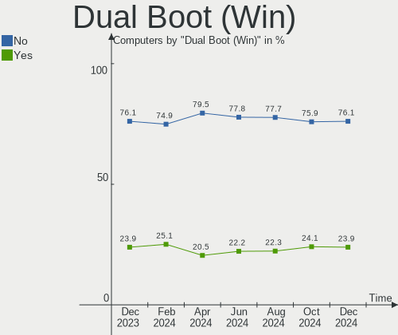
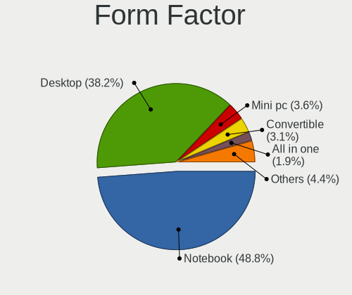
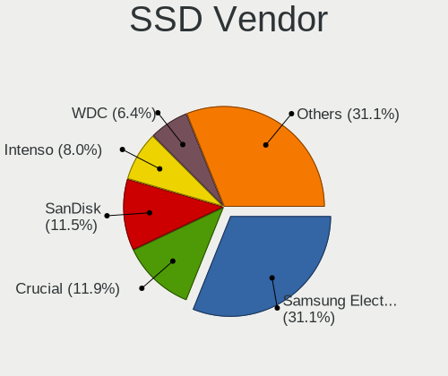
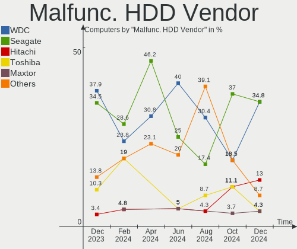
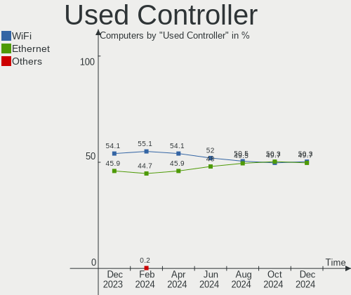
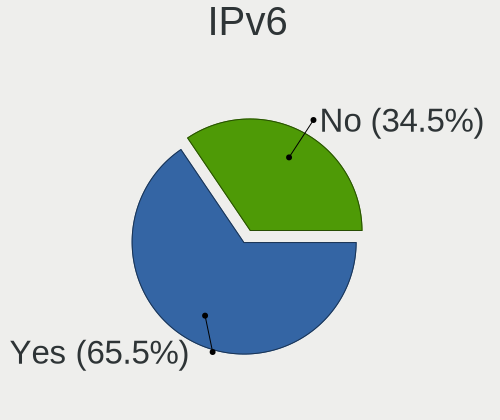
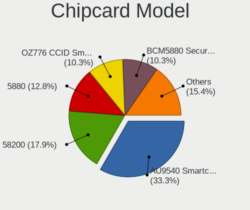

Linux in Germany - Hardware Trends
----------------------------------

A project to identify most popular hardware characteristics and track their change
over time based on data collected by Linux users at https://Linux-Hardware.org.

Anyone can contribute to this report by the [hw-probe](https://github.com/linuxhw/hw-probe) tool:

    sudo -E hw-probe -all -upload

This is a report for all computer types. See also reports for [desktops](/Location/Germany/Desktop/README.md) and [notebooks](/Location/Germany/Notebook/README.md).

Period: Feb, 2023.

Contents
--------

* [ System ](#system)
  - [ OS                       ](#os)
  - [ OS Family                ](#os-family)
  - [ Kernel                   ](#kernel)
  - [ Kernel Family            ](#kernel-family)
  - [ Kernel Major Ver.        ](#kernel-major-ver)
  - [ Arch                     ](#arch)
  - [ DE                       ](#de)
  - [ Display Server           ](#display-server)
  - [ Display Manager          ](#display-manager)
  - [ OS Lang                  ](#os-lang)
  - [ Boot Mode                ](#boot-mode)
  - [ Filesystem               ](#filesystem)
  - [ Part. scheme             ](#part-scheme)
  - [ Dual Boot with Linux/BSD ](#dual-boot-with-linuxbsd)
  - [ Dual Boot (Win)          ](#dual-boot-win)

* [ Board ](#board)
  - [ Vendor                   ](#vendor)
  - [ Model                    ](#model)
  - [ Model Family             ](#model-family)
  - [ MFG Year                 ](#mfg-year)
  - [ Form Factor              ](#form-factor)
  - [ Secure Boot              ](#secure-boot)
  - [ Coreboot                 ](#coreboot)
  - [ RAM Size                 ](#ram-size)
  - [ RAM Used                 ](#ram-used)
  - [ Total Drives             ](#total-drives)
  - [ Has CD-ROM               ](#has-cd-rom)
  - [ Has Ethernet             ](#has-ethernet)
  - [ Has WiFi                 ](#has-wifi)
  - [ Has Bluetooth            ](#has-bluetooth)

* [ Location ](#location)
  - [ Country                  ](#country)
  - [ City                     ](#city)

* [ Drives ](#drives)
  - [ Drive Vendor             ](#drive-vendor)
  - [ Drive Model              ](#drive-model)
  - [ HDD Vendor               ](#hdd-vendor)
  - [ SSD Vendor               ](#ssd-vendor)
  - [ Drive Kind               ](#drive-kind)
  - [ Drive Connector          ](#drive-connector)
  - [ Drive Size               ](#drive-size)
  - [ Space Total              ](#space-total)
  - [ Space Used               ](#space-used)
  - [ Malfunc. Drives          ](#malfunc-drives)
  - [ Malfunc. Drive Vendor    ](#malfunc-drive-vendor)
  - [ Malfunc. HDD Vendor      ](#malfunc-hdd-vendor)
  - [ Malfunc. Drive Kind      ](#malfunc-drive-kind)
  - [ Failed Drives            ](#failed-drives)
  - [ Failed Drive Vendor      ](#failed-drive-vendor)
  - [ Drive Status             ](#drive-status)

* [ Storage controller ](#storage-controller)
  - [ Storage Vendor           ](#storage-vendor)
  - [ Storage Model            ](#storage-model)
  - [ Storage Kind             ](#storage-kind)

* [ Processor ](#processor)
  - [ CPU Vendor               ](#cpu-vendor)
  - [ CPU Model                ](#cpu-model)
  - [ CPU Model Family         ](#cpu-model-family)
  - [ CPU Cores                ](#cpu-cores)
  - [ CPU Sockets              ](#cpu-sockets)
  - [ CPU Threads              ](#cpu-threads)
  - [ CPU Op-Modes             ](#cpu-op-modes)
  - [ CPU Microcode            ](#cpu-microcode)
  - [ CPU Microarch            ](#cpu-microarch)

* [ Graphics ](#graphics)
  - [ GPU Vendor               ](#gpu-vendor)
  - [ GPU Model                ](#gpu-model)
  - [ GPU Combo                ](#gpu-combo)
  - [ GPU Driver               ](#gpu-driver)
  - [ GPU Memory               ](#gpu-memory)

* [ Monitor ](#monitor)
  - [ Monitor Vendor           ](#monitor-vendor)
  - [ Monitor Model            ](#monitor-model)
  - [ Monitor Resolution       ](#monitor-resolution)
  - [ Monitor Diagonal         ](#monitor-diagonal)
  - [ Monitor Width            ](#monitor-width)
  - [ Aspect Ratio             ](#aspect-ratio)
  - [ Monitor Area             ](#monitor-area)
  - [ Pixel Density            ](#pixel-density)
  - [ Multiple Monitors        ](#multiple-monitors)

* [ Network ](#network)
  - [ Net Controller Vendor    ](#net-controller-vendor)
  - [ Net Controller Model     ](#net-controller-model)
  - [ Wireless Vendor          ](#wireless-vendor)
  - [ Wireless Model           ](#wireless-model)
  - [ Ethernet Vendor          ](#ethernet-vendor)
  - [ Ethernet Model           ](#ethernet-model)
  - [ Net Controller Kind      ](#net-controller-kind)
  - [ Used Controller          ](#used-controller)
  - [ NICs                     ](#nics)
  - [ IPv6                     ](#ipv6)

* [ Bluetooth ](#bluetooth)
  - [ Bluetooth Vendor         ](#bluetooth-vendor)
  - [ Bluetooth Model          ](#bluetooth-model)

* [ Sound ](#sound)
  - [ Sound Vendor             ](#sound-vendor)
  - [ Sound Model              ](#sound-model)

* [ Memory ](#memory)
  - [ Memory Vendor            ](#memory-vendor)
  - [ Memory Model             ](#memory-model)
  - [ Memory Kind              ](#memory-kind)
  - [ Memory Form Factor       ](#memory-form-factor)
  - [ Memory Size              ](#memory-size)
  - [ Memory Speed             ](#memory-speed)

* [ Printers & scanners ](#printers--scanners)
  - [ Printer Vendor           ](#printer-vendor)
  - [ Printer Model            ](#printer-model)
  - [ Scanner Vendor           ](#scanner-vendor)
  - [ Scanner Model            ](#scanner-model)

* [ Camera ](#camera)
  - [ Camera Vendor            ](#camera-vendor)
  - [ Camera Model             ](#camera-model)

* [ Security ](#security)
  - [ Fingerprint Vendor       ](#fingerprint-vendor)
  - [ Fingerprint Model        ](#fingerprint-model)
  - [ Chipcard Vendor          ](#chipcard-vendor)
  - [ Chipcard Model           ](#chipcard-model)

* [ Unsupported ](#unsupported)
  - [ Unsupported Devices      ](#unsupported-devices)
  - [ Unsupported Device Types ](#unsupported-device-types)

System
------

OS
--

Installed operating systems

| Name                         | Computers | Percent |
|------------------------------|-----------|---------|
| Ubuntu 22.04                 | 98        | 14.76%  |
| Linux Mint 21.1              | 82        | 12.35%  |
| Ubuntu 22.10                 | 43        | 6.48%   |
| OpenMandriva 23.01           | 40        | 6.02%   |
| Debian 11                    | 34        | 5.12%   |
| Fedora 37                    | 32        | 4.82%   |
| Linux Mint 20.3              | 24        | 3.61%   |
| Zorin 16                     | 22        | 3.31%   |
| Ubuntu 20.04                 | 21        | 3.16%   |
| Arch Rolling                 | 21        | 3.16%   |
| Pop!_OS 22.04                | 18        | 2.71%   |
| Manjaro                      | 15        | 2.26%   |
| openSUSE Tumbleweed-XXXXXXXX | 14        | 2.11%   |
| OpenMandriva 4.3             | 13        | 1.96%   |
| Elementary 7                 | 13        | 1.96%   |
| SteamOS 3.4.4                | 10        | 1.51%   |
| KDE neon 22.04               | 10        | 1.51%   |
| Xubuntu 22.04                | 9         | 1.36%   |
| ArcoLinux Rolling            | 9         | 1.36%   |
| Kubuntu 22.04                | 8         | 1.2%    |
| Gentoo 2.9                   | 6         | 0.9%    |
| Ubuntu MATE 22.04            | 5         | 0.75%   |
| LMDE 5                       | 5         | 0.75%   |
| Linux Mint 21                | 5         | 0.75%   |
| Kubuntu 22.10                | 5         | 0.75%   |
| Debian                       | 5         | 0.75%   |
| OpenMandriva 4.2             | 4         | 0.6%    |
| Manjaro 22.0.4               | 4         | 0.6%    |
| Kali 2022.4                  | 4         | 0.6%    |
| Xubuntu 20.04                | 3         | 0.45%   |
| Nobara 37                    | 3         | 0.45%   |
| Manjaro 22.0.2               | 3         | 0.45%   |
| Linux Mint 20                | 3         | 0.45%   |
| Elementary 6.1               | 3         | 0.45%   |
| Xero Rolling                 | 2         | 0.3%    |
| TUXEDO OS 22.04              | 2         | 0.3%    |
| ROSA 12.3                    | 2         | 0.3%    |
| openSUSE Microos-XXXXXXXX    | 2         | 0.3%    |
| OpenMandriva 22.12           | 2         | 0.3%    |
| MX 21                        | 2         | 0.3%    |

OS Family
---------

OS without a version

| Name          | Computers | Percent |
|---------------|-----------|---------|
| Ubuntu        | 166       | 25%     |
| Linux Mint    | 120       | 18.07%  |
| OpenMandriva  | 61        | 9.19%   |
| Debian        | 39        | 5.87%   |
| Fedora        | 32        | 4.82%   |
| Manjaro       | 25        | 3.77%   |
| Zorin         | 23        | 3.46%   |
| Arch          | 21        | 3.16%   |
| Pop!_OS       | 18        | 2.71%   |
| openSUSE      | 18        | 2.71%   |
| Elementary    | 16        | 2.41%   |
| Kubuntu       | 14        | 2.11%   |
| Xubuntu       | 13        | 1.96%   |
| SteamOS       | 11        | 1.66%   |
| KDE neon      | 10        | 1.51%   |
| ArcoLinux     | 9         | 1.36%   |
| Ubuntu MATE   | 7         | 1.05%   |
| LMDE          | 6         | 0.9%    |
| Gentoo        | 6         | 0.9%    |
| Kali          | 5         | 0.75%   |
| Garuda Linux  | 4         | 0.6%    |
| Endless       | 4         | 0.6%    |
| Ubuntu Budgie | 3         | 0.45%   |
| Nobara        | 3         | 0.45%   |
| Lubuntu       | 3         | 0.45%   |
| Xero          | 2         | 0.3%    |
| Ubuntu Unity  | 2         | 0.3%    |
| TUXEDO OS     | 2         | 0.3%    |
| ROSA          | 2         | 0.3%    |
| Raspbian      | 2         | 0.3%    |
| MX            | 2         | 0.3%    |
| blendOS       | 2         | 0.3%    |
| Slackware     | 1         | 0.15%   |
| Reborn OS     | 1         | 0.15%   |
| PureOS        | 1         | 0.15%   |
| PostmarketOS  | 1         | 0.15%   |
| Neptune OS    | 1         | 0.15%   |
| Mabox         | 1         | 0.15%   |
| Gnoppix       | 1         | 0.15%   |
| Frugalware    | 1         | 0.15%   |

Kernel
------

Version of the Linux kernel

| Version                  | Computers | Percent |
|--------------------------|-----------|---------|
| 5.15.0-60-generic        | 117       | 17.62%  |
| 5.15.0-58-generic        | 82        | 12.35%  |
| 5.19.0-32-generic        | 42        | 6.33%   |
| 6.1.1-desktop-1omv2290   | 28        | 4.22%   |
| 5.19.0-31-generic        | 23        | 3.46%   |
| 5.10.0-21-amd64          | 23        | 3.46%   |
| 5.4.0-139-generic        | 19        | 2.86%   |
| 5.19.0-29-generic        | 16        | 2.41%   |
| 6.0.12-76060006-generic  | 12        | 1.81%   |
| 6.1.4-desktop-1omv2301   | 11        | 1.66%   |
| 5.4.0-137-generic        | 11        | 1.66%   |
| 5.13.0-valve36-1-neptune | 10        | 1.51%   |
| 6.1.12-arch1-1           | 8         | 1.2%    |
| 5.19.0-21-generic        | 8         | 1.2%    |
| 6.1.8-1-default          | 7         | 1.05%   |
| 5.16.13-desktop-1omv4003 | 7         | 1.05%   |
| 6.1.9-1-MANJARO          | 6         | 0.9%    |
| 6.1.12-1-default         | 6         | 0.9%    |
| 6.1.10-200.fc37.x86_64   | 6         | 0.9%    |
| 5.19.0-28-generic        | 6         | 0.9%    |
| 6.1.9-arch1-1            | 5         | 0.75%   |
| 6.1.10-arch1-1           | 5         | 0.75%   |
| 5.16.7-desktop-1omv4003  | 5         | 0.75%   |
| 5.15.0-56-generic        | 5         | 0.75%   |
| 5.10.0-20-amd64          | 5         | 0.75%   |
| 6.1.8-200.fc37.x86_64    | 4         | 0.6%    |
| 6.1.11-200.fc37.x86_64   | 4         | 0.6%    |
| 6.1.11-1-MANJARO         | 4         | 0.6%    |
| 6.0.0-kali6-amd64        | 4         | 0.6%    |
| 5.15.94-1-MANJARO        | 4         | 0.6%    |
| 6.1.9-200.fc37.x86_64    | 3         | 0.45%   |
| 6.1.8-arch1-1            | 3         | 0.45%   |
| 6.1.7-200.fc37.x86_64    | 3         | 0.45%   |
| 6.1.12-200.fc37.x86_64   | 3         | 0.45%   |
| 6.1.12-1-MANJARO         | 3         | 0.45%   |
| 6.1.11-arch1-1           | 3         | 0.45%   |
| 6.1.11-76060111-generic  | 3         | 0.45%   |
| 6.1.0-1004-oem           | 3         | 0.45%   |
| 5.15.0-58-lowlatency     | 3         | 0.45%   |
| 5.15.0-57-generic        | 3         | 0.45%   |

Kernel Family
-------------

Linux kernel without a distro release

| Version | Computers | Percent |
|---------|-----------|---------|
| 5.15.0  | 225       | 33.89%  |
| 5.19.0  | 100       | 15.06%  |
| 5.4.0   | 34        | 5.12%   |
| 5.10.0  | 32        | 4.82%   |
| 6.1.1   | 29        | 4.37%   |
| 6.1.12  | 27        | 4.07%   |
| 6.1.9   | 20        | 3.01%   |
| 6.1.8   | 20        | 3.01%   |
| 6.1.11  | 19        | 2.86%   |
| 5.13.0  | 15        | 2.26%   |
| 6.1.10  | 14        | 2.11%   |
| 6.0.12  | 12        | 1.81%   |
| 6.1.4   | 11        | 1.66%   |
| 6.0.0   | 10        | 1.51%   |
| 6.1.0   | 8         | 1.2%    |
| 5.16.13 | 7         | 1.05%   |
| 6.1.7   | 5         | 0.75%   |
| 5.16.7  | 5         | 0.75%   |
| 6.1.13  | 4         | 0.6%    |
| 5.15.94 | 4         | 0.6%    |
| 5.15.91 | 4         | 0.6%    |
| 5.11.0  | 4         | 0.6%    |
| 6.2.0   | 3         | 0.45%   |
| 5.15.88 | 3         | 0.45%   |
| 5.10.14 | 3         | 0.45%   |
| 6.1.6   | 2         | 0.3%    |
| 6.1.5   | 2         | 0.3%    |
| 6.0.19  | 2         | 0.3%    |
| 6.0.10  | 2         | 0.3%    |
| 5.15.89 | 2         | 0.3%    |
| 5.15.84 | 2         | 0.3%    |
| 6.2.1   | 1         | 0.15%   |
| 6.1.14  | 1         | 0.15%   |
| 6.0.9   | 1         | 0.15%   |
| 6.0.7   | 1         | 0.15%   |
| 6.0.6   | 1         | 0.15%   |
| 6.0.18  | 1         | 0.15%   |
| 5.8.0   | 1         | 0.15%   |
| 5.4.228 | 1         | 0.15%   |
| 5.3.18  | 1         | 0.15%   |

Kernel Major Ver.
-----------------

Linux kernel major version

| Version | Computers | Percent |
|---------|-----------|---------|
| 5.15    | 245       | 36.9%   |
| 6.1     | 162       | 24.4%   |
| 5.19    | 102       | 15.36%  |
| 5.10    | 40        | 6.02%   |
| 5.4     | 35        | 5.27%   |
| 6.0     | 30        | 4.52%   |
| 5.13    | 15        | 2.26%   |
| 5.16    | 13        | 1.96%   |
| 5.11    | 5         | 0.75%   |
| 6.2     | 4         | 0.6%    |
| 5.17    | 2         | 0.3%    |
| 5.14    | 2         | 0.3%    |
| 5.8     | 1         | 0.15%   |
| 5.3     | 1         | 0.15%   |
| 5.18    | 1         | 0.15%   |
| 4.8     | 1         | 0.15%   |
| 4.19    | 1         | 0.15%   |
| 4.18    | 1         | 0.15%   |
| 4.15    | 1         | 0.15%   |
| 4.14    | 1         | 0.15%   |
| 3.18    | 1         | 0.15%   |

Arch
----

OS architecture (x86_64, i586, etc.)

| Name    | Computers | Percent |
|---------|-----------|---------|
| x86_64  | 651       | 98.04%  |
| aarch64 | 6         | 0.9%    |
| i686    | 5         | 0.75%   |
| armv7l  | 1         | 0.15%   |
| armv6l  | 1         | 0.15%   |

DE
--

Desktop Environment

| Name             | Computers | Percent |
|------------------|-----------|---------|
| GNOME            | 252       | 37.95%  |
| KDE5             | 159       | 23.95%  |
| X-Cinnamon       | 96        | 14.46%  |
| XFCE             | 59        | 8.89%   |
| Unknown          | 24        | 3.61%   |
| MATE             | 17        | 2.56%   |
| Pantheon         | 16        | 2.41%   |
| Cinnamon         | 9         | 1.36%   |
| LXQt             | 7         | 1.05%   |
| chadwm           | 4         | 0.6%    |
| Budgie           | 3         | 0.45%   |
| KDE              | 2         | 0.3%    |
| Hyprland         | 2         | 0.3%    |
| awesome          | 2         | 0.3%    |
| xmonad           | 1         | 0.15%   |
| Unity            | 1         | 0.15%   |
| sway             | 1         | 0.15%   |
| qtile            | 1         | 0.15%   |
| Phosh:GNOME      | 1         | 0.15%   |
| openbox          | 1         | 0.15%   |
| LXDE             | 1         | 0.15%   |
| lightdm-xsession | 1         | 0.15%   |
| i3               | 1         | 0.15%   |
| GNOME-Classic    | 1         | 0.15%   |
| GNOME Flashback  | 1         | 0.15%   |
| Deepin           | 1         | 0.15%   |

Display Server
--------------

X11 or Wayland

| Name    | Computers | Percent |
|---------|-----------|---------|
| X11     | 479       | 72.14%  |
| Wayland | 158       | 23.8%   |
| Tty     | 20        | 3.01%   |
| Unknown | 7         | 1.05%   |

Display Manager
---------------

SDDM, LightDM, etc.

| Name    | Computers | Percent |
|---------|-----------|---------|
| Unknown | 207       | 31.17%  |
| GDM3    | 156       | 23.49%  |
| LightDM | 134       | 20.18%  |
| SDDM    | 131       | 19.73%  |
| GDM     | 31        | 4.67%   |
| LXDM    | 2         | 0.3%    |
| XDM     | 1         | 0.15%   |
| SLiM    | 1         | 0.15%   |
| Ly      | 1         | 0.15%   |

OS Lang
-------

Language

| Lang    | Computers | Percent |
|---------|-----------|---------|
| de_DE   | 489       | 73.64%  |
| en_US   | 128       | 19.28%  |
| en_GB   | 12        | 1.81%   |
| C       | 9         | 1.36%   |
| Unknown | 5         | 0.75%   |
| en_DE   | 3         | 0.45%   |
| ru_RU   | 2         | 0.3%    |
| pl_PL   | 2         | 0.3%    |
| nl_NL   | 2         | 0.3%    |
| de_AT   | 2         | 0.3%    |
| ro_RO   | 1         | 0.15%   |
| POSIX   | 1         | 0.15%   |
| ksh_DE  | 1         | 0.15%   |
| it_IT   | 1         | 0.15%   |
| hu_HU   | 1         | 0.15%   |
| fr_FR   | 1         | 0.15%   |
| es_ES   | 1         | 0.15%   |
| en_IE   | 1         | 0.15%   |
| de_CH   | 1         | 0.15%   |
| C.UTF8  | 1         | 0.15%   |

Boot Mode
---------

EFI or BIOS

| Mode | Computers | Percent |
|------|-----------|---------|
| BIOS | 338       | 50.9%   |
| EFI  | 326       | 49.1%   |

Filesystem
----------

Type of filesystem

| Type    | Computers | Percent |
|---------|-----------|---------|
| Ext4    | 531       | 79.97%  |
| Btrfs   | 83        | 12.5%   |
| Overlay | 35        | 5.27%   |
| Zfs     | 4         | 0.6%    |
| Xfs     | 4         | 0.6%    |
| F2fs    | 3         | 0.45%   |
| XXXfs   | 1         | 0.15%   |
| XXX4    | 1         | 0.15%   |
| Tmpfs   | 1         | 0.15%   |
| Ext2    | 1         | 0.15%   |

Part. scheme
------------

Scheme of partitioning

| Type    | Computers | Percent |
|---------|-----------|---------|
| GPT     | 378       | 56.93%  |
| Unknown | 187       | 28.16%  |
| MBR     | 99        | 14.91%  |

Dual Boot with Linux/BSD
------------------------

Hosting more than one Linux/BSD

| Dual boot | Computers | Percent |
|-----------|-----------|---------|
| No        | 541       | 81.48%  |
| Yes       | 123       | 18.52%  |

Dual Boot (Win)
---------------

Hosting Linux and Windows

| Dual boot | Computers | Percent |
|-----------|-----------|---------|
| No        | 493       | 74.25%  |
| Yes       | 171       | 25.75%  |

Board
-----

Vendor
------

Motherboard manufacturer

| Name                                 | Computers | Percent |
|--------------------------------------|-----------|---------|
| Lenovo                               | 122       | 18.37%  |
| ASUSTek Computer                     | 85        | 12.8%   |
| Hewlett-Packard                      | 69        | 10.39%  |
| Dell                                 | 54        | 8.13%   |
| MSI                                  | 47        | 7.08%   |
| Acer                                 | 47        | 7.08%   |
| Gigabyte Technology                  | 39        | 5.87%   |
| ASRock                               | 31        | 4.67%   |
| Medion                               | 18        | 2.71%   |
| Fujitsu                              | 17        | 2.56%   |
| Apple                                | 12        | 1.81%   |
| TUXEDO                               | 11        | 1.66%   |
| Valve                                | 10        | 1.51%   |
| Toshiba                              | 10        | 1.51%   |
| Samsung Electronics                  | 9         | 1.36%   |
| Sony                                 | 8         | 1.2%    |
| Inventec                             | 6         | 0.9%    |
| Intel                                | 6         | 0.9%    |
| Unknown                              | 6         | 0.9%    |
| Schenker                             | 4         | 0.6%    |
| Packard Bell                         | 4         | 0.6%    |
| Fujitsu Siemens                      | 4         | 0.6%    |
| Raspberry Pi Foundation              | 3         | 0.45%   |
| HUAWEI                               | 3         | 0.45%   |
| Google                               | 3         | 0.45%   |
| Biostar                              | 3         | 0.45%   |
| Tactus                               | 2         | 0.3%    |
| Supermicro                           | 2         | 0.3%    |
| Shuttle                              | 2         | 0.3%    |
| Notebook                             | 2         | 0.3%    |
| Hardkernel                           | 2         | 0.3%    |
| Alienware                            | 2         | 0.3%    |
| ZOTAC                                | 1         | 0.15%   |
| Wortmann AG                          | 1         | 0.15%   |
| TrekStor                             | 1         | 0.15%   |
| Star Labs                            | 1         | 0.15%   |
| SLIMBOOK                             | 1         | 0.15%   |
| Shenzhen Meigao Electronic Equipment | 1         | 0.15%   |
| Radxa                                | 1         | 0.15%   |
| Pegatron                             | 1         | 0.15%   |

Model
-----

Motherboard model

| Name                                 | Computers | Percent |
|--------------------------------------|-----------|---------|
| Valve Jupiter                        | 10        | 1.51%   |
| Unknown                              | 9         | 1.36%   |
| MSI MS-7C37                          | 7         | 1.05%   |
| Inventec VXC Class                   | 5         | 0.75%   |
| Fujitsu ESPRIMO Q920                 | 4         | 0.6%    |
| MSI MS-7971                          | 3         | 0.45%   |
| Lenovo IdeaPad 5 Pro 16ARH7 82SN     | 3         | 0.45%   |
| Lenovo IdeaPad 3 15ALC6 82KU         | 3         | 0.45%   |
| HP EliteBook x360 1030 G2            | 3         | 0.45%   |
| ASUS A0000001                        | 3         | 0.45%   |
| ASRock B450M Pro4                    | 3         | 0.45%   |
| ASRock B450 Pro4                     | 3         | 0.45%   |
| Toshiba Satellite L50-B              | 2         | 0.3%    |
| Tactus GeoBook 140                   | 2         | 0.3%    |
| Supermicro Super Server              | 2         | 0.3%    |
| MSI MS-7C52                          | 2         | 0.3%    |
| MSI MS-7C02                          | 2         | 0.3%    |
| MSI MS-7B79                          | 2         | 0.3%    |
| MSI MS-7A38                          | 2         | 0.3%    |
| Medion S23003                        | 2         | 0.3%    |
| Lenovo ThinkPad E495 20NEA001GE      | 2         | 0.3%    |
| Lenovo ThinkPad E15 Gen 4 21EES00100 | 2         | 0.3%    |
| Lenovo Legion 5 15ACH6A 82NW         | 2         | 0.3%    |
| Lenovo IdeaPad L340-15API 81LW       | 2         | 0.3%    |
| Lenovo IdeaPad 5 Pro 16ACH6 82L5     | 2         | 0.3%    |
| Lenovo G780 2182                     | 2         | 0.3%    |
| HP ProBook 430 G4                    | 2         | 0.3%    |
| HP Pavilion Desktop 590-p0xxx        | 2         | 0.3%    |
| HP Notebook                          | 2         | 0.3%    |
| HP 250 G6 Notebook PC                | 2         | 0.3%    |
| Gigabyte Z77X-D3H                    | 2         | 0.3%    |
| Gigabyte GB-BACE-3160                | 2         | 0.3%    |
| Gigabyte B450M S2H                   | 2         | 0.3%    |
| Fujitsu LIFEBOOK E754                | 2         | 0.3%    |
| Dell XPS 13 9360                     | 2         | 0.3%    |
| Dell Precision M4800                 | 2         | 0.3%    |
| Dell OptiPlex 790                    | 2         | 0.3%    |
| Dell Latitude E7470                  | 2         | 0.3%    |
| ASUS TUF X470-PLUS GAMING            | 2         | 0.3%    |
| ASUS ROG STRIX B550-F GAMING         | 2         | 0.3%    |

Model Family
------------

Motherboard model prefix

| Name                  | Computers | Percent |
|-----------------------|-----------|---------|
| Lenovo ThinkPad       | 79        | 11.9%   |
| Acer Aspire           | 37        | 5.57%   |
| Lenovo IdeaPad        | 20        | 3.01%   |
| Dell Latitude         | 15        | 2.26%   |
| ASUS PRIME            | 15        | 2.26%   |
| Dell OptiPlex         | 11        | 1.66%   |
| ASUS ROG              | 11        | 1.66%   |
| Valve Jupiter         | 10        | 1.51%   |
| Toshiba Satellite     | 10        | 1.51%   |
| HP EliteBook          | 10        | 1.51%   |
| HP Pavilion           | 9         | 1.36%   |
| Fujitsu ESPRIMO       | 9         | 1.36%   |
| Unknown               | 9         | 1.36%   |
| HP Compaq             | 8         | 1.2%    |
| Fujitsu LIFEBOOK      | 8         | 1.2%    |
| Dell XPS              | 8         | 1.2%    |
| Dell Precision        | 8         | 1.2%    |
| MSI MS-7C37           | 7         | 1.05%   |
| Dell Inspiron         | 7         | 1.05%   |
| HP Laptop             | 6         | 0.9%    |
| ASUS TUF              | 6         | 0.9%    |
| Medion Akoya          | 5         | 0.75%   |
| Inventec VXC          | 5         | 0.75%   |
| HP ProBook            | 5         | 0.75%   |
| HP 250                | 5         | 0.75%   |
| HP ZBook              | 4         | 0.6%    |
| HP ENVY               | 4         | 0.6%    |
| HP EliteDesk          | 4         | 0.6%    |
| Dell Vostro           | 4         | 0.6%    |
| ASRock X570           | 4         | 0.6%    |
| Acer Swift            | 4         | 0.6%    |
| RPi Raspberry         | 3         | 0.45%   |
| Packard Bell EasyNote | 3         | 0.45%   |
| MSI MS-7971           | 3         | 0.45%   |
| Lenovo ThinkCentre    | 3         | 0.45%   |
| Lenovo Legion         | 3         | 0.45%   |
| Lenovo IdeaCentre     | 3         | 0.45%   |
| Gigabyte B550         | 3         | 0.45%   |
| Gigabyte B450         | 3         | 0.45%   |
| ASUS VivoBook         | 3         | 0.45%   |

MFG Year
--------

Motherboard manufacture year

| Year    | Computers | Percent |
|---------|-----------|---------|
| 2018    | 73        | 10.99%  |
| 2019    | 67        | 10.09%  |
| 2021    | 62        | 9.34%   |
| 2022    | 57        | 8.58%   |
| 2012    | 52        | 7.83%   |
| 2020    | 49        | 7.38%   |
| 2017    | 41        | 6.17%   |
| 2013    | 40        | 6.02%   |
| 2010    | 38        | 5.72%   |
| 2016    | 34        | 5.12%   |
| 2014    | 32        | 4.82%   |
| 2011    | 32        | 4.82%   |
| 2015    | 23        | 3.46%   |
| 2009    | 23        | 3.46%   |
| 2008    | 20        | 3.01%   |
| 2007    | 9         | 1.36%   |
| Unknown | 7         | 1.05%   |
| 2006    | 3         | 0.45%   |
| 2023    | 1         | 0.15%   |
| 2005    | 1         | 0.15%   |

Form Factor
-----------

Physical design of the computer

| Name           | Computers | Percent |
|----------------|-----------|---------|
| Notebook       | 361       | 54.37%  |
| Desktop        | 252       | 37.95%  |
| Convertible    | 21        | 3.16%   |
| Mini pc        | 9         | 1.36%   |
| System on chip | 8         | 1.2%    |
| Server         | 6         | 0.9%    |
| All in one     | 4         | 0.6%    |
| Tablet         | 3         | 0.45%   |

Secure Boot
-----------

Enabled or disabled

| State    | Computers | Percent |
|----------|-----------|---------|
| Disabled | 610       | 91.87%  |
| Enabled  | 54        | 8.13%   |

Coreboot
--------

Have coreboot on board

| Used | Computers | Percent |
|------|-----------|---------|
| No   | 660       | 99.4%   |
| Yes  | 4         | 0.6%    |

RAM Size
--------

Total RAM memory

| Size in GB      | Computers | Percent |
|-----------------|-----------|---------|
| 16.01-24.0      | 141       | 21.23%  |
| 4.01-8.0        | 134       | 20.18%  |
| 8.01-16.0       | 128       | 19.28%  |
| 3.01-4.0        | 112       | 16.87%  |
| 32.01-64.0      | 75        | 11.3%   |
| 64.01-256.0     | 24        | 3.61%   |
| 24.01-32.0      | 19        | 2.86%   |
| 2.01-3.0        | 13        | 1.96%   |
| 1.01-2.0        | 13        | 1.96%   |
| 0.51-1.0        | 3         | 0.45%   |
| More than 256.0 | 1         | 0.15%   |
| 0.01-0.5        | 1         | 0.15%   |

RAM Used
--------

Used RAM memory

| Used GB    | Computers | Percent |
|------------|-----------|---------|
| 1.01-2.0   | 245       | 36.9%   |
| 2.01-3.0   | 165       | 24.85%  |
| 4.01-8.0   | 109       | 16.42%  |
| 3.01-4.0   | 73        | 10.99%  |
| 0.51-1.0   | 27        | 4.07%   |
| 8.01-16.0  | 24        | 3.61%   |
| 0.01-0.5   | 9         | 1.36%   |
| 16.01-24.0 | 7         | 1.05%   |
| 32.01-64.0 | 4         | 0.6%    |
| 24.01-32.0 | 1         | 0.15%   |

Total Drives
------------

Number of drives on board

| Drives | Computers | Percent |
|--------|-----------|---------|
| 1      | 391       | 58.89%  |
| 2      | 164       | 24.7%   |
| 3      | 50        | 7.53%   |
| 4      | 27        | 4.07%   |
| 5      | 16        | 2.41%   |
| 6      | 7         | 1.05%   |
| 0      | 4         | 0.6%    |
| 8      | 2         | 0.3%    |
| 7      | 2         | 0.3%    |
| 9      | 1         | 0.15%   |

Has CD-ROM
----------

Has CD-ROM on board

| Presented | Computers | Percent |
|-----------|-----------|---------|
| No        | 386       | 58.13%  |
| Yes       | 278       | 41.87%  |

Has Ethernet
------------

Has Ethernet on board

| Presented | Computers | Percent |
|-----------|-----------|---------|
| Yes       | 582       | 87.65%  |
| No        | 82        | 12.35%  |

Has WiFi
--------

Has WiFi module

| Presented | Computers | Percent |
|-----------|-----------|---------|
| Yes       | 489       | 73.64%  |
| No        | 175       | 26.36%  |

Has Bluetooth
-------------

Has Bluetooth module

| Presented | Computers | Percent |
|-----------|-----------|---------|
| Yes       | 402       | 60.54%  |
| No        | 262       | 39.46%  |

Location
--------

Country
-------

Geographic location (country)

| Country | Computers | Percent |
|---------|-----------|---------|
| Germany | 664       | 100%    |

City
----

Geographic location (city)

| City              | Computers | Percent |
|-------------------|-----------|---------|
| Berlin            | 63        | 9.49%   |
| Munich            | 29        | 4.37%   |
| Hamburg           | 24        | 3.61%   |
| Frankfurt am Main | 15        | 2.26%   |
| Cologne           | 15        | 2.26%   |
| Hanover           | 13        | 1.96%   |
| Stuttgart         | 12        | 1.81%   |
| Leipzig           | 10        | 1.51%   |
| Nuremberg         | 9         | 1.36%   |
| Karlsruhe         | 8         | 1.2%    |
| Duisburg          | 8         | 1.2%    |
| Dortmund          | 8         | 1.2%    |
| Stuhr             | 6         | 0.9%    |
| Essen             | 6         | 0.9%    |
| Wuppertal         | 5         | 0.75%   |
| Traunstein        | 5         | 0.75%   |
| Mannheim          | 5         | 0.75%   |
| Ludwigsburg       | 5         | 0.75%   |
| Erfurt            | 5         | 0.75%   |
| Düsseldorf       | 5         | 0.75%   |
| Dresden           | 5         | 0.75%   |
| Cottbus           | 5         | 0.75%   |
| Bonn              | 5         | 0.75%   |
| Wilhelmshaven     | 4         | 0.6%    |
| Schwarzenbek      | 4         | 0.6%    |
| Salzgitter        | 4         | 0.6%    |
| Langenfeld        | 4         | 0.6%    |
| Heidelberg        | 4         | 0.6%    |
| Hamm              | 4         | 0.6%    |
| Gelsenkirchen     | 4         | 0.6%    |
| Delligsen         | 4         | 0.6%    |
| Darmstadt         | 4         | 0.6%    |
| Bochum            | 4         | 0.6%    |
| Bielefeld         | 4         | 0.6%    |
| Aachen            | 4         | 0.6%    |
| Wilster           | 3         | 0.45%   |
| Wiesbaden         | 3         | 0.45%   |
| Weimar            | 3         | 0.45%   |
| Vechelde          | 3         | 0.45%   |
| Solingen          | 3         | 0.45%   |

Drives
------

Drive Vendor
------------

Hard drive vendors

| Vendor                      | Computers | Drives | Percent |
|-----------------------------|-----------|--------|---------|
| Samsung Electronics         | 205       | 269    | 20.94%  |
| WDC                         | 105       | 131    | 10.73%  |
| Sandisk                     | 95        | 108    | 9.7%    |
| Seagate                     | 90        | 112    | 9.19%   |
| Toshiba                     | 64        | 66     | 6.54%   |
| Crucial                     | 54        | 61     | 5.52%   |
| Kingston                    | 43        | 44     | 4.39%   |
| Unknown                     | 41        | 47     | 4.19%   |
| Intenso                     | 41        | 44     | 4.19%   |
| Micron Technology           | 23        | 23     | 2.35%   |
| Intel                       | 20        | 23     | 2.04%   |
| SK hynix                    | 18        | 19     | 1.84%   |
| Hitachi                     | 17        | 18     | 1.74%   |
| A-DATA Technology           | 11        | 11     | 1.12%   |
| Phison Electronics          | 9         | 9      | 0.92%   |
| HGST                        | 9         | 10     | 0.92%   |
| Transcend                   | 8         | 8      | 0.82%   |
| Unknown                     | 8         | 8      | 0.82%   |
| Kingston Technology Company | 6         | 6      | 0.61%   |
| Apple                       | 6         | 6      | 0.61%   |
| Verbatim                    | 4         | 5      | 0.41%   |
| UMIS                        | 4         | 4      | 0.41%   |
| Silicon Motion              | 4         | 4      | 0.41%   |
| OCZ                         | 4         | 4      | 0.41%   |
| Micron/Crucial Technology   | 4         | 4      | 0.41%   |
| KIOXIA                      | 4         | 4      | 0.41%   |
| Fanxiang                    | 4         | 4      | 0.41%   |
| Corsair                     | 4         | 4      | 0.41%   |
| China                       | 4         | 4      | 0.41%   |
| PNY                         | 3         | 4      | 0.31%   |
| Phison                      | 3         | 3      | 0.31%   |
| Patriot                     | 3         | 3      | 0.31%   |
| Netac                       | 3         | 3      | 0.31%   |
| Leven                       | 3         | 3      | 0.31%   |
| LaCie                       | 3         | 3      | 0.31%   |
| ASMT                        | 3         | 3      | 0.31%   |
| ADATA Technology            | 3         | 3      | 0.31%   |
| Team                        | 2         | 2      | 0.2%    |
| SPCC                        | 2         | 3      | 0.2%    |
| SABRENT                     | 2         | 2      | 0.2%    |

Drive Model
-----------

Hard drive models

| Model                                                | Computers | Percent |
|------------------------------------------------------|-----------|---------|
| Samsung NVMe SSD Controller SM981/PM981/PM983 250GB  | 28        | 2.59%   |
| Samsung NVMe SSD Controller PM9A1/PM9A3/980PRO 960GB | 17        | 1.57%   |
| Crucial CT500MX500SSD1 500GB                         | 12        | 1.11%   |
| Samsung SSD 850 EVO 250GB                            | 11        | 1.02%   |
| Toshiba DT01ACA100 1TB                               | 10        | 0.93%   |
| Unknown MMC Card  32GB                               | 9         | 0.83%   |
| Unknown MMC Card  64GB                               | 8         | 0.74%   |
| Crucial CT1000MX500SSD1 1TB                          | 8         | 0.74%   |
| Unknown                                              | 8         | 0.74%   |
| SanDisk SSD PLUS 1000GB                              | 7         | 0.65%   |
| Samsung SSD 980 1TB                                  | 7         | 0.65%   |
| Samsung SSD 840 EVO 250GB                            | 7         | 0.65%   |
| Seagate ST1000DM003-9YN162 1TB                       | 6         | 0.56%   |
| Sandisk WD Black SN750 / PC SN730 NVMe SSD 512GB     | 6         | 0.56%   |
| SanDisk SSD PLUS 480GB                               | 6         | 0.56%   |
| SanDisk SDSSDH3 500G                                 | 6         | 0.56%   |
| Samsung SSD 860 EVO 500GB                            | 6         | 0.56%   |
| Samsung SSD 860 EVO 250GB                            | 6         | 0.56%   |
| Samsung SSD 860 EVO 1TB                              | 6         | 0.56%   |
| Samsung NVMe SSD Controller SM961/PM961/SM963 512GB  | 6         | 0.56%   |
| Kingston SNVS500G 500GB                              | 6         | 0.56%   |
| Crucial CT240BX500SSD1 240GB                         | 6         | 0.56%   |
| WDC WD20EZRZ-00Z5HB0 2TB                             | 5         | 0.46%   |
| Toshiba MQ01ABF050 500GB                             | 5         | 0.46%   |
| SK hynix BC501 NVMe Solid State Drive 512GB          | 5         | 0.46%   |
| Seagate ST500DM002-1BD142 500GB                      | 5         | 0.46%   |
| Seagate ST1000DM010-2EP102 1TB                       | 5         | 0.46%   |
| Samsung SSD 980 PRO 1TB                              | 5         | 0.46%   |
| Samsung SSD 980 500GB                                | 5         | 0.46%   |
| Samsung SSD 970 EVO 500GB                            | 5         | 0.46%   |
| Micron MTFDHBA512QFD 512GB                           | 5         | 0.46%   |
| Kingston SA400S37480G 480GB SSD                      | 5         | 0.46%   |
| Intenso SSD 120GB                                    | 5         | 0.46%   |
| WDC WD10JPVX-22JC3T0 1TB                             | 4         | 0.37%   |
| Unknown SD/MMC/MS PRO 16GB                           | 4         | 0.37%   |
| Toshiba HDWD110 1TB                                  | 4         | 0.37%   |
| Toshiba DT01ACA200 2TB                               | 4         | 0.37%   |
| Toshiba DT01ACA050 500GB                             | 4         | 0.37%   |
| Seagate ST2000DM001-1ER164 2TB                       | 4         | 0.37%   |
| Sandisk WD Blue SN550 NVMe SSD 1TB                   | 4         | 0.37%   |

HDD Vendor
----------

Hard disk drive vendors

| Vendor              | Computers | Drives | Percent |
|---------------------|-----------|--------|---------|
| WDC                 | 90        | 115    | 31.36%  |
| Seagate             | 88        | 109    | 30.66%  |
| Toshiba             | 47        | 49     | 16.38%  |
| Samsung Electronics | 19        | 22     | 6.62%   |
| Hitachi             | 17        | 18     | 5.92%   |
| HGST                | 9         | 10     | 3.14%   |
| Unknown             | 4         | 5      | 1.39%   |
| Intenso             | 4         | 4      | 1.39%   |
| SABRENT             | 2         | 2      | 0.7%    |
| Maxtor              | 2         | 2      | 0.7%    |
| WD MediaMax         | 1         | 1      | 0.35%   |
| LaCie               | 1         | 1      | 0.35%   |
| JMicron Technology  | 1         | 1      | 0.35%   |
| Fujitsu             | 1         | 1      | 0.35%   |
| China               | 1         | 1      | 0.35%   |

SSD Vendor
----------

Solid state drive vendors

| Vendor              | Computers | Drives | Percent |
|---------------------|-----------|--------|---------|
| Samsung Electronics | 97        | 108    | 25.94%  |
| SanDisk             | 67        | 76     | 17.91%  |
| Crucial             | 49        | 55     | 13.1%   |
| Intenso             | 32        | 33     | 8.56%   |
| Kingston            | 27        | 27     | 7.22%   |
| A-DATA Technology   | 9         | 9      | 2.41%   |
| WDC                 | 8         | 8      | 2.14%   |
| Transcend           | 8         | 8      | 2.14%   |
| Intel               | 8         | 9      | 2.14%   |
| Toshiba             | 7         | 7      | 1.87%   |
| Micron Technology   | 6         | 6      | 1.6%    |
| OCZ                 | 4         | 4      | 1.07%   |
| Fanxiang            | 4         | 4      | 1.07%   |
| SK hynix            | 3         | 3      | 0.8%    |
| Patriot             | 3         | 3      | 0.8%    |
| Leven               | 3         | 3      | 0.8%    |
| China               | 3         | 3      | 0.8%    |
| Verbatim            | 2         | 3      | 0.53%   |
| Unknown             | 2         | 2      | 0.53%   |
| Team                | 2         | 2      | 0.53%   |
| PNY                 | 2         | 3      | 0.53%   |
| Phison              | 2         | 2      | 0.53%   |
| Netac               | 2         | 2      | 0.53%   |
| LITEONIT            | 2         | 2      | 0.53%   |
| INNOVATION IT       | 2         | 2      | 0.53%   |
| Corsair             | 2         | 2      | 0.53%   |
| ASMT                | 2         | 2      | 0.53%   |
| Apple               | 2         | 2      | 0.53%   |
| Unknown             | 2         | 2      | 0.53%   |
| Zheino              | 1         | 1      | 0.27%   |
| VERICO              | 1         | 1      | 0.27%   |
| SPCC                | 1         | 2      | 0.27%   |
| Seagate             | 1         | 1      | 0.27%   |
| Mushkin             | 1         | 1      | 0.27%   |
| LITEON              | 1         | 1      | 0.27%   |
| KingSpec            | 1         | 1      | 0.27%   |
| KingDian            | 1         | 1      | 0.27%   |
| Global              | 1         | 1      | 0.27%   |
| Gigabyte Technology | 1         | 1      | 0.27%   |
| Dogfish             | 1         | 1      | 0.27%   |

Drive Kind
----------

HDD or SSD

| Kind    | Computers | Drives | Percent |
|---------|-----------|--------|---------|
| SSD     | 327       | 405    | 36.5%   |
| NVMe    | 264       | 314    | 29.46%  |
| HDD     | 239       | 341    | 26.67%  |
| MMC     | 42        | 46     | 4.69%   |
| Unknown | 24        | 26     | 2.68%   |

Drive Connector
---------------

SATA, SAS, NVMe, etc.

| Type | Computers | Drives | Percent |
|------|-----------|--------|---------|
| SATA | 464       | 730    | 57.5%   |
| NVMe | 264       | 314    | 32.71%  |
| MMC  | 42        | 46     | 5.2%    |
| SAS  | 37        | 42     | 4.58%   |

Drive Size
----------

Size of hard drive

| Size in TB | Computers | Drives | Percent |
|------------|-----------|--------|---------|
| 0.01-0.5   | 339       | 417    | 56.78%  |
| 0.51-1.0   | 165       | 198    | 27.64%  |
| 1.01-2.0   | 58        | 81     | 9.72%   |
| 3.01-4.0   | 14        | 17     | 2.35%   |
| 4.01-10.0  | 11        | 20     | 1.84%   |
| 2.01-3.0   | 10        | 13     | 1.68%   |

Space Total
-----------

Amount of disk space available on the file system

| Size in GB     | Computers | Percent |
|----------------|-----------|---------|
| 101-250        | 196       | 29.52%  |
| 251-500        | 112       | 16.87%  |
| 501-1000       | 104       | 15.66%  |
| 1001-2000      | 60        | 9.04%   |
| More than 3000 | 57        | 8.58%   |
| 1-20           | 37        | 5.57%   |
| 51-100         | 37        | 5.57%   |
| Unknown        | 23        | 3.46%   |
| 21-50          | 20        | 3.01%   |
| 2001-3000      | 18        | 2.71%   |

Space Used
----------

Amount of used disk space

| Used GB        | Computers | Percent |
|----------------|-----------|---------|
| 1-20           | 192       | 28.92%  |
| 21-50          | 119       | 17.92%  |
| 101-250        | 94        | 14.16%  |
| 51-100         | 82        | 12.35%  |
| 251-500        | 55        | 8.28%   |
| 501-1000       | 45        | 6.78%   |
| More than 3000 | 24        | 3.61%   |
| Unknown        | 23        | 3.46%   |
| 1001-2000      | 22        | 3.31%   |
| 2001-3000      | 8         | 1.2%    |

Malfunc. Drives
---------------

Drive models with a malfunction

| Model                                 | Computers | Drives | Percent |
|---------------------------------------|-----------|--------|---------|
| Seagate ST9320325AS 320GB             | 2         | 2      | 3.33%   |
| Samsung Electronics SSD 970 EVO 500GB | 2         | 2      | 3.33%   |
| WDC WDS240G2G0A-00JH30 240GB SSD      | 1         | 1      | 1.67%   |
| WDC WD50EFRX-68MYMN1 5TB              | 1         | 4      | 1.67%   |
| WDC WD5000LPCX-24C6HT0 500GB          | 1         | 1      | 1.67%   |
| WDC WD5000AAKS-00V1A0 500GB           | 1         | 1      | 1.67%   |
| WDC WD5000AAKS-007AA0 500GB           | 1         | 1      | 1.67%   |
| WDC WD20EARS-00MVWB0 2TB              | 1         | 1      | 1.67%   |
| WDC WD10JPVX-22JC3T0 1TB              | 1         | 1      | 1.67%   |
| WDC WD10JPVX-00JC3T0 1TB              | 1         | 1      | 1.67%   |
| WDC WD10EZEX-60WN4A1 1TB              | 1         | 1      | 1.67%   |
| WDC WD10EZEX-00BN5A0 1TB              | 1         | 1      | 1.67%   |
| WDC WD10EAVS-00D7B1 1TB               | 1         | 1      | 1.67%   |
| WDC WD10EARS-00Y5B1 1TB               | 1         | 1      | 1.67%   |
| WDC WD10EALX-009BA0 1TB               | 1         | 1      | 1.67%   |
| Toshiba MQ01ABD100 1TB                | 1         | 1      | 1.67%   |
| Toshiba MQ01ABD075 752GB              | 1         | 1      | 1.67%   |
| Toshiba MQ01ABC150 1TB                | 1         | 1      | 1.67%   |
| Toshiba MK3265GSX 320GB               | 1         | 1      | 1.67%   |
| Toshiba DT01ACA100 1TB                | 1         | 1      | 1.67%   |
| Toshiba DT01ACA050 500GB              | 1         | 1      | 1.67%   |
| SK hynix SC401 SATA 256GB SSD         | 1         | 1      | 1.67%   |
| Seagate ST9500325AS 500GB             | 1         | 1      | 1.67%   |
| Seagate ST9320320AS 320GB             | 1         | 1      | 1.67%   |
| Seagate ST3500418AS 500GB             | 1         | 1      | 1.67%   |
| Seagate ST3500413AS 500GB             | 1         | 2      | 1.67%   |
| Seagate ST3320418AS 320GB             | 1         | 1      | 1.67%   |
| Seagate ST320LT020-9YG142 320GB       | 1         | 1      | 1.67%   |
| Seagate ST3000DM001-1ER166 3TB        | 1         | 2      | 1.67%   |
| Seagate ST2000VX000-9YW164 2TB        | 1         | 1      | 1.67%   |
| Seagate ST2000DM008-2FR102 2TB        | 1         | 2      | 1.67%   |
| Seagate ST2000DL003-9VT166 2TB        | 1         | 1      | 1.67%   |
| Seagate ST1000LX015-1U7172 1TB        | 1         | 1      | 1.67%   |
| Seagate ST1000LM024 HN-M101MBB 1TB    | 1         | 1      | 1.67%   |
| Seagate ST1000DM003-9YN162 1TB        | 1         | 1      | 1.67%   |
| Seagate ST1000DL002-9TT153 1TB        | 1         | 1      | 1.67%   |
| SanDisk SSD U100 24GB                 | 1         | 1      | 1.67%   |
| SanDisk SSD PLUS 480GB                | 1         | 1      | 1.67%   |
| SanDisk SSD PLUS 240GB                | 1         | 1      | 1.67%   |
| SanDisk SSD PLUS 240 GB               | 1         | 1      | 1.67%   |

Malfunc. Drive Vendor
---------------------

Vendors of faulty drives

| Vendor              | Computers | Drives | Percent |
|---------------------|-----------|--------|---------|
| Seagate             | 16        | 19     | 26.67%  |
| WDC                 | 13        | 16     | 21.67%  |
| Samsung Electronics | 8         | 9      | 13.33%  |
| Toshiba             | 6         | 6      | 10%     |
| SanDisk             | 5         | 5      | 8.33%   |
| Intel               | 3         | 3      | 5%      |
| Intenso             | 2         | 2      | 3.33%   |
| Crucial             | 2         | 2      | 3.33%   |
| SK hynix            | 1         | 1      | 1.67%   |
| Micron Technology   | 1         | 1      | 1.67%   |
| Maxtor              | 1         | 1      | 1.67%   |
| Kingston            | 1         | 1      | 1.67%   |
| China               | 1         | 1      | 1.67%   |

Malfunc. HDD Vendor
-------------------

Vendors of faulty HDD drives

| Vendor              | Computers | Drives | Percent |
|---------------------|-----------|--------|---------|
| Seagate             | 16        | 19     | 41.03%  |
| WDC                 | 12        | 15     | 30.77%  |
| Toshiba             | 6         | 6      | 15.38%  |
| Samsung Electronics | 3         | 3      | 7.69%   |
| Maxtor              | 1         | 1      | 2.56%   |
| Intenso             | 1         | 1      | 2.56%   |

Malfunc. Drive Kind
-------------------

Kinds of faulty drives

| Kind | Computers | Drives | Percent |
|------|-----------|--------|---------|
| HDD  | 38        | 45     | 64.41%  |
| SSD  | 16        | 16     | 27.12%  |
| NVMe | 5         | 6      | 8.47%   |

Failed Drives
-------------

Failed drive models

| Model                             | Computers | Drives | Percent |
|-----------------------------------|-----------|--------|---------|
| Samsung Electronics SSD 980 500GB | 1         | 1      | 50%     |
| Samsung Electronics SSD 980 1TB   | 1         | 1      | 50%     |

Failed Drive Vendor
-------------------

Failed drive vendors

| Vendor              | Computers | Drives | Percent |
|---------------------|-----------|--------|---------|
| Samsung Electronics | 2         | 2      | 100%    |

Drive Status
------------

Number of failed and malfunc. drives

| Status   | Computers | Drives | Percent |
|----------|-----------|--------|---------|
| Detected | 359       | 594    | 50.14%  |
| Works    | 297       | 469    | 41.48%  |
| Malfunc  | 58        | 67     | 8.1%    |
| Failed   | 2         | 2      | 0.28%   |

Storage controller
------------------

Storage Vendor
--------------

Storage controller vendors

| Vendor                           | Computers | Percent |
|----------------------------------|-----------|---------|
| Intel                            | 373       | 43.17%  |
| AMD                              | 162       | 18.75%  |
| Samsung Electronics              | 120       | 13.89%  |
| SanDisk                          | 36        | 4.17%   |
| Kingston Technology Company      | 22        | 2.55%   |
| ASMedia Technology               | 19        | 2.2%    |
| Micron Technology                | 17        | 1.97%   |
| Phison Electronics               | 15        | 1.74%   |
| SK hynix                         | 14        | 1.62%   |
| Micron/Crucial Technology        | 11        | 1.27%   |
| Nvidia                           | 10        | 1.16%   |
| Marvell Technology Group         | 10        | 1.16%   |
| Toshiba America Info Systems     | 9         | 1.04%   |
| JMicron Technology               | 7         | 0.81%   |
| Union Memory (Shenzhen)          | 6         | 0.69%   |
| KIOXIA                           | 5         | 0.58%   |
| ADATA Technology                 | 5         | 0.58%   |
| Silicon Motion                   | 4         | 0.46%   |
| Silicon Integrated Systems [SiS] | 3         | 0.35%   |
| MAXIO Technology (Hangzhou)      | 3         | 0.35%   |
| Silicon Image                    | 2         | 0.23%   |
| Apple                            | 2         | 0.23%   |
| ULi Electronics                  | 1         | 0.12%   |
| Solid State Storage Technology   | 1         | 0.12%   |
| Seagate Technology               | 1         | 0.12%   |
| Realtek Semiconductor            | 1         | 0.12%   |
| OCZ Technology Group             | 1         | 0.12%   |
| O2 Micro                         | 1         | 0.12%   |
| LSI Logic / Symbios Logic        | 1         | 0.12%   |
| Lenovo                           | 1         | 0.12%   |
| Adaptec                          | 1         | 0.12%   |

Storage Model
-------------

Storage controller models

| Model                                                                            | Computers | Percent |
|----------------------------------------------------------------------------------|-----------|---------|
| AMD FCH SATA Controller [AHCI mode]                                              | 107       | 10.9%   |
| Samsung NVMe SSD Controller SM981/PM981/PM983                                    | 57        | 5.8%    |
| Intel Sunrise Point-LP SATA Controller [AHCI mode]                               | 38        | 3.87%   |
| Samsung NVMe SSD Controller PM9A1/PM9A3/980PRO                                   | 30        | 3.05%   |
| Intel 8 Series/C220 Series Chipset Family 6-port SATA Controller 1 [AHCI mode]   | 30        | 3.05%   |
| AMD 400 Series Chipset SATA Controller                                           | 30        | 3.05%   |
| Intel 7 Series Chipset Family 6-port SATA Controller [AHCI mode]                 | 25        | 2.55%   |
| Samsung NVMe SSD Controller 980                                                  | 20        | 2.04%   |
| AMD SB7x0/SB8x0/SB9x0 SATA Controller [AHCI mode]                                | 20        | 2.04%   |
| Intel 8 Series SATA Controller 1 [AHCI mode]                                     | 18        | 1.83%   |
| Intel 6 Series/C200 Series Chipset Family 6 port Mobile SATA AHCI Controller     | 18        | 1.83%   |
| ASMedia ASM1062 Serial ATA Controller                                            | 18        | 1.83%   |
| Micron Non-Volatile memory controller                                            | 17        | 1.73%   |
| AMD 500 Series Chipset SATA Controller                                           | 17        | 1.73%   |
| Intel 82801 Mobile SATA Controller [RAID mode]                                   | 16        | 1.63%   |
| Samsung NVMe SSD Controller SM961/PM961/SM963                                    | 15        | 1.53%   |
| Intel 200 Series PCH SATA controller [AHCI mode]                                 | 14        | 1.43%   |
| Kingston Company Company Non-Volatile memory controller                          | 13        | 1.32%   |
| Intel Volume Management Device NVMe RAID Controller                              | 13        | 1.32%   |
| Intel Q170/Q150/B150/H170/H110/Z170/CM236 Chipset SATA Controller [AHCI Mode]    | 13        | 1.32%   |
| Intel Celeron/Pentium Silver Processor SATA Controller                           | 13        | 1.32%   |
| Intel 5 Series/3400 Series Chipset 4 port SATA AHCI Controller                   | 12        | 1.22%   |
| AMD SB7x0/SB8x0/SB9x0 IDE Controller                                             | 12        | 1.22%   |
| Intel Cannon Lake PCH SATA AHCI Controller                                       | 10        | 1.02%   |
| Intel 7 Series/C210 Series Chipset Family 6-port SATA Controller [AHCI mode]     | 10        | 1.02%   |
| Intel 5 Series/3400 Series Chipset 6 port SATA AHCI Controller                   | 10        | 1.02%   |
| Phison E12 NVMe Controller                                                       | 9         | 0.92%   |
| Micron/Crucial P2 NVMe PCIe SSD                                                  | 8         | 0.81%   |
| Intel Atom/Celeron/Pentium Processor x5-E8000/J3xxx/N3xxx Series SATA Controller | 8         | 0.81%   |
| Intel 82801IBM/IEM (ICH9M/ICH9M-E) 4 port SATA Controller [AHCI mode]            | 8         | 0.81%   |
| AMD FCH SATA Controller D                                                        | 8         | 0.81%   |
| SanDisk WD Blue SN550 NVMe SSD                                                   | 7         | 0.71%   |
| SanDisk Non-Volatile memory controller                                           | 7         | 0.71%   |
| Intel HM170/QM170 Chipset SATA Controller [AHCI Mode]                            | 7         | 0.71%   |
| Intel Cannon Lake Mobile PCH SATA AHCI Controller                                | 7         | 0.71%   |
| Intel 82801HM/HEM (ICH8M/ICH8M-E) IDE Controller                                 | 7         | 0.71%   |
| Intel 6 Series/C200 Series Chipset Family 6 port Desktop SATA AHCI Controller    | 7         | 0.71%   |
| AMD SB7x0/SB8x0/SB9x0 SATA Controller [IDE mode]                                 | 7         | 0.71%   |
| SanDisk WD Black SN750 / PC SN730 NVMe SSD                                       | 6         | 0.61%   |
| Intel SATA Controller [RAID mode]                                                | 6         | 0.61%   |

Storage Kind
------------

Kind of storage controller (IDE, SATA, NVMe, SAS, ...)

| Kind | Computers | Percent |
|------|-----------|---------|
| SATA | 478       | 55.97%  |
| NVMe | 266       | 31.15%  |
| IDE  | 67        | 7.85%   |
| RAID | 40        | 4.68%   |
| SAS  | 2         | 0.23%   |
| SCSI | 1         | 0.12%   |

Processor
---------

CPU Vendor
----------

Processor vendors

| Vendor | Computers | Percent |
|--------|-----------|---------|
| Intel  | 442       | 66.57%  |
| AMD    | 214       | 32.23%  |
| ARM    | 8         | 1.2%    |

CPU Model
---------

Processor models

| Model                                         | Computers | Percent |
|-----------------------------------------------|-----------|---------|
| Intel Core i5-7200U CPU @ 2.50GHz             | 11        | 1.66%   |
| Intel Core i5-6300U CPU @ 2.40GHz             | 11        | 1.66%   |
| Intel 11th Gen Core i7-1165G7 @ 2.80GHz       | 11        | 1.66%   |
| AMD Custom APU 0405                           | 10        | 1.51%   |
| AMD Ryzen 5 3600 6-Core Processor             | 8         | 1.2%    |
| Intel 12th Gen Core i7-1260P                  | 7         | 1.05%   |
| AMD Ryzen 5 2600 Six-Core Processor           | 7         | 1.05%   |
| AMD G-T56N Processor                          | 7         | 1.05%   |
| Intel Core i5-4210U CPU @ 1.70GHz             | 6         | 0.9%    |
| Intel Core i5-2520M CPU @ 2.50GHz             | 6         | 0.9%    |
| Intel 11th Gen Core i5-1135G7 @ 2.40GHz       | 6         | 0.9%    |
| ARM Processor                                 | 6         | 0.9%    |
| AMD Ryzen 7 3700X 8-Core Processor            | 6         | 0.9%    |
| Intel Core i7-9750H CPU @ 2.60GHz             | 5         | 0.75%   |
| Intel Core i7-8550U CPU @ 1.80GHz             | 5         | 0.75%   |
| Intel Core i5-6200U CPU @ 2.30GHz             | 5         | 0.75%   |
| Intel Celeron N4020 CPU @ 1.10GHz             | 5         | 0.75%   |
| AMD Ryzen 9 5900X 12-Core Processor           | 5         | 0.75%   |
| AMD Ryzen 7 5700U with Radeon Graphics        | 5         | 0.75%   |
| AMD Ryzen 5 5600G with Radeon Graphics        | 5         | 0.75%   |
| AMD Ryzen 5 5500U with Radeon Graphics        | 5         | 0.75%   |
| AMD Ryzen 3 2200G with Radeon Vega Graphics   | 5         | 0.75%   |
| Intel Core i7-8750H CPU @ 2.20GHz             | 4         | 0.6%    |
| Intel Core i7-4702MQ CPU @ 2.20GHz            | 4         | 0.6%    |
| Intel Core i5-8350U CPU @ 1.70GHz             | 4         | 0.6%    |
| Intel Core i5-8265U CPU @ 1.60GHz             | 4         | 0.6%    |
| Intel Core i5-4590T CPU @ 2.00GHz             | 4         | 0.6%    |
| Intel Core i5-3230M CPU @ 2.60GHz             | 4         | 0.6%    |
| Intel Core i5-2400 CPU @ 3.10GHz              | 4         | 0.6%    |
| AMD Ryzen 7 PRO 4750U with Radeon Graphics    | 4         | 0.6%    |
| AMD Ryzen 7 5800H with Radeon Graphics        | 4         | 0.6%    |
| AMD Ryzen 7 5700G with Radeon Graphics        | 4         | 0.6%    |
| AMD Ryzen 5 3500U with Radeon Vega Mobile Gfx | 4         | 0.6%    |
| AMD Ryzen 3 5300U with Radeon Graphics        | 4         | 0.6%    |
| Intel Pentium Silver N6000 @ 1.10GHz          | 3         | 0.45%   |
| Intel Core i7-8565U CPU @ 1.80GHz             | 3         | 0.45%   |
| Intel Core i7-7600U CPU @ 2.80GHz             | 3         | 0.45%   |
| Intel Core i7-7500U CPU @ 2.70GHz             | 3         | 0.45%   |
| Intel Core i7-6600U CPU @ 2.60GHz             | 3         | 0.45%   |
| Intel Core i7-4790K CPU @ 4.00GHz             | 3         | 0.45%   |

CPU Model Family
----------------

Processor model prefix

| Model                   | Computers | Percent |
|-------------------------|-----------|---------|
| Intel Core i5           | 141       | 21.23%  |
| Intel Core i7           | 107       | 16.11%  |
| Other                   | 63        | 9.49%   |
| AMD Ryzen 5             | 55        | 8.28%   |
| AMD Ryzen 7             | 49        | 7.38%   |
| Intel Celeron           | 34        | 5.12%   |
| Intel Core i3           | 24        | 3.61%   |
| Intel Core 2 Duo        | 23        | 3.46%   |
| Intel Pentium           | 22        | 3.31%   |
| AMD Ryzen 3             | 15        | 2.26%   |
| AMD Ryzen 9             | 12        | 1.81%   |
| Intel Xeon              | 9         | 1.36%   |
| Intel Atom              | 9         | 1.36%   |
| AMD FX                  | 9         | 1.36%   |
| AMD G                   | 7         | 1.05%   |
| Intel Core i9           | 6         | 0.9%    |
| AMD Ryzen 5 PRO         | 6         | 0.9%    |
| AMD A6                  | 6         | 0.9%    |
| Intel Pentium Silver    | 5         | 0.75%   |
| AMD Ryzen 7 PRO         | 5         | 0.75%   |
| AMD Phenom II X4        | 5         | 0.75%   |
| Intel Pentium Dual-Core | 4         | 0.6%    |
| Intel Pentium Dual      | 4         | 0.6%    |
| Intel Core 2 Quad       | 4         | 0.6%    |
| AMD E                   | 4         | 0.6%    |
| AMD A8                  | 3         | 0.45%   |
| AMD A4                  | 3         | 0.45%   |
| AMD A10                 | 3         | 0.45%   |
| ARM BCM                 | 2         | 0.3%    |
| AMD Turion 64 X2 Mobile | 2         | 0.3%    |
| AMD Ryzen 3 PRO         | 2         | 0.3%    |
| AMD EPYC                | 2         | 0.3%    |
| AMD Athlon II X2        | 2         | 0.3%    |
| AMD Athlon 64 X2        | 2         | 0.3%    |
| AMD Athlon              | 2         | 0.3%    |
| Intel Pentium M         | 1         | 0.15%   |
| Intel Genuine           | 1         | 0.15%   |
| Intel Core m7           | 1         | 0.15%   |
| Intel Core 2 Extreme    | 1         | 0.15%   |
| Intel Core 2            | 1         | 0.15%   |

CPU Cores
---------

Number of processor cores

| Number  | Computers | Percent |
|---------|-----------|---------|
| 4       | 241       | 36.3%   |
| 2       | 231       | 34.79%  |
| 6       | 85        | 12.8%   |
| 8       | 60        | 9.04%   |
| 12      | 16        | 2.41%   |
| 1       | 13        | 1.96%   |
| 16      | 6         | 0.9%    |
| 10      | 5         | 0.75%   |
| Unknown | 3         | 0.45%   |
| 14      | 2         | 0.3%    |
| 32      | 1         | 0.15%   |
| 3       | 1         | 0.15%   |

CPU Sockets
-----------

Number of sockets

| Number  | Computers | Percent |
|---------|-----------|---------|
| 1       | 657       | 98.95%  |
| 2       | 4         | 0.6%    |
| Unknown | 3         | 0.45%   |

CPU Threads
-----------

Threads per core (Hyper-Threading)

| Number  | Computers | Percent |
|---------|-----------|---------|
| 2       | 456       | 68.67%  |
| 1       | 203       | 30.57%  |
| Unknown | 3         | 0.45%   |
| 4       | 2         | 0.3%    |

CPU Op-Modes
------------

CPU Operation Modes (32-bit, 64-bit)

| Op mode        | Computers | Percent |
|----------------|-----------|---------|
| 32-bit, 64-bit | 658       | 99.1%   |
| Unknown        | 3         | 0.45%   |
| 32-bit         | 2         | 0.3%    |
| 64-bit         | 1         | 0.15%   |

CPU Microcode
-------------

Microcode number

| Number     | Computers | Percent |
|------------|-----------|---------|
| Unknown    | 211       | 31.78%  |
| 0x206a7    | 24        | 3.61%   |
| 0x306c3    | 23        | 3.46%   |
| 0x306a9    | 19        | 2.86%   |
| 0x906ea    | 17        | 2.56%   |
| 0x40651    | 16        | 2.41%   |
| 0x806ea    | 14        | 2.11%   |
| 0x806c1    | 14        | 2.11%   |
| 0x1067a    | 14        | 2.11%   |
| 0x806e9    | 12        | 1.81%   |
| 0x08701021 | 12        | 1.81%   |
| 0x08608103 | 12        | 1.81%   |
| 0x506e3    | 11        | 1.66%   |
| 0x406e3    | 11        | 1.66%   |
| 0x0800820d | 10        | 1.51%   |
| 0x906e9    | 9         | 1.36%   |
| 0x20655    | 9         | 1.36%   |
| 0x0a50000c | 9         | 1.36%   |
| 0x08600106 | 8         | 1.2%    |
| 0x906a3    | 7         | 1.05%   |
| 0x806ec    | 7         | 1.05%   |
| 0x706a8    | 6         | 0.9%    |
| 0x706a1    | 6         | 0.9%    |
| 0x20652    | 6         | 0.9%    |
| 0x0a50000d | 6         | 0.9%    |
| 0x08108102 | 6         | 0.9%    |
| 0x906c0    | 5         | 0.75%   |
| 0x806d1    | 5         | 0.75%   |
| 0x6fb      | 5         | 0.75%   |
| 0x506c9    | 5         | 0.75%   |
| 0x406c4    | 5         | 0.75%   |
| 0x6fd      | 4         | 0.6%    |
| 0x406c3    | 4         | 0.6%    |
| 0x0a404101 | 4         | 0.6%    |
| 0x0a20120a | 4         | 0.6%    |
| 0x08701013 | 4         | 0.6%    |
| 0x08101016 | 4         | 0.6%    |
| 0x0810100b | 4         | 0.6%    |
| 0x08001138 | 4         | 0.6%    |
| 0x0700010f | 4         | 0.6%    |

CPU Microarch
-------------

Microarchitecture

| Name             | Computers | Percent |
|------------------|-----------|---------|
| KabyLake         | 93        | 14.01%  |
| Haswell          | 59        | 8.89%   |
| Unknown          | 52        | 7.83%   |
| SandyBridge      | 40        | 6.02%   |
| Zen 3            | 39        | 5.87%   |
| Zen 2            | 38        | 5.72%   |
| Skylake          | 38        | 5.72%   |
| IvyBridge        | 36        | 5.42%   |
| Zen+             | 26        | 3.92%   |
| Penryn           | 24        | 3.61%   |
| Zen              | 19        | 2.86%   |
| Westmere         | 19        | 2.86%   |
| TigerLake        | 19        | 2.86%   |
| Silvermont       | 18        | 2.71%   |
| Core             | 16        | 2.41%   |
| Goldmont plus    | 15        | 2.26%   |
| Alderlake Hybrid | 14        | 2.11%   |
| Bobcat           | 12        | 1.81%   |
| Piledriver       | 11        | 1.66%   |
| Icelake          | 10        | 1.51%   |
| K10              | 9         | 1.36%   |
| Excavator        | 7         | 1.05%   |
| K8 Hammer        | 6         | 0.9%    |
| Broadwell        | 6         | 0.9%    |
| Tremont          | 5         | 0.75%   |
| Nehalem          | 5         | 0.75%   |
| Goldmont         | 5         | 0.75%   |
| CometLake        | 5         | 0.75%   |
| Jaguar           | 4         | 0.6%    |
| Bulldozer        | 4         | 0.6%    |
| Bonnell          | 4         | 0.6%    |
| Puma             | 3         | 0.45%   |
| P6               | 2         | 0.3%    |
| NetBurst         | 1         | 0.15%   |

Graphics
--------

GPU Vendor
----------

Vendors of graphics cards

| Vendor                           | Computers | Percent |
|----------------------------------|-----------|---------|
| Intel                            | 352       | 46.25%  |
| AMD                              | 211       | 27.73%  |
| Nvidia                           | 191       | 25.1%   |
| ASPEED Technology                | 5         | 0.66%   |
| Silicon Integrated Systems [SiS] | 1         | 0.13%   |
| ATI Technologies                 | 1         | 0.13%   |

GPU Model
---------

Graphics card models

| Model                                                                                    | Computers | Percent |
|------------------------------------------------------------------------------------------|-----------|---------|
| Intel 2nd Generation Core Processor Family Integrated Graphics Controller                | 33        | 4.26%   |
| Intel Skylake GT2 [HD Graphics 520]                                                      | 21        | 2.71%   |
| Intel 3rd Gen Core processor Graphics Controller                                         | 21        | 2.71%   |
| Intel TigerLake-LP GT2 [Iris Xe Graphics]                                                | 19        | 2.45%   |
| Intel Haswell-ULT Integrated Graphics Controller                                         | 19        | 2.45%   |
| Intel HD Graphics 620                                                                    | 18        | 2.32%   |
| Intel 4th Gen Core Processor Integrated Graphics Controller                              | 16        | 2.06%   |
| AMD Renoir                                                                               | 15        | 1.94%   |
| AMD Cezanne [Radeon Vega Series / Radeon Vega Mobile Series]                             | 15        | 1.94%   |
| Intel GeminiLake [UHD Graphics 600]                                                      | 14        | 1.81%   |
| AMD Lucienne                                                                             | 14        | 1.81%   |
| AMD Ellesmere [Radeon RX 470/480/570/570X/580/580X/590]                                  | 14        | 1.81%   |
| Intel Core Processor Integrated Graphics Controller                                      | 12        | 1.55%   |
| Intel Atom/Celeron/Pentium Processor x5-E8000/J3xxx/N3xxx Integrated Graphics Controller | 12        | 1.55%   |
| AMD Picasso/Raven 2 [Radeon Vega Series / Radeon Vega Mobile Series]                     | 12        | 1.55%   |
| Intel Xeon E3-1200 v3/4th Gen Core Processor Integrated Graphics Controller              | 11        | 1.42%   |
| Intel UHD Graphics 620                                                                   | 11        | 1.42%   |
| Intel WhiskeyLake-U GT2 [UHD Graphics 620]                                               | 10        | 1.29%   |
| Intel HD Graphics 630                                                                    | 10        | 1.29%   |
| AMD VanGogh [AMD Custom GPU 0405]                                                        | 10        | 1.29%   |
| Intel CoffeeLake-H GT2 [UHD Graphics 630]                                                | 9         | 1.16%   |
| Intel Alder Lake-P Integrated Graphics Controller                                        | 9         | 1.16%   |
| Intel Mobile 4 Series Chipset Integrated Graphics Controller                             | 8         | 1.03%   |
| AMD Rembrandt [Radeon 680M]                                                              | 8         | 1.03%   |
| AMD Raven Ridge [Radeon Vega Series / Radeon Vega Mobile Series]                         | 8         | 1.03%   |
| Intel JasperLake [UHD Graphics]                                                          | 7         | 0.9%    |
| Intel CoffeeLake-S GT2 [UHD Graphics 630]                                                | 7         | 0.9%    |
| Nvidia GP108 [GeForce GT 1030]                                                           | 6         | 0.77%   |
| Nvidia GP107 [GeForce GTX 1050 Ti]                                                       | 6         | 0.77%   |
| Nvidia GM107 [GeForce GTX 750 Ti]                                                        | 6         | 0.77%   |
| Nvidia GA106M [GeForce RTX 3060 Mobile / Max-Q]                                          | 6         | 0.77%   |
| Intel HD Graphics 610                                                                    | 6         | 0.77%   |
| Intel Atom Processor Z36xxx/Z37xxx Series Graphics & Display                             | 6         | 0.77%   |
| AMD Wrestler [Radeon HD 6320]                                                            | 6         | 0.77%   |
| AMD Sun XT [Radeon HD 8670A/8670M/8690M / R5 M330 / M430 / Radeon 520 Mobile]            | 6         | 0.77%   |
| AMD Navi 22 [Radeon RX 6700/6700 XT/6750 XT / 6800M/6850M XT]                            | 6         | 0.77%   |
| AMD Barcelo                                                                              | 6         | 0.77%   |
| AMD Baffin [Radeon RX 460/560D / Pro 450/455/460/555/555X/560/560X]                      | 6         | 0.77%   |
| Nvidia TU117M [GeForce GTX 1650 Mobile / Max-Q]                                          | 5         | 0.65%   |
| Nvidia GM206 [GeForce GTX 960]                                                           | 5         | 0.65%   |

GPU Combo
---------

Combinations of graphics cards

| Name           | Computers | Percent |
|----------------|-----------|---------|
| 1 x Intel      | 258       | 38.86%  |
| 1 x AMD        | 172       | 25.9%   |
| 1 x Nvidia     | 110       | 16.57%  |
| Intel + Nvidia | 68        | 10.24%  |
| Intel + AMD    | 17        | 2.56%   |
| AMD + Nvidia   | 13        | 1.96%   |
| Other          | 9         | 1.36%   |
| 2 x AMD        | 9         | 1.36%   |
| 1 x ASPEED     | 4         | 0.6%    |
| 2 x Intel      | 2         | 0.3%    |
| 1 x SiS        | 1         | 0.15%   |
| AMD + ASPEED   | 1         | 0.15%   |

GPU Driver
----------

Free vs proprietary

| Driver      | Computers | Percent |
|-------------|-----------|---------|
| Free        | 530       | 79.82%  |
| Proprietary | 105       | 15.81%  |
| Unknown     | 29        | 4.37%   |

GPU Memory
----------

Total video memory

| Size in GB | Computers | Percent |
|------------|-----------|---------|
| Unknown    | 419       | 63.1%   |
| 1.01-2.0   | 64        | 9.64%   |
| 0.01-0.5   | 57        | 8.58%   |
| 3.01-4.0   | 41        | 6.17%   |
| 0.51-1.0   | 37        | 5.57%   |
| 7.01-8.0   | 23        | 3.46%   |
| 5.01-6.0   | 9         | 1.36%   |
| 8.01-16.0  | 9         | 1.36%   |
| 16.01-24.0 | 3         | 0.45%   |
| 2.01-3.0   | 2         | 0.3%    |

Monitor
-------

Monitor Vendor
--------------

Monitor vendors

| Vendor                  | Computers | Percent |
|-------------------------|-----------|---------|
| AU Optronics            | 93        | 13.25%  |
| Samsung Electronics     | 86        | 12.25%  |
| Chimei Innolux          | 64        | 9.12%   |
| LG Display              | 56        | 7.98%   |
| BOE                     | 43        | 6.13%   |
| Goldstar                | 34        | 4.84%   |
| BenQ                    | 32        | 4.56%   |
| Acer                    | 30        | 4.27%   |
| Dell                    | 27        | 3.85%   |
| Ancor Communications    | 20        | 2.85%   |
| Philips                 | 16        | 2.28%   |
| Hewlett-Packard         | 16        | 2.28%   |
| Lenovo                  | 15        | 2.14%   |
| Apple                   | 13        | 1.85%   |
| Chi Mei Optoelectronics | 11        | 1.57%   |
| Valve                   | 10        | 1.42%   |
| Iiyama                  | 10        | 1.42%   |
| Fujitsu Siemens         | 10        | 1.42%   |
| AOC                     | 10        | 1.42%   |
| Sharp                   | 9         | 1.28%   |
| LG Electronics          | 7         | 1%      |
| Eizo                    | 7         | 1%      |
| Compal                  | 7         | 1%      |
| ASUSTek Computer        | 6         | 0.85%   |
| InfoVision              | 5         | 0.71%   |
| CSO                     | 5         | 0.71%   |
| ViewSonic               | 4         | 0.57%   |
| LG Philips              | 4         | 0.57%   |
| HannStar                | 4         | 0.57%   |
| PANDA                   | 3         | 0.43%   |
| Medion                  | 3         | 0.43%   |
| Jean                    | 3         | 0.43%   |
| HUAWEI                  | 3         | 0.43%   |
| Vestel Elektronik       | 2         | 0.28%   |
| Sony                    | 2         | 0.28%   |
| Idek Iiyama             | 2         | 0.28%   |
| Grundig                 | 2         | 0.28%   |
| Gigabyte Technology     | 2         | 0.28%   |
| Unknown                 | 1         | 0.14%   |
| Toshiba                 | 1         | 0.14%   |

Monitor Model
-------------

Monitor models

| Model                                                                | Computers | Percent |
|----------------------------------------------------------------------|-----------|---------|
| Valve ANX7530 U VLV3001 800x1280 100x150mm 7.1-inch                  | 10        | 1.39%   |
| Goldstar HDR 4K GSM7707 3840x2160 600x340mm 27.2-inch                | 4         | 0.56%   |
| Chimei Innolux LCD Monitor CMN15F5 1920x1080 344x193mm 15.5-inch     | 4         | 0.56%   |
| Chimei Innolux LCD Monitor CMN14D4 1920x1080 309x173mm 13.9-inch     | 4         | 0.56%   |
| BenQ EW3270U BNQ7950 3840x2160 698x393mm 31.5-inch                   | 4         | 0.56%   |
| AU Optronics LCD Monitor AUO22EC 1366x768 344x193mm 15.5-inch        | 4         | 0.56%   |
| AU Optronics LCD Monitor AUO21ED 1920x1080 344x193mm 15.5-inch       | 4         | 0.56%   |
| Samsung Electronics LCD Monitor SEC544B 1600x900 382x214mm 17.2-inch | 3         | 0.42%   |
| Samsung Electronics LCD Monitor SEC4256 1600x900 382x215mm 17.3-inch | 3         | 0.42%   |
| LG Display LCD Monitor LGD056D 1920x1080 382x215mm 17.3-inch         | 3         | 0.42%   |
| LG Display LCD Monitor LGD02E3 1366x768 344x194mm 15.5-inch          | 3         | 0.42%   |
| LG Display LCD Monitor LGD02DC 1366x768 344x194mm 15.5-inch          | 3         | 0.42%   |
| Jean JT229x6-4 JEN51C6 1680x1050 474x297mm 22.0-inch                 | 3         | 0.42%   |
| Chimei Innolux LCD Monitor CMN15E8 1920x1080 344x193mm 15.5-inch     | 3         | 0.42%   |
| Chimei Innolux LCD Monitor CMN14C9 1920x1080 309x173mm 13.9-inch     | 3         | 0.42%   |
| Chimei Innolux LCD Monitor CMN1482 1600x900 309x174mm 14.0-inch      | 3         | 0.42%   |
| BOE LCD Monitor BOE0700 1920x1080 344x194mm 15.5-inch                | 3         | 0.42%   |
| BOE LCD Monitor BOE0687 1920x1080 344x193mm 15.5-inch                | 3         | 0.42%   |
| BenQ GW2270 BNQ78DB 1920x1080 476x268mm 21.5-inch                    | 3         | 0.42%   |
| AU Optronics LCD Monitor AUO61ED 1920x1080 344x193mm 15.5-inch       | 3         | 0.42%   |
| AU Optronics LCD Monitor AUO45EC 1366x768 344x193mm 15.5-inch        | 3         | 0.42%   |
| AU Optronics LCD Monitor AUO408D 1920x1080 309x174mm 14.0-inch       | 3         | 0.42%   |
| AU Optronics LCD Monitor AUO2E3C 1366x768 309x173mm 13.9-inch        | 3         | 0.42%   |
| Vestel Elektronik 42 FHD_LCD-TV VES3700 1920x540                     | 2         | 0.28%   |
| Sony LCD Monitor SNY05FA 1366x768 310x170mm 13.9-inch                | 2         | 0.28%   |
| Sharp LCD Monitor SHP141B 1920x1080 294x165mm 13.3-inch              | 2         | 0.28%   |
| Samsung Electronics U28E590 SAM0C4D 3840x2160 607x345mm 27.5-inch    | 2         | 0.28%   |
| Samsung Electronics S24D330 SAM0D92 1920x1080 531x299mm 24.0-inch    | 2         | 0.28%   |
| Samsung Electronics LS27AG30x SAM717A 1920x1080 597x336mm 27.0-inch  | 2         | 0.28%   |
| Samsung Electronics LCD Monitor SEC314B 1600x900 344x194mm 15.5-inch | 2         | 0.28%   |
| Philips PHL 243V7 PHLC155 1920x1080 527x296mm 23.8-inch              | 2         | 0.28%   |
| LG Electronics LCD Monitor LG Ultra HD 3840x2160                     | 2         | 0.28%   |
| LG Display LCD Monitor LGD06A5 1920x1080 344x194mm 15.5-inch         | 2         | 0.28%   |
| LG Display LCD Monitor LGD0521 1920x1080 309x174mm 14.0-inch         | 2         | 0.28%   |
| LG Display LCD Monitor LGD046C 1920x1080 382x215mm 17.3-inch         | 2         | 0.28%   |
| LG Display LCD Monitor LGD0465 1366x768 344x194mm 15.5-inch          | 2         | 0.28%   |
| LG Display LCD Monitor LGD040F 1920x1080 345x194mm 15.6-inch         | 2         | 0.28%   |
| LG Display LCD Monitor LGD033A 1366x768 344x194mm 15.5-inch          | 2         | 0.28%   |
| InfoVision LCD Monitor IVO0535 1920x1080 294x165mm 13.3-inch         | 2         | 0.28%   |
| HUAWEI ZQE-CBA HWV6A25 3440x1440 797x334mm 34.0-inch                 | 2         | 0.28%   |

Monitor Resolution
------------------

Monitor screen resolution

| Resolution         | Computers | Percent |
|--------------------|-----------|---------|
| 1920x1080 (FHD)    | 304       | 45.24%  |
| 1366x768 (WXGA)    | 80        | 11.9%   |
| 3840x2160 (4K)     | 50        | 7.44%   |
| 2560x1440 (QHD)    | 46        | 6.85%   |
| 1600x900 (HD+)     | 34        | 5.06%   |
| 1680x1050 (WSXGA+) | 27        | 4.02%   |
| 1920x1200 (WUXGA)  | 23        | 3.42%   |
| 1280x1024 (SXGA)   | 15        | 2.23%   |
| 1280x800 (WXGA)    | 14        | 2.08%   |
| 3440x1440          | 13        | 1.93%   |
| Unknown            | 11        | 1.64%   |
| 800x1280           | 10        | 1.49%   |
| 3840x1080          | 9         | 1.34%   |
| 1440x900 (WXGA+)   | 6         | 0.89%   |
| 2880x1800          | 5         | 0.74%   |
| 2560x1600          | 4         | 0.6%    |
| 2560x1080          | 2         | 0.3%    |
| 1680x945           | 2         | 0.3%    |
| 1400x1050          | 2         | 0.3%    |
| 1024x600           | 2         | 0.3%    |
| 7280x1440          | 1         | 0.15%   |
| 5760x1080          | 1         | 0.15%   |
| 4480x1440          | 1         | 0.15%   |
| 3840x2400          | 1         | 0.15%   |
| 3600x1080          | 1         | 0.15%   |
| 3200x1800 (QHD+)   | 1         | 0.15%   |
| 3000x2000          | 1         | 0.15%   |
| 2736x1824          | 1         | 0.15%   |
| 2288x1287          | 1         | 0.15%   |
| 2160x1440          | 1         | 0.15%   |
| 1920x540           | 1         | 0.15%   |
| 1600x1200          | 1         | 0.15%   |
| 1360x768           | 1         | 0.15%   |

Monitor Diagonal
----------------

Diagonal size in inches

| Inches  | Computers | Percent |
|---------|-----------|---------|
| 15      | 144       | 20.84%  |
| 27      | 78        | 11.29%  |
| 24      | 65        | 9.41%   |
| 13      | 59        | 8.54%   |
| 17      | 55        | 7.96%   |
| 14      | 53        | 7.67%   |
| 23      | 40        | 5.79%   |
| Unknown | 29        | 4.2%    |
| 21      | 25        | 3.62%   |
| 31      | 18        | 2.6%    |
| 22      | 18        | 2.6%    |
| 19      | 16        | 2.32%   |
| 34      | 13        | 1.88%   |
| 12      | 11        | 1.59%   |
| 7       | 10        | 1.45%   |
| 11      | 8         | 1.16%   |
| 20      | 7         | 1.01%   |
| 16      | 7         | 1.01%   |
| 18      | 6         | 0.87%   |
| 84      | 5         | 0.72%   |
| 54      | 4         | 0.58%   |
| 48      | 3         | 0.43%   |
| 40      | 2         | 0.29%   |
| 10      | 2         | 0.29%   |
| 142     | 1         | 0.14%   |
| 72      | 1         | 0.14%   |
| 60      | 1         | 0.14%   |
| 52      | 1         | 0.14%   |
| 47      | 1         | 0.14%   |
| 42      | 1         | 0.14%   |
| 38      | 1         | 0.14%   |
| 35      | 1         | 0.14%   |
| 33      | 1         | 0.14%   |
| 32      | 1         | 0.14%   |
| 28      | 1         | 0.14%   |
| 26      | 1         | 0.14%   |
| 25      | 1         | 0.14%   |

Monitor Width
-------------

Physical width

| Width in mm    | Computers | Percent |
|----------------|-----------|---------|
| 301-350        | 232       | 33.92%  |
| 501-600        | 167       | 24.42%  |
| 351-400        | 68        | 9.94%   |
| 401-500        | 60        | 8.77%   |
| 201-300        | 52        | 7.6%    |
| 601-700        | 29        | 4.24%   |
| Unknown        | 29        | 4.24%   |
| 701-800        | 15        | 2.19%   |
| 1001-1500      | 10        | 1.46%   |
| 1-100          | 10        | 1.46%   |
| 1501-2000      | 6         | 0.88%   |
| 801-900        | 4         | 0.58%   |
| More than 2000 | 1         | 0.15%   |
| 901-1000       | 1         | 0.15%   |

Aspect Ratio
------------

Proportional relationship between the width and the height

| Ratio   | Computers | Percent |
|---------|-----------|---------|
| 16/9    | 471       | 74.64%  |
| 16/10   | 78        | 12.36%  |
| Unknown | 28        | 4.44%   |
| 5/4     | 14        | 2.22%   |
| 21/9    | 14        | 2.22%   |
| 0.67    | 10        | 1.58%   |
| 4/3     | 6         | 0.95%   |
| 3/2     | 5         | 0.79%   |
| 32/9    | 3         | 0.48%   |
| 6/5     | 1         | 0.16%   |
| 1.00    | 1         | 0.16%   |

Monitor Area
------------

Area in inch²

| Area in inch² | Computers | Percent |
|----------------|-----------|---------|
| 101-110        | 143       | 20.82%  |
| 201-250        | 114       | 16.59%  |
| 81-90          | 86        | 12.52%  |
| 301-350        | 79        | 11.5%   |
| 121-130        | 48        | 6.99%   |
| 351-500        | 35        | 5.09%   |
| 151-200        | 30        | 4.37%   |
| Unknown        | 29        | 4.22%   |
| 71-80          | 26        | 3.78%   |
| 251-300        | 24        | 3.49%   |
| More than 1000 | 13        | 1.89%   |
| 61-70          | 11        | 1.6%    |
| 1-40           | 10        | 1.46%   |
| 51-60          | 8         | 1.16%   |
| 141-150        | 8         | 1.16%   |
| 501-1000       | 8         | 1.16%   |
| 131-140        | 7         | 1.02%   |
| 111-120        | 4         | 0.58%   |
| 41-50          | 2         | 0.29%   |
| 91-100         | 2         | 0.29%   |

Pixel Density
-------------

Pixels per inch

| Density       | Computers | Percent |
|---------------|-----------|---------|
| 51-100        | 208       | 31.04%  |
| 121-160       | 198       | 29.55%  |
| 101-120       | 152       | 22.69%  |
| 161-240       | 62        | 9.25%   |
| Unknown       | 29        | 4.33%   |
| More than 240 | 12        | 1.79%   |
| 1-50          | 9         | 1.34%   |

Multiple Monitors
-----------------

Total monitors connected

| Total | Computers | Percent |
|-------|-----------|---------|
| 1     | 507       | 76.36%  |
| 2     | 106       | 15.96%  |
| 0     | 41        | 6.17%   |
| 3     | 9         | 1.36%   |
| 4     | 1         | 0.15%   |

Network
-------

Net Controller Vendor
---------------------

Controller vendors

| Vendor                            | Computers | Percent |
|-----------------------------------|-----------|---------|
| Intel                             | 333       | 34.26%  |
| Realtek Semiconductor             | 329       | 33.85%  |
| Qualcomm Atheros                  | 99        | 10.19%  |
| Broadcom                          | 50        | 5.14%   |
| MediaTek                          | 17        | 1.75%   |
| Broadcom Limited                  | 15        | 1.54%   |
| Marvell Technology Group          | 11        | 1.13%   |
| Ralink Technology                 | 10        | 1.03%   |
| Sierra Wireless                   | 8         | 0.82%   |
| Nvidia                            | 8         | 0.82%   |
| Dell                              | 7         | 0.72%   |
| ASIX Electronics                  | 7         | 0.72%   |
| TP-Link                           | 6         | 0.62%   |
| Samsung Electronics               | 6         | 0.62%   |
| Ralink                            | 5         | 0.51%   |
| Hewlett-Packard                   | 5         | 0.51%   |
| Fibocom                           | 5         | 0.51%   |
| Ericsson Business Mobile Networks | 4         | 0.41%   |
| Microsoft                         | 3         | 0.31%   |
| Lenovo                            | 3         | 0.31%   |
| DisplayLink                       | 3         | 0.31%   |
| D-Link                            | 3         | 0.31%   |
| Silicon Integrated Systems [SiS]  | 2         | 0.21%   |
| Qualcomm Atheros Communications   | 2         | 0.21%   |
| OnePlus Technology (Shenzhen)     | 2         | 0.21%   |
| JMicron Technology                | 2         | 0.21%   |
| Huawei Technologies               | 2         | 0.21%   |
| AVM                               | 2         | 0.21%   |
| Aquantia                          | 2         | 0.21%   |
| American Megatrends               | 2         | 0.21%   |
| ZyXEL Communications              | 1         | 0.1%    |
| Xiaomi                            | 1         | 0.1%    |
| Winbond Electronics               | 1         | 0.1%    |
| Wacom                             | 1         | 0.1%    |
| ULi Electronics                   | 1         | 0.1%    |
| Tehuti Networks                   | 1         | 0.1%    |
| Qualcomm                          | 1         | 0.1%    |
| NetGear                           | 1         | 0.1%    |
| Microchip Technology              | 1         | 0.1%    |
| Mellanox Technologies             | 1         | 0.1%    |

Net Controller Model
--------------------

Controller models

| Model                                                             | Computers | Percent |
|-------------------------------------------------------------------|-----------|---------|
| Realtek RTL8111/8168/8411 PCI Express Gigabit Ethernet Controller | 237       | 20.36%  |
| Intel Wi-Fi 6 AX200                                               | 30        | 2.58%   |
| Intel Wireless 8265 / 8275                                        | 23        | 1.98%   |
| Intel 82579LM Gigabit Network Connection (Lewisville)             | 23        | 1.98%   |
| Realtek RTL8153 Gigabit Ethernet Adapter                          | 21        | 1.8%    |
| Intel I211 Gigabit Network Connection                             | 20        | 1.72%   |
| Realtek RTL8125 2.5GbE Controller                                 | 19        | 1.63%   |
| Realtek RTL810xE PCI Express Fast Ethernet controller             | 19        | 1.63%   |
| Intel Wireless 8260                                               | 19        | 1.63%   |
| Qualcomm Atheros QCA9377 802.11ac Wireless Network Adapter        | 18        | 1.55%   |
| Realtek RTL8822CE 802.11ac PCIe Wireless Network Adapter          | 17        | 1.46%   |
| Intel Wi-Fi 6 AX201                                               | 17        | 1.46%   |
| Intel Wireless 7260                                               | 16        | 1.37%   |
| Intel Ethernet Connection I217-LM                                 | 16        | 1.37%   |
| Realtek RTL8821CE 802.11ac PCIe Wireless Network Adapter          | 15        | 1.29%   |
| Intel Ethernet Connection I219-LM                                 | 14        | 1.2%    |
| Qualcomm Atheros AR9285 Wireless Network Adapter (PCI-Express)    | 13        | 1.12%   |
| Intel Wireless-AC 9260                                            | 13        | 1.12%   |
| Intel Centrino Advanced-N 6205 [Taylor Peak]                      | 12        | 1.03%   |
| Intel Alder Lake-P PCH CNVi WiFi                                  | 11        | 0.95%   |
| Qualcomm Atheros AR9462 Wireless Network Adapter                  | 10        | 0.86%   |
| Qualcomm Atheros AR8151 v2.0 Gigabit Ethernet                     | 10        | 0.86%   |
| Intel Wireless 3165                                               | 10        | 0.86%   |
| Intel Ethernet Controller I225-V                                  | 10        | 0.86%   |
| Intel Dual Band Wireless-AC 3168NGW [Stone Peak]                  | 10        | 0.86%   |
| Realtek RTL8852AE 802.11ax PCIe Wireless Network Adapter          | 9         | 0.77%   |
| Qualcomm Atheros AR9485 Wireless Network Adapter                  | 9         | 0.77%   |
| MediaTek MT7921 802.11ax PCI Express Wireless Network Adapter     | 9         | 0.77%   |
| Intel Wireless 3160                                               | 9         | 0.77%   |
| Intel Ethernet Connection (2) I219-V                              | 9         | 0.77%   |
| Intel Cannon Point-LP CNVi [Wireless-AC]                          | 8         | 0.69%   |
| Realtek Realtek Network controller                                | 7         | 0.6%    |
| Qualcomm Atheros QCA9565 / AR9565 Wireless Network Adapter        | 7         | 0.6%    |
| Qualcomm Atheros QCA6174 802.11ac Wireless Network Adapter        | 7         | 0.6%    |
| Intel Ethernet Connection I218-LM                                 | 7         | 0.6%    |
| Broadcom BCM43142 802.11b/g/n                                     | 7         | 0.6%    |
| ASIX AX88179 Gigabit Ethernet                                     | 7         | 0.6%    |
| Realtek RTL8723BE PCIe Wireless Network Adapter                   | 6         | 0.52%   |
| Intel Wireless 7265                                               | 6         | 0.52%   |
| Intel Wi-Fi 6 AX210/AX211/AX411 160MHz                            | 6         | 0.52%   |

Wireless Vendor
---------------

Wireless vendors

| Vendor                                | Computers | Percent |
|---------------------------------------|-----------|---------|
| Intel                                 | 250       | 47.62%  |
| Realtek Semiconductor                 | 88        | 16.76%  |
| Qualcomm Atheros                      | 74        | 14.1%   |
| Broadcom                              | 32        | 6.1%    |
| MediaTek                              | 12        | 2.29%   |
| Ralink Technology                     | 10        | 1.9%    |
| Sierra Wireless                       | 8         | 1.52%   |
| Broadcom Limited                      | 7         | 1.33%   |
| TP-Link                               | 6         | 1.14%   |
| Ralink                                | 5         | 0.95%   |
| Fibocom                               | 5         | 0.95%   |
| Dell                                  | 5         | 0.95%   |
| Microsoft                             | 3         | 0.57%   |
| D-Link                                | 3         | 0.57%   |
| Qualcomm Atheros Communications       | 2         | 0.38%   |
| Hewlett-Packard                       | 2         | 0.38%   |
| Ericsson Business Mobile Networks     | 2         | 0.38%   |
| AVM                                   | 2         | 0.38%   |
| ZyXEL Communications                  | 1         | 0.19%   |
| Winbond Electronics                   | 1         | 0.19%   |
| Wacom                                 | 1         | 0.19%   |
| Qualcomm                              | 1         | 0.19%   |
| NetGear                               | 1         | 0.19%   |
| Edimax Technology                     | 1         | 0.19%   |
| CyberTAN Technology                   | 1         | 0.19%   |
| Accton Technology                     | 1         | 0.19%   |
| 802.11g Adapter [Linksys WUSB54GC v3] | 1         | 0.19%   |

Wireless Model
--------------

Wireless models

| Model                                                                   | Computers | Percent |
|-------------------------------------------------------------------------|-----------|---------|
| Intel Wi-Fi 6 AX200                                                     | 30        | 5.7%    |
| Intel Wireless 8265 / 8275                                              | 23        | 4.37%   |
| Intel Wireless 8260                                                     | 19        | 3.61%   |
| Qualcomm Atheros QCA9377 802.11ac Wireless Network Adapter              | 18        | 3.42%   |
| Realtek RTL8822CE 802.11ac PCIe Wireless Network Adapter                | 17        | 3.23%   |
| Intel Wi-Fi 6 AX201                                                     | 17        | 3.23%   |
| Intel Wireless 7260                                                     | 16        | 3.04%   |
| Realtek RTL8821CE 802.11ac PCIe Wireless Network Adapter                | 15        | 2.85%   |
| Qualcomm Atheros AR9285 Wireless Network Adapter (PCI-Express)          | 13        | 2.47%   |
| Intel Wireless-AC 9260                                                  | 13        | 2.47%   |
| Intel Centrino Advanced-N 6205 [Taylor Peak]                            | 12        | 2.28%   |
| Intel Alder Lake-P PCH CNVi WiFi                                        | 11        | 2.09%   |
| Qualcomm Atheros AR9462 Wireless Network Adapter                        | 10        | 1.9%    |
| Intel Wireless 3165                                                     | 10        | 1.9%    |
| Intel Dual Band Wireless-AC 3168NGW [Stone Peak]                        | 10        | 1.9%    |
| Realtek RTL8852AE 802.11ax PCIe Wireless Network Adapter                | 9         | 1.71%   |
| Qualcomm Atheros AR9485 Wireless Network Adapter                        | 9         | 1.71%   |
| Intel Wireless 3160                                                     | 9         | 1.71%   |
| Intel Cannon Point-LP CNVi [Wireless-AC]                                | 8         | 1.52%   |
| Realtek Realtek Network controller                                      | 7         | 1.33%   |
| Qualcomm Atheros QCA9565 / AR9565 Wireless Network Adapter              | 7         | 1.33%   |
| Qualcomm Atheros QCA6174 802.11ac Wireless Network Adapter              | 7         | 1.33%   |
| Broadcom BCM43142 802.11b/g/n                                           | 7         | 1.33%   |
| Realtek RTL8723BE PCIe Wireless Network Adapter                         | 6         | 1.14%   |
| Intel Wireless 7265                                                     | 6         | 1.14%   |
| Intel Wi-Fi 6 AX210/AX211/AX411 160MHz                                  | 6         | 1.14%   |
| Sierra Wireless EM7455                                                  | 5         | 0.95%   |
| Realtek RTL8192CE PCIe Wireless Network Adapter                         | 5         | 0.95%   |
| MediaTek MT7922 802.11ax PCI Express Wireless Network Adapter           | 5         | 0.95%   |
| Intel Gemini Lake PCH CNVi WiFi                                         | 5         | 0.95%   |
| Intel Dual Band Wireless-AC 3165 Plus Bluetooth                         | 5         | 0.95%   |
| Intel Centrino Wireless-N 1030 [Rainbow Peak]                           | 5         | 0.95%   |
| Broadcom BCM4313 802.11bgn Wireless Network Adapter                     | 5         | 0.95%   |
| Qualcomm Atheros AR242x / AR542x Wireless Network Adapter (PCI-Express) | 4         | 0.76%   |
| MediaTek MT7921 802.11ax PCI Express Wireless Network Adapter           | 4         | 0.76%   |
| Intel WiFi Link 5100                                                    | 4         | 0.76%   |
| Intel Wi-Fi 6 AX201 160MHz                                              | 4         | 0.76%   |
| Realtek RTL88x2bu [AC1200 Techkey]                                      | 3         | 0.57%   |
| Realtek RTL8188EUS 802.11n Wireless Network Adapter                     | 3         | 0.57%   |
| Realtek RTL8188CE 802.11b/g/n WiFi Adapter                              | 3         | 0.57%   |

Ethernet Vendor
---------------

Ethernet vendors

| Vendor                           | Computers | Percent |
|----------------------------------|-----------|---------|
| Realtek Semiconductor            | 297       | 48.53%  |
| Intel                            | 185       | 30.23%  |
| Qualcomm Atheros                 | 35        | 5.72%   |
| Broadcom                         | 25        | 4.08%   |
| Marvell Technology Group         | 11        | 1.8%    |
| Nvidia                           | 8         | 1.31%   |
| Broadcom Limited                 | 8         | 1.31%   |
| ASIX Electronics                 | 7         | 1.14%   |
| Samsung Electronics              | 6         | 0.98%   |
| MediaTek                         | 5         | 0.82%   |
| Lenovo                           | 3         | 0.49%   |
| DisplayLink                      | 3         | 0.49%   |
| Silicon Integrated Systems [SiS] | 2         | 0.33%   |
| OnePlus Technology (Shenzhen)    | 2         | 0.33%   |
| JMicron Technology               | 2         | 0.33%   |
| Hewlett-Packard                  | 2         | 0.33%   |
| Aquantia                         | 2         | 0.33%   |
| American Megatrends              | 2         | 0.33%   |
| Xiaomi                           | 1         | 0.16%   |
| ULi Electronics                  | 1         | 0.16%   |
| Tehuti Networks                  | 1         | 0.16%   |
| Google                           | 1         | 0.16%   |
| Emulex                           | 1         | 0.16%   |
| D-Link System                    | 1         | 0.16%   |
| 3Com                             | 1         | 0.16%   |

Ethernet Model
--------------

Ethernet models

| Model                                                                          | Computers | Percent |
|--------------------------------------------------------------------------------|-----------|---------|
| Realtek RTL8111/8168/8411 PCI Express Gigabit Ethernet Controller              | 237       | 37.86%  |
| Intel 82579LM Gigabit Network Connection (Lewisville)                          | 23        | 3.67%   |
| Realtek RTL8153 Gigabit Ethernet Adapter                                       | 21        | 3.35%   |
| Intel I211 Gigabit Network Connection                                          | 20        | 3.19%   |
| Realtek RTL8125 2.5GbE Controller                                              | 19        | 3.04%   |
| Realtek RTL810xE PCI Express Fast Ethernet controller                          | 19        | 3.04%   |
| Intel Ethernet Connection I217-LM                                              | 16        | 2.56%   |
| Intel Ethernet Connection I219-LM                                              | 14        | 2.24%   |
| Qualcomm Atheros AR8151 v2.0 Gigabit Ethernet                                  | 10        | 1.6%    |
| Intel Ethernet Controller I225-V                                               | 10        | 1.6%    |
| Intel Ethernet Connection (2) I219-V                                           | 9         | 1.44%   |
| Intel Ethernet Connection I218-LM                                              | 7         | 1.12%   |
| ASIX AX88179 Gigabit Ethernet                                                  | 7         | 1.12%   |
| Intel I210 Gigabit Network Connection                                          | 6         | 0.96%   |
| Intel Ethernet Connection (4) I219-V                                           | 6         | 0.96%   |
| Samsung Galaxy series, misc. (tethering mode)                                  | 5         | 0.8%    |
| Realtek Killer E3000 2.5GbE Controller                                         | 5         | 0.8%    |
| Qualcomm Atheros AR8161 Gigabit Ethernet                                       | 5         | 0.8%    |
| MediaTek MT7921 802.11ax PCI Express Wireless Network Adapter                  | 5         | 0.8%    |
| Intel Ethernet Connection (7) I219-V                                           | 5         | 0.8%    |
| Intel Ethernet Connection (4) I219-LM                                          | 5         | 0.8%    |
| Intel 82579V Gigabit Network Connection                                        | 5         | 0.8%    |
| Broadcom NetLink BCM57785 Gigabit Ethernet PCIe                                | 5         | 0.8%    |
| Qualcomm Atheros Killer E220x Gigabit Ethernet Controller                      | 4         | 0.64%   |
| Intel Ethernet Connection (7) I219-LM                                          | 4         | 0.64%   |
| Intel Ethernet Connection (2) I219-LM                                          | 4         | 0.64%   |
| Intel Ethernet Connection (13) I219-V                                          | 4         | 0.64%   |
| Intel 82577LM Gigabit Network Connection                                       | 4         | 0.64%   |
| Broadcom NetLink BCM57781 Gigabit Ethernet PCIe                                | 4         | 0.64%   |
| Realtek Realtek Ethernet controller                                            | 3         | 0.48%   |
| Qualcomm Atheros QCA8171 Gigabit Ethernet                                      | 3         | 0.48%   |
| Qualcomm Atheros Killer E2400 Gigabit Ethernet Controller                      | 3         | 0.48%   |
| Qualcomm Atheros AR8162 Fast Ethernet                                          | 3         | 0.48%   |
| Qualcomm Atheros AR8131 Gigabit Ethernet                                       | 3         | 0.48%   |
| Qualcomm Atheros AR8121/AR8113/AR8114 Gigabit or Fast Ethernet                 | 3         | 0.48%   |
| Marvell Group Yukon Optima 88E8059 [PCIe Gigabit Ethernet Controller with AVB] | 3         | 0.48%   |
| Intel Ethernet Connection I217-V                                               | 3         | 0.48%   |
| Intel Ethernet Connection (6) I219-V                                           | 3         | 0.48%   |
| Intel Ethernet Connection (6) I219-LM                                          | 3         | 0.48%   |
| Intel Ethernet Connection (5) I219-LM                                          | 3         | 0.48%   |

Net Controller Kind
-------------------

Ethernet, WiFi or modem

| Kind     | Computers | Percent |
|----------|-----------|---------|
| Ethernet | 580       | 53.65%  |
| WiFi     | 489       | 45.24%  |
| Modem    | 10        | 0.93%   |
| Unknown  | 2         | 0.19%   |

Used Controller
---------------

Currently used network controller

| Kind     | Computers | Percent |
|----------|-----------|---------|
| WiFi     | 364       | 53.61%  |
| Ethernet | 315       | 46.39%  |

NICs
----

Total network controllers on board

| Total | Computers | Percent |
|-------|-----------|---------|
| 2     | 368       | 55.42%  |
| 1     | 262       | 39.46%  |
| 3     | 15        | 2.26%   |
| 0     | 15        | 2.26%   |
| 4     | 2         | 0.3%    |
| 9     | 1         | 0.15%   |
| 5     | 1         | 0.15%   |

IPv6
----

IPv6 vs IPv4

| Used | Computers | Percent |
|------|-----------|---------|
| Yes  | 368       | 55.42%  |
| No   | 296       | 44.58%  |

Bluetooth
---------

Bluetooth Vendor
----------------

Controller vendors

| Vendor                          | Computers | Percent |
|---------------------------------|-----------|---------|
| Intel                           | 203       | 49.75%  |
| Realtek Semiconductor           | 47        | 11.52%  |
| IMC Networks                    | 26        | 6.37%   |
| Foxconn / Hon Hai               | 25        | 6.13%   |
| Qualcomm Atheros Communications | 17        | 4.17%   |
| Cambridge Silicon Radio         | 16        | 3.92%   |
| Broadcom                        | 16        | 3.92%   |
| Lite-On Technology              | 15        | 3.68%   |
| Apple                           | 10        | 2.45%   |
| Dell                            | 9         | 2.21%   |
| ASUSTek Computer                | 9         | 2.21%   |
| MediaTek                        | 3         | 0.74%   |
| Realtek                         | 2         | 0.49%   |
| Toshiba                         | 1         | 0.25%   |
| Taiyo Yuden                     | 1         | 0.25%   |
| Qcom                            | 1         | 0.25%   |
| Motorola PCS                    | 1         | 0.25%   |
| Integrated System Solution      | 1         | 0.25%   |
| Foxconn International           | 1         | 0.25%   |
| Edimax Technology               | 1         | 0.25%   |
| Belkin Components               | 1         | 0.25%   |
| Askey Computer                  | 1         | 0.25%   |
| Alps Electric                   | 1         | 0.25%   |

Bluetooth Model
---------------

Controller models

| Model                                                                               | Computers | Percent |
|-------------------------------------------------------------------------------------|-----------|---------|
| Intel Bluetooth wireless interface                                                  | 79        | 19.36%  |
| Realtek Bluetooth Radio                                                             | 37        | 9.07%   |
| Intel AX201 Bluetooth                                                               | 31        | 7.6%    |
| Intel AX200 Bluetooth                                                               | 29        | 7.11%   |
| Intel Bluetooth 9460/9560 Jefferson Peak (JfP)                                      | 18        | 4.41%   |
| Cambridge Silicon Radio Bluetooth Dongle (HCI mode)                                 | 16        | 3.92%   |
| IMC Networks Bluetooth Radio                                                        | 15        | 3.68%   |
| Intel Wireless-AC 9260 Bluetooth Adapter                                            | 13        | 3.19%   |
| Intel Bluetooth Device                                                              | 10        | 2.45%   |
| Realtek  Bluetooth 4.2 Adapter                                                      | 9         | 2.21%   |
| Intel Wireless-AC 3168 Bluetooth                                                    | 9         | 2.21%   |
| Qualcomm Atheros  Bluetooth Device                                                  | 8         | 1.96%   |
| Lite-On Qualcomm Atheros QCA9377 Bluetooth                                          | 7         | 1.72%   |
| Foxconn / Hon Hai Wireless_Device                                                   | 7         | 1.72%   |
| Foxconn / Hon Hai Bluetooth Device                                                  | 6         | 1.47%   |
| Lite-On Bluetooth Device                                                            | 5         | 1.23%   |
| Intel Centrino Bluetooth Wireless Transceiver                                       | 5         | 1.23%   |
| Intel Centrino Advanced-N 6230 Bluetooth adapter                                    | 5         | 1.23%   |
| IMC Networks Bluetooth Device                                                       | 5         | 1.23%   |
| ASUS Broadcom BCM20702A0 Bluetooth                                                  | 5         | 1.23%   |
| Qualcomm Atheros AR3012 Bluetooth 4.0                                               | 4         | 0.98%   |
| Intel AX210 Bluetooth                                                               | 4         | 0.98%   |
| IMC Networks Wireless_Device                                                        | 4         | 0.98%   |
| ASUS ASUS USB-BT500                                                                 | 4         | 0.98%   |
| Apple Bluetooth USB Host Controller                                                 | 4         | 0.98%   |
| Apple Bluetooth Host Controller                                                     | 4         | 0.98%   |
| Qualcomm Atheros QCA61x4 Bluetooth 4.0                                              | 3         | 0.74%   |
| MediaTek Wireless_Device                                                            | 3         | 0.74%   |
| Foxconn / Hon Hai Foxconn T77H114 BCM2070 [Single-Chip Bluetooth 2.1 + EDR Adapter] | 3         | 0.74%   |
| Broadcom BCM2045B (BDC-2.1)                                                         | 3         | 0.74%   |
| Broadcom BCM2045 Bluetooth                                                          | 3         | 0.74%   |
| Realtek 802.11ac WLAN Adapter                                                       | 2         | 0.49%   |
| Qualcomm Atheros AR3011 Bluetooth                                                   | 2         | 0.49%   |
| Lite-On Atheros AR3012 Bluetooth                                                    | 2         | 0.49%   |
| Foxconn / Hon Hai Broadcom BCM20702 Bluetooth                                       | 2         | 0.49%   |
| Foxconn / Hon Hai Bluetooth USB Host Controller                                     | 2         | 0.49%   |
| Foxconn / Hon Hai BCM20702A0                                                        | 2         | 0.49%   |
| Dell DW375 Bluetooth Module                                                         | 2         | 0.49%   |
| Dell BCM20702A0 Bluetooth Module                                                    | 2         | 0.49%   |
| Broadcom Bluetooth 3.0 Device                                                       | 2         | 0.49%   |

Sound
-----

Sound Vendor
------------

Sound card vendors

| Vendor                           | Computers | Percent |
|----------------------------------|-----------|---------|
| Intel                            | 424       | 46.19%  |
| AMD                              | 227       | 24.73%  |
| Nvidia                           | 151       | 16.45%  |
| C-Media Electronics              | 17        | 1.85%   |
| Creative Labs                    | 12        | 1.31%   |
| GN Netcom                        | 8         | 0.87%   |
| Texas Instruments                | 6         | 0.65%   |
| Focusrite-Novation               | 6         | 0.65%   |
| Lenovo                           | 5         | 0.54%   |
| DSEA A/S                         | 5         | 0.54%   |
| Plantronics                      | 4         | 0.44%   |
| Silicon Integrated Systems [SiS] | 3         | 0.33%   |
| Logitech                         | 3         | 0.33%   |
| Kingston Technology              | 3         | 0.33%   |
| Generalplus Technology           | 3         | 0.33%   |
| Creative Technology              | 3         | 0.33%   |
| ASUSTek Computer                 | 3         | 0.33%   |
| Yamaha                           | 2         | 0.22%   |
| Samson Technologies              | 2         | 0.22%   |
| JMTek                            | 2         | 0.22%   |
| Jieli Technology                 | 2         | 0.22%   |
| Hewlett-Packard                  | 2         | 0.22%   |
| Elgato Systems                   | 2         | 0.22%   |
| Corsair                          | 2         | 0.22%   |
| Apple                            | 2         | 0.22%   |
| XMOS                             | 1         | 0.11%   |
| VIA Technologies                 | 1         | 0.11%   |
| Unknown                          | 1         | 0.11%   |
| ULi Electronics                  | 1         | 0.11%   |
| Trust                            | 1         | 0.11%   |
| Tenx Technology                  | 1         | 0.11%   |
| SteelSeries ApS                  | 1         | 0.11%   |
| Realtek Semiconductor            | 1         | 0.11%   |
| Razer USA                        | 1         | 0.11%   |
| QinHeng Electronics              | 1         | 0.11%   |
| Numark                           | 1         | 0.11%   |
| M-Audio                          | 1         | 0.11%   |
| KORG                             | 1         | 0.11%   |
| Digidesign                       | 1         | 0.11%   |
| Dell                             | 1         | 0.11%   |

Sound Model
-----------

Sound card models

| Model                                                                                             | Computers | Percent |
|---------------------------------------------------------------------------------------------------|-----------|---------|
| AMD Family 17h/19h HD Audio Controller                                                            | 85        | 7.59%   |
| Intel Sunrise Point-LP HD Audio                                                                   | 55        | 4.91%   |
| AMD Renoir Radeon High Definition Audio Controller                                                | 48        | 4.29%   |
| Intel 7 Series/C216 Chipset Family High Definition Audio Controller                               | 40        | 3.57%   |
| Intel 8 Series/C220 Series Chipset High Definition Audio Controller                               | 35        | 3.13%   |
| AMD Starship/Matisse HD Audio Controller                                                          | 34        | 3.04%   |
| Intel 6 Series/C200 Series Chipset Family High Definition Audio Controller                        | 31        | 2.77%   |
| Intel Xeon E3-1200 v3/4th Gen Core Processor HD Audio Controller                                  | 30        | 2.68%   |
| AMD SBx00 Azalia (Intel HDA)                                                                      | 27        | 2.41%   |
| Intel Cannon Lake PCH cAVS                                                                        | 22        | 1.96%   |
| Intel 5 Series/3400 Series Chipset High Definition Audio                                          | 22        | 1.96%   |
| Intel Tiger Lake-LP Smart Sound Technology Audio Controller                                       | 19        | 1.7%    |
| Intel Haswell-ULT HD Audio Controller                                                             | 19        | 1.7%    |
| Intel 8 Series HD Audio Controller                                                                | 19        | 1.7%    |
| AMD Rembrandt Radeon High Definition Audio Controller                                             | 18        | 1.61%   |
| AMD Raven/Raven2/Fenghuang HDMI/DP Audio Controller                                               | 18        | 1.61%   |
| AMD Family 17h (Models 00h-0fh) HD Audio Controller                                               | 18        | 1.61%   |
| Intel 82801I (ICH9 Family) HD Audio Controller                                                    | 16        | 1.43%   |
| Nvidia GP107GL High Definition Audio Controller                                                   | 15        | 1.34%   |
| Intel Celeron/Pentium Silver Processor High Definition Audio                                      | 15        | 1.34%   |
| Intel 100 Series/C230 Series Chipset Family HD Audio Controller                                   | 14        | 1.25%   |
| AMD FCH Azalia Controller                                                                         | 14        | 1.25%   |
| AMD Ellesmere HDMI Audio [Radeon RX 470/480 / 570/580/590]                                        | 14        | 1.25%   |
| Intel 200 Series PCH HD Audio                                                                     | 13        | 1.16%   |
| AMD Navi 21/23 HDMI/DP Audio Controller                                                           | 13        | 1.16%   |
| AMD Baffin HDMI/DP Audio [Radeon RX 550 640SP / RX 560/560X]                                      | 13        | 1.16%   |
| Intel Cannon Point-LP High Definition Audio Controller                                            | 12        | 1.07%   |
| Intel Alder Lake PCH-P High Definition Audio Controller                                           | 12        | 1.07%   |
| AMD Wrestler HDMI Audio                                                                           | 11        | 0.98%   |
| Nvidia GK208 HDMI/DP Audio Controller                                                             | 10        | 0.89%   |
| Nvidia GF108 High Definition Audio Controller                                                     | 10        | 0.89%   |
| Nvidia GP106 High Definition Audio Controller                                                     | 9         | 0.8%    |
| Nvidia GA106 High Definition Audio Controller                                                     | 9         | 0.8%    |
| AMD Kabini HDMI/DP Audio                                                                          | 9         | 0.8%    |
| Nvidia TU116 High Definition Audio Controller                                                     | 8         | 0.71%   |
| Nvidia GM206 High Definition Audio Controller                                                     | 8         | 0.71%   |
| Nvidia GM107 High Definition Audio Controller [GeForce 940MX]                                     | 8         | 0.71%   |
| Intel NM10/ICH7 Family High Definition Audio Controller                                           | 8         | 0.71%   |
| Intel CM238 HD Audio Controller                                                                   | 8         | 0.71%   |
| Intel Atom/Celeron/Pentium Processor x5-E8000/J3xxx/N3xxx Series High Definition Audio Controller | 8         | 0.71%   |

Memory
------

Memory Vendor
-------------

Memory module vendors

| Vendor                       | Computers | Percent |
|------------------------------|-----------|---------|
| Samsung Electronics          | 97        | 22.77%  |
| SK hynix                     | 69        | 16.2%   |
| Micron Technology            | 51        | 11.97%  |
| Crucial                      | 37        | 8.69%   |
| Kingston                     | 36        | 8.45%   |
| Unknown                      | 29        | 6.81%   |
| G.Skill                      | 27        | 6.34%   |
| Corsair                      | 21        | 4.93%   |
| Ramaxel Technology           | 10        | 2.35%   |
| Unknown                      | 8         | 1.88%   |
| A-DATA Technology            | 7         | 1.64%   |
| Unknown (ABCD)               | 6         | 1.41%   |
| Elpida                       | 5         | 1.17%   |
| Nanya Technology             | 4         | 0.94%   |
| Transcend                    | 3         | 0.7%    |
| Toshiba                      | 2         | 0.47%   |
| Avant                        | 2         | 0.47%   |
| Apacer                       | 2         | 0.47%   |
| Unknown (AB)                 | 1         | 0.23%   |
| Team                         | 1         | 0.23%   |
| SHARETRONIC                  | 1         | 0.23%   |
| Qimonda                      | 1         | 0.23%   |
| PNY                          | 1         | 0.23%   |
| Patriot Memory (PDP Systems) | 1         | 0.23%   |
| GSkill                       | 1         | 0.23%   |
| GeIL                         | 1         | 0.23%   |
| fef5                         | 1         | 0.23%   |
| 48spaces                     | 1         | 0.23%   |

Memory Model
------------

Memory module models

| Model                                                            | Computers | Percent |
|------------------------------------------------------------------|-----------|---------|
| Unknown                                                          | 8         | 1.78%   |
| Samsung RAM M471B5273DH0-CH9 4GB SODIMM DDR3 1334MT/s            | 6         | 1.34%   |
| Samsung RAM M471A4G43MB1-CTD 32GB SODIMM DDR4 2667MT/s           | 5         | 1.11%   |
| Samsung RAM M471A4G43AB1-CWE 32GB SODIMM DDR4 3200MT/s           | 5         | 1.11%   |
| Samsung RAM M471A1G44BB0-CWE 8GB SODIMM DDR4 3200MT/s            | 5         | 1.11%   |
| Samsung RAM M471A1G44AB0-CWE 8GB SODIMM DDR4 3200MT/s            | 5         | 1.11%   |
| Unknown (ABCD) RAM 123456789012345678 2GB SODIMM LPDDR4 2400MT/s | 4         | 0.89%   |
| SK hynix RAM HMT451S6BFR8A-PB 4GB SODIMM DDR3 1600MT/s           | 4         | 0.89%   |
| SK hynix RAM HMT41GS6BFR8A-PB 8GB SODIMM DDR3 1600MT/s           | 4         | 0.89%   |
| SK hynix RAM HMA851S6AFR6N-UH 4GB SODIMM DDR4 2667MT/s           | 4         | 0.89%   |
| SK hynix RAM HMA41GS6AFR8N-TF 8GB SODIMM DDR4 2667MT/s           | 4         | 0.89%   |
| Samsung RAM M471B1G73EB0-YK0 8192MB SODIMM DDR3 1600MT/s         | 4         | 0.89%   |
| G.Skill RAM F4-3000C16-8GISB 8GB DIMM DDR4 3200MT/s              | 4         | 0.89%   |
| SK hynix RAM HMT451S6AFR8A-PB 4GB SODIMM DDR3 1600MT/s           | 3         | 0.67%   |
| SK hynix RAM HMAA1GS6CJR6N-XN 8GB SODIMM DDR4 3200MT/s           | 3         | 0.67%   |
| SK hynix RAM HMA851S6DJR6N-XN 4GB Row Of Chips DDR4 3200MT/s     | 3         | 0.67%   |
| Samsung RAM M471B5173QH0-YK0 4GB SODIMM DDR3 1600MT/s            | 3         | 0.67%   |
| Samsung RAM M471B1G73QH0-YK0 8GB SODIMM DDR3 1867MT/s            | 3         | 0.67%   |
| Samsung RAM M471B1G73DB0-YK0 8192MB SODIMM DDR3 1600MT/s         | 3         | 0.67%   |
| Samsung RAM M471A1K43CB1-CTD 8GB SODIMM DDR4 2667MT/s            | 3         | 0.67%   |
| Ramaxel RAM RMSA3310MJ86H9F-3200 4GB SODIMM DDR4 3200MT/s        | 3         | 0.67%   |
| Micron RAM MT40A1G16RC-062E:B 8GB SODIMM DDR4 3200MT/s           | 3         | 0.67%   |
| Micron RAM 8ATF1G64HZ-2G6E1 8GB SODIMM DDR4 2667MT/s             | 3         | 0.67%   |
| Micron RAM 53E1G32D2NP-046 8GB Row Of Chips LPDDR4 4267MT/s      | 3         | 0.67%   |
| G.Skill RAM F4-3200C16-8GIS 8GB DIMM DDR4 3200MT/s               | 3         | 0.67%   |
| G.Skill RAM F4-3200C16-16GIS 16384MB DIMM DDR4 3600MT/s          | 3         | 0.67%   |
| Unknown RAM Module 2GB DIMM DDR2 800MT/s                         | 2         | 0.45%   |
| Unknown (ABCD) RAM 123456789012345678 2GB DIMM LPDDR4 2400MT/s   | 2         | 0.45%   |
| SK hynix RAM Module 16GB SODIMM DDR4 3200MT/s                    | 2         | 0.45%   |
| SK hynix RAM HMA851S6CJR6N-VK 4GB SODIMM DDR4 2667MT/s           | 2         | 0.45%   |
| SK hynix RAM HMA81GS6DJR8N-XN 8GB SODIMM DDR4 3200MT/s           | 2         | 0.45%   |
| Samsung RAM U6E3S4AA-MGCR 1GB Row Of Chips LPDDR4 4267MT/s       | 2         | 0.45%   |
| Samsung RAM Module 8GB SODIMM DDR4 2400MT/s                      | 2         | 0.45%   |
| Samsung RAM M471B5273CH0-CK0 4GB SODIMM DDR3 1600MT/s            | 2         | 0.45%   |
| Samsung RAM M471B5173DB0-YK0 4GB SODIMM DDR3 1600MT/s            | 2         | 0.45%   |
| Samsung RAM M471A5244CB0-CRC 4GB SODIMM DDR4 2667MT/s            | 2         | 0.45%   |
| Samsung RAM M471A2G44AM0-CWE 16GB SODIMM DDR4 3200MT/s           | 2         | 0.45%   |
| Samsung RAM M471A1K43EB1-CWE 8GB SODIMM DDR4 3200MT/s            | 2         | 0.45%   |
| Samsung RAM M471A1K43DB1-CWE 8GB SODIMM DDR4 3200MT/s            | 2         | 0.45%   |
| Samsung RAM M471A1K43DB1-CTD 8GB SODIMM DDR4 2667MT/s            | 2         | 0.45%   |

Memory Kind
-----------

Memory module kinds

| Kind    | Computers | Percent |
|---------|-----------|---------|
| DDR4    | 183       | 48.67%  |
| DDR3    | 114       | 30.32%  |
| LPDDR4  | 22        | 5.85%   |
| Unknown | 15        | 3.99%   |
| DDR2    | 13        | 3.46%   |
| SDRAM   | 10        | 2.66%   |
| LPDDR3  | 7         | 1.86%   |
| LPDDR5  | 6         | 1.6%    |
| DDR5    | 5         | 1.33%   |
| DDR     | 1         | 0.27%   |

Memory Form Factor
------------------

Physical design of the memory module

| Name         | Computers | Percent |
|--------------|-----------|---------|
| SODIMM       | 213       | 56.8%   |
| DIMM         | 124       | 33.07%  |
| Row Of Chips | 31        | 8.27%   |
| Chip         | 4         | 1.07%   |
| Unknown      | 2         | 0.53%   |
| FB-DIMM      | 1         | 0.27%   |

Memory Size
-----------

Memory module size

| Size  | Computers | Percent |
|-------|-----------|---------|
| 8192  | 150       | 38.17%  |
| 4096  | 102       | 25.95%  |
| 16384 | 59        | 15.01%  |
| 2048  | 47        | 11.96%  |
| 32768 | 20        | 5.09%   |
| 1024  | 13        | 3.31%   |
| 512   | 1         | 0.25%   |
| 384   | 1         | 0.25%   |

Memory Speed
------------

Memory module speed

| Speed   | Computers | Percent |
|---------|-----------|---------|
| 1600    | 77        | 19.54%  |
| 3200    | 74        | 18.78%  |
| 2667    | 55        | 13.96%  |
| 2400    | 35        | 8.88%   |
| 1333    | 19        | 4.82%   |
| 3600    | 14        | 3.55%   |
| 2133    | 13        | 3.3%    |
| 800     | 12        | 3.05%   |
| 1334    | 10        | 2.54%   |
| 4267    | 9         | 2.28%   |
| 667     | 9         | 2.28%   |
| 3000    | 7         | 1.78%   |
| 6400    | 6         | 1.52%   |
| Unknown | 6         | 1.52%   |
| 1867    | 5         | 1.27%   |
| 4800    | 4         | 1.02%   |
| 1067    | 4         | 1.02%   |
| 1066    | 4         | 1.02%   |
| 3266    | 3         | 0.76%   |
| 2666    | 3         | 0.76%   |
| 4199    | 2         | 0.51%   |
| 3466    | 2         | 0.51%   |
| 3400    | 2         | 0.51%   |
| 533     | 2         | 0.51%   |
| 333     | 2         | 0.51%   |
| 6000    | 1         | 0.25%   |
| 5600    | 1         | 0.25%   |
| 4000    | 1         | 0.25%   |
| 3866    | 1         | 0.25%   |
| 3800    | 1         | 0.25%   |
| 3733    | 1         | 0.25%   |
| 3334    | 1         | 0.25%   |
| 3100    | 1         | 0.25%   |
| 2800    | 1         | 0.25%   |
| 2472    | 1         | 0.25%   |
| 1800    | 1         | 0.25%   |
| 1331    | 1         | 0.25%   |
| 975     | 1         | 0.25%   |
| 400     | 1         | 0.25%   |
| 166     | 1         | 0.25%   |

Printers & scanners
-------------------

Printer Vendor
--------------

Printer device vendors

| Vendor              | Computers | Percent |
|---------------------|-----------|---------|
| Canon               | 8         | 24.24%  |
| Hewlett-Packard     | 7         | 21.21%  |
| Seiko Epson         | 5         | 15.15%  |
| Samsung Electronics | 4         | 12.12%  |
| Brother Industries  | 4         | 12.12%  |
| Prolific Technology | 2         | 6.06%   |
| Dymo-CoStar         | 2         | 6.06%   |
| QinHeng Electronics | 1         | 3.03%   |

Printer Model
-------------

Printer device models

| Model                                        | Computers | Percent |
|----------------------------------------------|-----------|---------|
| Prolific PL2305 Parallel Port                | 2         | 6.06%   |
| Canon LiDE 400                               | 2         | 6.06%   |
| Seiko Epson XP-2100 Series                   | 1         | 3.03%   |
| Seiko Epson WF-2510 Series                   | 1         | 3.03%   |
| Seiko Epson ME 320/330 Series [Stylus SX125] | 1         | 3.03%   |
| Seiko Epson ET-2850 Series                   | 1         | 3.03%   |
| Seiko Epson ET-2710 Series                   | 1         | 3.03%   |
| Samsung SCX-4623 Series                      | 1         | 3.03%   |
| Samsung ML-216x Series Laser Printer         | 1         | 3.03%   |
| Samsung M288x Series                         | 1         | 3.03%   |
| Samsung M2070 Series                         | 1         | 3.03%   |
| QinHeng CH340S                               | 1         | 3.03%   |
| HP OfficeJet 5200 series                     | 1         | 3.03%   |
| HP Officejet 4620 series                     | 1         | 3.03%   |
| HP LaserJet 1012                             | 1         | 3.03%   |
| HP Laser 107w                                | 1         | 3.03%   |
| HP EWS UPD                                   | 1         | 3.03%   |
| HP ENVY Inspire 7200 series                  | 1         | 3.03%   |
| HP DeskJet 970c/970cse                       | 1         | 3.03%   |
| Dymo-CoStar LabelWriter 400                  | 1         | 3.03%   |
| Dymo-CoStar DYMO LabelWriter 4XL             | 1         | 3.03%   |
| Canon TS5100 series                          | 1         | 3.03%   |
| Canon TR8500 series                          | 1         | 3.03%   |
| Canon PIXMA MX920 Series                     | 1         | 3.03%   |
| Canon PIXMA iP3000x Printer                  | 1         | 3.03%   |
| Canon iP7200 series                          | 1         | 3.03%   |
| Canon GX6000 series                          | 1         | 3.03%   |
| Brother VC-500W                              | 1         | 3.03%   |
| Brother MFC-J470DW                           | 1         | 3.03%   |
| Brother MFC-J1010DW                          | 1         | 3.03%   |
| Brother HL-2130 series                       | 1         | 3.03%   |

Scanner Vendor
--------------

Scanner device vendors

| Vendor                                         | Computers | Percent |
|------------------------------------------------|-----------|---------|
| Canon                                          | 10        | 66.67%  |
| Seiko Epson                                    | 3         | 20%     |
| Siemens Information and Communication Products | 1         | 6.67%   |
| Hewlett-Packard                                | 1         | 6.67%   |

Scanner Model
-------------

Scanner device models

| Model                                                                           | Computers | Percent |
|---------------------------------------------------------------------------------|-----------|---------|
| Canon CanoScan LiDE 210                                                         | 2         | 13.33%  |
| Canon CanoScan LiDE 100                                                         | 2         | 13.33%  |
| Siemens Information and Communication Products ID-Mouse with Fingerprint Reader | 1         | 6.67%   |
| Seiko Epson GT-8200U/GT-8200UF [Perfection 1650/1650 PHOTO]                     | 1         | 6.67%   |
| Seiko Epson GT-6600U [Perfection 610]                                           | 1         | 6.67%   |
| Seiko Epson ES-H300 [GT-2500]                                                   | 1         | 6.67%   |
| HP Scanjet 300                                                                  | 1         | 6.67%   |
| Canon CanoScan N670U/N676U/LiDE 20                                              | 1         | 6.67%   |
| Canon CanoScan LiDE 60                                                          | 1         | 6.67%   |
| Canon CanoScan LIDE 25                                                          | 1         | 6.67%   |
| Canon CanoScan LiDE 200                                                         | 1         | 6.67%   |
| Canon CanoScan LiDE 120                                                         | 1         | 6.67%   |
| Canon CanoScan LiDE 110                                                         | 1         | 6.67%   |

Camera
------

Camera Vendor
-------------

Camera device vendors

| Vendor                                 | Computers | Percent |
|----------------------------------------|-----------|---------|
| Chicony Electronics                    | 102       | 26.22%  |
| Acer                                   | 34        | 8.74%   |
| Logitech                               | 31        | 7.97%   |
| Realtek Semiconductor                  | 27        | 6.94%   |
| IMC Networks                           | 27        | 6.94%   |
| Quanta                                 | 23        | 5.91%   |
| Microdia                               | 23        | 5.91%   |
| Sunplus Innovation Technology          | 17        | 4.37%   |
| Suyin                                  | 14        | 3.6%    |
| Cheng Uei Precision Industry (Foxlink) | 13        | 3.34%   |
| Syntek                                 | 12        | 3.08%   |
| Apple                                  | 10        | 2.57%   |
| Lite-On Technology                     | 7         | 1.8%    |
| Alcor Micro                            | 6         | 1.54%   |
| Lenovo                                 | 4         | 1.03%   |
| Silicon Motion                         | 3         | 0.77%   |
| Microsoft                              | 3         | 0.77%   |
| Bison Electronics                      | 3         | 0.77%   |
| SunplusIT                              | 2         | 0.51%   |
| Sonix Technology                       | 2         | 0.51%   |
| Ricoh                                  | 2         | 0.51%   |
| Luxvisions Innotech Limited            | 2         | 0.51%   |
| Jieli Technology                       | 2         | 0.51%   |
| DigiTech                               | 2         | 0.51%   |
| Creative Technology                    | 2         | 0.51%   |
| Z-Star Microelectronics                | 1         | 0.26%   |
| Trust                                  | 1         | 0.26%   |
| Philips (or NXP)                       | 1         | 0.26%   |
| OmniVision Technologies                | 1         | 0.26%   |
| LG Electronics                         | 1         | 0.26%   |
| kingcome                               | 1         | 0.26%   |
| Importek                               | 1         | 0.26%   |
| HD USB Camera                          | 1         | 0.26%   |
| GEMBIRD                                | 1         | 0.26%   |
| DLEQNA19IFK6G2                         | 1         | 0.26%   |
| Dell                                   | 1         | 0.26%   |
| Cubeternet                             | 1         | 0.26%   |
| Aveo Technology                        | 1         | 0.26%   |
| ARC International                      | 1         | 0.26%   |
| AlcorMicroCorp                         | 1         | 0.26%   |

Camera Model
------------

Camera device models

| Model                                                         | Computers | Percent |
|---------------------------------------------------------------|-----------|---------|
| Chicony Integrated Camera                                     | 29        | 7.34%   |
| Chicony HD WebCam                                             | 21        | 5.32%   |
| IMC Networks Integrated Camera                                | 13        | 3.29%   |
| Acer Integrated Camera                                        | 11        | 2.78%   |
| Syntek Integrated Camera                                      | 10        | 2.53%   |
| Realtek Integrated_Webcam_HD                                  | 9         | 2.28%   |
| IMC Networks USB2.0 HD UVC WebCam                             | 7         | 1.77%   |
| Microdia Integrated Webcam                                    | 6         | 1.52%   |
| Chicony HP HD Camera                                          | 6         | 1.52%   |
| Sunplus HD WebCam                                             | 5         | 1.27%   |
| Logitech Webcam C270                                          | 5         | 1.27%   |
| Logitech HD Pro Webcam C920                                   | 5         | 1.27%   |
| Apple Built-in iSight                                         | 5         | 1.27%   |
| Acer HD Webcam                                                | 5         | 1.27%   |
| Sunplus Integrated_Webcam_HD                                  | 4         | 1.01%   |
| Realtek USB Camera                                            | 4         | 1.01%   |
| Quanta HP HD Camera                                           | 4         | 1.01%   |
| Quanta HD Webcam                                              | 4         | 1.01%   |
| Microdia Webcam Vitade AF                                     | 4         | 1.01%   |
| Chicony ThinkPad T490 Webcam                                  | 4         | 1.01%   |
| Chicony HP Webcam                                             | 4         | 1.01%   |
| Acer Integrated RGB Camera                                    | 4         | 1.01%   |
| Quanta HP TrueVision HD Camera                                | 3         | 0.76%   |
| Logitech Webcam C310                                          | 3         | 0.76%   |
| Logitech BRIO Ultra HD Webcam                                 | 3         | 0.76%   |
| Lite-On Integrated Camera                                     | 3         | 0.76%   |
| Chicony USB2.0 Camera                                         | 3         | 0.76%   |
| Chicony TOSHIBA Web Camera - HD                               | 3         | 0.76%   |
| Chicony Lenovo Integrated Camera (0.3MP)                      | 3         | 0.76%   |
| Cheng Uei Precision Industry (Foxlink) Webcam                 | 3         | 0.76%   |
| Cheng Uei Precision Industry (Foxlink) USB2.0 UVC 1.3M Webcam | 3         | 0.76%   |
| Acer SunplusIT Integrated Camera                              | 3         | 0.76%   |
| Acer Lenovo Integrated Webcam                                 | 3         | 0.76%   |
| Suyin USB 2.0 Camera                                          | 2         | 0.51%   |
| Suyin Acer/HP Integrated Webcam [CN0314]                      | 2         | 0.51%   |
| Suyin Acer HD Crystal Eye webcam                              | 2         | 0.51%   |
| Suyin 1.3M HD WebCam                                          | 2         | 0.51%   |
| SunplusIT USB camera                                          | 2         | 0.51%   |
| Sunplus FHD Camera Microphone                                 | 2         | 0.51%   |
| Sonix USB2.0 HD UVC WebCam                                    | 2         | 0.51%   |

Security
--------

Fingerprint Vendor
------------------

Fingerprint sensor vendors

| Vendor                     | Computers | Percent |
|----------------------------|-----------|---------|
| Validity Sensors           | 29        | 39.73%  |
| Synaptics                  | 22        | 30.14%  |
| AuthenTec                  | 6         | 8.22%   |
| Shenzhen Goodix Technology | 5         | 6.85%   |
| LighTuning Technology      | 5         | 6.85%   |
| Elan Microelectronics      | 4         | 5.48%   |
| Upek                       | 2         | 2.74%   |

Fingerprint Model
-----------------

Fingerprint sensor models

| Model                                                                      | Computers | Percent |
|----------------------------------------------------------------------------|-----------|---------|
| Synaptics Prometheus MIS Touch Fingerprint Reader                          | 9         | 12.33%  |
| Validity Sensors VFS495 Fingerprint Reader                                 | 6         | 8.22%   |
| Validity Sensors VFS 5011 fingerprint sensor                               | 6         | 8.22%   |
| Validity Sensors Synaptics WBDI                                            | 5         | 6.85%   |
| Synaptics Metallica MIS Touch Fingerprint Reader                           | 5         | 6.85%   |
| Unknown                                                                    | 5         | 6.85%   |
| Validity Sensors VFS5011 Fingerprint Reader                                | 3         | 4.11%   |
| Validity Sensors Synaptics VFS7552 Touch Fingerprint Sensor                | 3         | 4.11%   |
| Validity Sensors Swipe Fingerprint Sensor                                  | 3         | 4.11%   |
| Shenzhen Goodix  FingerPrint Device                                        | 3         | 4.11%   |
| LighTuning Fingerprint Reader                                              | 3         | 4.11%   |
| Elan ELAN:Fingerprint                                                      | 3         | 4.11%   |
| Upek Biometric Touchchip/Touchstrip Fingerprint Sensor                     | 2         | 2.74%   |
| Shenzhen Goodix Fingerprint Reader                                         | 2         | 2.74%   |
| AuthenTec Fingerprint Sensor                                               | 2         | 2.74%   |
| AuthenTec AES2501 Fingerprint Sensor                                       | 2         | 2.74%   |
| Validity Sensors VFS101 Fingerprint Reader                                 | 1         | 1.37%   |
| Validity Sensors Synaptics VFS7552 Touch Fingerprint Sensor with PurePrint | 1         | 1.37%   |
| Validity Sensors Fingerprint scanner                                       | 1         | 1.37%   |
| Synaptics  WBDI                                                            | 1         | 1.37%   |
| Synaptics  VFS7552 Touch Fingerprint Sensor with PurePrint                 | 1         | 1.37%   |
| Synaptics  FS7604 Touch Fingerprint Sensor with PurePrint                  | 1         | 1.37%   |
| LighTuning Fingerprint Sensor                                              | 1         | 1.37%   |
| LighTuning ES603 Swipe Fingerprint Sensor                                  | 1         | 1.37%   |
| Elan fingerprint sensor [FeinTech FPS00200]                                | 1         | 1.37%   |
| AuthenTec AES2810                                                          | 1         | 1.37%   |
| AuthenTec AES1600                                                          | 1         | 1.37%   |

Chipcard Vendor
---------------

Chipcard module vendors

| Vendor                | Computers | Percent |
|-----------------------|-----------|---------|
| Alcor Micro           | 30        | 50.85%  |
| Broadcom              | 16        | 27.12%  |
| Gemalto (was Gemplus) | 3         | 5.08%   |
| Yubico.com            | 2         | 3.39%   |
| Upek                  | 2         | 3.39%   |
| O2 Micro              | 2         | 3.39%   |
| Lenovo                | 2         | 3.39%   |
| Clay Logic            | 1         | 1.69%   |
| Cherry                | 1         | 1.69%   |

Chipcard Model
--------------

Chipcard module models

| Model                                                                        | Computers | Percent |
|------------------------------------------------------------------------------|-----------|---------|
| Alcor Micro AU9540 Smartcard Reader                                          | 30        | 50.85%  |
| Broadcom BCM5880 Secure Applications Processor                               | 6         | 10.17%  |
| Broadcom 5880                                                                | 5         | 8.47%   |
| Broadcom 58200                                                               | 3         | 5.08%   |
| Yubico.com Yubikey 4 U2F+CCID                                                | 2         | 3.39%   |
| Upek TouchChip Fingerprint Coprocessor (WBF advanced mode)                   | 2         | 3.39%   |
| O2 Micro OZ776 CCID Smartcard Reader                                         | 2         | 3.39%   |
| Lenovo Integrated Smart Card Reader                                          | 2         | 3.39%   |
| Gemalto (was Gemplus) GemPC Twin SmartCard Reader                            | 2         | 3.39%   |
| Broadcom BCM5880 Secure Applications Processor with fingerprint swipe sensor | 2         | 3.39%   |
| Gemalto (was Gemplus) Compact Smart Card Reader Writer                       | 1         | 1.69%   |
| Clay Logic Nitrokey Pro                                                      | 1         | 1.69%   |
| Cherry SmartCard Reader Keyboard KC 1000 SC                                  | 1         | 1.69%   |

Unsupported
-----------

Unsupported Devices
-------------------

Total unsupported devices on board

| Total | Computers | Percent |
|-------|-----------|---------|
| 0     | 474       | 71.39%  |
| 1     | 147       | 22.14%  |
| 2     | 35        | 5.27%   |
| 3     | 6         | 0.9%    |
| 5     | 1         | 0.15%   |
| 4     | 1         | 0.15%   |

Unsupported Device Types
------------------------

Types of unsupported devices

| Type                     | Computers | Percent |
|--------------------------|-----------|---------|
| Fingerprint reader       | 72        | 29.88%  |
| Chipcard                 | 50        | 20.75%  |
| Graphics card            | 47        | 19.5%   |
| Net/wireless             | 21        | 8.71%   |
| Multimedia controller    | 12        | 4.98%   |
| Communication controller | 8         | 3.32%   |
| Bluetooth                | 6         | 2.49%   |
| Card reader              | 5         | 2.07%   |
| Camera                   | 5         | 2.07%   |
| Storage                  | 3         | 1.24%   |
| Sound                    | 3         | 1.24%   |
| Net/ethernet             | 3         | 1.24%   |
| Unassigned class         | 2         | 0.83%   |
| Modem                    | 2         | 0.83%   |
| Storage/nvme             | 1         | 0.41%   |
| Network                  | 1         | 0.41%   |

