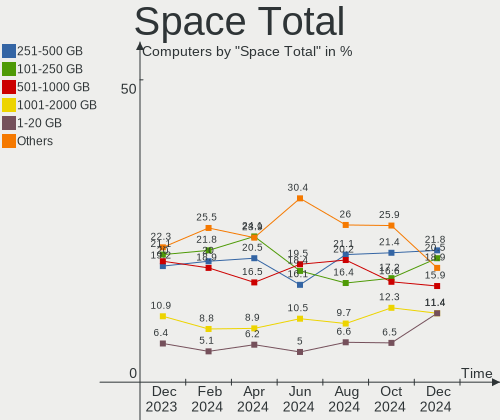
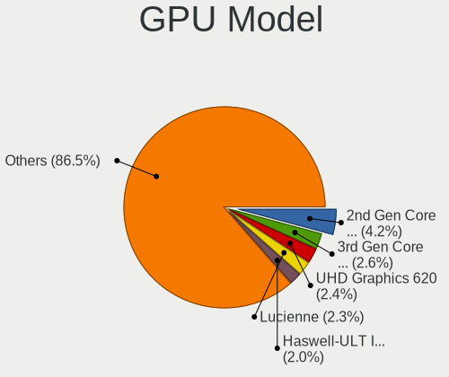
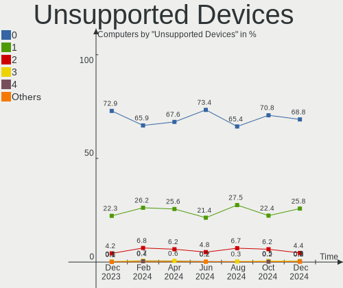

Linux in Germany - Hardware Trends
----------------------------------

A project to identify most popular hardware characteristics and track their change
over time based on data collected by Linux users at https://Linux-Hardware.org.

Anyone can contribute to this report by the [hw-probe](https://github.com/linuxhw/hw-probe) tool:

    sudo -E hw-probe -all -upload

This is a report for all computer types. See also reports for [desktops](/Location/Germany/Desktop/README.md) and [notebooks](/Location/Germany/Notebook/README.md).

Period: Apr, 2023.

Contents
--------

* [ System ](#system)
  - [ OS                       ](#os)
  - [ OS Family                ](#os-family)
  - [ Kernel                   ](#kernel)
  - [ Kernel Family            ](#kernel-family)
  - [ Kernel Major Ver.        ](#kernel-major-ver)
  - [ Arch                     ](#arch)
  - [ DE                       ](#de)
  - [ Display Server           ](#display-server)
  - [ Display Manager          ](#display-manager)
  - [ OS Lang                  ](#os-lang)
  - [ Boot Mode                ](#boot-mode)
  - [ Filesystem               ](#filesystem)
  - [ Part. scheme             ](#part-scheme)
  - [ Dual Boot with Linux/BSD ](#dual-boot-with-linuxbsd)
  - [ Dual Boot (Win)          ](#dual-boot-win)

* [ Board ](#board)
  - [ Vendor                   ](#vendor)
  - [ Model                    ](#model)
  - [ Model Family             ](#model-family)
  - [ MFG Year                 ](#mfg-year)
  - [ Form Factor              ](#form-factor)
  - [ Secure Boot              ](#secure-boot)
  - [ Coreboot                 ](#coreboot)
  - [ RAM Size                 ](#ram-size)
  - [ RAM Used                 ](#ram-used)
  - [ Total Drives             ](#total-drives)
  - [ Has CD-ROM               ](#has-cd-rom)
  - [ Has Ethernet             ](#has-ethernet)
  - [ Has WiFi                 ](#has-wifi)
  - [ Has Bluetooth            ](#has-bluetooth)

* [ Location ](#location)
  - [ Country                  ](#country)
  - [ City                     ](#city)

* [ Drives ](#drives)
  - [ Drive Vendor             ](#drive-vendor)
  - [ Drive Model              ](#drive-model)
  - [ HDD Vendor               ](#hdd-vendor)
  - [ SSD Vendor               ](#ssd-vendor)
  - [ Drive Kind               ](#drive-kind)
  - [ Drive Connector          ](#drive-connector)
  - [ Drive Size               ](#drive-size)
  - [ Space Total              ](#space-total)
  - [ Space Used               ](#space-used)
  - [ Malfunc. Drives          ](#malfunc-drives)
  - [ Malfunc. Drive Vendor    ](#malfunc-drive-vendor)
  - [ Malfunc. HDD Vendor      ](#malfunc-hdd-vendor)
  - [ Malfunc. Drive Kind      ](#malfunc-drive-kind)
  - [ Failed Drives            ](#failed-drives)
  - [ Failed Drive Vendor      ](#failed-drive-vendor)
  - [ Drive Status             ](#drive-status)

* [ Storage controller ](#storage-controller)
  - [ Storage Vendor           ](#storage-vendor)
  - [ Storage Model            ](#storage-model)
  - [ Storage Kind             ](#storage-kind)

* [ Processor ](#processor)
  - [ CPU Vendor               ](#cpu-vendor)
  - [ CPU Model                ](#cpu-model)
  - [ CPU Model Family         ](#cpu-model-family)
  - [ CPU Cores                ](#cpu-cores)
  - [ CPU Sockets              ](#cpu-sockets)
  - [ CPU Threads              ](#cpu-threads)
  - [ CPU Op-Modes             ](#cpu-op-modes)
  - [ CPU Microcode            ](#cpu-microcode)
  - [ CPU Microarch            ](#cpu-microarch)

* [ Graphics ](#graphics)
  - [ GPU Vendor               ](#gpu-vendor)
  - [ GPU Model                ](#gpu-model)
  - [ GPU Combo                ](#gpu-combo)
  - [ GPU Driver               ](#gpu-driver)
  - [ GPU Memory               ](#gpu-memory)

* [ Monitor ](#monitor)
  - [ Monitor Vendor           ](#monitor-vendor)
  - [ Monitor Model            ](#monitor-model)
  - [ Monitor Resolution       ](#monitor-resolution)
  - [ Monitor Diagonal         ](#monitor-diagonal)
  - [ Monitor Width            ](#monitor-width)
  - [ Aspect Ratio             ](#aspect-ratio)
  - [ Monitor Area             ](#monitor-area)
  - [ Pixel Density            ](#pixel-density)
  - [ Multiple Monitors        ](#multiple-monitors)

* [ Network ](#network)
  - [ Net Controller Vendor    ](#net-controller-vendor)
  - [ Net Controller Model     ](#net-controller-model)
  - [ Wireless Vendor          ](#wireless-vendor)
  - [ Wireless Model           ](#wireless-model)
  - [ Ethernet Vendor          ](#ethernet-vendor)
  - [ Ethernet Model           ](#ethernet-model)
  - [ Net Controller Kind      ](#net-controller-kind)
  - [ Used Controller          ](#used-controller)
  - [ NICs                     ](#nics)
  - [ IPv6                     ](#ipv6)

* [ Bluetooth ](#bluetooth)
  - [ Bluetooth Vendor         ](#bluetooth-vendor)
  - [ Bluetooth Model          ](#bluetooth-model)

* [ Sound ](#sound)
  - [ Sound Vendor             ](#sound-vendor)
  - [ Sound Model              ](#sound-model)

* [ Memory ](#memory)
  - [ Memory Vendor            ](#memory-vendor)
  - [ Memory Model             ](#memory-model)
  - [ Memory Kind              ](#memory-kind)
  - [ Memory Form Factor       ](#memory-form-factor)
  - [ Memory Size              ](#memory-size)
  - [ Memory Speed             ](#memory-speed)

* [ Printers & scanners ](#printers--scanners)
  - [ Printer Vendor           ](#printer-vendor)
  - [ Printer Model            ](#printer-model)
  - [ Scanner Vendor           ](#scanner-vendor)
  - [ Scanner Model            ](#scanner-model)

* [ Camera ](#camera)
  - [ Camera Vendor            ](#camera-vendor)
  - [ Camera Model             ](#camera-model)

* [ Security ](#security)
  - [ Fingerprint Vendor       ](#fingerprint-vendor)
  - [ Fingerprint Model        ](#fingerprint-model)
  - [ Chipcard Vendor          ](#chipcard-vendor)
  - [ Chipcard Model           ](#chipcard-model)

* [ Unsupported ](#unsupported)
  - [ Unsupported Devices      ](#unsupported-devices)
  - [ Unsupported Device Types ](#unsupported-device-types)

System
------

OS
--

Installed operating systems

| Name                         | Computers | Percent |
|------------------------------|-----------|---------|
| Ubuntu 22.04                 | 103       | 16.22%  |
| OpenMandriva 23.03           | 80        | 12.6%   |
| Linux Mint 21.1              | 75        | 11.81%  |
| Debian 11                    | 38        | 5.98%   |
| Ubuntu 22.10                 | 23        | 3.62%   |
| Ubuntu 23.04                 | 21        | 3.31%   |
| Pop!_OS 22.04                | 19        | 2.99%   |
| Fedora 38                    | 18        | 2.83%   |
| Zorin 16                     | 17        | 2.68%   |
| Arch Rolling                 | 16        | 2.52%   |
| Debian 12                    | 15        | 2.36%   |
| Manjaro                      | 13        | 2.05%   |
| Linux Mint 20.3              | 12        | 1.89%   |
| Ubuntu 20.04                 | 11        | 1.73%   |
| Manjaro 22.1.0               | 11        | 1.73%   |
| Xubuntu 22.04                | 10        | 1.57%   |
| OpenMandriva 4.3             | 7         | 1.1%    |
| Kubuntu 22.04                | 7         | 1.1%    |
| Fedora 37                    | 7         | 1.1%    |
| SteamOS 3.4.6                | 6         | 0.94%   |
| ROSA 12.4                    | 6         | 0.94%   |
| OpenMandriva 23.01           | 6         | 0.94%   |
| Nobara 37                    | 6         | 0.94%   |
| EndeavourOS Rolling          | 6         | 0.94%   |
| ArcoLinux Rolling            | 6         | 0.94%   |
| openSUSE Tumbleweed-XXXXXXXX | 5         | 0.79%   |
| Gentoo 2.13                  | 5         | 0.79%   |
| Elementary 7                 | 5         | 0.79%   |
| TUXEDO OS 22.04              | 4         | 0.63%   |
| openSUSE Leap-15.4           | 4         | 0.63%   |
| MX 21                        | 4         | 0.63%   |
| OpenMandriva 4.2             | 3         | 0.47%   |
| Lubuntu 22.04                | 3         | 0.47%   |
| LMDE 5                       | 3         | 0.47%   |
| Kubuntu 23.04                | 3         | 0.47%   |
| KDE neon 22.04               | 3         | 0.47%   |
| Kali 2023.1                  | 3         | 0.47%   |
| Xubuntu 22.10                | 2         | 0.31%   |
| Xubuntu 20.04                | 2         | 0.31%   |
| Ubuntu MATE 22.04            | 2         | 0.31%   |

OS Family
---------

OS without a version

| Name          | Computers | Percent |
|---------------|-----------|---------|
| Ubuntu        | 158       | 24.88%  |
| OpenMandriva  | 97        | 15.28%  |
| Linux Mint    | 91        | 14.33%  |
| Debian        | 53        | 8.35%   |
| Fedora        | 28        | 4.41%   |
| Manjaro       | 24        | 3.78%   |
| Pop!_OS       | 19        | 2.99%   |
| Zorin         | 17        | 2.68%   |
| Arch          | 16        | 2.52%   |
| Xubuntu       | 14        | 2.2%    |
| Kubuntu       | 13        | 2.05%   |
| openSUSE      | 9         | 1.42%   |
| SteamOS       | 7         | 1.1%    |
| ROSA          | 6         | 0.94%   |
| Nobara        | 6         | 0.94%   |
| Lubuntu       | 6         | 0.94%   |
| Gentoo        | 6         | 0.94%   |
| EndeavourOS   | 6         | 0.94%   |
| Elementary    | 6         | 0.94%   |
| ArcoLinux     | 6         | 0.94%   |
| TUXEDO OS     | 4         | 0.63%   |
| MX            | 4         | 0.63%   |
| LMDE          | 3         | 0.47%   |
| KDE neon      | 3         | 0.47%   |
| Kali          | 3         | 0.47%   |
| Clear Linux   | 3         | 0.47%   |
| Ubuntu MATE   | 2         | 0.31%   |
| Raspbian      | 2         | 0.31%   |
| Devuan        | 2         | 0.31%   |
| BunsenLabs    | 2         | 0.31%   |
| Xero          | 1         | 0.16%   |
| Void Linux    | 1         | 0.16%   |
| UbuntuDDE     | 1         | 0.16%   |
| Ubuntu Unity  | 1         | 0.16%   |
| Ubuntu Budgie | 1         | 0.16%   |
| Solus         | 1         | 0.16%   |
| Siduction     | 1         | 0.16%   |
| Redcore       | 1         | 0.16%   |
| Parrot        | 1         | 0.16%   |
| Pardus        | 1         | 0.16%   |

Kernel
------

Version of the Linux kernel

| Version                           | Computers | Percent |
|-----------------------------------|-----------|---------|
| 6.2.6-desktop-1omv2390            | 80        | 12.6%   |
| 5.15.0-69-generic                 | 70        | 11.02%  |
| 5.19.0-38-generic                 | 65        | 10.24%  |
| 5.19.0-40-generic                 | 49        | 7.72%   |
| 5.10.0-21-amd64                   | 32        | 5.04%   |
| 6.2.0-20-generic                  | 21        | 3.31%   |
| 6.2.6-76060206-generic            | 17        | 2.68%   |
| 6.1.0-7-amd64                     | 15        | 2.36%   |
| 5.15.0-71-generic                 | 13        | 2.05%   |
| 5.15.0-70-generic                 | 13        | 2.05%   |
| 6.2.11-300.fc38.x86_64            | 12        | 1.89%   |
| 5.4.0-146-generic                 | 9         | 1.42%   |
| 5.19.0-41-generic                 | 7         | 1.1%    |
| 5.15.0-56-generic                 | 7         | 1.1%    |
| 6.2.11-arch1-1                    | 6         | 0.94%   |
| 6.1.25-1-MANJARO                  | 6         | 0.94%   |
| 6.1.23-1-MANJARO                  | 6         | 0.94%   |
| 6.1.1-desktop-1omv2290            | 6         | 0.94%   |
| 5.15.0-67-generic                 | 6         | 0.94%   |
| 5.13.0-valve36-1-neptune          | 6         | 0.94%   |
| 6.2.9-arch1-1                     | 5         | 0.79%   |
| 6.2.8-arch1-1                     | 5         | 0.79%   |
| 6.2.12-arch1-1                    | 5         | 0.79%   |
| 6.2.0-10005-tuxedo                | 5         | 0.79%   |
| 6.1.20-generic-2rosa2021.1-x86_64 | 5         | 0.79%   |
| 6.2.11-gentoo-x86_64              | 4         | 0.63%   |
| 5.19.0-32-generic                 | 4         | 0.63%   |
| 5.10.14-desktop-1omv4002          | 4         | 0.63%   |
| 5.10.0-20-amd64                   | 4         | 0.63%   |
| 6.2.9-300.fc38.x86_64             | 3         | 0.47%   |
| 6.2.9-1-default                   | 3         | 0.47%   |
| 6.2.10-arch1-1                    | 3         | 0.47%   |
| 6.1.0-kali7-amd64                 | 3         | 0.47%   |
| 6.1.0-1008-oem                    | 3         | 0.47%   |
| 5.4.0-147-generic                 | 3         | 0.47%   |
| 5.19.0-35-generic                 | 3         | 0.47%   |
| 5.19.0-21-generic                 | 3         | 0.47%   |
| 5.16.7-desktop-1omv4003           | 3         | 0.47%   |
| 5.16.13-desktop-1omv4003          | 3         | 0.47%   |
| 5.15.0-69-lowlatency              | 3         | 0.47%   |

Kernel Family
-------------

Linux kernel without a distro release

| Version  | Computers | Percent |
|----------|-----------|---------|
| 5.19.0   | 134       | 21.1%   |
| 5.15.0   | 122       | 19.21%  |
| 6.2.6    | 99        | 15.59%  |
| 5.10.0   | 39        | 6.14%   |
| 6.2.11   | 31        | 4.88%   |
| 6.2.0    | 30        | 4.72%   |
| 6.1.0    | 25        | 3.94%   |
| 5.4.0    | 16        | 2.52%   |
| 6.2.9    | 14        | 2.2%    |
| 6.2.8    | 11        | 1.73%   |
| 6.2.10   | 10        | 1.57%   |
| 5.13.0   | 9         | 1.42%   |
| 6.2.12   | 8         | 1.26%   |
| 6.1.25   | 8         | 1.26%   |
| 6.1.1    | 7         | 1.1%    |
| 6.1.23   | 6         | 0.94%   |
| 6.1.21   | 5         | 0.79%   |
| 6.1.20   | 5         | 0.79%   |
| 5.14.21  | 4         | 0.63%   |
| 5.10.14  | 4         | 0.63%   |
| 6.3.0    | 3         | 0.47%   |
| 6.0.0    | 3         | 0.47%   |
| 5.16.7   | 3         | 0.47%   |
| 5.16.13  | 3         | 0.47%   |
| 6.2.13   | 2         | 0.31%   |
| 6.1.24   | 2         | 0.31%   |
| 6.1.22   | 2         | 0.31%   |
| 6.1.19   | 2         | 0.31%   |
| 5.17.0   | 2         | 0.31%   |
| 5.15.102 | 2         | 0.31%   |
| 6.1.5    | 1         | 0.16%   |
| 6.1.26   | 1         | 0.16%   |
| 6.1.2    | 1         | 0.16%   |
| 6.1.18   | 1         | 0.16%   |
| 6.1.15   | 1         | 0.16%   |
| 6.1.13   | 1         | 0.16%   |
| 6.1.12   | 1         | 0.16%   |
| 6.0.19   | 1         | 0.16%   |
| 5.6.0    | 1         | 0.16%   |
| 5.5.7    | 1         | 0.16%   |

Kernel Major Ver.
-----------------

Linux kernel major version

| Version | Computers | Percent |
|---------|-----------|---------|
| 6.2     | 205       | 32.28%  |
| 5.19    | 135       | 21.26%  |
| 5.15    | 129       | 20.31%  |
| 6.1     | 69        | 10.87%  |
| 5.10    | 46        | 7.24%   |
| 5.4     | 16        | 2.52%   |
| 5.13    | 9         | 1.42%   |
| 5.16    | 6         | 0.94%   |
| 6.0     | 4         | 0.63%   |
| 5.14    | 4         | 0.63%   |
| 6.3     | 3         | 0.47%   |
| 5.17    | 3         | 0.47%   |
| 4.18    | 2         | 0.31%   |
| 5.6     | 1         | 0.16%   |
| 5.5     | 1         | 0.16%   |
| 5.3     | 1         | 0.16%   |
| 5.18    | 1         | 0.16%   |

Arch
----

OS architecture (x86_64, i586, etc.)

| Name    | Computers | Percent |
|---------|-----------|---------|
| x86_64  | 629       | 99.06%  |
| aarch64 | 4         | 0.63%   |
| i686    | 1         | 0.16%   |
| armv7l  | 1         | 0.16%   |

DE
--

Desktop Environment

| Name            | Computers | Percent |
|-----------------|-----------|---------|
| GNOME           | 265       | 41.73%  |
| KDE5            | 157       | 24.72%  |
| X-Cinnamon      | 80        | 12.6%   |
| XFCE            | 48        | 7.56%   |
| Unknown         | 26        | 4.09%   |
| MATE            | 12        | 1.89%   |
| LXQt            | 12        | 1.89%   |
| Pantheon        | 6         | 0.94%   |
| LXDE            | 4         | 0.63%   |
| i3              | 4         | 0.63%   |
| Cinnamon        | 4         | 0.63%   |
| sway            | 3         | 0.47%   |
| Budgie          | 3         | 0.47%   |
| xmonad          | 2         | 0.31%   |
| KDE             | 2         | 0.31%   |
| Unity           | 1         | 0.16%   |
| Openbox         | 1         | 0.16%   |
| Hyprland        | 1         | 0.16%   |
| GNOME Flashback | 1         | 0.16%   |
| Deepin          | 1         | 0.16%   |
| chadwm          | 1         | 0.16%   |
| BunsenLabs      | 1         | 0.16%   |

Display Server
--------------

X11 or Wayland

| Name    | Computers | Percent |
|---------|-----------|---------|
| X11     | 399       | 62.83%  |
| Wayland | 193       | 30.39%  |
| Tty     | 26        | 4.09%   |
| Unknown | 16        | 2.52%   |
| Web     | 1         | 0.16%   |

Display Manager
---------------

SDDM, LightDM, etc.

| Name    | Computers | Percent |
|---------|-----------|---------|
| Unknown | 192       | 30.24%  |
| GDM3    | 153       | 24.09%  |
| SDDM    | 132       | 20.79%  |
| LightDM | 100       | 15.75%  |
| GDM     | 52        | 8.19%   |
| XDM     | 3         | 0.47%   |
| SLiM    | 1         | 0.16%   |
| LXDM    | 1         | 0.16%   |
| GREETD  | 1         | 0.16%   |

OS Lang
-------

Language

| Lang       | Computers | Percent |
|------------|-----------|---------|
| de_DE      | 478       | 75.28%  |
| en_US      | 109       | 17.17%  |
| en_GB      | 14        | 2.2%    |
| Unknown    | 11        | 1.73%   |
| C          | 5         | 0.79%   |
| ru_RU      | 3         | 0.47%   |
| pl_PL      | 2         | 0.31%   |
| it_IT      | 2         | 0.31%   |
| en_US-UTF8 | 2         | 0.31%   |
| de_AT      | 2         | 0.31%   |
| uk_UA      | 1         | 0.16%   |
| tr_TR      | 1         | 0.16%   |
| pt_PT      | 1         | 0.16%   |
| POSIX      | 1         | 0.16%   |
| nl_NL      | 1         | 0.16%   |
| en_CA      | 1         | 0.16%   |
| de_CH      | 1         | 0.16%   |

Boot Mode
---------

EFI or BIOS

| Mode | Computers | Percent |
|------|-----------|---------|
| EFI  | 338       | 53.23%  |
| BIOS | 297       | 46.77%  |

Filesystem
----------

Type of filesystem

| Type    | Computers | Percent |
|---------|-----------|---------|
| Ext4    | 463       | 72.91%  |
| Btrfs   | 71        | 11.18%  |
| Tmpfs   | 42        | 6.61%   |
| Overlay | 39        | 6.14%   |
| Zfs     | 11        | 1.73%   |
| Xfs     | 9         | 1.42%   |

Part. scheme
------------

Scheme of partitioning

| Type    | Computers | Percent |
|---------|-----------|---------|
| GPT     | 398       | 62.68%  |
| Unknown | 165       | 25.98%  |
| MBR     | 72        | 11.34%  |

Dual Boot with Linux/BSD
------------------------

Hosting more than one Linux/BSD

| Dual boot | Computers | Percent |
|-----------|-----------|---------|
| No        | 529       | 83.31%  |
| Yes       | 106       | 16.69%  |

Dual Boot (Win)
---------------

Hosting Linux and Windows

| Dual boot | Computers | Percent |
|-----------|-----------|---------|
| No        | 472       | 74.33%  |
| Yes       | 163       | 25.67%  |

Board
-----

Vendor
------

Motherboard manufacturer

| Name                                 | Computers | Percent |
|--------------------------------------|-----------|---------|
| Lenovo                               | 96        | 15.12%  |
| ASUSTek Computer                     | 78        | 12.28%  |
| Hewlett-Packard                      | 72        | 11.34%  |
| Dell                                 | 54        | 8.5%    |
| Gigabyte Technology                  | 47        | 7.4%    |
| Acer                                 | 47        | 7.4%    |
| MSI                                  | 42        | 6.61%   |
| Fujitsu                              | 25        | 3.94%   |
| ASRock                               | 22        | 3.46%   |
| Medion                               | 17        | 2.68%   |
| Apple                                | 14        | 2.2%    |
| Intel                                | 12        | 1.89%   |
| HUAWEI                               | 9         | 1.42%   |
| Sony                                 | 8         | 1.26%   |
| Samsung Electronics                  | 8         | 1.26%   |
| Microsoft                            | 7         | 1.1%    |
| Valve                                | 6         | 0.94%   |
| Unknown                              | 5         | 0.79%   |
| TUXEDO                               | 4         | 0.63%   |
| Toshiba                              | 4         | 0.63%   |
| Notebook                             | 4         | 0.63%   |
| Google                               | 4         | 0.63%   |
| Fujitsu Siemens                      | 4         | 0.63%   |
| Foxconn                              | 4         | 0.63%   |
| Biostar                              | 4         | 0.63%   |
| Raspberry Pi Foundation              | 3         | 0.47%   |
| Packard Bell                         | 3         | 0.47%   |
| Inventec                             | 3         | 0.47%   |
| BESSTAR Tech                         | 3         | 0.47%   |
| AMI                                  | 3         | 0.47%   |
| Shuttle                              | 2         | 0.31%   |
| Schenker                             | 2         | 0.31%   |
| eMachines                            | 2         | 0.31%   |
| ZOTAC                                | 1         | 0.16%   |
| YANYU                                | 1         | 0.16%   |
| Wortmann AG                          | 1         | 0.16%   |
| Timi                                 | 1         | 0.16%   |
| Tactus                               | 1         | 0.16%   |
| Supermicro                           | 1         | 0.16%   |
| Shenzhen Meigao Electronic Equipment | 1         | 0.16%   |

Model
-----

Motherboard model

| Name                                | Computers | Percent |
|-------------------------------------|-----------|---------|
| Valve Jupiter                       | 6         | 0.94%   |
| MSI MS-7C37                         | 6         | 0.94%   |
| Unknown                             | 6         | 0.94%   |
| ASUS All Series                     | 5         | 0.79%   |
| MSI MS-7B86                         | 4         | 0.63%   |
| Acer Aspire V3-772                  | 4         | 0.63%   |
| HUAWEI NBLK-WAX9X                   | 3         | 0.47%   |
| HP ProLiant MicroServer Gen8        | 3         | 0.47%   |
| HP EliteDesk 800 G2 DM 35W          | 3         | 0.47%   |
| Fujitsu LIFEBOOK S935               | 3         | 0.47%   |
| Acer TravelMate 5735Z               | 3         | 0.47%   |
| TUXEDO InfinityBook Pro Gen7 (MK1)  | 2         | 0.31%   |
| Samsung 750XDA                      | 2         | 0.31%   |
| Samsung 355V4C/356V4C/3445VC/3545VC | 2         | 0.31%   |
| MSI MS-7D75                         | 2         | 0.31%   |
| MSI MS-7C52                         | 2         | 0.31%   |
| MSI MS-7B79                         | 2         | 0.31%   |
| Microsoft Surface Go 2              | 2         | 0.31%   |
| Medion MS-7728                      | 2         | 0.31%   |
| Lenovo V15 G2 IJL 82QY              | 2         | 0.31%   |
| Lenovo MIIX 320-10ICR 80XF          | 2         | 0.31%   |
| Lenovo G50-70 20351                 | 2         | 0.31%   |
| Inventec D CLASS                    | 2         | 0.31%   |
| HUAWEI BOHK-WAX9X                   | 2         | 0.31%   |
| HP Pavilion g6                      | 2         | 0.31%   |
| HP Laptop 15s-eq2xxx                | 2         | 0.31%   |
| Gigabyte X570 GAMING X              | 2         | 0.31%   |
| Gigabyte X570 AORUS ELITE           | 2         | 0.31%   |
| Gigabyte GA-870A-UD3                | 2         | 0.31%   |
| Gigabyte GA-78LMT-S2P               | 2         | 0.31%   |
| Gigabyte B550M DS3H                 | 2         | 0.31%   |
| Gigabyte B450M S2H                  | 2         | 0.31%   |
| Fujitsu LIFEBOOK U747               | 2         | 0.31%   |
| Foxconn 500B Microtower             | 2         | 0.31%   |
| Dell XPS 13 9350                    | 2         | 0.31%   |
| Dell XPS 13 9305                    | 2         | 0.31%   |
| Dell XPS 13 7390                    | 2         | 0.31%   |
| Dell Precision WorkStation T3500    | 2         | 0.31%   |
| Dell Precision Tower 5810           | 2         | 0.31%   |
| Dell OptiPlex 3020                  | 2         | 0.31%   |

Model Family
------------

Motherboard model prefix

| Name               | Computers | Percent |
|--------------------|-----------|---------|
| Lenovo ThinkPad    | 55        | 8.66%   |
| Acer Aspire        | 30        | 4.72%   |
| Dell Latitude      | 21        | 3.31%   |
| Fujitsu LIFEBOOK   | 12        | 1.89%   |
| ASUS ROG           | 12        | 1.89%   |
| ASUS PRIME         | 11        | 1.73%   |
| Fujitsu ESPRIMO    | 10        | 1.57%   |
| Dell XPS           | 10        | 1.57%   |
| HP Pavilion        | 9         | 1.42%   |
| HP Laptop          | 9         | 1.42%   |
| HP Compaq          | 8         | 1.26%   |
| Dell Precision     | 8         | 1.26%   |
| Microsoft Surface  | 7         | 1.1%    |
| Lenovo IdeaPad     | 7         | 1.1%    |
| Dell OptiPlex      | 7         | 1.1%    |
| Acer TravelMate    | 7         | 1.1%    |
| Valve Jupiter      | 6         | 0.94%   |
| MSI MS-7C37        | 6         | 0.94%   |
| Lenovo Yoga        | 6         | 0.94%   |
| Lenovo ThinkCentre | 6         | 0.94%   |
| HP EliteDesk       | 6         | 0.94%   |
| HP EliteBook       | 6         | 0.94%   |
| Gigabyte X570      | 6         | 0.94%   |
| Dell Inspiron      | 6         | 0.94%   |
| ASUS VivoBook      | 6         | 0.94%   |
| ASUS TUF           | 6         | 0.94%   |
| Unknown            | 6         | 0.94%   |
| HP ENVY            | 5         | 0.79%   |
| HP 255             | 5         | 0.79%   |
| ASUS All           | 5         | 0.79%   |
| MSI MS-7B86        | 4         | 0.63%   |
| HP ProLiant        | 4         | 0.63%   |
| Toshiba Satellite  | 3         | 0.47%   |
| RPi Raspberry      | 3         | 0.47%   |
| Lenovo IdeaCentre  | 3         | 0.47%   |
| HUAWEI NBLK-WAX9X  | 3         | 0.47%   |
| HP ProBook         | 3         | 0.47%   |
| HP 250             | 3         | 0.47%   |
| Gigabyte B550M     | 3         | 0.47%   |
| Gigabyte B550      | 3         | 0.47%   |

MFG Year
--------

Motherboard manufacture year

| Year    | Computers | Percent |
|---------|-----------|---------|
| 2020    | 70        | 11.02%  |
| 2022    | 64        | 10.08%  |
| 2019    | 55        | 8.66%   |
| 2021    | 52        | 8.19%   |
| 2013    | 52        | 8.19%   |
| 2018    | 44        | 6.93%   |
| 2012    | 42        | 6.61%   |
| 2011    | 42        | 6.61%   |
| 2017    | 38        | 5.98%   |
| 2014    | 34        | 5.35%   |
| 2015    | 33        | 5.2%    |
| 2010    | 29        | 4.57%   |
| 2016    | 23        | 3.62%   |
| 2009    | 21        | 3.31%   |
| 2023    | 14        | 2.2%    |
| 2008    | 8         | 1.26%   |
| 2007    | 8         | 1.26%   |
| Unknown | 5         | 0.79%   |
| 2006    | 1         | 0.16%   |

Form Factor
-----------

Physical design of the computer

| Name           | Computers | Percent |
|----------------|-----------|---------|
| Notebook       | 311       | 48.98%  |
| Desktop        | 261       | 41.1%   |
| Convertible    | 22        | 3.46%   |
| Mini pc        | 16        | 2.52%   |
| Tablet         | 10        | 1.57%   |
| All in one     | 6         | 0.94%   |
| System on chip | 5         | 0.79%   |
| Server         | 4         | 0.63%   |

Secure Boot
-----------

Enabled or disabled

| State    | Computers | Percent |
|----------|-----------|---------|
| Disabled | 595       | 93.7%   |
| Enabled  | 40        | 6.3%    |

Coreboot
--------

Have coreboot on board

| Used | Computers | Percent |
|------|-----------|---------|
| No   | 630       | 99.21%  |
| Yes  | 5         | 0.79%   |

RAM Size
--------

Total RAM memory

| Size in GB      | Computers | Percent |
|-----------------|-----------|---------|
| 4.01-8.0        | 162       | 25.51%  |
| 16.01-24.0      | 143       | 22.52%  |
| 8.01-16.0       | 102       | 16.06%  |
| 3.01-4.0        | 86        | 13.54%  |
| 32.01-64.0      | 78        | 12.28%  |
| 64.01-256.0     | 28        | 4.41%   |
| 24.01-32.0      | 16        | 2.52%   |
| 1.01-2.0        | 11        | 1.73%   |
| 2.01-3.0        | 6         | 0.94%   |
| 0.51-1.0        | 2         | 0.31%   |
| More than 256.0 | 1         | 0.16%   |

RAM Used
--------

Used RAM memory

| Used GB    | Computers | Percent |
|------------|-----------|---------|
| 1.01-2.0   | 218       | 34.33%  |
| 2.01-3.0   | 181       | 28.5%   |
| 4.01-8.0   | 96        | 15.12%  |
| 3.01-4.0   | 85        | 13.39%  |
| 8.01-16.0  | 18        | 2.83%   |
| 0.51-1.0   | 18        | 2.83%   |
| 0.01-0.5   | 9         | 1.42%   |
| 24.01-32.0 | 5         | 0.79%   |
| 16.01-24.0 | 4         | 0.63%   |
| 32.01-64.0 | 1         | 0.16%   |

Total Drives
------------

Number of drives on board

| Drives | Computers | Percent |
|--------|-----------|---------|
| 1      | 368       | 57.95%  |
| 2      | 142       | 22.36%  |
| 3      | 56        | 8.82%   |
| 4      | 35        | 5.51%   |
| 5      | 15        | 2.36%   |
| 6      | 7         | 1.1%    |
| 7      | 4         | 0.63%   |
| 0      | 4         | 0.63%   |
| 8      | 2         | 0.31%   |
| 10     | 1         | 0.16%   |
| 9      | 1         | 0.16%   |

Has CD-ROM
----------

Has CD-ROM on board

| Presented | Computers | Percent |
|-----------|-----------|---------|
| No        | 381       | 60%     |
| Yes       | 254       | 40%     |

Has Ethernet
------------

Has Ethernet on board

| Presented | Computers | Percent |
|-----------|-----------|---------|
| Yes       | 534       | 84.09%  |
| No        | 101       | 15.91%  |

Has WiFi
--------

Has WiFi module

| Presented | Computers | Percent |
|-----------|-----------|---------|
| Yes       | 466       | 73.39%  |
| No        | 169       | 26.61%  |

Has Bluetooth
-------------

Has Bluetooth module

| Presented | Computers | Percent |
|-----------|-----------|---------|
| Yes       | 385       | 60.63%  |
| No        | 250       | 39.37%  |

Location
--------

Country
-------

Geographic location (country)

| Country | Computers | Percent |
|---------|-----------|---------|
| Germany | 635       | 100%    |

City
----

Geographic location (city)

| City                   | Computers | Percent |
|------------------------|-----------|---------|
| Berlin                 | 42        | 6.61%   |
| Frankfurt am Main      | 31        | 4.88%   |
| Hamburg                | 24        | 3.78%   |
| Munich                 | 18        | 2.83%   |
| Cologne                | 17        | 2.68%   |
| Nuremberg              | 12        | 1.89%   |
| Mannheim               | 12        | 1.89%   |
| Dresden                | 11        | 1.73%   |
| Ludwigshafen am Rhein  | 8         | 1.26%   |
| Dortmund               | 8         | 1.26%   |
| Bonn                   | 7         | 1.1%    |
| Traunstein             | 6         | 0.94%   |
| Münster               | 6         | 0.94%   |
| Lübeck                | 6         | 0.94%   |
| Essen                  | 6         | 0.94%   |
| Stuttgart              | 5         | 0.79%   |
| Leipzig                | 5         | 0.79%   |
| Kiel                   | 5         | 0.79%   |
| Hanover                | 5         | 0.79%   |
| Chemnitz               | 5         | 0.79%   |
| Augsburg               | 5         | 0.79%   |
| Oberursel              | 4         | 0.63%   |
| Kirchhain              | 4         | 0.63%   |
| Karlsruhe              | 4         | 0.63%   |
| Heilbronn              | 4         | 0.63%   |
| Halle                  | 4         | 0.63%   |
| Erlangen               | 4         | 0.63%   |
| Düsseldorf            | 4         | 0.63%   |
| Cuxhaven               | 4         | 0.63%   |
| Bremen                 | 4         | 0.63%   |
| Bochum                 | 4         | 0.63%   |
| Bielefeld              | 4         | 0.63%   |
| Würzburg              | 3         | 0.47%   |
| Wuppertal              | 3         | 0.47%   |
| Rothenburg upon Tauber | 3         | 0.47%   |
| Rostock                | 3         | 0.47%   |
| Reutlingen             | 3         | 0.47%   |
| Maxhutte-Haidhof       | 3         | 0.47%   |
| Leverkusen             | 3         | 0.47%   |
| Lahr                   | 3         | 0.47%   |

Drives
------

Drive Vendor
------------

Hard drive vendors

| Vendor                      | Computers | Drives | Percent |
|-----------------------------|-----------|--------|---------|
| Samsung Electronics         | 193       | 250    | 20.1%   |
| Seagate                     | 100       | 129    | 10.42%  |
| WDC                         | 96        | 133    | 10%     |
| Sandisk                     | 80        | 93     | 8.33%   |
| Crucial                     | 54        | 62     | 5.63%   |
| Toshiba                     | 49        | 57     | 5.1%    |
| Unknown                     | 40        | 46     | 4.17%   |
| Kingston                    | 32        | 33     | 3.33%   |
| Intenso                     | 27        | 28     | 2.81%   |
| Hitachi                     | 25        | 28     | 2.6%    |
| Micron Technology           | 18        | 18     | 1.88%   |
| SK hynix                    | 17        | 19     | 1.77%   |
| Intel                       | 16        | 17     | 1.67%   |
| KIOXIA                      | 14        | 14     | 1.46%   |
| Micron/Crucial Technology   | 13        | 15     | 1.35%   |
| A-DATA Technology           | 10        | 12     | 1.04%   |
| Phison Electronics          | 9         | 9      | 0.94%   |
| Apple                       | 8         | 11     | 0.83%   |
| Unknown                     | 8         | 8      | 0.83%   |
| Phison                      | 7         | 7      | 0.73%   |
| Kingston Technology Company | 7         | 7      | 0.73%   |
| HGST                        | 7         | 7      | 0.73%   |
| ASMT                        | 7         | 7      | 0.73%   |
| Verbatim                    | 6         | 6      | 0.63%   |
| Transcend                   | 6         | 6      | 0.63%   |
| JMicron Technology          | 6         | 6      | 0.63%   |
| China                       | 6         | 6      | 0.63%   |
| UMIS                        | 5         | 5      | 0.52%   |
| PNY                         | 5         | 5      | 0.52%   |
| Corsair                     | 5         | 5      | 0.52%   |
| SPCC                        | 4         | 4      | 0.42%   |
| Silicon Motion              | 4         | 4      | 0.42%   |
| SABRENT                     | 4         | 4      | 0.42%   |
| MAXIO Technology (Hangzhou) | 4         | 4      | 0.42%   |
| LITEON                      | 4         | 4      | 0.42%   |
| KIOXIA-EXCERIA              | 4         | 4      | 0.42%   |
| Fujitsu                     | 4         | 4      | 0.42%   |
| Apacer                      | 4         | 4      | 0.42%   |
| Patriot                     | 3         | 3      | 0.31%   |
| Lexar                       | 3         | 3      | 0.31%   |

Drive Model
-----------

Hard drive models

| Model                                                  | Computers | Percent |
|--------------------------------------------------------|-----------|---------|
| Samsung NVMe SSD Controller SM981/PM981/PM983 1TB      | 21        | 1.95%   |
| Samsung SSD 850 EVO 250GB                              | 17        | 1.58%   |
| Samsung SSD 860 EVO 500GB                              | 14        | 1.3%    |
| Samsung NVMe SSD Controller PM9A1/PM9A3/980PRO 2TB     | 12        | 1.11%   |
| Micron/Crucial P2 NVMe PCIe SSD 1TB                    | 10        | 0.93%   |
| Crucial CT500MX500SSD1 500GB                           | 10        | 0.93%   |
| Samsung NVMe SSD Controller SM961/PM961/SM963 500GB    | 9         | 0.83%   |
| SanDisk SSD PLUS 240GB                                 | 8         | 0.74%   |
| SanDisk SSD PLUS 1000GB                                | 8         | 0.74%   |
| Samsung SSD 860 EVO 1TB                                | 8         | 0.74%   |
| Unknown                                                | 8         | 0.74%   |
| Phison E12 NVMe Controller 512GB                       | 7         | 0.65%   |
| Unknown SD/MMC/MS PRO 249GB                            | 6         | 0.56%   |
| Unknown MMC Card  32GB                                 | 6         | 0.56%   |
| Toshiba HDWD110 1TB                                    | 6         | 0.56%   |
| Seagate ST2000DM001-1ER164 2TB                         | 6         | 0.56%   |
| Sandisk WD Black SN750 / PC SN730 NVMe SSD 512GB       | 6         | 0.56%   |
| SanDisk SDSSDH3 1T00 1TB                               | 6         | 0.56%   |
| SanDisk NVMe SSD Drive 1TB                             | 6         | 0.56%   |
| WDC WD30EFRX-68EUZN0 3TB                               | 5         | 0.46%   |
| Verbatim Vi550 S3 128GB                                | 5         | 0.46%   |
| Toshiba DT01ACA200 2TB                                 | 5         | 0.46%   |
| Seagate ST4000DM004-2CV104 4TB                         | 5         | 0.46%   |
| Samsung SSD 980 1TB                                    | 5         | 0.46%   |
| JMicron Generic 1TB                                    | 5         | 0.46%   |
| Crucial CT250MX500SSD1 250GB                           | 5         | 0.46%   |
| Crucial CT240BX500SSD1 240GB                           | 5         | 0.46%   |
| Crucial CT1000MX500SSD1 1TB                            | 5         | 0.46%   |
| Unknown MMC Card  64GB                                 | 4         | 0.37%   |
| Unknown MMC Card  128GB                                | 4         | 0.37%   |
| Toshiba MQ01ABF050 500GB                               | 4         | 0.37%   |
| Toshiba DT01ACA100 1TB                                 | 4         | 0.37%   |
| Silicon Motion SM2263EN/SM2263XT SSD Controller 1024GB | 4         | 0.37%   |
| Seagate ST2000DM008-2FR102 2TB                         | 4         | 0.37%   |
| Seagate ST1000DM003-1ER162 1TB                         | 4         | 0.37%   |
| Seagate Expansion 4TB                                  | 4         | 0.37%   |
| Samsung SSD 980 PRO 1TB                                | 4         | 0.37%   |
| Samsung SSD 980 500GB                                  | 4         | 0.37%   |
| Samsung SSD 970 EVO Plus 1TB                           | 4         | 0.37%   |
| Samsung SSD 970 EVO 500GB                              | 4         | 0.37%   |

HDD Vendor
----------

Hard disk drive vendors

| Vendor              | Computers | Drives | Percent |
|---------------------|-----------|--------|---------|
| Seagate             | 99        | 126    | 35.36%  |
| WDC                 | 71        | 105    | 25.36%  |
| Toshiba             | 36        | 43     | 12.86%  |
| Hitachi             | 25        | 28     | 8.93%   |
| Samsung Electronics | 16        | 18     | 5.71%   |
| HGST                | 7         | 7      | 2.5%    |
| Unknown             | 6         | 6      | 2.14%   |
| JMicron Technology  | 5         | 5      | 1.79%   |
| Intenso             | 4         | 4      | 1.43%   |
| Fujitsu             | 4         | 4      | 1.43%   |
| Inateck             | 2         | 2      | 0.71%   |
| ASMT                | 2         | 2      | 0.71%   |
| SABRENT             | 1         | 1      | 0.36%   |
| ASMedia             | 1         | 1      | 0.36%   |
| Apple               | 1         | 1      | 0.36%   |

SSD Vendor
----------

Solid state drive vendors

| Vendor              | Computers | Drives | Percent |
|---------------------|-----------|--------|---------|
| Samsung Electronics | 104       | 120    | 28.89%  |
| SanDisk             | 56        | 62     | 15.56%  |
| Crucial             | 47        | 52     | 13.06%  |
| Intenso             | 20        | 20     | 5.56%   |
| Kingston            | 17        | 17     | 4.72%   |
| WDC                 | 15        | 15     | 4.17%   |
| Toshiba             | 7         | 7      | 1.94%   |
| Verbatim            | 6         | 6      | 1.67%   |
| Transcend           | 6         | 6      | 1.67%   |
| Micron Technology   | 6         | 6      | 1.67%   |
| Intel               | 6         | 6      | 1.67%   |
| China               | 6         | 6      | 1.67%   |
| A-DATA Technology   | 6         | 6      | 1.67%   |
| Apple               | 5         | 5      | 1.39%   |
| SPCC                | 4         | 4      | 1.11%   |
| PNY                 | 4         | 4      | 1.11%   |
| ASMT                | 4         | 4      | 1.11%   |
| Apacer              | 4         | 4      | 1.11%   |
| Patriot             | 3         | 3      | 0.83%   |
| LITEON              | 3         | 3      | 0.83%   |
| Lexar               | 3         | 3      | 0.83%   |
| OCZ                 | 2         | 2      | 0.56%   |
| LITEONIT            | 2         | 2      | 0.56%   |
| Fanxiang            | 2         | 2      | 0.56%   |
| Corsair             | 2         | 2      | 0.56%   |
| Unknown             | 2         | 2      | 0.56%   |
| VERICO              | 1         | 1      | 0.28%   |
| V7                  | 1         | 1      | 0.28%   |
| Team                | 1         | 1      | 0.28%   |
| SK hynix            | 1         | 1      | 0.28%   |
| ShiJi               | 1         | 1      | 0.28%   |
| SABRENT             | 1         | 1      | 0.28%   |
| Phison              | 1         | 1      | 0.28%   |
| Netac               | 1         | 1      | 0.28%   |
| Maxtor              | 1         | 1      | 0.28%   |
| Londisk             | 1         | 1      | 0.28%   |
| Leven               | 1         | 1      | 0.28%   |
| KLEVV               | 1         | 1      | 0.28%   |
| KingSpec            | 1         | 1      | 0.28%   |
| INNOVATION IT       | 1         | 1      | 0.28%   |

Drive Kind
----------

HDD or SSD

| Kind    | Computers | Drives | Percent |
|---------|-----------|--------|---------|
| SSD     | 298       | 387    | 34.53%  |
| NVMe    | 282       | 333    | 32.68%  |
| HDD     | 229       | 353    | 26.54%  |
| MMC     | 38        | 42     | 4.4%    |
| Unknown | 16        | 19     | 1.85%   |

Drive Connector
---------------

SATA, SAS, NVMe, etc.

| Type | Computers | Drives | Percent |
|------|-----------|--------|---------|
| SATA | 428       | 697    | 53.1%   |
| NVMe | 282       | 331    | 34.99%  |
| SAS  | 58        | 64     | 7.2%    |
| MMC  | 38        | 42     | 4.71%   |

Drive Size
----------

Size of hard drive

| Size in TB | Computers | Drives | Percent |
|------------|-----------|--------|---------|
| 0.01-0.5   | 304       | 384    | 52.23%  |
| 0.51-1.0   | 153       | 188    | 26.29%  |
| 1.01-2.0   | 67        | 82     | 11.51%  |
| 3.01-4.0   | 23        | 28     | 3.95%   |
| 4.01-10.0  | 16        | 31     | 2.75%   |
| 2.01-3.0   | 13        | 20     | 2.23%   |
| 10.01-20.0 | 6         | 7      | 1.03%   |

Space Total
-----------

Amount of disk space available on the file system

| Size in GB     | Computers | Percent |
|----------------|-----------|---------|
| 251-500        | 151       | 23.78%  |
| 101-250        | 151       | 23.78%  |
| 501-1000       | 90        | 14.17%  |
| 1-20           | 60        | 9.45%   |
| 1001-2000      | 54        | 8.5%    |
| More than 3000 | 44        | 6.93%   |
| 51-100         | 26        | 4.09%   |
| Unknown        | 26        | 4.09%   |
| 2001-3000      | 19        | 2.99%   |
| 21-50          | 14        | 2.2%    |

Space Used
----------

Amount of used disk space

| Used GB        | Computers | Percent |
|----------------|-----------|---------|
| 1-20           | 232       | 36.54%  |
| 21-50          | 101       | 15.91%  |
| 101-250        | 79        | 12.44%  |
| 51-100         | 63        | 9.92%   |
| 251-500        | 44        | 6.93%   |
| 501-1000       | 32        | 5.04%   |
| 1001-2000      | 27        | 4.25%   |
| Unknown        | 26        | 4.09%   |
| More than 3000 | 20        | 3.15%   |
| 2001-3000      | 11        | 1.73%   |

Malfunc. Drives
---------------

Drive models with a malfunction

| Model                                          | Computers | Drives | Percent |
|------------------------------------------------|-----------|--------|---------|
| Seagate ST2000DL003-9VT166 2TB                 | 2         | 2      | 3.45%   |
| SanDisk SSD PLUS 240GB                         | 2         | 2      | 3.45%   |
| Intenso SSD SATAIII 256GB                      | 2         | 2      | 3.45%   |
| WDC WD60EFAX-68SHWN0 6TB                       | 1         | 1      | 1.72%   |
| WDC WD5000LPVX-22V0TT0 500GB                   | 1         | 1      | 1.72%   |
| WDC WD5000LPCX-24C6HT0 500GB                   | 1         | 1      | 1.72%   |
| WDC WD5000BPVT-22HXZT3 500GB                   | 1         | 1      | 1.72%   |
| WDC WD5000AAKS-007AA0 500GB                    | 1         | 1      | 1.72%   |
| WDC WD40EZRX-22SPEB0 4TB                       | 1         | 1      | 1.72%   |
| WDC WD30EZRZ-00Z5HB0 3TB                       | 1         | 1      | 1.72%   |
| WDC WD30EZRX-00D8PB0 3TB                       | 1         | 1      | 1.72%   |
| WDC WD30EFRX-68AX9N0 3TB                       | 1         | 1      | 1.72%   |
| WDC WD10EAVS-32D7B1 1TB                        | 1         | 1      | 1.72%   |
| WDC WD10EARX-00N0YB0 1TB                       | 1         | 1      | 1.72%   |
| WDC WD1003FBYX-50Y7B0 1TB                      | 1         | 1      | 1.72%   |
| Toshiba MK2035GSS 200GB                        | 1         | 1      | 1.72%   |
| Toshiba DT01ACA100 1TB                         | 1         | 1      | 1.72%   |
| Toshiba DT01ACA050 500GB                       | 1         | 1      | 1.72%   |
| SK hynix BC711 HFM512GD3JX013N 512GB           | 1         | 1      | 1.72%   |
| Seagate ST980811AS 80GB                        | 1         | 1      | 1.72%   |
| Seagate ST500LT012-1DG142 500GB                | 1         | 1      | 1.72%   |
| Seagate ST500DM002-9YN14C 500GB                | 1         | 1      | 1.72%   |
| Seagate ST4000NM0033-9ZM170 4TB                | 1         | 1      | 1.72%   |
| Seagate ST3320418AS 320GB                      | 1         | 1      | 1.72%   |
| Seagate ST320LM002-1EJ16C 320GB                | 1         | 1      | 1.72%   |
| Seagate ST31000524AS 1TB                       | 1         | 1      | 1.72%   |
| Seagate ST2000DM001-1ER164 2TB                 | 1         | 1      | 1.72%   |
| Seagate ST2000DM001-1CH164 2TB                 | 1         | 1      | 1.72%   |
| Seagate ST1000DM003-1CH162 1TB                 | 1         | 1      | 1.72%   |
| SanDisk SSD PLUS 480GB                         | 1         | 1      | 1.72%   |
| SanDisk SDSSDA-2T00 2TB                        | 1         | 1      | 1.72%   |
| Samsung Electronics SSD 970 EVO 500GB          | 1         | 1      | 1.72%   |
| Samsung Electronics SSD 850 PRO 256GB          | 1         | 1      | 1.72%   |
| Samsung Electronics HD502HJ 500GB              | 1         | 1      | 1.72%   |
| Samsung Electronics HD501LJ 500GB              | 1         | 1      | 1.72%   |
| Samsung Electronics HD200HJ 200GB              | 1         | 2      | 1.72%   |
| Micron Technology 2300 NVMe 512GB              | 1         | 1      | 1.72%   |
| Micron Technology 1100_MTFDDAV512TBN 512GB SSD | 1         | 1      | 1.72%   |
| Micron Technology 1100_MTFDDAK256TBN 256GB SSD | 1         | 1      | 1.72%   |
| Kingston SNV425S264GB SSD                      | 1         | 1      | 1.72%   |

Malfunc. Drive Vendor
---------------------

Vendors of faulty drives

| Vendor              | Computers | Drives | Percent |
|---------------------|-----------|--------|---------|
| Seagate             | 12        | 12     | 21.05%  |
| WDC                 | 11        | 12     | 19.3%   |
| Hitachi             | 6         | 6      | 10.53%  |
| Samsung Electronics | 5         | 6      | 8.77%   |
| SanDisk             | 4         | 4      | 7.02%   |
| Toshiba             | 3         | 3      | 5.26%   |
| Micron Technology   | 3         | 3      | 5.26%   |
| Intenso             | 3         | 3      | 5.26%   |
| Intel               | 3         | 3      | 5.26%   |
| Crucial             | 2         | 2      | 3.51%   |
| SK hynix            | 1         | 1      | 1.75%   |
| Kingston            | 1         | 1      | 1.75%   |
| Fujitsu             | 1         | 1      | 1.75%   |
| ASMedia             | 1         | 1      | 1.75%   |
| Apple               | 1         | 1      | 1.75%   |

Malfunc. HDD Vendor
-------------------

Vendors of faulty HDD drives

| Vendor              | Computers | Drives | Percent |
|---------------------|-----------|--------|---------|
| Seagate             | 12        | 12     | 30.77%  |
| WDC                 | 11        | 12     | 28.21%  |
| Hitachi             | 6         | 6      | 15.38%  |
| Toshiba             | 3         | 3      | 7.69%   |
| Samsung Electronics | 3         | 4      | 7.69%   |
| Intenso             | 1         | 1      | 2.56%   |
| Fujitsu             | 1         | 1      | 2.56%   |
| ASMedia             | 1         | 1      | 2.56%   |
| Apple               | 1         | 1      | 2.56%   |

Malfunc. Drive Kind
-------------------

Kinds of faulty drives

| Kind | Computers | Drives | Percent |
|------|-----------|--------|---------|
| HDD  | 35        | 41     | 66.04%  |
| SSD  | 14        | 14     | 26.42%  |
| NVMe | 4         | 4      | 7.55%   |

Failed Drives
-------------

Failed drive models

Zero info for selected period =(

Failed Drive Vendor
-------------------

Failed drive vendors

Zero info for selected period =(

Drive Status
------------

Number of failed and malfunc. drives

| Status   | Computers | Drives | Percent |
|----------|-----------|--------|---------|
| Works    | 335       | 526    | 47.72%  |
| Detected | 315       | 549    | 44.87%  |
| Malfunc  | 52        | 59     | 7.41%   |

Storage controller
------------------

Storage Vendor
--------------

Storage controller vendors

| Vendor                         | Computers | Percent |
|--------------------------------|-----------|---------|
| Intel                          | 371       | 43.7%   |
| AMD                            | 146       | 17.2%   |
| Samsung Electronics            | 102       | 12.01%  |
| SanDisk                        | 37        | 4.36%   |
| Micron/Crucial Technology      | 23        | 2.71%   |
| Kingston Technology Company    | 22        | 2.59%   |
| Phison Electronics             | 21        | 2.47%   |
| ASMedia Technology             | 17        | 2%      |
| SK hynix                       | 16        | 1.88%   |
| KIOXIA                         | 14        | 1.65%   |
| Toshiba America Info Systems   | 12        | 1.41%   |
| Micron Technology              | 12        | 1.41%   |
| Silicon Motion                 | 7         | 0.82%   |
| Nvidia                         | 7         | 0.82%   |
| JMicron Technology             | 7         | 0.82%   |
| Union Memory (Shenzhen)        | 6         | 0.71%   |
| MAXIO Technology (Hangzhou)    | 6         | 0.71%   |
| Marvell Technology Group       | 5         | 0.59%   |
| ADATA Technology               | 4         | 0.47%   |
| Solid State Storage Technology | 3         | 0.35%   |
| Lite-On Technology             | 2         | 0.24%   |
| Apple                          | 2         | 0.24%   |
| VIA Technologies               | 1         | 0.12%   |
| Silicon Image                  | 1         | 0.12%   |
| Shenzhen Longsys Electronics   | 1         | 0.12%   |
| Seagate Technology             | 1         | 0.12%   |
| O2 Micro                       | 1         | 0.12%   |
| Netac Technology               | 1         | 0.12%   |
| Broadcom / LSI                 | 1         | 0.12%   |

Storage Model
-------------

Storage controller models

| Model                                                                          | Computers | Percent |
|--------------------------------------------------------------------------------|-----------|---------|
| AMD FCH SATA Controller [AHCI mode]                                            | 89        | 9.33%   |
| Samsung NVMe SSD Controller SM981/PM981/PM983                                  | 39        | 4.09%   |
| Intel 8 Series/C220 Series Chipset Family 6-port SATA Controller 1 [AHCI mode] | 32        | 3.35%   |
| Intel 7 Series Chipset Family 6-port SATA Controller [AHCI mode]               | 27        | 2.83%   |
| Samsung NVMe SSD Controller PM9A1/PM9A3/980PRO                                 | 24        | 2.52%   |
| Intel Sunrise Point-LP SATA Controller [AHCI mode]                             | 24        | 2.52%   |
| AMD 400 Series Chipset SATA Controller                                         | 24        | 2.52%   |
| Samsung NVMe SSD Controller 980                                                | 22        | 2.31%   |
| Intel 6 Series/C200 Series Chipset Family 6 port Mobile SATA AHCI Controller   | 21        | 2.2%    |
| Intel Volume Management Device NVMe RAID Controller                            | 20        | 2.1%    |
| Micron/Crucial P2 NVMe PCIe SSD                                                | 18        | 1.89%   |
| ASMedia ASM1062 Serial ATA Controller                                          | 16        | 1.68%   |
| AMD SB7x0/SB8x0/SB9x0 SATA Controller [AHCI mode]                              | 16        | 1.68%   |
| AMD 500 Series Chipset SATA Controller                                         | 16        | 1.68%   |
| Intel Q170/Q150/B150/H170/H110/Z170/CM236 Chipset SATA Controller [AHCI Mode]  | 15        | 1.57%   |
| Intel 82801 Mobile SATA Controller [RAID mode]                                 | 15        | 1.57%   |
| Intel 6 Series/C200 Series Chipset Family 6 port Desktop SATA AHCI Controller  | 14        | 1.47%   |
| AMD SB7x0/SB8x0/SB9x0 IDE Controller                                           | 14        | 1.47%   |
| SanDisk WD Black SN750 / PC SN730 NVMe SSD                                     | 13        | 1.36%   |
| Samsung NVMe SSD Controller SM961/PM961/SM963                                  | 13        | 1.36%   |
| Micron NVMe Storage Controller                                                 | 12        | 1.26%   |
| Intel Wildcat Point-LP SATA Controller [AHCI Mode]                             | 12        | 1.26%   |
| Intel Tiger Lake-LP SATA Controller                                            | 12        | 1.26%   |
| Intel 8 Series SATA Controller 1 [AHCI mode]                                   | 12        | 1.26%   |
| Intel Celeron/Pentium Silver Processor SATA Controller                         | 11        | 1.15%   |
| Intel Cannon Lake PCH SATA AHCI Controller                                     | 11        | 1.15%   |
| Intel 82801IBM/IEM (ICH9M/ICH9M-E) 4 port SATA Controller [AHCI mode]          | 11        | 1.15%   |
| Phison E12 NVMe Controller                                                     | 10        | 1.05%   |
| Intel 200 Series PCH SATA controller [AHCI mode]                               | 10        | 1.05%   |
| AMD SB7x0/SB8x0/SB9x0 SATA Controller [IDE mode]                               | 10        | 1.05%   |
| SK hynix Gold P31/PC711 NVMe Solid State Drive                                 | 9         | 0.94%   |
| KIOXIA NVMe SSD Controller BG4                                                 | 9         | 0.94%   |
| Kingston Company Company Non-Volatile memory controller                        | 9         | 0.94%   |
| Intel 7 Series/C210 Series Chipset Family 6-port SATA Controller [AHCI mode]   | 9         | 0.94%   |
| Intel 5 Series/3400 Series Chipset 6 port SATA AHCI Controller                 | 9         | 0.94%   |
| Intel 5 Series/3400 Series Chipset 4 port SATA AHCI Controller                 | 9         | 0.94%   |
| Silicon Motion SM2263EN/SM2263XT SSD Controller                                | 7         | 0.73%   |
| Intel Jasper Lake SATA AHCI Controller                                         | 7         | 0.73%   |
| Phison PS5013 E13 NVMe Controller                                              | 6         | 0.63%   |
| MAXIO (Hangzhou) NVMe SSD Controller MAP1202                                   | 6         | 0.63%   |

Storage Kind
------------

Kind of storage controller (IDE, SATA, NVMe, SAS, ...)

| Kind | Computers | Percent |
|------|-----------|---------|
| SATA | 471       | 54.9%   |
| NVMe | 282       | 32.87%  |
| IDE  | 56        | 6.53%   |
| RAID | 48        | 5.59%   |
| SAS  | 1         | 0.12%   |

Processor
---------

CPU Vendor
----------

Processor vendors

| Vendor | Computers | Percent |
|--------|-----------|---------|
| Intel  | 439       | 69.13%  |
| AMD    | 191       | 30.08%  |
| ARM    | 5         | 0.79%   |

CPU Model
---------

Processor models

| Model                                         | Computers | Percent |
|-----------------------------------------------|-----------|---------|
| Intel 11th Gen Core i5-1135G7 @ 2.40GHz       | 19        | 2.99%   |
| AMD Ryzen 5 3500U with Radeon Vega Mobile Gfx | 8         | 1.26%   |
| Intel Core i5-5300U CPU @ 2.30GHz             | 7         | 1.1%    |
| Intel Core i7-4702MQ CPU @ 2.20GHz            | 6         | 0.94%   |
| AMD Ryzen 5 5500U with Radeon Graphics        | 6         | 0.94%   |
| AMD Custom APU 0405                           | 6         | 0.94%   |
| Intel Core i7-10510U CPU @ 1.80GHz            | 5         | 0.79%   |
| Intel Core i5-6500T CPU @ 2.50GHz             | 5         | 0.79%   |
| Intel Core i5-6300U CPU @ 2.40GHz             | 5         | 0.79%   |
| Intel Core i5-3230M CPU @ 2.60GHz             | 5         | 0.79%   |
| Intel Core i5-2520M CPU @ 2.50GHz             | 5         | 0.79%   |
| Intel 12th Gen Core i7-12700H                 | 5         | 0.79%   |
| Intel 12th Gen Core i7-1260P                  | 5         | 0.79%   |
| AMD Ryzen 7 2700X Eight-Core Processor        | 5         | 0.79%   |
| AMD Ryzen 5 5600G with Radeon Graphics        | 5         | 0.79%   |
| AMD Ryzen 5 3600X 6-Core Processor            | 5         | 0.79%   |
| AMD Ryzen 5 2600 Six-Core Processor           | 5         | 0.79%   |
| AMD Ryzen 5 1600 Six-Core Processor           | 5         | 0.79%   |
| Intel Pentium Dual-Core CPU T4500 @ 2.30GHz   | 4         | 0.63%   |
| Intel Core i5-8400 CPU @ 2.80GHz              | 4         | 0.63%   |
| Intel Core i5-8250U CPU @ 1.60GHz             | 4         | 0.63%   |
| Intel Core i5-7200U CPU @ 2.50GHz             | 4         | 0.63%   |
| Intel Core i5-3320M CPU @ 2.60GHz             | 4         | 0.63%   |
| Intel Atom x5-Z8350 CPU @ 1.44GHz             | 4         | 0.63%   |
| Intel 11th Gen Core i7-1165G7 @ 2.80GHz       | 4         | 0.63%   |
| AMD Ryzen 9 5900X 12-Core Processor           | 4         | 0.63%   |
| AMD Ryzen 7 5800X 8-Core Processor            | 4         | 0.63%   |
| AMD Ryzen 7 3700X 8-Core Processor            | 4         | 0.63%   |
| AMD Ryzen 5 5600X 6-Core Processor            | 4         | 0.63%   |
| AMD Ryzen 5 4600H with Radeon Graphics        | 4         | 0.63%   |
| AMD Ryzen 5 3600 6-Core Processor             | 4         | 0.63%   |
| Intel Xeon CPU E3-1230 V2 @ 3.30GHz           | 3         | 0.47%   |
| Intel Core i7-6700HQ CPU @ 2.60GHz            | 3         | 0.47%   |
| Intel Core i7-4770 CPU @ 3.40GHz              | 3         | 0.47%   |
| Intel Core i7-10750H CPU @ 2.60GHz            | 3         | 0.47%   |
| Intel Core i7-10610U CPU @ 1.80GHz            | 3         | 0.47%   |
| Intel Core i5-6500 CPU @ 3.20GHz              | 3         | 0.47%   |
| Intel Core i5-4300U CPU @ 1.90GHz             | 3         | 0.47%   |
| Intel Core i5-4210U CPU @ 1.70GHz             | 3         | 0.47%   |
| Intel Core i5-4200U CPU @ 1.60GHz             | 3         | 0.47%   |

CPU Model Family
----------------

Processor model prefix

| Model                   | Computers | Percent |
|-------------------------|-----------|---------|
| Intel Core i5           | 144       | 22.68%  |
| Intel Core i7           | 79        | 12.44%  |
| Other                   | 73        | 11.5%   |
| AMD Ryzen 5             | 66        | 10.39%  |
| Intel Core i3           | 40        | 6.3%    |
| AMD Ryzen 7             | 34        | 5.35%   |
| Intel Celeron           | 26        | 4.09%   |
| AMD Ryzen 9             | 18        | 2.83%   |
| Intel Pentium           | 17        | 2.68%   |
| Intel Core 2 Duo        | 16        | 2.52%   |
| Intel Xeon              | 14        | 2.2%    |
| AMD FX                  | 10        | 1.57%   |
| Intel Pentium Dual-Core | 9         | 1.42%   |
| AMD A8                  | 8         | 1.26%   |
| Intel Pentium Silver    | 7         | 1.1%    |
| Intel Atom              | 7         | 1.1%    |
| AMD Ryzen 7 PRO         | 6         | 0.94%   |
| AMD Ryzen 3             | 6         | 0.94%   |
| Intel Core 2 Quad       | 4         | 0.63%   |
| AMD Phenom II X4        | 4         | 0.63%   |
| AMD G                   | 4         | 0.63%   |
| AMD A6                  | 4         | 0.63%   |
| AMD Athlon II X4        | 3         | 0.47%   |
| AMD Athlon II X2        | 3         | 0.47%   |
| Intel Pentium Gold      | 2         | 0.31%   |
| Intel Core m5           | 2         | 0.31%   |
| Intel Core i9           | 2         | 0.31%   |
| ARM BCM                 | 2         | 0.31%   |
| AMD Ryzen Threadripper  | 2         | 0.31%   |
| AMD Ryzen 5 PRO         | 2         | 0.31%   |
| AMD Phenom II X2        | 2         | 0.31%   |
| AMD Athlon X4           | 2         | 0.31%   |
| AMD Athlon              | 2         | 0.31%   |
| Intel Xeon Gold         | 1         | 0.16%   |
| Intel Pentium Dual      | 1         | 0.16%   |
| Intel Pentium D         | 1         | 0.16%   |
| Intel Pentium 4         | 1         | 0.16%   |
| Intel Core m7           | 1         | 0.16%   |
| Intel Core 2            | 1         | 0.16%   |
| AMD Ryzen 3 PRO         | 1         | 0.16%   |

CPU Cores
---------

Number of processor cores

| Number | Computers | Percent |
|--------|-----------|---------|
| 4      | 229       | 36.06%  |
| 2      | 220       | 34.65%  |
| 6      | 79        | 12.44%  |
| 8      | 51        | 8.03%   |
| 12     | 20        | 3.15%   |
| 16     | 9         | 1.42%   |
| 14     | 8         | 1.26%   |
| 10     | 7         | 1.1%    |
| 1      | 6         | 0.94%   |
| 24     | 2         | 0.31%   |
| 3      | 2         | 0.31%   |
| 18     | 1         | 0.16%   |
| 5      | 1         | 0.16%   |

CPU Sockets
-----------

Number of sockets

| Number | Computers | Percent |
|--------|-----------|---------|
| 1      | 633       | 99.69%  |
| 2      | 2         | 0.31%   |

CPU Threads
-----------

Threads per core (Hyper-Threading)

| Number | Computers | Percent |
|--------|-----------|---------|
| 2      | 448       | 70.55%  |
| 1      | 186       | 29.29%  |
| 8      | 1         | 0.16%   |

CPU Op-Modes
------------

CPU Operation Modes (32-bit, 64-bit)

| Op mode        | Computers | Percent |
|----------------|-----------|---------|
| 32-bit, 64-bit | 631       | 99.37%  |
| Unknown        | 2         | 0.31%   |
| 64-bit         | 1         | 0.16%   |
| 32-bit         | 1         | 0.16%   |

CPU Microcode
-------------

Microcode number

| Number     | Computers | Percent |
|------------|-----------|---------|
| Unknown    | 288       | 45.35%  |
| 0x306c3    | 19        | 2.99%   |
| 0x306a9    | 18        | 2.83%   |
| 0x806c1    | 17        | 2.68%   |
| 0x206a7    | 17        | 2.68%   |
| 0x08701021 | 14        | 2.2%    |
| 0x40651    | 11        | 1.73%   |
| 0x1067a    | 11        | 1.73%   |
| 0x906ea    | 9         | 1.42%   |
| 0x0800820d | 9         | 1.42%   |
| 0x0a50000c | 8         | 1.26%   |
| 0x0a201016 | 8         | 1.26%   |
| 0x08108109 | 8         | 1.26%   |
| 0x906a3    | 7         | 1.1%    |
| 0x806ec    | 7         | 1.1%    |
| 0x406e3    | 7         | 1.1%    |
| 0x306d4    | 7         | 1.1%    |
| 0x20655    | 7         | 1.1%    |
| 0x0a50000d | 7         | 1.1%    |
| 0x08608103 | 7         | 1.1%    |
| 0x08600106 | 7         | 1.1%    |
| 0x010000c8 | 7         | 1.1%    |
| 0x806e9    | 6         | 0.94%   |
| 0x506e3    | 6         | 0.94%   |
| 0x706a1    | 5         | 0.79%   |
| 0x406c4    | 5         | 0.79%   |
| 0x0a20120a | 5         | 0.79%   |
| 0x906e9    | 4         | 0.63%   |
| 0x806ea    | 4         | 0.63%   |
| 0x706a8    | 4         | 0.63%   |
| 0x08108102 | 4         | 0.63%   |
| 0x06000852 | 4         | 0.63%   |
| 0xb0671    | 3         | 0.47%   |
| 0x906c0    | 3         | 0.47%   |
| 0x806d1    | 3         | 0.47%   |
| 0x20652    | 3         | 0.47%   |
| 0x0a601203 | 3         | 0.47%   |
| 0x0a201205 | 3         | 0.47%   |
| 0x06001119 | 3         | 0.47%   |
| 0x03000027 | 3         | 0.47%   |

CPU Microarch
-------------

Microarchitecture

| Name             | Computers | Percent |
|------------------|-----------|---------|
| KabyLake         | 69        | 10.87%  |
| Haswell          | 59        | 9.29%   |
| Unknown          | 54        | 8.5%    |
| SandyBridge      | 43        | 6.77%   |
| IvyBridge        | 39        | 6.14%   |
| Skylake          | 37        | 5.83%   |
| Zen 3            | 35        | 5.51%   |
| Zen 2            | 34        | 5.35%   |
| TigerLake        | 31        | 4.88%   |
| Zen+             | 30        | 4.72%   |
| Penryn           | 25        | 3.94%   |
| Westmere         | 17        | 2.68%   |
| Alderlake Hybrid | 17        | 2.68%   |
| Piledriver       | 15        | 2.36%   |
| Silvermont       | 14        | 2.2%    |
| Broadwell        | 14        | 2.2%    |
| Zen              | 13        | 2.05%   |
| K10              | 13        | 2.05%   |
| Goldmont plus    | 13        | 2.05%   |
| CometLake        | 12        | 1.89%   |
| Icelake          | 11        | 1.73%   |
| Core             | 7         | 1.1%    |
| Bobcat           | 5         | 0.79%   |
| Nehalem          | 4         | 0.63%   |
| K10 Llano        | 4         | 0.63%   |
| Tremont          | 3         | 0.47%   |
| Puma             | 3         | 0.47%   |
| Excavator        | 3         | 0.47%   |
| NetBurst         | 2         | 0.31%   |
| Bulldozer        | 2         | 0.31%   |
| Bonnell          | 2         | 0.31%   |
| Steamroller      | 1         | 0.16%   |
| K8 Hammer        | 1         | 0.16%   |
| Jaguar           | 1         | 0.16%   |
| Gracemont        | 1         | 0.16%   |
| Goldmont         | 1         | 0.16%   |

Graphics
--------

GPU Vendor
----------

Vendors of graphics cards

| Vendor                     | Computers | Percent |
|----------------------------|-----------|---------|
| Intel                      | 346       | 48.66%  |
| AMD                        | 180       | 25.32%  |
| Nvidia                     | 178       | 25.04%  |
| Matrox Electronics Systems | 6         | 0.84%   |
| ATI Technologies           | 1         | 0.14%   |

GPU Model
---------

Graphics card models

| Model                                                                                    | Computers | Percent |
|------------------------------------------------------------------------------------------|-----------|---------|
| Intel TigerLake-LP GT2 [Iris Xe Graphics]                                                | 29        | 4.02%   |
| Intel 3rd Gen Core processor Graphics Controller                                         | 26        | 3.6%    |
| Intel 2nd Generation Core Processor Family Integrated Graphics Controller                | 26        | 3.6%    |
| Intel HD Graphics 530                                                                    | 16        | 2.22%   |
| Intel Haswell-ULT Integrated Graphics Controller                                         | 15        | 2.08%   |
| AMD Renoir                                                                               | 15        | 2.08%   |
| AMD Picasso/Raven 2 [Radeon Vega Series / Radeon Vega Mobile Series]                     | 15        | 2.08%   |
| Intel Alder Lake-P Integrated Graphics Controller                                        | 14        | 1.94%   |
| AMD Ellesmere [Radeon RX 470/480/570/570X/580/580X/590]                                  | 13        | 1.8%    |
| Intel HD Graphics 5500                                                                   | 12        | 1.66%   |
| Intel 4th Gen Core Processor Integrated Graphics Controller                              | 11        | 1.52%   |
| Intel HD Graphics 620                                                                    | 10        | 1.39%   |
| Intel GeminiLake [UHD Graphics 600]                                                      | 10        | 1.39%   |
| Intel CometLake-U GT2 [UHD Graphics]                                                     | 10        | 1.39%   |
| AMD Lucienne                                                                             | 10        | 1.39%   |
| Intel Xeon E3-1200 v3/4th Gen Core Processor Integrated Graphics Controller              | 9         | 1.25%   |
| Intel UHD Graphics 620                                                                   | 9         | 1.25%   |
| Intel Skylake GT2 [HD Graphics 520]                                                      | 9         | 1.25%   |
| Intel CoffeeLake-S GT2 [UHD Graphics 630]                                                | 9         | 1.25%   |
| Intel Mobile 4 Series Chipset Integrated Graphics Controller                             | 8         | 1.11%   |
| Intel JasperLake [UHD Graphics]                                                          | 8         | 1.11%   |
| Intel Core Processor Integrated Graphics Controller                                      | 8         | 1.11%   |
| Intel Atom/Celeron/Pentium Processor x5-E8000/J3xxx/N3xxx Integrated Graphics Controller | 8         | 1.11%   |
| AMD Cezanne [Radeon Vega Series / Radeon Vega Mobile Series]                             | 8         | 1.11%   |
| AMD Raphael                                                                              | 7         | 0.97%   |
| AMD Barcelo                                                                              | 7         | 0.97%   |
| Nvidia GP108 [GeForce GT 1030]                                                           | 6         | 0.83%   |
| Nvidia GM107 [GeForce GTX 750 Ti]                                                        | 6         | 0.83%   |
| Nvidia GK107M [GeForce GT 750M]                                                          | 6         | 0.83%   |
| Intel Atom Processor Z36xxx/Z37xxx Series Graphics & Display                             | 6         | 0.83%   |
| Intel 4 Series Chipset Integrated Graphics Controller                                    | 6         | 0.83%   |
| AMD VanGogh [AMD Custom GPU 0405]                                                        | 6         | 0.83%   |
| Nvidia GM206 [GeForce GTX 960]                                                           | 5         | 0.69%   |
| Nvidia GK208B [GeForce GT 730]                                                           | 5         | 0.69%   |
| Intel HD Graphics 630                                                                    | 5         | 0.69%   |
| AMD Rembrandt [Radeon 680M]                                                              | 5         | 0.69%   |
| AMD Caicos [Radeon HD 6450/7450/8450 / R5 230 OEM]                                       | 5         | 0.69%   |
| Nvidia TU117M [GeForce MX450]                                                            | 4         | 0.55%   |
| Nvidia TU106 [GeForce RTX 2060 Rev. A]                                                   | 4         | 0.55%   |
| Nvidia GP107 [GeForce GTX 1050 Ti]                                                       | 4         | 0.55%   |

GPU Combo
---------

Combinations of graphics cards

| Name           | Computers | Percent |
|----------------|-----------|---------|
| 1 x Intel      | 266       | 41.89%  |
| 1 x AMD        | 160       | 25.2%   |
| 1 x Nvidia     | 105       | 16.54%  |
| Intel + Nvidia | 62        | 9.76%   |
| AMD + Nvidia   | 9         | 1.42%   |
| 2 x Intel      | 7         | 1.1%    |
| Intel + AMD    | 7         | 1.1%    |
| Other          | 6         | 0.94%   |
| 1 x Matrox     | 6         | 0.94%   |
| 2 x AMD        | 5         | 0.79%   |
| 2 x Nvidia     | 2         | 0.31%   |

GPU Driver
----------

Free vs proprietary

| Driver      | Computers | Percent |
|-------------|-----------|---------|
| Free        | 523       | 82.36%  |
| Proprietary | 86        | 13.54%  |
| Unknown     | 26        | 4.09%   |

GPU Memory
----------

Total video memory

| Size in GB | Computers | Percent |
|------------|-----------|---------|
| Unknown    | 398       | 62.68%  |
| 1.01-2.0   | 59        | 9.29%   |
| 0.01-0.5   | 59        | 9.29%   |
| 0.51-1.0   | 39        | 6.14%   |
| 3.01-4.0   | 25        | 3.94%   |
| 7.01-8.0   | 24        | 3.78%   |
| 8.01-16.0  | 15        | 2.36%   |
| 5.01-6.0   | 13        | 2.05%   |
| 16.01-24.0 | 2         | 0.31%   |
| 2.01-3.0   | 1         | 0.16%   |

Monitor
-------

Monitor Vendor
--------------

Monitor vendors

| Vendor                  | Computers | Percent |
|-------------------------|-----------|---------|
| Samsung Electronics     | 86        | 12.63%  |
| AU Optronics            | 76        | 11.16%  |
| LG Display              | 51        | 7.49%   |
| Chimei Innolux          | 51        | 7.49%   |
| BOE                     | 44        | 6.46%   |
| Dell                    | 32        | 4.7%    |
| Goldstar                | 31        | 4.55%   |
| Acer                    | 28        | 4.11%   |
| BenQ                    | 27        | 3.96%   |
| Ancor Communications    | 20        | 2.94%   |
| Lenovo                  | 18        | 2.64%   |
| AOC                     | 18        | 2.64%   |
| Hewlett-Packard         | 17        | 2.5%    |
| Sharp                   | 14        | 2.06%   |
| Apple                   | 12        | 1.76%   |
| InfoVision              | 11        | 1.62%   |
| Iiyama                  | 11        | 1.62%   |
| Fujitsu Siemens         | 11        | 1.62%   |
| Philips                 | 9         | 1.32%   |
| PANDA                   | 8         | 1.17%   |
| Eizo                    | 8         | 1.17%   |
| Chi Mei Optoelectronics | 7         | 1.03%   |
| ViewSonic               | 6         | 0.88%   |
| Valve                   | 6         | 0.88%   |
| Sony                    | 6         | 0.88%   |
| Unknown                 | 5         | 0.73%   |
| Panasonic               | 4         | 0.59%   |
| Medion                  | 4         | 0.59%   |
| ASUSTek Computer        | 4         | 0.59%   |
| Unknown                 | 4         | 0.59%   |
| LG Electronics          | 3         | 0.44%   |
| Lenovo Group Limited    | 3         | 0.44%   |
| Gigabyte Technology     | 3         | 0.44%   |
| CSO                     | 3         | 0.44%   |
| MSI                     | 2         | 0.29%   |
| Mi                      | 2         | 0.29%   |
| LGD                     | 2         | 0.29%   |
| LG Philips              | 2         | 0.29%   |
| ITE                     | 2         | 0.29%   |
| HannStar                | 2         | 0.29%   |

Monitor Model
-------------

Monitor models

| Model                                                                 | Computers | Percent |
|-----------------------------------------------------------------------|-----------|---------|
| Valve ANX7530 U VLV3001 800x1280 100x150mm 7.1-inch                   | 6         | 0.86%   |
| AU Optronics LCD Monitor AUO23EC 1366x768 344x193mm 15.5-inch         | 5         | 0.72%   |
| Sharp LCD Monitor SHP141B 1920x1080 294x165mm 13.3-inch               | 4         | 0.57%   |
| Samsung Electronics S27F350 SAM0D22 1920x1080 598x336mm 27.0-inch     | 4         | 0.57%   |
| LG Display LCD Monitor LGD046D 1920x1080 309x174mm 14.0-inch          | 4         | 0.57%   |
| Unknown                                                               | 4         | 0.57%   |
| Samsung Electronics U28E590 SAM0C4D 3840x2160 607x345mm 27.5-inch     | 3         | 0.43%   |
| Samsung Electronics LCD Monitor SyncMaster                            | 3         | 0.43%   |
| Panasonic VVY13F001G10 MEI96A2 1920x1080 344x193mm 15.5-inch          | 3         | 0.43%   |
| LG Display LCD Monitor LGD02DF 1600x900 310x174mm 14.0-inch           | 3         | 0.43%   |
| LG Display LCD Monitor LGD02D8 1366x768 277x156mm 12.5-inch           | 3         | 0.43%   |
| InfoVision LCD Monitor IVO057D 1920x1080 309x174mm 14.0-inch          | 3         | 0.43%   |
| Iiyama PL2480H IVM610B 1920x1080 521x293mm 23.5-inch                  | 3         | 0.43%   |
| Goldstar Ultra HD GSM5B09 3840x2160 600x340mm 27.2-inch               | 3         | 0.43%   |
| Dell U2412M DELA07A 1920x1200 518x324mm 24.1-inch                     | 3         | 0.43%   |
| Chimei Innolux LCD Monitor CMN15E7 1920x1080 344x193mm 15.5-inch      | 3         | 0.43%   |
| Chimei Innolux LCD Monitor CMN1404 1920x1080 309x173mm 13.9-inch      | 3         | 0.43%   |
| BOE LCD Monitor BOE088B 1920x1280 222x148mm 10.5-inch                 | 3         | 0.43%   |
| AU Optronics LCD Monitor AUO5B2D 1920x1080 293x162mm 13.2-inch        | 3         | 0.43%   |
| Samsung Electronics SyncMaster SAM034D 1280x1024 376x301mm 19.0-inch  | 2         | 0.29%   |
| Samsung Electronics SyncMaster SAM027F 1680x1050 474x296mm 22.0-inch  | 2         | 0.29%   |
| Samsung Electronics SMBX2450L SAM0720 1920x1080 521x293mm 23.5-inch   | 2         | 0.29%   |
| Samsung Electronics S24D300 SAM0B43 1920x1080 531x299mm 24.0-inch     | 2         | 0.29%   |
| Samsung Electronics LF24T35 SAM707E 1920x1080 528x297mm 23.9-inch     | 2         | 0.29%   |
| Samsung Electronics LCD Monitor SDC417A 2880x1800 302x189mm 14.0-inch | 2         | 0.29%   |
| Samsung Electronics LCD Monitor SAM0900 1366x768 410x230mm 18.5-inch  | 2         | 0.29%   |
| Samsung Electronics LCD Monitor SAM07C5 1920x1080 700x390mm 31.5-inch | 2         | 0.29%   |
| Samsung Electronics C27F390 SAM0D32 1920x1080 598x336mm 27.0-inch     | 2         | 0.29%   |
| Philips FTV PHL01EA 1920x1080 1440x810mm 65.0-inch                    | 2         | 0.29%   |
| PANDA LCD Monitor NCP0064 1920x1080 344x194mm 15.5-inch               | 2         | 0.29%   |
| Mi Monitor XMI23C3 1920x1080 527x293mm 23.7-inch                      | 2         | 0.29%   |
| LG Display LCD Monitor LGD063F 1920x1080 382x215mm 17.3-inch          | 2         | 0.29%   |
| LG Display LCD Monitor LGD04D4 3840x2160 344x194mm 15.5-inch          | 2         | 0.29%   |
| LG Display LCD Monitor LGD02DC 1366x768 344x194mm 15.5-inch           | 2         | 0.29%   |
| LG Display LCD Monitor LGD0250 1366x768 345x194mm 15.6-inch           | 2         | 0.29%   |
| Lenovo LCD Monitor LEN40B1 1600x900 345x194mm 15.6-inch               | 2         | 0.29%   |
| InfoVision LCD Monitor IVO8C41 1920x1080 309x174mm 14.0-inch          | 2         | 0.29%   |
| Hewlett-Packard 22m HPN3575 1920x1080 476x268mm 21.5-inch             | 2         | 0.29%   |
| Goldstar W2252 GSM567D 1680x1050 474x296mm 22.0-inch                  | 2         | 0.29%   |
| Goldstar IPS236 GSM580C 1920x1080 510x290mm 23.1-inch                 | 2         | 0.29%   |

Monitor Resolution
------------------

Monitor screen resolution

| Resolution         | Computers | Percent |
|--------------------|-----------|---------|
| 1920x1080 (FHD)    | 298       | 45.71%  |
| 1366x768 (WXGA)    | 80        | 12.27%  |
| 3840x2160 (4K)     | 48        | 7.36%   |
| 2560x1440 (QHD)    | 43        | 6.6%    |
| 1600x900 (HD+)     | 30        | 4.6%    |
| 1920x1200 (WUXGA)  | 26        | 3.99%   |
| 1680x1050 (WSXGA+) | 19        | 2.91%   |
| 1280x1024 (SXGA)   | 16        | 2.45%   |
| Unknown            | 12        | 1.84%   |
| 1440x900 (WXGA+)   | 11        | 1.69%   |
| 3440x1440          | 9         | 1.38%   |
| 2880x1800          | 8         | 1.23%   |
| 800x1280           | 6         | 0.92%   |
| 2560x1600          | 6         | 0.92%   |
| 3840x2400          | 4         | 0.61%   |
| 3840x1080          | 4         | 0.61%   |
| 1920x1280          | 4         | 0.61%   |
| 2160x1440          | 3         | 0.46%   |
| 1024x768 (XGA)     | 3         | 0.46%   |
| 3840x1200          | 2         | 0.31%   |
| 3200x1800 (QHD+)   | 2         | 0.31%   |
| 2560x1080          | 2         | 0.31%   |
| 1600x1200          | 2         | 0.31%   |
| 1280x800 (WXGA)    | 2         | 0.31%   |
| 5760x2160          | 1         | 0.15%   |
| 5120x1440          | 1         | 0.15%   |
| 3600x1080          | 1         | 0.15%   |
| 3000x1920          | 1         | 0.15%   |
| 2736x1824          | 1         | 0.15%   |
| 2288x1287          | 1         | 0.15%   |
| 2256x1504          | 1         | 0.15%   |
| 1920x2160          | 1         | 0.15%   |
| 1800x1200          | 1         | 0.15%   |
| 1600x2560          | 1         | 0.15%   |
| 1366x1080          | 1         | 0.15%   |
| 1360x768           | 1         | 0.15%   |

Monitor Diagonal
----------------

Diagonal size in inches

| Inches  | Computers | Percent |
|---------|-----------|---------|
| 15      | 133       | 19.79%  |
| 27      | 81        | 12.05%  |
| 24      | 62        | 9.23%   |
| 13      | 55        | 8.18%   |
| 23      | 45        | 6.7%    |
| 14      | 45        | 6.7%    |
| 17      | 41        | 6.1%    |
| Unknown | 36        | 5.36%   |
| 21      | 23        | 3.42%   |
| 31      | 20        | 2.98%   |
| 12      | 15        | 2.23%   |
| 19      | 13        | 1.93%   |
| 22      | 12        | 1.79%   |
| 16      | 10        | 1.49%   |
| 34      | 8         | 1.19%   |
| 11      | 8         | 1.19%   |
| 40      | 7         | 1.04%   |
| 20      | 6         | 0.89%   |
| 7       | 6         | 0.89%   |
| 84      | 5         | 0.74%   |
| 26      | 5         | 0.74%   |
| 10      | 5         | 0.74%   |
| 54      | 4         | 0.6%    |
| 18      | 4         | 0.6%    |
| 55      | 3         | 0.45%   |
| 35      | 3         | 0.45%   |
| 32      | 3         | 0.45%   |
| 72      | 2         | 0.3%    |
| 65      | 2         | 0.3%    |
| 25      | 2         | 0.3%    |
| 142     | 1         | 0.15%   |
| 75      | 1         | 0.15%   |
| 48      | 1         | 0.15%   |
| 42      | 1         | 0.15%   |
| 33      | 1         | 0.15%   |
| 29      | 1         | 0.15%   |
| 28      | 1         | 0.15%   |
| 8       | 1         | 0.15%   |

Monitor Width
-------------

Physical width

| Width in mm    | Computers | Percent |
|----------------|-----------|---------|
| 301-350        | 206       | 31.16%  |
| 501-600        | 174       | 26.32%  |
| 201-300        | 61        | 9.23%   |
| 351-400        | 55        | 8.32%   |
| 401-500        | 50        | 7.56%   |
| Unknown        | 36        | 5.45%   |
| 601-700        | 30        | 4.54%   |
| 701-800        | 12        | 1.82%   |
| 801-900        | 10        | 1.51%   |
| 1001-1500      | 10        | 1.51%   |
| 1501-2000      | 8         | 1.21%   |
| 1-100          | 6         | 0.91%   |
| More than 2000 | 1         | 0.15%   |
| 101-200        | 1         | 0.15%   |
| 901-1000       | 1         | 0.15%   |

Aspect Ratio
------------

Proportional relationship between the width and the height

| Ratio   | Computers | Percent |
|---------|-----------|---------|
| 16/9    | 455       | 74.1%   |
| 16/10   | 77        | 12.54%  |
| Unknown | 32        | 5.21%   |
| 5/4     | 11        | 1.79%   |
| 3/2     | 11        | 1.79%   |
| 21/9    | 11        | 1.79%   |
| 4/3     | 7         | 1.14%   |
| 0.67    | 6         | 0.98%   |
| 6/5     | 1         | 0.16%   |
| 32/9    | 1         | 0.16%   |
| 1.00    | 1         | 0.16%   |
| 0.63    | 1         | 0.16%   |

Monitor Area
------------

Area in inch²

| Area in inch² | Computers | Percent |
|----------------|-----------|---------|
| 101-110        | 135       | 20.15%  |
| 201-250        | 104       | 15.52%  |
| 301-350        | 85        | 12.69%  |
| 81-90          | 68        | 10.15%  |
| 351-500        | 36        | 5.37%   |
| 121-130        | 36        | 5.37%   |
| Unknown        | 36        | 5.37%   |
| 71-80          | 32        | 4.78%   |
| 251-300        | 30        | 4.48%   |
| 151-200        | 29        | 4.33%   |
| More than 1000 | 18        | 2.69%   |
| 61-70          | 14        | 2.09%   |
| 51-60          | 12        | 1.79%   |
| 501-1000       | 9         | 1.34%   |
| 1-40           | 7         | 1.04%   |
| 131-140        | 6         | 0.9%    |
| 141-150        | 5         | 0.75%   |
| 111-120        | 5         | 0.75%   |
| 91-100         | 2         | 0.3%    |
| 41-50          | 1         | 0.15%   |

Pixel Density
-------------

Pixels per inch

| Density       | Computers | Percent |
|---------------|-----------|---------|
| 51-100        | 215       | 33.03%  |
| 121-160       | 172       | 26.42%  |
| 101-120       | 136       | 20.89%  |
| 161-240       | 58        | 8.91%   |
| Unknown       | 36        | 5.53%   |
| More than 240 | 19        | 2.92%   |
| 1-50          | 15        | 2.3%    |

Multiple Monitors
-----------------

Total monitors connected

| Total | Computers | Percent |
|-------|-----------|---------|
| 1     | 497       | 78.27%  |
| 2     | 92        | 14.49%  |
| 0     | 31        | 4.88%   |
| 3     | 14        | 2.2%    |
| 4     | 1         | 0.16%   |

Network
-------

Net Controller Vendor
---------------------

Controller vendors

| Vendor                            | Computers | Percent |
|-----------------------------------|-----------|---------|
| Intel                             | 326       | 35.28%  |
| Realtek Semiconductor             | 317       | 34.31%  |
| Qualcomm Atheros                  | 71        | 7.68%   |
| Broadcom                          | 48        | 5.19%   |
| MediaTek                          | 25        | 2.71%   |
| Broadcom Limited                  | 18        | 1.95%   |
| Sierra Wireless                   | 12        | 1.3%    |
| ASIX Electronics                  | 8         | 0.87%   |
| TP-Link                           | 7         | 0.76%   |
| Ralink Technology                 | 7         | 0.76%   |
| AVM                               | 7         | 0.76%   |
| Ralink                            | 6         | 0.65%   |
| Ericsson Business Mobile Networks | 6         | 0.65%   |
| Nvidia                            | 5         | 0.54%   |
| Microsoft                         | 5         | 0.54%   |
| Marvell Technology Group          | 5         | 0.54%   |
| Lenovo                            | 4         | 0.43%   |
| Dell                              | 4         | 0.43%   |
| Samsung Electronics               | 3         | 0.32%   |
| Qualcomm                          | 3         | 0.32%   |
| JMicron Technology                | 3         | 0.32%   |
| Huawei Technologies               | 3         | 0.32%   |
| Hewlett-Packard                   | 3         | 0.32%   |
| Aquantia                          | 3         | 0.32%   |
| IMC Networks                      | 2         | 0.22%   |
| Edimax Technology                 | 2         | 0.22%   |
| Xiaomi                            | 1         | 0.11%   |
| VIA Technologies                  | 1         | 0.11%   |
| T & A Mobile Phones               | 1         | 0.11%   |
| STMicroelectronics                | 1         | 0.11%   |
| Sitecom Europe                    | 1         | 0.11%   |
| Qualcomm Atheros Communications   | 1         | 0.11%   |
| Philips (or NXP)                  | 1         | 0.11%   |
| OPPO Electronics                  | 1         | 0.11%   |
| OpenMoko                          | 1         | 0.11%   |
| NetGear                           | 1         | 0.11%   |
| Microchip Technology              | 1         | 0.11%   |
| Loupedeck                         | 1         | 0.11%   |
| Fibocom                           | 1         | 0.11%   |
| Emulex                            | 1         | 0.11%   |

Net Controller Model
--------------------

Controller models

| Model                                                             | Computers | Percent |
|-------------------------------------------------------------------|-----------|---------|
| Realtek RTL8111/8168/8411 PCI Express Gigabit Ethernet Controller | 210       | 19.23%  |
| Realtek RTL8153 Gigabit Ethernet Adapter                          | 30        | 2.75%   |
| Intel Wi-Fi 6 AX200                                               | 28        | 2.56%   |
| Intel Wi-Fi 6 AX201                                               | 23        | 2.11%   |
| Realtek RTL8125 2.5GbE Controller                                 | 22        | 2.01%   |
| Realtek RTL8822CE 802.11ac PCIe Wireless Network Adapter          | 21        | 1.92%   |
| Intel I211 Gigabit Network Connection                             | 21        | 1.92%   |
| Intel 82579LM Gigabit Network Connection (Lewisville)             | 21        | 1.92%   |
| Realtek RTL810xE PCI Express Fast Ethernet controller             | 17        | 1.56%   |
| Intel Wireless 8265 / 8275                                        | 17        | 1.56%   |
| Intel Alder Lake-P PCH CNVi WiFi                                  | 16        | 1.47%   |
| Realtek RTL8821CE 802.11ac PCIe Wireless Network Adapter          | 14        | 1.28%   |
| Intel Ethernet Controller I225-V                                  | 14        | 1.28%   |
| Intel Wireless 8260                                               | 13        | 1.19%   |
| Intel Wireless 7265                                               | 13        | 1.19%   |
| Qualcomm Atheros AR9485 Wireless Network Adapter                  | 12        | 1.1%    |
| Realtek RTL88x2bu [AC1200 Techkey]                                | 11        | 1.01%   |
| Intel Wireless-AC 9260                                            | 11        | 1.01%   |
| Intel Wireless 7260                                               | 11        | 1.01%   |
| Intel Wireless 3165                                               | 11        | 1.01%   |
| Intel Centrino Advanced-N 6205 [Taylor Peak]                      | 11        | 1.01%   |
| Intel Ethernet Connection I217-LM                                 | 10        | 0.92%   |
| Qualcomm Atheros AR9285 Wireless Network Adapter (PCI-Express)    | 9         | 0.82%   |
| MediaTek MT7922 802.11ax PCI Express Wireless Network Adapter     | 9         | 0.82%   |
| Intel Ethernet Connection (2) I219-V                              | 9         | 0.82%   |
| Qualcomm Atheros AR9462 Wireless Network Adapter                  | 8         | 0.73%   |
| Qualcomm Atheros AR8151 v2.0 Gigabit Ethernet                     | 8         | 0.73%   |
| MediaTek MT7921 802.11ax PCI Express Wireless Network Adapter     | 8         | 0.73%   |
| Intel Ethernet Connection (4) I219-LM                             | 8         | 0.73%   |
| Intel Ethernet Connection (3) I218-LM                             | 8         | 0.73%   |
| Intel Dual Band Wireless-AC 3168NGW [Stone Peak]                  | 8         | 0.73%   |
| Intel Comet Lake PCH-LP CNVi WiFi                                 | 8         | 0.73%   |
| Intel 82579V Gigabit Network Connection                           | 8         | 0.73%   |
| Broadcom Limited NetLink BCM57780 Gigabit Ethernet PCIe           | 8         | 0.73%   |
| Qualcomm Atheros QCA9377 802.11ac Wireless Network Adapter        | 7         | 0.64%   |
| MediaTek MT7921K (RZ608) Wi-Fi 6E 80MHz                           | 7         | 0.64%   |
| Intel Centrino Ultimate-N 6300                                    | 7         | 0.64%   |
| ASIX AX88179 Gigabit Ethernet                                     | 7         | 0.64%   |
| Qualcomm Atheros QCA9565 / AR9565 Wireless Network Adapter        | 6         | 0.55%   |
| Intel Gemini Lake PCH CNVi WiFi                                   | 6         | 0.55%   |

Wireless Vendor
---------------

Wireless vendors

| Vendor                          | Computers | Percent |
|---------------------------------|-----------|---------|
| Intel                           | 236       | 47.58%  |
| Realtek Semiconductor           | 84        | 16.94%  |
| Qualcomm Atheros                | 55        | 11.09%  |
| Broadcom                        | 28        | 5.65%   |
| MediaTek                        | 24        | 4.84%   |
| Sierra Wireless                 | 11        | 2.22%   |
| TP-Link                         | 7         | 1.41%   |
| Ralink Technology               | 7         | 1.41%   |
| Broadcom Limited                | 7         | 1.41%   |
| AVM                             | 7         | 1.41%   |
| Ralink                          | 6         | 1.21%   |
| Microsoft                       | 4         | 0.81%   |
| Qualcomm                        | 3         | 0.6%    |
| Marvell Technology Group        | 2         | 0.4%    |
| IMC Networks                    | 2         | 0.4%    |
| Edimax Technology               | 2         | 0.4%    |
| Dell                            | 2         | 0.4%    |
| Sitecom Europe                  | 1         | 0.2%    |
| Qualcomm Atheros Communications | 1         | 0.2%    |
| Philips (or NXP)                | 1         | 0.2%    |
| NetGear                         | 1         | 0.2%    |
| Fibocom                         | 1         | 0.2%    |
| D-Link                          | 1         | 0.2%    |
| Belkin Components               | 1         | 0.2%    |
| ASUSTek Computer                | 1         | 0.2%    |
| AboCom Systems                  | 1         | 0.2%    |

Wireless Model
--------------

Wireless models

| Model                                                          | Computers | Percent |
|----------------------------------------------------------------|-----------|---------|
| Intel Wi-Fi 6 AX200                                            | 28        | 5.63%   |
| Intel Wi-Fi 6 AX201                                            | 23        | 4.63%   |
| Realtek RTL8822CE 802.11ac PCIe Wireless Network Adapter       | 21        | 4.23%   |
| Intel Wireless 8265 / 8275                                     | 17        | 3.42%   |
| Intel Alder Lake-P PCH CNVi WiFi                               | 16        | 3.22%   |
| Realtek RTL8821CE 802.11ac PCIe Wireless Network Adapter       | 14        | 2.82%   |
| Intel Wireless 8260                                            | 13        | 2.62%   |
| Intel Wireless 7265                                            | 13        | 2.62%   |
| Qualcomm Atheros AR9485 Wireless Network Adapter               | 12        | 2.41%   |
| Realtek RTL88x2bu [AC1200 Techkey]                             | 11        | 2.21%   |
| Intel Wireless-AC 9260                                         | 11        | 2.21%   |
| Intel Wireless 7260                                            | 11        | 2.21%   |
| Intel Wireless 3165                                            | 11        | 2.21%   |
| Intel Centrino Advanced-N 6205 [Taylor Peak]                   | 11        | 2.21%   |
| Qualcomm Atheros AR9285 Wireless Network Adapter (PCI-Express) | 9         | 1.81%   |
| MediaTek MT7922 802.11ax PCI Express Wireless Network Adapter  | 9         | 1.81%   |
| Qualcomm Atheros AR9462 Wireless Network Adapter               | 8         | 1.61%   |
| MediaTek MT7921 802.11ax PCI Express Wireless Network Adapter  | 8         | 1.61%   |
| Intel Dual Band Wireless-AC 3168NGW [Stone Peak]               | 8         | 1.61%   |
| Intel Comet Lake PCH-LP CNVi WiFi                              | 8         | 1.61%   |
| Qualcomm Atheros QCA9377 802.11ac Wireless Network Adapter     | 7         | 1.41%   |
| MediaTek MT7921K (RZ608) Wi-Fi 6E 80MHz                        | 7         | 1.41%   |
| Intel Centrino Ultimate-N 6300                                 | 7         | 1.41%   |
| Qualcomm Atheros QCA9565 / AR9565 Wireless Network Adapter     | 6         | 1.21%   |
| Intel Gemini Lake PCH CNVi WiFi                                | 6         | 1.21%   |
| Sierra Wireless EM7305 Modem                                   | 5         | 1.01%   |
| Realtek RTL8852BE PCIe 802.11ax Wireless Network Controller    | 5         | 1.01%   |
| Qualcomm Atheros AR9287 Wireless Network Adapter (PCI-Express) | 5         | 1.01%   |
| Intel Ice Lake-LP PCH CNVi WiFi                                | 5         | 1.01%   |
| Broadcom BCM43602 802.11ac Wireless LAN SoC                    | 5         | 1.01%   |
| Broadcom BCM43225 802.11b/g/n                                  | 5         | 1.01%   |
| Broadcom BCM43142 802.11b/g/n                                  | 5         | 1.01%   |
| Sierra Wireless EM7455                                         | 4         | 0.8%    |
| Realtek RTL8852AE 802.11ax PCIe Wireless Network Adapter       | 4         | 0.8%    |
| Qualcomm Atheros QCA6174 802.11ac Wireless Network Adapter     | 4         | 0.8%    |
| Intel Wi-Fi 6 AX210/AX211/AX411 160MHz                         | 4         | 0.8%    |
| Intel Cannon Point-LP CNVi [Wireless-AC]                       | 4         | 0.8%    |
| Realtek RTL8723BE PCIe Wireless Network Adapter                | 3         | 0.6%    |
| Realtek RTL8192EE PCIe Wireless Network Adapter                | 3         | 0.6%    |
| Ralink RT2870/RT3070 Wireless Adapter                          | 3         | 0.6%    |

Ethernet Vendor
---------------

Ethernet vendors

| Vendor                   | Computers | Percent |
|--------------------------|-----------|---------|
| Realtek Semiconductor    | 276       | 48.42%  |
| Intel                    | 192       | 33.68%  |
| Broadcom                 | 25        | 4.39%   |
| Qualcomm Atheros         | 24        | 4.21%   |
| Broadcom Limited         | 11        | 1.93%   |
| ASIX Electronics         | 8         | 1.4%    |
| Nvidia                   | 5         | 0.88%   |
| Lenovo                   | 4         | 0.7%    |
| Marvell Technology Group | 3         | 0.53%   |
| JMicron Technology       | 3         | 0.53%   |
| Hewlett-Packard          | 3         | 0.53%   |
| Aquantia                 | 3         | 0.53%   |
| Samsung Electronics      | 2         | 0.35%   |
| Xiaomi                   | 1         | 0.18%   |
| VIA Technologies         | 1         | 0.18%   |
| Sierra Wireless          | 1         | 0.18%   |
| OPPO Electronics         | 1         | 0.18%   |
| Microsoft                | 1         | 0.18%   |
| Microchip Technology     | 1         | 0.18%   |
| MediaTek                 | 1         | 0.18%   |
| Huawei Technologies      | 1         | 0.18%   |
| Emulex                   | 1         | 0.18%   |
| DisplayLink              | 1         | 0.18%   |
| 3Com                     | 1         | 0.18%   |

Ethernet Model
--------------

Ethernet models

| Model                                                             | Computers | Percent |
|-------------------------------------------------------------------|-----------|---------|
| Realtek RTL8111/8168/8411 PCI Express Gigabit Ethernet Controller | 210       | 36.27%  |
| Realtek RTL8153 Gigabit Ethernet Adapter                          | 30        | 5.18%   |
| Realtek RTL8125 2.5GbE Controller                                 | 22        | 3.8%    |
| Intel I211 Gigabit Network Connection                             | 21        | 3.63%   |
| Intel 82579LM Gigabit Network Connection (Lewisville)             | 21        | 3.63%   |
| Realtek RTL810xE PCI Express Fast Ethernet controller             | 17        | 2.94%   |
| Intel Ethernet Controller I225-V                                  | 14        | 2.42%   |
| Intel Ethernet Connection I217-LM                                 | 10        | 1.73%   |
| Intel Ethernet Connection (2) I219-V                              | 9         | 1.55%   |
| Qualcomm Atheros AR8151 v2.0 Gigabit Ethernet                     | 8         | 1.38%   |
| Intel Ethernet Connection (4) I219-LM                             | 8         | 1.38%   |
| Intel Ethernet Connection (3) I218-LM                             | 8         | 1.38%   |
| Intel 82579V Gigabit Network Connection                           | 8         | 1.38%   |
| Broadcom Limited NetLink BCM57780 Gigabit Ethernet PCIe           | 8         | 1.38%   |
| ASIX AX88179 Gigabit Ethernet                                     | 7         | 1.21%   |
| Intel Ethernet Connection I219-LM                                 | 6         | 1.04%   |
| Intel Ethernet Connection I217-V                                  | 6         | 1.04%   |
| Intel Ethernet Connection (2) I219-LM                             | 6         | 1.04%   |
| Intel Ethernet Connection (16) I219-V                             | 6         | 1.04%   |
| Intel Ethernet Connection (10) I219-LM                            | 5         | 0.86%   |
| Intel I210 Gigabit Network Connection                             | 4         | 0.69%   |
| Intel Ethernet Connection (7) I219-LM                             | 4         | 0.69%   |
| Intel Ethernet Connection (4) I219-V                              | 4         | 0.69%   |
| Intel Ethernet Connection (2) I218-V                              | 4         | 0.69%   |
| Broadcom NetXtreme BCM5761 Gigabit Ethernet PCIe                  | 4         | 0.69%   |
| Broadcom NetLink BCM57785 Gigabit Ethernet PCIe                   | 4         | 0.69%   |
| Qualcomm Atheros AR8161 Gigabit Ethernet                          | 3         | 0.52%   |
| Qualcomm Atheros AR8131 Gigabit Ethernet                          | 3         | 0.52%   |
| JMicron JMC250 PCI Express Gigabit Ethernet Controller            | 3         | 0.52%   |
| Intel I350 Gigabit Network Connection                             | 3         | 0.52%   |
| Intel Ethernet Controller I226-V                                  | 3         | 0.52%   |
| Intel Ethernet Connection I218-LM                                 | 3         | 0.52%   |
| Intel Ethernet Connection (7) I219-V                              | 3         | 0.52%   |
| Intel Ethernet Connection (6) I219-V                              | 3         | 0.52%   |
| Intel 82577LM Gigabit Network Connection                          | 3         | 0.52%   |
| Intel 82574L Gigabit Network Connection                           | 3         | 0.52%   |
| Intel 82567LM Gigabit Network Connection                          | 3         | 0.52%   |
| Broadcom NetXtreme BCM57766 Gigabit Ethernet PCIe                 | 3         | 0.52%   |
| Broadcom NetXtreme BCM5720 Gigabit Ethernet PCIe                  | 3         | 0.52%   |
| Broadcom NetLink BCM5784M Gigabit Ethernet PCIe                   | 3         | 0.52%   |

Net Controller Kind
-------------------

Ethernet, WiFi or modem

| Kind     | Computers | Percent |
|----------|-----------|---------|
| Ethernet | 534       | 52.56%  |
| WiFi     | 466       | 45.87%  |
| Modem    | 16        | 1.57%   |

Used Controller
---------------

Currently used network controller

| Kind     | Computers | Percent |
|----------|-----------|---------|
| WiFi     | 332       | 50.61%  |
| Ethernet | 323       | 49.24%  |
| Modem    | 1         | 0.15%   |

NICs
----

Total network controllers on board

| Total | Computers | Percent |
|-------|-----------|---------|
| 1     | 307       | 48.35%  |
| 2     | 300       | 47.24%  |
| 3     | 15        | 2.36%   |
| 0     | 9         | 1.42%   |
| 4     | 2         | 0.31%   |
| 8     | 1         | 0.16%   |
| 5     | 1         | 0.16%   |

IPv6
----

IPv6 vs IPv4

| Used | Computers | Percent |
|------|-----------|---------|
| Yes  | 353       | 55.59%  |
| No   | 282       | 44.41%  |

Bluetooth
---------

Bluetooth Vendor
----------------

Controller vendors

| Vendor                          | Computers | Percent |
|---------------------------------|-----------|---------|
| Intel                           | 190       | 48.22%  |
| Realtek Semiconductor           | 39        | 9.9%    |
| Cambridge Silicon Radio         | 32        | 8.12%   |
| Foxconn / Hon Hai               | 25        | 6.35%   |
| Broadcom                        | 16        | 4.06%   |
| Qualcomm Atheros Communications | 12        | 3.05%   |
| MediaTek                        | 12        | 3.05%   |
| IMC Networks                    | 12        | 3.05%   |
| Apple                           | 12        | 3.05%   |
| Lite-On Technology              | 10        | 2.54%   |
| Realtek                         | 7         | 1.78%   |
| ASUSTek Computer                | 6         | 1.52%   |
| Dell                            | 4         | 1.02%   |
| TP-Link                         | 3         | 0.76%   |
| Toshiba                         | 3         | 0.76%   |
| Marvell Semiconductor           | 2         | 0.51%   |
| Foxconn International           | 2         | 0.51%   |
| Belkin Components               | 2         | 0.51%   |
| USI                             | 1         | 0.25%   |
| Qcom                            | 1         | 0.25%   |
| Motorola PCS                    | 1         | 0.25%   |
| Hewlett-Packard                 | 1         | 0.25%   |
| Fujitsu                         | 1         | 0.25%   |

Bluetooth Model
---------------

Controller models

| Model                                                                               | Computers | Percent |
|-------------------------------------------------------------------------------------|-----------|---------|
| Intel Bluetooth wireless interface                                                  | 62        | 15.74%  |
| Intel AX201 Bluetooth                                                               | 45        | 11.42%  |
| Cambridge Silicon Radio Bluetooth Dongle (HCI mode)                                 | 32        | 8.12%   |
| Realtek Bluetooth Radio                                                             | 30        | 7.61%   |
| Intel AX200 Bluetooth                                                               | 28        | 7.11%   |
| Intel Bluetooth 9460/9560 Jefferson Peak (JfP)                                      | 16        | 4.06%   |
| MediaTek Wireless_Device                                                            | 12        | 3.05%   |
| Intel Bluetooth Device                                                              | 11        | 2.79%   |
| Foxconn / Hon Hai Wireless_Device                                                   | 10        | 2.54%   |
| Intel Wireless-AC 9260 Bluetooth Adapter                                            | 8         | 2.03%   |
| Intel Wireless-AC 3168 Bluetooth                                                    | 8         | 2.03%   |
| IMC Networks Bluetooth Radio                                                        | 8         | 2.03%   |
| Apple Bluetooth Host Controller                                                     | 8         | 2.03%   |
| Realtek  Bluetooth 4.2 Adapter                                                      | 7         | 1.78%   |
| Realtek 802.11ac WLAN Adapter                                                       | 7         | 1.78%   |
| Intel Centrino Bluetooth Wireless Transceiver                                       | 6         | 1.52%   |
| Foxconn / Hon Hai Bluetooth Device                                                  | 6         | 1.52%   |
| Qualcomm Atheros  Bluetooth Device                                                  | 4         | 1.02%   |
| Qualcomm Atheros AR3012 Bluetooth 4.0                                               | 4         | 1.02%   |
| Qualcomm Atheros AR3011 Bluetooth                                                   | 4         | 1.02%   |
| Intel AX210 Bluetooth                                                               | 4         | 1.02%   |
| Apple Bluetooth USB Host Controller                                                 | 4         | 1.02%   |
| TP-Link UB500 Adapter                                                               | 3         | 0.76%   |
| Lite-On Qualcomm Atheros QCA9377 Bluetooth                                          | 3         | 0.76%   |
| Foxconn / Hon Hai Foxconn T77H114 BCM2070 [Single-Chip Bluetooth 2.1 + EDR Adapter] | 3         | 0.76%   |
| ASUS ASUS USB-BT500                                                                 | 3         | 0.76%   |
| Realtek RTL8723B Bluetooth                                                          | 2         | 0.51%   |
| Lite-On Wireless_Device                                                             | 2         | 0.51%   |
| Lite-On Atheros AR3012 Bluetooth                                                    | 2         | 0.51%   |
| Intel Centrino Advanced-N 6230 Bluetooth adapter                                    | 2         | 0.51%   |
| IMC Networks Bluetooth Device                                                       | 2         | 0.51%   |
| Foxconn International BCM43142A0 Bluetooth module                                   | 2         | 0.51%   |
| Foxconn / Hon Hai Broadcom BCM20702 Bluetooth                                       | 2         | 0.51%   |
| Dell DW375 Bluetooth Module                                                         | 2         | 0.51%   |
| Broadcom BCM20702A0 Bluetooth 4.0                                                   | 2         | 0.51%   |
| Broadcom BCM20702 Bluetooth 4.0 [ThinkPad]                                          | 2         | 0.51%   |
| Broadcom BCM2045B (BDC-2.1)                                                         | 2         | 0.51%   |
| Broadcom BCM2045 Bluetooth                                                          | 2         | 0.51%   |
| ASUS Broadcom BCM20702A0 Bluetooth                                                  | 2         | 0.51%   |
| USI Bluetooth Device                                                                | 1         | 0.25%   |

Sound
-----

Sound Vendor
------------

Sound card vendors

| Vendor                         | Computers | Percent |
|--------------------------------|-----------|---------|
| Intel                          | 420       | 46.41%  |
| AMD                            | 226       | 24.97%  |
| Nvidia                         | 131       | 14.48%  |
| C-Media Electronics            | 19        | 2.1%    |
| GN Netcom                      | 8         | 0.88%   |
| Texas Instruments              | 7         | 0.77%   |
| Logitech                       | 7         | 0.77%   |
| Creative Technology            | 6         | 0.66%   |
| Creative Labs                  | 6         | 0.66%   |
| Micro Star International       | 5         | 0.55%   |
| Lenovo                         | 5         | 0.55%   |
| RODE Microphones               | 4         | 0.44%   |
| Realtek Semiconductor          | 4         | 0.44%   |
| JMTek                          | 4         | 0.44%   |
| ASUSTek Computer               | 4         | 0.44%   |
| DSEA A/S                       | 3         | 0.33%   |
| Yamaha                         | 2         | 0.22%   |
| Trust                          | 2         | 0.22%   |
| Sony                           | 2         | 0.22%   |
| Razer USA                      | 2         | 0.22%   |
| Plantronics                    | 2         | 0.22%   |
| Generalplus Technology         | 2         | 0.22%   |
| Focusrite-Novation             | 2         | 0.22%   |
| Dell                           | 2         | 0.22%   |
| DCMT Technology                | 2         | 0.22%   |
| Corsair                        | 2         | 0.22%   |
| XMOS                           | 1         | 0.11%   |
| VIA Technologies               | 1         | 0.11%   |
| USB Audio                      | 1         | 0.11%   |
| SteelSeries ApS                | 1         | 0.11%   |
| Sennheiser Communications      | 1         | 0.11%   |
| RME                            | 1         | 0.11%   |
| Polycom                        | 1         | 0.11%   |
| Phison Electronics             | 1         | 0.11%   |
| NanosIC                        | 1         | 0.11%   |
| Microsoft                      | 1         | 0.11%   |
| Mark of the Unicorn            | 1         | 0.11%   |
| Lewitt                         | 1         | 0.11%   |
| Kawai Musical Instruments Mfg. | 1         | 0.11%   |
| iCreate Technologies           | 1         | 0.11%   |

Sound Model
-----------

Sound card models

| Model                                                                      | Computers | Percent |
|----------------------------------------------------------------------------|-----------|---------|
| AMD Family 17h/19h HD Audio Controller                                     | 73        | 6.7%    |
| Intel Sunrise Point-LP HD Audio                                            | 41        | 3.76%   |
| Intel 7 Series/C216 Chipset Family High Definition Audio Controller        | 39        | 3.58%   |
| AMD Renoir Radeon High Definition Audio Controller                         | 39        | 3.58%   |
| Intel 6 Series/C200 Series Chipset Family High Definition Audio Controller | 38        | 3.49%   |
| Intel 8 Series/C220 Series Chipset High Definition Audio Controller        | 36        | 3.31%   |
| AMD Starship/Matisse HD Audio Controller                                   | 36        | 3.31%   |
| Intel Tiger Lake-LP Smart Sound Technology Audio Controller                | 31        | 2.85%   |
| AMD SBx00 Azalia (Intel HDA)                                               | 25        | 2.3%    |
| Intel Xeon E3-1200 v3/4th Gen Core Processor HD Audio Controller           | 24        | 2.2%    |
| AMD Family 17h (Models 00h-0fh) HD Audio Controller                        | 23        | 2.11%   |
| Intel 100 Series/C230 Series Chipset Family HD Audio Controller            | 20        | 1.84%   |
| AMD Rembrandt Radeon High Definition Audio Controller                      | 20        | 1.84%   |
| Intel Alder Lake PCH-P High Definition Audio Controller                    | 19        | 1.74%   |
| Intel 5 Series/3400 Series Chipset High Definition Audio                   | 19        | 1.74%   |
| AMD Raven/Raven2/Fenghuang HDMI/DP Audio Controller                        | 19        | 1.74%   |
| AMD FCH Azalia Controller                                                  | 16        | 1.47%   |
| Intel Haswell-ULT HD Audio Controller                                      | 15        | 1.38%   |
| Intel 8 Series HD Audio Controller                                         | 15        | 1.38%   |
| Intel Wildcat Point-LP High Definition Audio Controller                    | 14        | 1.29%   |
| Intel Cannon Lake PCH cAVS                                                 | 14        | 1.29%   |
| Intel Broadwell-U Audio Controller                                         | 14        | 1.29%   |
| Intel 82801I (ICH9 Family) HD Audio Controller                             | 14        | 1.29%   |
| Intel Celeron/Pentium Silver Processor High Definition Audio               | 13        | 1.19%   |
| AMD Navi 21/23 HDMI/DP Audio Controller                                    | 13        | 1.19%   |
| AMD Ellesmere HDMI Audio [Radeon RX 470/480 / 570/580/590]                 | 13        | 1.19%   |
| Intel Comet Lake PCH-LP cAVS                                               | 11        | 1.01%   |
| Nvidia TU106 High Definition Audio Controller                              | 10        | 0.92%   |
| Nvidia GM107 High Definition Audio Controller [GeForce 940MX]              | 10        | 0.92%   |
| Intel 200 Series PCH HD Audio                                              | 10        | 0.92%   |
| Nvidia GP107GL High Definition Audio Controller                            | 9         | 0.83%   |
| Nvidia GK208 HDMI/DP Audio Controller                                      | 9         | 0.83%   |
| Intel Jasper Lake HD Audio                                                 | 8         | 0.73%   |
| C-Media Electronics Audio Adapter (Unitek Y-247A)                          | 8         | 0.73%   |
| Intel NM10/ICH7 Family High Definition Audio Controller                    | 7         | 0.64%   |
| Intel Ice Lake-LP Smart Sound Technology Audio Controller                  | 7         | 0.64%   |
| AMD Cedar HDMI Audio [Radeon HD 5400/6300/7300 Series]                     | 7         | 0.64%   |
| Nvidia High Definition Audio Controller                                    | 6         | 0.55%   |
| Nvidia GP108 High Definition Audio Controller                              | 6         | 0.55%   |
| Nvidia GK107 HDMI Audio Controller                                         | 6         | 0.55%   |

Memory
------

Memory Vendor
-------------

Memory module vendors

| Vendor                       | Computers | Percent |
|------------------------------|-----------|---------|
| Samsung Electronics          | 103       | 22.39%  |
| SK hynix                     | 79        | 17.17%  |
| Kingston                     | 48        | 10.43%  |
| Micron Technology            | 47        | 10.22%  |
| Unknown                      | 42        | 9.13%   |
| G.Skill                      | 32        | 6.96%   |
| Crucial                      | 31        | 6.74%   |
| Corsair                      | 23        | 5%      |
| Ramaxel Technology           | 10        | 2.17%   |
| A-DATA Technology            | 8         | 1.74%   |
| Nanya Technology             | 5         | 1.09%   |
| Elpida                       | 5         | 1.09%   |
| Unknown (ABCD)               | 4         | 0.87%   |
| Team                         | 4         | 0.87%   |
| Transcend                    | 3         | 0.65%   |
| GOODRAM                      | 3         | 0.65%   |
| Unknown                      | 2         | 0.43%   |
| Wilk                         | 1         | 0.22%   |
| Unifosa                      | 1         | 0.22%   |
| Toshiba                      | 1         | 0.22%   |
| Patriot Memory (PDP Systems) | 1         | 0.22%   |
| Micron/Elpida                | 1         | 0.22%   |
| HPE                          | 1         | 0.22%   |
| Hewlett-Packard              | 1         | 0.22%   |
| H                            | 1         | 0.22%   |
| ff                           | 1         | 0.22%   |
| Avant                        | 1         | 0.22%   |
| 4ea5                         | 1         | 0.22%   |

Memory Model
------------

Memory module models

| Model                                                            | Computers | Percent |
|------------------------------------------------------------------|-----------|---------|
| Samsung RAM M471A1K43DB1-CWE 8GB SODIMM DDR4 3200MT/s            | 7         | 1.42%   |
| Samsung RAM M471A1K43EB1-CWE 8GB SODIMM DDR4 3200MT/s            | 5         | 1.01%   |
| G.Skill RAM F4-3200C16-16GIS 16GB DIMM DDR4 3600MT/s             | 5         | 1.01%   |
| SK hynix RAM HMAA1GS6CJR6N-XN 8GB SODIMM DDR4 3200MT/s           | 4         | 0.81%   |
| SK hynix RAM HMA81GS6DJR8N-XN 8GB SODIMM DDR4 3200MT/s           | 4         | 0.81%   |
| Samsung RAM M471B5273DH0-CH9 4GB SODIMM DDR3 1334MT/s            | 4         | 0.81%   |
| Samsung RAM M471B5173DB0-YK0 4GB SODIMM DDR3 1600MT/s            | 4         | 0.81%   |
| Samsung RAM M471A5244CB0-CTD 4GB SODIMM DDR4 3266MT/s            | 4         | 0.81%   |
| Samsung RAM M471A1K43BB0-CPB 8192MB SODIMM DDR4 2133MT/s         | 4         | 0.81%   |
| Samsung RAM M471A1G44BB0-CWE 8GB SODIMM DDR4 3200MT/s            | 4         | 0.81%   |
| Samsung RAM M471A1G44AB0-CWE 8GB SODIMM DDR4 3200MT/s            | 4         | 0.81%   |
| Micron RAM 16KTF1G64HZ-1G6E1 8192MB SODIMM DDR3 1600MT/s         | 4         | 0.81%   |
| Corsair RAM CMK16GX4M2B3200C16 8GB DIMM DDR4 3600MT/s            | 4         | 0.81%   |
| Unknown RAM Module 4GB SODIMM DDR3                               | 3         | 0.61%   |
| Unknown RAM Module 4GB DIMM 1333MT/s                             | 3         | 0.61%   |
| Unknown (ABCD) RAM 123456789012345678 3GB SODIMM LPDDR4 2400MT/s | 3         | 0.61%   |
| SK hynix RAM HMT451S6BFR8A-PB 4GB SODIMM DDR3 1600MT/s           | 3         | 0.61%   |
| Samsung RAM M471B5173QH0-YK0 4GB SODIMM DDR3 1600MT/s            | 3         | 0.61%   |
| Samsung RAM M471B5173EB0-YK0 4GB SODIMM DDR3 1600MT/s            | 3         | 0.61%   |
| Samsung RAM M471A1K43CB1-CTD 8GB SODIMM DDR4 2667MT/s            | 3         | 0.61%   |
| Micron RAM Module 4GB SODIMM DDR3 1600MT/s                       | 3         | 0.61%   |
| Micron RAM 4ATF1G64HZ-3G2E2 8GB SODIMM DDR4 3200MT/s             | 3         | 0.61%   |
| Kingston RAM 99U5471-054.A00LF 8GB DIMM DDR3 1600MT/s            | 3         | 0.61%   |
| G.Skill RAM F4-3200C16-8GIS 8GB DIMM DDR4 3200MT/s               | 3         | 0.61%   |
| G.Skill RAM F4-3000C16-8GISB 8192MB DIMM DDR4 3200MT/s           | 3         | 0.61%   |
| Unknown RAM Module 8GB DIMM DDR3 1333MT/s                        | 2         | 0.4%    |
| Unknown RAM Module 4GB SODIMM DDR3 1600MT/s                      | 2         | 0.4%    |
| Unknown RAM Module 4GB Row Of Chips LPDDR4 4267MT/s              | 2         | 0.4%    |
| Unknown RAM Module 2GB SODIMM DDR3                               | 2         | 0.4%    |
| Unknown RAM Module 2GB SODIMM 800MT/s                            | 2         | 0.4%    |
| Unknown RAM Module 2GB DIMM 1066MT/s                             | 2         | 0.4%    |
| Unknown RAM Module 1GB SODIMM DDR2                               | 2         | 0.4%    |
| Transcend RAM JM3200HSE-32G 32GB SODIMM DDR4 3200MT/s            | 2         | 0.4%    |
| Team RAM TEAMGROUP-SD4-2666 16GB SODIMM DDR4 2667MT/s            | 2         | 0.4%    |
| SK hynix RAM Module 8GB SODIMM DDR4 2133MT/s                     | 2         | 0.4%    |
| SK hynix RAM Module 16GB SODIMM DDR4 3200MT/s                    | 2         | 0.4%    |
| SK hynix RAM HMT451S6AFR8A-PB 4GB SODIMM DDR3 1600MT/s           | 2         | 0.4%    |
| SK hynix RAM HMT41GS6BFR8A-PB 8GB SODIMM DDR3 1600MT/s           | 2         | 0.4%    |
| SK hynix RAM HMT351S6EFR8A-PB 4GB SODIMM DDR3 1600MT/s           | 2         | 0.4%    |
| SK hynix RAM HMT351S6CFR8C-H9 4GB SODIMM DDR3 1334MT/s           | 2         | 0.4%    |

Memory Kind
-----------

Memory module kinds

| Kind    | Computers | Percent |
|---------|-----------|---------|
| DDR4    | 194       | 48.87%  |
| DDR3    | 117       | 29.47%  |
| LPDDR4  | 18        | 4.53%   |
| DDR2    | 16        | 4.03%   |
| LPDDR3  | 13        | 3.27%   |
| Unknown | 13        | 3.27%   |
| DDR5    | 10        | 2.52%   |
| SDRAM   | 8         | 2.02%   |
| LPDDR5  | 8         | 2.02%   |

Memory Form Factor
------------------

Physical design of the memory module

| Name         | Computers | Percent |
|--------------|-----------|---------|
| SODIMM       | 207       | 52.01%  |
| DIMM         | 145       | 36.43%  |
| Row Of Chips | 35        | 8.79%   |
| Chip         | 6         | 1.51%   |
| Unknown      | 4         | 1.01%   |
| RIMM         | 1         | 0.25%   |

Memory Size
-----------

Memory module size

| Size  | Computers | Percent |
|-------|-----------|---------|
| 8192  | 172       | 40.47%  |
| 4096  | 100       | 23.53%  |
| 16384 | 65        | 15.29%  |
| 2048  | 55        | 12.94%  |
| 32768 | 20        | 4.71%   |
| 1024  | 11        | 2.59%   |
| 512   | 2         | 0.47%   |

Memory Speed
------------

Memory module speed

| Speed   | Computers | Percent |
|---------|-----------|---------|
| 3200    | 85        | 19.95%  |
| 1600    | 72        | 16.9%   |
| 2667    | 46        | 10.8%   |
| 1333    | 32        | 7.51%   |
| 2400    | 28        | 6.57%   |
| 3600    | 16        | 3.76%   |
| 2133    | 16        | 3.76%   |
| 1867    | 12        | 2.82%   |
| 800     | 12        | 2.82%   |
| 1334    | 11        | 2.58%   |
| 4267    | 10        | 2.35%   |
| Unknown | 10        | 2.35%   |
| 6400    | 8         | 1.88%   |
| 4800    | 6         | 1.41%   |
| 3266    | 5         | 1.17%   |
| 1067    | 5         | 1.17%   |
| 667     | 5         | 1.17%   |
| 2666    | 4         | 0.94%   |
| 1866    | 4         | 0.94%   |
| 1066    | 4         | 0.94%   |
| 3866    | 3         | 0.7%    |
| 3733    | 3         | 0.7%    |
| 2933    | 3         | 0.7%    |
| 5200    | 2         | 0.47%   |
| 3666    | 2         | 0.47%   |
| 3500    | 2         | 0.47%   |
| 3100    | 2         | 0.47%   |
| 533     | 2         | 0.47%   |
| 8400    | 1         | 0.23%   |
| 6000    | 1         | 0.23%   |
| 5808    | 1         | 0.23%   |
| 5500    | 1         | 0.23%   |
| 4266    | 1         | 0.23%   |
| 4199    | 1         | 0.23%   |
| 4133    | 1         | 0.23%   |
| 3800    | 1         | 0.23%   |
| 3534    | 1         | 0.23%   |
| 3533    | 1         | 0.23%   |
| 3466    | 1         | 0.23%   |
| 3000    | 1         | 0.23%   |

Printers & scanners
-------------------

Printer Vendor
--------------

Printer device vendors

| Vendor             | Computers | Percent |
|--------------------|-----------|---------|
| Hewlett-Packard    | 5         | 35.71%  |
| Seiko Epson        | 3         | 21.43%  |
| Brother Industries | 3         | 21.43%  |
| Canon              | 2         | 14.29%  |
| Xerox              | 1         | 7.14%   |

Printer Model
-------------

Printer device models

| Model                               | Computers | Percent |
|-------------------------------------|-----------|---------|
| Xerox Phaser 6510                   | 1         | 7.14%   |
| Seiko Epson WF-2510 Series          | 1         | 7.14%   |
| Seiko Epson L555 Series             | 1         | 7.14%   |
| Seiko Epson Epson Stylus Photo 1500 | 1         | 7.14%   |
| HP OfficeJet 200 Mobile Series      | 1         | 7.14%   |
| HP ENVY 4500 series                 | 1         | 7.14%   |
| HP Deskjet F4500 series             | 1         | 7.14%   |
| HP DeskJet 960c                     | 1         | 7.14%   |
| HP DeskJet 4100 series              | 1         | 7.14%   |
| Canon PIXMA MX340                   | 1         | 7.14%   |
| Canon LiDE 300                      | 1         | 7.14%   |
| Brother MFC-J6930DW                 | 1         | 7.14%   |
| Brother MFC-J497DW                  | 1         | 7.14%   |
| Brother HL-4150CDN series           | 1         | 7.14%   |

Scanner Vendor
--------------

Scanner device vendors

| Vendor         | Computers | Percent |
|----------------|-----------|---------|
| Canon          | 5         | 83.33%  |
| Mustek Systems | 1         | 16.67%  |

Scanner Model
-------------

Scanner device models

| Model                              | Computers | Percent |
|------------------------------------|-----------|---------|
| Canon CanoScan LiDE 220            | 2         | 33.33%  |
| Mustek Systems ScanExpress A3 USB  | 1         | 16.67%  |
| Canon CanoScan N670U/N676U/LiDE 20 | 1         | 16.67%  |
| Canon CanoScan LiDE 90             | 1         | 16.67%  |
| Canon CanoScan LiDE 110            | 1         | 16.67%  |

Camera
------

Camera Vendor
-------------

Camera device vendors

| Vendor                                 | Computers | Percent |
|----------------------------------------|-----------|---------|
| Chicony Electronics                    | 80        | 21.39%  |
| Logitech                               | 39        | 10.43%  |
| IMC Networks                           | 32        | 8.56%   |
| Sunplus Innovation Technology          | 23        | 6.15%   |
| Realtek Semiconductor                  | 22        | 5.88%   |
| Microdia                               | 20        | 5.35%   |
| Quanta                                 | 18        | 4.81%   |
| Syntek                                 | 14        | 3.74%   |
| Suyin                                  | 13        | 3.48%   |
| Cheng Uei Precision Industry (Foxlink) | 13        | 3.48%   |
| Bison Electronics                      | 12        | 3.21%   |
| Acer                                   | 11        | 2.94%   |
| Luxvisions Innotech Limited            | 8         | 2.14%   |
| Apple                                  | 7         | 1.87%   |
| Silicon Motion                         | 6         | 1.6%    |
| Lite-On Technology                     | 6         | 1.6%    |
| Ricoh                                  | 5         | 1.34%   |
| Samsung Electronics                    | 4         | 1.07%   |
| Microsoft                              | 4         | 1.07%   |
| Tobii Technology AB                    | 3         | 0.8%    |
| Creative Technology                    | 3         | 0.8%    |
| Sunplus Technology                     | 2         | 0.53%   |
| Sonix Technology                       | 2         | 0.53%   |
| Lenovo                                 | 2         | 0.53%   |
| ARC International                      | 2         | 0.53%   |
| ALi                                    | 2         | 0.53%   |
| WaveRider Communications               | 1         | 0.27%   |
| ValueHD                                | 1         | 0.27%   |
| SunplusIT                              | 1         | 0.27%   |
| Remo Tech                              | 1         | 0.27%   |
| Nokia Mobile Phones                    | 1         | 0.27%   |
| KYE Systems (Mouse Systems)            | 1         | 0.27%   |
| Guillemot                              | 1         | 0.27%   |
| Goodong                                | 1         | 0.27%   |
| GenesysLogic Technology                | 1         | 0.27%   |
| Genesys Logic                          | 1         | 0.27%   |
| Generalplus Technology                 | 1         | 0.27%   |
| GEMBIRD                                | 1         | 0.27%   |
| eMeet-200611                           | 1         | 0.27%   |
| eMeet                                  | 1         | 0.27%   |

Camera Model
------------

Camera device models

| Model                                                | Computers | Percent |
|------------------------------------------------------|-----------|---------|
| Chicony Integrated Camera                            | 19        | 5.04%   |
| Syntek Integrated Camera                             | 11        | 2.92%   |
| Chicony FJ Camera                                    | 9         | 2.39%   |
| Realtek Integrated_Webcam_HD                         | 8         | 2.12%   |
| Microdia Integrated_Webcam_HD                        | 8         | 2.12%   |
| Logitech HD Pro Webcam C920                          | 8         | 2.12%   |
| IMC Networks Integrated Camera                       | 8         | 2.12%   |
| Sunplus HD WebCam                                    | 7         | 1.86%   |
| Logitech Webcam C270                                 | 7         | 1.86%   |
| Chicony HD WebCam                                    | 7         | 1.86%   |
| IMC Networks USB2.0 HD UVC WebCam                    | 6         | 1.59%   |
| IMC Networks ov9734_azurewave_camera                 | 6         | 1.59%   |
| Chicony HP HD Camera                                 | 5         | 1.33%   |
| Sunplus Integrated_Webcam_HD                         | 4         | 1.06%   |
| Samsung Galaxy series, misc. (MTP mode)              | 4         | 1.06%   |
| Quanta HD User Facing                                | 4         | 1.06%   |
| Luxvisions Innotech Limited HP TrueVision HD Camera  | 4         | 1.06%   |
| Logitech StreamCam                                   | 4         | 1.06%   |
| Bison Integrated RGB Camera                          | 4         | 1.06%   |
| Acer Integrated Camera                               | 4         | 1.06%   |
| Tobii AB EyeChip                                     | 3         | 0.8%    |
| Suyin Acer/HP Integrated Webcam [CN0314]             | 3         | 0.8%    |
| Realtek USB Camera                                   | 3         | 0.8%    |
| Quanta HP Webcam                                     | 3         | 0.8%    |
| Quanta HP TrueVision HD Camera                       | 3         | 0.8%    |
| Quanta HP HD Camera                                  | 3         | 0.8%    |
| Microdia Integrated Webcam                           | 3         | 0.8%    |
| Luxvisions Innotech Limited HP Wide Vision HD Camera | 3         | 0.8%    |
| Logitech HD Webcam C615                              | 3         | 0.8%    |
| IMC Networks Integrated Webcam                       | 3         | 0.8%    |
| Creative Live! Cam Chat HD [VF0700/VF0790]           | 3         | 0.8%    |
| Chicony USB2.0 Camera                                | 3         | 0.8%    |
| Chicony Integrated Camera [ThinkPad]                 | 3         | 0.8%    |
| Chicony HP Webcam                                    | 3         | 0.8%    |
| Cheng Uei Precision Industry (Foxlink) HD Camera     | 3         | 0.8%    |
| Bison SunplusIT Integrated Camera                    | 3         | 0.8%    |
| Apple FaceTime HD Camera (Built-in)                  | 3         | 0.8%    |
| Apple Built-in iSight                                | 3         | 0.8%    |
| Syntek EasyCamera                                    | 2         | 0.53%   |
| Suyin HP TrueVision HD Integrated Webcam             | 2         | 0.53%   |

Security
--------

Fingerprint Vendor
------------------

Fingerprint sensor vendors

| Vendor                     | Computers | Percent |
|----------------------------|-----------|---------|
| Synaptics                  | 19        | 29.23%  |
| Shenzhen Goodix Technology | 14        | 21.54%  |
| Validity Sensors           | 13        | 20%     |
| Elan Microelectronics      | 6         | 9.23%   |
| Upek                       | 5         | 7.69%   |
| AuthenTec                  | 4         | 6.15%   |
| LighTuning Technology      | 2         | 3.08%   |
| HOLTEK                     | 2         | 3.08%   |

Fingerprint Model
-----------------

Fingerprint sensor models

| Model                                                       | Computers | Percent |
|-------------------------------------------------------------|-----------|---------|
| Shenzhen Goodix  Fingerprint Device                         | 10        | 15.38%  |
| Synaptics Prometheus MIS Touch Fingerprint Reader           | 8         | 12.31%  |
| Elan ELAN:ARM-M4                                            | 5         | 7.69%   |
| Upek Biometric Touchchip/Touchstrip Fingerprint Sensor      | 4         | 6.15%   |
| Shenzhen Goodix Fingerprint Reader                          | 4         | 6.15%   |
| Validity Sensors VFS5011 Fingerprint Reader                 | 3         | 4.62%   |
| Synaptics UWP WBDI Device                                   | 3         | 4.62%   |
| Synaptics Metallica MIS Touch Fingerprint Reader            | 3         | 4.62%   |
| Validity Sensors VFS 5011 fingerprint sensor                | 2         | 3.08%   |
| Validity Sensors Synaptics WBDI                             | 2         | 3.08%   |
| Validity Sensors Swipe Fingerprint Sensor                   | 2         | 3.08%   |
| Synaptics FS7604 Touch Fingerprint Sensor with PurePrint    | 2         | 3.08%   |
| HOLTEK FocalTech Fingerprint Device                         | 2         | 3.08%   |
| Validity Sensors VFS7500 Touch Fingerprint Sensor           | 1         | 1.54%   |
| Validity Sensors VFS495 Fingerprint Reader                  | 1         | 1.54%   |
| Validity Sensors VFS491                                     | 1         | 1.54%   |
| Validity Sensors Synaptics VFS7552 Touch Fingerprint Sensor | 1         | 1.54%   |
| Upek TCS5B Fingerprint sensor                               | 1         | 1.54%   |
| Synaptics WBDI                                              | 1         | 1.54%   |
| Synaptics UWP WBDI                                          | 1         | 1.54%   |
| LighTuning Fingerprint Reader                               | 1         | 1.54%   |
| LighTuning EgisTec Touch Fingerprint Sensor                 | 1         | 1.54%   |
| Elan ELAN:Fingerprint                                       | 1         | 1.54%   |
| AuthenTec Fingerprint Sensor                                | 1         | 1.54%   |
| AuthenTec AES2550 Fingerprint Sensor                        | 1         | 1.54%   |
| AuthenTec AES2501 Fingerprint Sensor                        | 1         | 1.54%   |
| AuthenTec AES1660 Fingerprint Sensor                        | 1         | 1.54%   |
| Unknown                                                     | 1         | 1.54%   |

Chipcard Vendor
---------------

Chipcard module vendors

| Vendor                | Computers | Percent |
|-----------------------|-----------|---------|
| Alcor Micro           | 17        | 36.96%  |
| Broadcom              | 14        | 30.43%  |
| O2 Micro              | 7         | 15.22%  |
| Upek                  | 2         | 4.35%   |
| Lenovo                | 2         | 4.35%   |
| Gemalto (was Gemplus) | 2         | 4.35%   |
| OmniKey               | 1         | 2.17%   |
| Advanced Card Systems | 1         | 2.17%   |

Chipcard Model
--------------

Chipcard module models

| Model                                                                        | Computers | Percent |
|------------------------------------------------------------------------------|-----------|---------|
| Alcor Micro AU9540 Smartcard Reader                                          | 17        | 36.96%  |
| Broadcom BCM5880 Secure Applications Processor                               | 8         | 17.39%  |
| O2 Micro OZ776 CCID Smartcard Reader                                         | 7         | 15.22%  |
| Broadcom 58200                                                               | 3         | 6.52%   |
| Upek TouchChip Fingerprint Coprocessor (WBF advanced mode)                   | 2         | 4.35%   |
| Lenovo Integrated Smart Card Reader                                          | 2         | 4.35%   |
| Broadcom BCM5880 Secure Applications Processor with fingerprint swipe sensor | 2         | 4.35%   |
| OmniKey CardMan 3021 / 3121                                                  | 1         | 2.17%   |
| Gemalto (was Gemplus) GemPC Twin SmartCard Reader                            | 1         | 2.17%   |
| Gemalto (was Gemplus) Compact Smart Card Reader Writer                       | 1         | 2.17%   |
| Broadcom 5880                                                                | 1         | 2.17%   |
| Advanced Card Systems ACR38 SmartCard Reader                                 | 1         | 2.17%   |

Unsupported
-----------

Unsupported Devices
-------------------

Total unsupported devices on board

| Total | Computers | Percent |
|-------|-----------|---------|
| 0     | 460       | 72.44%  |
| 1     | 140       | 22.05%  |
| 2     | 26        | 4.09%   |
| 3     | 7         | 1.1%    |
| 4     | 2         | 0.31%   |

Unsupported Device Types
------------------------

Types of unsupported devices

| Type                     | Computers | Percent |
|--------------------------|-----------|---------|
| Fingerprint reader       | 63        | 29.17%  |
| Graphics card            | 45        | 20.83%  |
| Chipcard                 | 35        | 16.2%   |
| Net/wireless             | 18        | 8.33%   |
| Camera                   | 14        | 6.48%   |
| Multimedia controller    | 10        | 4.63%   |
| Sound                    | 6         | 2.78%   |
| Unassigned class         | 5         | 2.31%   |
| Communication controller | 5         | 2.31%   |
| Card reader              | 4         | 1.85%   |
| Bluetooth                | 4         | 1.85%   |
| Storage                  | 3         | 1.39%   |
| Storage/ide              | 1         | 0.46%   |
| Network                  | 1         | 0.46%   |
| Net/ethernet             | 1         | 0.46%   |
| Modem                    | 1         | 0.46%   |

