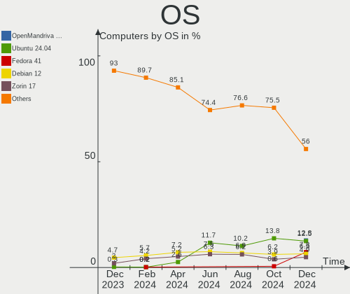
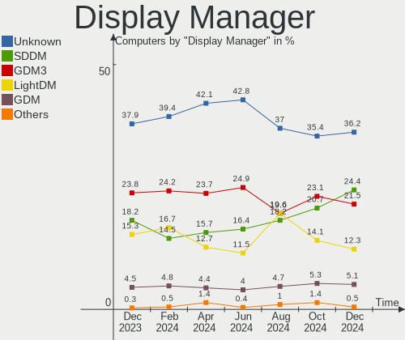
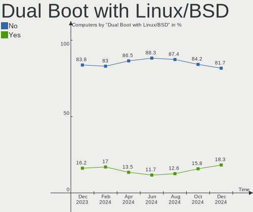
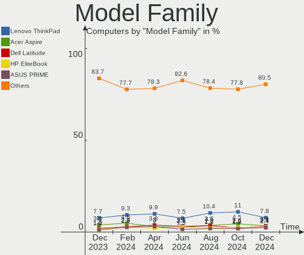
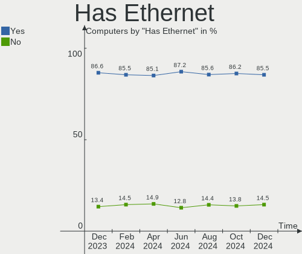
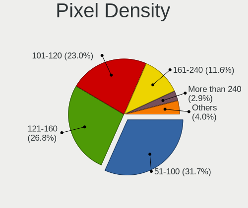
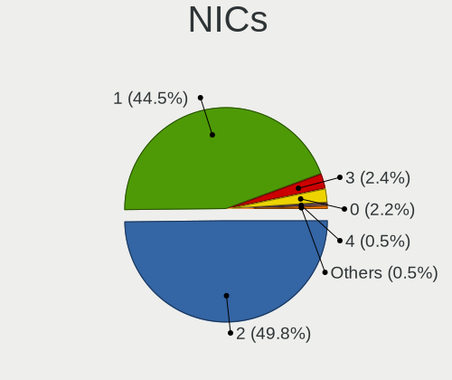
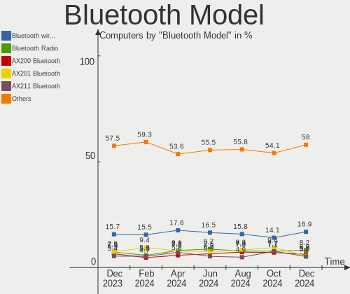

Linux in Germany - Hardware Trends
----------------------------------

A project to identify most popular hardware characteristics and track their change
over time based on data collected by Linux users at https://Linux-Hardware.org.

Anyone can contribute to this report by the [hw-probe](https://github.com/linuxhw/hw-probe) tool:

    sudo -E hw-probe -all -upload

This is a report for all computer types. See also reports for [desktops](/Location/Germany/Desktop/README.md) and [notebooks](/Location/Germany/Notebook/README.md).

Period: Sep, 2022.

Contents
--------

* [ System ](#system)
  - [ OS                       ](#os)
  - [ OS Family                ](#os-family)
  - [ Kernel                   ](#kernel)
  - [ Kernel Family            ](#kernel-family)
  - [ Kernel Major Ver.        ](#kernel-major-ver)
  - [ Arch                     ](#arch)
  - [ DE                       ](#de)
  - [ Display Server           ](#display-server)
  - [ Display Manager          ](#display-manager)
  - [ OS Lang                  ](#os-lang)
  - [ Boot Mode                ](#boot-mode)
  - [ Filesystem               ](#filesystem)
  - [ Part. scheme             ](#part-scheme)
  - [ Dual Boot with Linux/BSD ](#dual-boot-with-linuxbsd)
  - [ Dual Boot (Win)          ](#dual-boot-win)

* [ Board ](#board)
  - [ Vendor                   ](#vendor)
  - [ Model                    ](#model)
  - [ Model Family             ](#model-family)
  - [ MFG Year                 ](#mfg-year)
  - [ Form Factor              ](#form-factor)
  - [ Secure Boot              ](#secure-boot)
  - [ Coreboot                 ](#coreboot)
  - [ RAM Size                 ](#ram-size)
  - [ RAM Used                 ](#ram-used)
  - [ Total Drives             ](#total-drives)
  - [ Has CD-ROM               ](#has-cd-rom)
  - [ Has Ethernet             ](#has-ethernet)
  - [ Has WiFi                 ](#has-wifi)
  - [ Has Bluetooth            ](#has-bluetooth)

* [ Location ](#location)
  - [ Country                  ](#country)
  - [ City                     ](#city)

* [ Drives ](#drives)
  - [ Drive Vendor             ](#drive-vendor)
  - [ Drive Model              ](#drive-model)
  - [ HDD Vendor               ](#hdd-vendor)
  - [ SSD Vendor               ](#ssd-vendor)
  - [ Drive Kind               ](#drive-kind)
  - [ Drive Connector          ](#drive-connector)
  - [ Drive Size               ](#drive-size)
  - [ Space Total              ](#space-total)
  - [ Space Used               ](#space-used)
  - [ Malfunc. Drives          ](#malfunc-drives)
  - [ Malfunc. Drive Vendor    ](#malfunc-drive-vendor)
  - [ Malfunc. HDD Vendor      ](#malfunc-hdd-vendor)
  - [ Malfunc. Drive Kind      ](#malfunc-drive-kind)
  - [ Failed Drives            ](#failed-drives)
  - [ Failed Drive Vendor      ](#failed-drive-vendor)
  - [ Drive Status             ](#drive-status)

* [ Storage controller ](#storage-controller)
  - [ Storage Vendor           ](#storage-vendor)
  - [ Storage Model            ](#storage-model)
  - [ Storage Kind             ](#storage-kind)

* [ Processor ](#processor)
  - [ CPU Vendor               ](#cpu-vendor)
  - [ CPU Model                ](#cpu-model)
  - [ CPU Model Family         ](#cpu-model-family)
  - [ CPU Cores                ](#cpu-cores)
  - [ CPU Sockets              ](#cpu-sockets)
  - [ CPU Threads              ](#cpu-threads)
  - [ CPU Op-Modes             ](#cpu-op-modes)
  - [ CPU Microcode            ](#cpu-microcode)
  - [ CPU Microarch            ](#cpu-microarch)

* [ Graphics ](#graphics)
  - [ GPU Vendor               ](#gpu-vendor)
  - [ GPU Model                ](#gpu-model)
  - [ GPU Combo                ](#gpu-combo)
  - [ GPU Driver               ](#gpu-driver)
  - [ GPU Memory               ](#gpu-memory)

* [ Monitor ](#monitor)
  - [ Monitor Vendor           ](#monitor-vendor)
  - [ Monitor Model            ](#monitor-model)
  - [ Monitor Resolution       ](#monitor-resolution)
  - [ Monitor Diagonal         ](#monitor-diagonal)
  - [ Monitor Width            ](#monitor-width)
  - [ Aspect Ratio             ](#aspect-ratio)
  - [ Monitor Area             ](#monitor-area)
  - [ Pixel Density            ](#pixel-density)
  - [ Multiple Monitors        ](#multiple-monitors)

* [ Network ](#network)
  - [ Net Controller Vendor    ](#net-controller-vendor)
  - [ Net Controller Model     ](#net-controller-model)
  - [ Wireless Vendor          ](#wireless-vendor)
  - [ Wireless Model           ](#wireless-model)
  - [ Ethernet Vendor          ](#ethernet-vendor)
  - [ Ethernet Model           ](#ethernet-model)
  - [ Net Controller Kind      ](#net-controller-kind)
  - [ Used Controller          ](#used-controller)
  - [ NICs                     ](#nics)
  - [ IPv6                     ](#ipv6)

* [ Bluetooth ](#bluetooth)
  - [ Bluetooth Vendor         ](#bluetooth-vendor)
  - [ Bluetooth Model          ](#bluetooth-model)

* [ Sound ](#sound)
  - [ Sound Vendor             ](#sound-vendor)
  - [ Sound Model              ](#sound-model)

* [ Memory ](#memory)
  - [ Memory Vendor            ](#memory-vendor)
  - [ Memory Model             ](#memory-model)
  - [ Memory Kind              ](#memory-kind)
  - [ Memory Form Factor       ](#memory-form-factor)
  - [ Memory Size              ](#memory-size)
  - [ Memory Speed             ](#memory-speed)

* [ Printers & scanners ](#printers--scanners)
  - [ Printer Vendor           ](#printer-vendor)
  - [ Printer Model            ](#printer-model)
  - [ Scanner Vendor           ](#scanner-vendor)
  - [ Scanner Model            ](#scanner-model)

* [ Camera ](#camera)
  - [ Camera Vendor            ](#camera-vendor)
  - [ Camera Model             ](#camera-model)

* [ Security ](#security)
  - [ Fingerprint Vendor       ](#fingerprint-vendor)
  - [ Fingerprint Model        ](#fingerprint-model)
  - [ Chipcard Vendor          ](#chipcard-vendor)
  - [ Chipcard Model           ](#chipcard-model)

* [ Unsupported ](#unsupported)
  - [ Unsupported Devices      ](#unsupported-devices)
  - [ Unsupported Device Types ](#unsupported-device-types)

System
------

OS
--

Installed operating systems

| Name                         | Computers | Percent |
|------------------------------|-----------|---------|
| Ubuntu 22.04                 | 101       | 20.28%  |
| Linux Mint 21                | 48        | 9.64%   |
| Fedora 36                    | 42        | 8.43%   |
| Debian 11                    | 34        | 6.83%   |
| Ubuntu 20.04                 | 32        | 6.43%   |
| Zorin 16                     | 19        | 3.82%   |
| OpenMandriva 4.3             | 18        | 3.61%   |
| Linux Mint 20.3              | 18        | 3.61%   |
| Arch                         | 10        | 2.01%   |
| Pop!_OS 22.04                | 8         | 1.61%   |
| OpenMandriva 4.50            | 8         | 1.61%   |
| KDE neon 20.04               | 8         | 1.61%   |
| SteamOS 3.3.1                | 7         | 1.41%   |
| Manjaro 22.0.0               | 7         | 1.41%   |
| Xubuntu 22.04                | 6         | 1.2%    |
| Gentoo 2.8                   | 6         | 1.2%    |
| Fedora 37                    | 6         | 1.2%    |
| openSUSE Tumbleweed-XXXXXXXX | 5         | 1%      |
| Manjaro                      | 5         | 1%      |
| Kubuntu 22.04                | 5         | 1%      |
| Kubuntu 20.04                | 5         | 1%      |
| Ubuntu MATE 22.04            | 4         | 0.8%    |
| openSUSE Leap-15.4           | 4         | 0.8%    |
| MX 21                        | 4         | 0.8%    |
| LMDE 5                       | 4         | 0.8%    |
| Kali 2022.3                  | 4         | 0.8%    |
| Elementary 6.1               | 4         | 0.8%    |
| Debian Testing               | 4         | 0.8%    |
| OpenMandriva 4.2             | 3         | 0.6%    |
| NixOS 22.05                  | 3         | 0.6%    |
| Arch Rolling                 | 3         | 0.6%    |
| AlmaLinux 8.6                | 3         | 0.6%    |
| Ubuntu Studio 22.04          | 2         | 0.4%    |
| Ubuntu 22.10                 | 2         | 0.4%    |
| org.kde.Platform 5.15-21.08  | 2         | 0.4%    |
| Nobara 36                    | 2         | 0.4%    |
| Linux Mint 20.2              | 2         | 0.4%    |
| Linux Mint 20.1              | 2         | 0.4%    |
| Kubuntu 11                   | 2         | 0.4%    |
| KDE neon 22.04               | 2         | 0.4%    |

OS Family
---------

OS without a version

| Name             | Computers | Percent |
|------------------|-----------|---------|
| Ubuntu           | 137       | 27.51%  |
| Linux Mint       | 70        | 14.06%  |
| Fedora           | 49        | 9.84%   |
| Debian           | 40        | 8.03%   |
| OpenMandriva     | 29        | 5.82%   |
| Zorin            | 19        | 3.82%   |
| Manjaro          | 13        | 2.61%   |
| Arch             | 13        | 2.61%   |
| Kubuntu          | 12        | 2.41%   |
| openSUSE         | 10        | 2.01%   |
| KDE neon         | 10        | 2.01%   |
| Xubuntu          | 9         | 1.81%   |
| SteamOS          | 9         | 1.81%   |
| Pop!_OS          | 8         | 1.61%   |
| Gentoo           | 6         | 1.2%    |
| LMDE             | 5         | 1%      |
| Ubuntu MATE      | 4         | 0.8%    |
| MX               | 4         | 0.8%    |
| Kali             | 4         | 0.8%    |
| Elementary       | 4         | 0.8%    |
| NixOS            | 3         | 0.6%    |
| Endless          | 3         | 0.6%    |
| EndeavourOS      | 3         | 0.6%    |
| AlmaLinux        | 3         | 0.6%    |
| Ubuntu Studio    | 2         | 0.4%    |
| ROSA             | 2         | 0.4%    |
| org.kde.Platform | 2         | 0.4%    |
| Nobara           | 2         | 0.4%    |
| Crystal Linux    | 2         | 0.4%    |
| Clear Linux      | 2         | 0.4%    |
| CentOS           | 2         | 0.4%    |
| BlackPanther     | 2         | 0.4%    |
| ArcoLinux        | 2         | 0.4%    |
| Ubuntu Budgie    | 1         | 0.2%    |
| Slackware        | 1         | 0.2%    |
| Rocky Linux      | 1         | 0.2%    |
| Reborn OS        | 1         | 0.2%    |
| Parrot           | 1         | 0.2%    |
| OpenWrt          | 1         | 0.2%    |
| Makulu           | 1         | 0.2%    |

Kernel
------

Version of the Linux kernel

| Version                                        | Computers | Percent |
|------------------------------------------------|-----------|---------|
| 5.15.0-47-generic                              | 88        | 17.67%  |
| 5.15.0-48-generic                              | 69        | 13.86%  |
| 5.15.0-46-generic                              | 40        | 8.03%   |
| 5.16.7-desktop-1omv4003                        | 18        | 3.61%   |
| 5.4.0-125-generic                              | 17        | 3.41%   |
| 5.10.0-18-amd64                                | 13        | 2.61%   |
| 5.10.0-17-amd64                                | 12        | 2.41%   |
| 5.19.8-200.fc36.x86_64                         | 11        | 2.21%   |
| 5.4.0-126-generic                              | 9         | 1.81%   |
| 5.19.9-200.fc36.x86_64                         | 8         | 1.61%   |
| 5.19.5-desktop-1omv4090                        | 7         | 1.41%   |
| 5.19.0-76051900-generic                        | 7         | 1.41%   |
| 5.13.0-valve21.1-1-neptune-02211-gc54cda5a36f3 | 7         | 1.41%   |
| 5.19.6-200.fc36.x86_64                         | 6         | 1.2%    |
| 5.19.11-200.fc36.x86_64                        | 6         | 1.2%    |
| 5.15.0-41-generic                              | 6         | 1.2%    |
| 5.19.7-1-MANJARO                               | 5         | 1%      |
| 5.15.65-1-MANJARO                              | 5         | 1%      |
| 5.15.0-43-generic                              | 5         | 1%      |
| 5.19.9-arch1-1                                 | 4         | 0.8%    |
| 5.19.8-1-default                               | 4         | 0.8%    |
| 5.19.6-arch1-1                                 | 4         | 0.8%    |
| 5.19.4-200.fc36.x86_64                         | 4         | 0.8%    |
| 5.19.0-1-amd64                                 | 4         | 0.8%    |
| 5.19.9-300.fc37.x86_64                         | 3         | 0.6%    |
| 5.19.7-arch1-1                                 | 3         | 0.6%    |
| 5.18.0-0.deb11.4-amd64                         | 3         | 0.6%    |
| 5.15.59-gentoo-x86_64                          | 3         | 0.6%    |
| 5.15.53-1-pve                                  | 3         | 0.6%    |
| 5.11.0-35-generic                              | 3         | 0.6%    |
| 5.10.14-desktop-1omv4002                       | 3         | 0.6%    |
| 5.8.0-63-generic                               | 2         | 0.4%    |
| 5.19.8-arch1-1                                 | 2         | 0.4%    |
| 5.19.8-300.fc37.x86_64                         | 2         | 0.4%    |
| 5.19.7-200.fc36.x86_64                         | 2         | 0.4%    |
| 5.19.5-051905-generic                          | 2         | 0.4%    |
| 5.19.10-200.fc36.x86_64                        | 2         | 0.4%    |
| 5.18.19                                        | 2         | 0.4%    |
| 5.18.0-kali7-amd64                             | 2         | 0.4%    |
| 5.18.0-4-amd64                                 | 2         | 0.4%    |

Kernel Family
-------------

Linux kernel without a distro release

| Version | Computers | Percent |
|---------|-----------|---------|
| 5.15.0  | 218       | 43.78%  |
| 5.4.0   | 34        | 6.83%   |
| 5.10.0  | 30        | 6.02%   |
| 5.19.8  | 19        | 3.82%   |
| 5.16.7  | 18        | 3.61%   |
| 5.19.9  | 16        | 3.21%   |
| 5.19.7  | 15        | 3.01%   |
| 5.19.0  | 15        | 3.01%   |
| 5.13.0  | 13        | 2.61%   |
| 5.19.6  | 11        | 2.21%   |
| 5.18.0  | 11        | 2.21%   |
| 5.19.5  | 10        | 2.01%   |
| 5.19.11 | 10        | 2.01%   |
| 5.19.4  | 6         | 1.2%    |
| 5.15.65 | 6         | 1.2%    |
| 5.19.10 | 4         | 0.8%    |
| 5.14.21 | 4         | 0.8%    |
| 5.11.0  | 4         | 0.8%    |
| 4.18.0  | 4         | 0.8%    |
| 5.8.0   | 3         | 0.6%    |
| 5.15.59 | 3         | 0.6%    |
| 5.15.53 | 3         | 0.6%    |
| 5.10.14 | 3         | 0.6%    |
| 5.19.2  | 2         | 0.4%    |
| 5.18.19 | 2         | 0.4%    |
| 5.18.17 | 2         | 0.4%    |
| 5.16.13 | 2         | 0.4%    |
| 5.15.63 | 2         | 0.4%    |
| 5.15.61 | 2         | 0.4%    |
| 5.15.45 | 2         | 0.4%    |
| 4.18.16 | 2         | 0.4%    |
| 5.4.83  | 1         | 0.2%    |
| 5.4.188 | 1         | 0.2%    |
| 5.3.18  | 1         | 0.2%    |
| 5.19.12 | 1         | 0.2%    |
| 5.19.1  | 1         | 0.2%    |
| 5.18.10 | 1         | 0.2%    |
| 5.17.7  | 1         | 0.2%    |
| 5.17.5  | 1         | 0.2%    |
| 5.17.0  | 1         | 0.2%    |

Kernel Major Ver.
-----------------

Linux kernel major version

| Version | Computers | Percent |
|---------|-----------|---------|
| 5.15    | 242       | 48.59%  |
| 5.19    | 110       | 22.09%  |
| 5.4     | 36        | 7.23%   |
| 5.10    | 34        | 6.83%   |
| 5.16    | 20        | 4.02%   |
| 5.18    | 16        | 3.21%   |
| 5.13    | 13        | 2.61%   |
| 4.18    | 6         | 1.2%    |
| 5.14    | 5         | 1%      |
| 5.11    | 4         | 0.8%    |
| 5.8     | 3         | 0.6%    |
| 5.17    | 3         | 0.6%    |
| 4.19    | 3         | 0.6%    |
| 5.3     | 1         | 0.2%    |
| 4.14    | 1         | 0.2%    |
| 3.10    | 1         | 0.2%    |

Arch
----

OS architecture (x86_64, i586, etc.)

| Name    | Computers | Percent |
|---------|-----------|---------|
| x86_64  | 486       | 97.59%  |
| aarch64 | 8         | 1.61%   |
| armv7l  | 2         | 0.4%    |
| mips    | 1         | 0.2%    |
| i686    | 1         | 0.2%    |

DE
--

Desktop Environment

| Name             | Computers | Percent |
|------------------|-----------|---------|
| GNOME            | 227       | 45.58%  |
| KDE5             | 96        | 19.28%  |
| X-Cinnamon       | 65        | 13.05%  |
| XFCE             | 36        | 7.23%   |
| Unknown          | 26        | 5.22%   |
| MATE             | 15        | 3.01%   |
| Cinnamon         | 5         | 1%      |
| Pantheon         | 4         | 0.8%    |
| LXQt             | 4         | 0.8%    |
| Budgie           | 4         | 0.8%    |
| i3               | 3         | 0.6%    |
| trinity          | 2         | 0.4%    |
| sway             | 2         | 0.4%    |
| LXDE             | 2         | 0.4%    |
| xmonad           | 1         | 0.2%    |
| lightdm-xsession | 1         | 0.2%    |
| KDE:old          | 1         | 0.2%    |
| Hyprland         | 1         | 0.2%    |
| herbstluftwm     | 1         | 0.2%    |
| GNOME Flashback  | 1         | 0.2%    |
| Deepin           | 1         | 0.2%    |

Display Server
--------------

X11 or Wayland

| Name    | Computers | Percent |
|---------|-----------|---------|
| X11     | 339       | 68.07%  |
| Wayland | 131       | 26.31%  |
| Tty     | 22        | 4.42%   |
| Unknown | 6         | 1.2%    |

Display Manager
---------------

SDDM, LightDM, etc.

| Name    | Computers | Percent |
|---------|-----------|---------|
| Unknown | 185       | 37.15%  |
| GDM3    | 136       | 27.31%  |
| LightDM | 81        | 16.27%  |
| SDDM    | 62        | 12.45%  |
| GDM     | 30        | 6.02%   |
| XDM     | 2         | 0.4%    |
| SLiM    | 1         | 0.2%    |
| Ly      | 1         | 0.2%    |

OS Lang
-------

Language

| Lang    | Computers | Percent |
|---------|-----------|---------|
| de_DE   | 363       | 72.89%  |
| en_US   | 93        | 18.67%  |
| en_GB   | 15        | 3.01%   |
| C       | 8         | 1.61%   |
| Unknown | 3         | 0.6%    |
| pl_PL   | 2         | 0.4%    |
| nl_NL   | 2         | 0.4%    |
| en_DE   | 2         | 0.4%    |
| en_AG   | 2         | 0.4%    |
| ru_RU   | 1         | 0.2%    |
| ro_RO   | 1         | 0.2%    |
| en_SG   | 1         | 0.2%    |
| en_DK   | 1         | 0.2%    |
| en_AU   | 1         | 0.2%    |
| de_LI   | 1         | 0.2%    |
| de_CH   | 1         | 0.2%    |
| C.UTF8  | 1         | 0.2%    |

Boot Mode
---------

EFI or BIOS

| Mode | Computers | Percent |
|------|-----------|---------|
| BIOS | 271       | 54.42%  |
| EFI  | 227       | 45.58%  |

Filesystem
----------

Type of filesystem

| Type    | Computers | Percent |
|---------|-----------|---------|
| Ext4    | 378       | 75.9%   |
| Btrfs   | 72        | 14.46%  |
| Overlay | 36        | 7.23%   |
| Zfs     | 6         | 1.2%    |
| Xfs     | 5         | 1%      |
| XXXXXXX | 1         | 0.2%    |

Part. scheme
------------

Scheme of partitioning

| Type    | Computers | Percent |
|---------|-----------|---------|
| Unknown | 285       | 57.23%  |
| GPT     | 175       | 35.14%  |
| MBR     | 38        | 7.63%   |

Dual Boot with Linux/BSD
------------------------

Hosting more than one Linux/BSD

| Dual boot | Computers | Percent |
|-----------|-----------|---------|
| No        | 434       | 87.15%  |
| Yes       | 64        | 12.85%  |

Dual Boot (Win)
---------------

Hosting Linux and Windows

| Dual boot | Computers | Percent |
|-----------|-----------|---------|
| No        | 362       | 72.69%  |
| Yes       | 136       | 27.31%  |

Board
-----

Vendor
------

Motherboard manufacturer

| Name                    | Computers | Percent |
|-------------------------|-----------|---------|
| Lenovo                  | 81        | 16.27%  |
| ASUSTek Computer        | 81        | 16.27%  |
| Dell                    | 51        | 10.24%  |
| Hewlett-Packard         | 50        | 10.04%  |
| Gigabyte Technology     | 33        | 6.63%   |
| MSI                     | 27        | 5.42%   |
| ASRock                  | 26        | 5.22%   |
| Acer                    | 23        | 4.62%   |
| Medion                  | 14        | 2.81%   |
| Valve                   | 10        | 2.01%   |
| Fujitsu                 | 9         | 1.81%   |
| Samsung Electronics     | 8         | 1.61%   |
| HUAWEI                  | 8         | 1.61%   |
| Raspberry Pi Foundation | 7         | 1.41%   |
| Intel                   | 7         | 1.41%   |
| Apple                   | 7         | 1.41%   |
| Unknown                 | 6         | 1.2%    |
| TUXEDO                  | 4         | 0.8%    |
| Microsoft               | 4         | 0.8%    |
| Toshiba                 | 3         | 0.6%    |
| Notebook                | 3         | 0.6%    |
| Fujitsu Siemens         | 3         | 0.6%    |
| ASRockRack              | 3         | 0.6%    |
| Tactus                  | 2         | 0.4%    |
| Sony                    | 2         | 0.4%    |
| Schenker                | 2         | 0.4%    |
| Pegatron                | 2         | 0.4%    |
| Packard Bell            | 2         | 0.4%    |
| Biostar                 | 2         | 0.4%    |
| BESSTAR Tech            | 2         | 0.4%    |
| Wortmann AG             | 1         | 0.2%    |
| VALE                    | 1         | 0.2%    |
| Timi                    | 1         | 0.2%    |
| System76                | 1         | 0.2%    |
| Supermicro              | 1         | 0.2%    |
| SIEMENS                 | 1         | 0.2%    |
| Shuttle                 | 1         | 0.2%    |
| Rockchip                | 1         | 0.2%    |
| Panasonic               | 1         | 0.2%    |
| OEM                     | 1         | 0.2%    |

Model
-----

Motherboard model

| Name                                              | Computers | Percent |
|---------------------------------------------------|-----------|---------|
| Valve Jupiter                                     | 10        | 2.01%   |
| Unknown                                           | 8         | 1.61%   |
| ASUS All Series                                   | 6         | 1.2%    |
| MSI MS-7C37                                       | 3         | 0.6%    |
| MSI MS-7B86                                       | 3         | 0.6%    |
| HUAWEI KLVL-WXXW                                  | 3         | 0.6%    |
| TUXEDO Pulse 15 Gen1                              | 2         | 0.4%    |
| Samsung RV420/RV520/RV720/E3530/S3530/E3420/E3520 | 2         | 0.4%    |
| RPi Raspberry Pi 4 Model B Rev 1.5                | 2         | 0.4%    |
| RPi Raspberry Pi                                  | 2         | 0.4%    |
| MSI MS-7D22                                       | 2         | 0.4%    |
| MSI MS-7C56                                       | 2         | 0.4%    |
| MSI MS-7B79                                       | 2         | 0.4%    |
| Medion MS-7707                                    | 2         | 0.4%    |
| Lenovo ThinkPad P14s Gen 1 20Y1000AGE             | 2         | 0.4%    |
| HUAWEI KPL-W0X                                    | 2         | 0.4%    |
| HP ProBook 6560b                                  | 2         | 0.4%    |
| Gigabyte Z77-DS3H                                 | 2         | 0.4%    |
| Dell OptiPlex 7010                                | 2         | 0.4%    |
| Dell Latitude E7470                               | 2         | 0.4%    |
| Dell Latitude 7430                                | 2         | 0.4%    |
| Dell Latitude 5290 2-in-1                         | 2         | 0.4%    |
| ASUS ROG STRIX Z690-A GAMING WIFI D4              | 2         | 0.4%    |
| ASUS ROG STRIX X570-F GAMING                      | 2         | 0.4%    |
| ASUS ROG STRIX B450-F GAMING                      | 2         | 0.4%    |
| ASUS N750JV                                       | 2         | 0.4%    |
| ASUS M5A78L-M LX3                                 | 2         | 0.4%    |
| ASRockRack 520001                                 | 2         | 0.4%    |
| ASRock X300M-STX                                  | 2         | 0.4%    |
| ASRock Q1900M                                     | 2         | 0.4%    |
| ASRock Q1900-ITX                                  | 2         | 0.4%    |
| ASRock B450 Pro4                                  | 2         | 0.4%    |
| Apple MacBookPro8,2                               | 2         | 0.4%    |
| Acer Aspire 5750G                                 | 2         | 0.4%    |
| Wortmann AG TERRA_PAD_1061                        | 1         | 0.2%    |
| VALE Notebook Classic C140                        | 1         | 0.2%    |
| TUXEDO N8xEJEK                                    | 1         | 0.2%    |
| TUXEDO Book BA1510                                | 1         | 0.2%    |
| Toshiba TECRA M10                                 | 1         | 0.2%    |
| Toshiba Satellite C70D-A                          | 1         | 0.2%    |

Model Family
------------

Motherboard model prefix

| Name                | Computers | Percent |
|---------------------|-----------|---------|
| Lenovo ThinkPad     | 45        | 9.04%   |
| Dell Latitude       | 21        | 4.22%   |
| Acer Aspire         | 16        | 3.21%   |
| Valve Jupiter       | 10        | 2.01%   |
| HP Compaq           | 10        | 2.01%   |
| ASUS ROG            | 10        | 2.01%   |
| ASUS VivoBook       | 9         | 1.81%   |
| Lenovo ThinkCentre  | 8         | 1.61%   |
| ASUS PRIME          | 8         | 1.61%   |
| Unknown             | 8         | 1.61%   |
| RPi Raspberry       | 7         | 1.41%   |
| Dell Precision      | 7         | 1.41%   |
| Lenovo IdeaPad      | 6         | 1.2%    |
| HP Laptop           | 6         | 1.2%    |
| ASUS All            | 6         | 1.2%    |
| Lenovo Yoga         | 5         | 1%      |
| HP Pavilion         | 5         | 1%      |
| HP EliteBook        | 5         | 1%      |
| Dell XPS            | 5         | 1%      |
| Dell Inspiron       | 5         | 1%      |
| Microsoft Surface   | 4         | 0.8%    |
| HP EliteDesk        | 4         | 0.8%    |
| Dell OptiPlex       | 4         | 0.8%    |
| MSI MS-7C37         | 3         | 0.6%    |
| MSI MS-7B86         | 3         | 0.6%    |
| Medion Akoya        | 3         | 0.6%    |
| Lenovo ThinkStation | 3         | 0.6%    |
| Lenovo ThinkBook    | 3         | 0.6%    |
| HUAWEI KLVL-WXXW    | 3         | 0.6%    |
| HP ProBook          | 3         | 0.6%    |
| Fujitsu ESPRIMO     | 3         | 0.6%    |
| ASUS TUF            | 3         | 0.6%    |
| ASUS M5A78L-M       | 3         | 0.6%    |
| TUXEDO Pulse        | 2         | 0.4%    |
| Toshiba Satellite   | 2         | 0.4%    |
| Samsung RV420       | 2         | 0.4%    |
| MSI MS-7D22         | 2         | 0.4%    |
| MSI MS-7C56         | 2         | 0.4%    |
| MSI MS-7B79         | 2         | 0.4%    |
| Medion MS-7707      | 2         | 0.4%    |

MFG Year
--------

Motherboard manufacture year

| Year    | Computers | Percent |
|---------|-----------|---------|
| 2020    | 53        | 10.64%  |
| 2021    | 51        | 10.24%  |
| 2018    | 43        | 8.63%   |
| 2012    | 41        | 8.23%   |
| 2011    | 40        | 8.03%   |
| 2022    | 39        | 7.83%   |
| 2019    | 38        | 7.63%   |
| 2014    | 30        | 6.02%   |
| 2013    | 28        | 5.62%   |
| 2010    | 22        | 4.42%   |
| 2017    | 21        | 4.22%   |
| 2015    | 20        | 4.02%   |
| 2016    | 18        | 3.61%   |
| 2009    | 17        | 3.41%   |
| 2007    | 14        | 2.81%   |
| Unknown | 12        | 2.41%   |
| 2008    | 8         | 1.61%   |
| 2006    | 2         | 0.4%    |
| 2005    | 1         | 0.2%    |

Form Factor
-----------

Physical design of the computer

| Name           | Computers | Percent |
|----------------|-----------|---------|
| Notebook       | 240       | 48.19%  |
| Desktop        | 199       | 39.96%  |
| Convertible    | 18        | 3.61%   |
| Tablet         | 11        | 2.21%   |
| Mini pc        | 11        | 2.21%   |
| System on chip | 10        | 2.01%   |
| All in one     | 4         | 0.8%    |
| Server         | 4         | 0.8%    |
| Other          | 1         | 0.2%    |

Secure Boot
-----------

Enabled or disabled

| State    | Computers | Percent |
|----------|-----------|---------|
| Disabled | 465       | 93.37%  |
| Enabled  | 33        | 6.63%   |

Coreboot
--------

Have coreboot on board

| Used | Computers | Percent |
|------|-----------|---------|
| No   | 493       | 99%     |
| Yes  | 5         | 1%      |

RAM Size
--------

Total RAM memory

| Size in GB  | Computers | Percent |
|-------------|-----------|---------|
| 16.01-24.0  | 107       | 21.49%  |
| 4.01-8.0    | 106       | 21.29%  |
| 8.01-16.0   | 105       | 21.08%  |
| 3.01-4.0    | 79        | 15.86%  |
| 32.01-64.0  | 54        | 10.84%  |
| 1.01-2.0    | 16        | 3.21%   |
| 64.01-256.0 | 12        | 2.41%   |
| 24.01-32.0  | 10        | 2.01%   |
| 2.01-3.0    | 6         | 1.2%    |
| 0.51-1.0    | 2         | 0.4%    |
| 0.01-0.5    | 1         | 0.2%    |

RAM Used
--------

Used RAM memory

| Used GB     | Computers | Percent |
|-------------|-----------|---------|
| 1.01-2.0    | 165       | 33.13%  |
| 2.01-3.0    | 128       | 25.7%   |
| 3.01-4.0    | 76        | 15.26%  |
| 4.01-8.0    | 59        | 11.85%  |
| 0.51-1.0    | 33        | 6.63%   |
| 8.01-16.0   | 24        | 4.82%   |
| 0.01-0.5    | 8         | 1.61%   |
| 16.01-24.0  | 2         | 0.4%    |
| 24.01-32.0  | 1         | 0.2%    |
| 64.01-256.0 | 1         | 0.2%    |
| 0           | 1         | 0.2%    |

Total Drives
------------

Number of drives on board

| Drives | Computers | Percent |
|--------|-----------|---------|
| 1      | 267       | 53.61%  |
| 2      | 140       | 28.11%  |
| 3      | 37        | 7.43%   |
| 4      | 24        | 4.82%   |
| 5      | 12        | 2.41%   |
| 6      | 8         | 1.61%   |
| 0      | 4         | 0.8%    |
| 8      | 2         | 0.4%    |
| 7      | 2         | 0.4%    |
| 17     | 1         | 0.2%    |
| 13     | 1         | 0.2%    |

Has CD-ROM
----------

Has CD-ROM on board

| Presented | Computers | Percent |
|-----------|-----------|---------|
| No        | 295       | 59.24%  |
| Yes       | 203       | 40.76%  |

Has Ethernet
------------

Has Ethernet on board

| Presented | Computers | Percent |
|-----------|-----------|---------|
| Yes       | 421       | 84.54%  |
| No        | 77        | 15.46%  |

Has WiFi
--------

Has WiFi module

| Presented | Computers | Percent |
|-----------|-----------|---------|
| Yes       | 354       | 71.08%  |
| No        | 144       | 28.92%  |

Has Bluetooth
-------------

Has Bluetooth module

| Presented | Computers | Percent |
|-----------|-----------|---------|
| Yes       | 286       | 57.43%  |
| No        | 212       | 42.57%  |

Location
--------

Country
-------

Geographic location (country)

| Country | Computers | Percent |
|---------|-----------|---------|
| Germany | 498       | 100%    |

City
----

Geographic location (city)

| City                 | Computers | Percent |
|----------------------|-----------|---------|
| Berlin               | 35        | 7.03%   |
| Hamburg              | 28        | 5.62%   |
| Munich               | 24        | 4.82%   |
| Frankfurt am Main    | 21        | 4.22%   |
| Cologne              | 9         | 1.81%   |
| Aachen               | 7         | 1.41%   |
| Stuttgart            | 6         | 1.2%    |
| Düsseldorf          | 6         | 1.2%    |
| Dresden              | 6         | 1.2%    |
| Nuremberg            | 5         | 1%      |
| Mannheim             | 5         | 1%      |
| Darmstadt            | 5         | 1%      |
| Karlsruhe            | 4         | 0.8%    |
| Freiburg im Breisgau | 4         | 0.8%    |
| Braunschweig         | 4         | 0.8%    |
| Bonn                 | 4         | 0.8%    |
| Witten               | 3         | 0.6%    |
| Wiesbaden            | 3         | 0.6%    |
| Saarlouis            | 3         | 0.6%    |
| Pforzheim            | 3         | 0.6%    |
| Osnabrück           | 3         | 0.6%    |
| Ludwigsburg          | 3         | 0.6%    |
| Lübeck              | 3         | 0.6%    |
| Leipzig              | 3         | 0.6%    |
| Landau               | 3         | 0.6%    |
| Krefeld              | 3         | 0.6%    |
| Hürth               | 3         | 0.6%    |
| Fürth               | 3         | 0.6%    |
| Essen                | 3         | 0.6%    |
| Erfurt               | 3         | 0.6%    |
| Wunstorf             | 2         | 0.4%    |
| Wendeburg            | 2         | 0.4%    |
| Velbert              | 2         | 0.4%    |
| Ulm                  | 2         | 0.4%    |
| Troisdorf            | 2         | 0.4%    |
| Solms                | 2         | 0.4%    |
| Regensburg           | 2         | 0.4%    |
| Offenburg            | 2         | 0.4%    |
| Oberndorf            | 2         | 0.4%    |
| Oberkotzau           | 2         | 0.4%    |

Drives
------

Drive Vendor
------------

Hard drive vendors

| Vendor                         | Computers | Drives | Percent |
|--------------------------------|-----------|--------|---------|
| Samsung Electronics            | 164       | 228    | 21.58%  |
| WDC                            | 103       | 131    | 13.55%  |
| Seagate                        | 79        | 105    | 10.39%  |
| SanDisk                        | 56        | 62     | 7.37%   |
| Toshiba                        | 39        | 45     | 5.13%   |
| Unknown                        | 38        | 46     | 5%      |
| Kingston                       | 35        | 37     | 4.61%   |
| Crucial                        | 29        | 33     | 3.82%   |
| Intenso                        | 27        | 29     | 3.55%   |
| SK hynix                       | 20        | 20     | 2.63%   |
| Hitachi                        | 20        | 22     | 2.63%   |
| Micron Technology              | 16        | 16     | 2.11%   |
| Intel                          | 15        | 19     | 1.97%   |
| HGST                           | 14        | 21     | 1.84%   |
| KIOXIA                         | 11        | 11     | 1.45%   |
| Micron/Crucial Technology      | 7         | 7      | 0.92%   |
| A-DATA Technology              | 6         | 6      | 0.79%   |
| Unknown                        | 6         | 6      | 0.79%   |
| Patriot                        | 5         | 5      | 0.66%   |
| Phison Electronics             | 4         | 5      | 0.53%   |
| Netac                          | 4         | 4      | 0.53%   |
| Maxtor                         | 4         | 5      | 0.53%   |
| LITEON                         | 4         | 4      | 0.53%   |
| Transcend                      | 3         | 3      | 0.39%   |
| SPCC                           | 3         | 3      | 0.39%   |
| Phison                         | 3         | 3      | 0.39%   |
| LITEONIT                       | 3         | 3      | 0.39%   |
| Leven                          | 3         | 3      | 0.39%   |
| Fujitsu                        | 3         | 3      | 0.39%   |
| ASMedia                        | 3         | 3      | 0.39%   |
| UMIS                           | 2         | 2      | 0.26%   |
| OCZ                            | 2         | 2      | 0.26%   |
| Kingston Technology Company    | 2         | 2      | 0.26%   |
| Emtec                          | 2         | 2      | 0.26%   |
| Verbatim                       | 1         | 1      | 0.13%   |
| Team                           | 1         | 1      | 0.13%   |
| TCSUNBOW                       | 1         | 1      | 0.13%   |
| Supermicro                     | 1         | 2      | 0.13%   |
| Solid State Storage Technology | 1         | 1      | 0.13%   |
| Silicon Motion                 | 1         | 1      | 0.13%   |

Drive Model
-----------

Hard drive models

| Model                                                 | Computers | Percent |
|-------------------------------------------------------|-----------|---------|
| Samsung NVMe SSD Controller SM981/PM981/PM983 256GB   | 16        | 1.85%   |
| Samsung SSD 860 EVO 500GB                             | 13        | 1.5%    |
| Samsung SSD 860 EVO 1TB                               | 9         | 1.04%   |
| Samsung SSD 850 EVO 250GB                             | 9         | 1.04%   |
| Sandisk WD Black SN750 / PC SN730 NVMe SSD 1024GB     | 7         | 0.81%   |
| Intenso SSD SATAIII 120GB                             | 7         | 0.81%   |
| Unknown MMC Card  32GB                                | 6         | 0.69%   |
| Toshiba MQ01ABD100 1TB                                | 6         | 0.69%   |
| Unknown                                               | 6         | 0.69%   |
| WDC WD30EFRX-68EUZN0 3TB                              | 5         | 0.58%   |
| WDC WD20EZRZ-00Z5HB0 2TB                              | 5         | 0.58%   |
| Samsung SSD 980 PRO 1TB                               | 5         | 0.58%   |
| Samsung SSD 970 EVO Plus 500GB                        | 5         | 0.58%   |
| Samsung SSD 840 EVO 250GB                             | 5         | 0.58%   |
| Samsung SSD 840 EVO 120GB                             | 5         | 0.58%   |
| Kingston NVMe SSD Drive 512GB                         | 5         | 0.58%   |
| WDC WDS500G2B0A-00SM50 500GB SSD                      | 4         | 0.46%   |
| WDC WD40EZRZ-00GXCB0 4TB                              | 4         | 0.46%   |
| Unknown SD/MMC/MS PRO 2GB                             | 4         | 0.46%   |
| Unknown MMC Card  64GB                                | 4         | 0.46%   |
| Unknown MMC Card  512GB                               | 4         | 0.46%   |
| Unknown MMC Card  128GB                               | 4         | 0.46%   |
| SK hynix NVMe SSD Drive 512GB                         | 4         | 0.46%   |
| Seagate ST9500325AS 500GB                             | 4         | 0.46%   |
| SanDisk SSD PLUS 240GB                                | 4         | 0.46%   |
| Samsung SSD 840 PRO Series 256GB                      | 4         | 0.46%   |
| Samsung NVMe SSD Drive 250GB                          | 4         | 0.46%   |
| Samsung NVMe SSD Drive 1TB                            | 4         | 0.46%   |
| Samsung NVMe SSD Controller PM9A1/PM9A3/980PRO 1024GB | 4         | 0.46%   |
| KIOXIA NVMe SSD Drive 512GB                           | 4         | 0.46%   |
| Crucial CT500MX500SSD1 500GB                          | 4         | 0.46%   |
| WDC WD10EZEX-08WN4A0 1TB                              | 3         | 0.35%   |
| Toshiba HDWD110 1TB                                   | 3         | 0.35%   |
| Seagate ST500DM002-1BD142 500GB                       | 3         | 0.35%   |
| Seagate ST1000LX015-1U7172 1TB                        | 3         | 0.35%   |
| Seagate ST1000LM048-2E7172 1TB                        | 3         | 0.35%   |
| Seagate ST1000LM035-1RK172 1TB                        | 3         | 0.35%   |
| Sandisk WD Blue SN550 NVMe SSD 1024GB                 | 3         | 0.35%   |
| SanDisk NVMe SSD Drive 512GB                          | 3         | 0.35%   |
| Samsung SSD 970 EVO 1TB                               | 3         | 0.35%   |

HDD Vendor
----------

Hard disk drive vendors

| Vendor              | Computers | Drives | Percent |
|---------------------|-----------|--------|---------|
| WDC                 | 87        | 110    | 33.85%  |
| Seagate             | 79        | 105    | 30.74%  |
| Toshiba             | 27        | 33     | 10.51%  |
| Hitachi             | 20        | 22     | 7.78%   |
| Samsung Electronics | 16        | 22     | 6.23%   |
| HGST                | 14        | 21     | 5.45%   |
| Unknown             | 4         | 4      | 1.56%   |
| Maxtor              | 4         | 5      | 1.56%   |
| Fujitsu             | 3         | 3      | 1.17%   |
| ASMedia             | 2         | 2      | 0.78%   |
| Intenso             | 1         | 1      | 0.39%   |

SSD Vendor
----------

Solid state drive vendors

| Vendor              | Computers | Drives | Percent |
|---------------------|-----------|--------|---------|
| Samsung Electronics | 87        | 107    | 32.95%  |
| SanDisk             | 34        | 36     | 12.88%  |
| Crucial             | 27        | 30     | 10.23%  |
| Intenso             | 22        | 23     | 8.33%   |
| Kingston            | 16        | 17     | 6.06%   |
| WDC                 | 12        | 12     | 4.55%   |
| Micron Technology   | 6         | 6      | 2.27%   |
| A-DATA Technology   | 6         | 6      | 2.27%   |
| Patriot             | 5         | 5      | 1.89%   |
| Intel               | 5         | 5      | 1.89%   |
| Toshiba             | 4         | 4      | 1.52%   |
| Netac               | 4         | 4      | 1.52%   |
| SPCC                | 3         | 3      | 1.14%   |
| LITEONIT            | 3         | 3      | 1.14%   |
| LITEON              | 3         | 3      | 1.14%   |
| Transcend           | 2         | 2      | 0.76%   |
| OCZ                 | 2         | 2      | 0.76%   |
| Leven               | 2         | 2      | 0.76%   |
| Emtec               | 2         | 2      | 0.76%   |
| Unknown             | 2         | 2      | 0.76%   |
| Verbatim            | 1         | 1      | 0.38%   |
| Team                | 1         | 1      | 0.38%   |
| TCSUNBOW            | 1         | 1      | 0.38%   |
| Supermicro          | 1         | 2      | 0.38%   |
| SK hynix            | 1         | 1      | 0.38%   |
| PNY                 | 1         | 1      | 0.38%   |
| Plextor             | 1         | 1      | 0.38%   |
| Phison              | 1         | 1      | 0.38%   |
| Mushkin             | 1         | 1      | 0.38%   |
| INNOVATION IT       | 1         | 1      | 0.38%   |
| GOODRAM             | 1         | 1      | 0.38%   |
| GLOWAY              | 1         | 1      | 0.38%   |
| GLOBAL              | 1         | 1      | 0.38%   |
| Dogfish             | 1         | 1      | 0.38%   |
| BIWIN               | 1         | 1      | 0.38%   |
| ASMedia             | 1         | 1      | 0.38%   |
| Apacer              | 1         | 1      | 0.38%   |

Drive Kind
----------

HDD or SSD

| Kind    | Computers | Drives | Percent |
|---------|-----------|--------|---------|
| SSD     | 235       | 292    | 34.06%  |
| HDD     | 205       | 328    | 29.71%  |
| NVMe    | 199       | 243    | 28.84%  |
| MMC     | 39        | 45     | 5.65%   |
| Unknown | 12        | 15     | 1.74%   |

Drive Connector
---------------

SATA, SAS, NVMe, etc.

| Type | Computers | Drives | Percent |
|------|-----------|--------|---------|
| SATA | 344       | 601    | 56.3%   |
| NVMe | 199       | 240    | 32.57%  |
| MMC  | 39        | 45     | 6.38%   |
| SAS  | 29        | 37     | 4.75%   |

Drive Size
----------

Size of hard drive

| Size in TB | Computers | Drives | Percent |
|------------|-----------|--------|---------|
| 0.01-0.5   | 260       | 355    | 56.64%  |
| 0.51-1.0   | 112       | 141    | 24.4%   |
| 1.01-2.0   | 44        | 53     | 9.59%   |
| 3.01-4.0   | 17        | 19     | 3.7%    |
| 4.01-10.0  | 12        | 27     | 2.61%   |
| 2.01-3.0   | 10        | 13     | 2.18%   |
| 10.01-20.0 | 4         | 12     | 0.87%   |

Space Total
-----------

Amount of disk space available on the file system

| Size in GB     | Computers | Percent |
|----------------|-----------|---------|
| 101-250        | 139       | 27.91%  |
| 251-500        | 110       | 22.09%  |
| 501-1000       | 67        | 13.45%  |
| 1001-2000      | 39        | 7.83%   |
| 1-20           | 34        | 6.83%   |
| More than 3000 | 33        | 6.63%   |
| Unknown        | 24        | 4.82%   |
| 51-100         | 23        | 4.62%   |
| 21-50          | 16        | 3.21%   |
| 2001-3000      | 13        | 2.61%   |

Space Used
----------

Amount of used disk space

| Used GB        | Computers | Percent |
|----------------|-----------|---------|
| 1-20           | 152       | 30.52%  |
| 21-50          | 80        | 16.06%  |
| 101-250        | 74        | 14.86%  |
| 51-100         | 67        | 13.45%  |
| 251-500        | 39        | 7.83%   |
| 501-1000       | 28        | 5.62%   |
| Unknown        | 24        | 4.82%   |
| 1001-2000      | 15        | 3.01%   |
| More than 3000 | 12        | 2.41%   |
| 2001-3000      | 6         | 1.2%    |
| 0              | 1         | 0.2%    |

Malfunc. Drives
---------------

Drive models with a malfunction

| Model                                               | Computers | Drives | Percent |
|-----------------------------------------------------|-----------|--------|---------|
| Seagate ST9500325AS 500GB                           | 2         | 2      | 5.71%   |
| Samsung Electronics SSD 840 PRO Series 256GB        | 2         | 2      | 5.71%   |
| WDC WD5000AAKS-00V1A0 500GB                         | 1         | 1      | 2.86%   |
| WDC WD4001FAEX-00MJRA0 4TB                          | 1         | 1      | 2.86%   |
| WDC WD2500BEVT-22A23T0 250GB                        | 1         | 1      | 2.86%   |
| WDC WD2500AAJS-60Z0A0 250GB                         | 1         | 1      | 2.86%   |
| WDC WD10EFRX-68FYTN0 1TB                            | 1         | 1      | 2.86%   |
| WDC WD10EARS-22Y5B1 1TB                             | 1         | 1      | 2.86%   |
| Seagate ST9100821AS 100GB                           | 1         | 1      | 2.86%   |
| Seagate ST8000VN004-2M2101 8TB                      | 1         | 1      | 2.86%   |
| Seagate ST500LT032-1E9142 500GB                     | 1         | 1      | 2.86%   |
| Seagate ST500LT012-9WS142 500GB                     | 1         | 1      | 2.86%   |
| Seagate ST500LM000-SSHD-8GB                         | 1         | 1      | 2.86%   |
| Seagate ST500DM002-1BD142 500GB                     | 1         | 1      | 2.86%   |
| Seagate ST3500418AS 500GB                           | 1         | 1      | 2.86%   |
| Seagate ST1000LM024 HN-M101MBB 1TB                  | 1         | 1      | 2.86%   |
| SanDisk SSD PLUS 240GB                              | 1         | 1      | 2.86%   |
| SanDisk SSD PLUS 120 GB                             | 1         | 1      | 2.86%   |
| SanDisk SSD PLUS 1000GB                             | 1         | 1      | 2.86%   |
| Samsung Electronics SSD 970 EVO 1TB                 | 1         | 1      | 2.86%   |
| Samsung Electronics HD321KJ 320GB                   | 1         | 1      | 2.86%   |
| Micron Technology MTFDDAV256TDL-1AW1ZABHA 256GB SSD | 1         | 1      | 2.86%   |
| Maxtor 6Y120L0 128GB                                | 1         | 1      | 2.86%   |
| Maxtor 6L160M0 160GB                                | 1         | 2      | 2.86%   |
| LITEONIT LSS-16L6G-HP 16GB SSD                      | 1         | 1      | 2.86%   |
| Intenso SSD SATAIII 120GB                           | 1         | 1      | 2.86%   |
| Hitachi HDT721010SLA360 1TB                         | 1         | 2      | 2.86%   |
| Hitachi HDS7216SBSUN160G 0814QZEG2M 160GB           | 1         | 1      | 2.86%   |
| HGST HTS545050A7E680 500GB                          | 1         | 1      | 2.86%   |
| HGST HDN724040ALE640 4TB                            | 1         | 1      | 2.86%   |
| Crucial M4-CT128M4SSD2 128GB                        | 1         | 1      | 2.86%   |
| ASMedia ASM235 2TB                                  | 1         | 1      | 2.86%   |
| A-DATA Technology XM11 256GB-V2 SSD                 | 1         | 1      | 2.86%   |

Malfunc. Drive Vendor
---------------------

Vendors of faulty drives

| Vendor              | Computers | Drives | Percent |
|---------------------|-----------|--------|---------|
| Seagate             | 10        | 10     | 28.57%  |
| WDC                 | 6         | 6      | 17.14%  |
| Samsung Electronics | 4         | 4      | 11.43%  |
| SanDisk             | 3         | 3      | 8.57%   |
| Maxtor              | 2         | 3      | 5.71%   |
| Hitachi             | 2         | 3      | 5.71%   |
| HGST                | 2         | 2      | 5.71%   |
| Micron Technology   | 1         | 1      | 2.86%   |
| LITEONIT            | 1         | 1      | 2.86%   |
| Intenso             | 1         | 1      | 2.86%   |
| Crucial             | 1         | 1      | 2.86%   |
| ASMedia             | 1         | 1      | 2.86%   |
| A-DATA Technology   | 1         | 1      | 2.86%   |

Malfunc. HDD Vendor
-------------------

Vendors of faulty HDD drives

| Vendor              | Computers | Drives | Percent |
|---------------------|-----------|--------|---------|
| Seagate             | 10        | 10     | 41.67%  |
| WDC                 | 6         | 6      | 25%     |
| Maxtor              | 2         | 3      | 8.33%   |
| Hitachi             | 2         | 3      | 8.33%   |
| HGST                | 2         | 2      | 8.33%   |
| Samsung Electronics | 1         | 1      | 4.17%   |
| ASMedia             | 1         | 1      | 4.17%   |

Malfunc. Drive Kind
-------------------

Kinds of faulty drives

| Kind | Computers | Drives | Percent |
|------|-----------|--------|---------|
| HDD  | 24        | 26     | 70.59%  |
| SSD  | 9         | 10     | 26.47%  |
| NVMe | 1         | 1      | 2.94%   |

Failed Drives
-------------

Failed drive models

| Model                     | Computers | Drives | Percent |
|---------------------------|-----------|--------|---------|
| WDC WD1600YS-23SHB0 160GB | 1         | 1      | 100%    |

Failed Drive Vendor
-------------------

Failed drive vendors

| Vendor | Computers | Drives | Percent |
|--------|-----------|--------|---------|
| WDC    | 1         | 1      | 100%    |

Drive Status
------------

Number of failed and malfunc. drives

| Status   | Computers | Drives | Percent |
|----------|-----------|--------|---------|
| Detected | 316       | 571    | 59.4%   |
| Works    | 183       | 314    | 34.4%   |
| Malfunc  | 32        | 37     | 6.02%   |
| Failed   | 1         | 1      | 0.19%   |

Storage controller
------------------

Storage Vendor
--------------

Storage controller vendors

| Vendor                           | Computers | Percent |
|----------------------------------|-----------|---------|
| Intel                            | 300       | 46.08%  |
| AMD                              | 101       | 15.51%  |
| Samsung Electronics              | 80        | 12.29%  |
| SanDisk                          | 28        | 4.3%    |
| Kingston Technology Company      | 21        | 3.23%   |
| SK hynix                         | 17        | 2.61%   |
| ASMedia Technology               | 16        | 2.46%   |
| KIOXIA                           | 13        | 2%      |
| Micron Technology                | 10        | 1.54%   |
| Marvell Technology Group         | 10        | 1.54%   |
| JMicron Technology               | 10        | 1.54%   |
| Micron/Crucial Technology        | 9         | 1.38%   |
| Toshiba America Info Systems     | 6         | 0.92%   |
| Phison Electronics               | 6         | 0.92%   |
| Nvidia                           | 6         | 0.92%   |
| Broadcom / LSI                   | 4         | 0.61%   |
| Union Memory (Shenzhen)          | 2         | 0.31%   |
| Silicon Motion                   | 2         | 0.31%   |
| Silicon Image                    | 2         | 0.31%   |
| Solid State Storage Technology   | 1         | 0.15%   |
| Silicon Integrated Systems [SiS] | 1         | 0.15%   |
| Shenzhen Longsys Electronics     | 1         | 0.15%   |
| O2 Micro                         | 1         | 0.15%   |
| LSI Logic / Symbios Logic        | 1         | 0.15%   |
| Lite-On Technology               | 1         | 0.15%   |
| ADATA Technology                 | 1         | 0.15%   |
| 3ware                            | 1         | 0.15%   |

Storage Model
-------------

Storage controller models

| Model                                                                          | Computers | Percent |
|--------------------------------------------------------------------------------|-----------|---------|
| AMD FCH SATA Controller [AHCI mode]                                            | 59        | 8.03%   |
| Samsung NVMe SSD Controller SM981/PM981/PM983                                  | 46        | 6.26%   |
| Intel 7 Series Chipset Family 6-port SATA Controller [AHCI mode]               | 21        | 2.86%   |
| AMD 400 Series Chipset SATA Controller                                         | 21        | 2.86%   |
| Intel Sunrise Point-LP SATA Controller [AHCI mode]                             | 19        | 2.59%   |
| Intel 8 Series/C220 Series Chipset Family 6-port SATA Controller 1 [AHCI mode] | 18        | 2.45%   |
| Intel 6 Series/C200 Series Chipset Family 6 port Mobile SATA AHCI Controller   | 18        | 2.45%   |
| Samsung NVMe SSD Controller PM9A1/PM9A3/980PRO                                 | 17        | 2.31%   |
| Intel 6 Series/C200 Series Chipset Family 6 port Desktop SATA AHCI Controller  | 15        | 2.04%   |
| ASMedia ASM1062 Serial ATA Controller                                          | 15        | 2.04%   |
| KIOXIA NVMe SSD Controller BG4                                                 | 12        | 1.63%   |
| Intel Volume Management Device NVMe RAID Controller                            | 12        | 1.63%   |
| AMD SB7x0/SB8x0/SB9x0 SATA Controller [AHCI mode]                              | 12        | 1.63%   |
| Intel Q170/Q150/B150/H170/H110/Z170/CM236 Chipset SATA Controller [AHCI Mode]  | 11        | 1.5%    |
| Intel Atom Processor E3800 Series SATA AHCI Controller                         | 11        | 1.5%    |
| Intel 7 Series/C210 Series Chipset Family 6-port SATA Controller [AHCI mode]   | 11        | 1.5%    |
| Intel 200 Series PCH SATA controller [AHCI mode]                               | 11        | 1.5%    |
| AMD 500 Series Chipset SATA Controller                                         | 11        | 1.5%    |
| Micron Non-Volatile memory controller                                          | 10        | 1.36%   |
| Intel Celeron/Pentium Silver Processor SATA Controller                         | 10        | 1.36%   |
| Intel 82801IBM/IEM (ICH9M/ICH9M-E) 4 port SATA Controller [AHCI mode]          | 10        | 1.36%   |
| Intel 82801 Mobile SATA Controller [RAID mode]                                 | 10        | 1.36%   |
| AMD SB7x0/SB8x0/SB9x0 IDE Controller                                           | 10        | 1.36%   |
| Samsung NVMe SSD Controller 980                                                | 9         | 1.22%   |
| Intel SATA Controller [RAID mode]                                              | 9         | 1.22%   |
| SanDisk WD Blue SN550 NVMe SSD                                                 | 8         | 1.09%   |
| SanDisk WD Black SN750 / PC SN730 NVMe SSD                                     | 8         | 1.09%   |
| Kingston Company Company Non-Volatile memory controller                        | 8         | 1.09%   |
| Kingston Company OM3PDP3 NVMe SSD                                              | 8         | 1.09%   |
| Intel 500 Series Chipset Family SATA AHCI Controller                           | 8         | 1.09%   |
| SK hynix Non-Volatile memory controller                                        | 7         | 0.95%   |
| Samsung NVMe SSD Controller SM961/PM961/SM963                                  | 7         | 0.95%   |
| JMicron JMB363 SATA/IDE Controller                                             | 7         | 0.95%   |
| Intel Comet Lake SATA AHCI Controller                                          | 7         | 0.95%   |
| Intel 9 Series Chipset Family SATA Controller [AHCI Mode]                      | 7         | 0.95%   |
| Intel 8 Series SATA Controller 1 [AHCI mode]                                   | 7         | 0.95%   |
| Intel Wildcat Point-LP SATA Controller [AHCI Mode]                             | 6         | 0.82%   |
| Intel Alder Lake-S PCH SATA Controller [AHCI Mode]                             | 6         | 0.82%   |
| Intel 82801HM/HEM (ICH8M/ICH8M-E) SATA Controller [AHCI mode]                  | 6         | 0.82%   |
| Intel 82801HM/HEM (ICH8M/ICH8M-E) IDE Controller                               | 6         | 0.82%   |

Storage Kind
------------

Kind of storage controller (IDE, SATA, NVMe, SAS, ...)

| Kind | Computers | Percent |
|------|-----------|---------|
| SATA | 351       | 54.25%  |
| NVMe | 199       | 30.76%  |
| IDE  | 53        | 8.19%   |
| RAID | 37        | 5.72%   |
| SAS  | 6         | 0.93%   |
| SCSI | 1         | 0.15%   |

Processor
---------

CPU Vendor
----------

Processor vendors

| Vendor   | Computers | Percent |
|----------|-----------|---------|
| Intel    | 344       | 69.08%  |
| AMD      | 143       | 28.71%  |
| ARM      | 9         | 1.81%   |
| Qualcomm | 1         | 0.2%    |
| MIPS     | 1         | 0.2%    |

CPU Model
---------

Processor models

| Model                                         | Computers | Percent |
|-----------------------------------------------|-----------|---------|
| AMD Custom APU 0405                           | 10        | 2.01%   |
| AMD Ryzen 5 5500U with Radeon Graphics        | 9         | 1.81%   |
| Intel 11th Gen Core i5-1135G7 @ 2.40GHz       | 7         | 1.41%   |
| ARM Processor                                 | 7         | 1.41%   |
| AMD Ryzen 5 3600 6-Core Processor             | 7         | 1.41%   |
| Intel 11th Gen Core i7-1165G7 @ 2.80GHz       | 6         | 1.2%    |
| Intel Core i7-3770 CPU @ 3.40GHz              | 5         | 1%      |
| AMD Ryzen 9 5900X 12-Core Processor           | 5         | 1%      |
| AMD Ryzen 7 PRO 4750U with Radeon Graphics    | 5         | 1%      |
| AMD Ryzen 7 3700X 8-Core Processor            | 5         | 1%      |
| AMD Ryzen 5 2500U with Radeon Vega Mobile Gfx | 5         | 1%      |
| Intel Core i7-1065G7 CPU @ 1.30GHz            | 4         | 0.8%    |
| Intel Core i5-8350U CPU @ 1.70GHz             | 4         | 0.8%    |
| Intel Core i5-6300U CPU @ 2.40GHz             | 4         | 0.8%    |
| Intel Core i5-6200U CPU @ 2.30GHz             | 4         | 0.8%    |
| Intel Core i5-3470 CPU @ 3.20GHz              | 4         | 0.8%    |
| Intel Core i5-3320M CPU @ 2.60GHz             | 4         | 0.8%    |
| Intel Core i5-2520M CPU @ 2.50GHz             | 4         | 0.8%    |
| Intel Celeron CPU N2930 @ 1.83GHz             | 4         | 0.8%    |
| Intel Celeron CPU J1900 @ 1.99GHz             | 4         | 0.8%    |
| AMD Ryzen 7 5700U with Radeon Graphics        | 4         | 0.8%    |
| AMD Ryzen 5 3500U with Radeon Vega Mobile Gfx | 4         | 0.8%    |
| Intel Core i7-8750H CPU @ 2.20GHz             | 3         | 0.6%    |
| Intel Core i7-8700 CPU @ 3.20GHz              | 3         | 0.6%    |
| Intel Core i7-4790K CPU @ 4.00GHz             | 3         | 0.6%    |
| Intel Core i7-10510U CPU @ 1.80GHz            | 3         | 0.6%    |
| Intel Core i5-7300U CPU @ 2.60GHz             | 3         | 0.6%    |
| Intel Core i5-5300U CPU @ 2.30GHz             | 3         | 0.6%    |
| Intel Core i5-2430M CPU @ 2.40GHz             | 3         | 0.6%    |
| Intel Core i5-2410M CPU @ 2.30GHz             | 3         | 0.6%    |
| Intel Core i5-2300 CPU @ 2.80GHz              | 3         | 0.6%    |
| Intel Core i5-1035G1 CPU @ 1.00GHz            | 3         | 0.6%    |
| Intel Core i5-10210U CPU @ 1.60GHz            | 3         | 0.6%    |
| Intel Core 2 Quad CPU Q6600 @ 2.40GHz         | 3         | 0.6%    |
| Intel Celeron N4020 CPU @ 1.10GHz             | 3         | 0.6%    |
| Intel Atom x5-Z8350 CPU @ 1.44GHz             | 3         | 0.6%    |
| AMD Ryzen 7 2700X Eight-Core Processor        | 3         | 0.6%    |
| AMD Ryzen 5 5600G with Radeon Graphics        | 3         | 0.6%    |
| AMD Ryzen 5 3400G with Radeon Vega Graphics   | 3         | 0.6%    |
| AMD FX-6300 Six-Core Processor                | 3         | 0.6%    |

CPU Model Family
----------------

Processor model prefix

| Model                   | Computers | Percent |
|-------------------------|-----------|---------|
| Intel Core i5           | 97        | 19.48%  |
| Intel Core i7           | 76        | 15.26%  |
| Other                   | 59        | 11.85%  |
| AMD Ryzen 5             | 41        | 8.23%   |
| Intel Celeron           | 33        | 6.63%   |
| Intel Core i3           | 28        | 5.62%   |
| AMD Ryzen 7             | 24        | 4.82%   |
| Intel Core 2 Duo        | 21        | 4.22%   |
| Intel Xeon              | 14        | 2.81%   |
| Intel Pentium           | 10        | 2.01%   |
| AMD FX                  | 10        | 2.01%   |
| AMD Ryzen 9             | 8         | 1.61%   |
| AMD Ryzen 7 PRO         | 8         | 1.61%   |
| AMD Ryzen 5 PRO         | 8         | 1.61%   |
| Intel Core 2 Quad       | 6         | 1.2%    |
| Intel Pentium Dual-Core | 5         | 1%      |
| Intel Atom              | 4         | 0.8%    |
| AMD Ryzen 3             | 4         | 0.8%    |
| AMD A6                  | 4         | 0.8%    |
| Intel Pentium Silver    | 3         | 0.6%    |
| Intel Core 2            | 3         | 0.6%    |
| AMD A10                 | 3         | 0.6%    |
| Intel Pentium Gold      | 2         | 0.4%    |
| Intel Core i9           | 2         | 0.4%    |
| AMD Phenom II X4        | 2         | 0.4%    |
| AMD Opteron             | 2         | 0.4%    |
| AMD Athlon              | 2         | 0.4%    |
| Intel Pentium 4         | 1         | 0.2%    |
| Intel Core M            | 1         | 0.2%    |
| ARM BCM                 | 1         | 0.2%    |
| AMD V120                | 1         | 0.2%    |
| AMD Turion II Neo       | 1         | 0.2%    |
| AMD Turion 64 X2 Mobile | 1         | 0.2%    |
| AMD Sempron             | 1         | 0.2%    |
| AMD Ryzen Threadripper  | 1         | 0.2%    |
| AMD Mobile Sempron      | 1         | 0.2%    |
| AMD EPYC                | 1         | 0.2%    |
| AMD E2                  | 1         | 0.2%    |
| AMD E1                  | 1         | 0.2%    |
| AMD E                   | 1         | 0.2%    |

CPU Cores
---------

Number of processor cores

| Number  | Computers | Percent |
|---------|-----------|---------|
| 4       | 201       | 40.36%  |
| 2       | 157       | 31.53%  |
| 6       | 49        | 9.84%   |
| 8       | 48        | 9.64%   |
| 12      | 14        | 2.81%   |
| 1       | 7         | 1.41%   |
| 16      | 5         | 1%      |
| 14      | 5         | 1%      |
| 10      | 4         | 0.8%    |
| Unknown | 4         | 0.8%    |
| 3       | 3         | 0.6%    |
| 18      | 1         | 0.2%    |

CPU Sockets
-----------

Number of sockets

| Number  | Computers | Percent |
|---------|-----------|---------|
| 1       | 488       | 97.99%  |
| 2       | 6         | 1.2%    |
| Unknown | 4         | 0.8%    |

CPU Threads
-----------

Threads per core (Hyper-Threading)

| Number  | Computers | Percent |
|---------|-----------|---------|
| 2       | 320       | 64.26%  |
| 1       | 174       | 34.94%  |
| Unknown | 4         | 0.8%    |

CPU Op-Modes
------------

CPU Operation Modes (32-bit, 64-bit)

| Op mode        | Computers | Percent |
|----------------|-----------|---------|
| 32-bit, 64-bit | 492       | 98.8%   |
| Unknown        | 6         | 1.2%    |

CPU Microcode
-------------

Microcode number

| Number     | Computers | Percent |
|------------|-----------|---------|
| Unknown    | 163       | 32.73%  |
| 0x306a9    | 26        | 5.22%   |
| 0x206a7    | 23        | 4.62%   |
| 0x306c3    | 18        | 3.61%   |
| 0x806c1    | 13        | 2.61%   |
| 0x08701021 | 12        | 2.41%   |
| 0x806ec    | 11        | 2.21%   |
| 0x1067a    | 11        | 2.21%   |
| 0x906ea    | 8         | 1.61%   |
| 0x706e5    | 8         | 1.61%   |
| 0x506e3    | 8         | 1.61%   |
| 0x906a3    | 7         | 1.41%   |
| 0x806ea    | 7         | 1.41%   |
| 0x406e3    | 7         | 1.41%   |
| 0x40651    | 7         | 1.41%   |
| 0x08608103 | 7         | 1.41%   |
| 0x08600106 | 7         | 1.41%   |
| 0x08108109 | 7         | 1.41%   |
| 0x20655    | 6         | 1.2%    |
| 0x10676    | 6         | 1.2%    |
| 0x306d4    | 5         | 1%      |
| 0x30678    | 5         | 1%      |
| 0x0a50000c | 5         | 1%      |
| 0x0a201016 | 5         | 1%      |
| 0x06000852 | 5         | 1%      |
| 0x010000c8 | 5         | 1%      |
| 0xa0653    | 4         | 0.8%    |
| 0x806e9    | 4         | 0.8%    |
| 0x806d1    | 4         | 0.8%    |
| 0x106e5    | 4         | 0.8%    |
| 0xa0671    | 3         | 0.6%    |
| 0x90672    | 3         | 0.6%    |
| 0x706a8    | 3         | 0.6%    |
| 0x6fb      | 3         | 0.6%    |
| 0x506c9    | 3         | 0.6%    |
| 0x406c4    | 3         | 0.6%    |
| 0x30673    | 3         | 0.6%    |
| 0x0a404102 | 3         | 0.6%    |
| 0x08608102 | 3         | 0.6%    |
| 0x0810100b | 3         | 0.6%    |

CPU Microarch
-------------

Microarchitecture

| Name             | Computers | Percent |
|------------------|-----------|---------|
| KabyLake         | 48        | 9.64%   |
| Unknown          | 43        | 8.63%   |
| SandyBridge      | 39        | 7.83%   |
| IvyBridge        | 38        | 7.63%   |
| Haswell          | 33        | 6.63%   |
| Zen 2            | 30        | 6.02%   |
| Skylake          | 29        | 5.82%   |
| Penryn           | 25        | 5.02%   |
| Zen 3            | 20        | 4.02%   |
| Silvermont       | 18        | 3.61%   |
| Zen+             | 17        | 3.41%   |
| TigerLake        | 16        | 3.21%   |
| Icelake          | 16        | 3.21%   |
| Westmere         | 15        | 3.01%   |
| Core             | 13        | 2.61%   |
| Zen              | 12        | 2.41%   |
| Alderlake Hybrid | 12        | 2.41%   |
| Piledriver       | 11        | 2.21%   |
| Goldmont plus    | 10        | 2.01%   |
| CometLake        | 10        | 2.01%   |
| K10              | 7         | 1.41%   |
| Excavator        | 7         | 1.41%   |
| Broadwell        | 7         | 1.41%   |
| Nehalem          | 4         | 0.8%    |
| Jaguar           | 4         | 0.8%    |
| Goldmont         | 4         | 0.8%    |
| K8 Hammer        | 3         | 0.6%    |
| Tremont          | 2         | 0.4%    |
| Bobcat           | 2         | 0.4%    |
| NetBurst         | 1         | 0.2%    |
| K10 Llano        | 1         | 0.2%    |
| Bulldozer        | 1         | 0.2%    |

Graphics
--------

GPU Vendor
----------

Vendors of graphics cards

| Vendor                           | Computers | Percent |
|----------------------------------|-----------|---------|
| Intel                            | 262       | 47.81%  |
| AMD                              | 141       | 25.73%  |
| Nvidia                           | 135       | 24.64%  |
| ASPEED Technology                | 6         | 1.09%   |
| Matrox Electronics Systems       | 3         | 0.55%   |
| Silicon Integrated Systems [SiS] | 1         | 0.18%   |

GPU Model
---------

Graphics card models

| Model                                                                       | Computers | Percent |
|-----------------------------------------------------------------------------|-----------|---------|
| Intel 2nd Generation Core Processor Family Integrated Graphics Controller   | 30        | 5.4%    |
| Intel 3rd Gen Core processor Graphics Controller                            | 18        | 3.24%   |
| Intel TigerLake-LP GT2 [Iris Xe Graphics]                                   | 16        | 2.88%   |
| AMD Renoir                                                                  | 15        | 2.7%    |
| Intel Atom Processor Z36xxx/Z37xxx Series Graphics & Display                | 14        | 2.52%   |
| AMD Lucienne                                                                | 14        | 2.52%   |
| Intel Skylake GT2 [HD Graphics 520]                                         | 13        | 2.34%   |
| AMD VanGogh [AMD Custom GPU 0405]                                           | 10        | 1.8%    |
| Intel HD Graphics 620                                                       | 9         | 1.62%   |
| AMD Picasso/Raven 2 [Radeon Vega Series / Radeon Vega Mobile Series]        | 9         | 1.62%   |
| AMD Ellesmere [Radeon RX 470/480/570/570X/580/580X/590]                     | 9         | 1.62%   |
| Intel Xeon E3-1200 v3/4th Gen Core Processor Integrated Graphics Controller | 8         | 1.44%   |
| Intel UHD Graphics 620                                                      | 8         | 1.44%   |
| Intel HD Graphics 530                                                       | 8         | 1.44%   |
| Intel GeminiLake [UHD Graphics 600]                                         | 8         | 1.44%   |
| Intel CometLake-U GT2 [UHD Graphics]                                        | 8         | 1.44%   |
| Intel Alder Lake-P Integrated Graphics Controller                           | 8         | 1.44%   |
| AMD Cezanne                                                                 | 8         | 1.44%   |
| Nvidia GK208B [GeForce GT 710]                                              | 7         | 1.26%   |
| Intel Xeon E3-1200 v2/3rd Gen Core processor Graphics Controller            | 7         | 1.26%   |
| Intel Haswell-ULT Integrated Graphics Controller                            | 7         | 1.26%   |
| AMD Raven Ridge [Radeon Vega Series / Radeon Vega Mobile Series]            | 7         | 1.26%   |
| Intel Mobile 4 Series Chipset Integrated Graphics Controller                | 6         | 1.08%   |
| Intel Core Processor Integrated Graphics Controller                         | 6         | 1.08%   |
| ASPEED Technology ASPEED Graphics Family                                    | 6         | 1.08%   |
| Intel IvyBridge GT2 [HD Graphics 4000]                                      | 5         | 0.9%    |
| Intel Iris Plus Graphics G1 (Ice Lake)                                      | 5         | 0.9%    |
| Intel HD Graphics 5500                                                      | 5         | 0.9%    |
| Intel CoffeeLake-S GT2 [UHD Graphics 630]                                   | 5         | 0.9%    |
| Intel 4th Gen Core Processor Integrated Graphics Controller                 | 5         | 0.9%    |
| Intel 4 Series Chipset Integrated Graphics Controller                       | 5         | 0.9%    |
| Nvidia GP107 [GeForce GTX 1050 Ti]                                          | 4         | 0.72%   |
| Nvidia GM107 [GeForce GTX 750 Ti]                                           | 4         | 0.72%   |
| Intel WhiskeyLake-U GT2 [UHD Graphics 620]                                  | 4         | 0.72%   |
| Intel TigerLake-H GT1 [UHD Graphics]                                        | 4         | 0.72%   |
| Intel Mobile GM965/GL960 Integrated Graphics Controller (secondary)         | 4         | 0.72%   |
| Intel Mobile GM965/GL960 Integrated Graphics Controller (primary)           | 4         | 0.72%   |
| Intel Iris Plus Graphics G7                                                 | 4         | 0.72%   |
| Intel HD Graphics 630                                                       | 4         | 0.72%   |
| Intel HD Graphics 500                                                       | 4         | 0.72%   |

GPU Combo
---------

Combinations of graphics cards

| Name           | Computers | Percent |
|----------------|-----------|---------|
| 1 x Intel      | 204       | 40.96%  |
| 1 x AMD        | 120       | 24.1%   |
| 1 x Nvidia     | 92        | 18.47%  |
| Intel + Nvidia | 41        | 8.23%   |
| Other          | 13        | 2.61%   |
| Intel + AMD    | 12        | 2.41%   |
| 1 x ASPEED     | 4         | 0.8%    |
| 2 x AMD        | 3         | 0.6%    |
| 1 x Matrox     | 2         | 0.4%    |
| AMD + Nvidia   | 2         | 0.4%    |
| AMD + ASPEED   | 2         | 0.4%    |
| 2 x Intel      | 1         | 0.2%    |
| 1 x SiS        | 1         | 0.2%    |
| AMD + Matrox   | 1         | 0.2%    |

GPU Driver
----------

Free vs proprietary

| Driver      | Computers | Percent |
|-------------|-----------|---------|
| Free        | 390       | 78.31%  |
| Proprietary | 78        | 15.66%  |
| Unknown     | 30        | 6.02%   |

GPU Memory
----------

Total video memory

| Size in GB | Computers | Percent |
|------------|-----------|---------|
| Unknown    | 318       | 63.86%  |
| 0.01-0.5   | 46        | 9.24%   |
| 1.01-2.0   | 39        | 7.83%   |
| 0.51-1.0   | 31        | 6.22%   |
| 3.01-4.0   | 28        | 5.62%   |
| 7.01-8.0   | 16        | 3.21%   |
| 8.01-16.0  | 9         | 1.81%   |
| 5.01-6.0   | 7         | 1.41%   |
| 2.01-3.0   | 4         | 0.8%    |

Monitor
-------

Monitor Vendor
--------------

Monitor vendors

| Vendor                  | Computers | Percent |
|-------------------------|-----------|---------|
| Samsung Electronics     | 70        | 13.28%  |
| AU Optronics            | 62        | 11.76%  |
| LG Display              | 50        | 9.49%   |
| BOE                     | 34        | 6.45%   |
| Chimei Innolux          | 32        | 6.07%   |
| Goldstar                | 30        | 5.69%   |
| Dell                    | 21        | 3.98%   |
| Acer                    | 20        | 3.8%    |
| BenQ                    | 19        | 3.61%   |
| Lenovo                  | 14        | 2.66%   |
| Sharp                   | 13        | 2.47%   |
| Philips                 | 13        | 2.47%   |
| Hewlett-Packard         | 12        | 2.28%   |
| AOC                     | 10        | 1.9%    |
| Eizo                    | 9         | 1.71%   |
| Chi Mei Optoelectronics | 9         | 1.71%   |
| Fujitsu Siemens         | 8         | 1.52%   |
| Ancor Communications    | 7         | 1.33%   |
| ANX                     | 6         | 1.14%   |
| NEC Computers           | 5         | 0.95%   |
| Iiyama                  | 5         | 0.95%   |
| Apple                   | 5         | 0.95%   |
| ViewSonic               | 4         | 0.76%   |
| Panasonic               | 4         | 0.76%   |
| Medion                  | 4         | 0.76%   |
| ASUSTek Computer        | 4         | 0.76%   |
| Vestel Elektronik       | 3         | 0.57%   |
| Sony                    | 3         | 0.57%   |
| InfoVision              | 3         | 0.57%   |
| Compal                  | 3         | 0.57%   |
| Analogix                | 3         | 0.57%   |
| Valve                   | 2         | 0.38%   |
| PANDA                   | 2         | 0.38%   |
| Packard Bell            | 2         | 0.38%   |
| LG Philips              | 2         | 0.38%   |
| HPN                     | 2         | 0.38%   |
| HannStar                | 2         | 0.38%   |
| FUS                     | 2         | 0.38%   |
| CSO                     | 2         | 0.38%   |
| Belinea                 | 2         | 0.38%   |

Monitor Model
-------------

Monitor models

| Model                                                                 | Computers | Percent |
|-----------------------------------------------------------------------|-----------|---------|
| ANX ANX7530 U ANX7539 800x1280                                        | 6         | 1.1%    |
| Goldstar HDR 4K GSM7707 3840x2160 600x340mm 27.2-inch                 | 5         | 0.92%   |
| Vestel Elektronik 24W_LCD_TV VES3700 1920x1080 706x398mm 31.9-inch    | 3         | 0.55%   |
| Samsung Electronics LCD Monitor SEC3245 1366x768 344x194mm 15.5-inch  | 3         | 0.55%   |
| Panasonic TV MEIA296 1920x1080 698x392mm 31.5-inch                    | 3         | 0.55%   |
| LG Display LCD Monitor LGD05E5 1920x1080 344x194mm 15.5-inch          | 3         | 0.55%   |
| LG Display LCD Monitor LGD033A 1366x768 344x194mm 15.5-inch           | 3         | 0.55%   |
| Chimei Innolux LCD Monitor CMN14D4 1920x1080 309x173mm 13.9-inch      | 3         | 0.55%   |
| BOE LCD Monitor BOE0893 2160x1440 296x197mm 14.0-inch                 | 3         | 0.55%   |
| AU Optronics LCD Monitor AUO573D 1920x1080 309x174mm 14.0-inch        | 3         | 0.55%   |
| AU Optronics LCD Monitor AUO22EC 1366x768 344x193mm 15.5-inch         | 3         | 0.55%   |
| Analogix ANX7530 U ANX7539 800x1280                                   | 3         | 0.55%   |
| Acer S242HL ACR0216 1920x1080 531x299mm 24.0-inch                     | 3         | 0.55%   |
| Valve ANX7530 U VLV3001 800x1280 100x150mm 7.1-inch                   | 2         | 0.37%   |
| Sharp LQ156M1JW01 SHP14C3 1920x1080 344x194mm 15.5-inch               | 2         | 0.37%   |
| Sharp LCD Monitor SHP1515 1920x1200 336x210mm 15.6-inch               | 2         | 0.37%   |
| Sharp LCD Monitor SHP1479 1920x1280 259x173mm 12.3-inch               | 2         | 0.37%   |
| Samsung Electronics U28E590 SAM0C4E 3840x2160 610x350mm 27.7-inch     | 2         | 0.37%   |
| Samsung Electronics U28E590 SAM0C4D 3840x2160 607x345mm 27.5-inch     | 2         | 0.37%   |
| Samsung Electronics SMS24A450 SAM083A 1920x1200 518x324mm 24.1-inch   | 2         | 0.37%   |
| Samsung Electronics SMBX2335 SAM0702 1920x1080 510x287mm 23.0-inch    | 2         | 0.37%   |
| Samsung Electronics S32D850 SAM0BCB 2560x1440 708x398mm 32.0-inch     | 2         | 0.37%   |
| Samsung Electronics S24F350 SAM0D20 1920x1080 521x293mm 23.5-inch     | 2         | 0.37%   |
| Samsung Electronics LCD Monitor SyncMaster 1920x1080                  | 2         | 0.37%   |
| Samsung Electronics LCD Monitor SEC5441 1366x768 353x198mm 15.9-inch  | 2         | 0.37%   |
| Samsung Electronics LCD Monitor SDC4171 2880x1800 302x189mm 14.0-inch | 2         | 0.37%   |
| LG Display LCD Monitor LGD06ED 1920x1200 302x188mm 14.0-inch          | 2         | 0.37%   |
| LG Display LCD Monitor LGD0555 1536x1024 263x175mm 12.4-inch          | 2         | 0.37%   |
| LG Display LCD Monitor LGD0521 1920x1080 309x174mm 14.0-inch          | 2         | 0.37%   |
| LG Display LCD Monitor LGD03ED 1366x768 277x156mm 12.5-inch           | 2         | 0.37%   |
| LG Display LCD Monitor LGD02F1 1366x768 344x194mm 15.5-inch           | 2         | 0.37%   |
| LG Display LCD Monitor LGD02DC 1366x768 344x194mm 15.5-inch           | 2         | 0.37%   |
| Lenovo LEN P24h-20 LEN61F4 2560x1440 527x296mm 23.8-inch              | 2         | 0.37%   |
| InfoVision LCD Monitor IVO057D 1920x1080 309x174mm 14.0-inch          | 2         | 0.37%   |
| Goldstar FULL HD GSM5B55 1920x1080 480x270mm 21.7-inch                | 2         | 0.37%   |
| Goldstar BN650Y GSM5BA6 1920x1080 600x340mm 27.2-inch                 | 2         | 0.37%   |
| Goldstar 22MB65 GSM5A2E 1680x1050 480x300mm 22.3-inch                 | 2         | 0.37%   |
| Chimei Innolux LCD Monitor CMN15E7 1920x1080 344x193mm 15.5-inch      | 2         | 0.37%   |
| Chimei Innolux LCD Monitor CMN153B 1920x1080 344x193mm 15.5-inch      | 2         | 0.37%   |
| Chimei Innolux LCD Monitor CMN140A 1920x1080 309x173mm 13.9-inch      | 2         | 0.37%   |

Monitor Resolution
------------------

Monitor screen resolution

| Resolution         | Computers | Percent |
|--------------------|-----------|---------|
| 1920x1080 (FHD)    | 220       | 43.22%  |
| 1366x768 (WXGA)    | 53        | 10.41%  |
| 3840x2160 (4K)     | 39        | 7.66%   |
| 2560x1440 (QHD)    | 27        | 5.3%    |
| 1600x900 (HD+)     | 27        | 5.3%    |
| 1920x1200 (WUXGA)  | 24        | 4.72%   |
| 1680x1050 (WSXGA+) | 18        | 3.54%   |
| 1280x1024 (SXGA)   | 16        | 3.14%   |
| 800x1280           | 10        | 1.96%   |
| 1280x800 (WXGA)    | 10        | 1.96%   |
| Unknown            | 8         | 1.57%   |
| 3840x1080          | 7         | 1.38%   |
| 3440x1440          | 7         | 1.38%   |
| 2880x1800          | 4         | 0.79%   |
| 2560x1600          | 4         | 0.79%   |
| 2160x1440          | 4         | 0.79%   |
| 1920x1280          | 4         | 0.79%   |
| 3840x2400          | 3         | 0.59%   |
| 2560x1080          | 3         | 0.59%   |
| 1440x900 (WXGA+)   | 3         | 0.59%   |
| 2736x1824          | 2         | 0.39%   |
| 1920x540           | 2         | 0.39%   |
| 1600x1200          | 2         | 0.39%   |
| 1360x768           | 2         | 0.39%   |
| 1024x768 (XGA)     | 2         | 0.39%   |
| 3840x1600          | 1         | 0.2%    |
| 3840x1200          | 1         | 0.2%    |
| 3520x1200          | 1         | 0.2%    |
| 3200x1800 (QHD+)   | 1         | 0.2%    |
| 3000x2000          | 1         | 0.2%    |
| 2720x900           | 1         | 0.2%    |
| 2256x1504          | 1         | 0.2%    |
| 2048x1152          | 1         | 0.2%    |

Monitor Diagonal
----------------

Diagonal size in inches

| Inches  | Computers | Percent |
|---------|-----------|---------|
| 15      | 106       | 20.35%  |
| 27      | 59        | 11.32%  |
| 24      | 50        | 9.6%    |
| 14      | 41        | 7.87%   |
| 13      | 39        | 7.49%   |
| 23      | 33        | 6.33%   |
| 17      | 29        | 5.57%   |
| Unknown | 27        | 5.18%   |
| 21      | 20        | 3.84%   |
| 12      | 18        | 3.45%   |
| 19      | 14        | 2.69%   |
| 22      | 13        | 2.5%    |
| 84      | 9         | 1.73%   |
| 20      | 8         | 1.54%   |
| 34      | 6         | 1.15%   |
| 11      | 6         | 1.15%   |
| 31      | 4         | 0.77%   |
| 16      | 4         | 0.77%   |
| 32      | 3         | 0.58%   |
| 26      | 3         | 0.58%   |
| 25      | 3         | 0.58%   |
| 18      | 3         | 0.58%   |
| 54      | 2         | 0.38%   |
| 48      | 2         | 0.38%   |
| 40      | 2         | 0.38%   |
| 39      | 2         | 0.38%   |
| 35      | 2         | 0.38%   |
| 33      | 2         | 0.38%   |
| 28      | 2         | 0.38%   |
| 7       | 2         | 0.38%   |
| 86      | 1         | 0.19%   |
| 72      | 1         | 0.19%   |
| 55      | 1         | 0.19%   |
| 50      | 1         | 0.19%   |
| 49      | 1         | 0.19%   |
| 37      | 1         | 0.19%   |
| 10      | 1         | 0.19%   |

Monitor Width
-------------

Physical width

| Width in mm | Computers | Percent |
|-------------|-----------|---------|
| 301-350     | 167       | 32.62%  |
| 501-600     | 130       | 25.39%  |
| 201-300     | 47        | 9.18%   |
| 401-500     | 45        | 8.79%   |
| 351-400     | 42        | 8.2%    |
| Unknown     | 27        | 5.27%   |
| 601-700     | 16        | 3.13%   |
| 701-800     | 11        | 2.15%   |
| 1501-2000   | 11        | 2.15%   |
| 801-900     | 7         | 1.37%   |
| 1001-1500   | 7         | 1.37%   |
| 1-100       | 2         | 0.39%   |

Aspect Ratio
------------

Proportional relationship between the width and the height

| Ratio   | Computers | Percent |
|---------|-----------|---------|
| 16/9    | 338       | 70.27%  |
| 16/10   | 70        | 14.55%  |
| Unknown | 18        | 3.74%   |
| 5/4     | 14        | 2.91%   |
| 3/2     | 11        | 2.29%   |
| 21/9    | 10        | 2.08%   |
| 0.62    | 8         | 1.66%   |
| 4/3     | 5         | 1.04%   |
| 6/5     | 2         | 0.42%   |
| 32/9    | 2         | 0.42%   |
| 0.67    | 2         | 0.42%   |
| 1.00    | 1         | 0.21%   |

Monitor Area
------------

Area in inch²

| Area in inch² | Computers | Percent |
|----------------|-----------|---------|
| 101-110        | 104       | 20.04%  |
| 201-250        | 90        | 17.34%  |
| 81-90          | 61        | 11.75%  |
| 301-350        | 59        | 11.37%  |
| 251-300        | 27        | 5.2%    |
| Unknown        | 27        | 5.2%    |
| 151-200        | 25        | 4.82%   |
| 121-130        | 22        | 4.24%   |
| 71-80          | 20        | 3.85%   |
| 351-500        | 19        | 3.66%   |
| More than 1000 | 16        | 3.08%   |
| 61-70          | 16        | 3.08%   |
| 141-150        | 7         | 1.35%   |
| 501-1000       | 7         | 1.35%   |
| 51-60          | 6         | 1.16%   |
| 111-120        | 5         | 0.96%   |
| 131-140        | 4         | 0.77%   |
| 1-40           | 2         | 0.39%   |
| 41-50          | 1         | 0.19%   |
| 91-100         | 1         | 0.19%   |

Pixel Density
-------------

Pixels per inch

| Density       | Computers | Percent |
|---------------|-----------|---------|
| 51-100        | 177       | 34.84%  |
| 121-160       | 136       | 26.77%  |
| 101-120       | 105       | 20.67%  |
| 161-240       | 44        | 8.66%   |
| Unknown       | 27        | 5.31%   |
| More than 240 | 11        | 2.17%   |
| 1-50          | 8         | 1.57%   |

Multiple Monitors
-----------------

Total monitors connected

| Total | Computers | Percent |
|-------|-----------|---------|
| 1     | 380       | 76.31%  |
| 2     | 76        | 15.26%  |
| 0     | 33        | 6.63%   |
| 3     | 8         | 1.61%   |
| 4     | 1         | 0.2%    |

Network
-------

Net Controller Vendor
---------------------

Controller vendors

| Vendor                            | Computers | Percent |
|-----------------------------------|-----------|---------|
| Intel                             | 254       | 35.03%  |
| Realtek Semiconductor             | 241       | 33.24%  |
| Qualcomm Atheros                  | 65        | 8.97%   |
| Broadcom                          | 37        | 5.1%    |
| Broadcom Limited                  | 14        | 1.93%   |
| TP-Link                           | 8         | 1.1%    |
| MediaTek                          | 8         | 1.1%    |
| Marvell Technology Group          | 8         | 1.1%    |
| Sierra Wireless                   | 7         | 0.97%   |
| Ralink Technology                 | 6         | 0.83%   |
| Nvidia                            | 6         | 0.83%   |
| Microsoft                         | 5         | 0.69%   |
| Dell                              | 5         | 0.69%   |
| ASIX Electronics                  | 5         | 0.69%   |
| IMC Networks                      | 4         | 0.55%   |
| Edimax Technology                 | 4         | 0.55%   |
| Samsung Electronics               | 3         | 0.41%   |
| Ralink                            | 3         | 0.41%   |
| Hewlett-Packard                   | 3         | 0.41%   |
| D-Link System                     | 3         | 0.41%   |
| American Megatrends               | 3         | 0.41%   |
| Xiaomi                            | 2         | 0.28%   |
| Qualcomm                          | 2         | 0.28%   |
| NetGear                           | 2         | 0.28%   |
| Microchip Technology              | 2         | 0.28%   |
| Lenovo                            | 2         | 0.28%   |
| Huawei Technologies               | 2         | 0.28%   |
| Ericsson Business Mobile Networks | 2         | 0.28%   |
| DisplayLink                       | 2         | 0.28%   |
| ASUSTek Computer                  | 2         | 0.28%   |
| U-Blox                            | 1         | 0.14%   |
| Standard Microsystems             | 1         | 0.14%   |
| Sitecom Europe                    | 1         | 0.14%   |
| Silicon Integrated Systems [SiS]  | 1         | 0.14%   |
| Sigma Designs                     | 1         | 0.14%   |
| Motorola PCS                      | 1         | 0.14%   |
| InterBiometrics                   | 1         | 0.14%   |
| Holtek Semiconductor              | 1         | 0.14%   |
| Fibocom                           | 1         | 0.14%   |
| Conexant Systems                  | 1         | 0.14%   |

Net Controller Model
--------------------

Controller models

| Model                                                             | Computers | Percent |
|-------------------------------------------------------------------|-----------|---------|
| Realtek RTL8111/8168/8411 PCI Express Gigabit Ethernet Controller | 160       | 18.6%   |
| Realtek RTL8153 Gigabit Ethernet Adapter                          | 31        | 3.6%    |
| Intel Wi-Fi 6 AX200                                               | 24        | 2.79%   |
| Intel 82579LM Gigabit Network Connection (Lewisville)             | 22        | 2.56%   |
| Intel Wireless 8265 / 8275                                        | 21        | 2.44%   |
| Realtek RTL8822CE 802.11ac PCIe Wireless Network Adapter          | 18        | 2.09%   |
| Realtek RTL8821CE 802.11ac PCIe Wireless Network Adapter          | 13        | 1.51%   |
| Intel Wi-Fi 6 AX201                                               | 13        | 1.51%   |
| Intel I211 Gigabit Network Connection                             | 12        | 1.4%    |
| Realtek RTL810xE PCI Express Fast Ethernet controller             | 11        | 1.28%   |
| Intel Wireless 8260                                               | 11        | 1.28%   |
| Qualcomm Atheros AR9485 Wireless Network Adapter                  | 10        | 1.16%   |
| Intel Ethernet Controller I225-V                                  | 10        | 1.16%   |
| Realtek RTL8125 2.5GbE Controller                                 | 9         | 1.05%   |
| Qualcomm Atheros QCA9377 802.11ac Wireless Network Adapter        | 9         | 1.05%   |
| Qualcomm Atheros AR9285 Wireless Network Adapter (PCI-Express)    | 8         | 0.93%   |
| Qualcomm Atheros AR8161 Gigabit Ethernet                          | 8         | 0.93%   |
| Intel Wireless 7260                                               | 8         | 0.93%   |
| Intel Alder Lake-P PCH CNVi WiFi                                  | 8         | 0.93%   |
| Intel 82579V Gigabit Network Connection                           | 8         | 0.93%   |
| Intel Wireless 7265                                               | 7         | 0.81%   |
| Intel I210 Gigabit Network Connection                             | 7         | 0.81%   |
| Intel Ethernet Connection I219-LM                                 | 7         | 0.81%   |
| Intel Dual Band Wireless-AC 3168NGW [Stone Peak]                  | 7         | 0.81%   |
| Intel Comet Lake PCH-LP CNVi WiFi                                 | 7         | 0.81%   |
| Realtek RTL8852AE 802.11ax PCIe Wireless Network Adapter          | 6         | 0.7%    |
| Realtek 802.11ac NIC                                              | 6         | 0.7%    |
| Qualcomm Atheros QCA9565 / AR9565 Wireless Network Adapter        | 6         | 0.7%    |
| Intel Wi-Fi 6 AX210/AX211/AX411 160MHz                            | 6         | 0.7%    |
| Intel Ethernet Connection (2) I219-V                              | 6         | 0.7%    |
| Intel Ethernet Connection (2) I218-V                              | 6         | 0.7%    |
| Intel Centrino Advanced-N 6205 [Taylor Peak]                      | 6         | 0.7%    |
| Intel Ethernet Connection I217-LM                                 | 5         | 0.58%   |
| Intel Ethernet Connection (2) I219-LM                             | 5         | 0.58%   |
| Broadcom BCM43225 802.11b/g/n                                     | 5         | 0.58%   |
| ASIX AX88179 Gigabit Ethernet                                     | 5         | 0.58%   |
| Qualcomm Atheros AR8162 Fast Ethernet                             | 4         | 0.47%   |
| MediaTek MT7921 802.11ax PCI Express Wireless Network Adapter     | 4         | 0.47%   |
| Intel Wireless-AC 9260                                            | 4         | 0.47%   |
| Intel Wireless 3165                                               | 4         | 0.47%   |

Wireless Vendor
---------------

Wireless vendors

| Vendor                   | Computers | Percent |
|--------------------------|-----------|---------|
| Intel                    | 176       | 46.07%  |
| Realtek Semiconductor    | 64        | 16.75%  |
| Qualcomm Atheros         | 47        | 12.3%   |
| Broadcom                 | 24        | 6.28%   |
| MediaTek                 | 8         | 2.09%   |
| Broadcom Limited         | 8         | 2.09%   |
| TP-Link                  | 7         | 1.83%   |
| Sierra Wireless          | 7         | 1.83%   |
| Ralink Technology        | 6         | 1.57%   |
| Microsoft                | 5         | 1.31%   |
| IMC Networks             | 4         | 1.05%   |
| Edimax Technology        | 4         | 1.05%   |
| Ralink                   | 3         | 0.79%   |
| Marvell Technology Group | 3         | 0.79%   |
| Dell                     | 3         | 0.79%   |
| D-Link System            | 3         | 0.79%   |
| Qualcomm                 | 2         | 0.52%   |
| NetGear                  | 2         | 0.52%   |
| ASUSTek Computer         | 2         | 0.52%   |
| Sitecom Europe           | 1         | 0.26%   |
| Fibocom                  | 1         | 0.26%   |
| Belkin Components        | 1         | 0.26%   |
| AVM                      | 1         | 0.26%   |

Wireless Model
--------------

Wireless models

| Model                                                          | Computers | Percent |
|----------------------------------------------------------------|-----------|---------|
| Intel Wi-Fi 6 AX200                                            | 24        | 6.23%   |
| Intel Wireless 8265 / 8275                                     | 21        | 5.45%   |
| Realtek RTL8822CE 802.11ac PCIe Wireless Network Adapter       | 18        | 4.68%   |
| Realtek RTL8821CE 802.11ac PCIe Wireless Network Adapter       | 13        | 3.38%   |
| Intel Wi-Fi 6 AX201                                            | 13        | 3.38%   |
| Intel Wireless 8260                                            | 11        | 2.86%   |
| Qualcomm Atheros AR9485 Wireless Network Adapter               | 10        | 2.6%    |
| Qualcomm Atheros QCA9377 802.11ac Wireless Network Adapter     | 9         | 2.34%   |
| Qualcomm Atheros AR9285 Wireless Network Adapter (PCI-Express) | 8         | 2.08%   |
| Intel Wireless 7260                                            | 8         | 2.08%   |
| Intel Alder Lake-P PCH CNVi WiFi                               | 8         | 2.08%   |
| Intel Wireless 7265                                            | 7         | 1.82%   |
| Intel Dual Band Wireless-AC 3168NGW [Stone Peak]               | 7         | 1.82%   |
| Intel Comet Lake PCH-LP CNVi WiFi                              | 7         | 1.82%   |
| Realtek RTL8852AE 802.11ax PCIe Wireless Network Adapter       | 6         | 1.56%   |
| Realtek 802.11ac NIC                                           | 6         | 1.56%   |
| Qualcomm Atheros QCA9565 / AR9565 Wireless Network Adapter     | 6         | 1.56%   |
| Intel Wi-Fi 6 AX210/AX211/AX411 160MHz                         | 6         | 1.56%   |
| Intel Centrino Advanced-N 6205 [Taylor Peak]                   | 6         | 1.56%   |
| Broadcom BCM43225 802.11b/g/n                                  | 5         | 1.3%    |
| MediaTek MT7921 802.11ax PCI Express Wireless Network Adapter  | 4         | 1.04%   |
| Intel Wireless-AC 9260                                         | 4         | 1.04%   |
| Intel Wireless 3165                                            | 4         | 1.04%   |
| Intel Ice Lake-LP PCH CNVi WiFi                                | 4         | 1.04%   |
| Intel Dual Band Wireless-AC 3165 Plus Bluetooth                | 4         | 1.04%   |
| Intel Comet Lake PCH CNVi WiFi                                 | 4         | 1.04%   |
| Intel Centrino Ultimate-N 6300                                 | 4         | 1.04%   |
| Intel Alder Lake-S PCH CNVi WiFi                               | 4         | 1.04%   |
| IMC Networks Mediao 802.11n WLAN [Realtek RTL8191SU]           | 4         | 1.04%   |
| Edimax EW-7811Un 802.11n Wireless Adapter [Realtek RTL8188CUS] | 4         | 1.04%   |
| Broadcom BCM43142 802.11b/g/n                                  | 4         | 1.04%   |
| Sierra Wireless EM7455                                         | 3         | 0.78%   |
| Qualcomm Atheros QCA6174 802.11ac Wireless Network Adapter     | 3         | 0.78%   |
| Qualcomm Atheros AR9462 Wireless Network Adapter               | 3         | 0.78%   |
| Microsoft XBOX ACC                                             | 3         | 0.78%   |
| Marvell Group 88W8897 [AVASTAR] 802.11ac Wireless              | 3         | 0.78%   |
| Intel WiFi Link 5100                                           | 3         | 0.78%   |
| Intel Wi-Fi 6 AX201 160MHz                                     | 3         | 0.78%   |
| Intel PRO/Wireless 4965 AG or AGN [Kedron] Network Connection  | 3         | 0.78%   |
| Intel Centrino Advanced-N 6230 [Rainbow Peak]                  | 3         | 0.78%   |

Ethernet Vendor
---------------

Ethernet vendors

| Vendor                           | Computers | Percent |
|----------------------------------|-----------|---------|
| Realtek Semiconductor            | 207       | 46%     |
| Intel                            | 153       | 34%     |
| Qualcomm Atheros                 | 27        | 6%      |
| Broadcom                         | 19        | 4.22%   |
| Nvidia                           | 6         | 1.33%   |
| Broadcom Limited                 | 6         | 1.33%   |
| Marvell Technology Group         | 5         | 1.11%   |
| ASIX Electronics                 | 5         | 1.11%   |
| Samsung Electronics              | 3         | 0.67%   |
| American Megatrends              | 3         | 0.67%   |
| Xiaomi                           | 2         | 0.44%   |
| Microchip Technology             | 2         | 0.44%   |
| Lenovo                           | 2         | 0.44%   |
| DisplayLink                      | 2         | 0.44%   |
| TP-Link                          | 1         | 0.22%   |
| Standard Microsystems            | 1         | 0.22%   |
| Silicon Integrated Systems [SiS] | 1         | 0.22%   |
| Motorola PCS                     | 1         | 0.22%   |
| Huawei Technologies              | 1         | 0.22%   |
| Hewlett-Packard                  | 1         | 0.22%   |
| Aquantia                         | 1         | 0.22%   |
| Apple                            | 1         | 0.22%   |

Ethernet Model
--------------

Ethernet models

| Model                                                             | Computers | Percent |
|-------------------------------------------------------------------|-----------|---------|
| Realtek RTL8111/8168/8411 PCI Express Gigabit Ethernet Controller | 160       | 34.71%  |
| Realtek RTL8153 Gigabit Ethernet Adapter                          | 31        | 6.72%   |
| Intel 82579LM Gigabit Network Connection (Lewisville)             | 22        | 4.77%   |
| Intel I211 Gigabit Network Connection                             | 12        | 2.6%    |
| Realtek RTL810xE PCI Express Fast Ethernet controller             | 11        | 2.39%   |
| Intel Ethernet Controller I225-V                                  | 10        | 2.17%   |
| Realtek RTL8125 2.5GbE Controller                                 | 9         | 1.95%   |
| Qualcomm Atheros AR8161 Gigabit Ethernet                          | 8         | 1.74%   |
| Intel 82579V Gigabit Network Connection                           | 8         | 1.74%   |
| Intel I210 Gigabit Network Connection                             | 7         | 1.52%   |
| Intel Ethernet Connection I219-LM                                 | 7         | 1.52%   |
| Intel Ethernet Connection (2) I219-V                              | 6         | 1.3%    |
| Intel Ethernet Connection (2) I218-V                              | 6         | 1.3%    |
| Intel Ethernet Connection I217-LM                                 | 5         | 1.08%   |
| Intel Ethernet Connection (2) I219-LM                             | 5         | 1.08%   |
| ASIX AX88179 Gigabit Ethernet                                     | 5         | 1.08%   |
| Qualcomm Atheros AR8162 Fast Ethernet                             | 4         | 0.87%   |
| Intel Ethernet Connection (4) I219-LM                             | 4         | 0.87%   |
| Intel 82574L Gigabit Network Connection                           | 4         | 0.87%   |
| Intel 82567LM-3 Gigabit Network Connection                        | 4         | 0.87%   |
| Intel 82567LM Gigabit Network Connection                          | 4         | 0.87%   |
| Broadcom NetLink BCM57785 Gigabit Ethernet PCIe                   | 4         | 0.87%   |
| Qualcomm Atheros AR8151 v2.0 Gigabit Ethernet                     | 3         | 0.65%   |
| Intel Ethernet Connection I219-V                                  | 3         | 0.65%   |
| Intel Ethernet Connection I217-V                                  | 3         | 0.65%   |
| Intel Ethernet Connection (5) I219-LM                             | 3         | 0.65%   |
| Intel Ethernet Connection (3) I218-LM                             | 3         | 0.65%   |
| Intel Ethernet Connection (10) I219-V                             | 3         | 0.65%   |
| Intel 82566MM Gigabit Network Connection                          | 3         | 0.65%   |
| American Megatrends Virtual Ethernet                              | 3         | 0.65%   |
| Samsung GT-I9070 (network tethering, USB debugging enabled)       | 2         | 0.43%   |
| Realtek RTL8169 PCI Gigabit Ethernet Controller                   | 2         | 0.43%   |
| Qualcomm Atheros QCA8172 Fast Ethernet                            | 2         | 0.43%   |
| Qualcomm Atheros QCA8171 Gigabit Ethernet                         | 2         | 0.43%   |
| Qualcomm Atheros AR8151 v1.0 Gigabit Ethernet                     | 2         | 0.43%   |
| Qualcomm Atheros AR8131 Gigabit Ethernet                          | 2         | 0.43%   |
| Nvidia MCP79 Ethernet                                             | 2         | 0.43%   |
| Marvell Group 88E8040 PCI-E Fast Ethernet Controller              | 2         | 0.43%   |
| Intel I350 Gigabit Network Connection                             | 2         | 0.43%   |
| Intel Ethernet Connection I218-LM                                 | 2         | 0.43%   |

Net Controller Kind
-------------------

Ethernet, WiFi or modem

| Kind     | Computers | Percent |
|----------|-----------|---------|
| Ethernet | 420       | 53.44%  |
| WiFi     | 353       | 44.91%  |
| Modem    | 11        | 1.4%    |
| Unknown  | 2         | 0.25%   |

Used Controller
---------------

Currently used network controller

| Kind     | Computers | Percent |
|----------|-----------|---------|
| WiFi     | 258       | 51.7%   |
| Ethernet | 241       | 48.3%   |

NICs
----

Total network controllers on board

| Total | Computers | Percent |
|-------|-----------|---------|
| 2     | 237       | 47.59%  |
| 1     | 234       | 46.99%  |
| 0     | 15        | 3.01%   |
| 3     | 8         | 1.61%   |
| 4     | 3         | 0.6%    |
| 12    | 1         | 0.2%    |

IPv6
----

IPv6 vs IPv4

| Used | Computers | Percent |
|------|-----------|---------|
| Yes  | 276       | 55.42%  |
| No   | 222       | 44.58%  |

Bluetooth
---------

Bluetooth Vendor
----------------

Controller vendors

| Vendor                          | Computers | Percent |
|---------------------------------|-----------|---------|
| Intel                           | 138       | 48.08%  |
| Realtek Semiconductor           | 29        | 10.1%   |
| IMC Networks                    | 24        | 8.36%   |
| Cambridge Silicon Radio         | 17        | 5.92%   |
| Broadcom                        | 13        | 4.53%   |
| Qualcomm Atheros Communications | 12        | 4.18%   |
| Foxconn / Hon Hai               | 10        | 3.48%   |
| Lite-On Technology              | 7         | 2.44%   |
| Apple                           | 6         | 2.09%   |
| ASUSTek Computer                | 5         | 1.74%   |
| Toshiba                         | 3         | 1.05%   |
| Realtek                         | 3         | 1.05%   |
| MediaTek                        | 3         | 1.05%   |
| Marvell Semiconductor           | 3         | 1.05%   |
| Foxconn International           | 3         | 1.05%   |
| Edimax Technology               | 3         | 1.05%   |
| Dell                            | 3         | 1.05%   |
| USI                             | 1         | 0.35%   |
| TP-Link                         | 1         | 0.35%   |
| Hewlett-Packard                 | 1         | 0.35%   |
| Alps Electric                   | 1         | 0.35%   |
| Unknown                         | 1         | 0.35%   |

Bluetooth Model
---------------

Controller models

| Model                                               | Computers | Percent |
|-----------------------------------------------------|-----------|---------|
| Intel Bluetooth wireless interface                  | 45        | 15.68%  |
| Intel AX201 Bluetooth                               | 28        | 9.76%   |
| Intel AX200 Bluetooth                               | 24        | 8.36%   |
| Realtek Bluetooth Radio                             | 23        | 8.01%   |
| Cambridge Silicon Radio Bluetooth Dongle (HCI mode) | 17        | 5.92%   |
| Intel Bluetooth 9460/9560 Jefferson Peak (JfP)      | 11        | 3.83%   |
| IMC Networks 802.11ac WLAN Adapter                  | 10        | 3.48%   |
| Intel Bluetooth Device                              | 9         | 3.14%   |
| Intel Wireless-AC 3168 Bluetooth                    | 7         | 2.44%   |
| Realtek  Bluetooth 4.2 Adapter                      | 6         | 2.09%   |
| Qualcomm Atheros  Bluetooth Device                  | 6         | 2.09%   |
| IMC Networks Bluetooth Radio                        | 6         | 2.09%   |
| Intel AX210 Bluetooth                               | 5         | 1.74%   |
| Qualcomm Atheros AR3011 Bluetooth                   | 4         | 1.39%   |
| Intel Wireless-AC 9260 Bluetooth Adapter            | 4         | 1.39%   |
| ASUS Broadcom BCM20702A0 Bluetooth                  | 4         | 1.39%   |
| Realtek Bluetooth Radio                             | 3         | 1.05%   |
| Lite-On Atheros AR3012 Bluetooth                    | 3         | 1.05%   |
| Intel Centrino Bluetooth Wireless Transceiver       | 3         | 1.05%   |
| IMC Networks Wireless_Device                        | 3         | 1.05%   |
| Foxconn International BCM43142A0 Bluetooth module   | 3         | 1.05%   |
| Broadcom BCM2045 Bluetooth                          | 3         | 1.05%   |
| Apple Bluetooth Host Controller                     | 3         | 1.05%   |
| Apple Bluetooth HCI                                 | 3         | 1.05%   |
| MediaTek Wireless_Device                            | 2         | 0.7%    |
| Marvell Bluetooth and Wireless LAN Composite        | 2         | 0.7%    |
| Lite-On Qualcomm Atheros QCA9377 Bluetooth          | 2         | 0.7%    |
| Lite-On Bluetooth Device                            | 2         | 0.7%    |
| Intel Centrino Advanced-N 6230 Bluetooth adapter    | 2         | 0.7%    |
| IMC Networks Bluetooth USB Host Controller          | 2         | 0.7%    |
| IMC Networks Bluetooth Device                       | 2         | 0.7%    |
| Foxconn / Hon Hai Wireless_Device                   | 2         | 0.7%    |
| Foxconn / Hon Hai Bluetooth Device                  | 2         | 0.7%    |
| Foxconn / Hon Hai BCM20702A0                        | 2         | 0.7%    |
| Edimax Bluetooth Adapter                            | 2         | 0.7%    |
| Broadcom BCM20702 Bluetooth 4.0 [ThinkPad]          | 2         | 0.7%    |
| Broadcom BCM2045B (BDC-2.1) [Bluetooth Controller]  | 2         | 0.7%    |
| USI Bluetooth Device                                | 1         | 0.35%   |
| TP-Link UB500 Adapter                               | 1         | 0.35%   |
| Toshiba Integrated Bluetooth HCI                    | 1         | 0.35%   |

Sound
-----

Sound Vendor
------------

Sound card vendors

| Vendor                               | Computers | Percent |
|--------------------------------------|-----------|---------|
| Intel                                | 324       | 48.72%  |
| AMD                                  | 156       | 23.46%  |
| Nvidia                               | 96        | 14.44%  |
| C-Media Electronics                  | 14        | 2.11%   |
| Creative Labs                        | 10        | 1.5%    |
| Logitech                             | 7         | 1.05%   |
| Realtek Semiconductor                | 6         | 0.9%    |
| VIA Technologies                     | 3         | 0.45%   |
| Lenovo                               | 3         | 0.45%   |
| Hewlett-Packard                      | 3         | 0.45%   |
| GN Netcom                            | 3         | 0.45%   |
| Dell                                 | 3         | 0.45%   |
| Texas Instruments                    | 2         | 0.3%    |
| Sony                                 | 2         | 0.3%    |
| RODE Microphones                     | 2         | 0.3%    |
| Razer USA                            | 2         | 0.3%    |
| Kingston Technology                  | 2         | 0.3%    |
| Generalplus Technology               | 2         | 0.3%    |
| ASUSTek Computer                     | 2         | 0.3%    |
| X-TENSIONS                           | 1         | 0.15%   |
| Thesycon Systemsoftware & Consulting | 1         | 0.15%   |
| Textech International                | 1         | 0.15%   |
| Silicon Integrated Systems [SiS]     | 1         | 0.15%   |
| SAVITECH                             | 1         | 0.15%   |
| Quanta                               | 1         | 0.15%   |
| QinHeng Electronics                  | 1         | 0.15%   |
| Pro-Ject                             | 1         | 0.15%   |
| Plantronics                          | 1         | 0.15%   |
| Kawai Musical Instruments Mfg.       | 1         | 0.15%   |
| JMTek                                | 1         | 0.15%   |
| Huawei Technologies                  | 1         | 0.15%   |
| Google                               | 1         | 0.15%   |
| Giga-Byte Technology                 | 1         | 0.15%   |
| Focusrite-Novation                   | 1         | 0.15%   |
| DSEA A/S                             | 1         | 0.15%   |
| Creative Technology                  | 1         | 0.15%   |
| Corsair                              | 1         | 0.15%   |
| Conrad Electronic SE                 | 1         | 0.15%   |
| Conexant Systems                     | 1         | 0.15%   |
| BR25                                 | 1         | 0.15%   |

Sound Model
-----------

Sound card models

| Model                                                                      | Computers | Percent |
|----------------------------------------------------------------------------|-----------|---------|
| AMD Family 17h/19h HD Audio Controller                                     | 57        | 7.27%   |
| AMD Renoir Radeon High Definition Audio Controller                         | 39        | 4.97%   |
| Intel 7 Series/C216 Chipset Family High Definition Audio Controller        | 37        | 4.72%   |
| Intel 6 Series/C200 Series Chipset Family High Definition Audio Controller | 36        | 4.59%   |
| Intel Sunrise Point-LP HD Audio                                            | 29        | 3.7%    |
| AMD Starship/Matisse HD Audio Controller                                   | 22        | 2.81%   |
| Intel 8 Series/C220 Series Chipset High Definition Audio Controller        | 17        | 2.17%   |
| Intel Tiger Lake-LP Smart Sound Technology Audio Controller                | 16        | 2.04%   |
| Intel 82801I (ICH9 Family) HD Audio Controller                             | 16        | 2.04%   |
| Intel 5 Series/3400 Series Chipset High Definition Audio                   | 16        | 2.04%   |
| AMD Raven/Raven2/Fenghuang HDMI/DP Audio Controller                        | 16        | 2.04%   |
| AMD SBx00 Azalia (Intel HDA)                                               | 15        | 1.91%   |
| AMD Rembrandt Radeon High Definition Audio Controller                      | 14        | 1.79%   |
| Intel Xeon E3-1200 v3/4th Gen Core Processor HD Audio Controller           | 13        | 1.66%   |
| Intel Atom Processor Z36xxx/Z37xxx Series High Definition Audio Controller | 13        | 1.66%   |
| Intel 100 Series/C230 Series Chipset Family HD Audio Controller            | 13        | 1.66%   |
| Nvidia GF108 High Definition Audio Controller                              | 12        | 1.53%   |
| Intel Celeron/Pentium Silver Processor High Definition Audio               | 10        | 1.28%   |
| Intel 200 Series PCH HD Audio                                              | 10        | 1.28%   |
| Nvidia GK208 HDMI/DP Audio Controller                                      | 9         | 1.15%   |
| Intel Ice Lake-LP Smart Sound Technology Audio Controller                  | 9         | 1.15%   |
| Intel Alder Lake PCH-P High Definition Audio Controller                    | 9         | 1.15%   |
| AMD Family 17h (Models 00h-0fh) HD Audio Controller                        | 9         | 1.15%   |
| AMD Ellesmere HDMI Audio [Radeon RX 470/480 / 570/580/590]                 | 9         | 1.15%   |
| Intel Comet Lake PCH-LP cAVS                                               | 8         | 1.02%   |
| Nvidia GP107GL High Definition Audio Controller                            | 7         | 0.89%   |
| Intel Tiger Lake-H HD Audio Controller                                     | 7         | 0.89%   |
| Intel Haswell-ULT HD Audio Controller                                      | 7         | 0.89%   |
| Intel Cannon Lake PCH cAVS                                                 | 7         | 0.89%   |
| Intel 82801H (ICH8 Family) HD Audio Controller                             | 7         | 0.89%   |
| Intel 8 Series HD Audio Controller                                         | 7         | 0.89%   |
| Creative Labs Sound Core3D [Sound Blaster Recon3D / Z-Series]              | 7         | 0.89%   |
| AMD Kabini HDMI/DP Audio                                                   | 7         | 0.89%   |
| AMD FCH Azalia Controller                                                  | 7         | 0.89%   |
| AMD Family 15h (Models 60h-6fh) Audio Controller                           | 7         | 0.89%   |
| Nvidia GP104 High Definition Audio Controller                              | 6         | 0.77%   |
| Intel Wildcat Point-LP High Definition Audio Controller                    | 6         | 0.77%   |
| Intel Broadwell-U Audio Controller                                         | 6         | 0.77%   |
| Intel 9 Series Chipset Family HD Audio Controller                          | 6         | 0.77%   |
| AMD Navi 21/23 HDMI/DP Audio Controller                                    | 6         | 0.77%   |

Memory
------

Memory Vendor
-------------

Memory module vendors

| Vendor              | Computers | Percent |
|---------------------|-----------|---------|
| Samsung Electronics | 66        | 25.68%  |
| SK hynix            | 43        | 16.73%  |
| Kingston            | 24        | 9.34%   |
| G.Skill             | 23        | 8.95%   |
| Micron Technology   | 21        | 8.17%   |
| Unknown             | 20        | 7.78%   |
| Crucial             | 18        | 7%      |
| Corsair             | 12        | 4.67%   |
| Team                | 4         | 1.56%   |
| Ramaxel Technology  | 4         | 1.56%   |
| A-DATA Technology   | 4         | 1.56%   |
| Unknown             | 4         | 1.56%   |
| Unknown (ABCD)      | 3         | 1.17%   |
| Nanya Technology    | 2         | 0.78%   |
| Transcend           | 1         | 0.39%   |
| PNY                 | 1         | 0.39%   |
| Patriot             | 1         | 0.39%   |
| Innodisk            | 1         | 0.39%   |
| GOODRAM             | 1         | 0.39%   |
| Goldkey             | 1         | 0.39%   |
| Golden Empire       | 1         | 0.39%   |
| Elpida              | 1         | 0.39%   |
| CSX                 | 1         | 0.39%   |

Memory Model
------------

Memory module models

| Model                                                            | Computers | Percent |
|------------------------------------------------------------------|-----------|---------|
| Samsung RAM M471A1G44AB0-CWE 8GB SODIMM DDR4 3200MT/s            | 6         | 2.17%   |
| Unknown                                                          | 4         | 1.45%   |
| Unknown RAM Module 2GB SODIMM DDR2 667MT/s                       | 3         | 1.09%   |
| SK hynix RAM HMT351S6CFR8C-PB 4GB SODIMM DDR3 1600MT/s           | 3         | 1.09%   |
| SK hynix RAM HMA81GS6DJR8N-XN 8GB SODIMM DDR4 3200MT/s           | 3         | 1.09%   |
| SK hynix RAM HMA81GS6AFR8N-UH 8192MB SODIMM DDR4 2667MT/s        | 3         | 1.09%   |
| Samsung RAM UBE3D4AA-MGCR 2GB Row Of Chips LPDDR4 4267MT/s       | 3         | 1.09%   |
| Samsung RAM M471B5173QH0-YK0 4GB SODIMM DDR3 1600MT/s            | 3         | 1.09%   |
| Samsung RAM M471A1K43EB1-CWE 8GB SODIMM DDR4 3200MT/s            | 3         | 1.09%   |
| Samsung RAM M471A1K43CB1-CRC 8GB SODIMM DDR4 2667MT/s            | 3         | 1.09%   |
| Samsung RAM M471A1G44BB0-CWE 8GB SODIMM DDR4 3200MT/s            | 3         | 1.09%   |
| Samsung RAM M471A1G43DB0-CPB 8GB SODIMM DDR4 2400MT/s            | 3         | 1.09%   |
| Unknown RAM Module 4GB Row Of Chips LPDDR3 1867MT/s              | 2         | 0.72%   |
| Unknown RAM Module 2GB DIMM DDR 1333MT/s                         | 2         | 0.72%   |
| Unknown (ABCD) RAM 123456789012345678 1GB SODIMM LPDDR4 2400MT/s | 2         | 0.72%   |
| SK hynix RAM HMT451S6BFR8A-PB 4096MB SODIMM DDR3 1600MT/s        | 2         | 0.72%   |
| SK hynix RAM HMAA1GS6CJR6N-XN 8GB SODIMM DDR4 3200MT/s           | 2         | 0.72%   |
| SK hynix RAM HMAA1GS6CJR6N-XN 8GB Row Of Chips DDR4 3200MT/s     | 2         | 0.72%   |
| Samsung RAM Module 2GB DIMM DDR3 1333MT/s                        | 2         | 0.72%   |
| Samsung RAM M471B5673FH0-CH9 2GB SODIMM DDR3 1334MT/s            | 2         | 0.72%   |
| Samsung RAM M471B5273DH0-CH9 4GB SODIMM DDR3 1334MT/s            | 2         | 0.72%   |
| Samsung RAM M471B1G73EB0-YK0 8GB SODIMM DDR3 1600MT/s            | 2         | 0.72%   |
| Samsung RAM M391A2K43BB1-CTD 16384MB DIMM DDR4 3600MT/s          | 2         | 0.72%   |
| Samsung RAM K4UBE3D4AA-MGCL 8192MB Row Of Chips LPDDR4 4267MT/s  | 2         | 0.72%   |
| Nanya RAM NT4GC64B8HB0NS-CG 4GB SODIMM DDR3 1334MT/s             | 2         | 0.72%   |
| Micron RAM 4ATF1G64HZ-3G2E1 8GB Row Of Chips DDR4 3200MT/s       | 2         | 0.72%   |
| G.Skill RAM F4-3200C16-8GIS 8192MB DIMM DDR4 3200MT/s            | 2         | 0.72%   |
| G.Skill RAM F4-2133C15-8GNT 8GB DIMM DDR4 2133MT/s               | 2         | 0.72%   |
| G.Skill RAM F3-2400C10-8GTX 8GB DIMM DDR3 2400MT/s               | 2         | 0.72%   |
| G.Skill RAM F3-10666CL9-4GBNT 4GB DIMM DDR3 1400MT/s             | 2         | 0.72%   |
| Crucial RAM BLS8G3D1609DS1S00. 8GB DIMM DDR3 1600MT/s            | 2         | 0.72%   |
| Corsair RAM CMX8GX3M1A1600C11 8GB DIMM DDR3 1600MT/s             | 2         | 0.72%   |
| Unknown RAM Module 8GB SODIMM DDR3 1600MT/s                      | 1         | 0.36%   |
| Unknown RAM Module 8GB DIMM DDR3 1866MT/s                        | 1         | 0.36%   |
| Unknown RAM Module 8GB DIMM 667MT/s                              | 1         | 0.36%   |
| Unknown RAM Module 512MB SODIMM DRAM                             | 1         | 0.36%   |
| Unknown RAM Module 4GB SODIMM DDR3 1600MT/s                      | 1         | 0.36%   |
| Unknown RAM Module 4GB SODIMM DDR3                               | 1         | 0.36%   |
| Unknown RAM Module 4GB Row Of Chips LPDDR4 4267MT/s              | 1         | 0.36%   |
| Unknown RAM Module 4GB DIMM DDR3 1333MT/s                        | 1         | 0.36%   |

Memory Kind
-----------

Memory module kinds

| Kind    | Computers | Percent |
|---------|-----------|---------|
| DDR4    | 111       | 48.68%  |
| DDR3    | 69        | 30.26%  |
| LPDDR4  | 15        | 6.58%   |
| LPDDR5  | 6         | 2.63%   |
| DDR2    | 6         | 2.63%   |
| LPDDR3  | 5         | 2.19%   |
| Unknown | 5         | 2.19%   |
| DDR     | 4         | 1.75%   |
| SDRAM   | 3         | 1.32%   |
| DDR5    | 3         | 1.32%   |
| DRAM    | 1         | 0.44%   |

Memory Form Factor
------------------

Physical design of the memory module

| Name         | Computers | Percent |
|--------------|-----------|---------|
| SODIMM       | 114       | 50.44%  |
| DIMM         | 83        | 36.73%  |
| Row Of Chips | 27        | 11.95%  |
| Chip         | 2         | 0.88%   |

Memory Size
-----------

Memory module size

| Size  | Computers | Percent |
|-------|-----------|---------|
| 8192  | 99        | 40.41%  |
| 4096  | 64        | 26.12%  |
| 16384 | 35        | 14.29%  |
| 2048  | 30        | 12.24%  |
| 32768 | 10        | 4.08%   |
| 1024  | 5         | 2.04%   |
| 512   | 2         | 0.82%   |

Memory Speed
------------

Memory module speed

| Speed   | Computers | Percent |
|---------|-----------|---------|
| 3200    | 48        | 19.59%  |
| 1600    | 35        | 14.29%  |
| 2667    | 27        | 11.02%  |
| 1333    | 25        | 10.2%   |
| 2400    | 23        | 9.39%   |
| 2133    | 11        | 4.49%   |
| 4267    | 10        | 4.08%   |
| 1334    | 8         | 3.27%   |
| 1867    | 6         | 2.45%   |
| 667     | 6         | 2.45%   |
| 6400    | 5         | 2.04%   |
| 1866    | 5         | 2.04%   |
| 3600    | 4         | 1.63%   |
| 2666    | 4         | 1.63%   |
| 4800    | 3         | 1.22%   |
| 4266    | 3         | 1.22%   |
| Unknown | 3         | 1.22%   |
| 4199    | 2         | 0.82%   |
| 3466    | 2         | 0.82%   |
| 3333    | 2         | 0.82%   |
| 1400    | 2         | 0.82%   |
| 1067    | 2         | 0.82%   |
| 800     | 2         | 0.82%   |
| 3866    | 1         | 0.41%   |
| 3733    | 1         | 0.41%   |
| 3400    | 1         | 0.41%   |
| 3000    | 1         | 0.41%   |
| 1800    | 1         | 0.41%   |
| 1639    | 1         | 0.41%   |
| 400     | 1         | 0.41%   |

Printers & scanners
-------------------

Printer Vendor
--------------

Printer device vendors

| Vendor              | Computers | Percent |
|---------------------|-----------|---------|
| Hewlett-Packard     | 4         | 28.57%  |
| Brother Industries  | 4         | 28.57%  |
| Samsung Electronics | 2         | 14.29%  |
| Canon               | 2         | 14.29%  |
| Seiko Epson         | 1         | 7.14%   |
| QinHeng Electronics | 1         | 7.14%   |

Printer Model
-------------

Printer device models

| Model                      | Computers | Percent |
|----------------------------|-----------|---------|
| Seiko Epson XP-3150 Series | 1         | 6.67%   |
| Samsung M2020 Series       | 1         | 6.67%   |
| Samsung C43x Series        | 1         | 6.67%   |
| QinHeng CH340S             | 1         | 6.67%   |
| HP Smart Install           | 1         | 6.67%   |
| HP OfficeJet 3830 series   | 1         | 6.67%   |
| HP DeskJet 6980 series     | 1         | 6.67%   |
| HP Deskjet 1050 J410       | 1         | 6.67%   |
| Canon PIXMA MX470 Series   | 1         | 6.67%   |
| Canon LiDE 400             | 1         | 6.67%   |
| Brother MFC-L2710DN series | 1         | 6.67%   |
| Brother MFC-J6930DW        | 1         | 6.67%   |
| Brother MFC-J4340DW        | 1         | 6.67%   |
| Brother MFC-J430W          | 1         | 6.67%   |
| Brother DCP-J105           | 1         | 6.67%   |

Scanner Vendor
--------------

Scanner device vendors

| Vendor | Computers | Percent |
|--------|-----------|---------|
| Canon  | 11        | 100%    |

Scanner Model
-------------

Scanner device models

| Model                              | Computers | Percent |
|------------------------------------|-----------|---------|
| Canon CanoScan LiDE 120            | 2         | 18.18%  |
| Canon CanoScan LiDE 100            | 2         | 18.18%  |
| Canon CanoScan N670U/N676U/LiDE 20 | 1         | 9.09%   |
| Canon CanoScan LiDE 90             | 1         | 9.09%   |
| Canon CanoScan LIDE 25             | 1         | 9.09%   |
| Canon CanoScan LiDE 220            | 1         | 9.09%   |
| Canon CanoScan LiDE 200            | 1         | 9.09%   |
| Canon CanoScan LiDE 110            | 1         | 9.09%   |
| Canon CanoScan 3200F               | 1         | 9.09%   |

Camera
------

Camera Vendor
-------------

Camera device vendors

| Vendor                                 | Computers | Percent |
|----------------------------------------|-----------|---------|
| Chicony Electronics                    | 56        | 19.31%  |
| Logitech                               | 28        | 9.66%   |
| Microdia                               | 27        | 9.31%   |
| IMC Networks                           | 26        | 8.97%   |
| Sunplus Innovation Technology          | 21        | 7.24%   |
| Acer                                   | 20        | 6.9%    |
| Realtek Semiconductor                  | 19        | 6.55%   |
| Quanta                                 | 12        | 4.14%   |
| Suyin                                  | 8         | 2.76%   |
| Microsoft                              | 7         | 2.41%   |
| Lite-On Technology                     | 6         | 2.07%   |
| Cheng Uei Precision Industry (Foxlink) | 6         | 2.07%   |
| Samsung Electronics                    | 5         | 1.72%   |
| Apple                                  | 5         | 1.72%   |
| Syntek                                 | 4         | 1.38%   |
| Silicon Motion                         | 4         | 1.38%   |
| Luxvisions Innotech Limited            | 4         | 1.38%   |
| Ricoh                                  | 3         | 1.03%   |
| Generalplus Technology                 | 3         | 1.03%   |
| Unknown                                | 2         | 0.69%   |
| SunplusIT                              | 2         | 0.69%   |
| Sonix Technology                       | 2         | 0.69%   |
| DigiTech                               | 2         | 0.69%   |
| Cubeternet                             | 2         | 0.69%   |
| ARC International                      | 2         | 0.69%   |
| ALi                                    | 2         | 0.69%   |
| Alcor Micro                            | 2         | 0.69%   |
| 8SSC21D67422V1SR25503GH                | 2         | 0.69%   |
| Trust                                  | 1         | 0.34%   |
| Tripath Technology                     | 1         | 0.34%   |
| Sony                                   | 1         | 0.34%   |
| Razer USA                              | 1         | 0.34%   |
| MacroSilicon                           | 1         | 0.34%   |
| KYE Systems (Mouse Systems)            | 1         | 0.34%   |
| Jieli Technology                       | 1         | 0.34%   |
| BKX-210918                             | 1         | 0.34%   |

Camera Model
------------

Camera device models

| Model                                                       | Computers | Percent |
|-------------------------------------------------------------|-----------|---------|
| IMC Networks Integrated Camera                              | 13        | 4.45%   |
| Chicony HD WebCam                                           | 11        | 3.77%   |
| Chicony Integrated Camera                                   | 10        | 3.42%   |
| Microdia Integrated_Webcam_HD                               | 9         | 3.08%   |
| Acer Integrated Camera                                      | 8         | 2.74%   |
| Logitech Webcam C270                                        | 7         | 2.4%    |
| Samsung Galaxy A5 (MTP)                                     | 5         | 1.71%   |
| Sunplus Integrated_Webcam_HD                                | 4         | 1.37%   |
| Realtek Integrated_Webcam_HD                                | 4         | 1.37%   |
| Microdia USB 2.0 Camera                                     | 4         | 1.37%   |
| IMC Networks USB2.0 VGA UVC WebCam                          | 4         | 1.37%   |
| Chicony USB2.0 HD UVC WebCam                                | 4         | 1.37%   |
| Chicony HP HD Camera                                        | 4         | 1.37%   |
| Sunplus HD 720P webcam                                      | 3         | 1.03%   |
| Logitech Webcam C310                                        | 3         | 1.03%   |
| Logitech HD Pro Webcam C920                                 | 3         | 1.03%   |
| Lite-On Integrated Camera                                   | 3         | 1.03%   |
| IMC Networks USB2.0 HD UVC WebCam                           | 3         | 1.03%   |
| Generalplus GENERAL WEBCAM                                  | 3         | 1.03%   |
| Cheng Uei Precision Industry (Foxlink) HD Camera            | 3         | 1.03%   |
| Syntek Integrated Camera                                    | 2         | 0.68%   |
| Suyin Acer/HP Integrated Webcam [CN0314]                    | 2         | 0.68%   |
| Suyin 1.3M WebCam (notebook emachines E730, Acer sub-brand) | 2         | 0.68%   |
| Suyin 1.3M HD WebCam                                        | 2         | 0.68%   |
| Sunplus Integrated_Webcam_FHD                               | 2         | 0.68%   |
| Sunplus HP Truevision Full HD                               | 2         | 0.68%   |
| Sunplus HD WebCam                                           | 2         | 0.68%   |
| Silicon Motion WebCam SC-0311139N                           | 2         | 0.68%   |
| Ricoh Laptop_Integrated_Webcam_FHD                          | 2         | 0.68%   |
| Realtek USB2.0 HD UVC WebCam                                | 2         | 0.68%   |
| Realtek Integrated Webcam                                   | 2         | 0.68%   |
| Quanta HP TrueVision HD Camera                              | 2         | 0.68%   |
| Quanta hm1091_techfront                                     | 2         | 0.68%   |
| Quanta HD Camera                                            | 2         | 0.68%   |
| Microsoft LifeCam HD-3000                                   | 2         | 0.68%   |
| Microsoft LifeCam Cinema                                    | 2         | 0.68%   |
| Microdia Laptop_Integrated_Webcam_2M                        | 2         | 0.68%   |
| Microdia Integrated_Webcam_FHD                              | 2         | 0.68%   |
| Microdia CyberTrack H7                                      | 2         | 0.68%   |
| Logitech Webcam C930e                                       | 2         | 0.68%   |

Security
--------

Fingerprint Vendor
------------------

Fingerprint sensor vendors

| Vendor                     | Computers | Percent |
|----------------------------|-----------|---------|
| Synaptics                  | 20        | 33.9%   |
| Validity Sensors           | 16        | 27.12%  |
| Shenzhen Goodix Technology | 9         | 15.25%  |
| AuthenTec                  | 6         | 10.17%  |
| LighTuning Technology      | 2         | 3.39%   |
| Elan Microelectronics      | 2         | 3.39%   |
| Upek                       | 1         | 1.69%   |
| STMicroelectronics         | 1         | 1.69%   |
| Samsung Electronics        | 1         | 1.69%   |
| HOLTEK                     | 1         | 1.69%   |

Fingerprint Model
-----------------

Fingerprint sensor models

| Model                                                                      | Computers | Percent |
|----------------------------------------------------------------------------|-----------|---------|
| Synaptics Prometheus MIS Touch Fingerprint Reader                          | 8         | 13.56%  |
| Shenzhen Goodix  Fingerprint Device                                        | 7         | 11.86%  |
| Unknown                                                                    | 5         | 8.47%   |
| Validity Sensors VFS5011 Fingerprint Reader                                | 4         | 6.78%   |
| Validity Sensors VFS 5011 fingerprint sensor                               | 4         | 6.78%   |
| AuthenTec AES2501 Fingerprint Sensor                                       | 3         | 5.08%   |
| Validity Sensors Synaptics WBDI                                            | 2         | 3.39%   |
| Synaptics  WBDI                                                            | 2         | 3.39%   |
| Synaptics Metallica MIS Touch Fingerprint Reader                           | 2         | 3.39%   |
| LighTuning ES603 Swipe Fingerprint Sensor                                  | 2         | 3.39%   |
| Elan ELAN:ARM-M4                                                           | 2         | 3.39%   |
| Validity Sensors VFS7500 Touch Fingerprint Sensor                          | 1         | 1.69%   |
| Validity Sensors VFS495 Fingerprint Reader                                 | 1         | 1.69%   |
| Validity Sensors VFS491                                                    | 1         | 1.69%   |
| Validity Sensors VFS471 Fingerprint Reader                                 | 1         | 1.69%   |
| Validity Sensors VFS300 Fingerprint Reader                                 | 1         | 1.69%   |
| Validity Sensors Synaptics VFS7552 Touch Fingerprint Sensor with PurePrint | 1         | 1.69%   |
| Upek Biometric Touchchip/Touchstrip Fingerprint Sensor                     | 1         | 1.69%   |
| Synaptics  VFS7552 Touch Fingerprint Sensor with PurePrint                 | 1         | 1.69%   |
| Synaptics  FS7604 Touch Fingerprint Sensor with PurePrint                  | 1         | 1.69%   |
| Synaptics Metallica MOH Touch Fingerprint Reader                           | 1         | 1.69%   |
| STMicroelectronics Fingerprint Reader                                      | 1         | 1.69%   |
| Shenzhen Goodix Fingerprint Reader                                         | 1         | 1.69%   |
| Shenzhen Goodix FingerPrint                                                | 1         | 1.69%   |
| Samsung Fingerprint Sensor Device - 730B                                   | 1         | 1.69%   |
| HOLTEK FocalTech Fingerprint Device                                        | 1         | 1.69%   |
| AuthenTec Fingerprint Sensor                                               | 1         | 1.69%   |
| AuthenTec AES1660 Fingerprint Sensor                                       | 1         | 1.69%   |
| AuthenTec AES1600                                                          | 1         | 1.69%   |

Chipcard Vendor
---------------

Chipcard module vendors

| Vendor             | Computers | Percent |
|--------------------|-----------|---------|
| Alcor Micro        | 20        | 46.51%  |
| Broadcom           | 17        | 39.53%  |
| Clay Logic         | 2         | 4.65%   |
| Upek               | 1         | 2.33%   |
| O2 Micro           | 1         | 2.33%   |
| NXP Semiconductors | 1         | 2.33%   |
| Lenovo             | 1         | 2.33%   |

Chipcard Model
--------------

Chipcard module models

| Model                                                                        | Computers | Percent |
|------------------------------------------------------------------------------|-----------|---------|
| Alcor Micro AU9540 Smartcard Reader                                          | 20        | 46.51%  |
| Broadcom 5880                                                                | 6         | 13.95%  |
| Broadcom 58200                                                               | 6         | 13.95%  |
| Broadcom BCM5880 Secure Applications Processor                               | 3         | 6.98%   |
| Clay Logic Nitrokey Pro                                                      | 2         | 4.65%   |
| Broadcom BCM5880 Secure Applications Processor with fingerprint swipe sensor | 2         | 4.65%   |
| Upek TouchChip Fingerprint Coprocessor (WBF advanced mode)                   | 1         | 2.33%   |
| O2 Micro OZ776 CCID Smartcard Reader                                         | 1         | 2.33%   |
| NXP Semiconductors PR533                                                     | 1         | 2.33%   |
| Lenovo Integrated Smart Card Reader                                          | 1         | 2.33%   |

Unsupported
-----------

Unsupported Devices
-------------------

Total unsupported devices on board

| Total | Computers | Percent |
|-------|-----------|---------|
| 0     | 351       | 70.48%  |
| 1     | 105       | 21.08%  |
| 2     | 35        | 7.03%   |
| 3     | 4         | 0.8%    |
| 5     | 2         | 0.4%    |
| 4     | 1         | 0.2%    |

Unsupported Device Types
------------------------

Types of unsupported devices

| Type                     | Computers | Percent |
|--------------------------|-----------|---------|
| Fingerprint reader       | 59        | 30.26%  |
| Chipcard                 | 35        | 17.95%  |
| Graphics card            | 30        | 15.38%  |
| Net/wireless             | 21        | 10.77%  |
| Multimedia controller    | 9         | 4.62%   |
| Camera                   | 8         | 4.1%    |
| Communication controller | 7         | 3.59%   |
| Bluetooth                | 7         | 3.59%   |
| Sound                    | 6         | 3.08%   |
| Storage                  | 4         | 2.05%   |
| Card reader              | 4         | 2.05%   |
| Network                  | 2         | 1.03%   |
| Storage/raid             | 1         | 0.51%   |
| Storage/ide              | 1         | 0.51%   |
| Firewire controller      | 1         | 0.51%   |

