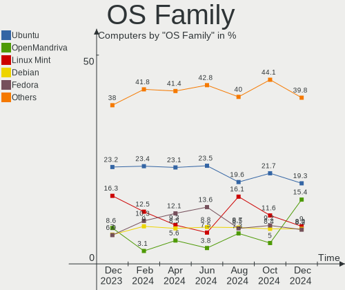
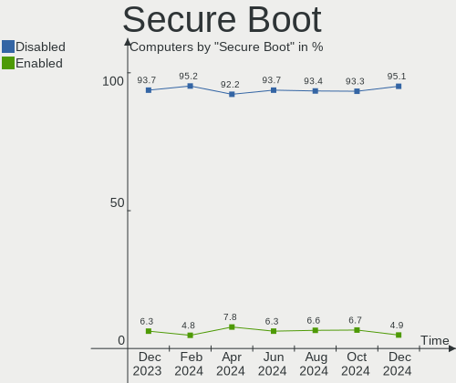
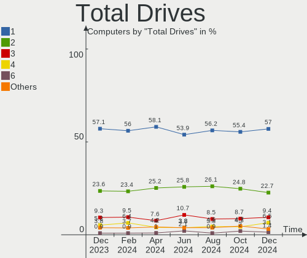
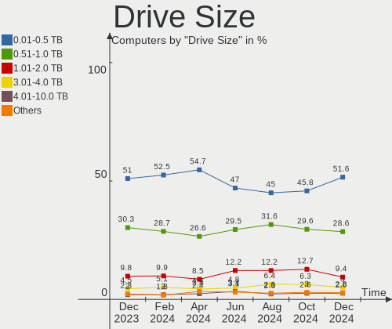
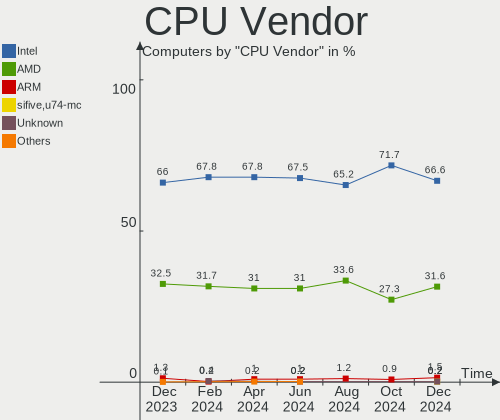
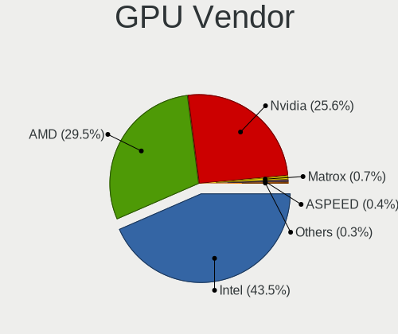
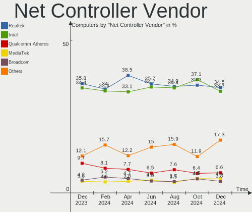
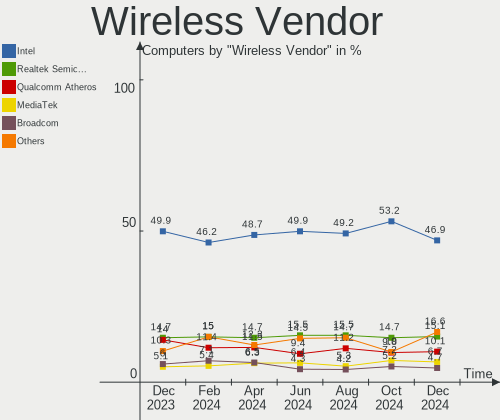
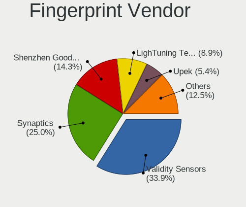

Linux in Germany - Hardware Trends
----------------------------------

A project to identify most popular hardware characteristics and track their change
over time based on data collected by Linux users at https://Linux-Hardware.org.

Anyone can contribute to this report by the [hw-probe](https://github.com/linuxhw/hw-probe) tool:

    sudo -E hw-probe -all -upload

This is a report for all computer types. See also reports for [desktops](/Location/Germany/Desktop/README.md) and [notebooks](/Location/Germany/Notebook/README.md).

Period: Dec, 2024.

Contents
--------

* [ System ](#system)
  - [ OS                       ](#os)
  - [ OS Family                ](#os-family)
  - [ Kernel                   ](#kernel)
  - [ Kernel Family            ](#kernel-family)
  - [ Kernel Major Ver.        ](#kernel-major-ver)
  - [ Arch                     ](#arch)
  - [ DE                       ](#de)
  - [ Display Server           ](#display-server)
  - [ Display Manager          ](#display-manager)
  - [ OS Lang                  ](#os-lang)
  - [ Boot Mode                ](#boot-mode)
  - [ Filesystem               ](#filesystem)
  - [ Part. scheme             ](#part-scheme)
  - [ Dual Boot with Linux/BSD ](#dual-boot-with-linuxbsd)
  - [ Dual Boot (Win)          ](#dual-boot-win)

* [ Board ](#board)
  - [ Vendor                   ](#vendor)
  - [ Model                    ](#model)
  - [ Model Family             ](#model-family)
  - [ MFG Year                 ](#mfg-year)
  - [ Form Factor              ](#form-factor)
  - [ Secure Boot              ](#secure-boot)
  - [ Coreboot                 ](#coreboot)
  - [ RAM Size                 ](#ram-size)
  - [ RAM Used                 ](#ram-used)
  - [ Total Drives             ](#total-drives)
  - [ Has CD-ROM               ](#has-cd-rom)
  - [ Has Ethernet             ](#has-ethernet)
  - [ Has WiFi                 ](#has-wifi)
  - [ Has Bluetooth            ](#has-bluetooth)

* [ Location ](#location)
  - [ Country                  ](#country)
  - [ City                     ](#city)

* [ Drives ](#drives)
  - [ Drive Vendor             ](#drive-vendor)
  - [ Drive Model              ](#drive-model)
  - [ HDD Vendor               ](#hdd-vendor)
  - [ SSD Vendor               ](#ssd-vendor)
  - [ Drive Kind               ](#drive-kind)
  - [ Drive Connector          ](#drive-connector)
  - [ Drive Size               ](#drive-size)
  - [ Space Total              ](#space-total)
  - [ Space Used               ](#space-used)
  - [ Malfunc. Drives          ](#malfunc-drives)
  - [ Malfunc. Drive Vendor    ](#malfunc-drive-vendor)
  - [ Malfunc. HDD Vendor      ](#malfunc-hdd-vendor)
  - [ Malfunc. Drive Kind      ](#malfunc-drive-kind)
  - [ Failed Drives            ](#failed-drives)
  - [ Failed Drive Vendor      ](#failed-drive-vendor)
  - [ Drive Status             ](#drive-status)

* [ Storage controller ](#storage-controller)
  - [ Storage Vendor           ](#storage-vendor)
  - [ Storage Model            ](#storage-model)
  - [ Storage Kind             ](#storage-kind)

* [ Processor ](#processor)
  - [ CPU Vendor               ](#cpu-vendor)
  - [ CPU Model                ](#cpu-model)
  - [ CPU Model Family         ](#cpu-model-family)
  - [ CPU Cores                ](#cpu-cores)
  - [ CPU Sockets              ](#cpu-sockets)
  - [ CPU Threads              ](#cpu-threads)
  - [ CPU Op-Modes             ](#cpu-op-modes)
  - [ CPU Microcode            ](#cpu-microcode)
  - [ CPU Microarch            ](#cpu-microarch)

* [ Graphics ](#graphics)
  - [ GPU Vendor               ](#gpu-vendor)
  - [ GPU Model                ](#gpu-model)
  - [ GPU Combo                ](#gpu-combo)
  - [ GPU Driver               ](#gpu-driver)
  - [ GPU Memory               ](#gpu-memory)

* [ Monitor ](#monitor)
  - [ Monitor Vendor           ](#monitor-vendor)
  - [ Monitor Model            ](#monitor-model)
  - [ Monitor Resolution       ](#monitor-resolution)
  - [ Monitor Diagonal         ](#monitor-diagonal)
  - [ Monitor Width            ](#monitor-width)
  - [ Aspect Ratio             ](#aspect-ratio)
  - [ Monitor Area             ](#monitor-area)
  - [ Pixel Density            ](#pixel-density)
  - [ Multiple Monitors        ](#multiple-monitors)

* [ Network ](#network)
  - [ Net Controller Vendor    ](#net-controller-vendor)
  - [ Net Controller Model     ](#net-controller-model)
  - [ Wireless Vendor          ](#wireless-vendor)
  - [ Wireless Model           ](#wireless-model)
  - [ Ethernet Vendor          ](#ethernet-vendor)
  - [ Ethernet Model           ](#ethernet-model)
  - [ Net Controller Kind      ](#net-controller-kind)
  - [ Used Controller          ](#used-controller)
  - [ NICs                     ](#nics)
  - [ IPv6                     ](#ipv6)

* [ Bluetooth ](#bluetooth)
  - [ Bluetooth Vendor         ](#bluetooth-vendor)
  - [ Bluetooth Model          ](#bluetooth-model)

* [ Sound ](#sound)
  - [ Sound Vendor             ](#sound-vendor)
  - [ Sound Model              ](#sound-model)

* [ Memory ](#memory)
  - [ Memory Vendor            ](#memory-vendor)
  - [ Memory Model             ](#memory-model)
  - [ Memory Kind              ](#memory-kind)
  - [ Memory Form Factor       ](#memory-form-factor)
  - [ Memory Size              ](#memory-size)
  - [ Memory Speed             ](#memory-speed)

* [ Printers & scanners ](#printers--scanners)
  - [ Printer Vendor           ](#printer-vendor)
  - [ Printer Model            ](#printer-model)
  - [ Scanner Vendor           ](#scanner-vendor)
  - [ Scanner Model            ](#scanner-model)

* [ Camera ](#camera)
  - [ Camera Vendor            ](#camera-vendor)
  - [ Camera Model             ](#camera-model)

* [ Security ](#security)
  - [ Fingerprint Vendor       ](#fingerprint-vendor)
  - [ Fingerprint Model        ](#fingerprint-model)
  - [ Chipcard Vendor          ](#chipcard-vendor)
  - [ Chipcard Model           ](#chipcard-model)

* [ Unsupported ](#unsupported)
  - [ Unsupported Devices      ](#unsupported-devices)
  - [ Unsupported Device Types ](#unsupported-device-types)

System
------

OS
--

Installed operating systems

| Name                         | Computers | Percent |
|------------------------------|-----------|---------|
| OpenMandriva 24.12           | 75        | 12.8%   |
| Ubuntu 24.04                 | 73        | 12.46%  |
| Fedora 41                    | 43        | 7.34%   |
| Debian 12                    | 38        | 6.48%   |
| Zorin 17                     | 29        | 4.95%   |
| Arch Rolling                 | 28        | 4.78%   |
| Linux Mint 22                | 26        | 4.44%   |
| Linux Mint 21.3              | 19        | 3.24%   |
| Ubuntu 24.10                 | 18        | 3.07%   |
| Pop!_OS 22.04                | 15        | 2.56%   |
| Ubuntu 22.04                 | 14        | 2.39%   |
| Debian                       | 11        | 1.88%   |
| openSUSE Tumbleweed-XXXXXXXX | 10        | 1.71%   |
| Elementary 8                 | 9         | 1.54%   |
| openSUSE Leap-15.6           | 7         | 1.19%   |
| OpenMandriva 5.0             | 7         | 1.19%   |
| Manjaro                      | 7         | 1.19%   |
| LMDE 6                       | 7         | 1.19%   |
| Kubuntu 24.10                | 7         | 1.19%   |
| TUXEDO OS 24.04              | 6         | 1.02%   |
| EndeavourOS Rolling          | 6         | 1.02%   |
| Kubuntu 24.04                | 5         | 0.85%   |
| Elementary 7.1               | 5         | 0.85%   |
| ArcoLinux Rolling            | 5         | 0.85%   |
| Ubuntu 20.04                 | 4         | 0.68%   |
| SteamOS 3.6.20               | 4         | 0.68%   |
| Nobara 40                    | 4         | 0.68%   |
| MX 23                        | 4         | 0.68%   |
| Lubuntu 24.04                | 4         | 0.68%   |
| Kali 2024.4                  | 4         | 0.68%   |
| Fedora 40                    | 4         | 0.68%   |
| Bazzite 41                   | 4         | 0.68%   |
| NixOS 24.11                  | 3         | 0.51%   |
| Manjaro 24.2.1               | 3         | 0.51%   |
| Manjaro 24.2.0               | 3         | 0.51%   |
| Gentoo 2.17                  | 3         | 0.51%   |
| Garuda Linux Soaring         | 3         | 0.51%   |
| Garuda Linux Rolling         | 3         | 0.51%   |
| CachyOS Rolling              | 3         | 0.51%   |
| Zorin 16                     | 2         | 0.34%   |

OS Family
---------

OS without a version

| Name             | Computers | Percent |
|------------------|-----------|---------|
| Ubuntu           | 113       | 19.28%  |
| OpenMandriva     | 90        | 15.36%  |
| Linux Mint       | 53        | 9.04%   |
| Debian           | 49        | 8.36%   |
| Fedora           | 48        | 8.19%   |
| Zorin            | 31        | 5.29%   |
| Arch             | 28        | 4.78%   |
| openSUSE         | 20        | 3.41%   |
| Pop!_OS          | 15        | 2.56%   |
| Kubuntu          | 14        | 2.39%   |
| Elementary       | 14        | 2.39%   |
| Manjaro          | 13        | 2.22%   |
| TUXEDO OS        | 7         | 1.19%   |
| LMDE             | 7         | 1.19%   |
| Garuda Linux     | 6         | 1.02%   |
| EndeavourOS      | 6         | 1.02%   |
| Nobara           | 5         | 0.85%   |
| MX               | 5         | 0.85%   |
| Kali             | 5         | 0.85%   |
| ArcoLinux        | 5         | 0.85%   |
| SteamOS          | 4         | 0.68%   |
| Lubuntu          | 4         | 0.68%   |
| Bazzite          | 4         | 0.68%   |
| Xubuntu          | 3         | 0.51%   |
| Ubuntu MATE      | 3         | 0.51%   |
| Ubuntu Budgie    | 3         | 0.51%   |
| NixOS            | 3         | 0.51%   |
| KDE neon         | 3         | 0.51%   |
| Gentoo           | 3         | 0.51%   |
| CachyOS          | 3         | 0.51%   |
| Vanilla          | 2         | 0.34%   |
| PureOS           | 2         | 0.34%   |
| Sparky           | 1         | 0.17%   |
| Rocky Linux      | 1         | 0.17%   |
| RHEL             | 1         | 0.17%   |
| Raspbian         | 1         | 0.17%   |
| PostmarketOS     | 1         | 0.17%   |
| org.kde.Platform | 1         | 0.17%   |
| Neptune OS       | 1         | 0.17%   |
| Endless          | 1         | 0.17%   |

Kernel
------

Version of the Linux kernel

| Version                                  | Computers | Percent |
|------------------------------------------|-----------|---------|
| 6.8.0-49-generic                         | 77        | 13.14%  |
| 6.12.1-desktop-1omv2490                  | 70        | 11.95%  |
| 6.8.0-51-generic                         | 39        | 6.66%   |
| 6.8.0-50-generic                         | 34        | 5.8%    |
| 6.1.0-28-amd64                           | 26        | 4.44%   |
| 6.9.3-76060903-generic                   | 13        | 2.22%   |
| 6.11.0-9-generic                         | 12        | 2.05%   |
| 6.11.4-301.fc41.x86_64                   | 10        | 1.71%   |
| 5.15.0-126-generic                       | 10        | 1.71%   |
| 6.12.1-arch1-1                           | 9         | 1.54%   |
| 6.11.8-1-default                         | 9         | 1.54%   |
| 6.12.6-arch1-1                           | 8         | 1.37%   |
| 6.12.4-arch1-1                           | 8         | 1.37%   |
| 6.12.4-200.fc41.x86_64                   | 8         | 1.37%   |
| 6.11.0-13-generic                        | 8         | 1.37%   |
| 6.6.2-desktop-1omv2390                   | 7         | 1.19%   |
| 6.11.10-300.fc41.x86_64                  | 7         | 1.19%   |
| 6.12.6-200.fc41.x86_64                   | 6         | 1.02%   |
| 6.11.10-amd64                            | 6         | 1.02%   |
| 6.8.0-48-generic                         | 5         | 0.85%   |
| 6.8.0-41-generic                         | 5         | 0.85%   |
| 6.12.7-arch1-1                           | 5         | 0.85%   |
| 6.12.6-desktop-1omv2490                  | 5         | 0.85%   |
| 6.12.1-zen1-1-zen                        | 5         | 0.85%   |
| 6.12.1-4-MANJARO                         | 5         | 0.85%   |
| 6.11.2-amd64                             | 5         | 0.85%   |
| 6.11.11-300.fc41.x86_64                  | 5         | 0.85%   |
| 6.5.0-valve22-1-neptune-65-g9a338ed8a75e | 4         | 0.68%   |
| 6.11.9-200.fsync.fc40.x86_64             | 4         | 0.68%   |
| 6.11.10-304.bazzite.fc41.x86_64          | 4         | 0.68%   |
| 6.11.0-8-generic                         | 4         | 0.68%   |
| 6.1.0-27-amd64                           | 4         | 0.68%   |
| 4.15.0-213-generic                       | 4         | 0.68%   |
| 6.8.0-50-lowlatency                      | 3         | 0.51%   |
| 6.8.0-38-generic                         | 3         | 0.51%   |
| 6.4.0-150600.23.30-default               | 3         | 0.51%   |
| 6.12.6-1-default                         | 3         | 0.51%   |
| 6.12.5-200.fc41.x86_64                   | 3         | 0.51%   |
| 6.12.4-zen1-1-zen                        | 3         | 0.51%   |
| 6.12.4-1-MANJARO                         | 3         | 0.51%   |

Kernel Family
-------------

Linux kernel without a distro release

| Version | Computers | Percent |
|---------|-----------|---------|
| 6.8.0   | 169       | 28.84%  |
| 6.12.1  | 92        | 15.7%   |
| 6.1.0   | 38        | 6.48%   |
| 6.11.0  | 33        | 5.63%   |
| 5.15.0  | 28        | 4.78%   |
| 6.12.6  | 27        | 4.61%   |
| 6.11.10 | 24        | 4.1%    |
| 6.12.4  | 22        | 3.75%   |
| 6.9.3   | 13        | 2.22%   |
| 6.11.8  | 12        | 2.05%   |
| 6.11.4  | 12        | 2.05%   |
| 6.11.11 | 8         | 1.37%   |
| 6.6.2   | 7         | 1.19%   |
| 6.4.0   | 6         | 1.02%   |
| 6.12.7  | 6         | 1.02%   |
| 6.11.9  | 5         | 0.85%   |
| 6.11.2  | 5         | 0.85%   |
| 5.4.0   | 5         | 0.85%   |
| 4.15.0  | 5         | 0.85%   |
| 6.8.12  | 4         | 0.68%   |
| 6.5.0   | 4         | 0.68%   |
| 6.2.0   | 4         | 0.68%   |
| 6.13.0  | 4         | 0.68%   |
| 6.12.5  | 4         | 0.68%   |
| 6.6.63  | 3         | 0.51%   |
| 6.6.62  | 3         | 0.51%   |
| 6.12.3  | 3         | 0.51%   |
| 6.11.6  | 3         | 0.51%   |
| 6.10.0  | 3         | 0.51%   |
| 5.14.0  | 3         | 0.51%   |
| 6.0.12  | 2         | 0.34%   |
| 5.14.21 | 2         | 0.34%   |
| 5.10.0  | 2         | 0.34%   |
| 6.9.9   | 1         | 0.17%   |
| 6.9.7   | 1         | 0.17%   |
| 6.9.12  | 1         | 0.17%   |
| 6.9.10  | 1         | 0.17%   |
| 6.8.7   | 1         | 0.17%   |
| 6.7.4   | 1         | 0.17%   |
| 6.6.67  | 1         | 0.17%   |

Kernel Major Ver.
-----------------

Linux kernel major version

| Version | Computers | Percent |
|---------|-----------|---------|
| 6.8     | 174       | 29.69%  |
| 6.12    | 154       | 26.28%  |
| 6.11    | 104       | 17.75%  |
| 6.1     | 40        | 6.83%   |
| 5.15    | 28        | 4.78%   |
| 6.6     | 20        | 3.41%   |
| 6.9     | 17        | 2.9%    |
| 6.4     | 8         | 1.37%   |
| 6.2     | 5         | 0.85%   |
| 5.4     | 5         | 0.85%   |
| 5.14    | 5         | 0.85%   |
| 4.15    | 5         | 0.85%   |
| 6.5     | 4         | 0.68%   |
| 6.13    | 4         | 0.68%   |
| 6.10    | 4         | 0.68%   |
| 6.0     | 3         | 0.51%   |
| 5.10    | 2         | 0.34%   |
| 6.7     | 1         | 0.17%   |
| 5.6     | 1         | 0.17%   |
| 5.19    | 1         | 0.17%   |
| 5.11    | 1         | 0.17%   |

Arch
----

OS architecture (x86_64, i586, etc.)

| Name    | Computers | Percent |
|---------|-----------|---------|
| x86_64  | 572       | 97.61%  |
| aarch64 | 9         | 1.54%   |
| i686    | 3         | 0.51%   |
| riscv64 | 1         | 0.17%   |
| armv6l  | 1         | 0.17%   |

DE
--

Desktop Environment

| Name          | Computers | Percent |
|---------------|-----------|---------|
| GNOME         | 231       | 39.42%  |
| Unknown       | 86        | 14.68%  |
| KDE6          | 63        | 10.75%  |
| X-Cinnamon    | 50        | 8.53%   |
| KDE5          | 46        | 7.85%   |
| XFCE          | 35        | 5.97%   |
| Pantheon      | 14        | 2.39%   |
| LXQt          | 13        | 2.22%   |
| KDE           | 10        | 1.71%   |
| MATE          | 9         | 1.54%   |
| Cinnamon      | 8         | 1.37%   |
| Hyprland      | 4         | 0.68%   |
| Budgie        | 4         | 0.68%   |
| sway          | 2         | 0.34%   |
| labwc:wlroots | 2         | 0.34%   |
| i3            | 2         | 0.34%   |
| Enlightenment | 2         | 0.34%   |
| wlroots       | 1         | 0.17%   |
| LXDE          | 1         | 0.17%   |
| KDE4          | 1         | 0.17%   |
| Endless:GNOME | 1         | 0.17%   |
| COSMIC        | 1         | 0.17%   |

Display Server
--------------

X11 or Wayland

| Name    | Computers | Percent |
|---------|-----------|---------|
| Wayland | 286       | 48.81%  |
| X11     | 276       | 47.1%   |
| Unknown | 12        | 2.05%   |
| Tty     | 11        | 1.88%   |
| Web     | 1         | 0.17%   |

Display Manager
---------------

SDDM, LightDM, etc.

| Name    | Computers | Percent |
|---------|-----------|---------|
| Unknown | 212       | 36.18%  |
| SDDM    | 143       | 24.4%   |
| GDM3    | 126       | 21.5%   |
| LightDM | 72        | 12.29%  |
| GDM     | 30        | 5.12%   |
| WDM     | 1         | 0.17%   |
| SLiM    | 1         | 0.17%   |
| LY-DM   | 1         | 0.17%   |

OS Lang
-------

Language

| Lang    | Computers | Percent |
|---------|-----------|---------|
| de_DE   | 424       | 72.35%  |
| en_US   | 126       | 21.5%   |
| C       | 15        | 2.56%   |
| en_GB   | 10        | 1.71%   |
| Unknown | 4         | 0.68%   |
| pt_PT   | 1         | 0.17%   |
| pl_PL   | 1         | 0.17%   |
| fi_FI   | 1         | 0.17%   |
| es_ES   | 1         | 0.17%   |
| en_IN   | 1         | 0.17%   |
| de_LI   | 1         | 0.17%   |
| de_IT   | 1         | 0.17%   |

Boot Mode
---------

EFI or BIOS

| Mode | Computers | Percent |
|------|-----------|---------|
| BIOS | 314       | 53.58%  |
| EFI  | 272       | 46.42%  |

Filesystem
----------

Type of filesystem

| Type    | Computers | Percent |
|---------|-----------|---------|
| Ext4    | 293       | 50%     |
| Btrfs   | 117       | 19.97%  |
| Tmpfs   | 94        | 16.04%  |
| Overlay | 69        | 11.77%  |
| Zfs     | 6         | 1.02%   |
| Xfs     | 6         | 1.02%   |
| Ext2    | 1         | 0.17%   |

Part. scheme
------------

Scheme of partitioning

| Type    | Computers | Percent |
|---------|-----------|---------|
| GPT     | 333       | 56.83%  |
| Unknown | 198       | 33.79%  |
| MBR     | 55        | 9.39%   |

Dual Boot with Linux/BSD
------------------------

Hosting more than one Linux/BSD

| Dual boot | Computers | Percent |
|-----------|-----------|---------|
| No        | 479       | 81.74%  |
| Yes       | 107       | 18.26%  |

Dual Boot (Win)
---------------

Hosting Linux and Windows

| Dual boot | Computers | Percent |
|-----------|-----------|---------|
| No        | 446       | 76.11%  |
| Yes       | 140       | 23.89%  |

Board
-----

Vendor
------

Motherboard manufacturer

| Name                                 | Computers | Percent |
|--------------------------------------|-----------|---------|
| Lenovo                               | 91        | 15.53%  |
| ASUSTek Computer                     | 72        | 12.29%  |
| Hewlett-Packard                      | 60        | 10.24%  |
| Dell                                 | 49        | 8.36%   |
| Gigabyte Technology                  | 42        | 7.17%   |
| MSI                                  | 41        | 7%      |
| Acer                                 | 35        | 5.97%   |
| ASRock                               | 28        | 4.78%   |
| Apple                                | 23        | 3.92%   |
| Fujitsu                              | 19        | 3.24%   |
| Medion                               | 11        | 1.88%   |
| TUXEDO                               | 8         | 1.37%   |
| Intel                                | 8         | 1.37%   |
| Samsung Electronics                  | 6         | 1.02%   |
| Raspberry Pi Foundation              | 6         | 1.02%   |
| HUAWEI                               | 6         | 1.02%   |
| Fujitsu Siemens                      | 6         | 1.02%   |
| Unknown                              | 6         | 1.02%   |
| Biostar                              | 5         | 0.85%   |
| Valve                                | 4         | 0.68%   |
| Toshiba                              | 4         | 0.68%   |
| Wortmann AG                          | 3         | 0.51%   |
| Supermicro                           | 3         | 0.51%   |
| Shenzhen Meigao Electronic Equipment | 3         | 0.51%   |
| Notebook                             | 3         | 0.51%   |
| GEEKOM                               | 3         | 0.51%   |
| AZW                                  | 3         | 0.51%   |
| ASRockRack                           | 3         | 0.51%   |
| Sony                                 | 2         | 0.34%   |
| PELADN                               | 2         | 0.34%   |
| Packard Bell                         | 2         | 0.34%   |
| Google                               | 2         | 0.34%   |
| Framework                            | 2         | 0.34%   |
| Clevo                                | 2         | 0.34%   |
| Chuwi                                | 2         | 0.34%   |
| ZOTAC                                | 1         | 0.17%   |
| youyeetoo                            | 1         | 0.17%   |
| Teclast                              | 1         | 0.17%   |
| Star Labs                            | 1         | 0.17%   |
| Shuttle                              | 1         | 0.17%   |

Model
-----

Motherboard model

| Name                                              | Computers | Percent |
|---------------------------------------------------|-----------|---------|
| Unknown                                           | 8         | 1.37%   |
| HP Laptop 17-cp0xxx                               | 4         | 0.68%   |
| Valve Jupiter                                     | 3         | 0.51%   |
| MSI MS-7C56                                       | 3         | 0.51%   |
| AZW SER                                           | 3         | 0.51%   |
| ASUS All Series                                   | 3         | 0.51%   |
| Apple MacBookPro11,1                              | 3         | 0.51%   |
| TUXEDO Stellaris Slim 15 Intel Gen6               | 2         | 0.34%   |
| Supermicro Super Server                           | 2         | 0.34%   |
| Shenzhen Meigao Electronic Equipment Venus Series | 2         | 0.34%   |
| RPi Raspberry Pi 4 Model B Rev 1.4                | 2         | 0.34%   |
| PELADN WI-6                                       | 2         | 0.34%   |
| MSI MS-7D08                                       | 2         | 0.34%   |
| MSI MS-7C91                                       | 2         | 0.34%   |
| MSI MS-7C02                                       | 2         | 0.34%   |
| MSI MS-7B86                                       | 2         | 0.34%   |
| Lenovo V15 G4 AMN 82YU                            | 2         | 0.34%   |
| Lenovo ThinkPad T570 20H90002RI                   | 2         | 0.34%   |
| HUAWEI FLMH-XX                                    | 2         | 0.34%   |
| HP Spectre x360 2-in-1 Laptop 16-aa0xxx           | 2         | 0.34%   |
| HP Laptop 15-fc0xxx                               | 2         | 0.34%   |
| HP Laptop 15-db1xxx                               | 2         | 0.34%   |
| Gigabyte 970A-DS3P                                | 2         | 0.34%   |
| GEEKOM A7                                         | 2         | 0.34%   |
| Fujitsu Siemens ESPRIMO E                         | 2         | 0.34%   |
| Framework Laptop 16 (AMD Ryzen 7040 Series)       | 2         | 0.34%   |
| Dell XPS 13 9370                                  | 2         | 0.34%   |
| Dell Precision 7520                               | 2         | 0.34%   |
| Dell OptiPlex 780                                 | 2         | 0.34%   |
| Dell Latitude E6320                               | 2         | 0.34%   |
| Dell Latitude 3320                                | 2         | 0.34%   |
| ASUS VivoBook_ASUSLaptop M1605YA_M1605YA          | 2         | 0.34%   |
| ASUS UX305FA                                      | 2         | 0.34%   |
| ASUS TUF Z390-PLUS GAMING                         | 2         | 0.34%   |
| ASUS ROG STRIX Z690-I GAMING WIFI                 | 2         | 0.34%   |
| ASRock X670E Steel Legend                         | 2         | 0.34%   |
| ASRock G31M-GS                                    | 2         | 0.34%   |
| Apple MacBookPro8,1                               | 2         | 0.34%   |
| Apple MacBookPro11,3                              | 2         | 0.34%   |
| Apple MacBookAir7,2                               | 2         | 0.34%   |

Model Family
------------

Motherboard model prefix

| Name                    | Computers | Percent |
|-------------------------|-----------|---------|
| Lenovo ThinkPad         | 46        | 7.85%   |
| Acer Aspire             | 20        | 3.41%   |
| Dell Latitude           | 18        | 3.07%   |
| HP EliteBook            | 16        | 2.73%   |
| ASUS PRIME              | 14        | 2.39%   |
| HP Laptop               | 11        | 1.88%   |
| Lenovo IdeaPad          | 9         | 1.54%   |
| Fujitsu LIFEBOOK        | 9         | 1.54%   |
| ASUS ROG                | 9         | 1.54%   |
| Dell XPS                | 8         | 1.37%   |
| Dell Inspiron           | 8         | 1.37%   |
| Unknown                 | 8         | 1.37%   |
| Lenovo ThinkCentre      | 7         | 1.19%   |
| Dell Precision          | 7         | 1.19%   |
| ASUS TUF                | 7         | 1.19%   |
| RPi Raspberry           | 6         | 1.02%   |
| Lenovo Yoga             | 6         | 1.02%   |
| HP EliteDesk            | 6         | 1.02%   |
| ASUS VivoBook           | 6         | 1.02%   |
| Apple MacBookPro11      | 6         | 1.02%   |
| Fujitsu Siemens ESPRIMO | 5         | 0.85%   |
| Fujitsu ESPRIMO         | 5         | 0.85%   |
| Acer Swift              | 5         | 0.85%   |
| TUXEDO InfinityBook     | 4         | 0.68%   |
| Toshiba Satellite       | 4         | 0.68%   |
| Lenovo V15              | 4         | 0.68%   |
| HP Pavilion             | 4         | 0.68%   |
| Dell OptiPlex           | 4         | 0.68%   |
| ASUS ASUS               | 4         | 0.68%   |
| Valve Jupiter           | 3         | 0.51%   |
| MSI MS-7C56             | 3         | 0.51%   |
| Lenovo ThinkStation     | 3         | 0.51%   |
| Lenovo Legion           | 3         | 0.51%   |
| Lenovo IdeaPadFlex      | 3         | 0.51%   |
| HP ProBook              | 3         | 0.51%   |
| HP ENVY                 | 3         | 0.51%   |
| Gigabyte B650           | 3         | 0.51%   |
| Gigabyte B550M          | 3         | 0.51%   |
| AZW SER                 | 3         | 0.51%   |
| ASUS All                | 3         | 0.51%   |

MFG Year
--------

Motherboard manufacture year

| Year    | Computers | Percent |
|---------|-----------|---------|
| 2024    | 61        | 10.41%  |
| 2021    | 55        | 9.39%   |
| 2018    | 44        | 7.51%   |
| 2017    | 44        | 7.51%   |
| 2023    | 40        | 6.83%   |
| 2020    | 40        | 6.83%   |
| 2019    | 38        | 6.48%   |
| 2022    | 37        | 6.31%   |
| 2011    | 35        | 5.97%   |
| 2014    | 31        | 5.29%   |
| 2012    | 30        | 5.12%   |
| 2013    | 26        | 4.44%   |
| 2010    | 26        | 4.44%   |
| 2016    | 22        | 3.75%   |
| 2015    | 18        | 3.07%   |
| 2009    | 16        | 2.73%   |
| 2008    | 8         | 1.37%   |
| 2007    | 7         | 1.19%   |
| Unknown | 6         | 1.02%   |
| 2005    | 1         | 0.17%   |
| 2002    | 1         | 0.17%   |

Form Factor
-----------

Physical design of the computer

| Name           | Computers | Percent |
|----------------|-----------|---------|
| Notebook       | 286       | 48.81%  |
| Desktop        | 224       | 38.23%  |
| Mini pc        | 21        | 3.58%   |
| Convertible    | 18        | 3.07%   |
| All in one     | 11        | 1.88%   |
| Tablet         | 9         | 1.54%   |
| Server         | 9         | 1.54%   |
| System on chip | 8         | 1.37%   |

Secure Boot
-----------

Enabled or disabled

| State    | Computers | Percent |
|----------|-----------|---------|
| Disabled | 557       | 95.05%  |
| Enabled  | 29        | 4.95%   |

Coreboot
--------

Have coreboot on board

| Used | Computers | Percent |
|------|-----------|---------|
| No   | 584       | 99.66%  |
| Yes  | 2         | 0.34%   |

RAM Size
--------

Total RAM memory

| Size in GB      | Computers | Percent |
|-----------------|-----------|---------|
| 8.01-16.0       | 122       | 20.82%  |
| 4.01-8.0        | 115       | 19.62%  |
| 16.01-24.0      | 109       | 18.6%   |
| 32.01-64.0      | 94        | 16.04%  |
| 3.01-4.0        | 59        | 10.07%  |
| 64.01-256.0     | 39        | 6.66%   |
| 24.01-32.0      | 32        | 5.46%   |
| 1.01-2.0        | 7         | 1.19%   |
| 2.01-3.0        | 6         | 1.02%   |
| More than 256.0 | 1         | 0.17%   |
| 0.51-1.0        | 1         | 0.17%   |
| 0.01-0.5        | 1         | 0.17%   |

RAM Used
--------

Used RAM memory

| Used GB    | Computers | Percent |
|------------|-----------|---------|
| 2.01-3.0   | 164       | 27.99%  |
| 1.01-2.0   | 141       | 24.06%  |
| 4.01-8.0   | 117       | 19.97%  |
| 3.01-4.0   | 94        | 16.04%  |
| 8.01-16.0  | 33        | 5.63%   |
| 0.51-1.0   | 17        | 2.9%    |
| 16.01-24.0 | 12        | 2.05%   |
| 32.01-64.0 | 3         | 0.51%   |
| 0.01-0.5   | 3         | 0.51%   |
| 24.01-32.0 | 2         | 0.34%   |

Total Drives
------------

Number of drives on board

| Drives | Computers | Percent |
|--------|-----------|---------|
| 1      | 334       | 57%     |
| 2      | 133       | 22.7%   |
| 3      | 55        | 9.39%   |
| 4      | 38        | 6.48%   |
| 6      | 8         | 1.37%   |
| 5      | 7         | 1.19%   |
| 7      | 4         | 0.68%   |
| 0      | 3         | 0.51%   |
| 24     | 1         | 0.17%   |
| 10     | 1         | 0.17%   |
| 9      | 1         | 0.17%   |
| 8      | 1         | 0.17%   |

Has CD-ROM
----------

Has CD-ROM on board

| Presented | Computers | Percent |
|-----------|-----------|---------|
| No        | 391       | 66.72%  |
| Yes       | 195       | 33.28%  |

Has Ethernet
------------

Has Ethernet on board

| Presented | Computers | Percent |
|-----------|-----------|---------|
| Yes       | 501       | 85.49%  |
| No        | 85        | 14.51%  |

Has WiFi
--------

Has WiFi module

| Presented | Computers | Percent |
|-----------|-----------|---------|
| Yes       | 428       | 73.04%  |
| No        | 158       | 26.96%  |

Has Bluetooth
-------------

Has Bluetooth module

| Presented | Computers | Percent |
|-----------|-----------|---------|
| Yes       | 396       | 67.58%  |
| No        | 190       | 32.42%  |

Location
--------

Country
-------

Geographic location (country)

| Country | Computers | Percent |
|---------|-----------|---------|
| Germany | 586       | 100%    |

City
----

Geographic location (city)

| City              | Computers | Percent |
|-------------------|-----------|---------|
| Berlin            | 63        | 10.75%  |
| Munich            | 28        | 4.78%   |
| Frankfurt am Main | 17        | 2.9%    |
| Düsseldorf       | 14        | 2.39%   |
| Stuttgart         | 13        | 2.22%   |
| Leipzig           | 12        | 2.05%   |
| Hanover           | 11        | 1.88%   |
| Cologne           | 11        | 1.88%   |
| Hamburg           | 10        | 1.71%   |
| Reutlingen        | 9         | 1.54%   |
| Mannheim          | 8         | 1.37%   |
| Karlsruhe         | 7         | 1.19%   |
| Essen             | 7         | 1.19%   |
| Nuremberg         | 6         | 1.02%   |
| Dresden           | 6         | 1.02%   |
| Darmstadt         | 6         | 1.02%   |
| Osnabrück        | 5         | 0.85%   |
| Mainz             | 5         | 0.85%   |
| Ludwigsburg       | 5         | 0.85%   |
| Dortmund          | 5         | 0.85%   |
| Delligsen         | 5         | 0.85%   |
| Bochum            | 5         | 0.85%   |
| Rostock           | 4         | 0.68%   |
| Aachen            | 4         | 0.68%   |
| Wuppertal         | 3         | 0.51%   |
| Trier             | 3         | 0.51%   |
| Siegen            | 3         | 0.51%   |
| Potsdam           | 3         | 0.51%   |
| Pforzheim         | 3         | 0.51%   |
| Neustrelitz       | 3         | 0.51%   |
| Münster          | 3         | 0.51%   |
| Loerrach          | 3         | 0.51%   |
| Landshut          | 3         | 0.51%   |
| Lahr              | 3         | 0.51%   |
| Heilbronn         | 3         | 0.51%   |
| Forchheim         | 3         | 0.51%   |
| Dachau            | 3         | 0.51%   |
| Braunschweig      | 3         | 0.51%   |
| Augsburg          | 3         | 0.51%   |
| Würzburg         | 2         | 0.34%   |

Drives
------

Drive Vendor
------------

Hard drive vendors

| Vendor                         | Computers | Drives | Percent |
|--------------------------------|-----------|--------|---------|
| Samsung Electronics            | 198       | 265    | 21.98%  |
| WDC                            | 97        | 125    | 10.77%  |
| SanDisk                        | 89        | 108    | 9.88%   |
| Seagate                        | 80        | 106    | 8.88%   |
| Crucial                        | 44        | 51     | 4.88%   |
| Toshiba                        | 36        | 43     | 4%      |
| Unknown                        | 34        | 38     | 3.77%   |
| SK hynix                       | 27        | 27     | 3%      |
| Intenso                        | 27        | 29     | 3%      |
| Kingston                       | 22        | 22     | 2.44%   |
| Micron/Crucial Technology      | 19        | 22     | 2.11%   |
| Micron Technology              | 19        | 19     | 2.11%   |
| Intel                          | 17        | 21     | 1.89%   |
| Hitachi                        | 15        | 15     | 1.66%   |
| Kingston Technology Company    | 13        | 14     | 1.44%   |
| Apple                          | 12        | 15     | 1.33%   |
| Phison Electronics             | 11        | 11     | 1.22%   |
| HGST                           | 8         | 10     | 0.89%   |
| Unknown                        | 8         | 9      | 0.89%   |
| Verbatim                       | 7         | 8      | 0.78%   |
| KIOXIA                         | 7         | 7      | 0.78%   |
| Silicon Motion                 | 6         | 6      | 0.67%   |
| Shenzhen Longsys Electronics   | 5         | 5      | 0.55%   |
| SD                             | 5         | 5      | 0.55%   |
| OCZ                            | 5         | 5      | 0.55%   |
| Fanxiang                       | 4         | 4      | 0.44%   |
| China                          | 4         | 4      | 0.44%   |
| ADATA Technology               | 4         | 4      | 0.44%   |
| UMIS                           | 3         | 3      | 0.33%   |
| Transcend                      | 3         | 3      | 0.33%   |
| TO Exter                       | 3         | 3      | 0.33%   |
| Netac                          | 3         | 4      | 0.33%   |
| MAXIO Technology (Hangzhou)    | 3         | 3      | 0.33%   |
| LITEON                         | 3         | 3      | 0.33%   |
| JMicron Technology             | 3         | 3      | 0.33%   |
| Emtec                          | 3         | 3      | 0.33%   |
| A-DATA Technology              | 3         | 3      | 0.33%   |
| USB                            | 2         | 2      | 0.22%   |
| Solid State Storage Technology | 2         | 2      | 0.22%   |
| Realtek                        | 2         | 2      | 0.22%   |

Drive Model
-----------

Hard drive models

| Model                                                 | Computers | Percent |
|-------------------------------------------------------|-----------|---------|
| Samsung NVMe SSD Controller SM981/PM981/PM983 512GB   | 20        | 1.98%   |
| Samsung NVMe SSD Controller PM9A1/PM9A3/980PRO 512GB  | 18        | 1.78%   |
| Samsung SSD 850 EVO 250GB                             | 13        | 1.29%   |
| Samsung SSD 840 EVO 250GB                             | 10        | 0.99%   |
| Samsung NVMe SSD Controller SM961/PM961/SM963 256GB   | 10        | 0.99%   |
| Micron/Crucial P2 NVMe PCIe SSD 500GB                 | 10        | 0.99%   |
| Samsung SSD 860 EVO 500GB                             | 9         | 0.89%   |
| Crucial CT500MX500SSD1 500GB                          | 8         | 0.79%   |
| Unknown                                               | 8         | 0.79%   |
| Unknown MMC Card  64GB                                | 7         | 0.69%   |
| Sandisk WD Blue SN550 NVMe SSD 256GB                  | 7         | 0.69%   |
| SanDisk SSD PLUS 1000GB                               | 7         | 0.69%   |
| Samsung SSD 980 1TB                                   | 7         | 0.69%   |
| Samsung SSD 860 EVO 1TB                               | 7         | 0.69%   |
| Unknown SD/MMC/MS PRO 128GB                           | 5         | 0.5%    |
| Unknown MMC Card  128GB                               | 5         | 0.5%    |
| Toshiba HDWD110 1TB                                   | 5         | 0.5%    |
| Seagate ST2000DM008-2FR102 2TB                        | 5         | 0.5%    |
| SanDisk SSD PLUS 240GB                                | 5         | 0.5%    |
| SanDisk NVMe SSD Drive 1TB                            | 5         | 0.5%    |
| Samsung SSD 990 PRO 1TB                               | 5         | 0.5%    |
| Samsung SSD 850 EVO 500GB                             | 5         | 0.5%    |
| Crucial CT2000MX500SSD1 2TB                           | 5         | 0.5%    |
| Crucial CT1000MX500SSD1 1TB                           | 5         | 0.5%    |
| WDC WDS100T2B0A-00SM50 1TB SSD                        | 4         | 0.4%    |
| Verbatim Vi550 S3 1TB SSD                             | 4         | 0.4%    |
| Silicon Motion SM2263EN/SM2263XT SSD Controller 256GB | 4         | 0.4%    |
| Seagate ST2000DM008-2UB102 2TB                        | 4         | 0.4%    |
| Seagate ST1000DM003-1ER162 1TB                        | 4         | 0.4%    |
| Sandisk WD_BLACK SN850X 2000GB                        | 4         | 0.4%    |
| Sandisk WDC PC SN530 SDBPMPZ-512G-1101 512GB          | 4         | 0.4%    |
| Sandisk WD Black SN750 / PC SN730 NVMe SSD 512GB      | 4         | 0.4%    |
| Sandisk WD Black 2018/SN750 / PC SN720 NVMe SSD 512GB | 4         | 0.4%    |
| Samsung SSD 970 EVO Plus 1TB                          | 4         | 0.4%    |
| Samsung SSD 870 QVO 1TB                               | 4         | 0.4%    |
| Samsung SSD 870 EVO 500GB                             | 4         | 0.4%    |
| Samsung HD103SJ 1TB                                   | 4         | 0.4%    |
| Kingston Company SNV2S2000G 2TB                       | 4         | 0.4%    |
| Kingston Company SNV2S1000G 1TB                       | 4         | 0.4%    |
| Intenso SSD 512GB                                     | 4         | 0.4%    |

HDD Vendor
----------

Hard disk drive vendors

| Vendor              | Computers | Drives | Percent |
|---------------------|-----------|--------|---------|
| WDC                 | 77        | 101    | 33.05%  |
| Seagate             | 76        | 101    | 32.62%  |
| Toshiba             | 24        | 31     | 10.3%   |
| Hitachi             | 15        | 15     | 6.44%   |
| Samsung Electronics | 13        | 14     | 5.58%   |
| HGST                | 8         | 9      | 3.43%   |
| Unknown             | 5         | 5      | 2.15%   |
| TO Exter            | 3         | 3      | 1.29%   |
| JMicron Technology  | 3         | 3      | 1.29%   |
| Maxtor              | 2         | 2      | 0.86%   |
| ASMT                | 2         | 2      | 0.86%   |
| SABRENT             | 1         | 2      | 0.43%   |
| RSH-319             | 1         | 1      | 0.43%   |
| Intenso             | 1         | 1      | 0.43%   |
| ExcelStor           | 1         | 1      | 0.43%   |
| Apple               | 1         | 1      | 0.43%   |

SSD Vendor
----------

Solid state drive vendors

| Vendor              | Computers | Drives | Percent |
|---------------------|-----------|--------|---------|
| Samsung Electronics | 97        | 116    | 31.09%  |
| Crucial             | 37        | 43     | 11.86%  |
| SanDisk             | 36        | 42     | 11.54%  |
| Intenso             | 25        | 27     | 8.01%   |
| WDC                 | 20        | 20     | 6.41%   |
| Kingston            | 12        | 12     | 3.85%   |
| Apple               | 8         | 8      | 2.56%   |
| Verbatim            | 6         | 7      | 1.92%   |
| Toshiba             | 6         | 6      | 1.92%   |
| SK hynix            | 6         | 6      | 1.92%   |
| Micron Technology   | 6         | 6      | 1.92%   |
| OCZ                 | 5         | 5      | 1.6%    |
| SD                  | 4         | 4      | 1.28%   |
| Intel               | 4         | 6      | 1.28%   |
| China               | 4         | 4      | 1.28%   |
| LITEON              | 3         | 3      | 0.96%   |
| Fanxiang            | 3         | 3      | 0.96%   |
| Transcend           | 2         | 2      | 0.64%   |
| Netac               | 2         | 3      | 0.64%   |
| Leven               | 2         | 2      | 0.64%   |
| KingSpec            | 2         | 2      | 0.64%   |
| Emtec               | 2         | 2      | 0.64%   |
| A-DATA Technology   | 2         | 2      | 0.64%   |
| Unknown             | 2         | 2      | 0.64%   |
| TrekStor            | 1         | 1      | 0.32%   |
| Teclast             | 1         | 1      | 0.32%   |
| SPCC                | 1         | 1      | 0.32%   |
| ShiJi               | 1         | 1      | 0.32%   |
| PNY                 | 1         | 1      | 0.32%   |
| Phison              | 1         | 1      | 0.32%   |
| PHD 3.0             | 1         | 1      | 0.32%   |
| PELADN              | 1         | 1      | 0.32%   |
| Patriot             | 1         | 1      | 0.32%   |
| Neo                 | 1         | 1      | 0.32%   |
| Mushkin             | 1         | 2      | 0.32%   |
| LITEONIT            | 1         | 1      | 0.32%   |
| Lexar               | 1         | 1      | 0.32%   |
| KingDian            | 1         | 1      | 0.32%   |
| HPE                 | 1         | 1      | 0.32%   |
| FORESEE             | 1         | 1      | 0.32%   |

Drive Kind
----------

HDD or SSD

| Kind    | Computers | Drives | Percent |
|---------|-----------|--------|---------|
| NVMe    | 303       | 385    | 37.22%  |
| SSD     | 267       | 350    | 32.8%   |
| HDD     | 196       | 292    | 24.08%  |
| MMC     | 29        | 30     | 3.56%   |
| Unknown | 19        | 24     | 2.33%   |

Drive Connector
---------------

SATA, SAS, NVMe, etc.

| Type | Computers | Drives | Percent |
|------|-----------|--------|---------|
| SATA | 362       | 615    | 49.05%  |
| NVMe | 302       | 382    | 40.92%  |
| SAS  | 45        | 54     | 6.1%    |
| MMC  | 29        | 30     | 3.93%   |

Drive Size
----------

Size of hard drive

| Size in TB | Computers | Drives | Percent |
|------------|-----------|--------|---------|
| 0.01-0.5   | 258       | 314    | 51.6%   |
| 0.51-1.0   | 143       | 182    | 28.6%   |
| 1.01-2.0   | 47        | 58     | 9.4%    |
| 3.01-4.0   | 25        | 31     | 5%      |
| 4.01-10.0  | 13        | 39     | 2.6%    |
| 2.01-3.0   | 9         | 13     | 1.8%    |
| 10.01-20.0 | 5         | 5      | 1%      |

Space Total
-----------

Amount of disk space available on the file system

| Size in GB     | Computers | Percent |
|----------------|-----------|---------|
| 251-500        | 128       | 21.84%  |
| 101-250        | 120       | 20.48%  |
| 501-1000       | 93        | 15.87%  |
| 1001-2000      | 67        | 11.43%  |
| 1-20           | 67        | 11.43%  |
| More than 3000 | 54        | 9.22%   |
| Unknown        | 20        | 3.41%   |
| 51-100         | 15        | 2.56%   |
| 21-50          | 11        | 1.88%   |
| 2001-3000      | 11        | 1.88%   |

Space Used
----------

Amount of used disk space

| Used GB        | Computers | Percent |
|----------------|-----------|---------|
| 1-20           | 196       | 33.45%  |
| 21-50          | 108       | 18.43%  |
| 101-250        | 73        | 12.46%  |
| 51-100         | 63        | 10.75%  |
| 251-500        | 49        | 8.36%   |
| 501-1000       | 34        | 5.8%    |
| 1001-2000      | 24        | 4.1%    |
| Unknown        | 20        | 3.41%   |
| More than 3000 | 13        | 2.22%   |
| 2001-3000      | 5         | 0.85%   |
| 0              | 1         | 0.17%   |

Malfunc. Drives
---------------

Drive models with a malfunction

| Model                                          | Computers | Drives | Percent |
|------------------------------------------------|-----------|--------|---------|
| Crucial CT525MX300SSD1 528GB                   | 2         | 3      | 5.56%   |
| WDC WD5000AAKS-007AA0 500GB                    | 1         | 1      | 2.78%   |
| WDC WD5000AADS-00M2B0 500GB                    | 1         | 1      | 2.78%   |
| WDC WD4001FAEX-00MJRA0 4TB                     | 1         | 1      | 2.78%   |
| WDC WD30EFRX-68EUZN0 3TB                       | 1         | 1      | 2.78%   |
| WDC WD30EFRX-68AX9N0 3TB                       | 1         | 4      | 2.78%   |
| WDC WD10SPZX-21Z10T0 1TB                       | 1         | 1      | 2.78%   |
| WDC WD10EARS-00Y5B1 1TB                        | 1         | 1      | 2.78%   |
| WDC WD10EACS-00ZJB0 1TB                        | 1         | 1      | 2.78%   |
| TrekStor TREKSTORSSD256GB 250GB                | 1         | 1      | 2.78%   |
| Transcend TS64GMTS400 64GB SSD                 | 1         | 1      | 2.78%   |
| Toshiba DT01ACA050 500GB                       | 1         | 1      | 2.78%   |
| SK hynix HFS256G32TNH-73A0A 256GB SSD          | 1         | 1      | 2.78%   |
| Seagate ST8000DM005-2EH112 8TB                 | 1         | 1      | 2.78%   |
| Seagate ST500LM021-1KJ152 500GB                | 1         | 1      | 2.78%   |
| Seagate ST500DM002-1BD142 500GB                | 1         | 1      | 2.78%   |
| Seagate ST5000DM000-1FK178 5TB                 | 1         | 1      | 2.78%   |
| Seagate ST4000NM0035-1V4107 4TB                | 1         | 1      | 2.78%   |
| Seagate ST3640323AS 640GB                      | 1         | 1      | 2.78%   |
| Seagate ST3250318AS 250GB                      | 1         | 1      | 2.78%   |
| Seagate ST2000DM008-2FR102 2TB                 | 1         | 2      | 2.78%   |
| SanDisk SSD PLUS 480GB                         | 1         | 1      | 2.78%   |
| SanDisk SSD PLUS 240 GB                        | 1         | 1      | 2.78%   |
| Samsung Electronics SSD 970 EVO 500GB          | 1         | 1      | 2.78%   |
| Samsung Electronics SSD 870 EVO 1TB            | 1         | 2      | 2.78%   |
| Samsung Electronics SSD 840 EVO 250GB          | 1         | 1      | 2.78%   |
| Netac SSD 512GB                                | 1         | 1      | 2.78%   |
| Micron Technology 1100_MTFDDAV512TBN 512GB SSD | 1         | 1      | 2.78%   |
| Maxtor STM3500320AS 500GB                      | 1         | 1      | 2.78%   |
| Hitachi HTS723232A7A364 320GB                  | 1         | 1      | 2.78%   |
| Hitachi HDS721050CLA362 500GB                  | 1         | 1      | 2.78%   |
| Hitachi HDP725050GLA360 500GB                  | 1         | 1      | 2.78%   |
| ExcelStor Technology J8160S 165GB              | 1         | 1      | 2.78%   |
| Crucial CT500P1SSD8 500GB                      | 1         | 1      | 2.78%   |
| ASMT 2115 320GB                                | 1         | 1      | 2.78%   |

Malfunc. Drive Vendor
---------------------

Vendors of faulty drives

| Vendor              | Computers | Drives | Percent |
|---------------------|-----------|--------|---------|
| WDC                 | 8         | 11     | 22.22%  |
| Seagate             | 8         | 9      | 22.22%  |
| Samsung Electronics | 3         | 4      | 8.33%   |
| Hitachi             | 3         | 3      | 8.33%   |
| Crucial             | 3         | 4      | 8.33%   |
| SanDisk             | 2         | 2      | 5.56%   |
| TrekStor            | 1         | 1      | 2.78%   |
| Transcend           | 1         | 1      | 2.78%   |
| Toshiba             | 1         | 1      | 2.78%   |
| SK hynix            | 1         | 1      | 2.78%   |
| Netac               | 1         | 1      | 2.78%   |
| Micron Technology   | 1         | 1      | 2.78%   |
| Maxtor              | 1         | 1      | 2.78%   |
| ExcelStor           | 1         | 1      | 2.78%   |
| ASMT                | 1         | 1      | 2.78%   |

Malfunc. HDD Vendor
-------------------

Vendors of faulty HDD drives

| Vendor    | Computers | Drives | Percent |
|-----------|-----------|--------|---------|
| WDC       | 8         | 11     | 34.78%  |
| Seagate   | 8         | 9      | 34.78%  |
| Hitachi   | 3         | 3      | 13.04%  |
| Toshiba   | 1         | 1      | 4.35%   |
| Maxtor    | 1         | 1      | 4.35%   |
| ExcelStor | 1         | 1      | 4.35%   |
| ASMT      | 1         | 1      | 4.35%   |

Malfunc. Drive Kind
-------------------

Kinds of faulty drives

| Kind | Computers | Drives | Percent |
|------|-----------|--------|---------|
| HDD  | 20        | 27     | 60.61%  |
| SSD  | 11        | 13     | 33.33%  |
| NVMe | 2         | 2      | 6.06%   |

Failed Drives
-------------

Failed drive models

Zero info for selected period =(

Failed Drive Vendor
-------------------

Failed drive vendors

Zero info for selected period =(

Drive Status
------------

Number of failed and malfunc. drives

| Status   | Computers | Drives | Percent |
|----------|-----------|--------|---------|
| Detected | 329       | 582    | 52.22%  |
| Works    | 270       | 457    | 42.86%  |
| Malfunc  | 31        | 42     | 4.92%   |

Storage controller
------------------

Storage Vendor
--------------

Storage controller vendors

| Vendor                                  | Computers | Percent |
|-----------------------------------------|-----------|---------|
| Intel                                   | 311       | 38.78%  |
| AMD                                     | 122       | 15.21%  |
| Samsung Electronics                     | 120       | 14.96%  |
| SanDisk                                 | 60        | 7.48%   |
| Micron/Crucial Technology               | 26        | 3.24%   |
| Kingston Technology Company             | 22        | 2.74%   |
| SK hynix                                | 20        | 2.49%   |
| Micron Technology                       | 14        | 1.75%   |
| Phison Electronics                      | 13        | 1.62%   |
| ASMedia Technology                      | 11        | 1.37%   |
| Marvell Technology Group                | 8         | 1%      |
| KIOXIA                                  | 8         | 1%      |
| JMicron Technology                      | 8         | 1%      |
| Toshiba America Info Systems            | 6         | 0.75%   |
| Silicon Motion                          | 6         | 0.75%   |
| Nvidia                                  | 6         | 0.75%   |
| Shenzhen Longsys Electronics            | 5         | 0.62%   |
| Seagate Technology                      | 5         | 0.62%   |
| ADATA Technology                        | 5         | 0.62%   |
| MAXIO Technology (Hangzhou)             | 4         | 0.5%    |
| Broadcom / LSI                          | 4         | 0.5%    |
| Solid State Storage Technology          | 3         | 0.37%   |
| VIA Technologies                        | 2         | 0.25%   |
| Union Memory (Shenzhen)                 | 2         | 0.25%   |
| Solidigm                                | 2         | 0.25%   |
| LSI Logic / Symbios Logic               | 2         | 0.25%   |
| Transcend                               | 1         | 0.12%   |
| Silicon Integrated Systems [SiS]        | 1         | 0.12%   |
| Shenzhen Unionmemory Information System | 1         | 0.12%   |
| O2 Micro                                | 1         | 0.12%   |
| INNOGRIT                                | 1         | 0.12%   |
| Apple                                   | 1         | 0.12%   |
| Adaptec                                 | 1         | 0.12%   |

Storage Model
-------------

Storage controller models

| Model                                                                          | Computers | Percent |
|--------------------------------------------------------------------------------|-----------|---------|
| AMD FCH SATA Controller [AHCI mode]                                            | 65        | 7.16%   |
| Samsung NVMe SSD Controller SM981/PM981/PM983                                  | 34        | 3.74%   |
| Intel Sunrise Point-LP SATA Controller [AHCI mode]                             | 27        | 2.97%   |
| Samsung NVMe SSD Controller PM9A1/PM9A3/980PRO                                 | 25        | 2.75%   |
| Samsung NVMe SSD Controller 980 (DRAM-less)                                    | 22        | 2.42%   |
| Intel 6 Series/C200 Series Chipset Family 6 port Mobile SATA AHCI Controller   | 20        | 2.2%    |
| Intel 7 Series Chipset Family 6-port SATA Controller [AHCI mode]               | 18        | 1.98%   |
| AMD 600 Series Chipset SATA Controller                                         | 18        | 1.98%   |
| AMD 500 Series Chipset SATA Controller                                         | 17        | 1.87%   |
| AMD 400 Series Chipset SATA Controller                                         | 17        | 1.87%   |
| Intel Q170/Q150/B150/H170/H110/Z170/CM236 Chipset SATA Controller [AHCI Mode]  | 16        | 1.76%   |
| Micron/Crucial P2 [Nick P2] / P3 / P3 Plus NVMe PCIe SSD (DRAM-less)           | 15        | 1.65%   |
| Intel Alder Lake-S PCH SATA Controller [AHCI Mode]                             | 15        | 1.65%   |
| Samsung NVMe SSD Controller SM961/PM961/SM963                                  | 14        | 1.54%   |
| Intel Volume Management Device NVMe RAID Controller                            | 14        | 1.54%   |
| Intel 200 Series PCH SATA controller [AHCI mode]                               | 14        | 1.54%   |
| SanDisk WD Black SN770 / PC SN740 256GB / PC SN560 (DRAM-less) NVMe SSD        | 13        | 1.43%   |
| Samsung NVMe SSD Controller S4LV008[Pascal]                                    | 13        | 1.43%   |
| Intel 82801 Mobile SATA Controller [RAID mode]                                 | 13        | 1.43%   |
| Intel 8 Series/C220 Series Chipset Family 6-port SATA Controller 1 [AHCI mode] | 13        | 1.43%   |
| AMD SB7x0/SB8x0/SB9x0 SATA Controller [AHCI mode]                              | 11        | 1.21%   |
| Intel 8 Series SATA Controller 1 [AHCI mode]                                   | 10        | 1.1%    |
| ASMedia ASM1061/ASM1062 Serial ATA Controller                                  | 10        | 1.1%    |
| Intel Cannon Lake PCH SATA AHCI Controller                                     | 9         | 0.99%   |
| Intel 82801IBM/IEM (ICH9M/ICH9M-E) 4 port SATA Controller [AHCI mode]          | 9         | 0.99%   |
| Intel 6 Series/C200 Series Chipset Family 6 port Desktop SATA AHCI Controller  | 9         | 0.99%   |
| AMD SB7x0/SB8x0/SB9x0 IDE Controller                                           | 9         | 0.99%   |
| SanDisk Ultra 3D / WD PC SN530, IX SN530, Blue SN550 NVMe SSD (DRAM-less)      | 8         | 0.88%   |
| Samsung NVMe SSD Controller PM9B1 (DRAM-less)                                  | 7         | 0.77%   |
| Kingston Company NV2 NVMe SSD [SM2267XT] (DRAM-less)                           | 7         | 0.77%   |
| Intel Wildcat Point-LP SATA Controller [AHCI Mode]                             | 7         | 0.77%   |
| Intel Tiger Lake-LP SATA Controller                                            | 7         | 0.77%   |
| Intel NM10/ICH7 Family SATA Controller [IDE mode]                              | 7         | 0.77%   |
| Intel Comet Lake SATA AHCI Controller                                          | 7         | 0.77%   |
| Intel Cannon Lake Mobile PCH SATA AHCI Controller                              | 7         | 0.77%   |
| Intel Alder Lake-P SATA AHCI Controller                                        | 7         | 0.77%   |
| Intel 7 Series/C210 Series Chipset Family 6-port SATA Controller [AHCI mode]   | 7         | 0.77%   |
| Intel 5 Series/3400 Series Chipset 6 port SATA AHCI Controller                 | 7         | 0.77%   |
| SK hynix Platinum P41/PC801 NVMe Solid State Drive                             | 6         | 0.66%   |
| Sandisk WD Black SN850X NVMe SSD                                               | 6         | 0.66%   |

Storage Kind
------------

Kind of storage controller (IDE, SATA, NVMe, SAS, ...)

| Kind | Computers | Percent |
|------|-----------|---------|
| SATA | 396       | 50.51%  |
| NVMe | 300       | 38.27%  |
| IDE  | 44        | 5.61%   |
| RAID | 37        | 4.72%   |
| SAS  | 7         | 0.89%   |

Processor
---------

CPU Vendor
----------

Processor vendors

| Vendor        | Computers | Percent |
|---------------|-----------|---------|
| Intel         | 390       | 66.55%  |
| AMD           | 185       | 31.57%  |
| ARM           | 9         | 1.54%   |
| sifive,u74-mc | 1         | 0.17%   |
| Unknown       | 1         | 0.17%   |

CPU Model
---------

Processor models

| Model                                         | Computers | Percent |
|-----------------------------------------------|-----------|---------|
| Intel Core Ultra 7 155H                       | 9         | 1.54%   |
| Intel Core i5-7200U CPU @ 2.50GHz             | 8         | 1.37%   |
| ARM Processor                                 | 8         | 1.37%   |
| AMD Ryzen 7 5700U with Radeon Graphics        | 8         | 1.37%   |
| Intel 11th Gen Core i5-1135G7 @ 2.40GHz       | 7         | 1.19%   |
| Intel Core i7-8550U CPU @ 1.80GHz             | 6         | 1.02%   |
| Intel Core i5-2520M CPU @ 2.50GHz             | 6         | 1.02%   |
| AMD Ryzen 5 3600 6-Core Processor             | 6         | 1.02%   |
| Intel Core i5-8350U CPU @ 1.70GHz             | 5         | 0.85%   |
| Intel Core i5-6300U CPU @ 2.40GHz             | 5         | 0.85%   |
| AMD Ryzen 7 8845HS w/ Radeon 780M Graphics    | 5         | 0.85%   |
| AMD Ryzen 7 5800X 8-Core Processor            | 5         | 0.85%   |
| AMD Ryzen 5 5600G with Radeon Graphics        | 5         | 0.85%   |
| AMD Ryzen 5 5500U with Radeon Graphics        | 5         | 0.85%   |
| Intel N100                                    | 4         | 0.68%   |
| Intel Core i7-2620M CPU @ 2.70GHz             | 4         | 0.68%   |
| Intel Core i5-8400 CPU @ 2.80GHz              | 4         | 0.68%   |
| Intel Core i5-8250U CPU @ 1.60GHz             | 4         | 0.68%   |
| AMD Ryzen 7 7730U with Radeon Graphics        | 4         | 0.68%   |
| Intel Core i7-8700K CPU @ 3.70GHz             | 3         | 0.51%   |
| Intel Core i7-8665U CPU @ 1.90GHz             | 3         | 0.51%   |
| Intel Core i5-8365U CPU @ 1.60GHz             | 3         | 0.51%   |
| Intel Core i5-8265U CPU @ 1.60GHz             | 3         | 0.51%   |
| Intel Core i5-7400 CPU @ 3.00GHz              | 3         | 0.51%   |
| Intel Core i5-6500 CPU @ 3.20GHz              | 3         | 0.51%   |
| Intel Core i5-6200U CPU @ 2.30GHz             | 3         | 0.51%   |
| Intel Core i5-5250U CPU @ 1.60GHz             | 3         | 0.51%   |
| Intel Core i5-3470 CPU @ 3.20GHz              | 3         | 0.51%   |
| Intel Core i5-3320M CPU @ 2.60GHz             | 3         | 0.51%   |
| Intel Core i5-3210M CPU @ 2.50GHz             | 3         | 0.51%   |
| Intel Core i5-2450M CPU @ 2.50GHz             | 3         | 0.51%   |
| Intel Core i3-4030U CPU @ 1.90GHz             | 3         | 0.51%   |
| Intel Core i3 CPU M 380 @ 2.53GHz             | 3         | 0.51%   |
| Intel 12th Gen Core i5-12400F                 | 3         | 0.51%   |
| Intel 11th Gen Core i7-1165G7 @ 2.80GHz       | 3         | 0.51%   |
| AMD Ryzen 9 3900X 12-Core Processor           | 3         | 0.51%   |
| AMD Ryzen 7 PRO 7840U w/ Radeon 780M Graphics | 3         | 0.51%   |
| AMD Ryzen 7 7840HS w/ Radeon 780M Graphics    | 3         | 0.51%   |
| AMD Ryzen 7 5700G with Radeon Graphics        | 3         | 0.51%   |
| AMD Ryzen 5 PRO 4650U with Radeon Graphics    | 3         | 0.51%   |

CPU Model Family
----------------

Processor model prefix

| Model                   | Computers | Percent |
|-------------------------|-----------|---------|
| Intel Core i5           | 124       | 21.16%  |
| Intel Core i7           | 80        | 13.65%  |
| Other                   | 76        | 12.97%  |
| AMD Ryzen 7             | 56        | 9.56%   |
| AMD Ryzen 5             | 48        | 8.19%   |
| Intel Core i3           | 22        | 3.75%   |
| AMD Ryzen 9             | 17        | 2.9%    |
| Intel Celeron           | 16        | 2.73%   |
| Intel Core              | 15        | 2.56%   |
| Intel Core 2 Duo        | 14        | 2.39%   |
| Intel Xeon              | 12        | 2.05%   |
| Intel Pentium           | 11        | 1.88%   |
| Intel Core i9           | 11        | 1.88%   |
| AMD Ryzen 5 PRO         | 10        | 1.71%   |
| Intel Pentium Dual-Core | 8         | 1.37%   |
| AMD Ryzen 3             | 8         | 1.37%   |
| AMD FX                  | 7         | 1.19%   |
| Intel Atom              | 6         | 1.02%   |
| AMD A8                  | 4         | 0.68%   |
| AMD A10                 | 4         | 0.68%   |
| Intel Pentium 4         | 3         | 0.51%   |
| Intel Core M            | 3         | 0.51%   |
| AMD Ryzen 7 PRO         | 3         | 0.51%   |
| AMD A4                  | 3         | 0.51%   |
| Intel Xeon Gold         | 2         | 0.34%   |
| AMD E2                  | 2         | 0.34%   |
| AMD E                   | 2         | 0.34%   |
| AMD Athlon II X2        | 2         | 0.34%   |
| AMD Athlon 64 X2        | 2         | 0.34%   |
| Intel Pentium Silver    | 1         | 0.17%   |
| Intel Pentium Dual      | 1         | 0.17%   |
| Intel Genuine           | 1         | 0.17%   |
| Intel Core 2 Quad       | 1         | 0.17%   |
| Intel Core 2 Extreme    | 1         | 0.17%   |
| ARM BCM                 | 1         | 0.17%   |
| AMD Ryzen Threadripper  | 1         | 0.17%   |
| AMD Phenom II X6        | 1         | 0.17%   |
| AMD Phenom II X4        | 1         | 0.17%   |
| AMD EPYC                | 1         | 0.17%   |
| AMD Embedded            | 1         | 0.17%   |

CPU Cores
---------

Number of processor cores

| Number  | Computers | Percent |
|---------|-----------|---------|
| 4       | 184       | 31.4%   |
| 2       | 165       | 28.16%  |
| 8       | 80        | 13.65%  |
| 6       | 75        | 12.8%   |
| 16      | 20        | 3.41%   |
| 12      | 17        | 2.9%    |
| 10      | 10        | 1.71%   |
| 14      | 9         | 1.54%   |
| 24      | 7         | 1.19%   |
| 1       | 6         | 1.02%   |
| Unknown | 5         | 0.85%   |
| 64      | 1         | 0.17%   |
| 48      | 1         | 0.17%   |
| 40      | 1         | 0.17%   |
| 32      | 1         | 0.17%   |
| 28      | 1         | 0.17%   |
| 20      | 1         | 0.17%   |
| 18      | 1         | 0.17%   |
| 3       | 1         | 0.17%   |

CPU Sockets
-----------

Number of sockets

| Number  | Computers | Percent |
|---------|-----------|---------|
| 1       | 574       | 97.95%  |
| 2       | 7         | 1.19%   |
| Unknown | 5         | 0.85%   |

CPU Threads
-----------

Threads per core (Hyper-Threading)

| Number  | Computers | Percent |
|---------|-----------|---------|
| 2       | 440       | 75.09%  |
| 1       | 141       | 24.06%  |
| Unknown | 5         | 0.85%   |

CPU Op-Modes
------------

CPU Operation Modes (32-bit, 64-bit)

| Op mode        | Computers | Percent |
|----------------|-----------|---------|
| 32-bit, 64-bit | 579       | 98.81%  |
| 64-bit         | 4         | 0.68%   |
| Unknown        | 2         | 0.34%   |
| 32-bit         | 1         | 0.17%   |

CPU Microcode
-------------

Microcode number

| Number     | Computers | Percent |
|------------|-----------|---------|
| Unknown    | 514       | 87.71%  |
| 0x206a7    | 7         | 1.19%   |
| 0x1067a    | 4         | 0.68%   |
| 0x806ec    | 3         | 0.51%   |
| 0x306c3    | 3         | 0.51%   |
| 0x306a9    | 3         | 0.51%   |
| 0x08608103 | 3         | 0.51%   |
| 0xa06a4    | 2         | 0.34%   |
| 0x906ea    | 2         | 0.34%   |
| 0x806e9    | 2         | 0.34%   |
| 0x506e3    | 2         | 0.34%   |
| 0x50654    | 2         | 0.34%   |
| 0x306d4    | 2         | 0.34%   |
| 0x20655    | 2         | 0.34%   |
| 0x08701030 | 2         | 0.34%   |
| 0xf65      | 1         | 0.17%   |
| 0xf27      | 1         | 0.17%   |
| 0xb06e0    | 1         | 0.17%   |
| 0xb06a2    | 1         | 0.17%   |
| 0xa0671    | 1         | 0.17%   |
| 0x906e9    | 1         | 0.17%   |
| 0x906c0    | 1         | 0.17%   |
| 0x806f8    | 1         | 0.17%   |
| 0x806ea    | 1         | 0.17%   |
| 0x6fd      | 1         | 0.17%   |
| 0x506c9    | 1         | 0.17%   |
| 0x40651    | 1         | 0.17%   |
| 0x30678    | 1         | 0.17%   |
| 0x206d7    | 1         | 0.17%   |
| 0x106e5    | 1         | 0.17%   |
| 0x106ca    | 1         | 0.17%   |
| 0x10676    | 1         | 0.17%   |
| 0x0a704107 | 1         | 0.17%   |
| 0x0a601206 | 1         | 0.17%   |
| 0x0a601203 | 1         | 0.17%   |
| 0x0a404105 | 1         | 0.17%   |
| 0x0a404102 | 1         | 0.17%   |
| 0x0a201016 | 1         | 0.17%   |
| 0x08701034 | 1         | 0.17%   |
| 0x08600109 | 1         | 0.17%   |

CPU Microarch
-------------

Microarchitecture

| Name              | Computers | Percent |
|-------------------|-----------|---------|
| Unknown           | 103       | 17.58%  |
| KabyLake          | 89        | 15.19%  |
| Haswell           | 37        | 6.31%   |
| SandyBridge       | 35        | 5.97%   |
| Zen 3             | 32        | 5.46%   |
| Skylake           | 29        | 4.95%   |
| Zen 2             | 27        | 4.61%   |
| IvyBridge         | 27        | 4.61%   |
| Alderlake Hybrid  | 24        | 4.1%    |
| Penryn            | 19        | 3.24%   |
| TigerLake         | 14        | 2.39%   |
| Zen+              | 13        | 2.22%   |
| Zen               | 13        | 2.22%   |
| Broadwell         | 12        | 2.05%   |
| Westmere          | 11        | 1.88%   |
| Silvermont        | 11        | 1.88%   |
| Meteorlake Hybrid | 9         | 1.54%   |
| Piledriver        | 8         | 1.37%   |
| Nehalem           | 8         | 1.37%   |
| Excavator         | 8         | 1.37%   |
| Core              | 7         | 1.19%   |
| Goldmont plus     | 6         | 1.02%   |
| CometLake         | 6         | 1.02%   |
| K10               | 5         | 0.85%   |
| Icelake           | 5         | 0.85%   |
| Steamroller       | 4         | 0.68%   |
| Gracemont         | 4         | 0.68%   |
| Goldmont          | 4         | 0.68%   |
| Bobcat            | 4         | 0.68%   |
| NetBurst          | 3         | 0.51%   |
| Tremont           | 2         | 0.34%   |
| K8 Hammer         | 2         | 0.34%   |
| Sapphire Rapids   | 1         | 0.17%   |
| Puma              | 1         | 0.17%   |
| K10 Llano         | 1         | 0.17%   |
| Jaguar            | 1         | 0.17%   |
| Bonnell           | 1         | 0.17%   |

Graphics
--------

GPU Vendor
----------

Vendors of graphics cards

| Vendor                     | Computers | Percent |
|----------------------------|-----------|---------|
| Intel                      | 296       | 43.47%  |
| AMD                        | 201       | 29.52%  |
| Nvidia                     | 174       | 25.55%  |
| Matrox Electronics Systems | 5         | 0.73%   |
| ASPEED Technology          | 3         | 0.44%   |
| ATI Technologies           | 2         | 0.29%   |

GPU Model
---------

Graphics card models

| Model                                                                                    | Computers | Percent |
|------------------------------------------------------------------------------------------|-----------|---------|
| Intel 2nd Generation Core Processor Family Integrated Graphics Controller                | 29        | 4.18%   |
| Intel 3rd Gen Core processor Graphics Controller                                         | 18        | 2.59%   |
| Intel UHD Graphics 620                                                                   | 17        | 2.45%   |
| AMD Lucienne                                                                             | 16        | 2.31%   |
| Intel Haswell-ULT Integrated Graphics Controller                                         | 14        | 2.02%   |
| Intel Meteor Lake-P [Intel Arc Graphics]                                                 | 13        | 1.87%   |
| Intel HD Graphics 620                                                                    | 13        | 1.87%   |
| AMD Cezanne [Radeon Vega Series / Radeon Vega Mobile Series]                             | 13        | 1.87%   |
| Intel TigerLake-LP GT2 [Iris Xe Graphics]                                                | 12        | 1.73%   |
| AMD Renoir [Radeon Vega Series / Radeon Vega Mobile Series]                              | 12        | 1.73%   |
| Intel WhiskeyLake-U GT2 [UHD Graphics 620]                                               | 11        | 1.59%   |
| Intel Skylake GT2 [HD Graphics 520]                                                      | 11        | 1.59%   |
| Nvidia AD107M [GeForce RTX 4060 Max-Q / Mobile]                                          | 9         | 1.3%    |
| Intel HD Graphics 530                                                                    | 9         | 1.3%    |
| AMD Raphael                                                                              | 9         | 1.3%    |
| AMD Phoenix3                                                                             | 9         | 1.3%    |
| AMD Picasso/Raven 2 [Radeon Vega Series / Radeon Vega Mobile Series]                     | 8         | 1.15%   |
| AMD Phoenix1                                                                             | 8         | 1.15%   |
| Nvidia GP108 [GeForce GT 1030]                                                           | 7         | 1.01%   |
| Intel HD Graphics 630                                                                    | 7         | 1.01%   |
| Intel CoffeeLake-H GT2 [UHD Graphics 630]                                                | 7         | 1.01%   |
| Intel 4th Gen Core Processor Integrated Graphics Controller                              | 7         | 1.01%   |
| AMD Navi 22 [Radeon RX 6700/6700 XT/6750 XT / 6800M/6850M XT]                            | 7         | 1.01%   |
| Intel Mobile 4 Series Chipset Integrated Graphics Controller                             | 6         | 0.86%   |
| Intel GeminiLake [UHD Graphics 600]                                                      | 6         | 0.86%   |
| Intel Core Processor Integrated Graphics Controller                                      | 6         | 0.86%   |
| Intel CometLake-U GT2 [UHD Graphics]                                                     | 6         | 0.86%   |
| Intel Atom Processor Z36xxx/Z37xxx Series Graphics & Display                             | 6         | 0.86%   |
| Intel Alder Lake-N [UHD Graphics]                                                        | 6         | 0.86%   |
| AMD Raven Ridge [Radeon Vega Series / Radeon Vega Mobile Series]                         | 6         | 0.86%   |
| AMD Granite Ridge [Radeon Graphics]                                                      | 6         | 0.86%   |
| AMD Barcelo                                                                              | 6         | 0.86%   |
| Intel Raptor Lake-P [UHD Graphics]                                                       | 5         | 0.72%   |
| Intel CoffeeLake-S GT2 [UHD Graphics 630]                                                | 5         | 0.72%   |
| Intel Atom/Celeron/Pentium Processor x5-E8000/J3xxx/N3xxx Integrated Graphics Controller | 5         | 0.72%   |
| AMD Navi 21 [Radeon RX 6800/6800 XT / 6900 XT]                                           | 5         | 0.72%   |
| AMD Ellesmere [Radeon RX 470/480/570/570X/580/580X/590]                                  | 5         | 0.72%   |
| AMD Caicos [Radeon HD 6450/7450/8450 / R5 230 OEM]                                       | 5         | 0.72%   |
| Nvidia GM204 [GeForce GTX 970]                                                           | 4         | 0.58%   |
| Nvidia GK208B [GeForce GT 730]                                                           | 4         | 0.58%   |

GPU Combo
---------

Combinations of graphics cards

| Name            | Computers | Percent |
|-----------------|-----------|---------|
| 1 x Intel       | 214       | 36.52%  |
| 1 x AMD         | 150       | 25.6%   |
| 1 x Nvidia      | 93        | 15.87%  |
| Intel + Nvidia  | 54        | 9.22%   |
| AMD + Nvidia    | 24        | 4.1%    |
| Intel + AMD     | 16        | 2.73%   |
| 2 x AMD         | 12        | 2.05%   |
| Other           | 11        | 1.88%   |
| 2 x Intel       | 4         | 0.68%   |
| 1 x Matrox      | 4         | 0.68%   |
| 1 x ASPEED      | 3         | 0.51%   |
| Nvidia + Matrox | 1         | 0.17%   |

GPU Driver
----------

Free vs proprietary

| Driver      | Computers | Percent |
|-------------|-----------|---------|
| Free        | 442       | 75.43%  |
| Proprietary | 88        | 15.02%  |
| Unknown     | 56        | 9.56%   |

GPU Memory
----------

Total video memory

| Size in GB | Computers | Percent |
|------------|-----------|---------|
| Unknown    | 419       | 71.5%   |
| 0.01-0.5   | 42        | 7.17%   |
| 1.01-2.0   | 33        | 5.63%   |
| 7.01-8.0   | 23        | 3.92%   |
| 8.01-16.0  | 21        | 3.58%   |
| 0.51-1.0   | 21        | 3.58%   |
| 3.01-4.0   | 20        | 3.41%   |
| 5.01-6.0   | 2         | 0.34%   |
| 2.01-3.0   | 2         | 0.34%   |
| 16.01-24.0 | 2         | 0.34%   |
| 4.01-5.0   | 1         | 0.17%   |

Monitor
-------

Monitor Vendor
--------------

Monitor vendors

| Vendor                  | Computers | Percent |
|-------------------------|-----------|---------|
| Samsung Electronics     | 80        | 12.29%  |
| AU Optronics            | 67        | 10.29%  |
| BOE                     | 55        | 8.45%   |
| Chimei Innolux          | 48        | 7.37%   |
| Goldstar                | 45        | 6.91%   |
| LG Display              | 33        | 5.07%   |
| Dell                    | 33        | 5.07%   |
| Acer                    | 23        | 3.53%   |
| BenQ                    | 21        | 3.23%   |
| Apple                   | 20        | 3.07%   |
| Hewlett-Packard         | 18        | 2.76%   |
| Lenovo                  | 14        | 2.15%   |
| Philips                 | 13        | 2%      |
| AOC                     | 13        | 2%      |
| Ancor Communications    | 13        | 2%      |
| Iiyama                  | 10        | 1.54%   |
| Eizo                    | 9         | 1.38%   |
| ViewSonic               | 8         | 1.23%   |
| Chi Mei Optoelectronics | 8         | 1.23%   |
| ASUSTek Computer        | 8         | 1.23%   |
| Sharp                   | 7         | 1.08%   |
| MSI                     | 7         | 1.08%   |
| InfoVision              | 7         | 1.08%   |
| CSO                     | 6         | 0.92%   |
| HUAWEI                  | 5         | 0.77%   |
| HannStar                | 5         | 0.77%   |
| Valve                   | 4         | 0.61%   |
| NEC Computers           | 4         | 0.61%   |
| Mi                      | 4         | 0.61%   |
| Medion                  | 4         | 0.61%   |
| Fujitsu Siemens         | 4         | 0.61%   |
| PANDA                   | 3         | 0.46%   |
| Gigabyte Technology     | 3         | 0.46%   |
| Toshiba                 | 2         | 0.31%   |
| Sony                    | 2         | 0.31%   |
| MiTAC                   | 2         | 0.31%   |
| LG Philips              | 2         | 0.31%   |
| InnoLux Display         | 2         | 0.31%   |
| HKC                     | 2         | 0.31%   |
| GreenWood               | 2         | 0.31%   |

Monitor Model
-------------

Monitor models

| Model                                                                  | Computers | Percent |
|------------------------------------------------------------------------|-----------|---------|
| HUAWEI ZQE-CBA HWV6A25 3440x1440 797x334mm 34.0-inch                   | 5         | 0.75%   |
| AU Optronics LCD Monitor AUO403D 1920x1080 309x174mm 14.0-inch         | 5         | 0.75%   |
| Chimei Innolux LCD Monitor CMN1521 1920x1080 344x193mm 15.5-inch       | 4         | 0.6%    |
| Valve ANX7530 U VLV3001 800x1280 100x150mm 7.1-inch                    | 3         | 0.45%   |
| Samsung Electronics LCD Monitor SEC5441 1280x800 286x179mm 13.3-inch   | 3         | 0.45%   |
| Samsung Electronics LCD Monitor SDC41A6 2880x1800 344x215mm 16.0-inch  | 3         | 0.45%   |
| Samsung Electronics C27F390 SAM0D32 1920x1080 600x340mm 27.2-inch      | 3         | 0.45%   |
| Mi Monitor XMI3444 3440x1440 800x330mm 34.1-inch                       | 3         | 0.45%   |
| Goldstar Ultra HD GSM5B08 3840x2160 600x340mm 27.2-inch                | 3         | 0.45%   |
| Chimei Innolux LCD Monitor CMN1735 1920x1080 382x215mm 17.3-inch       | 3         | 0.45%   |
| Chimei Innolux LCD Monitor CMN151E 1920x1080 344x193mm 15.5-inch       | 3         | 0.45%   |
| BOE LCD Monitor BOE0C8E 2560x1600 329x206mm 15.3-inch                  | 3         | 0.45%   |
| AU Optronics LCD Monitor AUO38ED 1920x1080 344x193mm 15.5-inch         | 3         | 0.45%   |
| ASUSTek Computer VP28U AUS28B1 3840x2160 621x341mm 27.9-inch           | 3         | 0.45%   |
| Apple Color LCD APPA020 2560x1600 286x179mm 13.3-inch                  | 3         | 0.45%   |
| Samsung Electronics U28E590 SAM0C4D 3840x2160 607x345mm 27.5-inch      | 2         | 0.3%    |
| Samsung Electronics U28D590 SAM0B80 3840x2160 607x345mm 27.5-inch      | 2         | 0.3%    |
| Samsung Electronics T24C370 SAM0ADB 1920x1080 521x293mm 23.5-inch      | 2         | 0.3%    |
| Samsung Electronics S24F350 SAM0D20 1920x1080 521x293mm 23.5-inch      | 2         | 0.3%    |
| Samsung Electronics Odyssey G40B SAM727D 1920x1080 597x336mm 27.0-inch | 2         | 0.3%    |
| Samsung Electronics LU28R55 SAM1017 3840x2160 632x360mm 28.6-inch      | 2         | 0.3%    |
| Samsung Electronics LCD Monitor SEC544B 1600x900 382x215mm 17.3-inch   | 2         | 0.3%    |
| Samsung Electronics LCD Monitor SDC4C48 1920x1080 239x134mm 10.8-inch  | 2         | 0.3%    |
| Philips FTV PHL01EA 1920x1080 1440x810mm 65.0-inch                     | 2         | 0.3%    |
| MSI MAG323UPF MSI3DC7 3840x2160 708x399mm 32.0-inch                    | 2         | 0.3%    |
| LG Display LCD Monitor LGD0590 1920x1080 344x194mm 15.5-inch           | 2         | 0.3%    |
| LG Display LCD Monitor LGD054C 1920x1080 276x156mm 12.5-inch           | 2         | 0.3%    |
| Lenovo LCD Monitor LEN40BA 1920x1080 344x194mm 15.5-inch               | 2         | 0.3%    |
| InnoLux Display LCD Monitor INL0005 1366x768 344x194mm 15.5-inch       | 2         | 0.3%    |
| InfoVision LCD Monitor IVO8544 1920x1080 294x165mm 13.3-inch           | 2         | 0.3%    |
| Hewlett-Packard LA2205 HWP2849 1680x1050 473x296mm 22.0-inch           | 2         | 0.3%    |
| HannStar HW191D HSD8991 1440x900 408x255mm 18.9-inch                   | 2         | 0.3%    |
| GreenWood ARZOPA GWD0156 1920x1080 344x193mm 15.5-inch                 | 2         | 0.3%    |
| Goldstar Ultra HD GSM5B09 3840x2160 600x340mm 27.2-inch                | 2         | 0.3%    |
| Goldstar LG TV SSCR2 GSMC0C8 3840x2160                                 | 2         | 0.3%    |
| Goldstar 38GN950 GSM7754 3840x1600 879x366mm 37.5-inch                 | 2         | 0.3%    |
| EDO EDO142 EDO0142                                                     | 2         | 0.3%    |
| Dell U2723QE DEL4279 3840x2160 597x336mm 27.0-inch                     | 2         | 0.3%    |
| Dell U2722D DEL422D 2560x1440 597x336mm 27.0-inch                      | 2         | 0.3%    |
| Dell P2418HZm DELD0C5 1920x1080 527x296mm 23.8-inch                    | 2         | 0.3%    |

Monitor Resolution
------------------

Monitor screen resolution

| Resolution         | Computers | Percent |
|--------------------|-----------|---------|
| 1920x1080 (FHD)    | 281       | 45.47%  |
| 3840x2160 (4K)     | 70        | 11.33%  |
| 1366x768 (WXGA)    | 48        | 7.77%   |
| 2560x1440 (QHD)    | 38        | 6.15%   |
| 1920x1200 (WUXGA)  | 31        | 5.02%   |
| 1600x900 (HD+)     | 25        | 4.05%   |
| 3440x1440          | 19        | 3.07%   |
| 2880x1800          | 15        | 2.43%   |
| 2560x1600          | 15        | 2.43%   |
| 1280x1024 (SXGA)   | 12        | 1.94%   |
| 1680x1050 (WSXGA+) | 11        | 1.78%   |
| 1440x900 (WXGA+)   | 9         | 1.46%   |
| 2560x1080          | 5         | 0.81%   |
| 1280x800 (WXGA)    | 5         | 0.81%   |
| 800x1280           | 4         | 0.65%   |
| Unknown            | 4         | 0.65%   |
| 2160x1440          | 3         | 0.49%   |
| 3840x1600          | 2         | 0.32%   |
| 3072x1920          | 2         | 0.32%   |
| 2880x1620          | 2         | 0.32%   |
| 1920x540           | 2         | 0.32%   |
| 1024x768 (XGA)     | 2         | 0.32%   |
| 6400x2160          | 1         | 0.16%   |
| 3840x2400          | 1         | 0.16%   |
| 3840x1200          | 1         | 0.16%   |
| 3840x1080          | 1         | 0.16%   |
| 3200x1800 (QHD+)   | 1         | 0.16%   |
| 2880x1920          | 1         | 0.16%   |
| 2736x1824          | 1         | 0.16%   |
| 2288x1287          | 1         | 0.16%   |
| 2256x1504          | 1         | 0.16%   |
| 1920x1280          | 1         | 0.16%   |
| 1600x1200          | 1         | 0.16%   |
| 1280x720 (HD)      | 1         | 0.16%   |
| 1024x600           | 1         | 0.16%   |

Monitor Diagonal
----------------

Diagonal size in inches

| Inches  | Computers | Percent |
|---------|-----------|---------|
| 15      | 111       | 17.16%  |
| 27      | 87        | 13.45%  |
| 24      | 58        | 8.96%   |
| 13      | 56        | 8.66%   |
| 17      | 41        | 6.34%   |
| 23      | 39        | 6.03%   |
| 14      | 39        | 6.03%   |
| 21      | 30        | 4.64%   |
| 34      | 24        | 3.71%   |
| 16      | 23        | 3.55%   |
| 31      | 17        | 2.63%   |
| 12      | 14        | 2.16%   |
| 19      | 11        | 1.7%    |
| Unknown | 10        | 1.55%   |
| 32      | 9         | 1.39%   |
| 22      | 8         | 1.24%   |
| 40      | 6         | 0.93%   |
| 11      | 6         | 0.93%   |
| 84      | 5         | 0.77%   |
| 25      | 5         | 0.77%   |
| 18      | 4         | 0.62%   |
| 7       | 4         | 0.62%   |
| 72      | 3         | 0.46%   |
| 65      | 3         | 0.46%   |
| 54      | 3         | 0.46%   |
| 46      | 3         | 0.46%   |
| 39      | 3         | 0.46%   |
| 28      | 3         | 0.46%   |
| 26      | 3         | 0.46%   |
| 10      | 3         | 0.46%   |
| 64      | 2         | 0.31%   |
| 49      | 2         | 0.31%   |
| 48      | 2         | 0.31%   |
| 37      | 2         | 0.31%   |
| 142     | 1         | 0.15%   |
| 63      | 1         | 0.15%   |
| 57      | 1         | 0.15%   |
| 52      | 1         | 0.15%   |
| 43      | 1         | 0.15%   |
| 42      | 1         | 0.15%   |

Monitor Width
-------------

Physical width

| Width in mm    | Computers | Percent |
|----------------|-----------|---------|
| 301-350        | 189       | 29.81%  |
| 501-600        | 167       | 26.34%  |
| 201-300        | 58        | 9.15%   |
| 351-400        | 53        | 8.36%   |
| 401-500        | 47        | 7.41%   |
| 701-800        | 35        | 5.52%   |
| 601-700        | 33        | 5.21%   |
| 1001-1500      | 17        | 2.68%   |
| Unknown        | 10        | 1.58%   |
| 801-900        | 8         | 1.26%   |
| 1501-2000      | 8         | 1.26%   |
| 901-1000       | 4         | 0.63%   |
| 1-100          | 4         | 0.63%   |
| More than 2000 | 1         | 0.16%   |

Aspect Ratio
------------

Proportional relationship between the width and the height

| Ratio   | Computers | Percent |
|---------|-----------|---------|
| 16/9    | 433       | 73.02%  |
| 16/10   | 92        | 15.51%  |
| 21/9    | 29        | 4.89%   |
| 5/4     | 10        | 1.69%   |
| Unknown | 8         | 1.35%   |
| 4/3     | 6         | 1.01%   |
| 3/2     | 6         | 1.01%   |
| 0.67    | 3         | 0.51%   |
| 32/9    | 2         | 0.34%   |
| 3.20    | 1         | 0.17%   |
| 1.00    | 1         | 0.17%   |
| 0.62    | 1         | 0.17%   |
| 0.56    | 1         | 0.17%   |

Monitor Area
------------

Area in inch²

| Area in inch² | Computers | Percent |
|----------------|-----------|---------|
| 101-110        | 112       | 17.42%  |
| 201-250        | 99        | 15.4%   |
| 301-350        | 88        | 13.69%  |
| 81-90          | 64        | 9.95%   |
| 351-500        | 54        | 8.4%    |
| 121-130        | 34        | 5.29%   |
| 71-80          | 32        | 4.98%   |
| 251-300        | 31        | 4.82%   |
| More than 1000 | 22        | 3.42%   |
| 151-200        | 22        | 3.42%   |
| 111-120        | 21        | 3.27%   |
| 501-1000       | 18        | 2.8%    |
| 61-70          | 12        | 1.87%   |
| Unknown        | 10        | 1.56%   |
| 51-60          | 7         | 1.09%   |
| 141-150        | 6         | 0.93%   |
| 1-40           | 4         | 0.62%   |
| 131-140        | 4         | 0.62%   |
| 41-50          | 2         | 0.31%   |
| 91-100         | 1         | 0.16%   |

Pixel Density
-------------

Pixels per inch

| Density       | Computers | Percent |
|---------------|-----------|---------|
| 51-100        | 197       | 31.67%  |
| 121-160       | 167       | 26.85%  |
| 101-120       | 143       | 22.99%  |
| 161-240       | 72        | 11.58%  |
| More than 240 | 18        | 2.89%   |
| 1-50          | 15        | 2.41%   |
| Unknown       | 10        | 1.61%   |

Multiple Monitors
-----------------

Total monitors connected

| Total | Computers | Percent |
|-------|-----------|---------|
| 1     | 454       | 77.47%  |
| 2     | 85        | 14.51%  |
| 0     | 29        | 4.95%   |
| 3     | 15        | 2.56%   |
| 4     | 3         | 0.51%   |

Network
-------

Net Controller Vendor
---------------------

Controller vendors

| Vendor                                 | Computers | Percent |
|----------------------------------------|-----------|---------|
| Realtek Semiconductor                  | 303       | 34.47%  |
| Intel                                  | 293       | 33.33%  |
| Qualcomm Atheros                       | 58        | 6.6%    |
| MediaTek                               | 40        | 4.55%   |
| Broadcom                               | 33        | 3.75%   |
| TP-Link                                | 15        | 1.71%   |
| ASIX Electronics                       | 15        | 1.71%   |
| Broadcom Limited                       | 10        | 1.14%   |
| Dell                                   | 9         | 1.02%   |
| Sierra Wireless                        | 8         | 0.91%   |
| Microsoft                              | 8         | 0.91%   |
| Marvell Technology Group               | 7         | 0.8%    |
| Ericsson Business Mobile Networks      | 6         | 0.68%   |
| Ralink Technology                      | 5         | 0.57%   |
| Ralink                                 | 5         | 0.57%   |
| Nvidia                                 | 5         | 0.57%   |
| Suzhou Motorcomm Electronic Technology | 4         | 0.46%   |
| Samsung Electronics                    | 4         | 0.46%   |
| Qualcomm                               | 4         | 0.46%   |
| DisplayLink                            | 4         | 0.46%   |
| Qualcomm Technologies                  | 3         | 0.34%   |
| Qualcomm Atheros Communications        | 3         | 0.34%   |
| JMicron Technology                     | 3         | 0.34%   |
| Edimax Technology                      | 3         | 0.34%   |
| Aquantia                               | 3         | 0.34%   |
| Xiaomi                                 | 2         | 0.23%   |
| Lenovo                                 | 2         | 0.23%   |
| IMC Networks                           | 2         | 0.23%   |
| Hewlett-Packard                        | 2         | 0.23%   |
| AVM                                    | 2         | 0.23%   |
| VIA Technologies                       | 1         | 0.11%   |
| U-Blox                                 | 1         | 0.11%   |
| SparkFun                               | 1         | 0.11%   |
| Silicon Integrated Systems [SiS]       | 1         | 0.11%   |
| Raspberry Pi                           | 1         | 0.11%   |
| QinHeng Electronics                    | 1         | 0.11%   |
| Padix (Rockfire)                       | 1         | 0.11%   |
| OnePlus Technology (Shenzhen)          | 1         | 0.11%   |
| NetGear                                | 1         | 0.11%   |
| Microchip Technology                   | 1         | 0.11%   |

Net Controller Model
--------------------

Controller models

| Model                                                                  | Computers | Percent |
|------------------------------------------------------------------------|-----------|---------|
| Realtek RTL8111/8168/8211/8411 PCI Express Gigabit Ethernet Controller | 195       | 18.57%  |
| Realtek RTL8125 2.5GbE Controller                                      | 34        | 3.24%   |
| Realtek RTL8153 Gigabit Ethernet Adapter                               | 31        | 2.95%   |
| Intel Wireless 8265 / 8275                                             | 27        | 2.57%   |
| Intel Wi-Fi 6 AX200                                                    | 25        | 2.38%   |
| Realtek RTL8821CE 802.11ac PCIe Wireless Network Adapter               | 19        | 1.81%   |
| Intel 82579LM Gigabit Network Connection (Lewisville)                  | 19        | 1.81%   |
| MediaTek MT7922 802.11ax PCI Express Wireless Network Adapter          | 17        | 1.62%   |
| Intel Wireless 7265                                                    | 17        | 1.62%   |
| Intel Wi-Fi 6E(802.11ax) AX210/AX1675* 2x2 [Typhoon Peak]              | 15        | 1.43%   |
| Intel Centrino Advanced-N 6205 [Taylor Peak]                           | 14        | 1.33%   |
| ASIX AX88179 Gigabit Ethernet                                          | 14        | 1.33%   |
| Intel I211 Gigabit Network Connection                                  | 13        | 1.24%   |
| Intel Ethernet Controller I225-V                                       | 13        | 1.24%   |
| Realtek RTL8822CE 802.11ac PCIe Wireless Network Adapter               | 11        | 1.05%   |
| Realtek RTL810xE PCI Express Fast Ethernet controller                  | 11        | 1.05%   |
| Intel Meteor Lake PCH CNVi WiFi                                        | 11        | 1.05%   |
| Intel Wireless 8260                                                    | 10        | 0.95%   |
| Qualcomm Atheros QCA6174 802.11ac Wireless Network Adapter             | 9         | 0.86%   |
| Intel Wi-Fi 6 AX201                                                    | 9         | 0.86%   |
| Intel Ethernet Connection (4) I219-LM                                  | 9         | 0.86%   |
| Qualcomm Atheros QCA9377 802.11ac Wireless Network Adapter             | 8         | 0.76%   |
| Qualcomm Atheros AR9285 Wireless Network Adapter (PCI-Express)         | 8         | 0.76%   |
| MediaTek MT7921 802.11ax PCI Express Wireless Network Adapter          | 8         | 0.76%   |
| Intel Wireless 3165                                                    | 8         | 0.76%   |
| Intel I210 Gigabit Network Connection                                  | 8         | 0.76%   |
| Intel Ethernet Connection (2) I219-V                                   | 8         | 0.76%   |
| Realtek RTL88x2bu [AC1200 Techkey]                                     | 7         | 0.67%   |
| Intel Cannon Point-LP CNVi [Wireless-AC]                               | 7         | 0.67%   |
| MediaTek Wi-Fi 6E MT7902 Wireless Network Adapter                      | 6         | 0.57%   |
| Intel Ethernet Controller I226-V                                       | 6         | 0.57%   |
| Intel Ethernet Connection I219-LM                                      | 6         | 0.57%   |
| Intel Ethernet Connection (7) I219-V                                   | 6         | 0.57%   |
| Intel Ethernet Connection (4) I219-V                                   | 6         | 0.57%   |
| Intel Comet Lake PCH-LP CNVi WiFi                                      | 6         | 0.57%   |
| Intel Cannon Lake PCH CNVi WiFi                                        | 6         | 0.57%   |
| Intel 82579V Gigabit Network Connection                                | 6         | 0.57%   |
| Broadcom NetXtreme BCM57765 Gigabit Ethernet PCIe                      | 6         | 0.57%   |
| Realtek RTL8852BE PCIe 802.11ax Wireless Network Controller            | 5         | 0.48%   |
| Realtek RTL8852AE 802.11ax PCIe Wireless Network Adapter               | 5         | 0.48%   |

Wireless Vendor
---------------

Wireless vendors

| Vendor                                | Computers | Percent |
|---------------------------------------|-----------|---------|
| Intel                                 | 218       | 46.88%  |
| Realtek Semiconductor                 | 70        | 15.05%  |
| Qualcomm Atheros                      | 47        | 10.11%  |
| MediaTek                              | 31        | 6.67%   |
| Broadcom                              | 22        | 4.73%   |
| TP-Link                               | 15        | 3.23%   |
| Sierra Wireless                       | 8         | 1.72%   |
| Broadcom Limited                      | 8         | 1.72%   |
| Microsoft                             | 7         | 1.51%   |
| Dell                                  | 6         | 1.29%   |
| Ralink Technology                     | 5         | 1.08%   |
| Ralink                                | 5         | 1.08%   |
| Qualcomm                              | 4         | 0.86%   |
| Qualcomm Technologies                 | 3         | 0.65%   |
| Qualcomm Atheros Communications       | 3         | 0.65%   |
| Edimax Technology                     | 3         | 0.65%   |
| IMC Networks                          | 2         | 0.43%   |
| AVM                                   | 2         | 0.43%   |
| NetGear                               | 1         | 0.22%   |
| Marvell Technology Group              | 1         | 0.22%   |
| D-Link System                         | 1         | 0.22%   |
| Belkin Components                     | 1         | 0.22%   |
| ASUSTek Computer                      | 1         | 0.22%   |
| 802.11g Adapter [Linksys WUSB54GC v3] | 1         | 0.22%   |

Wireless Model
--------------

Wireless models

| Model                                                                | Computers | Percent |
|----------------------------------------------------------------------|-----------|---------|
| Intel Wireless 8265 / 8275                                           | 27        | 5.78%   |
| Intel Wi-Fi 6 AX200                                                  | 25        | 5.35%   |
| Realtek RTL8821CE 802.11ac PCIe Wireless Network Adapter             | 19        | 4.07%   |
| Intel Wireless 7265                                                  | 17        | 3.64%   |
| Intel Wi-Fi 6E(802.11ax) AX210/AX1675* 2x2 [Typhoon Peak]            | 15        | 3.21%   |
| Intel Centrino Advanced-N 6205 [Taylor Peak]                         | 14        | 3%      |
| MediaTek MT7922 802.11ax PCI Express Wireless Network Adapter        | 12        | 2.57%   |
| Realtek RTL8822CE 802.11ac PCIe Wireless Network Adapter             | 11        | 2.36%   |
| Intel Meteor Lake PCH CNVi WiFi                                      | 11        | 2.36%   |
| Intel Wireless 8260                                                  | 10        | 2.14%   |
| Qualcomm Atheros QCA6174 802.11ac Wireless Network Adapter           | 9         | 1.93%   |
| Intel Wi-Fi 6 AX201                                                  | 9         | 1.93%   |
| Qualcomm Atheros QCA9377 802.11ac Wireless Network Adapter           | 8         | 1.71%   |
| Qualcomm Atheros AR9285 Wireless Network Adapter (PCI-Express)       | 8         | 1.71%   |
| MediaTek MT7921 802.11ax PCI Express Wireless Network Adapter        | 8         | 1.71%   |
| Intel Wireless 3165                                                  | 8         | 1.71%   |
| Realtek RTL88x2bu [AC1200 Techkey]                                   | 7         | 1.5%    |
| Intel Cannon Point-LP CNVi [Wireless-AC]                             | 7         | 1.5%    |
| MediaTek Wi-Fi 6E MT7902 Wireless Network Adapter                    | 6         | 1.28%   |
| Intel Comet Lake PCH-LP CNVi WiFi                                    | 6         | 1.28%   |
| Intel Cannon Lake PCH CNVi WiFi                                      | 6         | 1.28%   |
| Realtek RTL8852BE PCIe 802.11ax Wireless Network Controller          | 5         | 1.07%   |
| Realtek RTL8852AE 802.11ax PCIe Wireless Network Adapter             | 5         | 1.07%   |
| Qualcomm Atheros QCA9565 / AR9565 Wireless Network Adapter           | 5         | 1.07%   |
| MediaTek MT7921K (RZ608) Wi-Fi 6E 80MHz                              | 5         | 1.07%   |
| Intel Raptor Lake PCH CNVi WiFi                                      | 5         | 1.07%   |
| Intel Dual Band Wireless-AC 3168NGW [Stone Peak]                     | 5         | 1.07%   |
| Intel Centrino Wireless-N 2230                                       | 5         | 1.07%   |
| Intel Centrino Advanced-N 6235                                       | 5         | 1.07%   |
| Intel Alder Lake-P PCH CNVi WiFi                                     | 5         | 1.07%   |
| Broadcom Limited BCM4360 802.11ac Dual Band Wireless Network Adapter | 5         | 1.07%   |
| TP-Link TL-WN823N v2/v3 [Realtek RTL8192EU]                          | 4         | 0.86%   |
| Sierra Wireless EM7455                                               | 4         | 0.86%   |
| Qualcomm QCNFA765 Wireless Network Adapter                           | 4         | 0.86%   |
| Qualcomm Atheros AR9485 Wireless Network Adapter                     | 4         | 0.86%   |
| Qualcomm Atheros AR93xx Wireless Network Adapter                     | 4         | 0.86%   |
| Qualcomm Atheros AR928X Wireless Network Adapter (PCI-Express)       | 4         | 0.86%   |
| Microsoft Xbox Wireless Adapter for Windows                          | 4         | 0.86%   |
| Intel Wireless 7260                                                  | 4         | 0.86%   |
| Intel Wi-Fi 5(802.11ac) Wireless-AC 9x6x [Thunder Peak]              | 4         | 0.86%   |

Ethernet Vendor
---------------

Ethernet vendors

| Vendor                                 | Computers | Percent |
|----------------------------------------|-----------|---------|
| Realtek Semiconductor                  | 278       | 51.1%   |
| Intel                                  | 168       | 30.88%  |
| Broadcom                               | 16        | 2.94%   |
| Qualcomm Atheros                       | 15        | 2.76%   |
| ASIX Electronics                       | 15        | 2.76%   |
| MediaTek                               | 7         | 1.29%   |
| Marvell Technology Group               | 6         | 1.1%    |
| Nvidia                                 | 5         | 0.92%   |
| Suzhou Motorcomm Electronic Technology | 4         | 0.74%   |
| DisplayLink                            | 4         | 0.74%   |
| Samsung Electronics                    | 3         | 0.55%   |
| JMicron Technology                     | 3         | 0.55%   |
| Aquantia                               | 3         | 0.55%   |
| Xiaomi                                 | 2         | 0.37%   |
| Lenovo                                 | 2         | 0.37%   |
| Broadcom Limited                       | 2         | 0.37%   |
| VIA Technologies                       | 1         | 0.18%   |
| Silicon Integrated Systems [SiS]       | 1         | 0.18%   |
| Raspberry Pi                           | 1         | 0.18%   |
| OnePlus Technology (Shenzhen)          | 1         | 0.18%   |
| Microsoft                              | 1         | 0.18%   |
| Microchip Technology                   | 1         | 0.18%   |
| Mellanox Technologies                  | 1         | 0.18%   |
| Hewlett-Packard                        | 1         | 0.18%   |
| Google                                 | 1         | 0.18%   |
| ASRR                                   | 1         | 0.18%   |
| American Megatrends                    | 1         | 0.18%   |

Ethernet Model
--------------

Ethernet models

| Model                                                                  | Computers | Percent |
|------------------------------------------------------------------------|-----------|---------|
| Realtek RTL8111/8168/8211/8411 PCI Express Gigabit Ethernet Controller | 195       | 34.51%  |
| Realtek RTL8125 2.5GbE Controller                                      | 34        | 6.02%   |
| Realtek RTL8153 Gigabit Ethernet Adapter                               | 31        | 5.49%   |
| Intel 82579LM Gigabit Network Connection (Lewisville)                  | 19        | 3.36%   |
| ASIX AX88179 Gigabit Ethernet                                          | 14        | 2.48%   |
| Intel I211 Gigabit Network Connection                                  | 13        | 2.3%    |
| Intel Ethernet Controller I225-V                                       | 13        | 2.3%    |
| Realtek RTL810xE PCI Express Fast Ethernet controller                  | 11        | 1.95%   |
| Intel Ethernet Connection (4) I219-LM                                  | 9         | 1.59%   |
| Intel I210 Gigabit Network Connection                                  | 8         | 1.42%   |
| Intel Ethernet Connection (2) I219-V                                   | 8         | 1.42%   |
| Intel Ethernet Controller I226-V                                       | 6         | 1.06%   |
| Intel Ethernet Connection I219-LM                                      | 6         | 1.06%   |
| Intel Ethernet Connection (7) I219-V                                   | 6         | 1.06%   |
| Intel Ethernet Connection (4) I219-V                                   | 6         | 1.06%   |
| Intel 82579V Gigabit Network Connection                                | 6         | 1.06%   |
| Broadcom NetXtreme BCM57765 Gigabit Ethernet PCIe                      | 6         | 1.06%   |
| Qualcomm Atheros AR8151 v2.0 Gigabit Ethernet                          | 5         | 0.88%   |
| MediaTek MT7922 802.11ax PCI Express Wireless Network Adapter          | 5         | 0.88%   |
| Intel Ethernet Connection I217-LM                                      | 5         | 0.88%   |
| Intel Ethernet Connection (2) I219-LM                                  | 5         | 0.88%   |
| Suzhou Motorcomm Electronic YT6801 Gigabit Ethernet Controller         | 4         | 0.71%   |
| Realtek USB 10/100/1G/2.5G LAN                                         | 4         | 0.71%   |
| Realtek RTL8852BE PCIe 802.11ax Wireless Network Controller [1T1R]     | 4         | 0.71%   |
| Intel Ethernet Connection (6) I219-LM                                  | 4         | 0.71%   |
| Intel Ethernet Connection (5) I219-LM                                  | 4         | 0.71%   |
| Intel Ethernet Connection (17) I219-LM                                 | 4         | 0.71%   |
| Samsung Galaxy series, misc. (tethering mode)                          | 3         | 0.53%   |
| Realtek RTL8152 Fast Ethernet Adapter                                  | 3         | 0.53%   |
| Qualcomm Atheros AR8131 Gigabit Ethernet                               | 3         | 0.53%   |
| Nvidia MCP79 Ethernet                                                  | 3         | 0.53%   |
| Intel I350 Gigabit Network Connection                                  | 3         | 0.53%   |
| Intel Ethernet Connection I218-LM                                      | 3         | 0.53%   |
| Intel Ethernet Connection (7) I219-LM                                  | 3         | 0.53%   |
| Intel Ethernet Connection (3) I218-LM                                  | 3         | 0.53%   |
| Intel 82599ES 10-Gigabit SFI/SFP+ Network Connection                   | 3         | 0.53%   |
| Xiaomi Mi/Redmi series (RNDIS)                                         | 2         | 0.35%   |
| Qualcomm Atheros AR8152 v2.0 Fast Ethernet                             | 2         | 0.35%   |
| MediaTek WLAN controller                                               | 2         | 0.35%   |
| JMicron JMC250 PCI Express Gigabit Ethernet Controller                 | 2         | 0.35%   |

Net Controller Kind
-------------------

Ethernet, WiFi or modem

| Kind     | Computers | Percent |
|----------|-----------|---------|
| Ethernet | 502       | 52.95%  |
| WiFi     | 428       | 45.15%  |
| Modem    | 14        | 1.48%   |
| Unknown  | 4         | 0.42%   |

Used Controller
---------------

Currently used network controller

| Kind     | Computers | Percent |
|----------|-----------|---------|
| WiFi     | 302       | 50.33%  |
| Ethernet | 298       | 49.67%  |

NICs
----

Total network controllers on board

| Total | Computers | Percent |
|-------|-----------|---------|
| 2     | 292       | 49.83%  |
| 1     | 261       | 44.54%  |
| 3     | 14        | 2.39%   |
| 0     | 13        | 2.22%   |
| 4     | 3         | 0.51%   |
| 5     | 2         | 0.34%   |
| 8     | 1         | 0.17%   |

IPv6
----

IPv6 vs IPv4

| Used | Computers | Percent |
|------|-----------|---------|
| Yes  | 384       | 65.53%  |
| No   | 202       | 34.47%  |

Bluetooth
---------

Bluetooth Vendor
----------------

Controller vendors

| Vendor                          | Computers | Percent |
|---------------------------------|-----------|---------|
| Intel                           | 192       | 47.76%  |
| Realtek Semiconductor           | 47        | 11.69%  |
| Foxconn / Hon Hai               | 28        | 6.97%   |
| Apple                           | 22        | 5.47%   |
| Cambridge Silicon Radio         | 19        | 4.73%   |
| IMC Networks                    | 18        | 4.48%   |
| Qualcomm Atheros Communications | 15        | 3.73%   |
| MediaTek                        | 14        | 3.48%   |
| Broadcom                        | 14        | 3.48%   |
| Lite-On Technology              | 9         | 2.24%   |
| TP-Link                         | 6         | 1.49%   |
| Dell                            | 4         | 1%      |
| ASUSTek Computer                | 4         | 1%      |
| Toshiba                         | 2         | 0.5%    |
| USI                             | 1         | 0.25%   |
| Taiyo Yuden                     | 1         | 0.25%   |
| Realtek                         | 1         | 0.25%   |
| Ralink                          | 1         | 0.25%   |
| Marvell Semiconductor           | 1         | 0.25%   |
| Integrated System Solution      | 1         | 0.25%   |
| Hewlett-Packard                 | 1         | 0.25%   |
| Actions                         | 1         | 0.25%   |

Bluetooth Model
---------------

Controller models

| Model                                               | Computers | Percent |
|-----------------------------------------------------|-----------|---------|
| Intel Bluetooth wireless interface                  | 68        | 16.92%  |
| Realtek Bluetooth Radio                             | 33        | 8.21%   |
| Intel AX200 Bluetooth                               | 25        | 6.22%   |
| Intel AX201 Bluetooth                               | 22        | 5.47%   |
| Intel AX211 Bluetooth                               | 21        | 5.22%   |
| Intel Bluetooth 9460/9560 Jefferson Peak (JfP)      | 20        | 4.98%   |
| Cambridge Silicon Radio Bluetooth Dongle (HCI mode) | 19        | 4.73%   |
| MediaTek Wireless_Device                            | 14        | 3.48%   |
| Intel AX210 Bluetooth                               | 14        | 3.48%   |
| Foxconn / Hon Hai Wireless_Device                   | 12        | 2.99%   |
| Apple Bluetooth Host Controller                     | 11        | 2.74%   |
| IMC Networks Wireless_Device                        | 10        | 2.49%   |
| Intel Centrino Bluetooth Wireless Transceiver       | 9         | 2.24%   |
| Foxconn / Hon Hai Bluetooth Device                  | 9         | 2.24%   |
| Realtek  Bluetooth 4.2 Adapter                      | 7         | 1.74%   |
| IMC Networks Bluetooth Radio                        | 7         | 1.74%   |
| Apple Built-in Bluetooth 2.0+EDR HCI                | 7         | 1.74%   |
| TP-Link TP-Link Bluetooth USB Adapter               | 6         | 1.49%   |
| Qualcomm Atheros  Bluetooth Device                  | 5         | 1.24%   |
| Intel Wireless-AC 3168 Bluetooth                    | 5         | 1.24%   |
| Broadcom BCM2045B (BDC-2.1)                         | 5         | 1.24%   |
| Qualcomm Atheros QCA61x4 Bluetooth 4.0              | 4         | 1%      |
| Qualcomm Atheros AR3011 Bluetooth                   | 4         | 1%      |
| Lite-On Qualcomm Atheros QCA9377 Bluetooth          | 4         | 1%      |
| Intel Bluetooth Device                              | 4         | 1%      |
| ASUS ASUS USB-BT500                                 | 4         | 1%      |
| Apple Bluetooth USB Host Controller                 | 4         | 1%      |
| Lite-On Bluetooth Device                            | 3         | 0.75%   |
| Intel Wireless-AC 9260 Bluetooth Adapter            | 3         | 0.75%   |
| Foxconn / Hon Hai MediaTek Bluetooth Adapter        | 3         | 0.75%   |
| Realtek Bluetooth 5.4 Radio                         | 2         | 0.5%    |
| Realtek Bluetooth 5.3 Radio                         | 2         | 0.5%    |
| Realtek 802.11ac WLAN Adapter                       | 2         | 0.5%    |
| Qualcomm Atheros AR3012 Bluetooth 4.0               | 2         | 0.5%    |
| Dell DW375 Bluetooth Module                         | 2         | 0.5%    |
| Broadcom HP Portable SoftSailing                    | 2         | 0.5%    |
| Broadcom HP Portable Bumble Bee                     | 2         | 0.5%    |
| Broadcom BCM43142 Bluetooth 4.0                     | 2         | 0.5%    |
| Broadcom BCM20702 Bluetooth 4.0 [ThinkPad]          | 2         | 0.5%    |
| USI Bluetooth Device                                | 1         | 0.25%   |

Sound
-----

Sound Vendor
------------

Sound card vendors

| Vendor                                       | Computers | Percent |
|----------------------------------------------|-----------|---------|
| Intel                                        | 370       | 43.38%  |
| AMD                                          | 217       | 25.44%  |
| Nvidia                                       | 144       | 16.88%  |
| C-Media Electronics                          | 12        | 1.41%   |
| GN Netcom                                    | 10        | 1.17%   |
| Creative Labs                                | 8         | 0.94%   |
| Texas Instruments                            | 7         | 0.82%   |
| Logitech                                     | 7         | 0.82%   |
| Micro Star International                     | 5         | 0.59%   |
| JMTek                                        | 5         | 0.59%   |
| Jieli Technology                             | 5         | 0.59%   |
| SteelSeries ApS                              | 3         | 0.35%   |
| Samson Technologies                          | 3         | 0.35%   |
| Razer USA                                    | 3         | 0.35%   |
| Kingston Technology                          | 3         | 0.35%   |
| Generalplus Technology                       | 3         | 0.35%   |
| Focusrite-Novation                           | 3         | 0.35%   |
| DSEA A/S                                     | 3         | 0.35%   |
| ASUSTek Computer                             | 3         | 0.35%   |
| Yamaha                                       | 2         | 0.23%   |
| Thesycon Systemsoftware & Consulting         | 2         | 0.23%   |
| Sony                                         | 2         | 0.23%   |
| RODE Microphones                             | 2         | 0.23%   |
| Realtek Semiconductor                        | 2         | 0.23%   |
| Lenovo                                       | 2         | 0.23%   |
| Creative Technology                          | 2         | 0.23%   |
| Conexant Systems                             | 2         | 0.23%   |
| Zoran Co. Personal Media Division (Nogatech) | 1         | 0.12%   |
| USB Audio                                    | 1         | 0.12%   |
| Unknown                                      | 1         | 0.12%   |
| TerraTec Electronic                          | 1         | 0.12%   |
| Tdlasunnic                                   | 1         | 0.12%   |
| Silicon Integrated Systems [SiS]             | 1         | 0.12%   |
| Setek Elektronik                             | 1         | 0.12%   |
| Sennheiser electronic                        | 1         | 0.12%   |
| ROCCAT                                       | 1         | 0.12%   |
| PreSonus Audio Electronics                   | 1         | 0.12%   |
| Microsoft                                    | 1         | 0.12%   |
| Mackie Designs                               | 1         | 0.12%   |
| fifine Microphones                           | 1         | 0.12%   |

Sound Model
-----------

Sound card models

| Model                                                                      | Computers | Percent |
|----------------------------------------------------------------------------|-----------|---------|
| AMD Family 17h/19h/1ah HD Audio Controller                                 | 106       | 10.16%  |
| Intel Sunrise Point-LP HD Audio                                            | 46        | 4.41%   |
| AMD Renoir Radeon High Definition Audio Controller                         | 46        | 4.41%   |
| AMD Rembrandt Radeon High Definition Audio Controller                      | 45        | 4.31%   |
| Intel 6 Series/C200 Series Chipset Family High Definition Audio Controller | 33        | 3.16%   |
| Intel 7 Series/C216 Chipset Family High Definition Audio Controller        | 27        | 2.59%   |
| AMD Starship/Matisse HD Audio Controller                                   | 25        | 2.4%    |
| Intel 8 Series/C220 Series Chipset High Definition Audio Controller        | 20        | 1.92%   |
| AMD Navi 21/23 HDMI/DP Audio Controller                                    | 20        | 1.92%   |
| Intel Cannon Lake PCH cAVS                                                 | 17        | 1.63%   |
| Intel 5 Series/3400 Series Chipset High Definition Audio                   | 16        | 1.53%   |
| Nvidia AD107 High Definition Audio Controller                              | 15        | 1.44%   |
| Intel Alder Lake-S HD Audio Controller                                     | 15        | 1.44%   |
| AMD SBx00 Azalia (Intel HDA)                                               | 15        | 1.44%   |
| Intel Tiger Lake-LP Smart Sound Technology Audio Controller                | 14        | 1.34%   |
| Intel Meteor Lake-P HD Audio Controller                                    | 14        | 1.34%   |
| Intel Haswell-ULT HD Audio Controller                                      | 14        | 1.34%   |
| Intel 8 Series HD Audio Controller                                         | 14        | 1.34%   |
| AMD Raven/Raven2/Fenghuang HDMI/DP Audio Controller                        | 14        | 1.34%   |
| Intel 200 Series PCH HD Audio                                              | 13        | 1.25%   |
| Intel 100 Series/C230 Series Chipset Family HD Audio Controller            | 13        | 1.25%   |
| Intel Xeon E3-1200 v3/4th Gen Core Processor HD Audio Controller           | 12        | 1.15%   |
| Intel Cannon Point-LP High Definition Audio Controller                     | 11        | 1.05%   |
| Intel Broadwell-U Audio Controller                                         | 11        | 1.05%   |
| Nvidia GM107 High Definition Audio Controller [GeForce 940MX]              | 10        | 0.96%   |
| Intel Wildcat Point-LP High Definition Audio Controller                    | 10        | 0.96%   |
| Intel 82801I (ICH9 Family) HD Audio Controller                             | 10        | 0.96%   |
| Nvidia GK208 HDMI/DP Audio Controller                                      | 9         | 0.86%   |
| Intel Raptor Lake High Definition Audio Controller                         | 9         | 0.86%   |
| AMD Navi 31 HDMI/DP Audio                                                  | 9         | 0.86%   |
| AMD FCH Azalia Controller                                                  | 9         | 0.86%   |
| AMD Family 17h (Models 00h-0fh) HD Audio Controller                        | 9         | 0.86%   |
| Intel Alder Lake PCH-P High Definition Audio Controller                    | 8         | 0.77%   |
| AMD Family 15h (Models 60h-6fh) Audio Controller                           | 8         | 0.77%   |
| Nvidia GP108 High Definition Audio Controller                              | 7         | 0.67%   |
| Nvidia GP107GL High Definition Audio Controller                            | 7         | 0.67%   |
| Nvidia GP104 High Definition Audio Controller                              | 7         | 0.67%   |
| Nvidia GA104 High Definition Audio Controller                              | 7         | 0.67%   |
| Intel Raptor Lake-P/U/H cAVS                                               | 7         | 0.67%   |
| Nvidia GA107 High Definition Audio Controller                              | 6         | 0.58%   |

Memory
------

Memory Vendor
-------------

Memory module vendors

| Vendor              | Computers | Percent |
|---------------------|-----------|---------|
| Samsung Electronics | 65        | 18.62%  |
| SK hynix            | 63        | 18.05%  |
| Micron Technology   | 38        | 10.89%  |
| Kingston            | 31        | 8.88%   |
| Crucial             | 31        | 8.88%   |
| Unknown             | 26        | 7.45%   |
| G.Skill             | 26        | 7.45%   |
| Corsair             | 22        | 6.3%    |
| Unknown             | 8         | 2.29%   |
| A-DATA Technology   | 6         | 1.72%   |
| Ramaxel Technology  | 5         | 1.43%   |
| Nanya Technology    | 4         | 1.15%   |
| Unknown (ABCD)      | 3         | 0.86%   |
| Unknown (0x0CC7)    | 3         | 0.86%   |
| Unifosa             | 2         | 0.57%   |
| Elpida              | 2         | 0.57%   |
| Unknown (268C)      | 1         | 0.29%   |
| Unknown (0x0EEF)    | 1         | 0.29%   |
| Timetec             | 1         | 0.29%   |
| Team                | 1         | 0.29%   |
| TBD                 | 1         | 0.29%   |
| Silicon Power       | 1         | 0.29%   |
| Qimonda             | 1         | 0.29%   |
| Patriot Memory      | 1         | 0.29%   |
| Patriot             | 1         | 0.29%   |
| Lexar               | 1         | 0.29%   |
| INNOVATION PC       | 1         | 0.29%   |
| HPE                 | 1         | 0.29%   |
| Exceleram           | 1         | 0.29%   |
| Apacer              | 1         | 0.29%   |

Memory Model
------------

Memory module models

| Model                                                            | Computers | Percent |
|------------------------------------------------------------------|-----------|---------|
| Unknown                                                          | 8         | 2.17%   |
| SK hynix RAM Module 8GB SODIMM DDR3 1600MT/s                     | 5         | 1.36%   |
| SK hynix RAM Module 4GB SODIMM DDR3 1600MT/s                     | 4         | 1.08%   |
| Samsung RAM M471B5273DH0-CH9 4GB SODIMM DDR3 1334MT/s            | 4         | 1.08%   |
| Samsung RAM M471A1K43DB1-CWE 8GB SODIMM DDR4 3200MT/s            | 4         | 1.08%   |
| G.Skill RAM F4-3200C16-8GVKB 8GB DIMM DDR4 4000MT/s              | 4         | 1.08%   |
| Corsair RAM CMK32GX4M2E3200C16 16GB DIMM DDR4 3534MT/s           | 4         | 1.08%   |
| SK hynix RAM HMA81GS6CJR8N-VK 8GB SODIMM DDR4 2667MT/s           | 3         | 0.81%   |
| Samsung RAM M471B5173EB0-YK0 4GB SODIMM DDR3 1600MT/s            | 3         | 0.81%   |
| Samsung RAM M471A1K43EB1-CWE 8GB SODIMM DDR4 3200MT/s            | 3         | 0.81%   |
| Samsung RAM M471A1K43CB1-CRC 8GB SODIMM DDR4 2667MT/s            | 3         | 0.81%   |
| Micron RAM 4ATF51264HZ-2G3B1 4GB SODIMM DDR4 3200MT/s            | 3         | 0.81%   |
| G.Skill RAM F4-3000C16-8GISB 8GB DIMM DDR4 3200MT/s              | 3         | 0.81%   |
| Unknown RAM Module 4GB Row Of Chips LPDDR4 4267MT/s              | 2         | 0.54%   |
| Unknown RAM Module 4GB DIMM DDR3 1333MT/s                        | 2         | 0.54%   |
| Unknown RAM Module 2GB SODIMM DDR3 1333MT/s                      | 2         | 0.54%   |
| Unknown RAM Module 1GB DIMM SDRAM                                | 2         | 0.54%   |
| Unknown (ABCD) RAM 123456789012345678 2GB SODIMM LPDDR3 2400MT/s | 2         | 0.54%   |
| Unknown (0x0CC7) RAM DDR4 NB 8G 3200 8GB SODIMM DDR4 3200MT/s    | 2         | 0.54%   |
| SK hynix RAM Module 2GB SODIMM DDR3 1600MT/s                     | 2         | 0.54%   |
| SK hynix RAM HMT451S6BFR8A-PB 4096MB SODIMM DDR3 1600MT/s        | 2         | 0.54%   |
| SK hynix RAM HMT351S6EFR8A-PB 4GB SODIMM DDR3 1600MT/s           | 2         | 0.54%   |
| SK hynix RAM HMA851S6AFR6N-UH 4GB SODIMM DDR4 2667MT/s           | 2         | 0.54%   |
| SK hynix RAM HMA82GS6JJR8N-VK 16GB SODIMM DDR4 2667MT/s          | 2         | 0.54%   |
| SK hynix RAM HMA81GS6AFR8N-UH 8GB SODIMM DDR4 2667MT/s           | 2         | 0.54%   |
| Samsung RAM Module 16GB SODIMM DDR4 3200MT/s                     | 2         | 0.54%   |
| Samsung RAM M471B5773DH0-CH9 2GB SODIMM DDR3 1600MT/s            | 2         | 0.54%   |
| Samsung RAM M471A5244CB0-CRC 4GB SODIMM DDR4 2667MT/s            | 2         | 0.54%   |
| Samsung RAM M471A1G44AB0-CWE 8GB SODIMM DDR4 3200MT/s            | 2         | 0.54%   |
| Samsung RAM K4EBE304EB-EGCG 8GB Row Of Chips LPDDR3 2133MT/s     | 2         | 0.54%   |
| Samsung RAM K4B8G1646B-MYK0 4GB SODIMM DDR3 1600MT/s             | 2         | 0.54%   |
| Samsung RAM K3KL9L90CM-MGCT 8GB SODIMM LPDDR5 7500MT/s           | 2         | 0.54%   |
| Samsung RAM K3KL8L80CM-MGCT 4GB SODIMM LPDDR5 7500MT/s           | 2         | 0.54%   |
| Micron RAM MT62F2G32D4DS-026 WT 8GB SODIMM LPDDR5 7500MT/s       | 2         | 0.54%   |
| Micron RAM 4ATF51264HZ-2G6E1 4GB SODIMM DDR4 2667MT/s            | 2         | 0.54%   |
| Micron RAM 16ATF2G64HZ-2G6E1 16GB SODIMM DDR4 2667MT/s           | 2         | 0.54%   |
| Kingston RAM KHX1866C10D3/8G 8GB DIMM DDR3 2133MT/s              | 2         | 0.54%   |
| G.Skill RAM F5-6000J3238F16G 16GB DIMM DDR5 6000MT/s             | 2         | 0.54%   |
| G.Skill RAM F4-3200C16-8GIS 8GB DIMM DDR4 3200MT/s               | 2         | 0.54%   |
| Crucial RAM CT8G4SFRA32A.M4FEA 8GB SODIMM DDR4 3200MT/s          | 2         | 0.54%   |

Memory Kind
-----------

Memory module kinds

| Kind    | Computers | Percent |
|---------|-----------|---------|
| DDR4    | 146       | 46.5%   |
| DDR3    | 69        | 21.97%  |
| DDR5    | 32        | 10.19%  |
| LPDDR5  | 22        | 7.01%   |
| LPDDR4  | 13        | 4.14%   |
| LPDDR3  | 13        | 4.14%   |
| DDR2    | 9         | 2.87%   |
| SDRAM   | 6         | 1.91%   |
| Unknown | 2         | 0.64%   |
| RAM     | 1         | 0.32%   |
| DDR     | 1         | 0.32%   |

Memory Form Factor
------------------

Physical design of the memory module

| Name         | Computers | Percent |
|--------------|-----------|---------|
| SODIMM       | 166       | 52.87%  |
| DIMM         | 107       | 34.08%  |
| Row Of Chips | 36        | 11.46%  |
| Chip         | 4         | 1.27%   |
| Unknown      | 1         | 0.32%   |

Memory Size
-----------

Memory module size

| Size  | Computers | Percent |
|-------|-----------|---------|
| 8192  | 133       | 39%     |
| 4096  | 73        | 21.41%  |
| 16384 | 70        | 20.53%  |
| 32768 | 26        | 7.62%   |
| 2048  | 25        | 7.33%   |
| 1024  | 10        | 2.93%   |
| 49152 | 2         | 0.59%   |
| 3072  | 1         | 0.29%   |
| 512   | 1         | 0.29%   |

Memory Speed
------------

Memory module speed

| Speed   | Computers | Percent |
|---------|-----------|---------|
| 3200    | 62        | 18.73%  |
| 1600    | 45        | 13.6%   |
| 2667    | 43        | 12.99%  |
| 2400    | 19        | 5.74%   |
| 1333    | 18        | 5.44%   |
| 5600    | 12        | 3.63%   |
| 4800    | 10        | 3.02%   |
| 3600    | 10        | 3.02%   |
| 2133    | 10        | 3.02%   |
| 7500    | 9         | 2.72%   |
| 1867    | 7         | 2.11%   |
| 1334    | 7         | 2.11%   |
| Unknown | 6         | 1.81%   |
| 6000    | 5         | 1.51%   |
| 4267    | 5         | 1.51%   |
| 4000    | 5         | 1.51%   |
| 800     | 5         | 1.51%   |
| 7467    | 4         | 1.21%   |
| 6400    | 4         | 1.21%   |
| 3534    | 4         | 1.21%   |
| 1067    | 4         | 1.21%   |
| 8533    | 3         | 0.91%   |
| 5500    | 3         | 0.91%   |
| 5200    | 3         | 0.91%   |
| 3733    | 3         | 0.91%   |
| 3400    | 3         | 0.91%   |
| 1866    | 3         | 0.91%   |
| 667     | 3         | 0.91%   |
| 3266    | 2         | 0.6%    |
| 2666    | 2         | 0.6%    |
| 5800    | 1         | 0.3%    |
| 3800    | 1         | 0.3%    |
| 3500    | 1         | 0.3%    |
| 3466    | 1         | 0.3%    |
| 3066    | 1         | 0.3%    |
| 2933    | 1         | 0.3%    |
| 2800    | 1         | 0.3%    |
| 2048    | 1         | 0.3%    |
| 1800    | 1         | 0.3%    |
| 1639    | 1         | 0.3%    |

Printers & scanners
-------------------

Printer Vendor
--------------

Printer device vendors

| Vendor              | Computers | Percent |
|---------------------|-----------|---------|
| Brother Industries  | 6         | 33.33%  |
| Seiko Epson         | 4         | 22.22%  |
| Hewlett-Packard     | 4         | 22.22%  |
| Samsung Electronics | 2         | 11.11%  |
| Ricoh               | 1         | 5.56%   |
| Canon               | 1         | 5.56%   |

Printer Model
-------------

Printer device models

| Model                                                 | Computers | Percent |
|-------------------------------------------------------|-----------|---------|
| Seiko Epson XP-7100 Series                            | 1         | 5.26%   |
| Seiko Epson XP-3200 Series                            | 1         | 5.26%   |
| Seiko Epson XP-3100 Series                            | 1         | 5.26%   |
| Seiko Epson ET-2860 Series                            | 1         | 5.26%   |
| Samsung ML-1670 Series                                | 1         | 5.26%   |
| Samsung C48x Series Color Laser Multifunction Printer | 1         | 5.26%   |
| Ricoh SP 213w                                         | 1         | 5.26%   |
| HP OfficeJet 4300                                     | 1         | 5.26%   |
| HP OfficeJet 3830 series                              | 1         | 5.26%   |
| HP LaserJet 1022                                      | 1         | 5.26%   |
| HP DeskJet F4100 Printer series                       | 1         | 5.26%   |
| HP DeskJet 2620 All-in-One Printer                    | 1         | 5.26%   |
| Canon iX6500 series                                   | 1         | 5.26%   |
| Brother MFC-J1010DW                                   | 1         | 5.26%   |
| Brother HL-52x0 series                                | 1         | 5.26%   |
| Brother HL-3142CW series                              | 1         | 5.26%   |
| Brother DCP-L2660DW                                   | 1         | 5.26%   |
| Brother DCP-J1050DW                                   | 1         | 5.26%   |
| Brother DCP-7030                                      | 1         | 5.26%   |

Scanner Vendor
--------------

Scanner device vendors

| Vendor      | Computers | Percent |
|-------------|-----------|---------|
| Seiko Epson | 3         | 50%     |
| Canon       | 3         | 50%     |

Scanner Model
-------------

Scanner device models

| Model                                            | Computers | Percent |
|--------------------------------------------------|-----------|---------|
| Canon CanoScan LiDE 220                          | 2         | 33.33%  |
| Seiko Epson Perfection V37/V370                  | 1         | 16.67%  |
| Seiko Epson GT-X900 [Perfection V700/V750 Photo] | 1         | 16.67%  |
| Seiko Epson GT-X770 [Perfection V500]            | 1         | 16.67%  |
| Canon CanoScan LiDE 210                          | 1         | 16.67%  |

Camera
------

Camera Vendor
-------------

Camera device vendors

| Vendor                                 | Computers | Percent |
|----------------------------------------|-----------|---------|
| Chicony Electronics                    | 77        | 23.33%  |
| Microdia                               | 26        | 7.88%   |
| Realtek Semiconductor                  | 25        | 7.58%   |
| Logitech                               | 24        | 7.27%   |
| Quanta                                 | 19        | 5.76%   |
| Bison Electronics                      | 18        | 5.45%   |
| Suyin                                  | 15        | 4.55%   |
| IMC Networks                           | 14        | 4.24%   |
| Apple                                  | 12        | 3.64%   |
| Sunplus Innovation Technology          | 11        | 3.33%   |
| Syntek                                 | 10        | 3.03%   |
| Cheng Uei Precision Industry (Foxlink) | 8         | 2.42%   |
| Sonix Technology                       | 7         | 2.12%   |
| Luxvisions Innotech Limited            | 7         | 2.12%   |
| Lite-On Technology                     | 5         | 1.52%   |
| Shinetech                              | 4         | 1.21%   |
| Microsoft                              | 4         | 1.21%   |
| DigiTech                               | 3         | 0.91%   |
| Alcor Micro                            | 3         | 0.91%   |
| Unknown (3000595910700011708)          | 2         | 0.61%   |
| Samsung Electronics                    | 2         | 0.61%   |
| MacroSilicon                           | 2         | 0.61%   |
| kingcome                               | 2         | 0.61%   |
| Generalplus Technology                 | 2         | 0.61%   |
| Acer                                   | 2         | 0.61%   |
| Unknown                                | 1         | 0.3%    |
| Tripath Technology                     | 1         | 0.3%    |
| Tobii Technology AB                    | 1         | 0.3%    |
| SunplusIT                              | 1         | 0.3%    |
| Silicon Motion                         | 1         | 0.3%    |
| Shenzhen Kingcome Optoelectronic       | 1         | 0.3%    |
| SHENZHEN AONI ELECTRONIC               | 1         | 0.3%    |
| Ricoh                                  | 1         | 0.3%    |
| Razer USA                              | 1         | 0.3%    |
| Philips (or NXP)                       | 1         | 0.3%    |
| OYT Tech                               | 1         | 0.3%    |
| OmniVision Technologies                | 1         | 0.3%    |
| Mimaki Engineering                     | 1         | 0.3%    |
| Lenovo                                 | 1         | 0.3%    |
| Jieli Technology                       | 1         | 0.3%    |

Camera Model
------------

Camera device models

| Model                                                | Computers | Percent |
|------------------------------------------------------|-----------|---------|
| Chicony Integrated Camera                            | 14        | 4.18%   |
| Microdia Integrated_Webcam_HD                        | 12        | 3.58%   |
| Bison Integrated Camera                              | 10        | 2.99%   |
| Realtek Integrated_Webcam_HD                         | 9         | 2.69%   |
| IMC Networks Integrated Camera                       | 9         | 2.69%   |
| Syntek Integrated Camera                             | 8         | 2.39%   |
| Chicony FJ Camera                                    | 7         | 2.09%   |
| Chicony HD WebCam                                    | 6         | 1.79%   |
| Logitech Webcam C270                                 | 5         | 1.49%   |
| Logitech HD Pro Webcam C920                          | 5         | 1.49%   |
| Chicony HP HD Camera                                 | 5         | 1.49%   |
| Apple Built-in iSight                                | 5         | 1.49%   |
| Quanta HD User Facing                                | 4         | 1.19%   |
| Chicony USB 2.0 Camera                               | 4         | 1.19%   |
| Chicony Lenovo Integrated Camera (0.3MP)             | 4         | 1.19%   |
| Chicony Lenovo EasyCamera                            | 4         | 1.19%   |
| Suyin HD WebCam                                      | 3         | 0.9%    |
| Microsoft LifeCam HD-3000                            | 3         | 0.9%    |
| Microdia USB 2.0 Camera                              | 3         | 0.9%    |
| Microdia Streaming Camera W8GS                       | 3         | 0.9%    |
| Luxvisions Innotech Limited HP True Vision HD Camera | 3         | 0.9%    |
| Logitech StreamCam                                   | 3         | 0.9%    |
| Lite-On Integrated Camera                            | 3         | 0.9%    |
| Chicony USB2.0 HD UVC WebCam                         | 3         | 0.9%    |
| Chicony Integrated IR Camera                         | 3         | 0.9%    |
| Chicony Integrated Camera (1280x720@30)              | 3         | 0.9%    |
| Chicony HP TrueVision HD Camera                      | 3         | 0.9%    |
| Bison BisonCam, NB Pro                               | 3         | 0.9%    |
| Apple FaceTime HD Camera (Built-in)                  | 3         | 0.9%    |
| Apple FaceTime HD Camera                             | 3         | 0.9%    |
| Unknown (3000595910700011708) FHD Camera             | 2         | 0.6%    |
| Suyin HP Truevision HD                               | 2         | 0.6%    |
| Suyin Asus Integrated Webcam                         | 2         | 0.6%    |
| Sunplus HD WebCam                                    | 2         | 0.6%    |
| Sunplus DICOTA 4K                                    | 2         | 0.6%    |
| Sonix USB2.0 HD UVC WebCam                           | 2         | 0.6%    |
| Sonix USB2.0 FHD UVC WebCam                          | 2         | 0.6%    |
| Sonix HDF Webcam USB                                 | 2         | 0.6%    |
| ShineTech USB2.0 HD UVC WebCam                       | 2         | 0.6%    |
| Samsung Galaxy series, misc. (MTP mode)              | 2         | 0.6%    |

Security
--------

Fingerprint Vendor
------------------

Fingerprint sensor vendors

| Vendor                             | Computers | Percent |
|------------------------------------|-----------|---------|
| Validity Sensors                   | 19        | 33.93%  |
| Synaptics                          | 14        | 25%     |
| Shenzhen Goodix Technology         | 8         | 14.29%  |
| LighTuning Technology              | 5         | 8.93%   |
| Upek                               | 3         | 5.36%   |
| AuthenTec                          | 3         | 5.36%   |
| Elan Microelectronics              | 2         | 3.57%   |
| STMicroelectronics                 | 1         | 1.79%   |
| Realtek USB2.0 Finger Print Bridge | 1         | 1.79%   |

Fingerprint Model
-----------------

Fingerprint sensor models

| Model                                                                      | Computers | Percent |
|----------------------------------------------------------------------------|-----------|---------|
| Validity Sensors Swipe Fingerprint Sensor                                  | 4         | 7.14%   |
| Synaptics Prometheus MIS Touch Fingerprint Reader                          | 4         | 7.14%   |
| Shenzhen Goodix  Fingerprint Device                                        | 4         | 7.14%   |
| Shenzhen Goodix Fingerprint Reader                                         | 4         | 7.14%   |
| Validity Sensors VFS 5011 fingerprint sensor                               | 3         | 5.36%   |
| Validity Sensors Synaptics WBDI                                            | 3         | 5.36%   |
| Synaptics Metallica MIS Touch Fingerprint Reader                           | 3         | 5.36%   |
| LighTuning EgisTec Touch Fingerprint Sensor                                | 3         | 5.36%   |
| Validity Sensors VFS7500 Touch Fingerprint Sensor                          | 2         | 3.57%   |
| Validity Sensors VFS5011 Fingerprint Reader                                | 2         | 3.57%   |
| Validity Sensors VFS495 Fingerprint Reader                                 | 2         | 3.57%   |
| Upek Biometric Touchchip/Touchstrip Fingerprint Sensor                     | 2         | 3.57%   |
| Synaptics WBDI                                                             | 2         | 3.57%   |
| Synaptics Fingerprint reader [HP G6]                                       | 2         | 3.57%   |
| LighTuning Fingerprint Reader                                              | 2         | 3.57%   |
| Elan ELAN:ARM-M4                                                           | 2         | 3.57%   |
| Validity Sensors VFS491                                                    | 1         | 1.79%   |
| Validity Sensors Synaptics VFS7552 Touch Fingerprint Sensor with PurePrint | 1         | 1.79%   |
| Validity Sensors Fingerprint scanner                                       | 1         | 1.79%   |
| Upek TCS5B Fingerprint sensor                                              | 1         | 1.79%   |
| Synaptics  WBDI                                                            | 1         | 1.79%   |
| Synaptics  FS7604 Touch Fingerprint Sensor with PurePrint                  | 1         | 1.79%   |
| Synaptics FS7604 Touch Fingerprint Sensor with PurePrint                   | 1         | 1.79%   |
| STMicroelectronics Fingerprint Reader                                      | 1         | 1.79%   |
| Realtek USB2.0 Finger Print Bridge FocalTech Fingerprint Device            | 1         | 1.79%   |
| AuthenTec Fingerprint Sensor                                               | 1         | 1.79%   |
| AuthenTec AES2810                                                          | 1         | 1.79%   |
| AuthenTec AES2501 Fingerprint Sensor                                       | 1         | 1.79%   |

Chipcard Vendor
---------------

Chipcard module vendors

| Vendor                | Computers | Percent |
|-----------------------|-----------|---------|
| Broadcom              | 17        | 43.59%  |
| Alcor Micro           | 13        | 33.33%  |
| O2 Micro              | 4         | 10.26%  |
| Lenovo                | 2         | 5.13%   |
| Upek                  | 1         | 2.56%   |
| SCM Microsystems      | 1         | 2.56%   |
| Advanced Card Systems | 1         | 2.56%   |

Chipcard Model
--------------

Chipcard module models

| Model                                                                        | Computers | Percent |
|------------------------------------------------------------------------------|-----------|---------|
| Alcor Micro AU9540 Smartcard Reader                                          | 13        | 33.33%  |
| Broadcom 58200                                                               | 7         | 17.95%  |
| Broadcom 5880                                                                | 5         | 12.82%  |
| O2 Micro OZ776 CCID Smartcard Reader                                         | 4         | 10.26%  |
| Broadcom BCM5880 Secure Applications Processor                               | 4         | 10.26%  |
| Lenovo Integrated Smart Card Reader                                          | 2         | 5.13%   |
| Upek TouchChip Fingerprint Coprocessor (WBF advanced mode)                   | 1         | 2.56%   |
| SCM Microsystems SCR35xx Smart Card Reader                                   | 1         | 2.56%   |
| Broadcom BCM5880 Secure Applications Processor with fingerprint swipe sensor | 1         | 2.56%   |
| Advanced Card Systems ACR122U                                                | 1         | 2.56%   |

Unsupported
-----------

Unsupported Devices
-------------------

Total unsupported devices on board

| Total | Computers | Percent |
|-------|-----------|---------|
| 0     | 403       | 68.77%  |
| 1     | 151       | 25.77%  |
| 2     | 26        | 4.44%   |
| 3     | 3         | 0.51%   |
| 4     | 2         | 0.34%   |
| 5     | 1         | 0.17%   |

Unsupported Device Types
------------------------

Types of unsupported devices

| Type                     | Computers | Percent |
|--------------------------|-----------|---------|
| Fingerprint reader       | 55        | 25.35%  |
| Graphics card            | 46        | 21.2%   |
| Chipcard                 | 37        | 17.05%  |
| Net/wireless             | 18        | 8.29%   |
| Multimedia controller    | 17        | 7.83%   |
| Communication controller | 10        | 4.61%   |
| Card reader              | 7         | 3.23%   |
| Unassigned class         | 5         | 2.3%    |
| Network                  | 5         | 2.3%    |
| Net/ethernet             | 4         | 1.84%   |
| Bluetooth                | 4         | 1.84%   |
| Storage                  | 3         | 1.38%   |
| Storage/raid             | 2         | 0.92%   |
| Storage/ide              | 1         | 0.46%   |
| Storage/ata              | 1         | 0.46%   |
| Sound                    | 1         | 0.46%   |
| Camera                   | 1         | 0.46%   |

