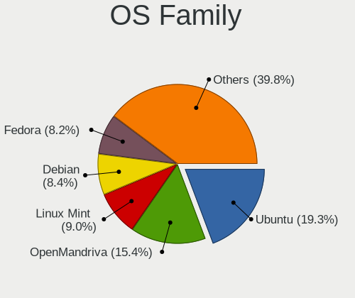
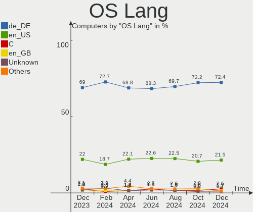
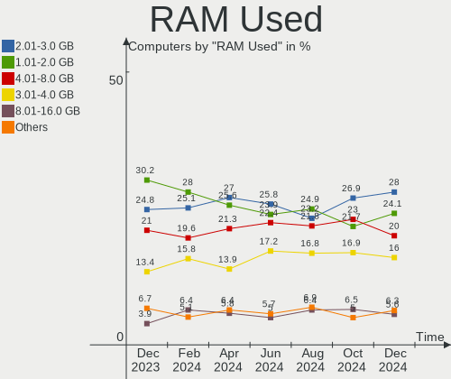
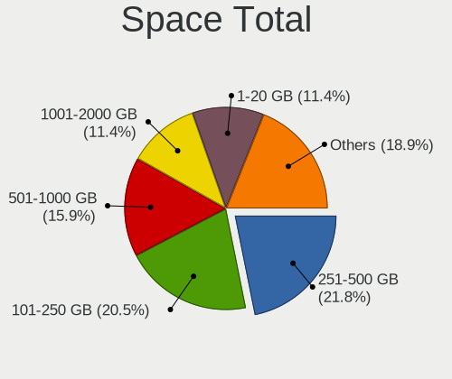
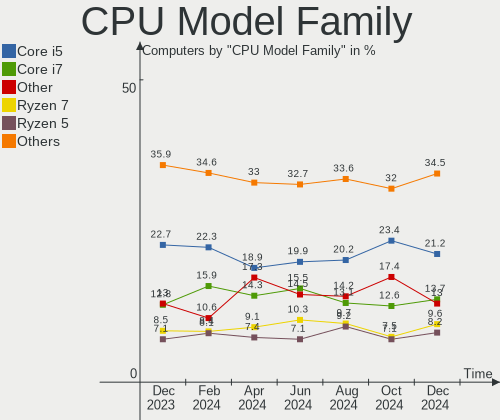
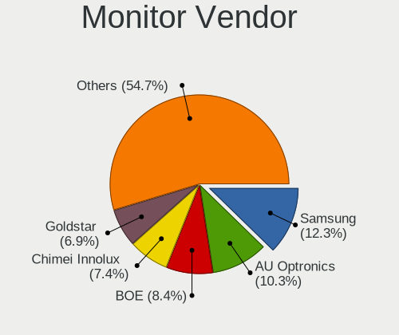
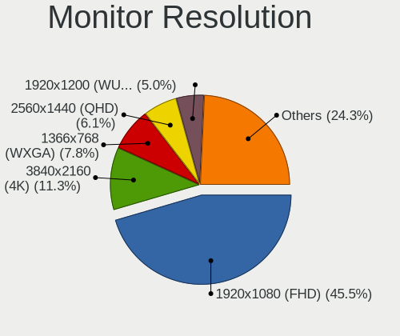
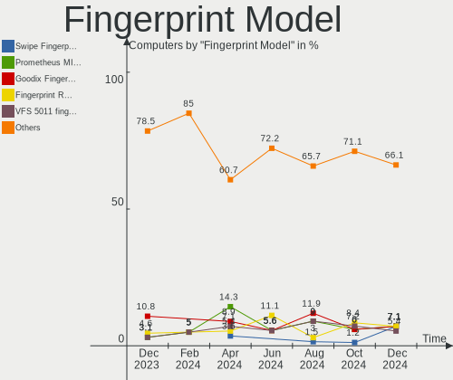
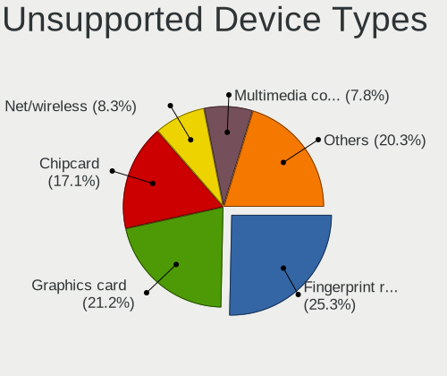

Linux in Germany - Hardware Trends
----------------------------------

A project to identify most popular hardware characteristics and track their change
over time based on data collected by Linux users at https://Linux-Hardware.org.

Anyone can contribute to this report by the [hw-probe](https://github.com/linuxhw/hw-probe) tool:

    sudo -E hw-probe -all -upload

This is a report for all computer types. See also reports for [desktops](/Location/Germany/Desktop/README.md) and [notebooks](/Location/Germany/Notebook/README.md).

Period: Aug, 2023.

Contents
--------

* [ System ](#system)
  - [ OS                       ](#os)
  - [ OS Family                ](#os-family)
  - [ Kernel                   ](#kernel)
  - [ Kernel Family            ](#kernel-family)
  - [ Kernel Major Ver.        ](#kernel-major-ver)
  - [ Arch                     ](#arch)
  - [ DE                       ](#de)
  - [ Display Server           ](#display-server)
  - [ Display Manager          ](#display-manager)
  - [ OS Lang                  ](#os-lang)
  - [ Boot Mode                ](#boot-mode)
  - [ Filesystem               ](#filesystem)
  - [ Part. scheme             ](#part-scheme)
  - [ Dual Boot with Linux/BSD ](#dual-boot-with-linuxbsd)
  - [ Dual Boot (Win)          ](#dual-boot-win)

* [ Board ](#board)
  - [ Vendor                   ](#vendor)
  - [ Model                    ](#model)
  - [ Model Family             ](#model-family)
  - [ MFG Year                 ](#mfg-year)
  - [ Form Factor              ](#form-factor)
  - [ Secure Boot              ](#secure-boot)
  - [ Coreboot                 ](#coreboot)
  - [ RAM Size                 ](#ram-size)
  - [ RAM Used                 ](#ram-used)
  - [ Total Drives             ](#total-drives)
  - [ Has CD-ROM               ](#has-cd-rom)
  - [ Has Ethernet             ](#has-ethernet)
  - [ Has WiFi                 ](#has-wifi)
  - [ Has Bluetooth            ](#has-bluetooth)

* [ Location ](#location)
  - [ Country                  ](#country)
  - [ City                     ](#city)

* [ Drives ](#drives)
  - [ Drive Vendor             ](#drive-vendor)
  - [ Drive Model              ](#drive-model)
  - [ HDD Vendor               ](#hdd-vendor)
  - [ SSD Vendor               ](#ssd-vendor)
  - [ Drive Kind               ](#drive-kind)
  - [ Drive Connector          ](#drive-connector)
  - [ Drive Size               ](#drive-size)
  - [ Space Total              ](#space-total)
  - [ Space Used               ](#space-used)
  - [ Malfunc. Drives          ](#malfunc-drives)
  - [ Malfunc. Drive Vendor    ](#malfunc-drive-vendor)
  - [ Malfunc. HDD Vendor      ](#malfunc-hdd-vendor)
  - [ Malfunc. Drive Kind      ](#malfunc-drive-kind)
  - [ Failed Drives            ](#failed-drives)
  - [ Failed Drive Vendor      ](#failed-drive-vendor)
  - [ Drive Status             ](#drive-status)

* [ Storage controller ](#storage-controller)
  - [ Storage Vendor           ](#storage-vendor)
  - [ Storage Model            ](#storage-model)
  - [ Storage Kind             ](#storage-kind)

* [ Processor ](#processor)
  - [ CPU Vendor               ](#cpu-vendor)
  - [ CPU Model                ](#cpu-model)
  - [ CPU Model Family         ](#cpu-model-family)
  - [ CPU Cores                ](#cpu-cores)
  - [ CPU Sockets              ](#cpu-sockets)
  - [ CPU Threads              ](#cpu-threads)
  - [ CPU Op-Modes             ](#cpu-op-modes)
  - [ CPU Microcode            ](#cpu-microcode)
  - [ CPU Microarch            ](#cpu-microarch)

* [ Graphics ](#graphics)
  - [ GPU Vendor               ](#gpu-vendor)
  - [ GPU Model                ](#gpu-model)
  - [ GPU Combo                ](#gpu-combo)
  - [ GPU Driver               ](#gpu-driver)
  - [ GPU Memory               ](#gpu-memory)

* [ Monitor ](#monitor)
  - [ Monitor Vendor           ](#monitor-vendor)
  - [ Monitor Model            ](#monitor-model)
  - [ Monitor Resolution       ](#monitor-resolution)
  - [ Monitor Diagonal         ](#monitor-diagonal)
  - [ Monitor Width            ](#monitor-width)
  - [ Aspect Ratio             ](#aspect-ratio)
  - [ Monitor Area             ](#monitor-area)
  - [ Pixel Density            ](#pixel-density)
  - [ Multiple Monitors        ](#multiple-monitors)

* [ Network ](#network)
  - [ Net Controller Vendor    ](#net-controller-vendor)
  - [ Net Controller Model     ](#net-controller-model)
  - [ Wireless Vendor          ](#wireless-vendor)
  - [ Wireless Model           ](#wireless-model)
  - [ Ethernet Vendor          ](#ethernet-vendor)
  - [ Ethernet Model           ](#ethernet-model)
  - [ Net Controller Kind      ](#net-controller-kind)
  - [ Used Controller          ](#used-controller)
  - [ NICs                     ](#nics)
  - [ IPv6                     ](#ipv6)

* [ Bluetooth ](#bluetooth)
  - [ Bluetooth Vendor         ](#bluetooth-vendor)
  - [ Bluetooth Model          ](#bluetooth-model)

* [ Sound ](#sound)
  - [ Sound Vendor             ](#sound-vendor)
  - [ Sound Model              ](#sound-model)

* [ Memory ](#memory)
  - [ Memory Vendor            ](#memory-vendor)
  - [ Memory Model             ](#memory-model)
  - [ Memory Kind              ](#memory-kind)
  - [ Memory Form Factor       ](#memory-form-factor)
  - [ Memory Size              ](#memory-size)
  - [ Memory Speed             ](#memory-speed)

* [ Printers & scanners ](#printers--scanners)
  - [ Printer Vendor           ](#printer-vendor)
  - [ Printer Model            ](#printer-model)
  - [ Scanner Vendor           ](#scanner-vendor)
  - [ Scanner Model            ](#scanner-model)

* [ Camera ](#camera)
  - [ Camera Vendor            ](#camera-vendor)
  - [ Camera Model             ](#camera-model)

* [ Security ](#security)
  - [ Fingerprint Vendor       ](#fingerprint-vendor)
  - [ Fingerprint Model        ](#fingerprint-model)
  - [ Chipcard Vendor          ](#chipcard-vendor)
  - [ Chipcard Model           ](#chipcard-model)

* [ Unsupported ](#unsupported)
  - [ Unsupported Devices      ](#unsupported-devices)
  - [ Unsupported Device Types ](#unsupported-device-types)

System
------

OS
--

Installed operating systems

| Name                         | Computers | Percent |
|------------------------------|-----------|---------|
| Ubuntu 22.04                 | 74        | 11.67%  |
| Linux Mint 21.2              | 62        | 9.78%   |
| OpenMandriva 23.08           | 51        | 8.04%   |
| Ubuntu 23.04                 | 45        | 7.1%    |
| Fedora 38                    | 43        | 6.78%   |
| Debian 12                    | 27        | 4.26%   |
| Pop!_OS 22.04                | 23        | 3.63%   |
| Ubuntu 20.04                 | 19        | 3%      |
| Zorin 16                     | 18        | 2.84%   |
| Arch Rolling                 | 17        | 2.68%   |
| openSUSE Tumbleweed-XXXXXXXX | 12        | 1.89%   |
| Linux Mint 21.1              | 12        | 1.89%   |
| ArcoLinux Rolling            | 12        | 1.89%   |
| openSUSE Leap-15.5           | 10        | 1.58%   |
| Manjaro                      | 10        | 1.58%   |
| Kubuntu 23.04                | 10        | 1.58%   |
| Debian                       | 10        | 1.58%   |
| Linux Mint 20.3              | 9         | 1.42%   |
| TUXEDO OS 22.04              | 8         | 1.26%   |
| Ubuntu MATE 22.04            | 7         | 1.1%    |
| Debian 11                    | 7         | 1.1%    |
| Manjaro 23.0.0               | 6         | 0.95%   |
| LMDE 5                       | 6         | 0.95%   |
| Kubuntu 22.04                | 6         | 0.95%   |
| KDE neon 22.04               | 6         | 0.95%   |
| Xero Rolling                 | 5         | 0.79%   |
| SteamOS 3.4.8                | 5         | 0.79%   |
| BlackPanther 18.1            | 5         | 0.79%   |
| Xubuntu 22.04                | 4         | 0.63%   |
| OpenMandriva 4.3             | 4         | 0.63%   |
| OpenMandriva 23.90           | 4         | 0.63%   |
| OpenMandriva 23.03           | 4         | 0.63%   |
| MX 23                        | 4         | 0.63%   |
| EndeavourOS Rolling          | 4         | 0.63%   |
| openSUSE Leap-15.4           | 3         | 0.47%   |
| OpenMandriva 23.07           | 3         | 0.47%   |
| Nobara 38                    | 3         | 0.47%   |
| NixOS 23.11                  | 3         | 0.47%   |
| Linux Mint 21                | 3         | 0.47%   |
| Kubuntu 11                   | 3         | 0.47%   |

OS Family
---------

OS without a version

| Name          | Computers | Percent |
|---------------|-----------|---------|
| Ubuntu        | 143       | 22.56%  |
| Linux Mint    | 89        | 14.04%  |
| OpenMandriva  | 68        | 10.73%  |
| Fedora        | 45        | 7.1%    |
| Debian        | 44        | 6.94%   |
| openSUSE      | 27        | 4.26%   |
| Pop!_OS       | 23        | 3.63%   |
| Kubuntu       | 20        | 3.15%   |
| Zorin         | 18        | 2.84%   |
| Arch          | 17        | 2.68%   |
| Manjaro       | 16        | 2.52%   |
| ArcoLinux     | 12        | 1.89%   |
| Xubuntu       | 9         | 1.42%   |
| Ubuntu MATE   | 8         | 1.26%   |
| TUXEDO OS     | 8         | 1.26%   |
| LMDE          | 6         | 0.95%   |
| KDE neon      | 6         | 0.95%   |
| Xero          | 5         | 0.79%   |
| SteamOS       | 5         | 0.79%   |
| MX            | 5         | 0.79%   |
| Kali          | 5         | 0.79%   |
| Gentoo        | 5         | 0.79%   |
| BlackPanther  | 5         | 0.79%   |
| Nobara        | 4         | 0.63%   |
| Garuda Linux  | 4         | 0.63%   |
| EndeavourOS   | 4         | 0.63%   |
| Ubuntu Budgie | 3         | 0.47%   |
| NixOS         | 3         | 0.47%   |
| Lubuntu       | 3         | 0.47%   |
| Elementary    | 3         | 0.47%   |
| ROSA          | 2         | 0.32%   |
| Parrot        | 2         | 0.32%   |
| Endless       | 2         | 0.32%   |
| Ultramarine   | 1         | 0.16%   |
| Ubuntu Studio | 1         | 0.16%   |
| Siduction     | 1         | 0.16%   |
| Rocky Linux   | 1         | 0.16%   |
| RHEL          | 1         | 0.16%   |
| Q4OS          | 1         | 0.16%   |
| Pikaos        | 1         | 0.16%   |

Kernel
------

Version of the Linux kernel

| Version                      | Computers | Percent |
|------------------------------|-----------|---------|
| 6.2.0-26-generic             | 82        | 12.93%  |
| 5.15.0-78-generic            | 56        | 8.83%   |
| 6.4.11-desktop-1omv2390      | 42        | 6.62%   |
| 5.15.0-79-generic            | 39        | 6.15%   |
| 6.2.0-27-generic             | 25        | 3.94%   |
| 6.4.6-76060406-generic       | 16        | 2.52%   |
| 6.1.0-10-amd64               | 15        | 2.37%   |
| 6.4.8-desktop-2omv2390       | 13        | 2.05%   |
| 6.2.0-31-generic             | 13        | 2.05%   |
| 5.19.0-50-generic            | 12        | 1.89%   |
| 6.2.0-10018-tuxedo           | 10        | 1.58%   |
| 6.1.0-11-amd64               | 9         | 1.42%   |
| 6.4.10-200.fc38.x86_64       | 8         | 1.26%   |
| 6.4.7-200.fc38.x86_64        | 7         | 1.1%    |
| 6.2.6-76060206-generic       | 7         | 1.1%    |
| 5.15.0-82-generic            | 7         | 1.1%    |
| 6.4.8-arch1-1                | 6         | 0.95%   |
| 6.4.6-200.fc38.x86_64        | 6         | 0.95%   |
| 6.4.11-arch2-1               | 6         | 0.95%   |
| 6.4.9-arch1-1                | 5         | 0.79%   |
| 6.4.6-1-default              | 5         | 0.79%   |
| 6.4.11-200.fc38.x86_64       | 5         | 0.79%   |
| 5.4.0-156-generic            | 5         | 0.79%   |
| 5.13.0-valve36-1-neptune     | 5         | 0.79%   |
| 5.10.0-23-amd64              | 5         | 0.79%   |
| 6.4.9-1-default              | 4         | 0.63%   |
| 6.4.12-200.fc38.x86_64       | 4         | 0.63%   |
| 6.4.10-zen2-1-zen            | 4         | 0.63%   |
| 6.4.0-2-amd64                | 4         | 0.63%   |
| 6.3.5-desktop-3omv2390       | 4         | 0.63%   |
| 6.2.9-300.fc38.x86_64        | 4         | 0.63%   |
| 6.2.6-desktop-1omv2390       | 4         | 0.63%   |
| 6.1.41-1-MANJARO             | 4         | 0.63%   |
| 5.4.0-150-generic            | 4         | 0.63%   |
| 5.19.0-46-generic            | 4         | 0.63%   |
| 5.14.21-150500.55.19-default | 4         | 0.63%   |
| 6.4.9-200.fc38.x86_64        | 3         | 0.47%   |
| 6.4.8-200.fc38.x86_64        | 3         | 0.47%   |
| 6.4.8-060408-generic         | 3         | 0.47%   |
| 6.4.11-zen2-1-zen            | 3         | 0.47%   |

Kernel Family
-------------

Linux kernel without a distro release

| Version  | Computers | Percent |
|----------|-----------|---------|
| 6.2.0    | 136       | 21.45%  |
| 5.15.0   | 123       | 19.4%   |
| 6.4.11   | 59        | 9.31%   |
| 6.1.0    | 30        | 4.73%   |
| 6.4.6    | 29        | 4.57%   |
| 6.4.8    | 28        | 4.42%   |
| 5.19.0   | 23        | 3.63%   |
| 5.4.0    | 19        | 3%      |
| 6.4.10   | 18        | 2.84%   |
| 6.4.9    | 17        | 2.68%   |
| 6.4.7    | 14        | 2.21%   |
| 5.14.21  | 13        | 2.05%   |
| 6.4.0    | 12        | 1.89%   |
| 6.2.6    | 11        | 1.74%   |
| 5.10.0   | 9         | 1.42%   |
| 6.4.12   | 8         | 1.26%   |
| 5.13.0   | 7         | 1.1%    |
| 6.1.41   | 6         | 0.95%   |
| 6.3.5    | 5         | 0.79%   |
| 6.3.0    | 5         | 0.79%   |
| 6.2.9    | 4         | 0.63%   |
| 6.5.0    | 3         | 0.47%   |
| 6.4.4    | 3         | 0.47%   |
| 6.3.12   | 3         | 0.47%   |
| 6.2.16   | 3         | 0.47%   |
| 5.6.14   | 3         | 0.47%   |
| 5.16.7   | 3         | 0.47%   |
| 5.15.125 | 3         | 0.47%   |
| 6.3.9    | 2         | 0.32%   |
| 6.3.11   | 2         | 0.32%   |
| 6.1.49   | 2         | 0.32%   |
| 6.1.44   | 2         | 0.32%   |
| 6.1.39   | 2         | 0.32%   |
| 6.1.38   | 2         | 0.32%   |
| 6.0.0    | 2         | 0.32%   |
| 5.15.108 | 2         | 0.32%   |
| 6.4.3    | 1         | 0.16%   |
| 6.4.2    | 1         | 0.16%   |
| 6.3.8    | 1         | 0.16%   |
| 6.3.7    | 1         | 0.16%   |

Kernel Major Ver.
-----------------

Linux kernel major version

| Version | Computers | Percent |
|---------|-----------|---------|
| 6.4     | 190       | 29.97%  |
| 6.2     | 154       | 24.29%  |
| 5.15    | 131       | 20.66%  |
| 6.1     | 48        | 7.57%   |
| 5.19    | 23        | 3.63%   |
| 6.3     | 19        | 3%      |
| 5.4     | 19        | 3%      |
| 5.14    | 14        | 2.21%   |
| 5.10    | 13        | 2.05%   |
| 5.13    | 7         | 1.1%    |
| 5.16    | 4         | 0.63%   |
| 6.5     | 3         | 0.47%   |
| 5.6     | 3         | 0.47%   |
| 6.0     | 2         | 0.32%   |
| 5.11    | 2         | 0.32%   |
| 4.18    | 2         | 0.32%   |

Arch
----

OS architecture (x86_64, i586, etc.)

| Name    | Computers | Percent |
|---------|-----------|---------|
| x86_64  | 627       | 98.9%   |
| i686    | 3         | 0.47%   |
| aarch64 | 3         | 0.47%   |
| armv7l  | 1         | 0.16%   |

DE
--

Desktop Environment

| Name          | Computers | Percent |
|---------------|-----------|---------|
| GNOME         | 249       | 39.27%  |
| KDE5          | 188       | 29.65%  |
| X-Cinnamon    | 82        | 12.93%  |
| XFCE          | 37        | 5.84%   |
| Unknown       | 21        | 3.31%   |
| MATE          | 16        | 2.52%   |
| Cinnamon      | 11        | 1.74%   |
| LXQt          | 6         | 0.95%   |
| Pantheon      | 4         | 0.63%   |
| i3            | 4         | 0.63%   |
| Hyprland      | 4         | 0.63%   |
| LXDE          | 3         | 0.47%   |
| Budgie        | 3         | 0.47%   |
| GNOME Classic | 2         | 0.32%   |
| qtile         | 1         | 0.16%   |
| none+awesome  | 1         | 0.16%   |
| KDE           | 1         | 0.16%   |
| icewm         | 1         | 0.16%   |

Display Server
--------------

X11 or Wayland

| Name    | Computers | Percent |
|---------|-----------|---------|
| X11     | 368       | 58.04%  |
| Wayland | 237       | 37.38%  |
| Tty     | 16        | 2.52%   |
| Unknown | 13        | 2.05%   |

Display Manager
---------------

SDDM, LightDM, etc.

| Name    | Computers | Percent |
|---------|-----------|---------|
| Unknown | 232       | 36.59%  |
| SDDM    | 144       | 22.71%  |
| GDM3    | 143       | 22.56%  |
| LightDM | 89        | 14.04%  |
| GDM     | 23        | 3.63%   |
| XDM     | 1         | 0.16%   |
| WDM     | 1         | 0.16%   |
| SLiM    | 1         | 0.16%   |

OS Lang
-------

Language

| Lang            | Computers | Percent |
|-----------------|-----------|---------|
| de_DE           | 454       | 71.61%  |
| en_US           | 119       | 18.77%  |
| en_GB           | 17        | 2.68%   |
| C               | 10        | 1.58%   |
| Unknown         | 10        | 1.58%   |
| ru_RU           | 3         | 0.47%   |
| hu_HU           | 3         | 0.47%   |
| pl_PL           | 2         | 0.32%   |
| de_CH           | 2         | 0.32%   |
| C.UTF8          | 2         | 0.32%   |
| zh_TW           | 1         | 0.16%   |
| uk_UA           | 1         | 0.16%   |
| POSIX           | 1         | 0.16%   |
| it_IT           | 1         | 0.16%   |
| es_ES           | 1         | 0.16%   |
| en_US.UTF8      | 1         | 0.16%   |
| en_US.ISO8859-1 | 1         | 0.16%   |
| en_DK           | 1         | 0.16%   |
| en_DE           | 1         | 0.16%   |
| en_BW           | 1         | 0.16%   |
| de_BE           | 1         | 0.16%   |
| aa_DJ           | 1         | 0.16%   |

Boot Mode
---------

EFI or BIOS

| Mode | Computers | Percent |
|------|-----------|---------|
| EFI  | 321       | 50.63%  |
| BIOS | 313       | 49.37%  |

Filesystem
----------

Type of filesystem

| Type    | Computers | Percent |
|---------|-----------|---------|
| Ext4    | 358       | 56.47%  |
| Tmpfs   | 115       | 18.14%  |
| Btrfs   | 102       | 16.09%  |
| Overlay | 44        | 6.94%   |
| Xfs     | 8         | 1.26%   |
| Zfs     | 5         | 0.79%   |
| F2fs    | 1         | 0.16%   |
| Ext3    | 1         | 0.16%   |

Part. scheme
------------

Scheme of partitioning

| Type    | Computers | Percent |
|---------|-----------|---------|
| GPT     | 350       | 55.21%  |
| Unknown | 215       | 33.91%  |
| MBR     | 69        | 10.88%  |

Dual Boot with Linux/BSD
------------------------

Hosting more than one Linux/BSD

| Dual boot | Computers | Percent |
|-----------|-----------|---------|
| No        | 520       | 82.02%  |
| Yes       | 114       | 17.98%  |

Dual Boot (Win)
---------------

Hosting Linux and Windows

| Dual boot | Computers | Percent |
|-----------|-----------|---------|
| No        | 464       | 73.19%  |
| Yes       | 170       | 26.81%  |

Board
-----

Vendor
------

Motherboard manufacturer

| Name                    | Computers | Percent |
|-------------------------|-----------|---------|
| Lenovo                  | 97        | 15.3%   |
| Hewlett-Packard         | 89        | 14.04%  |
| ASUSTek Computer        | 89        | 14.04%  |
| Dell                    | 60        | 9.46%   |
| Acer                    | 44        | 6.94%   |
| Gigabyte Technology     | 43        | 6.78%   |
| ASRock                  | 38        | 5.99%   |
| MSI                     | 35        | 5.52%   |
| Fujitsu                 | 20        | 3.15%   |
| Medion                  | 19        | 3%      |
| Apple                   | 14        | 2.21%   |
| TUXEDO                  | 8         | 1.26%   |
| Valve                   | 6         | 0.95%   |
| HUAWEI                  | 6         | 0.95%   |
| Toshiba                 | 5         | 0.79%   |
| Unknown                 | 5         | 0.79%   |
| Schenker                | 4         | 0.63%   |
| Packard Bell            | 4         | 0.63%   |
| Supermicro              | 3         | 0.47%   |
| Shuttle                 | 3         | 0.47%   |
| Notebook                | 3         | 0.47%   |
| Foxconn                 | 3         | 0.47%   |
| BESSTAR Tech            | 3         | 0.47%   |
| Samsung Electronics     | 2         | 0.32%   |
| Raspberry Pi Foundation | 2         | 0.32%   |
| Pegatron                | 2         | 0.32%   |
| Intel                   | 2         | 0.32%   |
| Clevo                   | 2         | 0.32%   |
| AZW                     | 2         | 0.32%   |
| ZOTAC                   | 1         | 0.16%   |
| Wortmann AG             | 1         | 0.16%   |
| Win Element             | 1         | 0.16%   |
| VALE                    | 1         | 0.16%   |
| TrekStor                | 1         | 0.16%   |
| Timi                    | 1         | 0.16%   |
| Thomson                 | 1         | 0.16%   |
| TERRA                   | 1         | 0.16%   |
| System76                | 1         | 0.16%   |
| Sony                    | 1         | 0.16%   |
| Panasonic               | 1         | 0.16%   |

Model
-----

Motherboard model

| Name                                    | Computers | Percent |
|-----------------------------------------|-----------|---------|
| Valve Jupiter                           | 6         | 0.95%   |
| Unknown                                 | 6         | 0.95%   |
| HP OMEN by Laptop                       | 4         | 0.63%   |
| ASRock B450M Pro4                       | 4         | 0.63%   |
| MSI MS-7B79                             | 3         | 0.47%   |
| HP EliteBook 840 G3                     | 3         | 0.47%   |
| Fujitsu ESPRIMO Q920                    | 3         | 0.47%   |
| ASUS All Series                         | 3         | 0.47%   |
| Acer Aspire V3-771                      | 3         | 0.47%   |
| Packard Bell EasyNote LS11HR            | 2         | 0.32%   |
| MSI MS-7C95                             | 2         | 0.32%   |
| MSI MS-7C94                             | 2         | 0.32%   |
| MSI MS-7C52                             | 2         | 0.32%   |
| MSI MS-7B93                             | 2         | 0.32%   |
| MSI MS-7817                             | 2         | 0.32%   |
| MSI MS-7816                             | 2         | 0.32%   |
| Lenovo ThinkPad T420 4236MBG            | 2         | 0.32%   |
| Lenovo Legion 5 15ARH05 82B5            | 2         | 0.32%   |
| Lenovo IdeaPad Pro 5 14APH8 83AM        | 2         | 0.32%   |
| Lenovo IdeaPad L340-15IRH Gaming 81LK   | 2         | 0.32%   |
| Lenovo G50-70 20351                     | 2         | 0.32%   |
| HP ProDesk 400 G5 Desktop Mini          | 2         | 0.32%   |
| HP Notebook                             | 2         | 0.32%   |
| HP EliteBook 8470p                      | 2         | 0.32%   |
| HP EliteBook 845 14 inch G9 Notebook PC | 2         | 0.32%   |
| HP EliteBook 830 G8 Notebook PC         | 2         | 0.32%   |
| Gigabyte Z390 UD                        | 2         | 0.32%   |
| Gigabyte X570 AORUS ELITE               | 2         | 0.32%   |
| Gigabyte H81M-D2V                       | 2         | 0.32%   |
| Gigabyte GA-880GMA-UD2H                 | 2         | 0.32%   |
| Gigabyte B550M DS3H                     | 2         | 0.32%   |
| Gigabyte B550 GAMING X V2               | 2         | 0.32%   |
| Fujitsu ESPRIMO Q520                    | 2         | 0.32%   |
| Fujitsu ESPRIMO P910                    | 2         | 0.32%   |
| Dell XPS 15 7590                        | 2         | 0.32%   |
| Dell Precision M4500                    | 2         | 0.32%   |
| Dell PowerEdge R815                     | 2         | 0.32%   |
| Dell Latitude E5470                     | 2         | 0.32%   |
| Dell Latitude 5420                      | 2         | 0.32%   |
| Clevo W150HRM                           | 2         | 0.32%   |

Model Family
------------

Motherboard model prefix

| Name                  | Computers | Percent |
|-----------------------|-----------|---------|
| Lenovo ThinkPad       | 50        | 7.89%   |
| Acer Aspire           | 34        | 5.36%   |
| Dell Latitude         | 20        | 3.15%   |
| ASUS ROG              | 19        | 3%      |
| HP EliteBook          | 18        | 2.84%   |
| ASUS PRIME            | 14        | 2.21%   |
| Fujitsu ESPRIMO       | 12        | 1.89%   |
| HP Laptop             | 11        | 1.74%   |
| Lenovo IdeaPad        | 10        | 1.58%   |
| HP Pavilion           | 10        | 1.58%   |
| Lenovo ThinkCentre    | 9         | 1.42%   |
| Dell XPS              | 9         | 1.42%   |
| Dell Precision        | 8         | 1.26%   |
| Dell OptiPlex         | 8         | 1.26%   |
| Valve Jupiter         | 6         | 0.95%   |
| HP ENVY               | 6         | 0.95%   |
| Dell Inspiron         | 6         | 0.95%   |
| Unknown               | 6         | 0.95%   |
| Toshiba Satellite     | 5         | 0.79%   |
| Lenovo Yoga           | 5         | 0.79%   |
| HP ProDesk            | 5         | 0.79%   |
| HP ProBook            | 5         | 0.79%   |
| Fujitsu LIFEBOOK      | 5         | 0.79%   |
| Dell PowerEdge        | 5         | 0.79%   |
| ASRock B450M          | 5         | 0.79%   |
| Packard Bell EasyNote | 4         | 0.63%   |
| HP ZBook              | 4         | 0.63%   |
| HP OMEN               | 4         | 0.63%   |
| HP EliteDesk          | 4         | 0.63%   |
| Gigabyte B550         | 4         | 0.63%   |
| ASUS TUF              | 4         | 0.63%   |
| ASUS M5A78L-M         | 4         | 0.63%   |
| Acer Extensa          | 4         | 0.63%   |
| MSI MS-7B79           | 3         | 0.47%   |
| MSI Mr.               | 3         | 0.47%   |
| Lenovo ThinkStation   | 3         | 0.47%   |
| Lenovo ThinkBook      | 3         | 0.47%   |
| Lenovo Legion         | 3         | 0.47%   |
| Lenovo IdeaCentre     | 3         | 0.47%   |
| HP Compaq             | 3         | 0.47%   |

MFG Year
--------

Motherboard manufacture year

| Year    | Computers | Percent |
|---------|-----------|---------|
| 2020    | 73        | 11.51%  |
| 2021    | 60        | 9.46%   |
| 2022    | 54        | 8.52%   |
| 2018    | 46        | 7.26%   |
| 2019    | 45        | 7.1%    |
| 2013    | 43        | 6.78%   |
| 2011    | 43        | 6.78%   |
| 2014    | 39        | 6.15%   |
| 2012    | 39        | 6.15%   |
| 2017    | 36        | 5.68%   |
| 2023    | 32        | 5.05%   |
| 2015    | 32        | 5.05%   |
| 2016    | 31        | 4.89%   |
| 2010    | 23        | 3.63%   |
| 2009    | 13        | 2.05%   |
| 2008    | 13        | 2.05%   |
| 2007    | 6         | 0.95%   |
| Unknown | 4         | 0.63%   |
| 2006    | 2         | 0.32%   |

Form Factor
-----------

Physical design of the computer

| Name           | Computers | Percent |
|----------------|-----------|---------|
| Notebook       | 317       | 50%     |
| Desktop        | 259       | 40.85%  |
| Convertible    | 20        | 3.15%   |
| Mini pc        | 16        | 2.52%   |
| Server         | 8         | 1.26%   |
| Tablet         | 5         | 0.79%   |
| All in one     | 5         | 0.79%   |
| System on chip | 4         | 0.63%   |

Secure Boot
-----------

Enabled or disabled

| State    | Computers | Percent |
|----------|-----------|---------|
| Disabled | 586       | 92.43%  |
| Enabled  | 48        | 7.57%   |

Coreboot
--------

Have coreboot on board

| Used | Computers | Percent |
|------|-----------|---------|
| No   | 634       | 100%    |

RAM Size
--------

Total RAM memory

| Size in GB      | Computers | Percent |
|-----------------|-----------|---------|
| 4.01-8.0        | 146       | 23.03%  |
| 16.01-24.0      | 127       | 20.03%  |
| 8.01-16.0       | 115       | 18.14%  |
| 32.01-64.0      | 102       | 16.09%  |
| 3.01-4.0        | 77        | 12.15%  |
| 64.01-256.0     | 30        | 4.73%   |
| 24.01-32.0      | 20        | 3.15%   |
| 1.01-2.0        | 9         | 1.42%   |
| 2.01-3.0        | 4         | 0.63%   |
| More than 256.0 | 2         | 0.32%   |
| 0.51-1.0        | 1         | 0.16%   |
| 0.01-0.5        | 1         | 0.16%   |

RAM Used
--------

Used RAM memory

| Used GB    | Computers | Percent |
|------------|-----------|---------|
| 1.01-2.0   | 190       | 29.97%  |
| 2.01-3.0   | 154       | 24.29%  |
| 4.01-8.0   | 123       | 19.4%   |
| 3.01-4.0   | 91        | 14.35%  |
| 8.01-16.0  | 40        | 6.31%   |
| 0.51-1.0   | 18        | 2.84%   |
| 16.01-24.0 | 8         | 1.26%   |
| 0.01-0.5   | 8         | 1.26%   |
| 32.01-64.0 | 1         | 0.16%   |
| 24.01-32.0 | 1         | 0.16%   |

Total Drives
------------

Number of drives on board

| Drives | Computers | Percent |
|--------|-----------|---------|
| 1      | 343       | 54.1%   |
| 2      | 175       | 27.6%   |
| 3      | 56        | 8.83%   |
| 4      | 28        | 4.42%   |
| 5      | 13        | 2.05%   |
| 6      | 7         | 1.1%    |
| 7      | 4         | 0.63%   |
| 0      | 3         | 0.47%   |
| 8      | 2         | 0.32%   |
| 32     | 1         | 0.16%   |
| 10     | 1         | 0.16%   |
| 9      | 1         | 0.16%   |

Has CD-ROM
----------

Has CD-ROM on board

| Presented | Computers | Percent |
|-----------|-----------|---------|
| No        | 388       | 61.2%   |
| Yes       | 246       | 38.8%   |

Has Ethernet
------------

Has Ethernet on board

| Presented | Computers | Percent |
|-----------|-----------|---------|
| Yes       | 555       | 87.54%  |
| No        | 79        | 12.46%  |

Has WiFi
--------

Has WiFi module

| Presented | Computers | Percent |
|-----------|-----------|---------|
| Yes       | 453       | 71.45%  |
| No        | 181       | 28.55%  |

Has Bluetooth
-------------

Has Bluetooth module

| Presented | Computers | Percent |
|-----------|-----------|---------|
| Yes       | 415       | 65.46%  |
| No        | 219       | 34.54%  |

Location
--------

Country
-------

Geographic location (country)

| Country | Computers | Percent |
|---------|-----------|---------|
| Germany | 634       | 100%    |

City
----

Geographic location (city)

| City              | Computers | Percent |
|-------------------|-----------|---------|
| Berlin            | 53        | 8.36%   |
| Hamburg           | 32        | 5.05%   |
| Cologne           | 22        | 3.47%   |
| Munich            | 16        | 2.52%   |
| Frankfurt am Main | 15        | 2.37%   |
| Karlsruhe         | 10        | 1.58%   |
| Stuttgart         | 9         | 1.42%   |
| Dortmund          | 8         | 1.26%   |
| Braunschweig      | 8         | 1.26%   |
| Mönchengladbach  | 7         | 1.1%    |
| Ulm               | 6         | 0.95%   |
| Nuremberg         | 6         | 0.95%   |
| Mannheim          | 6         | 0.95%   |
| Leipzig           | 6         | 0.95%   |
| Hanover           | 6         | 0.95%   |
| Essen             | 6         | 0.95%   |
| Bonn              | 6         | 0.95%   |
| Jena              | 5         | 0.79%   |
| Bochum            | 5         | 0.79%   |
| Bielefeld         | 5         | 0.79%   |
| Wuppertal         | 4         | 0.63%   |
| Greifswald        | 4         | 0.63%   |
| Göppingen        | 4         | 0.63%   |
| Düren            | 4         | 0.63%   |
| Duisburg          | 4         | 0.63%   |
| Dresden           | 4         | 0.63%   |
| Coburg            | 4         | 0.63%   |
| Bremen            | 4         | 0.63%   |
| Bamberg           | 4         | 0.63%   |
| Winsen            | 3         | 0.47%   |
| Traunstein        | 3         | 0.47%   |
| Singen            | 3         | 0.47%   |
| Ratingen          | 3         | 0.47%   |
| Nordenham         | 3         | 0.47%   |
| Ludwigsburg       | 3         | 0.47%   |
| Lüdenscheid      | 3         | 0.47%   |
| Flensburg         | 3         | 0.47%   |
| Eberswalde        | 3         | 0.47%   |
| Düsseldorf       | 3         | 0.47%   |
| Würzburg         | 2         | 0.32%   |

Drives
------

Drive Vendor
------------

Hard drive vendors

| Vendor                      | Computers | Drives | Percent |
|-----------------------------|-----------|--------|---------|
| Samsung Electronics         | 218       | 274    | 22.15%  |
| WDC                         | 96        | 119    | 9.76%   |
| Seagate                     | 88        | 106    | 8.94%   |
| SanDisk                     | 80        | 88     | 8.13%   |
| Toshiba                     | 57        | 62     | 5.79%   |
| Crucial                     | 52        | 61     | 5.28%   |
| Unknown                     | 39        | 46     | 3.96%   |
| Kingston                    | 33        | 39     | 3.35%   |
| Intenso                     | 30        | 31     | 3.05%   |
| Micron Technology           | 25        | 25     | 2.54%   |
| Hitachi                     | 24        | 27     | 2.44%   |
| SK hynix                    | 18        | 18     | 1.83%   |
| Intel                       | 18        | 19     | 1.83%   |
| Micron/Crucial Technology   | 11        | 12     | 1.12%   |
| HGST                        | 11        | 39     | 1.12%   |
| Phison Electronics          | 9         | 10     | 0.91%   |
| KIOXIA                      | 9         | 9      | 0.91%   |
| Kingston Technology Company | 9         | 9      | 0.91%   |
| A-DATA Technology           | 9         | 9      | 0.91%   |
| Transcend                   | 8         | 8      | 0.81%   |
| Apple                       | 8         | 8      | 0.81%   |
| Verbatim                    | 7         | 8      | 0.71%   |
| SPCC                        | 7         | 7      | 0.71%   |
| Silicon Motion              | 6         | 6      | 0.61%   |
| Phison                      | 6         | 6      | 0.61%   |
| MAXIO Technology (Hangzhou) | 6         | 8      | 0.61%   |
| ADATA Technology            | 6         | 6      | 0.61%   |
| Unknown                     | 6         | 6      | 0.61%   |
| Patriot                     | 5         | 5      | 0.51%   |
| China                       | 5         | 5      | 0.51%   |
| LITEON                      | 4         | 4      | 0.41%   |
| SABRENT                     | 3         | 3      | 0.3%    |
| OCZ                         | 3         | 3      | 0.3%    |
| Lenovo                      | 3         | 3      | 0.3%    |
| Hewlett-Packard             | 3         | 3      | 0.3%    |
| Fanxiang                    | 3         | 3      | 0.3%    |
| Union Memory                | 2         | 2      | 0.2%    |
| UMIS                        | 2         | 2      | 0.2%    |
| Team                        | 2         | 2      | 0.2%    |
| Seagate Technology          | 2         | 2      | 0.2%    |

Drive Model
-----------

Hard drive models

| Model                                                           | Computers | Percent |
|-----------------------------------------------------------------|-----------|---------|
| Samsung NVMe SSD Controller SM981/PM981/PM983 500GB             | 26        | 2.4%    |
| Samsung NVMe SSD Controller PM9A1/PM9A3/980PRO 1024GB           | 20        | 1.85%   |
| Crucial CT1000MX500SSD1 1TB                                     | 12        | 1.11%   |
| Samsung SSD 860 EVO 500GB                                       | 10        | 0.92%   |
| Samsung SSD 860 EVO 1TB                                         | 10        | 0.92%   |
| Samsung SSD 850 EVO 500GB                                       | 10        | 0.92%   |
| Unknown MMC Card  64GB                                          | 9         | 0.83%   |
| WDC WD10JPVX-22JC3T0 1TB                                        | 8         | 0.74%   |
| Samsung SSD 870 QVO 1TB                                         | 8         | 0.74%   |
| Samsung NVMe SSD Controller SM961/PM961/SM963 1024GB            | 8         | 0.74%   |
| Micron/Crucial P2 NVMe PCIe SSD 1TB                             | 8         | 0.74%   |
| Unknown SD/MMC/MS PRO 1GB                                       | 7         | 0.65%   |
| Seagate ST4000DM004-2CV104 4TB                                  | 7         | 0.65%   |
| Sandisk WD Blue SN550 NVMe SSD 250GB                            | 7         | 0.65%   |
| Samsung SSD 980 1TB                                             | 7         | 0.65%   |
| Samsung SSD 870 EVO 500GB                                       | 7         | 0.65%   |
| Samsung SSD 870 EVO 1TB                                         | 7         | 0.65%   |
| Samsung SSD 860 QVO 1TB                                         | 7         | 0.65%   |
| Samsung SSD 850 EVO 250GB                                       | 7         | 0.65%   |
| Kingston SKC3000D2048G 2TB                                      | 7         | 0.65%   |
| Verbatim Vi550 S3 512GB                                         | 6         | 0.55%   |
| Toshiba MQ01ABD100 1TB                                          | 6         | 0.55%   |
| Toshiba HDWD110 1TB                                             | 6         | 0.55%   |
| Seagate ST1000LM024 HN-M101MBB 1TB                              | 6         | 0.55%   |
| SanDisk SSD PLUS 240GB                                          | 6         | 0.55%   |
| SanDisk SSD PLUS 120GB                                          | 6         | 0.55%   |
| Unknown                                                         | 6         | 0.55%   |
| Unknown MMC Card  32GB                                          | 5         | 0.46%   |
| Unknown MMC Card  128GB                                         | 5         | 0.46%   |
| SanDisk SSD PLUS 480GB                                          | 5         | 0.46%   |
| Samsung SSD 970 EVO Plus 1TB                                    | 5         | 0.46%   |
| Samsung SSD 840 EVO 250GB                                       | 5         | 0.46%   |
| MAXIO (Hangzhou) NVMe SSD Controller MAP1202 1024GB             | 5         | 0.46%   |
| Kingston Company SNV2S1000G 1TB                                 | 5         | 0.46%   |
| Crucial CT500MX500SSD1 500GB                                    | 5         | 0.46%   |
| ADATA XPG SX8200 Pro PCIe Gen3x4 M.2 2280 Solid State Drive 2TB | 5         | 0.46%   |
| Seagate ST500LM021-1KJ152 500GB                                 | 4         | 0.37%   |
| Seagate ST500DM002-1BD142 500GB                                 | 4         | 0.37%   |
| Seagate ST2000DM008-2FR102 2TB                                  | 4         | 0.37%   |
| Seagate ST1000LM035-1RK172 1TB                                  | 4         | 0.37%   |

HDD Vendor
----------

Hard disk drive vendors

| Vendor              | Computers | Drives | Percent |
|---------------------|-----------|--------|---------|
| Seagate             | 87        | 105    | 30.96%  |
| WDC                 | 77        | 95     | 27.4%   |
| Toshiba             | 42        | 46     | 14.95%  |
| Hitachi             | 24        | 27     | 8.54%   |
| Samsung Electronics | 11        | 12     | 3.91%   |
| HGST                | 11        | 39     | 3.91%   |
| Unknown             | 7         | 7      | 2.49%   |
| SABRENT             | 3         | 3      | 1.07%   |
| Intenso             | 3         | 3      | 1.07%   |
| Apple               | 3         | 3      | 1.07%   |
| Maxtor              | 2         | 3      | 0.71%   |
| Fujitsu             | 2         | 2      | 0.71%   |
| WD_BLACK            | 1         | 1      | 0.36%   |
| WD MediaMax         | 1         | 1      | 0.36%   |
| USB                 | 1         | 2      | 0.36%   |
| Maxone              | 1         | 1      | 0.36%   |
| HGST HTS            | 1         | 1      | 0.36%   |
| Hewlett-Packard     | 1         | 1      | 0.36%   |
| ExcelStor           | 1         | 1      | 0.36%   |
| DELLBOSS            | 1         | 1      | 0.36%   |
| Unknown             | 1         | 1      | 0.36%   |

SSD Vendor
----------

Solid state drive vendors

| Vendor              | Computers | Drives | Percent |
|---------------------|-----------|--------|---------|
| Samsung Electronics | 116       | 139    | 30.61%  |
| SanDisk             | 47        | 50     | 12.4%   |
| Crucial             | 47        | 51     | 12.4%   |
| Intenso             | 24        | 25     | 6.33%   |
| Kingston            | 16        | 17     | 4.22%   |
| Micron Technology   | 13        | 13     | 3.43%   |
| WDC                 | 12        | 12     | 3.17%   |
| Intel               | 9         | 10     | 2.37%   |
| Transcend           | 8         | 8      | 2.11%   |
| Verbatim            | 7         | 8      | 1.85%   |
| A-DATA Technology   | 7         | 7      | 1.85%   |
| Toshiba             | 5         | 5      | 1.32%   |
| SPCC                | 5         | 5      | 1.32%   |
| SK hynix            | 5         | 5      | 1.32%   |
| China               | 5         | 5      | 1.32%   |
| Apple               | 5         | 5      | 1.32%   |
| Phison              | 4         | 4      | 1.06%   |
| LITEON              | 4         | 4      | 1.06%   |
| Patriot             | 3         | 3      | 0.79%   |
| OCZ                 | 3         | 3      | 0.79%   |
| Team                | 2         | 2      | 0.53%   |
| SD                  | 2         | 3      | 0.53%   |
| PNY                 | 2         | 4      | 0.53%   |
| Netac               | 2         | 2      | 0.53%   |
| INNOVATION IT       | 2         | 2      | 0.53%   |
| Hewlett-Packard     | 2         | 2      | 0.53%   |
| GOODRAM             | 2         | 3      | 0.53%   |
| Fanxiang            | 2         | 2      | 0.53%   |
| Emtec               | 2         | 2      | 0.53%   |
| VERICO              | 1         | 1      | 0.26%   |
| V7                  | 1         | 1      | 0.26%   |
| Unknown             | 1         | 1      | 0.26%   |
| RDM-II              | 1         | 1      | 0.26%   |
| Plextor             | 1         | 1      | 0.26%   |
| Mushkin             | 1         | 1      | 0.26%   |
| MicroFrom           | 1         | 1      | 0.26%   |
| Lexar               | 1         | 1      | 0.26%   |
| Leven               | 1         | 1      | 0.26%   |
| KIOXIA-EXCERIA      | 1         | 1      | 0.26%   |
| JMicron Technology  | 1         | 1      | 0.26%   |

Drive Kind
----------

HDD or SSD

| Kind    | Computers | Drives | Percent |
|---------|-----------|--------|---------|
| SSD     | 322       | 417    | 36.59%  |
| NVMe    | 281       | 336    | 31.93%  |
| HDD     | 230       | 355    | 26.14%  |
| MMC     | 30        | 32     | 3.41%   |
| Unknown | 17        | 21     | 1.93%   |

Drive Connector
---------------

SATA, SAS, NVMe, etc.

| Type | Computers | Drives | Percent |
|------|-----------|--------|---------|
| SATA | 439       | 709    | 55.22%  |
| NVMe | 281       | 336    | 35.35%  |
| SAS  | 45        | 84     | 5.66%   |
| MMC  | 30        | 32     | 3.77%   |

Drive Size
----------

Size of hard drive

| Size in TB | Computers | Drives | Percent |
|------------|-----------|--------|---------|
| 0.01-0.5   | 295       | 374    | 50.26%  |
| 0.51-1.0   | 189       | 235    | 32.2%   |
| 1.01-2.0   | 56        | 72     | 9.54%   |
| 3.01-4.0   | 22        | 30     | 3.75%   |
| 2.01-3.0   | 12        | 15     | 2.04%   |
| 4.01-10.0  | 9         | 40     | 1.53%   |
| 10.01-20.0 | 4         | 6      | 0.68%   |

Space Total
-----------

Amount of disk space available on the file system

| Size in GB     | Computers | Percent |
|----------------|-----------|---------|
| 101-250        | 134       | 21.14%  |
| 501-1000       | 118       | 18.61%  |
| 251-500        | 112       | 17.67%  |
| 1001-2000      | 74        | 11.67%  |
| 1-20           | 57        | 8.99%   |
| More than 3000 | 54        | 8.52%   |
| 51-100         | 32        | 5.05%   |
| 2001-3000      | 28        | 4.42%   |
| Unknown        | 16        | 2.52%   |
| 21-50          | 9         | 1.42%   |

Space Used
----------

Amount of used disk space

| Used GB        | Computers | Percent |
|----------------|-----------|---------|
| 1-20           | 184       | 29.02%  |
| 21-50          | 109       | 17.19%  |
| 101-250        | 80        | 12.62%  |
| 51-100         | 73        | 11.51%  |
| 251-500        | 72        | 11.36%  |
| 501-1000       | 47        | 7.41%   |
| More than 3000 | 20        | 3.15%   |
| 1001-2000      | 20        | 3.15%   |
| Unknown        | 16        | 2.52%   |
| 2001-3000      | 13        | 2.05%   |

Malfunc. Drives
---------------

Drive models with a malfunction

| Model                                       | Computers | Drives | Percent |
|---------------------------------------------|-----------|--------|---------|
| WDC WD5000AAKS-007AA0 500GB                 | 2         | 2      | 3.7%    |
| WDC WD30EFRX-68EUZN0 3TB                    | 2         | 2      | 3.7%    |
| WDC WD10JPVX-22JC3T0 1TB                    | 2         | 2      | 3.7%    |
| Seagate ST500DM002-1BD142 500GB             | 2         | 2      | 3.7%    |
| Intenso SSD Sata III 256GB                  | 2         | 2      | 3.7%    |
| HGST HTS721010A9E630 1TB                    | 2         | 2      | 3.7%    |
| WDC WD5003ABYX-01WERA0 500GB                | 1         | 1      | 1.85%   |
| WDC WD5000AAKX-60U6AA0 500GB                | 1         | 1      | 1.85%   |
| WDC WD40EFRX-68WT0N0 4TB                    | 1         | 2      | 1.85%   |
| WDC WD40 EFRX-68N32N0 4TB                   | 1         | 1      | 1.85%   |
| WDC WD3200BEVT-26A23T0 320GB                | 1         | 1      | 1.85%   |
| WDC WD10JPVX-60JC3T0 1TB                    | 1         | 1      | 1.85%   |
| WDC WD10EZRX-00L4HB0 1TB                    | 1         | 1      | 1.85%   |
| WDC WD10EARS-00MVWB0 1TB                    | 1         | 1      | 1.85%   |
| Toshiba MQ01ABD100 1TB                      | 1         | 1      | 1.85%   |
| Toshiba MK2555GSX 250GB                     | 1         | 1      | 1.85%   |
| Toshiba HDWE140 4TB                         | 1         | 1      | 1.85%   |
| Toshiba DT01ACA100 1TB                      | 1         | 1      | 1.85%   |
| SK hynix HFS128G32TND-N210A 128GB SSD       | 1         | 1      | 1.85%   |
| SK hynix BC711 HFM512GD3JX013N 512GB        | 1         | 1      | 1.85%   |
| Seagate ST3500312CS 500GB                   | 1         | 1      | 1.85%   |
| Seagate ST320LM001 HN-M320MBB 320GB         | 1         | 1      | 1.85%   |
| Seagate ST31000528AS 1TB                    | 1         | 1      | 1.85%   |
| Seagate ST31000520AS 1TB                    | 1         | 1      | 1.85%   |
| Seagate ST1000LX015-1U7172 1TB              | 1         | 1      | 1.85%   |
| Seagate ST1000LM024 HN-M101MBB 1TB          | 1         | 1      | 1.85%   |
| Seagate ST1000DM010-2EP102 1TB              | 1         | 1      | 1.85%   |
| SanDisk SSD PLUS 120GB                      | 1         | 1      | 1.85%   |
| SanDisk SD8SBAT256G1122 256GB SSD           | 1         | 1      | 1.85%   |
| Samsung Electronics SSD PM810 2.5 7mm 256GB | 1         | 1      | 1.85%   |
| Samsung Electronics SSD 870 EVO 1TB         | 1         | 1      | 1.85%   |
| Samsung Electronics SSD 750 EVO 250GB       | 1         | 1      | 1.85%   |
| Samsung Electronics MP0804H 80GB            | 1         | 1      | 1.85%   |
| Samsung Electronics HM160HI 160GB           | 1         | 1      | 1.85%   |
| Samsung Electronics HD642JJ 640GB           | 1         | 1      | 1.85%   |
| Samsung Electronics HD502IJ 500GB           | 1         | 1      | 1.85%   |
| Samsung Electronics HD501LJ 500GB           | 1         | 1      | 1.85%   |
| RDM-II XM020C024G 24GB SSD                  | 1         | 1      | 1.85%   |
| Maxtor 6Y120P0 128GB                        | 1         | 1      | 1.85%   |
| Maxtor 6L160M0 160GB                        | 1         | 2      | 1.85%   |

Malfunc. Drive Vendor
---------------------

Vendors of faulty drives

| Vendor              | Computers | Drives | Percent |
|---------------------|-----------|--------|---------|
| WDC                 | 14        | 15     | 26.42%  |
| Seagate             | 9         | 9      | 16.98%  |
| Samsung Electronics | 7         | 8      | 13.21%  |
| Toshiba             | 4         | 4      | 7.55%   |
| HGST                | 3         | 3      | 5.66%   |
| SK hynix            | 2         | 2      | 3.77%   |
| SanDisk             | 2         | 2      | 3.77%   |
| Maxtor              | 2         | 3      | 3.77%   |
| Intenso             | 2         | 2      | 3.77%   |
| Intel               | 2         | 2      | 3.77%   |
| Hitachi             | 2         | 2      | 3.77%   |
| RDM-II              | 1         | 1      | 1.89%   |
| Kingston            | 1         | 1      | 1.89%   |
| ExcelStor           | 1         | 1      | 1.89%   |
| Crucial             | 1         | 1      | 1.89%   |

Malfunc. HDD Vendor
-------------------

Vendors of faulty HDD drives

| Vendor              | Computers | Drives | Percent |
|---------------------|-----------|--------|---------|
| WDC                 | 14        | 15     | 35%     |
| Seagate             | 9         | 9      | 22.5%   |
| Samsung Electronics | 5         | 5      | 12.5%   |
| Toshiba             | 4         | 4      | 10%     |
| HGST                | 3         | 3      | 7.5%    |
| Maxtor              | 2         | 3      | 5%      |
| Hitachi             | 2         | 2      | 5%      |
| ExcelStor           | 1         | 1      | 2.5%    |

Malfunc. Drive Kind
-------------------

Kinds of faulty drives

| Kind | Computers | Drives | Percent |
|------|-----------|--------|---------|
| HDD  | 34        | 42     | 70.83%  |
| SSD  | 13        | 13     | 27.08%  |
| NVMe | 1         | 1      | 2.08%   |

Failed Drives
-------------

Failed drive models

Zero info for selected period =(

Failed Drive Vendor
-------------------

Failed drive vendors

Zero info for selected period =(

Drive Status
------------

Number of failed and malfunc. drives

| Status   | Computers | Drives | Percent |
|----------|-----------|--------|---------|
| Detected | 365       | 651    | 53.91%  |
| Works    | 265       | 454    | 39.14%  |
| Malfunc  | 47        | 56     | 6.94%   |

Storage controller
------------------

Storage Vendor
--------------

Storage controller vendors

| Vendor                       | Computers | Percent |
|------------------------------|-----------|---------|
| Intel                        | 383       | 42.65%  |
| AMD                          | 146       | 16.26%  |
| Samsung Electronics          | 112       | 12.47%  |
| SanDisk                      | 47        | 5.23%   |
| Kingston Technology Company  | 28        | 3.12%   |
| ASMedia Technology           | 26        | 2.9%    |
| Micron/Crucial Technology    | 19        | 2.12%   |
| Phison Electronics           | 15        | 1.67%   |
| JMicron Technology           | 14        | 1.56%   |
| SK hynix                     | 13        | 1.45%   |
| Micron Technology            | 12        | 1.34%   |
| KIOXIA                       | 11        | 1.22%   |
| Toshiba America Info Systems | 8         | 0.89%   |
| Silicon Motion               | 8         | 0.89%   |
| ADATA Technology             | 8         | 0.89%   |
| MAXIO Technology (Hangzhou)  | 7         | 0.78%   |
| Nvidia                       | 6         | 0.67%   |
| Marvell Technology Group     | 6         | 0.67%   |
| Union Memory (Shenzhen)      | 5         | 0.56%   |
| Broadcom / LSI               | 5         | 0.56%   |
| VIA Technologies             | 4         | 0.45%   |
| LSI Logic / Symbios Logic    | 4         | 0.45%   |
| Lenovo                       | 3         | 0.33%   |
| Seagate Technology           | 2         | 0.22%   |
| Solidigm                     | 1         | 0.11%   |
| Silicon Image                | 1         | 0.11%   |
| Shenzhen Longsys Electronics | 1         | 0.11%   |
| Realtek Semiconductor        | 1         | 0.11%   |
| INNOGRIT                     | 1         | 0.11%   |
| Adaptec                      | 1         | 0.11%   |

Storage Model
-------------

Storage controller models

| Model                                                                          | Computers | Percent |
|--------------------------------------------------------------------------------|-----------|---------|
| AMD FCH SATA Controller [AHCI mode]                                            | 92        | 9.21%   |
| Samsung NVMe SSD Controller SM981/PM981/PM983                                  | 47        | 4.7%    |
| Intel Sunrise Point-LP SATA Controller [AHCI mode]                             | 32        | 3.2%    |
| Intel 8 Series/C220 Series Chipset Family 6-port SATA Controller 1 [AHCI mode] | 29        | 2.9%    |
| Samsung NVMe SSD Controller PM9A1/PM9A3/980PRO                                 | 28        | 2.8%    |
| Intel 7 Series Chipset Family 6-port SATA Controller [AHCI mode]               | 28        | 2.8%    |
| Samsung NVMe SSD Controller 980                                                | 23        | 2.3%    |
| AMD 500 Series Chipset SATA Controller                                         | 23        | 2.3%    |
| ASMedia ASM1062 Serial ATA Controller                                          | 22        | 2.2%    |
| AMD 400 Series Chipset SATA Controller                                         | 21        | 2.1%    |
| Intel Volume Management Device NVMe RAID Controller                            | 19        | 1.9%    |
| Intel Q170/Q150/B150/H170/H110/Z170/CM236 Chipset SATA Controller [AHCI Mode]  | 18        | 1.8%    |
| Intel 6 Series/C200 Series Chipset Family 6 port Desktop SATA AHCI Controller  | 18        | 1.8%    |
| AMD SB7x0/SB8x0/SB9x0 IDE Controller                                           | 18        | 1.8%    |
| Intel 6 Series/C200 Series Chipset Family 6 port Mobile SATA AHCI Controller   | 17        | 1.7%    |
| Micron/Crucial P2 [Nick P2] / P3 / P3 Plus NVMe PCIe SSD (DRAM-less)           | 15        | 1.5%    |
| Intel 82801 Mobile SATA Controller [RAID mode]                                 | 15        | 1.5%    |
| AMD SB7x0/SB8x0/SB9x0 SATA Controller [IDE mode]                               | 14        | 1.4%    |
| Samsung NVMe SSD Controller SM961/PM961/SM963                                  | 13        | 1.3%    |
| Intel 8 Series SATA Controller 1 [AHCI mode]                                   | 13        | 1.3%    |
| SanDisk WD Blue SN550 NVMe SSD                                                 | 12        | 1.2%    |
| AMD SB7x0/SB8x0/SB9x0 SATA Controller [AHCI mode]                              | 12        | 1.2%    |
| Intel Celeron/Pentium Silver Processor SATA Controller                         | 11        | 1.1%    |
| Intel Cannon Lake PCH SATA AHCI Controller                                     | 11        | 1.1%    |
| Kingston Company KC3000/Renegade NVMe SSD                                      | 9         | 0.9%    |
| Intel Wildcat Point-LP SATA Controller [AHCI Mode]                             | 9         | 0.9%    |
| Intel 7 Series/C210 Series Chipset Family 6-port SATA Controller [AHCI mode]   | 9         | 0.9%    |
| Intel 5 Series/3400 Series Chipset 6 port SATA AHCI Controller                 | 9         | 0.9%    |
| Intel 200 Series PCH SATA controller [AHCI mode]                               | 9         | 0.9%    |
| Kingston Company Company Non-Volatile memory controller                        | 8         | 0.8%    |
| JMicron JMB363 SATA/IDE Controller                                             | 8         | 0.8%    |
| Intel HM170/QM170 Chipset SATA Controller [AHCI Mode]                          | 8         | 0.8%    |
| Intel 9 Series Chipset Family SATA Controller [AHCI Mode]                      | 8         | 0.8%    |
| SanDisk WD Blue SN570 NVMe SSD 1TB                                             | 7         | 0.7%    |
| Intel Atom Processor E3800 Series SATA AHCI Controller                         | 7         | 0.7%    |
| Intel 82801IBM/IEM (ICH9M/ICH9M-E) 4 port SATA Controller [AHCI mode]          | 7         | 0.7%    |
| Intel 500 Series Chipset Family SATA AHCI Controller                           | 7         | 0.7%    |
| SanDisk WD Black SN750 / PC SN730 NVMe SSD                                     | 6         | 0.6%    |
| MAXIO (Hangzhou) NVMe SSD Controller MAP1202                                   | 6         | 0.6%    |
| Intel Tiger Lake-LP SATA Controller                                            | 6         | 0.6%    |

Storage Kind
------------

Kind of storage controller (IDE, SATA, NVMe, SAS, ...)

| Kind | Computers | Percent |
|------|-----------|---------|
| SATA | 477       | 54.45%  |
| NVMe | 282       | 32.19%  |
| IDE  | 57        | 6.51%   |
| RAID | 52        | 5.94%   |
| SAS  | 8         | 0.91%   |

Processor
---------

CPU Vendor
----------

Processor vendors

| Vendor       | Computers | Percent |
|--------------|-----------|---------|
| Intel        | 433       | 68.3%   |
| AMD          | 196       | 30.91%  |
| ARM          | 4         | 0.63%   |
| CentaurHauls | 1         | 0.16%   |

CPU Model
---------

Processor models

| Model                                         | Computers | Percent |
|-----------------------------------------------|-----------|---------|
| AMD Ryzen 5 5600G with Radeon Graphics        | 8         | 1.26%   |
| Intel Core i5-3210M CPU @ 2.50GHz             | 7         | 1.1%    |
| AMD Ryzen 5 3600 6-Core Processor             | 7         | 1.1%    |
| Intel Core i5-8265U CPU @ 1.60GHz             | 6         | 0.95%   |
| Intel Core i5-6300U CPU @ 2.40GHz             | 6         | 0.95%   |
| Intel 11th Gen Core i5-1135G7 @ 2.40GHz       | 6         | 0.95%   |
| AMD Ryzen 7 5700U with Radeon Graphics        | 6         | 0.95%   |
| AMD Custom APU 0405                           | 6         | 0.95%   |
| Intel Core i5-8350U CPU @ 1.70GHz             | 5         | 0.79%   |
| Intel Core i5-7200U CPU @ 2.50GHz             | 5         | 0.79%   |
| Intel Core i5-4210U CPU @ 1.70GHz             | 5         | 0.79%   |
| Intel Core i5-3320M CPU @ 2.60GHz             | 5         | 0.79%   |
| Intel 11th Gen Core i7-1165G7 @ 2.80GHz       | 5         | 0.79%   |
| AMD Ryzen 7 5800X3D 8-Core Processor          | 5         | 0.79%   |
| AMD Ryzen 7 5800H with Radeon Graphics        | 5         | 0.79%   |
| AMD Ryzen 7 5700G with Radeon Graphics        | 5         | 0.79%   |
| AMD Ryzen 7 4800H with Radeon Graphics        | 5         | 0.79%   |
| AMD Ryzen 5 5500U with Radeon Graphics        | 5         | 0.79%   |
| Intel Pentium Silver N6000 @ 1.10GHz          | 4         | 0.63%   |
| Intel Core i7-9750H CPU @ 2.60GHz             | 4         | 0.63%   |
| Intel Core i7-6500U CPU @ 2.50GHz             | 4         | 0.63%   |
| Intel Core i7-2630QM CPU @ 2.00GHz            | 4         | 0.63%   |
| Intel Core i7-2600 CPU @ 3.40GHz              | 4         | 0.63%   |
| Intel Core i5-8250U CPU @ 1.60GHz             | 4         | 0.63%   |
| Intel Core i5-6500 CPU @ 3.20GHz              | 4         | 0.63%   |
| Intel Core i5-4590T CPU @ 2.00GHz             | 4         | 0.63%   |
| Intel Core i5-3470 CPU @ 3.20GHz              | 4         | 0.63%   |
| Intel Core i5-2520M CPU @ 2.50GHz             | 4         | 0.63%   |
| Intel Core i5-10400 CPU @ 2.90GHz             | 4         | 0.63%   |
| Intel Core i3-3110M CPU @ 2.40GHz             | 4         | 0.63%   |
| Intel Core 2 Quad CPU Q9550 @ 2.83GHz         | 4         | 0.63%   |
| Intel 13th Gen Core i9-13900K                 | 4         | 0.63%   |
| Intel 12th Gen Core i7-12700H                 | 4         | 0.63%   |
| AMD Ryzen 7 PRO 5850U with Radeon Graphics    | 4         | 0.63%   |
| AMD Ryzen 7 5825U with Radeon Graphics        | 4         | 0.63%   |
| AMD Ryzen 7 5700X 8-Core Processor            | 4         | 0.63%   |
| AMD Ryzen 7 3700X 8-Core Processor            | 4         | 0.63%   |
| AMD Ryzen 5 3500U with Radeon Vega Mobile Gfx | 4         | 0.63%   |
| Intel Pentium Silver N5030 CPU @ 1.10GHz      | 3         | 0.47%   |
| Intel Pentium CPU 2020M @ 2.40GHz             | 3         | 0.47%   |

CPU Model Family
----------------

Processor model prefix

| Model                   | Computers | Percent |
|-------------------------|-----------|---------|
| Intel Core i5           | 151       | 23.82%  |
| Intel Core i7           | 99        | 15.62%  |
| Other                   | 69        | 10.88%  |
| AMD Ryzen 7             | 60        | 9.46%   |
| AMD Ryzen 5             | 45        | 7.1%    |
| Intel Core i3           | 36        | 5.68%   |
| Intel Celeron           | 22        | 3.47%   |
| AMD Ryzen 9             | 14        | 2.21%   |
| AMD FX                  | 12        | 1.89%   |
| Intel Core 2 Duo        | 11        | 1.74%   |
| Intel Xeon              | 10        | 1.58%   |
| Intel Pentium           | 9         | 1.42%   |
| AMD Ryzen 3             | 8         | 1.26%   |
| Intel Pentium Silver    | 7         | 1.1%    |
| AMD Ryzen 7 PRO         | 7         | 1.1%    |
| AMD A8                  | 6         | 0.95%   |
| AMD A10                 | 6         | 0.95%   |
| Intel Atom              | 5         | 0.79%   |
| AMD Phenom II X4        | 5         | 0.79%   |
| Intel Core 2 Quad       | 4         | 0.63%   |
| Intel Pentium Dual-Core | 3         | 0.47%   |
| Intel Core i9           | 3         | 0.47%   |
| AMD Ryzen 5 PRO         | 3         | 0.47%   |
| AMD E2                  | 3         | 0.47%   |
| AMD Athlon II X2        | 3         | 0.47%   |
| AMD A6                  | 3         | 0.47%   |
| Intel Xeon Silver       | 2         | 0.32%   |
| Intel Pentium Dual      | 2         | 0.32%   |
| Intel Genuine           | 2         | 0.32%   |
| AMD Phenom II X6        | 2         | 0.32%   |
| AMD Opteron             | 2         | 0.32%   |
| AMD A4                  | 2         | 0.32%   |
| Intel Pentium Gold      | 1         | 0.16%   |
| Intel Pentium 4         | 1         | 0.16%   |
| Intel Core m5           | 1         | 0.16%   |
| Intel Core m3           | 1         | 0.16%   |
| Intel Core M            | 1         | 0.16%   |
| Intel Core 2 Extreme    | 1         | 0.16%   |
| Intel Core 2            | 1         | 0.16%   |
| CentaurHauls VIA Eden   | 1         | 0.16%   |

CPU Cores
---------

Number of processor cores

| Number  | Computers | Percent |
|---------|-----------|---------|
| 4       | 231       | 36.44%  |
| 2       | 189       | 29.81%  |
| 8       | 81        | 12.78%  |
| 6       | 74        | 11.67%  |
| 12      | 12        | 1.89%   |
| 24      | 9         | 1.42%   |
| 16      | 9         | 1.42%   |
| 10      | 8         | 1.26%   |
| 1       | 8         | 1.26%   |
| 14      | 5         | 0.79%   |
| 3       | 3         | 0.47%   |
| 32      | 2         | 0.32%   |
| 20      | 1         | 0.16%   |
| 5       | 1         | 0.16%   |
| Unknown | 1         | 0.16%   |

CPU Sockets
-----------

Number of sockets

| Number  | Computers | Percent |
|---------|-----------|---------|
| 1       | 627       | 98.9%   |
| 2       | 4         | 0.63%   |
| 4       | 2         | 0.32%   |
| Unknown | 1         | 0.16%   |

CPU Threads
-----------

Threads per core (Hyper-Threading)

| Number  | Computers | Percent |
|---------|-----------|---------|
| 2       | 461       | 72.71%  |
| 1       | 172       | 27.13%  |
| Unknown | 1         | 0.16%   |

CPU Op-Modes
------------

CPU Operation Modes (32-bit, 64-bit)

| Op mode        | Computers | Percent |
|----------------|-----------|---------|
| 32-bit, 64-bit | 628       | 99.05%  |
| 32-bit         | 3         | 0.47%   |
| Unknown        | 2         | 0.32%   |
| 64-bit         | 1         | 0.16%   |

CPU Microcode
-------------

Microcode number

| Number     | Computers | Percent |
|------------|-----------|---------|
| Unknown    | 371       | 58.52%  |
| 0x306c3    | 20        | 3.15%   |
| 0x306a9    | 14        | 2.21%   |
| 0x206a7    | 14        | 2.21%   |
| 0x0a50000c | 10        | 1.58%   |
| 0x0a50000d | 8         | 1.26%   |
| 0x08608103 | 8         | 1.26%   |
| 0x906ea    | 7         | 1.1%    |
| 0x506e3    | 7         | 1.1%    |
| 0x40651    | 7         | 1.1%    |
| 0x1067a    | 6         | 0.95%   |
| 0x0a20120a | 6         | 0.95%   |
| 0x806c1    | 5         | 0.79%   |
| 0x0a404102 | 5         | 0.79%   |
| 0x08701021 | 5         | 0.79%   |
| 0x08108109 | 5         | 0.79%   |
| 0xa0653    | 4         | 0.63%   |
| 0x906e9    | 4         | 0.63%   |
| 0x406e3    | 4         | 0.63%   |
| 0x306d4    | 4         | 0.63%   |
| 0x0a704101 | 4         | 0.63%   |
| 0x0a601203 | 4         | 0.63%   |
| 0x08600106 | 4         | 0.63%   |
| 0x0800820d | 4         | 0.63%   |
| 0xb0671    | 3         | 0.47%   |
| 0x806ec    | 3         | 0.47%   |
| 0x806e9    | 3         | 0.47%   |
| 0x706a8    | 3         | 0.47%   |
| 0x20655    | 3         | 0.47%   |
| 0x106e5    | 3         | 0.47%   |
| 0x0a201025 | 3         | 0.47%   |
| 0x08108102 | 3         | 0.47%   |
| 0x07030105 | 3         | 0.47%   |
| 0x06001119 | 3         | 0.47%   |
| 0x06000852 | 3         | 0.47%   |
| 0x0600063e | 3         | 0.47%   |
| 0x010000c8 | 3         | 0.47%   |
| 0xb06a3    | 2         | 0.32%   |
| 0xa0671    | 2         | 0.32%   |
| 0xa0652    | 2         | 0.32%   |

CPU Microarch
-------------

Microarchitecture

| Name             | Computers | Percent |
|------------------|-----------|---------|
| KabyLake         | 79        | 12.46%  |
| Unknown          | 59        | 9.31%   |
| Haswell          | 56        | 8.83%   |
| Zen 3            | 50        | 7.89%   |
| Skylake          | 44        | 6.94%   |
| SandyBridge      | 42        | 6.62%   |
| IvyBridge        | 41        | 6.47%   |
| Zen 2            | 29        | 4.57%   |
| Zen+             | 20        | 3.15%   |
| TigerLake        | 19        | 3%      |
| Alderlake Hybrid | 19        | 3%      |
| Penryn           | 17        | 2.68%   |
| Piledriver       | 14        | 2.21%   |
| CometLake        | 14        | 2.21%   |
| Westmere         | 13        | 2.05%   |
| Silvermont       | 13        | 2.05%   |
| K10              | 13        | 2.05%   |
| Broadwell        | 13        | 2.05%   |
| Goldmont plus    | 12        | 1.89%   |
| Icelake          | 10        | 1.58%   |
| Excavator        | 9         | 1.42%   |
| Zen              | 7         | 1.1%    |
| Core             | 7         | 1.1%    |
| Nehalem          | 6         | 0.95%   |
| Puma             | 5         | 0.79%   |
| Tremont          | 4         | 0.63%   |
| Bulldozer        | 4         | 0.63%   |
| Steamroller      | 3         | 0.47%   |
| Gracemont        | 3         | 0.47%   |
| Bonnell          | 3         | 0.47%   |
| Goldmont         | 2         | 0.32%   |
| P6               | 1         | 0.16%   |
| NetBurst         | 1         | 0.16%   |
| K8 Hammer        | 1         | 0.16%   |
| K10 Llano        | 1         | 0.16%   |

Graphics
--------

GPU Vendor
----------

Vendors of graphics cards

| Vendor                     | Computers | Percent |
|----------------------------|-----------|---------|
| Intel                      | 354       | 48.36%  |
| AMD                        | 185       | 25.27%  |
| Nvidia                     | 183       | 25%     |
| Matrox Electronics Systems | 4         | 0.55%   |
| ASPEED Technology          | 4         | 0.55%   |
| VIA Technologies           | 1         | 0.14%   |
| Silicon Motion             | 1         | 0.14%   |

GPU Model
---------

Graphics card models

| Model                                                                       | Computers | Percent |
|-----------------------------------------------------------------------------|-----------|---------|
| Intel 2nd Generation Core Processor Family Integrated Graphics Controller   | 30        | 4.02%   |
| Intel 3rd Gen Core processor Graphics Controller                            | 27        | 3.61%   |
| AMD Cezanne [Radeon Vega Series / Radeon Vega Mobile Series]                | 23        | 3.08%   |
| Intel Xeon E3-1200 v3/4th Gen Core Processor Integrated Graphics Controller | 21        | 2.81%   |
| Intel TigerLake-LP GT2 [Iris Xe Graphics]                                   | 19        | 2.54%   |
| Intel Skylake GT2 [HD Graphics 520]                                         | 19        | 2.54%   |
| Intel HD Graphics 530                                                       | 17        | 2.28%   |
| Intel UHD Graphics 620                                                      | 14        | 1.87%   |
| Intel HD Graphics 620                                                       | 14        | 1.87%   |
| Intel Haswell-ULT Integrated Graphics Controller                            | 14        | 1.87%   |
| AMD Renoir                                                                  | 13        | 1.74%   |
| AMD Lucienne                                                                | 13        | 1.74%   |
| Intel CoffeeLake-S GT2 [UHD Graphics 630]                                   | 12        | 1.61%   |
| AMD Picasso/Raven 2 [Radeon Vega Series / Radeon Vega Mobile Series]        | 12        | 1.61%   |
| Intel GeminiLake [UHD Graphics 600]                                         | 9         | 1.2%    |
| Intel Atom Processor Z36xxx/Z37xxx Series Graphics & Display                | 9         | 1.2%    |
| Intel HD Graphics 630                                                       | 8         | 1.07%   |
| Intel Core Processor Integrated Graphics Controller                         | 7         | 0.94%   |
| Intel CometLake-S GT2 [UHD Graphics 630]                                    | 7         | 0.94%   |
| Intel Alder Lake-P Integrated Graphics Controller                           | 7         | 0.94%   |
| Intel 4th Gen Core Processor Integrated Graphics Controller                 | 7         | 0.94%   |
| AMD Rembrandt [Radeon 680M]                                                 | 7         | 0.94%   |
| AMD Raphael                                                                 | 7         | 0.94%   |
| AMD Navi 22 [Radeon RX 6700/6700 XT/6750 XT / 6800M/6850M XT]               | 7         | 0.94%   |
| AMD Navi 21 [Radeon RX 6800/6800 XT / 6900 XT]                              | 7         | 0.94%   |
| AMD Barcelo                                                                 | 7         | 0.94%   |
| Nvidia GP107 [GeForce GTX 1050 Ti]                                          | 6         | 0.8%    |
| Intel WhiskeyLake-U GT2 [UHD Graphics 620]                                  | 6         | 0.8%    |
| Intel HD Graphics 5500                                                      | 6         | 0.8%    |
| Intel CoffeeLake-H GT2 [UHD Graphics 630]                                   | 6         | 0.8%    |
| AMD VanGogh [AMD Custom GPU 0405]                                           | 6         | 0.8%    |
| Nvidia TU117M [GeForce GTX 1650 Mobile / Max-Q]                             | 5         | 0.67%   |
| Nvidia GT218 [GeForce 210]                                                  | 5         | 0.67%   |
| Nvidia GP108 [GeForce GT 1030]                                              | 5         | 0.67%   |
| Intel Xeon E3-1200 v2/3rd Gen Core processor Graphics Controller            | 5         | 0.67%   |
| Intel JasperLake [UHD Graphics]                                             | 5         | 0.67%   |
| Intel CometLake-U GT2 [UHD Graphics]                                        | 5         | 0.67%   |
| AMD Wani [Radeon R5/R6/R7 Graphics]                                         | 5         | 0.67%   |
| Nvidia GP106 [GeForce GTX 1060 6GB]                                         | 4         | 0.54%   |
| Nvidia GM107 [GeForce GTX 750 Ti]                                           | 4         | 0.54%   |

GPU Combo
---------

Combinations of graphics cards

| Name                   | Computers | Percent |
|------------------------|-----------|---------|
| 1 x Intel              | 268       | 42.27%  |
| 1 x AMD                | 147       | 23.19%  |
| 1 x Nvidia             | 100       | 15.77%  |
| Intel + Nvidia         | 63        | 9.94%   |
| AMD + Nvidia           | 15        | 2.37%   |
| Intel + AMD            | 13        | 2.05%   |
| 2 x AMD                | 9         | 1.42%   |
| Other                  | 4         | 0.63%   |
| 1 x Matrox             | 4         | 0.63%   |
| 2 x Intel              | 3         | 0.47%   |
| 1 x ASPEED             | 2         | 0.32%   |
| 2 x Nvidia             | 1         | 0.16%   |
| 2 x Intel + 1 x Nvidia | 1         | 0.16%   |
| 1 x VIA                | 1         | 0.16%   |
| 1 x Silicon Motion     | 1         | 0.16%   |
| Nvidia + ASPEED        | 1         | 0.16%   |
| AMD + ASPEED           | 1         | 0.16%   |

GPU Driver
----------

Free vs proprietary

| Driver      | Computers | Percent |
|-------------|-----------|---------|
| Free        | 520       | 82.02%  |
| Proprietary | 95        | 14.98%  |
| Unknown     | 19        | 3%      |

GPU Memory
----------

Total video memory

| Size in GB | Computers | Percent |
|------------|-----------|---------|
| Unknown    | 423       | 66.72%  |
| 1.01-2.0   | 43        | 6.78%   |
| 0.01-0.5   | 43        | 6.78%   |
| 3.01-4.0   | 38        | 5.99%   |
| 0.51-1.0   | 28        | 4.42%   |
| 7.01-8.0   | 25        | 3.94%   |
| 8.01-16.0  | 19        | 3%      |
| 5.01-6.0   | 7         | 1.1%    |
| 2.01-3.0   | 4         | 0.63%   |
| 16.01-24.0 | 4         | 0.63%   |

Monitor
-------

Monitor Vendor
--------------

Monitor vendors

| Vendor                  | Computers | Percent |
|-------------------------|-----------|---------|
| Samsung Electronics     | 84        | 11.65%  |
| AU Optronics            | 74        | 10.26%  |
| BOE                     | 67        | 9.29%   |
| LG Display              | 55        | 7.63%   |
| Chimei Innolux          | 48        | 6.66%   |
| Goldstar                | 41        | 5.69%   |
| Dell                    | 39        | 5.41%   |
| Acer                    | 35        | 4.85%   |
| BenQ                    | 22        | 3.05%   |
| Lenovo                  | 19        | 2.64%   |
| Philips                 | 18        | 2.5%    |
| Hewlett-Packard         | 18        | 2.5%    |
| AOC                     | 15        | 2.08%   |
| Fujitsu Siemens         | 12        | 1.66%   |
| Apple                   | 12        | 1.66%   |
| ASUSTek Computer        | 11        | 1.53%   |
| Ancor Communications    | 11        | 1.53%   |
| Sharp                   | 10        | 1.39%   |
| Eizo                    | 10        | 1.39%   |
| MSI                     | 9         | 1.25%   |
| Chi Mei Optoelectronics | 9         | 1.25%   |
| Iiyama                  | 8         | 1.11%   |
| Valve                   | 7         | 0.97%   |
| InfoVision              | 7         | 0.97%   |
| Medion                  | 5         | 0.69%   |
| CSO                     | 5         | 0.69%   |
| ViewSonic               | 4         | 0.55%   |
| PANDA                   | 4         | 0.55%   |
| NEC Computers           | 4         | 0.55%   |
| LG Philips              | 4         | 0.55%   |
| Compal                  | 4         | 0.55%   |
| Panasonic               | 3         | 0.42%   |
| LG Electronics          | 3         | 0.42%   |
| MiTAC                   | 2         | 0.28%   |
| Medion Akoya            | 2         | 0.28%   |
| HUAWEI                  | 2         | 0.28%   |
| Grundig                 | 2         | 0.28%   |
| Gigabyte Technology     | 2         | 0.28%   |
| Denver                  | 2         | 0.28%   |
| Belinea                 | 2         | 0.28%   |

Monitor Model
-------------

Monitor models

| Model                                                                     | Computers | Percent |
|---------------------------------------------------------------------------|-----------|---------|
| Valve ANX7530 U VLV3001 800x1280 100x150mm 7.1-inch                       | 6         | 0.81%   |
| Samsung Electronics LCD Monitor SEC5441 1280x800 331x207mm 15.4-inch      | 5         | 0.67%   |
| Chi Mei Optoelectronics LCD Monitor CMO1720 1920x1080 382x215mm 17.3-inch | 4         | 0.54%   |
| BOE LCD Monitor BOE07DB 1920x1080 309x174mm 14.0-inch                     | 4         | 0.54%   |
| MSI G27CQ4 MSI3CB0 2560x1440 597x336mm 27.0-inch                          | 3         | 0.4%    |
| LG Display LCD Monitor LGD02E3 1366x768 344x194mm 15.5-inch               | 3         | 0.4%    |
| LG Display LCD Monitor LGD02E2 1600x900 310x174mm 14.0-inch               | 3         | 0.4%    |
| Goldstar W2242 GSM5678 1680x1050 474x296mm 22.0-inch                      | 3         | 0.4%    |
| Goldstar TV SSCR2 GSMC0C8 3840x2160                                       | 3         | 0.4%    |
| Dell U2412M DELA07B 1920x1200 518x324mm 24.1-inch                         | 3         | 0.4%    |
| Chimei Innolux LCD Monitor CMN15C9 1366x768 344x193mm 15.5-inch           | 3         | 0.4%    |
| BOE LCD Monitor BOE084E 1920x1080 382x215mm 17.3-inch                     | 3         | 0.4%    |
| BenQ GW2270 BNQ78DB 1920x1080 476x268mm 21.5-inch                         | 3         | 0.4%    |
| AU Optronics LCD Monitor AUOF992 1920x1080 382x215mm 17.3-inch            | 3         | 0.4%    |
| AU Optronics LCD Monitor AUOE48D 1920x1080 344x194mm 15.5-inch            | 3         | 0.4%    |
| AU Optronics LCD Monitor AUOD1ED 1920x1080 344x193mm 15.5-inch            | 3         | 0.4%    |
| AU Optronics LCD Monitor AUO109D 1920x1080 381x214mm 17.2-inch            | 3         | 0.4%    |
| Apple Color LCD APP9CF0 1440x900 290x180mm 13.4-inch                      | 3         | 0.4%    |
| Acer K222HQL ACR03E1 1920x1080 477x268mm 21.5-inch                        | 3         | 0.4%    |
| Sharp LCD Monitor SHP14BA 1920x1080 340x190mm 15.3-inch                   | 2         | 0.27%   |
| Samsung Electronics LU28R55 SAM1018 3840x2160 632x360mm 28.6-inch         | 2         | 0.27%   |
| Samsung Electronics LCD Monitor SEC544B 1600x900 382x214mm 17.2-inch      | 2         | 0.27%   |
| Samsung Electronics LCD Monitor SAM723F 3840x2160 700x390mm 31.5-inch     | 2         | 0.27%   |
| Samsung Electronics LCD Monitor SAM0900 1366x768 700x390mm 31.5-inch      | 2         | 0.27%   |
| Samsung Electronics C27F390 SAM0D32 1920x1080 598x336mm 27.0-inch         | 2         | 0.27%   |
| Samsung Electronics C24F390 SAM0D2C 1920x1080 521x293mm 23.5-inch         | 2         | 0.27%   |
| Philips PHL 243V5 PHLC0D1 1920x1080 520x290mm 23.4-inch                   | 2         | 0.27%   |
| Panasonic TV MEIA296 3840x2160 1280x720mm 57.8-inch                       | 2         | 0.27%   |
| MSI Optix MAG27C MSI1462 1920x1080 598x336mm 27.0-inch                    | 2         | 0.27%   |
| MSI MP271Q MSI30A3 2560x1440 597x336mm 27.0-inch                          | 2         | 0.27%   |
| MSI MAG271CQR MSI3FA7 2560x1440 597x336mm 27.0-inch                       | 2         | 0.27%   |
| LG Display LCD Monitor LGD06FB 1920x1080 309x174mm 14.0-inch              | 2         | 0.27%   |
| LG Display LCD Monitor LGD068D 1920x1080 309x174mm 14.0-inch              | 2         | 0.27%   |
| Lenovo LEN S28u-10 LEN61E6 3840x2160 621x341mm 27.9-inch                  | 2         | 0.27%   |
| Lenovo LEN L24e-20 LEN65DF 1920x1080 527x296mm 23.8-inch                  | 2         | 0.27%   |
| Lenovo LCD Monitor LEN40BA 1920x1080 344x194mm 15.5-inch                  | 2         | 0.27%   |
| Iiyama PL2792Q IVM6630 2560x1440 597x336mm 27.0-inch                      | 2         | 0.27%   |
| Hewlett-Packard U32 4K HDR HPN373E 3840x2160 709x411mm 32.3-inch          | 2         | 0.27%   |
| Grundig WXGA GRU4448 1600x1200                                            | 2         | 0.27%   |
| Goldstar ULTRAWIDE GSM59F1 2560x1080 673x284mm 28.8-inch                  | 2         | 0.27%   |

Monitor Resolution
------------------

Monitor screen resolution

| Resolution         | Computers | Percent |
|--------------------|-----------|---------|
| 1920x1080 (FHD)    | 323       | 46.41%  |
| 3840x2160 (4K)     | 62        | 8.91%   |
| 1366x768 (WXGA)    | 62        | 8.91%   |
| 2560x1440 (QHD)    | 53        | 7.61%   |
| 1920x1200 (WUXGA)  | 33        | 4.74%   |
| 1600x900 (HD+)     | 33        | 4.74%   |
| 1680x1050 (WSXGA+) | 23        | 3.3%    |
| 1280x1024 (SXGA)   | 15        | 2.16%   |
| 3440x1440          | 14        | 2.01%   |
| 1440x900 (WXGA+)   | 10        | 1.44%   |
| 1280x800 (WXGA)    | 10        | 1.44%   |
| 800x1280           | 6         | 0.86%   |
| 2560x1600          | 6         | 0.86%   |
| Unknown            | 6         | 0.86%   |
| 3840x1080          | 5         | 0.72%   |
| 2560x1080          | 5         | 0.72%   |
| 2880x1800          | 4         | 0.57%   |
| 2160x1440          | 3         | 0.43%   |
| 3840x1600          | 2         | 0.29%   |
| 1920x540           | 2         | 0.29%   |
| 1920x1280          | 2         | 0.29%   |
| 1600x1200          | 2         | 0.29%   |
| 7680x2160          | 1         | 0.14%   |
| 5760x2160          | 1         | 0.14%   |
| 4800x1080          | 1         | 0.14%   |
| 3840x2400          | 1         | 0.14%   |
| 3840x1200          | 1         | 0.14%   |
| 3456x2160          | 1         | 0.14%   |
| 3200x1800 (QHD+)   | 1         | 0.14%   |
| 3072x1920          | 1         | 0.14%   |
| 2736x1824          | 1         | 0.14%   |
| 2520x1680          | 1         | 0.14%   |
| 2288x1287          | 1         | 0.14%   |
| 2160x1200          | 1         | 0.14%   |
| 1360x768           | 1         | 0.14%   |
| 1200x1600          | 1         | 0.14%   |
| 1024x600           | 1         | 0.14%   |

Monitor Diagonal
----------------

Diagonal size in inches

| Inches  | Computers | Percent |
|---------|-----------|---------|
| 15      | 130       | 18.11%  |
| 27      | 89        | 12.4%   |
| 24      | 73        | 10.17%  |
| 17      | 64        | 8.91%   |
| 13      | 55        | 7.66%   |
| 14      | 44        | 6.13%   |
| 23      | 43        | 5.99%   |
| 21      | 33        | 4.6%    |
| 31      | 22        | 3.06%   |
| Unknown | 19        | 2.65%   |
| 34      | 17        | 2.37%   |
| 22      | 17        | 2.37%   |
| 19      | 15        | 2.09%   |
| 12      | 15        | 2.09%   |
| 16      | 10        | 1.39%   |
| 84      | 7         | 0.97%   |
| 54      | 6         | 0.84%   |
| 32      | 6         | 0.84%   |
| 7       | 6         | 0.84%   |
| 72      | 4         | 0.56%   |
| 65      | 4         | 0.56%   |
| 11      | 4         | 0.56%   |
| 40      | 3         | 0.42%   |
| 37      | 3         | 0.42%   |
| 20      | 3         | 0.42%   |
| 18      | 3         | 0.42%   |
| 49      | 2         | 0.28%   |
| 48      | 2         | 0.28%   |
| 43      | 2         | 0.28%   |
| 36      | 2         | 0.28%   |
| 33      | 2         | 0.28%   |
| 28      | 2         | 0.28%   |
| 26      | 2         | 0.28%   |
| 25      | 2         | 0.28%   |
| 10      | 2         | 0.28%   |
| 142     | 1         | 0.14%   |
| 60      | 1         | 0.14%   |
| 57      | 1         | 0.14%   |
| 46      | 1         | 0.14%   |
| 35      | 1         | 0.14%   |

Monitor Width
-------------

Physical width

| Width in mm    | Computers | Percent |
|----------------|-----------|---------|
| 301-350        | 205       | 28.95%  |
| 501-600        | 188       | 26.55%  |
| 351-400        | 76        | 10.73%  |
| 401-500        | 64        | 9.04%   |
| 201-300        | 54        | 7.63%   |
| 601-700        | 32        | 4.52%   |
| 701-800        | 26        | 3.67%   |
| Unknown        | 19        | 2.68%   |
| 1001-1500      | 16        | 2.26%   |
| 1501-2000      | 11        | 1.55%   |
| 801-900        | 8         | 1.13%   |
| 1-100          | 6         | 0.85%   |
| 901-1000       | 2         | 0.28%   |
| More than 2000 | 1         | 0.14%   |

Aspect Ratio
------------

Proportional relationship between the width and the height

| Ratio   | Computers | Percent |
|---------|-----------|---------|
| 16/9    | 475       | 74.1%   |
| 16/10   | 88        | 13.73%  |
| 21/9    | 20        | 3.12%   |
| Unknown | 16        | 2.5%    |
| 3/2     | 12        | 1.87%   |
| 5/4     | 11        | 1.72%   |
| 0.67    | 6         | 0.94%   |
| 32/9    | 5         | 0.78%   |
| 6/5     | 3         | 0.47%   |
| 4/3     | 2         | 0.31%   |
| 1.00    | 1         | 0.16%   |
| 0.75    | 1         | 0.16%   |
| 0.56    | 1         | 0.16%   |

Monitor Area
------------

Area in inch²

| Area in inch² | Computers | Percent |
|----------------|-----------|---------|
| 101-110        | 131       | 18.53%  |
| 201-250        | 115       | 16.27%  |
| 301-350        | 91        | 12.87%  |
| 81-90          | 74        | 10.47%  |
| 121-130        | 51        | 7.21%   |
| 351-500        | 50        | 7.07%   |
| 251-300        | 34        | 4.81%   |
| 151-200        | 28        | 3.96%   |
| 71-80          | 26        | 3.68%   |
| More than 1000 | 24        | 3.39%   |
| Unknown        | 19        | 2.69%   |
| 61-70          | 14        | 1.98%   |
| 501-1000       | 13        | 1.84%   |
| 131-140        | 10        | 1.41%   |
| 111-120        | 8         | 1.13%   |
| 141-150        | 7         | 0.99%   |
| 1-40           | 6         | 0.85%   |
| 51-60          | 4         | 0.57%   |
| 41-50          | 2         | 0.28%   |

Pixel Density
-------------

Pixels per inch

| Density       | Computers | Percent |
|---------------|-----------|---------|
| 51-100        | 233       | 33.92%  |
| 121-160       | 186       | 27.07%  |
| 101-120       | 159       | 23.14%  |
| 161-240       | 62        | 9.02%   |
| Unknown       | 19        | 2.77%   |
| More than 240 | 14        | 2.04%   |
| 1-50          | 14        | 2.04%   |

Multiple Monitors
-----------------

Total monitors connected

| Total | Computers | Percent |
|-------|-----------|---------|
| 1     | 485       | 76.5%   |
| 2     | 106       | 16.72%  |
| 3     | 22        | 3.47%   |
| 0     | 21        | 3.31%   |

Network
-------

Net Controller Vendor
---------------------

Controller vendors

| Vendor                            | Computers | Percent |
|-----------------------------------|-----------|---------|
| Realtek Semiconductor             | 341       | 37.39%  |
| Intel                             | 317       | 34.76%  |
| Qualcomm Atheros                  | 66        | 7.24%   |
| Broadcom                          | 39        | 4.28%   |
| MediaTek                          | 25        | 2.74%   |
| ASIX Electronics                  | 11        | 1.21%   |
| Ralink                            | 9         | 0.99%   |
| Broadcom Limited                  | 9         | 0.99%   |
| TP-Link                           | 8         | 0.88%   |
| Ralink Technology                 | 8         | 0.88%   |
| Sierra Wireless                   | 7         | 0.77%   |
| Hewlett-Packard                   | 7         | 0.77%   |
| Dell                              | 6         | 0.66%   |
| AVM                               | 5         | 0.55%   |
| Qualcomm                          | 4         | 0.44%   |
| Nvidia                            | 4         | 0.44%   |
| Lenovo                            | 4         | 0.44%   |
| Ericsson Business Mobile Networks | 4         | 0.44%   |
| Samsung Electronics               | 3         | 0.33%   |
| Fibocom                           | 3         | 0.33%   |
| D-Link System                     | 3         | 0.33%   |
| D-Link                            | 3         | 0.33%   |
| U-Blox                            | 2         | 0.22%   |
| Tenda                             | 2         | 0.22%   |
| JMicron Technology                | 2         | 0.22%   |
| Huawei Technologies               | 2         | 0.22%   |
| DisplayLink                       | 2         | 0.22%   |
| ASUSTek Computer                  | 2         | 0.22%   |
| VIA Technologies                  | 1         | 0.11%   |
| ROCCAT                            | 1         | 0.11%   |
| QLogic                            | 1         | 0.11%   |
| OPPO Electronics                  | 1         | 0.11%   |
| Microsoft                         | 1         | 0.11%   |
| Mellanox Technologies             | 1         | 0.11%   |
| Marvell Technology Group          | 1         | 0.11%   |
| Linksys                           | 1         | 0.11%   |
| Insyde Software                   | 1         | 0.11%   |
| IMC Networks                      | 1         | 0.11%   |
| Emulex                            | 1         | 0.11%   |
| Aquantia                          | 1         | 0.11%   |

Net Controller Model
--------------------

Controller models

| Model                                                             | Computers | Percent |
|-------------------------------------------------------------------|-----------|---------|
| Realtek RTL8111/8168/8411 PCI Express Gigabit Ethernet Controller | 244       | 21.98%  |
| Intel Wi-Fi 6 AX200                                               | 30        | 2.7%    |
| Realtek RTL8125 2.5GbE Controller                                 | 28        | 2.52%   |
| Intel 82579LM Gigabit Network Connection (Lewisville)             | 27        | 2.43%   |
| Intel Wireless 8265 / 8275                                        | 24        | 2.16%   |
| Realtek RTL8153 Gigabit Ethernet Adapter                          | 23        | 2.07%   |
| Realtek RTL8821CE 802.11ac PCIe Wireless Network Adapter          | 22        | 1.98%   |
| Realtek RTL810xE PCI Express Fast Ethernet controller             | 18        | 1.62%   |
| Intel Wireless 8260                                               | 18        | 1.62%   |
| Intel Centrino Advanced-N 6205 [Taylor Peak]                      | 17        | 1.53%   |
| Intel I211 Gigabit Network Connection                             | 16        | 1.44%   |
| Realtek RTL8822CE 802.11ac PCIe Wireless Network Adapter          | 15        | 1.35%   |
| Intel Wi-Fi 6 AX201                                               | 15        | 1.35%   |
| Intel Ethernet Controller I225-V                                  | 15        | 1.35%   |
| MediaTek MT7921 802.11ax PCI Express Wireless Network Adapter     | 12        | 1.08%   |
| Intel Ethernet Connection I217-LM                                 | 12        | 1.08%   |
| Qualcomm Atheros QCA9565 / AR9565 Wireless Network Adapter        | 11        | 0.99%   |
| Qualcomm Atheros AR8151 v2.0 Gigabit Ethernet                     | 11        | 0.99%   |
| Intel Ethernet Connection (4) I219-LM                             | 11        | 0.99%   |
| Intel Ethernet Connection (2) I219-V                              | 11        | 0.99%   |
| Qualcomm Atheros AR9462 Wireless Network Adapter                  | 10        | 0.9%    |
| Intel Wireless 7265                                               | 10        | 0.9%    |
| ASIX AX88179 Gigabit Ethernet                                     | 10        | 0.9%    |
| Qualcomm Atheros QCA9377 802.11ac Wireless Network Adapter        | 8         | 0.72%   |
| Qualcomm Atheros QCA6174 802.11ac Wireless Network Adapter        | 8         | 0.72%   |
| MediaTek MT7922 802.11ax PCI Express Wireless Network Adapter     | 8         | 0.72%   |
| Intel Dual Band Wireless-AC 3168NGW [Stone Peak]                  | 8         | 0.72%   |
| Realtek RTL8852AE 802.11ax PCIe Wireless Network Adapter          | 7         | 0.63%   |
| Intel Wireless-AC 9260                                            | 7         | 0.63%   |
| Intel Wireless 3165                                               | 7         | 0.63%   |
| Intel Wireless 3160                                               | 7         | 0.63%   |
| Intel Ethernet Connection I219-LM                                 | 7         | 0.63%   |
| Intel Ethernet Connection (2) I219-LM                             | 7         | 0.63%   |
| Intel Cannon Lake PCH CNVi WiFi                                   | 7         | 0.63%   |
| Intel Alder Lake-P PCH CNVi WiFi                                  | 7         | 0.63%   |
| Intel 82577LM Gigabit Network Connection                          | 7         | 0.63%   |
| Intel 700 Series Chipset Family Wi-Fi                             | 7         | 0.63%   |
| Intel Wi-Fi 6 AX210/AX211/AX411 160MHz                            | 6         | 0.54%   |
| Intel I210 Gigabit Network Connection                             | 6         | 0.54%   |
| Intel Gemini Lake PCH CNVi WiFi                                   | 6         | 0.54%   |

Wireless Vendor
---------------

Wireless vendors

| Vendor                   | Computers | Percent |
|--------------------------|-----------|---------|
| Intel                    | 231       | 48.23%  |
| Realtek Semiconductor    | 92        | 19.21%  |
| Qualcomm Atheros         | 48        | 10.02%  |
| MediaTek                 | 25        | 5.22%   |
| Broadcom                 | 19        | 3.97%   |
| Ralink                   | 9         | 1.88%   |
| TP-Link                  | 8         | 1.67%   |
| Ralink Technology        | 8         | 1.67%   |
| Sierra Wireless          | 7         | 1.46%   |
| Broadcom Limited         | 7         | 1.46%   |
| AVM                      | 5         | 1.04%   |
| Qualcomm                 | 3         | 0.63%   |
| Fibocom                  | 3         | 0.63%   |
| D-Link                   | 3         | 0.63%   |
| Tenda                    | 2         | 0.42%   |
| D-Link System            | 2         | 0.42%   |
| ASUSTek Computer         | 2         | 0.42%   |
| Marvell Technology Group | 1         | 0.21%   |
| Linksys                  | 1         | 0.21%   |
| IMC Networks             | 1         | 0.21%   |
| Hewlett-Packard          | 1         | 0.21%   |
| Dell                     | 1         | 0.21%   |

Wireless Model
--------------

Wireless models

| Model                                                         | Computers | Percent |
|---------------------------------------------------------------|-----------|---------|
| Intel Wi-Fi 6 AX200                                           | 30        | 6.24%   |
| Intel Wireless 8265 / 8275                                    | 24        | 4.99%   |
| Realtek RTL8821CE 802.11ac PCIe Wireless Network Adapter      | 22        | 4.57%   |
| Intel Wireless 8260                                           | 18        | 3.74%   |
| Intel Centrino Advanced-N 6205 [Taylor Peak]                  | 17        | 3.53%   |
| Realtek RTL8822CE 802.11ac PCIe Wireless Network Adapter      | 15        | 3.12%   |
| Intel Wi-Fi 6 AX201                                           | 15        | 3.12%   |
| MediaTek MT7921 802.11ax PCI Express Wireless Network Adapter | 12        | 2.49%   |
| Qualcomm Atheros QCA9565 / AR9565 Wireless Network Adapter    | 11        | 2.29%   |
| Qualcomm Atheros AR9462 Wireless Network Adapter              | 10        | 2.08%   |
| Intel Wireless 7265                                           | 10        | 2.08%   |
| Qualcomm Atheros QCA9377 802.11ac Wireless Network Adapter    | 8         | 1.66%   |
| Qualcomm Atheros QCA6174 802.11ac Wireless Network Adapter    | 8         | 1.66%   |
| MediaTek MT7922 802.11ax PCI Express Wireless Network Adapter | 8         | 1.66%   |
| Intel Dual Band Wireless-AC 3168NGW [Stone Peak]              | 8         | 1.66%   |
| Realtek RTL8852AE 802.11ax PCIe Wireless Network Adapter      | 7         | 1.46%   |
| Intel Wireless-AC 9260                                        | 7         | 1.46%   |
| Intel Wireless 3165                                           | 7         | 1.46%   |
| Intel Wireless 3160                                           | 7         | 1.46%   |
| Intel Cannon Lake PCH CNVi WiFi                               | 7         | 1.46%   |
| Intel Alder Lake-P PCH CNVi WiFi                              | 7         | 1.46%   |
| Intel 700 Series Chipset Family Wi-Fi                         | 7         | 1.46%   |
| Intel Wi-Fi 6 AX210/AX211/AX411 160MHz                        | 6         | 1.25%   |
| Intel Gemini Lake PCH CNVi WiFi                               | 6         | 1.25%   |
| Realtek RTL8852BE PCIe 802.11ax Wireless Network Controller   | 5         | 1.04%   |
| Intel Wireless 7260                                           | 5         | 1.04%   |
| Intel Wi-Fi 6 AX201 160MHz                                    | 5         | 1.04%   |
| Intel Raptor Lake PCH CNVi WiFi                               | 5         | 1.04%   |
| Intel Comet Lake PCH CNVi WiFi                                | 5         | 1.04%   |
| Intel Centrino Wireless-N 2230                                | 5         | 1.04%   |
| Intel Centrino Advanced-N 6200                                | 5         | 1.04%   |
| Broadcom Limited BCM4360 802.11ac Wireless Network Adapter    | 5         | 1.04%   |
| Sierra Wireless EM7455                                        | 4         | 0.83%   |
| Realtek RTL88x2bu [AC1200 Techkey]                            | 4         | 0.83%   |
| Realtek RTL8822BE 802.11a/b/g/n/ac WiFi adapter               | 4         | 0.83%   |
| Realtek RTL8723BE PCIe Wireless Network Adapter               | 4         | 0.83%   |
| Realtek 802.11ac NIC                                          | 4         | 0.83%   |
| Realtek RTL8821AE 802.11ac PCIe Wireless Network Adapter      | 3         | 0.62%   |
| Realtek RTL8188CE 802.11b/g/n WiFi Adapter                    | 3         | 0.62%   |
| Ralink RT2790 Wireless 802.11n 1T/2R PCIe                     | 3         | 0.62%   |

Ethernet Vendor
---------------

Ethernet vendors

| Vendor                | Computers | Percent |
|-----------------------|-----------|---------|
| Realtek Semiconductor | 310       | 52.1%   |
| Intel                 | 185       | 31.09%  |
| Qualcomm Atheros      | 29        | 4.87%   |
| Broadcom              | 27        | 4.54%   |
| ASIX Electronics      | 11        | 1.85%   |
| Hewlett-Packard       | 5         | 0.84%   |
| Nvidia                | 4         | 0.67%   |
| Lenovo                | 4         | 0.67%   |
| Samsung Electronics   | 3         | 0.5%    |
| JMicron Technology    | 2         | 0.34%   |
| DisplayLink           | 2         | 0.34%   |
| Broadcom Limited      | 2         | 0.34%   |
| VIA Technologies      | 1         | 0.17%   |
| Qualcomm              | 1         | 0.17%   |
| OPPO Electronics      | 1         | 0.17%   |
| Microsoft             | 1         | 0.17%   |
| Mellanox Technologies | 1         | 0.17%   |
| Insyde Software       | 1         | 0.17%   |
| Huawei Technologies   | 1         | 0.17%   |
| Emulex                | 1         | 0.17%   |
| D-Link System         | 1         | 0.17%   |
| Aquantia              | 1         | 0.17%   |
| American Megatrends   | 1         | 0.17%   |

Ethernet Model
--------------

Ethernet models

| Model                                                             | Computers | Percent |
|-------------------------------------------------------------------|-----------|---------|
| Realtek RTL8111/8168/8411 PCI Express Gigabit Ethernet Controller | 244       | 39.8%   |
| Realtek RTL8125 2.5GbE Controller                                 | 28        | 4.57%   |
| Intel 82579LM Gigabit Network Connection (Lewisville)             | 27        | 4.4%    |
| Realtek RTL8153 Gigabit Ethernet Adapter                          | 23        | 3.75%   |
| Realtek RTL810xE PCI Express Fast Ethernet controller             | 18        | 2.94%   |
| Intel I211 Gigabit Network Connection                             | 16        | 2.61%   |
| Intel Ethernet Controller I225-V                                  | 15        | 2.45%   |
| Intel Ethernet Connection I217-LM                                 | 12        | 1.96%   |
| Qualcomm Atheros AR8151 v2.0 Gigabit Ethernet                     | 11        | 1.79%   |
| Intel Ethernet Connection (4) I219-LM                             | 11        | 1.79%   |
| Intel Ethernet Connection (2) I219-V                              | 11        | 1.79%   |
| ASIX AX88179 Gigabit Ethernet                                     | 10        | 1.63%   |
| Intel Ethernet Connection I219-LM                                 | 7         | 1.14%   |
| Intel Ethernet Connection (2) I219-LM                             | 7         | 1.14%   |
| Intel 82577LM Gigabit Network Connection                          | 7         | 1.14%   |
| Intel I210 Gigabit Network Connection                             | 6         | 0.98%   |
| Intel Ethernet Connection (4) I219-V                              | 5         | 0.82%   |
| Intel 82579V Gigabit Network Connection                           | 5         | 0.82%   |
| HP HP lt4120 Snapdragon X5 LTE                                    | 5         | 0.82%   |
| Intel Ethernet Connection I219-V                                  | 4         | 0.65%   |
| Intel Ethernet Connection (6) I219-V                              | 4         | 0.65%   |
| Intel Ethernet Connection (3) I218-LM                             | 4         | 0.65%   |
| Intel Ethernet Connection (2) I218-V                              | 4         | 0.65%   |
| Broadcom NetXtreme BCM57766 Gigabit Ethernet PCIe                 | 4         | 0.65%   |
| Qualcomm Atheros Killer E220x Gigabit Ethernet Controller         | 3         | 0.49%   |
| Qualcomm Atheros AR8161 Gigabit Ethernet                          | 3         | 0.49%   |
| Qualcomm Atheros AR8121/AR8113/AR8114 Gigabit or Fast Ethernet    | 3         | 0.49%   |
| Intel Ethernet Connection I217-V                                  | 3         | 0.49%   |
| Intel Ethernet Connection (7) I219-V                              | 3         | 0.49%   |
| Intel Ethernet Connection (7) I219-LM                             | 3         | 0.49%   |
| Intel Ethernet Connection (10) I219-LM                            | 3         | 0.49%   |
| Intel 82567LM-3 Gigabit Network Connection                        | 3         | 0.49%   |
| Broadcom NetXtreme BCM57765 Gigabit Ethernet PCIe                 | 3         | 0.49%   |
| Broadcom NetXtreme BCM5761 Gigabit Ethernet PCIe                  | 3         | 0.49%   |
| Broadcom NetXtreme BCM5720 Gigabit Ethernet PCIe                  | 3         | 0.49%   |
| Samsung GT-I9070 (network tethering, USB debugging enabled)       | 2         | 0.33%   |
| Realtek RTL8169 PCI Gigabit Ethernet Controller                   | 2         | 0.33%   |
| Realtek RTL-8100/8101L/8139 PCI Fast Ethernet Adapter             | 2         | 0.33%   |
| Realtek Killer E2600 Gigabit Ethernet Controller                  | 2         | 0.33%   |
| Qualcomm Atheros QCA8172 Fast Ethernet                            | 2         | 0.33%   |

Net Controller Kind
-------------------

Ethernet, WiFi or modem

| Kind     | Computers | Percent |
|----------|-----------|---------|
| Ethernet | 555       | 54.2%   |
| WiFi     | 453       | 44.24%  |
| Modem    | 13        | 1.27%   |
| Unknown  | 3         | 0.29%   |

Used Controller
---------------

Currently used network controller

| Kind     | Computers | Percent |
|----------|-----------|---------|
| Ethernet | 331       | 50.3%   |
| WiFi     | 327       | 49.7%   |

NICs
----

Total network controllers on board

| Total | Computers | Percent |
|-------|-----------|---------|
| 2     | 339       | 53.47%  |
| 1     | 270       | 42.59%  |
| 3     | 11        | 1.74%   |
| 0     | 9         | 1.42%   |
| 4     | 3         | 0.47%   |
| 6     | 1         | 0.16%   |
| 5     | 1         | 0.16%   |

IPv6
----

IPv6 vs IPv4

| Used | Computers | Percent |
|------|-----------|---------|
| Yes  | 390       | 61.51%  |
| No   | 244       | 38.49%  |

Bluetooth
---------

Bluetooth Vendor
----------------

Controller vendors

| Vendor                          | Computers | Percent |
|---------------------------------|-----------|---------|
| Intel                           | 189       | 45.22%  |
| Realtek Semiconductor           | 51        | 12.2%   |
| Cambridge Silicon Radio         | 31        | 7.42%   |
| Foxconn / Hon Hai               | 25        | 5.98%   |
| IMC Networks                    | 19        | 4.55%   |
| Broadcom                        | 18        | 4.31%   |
| Lite-On Technology              | 16        | 3.83%   |
| Qualcomm Atheros Communications | 14        | 3.35%   |
| Apple                           | 13        | 3.11%   |
| Dell                            | 11        | 2.63%   |
| TP-Link                         | 5         | 1.2%    |
| Toshiba                         | 3         | 0.72%   |
| Realtek                         | 3         | 0.72%   |
| MediaTek                        | 3         | 0.72%   |
| ASUSTek Computer                | 3         | 0.72%   |
| Ralink                          | 2         | 0.48%   |
| Integrated System Solution      | 2         | 0.48%   |
| Unknown                         | 2         | 0.48%   |
| USI                             | 1         | 0.24%   |
| Marvell Semiconductor           | 1         | 0.24%   |
| HTC (High Tech Computer)        | 1         | 0.24%   |
| Hewlett-Packard                 | 1         | 0.24%   |
| Edimax Technology               | 1         | 0.24%   |
| Belkin Components               | 1         | 0.24%   |
| AVM                             | 1         | 0.24%   |
| Askey Computer                  | 1         | 0.24%   |

Bluetooth Model
---------------

Controller models

| Model                                               | Computers | Percent |
|-----------------------------------------------------|-----------|---------|
| Intel Bluetooth wireless interface                  | 63        | 15.07%  |
| Realtek Bluetooth Radio                             | 37        | 8.85%   |
| Intel AX201 Bluetooth                               | 33        | 7.89%   |
| Cambridge Silicon Radio Bluetooth Dongle (HCI mode) | 31        | 7.42%   |
| Intel AX200 Bluetooth                               | 30        | 7.18%   |
| Intel Bluetooth 9460/9560 Jefferson Peak (JfP)      | 23        | 5.5%    |
| Intel Bluetooth Device                              | 20        | 4.78%   |
| Realtek  Bluetooth 4.2 Adapter                      | 11        | 2.63%   |
| IMC Networks Bluetooth Radio                        | 11        | 2.63%   |
| Foxconn / Hon Hai Bluetooth Device                  | 8         | 1.91%   |
| Apple Bluetooth Host Controller                     | 8         | 1.91%   |
| Qualcomm Atheros QCA61x4 Bluetooth 4.0              | 7         | 1.67%   |
| Intel Wireless-AC 9260 Bluetooth Adapter            | 7         | 1.67%   |
| Intel Centrino Bluetooth Wireless Transceiver       | 7         | 1.67%   |
| Foxconn / Hon Hai Wireless_Device                   | 7         | 1.67%   |
| Intel AX210 Bluetooth                               | 6         | 1.44%   |
| IMC Networks Wireless_Device                        | 6         | 1.44%   |
| Dell DW375 Bluetooth Module                         | 6         | 1.44%   |
| Broadcom BCM2045B (BDC-2.1)                         | 6         | 1.44%   |
| TP-Link UB5A Adapter                                | 5         | 1.2%    |
| Apple Bluetooth USB Host Controller                 | 5         | 1.2%    |
| Lite-On Wireless_Device                             | 4         | 0.96%   |
| Lite-On Qualcomm Atheros QCA9377 Bluetooth          | 4         | 0.96%   |
| Lite-On Bluetooth Device                            | 4         | 0.96%   |
| Lite-On Atheros AR3012 Bluetooth                    | 4         | 0.96%   |
| Broadcom BCM20702 Bluetooth 4.0 [ThinkPad]          | 4         | 0.96%   |
| Realtek 802.11ac WLAN Adapter                       | 3         | 0.72%   |
| Qualcomm Atheros AR3012 Bluetooth 4.0               | 3         | 0.72%   |
| MediaTek Wireless_Device                            | 3         | 0.72%   |
| Foxconn / Hon Hai MediaTek Bluetooth Adapter        | 3         | 0.72%   |
| Foxconn / Hon Hai BCM20702A0                        | 3         | 0.72%   |
| Dell BCM20702A0 Bluetooth Module                    | 3         | 0.72%   |
| Broadcom HP Portable SoftSailing                    | 3         | 0.72%   |
| Broadcom BCM20702A0 Bluetooth 4.0                   | 3         | 0.72%   |
| Toshiba Bluetooth Device                            | 2         | 0.48%   |
| Realtek RTL8822BE Bluetooth 4.2 Adapter             | 2         | 0.48%   |
| Ralink RT3290 Bluetooth                             | 2         | 0.48%   |
| Qualcomm Atheros  Bluetooth Device                  | 2         | 0.48%   |
| Qualcomm Atheros AR3011 Bluetooth                   | 2         | 0.48%   |
| Integrated System Solution Bluetooth Device         | 2         | 0.48%   |

Sound
-----

Sound Vendor
------------

Sound card vendors

| Vendor                                       | Computers | Percent |
|----------------------------------------------|-----------|---------|
| Intel                                        | 415       | 46.37%  |
| AMD                                          | 208       | 23.24%  |
| Nvidia                                       | 145       | 16.2%   |
| C-Media Electronics                          | 16        | 1.79%   |
| Creative Labs                                | 12        | 1.34%   |
| Lenovo                                       | 9         | 1.01%   |
| GN Netcom                                    | 7         | 0.78%   |
| Texas Instruments                            | 5         | 0.56%   |
| Realtek Semiconductor                        | 5         | 0.56%   |
| ASUSTek Computer                             | 5         | 0.56%   |
| Razer USA                                    | 4         | 0.45%   |
| Logitech                                     | 4         | 0.45%   |
| Plantronics                                  | 3         | 0.34%   |
| Kingston Technology                          | 3         | 0.34%   |
| Hewlett-Packard                              | 3         | 0.34%   |
| Generalplus Technology                       | 3         | 0.34%   |
| Focusrite-Novation                           | 3         | 0.34%   |
| Creative Technology                          | 3         | 0.34%   |
| Zoran Co. Personal Media Division (Nogatech) | 2         | 0.22%   |
| Valve Software                               | 2         | 0.22%   |
| TerraTec Electronic                          | 2         | 0.22%   |
| SteelSeries ApS                              | 2         | 0.22%   |
| ROCCAT                                       | 2         | 0.22%   |
| Micro Star International                     | 2         | 0.22%   |
| JMTek                                        | 2         | 0.22%   |
| Elite Silicon                                | 2         | 0.22%   |
| Corsair                                      | 2         | 0.22%   |
| Blue Microphones                             | 2         | 0.22%   |
| Yamaha                                       | 1         | 0.11%   |
| Xilinx                                       | 1         | 0.11%   |
| VIA Technologies                             | 1         | 0.11%   |
| USB Audio                                    | 1         | 0.11%   |
| Tdlasunnic                                   | 1         | 0.11%   |
| Shenzhen Rapoo Technology                    | 1         | 0.11%   |
| Setek Elektronik                             | 1         | 0.11%   |
| RME                                          | 1         | 0.11%   |
| PreSonus Audio Electronics                   | 1         | 0.11%   |
| Phoenix Audio Technologies                   | 1         | 0.11%   |
| No brand                                     | 1         | 0.11%   |
| M-Audio                                      | 1         | 0.11%   |

Sound Model
-----------

Sound card models

| Model                                                                      | Computers | Percent |
|----------------------------------------------------------------------------|-----------|---------|
| AMD Family 17h/19h HD Audio Controller                                     | 89        | 8.12%   |
| AMD Renoir Radeon High Definition Audio Controller                         | 53        | 4.84%   |
| Intel Sunrise Point-LP HD Audio                                            | 49        | 4.47%   |
| Intel 7 Series/C216 Chipset Family High Definition Audio Controller        | 41        | 3.74%   |
| Intel 6 Series/C200 Series Chipset Family High Definition Audio Controller | 39        | 3.56%   |
| Intel Xeon E3-1200 v3/4th Gen Core Processor HD Audio Controller           | 32        | 2.92%   |
| Intel 8 Series/C220 Series Chipset High Definition Audio Controller        | 32        | 2.92%   |
| AMD Starship/Matisse HD Audio Controller                                   | 26        | 2.37%   |
| AMD Rembrandt Radeon High Definition Audio Controller                      | 24        | 2.19%   |
| Intel Cannon Lake PCH cAVS                                                 | 21        | 1.92%   |
| AMD SBx00 Azalia (Intel HDA)                                               | 21        | 1.92%   |
| AMD Navi 21/23 HDMI/DP Audio Controller                                    | 20        | 1.82%   |
| Intel 100 Series/C230 Series Chipset Family HD Audio Controller            | 19        | 1.73%   |
| Intel Tiger Lake-LP Smart Sound Technology Audio Controller                | 18        | 1.64%   |
| Intel 5 Series/3400 Series Chipset High Definition Audio                   | 16        | 1.46%   |
| Intel Haswell-ULT HD Audio Controller                                      | 15        | 1.37%   |
| Intel 8 Series HD Audio Controller                                         | 15        | 1.37%   |
| AMD Raven/Raven2/Fenghuang HDMI/DP Audio Controller                        | 15        | 1.37%   |
| AMD FCH Azalia Controller                                                  | 14        | 1.28%   |
| Nvidia GP107GL High Definition Audio Controller                            | 12        | 1.09%   |
| Nvidia Audio device                                                        | 12        | 1.09%   |
| Intel Celeron/Pentium Silver Processor High Definition Audio               | 12        | 1.09%   |
| Intel Broadwell-U Audio Controller                                         | 12        | 1.09%   |
| Intel 82801I (ICH9 Family) HD Audio Controller                             | 12        | 1.09%   |
| AMD Family 17h (Models 00h-0fh) HD Audio Controller                        | 11        | 1%      |
| Nvidia TU107 GeForce GTX 1650 High Definition Audio Controller             | 10        | 0.91%   |
| Intel Wildcat Point-LP High Definition Audio Controller                    | 10        | 0.91%   |
| Intel Alder Lake PCH-P High Definition Audio Controller                    | 10        | 0.91%   |
| Intel 200 Series PCH HD Audio                                              | 10        | 0.91%   |
| Nvidia GP104 High Definition Audio Controller                              | 9         | 0.82%   |
| Nvidia GA106 High Definition Audio Controller                              | 9         | 0.82%   |
| Intel 9 Series Chipset Family HD Audio Controller                          | 9         | 0.82%   |
| AMD Kabini HDMI/DP Audio                                                   | 9         | 0.82%   |
| Nvidia High Definition Audio Controller                                    | 8         | 0.73%   |
| Nvidia GP106 High Definition Audio Controller                              | 8         | 0.73%   |
| Nvidia GM107 High Definition Audio Controller [GeForce 940MX]              | 8         | 0.73%   |
| Nvidia GK107 HDMI Audio Controller                                         | 8         | 0.73%   |
| Intel Atom Processor Z36xxx/Z37xxx Series High Definition Audio Controller | 8         | 0.73%   |
| Intel 700 Series Chipset Family Precise Touch and Stylus Port #1           | 8         | 0.73%   |
| AMD Family 15h (Models 60h-6fh) Audio Controller                           | 8         | 0.73%   |

Memory
------

Memory Vendor
-------------

Memory module vendors

| Vendor              | Computers | Percent |
|---------------------|-----------|---------|
| Samsung Electronics | 83        | 23.31%  |
| SK hynix            | 66        | 18.54%  |
| Micron Technology   | 37        | 10.39%  |
| G.Skill             | 33        | 9.27%   |
| Kingston            | 27        | 7.58%   |
| Crucial             | 26        | 7.3%    |
| Unknown             | 21        | 5.9%    |
| Corsair             | 21        | 5.9%    |
| Unknown (ABCD)      | 5         | 1.4%    |
| Ramaxel Technology  | 5         | 1.4%    |
| Unknown             | 5         | 1.4%    |
| Nanya Technology    | 4         | 1.12%   |
| A-DATA Technology   | 4         | 1.12%   |
| Team                | 3         | 0.84%   |
| Elpida              | 2         | 0.56%   |
| Unknown (268C)      | 1         | 0.28%   |
| Unknown (06CE)      | 1         | 0.28%   |
| Transcend           | 1         | 0.28%   |
| Toshiba             | 1         | 0.28%   |
| Patriot Memory      | 1         | 0.28%   |
| Patriot             | 1         | 0.28%   |
| Innodisk            | 1         | 0.28%   |
| Heoriady            | 1         | 0.28%   |
| GOODRAM             | 1         | 0.28%   |
| Goldkey             | 1         | 0.28%   |
| Exceleram           | 1         | 0.28%   |
| EDB536160000        | 1         | 0.28%   |
| CSX                 | 1         | 0.28%   |
| Avant               | 1         | 0.28%   |

Memory Model
------------

Memory module models

| Model                                                            | Computers | Percent |
|------------------------------------------------------------------|-----------|---------|
| SK hynix RAM HMA81GS6AFR8N-UH 8GB SODIMM DDR4 2667MT/s           | 5         | 1.31%   |
| Unknown                                                          | 5         | 1.31%   |
| Samsung RAM M471A5244CB0-CWE 4GB SODIMM DDR4 3200MT/s            | 4         | 1.05%   |
| Unknown RAM Module 4GB DIMM 1333MT/s                             | 3         | 0.79%   |
| Unknown (ABCD) RAM 123456789012345678 4GB SODIMM LPDDR4 2400MT/s | 3         | 0.79%   |
| SK hynix RAM HMT451S6MFR8A-PB 4GB SODIMM DDR3 1600MT/s           | 3         | 0.79%   |
| SK hynix RAM HMA82GS6AFR8N-UH 16GB SODIMM DDR4 2667MT/s          | 3         | 0.79%   |
| Samsung RAM M471B5173DB0-YK0 4GB SODIMM DDR3 1600MT/s            | 3         | 0.79%   |
| Samsung RAM M471A2K43DB1-CTD 16GB SODIMM DDR4 2667MT/s           | 3         | 0.79%   |
| Samsung RAM M471A2G43BB2-CWE 16GB SODIMM DDR4 3200MT/s           | 3         | 0.79%   |
| Samsung RAM M471A1K43DB1-CWE 8GB SODIMM DDR4 3200MT/s            | 3         | 0.79%   |
| Samsung RAM M471A1G44AB0-CWE 8GB SODIMM DDR4 3200MT/s            | 3         | 0.79%   |
| Micron RAM Module 16GB SODIMM DDR4 3200MT/s                      | 3         | 0.79%   |
| Micron RAM 4ATF1G64HZ-3G2E1 8GB Row Of Chips DDR4 3200MT/s       | 3         | 0.79%   |
| Corsair RAM CMK16GX4M2B3200C16 8GB DIMM DDR4 3600MT/s            | 3         | 0.79%   |
| Unknown RAM Module 2GB SODIMM DDR2 800MT/s                       | 2         | 0.52%   |
| Unknown (ABCD) RAM 123456789012345678 2GB DIMM LPDDR4 2400MT/s   | 2         | 0.52%   |
| Team RAM TEAMGROUP-UD4-3200 8GB DIMM DDR4 3733MT/s               | 2         | 0.52%   |
| SK hynix RAM Module 4GB SODIMM DDR3 1867MT/s                     | 2         | 0.52%   |
| SK hynix RAM HMT451S6MFR8C-H9 4GB SODIMM DDR3 1333MT/s           | 2         | 0.52%   |
| SK hynix RAM HMT451S6BFR8A-PB 4GB SODIMM DDR3 1600MT/s           | 2         | 0.52%   |
| SK hynix RAM HMT41GS6AFR8A-PB 8GB SODIMM DDR3 1600MT/s           | 2         | 0.52%   |
| SK hynix RAM HMT351U6CFR8C-H9 4GB DIMM DDR3 1600MT/s             | 2         | 0.52%   |
| SK hynix RAM HMA851S6CJR6N-VK 4GB SODIMM DDR4 2667MT/s           | 2         | 0.52%   |
| SK hynix RAM HMA81GS6DJR8N-XN 8GB SODIMM DDR4 3200MT/s           | 2         | 0.52%   |
| Samsung RAM Module 8GB SODIMM DDR4 2133MT/s                      | 2         | 0.52%   |
| Samsung RAM Module 2GB SODIMM DDR3 1600MT/s                      | 2         | 0.52%   |
| Samsung RAM M471B5173QH0-YK0 4GB SODIMM DDR3 1600MT/s            | 2         | 0.52%   |
| Samsung RAM M471A2K43CB1-CTD 16GB SODIMM DDR4 8400MT/s           | 2         | 0.52%   |
| Samsung RAM M471A2K43CB1-CRC 16GB SODIMM DDR4 2667MT/s           | 2         | 0.52%   |
| Samsung RAM M471A1K43EB1-CWE 8GB SODIMM DDR4 3200MT/s            | 2         | 0.52%   |
| Samsung RAM M471A1K43DB1-CTD 8GB SODIMM DDR4 2667MT/s            | 2         | 0.52%   |
| Samsung RAM M471A1K43CB1-CRC 8GB SODIMM DDR4 2667MT/s            | 2         | 0.52%   |
| Samsung RAM M471A1K43BB1-CRC 8GB SODIMM DDR4 2667MT/s            | 2         | 0.52%   |
| Samsung RAM M471A1G44BB0-CWE 8GB SODIMM DDR4 3200MT/s            | 2         | 0.52%   |
| Samsung RAM M471A1G44BB0-CWE 8GB Row Of Chips DDR4 3200MT/s      | 2         | 0.52%   |
| Samsung RAM M471A1G44AB0-CWE 8GB Row Of Chips DDR4 3200MT/s      | 2         | 0.52%   |
| Samsung RAM M378A5244CB0-CRC 4096MB DIMM DDR4 3066MT/s           | 2         | 0.52%   |
| Ramaxel RAM RMT3170EF68F9W1600 4GB SODIMM DDR3 1600MT/s          | 2         | 0.52%   |
| Micron RAM MTC4C10163S1SC48BA1 8GB SODIMM DDR5 4800MT/s          | 2         | 0.52%   |

Memory Kind
-----------

Memory module kinds

| Kind    | Computers | Percent |
|---------|-----------|---------|
| DDR4    | 165       | 52.55%  |
| DDR3    | 91        | 28.98%  |
| DDR5    | 16        | 5.1%    |
| LPDDR4  | 11        | 3.5%    |
| LPDDR5  | 8         | 2.55%   |
| LPDDR3  | 7         | 2.23%   |
| Unknown | 7         | 2.23%   |
| DDR2    | 5         | 1.59%   |
| SDRAM   | 3         | 0.96%   |
| DDR     | 1         | 0.32%   |

Memory Form Factor
------------------

Physical design of the memory module

| Name         | Computers | Percent |
|--------------|-----------|---------|
| SODIMM       | 165       | 52.38%  |
| DIMM         | 120       | 38.1%   |
| Row Of Chips | 30        | 9.52%   |

Memory Size
-----------

Memory module size

| Size  | Computers | Percent |
|-------|-----------|---------|
| 8192  | 123       | 36.28%  |
| 4096  | 86        | 25.37%  |
| 16384 | 75        | 22.12%  |
| 2048  | 28        | 8.26%   |
| 32768 | 18        | 5.31%   |
| 1024  | 7         | 2.06%   |
| 65536 | 1         | 0.29%   |
| 512   | 1         | 0.29%   |

Memory Speed
------------

Memory module speed

| Speed   | Computers | Percent |
|---------|-----------|---------|
| 3200    | 73        | 21.73%  |
| 1600    | 56        | 16.67%  |
| 2667    | 41        | 12.2%   |
| 2400    | 28        | 8.33%   |
| 1333    | 26        | 7.74%   |
| 1867    | 11        | 3.27%   |
| 2133    | 10        | 2.98%   |
| 6400    | 9         | 2.68%   |
| 4800    | 8         | 2.38%   |
| 3600    | 8         | 2.38%   |
| 800     | 6         | 1.79%   |
| 4267    | 5         | 1.49%   |
| 2666    | 4         | 1.19%   |
| 1334    | 4         | 1.19%   |
| 1067    | 4         | 1.19%   |
| 6000    | 3         | 0.89%   |
| 5600    | 3         | 0.89%   |
| 1800    | 3         | 0.89%   |
| 8400    | 2         | 0.6%    |
| 4199    | 2         | 0.6%    |
| 3733    | 2         | 0.6%    |
| 3400    | 2         | 0.6%    |
| 3066    | 2         | 0.6%    |
| 3000    | 2         | 0.6%    |
| 2933    | 2         | 0.6%    |
| 400     | 2         | 0.6%    |
| Unknown | 2         | 0.6%    |
| 7500    | 1         | 0.3%    |
| 4000    | 1         | 0.3%    |
| 3866    | 1         | 0.3%    |
| 3800    | 1         | 0.3%    |
| 3666    | 1         | 0.3%    |
| 3500    | 1         | 0.3%    |
| 3466    | 1         | 0.3%    |
| 3100    | 1         | 0.3%    |
| 2934    | 1         | 0.3%    |
| 2200    | 1         | 0.3%    |
| 2134    | 1         | 0.3%    |
| 2132    | 1         | 0.3%    |
| 1866    | 1         | 0.3%    |

Printers & scanners
-------------------

Printer Vendor
--------------

Printer device vendors

| Vendor                 | Computers | Percent |
|------------------------|-----------|---------|
| Canon                  | 5         | 26.32%  |
| Hewlett-Packard        | 4         | 21.05%  |
| Brother Industries     | 3         | 15.79%  |
| Seiko Epson            | 2         | 10.53%  |
| Samsung Electronics    | 2         | 10.53%  |
| Seiko Instruments      | 1         | 5.26%   |
| Dymo-CoStar            | 1         | 5.26%   |
| Agere Systems (Lucent) | 1         | 5.26%   |

Printer Model
-------------

Printer device models

| Model                                                 | Computers | Percent |
|-------------------------------------------------------|-----------|---------|
| HP DeskJet 2700 series                                | 2         | 10.53%  |
| Seiko Instruments Smart Label Printer 620             | 1         | 5.26%   |
| Seiko Epson Printer                                   | 1         | 5.26%   |
| Seiko Epson ET-2810 Series                            | 1         | 5.26%   |
| Samsung ML-1660 Series                                | 1         | 5.26%   |
| Samsung C48x Series Color Laser Multifunction Printer | 1         | 5.26%   |
| HP ENVY 6000 series                                   | 1         | 5.26%   |
| HP DeskJet 4100 series                                | 1         | 5.26%   |
| Dymo-CoStar LabelWriter 450                           | 1         | 5.26%   |
| Canon PIXMA MX920 Series                              | 1         | 5.26%   |
| Canon MF4100 series                                   | 1         | 5.26%   |
| Canon LiDE 400                                        | 1         | 5.26%   |
| Canon GX6000 series                                   | 1         | 5.26%   |
| Canon CanoScan LiDE 300                               | 1         | 5.26%   |
| Brother MFC-J480DW                                    | 1         | 5.26%   |
| Brother MFC-J1010DW                                   | 1         | 5.26%   |
| Brother DCP-J1050DW                                   | 1         | 5.26%   |
| Agere Systems (Lucent) USS720 Parallel Port           | 1         | 5.26%   |

Scanner Vendor
--------------

Scanner device vendors

| Vendor | Computers | Percent |
|--------|-----------|---------|
| Canon  | 4         | 100%    |

Scanner Model
-------------

Scanner device models

| Model                              | Computers | Percent |
|------------------------------------|-----------|---------|
| Canon CanoScan LiDE 120            | 2         | 50%     |
| Canon CanoScan N670U/N676U/LiDE 20 | 1         | 25%     |
| Canon CanoScan LiDE 110            | 1         | 25%     |

Camera
------

Camera Vendor
-------------

Camera device vendors

| Vendor                                 | Computers | Percent |
|----------------------------------------|-----------|---------|
| Chicony Electronics                    | 95        | 27.7%   |
| Microdia                               | 26        | 7.58%   |
| Bison Electronics                      | 26        | 7.58%   |
| Quanta                                 | 25        | 7.29%   |
| Logitech                               | 25        | 7.29%   |
| Sunplus Innovation Technology          | 19        | 5.54%   |
| Realtek Semiconductor                  | 18        | 5.25%   |
| Cheng Uei Precision Industry (Foxlink) | 17        | 4.96%   |
| IMC Networks                           | 14        | 4.08%   |
| Syntek                                 | 10        | 2.92%   |
| Apple                                  | 7         | 2.04%   |
| Suyin                                  | 6         | 1.75%   |
| Alcor Micro                            | 6         | 1.75%   |
| Sonix Technology                       | 5         | 1.46%   |
| Luxvisions Innotech Limited            | 4         | 1.17%   |
| Lite-On Technology                     | 4         | 1.17%   |
| Lenovo                                 | 4         | 1.17%   |
| Ricoh                                  | 3         | 0.87%   |
| Acer                                   | 3         | 0.87%   |
| Valve Software                         | 2         | 0.58%   |
| Razer USA                              | 2         | 0.58%   |
| Primax Electronics                     | 2         | 0.58%   |
| Microsoft                              | 2         | 0.58%   |
| Generalplus Technology                 | 2         | 0.58%   |
| Cubeternet                             | 2         | 0.58%   |
| Trust                                  | 1         | 0.29%   |
| Silicon Motion                         | 1         | 0.29%   |
| SHENZHEN EMEET TECHNOLOGY              | 1         | 0.29%   |
| Samsung Electronics                    | 1         | 0.29%   |
| Ruision                                | 1         | 0.29%   |
| JOURIST-DC80                           | 1         | 0.29%   |
| icSpring                               | 1         | 0.29%   |
| Fifine K420                            | 1         | 0.29%   |
| BKX-210918                             | 1         | 0.29%   |
| ARC International                      | 1         | 0.29%   |
| Anker PowerConf C200                   | 1         | 0.29%   |
| Alpha Imaging Technology               | 1         | 0.29%   |
| Alcorlink                              | 1         | 0.29%   |
| Unknown                                | 1         | 0.29%   |

Camera Model
------------

Camera device models

| Model                                                          | Computers | Percent |
|----------------------------------------------------------------|-----------|---------|
| Chicony integrated camera                                      | 27        | 7.78%   |
| Chicony HD Webcam                                              | 15        | 4.32%   |
| Chicony HP HD Camera                                           | 9         | 2.59%   |
| Syntek Integrated Camera                                       | 8         | 2.31%   |
| Realtek Integrated_Webcam_HD                                   | 8         | 2.31%   |
| Microdia Integrated_Webcam_HD                                  | 8         | 2.31%   |
| Bison Integrated Camera                                        | 8         | 2.31%   |
| Quanta HD User Facing                                          | 6         | 1.73%   |
| IMC Networks Integrated Camera                                 | 6         | 1.73%   |
| Logitech HD Pro Webcam C920                                    | 5         | 1.44%   |
| Sunplus Integrated_Webcam_HD                                   | 4         | 1.15%   |
| Sunplus HD WebCam                                              | 4         | 1.15%   |
| Sunplus FHD Camera Microphone                                  | 4         | 1.15%   |
| Logitech BRIO Ultra HD Webcam                                  | 4         | 1.15%   |
| IMC Networks USB2.0 HD UVC WebCam                              | 4         | 1.15%   |
| Chicony VGA WebCam                                             | 4         | 1.15%   |
| Chicony USB2.0 Camera                                          | 4         | 1.15%   |
| Chicony HP Wide Vision HD Camera                               | 4         | 1.15%   |
| Cheng Uei Precision Industry (Foxlink) HP Webcam               | 4         | 1.15%   |
| Cheng Uei Precision Industry (Foxlink) HP HD Camera            | 4         | 1.15%   |
| Bison BisonCam,NB Pro                                          | 4         | 1.15%   |
| Ricoh HD Webcam                                                | 3         | 0.86%   |
| Quanta VGA WebCam                                              | 3         | 0.86%   |
| Quanta HP Wide Vision HD Camera                                | 3         | 0.86%   |
| Quanta HP HD Camera                                            | 3         | 0.86%   |
| Quanta ACER HD User Facing                                     | 3         | 0.86%   |
| Microdia Webcam Vitade AF                                      | 3         | 0.86%   |
| Microdia USB 2.0 Camera                                        | 3         | 0.86%   |
| Logitech Webcam C270                                           | 3         | 0.86%   |
| Chicony TOSHIBA Web Camera - HD                                | 3         | 0.86%   |
| Chicony Integrated IR Camera                                   | 3         | 0.86%   |
| Cheng Uei Precision Industry (Foxlink) HP TrueVision HD Camera | 3         | 0.86%   |
| Bison BisonCam, NB Pro                                         | 3         | 0.86%   |
| Apple FaceTime HD Camera                                       | 3         | 0.86%   |
| Valve Software 3D Camera                                       | 2         | 0.58%   |
| Sonix USB2.0 HD UVC WebCam                                     | 2         | 0.58%   |
| Realtek USB2.0 VGA UVC WebCam                                  | 2         | 0.58%   |
| Realtek Lenovo EasyCamera                                      | 2         | 0.58%   |
| Razer USA Razer Kiyo Pro                                       | 2         | 0.58%   |
| Quanta HP Webcam                                               | 2         | 0.58%   |

Security
--------

Fingerprint Vendor
------------------

Fingerprint sensor vendors

| Vendor                     | Computers | Percent |
|----------------------------|-----------|---------|
| Validity Sensors           | 27        | 36.49%  |
| Synaptics                  | 20        | 27.03%  |
| Shenzhen Goodix Technology | 11        | 14.86%  |
| Elan Microelectronics      | 7         | 9.46%   |
| Upek                       | 4         | 5.41%   |
| LighTuning Technology      | 2         | 2.7%    |
| AuthenTec                  | 2         | 2.7%    |
| STMicroelectronics         | 1         | 1.35%   |

Fingerprint Model
-----------------

Fingerprint sensor models

| Model                                                                      | Computers | Percent |
|----------------------------------------------------------------------------|-----------|---------|
| Validity Sensors Synaptics WBDI                                            | 7         | 9.46%   |
| Validity Sensors VFS495 Fingerprint Reader                                 | 6         | 8.11%   |
| Synaptics Prometheus MIS Touch Fingerprint Reader                          | 6         | 8.11%   |
| Shenzhen Goodix  FingerPrint Device                                        | 6         | 8.11%   |
| Validity Sensors Synaptics VFS7552 Touch Fingerprint Sensor with PurePrint | 4         | 5.41%   |
| Shenzhen Goodix Fingerprint Reader                                         | 4         | 5.41%   |
| Synaptics Metallica MIS Touch Fingerprint Reader                           | 3         | 4.05%   |
| Synaptics FS7604 Touch Fingerprint Sensor with PurePrint                   | 3         | 4.05%   |
| Elan WBF Fingerprint Sensor                                                | 3         | 4.05%   |
| Elan ELAN:ARM-M4                                                           | 3         | 4.05%   |
| Validity Sensors VFS5011 Fingerprint Reader                                | 2         | 2.7%    |
| Validity Sensors VFS491                                                    | 2         | 2.7%    |
| Validity Sensors VFS451 Fingerprint Reader                                 | 2         | 2.7%    |
| Validity Sensors Synaptics VFS7552 Touch Fingerprint Sensor                | 2         | 2.7%    |
| Upek TCS5B Fingerprint sensor                                              | 2         | 2.7%    |
| Upek Biometric Touchchip/Touchstrip Fingerprint Sensor                     | 2         | 2.7%    |
| Synaptics WBDI                                                             | 2         | 2.7%    |
| Synaptics UWP WBDI Device                                                  | 2         | 2.7%    |
| Synaptics  FS7604 Touch Fingerprint Sensor with PurePrint                  | 2         | 2.7%    |
| Validity Sensors VFS101 Fingerprint Reader                                 | 1         | 1.35%   |
| Validity Sensors VFS 5011 fingerprint sensor                               | 1         | 1.35%   |
| Synaptics UWP WBDI                                                         | 1         | 1.35%   |
| Synaptics  WBDI                                                            | 1         | 1.35%   |
| STMicroelectronics Fingerprint Reader                                      | 1         | 1.35%   |
| Shenzhen Goodix FingerPrint                                                | 1         | 1.35%   |
| LighTuning Fingerprint Sensor                                              | 1         | 1.35%   |
| LighTuning EgisTec Touch Fingerprint Sensor                                | 1         | 1.35%   |
| Elan fingerprint sensor [FeinTech FPS00200]                                | 1         | 1.35%   |
| AuthenTec Fingerprint Sensor                                               | 1         | 1.35%   |
| AuthenTec AES2810                                                          | 1         | 1.35%   |

Chipcard Vendor
---------------

Chipcard module vendors

| Vendor              | Computers | Percent |
|---------------------|-----------|---------|
| Alcor Micro         | 20        | 48.78%  |
| Broadcom            | 16        | 39.02%  |
| Upek                | 1         | 2.44%   |
| OmniKey             | 1         | 2.44%   |
| Lenovo              | 1         | 2.44%   |
| Clay Logic          | 1         | 2.44%   |
| Chicony Electronics | 1         | 2.44%   |

Chipcard Model
--------------

Chipcard module models

| Model                                                      | Computers | Percent |
|------------------------------------------------------------|-----------|---------|
| Alcor Micro AU9540 Smartcard Reader                        | 20        | 48.78%  |
| Broadcom BCM5880 Secure Applications Processor             | 7         | 17.07%  |
| Broadcom 5880                                              | 6         | 14.63%  |
| Broadcom 58200                                             | 3         | 7.32%   |
| Upek TouchChip Fingerprint Coprocessor (WBF advanced mode) | 1         | 2.44%   |
| OmniKey CardMan 3121 (HID Technologies)                    | 1         | 2.44%   |
| Lenovo Integrated Smart Card Reader                        | 1         | 2.44%   |
| Clay Logic Nitrokey Pro                                    | 1         | 2.44%   |
| Chicony Electronics HP Skylab USB Smartcard Keyboard       | 1         | 2.44%   |

Unsupported
-----------

Unsupported Devices
-------------------

Total unsupported devices on board

| Total | Computers | Percent |
|-------|-----------|---------|
| 0     | 452       | 71.29%  |
| 1     | 142       | 22.4%   |
| 2     | 32        | 5.05%   |
| 3     | 6         | 0.95%   |
| 4     | 2         | 0.32%   |

Unsupported Device Types
------------------------

Types of unsupported devices

| Type                     | Computers | Percent |
|--------------------------|-----------|---------|
| Fingerprint reader       | 73        | 32.59%  |
| Graphics card            | 39        | 17.41%  |
| Chipcard                 | 31        | 13.84%  |
| Net/wireless             | 23        | 10.27%  |
| Multimedia controller    | 17        | 7.59%   |
| Bluetooth                | 10        | 4.46%   |
| Communication controller | 8         | 3.57%   |
| Unassigned class         | 4         | 1.79%   |
| Card reader              | 4         | 1.79%   |
| Camera                   | 4         | 1.79%   |
| Storage                  | 3         | 1.34%   |
| Storage/ide              | 2         | 0.89%   |
| Dvb card                 | 2         | 0.89%   |
| Storage/raid             | 1         | 0.45%   |
| Sound                    | 1         | 0.45%   |
| Net/ethernet             | 1         | 0.45%   |
| Firewire controller      | 1         | 0.45%   |

