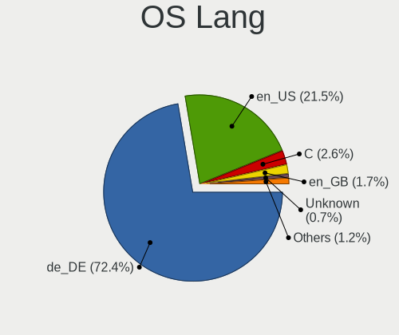
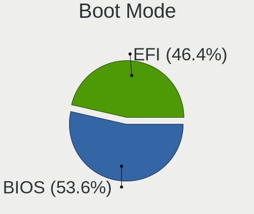
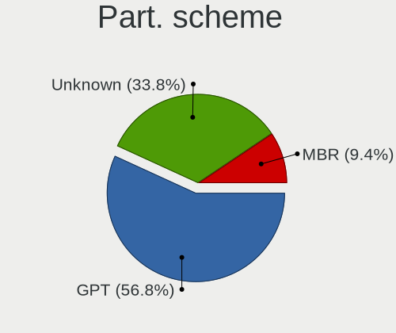
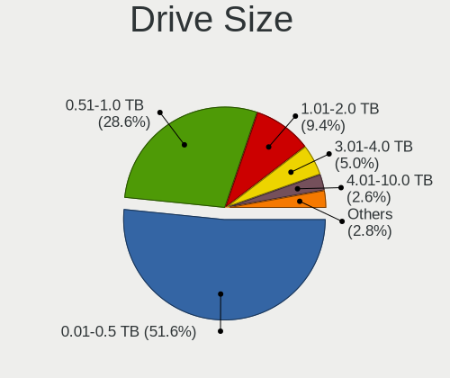
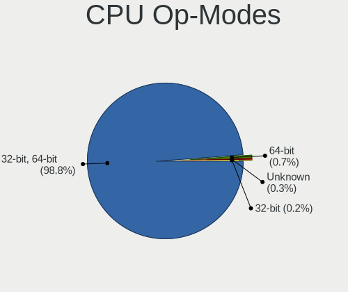
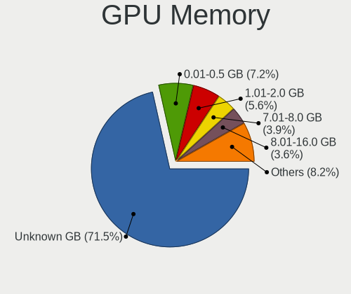
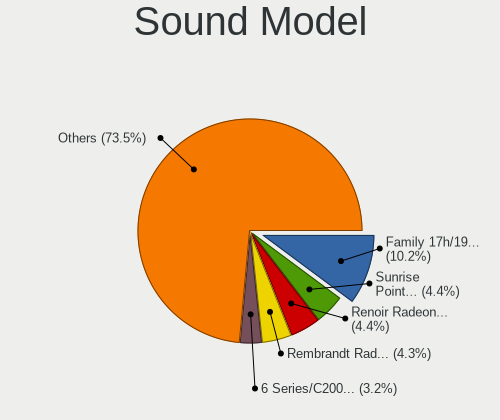
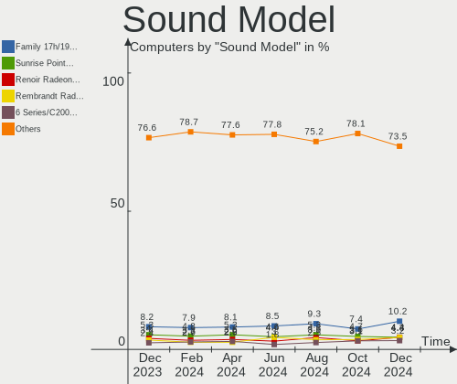
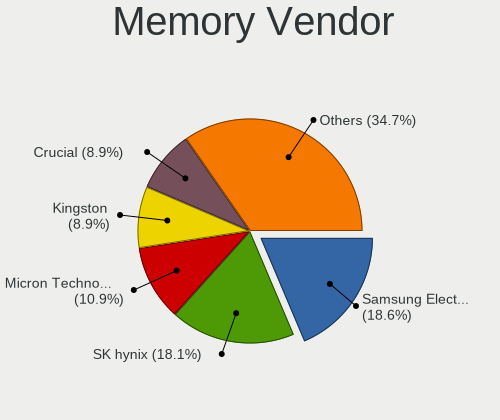
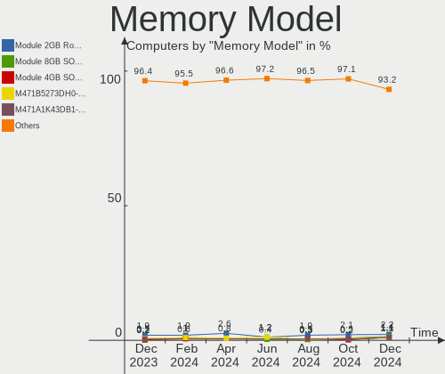

Linux in Germany - Hardware Trends
----------------------------------

A project to identify most popular hardware characteristics and track their change
over time based on data collected by Linux users at https://Linux-Hardware.org.

Anyone can contribute to this report by the [hw-probe](https://github.com/linuxhw/hw-probe) tool:

    sudo -E hw-probe -all -upload

This is a report for all computer types. See also reports for [desktops](/Location/Germany/Desktop/README.md) and [notebooks](/Location/Germany/Notebook/README.md).

Period: Jun, 2022.

Contents
--------

* [ System ](#system)
  - [ OS                       ](#os)
  - [ OS Family                ](#os-family)
  - [ Kernel                   ](#kernel)
  - [ Kernel Family            ](#kernel-family)
  - [ Kernel Major Ver.        ](#kernel-major-ver)
  - [ Arch                     ](#arch)
  - [ DE                       ](#de)
  - [ Display Server           ](#display-server)
  - [ Display Manager          ](#display-manager)
  - [ OS Lang                  ](#os-lang)
  - [ Boot Mode                ](#boot-mode)
  - [ Filesystem               ](#filesystem)
  - [ Part. scheme             ](#part-scheme)
  - [ Dual Boot with Linux/BSD ](#dual-boot-with-linuxbsd)
  - [ Dual Boot (Win)          ](#dual-boot-win)

* [ Board ](#board)
  - [ Vendor                   ](#vendor)
  - [ Model                    ](#model)
  - [ Model Family             ](#model-family)
  - [ MFG Year                 ](#mfg-year)
  - [ Form Factor              ](#form-factor)
  - [ Secure Boot              ](#secure-boot)
  - [ Coreboot                 ](#coreboot)
  - [ RAM Size                 ](#ram-size)
  - [ RAM Used                 ](#ram-used)
  - [ Total Drives             ](#total-drives)
  - [ Has CD-ROM               ](#has-cd-rom)
  - [ Has Ethernet             ](#has-ethernet)
  - [ Has WiFi                 ](#has-wifi)
  - [ Has Bluetooth            ](#has-bluetooth)

* [ Location ](#location)
  - [ Country                  ](#country)
  - [ City                     ](#city)

* [ Drives ](#drives)
  - [ Drive Vendor             ](#drive-vendor)
  - [ Drive Model              ](#drive-model)
  - [ HDD Vendor               ](#hdd-vendor)
  - [ SSD Vendor               ](#ssd-vendor)
  - [ Drive Kind               ](#drive-kind)
  - [ Drive Connector          ](#drive-connector)
  - [ Drive Size               ](#drive-size)
  - [ Space Total              ](#space-total)
  - [ Space Used               ](#space-used)
  - [ Malfunc. Drives          ](#malfunc-drives)
  - [ Malfunc. Drive Vendor    ](#malfunc-drive-vendor)
  - [ Malfunc. HDD Vendor      ](#malfunc-hdd-vendor)
  - [ Malfunc. Drive Kind      ](#malfunc-drive-kind)
  - [ Failed Drives            ](#failed-drives)
  - [ Failed Drive Vendor      ](#failed-drive-vendor)
  - [ Drive Status             ](#drive-status)

* [ Storage controller ](#storage-controller)
  - [ Storage Vendor           ](#storage-vendor)
  - [ Storage Model            ](#storage-model)
  - [ Storage Kind             ](#storage-kind)

* [ Processor ](#processor)
  - [ CPU Vendor               ](#cpu-vendor)
  - [ CPU Model                ](#cpu-model)
  - [ CPU Model Family         ](#cpu-model-family)
  - [ CPU Cores                ](#cpu-cores)
  - [ CPU Sockets              ](#cpu-sockets)
  - [ CPU Threads              ](#cpu-threads)
  - [ CPU Op-Modes             ](#cpu-op-modes)
  - [ CPU Microcode            ](#cpu-microcode)
  - [ CPU Microarch            ](#cpu-microarch)

* [ Graphics ](#graphics)
  - [ GPU Vendor               ](#gpu-vendor)
  - [ GPU Model                ](#gpu-model)
  - [ GPU Combo                ](#gpu-combo)
  - [ GPU Driver               ](#gpu-driver)
  - [ GPU Memory               ](#gpu-memory)

* [ Monitor ](#monitor)
  - [ Monitor Vendor           ](#monitor-vendor)
  - [ Monitor Model            ](#monitor-model)
  - [ Monitor Resolution       ](#monitor-resolution)
  - [ Monitor Diagonal         ](#monitor-diagonal)
  - [ Monitor Width            ](#monitor-width)
  - [ Aspect Ratio             ](#aspect-ratio)
  - [ Monitor Area             ](#monitor-area)
  - [ Pixel Density            ](#pixel-density)
  - [ Multiple Monitors        ](#multiple-monitors)

* [ Network ](#network)
  - [ Net Controller Vendor    ](#net-controller-vendor)
  - [ Net Controller Model     ](#net-controller-model)
  - [ Wireless Vendor          ](#wireless-vendor)
  - [ Wireless Model           ](#wireless-model)
  - [ Ethernet Vendor          ](#ethernet-vendor)
  - [ Ethernet Model           ](#ethernet-model)
  - [ Net Controller Kind      ](#net-controller-kind)
  - [ Used Controller          ](#used-controller)
  - [ NICs                     ](#nics)
  - [ IPv6                     ](#ipv6)

* [ Bluetooth ](#bluetooth)
  - [ Bluetooth Vendor         ](#bluetooth-vendor)
  - [ Bluetooth Model          ](#bluetooth-model)

* [ Sound ](#sound)
  - [ Sound Vendor             ](#sound-vendor)
  - [ Sound Model              ](#sound-model)

* [ Memory ](#memory)
  - [ Memory Vendor            ](#memory-vendor)
  - [ Memory Model             ](#memory-model)
  - [ Memory Kind              ](#memory-kind)
  - [ Memory Form Factor       ](#memory-form-factor)
  - [ Memory Size              ](#memory-size)
  - [ Memory Speed             ](#memory-speed)

* [ Printers & scanners ](#printers--scanners)
  - [ Printer Vendor           ](#printer-vendor)
  - [ Printer Model            ](#printer-model)
  - [ Scanner Vendor           ](#scanner-vendor)
  - [ Scanner Model            ](#scanner-model)

* [ Camera ](#camera)
  - [ Camera Vendor            ](#camera-vendor)
  - [ Camera Model             ](#camera-model)

* [ Security ](#security)
  - [ Fingerprint Vendor       ](#fingerprint-vendor)
  - [ Fingerprint Model        ](#fingerprint-model)
  - [ Chipcard Vendor          ](#chipcard-vendor)
  - [ Chipcard Model           ](#chipcard-model)

* [ Unsupported ](#unsupported)
  - [ Unsupported Devices      ](#unsupported-devices)
  - [ Unsupported Device Types ](#unsupported-device-types)

System
------

OS
--

Installed operating systems

| Name                         | Computers | Percent |
|------------------------------|-----------|---------|
| Linux Mint 20.3              | 52        | 13.44%  |
| Ubuntu 22.04                 | 49        | 12.66%  |
| Ubuntu 20.04                 | 44        | 11.37%  |
| Debian 11                    | 29        | 7.49%   |
| OpenMandriva 4.3             | 21        | 5.43%   |
| Zorin 16                     | 16        | 4.13%   |
| Fedora 36                    | 15        | 3.88%   |
| Manjaro                      | 11        | 2.84%   |
| Pop!_OS 22.04                | 9         | 2.33%   |
| KDE neon 20.04               | 8         | 2.07%   |
| Arch Rolling                 | 6         | 1.55%   |
| Arch                         | 6         | 1.55%   |
| Ubuntu 21.10                 | 5         | 1.29%   |
| OpenMandriva 4.2             | 5         | 1.29%   |
| Manjaro 21.2.6               | 5         | 1.29%   |
| ArcoLinux Rolling            | 5         | 1.29%   |
| Kubuntu 11.1                 | 4         | 1.03%   |
| Kali 2022.2                  | 4         | 1.03%   |
| Xubuntu 21.10                | 3         | 0.78%   |
| Xubuntu 20.04                | 3         | 0.78%   |
| SteamOS 3.2                  | 3         | 0.78%   |
| ROSA 12.2                    | 3         | 0.78%   |
| openSUSE Leap-15.4           | 3         | 0.78%   |
| LMDE 5                       | 3         | 0.78%   |
| Linux Mint 20.2              | 3         | 0.78%   |
| Linux Mint 20.1              | 3         | 0.78%   |
| Linux Mint 19.3              | 3         | 0.78%   |
| Kubuntu 22.04                | 3         | 0.78%   |
| Debian Testing               | 3         | 0.78%   |
| Xubuntu 18.04                | 2         | 0.52%   |
| Ubuntu MATE 22.04            | 2         | 0.52%   |
| Ubuntu MATE 20.04            | 2         | 0.52%   |
| Raspbian 11                  | 2         | 0.52%   |
| openSUSE Tumbleweed-XXXXXXXX | 2         | 0.52%   |
| Manjaro 21.3.1               | 2         | 0.52%   |
| Lubuntu 22.04                | 2         | 0.52%   |
| Kubuntu 11                   | 2         | 0.52%   |
| Gentoo 2.8                   | 2         | 0.52%   |
| EndeavourOS Rolling          | 2         | 0.52%   |
| Elementary 6.1               | 2         | 0.52%   |
| Debian 10                    | 2         | 0.52%   |
| Zorin 15                     | 1         | 0.26%   |
| Xubuntu 22.04                | 1         | 0.26%   |
| Xubuntu 20.10                | 1         | 0.26%   |
| Xubuntu 19.10                | 1         | 0.26%   |
| Xero Rolling                 | 1         | 0.26%   |
| Ubuntu Studio 22.04          | 1         | 0.26%   |
| Ubuntu Budgie 22.04          | 1         | 0.26%   |
| Ubuntu 21.04                 | 1         | 0.26%   |
| Ubuntu 20.10                 | 1         | 0.26%   |
| Ubuntu 18.04                 | 1         | 0.26%   |
| Solus 4.3                    | 1         | 0.26%   |
| Siduction Unstable           | 1         | 0.26%   |
| ROSA 12.1                    | 1         | 0.26%   |
| Raspbian 10                  | 1         | 0.26%   |
| Parrot 4.11                  | 1         | 0.26%   |
| openSUSE Leap-15.3           | 1         | 0.26%   |
| MassOS 2022.06               | 1         | 0.26%   |
| Manjaro 21.3.0               | 1         | 0.26%   |
| Lubuntu 20.04                | 1         | 0.26%   |

OS Family
---------

OS without a version

| Name          | Computers | Percent |
|---------------|-----------|---------|
| Ubuntu        | 101       | 26.1%   |
| Linux Mint    | 62        | 16.02%  |
| Debian        | 34        | 8.79%   |
| OpenMandriva  | 26        | 6.72%   |
| Manjaro       | 19        | 4.91%   |
| Zorin         | 17        | 4.39%   |
| Fedora        | 16        | 4.13%   |
| Arch          | 12        | 3.1%    |
| Xubuntu       | 11        | 2.84%   |
| Kubuntu       | 11        | 2.84%   |
| Pop!_OS       | 9         | 2.33%   |
| KDE neon      | 8         | 2.07%   |
| openSUSE      | 6         | 1.55%   |
| ArcoLinux     | 6         | 1.55%   |
| Ubuntu MATE   | 4         | 1.03%   |
| ROSA          | 4         | 1.03%   |
| Kali          | 4         | 1.03%   |
| SteamOS       | 3         | 0.78%   |
| Raspbian      | 3         | 0.78%   |
| Lubuntu       | 3         | 0.78%   |
| LMDE          | 3         | 0.78%   |
| LinuxFX       | 3         | 0.78%   |
| Gentoo        | 2         | 0.52%   |
| Garuda Linux  | 2         | 0.52%   |
| EndeavourOS   | 2         | 0.52%   |
| Elementary    | 2         | 0.52%   |
| Devuan        | 2         | 0.52%   |
| Xero          | 1         | 0.26%   |
| Ubuntu Studio | 1         | 0.26%   |
| Ubuntu Budgie | 1         | 0.26%   |
| Solus         | 1         | 0.26%   |
| Siduction     | 1         | 0.26%   |
| Parrot        | 1         | 0.26%   |
| MassOS        | 1         | 0.26%   |
| Lilidog       | 1         | 0.26%   |
| Clear Linux   | 1         | 0.26%   |
| ArchLabs      | 1         | 0.26%   |
| Alpine        | 1         | 0.26%   |
| AlmaLinux     | 1         | 0.26%   |

Kernel
------

Version of the Linux kernel

| Version                                      | Computers | Percent |
|----------------------------------------------|-----------|---------|
| 5.13.0-51-generic                            | 28        | 7.24%   |
| 5.13.0-44-generic                            | 26        | 6.72%   |
| 5.4.0-117-generic                            | 19        | 4.91%   |
| 5.16.7-desktop-1omv4003                      | 18        | 4.65%   |
| 5.15.0-37-generic                            | 18        | 4.65%   |
| 5.13.0-48-generic                            | 18        | 4.65%   |
| 5.4.0-113-generic                            | 16        | 4.13%   |
| 5.15.0-35-generic                            | 10        | 2.58%   |
| 5.15.0-33-generic                            | 10        | 2.58%   |
| 5.10.0-15-amd64                              | 10        | 2.58%   |
| 5.4.0-120-generic                            | 9         | 2.33%   |
| 5.4.0-121-generic                            | 8         | 2.07%   |
| 5.15.0-40-generic                            | 8         | 2.07%   |
| 5.15.0-39-generic                            | 8         | 2.07%   |
| 5.17.5-76051705-generic                      | 6         | 1.55%   |
| 5.10.0-14-amd64                              | 6         | 1.55%   |
| 5.15.41-1-MANJARO                            | 5         | 1.29%   |
| 5.4.0-91-generic                             | 4         | 1.03%   |
| 5.18.3-arch1-1                               | 4         | 1.03%   |
| 5.10.74-generic-2rosa2021.1-x86_64           | 4         | 1.03%   |
| 5.10.14-desktop-1omv4002                     | 4         | 1.03%   |
| 5.18.5-arch1-1                               | 3         | 0.78%   |
| 5.18.3-1-MANJARO                             | 3         | 0.78%   |
| 5.17.12-300.fc36.x86_64                      | 3         | 0.78%   |
| 5.16.0-0.bpo.4-amd64                         | 3         | 0.78%   |
| 5.14.21-150400.22-default                    | 3         | 0.78%   |
| 5.13.0-valve15-1-neptune-02197-gf6ec7ad3762a | 3         | 0.78%   |
| 5.18.6-arch1-1                               | 2         | 0.52%   |
| 5.18.5-200.fc36.x86_64                       | 2         | 0.52%   |
| 5.18.2-arch1-1                               | 2         | 0.52%   |
| 5.18.1-zen1-1-zen                            | 2         | 0.52%   |
| 5.18.1-arch1-1                               | 2         | 0.52%   |
| 5.18.0-1-amd64                               | 2         | 0.52%   |
| 5.17.5-300.fc36.x86_64                       | 2         | 0.52%   |
| 5.17.15-76051715-generic                     | 2         | 0.52%   |
| 5.17.14-300.fc36.x86_64                      | 2         | 0.52%   |
| 5.17.13-300.fc36.x86_64                      | 2         | 0.52%   |
| 5.17.11-300.fc36.x86_64                      | 2         | 0.52%   |
| 5.17.0-1-amd64                               | 2         | 0.52%   |
| 5.16.0-kali7-amd64                           | 2         | 0.52%   |
| 5.15.49-1-MANJARO                            | 2         | 0.52%   |
| 5.15.48-1-MANJARO                            | 2         | 0.52%   |
| 5.15.32-v7l+                                 | 2         | 0.52%   |
| 5.15.0-40-lowlatency                         | 2         | 0.52%   |
| 5.15.0-25-generic                            | 2         | 0.52%   |
| 5.14.0-1042-oem                              | 2         | 0.52%   |
| 5.13.0-52-generic                            | 2         | 0.52%   |
| 5.13.0-46-generic                            | 2         | 0.52%   |
| 5.13.0-40-generic                            | 2         | 0.52%   |
| 5.13.0-39-generic                            | 2         | 0.52%   |
| 5.13.0-25-generic                            | 2         | 0.52%   |
| 5.10.0-11-amd64                              | 2         | 0.52%   |
| 5.10.0-10-amd64                              | 2         | 0.52%   |
| 5.8.0-63-generic                             | 1         | 0.26%   |
| 5.8.0-29-generic                             | 1         | 0.26%   |
| 5.4.195-1-MANJARO                            | 1         | 0.26%   |
| 5.4.0-80-generic                             | 1         | 0.26%   |
| 5.4.0-74-generic                             | 1         | 0.26%   |
| 5.4.0-72-generic                             | 1         | 0.26%   |
| 5.4.0-58-generic                             | 1         | 0.26%   |

Kernel Family
-------------

Linux kernel without a distro release

| Version  | Computers | Percent |
|----------|-----------|---------|
| 5.13.0   | 89        | 23%     |
| 5.4.0    | 65        | 16.8%   |
| 5.15.0   | 59        | 15.25%  |
| 5.10.0   | 25        | 6.46%   |
| 5.16.7   | 18        | 4.65%   |
| 5.18.3   | 9         | 2.33%   |
| 5.17.5   | 9         | 2.33%   |
| 5.18.5   | 8         | 2.07%   |
| 5.16.0   | 7         | 1.81%   |
| 5.18.6   | 6         | 1.55%   |
| 5.15.41  | 6         | 1.55%   |
| 5.18.2   | 5         | 1.29%   |
| 5.18.1   | 5         | 1.29%   |
| 5.17.0   | 4         | 1.03%   |
| 5.10.74  | 4         | 1.03%   |
| 5.10.14  | 4         | 1.03%   |
| 5.18.0   | 3         | 0.78%   |
| 5.17.12  | 3         | 0.78%   |
| 5.17.11  | 3         | 0.78%   |
| 5.17.1   | 3         | 0.78%   |
| 5.15.32  | 3         | 0.78%   |
| 5.14.21  | 3         | 0.78%   |
| 5.14.0   | 3         | 0.78%   |
| 5.11.0   | 3         | 0.78%   |
| 5.8.0    | 2         | 0.52%   |
| 5.18.7   | 2         | 0.52%   |
| 5.17.9   | 2         | 0.52%   |
| 5.17.7   | 2         | 0.52%   |
| 5.17.15  | 2         | 0.52%   |
| 5.17.14  | 2         | 0.52%   |
| 5.17.13  | 2         | 0.52%   |
| 5.15.49  | 2         | 0.52%   |
| 5.15.48  | 2         | 0.52%   |
| 5.15.44  | 2         | 0.52%   |
| 4.15.0   | 2         | 0.52%   |
| 5.4.195  | 1         | 0.26%   |
| 5.3.18   | 1         | 0.26%   |
| 5.3.0    | 1         | 0.26%   |
| 5.16.13  | 1         | 0.26%   |
| 5.15.47  | 1         | 0.26%   |
| 5.15.46  | 1         | 0.26%   |
| 5.15.45  | 1         | 0.26%   |
| 5.15.43  | 1         | 0.26%   |
| 5.15.35  | 1         | 0.26%   |
| 5.15.24  | 1         | 0.26%   |
| 5.13.19  | 1         | 0.26%   |
| 5.12.6   | 1         | 0.26%   |
| 5.11.12  | 1         | 0.26%   |
| 5.10.103 | 1         | 0.26%   |
| 5.0.0    | 1         | 0.26%   |
| 4.19.113 | 1         | 0.26%   |
| 4.19.0   | 1         | 0.26%   |
| 4.18.0   | 1         | 0.26%   |

Kernel Major Ver.
-----------------

Linux kernel major version

| Version | Computers | Percent |
|---------|-----------|---------|
| 5.13    | 90        | 23.26%  |
| 5.15    | 80        | 20.67%  |
| 5.4     | 66        | 17.05%  |
| 5.18    | 38        | 9.82%   |
| 5.10    | 34        | 8.79%   |
| 5.17    | 32        | 8.27%   |
| 5.16    | 26        | 6.72%   |
| 5.14    | 6         | 1.55%   |
| 5.11    | 4         | 1.03%   |
| 5.8     | 2         | 0.52%   |
| 5.3     | 2         | 0.52%   |
| 4.19    | 2         | 0.52%   |
| 4.15    | 2         | 0.52%   |
| 5.12    | 1         | 0.26%   |
| 5.0     | 1         | 0.26%   |
| 4.18    | 1         | 0.26%   |

Arch
----

OS architecture (x86_64, i586, etc.)

| Name    | Computers | Percent |
|---------|-----------|---------|
| x86_64  | 377       | 97.42%  |
| i686    | 5         | 1.29%   |
| armv7l  | 3         | 0.78%   |
| aarch64 | 2         | 0.52%   |

DE
--

Desktop Environment

| Name             | Computers | Percent |
|------------------|-----------|---------|
| GNOME            | 156       | 40.31%  |
| KDE5             | 88        | 22.74%  |
| X-Cinnamon       | 58        | 14.99%  |
| XFCE             | 30        | 7.75%   |
| MATE             | 14        | 3.62%   |
| Unknown          | 12        | 3.1%    |
| Cinnamon         | 6         | 1.55%   |
| LXDE             | 4         | 1.03%   |
| Unity            | 3         | 0.78%   |
| LXQt             | 3         | 0.78%   |
| sway             | 2         | 0.52%   |
| Pantheon         | 2         | 0.52%   |
| lightdm-xsession | 2         | 0.52%   |
| i3               | 2         | 0.52%   |
| Budgie           | 2         | 0.52%   |
| trinity          | 1         | 0.26%   |
| KDE              | 1         | 0.26%   |
| hyprland         | 1         | 0.26%   |

Display Server
--------------

X11 or Wayland

| Name        | Computers | Percent |
|-------------|-----------|---------|
| X11         | 302       | 78.04%  |
| Wayland     | 71        | 18.35%  |
| Unknown     | 8         | 2.07%   |
| Tty         | 5         | 1.29%   |
| Unspecified | 1         | 0.26%   |

Display Manager
---------------

SDDM, LightDM, etc.

| Name    | Computers | Percent |
|---------|-----------|---------|
| Unknown | 121       | 31.27%  |
| GDM3    | 95        | 24.55%  |
| LightDM | 70        | 18.09%  |
| SDDM    | 60        | 15.5%   |
| GDM     | 35        | 9.04%   |
| XDM     | 3         | 0.78%   |
| GREETD  | 2         | 0.52%   |
| SLiM    | 1         | 0.26%   |

OS Lang
-------

Language

| Lang    | Computers | Percent |
|---------|-----------|---------|
| de_DE   | 292       | 75.45%  |
| en_US   | 73        | 18.86%  |
| en_GB   | 7         | 1.81%   |
| C       | 4         | 1.03%   |
| ru_RU   | 2         | 0.52%   |
| pl_PL   | 2         | 0.52%   |
| fr_FR   | 2         | 0.52%   |
| en_DE   | 2         | 0.52%   |
| Unknown | 2         | 0.52%   |
| es_ES   | 1         | 0.26%   |

Boot Mode
---------

EFI or BIOS

| Mode | Computers | Percent |
|------|-----------|---------|
| EFI  | 200       | 51.68%  |
| BIOS | 187       | 48.32%  |

Filesystem
----------

Type of filesystem

| Type    | Computers | Percent |
|---------|-----------|---------|
| Ext4    | 320       | 82.69%  |
| Btrfs   | 36        | 9.3%    |
| Overlay | 24        | 6.2%    |
| Xfs     | 4         | 1.03%   |
| Zfs     | 3         | 0.78%   |

Part. scheme
------------

Scheme of partitioning

| Type    | Computers | Percent |
|---------|-----------|---------|
| Unknown | 209       | 54.01%  |
| GPT     | 141       | 36.43%  |
| MBR     | 37        | 9.56%   |

Dual Boot with Linux/BSD
------------------------

Hosting more than one Linux/BSD

| Dual boot | Computers | Percent |
|-----------|-----------|---------|
| No        | 324       | 83.72%  |
| Yes       | 63        | 16.28%  |

Dual Boot (Win)
---------------

Hosting Linux and Windows

| Dual boot | Computers | Percent |
|-----------|-----------|---------|
| No        | 272       | 70.28%  |
| Yes       | 115       | 29.72%  |

Board
-----

Vendor
------

Motherboard manufacturer

| Name                    | Computers | Percent |
|-------------------------|-----------|---------|
| Lenovo                  | 66        | 17.05%  |
| ASUSTek Computer        | 52        | 13.44%  |
| Hewlett-Packard         | 50        | 12.92%  |
| Dell                    | 29        | 7.49%   |
| Acer                    | 29        | 7.49%   |
| MSI                     | 26        | 6.72%   |
| Gigabyte Technology     | 23        | 5.94%   |
| ASRock                  | 16        | 4.13%   |
| Medion                  | 13        | 3.36%   |
| Fujitsu                 | 13        | 3.36%   |
| Samsung Electronics     | 9         | 2.33%   |
| Toshiba                 | 5         | 1.29%   |
| Raspberry Pi Foundation | 4         | 1.03%   |
| Intel                   | 4         | 1.03%   |
| HUAWEI                  | 4         | 1.03%   |
| BESSTAR Tech            | 4         | 1.03%   |
| Valve                   | 3         | 0.78%   |
| TUXEDO                  | 3         | 0.78%   |
| Biostar                 | 3         | 0.78%   |
| Apple                   | 3         | 0.78%   |
| Unknown                 | 3         | 0.78%   |
| TrekStor                | 2         | 0.52%   |
| Razer                   | 2         | 0.52%   |
| Foxconn                 | 2         | 0.52%   |
| ZOTAC                   | 1         | 0.26%   |
| Timi                    | 1         | 0.26%   |
| Tactus                  | 1         | 0.26%   |
| Sony                    | 1         | 0.26%   |
| Shuttle                 | 1         | 0.26%   |
| Schenker                | 1         | 0.26%   |
| PC Engines              | 1         | 0.26%   |
| Microsoft               | 1         | 0.26%   |
| IP3 Tech                | 1         | 0.26%   |
| Inter Sales A/S         | 1         | 0.26%   |
| Google                  | 1         | 0.26%   |
| Global Distribution FZE | 1         | 0.26%   |
| Fujitsu Siemens         | 1         | 0.26%   |
| eMachines               | 1         | 0.26%   |
| Clevo                   | 1         | 0.26%   |
| AXDIA International     | 1         | 0.26%   |
| ASRockRack              | 1         | 0.26%   |
| Alienware               | 1         | 0.26%   |
| Acidanthera             | 1         | 0.26%   |

Model
-----

Motherboard model

| Name                                               | Computers | Percent |
|----------------------------------------------------|-----------|---------|
| Unknown                                            | 5         | 1.29%   |
| Valve Jupiter                                      | 3         | 0.78%   |
| MSI MS-7C37                                        | 3         | 0.78%   |
| Dell Precision M6800                               | 3         | 0.78%   |
| Samsung R530/R730                                  | 2         | 0.52%   |
| RPi Raspberry Pi 3 Model B Rev 1.2                 | 2         | 0.52%   |
| MSI MS-7C95                                        | 2         | 0.52%   |
| MSI MS-7C56                                        | 2         | 0.52%   |
| MSI MS-7C52                                        | 2         | 0.52%   |
| Lenovo Legion 5 15ACH6H 82JU                       | 2         | 0.52%   |
| Lenovo IdeaPad 330-17IKB 81DK                      | 2         | 0.52%   |
| HP ProBook 455 G8 Notebook PC                      | 2         | 0.52%   |
| HP Pavilion Gaming Laptop 15-ec0xxx                | 2         | 0.52%   |
| HP Laptop 15s-fq3xxx                               | 2         | 0.52%   |
| Fujitsu LIFEBOOK E752                              | 2         | 0.52%   |
| Fujitsu ESPRIMO E720                               | 2         | 0.52%   |
| Dell Precision 5540                                | 2         | 0.52%   |
| Dell Latitude E5530 non-vPro                       | 2         | 0.52%   |
| ASUS UL50Vg                                        | 2         | 0.52%   |
| ASUS TUF Gaming B550-PLUS                          | 2         | 0.52%   |
| ASRock B450 Gaming-ITX/ac                          | 2         | 0.52%   |
| Acer Swift SF314-511                               | 2         | 0.52%   |
| Acer Aspire ES1-711                                | 2         | 0.52%   |
| ZOTAC ZBOX-CI527/CI547                             | 1         | 0.26%   |
| TUXEDO Polaris Intel Gen3 (TGL)                    | 1         | 0.26%   |
| TrekStor YOURBOOK C11B                             | 1         | 0.26%   |
| TrekStor Surfbook A13B                             | 1         | 0.26%   |
| Toshiba Satellite Pro S300L                        | 1         | 0.26%   |
| Toshiba Satellite Pro S300                         | 1         | 0.26%   |
| Toshiba Satellite C870-1C2                         | 1         | 0.26%   |
| Toshiba Satellite C670D-11G                        | 1         | 0.26%   |
| Toshiba Satellite C50t-B                           | 1         | 0.26%   |
| Timi TM1604                                        | 1         | 0.26%   |
| Tactus GeoBook 140                                 | 1         | 0.26%   |
| Sony VPCEA3S1E                                     | 1         | 0.26%   |
| Shuttle DS47D                                      | 1         | 0.26%   |
| Schenker VIA 15 Pro                                | 1         | 0.26%   |
| Samsung RV420/RV520/RV720/E3530/S3530/E3420/E3520  | 1         | 0.26%   |
| Samsung RF510/RF410/RF710                          | 1         | 0.26%   |
| Samsung 950QCG                                     | 1         | 0.26%   |
| Samsung 700Z3A/700Z4A/700Z5A/700Z5B                | 1         | 0.26%   |
| Samsung 600B4B/600B5B                              | 1         | 0.26%   |
| Samsung 530U3BI/530U4BI/530U4BH                    | 1         | 0.26%   |
| Samsung 300E4C/300E5C/300E7C                       | 1         | 0.26%   |
| Razer Blade 17 (Mid 2021) - RZ09-0406              | 1         | 0.26%   |
| Razer Blade 15 Base Model (Early 2020) - RZ09-0328 | 1         | 0.26%   |
| RPi Raspberry Pi 4 Model B Rev 1.5                 | 1         | 0.26%   |
| RPi Raspberry Pi                                   | 1         | 0.26%   |
| PC Engines APU2                                    | 1         | 0.26%   |
| MSI MS-AA1511                                      | 1         | 0.26%   |
| MSI MS-7C36                                        | 1         | 0.26%   |
| MSI MS-7B89                                        | 1         | 0.26%   |
| MSI MS-7B86                                        | 1         | 0.26%   |
| MSI MS-7A38                                        | 1         | 0.26%   |
| MSI MS-7982                                        | 1         | 0.26%   |
| MSI MS-7971                                        | 1         | 0.26%   |
| MSI MS-7885                                        | 1         | 0.26%   |
| MSI MS-7817                                        | 1         | 0.26%   |
| MSI MS-7808                                        | 1         | 0.26%   |
| MSI MS-7758                                        | 1         | 0.26%   |

Model Family
------------

Motherboard model prefix

| Name                | Computers | Percent |
|---------------------|-----------|---------|
| Lenovo ThinkPad     | 37        | 9.56%   |
| Acer Aspire         | 19        | 4.91%   |
| Dell Latitude       | 8         | 2.07%   |
| HP ProBook          | 7         | 1.81%   |
| HP EliteBook        | 7         | 1.81%   |
| Fujitsu LIFEBOOK    | 7         | 1.81%   |
| Lenovo IdeaPad      | 6         | 1.55%   |
| HP Pavilion         | 6         | 1.55%   |
| Dell Precision      | 6         | 1.55%   |
| Dell OptiPlex       | 6         | 1.55%   |
| Toshiba Satellite   | 5         | 1.29%   |
| HP Laptop           | 5         | 1.29%   |
| Fujitsu ESPRIMO     | 5         | 1.29%   |
| ASUS PRIME          | 5         | 1.29%   |
| Unknown             | 5         | 1.29%   |
| RPi Raspberry       | 4         | 1.03%   |
| Lenovo Yoga         | 4         | 1.03%   |
| HP Compaq           | 4         | 1.03%   |
| Dell Inspiron       | 4         | 1.03%   |
| ASUS TUF            | 4         | 1.03%   |
| ASUS ROG            | 4         | 1.03%   |
| Valve Jupiter       | 3         | 0.78%   |
| MSI MS-7C37         | 3         | 0.78%   |
| Lenovo ThinkCentre  | 3         | 0.78%   |
| Lenovo Legion       | 3         | 0.78%   |
| Lenovo IdeaPadFlex  | 3         | 0.78%   |
| HP ENVY             | 3         | 0.78%   |
| Dell XPS            | 3         | 0.78%   |
| Acer Swift          | 3         | 0.78%   |
| Samsung R530        | 2         | 0.52%   |
| Razer Blade         | 2         | 0.52%   |
| MSI MS-7C95         | 2         | 0.52%   |
| MSI MS-7C56         | 2         | 0.52%   |
| MSI MS-7C52         | 2         | 0.52%   |
| Lenovo ThinkStation | 2         | 0.52%   |
| HP 255              | 2         | 0.52%   |
| Gigabyte B550       | 2         | 0.52%   |
| Dell Vostro         | 2         | 0.52%   |
| ASUS ZenBook        | 2         | 0.52%   |
| ASUS UL50Vg         | 2         | 0.52%   |
| ASUS CROSSHAIR      | 2         | 0.52%   |
| ASUS ASUS           | 2         | 0.52%   |
| ASRock B450M        | 2         | 0.52%   |
| ASRock B450         | 2         | 0.52%   |
| ASRock 970          | 2         | 0.52%   |
| Acer TravelMate     | 2         | 0.52%   |
| ZOTAC ZBOX-CI527    | 1         | 0.26%   |
| TUXEDO Polaris      | 1         | 0.26%   |
| TrekStor YOURBOOK   | 1         | 0.26%   |
| TrekStor Surfbook   | 1         | 0.26%   |
| Timi TM1604         | 1         | 0.26%   |
| Tactus GeoBook      | 1         | 0.26%   |
| Sony VPCEA3S1E      | 1         | 0.26%   |
| Shuttle DS47D       | 1         | 0.26%   |
| Schenker VIA        | 1         | 0.26%   |
| Samsung RV420       | 1         | 0.26%   |
| Samsung RF510       | 1         | 0.26%   |
| Samsung 950QCG      | 1         | 0.26%   |
| Samsung 700Z3A      | 1         | 0.26%   |
| Samsung 600B4B      | 1         | 0.26%   |

MFG Year
--------

Motherboard manufacture year

| Year    | Computers | Percent |
|---------|-----------|---------|
| 2021    | 45        | 11.63%  |
| 2020    | 44        | 11.37%  |
| 2018    | 35        | 9.04%   |
| 2013    | 33        | 8.53%   |
| 2012    | 33        | 8.53%   |
| 2019    | 30        | 7.75%   |
| 2017    | 27        | 6.98%   |
| 2010    | 22        | 5.68%   |
| 2011    | 20        | 5.17%   |
| 2016    | 18        | 4.65%   |
| 2014    | 18        | 4.65%   |
| 2015    | 16        | 4.13%   |
| 2008    | 16        | 4.13%   |
| 2009    | 12        | 3.1%    |
| 2022    | 8         | 2.07%   |
| Unknown | 5         | 1.29%   |
| 2007    | 2         | 0.52%   |
| 2006    | 2         | 0.52%   |
| 2003    | 1         | 0.26%   |

Form Factor
-----------

Physical design of the computer

| Name           | Computers | Percent |
|----------------|-----------|---------|
| Notebook       | 207       | 53.49%  |
| Desktop        | 144       | 37.21%  |
| Convertible    | 15        | 3.88%   |
| Mini pc        | 7         | 1.81%   |
| System on chip | 5         | 1.29%   |
| Tablet         | 5         | 1.29%   |
| All in one     | 3         | 0.78%   |
| Server         | 1         | 0.26%   |

Secure Boot
-----------

Enabled or disabled

| State    | Computers | Percent |
|----------|-----------|---------|
| Disabled | 351       | 90.7%   |
| Enabled  | 36        | 9.3%    |

Coreboot
--------

Have coreboot on board

| Used | Computers | Percent |
|------|-----------|---------|
| No   | 385       | 99.48%  |
| Yes  | 2         | 0.52%   |

RAM Size
--------

Total RAM memory

| Size in GB      | Computers | Percent |
|-----------------|-----------|---------|
| 4.01-8.0        | 97        | 25.06%  |
| 16.01-24.0      | 83        | 21.45%  |
| 3.01-4.0        | 66        | 17.05%  |
| 8.01-16.0       | 61        | 15.76%  |
| 32.01-64.0      | 37        | 9.56%   |
| 64.01-256.0     | 13        | 3.36%   |
| 24.01-32.0      | 10        | 2.58%   |
| 1.01-2.0        | 10        | 2.58%   |
| 2.01-3.0        | 5         | 1.29%   |
| 0.51-1.0        | 3         | 0.78%   |
| More than 256.0 | 1         | 0.26%   |
| 0.01-0.5        | 1         | 0.26%   |

RAM Used
--------

Used RAM memory

| Used GB    | Computers | Percent |
|------------|-----------|---------|
| 1.01-2.0   | 137       | 35.4%   |
| 2.01-3.0   | 104       | 26.87%  |
| 3.01-4.0   | 50        | 12.92%  |
| 4.01-8.0   | 46        | 11.89%  |
| 0.51-1.0   | 23        | 5.94%   |
| 8.01-16.0  | 16        | 4.13%   |
| 0.01-0.5   | 6         | 1.55%   |
| 16.01-24.0 | 3         | 0.78%   |
| 32.01-64.0 | 2         | 0.52%   |

Total Drives
------------

Number of drives on board

| Drives | Computers | Percent |
|--------|-----------|---------|
| 1      | 223       | 57.62%  |
| 2      | 97        | 25.06%  |
| 3      | 34        | 8.79%   |
| 4      | 18        | 4.65%   |
| 5      | 8         | 2.07%   |
| 7      | 3         | 0.78%   |
| 6      | 2         | 0.52%   |
| 10     | 1         | 0.26%   |
| 0      | 1         | 0.26%   |

Has CD-ROM
----------

Has CD-ROM on board

| Presented | Computers | Percent |
|-----------|-----------|---------|
| No        | 222       | 57.36%  |
| Yes       | 165       | 42.64%  |

Has Ethernet
------------

Has Ethernet on board

| Presented | Computers | Percent |
|-----------|-----------|---------|
| Yes       | 326       | 84.24%  |
| No        | 61        | 15.76%  |

Has WiFi
--------

Has WiFi module

| Presented | Computers | Percent |
|-----------|-----------|---------|
| Yes       | 282       | 72.87%  |
| No        | 105       | 27.13%  |

Has Bluetooth
-------------

Has Bluetooth module

| Presented | Computers | Percent |
|-----------|-----------|---------|
| Yes       | 228       | 58.91%  |
| No        | 159       | 41.09%  |

Location
--------

Country
-------

Geographic location (country)

| Country | Computers | Percent |
|---------|-----------|---------|
| Germany | 387       | 100%    |

City
----

Geographic location (city)

| City                 | Computers | Percent |
|----------------------|-----------|---------|
| Berlin               | 35        | 9.04%   |
| Munich               | 21        | 5.43%   |
| Hamburg              | 18        | 4.65%   |
| Frankfurt am Main    | 10        | 2.58%   |
| Nuremberg            | 7         | 1.81%   |
| Kiel                 | 7         | 1.81%   |
| Stuttgart            | 6         | 1.55%   |
| Leipzig              | 6         | 1.55%   |
| Essen                | 5         | 1.29%   |
| Düsseldorf          | 5         | 1.29%   |
| Mannheim             | 4         | 1.03%   |
| Karlsruhe            | 4         | 1.03%   |
| Gladbeck             | 4         | 1.03%   |
| Gelsenkirchen        | 4         | 1.03%   |
| Dresden              | 4         | 1.03%   |
| Dortmund             | 4         | 1.03%   |
| Bielefeld            | 4         | 1.03%   |
| Weimar               | 3         | 0.78%   |
| Saarbrücken         | 3         | 0.78%   |
| Magdeburg            | 3         | 0.78%   |
| Heidelberg           | 3         | 0.78%   |
| Hanover              | 3         | 0.78%   |
| Halle                | 3         | 0.78%   |
| Filderstadt          | 3         | 0.78%   |
| Duisburg             | 3         | 0.78%   |
| Bremen               | 3         | 0.78%   |
| Wuppertal            | 2         | 0.52%   |
| Wettringen           | 2         | 0.52%   |
| Wadersloh            | 2         | 0.52%   |
| Tholey               | 2         | 0.52%   |
| Singen               | 2         | 0.52%   |
| Reutlingen           | 2         | 0.52%   |
| Ochsenfurt           | 2         | 0.52%   |
| Mönchengladbach     | 2         | 0.52%   |
| Lübeck              | 2         | 0.52%   |
| Lampertheim          | 2         | 0.52%   |
| Jemgum               | 2         | 0.52%   |
| Heusweiler           | 2         | 0.52%   |
| Hamm                 | 2         | 0.52%   |
| Giessen              | 2         | 0.52%   |
| Freiburg im Breisgau | 2         | 0.52%   |
| Diespeck             | 2         | 0.52%   |
| Darmstadt            | 2         | 0.52%   |
| Cologne              | 2         | 0.52%   |
| Bochum               | 2         | 0.52%   |
| Bernau bei Berlin    | 2         | 0.52%   |
| Würzburg            | 1         | 0.26%   |
| Worms                | 1         | 0.26%   |
| Wolfsburg            | 1         | 0.26%   |
| Wolfhagen            | 1         | 0.26%   |
| Wittmund             | 1         | 0.26%   |
| Wittingen            | 1         | 0.26%   |
| Witten               | 1         | 0.26%   |
| Wiesbaden            | 1         | 0.26%   |
| Wetzlar              | 1         | 0.26%   |
| Weselberg            | 1         | 0.26%   |
| Wernigerode          | 1         | 0.26%   |
| Weissenthurm         | 1         | 0.26%   |
| Weinbach             | 1         | 0.26%   |
| Weilheim             | 1         | 0.26%   |

Drives
------

Drive Vendor
------------

Hard drive vendors

| Vendor                         | Computers | Drives | Percent |
|--------------------------------|-----------|--------|---------|
| Samsung Electronics            | 110       | 132    | 18.93%  |
| WDC                            | 76        | 98     | 13.08%  |
| Seagate                        | 75        | 98     | 12.91%  |
| SanDisk                        | 45        | 48     | 7.75%   |
| Toshiba                        | 32        | 33     | 5.51%   |
| Unknown                        | 30        | 35     | 5.16%   |
| Crucial                        | 30        | 33     | 5.16%   |
| Kingston                       | 20        | 20     | 3.44%   |
| Intenso                        | 20        | 21     | 3.44%   |
| Hitachi                        | 15        | 15     | 2.58%   |
| Intel                          | 12        | 12     | 2.07%   |
| SK hynix                       | 11        | 11     | 1.89%   |
| Phison                         | 9         | 10     | 1.55%   |
| Micron Technology              | 9         | 9      | 1.55%   |
| HGST                           | 6         | 6      | 1.03%   |
| A-DATA Technology              | 6         | 7      | 1.03%   |
| UMIS                           | 5         | 5      | 0.86%   |
| Micron/Crucial Technology      | 5         | 5      | 0.86%   |
| Transcend                      | 4         | 4      | 0.69%   |
| Hewlett-Packard                | 4         | 4      | 0.69%   |
| Apacer                         | 4         | 4      | 0.69%   |
| OCZ                            | 3         | 3      | 0.52%   |
| Netac                          | 3         | 3      | 0.52%   |
| LITEON                         | 3         | 3      | 0.52%   |
| Verbatim                       | 2         | 2      | 0.34%   |
| SPCC                           | 2         | 2      | 0.34%   |
| Solid State Storage Technology | 2         | 2      | 0.34%   |
| PNY                            | 2         | 2      | 0.34%   |
| Patriot                        | 2         | 3      | 0.34%   |
| Maxtor                         | 2         | 2      | 0.34%   |
| Leven                          | 2         | 2      | 0.34%   |
| JMicron Technology             | 2         | 2      | 0.34%   |
| INNOVATION IT                  | 2         | 2      | 0.34%   |
| Unknown                        | 2         | 2      | 0.34%   |
| WODPOSIT                       | 1         | 2      | 0.17%   |
| VICK                           | 1         | 1      | 0.17%   |
| USB3.0                         | 1         | 1      | 0.17%   |
| Team                           | 1         | 1      | 0.17%   |
| SSK                            | 1         | 1      | 0.17%   |
| SMI DISK                       | 1         | 1      | 0.17%   |
| SMI                            | 1         | 1      | 0.17%   |
| Realtek Semiconductor          | 1         | 1      | 0.17%   |
| ORICO                          | 1         | 1      | 0.17%   |
| My                             | 1         | 1      | 0.17%   |
| Mushkin                        | 1         | 1      | 0.17%   |
| minisforum                     | 1         | 1      | 0.17%   |
| Lite-On                        | 1         | 1      | 0.17%   |
| Lenovo                         | 1         | 1      | 0.17%   |
| KIOXIA                         | 1         | 1      | 0.17%   |
| KingDian                       | 1         | 1      | 0.17%   |
| Jz                             | 1         | 1      | 0.17%   |
| JetFlash                       | 1         | 1      | 0.17%   |
| External                       | 1         | 1      | 0.17%   |
| EMTEC                          | 1         | 1      | 0.17%   |
| Dogfish                        | 1         | 1      | 0.17%   |
| China                          | 1         | 1      | 0.17%   |
| ASMT                           | 1         | 1      | 0.17%   |
| AMP                            | 1         | 1      | 0.17%   |

Drive Model
-----------

Hard drive models

| Model                                  | Computers | Percent |
|----------------------------------------|-----------|---------|
| Samsung SSD 850 EVO 500GB              | 8         | 1.26%   |
| Samsung SSD 970 EVO Plus 1TB           | 7         | 1.1%    |
| Seagate ST2000LM015-2E8174 2TB         | 6         | 0.94%   |
| Crucial CT1000MX500SSD1 1TB            | 6         | 0.94%   |
| Unknown SD/MMC/MS PRO 128GB            | 5         | 0.79%   |
| Unknown MMC Card  64GB                 | 5         | 0.79%   |
| Toshiba MQ01ABD100 1TB                 | 5         | 0.79%   |
| Seagate ST1000LM024 HN-M101MBB 1TB     | 5         | 0.79%   |
| Samsung SSD 970 EVO Plus 500GB         | 5         | 0.79%   |
| Samsung SSD 870 QVO 1TB                | 5         | 0.79%   |
| Samsung NVMe SSD Drive 1024GB          | 5         | 0.79%   |
| Crucial CT240BX500SSD1 240GB           | 5         | 0.79%   |
| Seagate ST500DM002-1BD142 500GB        | 4         | 0.63%   |
| Samsung NVMe SSD Drive 1TB             | 4         | 0.63%   |
| Samsung HD501LJ 500GB                  | 4         | 0.63%   |
| Micron/Crucial NVMe SSD Drive 1TB      | 4         | 0.63%   |
| Kingston SV300S37A120G 120GB SSD       | 4         | 0.63%   |
| Kingston SA400S37240G 240GB SSD        | 4         | 0.63%   |
| Apacer AS350 240GB SSD                 | 4         | 0.63%   |
| WDC WD3200BEVT-22A23T0 320GB           | 3         | 0.47%   |
| WDC WD10EZEX-08WN4A0 1TB               | 3         | 0.47%   |
| Unknown MMC Card  32GB                 | 3         | 0.47%   |
| Toshiba DT01ACA100 1TB                 | 3         | 0.47%   |
| Seagate ST2000LM007-1R8174 2TB         | 3         | 0.47%   |
| SanDisk SSD PLUS 480GB                 | 3         | 0.47%   |
| SanDisk SDSSDH3 500G                   | 3         | 0.47%   |
| SanDisk NVMe SSD Drive 512GB           | 3         | 0.47%   |
| Samsung SSD 970 EVO Plus 2TB           | 3         | 0.47%   |
| Samsung SSD 860 EVO 500GB              | 3         | 0.47%   |
| Samsung SSD 850 EVO 250GB              | 3         | 0.47%   |
| Samsung SSD 840 EVO 250GB              | 3         | 0.47%   |
| Samsung SSD 830 Series 128GB           | 3         | 0.47%   |
| Samsung NVMe SSD Drive 256GB           | 3         | 0.47%   |
| Intenso SATA III SSD 120GB             | 3         | 0.47%   |
| Intenso External USB 3.0 1TB           | 3         | 0.47%   |
| HGST HTS721010A9E630 1TB               | 3         | 0.47%   |
| Crucial M4-CT256M4SSD3 256GB           | 3         | 0.47%   |
| WDC WD5000AAKX-75U6AA0 500GB           | 2         | 0.31%   |
| WDC WD40EFRX-68N32N0 4TB               | 2         | 0.31%   |
| WDC WD3200BEVT-22ZCT0 320GB            | 2         | 0.31%   |
| WDC WD20EZRX-00D8PB0 2TB               | 2         | 0.31%   |
| WDC WD20EARS-00MVWB0 2TB               | 2         | 0.31%   |
| WDC WD10EARS-00Y5B1 1TB                | 2         | 0.31%   |
| WDC PC SN730 SDBQNTY-1T00-1001 1TB     | 2         | 0.31%   |
| WDC PC SN730 SDBPNTY-512G-1006 512GB   | 2         | 0.31%   |
| WDC PC SN530 SDBPNPZ-512G-1006 512GB   | 2         | 0.31%   |
| Verbatim Vi550 S3 SSD 128GB            | 2         | 0.31%   |
| UMIS RPJTJ512MGE1QDQ 512GB             | 2         | 0.31%   |
| Transcend TS256GSSD370S 256GB          | 2         | 0.31%   |
| Toshiba KXG6AZNV512G 512GB             | 2         | 0.31%   |
| Toshiba KBG30ZMS128G 128GB NVMe SSD    | 2         | 0.31%   |
| Toshiba DT01ACA300 3TB                 | 2         | 0.31%   |
| Toshiba DT01ACA200 2TB                 | 2         | 0.31%   |
| SK hynix SKHynix_HFM512GD3HX015N 512GB | 2         | 0.31%   |
| SK hynix NVMe SSD Drive 512GB          | 2         | 0.31%   |
| Seagate ST8000DM004-2CX188 8TB         | 2         | 0.31%   |
| Seagate ST6000VN0033-2EE110 6TB        | 2         | 0.31%   |
| Seagate ST500LT012-1DG142 500GB        | 2         | 0.31%   |
| Seagate ST4000DM004-2CV104 4TB         | 2         | 0.31%   |
| Seagate ST3500418AS 500GB              | 2         | 0.31%   |

HDD Vendor
----------

Hard disk drive vendors

| Vendor              | Computers | Drives | Percent |
|---------------------|-----------|--------|---------|
| Seagate             | 74        | 97     | 36.63%  |
| WDC                 | 62        | 83     | 30.69%  |
| Toshiba             | 18        | 18     | 8.91%   |
| Hitachi             | 15        | 15     | 7.43%   |
| Samsung Electronics | 14        | 15     | 6.93%   |
| HGST                | 6         | 6      | 2.97%   |
| Unknown             | 5         | 5      | 2.48%   |
| Intenso             | 3         | 3      | 1.49%   |
| Maxtor              | 2         | 2      | 0.99%   |
| JMicron Technology  | 1         | 1      | 0.5%    |
| Hewlett-Packard     | 1         | 1      | 0.5%    |
| AMP                 | 1         | 1      | 0.5%    |

SSD Vendor
----------

Solid state drive vendors

| Vendor              | Computers | Drives | Percent |
|---------------------|-----------|--------|---------|
| Samsung Electronics | 55        | 58     | 26.83%  |
| SanDisk             | 36        | 39     | 17.56%  |
| Crucial             | 29        | 31     | 14.15%  |
| Intenso             | 12        | 13     | 5.85%   |
| Kingston            | 11        | 11     | 5.37%   |
| WDC                 | 5         | 5      | 2.44%   |
| Intel               | 5         | 5      | 2.44%   |
| A-DATA Technology   | 5         | 6      | 2.44%   |
| Transcend           | 4         | 4      | 1.95%   |
| Apacer              | 4         | 4      | 1.95%   |
| OCZ                 | 3         | 3      | 1.46%   |
| Netac               | 3         | 3      | 1.46%   |
| LITEON              | 3         | 3      | 1.46%   |
| Hewlett-Packard     | 3         | 3      | 1.46%   |
| Verbatim            | 2         | 2      | 0.98%   |
| SK hynix            | 2         | 2      | 0.98%   |
| Micron Technology   | 2         | 2      | 0.98%   |
| INNOVATION IT       | 2         | 2      | 0.98%   |
| WODPOSIT            | 1         | 2      | 0.49%   |
| VICK                | 1         | 1      | 0.49%   |
| USB3.0              | 1         | 1      | 0.49%   |
| Unknown             | 1         | 1      | 0.49%   |
| Toshiba             | 1         | 1      | 0.49%   |
| Team                | 1         | 1      | 0.49%   |
| SPCC                | 1         | 1      | 0.49%   |
| PNY                 | 1         | 1      | 0.49%   |
| Patriot             | 1         | 2      | 0.49%   |
| ORICO               | 1         | 1      | 0.49%   |
| My                  | 1         | 1      | 0.49%   |
| Mushkin             | 1         | 1      | 0.49%   |
| minisforum          | 1         | 1      | 0.49%   |
| Leven               | 1         | 1      | 0.49%   |
| KingDian            | 1         | 1      | 0.49%   |
| Jz                  | 1         | 1      | 0.49%   |
| EMTEC               | 1         | 1      | 0.49%   |
| Dogfish             | 1         | 1      | 0.49%   |
| China               | 1         | 1      | 0.49%   |

Drive Kind
----------

HDD or SSD

| Kind    | Computers | Drives | Percent |
|---------|-----------|--------|---------|
| SSD     | 168       | 217    | 33.01%  |
| HDD     | 163       | 247    | 32.02%  |
| NVMe    | 137       | 155    | 26.92%  |
| MMC     | 27        | 30     | 5.3%    |
| Unknown | 14        | 16     | 2.75%   |

Drive Connector
---------------

SATA, SAS, NVMe, etc.

| Type | Computers | Drives | Percent |
|------|-----------|--------|---------|
| SATA | 278       | 446    | 59.15%  |
| NVMe | 137       | 154    | 29.15%  |
| SAS  | 28        | 35     | 5.96%   |
| MMC  | 27        | 30     | 5.74%   |

Drive Size
----------

Size of hard drive

| Size in TB | Computers | Drives | Percent |
|------------|-----------|--------|---------|
| 0.01-0.5   | 199       | 257    | 55.28%  |
| 0.51-1.0   | 96        | 113    | 26.67%  |
| 1.01-2.0   | 33        | 44     | 9.17%   |
| 3.01-4.0   | 16        | 25     | 4.44%   |
| 4.01-10.0  | 10        | 17     | 2.78%   |
| 2.01-3.0   | 6         | 8      | 1.67%   |

Space Total
-----------

Amount of disk space available on the file system

| Size in GB     | Computers | Percent |
|----------------|-----------|---------|
| 101-250        | 105       | 27.13%  |
| 251-500        | 91        | 23.51%  |
| 501-1000       | 53        | 13.7%   |
| 1001-2000      | 33        | 8.53%   |
| 1-20           | 29        | 7.49%   |
| More than 3000 | 24        | 6.2%    |
| 51-100         | 16        | 4.13%   |
| 2001-3000      | 14        | 3.62%   |
| 21-50          | 12        | 3.1%    |
| Unknown        | 10        | 2.58%   |

Space Used
----------

Amount of used disk space

| Used GB        | Computers | Percent |
|----------------|-----------|---------|
| 1-20           | 124       | 32.04%  |
| 21-50          | 67        | 17.31%  |
| 101-250        | 64        | 16.54%  |
| 51-100         | 41        | 10.59%  |
| 251-500        | 34        | 8.79%   |
| 501-1000       | 22        | 5.68%   |
| 1001-2000      | 14        | 3.62%   |
| Unknown        | 10        | 2.58%   |
| More than 3000 | 9         | 2.33%   |
| 2001-3000      | 2         | 0.52%   |

Malfunc. Drives
---------------

Drive models with a malfunction

| Model                                          | Computers | Drives | Percent |
|------------------------------------------------|-----------|--------|---------|
| Crucial M4-CT256M4SSD3 256GB                   | 3         | 3      | 10.34%  |
| Samsung Electronics SSD 840 EVO 120GB          | 2         | 2      | 6.9%    |
| WDC WD6400AAKS-22A7B0 640GB                    | 1         | 1      | 3.45%   |
| WDC WD5000AAKX-00ERMA0 500GB                   | 1         | 1      | 3.45%   |
| WDC WD3200AAJS-00L7A0 320GB                    | 1         | 1      | 3.45%   |
| WDC WD20EARS-00MVWB0 2TB                       | 1         | 1      | 3.45%   |
| WDC WD15EARS-00MVWB0 1TB                       | 1         | 1      | 3.45%   |
| SK hynix BC501 HFM256GDJTNG-8310A 256GB        | 1         | 1      | 3.45%   |
| Seagate ST98823AS 80GB                         | 1         | 1      | 3.45%   |
| Seagate ST9500423AS 500GB                      | 1         | 1      | 3.45%   |
| Seagate ST9320320AS 320GB                      | 1         | 1      | 3.45%   |
| Seagate ST9250315AS 250GB                      | 1         | 1      | 3.45%   |
| Seagate ST3320820AS 320GB                      | 1         | 1      | 3.45%   |
| Seagate ST2000DX002-2DV164 2TB                 | 1         | 1      | 3.45%   |
| Seagate ST1000LM024 HN-M101MBB 1TB             | 1         | 1      | 3.45%   |
| SanDisk SSD U100 24GB                          | 1         | 1      | 3.45%   |
| SanDisk SSD PLUS 240GB                         | 1         | 1      | 3.45%   |
| SanDisk iSSD P4 8GB                            | 1         | 1      | 3.45%   |
| Samsung Electronics SSD 970 EVO 1TB            | 1         | 1      | 3.45%   |
| Samsung Electronics SP2504C 250GB              | 1         | 1      | 3.45%   |
| Samsung Electronics HD753LJ 752GB              | 1         | 1      | 3.45%   |
| Micron Technology 1100_MTFDDAV512TBN 512GB SSD | 1         | 1      | 3.45%   |
| Intel SSDSA2M160G2LE 160GB                     | 1         | 1      | 3.45%   |
| Hitachi HTS723232A7A364 320GB                  | 1         | 1      | 3.45%   |
| Hitachi HTS543225L9SA00 250GB                  | 1         | 1      | 3.45%   |
| A-DATA Technology SX8100NP 4TB                 | 1         | 1      | 3.45%   |

Malfunc. Drive Vendor
---------------------

Vendors of faulty drives

| Vendor              | Computers | Drives | Percent |
|---------------------|-----------|--------|---------|
| Seagate             | 7         | 7      | 25%     |
| Samsung Electronics | 5         | 5      | 17.86%  |
| WDC                 | 4         | 5      | 14.29%  |
| SanDisk             | 3         | 3      | 10.71%  |
| Crucial             | 3         | 3      | 10.71%  |
| Hitachi             | 2         | 2      | 7.14%   |
| SK hynix            | 1         | 1      | 3.57%   |
| Micron Technology   | 1         | 1      | 3.57%   |
| Intel               | 1         | 1      | 3.57%   |
| A-DATA Technology   | 1         | 1      | 3.57%   |

Malfunc. HDD Vendor
-------------------

Vendors of faulty HDD drives

| Vendor              | Computers | Drives | Percent |
|---------------------|-----------|--------|---------|
| Seagate             | 7         | 7      | 46.67%  |
| WDC                 | 4         | 5      | 26.67%  |
| Samsung Electronics | 2         | 2      | 13.33%  |
| Hitachi             | 2         | 2      | 13.33%  |

Malfunc. Drive Kind
-------------------

Kinds of faulty drives

| Kind | Computers | Drives | Percent |
|------|-----------|--------|---------|
| HDD  | 14        | 16     | 51.85%  |
| SSD  | 10        | 10     | 37.04%  |
| NVMe | 3         | 3      | 11.11%  |

Failed Drives
-------------

Failed drive models

| Model                             | Computers | Drives | Percent |
|-----------------------------------|-----------|--------|---------|
| Samsung Electronics HD252HJ 250GB | 1         | 1      | 50%     |
| HGST HTS721010A9E630 1TB          | 1         | 1      | 50%     |

Failed Drive Vendor
-------------------

Failed drive vendors

| Vendor              | Computers | Drives | Percent |
|---------------------|-----------|--------|---------|
| Samsung Electronics | 1         | 1      | 50%     |
| HGST                | 1         | 1      | 50%     |

Drive Status
------------

Number of failed and malfunc. drives

| Status   | Computers | Drives | Percent |
|----------|-----------|--------|---------|
| Detected | 226       | 394    | 54.99%  |
| Works    | 157       | 240    | 38.2%   |
| Malfunc  | 26        | 29     | 6.33%   |
| Failed   | 2         | 2      | 0.49%   |

Storage controller
------------------

Storage Vendor
--------------

Storage controller vendors

| Vendor                         | Computers | Percent |
|--------------------------------|-----------|---------|
| Intel                          | 239       | 49.38%  |
| AMD                            | 83        | 17.15%  |
| Samsung Electronics            | 51        | 10.54%  |
| SanDisk                        | 18        | 3.72%   |
| Toshiba America Info Systems   | 13        | 2.69%   |
| Phison Electronics             | 11        | 2.27%   |
| SK hynix                       | 9         | 1.86%   |
| Kingston Technology Company    | 9         | 1.86%   |
| Micron/Crucial Technology      | 7         | 1.45%   |
| Micron Technology              | 7         | 1.45%   |
| ASMedia Technology             | 7         | 1.45%   |
| Union Memory (Shenzhen)        | 5         | 1.03%   |
| Nvidia                         | 4         | 0.83%   |
| Marvell Technology Group       | 4         | 0.83%   |
| VIA Technologies               | 2         | 0.41%   |
| Solid State Storage Technology | 2         | 0.41%   |
| Realtek Semiconductor          | 2         | 0.41%   |
| LSI Logic / Symbios Logic      | 2         | 0.41%   |
| Broadcom / LSI                 | 2         | 0.41%   |
| Silicon Image                  | 1         | 0.21%   |
| Lite-On Technology             | 1         | 0.21%   |
| Lenovo                         | 1         | 0.21%   |
| KIOXIA                         | 1         | 0.21%   |
| JMicron Technology             | 1         | 0.21%   |
| Hewlett-Packard                | 1         | 0.21%   |
| 3ware                          | 1         | 0.21%   |

Storage Model
-------------

Storage controller models

| Model                                                                            | Computers | Percent |
|----------------------------------------------------------------------------------|-----------|---------|
| AMD FCH SATA Controller [AHCI mode]                                              | 45        | 8.11%   |
| Samsung NVMe SSD Controller SM981/PM981/PM983                                    | 34        | 6.13%   |
| Intel Sunrise Point-LP SATA Controller [AHCI mode]                               | 20        | 3.6%    |
| Intel 8 Series/C220 Series Chipset Family 6-port SATA Controller 1 [AHCI mode]   | 20        | 3.6%    |
| AMD 500 Series Chipset SATA Controller                                           | 14        | 2.52%   |
| Intel 82801IBM/IEM (ICH9M/ICH9M-E) 4 port SATA Controller [AHCI mode]            | 13        | 2.34%   |
| Intel 6 Series/C200 Series Chipset Family 6 port Mobile SATA AHCI Controller     | 13        | 2.34%   |
| AMD SB7x0/SB8x0/SB9x0 IDE Controller                                             | 13        | 2.34%   |
| Intel Q170/Q150/B150/H170/H110/Z170/CM236 Chipset SATA Controller [AHCI Mode]    | 12        | 2.16%   |
| Intel 7 Series/C210 Series Chipset Family 6-port SATA Controller [AHCI mode]     | 12        | 2.16%   |
| Intel 7 Series Chipset Family 6-port SATA Controller [AHCI mode]                 | 12        | 2.16%   |
| AMD SB7x0/SB8x0/SB9x0 SATA Controller [AHCI mode]                                | 12        | 2.16%   |
| AMD 400 Series Chipset SATA Controller                                           | 12        | 2.16%   |
| Intel Volume Management Device NVMe RAID Controller                              | 10        | 1.8%    |
| Intel Celeron/Pentium Silver Processor SATA Controller                           | 10        | 1.8%    |
| Intel 8 Series SATA Controller 1 [AHCI mode]                                     | 10        | 1.8%    |
| Samsung NVMe SSD Controller PM9A1/PM9A3/980PRO                                   | 9         | 1.62%   |
| Intel Wildcat Point-LP SATA Controller [AHCI Mode]                               | 9         | 1.62%   |
| Phison E12 NVMe Controller                                                       | 8         | 1.44%   |
| AMD SB7x0/SB8x0/SB9x0 SATA Controller [IDE mode]                                 | 8         | 1.44%   |
| SK hynix Gold P31 SSD                                                            | 7         | 1.26%   |
| SanDisk WD Black SN750 / PC SN730 NVMe SSD                                       | 7         | 1.26%   |
| Micron Non-Volatile memory controller                                            | 7         | 1.26%   |
| Intel Celeron N3350/Pentium N4200/Atom E3900 Series SATA AHCI Controller         | 7         | 1.26%   |
| ASMedia ASM1062 Serial ATA Controller                                            | 7         | 1.26%   |
| Samsung NVMe SSD Controller 980                                                  | 6         | 1.08%   |
| Intel 82801 Mobile SATA Controller [RAID mode]                                   | 6         | 1.08%   |
| Intel 200 Series PCH SATA controller [AHCI mode]                                 | 6         | 1.08%   |
| Intel SATA Controller [RAID mode]                                                | 5         | 0.9%    |
| Intel NM10/ICH7 Family SATA Controller [IDE mode]                                | 5         | 0.9%    |
| Intel HM170/QM170 Chipset SATA Controller [AHCI Mode]                            | 5         | 0.9%    |
| Intel Cannon Lake Mobile PCH SATA AHCI Controller                                | 5         | 0.9%    |
| Intel Atom Processor E3800 Series SATA AHCI Controller                           | 5         | 0.9%    |
| Intel 5 Series/3400 Series Chipset 6 port SATA AHCI Controller                   | 5         | 0.9%    |
| Toshiba America Info Systems XG6 NVMe SSD Controller                             | 4         | 0.72%   |
| SanDisk WD Blue SN550 NVMe SSD                                                   | 4         | 0.72%   |
| Samsung NVMe SSD Controller SM961/PM961/SM963                                    | 4         | 0.72%   |
| Micron/Crucial P2 NVMe PCIe SSD                                                  | 4         | 0.72%   |
| Intel Tiger Lake-LP SATA Controller [AHCI mode]                                  | 4         | 0.72%   |
| Intel C610/X99 series chipset sSATA Controller [AHCI mode]                       | 4         | 0.72%   |
| Intel 82801G (ICH7 Family) IDE Controller                                        | 4         | 0.72%   |
| Intel 6 Series/C200 Series Chipset Family 6 port Desktop SATA AHCI Controller    | 4         | 0.72%   |
| Union Memory (Shenzhen) Non-Volatile memory controller                           | 3         | 0.54%   |
| Toshiba America Info Systems Toshiba America Info Non-Volatile memory controller | 3         | 0.54%   |
| Kingston Company Company Non-Volatile memory controller                          | 3         | 0.54%   |
| Kingston Company OM3PDP3 NVMe SSD                                                | 3         | 0.54%   |
| Kingston Company A2000 NVMe SSD                                                  | 3         | 0.54%   |
| Intel SSD 600P Series                                                            | 3         | 0.54%   |
| Intel C610/X99 series chipset 6-Port SATA Controller [AHCI mode]                 | 3         | 0.54%   |
| Intel 500 Series Chipset Family SATA AHCI Controller                             | 3         | 0.54%   |
| Intel 5 Series/3400 Series Chipset 4 port SATA IDE Controller                    | 3         | 0.54%   |
| Intel 5 Series/3400 Series Chipset 4 port SATA AHCI Controller                   | 3         | 0.54%   |
| Intel 5 Series/3400 Series Chipset 2 port SATA IDE Controller                    | 3         | 0.54%   |
| Intel 400 Series Chipset Family SATA AHCI Controller                             | 3         | 0.54%   |
| Intel 4 Series Chipset PT IDER Controller                                        | 3         | 0.54%   |
| AMD X370 Series Chipset SATA Controller                                          | 3         | 0.54%   |
| AMD 300 Series Chipset SATA Controller                                           | 3         | 0.54%   |
| Union Memory (Shenzhen) AM630 PCIe 4.0 x4 NVMe SSD Controller                    | 2         | 0.36%   |
| Toshiba America Info Systems XG4 NVMe SSD Controller                             | 2         | 0.36%   |
| Toshiba America Info Systems NVMe Controller                                     | 2         | 0.36%   |

Storage Kind
------------

Kind of storage controller (IDE, SATA, NVMe, SAS, ...)

| Kind | Computers | Percent |
|------|-----------|---------|
| SATA | 285       | 57.34%  |
| NVMe | 137       | 27.57%  |
| IDE  | 43        | 8.65%   |
| RAID | 27        | 5.43%   |
| SAS  | 3         | 0.6%    |
| SCSI | 2         | 0.4%    |

Processor
---------

CPU Vendor
----------

Processor vendors

| Vendor   | Computers | Percent |
|----------|-----------|---------|
| Intel    | 272       | 70.28%  |
| AMD      | 110       | 28.42%  |
| ARM      | 4         | 1.03%   |
| QUALCOMM | 1         | 0.26%   |

CPU Model
---------

Processor models

| Model                                         | Computers | Percent |
|-----------------------------------------------|-----------|---------|
| Intel 11th Gen Core i5-1135G7 @ 2.40GHz       | 8         | 2.07%   |
| Intel 11th Gen Core i7-1165G7 @ 2.80GHz       | 6         | 1.55%   |
| Intel Core i5-8250U CPU @ 1.60GHz             | 5         | 1.29%   |
| Intel Core i5-2520M CPU @ 2.50GHz             | 5         | 1.29%   |
| AMD Ryzen 5 5500U with Radeon Graphics        | 5         | 1.29%   |
| Intel Core i7-6700 CPU @ 3.40GHz              | 4         | 1.03%   |
| Intel Core i5-7200U CPU @ 2.50GHz             | 4         | 1.03%   |
| Intel Core i5-4300M CPU @ 2.60GHz             | 4         | 1.03%   |
| AMD Ryzen 7 2700X Eight-Core Processor        | 4         | 1.03%   |
| AMD Ryzen 5 3600 6-Core Processor             | 4         | 1.03%   |
| Intel Core i7-9750H CPU @ 2.60GHz             | 3         | 0.78%   |
| Intel Core i7-8750H CPU @ 2.20GHz             | 3         | 0.78%   |
| Intel Core i7-7700HQ CPU @ 2.80GHz            | 3         | 0.78%   |
| Intel Core i7-7500U CPU @ 2.70GHz             | 3         | 0.78%   |
| Intel Core i7-4900MQ CPU @ 2.80GHz            | 3         | 0.78%   |
| Intel Core i7-10510U CPU @ 1.80GHz            | 3         | 0.78%   |
| Intel Core i5-6200U CPU @ 2.30GHz             | 3         | 0.78%   |
| Intel Core i5-5200U CPU @ 2.20GHz             | 3         | 0.78%   |
| Intel Core i5-4300U CPU @ 1.90GHz             | 3         | 0.78%   |
| Intel Core i5-3320M CPU @ 2.60GHz             | 3         | 0.78%   |
| Intel Core i5 CPU M 560 @ 2.67GHz             | 3         | 0.78%   |
| Intel Core i3-2120 CPU @ 3.30GHz              | 3         | 0.78%   |
| Intel Core 2 Duo CPU E7500 @ 2.93GHz          | 3         | 0.78%   |
| Intel Celeron CPU N3350 @ 1.10GHz             | 3         | 0.78%   |
| AMD Ryzen 9 3900X 12-Core Processor           | 3         | 0.78%   |
| AMD Ryzen 7 3700X 8-Core Processor            | 3         | 0.78%   |
| AMD Ryzen 7 2700 Eight-Core Processor         | 3         | 0.78%   |
| AMD Ryzen 5 5600H with Radeon Graphics        | 3         | 0.78%   |
| AMD Ryzen 5 3500U with Radeon Vega Mobile Gfx | 3         | 0.78%   |
| AMD Custom APU 0405                           | 3         | 0.78%   |
| Intel Pentium Dual-Core CPU T4500 @ 2.30GHz   | 2         | 0.52%   |
| Intel Pentium Dual-Core CPU E5700 @ 3.00GHz   | 2         | 0.52%   |
| Intel Pentium CPU N4200 @ 1.10GHz             | 2         | 0.52%   |
| Intel Pentium CPU N3540 @ 2.16GHz             | 2         | 0.52%   |
| Intel Genuine CPU U7300 @ 1.30GHz             | 2         | 0.52%   |
| Intel Core i7-8550U CPU @ 1.80GHz             | 2         | 0.52%   |
| Intel Core i7-4770 CPU @ 3.40GHz              | 2         | 0.52%   |
| Intel Core i7-4510U CPU @ 2.00GHz             | 2         | 0.52%   |
| Intel Core i7-3770 CPU @ 3.40GHz              | 2         | 0.52%   |
| Intel Core i7-2630QM CPU @ 2.00GHz            | 2         | 0.52%   |
| Intel Core i5-6500 CPU @ 3.20GHz              | 2         | 0.52%   |
| Intel Core i5-6300U CPU @ 2.40GHz             | 2         | 0.52%   |
| Intel Core i5-5300U CPU @ 2.30GHz             | 2         | 0.52%   |
| Intel Core i5-4210U CPU @ 1.70GHz             | 2         | 0.52%   |
| Intel Core i5-3570 CPU @ 3.40GHz              | 2         | 0.52%   |
| Intel Core i5-3470 CPU @ 3.20GHz              | 2         | 0.52%   |
| Intel Core i5-3230M CPU @ 2.60GHz             | 2         | 0.52%   |
| Intel Core i5-2410M CPU @ 2.30GHz             | 2         | 0.52%   |
| Intel Core i5-2320 CPU @ 3.00GHz              | 2         | 0.52%   |
| Intel Core i5-10210U CPU @ 1.60GHz            | 2         | 0.52%   |
| Intel Core i3-8130U CPU @ 2.20GHz             | 2         | 0.52%   |
| Intel Core i3-5010U CPU @ 2.10GHz             | 2         | 0.52%   |
| Intel Core i3-2310M CPU @ 2.10GHz             | 2         | 0.52%   |
| Intel Core i3-1005G1 CPU @ 1.20GHz            | 2         | 0.52%   |
| Intel Core i3 CPU M 370 @ 2.40GHz             | 2         | 0.52%   |
| Intel Celeron N4020 CPU @ 1.10GHz             | 2         | 0.52%   |
| Intel Celeron J4125 CPU @ 2.00GHz             | 2         | 0.52%   |
| Intel Celeron Dual-Core CPU T3100 @ 1.90GHz   | 2         | 0.52%   |
| Intel Atom x5-Z8350 CPU @ 1.44GHz             | 2         | 0.52%   |
| Intel 11th Gen Core i7-11800H @ 2.30GHz       | 2         | 0.52%   |

CPU Model Family
----------------

Processor model prefix

| Model                          | Computers | Percent |
|--------------------------------|-----------|---------|
| Intel Core i5                  | 78        | 20.16%  |
| Intel Core i7                  | 61        | 15.76%  |
| Other                          | 31        | 8.01%   |
| AMD Ryzen 5                    | 31        | 8.01%   |
| AMD Ryzen 7                    | 26        | 6.72%   |
| Intel Core i3                  | 22        | 5.68%   |
| Intel Celeron                  | 20        | 5.17%   |
| Intel Xeon                     | 13        | 3.36%   |
| Intel Core 2 Duo               | 13        | 3.36%   |
| Intel Pentium                  | 12        | 3.1%    |
| AMD FX                         | 10        | 2.58%   |
| Intel Pentium Dual-Core        | 6         | 1.55%   |
| Intel Atom                     | 6         | 1.55%   |
| AMD Ryzen 7 PRO                | 5         | 1.29%   |
| AMD Ryzen 9                    | 4         | 1.03%   |
| AMD Ryzen 5 PRO                | 4         | 1.03%   |
| Intel Pentium Silver           | 3         | 0.78%   |
| Intel Genuine                  | 3         | 0.78%   |
| ARM BCM                        | 3         | 0.78%   |
| AMD E                          | 3         | 0.78%   |
| AMD A10                        | 3         | 0.78%   |
| Intel Core 2 Quad              | 2         | 0.52%   |
| Intel Core 2                   | 2         | 0.52%   |
| Intel Celeron Dual-Core        | 2         | 0.52%   |
| AMD Ryzen 3                    | 2         | 0.52%   |
| AMD Phenom II X6               | 2         | 0.52%   |
| AMD Athlon II X4               | 2         | 0.52%   |
| QUALCOMM AArch64               | 1         | 0.26%   |
| Intel Pentium Dual             | 1         | 0.26%   |
| Intel Pentium 4                | 1         | 0.26%   |
| Intel Core i9                  | 1         | 0.26%   |
| Intel Core 2 Extreme           | 1         | 0.26%   |
| AMD Turion X2 Dual-Core Mobile | 1         | 0.26%   |
| AMD Sempron                    | 1         | 0.26%   |
| AMD Phenom II X4               | 1         | 0.26%   |
| AMD GX                         | 1         | 0.26%   |
| AMD E2                         | 1         | 0.26%   |
| AMD Athlon X4                  | 1         | 0.26%   |
| AMD Athlon X2                  | 1         | 0.26%   |
| AMD Athlon II X2               | 1         | 0.26%   |
| AMD Athlon Dual Core           | 1         | 0.26%   |
| AMD Athlon 64 X2               | 1         | 0.26%   |
| AMD Athlon                     | 1         | 0.26%   |
| AMD A8                         | 1         | 0.26%   |
| AMD A4                         | 1         | 0.26%   |

CPU Cores
---------

Number of processor cores

| Number | Computers | Percent |
|--------|-----------|---------|
| 2      | 148       | 38.24%  |
| 4      | 142       | 36.69%  |
| 6      | 45        | 11.63%  |
| 8      | 33        | 8.53%   |
| 12     | 6         | 1.55%   |
| 1      | 6         | 1.55%   |
| 3      | 3         | 0.78%   |
| 16     | 2         | 0.52%   |
| 10     | 2         | 0.52%   |

CPU Sockets
-----------

Number of sockets

| Number | Computers | Percent |
|--------|-----------|---------|
| 1      | 381       | 98.45%  |
| 2      | 6         | 1.55%   |

CPU Threads
-----------

Threads per core (Hyper-Threading)

| Number | Computers | Percent |
|--------|-----------|---------|
| 2      | 266       | 68.73%  |
| 1      | 121       | 31.27%  |

CPU Op-Modes
------------

CPU Operation Modes (32-bit, 64-bit)

| Op mode        | Computers | Percent |
|----------------|-----------|---------|
| 32-bit, 64-bit | 381       | 98.45%  |
| Unknown        | 4         | 1.03%   |
| 32-bit         | 2         | 0.52%   |

CPU Microcode
-------------

Microcode number

| Number     | Computers | Percent |
|------------|-----------|---------|
| Unknown    | 101       | 26.1%   |
| 0x806c1    | 17        | 4.39%   |
| 0x306c3    | 17        | 4.39%   |
| 0x306a9    | 17        | 4.39%   |
| 0x206a7    | 17        | 4.39%   |
| 0x1067a    | 13        | 3.36%   |
| 0x0a50000c | 11        | 2.84%   |
| 0x506e3    | 10        | 2.58%   |
| 0x40651    | 9         | 2.33%   |
| 0x08701021 | 9         | 2.33%   |
| 0x806ea    | 8         | 2.07%   |
| 0x906ea    | 7         | 1.81%   |
| 0x906e9    | 7         | 1.81%   |
| 0x406e3    | 7         | 1.81%   |
| 0x306d4    | 7         | 1.81%   |
| 0x08600106 | 7         | 1.81%   |
| 0x806e9    | 6         | 1.55%   |
| 0x706a8    | 6         | 1.55%   |
| 0x08608103 | 6         | 1.55%   |
| 0x08108109 | 6         | 1.55%   |
| 0x0800820d | 6         | 1.55%   |
| 0x30678    | 5         | 1.29%   |
| 0x20655    | 5         | 1.29%   |
| 0x06000852 | 5         | 1.29%   |
| 0x6fd      | 4         | 1.03%   |
| 0x506c9    | 4         | 1.03%   |
| 0xa0652    | 3         | 0.78%   |
| 0x806ec    | 3         | 0.78%   |
| 0x706e5    | 3         | 0.78%   |
| 0x406c4    | 3         | 0.78%   |
| 0x306f2    | 3         | 0.78%   |
| 0x10676    | 3         | 0.78%   |
| 0xa0671    | 2         | 0.52%   |
| 0x806d1    | 2         | 0.52%   |
| 0x706a1    | 2         | 0.52%   |
| 0x406c3    | 2         | 0.52%   |
| 0x08600103 | 2         | 0.52%   |
| 0x08200103 | 2         | 0.52%   |
| 0x08108102 | 2         | 0.52%   |
| 0x06006705 | 2         | 0.52%   |
| 0x06000822 | 2         | 0.52%   |
| 0x0600063e | 2         | 0.52%   |
| 0x05000119 | 2         | 0.52%   |
| 0xf29      | 1         | 0.26%   |
| 0xa0655    | 1         | 0.26%   |
| 0x906c0    | 1         | 0.26%   |
| 0x90672    | 1         | 0.26%   |
| 0x806eb    | 1         | 0.26%   |
| 0x806c2    | 1         | 0.26%   |
| 0x6f6      | 1         | 0.26%   |
| 0x6e8      | 1         | 0.26%   |
| 0x306e4    | 1         | 0.26%   |
| 0x20652    | 1         | 0.26%   |
| 0x106ca    | 1         | 0.26%   |
| 0x106a5    | 1         | 0.26%   |
| 0x0a50000d | 1         | 0.26%   |
| 0x0a201205 | 1         | 0.26%   |
| 0x0a201016 | 1         | 0.26%   |
| 0x0810100b | 1         | 0.26%   |
| 0x08101007 | 1         | 0.26%   |

CPU Microarch
-------------

Microarchitecture

| Name            | Computers | Percent |
|-----------------|-----------|---------|
| KabyLake        | 48        | 12.4%   |
| Haswell         | 33        | 8.53%   |
| SandyBridge     | 27        | 6.98%   |
| Penryn          | 24        | 6.2%    |
| IvyBridge       | 24        | 6.2%    |
| Zen 2           | 22        | 5.68%   |
| Zen+            | 19        | 4.91%   |
| Zen 3           | 19        | 4.91%   |
| Skylake         | 19        | 4.91%   |
| Unknown         | 19        | 4.91%   |
| TigerLake       | 18        | 4.65%   |
| Silvermont      | 12        | 3.1%    |
| Piledriver      | 11        | 2.84%   |
| Broadwell       | 11        | 2.84%   |
| Goldmont plus   | 10        | 2.58%   |
| Zen             | 8         | 2.07%   |
| Westmere        | 8         | 2.07%   |
| IceLake         | 7         | 1.81%   |
| Goldmont        | 7         | 1.81%   |
| Core            | 7         | 1.81%   |
| K10             | 6         | 1.55%   |
| Excavator       | 5         | 1.29%   |
| CometLake       | 5         | 1.29%   |
| Nehalem         | 4         | 1.03%   |
| K8 & K10 hybrid | 3         | 0.78%   |
| Bobcat          | 3         | 0.78%   |
| K8 Hammer       | 2         | 0.52%   |
| Bulldozer       | 2         | 0.52%   |
| Puma            | 1         | 0.26%   |
| P6              | 1         | 0.26%   |
| NetBurst        | 1         | 0.26%   |
| Bonnell         | 1         | 0.26%   |

Graphics
--------

GPU Vendor
----------

Vendors of graphics cards

| Vendor                                       | Computers | Percent |
|----------------------------------------------|-----------|---------|
| Intel                                        | 212       | 48.07%  |
| Nvidia                                       | 126       | 28.57%  |
| AMD                                          | 100       | 22.68%  |
| XGI Technology (eXtreme Graphics Innovation) | 1         | 0.23%   |
| Matrox Electronics Systems                   | 1         | 0.23%   |
| ASPEED Technology                            | 1         | 0.23%   |

GPU Model
---------

Graphics card models

| Model                                                                                    | Computers | Percent |
|------------------------------------------------------------------------------------------|-----------|---------|
| Intel 2nd Generation Core Processor Family Integrated Graphics Controller                | 19        | 4.23%   |
| Intel TigerLake-LP GT2 [Iris Xe Graphics]                                                | 17        | 3.79%   |
| AMD Cezanne                                                                              | 12        | 2.67%   |
| Intel 3rd Gen Core processor Graphics Controller                                         | 11        | 2.45%   |
| AMD Picasso/Raven 2 [Radeon Vega Series / Radeon Vega Mobile Series]                     | 11        | 2.45%   |
| Intel UHD Graphics 620                                                                   | 10        | 2.23%   |
| Intel Haswell-ULT Integrated Graphics Controller                                         | 10        | 2.23%   |
| AMD Renoir                                                                               | 10        | 2.23%   |
| Intel HD Graphics 620                                                                    | 9         | 2%      |
| Intel Mobile 4 Series Chipset Integrated Graphics Controller                             | 8         | 1.78%   |
| Intel HD Graphics 5500                                                                   | 8         | 1.78%   |
| Intel HD Graphics 530                                                                    | 8         | 1.78%   |
| Intel GeminiLake [UHD Graphics 600]                                                      | 8         | 1.78%   |
| Intel 4th Gen Core Processor Integrated Graphics Controller                              | 8         | 1.78%   |
| Intel Skylake GT2 [HD Graphics 520]                                                      | 7         | 1.56%   |
| Intel Xeon E3-1200 v3/4th Gen Core Processor Integrated Graphics Controller              | 6         | 1.34%   |
| Intel Xeon E3-1200 v2/3rd Gen Core processor Graphics Controller                         | 6         | 1.34%   |
| Intel CoffeeLake-H GT2 [UHD Graphics 630]                                                | 6         | 1.34%   |
| Intel Atom/Celeron/Pentium Processor x5-E8000/J3xxx/N3xxx Integrated Graphics Controller | 6         | 1.34%   |
| Intel Atom Processor Z36xxx/Z37xxx Series Graphics & Display                             | 6         | 1.34%   |
| Intel 4 Series Chipset Integrated Graphics Controller                                    | 6         | 1.34%   |
| AMD Lucienne                                                                             | 6         | 1.34%   |
| Intel HD Graphics 630                                                                    | 5         | 1.11%   |
| Intel HD Graphics 500                                                                    | 5         | 1.11%   |
| Intel Core Processor Integrated Graphics Controller                                      | 5         | 1.11%   |
| Intel CometLake-U GT2 [UHD Graphics]                                                     | 5         | 1.11%   |
| AMD Vega 10 XL/XT [Radeon RX Vega 56/64]                                                 | 5         | 1.11%   |
| AMD Raven Ridge [Radeon Vega Series / Radeon Vega Mobile Series]                         | 4         | 0.89%   |
| Nvidia TU117 [GeForce GTX 1650]                                                          | 3         | 0.67%   |
| Nvidia GT218 [GeForce 210]                                                               | 3         | 0.67%   |
| Nvidia GP108M [GeForce MX150]                                                            | 3         | 0.67%   |
| Nvidia GP107 [GeForce GTX 1050 Ti]                                                       | 3         | 0.67%   |
| Nvidia GM206 [GeForce GTX 960]                                                           | 3         | 0.67%   |
| Nvidia GK208B [GeForce GT 730]                                                           | 3         | 0.67%   |
| Nvidia GK208B [GeForce GT 710]                                                           | 3         | 0.67%   |
| Nvidia GK106GL [Quadro K4000]                                                            | 3         | 0.67%   |
| Nvidia GK104GLM [Quadro K3100M]                                                          | 3         | 0.67%   |
| Nvidia GA106M [GeForce RTX 3060 Mobile / Max-Q]                                          | 3         | 0.67%   |
| Intel TigerLake-H GT1 [UHD Graphics]                                                     | 3         | 0.67%   |
| AMD VanGogh [AMD Custom GPU 0405]                                                        | 3         | 0.67%   |
| AMD Turks XT [Radeon HD 6670/7670]                                                       | 3         | 0.67%   |
| AMD Ellesmere [Radeon RX 470/480/570/570X/580/580X/590]                                  | 3         | 0.67%   |
| Nvidia TU117M [GeForce GTX 1650 Ti Mobile]                                               | 2         | 0.45%   |
| Nvidia TU106M [GeForce RTX 2070 Mobile]                                                  | 2         | 0.45%   |
| Nvidia GT218M [GeForce G210M]                                                            | 2         | 0.45%   |
| Nvidia GP107M [GeForce MX350]                                                            | 2         | 0.45%   |
| Nvidia GP107M [GeForce GTX 1050 Ti Mobile]                                               | 2         | 0.45%   |
| Nvidia GP106M [GeForce GTX 1060 Mobile]                                                  | 2         | 0.45%   |
| Nvidia GP106 [GeForce GTX 1060 6GB]                                                      | 2         | 0.45%   |
| Nvidia GP104 [GeForce GTX 1080]                                                          | 2         | 0.45%   |
| Nvidia GM107M [GeForce GTX 950M]                                                         | 2         | 0.45%   |
| Nvidia GK208B [GeForce GT 720]                                                           | 2         | 0.45%   |
| Nvidia GF117M [GeForce 610M/710M/810M/820M / GT 620M/625M/630M/720M]                     | 2         | 0.45%   |
| Nvidia GF108M [GeForce GT 540M]                                                          | 2         | 0.45%   |
| Nvidia GA104M [GeForce RTX 3070 Mobile / Max-Q]                                          | 2         | 0.45%   |
| Nvidia G96CM [GeForce 9600M GT]                                                          | 2         | 0.45%   |
| Intel WhiskeyLake-U GT2 [UHD Graphics 620]                                               | 2         | 0.45%   |
| Intel JasperLake [UHD Graphics]                                                          | 2         | 0.45%   |
| Intel IvyBridge GT2 [HD Graphics 4000]                                                   | 2         | 0.45%   |
| Intel Iris Plus Graphics G1 (Ice Lake)                                                   | 2         | 0.45%   |

GPU Combo
---------

Combinations of graphics cards

| Name           | Computers | Percent |
|----------------|-----------|---------|
| 1 x Intel      | 160       | 41.34%  |
| 1 x AMD        | 84        | 21.71%  |
| 1 x Nvidia     | 69        | 17.83%  |
| Intel + Nvidia | 43        | 11.11%  |
| AMD + Nvidia   | 8         | 2.07%   |
| Other          | 6         | 1.55%   |
| Intel + AMD    | 6         | 1.55%   |
| 2 x Nvidia     | 5         | 1.29%   |
| 2 x AMD        | 2         | 0.52%   |
| 2 x Intel      | 1         | 0.26%   |
| Nvidia + XGI   | 1         | 0.26%   |
| 1 x Matrox     | 1         | 0.26%   |
| 1 x ASPEED     | 1         | 0.26%   |

GPU Driver
----------

Free vs proprietary

| Driver      | Computers | Percent |
|-------------|-----------|---------|
| Free        | 312       | 80.62%  |
| Proprietary | 58        | 14.99%  |
| Unknown     | 17        | 4.39%   |

GPU Memory
----------

Total video memory

| Size in GB | Computers | Percent |
|------------|-----------|---------|
| Unknown    | 232       | 59.95%  |
| 0.01-0.5   | 41        | 10.59%  |
| 1.01-2.0   | 32        | 8.27%   |
| 3.01-4.0   | 27        | 6.98%   |
| 0.51-1.0   | 27        | 6.98%   |
| 7.01-8.0   | 18        | 4.65%   |
| 5.01-6.0   | 5         | 1.29%   |
| 2.01-3.0   | 4         | 1.03%   |
| 8.01-16.0  | 1         | 0.26%   |

Monitor
-------

Monitor Vendor
--------------

Monitor vendors

| Vendor                  | Computers | Percent |
|-------------------------|-----------|---------|
| Samsung Electronics     | 57        | 13.64%  |
| AU Optronics            | 54        | 12.92%  |
| Chimei Innolux          | 36        | 8.61%   |
| LG Display              | 31        | 7.42%   |
| BOE                     | 27        | 6.46%   |
| Goldstar                | 17        | 4.07%   |
| Acer                    | 16        | 3.83%   |
| BenQ                    | 14        | 3.35%   |
| Philips                 | 11        | 2.63%   |
| Dell                    | 11        | 2.63%   |
| Iiyama                  | 10        | 2.39%   |
| Ancor Communications    | 10        | 2.39%   |
| Unknown                 | 9         | 2.15%   |
| AOC                     | 8         | 1.91%   |
| Fujitsu Siemens         | 7         | 1.67%   |
| Sharp                   | 6         | 1.44%   |
| Medion                  | 6         | 1.44%   |
| Hewlett-Packard         | 6         | 1.44%   |
| Chi Mei Optoelectronics | 6         | 1.44%   |
| Sony                    | 5         | 1.2%    |
| Eizo                    | 5         | 1.2%    |
| Toshiba                 | 4         | 0.96%   |
| PANDA                   | 4         | 0.96%   |
| Lenovo                  | 4         | 0.96%   |
| Compal                  | 4         | 0.96%   |
| Belinea                 | 4         | 0.96%   |
| ViewSonic               | 3         | 0.72%   |
| InfoVision              | 3         | 0.72%   |
| CSO                     | 3         | 0.72%   |
| Apple                   | 3         | 0.72%   |
| ANX                     | 3         | 0.72%   |
| Seiko/Epson             | 2         | 0.48%   |
| Panasonic               | 2         | 0.48%   |
| NEC Computers           | 2         | 0.48%   |
| FUS                     | 2         | 0.48%   |
| ASUSTek Computer        | 2         | 0.48%   |
| ___                     | 1         | 0.24%   |
| UGD                     | 1         | 0.24%   |
| TM@                     | 1         | 0.24%   |
| Tianma XM               | 1         | 0.24%   |
| Targa Visionary         | 1         | 0.24%   |
| QCM                     | 1         | 0.24%   |
| PNP                     | 1         | 0.24%   |
| ONB                     | 1         | 0.24%   |
| OEM                     | 1         | 0.24%   |
| MXX                     | 1         | 0.24%   |
| MSI                     | 1         | 0.24%   |
| LG Philips              | 1         | 0.24%   |
| LG Electronics          | 1         | 0.24%   |
| HUAWEI                  | 1         | 0.24%   |
| HannStar                | 1         | 0.24%   |
| eMachines               | 1         | 0.24%   |
| ELD                     | 1         | 0.24%   |
| Daewoo                  | 1         | 0.24%   |
| CHR                     | 1         | 0.24%   |
| CHD                     | 1         | 0.24%   |
| Unknown                 | 1         | 0.24%   |

Monitor Model
-------------

Monitor models

| Model                                                                     | Computers | Percent |
|---------------------------------------------------------------------------|-----------|---------|
| Samsung Electronics LCD Monitor SEC5441 1366x768 344x194mm 15.5-inch      | 4         | 0.92%   |
| LG Display LCD Monitor LGD046F 1920x1080 344x194mm 15.5-inch              | 3         | 0.69%   |
| LG Display LCD Monitor LGD02DA 1920x1080 382x215mm 17.3-inch              | 3         | 0.69%   |
| BenQ G2220HD BNQ7821 1920x1080 477x268mm 21.5-inch                        | 3         | 0.69%   |
| ANX ANX7530 U ANX7539 800x1280                                            | 3         | 0.69%   |
| Unknown LCD Monitor SAMSUNG                                               | 2         | 0.46%   |
| Unknown LCD Monitor MEC MD20491 1920x1080                                 | 2         | 0.46%   |
| Toshiba TV TSB0108 1920x540                                               | 2         | 0.46%   |
| Sony TV SNYE903 1920x1080                                                 | 2         | 0.46%   |
| Sharp LCD Monitor SHP14BA 1920x1080 344x194mm 15.5-inch                   | 2         | 0.46%   |
| Samsung Electronics LCD Monitor SEC314B 1600x900 344x194mm 15.5-inch      | 2         | 0.46%   |
| Philips PHL 243V5 PHLC0D1 1920x1080 521x293mm 23.5-inch                   | 2         | 0.46%   |
| LG Display LCD Monitor LGD065A 1920x1080 344x194mm 15.5-inch              | 2         | 0.46%   |
| LG Display LCD Monitor LGD05F6 1920x1080 309x174mm 14.0-inch              | 2         | 0.46%   |
| Iiyama PL2530H IVM6132 1920x1080 540x300mm 24.3-inch                      | 2         | 0.46%   |
| Goldstar Ultra HD GSM5B08 3840x2160 600x340mm 27.2-inch                   | 2         | 0.46%   |
| Eizo EV2455 ENC2534 1920x1200 519x324mm 24.1-inch                         | 2         | 0.46%   |
| Dell U2415 DELA0BC 1920x1200 518x324mm 24.1-inch                          | 2         | 0.46%   |
| Compal TERRA 2450W WOR2450 1920x1080 341x256mm 16.8-inch                  | 2         | 0.46%   |
| Chimei Innolux LCD Monitor CMN1604 1920x1080 355x199mm 16.0-inch          | 2         | 0.46%   |
| Chimei Innolux LCD Monitor CMN1602 1920x1080 355x199mm 16.0-inch          | 2         | 0.46%   |
| Chimei Innolux LCD Monitor CMN14F2 1920x1080 309x173mm 13.9-inch          | 2         | 0.46%   |
| Chimei Innolux LCD Monitor CMN14D2 1920x1080 309x173mm 13.9-inch          | 2         | 0.46%   |
| Chi Mei Optoelectronics LCD Monitor CMO1720 1920x1080 382x215mm 17.3-inch | 2         | 0.46%   |
| BOE LCD Monitor BOE069C 1920x1080 344x193mm 15.5-inch                     | 2         | 0.46%   |
| BOE LCD Monitor BOE0687 1920x1080 344x193mm 15.5-inch                     | 2         | 0.46%   |
| BOE LCD Monitor BOE05E0 1366x768 277x156mm 12.5-inch                      | 2         | 0.46%   |
| BenQ GL2760 BNQ78D5 1920x1080 598x336mm 27.0-inch                         | 2         | 0.46%   |
| BenQ GL2580 BNQ78E5 1920x1080 544x303mm 24.5-inch                         | 2         | 0.46%   |
| BenQ GL2450H BNQ78A7 1920x1080 531x298mm 24.0-inch                        | 2         | 0.46%   |
| AU Optronics LCD Monitor AUO573D 1920x1080 309x174mm 14.0-inch            | 2         | 0.46%   |
| AU Optronics LCD Monitor AUO5699 1920x1080 344x194mm 15.5-inch            | 2         | 0.46%   |
| AU Optronics LCD Monitor AUO32EC 1366x768 344x193mm 15.5-inch             | 2         | 0.46%   |
| AU Optronics LCD Monitor AUO2E8D 1920x1080 344x194mm 15.5-inch            | 2         | 0.46%   |
| AU Optronics LCD Monitor AUO203D 1920x1080 309x174mm 14.0-inch            | 2         | 0.46%   |
| AU Optronics LCD Monitor AUO193C 1366x768 309x173mm 13.9-inch             | 2         | 0.46%   |
| AU Optronics LCD Monitor AUO119E 1600x900 382x214mm 17.2-inch             | 2         | 0.46%   |
| AU Optronics LCD Monitor AUO109B 3840x2160 380x210mm 17.1-inch            | 2         | 0.46%   |
| AU Optronics LCD Monitor AUO103D 1920x1080 309x173mm 13.9-inch            | 2         | 0.46%   |
| ___ LCDTV16 ___9000 1360x768                                              | 1         | 0.23%   |
| ViewSonic VX3276-QHD VSCE635 2560x1440 698x393mm 31.5-inch                | 1         | 0.23%   |
| ViewSonic VX2776-4K-mhd VSC7137 3840x2160 608x355mm 27.7-inch             | 1         | 0.23%   |
| ViewSonic VP171b VSC0C11 1280x1024 338x270mm 17.0-inch                    | 1         | 0.23%   |
| Unknown LCD TV 9000 1360x768 1600x900mm 72.3-inch                         | 1         | 0.23%   |
| Unknown LCD Monitor WOR TERRA 2310W 3840x1080                             | 1         | 0.23%   |
| Unknown LCD Monitor Medion23.6 PC 1920x1080                               | 1         | 0.23%   |
| Unknown LCD Monitor KON TV_MONITOR 1920x1080                              | 1         | 0.23%   |
| Unknown LCD Monitor FFFF 2288x1287 2550x2550mm 142.0-inch                 | 1         | 0.23%   |
| UGD LCD Monitor UGD1503 1920x1080 340x190mm 15.3-inch                     | 1         | 0.23%   |
| Toshiba TV TSB0109 1920x1080                                              | 1         | 0.23%   |
| Toshiba TV TSB0105 1920x1080 708x398mm 32.0-inch                          | 1         | 0.23%   |
| TM@ LCD Monitor TM@1390 1920x1080 310x170mm 13.9-inch                     | 1         | 0.23%   |
| Tianma XM LCD Monitor 1390 1920x1080 308x173mm 13.9-inch                  | 1         | 0.23%   |
| Targa Visionary LCD17-6 TAR0C49 1280x1024 338x270mm 17.0-inch             | 1         | 0.23%   |
| Sony TV SNY3002 1920x1080 886x498mm 40.0-inch                             | 1         | 0.23%   |
| Sony TV SNY2C02 1920x1080 1018x573mm 46.0-inch                            | 1         | 0.23%   |
| Sony LCD Monitor SNY05FA 1366x768 310x170mm 13.9-inch                     | 1         | 0.23%   |
| Sharp LQ100P1JX51 SHP14A6 1800x1200 211x141mm 10.0-inch                   | 1         | 0.23%   |
| Sharp LCD Monitor SHP14FA 3840x2400 288x180mm 13.4-inch                   | 1         | 0.23%   |
| Sharp LCD Monitor SHP1449 1920x1080 294x165mm 13.3-inch                   | 1         | 0.23%   |

Monitor Resolution
------------------

Monitor screen resolution

| Resolution         | Computers | Percent |
|--------------------|-----------|---------|
| 1920x1080 (FHD)    | 189       | 47.25%  |
| 1366x768 (WXGA)    | 48        | 12%     |
| 3840x2160 (4K)     | 23        | 5.75%   |
| 1600x900 (HD+)     | 21        | 5.25%   |
| 1280x1024 (SXGA)   | 19        | 4.75%   |
| 2560x1440 (QHD)    | 17        | 4.25%   |
| 1920x1200 (WUXGA)  | 16        | 4%      |
| 1680x1050 (WSXGA+) | 16        | 4%      |
| 1440x900 (WXGA+)   | 7         | 1.75%   |
| Unknown            | 7         | 1.75%   |
| 1280x800 (WXGA)    | 5         | 1.25%   |
| 2560x1080          | 4         | 1%      |
| 800x1280           | 3         | 0.75%   |
| 1920x540           | 3         | 0.75%   |
| 3840x2400          | 2         | 0.5%    |
| 2560x1600          | 2         | 0.5%    |
| 1680x945           | 2         | 0.5%    |
| 7680x2160          | 1         | 0.25%   |
| 5760x1080          | 1         | 0.25%   |
| 5200x1200          | 1         | 0.25%   |
| 5120x1440          | 1         | 0.25%   |
| 4480x1440          | 1         | 0.25%   |
| 3840x1080          | 1         | 0.25%   |
| 2880x1800          | 1         | 0.25%   |
| 2800x1752          | 1         | 0.25%   |
| 2736x1824          | 1         | 0.25%   |
| 2520x1680          | 1         | 0.25%   |
| 2288x1287          | 1         | 0.25%   |
| 1800x1200          | 1         | 0.25%   |
| 1600x1200          | 1         | 0.25%   |
| 1360x768           | 1         | 0.25%   |
| 1280x960           | 1         | 0.25%   |
| 1024x600           | 1         | 0.25%   |

Monitor Diagonal
----------------

Diagonal size in inches

| Inches  | Computers | Percent |
|---------|-----------|---------|
| 15      | 84        | 20.19%  |
| 24      | 38        | 9.13%   |
| 17      | 35        | 8.41%   |
| 27      | 34        | 8.17%   |
| 14      | 32        | 7.69%   |
| 13      | 31        | 7.45%   |
| Unknown | 25        | 6.01%   |
| 23      | 22        | 5.29%   |
| 21      | 21        | 5.05%   |
| 19      | 13        | 3.13%   |
| 22      | 11        | 2.64%   |
| 12      | 8         | 1.92%   |
| 31      | 7         | 1.68%   |
| 16      | 7         | 1.68%   |
| 72      | 6         | 1.44%   |
| 11      | 6         | 1.44%   |
| 40      | 5         | 1.2%    |
| 18      | 5         | 1.2%    |
| 20      | 4         | 0.96%   |
| 34      | 3         | 0.72%   |
| 25      | 3         | 0.72%   |
| 10      | 3         | 0.72%   |
| 84      | 2         | 0.48%   |
| 54      | 2         | 0.48%   |
| 32      | 2         | 0.48%   |
| 142     | 1         | 0.24%   |
| 66      | 1         | 0.24%   |
| 55      | 1         | 0.24%   |
| 48      | 1         | 0.24%   |
| 39      | 1         | 0.24%   |
| 33      | 1         | 0.24%   |
| 26      | 1         | 0.24%   |

Monitor Width
-------------

Physical width

| Width in mm    | Computers | Percent |
|----------------|-----------|---------|
| 301-350        | 137       | 33.41%  |
| 501-600        | 85        | 20.73%  |
| 351-400        | 49        | 11.95%  |
| 401-500        | 41        | 10%     |
| 201-300        | 32        | 7.8%    |
| Unknown        | 25        | 6.1%    |
| 601-700        | 16        | 3.9%    |
| 1501-2000      | 8         | 1.95%   |
| 801-900        | 6         | 1.46%   |
| 701-800        | 6         | 1.46%   |
| 1001-1500      | 4         | 0.98%   |
| More than 2000 | 1         | 0.24%   |

Aspect Ratio
------------

Proportional relationship between the width and the height

| Ratio   | Computers | Percent |
|---------|-----------|---------|
| 16/9    | 275       | 73.33%  |
| 16/10   | 46        | 12.27%  |
| Unknown | 18        | 4.8%    |
| 5/4     | 17        | 4.53%   |
| 3/2     | 6         | 1.6%    |
| 4/3     | 4         | 1.07%   |
| 21/9    | 3         | 0.8%    |
| 0.62    | 3         | 0.8%    |
| 6/5     | 1         | 0.27%   |
| 1.00    | 1         | 0.27%   |
| 0.45    | 1         | 0.27%   |

Monitor Area
------------

Area in inch²

| Area in inch² | Computers | Percent |
|----------------|-----------|---------|
| 101-110        | 86        | 20.92%  |
| 201-250        | 68        | 16.55%  |
| 81-90          | 49        | 11.92%  |
| 301-350        | 35        | 8.52%   |
| Unknown        | 25        | 6.08%   |
| 121-130        | 24        | 5.84%   |
| 151-200        | 21        | 5.11%   |
| 251-300        | 18        | 4.38%   |
| More than 1000 | 14        | 3.41%   |
| 71-80          | 14        | 3.41%   |
| 351-500        | 13        | 3.16%   |
| 141-150        | 11        | 2.68%   |
| 61-70          | 8         | 1.95%   |
| 51-60          | 6         | 1.46%   |
| 131-140        | 6         | 1.46%   |
| 501-1000       | 6         | 1.46%   |
| 41-50          | 3         | 0.73%   |
| 111-120        | 2         | 0.49%   |
| 91-100         | 2         | 0.49%   |

Pixel Density
-------------

Pixels per inch

| Density       | Computers | Percent |
|---------------|-----------|---------|
| 51-100        | 136       | 33.83%  |
| 121-160       | 119       | 29.6%   |
| 101-120       | 75        | 18.66%  |
| 161-240       | 28        | 6.97%   |
| Unknown       | 25        | 6.22%   |
| 1-50          | 12        | 2.99%   |
| More than 240 | 7         | 1.74%   |

Multiple Monitors
-----------------

Total monitors connected

| Total | Computers | Percent |
|-------|-----------|---------|
| 1     | 294       | 75.97%  |
| 2     | 69        | 17.83%  |
| 0     | 17        | 4.39%   |
| 3     | 7         | 1.81%   |

Network
-------

Net Controller Vendor
---------------------

Controller vendors

| Vendor                            | Computers | Percent |
|-----------------------------------|-----------|---------|
| Realtek Semiconductor             | 196       | 34.69%  |
| Intel                             | 192       | 33.98%  |
| Qualcomm Atheros                  | 54        | 9.56%   |
| Broadcom                          | 24        | 4.25%   |
| MediaTek                          | 11        | 1.95%   |
| Marvell Technology Group          | 7         | 1.24%   |
| Broadcom Limited                  | 7         | 1.24%   |
| TP-Link                           | 6         | 1.06%   |
| Sierra Wireless                   | 6         | 1.06%   |
| Samsung Electronics               | 4         | 0.71%   |
| Lenovo                            | 4         | 0.71%   |
| D-Link System                     | 4         | 0.71%   |
| ASIX Electronics                  | 4         | 0.71%   |
| Aquantia                          | 4         | 0.71%   |
| Ralink Technology                 | 3         | 0.53%   |
| Ralink                            | 3         | 0.53%   |
| Microsoft                         | 3         | 0.53%   |
| Hewlett-Packard                   | 3         | 0.53%   |
| DisplayLink                       | 3         | 0.53%   |
| Nvidia                            | 2         | 0.35%   |
| Microchip Technology              | 2         | 0.35%   |
| Google                            | 2         | 0.35%   |
| Ericsson Business Mobile Networks | 2         | 0.35%   |
| Edimax Technology                 | 2         | 0.35%   |
| Dresden Elektronik                | 2         | 0.35%   |
| Dell                              | 2         | 0.35%   |
| D-Link                            | 2         | 0.35%   |
| Xiaomi                            | 1         | 0.18%   |
| VIA Technologies                  | 1         | 0.18%   |
| Trident Microsystems              | 1         | 0.18%   |
| Quectel Wireless Solutions        | 1         | 0.18%   |
| NetGear                           | 1         | 0.18%   |
| LG Electronics                    | 1         | 0.18%   |
| JMicron Technology                | 1         | 0.18%   |
| IMC Networks                      | 1         | 0.18%   |
| Fibocom                           | 1         | 0.18%   |
| AVM                               | 1         | 0.18%   |
| Apple                             | 1         | 0.18%   |

Net Controller Model
--------------------

Controller models

| Model                                                                         | Computers | Percent |
|-------------------------------------------------------------------------------|-----------|---------|
| Realtek RTL8111/8168/8411 PCI Express Gigabit Ethernet Controller             | 145       | 21.74%  |
| Intel Wi-Fi 6 AX200                                                           | 20        | 3%      |
| Intel Wi-Fi 6 AX201                                                           | 15        | 2.25%   |
| Intel 82579LM Gigabit Network Connection (Lewisville)                         | 15        | 2.25%   |
| Realtek RTL8822CE 802.11ac PCIe Wireless Network Adapter                      | 11        | 1.65%   |
| Qualcomm Atheros QCA9377 802.11ac Wireless Network Adapter                    | 10        | 1.5%    |
| Intel Wireless 8265 / 8275                                                    | 10        | 1.5%    |
| Intel Wireless 7260                                                           | 10        | 1.5%    |
| Realtek RTL8821CE 802.11ac PCIe Wireless Network Adapter                      | 9         | 1.35%   |
| Realtek RTL8153 Gigabit Ethernet Adapter                                      | 9         | 1.35%   |
| Realtek RTL8125 2.5GbE Controller                                             | 9         | 1.35%   |
| Realtek RTL810xE PCI Express Fast Ethernet controller                         | 9         | 1.35%   |
| Qualcomm Atheros QCA6174 802.11ac Wireless Network Adapter                    | 9         | 1.35%   |
| Intel Wireless 7265                                                           | 9         | 1.35%   |
| Realtek RTL88x2bu [AC1200 Techkey]                                            | 8         | 1.2%    |
| MediaTek MT7921 802.11ax PCI Express Wireless Network Adapter                 | 8         | 1.2%    |
| Intel I211 Gigabit Network Connection                                         | 8         | 1.2%    |
| Intel Dual Band Wireless-AC 3168NGW [Stone Peak]                              | 8         | 1.2%    |
| Qualcomm Atheros AR9285 Wireless Network Adapter (PCI-Express)                | 7         | 1.05%   |
| Intel Wireless 8260                                                           | 7         | 1.05%   |
| Qualcomm Atheros QCA9565 / AR9565 Wireless Network Adapter                    | 6         | 0.9%    |
| Intel Ethernet Controller I225-V                                              | 6         | 0.9%    |
| Intel Ethernet Connection (2) I219-V                                          | 6         | 0.9%    |
| Intel Centrino Advanced-N 6205 [Taylor Peak]                                  | 6         | 0.9%    |
| Realtek RTL8723BE PCIe Wireless Network Adapter                               | 5         | 0.75%   |
| Qualcomm Atheros AR8151 v2.0 Gigabit Ethernet                                 | 5         | 0.75%   |
| Intel Wireless-AC 9260                                                        | 5         | 0.75%   |
| Intel Wireless 3165                                                           | 5         | 0.75%   |
| Intel Ethernet Connection I217-V                                              | 5         | 0.75%   |
| Intel Ethernet Connection I217-LM                                             | 5         | 0.75%   |
| Intel 82579V Gigabit Network Connection                                       | 5         | 0.75%   |
| Broadcom BCM4313 802.11bgn Wireless Network Adapter                           | 5         | 0.75%   |
| Qualcomm Atheros AR9462 Wireless Network Adapter                              | 4         | 0.6%    |
| Intel Wi-Fi 6 AX210/AX211/AX411 160MHz                                        | 4         | 0.6%    |
| Intel Ethernet Connection I219-LM                                             | 4         | 0.6%    |
| Intel Ethernet Connection I218-LM                                             | 4         | 0.6%    |
| Intel Ethernet Connection (2) I219-LM                                         | 4         | 0.6%    |
| Intel Comet Lake PCH-LP CNVi WiFi                                             | 4         | 0.6%    |
| Intel Centrino Wireless-N 1000 [Condor Peak]                                  | 4         | 0.6%    |
| Intel 82577LM Gigabit Network Connection                                      | 4         | 0.6%    |
| ASIX AX88179 Gigabit Ethernet                                                 | 4         | 0.6%    |
| Aquantia AQC107 NBase-T/IEEE 802.3bz Ethernet Controller [AQtion]             | 4         | 0.6%    |
| Realtek RTL8822BE 802.11a/b/g/n/ac WiFi adapter                               | 3         | 0.45%   |
| Realtek RTL8191SEvB Wireless LAN Controller                                   | 3         | 0.45%   |
| Qualcomm Atheros AR8131 Gigabit Ethernet                                      | 3         | 0.45%   |
| Qualcomm Atheros AR8121/AR8113/AR8114 Gigabit or Fast Ethernet                | 3         | 0.45%   |
| Intel Ice Lake-LP PCH CNVi WiFi                                               | 3         | 0.45%   |
| Intel I210 Gigabit Network Connection                                         | 3         | 0.45%   |
| Intel Gemini Lake PCH CNVi WiFi                                               | 3         | 0.45%   |
| Intel Ethernet Connection (4) I219-V                                          | 3         | 0.45%   |
| Intel Ethernet Connection (4) I219-LM                                         | 3         | 0.45%   |
| Intel Ethernet Connection (10) I219-V                                         | 3         | 0.45%   |
| Intel Dual Band Wireless-AC 3165 Plus Bluetooth                               | 3         | 0.45%   |
| Intel Centrino Ultimate-N 6300                                                | 3         | 0.45%   |
| Intel Centrino Advanced-N 6200                                                | 3         | 0.45%   |
| Intel 82571EB/82571GB Gigabit Ethernet Controller D0/D1 (copper applications) | 3         | 0.45%   |
| Intel 82567LM-3 Gigabit Network Connection                                    | 3         | 0.45%   |
| Broadcom NetXtreme BCM5764M Gigabit Ethernet PCIe                             | 3         | 0.45%   |
| Broadcom NetXtreme BCM5761 Gigabit Ethernet PCIe                              | 3         | 0.45%   |
| Broadcom BCM43224 802.11a/b/g/n                                               | 3         | 0.45%   |

Wireless Vendor
---------------

Wireless vendors

| Vendor                     | Computers | Percent |
|----------------------------|-----------|---------|
| Intel                      | 142       | 47.02%  |
| Realtek Semiconductor      | 58        | 19.21%  |
| Qualcomm Atheros           | 41        | 13.58%  |
| Broadcom                   | 16        | 5.3%    |
| MediaTek                   | 10        | 3.31%   |
| Sierra Wireless            | 6         | 1.99%   |
| TP-Link                    | 4         | 1.32%   |
| Broadcom Limited           | 4         | 1.32%   |
| Ralink Technology          | 3         | 0.99%   |
| Ralink                     | 3         | 0.99%   |
| D-Link System              | 3         | 0.99%   |
| Microsoft                  | 2         | 0.66%   |
| Edimax Technology          | 2         | 0.66%   |
| D-Link                     | 2         | 0.66%   |
| Quectel Wireless Solutions | 1         | 0.33%   |
| NetGear                    | 1         | 0.33%   |
| IMC Networks               | 1         | 0.33%   |
| Hewlett-Packard            | 1         | 0.33%   |
| Fibocom                    | 1         | 0.33%   |
| AVM                        | 1         | 0.33%   |

Wireless Model
--------------

Wireless models

| Model                                                                   | Computers | Percent |
|-------------------------------------------------------------------------|-----------|---------|
| Intel Wi-Fi 6 AX200                                                     | 20        | 6.6%    |
| Intel Wi-Fi 6 AX201                                                     | 15        | 4.95%   |
| Realtek RTL8822CE 802.11ac PCIe Wireless Network Adapter                | 11        | 3.63%   |
| Qualcomm Atheros QCA9377 802.11ac Wireless Network Adapter              | 10        | 3.3%    |
| Intel Wireless 8265 / 8275                                              | 10        | 3.3%    |
| Intel Wireless 7260                                                     | 10        | 3.3%    |
| Realtek RTL8821CE 802.11ac PCIe Wireless Network Adapter                | 9         | 2.97%   |
| Qualcomm Atheros QCA6174 802.11ac Wireless Network Adapter              | 9         | 2.97%   |
| Intel Wireless 7265                                                     | 9         | 2.97%   |
| Realtek RTL88x2bu [AC1200 Techkey]                                      | 8         | 2.64%   |
| MediaTek MT7921 802.11ax PCI Express Wireless Network Adapter           | 8         | 2.64%   |
| Intel Dual Band Wireless-AC 3168NGW [Stone Peak]                        | 8         | 2.64%   |
| Qualcomm Atheros AR9285 Wireless Network Adapter (PCI-Express)          | 7         | 2.31%   |
| Intel Wireless 8260                                                     | 7         | 2.31%   |
| Qualcomm Atheros QCA9565 / AR9565 Wireless Network Adapter              | 6         | 1.98%   |
| Intel Centrino Advanced-N 6205 [Taylor Peak]                            | 6         | 1.98%   |
| Realtek RTL8723BE PCIe Wireless Network Adapter                         | 5         | 1.65%   |
| Intel Wireless-AC 9260                                                  | 5         | 1.65%   |
| Intel Wireless 3165                                                     | 5         | 1.65%   |
| Broadcom BCM4313 802.11bgn Wireless Network Adapter                     | 5         | 1.65%   |
| Qualcomm Atheros AR9462 Wireless Network Adapter                        | 4         | 1.32%   |
| Intel Wi-Fi 6 AX210/AX211/AX411 160MHz                                  | 4         | 1.32%   |
| Intel Comet Lake PCH-LP CNVi WiFi                                       | 4         | 1.32%   |
| Intel Centrino Wireless-N 1000 [Condor Peak]                            | 4         | 1.32%   |
| Realtek RTL8822BE 802.11a/b/g/n/ac WiFi adapter                         | 3         | 0.99%   |
| Realtek RTL8191SEvB Wireless LAN Controller                             | 3         | 0.99%   |
| Intel Ice Lake-LP PCH CNVi WiFi                                         | 3         | 0.99%   |
| Intel Gemini Lake PCH CNVi WiFi                                         | 3         | 0.99%   |
| Intel Dual Band Wireless-AC 3165 Plus Bluetooth                         | 3         | 0.99%   |
| Intel Centrino Ultimate-N 6300                                          | 3         | 0.99%   |
| Intel Centrino Advanced-N 6200                                          | 3         | 0.99%   |
| Broadcom BCM43224 802.11a/b/g/n                                         | 3         | 0.99%   |
| TP-Link Archer T2U PLUS [RTL8821AU]                                     | 2         | 0.66%   |
| Sierra Wireless EM7455                                                  | 2         | 0.66%   |
| Sierra Wireless EM7345 4G LTE                                           | 2         | 0.66%   |
| Realtek RTL8852AE 802.11ax PCIe Wireless Network Adapter                | 2         | 0.66%   |
| Realtek RTL8821AE 802.11ac PCIe Wireless Network Adapter                | 2         | 0.66%   |
| Realtek RTL8192CU 802.11n WLAN Adapter                                  | 2         | 0.66%   |
| Realtek RTL8188CE 802.11b/g/n WiFi Adapter                              | 2         | 0.66%   |
| Realtek 802.11ac NIC                                                    | 2         | 0.66%   |
| Ralink RT5572 Wireless Adapter                                          | 2         | 0.66%   |
| Qualcomm Atheros AR242x / AR542x Wireless Network Adapter (PCI-Express) | 2         | 0.66%   |
| Microsoft Xbox 360 Wireless Adapter                                     | 2         | 0.66%   |
| MediaTek MT7921K (RZ608) Wi-Fi 6E 80MHz                                 | 2         | 0.66%   |
| Intel Wireless 3160                                                     | 2         | 0.66%   |
| Intel WiFi Link 5100                                                    | 2         | 0.66%   |
| Intel Tiger Lake PCH CNVi WiFi                                          | 2         | 0.66%   |
| Intel Comet Lake PCH CNVi WiFi                                          | 2         | 0.66%   |
| Intel Centrino Advanced-N 6230 [Rainbow Peak]                           | 2         | 0.66%   |
| D-Link System DWA-140 RangeBooster N Adapter(rev.B2) [Ralink RT3072]    | 2         | 0.66%   |
| D-Link DWA-140 RangeBooster N Adapter(rev.B3) [Ralink RT5372]           | 2         | 0.66%   |
| Broadcom Limited BCM4312 802.11b/g LP-PHY                               | 2         | 0.66%   |
| Broadcom BCM43225 802.11b/g/n                                           | 2         | 0.66%   |
| Broadcom BCM43142 802.11b/g/n                                           | 2         | 0.66%   |
| TP-Link Archer T4U ver.3                                                | 1         | 0.33%   |
| TP-Link 802.11ac NIC                                                    | 1         | 0.33%   |
| Sierra Wireless MC7710                                                  | 1         | 0.33%   |
| Sierra Wireless EM7305 Modem                                            | 1         | 0.33%   |
| Realtek RTL8812AU 802.11a/b/g/n/ac 2T2R DB WLAN Adapter                 | 1         | 0.33%   |
| Realtek RTL8811AU 802.11a/b/g/n/ac WLAN Adapter                         | 1         | 0.33%   |

Ethernet Vendor
---------------

Ethernet vendors

| Vendor                   | Computers | Percent |
|--------------------------|-----------|---------|
| Realtek Semiconductor    | 170       | 48.43%  |
| Intel                    | 105       | 29.91%  |
| Qualcomm Atheros         | 16        | 4.56%   |
| Broadcom                 | 13        | 3.7%    |
| Marvell Technology Group | 7         | 1.99%   |
| Samsung Electronics      | 4         | 1.14%   |
| Lenovo                   | 4         | 1.14%   |
| ASIX Electronics         | 4         | 1.14%   |
| Aquantia                 | 4         | 1.14%   |
| DisplayLink              | 3         | 0.85%   |
| Broadcom Limited         | 3         | 0.85%   |
| TP-Link                  | 2         | 0.57%   |
| Nvidia                   | 2         | 0.57%   |
| Microchip Technology     | 2         | 0.57%   |
| Google                   | 2         | 0.57%   |
| Xiaomi                   | 1         | 0.28%   |
| VIA Technologies         | 1         | 0.28%   |
| Trident Microsystems     | 1         | 0.28%   |
| Microsoft                | 1         | 0.28%   |
| MediaTek                 | 1         | 0.28%   |
| LG Electronics           | 1         | 0.28%   |
| JMicron Technology       | 1         | 0.28%   |
| Hewlett-Packard          | 1         | 0.28%   |
| D-Link System            | 1         | 0.28%   |
| Apple                    | 1         | 0.28%   |

Ethernet Model
--------------

Ethernet models

| Model                                                                          | Computers | Percent |
|--------------------------------------------------------------------------------|-----------|---------|
| Realtek RTL8111/8168/8411 PCI Express Gigabit Ethernet Controller              | 145       | 40.73%  |
| Intel 82579LM Gigabit Network Connection (Lewisville)                          | 15        | 4.21%   |
| Realtek RTL8153 Gigabit Ethernet Adapter                                       | 9         | 2.53%   |
| Realtek RTL8125 2.5GbE Controller                                              | 9         | 2.53%   |
| Realtek RTL810xE PCI Express Fast Ethernet controller                          | 9         | 2.53%   |
| Intel I211 Gigabit Network Connection                                          | 8         | 2.25%   |
| Intel Ethernet Controller I225-V                                               | 6         | 1.69%   |
| Intel Ethernet Connection (2) I219-V                                           | 6         | 1.69%   |
| Qualcomm Atheros AR8151 v2.0 Gigabit Ethernet                                  | 5         | 1.4%    |
| Intel Ethernet Connection I217-V                                               | 5         | 1.4%    |
| Intel Ethernet Connection I217-LM                                              | 5         | 1.4%    |
| Intel 82579V Gigabit Network Connection                                        | 5         | 1.4%    |
| Intel Ethernet Connection I219-LM                                              | 4         | 1.12%   |
| Intel Ethernet Connection I218-LM                                              | 4         | 1.12%   |
| Intel Ethernet Connection (2) I219-LM                                          | 4         | 1.12%   |
| Intel 82577LM Gigabit Network Connection                                       | 4         | 1.12%   |
| ASIX AX88179 Gigabit Ethernet                                                  | 4         | 1.12%   |
| Aquantia AQC107 NBase-T/IEEE 802.3bz Ethernet Controller [AQtion]              | 4         | 1.12%   |
| Qualcomm Atheros AR8131 Gigabit Ethernet                                       | 3         | 0.84%   |
| Qualcomm Atheros AR8121/AR8113/AR8114 Gigabit or Fast Ethernet                 | 3         | 0.84%   |
| Intel I210 Gigabit Network Connection                                          | 3         | 0.84%   |
| Intel Ethernet Connection (4) I219-V                                           | 3         | 0.84%   |
| Intel Ethernet Connection (4) I219-LM                                          | 3         | 0.84%   |
| Intel Ethernet Connection (10) I219-V                                          | 3         | 0.84%   |
| Intel 82571EB/82571GB Gigabit Ethernet Controller D0/D1 (copper applications)  | 3         | 0.84%   |
| Intel 82567LM-3 Gigabit Network Connection                                     | 3         | 0.84%   |
| Broadcom NetXtreme BCM5764M Gigabit Ethernet PCIe                              | 3         | 0.84%   |
| Broadcom NetXtreme BCM5761 Gigabit Ethernet PCIe                               | 3         | 0.84%   |
| TP-Link UE300 10/100/1000 LAN (ethernet mode) [Realtek RTL8153]                | 2         | 0.56%   |
| Samsung Galaxy series, misc. (tethering mode)                                  | 2         | 0.56%   |
| Qualcomm Atheros Killer E220x Gigabit Ethernet Controller                      | 2         | 0.56%   |
| Microchip SMSC9512/9514 Fast Ethernet Adapter                                  | 2         | 0.56%   |
| Marvell Group Yukon Optima 88E8059 [PCIe Gigabit Ethernet Controller with AVB] | 2         | 0.56%   |
| Marvell Group 88E8040 PCI-E Fast Ethernet Controller                           | 2         | 0.56%   |
| Lenovo USB-C Dock Ethernet                                                     | 2         | 0.56%   |
| Intel I350 Gigabit Network Connection                                          | 2         | 0.56%   |
| Intel Ethernet Connection I218-V                                               | 2         | 0.56%   |
| Intel Ethernet Connection (3) I218-LM                                          | 2         | 0.56%   |
| Intel Ethernet Connection (2) I218-LM                                          | 2         | 0.56%   |
| Google Nexus/Pixel Device (tether)                                             | 2         | 0.56%   |
| DisplayLink USB3.0 Dual Video Dock                                             | 2         | 0.56%   |
| Broadcom NetLink BCM57785 Gigabit Ethernet PCIe                                | 2         | 0.56%   |
| Xiaomi Mi/Redmi series (RNDIS)                                                 | 1         | 0.28%   |
| VIA VT6102/VT6103 [Rhine-II]                                                   | 1         | 0.28%   |
| Trident Microsystems 4DWave DX                                                 | 1         | 0.28%   |
| Samsung Kiera                                                                  | 1         | 0.28%   |
| Samsung GT-I9070 (network tethering, USB debugging enabled)                    | 1         | 0.28%   |
| Qualcomm Atheros QCA8172 Fast Ethernet                                         | 1         | 0.28%   |
| Qualcomm Atheros Killer E2500 Gigabit Ethernet Controller                      | 1         | 0.28%   |
| Qualcomm Atheros AR8152 v1.1 Fast Ethernet                                     | 1         | 0.28%   |
| Nvidia MCP61 Ethernet                                                          | 1         | 0.28%   |
| Nvidia MCP55 Ethernet                                                          | 1         | 0.28%   |
| Microsoft RTL8153 GigE [Surface Ethernet Adapter]                              | 1         | 0.28%   |
| MediaTek TECNO SPARK 6 Go                                                      | 1         | 0.28%   |
| Marvell Group 88E8071 PCI-E Gigabit Ethernet Controller                        | 1         | 0.28%   |
| Marvell Group 88E8056 PCI-E Gigabit Ethernet Controller                        | 1         | 0.28%   |
| Marvell Group 88E8053 PCI-E Gigabit Ethernet Controller                        | 1         | 0.28%   |
| LG G2 Android Phone [tethering mode]                                           | 1         | 0.28%   |
| Lenovo ThinkPad Lan                                                            | 1         | 0.28%   |
| Lenovo Mini Dock                                                               | 1         | 0.28%   |

Net Controller Kind
-------------------

Ethernet, WiFi or modem

| Kind     | Computers | Percent |
|----------|-----------|---------|
| Ethernet | 326       | 53.01%  |
| WiFi     | 281       | 45.69%  |
| Modem    | 7         | 1.14%   |
| Unknown  | 1         | 0.16%   |

Used Controller
---------------

Currently used network controller

| Kind     | Computers | Percent |
|----------|-----------|---------|
| Ethernet | 196       | 50.26%  |
| WiFi     | 194       | 49.74%  |

NICs
----

Total network controllers on board

| Total | Computers | Percent |
|-------|-----------|---------|
| 2     | 188       | 48.58%  |
| 1     | 172       | 44.44%  |
| 3     | 14        | 3.62%   |
| 0     | 11        | 2.84%   |
| 4     | 2         | 0.52%   |

IPv6
----

IPv6 vs IPv4

| Used | Computers | Percent |
|------|-----------|---------|
| Yes  | 221       | 57.11%  |
| No   | 166       | 42.89%  |

Bluetooth
---------

Bluetooth Vendor
----------------

Controller vendors

| Vendor                          | Computers | Percent |
|---------------------------------|-----------|---------|
| Intel                           | 112       | 48.28%  |
| Realtek Semiconductor           | 28        | 12.07%  |
| IMC Networks                    | 14        | 6.03%   |
| Cambridge Silicon Radio         | 14        | 6.03%   |
| Lite-On Technology              | 13        | 5.6%    |
| Qualcomm Atheros Communications | 12        | 5.17%   |
| Foxconn / Hon Hai               | 8         | 3.45%   |
| Broadcom                        | 7         | 3.02%   |
| Dell                            | 6         | 2.59%   |
| Hewlett-Packard                 | 3         | 1.29%   |
| ASUSTek Computer                | 3         | 1.29%   |
| Apple                           | 3         | 1.29%   |
| MediaTek                        | 2         | 0.86%   |
| TP-Link                         | 1         | 0.43%   |
| Toshiba                         | 1         | 0.43%   |
| Realtek                         | 1         | 0.43%   |
| Ralink Technology               | 1         | 0.43%   |
| Motorola PCS                    | 1         | 0.43%   |
| Foxconn International           | 1         | 0.43%   |
| Edimax Technology               | 1         | 0.43%   |

Bluetooth Model
---------------

Controller models

| Model                                                   | Computers | Percent |
|---------------------------------------------------------|-----------|---------|
| Intel Bluetooth wireless interface                      | 42        | 18.1%   |
| Intel Bluetooth Device                                  | 25        | 10.78%  |
| Realtek Bluetooth Radio                                 | 23        | 9.91%   |
| Intel AX200 Bluetooth                                   | 19        | 8.19%   |
| Cambridge Silicon Radio Bluetooth Dongle (HCI mode)     | 14        | 6.03%   |
| Intel Wireless-AC 3168 Bluetooth                        | 8         | 3.45%   |
| Intel Bluetooth 9460/9560 Jefferson Peak (JfP)          | 7         | 3.02%   |
| Lite-On Bluetooth Device                                | 6         | 2.59%   |
| IMC Networks Bluetooth Radio                            | 6         | 2.59%   |
| Realtek  Bluetooth 4.2 Adapter                          | 5         | 2.16%   |
| Qualcomm Atheros  Bluetooth Device                      | 5         | 2.16%   |
| Intel Wireless-AC 9260 Bluetooth Adapter                | 5         | 2.16%   |
| Foxconn / Hon Hai Wireless_Device                       | 5         | 2.16%   |
| Qualcomm Atheros AR3012 Bluetooth 4.0                   | 4         | 1.72%   |
| Lite-On Qualcomm Atheros QCA9377 Bluetooth              | 4         | 1.72%   |
| Intel AX210 Bluetooth                                   | 4         | 1.72%   |
| IMC Networks Bluetooth Device                           | 4         | 1.72%   |
| Dell BCM20702A0 Bluetooth Module                        | 4         | 1.72%   |
| Broadcom BCM2045B (BDC-2.1)                             | 3         | 1.29%   |
| Qualcomm Atheros QCA61x4 Bluetooth 4.0                  | 2         | 0.86%   |
| MediaTek Wireless_Device                                | 2         | 0.86%   |
| Lite-On Atheros AR3012 Bluetooth                        | 2         | 0.86%   |
| Intel Centrino Advanced-N 6230 Bluetooth adapter        | 2         | 0.86%   |
| IMC Networks Wireless_Device                            | 2         | 0.86%   |
| HP Broadcom 2070 Bluetooth Combo                        | 2         | 0.86%   |
| Foxconn / Hon Hai BCM20702A0                            | 2         | 0.86%   |
| ASUS Broadcom BCM20702A0 Bluetooth                      | 2         | 0.86%   |
| TP-Link UB500 Adapter                                   | 1         | 0.43%   |
| Toshiba RT Bluetooth Radio                              | 1         | 0.43%   |
| Realtek Bluetooth Radio                                 | 1         | 0.43%   |
| Ralink Motorola BC4 Bluetooth 3.0+HS Adapter            | 1         | 0.43%   |
| Qualcomm Atheros AR3011 Bluetooth                       | 1         | 0.43%   |
| Motorola PCS Bluetooth Device                           | 1         | 0.43%   |
| Lite-On Wireless_Device                                 | 1         | 0.43%   |
| IMC Networks Bluetooth Module                           | 1         | 0.43%   |
| IMC Networks BCM20702A0                                 | 1         | 0.43%   |
| HP Bluetooth 2.0 Interface [Broadcom BCM2045]           | 1         | 0.43%   |
| Foxconn International BCM43142A0 Bluetooth module       | 1         | 0.43%   |
| Foxconn / Hon Hai Bluetooth Device                      | 1         | 0.43%   |
| Edimax EW-7611ULB 802.11b/g/n and Bluetooth 4.0 Adapter | 1         | 0.43%   |
| Dell Wireless 360 Bluetooth                             | 1         | 0.43%   |
| Dell DW375 Bluetooth Module                             | 1         | 0.43%   |
| Broadcom HP Portable Valentine                          | 1         | 0.43%   |
| Broadcom HP Portable SoftSailing                        | 1         | 0.43%   |
| Broadcom Bluetooth Device                               | 1         | 0.43%   |
| Broadcom Bluetooth 2.0+EDR dongle                       | 1         | 0.43%   |
| ASUS ASUS USB-BT500                                     | 1         | 0.43%   |
| Apple Bluetooth USB Host Controller                     | 1         | 0.43%   |
| Apple Bluetooth Host Controller                         | 1         | 0.43%   |
| Apple Bluetooth HCI                                     | 1         | 0.43%   |

Sound
-----

Sound Vendor
------------

Sound card vendors

| Vendor                               | Computers | Percent |
|--------------------------------------|-----------|---------|
| Intel                                | 262       | 48.25%  |
| AMD                                  | 119       | 21.92%  |
| Nvidia                               | 94        | 17.31%  |
| C-Media Electronics                  | 11        | 2.03%   |
| Lenovo                               | 5         | 0.92%   |
| GN Netcom                            | 5         | 0.92%   |
| Plantronics                          | 4         | 0.74%   |
| Generalplus Technology               | 4         | 0.74%   |
| Texas Instruments                    | 3         | 0.55%   |
| Realtek Semiconductor                | 3         | 0.55%   |
| Creative Labs                        | 3         | 0.55%   |
| Yamaha                               | 2         | 0.37%   |
| Razer USA                            | 2         | 0.37%   |
| Mackie Designs                       | 2         | 0.37%   |
| Logitech                             | 2         | 0.37%   |
| JMTek                                | 2         | 0.37%   |
| BEHRINGER International              | 2         | 0.37%   |
| Xilinx                               | 1         | 0.18%   |
| Thesycon Systemsoftware & Consulting | 1         | 0.18%   |
| TerraTec Electronic                  | 1         | 0.18%   |
| Tenx Technology                      | 1         | 0.18%   |
| SteelSeries ApS                      | 1         | 0.18%   |
| SM950 Microphone                     | 1         | 0.18%   |
| Shure                                | 1         | 0.18%   |
| QinHeng Electronics                  | 1         | 0.18%   |
| Kingston Technology                  | 1         | 0.18%   |
| Focusrite-Novation                   | 1         | 0.18%   |
| Ensoniq                              | 1         | 0.18%   |
| Creative Technology                  | 1         | 0.18%   |
| Corsair                              | 1         | 0.18%   |
| Bose                                 | 1         | 0.18%   |
| AudioQuest                           | 1         | 0.18%   |
| Arturia                              | 1         | 0.18%   |
| Apple                                | 1         | 0.18%   |
| AKAI                                 | 1         | 0.18%   |

Sound Model
-----------

Sound card models

| Model                                                                      | Computers | Percent |
|----------------------------------------------------------------------------|-----------|---------|
| AMD Family 17h/19h HD Audio Controller                                     | 47        | 7.21%   |
| AMD Renoir Radeon High Definition Audio Controller                         | 30        | 4.6%    |
| Intel Sunrise Point-LP HD Audio                                            | 29        | 4.45%   |
| Intel 7 Series/C216 Chipset Family High Definition Audio Controller        | 27        | 4.14%   |
| Intel 6 Series/C200 Series Chipset Family High Definition Audio Controller | 21        | 3.22%   |
| Intel 8 Series/C220 Series Chipset High Definition Audio Controller        | 20        | 3.07%   |
| AMD SBx00 Azalia (Intel HDA)                                               | 20        | 3.07%   |
| Intel Tiger Lake-LP Smart Sound Technology Audio Controller                | 18        | 2.76%   |
| Intel 82801I (ICH9 Family) HD Audio Controller                             | 15        | 2.3%    |
| AMD Starship/Matisse HD Audio Controller                                   | 14        | 2.15%   |
| Intel Xeon E3-1200 v3/4th Gen Core Processor HD Audio Controller           | 13        | 1.99%   |
| Intel 100 Series/C230 Series Chipset Family HD Audio Controller            | 13        | 1.99%   |
| AMD Raven/Raven2/Fenghuang HDMI/DP Audio Controller                        | 13        | 1.99%   |
| AMD Family 17h (Models 00h-0fh) HD Audio Controller                        | 12        | 1.84%   |
| Intel 5 Series/3400 Series Chipset High Definition Audio                   | 11        | 1.69%   |
| Intel Wildcat Point-LP High Definition Audio Controller                    | 10        | 1.53%   |
| Intel Haswell-ULT HD Audio Controller                                      | 10        | 1.53%   |
| Intel Celeron/Pentium Silver Processor High Definition Audio               | 10        | 1.53%   |
| Intel Broadwell-U Audio Controller                                         | 10        | 1.53%   |
| Intel 8 Series HD Audio Controller                                         | 10        | 1.53%   |
| Nvidia High Definition Audio Controller                                    | 9         | 1.38%   |
| Nvidia GK208 HDMI/DP Audio Controller                                      | 8         | 1.23%   |
| Nvidia GK104 HDMI Audio Controller                                         | 7         | 1.07%   |
| Intel NM10/ICH7 Family High Definition Audio Controller                    | 7         | 1.07%   |
| Intel Celeron N3350/Pentium N4200/Atom E3900 Series Audio Cluster          | 7         | 1.07%   |
| Intel Cannon Lake PCH cAVS                                                 | 7         | 1.07%   |
| Nvidia GP107GL High Definition Audio Controller                            | 6         | 0.92%   |
| Nvidia GP106 High Definition Audio Controller                              | 6         | 0.92%   |
| Nvidia GP104 High Definition Audio Controller                              | 6         | 0.92%   |
| Intel 200 Series PCH HD Audio                                              | 6         | 0.92%   |
| Nvidia GK106 HDMI Audio Controller                                         | 5         | 0.77%   |
| Nvidia GF119 HDMI Audio Controller                                         | 5         | 0.77%   |
| Nvidia GF108 High Definition Audio Controller                              | 5         | 0.77%   |
| Nvidia GA104 High Definition Audio Controller                              | 5         | 0.77%   |
| Nvidia Audio device                                                        | 5         | 0.77%   |
| Intel Tiger Lake-H HD Audio Controller                                     | 5         | 0.77%   |
| Intel Comet Lake PCH-LP cAVS                                               | 5         | 0.77%   |
| Intel CM238 HD Audio Controller                                            | 5         | 0.77%   |
| Intel Atom Processor Z36xxx/Z37xxx Series High Definition Audio Controller | 5         | 0.77%   |
| AMD Vega 10 HDMI Audio [Radeon Vega 56/64]                                 | 5         | 0.77%   |
| AMD Family 15h (Models 60h-6fh) Audio Controller                           | 5         | 0.77%   |
| Nvidia TU107 GeForce GTX 1650 High Definition Audio Controller             | 4         | 0.61%   |
| Nvidia TU106 High Definition Audio Controller                              | 4         | 0.61%   |
| Nvidia GM206 High Definition Audio Controller                              | 4         | 0.61%   |
| GN Netcom Jabra Link 370                                                   | 4         | 0.61%   |
| AMD Oland/Hainan/Cape Verde/Pitcairn HDMI Audio [Radeon HD 7000 Series]    | 4         | 0.61%   |
| AMD FCH Azalia Controller                                                  | 4         | 0.61%   |
| Nvidia TU116 High Definition Audio Controller                              | 3         | 0.46%   |
| Nvidia GM107 High Definition Audio Controller [GeForce 940MX]              | 3         | 0.46%   |
| Intel Ice Lake-LP Smart Sound Technology Audio Controller                  | 3         | 0.46%   |
| Intel Comet Lake PCH cAVS                                                  | 3         | 0.46%   |
| Intel C610/X99 series chipset HD Audio Controller                          | 3         | 0.46%   |
| Intel 82801JI (ICH10 Family) HD Audio Controller                           | 3         | 0.46%   |
| Intel 82801JD/DO (ICH10 Family) HD Audio Controller                        | 3         | 0.46%   |
| Generalplus Technology USB Audio Device                                    | 3         | 0.46%   |
| C-Media Electronics Audio Adapter (Unitek Y-247A)                          | 3         | 0.46%   |
| AMD Turks HDMI Audio [Radeon HD 6500/6600 / 6700M Series]                  | 3         | 0.46%   |
| AMD Trinity HDMI Audio Controller                                          | 3         | 0.46%   |
| AMD RV710/730 HDMI Audio [Radeon HD 4000 series]                           | 3         | 0.46%   |
| AMD RS780 HDMI Audio [Radeon 3000/3100 / HD 3200/3300]                     | 3         | 0.46%   |

Memory
------

Memory Vendor
-------------

Memory module vendors

| Vendor              | Computers | Percent |
|---------------------|-----------|---------|
| Samsung Electronics | 56        | 26.05%  |
| SK hynix            | 43        | 20%     |
| Micron Technology   | 28        | 13.02%  |
| Unknown             | 15        | 6.98%   |
| Crucial             | 15        | 6.98%   |
| Kingston            | 14        | 6.51%   |
| G.Skill             | 11        | 5.12%   |
| Corsair             | 9         | 4.19%   |
| Nanya Technology    | 4         | 1.86%   |
| A-DATA Technology   | 4         | 1.86%   |
| Unknown (ABCD)      | 3         | 1.4%    |
| Patriot             | 3         | 1.4%    |
| Team                | 2         | 0.93%   |
| GeIL                | 2         | 0.93%   |
| Unknown             | 2         | 0.93%   |
| Ramaxel Technology  | 1         | 0.47%   |
| Elpida              | 1         | 0.47%   |
| Avant               | 1         | 0.47%   |
| ASint Technology    | 1         | 0.47%   |

Memory Model
------------

Memory module models

| Model                                                               | Computers | Percent |
|---------------------------------------------------------------------|-----------|---------|
| Samsung RAM M471B5173QH0-YK0 4GB SODIMM DDR3 1600MT/s               | 6         | 2.56%   |
| Samsung RAM M471B1G73DB0-YK0 8GB SODIMM DDR3 1600MT/s               | 4         | 1.71%   |
| Samsung RAM M471A1G44AB0-CWE 8192MB SODIMM DDR4 3200MT/s            | 4         | 1.71%   |
| Micron RAM 4ATF1G64HZ-3G2E1 8192MB Row Of Chips DDR4 3200MT/s       | 4         | 1.71%   |
| SK hynix RAM HMT451S6AFR8A-PB 4GB SODIMM DDR3 1600MT/s              | 3         | 1.28%   |
| SK hynix RAM HMAA1GS6CJR6N-XN 8GB SODIMM DDR4 3200MT/s              | 3         | 1.28%   |
| Samsung RAM M471B5273DH0-CH9 4GB SODIMM DDR3 1334MT/s               | 3         | 1.28%   |
| Samsung RAM M471B5273CH0-CH9 4GB SODIMM DDR3 1334MT/s               | 3         | 1.28%   |
| Samsung RAM M471A2K43CB1-CRC 16GB SODIMM DDR4 2667MT/s              | 3         | 1.28%   |
| Samsung RAM M471A1K43EB1-CWE 8GB SODIMM DDR4 3200MT/s               | 3         | 1.28%   |
| Samsung RAM M471A1K43DB1-CWE 8GB SODIMM DDR4 3200MT/s               | 3         | 1.28%   |
| Micron RAM 8ATF1G64HZ-2G6E1 8192MB SODIMM DDR4 2667MT/s             | 3         | 1.28%   |
| Micron RAM 4ATF1G64HZ-3G2E1 8GB SODIMM DDR4 3200MT/s                | 3         | 1.28%   |
| G.Skill RAM F4-3200C16-8GIS 8192MB DIMM DDR4 3200MT/s               | 3         | 1.28%   |
| Unknown RAM Module 2GB DIMM 800MT/s                                 | 2         | 0.85%   |
| Unknown RAM Module 2048MB SODIMM DDR2 800MT/s                       | 2         | 0.85%   |
| Unknown (ABCD) RAM 123456789012345678 2048MB SODIMM LPDDR4 2400MT/s | 2         | 0.85%   |
| SK hynix RAM HMT451S6BFR8A-PB 4096MB SODIMM DDR3 1600MT/s           | 2         | 0.85%   |
| SK hynix RAM HMT351U6CFR8C-PB 4GB DIMM DDR3 1800MT/s                | 2         | 0.85%   |
| SK hynix RAM HMA851S6AFR6N-UH 4GB SODIMM DDR4 2667MT/s              | 2         | 0.85%   |
| SK hynix RAM HCNNNCPMBLHR-NEE 2GB Row Of Chips LPDDR4 4267MT/s      | 2         | 0.85%   |
| Samsung RAM Module 16GB SODIMM DDR4 3200MT/s                        | 2         | 0.85%   |
| Samsung RAM M471A5244CB0-CTD 4GB SODIMM DDR4 3266MT/s               | 2         | 0.85%   |
| Samsung RAM M471A4G43MB1-CTD 32GB SODIMM DDR4 2667MT/s              | 2         | 0.85%   |
| Samsung RAM M471A1K43CB1-CRC 8192MB SODIMM DDR4 2667MT/s            | 2         | 0.85%   |
| Samsung RAM M471A1G44BB0-CWE 8GB SODIMM DDR4 3200MT/s               | 2         | 0.85%   |
| Patriot RAM PSD38G16002 8GB DIMM DDR3 1600MT/s                      | 2         | 0.85%   |
| Micron RAM 8ATF2G64HZ-3G2E1 16GB SODIMM DDR4 3200MT/s               | 2         | 0.85%   |
| Micron RAM 4ATS2G64HZ-3G2B1 16GB SODIMM DDR4 3200MT/s               | 2         | 0.85%   |
| Corsair RAM CMK32GX4M2E3200C16 16GB DIMM DDR4 3200MT/s              | 2         | 0.85%   |
| Corsair RAM CMK16GX4M2A2666C16 8GB DIMM DDR4 3200MT/s               | 2         | 0.85%   |
| Unknown                                                             | 2         | 0.85%   |
| Unknown RAM Module 8GB DIMM DDR3 1333MT/s                           | 1         | 0.43%   |
| Unknown RAM Module 8192MB DIMM 1333MT/s                             | 1         | 0.43%   |
| Unknown RAM Module 4096MB DIMM 1600MT/s                             | 1         | 0.43%   |
| Unknown RAM Module 2GB SODIMM DDR3 667MT/s                          | 1         | 0.43%   |
| Unknown RAM Module 2GB SODIMM DDR2 667MT/s                          | 1         | 0.43%   |
| Unknown RAM Module 2GB DIMM 1333MT/s                                | 1         | 0.43%   |
| Unknown RAM Module 2GB DIMM                                         | 1         | 0.43%   |
| Unknown RAM Module 2048MB SODIMM DDR3 1600MT/s                      | 1         | 0.43%   |
| Unknown RAM Module 2048MB Row Of Chips LPDDR4 4267MT/s              | 1         | 0.43%   |
| Unknown RAM Module 2048MB DIMM DDR2 1067MT/s                        | 1         | 0.43%   |
| Unknown RAM Module 2048MB DIMM 1333MT/s                             | 1         | 0.43%   |
| Unknown RAM Module 1GB SODIMM DDR2 667MT/s                          | 1         | 0.43%   |
| Unknown RAM Module 1024MB SODIMM DDR2 800MT/s                       | 1         | 0.43%   |
| Unknown (ABCD) RAM 123456789012345678 2GB DIMM LPDDR4 2400MT/s      | 1         | 0.43%   |
| Team RAM TEAMGROUP-UD4-3200 32GB DIMM DDR4 3200MT/s                 | 1         | 0.43%   |
| Team RAM TEAMGROUP-UD3-1600 8GB DIMM DDR3 1600MT/s                  | 1         | 0.43%   |
| SK hynix RAM Module 8GB SODIMM DDR4 2133MT/s                        | 1         | 0.43%   |
| SK hynix RAM Module 8192MB SODIMM DDR4 2400MT/s                     | 1         | 0.43%   |
| SK hynix RAM Module 4GB SODIMM DDR3 1600MT/s                        | 1         | 0.43%   |
| SK hynix RAM Module 2048MB DIMM DDR3 1600MT/s                       | 1         | 0.43%   |
| SK hynix RAM MMXIV 8GB DIMM DDR3 1600MT/s                           | 1         | 0.43%   |
| SK hynix RAM HYMP125S64CP8-Y5 2GB DIMM SDRAM 1639MT/s               | 1         | 0.43%   |
| SK hynix RAM HYMP125S64CP8-S6 2GB DIMM SDRAM 2048MT/s               | 1         | 0.43%   |
| SK hynix RAM HMT84GL7AMR4C-RD 32GB DIMM DDR3 1866MT/s               | 1         | 0.43%   |
| SK hynix RAM HMT451U6AFR8C-PB 4GB DIMM DDR3 1600MT/s                | 1         | 0.43%   |
| SK hynix RAM HMT425S6AFR6A-H9 2GB SODIMM DDR3 1333MT/s              | 1         | 0.43%   |
| SK hynix RAM HMT41GU6BFR8A-PB 8GB DIMM DDR3 1600MT/s                | 1         | 0.43%   |
| SK hynix RAM HMT41GS6BFR8A-PB 8GB SODIMM DDR3 1600MT/s              | 1         | 0.43%   |

Memory Kind
-----------

Memory module kinds

| Kind    | Computers | Percent |
|---------|-----------|---------|
| DDR4    | 112       | 58.33%  |
| DDR3    | 48        | 25%     |
| LPDDR4  | 12        | 6.25%   |
| DDR2    | 6         | 3.13%   |
| Unknown | 6         | 3.13%   |
| LPDDR3  | 5         | 2.6%    |
| SDRAM   | 2         | 1.04%   |
| DDR     | 1         | 0.52%   |

Memory Form Factor
------------------

Physical design of the memory module

| Name         | Computers | Percent |
|--------------|-----------|---------|
| SODIMM       | 104       | 54.45%  |
| DIMM         | 66        | 34.55%  |
| Row Of Chips | 19        | 9.95%   |
| Chip         | 2         | 1.05%   |

Memory Size
-----------

Memory module size

| Size  | Computers | Percent |
|-------|-----------|---------|
| 8192  | 93        | 44.93%  |
| 4096  | 48        | 23.19%  |
| 16384 | 32        | 15.46%  |
| 2048  | 21        | 10.14%  |
| 32768 | 9         | 4.35%   |
| 1024  | 3         | 1.45%   |
| 256   | 1         | 0.48%   |

Memory Speed
------------

Memory module speed

| Speed   | Computers | Percent |
|---------|-----------|---------|
| 3200    | 52        | 25.37%  |
| 1600    | 33        | 16.1%   |
| 2667    | 28        | 13.66%  |
| 2400    | 21        | 10.24%  |
| 2133    | 12        | 5.85%   |
| 1333    | 9         | 4.39%   |
| 4267    | 6         | 2.93%   |
| 1334    | 6         | 2.93%   |
| 800     | 5         | 2.44%   |
| 1867    | 3         | 1.46%   |
| 1866    | 3         | 1.46%   |
| 1800    | 3         | 1.46%   |
| 667     | 3         | 1.46%   |
| 3600    | 2         | 0.98%   |
| 3266    | 2         | 0.98%   |
| 3000    | 2         | 0.98%   |
| 2933    | 2         | 0.98%   |
| 2048    | 2         | 0.98%   |
| 1067    | 2         | 0.98%   |
| 3800    | 1         | 0.49%   |
| 3733    | 1         | 0.49%   |
| 3466    | 1         | 0.49%   |
| 3100    | 1         | 0.49%   |
| 2866    | 1         | 0.49%   |
| 2666    | 1         | 0.49%   |
| 1639    | 1         | 0.49%   |
| 333     | 1         | 0.49%   |
| Unknown | 1         | 0.49%   |

Printers & scanners
-------------------

Printer Vendor
--------------

Printer device vendors

| Vendor              | Computers | Percent |
|---------------------|-----------|---------|
| Hewlett-Packard     | 9         | 42.86%  |
| Brother Industries  | 6         | 28.57%  |
| Seiko Epson         | 2         | 9.52%   |
| Samsung Electronics | 2         | 9.52%   |
| Kyocera             | 1         | 4.76%   |
| Canon               | 1         | 4.76%   |

Printer Model
-------------

Printer device models

| Model                                                 | Computers | Percent |
|-------------------------------------------------------|-----------|---------|
| Brother DCP-7055W                                     | 3         | 14.29%  |
| HP ENVY 4520 series                                   | 2         | 9.52%   |
| Seiko Epson XP-7100 Series                            | 1         | 4.76%   |
| Seiko Epson ET-2720 Series                            | 1         | 4.76%   |
| Samsung Composite Device                              | 1         | 4.76%   |
| Samsung C48x Series Color Laser Multifunction Printer | 1         | 4.76%   |
| Kyocera ECOSYS M5521cdw                               | 1         | 4.76%   |
| HP OfficeJet 3830 series                              | 1         | 4.76%   |
| HP LaserJet 1022                                      | 1         | 4.76%   |
| HP LaserJet 1012                                      | 1         | 4.76%   |
| HP DeskJet 2700 series                                | 1         | 4.76%   |
| HP Deskjet 2050 J510                                  | 1         | 4.76%   |
| HP DeskJet 1110 series                                | 1         | 4.76%   |
| HP Deskjet 1000 J110 series                           | 1         | 4.76%   |
| Canon PIXMA MX920 Series                              | 1         | 4.76%   |
| Brother MFC-L2710DN series                            | 1         | 4.76%   |
| Brother MFC-L2700DW                                   | 1         | 4.76%   |
| Brother DCP-7040                                      | 1         | 4.76%   |

Scanner Vendor
--------------

Scanner device vendors

| Vendor          | Computers | Percent |
|-----------------|-----------|---------|
| Canon           | 4         | 80%     |
| AGFA-Gevaert NV | 1         | 20%     |

Scanner Model
-------------

Scanner device models

| Model                              | Computers | Percent |
|------------------------------------|-----------|---------|
| Canon CanoScan N670U/N676U/LiDE 20 | 1         | 20%     |
| Canon CanoScan LiDE 220            | 1         | 20%     |
| Canon CanoScan LiDE 210            | 1         | 20%     |
| Canon CanoScan LiDE 110            | 1         | 20%     |
| AGFA-Gevaert NV SnapScan 1212U (?) | 1         | 20%     |

Camera
------

Camera Vendor
-------------

Camera device vendors

| Vendor                                 | Computers | Percent |
|----------------------------------------|-----------|---------|
| Chicony Electronics                    | 60        | 26.32%  |
| Logitech                               | 16        | 7.02%   |
| IMC Networks                           | 16        | 7.02%   |
| Acer                                   | 15        | 6.58%   |
| Realtek Semiconductor                  | 14        | 6.14%   |
| Microdia                               | 14        | 6.14%   |
| Quanta                                 | 13        | 5.7%    |
| Sunplus Innovation Technology          | 11        | 4.82%   |
| Suyin                                  | 9         | 3.95%   |
| Cheng Uei Precision Industry (Foxlink) | 8         | 3.51%   |
| Silicon Motion                         | 6         | 2.63%   |
| Lite-On Technology                     | 6         | 2.63%   |
| Syntek                                 | 5         | 2.19%   |
| Microsoft                              | 4         | 1.75%   |
| ARC International                      | 4         | 1.75%   |
| Alcor Micro                            | 4         | 1.75%   |
| Luxvisions Innotech Limited            | 2         | 0.88%   |
| KYE Systems (Mouse Systems)            | 2         | 0.88%   |
| Generalplus Technology                 | 2         | 0.88%   |
| DigiTech                               | 2         | 0.88%   |
| ALi                                    | 2         | 0.88%   |
| ViewSonic                              | 1         | 0.44%   |
| Unknown                                | 1         | 0.44%   |
| SunplusIT                              | 1         | 0.44%   |
| Sunplus Technology                     | 1         | 0.44%   |
| Sonix Technology                       | 1         | 0.44%   |
| Ricoh                                  | 1         | 0.44%   |
| Linux Foundation                       | 1         | 0.44%   |
| Lenovo                                 | 1         | 0.44%   |
| icSpring                               | 1         | 0.44%   |
| Cubeternet                             | 1         | 0.44%   |
| Creative Technology                    | 1         | 0.44%   |
| Asuscom Network                        | 1         | 0.44%   |
| Apple                                  | 1         | 0.44%   |

Camera Model
------------

Camera device models

| Model                                                           | Computers | Percent |
|-----------------------------------------------------------------|-----------|---------|
| Chicony Integrated Camera                                       | 17        | 7.36%   |
| Microdia Integrated_Webcam_HD                                   | 8         | 3.46%   |
| Chicony HD WebCam                                               | 8         | 3.46%   |
| Acer Integrated Camera                                          | 8         | 3.46%   |
| IMC Networks Integrated Camera                                  | 5         | 2.16%   |
| Chicony HD User Facing                                          | 4         | 1.73%   |
| Chicony FJ Camera                                               | 4         | 1.73%   |
| Syntek Integrated Camera                                        | 3         | 1.3%    |
| Sunplus FHD Camera Microphone                                   | 3         | 1.3%    |
| Quanta HP TrueVision HD Camera                                  | 3         | 1.3%    |
| Quanta HP HD Camera                                             | 3         | 1.3%    |
| Microdia USB 2.0 Camera                                         | 3         | 1.3%    |
| Logitech Webcam C270                                            | 3         | 1.3%    |
| Logitech HD Pro Webcam C920                                     | 3         | 1.3%    |
| Logitech C920 PRO HD Webcam                                     | 3         | 1.3%    |
| Lite-On Integrated Camera                                       | 3         | 1.3%    |
| ARC International Camera                                        | 3         | 1.3%    |
| Alcor Micro USB 2.0 Camera                                      | 3         | 1.3%    |
| Suyin Asus Integrated Webcam [CN031B]                           | 2         | 0.87%   |
| Sunplus HD WebCam                                               | 2         | 0.87%   |
| Silicon Motion WebCam SC-13HDL11431N                            | 2         | 0.87%   |
| Realtek USB Camera                                              | 2         | 0.87%   |
| Realtek HD Webcam - Realtek                                     | 2         | 0.87%   |
| Quanta HD User Facing                                           | 2         | 0.87%   |
| Logitech HD Webcam C910                                         | 2         | 0.87%   |
| Lite-On HP HD Webcam                                            | 2         | 0.87%   |
| IMC Networks USB2.0 VGA UVC WebCam                              | 2         | 0.87%   |
| IMC Networks USB2.0 HD UVC WebCam                               | 2         | 0.87%   |
| IMC Networks HD Camera                                          | 2         | 0.87%   |
| DigiTech USB 2.0 PC Camera                                      | 2         | 0.87%   |
| Chicony VGA Webcam                                              | 2         | 0.87%   |
| Chicony USB2.0 HD UVC WebCam                                    | 2         | 0.87%   |
| Chicony USB2.0 Camera                                           | 2         | 0.87%   |
| Chicony Integrated Camera (1280x720@30)                         | 2         | 0.87%   |
| Chicony HP HD Camera                                            | 2         | 0.87%   |
| Chicony 2.0M UVC Webcam / CNF7129                               | 2         | 0.87%   |
| Cheng Uei Precision Industry (Foxlink) USB2.0 UVC 1.3M Webcam   | 2         | 0.87%   |
| Cheng Uei Precision Industry (Foxlink) HP True Vision HD Camera | 2         | 0.87%   |
| Acer Integrated RGB Camera                                      | 2         | 0.87%   |
| Acer BisonCam, NB Pro                                           | 2         | 0.87%   |
| ViewSonic PC Camera                                             | 1         | 0.43%   |
| Unknown 720p HD Camera                                          | 1         | 0.43%   |
| Syntek Lenovo EasyCamera                                        | 1         | 0.43%   |
| Syntek EasyCamera                                               | 1         | 0.43%   |
| Suyin Integrated Webcam                                         | 1         | 0.43%   |
| Suyin HP TrueVision HD                                          | 1         | 0.43%   |
| Suyin HD WebCam                                                 | 1         | 0.43%   |
| Suyin Asus Integrated Webcam                                    | 1         | 0.43%   |
| Suyin Acer/HP Integrated Webcam [CN0314]                        | 1         | 0.43%   |
| Suyin Acer HD Crystal Eye webcam                                | 1         | 0.43%   |
| Suyin 1.3M HD WebCam                                            | 1         | 0.43%   |
| SunplusIT MTD camera                                            | 1         | 0.43%   |
| Sunplus HD Camera                                               | 1         | 0.43%   |
| Sunplus Lenovo EasyCamera                                       | 1         | 0.43%   |
| Sunplus Laptop Integrated Webcam FHD                            | 1         | 0.43%   |
| Sunplus Integrated_Webcam_HD                                    | 1         | 0.43%   |
| Sunplus HP Universal Camera                                     | 1         | 0.43%   |
| Sunplus Full HD webcam                                          | 1         | 0.43%   |
| Sunplus Aukey-PC-LM1E Camera                                    | 1         | 0.43%   |
| Sonix USB2.0 HD UVC WebCam                                      | 1         | 0.43%   |

Security
--------

Fingerprint Vendor
------------------

Fingerprint sensor vendors

| Vendor                     | Computers | Percent |
|----------------------------|-----------|---------|
| Synaptics                  | 17        | 30.91%  |
| Validity Sensors           | 15        | 27.27%  |
| Shenzhen Goodix Technology | 7         | 12.73%  |
| Elan Microelectronics      | 7         | 12.73%  |
| AuthenTec                  | 3         | 5.45%   |
| Upek                       | 2         | 3.64%   |
| STMicroelectronics         | 1         | 1.82%   |
| Samsung Electronics        | 1         | 1.82%   |
| LighTuning Technology      | 1         | 1.82%   |
| Focal-systems.Corp         | 1         | 1.82%   |

Fingerprint Model
-----------------

Fingerprint sensor models

| Model                                                                      | Computers | Percent |
|----------------------------------------------------------------------------|-----------|---------|
| Synaptics Prometheus MIS Touch Fingerprint Reader                          | 8         | 14.55%  |
| Elan ELAN:Fingerprint                                                      | 7         | 12.73%  |
| Shenzhen Goodix  FingerPrint Device                                        | 6         | 10.91%  |
| Validity Sensors VFS 5011 fingerprint sensor                               | 5         | 9.09%   |
| Unknown                                                                    | 5         | 9.09%   |
| Validity Sensors VFS495 Fingerprint Reader                                 | 3         | 5.45%   |
| Upek Biometric Touchchip/Touchstrip Fingerprint Sensor                     | 2         | 3.64%   |
| Synaptics Metallica MIS Touch Fingerprint Reader                           | 2         | 3.64%   |
| AuthenTec AES1600                                                          | 2         | 3.64%   |
| Validity Sensors VFS7500 Touch Fingerprint Sensor                          | 1         | 1.82%   |
| Validity Sensors VFS491                                                    | 1         | 1.82%   |
| Validity Sensors VFS471 Fingerprint Reader                                 | 1         | 1.82%   |
| Validity Sensors VFS101 Fingerprint Reader                                 | 1         | 1.82%   |
| Validity Sensors Synaptics WBDI                                            | 1         | 1.82%   |
| Validity Sensors Synaptics VFS7552 Touch Fingerprint Sensor with PurePrint | 1         | 1.82%   |
| Validity Sensors Swipe Fingerprint Sensor                                  | 1         | 1.82%   |
| Synaptics  WBDI                                                            | 1         | 1.82%   |
| Synaptics  VFS7552 Touch Fingerprint Sensor with PurePrint                 | 1         | 1.82%   |
| STMicroelectronics Fingerprint Reader                                      | 1         | 1.82%   |
| Shenzhen Goodix FingerPrint                                                | 1         | 1.82%   |
| Samsung Fingerprint Sensor Device - 730B                                   | 1         | 1.82%   |
| LighTuning EgisTec Touch Fingerprint Sensor                                | 1         | 1.82%   |
| Focal-systems.Corp FT9201Fingerprint.                                      | 1         | 1.82%   |
| AuthenTec Fingerprint Sensor                                               | 1         | 1.82%   |

Chipcard Vendor
---------------

Chipcard module vendors

| Vendor      | Computers | Percent |
|-------------|-----------|---------|
| Alcor Micro | 16        | 61.54%  |
| Broadcom    | 5         | 19.23%  |
| O2 Micro    | 2         | 7.69%   |
| Upek        | 1         | 3.85%   |
| OmniKey     | 1         | 3.85%   |
| Lenovo      | 1         | 3.85%   |

Chipcard Model
--------------

Chipcard module models

| Model                                                                        | Computers | Percent |
|------------------------------------------------------------------------------|-----------|---------|
| Alcor Micro AU9540 Smartcard Reader                                          | 16        | 61.54%  |
| O2 Micro OZ776 CCID Smartcard Reader                                         | 2         | 7.69%   |
| Broadcom BCM5880 Secure Applications Processor with fingerprint swipe sensor | 2         | 7.69%   |
| Broadcom BCM5880 Secure Applications Processor                               | 2         | 7.69%   |
| Upek TouchChip Fingerprint Coprocessor (WBF advanced mode)                   | 1         | 3.85%   |
| OmniKey CardMan 4321                                                         | 1         | 3.85%   |
| Lenovo Integrated Smart Card Reader                                          | 1         | 3.85%   |
| Broadcom 5880                                                                | 1         | 3.85%   |

Unsupported
-----------

Unsupported Devices
-------------------

Total unsupported devices on board

| Total | Computers | Percent |
|-------|-----------|---------|
| 0     | 265       | 68.48%  |
| 1     | 90        | 23.26%  |
| 2     | 27        | 6.98%   |
| 3     | 4         | 1.03%   |
| 5     | 1         | 0.26%   |

Unsupported Device Types
------------------------

Types of unsupported devices

| Type                     | Computers | Percent |
|--------------------------|-----------|---------|
| Fingerprint reader       | 54        | 34.39%  |
| Chipcard                 | 26        | 16.56%  |
| Graphics card            | 25        | 15.92%  |
| Net/wireless             | 21        | 13.38%  |
| Multimedia controller    | 8         | 5.1%    |
| Unassigned class         | 5         | 3.18%   |
| Camera                   | 5         | 3.18%   |
| Communication controller | 4         | 2.55%   |
| Card reader              | 3         | 1.91%   |
| Sound                    | 2         | 1.27%   |
| Bluetooth                | 2         | 1.27%   |
| Storage/raid             | 1         | 0.64%   |
| Storage                  | 1         | 0.64%   |

