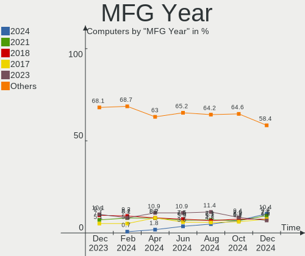
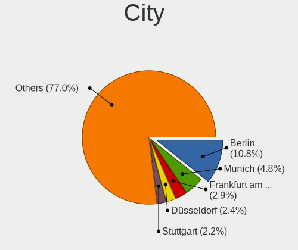
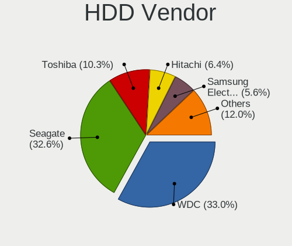
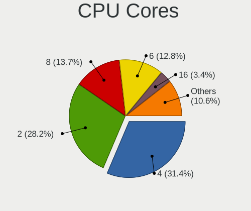
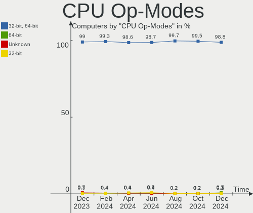
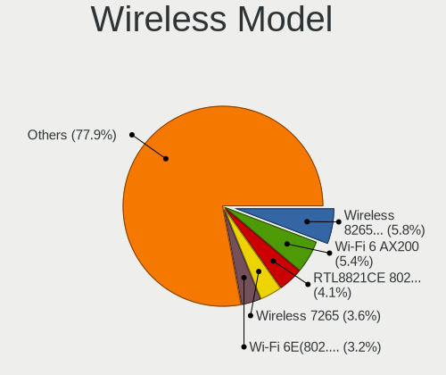
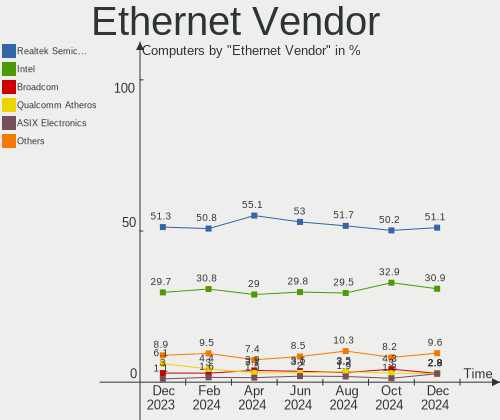
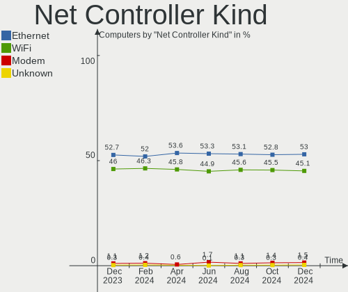
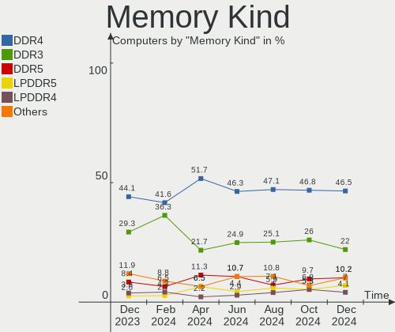
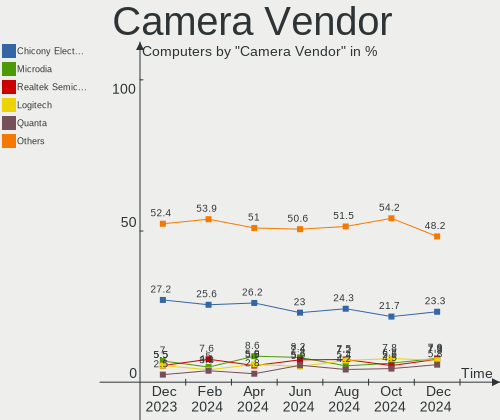

Linux in Germany - Hardware Trends
----------------------------------

A project to identify most popular hardware characteristics and track their change
over time based on data collected by Linux users at https://Linux-Hardware.org.

Anyone can contribute to this report by the [hw-probe](https://github.com/linuxhw/hw-probe) tool:

    sudo -E hw-probe -all -upload

This is a report for all computer types. See also reports for [desktops](/Location/Germany/Desktop/README.md) and [notebooks](/Location/Germany/Notebook/README.md).

Period: Sep, 2023.

Contents
--------

* [ System ](#system)
  - [ OS                       ](#os)
  - [ OS Family                ](#os-family)
  - [ Kernel                   ](#kernel)
  - [ Kernel Family            ](#kernel-family)
  - [ Kernel Major Ver.        ](#kernel-major-ver)
  - [ Arch                     ](#arch)
  - [ DE                       ](#de)
  - [ Display Server           ](#display-server)
  - [ Display Manager          ](#display-manager)
  - [ OS Lang                  ](#os-lang)
  - [ Boot Mode                ](#boot-mode)
  - [ Filesystem               ](#filesystem)
  - [ Part. scheme             ](#part-scheme)
  - [ Dual Boot with Linux/BSD ](#dual-boot-with-linuxbsd)
  - [ Dual Boot (Win)          ](#dual-boot-win)

* [ Board ](#board)
  - [ Vendor                   ](#vendor)
  - [ Model                    ](#model)
  - [ Model Family             ](#model-family)
  - [ MFG Year                 ](#mfg-year)
  - [ Form Factor              ](#form-factor)
  - [ Secure Boot              ](#secure-boot)
  - [ Coreboot                 ](#coreboot)
  - [ RAM Size                 ](#ram-size)
  - [ RAM Used                 ](#ram-used)
  - [ Total Drives             ](#total-drives)
  - [ Has CD-ROM               ](#has-cd-rom)
  - [ Has Ethernet             ](#has-ethernet)
  - [ Has WiFi                 ](#has-wifi)
  - [ Has Bluetooth            ](#has-bluetooth)

* [ Location ](#location)
  - [ Country                  ](#country)
  - [ City                     ](#city)

* [ Drives ](#drives)
  - [ Drive Vendor             ](#drive-vendor)
  - [ Drive Model              ](#drive-model)
  - [ HDD Vendor               ](#hdd-vendor)
  - [ SSD Vendor               ](#ssd-vendor)
  - [ Drive Kind               ](#drive-kind)
  - [ Drive Connector          ](#drive-connector)
  - [ Drive Size               ](#drive-size)
  - [ Space Total              ](#space-total)
  - [ Space Used               ](#space-used)
  - [ Malfunc. Drives          ](#malfunc-drives)
  - [ Malfunc. Drive Vendor    ](#malfunc-drive-vendor)
  - [ Malfunc. HDD Vendor      ](#malfunc-hdd-vendor)
  - [ Malfunc. Drive Kind      ](#malfunc-drive-kind)
  - [ Failed Drives            ](#failed-drives)
  - [ Failed Drive Vendor      ](#failed-drive-vendor)
  - [ Drive Status             ](#drive-status)

* [ Storage controller ](#storage-controller)
  - [ Storage Vendor           ](#storage-vendor)
  - [ Storage Model            ](#storage-model)
  - [ Storage Kind             ](#storage-kind)

* [ Processor ](#processor)
  - [ CPU Vendor               ](#cpu-vendor)
  - [ CPU Model                ](#cpu-model)
  - [ CPU Model Family         ](#cpu-model-family)
  - [ CPU Cores                ](#cpu-cores)
  - [ CPU Sockets              ](#cpu-sockets)
  - [ CPU Threads              ](#cpu-threads)
  - [ CPU Op-Modes             ](#cpu-op-modes)
  - [ CPU Microcode            ](#cpu-microcode)
  - [ CPU Microarch            ](#cpu-microarch)

* [ Graphics ](#graphics)
  - [ GPU Vendor               ](#gpu-vendor)
  - [ GPU Model                ](#gpu-model)
  - [ GPU Combo                ](#gpu-combo)
  - [ GPU Driver               ](#gpu-driver)
  - [ GPU Memory               ](#gpu-memory)

* [ Monitor ](#monitor)
  - [ Monitor Vendor           ](#monitor-vendor)
  - [ Monitor Model            ](#monitor-model)
  - [ Monitor Resolution       ](#monitor-resolution)
  - [ Monitor Diagonal         ](#monitor-diagonal)
  - [ Monitor Width            ](#monitor-width)
  - [ Aspect Ratio             ](#aspect-ratio)
  - [ Monitor Area             ](#monitor-area)
  - [ Pixel Density            ](#pixel-density)
  - [ Multiple Monitors        ](#multiple-monitors)

* [ Network ](#network)
  - [ Net Controller Vendor    ](#net-controller-vendor)
  - [ Net Controller Model     ](#net-controller-model)
  - [ Wireless Vendor          ](#wireless-vendor)
  - [ Wireless Model           ](#wireless-model)
  - [ Ethernet Vendor          ](#ethernet-vendor)
  - [ Ethernet Model           ](#ethernet-model)
  - [ Net Controller Kind      ](#net-controller-kind)
  - [ Used Controller          ](#used-controller)
  - [ NICs                     ](#nics)
  - [ IPv6                     ](#ipv6)

* [ Bluetooth ](#bluetooth)
  - [ Bluetooth Vendor         ](#bluetooth-vendor)
  - [ Bluetooth Model          ](#bluetooth-model)

* [ Sound ](#sound)
  - [ Sound Vendor             ](#sound-vendor)
  - [ Sound Model              ](#sound-model)

* [ Memory ](#memory)
  - [ Memory Vendor            ](#memory-vendor)
  - [ Memory Model             ](#memory-model)
  - [ Memory Kind              ](#memory-kind)
  - [ Memory Form Factor       ](#memory-form-factor)
  - [ Memory Size              ](#memory-size)
  - [ Memory Speed             ](#memory-speed)

* [ Printers & scanners ](#printers--scanners)
  - [ Printer Vendor           ](#printer-vendor)
  - [ Printer Model            ](#printer-model)
  - [ Scanner Vendor           ](#scanner-vendor)
  - [ Scanner Model            ](#scanner-model)

* [ Camera ](#camera)
  - [ Camera Vendor            ](#camera-vendor)
  - [ Camera Model             ](#camera-model)

* [ Security ](#security)
  - [ Fingerprint Vendor       ](#fingerprint-vendor)
  - [ Fingerprint Model        ](#fingerprint-model)
  - [ Chipcard Vendor          ](#chipcard-vendor)
  - [ Chipcard Model           ](#chipcard-model)

* [ Unsupported ](#unsupported)
  - [ Unsupported Devices      ](#unsupported-devices)
  - [ Unsupported Device Types ](#unsupported-device-types)

System
------

OS
--

Installed operating systems

| Name                         | Computers | Percent |
|------------------------------|-----------|---------|
| Ubuntu 22.04                 | 81        | 14.04%  |
| Linux Mint 21.2              | 61        | 10.57%  |
| OpenMandriva 23.08           | 38        | 6.59%   |
| Ubuntu 23.04                 | 32        | 5.55%   |
| Fedora 38                    | 30        | 5.2%    |
| Debian 12                    | 29        | 5.03%   |
| Zorin 16                     | 24        | 4.16%   |
| OpenMandriva 23.09           | 22        | 3.81%   |
| Pop!_OS 22.04                | 15        | 2.6%    |
| Arch Rolling                 | 15        | 2.6%    |
| openSUSE Tumbleweed-XXXXXXXX | 12        | 2.08%   |
| Kubuntu 22.04                | 10        | 1.73%   |
| Debian 11                    | 10        | 1.73%   |
| openSUSE Leap-15.5           | 9         | 1.56%   |
| TUXEDO OS 22.04              | 8         | 1.39%   |
| Manjaro                      | 8         | 1.39%   |
| Kali 2023.3                  | 8         | 1.39%   |
| ArcoLinux Rolling            | 8         | 1.39%   |
| Xubuntu 22.04                | 7         | 1.21%   |
| SteamOS 3.4.10               | 7         | 1.21%   |
| OpenMandriva 4.3             | 7         | 1.21%   |
| LMDE 5                       | 7         | 1.21%   |
| Gentoo 2.14                  | 7         | 1.21%   |
| Ubuntu 20.04                 | 6         | 1.04%   |
| EndeavourOS Rolling          | 6         | 1.04%   |
| Xero Rolling                 | 5         | 0.87%   |
| Manjaro 23.0.2               | 5         | 0.87%   |
| LMDE 6                       | 5         | 0.87%   |
| Linux Mint 20.3              | 5         | 0.87%   |
| Kubuntu 23.04                | 5         | 0.87%   |
| Debian                       | 5         | 0.87%   |
| OpenMandriva 4.2             | 4         | 0.69%   |
| BlackPanther 18.1            | 4         | 0.69%   |
| openSUSE Microos-XXXXXXXX    | 3         | 0.52%   |
| Nobara 38                    | 3         | 0.52%   |
| Manjaro 23.0.1               | 3         | 0.52%   |
| Linux Mint 21.1              | 3         | 0.52%   |
| Xubuntu 20.04                | 2         | 0.35%   |
| SteamOS 3.4.8                | 2         | 0.35%   |
| Parrot 5.3                   | 2         | 0.35%   |

OS Family
---------

OS without a version

| Name             | Computers | Percent |
|------------------|-----------|---------|
| Ubuntu           | 121       | 20.97%  |
| OpenMandriva     | 76        | 13.17%  |
| Linux Mint       | 73        | 12.65%  |
| Debian           | 45        | 7.8%    |
| Fedora           | 32        | 5.55%   |
| openSUSE         | 25        | 4.33%   |
| Zorin            | 24        | 4.16%   |
| Manjaro          | 18        | 3.12%   |
| Kubuntu          | 17        | 2.95%   |
| Pop!_OS          | 15        | 2.6%    |
| Arch             | 15        | 2.6%    |
| LMDE             | 12        | 2.08%   |
| SteamOS          | 11        | 1.91%   |
| Xubuntu          | 9         | 1.56%   |
| ArcoLinux        | 9         | 1.56%   |
| TUXEDO OS        | 8         | 1.39%   |
| Kali             | 8         | 1.39%   |
| Gentoo           | 7         | 1.21%   |
| EndeavourOS      | 6         | 1.04%   |
| Xero             | 5         | 0.87%   |
| Nobara           | 4         | 0.69%   |
| BlackPanther     | 4         | 0.69%   |
| MX               | 3         | 0.52%   |
| Raspbian         | 2         | 0.35%   |
| Parrot           | 2         | 0.35%   |
| NixOS            | 2         | 0.35%   |
| Lubuntu          | 2         | 0.35%   |
| KDE neon         | 2         | 0.35%   |
| Garuda Linux     | 2         | 0.35%   |
| Elementary       | 2         | 0.35%   |
| blendOS          | 2         | 0.35%   |
| Void Linux       | 1         | 0.17%   |
| Ubuntu Unity     | 1         | 0.17%   |
| Ubuntu MATE      | 1         | 0.17%   |
| Siduction        | 1         | 0.17%   |
| ROSA             | 1         | 0.17%   |
| Rocky Linux      | 1         | 0.17%   |
| org.kde.Platform | 1         | 0.17%   |
| Neptune OS       | 1         | 0.17%   |
| Manjaro-ARM      | 1         | 0.17%   |

Kernel
------

Version of the Linux kernel

| Version                      | Computers | Percent |
|------------------------------|-----------|---------|
| 6.2.0-32-generic             | 59        | 10.23%  |
| 5.15.0-83-generic            | 38        | 6.59%   |
| 6.2.0-33-generic             | 34        | 5.89%   |
| 6.4.11-desktop-1omv2390      | 33        | 5.72%   |
| 5.15.0-84-generic            | 29        | 5.03%   |
| 6.4.15-200.fc38.x86_64       | 18        | 3.12%   |
| 5.15.0-82-generic            | 17        | 2.95%   |
| 6.1.0-12-amd64               | 15        | 2.6%    |
| 6.2.0-31-generic             | 14        | 2.43%   |
| 6.4.6-76060406-generic       | 13        | 2.25%   |
| 5.10.0-25-amd64              | 11        | 1.91%   |
| 6.4.12-arch1-1               | 10        | 1.73%   |
| 6.5.3-arch1-1                | 9         | 1.56%   |
| 6.5.0-desktop-1omv2390       | 8         | 1.39%   |
| 6.1.0-11-amd64               | 8         | 1.39%   |
| 5.15.0-76-generic            | 8         | 1.39%   |
| 5.14.21-150500.55.19-default | 8         | 1.39%   |
| 6.5.3-1-MANJARO              | 7         | 1.21%   |
| 5.13.0-valve37-1-neptune     | 7         | 1.21%   |
| 6.2.0-26-generic             | 6         | 1.04%   |
| 6.2.0-10018-tuxedo           | 6         | 1.04%   |
| 6.5.3-desktop-1omv2390       | 5         | 0.87%   |
| 6.5.2-desktop-1omv2390       | 5         | 0.87%   |
| 6.4.0-kali3-amd64            | 5         | 0.87%   |
| 6.1.0-10-amd64               | 5         | 0.87%   |
| 6.5.3-1-default              | 4         | 0.69%   |
| 6.5.1-desktop-1omv2390       | 4         | 0.69%   |
| 6.4.8-desktop-2omv2390       | 4         | 0.69%   |
| 6.4.14-200.fc38.x86_64       | 4         | 0.69%   |
| 5.4.0-162-generic            | 4         | 0.69%   |
| 5.16.13-desktop-1omv4003     | 4         | 0.69%   |
| 5.15.0-78-generic            | 4         | 0.69%   |
| 5.10.14-desktop-1omv4002     | 4         | 0.69%   |
| 6.5.4-1-default              | 3         | 0.52%   |
| 6.4.12-200.fc38.x86_64       | 3         | 0.52%   |
| 6.4.0-4-amd64                | 3         | 0.52%   |
| 6.2.0-10022-tuxedo           | 3         | 0.52%   |
| 5.6.14-desktop-2bP           | 3         | 0.52%   |
| 5.4.0-159-generic            | 3         | 0.52%   |
| 5.16.7-desktop-1omv4003      | 3         | 0.52%   |

Kernel Family
-------------

Linux kernel without a distro release

| Version | Computers | Percent |
|---------|-----------|---------|
| 6.2.0   | 131       | 22.7%   |
| 5.15.0  | 112       | 19.41%  |
| 6.4.11  | 36        | 6.24%   |
| 6.1.0   | 33        | 5.72%   |
| 6.5.3   | 30        | 5.2%    |
| 6.4.12  | 20        | 3.47%   |
| 6.4.15  | 18        | 3.12%   |
| 6.4.6   | 15        | 2.6%    |
| 5.10.0  | 15        | 2.6%    |
| 6.5.0   | 13        | 2.25%   |
| 6.4.0   | 11        | 1.91%   |
| 5.4.0   | 10        | 1.73%   |
| 5.14.21 | 10        | 1.73%   |
| 6.5.2   | 9         | 1.56%   |
| 5.13.0  | 9         | 1.56%   |
| 6.5.5   | 8         | 1.39%   |
| 6.5.1   | 7         | 1.21%   |
| 6.5.4   | 5         | 0.87%   |
| 6.4.8   | 5         | 0.87%   |
| 6.4.14  | 5         | 0.87%   |
| 6.3.9   | 5         | 0.87%   |
| 6.2.6   | 4         | 0.69%   |
| 6.2.16  | 4         | 0.69%   |
| 6.1.51  | 4         | 0.69%   |
| 5.19.0  | 4         | 0.69%   |
| 5.16.13 | 4         | 0.69%   |
| 5.10.14 | 4         | 0.69%   |
| 6.4.10  | 3         | 0.52%   |
| 6.1.53  | 3         | 0.52%   |
| 6.1.46  | 3         | 0.52%   |
| 5.6.14  | 3         | 0.52%   |
| 5.16.7  | 3         | 0.52%   |
| 6.3.13  | 2         | 0.35%   |
| 6.3.0   | 2         | 0.35%   |
| 6.1.50  | 2         | 0.35%   |
| 6.1.1   | 2         | 0.35%   |
| 6.4.2   | 1         | 0.17%   |
| 6.4.13  | 1         | 0.17%   |
| 6.3.5   | 1         | 0.17%   |
| 6.3.12  | 1         | 0.17%   |

Kernel Major Ver.
-----------------

Linux kernel major version

| Version | Computers | Percent |
|---------|-----------|---------|
| 6.2     | 141       | 24.44%  |
| 6.4     | 115       | 19.93%  |
| 5.15    | 115       | 19.93%  |
| 6.5     | 72        | 12.48%  |
| 6.1     | 53        | 9.19%   |
| 5.10    | 22        | 3.81%   |
| 6.3     | 11        | 1.91%   |
| 5.14    | 11        | 1.91%   |
| 5.4     | 10        | 1.73%   |
| 5.13    | 9         | 1.56%   |
| 5.16    | 7         | 1.21%   |
| 5.19    | 4         | 0.69%   |
| 5.6     | 3         | 0.52%   |
| 6.0     | 2         | 0.35%   |
| 5.11    | 1         | 0.17%   |
| 4.19    | 1         | 0.17%   |

Arch
----

OS architecture (x86_64, i586, etc.)

| Name    | Computers | Percent |
|---------|-----------|---------|
| x86_64  | 569       | 98.61%  |
| aarch64 | 6         | 1.04%   |
| riscv64 | 1         | 0.17%   |
| i686    | 1         | 0.17%   |

DE
--

Desktop Environment

| Name            | Computers | Percent |
|-----------------|-----------|---------|
| GNOME           | 220       | 38.13%  |
| KDE5            | 179       | 31.02%  |
| X-Cinnamon      | 65        | 11.27%  |
| XFCE            | 43        | 7.45%   |
| Unknown         | 25        | 4.33%   |
| MATE            | 11        | 1.91%   |
| Cinnamon        | 9         | 1.56%   |
| LXQt            | 6         | 1.04%   |
| Hyprland        | 4         | 0.69%   |
| KDE             | 3         | 0.52%   |
| i3              | 3         | 0.52%   |
| sway            | 2         | 0.35%   |
| Pantheon        | 2         | 0.35%   |
| Unity           | 1         | 0.17%   |
| LXDE            | 1         | 0.17%   |
| GNOME Flashback | 1         | 0.17%   |
| Endless:GNOME   | 1         | 0.17%   |
| Budgie          | 1         | 0.17%   |

Display Server
--------------

X11 or Wayland

| Name        | Computers | Percent |
|-------------|-----------|---------|
| X11         | 341       | 59.1%   |
| Wayland     | 208       | 36.05%  |
| Tty         | 18        | 3.12%   |
| Unknown     | 9         | 1.56%   |
| Unspecified | 1         | 0.17%   |

Display Manager
---------------

SDDM, LightDM, etc.

| Name    | Computers | Percent |
|---------|-----------|---------|
| Unknown | 219       | 37.95%  |
| SDDM    | 133       | 23.05%  |
| GDM3    | 127       | 22.01%  |
| LightDM | 73        | 12.65%  |
| GDM     | 22        | 3.81%   |
| SLiM    | 2         | 0.35%   |
| GREETD  | 1         | 0.17%   |

OS Lang
-------

Language

| Lang      | Computers | Percent |
|-----------|-----------|---------|
| de_DE     | 399       | 69.15%  |
| en_US     | 125       | 21.66%  |
| C         | 13        | 2.25%   |
| en_GB     | 12        | 2.08%   |
| Unknown   | 10        | 1.73%   |
| ru_RU     | 3         | 0.52%   |
| nl_NL     | 2         | 0.35%   |
| it_IT     | 2         | 0.35%   |
| en_NZ     | 2         | 0.35%   |
| C.UTF8    | 2         | 0.35%   |
| zh_CN     | 1         | 0.17%   |
| uk_UA     | 1         | 0.17%   |
| ro_RO     | 1         | 0.17%   |
| POSIX     | 1         | 0.17%   |
| fr_FR     | 1         | 0.17%   |
| en_AU     | 1         | 0.17%   |
| de_DEutf8 | 1         | 0.17%   |

Boot Mode
---------

EFI or BIOS

| Mode | Computers | Percent |
|------|-----------|---------|
| EFI  | 292       | 50.61%  |
| BIOS | 285       | 49.39%  |

Filesystem
----------

Type of filesystem

| Type    | Computers | Percent |
|---------|-----------|---------|
| Ext4    | 337       | 58.41%  |
| Tmpfs   | 100       | 17.33%  |
| Btrfs   | 86        | 14.9%   |
| Overlay | 35        | 6.07%   |
| Zfs     | 7         | 1.21%   |
| F2fs    | 6         | 1.04%   |
| Xfs     | 3         | 0.52%   |
| XXX4    | 1         | 0.17%   |
| Ntfs    | 1         | 0.17%   |
| Ext2    | 1         | 0.17%   |

Part. scheme
------------

Scheme of partitioning

| Type    | Computers | Percent |
|---------|-----------|---------|
| GPT     | 318       | 55.11%  |
| Unknown | 198       | 34.32%  |
| MBR     | 61        | 10.57%  |

Dual Boot with Linux/BSD
------------------------

Hosting more than one Linux/BSD

| Dual boot | Computers | Percent |
|-----------|-----------|---------|
| No        | 500       | 86.66%  |
| Yes       | 77        | 13.34%  |

Dual Boot (Win)
---------------

Hosting Linux and Windows

| Dual boot | Computers | Percent |
|-----------|-----------|---------|
| No        | 450       | 77.99%  |
| Yes       | 127       | 22.01%  |

Board
-----

Vendor
------

Motherboard manufacturer

| Name                    | Computers | Percent |
|-------------------------|-----------|---------|
| Lenovo                  | 86        | 14.9%   |
| Hewlett-Packard         | 81        | 14.04%  |
| ASUSTek Computer        | 80        | 13.86%  |
| Acer                    | 43        | 7.45%   |
| Dell                    | 39        | 6.76%   |
| ASRock                  | 33        | 5.72%   |
| MSI                     | 32        | 5.55%   |
| Gigabyte Technology     | 27        | 4.68%   |
| Fujitsu                 | 24        | 4.16%   |
| Apple                   | 15        | 2.6%    |
| Medion                  | 14        | 2.43%   |
| Valve                   | 11        | 1.91%   |
| TUXEDO                  | 7         | 1.21%   |
| Toshiba                 | 6         | 1.04%   |
| HUAWEI                  | 6         | 1.04%   |
| Microsoft               | 5         | 0.87%   |
| Intel                   | 5         | 0.87%   |
| Raspberry Pi Foundation | 4         | 0.69%   |
| Fujitsu Siemens         | 4         | 0.69%   |
| Chuwi                   | 4         | 0.69%   |
| Unknown                 | 4         | 0.69%   |
| Sony                    | 3         | 0.52%   |
| Pegatron                | 3         | 0.52%   |
| Alienware               | 3         | 0.52%   |
| Wortmann AG             | 2         | 0.35%   |
| System76                | 2         | 0.35%   |
| Samsung Electronics     | 2         | 0.35%   |
| Packard Bell            | 2         | 0.35%   |
| Notebook                | 2         | 0.35%   |
| IP3 Tech                | 2         | 0.35%   |
| Foxconn                 | 2         | 0.35%   |
| Biostar                 | 2         | 0.35%   |
| BESSTAR Tech            | 2         | 0.35%   |
| AZW                     | 2         | 0.35%   |
| ASRockRack              | 2         | 0.35%   |
| VALE                    | 1         | 0.17%   |
| UMAX                    | 1         | 0.17%   |
| TrekStor                | 1         | 0.17%   |
| Teclast                 | 1         | 0.17%   |
| Techvision              | 1         | 0.17%   |

Model
-----

Motherboard model

| Name                                 | Computers | Percent |
|--------------------------------------|-----------|---------|
| Valve Jupiter                        | 11        | 1.91%   |
| Unknown                              | 7         | 1.21%   |
| HP ElitePad 1000 G2                  | 5         | 0.87%   |
| MSI MS-7B86                          | 3         | 0.52%   |
| HP EliteDesk 800 G2 DM 35W           | 3         | 0.52%   |
| ASUS TUF Gaming B550-PLUS            | 3         | 0.52%   |
| ASUS A0000001                        | 3         | 0.52%   |
| Apple MacBookPro12,1                 | 3         | 0.52%   |
| MSI MS-7C91                          | 2         | 0.35%   |
| MSI MS-7C56                          | 2         | 0.35%   |
| MSI MS-7B89                          | 2         | 0.35%   |
| Lenovo ThinkPad T560 20FJS2BX00      | 2         | 0.35%   |
| Lenovo ThinkCentre M910q 10MUS0RN00  | 2         | 0.35%   |
| HP Laptop 17-cn0xxx                  | 2         | 0.35%   |
| HP Laptop 17-by0xxx                  | 2         | 0.35%   |
| HP Laptop 17-bs0xx                   | 2         | 0.35%   |
| HP Laptop 15s-eq2xxx                 | 2         | 0.35%   |
| HP ENVY x360 2-in-1 Laptop 15-ey0xxx | 2         | 0.35%   |
| HP Elite x2 1012 G1                  | 2         | 0.35%   |
| HP 250 G7 Notebook PC                | 2         | 0.35%   |
| HP 250 15.6 inch G9 Notebook PC      | 2         | 0.35%   |
| Fujitsu LIFEBOOK E752                | 2         | 0.35%   |
| Fujitsu ESPRIMO_P556                 | 2         | 0.35%   |
| Dell Latitude 3320                   | 2         | 0.35%   |
| ASUS ZenBook UX425UA_UM425UA         | 2         | 0.35%   |
| ASUS X75A1                           | 2         | 0.35%   |
| ASUS X55A                            | 2         | 0.35%   |
| ASUS ROG STRIX B550-A GAMING         | 2         | 0.35%   |
| ASUS PRIME X370-PRO                  | 2         | 0.35%   |
| ASUS PRIME B550M-A                   | 2         | 0.35%   |
| ASRock Z68 Pro3                      | 2         | 0.35%   |
| ASRock FM2A68M-HD+                   | 2         | 0.35%   |
| ASRock B450 Gaming-ITX/ac            | 2         | 0.35%   |
| Apple MacBookPro9,2                  | 2         | 0.35%   |
| Acer Aspire V3-771                   | 2         | 0.35%   |
| Acer Aspire 5742G                    | 2         | 0.35%   |
| Wortmann AG TERRA_MOBILE_1749        | 1         | 0.17%   |
| Wortmann AG TERRA_MOBILE_1512/1712   | 1         | 0.17%   |
| VALE Notebook Classic C140           | 1         | 0.17%   |
| UMAX VisionBook 14Wr                 | 1         | 0.17%   |

Model Family
------------

Motherboard model prefix

| Name                  | Computers | Percent |
|-----------------------|-----------|---------|
| Lenovo ThinkPad       | 52        | 9.01%   |
| Acer Aspire           | 32        | 5.55%   |
| Dell Latitude         | 14        | 2.43%   |
| HP Laptop             | 13        | 2.25%   |
| Fujitsu ESPRIMO       | 12        | 2.08%   |
| Valve Jupiter         | 11        | 1.91%   |
| HP EliteBook          | 11        | 1.91%   |
| ASUS PRIME            | 11        | 1.91%   |
| HP Pavilion           | 9         | 1.56%   |
| ASUS ROG              | 8         | 1.39%   |
| Lenovo ThinkCentre    | 7         | 1.21%   |
| Lenovo IdeaPad        | 7         | 1.21%   |
| HP EliteDesk          | 7         | 1.21%   |
| HP 250                | 7         | 1.21%   |
| Dell Inspiron         | 7         | 1.21%   |
| ASUS ZenBook          | 7         | 1.21%   |
| Unknown               | 7         | 1.21%   |
| Fujitsu LIFEBOOK      | 6         | 1.04%   |
| Dell Precision        | 6         | 1.04%   |
| ASUS TUF              | 6         | 1.04%   |
| Acer Nitro            | 6         | 1.04%   |
| Toshiba Satellite     | 5         | 0.87%   |
| Microsoft Surface     | 5         | 0.87%   |
| Medion Akoya          | 5         | 0.87%   |
| HP ElitePad           | 5         | 0.87%   |
| HP Compaq             | 5         | 0.87%   |
| Dell XPS              | 5         | 0.87%   |
| Dell OptiPlex         | 5         | 0.87%   |
| RPi Raspberry         | 4         | 0.69%   |
| Lenovo Yoga           | 4         | 0.69%   |
| HP ENVY               | 4         | 0.69%   |
| ASUS VivoBook         | 4         | 0.69%   |
| MSI MS-7B86           | 3         | 0.52%   |
| HP ProDesk            | 3         | 0.52%   |
| HP ProBook            | 3         | 0.52%   |
| HP Elite              | 3         | 0.52%   |
| Gigabyte B550         | 3         | 0.52%   |
| Fujitsu Siemens AMILO | 3         | 0.52%   |
| Fujitsu CELSIUS       | 3         | 0.52%   |
| ASUS A0000001         | 3         | 0.52%   |

MFG Year
--------

Motherboard manufacture year

| Year    | Computers | Percent |
|---------|-----------|---------|
| 2021    | 56        | 9.71%   |
| 2020    | 56        | 9.71%   |
| 2022    | 49        | 8.49%   |
| 2018    | 49        | 8.49%   |
| 2019    | 39        | 6.76%   |
| 2012    | 38        | 6.59%   |
| 2015    | 34        | 5.89%   |
| 2013    | 34        | 5.89%   |
| 2017    | 33        | 5.72%   |
| 2011    | 32        | 5.55%   |
| 2014    | 29        | 5.03%   |
| 2023    | 28        | 4.85%   |
| 2016    | 28        | 4.85%   |
| 2010    | 25        | 4.33%   |
| 2008    | 16        | 2.77%   |
| 2009    | 13        | 2.25%   |
| Unknown | 8         | 1.39%   |
| 2007    | 7         | 1.21%   |
| 2006    | 2         | 0.35%   |
| 2005    | 1         | 0.17%   |

Form Factor
-----------

Physical design of the computer

| Name           | Computers | Percent |
|----------------|-----------|---------|
| Notebook       | 296       | 51.3%   |
| Desktop        | 225       | 38.99%  |
| Convertible    | 17        | 2.95%   |
| Tablet         | 14        | 2.43%   |
| Mini pc        | 11        | 1.91%   |
| System on chip | 6         | 1.04%   |
| All in one     | 6         | 1.04%   |
| Server         | 2         | 0.35%   |

Secure Boot
-----------

Enabled or disabled

| State    | Computers | Percent |
|----------|-----------|---------|
| Disabled | 535       | 92.72%  |
| Enabled  | 42        | 7.28%   |

Coreboot
--------

Have coreboot on board

| Used | Computers | Percent |
|------|-----------|---------|
| No   | 576       | 99.83%  |
| Yes  | 1         | 0.17%   |

RAM Size
--------

Total RAM memory

| Size in GB      | Computers | Percent |
|-----------------|-----------|---------|
| 4.01-8.0        | 158       | 27.38%  |
| 16.01-24.0      | 113       | 19.58%  |
| 8.01-16.0       | 102       | 17.68%  |
| 3.01-4.0        | 72        | 12.48%  |
| 32.01-64.0      | 70        | 12.13%  |
| 64.01-256.0     | 26        | 4.51%   |
| 24.01-32.0      | 18        | 3.12%   |
| 1.01-2.0        | 11        | 1.91%   |
| 2.01-3.0        | 5         | 0.87%   |
| More than 256.0 | 1         | 0.17%   |
| 0.01-0.5        | 1         | 0.17%   |

RAM Used
--------

Used RAM memory

| Used GB     | Computers | Percent |
|-------------|-----------|---------|
| 1.01-2.0    | 183       | 31.72%  |
| 2.01-3.0    | 151       | 26.17%  |
| 4.01-8.0    | 111       | 19.24%  |
| 3.01-4.0    | 63        | 10.92%  |
| 8.01-16.0   | 33        | 5.72%   |
| 0.51-1.0    | 20        | 3.47%   |
| 16.01-24.0  | 8         | 1.39%   |
| 0.01-0.5    | 5         | 0.87%   |
| 24.01-32.0  | 2         | 0.35%   |
| 64.01-256.0 | 1         | 0.17%   |

Total Drives
------------

Number of drives on board

| Drives | Computers | Percent |
|--------|-----------|---------|
| 1      | 347       | 60.14%  |
| 2      | 145       | 25.13%  |
| 3      | 47        | 8.15%   |
| 4      | 16        | 2.77%   |
| 5      | 12        | 2.08%   |
| 10     | 2         | 0.35%   |
| 9      | 2         | 0.35%   |
| 6      | 2         | 0.35%   |
| 0      | 2         | 0.35%   |
| 11     | 1         | 0.17%   |
| 7      | 1         | 0.17%   |

Has CD-ROM
----------

Has CD-ROM on board

| Presented | Computers | Percent |
|-----------|-----------|---------|
| No        | 361       | 62.56%  |
| Yes       | 216       | 37.44%  |

Has Ethernet
------------

Has Ethernet on board

| Presented | Computers | Percent |
|-----------|-----------|---------|
| Yes       | 491       | 85.1%   |
| No        | 86        | 14.9%   |

Has WiFi
--------

Has WiFi module

| Presented | Computers | Percent |
|-----------|-----------|---------|
| Yes       | 420       | 72.79%  |
| No        | 157       | 27.21%  |

Has Bluetooth
-------------

Has Bluetooth module

| Presented | Computers | Percent |
|-----------|-----------|---------|
| Yes       | 359       | 62.22%  |
| No        | 218       | 37.78%  |

Location
--------

Country
-------

Geographic location (country)

| Country | Computers | Percent |
|---------|-----------|---------|
| Germany | 577       | 100%    |

City
----

Geographic location (city)

| City                    | Computers | Percent |
|-------------------------|-----------|---------|
| Berlin                  | 51        | 8.84%   |
| Hamburg                 | 27        | 4.68%   |
| Munich                  | 22        | 3.81%   |
| Frankfurt am Main       | 18        | 3.12%   |
| Stuttgart               | 13        | 2.25%   |
| Bonn                    | 12        | 2.08%   |
| Essen                   | 9         | 1.56%   |
| Cologne                 | 9         | 1.56%   |
| Düsseldorf             | 8         | 1.39%   |
| Darmstadt               | 8         | 1.39%   |
| Hanover                 | 7         | 1.21%   |
| Nuremberg               | 6         | 1.04%   |
| Mannheim                | 6         | 1.04%   |
| Leipzig                 | 6         | 1.04%   |
| Krefeld                 | 5         | 0.87%   |
| Karlsruhe               | 5         | 0.87%   |
| Duisburg                | 5         | 0.87%   |
| Dresden                 | 5         | 0.87%   |
| Wegberg                 | 4         | 0.69%   |
| Reutlingen              | 4         | 0.69%   |
| Pforzheim               | 4         | 0.69%   |
| Magdeburg               | 4         | 0.69%   |
| Cuxhaven                | 4         | 0.69%   |
| Bremen                  | 4         | 0.69%   |
| Bielefeld               | 4         | 0.69%   |
| Augsburg                | 4         | 0.69%   |
| Aalen                   | 4         | 0.69%   |
| Wuppertal               | 3         | 0.52%   |
| Ulm                     | 3         | 0.52%   |
| Pfaffenhofen an der Ilm | 3         | 0.52%   |
| Paderborn               | 3         | 0.52%   |
| Moers                   | 3         | 0.52%   |
| Merzhausen              | 3         | 0.52%   |
| Lüneburg               | 3         | 0.52%   |
| Lüdenscheid            | 3         | 0.52%   |
| Kiel                    | 3         | 0.52%   |
| Jena                    | 3         | 0.52%   |
| Heilbronn               | 3         | 0.52%   |
| Hechingen               | 3         | 0.52%   |
| Gronau                  | 3         | 0.52%   |

Drives
------

Drive Vendor
------------

Hard drive vendors

| Vendor                      | Computers | Drives | Percent |
|-----------------------------|-----------|--------|---------|
| Samsung Electronics         | 172       | 213    | 20.62%  |
| WDC                         | 84        | 101    | 10.07%  |
| SanDisk                     | 77        | 84     | 9.23%   |
| Seagate                     | 61        | 72     | 7.31%   |
| Toshiba                     | 50        | 57     | 6%      |
| Crucial                     | 46        | 49     | 5.52%   |
| Unknown                     | 44        | 56     | 5.28%   |
| Kingston                    | 35        | 36     | 4.2%    |
| Intenso                     | 27        | 31     | 3.24%   |
| SK hynix                    | 26        | 26     | 3.12%   |
| Micron Technology           | 16        | 23     | 1.92%   |
| Hitachi                     | 16        | 15     | 1.92%   |
| Intel                       | 14        | 15     | 1.68%   |
| HGST                        | 13        | 13     | 1.56%   |
| Phison Electronics          | 12        | 13     | 1.44%   |
| KIOXIA                      | 12        | 12     | 1.44%   |
| Kingston Technology Company | 11        | 12     | 1.32%   |
| Micron/Crucial Technology   | 9         | 9      | 1.08%   |
| Silicon Motion              | 8         | 8      | 0.96%   |
| Patriot                     | 6         | 6      | 0.72%   |
| Apple                       | 6         | 6      | 0.72%   |
| Unknown                     | 5         | 5      | 0.6%    |
| Transcend                   | 3         | 3      | 0.36%   |
| PNY                         | 3         | 3      | 0.36%   |
| Phison                      | 3         | 3      | 0.36%   |
| Netac                       | 3         | 3      | 0.36%   |
| Fanxiang                    | 3         | 3      | 0.36%   |
| China                       | 3         | 3      | 0.36%   |
| AirDisk                     | 3         | 3      | 0.36%   |
| Verbatim                    | 2         | 2      | 0.24%   |
| Realtek Semiconductor       | 2         | 2      | 0.24%   |
| OCZ                         | 2         | 2      | 0.24%   |
| LITEON                      | 2         | 2      | 0.24%   |
| INNOVATION IT               | 2         | 2      | 0.24%   |
| Hewlett-Packard             | 2         | 2      | 0.24%   |
| Fujitsu                     | 2         | 3      | 0.24%   |
| Emtec                       | 2         | 2      | 0.24%   |
| Corsair                     | 2         | 2      | 0.24%   |
| Aura                        | 2         | 2      | 0.24%   |
| ASMT                        | 2         | 2      | 0.24%   |

Drive Model
-----------

Hard drive models

| Model                                                 | Computers | Percent |
|-------------------------------------------------------|-----------|---------|
| Samsung NVMe SSD Controller SM981/PM981/PM983 256GB   | 15        | 1.64%   |
| Samsung NVMe SSD Controller PM9A1/PM9A3/980PRO 1TB    | 13        | 1.43%   |
| Samsung SSD 850 EVO 250GB                             | 11        | 1.21%   |
| Samsung SSD 860 EVO 500GB                             | 10        | 1.1%    |
| Sandisk WD Blue SN550 NVMe SSD 512GB                  | 9         | 0.99%   |
| Unknown MMC Card  64GB                                | 8         | 0.88%   |
| Toshiba DT01ACA100 1TB                                | 8         | 0.88%   |
| Samsung SSD 860 EVO 250GB                             | 8         | 0.88%   |
| SanDisk SSD PLUS 480GB                                | 7         | 0.77%   |
| Crucial CT500MX500SSD1 500GB                          | 7         | 0.77%   |
| Samsung SSD 980 1TB                                   | 6         | 0.66%   |
| Samsung SSD 870 QVO 1TB                               | 6         | 0.66%   |
| Micron/Crucial P2 NVMe PCIe SSD 1TB                   | 6         | 0.66%   |
| Unknown SD/MMC 2GB                                    | 5         | 0.55%   |
| Unknown MMC Card  256GB                               | 5         | 0.55%   |
| Unknown MMC Card  128GB                               | 5         | 0.55%   |
| Unknown M.S./M.S.Pro/HG 16GB                          | 5         | 0.55%   |
| Toshiba XG6 NVMe SSD Controller 512GB                 | 5         | 0.55%   |
| Seagate ST500DM002-1BD142 500GB                       | 5         | 0.55%   |
| SanDisk SDSSDH3512G 512GB                             | 5         | 0.55%   |
| Samsung SSD 990 PRO 2TB                               | 5         | 0.55%   |
| Samsung SSD 970 EVO Plus 1TB                          | 5         | 0.55%   |
| Samsung SSD 870 EVO 1TB                               | 5         | 0.55%   |
| Samsung SSD 850 EVO 1TB                               | 5         | 0.55%   |
| Samsung HD103SJ 1TB                                   | 5         | 0.55%   |
| Kingston Company OM3PDP3 NVMe SSD 512GB               | 5         | 0.55%   |
| Kingston SA400S37240G 240GB SSD                       | 5         | 0.55%   |
| Crucial CT480BX500SSD1 480GB                          | 5         | 0.55%   |
| Crucial CT240BX500SSD1 240GB                          | 5         | 0.55%   |
| Unknown                                               | 5         | 0.55%   |
| Unknown SD/MMC/MS PRO 128GB                           | 4         | 0.44%   |
| Toshiba DT01ACA300 3TB                                | 4         | 0.44%   |
| Silicon Motion SM2263EN/SM2263XT SSD Controller 512GB | 4         | 0.44%   |
| Silicon Motion SM2262/SM2262EN SSD Controller 500GB   | 4         | 0.44%   |
| Seagate ST2000DM008-2FR102 2TB                        | 4         | 0.44%   |
| SanDisk SSD PLUS 1000GB                               | 4         | 0.44%   |
| SanDisk SDSSDA120G 120GB                              | 4         | 0.44%   |
| Samsung SSD 850 EVO 500GB                             | 4         | 0.44%   |
| Samsung SSD 840 PRO Series 256GB                      | 4         | 0.44%   |
| Samsung SSD 840 EVO 250GB                             | 4         | 0.44%   |

HDD Vendor
----------

Hard disk drive vendors

| Vendor              | Computers | Drives | Percent |
|---------------------|-----------|--------|---------|
| WDC                 | 64        | 79     | 29.22%  |
| Seagate             | 61        | 72     | 27.85%  |
| Toshiba             | 34        | 40     | 15.53%  |
| Hitachi             | 16        | 15     | 7.31%   |
| Samsung Electronics | 15        | 15     | 6.85%   |
| HGST                | 13        | 13     | 5.94%   |
| Unknown             | 4         | 4      | 1.83%   |
| Intenso             | 2         | 2      | 0.91%   |
| Fujitsu             | 2         | 3      | 0.91%   |
| Apple               | 2         | 2      | 0.91%   |
| SSK                 | 1         | 1      | 0.46%   |
| SAGE                | 1         | 1      | 0.46%   |
| Maxone              | 1         | 1      | 0.46%   |
| IB-377U3            | 1         | 1      | 0.46%   |
| External            | 1         | 1      | 0.46%   |
| Unknown             | 1         | 1      | 0.46%   |

SSD Vendor
----------

Solid state drive vendors

| Vendor              | Computers | Drives | Percent |
|---------------------|-----------|--------|---------|
| Samsung Electronics | 94        | 108    | 30.03%  |
| SanDisk             | 44        | 49     | 14.06%  |
| Crucial             | 37        | 38     | 11.82%  |
| Kingston            | 21        | 21     | 6.71%   |
| Intenso             | 20        | 24     | 6.39%   |
| WDC                 | 14        | 14     | 4.47%   |
| Toshiba             | 6         | 6      | 1.92%   |
| Patriot             | 6         | 6      | 1.92%   |
| Micron Technology   | 6         | 13     | 1.92%   |
| Intel               | 5         | 5      | 1.6%    |
| Transcend           | 3         | 3      | 0.96%   |
| SK hynix            | 3         | 3      | 0.96%   |
| PNY                 | 3         | 3      | 0.96%   |
| Phison              | 3         | 3      | 0.96%   |
| Netac               | 3         | 3      | 0.96%   |
| Fanxiang            | 3         | 3      | 0.96%   |
| China               | 3         | 3      | 0.96%   |
| Apple               | 3         | 3      | 0.96%   |
| Verbatim            | 2         | 2      | 0.64%   |
| OCZ                 | 2         | 2      | 0.64%   |
| LITEON              | 2         | 2      | 0.64%   |
| INNOVATION IT       | 2         | 2      | 0.64%   |
| Emtec               | 2         | 2      | 0.64%   |
| ASMT                | 2         | 2      | 0.64%   |
| AirDisk             | 2         | 2      | 0.64%   |
| A-DATA Technology   | 2         | 2      | 0.64%   |
| TrekStor            | 1         | 1      | 0.32%   |
| TO Exter            | 1         | 1      | 0.32%   |
| Teclast             | 1         | 1      | 0.32%   |
| SPCC Sol            | 1         | 1      | 0.32%   |
| SPCC                | 1         | 1      | 0.32%   |
| SD                  | 1         | 2      | 0.32%   |
| M4-CT128            | 1         | 1      | 0.32%   |
| Leven               | 1         | 1      | 0.32%   |
| JMicron Technology  | 1         | 1      | 0.32%   |
| Hewlett-Packard     | 1         | 1      | 0.32%   |
| GLOWAY              | 1         | 1      | 0.32%   |
| FORESEE             | 1         | 1      | 0.32%   |
| EVM                 | 1         | 1      | 0.32%   |
| Drevo               | 1         | 1      | 0.32%   |

Drive Kind
----------

HDD or SSD

| Kind    | Computers | Drives | Percent |
|---------|-----------|--------|---------|
| SSD     | 278       | 345    | 36.39%  |
| NVMe    | 249       | 281    | 32.59%  |
| HDD     | 180       | 251    | 23.56%  |
| MMC     | 36        | 43     | 4.71%   |
| Unknown | 21        | 28     | 2.75%   |

Drive Connector
---------------

SATA, SAS, NVMe, etc.

| Type | Computers | Drives | Percent |
|------|-----------|--------|---------|
| SATA | 375       | 575    | 53.65%  |
| NVMe | 248       | 280    | 35.48%  |
| SAS  | 40        | 50     | 5.72%   |
| MMC  | 36        | 43     | 5.15%   |

Drive Size
----------

Size of hard drive

| Size in TB | Computers | Drives | Percent |
|------------|-----------|--------|---------|
| 0.01-0.5   | 273       | 319    | 54.6%   |
| 0.51-1.0   | 144       | 173    | 28.8%   |
| 1.01-2.0   | 44        | 54     | 8.8%    |
| 3.01-4.0   | 17        | 22     | 3.4%    |
| 2.01-3.0   | 10        | 11     | 2%      |
| 4.01-10.0  | 10        | 15     | 2%      |
| 10.01-20.0 | 2         | 2      | 0.4%    |

Space Total
-----------

Amount of disk space available on the file system

| Size in GB     | Computers | Percent |
|----------------|-----------|---------|
| 101-250        | 134       | 23.22%  |
| 251-500        | 125       | 21.66%  |
| 501-1000       | 94        | 16.29%  |
| 1001-2000      | 48        | 8.32%   |
| More than 3000 | 47        | 8.15%   |
| 51-100         | 38        | 6.59%   |
| 1-20           | 34        | 5.89%   |
| Unknown        | 28        | 4.85%   |
| 2001-3000      | 18        | 3.12%   |
| 21-50          | 11        | 1.91%   |

Space Used
----------

Amount of used disk space

| Used GB        | Computers | Percent |
|----------------|-----------|---------|
| 1-20           | 174       | 30.16%  |
| 21-50          | 100       | 17.33%  |
| 101-250        | 81        | 14.04%  |
| 51-100         | 73        | 12.65%  |
| 251-500        | 49        | 8.49%   |
| 501-1000       | 29        | 5.03%   |
| Unknown        | 28        | 4.85%   |
| 1001-2000      | 22        | 3.81%   |
| More than 3000 | 12        | 2.08%   |
| 2001-3000      | 9         | 1.56%   |

Malfunc. Drives
---------------

Drive models with a malfunction

| Model                                                           | Computers | Drives | Percent |
|-----------------------------------------------------------------|-----------|--------|---------|
| Seagate ST500DM002-1BD142 500GB                                 | 2         | 2      | 4.88%   |
| WDC WD5000LPVX-80V0TT0 500GB                                    | 1         | 1      | 2.44%   |
| WDC WD5000BPVT-22HXZT1 500GB                                    | 1         | 1      | 2.44%   |
| WDC WD5000AAKS-007AA0 500GB                                     | 1         | 1      | 2.44%   |
| WDC WD40EFZX-68AWUN0 4TB                                        | 1         | 1      | 2.44%   |
| WDC WD30EFRX-68EUZN0 3TB                                        | 1         | 1      | 2.44%   |
| WDC WD20EARX-32PASB0 2TB                                        | 1         | 1      | 2.44%   |
| WDC WD1600AAJS-60B4A0 160GB                                     | 1         | 1      | 2.44%   |
| WDC WD1200BEVS-07LAT0 120GB                                     | 1         | 1      | 2.44%   |
| Toshiba MQ04ABF100 1TB                                          | 1         | 1      | 2.44%   |
| Toshiba MQ01ABF050 500GB                                        | 1         | 1      | 2.44%   |
| Toshiba MQ01ABB200 2TB                                          | 1         | 1      | 2.44%   |
| Toshiba MD04ACA400 4TB                                          | 1         | 1      | 2.44%   |
| Toshiba HDWD240 4TB                                             | 1         | 1      | 2.44%   |
| Toshiba DT01ACA300 3TB                                          | 1         | 1      | 2.44%   |
| SK hynix HFS256G3AMNB-2200A 256GB SSD                           | 1         | 1      | 2.44%   |
| SK hynix BC711 HFM512GD3JX013N 512GB                            | 1         | 1      | 2.44%   |
| Seagate ST8000VN0022-2EL112 8TB                                 | 1         | 1      | 2.44%   |
| Seagate ST500LM000-1EJ162 500GB                                 | 1         | 1      | 2.44%   |
| Seagate ST1000DM010-2EP102 1TB                                  | 1         | 1      | 2.44%   |
| Seagate ST1000DM005 HD103SJ 1TB                                 | 1         | 1      | 2.44%   |
| Seagate ST1000DM003-9YN162 1TB                                  | 1         | 1      | 2.44%   |
| SanDisk SSD PLUS 120GB                                          | 1         | 1      | 2.44%   |
| SanDisk SSD PLUS 1000GB                                         | 1         | 1      | 2.44%   |
| Samsung Electronics NVMe SSD Controller SM981/PM981/PM983 256GB | 1         | 1      | 2.44%   |
| Samsung Electronics NVMe SSD Controller PM9A1/PM9A3/980PRO 1TB  | 1         | 1      | 2.44%   |
| Samsung Electronics HD501LJ 500GB                               | 1         | 1      | 2.44%   |
| Samsung Electronics HD321KJ 320GB                               | 1         | 1      | 2.44%   |
| Samsung Electronics HD204UI 2TB                                 | 1         | 1      | 2.44%   |
| Samsung Electronics HD103SJ 1TB                                 | 1         | 1      | 2.44%   |
| Samsung Electronics HD103SI 1TB                                 | 1         | 1      | 2.44%   |
| Realtek Semiconductor RTS5763DL NVMe SSD Controller 256GB       | 1         | 1      | 2.44%   |
| Intel SSDSC2CW120A3 120GB                                       | 1         | 1      | 2.44%   |
| Intel SSDSC2BF180A5L 180GB                                      | 1         | 1      | 2.44%   |
| INNOVATION IT IT 512GB                                          | 1         | 1      | 2.44%   |
| Hitachi HTS545050A7E380 500GB                                   | 1         | 1      | 2.44%   |
| Fujitsu MHT2080AT 80GB                                          | 1         | 1      | 2.44%   |
| Crucial CT500MX500SSD1 500GB                                    | 1         | 1      | 2.44%   |
| Crucial CT120M500SSD1 120GB                                     | 1         | 1      | 2.44%   |
| Apple HDD HTS541010A9E632 1TB                                   | 1         | 1      | 2.44%   |

Malfunc. Drive Vendor
---------------------

Vendors of faulty drives

| Vendor                | Computers | Drives | Percent |
|-----------------------|-----------|--------|---------|
| WDC                   | 8         | 8      | 19.51%  |
| Seagate               | 7         | 7      | 17.07%  |
| Samsung Electronics   | 7         | 7      | 17.07%  |
| Toshiba               | 6         | 6      | 14.63%  |
| SK hynix              | 2         | 2      | 4.88%   |
| SanDisk               | 2         | 2      | 4.88%   |
| Intel                 | 2         | 2      | 4.88%   |
| Crucial               | 2         | 2      | 4.88%   |
| Realtek Semiconductor | 1         | 1      | 2.44%   |
| INNOVATION IT         | 1         | 1      | 2.44%   |
| Hitachi               | 1         | 1      | 2.44%   |
| Fujitsu               | 1         | 1      | 2.44%   |
| Apple                 | 1         | 1      | 2.44%   |

Malfunc. HDD Vendor
-------------------

Vendors of faulty HDD drives

| Vendor              | Computers | Drives | Percent |
|---------------------|-----------|--------|---------|
| WDC                 | 8         | 8      | 27.59%  |
| Seagate             | 7         | 7      | 24.14%  |
| Toshiba             | 6         | 6      | 20.69%  |
| Samsung Electronics | 5         | 5      | 17.24%  |
| Hitachi             | 1         | 1      | 3.45%   |
| Fujitsu             | 1         | 1      | 3.45%   |
| Apple               | 1         | 1      | 3.45%   |

Malfunc. Drive Kind
-------------------

Kinds of faulty drives

| Kind | Computers | Drives | Percent |
|------|-----------|--------|---------|
| HDD  | 28        | 29     | 70%     |
| SSD  | 8         | 8      | 20%     |
| NVMe | 4         | 4      | 10%     |

Failed Drives
-------------

Failed drive models

Zero info for selected period =(

Failed Drive Vendor
-------------------

Failed drive vendors

Zero info for selected period =(

Drive Status
------------

Number of failed and malfunc. drives

| Status   | Computers | Drives | Percent |
|----------|-----------|--------|---------|
| Detected | 338       | 542    | 54.52%  |
| Works    | 244       | 365    | 39.35%  |
| Malfunc  | 38        | 41     | 6.13%   |

Storage controller
------------------

Storage Vendor
--------------

Storage controller vendors

| Vendor                         | Computers | Percent |
|--------------------------------|-----------|---------|
| Intel                          | 336       | 44.86%  |
| AMD                            | 108       | 14.42%  |
| Samsung Electronics            | 87        | 11.62%  |
| SanDisk                        | 40        | 5.34%   |
| Kingston Technology Company    | 23        | 3.07%   |
| SK hynix                       | 20        | 2.67%   |
| Micron/Crucial Technology      | 19        | 2.54%   |
| ASMedia Technology             | 17        | 2.27%   |
| Phison Electronics             | 13        | 1.74%   |
| KIOXIA                         | 13        | 1.74%   |
| Toshiba America Info Systems   | 10        | 1.34%   |
| Silicon Motion                 | 10        | 1.34%   |
| Micron Technology              | 10        | 1.34%   |
| Nvidia                         | 7         | 0.93%   |
| JMicron Technology             | 7         | 0.93%   |
| Marvell Technology Group       | 6         | 0.8%    |
| MAXIO Technology (Hangzhou)    | 3         | 0.4%    |
| VIA Technologies               | 2         | 0.27%   |
| Solid State Storage Technology | 2         | 0.27%   |
| Silicon Image                  | 2         | 0.27%   |
| Realtek Semiconductor          | 2         | 0.27%   |
| Broadcom / LSI                 | 2         | 0.27%   |
| ADATA Technology               | 2         | 0.27%   |
| Adaptec                        | 2         | 0.27%   |
| Union Memory (Shenzhen)        | 1         | 0.13%   |
| Shenzhen Longsys Electronics   | 1         | 0.13%   |
| O2 Micro                       | 1         | 0.13%   |
| Netac Technology               | 1         | 0.13%   |
| INNOGRIT                       | 1         | 0.13%   |
| 3ware                          | 1         | 0.13%   |

Storage Model
-------------

Storage controller models

| Model                                                                          | Computers | Percent |
|--------------------------------------------------------------------------------|-----------|---------|
| AMD FCH SATA Controller [AHCI mode]                                            | 60        | 7.11%   |
| Samsung NVMe SSD Controller SM981/PM981/PM983                                  | 33        | 3.91%   |
| Intel 8 Series/C220 Series Chipset Family 6-port SATA Controller 1 [AHCI mode] | 26        | 3.08%   |
| Intel 7 Series Chipset Family 6-port SATA Controller [AHCI mode]               | 25        | 2.96%   |
| Intel Q170/Q150/B150/H170/H110/Z170/CM236 Chipset SATA Controller [AHCI Mode]  | 24        | 2.84%   |
| AMD 400 Series Chipset SATA Controller                                         | 22        | 2.61%   |
| Intel Sunrise Point-LP SATA Controller [AHCI mode]                             | 21        | 2.49%   |
| AMD 500 Series Chipset SATA Controller                                         | 21        | 2.49%   |
| Intel Celeron/Pentium Silver Processor SATA Controller                         | 19        | 2.25%   |
| Samsung NVMe SSD Controller PM9A1/PM9A3/980PRO                                 | 18        | 2.13%   |
| Intel Volume Management Device NVMe RAID Controller                            | 17        | 2.01%   |
| Intel 6 Series/C200 Series Chipset Family 6 port Mobile SATA AHCI Controller   | 17        | 2.01%   |
| ASMedia ASM1062 Serial ATA Controller                                          | 17        | 2.01%   |
| Samsung NVMe SSD Controller 980                                                | 15        | 1.78%   |
| AMD SB7x0/SB8x0/SB9x0 SATA Controller [AHCI mode]                              | 14        | 1.66%   |
| Intel Cannon Lake PCH SATA AHCI Controller                                     | 11        | 1.3%    |
| Intel 82801 Mobile SATA Controller [RAID mode]                                 | 11        | 1.3%    |
| Intel 6 Series/C200 Series Chipset Family 6 port Desktop SATA AHCI Controller  | 11        | 1.3%    |
| AMD SB7x0/SB8x0/SB9x0 IDE Controller                                           | 11        | 1.3%    |
| SK hynix Gold P31/BC711/PC711 NVMe Solid State Drive                           | 10        | 1.18%   |
| Micron/Crucial P2 [Nick P2] / P3 / P3 Plus NVMe PCIe SSD (DRAM-less)           | 10        | 1.18%   |
| Intel 7 Series/C210 Series Chipset Family 6-port SATA Controller [AHCI mode]   | 10        | 1.18%   |
| SanDisk WD Blue SN550 NVMe SSD                                                 | 9         | 1.07%   |
| KIOXIA NVMe SSD Controller BG4 (DRAM-less)                                     | 9         | 1.07%   |
| Intel 8 Series SATA Controller 1 [AHCI mode]                                   | 9         | 1.07%   |
| Intel 5 Series/3400 Series Chipset 4 port SATA AHCI Controller                 | 9         | 1.07%   |
| Intel 200 Series PCH SATA controller [AHCI mode]                               | 9         | 1.07%   |
| Samsung NVMe SSD Controller SM961/PM961/SM963                                  | 8         | 0.95%   |
| Intel Wildcat Point-LP SATA Controller [AHCI Mode]                             | 8         | 0.95%   |
| Intel 82801HM/HEM (ICH8M/ICH8M-E) SATA Controller [AHCI mode]                  | 8         | 0.95%   |
| Intel 82801HM/HEM (ICH8M/ICH8M-E) IDE Controller                               | 8         | 0.95%   |
| Toshiba America Info Systems XG6 NVMe SSD Controller                           | 7         | 0.83%   |
| SanDisk WD Black SN750 / PC SN730 NVMe SSD                                     | 7         | 0.83%   |
| Intel NM10/ICH7 Family SATA Controller [IDE mode]                              | 7         | 0.83%   |
| Intel 82801G (ICH7 Family) IDE Controller                                      | 7         | 0.83%   |
| Intel 5 Series/3400 Series Chipset 6 port SATA AHCI Controller                 | 7         | 0.83%   |
| SanDisk WD Black SN770 / PC SN740 256GB / PC SN560 (DRAM-less) NVMe SSD        | 6         | 0.71%   |
| Samsung NVMe SSD Controller S4LV008[Pascal]                                    | 6         | 0.71%   |
| Micron 2450 NVMe SSD [HendrixV] (DRAM-less)                                    | 6         | 0.71%   |
| Kingston Company A2000 NVMe SSD                                                | 6         | 0.71%   |

Storage Kind
------------

Kind of storage controller (IDE, SATA, NVMe, SAS, ...)

| Kind | Computers | Percent |
|------|-----------|---------|
| SATA | 405       | 53.93%  |
| NVMe | 248       | 33.02%  |
| IDE  | 56        | 7.46%   |
| RAID | 38        | 5.06%   |
| SAS  | 2         | 0.27%   |
| SCSI | 2         | 0.27%   |

Processor
---------

CPU Vendor
----------

Processor vendors

| Vendor        | Computers | Percent |
|---------------|-----------|---------|
| Intel         | 418       | 72.44%  |
| AMD           | 152       | 26.34%  |
| ARM           | 6         | 1.04%   |
| sifive,u74-mc | 1         | 0.17%   |

CPU Model
---------

Processor models

| Model                                    | Computers | Percent |
|------------------------------------------|-----------|---------|
| Intel 11th Gen Core i5-1135G7 @ 2.40GHz  | 12        | 2.08%   |
| AMD Custom APU 0405                      | 11        | 1.91%   |
| Intel Core i5-6500T CPU @ 2.50GHz        | 8         | 1.39%   |
| Intel Core i5-6300U CPU @ 2.40GHz        | 7         | 1.21%   |
| AMD Ryzen 5 5500U with Radeon Graphics   | 7         | 1.21%   |
| AMD Ryzen 5 3600 6-Core Processor        | 7         | 1.21%   |
| Intel Core i5-8265U CPU @ 1.60GHz        | 6         | 1.04%   |
| Intel Pentium Silver N5030 CPU @ 1.10GHz | 5         | 0.87%   |
| Intel Core i7-8550U CPU @ 1.80GHz        | 5         | 0.87%   |
| Intel Core i7-2630QM CPU @ 2.00GHz       | 5         | 0.87%   |
| Intel Core i5-6500 CPU @ 3.20GHz         | 5         | 0.87%   |
| Intel Atom CPU Z3795 @ 1.60GHz           | 5         | 0.87%   |
| Intel 12th Gen Core i5-1235U             | 5         | 0.87%   |
| Intel 11th Gen Core i7-11800H @ 2.30GHz  | 5         | 0.87%   |
| Intel 11th Gen Core i7-1165G7 @ 2.80GHz  | 5         | 0.87%   |
| Intel Core i7-8565U CPU @ 1.80GHz        | 4         | 0.69%   |
| Intel Core i7-10750H CPU @ 2.60GHz       | 4         | 0.69%   |
| Intel Core i5-8250U CPU @ 1.60GHz        | 4         | 0.69%   |
| Intel Core i5-7400 CPU @ 3.00GHz         | 4         | 0.69%   |
| Intel Core i5-7300U CPU @ 2.60GHz        | 4         | 0.69%   |
| Intel Core i5-7200U CPU @ 2.50GHz        | 4         | 0.69%   |
| Intel Core i5-5257U CPU @ 2.70GHz        | 4         | 0.69%   |
| Intel Core i5-3210M CPU @ 2.50GHz        | 4         | 0.69%   |
| Intel Core i5-2520M CPU @ 2.50GHz        | 4         | 0.69%   |
| ARM Processor                            | 4         | 0.69%   |
| AMD Ryzen 7 5800X 8-Core Processor       | 4         | 0.69%   |
| AMD Ryzen 7 5700U with Radeon Graphics   | 4         | 0.69%   |
| AMD Ryzen 7 3700X 8-Core Processor       | 4         | 0.69%   |
| AMD Ryzen 5 5600G with Radeon Graphics   | 4         | 0.69%   |
| Intel Pentium CPU 2020M @ 2.40GHz        | 3         | 0.52%   |
| Intel Core i7-7700K CPU @ 4.20GHz        | 3         | 0.52%   |
| Intel Core i7-6700 CPU @ 3.40GHz         | 3         | 0.52%   |
| Intel Core i7-4790 CPU @ 3.60GHz         | 3         | 0.52%   |
| Intel Core i7-2670QM CPU @ 2.20GHz       | 3         | 0.52%   |
| Intel Core i7-10510U CPU @ 1.80GHz       | 3         | 0.52%   |
| Intel Core i5-5300U CPU @ 2.30GHz        | 3         | 0.52%   |
| Intel Core i5-3230M CPU @ 2.60GHz        | 3         | 0.52%   |
| Intel Core i5-2430M CPU @ 2.40GHz        | 3         | 0.52%   |
| Intel Core i5 CPU M 520 @ 2.40GHz        | 3         | 0.52%   |
| Intel Core i3-4130 CPU @ 3.40GHz         | 3         | 0.52%   |

CPU Model Family
----------------

Processor model prefix

| Model                   | Computers | Percent |
|-------------------------|-----------|---------|
| Intel Core i5           | 132       | 22.88%  |
| Intel Core i7           | 88        | 15.25%  |
| Other                   | 87        | 15.08%  |
| AMD Ryzen 5             | 44        | 7.63%   |
| AMD Ryzen 7             | 32        | 5.55%   |
| Intel Celeron           | 30        | 5.2%    |
| Intel Core i3           | 29        | 5.03%   |
| Intel Pentium           | 13        | 2.25%   |
| Intel Core 2 Duo        | 12        | 2.08%   |
| Intel Xeon              | 11        | 1.91%   |
| Intel Atom              | 9         | 1.56%   |
| AMD Ryzen 9             | 9         | 1.56%   |
| AMD Ryzen 5 PRO         | 7         | 1.21%   |
| AMD FX                  | 7         | 1.21%   |
| Intel Pentium Silver    | 6         | 1.04%   |
| AMD A10                 | 6         | 1.04%   |
| Intel Pentium Dual-Core | 5         | 0.87%   |
| AMD Phenom II X4        | 5         | 0.87%   |
| AMD A8                  | 5         | 0.87%   |
| AMD Ryzen 3             | 4         | 0.69%   |
| AMD A4                  | 4         | 0.69%   |
| Intel Core i9           | 3         | 0.52%   |
| Intel Pentium Dual      | 2         | 0.35%   |
| Intel Core m5           | 2         | 0.35%   |
| Intel Core 2 Quad       | 2         | 0.35%   |
| ARM BCM                 | 2         | 0.35%   |
| AMD Turion 64 X2 Mobile | 2         | 0.35%   |
| AMD Athlon II X2        | 2         | 0.35%   |
| AMD Athlon 64 X2        | 2         | 0.35%   |
| AMD Athlon              | 2         | 0.35%   |
| Intel Xeon Platinum     | 1         | 0.17%   |
| Intel Pentium Gold      | 1         | 0.17%   |
| Intel Core 2 Extreme    | 1         | 0.17%   |
| Intel Core 2            | 1         | 0.17%   |
| AMD Turion II Neo       | 1         | 0.17%   |
| AMD Turion 64 Mobile    | 1         | 0.17%   |
| AMD Ryzen 7 PRO         | 1         | 0.17%   |
| AMD Phenom II X6        | 1         | 0.17%   |
| AMD E2                  | 1         | 0.17%   |
| AMD Athlon X2           | 1         | 0.17%   |

CPU Cores
---------

Number of processor cores

| Number  | Computers | Percent |
|---------|-----------|---------|
| 4       | 232       | 40.21%  |
| 2       | 179       | 31.02%  |
| 6       | 69        | 11.96%  |
| 8       | 47        | 8.15%   |
| 12      | 12        | 2.08%   |
| 10      | 12        | 2.08%   |
| 14      | 7         | 1.21%   |
| 1       | 5         | 0.87%   |
| 16      | 4         | 0.69%   |
| 3       | 3         | 0.52%   |
| Unknown | 3         | 0.52%   |
| 52      | 1         | 0.17%   |
| 28      | 1         | 0.17%   |
| 24      | 1         | 0.17%   |
| 5       | 1         | 0.17%   |

CPU Sockets
-----------

Number of sockets

| Number  | Computers | Percent |
|---------|-----------|---------|
| 1       | 570       | 98.79%  |
| 2       | 4         | 0.69%   |
| Unknown | 3         | 0.52%   |

CPU Threads
-----------

Threads per core (Hyper-Threading)

| Number  | Computers | Percent |
|---------|-----------|---------|
| 2       | 402       | 69.67%  |
| 1       | 172       | 29.81%  |
| Unknown | 3         | 0.52%   |

CPU Op-Modes
------------

CPU Operation Modes (32-bit, 64-bit)

| Op mode        | Computers | Percent |
|----------------|-----------|---------|
| 32-bit, 64-bit | 570       | 98.79%  |
| Unknown        | 4         | 0.69%   |
| 64-bit         | 2         | 0.35%   |
| 32-bit         | 1         | 0.17%   |

CPU Microcode
-------------

Microcode number

| Number     | Computers | Percent |
|------------|-----------|---------|
| Unknown    | 352       | 61.01%  |
| 0x306a9    | 13        | 2.25%   |
| 0x306c3    | 11        | 1.91%   |
| 0x206a7    | 11        | 1.91%   |
| 0x08108109 | 8         | 1.39%   |
| 0x08608103 | 7         | 1.21%   |
| 0x806c1    | 6         | 1.04%   |
| 0x506e3    | 6         | 1.04%   |
| 0x0a50000d | 6         | 1.04%   |
| 0x0800820d | 6         | 1.04%   |
| 0x010000c8 | 6         | 1.04%   |
| 0x906e9    | 5         | 0.87%   |
| 0x906a4    | 5         | 0.87%   |
| 0x706a8    | 5         | 0.87%   |
| 0x406e3    | 5         | 0.87%   |
| 0x20655    | 5         | 0.87%   |
| 0x1067a    | 5         | 0.87%   |
| 0x08701021 | 5         | 0.87%   |
| 0x806ea    | 4         | 0.69%   |
| 0x40651    | 4         | 0.69%   |
| 0x30678    | 4         | 0.69%   |
| 0x0a50000c | 4         | 0.69%   |
| 0x0a20120a | 4         | 0.69%   |
| 0x0810100b | 4         | 0.69%   |
| 0x6fd      | 3         | 0.52%   |
| 0x10676    | 3         | 0.52%   |
| 0x0a404102 | 3         | 0.52%   |
| 0x0a201016 | 3         | 0.52%   |
| 0x06003106 | 3         | 0.52%   |
| 0x06001119 | 3         | 0.52%   |
| 0x06000852 | 3         | 0.52%   |
| 0xb06e0    | 2         | 0.35%   |
| 0x906ed    | 2         | 0.35%   |
| 0x906ea    | 2         | 0.35%   |
| 0x906c0    | 2         | 0.35%   |
| 0x906a3    | 2         | 0.35%   |
| 0x806d1    | 2         | 0.35%   |
| 0x306d4    | 2         | 0.35%   |
| 0x106e5    | 2         | 0.35%   |
| 0x0a601203 | 2         | 0.35%   |

CPU Microarch
-------------

Microarchitecture

| Name             | Computers | Percent |
|------------------|-----------|---------|
| KabyLake         | 73        | 12.65%  |
| Unknown          | 53        | 9.19%   |
| Skylake          | 41        | 7.11%   |
| IvyBridge        | 40        | 6.93%   |
| Haswell          | 40        | 6.93%   |
| SandyBridge      | 35        | 6.07%   |
| Zen 3            | 31        | 5.37%   |
| TigerLake        | 26        | 4.51%   |
| Goldmont plus    | 20        | 3.47%   |
| Alderlake Hybrid | 20        | 3.47%   |
| Zen 2            | 19        | 3.29%   |
| Zen+             | 18        | 3.12%   |
| Penryn           | 16        | 2.77%   |
| Westmere         | 14        | 2.43%   |
| Silvermont       | 14        | 2.43%   |
| Broadwell        | 14        | 2.43%   |
| Piledriver       | 13        | 2.25%   |
| Zen              | 12        | 2.08%   |
| CometLake        | 12        | 2.08%   |
| K10              | 11        | 1.91%   |
| Icelake          | 10        | 1.73%   |
| Core             | 10        | 1.73%   |
| Nehalem          | 7         | 1.21%   |
| K8 Hammer        | 5         | 0.87%   |
| Excavator        | 5         | 0.87%   |
| Steamroller      | 4         | 0.69%   |
| Goldmont         | 4         | 0.69%   |
| Gracemont        | 3         | 0.52%   |
| Tremont          | 2         | 0.35%   |
| Jaguar           | 2         | 0.35%   |
| Puma             | 1         | 0.17%   |
| K8 & K10 hybrid  | 1         | 0.17%   |
| Bonnell          | 1         | 0.17%   |

Graphics
--------

GPU Vendor
----------

Vendors of graphics cards

| Vendor              | Computers | Percent |
|---------------------|-----------|---------|
| Intel               | 343       | 52.13%  |
| Nvidia              | 156       | 23.71%  |
| AMD                 | 155       | 23.56%  |
| ASPEED Technology   | 3         | 0.46%   |
| Huawei Technologies | 1         | 0.15%   |

GPU Model
---------

Graphics card models

| Model                                                                       | Computers | Percent |
|-----------------------------------------------------------------------------|-----------|---------|
| Intel 2nd Generation Core Processor Family Integrated Graphics Controller   | 25        | 3.74%   |
| Intel 3rd Gen Core processor Graphics Controller                            | 24        | 3.59%   |
| Intel TigerLake-LP GT2 [Iris Xe Graphics]                                   | 23        | 3.44%   |
| Intel HD Graphics 530                                                       | 20        | 2.99%   |
| Intel GeminiLake [UHD Graphics 600]                                         | 14        | 2.09%   |
| Intel Xeon E3-1200 v3/4th Gen Core Processor Integrated Graphics Controller | 12        | 1.79%   |
| Intel WhiskeyLake-U GT2 [UHD Graphics 620]                                  | 12        | 1.79%   |
| Intel Skylake GT2 [HD Graphics 520]                                         | 11        | 1.64%   |
| AMD VanGogh [AMD Custom GPU 0405]                                           | 11        | 1.64%   |
| AMD Lucienne                                                                | 11        | 1.64%   |
| Intel UHD Graphics 620                                                      | 10        | 1.49%   |
| Intel HD Graphics 620                                                       | 10        | 1.49%   |
| Intel Atom Processor Z36xxx/Z37xxx Series Graphics & Display                | 10        | 1.49%   |
| AMD Cezanne [Radeon Vega Series / Radeon Vega Mobile Series]                | 10        | 1.49%   |
| Intel Haswell-ULT Integrated Graphics Controller                            | 9         | 1.35%   |
| Intel Core Processor Integrated Graphics Controller                         | 9         | 1.35%   |
| Intel Alder Lake-P Integrated Graphics Controller                           | 9         | 1.35%   |
| AMD Picasso/Raven 2 [Radeon Vega Series / Radeon Vega Mobile Series]        | 9         | 1.35%   |
| Nvidia GP107 [GeForce GTX 1050 Ti]                                          | 7         | 1.05%   |
| Intel Xeon E3-1200 v2/3rd Gen Core processor Graphics Controller            | 7         | 1.05%   |
| Intel HD Graphics 630                                                       | 7         | 1.05%   |
| Intel HD Graphics 5500                                                      | 7         | 1.05%   |
| Intel CoffeeLake-S GT2 [UHD Graphics 630]                                   | 7         | 1.05%   |
| Intel Alder Lake-UP3 GT2 [Iris Xe Graphics]                                 | 7         | 1.05%   |
| Intel 4th Gen Core Processor Integrated Graphics Controller                 | 7         | 1.05%   |
| AMD Raven Ridge [Radeon Vega Series / Radeon Vega Mobile Series]            | 7         | 1.05%   |
| AMD Barcelo                                                                 | 7         | 1.05%   |
| Intel TigerLake-H GT1 [UHD Graphics]                                        | 6         | 0.9%    |
| Intel GeminiLake [UHD Graphics 605]                                         | 6         | 0.9%    |
| Intel CometLake-U GT2 [UHD Graphics]                                        | 6         | 0.9%    |
| Nvidia GK208B [GeForce GT 710]                                              | 5         | 0.75%   |
| Intel Iris Graphics 6100                                                    | 5         | 0.75%   |
| Intel CoffeeLake-H GT2 [UHD Graphics 630]                                   | 5         | 0.75%   |
| AMD Renoir                                                                  | 5         | 0.75%   |
| AMD Park [Mobility Radeon HD 5430/5450/5470]                                | 5         | 0.75%   |
| Nvidia TU117 [GeForce GTX 1650]                                             | 4         | 0.6%    |
| Nvidia GP108 [GeForce GT 1030]                                              | 4         | 0.6%    |
| Nvidia GA106 [GeForce RTX 3060 Lite Hash Rate]                              | 4         | 0.6%    |
| Nvidia GA102 [GeForce RTX 3090]                                             | 4         | 0.6%    |
| Intel Mobile GM965/GL960 Integrated Graphics Controller (secondary)         | 4         | 0.6%    |

GPU Combo
---------

Combinations of graphics cards

| Name                    | Computers | Percent |
|-------------------------|-----------|---------|
| 1 x Intel               | 258       | 44.71%  |
| 1 x AMD                 | 128       | 22.18%  |
| 1 x Nvidia              | 90        | 15.6%   |
| Intel + Nvidia          | 61        | 10.57%  |
| Intel + AMD             | 14        | 2.43%   |
| Other                   | 7         | 1.21%   |
| 2 x AMD                 | 7         | 1.21%   |
| AMD + Nvidia            | 5         | 0.87%   |
| 2 x Intel               | 3         | 0.52%   |
| 1 x ASPEED              | 2         | 0.35%   |
| 1 x Huawei Technologies | 1         | 0.17%   |
| AMD + ASPEED            | 1         | 0.17%   |

GPU Driver
----------

Free vs proprietary

| Driver      | Computers | Percent |
|-------------|-----------|---------|
| Free        | 487       | 84.4%   |
| Proprietary | 71        | 12.31%  |
| Unknown     | 19        | 3.29%   |

GPU Memory
----------

Total video memory

| Size in GB | Computers | Percent |
|------------|-----------|---------|
| Unknown    | 384       | 66.55%  |
| 1.01-2.0   | 52        | 9.01%   |
| 0.01-0.5   | 44        | 7.63%   |
| 7.01-8.0   | 26        | 4.51%   |
| 0.51-1.0   | 25        | 4.33%   |
| 3.01-4.0   | 22        | 3.81%   |
| 8.01-16.0  | 13        | 2.25%   |
| 5.01-6.0   | 8         | 1.39%   |
| 16.01-24.0 | 3         | 0.52%   |

Monitor
-------

Monitor Vendor
--------------

Monitor vendors

| Vendor                  | Computers | Percent |
|-------------------------|-----------|---------|
| Samsung Electronics     | 77        | 12.07%  |
| AU Optronics            | 68        | 10.66%  |
| BOE                     | 54        | 8.46%   |
| LG Display              | 53        | 8.31%   |
| Chimei Innolux          | 43        | 6.74%   |
| Dell                    | 40        | 6.27%   |
| Goldstar                | 35        | 5.49%   |
| Acer                    | 30        | 4.7%    |
| Ancor Communications    | 19        | 2.98%   |
| BenQ                    | 17        | 2.66%   |
| AOC                     | 17        | 2.66%   |
| Philips                 | 15        | 2.35%   |
| Apple                   | 15        | 2.35%   |
| Iiyama                  | 14        | 2.19%   |
| Valve                   | 11        | 1.72%   |
| Lenovo                  | 11        | 1.72%   |
| InfoVision              | 11        | 1.72%   |
| Chi Mei Optoelectronics | 11        | 1.72%   |
| Fujitsu Siemens         | 10        | 1.57%   |
| Hewlett-Packard         | 9         | 1.41%   |
| ViewSonic               | 7         | 1.1%    |
| Sharp                   | 6         | 0.94%   |
| ASUSTek Computer        | 6         | 0.94%   |
| PANDA                   | 4         | 0.63%   |
| Gigabyte Technology     | 4         | 0.63%   |
| Eizo                    | 4         | 0.63%   |
| Sony                    | 3         | 0.47%   |
| Panasonic               | 3         | 0.47%   |
| LG Electronics          | 3         | 0.47%   |
| HUAWEI                  | 3         | 0.47%   |
| Hitachi                 | 3         | 0.47%   |
| CSO                     | 3         | 0.47%   |
| Unknown                 | 2         | 0.31%   |
| MSI                     | 2         | 0.31%   |
| Medion                  | 2         | 0.31%   |
| LG Philips              | 2         | 0.31%   |
| VIE                     | 1         | 0.16%   |
| Vestel Elektronik       | 1         | 0.16%   |
| Unknown (XXX)           | 1         | 0.16%   |
| Toshiba                 | 1         | 0.16%   |

Monitor Model
-------------

Monitor models

| Model                                                                     | Computers | Percent |
|---------------------------------------------------------------------------|-----------|---------|
| Valve ANX7530 U VLV3001 800x1280 100x150mm 7.1-inch                       | 11        | 1.68%   |
| AU Optronics LCD Monitor AUO22EC 1366x768 344x193mm 15.5-inch             | 6         | 0.92%   |
| AU Optronics LCD Monitor AUO1AD8 1920x1200 216x136mm 10.0-inch            | 5         | 0.76%   |
| Chimei Innolux LCD Monitor CMN14D5 1920x1080 309x173mm 13.9-inch          | 4         | 0.61%   |
| BOE LCD Monitor BOE0687 1920x1080 344x193mm 15.5-inch                     | 4         | 0.61%   |
| AU Optronics LCD Monitor AUO38ED 1920x1080 344x193mm 15.5-inch            | 4         | 0.61%   |
| Ancor Communications ASUS VS247 ACI249A 1920x1080 521x293mm 23.5-inch     | 4         | 0.61%   |
| Samsung Electronics C27F390 SAM0D32 1920x1080 598x336mm 27.0-inch         | 3         | 0.46%   |
| Samsung Electronics C24F390 SAM0D2C 1920x1080 521x293mm 23.5-inch         | 3         | 0.46%   |
| LG Display LCD Monitor LGD04A7 1920x1080 344x194mm 15.5-inch              | 3         | 0.46%   |
| InfoVision LCD Monitor IVO057D 1920x1080 309x174mm 14.0-inch              | 3         | 0.46%   |
| Chimei Innolux LCD Monitor CMN14D4 1920x1080 309x173mm 13.9-inch          | 3         | 0.46%   |
| Chi Mei Optoelectronics LCD Monitor CMO1720 1920x1080 380x210mm 17.1-inch | 3         | 0.46%   |
| AU Optronics LCD Monitor AUO403D 1920x1080 309x173mm 13.9-inch            | 3         | 0.46%   |
| AOC 27B2 AOC2702 1920x1080 598x336mm 27.0-inch                            | 3         | 0.46%   |
| Acer H274HL ACR0264 1920x1080 598x336mm 27.0-inch                         | 3         | 0.46%   |
| Samsung Electronics U32J59x SAM0F35 3840x2160 697x392mm 31.5-inch         | 2         | 0.31%   |
| Samsung Electronics SyncMaster SAM05CD 1920x1080                          | 2         | 0.31%   |
| Samsung Electronics S24R65x SAM1023 1920x1080 527x296mm 23.8-inch         | 2         | 0.31%   |
| Samsung Electronics S24F350 SAM0D20 1920x1080 521x293mm 23.5-inch         | 2         | 0.31%   |
| Samsung Electronics LCD Monitor SAM0DF7 3840x2160 890x500mm 40.2-inch     | 2         | 0.31%   |
| Samsung Electronics 173HT02-T01 SEC5044 1920x1080 382x215mm 17.3-inch     | 2         | 0.31%   |
| Philips PHL 241B7QG PHL092D 1920x1080 527x296mm 23.8-inch                 | 2         | 0.31%   |
| Philips FTV PHL01EA 1920x1080 1440x810mm 65.0-inch                        | 2         | 0.31%   |
| Panasonic LCD Monitor MEI96A2 2880x1620 344x193mm 15.5-inch               | 2         | 0.31%   |
| LG Display LCD Monitor LGD071D 1920x1080 344x194mm 15.5-inch              | 2         | 0.31%   |
| LG Display LCD Monitor LGD056D 1920x1080 382x215mm 17.3-inch              | 2         | 0.31%   |
| LG Display LCD Monitor LGD0565 1920x1080 344x194mm 15.5-inch              | 2         | 0.31%   |
| LG Display LCD Monitor LGD04A5 1920x1280 253x169mm 12.0-inch              | 2         | 0.31%   |
| LG Display LCD Monitor LGD046F 1920x1080 345x194mm 15.6-inch              | 2         | 0.31%   |
| LG Display LCD Monitor LGD0357 1600x900 382x215mm 17.3-inch               | 2         | 0.31%   |
| LG Display LCD Monitor LGD02DC 1366x768 344x194mm 15.5-inch               | 2         | 0.31%   |
| Lenovo LCD Monitor LEN40B1 1600x900 345x194mm 15.6-inch                   | 2         | 0.31%   |
| Hitachi HISENSE HEC002F 3840x2160 1872x1053mm 84.6-inch                   | 2         | 0.31%   |
| Goldstar ULTRAWIDE GSM59F1 2560x1080 673x284mm 28.8-inch                  | 2         | 0.31%   |
| Goldstar Ultra HD GSM5B09 3840x2160 600x340mm 27.2-inch                   | 2         | 0.31%   |
| Goldstar Ultra HD GSM5B08 3840x2160 600x340mm 27.2-inch                   | 2         | 0.31%   |
| Goldstar LG TV SSCR2 GSMC0C8 3840x2160                                    | 2         | 0.31%   |
| Goldstar L227W GSM566F 1680x1050 474x296mm 22.0-inch                      | 2         | 0.31%   |
| Goldstar E2240 GSM57A4 1920x1080 477x268mm 21.5-inch                      | 2         | 0.31%   |

Monitor Resolution
------------------

Monitor screen resolution

| Resolution         | Computers | Percent |
|--------------------|-----------|---------|
| 1920x1080 (FHD)    | 282       | 46.46%  |
| 1366x768 (WXGA)    | 55        | 9.06%   |
| 3840x2160 (4K)     | 53        | 8.73%   |
| 2560x1440 (QHD)    | 33        | 5.44%   |
| 1600x900 (HD+)     | 31        | 5.11%   |
| 1920x1200 (WUXGA)  | 30        | 4.94%   |
| 1280x1024 (SXGA)   | 20        | 3.29%   |
| 1680x1050 (WSXGA+) | 16        | 2.64%   |
| 1280x800 (WXGA)    | 13        | 2.14%   |
| 800x1280           | 11        | 1.81%   |
| 2560x1600          | 10        | 1.65%   |
| 3440x1440          | 7         | 1.15%   |
| 1920x1280          | 6         | 0.99%   |
| 1440x900 (WXGA+)   | 6         | 0.99%   |
| 3840x1600          | 4         | 0.66%   |
| 3840x1080          | 4         | 0.66%   |
| Unknown            | 4         | 0.66%   |
| 2880x1800          | 3         | 0.49%   |
| 2160x1440          | 3         | 0.49%   |
| 2736x1824          | 2         | 0.33%   |
| 2560x1080          | 2         | 0.33%   |
| 5120x1440          | 1         | 0.16%   |
| 4800x1080          | 1         | 0.16%   |
| 4240x1440          | 1         | 0.16%   |
| 3840x2400          | 1         | 0.16%   |
| 3840x1200          | 1         | 0.16%   |
| 3200x1800 (QHD+)   | 1         | 0.16%   |
| 2880x1920          | 1         | 0.16%   |
| 2288x1287          | 1         | 0.16%   |
| 2256x1504          | 1         | 0.16%   |
| 1920x540           | 1         | 0.16%   |
| 1400x1050          | 1         | 0.16%   |
| 1360x768           | 1         | 0.16%   |

Monitor Diagonal
----------------

Diagonal size in inches

| Inches  | Computers | Percent |
|---------|-----------|---------|
| 15      | 131       | 20.7%   |
| 24      | 74        | 11.69%  |
| 27      | 62        | 9.79%   |
| 17      | 55        | 8.69%   |
| 13      | 51        | 8.06%   |
| 23      | 38        | 6%      |
| 14      | 27        | 4.27%   |
| 21      | 22        | 3.48%   |
| Unknown | 19        | 3%      |
| 31      | 18        | 2.84%   |
| 12      | 14        | 2.21%   |
| 19      | 12        | 1.9%    |
| 22      | 11        | 1.74%   |
| 16      | 11        | 1.74%   |
| 7       | 11        | 1.74%   |
| 84      | 9         | 1.42%   |
| 34      | 8         | 1.26%   |
| 10      | 8         | 1.26%   |
| 72      | 6         | 0.95%   |
| 18      | 6         | 0.95%   |
| 20      | 5         | 0.79%   |
| 37      | 4         | 0.63%   |
| 11      | 4         | 0.63%   |
| 65      | 3         | 0.47%   |
| 54      | 3         | 0.47%   |
| 49      | 3         | 0.47%   |
| 40      | 3         | 0.47%   |
| 26      | 3         | 0.47%   |
| 42      | 2         | 0.32%   |
| 25      | 2         | 0.32%   |
| 142     | 1         | 0.16%   |
| 60      | 1         | 0.16%   |
| 55      | 1         | 0.16%   |
| 52      | 1         | 0.16%   |
| 43      | 1         | 0.16%   |
| 35      | 1         | 0.16%   |
| 33      | 1         | 0.16%   |
| 32      | 1         | 0.16%   |

Monitor Width
-------------

Physical width

| Width in mm    | Computers | Percent |
|----------------|-----------|---------|
| 301-350        | 195       | 31.25%  |
| 501-600        | 161       | 25.8%   |
| 351-400        | 64        | 10.26%  |
| 201-300        | 54        | 8.65%   |
| 401-500        | 46        | 7.37%   |
| 601-700        | 25        | 4.01%   |
| Unknown        | 19        | 3.04%   |
| 1501-2000      | 15        | 2.4%    |
| 1001-1500      | 13        | 2.08%   |
| 1-100          | 11        | 1.76%   |
| 701-800        | 10        | 1.6%    |
| 801-900        | 8         | 1.28%   |
| 901-1000       | 2         | 0.32%   |
| More than 2000 | 1         | 0.16%   |

Aspect Ratio
------------

Proportional relationship between the width and the height

| Ratio   | Computers | Percent |
|---------|-----------|---------|
| 16/9    | 415       | 72.43%  |
| 16/10   | 79        | 13.79%  |
| 5/4     | 16        | 2.79%   |
| 3/2     | 16        | 2.79%   |
| 21/9    | 13        | 2.27%   |
| Unknown | 13        | 2.27%   |
| 0.67    | 11        | 1.92%   |
| 6/5     | 3         | 0.52%   |
| 32/9    | 3         | 0.52%   |
| 4/3     | 2         | 0.35%   |
| 3.20    | 1         | 0.17%   |
| 1.00    | 1         | 0.17%   |

Monitor Area
------------

Area in inch²

| Area in inch² | Computers | Percent |
|----------------|-----------|---------|
| 101-110        | 132       | 20.95%  |
| 201-250        | 107       | 16.98%  |
| 301-350        | 64        | 10.16%  |
| 81-90          | 60        | 9.52%   |
| 121-130        | 45        | 7.14%   |
| 251-300        | 32        | 5.08%   |
| 351-500        | 29        | 4.6%    |
| More than 1000 | 25        | 3.97%   |
| 151-200        | 25        | 3.97%   |
| 71-80          | 19        | 3.02%   |
| Unknown        | 19        | 3.02%   |
| 61-70          | 13        | 2.06%   |
| 501-1000       | 13        | 2.06%   |
| 1-40           | 11        | 1.75%   |
| 141-150        | 10        | 1.59%   |
| 111-120        | 9         | 1.43%   |
| 51-60          | 6         | 0.95%   |
| 41-50          | 6         | 0.95%   |
| 131-140        | 5         | 0.79%   |

Pixel Density
-------------

Pixels per inch

| Density       | Computers | Percent |
|---------------|-----------|---------|
| 51-100        | 215       | 34.9%   |
| 121-160       | 159       | 25.81%  |
| 101-120       | 126       | 20.45%  |
| 161-240       | 73        | 11.85%  |
| Unknown       | 19        | 3.08%   |
| 1-50          | 13        | 2.11%   |
| More than 240 | 11        | 1.79%   |

Multiple Monitors
-----------------

Total monitors connected

| Total | Computers | Percent |
|-------|-----------|---------|
| 1     | 449       | 77.82%  |
| 2     | 91        | 15.77%  |
| 0     | 23        | 3.99%   |
| 3     | 14        | 2.43%   |

Network
-------

Net Controller Vendor
---------------------

Controller vendors

| Vendor                            | Computers | Percent |
|-----------------------------------|-----------|---------|
| Realtek Semiconductor             | 306       | 37.14%  |
| Intel                             | 279       | 33.86%  |
| Qualcomm Atheros                  | 76        | 9.22%   |
| Broadcom                          | 42        | 5.1%    |
| MediaTek                          | 22        | 2.67%   |
| Ralink Technology                 | 10        | 1.21%   |
| TP-Link                           | 8         | 0.97%   |
| ASIX Electronics                  | 8         | 0.97%   |
| Marvell Technology Group          | 6         | 0.73%   |
| Lenovo                            | 6         | 0.73%   |
| Ralink                            | 5         | 0.61%   |
| Nvidia                            | 5         | 0.61%   |
| Microchip Technology              | 5         | 0.61%   |
| Ericsson Business Mobile Networks | 4         | 0.49%   |
| AVM                               | 4         | 0.49%   |
| Sierra Wireless                   | 3         | 0.36%   |
| Samsung Electronics               | 3         | 0.36%   |
| Hewlett-Packard                   | 3         | 0.36%   |
| DisplayLink                       | 3         | 0.36%   |
| Microsoft                         | 2         | 0.24%   |
| Linksys                           | 2         | 0.24%   |
| Google                            | 2         | 0.24%   |
| Broadcom Limited                  | 2         | 0.24%   |
| ZTE WCDMA Technologies MSM        | 1         | 0.12%   |
| Xiaomi                            | 1         | 0.12%   |
| VIA Technologies                  | 1         | 0.12%   |
| Standard Microsystems             | 1         | 0.12%   |
| Qualcomm                          | 1         | 0.12%   |
| OPPO Electronics                  | 1         | 0.12%   |
| NetGear                           | 1         | 0.12%   |
| JMicron Technology                | 1         | 0.12%   |
| Holtek Semiconductor              | 1         | 0.12%   |
| Fujitsu Siemens Computers         | 1         | 0.12%   |
| Edimax Technology                 | 1         | 0.12%   |
| Dresden Elektronik                | 1         | 0.12%   |
| D-Link System                     | 1         | 0.12%   |
| D-Link                            | 1         | 0.12%   |
| CyberTAN Technology               | 1         | 0.12%   |
| American Megatrends               | 1         | 0.12%   |
| AMD                               | 1         | 0.12%   |

Net Controller Model
--------------------

Controller models

| Model                                                             | Computers | Percent |
|-------------------------------------------------------------------|-----------|---------|
| Realtek RTL8111/8168/8411 PCI Express Gigabit Ethernet Controller | 199       | 20.35%  |
| Realtek RTL8153 Gigabit Ethernet Adapter                          | 26        | 2.66%   |
| Realtek RTL8125 2.5GbE Controller                                 | 22        | 2.25%   |
| Realtek RTL810xE PCI Express Fast Ethernet controller             | 21        | 2.15%   |
| Intel Wireless 8265 / 8275                                        | 21        | 2.15%   |
| Realtek RTL8821CE 802.11ac PCIe Wireless Network Adapter          | 19        | 1.94%   |
| Realtek RTL8822CE 802.11ac PCIe Wireless Network Adapter          | 18        | 1.84%   |
| Intel Wi-Fi 6 AX201                                               | 18        | 1.84%   |
| Intel 82579LM Gigabit Network Connection (Lewisville)             | 18        | 1.84%   |
| Qualcomm Atheros QCA9377 802.11ac Wireless Network Adapter        | 15        | 1.53%   |
| Intel Wi-Fi 6 AX200                                               | 15        | 1.53%   |
| Intel Ethernet Controller I225-V                                  | 15        | 1.53%   |
| Intel I211 Gigabit Network Connection                             | 14        | 1.43%   |
| Intel Alder Lake-P PCH CNVi WiFi                                  | 13        | 1.33%   |
| Intel Wireless 8260                                               | 12        | 1.23%   |
| Intel Wireless 7265                                               | 12        | 1.23%   |
| Intel Dual Band Wireless-AC 3168NGW [Stone Peak]                  | 12        | 1.23%   |
| Qualcomm Atheros QCA6174 802.11ac Wireless Network Adapter        | 11        | 1.12%   |
| Intel Ethernet Connection (2) I219-LM                             | 11        | 1.12%   |
| Intel Wi-Fi 6 AX210/AX211/AX411 160MHz                            | 10        | 1.02%   |
| Intel Ethernet Connection I217-LM                                 | 9         | 0.92%   |
| Intel Centrino Advanced-N 6205 [Taylor Peak]                      | 9         | 0.92%   |
| Qualcomm Atheros AR9285 Wireless Network Adapter (PCI-Express)    | 8         | 0.82%   |
| MediaTek MT7921K (RZ608) Wi-Fi 6E 80MHz                           | 8         | 0.82%   |
| MediaTek MT7921 802.11ax PCI Express Wireless Network Adapter     | 8         | 0.82%   |
| Intel Ethernet Connection (2) I219-V                              | 8         | 0.82%   |
| ASIX AX88179 Gigabit Ethernet                                     | 8         | 0.82%   |
| Intel Wireless 3165                                               | 7         | 0.72%   |
| Intel Ethernet Connection I219-LM                                 | 7         | 0.72%   |
| Qualcomm Atheros QCA9565 / AR9565 Wireless Network Adapter        | 6         | 0.61%   |
| Qualcomm Atheros AR8161 Gigabit Ethernet                          | 6         | 0.61%   |
| Qualcomm Atheros AR8151 v2.0 Gigabit Ethernet                     | 6         | 0.61%   |
| Intel Wireless-AC 9260                                            | 6         | 0.61%   |
| Intel Comet Lake PCH-LP CNVi WiFi                                 | 6         | 0.61%   |
| Broadcom NetLink BCM57780 Gigabit Ethernet PCIe                   | 6         | 0.61%   |
| Broadcom BCM43142 802.11b/g/n                                     | 6         | 0.61%   |
| Microchip SMSC9512/9514 Fast Ethernet Adapter                     | 5         | 0.51%   |
| MediaTek MT7922 802.11ax PCI Express Wireless Network Adapter     | 5         | 0.51%   |
| Intel Wireless 7260                                               | 5         | 0.51%   |
| Intel Tiger Lake PCH CNVi WiFi                                    | 5         | 0.51%   |

Wireless Vendor
---------------

Wireless vendors

| Vendor                    | Computers | Percent |
|---------------------------|-----------|---------|
| Intel                     | 209       | 47.94%  |
| Realtek Semiconductor     | 76        | 17.43%  |
| Qualcomm Atheros          | 58        | 13.3%   |
| Broadcom                  | 30        | 6.88%   |
| MediaTek                  | 22        | 5.05%   |
| Ralink Technology         | 10        | 2.29%   |
| TP-Link                   | 8         | 1.83%   |
| Ralink                    | 5         | 1.15%   |
| AVM                       | 4         | 0.92%   |
| Sierra Wireless           | 3         | 0.69%   |
| Microsoft                 | 2         | 0.46%   |
| Linksys                   | 2         | 0.46%   |
| NetGear                   | 1         | 0.23%   |
| Hewlett-Packard           | 1         | 0.23%   |
| Fujitsu Siemens Computers | 1         | 0.23%   |
| Edimax Technology         | 1         | 0.23%   |
| D-Link System             | 1         | 0.23%   |
| D-Link                    | 1         | 0.23%   |
| CyberTAN Technology       | 1         | 0.23%   |

Wireless Model
--------------

Wireless models

| Model                                                          | Computers | Percent |
|----------------------------------------------------------------|-----------|---------|
| Intel Wireless 8265 / 8275                                     | 21        | 4.77%   |
| Realtek RTL8821CE 802.11ac PCIe Wireless Network Adapter       | 19        | 4.32%   |
| Realtek RTL8822CE 802.11ac PCIe Wireless Network Adapter       | 18        | 4.09%   |
| Intel Wi-Fi 6 AX201                                            | 18        | 4.09%   |
| Qualcomm Atheros QCA9377 802.11ac Wireless Network Adapter     | 15        | 3.41%   |
| Intel Wi-Fi 6 AX200                                            | 15        | 3.41%   |
| Intel Alder Lake-P PCH CNVi WiFi                               | 13        | 2.95%   |
| Intel Wireless 8260                                            | 12        | 2.73%   |
| Intel Wireless 7265                                            | 12        | 2.73%   |
| Intel Dual Band Wireless-AC 3168NGW [Stone Peak]               | 12        | 2.73%   |
| Qualcomm Atheros QCA6174 802.11ac Wireless Network Adapter     | 11        | 2.5%    |
| Intel Wi-Fi 6 AX210/AX211/AX411 160MHz                         | 10        | 2.27%   |
| Intel Centrino Advanced-N 6205 [Taylor Peak]                   | 9         | 2.05%   |
| Qualcomm Atheros AR9285 Wireless Network Adapter (PCI-Express) | 8         | 1.82%   |
| MediaTek MT7921K (RZ608) Wi-Fi 6E 80MHz                        | 8         | 1.82%   |
| MediaTek MT7921 802.11ax PCI Express Wireless Network Adapter  | 8         | 1.82%   |
| Intel Wireless 3165                                            | 7         | 1.59%   |
| Qualcomm Atheros QCA9565 / AR9565 Wireless Network Adapter     | 6         | 1.36%   |
| Intel Wireless-AC 9260                                         | 6         | 1.36%   |
| Intel Comet Lake PCH-LP CNVi WiFi                              | 6         | 1.36%   |
| Broadcom BCM43142 802.11b/g/n                                  | 6         | 1.36%   |
| MediaTek MT7922 802.11ax PCI Express Wireless Network Adapter  | 5         | 1.14%   |
| Intel Wireless 7260                                            | 5         | 1.14%   |
| Intel Tiger Lake PCH CNVi WiFi                                 | 5         | 1.14%   |
| Intel Comet Lake PCH CNVi WiFi                                 | 5         | 1.14%   |
| Intel Centrino Wireless-N 2230                                 | 5         | 1.14%   |
| Intel Centrino Ultimate-N 6300                                 | 5         | 1.14%   |
| Intel Cannon Point-LP CNVi [Wireless-AC]                       | 5         | 1.14%   |
| Realtek 802.11n WLAN Adapter                                   | 4         | 0.91%   |
| Ralink RT2870/RT3070 Wireless Adapter                          | 4         | 0.91%   |
| Qualcomm Atheros AR9485 Wireless Network Adapter               | 4         | 0.91%   |
| Intel Wireless 3160                                            | 4         | 0.91%   |
| Intel Gemini Lake PCH CNVi WiFi                                | 4         | 0.91%   |
| Intel Centrino Advanced-N 6200                                 | 4         | 0.91%   |
| Intel Cannon Lake PCH CNVi WiFi                                | 4         | 0.91%   |
| Broadcom BCM43602 802.11ac Wireless LAN SoC                    | 4         | 0.91%   |
| TP-Link TL-WN823N v2/v3 [Realtek RTL8192EU]                    | 3         | 0.68%   |
| Realtek RTL8852BE PCIe 802.11ax Wireless Network Controller    | 3         | 0.68%   |
| Realtek RTL8852AE 802.11ax PCIe Wireless Network Adapter       | 3         | 0.68%   |
| Realtek RTL8812AU 802.11a/b/g/n/ac 2T2R DB WLAN Adapter        | 3         | 0.68%   |

Ethernet Vendor
---------------

Ethernet vendors

| Vendor                     | Computers | Percent |
|----------------------------|-----------|---------|
| Realtek Semiconductor      | 267       | 51.95%  |
| Intel                      | 153       | 29.77%  |
| Qualcomm Atheros           | 24        | 4.67%   |
| Broadcom                   | 20        | 3.89%   |
| ASIX Electronics           | 8         | 1.56%   |
| Marvell Technology Group   | 6         | 1.17%   |
| Nvidia                     | 5         | 0.97%   |
| Microchip Technology       | 5         | 0.97%   |
| Lenovo                     | 5         | 0.97%   |
| Samsung Electronics        | 3         | 0.58%   |
| DisplayLink                | 3         | 0.58%   |
| Hewlett-Packard            | 2         | 0.39%   |
| Google                     | 2         | 0.39%   |
| Broadcom Limited           | 2         | 0.39%   |
| ZTE WCDMA Technologies MSM | 1         | 0.19%   |
| Xiaomi                     | 1         | 0.19%   |
| VIA Technologies           | 1         | 0.19%   |
| Standard Microsystems      | 1         | 0.19%   |
| Qualcomm                   | 1         | 0.19%   |
| OPPO Electronics           | 1         | 0.19%   |
| JMicron Technology         | 1         | 0.19%   |
| American Megatrends        | 1         | 0.19%   |
| 3Com                       | 1         | 0.19%   |

Ethernet Model
--------------

Ethernet models

| Model                                                             | Computers | Percent |
|-------------------------------------------------------------------|-----------|---------|
| Realtek RTL8111/8168/8411 PCI Express Gigabit Ethernet Controller | 199       | 37.55%  |
| Realtek RTL8153 Gigabit Ethernet Adapter                          | 26        | 4.91%   |
| Realtek RTL8125 2.5GbE Controller                                 | 22        | 4.15%   |
| Realtek RTL810xE PCI Express Fast Ethernet controller             | 21        | 3.96%   |
| Intel 82579LM Gigabit Network Connection (Lewisville)             | 18        | 3.4%    |
| Intel Ethernet Controller I225-V                                  | 15        | 2.83%   |
| Intel I211 Gigabit Network Connection                             | 14        | 2.64%   |
| Intel Ethernet Connection (2) I219-LM                             | 11        | 2.08%   |
| Intel Ethernet Connection I217-LM                                 | 9         | 1.7%    |
| Intel Ethernet Connection (2) I219-V                              | 8         | 1.51%   |
| ASIX AX88179 Gigabit Ethernet                                     | 8         | 1.51%   |
| Intel Ethernet Connection I219-LM                                 | 7         | 1.32%   |
| Qualcomm Atheros AR8161 Gigabit Ethernet                          | 6         | 1.13%   |
| Qualcomm Atheros AR8151 v2.0 Gigabit Ethernet                     | 6         | 1.13%   |
| Broadcom NetLink BCM57780 Gigabit Ethernet PCIe                   | 6         | 1.13%   |
| Microchip SMSC9512/9514 Fast Ethernet Adapter                     | 5         | 0.94%   |
| Intel I210 Gigabit Network Connection                             | 5         | 0.94%   |
| Realtek Killer E2600 Gigabit Ethernet Controller                  | 4         | 0.75%   |
| Intel Ethernet Connection (7) I219-LM                             | 4         | 0.75%   |
| Intel Ethernet Connection (4) I219-V                              | 4         | 0.75%   |
| Intel Ethernet Connection (3) I218-LM                             | 4         | 0.75%   |
| Intel Ethernet Connection (13) I219-V                             | 4         | 0.75%   |
| Intel 82579V Gigabit Network Connection                           | 4         | 0.75%   |
| Intel 82577LM Gigabit Network Connection                          | 4         | 0.75%   |
| Realtek RTL-8100/8101L/8139 PCI Fast Ethernet Adapter             | 3         | 0.57%   |
| Marvell Group 88E8058 PCI-E Gigabit Ethernet Controller           | 3         | 0.57%   |
| Intel Ethernet Controller I226-V                                  | 3         | 0.57%   |
| Intel Ethernet Connection I217-V                                  | 3         | 0.57%   |
| Intel Ethernet Connection (7) I219-V                              | 3         | 0.57%   |
| Intel Ethernet Connection (6) I219-V                              | 3         | 0.57%   |
| Intel Ethernet Connection (4) I219-LM                             | 3         | 0.57%   |
| Intel Ethernet Connection (16) I219-V                             | 3         | 0.57%   |
| Intel Ethernet Connection (16) I219-LM                            | 3         | 0.57%   |
| Broadcom NetXtreme BCM57765 Gigabit Ethernet PCIe                 | 3         | 0.57%   |
| Samsung GT-I9070 (network tethering, USB debugging enabled)       | 2         | 0.38%   |
| Realtek Killer E3000 2.5GbE Controller                            | 2         | 0.38%   |
| Qualcomm Atheros QCA8172 Fast Ethernet                            | 2         | 0.38%   |
| Qualcomm Atheros Killer E2400 Gigabit Ethernet Controller         | 2         | 0.38%   |
| Qualcomm Atheros AR8121/AR8113/AR8114 Gigabit or Fast Ethernet    | 2         | 0.38%   |
| Nvidia MCP61 Ethernet                                             | 2         | 0.38%   |

Net Controller Kind
-------------------

Ethernet, WiFi or modem

| Kind     | Computers | Percent |
|----------|-----------|---------|
| Ethernet | 489       | 53.33%  |
| WiFi     | 420       | 45.8%   |
| Modem    | 7         | 0.76%   |
| Unknown  | 1         | 0.11%   |

Used Controller
---------------

Currently used network controller

| Kind     | Computers | Percent |
|----------|-----------|---------|
| WiFi     | 308       | 50.99%  |
| Ethernet | 296       | 49.01%  |

NICs
----

Total network controllers on board

| Total | Computers | Percent |
|-------|-----------|---------|
| 2     | 289       | 50.09%  |
| 1     | 254       | 44.02%  |
| 0     | 21        | 3.64%   |
| 3     | 11        | 1.91%   |
| 6     | 1         | 0.17%   |
| 5     | 1         | 0.17%   |

IPv6
----

IPv6 vs IPv4

| Used | Computers | Percent |
|------|-----------|---------|
| Yes  | 339       | 58.75%  |
| No   | 238       | 41.25%  |

Bluetooth
---------

Bluetooth Vendor
----------------

Controller vendors

| Vendor                          | Computers | Percent |
|---------------------------------|-----------|---------|
| Intel                           | 174       | 47.8%   |
| Realtek Semiconductor           | 41        | 11.26%  |
| IMC Networks                    | 21        | 5.77%   |
| Foxconn / Hon Hai               | 18        | 4.95%   |
| Cambridge Silicon Radio         | 18        | 4.95%   |
| Qualcomm Atheros Communications | 16        | 4.4%    |
| Apple                           | 14        | 3.85%   |
| Lite-On Technology              | 13        | 3.57%   |
| Broadcom                        | 13        | 3.57%   |
| MediaTek                        | 12        | 3.3%    |
| ASUSTek Computer                | 5         | 1.37%   |
| Toshiba                         | 3         | 0.82%   |
| TP-Link                         | 2         | 0.55%   |
| Realtek                         | 2         | 0.55%   |
| Integrated System Solution      | 2         | 0.55%   |
| Foxconn International           | 2         | 0.55%   |
| Edimax Technology               | 2         | 0.55%   |
| Dell                            | 2         | 0.55%   |
| Hewlett-Packard                 | 1         | 0.27%   |
| Askey Computer                  | 1         | 0.27%   |
| Actions                         | 1         | 0.27%   |
| Unknown                         | 1         | 0.27%   |

Bluetooth Model
---------------

Controller models

| Model                                               | Computers | Percent |
|-----------------------------------------------------|-----------|---------|
| Intel Bluetooth wireless interface                  | 59        | 16.16%  |
| Intel AX201 Bluetooth                               | 40        | 10.96%  |
| Realtek Bluetooth Radio                             | 31        | 8.49%   |
| Cambridge Silicon Radio Bluetooth Dongle (HCI mode) | 18        | 4.93%   |
| Intel Bluetooth 9460/9560 Jefferson Peak (JfP)      | 15        | 4.11%   |
| Intel AX200 Bluetooth                               | 15        | 4.11%   |
| Intel Bluetooth Device                              | 14        | 3.84%   |
| MediaTek Wireless_Device                            | 12        | 3.29%   |
| Intel Wireless-AC 3168 Bluetooth                    | 12        | 3.29%   |
| IMC Networks Bluetooth Radio                        | 12        | 3.29%   |
| Realtek  Bluetooth 4.2 Adapter                      | 9         | 2.47%   |
| Qualcomm Atheros  Bluetooth Device                  | 8         | 2.19%   |
| Intel AX210 Bluetooth                               | 8         | 2.19%   |
| Intel Wireless-AC 9260 Bluetooth Adapter            | 6         | 1.64%   |
| IMC Networks Bluetooth Device                       | 6         | 1.64%   |
| Lite-On Bluetooth Device                            | 5         | 1.37%   |
| Intel Centrino Bluetooth Wireless Transceiver       | 5         | 1.37%   |
| Foxconn / Hon Hai Bluetooth Device                  | 5         | 1.37%   |
| Broadcom BCM2045B (BDC-2.1)                         | 5         | 1.37%   |
| Apple Bluetooth Host Controller                     | 5         | 1.37%   |
| Apple Bluetooth USB Host Controller                 | 4         | 1.1%    |
| Qualcomm Atheros QCA61x4 Bluetooth 4.0              | 3         | 0.82%   |
| Lite-On Wireless_Device                             | 3         | 0.82%   |
| Lite-On Qualcomm Atheros QCA9377 Bluetooth          | 3         | 0.82%   |
| IMC Networks Wireless_Device                        | 3         | 0.82%   |
| Foxconn / Hon Hai Wireless_Device                   | 3         | 0.82%   |
| Foxconn / Hon Hai BCM20702A0                        | 3         | 0.82%   |
| Apple Bluetooth HCI                                 | 3         | 0.82%   |
| TP-Link UB5A Adapter                                | 2         | 0.55%   |
| Realtek Bluetooth Radio                             | 2         | 0.55%   |
| Qualcomm Atheros AR3012 Bluetooth 4.0               | 2         | 0.55%   |
| Qualcomm Atheros AR3011 Bluetooth                   | 2         | 0.55%   |
| Lite-On Atheros AR3012 Bluetooth                    | 2         | 0.55%   |
| Foxconn International BCM43142A0 Bluetooth module   | 2         | 0.55%   |
| Foxconn / Hon Hai MediaTek Bluetooth Adapter        | 2         | 0.55%   |
| Foxconn / Hon Hai Acer Module                       | 2         | 0.55%   |
| Edimax Bluetooth Adapter                            | 2         | 0.55%   |
| Broadcom BCM43142A0 Bluetooth 4.0                   | 2         | 0.55%   |
| Broadcom BCM2045 Bluetooth                          | 2         | 0.55%   |
| ASUS Broadcom BCM20702A0 Bluetooth                  | 2         | 0.55%   |

Sound
-----

Sound Vendor
------------

Sound card vendors

| Vendor                                       | Computers | Percent |
|----------------------------------------------|-----------|---------|
| Intel                                        | 396       | 48.95%  |
| AMD                                          | 173       | 21.38%  |
| Nvidia                                       | 124       | 15.33%  |
| C-Media Electronics                          | 15        | 1.85%   |
| Lenovo                                       | 10        | 1.24%   |
| Logitech                                     | 9         | 1.11%   |
| Creative Labs                                | 9         | 1.11%   |
| GN Netcom                                    | 7         | 0.87%   |
| Texas Instruments                            | 4         | 0.49%   |
| Realtek Semiconductor                        | 4         | 0.49%   |
| Plantronics                                  | 4         | 0.49%   |
| ROCCAT                                       | 3         | 0.37%   |
| Hewlett-Packard                              | 3         | 0.37%   |
| Generalplus Technology                       | 3         | 0.37%   |
| Focusrite-Novation                           | 3         | 0.37%   |
| ASUSTek Computer                             | 3         | 0.37%   |
| VIA Technologies                             | 2         | 0.25%   |
| Micro Star International                     | 2         | 0.25%   |
| Kingston Technology                          | 2         | 0.25%   |
| JMTek                                        | 2         | 0.25%   |
| Elite Silicon                                | 2         | 0.25%   |
| DSEA A/S                                     | 2         | 0.25%   |
| DCMT Technology                              | 2         | 0.25%   |
| Corsair                                      | 2         | 0.25%   |
| Zoran Co. Personal Media Division (Nogatech) | 1         | 0.12%   |
| Xiaomi                                       | 1         | 0.12%   |
| Unknown                                      | 1         | 0.12%   |
| TC Electronic                                | 1         | 0.12%   |
| SteelSeries ApS                              | 1         | 0.12%   |
| Sony                                         | 1         | 0.12%   |
| Samsung Electronics                          | 1         | 0.12%   |
| Razer USA                                    | 1         | 0.12%   |
| OPPO Electronics                             | 1         | 0.12%   |
| NZXT                                         | 1         | 0.12%   |
| Microsoft                                    | 1         | 0.12%   |
| Microchip Technology                         | 1         | 0.12%   |
| MAG Technology                               | 1         | 0.12%   |
| M-Audio                                      | 1         | 0.12%   |
| Huawei Technologies                          | 1         | 0.12%   |
| GYROCOM C&C                                  | 1         | 0.12%   |

Sound Model
-----------

Sound card models

| Model                                                                      | Computers | Percent |
|----------------------------------------------------------------------------|-----------|---------|
| AMD Family 17h/19h HD Audio Controller                                     | 57        | 5.98%   |
| Intel Sunrise Point-LP HD Audio                                            | 40        | 4.2%    |
| Intel 7 Series/C216 Chipset Family High Definition Audio Controller        | 38        | 3.99%   |
| Intel 6 Series/C200 Series Chipset Family High Definition Audio Controller | 35        | 3.67%   |
| AMD Renoir Radeon High Definition Audio Controller                         | 33        | 3.46%   |
| Intel 8 Series/C220 Series Chipset High Definition Audio Controller        | 29        | 3.04%   |
| AMD Starship/Matisse HD Audio Controller                                   | 27        | 2.83%   |
| Intel Tiger Lake-LP Smart Sound Technology Audio Controller                | 25        | 2.62%   |
| Intel 100 Series/C230 Series Chipset Family HD Audio Controller            | 24        | 2.52%   |
| Intel Xeon E3-1200 v3/4th Gen Core Processor HD Audio Controller           | 20        | 2.1%    |
| Intel Celeron/Pentium Silver Processor High Definition Audio               | 20        | 2.1%    |
| Intel Alder Lake PCH-P High Definition Audio Controller                    | 19        | 1.99%   |
| AMD Rembrandt Radeon High Definition Audio Controller                      | 19        | 1.99%   |
| Intel 5 Series/3400 Series Chipset High Definition Audio                   | 17        | 1.78%   |
| Intel Cannon Lake PCH cAVS                                                 | 16        | 1.68%   |
| AMD SBx00 Azalia (Intel HDA)                                               | 16        | 1.68%   |
| AMD Raven/Raven2/Fenghuang HDMI/DP Audio Controller                        | 16        | 1.68%   |
| Intel Wildcat Point-LP High Definition Audio Controller                    | 12        | 1.26%   |
| Intel Cannon Point-LP High Definition Audio Controller                     | 12        | 1.26%   |
| Intel Broadwell-U Audio Controller                                         | 12        | 1.26%   |
| AMD FCH Azalia Controller                                                  | 12        | 1.26%   |
| AMD Family 17h (Models 00h-0fh) HD Audio Controller                        | 12        | 1.26%   |
| Nvidia GP107GL High Definition Audio Controller                            | 11        | 1.15%   |
| Nvidia GF108 High Definition Audio Controller                              | 10        | 1.05%   |
| Intel 200 Series PCH HD Audio                                              | 10        | 1.05%   |
| AMD Navi 21/23 HDMI/DP Audio Controller                                    | 10        | 1.05%   |
| Nvidia GK208 HDMI/DP Audio Controller                                      | 9         | 0.94%   |
| Nvidia GA106 High Definition Audio Controller                              | 9         | 0.94%   |
| Nvidia GA104 High Definition Audio Controller                              | 9         | 0.94%   |
| Intel Tiger Lake-H HD Audio Controller                                     | 9         | 0.94%   |
| Intel Haswell-ULT HD Audio Controller                                      | 9         | 0.94%   |
| Intel 8 Series HD Audio Controller                                         | 9         | 0.94%   |
| Intel NM10/ICH7 Family High Definition Audio Controller                    | 8         | 0.84%   |
| Intel 82801H (ICH8 Family) HD Audio Controller                             | 8         | 0.84%   |
| Intel Comet Lake PCH-LP cAVS                                               | 7         | 0.73%   |
| Intel Comet Lake PCH cAVS                                                  | 7         | 0.73%   |
| Nvidia TU116 High Definition Audio Controller                              | 6         | 0.63%   |
| Nvidia TU107 GeForce GTX 1650 High Definition Audio Controller             | 6         | 0.63%   |
| Nvidia GM107 High Definition Audio Controller [GeForce 940MX]              | 6         | 0.63%   |
| Nvidia GA102 High Definition Audio Controller                              | 6         | 0.63%   |

Memory
------

Memory Vendor
-------------

Memory module vendors

| Vendor                       | Computers | Percent |
|------------------------------|-----------|---------|
| SK hynix                     | 72        | 21.11%  |
| Samsung Electronics          | 72        | 21.11%  |
| Micron Technology            | 35        | 10.26%  |
| Crucial                      | 29        | 8.5%    |
| Kingston                     | 27        | 7.92%   |
| Unknown                      | 26        | 7.62%   |
| G.Skill                      | 26        | 7.62%   |
| Corsair                      | 18        | 5.28%   |
| Elpida                       | 5         | 1.47%   |
| Unknown (ABCD)               | 4         | 1.17%   |
| Ramaxel Technology           | 4         | 1.17%   |
| Nanya Technology             | 4         | 1.17%   |
| Team                         | 3         | 0.88%   |
| A-DATA Technology            | 3         | 0.88%   |
| Unknown                      | 3         | 0.88%   |
| Unknown (F785)               | 1         | 0.29%   |
| Unknown (0x0E9D)             | 1         | 0.29%   |
| Patriot Memory (PDP Systems) | 1         | 0.29%   |
| Lexar                        | 1         | 0.29%   |
| Goldkey                      | 1         | 0.29%   |
| Exceleram                    | 1         | 0.29%   |
| CSX                          | 1         | 0.29%   |
| ChangXin Memory              | 1         | 0.29%   |
| Avant                        | 1         | 0.29%   |
| ASint Technology             | 1         | 0.29%   |

Memory Model
------------

Memory module models

| Model                                                            | Computers | Percent |
|------------------------------------------------------------------|-----------|---------|
| SK hynix RAM Module 2GB SODIMM DDR3 1066MT/s                     | 5         | 1.36%   |
| SK hynix RAM HMA851S6CJR6N-VK 4096MB SODIMM DDR4 2667MT/s        | 4         | 1.09%   |
| SK hynix RAM HMA81GS6AFR8N-UH 8GB SODIMM DDR4 2667MT/s           | 4         | 1.09%   |
| G.Skill RAM F4-3200C16-8GIS 8GB DIMM DDR4 3200MT/s               | 4         | 1.09%   |
| SK hynix RAM HMAA1GS6CJR6N-XN 8GB SODIMM DDR4 3200MT/s           | 3         | 0.82%   |
| SK hynix RAM H9HCNNNCPMMLXR-NEE 8GB SODIMM LPDDR4 4266MT/s       | 3         | 0.82%   |
| Samsung RAM M471B5273DH0-CH9 4GB SODIMM DDR3 1334MT/s            | 3         | 0.82%   |
| Samsung RAM M471B5173DB0-YK0 4GB SODIMM DDR3 1600MT/s            | 3         | 0.82%   |
| Samsung RAM M471A5244CB0-CRC 4GB SODIMM DDR4 2667MT/s            | 3         | 0.82%   |
| Samsung RAM M471A2G43AB2-CWE 16GB SODIMM DDR4 3200MT/s           | 3         | 0.82%   |
| Samsung RAM M471A1K43EB1-CWE 8GB SODIMM DDR4 3200MT/s            | 3         | 0.82%   |
| Samsung RAM M471A1K43CB1-CRC 8GB SODIMM DDR4 2667MT/s            | 3         | 0.82%   |
| Micron RAM 4ATF51264HZ-3G2J1 4GB SODIMM DDR4 3200MT/s            | 3         | 0.82%   |
| G.Skill RAM F4-3200C16-8GVKB 8GB DIMM DDR4 3866MT/s              | 3         | 0.82%   |
| G.Skill RAM F4-3200C16-16GIS 16GB DIMM DDR4 3600MT/s             | 3         | 0.82%   |
| G.Skill RAM F4-3000C16-8GISB 8192MB DIMM DDR4 3200MT/s           | 3         | 0.82%   |
| Crucial RAM BLS8G3D1609DS1S00. 8GB DIMM DDR3 1800MT/s            | 3         | 0.82%   |
| Corsair RAM CMK32GX4M2E3200C16 16GB DIMM DDR4 3534MT/s           | 3         | 0.82%   |
| Unknown                                                          | 3         | 0.82%   |
| Unknown RAM Module 4GB SODIMM DDR3 1600MT/s                      | 2         | 0.54%   |
| Unknown RAM Module 4GB Row Of Chips LPDDR4 4267MT/s              | 2         | 0.54%   |
| Unknown RAM Module 4GB DIMM                                      | 2         | 0.54%   |
| Unknown (ABCD) RAM 123456789012345678 4GB DIMM LPDDR4 2400MT/s   | 2         | 0.54%   |
| Unknown (ABCD) RAM 123456789012345678 1GB SODIMM LPDDR4 2400MT/s | 2         | 0.54%   |
| SK hynix RAM Module 4GB SODIMM DDR3 1867MT/s                     | 2         | 0.54%   |
| SK hynix RAM HMT451S6BFR8A-PB 4GB SODIMM DDR3 1600MT/s           | 2         | 0.54%   |
| SK hynix RAM HMT41GS6AFR8A-PB 8192MB SODIMM DDR3 1600MT/s        | 2         | 0.54%   |
| SK hynix RAM HMT351S6CFR8C-PB 4GB SODIMM DDR3 1600MT/s           | 2         | 0.54%   |
| SK hynix RAM HMAB2GS6CMR6N-XN 16GB SODIMM DDR4 3200MT/s          | 2         | 0.54%   |
| SK hynix RAM HMA851U6AFR6N-UH 4GB DIMM DDR4 2400MT/s             | 2         | 0.54%   |
| SK hynix RAM HMA851S6DJR6N-XN 4GB SODIMM DDR4 3200MT/s           | 2         | 0.54%   |
| SK hynix RAM HMA851S6AFR6N-UH 4GB SODIMM DDR4 2667MT/s           | 2         | 0.54%   |
| Samsung RAM Module 4GB Row Of Chips LPDDR3 1867MT/s              | 2         | 0.54%   |
| Samsung RAM M471B5273CH0-CH9 4GB SODIMM DDR3 1334MT/s            | 2         | 0.54%   |
| Samsung RAM M471B1G73QH0-YK0 8GB SODIMM DDR3 1867MT/s            | 2         | 0.54%   |
| Samsung RAM M471B1G73EB0-YK0 8GB SODIMM DDR3 1600MT/s            | 2         | 0.54%   |
| Samsung RAM M471A5244CB0-CWE 4GB SODIMM DDR4 3200MT/s            | 2         | 0.54%   |
| Samsung RAM M471A5244CB0-CTD 4GB SODIMM DDR4 3266MT/s            | 2         | 0.54%   |
| Samsung RAM M471A4G43AB1-CWE 32GB SODIMM DDR4 3200MT/s           | 2         | 0.54%   |
| Samsung RAM M471A2K43DB1-CTD 16GB SODIMM DDR4 2667MT/s           | 2         | 0.54%   |

Memory Kind
-----------

Memory module kinds

| Kind    | Computers | Percent |
|---------|-----------|---------|
| DDR4    | 147       | 50.17%  |
| DDR3    | 88        | 30.03%  |
| LPDDR4  | 16        | 5.46%   |
| DDR2    | 9         | 3.07%   |
| LPDDR3  | 8         | 2.73%   |
| Unknown | 8         | 2.73%   |
| DDR5    | 6         | 2.05%   |
| SDRAM   | 4         | 1.37%   |
| LPDDR5  | 3         | 1.02%   |
| DRAM    | 3         | 1.02%   |
| DDR     | 1         | 0.34%   |

Memory Form Factor
------------------

Physical design of the memory module

| Name         | Computers | Percent |
|--------------|-----------|---------|
| SODIMM       | 172       | 58.31%  |
| DIMM         | 101       | 34.24%  |
| Row Of Chips | 17        | 5.76%   |
| Chip         | 5         | 1.69%   |

Memory Size
-----------

Memory module size

| Size  | Computers | Percent |
|-------|-----------|---------|
| 8192  | 131       | 40.43%  |
| 4096  | 84        | 25.93%  |
| 16384 | 49        | 15.12%  |
| 2048  | 33        | 10.19%  |
| 32768 | 19        | 5.86%   |
| 1024  | 8         | 2.47%   |

Memory Speed
------------

Memory module speed

| Speed   | Computers | Percent |
|---------|-----------|---------|
| 3200    | 60        | 18.4%   |
| 1600    | 53        | 16.26%  |
| 2667    | 41        | 12.58%  |
| 2400    | 24        | 7.36%   |
| 1333    | 20        | 6.13%   |
| 2133    | 18        | 5.52%   |
| 3600    | 10        | 3.07%   |
| 1867    | 8         | 2.45%   |
| 1334    | 8         | 2.45%   |
| Unknown | 8         | 2.45%   |
| 1066    | 6         | 1.84%   |
| 4266    | 4         | 1.23%   |
| 1067    | 4         | 1.23%   |
| 667     | 4         | 1.23%   |
| 5600    | 3         | 0.92%   |
| 4800    | 3         | 0.92%   |
| 4267    | 3         | 0.92%   |
| 3866    | 3         | 0.92%   |
| 3534    | 3         | 0.92%   |
| 2666    | 3         | 0.92%   |
| 1800    | 3         | 0.92%   |
| 6400    | 2         | 0.61%   |
| 3733    | 2         | 0.61%   |
| 3400    | 2         | 0.61%   |
| 3266    | 2         | 0.61%   |
| 3066    | 2         | 0.61%   |
| 3000    | 2         | 0.61%   |
| 2933    | 2         | 0.61%   |
| 2800    | 2         | 0.61%   |
| 2048    | 2         | 0.61%   |
| 1866    | 2         | 0.61%   |
| 800     | 2         | 0.61%   |
| 533     | 2         | 0.61%   |
| 8400    | 1         | 0.31%   |
| 7500    | 1         | 0.31%   |
| 5354    | 1         | 0.31%   |
| 4000    | 1         | 0.31%   |
| 3933    | 1         | 0.31%   |
| 3334    | 1         | 0.31%   |
| 3100    | 1         | 0.31%   |

Printers & scanners
-------------------

Printer Vendor
--------------

Printer device vendors

| Vendor                 | Computers | Percent |
|------------------------|-----------|---------|
| Hewlett-Packard        | 6         | 30%     |
| Brother Industries     | 5         | 25%     |
| Canon                  | 2         | 10%     |
| Seiko Epson            | 1         | 5%      |
| Samsung Electronics    | 1         | 5%      |
| Oki Data               | 1         | 5%      |
| Lexmark International  | 1         | 5%      |
| Kyocera                | 1         | 5%      |
| Dell                   | 1         | 5%      |
| Agere Systems (Lucent) | 1         | 5%      |

Printer Model
-------------

Printer device models

| Model                                       | Computers | Percent |
|---------------------------------------------|-----------|---------|
| Seiko Epson ET-2710 Series                  | 1         | 5%      |
| Samsung M2020 Series                        | 1         | 5%      |
| Oki Data USB Device                         | 1         | 5%      |
| Lexmark International MS510dn               | 1         | 5%      |
| Kyocera ECOSYS P2040dn                      | 1         | 5%      |
| HP OfficeJet 5200 series                    | 1         | 5%      |
| HP LaserJet P1102                           | 1         | 5%      |
| HP DeskJet F4200 series                     | 1         | 5%      |
| HP DeskJet 990c                             | 1         | 5%      |
| HP DeskJet 2700 series                      | 1         | 5%      |
| HP Deskjet 2050 J510                        | 1         | 5%      |
| Dell B1160 Mono Laser Printer               | 1         | 5%      |
| Canon TS3300 series                         | 1         | 5%      |
| Canon LiDE 400                              | 1         | 5%      |
| Brother QL-500 label printer                | 1         | 5%      |
| Brother MFC-J5330DW                         | 1         | 5%      |
| Brother HL-L2350DW series                   | 1         | 5%      |
| Brother FAX-2940                            | 1         | 5%      |
| Brother DCP-1610W                           | 1         | 5%      |
| Agere Systems (Lucent) USS720 Parallel Port | 1         | 5%      |

Scanner Vendor
--------------

Scanner device vendors

| Vendor             | Computers | Percent |
|--------------------|-----------|---------|
| Canon              | 2         | 66.67%  |
| Ultima Electronics | 1         | 33.33%  |

Scanner Model
-------------

Scanner device models

| Model                                                                                 | Computers | Percent |
|---------------------------------------------------------------------------------------|-----------|---------|
| Ultima Artec Ultima 2000 (GT6801 based)/Lifetec LT9385/ScanMagic 1200 UB Plus Scanner | 1         | 33.33%  |
| Canon CanoScan LIDE 25                                                                | 1         | 33.33%  |
| Canon CanoScan LiDE 110                                                               | 1         | 33.33%  |

Camera
------

Camera Vendor
-------------

Camera device vendors

| Vendor                                 | Computers | Percent |
|----------------------------------------|-----------|---------|
| Chicony Electronics                    | 78        | 24.38%  |
| IMC Networks                           | 29        | 9.06%   |
| Quanta                                 | 26        | 8.13%   |
| Microdia                               | 24        | 7.5%    |
| Logitech                               | 24        | 7.5%    |
| Sunplus Innovation Technology          | 17        | 5.31%   |
| Realtek Semiconductor                  | 15        | 4.69%   |
| Suyin                                  | 14        | 4.38%   |
| Bison Electronics                      | 14        | 4.38%   |
| Lite-On Technology                     | 9         | 2.81%   |
| Apple                                  | 9         | 2.81%   |
| Syntek                                 | 8         | 2.5%    |
| Luxvisions Innotech Limited            | 7         | 2.19%   |
| Cheng Uei Precision Industry (Foxlink) | 7         | 2.19%   |
| Jieli Technology                       | 4         | 1.25%   |
| Ricoh                                  | 3         | 0.94%   |
| Microsoft                              | 3         | 0.94%   |
| Lenovo                                 | 3         | 0.94%   |
| ALi                                    | 3         | 0.94%   |
| Alcor Micro                            | 3         | 0.94%   |
| KYE Systems (Mouse Systems)            | 2         | 0.63%   |
| Z-Star Microelectronics                | 1         | 0.31%   |
| WaveRider Communications               | 1         | 0.31%   |
| Unknown                                | 1         | 0.31%   |
| Trust                                  | 1         | 0.31%   |
| Tripath Technology                     | 1         | 0.31%   |
| SunplusIT                              | 1         | 0.31%   |
| SHENZHEN EMEET TECHNOLOGY              | 1         | 0.31%   |
| Mimaki Engineering                     | 1         | 0.31%   |
| MacroSilicon                           | 1         | 0.31%   |
| Importek                               | 1         | 0.31%   |
| Elgato Systems                         | 1         | 0.31%   |
| DigiTech                               | 1         | 0.31%   |
| Cubeternet                             | 1         | 0.31%   |
| BKX-210918                             | 1         | 0.31%   |
| Asuscom Network                        | 1         | 0.31%   |
| Acer                                   | 1         | 0.31%   |
| A4Tech                                 | 1         | 0.31%   |
| 8SSC21D67422V1SR28902JL                | 1         | 0.31%   |

Camera Model
------------

Camera device models

| Model                                                       | Computers | Percent |
|-------------------------------------------------------------|-----------|---------|
| Chicony integrated camera                                   | 15        | 4.64%   |
| Sunplus Integrated_Webcam_HD                                | 9         | 2.79%   |
| Microdia Integrated_Webcam_HD                               | 8         | 2.48%   |
| IMC Networks Integrated Camera                              | 7         | 2.17%   |
| Syntek Integrated Camera                                    | 6         | 1.86%   |
| Realtek Integrated_Webcam_HD                                | 6         | 1.86%   |
| Microdia USB 2.0 Camera                                     | 6         | 1.86%   |
| Logitech Webcam C270                                        | 6         | 1.86%   |
| IMC Networks USB2.0 HD UVC WebCam                           | 6         | 1.86%   |
| Chicony HP HD Camera                                        | 6         | 1.86%   |
| Lite-On Integrated Camera                                   | 5         | 1.55%   |
| Chicony HD WebCam                                           | 5         | 1.55%   |
| Bison Integrated Camera                                     | 5         | 1.55%   |
| Quanta HP Webcam                                            | 4         | 1.24%   |
| Microdia Webcam Vitade AF                                   | 4         | 1.24%   |
| Luxvisions Innotech Limited HP TrueVision HD Camera         | 4         | 1.24%   |
| Logitech HD Pro Webcam C920                                 | 4         | 1.24%   |
| Chicony USB2.0 HD UVC WebCam                                | 4         | 1.24%   |
| Chicony FJ Camera                                           | 4         | 1.24%   |
| Suyin 1.3M WebCam (notebook emachines E730, Acer sub-brand) | 3         | 0.93%   |
| Realtek USB Camera                                          | 3         | 0.93%   |
| Quanta VGA Webcam                                           | 3         | 0.93%   |
| Quanta HD User Facing                                       | 3         | 0.93%   |
| Jieli USB PHY 2.0                                           | 3         | 0.93%   |
| IMC Networks USB2.0 VGA UVC WebCam                          | 3         | 0.93%   |
| IMC Networks HP TrueVision HD Camera                        | 3         | 0.93%   |
| Chicony UVC 1.00 device HD UVC WebCam                       | 3         | 0.93%   |
| Chicony Lenovo Integrated Camera (0.3MP)                    | 3         | 0.93%   |
| Chicony Integrated Camera (1280x720@30)                     | 3         | 0.93%   |
| Chicony HD User Facing                                      | 3         | 0.93%   |
| Chicony FHD Webcam                                          | 3         | 0.93%   |
| Bison Integrated RGB Camera                                 | 3         | 0.93%   |
| Apple FaceTime HD Camera (Built-in)                         | 3         | 0.93%   |
| Apple FaceTime HD Camera                                    | 3         | 0.93%   |
| ALi Gateway Webcam                                          | 3         | 0.93%   |
| Syntek Lenovo EasyCamera                                    | 2         | 0.62%   |
| Suyin HP TrueVision HD Integrated Webcam                    | 2         | 0.62%   |
| Suyin HP Truevision HD                                      | 2         | 0.62%   |
| Sunplus HD WebCam                                           | 2         | 0.62%   |
| Sunplus Asus Webcam                                         | 2         | 0.62%   |

Security
--------

Fingerprint Vendor
------------------

Fingerprint sensor vendors

| Vendor                     | Computers | Percent |
|----------------------------|-----------|---------|
| Synaptics                  | 24        | 36.92%  |
| Validity Sensors           | 16        | 24.62%  |
| Shenzhen Goodix Technology | 6         | 9.23%   |
| LighTuning Technology      | 6         | 9.23%   |
| Elan Microelectronics      | 4         | 6.15%   |
| AuthenTec                  | 4         | 6.15%   |
| Upek                       | 2         | 3.08%   |
| STMicroelectronics         | 1         | 1.54%   |
| HOLTEK                     | 1         | 1.54%   |
| Dell                       | 1         | 1.54%   |

Fingerprint Model
-----------------

Fingerprint sensor models

| Model                                                                      | Computers | Percent |
|----------------------------------------------------------------------------|-----------|---------|
| Synaptics Prometheus MIS Touch Fingerprint Reader                          | 9         | 13.85%  |
| Validity Sensors VFS 5011 fingerprint sensor                               | 4         | 6.15%   |
| Synaptics UWP WBDI Device                                                  | 4         | 6.15%   |
| Validity Sensors Synaptics VFS7552 Touch Fingerprint Sensor                | 3         | 4.62%   |
| Synaptics WBDI                                                             | 3         | 4.62%   |
| Shenzhen Goodix  Fingerprint Device                                        | 3         | 4.62%   |
| LighTuning ES603 Swipe Fingerprint Sensor                                  | 3         | 4.62%   |
| Validity Sensors VFS7500 Touch Fingerprint Sensor                          | 2         | 3.08%   |
| Validity Sensors VFS495 Fingerprint Reader                                 | 2         | 3.08%   |
| Validity Sensors Synaptics WBDI                                            | 2         | 3.08%   |
| Upek Biometric Touchchip/Touchstrip Fingerprint Sensor                     | 2         | 3.08%   |
| Synaptics Metallica MOH Touch Fingerprint Reader                           | 2         | 3.08%   |
| Synaptics Metallica MIS Touch Fingerprint Reader                           | 2         | 3.08%   |
| Shenzhen Goodix FingerPrint                                                | 2         | 3.08%   |
| LighTuning Fingerprint Reader                                              | 2         | 3.08%   |
| Elan ELAN:Fingerprint                                                      | 2         | 3.08%   |
| AuthenTec AES2501 Fingerprint Sensor                                       | 2         | 3.08%   |
| Validity Sensors VFS101 Fingerprint Reader                                 | 1         | 1.54%   |
| Validity Sensors Synaptics VFS7552 Touch Fingerprint Sensor with PurePrint | 1         | 1.54%   |
| Validity Sensors Fingerprint scanner                                       | 1         | 1.54%   |
| Synaptics WBDI Device                                                      | 1         | 1.54%   |
| Synaptics  WBDI                                                            | 1         | 1.54%   |
| Synaptics  FS7604 Touch Fingerprint Sensor with PurePrint                  | 1         | 1.54%   |
| Synaptics Fingerprint reader [HP G6]                                       | 1         | 1.54%   |
| STMicroelectronics Fingerprint Reader                                      | 1         | 1.54%   |
| Shenzhen Goodix Fingerprint Reader                                         | 1         | 1.54%   |
| LighTuning Fingerprint Sensor                                              | 1         | 1.54%   |
| HOLTEK FocalTech Fingerprint Device                                        | 1         | 1.54%   |
| Elan WBF Fingerprint Sensor                                                | 1         | 1.54%   |
| Elan ELAN:ARM-M4                                                           | 1         | 1.54%   |
| Dell MS819 Wired Mouse With Fingerprint Reader                             | 1         | 1.54%   |
| AuthenTec Fingerprint Sensor                                               | 1         | 1.54%   |
| AuthenTec AES2810                                                          | 1         | 1.54%   |

Chipcard Vendor
---------------

Chipcard module vendors

| Vendor                | Computers | Percent |
|-----------------------|-----------|---------|
| Broadcom              | 12        | 42.86%  |
| Alcor Micro           | 11        | 39.29%  |
| O2 Micro              | 2         | 7.14%   |
| Upek                  | 1         | 3.57%   |
| Lenovo                | 1         | 3.57%   |
| Advanced Card Systems | 1         | 3.57%   |

Chipcard Model
--------------

Chipcard module models

| Model                                                                        | Computers | Percent |
|------------------------------------------------------------------------------|-----------|---------|
| Alcor Micro AU9540 Smartcard Reader                                          | 11        | 39.29%  |
| Broadcom 58200                                                               | 5         | 17.86%  |
| Broadcom 5880                                                                | 3         | 10.71%  |
| O2 Micro OZ776 CCID Smartcard Reader                                         | 2         | 7.14%   |
| Broadcom BCM5880 Secure Applications Processor with fingerprint swipe sensor | 2         | 7.14%   |
| Broadcom BCM5880 Secure Applications Processor                               | 2         | 7.14%   |
| Upek TouchChip Fingerprint Coprocessor (WBF advanced mode)                   | 1         | 3.57%   |
| Lenovo Integrated Smart Card Reader                                          | 1         | 3.57%   |
| Advanced Card Systems ACR122U                                                | 1         | 3.57%   |

Unsupported
-----------

Unsupported Devices
-------------------

Total unsupported devices on board

| Total | Computers | Percent |
|-------|-----------|---------|
| 0     | 427       | 74%     |
| 1     | 124       | 21.49%  |
| 2     | 18        | 3.12%   |
| 3     | 7         | 1.21%   |
| 4     | 1         | 0.17%   |

Unsupported Device Types
------------------------

Types of unsupported devices

| Type                     | Computers | Percent |
|--------------------------|-----------|---------|
| Fingerprint reader       | 64        | 35.16%  |
| Graphics card            | 41        | 22.53%  |
| Chipcard                 | 22        | 12.09%  |
| Net/wireless             | 16        | 8.79%   |
| Multimedia controller    | 14        | 7.69%   |
| Communication controller | 7         | 3.85%   |
| Unassigned class         | 3         | 1.65%   |
| Storage                  | 3         | 1.65%   |
| Card reader              | 3         | 1.65%   |
| Camera                   | 3         | 1.65%   |
| Bluetooth                | 3         | 1.65%   |
| Dvb card                 | 2         | 1.1%    |
| Sound                    | 1         | 0.55%   |

