Linux in Hungary - Hardware Trends (Desktops)
---------------------------------------------

A project to identify most popular hardware characteristics and track their change
over time based on data collected by Linux users at https://Linux-Hardware.org.

Anyone can contribute to this report by the [hw-probe](https://github.com/linuxhw/hw-probe) tool:

    sudo -E hw-probe -all -upload

Period: May, 2023.

Contents
--------

* [ System ](#system)
  - [ OS                       ](#os)
  - [ OS Family                ](#os-family)
  - [ Kernel                   ](#kernel)
  - [ Kernel Family            ](#kernel-family)
  - [ Kernel Major Ver.        ](#kernel-major-ver)
  - [ Arch                     ](#arch)
  - [ DE                       ](#de)
  - [ Display Server           ](#display-server)
  - [ Display Manager          ](#display-manager)
  - [ OS Lang                  ](#os-lang)
  - [ Boot Mode                ](#boot-mode)
  - [ Filesystem               ](#filesystem)
  - [ Part. scheme             ](#part-scheme)
  - [ Dual Boot with Linux/BSD ](#dual-boot-with-linuxbsd)
  - [ Dual Boot (Win)          ](#dual-boot-win)

* [ Board ](#board)
  - [ Vendor                   ](#vendor)
  - [ Model                    ](#model)
  - [ Model Family             ](#model-family)
  - [ MFG Year                 ](#mfg-year)
  - [ Form Factor              ](#form-factor)
  - [ Secure Boot              ](#secure-boot)
  - [ Coreboot                 ](#coreboot)
  - [ RAM Size                 ](#ram-size)
  - [ RAM Used                 ](#ram-used)
  - [ Total Drives             ](#total-drives)
  - [ Has CD-ROM               ](#has-cd-rom)
  - [ Has Ethernet             ](#has-ethernet)
  - [ Has WiFi                 ](#has-wifi)
  - [ Has Bluetooth            ](#has-bluetooth)

* [ Location ](#location)
  - [ Country                  ](#country)
  - [ City                     ](#city)

* [ Drives ](#drives)
  - [ Drive Vendor             ](#drive-vendor)
  - [ Drive Model              ](#drive-model)
  - [ HDD Vendor               ](#hdd-vendor)
  - [ SSD Vendor               ](#ssd-vendor)
  - [ Drive Kind               ](#drive-kind)
  - [ Drive Connector          ](#drive-connector)
  - [ Drive Size               ](#drive-size)
  - [ Space Total              ](#space-total)
  - [ Space Used               ](#space-used)
  - [ Malfunc. Drives          ](#malfunc-drives)
  - [ Malfunc. Drive Vendor    ](#malfunc-drive-vendor)
  - [ Malfunc. HDD Vendor      ](#malfunc-hdd-vendor)
  - [ Malfunc. Drive Kind      ](#malfunc-drive-kind)
  - [ Failed Drives            ](#failed-drives)
  - [ Failed Drive Vendor      ](#failed-drive-vendor)
  - [ Drive Status             ](#drive-status)

* [ Storage controller ](#storage-controller)
  - [ Storage Vendor           ](#storage-vendor)
  - [ Storage Model            ](#storage-model)
  - [ Storage Kind             ](#storage-kind)

* [ Processor ](#processor)
  - [ CPU Vendor               ](#cpu-vendor)
  - [ CPU Model                ](#cpu-model)
  - [ CPU Model Family         ](#cpu-model-family)
  - [ CPU Cores                ](#cpu-cores)
  - [ CPU Sockets              ](#cpu-sockets)
  - [ CPU Threads              ](#cpu-threads)
  - [ CPU Op-Modes             ](#cpu-op-modes)
  - [ CPU Microcode            ](#cpu-microcode)
  - [ CPU Microarch            ](#cpu-microarch)

* [ Graphics ](#graphics)
  - [ GPU Vendor               ](#gpu-vendor)
  - [ GPU Model                ](#gpu-model)
  - [ GPU Combo                ](#gpu-combo)
  - [ GPU Driver               ](#gpu-driver)
  - [ GPU Memory               ](#gpu-memory)

* [ Monitor ](#monitor)
  - [ Monitor Vendor           ](#monitor-vendor)
  - [ Monitor Model            ](#monitor-model)
  - [ Monitor Resolution       ](#monitor-resolution)
  - [ Monitor Diagonal         ](#monitor-diagonal)
  - [ Monitor Width            ](#monitor-width)
  - [ Aspect Ratio             ](#aspect-ratio)
  - [ Monitor Area             ](#monitor-area)
  - [ Pixel Density            ](#pixel-density)
  - [ Multiple Monitors        ](#multiple-monitors)

* [ Network ](#network)
  - [ Net Controller Vendor    ](#net-controller-vendor)
  - [ Net Controller Model     ](#net-controller-model)
  - [ Wireless Vendor          ](#wireless-vendor)
  - [ Wireless Model           ](#wireless-model)
  - [ Ethernet Vendor          ](#ethernet-vendor)
  - [ Ethernet Model           ](#ethernet-model)
  - [ Net Controller Kind      ](#net-controller-kind)
  - [ Used Controller          ](#used-controller)
  - [ NICs                     ](#nics)
  - [ IPv6                     ](#ipv6)

* [ Bluetooth ](#bluetooth)
  - [ Bluetooth Vendor         ](#bluetooth-vendor)
  - [ Bluetooth Model          ](#bluetooth-model)

* [ Sound ](#sound)
  - [ Sound Vendor             ](#sound-vendor)
  - [ Sound Model              ](#sound-model)

* [ Memory ](#memory)
  - [ Memory Vendor            ](#memory-vendor)
  - [ Memory Model             ](#memory-model)
  - [ Memory Kind              ](#memory-kind)
  - [ Memory Form Factor       ](#memory-form-factor)
  - [ Memory Size              ](#memory-size)
  - [ Memory Speed             ](#memory-speed)

* [ Printers & scanners ](#printers--scanners)
  - [ Printer Vendor           ](#printer-vendor)
  - [ Printer Model            ](#printer-model)
  - [ Scanner Vendor           ](#scanner-vendor)
  - [ Scanner Model            ](#scanner-model)

* [ Camera ](#camera)
  - [ Camera Vendor            ](#camera-vendor)
  - [ Camera Model             ](#camera-model)

* [ Security ](#security)
  - [ Fingerprint Vendor       ](#fingerprint-vendor)
  - [ Fingerprint Model        ](#fingerprint-model)
  - [ Chipcard Vendor          ](#chipcard-vendor)
  - [ Chipcard Model           ](#chipcard-model)

* [ Unsupported ](#unsupported)
  - [ Unsupported Devices      ](#unsupported-devices)
  - [ Unsupported Device Types ](#unsupported-device-types)

System
------

OS
--

Installed operating systems

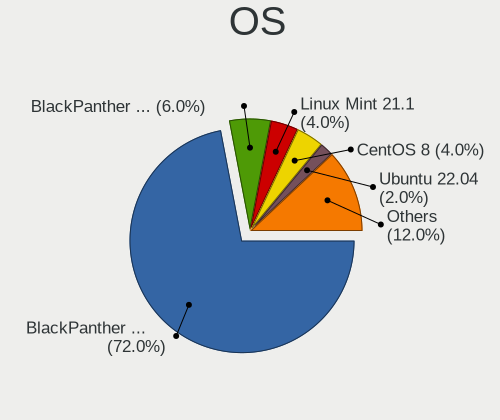

| Name                | Desktops | Percent |
|---------------------|----------|---------|
| BlackPanther 18.1   | 37       | 66.07%  |
| Fedora 38           | 5        | 8.93%   |
| Ubuntu 22.04        | 2        | 3.57%   |
| OpenMandriva 23.03  | 2        | 3.57%   |
| BlackPanther 22.1   | 2        | 3.57%   |
| Pop!_OS 22.04       | 1        | 1.79%   |
| OpenMandriva 4.3    | 1        | 1.79%   |
| Linux Mint 21.1     | 1        | 1.79%   |
| Linux Mint 20.3     | 1        | 1.79%   |
| Gentoo 2.13         | 1        | 1.79%   |
| Endless 5.0.3       | 1        | 1.79%   |
| EndeavourOS Rolling | 1        | 1.79%   |
| Debian 11           | 1        | 1.79%   |

OS Family
---------

OS without a version

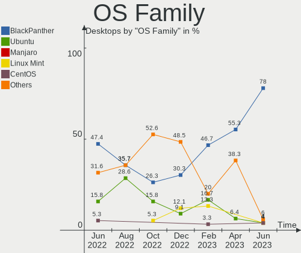

| Name         | Desktops | Percent |
|--------------|----------|---------|
| BlackPanther | 39       | 69.64%  |
| Fedora       | 5        | 8.93%   |
| OpenMandriva | 3        | 5.36%   |
| Ubuntu       | 2        | 3.57%   |
| Linux Mint   | 2        | 3.57%   |
| Pop!_OS      | 1        | 1.79%   |
| Gentoo       | 1        | 1.79%   |
| Endless      | 1        | 1.79%   |
| EndeavourOS  | 1        | 1.79%   |
| Debian       | 1        | 1.79%   |

Kernel
------

Version of the Linux kernel

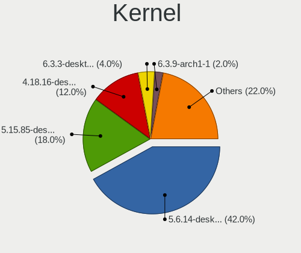

| Version                 | Desktops | Percent |
|-------------------------|----------|---------|
| 5.6.14-desktop-2bP      | 17       | 30.36%  |
| 5.15.85-desktop-1bP     | 11       | 19.64%  |
| 4.18.16-desktop-1bP     | 9        | 16.07%  |
| 6.2.9-desktop-1bP       | 2        | 3.57%   |
| 6.2.6-desktop-1omv2390  | 2        | 3.57%   |
| 6.2.15-300.fc38.x86_64  | 2        | 3.57%   |
| 6.2.14-300.fc38.x86_64  | 2        | 3.57%   |
| 6.3.1-arch1-1           | 1        | 1.79%   |
| 6.2.6-76060206-generic  | 1        | 1.79%   |
| 6.2.12-gentoo-x86_64    | 1        | 1.79%   |
| 6.2.12-300.fc38.x86_64  | 1        | 1.79%   |
| 5.4.0-148-generic       | 1        | 1.79%   |
| 5.19.0-42-generic       | 1        | 1.79%   |
| 5.19.0-41-generic       | 1        | 1.79%   |
| 5.16.7-desktop-1omv4003 | 1        | 1.79%   |
| 5.15.0-71-generic       | 1        | 1.79%   |
| 5.15.0-47-generic       | 1        | 1.79%   |
| 5.10.0-23-amd64         | 1        | 1.79%   |

Kernel Family
-------------

Linux kernel without a distro release

| Version | Desktops | Percent |
|---------|----------|---------|
| 5.6.14  | 17       | 30.36%  |
| 5.15.85 | 11       | 19.64%  |
| 4.18.16 | 9        | 16.07%  |
| 6.2.6   | 3        | 5.36%   |
| 6.2.9   | 2        | 3.57%   |
| 6.2.15  | 2        | 3.57%   |
| 6.2.14  | 2        | 3.57%   |
| 6.2.12  | 2        | 3.57%   |
| 5.19.0  | 2        | 3.57%   |
| 5.15.0  | 2        | 3.57%   |
| 6.3.1   | 1        | 1.79%   |
| 5.4.0   | 1        | 1.79%   |
| 5.16.7  | 1        | 1.79%   |
| 5.10.0  | 1        | 1.79%   |

Kernel Major Ver.
-----------------

Linux kernel major version

| Version | Desktops | Percent |
|---------|----------|---------|
| 5.6     | 17       | 30.36%  |
| 5.15    | 13       | 23.21%  |
| 6.2     | 11       | 19.64%  |
| 4.18    | 9        | 16.07%  |
| 5.19    | 2        | 3.57%   |
| 6.3     | 1        | 1.79%   |
| 5.4     | 1        | 1.79%   |
| 5.16    | 1        | 1.79%   |
| 5.10    | 1        | 1.79%   |

Arch
----

OS architecture (x86_64, i586, etc.)

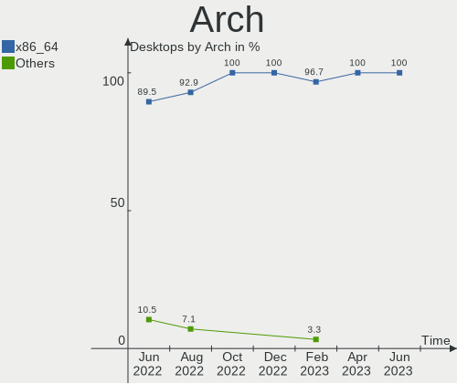

| Name   | Desktops | Percent |
|--------|----------|---------|
| x86_64 | 56       | 100%    |

DE
--

Desktop Environment

| Name    | Desktops | Percent |
|---------|----------|---------|
| KDE5    | 41       | 73.21%  |
| GNOME   | 10       | 17.86%  |
| MATE    | 2        | 3.57%   |
| Unknown | 2        | 3.57%   |
| LXQt    | 1        | 1.79%   |

Display Server
--------------

X11 or Wayland

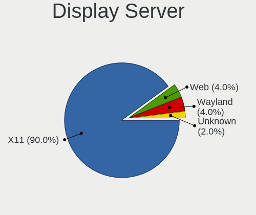

| Name    | Desktops | Percent |
|---------|----------|---------|
| X11     | 47       | 83.93%  |
| Wayland | 7        | 12.5%   |
| Unknown | 2        | 3.57%   |

Display Manager
---------------

SDDM, LightDM, etc.

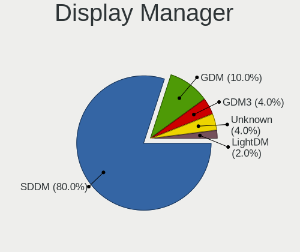

| Name    | Desktops | Percent |
|---------|----------|---------|
| SDDM    | 42       | 75%     |
| Unknown | 6        | 10.71%  |
| GDM3    | 3        | 5.36%   |
| GDM     | 3        | 5.36%   |
| LightDM | 2        | 3.57%   |

OS Lang
-------

Language

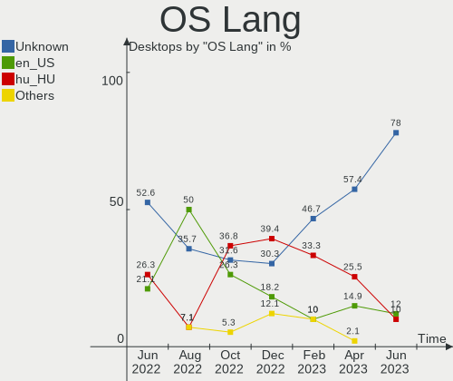

| Lang    | Desktops | Percent |
|---------|----------|---------|
| Unknown | 40       | 71.43%  |
| hu_HU   | 9        | 16.07%  |
| en_US   | 5        | 8.93%   |
| C       | 2        | 3.57%   |

Boot Mode
---------

EFI or BIOS

| Mode | Desktops | Percent |
|------|----------|---------|
| BIOS | 34       | 60.71%  |
| EFI  | 22       | 39.29%  |

Filesystem
----------

Type of filesystem

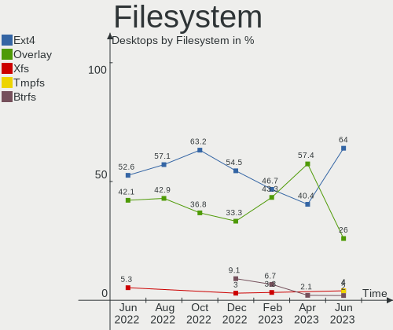

| Type    | Desktops | Percent |
|---------|----------|---------|
| Ext4    | 32       | 57.14%  |
| Overlay | 19       | 33.93%  |
| Btrfs   | 3        | 5.36%   |
| Tmpfs   | 2        | 3.57%   |

Part. scheme
------------

Scheme of partitioning

| Type    | Desktops | Percent |
|---------|----------|---------|
| GPT     | 31       | 55.36%  |
| MBR     | 20       | 35.71%  |
| Unknown | 5        | 8.93%   |

Dual Boot with Linux/BSD
------------------------

Hosting more than one Linux/BSD

| Dual boot | Desktops | Percent |
|-----------|----------|---------|
| No        | 31       | 55.36%  |
| Yes       | 25       | 44.64%  |

Dual Boot (Win)
---------------

Hosting Linux and Windows

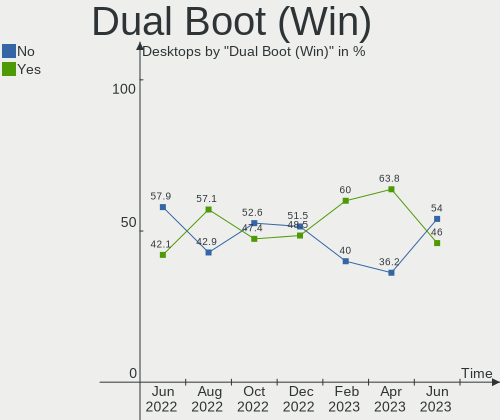

| Dual boot | Desktops | Percent |
|-----------|----------|---------|
| No        | 30       | 53.57%  |
| Yes       | 26       | 46.43%  |

Board
-----

Vendor
------

Motherboard manufacturer

| Name                | Desktops | Percent |
|---------------------|----------|---------|
| Gigabyte Technology | 11       | 19.64%  |
| ASUSTek Computer    | 11       | 19.64%  |
| MSI                 | 6        | 10.71%  |
| Hewlett-Packard     | 6        | 10.71%  |
| Dell                | 6        | 10.71%  |
| Fujitsu             | 5        | 8.93%   |
| Lenovo              | 4        | 7.14%   |
| ASRock              | 3        | 5.36%   |
| Fujitsu Siemens     | 2        | 3.57%   |
| Medion              | 1        | 1.79%   |
| Unknown             | 1        | 1.79%   |

Model
-----

Motherboard model

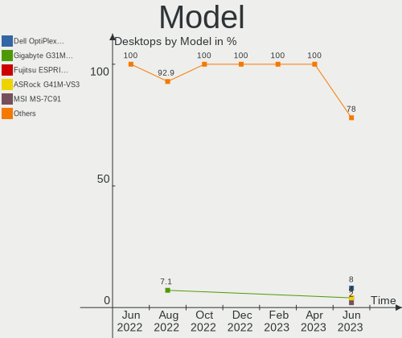

| Name                                  | Desktops | Percent |
|---------------------------------------|----------|---------|
| HP EliteDesk 705 G3 SFF               | 2        | 3.57%   |
| MSI MS-7C96                           | 1        | 1.79%   |
| MSI MS-7C95                           | 1        | 1.79%   |
| MSI MS-7C91                           | 1        | 1.79%   |
| MSI MS-7817                           | 1        | 1.79%   |
| MSI MS-7697                           | 1        | 1.79%   |
| MSI MS-7309                           | 1        | 1.79%   |
| Medion MS-7748                        | 1        | 1.79%   |
| Lenovo ThinkStation D20 4158AF8       | 1        | 1.79%   |
| Lenovo ThinkStation C30 1097A34       | 1        | 1.79%   |
| Lenovo ThinkCentre M83 10AHS0W300     | 1        | 1.79%   |
| Lenovo ThinkCentre M73 10B6001SUS     | 1        | 1.79%   |
| HP EliteDesk 800 G2 DM 35W            | 1        | 1.79%   |
| HP Compaq Pro 6300 SFF                | 1        | 1.79%   |
| HP Compaq Pro 6300 MT                 | 1        | 1.79%   |
| HP Compaq dc7900 Ultra-Slim Desktop   | 1        | 1.79%   |
| Gigabyte Z270N-WIFI                   | 1        | 1.79%   |
| Gigabyte P67A-D3-B3                   | 1        | 1.79%   |
| Gigabyte M61SME-S2                    | 1        | 1.79%   |
| Gigabyte H81M-S2H                     | 1        | 1.79%   |
| Gigabyte H110M-S2V-CF                 | 1        | 1.79%   |
| Gigabyte GA-A75M-D2H                  | 1        | 1.79%   |
| Gigabyte GA-990X-Gaming SLI-CF        | 1        | 1.79%   |
| Gigabyte G31M-ES2L                    | 1        | 1.79%   |
| Gigabyte F2A88XM-D3HP                 | 1        | 1.79%   |
| Gigabyte B450M GAMING                 | 1        | 1.79%   |
| Gigabyte AB350M-DS3H V2               | 1        | 1.79%   |
| Fujitsu Siemens ESPRIMO E5730         | 1        | 1.79%   |
| Fujitsu Siemens AMILO Desktop Pi3620A | 1        | 1.79%   |
| Fujitsu ESPRIMO P910                  | 1        | 1.79%   |
| Fujitsu ESPRIMO P700                  | 1        | 1.79%   |
| Fujitsu ESPRIMO E7935                 | 1        | 1.79%   |
| Fujitsu CELSIUS R670-2                | 1        | 1.79%   |
| Fujitsu CELSIUS M470                  | 1        | 1.79%   |
| Dell Precision WorkStation T5500      | 1        | 1.79%   |
| Dell PowerEdge T20                    | 1        | 1.79%   |
| Dell OptiPlex 7010                    | 1        | 1.79%   |
| Dell OptiPlex 5050                    | 1        | 1.79%   |
| Dell OptiPlex 3050                    | 1        | 1.79%   |
| Dell OptiPlex 3020                    | 1        | 1.79%   |

Model Family
------------

Motherboard model prefix

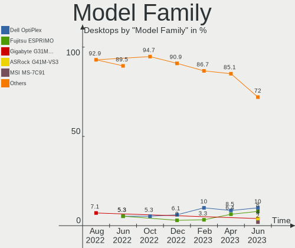

| Name                    | Desktops | Percent |
|-------------------------|----------|---------|
| Dell OptiPlex           | 4        | 7.14%   |
| HP EliteDesk            | 3        | 5.36%   |
| HP Compaq               | 3        | 5.36%   |
| Fujitsu ESPRIMO         | 3        | 5.36%   |
| ASUS PRIME              | 3        | 5.36%   |
| Lenovo ThinkStation     | 2        | 3.57%   |
| Lenovo ThinkCentre      | 2        | 3.57%   |
| Fujitsu CELSIUS         | 2        | 3.57%   |
| ASUS M5A97              | 2        | 3.57%   |
| MSI MS-7C96             | 1        | 1.79%   |
| MSI MS-7C95             | 1        | 1.79%   |
| MSI MS-7C91             | 1        | 1.79%   |
| MSI MS-7817             | 1        | 1.79%   |
| MSI MS-7697             | 1        | 1.79%   |
| MSI MS-7309             | 1        | 1.79%   |
| Medion MS-7748          | 1        | 1.79%   |
| Gigabyte Z270N-WIFI     | 1        | 1.79%   |
| Gigabyte P67A-D3-B3     | 1        | 1.79%   |
| Gigabyte M61SME-S2      | 1        | 1.79%   |
| Gigabyte H81M-S2H       | 1        | 1.79%   |
| Gigabyte H110M-S2V-CF   | 1        | 1.79%   |
| Gigabyte GA-A75M-D2H    | 1        | 1.79%   |
| Gigabyte GA-990X-Gaming | 1        | 1.79%   |
| Gigabyte G31M-ES2L      | 1        | 1.79%   |
| Gigabyte F2A88XM-D3HP   | 1        | 1.79%   |
| Gigabyte B450M          | 1        | 1.79%   |
| Gigabyte AB350M-DS3H    | 1        | 1.79%   |
| Fujitsu Siemens ESPRIMO | 1        | 1.79%   |
| Fujitsu Siemens AMILO   | 1        | 1.79%   |
| Dell Precision          | 1        | 1.79%   |
| Dell PowerEdge          | 1        | 1.79%   |
| ASUS TUF                | 1        | 1.79%   |
| ASUS P5Q-E              | 1        | 1.79%   |
| ASUS M2A-MX             | 1        | 1.79%   |
| ASUS H110M-K            | 1        | 1.79%   |
| ASUS H110M-A            | 1        | 1.79%   |
| ASUS Business           | 1        | 1.79%   |
| ASRock G41M-VS3         | 1        | 1.79%   |
| ASRock B85M-HDS         | 1        | 1.79%   |
| ASRock B365M            | 1        | 1.79%   |

MFG Year
--------

Motherboard manufacture year

| Year | Desktops | Percent |
|------|----------|---------|
| 2015 | 6        | 10.71%  |
| 2012 | 6        | 10.71%  |
| 2011 | 6        | 10.71%  |
| 2017 | 5        | 8.93%   |
| 2010 | 5        | 8.93%   |
| 2014 | 4        | 7.14%   |
| 2008 | 4        | 7.14%   |
| 2020 | 3        | 5.36%   |
| 2019 | 3        | 5.36%   |
| 2018 | 3        | 5.36%   |
| 2013 | 3        | 5.36%   |
| 2016 | 2        | 3.57%   |
| 2009 | 2        | 3.57%   |
| 2007 | 2        | 3.57%   |
| 2023 | 1        | 1.79%   |
| 2006 | 1        | 1.79%   |

Form Factor
-----------

Physical design of the computer

| Name    | Desktops | Percent |
|---------|----------|---------|
| Desktop | 56       | 100%    |

Secure Boot
-----------

Enabled or disabled

| State    | Desktops | Percent |
|----------|----------|---------|
| Disabled | 55       | 98.21%  |
| Enabled  | 1        | 1.79%   |

Coreboot
--------

Have coreboot on board

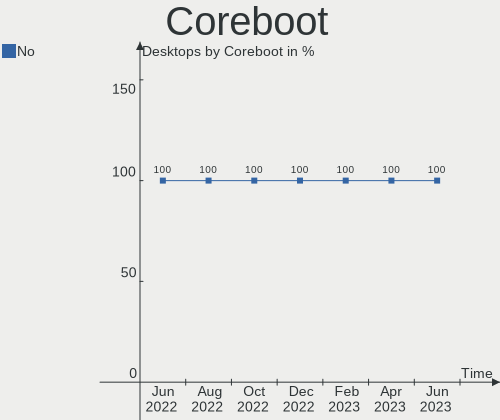

| Used | Desktops | Percent |
|------|----------|---------|
| No   | 56       | 100%    |

RAM Size
--------

Total RAM memory

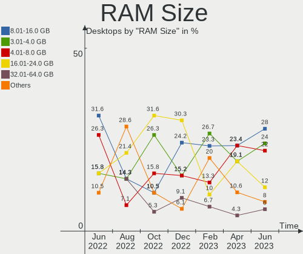

| Size in GB | Desktops | Percent |
|------------|----------|---------|
| 8.01-16.0  | 16       | 28.57%  |
| 3.01-4.0   | 10       | 17.86%  |
| 4.01-8.0   | 8        | 14.29%  |
| 32.01-64.0 | 8        | 14.29%  |
| 16.01-24.0 | 8        | 14.29%  |
| 1.01-2.0   | 3        | 5.36%   |
| 24.01-32.0 | 2        | 3.57%   |
| 2.01-3.0   | 1        | 1.79%   |

RAM Used
--------

Used RAM memory

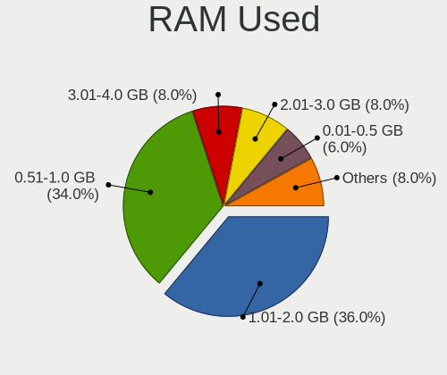

| Used GB  | Desktops | Percent |
|----------|----------|---------|
| 1.01-2.0 | 19       | 33.93%  |
| 0.51-1.0 | 19       | 33.93%  |
| 0.01-0.5 | 7        | 12.5%   |
| 3.01-4.0 | 4        | 7.14%   |
| 2.01-3.0 | 4        | 7.14%   |
| 4.01-8.0 | 3        | 5.36%   |

Total Drives
------------

Number of drives on board

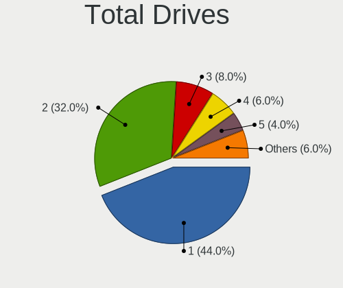

| Drives | Desktops | Percent |
|--------|----------|---------|
| 2      | 22       | 39.29%  |
| 1      | 22       | 39.29%  |
| 3      | 6        | 10.71%  |
| 4      | 4        | 7.14%   |
| 5      | 1        | 1.79%   |
| 0      | 1        | 1.79%   |

Has CD-ROM
----------

Has CD-ROM on board

| Presented | Desktops | Percent |
|-----------|----------|---------|
| Yes       | 29       | 51.79%  |
| No        | 27       | 48.21%  |

Has Ethernet
------------

Has Ethernet on board

| Presented | Desktops | Percent |
|-----------|----------|---------|
| Yes       | 54       | 96.43%  |
| No        | 2        | 3.57%   |

Has WiFi
--------

Has WiFi module

| Presented | Desktops | Percent |
|-----------|----------|---------|
| No        | 38       | 67.86%  |
| Yes       | 18       | 32.14%  |

Has Bluetooth
-------------

Has Bluetooth module

| Presented | Desktops | Percent |
|-----------|----------|---------|
| No        | 44       | 78.57%  |
| Yes       | 12       | 21.43%  |

Location
--------

Country
-------

Geographic location (country)

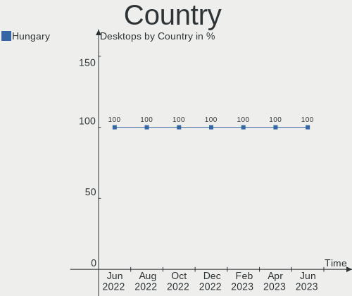

| Country | Desktops | Percent |
|---------|----------|---------|
| Hungary | 56       | 100%    |

City
----

Geographic location (city)

| City              | Desktops | Percent |
|-------------------|----------|---------|
| Budapest          | 17       | 30.36%  |
| Debrecen          | 3        | 5.36%   |
| Tatabánya        | 2        | 3.57%   |
| Szolnok           | 2        | 3.57%   |
| Szigetujfalu      | 2        | 3.57%   |
| Szekszárd        | 2        | 3.57%   |
| Pécs             | 2        | 3.57%   |
| Berettyóújfalu  | 2        | 3.57%   |
| Zalaegerszeg      | 1        | 1.79%   |
| Szombathely       | 1        | 1.79%   |
| Szigethalom       | 1        | 1.79%   |
| Szentendre        | 1        | 1.79%   |
| Székesfehérvár | 1        | 1.79%   |
| Sarvar            | 1        | 1.79%   |
| Puspokladany      | 1        | 1.79%   |
| Oroshaza          | 1        | 1.79%   |
| Kiskunhalas       | 1        | 1.79%   |
| Kiskoros          | 1        | 1.79%   |
| Karcsa            | 1        | 1.79%   |
| Karcag            | 1        | 1.79%   |
| Jaszapati         | 1        | 1.79%   |
| Hodmezovasarhely  | 1        | 1.79%   |
| Hajduboszormeny   | 1        | 1.79%   |
| Győr             | 1        | 1.79%   |
| Gödöllő        | 1        | 1.79%   |
| God               | 1        | 1.79%   |
| Fuzesabony        | 1        | 1.79%   |
| Fertoszentmiklos  | 1        | 1.79%   |
| Eger              | 1        | 1.79%   |
| Békéscsaba      | 1        | 1.79%   |
| Balatonfuered     | 1        | 1.79%   |
| Baja              | 1        | 1.79%   |

Drives
------

Drive Vendor
------------

Hard drive vendors

| Vendor              | Desktops | Drives | Percent |
|---------------------|----------|--------|---------|
| WDC                 | 19       | 26     | 20%     |
| Samsung Electronics | 19       | 24     | 20%     |
| Kingston            | 14       | 16     | 14.74%  |
| Toshiba             | 9        | 9      | 9.47%   |
| Seagate             | 7        | 8      | 7.37%   |
| A-DATA Technology   | 5        | 5      | 5.26%   |
| Patriot             | 3        | 3      | 3.16%   |
| Kingmax             | 2        | 2      | 2.11%   |
| Hitachi             | 2        | 2      | 2.11%   |
| HGST                | 2        | 2      | 2.11%   |
| Zheino              | 1        | 1      | 1.05%   |
| Unknown             | 1        | 1      | 1.05%   |
| SPCC                | 1        | 1      | 1.05%   |
| SK hynix            | 1        | 1      | 1.05%   |
| Phison Electronics  | 1        | 1      | 1.05%   |
| Netac               | 1        | 1      | 1.05%   |
| JMicron Technology  | 1        | 1      | 1.05%   |
| Intenso             | 1        | 1      | 1.05%   |
| Intel               | 1        | 2      | 1.05%   |
| Gigabyte Technology | 1        | 1      | 1.05%   |
| Crucial             | 1        | 1      | 1.05%   |
| 2-Power             | 1        | 1      | 1.05%   |
| Unknown             | 1        | 1      | 1.05%   |

Drive Model
-----------

Hard drive models

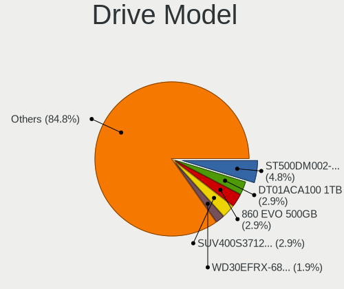

| Model                                | Desktops | Percent |
|--------------------------------------|----------|---------|
| Kingston SA400S37240G 240GB SSD      | 6        | 5.5%    |
| Toshiba DT01ACA100 1TB               | 4        | 3.67%   |
| Samsung SSD 850 EVO 250GB            | 3        | 2.75%   |
| WDC WDS240G2G0B-00EPW0 240GB SSD     | 2        | 1.83%   |
| WDC WD30EFRX-68EUZN0 3TB             | 2        | 1.83%   |
| WDC WD10PURZ-85U8XY0 1TB             | 2        | 1.83%   |
| WDC WD10EZRX-00L4HB0 1TB             | 2        | 1.83%   |
| Samsung SSD 970 EVO 250GB            | 2        | 1.83%   |
| Samsung SSD 850 EVO 120GB            | 2        | 1.83%   |
| Samsung SSD 830 Series 64GB          | 2        | 1.83%   |
| Kingston SA400S37480G 480GB SSD      | 2        | 1.83%   |
| Zheino CHN-NGFFNV2280-256 256GB      | 1        | 0.92%   |
| WDC WDS500G2B0A 500GB SSD            | 1        | 0.92%   |
| WDC WD6400AAKS-07A7B0 640GB          | 1        | 0.92%   |
| WDC WD60EFZX-68B3FN0 6TB             | 1        | 0.92%   |
| WDC WD5003AZEX-00MK2A0 500GB         | 1        | 0.92%   |
| WDC WD5000BPKT-75PK4T0 500GB         | 1        | 0.92%   |
| WDC WD5000AZRX-00L4HB0 500GB         | 1        | 0.92%   |
| WDC WD40EFRX-68N32N0 4TB             | 1        | 0.92%   |
| WDC WD3200BEKT-00PVMT0 320GB         | 1        | 0.92%   |
| WDC WD30EZRZ-00GXCB0 3TB             | 1        | 0.92%   |
| WDC WD30EZRX-00DC0B0 3TB             | 1        | 0.92%   |
| WDC WD20PURZ-85GU6Y0 2TB             | 1        | 0.92%   |
| WDC WD20EZRZ-00Z5HB0 2TB             | 1        | 0.92%   |
| WDC WD15EARX-00PASB0 1TB             | 1        | 0.92%   |
| WDC WD10EZRZ-22HTKB0 1TB             | 1        | 0.92%   |
| WDC WD10EZRZ-00HTKB0 1TB             | 1        | 0.92%   |
| WDC WD10EZEX-00BN5A0 1TB             | 1        | 0.92%   |
| WDC WD10EARS-00Y5B1 1TB              | 1        | 0.92%   |
| WDC PC SN520 SDAPNUW-256G-1202 256GB | 1        | 0.92%   |
| Unknown 1 240GB                      | 1        | 0.92%   |
| Toshiba MQ01ABF032 320GB             | 1        | 0.92%   |
| Toshiba KSG60ZSE256G SATA 256GB SSD  | 1        | 0.92%   |
| Toshiba HDWQ140 4TB                  | 1        | 0.92%   |
| Toshiba HDWD130 3TB                  | 1        | 0.92%   |
| Toshiba DT01ACA200 2TB               | 1        | 0.92%   |
| SPCC Solid State Disk 256GB          | 1        | 0.92%   |
| SK hynix SC311 SATA 256GB SSD        | 1        | 0.92%   |
| Seagate ST500DM002-1BD142 500GB      | 1        | 0.92%   |
| Seagate ST3160812AS 160GB            | 1        | 0.92%   |

HDD Vendor
----------

Hard disk drive vendors

| Vendor              | Desktops | Drives | Percent |
|---------------------|----------|--------|---------|
| WDC                 | 16       | 22     | 38.1%   |
| Toshiba             | 8        | 8      | 19.05%  |
| Seagate             | 7        | 8      | 16.67%  |
| Samsung Electronics | 7        | 7      | 16.67%  |
| Hitachi             | 2        | 2      | 4.76%   |
| HGST                | 2        | 2      | 4.76%   |

SSD Vendor
----------

Solid state drive vendors

| Vendor              | Desktops | Drives | Percent |
|---------------------|----------|--------|---------|
| Kingston            | 13       | 15     | 30.23%  |
| Samsung Electronics | 9        | 11     | 20.93%  |
| WDC                 | 3        | 3      | 6.98%   |
| Patriot             | 3        | 3      | 6.98%   |
| A-DATA Technology   | 3        | 3      | 6.98%   |
| Kingmax             | 2        | 2      | 4.65%   |
| Toshiba             | 1        | 1      | 2.33%   |
| SPCC                | 1        | 1      | 2.33%   |
| SK hynix            | 1        | 1      | 2.33%   |
| Netac               | 1        | 1      | 2.33%   |
| JMicron Technology  | 1        | 1      | 2.33%   |
| Intenso             | 1        | 1      | 2.33%   |
| Intel               | 1        | 2      | 2.33%   |
| Gigabyte Technology | 1        | 1      | 2.33%   |
| Crucial             | 1        | 1      | 2.33%   |
| 2-Power             | 1        | 1      | 2.33%   |

Drive Kind
----------

HDD or SSD

| Kind    | Desktops | Drives | Percent |
|---------|----------|--------|---------|
| HDD     | 37       | 49     | 43.53%  |
| SSD     | 36       | 48     | 42.35%  |
| NVMe    | 11       | 12     | 12.94%  |
| Unknown | 1        | 2      | 1.18%   |

Drive Connector
---------------

SATA, SAS, NVMe, etc.

| Type | Desktops | Drives | Percent |
|------|----------|--------|---------|
| SATA | 52       | 95     | 78.79%  |
| NVMe | 11       | 12     | 16.67%  |
| SAS  | 3        | 4      | 4.55%   |

Drive Size
----------

Size of hard drive

| Size in TB | Desktops | Drives | Percent |
|------------|----------|--------|---------|
| 0.01-0.5   | 43       | 58     | 57.33%  |
| 0.51-1.0   | 21       | 27     | 28%     |
| 2.01-3.0   | 5        | 6      | 6.67%   |
| 1.01-2.0   | 3        | 3      | 4%      |
| 3.01-4.0   | 2        | 2      | 2.67%   |
| 4.01-10.0  | 1        | 1      | 1.33%   |

Space Total
-----------

Amount of disk space available on the file system

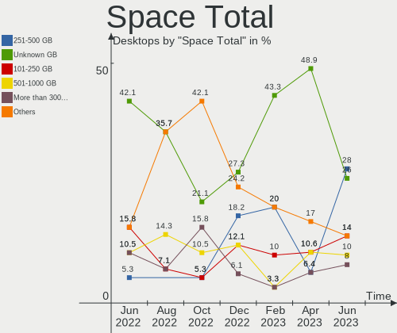

| Size in GB     | Desktops | Percent |
|----------------|----------|---------|
| Unknown        | 18       | 32.14%  |
| 101-250        | 11       | 19.64%  |
| 251-500        | 7        | 12.5%   |
| 51-100         | 6        | 10.71%  |
| 501-1000       | 5        | 8.93%   |
| 1-20           | 3        | 5.36%   |
| More than 3000 | 2        | 3.57%   |
| 21-50          | 2        | 3.57%   |
| 2001-3000      | 2        | 3.57%   |

Space Used
----------

Amount of used disk space

| Used GB        | Desktops | Percent |
|----------------|----------|---------|
| Unknown        | 18       | 32.14%  |
| 1-20           | 12       | 21.43%  |
| 21-50          | 11       | 19.64%  |
| 51-100         | 5        | 8.93%   |
| 101-250        | 4        | 7.14%   |
| 501-1000       | 3        | 5.36%   |
| More than 3000 | 1        | 1.79%   |
| 251-500        | 1        | 1.79%   |
| 1001-2000      | 1        | 1.79%   |

Malfunc. Drives
---------------

Drive models with a malfunction

| Model                              | Desktops | Drives | Percent |
|------------------------------------|----------|--------|---------|
| WDC WD10PURZ-85U8XY0 1TB           | 2        | 2      | 10%     |
| WDC WDS240G2G0B-00EPW0 240GB SSD   | 1        | 1      | 5%      |
| WDC WD6400AAKS-07A7B0 640GB        | 1        | 1      | 5%      |
| WDC WD30EFRX-68EUZN0 3TB           | 1        | 1      | 5%      |
| WDC WD10EARS-00Y5B1 1TB            | 1        | 1      | 5%      |
| Toshiba HDWD130 3TB                | 1        | 1      | 5%      |
| Seagate ST3160812AS 160GB          | 1        | 1      | 5%      |
| Seagate ST31000528AS 1TB           | 1        | 1      | 5%      |
| Seagate ST1000LM024 HN-M101MBB 1TB | 1        | 1      | 5%      |
| Samsung Electronics HD200HJ 200GB  | 1        | 1      | 5%      |
| Samsung Electronics HD161HJ 160GB  | 1        | 1      | 5%      |
| Samsung Electronics HD103UJ 1TB    | 1        | 1      | 5%      |
| Kingston SA400S37240G 240GB SSD    | 1        | 1      | 5%      |
| Intenso JAJM600M128C 128GB SSD     | 1        | 1      | 5%      |
| Intel SSDSC2KF240H6L 240GB         | 1        | 1      | 5%      |
| Intel SSDSC2BF180A5L 180GB         | 1        | 1      | 5%      |
| Hitachi HTS545050B9A300 500GB      | 1        | 1      | 5%      |
| A-DATA Technology SX6000PNP 256GB  | 1        | 1      | 5%      |
| A-DATA Technology SU630 240GB SSD  | 1        | 1      | 5%      |

Malfunc. Drive Vendor
---------------------

Vendors of faulty drives

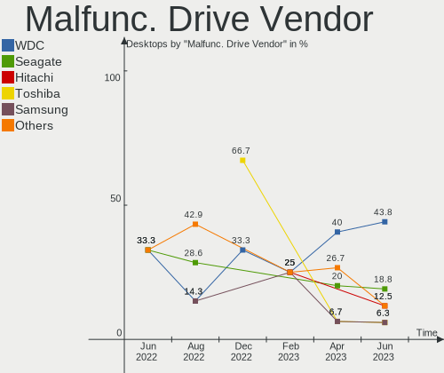

| Vendor              | Desktops | Drives | Percent |
|---------------------|----------|--------|---------|
| WDC                 | 6        | 6      | 31.58%  |
| Seagate             | 3        | 3      | 15.79%  |
| Samsung Electronics | 3        | 3      | 15.79%  |
| A-DATA Technology   | 2        | 2      | 10.53%  |
| Toshiba             | 1        | 1      | 5.26%   |
| Kingston            | 1        | 1      | 5.26%   |
| Intenso             | 1        | 1      | 5.26%   |
| Intel               | 1        | 2      | 5.26%   |
| Hitachi             | 1        | 1      | 5.26%   |

Malfunc. HDD Vendor
-------------------

Vendors of faulty HDD drives

| Vendor              | Desktops | Drives | Percent |
|---------------------|----------|--------|---------|
| WDC                 | 5        | 5      | 38.46%  |
| Seagate             | 3        | 3      | 23.08%  |
| Samsung Electronics | 3        | 3      | 23.08%  |
| Toshiba             | 1        | 1      | 7.69%   |
| Hitachi             | 1        | 1      | 7.69%   |

Malfunc. Drive Kind
-------------------

Kinds of faulty drives

| Kind | Desktops | Drives | Percent |
|------|----------|--------|---------|
| HDD  | 12       | 13     | 66.67%  |
| SSD  | 5        | 6      | 27.78%  |
| NVMe | 1        | 1      | 5.56%   |

Failed Drives
-------------

Failed drive models

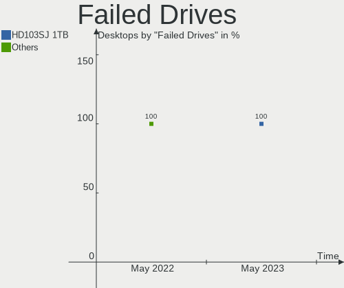

| Model                           | Desktops | Drives | Percent |
|---------------------------------|----------|--------|---------|
| Samsung Electronics HD103SJ 1TB | 1        | 1      | 100%    |

Failed Drive Vendor
-------------------

Failed drive vendors

| Vendor              | Desktops | Drives | Percent |
|---------------------|----------|--------|---------|
| Samsung Electronics | 1        | 1      | 100%    |

Drive Status
------------

Number of failed and malfunc. drives

| Status   | Desktops | Drives | Percent |
|----------|----------|--------|---------|
| Works    | 42       | 76     | 61.76%  |
| Malfunc  | 16       | 20     | 23.53%  |
| Detected | 9        | 14     | 13.24%  |
| Failed   | 1        | 1      | 1.47%   |

Storage controller
------------------

Storage Vendor
--------------

Storage controller vendors

| Vendor                      | Desktops | Percent |
|-----------------------------|----------|---------|
| Intel                       | 35       | 49.3%   |
| AMD                         | 17       | 23.94%  |
| Samsung Electronics         | 6        | 8.45%   |
| Nvidia                      | 4        | 5.63%   |
| Silicon Motion              | 2        | 2.82%   |
| Silicon Image               | 1        | 1.41%   |
| SanDisk                     | 1        | 1.41%   |
| Realtek Semiconductor       | 1        | 1.41%   |
| Phison Electronics          | 1        | 1.41%   |
| Marvell Technology Group    | 1        | 1.41%   |
| Kingston Technology Company | 1        | 1.41%   |
| ASMedia Technology          | 1        | 1.41%   |

Storage Model
-------------

Storage controller models

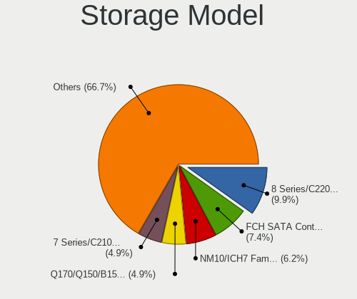

| Model                                                                                   | Desktops | Percent |
|-----------------------------------------------------------------------------------------|----------|---------|
| AMD FCH SATA Controller [AHCI mode]                                                     | 8        | 8.99%   |
| Intel 8 Series/C220 Series Chipset Family 6-port SATA Controller 1 [AHCI mode]          | 6        | 6.74%   |
| Intel 7 Series/C210 Series Chipset Family 6-port SATA Controller [AHCI mode]            | 5        | 5.62%   |
| Intel 200 Series PCH SATA controller [AHCI mode]                                        | 5        | 5.62%   |
| Intel Q170/Q150/B150/H170/H110/Z170/CM236 Chipset SATA Controller [AHCI Mode]           | 4        | 4.49%   |
| Intel 82801JI (ICH10 Family) SATA AHCI Controller                                       | 4        | 4.49%   |
| Samsung NVMe SSD Controller SM981/PM981/PM983                                           | 3        | 3.37%   |
| Intel 4 Series Chipset PT IDER Controller                                               | 3        | 3.37%   |
| AMD SB7x0/SB8x0/SB9x0 SATA Controller [AHCI mode]                                       | 3        | 3.37%   |
| AMD 500 Series Chipset SATA Controller                                                  | 3        | 3.37%   |
| AMD 300 Series Chipset SATA Controller                                                  | 3        | 3.37%   |
| Samsung NVMe SSD Controller 980                                                         | 2        | 2.25%   |
| Nvidia MCP61 SATA Controller                                                            | 2        | 2.25%   |
| Nvidia MCP61 IDE                                                                        | 2        | 2.25%   |
| Intel SATA Controller [RAID mode]                                                       | 2        | 2.25%   |
| Intel NM10/ICH7 Family SATA Controller [IDE mode]                                       | 2        | 2.25%   |
| Intel 82801JD/DO (ICH10 Family) 4-port SATA IDE Controller                              | 2        | 2.25%   |
| Intel 82801JD/DO (ICH10 Family) 2-port SATA IDE Controller                              | 2        | 2.25%   |
| AMD 400 Series Chipset SATA Controller                                                  | 2        | 2.25%   |
| Silicon Motion SM2263EN/SM2263XT SSD Controller                                         | 1        | 1.12%   |
| Silicon Motion Non-Volatile memory controller                                           | 1        | 1.12%   |
| Silicon Image SiI 3512 [SATALink/SATARaid] Serial ATA Controller                        | 1        | 1.12%   |
| SanDisk WD Blue SN500 / PC SN520 NVMe SSD                                               | 1        | 1.12%   |
| Samsung NVMe SSD Controller PM9A1/PM9A3/980PRO                                          | 1        | 1.12%   |
| Realtek RTS5763DL NVMe SSD Controller                                                   | 1        | 1.12%   |
| Phison PS5013 E13 NVMe Controller                                                       | 1        | 1.12%   |
| Nvidia MCP79 SATA Controller                                                            | 1        | 1.12%   |
| Nvidia MCP73 SATA Controller (IDE mode)                                                 | 1        | 1.12%   |
| Marvell Group 88SE6111/6121 SATA II / PATA Controller                                   | 1        | 1.12%   |
| Kingston Company A2000 NVMe SSD                                                         | 1        | 1.12%   |
| Intel Volume Management Device NVMe RAID Controller Intel Corporation                   | 1        | 1.12%   |
| Intel C602 chipset 4-Port SATA Storage Control Unit                                     | 1        | 1.12%   |
| Intel C600/X79 series chipset 6-Port SATA AHCI Controller                               | 1        | 1.12%   |
| Intel 82801JD/DO (ICH10 Family) SATA AHCI Controller                                    | 1        | 1.12%   |
| Intel 82801G (ICH7 Family) IDE Controller                                               | 1        | 1.12%   |
| Intel 700 Series Chipset Family SATA AHCI Controller                                    | 1        | 1.12%   |
| Intel 6 Series/C200 Series Chipset Family Desktop SATA Controller (IDE mode, ports 4-5) | 1        | 1.12%   |
| Intel 6 Series/C200 Series Chipset Family Desktop SATA Controller (IDE mode, ports 0-3) | 1        | 1.12%   |
| Intel 6 Series/C200 Series Chipset Family 6 port Desktop SATA AHCI Controller           | 1        | 1.12%   |
| ASMedia ASM1062 Serial ATA Controller                                                   | 1        | 1.12%   |

Storage Kind
------------

Kind of storage controller (IDE, SATA, NVMe, SAS, ...)

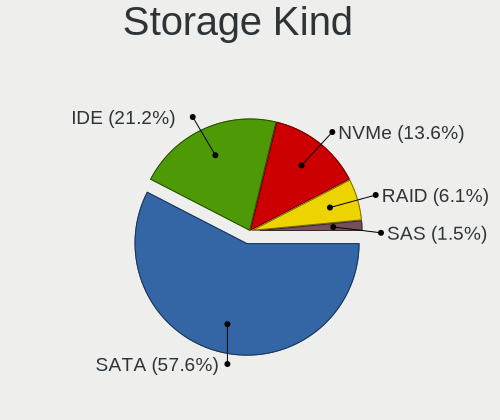

| Kind | Desktops | Percent |
|------|----------|---------|
| SATA | 45       | 60.81%  |
| IDE  | 13       | 17.57%  |
| NVMe | 11       | 14.86%  |
| RAID | 4        | 5.41%   |
| SAS  | 1        | 1.35%   |

Processor
---------

CPU Vendor
----------

Processor vendors

| Vendor | Desktops | Percent |
|--------|----------|---------|
| Intel  | 37       | 66.07%  |
| AMD    | 19       | 33.93%  |

CPU Model
---------

Processor models

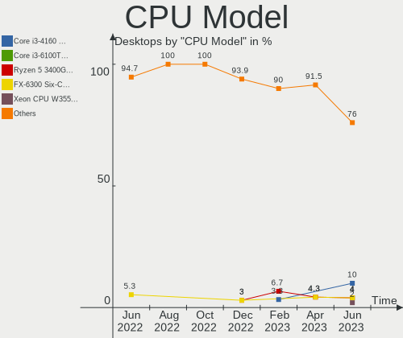

| Model                                       | Desktops | Percent |
|---------------------------------------------|----------|---------|
| AMD FX-6300 Six-Core Processor              | 3        | 5.36%   |
| Intel Core i5-4570 CPU @ 3.20GHz            | 2        | 3.57%   |
| Intel Core 2 Duo CPU E8400 @ 3.00GHz        | 2        | 3.57%   |
| AMD Ryzen 5 3400G with Radeon Vega Graphics | 2        | 3.57%   |
| AMD PRO A6-9500 R5, 8 COMPUTE CORES 2C+6G   | 2        | 3.57%   |
| Intel Xeon CPU X5677 @ 3.47GHz              | 1        | 1.79%   |
| Intel Xeon CPU X5650 @ 2.67GHz              | 1        | 1.79%   |
| Intel Xeon CPU W3550 @ 3.07GHz              | 1        | 1.79%   |
| Intel Xeon CPU L5420 @ 2.50GHz              | 1        | 1.79%   |
| Intel Xeon CPU E5530 @ 2.40GHz              | 1        | 1.79%   |
| Intel Xeon CPU E5-2637 0 @ 3.00GHz          | 1        | 1.79%   |
| Intel Xeon CPU E3-1225 v3 @ 3.20GHz         | 1        | 1.79%   |
| Intel Pentium CPU G4560 @ 3.50GHz           | 1        | 1.79%   |
| Intel Pentium CPU G3260 @ 3.30GHz           | 1        | 1.79%   |
| Intel Core i7-7700K CPU @ 4.20GHz           | 1        | 1.79%   |
| Intel Core i7-6700T CPU @ 2.80GHz           | 1        | 1.79%   |
| Intel Core i7-3770 CPU @ 3.40GHz            | 1        | 1.79%   |
| Intel Core i5-9400 CPU @ 2.90GHz            | 1        | 1.79%   |
| Intel Core i5-7500 CPU @ 3.40GHz            | 1        | 1.79%   |
| Intel Core i5-6500 CPU @ 3.20GHz            | 1        | 1.79%   |
| Intel Core i5-4590 CPU @ 3.30GHz            | 1        | 1.79%   |
| Intel Core i5-3470S CPU @ 2.90GHz           | 1        | 1.79%   |
| Intel Core i5-3470 CPU @ 3.20GHz            | 1        | 1.79%   |
| Intel Core i5-2300 CPU @ 2.80GHz            | 1        | 1.79%   |
| Intel Core i3-8100 CPU @ 3.60GHz            | 1        | 1.79%   |
| Intel Core i3-6100T CPU @ 3.20GHz           | 1        | 1.79%   |
| Intel Core i3-6100 CPU @ 3.70GHz            | 1        | 1.79%   |
| Intel Core i3-4160 CPU @ 3.60GHz            | 1        | 1.79%   |
| Intel Core i3-4130 CPU @ 3.40GHz            | 1        | 1.79%   |
| Intel Core i3-3225 CPU @ 3.30GHz            | 1        | 1.79%   |
| Intel Core i3-3220 CPU @ 3.30GHz            | 1        | 1.79%   |
| Intel Core i3-2100 CPU @ 3.10GHz            | 1        | 1.79%   |
| Intel Core 2 Quad CPU Q8200 @ 2.33GHz       | 1        | 1.79%   |
| Intel Core 2 Duo CPU E8500 @ 3.16GHz        | 1        | 1.79%   |
| Intel Core 2 CPU 4300 @ 1.80GHz             | 1        | 1.79%   |
| Intel Celeron CPU E3300 @ 2.50GHz           | 1        | 1.79%   |
| Intel Atom CPU 330 @ 1.60GHz                | 1        | 1.79%   |
| Intel 13th Gen Core i5-13600K               | 1        | 1.79%   |
| AMD Ryzen 7 5800X 8-Core Processor          | 1        | 1.79%   |
| AMD Ryzen 7 1800X Eight-Core Processor      | 1        | 1.79%   |

CPU Model Family
----------------

Processor model prefix

| Model             | Desktops | Percent |
|-------------------|----------|---------|
| Intel Core i5     | 9        | 16.07%  |
| Intel Core i3     | 8        | 14.29%  |
| Intel Xeon        | 7        | 12.5%   |
| AMD Ryzen 5       | 5        | 8.93%   |
| Other             | 4        | 7.14%   |
| Intel Core i7     | 3        | 5.36%   |
| Intel Core 2 Duo  | 3        | 5.36%   |
| AMD FX            | 3        | 5.36%   |
| Intel Pentium     | 2        | 3.57%   |
| AMD Ryzen 7       | 2        | 3.57%   |
| Intel Core 2 Quad | 1        | 1.79%   |
| Intel Core 2      | 1        | 1.79%   |
| Intel Celeron     | 1        | 1.79%   |
| Intel Atom        | 1        | 1.79%   |
| AMD Athlon II X4  | 1        | 1.79%   |
| AMD Athlon 64 X2  | 1        | 1.79%   |
| AMD Athlon 64     | 1        | 1.79%   |
| AMD A8            | 1        | 1.79%   |
| AMD A6            | 1        | 1.79%   |
| AMD A10           | 1        | 1.79%   |

CPU Cores
---------

Number of processor cores

| Number | Desktops | Percent |
|--------|----------|---------|
| 4      | 22       | 39.29%  |
| 2      | 18       | 32.14%  |
| 6      | 5        | 8.93%   |
| 3      | 4        | 7.14%   |
| 8      | 3        | 5.36%   |
| 1      | 3        | 5.36%   |
| 14     | 1        | 1.79%   |

CPU Sockets
-----------

Number of sockets

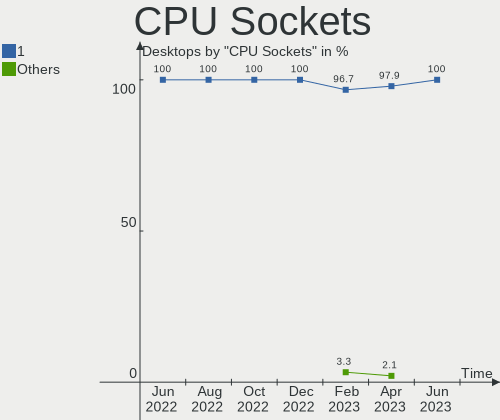

| Number | Desktops | Percent |
|--------|----------|---------|
| 1      | 54       | 96.43%  |
| 2      | 2        | 3.57%   |

CPU Threads
-----------

Threads per core (Hyper-Threading)

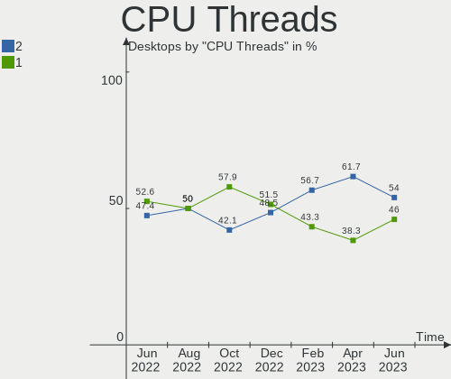

| Number | Desktops | Percent |
|--------|----------|---------|
| 2      | 30       | 53.57%  |
| 1      | 26       | 46.43%  |

CPU Op-Modes
------------

CPU Operation Modes (32-bit, 64-bit)

| Op mode        | Desktops | Percent |
|----------------|----------|---------|
| 32-bit, 64-bit | 56       | 100%    |

CPU Microcode
-------------

Microcode number

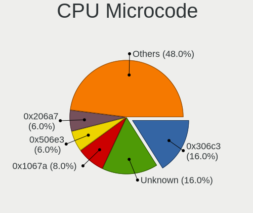

| Number     | Desktops | Percent |
|------------|----------|---------|
| Unknown    | 13       | 23.21%  |
| 0x306c3    | 5        | 8.93%   |
| 0x506e3    | 4        | 7.14%   |
| 0x306a9    | 4        | 7.14%   |
| 0x1067a    | 3        | 5.36%   |
| 0x906e9    | 2        | 3.57%   |
| 0x106a5    | 2        | 3.57%   |
| 0x08108109 | 2        | 3.57%   |
| 0x0600611a | 2        | 3.57%   |
| 0x03000027 | 2        | 3.57%   |
| 0x906eb    | 1        | 1.79%   |
| 0x906ea    | 1        | 1.79%   |
| 0x6f2      | 1        | 1.79%   |
| 0x206d7    | 1        | 1.79%   |
| 0x206c2    | 1        | 1.79%   |
| 0x206a7    | 1        | 1.79%   |
| 0x10677    | 1        | 1.79%   |
| 0x0a20120a | 1        | 1.79%   |
| 0x0a201016 | 1        | 1.79%   |
| 0x08701030 | 1        | 1.79%   |
| 0x0800820d | 1        | 1.79%   |
| 0x08001138 | 1        | 1.79%   |
| 0x06003106 | 1        | 1.79%   |
| 0x06000852 | 1        | 1.79%   |
| 0x0600084f | 1        | 1.79%   |
| 0x06000822 | 1        | 1.79%   |
| 0x010000c8 | 1        | 1.79%   |

CPU Microarch
-------------

Microarchitecture

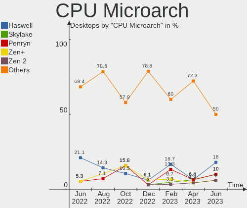

| Name             | Desktops | Percent |
|------------------|----------|---------|
| Haswell          | 7        | 12.5%   |
| Penryn           | 6        | 10.71%  |
| KabyLake         | 5        | 8.93%   |
| IvyBridge        | 5        | 8.93%   |
| Skylake          | 4        | 7.14%   |
| Zen+             | 3        | 5.36%   |
| SandyBridge      | 3        | 5.36%   |
| Piledriver       | 3        | 5.36%   |
| K10 Llano        | 3        | 5.36%   |
| Zen 3            | 2        | 3.57%   |
| Westmere         | 2        | 3.57%   |
| Nehalem          | 2        | 3.57%   |
| K8 Hammer        | 2        | 3.57%   |
| Excavator        | 2        | 3.57%   |
| Zen 2            | 1        | 1.79%   |
| Zen              | 1        | 1.79%   |
| Steamroller      | 1        | 1.79%   |
| K10              | 1        | 1.79%   |
| Core             | 1        | 1.79%   |
| Bonnell          | 1        | 1.79%   |
| Alderlake Hybrid | 1        | 1.79%   |

Graphics
--------

GPU Vendor
----------

Vendors of graphics cards

| Vendor | Desktops | Percent |
|--------|----------|---------|
| Nvidia | 25       | 43.1%   |
| AMD    | 17       | 29.31%  |
| Intel  | 16       | 27.59%  |

GPU Model
---------

Graphics card models

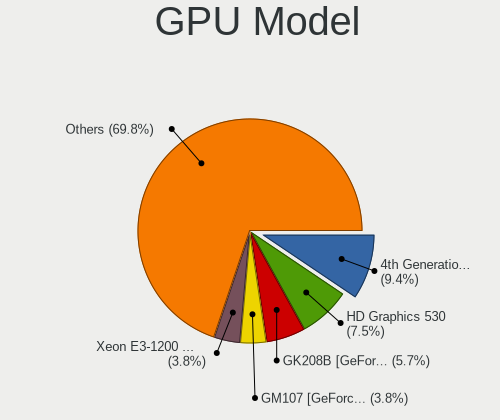

| Model                                                                       | Desktops | Percent |
|-----------------------------------------------------------------------------|----------|---------|
| Intel Xeon E3-1200 v3/4th Gen Core Processor Integrated Graphics Controller | 4        | 6.56%   |
| Intel HD Graphics 530                                                       | 3        | 4.92%   |
| Intel 4 Series Chipset Integrated Graphics Controller                       | 3        | 4.92%   |
| Nvidia GM107 [GeForce GTX 750 Ti]                                           | 2        | 3.28%   |
| Intel CoffeeLake-S GT2 [UHD Graphics 630]                                   | 2        | 3.28%   |
| AMD Wani [Radeon R5/R6/R7 Graphics]                                         | 2        | 3.28%   |
| Nvidia TU117 [GeForce GTX 1650]                                             | 1        | 1.64%   |
| Nvidia TU106 [GeForce RTX 2070]                                             | 1        | 1.64%   |
| Nvidia GT218 [GeForce 210]                                                  | 1        | 1.64%   |
| Nvidia GP108 [GeForce GT 1030]                                              | 1        | 1.64%   |
| Nvidia GP106 [GeForce GTX 1060 6GB]                                         | 1        | 1.64%   |
| Nvidia GP104 [GeForce GTX 1080]                                             | 1        | 1.64%   |
| Nvidia GP104 [GeForce GTX 1070]                                             | 1        | 1.64%   |
| Nvidia GM107GL [Quadro K620]                                                | 1        | 1.64%   |
| Nvidia GK208B [GeForce GT 730]                                              | 1        | 1.64%   |
| Nvidia GK208B [GeForce GT 720]                                              | 1        | 1.64%   |
| Nvidia GK208B [GeForce GT 710]                                              | 1        | 1.64%   |
| Nvidia GK107GL [Quadro K2000]                                               | 1        | 1.64%   |
| Nvidia GK106GL [Quadro K4000]                                               | 1        | 1.64%   |
| Nvidia GK106 [GeForce GTX 660]                                              | 1        | 1.64%   |
| Nvidia GF116 [GeForce GTX 550 Ti]                                           | 1        | 1.64%   |
| Nvidia GA106 [Geforce RTX 3050]                                             | 1        | 1.64%   |
| Nvidia G96CGL [Quadro FX 580]                                               | 1        | 1.64%   |
| Nvidia G96C [GeForce 9500 GT]                                               | 1        | 1.64%   |
| Nvidia G96 [GeForce 9500 GS]                                                | 1        | 1.64%   |
| Nvidia G94 [GeForce 9600 GT]                                                | 1        | 1.64%   |
| Nvidia G86 [GeForce 8500 GT]                                                | 1        | 1.64%   |
| Nvidia G72 [GeForce 7500 LE]                                                | 1        | 1.64%   |
| Nvidia C79 [ION]                                                            | 1        | 1.64%   |
| Nvidia C61 [GeForce 6150SE nForce 430]                                      | 1        | 1.64%   |
| Nvidia AD104 [GeForce RTX 4070 Ti]                                          | 1        | 1.64%   |
| Intel Xeon E3-1200 v3 Processor Integrated Graphics Controller              | 1        | 1.64%   |
| Intel Xeon E3-1200 v2/3rd Gen Core processor Graphics Controller            | 1        | 1.64%   |
| Intel HD Graphics 630                                                       | 1        | 1.64%   |
| Intel 4th Generation Core Processor Family Integrated Graphics Controller   | 1        | 1.64%   |
| AMD Sumo [Radeon HD 6550D]                                                  | 1        | 1.64%   |
| AMD Sumo [Radeon HD 6530D]                                                  | 1        | 1.64%   |
| AMD RV730 PRO [Radeon HD 4650]                                              | 1        | 1.64%   |
| AMD RV710 [Radeon HD 4350/4550]                                             | 1        | 1.64%   |
| AMD RV635 [Radeon HD 3650/3750/4570/4580]                                   | 1        | 1.64%   |

GPU Combo
---------

Combinations of graphics cards

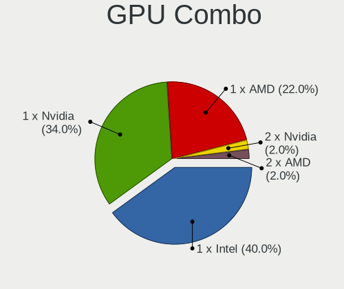

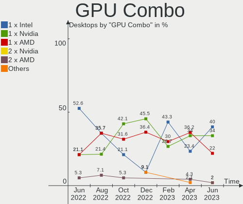

| Name       | Desktops | Percent |
|------------|----------|---------|
| 1 x Nvidia | 24       | 42.86%  |
| 1 x Intel  | 15       | 26.79%  |
| 1 x AMD    | 15       | 26.79%  |
| 2 x Nvidia | 1        | 1.79%   |
| 2 x AMD    | 1        | 1.79%   |

GPU Driver
----------

Free vs proprietary

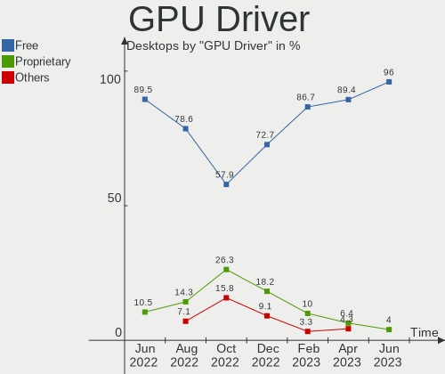

| Driver      | Desktops | Percent |
|-------------|----------|---------|
| Free        | 48       | 85.71%  |
| Proprietary | 4        | 7.14%   |
| Unknown     | 4        | 7.14%   |

GPU Memory
----------

Total video memory

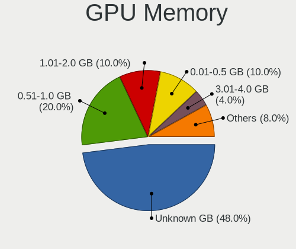

| Size in GB | Desktops | Percent |
|------------|----------|---------|
| Unknown    | 19       | 33.93%  |
| 0.01-0.5   | 12       | 21.43%  |
| 0.51-1.0   | 9        | 16.07%  |
| 1.01-2.0   | 7        | 12.5%   |
| 7.01-8.0   | 4        | 7.14%   |
| 3.01-4.0   | 2        | 3.57%   |
| 5.01-6.0   | 1        | 1.79%   |
| 2.01-3.0   | 1        | 1.79%   |
| 8.01-16.0  | 1        | 1.79%   |

Monitor
-------

Monitor Vendor
--------------

Monitor vendors

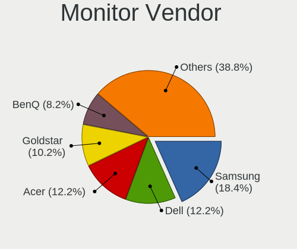

| Vendor                  | Desktops | Percent |
|-------------------------|----------|---------|
| Samsung Electronics     | 11       | 20%     |
| Goldstar                | 11       | 20%     |
| Ancor Communications    | 3        | 5.45%   |
| Acer                    | 3        | 5.45%   |
| Sony                    | 2        | 3.64%   |
| NCS                     | 2        | 3.64%   |
| Hewlett-Packard         | 2        | 3.64%   |
| Dell                    | 2        | 3.64%   |
| Chi Mei Optoelectronics | 2        | 3.64%   |
| Arnos Instruments       | 2        | 3.64%   |
| AOC                     | 2        | 3.64%   |
| Unknown                 | 1        | 1.82%   |
| Philips                 | 1        | 1.82%   |
| NEC Computers           | 1        | 1.82%   |
| MSI                     | 1        | 1.82%   |
| Medion                  | 1        | 1.82%   |
| LG Electronics          | 1        | 1.82%   |
| Lenovo                  | 1        | 1.82%   |
| Iiyama                  | 1        | 1.82%   |
| HannStar                | 1        | 1.82%   |
| Eizo                    | 1        | 1.82%   |
| BenQ                    | 1        | 1.82%   |
| Belinea                 | 1        | 1.82%   |
| Unknown                 | 1        | 1.82%   |

Monitor Model
-------------

Monitor models

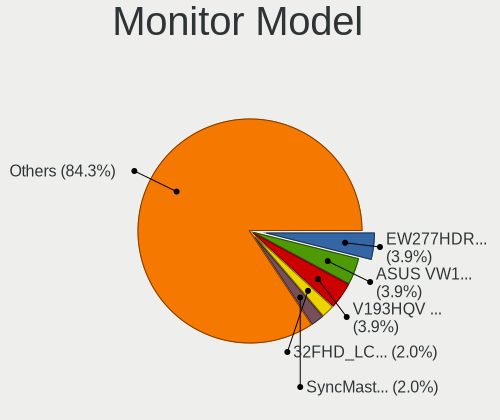

| Model                                                                    | Desktops | Percent |
|--------------------------------------------------------------------------|----------|---------|
| NCS LCD Monitor NCS2275 1920x1080 256x192mm 12.6-inch                    | 2        | 3.51%   |
| Chi Mei Optoelectronics CMC 19" AD CMO0198 1280x1024 338x270mm 17.0-inch | 2        | 3.51%   |
| Unknown LCD Monitor FFFF 2288x1287 2550x2550mm 142.0-inch                | 1        | 1.75%   |
| Sony TV *00 SNY3F05 3840x2160 1439x809mm 65.0-inch                       | 1        | 1.75%   |
| Sony KDL-S32A12U SNY5C00 1280x768                                        | 1        | 1.75%   |
| Samsung Electronics SyncMaster SAM02DB 1680x1050 474x296mm 22.0-inch     | 1        | 1.75%   |
| Samsung Electronics SyncMaster SAM01B8 1280x1024 338x270mm 17.0-inch     | 1        | 1.75%   |
| Samsung Electronics SyncMaster SAM0191 1280x1024 338x270mm 17.0-inch     | 1        | 1.75%   |
| Samsung Electronics SMEX2220 SAM0685 1920x1080 477x268mm 21.5-inch       | 1        | 1.75%   |
| Samsung Electronics SA300/SA350 SAM0849 1920x1080 477x268mm 21.5-inch    | 1        | 1.75%   |
| Samsung Electronics S27E500 SAM0D0D 1920x1080 598x336mm 27.0-inch        | 1        | 1.75%   |
| Samsung Electronics S24R35x SAM100E 1920x1080 527x296mm 23.8-inch        | 1        | 1.75%   |
| Samsung Electronics S24D330 SAM0D92 1920x1080 531x299mm 24.0-inch        | 1        | 1.75%   |
| Samsung Electronics S24D300 SAM0B45 1920x1080 521x293mm 23.5-inch        | 1        | 1.75%   |
| Samsung Electronics S22B370 SAM08BD 1920x1080 477x268mm 21.5-inch        | 1        | 1.75%   |
| Samsung Electronics LCD Monitor SMB2240W 2880x1200                       | 1        | 1.75%   |
| Samsung Electronics LCD Monitor SM2443DW                                 | 1        | 1.75%   |
| Samsung Electronics C49J89x SAM0F21 3840x1080 1196x336mm 48.9-inch       | 1        | 1.75%   |
| Philips 196V4 PHLC0AF 1366x768 410x230mm 18.5-inch                       | 1        | 1.75%   |
| NEC Computers EA223WM NEC6890 1680x1050 474x296mm 22.0-inch              | 1        | 1.75%   |
| MSI MAG274QRF-QD MSI3CA8 2560x1440 597x336mm 27.0-inch                   | 1        | 1.75%   |
| Medion MD20328 MED3941 1600x900 462x272mm 21.1-inch                      | 1        | 1.75%   |
| LG Electronics LCD Monitor LG HDR WFHD 2560x1080                         | 1        | 1.75%   |
| Lenovo LEN L171 LEN24C9 1280x1024 337x270mm 17.0-inch                    | 1        | 1.75%   |
| Iiyama PLX2783H IVM6648 1920x1080 598x336mm 27.0-inch                    | 1        | 1.75%   |
| Hewlett-Packard P222va HWP322B 1920x1080 477x268mm 21.5-inch             | 1        | 1.75%   |
| Hewlett-Packard LA2205 HWP2847 1680x1050 473x296mm 22.0-inch             | 1        | 1.75%   |
| HannStar Hanns.G HQ191 HSD0013 1280x1024 376x301mm 19.0-inch             | 1        | 1.75%   |
| Goldstar W2242 GSM5678 1680x1050 474x296mm 22.0-inch                     | 1        | 1.75%   |
| Goldstar T710B GSM4365 1280x960 310x230mm 15.2-inch                      | 1        | 1.75%   |
| Goldstar MP59G GSM5B34 1920x1080 480x270mm 21.7-inch                     | 1        | 1.75%   |
| Goldstar L1718S GSM443C 1280x1024 338x270mm 17.0-inch                    | 1        | 1.75%   |
| Goldstar IPS FULLHD GSM5AB7 1920x1080 480x270mm 21.7-inch                | 1        | 1.75%   |
| Goldstar FULL HD GSM5B55 1920x1080 480x270mm 21.7-inch                   | 1        | 1.75%   |
| Goldstar E2350 GSM5790 1920x1080 510x290mm 23.1-inch                     | 1        | 1.75%   |
| Goldstar E1940 GSM4BD6 1360x768 406x229mm 18.4-inch                      | 1        | 1.75%   |
| Goldstar 34GL750 GSM773B 2560x1080 798x334mm 34.1-inch                   | 1        | 1.75%   |
| Goldstar 24MB35 GSM5A49 1920x1080 510x290mm 23.1-inch                    | 1        | 1.75%   |
| Goldstar 22MP55 GSM5A26 1920x1080 477x268mm 21.5-inch                    | 1        | 1.75%   |
| Eizo EV2216W ENC2440 1680x1050 474x297mm 22.0-inch                       | 1        | 1.75%   |

Monitor Resolution
------------------

Monitor screen resolution

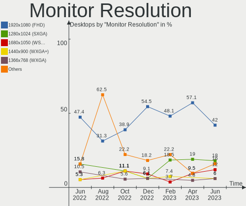

| Resolution         | Desktops | Percent |
|--------------------|----------|---------|
| 1920x1080 (FHD)    | 22       | 39.29%  |
| 1280x1024 (SXGA)   | 8        | 14.29%  |
| 1680x1050 (WSXGA+) | 7        | 12.5%   |
| 1024x768 (XGA)     | 3        | 5.36%   |
| 3840x2160 (4K)     | 2        | 3.57%   |
| 2560x1080          | 2        | 3.57%   |
| 1366x768 (WXGA)    | 2        | 3.57%   |
| 3840x1080          | 1        | 1.79%   |
| 2880x1200          | 1        | 1.79%   |
| 2560x1440 (QHD)    | 1        | 1.79%   |
| 2288x1287          | 1        | 1.79%   |
| 1600x900 (HD+)     | 1        | 1.79%   |
| 1440x900 (WXGA+)   | 1        | 1.79%   |
| 1360x768           | 1        | 1.79%   |
| 1280x768           | 1        | 1.79%   |
| 1152x864           | 1        | 1.79%   |
| Unknown            | 1        | 1.79%   |

Monitor Diagonal
----------------

Diagonal size in inches

| Inches  | Desktops | Percent |
|---------|----------|---------|
| 21      | 13       | 23.64%  |
| 27      | 5        | 9.09%   |
| 22      | 5        | 9.09%   |
| 17      | 5        | 9.09%   |
| 24      | 4        | 7.27%   |
| 23      | 4        | 7.27%   |
| 19      | 4        | 7.27%   |
| 18      | 3        | 5.45%   |
| 15      | 3        | 5.45%   |
| Unknown | 3        | 5.45%   |
| 12      | 2        | 3.64%   |
| 142     | 1        | 1.82%   |
| 75      | 1        | 1.82%   |
| 49      | 1        | 1.82%   |
| 34      | 1        | 1.82%   |

Monitor Width
-------------

Physical width

| Width in mm    | Desktops | Percent |
|----------------|----------|---------|
| 401-500        | 22       | 40.74%  |
| 501-600        | 12       | 22.22%  |
| 301-350        | 7        | 12.96%  |
| 351-400        | 4        | 7.41%   |
| Unknown        | 3        | 5.56%   |
| 201-300        | 2        | 3.7%    |
| More than 2000 | 1        | 1.85%   |
| 701-800        | 1        | 1.85%   |
| 1501-2000      | 1        | 1.85%   |
| 1001-1500      | 1        | 1.85%   |

Aspect Ratio
------------

Proportional relationship between the width and the height

| Ratio   | Desktops | Percent |
|---------|----------|---------|
| 16/9    | 28       | 51.85%  |
| 5/4     | 9        | 16.67%  |
| 16/10   | 5        | 9.26%   |
| 4/3     | 4        | 7.41%   |
| Unknown | 3        | 5.56%   |
| 3/2     | 2        | 3.7%    |
| 32/9    | 1        | 1.85%   |
| 21/9    | 1        | 1.85%   |
| 1.00    | 1        | 1.85%   |

Monitor Area
------------

Area in inch²

| Area in inch² | Desktops | Percent |
|----------------|----------|---------|
| 201-250        | 21       | 38.18%  |
| 151-200        | 9        | 16.36%  |
| 141-150        | 8        | 14.55%  |
| 301-350        | 5        | 9.09%   |
| Unknown        | 3        | 5.45%   |
| More than 1000 | 2        | 3.64%   |
| 71-80          | 2        | 3.64%   |
| 101-110        | 2        | 3.64%   |
| 351-500        | 1        | 1.82%   |
| 111-120        | 1        | 1.82%   |
| 501-1000       | 1        | 1.82%   |

Pixel Density
-------------

Pixels per inch

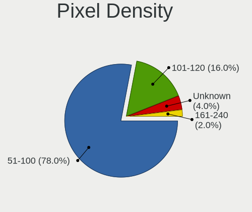

| Density | Desktops | Percent |
|---------|----------|---------|
| 51-100  | 36       | 66.67%  |
| 101-120 | 12       | 22.22%  |
| Unknown | 3        | 5.56%   |
| 161-240 | 2        | 3.7%    |
| 1-50    | 1        | 1.85%   |

Multiple Monitors
-----------------

Total monitors connected

| Total | Desktops | Percent |
|-------|----------|---------|
| 1     | 52       | 92.86%  |
| 2     | 3        | 5.36%   |
| 0     | 1        | 1.79%   |

Network
-------

Net Controller Vendor
---------------------

Controller vendors

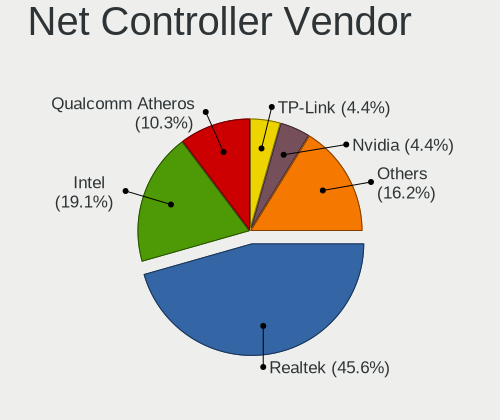

| Vendor                   | Desktops | Percent |
|--------------------------|----------|---------|
| Realtek Semiconductor    | 29       | 40.85%  |
| Intel                    | 19       | 26.76%  |
| Qualcomm Atheros         | 8        | 11.27%  |
| Nvidia                   | 4        | 5.63%   |
| TP-Link                  | 3        | 4.23%   |
| IMC Networks             | 2        | 2.82%   |
| Broadcom                 | 2        | 2.82%   |
| Microsoft                | 1        | 1.41%   |
| Marvell Technology Group | 1        | 1.41%   |
| D-Link System            | 1        | 1.41%   |
| Broadcom Limited         | 1        | 1.41%   |

Net Controller Model
--------------------

Controller models

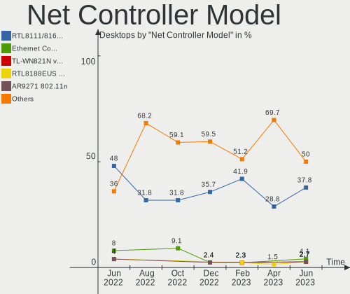

| Model                                                                  | Desktops | Percent |
|------------------------------------------------------------------------|----------|---------|
| Realtek RTL8111/8168/8411 PCI Express Gigabit Ethernet Controller      | 24       | 31.17%  |
| Intel 82579LM Gigabit Network Connection (Lewisville)                  | 5        | 6.49%   |
| Realtek RTL8188EUS 802.11n Wireless Network Adapter                    | 3        | 3.9%    |
| Qualcomm Atheros AR9287 Wireless Network Adapter (PCI-Express)         | 3        | 3.9%    |
| Intel I211 Gigabit Network Connection                                  | 3        | 3.9%    |
| Realtek RTL8125 2.5GbE Controller                                      | 2        | 2.6%    |
| Nvidia MCP61 Ethernet                                                  | 2        | 2.6%    |
| Intel Ethernet Connection I217-LM                                      | 2        | 2.6%    |
| Intel Ethernet Connection (2) I219-V                                   | 2        | 2.6%    |
| Intel 82567LM-3 Gigabit Network Connection                             | 2        | 2.6%    |
| TP-Link TL-WN821N Version 5 RTL8192EU                                  | 1        | 1.3%    |
| TP-Link TL-WN722N v2/v3 [Realtek RTL8188EUS]                           | 1        | 1.3%    |
| TP-Link 802.11ac WLAN Adapter                                          | 1        | 1.3%    |
| Realtek USB 10/100/1G/2.5G LAN                                         | 1        | 1.3%    |
| Realtek RTL8169 PCI Gigabit Ethernet Controller                        | 1        | 1.3%    |
| Qualcomm Atheros Attansic L1 Gigabit Ethernet                          | 1        | 1.3%    |
| Qualcomm Atheros AR928X Wireless Network Adapter (PCI-Express)         | 1        | 1.3%    |
| Qualcomm Atheros AR922X Wireless Network Adapter                       | 1        | 1.3%    |
| Qualcomm Atheros AR8152 v2.0 Fast Ethernet                             | 1        | 1.3%    |
| Qualcomm Atheros AR8131 Gigabit Ethernet                               | 1        | 1.3%    |
| Nvidia MCP79 Ethernet                                                  | 1        | 1.3%    |
| Nvidia MCP73 Ethernet                                                  | 1        | 1.3%    |
| Microsoft Xbox 360 Wireless Adapter                                    | 1        | 1.3%    |
| Marvell Group 88E8056 PCI-E Gigabit Ethernet Controller                | 1        | 1.3%    |
| Intel Wireless 8265 / 8275                                             | 1        | 1.3%    |
| Intel Wireless 7265                                                    | 1        | 1.3%    |
| Intel Ethernet Controller I226-V                                       | 1        | 1.3%    |
| Intel Ethernet Connection (5) I219-V                                   | 1        | 1.3%    |
| Intel Ethernet Connection (2) I219-LM                                  | 1        | 1.3%    |
| Intel Dual Band Wireless-AC 3168NGW [Stone Peak]                       | 1        | 1.3%    |
| Intel 82579V Gigabit Network Connection                                | 1        | 1.3%    |
| Intel 82567LF-3 Gigabit Network Connection                             | 1        | 1.3%    |
| Intel 700 Series Chipset Family Wi-Fi                                  | 1        | 1.3%    |
| IMC Networks Mediao 802.11n WLAN [Realtek RTL8191SU]                   | 1        | 1.3%    |
| IMC Networks AW-NU222 802.11bgn Wireless Module [Ralink RT2770+RT2720] | 1        | 1.3%    |
| D-Link System DL10050 Sundance Ethernet                                | 1        | 1.3%    |
| Broadcom NetXtreme BCM5761 Gigabit Ethernet PCIe                       | 1        | 1.3%    |
| Broadcom NetXtreme BCM5754 Gigabit Ethernet PCI Express                | 1        | 1.3%    |
| Broadcom Limited NetXtreme BCM5755 Gigabit Ethernet PCI Express        | 1        | 1.3%    |

Wireless Vendor
---------------

Wireless vendors

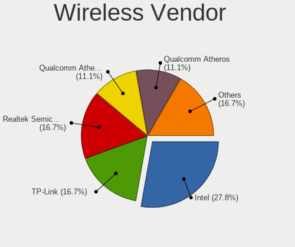

| Vendor                | Desktops | Percent |
|-----------------------|----------|---------|
| Qualcomm Atheros      | 5        | 27.78%  |
| Intel                 | 4        | 22.22%  |
| TP-Link               | 3        | 16.67%  |
| Realtek Semiconductor | 3        | 16.67%  |
| IMC Networks          | 2        | 11.11%  |
| Microsoft             | 1        | 5.56%   |

Wireless Model
--------------

Wireless models

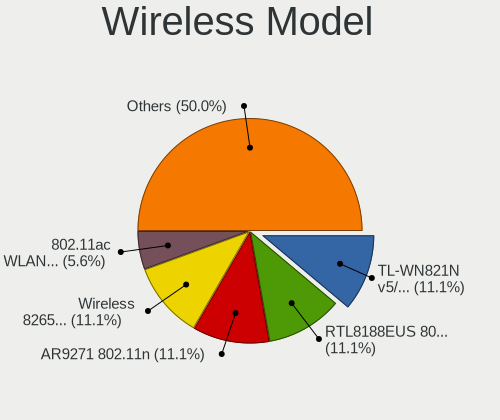

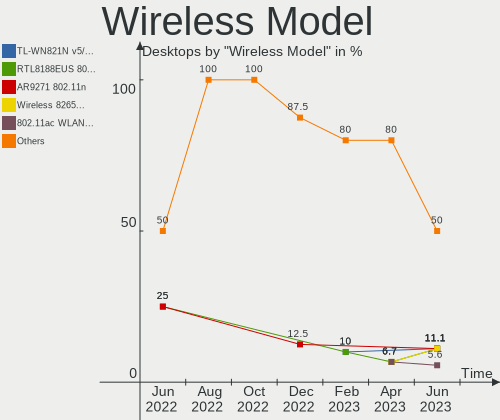

| Model                                                                  | Desktops | Percent |
|------------------------------------------------------------------------|----------|---------|
| Realtek RTL8188EUS 802.11n Wireless Network Adapter                    | 3        | 16.67%  |
| Qualcomm Atheros AR9287 Wireless Network Adapter (PCI-Express)         | 3        | 16.67%  |
| TP-Link TL-WN821N Version 5 RTL8192EU                                  | 1        | 5.56%   |
| TP-Link TL-WN722N v2/v3 [Realtek RTL8188EUS]                           | 1        | 5.56%   |
| TP-Link 802.11ac WLAN Adapter                                          | 1        | 5.56%   |
| Qualcomm Atheros AR928X Wireless Network Adapter (PCI-Express)         | 1        | 5.56%   |
| Qualcomm Atheros AR922X Wireless Network Adapter                       | 1        | 5.56%   |
| Microsoft Xbox 360 Wireless Adapter                                    | 1        | 5.56%   |
| Intel Wireless 8265 / 8275                                             | 1        | 5.56%   |
| Intel Wireless 7265                                                    | 1        | 5.56%   |
| Intel Dual Band Wireless-AC 3168NGW [Stone Peak]                       | 1        | 5.56%   |
| Intel 700 Series Chipset Family Wi-Fi                                  | 1        | 5.56%   |
| IMC Networks Mediao 802.11n WLAN [Realtek RTL8191SU]                   | 1        | 5.56%   |
| IMC Networks AW-NU222 802.11bgn Wireless Module [Ralink RT2770+RT2720] | 1        | 5.56%   |

Ethernet Vendor
---------------

Ethernet vendors

| Vendor                   | Desktops | Percent |
|--------------------------|----------|---------|
| Realtek Semiconductor    | 27       | 47.37%  |
| Intel                    | 18       | 31.58%  |
| Nvidia                   | 4        | 7.02%   |
| Qualcomm Atheros         | 3        | 5.26%   |
| Broadcom                 | 2        | 3.51%   |
| Marvell Technology Group | 1        | 1.75%   |
| D-Link System            | 1        | 1.75%   |
| Broadcom Limited         | 1        | 1.75%   |

Ethernet Model
--------------

Ethernet models

| Model                                                             | Desktops | Percent |
|-------------------------------------------------------------------|----------|---------|
| Realtek RTL8111/8168/8411 PCI Express Gigabit Ethernet Controller | 24       | 40.68%  |
| Intel 82579LM Gigabit Network Connection (Lewisville)             | 5        | 8.47%   |
| Intel I211 Gigabit Network Connection                             | 3        | 5.08%   |
| Realtek RTL8125 2.5GbE Controller                                 | 2        | 3.39%   |
| Nvidia MCP61 Ethernet                                             | 2        | 3.39%   |
| Intel Ethernet Connection I217-LM                                 | 2        | 3.39%   |
| Intel Ethernet Connection (2) I219-V                              | 2        | 3.39%   |
| Intel 82567LM-3 Gigabit Network Connection                        | 2        | 3.39%   |
| Realtek USB 10/100/1G/2.5G LAN                                    | 1        | 1.69%   |
| Realtek RTL8169 PCI Gigabit Ethernet Controller                   | 1        | 1.69%   |
| Qualcomm Atheros Attansic L1 Gigabit Ethernet                     | 1        | 1.69%   |
| Qualcomm Atheros AR8152 v2.0 Fast Ethernet                        | 1        | 1.69%   |
| Qualcomm Atheros AR8131 Gigabit Ethernet                          | 1        | 1.69%   |
| Nvidia MCP79 Ethernet                                             | 1        | 1.69%   |
| Nvidia MCP73 Ethernet                                             | 1        | 1.69%   |
| Marvell Group 88E8056 PCI-E Gigabit Ethernet Controller           | 1        | 1.69%   |
| Intel Ethernet Controller I226-V                                  | 1        | 1.69%   |
| Intel Ethernet Connection (5) I219-V                              | 1        | 1.69%   |
| Intel Ethernet Connection (2) I219-LM                             | 1        | 1.69%   |
| Intel 82579V Gigabit Network Connection                           | 1        | 1.69%   |
| Intel 82567LF-3 Gigabit Network Connection                        | 1        | 1.69%   |
| D-Link System DL10050 Sundance Ethernet                           | 1        | 1.69%   |
| Broadcom NetXtreme BCM5761 Gigabit Ethernet PCIe                  | 1        | 1.69%   |
| Broadcom NetXtreme BCM5754 Gigabit Ethernet PCI Express           | 1        | 1.69%   |
| Broadcom Limited NetXtreme BCM5755 Gigabit Ethernet PCI Express   | 1        | 1.69%   |

Net Controller Kind
-------------------

Ethernet, WiFi or modem

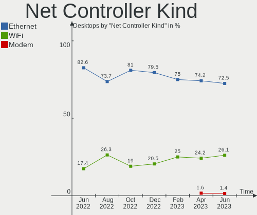

| Kind     | Desktops | Percent |
|----------|----------|---------|
| Ethernet | 54       | 75%     |
| WiFi     | 18       | 25%     |

Used Controller
---------------

Currently used network controller

| Kind     | Desktops | Percent |
|----------|----------|---------|
| Ethernet | 47       | 82.46%  |
| WiFi     | 10       | 17.54%  |

NICs
----

Total network controllers on board

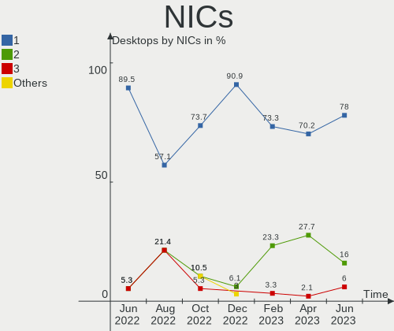

| Total | Desktops | Percent |
|-------|----------|---------|
| 1     | 46       | 82.14%  |
| 2     | 8        | 14.29%  |
| 3     | 2        | 3.57%   |

IPv6
----

IPv6 vs IPv4

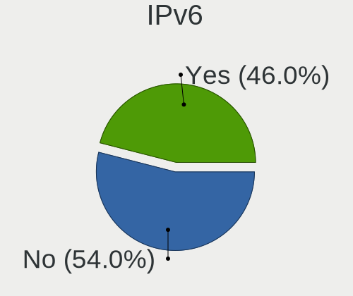

| Used | Desktops | Percent |
|------|----------|---------|
| No   | 29       | 51.79%  |
| Yes  | 27       | 48.21%  |

Bluetooth
---------

Bluetooth Vendor
----------------

Controller vendors

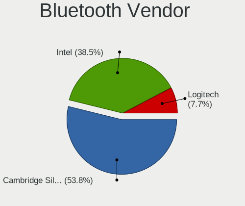

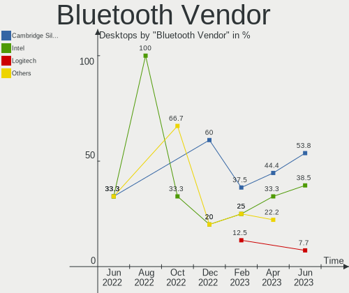

| Vendor                  | Desktops | Percent |
|-------------------------|----------|---------|
| Cambridge Silicon Radio | 6        | 50%     |
| Intel                   | 4        | 33.33%  |
| TP-Link                 | 1        | 8.33%   |
| ASUSTek Computer        | 1        | 8.33%   |

Bluetooth Model
---------------

Controller models

| Model                                               | Desktops | Percent |
|-----------------------------------------------------|----------|---------|
| Cambridge Silicon Radio Bluetooth Dongle (HCI mode) | 6        | 50%     |
| Intel Bluetooth wireless interface                  | 2        | 16.67%  |
| TP-Link UB500 Adapter                               | 1        | 8.33%   |
| Intel Wireless-AC 3168 Bluetooth                    | 1        | 8.33%   |
| Intel AX201 Bluetooth                               | 1        | 8.33%   |
| ASUS ASUS USB-BT500                                 | 1        | 8.33%   |

Sound
-----

Sound Vendor
------------

Sound card vendors

| Vendor                 | Desktops | Percent |
|------------------------|----------|---------|
| Intel                  | 35       | 38.89%  |
| AMD                    | 25       | 27.78%  |
| Nvidia                 | 22       | 24.44%  |
| Plantronics            | 2        | 2.22%   |
| Texas Instruments      | 1        | 1.11%   |
| Promethean Limited     | 1        | 1.11%   |
| Generalplus Technology | 1        | 1.11%   |
| Focusrite-Novation     | 1        | 1.11%   |
| Creative Labs          | 1        | 1.11%   |
| C-Media Electronics    | 1        | 1.11%   |

Sound Model
-----------

Sound card models

| Model                                                                             | Desktops | Percent |
|-----------------------------------------------------------------------------------|----------|---------|
| Intel 8 Series/C220 Series Chipset High Definition Audio Controller               | 7        | 6.6%    |
| Intel Xeon E3-1200 v3/4th Gen Core Processor HD Audio Controller                  | 5        | 4.72%   |
| Intel 82801JI (ICH10 Family) HD Audio Controller                                  | 5        | 4.72%   |
| Intel 7 Series/C216 Chipset Family High Definition Audio Controller               | 5        | 4.72%   |
| Intel 200 Series PCH HD Audio                                                     | 5        | 4.72%   |
| Intel 100 Series/C230 Series Chipset Family HD Audio Controller                   | 4        | 3.77%   |
| AMD SBx00 Azalia (Intel HDA)                                                      | 4        | 3.77%   |
| AMD FCH Azalia Controller                                                         | 4        | 3.77%   |
| Nvidia GM107 High Definition Audio Controller [GeForce 940MX]                     | 3        | 2.83%   |
| Nvidia GK208 HDMI/DP Audio Controller                                             | 3        | 2.83%   |
| Intel 82801JD/DO (ICH10 Family) HD Audio Controller                               | 3        | 2.83%   |
| AMD Starship/Matisse HD Audio Controller                                          | 3        | 2.83%   |
| Nvidia MCP61 High Definition Audio                                                | 2        | 1.89%   |
| Nvidia GP104 High Definition Audio Controller                                     | 2        | 1.89%   |
| Nvidia GK106 HDMI Audio Controller                                                | 2        | 1.89%   |
| Intel NM10/ICH7 Family High Definition Audio Controller                           | 2        | 1.89%   |
| Intel 6 Series/C200 Series Chipset Family High Definition Audio Controller        | 2        | 1.89%   |
| AMD RV710/730 HDMI Audio [Radeon HD 4000 series]                                  | 2        | 1.89%   |
| AMD Oland/Hainan/Cape Verde/Pitcairn HDMI Audio [Radeon HD 7000 Series]           | 2        | 1.89%   |
| AMD Kabini HDMI/DP Audio                                                          | 2        | 1.89%   |
| AMD Family 17h/19h HD Audio Controller                                            | 2        | 1.89%   |
| AMD Family 17h (Models 00h-0fh) HD Audio Controller                               | 2        | 1.89%   |
| AMD Family 15h (Models 60h-6fh) Audio Controller                                  | 2        | 1.89%   |
| AMD Caicos HDMI Audio [Radeon HD 6450 / 7450/8450/8490 OEM / R5 230/235/235X OEM] | 2        | 1.89%   |
| AMD BeaverCreek HDMI Audio [Radeon HD 6500D and 6400G-6600G series]               | 2        | 1.89%   |
| Texas Instruments PCM2902 Audio Codec                                             | 1        | 0.94%   |
| Promethean Limited Audio                                                          | 1        | 0.94%   |
| Plantronics Blackwire 325.1                                                       | 1        | 0.94%   |
| Plantronics Blackwire 3220 Series                                                 | 1        | 0.94%   |
| Nvidia TU107 GeForce GTX 1650 High Definition Audio Controller                    | 1        | 0.94%   |
| Nvidia TU106 High Definition Audio Controller                                     | 1        | 0.94%   |
| Nvidia MCP79 High Definition Audio                                                | 1        | 0.94%   |
| Nvidia MCP73 High Definition Audio                                                | 1        | 0.94%   |
| Nvidia High Definition Audio Controller                                           | 1        | 0.94%   |
| Nvidia GP108 High Definition Audio Controller                                     | 1        | 0.94%   |
| Nvidia GP106 High Definition Audio Controller                                     | 1        | 0.94%   |
| Nvidia GK107 HDMI Audio Controller                                                | 1        | 0.94%   |
| Nvidia GF116 High Definition Audio Controller                                     | 1        | 0.94%   |
| Nvidia GA106 High Definition Audio Controller                                     | 1        | 0.94%   |
| Nvidia Audio device                                                               | 1        | 0.94%   |

Memory
------

Memory Vendor
-------------

Memory module vendors

| Vendor              | Desktops | Percent |
|---------------------|----------|---------|
| Kingston            | 11       | 18.97%  |
| Unknown             | 9        | 15.52%  |
| Samsung Electronics | 9        | 15.52%  |
| SK hynix            | 6        | 10.34%  |
| Micron Technology   | 5        | 8.62%   |
| G.Skill             | 5        | 8.62%   |
| Corsair             | 5        | 8.62%   |
| Crucial             | 2        | 3.45%   |
| Transcend           | 1        | 1.72%   |
| SGS/Thomson         | 1        | 1.72%   |
| Qimonda             | 1        | 1.72%   |
| Nanya Technology    | 1        | 1.72%   |
| Kingmax             | 1        | 1.72%   |
| Apacer              | 1        | 1.72%   |

Memory Model
------------

Memory module models

| Model                                                                     | Desktops | Percent |
|---------------------------------------------------------------------------|----------|---------|
| Samsung RAM Module 4096MB DIMM DDR4 2133MT/s                              | 2        | 3.03%   |
| Samsung RAM M378B5173QH0-CK0 4GB DIMM DDR3 1600MT/s                       | 2        | 3.03%   |
| Kingston RAM KHX2400C15/16G 16GB DIMM DDR4 3334MT/s                       | 2        | 3.03%   |
| Kingston RAM KHX1600C10D3/4G 4GB DIMM DDR3 1866MT/s                       | 2        | 3.03%   |
| Kingston RAM KHX1600C10D3/ 8GB DIMM DDR3 1600MT/s                         | 2        | 3.03%   |
| G.Skill RAM F4-3000C16-8GISB 8192MB DIMM DDR4 3200MT/s                    | 2        | 3.03%   |
| Unknown RAM V02L3L84GB52852816 4096MB DIMM DDR3 1333MT/s                  | 1        | 1.52%   |
| Unknown RAM Module 4096MB DIMM SDRAM                                      | 1        | 1.52%   |
| Unknown RAM Module 4096MB DIMM DDR3 1333MT/s                              | 1        | 1.52%   |
| Unknown RAM Module 4096MB DIMM 1600MT/s                                   | 1        | 1.52%   |
| Unknown RAM Module 2GB DIMM DDR2 800MT/s                                  | 1        | 1.52%   |
| Unknown RAM Module 2048MB DIMM 800MT/s                                    | 1        | 1.52%   |
| Unknown RAM Module 2048MB DIMM 667MT/s                                    | 1        | 1.52%   |
| Unknown RAM Module 2048MB DIMM 1333MT/s                                   | 1        | 1.52%   |
| Unknown RAM Module 1GB DIMM DDR2 800MT/s                                  | 1        | 1.52%   |
| Unknown RAM Module 1024MB DIMM DDR2                                       | 1        | 1.52%   |
| Unknown RAM Module 1024MB DIMM 800MT/s                                    | 1        | 1.52%   |
| Transcend RAM JM1333KLN-4G 4GB DIMM DDR3 1600MT/s                         | 1        | 1.52%   |
| SK hynix RAM HMT451U7BFR8A-PB 4096MB DIMM DDR3 1600MT/s                   | 1        | 1.52%   |
| SK hynix RAM HMT451U6AFR8C-PB 4GB DIMM DDR3 1600MT/s                      | 1        | 1.52%   |
| SK hynix RAM HMT351U6EFR8C-PB 4GB DIMM DDR3 1800MT/s                      | 1        | 1.52%   |
| SK hynix RAM HMT151R7BFR4C-H9 4GB DIMM DDR3 1333MT/s                      | 1        | 1.52%   |
| SK hynix RAM HMT151R7BFR4C-H9 4096MB DIMM DDR2 1333MT/s                   | 1        | 1.52%   |
| SK hynix RAM HMT125R7BFR8C-H9 2048MB DIMM DDR2 1333MT/s                   | 1        | 1.52%   |
| SK hynix RAM 48594D503531325536344350382D59352020 1GB DIMM DDR2 667MT/s   | 1        | 1.52%   |
| SK hynix RAM 48594D503131325536344350382D59352020 1GB DIMM DDR2 667MT/s   | 1        | 1.52%   |
| SGS/Thomson RAM Module 1GB DIMM SDRAM 2048MT/s                            | 1        | 1.52%   |
| Samsung RAM Module 8192MB SODIMM DDR4 2133MT/s                            | 1        | 1.52%   |
| Samsung RAM M393B1G73QH0 8192MB DIMM DDR3 1600MT/s                        | 1        | 1.52%   |
| Samsung RAM M378B5273DH0-CH9 4GB DIMM DDR3 2133MT/s                       | 1        | 1.52%   |
| Samsung RAM M378B5273CH0-CK0 4GB DIMM DDR3 2000MT/s                       | 1        | 1.52%   |
| Samsung RAM 4D332037385435363633515A332D43463720 2048MB DIMM DDR2 800MT/s | 1        | 1.52%   |
| Qimonda RAM 64T256020EU2.5C2 2048MB DIMM SDRAM                            | 1        | 1.52%   |
| Nanya RAM NT4GC72B4NA1NL-BE 4096MB DIMM DDR3 1066MT/s                     | 1        | 1.52%   |
| Micron RAM CT8G4DFD8213.16FA11 8192MB DIMM DDR4 2133MT/s                  | 1        | 1.52%   |
| Micron RAM 8KTF51264AZ-1G6E1 4GB DIMM DDR3 1600MT/s                       | 1        | 1.52%   |
| Micron RAM 8ATF1G64HZ-2G6H1 8GB SODIMM DDR4 2667MT/s                      | 1        | 1.52%   |
| Micron RAM 16JTF51264AZ-1G6M1 4096MB DIMM DDR3 1600MT/s                   | 1        | 1.52%   |
| Micron RAM 16HTF25664HZ-800H1 2048MB DIMM DDR2 800MT/s                    | 1        | 1.52%   |
| Kingston RAM KHX2666C16/8G 8GB DIMM DDR4 3466MT/s                         | 1        | 1.52%   |

Memory Kind
-----------

Memory module kinds

| Kind    | Desktops | Percent |
|---------|----------|---------|
| DDR3    | 20       | 40%     |
| DDR4    | 17       | 34%     |
| SDRAM   | 4        | 8%      |
| DDR2    | 4        | 8%      |
| Unknown | 4        | 8%      |
| DDR5    | 1        | 2%      |

Memory Form Factor
------------------

Physical design of the memory module

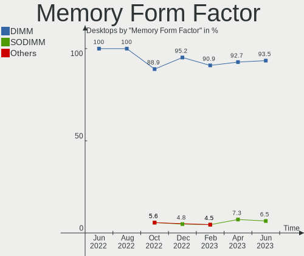

| Name   | Desktops | Percent |
|--------|----------|---------|
| DIMM   | 48       | 96%     |
| SODIMM | 2        | 4%      |

Memory Size
-----------

Memory module size

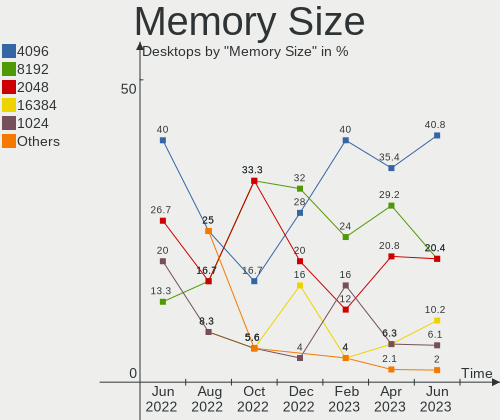

| Size  | Desktops | Percent |
|-------|----------|---------|
| 4096  | 22       | 38.6%   |
| 8192  | 14       | 24.56%  |
| 2048  | 10       | 17.54%  |
| 16384 | 6        | 10.53%  |
| 1024  | 5        | 8.77%   |

Memory Speed
------------

Memory module speed

| Speed   | Desktops | Percent |
|---------|----------|---------|
| 1600    | 11       | 18.64%  |
| 2133    | 8        | 13.56%  |
| 1333    | 6        | 10.17%  |
| 800     | 6        | 10.17%  |
| 1866    | 5        | 8.47%   |
| 3200    | 4        | 6.78%   |
| 3334    | 2        | 3.39%   |
| 2667    | 2        | 3.39%   |
| 667     | 2        | 3.39%   |
| Unknown | 2        | 3.39%   |
| 6000    | 1        | 1.69%   |
| 3600    | 1        | 1.69%   |
| 3466    | 1        | 1.69%   |
| 2800    | 1        | 1.69%   |
| 2666    | 1        | 1.69%   |
| 2448    | 1        | 1.69%   |
| 2400    | 1        | 1.69%   |
| 2048    | 1        | 1.69%   |
| 2000    | 1        | 1.69%   |
| 1800    | 1        | 1.69%   |
| 1066    | 1        | 1.69%   |

Printers & scanners
-------------------

Printer Vendor
--------------

Printer device vendors

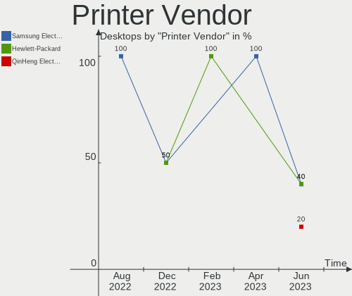

| Vendor              | Desktops | Percent |
|---------------------|----------|---------|
| Samsung Electronics | 2        | 50%     |
| QinHeng Electronics | 1        | 25%     |
| Hewlett-Packard     | 1        | 25%     |

Printer Model
-------------

Printer device models

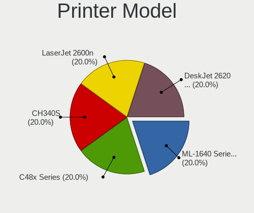

| Model                                | Desktops | Percent |
|--------------------------------------|----------|---------|
| Samsung ML-1640 Series Laser Printer | 1        | 25%     |
| Samsung C48x Series                  | 1        | 25%     |
| QinHeng CH340S                       | 1        | 25%     |
| HP DeskJet 2600 series               | 1        | 25%     |

Scanner Vendor
--------------

Scanner device vendors

| Vendor | Desktops | Percent |
|--------|----------|---------|
| Canon  | 1        | 100%    |

Scanner Model
-------------

Scanner device models

| Model                              | Desktops | Percent |
|------------------------------------|----------|---------|
| Canon CanoScan N670U/N676U/LiDE 20 | 1        | 100%    |

Camera
------

Camera Vendor
-------------

Camera device vendors

| Vendor                  | Desktops | Percent |
|-------------------------|----------|---------|
| Microdia                | 5        | 45.45%  |
| GEMBIRD                 | 2        | 18.18%  |
| Z-Star Microelectronics | 1        | 9.09%   |
| Microsoft               | 1        | 9.09%   |
| Generalplus Technology  | 1        | 9.09%   |
| Aveo Technology         | 1        | 9.09%   |

Camera Model
------------

Camera device models

| Model                                             | Desktops | Percent |
|---------------------------------------------------|----------|---------|
| Microdia Camera                                   | 3        | 27.27%  |
| GEMBIRD Generic UVC 1.00 camera [AppoTech AX2311] | 2        | 18.18%  |
| Z-Star Venus USB2.0 Camera                        | 1        | 9.09%   |
| Microsoft LifeCam HD-3000                         | 1        | 9.09%   |
| Microdia Sonix USB 2.0 Camera                     | 1        | 9.09%   |
| Microdia Integrated Camera                        | 1        | 9.09%   |
| Generalplus GENERAL WEBCAM                        | 1        | 9.09%   |
| Aveo USB2.0 Camera                                | 1        | 9.09%   |

Security
--------

Fingerprint Vendor
------------------

Fingerprint sensor vendors

Zero info for selected period =(

Fingerprint Model
-----------------

Fingerprint sensor models

Zero info for selected period =(

Chipcard Vendor
---------------

Chipcard module vendors

Zero info for selected period =(

Chipcard Model
--------------

Chipcard module models

Zero info for selected period =(

Unsupported
-----------

Unsupported Devices
-------------------

Total unsupported devices on board

| Total | Desktops | Percent |
|-------|----------|---------|
| 0     | 51       | 91.07%  |
| 1     | 5        | 8.93%   |

Unsupported Device Types
------------------------

Types of unsupported devices

| Type                     | Desktops | Percent |
|--------------------------|----------|---------|
| Graphics card            | 3        | 60%     |
| Multimedia controller    | 1        | 20%     |
| Communication controller | 1        | 20%     |

