Linux in Hungary - Hardware Trends (Desktops)
---------------------------------------------

A project to identify most popular hardware characteristics and track their change
over time based on data collected by Linux users at https://Linux-Hardware.org.

Anyone can contribute to this report by the [hw-probe](https://github.com/linuxhw/hw-probe) tool:

    sudo -E hw-probe -all -upload

Period: Jun, 2023.

Contents
--------

* [ System ](#system)
  - [ OS                       ](#os)
  - [ OS Family                ](#os-family)
  - [ Kernel                   ](#kernel)
  - [ Kernel Family            ](#kernel-family)
  - [ Kernel Major Ver.        ](#kernel-major-ver)
  - [ Arch                     ](#arch)
  - [ DE                       ](#de)
  - [ Display Server           ](#display-server)
  - [ Display Manager          ](#display-manager)
  - [ OS Lang                  ](#os-lang)
  - [ Boot Mode                ](#boot-mode)
  - [ Filesystem               ](#filesystem)
  - [ Part. scheme             ](#part-scheme)
  - [ Dual Boot with Linux/BSD ](#dual-boot-with-linuxbsd)
  - [ Dual Boot (Win)          ](#dual-boot-win)

* [ Board ](#board)
  - [ Vendor                   ](#vendor)
  - [ Model                    ](#model)
  - [ Model Family             ](#model-family)
  - [ MFG Year                 ](#mfg-year)
  - [ Form Factor              ](#form-factor)
  - [ Secure Boot              ](#secure-boot)
  - [ Coreboot                 ](#coreboot)
  - [ RAM Size                 ](#ram-size)
  - [ RAM Used                 ](#ram-used)
  - [ Total Drives             ](#total-drives)
  - [ Has CD-ROM               ](#has-cd-rom)
  - [ Has Ethernet             ](#has-ethernet)
  - [ Has WiFi                 ](#has-wifi)
  - [ Has Bluetooth            ](#has-bluetooth)

* [ Location ](#location)
  - [ Country                  ](#country)
  - [ City                     ](#city)

* [ Drives ](#drives)
  - [ Drive Vendor             ](#drive-vendor)
  - [ Drive Model              ](#drive-model)
  - [ HDD Vendor               ](#hdd-vendor)
  - [ SSD Vendor               ](#ssd-vendor)
  - [ Drive Kind               ](#drive-kind)
  - [ Drive Connector          ](#drive-connector)
  - [ Drive Size               ](#drive-size)
  - [ Space Total              ](#space-total)
  - [ Space Used               ](#space-used)
  - [ Malfunc. Drives          ](#malfunc-drives)
  - [ Malfunc. Drive Vendor    ](#malfunc-drive-vendor)
  - [ Malfunc. HDD Vendor      ](#malfunc-hdd-vendor)
  - [ Malfunc. Drive Kind      ](#malfunc-drive-kind)
  - [ Failed Drives            ](#failed-drives)
  - [ Failed Drive Vendor      ](#failed-drive-vendor)
  - [ Drive Status             ](#drive-status)

* [ Storage controller ](#storage-controller)
  - [ Storage Vendor           ](#storage-vendor)
  - [ Storage Model            ](#storage-model)
  - [ Storage Kind             ](#storage-kind)

* [ Processor ](#processor)
  - [ CPU Vendor               ](#cpu-vendor)
  - [ CPU Model                ](#cpu-model)
  - [ CPU Model Family         ](#cpu-model-family)
  - [ CPU Cores                ](#cpu-cores)
  - [ CPU Sockets              ](#cpu-sockets)
  - [ CPU Threads              ](#cpu-threads)
  - [ CPU Op-Modes             ](#cpu-op-modes)
  - [ CPU Microcode            ](#cpu-microcode)
  - [ CPU Microarch            ](#cpu-microarch)

* [ Graphics ](#graphics)
  - [ GPU Vendor               ](#gpu-vendor)
  - [ GPU Model                ](#gpu-model)
  - [ GPU Combo                ](#gpu-combo)
  - [ GPU Driver               ](#gpu-driver)
  - [ GPU Memory               ](#gpu-memory)

* [ Monitor ](#monitor)
  - [ Monitor Vendor           ](#monitor-vendor)
  - [ Monitor Model            ](#monitor-model)
  - [ Monitor Resolution       ](#monitor-resolution)
  - [ Monitor Diagonal         ](#monitor-diagonal)
  - [ Monitor Width            ](#monitor-width)
  - [ Aspect Ratio             ](#aspect-ratio)
  - [ Monitor Area             ](#monitor-area)
  - [ Pixel Density            ](#pixel-density)
  - [ Multiple Monitors        ](#multiple-monitors)

* [ Network ](#network)
  - [ Net Controller Vendor    ](#net-controller-vendor)
  - [ Net Controller Model     ](#net-controller-model)
  - [ Wireless Vendor          ](#wireless-vendor)
  - [ Wireless Model           ](#wireless-model)
  - [ Ethernet Vendor          ](#ethernet-vendor)
  - [ Ethernet Model           ](#ethernet-model)
  - [ Net Controller Kind      ](#net-controller-kind)
  - [ Used Controller          ](#used-controller)
  - [ NICs                     ](#nics)
  - [ IPv6                     ](#ipv6)

* [ Bluetooth ](#bluetooth)
  - [ Bluetooth Vendor         ](#bluetooth-vendor)
  - [ Bluetooth Model          ](#bluetooth-model)

* [ Sound ](#sound)
  - [ Sound Vendor             ](#sound-vendor)
  - [ Sound Model              ](#sound-model)

* [ Memory ](#memory)
  - [ Memory Vendor            ](#memory-vendor)
  - [ Memory Model             ](#memory-model)
  - [ Memory Kind              ](#memory-kind)
  - [ Memory Form Factor       ](#memory-form-factor)
  - [ Memory Size              ](#memory-size)
  - [ Memory Speed             ](#memory-speed)

* [ Printers & scanners ](#printers--scanners)
  - [ Printer Vendor           ](#printer-vendor)
  - [ Printer Model            ](#printer-model)
  - [ Scanner Vendor           ](#scanner-vendor)
  - [ Scanner Model            ](#scanner-model)

* [ Camera ](#camera)
  - [ Camera Vendor            ](#camera-vendor)
  - [ Camera Model             ](#camera-model)

* [ Security ](#security)
  - [ Fingerprint Vendor       ](#fingerprint-vendor)
  - [ Fingerprint Model        ](#fingerprint-model)
  - [ Chipcard Vendor          ](#chipcard-vendor)
  - [ Chipcard Model           ](#chipcard-model)

* [ Unsupported ](#unsupported)
  - [ Unsupported Devices      ](#unsupported-devices)
  - [ Unsupported Device Types ](#unsupported-device-types)

System
------

OS
--

Installed operating systems

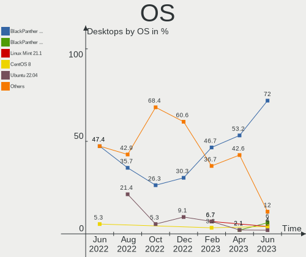

| Name                | Desktops | Percent |
|---------------------|----------|---------|
| BlackPanther 18.1   | 36       | 72%     |
| BlackPanther 22.1   | 3        | 6%      |
| Linux Mint 21.1     | 2        | 4%      |
| CentOS 8            | 2        | 4%      |
| Ubuntu 22.04        | 1        | 2%      |
| Ubuntu 20.04        | 1        | 2%      |
| NixOS 23.11         | 1        | 2%      |
| Manjaro 23.0.0      | 1        | 2%      |
| Manjaro 22.1.3      | 1        | 2%      |
| Lubuntu 23.04       | 1        | 2%      |
| EndeavourOS Rolling | 1        | 2%      |

OS Family
---------

OS without a version

| Name         | Desktops | Percent |
|--------------|----------|---------|
| BlackPanther | 39       | 78%     |
| Ubuntu       | 2        | 4%      |
| Manjaro      | 2        | 4%      |
| Linux Mint   | 2        | 4%      |
| CentOS       | 2        | 4%      |
| NixOS        | 1        | 2%      |
| Lubuntu      | 1        | 2%      |
| EndeavourOS  | 1        | 2%      |

Kernel
------

Version of the Linux kernel

| Version               | Desktops | Percent |
|-----------------------|----------|---------|
| 5.6.14-desktop-2bP    | 21       | 42%     |
| 5.15.85-desktop-1bP   | 9        | 18%     |
| 4.18.16-desktop-1bP   | 6        | 12%     |
| 6.3.3-desktop-1bP     | 2        | 4%      |
| 6.3.9-arch1-1         | 1        | 2%      |
| 6.2.0-23-generic      | 1        | 2%      |
| 6.1.31-xanmod1        | 1        | 2%      |
| 6.1.0-1bP             | 1        | 2%      |
| 5.4.0-152-generic     | 1        | 2%      |
| 5.19.0-43-generic     | 1        | 2%      |
| 5.15.114-2-MANJARO    | 1        | 2%      |
| 5.15.0-75-generic     | 1        | 2%      |
| 5.15.0-72-generic     | 1        | 2%      |
| 5.10.181-1-MANJARO    | 1        | 2%      |
| 4.18.0-499.el8.x86_64 | 1        | 2%      |
| 4.18.0-490.el8.x86_64 | 1        | 2%      |

Kernel Family
-------------

Linux kernel without a distro release

| Version  | Desktops | Percent |
|----------|----------|---------|
| 5.6.14   | 21       | 42%     |
| 5.15.85  | 9        | 18%     |
| 4.18.16  | 6        | 12%     |
| 6.3.3    | 2        | 4%      |
| 5.15.0   | 2        | 4%      |
| 4.18.0   | 2        | 4%      |
| 6.3.9    | 1        | 2%      |
| 6.2.0    | 1        | 2%      |
| 6.1.31   | 1        | 2%      |
| 6.1.0    | 1        | 2%      |
| 5.4.0    | 1        | 2%      |
| 5.19.0   | 1        | 2%      |
| 5.15.114 | 1        | 2%      |
| 5.10.181 | 1        | 2%      |

Kernel Major Ver.
-----------------

Linux kernel major version

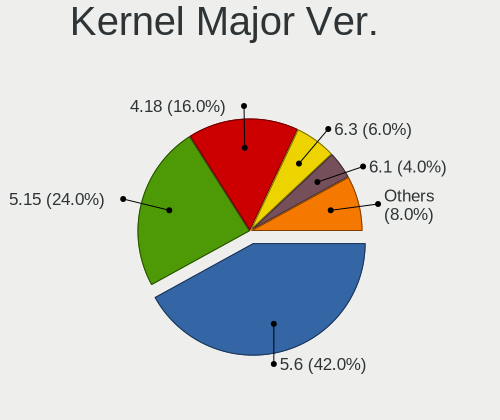

| Version | Desktops | Percent |
|---------|----------|---------|
| 5.6     | 21       | 42%     |
| 5.15    | 12       | 24%     |
| 4.18    | 8        | 16%     |
| 6.3     | 3        | 6%      |
| 6.1     | 2        | 4%      |
| 6.2     | 1        | 2%      |
| 5.4     | 1        | 2%      |
| 5.19    | 1        | 2%      |
| 5.10    | 1        | 2%      |

Arch
----

OS architecture (x86_64, i586, etc.)

| Name   | Desktops | Percent |
|--------|----------|---------|
| x86_64 | 50       | 100%    |

DE
--

Desktop Environment

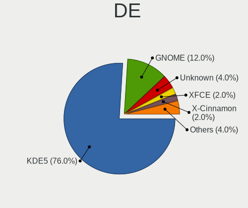

| Name       | Desktops | Percent |
|------------|----------|---------|
| KDE5       | 38       | 76%     |
| GNOME      | 6        | 12%     |
| Unknown    | 2        | 4%      |
| XFCE       | 1        | 2%      |
| X-Cinnamon | 1        | 2%      |
| MATE       | 1        | 2%      |
| LXQt       | 1        | 2%      |

Display Server
--------------

X11 or Wayland

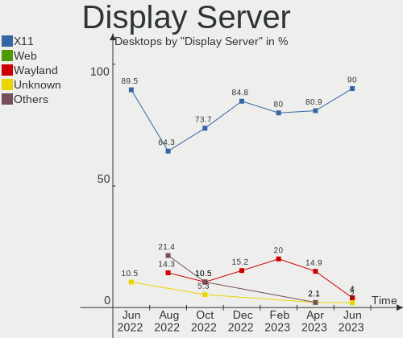

| Name    | Desktops | Percent |
|---------|----------|---------|
| X11     | 45       | 90%     |
| Web     | 2        | 4%      |
| Wayland | 2        | 4%      |
| Unknown | 1        | 2%      |

Display Manager
---------------

SDDM, LightDM, etc.

| Name    | Desktops | Percent |
|---------|----------|---------|
| SDDM    | 40       | 80%     |
| GDM     | 5        | 10%     |
| GDM3    | 2        | 4%      |
| Unknown | 2        | 4%      |
| LightDM | 1        | 2%      |

OS Lang
-------

Language

| Lang    | Desktops | Percent |
|---------|----------|---------|
| Unknown | 39       | 78%     |
| en_US   | 6        | 12%     |
| hu_HU   | 5        | 10%     |

Boot Mode
---------

EFI or BIOS

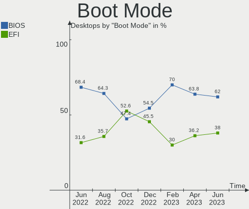

| Mode | Desktops | Percent |
|------|----------|---------|
| BIOS | 31       | 62%     |
| EFI  | 19       | 38%     |

Filesystem
----------

Type of filesystem

| Type    | Desktops | Percent |
|---------|----------|---------|
| Ext4    | 32       | 64%     |
| Overlay | 13       | 26%     |
| Xfs     | 2        | 4%      |
| Tmpfs   | 2        | 4%      |
| Btrfs   | 1        | 2%      |

Part. scheme
------------

Scheme of partitioning

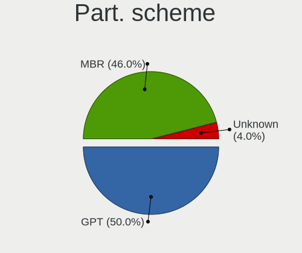

| Type    | Desktops | Percent |
|---------|----------|---------|
| GPT     | 25       | 50%     |
| MBR     | 23       | 46%     |
| Unknown | 2        | 4%      |

Dual Boot with Linux/BSD
------------------------

Hosting more than one Linux/BSD

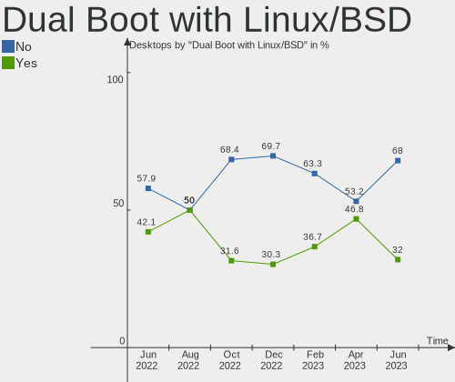

| Dual boot | Desktops | Percent |
|-----------|----------|---------|
| No        | 34       | 68%     |
| Yes       | 16       | 32%     |

Dual Boot (Win)
---------------

Hosting Linux and Windows

| Dual boot | Desktops | Percent |
|-----------|----------|---------|
| No        | 27       | 54%     |
| Yes       | 23       | 46%     |

Board
-----

Vendor
------

Motherboard manufacturer

| Name                | Desktops | Percent |
|---------------------|----------|---------|
| Gigabyte Technology | 14       | 28%     |
| Dell                | 7        | 14%     |
| ASUSTek Computer    | 7        | 14%     |
| ASRock              | 7        | 14%     |
| Fujitsu             | 5        | 10%     |
| MSI                 | 3        | 6%      |
| Hewlett-Packard     | 3        | 6%      |
| Lenovo              | 2        | 4%      |
| Fujitsu Siemens     | 2        | 4%      |

Model
-----

Motherboard model

| Name                                  | Desktops | Percent |
|---------------------------------------|----------|---------|
| Dell OptiPlex 3020                    | 4        | 8%      |
| Gigabyte G31M-ES2L                    | 2        | 4%      |
| Fujitsu ESPRIMO Q556/2                | 2        | 4%      |
| ASRock G41M-VS3                       | 2        | 4%      |
| MSI MS-7C91                           | 1        | 2%      |
| MSI MS-7693                           | 1        | 2%      |
| MSI MS-7309                           | 1        | 2%      |
| Lenovo ThinkCentre M73 10B6001SUS     | 1        | 2%      |
| Lenovo 10A8-S1WL00                    | 1        | 2%      |
| HP ProDesk 600 G1 SFF                 | 1        | 2%      |
| HP EliteDesk 705 G3 SFF               | 1        | 2%      |
| HP Compaq Pro 6300 SFF                | 1        | 2%      |
| Gigabyte Z270N-WIFI                   | 1        | 2%      |
| Gigabyte X570 GAMING X                | 1        | 2%      |
| Gigabyte P67A-D3-B3                   | 1        | 2%      |
| Gigabyte P35-S3G                      | 1        | 2%      |
| Gigabyte H77N-WIFI                    | 1        | 2%      |
| Gigabyte H110M-S2V-CF                 | 1        | 2%      |
| Gigabyte GA-880GM-D2H                 | 1        | 2%      |
| Gigabyte G41M-ES2L                    | 1        | 2%      |
| Gigabyte F2A88XM-D3HP                 | 1        | 2%      |
| Gigabyte B450M GAMING                 | 1        | 2%      |
| Gigabyte B365 M AORUS ELITE           | 1        | 2%      |
| Gigabyte AB350M-DS3H V2               | 1        | 2%      |
| Fujitsu Siemens ESPRIMO P5625         | 1        | 2%      |
| Fujitsu Siemens AMILO Desktop Pi3620A | 1        | 2%      |
| Fujitsu ESPRIMO P910                  | 1        | 2%      |
| Fujitsu ESPRIMO E7935                 | 1        | 2%      |
| Fujitsu CELSIUS M470                  | 1        | 2%      |
| Dell Precision WorkStation T5500      | 1        | 2%      |
| Dell PowerEdge T20                    | 1        | 2%      |
| Dell OptiPlex 7050                    | 1        | 2%      |
| ASUS TUF Gaming B550M-E WIFI          | 1        | 2%      |
| ASUS ROG STRIX B550-F GAMING          | 1        | 2%      |
| ASUS PRIME B365M-A                    | 1        | 2%      |
| ASUS P8Z77-V DELUXE                   | 1        | 2%      |
| ASUS M5A97 EVO R2.0                   | 1        | 2%      |
| ASUS KB053AA-ABD a6350.de             | 1        | 2%      |
| ASUS H110M-A                          | 1        | 2%      |
| ASRock X370 Gaming-ITX/ac             | 1        | 2%      |

Model Family
------------

Motherboard model prefix

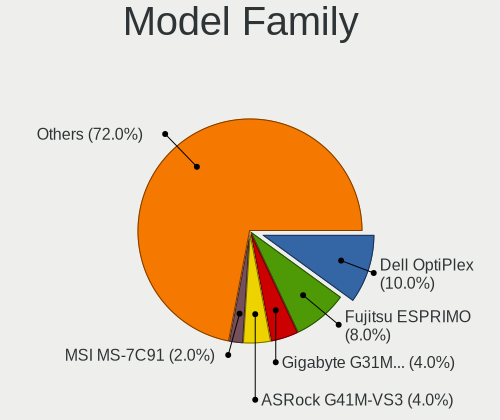

| Name                    | Desktops | Percent |
|-------------------------|----------|---------|
| Dell OptiPlex           | 5        | 10%     |
| Fujitsu ESPRIMO         | 4        | 8%      |
| Gigabyte G31M-ES2L      | 2        | 4%      |
| ASRock G41M-VS3         | 2        | 4%      |
| MSI MS-7C91             | 1        | 2%      |
| MSI MS-7693             | 1        | 2%      |
| MSI MS-7309             | 1        | 2%      |
| Lenovo ThinkCentre      | 1        | 2%      |
| Lenovo 10A8-S1WL00      | 1        | 2%      |
| HP ProDesk              | 1        | 2%      |
| HP EliteDesk            | 1        | 2%      |
| HP Compaq               | 1        | 2%      |
| Gigabyte Z270N-WIFI     | 1        | 2%      |
| Gigabyte X570           | 1        | 2%      |
| Gigabyte P67A-D3-B3     | 1        | 2%      |
| Gigabyte P35-S3G        | 1        | 2%      |
| Gigabyte H77N-WIFI      | 1        | 2%      |
| Gigabyte H110M-S2V-CF   | 1        | 2%      |
| Gigabyte GA-880GM-D2H   | 1        | 2%      |
| Gigabyte G41M-ES2L      | 1        | 2%      |
| Gigabyte F2A88XM-D3HP   | 1        | 2%      |
| Gigabyte B450M          | 1        | 2%      |
| Gigabyte B365           | 1        | 2%      |
| Gigabyte AB350M-DS3H    | 1        | 2%      |
| Fujitsu Siemens ESPRIMO | 1        | 2%      |
| Fujitsu Siemens AMILO   | 1        | 2%      |
| Fujitsu CELSIUS         | 1        | 2%      |
| Dell Precision          | 1        | 2%      |
| Dell PowerEdge          | 1        | 2%      |
| ASUS TUF                | 1        | 2%      |
| ASUS ROG                | 1        | 2%      |
| ASUS PRIME              | 1        | 2%      |
| ASUS P8Z77-V            | 1        | 2%      |
| ASUS M5A97              | 1        | 2%      |
| ASUS KB053AA-ABD        | 1        | 2%      |
| ASUS H110M-A            | 1        | 2%      |
| ASRock X370             | 1        | 2%      |
| ASRock J4125-ITX        | 1        | 2%      |
| ASRock FM2A75M          | 1        | 2%      |
| ASRock B85M-HDS         | 1        | 2%      |

MFG Year
--------

Motherboard manufacture year

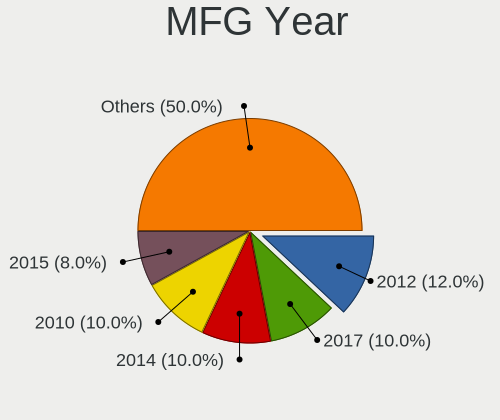

| Year | Desktops | Percent |
|------|----------|---------|
| 2012 | 6        | 12%     |
| 2017 | 5        | 10%     |
| 2014 | 5        | 10%     |
| 2010 | 5        | 10%     |
| 2015 | 4        | 8%      |
| 2008 | 4        | 8%      |
| 2019 | 3        | 6%      |
| 2018 | 3        | 6%      |
| 2021 | 2        | 4%      |
| 2020 | 2        | 4%      |
| 2016 | 2        | 4%      |
| 2013 | 2        | 4%      |
| 2011 | 2        | 4%      |
| 2007 | 2        | 4%      |
| 2023 | 1        | 2%      |
| 2009 | 1        | 2%      |
| 2006 | 1        | 2%      |

Form Factor
-----------

Physical design of the computer

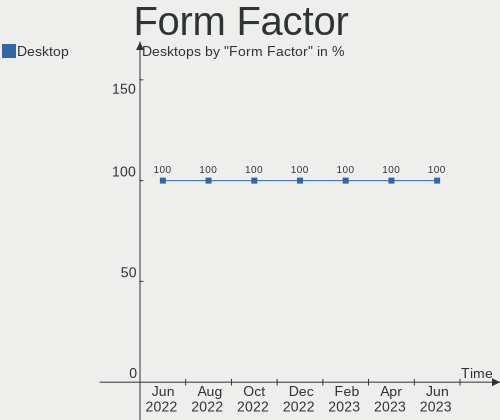

| Name    | Desktops | Percent |
|---------|----------|---------|
| Desktop | 50       | 100%    |

Secure Boot
-----------

Enabled or disabled

| State    | Desktops | Percent |
|----------|----------|---------|
| Disabled | 50       | 100%    |

Coreboot
--------

Have coreboot on board

| Used | Desktops | Percent |
|------|----------|---------|
| No   | 50       | 100%    |

RAM Size
--------

Total RAM memory

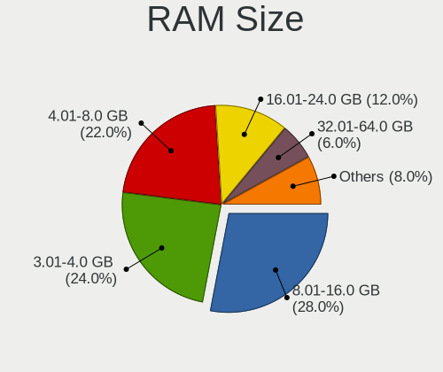

| Size in GB  | Desktops | Percent |
|-------------|----------|---------|
| 8.01-16.0   | 14       | 28%     |
| 3.01-4.0    | 12       | 24%     |
| 4.01-8.0    | 11       | 22%     |
| 16.01-24.0  | 6        | 12%     |
| 32.01-64.0  | 3        | 6%      |
| 1.01-2.0    | 3        | 6%      |
| 64.01-256.0 | 1        | 2%      |

RAM Used
--------

Used RAM memory

| Used GB    | Desktops | Percent |
|------------|----------|---------|
| 1.01-2.0   | 18       | 36%     |
| 0.51-1.0   | 17       | 34%     |
| 3.01-4.0   | 4        | 8%      |
| 2.01-3.0   | 4        | 8%      |
| 0.01-0.5   | 3        | 6%      |
| 4.01-8.0   | 2        | 4%      |
| 16.01-24.0 | 1        | 2%      |
| 8.01-16.0  | 1        | 2%      |

Total Drives
------------

Number of drives on board

| Drives | Desktops | Percent |
|--------|----------|---------|
| 1      | 22       | 44%     |
| 2      | 16       | 32%     |
| 3      | 4        | 8%      |
| 4      | 3        | 6%      |
| 5      | 2        | 4%      |
| 9      | 1        | 2%      |
| 8      | 1        | 2%      |
| 0      | 1        | 2%      |

Has CD-ROM
----------

Has CD-ROM on board

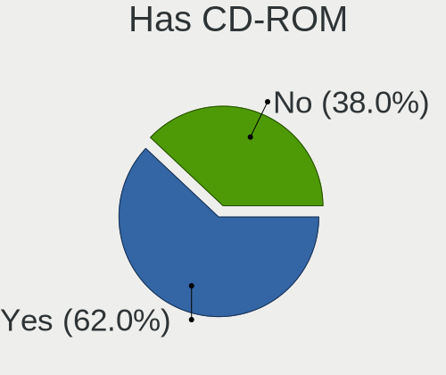

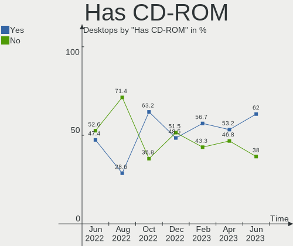

| Presented | Desktops | Percent |
|-----------|----------|---------|
| Yes       | 31       | 62%     |
| No        | 19       | 38%     |

Has Ethernet
------------

Has Ethernet on board

| Presented | Desktops | Percent |
|-----------|----------|---------|
| Yes       | 50       | 100%    |

Has WiFi
--------

Has WiFi module

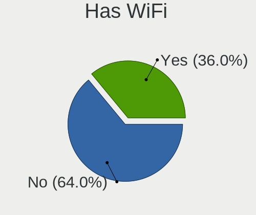

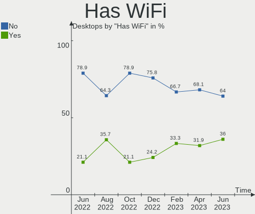

| Presented | Desktops | Percent |
|-----------|----------|---------|
| No        | 32       | 64%     |
| Yes       | 18       | 36%     |

Has Bluetooth
-------------

Has Bluetooth module

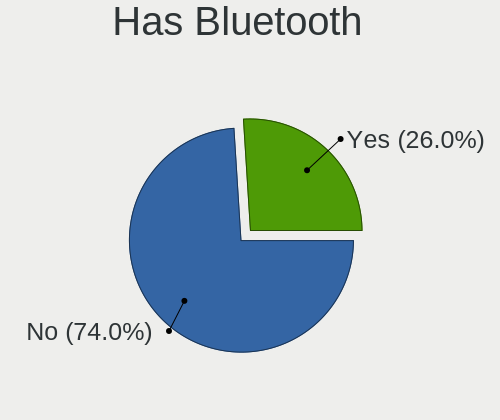

| Presented | Desktops | Percent |
|-----------|----------|---------|
| No        | 37       | 74%     |
| Yes       | 13       | 26%     |

Location
--------

Country
-------

Geographic location (country)

| Country | Desktops | Percent |
|---------|----------|---------|
| Hungary | 50       | 100%    |

City
----

Geographic location (city)

| City              | Desktops | Percent |
|-------------------|----------|---------|
| Budapest          | 14       | 28%     |
| Hajduboszormeny   | 3        | 6%      |
| Zalaegerszeg      | 2        | 4%      |
| Szolnok           | 2        | 4%      |
| Szekszárd        | 2        | 4%      |
| Sarbogard         | 2        | 4%      |
| Karcag            | 2        | 4%      |
| Debrecen          | 2        | 4%      |
| Baja              | 2        | 4%      |
| Tatabánya        | 1        | 2%      |
| Tapiobicske       | 1        | 2%      |
| Tamasi            | 1        | 2%      |
| Szigetujfalu      | 1        | 2%      |
| Szigetszentmiklos | 1        | 2%      |
| Szentendre        | 1        | 2%      |
| Pécs             | 1        | 2%      |
| Oroshaza          | 1        | 2%      |
| Obarok            | 1        | 2%      |
| Nick              | 1        | 2%      |
| Mezotur           | 1        | 2%      |
| Kiskunhalas       | 1        | 2%      |
| Kiskoros          | 1        | 2%      |
| Jaszapati         | 1        | 2%      |
| Hodmezovasarhely  | 1        | 2%      |
| Fertoszentmiklos  | 1        | 2%      |
| Felsopakony       | 1        | 2%      |
| Berettyóújfalu  | 1        | 2%      |
| Abasar            | 1        | 2%      |

Drives
------

Drive Vendor
------------

Hard drive vendors

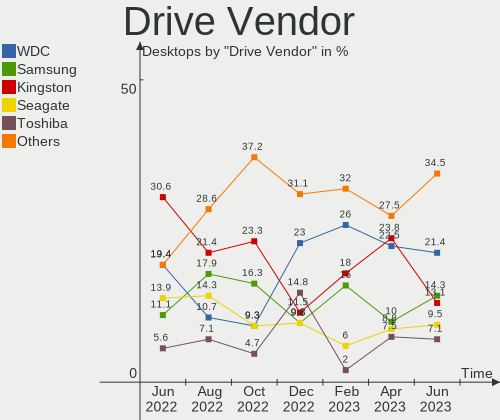

| Vendor                      | Desktops | Drives | Percent |
|-----------------------------|----------|--------|---------|
| WDC                         | 18       | 35     | 21.43%  |
| Samsung Electronics         | 12       | 18     | 14.29%  |
| Kingston                    | 11       | 11     | 13.1%   |
| Seagate                     | 8        | 9      | 9.52%   |
| Toshiba                     | 6        | 6      | 7.14%   |
| Patriot                     | 3        | 3      | 3.57%   |
| HGST                        | 3        | 3      | 3.57%   |
| A-DATA Technology           | 3        | 3      | 3.57%   |
| SPCC                        | 2        | 2      | 2.38%   |
| SanDisk                     | 2        | 2      | 2.38%   |
| Micron Technology           | 2        | 2      | 2.38%   |
| Hitachi                     | 2        | 2      | 2.38%   |
| Zheino                      | 1        | 1      | 1.19%   |
| Phison Electronics          | 1        | 1      | 1.19%   |
| OCZ                         | 1        | 1      | 1.19%   |
| LITEON                      | 1        | 1      | 1.19%   |
| Kingston Technology Company | 1        | 1      | 1.19%   |
| Kingmax                     | 1        | 1      | 1.19%   |
| JMicron Technology          | 1        | 1      | 1.19%   |
| Intel                       | 1        | 1      | 1.19%   |
| GOODRAM                     | 1        | 1      | 1.19%   |
| Gigabyte Technology         | 1        | 1      | 1.19%   |
| Dell                        | 1        | 1      | 1.19%   |
| Crucial                     | 1        | 1      | 1.19%   |

Drive Model
-----------

Hard drive models

| Model                               | Desktops | Percent |
|-------------------------------------|----------|---------|
| Seagate ST500DM002-1BD142 500GB     | 5        | 4.76%   |
| Toshiba DT01ACA100 1TB              | 3        | 2.86%   |
| Samsung SSD 860 EVO 500GB           | 3        | 2.86%   |
| Kingston SUV400S37120G 120GB SSD    | 3        | 2.86%   |
| WDC WD30EFRX-68EUZN0 3TB            | 2        | 1.9%    |
| WDC WD20EZRZ-00Z5HB0 2TB            | 2        | 1.9%    |
| Samsung SSD 850 EVO 250GB           | 2        | 1.9%    |
| Samsung SSD 830 Series 64GB         | 2        | 1.9%    |
| Micron 1100_MTFDDAK256TBN 256GB SSD | 2        | 1.9%    |
| Kingston SA400S37480G 480GB SSD     | 2        | 1.9%    |
| Kingston SA400S37240G 240GB SSD     | 2        | 1.9%    |
| Hitachi HTS545050B9A300 500GB       | 2        | 1.9%    |
| HGST HTS541010B7E610 1TB            | 2        | 1.9%    |
| Zheino CHN-NGFFNV2280-256 256GB     | 1        | 0.95%   |
| WDC WDS500G3X0C-00SJG0 500GB        | 1        | 0.95%   |
| WDC WDS240G2G0B-00EPW0 240GB SSD    | 1        | 0.95%   |
| WDC WD800JD-75MSA3 80GB             | 1        | 0.95%   |
| WDC WD6400AAKS-07A7B0 640GB         | 1        | 0.95%   |
| WDC WD5003AZEX-00MK2A0 500GB        | 1        | 0.95%   |
| WDC WD5000BPKT-75PK4T0 500GB        | 1        | 0.95%   |
| WDC WD5000AAKX-221CA1 500GB         | 1        | 0.95%   |
| WDC WD5000AAKS-65YGA0 500GB         | 1        | 0.95%   |
| WDC WD5000AAKS-00UU3A0 500GB        | 1        | 0.95%   |
| WDC WD5000AACS-00G8B1 500GB         | 1        | 0.95%   |
| WDC WD40PURZ-85AKKY0 4TB            | 1        | 0.95%   |
| WDC WD40EFRX-68N32N0 4TB            | 1        | 0.95%   |
| WDC WD4000FYYZ-01UL1B2 4TB          | 1        | 0.95%   |
| WDC WD4000FYYZ-01UL1B1 4TB          | 1        | 0.95%   |
| WDC WD30PURX-64P6ZY0 3TB            | 1        | 0.95%   |
| WDC WD30EZRZ-00GXCB0 3TB            | 1        | 0.95%   |
| WDC WD30EZRX-00DC0B0 3TB            | 1        | 0.95%   |
| WDC WD20PURZ-85GU6Y0 2TB            | 1        | 0.95%   |
| WDC WD20PURZ-85AKKY0 2TB            | 1        | 0.95%   |
| WDC WD20PURX-64PFUY0 2TB            | 1        | 0.95%   |
| WDC WD20EZRX-00D8PB0 2TB            | 1        | 0.95%   |
| WDC WD20EFRX-68EUZN0 2TB            | 1        | 0.95%   |
| WDC WD15EARX-00PASB0 1TB            | 1        | 0.95%   |
| WDC WD15EARS-00MVWB0 1TB            | 1        | 0.95%   |
| WDC WD10SPZX-22Z10T0 1TB            | 1        | 0.95%   |
| WDC WD10PURZ-85U8XY0 1TB            | 1        | 0.95%   |

HDD Vendor
----------

Hard disk drive vendors

| Vendor              | Desktops | Drives | Percent |
|---------------------|----------|--------|---------|
| WDC                 | 17       | 33     | 41.46%  |
| Seagate             | 8        | 9      | 19.51%  |
| Toshiba             | 6        | 6      | 14.63%  |
| Samsung Electronics | 4        | 4      | 9.76%   |
| HGST                | 3        | 3      | 7.32%   |
| Hitachi             | 2        | 2      | 4.88%   |
| Dell                | 1        | 1      | 2.44%   |

SSD Vendor
----------

Solid state drive vendors

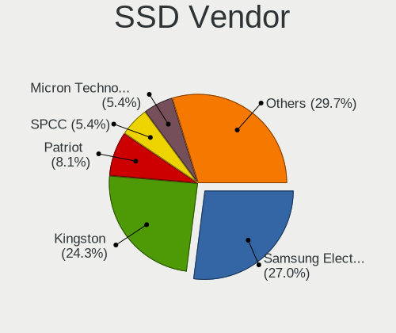

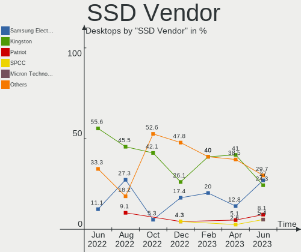

| Vendor              | Desktops | Drives | Percent |
|---------------------|----------|--------|---------|
| Samsung Electronics | 10       | 12     | 27.03%  |
| Kingston            | 9        | 9      | 24.32%  |
| Patriot             | 3        | 3      | 8.11%   |
| SPCC                | 2        | 2      | 5.41%   |
| Micron Technology   | 2        | 2      | 5.41%   |
| A-DATA Technology   | 2        | 2      | 5.41%   |
| WDC                 | 1        | 1      | 2.7%    |
| SanDisk             | 1        | 1      | 2.7%    |
| OCZ                 | 1        | 1      | 2.7%    |
| LITEON              | 1        | 1      | 2.7%    |
| Kingmax             | 1        | 1      | 2.7%    |
| Intel               | 1        | 1      | 2.7%    |
| GOODRAM             | 1        | 1      | 2.7%    |
| Gigabyte Technology | 1        | 1      | 2.7%    |
| Crucial             | 1        | 1      | 2.7%    |

Drive Kind
----------

HDD or SSD

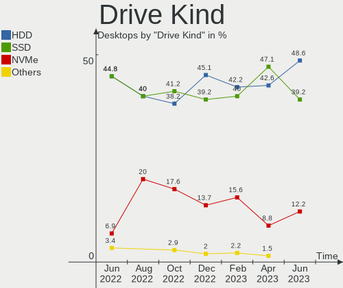

| Kind | Desktops | Drives | Percent |
|------|----------|--------|---------|
| HDD  | 36       | 58     | 48.65%  |
| SSD  | 29       | 39     | 39.19%  |
| NVMe | 9        | 11     | 12.16%  |

Drive Connector
---------------

SATA, SAS, NVMe, etc.

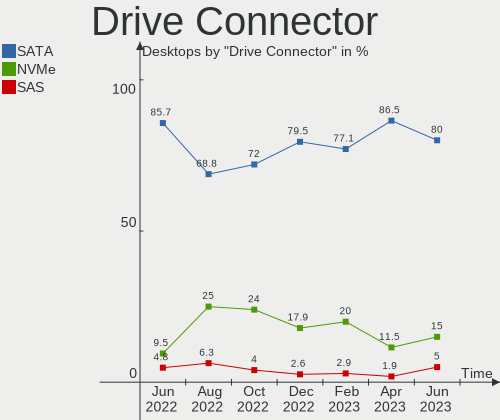

| Type | Desktops | Drives | Percent |
|------|----------|--------|---------|
| SATA | 48       | 95     | 80%     |
| NVMe | 9        | 10     | 15%     |
| SAS  | 3        | 3      | 5%      |

Drive Size
----------

Size of hard drive

| Size in TB | Desktops | Drives | Percent |
|------------|----------|--------|---------|
| 0.01-0.5   | 40       | 53     | 57.97%  |
| 0.51-1.0   | 19       | 21     | 27.54%  |
| 2.01-3.0   | 4        | 6      | 5.8%    |
| 1.01-2.0   | 3        | 9      | 4.35%   |
| 3.01-4.0   | 2        | 7      | 2.9%    |
| 4.01-10.0  | 1        | 1      | 1.45%   |

Space Total
-----------

Amount of disk space available on the file system

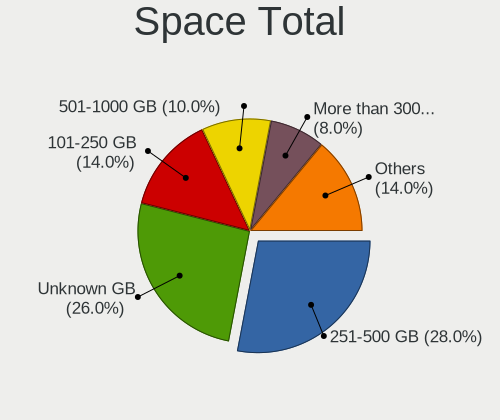

| Size in GB     | Desktops | Percent |
|----------------|----------|---------|
| 251-500        | 14       | 28%     |
| Unknown        | 13       | 26%     |
| 101-250        | 7        | 14%     |
| 501-1000       | 5        | 10%     |
| More than 3000 | 4        | 8%      |
| 51-100         | 3        | 6%      |
| 1001-2000      | 2        | 4%      |
| 21-50          | 1        | 2%      |
| 1-20           | 1        | 2%      |

Space Used
----------

Amount of used disk space

| Used GB        | Desktops | Percent |
|----------------|----------|---------|
| Unknown        | 13       | 26%     |
| 1-20           | 12       | 24%     |
| 51-100         | 7        | 14%     |
| 21-50          | 6        | 12%     |
| 251-500        | 3        | 6%      |
| More than 3000 | 2        | 4%      |
| 101-250        | 2        | 4%      |
| 1001-2000      | 2        | 4%      |
| 501-1000       | 2        | 4%      |
| 2001-3000      | 1        | 2%      |

Malfunc. Drives
---------------

Drive models with a malfunction

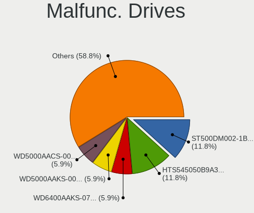

| Model                             | Desktops | Drives | Percent |
|-----------------------------------|----------|--------|---------|
| Seagate ST500DM002-1BD142 500GB   | 2        | 2      | 11.76%  |
| Hitachi HTS545050B9A300 500GB     | 2        | 2      | 11.76%  |
| WDC WD6400AAKS-07A7B0 640GB       | 1        | 1      | 5.88%   |
| WDC WD5000AAKS-00UU3A0 500GB      | 1        | 1      | 5.88%   |
| WDC WD5000AACS-00G8B1 500GB       | 1        | 1      | 5.88%   |
| WDC WD30EFRX-68EUZN0 3TB          | 1        | 1      | 5.88%   |
| WDC WD20PURX-64PFUY0 2TB          | 1        | 1      | 5.88%   |
| WDC WD20EFRX-68EUZN0 2TB          | 1        | 1      | 5.88%   |
| WDC WD15EARS-00MVWB0 1TB          | 1        | 1      | 5.88%   |
| WDC WD10PURZ-85U8XY0 1TB          | 1        | 1      | 5.88%   |
| Toshiba DT01ACA050 500GB          | 1        | 1      | 5.88%   |
| Seagate ST500LT012-9WS142 500GB   | 1        | 1      | 5.88%   |
| Samsung Electronics HD103UJ 1TB   | 1        | 1      | 5.88%   |
| Intel SSDSC2KF240H6L 240GB        | 1        | 1      | 5.88%   |
| A-DATA Technology SU630 240GB SSD | 1        | 1      | 5.88%   |

Malfunc. Drive Vendor
---------------------

Vendors of faulty drives

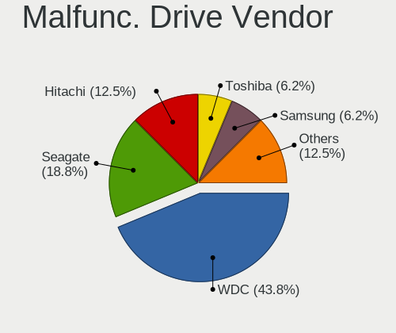

| Vendor              | Desktops | Drives | Percent |
|---------------------|----------|--------|---------|
| WDC                 | 7        | 8      | 43.75%  |
| Seagate             | 3        | 3      | 18.75%  |
| Hitachi             | 2        | 2      | 12.5%   |
| Toshiba             | 1        | 1      | 6.25%   |
| Samsung Electronics | 1        | 1      | 6.25%   |
| Intel               | 1        | 1      | 6.25%   |
| A-DATA Technology   | 1        | 1      | 6.25%   |

Malfunc. HDD Vendor
-------------------

Vendors of faulty HDD drives

| Vendor              | Desktops | Drives | Percent |
|---------------------|----------|--------|---------|
| WDC                 | 7        | 8      | 50%     |
| Seagate             | 3        | 3      | 21.43%  |
| Hitachi             | 2        | 2      | 14.29%  |
| Toshiba             | 1        | 1      | 7.14%   |
| Samsung Electronics | 1        | 1      | 7.14%   |

Malfunc. Drive Kind
-------------------

Kinds of faulty drives

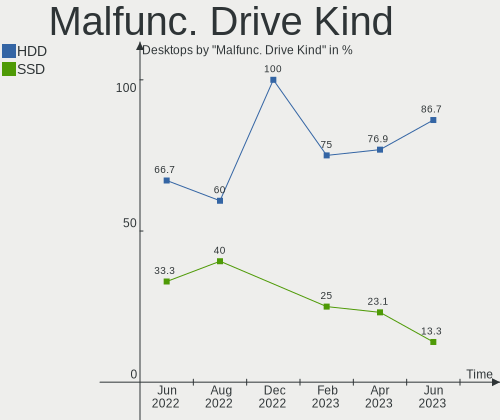

| Kind | Desktops | Drives | Percent |
|------|----------|--------|---------|
| HDD  | 13       | 15     | 86.67%  |
| SSD  | 2        | 2      | 13.33%  |

Failed Drives
-------------

Failed drive models

Zero info for selected period =(

Failed Drive Vendor
-------------------

Failed drive vendors

Zero info for selected period =(

Drive Status
------------

Number of failed and malfunc. drives

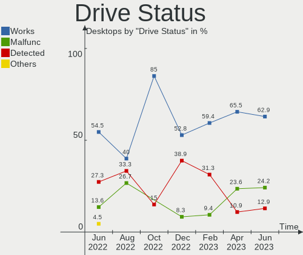

| Status   | Desktops | Drives | Percent |
|----------|----------|--------|---------|
| Works    | 39       | 82     | 62.9%   |
| Malfunc  | 15       | 17     | 24.19%  |
| Detected | 8        | 9      | 12.9%   |

Storage controller
------------------

Storage Vendor
--------------

Storage controller vendors

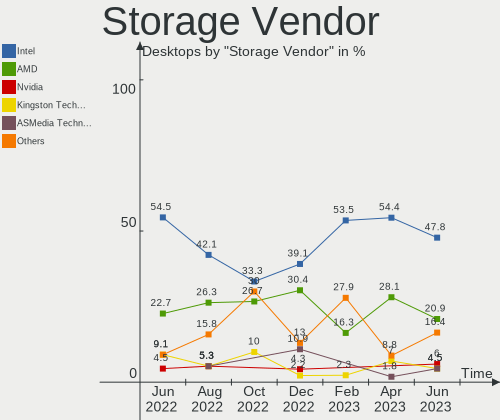

| Vendor                      | Desktops | Percent |
|-----------------------------|----------|---------|
| Intel                       | 32       | 47.76%  |
| AMD                         | 14       | 20.9%   |
| Nvidia                      | 4        | 5.97%   |
| Kingston Technology Company | 3        | 4.48%   |
| ASMedia Technology          | 3        | 4.48%   |
| Silicon Motion              | 2        | 2.99%   |
| Silicon Image               | 2        | 2.99%   |
| Samsung Electronics         | 2        | 2.99%   |
| SanDisk                     | 1        | 1.49%   |
| Phison Electronics          | 1        | 1.49%   |
| Marvell Technology Group    | 1        | 1.49%   |
| LSI Logic / Symbios Logic   | 1        | 1.49%   |
| JMicron Technology          | 1        | 1.49%   |

Storage Model
-------------

Storage controller models

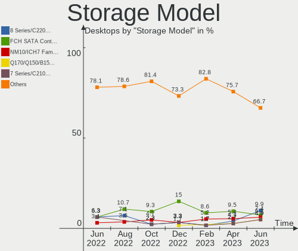

| Model                                                                                   | Desktops | Percent |
|-----------------------------------------------------------------------------------------|----------|---------|
| Intel 8 Series/C220 Series Chipset Family 6-port SATA Controller 1 [AHCI mode]          | 8        | 9.88%   |
| AMD FCH SATA Controller [AHCI mode]                                                     | 6        | 7.41%   |
| Intel NM10/ICH7 Family SATA Controller [IDE mode]                                       | 5        | 6.17%   |
| Intel Q170/Q150/B150/H170/H110/Z170/CM236 Chipset SATA Controller [AHCI Mode]           | 4        | 4.94%   |
| Intel 7 Series/C210 Series Chipset Family 6-port SATA Controller [AHCI mode]            | 4        | 4.94%   |
| Intel 200 Series PCH SATA controller [AHCI mode]                                        | 4        | 4.94%   |
| AMD 500 Series Chipset SATA Controller                                                  | 4        | 4.94%   |
| ASMedia ASM1062 Serial ATA Controller                                                   | 3        | 3.7%    |
| Nvidia MCP61 SATA Controller                                                            | 2        | 2.47%   |
| Nvidia MCP61 IDE                                                                        | 2        | 2.47%   |
| Kingston Company A2000 NVMe SSD                                                         | 2        | 2.47%   |
| Intel SATA Controller [RAID mode]                                                       | 2        | 2.47%   |
| Intel 82801G (ICH7 Family) IDE Controller                                               | 2        | 2.47%   |
| AMD SB7x0/SB8x0/SB9x0 SATA Controller [IDE mode]                                        | 2        | 2.47%   |
| AMD SB7x0/SB8x0/SB9x0 IDE Controller                                                    | 2        | 2.47%   |
| AMD 300 Series Chipset SATA Controller                                                  | 2        | 2.47%   |
| Silicon Motion SM2263EN/SM2263XT SSD Controller                                         | 1        | 1.23%   |
| Silicon Motion Non-Volatile memory controller                                           | 1        | 1.23%   |
| Silicon Image SiI 3512 [SATALink/SATARaid] Serial ATA Controller                        | 1        | 1.23%   |
| Silicon Image SiI 3132 Serial ATA Raid II Controller                                    | 1        | 1.23%   |
| SanDisk WD Black SN750 / PC SN730 NVMe SSD                                              | 1        | 1.23%   |
| SanDisk Non-Volatile memory controller                                                  | 1        | 1.23%   |
| Samsung NVMe SSD Controller SM981/PM981/PM983                                           | 1        | 1.23%   |
| Samsung NVMe SSD Controller 980                                                         | 1        | 1.23%   |
| Phison E12 NVMe Controller                                                              | 1        | 1.23%   |
| Nvidia MCP78S [GeForce 8200] AHCI Controller                                            | 1        | 1.23%   |
| Nvidia MCP73 SATA Controller (IDE mode)                                                 | 1        | 1.23%   |
| Marvell Group 88SE9128 PCIe SATA 6 Gb/s RAID controller with HyperDuo                   | 1        | 1.23%   |
| LSI Logic / Symbios Logic SAS2008 PCI-Express Fusion-MPT SAS-2 [Falcon]                 | 1        | 1.23%   |
| Kingston Company SNVS2000G [NV1 NVMe PCIe SSD 2TB]                                      | 1        | 1.23%   |
| JMicron JMB368 IDE controller                                                           | 1        | 1.23%   |
| Intel Celeron/Pentium Silver Processor SATA Controller                                  | 1        | 1.23%   |
| Intel 82801JI (ICH10 Family) SATA AHCI Controller                                       | 1        | 1.23%   |
| Intel 82801JD/DO (ICH10 Family) 4-port SATA IDE Controller                              | 1        | 1.23%   |
| Intel 82801JD/DO (ICH10 Family) 2-port SATA IDE Controller                              | 1        | 1.23%   |
| Intel 82801IB (ICH9) 4 port SATA Controller [AHCI mode]                                 | 1        | 1.23%   |
| Intel 6 Series/C200 Series Chipset Family Desktop SATA Controller (IDE mode, ports 4-5) | 1        | 1.23%   |
| Intel 6 Series/C200 Series Chipset Family Desktop SATA Controller (IDE mode, ports 0-3) | 1        | 1.23%   |
| Intel 4 Series Chipset PT IDER Controller                                               | 1        | 1.23%   |
| AMD X370 Series Chipset SATA Controller                                                 | 1        | 1.23%   |

Storage Kind
------------

Kind of storage controller (IDE, SATA, NVMe, SAS, ...)

| Kind | Desktops | Percent |
|------|----------|---------|
| SATA | 38       | 57.58%  |
| IDE  | 14       | 21.21%  |
| NVMe | 9        | 13.64%  |
| RAID | 4        | 6.06%   |
| SAS  | 1        | 1.52%   |

Processor
---------

CPU Vendor
----------

Processor vendors

| Vendor | Desktops | Percent |
|--------|----------|---------|
| Intel  | 33       | 66%     |
| AMD    | 17       | 34%     |

CPU Model
---------

Processor models

| Model                                       | Desktops | Percent |
|---------------------------------------------|----------|---------|
| Intel Core i3-4160 CPU @ 3.60GHz            | 5        | 10%     |
| Intel Core i3-6100T CPU @ 3.20GHz           | 2        | 4%      |
| AMD Ryzen 5 3400G with Radeon Vega Graphics | 2        | 4%      |
| AMD FX-6300 Six-Core Processor              | 2        | 4%      |
| Intel Xeon CPU W3550 @ 3.07GHz              | 1        | 2%      |
| Intel Xeon CPU E5530 @ 2.40GHz              | 1        | 2%      |
| Intel Xeon CPU E31260L @ 2.40GHz            | 1        | 2%      |
| Intel Xeon CPU E3-1225 v3 @ 3.20GHz         | 1        | 2%      |
| Intel Pentium Dual-Core CPU E5400 @ 2.70GHz | 1        | 2%      |
| Intel Core i7-7700K CPU @ 4.20GHz           | 1        | 2%      |
| Intel Core i7-4770K CPU @ 3.50GHz           | 1        | 2%      |
| Intel Core i7-2700K CPU @ 3.50GHz           | 1        | 2%      |
| Intel Core i5-6600 CPU @ 3.30GHz            | 1        | 2%      |
| Intel Core i5-6500 CPU @ 3.20GHz            | 1        | 2%      |
| Intel Core i5-4590 CPU @ 3.30GHz            | 1        | 2%      |
| Intel Core i5-4570 CPU @ 3.20GHz            | 1        | 2%      |
| Intel Core i5-3470 CPU @ 3.20GHz            | 1        | 2%      |
| Intel Core i5-2300 CPU @ 2.80GHz            | 1        | 2%      |
| Intel Core i3-9100 CPU @ 3.60GHz            | 1        | 2%      |
| Intel Core i3-8100 CPU @ 3.60GHz            | 1        | 2%      |
| Intel Core i3-6100 CPU @ 3.70GHz            | 1        | 2%      |
| Intel Core i3-3225 CPU @ 3.30GHz            | 1        | 2%      |
| Intel Core 2 Quad CPU Q8200 @ 2.33GHz       | 1        | 2%      |
| Intel Core 2 Duo CPU E8500 @ 3.16GHz        | 1        | 2%      |
| Intel Core 2 Duo CPU E8400 @ 3.00GHz        | 1        | 2%      |
| Intel Core 2 Duo CPU E7500 @ 2.93GHz        | 1        | 2%      |
| Intel Core 2 Duo CPU E4600 @ 2.40GHz        | 1        | 2%      |
| Intel Core 2 CPU 4300 @ 1.80GHz             | 1        | 2%      |
| Intel Celeron J4125 CPU @ 2.00GHz           | 1        | 2%      |
| Intel Celeron CPU 420 @ 1.60GHz             | 1        | 2%      |
| AMD Ryzen 7 PRO 4750G with Radeon Graphics  | 1        | 2%      |
| AMD Ryzen 7 5800X 8-Core Processor          | 1        | 2%      |
| AMD Ryzen 7 5700X 8-Core Processor          | 1        | 2%      |
| AMD Ryzen 5 3600X 6-Core Processor          | 1        | 2%      |
| AMD Ryzen 5 2600 Six-Core Processor         | 1        | 2%      |
| AMD Ryzen 3 4100 4-Core Processor           | 1        | 2%      |
| AMD PRO A6-9500 R5, 8 COMPUTE CORES 2C+6G   | 1        | 2%      |
| AMD Athlon II X2 260 Processor              | 1        | 2%      |
| AMD Athlon Dual Core Processor 5000B        | 1        | 2%      |
| AMD Athlon 64 X2 Dual Core Processor 6000+  | 1        | 2%      |

CPU Model Family
----------------

Processor model prefix

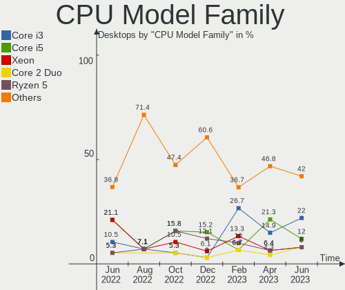

| Model                   | Desktops | Percent |
|-------------------------|----------|---------|
| Intel Core i3           | 11       | 22%     |
| Intel Core i5           | 6        | 12%     |
| Intel Xeon              | 4        | 8%      |
| Intel Core 2 Duo        | 4        | 8%      |
| AMD Ryzen 5             | 4        | 8%      |
| Intel Core i7           | 3        | 6%      |
| Intel Celeron           | 2        | 4%      |
| AMD Ryzen 7             | 2        | 4%      |
| AMD FX                  | 2        | 4%      |
| Other                   | 1        | 2%      |
| Intel Pentium Dual-Core | 1        | 2%      |
| Intel Core 2 Quad       | 1        | 2%      |
| Intel Core 2            | 1        | 2%      |
| AMD Ryzen 7 PRO         | 1        | 2%      |
| AMD Ryzen 3             | 1        | 2%      |
| AMD Athlon II X2        | 1        | 2%      |
| AMD Athlon Dual Core    | 1        | 2%      |
| AMD Athlon 64 X2        | 1        | 2%      |
| AMD Athlon 64           | 1        | 2%      |
| AMD A8                  | 1        | 2%      |
| AMD A10                 | 1        | 2%      |

CPU Cores
---------

Number of processor cores

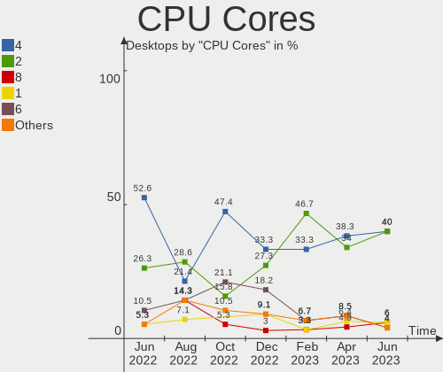

| Number | Desktops | Percent |
|--------|----------|---------|
| 4      | 20       | 40%     |
| 2      | 20       | 40%     |
| 8      | 3        | 6%      |
| 1      | 3        | 6%      |
| 6      | 2        | 4%      |
| 3      | 2        | 4%      |

CPU Sockets
-----------

Number of sockets

| Number | Desktops | Percent |
|--------|----------|---------|
| 1      | 50       | 100%    |

CPU Threads
-----------

Threads per core (Hyper-Threading)

| Number | Desktops | Percent |
|--------|----------|---------|
| 2      | 27       | 54%     |
| 1      | 23       | 46%     |

CPU Op-Modes
------------

CPU Operation Modes (32-bit, 64-bit)

| Op mode        | Desktops | Percent |
|----------------|----------|---------|
| 32-bit, 64-bit | 50       | 100%    |

CPU Microcode
-------------

Microcode number

| Number     | Desktops | Percent |
|------------|----------|---------|
| 0x306c3    | 8        | 16%     |
| Unknown    | 8        | 16%     |
| 0x1067a    | 4        | 8%      |
| 0x506e3    | 3        | 6%      |
| 0x206a7    | 3        | 6%      |
| 0x906eb    | 2        | 4%      |
| 0x306a9    | 2        | 4%      |
| 0x106a5    | 2        | 4%      |
| 0x0a20120a | 2        | 4%      |
| 0x08600109 | 2        | 4%      |
| 0x08108109 | 2        | 4%      |
| 0x906e9    | 1        | 2%      |
| 0x6fd      | 1        | 2%      |
| 0x6f2      | 1        | 2%      |
| 0x10677    | 1        | 2%      |
| 0x10661    | 1        | 2%      |
| 0x08701021 | 1        | 2%      |
| 0x0800820d | 1        | 2%      |
| 0x0600611a | 1        | 2%      |
| 0x06003106 | 1        | 2%      |
| 0x06001119 | 1        | 2%      |
| 0x06000852 | 1        | 2%      |
| 0x010000c8 | 1        | 2%      |

CPU Microarch
-------------

Microarchitecture

| Name          | Desktops | Percent |
|---------------|----------|---------|
| Haswell       | 9        | 18%     |
| Skylake       | 5        | 10%     |
| Penryn        | 5        | 10%     |
| Zen+          | 3        | 6%      |
| Zen 2         | 3        | 6%      |
| SandyBridge   | 3        | 6%      |
| Piledriver    | 3        | 6%      |
| KabyLake      | 3        | 6%      |
| K8 Hammer     | 3        | 6%      |
| Core          | 3        | 6%      |
| Zen 3         | 2        | 4%      |
| Nehalem       | 2        | 4%      |
| IvyBridge     | 2        | 4%      |
| Steamroller   | 1        | 2%      |
| K10           | 1        | 2%      |
| Goldmont plus | 1        | 2%      |
| Excavator     | 1        | 2%      |

Graphics
--------

GPU Vendor
----------

Vendors of graphics cards

| Vendor | Desktops | Percent |
|--------|----------|---------|
| Intel  | 21       | 41.18%  |
| Nvidia | 18       | 35.29%  |
| AMD    | 12       | 23.53%  |

GPU Model
---------

Graphics card models

| Model                                                                       | Desktops | Percent |
|-----------------------------------------------------------------------------|----------|---------|
| Intel 4th Generation Core Processor Family Integrated Graphics Controller   | 5        | 9.43%   |
| Intel HD Graphics 530                                                       | 4        | 7.55%   |
| Nvidia GK208B [GeForce GT 710]                                              | 3        | 5.66%   |
| Nvidia GM107 [GeForce GTX 750 Ti]                                           | 2        | 3.77%   |
| Intel Xeon E3-1200 v3/4th Gen Core Processor Integrated Graphics Controller | 2        | 3.77%   |
| Intel CoffeeLake-S GT2 [UHD Graphics 630]                                   | 2        | 3.77%   |
| Intel 4 Series Chipset Integrated Graphics Controller                       | 2        | 3.77%   |
| AMD Cedar [Radeon HD 5000/6000/7350/8350 Series]                            | 2        | 3.77%   |
| Nvidia TU117 [GeForce GTX 1650]                                             | 1        | 1.89%   |
| Nvidia TU116 [GeForce GTX 1660 Ti]                                          | 1        | 1.89%   |
| Nvidia TU116 [GeForce GTX 1660 SUPER]                                       | 1        | 1.89%   |
| Nvidia GT218 [GeForce 210]                                                  | 1        | 1.89%   |
| Nvidia GP108 [GeForce GT 1030]                                              | 1        | 1.89%   |
| Nvidia GK208B [GeForce GT 720]                                              | 1        | 1.89%   |
| Nvidia GK106GL [Quadro K4000]                                               | 1        | 1.89%   |
| Nvidia GF116 [GeForce GTX 550 Ti]                                           | 1        | 1.89%   |
| Nvidia GA106 [Geforce RTX 3050]                                             | 1        | 1.89%   |
| Nvidia G98 [GeForce 8400]                                                   | 1        | 1.89%   |
| Nvidia G96CGL [Quadro FX 580]                                               | 1        | 1.89%   |
| Nvidia G96C [GeForce 9500 GT]                                               | 1        | 1.89%   |
| Nvidia G96 [GeForce 9500 GS]                                                | 1        | 1.89%   |
| Nvidia G94 [GeForce 9600 GT]                                                | 1        | 1.89%   |
| Intel Xeon E3-1200 v3 Processor Integrated Graphics Controller              | 1        | 1.89%   |
| Intel Xeon E3-1200 v2/3rd Gen Core processor Graphics Controller            | 1        | 1.89%   |
| Intel Xeon E3-1200 Processor Family Integrated Graphics Controller          | 1        | 1.89%   |
| Intel GeminiLake [UHD Graphics 600]                                         | 1        | 1.89%   |
| Intel 82G33/G31 Express Integrated Graphics Controller                      | 1        | 1.89%   |
| Intel 2nd Generation Core Processor Family Integrated Graphics Controller   | 1        | 1.89%   |
| AMD Wani [Radeon R5/R6/R7 Graphics]                                         | 1        | 1.89%   |
| AMD RV730 PRO [Radeon HD 4650]                                              | 1        | 1.89%   |
| AMD Richland [Radeon HD 8570D]                                              | 1        | 1.89%   |
| AMD Redwood XT [Radeon HD 5670/5690/5730]                                   | 1        | 1.89%   |
| AMD Polaris 20 XL [Radeon RX 580 2048SP]                                    | 1        | 1.89%   |
| AMD Picasso/Raven 2 [Radeon Vega Series / Radeon Vega Mobile Series]        | 1        | 1.89%   |
| AMD Navi 22 [Radeon RX 6700/6700 XT/6750 XT / 6800M/6850M XT]               | 1        | 1.89%   |
| AMD Kaveri [Radeon R7 Graphics]                                             | 1        | 1.89%   |
| AMD Juniper PRO [Radeon HD 6750]                                            | 1        | 1.89%   |
| AMD Caicos [Radeon HD 6450/7450/8450 / R5 230 OEM]                          | 1        | 1.89%   |
| AMD Baffin [Radeon RX 550 640SP / RX 560/560X]                              | 1        | 1.89%   |

GPU Combo
---------

Combinations of graphics cards

| Name       | Desktops | Percent |
|------------|----------|---------|
| 1 x Intel  | 20       | 40%     |
| 1 x Nvidia | 17       | 34%     |
| 1 x AMD    | 11       | 22%     |
| 2 x Nvidia | 1        | 2%      |
| 2 x AMD    | 1        | 2%      |

GPU Driver
----------

Free vs proprietary

| Driver      | Desktops | Percent |
|-------------|----------|---------|
| Free        | 48       | 96%     |
| Proprietary | 2        | 4%      |

GPU Memory
----------

Total video memory

| Size in GB | Desktops | Percent |
|------------|----------|---------|
| Unknown    | 24       | 48%     |
| 0.51-1.0   | 10       | 20%     |
| 1.01-2.0   | 5        | 10%     |
| 0.01-0.5   | 5        | 10%     |
| 3.01-4.0   | 2        | 4%      |
| 7.01-8.0   | 1        | 2%      |
| 5.01-6.0   | 1        | 2%      |
| 2.01-3.0   | 1        | 2%      |
| 8.01-16.0  | 1        | 2%      |

Monitor
-------

Monitor Vendor
--------------

Monitor vendors

| Vendor                  | Desktops | Percent |
|-------------------------|----------|---------|
| Samsung Electronics     | 9        | 18.37%  |
| Dell                    | 6        | 12.24%  |
| Acer                    | 6        | 12.24%  |
| Goldstar                | 5        | 10.2%   |
| BenQ                    | 4        | 8.16%   |
| Philips                 | 3        | 6.12%   |
| Ancor Communications    | 3        | 6.12%   |
| Eizo                    | 2        | 4.08%   |
| Vestel Elektronik       | 1        | 2.04%   |
| NCS                     | 1        | 2.04%   |
| Medion                  | 1        | 2.04%   |
| LMV                     | 1        | 2.04%   |
| Lenovo                  | 1        | 2.04%   |
| Hewlett-Packard         | 1        | 2.04%   |
| HannStar                | 1        | 2.04%   |
| Chi Mei Optoelectronics | 1        | 2.04%   |
| Belinea                 | 1        | 2.04%   |
| Arnos Instruments       | 1        | 2.04%   |
| AOC                     | 1        | 2.04%   |

Monitor Model
-------------

Monitor models

| Model                                                                    | Desktops | Percent |
|--------------------------------------------------------------------------|----------|---------|
| BenQ EW277HDR BNQ7948 1920x1080 598x336mm 27.0-inch                      | 2        | 3.92%   |
| Ancor Communications ASUS VW198 ACI19AA 1680x1050 450x300mm 21.3-inch    | 2        | 3.92%   |
| Acer V193HQV ACR013E 1366x768 410x230mm 18.5-inch                        | 2        | 3.92%   |
| Vestel Elektronik 32FHD_LCD_TV VES3700 1920x1080 700x400mm 31.7-inch     | 1        | 1.96%   |
| Samsung Electronics SyncMaster SAM01E1 1280x1024 376x301mm 19.0-inch     | 1        | 1.96%   |
| Samsung Electronics SyncMaster SAM01B8 1280x1024 338x270mm 17.0-inch     | 1        | 1.96%   |
| Samsung Electronics S27E500 SAM0D0D 1920x1080 598x336mm 27.0-inch        | 1        | 1.96%   |
| Samsung Electronics S24R35x SAM100E 1920x1080 527x296mm 23.8-inch        | 1        | 1.96%   |
| Samsung Electronics S24D330 SAM0D92 1920x1080 531x299mm 24.0-inch        | 1        | 1.96%   |
| Samsung Electronics S24D300 SAM0B45 1920x1080 521x293mm 23.5-inch        | 1        | 1.96%   |
| Samsung Electronics S22B370 SAM08BD 1920x1080 477x268mm 21.5-inch        | 1        | 1.96%   |
| Samsung Electronics LCD Monitor SAM7017 3840x2160 1872x1053mm 84.6-inch  | 1        | 1.96%   |
| Samsung Electronics LCD Monitor SAM0659 1920x1080                        | 1        | 1.96%   |
| Samsung Electronics LCD Monitor C49J89x 1680x1050                        | 1        | 1.96%   |
| Samsung Electronics C49J89x SAM0F21 3840x1080 1196x336mm 48.9-inch       | 1        | 1.96%   |
| Philips 221B PHL08A1 1920x1080 477x268mm 21.5-inch                       | 1        | 1.96%   |
| Philips 196V4 PHLC0AF 1366x768 410x230mm 18.5-inch                       | 1        | 1.96%   |
| Philips 190WV PHLC014 1440x900 408x255mm 18.9-inch                       | 1        | 1.96%   |
| NCS LCD Monitor NCS2275 1920x1080 256x192mm 12.6-inch                    | 1        | 1.96%   |
| Medion MD20666 MED3673 1920x1080 533x312mm 24.3-inch                     | 1        | 1.96%   |
| LMV LM19V LMV00BE 1280x1024 337x270mm 17.0-inch                          | 1        | 1.96%   |
| Lenovo LEN L171 LEN24C9 1280x1024 337x270mm 17.0-inch                    | 1        | 1.96%   |
| Hewlett-Packard P222va HWP322B 1920x1080 477x268mm 21.5-inch             | 1        | 1.96%   |
| HannStar Hanns.G HW191 HSD8991 1440x900 408x255mm 18.9-inch              | 1        | 1.96%   |
| Goldstar W2242 GSM5678 1680x1050 474x296mm 22.0-inch                     | 1        | 1.96%   |
| Goldstar L1718S GSM443C 1280x1024 338x270mm 17.0-inch                    | 1        | 1.96%   |
| Goldstar IPS FULLHD GSM5AB7 1920x1080 480x270mm 21.7-inch                | 1        | 1.96%   |
| Goldstar E2350 GSM5790 1920x1080 510x290mm 23.1-inch                     | 1        | 1.96%   |
| Goldstar E2260 GSM57E0 1920x1080 477x268mm 21.5-inch                     | 1        | 1.96%   |
| Eizo FG2421 ENC2456 1920x1080 530x300mm 24.0-inch                        | 1        | 1.96%   |
| Eizo EV2216W ENC2440 1680x1050 474x297mm 22.0-inch                       | 1        | 1.96%   |
| Dell U2715H DELD067 2560x1440 600x340mm 27.2-inch                        | 1        | 1.96%   |
| Dell U2414H DELA0A4 1920x1080 527x296mm 23.8-inch                        | 1        | 1.96%   |
| Dell U2412M DELA07B 1920x1200 518x324mm 24.1-inch                        | 1        | 1.96%   |
| Dell P2317H DEL40F3 1920x1080 510x290mm 23.1-inch                        | 1        | 1.96%   |
| Dell E2216H DELF069 1920x1080 476x268mm 21.5-inch                        | 1        | 1.96%   |
| Dell 2209WA DELF011 1680x1050 474x296mm 22.0-inch                        | 1        | 1.96%   |
| Chi Mei Optoelectronics CMC 19" AD CMO0198 1280x1024 338x270mm 17.0-inch | 1        | 1.96%   |
| BenQ GL951A BNQ7897 1440x900 408x255mm 18.9-inch                         | 1        | 1.96%   |
| BenQ GL2760 BNQ78D5 1920x1080 598x336mm 27.0-inch                        | 1        | 1.96%   |

Monitor Resolution
------------------

Monitor screen resolution

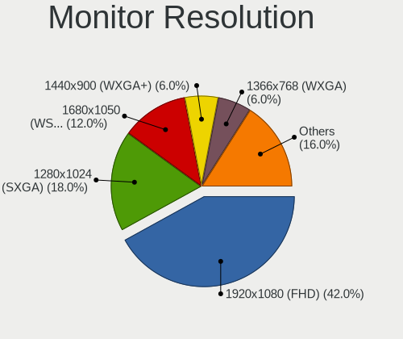

| Resolution         | Desktops | Percent |
|--------------------|----------|---------|
| 1920x1080 (FHD)    | 21       | 42%     |
| 1280x1024 (SXGA)   | 9        | 18%     |
| 1680x1050 (WSXGA+) | 6        | 12%     |
| 1440x900 (WXGA+)   | 3        | 6%      |
| 1366x768 (WXGA)    | 3        | 6%      |
| 3840x2160 (4K)     | 2        | 4%      |
| 2560x1440 (QHD)    | 2        | 4%      |
| 3840x1080          | 1        | 2%      |
| 1920x1200 (WUXGA)  | 1        | 2%      |
| 1600x900 (HD+)     | 1        | 2%      |
| 1024x768 (XGA)     | 1        | 2%      |

Monitor Diagonal
----------------

Diagonal size in inches

| Inches  | Desktops | Percent |
|---------|----------|---------|
| 21      | 9        | 17.65%  |
| 24      | 7        | 13.73%  |
| 27      | 6        | 11.76%  |
| 19      | 6        | 11.76%  |
| 17      | 6        | 11.76%  |
| 23      | 4        | 7.84%   |
| 18      | 4        | 7.84%   |
| 84      | 2        | 3.92%   |
| 22      | 2        | 3.92%   |
| Unknown | 2        | 3.92%   |
| 49      | 1        | 1.96%   |
| 15      | 1        | 1.96%   |
| 12      | 1        | 1.96%   |

Monitor Width
-------------

Physical width

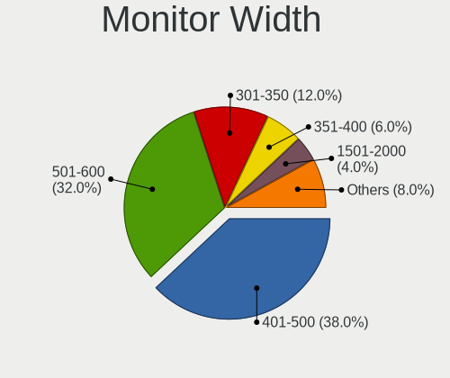

| Width in mm | Desktops | Percent |
|-------------|----------|---------|
| 401-500     | 19       | 38%     |
| 501-600     | 16       | 32%     |
| 301-350     | 6        | 12%     |
| 351-400     | 3        | 6%      |
| 1501-2000   | 2        | 4%      |
| Unknown     | 2        | 4%      |
| 201-300     | 1        | 2%      |
| 1001-1500   | 1        | 2%      |

Aspect Ratio
------------

Proportional relationship between the width and the height

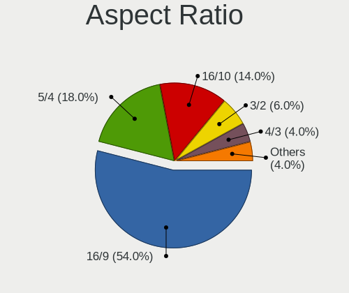

| Ratio   | Desktops | Percent |
|---------|----------|---------|
| 16/9    | 27       | 54%     |
| 5/4     | 9        | 18%     |
| 16/10   | 7        | 14%     |
| 3/2     | 3        | 6%      |
| 4/3     | 2        | 4%      |
| 32/9    | 1        | 2%      |
| Unknown | 1        | 2%      |

Monitor Area
------------

Area in inch²

| Area in inch² | Desktops | Percent |
|----------------|----------|---------|
| 201-250        | 16       | 31.37%  |
| 151-200        | 10       | 19.61%  |
| 141-150        | 9        | 17.65%  |
| 301-350        | 6        | 11.76%  |
| 251-300        | 3        | 5.88%   |
| More than 1000 | 2        | 3.92%   |
| Unknown        | 2        | 3.92%   |
| 71-80          | 1        | 1.96%   |
| 101-110        | 1        | 1.96%   |
| 501-1000       | 1        | 1.96%   |

Pixel Density
-------------

Pixels per inch

| Density | Desktops | Percent |
|---------|----------|---------|
| 51-100  | 39       | 78%     |
| 101-120 | 8        | 16%     |
| Unknown | 2        | 4%      |
| 161-240 | 1        | 2%      |

Multiple Monitors
-----------------

Total monitors connected

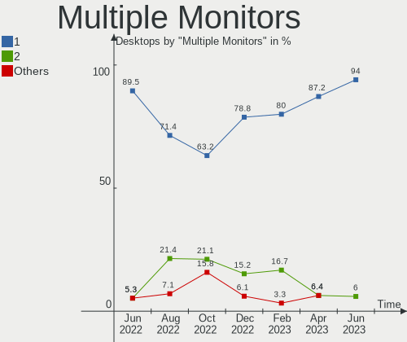

| Total | Desktops | Percent |
|-------|----------|---------|
| 1     | 47       | 94%     |
| 2     | 3        | 6%      |

Network
-------

Net Controller Vendor
---------------------

Controller vendors

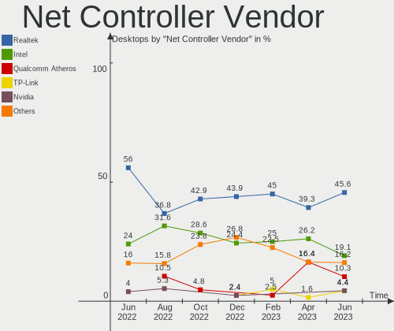

| Vendor                          | Desktops | Percent |
|---------------------------------|----------|---------|
| Realtek Semiconductor           | 31       | 45.59%  |
| Intel                           | 13       | 19.12%  |
| Qualcomm Atheros                | 7        | 10.29%  |
| TP-Link                         | 3        | 4.41%   |
| Nvidia                          | 3        | 4.41%   |
| Broadcom                        | 3        | 4.41%   |
| Qualcomm Atheros Communications | 2        | 2.94%   |
| Samsung Electronics             | 1        | 1.47%   |
| Ralink Technology               | 1        | 1.47%   |
| IMC Networks                    | 1        | 1.47%   |
| Edimax Technology               | 1        | 1.47%   |
| D-Link System                   | 1        | 1.47%   |
| Aquantia                        | 1        | 1.47%   |

Net Controller Model
--------------------

Controller models

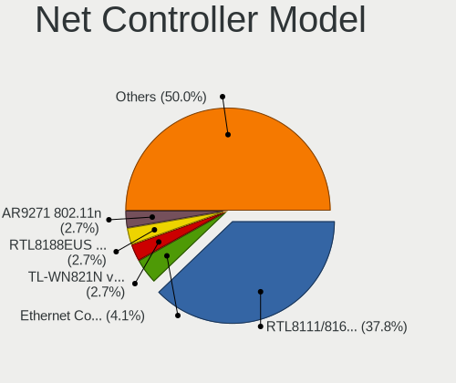

| Model                                                                  | Desktops | Percent |
|------------------------------------------------------------------------|----------|---------|
| Realtek RTL8111/8168/8411 PCI Express Gigabit Ethernet Controller      | 28       | 37.84%  |
| Intel Ethernet Connection I217-LM                                      | 3        | 4.05%   |
| TP-Link TL-WN821N v5/v6 [RTL8192EU]                                    | 2        | 2.7%    |
| Realtek RTL8188EUS 802.11n Wireless Network Adapter                    | 2        | 2.7%    |
| Qualcomm Atheros AR9271 802.11n                                        | 2        | 2.7%    |
| Qualcomm Atheros AR8152 v2.0 Fast Ethernet                             | 2        | 2.7%    |
| Qualcomm Atheros AR8131 Gigabit Ethernet                               | 2        | 2.7%    |
| Nvidia MCP61 Ethernet                                                  | 2        | 2.7%    |
| Intel Wireless 8265 / 8275                                             | 2        | 2.7%    |
| Intel I211 Gigabit Network Connection                                  | 2        | 2.7%    |
| Intel Ethernet Connection (2) I219-V                                   | 2        | 2.7%    |
| Intel 82579LM Gigabit Network Connection (Lewisville)                  | 2        | 2.7%    |
| TP-Link 802.11ac WLAN Adapter                                          | 1        | 1.35%   |
| Samsung GT-I9070 (network tethering, USB debugging enabled)            | 1        | 1.35%   |
| Realtek RTL8188EE Wireless Network Adapter                             | 1        | 1.35%   |
| Realtek RTL8169 PCI Gigabit Ethernet Controller                        | 1        | 1.35%   |
| Realtek RTL8125 2.5GbE Controller                                      | 1        | 1.35%   |
| Ralink MT7601U Wireless Adapter                                        | 1        | 1.35%   |
| Qualcomm Atheros QCA8171 Gigabit Ethernet                              | 1        | 1.35%   |
| Qualcomm Atheros AR9287 Wireless Network Adapter (PCI-Express)         | 1        | 1.35%   |
| Qualcomm Atheros AR922X Wireless Network Adapter                       | 1        | 1.35%   |
| Nvidia MCP73 Ethernet                                                  | 1        | 1.35%   |
| Intel Wireless 7265                                                    | 1        | 1.35%   |
| Intel Wi-Fi 6 AX200                                                    | 1        | 1.35%   |
| Intel Ethernet Connection (5) I219-LM                                  | 1        | 1.35%   |
| Intel Centrino Advanced-N 6235                                         | 1        | 1.35%   |
| Intel 82579V Gigabit Network Connection                                | 1        | 1.35%   |
| Intel 82567LM-3 Gigabit Network Connection                             | 1        | 1.35%   |
| IMC Networks AW-NU222 802.11bgn Wireless Module [Ralink RT2770+RT2720] | 1        | 1.35%   |
| Edimax AC600 USB                                                       | 1        | 1.35%   |
| D-Link System DL10050 Sundance Ethernet                                | 1        | 1.35%   |
| Broadcom NetXtreme BCM5762 Gigabit Ethernet PCIe                       | 1        | 1.35%   |
| Broadcom NetXtreme BCM5761 Gigabit Ethernet PCIe                       | 1        | 1.35%   |
| Broadcom NetLink BCM5787 Gigabit Ethernet PCI Express                  | 1        | 1.35%   |
| Aquantia AQC107 NBase-T/IEEE 802.3bz Ethernet Controller [AQtion]      | 1        | 1.35%   |

Wireless Vendor
---------------

Wireless vendors

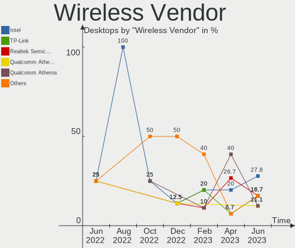

| Vendor                          | Desktops | Percent |
|---------------------------------|----------|---------|
| Intel                           | 5        | 27.78%  |
| TP-Link                         | 3        | 16.67%  |
| Realtek Semiconductor           | 3        | 16.67%  |
| Qualcomm Atheros Communications | 2        | 11.11%  |
| Qualcomm Atheros                | 2        | 11.11%  |
| Ralink Technology               | 1        | 5.56%   |
| IMC Networks                    | 1        | 5.56%   |
| Edimax Technology               | 1        | 5.56%   |

Wireless Model
--------------

Wireless models

| Model                                                                  | Desktops | Percent |
|------------------------------------------------------------------------|----------|---------|
| TP-Link TL-WN821N v5/v6 [RTL8192EU]                                    | 2        | 11.11%  |
| Realtek RTL8188EUS 802.11n Wireless Network Adapter                    | 2        | 11.11%  |
| Qualcomm Atheros AR9271 802.11n                                        | 2        | 11.11%  |
| Intel Wireless 8265 / 8275                                             | 2        | 11.11%  |
| TP-Link 802.11ac WLAN Adapter                                          | 1        | 5.56%   |
| Realtek RTL8188EE Wireless Network Adapter                             | 1        | 5.56%   |
| Ralink MT7601U Wireless Adapter                                        | 1        | 5.56%   |
| Qualcomm Atheros AR9287 Wireless Network Adapter (PCI-Express)         | 1        | 5.56%   |
| Qualcomm Atheros AR922X Wireless Network Adapter                       | 1        | 5.56%   |
| Intel Wireless 7265                                                    | 1        | 5.56%   |
| Intel Wi-Fi 6 AX200                                                    | 1        | 5.56%   |
| Intel Centrino Advanced-N 6235                                         | 1        | 5.56%   |
| IMC Networks AW-NU222 802.11bgn Wireless Module [Ralink RT2770+RT2720] | 1        | 5.56%   |
| Edimax AC600 USB                                                       | 1        | 5.56%   |

Ethernet Vendor
---------------

Ethernet vendors

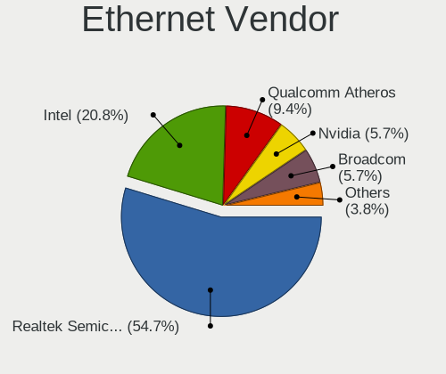

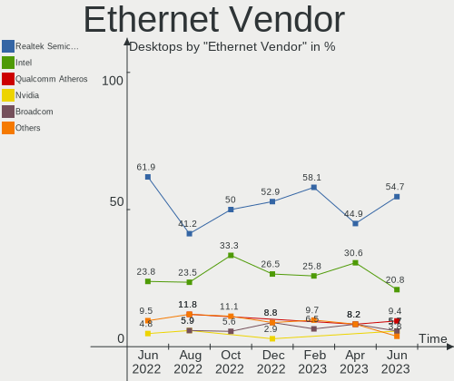

| Vendor                | Desktops | Percent |
|-----------------------|----------|---------|
| Realtek Semiconductor | 29       | 54.72%  |
| Intel                 | 11       | 20.75%  |
| Qualcomm Atheros      | 5        | 9.43%   |
| Nvidia                | 3        | 5.66%   |
| Broadcom              | 3        | 5.66%   |
| D-Link System         | 1        | 1.89%   |
| Aquantia              | 1        | 1.89%   |

Ethernet Model
--------------

Ethernet models

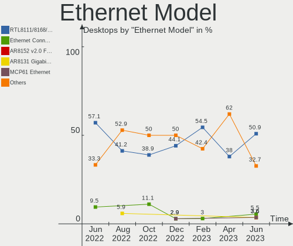

| Model                                                             | Desktops | Percent |
|-------------------------------------------------------------------|----------|---------|
| Realtek RTL8111/8168/8411 PCI Express Gigabit Ethernet Controller | 28       | 50.91%  |
| Intel Ethernet Connection I217-LM                                 | 3        | 5.45%   |
| Qualcomm Atheros AR8152 v2.0 Fast Ethernet                        | 2        | 3.64%   |
| Qualcomm Atheros AR8131 Gigabit Ethernet                          | 2        | 3.64%   |
| Nvidia MCP61 Ethernet                                             | 2        | 3.64%   |
| Intel I211 Gigabit Network Connection                             | 2        | 3.64%   |
| Intel Ethernet Connection (2) I219-V                              | 2        | 3.64%   |
| Intel 82579LM Gigabit Network Connection (Lewisville)             | 2        | 3.64%   |
| Realtek RTL8169 PCI Gigabit Ethernet Controller                   | 1        | 1.82%   |
| Realtek RTL8125 2.5GbE Controller                                 | 1        | 1.82%   |
| Qualcomm Atheros QCA8171 Gigabit Ethernet                         | 1        | 1.82%   |
| Nvidia MCP73 Ethernet                                             | 1        | 1.82%   |
| Intel Ethernet Connection (5) I219-LM                             | 1        | 1.82%   |
| Intel 82579V Gigabit Network Connection                           | 1        | 1.82%   |
| Intel 82567LM-3 Gigabit Network Connection                        | 1        | 1.82%   |
| D-Link System DL10050 Sundance Ethernet                           | 1        | 1.82%   |
| Broadcom NetXtreme BCM5762 Gigabit Ethernet PCIe                  | 1        | 1.82%   |
| Broadcom NetXtreme BCM5761 Gigabit Ethernet PCIe                  | 1        | 1.82%   |
| Broadcom NetLink BCM5787 Gigabit Ethernet PCI Express             | 1        | 1.82%   |
| Aquantia AQC107 NBase-T/IEEE 802.3bz Ethernet Controller [AQtion] | 1        | 1.82%   |

Net Controller Kind
-------------------

Ethernet, WiFi or modem

| Kind     | Desktops | Percent |
|----------|----------|---------|
| Ethernet | 50       | 72.46%  |
| WiFi     | 18       | 26.09%  |
| Modem    | 1        | 1.45%   |

Used Controller
---------------

Currently used network controller

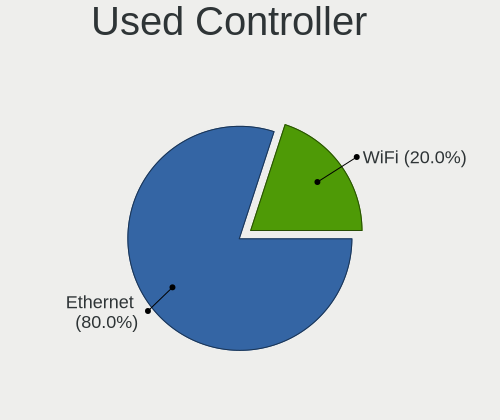

| Kind     | Desktops | Percent |
|----------|----------|---------|
| Ethernet | 40       | 80%     |
| WiFi     | 10       | 20%     |

NICs
----

Total network controllers on board

| Total | Desktops | Percent |
|-------|----------|---------|
| 1     | 39       | 78%     |
| 2     | 8        | 16%     |
| 3     | 3        | 6%      |

IPv6
----

IPv6 vs IPv4

| Used | Desktops | Percent |
|------|----------|---------|
| No   | 27       | 54%     |
| Yes  | 23       | 46%     |

Bluetooth
---------

Bluetooth Vendor
----------------

Controller vendors

| Vendor                  | Desktops | Percent |
|-------------------------|----------|---------|
| Cambridge Silicon Radio | 7        | 53.85%  |
| Intel                   | 5        | 38.46%  |
| Logitech                | 1        | 7.69%   |

Bluetooth Model
---------------

Controller models

| Model                                               | Desktops | Percent |
|-----------------------------------------------------|----------|---------|
| Cambridge Silicon Radio Bluetooth Dongle (HCI mode) | 7        | 53.85%  |
| Intel Bluetooth wireless interface                  | 3        | 23.08%  |
| Logitech BT Mini-Receiver (HCI mode)                | 1        | 7.69%   |
| Intel Centrino Bluetooth Wireless Transceiver       | 1        | 7.69%   |
| Intel AX200 Bluetooth                               | 1        | 7.69%   |

Sound
-----

Sound Vendor
------------

Sound card vendors

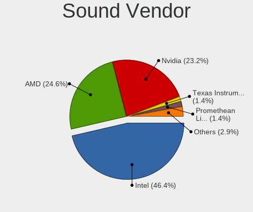

| Vendor              | Desktops | Percent |
|---------------------|----------|---------|
| Intel               | 32       | 46.38%  |
| AMD                 | 17       | 24.64%  |
| Nvidia              | 16       | 23.19%  |
| Texas Instruments   | 1        | 1.45%   |
| Promethean Limited  | 1        | 1.45%   |
| Conexant Systems    | 1        | 1.45%   |
| C-Media Electronics | 1        | 1.45%   |

Sound Model
-----------

Sound card models

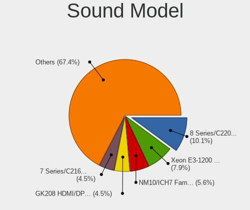

| Model                                                                      | Desktops | Percent |
|----------------------------------------------------------------------------|----------|---------|
| Intel 8 Series/C220 Series Chipset High Definition Audio Controller        | 9        | 10.11%  |
| Intel Xeon E3-1200 v3/4th Gen Core Processor HD Audio Controller           | 7        | 7.87%   |
| Intel NM10/ICH7 Family High Definition Audio Controller                    | 5        | 5.62%   |
| Nvidia GK208 HDMI/DP Audio Controller                                      | 4        | 4.49%   |
| Intel 7 Series/C216 Chipset Family High Definition Audio Controller        | 4        | 4.49%   |
| Intel 200 Series PCH HD Audio                                              | 4        | 4.49%   |
| Intel 100 Series/C230 Series Chipset Family HD Audio Controller            | 4        | 4.49%   |
| AMD Family 17h/19h HD Audio Controller                                     | 4        | 4.49%   |
| AMD SBx00 Azalia (Intel HDA)                                               | 3        | 3.37%   |
| Nvidia TU116 High Definition Audio Controller                              | 2        | 2.25%   |
| Nvidia MCP61 High Definition Audio                                         | 2        | 2.25%   |
| Nvidia GM107 High Definition Audio Controller [GeForce 940MX]              | 2        | 2.25%   |
| Intel 82801JI (ICH10 Family) HD Audio Controller                           | 2        | 2.25%   |
| AMD Starship/Matisse HD Audio Controller                                   | 2        | 2.25%   |
| AMD Renoir Radeon High Definition Audio Controller                         | 2        | 2.25%   |
| AMD FCH Azalia Controller                                                  | 2        | 2.25%   |
| AMD Cedar HDMI Audio [Radeon HD 5400/6300/7300 Series]                     | 2        | 2.25%   |
| Texas Instruments PCM2902 Audio Codec                                      | 1        | 1.12%   |
| Promethean Limited Audio                                                   | 1        | 1.12%   |
| Nvidia TU107 GeForce GTX 1650 High Definition Audio Controller             | 1        | 1.12%   |
| Nvidia MCP73 High Definition Audio                                         | 1        | 1.12%   |
| Nvidia MCP72XE/MCP72P/MCP78U/MCP78S High Definition Audio                  | 1        | 1.12%   |
| Nvidia High Definition Audio Controller                                    | 1        | 1.12%   |
| Nvidia GP108 High Definition Audio Controller                              | 1        | 1.12%   |
| Nvidia GK106 HDMI Audio Controller                                         | 1        | 1.12%   |
| Nvidia GF116 High Definition Audio Controller                              | 1        | 1.12%   |
| Nvidia GA106 High Definition Audio Controller                              | 1        | 1.12%   |
| Intel Celeron/Pentium Silver Processor High Definition Audio               | 1        | 1.12%   |
| Intel 82801JD/DO (ICH10 Family) HD Audio Controller                        | 1        | 1.12%   |
| Intel 82801I (ICH9 Family) HD Audio Controller                             | 1        | 1.12%   |
| Intel 6 Series/C200 Series Chipset Family High Definition Audio Controller | 1        | 1.12%   |
| Conexant Systems Rapoo 7.1CH Gaming Headset                                | 1        | 1.12%   |
| C-Media Electronics Blue Snowball                                          | 1        | 1.12%   |
| AMD Trinity HDMI Audio Controller                                          | 1        | 1.12%   |
| AMD RV710/730 HDMI Audio [Radeon HD 4000 series]                           | 1        | 1.12%   |
| AMD Redwood HDMI Audio [Radeon HD 5000 Series]                             | 1        | 1.12%   |
| AMD Raven/Raven2/Fenghuang HDMI/DP Audio Controller                        | 1        | 1.12%   |
| AMD Navi 21/23 HDMI/DP Audio Controller                                    | 1        | 1.12%   |
| AMD Kaveri HDMI/DP Audio Controller                                        | 1        | 1.12%   |
| AMD Kabini HDMI/DP Audio                                                   | 1        | 1.12%   |

Memory
------

Memory Vendor
-------------

Memory module vendors

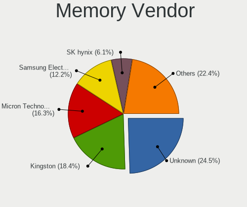

| Vendor              | Desktops | Percent |
|---------------------|----------|---------|
| Unknown             | 12       | 24.49%  |
| Kingston            | 9        | 18.37%  |
| Micron Technology   | 8        | 16.33%  |
| Samsung Electronics | 6        | 12.24%  |
| SK hynix            | 3        | 6.12%   |
| Corsair             | 3        | 6.12%   |
| G.Skill             | 2        | 4.08%   |
| Crucial             | 2        | 4.08%   |
| Qimonda             | 1        | 2.04%   |
| Patriot             | 1        | 2.04%   |
| Nanya Technology    | 1        | 2.04%   |
| Kingmax             | 1        | 2.04%   |

Memory Model
------------

Memory module models

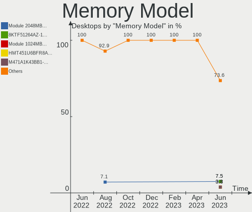

| Model                                                                     | Desktops | Percent |
|---------------------------------------------------------------------------|----------|---------|
| Unknown RAM Module 2048MB DIMM 800MT/s                                    | 4        | 7.55%   |
| Micron RAM 8KTF51264AZ-1G6E1 4GB DIMM DDR3 1600MT/s                       | 4        | 7.55%   |
| Unknown RAM Module 1024MB DIMM DDR2                                       | 2        | 3.77%   |
| SK hynix RAM HMT451U6BFR8A-PB 4096MB DIMM DDR3 1648MT/s                   | 2        | 3.77%   |
| Samsung RAM M471A1K43BB1-CRC 8GB SODIMM DDR4 2667MT/s                     | 2        | 3.77%   |
| Unknown RAM V02L3L84GB52852816 4096MB DIMM DDR3 1333MT/s                  | 1        | 1.89%   |
| Unknown RAM Module 8192MB DIMM DDR4 2667MT/s                              | 1        | 1.89%   |
| Unknown RAM Module 4096MB DIMM SDRAM                                      | 1        | 1.89%   |
| Unknown RAM Module 4096MB DIMM 1600MT/s                                   | 1        | 1.89%   |
| Unknown RAM Module 2048MB DIMM SDRAM                                      | 1        | 1.89%   |
| Unknown RAM Module 2048MB DIMM DDR2                                       | 1        | 1.89%   |
| Unknown RAM Module 2048MB DIMM 1333MT/s                                   | 1        | 1.89%   |
| SK hynix RAM HMT451U7BFR8A-PB 4096MB DIMM DDR3 1600MT/s                   | 1        | 1.89%   |
| Samsung RAM Module 4096MB DIMM DDR4 2133MT/s                              | 1        | 1.89%   |
| Samsung RAM M378B5273DH0-CH9 4096MB DIMM DDR3 2133MT/s                    | 1        | 1.89%   |
| Samsung RAM M378B5273CH0-CK0 4096MB DIMM DDR3 2000MT/s                    | 1        | 1.89%   |
| Samsung RAM 4D332037385435363633515A332D43463720 2048MB DIMM DDR2 800MT/s | 1        | 1.89%   |
| Qimonda RAM 64T256020EU2.5C2 2048MB DIMM SDRAM                            | 1        | 1.89%   |
| Patriot RAM 3200 C16 Series 8GB DIMM DDR4 3266MT/s                        | 1        | 1.89%   |
| Nanya RAM NT4GC72B4NA1NL-BE 4096MB DIMM DDR3 1066MT/s                     | 1        | 1.89%   |
| Micron RAM CT8G4DFD8213.16FA11 8192MB DIMM DDR4 2133MT/s                  | 1        | 1.89%   |
| Micron RAM 9HTF12872AY-800E1 1024MB DIMM DDR2 667MT/s                     | 1        | 1.89%   |
| Micron RAM 8HTF12864AY-667E1 1024MB DIMM DDR2 667MT/s                     | 1        | 1.89%   |
| Micron RAM 8ATF1G64HZ-2G3E1 8GB SODIMM DDR4 2400MT/s                      | 1        | 1.89%   |
| Micron RAM 16JTF51264AZ-1G6M1 4GB DIMM DDR3 1600MT/s                      | 1        | 1.89%   |
| Kingston RAM KHX4000C19D4/8GX 8GB DIMM DDR4 3600MT/s                      | 1        | 1.89%   |
| Kingston RAM KHX2666C16/16G 16GB DIMM DDR4 3200MT/s                       | 1        | 1.89%   |
| Kingston RAM KHX2400C15D4/4G 4096MB DIMM DDR4 3151MT/s                    | 1        | 1.89%   |
| Kingston RAM KHX2400C11D3/4GX 4GB DIMM DDR3 2400MT/s                      | 1        | 1.89%   |
| Kingston RAM KHX1600C10D3/4G 4GB DIMM DDR3 1866MT/s                       | 1        | 1.89%   |
| Kingston RAM KHX1600C10D3/ 8GB DIMM DDR3 1600MT/s                         | 1        | 1.89%   |
| Kingston RAM KF3200C16D4/16GX 16GB DIMM DDR4 3200MT/s                     | 1        | 1.89%   |
| Kingston RAM 99U5584-005.A00LF 4GB DIMM DDR3 1600MT/s                     | 1        | 1.89%   |
| Kingston RAM 9905622-057.A00G 4096MB DIMM DDR4 2133MT/s                   | 1        | 1.89%   |
| Kingston RAM 9905403-189.A00LF 4GB DIMM DDR3 1333MT/s                     | 1        | 1.89%   |
| Kingmax RAM GLAG42F-18--------- 8192MB DIMM DDR4 2666MT/s                 | 1        | 1.89%   |
| Kingmax RAM GLAF62F-D8--------- 4096MB DIMM DDR4 2400MT/s                 | 1        | 1.89%   |
| G.Skill RAM F4-3200C16-8GIS 8192MB DIMM DDR4 3200MT/s                     | 1        | 1.89%   |
| G.Skill RAM F4-3000C16-8GISB 8GB DIMM DDR4 3200MT/s                       | 1        | 1.89%   |
| Crucial RAM BLS8G4D240FSBK.8FD 8192MB DIMM DDR4 2448MT/s                  | 1        | 1.89%   |

Memory Kind
-----------

Memory module kinds

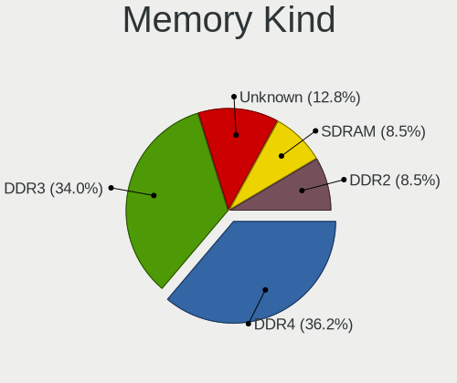

| Kind    | Desktops | Percent |
|---------|----------|---------|
| DDR4    | 17       | 36.17%  |
| DDR3    | 16       | 34.04%  |
| Unknown | 6        | 12.77%  |
| SDRAM   | 4        | 8.51%   |
| DDR2    | 4        | 8.51%   |

Memory Form Factor
------------------

Physical design of the memory module

| Name   | Desktops | Percent |
|--------|----------|---------|
| DIMM   | 43       | 93.48%  |
| SODIMM | 3        | 6.52%   |

Memory Size
-----------

Memory module size

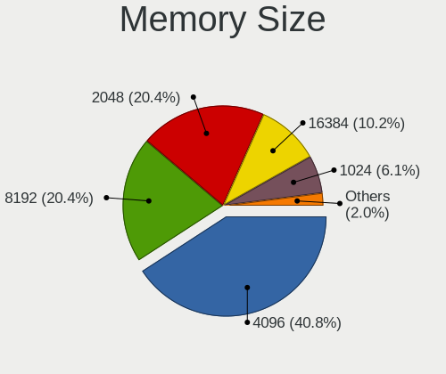

| Size  | Desktops | Percent |
|-------|----------|---------|
| 4096  | 20       | 40.82%  |
| 8192  | 10       | 20.41%  |
| 2048  | 10       | 20.41%  |
| 16384 | 5        | 10.2%   |
| 1024  | 3        | 6.12%   |
| 32768 | 1        | 2.04%   |

Memory Speed
------------

Memory module speed

| Speed   | Desktops | Percent |
|---------|----------|---------|
| 1600    | 10       | 19.61%  |
| 800     | 6        | 11.76%  |
| 3200    | 5        | 9.8%    |
| 2133    | 5        | 9.8%    |
| Unknown | 4        | 7.84%   |
| 2667    | 3        | 5.88%   |
| 2400    | 3        | 5.88%   |
| 1333    | 3        | 5.88%   |
| 1648    | 2        | 3.92%   |
| 3600    | 1        | 1.96%   |
| 3266    | 1        | 1.96%   |
| 3151    | 1        | 1.96%   |
| 2800    | 1        | 1.96%   |
| 2666    | 1        | 1.96%   |
| 2448    | 1        | 1.96%   |
| 2000    | 1        | 1.96%   |
| 1866    | 1        | 1.96%   |
| 1066    | 1        | 1.96%   |
| 667     | 1        | 1.96%   |

Printers & scanners
-------------------

Printer Vendor
--------------

Printer device vendors

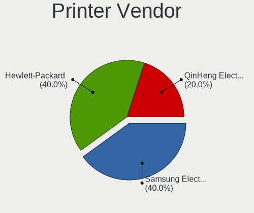

| Vendor              | Desktops | Percent |
|---------------------|----------|---------|
| Samsung Electronics | 2        | 40%     |
| Hewlett-Packard     | 2        | 40%     |
| QinHeng Electronics | 1        | 20%     |

Printer Model
-------------

Printer device models

| Model                                | Desktops | Percent |
|--------------------------------------|----------|---------|
| Samsung ML-1640 Series Laser Printer | 1        | 20%     |
| Samsung C48x Series                  | 1        | 20%     |
| QinHeng CH340S                       | 1        | 20%     |
| HP LaserJet 2600n                    | 1        | 20%     |
| HP DeskJet 2620 All-in-One Printer   | 1        | 20%     |

Scanner Vendor
--------------

Scanner device vendors

Zero info for selected period =(

Scanner Model
-------------

Scanner device models

Zero info for selected period =(

Camera
------

Camera Vendor
-------------

Camera device vendors

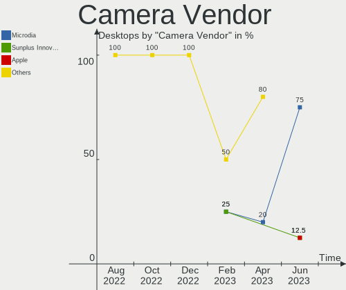

| Vendor                        | Desktops | Percent |
|-------------------------------|----------|---------|
| Microdia                      | 6        | 75%     |
| Sunplus Innovation Technology | 1        | 12.5%   |
| Apple                         | 1        | 12.5%   |

Camera Model
------------

Camera device models

| Model                           | Desktops | Percent |
|---------------------------------|----------|---------|
| Microdia Camera                 | 3        | 37.5%   |
| Sunplus Full HD webcam          | 1        | 12.5%   |
| Microdia Webcam Vitade AF       | 1        | 12.5%   |
| Microdia Sonix USB 2.0 Camera   | 1        | 12.5%   |
| Microdia PC Microscope camera   | 1        | 12.5%   |
| Apple iPhone 5/5C/5S/6/SE/7/8/X | 1        | 12.5%   |

Security
--------

Fingerprint Vendor
------------------

Fingerprint sensor vendors

Zero info for selected period =(

Fingerprint Model
-----------------

Fingerprint sensor models

Zero info for selected period =(

Chipcard Vendor
---------------

Chipcard module vendors

Zero info for selected period =(

Chipcard Model
--------------

Chipcard module models

Zero info for selected period =(

Unsupported
-----------

Unsupported Devices
-------------------

Total unsupported devices on board

| Total | Desktops | Percent |
|-------|----------|---------|
| 0     | 48       | 96%     |
| 1     | 2        | 4%      |

Unsupported Device Types
------------------------

Types of unsupported devices

| Type        | Desktops | Percent |
|-------------|----------|---------|
| Storage/ata | 1        | 50%     |
| Camera      | 1        | 50%     |

