Linux in Hungary - Hardware Trends (Notebooks)
----------------------------------------------

A project to identify most popular hardware characteristics and track their change
over time based on data collected by Linux users at https://Linux-Hardware.org.

Anyone can contribute to this report by the [hw-probe](https://github.com/linuxhw/hw-probe) tool:

    sudo -E hw-probe -all -upload

Period: May, 2023.

Contents
--------

* [ System ](#system)
  - [ OS                       ](#os)
  - [ OS Family                ](#os-family)
  - [ Kernel                   ](#kernel)
  - [ Kernel Family            ](#kernel-family)
  - [ Kernel Major Ver.        ](#kernel-major-ver)
  - [ Arch                     ](#arch)
  - [ DE                       ](#de)
  - [ Display Server           ](#display-server)
  - [ Display Manager          ](#display-manager)
  - [ OS Lang                  ](#os-lang)
  - [ Boot Mode                ](#boot-mode)
  - [ Filesystem               ](#filesystem)
  - [ Part. scheme             ](#part-scheme)
  - [ Dual Boot with Linux/BSD ](#dual-boot-with-linuxbsd)
  - [ Dual Boot (Win)          ](#dual-boot-win)

* [ Board ](#board)
  - [ Vendor                   ](#vendor)
  - [ Model                    ](#model)
  - [ Model Family             ](#model-family)
  - [ MFG Year                 ](#mfg-year)
  - [ Form Factor              ](#form-factor)
  - [ Secure Boot              ](#secure-boot)
  - [ Coreboot                 ](#coreboot)
  - [ RAM Size                 ](#ram-size)
  - [ RAM Used                 ](#ram-used)
  - [ Total Drives             ](#total-drives)
  - [ Has CD-ROM               ](#has-cd-rom)
  - [ Has Ethernet             ](#has-ethernet)
  - [ Has WiFi                 ](#has-wifi)
  - [ Has Bluetooth            ](#has-bluetooth)

* [ Location ](#location)
  - [ Country                  ](#country)
  - [ City                     ](#city)

* [ Drives ](#drives)
  - [ Drive Vendor             ](#drive-vendor)
  - [ Drive Model              ](#drive-model)
  - [ HDD Vendor               ](#hdd-vendor)
  - [ SSD Vendor               ](#ssd-vendor)
  - [ Drive Kind               ](#drive-kind)
  - [ Drive Connector          ](#drive-connector)
  - [ Drive Size               ](#drive-size)
  - [ Space Total              ](#space-total)
  - [ Space Used               ](#space-used)
  - [ Malfunc. Drives          ](#malfunc-drives)
  - [ Malfunc. Drive Vendor    ](#malfunc-drive-vendor)
  - [ Malfunc. HDD Vendor      ](#malfunc-hdd-vendor)
  - [ Malfunc. Drive Kind      ](#malfunc-drive-kind)
  - [ Failed Drives            ](#failed-drives)
  - [ Failed Drive Vendor      ](#failed-drive-vendor)
  - [ Drive Status             ](#drive-status)

* [ Storage controller ](#storage-controller)
  - [ Storage Vendor           ](#storage-vendor)
  - [ Storage Model            ](#storage-model)
  - [ Storage Kind             ](#storage-kind)

* [ Processor ](#processor)
  - [ CPU Vendor               ](#cpu-vendor)
  - [ CPU Model                ](#cpu-model)
  - [ CPU Model Family         ](#cpu-model-family)
  - [ CPU Cores                ](#cpu-cores)
  - [ CPU Sockets              ](#cpu-sockets)
  - [ CPU Threads              ](#cpu-threads)
  - [ CPU Op-Modes             ](#cpu-op-modes)
  - [ CPU Microcode            ](#cpu-microcode)
  - [ CPU Microarch            ](#cpu-microarch)

* [ Graphics ](#graphics)
  - [ GPU Vendor               ](#gpu-vendor)
  - [ GPU Model                ](#gpu-model)
  - [ GPU Combo                ](#gpu-combo)
  - [ GPU Driver               ](#gpu-driver)
  - [ GPU Memory               ](#gpu-memory)

* [ Monitor ](#monitor)
  - [ Monitor Vendor           ](#monitor-vendor)
  - [ Monitor Model            ](#monitor-model)
  - [ Monitor Resolution       ](#monitor-resolution)
  - [ Monitor Diagonal         ](#monitor-diagonal)
  - [ Monitor Width            ](#monitor-width)
  - [ Aspect Ratio             ](#aspect-ratio)
  - [ Monitor Area             ](#monitor-area)
  - [ Pixel Density            ](#pixel-density)
  - [ Multiple Monitors        ](#multiple-monitors)

* [ Network ](#network)
  - [ Net Controller Vendor    ](#net-controller-vendor)
  - [ Net Controller Model     ](#net-controller-model)
  - [ Wireless Vendor          ](#wireless-vendor)
  - [ Wireless Model           ](#wireless-model)
  - [ Ethernet Vendor          ](#ethernet-vendor)
  - [ Ethernet Model           ](#ethernet-model)
  - [ Net Controller Kind      ](#net-controller-kind)
  - [ Used Controller          ](#used-controller)
  - [ NICs                     ](#nics)
  - [ IPv6                     ](#ipv6)

* [ Bluetooth ](#bluetooth)
  - [ Bluetooth Vendor         ](#bluetooth-vendor)
  - [ Bluetooth Model          ](#bluetooth-model)

* [ Sound ](#sound)
  - [ Sound Vendor             ](#sound-vendor)
  - [ Sound Model              ](#sound-model)

* [ Memory ](#memory)
  - [ Memory Vendor            ](#memory-vendor)
  - [ Memory Model             ](#memory-model)
  - [ Memory Kind              ](#memory-kind)
  - [ Memory Form Factor       ](#memory-form-factor)
  - [ Memory Size              ](#memory-size)
  - [ Memory Speed             ](#memory-speed)

* [ Printers & scanners ](#printers--scanners)
  - [ Printer Vendor           ](#printer-vendor)
  - [ Printer Model            ](#printer-model)
  - [ Scanner Vendor           ](#scanner-vendor)
  - [ Scanner Model            ](#scanner-model)

* [ Camera ](#camera)
  - [ Camera Vendor            ](#camera-vendor)
  - [ Camera Model             ](#camera-model)

* [ Security ](#security)
  - [ Fingerprint Vendor       ](#fingerprint-vendor)
  - [ Fingerprint Model        ](#fingerprint-model)
  - [ Chipcard Vendor          ](#chipcard-vendor)
  - [ Chipcard Model           ](#chipcard-model)

* [ Unsupported ](#unsupported)
  - [ Unsupported Devices      ](#unsupported-devices)
  - [ Unsupported Device Types ](#unsupported-device-types)

System
------

OS
--

Installed operating systems

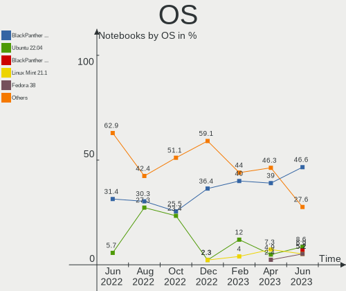

| Name               | Notebooks | Percent |
|--------------------|-----------|---------|
| BlackPanther 18.1  | 35        | 50%     |
| Linux Mint 21.1    | 7         | 10%     |
| Fedora 38          | 6         | 8.57%   |
| Ubuntu 22.04       | 4         | 5.71%   |
| BlackPanther 22.1  | 4         | 5.71%   |
| Ubuntu 23.04       | 2         | 2.86%   |
| Zorin 16           | 1         | 1.43%   |
| Ubuntu 18.04       | 1         | 1.43%   |
| Rocky Linux 9.1    | 1         | 1.43%   |
| Q4OS 4             | 1         | 1.43%   |
| OpenMandriva 23.03 | 1         | 1.43%   |
| Manjaro 22.1.1     | 1         | 1.43%   |
| Fedora 37          | 1         | 1.43%   |
| Elementary 6.1     | 1         | 1.43%   |
| Debian 12          | 1         | 1.43%   |
| Debian 11          | 1         | 1.43%   |
| ArcoLinux Rolling  | 1         | 1.43%   |
| Arch Rolling       | 1         | 1.43%   |

OS Family
---------

OS without a version

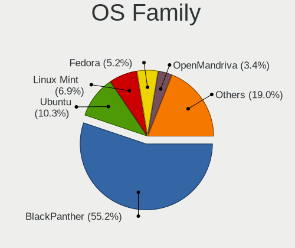

| Name         | Notebooks | Percent |
|--------------|-----------|---------|
| BlackPanther | 39        | 55.71%  |
| Ubuntu       | 7         | 10%     |
| Linux Mint   | 7         | 10%     |
| Fedora       | 7         | 10%     |
| Debian       | 2         | 2.86%   |
| Zorin        | 1         | 1.43%   |
| Rocky Linux  | 1         | 1.43%   |
| Q4OS         | 1         | 1.43%   |
| OpenMandriva | 1         | 1.43%   |
| Manjaro      | 1         | 1.43%   |
| Elementary   | 1         | 1.43%   |
| ArcoLinux    | 1         | 1.43%   |
| Arch         | 1         | 1.43%   |

Kernel
------

Version of the Linux kernel

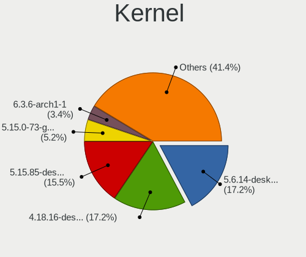

| Version                             | Notebooks | Percent |
|-------------------------------------|-----------|---------|
| 4.18.16-desktop-1bP                 | 15        | 21.43%  |
| 5.15.85-desktop-1bP                 | 12        | 17.14%  |
| 5.6.14-desktop-2bP                  | 8         | 11.43%  |
| 5.15.0-72-generic                   | 5         | 7.14%   |
| 5.19.0-41-generic                   | 4         | 5.71%   |
| 6.2.14-300.fc38.x86_64              | 3         | 4.29%   |
| 6.2.9-desktop-1bP                   | 2         | 2.86%   |
| 6.2.0-20-generic                    | 2         | 2.86%   |
| 5.15.0-69-generic                   | 2         | 2.86%   |
| 5.10.0-23-amd64                     | 2         | 2.86%   |
| 6.4.0-rc3-1-git-00008-gae8373a5add4 | 1         | 1.43%   |
| 6.2.9-300.fc38.x86_64               | 1         | 1.43%   |
| 6.2.6-desktop-1omv2390              | 1         | 1.43%   |
| 6.2.15-300.fc38.x86_64              | 1         | 1.43%   |
| 6.2.15-200.fc37.x86_64              | 1         | 1.43%   |
| 6.2.14-060214-generic               | 1         | 1.43%   |
| 6.2.13-300.fc38.x86_64              | 1         | 1.43%   |
| 6.1.27-1-lts                        | 1         | 1.43%   |
| 6.1.25-1-MANJARO                    | 1         | 1.43%   |
| 6.1.0-9-amd64                       | 1         | 1.43%   |
| 6.1.0-1bP                           | 1         | 1.43%   |
| 5.6.14-server-2bP                   | 1         | 1.43%   |
| 5.15.0-71-generic                   | 1         | 1.43%   |
| 5.14.0-162.23.1.el9_1.x86_64        | 1         | 1.43%   |
| 4.15.0-211-generic                  | 1         | 1.43%   |

Kernel Family
-------------

Linux kernel without a distro release

| Version | Notebooks | Percent |
|---------|-----------|---------|
| 4.18.16 | 15        | 21.43%  |
| 5.15.85 | 12        | 17.14%  |
| 5.6.14  | 9         | 12.86%  |
| 5.15.0  | 8         | 11.43%  |
| 6.2.14  | 4         | 5.71%   |
| 5.19.0  | 4         | 5.71%   |
| 6.2.9   | 3         | 4.29%   |
| 6.2.15  | 2         | 2.86%   |
| 6.2.0   | 2         | 2.86%   |
| 6.1.0   | 2         | 2.86%   |
| 5.10.0  | 2         | 2.86%   |
| 6.4.0   | 1         | 1.43%   |
| 6.2.6   | 1         | 1.43%   |
| 6.2.13  | 1         | 1.43%   |
| 6.1.27  | 1         | 1.43%   |
| 6.1.25  | 1         | 1.43%   |
| 5.14.0  | 1         | 1.43%   |
| 4.15.0  | 1         | 1.43%   |

Kernel Major Ver.
-----------------

Linux kernel major version

| Version | Notebooks | Percent |
|---------|-----------|---------|
| 5.15    | 20        | 28.57%  |
| 4.18    | 15        | 21.43%  |
| 6.2     | 13        | 18.57%  |
| 5.6     | 9         | 12.86%  |
| 6.1     | 4         | 5.71%   |
| 5.19    | 4         | 5.71%   |
| 5.10    | 2         | 2.86%   |
| 6.4     | 1         | 1.43%   |
| 5.14    | 1         | 1.43%   |
| 4.15    | 1         | 1.43%   |

Arch
----

OS architecture (x86_64, i586, etc.)

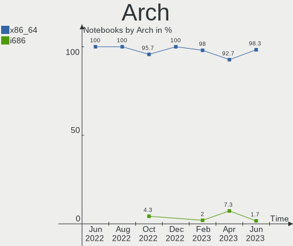

| Name   | Notebooks | Percent |
|--------|-----------|---------|
| x86_64 | 69        | 98.57%  |
| i686   | 1         | 1.43%   |

DE
--

Desktop Environment

| Name       | Notebooks | Percent |
|------------|-----------|---------|
| KDE5       | 40        | 57.14%  |
| GNOME      | 16        | 22.86%  |
| X-Cinnamon | 5         | 7.14%   |
| Unknown    | 4         | 5.71%   |
| XFCE       | 3         | 4.29%   |
| Pantheon   | 1         | 1.43%   |
| MATE       | 1         | 1.43%   |

Display Server
--------------

X11 or Wayland

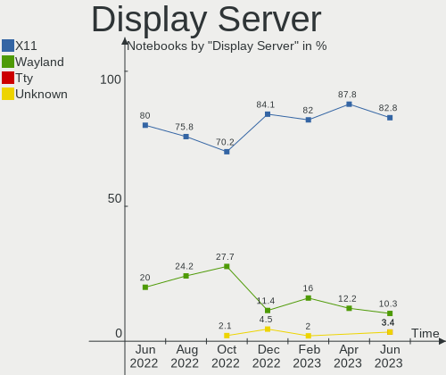

| Name    | Notebooks | Percent |
|---------|-----------|---------|
| X11     | 56        | 80%     |
| Wayland | 12        | 17.14%  |
| Tty     | 1         | 1.43%   |
| Unknown | 1         | 1.43%   |

Display Manager
---------------

SDDM, LightDM, etc.

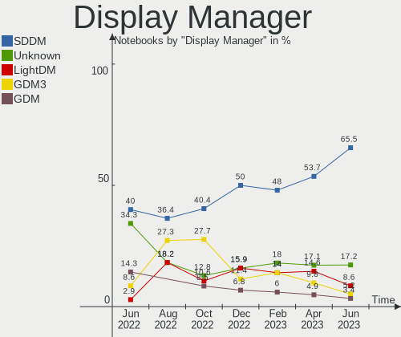

| Name    | Notebooks | Percent |
|---------|-----------|---------|
| SDDM    | 41        | 58.57%  |
| Unknown | 11        | 15.71%  |
| LightDM | 9         | 12.86%  |
| GDM3    | 6         | 8.57%   |
| GDM     | 3         | 4.29%   |

OS Lang
-------

Language

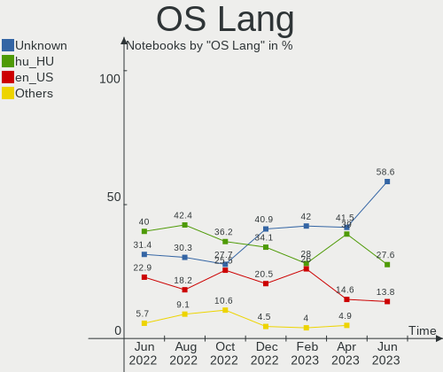

| Lang    | Notebooks | Percent |
|---------|-----------|---------|
| Unknown | 39        | 55.71%  |
| hu_HU   | 17        | 24.29%  |
| en_US   | 10        | 14.29%  |
| en_GB   | 2         | 2.86%   |
| de_DE   | 1         | 1.43%   |
| C       | 1         | 1.43%   |

Boot Mode
---------

EFI or BIOS

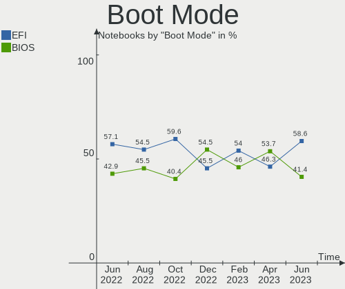

| Mode | Notebooks | Percent |
|------|-----------|---------|
| EFI  | 42        | 60%     |
| BIOS | 28        | 40%     |

Filesystem
----------

Type of filesystem

| Type    | Notebooks | Percent |
|---------|-----------|---------|
| Ext4    | 48        | 68.57%  |
| Overlay | 10        | 14.29%  |
| Btrfs   | 6         | 8.57%   |
| Tmpfs   | 4         | 5.71%   |
| Xfs     | 1         | 1.43%   |
| Unknown | 1         | 1.43%   |

Part. scheme
------------

Scheme of partitioning

| Type    | Notebooks | Percent |
|---------|-----------|---------|
| GPT     | 36        | 51.43%  |
| MBR     | 23        | 32.86%  |
| Unknown | 11        | 15.71%  |

Dual Boot with Linux/BSD
------------------------

Hosting more than one Linux/BSD

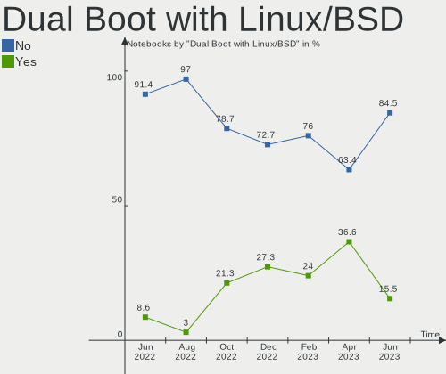

| Dual boot | Notebooks | Percent |
|-----------|-----------|---------|
| No        | 61        | 87.14%  |
| Yes       | 9         | 12.86%  |

Dual Boot (Win)
---------------

Hosting Linux and Windows

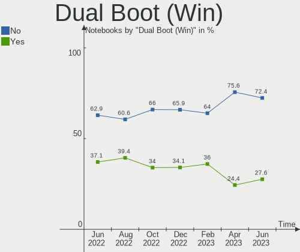

| Dual boot | Notebooks | Percent |
|-----------|-----------|---------|
| No        | 47        | 67.14%  |
| Yes       | 23        | 32.86%  |

Board
-----

Vendor
------

Motherboard manufacturer

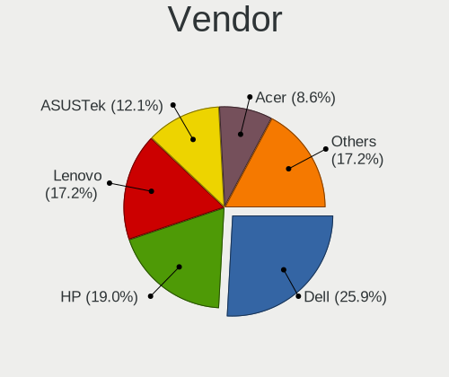

| Name                | Notebooks | Percent |
|---------------------|-----------|---------|
| Lenovo              | 19        | 27.14%  |
| Hewlett-Packard     | 12        | 17.14%  |
| Dell                | 10        | 14.29%  |
| ASUSTek Computer    | 9         | 12.86%  |
| Acer                | 6         | 8.57%   |
| Fujitsu             | 3         | 4.29%   |
| Toshiba             | 2         | 2.86%   |
| eMachines           | 2         | 2.86%   |
| Unknown             | 2         | 2.86%   |
| Valve               | 1         | 1.43%   |
| Sony                | 1         | 1.43%   |
| Samsung Electronics | 1         | 1.43%   |
| Apple               | 1         | 1.43%   |
| Alcor Digital       | 1         | 1.43%   |

Model
-----

Motherboard model

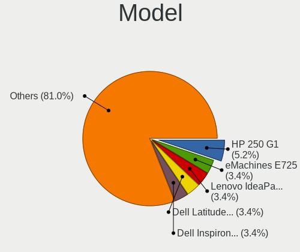

| Name                                 | Notebooks | Percent |
|--------------------------------------|-----------|---------|
| Lenovo ThinkPad T420 4236W8L         | 2         | 2.86%   |
| eMachines E725                       | 2         | 2.86%   |
| Dell Latitude 5490                   | 2         | 2.86%   |
| Dell Inspiron 7737                   | 2         | 2.86%   |
| ASUS X550CC                          | 2         | 2.86%   |
| ASUS K54HR                           | 2         | 2.86%   |
| Unknown                              | 2         | 2.86%   |
| Valve Jupiter                        | 1         | 1.43%   |
| Toshiba Satellite M50D-A             | 1         | 1.43%   |
| Toshiba Satellite C55-A-1NV          | 1         | 1.43%   |
| Sony VGN-FW21Z                       | 1         | 1.43%   |
| Samsung 300E4C/300E5C/300E7C         | 1         | 1.43%   |
| Lenovo V15-ADA 82C7                  | 1         | 1.43%   |
| Lenovo ThinkPad X270 20HMS1RM02      | 1         | 1.43%   |
| Lenovo ThinkPad X250 20CLS1JN00      | 1         | 1.43%   |
| Lenovo ThinkPad X200 74595FG         | 1         | 1.43%   |
| Lenovo ThinkPad T500 2056CL8         | 1         | 1.43%   |
| Lenovo ThinkPad T440s 20ARS06C00     | 1         | 1.43%   |
| Lenovo ThinkPad T400 2768WGB         | 1         | 1.43%   |
| Lenovo ThinkPad P1 Gen 4i 20Y3000FHV | 1         | 1.43%   |
| Lenovo ThinkPad L15 Gen 1 20U7S09R00 | 1         | 1.43%   |
| Lenovo IdeaPad L340-15API 81LW       | 1         | 1.43%   |
| Lenovo IdeaPad 700-15ISK 80RU        | 1         | 1.43%   |
| Lenovo IdeaPad 110-15ACL 80TJ        | 1         | 1.43%   |
| Lenovo IdeaPad 100-15IBD 80QQ        | 1         | 1.43%   |
| Lenovo G580 20150                    | 1         | 1.43%   |
| Lenovo G570 20079                    | 1         | 1.43%   |
| Lenovo G50-30 80G0                   | 1         | 1.43%   |
| Lenovo E50-80 80J2                   | 1         | 1.43%   |
| HP Victus by Laptop 16-e0xxx         | 1         | 1.43%   |
| HP ProBook 640 G8 Notebook PC        | 1         | 1.43%   |
| HP Pavilion Laptop 14-ce3xxx         | 1         | 1.43%   |
| HP Pavilion 17                       | 1         | 1.43%   |
| HP Notebook                          | 1         | 1.43%   |
| HP Laptop 15-dw1xxx                  | 1         | 1.43%   |
| HP Compaq Presario CQ60              | 1         | 1.43%   |
| HP 650                               | 1         | 1.43%   |
| HP 625                               | 1         | 1.43%   |
| HP 250 G6 Notebook PC                | 1         | 1.43%   |
| HP 250 G2                            | 1         | 1.43%   |

Model Family
------------

Motherboard model prefix

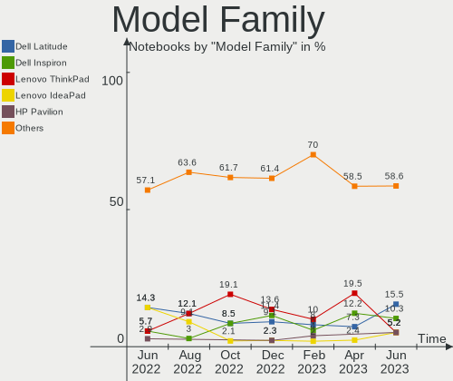

| Name                   | Notebooks | Percent |
|------------------------|-----------|---------|
| Lenovo ThinkPad        | 10        | 14.29%  |
| Dell Latitude          | 6         | 8.57%   |
| Lenovo IdeaPad         | 4         | 5.71%   |
| Dell Inspiron          | 4         | 5.71%   |
| HP 250                 | 3         | 4.29%   |
| Fujitsu LIFEBOOK       | 3         | 4.29%   |
| Acer Aspire            | 3         | 4.29%   |
| Toshiba Satellite      | 2         | 2.86%   |
| HP Pavilion            | 2         | 2.86%   |
| eMachines E725         | 2         | 2.86%   |
| ASUS X550CC            | 2         | 2.86%   |
| ASUS VivoBook          | 2         | 2.86%   |
| ASUS K54HR             | 2         | 2.86%   |
| Acer TravelMate        | 2         | 2.86%   |
| Unknown                | 2         | 2.86%   |
| Valve Jupiter          | 1         | 1.43%   |
| Sony VGN-FW21Z         | 1         | 1.43%   |
| Samsung 300E4C         | 1         | 1.43%   |
| Lenovo V15-ADA         | 1         | 1.43%   |
| Lenovo G580            | 1         | 1.43%   |
| Lenovo G570            | 1         | 1.43%   |
| Lenovo G50-30          | 1         | 1.43%   |
| Lenovo E50-80          | 1         | 1.43%   |
| HP Victus              | 1         | 1.43%   |
| HP ProBook             | 1         | 1.43%   |
| HP Notebook            | 1         | 1.43%   |
| HP Laptop              | 1         | 1.43%   |
| HP Compaq              | 1         | 1.43%   |
| HP 650                 | 1         | 1.43%   |
| HP 625                 | 1         | 1.43%   |
| ASUS X550CL            | 1         | 1.43%   |
| ASUS K53BY             | 1         | 1.43%   |
| ASUS ASUS              | 1         | 1.43%   |
| Apple MacBookAir5      | 1         | 1.43%   |
| Alcor Digital Snugbook | 1         | 1.43%   |
| Acer V5-131            | 1         | 1.43%   |

MFG Year
--------

Motherboard manufacture year

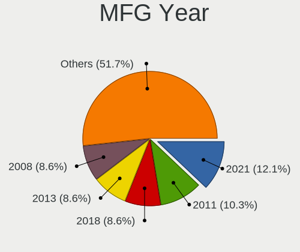

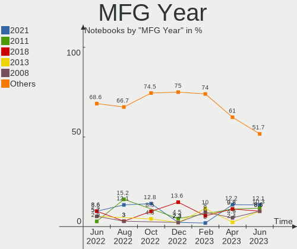

| Year | Notebooks | Percent |
|------|-----------|---------|
| 2013 | 11        | 15.71%  |
| 2021 | 7         | 10%     |
| 2011 | 7         | 10%     |
| 2015 | 6         | 8.57%   |
| 2008 | 6         | 8.57%   |
| 2012 | 5         | 7.14%   |
| 2019 | 4         | 5.71%   |
| 2018 | 4         | 5.71%   |
| 2020 | 3         | 4.29%   |
| 2017 | 3         | 4.29%   |
| 2016 | 3         | 4.29%   |
| 2014 | 3         | 4.29%   |
| 2022 | 2         | 2.86%   |
| 2009 | 2         | 2.86%   |
| 2007 | 2         | 2.86%   |
| 2023 | 1         | 1.43%   |
| 2010 | 1         | 1.43%   |

Form Factor
-----------

Physical design of the computer

| Name     | Notebooks | Percent |
|----------|-----------|---------|
| Notebook | 70        | 100%    |

Secure Boot
-----------

Enabled or disabled

| State    | Notebooks | Percent |
|----------|-----------|---------|
| Disabled | 66        | 94.29%  |
| Enabled  | 4         | 5.71%   |

Coreboot
--------

Have coreboot on board

| Used | Notebooks | Percent |
|------|-----------|---------|
| No   | 70        | 100%    |

RAM Size
--------

Total RAM memory

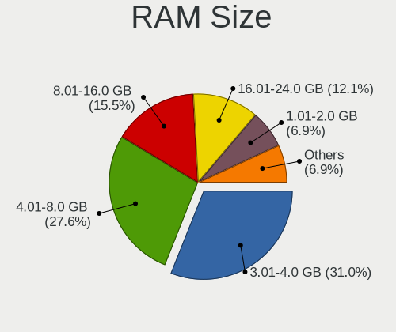

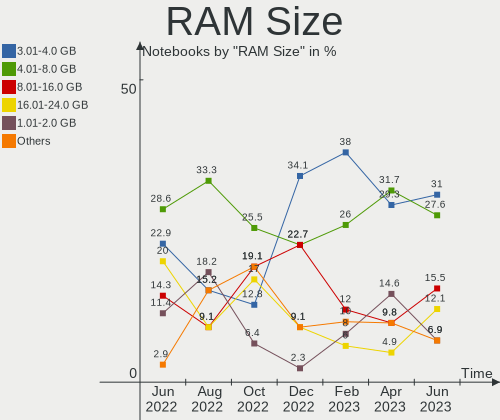

| Size in GB | Notebooks | Percent |
|------------|-----------|---------|
| 3.01-4.0   | 28        | 40%     |
| 4.01-8.0   | 18        | 25.71%  |
| 8.01-16.0  | 11        | 15.71%  |
| 32.01-64.0 | 4         | 5.71%   |
| 1.01-2.0   | 4         | 5.71%   |
| 2.01-3.0   | 2         | 2.86%   |
| 16.01-24.0 | 2         | 2.86%   |
| Unknown    | 1         | 1.43%   |

RAM Used
--------

Used RAM memory

| Used GB  | Notebooks | Percent |
|----------|-----------|---------|
| 1.01-2.0 | 28        | 40%     |
| 0.51-1.0 | 18        | 25.71%  |
| 2.01-3.0 | 10        | 14.29%  |
| 4.01-8.0 | 6         | 8.57%   |
| 3.01-4.0 | 5         | 7.14%   |
| 0.01-0.5 | 2         | 2.86%   |
| Unknown  | 1         | 1.43%   |

Total Drives
------------

Number of drives on board

| Drives | Notebooks | Percent |
|--------|-----------|---------|
| 1      | 54        | 77.14%  |
| 2      | 15        | 21.43%  |
| 0      | 1         | 1.43%   |

Has CD-ROM
----------

Has CD-ROM on board

| Presented | Notebooks | Percent |
|-----------|-----------|---------|
| No        | 42        | 60%     |
| Yes       | 28        | 40%     |

Has Ethernet
------------

Has Ethernet on board

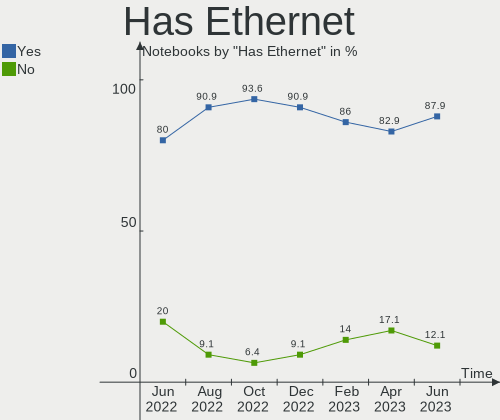

| Presented | Notebooks | Percent |
|-----------|-----------|---------|
| Yes       | 65        | 92.86%  |
| No        | 5         | 7.14%   |

Has WiFi
--------

Has WiFi module

| Presented | Notebooks | Percent |
|-----------|-----------|---------|
| Yes       | 70        | 100%    |

Has Bluetooth
-------------

Has Bluetooth module

| Presented | Notebooks | Percent |
|-----------|-----------|---------|
| Yes       | 56        | 80%     |
| No        | 14        | 20%     |

Location
--------

Country
-------

Geographic location (country)

| Country | Notebooks | Percent |
|---------|-----------|---------|
| Hungary | 70        | 100%    |

City
----

Geographic location (city)

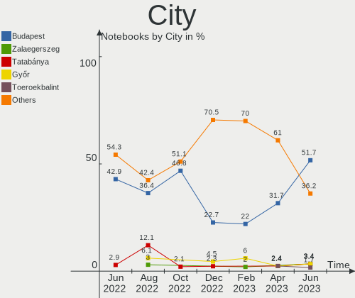

| City              | Notebooks | Percent |
|-------------------|-----------|---------|
| Budapest          | 24        | 34.29%  |
| Zalaegerszeg      | 3         | 4.29%   |
| Veszprém         | 2         | 2.86%   |
| Tatabánya        | 2         | 2.86%   |
| Szolnok           | 2         | 2.86%   |
| Szigetujfalu      | 2         | 2.86%   |
| Szigetszentmiklos | 2         | 2.86%   |
| Nyiregyhaza       | 2         | 2.86%   |
| Gödöllő        | 2         | 2.86%   |
| Toeroekbalint     | 1         | 1.43%   |
| Tiszakecske       | 1         | 1.43%   |
| Sátoraljaújhely | 1         | 1.43%   |
| Sarbogard         | 1         | 1.43%   |
| Salgotarjan       | 1         | 1.43%   |
| Pomaz             | 1         | 1.43%   |
| Pécs             | 1         | 1.43%   |
| Pecel             | 1         | 1.43%   |
| Opusztaszer       | 1         | 1.43%   |
| Nagykanizsa       | 1         | 1.43%   |
| Miskolc           | 1         | 1.43%   |
| Medgyesegyhaza    | 1         | 1.43%   |
| Mateszalka        | 1         | 1.43%   |
| Kisvarda          | 1         | 1.43%   |
| Kecskemét        | 1         | 1.43%   |
| Jaszkiser         | 1         | 1.43%   |
| Hajdusamson       | 1         | 1.43%   |
| Győr             | 1         | 1.43%   |
| Fulop             | 1         | 1.43%   |
| Esztergom         | 1         | 1.43%   |
| Diosd             | 1         | 1.43%   |
| Debrecen          | 1         | 1.43%   |
| Cegled            | 1         | 1.43%   |
| Borsodbota        | 1         | 1.43%   |
| Berettyóújfalu  | 1         | 1.43%   |
| Balassagyarmat    | 1         | 1.43%   |
| Bakonycsernye     | 1         | 1.43%   |
| Bag               | 1         | 1.43%   |
| Abasar            | 1         | 1.43%   |

Drives
------

Drive Vendor
------------

Hard drive vendors

| Vendor              | Notebooks | Drives | Percent |
|---------------------|-----------|--------|---------|
| Samsung Electronics | 15        | 15     | 18.29%  |
| Kingston            | 12        | 13     | 14.63%  |
| WDC                 | 11        | 11     | 13.41%  |
| Seagate             | 6         | 6      | 7.32%   |
| Hitachi             | 6         | 6      | 7.32%   |
| Micron Technology   | 5         | 5      | 6.1%    |
| HGST                | 4         | 4      | 4.88%   |
| Toshiba             | 3         | 3      | 3.66%   |
| SK hynix            | 2         | 2      | 2.44%   |
| Intel               | 2         | 2      | 2.44%   |
| China               | 2         | 2      | 2.44%   |
| Verbatim            | 1         | 1      | 1.22%   |
| Unknown             | 1         | 1      | 1.22%   |
| Union Memory        | 1         | 1      | 1.22%   |
| SSSTC               | 1         | 1      | 1.22%   |
| SPCC                | 1         | 1      | 1.22%   |
| ShiJi               | 1         | 1      | 1.22%   |
| Phison Electronics  | 1         | 1      | 1.22%   |
| LuminouTek          | 1         | 1      | 1.22%   |
| LITEON              | 1         | 1      | 1.22%   |
| KIOXIA              | 1         | 1      | 1.22%   |
| Intenso             | 1         | 1      | 1.22%   |
| Apple               | 1         | 1      | 1.22%   |
| A-DATA Technology   | 1         | 1      | 1.22%   |
| Unknown             | 1         | 1      | 1.22%   |

Drive Model
-----------

Hard drive models

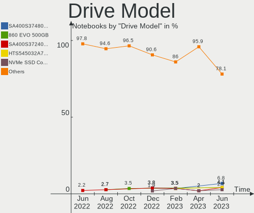

| Model                                               | Notebooks | Percent |
|-----------------------------------------------------|-----------|---------|
| Kingston SA400S37480G 480GB SSD                     | 3         | 3.61%   |
| HGST HTS541010A9E680 1TB                            | 3         | 3.61%   |
| WDC WD10SPCX-24HWST1 1TB                            | 2         | 2.41%   |
| Seagate ST500LT012-1DG142 500GB                     | 2         | 2.41%   |
| Micron MTFDDAK256MAM-1K1 256GB SSD                  | 2         | 2.41%   |
| Kingston SA400S37120G 120GB SSD                     | 2         | 2.41%   |
| Hitachi HTS547550A9E384 500GB                       | 2         | 2.41%   |
| WDC WDS480G2G0A-00JH30 480GB SSD                    | 1         | 1.2%    |
| WDC WD7500BPVX-60JC3T0 752GB                        | 1         | 1.2%    |
| WDC WD5000LPCX-60VHAT1 500GB                        | 1         | 1.2%    |
| WDC WD5000LPCX-24VHAT0 500GB                        | 1         | 1.2%    |
| WDC WD5000BPVT-00HXZT1 500GB                        | 1         | 1.2%    |
| WDC WD3200BEVT-08A23T1 320GB                        | 1         | 1.2%    |
| WDC WD3200BEVT-00ZCT0 320GB                         | 1         | 1.2%    |
| WDC WD2500BEVT-00ZCT0 250GB                         | 1         | 1.2%    |
| WDC WD10SPZX-75Z10T2 1TB                            | 1         | 1.2%    |
| Verbatim Vi550 S3 SSD 128GB                         | 1         | 1.2%    |
| Unknown SL16G  16GB                                 | 1         | 1.2%    |
| Union Memory RTOTJ128VGD2EYX 128GB                  | 1         | 1.2%    |
| Toshiba MQ01ABF050 500GB                            | 1         | 1.2%    |
| Toshiba MK2576GSX 250GB                             | 1         | 1.2%    |
| Toshiba KSG60ZMV256G M.2 2280 256GB SSD             | 1         | 1.2%    |
| SSSTC CL1-8D256-HP 256GB                            | 1         | 1.2%    |
| SPCC Solid State Disk 256GB                         | 1         | 1.2%    |
| SK hynix PC711 HFS512GDE9X073N 512GB                | 1         | 1.2%    |
| SK hynix PC401 NVMe Solid State Drive 256GB         | 1         | 1.2%    |
| ShiJi SSD 256GB                                     | 1         | 1.2%    |
| Seagate ST9500325AS 500GB                           | 1         | 1.2%    |
| Seagate ST320LT020-9YG142 320GB                     | 1         | 1.2%    |
| Seagate ST1000LM035-1RK172 1TB                      | 1         | 1.2%    |
| Seagate ST1000LM024 HN-M101MBB 1TB                  | 1         | 1.2%    |
| Samsung SSD PM871a M.2 2280 512GB                   | 1         | 1.2%    |
| Samsung SSD 870 QVO 1TB                             | 1         | 1.2%    |
| Samsung SSD 870 EVO 500GB                           | 1         | 1.2%    |
| Samsung SSD 870 EVO 250GB                           | 1         | 1.2%    |
| Samsung SSD 850 EVO 250GB                           | 1         | 1.2%    |
| Samsung SSD 750 EVO 250GB                           | 1         | 1.2%    |
| Samsung NVMe SSD Controller SM961/PM961/SM963 256GB | 1         | 1.2%    |
| Samsung NVMe SSD Controller PM9A1/PM9A3/980PRO 1TB  | 1         | 1.2%    |
| Samsung MZVLQ512HBLU-00B00 512GB                    | 1         | 1.2%    |

HDD Vendor
----------

Hard disk drive vendors

| Vendor  | Notebooks | Drives | Percent |
|---------|-----------|--------|---------|
| WDC     | 10        | 10     | 35.71%  |
| Seagate | 6         | 6      | 21.43%  |
| Hitachi | 6         | 6      | 21.43%  |
| HGST    | 4         | 4      | 14.29%  |
| Toshiba | 2         | 2      | 7.14%   |

SSD Vendor
----------

Solid state drive vendors

| Vendor              | Notebooks | Drives | Percent |
|---------------------|-----------|--------|---------|
| Samsung Electronics | 10        | 10     | 27.78%  |
| Kingston            | 10        | 11     | 27.78%  |
| Micron Technology   | 3         | 3      | 8.33%   |
| China               | 2         | 2      | 5.56%   |
| WDC                 | 1         | 1      | 2.78%   |
| Verbatim            | 1         | 1      | 2.78%   |
| Union Memory        | 1         | 1      | 2.78%   |
| Toshiba             | 1         | 1      | 2.78%   |
| SPCC                | 1         | 1      | 2.78%   |
| ShiJi               | 1         | 1      | 2.78%   |
| LuminouTek          | 1         | 1      | 2.78%   |
| Intenso             | 1         | 1      | 2.78%   |
| Intel               | 1         | 1      | 2.78%   |
| Apple               | 1         | 1      | 2.78%   |
| A-DATA Technology   | 1         | 1      | 2.78%   |

Drive Kind
----------

HDD or SSD

| Kind | Notebooks | Drives | Percent |
|------|-----------|--------|---------|
| SSD  | 35        | 37     | 43.21%  |
| HDD  | 28        | 28     | 34.57%  |
| NVMe | 16        | 16     | 19.75%  |
| MMC  | 2         | 2      | 2.47%   |

Drive Connector
---------------

SATA, SAS, NVMe, etc.

| Type | Notebooks | Drives | Percent |
|------|-----------|--------|---------|
| SATA | 55        | 65     | 75.34%  |
| NVMe | 16        | 16     | 21.92%  |
| MMC  | 2         | 2      | 2.74%   |

Drive Size
----------

Size of hard drive

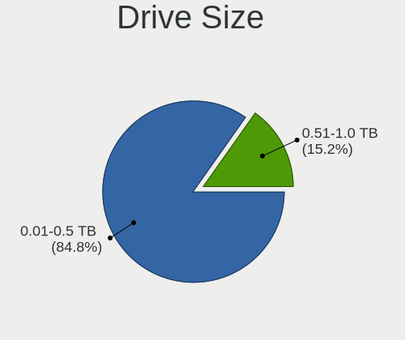

| Size in TB | Notebooks | Drives | Percent |
|------------|-----------|--------|---------|
| 0.01-0.5   | 46        | 50     | 75.41%  |
| 0.51-1.0   | 15        | 15     | 24.59%  |

Space Total
-----------

Amount of disk space available on the file system

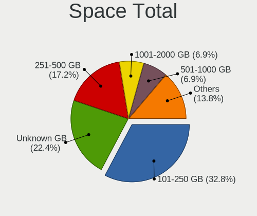

| Size in GB | Notebooks | Percent |
|------------|-----------|---------|
| 101-250    | 22        | 31.43%  |
| 251-500    | 15        | 21.43%  |
| Unknown    | 13        | 18.57%  |
| 501-1000   | 7         | 10%     |
| 1001-2000  | 5         | 7.14%   |
| 51-100     | 5         | 7.14%   |
| 21-50      | 2         | 2.86%   |
| 1-20       | 1         | 1.43%   |

Space Used
----------

Amount of used disk space

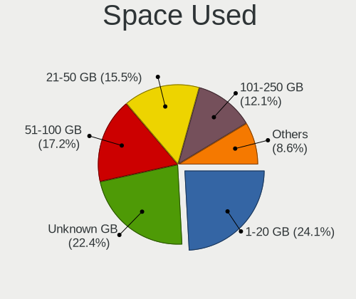

| Used GB   | Notebooks | Percent |
|-----------|-----------|---------|
| 1-20      | 19        | 27.14%  |
| 21-50     | 13        | 18.57%  |
| Unknown   | 13        | 18.57%  |
| 51-100    | 11        | 15.71%  |
| 101-250   | 10        | 14.29%  |
| 501-1000  | 2         | 2.86%   |
| 251-500   | 1         | 1.43%   |
| 1001-2000 | 1         | 1.43%   |

Malfunc. Drives
---------------

Drive models with a malfunction

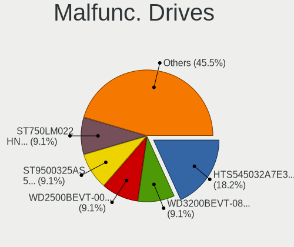

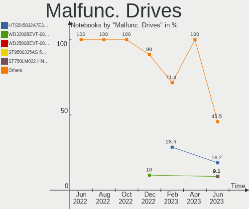

| Model                                   | Notebooks | Drives | Percent |
|-----------------------------------------|-----------|--------|---------|
| WDC WD3200BEVT-08A23T1 320GB            | 1         | 1      | 7.69%   |
| WDC WD2500BEVT-00ZCT0 250GB             | 1         | 1      | 7.69%   |
| Toshiba MQ01ABF050 500GB                | 1         | 1      | 7.69%   |
| Toshiba KSG60ZMV256G M.2 2280 256GB SSD | 1         | 1      | 7.69%   |
| Seagate ST9500325AS 500GB               | 1         | 1      | 7.69%   |
| Seagate ST320LT020-9YG142 320GB         | 1         | 1      | 7.69%   |
| Samsung Electronics SSD 750 EVO 250GB   | 1         | 1      | 7.69%   |
| Hitachi HTS547550A9E384 500GB           | 1         | 1      | 7.69%   |
| Hitachi HTS545050B9A300 500GB           | 1         | 1      | 7.69%   |
| Hitachi HTS542525K9SA00 250GB           | 1         | 1      | 7.69%   |
| HGST HTS545032A7E380 320GB              | 1         | 1      | 7.69%   |
| HGST HTS541010A9E680 1TB                | 1         | 1      | 7.69%   |
| Apple SSD TS064E 64GB                   | 1         | 1      | 7.69%   |

Malfunc. Drive Vendor
---------------------

Vendors of faulty drives

| Vendor              | Notebooks | Drives | Percent |
|---------------------|-----------|--------|---------|
| Hitachi             | 3         | 3      | 23.08%  |
| WDC                 | 2         | 2      | 15.38%  |
| Toshiba             | 2         | 2      | 15.38%  |
| Seagate             | 2         | 2      | 15.38%  |
| HGST                | 2         | 2      | 15.38%  |
| Samsung Electronics | 1         | 1      | 7.69%   |
| Apple               | 1         | 1      | 7.69%   |

Malfunc. HDD Vendor
-------------------

Vendors of faulty HDD drives

| Vendor  | Notebooks | Drives | Percent |
|---------|-----------|--------|---------|
| Hitachi | 3         | 3      | 30%     |
| WDC     | 2         | 2      | 20%     |
| Seagate | 2         | 2      | 20%     |
| HGST    | 2         | 2      | 20%     |
| Toshiba | 1         | 1      | 10%     |

Malfunc. Drive Kind
-------------------

Kinds of faulty drives

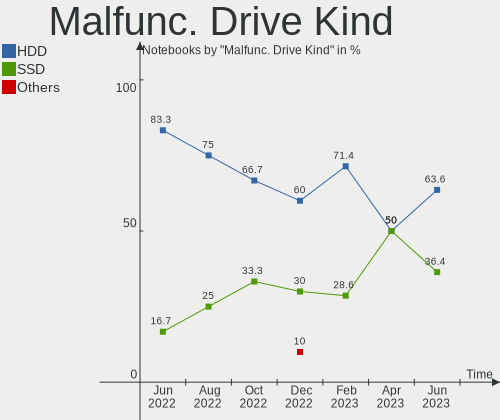

| Kind | Notebooks | Drives | Percent |
|------|-----------|--------|---------|
| HDD  | 10        | 10     | 76.92%  |
| SSD  | 3         | 3      | 23.08%  |

Failed Drives
-------------

Failed drive models

Zero info for selected period =(

Failed Drive Vendor
-------------------

Failed drive vendors

Zero info for selected period =(

Drive Status
------------

Number of failed and malfunc. drives

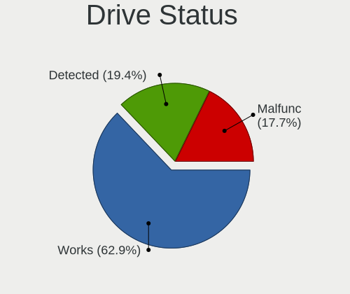

| Status   | Notebooks | Drives | Percent |
|----------|-----------|--------|---------|
| Works    | 42        | 49     | 58.33%  |
| Detected | 17        | 21     | 23.61%  |
| Malfunc  | 13        | 13     | 18.06%  |

Storage controller
------------------

Storage Vendor
--------------

Storage controller vendors

| Vendor                         | Notebooks | Percent |
|--------------------------------|-----------|---------|
| Intel                          | 56        | 70.89%  |
| AMD                            | 7         | 8.86%   |
| Samsung Electronics            | 5         | 6.33%   |
| SK hynix                       | 2         | 2.53%   |
| Micron Technology              | 2         | 2.53%   |
| Kingston Technology Company    | 2         | 2.53%   |
| Toshiba America Info Systems   | 1         | 1.27%   |
| Solid State Storage Technology | 1         | 1.27%   |
| Phison Electronics             | 1         | 1.27%   |
| Nvidia                         | 1         | 1.27%   |
| Lite-On Technology             | 1         | 1.27%   |

Storage Model
-------------

Storage controller models

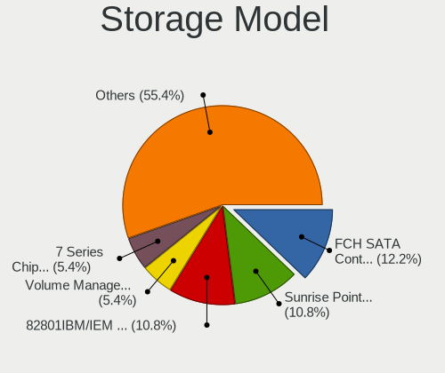

| Model                                                                          | Notebooks | Percent |
|--------------------------------------------------------------------------------|-----------|---------|
| Intel 7 Series Chipset Family 6-port SATA Controller [AHCI mode]               | 9         | 10.23%  |
| Intel Wildcat Point-LP SATA Controller [AHCI Mode]                             | 6         | 6.82%   |
| Intel 82801IBM/IEM (ICH9M/ICH9M-E) 4 port SATA Controller [AHCI mode]          | 6         | 6.82%   |
| Intel 6 Series/C200 Series Chipset Family 6 port Mobile SATA AHCI Controller   | 6         | 6.82%   |
| Intel Sunrise Point-LP SATA Controller [AHCI mode]                             | 5         | 5.68%   |
| AMD FCH SATA Controller [AHCI mode]                                            | 5         | 5.68%   |
| Intel 82801 Mobile SATA Controller [RAID mode]                                 | 4         | 4.55%   |
| Intel 8 Series SATA Controller 1 [AHCI mode]                                   | 4         | 4.55%   |
| Intel Volume Management Device NVMe RAID Controller                            | 3         | 3.41%   |
| Samsung NVMe SSD Controller 980                                                | 2         | 2.27%   |
| Micron NVMe Storage Controller                                                 | 2         | 2.27%   |
| Intel Tiger Lake-LP SATA Controller                                            | 2         | 2.27%   |
| Intel Atom Processor E3800 Series SATA AHCI Controller                         | 2         | 2.27%   |
| Intel 82801HM/HEM (ICH8M/ICH8M-E) IDE Controller                               | 2         | 2.27%   |
| Intel 8 Series/C220 Series Chipset Family 6-port SATA Controller 1 [AHCI mode] | 2         | 2.27%   |
| AMD SB7x0/SB8x0/SB9x0 SATA Controller [AHCI mode]                              | 2         | 2.27%   |
| Toshiba America Info Systems XG6 NVMe SSD Controller                           | 1         | 1.14%   |
| Solid State Storage Non-Volatile memory controller                             | 1         | 1.14%   |
| SK hynix PC401 NVMe Solid State Drive 256GB                                    | 1         | 1.14%   |
| SK hynix Gold P31/PC711 NVMe Solid State Drive                                 | 1         | 1.14%   |
| Samsung NVMe SSD Controller SM981/PM981/PM983                                  | 1         | 1.14%   |
| Samsung NVMe SSD Controller SM961/PM961/SM963                                  | 1         | 1.14%   |
| Samsung NVMe SSD Controller PM9A1/PM9A3/980PRO                                 | 1         | 1.14%   |
| Phison PS5013 E13 NVMe Controller                                              | 1         | 1.14%   |
| Nvidia MCP78S [GeForce 8200] SATA Controller (non-AHCI mode)                   | 1         | 1.14%   |
| Nvidia MCP78S [GeForce 8200] IDE                                               | 1         | 1.14%   |
| Lite-On Non-Volatile memory controller                                         | 1         | 1.14%   |
| Kingston Company U-SNS8154P3 NVMe SSD                                          | 1         | 1.14%   |
| Kingston Company Company Non-Volatile memory controller                        | 1         | 1.14%   |
| Intel SSD 660P Series                                                          | 1         | 1.14%   |
| Intel Ice Lake-LP SATA Controller [AHCI mode]                                  | 1         | 1.14%   |
| Intel HM170/QM170 Chipset SATA Controller [AHCI Mode]                          | 1         | 1.14%   |
| Intel Comet Lake SATA AHCI Controller                                          | 1         | 1.14%   |
| Intel Celeron/Pentium Silver Processor SATA Controller                         | 1         | 1.14%   |
| Intel Celeron N3350/Pentium N4200/Atom E3900 Series SATA AHCI Controller       | 1         | 1.14%   |
| Intel Cannon Point-LP SATA Controller [AHCI Mode]                              | 1         | 1.14%   |
| Intel Cannon Lake Mobile PCH SATA AHCI Controller                              | 1         | 1.14%   |
| Intel 82801IBM/IEM (ICH9M/ICH9M-E) 2 port SATA Controller [IDE mode]           | 1         | 1.14%   |
| Intel 82801HM/HEM (ICH8M/ICH8M-E) SATA Controller [IDE mode]                   | 1         | 1.14%   |
| Intel 82801HM/HEM (ICH8M/ICH8M-E) SATA Controller [AHCI mode]                  | 1         | 1.14%   |

Storage Kind
------------

Kind of storage controller (IDE, SATA, NVMe, SAS, ...)

| Kind | Notebooks | Percent |
|------|-----------|---------|
| SATA | 57        | 66.28%  |
| NVMe | 16        | 18.6%   |
| RAID | 7         | 8.14%   |
| IDE  | 6         | 6.98%   |

Processor
---------

CPU Vendor
----------

Processor vendors

| Vendor | Notebooks | Percent |
|--------|-----------|---------|
| Intel  | 58        | 82.86%  |
| AMD    | 12        | 17.14%  |

CPU Model
---------

Processor models

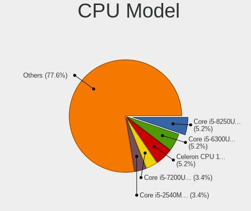

| Model                                       | Notebooks | Percent |
|---------------------------------------------|-----------|---------|
| Intel Core i5-2540M CPU @ 2.60GHz           | 4         | 5.71%   |
| Intel Core i5-5200U CPU @ 2.20GHz           | 3         | 4.29%   |
| Intel Pentium CPU 2117U @ 1.80GHz           | 2         | 2.86%   |
| Intel Core i7-8650U CPU @ 1.90GHz           | 2         | 2.86%   |
| Intel Core i7-4510U CPU @ 2.00GHz           | 2         | 2.86%   |
| Intel Core i3-10110U CPU @ 2.10GHz          | 2         | 2.86%   |
| Intel Core 2 Duo CPU T7500 @ 2.20GHz        | 2         | 2.86%   |
| Intel Core 2 Duo CPU P8600 @ 2.40GHz        | 2         | 2.86%   |
| Intel Pentium Dual-Core CPU T4400 @ 2.20GHz | 1         | 1.43%   |
| Intel Pentium Dual-Core CPU T4300 @ 2.10GHz | 1         | 1.43%   |
| Intel Pentium CPU N3540 @ 2.16GHz           | 1         | 1.43%   |
| Intel Pentium CPU N3510 @ 1.99GHz           | 1         | 1.43%   |
| Intel Pentium CPU B970 @ 2.30GHz            | 1         | 1.43%   |
| Intel Pentium CPU B960 @ 2.20GHz            | 1         | 1.43%   |
| Intel Core i7-8750H CPU @ 2.20GHz           | 1         | 1.43%   |
| Intel Core i7-6600U CPU @ 2.60GHz           | 1         | 1.43%   |
| Intel Core i7-5600U CPU @ 2.60GHz           | 1         | 1.43%   |
| Intel Core i7-4600U CPU @ 2.10GHz           | 1         | 1.43%   |
| Intel Core i7-2630QM CPU @ 2.00GHz          | 1         | 1.43%   |
| Intel Core i7-1065G7 CPU @ 1.30GHz          | 1         | 1.43%   |
| Intel Core i5-8265U CPU @ 1.60GHz           | 1         | 1.43%   |
| Intel Core i5-7300U CPU @ 2.60GHz           | 1         | 1.43%   |
| Intel Core i5-7200U CPU @ 2.50GHz           | 1         | 1.43%   |
| Intel Core i5-6300HQ CPU @ 2.30GHz          | 1         | 1.43%   |
| Intel Core i5-6200U CPU @ 2.30GHz           | 1         | 1.43%   |
| Intel Core i5-5300U CPU @ 2.30GHz           | 1         | 1.43%   |
| Intel Core i5-4310M CPU @ 2.70GHz           | 1         | 1.43%   |
| Intel Core i5-4200M CPU @ 2.50GHz           | 1         | 1.43%   |
| Intel Core i5-3427U CPU @ 1.80GHz           | 1         | 1.43%   |
| Intel Core i5-3337U CPU @ 1.80GHz           | 1         | 1.43%   |
| Intel Core i5-1035G1 CPU @ 1.00GHz          | 1         | 1.43%   |
| Intel Core i3-6006U CPU @ 2.00GHz           | 1         | 1.43%   |
| Intel Core i3-5005U CPU @ 2.00GHz           | 1         | 1.43%   |
| Intel Core i3-4030U CPU @ 1.90GHz           | 1         | 1.43%   |
| Intel Core i3-2350M CPU @ 2.30GHz           | 1         | 1.43%   |
| Intel Core 2 Duo CPU T9900 @ 3.06GHz        | 1         | 1.43%   |
| Intel Core 2 Duo CPU T9400 @ 2.53GHz        | 1         | 1.43%   |
| Intel Core 2 Duo CPU T7250 @ 2.00GHz        | 1         | 1.43%   |
| Intel Celeron J4105 CPU @ 1.50GHz           | 1         | 1.43%   |
| Intel Celeron CPU N3350 @ 1.10GHz           | 1         | 1.43%   |

CPU Model Family
----------------

Processor model prefix

| Model                   | Notebooks | Percent |
|-------------------------|-----------|---------|
| Intel Core i5           | 18        | 25.71%  |
| Intel Core i7           | 10        | 14.29%  |
| Intel Core 2 Duo        | 7         | 10%     |
| Intel Pentium           | 6         | 8.57%   |
| Intel Core i3           | 6         | 8.57%   |
| Other                   | 5         | 7.14%   |
| Intel Celeron           | 5         | 7.14%   |
| Intel Pentium Dual-Core | 2         | 2.86%   |
| AMD Ryzen 5             | 2         | 2.86%   |
| AMD Ryzen 7 PRO         | 1         | 1.43%   |
| AMD Ryzen 7             | 1         | 1.43%   |
| AMD Ryzen 3             | 1         | 1.43%   |
| AMD E1                  | 1         | 1.43%   |
| AMD E                   | 1         | 1.43%   |
| AMD Athlon II           | 1         | 1.43%   |
| AMD Athlon              | 1         | 1.43%   |
| AMD A8                  | 1         | 1.43%   |
| AMD A4                  | 1         | 1.43%   |

CPU Cores
---------

Number of processor cores

| Number | Notebooks | Percent |
|--------|-----------|---------|
| 2      | 48        | 68.57%  |
| 4      | 15        | 21.43%  |
| 8      | 3         | 4.29%   |
| 6      | 2         | 2.86%   |
| 1      | 2         | 2.86%   |

CPU Sockets
-----------

Number of sockets

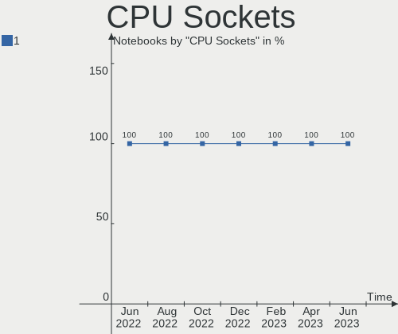

| Number | Notebooks | Percent |
|--------|-----------|---------|
| 1      | 70        | 100%    |

CPU Threads
-----------

Threads per core (Hyper-Threading)

| Number | Notebooks | Percent |
|--------|-----------|---------|
| 2      | 43        | 61.43%  |
| 1      | 27        | 38.57%  |

CPU Op-Modes
------------

CPU Operation Modes (32-bit, 64-bit)

| Op mode        | Notebooks | Percent |
|----------------|-----------|---------|
| 32-bit, 64-bit | 69        | 98.57%  |
| Unknown        | 1         | 1.43%   |

CPU Microcode
-------------

Microcode number

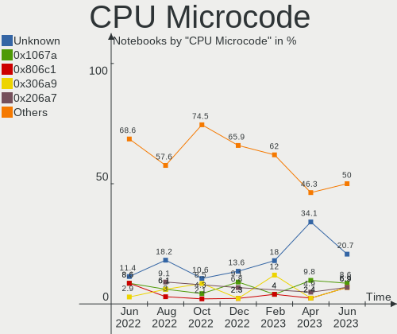

| Number     | Notebooks | Percent |
|------------|-----------|---------|
| Unknown    | 15        | 21.43%  |
| 0x206a7    | 9         | 12.86%  |
| 0x306a9    | 5         | 7.14%   |
| 0x1067a    | 5         | 7.14%   |
| 0x306d4    | 4         | 5.71%   |
| 0x406e3    | 3         | 4.29%   |
| 0x806ec    | 2         | 2.86%   |
| 0x6fa      | 2         | 2.86%   |
| 0x40651    | 2         | 2.86%   |
| 0x306c3    | 2         | 2.86%   |
| 0x806ea    | 1         | 1.43%   |
| 0x806d1    | 1         | 1.43%   |
| 0x806c1    | 1         | 1.43%   |
| 0x706e5    | 1         | 1.43%   |
| 0x706a1    | 1         | 1.43%   |
| 0x6fd      | 1         | 1.43%   |
| 0x506e3    | 1         | 1.43%   |
| 0x506c9    | 1         | 1.43%   |
| 0x30678    | 1         | 1.43%   |
| 0x10676    | 1         | 1.43%   |
| 0x0a50000c | 1         | 1.43%   |
| 0x0a404102 | 1         | 1.43%   |
| 0x08900201 | 1         | 1.43%   |
| 0x08600106 | 1         | 1.43%   |
| 0x08108109 | 1         | 1.43%   |
| 0x08108102 | 1         | 1.43%   |
| 0x07030105 | 1         | 1.43%   |
| 0x0700010f | 1         | 1.43%   |
| 0x06003109 | 1         | 1.43%   |
| 0x05000029 | 1         | 1.43%   |
| 0x010000c8 | 1         | 1.43%   |

CPU Microarch
-------------

Microarchitecture

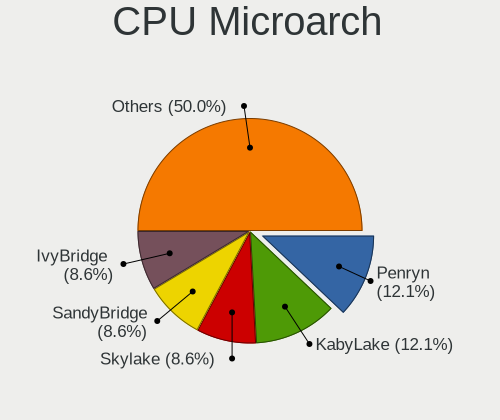

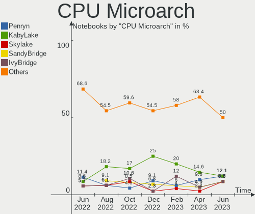

| Name            | Notebooks | Percent |
|-----------------|-----------|---------|
| SandyBridge     | 9         | 12.86%  |
| KabyLake        | 8         | 11.43%  |
| Penryn          | 6         | 8.57%   |
| IvyBridge       | 6         | 8.57%   |
| Haswell         | 6         | 8.57%   |
| Broadwell       | 6         | 8.57%   |
| Skylake         | 4         | 5.71%   |
| TigerLake       | 3         | 4.29%   |
| Icelake         | 3         | 4.29%   |
| Core            | 3         | 4.29%   |
| Zen+            | 2         | 2.86%   |
| Silvermont      | 2         | 2.86%   |
| Unknown         | 2         | 2.86%   |
| Zen 3           | 1         | 1.43%   |
| Zen 2           | 1         | 1.43%   |
| Steamroller     | 1         | 1.43%   |
| Puma            | 1         | 1.43%   |
| K8 & K10 hybrid | 1         | 1.43%   |
| K10             | 1         | 1.43%   |
| Jaguar          | 1         | 1.43%   |
| Goldmont plus   | 1         | 1.43%   |
| Goldmont        | 1         | 1.43%   |
| Bobcat          | 1         | 1.43%   |

Graphics
--------

GPU Vendor
----------

Vendors of graphics cards

| Vendor | Notebooks | Percent |
|--------|-----------|---------|
| Intel  | 53        | 58.89%  |
| AMD    | 19        | 21.11%  |
| Nvidia | 18        | 20%     |

GPU Model
---------

Graphics card models

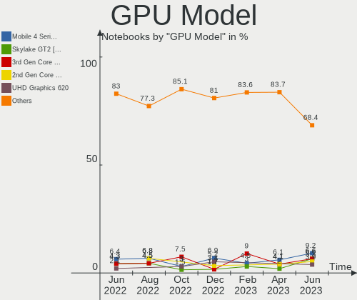

| Model                                                                         | Notebooks | Percent |
|-------------------------------------------------------------------------------|-----------|---------|
| Intel 2nd Generation Core Processor Family Integrated Graphics Controller     | 7         | 7.53%   |
| Intel HD Graphics 5500                                                        | 6         | 6.45%   |
| Intel 3rd Gen Core processor Graphics Controller                              | 6         | 6.45%   |
| Nvidia GF117M [GeForce 610M/710M/810M/820M / GT 620M/625M/630M/720M]          | 5         | 5.38%   |
| Intel Mobile 4 Series Chipset Integrated Graphics Controller                  | 4         | 4.3%    |
| Intel Haswell-ULT Integrated Graphics Controller                              | 4         | 4.3%    |
| Intel Skylake GT2 [HD Graphics 520]                                           | 3         | 3.23%   |
| AMD Sun XT [Radeon HD 8670A/8670M/8690M / R5 M330 / M430 / Radeon 520 Mobile] | 3         | 3.23%   |
| AMD Seymour [Radeon HD 6400M/7400M Series]                                    | 3         | 3.23%   |
| Nvidia GK208BM [GeForce 920M]                                                 | 2         | 2.15%   |
| Nvidia GK107M [GeForce GT 750M]                                               | 2         | 2.15%   |
| Intel UHD Graphics 620                                                        | 2         | 2.15%   |
| Intel TigerLake-LP GT2 [Iris Xe Graphics]                                     | 2         | 2.15%   |
| Intel Mobile GM965/GL960 Integrated Graphics Controller (secondary)           | 2         | 2.15%   |
| Intel Mobile GM965/GL960 Integrated Graphics Controller (primary)             | 2         | 2.15%   |
| Intel HD Graphics 620                                                         | 2         | 2.15%   |
| Intel CometLake-U GT2 [UHD Graphics]                                          | 2         | 2.15%   |
| Intel Atom Processor Z36xxx/Z37xxx Series Graphics & Display                  | 2         | 2.15%   |
| Intel 4th Gen Core Processor Integrated Graphics Controller                   | 2         | 2.15%   |
| AMD RV635/M86 [Mobility Radeon HD 3650]                                       | 2         | 2.15%   |
| AMD Picasso/Raven 2 [Radeon Vega Series / Radeon Vega Mobile Series]          | 2         | 2.15%   |
| Nvidia GP108M [GeForce MX150]                                                 | 1         | 1.08%   |
| Nvidia GM108M [GeForce MX130]                                                 | 1         | 1.08%   |
| Nvidia GM108M [GeForce 930MX]                                                 | 1         | 1.08%   |
| Nvidia GM107M [GeForce GTX 950M]                                              | 1         | 1.08%   |
| Nvidia GA107M [GeForce RTX 3050 Ti Mobile]                                    | 1         | 1.08%   |
| Nvidia GA107GLM [RTX A2000 Mobile]                                            | 1         | 1.08%   |
| Nvidia GA106M [GeForce RTX 3060 Mobile / Max-Q]                               | 1         | 1.08%   |
| Nvidia G96CM [GeForce 9600M GT]                                               | 1         | 1.08%   |
| Nvidia C77 [GeForce 8200M G]                                                  | 1         | 1.08%   |
| Intel WhiskeyLake-U GT2 [UHD Graphics 620]                                    | 1         | 1.08%   |
| Intel TigerLake-H GT1 [UHD Graphics]                                          | 1         | 1.08%   |
| Intel Tiger Lake-LP GT2 [UHD Graphics G4]                                     | 1         | 1.08%   |
| Intel Iris Plus Graphics G7                                                   | 1         | 1.08%   |
| Intel Iris Plus Graphics G1 (Ice Lake)                                        | 1         | 1.08%   |
| Intel HD Graphics 530                                                         | 1         | 1.08%   |
| Intel HD Graphics 500                                                         | 1         | 1.08%   |
| Intel GeminiLake [UHD Graphics 600]                                           | 1         | 1.08%   |
| Intel CoffeeLake-H GT2 [UHD Graphics 630]                                     | 1         | 1.08%   |
| AMD Wrestler [Radeon HD 6310]                                                 | 1         | 1.08%   |

GPU Combo
---------

Combinations of graphics cards

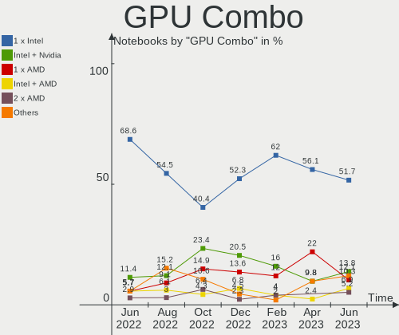

| Name           | Notebooks | Percent |
|----------------|-----------|---------|
| 1 x Intel      | 36        | 51.43%  |
| Intel + Nvidia | 13        | 18.57%  |
| 1 x AMD        | 12        | 17.14%  |
| Intel + AMD    | 4         | 5.71%   |
| 1 x Nvidia     | 2         | 2.86%   |
| AMD + Nvidia   | 2         | 2.86%   |
| 2 x AMD        | 1         | 1.43%   |

GPU Driver
----------

Free vs proprietary

| Driver      | Notebooks | Percent |
|-------------|-----------|---------|
| Free        | 66        | 94.29%  |
| Proprietary | 3         | 4.29%   |
| Unknown     | 1         | 1.43%   |

GPU Memory
----------

Total video memory

| Size in GB | Notebooks | Percent |
|------------|-----------|---------|
| Unknown    | 41        | 58.57%  |
| 0.01-0.5   | 11        | 15.71%  |
| 1.01-2.0   | 10        | 14.29%  |
| 0.51-1.0   | 7         | 10%     |
| 3.01-4.0   | 1         | 1.43%   |

Monitor
-------

Monitor Vendor
--------------

Monitor vendors

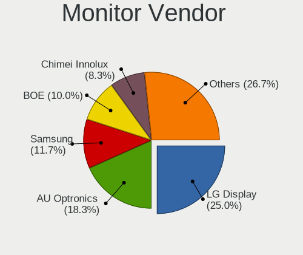

| Vendor                  | Notebooks | Percent |
|-------------------------|-----------|---------|
| LG Display              | 18        | 25%     |
| AU Optronics            | 15        | 20.83%  |
| Chimei Innolux          | 8         | 11.11%  |
| BOE                     | 8         | 11.11%  |
| Samsung Electronics     | 7         | 9.72%   |
| Lenovo                  | 3         | 4.17%   |
| Dell                    | 3         | 4.17%   |
| Goldstar                | 2         | 2.78%   |
| Chi Mei Optoelectronics | 2         | 2.78%   |
| Valve                   | 1         | 1.39%   |
| Sony                    | 1         | 1.39%   |
| PANDA                   | 1         | 1.39%   |
| ASUSTek Computer        | 1         | 1.39%   |
| Apple                   | 1         | 1.39%   |
| Ancor Communications    | 1         | 1.39%   |

Monitor Model
-------------

Monitor models

| Model                                                                   | Notebooks | Percent |
|-------------------------------------------------------------------------|-----------|---------|
| LG Display LCD Monitor LGD0395 1366x768 344x194mm 15.5-inch             | 2         | 2.7%    |
| AU Optronics LCD Monitor AUO21EC 1366x768 344x193mm 15.5-inch           | 2         | 2.7%    |
| AU Optronics LCD Monitor AUO213E 1600x900 309x174mm 14.0-inch           | 2         | 2.7%    |
| Valve ANX7530 U VLV3001 800x1280 100x150mm 7.1-inch                     | 1         | 1.35%   |
| Sony TV *00 SNY7C04 3840x2160 1218x685mm 55.0-inch                      | 1         | 1.35%   |
| Samsung Electronics SyncMaster SAM0027 1280x1024 312x234mm 15.4-inch    | 1         | 1.35%   |
| Samsung Electronics LCD Monitor SEC3157 1280x800 303x190mm 14.1-inch    | 1         | 1.35%   |
| Samsung Electronics LCD Monitor SEC3051 1600x900 398x232mm 18.1-inch    | 1         | 1.35%   |
| Samsung Electronics LCD Monitor SEC304F 1680x945 409x230mm 18.5-inch    | 1         | 1.35%   |
| Samsung Electronics LCD Monitor SEC3046 1366x768 344x193mm 15.5-inch    | 1         | 1.35%   |
| Samsung Electronics LCD Monitor SDC3150 1920x1080 344x194mm 15.5-inch   | 1         | 1.35%   |
| Samsung Electronics LCD Monitor SAM7017 3840x2160 1872x1053mm 84.6-inch | 1         | 1.35%   |
| PANDA LCD Monitor NCP0065 1920x1080 309x174mm 14.0-inch                 | 1         | 1.35%   |
| LG Display LCD Monitor LGD06F5 1920x1080 344x194mm 15.5-inch            | 1         | 1.35%   |
| LG Display LCD Monitor LGD06AA 3840x2400 344x215mm 16.0-inch            | 1         | 1.35%   |
| LG Display LCD Monitor LGD059D 1920x1080 309x174mm 14.0-inch            | 1         | 1.35%   |
| LG Display LCD Monitor LGD056D 1920x1080 382x215mm 17.3-inch            | 1         | 1.35%   |
| LG Display LCD Monitor LGD054F 1920x1080 344x194mm 15.5-inch            | 1         | 1.35%   |
| LG Display LCD Monitor LGD04FC 1366x768 344x194mm 15.5-inch             | 1         | 1.35%   |
| LG Display LCD Monitor LGD04BD 1366x768 344x194mm 15.5-inch             | 1         | 1.35%   |
| LG Display LCD Monitor LGD046D 1920x1080 309x174mm 14.0-inch            | 1         | 1.35%   |
| LG Display LCD Monitor LGD03ED 1366x768 277x156mm 12.5-inch             | 1         | 1.35%   |
| LG Display LCD Monitor LGD039F 1366x768 345x194mm 15.6-inch             | 1         | 1.35%   |
| LG Display LCD Monitor LGD0365 1600x900 382x215mm 17.3-inch             | 1         | 1.35%   |
| LG Display LCD Monitor LGD0353 1366x768 345x194mm 15.6-inch             | 1         | 1.35%   |
| LG Display LCD Monitor LGD033A 1366x768 344x194mm 15.5-inch             | 1         | 1.35%   |
| LG Display LCD Monitor LGD02DC 1366x768 344x194mm 15.5-inch             | 1         | 1.35%   |
| LG Display LCD Monitor LGD02CF 1366x768 344x194mm 15.5-inch             | 1         | 1.35%   |
| LG Display LCD Monitor LGD02AD 1366x768 344x194mm 15.5-inch             | 1         | 1.35%   |
| Lenovo LCD Monitor LEN4057 1280x800 331x207mm 15.4-inch                 | 1         | 1.35%   |
| Lenovo LCD Monitor LEN4036 1440x900 303x190mm 14.1-inch                 | 1         | 1.35%   |
| Lenovo LCD Monitor LEN4011 1280x800 261x163mm 12.1-inch                 | 1         | 1.35%   |
| Goldstar E2260 GSM57E1 1920x1080 477x268mm 21.5-inch                    | 1         | 1.35%   |
| Goldstar E1940 GSM4BD6 1360x768 406x229mm 18.4-inch                     | 1         | 1.35%   |
| Goldstar 700B GSM430C 1280x1024 310x230mm 15.2-inch                     | 1         | 1.35%   |
| Goldstar 2D HD TV GSM59CA 1366x768 509x286mm 23.0-inch                  | 1         | 1.35%   |
| Dell P2317H DEL40F4 1920x1080 509x286mm 23.0-inch                       | 1         | 1.35%   |
| Dell P2214H DELA097 1920x1080 477x268mm 21.5-inch                       | 1         | 1.35%   |
| Dell 2408WFP DELA02C 1920x1200 519x324mm 24.1-inch                      | 1         | 1.35%   |
| Chimei Innolux LCD Monitor CMN1733 1600x900 382x215mm 17.3-inch         | 1         | 1.35%   |

Monitor Resolution
------------------

Monitor screen resolution

| Resolution        | Notebooks | Percent |
|-------------------|-----------|---------|
| 1366x768 (WXGA)   | 27        | 38.03%  |
| 1920x1080 (FHD)   | 22        | 30.99%  |
| 1600x900 (HD+)    | 6         | 8.45%   |
| 3840x2160 (4K)    | 3         | 4.23%   |
| 1440x900 (WXGA+)  | 3         | 4.23%   |
| 1280x800 (WXGA)   | 3         | 4.23%   |
| 800x1280          | 1         | 1.41%   |
| 4093x4093         | 1         | 1.41%   |
| 3840x2400         | 1         | 1.41%   |
| 1920x1200 (WUXGA) | 1         | 1.41%   |
| 1680x945          | 1         | 1.41%   |
| 1360x768          | 1         | 1.41%   |
| 1280x1024 (SXGA)  | 1         | 1.41%   |

Monitor Diagonal
----------------

Diagonal size in inches

| Inches | Notebooks | Percent |
|--------|-----------|---------|
| 15     | 34        | 45.95%  |
| 14     | 9         | 12.16%  |
| 13     | 7         | 9.46%   |
| 12     | 4         | 5.41%   |
| 18     | 3         | 4.05%   |
| 17     | 3         | 4.05%   |
| 16     | 3         | 4.05%   |
| 27     | 2         | 2.7%    |
| 23     | 2         | 2.7%    |
| 21     | 2         | 2.7%    |
| 84     | 1         | 1.35%   |
| 65     | 1         | 1.35%   |
| 24     | 1         | 1.35%   |
| 11     | 1         | 1.35%   |
| 7      | 1         | 1.35%   |

Monitor Width
-------------

Physical width

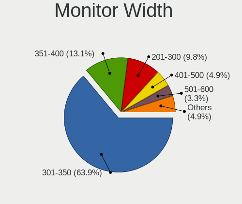

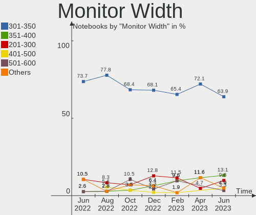

| Width in mm | Notebooks | Percent |
|-------------|-----------|---------|
| 301-350     | 50        | 68.49%  |
| 201-300     | 7         | 9.59%   |
| 501-600     | 5         | 6.85%   |
| 351-400     | 5         | 6.85%   |
| 401-500     | 3         | 4.11%   |
| 1501-2000   | 1         | 1.37%   |
| 1001-1500   | 1         | 1.37%   |
| 1-100       | 1         | 1.37%   |

Aspect Ratio
------------

Proportional relationship between the width and the height

| Ratio | Notebooks | Percent |
|-------|-----------|---------|
| 16/9  | 57        | 83.82%  |
| 16/10 | 7         | 10.29%  |
| 4/3   | 2         | 2.94%   |
| 3/2   | 1         | 1.47%   |
| 0.67  | 1         | 1.47%   |

Monitor Area
------------

Area in inch²

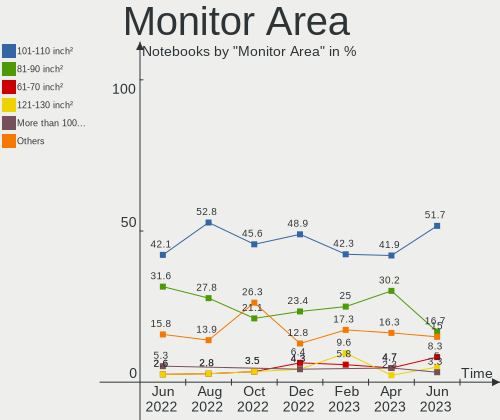

| Area in inch² | Notebooks | Percent |
|----------------|-----------|---------|
| 101-110        | 34        | 46.58%  |
| 81-90          | 15        | 20.55%  |
| 61-70          | 4         | 5.48%   |
| 201-250        | 3         | 4.11%   |
| 141-150        | 3         | 4.11%   |
| 121-130        | 3         | 4.11%   |
| More than 1000 | 2         | 2.74%   |
| 301-350        | 2         | 2.74%   |
| 111-120        | 2         | 2.74%   |
| 71-80          | 1         | 1.37%   |
| 51-60          | 1         | 1.37%   |
| 1-40           | 1         | 1.37%   |
| 251-300        | 1         | 1.37%   |
| 131-140        | 1         | 1.37%   |

Pixel Density
-------------

Pixels per inch

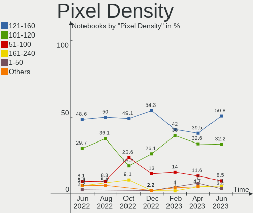

| Density       | Notebooks | Percent |
|---------------|-----------|---------|
| 121-160       | 29        | 40.28%  |
| 101-120       | 28        | 38.89%  |
| 51-100        | 11        | 15.28%  |
| 161-240       | 3         | 4.17%   |
| More than 240 | 1         | 1.39%   |

Multiple Monitors
-----------------

Total monitors connected

| Total | Notebooks | Percent |
|-------|-----------|---------|
| 1     | 62        | 88.57%  |
| 2     | 6         | 8.57%   |
| 4     | 1         | 1.43%   |
| 0     | 1         | 1.43%   |

Network
-------

Net Controller Vendor
---------------------

Controller vendors

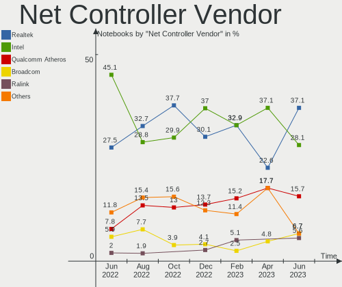

| Vendor                            | Notebooks | Percent |
|-----------------------------------|-----------|---------|
| Intel                             | 36        | 31.58%  |
| Realtek Semiconductor             | 34        | 29.82%  |
| Qualcomm Atheros                  | 22        | 19.3%   |
| Broadcom                          | 8         | 7.02%   |
| Ericsson Business Mobile Networks | 3         | 2.63%   |
| Broadcom Limited                  | 2         | 1.75%   |
| WEMOS.CC                          | 1         | 0.88%   |
| Ralink                            | 1         | 0.88%   |
| QinHeng Electronics               | 1         | 0.88%   |
| Nvidia                            | 1         | 0.88%   |
| MediaTek                          | 1         | 0.88%   |
| Marvell Technology Group          | 1         | 0.88%   |
| Lenovo                            | 1         | 0.88%   |
| DisplayLink                       | 1         | 0.88%   |
| ASIX Electronics                  | 1         | 0.88%   |

Net Controller Model
--------------------

Controller models

| Model                                                                   | Notebooks | Percent |
|-------------------------------------------------------------------------|-----------|---------|
| Realtek RTL8111/8168/8411 PCI Express Gigabit Ethernet Controller       | 23        | 16.31%  |
| Realtek RTL810xE PCI Express Fast Ethernet controller                   | 9         | 6.38%   |
| Qualcomm Atheros QCA9565 / AR9565 Wireless Network Adapter              | 5         | 3.55%   |
| Qualcomm Atheros AR9485 Wireless Network Adapter                        | 4         | 2.84%   |
| Intel Wireless 8265 / 8275                                              | 4         | 2.84%   |
| Intel Wireless 7265                                                     | 4         | 2.84%   |
| Intel Ethernet Connection (4) I219-LM                                   | 4         | 2.84%   |
| Qualcomm Atheros QCA9377 802.11ac Wireless Network Adapter              | 3         | 2.13%   |
| Qualcomm Atheros AR9285 Wireless Network Adapter (PCI-Express)          | 3         | 2.13%   |
| Intel Wireless 7260                                                     | 3         | 2.13%   |
| Intel Wireless 3160                                                     | 3         | 2.13%   |
| Intel Wi-Fi 6 AX201                                                     | 3         | 2.13%   |
| Intel 82567LM Gigabit Network Connection                                | 3         | 2.13%   |
| Realtek RTL8822CE 802.11ac PCIe Wireless Network Adapter                | 2         | 1.42%   |
| Realtek RTL8723BE PCIe Wireless Network Adapter                         | 2         | 1.42%   |
| Qualcomm Atheros AR8151 v2.0 Gigabit Ethernet                           | 2         | 1.42%   |
| Qualcomm Atheros AR8132 Fast Ethernet                                   | 2         | 1.42%   |
| Intel WiFi Link 5100                                                    | 2         | 1.42%   |
| Intel PRO/Wireless 5100 AGN [Shiloh] Network Connection                 | 2         | 1.42%   |
| Intel Ethernet Connection (3) I218-LM                                   | 2         | 1.42%   |
| Intel Ethernet Connection (13) I219-V                                   | 2         | 1.42%   |
| Intel Centrino Advanced-N 6205 [Taylor Peak]                            | 2         | 1.42%   |
| Intel 82579LM Gigabit Network Connection (Lewisville)                   | 2         | 1.42%   |
| Ericsson Business Mobile Networks F5521gw                               | 2         | 1.42%   |
| Broadcom BCM4313 802.11bgn Wireless Network Adapter                     | 2         | 1.42%   |
| WEMOS.CC LOLIN-S2-MINI                                                  | 1         | 0.71%   |
| Realtek RTL8852AE 802.11ax PCIe Wireless Network Adapter                | 1         | 0.71%   |
| Realtek RTL8821AE 802.11ac PCIe Wireless Network Adapter                | 1         | 0.71%   |
| Realtek RTL8723BU 802.11b/g/n WLAN Adapter                              | 1         | 0.71%   |
| Ralink RT3290 Wireless 802.11n 1T/1R PCIe                               | 1         | 0.71%   |
| Qualcomm Atheros QCA8172 Fast Ethernet                                  | 1         | 0.71%   |
| Qualcomm Atheros QCA6174 802.11ac Wireless Network Adapter              | 1         | 0.71%   |
| Qualcomm Atheros AR9462 Wireless Network Adapter                        | 1         | 0.71%   |
| Qualcomm Atheros AR8162 Fast Ethernet                                   | 1         | 0.71%   |
| Qualcomm Atheros AR8152 v2.0 Fast Ethernet                              | 1         | 0.71%   |
| Qualcomm Atheros AR8121/AR8113/AR8114 Gigabit or Fast Ethernet          | 1         | 0.71%   |
| Qualcomm Atheros AR242x / AR542x Wireless Network Adapter (PCI-Express) | 1         | 0.71%   |
| QinHeng SONOFF Zigbee 3.0 USB Dongle Plus V2                            | 1         | 0.71%   |
| Nvidia MCP77 Ethernet                                                   | 1         | 0.71%   |
| MediaTek MT7922 802.11ax PCI Express Wireless Network Adapter           | 1         | 0.71%   |

Wireless Vendor
---------------

Wireless vendors

| Vendor                | Notebooks | Percent |
|-----------------------|-----------|---------|
| Intel                 | 36        | 51.43%  |
| Qualcomm Atheros      | 18        | 25.71%  |
| Realtek Semiconductor | 7         | 10%     |
| Broadcom              | 5         | 7.14%   |
| Broadcom Limited      | 2         | 2.86%   |
| Ralink                | 1         | 1.43%   |
| MediaTek              | 1         | 1.43%   |

Wireless Model
--------------

Wireless models

| Model                                                                   | Notebooks | Percent |
|-------------------------------------------------------------------------|-----------|---------|
| Qualcomm Atheros QCA9565 / AR9565 Wireless Network Adapter              | 5         | 7.14%   |
| Qualcomm Atheros AR9485 Wireless Network Adapter                        | 4         | 5.71%   |
| Intel Wireless 8265 / 8275                                              | 4         | 5.71%   |
| Intel Wireless 7265                                                     | 4         | 5.71%   |
| Qualcomm Atheros QCA9377 802.11ac Wireless Network Adapter              | 3         | 4.29%   |
| Qualcomm Atheros AR9285 Wireless Network Adapter (PCI-Express)          | 3         | 4.29%   |
| Intel Wireless 7260                                                     | 3         | 4.29%   |
| Intel Wireless 3160                                                     | 3         | 4.29%   |
| Intel Wi-Fi 6 AX201                                                     | 3         | 4.29%   |
| Realtek RTL8822CE 802.11ac PCIe Wireless Network Adapter                | 2         | 2.86%   |
| Realtek RTL8723BE PCIe Wireless Network Adapter                         | 2         | 2.86%   |
| Intel WiFi Link 5100                                                    | 2         | 2.86%   |
| Intel PRO/Wireless 5100 AGN [Shiloh] Network Connection                 | 2         | 2.86%   |
| Intel Centrino Advanced-N 6205 [Taylor Peak]                            | 2         | 2.86%   |
| Broadcom BCM4313 802.11bgn Wireless Network Adapter                     | 2         | 2.86%   |
| Realtek RTL8852AE 802.11ax PCIe Wireless Network Adapter                | 1         | 1.43%   |
| Realtek RTL8821AE 802.11ac PCIe Wireless Network Adapter                | 1         | 1.43%   |
| Realtek RTL8723BU 802.11b/g/n WLAN Adapter                              | 1         | 1.43%   |
| Ralink RT3290 Wireless 802.11n 1T/1R PCIe                               | 1         | 1.43%   |
| Qualcomm Atheros QCA6174 802.11ac Wireless Network Adapter              | 1         | 1.43%   |
| Qualcomm Atheros AR9462 Wireless Network Adapter                        | 1         | 1.43%   |
| Qualcomm Atheros AR242x / AR542x Wireless Network Adapter (PCI-Express) | 1         | 1.43%   |
| MediaTek MT7922 802.11ax PCI Express Wireless Network Adapter           | 1         | 1.43%   |
| Intel Wireless 8260                                                     | 1         | 1.43%   |
| Intel Wireless 3165                                                     | 1         | 1.43%   |
| Intel Wi-Fi 6 AX210/AX211/AX411 160MHz                                  | 1         | 1.43%   |
| Intel Wi-Fi 6 AX200                                                     | 1         | 1.43%   |
| Intel Ultimate N WiFi Link 5300                                         | 1         | 1.43%   |
| Intel PRO/Wireless 4965 AG or AGN [Kedron] Network Connection           | 1         | 1.43%   |
| Intel PRO/Wireless 3945ABG [Golan] Network Connection                   | 1         | 1.43%   |
| Intel Ice Lake-LP PCH CNVi WiFi                                         | 1         | 1.43%   |
| Intel Dual Band Wireless-AC 3168NGW [Stone Peak]                        | 1         | 1.43%   |
| Intel Comet Lake PCH-LP CNVi WiFi                                       | 1         | 1.43%   |
| Intel Centrino Advanced-N 6235                                          | 1         | 1.43%   |
| Intel Cannon Point-LP CNVi [Wireless-AC]                                | 1         | 1.43%   |
| Intel Cannon Lake PCH CNVi WiFi                                         | 1         | 1.43%   |
| Broadcom Limited BCM4313 802.11bgn Wireless Network Adapter             | 1         | 1.43%   |
| Broadcom Limited BCM4312 802.11b/g LP-PHY                               | 1         | 1.43%   |
| Broadcom BCM43228 802.11a/b/g/n                                         | 1         | 1.43%   |
| Broadcom BCM43224 802.11a/b/g/n                                         | 1         | 1.43%   |

Ethernet Vendor
---------------

Ethernet vendors

| Vendor                   | Notebooks | Percent |
|--------------------------|-----------|---------|
| Realtek Semiconductor    | 32        | 48.48%  |
| Intel                    | 17        | 25.76%  |
| Qualcomm Atheros         | 8         | 12.12%  |
| Broadcom                 | 4         | 6.06%   |
| Nvidia                   | 1         | 1.52%   |
| Marvell Technology Group | 1         | 1.52%   |
| Lenovo                   | 1         | 1.52%   |
| DisplayLink              | 1         | 1.52%   |
| ASIX Electronics         | 1         | 1.52%   |

Ethernet Model
--------------

Ethernet models

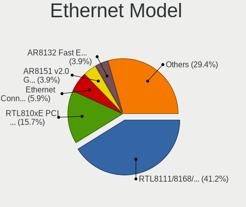

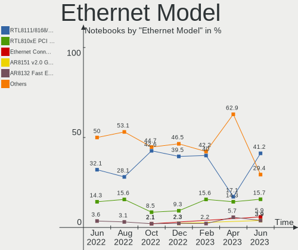

| Model                                                             | Notebooks | Percent |
|-------------------------------------------------------------------|-----------|---------|
| Realtek RTL8111/8168/8411 PCI Express Gigabit Ethernet Controller | 23        | 34.85%  |
| Realtek RTL810xE PCI Express Fast Ethernet controller             | 9         | 13.64%  |
| Intel Ethernet Connection (4) I219-LM                             | 4         | 6.06%   |
| Intel 82567LM Gigabit Network Connection                          | 3         | 4.55%   |
| Qualcomm Atheros AR8151 v2.0 Gigabit Ethernet                     | 2         | 3.03%   |
| Qualcomm Atheros AR8132 Fast Ethernet                             | 2         | 3.03%   |
| Intel Ethernet Connection (3) I218-LM                             | 2         | 3.03%   |
| Intel Ethernet Connection (13) I219-V                             | 2         | 3.03%   |
| Intel 82579LM Gigabit Network Connection (Lewisville)             | 2         | 3.03%   |
| Qualcomm Atheros QCA8172 Fast Ethernet                            | 1         | 1.52%   |
| Qualcomm Atheros AR8162 Fast Ethernet                             | 1         | 1.52%   |
| Qualcomm Atheros AR8152 v2.0 Fast Ethernet                        | 1         | 1.52%   |
| Qualcomm Atheros AR8121/AR8113/AR8114 Gigabit or Fast Ethernet    | 1         | 1.52%   |
| Nvidia MCP77 Ethernet                                             | 1         | 1.52%   |
| Marvell Group 88E8055 PCI-E Gigabit Ethernet Controller           | 1         | 1.52%   |
| Lenovo USB-C to LAN                                               | 1         | 1.52%   |
| Intel Ethernet controller                                         | 1         | 1.52%   |
| Intel Ethernet Connection I219-V                                  | 1         | 1.52%   |
| Intel Ethernet Connection I218-LM                                 | 1         | 1.52%   |
| Intel Ethernet Connection I217-LM                                 | 1         | 1.52%   |
| DisplayLink USB Port Replicator PR8.1                             | 1         | 1.52%   |
| Broadcom NetXtreme BCM5761 Gigabit Ethernet PCIe                  | 1         | 1.52%   |
| Broadcom NetXtreme BCM5755M Gigabit Ethernet PCI Express          | 1         | 1.52%   |
| Broadcom NetLink BCM5787M Gigabit Ethernet PCI Express            | 1         | 1.52%   |
| Broadcom NetLink BCM57785 Gigabit Ethernet PCIe                   | 1         | 1.52%   |
| ASIX AX88179 Gigabit Ethernet                                     | 1         | 1.52%   |

Net Controller Kind
-------------------

Ethernet, WiFi or modem

| Kind     | Notebooks | Percent |
|----------|-----------|---------|
| WiFi     | 70        | 50.36%  |
| Ethernet | 64        | 46.04%  |
| Modem    | 5         | 3.6%    |

Used Controller
---------------

Currently used network controller

| Kind     | Notebooks | Percent |
|----------|-----------|---------|
| WiFi     | 60        | 80%     |
| Ethernet | 15        | 20%     |

NICs
----

Total network controllers on board

| Total | Notebooks | Percent |
|-------|-----------|---------|
| 2     | 62        | 88.57%  |
| 1     | 6         | 8.57%   |
| 0     | 2         | 2.86%   |

IPv6
----

IPv6 vs IPv4

| Used | Notebooks | Percent |
|------|-----------|---------|
| No   | 47        | 67.14%  |
| Yes  | 23        | 32.86%  |

Bluetooth
---------

Bluetooth Vendor
----------------

Controller vendors

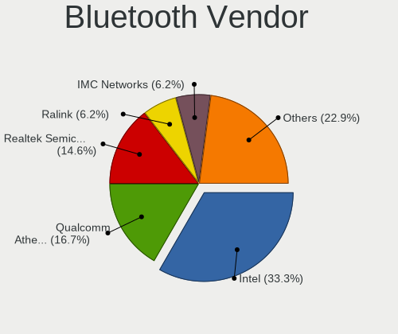

| Vendor                          | Notebooks | Percent |
|---------------------------------|-----------|---------|
| Intel                           | 26        | 46.43%  |
| Qualcomm Atheros Communications | 9         | 16.07%  |
| Realtek Semiconductor           | 5         | 8.93%   |
| Broadcom                        | 4         | 7.14%   |
| Foxconn / Hon Hai               | 3         | 5.36%   |
| Toshiba                         | 2         | 3.57%   |
| Ralink                          | 1         | 1.79%   |
| Lite-On Technology              | 1         | 1.79%   |
| IMC Networks                    | 1         | 1.79%   |
| Dell                            | 1         | 1.79%   |
| Cambridge Silicon Radio         | 1         | 1.79%   |
| Apple                           | 1         | 1.79%   |
| Alps Electric                   | 1         | 1.79%   |

Bluetooth Model
---------------

Controller models

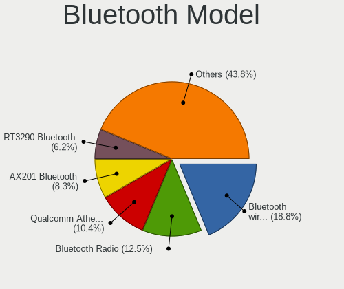

| Model                                               | Notebooks | Percent |
|-----------------------------------------------------|-----------|---------|
| Intel Bluetooth wireless interface                  | 15        | 26.79%  |
| Qualcomm Atheros  Bluetooth Device                  | 5         | 8.93%   |
| Intel AX201 Bluetooth                               | 4         | 7.14%   |
| Realtek Bluetooth Radio                             | 3         | 5.36%   |
| Intel Bluetooth 9460/9560 Jefferson Peak (JfP)      | 3         | 5.36%   |
| Toshiba Bluetooth Device                            | 2         | 3.57%   |
| Realtek RTL8821A Bluetooth                          | 1         | 1.79%   |
| Realtek RTL8723B Bluetooth                          | 1         | 1.79%   |
| Ralink RT3290 Bluetooth                             | 1         | 1.79%   |
| Qualcomm Atheros QCA61x4 Bluetooth 4.0              | 1         | 1.79%   |
| Qualcomm Atheros AR3012 Bluetooth 4.0               | 1         | 1.79%   |
| Qualcomm Atheros AR3012 Bluetooth                   | 1         | 1.79%   |
| Qualcomm Atheros AR3011 Bluetooth                   | 1         | 1.79%   |
| Lite-On Atheros AR3012 Bluetooth                    | 1         | 1.79%   |
| Intel Wireless-AC 3168 Bluetooth                    | 1         | 1.79%   |
| Intel Centrino Bluetooth Wireless Transceiver       | 1         | 1.79%   |
| Intel AX210 Bluetooth                               | 1         | 1.79%   |
| Intel AX200 Bluetooth                               | 1         | 1.79%   |
| IMC Networks Bluetooth Radio                        | 1         | 1.79%   |
| Foxconn / Hon Hai Wireless_Device                   | 1         | 1.79%   |
| Foxconn / Hon Hai Broadcom Bluetooth 2.1 Device     | 1         | 1.79%   |
| Foxconn / Hon Hai Broadcom BCM20702 Bluetooth       | 1         | 1.79%   |
| Dell Wireless 360 Bluetooth                         | 1         | 1.79%   |
| Cambridge Silicon Radio Bluetooth Dongle (HCI mode) | 1         | 1.79%   |
| Broadcom BCM43142A0 Bluetooth Device                | 1         | 1.79%   |
| Broadcom BCM2070 Bluetooth 2.1 + EDR                | 1         | 1.79%   |
| Broadcom BCM2045B (BDC-2.1) [Bluetooth Controller]  | 1         | 1.79%   |
| Broadcom BCM2045 Bluetooth                          | 1         | 1.79%   |
| Apple Built-in Bluetooth 2.0+EDR HCI                | 1         | 1.79%   |
| Alps Electric BCM2046 Bluetooth Device              | 1         | 1.79%   |

Sound
-----

Sound Vendor
------------

Sound card vendors

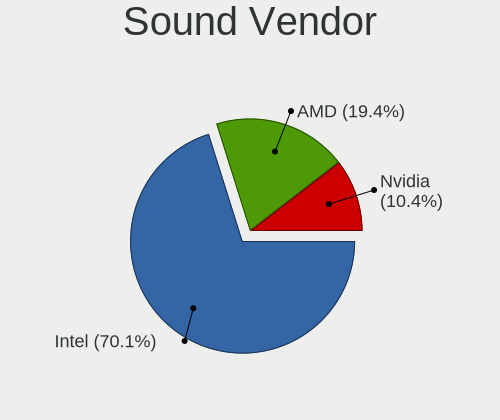

| Vendor | Notebooks | Percent |
|--------|-----------|---------|
| Intel  | 58        | 72.5%   |
| AMD    | 14        | 17.5%   |
| Nvidia | 7         | 8.75%   |
| Lenovo | 1         | 1.25%   |

Sound Model
-----------

Sound card models

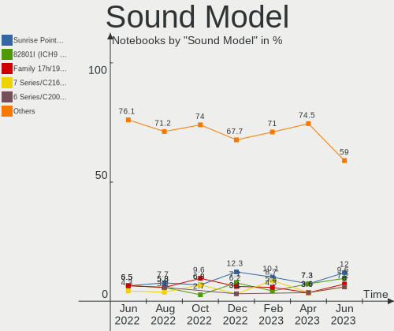

| Model                                                                             | Notebooks | Percent |
|-----------------------------------------------------------------------------------|-----------|---------|
| Intel 7 Series/C216 Chipset Family High Definition Audio Controller               | 9         | 8.91%   |
| Intel Sunrise Point-LP HD Audio                                                   | 7         | 6.93%   |
| Intel 82801I (ICH9 Family) HD Audio Controller                                    | 7         | 6.93%   |
| Intel Wildcat Point-LP High Definition Audio Controller                           | 6         | 5.94%   |
| Intel Broadwell-U Audio Controller                                                | 6         | 5.94%   |
| Intel 6 Series/C200 Series Chipset Family High Definition Audio Controller        | 6         | 5.94%   |
| AMD Family 17h/19h HD Audio Controller                                            | 5         | 4.95%   |
| Intel Haswell-ULT HD Audio Controller                                             | 4         | 3.96%   |
| Intel 8 Series HD Audio Controller                                                | 4         | 3.96%   |
| Intel Tiger Lake-LP Smart Sound Technology Audio Controller                       | 3         | 2.97%   |
| AMD FCH Azalia Controller                                                         | 3         | 2.97%   |
| Nvidia GK208 HDMI/DP Audio Controller                                             | 2         | 1.98%   |
| Nvidia Audio device                                                               | 2         | 1.98%   |
| Intel Xeon E3-1200 v3/4th Gen Core Processor HD Audio Controller                  | 2         | 1.98%   |
| Intel Ice Lake-LP Smart Sound Technology Audio Controller                         | 2         | 1.98%   |
| Intel Comet Lake PCH-LP cAVS                                                      | 2         | 1.98%   |
| Intel Atom Processor Z36xxx/Z37xxx Series High Definition Audio Controller        | 2         | 1.98%   |
| Intel 82801H (ICH8 Family) HD Audio Controller                                    | 2         | 1.98%   |
| Intel 8 Series/C220 Series Chipset High Definition Audio Controller               | 2         | 1.98%   |
| AMD SBx00 Azalia (Intel HDA)                                                      | 2         | 1.98%   |
| AMD Rembrandt Radeon High Definition Audio Controller                             | 2         | 1.98%   |
| AMD Raven/Raven2/Fenghuang HDMI/DP Audio Controller                               | 2         | 1.98%   |
| AMD Kabini HDMI/DP Audio                                                          | 2         | 1.98%   |
| AMD Caicos HDMI Audio [Radeon HD 6450 / 7450/8450/8490 OEM / R5 230/235/235X OEM] | 2         | 1.98%   |
| Nvidia MCP72XE/MCP72P/MCP78U/MCP78S High Definition Audio                         | 1         | 0.99%   |
| Nvidia GK107 HDMI Audio Controller                                                | 1         | 0.99%   |
| Nvidia GA106 High Definition Audio Controller                                     | 1         | 0.99%   |
| Lenovo ThinkPad Thunderbolt 4 Dock USB Audio                                      | 1         | 0.99%   |
| Intel Tiger Lake-H HD Audio Controller                                            | 1         | 0.99%   |
| Intel Celeron/Pentium Silver Processor High Definition Audio                      | 1         | 0.99%   |
| Intel Celeron N3350/Pentium N4200/Atom E3900 Series Audio Cluster                 | 1         | 0.99%   |
| Intel Cannon Point-LP High Definition Audio Controller                            | 1         | 0.99%   |
| Intel Cannon Lake PCH cAVS                                                        | 1         | 0.99%   |
| Intel 100 Series/C230 Series Chipset Family HD Audio Controller                   | 1         | 0.99%   |
| AMD Wrestler HDMI Audio                                                           | 1         | 0.99%   |
| AMD RV635 HDMI Audio [Radeon HD 3650/3730/3750]                                   | 1         | 0.99%   |
| AMD RS880 HDMI Audio [Radeon HD 4200 Series]                                      | 1         | 0.99%   |
| AMD Renoir Radeon High Definition Audio Controller                                | 1         | 0.99%   |
| AMD Kaveri HDMI/DP Audio Controller                                               | 1         | 0.99%   |

Memory
------

Memory Vendor
-------------

Memory module vendors

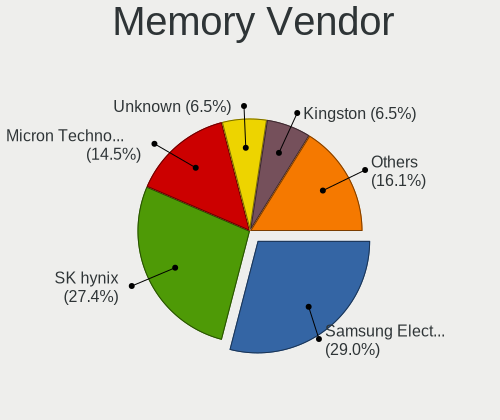

| Vendor              | Notebooks | Percent |
|---------------------|-----------|---------|
| SK hynix            | 20        | 29.41%  |
| Samsung Electronics | 16        | 23.53%  |
| Micron Technology   | 9         | 13.24%  |
| Kingston            | 6         | 8.82%   |
| Unknown             | 5         | 7.35%   |
| Ramaxel Technology  | 3         | 4.41%   |
| Unknown (ABCD)      | 2         | 2.94%   |
| Elpida              | 2         | 2.94%   |
| Unknown (8A5B)      | 1         | 1.47%   |
| Nanya Technology    | 1         | 1.47%   |
| Crucial             | 1         | 1.47%   |
| ASint Technology    | 1         | 1.47%   |
| A-DATA Technology   | 1         | 1.47%   |

Memory Model
------------

Memory module models

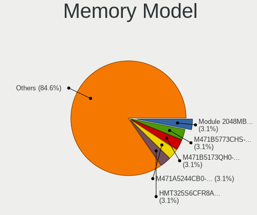

| Model                                                                        | Notebooks | Percent |
|------------------------------------------------------------------------------|-----------|---------|
| SK hynix RAM HMT451S6BFR8A-PB 4GB SODIMM DDR3 1600MT/s                       | 3         | 4.29%   |
| SK hynix RAM HMT351S6CFR8C-H9 4096MB SODIMM DDR3 1333MT/s                    | 3         | 4.29%   |
| Samsung RAM M471B5173QH0-YK0 4GB SODIMM DDR3 1600MT/s                        | 3         | 4.29%   |
| Unknown RAM Module 2048MB SODIMM 800MT/s                                     | 2         | 2.86%   |
| Unknown (ABCD) RAM 123456789012345678 2GB SODIMM LPDDR4 2400MT/s             | 2         | 2.86%   |
| Samsung RAM M471B5173EB0-YK0 4GB SODIMM DDR3 1600MT/s                        | 2         | 2.86%   |
| Samsung RAM M471B1G73DB0-YK0 8GB SODIMM DDR3 1600MT/s                        | 2         | 2.86%   |
| Elpida RAM EBJ40UG8EFU0 4GB SODIMM DDR3 1600MT/s                             | 2         | 2.86%   |
| Unknown RAM Module 2GB SODIMM DDR2                                           | 1         | 1.43%   |
| Unknown RAM Module 1GB SODIMM DDR3 1600MT/s                                  | 1         | 1.43%   |
| Unknown RAM Module 1GB SODIMM DDR2 667MT/s                                   | 1         | 1.43%   |
| Unknown (8A5B) RAM LuminouTek 16GB SODIMM DDR4 2667MT/s                      | 1         | 1.43%   |
| SK hynix RAM HYMP125S64CP8-Y5 2GB SODIMM DDR2 667MT/s                        | 1         | 1.43%   |
| SK hynix RAM HMT41GS6BFR8A-PB 8GB SODIMM DDR3 1600MT/s                       | 1         | 1.43%   |
| SK hynix RAM HMT351S6EFR8C-PB 4GB SODIMM DDR3 1600MT/s                       | 1         | 1.43%   |
| SK hynix RAM HMT351S6CFR8C-PB 4GB SODIMM DDR3 1600MT/s                       | 1         | 1.43%   |
| SK hynix RAM HMT325S6EFR8A-PB 2048MB SODIMM DDR3 1600MT/s                    | 1         | 1.43%   |
| SK hynix RAM HMT325S6BFR8C-H9 2048MB SODIMM DDR3 1333MT/s                    | 1         | 1.43%   |
| SK hynix RAM HMT312S6BFR6C-H9 1024MB SODIMM DDR3 1333MT/s                    | 1         | 1.43%   |
| SK hynix RAM HMT125S6TFR8C-G7 2GB SODIMM DDR3 1067MT/s                       | 1         | 1.43%   |
| SK hynix RAM HMAB2GS6AMR6N-XN 16GB SODIMM DDR4 3200MT/s                      | 1         | 1.43%   |
| SK hynix RAM HMA851S6AFR6N-UH 4GB SODIMM DDR4 2667MT/s                       | 1         | 1.43%   |
| SK hynix RAM HMA82GS6CJR8N-VK 16GB SODIMM DDR4 2667MT/s                      | 1         | 1.43%   |
| SK hynix RAM HMA82GS6AFR8N-UH 16GB SODIMM DDR4 2667MT/s                      | 1         | 1.43%   |
| SK hynix RAM HMA81GS6DJR8N-XN 8GB SODIMM DDR4 3200MT/s                       | 1         | 1.43%   |
| SK hynix RAM HMA81GS6AFR8N-UH 8GB SODIMM DDR4 2667MT/s                       | 1         | 1.43%   |
| SK hynix RAM DADADADADADADADADADADADADADADADADADA 2048MB SODIMM DDR2 800MT/s | 1         | 1.43%   |
| Samsung RAM Module 8192MB SODIMM DDR4 3200MT/s                               | 1         | 1.43%   |
| Samsung RAM M471B5773CHS-CH9 2GB SODIMM DDR3 4199MT/s                        | 1         | 1.43%   |
| Samsung RAM M471B5673FH0-CF8 2GB SODIMM DDR3 1067MT/s                        | 1         | 1.43%   |
| Samsung RAM M471B5273EB0-CH9 4096MB SODIMM DDR3 1333MT/s                     | 1         | 1.43%   |
| Samsung RAM M471B5273DH0-CK0 4GB SODIMM DDR3 1600MT/s                        | 1         | 1.43%   |
| Samsung RAM M471B5173DB0-YK0 4GB SODIMM DDR3 1600MT/s                        | 1         | 1.43%   |
| Samsung RAM M471B5173CB0-YK0 4GB SODIMM DDR3 1600MT/s                        | 1         | 1.43%   |
| Samsung RAM M471B5173BH0-YK0 4GB SODIMM DDR3 1600MT/s                        | 1         | 1.43%   |
| Samsung RAM M471A5244CB0-CTD 4GB SODIMM DDR4 3266MT/s                        | 1         | 1.43%   |
| Samsung RAM M471A1K43EB1-CWE 8GB SODIMM DDR4 3200MT/s                        | 1         | 1.43%   |
| Ramaxel RAM RMT3170MN68F9F1600 4GB SODIMM DDR3 1600MT/s                      | 1         | 1.43%   |
| Ramaxel RAM RMT1970ED48E8F1066 2048MB SODIMM DDR3 1067MT/s                   | 1         | 1.43%   |
| Ramaxel RAM RMSA3270MB86H9F2400 4GB SODIMM DDR4 2400MT/s                     | 1         | 1.43%   |

Memory Kind
-----------

Memory module kinds

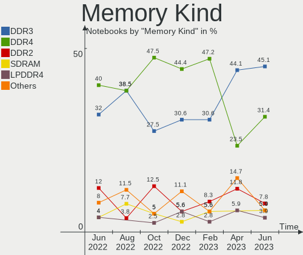

| Kind    | Notebooks | Percent |
|---------|-----------|---------|
| DDR3    | 34        | 57.63%  |
| DDR4    | 15        | 25.42%  |
| DDR2    | 4         | 6.78%   |
| LPDDR4  | 3         | 5.08%   |
| Unknown | 2         | 3.39%   |
| SDRAM   | 1         | 1.69%   |

Memory Form Factor
------------------

Physical design of the memory module

| Name         | Notebooks | Percent |
|--------------|-----------|---------|
| SODIMM       | 57        | 96.61%  |
| Row Of Chips | 1         | 1.69%   |
| Chip         | 1         | 1.69%   |

Memory Size
-----------

Memory module size

| Size  | Notebooks | Percent |
|-------|-----------|---------|
| 4096  | 26        | 42.62%  |
| 8192  | 15        | 24.59%  |
| 2048  | 12        | 19.67%  |
| 16384 | 5         | 8.2%    |
| 1024  | 3         | 4.92%   |

Memory Speed
------------

Memory module speed

| Speed   | Notebooks | Percent |
|---------|-----------|---------|
| 1600    | 23        | 37.1%   |
| 2667    | 7         | 11.29%  |
| 2400    | 7         | 11.29%  |
| 3200    | 6         | 9.68%   |
| 1333    | 6         | 9.68%   |
| 1067    | 3         | 4.84%   |
| 800     | 3         | 4.84%   |
| 1334    | 2         | 3.23%   |
| 667     | 2         | 3.23%   |
| 4199    | 1         | 1.61%   |
| 3266    | 1         | 1.61%   |
| Unknown | 1         | 1.61%   |

Printers & scanners
-------------------

Printer Vendor
--------------

Printer device vendors

Zero info for selected period =(

Printer Model
-------------

Printer device models

Zero info for selected period =(

Scanner Vendor
--------------

Scanner device vendors

Zero info for selected period =(

Scanner Model
-------------

Scanner device models

Zero info for selected period =(

Camera
------

Camera Vendor
-------------

Camera device vendors

| Vendor                                 | Notebooks | Percent |
|----------------------------------------|-----------|---------|
| Chicony Electronics                    | 14        | 23.33%  |
| Realtek Semiconductor                  | 5         | 8.33%   |
| Suyin                                  | 4         | 6.67%   |
| Cheng Uei Precision Industry (Foxlink) | 4         | 6.67%   |
| Bison Electronics                      | 4         | 6.67%   |
| Quanta                                 | 3         | 5%      |
| Microdia                               | 3         | 5%      |
| IMC Networks                           | 3         | 5%      |
| Apple                                  | 3         | 5%      |
| Alcor Micro                            | 3         | 5%      |
| Syntek                                 | 2         | 3.33%   |
| Luxvisions Innotech Limited            | 2         | 3.33%   |
| Lite-On Technology                     | 2         | 3.33%   |
| Sunplus Innovation Technology          | 1         | 1.67%   |
| Sonix Technology                       | 1         | 1.67%   |
| Silicon Motion                         | 1         | 1.67%   |
| Ricoh                                  | 1         | 1.67%   |
| Lenovo                                 | 1         | 1.67%   |
| icSpring                               | 1         | 1.67%   |
| BRS 2Mp Camera                         | 1         | 1.67%   |
| Acer                                   | 1         | 1.67%   |

Camera Model
------------

Camera device models

| Model                                               | Notebooks | Percent |
|-----------------------------------------------------|-----------|---------|
| Chicony Integrated Camera                           | 4         | 6.67%   |
| Syntek Integrated Camera                            | 2         | 3.33%   |
| Chicony HD User Facing                              | 2         | 3.33%   |
| Cheng Uei Precision Industry (Foxlink) Webcam       | 2         | 3.33%   |
| Bison Lenovo EasyCamera                             | 2         | 3.33%   |
| Apple iPhone 5/5C/5S/6/SE/7/8/X                     | 2         | 3.33%   |
| Alcor Micro Asus Integrated Webcam                  | 2         | 3.33%   |
| Suyin Integrated_Webcam_HD                          | 1         | 1.67%   |
| Suyin HP Truevision HD                              | 1         | 1.67%   |
| Suyin Acer/HP Integrated Webcam [CN0314]            | 1         | 1.67%   |
| Suyin Acer HD Crystal Eye webcam                    | 1         | 1.67%   |
| Sunplus Integrated_Webcam_HD                        | 1         | 1.67%   |
| Sonix USB2.0 FHD UVC WebCam                         | 1         | 1.67%   |
| Silicon Motion WebCam SC-13HDL11939N                | 1         | 1.67%   |
| Ricoh Sony Vaio Integrated Webcam                   | 1         | 1.67%   |
| Realtek USB2.0 HD UVC WebCam                        | 1         | 1.67%   |
| Realtek Integrated_Webcam_HD                        | 1         | 1.67%   |
| Realtek Integrated Webcam HD                        | 1         | 1.67%   |
| Realtek HP Webcam                                   | 1         | 1.67%   |
| Realtek FJ Camera                                   | 1         | 1.67%   |
| Quanta HP Wide Vision HD Camera                     | 1         | 1.67%   |
| Quanta HP HD Camera                                 | 1         | 1.67%   |
| Quanta HD Webcam                                    | 1         | 1.67%   |
| Microdia Integrated_Webcam_HD                       | 1         | 1.67%   |
| Microdia Integrated Webcam                          | 1         | 1.67%   |
| Microdia Integrated HD Webcam                       | 1         | 1.67%   |
| Luxvisions Innotech Limited Integrated RGB Camera   | 1         | 1.67%   |
| Luxvisions Innotech Limited HP TrueVision HD Camera | 1         | 1.67%   |
| Lite-On Integrated Camera                           | 1         | 1.67%   |
| Lite-On HP Wide Vision HD Camera                    | 1         | 1.67%   |
| Lenovo Integrated Webcam                            | 1         | 1.67%   |
| IMC Networks USB2.0 UVC HD Webcam                   | 1         | 1.67%   |
| IMC Networks USB2.0 HD UVC WebCam                   | 1         | 1.67%   |
| IMC Networks Lenovo EasyCamera                      | 1         | 1.67%   |
| icSpring camera                                     | 1         | 1.67%   |
| Chicony Webcam                                      | 1         | 1.67%   |
| Chicony USB2.0 HD UVC WebCam                        | 1         | 1.67%   |
| Chicony TOSHIBA Web Camera - HD                     | 1         | 1.67%   |
| Chicony Lenovo EasyCamera                           | 1         | 1.67%   |
| Chicony HP Truevision HD                            | 1         | 1.67%   |

Security
--------

Fingerprint Vendor
------------------

Fingerprint sensor vendors

| Vendor                             | Notebooks | Percent |
|------------------------------------|-----------|---------|
| Validity Sensors                   | 3         | 25%     |
| Upek                               | 3         | 25%     |
| AuthenTec                          | 2         | 16.67%  |
| Synaptics                          | 1         | 8.33%   |
| Shenzhen Goodix Technology         | 1         | 8.33%   |
| Realtek USB2.0 Finger Print Bridge | 1         | 8.33%   |
| Elan Microelectronics              | 1         | 8.33%   |

Fingerprint Model
-----------------

Fingerprint sensor models

| Model                                                           | Notebooks | Percent |
|-----------------------------------------------------------------|-----------|---------|
| Upek Biometric Touchchip/Touchstrip Fingerprint Sensor          | 3         | 25%     |
| AuthenTec AES2810                                               | 2         | 16.67%  |
| Validity Sensors VFS101 Fingerprint Reader                      | 1         | 8.33%   |
| Validity Sensors Synaptics WBDI                                 | 1         | 8.33%   |
| Validity Sensors Swipe Fingerprint Sensor                       | 1         | 8.33%   |
| Synaptics UWP WBDI Device                                       | 1         | 8.33%   |
| Shenzhen Goodix Fingerprint Reader                              | 1         | 8.33%   |
| Realtek USB2.0 Finger Print Bridge FocalTech Fingerprint Device | 1         | 8.33%   |
| Elan ELAN:Fingerprint                                           | 1         | 8.33%   |

Chipcard Vendor
---------------

Chipcard module vendors

| Vendor      | Notebooks | Percent |
|-------------|-----------|---------|
| O2 Micro    | 3         | 60%     |
| Lenovo      | 1         | 20%     |
| Alcor Micro | 1         | 20%     |

Chipcard Model
--------------

Chipcard module models

| Model                                | Notebooks | Percent |
|--------------------------------------|-----------|---------|
| O2 Micro OZ776 CCID Smartcard Reader | 3         | 60%     |
| Lenovo Integrated Smart Card Reader  | 1         | 20%     |
| Alcor Micro AU9540 Smartcard Reader  | 1         | 20%     |

Unsupported
-----------

Unsupported Devices
-------------------

Total unsupported devices on board

| Total | Notebooks | Percent |
|-------|-----------|---------|
| 0     | 44        | 62.86%  |
| 1     | 19        | 27.14%  |
| 2     | 4         | 5.71%   |
| 3     | 2         | 2.86%   |
| 10    | 1         | 1.43%   |

Unsupported Device Types
------------------------

Types of unsupported devices

| Type                     | Notebooks | Percent |
|--------------------------|-----------|---------|
| Fingerprint reader       | 12        | 30.77%  |
| Graphics card            | 7         | 17.95%  |
| Chipcard                 | 5         | 12.82%  |
| Net/wireless             | 3         | 7.69%   |
| Net/ethernet             | 2         | 5.13%   |
| Bluetooth                | 2         | 5.13%   |
| Storage/ata              | 1         | 2.56%   |
| Storage                  | 1         | 2.56%   |
| Sound                    | 1         | 2.56%   |
| Multimedia controller    | 1         | 2.56%   |
| Flash memory             | 1         | 2.56%   |
| Communication controller | 1         | 2.56%   |
| Card reader              | 1         | 2.56%   |
| Camera                   | 1         | 2.56%   |

