Linux in Hungary - Hardware Trends (Notebooks)
----------------------------------------------

A project to identify most popular hardware characteristics and track their change
over time based on data collected by Linux users at https://Linux-Hardware.org.

Anyone can contribute to this report by the [hw-probe](https://github.com/linuxhw/hw-probe) tool:

    sudo -E hw-probe -all -upload

Period: Jun, 2023.

Contents
--------

* [ System ](#system)
  - [ OS                       ](#os)
  - [ OS Family                ](#os-family)
  - [ Kernel                   ](#kernel)
  - [ Kernel Family            ](#kernel-family)
  - [ Kernel Major Ver.        ](#kernel-major-ver)
  - [ Arch                     ](#arch)
  - [ DE                       ](#de)
  - [ Display Server           ](#display-server)
  - [ Display Manager          ](#display-manager)
  - [ OS Lang                  ](#os-lang)
  - [ Boot Mode                ](#boot-mode)
  - [ Filesystem               ](#filesystem)
  - [ Part. scheme             ](#part-scheme)
  - [ Dual Boot with Linux/BSD ](#dual-boot-with-linuxbsd)
  - [ Dual Boot (Win)          ](#dual-boot-win)

* [ Board ](#board)
  - [ Vendor                   ](#vendor)
  - [ Model                    ](#model)
  - [ Model Family             ](#model-family)
  - [ MFG Year                 ](#mfg-year)
  - [ Form Factor              ](#form-factor)
  - [ Secure Boot              ](#secure-boot)
  - [ Coreboot                 ](#coreboot)
  - [ RAM Size                 ](#ram-size)
  - [ RAM Used                 ](#ram-used)
  - [ Total Drives             ](#total-drives)
  - [ Has CD-ROM               ](#has-cd-rom)
  - [ Has Ethernet             ](#has-ethernet)
  - [ Has WiFi                 ](#has-wifi)
  - [ Has Bluetooth            ](#has-bluetooth)

* [ Location ](#location)
  - [ Country                  ](#country)
  - [ City                     ](#city)

* [ Drives ](#drives)
  - [ Drive Vendor             ](#drive-vendor)
  - [ Drive Model              ](#drive-model)
  - [ HDD Vendor               ](#hdd-vendor)
  - [ SSD Vendor               ](#ssd-vendor)
  - [ Drive Kind               ](#drive-kind)
  - [ Drive Connector          ](#drive-connector)
  - [ Drive Size               ](#drive-size)
  - [ Space Total              ](#space-total)
  - [ Space Used               ](#space-used)
  - [ Malfunc. Drives          ](#malfunc-drives)
  - [ Malfunc. Drive Vendor    ](#malfunc-drive-vendor)
  - [ Malfunc. HDD Vendor      ](#malfunc-hdd-vendor)
  - [ Malfunc. Drive Kind      ](#malfunc-drive-kind)
  - [ Failed Drives            ](#failed-drives)
  - [ Failed Drive Vendor      ](#failed-drive-vendor)
  - [ Drive Status             ](#drive-status)

* [ Storage controller ](#storage-controller)
  - [ Storage Vendor           ](#storage-vendor)
  - [ Storage Model            ](#storage-model)
  - [ Storage Kind             ](#storage-kind)

* [ Processor ](#processor)
  - [ CPU Vendor               ](#cpu-vendor)
  - [ CPU Model                ](#cpu-model)
  - [ CPU Model Family         ](#cpu-model-family)
  - [ CPU Cores                ](#cpu-cores)
  - [ CPU Sockets              ](#cpu-sockets)
  - [ CPU Threads              ](#cpu-threads)
  - [ CPU Op-Modes             ](#cpu-op-modes)
  - [ CPU Microcode            ](#cpu-microcode)
  - [ CPU Microarch            ](#cpu-microarch)

* [ Graphics ](#graphics)
  - [ GPU Vendor               ](#gpu-vendor)
  - [ GPU Model                ](#gpu-model)
  - [ GPU Combo                ](#gpu-combo)
  - [ GPU Driver               ](#gpu-driver)
  - [ GPU Memory               ](#gpu-memory)

* [ Monitor ](#monitor)
  - [ Monitor Vendor           ](#monitor-vendor)
  - [ Monitor Model            ](#monitor-model)
  - [ Monitor Resolution       ](#monitor-resolution)
  - [ Monitor Diagonal         ](#monitor-diagonal)
  - [ Monitor Width            ](#monitor-width)
  - [ Aspect Ratio             ](#aspect-ratio)
  - [ Monitor Area             ](#monitor-area)
  - [ Pixel Density            ](#pixel-density)
  - [ Multiple Monitors        ](#multiple-monitors)

* [ Network ](#network)
  - [ Net Controller Vendor    ](#net-controller-vendor)
  - [ Net Controller Model     ](#net-controller-model)
  - [ Wireless Vendor          ](#wireless-vendor)
  - [ Wireless Model           ](#wireless-model)
  - [ Ethernet Vendor          ](#ethernet-vendor)
  - [ Ethernet Model           ](#ethernet-model)
  - [ Net Controller Kind      ](#net-controller-kind)
  - [ Used Controller          ](#used-controller)
  - [ NICs                     ](#nics)
  - [ IPv6                     ](#ipv6)

* [ Bluetooth ](#bluetooth)
  - [ Bluetooth Vendor         ](#bluetooth-vendor)
  - [ Bluetooth Model          ](#bluetooth-model)

* [ Sound ](#sound)
  - [ Sound Vendor             ](#sound-vendor)
  - [ Sound Model              ](#sound-model)

* [ Memory ](#memory)
  - [ Memory Vendor            ](#memory-vendor)
  - [ Memory Model             ](#memory-model)
  - [ Memory Kind              ](#memory-kind)
  - [ Memory Form Factor       ](#memory-form-factor)
  - [ Memory Size              ](#memory-size)
  - [ Memory Speed             ](#memory-speed)

* [ Printers & scanners ](#printers--scanners)
  - [ Printer Vendor           ](#printer-vendor)
  - [ Printer Model            ](#printer-model)
  - [ Scanner Vendor           ](#scanner-vendor)
  - [ Scanner Model            ](#scanner-model)

* [ Camera ](#camera)
  - [ Camera Vendor            ](#camera-vendor)
  - [ Camera Model             ](#camera-model)

* [ Security ](#security)
  - [ Fingerprint Vendor       ](#fingerprint-vendor)
  - [ Fingerprint Model        ](#fingerprint-model)
  - [ Chipcard Vendor          ](#chipcard-vendor)
  - [ Chipcard Model           ](#chipcard-model)

* [ Unsupported ](#unsupported)
  - [ Unsupported Devices      ](#unsupported-devices)
  - [ Unsupported Device Types ](#unsupported-device-types)

System
------

OS
--

Installed operating systems

| Name                         | Notebooks | Percent |
|------------------------------|-----------|---------|
| BlackPanther 18.1            | 27        | 46.55%  |
| Ubuntu 22.04                 | 5         | 8.62%   |
| BlackPanther 22.1            | 4         | 6.9%    |
| Linux Mint 21.1              | 3         | 5.17%   |
| Fedora 38                    | 3         | 5.17%   |
| Arch Rolling                 | 2         | 3.45%   |
| Ubuntu Budgie 23.04          | 1         | 1.72%   |
| Ubuntu 20.04                 | 1         | 1.72%   |
| SteamOS 3.4.8                | 1         | 1.72%   |
| Q4OS 4                       | 1         | 1.72%   |
| openSUSE Tumbleweed-XXXXXXXX | 1         | 1.72%   |
| OpenMandriva 23.06           | 1         | 1.72%   |
| OpenMandriva 23.03           | 1         | 1.72%   |
| Manjaro 23.0.0               | 1         | 1.72%   |
| Manjaro 22.1.3               | 1         | 1.72%   |
| Linux Mint 19.3              | 1         | 1.72%   |
| Endless 3.9.3-nexthw1        | 1         | 1.72%   |
| Debian 12                    | 1         | 1.72%   |
| BlackPanther 16.2            | 1         | 1.72%   |
| ArcoLinux Rolling            | 1         | 1.72%   |

OS Family
---------

OS without a version

| Name          | Notebooks | Percent |
|---------------|-----------|---------|
| BlackPanther  | 32        | 55.17%  |
| Ubuntu        | 6         | 10.34%  |
| Linux Mint    | 4         | 6.9%    |
| Fedora        | 3         | 5.17%   |
| OpenMandriva  | 2         | 3.45%   |
| Manjaro       | 2         | 3.45%   |
| Arch          | 2         | 3.45%   |
| Ubuntu Budgie | 1         | 1.72%   |
| SteamOS       | 1         | 1.72%   |
| Q4OS          | 1         | 1.72%   |
| openSUSE      | 1         | 1.72%   |
| Endless       | 1         | 1.72%   |
| Debian        | 1         | 1.72%   |
| ArcoLinux     | 1         | 1.72%   |

Kernel
------

Version of the Linux kernel

| Version                   | Notebooks | Percent |
|---------------------------|-----------|---------|
| 5.6.14-desktop-2bP        | 10        | 17.24%  |
| 4.18.16-desktop-1bP       | 10        | 17.24%  |
| 5.15.85-desktop-1bP       | 9         | 15.52%  |
| 5.15.0-73-generic         | 3         | 5.17%   |
| 6.3.6-arch1-1             | 2         | 3.45%   |
| 6.3.3-desktop-1bP         | 2         | 3.45%   |
| 5.15.0-75-generic         | 2         | 3.45%   |
| 6.3.8-206.rog.fc38.x86_64 | 1         | 1.72%   |
| 6.3.8-200.fc38.x86_64     | 1         | 1.72%   |
| 6.3.7-1-default           | 1         | 1.72%   |
| 6.3.6-zen1-1-zen          | 1         | 1.72%   |
| 6.3.5-desktop-3omv2390    | 1         | 1.72%   |
| 6.3.5-200.fc38.x86_64     | 1         | 1.72%   |
| 6.2.6-desktop-1omv2390    | 1         | 1.72%   |
| 6.2.6-76060206-generic    | 1         | 1.72%   |
| 6.2.0-20-generic          | 1         | 1.72%   |
| 6.1.31-2-MANJARO          | 1         | 1.72%   |
| 6.1.0-9-amd64             | 1         | 1.72%   |
| 5.4.0-91-generic          | 1         | 1.72%   |
| 5.4.0-150-generic         | 1         | 1.72%   |
| 5.19.0-45-generic         | 1         | 1.72%   |
| 5.19.0-43-generic         | 1         | 1.72%   |
| 5.15.113-1-MANJARO        | 1         | 1.72%   |
| 5.13.0-valve36-1-neptune  | 1         | 1.72%   |
| 5.11.0-12-generic         | 1         | 1.72%   |
| 5.10.0-23-amd64           | 1         | 1.72%   |
| 4.9.20-desktop-pae-1bP    | 1         | 1.72%   |

Kernel Family
-------------

Linux kernel without a distro release

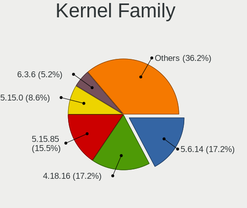

| Version  | Notebooks | Percent |
|----------|-----------|---------|
| 5.6.14   | 10        | 17.24%  |
| 4.18.16  | 10        | 17.24%  |
| 5.15.85  | 9         | 15.52%  |
| 5.15.0   | 5         | 8.62%   |
| 6.3.6    | 3         | 5.17%   |
| 6.3.8    | 2         | 3.45%   |
| 6.3.5    | 2         | 3.45%   |
| 6.3.3    | 2         | 3.45%   |
| 6.2.6    | 2         | 3.45%   |
| 5.4.0    | 2         | 3.45%   |
| 5.19.0   | 2         | 3.45%   |
| 6.3.7    | 1         | 1.72%   |
| 6.2.0    | 1         | 1.72%   |
| 6.1.31   | 1         | 1.72%   |
| 6.1.0    | 1         | 1.72%   |
| 5.15.113 | 1         | 1.72%   |
| 5.13.0   | 1         | 1.72%   |
| 5.11.0   | 1         | 1.72%   |
| 5.10.0   | 1         | 1.72%   |
| 4.9.20   | 1         | 1.72%   |

Kernel Major Ver.
-----------------

Linux kernel major version

| Version | Notebooks | Percent |
|---------|-----------|---------|
| 5.15    | 15        | 25.86%  |
| 6.3     | 10        | 17.24%  |
| 5.6     | 10        | 17.24%  |
| 4.18    | 10        | 17.24%  |
| 6.2     | 3         | 5.17%   |
| 6.1     | 2         | 3.45%   |
| 5.4     | 2         | 3.45%   |
| 5.19    | 2         | 3.45%   |
| 5.13    | 1         | 1.72%   |
| 5.11    | 1         | 1.72%   |
| 5.10    | 1         | 1.72%   |
| 4.9     | 1         | 1.72%   |

Arch
----

OS architecture (x86_64, i586, etc.)

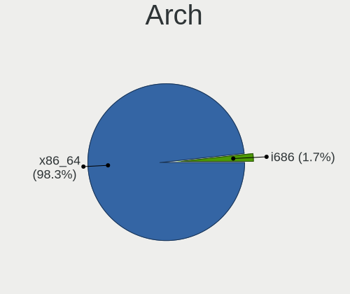

| Name   | Notebooks | Percent |
|--------|-----------|---------|
| x86_64 | 57        | 98.28%  |
| i686   | 1         | 1.72%   |

DE
--

Desktop Environment

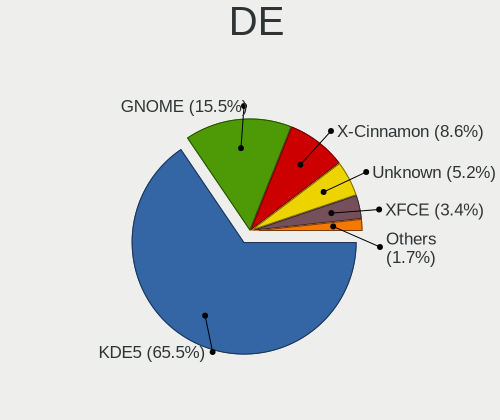

| Name       | Notebooks | Percent |
|------------|-----------|---------|
| KDE5       | 38        | 65.52%  |
| GNOME      | 9         | 15.52%  |
| X-Cinnamon | 5         | 8.62%   |
| Unknown    | 3         | 5.17%   |
| XFCE       | 2         | 3.45%   |
| Budgie     | 1         | 1.72%   |

Display Server
--------------

X11 or Wayland

| Name    | Notebooks | Percent |
|---------|-----------|---------|
| X11     | 48        | 82.76%  |
| Wayland | 6         | 10.34%  |
| Tty     | 2         | 3.45%   |
| Unknown | 2         | 3.45%   |

Display Manager
---------------

SDDM, LightDM, etc.

| Name    | Notebooks | Percent |
|---------|-----------|---------|
| SDDM    | 38        | 65.52%  |
| Unknown | 10        | 17.24%  |
| LightDM | 5         | 8.62%   |
| GDM3    | 3         | 5.17%   |
| GDM     | 2         | 3.45%   |

OS Lang
-------

Language

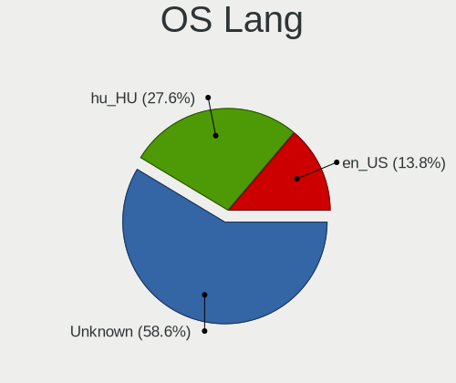

| Lang    | Notebooks | Percent |
|---------|-----------|---------|
| Unknown | 34        | 58.62%  |
| hu_HU   | 16        | 27.59%  |
| en_US   | 8         | 13.79%  |

Boot Mode
---------

EFI or BIOS

| Mode | Notebooks | Percent |
|------|-----------|---------|
| EFI  | 34        | 58.62%  |
| BIOS | 24        | 41.38%  |

Filesystem
----------

Type of filesystem

| Type    | Notebooks | Percent |
|---------|-----------|---------|
| Ext4    | 38        | 65.52%  |
| Overlay | 13        | 22.41%  |
| Btrfs   | 5         | 8.62%   |
| Xfs     | 1         | 1.72%   |
| Tmpfs   | 1         | 1.72%   |

Part. scheme
------------

Scheme of partitioning

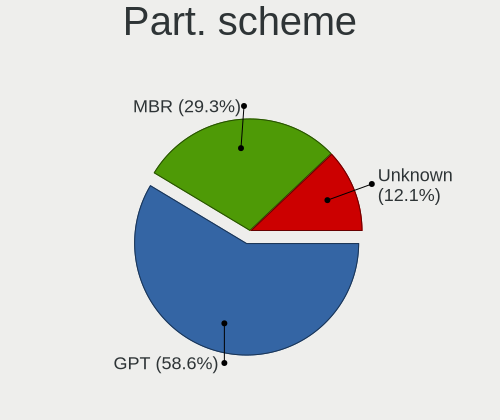

| Type    | Notebooks | Percent |
|---------|-----------|---------|
| GPT     | 34        | 58.62%  |
| MBR     | 17        | 29.31%  |
| Unknown | 7         | 12.07%  |

Dual Boot with Linux/BSD
------------------------

Hosting more than one Linux/BSD

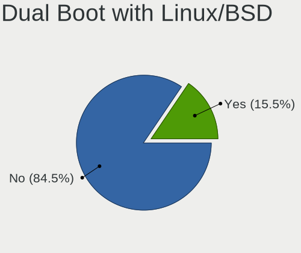

| Dual boot | Notebooks | Percent |
|-----------|-----------|---------|
| No        | 49        | 84.48%  |
| Yes       | 9         | 15.52%  |

Dual Boot (Win)
---------------

Hosting Linux and Windows

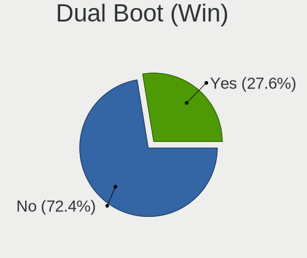

| Dual boot | Notebooks | Percent |
|-----------|-----------|---------|
| No        | 42        | 72.41%  |
| Yes       | 16        | 27.59%  |

Board
-----

Vendor
------

Motherboard manufacturer

| Name                | Notebooks | Percent |
|---------------------|-----------|---------|
| Dell                | 15        | 25.86%  |
| Hewlett-Packard     | 11        | 18.97%  |
| Lenovo              | 10        | 17.24%  |
| ASUSTek Computer    | 7         | 12.07%  |
| Acer                | 5         | 8.62%   |
| Samsung Electronics | 2         | 3.45%   |
| eMachines           | 2         | 3.45%   |
| Valve               | 1         | 1.72%   |
| MSI                 | 1         | 1.72%   |
| LG Electronics      | 1         | 1.72%   |
| Google              | 1         | 1.72%   |
| Fujitsu             | 1         | 1.72%   |
| Apple               | 1         | 1.72%   |

Model
-----

Motherboard model

| Name                                        | Notebooks | Percent |
|---------------------------------------------|-----------|---------|
| HP 250 G1                                   | 3         | 5.17%   |
| Lenovo IdeaPad 330-15IKB 81DE               | 2         | 3.45%   |
| eMachines E725                              | 2         | 3.45%   |
| Dell Latitude E6400                         | 2         | 3.45%   |
| Dell Inspiron 15-3567                       | 2         | 3.45%   |
| Valve Jupiter                               | 1         | 1.72%   |
| Samsung RV411/RV511/E3511/S3511/RV711/E3411 | 1         | 1.72%   |
| Samsung RV410/RV510/S3510/E3510             | 1         | 1.72%   |
| MSI U200                                    | 1         | 1.72%   |
| LG 16Z90P-G.AA55H                           | 1         | 1.72%   |
| Lenovo Y50-70 20378                         | 1         | 1.72%   |
| Lenovo V15-ADA 82C7                         | 1         | 1.72%   |
| Lenovo ThinkPad X270 W10DG 20K5S16G1B       | 1         | 1.72%   |
| Lenovo ThinkPad X200 74595FG                | 1         | 1.72%   |
| Lenovo ThinkPad E15 20RD003KHV              | 1         | 1.72%   |
| Lenovo IdeaPad 330-15AST 81D6               | 1         | 1.72%   |
| Lenovo G585 20137                           | 1         | 1.72%   |
| Lenovo G50-45 80E3                          | 1         | 1.72%   |
| HP Victus by Laptop 16-e0xxx                | 1         | 1.72%   |
| HP ProBook 640 G8 Notebook PC               | 1         | 1.72%   |
| HP Pavilion Gaming Laptop 15-ec1xxx         | 1         | 1.72%   |
| HP Pavilion dv6                             | 1         | 1.72%   |
| HP Pavilion 17                              | 1         | 1.72%   |
| HP Notebook                                 | 1         | 1.72%   |
| HP Laptop 15-dw1xxx                         | 1         | 1.72%   |
| HP EliteBook 2540p                          | 1         | 1.72%   |
| Google Edgar                                | 1         | 1.72%   |
| Fujitsu LIFEBOOK A555                       | 1         | 1.72%   |
| Dell Latitude E7470                         | 1         | 1.72%   |
| Dell Latitude E6420                         | 1         | 1.72%   |
| Dell Latitude E6410                         | 1         | 1.72%   |
| Dell Latitude E6230                         | 1         | 1.72%   |
| Dell Latitude E5520                         | 1         | 1.72%   |
| Dell Latitude E5470                         | 1         | 1.72%   |
| Dell Latitude 7390                          | 1         | 1.72%   |
| Dell Inspiron 7737                          | 1         | 1.72%   |
| Dell Inspiron 5570                          | 1         | 1.72%   |
| Dell Inspiron 5558                          | 1         | 1.72%   |
| Dell Inspiron 17 7000 Series 7746           | 1         | 1.72%   |
| ASUS VivoBook_ASUSLaptop X415EA_X415EA      | 1         | 1.72%   |

Model Family
------------

Motherboard model prefix

| Name              | Notebooks | Percent |
|-------------------|-----------|---------|
| Dell Latitude     | 9         | 15.52%  |
| Dell Inspiron     | 6         | 10.34%  |
| Lenovo ThinkPad   | 3         | 5.17%   |
| Lenovo IdeaPad    | 3         | 5.17%   |
| HP Pavilion       | 3         | 5.17%   |
| HP 250            | 3         | 5.17%   |
| eMachines E725    | 2         | 3.45%   |
| ASUS ASUS         | 2         | 3.45%   |
| Acer Aspire       | 2         | 3.45%   |
| Valve Jupiter     | 1         | 1.72%   |
| Samsung RV411     | 1         | 1.72%   |
| Samsung RV410     | 1         | 1.72%   |
| MSI U200          | 1         | 1.72%   |
| LG 16Z90P-G.AA55H | 1         | 1.72%   |
| Lenovo Y50-70     | 1         | 1.72%   |
| Lenovo V15-ADA    | 1         | 1.72%   |
| Lenovo G585       | 1         | 1.72%   |
| Lenovo G50-45     | 1         | 1.72%   |
| HP Victus         | 1         | 1.72%   |
| HP ProBook        | 1         | 1.72%   |
| HP Notebook       | 1         | 1.72%   |
| HP Laptop         | 1         | 1.72%   |
| HP EliteBook      | 1         | 1.72%   |
| Google Edgar      | 1         | 1.72%   |
| Fujitsu LIFEBOOK  | 1         | 1.72%   |
| ASUS VivoBook     | 1         | 1.72%   |
| ASUS ROG          | 1         | 1.72%   |
| ASUS K73SJ        | 1         | 1.72%   |
| ASUS K54HR        | 1         | 1.72%   |
| ASUS K53SJ        | 1         | 1.72%   |
| Apple MacBookAir5 | 1         | 1.72%   |
| Acer TravelMate   | 1         | 1.72%   |
| Acer Swift        | 1         | 1.72%   |
| Acer Nitro        | 1         | 1.72%   |

MFG Year
--------

Motherboard manufacture year

| Year | Notebooks | Percent |
|------|-----------|---------|
| 2021 | 7         | 12.07%  |
| 2011 | 6         | 10.34%  |
| 2018 | 5         | 8.62%   |
| 2013 | 5         | 8.62%   |
| 2008 | 5         | 8.62%   |
| 2020 | 4         | 6.9%    |
| 2014 | 4         | 6.9%    |
| 2017 | 3         | 5.17%   |
| 2016 | 3         | 5.17%   |
| 2015 | 3         | 5.17%   |
| 2012 | 3         | 5.17%   |
| 2010 | 3         | 5.17%   |
| 2009 | 3         | 5.17%   |
| 2022 | 2         | 3.45%   |
| 2019 | 2         | 3.45%   |

Form Factor
-----------

Physical design of the computer

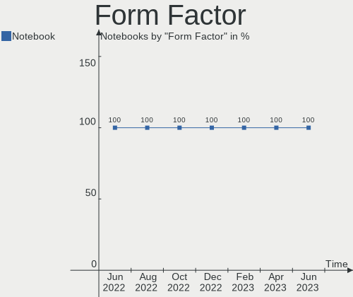

| Name     | Notebooks | Percent |
|----------|-----------|---------|
| Notebook | 58        | 100%    |

Secure Boot
-----------

Enabled or disabled

| State    | Notebooks | Percent |
|----------|-----------|---------|
| Disabled | 57        | 98.28%  |
| Enabled  | 1         | 1.72%   |

Coreboot
--------

Have coreboot on board

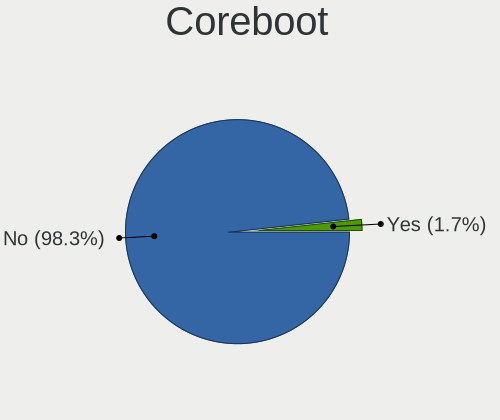

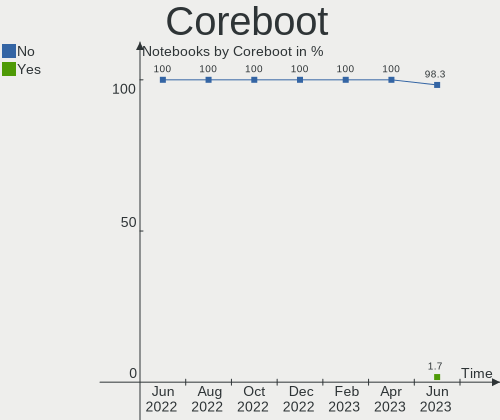

| Used | Notebooks | Percent |
|------|-----------|---------|
| No   | 57        | 98.28%  |
| Yes  | 1         | 1.72%   |

RAM Size
--------

Total RAM memory

| Size in GB | Notebooks | Percent |
|------------|-----------|---------|
| 3.01-4.0   | 18        | 31.03%  |
| 4.01-8.0   | 16        | 27.59%  |
| 8.01-16.0  | 9         | 15.52%  |
| 16.01-24.0 | 7         | 12.07%  |
| 1.01-2.0   | 4         | 6.9%    |
| 32.01-64.0 | 2         | 3.45%   |
| 2.01-3.0   | 2         | 3.45%   |

RAM Used
--------

Used RAM memory

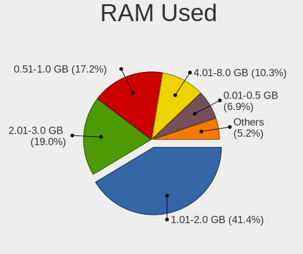

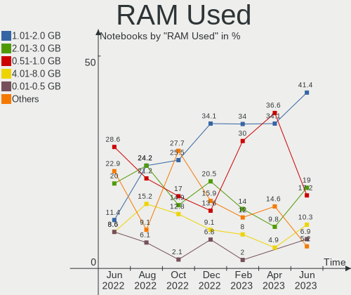

| Used GB  | Notebooks | Percent |
|----------|-----------|---------|
| 1.01-2.0 | 24        | 41.38%  |
| 2.01-3.0 | 11        | 18.97%  |
| 0.51-1.0 | 10        | 17.24%  |
| 4.01-8.0 | 6         | 10.34%  |
| 0.01-0.5 | 4         | 6.9%    |
| 3.01-4.0 | 3         | 5.17%   |

Total Drives
------------

Number of drives on board

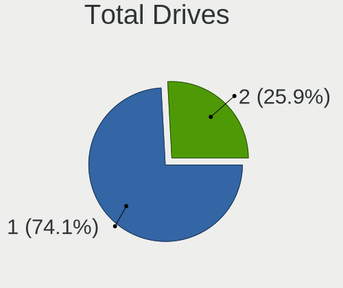

| Drives | Notebooks | Percent |
|--------|-----------|---------|
| 1      | 43        | 74.14%  |
| 2      | 15        | 25.86%  |

Has CD-ROM
----------

Has CD-ROM on board

| Presented | Notebooks | Percent |
|-----------|-----------|---------|
| No        | 36        | 62.07%  |
| Yes       | 22        | 37.93%  |

Has Ethernet
------------

Has Ethernet on board

| Presented | Notebooks | Percent |
|-----------|-----------|---------|
| Yes       | 51        | 87.93%  |
| No        | 7         | 12.07%  |

Has WiFi
--------

Has WiFi module

| Presented | Notebooks | Percent |
|-----------|-----------|---------|
| Yes       | 58        | 100%    |

Has Bluetooth
-------------

Has Bluetooth module

| Presented | Notebooks | Percent |
|-----------|-----------|---------|
| Yes       | 48        | 82.76%  |
| No        | 10        | 17.24%  |

Location
--------

Country
-------

Geographic location (country)

| Country | Notebooks | Percent |
|---------|-----------|---------|
| Hungary | 58        | 100%    |

City
----

Geographic location (city)

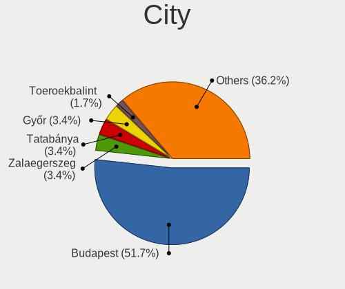

| City             | Notebooks | Percent |
|------------------|-----------|---------|
| Budapest         | 30        | 51.72%  |
| Zalaegerszeg     | 2         | 3.45%   |
| Tatabánya       | 2         | 3.45%   |
| Győr            | 2         | 3.45%   |
| Toeroekbalint    | 1         | 1.72%   |
| Tamasi           | 1         | 1.72%   |
| Taksony          | 1         | 1.72%   |
| Szombathely      | 1         | 1.72%   |
| Szigethalom      | 1         | 1.72%   |
| Szendro          | 1         | 1.72%   |
| Pomaz            | 1         | 1.72%   |
| Papa             | 1         | 1.72%   |
| Nyul             | 1         | 1.72%   |
| Nyiregyhaza      | 1         | 1.72%   |
| Morahalom        | 1         | 1.72%   |
| Monor            | 1         | 1.72%   |
| Mogyorod         | 1         | 1.72%   |
| Miskolc          | 1         | 1.72%   |
| Kistelek         | 1         | 1.72%   |
| Kecskemét       | 1         | 1.72%   |
| Jaszapati        | 1         | 1.72%   |
| Gyongyoshalasz   | 1         | 1.72%   |
| Fertoszentmiklos | 1         | 1.72%   |
| Decs             | 1         | 1.72%   |
| Cegled           | 1         | 1.72%   |
| Borsodbota       | 1         | 1.72%   |

Drives
------

Drive Vendor
------------

Hard drive vendors

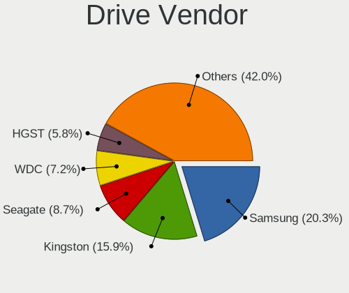

| Vendor              | Notebooks | Drives | Percent |
|---------------------|-----------|--------|---------|
| Samsung Electronics | 14        | 15     | 20.29%  |
| Kingston            | 11        | 13     | 15.94%  |
| Seagate             | 6         | 6      | 8.7%    |
| WDC                 | 5         | 5      | 7.25%   |
| HGST                | 4         | 4      | 5.8%    |
| Unknown             | 3         | 3      | 4.35%   |
| Toshiba             | 3         | 3      | 4.35%   |
| SK hynix            | 3         | 3      | 4.35%   |
| Sandisk             | 3         | 3      | 4.35%   |
| Micron Technology   | 2         | 2      | 2.9%    |
| Intel               | 2         | 2      | 2.9%    |
| Crucial             | 2         | 2      | 2.9%    |
| China               | 2         | 3      | 2.9%    |
| Verbatim            | 1         | 1      | 1.45%   |
| SSSTC               | 1         | 1      | 1.45%   |
| SPCC                | 1         | 1      | 1.45%   |
| O2 Micro            | 1         | 1      | 1.45%   |
| LITEON              | 1         | 1      | 1.45%   |
| KIOXIA              | 1         | 1      | 1.45%   |
| Intenso             | 1         | 1      | 1.45%   |
| Apple               | 1         | 1      | 1.45%   |
| Apacer              | 1         | 1      | 1.45%   |

Drive Model
-----------

Hard drive models

| Model                                               | Notebooks | Percent |
|-----------------------------------------------------|-----------|---------|
| Kingston SA400S37480G 480GB SSD                     | 5         | 6.85%   |
| Samsung SSD 860 EVO 500GB                           | 3         | 4.11%   |
| Kingston SA400S37240G 240GB SSD                     | 3         | 4.11%   |
| HGST HTS545032A7E380 320GB                          | 3         | 4.11%   |
| Samsung NVMe SSD Controller SM981/PM981/PM983 250GB | 2         | 2.74%   |
| WDC WD5000LPCX-24C6HT0 500GB                        | 1         | 1.37%   |
| WDC WD5000BPVT-00HXZT1 500GB                        | 1         | 1.37%   |
| WDC WD3200BEVT-08A23T1 320GB                        | 1         | 1.37%   |
| WDC WD2500BEVT-00ZCT0 250GB                         | 1         | 1.37%   |
| WDC WD1200BEVS-22UST0 120GB                         | 1         | 1.37%   |
| Verbatim Vi550 S3 512GB                             | 1         | 1.37%   |
| Unknown SA08G  8GB                                  | 1         | 1.37%   |
| Unknown MMC Card  32GB                              | 1         | 1.37%   |
| Unknown MMC Card  256GB                             | 1         | 1.37%   |
| Toshiba MK2576GSX 250GB                             | 1         | 1.37%   |
| Toshiba KXG50ZNV256G NVMe 256GB                     | 1         | 1.37%   |
| Toshiba KBG30ZMT256G 256GB                          | 1         | 1.37%   |
| SSSTC CL1-8D256-HP 256GB                            | 1         | 1.37%   |
| SPCC Solid State Disk 256GB                         | 1         | 1.37%   |
| SK hynix HFS256G39TND-N210A 256GB SSD               | 1         | 1.37%   |
| SK hynix HFM512GDJTNI-82A0A 512GB                   | 1         | 1.37%   |
| SK hynix HFM512GD3JX013N 512GB                      | 1         | 1.37%   |
| Seagate ST9500325AS 500GB                           | 1         | 1.37%   |
| Seagate ST750LM022 HN-M750MBB 752GB                 | 1         | 1.37%   |
| Seagate ST500LT012-9WS142 500GB                     | 1         | 1.37%   |
| Seagate ST500LT012-1DG142 500GB                     | 1         | 1.37%   |
| Seagate ST250LT007-9ZV14C 250GB                     | 1         | 1.37%   |
| Seagate ST1000LM014-1EJ164 1TB                      | 1         | 1.37%   |
| SanDisk X400 M.2 2280 128GB SSD                     | 1         | 1.37%   |
| Sandisk WD Blue SN550 NVMe SSD 1TB                  | 1         | 1.37%   |
| SanDisk SDSSDH3250G 250GB                           | 1         | 1.37%   |
| Samsung SSD 980 PRO 1TB                             | 1         | 1.37%   |
| Samsung SSD 980 500GB                               | 1         | 1.37%   |
| Samsung SSD 980 1TB                                 | 1         | 1.37%   |
| Samsung SSD 870 QVO 1TB                             | 1         | 1.37%   |
| Samsung SSD 870 EVO 250GB                           | 1         | 1.37%   |
| Samsung SSD 850 EVO 250GB                           | 1         | 1.37%   |
| Samsung SSD 830 Series 128GB                        | 1         | 1.37%   |
| Samsung SSD 750 EVO 250GB                           | 1         | 1.37%   |
| Samsung NVMe SSD Controller PM9A1/PM9A3/980PRO 2TB  | 1         | 1.37%   |

HDD Vendor
----------

Hard disk drive vendors

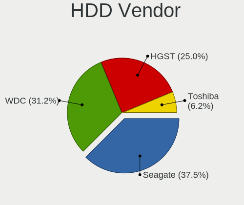

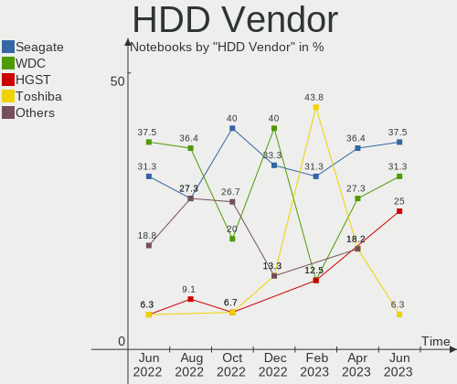

| Vendor  | Notebooks | Drives | Percent |
|---------|-----------|--------|---------|
| Seagate | 6         | 6      | 37.5%   |
| WDC     | 5         | 5      | 31.25%  |
| HGST    | 4         | 4      | 25%     |
| Toshiba | 1         | 1      | 6.25%   |

SSD Vendor
----------

Solid state drive vendors

| Vendor              | Notebooks | Drives | Percent |
|---------------------|-----------|--------|---------|
| Samsung Electronics | 9         | 9      | 29.03%  |
| Kingston            | 8         | 10     | 25.81%  |
| SanDisk             | 2         | 2      | 6.45%   |
| Intel               | 2         | 2      | 6.45%   |
| China               | 2         | 3      | 6.45%   |
| Verbatim            | 1         | 1      | 3.23%   |
| SPCC                | 1         | 1      | 3.23%   |
| SK hynix            | 1         | 1      | 3.23%   |
| LITEON              | 1         | 1      | 3.23%   |
| Intenso             | 1         | 1      | 3.23%   |
| Crucial             | 1         | 1      | 3.23%   |
| Apple               | 1         | 1      | 3.23%   |
| Apacer              | 1         | 1      | 3.23%   |

Drive Kind
----------

HDD or SSD

| Kind | Notebooks | Drives | Percent |
|------|-----------|--------|---------|
| SSD  | 31        | 34     | 46.27%  |
| NVMe | 17        | 20     | 25.37%  |
| HDD  | 16        | 16     | 23.88%  |
| MMC  | 3         | 3      | 4.48%   |

Drive Connector
---------------

SATA, SAS, NVMe, etc.

| Type | Notebooks | Drives | Percent |
|------|-----------|--------|---------|
| SATA | 43        | 50     | 68.25%  |
| NVMe | 17        | 20     | 26.98%  |
| MMC  | 3         | 3      | 4.76%   |

Drive Size
----------

Size of hard drive

| Size in TB | Notebooks | Drives | Percent |
|------------|-----------|--------|---------|
| 0.01-0.5   | 39        | 43     | 84.78%  |
| 0.51-1.0   | 7         | 7      | 15.22%  |

Space Total
-----------

Amount of disk space available on the file system

| Size in GB | Notebooks | Percent |
|------------|-----------|---------|
| 101-250    | 19        | 32.76%  |
| Unknown    | 13        | 22.41%  |
| 251-500    | 10        | 17.24%  |
| 1001-2000  | 4         | 6.9%    |
| 501-1000   | 4         | 6.9%    |
| 21-50      | 3         | 5.17%   |
| 51-100     | 3         | 5.17%   |
| 1-20       | 2         | 3.45%   |

Space Used
----------

Amount of used disk space

| Used GB   | Notebooks | Percent |
|-----------|-----------|---------|
| 1-20      | 14        | 24.14%  |
| Unknown   | 13        | 22.41%  |
| 51-100    | 10        | 17.24%  |
| 21-50     | 9         | 15.52%  |
| 101-250   | 7         | 12.07%  |
| 251-500   | 3         | 5.17%   |
| 1001-2000 | 1         | 1.72%   |
| 501-1000  | 1         | 1.72%   |

Malfunc. Drives
---------------

Drive models with a malfunction

| Model                                 | Notebooks | Drives | Percent |
|---------------------------------------|-----------|--------|---------|
| HGST HTS545032A7E380 320GB            | 2         | 2      | 18.18%  |
| WDC WD3200BEVT-08A23T1 320GB          | 1         | 1      | 9.09%   |
| WDC WD2500BEVT-00ZCT0 250GB           | 1         | 1      | 9.09%   |
| Seagate ST9500325AS 500GB             | 1         | 1      | 9.09%   |
| Seagate ST750LM022 HN-M750MBB 752GB   | 1         | 1      | 9.09%   |
| Seagate ST500LT012-9WS142 500GB       | 1         | 1      | 9.09%   |
| Samsung Electronics SSD 750 EVO 250GB | 1         | 1      | 9.09%   |
| Intel SSDSA1M160G2HP 160GB            | 1         | 1      | 9.09%   |
| China SSD 240GB                       | 1         | 1      | 9.09%   |
| Apple SSD TS064E 64GB                 | 1         | 1      | 9.09%   |

Malfunc. Drive Vendor
---------------------

Vendors of faulty drives

| Vendor              | Notebooks | Drives | Percent |
|---------------------|-----------|--------|---------|
| Seagate             | 3         | 3      | 27.27%  |
| WDC                 | 2         | 2      | 18.18%  |
| HGST                | 2         | 2      | 18.18%  |
| Samsung Electronics | 1         | 1      | 9.09%   |
| Intel               | 1         | 1      | 9.09%   |
| China               | 1         | 1      | 9.09%   |
| Apple               | 1         | 1      | 9.09%   |

Malfunc. HDD Vendor
-------------------

Vendors of faulty HDD drives

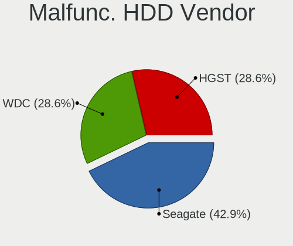

| Vendor  | Notebooks | Drives | Percent |
|---------|-----------|--------|---------|
| Seagate | 3         | 3      | 42.86%  |
| WDC     | 2         | 2      | 28.57%  |
| HGST    | 2         | 2      | 28.57%  |

Malfunc. Drive Kind
-------------------

Kinds of faulty drives

| Kind | Notebooks | Drives | Percent |
|------|-----------|--------|---------|
| HDD  | 7         | 7      | 63.64%  |
| SSD  | 4         | 4      | 36.36%  |

Failed Drives
-------------

Failed drive models

Zero info for selected period =(

Failed Drive Vendor
-------------------

Failed drive vendors

Zero info for selected period =(

Drive Status
------------

Number of failed and malfunc. drives

| Status   | Notebooks | Drives | Percent |
|----------|-----------|--------|---------|
| Works    | 39        | 48     | 62.9%   |
| Detected | 12        | 14     | 19.35%  |
| Malfunc  | 11        | 11     | 17.74%  |

Storage controller
------------------

Storage Vendor
--------------

Storage controller vendors

| Vendor                         | Notebooks | Percent |
|--------------------------------|-----------|---------|
| Intel                          | 43        | 60.56%  |
| AMD                            | 9         | 12.68%  |
| Samsung Electronics            | 5         | 7.04%   |
| Toshiba America Info Systems   | 3         | 4.23%   |
| Kingston Technology Company    | 3         | 4.23%   |
| SK hynix                       | 2         | 2.82%   |
| Micron Technology              | 2         | 2.82%   |
| Solid State Storage Technology | 1         | 1.41%   |
| SanDisk                        | 1         | 1.41%   |
| O2 Micro                       | 1         | 1.41%   |
| Micron/Crucial Technology      | 1         | 1.41%   |

Storage Model
-------------

Storage controller models

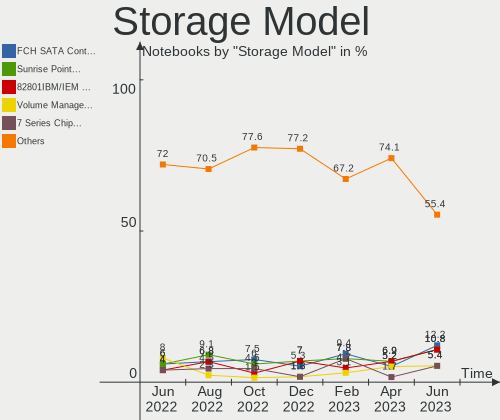

| Model                                                                          | Notebooks | Percent |
|--------------------------------------------------------------------------------|-----------|---------|
| AMD FCH SATA Controller [AHCI mode]                                            | 9         | 12.16%  |
| Intel Sunrise Point-LP SATA Controller [AHCI mode]                             | 8         | 10.81%  |
| Intel 82801IBM/IEM (ICH9M/ICH9M-E) 4 port SATA Controller [AHCI mode]          | 8         | 10.81%  |
| Intel Volume Management Device NVMe RAID Controller                            | 4         | 5.41%   |
| Intel 7 Series Chipset Family 6-port SATA Controller [AHCI mode]               | 4         | 5.41%   |
| Intel 6 Series/C200 Series Chipset Family 6 port Mobile SATA AHCI Controller   | 4         | 5.41%   |
| Intel Wildcat Point-LP SATA Controller [AHCI Mode]                             | 3         | 4.05%   |
| Intel 82801 Mobile SATA Controller [RAID mode]                                 | 3         | 4.05%   |
| Samsung NVMe SSD Controller SM981/PM981/PM983                                  | 2         | 2.7%    |
| Samsung NVMe SSD Controller 980                                                | 2         | 2.7%    |
| Intel Tiger Lake-LP SATA Controller                                            | 2         | 2.7%    |
| Intel 8 Series/C220 Series Chipset Family 6-port SATA Controller 1 [AHCI mode] | 2         | 2.7%    |
| Intel 8 Series SATA Controller 1 [AHCI mode]                                   | 2         | 2.7%    |
| Intel 5 Series/3400 Series Chipset 6 port SATA AHCI Controller                 | 2         | 2.7%    |
| Intel 5 Series/3400 Series Chipset 4 port SATA AHCI Controller                 | 2         | 2.7%    |
| Toshiba America Info Systems XG6 NVMe SSD Controller                           | 1         | 1.35%   |
| Toshiba America Info Systems XG5 NVMe SSD Controller                           | 1         | 1.35%   |
| Toshiba America Info Systems BG3 NVMe SSD Controller                           | 1         | 1.35%   |
| Solid State Storage CL1-3D256-Q11 NVMe SSD M.2                                 | 1         | 1.35%   |
| SK hynix Gold P31/BC711/PC711 NVMe Solid State Drive                           | 1         | 1.35%   |
| SK hynix BC511 NVMe SSD                                                        | 1         | 1.35%   |
| SanDisk WD Blue SN550 NVMe SSD                                                 | 1         | 1.35%   |
| Samsung NVMe SSD Controller PM9A1/PM9A3/980PRO                                 | 1         | 1.35%   |
| O2 Micro Non-Volatile memory controller                                        | 1         | 1.35%   |
| Micron/Crucial NVMe Storage Controller                                         | 1         | 1.35%   |
| Micron NVMe Storage Controller                                                 | 1         | 1.35%   |
| Micron 2450 NVMe SSD (DRAM-less)                                               | 1         | 1.35%   |
| Kingston Company Company Non-Volatile memory controller                        | 1         | 1.35%   |
| Kingston Company OM3PDP3 NVMe SSD                                              | 1         | 1.35%   |
| Kingston Company FURY Renegade NVMe SSD                                        | 1         | 1.35%   |
| Intel Comet Lake SATA AHCI Controller                                          | 1         | 1.35%   |
| AMD FCH IDE Controller                                                         | 1         | 1.35%   |

Storage Kind
------------

Kind of storage controller (IDE, SATA, NVMe, SAS, ...)

| Kind | Notebooks | Percent |
|------|-----------|---------|
| SATA | 47        | 65.28%  |
| NVMe | 17        | 23.61%  |
| RAID | 7         | 9.72%   |
| IDE  | 1         | 1.39%   |

Processor
---------

CPU Vendor
----------

Processor vendors

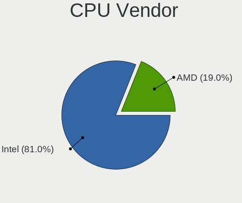

| Vendor | Notebooks | Percent |
|--------|-----------|---------|
| Intel  | 47        | 81.03%  |
| AMD    | 11        | 18.97%  |

CPU Model
---------

Processor models

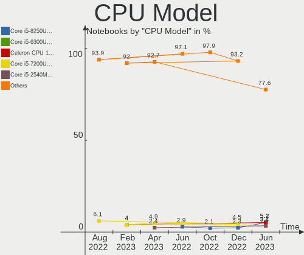

| Model                                       | Notebooks | Percent |
|---------------------------------------------|-----------|---------|
| Intel Core i5-8250U CPU @ 1.60GHz           | 3         | 5.17%   |
| Intel Core i5-6300U CPU @ 2.40GHz           | 3         | 5.17%   |
| Intel Celeron CPU 1000M @ 1.80GHz           | 3         | 5.17%   |
| Intel Core i5-7200U CPU @ 2.50GHz           | 2         | 3.45%   |
| Intel Core i5-2540M CPU @ 2.60GHz           | 2         | 3.45%   |
| Intel Core i3-6006U CPU @ 2.00GHz           | 2         | 3.45%   |
| Intel Core i3-2310M CPU @ 2.10GHz           | 2         | 3.45%   |
| Intel 11th Gen Core i5-1135G7 @ 2.40GHz     | 2         | 3.45%   |
| Intel 11th Gen Core i3-1115G4 @ 3.00GHz     | 2         | 3.45%   |
| Intel Pentium Dual-Core CPU T4400 @ 2.20GHz | 1         | 1.72%   |
| Intel Pentium Dual-Core CPU T4300 @ 2.10GHz | 1         | 1.72%   |
| Intel Pentium CPU P6200 @ 2.13GHz           | 1         | 1.72%   |
| Intel Core i7-5500U CPU @ 2.40GHz           | 1         | 1.72%   |
| Intel Core i7-4720HQ CPU @ 2.60GHz          | 1         | 1.72%   |
| Intel Core i7-4712MQ CPU @ 2.30GHz          | 1         | 1.72%   |
| Intel Core i7-4510U CPU @ 2.00GHz           | 1         | 1.72%   |
| Intel Core i7 CPU L 640 @ 2.13GHz           | 1         | 1.72%   |
| Intel Core i5-5200U CPU @ 2.20GHz           | 1         | 1.72%   |
| Intel Core i5-3427U CPU @ 1.80GHz           | 1         | 1.72%   |
| Intel Core i5-3340M CPU @ 2.70GHz           | 1         | 1.72%   |
| Intel Core i5-10210U CPU @ 1.60GHz          | 1         | 1.72%   |
| Intel Core i5 CPU M 560 @ 2.67GHz           | 1         | 1.72%   |
| Intel Core i5 CPU M 460 @ 2.53GHz           | 1         | 1.72%   |
| Intel Core i3-5005U CPU @ 2.00GHz           | 1         | 1.72%   |
| Intel Core i3-4030U CPU @ 1.90GHz           | 1         | 1.72%   |
| Intel Core i3-2330M CPU @ 2.20GHz           | 1         | 1.72%   |
| Intel Core i3-10110U CPU @ 2.10GHz          | 1         | 1.72%   |
| Intel Core 2 Duo CPU T9600 @ 2.80GHz        | 1         | 1.72%   |
| Intel Core 2 Duo CPU T9300 @ 2.50GHz        | 1         | 1.72%   |
| Intel Core 2 Duo CPU T7500 @ 2.20GHz        | 1         | 1.72%   |
| Intel Core 2 Duo CPU P8600 @ 2.40GHz        | 1         | 1.72%   |
| Intel Celeron Dual-Core CPU T3500 @ 2.10GHz | 1         | 1.72%   |
| Intel Celeron CPU N3160 @ 1.60GHz           | 1         | 1.72%   |
| Intel Celeron CPU 723 @ 1.20GHz             | 1         | 1.72%   |
| Intel 11th Gen Core i5-11400H @ 2.70GHz     | 1         | 1.72%   |
| AMD Ryzen 7 4800HS with Radeon Graphics     | 1         | 1.72%   |
| AMD Ryzen 7 4800H with Radeon Graphics      | 1         | 1.72%   |
| AMD Ryzen 5 5600H with Radeon Graphics      | 1         | 1.72%   |
| AMD Ryzen 5 5500U with Radeon Graphics      | 1         | 1.72%   |
| AMD Ryzen 5 4600H with Radeon Graphics      | 1         | 1.72%   |

CPU Model Family
----------------

Processor model prefix

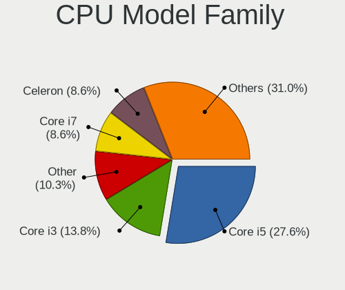

| Model                   | Notebooks | Percent |
|-------------------------|-----------|---------|
| Intel Core i5           | 16        | 27.59%  |
| Intel Core i3           | 8         | 13.79%  |
| Other                   | 6         | 10.34%  |
| Intel Core i7           | 5         | 8.62%   |
| Intel Celeron           | 5         | 8.62%   |
| Intel Core 2 Duo        | 4         | 6.9%    |
| AMD Ryzen 5             | 4         | 6.9%    |
| Intel Pentium Dual-Core | 2         | 3.45%   |
| AMD Ryzen 7             | 2         | 3.45%   |
| Intel Pentium           | 1         | 1.72%   |
| Intel Celeron Dual-Core | 1         | 1.72%   |
| AMD E1                  | 1         | 1.72%   |
| AMD A8                  | 1         | 1.72%   |
| AMD A6                  | 1         | 1.72%   |
| AMD A4                  | 1         | 1.72%   |

CPU Cores
---------

Number of processor cores

| Number | Notebooks | Percent |
|--------|-----------|---------|
| 2      | 38        | 65.52%  |
| 4      | 12        | 20.69%  |
| 6      | 4         | 6.9%    |
| 8      | 2         | 3.45%   |
| 1      | 2         | 3.45%   |

CPU Sockets
-----------

Number of sockets

| Number | Notebooks | Percent |
|--------|-----------|---------|
| 1      | 58        | 100%    |

CPU Threads
-----------

Threads per core (Hyper-Threading)

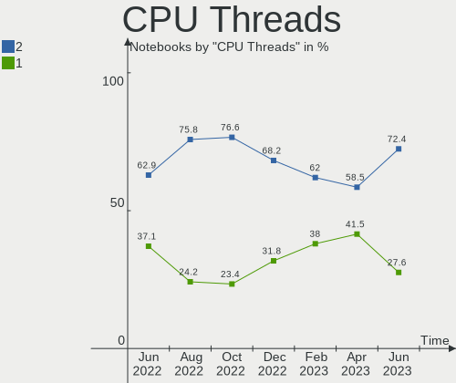

| Number | Notebooks | Percent |
|--------|-----------|---------|
| 2      | 42        | 72.41%  |
| 1      | 16        | 27.59%  |

CPU Op-Modes
------------

CPU Operation Modes (32-bit, 64-bit)

| Op mode        | Notebooks | Percent |
|----------------|-----------|---------|
| 32-bit, 64-bit | 58        | 100%    |

CPU Microcode
-------------

Microcode number

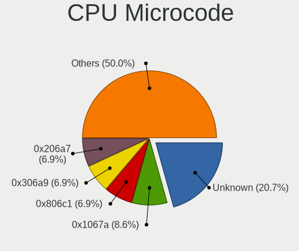

| Number     | Notebooks | Percent |
|------------|-----------|---------|
| Unknown    | 12        | 20.69%  |
| 0x1067a    | 5         | 8.62%   |
| 0x806c1    | 4         | 6.9%    |
| 0x306a9    | 4         | 6.9%    |
| 0x206a7    | 4         | 6.9%    |
| 0x20655    | 4         | 6.9%    |
| 0x806ea    | 3         | 5.17%   |
| 0x806e9    | 2         | 3.45%   |
| 0x406e3    | 2         | 3.45%   |
| 0x40651    | 2         | 3.45%   |
| 0x306d4    | 2         | 3.45%   |
| 0x306c3    | 2         | 3.45%   |
| 0x806ec    | 1         | 1.72%   |
| 0x6fa      | 1         | 1.72%   |
| 0x10676    | 1         | 1.72%   |
| 0x08608102 | 1         | 1.72%   |
| 0x08600106 | 1         | 1.72%   |
| 0x08600104 | 1         | 1.72%   |
| 0x08600103 | 1         | 1.72%   |
| 0x08108109 | 1         | 1.72%   |
| 0x07030105 | 1         | 1.72%   |
| 0x06006704 | 1         | 1.72%   |
| 0x06003109 | 1         | 1.72%   |
| 0x05000119 | 1         | 1.72%   |

CPU Microarch
-------------

Microarchitecture

| Name        | Notebooks | Percent |
|-------------|-----------|---------|
| Penryn      | 7         | 12.07%  |
| KabyLake    | 7         | 12.07%  |
| Skylake     | 5         | 8.62%   |
| SandyBridge | 5         | 8.62%   |
| IvyBridge   | 5         | 8.62%   |
| Westmere    | 4         | 6.9%    |
| TigerLake   | 4         | 6.9%    |
| Haswell     | 4         | 6.9%    |
| Zen 2       | 3         | 5.17%   |
| Broadwell   | 3         | 5.17%   |
| Unknown     | 2         | 3.45%   |
| Zen+        | 1         | 1.72%   |
| Zen 3       | 1         | 1.72%   |
| Steamroller | 1         | 1.72%   |
| Silvermont  | 1         | 1.72%   |
| Puma        | 1         | 1.72%   |
| Icelake     | 1         | 1.72%   |
| Excavator   | 1         | 1.72%   |
| Core        | 1         | 1.72%   |
| Bobcat      | 1         | 1.72%   |

Graphics
--------

GPU Vendor
----------

Vendors of graphics cards

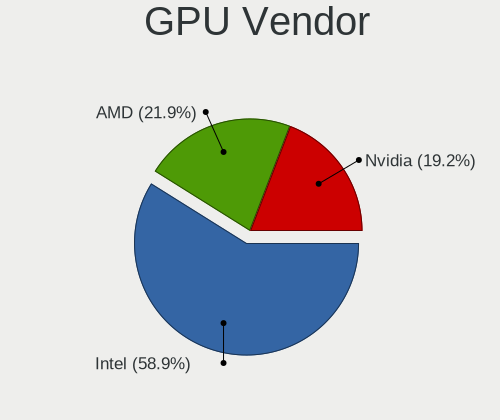

| Vendor | Notebooks | Percent |
|--------|-----------|---------|
| Intel  | 43        | 58.9%   |
| AMD    | 16        | 21.92%  |
| Nvidia | 14        | 19.18%  |

GPU Model
---------

Graphics card models

| Model                                                                                    | Notebooks | Percent |
|------------------------------------------------------------------------------------------|-----------|---------|
| Intel Mobile 4 Series Chipset Integrated Graphics Controller                             | 7         | 9.21%   |
| Intel Skylake GT2 [HD Graphics 520]                                                      | 5         | 6.58%   |
| Intel 3rd Gen Core processor Graphics Controller                                         | 5         | 6.58%   |
| Intel 2nd Generation Core Processor Family Integrated Graphics Controller                | 4         | 5.26%   |
| Intel UHD Graphics 620                                                                   | 3         | 3.95%   |
| Intel HD Graphics 5500                                                                   | 3         | 3.95%   |
| AMD Topaz XT [Radeon R7 M260/M265 / M340/M360 / M440/M445 / 530/535 / 620/625 Mobile]    | 3         | 3.95%   |
| AMD Renoir                                                                               | 3         | 3.95%   |
| Nvidia TU117M [GeForce GTX 1650 Ti Mobile]                                               | 2         | 2.63%   |
| Nvidia GF119M [GeForce GT 520M]                                                          | 2         | 2.63%   |
| Intel TigerLake-LP GT2 [Iris Xe Graphics]                                                | 2         | 2.63%   |
| Intel Tiger Lake-LP GT2 [UHD Graphics G4]                                                | 2         | 2.63%   |
| Intel HD Graphics 620                                                                    | 2         | 2.63%   |
| Intel Haswell-ULT Integrated Graphics Controller                                         | 2         | 2.63%   |
| Intel Core Processor Integrated Graphics Controller                                      | 2         | 2.63%   |
| Intel CometLake-U GT2 [UHD Graphics]                                                     | 2         | 2.63%   |
| Intel 4th Gen Core Processor Integrated Graphics Controller                              | 2         | 2.63%   |
| Nvidia TU106M [GeForce RTX 2060 Max-Q]                                                   | 1         | 1.32%   |
| Nvidia GT218M [NVS 3100M]                                                                | 1         | 1.32%   |
| Nvidia GT218M [GeForce 315M]                                                             | 1         | 1.32%   |
| Nvidia GM108M [GeForce 845M]                                                             | 1         | 1.32%   |
| Nvidia GM108M [GeForce 840M]                                                             | 1         | 1.32%   |
| Nvidia GM107M [GeForce GTX 960M]                                                         | 1         | 1.32%   |
| Nvidia GK208BM [GeForce 920M]                                                            | 1         | 1.32%   |
| Nvidia GK107M [GeForce GT 750M]                                                          | 1         | 1.32%   |
| Nvidia GA107M [GeForce RTX 3050 Ti Mobile]                                               | 1         | 1.32%   |
| Nvidia G96CM [GeForce 9600M GT]                                                          | 1         | 1.32%   |
| Intel TigerLake-H GT1 [UHD Graphics]                                                     | 1         | 1.32%   |
| Intel Atom/Celeron/Pentium Processor x5-E8000/J3xxx/N3xxx Integrated Graphics Controller | 1         | 1.32%   |
| AMD Wrestler [Radeon HD 7310]                                                            | 1         | 1.32%   |
| AMD VanGogh [AMD Custom GPU 0405]                                                        | 1         | 1.32%   |
| AMD Sun XT [Radeon HD 8670A/8670M/8690M / R5 M330 / M430 / Radeon 520 Mobile]            | 1         | 1.32%   |
| AMD Sun LE [Radeon HD 8550M / R5 M230]                                                   | 1         | 1.32%   |
| AMD Stoney [Radeon R2/R3/R4/R5 Graphics]                                                 | 1         | 1.32%   |
| AMD Seymour [Radeon HD 6400M/7400M Series]                                               | 1         | 1.32%   |
| AMD Picasso/Raven 2 [Radeon Vega Series / Radeon Vega Mobile Series]                     | 1         | 1.32%   |
| AMD Navi 14 [Radeon RX 5500/5500M / Pro 5500M]                                           | 1         | 1.32%   |
| AMD Mullins [Radeon R4/R5 Graphics]                                                      | 1         | 1.32%   |
| AMD Madison [Mobility Radeon HD 5650/5750 / 6530M/6550M]                                 | 1         | 1.32%   |
| AMD Lucienne                                                                             | 1         | 1.32%   |

GPU Combo
---------

Combinations of graphics cards

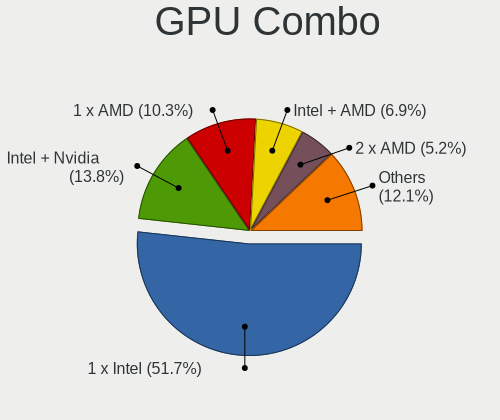

| Name           | Notebooks | Percent |
|----------------|-----------|---------|
| 1 x Intel      | 30        | 51.72%  |
| Intel + Nvidia | 8         | 13.79%  |
| 1 x AMD        | 6         | 10.34%  |
| Intel + AMD    | 4         | 6.9%    |
| 2 x AMD        | 3         | 5.17%   |
| 1 x Nvidia     | 3         | 5.17%   |
| AMD + Nvidia   | 3         | 5.17%   |
| 2 x Intel      | 1         | 1.72%   |

GPU Driver
----------

Free vs proprietary

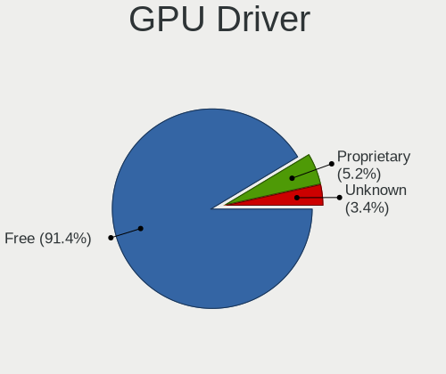

| Driver      | Notebooks | Percent |
|-------------|-----------|---------|
| Free        | 53        | 91.38%  |
| Proprietary | 3         | 5.17%   |
| Unknown     | 2         | 3.45%   |

GPU Memory
----------

Total video memory

| Size in GB | Notebooks | Percent |
|------------|-----------|---------|
| Unknown    | 38        | 65.52%  |
| 1.01-2.0   | 6         | 10.34%  |
| 0.01-0.5   | 6         | 10.34%  |
| 0.51-1.0   | 5         | 8.62%   |
| 3.01-4.0   | 3         | 5.17%   |

Monitor
-------

Monitor Vendor
--------------

Monitor vendors

| Vendor                  | Notebooks | Percent |
|-------------------------|-----------|---------|
| LG Display              | 15        | 25%     |
| AU Optronics            | 11        | 18.33%  |
| Samsung Electronics     | 7         | 11.67%  |
| BOE                     | 6         | 10%     |
| Chimei Innolux          | 5         | 8.33%   |
| PANDA                   | 3         | 5%      |
| Goldstar                | 2         | 3.33%   |
| Chi Mei Optoelectronics | 2         | 3.33%   |
| Valve                   | 1         | 1.67%   |
| Unknown                 | 1         | 1.67%   |
| Toshiba                 | 1         | 1.67%   |
| Sharp                   | 1         | 1.67%   |
| LG Philips              | 1         | 1.67%   |
| Lenovo                  | 1         | 1.67%   |
| HannStar                | 1         | 1.67%   |
| BenQ                    | 1         | 1.67%   |
| Apple                   | 1         | 1.67%   |

Monitor Model
-------------

Monitor models

| Model                                                                    | Notebooks | Percent |
|--------------------------------------------------------------------------|-----------|---------|
| LG Display LCD Monitor LGD0395 1366x768 344x194mm 15.5-inch              | 3         | 4.92%   |
| Valve ANX7530 U VLV3001 800x1280 100x150mm 7.1-inch                      | 1         | 1.64%   |
| Unknown LCD Monitor FFFF 2288x1287 2550x2550mm 142.0-inch                | 1         | 1.64%   |
| Toshiba TV TSB0108 1360x768 698x393mm 31.5-inch                          | 1         | 1.64%   |
| Sharp LQ156M1JW26 SHP1559 1920x1080 344x194mm 15.5-inch                  | 1         | 1.64%   |
| Samsung Electronics LCD Monitor SEC5442 1440x900 303x190mm 14.1-inch     | 1         | 1.64%   |
| Samsung Electronics LCD Monitor SEC5441 1366x768 293x165mm 13.2-inch     | 1         | 1.64%   |
| Samsung Electronics LCD Monitor SEC3651 1366x768 344x194mm 15.5-inch     | 1         | 1.64%   |
| Samsung Electronics LCD Monitor SEC3051 1600x900 398x232mm 18.1-inch     | 1         | 1.64%   |
| Samsung Electronics LCD Monitor SEC304F 1680x945 409x230mm 18.5-inch     | 1         | 1.64%   |
| Samsung Electronics LCD Monitor SEC3046 1366x768 344x193mm 15.5-inch     | 1         | 1.64%   |
| Samsung Electronics LCD Monitor SDC4852 1920x1080 344x194mm 15.5-inch    | 1         | 1.64%   |
| PANDA LCD Monitor NCP0065 1920x1080 309x174mm 14.0-inch                  | 1         | 1.64%   |
| PANDA LCD Monitor NCP0058 1920x1080 344x194mm 15.5-inch                  | 1         | 1.64%   |
| PANDA LCD Monitor NCP004D 1920x1080 344x194mm 15.5-inch                  | 1         | 1.64%   |
| LG Philips LCD Monitor LPL0140 1440x900 304x190mm 14.1-inch              | 1         | 1.64%   |
| LG Display LCD Monitor LGD06F5 1920x1080 344x194mm 15.5-inch             | 1         | 1.64%   |
| LG Display LCD Monitor LGD0694 2560x1600 344x215mm 16.0-inch             | 1         | 1.64%   |
| LG Display LCD Monitor LGD05F6 1920x1080 309x174mm 14.0-inch             | 1         | 1.64%   |
| LG Display LCD Monitor LGD044B 1366x768 344x194mm 15.5-inch              | 1         | 1.64%   |
| LG Display LCD Monitor LGD0384 1366x768 344x194mm 15.5-inch              | 1         | 1.64%   |
| LG Display LCD Monitor LGD036C 1366x768 277x156mm 12.5-inch              | 1         | 1.64%   |
| LG Display LCD Monitor LGD0365 1600x900 382x215mm 17.3-inch              | 1         | 1.64%   |
| LG Display LCD Monitor LGD0353 1366x768 345x194mm 15.6-inch              | 1         | 1.64%   |
| LG Display LCD Monitor LGD02DF 1600x900 310x174mm 14.0-inch              | 1         | 1.64%   |
| LG Display LCD Monitor LGD02CF 1366x768 344x194mm 15.5-inch              | 1         | 1.64%   |
| LG Display LCD Monitor LGD024F 1280x800 260x160mm 12.0-inch              | 1         | 1.64%   |
| LG Display LCD Monitor LGD01DD 1600x900 382x215mm 17.3-inch              | 1         | 1.64%   |
| Lenovo LCD Monitor LEN4011 1280x800 260x170mm 12.2-inch                  | 1         | 1.64%   |
| HannStar HSD121PHW1 HSD04B6 1366x768 270x150mm 12.2-inch                 | 1         | 1.64%   |
| Goldstar LG IPS FULLHD GSM5AB8 1920x1080 480x270mm 21.7-inch             | 1         | 1.64%   |
| Goldstar E2260 GSM57E1 1920x1080 477x268mm 21.5-inch                     | 1         | 1.64%   |
| Goldstar 2D HD TV GSM59CA 1366x768 509x286mm 23.0-inch                   | 1         | 1.64%   |
| Chimei Innolux LCD Monitor CMN1733 1600x900 382x215mm 17.3-inch          | 1         | 1.64%   |
| Chimei Innolux LCD Monitor CMN1609 1920x1080 355x199mm 16.0-inch         | 1         | 1.64%   |
| Chimei Innolux LCD Monitor CMN15E7 1920x1080 344x193mm 15.5-inch         | 1         | 1.64%   |
| Chimei Innolux LCD Monitor CMN15D5 1920x1080 344x193mm 15.5-inch         | 1         | 1.64%   |
| Chimei Innolux LCD Monitor CMN1521 1920x1080 344x193mm 15.5-inch         | 1         | 1.64%   |
| Chi Mei Optoelectronics LCD Monitor CMO15A7 1366x768 344x193mm 15.5-inch | 1         | 1.64%   |
| Chi Mei Optoelectronics LCD Monitor CMO1462 1280x800 303x189mm 14.1-inch | 1         | 1.64%   |

Monitor Resolution
------------------

Monitor screen resolution

| Resolution       | Notebooks | Percent |
|------------------|-----------|---------|
| 1920x1080 (FHD)  | 23        | 38.98%  |
| 1366x768 (WXGA)  | 17        | 28.81%  |
| 1600x900 (HD+)   | 5         | 8.47%   |
| 1440x900 (WXGA+) | 3         | 5.08%   |
| 1280x800 (WXGA)  | 3         | 5.08%   |
| 3840x2160 (4K)   | 2         | 3.39%   |
| 800x1280         | 1         | 1.69%   |
| 2560x1600        | 1         | 1.69%   |
| 2560x1440 (QHD)  | 1         | 1.69%   |
| 2288x1287        | 1         | 1.69%   |
| 1920x540         | 1         | 1.69%   |
| 1680x945         | 1         | 1.69%   |

Monitor Diagonal
----------------

Diagonal size in inches

| Inches | Notebooks | Percent |
|--------|-----------|---------|
| 15     | 30        | 49.18%  |
| 14     | 8         | 13.11%  |
| 17     | 5         | 8.2%    |
| 12     | 5         | 8.2%    |
| 21     | 2         | 3.28%   |
| 18     | 2         | 3.28%   |
| 16     | 2         | 3.28%   |
| 13     | 2         | 3.28%   |
| 142    | 1         | 1.64%   |
| 72     | 1         | 1.64%   |
| 27     | 1         | 1.64%   |
| 23     | 1         | 1.64%   |
| 7      | 1         | 1.64%   |

Monitor Width
-------------

Physical width

| Width in mm    | Notebooks | Percent |
|----------------|-----------|---------|
| 301-350        | 39        | 63.93%  |
| 351-400        | 8         | 13.11%  |
| 201-300        | 6         | 9.84%   |
| 401-500        | 3         | 4.92%   |
| 501-600        | 2         | 3.28%   |
| More than 2000 | 1         | 1.64%   |
| 1501-2000      | 1         | 1.64%   |
| 1-100          | 1         | 1.64%   |

Aspect Ratio
------------

Proportional relationship between the width and the height

| Ratio | Notebooks | Percent |
|-------|-----------|---------|
| 16/9  | 48        | 84.21%  |
| 16/10 | 6         | 10.53%  |
| 3/2   | 1         | 1.75%   |
| 1.00  | 1         | 1.75%   |
| 0.67  | 1         | 1.75%   |

Monitor Area
------------

Area in inch²

| Area in inch² | Notebooks | Percent |
|----------------|-----------|---------|
| 101-110        | 31        | 51.67%  |
| 81-90          | 10        | 16.67%  |
| 61-70          | 5         | 8.33%   |
| 121-130        | 3         | 5%      |
| More than 1000 | 2         | 3.33%   |
| 201-250        | 2         | 3.33%   |
| 141-150        | 2         | 3.33%   |
| 131-140        | 2         | 3.33%   |
| 1-40           | 1         | 1.67%   |
| 301-350        | 1         | 1.67%   |
| 111-120        | 1         | 1.67%   |

Pixel Density
-------------

Pixels per inch

| Density | Notebooks | Percent |
|---------|-----------|---------|
| 121-160 | 30        | 50.85%  |
| 101-120 | 19        | 32.2%   |
| 51-100  | 5         | 8.47%   |
| 161-240 | 3         | 5.08%   |
| 1-50    | 2         | 3.39%   |

Multiple Monitors
-----------------

Total monitors connected

| Total | Notebooks | Percent |
|-------|-----------|---------|
| 1     | 51        | 87.93%  |
| 2     | 5         | 8.62%   |
| 3     | 1         | 1.72%   |
| 0     | 1         | 1.72%   |

Network
-------

Net Controller Vendor
---------------------

Controller vendors

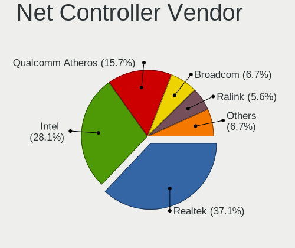

| Vendor                   | Notebooks | Percent |
|--------------------------|-----------|---------|
| Realtek Semiconductor    | 33        | 37.08%  |
| Intel                    | 25        | 28.09%  |
| Qualcomm Atheros         | 14        | 15.73%  |
| Broadcom                 | 6         | 6.74%   |
| Ralink                   | 5         | 5.62%   |
| MediaTek                 | 2         | 2.25%   |
| Broadcom Limited         | 2         | 2.25%   |
| Marvell Technology Group | 1         | 1.12%   |
| Dell                     | 1         | 1.12%   |

Net Controller Model
--------------------

Controller models

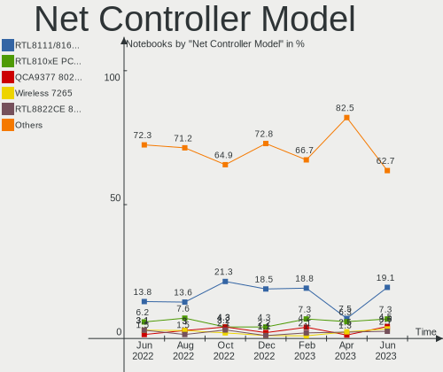

| Model                                                             | Notebooks | Percent |
|-------------------------------------------------------------------|-----------|---------|
| Realtek RTL8111/8168/8411 PCI Express Gigabit Ethernet Controller | 21        | 19.09%  |
| Realtek RTL810xE PCI Express Fast Ethernet controller             | 8         | 7.27%   |
| Qualcomm Atheros QCA9377 802.11ac Wireless Network Adapter        | 5         | 4.55%   |
| Intel Wireless 7265                                               | 4         | 3.64%   |
| Realtek RTL8822CE 802.11ac PCIe Wireless Network Adapter          | 3         | 2.73%   |
| Ralink RT3290 Wireless 802.11n 1T/1R PCIe                         | 3         | 2.73%   |
| Qualcomm Atheros AR9285 Wireless Network Adapter (PCI-Express)    | 3         | 2.73%   |
| Intel Wi-Fi 6 AX201                                               | 3         | 2.73%   |
| Intel Wi-Fi 6 AX200                                               | 3         | 2.73%   |
| Intel Ethernet Connection I219-LM                                 | 3         | 2.73%   |
| Realtek RTL8723BE PCIe Wireless Network Adapter                   | 2         | 1.82%   |
| Qualcomm Atheros AR8151 v2.0 Gigabit Ethernet                     | 2         | 1.82%   |
| Qualcomm Atheros AR8132 Fast Ethernet                             | 2         | 1.82%   |
| MediaTek MT7921 802.11ax PCI Express Wireless Network Adapter     | 2         | 1.82%   |
| Intel Wireless 8260                                               | 2         | 1.82%   |
| Intel WiFi Link 5100                                              | 2         | 1.82%   |
| Intel Ethernet Connection (13) I219-V                             | 2         | 1.82%   |
| Intel Centrino Advanced-N 6205 [Taylor Peak]                      | 2         | 1.82%   |
| Intel Centrino Advanced-N 6200                                    | 2         | 1.82%   |
| Intel 82579LM Gigabit Network Connection (Lewisville)             | 2         | 1.82%   |
| Intel 82577LM Gigabit Network Connection                          | 2         | 1.82%   |
| Intel 82567LM Gigabit Network Connection                          | 2         | 1.82%   |
| Broadcom BCM43142 802.11b/g/n                                     | 2         | 1.82%   |
| Realtek RTL8852AE 802.11ax PCIe Wireless Network Adapter          | 1         | 0.91%   |
| Realtek RTL8821CE 802.11ac PCIe Wireless Network Adapter          | 1         | 0.91%   |
| Realtek RTL8153 Gigabit Ethernet Adapter                          | 1         | 0.91%   |
| Realtek PCIe GbE Family Controller                                | 1         | 0.91%   |
| Realtek Killer E2600 Gigabit Ethernet Controller                  | 1         | 0.91%   |
| Ralink RT5390 Wireless 802.11n 1T/1R PCIe                         | 1         | 0.91%   |
| Ralink RT3090 Wireless 802.11n 1T/1R PCIe                         | 1         | 0.91%   |
| Qualcomm Atheros QCA6174 802.11ac Wireless Network Adapter        | 1         | 0.91%   |
| Qualcomm Atheros AR9485 Wireless Network Adapter                  | 1         | 0.91%   |
| Qualcomm Atheros AR9462 Wireless Network Adapter                  | 1         | 0.91%   |
| Qualcomm Atheros AR8121/AR8113/AR8114 Gigabit or Fast Ethernet    | 1         | 0.91%   |
| Marvell Group 88E8040 PCI-E Fast Ethernet Controller              | 1         | 0.91%   |
| Intel Wireless 8265 / 8275                                        | 1         | 0.91%   |
| Intel Wireless 7260                                               | 1         | 0.91%   |
| Intel Wireless 3165                                               | 1         | 0.91%   |
| Intel Wireless 3160                                               | 1         | 0.91%   |
| Intel Ultimate N WiFi Link 5300                                   | 1         | 0.91%   |

Wireless Vendor
---------------

Wireless vendors

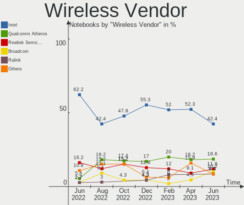

| Vendor                | Notebooks | Percent |
|-----------------------|-----------|---------|
| Intel                 | 25        | 42.37%  |
| Qualcomm Atheros      | 11        | 18.64%  |
| Realtek Semiconductor | 7         | 11.86%  |
| Broadcom              | 6         | 10.17%  |
| Ralink                | 5         | 8.47%   |
| MediaTek              | 2         | 3.39%   |
| Broadcom Limited      | 2         | 3.39%   |
| Dell                  | 1         | 1.69%   |

Wireless Model
--------------

Wireless models

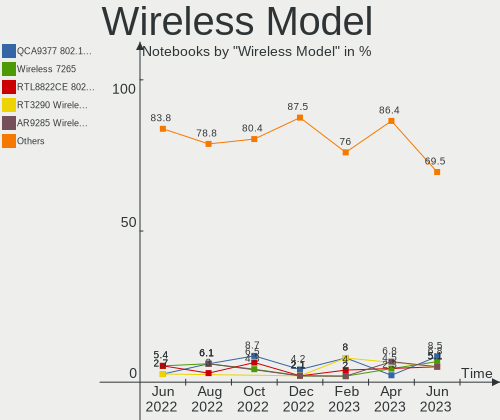

| Model                                                          | Notebooks | Percent |
|----------------------------------------------------------------|-----------|---------|
| Qualcomm Atheros QCA9377 802.11ac Wireless Network Adapter     | 5         | 8.47%   |
| Intel Wireless 7265                                            | 4         | 6.78%   |
| Realtek RTL8822CE 802.11ac PCIe Wireless Network Adapter       | 3         | 5.08%   |
| Ralink RT3290 Wireless 802.11n 1T/1R PCIe                      | 3         | 5.08%   |
| Qualcomm Atheros AR9285 Wireless Network Adapter (PCI-Express) | 3         | 5.08%   |
| Intel Wi-Fi 6 AX201                                            | 3         | 5.08%   |
| Intel Wi-Fi 6 AX200                                            | 3         | 5.08%   |
| Realtek RTL8723BE PCIe Wireless Network Adapter                | 2         | 3.39%   |
| MediaTek MT7921 802.11ax PCI Express Wireless Network Adapter  | 2         | 3.39%   |
| Intel Wireless 8260                                            | 2         | 3.39%   |
| Intel WiFi Link 5100                                           | 2         | 3.39%   |
| Intel Centrino Advanced-N 6205 [Taylor Peak]                   | 2         | 3.39%   |
| Intel Centrino Advanced-N 6200                                 | 2         | 3.39%   |
| Broadcom BCM43142 802.11b/g/n                                  | 2         | 3.39%   |
| Realtek RTL8852AE 802.11ax PCIe Wireless Network Adapter       | 1         | 1.69%   |
| Realtek RTL8821CE 802.11ac PCIe Wireless Network Adapter       | 1         | 1.69%   |
| Ralink RT5390 Wireless 802.11n 1T/1R PCIe                      | 1         | 1.69%   |
| Ralink RT3090 Wireless 802.11n 1T/1R PCIe                      | 1         | 1.69%   |
| Qualcomm Atheros QCA6174 802.11ac Wireless Network Adapter     | 1         | 1.69%   |
| Qualcomm Atheros AR9485 Wireless Network Adapter               | 1         | 1.69%   |
| Qualcomm Atheros AR9462 Wireless Network Adapter               | 1         | 1.69%   |
| Intel Wireless 8265 / 8275                                     | 1         | 1.69%   |
| Intel Wireless 7260                                            | 1         | 1.69%   |
| Intel Wireless 3165                                            | 1         | 1.69%   |
| Intel Wireless 3160                                            | 1         | 1.69%   |
| Intel Ultimate N WiFi Link 5300                                | 1         | 1.69%   |
| Intel PRO/Wireless 5100 AGN [Shiloh] Network Connection        | 1         | 1.69%   |
| Intel Comet Lake PCH-LP CNVi WiFi                              | 1         | 1.69%   |
| Dell DW5811e Snapdragon™ X7 LTE                           | 1         | 1.69%   |
| Broadcom Limited BCM4352 802.11ac Wireless Network Adapter     | 1         | 1.69%   |
| Broadcom Limited BCM4312 802.11b/g LP-PHY                      | 1         | 1.69%   |
| Broadcom BCM43228 802.11a/b/g/n                                | 1         | 1.69%   |
| Broadcom BCM43224 802.11a/b/g/n                                | 1         | 1.69%   |
| Broadcom BCM4322 802.11a/b/g/n Wireless LAN Controller         | 1         | 1.69%   |
| Broadcom BCM4313 802.11bgn Wireless Network Adapter            | 1         | 1.69%   |

Ethernet Vendor
---------------

Ethernet vendors

| Vendor                   | Notebooks | Percent |
|--------------------------|-----------|---------|
| Realtek Semiconductor    | 32        | 62.75%  |
| Intel                    | 12        | 23.53%  |
| Qualcomm Atheros         | 5         | 9.8%    |
| Marvell Technology Group | 1         | 1.96%   |
| Broadcom                 | 1         | 1.96%   |

Ethernet Model
--------------

Ethernet models

| Model                                                             | Notebooks | Percent |
|-------------------------------------------------------------------|-----------|---------|
| Realtek RTL8111/8168/8411 PCI Express Gigabit Ethernet Controller | 21        | 41.18%  |
| Realtek RTL810xE PCI Express Fast Ethernet controller             | 8         | 15.69%  |
| Intel Ethernet Connection I219-LM                                 | 3         | 5.88%   |
| Qualcomm Atheros AR8151 v2.0 Gigabit Ethernet                     | 2         | 3.92%   |
| Qualcomm Atheros AR8132 Fast Ethernet                             | 2         | 3.92%   |
| Intel Ethernet Connection (13) I219-V                             | 2         | 3.92%   |
| Intel 82579LM Gigabit Network Connection (Lewisville)             | 2         | 3.92%   |
| Intel 82577LM Gigabit Network Connection                          | 2         | 3.92%   |
| Intel 82567LM Gigabit Network Connection                          | 2         | 3.92%   |
| Realtek RTL8153 Gigabit Ethernet Adapter                          | 1         | 1.96%   |
| Realtek PCIe GbE Family Controller                                | 1         | 1.96%   |
| Realtek Killer E2600 Gigabit Ethernet Controller                  | 1         | 1.96%   |
| Qualcomm Atheros AR8121/AR8113/AR8114 Gigabit or Fast Ethernet    | 1         | 1.96%   |
| Marvell Group 88E8040 PCI-E Fast Ethernet Controller              | 1         | 1.96%   |
| Intel Ethernet Connection (4) I219-LM                             | 1         | 1.96%   |
| Broadcom NetXtreme BCM5761 Gigabit Ethernet PCIe                  | 1         | 1.96%   |

Net Controller Kind
-------------------

Ethernet, WiFi or modem

| Kind     | Notebooks | Percent |
|----------|-----------|---------|
| WiFi     | 58        | 53.21%  |
| Ethernet | 51        | 46.79%  |

Used Controller
---------------

Currently used network controller

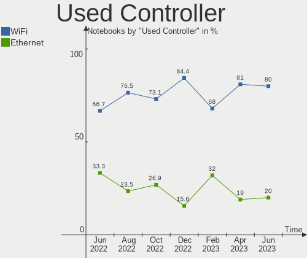

| Kind     | Notebooks | Percent |
|----------|-----------|---------|
| WiFi     | 48        | 80%     |
| Ethernet | 12        | 20%     |

NICs
----

Total network controllers on board

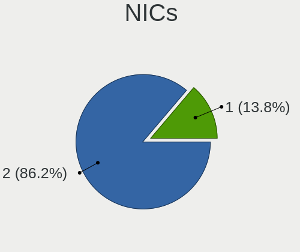

| Total | Notebooks | Percent |
|-------|-----------|---------|
| 2     | 50        | 86.21%  |
| 1     | 8         | 13.79%  |

IPv6
----

IPv6 vs IPv4

| Used | Notebooks | Percent |
|------|-----------|---------|
| No   | 39        | 67.24%  |
| Yes  | 19        | 32.76%  |

Bluetooth
---------

Bluetooth Vendor
----------------

Controller vendors

| Vendor                          | Notebooks | Percent |
|---------------------------------|-----------|---------|
| Intel                           | 16        | 33.33%  |
| Qualcomm Atheros Communications | 8         | 16.67%  |
| Realtek Semiconductor           | 7         | 14.58%  |
| Ralink                          | 3         | 6.25%   |
| IMC Networks                    | 3         | 6.25%   |
| Lite-On Technology              | 2         | 4.17%   |
| Cambridge Silicon Radio         | 2         | 4.17%   |
| Broadcom                        | 2         | 4.17%   |
| Ralink Technology               | 1         | 2.08%   |
| Hewlett-Packard                 | 1         | 2.08%   |
| Foxconn / Hon Hai               | 1         | 2.08%   |
| Dell                            | 1         | 2.08%   |
| Apple                           | 1         | 2.08%   |

Bluetooth Model
---------------

Controller models

| Model                                               | Notebooks | Percent |
|-----------------------------------------------------|-----------|---------|
| Intel Bluetooth wireless interface                  | 9         | 18.75%  |
| Realtek Bluetooth Radio                             | 6         | 12.5%   |
| Qualcomm Atheros  Bluetooth Device                  | 5         | 10.42%  |
| Intel AX201 Bluetooth                               | 4         | 8.33%   |
| Ralink RT3290 Bluetooth                             | 3         | 6.25%   |
| Intel AX200 Bluetooth                               | 3         | 6.25%   |
| Cambridge Silicon Radio Bluetooth Dongle (HCI mode) | 2         | 4.17%   |
| Realtek RTL8723B Bluetooth                          | 1         | 2.08%   |
| Ralink Motorola BC4 Bluetooth 3.0+HS Adapter        | 1         | 2.08%   |
| Qualcomm Atheros QCA61x4 Bluetooth 4.0              | 1         | 2.08%   |
| Qualcomm Atheros AR3012 Bluetooth 4.0               | 1         | 2.08%   |
| Qualcomm Atheros AR3011 Bluetooth                   | 1         | 2.08%   |
| Lite-On Wireless_Device                             | 1         | 2.08%   |
| Lite-On BCM43142A0                                  | 1         | 2.08%   |
| IMC Networks Wireless_Device                        | 1         | 2.08%   |
| IMC Networks Bluetooth Radio                        | 1         | 2.08%   |
| IMC Networks Bluetooth Device                       | 1         | 2.08%   |
| HP Broadcom 2070 Bluetooth Combo                    | 1         | 2.08%   |
| Foxconn / Hon Hai BCM20702A0                        | 1         | 2.08%   |
| Dell DW375 Bluetooth Module                         | 1         | 2.08%   |
| Broadcom BCM43142A0 Bluetooth Device                | 1         | 2.08%   |
| Broadcom BCM2070 Bluetooth Device                   | 1         | 2.08%   |
| Apple Built-in Bluetooth 2.0+EDR HCI                | 1         | 2.08%   |

Sound
-----

Sound Vendor
------------

Sound card vendors

| Vendor | Notebooks | Percent |
|--------|-----------|---------|
| Intel  | 47        | 70.15%  |
| AMD    | 13        | 19.4%   |
| Nvidia | 7         | 10.45%  |

Sound Model
-----------

Sound card models

| Model                                                                                             | Notebooks | Percent |
|---------------------------------------------------------------------------------------------------|-----------|---------|
| Intel Sunrise Point-LP HD Audio                                                                   | 10        | 12.05%  |
| Intel 82801I (ICH9 Family) HD Audio Controller                                                    | 8         | 9.64%   |
| AMD Family 17h/19h HD Audio Controller                                                            | 6         | 7.23%   |
| Intel 7 Series/C216 Chipset Family High Definition Audio Controller                               | 5         | 6.02%   |
| Intel 6 Series/C200 Series Chipset Family High Definition Audio Controller                        | 5         | 6.02%   |
| Intel Tiger Lake-LP Smart Sound Technology Audio Controller                                       | 4         | 4.82%   |
| Intel 5 Series/3400 Series Chipset High Definition Audio                                          | 4         | 4.82%   |
| Intel Wildcat Point-LP High Definition Audio Controller                                           | 3         | 3.61%   |
| Intel Broadwell-U Audio Controller                                                                | 3         | 3.61%   |
| AMD Renoir Radeon High Definition Audio Controller                                                | 3         | 3.61%   |
| AMD FCH Azalia Controller                                                                         | 3         | 3.61%   |
| Nvidia TU107 GeForce GTX 1650 High Definition Audio Controller                                    | 2         | 2.41%   |
| Nvidia High Definition Audio Controller                                                           | 2         | 2.41%   |
| Intel Xeon E3-1200 v3/4th Gen Core Processor HD Audio Controller                                  | 2         | 2.41%   |
| Intel Haswell-ULT HD Audio Controller                                                             | 2         | 2.41%   |
| Intel Comet Lake PCH-LP cAVS                                                                      | 2         | 2.41%   |
| Intel 8 Series/C220 Series Chipset High Definition Audio Controller                               | 2         | 2.41%   |
| Intel 8 Series HD Audio Controller                                                                | 2         | 2.41%   |
| Nvidia TU106 High Definition Audio Controller                                                     | 1         | 1.2%    |
| Nvidia GK208 HDMI/DP Audio Controller                                                             | 1         | 1.2%    |
| Nvidia Audio device                                                                               | 1         | 1.2%    |
| Intel Tiger Lake-H HD Audio Controller                                                            | 1         | 1.2%    |
| Intel Atom/Celeron/Pentium Processor x5-E8000/J3xxx/N3xxx Series High Definition Audio Controller | 1         | 1.2%    |
| AMD Wrestler HDMI Audio                                                                           | 1         | 1.2%    |
| AMD Rembrandt Radeon High Definition Audio Controller                                             | 1         | 1.2%    |
| AMD Redwood HDMI Audio [Radeon HD 5000 Series]                                                    | 1         | 1.2%    |
| AMD Raven/Raven2/Fenghuang HDMI/DP Audio Controller                                               | 1         | 1.2%    |
| AMD Navi 10 HDMI Audio                                                                            | 1         | 1.2%    |
| AMD Kaveri HDMI/DP Audio Controller                                                               | 1         | 1.2%    |
| AMD Kabini HDMI/DP Audio                                                                          | 1         | 1.2%    |
| AMD High Definition Audio Controller                                                              | 1         | 1.2%    |
| AMD Family 15h (Models 60h-6fh) Audio Controller                                                  | 1         | 1.2%    |
| AMD Caicos HDMI Audio [Radeon HD 6450 / 7450/8450/8490 OEM / R5 230/235/235X OEM]                 | 1         | 1.2%    |

Memory
------

Memory Vendor
-------------

Memory module vendors

| Vendor              | Notebooks | Percent |
|---------------------|-----------|---------|
| Samsung Electronics | 18        | 29.03%  |
| SK hynix            | 17        | 27.42%  |
| Micron Technology   | 9         | 14.52%  |
| Unknown             | 4         | 6.45%   |
| Kingston            | 4         | 6.45%   |
| Nanya Technology    | 2         | 3.23%   |
| Transcend           | 1         | 1.61%   |
| Ramaxel Technology  | 1         | 1.61%   |
| PUSKILL             | 1         | 1.61%   |
| Kingmax             | 1         | 1.61%   |
| G.Skill             | 1         | 1.61%   |
| Elpida              | 1         | 1.61%   |
| Corsair             | 1         | 1.61%   |
| A-DATA Technology   | 1         | 1.61%   |

Memory Model
------------

Memory module models

| Model                                                                        | Notebooks | Percent |
|------------------------------------------------------------------------------|-----------|---------|
| Unknown RAM Module 2048MB SODIMM 800MT/s                                     | 2         | 3.08%   |
| SK hynix RAM HMT325S6CFR8A-PB 2048MB SODIMM DDR3 1600MT/s                    | 2         | 3.08%   |
| SK hynix RAM HMA81GS6AFR8N-UH 8GB SODIMM DDR4 2667MT/s                       | 2         | 3.08%   |
| Samsung RAM M471B5773CHS-CH9 2GB SODIMM DDR3 4199MT/s                        | 2         | 3.08%   |
| Samsung RAM M471B5173QH0-YK0 4GB SODIMM DDR3 1600MT/s                        | 2         | 3.08%   |
| Samsung RAM M471A5244CB0-CTD 4GB SODIMM DDR4 3266MT/s                        | 2         | 3.08%   |
| Unknown RAM V02D4S84GB5285282400 4096MB SODIMM DDR4 2133MT/s                 | 1         | 1.54%   |
| Unknown RAM Module 2048MB SODIMM DDR2 800MT/s                                | 1         | 1.54%   |
| Transcend RAM TS256MSQ64V6U 2GB SODIMM DDR2                                  | 1         | 1.54%   |
| SK hynix RAM HYMP125S64CP8-Y5 2048MB SODIMM DDR2 667MT/s                     | 1         | 1.54%   |
| SK hynix RAM HMT451S6BFR8A-PB 4GB SODIMM DDR3 1600MT/s                       | 1         | 1.54%   |
| SK hynix RAM HMT425S6AFR6A-PB 2GB SODIMM DDR3 1600MT/s                       | 1         | 1.54%   |
| SK hynix RAM HMT351S6EFR8C-PB 4GB SODIMM DDR3 1600MT/s                       | 1         | 1.54%   |
| SK hynix RAM HMT351S6EFR8A-PB 4GB SODIMM DDR3 1600MT/s                       | 1         | 1.54%   |
| SK hynix RAM HMT351S6CFR8C-H9 4GB SODIMM DDR3 1333MT/s                       | 1         | 1.54%   |
| SK hynix RAM HMT351S6BFR8C-H9 4GB SODIMM DDR3 1333MT/s                       | 1         | 1.54%   |
| SK hynix RAM HMT325S6EFR8A-PB 2GB SODIMM DDR3 1600MT/s                       | 1         | 1.54%   |
| SK hynix RAM HMT325S6BFR8C-H9 2048MB SODIMM DDR3 1333MT/s                    | 1         | 1.54%   |
| SK hynix RAM HMA81GS6DJR8N-XN 8GB SODIMM DDR4 3200MT/s                       | 1         | 1.54%   |
| SK hynix RAM HMA81GS6CJR8N-XN 8GB SODIMM DDR4 3200MT/s                       | 1         | 1.54%   |
| SK hynix RAM HCNNNCPMMLXR-NEE 2GB Row Of Chips LPDDR4 4267MT/s               | 1         | 1.54%   |
| SK hynix RAM H9HCNNNCPMMLXR-NEE 8GB SODIMM LPDDR4 4266MT/s                   | 1         | 1.54%   |
| SK hynix RAM DADADADADADADADADADADADADADADADADADA 2048MB SODIMM DDR2 800MT/s | 1         | 1.54%   |
| Samsung RAM Module 8192MB SODIMM DDR4 3200MT/s                               | 1         | 1.54%   |
| Samsung RAM M471B5773DH0-CH9 2GB SODIMM DDR3 1600MT/s                        | 1         | 1.54%   |
| Samsung RAM M471B5673FH0-CH9 2GB SODIMM DDR3 1334MT/s                        | 1         | 1.54%   |
| Samsung RAM M471B5673FH0-CF8 2GB SODIMM DDR3 1067MT/s                        | 1         | 1.54%   |
| Samsung RAM M471B5273DH0-CH9 4GB SODIMM DDR3 1334MT/s                        | 1         | 1.54%   |
| Samsung RAM M471B5173EB0-YK0 4096MB SODIMM DDR3 1600MT/s                     | 1         | 1.54%   |
| Samsung RAM M471B2873GB0-CH9 1024MB SODIMM DDR3 1334MT/s                     | 1         | 1.54%   |
| Samsung RAM M471B1G73EB0-YK0 8GB SODIMM DDR3 1600MT/s                        | 1         | 1.54%   |
| Samsung RAM M471B1G73DB0-YK0 8GB SODIMM DDR3 1600MT/s                        | 1         | 1.54%   |
| Samsung RAM M471A5244CB0-CRC 4GB SODIMM DDR4 2667MT/s                        | 1         | 1.54%   |
| Samsung RAM M471A5244BB0-CRC 4GB SODIMM DDR4 2667MT/s                        | 1         | 1.54%   |
| Samsung RAM M471A1K43BB1-CRC 8GB SODIMM DDR4 2667MT/s                        | 1         | 1.54%   |
| Samsung RAM M4 70T2864EH3-CF7 1024MB SODIMM DDR2 2048MT/s                    | 1         | 1.54%   |
| Samsung RAM K4E8E324EB-EGCF 2GB LPDDR3 1867MT/s                              | 1         | 1.54%   |
| Ramaxel RAM RMT3170MN68F9F1600 4096MB SODIMM DDR3 1600MT/s                   | 1         | 1.54%   |
| PUSKILL RAM PJ16TFK256M8 4096MB SODIMM DDR3 1600MT/s                         | 1         | 1.54%   |
| Nanya RAM NT4GC64C88B1NS-DI 4096MB SODIMM DDR3 1600MT/s                      | 1         | 1.54%   |

Memory Kind
-----------

Memory module kinds

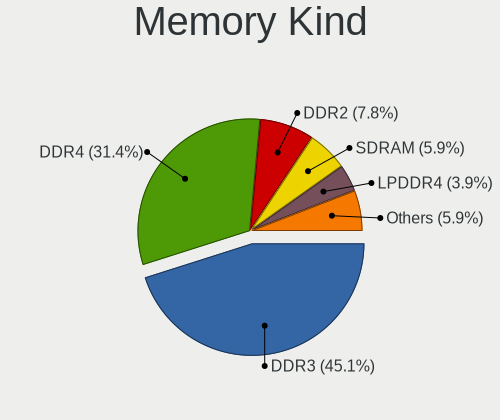

| Kind    | Notebooks | Percent |
|---------|-----------|---------|
| DDR3    | 23        | 45.1%   |
| DDR4    | 16        | 31.37%  |
| DDR2    | 4         | 7.84%   |
| SDRAM   | 3         | 5.88%   |
| LPDDR4  | 2         | 3.92%   |
| Unknown | 2         | 3.92%   |
| LPDDR3  | 1         | 1.96%   |

Memory Form Factor
------------------

Physical design of the memory module

| Name         | Notebooks | Percent |
|--------------|-----------|---------|
| SODIMM       | 47        | 94%     |
| Row Of Chips | 2         | 4%      |
| Unknown      | 1         | 2%      |

Memory Size
-----------

Memory module size

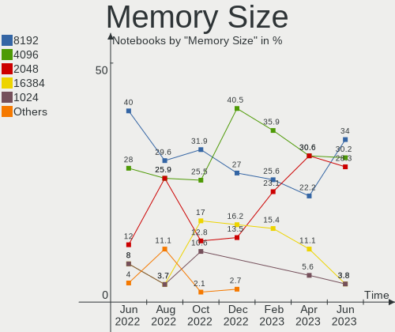

| Size  | Notebooks | Percent |
|-------|-----------|---------|
| 8192  | 18        | 33.96%  |
| 4096  | 16        | 30.19%  |
| 2048  | 15        | 28.3%   |
| 16384 | 2         | 3.77%   |
| 1024  | 2         | 3.77%   |

Memory Speed
------------

Memory module speed

| Speed   | Notebooks | Percent |
|---------|-----------|---------|
| 1600    | 17        | 29.82%  |
| 3200    | 7         | 12.28%  |
| 2667    | 5         | 8.77%   |
| 1334    | 5         | 8.77%   |
| 800     | 4         | 7.02%   |
| 2400    | 3         | 5.26%   |
| 1333    | 3         | 5.26%   |
| 4199    | 2         | 3.51%   |
| 3266    | 2         | 3.51%   |
| 667     | 2         | 3.51%   |
| 4267    | 1         | 1.75%   |
| 4266    | 1         | 1.75%   |
| 2133    | 1         | 1.75%   |
| 2048    | 1         | 1.75%   |
| 1867    | 1         | 1.75%   |
| 1067    | 1         | 1.75%   |
| Unknown | 1         | 1.75%   |

Printers & scanners
-------------------

Printer Vendor
--------------

Printer device vendors

Zero info for selected period =(

Printer Model
-------------

Printer device models

Zero info for selected period =(

Scanner Vendor
--------------

Scanner device vendors

Zero info for selected period =(

Scanner Model
-------------

Scanner device models

Zero info for selected period =(

Camera
------

Camera Vendor
-------------

Camera device vendors

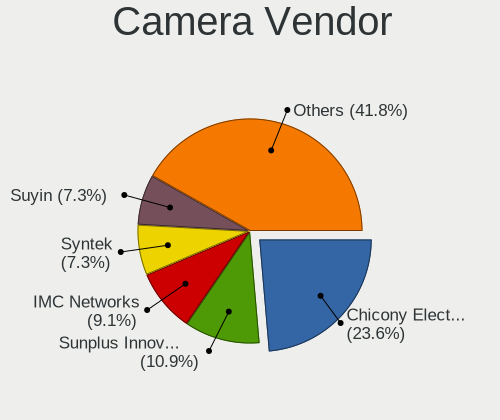

| Vendor                                 | Notebooks | Percent |
|----------------------------------------|-----------|---------|
| Chicony Electronics                    | 13        | 23.64%  |
| Sunplus Innovation Technology          | 6         | 10.91%  |
| IMC Networks                           | 5         | 9.09%   |
| Syntek                                 | 4         | 7.27%   |
| Suyin                                  | 4         | 7.27%   |
| Microdia                               | 4         | 7.27%   |
| Realtek Semiconductor                  | 3         | 5.45%   |
| Apple                                  | 3         | 5.45%   |
| Sonix Technology                       | 2         | 3.64%   |
| Silicon Motion                         | 2         | 3.64%   |
| Ricoh                                  | 2         | 3.64%   |
| Quanta                                 | 2         | 3.64%   |
| Samsung Electronics                    | 1         | 1.82%   |
| Luxvisions Innotech Limited            | 1         | 1.82%   |
| KYE Systems (Mouse Systems)            | 1         | 1.82%   |
| Cheng Uei Precision Industry (Foxlink) | 1         | 1.82%   |
| Alcor Micro                            | 1         | 1.82%   |

Camera Model
------------

Camera device models

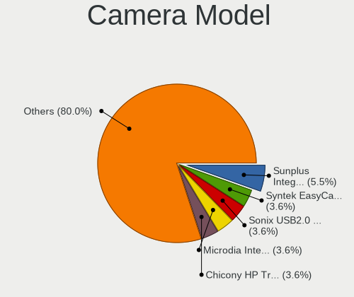

| Model                                               | Notebooks | Percent |
|-----------------------------------------------------|-----------|---------|
| Sunplus Integrated_Webcam_HD                        | 3         | 5.45%   |
| Syntek EasyCamera                                   | 2         | 3.64%   |
| Sonix USB2.0 HD UVC WebCam                          | 2         | 3.64%   |
| Microdia Integrated HD Webcam                       | 2         | 3.64%   |
| Chicony HP Truevision HD                            | 2         | 3.64%   |
| Chicony HD User Facing                              | 2         | 3.64%   |
| Apple iPhone 5/5C/5S/6/SE/7/8/X                     | 2         | 3.64%   |
| Syntek Lenovo EasyCamera                            | 1         | 1.82%   |
| Syntek Integrated Camera                            | 1         | 1.82%   |
| Suyin Integrated_Webcam_HD                          | 1         | 1.82%   |
| Suyin HP Truevision HD                              | 1         | 1.82%   |
| Suyin Acer/HP Integrated Webcam [CN0314]            | 1         | 1.82%   |
| Suyin Acer HD Crystal Eye webcam                    | 1         | 1.82%   |
| Sunplus Laptop Integrated WebCam HD                 | 1         | 1.82%   |
| Sunplus HP Truevision HD                            | 1         | 1.82%   |
| Sunplus Dell Integrated HD Webcam                   | 1         | 1.82%   |
| Silicon Motion WebCam SCB-0355N                     | 1         | 1.82%   |
| Silicon Motion WebCam SC-0311139N                   | 1         | 1.82%   |
| Samsung Galaxy A5 (MTP)                             | 1         | 1.82%   |
| Ricoh Laptop_Integrated_Webcam_FHD                  | 1         | 1.82%   |
| Ricoh HD Webcam                                     | 1         | 1.82%   |
| Realtek Integrated Webcam_HD                        | 1         | 1.82%   |
| Realtek Integrated Webcam                           | 1         | 1.82%   |
| Realtek 2SF022                                      | 1         | 1.82%   |
| Quanta VGA WebCam                                   | 1         | 1.82%   |
| Quanta HP HD Camera                                 | 1         | 1.82%   |
| Microdia Sonix Integrated Webcam                    | 1         | 1.82%   |
| Microdia Dell Integrated HD Webcam                  | 1         | 1.82%   |
| Luxvisions Innotech Limited HP TrueVision HD Camera | 1         | 1.82%   |
| KYE Systems (Mouse Systems) FaceCam 1000X           | 1         | 1.82%   |
| IMC Networks UVC VGA Webcam                         | 1         | 1.82%   |
| IMC Networks USB2.0 HD UVC WebCam                   | 1         | 1.82%   |
| IMC Networks USB 2.0 Camera                         | 1         | 1.82%   |
| IMC Networks Integrated Camera                      | 1         | 1.82%   |
| IMC Networks EasyCamera                             | 1         | 1.82%   |
| Chicony LG Camera                                   | 1         | 1.82%   |
| Chicony Lenovo EasyCamera                           | 1         | 1.82%   |
| Chicony Integrated Camera                           | 1         | 1.82%   |
| Chicony HP Wide Vision HD Camera                    | 1         | 1.82%   |
| Chicony HP Webcam [2 MP Macro]                      | 1         | 1.82%   |

Security
--------

Fingerprint Vendor
------------------

Fingerprint sensor vendors

| Vendor                     | Notebooks | Percent |
|----------------------------|-----------|---------|
| Validity Sensors           | 3         | 60%     |
| Shenzhen Goodix Technology | 1         | 20%     |
| AuthenTec                  | 1         | 20%     |

Fingerprint Model
-----------------

Fingerprint sensor models

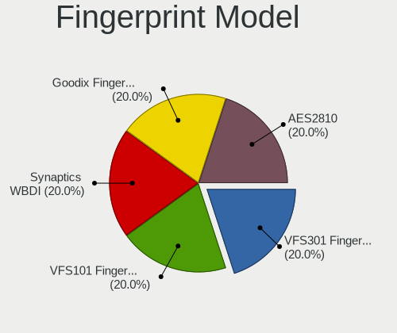

| Model                                      | Notebooks | Percent |
|--------------------------------------------|-----------|---------|
| Validity Sensors VFS301 Fingerprint Reader | 1         | 20%     |
| Validity Sensors VFS101 Fingerprint Reader | 1         | 20%     |
| Validity Sensors Synaptics WBDI            | 1         | 20%     |
| Shenzhen Goodix  FingerPrint Device        | 1         | 20%     |
| AuthenTec AES2810                          | 1         | 20%     |

Chipcard Vendor
---------------

Chipcard module vendors

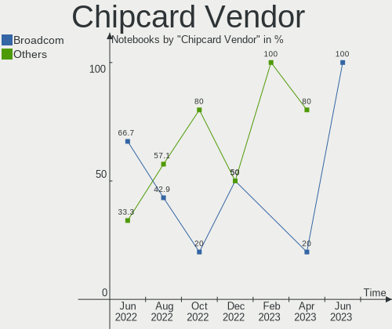

| Vendor   | Notebooks | Percent |
|----------|-----------|---------|
| Broadcom | 6         | 100%    |

Chipcard Model
--------------

Chipcard module models

| Model                                          | Notebooks | Percent |
|------------------------------------------------|-----------|---------|
| Broadcom BCM5880 Secure Applications Processor | 4         | 66.67%  |
| Broadcom 5880                                  | 2         | 33.33%  |

Unsupported
-----------

Unsupported Devices
-------------------

Total unsupported devices on board

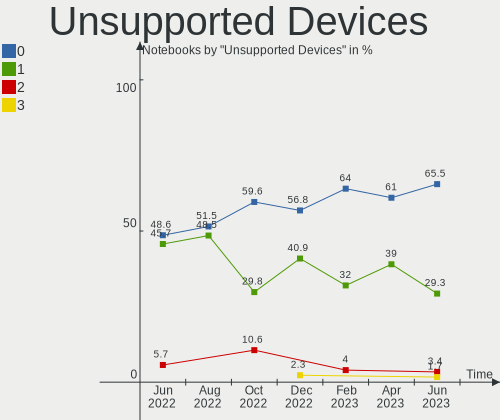

| Total | Notebooks | Percent |
|-------|-----------|---------|
| 0     | 38        | 65.52%  |
| 1     | 17        | 29.31%  |
| 2     | 2         | 3.45%   |
| 3     | 1         | 1.72%   |

Unsupported Device Types
------------------------

Types of unsupported devices

| Type                  | Notebooks | Percent |
|-----------------------|-----------|---------|
| Fingerprint reader    | 5         | 20.83%  |
| Chipcard              | 5         | 20.83%  |
| Bluetooth             | 5         | 20.83%  |
| Graphics card         | 3         | 12.5%   |
| Storage               | 2         | 8.33%   |
| Net/wireless          | 2         | 8.33%   |
| Multimedia controller | 1         | 4.17%   |
| Camera                | 1         | 4.17%   |

