Linux in Hungary - Hardware Trends
----------------------------------

A project to identify most popular hardware characteristics and track their change
over time based on data collected by Linux users at https://Linux-Hardware.org.

Anyone can contribute to this report by the [hw-probe](https://github.com/linuxhw/hw-probe) tool:

    sudo -E hw-probe -all -upload

This is a report for all computer types. See also reports for [desktops](/Location/Hungary/Desktop/README.md) and [notebooks](/Location/Hungary/Notebook/README.md).

Period: Jun, 2023.

Contents
--------

* [ System ](#system)
  - [ OS                       ](#os)
  - [ OS Family                ](#os-family)
  - [ Kernel                   ](#kernel)
  - [ Kernel Family            ](#kernel-family)
  - [ Kernel Major Ver.        ](#kernel-major-ver)
  - [ Arch                     ](#arch)
  - [ DE                       ](#de)
  - [ Display Server           ](#display-server)
  - [ Display Manager          ](#display-manager)
  - [ OS Lang                  ](#os-lang)
  - [ Boot Mode                ](#boot-mode)
  - [ Filesystem               ](#filesystem)
  - [ Part. scheme             ](#part-scheme)
  - [ Dual Boot with Linux/BSD ](#dual-boot-with-linuxbsd)
  - [ Dual Boot (Win)          ](#dual-boot-win)

* [ Board ](#board)
  - [ Vendor                   ](#vendor)
  - [ Model                    ](#model)
  - [ Model Family             ](#model-family)
  - [ MFG Year                 ](#mfg-year)
  - [ Form Factor              ](#form-factor)
  - [ Secure Boot              ](#secure-boot)
  - [ Coreboot                 ](#coreboot)
  - [ RAM Size                 ](#ram-size)
  - [ RAM Used                 ](#ram-used)
  - [ Total Drives             ](#total-drives)
  - [ Has CD-ROM               ](#has-cd-rom)
  - [ Has Ethernet             ](#has-ethernet)
  - [ Has WiFi                 ](#has-wifi)
  - [ Has Bluetooth            ](#has-bluetooth)

* [ Location ](#location)
  - [ Country                  ](#country)
  - [ City                     ](#city)

* [ Drives ](#drives)
  - [ Drive Vendor             ](#drive-vendor)
  - [ Drive Model              ](#drive-model)
  - [ HDD Vendor               ](#hdd-vendor)
  - [ SSD Vendor               ](#ssd-vendor)
  - [ Drive Kind               ](#drive-kind)
  - [ Drive Connector          ](#drive-connector)
  - [ Drive Size               ](#drive-size)
  - [ Space Total              ](#space-total)
  - [ Space Used               ](#space-used)
  - [ Malfunc. Drives          ](#malfunc-drives)
  - [ Malfunc. Drive Vendor    ](#malfunc-drive-vendor)
  - [ Malfunc. HDD Vendor      ](#malfunc-hdd-vendor)
  - [ Malfunc. Drive Kind      ](#malfunc-drive-kind)
  - [ Failed Drives            ](#failed-drives)
  - [ Failed Drive Vendor      ](#failed-drive-vendor)
  - [ Drive Status             ](#drive-status)

* [ Storage controller ](#storage-controller)
  - [ Storage Vendor           ](#storage-vendor)
  - [ Storage Model            ](#storage-model)
  - [ Storage Kind             ](#storage-kind)

* [ Processor ](#processor)
  - [ CPU Vendor               ](#cpu-vendor)
  - [ CPU Model                ](#cpu-model)
  - [ CPU Model Family         ](#cpu-model-family)
  - [ CPU Cores                ](#cpu-cores)
  - [ CPU Sockets              ](#cpu-sockets)
  - [ CPU Threads              ](#cpu-threads)
  - [ CPU Op-Modes             ](#cpu-op-modes)
  - [ CPU Microcode            ](#cpu-microcode)
  - [ CPU Microarch            ](#cpu-microarch)

* [ Graphics ](#graphics)
  - [ GPU Vendor               ](#gpu-vendor)
  - [ GPU Model                ](#gpu-model)
  - [ GPU Combo                ](#gpu-combo)
  - [ GPU Driver               ](#gpu-driver)
  - [ GPU Memory               ](#gpu-memory)

* [ Monitor ](#monitor)
  - [ Monitor Vendor           ](#monitor-vendor)
  - [ Monitor Model            ](#monitor-model)
  - [ Monitor Resolution       ](#monitor-resolution)
  - [ Monitor Diagonal         ](#monitor-diagonal)
  - [ Monitor Width            ](#monitor-width)
  - [ Aspect Ratio             ](#aspect-ratio)
  - [ Monitor Area             ](#monitor-area)
  - [ Pixel Density            ](#pixel-density)
  - [ Multiple Monitors        ](#multiple-monitors)

* [ Network ](#network)
  - [ Net Controller Vendor    ](#net-controller-vendor)
  - [ Net Controller Model     ](#net-controller-model)
  - [ Wireless Vendor          ](#wireless-vendor)
  - [ Wireless Model           ](#wireless-model)
  - [ Ethernet Vendor          ](#ethernet-vendor)
  - [ Ethernet Model           ](#ethernet-model)
  - [ Net Controller Kind      ](#net-controller-kind)
  - [ Used Controller          ](#used-controller)
  - [ NICs                     ](#nics)
  - [ IPv6                     ](#ipv6)

* [ Bluetooth ](#bluetooth)
  - [ Bluetooth Vendor         ](#bluetooth-vendor)
  - [ Bluetooth Model          ](#bluetooth-model)

* [ Sound ](#sound)
  - [ Sound Vendor             ](#sound-vendor)
  - [ Sound Model              ](#sound-model)

* [ Memory ](#memory)
  - [ Memory Vendor            ](#memory-vendor)
  - [ Memory Model             ](#memory-model)
  - [ Memory Kind              ](#memory-kind)
  - [ Memory Form Factor       ](#memory-form-factor)
  - [ Memory Size              ](#memory-size)
  - [ Memory Speed             ](#memory-speed)

* [ Printers & scanners ](#printers--scanners)
  - [ Printer Vendor           ](#printer-vendor)
  - [ Printer Model            ](#printer-model)
  - [ Scanner Vendor           ](#scanner-vendor)
  - [ Scanner Model            ](#scanner-model)

* [ Camera ](#camera)
  - [ Camera Vendor            ](#camera-vendor)
  - [ Camera Model             ](#camera-model)

* [ Security ](#security)
  - [ Fingerprint Vendor       ](#fingerprint-vendor)
  - [ Fingerprint Model        ](#fingerprint-model)
  - [ Chipcard Vendor          ](#chipcard-vendor)
  - [ Chipcard Model           ](#chipcard-model)

* [ Unsupported ](#unsupported)
  - [ Unsupported Devices      ](#unsupported-devices)
  - [ Unsupported Device Types ](#unsupported-device-types)

System
------

OS
--

Installed operating systems

| Name                         | Computers | Percent |
|------------------------------|-----------|---------|
| BlackPanther 18.1            | 64        | 57.66%  |
| BlackPanther 22.1            | 7         | 6.31%   |
| Ubuntu 22.04                 | 6         | 5.41%   |
| Linux Mint 21.1              | 5         | 4.5%    |
| Fedora 38                    | 3         | 2.7%    |
| Ubuntu 20.04                 | 2         | 1.8%    |
| Manjaro 23.0.0               | 2         | 1.8%    |
| Manjaro 22.1.3               | 2         | 1.8%    |
| CentOS 8                     | 2         | 1.8%    |
| Arch Rolling                 | 2         | 1.8%    |
| Ubuntu Budgie 23.04          | 1         | 0.9%    |
| SteamOS 3.4.8                | 1         | 0.9%    |
| Q4OS 4                       | 1         | 0.9%    |
| openSUSE Tumbleweed-XXXXXXXX | 1         | 0.9%    |
| OpenMandriva 23.06           | 1         | 0.9%    |
| OpenMandriva 23.03           | 1         | 0.9%    |
| NixOS 23.11                  | 1         | 0.9%    |
| Lubuntu 23.04                | 1         | 0.9%    |
| Lubuntu 22.04                | 1         | 0.9%    |
| Linux Mint 19.3              | 1         | 0.9%    |
| KDE neon 22.04               | 1         | 0.9%    |
| Endless 3.9.3-nexthw1        | 1         | 0.9%    |
| EndeavourOS Rolling          | 1         | 0.9%    |
| Debian 12                    | 1         | 0.9%    |
| BlackPanther 16.2            | 1         | 0.9%    |
| ArcoLinux Rolling            | 1         | 0.9%    |

OS Family
---------

OS without a version

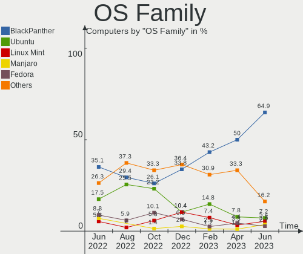

| Name          | Computers | Percent |
|---------------|-----------|---------|
| BlackPanther  | 72        | 64.86%  |
| Ubuntu        | 8         | 7.21%   |
| Linux Mint    | 6         | 5.41%   |
| Manjaro       | 4         | 3.6%    |
| Fedora        | 3         | 2.7%    |
| OpenMandriva  | 2         | 1.8%    |
| Lubuntu       | 2         | 1.8%    |
| CentOS        | 2         | 1.8%    |
| Arch          | 2         | 1.8%    |
| Ubuntu Budgie | 1         | 0.9%    |
| SteamOS       | 1         | 0.9%    |
| Q4OS          | 1         | 0.9%    |
| openSUSE      | 1         | 0.9%    |
| NixOS         | 1         | 0.9%    |
| KDE neon      | 1         | 0.9%    |
| Endless       | 1         | 0.9%    |
| EndeavourOS   | 1         | 0.9%    |
| Debian        | 1         | 0.9%    |
| ArcoLinux     | 1         | 0.9%    |

Kernel
------

Version of the Linux kernel

| Version                   | Computers | Percent |
|---------------------------|-----------|---------|
| 5.6.14-desktop-2bP        | 31        | 27.93%  |
| 5.15.85-desktop-1bP       | 18        | 16.22%  |
| 4.18.16-desktop-1bP       | 17        | 15.32%  |
| 6.3.3-desktop-1bP         | 4         | 3.6%    |
| 5.19.0-43-generic         | 3         | 2.7%    |
| 5.15.0-75-generic         | 3         | 2.7%    |
| 5.15.0-73-generic         | 3         | 2.7%    |
| 6.3.6-arch1-1             | 2         | 1.8%    |
| 6.3.9-arch1-1             | 1         | 0.9%    |
| 6.3.8-206.rog.fc38.x86_64 | 1         | 0.9%    |
| 6.3.8-200.fc38.x86_64     | 1         | 0.9%    |
| 6.3.7-1-default           | 1         | 0.9%    |
| 6.3.6-zen1-1-zen          | 1         | 0.9%    |
| 6.3.5-desktop-3omv2390    | 1         | 0.9%    |
| 6.3.5-200.fc38.x86_64     | 1         | 0.9%    |
| 6.2.6-desktop-1omv2390    | 1         | 0.9%    |
| 6.2.6-76060206-generic    | 1         | 0.9%    |
| 6.2.0-23-generic          | 1         | 0.9%    |
| 6.2.0-20-generic          | 1         | 0.9%    |
| 6.1.31-xanmod1            | 1         | 0.9%    |
| 6.1.31-2-MANJARO          | 1         | 0.9%    |
| 6.1.0-9-amd64             | 1         | 0.9%    |
| 6.1.0-1bP                 | 1         | 0.9%    |
| 5.4.0-91-generic          | 1         | 0.9%    |
| 5.4.0-152-generic         | 1         | 0.9%    |
| 5.4.0-150-generic         | 1         | 0.9%    |
| 5.19.0-45-generic         | 1         | 0.9%    |
| 5.19.0-32-generic         | 1         | 0.9%    |
| 5.15.114-2-MANJARO        | 1         | 0.9%    |
| 5.15.113-1-MANJARO        | 1         | 0.9%    |
| 5.15.0-72-generic         | 1         | 0.9%    |
| 5.13.0-valve36-1-neptune  | 1         | 0.9%    |
| 5.11.0-12-generic         | 1         | 0.9%    |
| 5.10.181-1-MANJARO        | 1         | 0.9%    |
| 5.10.0-23-amd64           | 1         | 0.9%    |
| 4.9.20-desktop-pae-1bP    | 1         | 0.9%    |
| 4.18.0-499.el8.x86_64     | 1         | 0.9%    |
| 4.18.0-490.el8.x86_64     | 1         | 0.9%    |

Kernel Family
-------------

Linux kernel without a distro release

| Version  | Computers | Percent |
|----------|-----------|---------|
| 5.6.14   | 31        | 27.93%  |
| 5.15.85  | 18        | 16.22%  |
| 4.18.16  | 17        | 15.32%  |
| 5.15.0   | 7         | 6.31%   |
| 5.19.0   | 5         | 4.5%    |
| 6.3.3    | 4         | 3.6%    |
| 6.3.6    | 3         | 2.7%    |
| 5.4.0    | 3         | 2.7%    |
| 6.3.8    | 2         | 1.8%    |
| 6.3.5    | 2         | 1.8%    |
| 6.2.6    | 2         | 1.8%    |
| 6.2.0    | 2         | 1.8%    |
| 6.1.31   | 2         | 1.8%    |
| 6.1.0    | 2         | 1.8%    |
| 4.18.0   | 2         | 1.8%    |
| 6.3.9    | 1         | 0.9%    |
| 6.3.7    | 1         | 0.9%    |
| 5.15.114 | 1         | 0.9%    |
| 5.15.113 | 1         | 0.9%    |
| 5.13.0   | 1         | 0.9%    |
| 5.11.0   | 1         | 0.9%    |
| 5.10.181 | 1         | 0.9%    |
| 5.10.0   | 1         | 0.9%    |
| 4.9.20   | 1         | 0.9%    |

Kernel Major Ver.
-----------------

Linux kernel major version

| Version | Computers | Percent |
|---------|-----------|---------|
| 5.6     | 31        | 27.93%  |
| 5.15    | 27        | 24.32%  |
| 4.18    | 19        | 17.12%  |
| 6.3     | 13        | 11.71%  |
| 5.19    | 5         | 4.5%    |
| 6.2     | 4         | 3.6%    |
| 6.1     | 4         | 3.6%    |
| 5.4     | 3         | 2.7%    |
| 5.10    | 2         | 1.8%    |
| 5.13    | 1         | 0.9%    |
| 5.11    | 1         | 0.9%    |
| 4.9     | 1         | 0.9%    |

Arch
----

OS architecture (x86_64, i586, etc.)

| Name   | Computers | Percent |
|--------|-----------|---------|
| x86_64 | 110       | 99.1%   |
| i686   | 1         | 0.9%    |

DE
--

Desktop Environment

| Name       | Computers | Percent |
|------------|-----------|---------|
| KDE5       | 78        | 70.27%  |
| GNOME      | 15        | 13.51%  |
| X-Cinnamon | 6         | 5.41%   |
| Unknown    | 5         | 4.5%    |
| XFCE       | 3         | 2.7%    |
| LXQt       | 2         | 1.8%    |
| MATE       | 1         | 0.9%    |
| Budgie     | 1         | 0.9%    |

Display Server
--------------

X11 or Wayland

| Name    | Computers | Percent |
|---------|-----------|---------|
| X11     | 96        | 86.49%  |
| Wayland | 8         | 7.21%   |
| Unknown | 3         | 2.7%    |
| Web     | 2         | 1.8%    |
| Tty     | 2         | 1.8%    |

Display Manager
---------------

SDDM, LightDM, etc.

| Name    | Computers | Percent |
|---------|-----------|---------|
| SDDM    | 81        | 72.97%  |
| Unknown | 12        | 10.81%  |
| GDM     | 7         | 6.31%   |
| LightDM | 6         | 5.41%   |
| GDM3    | 5         | 4.5%    |

OS Lang
-------

Language

| Lang    | Computers | Percent |
|---------|-----------|---------|
| Unknown | 74        | 66.67%  |
| hu_HU   | 21        | 18.92%  |
| en_US   | 14        | 12.61%  |
| en_GB   | 1         | 0.9%    |
| C       | 1         | 0.9%    |

Boot Mode
---------

EFI or BIOS

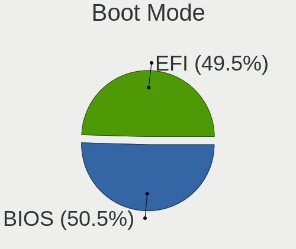

| Mode | Computers | Percent |
|------|-----------|---------|
| BIOS | 56        | 50.45%  |
| EFI  | 55        | 49.55%  |

Filesystem
----------

Type of filesystem

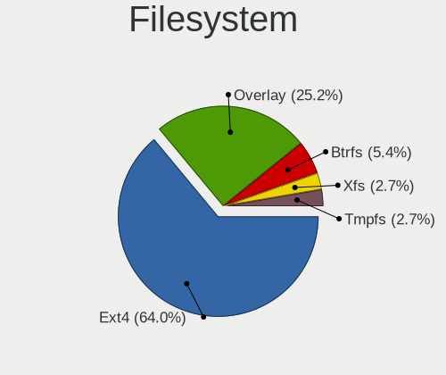

| Type    | Computers | Percent |
|---------|-----------|---------|
| Ext4    | 71        | 63.96%  |
| Overlay | 28        | 25.23%  |
| Btrfs   | 6         | 5.41%   |
| Xfs     | 3         | 2.7%    |
| Tmpfs   | 3         | 2.7%    |

Part. scheme
------------

Scheme of partitioning

| Type    | Computers | Percent |
|---------|-----------|---------|
| GPT     | 61        | 54.95%  |
| MBR     | 41        | 36.94%  |
| Unknown | 9         | 8.11%   |

Dual Boot with Linux/BSD
------------------------

Hosting more than one Linux/BSD

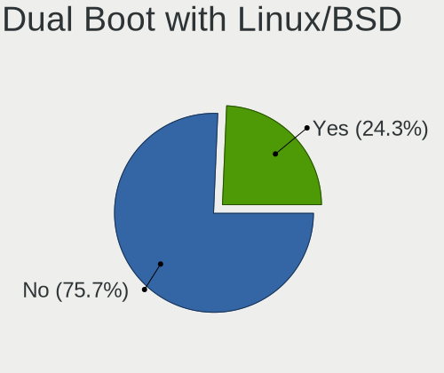

| Dual boot | Computers | Percent |
|-----------|-----------|---------|
| No        | 84        | 75.68%  |
| Yes       | 27        | 24.32%  |

Dual Boot (Win)
---------------

Hosting Linux and Windows

| Dual boot | Computers | Percent |
|-----------|-----------|---------|
| No        | 71        | 63.96%  |
| Yes       | 40        | 36.04%  |

Board
-----

Vendor
------

Motherboard manufacturer

| Name                | Computers | Percent |
|---------------------|-----------|---------|
| Dell                | 23        | 20.72%  |
| Hewlett-Packard     | 15        | 13.51%  |
| Gigabyte Technology | 14        | 12.61%  |
| ASUSTek Computer    | 14        | 12.61%  |
| Lenovo              | 12        | 10.81%  |
| ASRock              | 7         | 6.31%   |
| Fujitsu             | 6         | 5.41%   |
| Acer                | 5         | 4.5%    |
| MSI                 | 4         | 3.6%    |
| Samsung Electronics | 2         | 1.8%    |
| Fujitsu Siemens     | 2         | 1.8%    |
| eMachines           | 2         | 1.8%    |
| Valve               | 1         | 0.9%    |
| Microsoft           | 1         | 0.9%    |
| LG Electronics      | 1         | 0.9%    |
| Google              | 1         | 0.9%    |
| Apple               | 1         | 0.9%    |

Model
-----

Motherboard model

| Name                                        | Computers | Percent |
|---------------------------------------------|-----------|---------|
| Dell OptiPlex 3020                          | 4         | 3.6%    |
| HP 250 G1                                   | 3         | 2.7%    |
| Lenovo IdeaPad 330-15IKB 81DE               | 2         | 1.8%    |
| Gigabyte G31M-ES2L                          | 2         | 1.8%    |
| Fujitsu ESPRIMO Q556/2                      | 2         | 1.8%    |
| eMachines E725                              | 2         | 1.8%    |
| Dell Latitude E6400                         | 2         | 1.8%    |
| Dell Inspiron 15-3567                       | 2         | 1.8%    |
| ASRock G41M-VS3                             | 2         | 1.8%    |
| Valve Jupiter                               | 1         | 0.9%    |
| Samsung RV411/RV511/E3511/S3511/RV711/E3411 | 1         | 0.9%    |
| Samsung RV410/RV510/S3510/E3510             | 1         | 0.9%    |
| MSI U200                                    | 1         | 0.9%    |
| MSI MS-7C91                                 | 1         | 0.9%    |
| MSI MS-7693                                 | 1         | 0.9%    |
| MSI MS-7309                                 | 1         | 0.9%    |
| Microsoft Surface 3                         | 1         | 0.9%    |
| LG 16Z90P-G.AA55H                           | 1         | 0.9%    |
| Lenovo Y50-70 20378                         | 1         | 0.9%    |
| Lenovo V15-ADA 82C7                         | 1         | 0.9%    |
| Lenovo ThinkPad X270 W10DG 20K5S16G1B       | 1         | 0.9%    |
| Lenovo ThinkPad X200 74595FG                | 1         | 0.9%    |
| Lenovo ThinkPad E15 20RD003KHV              | 1         | 0.9%    |
| Lenovo ThinkCentre M73 10B6001SUS           | 1         | 0.9%    |
| Lenovo IdeaPad 330-15AST 81D6               | 1         | 0.9%    |
| Lenovo G585 20137                           | 1         | 0.9%    |
| Lenovo G50-45 80E3                          | 1         | 0.9%    |
| Lenovo 10A8-S1WL00                          | 1         | 0.9%    |
| HP Victus by Laptop 16-e0xxx                | 1         | 0.9%    |
| HP ProDesk 600 G1 SFF                       | 1         | 0.9%    |
| HP ProBook 640 G8 Notebook PC               | 1         | 0.9%    |
| HP Pavilion Gaming Laptop 15-ec1xxx         | 1         | 0.9%    |
| HP Pavilion dv6                             | 1         | 0.9%    |
| HP Pavilion 17                              | 1         | 0.9%    |
| HP Notebook                                 | 1         | 0.9%    |
| HP Laptop 15-dw1xxx                         | 1         | 0.9%    |
| HP ENVY x360 Convertible 15-ee0xxx          | 1         | 0.9%    |
| HP EliteDesk 705 G3 SFF                     | 1         | 0.9%    |
| HP EliteBook 2540p                          | 1         | 0.9%    |
| HP Compaq Pro 6300 SFF                      | 1         | 0.9%    |

Model Family
------------

Motherboard model prefix

| Name                | Computers | Percent |
|---------------------|-----------|---------|
| Dell Latitude       | 9         | 8.11%   |
| Dell Inspiron       | 7         | 6.31%   |
| Dell OptiPlex       | 5         | 4.5%    |
| Fujitsu ESPRIMO     | 4         | 3.6%    |
| Lenovo ThinkPad     | 3         | 2.7%    |
| Lenovo IdeaPad      | 3         | 2.7%    |
| HP Pavilion         | 3         | 2.7%    |
| HP 250              | 3         | 2.7%    |
| Gigabyte G31M-ES2L  | 2         | 1.8%    |
| eMachines E725      | 2         | 1.8%    |
| ASUS ROG            | 2         | 1.8%    |
| ASUS ASUS           | 2         | 1.8%    |
| ASRock G41M-VS3     | 2         | 1.8%    |
| Acer Aspire         | 2         | 1.8%    |
| Valve Jupiter       | 1         | 0.9%    |
| Samsung RV411       | 1         | 0.9%    |
| Samsung RV410       | 1         | 0.9%    |
| MSI U200            | 1         | 0.9%    |
| MSI MS-7C91         | 1         | 0.9%    |
| MSI MS-7693         | 1         | 0.9%    |
| MSI MS-7309         | 1         | 0.9%    |
| Microsoft Surface   | 1         | 0.9%    |
| LG 16Z90P-G.AA55H   | 1         | 0.9%    |
| Lenovo Y50-70       | 1         | 0.9%    |
| Lenovo V15-ADA      | 1         | 0.9%    |
| Lenovo ThinkCentre  | 1         | 0.9%    |
| Lenovo G585         | 1         | 0.9%    |
| Lenovo G50-45       | 1         | 0.9%    |
| Lenovo 10A8-S1WL00  | 1         | 0.9%    |
| HP Victus           | 1         | 0.9%    |
| HP ProDesk          | 1         | 0.9%    |
| HP ProBook          | 1         | 0.9%    |
| HP Notebook         | 1         | 0.9%    |
| HP Laptop           | 1         | 0.9%    |
| HP ENVY             | 1         | 0.9%    |
| HP EliteDesk        | 1         | 0.9%    |
| HP EliteBook        | 1         | 0.9%    |
| HP Compaq           | 1         | 0.9%    |
| Google Edgar        | 1         | 0.9%    |
| Gigabyte Z270N-WIFI | 1         | 0.9%    |

MFG Year
--------

Motherboard manufacture year

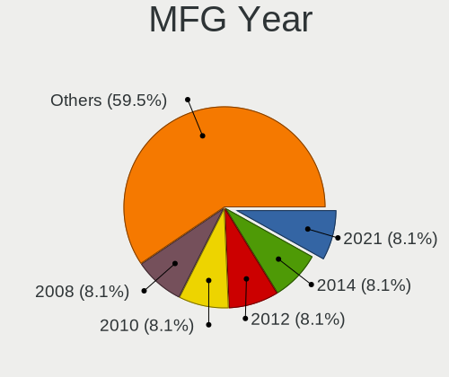

| Year | Computers | Percent |
|------|-----------|---------|
| 2021 | 9         | 8.11%   |
| 2014 | 9         | 8.11%   |
| 2012 | 9         | 8.11%   |
| 2010 | 9         | 8.11%   |
| 2008 | 9         | 8.11%   |
| 2018 | 8         | 7.21%   |
| 2017 | 8         | 7.21%   |
| 2015 | 8         | 7.21%   |
| 2011 | 8         | 7.21%   |
| 2020 | 7         | 6.31%   |
| 2013 | 7         | 6.31%   |
| 2019 | 5         | 4.5%    |
| 2016 | 5         | 4.5%    |
| 2009 | 4         | 3.6%    |
| 2022 | 2         | 1.8%    |
| 2007 | 2         | 1.8%    |
| 2023 | 1         | 0.9%    |
| 2006 | 1         | 0.9%    |

Form Factor
-----------

Physical design of the computer

| Name        | Computers | Percent |
|-------------|-----------|---------|
| Notebook    | 58        | 52.25%  |
| Desktop     | 50        | 45.05%  |
| Tablet      | 1         | 0.9%    |
| Convertible | 1         | 0.9%    |
| All in one  | 1         | 0.9%    |

Secure Boot
-----------

Enabled or disabled

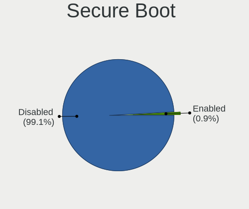

| State    | Computers | Percent |
|----------|-----------|---------|
| Disabled | 110       | 99.1%   |
| Enabled  | 1         | 0.9%    |

Coreboot
--------

Have coreboot on board

| Used | Computers | Percent |
|------|-----------|---------|
| No   | 110       | 99.1%   |
| Yes  | 1         | 0.9%    |

RAM Size
--------

Total RAM memory

| Size in GB  | Computers | Percent |
|-------------|-----------|---------|
| 3.01-4.0    | 32        | 28.83%  |
| 4.01-8.0    | 27        | 24.32%  |
| 8.01-16.0   | 24        | 21.62%  |
| 16.01-24.0  | 13        | 11.71%  |
| 1.01-2.0    | 7         | 6.31%   |
| 32.01-64.0  | 5         | 4.5%    |
| 2.01-3.0    | 2         | 1.8%    |
| 64.01-256.0 | 1         | 0.9%    |

RAM Used
--------

Used RAM memory

| Used GB    | Computers | Percent |
|------------|-----------|---------|
| 1.01-2.0   | 43        | 38.74%  |
| 0.51-1.0   | 28        | 25.23%  |
| 2.01-3.0   | 15        | 13.51%  |
| 4.01-8.0   | 9         | 8.11%   |
| 3.01-4.0   | 7         | 6.31%   |
| 0.01-0.5   | 7         | 6.31%   |
| 16.01-24.0 | 1         | 0.9%    |
| 8.01-16.0  | 1         | 0.9%    |

Total Drives
------------

Number of drives on board

| Drives | Computers | Percent |
|--------|-----------|---------|
| 1      | 68        | 61.26%  |
| 2      | 31        | 27.93%  |
| 3      | 4         | 3.6%    |
| 4      | 3         | 2.7%    |
| 5      | 2         | 1.8%    |
| 9      | 1         | 0.9%    |
| 8      | 1         | 0.9%    |
| 0      | 1         | 0.9%    |

Has CD-ROM
----------

Has CD-ROM on board

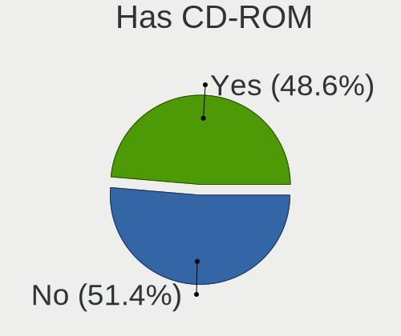

| Presented | Computers | Percent |
|-----------|-----------|---------|
| No        | 57        | 51.35%  |
| Yes       | 54        | 48.65%  |

Has Ethernet
------------

Has Ethernet on board

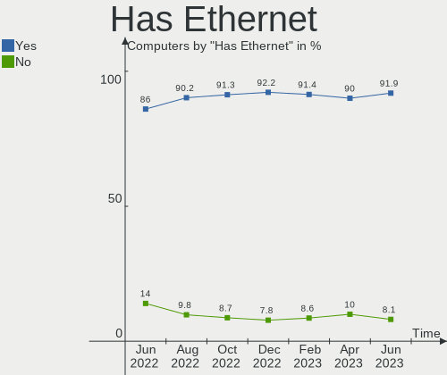

| Presented | Computers | Percent |
|-----------|-----------|---------|
| Yes       | 102       | 91.89%  |
| No        | 9         | 8.11%   |

Has WiFi
--------

Has WiFi module

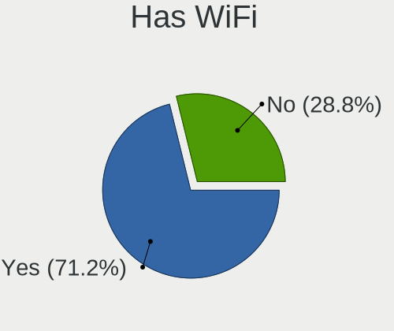

| Presented | Computers | Percent |
|-----------|-----------|---------|
| Yes       | 79        | 71.17%  |
| No        | 32        | 28.83%  |

Has Bluetooth
-------------

Has Bluetooth module

| Presented | Computers | Percent |
|-----------|-----------|---------|
| Yes       | 63        | 56.76%  |
| No        | 48        | 43.24%  |

Location
--------

Country
-------

Geographic location (country)

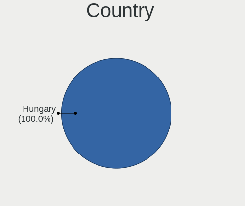

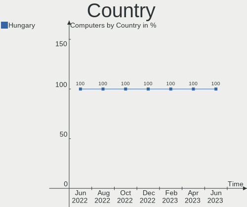

| Country | Computers | Percent |
|---------|-----------|---------|
| Hungary | 111       | 100%    |

City
----

Geographic location (city)

| City              | Computers | Percent |
|-------------------|-----------|---------|
| Budapest          | 46        | 41.44%  |
| Zalaegerszeg      | 4         | 3.6%    |
| Tatabánya        | 3         | 2.7%    |
| Hajduboszormeny   | 3         | 2.7%    |
| Tamasi            | 2         | 1.8%    |
| Szolnok           | 2         | 1.8%    |
| Szekszárd        | 2         | 1.8%    |
| Sarbogard         | 2         | 1.8%    |
| Karcag            | 2         | 1.8%    |
| Jaszapati         | 2         | 1.8%    |
| Győr             | 2         | 1.8%    |
| Fertoszentmiklos  | 2         | 1.8%    |
| Debrecen          | 2         | 1.8%    |
| Baja              | 2         | 1.8%    |
| Toeroekbalint     | 1         | 0.9%    |
| Tapiobicske       | 1         | 0.9%    |
| Taksony           | 1         | 0.9%    |
| Szombathely       | 1         | 0.9%    |
| Szigetujfalu      | 1         | 0.9%    |
| Szigetszentmiklos | 1         | 0.9%    |
| Szigethalom       | 1         | 0.9%    |
| Szentendre        | 1         | 0.9%    |
| Szendro           | 1         | 0.9%    |
| Pomaz             | 1         | 0.9%    |
| Pécs             | 1         | 0.9%    |
| Papa              | 1         | 0.9%    |
| Oroshaza          | 1         | 0.9%    |
| Obarok            | 1         | 0.9%    |
| Nyul              | 1         | 0.9%    |
| Nyiregyhaza       | 1         | 0.9%    |
| Nick              | 1         | 0.9%    |
| Nagykanizsa       | 1         | 0.9%    |
| Morahalom         | 1         | 0.9%    |
| Monor             | 1         | 0.9%    |
| Mogyorod          | 1         | 0.9%    |
| Miskolc           | 1         | 0.9%    |
| Mezotur           | 1         | 0.9%    |
| Kistelek          | 1         | 0.9%    |
| Kiskunhalas       | 1         | 0.9%    |
| Kiskoros          | 1         | 0.9%    |

Drives
------

Drive Vendor
------------

Hard drive vendors

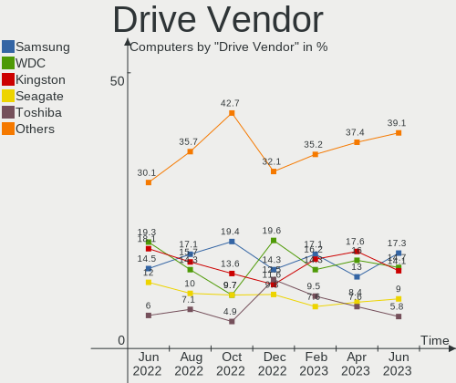

| Vendor                      | Computers | Drives | Percent |
|-----------------------------|-----------|--------|---------|
| Samsung Electronics         | 27        | 34     | 17.31%  |
| WDC                         | 23        | 40     | 14.74%  |
| Kingston                    | 22        | 24     | 14.1%   |
| Seagate                     | 14        | 15     | 8.97%   |
| Toshiba                     | 9         | 9      | 5.77%   |
| HGST                        | 7         | 7      | 4.49%   |
| Sandisk                     | 5         | 5      | 3.21%   |
| Unknown                     | 4         | 4      | 2.56%   |
| Micron Technology           | 4         | 4      | 2.56%   |
| Crucial                     | 4         | 4      | 2.56%   |
| SPCC                        | 3         | 3      | 1.92%   |
| SK hynix                    | 3         | 3      | 1.92%   |
| Patriot                     | 3         | 3      | 1.92%   |
| Intel                       | 3         | 3      | 1.92%   |
| A-DATA Technology           | 3         | 3      | 1.92%   |
| LITEON                      | 2         | 2      | 1.28%   |
| Hitachi                     | 2         | 2      | 1.28%   |
| China                       | 2         | 3      | 1.28%   |
| Zheino                      | 1         | 1      | 0.64%   |
| Verbatim                    | 1         | 1      | 0.64%   |
| SSSTC                       | 1         | 1      | 0.64%   |
| Phison Electronics          | 1         | 1      | 0.64%   |
| OCZ                         | 1         | 1      | 0.64%   |
| O2 Micro                    | 1         | 1      | 0.64%   |
| KIOXIA                      | 1         | 1      | 0.64%   |
| Kingston Technology Company | 1         | 1      | 0.64%   |
| Kingmax                     | 1         | 1      | 0.64%   |
| JMicron Technology          | 1         | 1      | 0.64%   |
| Intenso                     | 1         | 1      | 0.64%   |
| GOODRAM                     | 1         | 1      | 0.64%   |
| Gigabyte Technology         | 1         | 1      | 0.64%   |
| Dell                        | 1         | 1      | 0.64%   |
| Apple                       | 1         | 1      | 0.64%   |
| Apacer                      | 1         | 1      | 0.64%   |

Drive Model
-----------

Hard drive models

| Model                                               | Computers | Percent |
|-----------------------------------------------------|-----------|---------|
| Kingston SA400S37480G 480GB SSD                     | 7         | 3.87%   |
| Samsung SSD 860 EVO 500GB                           | 6         | 3.31%   |
| Seagate ST500DM002-1BD142 500GB                     | 5         | 2.76%   |
| Kingston SA400S37240G 240GB SSD                     | 5         | 2.76%   |
| Toshiba DT01ACA100 1TB                              | 3         | 1.66%   |
| Samsung SSD 850 EVO 250GB                           | 3         | 1.66%   |
| Kingston SUV400S37120G 120GB SSD                    | 3         | 1.66%   |
| HGST HTS545032A7E380 320GB                          | 3         | 1.66%   |
| WDC WD30EFRX-68EUZN0 3TB                            | 2         | 1.1%    |
| WDC WD20EZRZ-00Z5HB0 2TB                            | 2         | 1.1%    |
| Seagate ST500LT012-9WS142 500GB                     | 2         | 1.1%    |
| Samsung SSD 980 1TB                                 | 2         | 1.1%    |
| Samsung SSD 870 EVO 250GB                           | 2         | 1.1%    |
| Samsung SSD 830 Series 64GB                         | 2         | 1.1%    |
| Samsung NVMe SSD Controller SM981/PM981/PM983 250GB | 2         | 1.1%    |
| Micron 1100_MTFDDAK256TBN 256GB SSD                 | 2         | 1.1%    |
| Hitachi HTS545050B9A300 500GB                       | 2         | 1.1%    |
| HGST HTS541010B7E610 1TB                            | 2         | 1.1%    |
| Zheino CHN-NGFFNV2280-256 256GB                     | 1         | 0.55%   |
| WDC WDS500G3X0C-00SJG0 500GB                        | 1         | 0.55%   |
| WDC WDS240G2G0B-00EPW0 240GB SSD                    | 1         | 0.55%   |
| WDC WD800JD-75MSA3 80GB                             | 1         | 0.55%   |
| WDC WD6400AAKS-07A7B0 640GB                         | 1         | 0.55%   |
| WDC WD5003AZEX-00MK2A0 500GB                        | 1         | 0.55%   |
| WDC WD5000LPCX-24C6HT0 500GB                        | 1         | 0.55%   |
| WDC WD5000BPVT-00HXZT1 500GB                        | 1         | 0.55%   |
| WDC WD5000BPKT-75PK4T0 500GB                        | 1         | 0.55%   |
| WDC WD5000AAKX-221CA1 500GB                         | 1         | 0.55%   |
| WDC WD5000AAKS-65YGA0 500GB                         | 1         | 0.55%   |
| WDC WD5000AAKS-00UU3A0 500GB                        | 1         | 0.55%   |
| WDC WD5000AACS-00G8B1 500GB                         | 1         | 0.55%   |
| WDC WD40PURZ-85AKKY0 4TB                            | 1         | 0.55%   |
| WDC WD40EFRX-68N32N0 4TB                            | 1         | 0.55%   |
| WDC WD4000FYYZ-01UL1B2 4TB                          | 1         | 0.55%   |
| WDC WD4000FYYZ-01UL1B1 4TB                          | 1         | 0.55%   |
| WDC WD3200BEVT-08A23T1 320GB                        | 1         | 0.55%   |
| WDC WD30PURX-64P6ZY0 3TB                            | 1         | 0.55%   |
| WDC WD30EZRZ-00GXCB0 3TB                            | 1         | 0.55%   |
| WDC WD30EZRX-00DC0B0 3TB                            | 1         | 0.55%   |
| WDC WD2500BEVT-00ZCT0 250GB                         | 1         | 0.55%   |

HDD Vendor
----------

Hard disk drive vendors

| Vendor              | Computers | Drives | Percent |
|---------------------|-----------|--------|---------|
| WDC                 | 22        | 38     | 38.6%   |
| Seagate             | 14        | 15     | 24.56%  |
| Toshiba             | 7         | 7      | 12.28%  |
| HGST                | 7         | 7      | 12.28%  |
| Samsung Electronics | 4         | 4      | 7.02%   |
| Hitachi             | 2         | 2      | 3.51%   |
| Dell                | 1         | 1      | 1.75%   |

SSD Vendor
----------

Solid state drive vendors

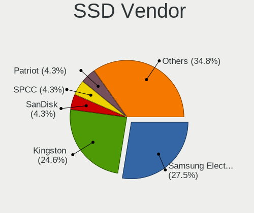

| Vendor              | Computers | Drives | Percent |
|---------------------|-----------|--------|---------|
| Samsung Electronics | 19        | 21     | 27.54%  |
| Kingston            | 17        | 19     | 24.64%  |
| SPCC                | 3         | 3      | 4.35%   |
| SanDisk             | 3         | 3      | 4.35%   |
| Patriot             | 3         | 3      | 4.35%   |
| Intel               | 3         | 3      | 4.35%   |
| Crucial             | 3         | 3      | 4.35%   |
| Micron Technology   | 2         | 2      | 2.9%    |
| LITEON              | 2         | 2      | 2.9%    |
| China               | 2         | 3      | 2.9%    |
| A-DATA Technology   | 2         | 2      | 2.9%    |
| WDC                 | 1         | 1      | 1.45%   |
| Verbatim            | 1         | 1      | 1.45%   |
| SK hynix            | 1         | 1      | 1.45%   |
| OCZ                 | 1         | 1      | 1.45%   |
| Kingmax             | 1         | 1      | 1.45%   |
| Intenso             | 1         | 1      | 1.45%   |
| GOODRAM             | 1         | 1      | 1.45%   |
| Gigabyte Technology | 1         | 1      | 1.45%   |
| Apple               | 1         | 1      | 1.45%   |
| Apacer              | 1         | 1      | 1.45%   |

Drive Kind
----------

HDD or SSD

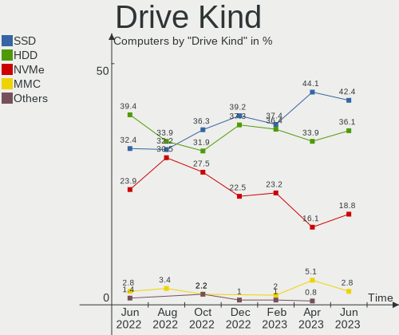

| Kind | Computers | Drives | Percent |
|------|-----------|--------|---------|
| SSD  | 61        | 74     | 42.36%  |
| HDD  | 52        | 74     | 36.11%  |
| NVMe | 27        | 32     | 18.75%  |
| MMC  | 4         | 4      | 2.78%   |

Drive Connector
---------------

SATA, SAS, NVMe, etc.

| Type | Computers | Drives | Percent |
|------|-----------|--------|---------|
| SATA | 92        | 146    | 73.02%  |
| NVMe | 27        | 31     | 21.43%  |
| MMC  | 4         | 4      | 3.17%   |
| SAS  | 3         | 3      | 2.38%   |

Drive Size
----------

Size of hard drive

| Size in TB | Computers | Drives | Percent |
|------------|-----------|--------|---------|
| 0.01-0.5   | 79        | 96     | 68.1%   |
| 0.51-1.0   | 27        | 29     | 23.28%  |
| 2.01-3.0   | 4         | 6      | 3.45%   |
| 1.01-2.0   | 3         | 9      | 2.59%   |
| 3.01-4.0   | 2         | 7      | 1.72%   |
| 4.01-10.0  | 1         | 1      | 0.86%   |

Space Total
-----------

Amount of disk space available on the file system

| Size in GB     | Computers | Percent |
|----------------|-----------|---------|
| 101-250        | 27        | 24.32%  |
| Unknown        | 27        | 24.32%  |
| 251-500        | 24        | 21.62%  |
| 501-1000       | 9         | 8.11%   |
| 1001-2000      | 6         | 5.41%   |
| 51-100         | 6         | 5.41%   |
| More than 3000 | 4         | 3.6%    |
| 21-50          | 4         | 3.6%    |
| 1-20           | 4         | 3.6%    |

Space Used
----------

Amount of used disk space

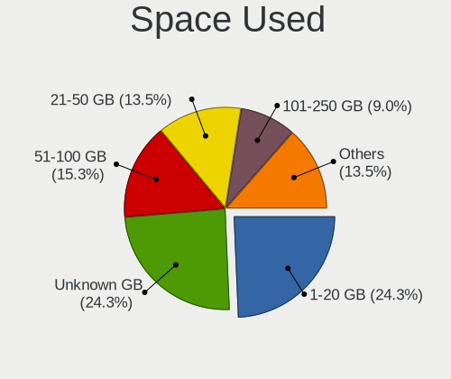

| Used GB        | Computers | Percent |
|----------------|-----------|---------|
| 1-20           | 27        | 24.32%  |
| Unknown        | 27        | 24.32%  |
| 51-100         | 17        | 15.32%  |
| 21-50          | 15        | 13.51%  |
| 101-250        | 10        | 9.01%   |
| 251-500        | 6         | 5.41%   |
| 1001-2000      | 3         | 2.7%    |
| 501-1000       | 3         | 2.7%    |
| More than 3000 | 2         | 1.8%    |
| 2001-3000      | 1         | 0.9%    |

Malfunc. Drives
---------------

Drive models with a malfunction

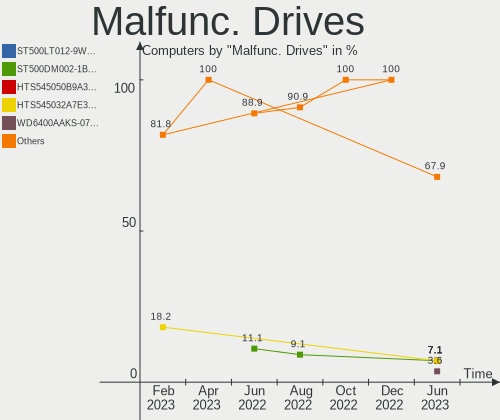

| Model                                 | Computers | Drives | Percent |
|---------------------------------------|-----------|--------|---------|
| Seagate ST500LT012-9WS142 500GB       | 2         | 2      | 7.14%   |
| Seagate ST500DM002-1BD142 500GB       | 2         | 2      | 7.14%   |
| Hitachi HTS545050B9A300 500GB         | 2         | 2      | 7.14%   |
| HGST HTS545032A7E380 320GB            | 2         | 2      | 7.14%   |
| WDC WD6400AAKS-07A7B0 640GB           | 1         | 1      | 3.57%   |
| WDC WD5000AAKS-00UU3A0 500GB          | 1         | 1      | 3.57%   |
| WDC WD5000AACS-00G8B1 500GB           | 1         | 1      | 3.57%   |
| WDC WD3200BEVT-08A23T1 320GB          | 1         | 1      | 3.57%   |
| WDC WD30EFRX-68EUZN0 3TB              | 1         | 1      | 3.57%   |
| WDC WD2500BEVT-00ZCT0 250GB           | 1         | 1      | 3.57%   |
| WDC WD20PURX-64PFUY0 2TB              | 1         | 1      | 3.57%   |
| WDC WD20EFRX-68EUZN0 2TB              | 1         | 1      | 3.57%   |
| WDC WD15EARS-00MVWB0 1TB              | 1         | 1      | 3.57%   |
| WDC WD10PURZ-85U8XY0 1TB              | 1         | 1      | 3.57%   |
| Toshiba DT01ACA050 500GB              | 1         | 1      | 3.57%   |
| Seagate ST9500325AS 500GB             | 1         | 1      | 3.57%   |
| Seagate ST750LM022 HN-M750MBB 752GB   | 1         | 1      | 3.57%   |
| Samsung Electronics SSD 750 EVO 250GB | 1         | 1      | 3.57%   |
| Samsung Electronics HD103UJ 1TB       | 1         | 1      | 3.57%   |
| Intel SSDSC2KF240H6L 240GB            | 1         | 1      | 3.57%   |
| Intel SSDSA1M160G2HP 160GB            | 1         | 1      | 3.57%   |
| China SSD 240GB                       | 1         | 1      | 3.57%   |
| Apple SSD TS064E 64GB                 | 1         | 1      | 3.57%   |
| A-DATA Technology SU630 240GB SSD     | 1         | 1      | 3.57%   |

Malfunc. Drive Vendor
---------------------

Vendors of faulty drives

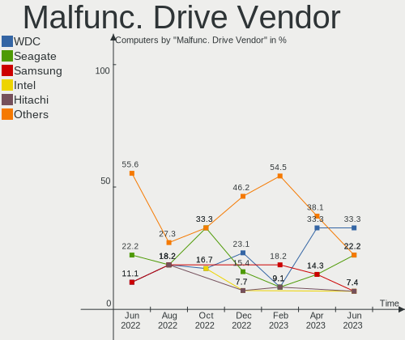

| Vendor              | Computers | Drives | Percent |
|---------------------|-----------|--------|---------|
| WDC                 | 9         | 10     | 33.33%  |
| Seagate             | 6         | 6      | 22.22%  |
| Samsung Electronics | 2         | 2      | 7.41%   |
| Intel               | 2         | 2      | 7.41%   |
| Hitachi             | 2         | 2      | 7.41%   |
| HGST                | 2         | 2      | 7.41%   |
| Toshiba             | 1         | 1      | 3.7%    |
| China               | 1         | 1      | 3.7%    |
| Apple               | 1         | 1      | 3.7%    |
| A-DATA Technology   | 1         | 1      | 3.7%    |

Malfunc. HDD Vendor
-------------------

Vendors of faulty HDD drives

| Vendor              | Computers | Drives | Percent |
|---------------------|-----------|--------|---------|
| WDC                 | 9         | 10     | 42.86%  |
| Seagate             | 6         | 6      | 28.57%  |
| Hitachi             | 2         | 2      | 9.52%   |
| HGST                | 2         | 2      | 9.52%   |
| Toshiba             | 1         | 1      | 4.76%   |
| Samsung Electronics | 1         | 1      | 4.76%   |

Malfunc. Drive Kind
-------------------

Kinds of faulty drives

| Kind | Computers | Drives | Percent |
|------|-----------|--------|---------|
| HDD  | 20        | 22     | 76.92%  |
| SSD  | 6         | 6      | 23.08%  |

Failed Drives
-------------

Failed drive models

Zero info for selected period =(

Failed Drive Vendor
-------------------

Failed drive vendors

Zero info for selected period =(

Drive Status
------------

Number of failed and malfunc. drives

| Status   | Computers | Drives | Percent |
|----------|-----------|--------|---------|
| Works    | 80        | 132    | 62.99%  |
| Malfunc  | 26        | 28     | 20.47%  |
| Detected | 21        | 24     | 16.54%  |

Storage controller
------------------

Storage Vendor
--------------

Storage controller vendors

| Vendor                         | Computers | Percent |
|--------------------------------|-----------|---------|
| Intel                          | 76        | 54.29%  |
| AMD                            | 23        | 16.43%  |
| Samsung Electronics            | 8         | 5.71%   |
| Kingston Technology Company    | 6         | 4.29%   |
| Nvidia                         | 4         | 2.86%   |
| Toshiba America Info Systems   | 3         | 2.14%   |
| ASMedia Technology             | 3         | 2.14%   |
| SK hynix                       | 2         | 1.43%   |
| Silicon Motion                 | 2         | 1.43%   |
| Silicon Image                  | 2         | 1.43%   |
| SanDisk                        | 2         | 1.43%   |
| Micron Technology              | 2         | 1.43%   |
| Solid State Storage Technology | 1         | 0.71%   |
| Phison Electronics             | 1         | 0.71%   |
| O2 Micro                       | 1         | 0.71%   |
| Micron/Crucial Technology      | 1         | 0.71%   |
| Marvell Technology Group       | 1         | 0.71%   |
| LSI Logic / Symbios Logic      | 1         | 0.71%   |
| JMicron Technology             | 1         | 0.71%   |

Storage Model
-------------

Storage controller models

| Model                                                                          | Computers | Percent |
|--------------------------------------------------------------------------------|-----------|---------|
| AMD FCH SATA Controller [AHCI mode]                                            | 15        | 9.55%   |
| Intel 8 Series/C220 Series Chipset Family 6-port SATA Controller 1 [AHCI mode] | 10        | 6.37%   |
| Intel Sunrise Point-LP SATA Controller [AHCI mode]                             | 8         | 5.1%    |
| Intel 82801IBM/IEM (ICH9M/ICH9M-E) 4 port SATA Controller [AHCI mode]          | 8         | 5.1%    |
| Intel NM10/ICH7 Family SATA Controller [IDE mode]                              | 5         | 3.18%   |
| Samsung NVMe SSD Controller 980                                                | 4         | 2.55%   |
| Intel Volume Management Device NVMe RAID Controller                            | 4         | 2.55%   |
| Intel Q170/Q150/B150/H170/H110/Z170/CM236 Chipset SATA Controller [AHCI Mode]  | 4         | 2.55%   |
| Intel 7 Series/C210 Series Chipset Family 6-port SATA Controller [AHCI mode]   | 4         | 2.55%   |
| Intel 7 Series Chipset Family 6-port SATA Controller [AHCI mode]               | 4         | 2.55%   |
| Intel 6 Series/C200 Series Chipset Family 6 port Mobile SATA AHCI Controller   | 4         | 2.55%   |
| Intel 200 Series PCH SATA controller [AHCI mode]                               | 4         | 2.55%   |
| AMD 500 Series Chipset SATA Controller                                         | 4         | 2.55%   |
| Samsung NVMe SSD Controller SM981/PM981/PM983                                  | 3         | 1.91%   |
| Intel Wildcat Point-LP SATA Controller [AHCI Mode]                             | 3         | 1.91%   |
| Intel 82801 Mobile SATA Controller [RAID mode]                                 | 3         | 1.91%   |
| Intel 5 Series/3400 Series Chipset 6 port SATA AHCI Controller                 | 3         | 1.91%   |
| ASMedia ASM1062 Serial ATA Controller                                          | 3         | 1.91%   |
| Nvidia MCP61 SATA Controller                                                   | 2         | 1.27%   |
| Nvidia MCP61 IDE                                                               | 2         | 1.27%   |
| Kingston Company A2000 NVMe SSD                                                | 2         | 1.27%   |
| Intel Tiger Lake-LP SATA Controller                                            | 2         | 1.27%   |
| Intel SATA Controller [RAID mode]                                              | 2         | 1.27%   |
| Intel 82801G (ICH7 Family) IDE Controller                                      | 2         | 1.27%   |
| Intel 8 Series SATA Controller 1 [AHCI mode]                                   | 2         | 1.27%   |
| Intel 5 Series/3400 Series Chipset 4 port SATA AHCI Controller                 | 2         | 1.27%   |
| AMD SB7x0/SB8x0/SB9x0 SATA Controller [IDE mode]                               | 2         | 1.27%   |
| AMD SB7x0/SB8x0/SB9x0 IDE Controller                                           | 2         | 1.27%   |
| AMD FCH IDE Controller                                                         | 2         | 1.27%   |
| AMD 300 Series Chipset SATA Controller                                         | 2         | 1.27%   |
| Toshiba America Info Systems XG6 NVMe SSD Controller                           | 1         | 0.64%   |
| Toshiba America Info Systems XG5 NVMe SSD Controller                           | 1         | 0.64%   |
| Toshiba America Info Systems BG3 NVMe SSD Controller                           | 1         | 0.64%   |
| Solid State Storage CL1-3D256-Q11 NVMe SSD M.2                                 | 1         | 0.64%   |
| SK hynix Gold P31/BC711/PC711 NVMe Solid State Drive                           | 1         | 0.64%   |
| SK hynix BC511 NVMe SSD                                                        | 1         | 0.64%   |
| Silicon Motion SM2263EN/SM2263XT SSD Controller                                | 1         | 0.64%   |
| Silicon Motion Non-Volatile memory controller                                  | 1         | 0.64%   |
| Silicon Image SiI 3512 [SATALink/SATARaid] Serial ATA Controller               | 1         | 0.64%   |
| Silicon Image SiI 3132 Serial ATA Raid II Controller                           | 1         | 0.64%   |

Storage Kind
------------

Kind of storage controller (IDE, SATA, NVMe, SAS, ...)

| Kind | Computers | Percent |
|------|-----------|---------|
| SATA | 86        | 61.43%  |
| NVMe | 27        | 19.29%  |
| IDE  | 15        | 10.71%  |
| RAID | 11        | 7.86%   |
| SAS  | 1         | 0.71%   |

Processor
---------

CPU Vendor
----------

Processor vendors

| Vendor | Computers | Percent |
|--------|-----------|---------|
| Intel  | 82        | 73.87%  |
| AMD    | 29        | 26.13%  |

CPU Model
---------

Processor models

| Model                                       | Computers | Percent |
|---------------------------------------------|-----------|---------|
| Intel Core i3-4160 CPU @ 3.60GHz            | 5         | 4.5%    |
| Intel Core i5-8250U CPU @ 1.60GHz           | 3         | 2.7%    |
| Intel Core i5-6300U CPU @ 2.40GHz           | 3         | 2.7%    |
| Intel Celeron CPU 1000M @ 1.80GHz           | 3         | 2.7%    |
| Intel Core i5-7200U CPU @ 2.50GHz           | 2         | 1.8%    |
| Intel Core i5-2540M CPU @ 2.60GHz           | 2         | 1.8%    |
| Intel Core i3-6100T CPU @ 3.20GHz           | 2         | 1.8%    |
| Intel Core i3-6006U CPU @ 2.00GHz           | 2         | 1.8%    |
| Intel Core i3-2310M CPU @ 2.10GHz           | 2         | 1.8%    |
| Intel 11th Gen Core i5-1135G7 @ 2.40GHz     | 2         | 1.8%    |
| Intel 11th Gen Core i3-1115G4 @ 3.00GHz     | 2         | 1.8%    |
| AMD Ryzen 5 3400G with Radeon Vega Graphics | 2         | 1.8%    |
| AMD FX-6300 Six-Core Processor              | 2         | 1.8%    |
| Intel Xeon CPU W3550 @ 3.07GHz              | 1         | 0.9%    |
| Intel Xeon CPU E5530 @ 2.40GHz              | 1         | 0.9%    |
| Intel Xeon CPU E31260L @ 2.40GHz            | 1         | 0.9%    |
| Intel Xeon CPU E3-1225 v3 @ 3.20GHz         | 1         | 0.9%    |
| Intel Pentium Dual-Core CPU T4400 @ 2.20GHz | 1         | 0.9%    |
| Intel Pentium Dual-Core CPU T4300 @ 2.10GHz | 1         | 0.9%    |
| Intel Pentium Dual-Core CPU E5400 @ 2.70GHz | 1         | 0.9%    |
| Intel Pentium CPU P6200 @ 2.13GHz           | 1         | 0.9%    |
| Intel Core i7-7700K CPU @ 4.20GHz           | 1         | 0.9%    |
| Intel Core i7-5500U CPU @ 2.40GHz           | 1         | 0.9%    |
| Intel Core i7-4770K CPU @ 3.50GHz           | 1         | 0.9%    |
| Intel Core i7-4720HQ CPU @ 2.60GHz          | 1         | 0.9%    |
| Intel Core i7-4712MQ CPU @ 2.30GHz          | 1         | 0.9%    |
| Intel Core i7-4510U CPU @ 2.00GHz           | 1         | 0.9%    |
| Intel Core i7-2700K CPU @ 3.50GHz           | 1         | 0.9%    |
| Intel Core i7 CPU L 640 @ 2.13GHz           | 1         | 0.9%    |
| Intel Core i5-6600 CPU @ 3.30GHz            | 1         | 0.9%    |
| Intel Core i5-6500 CPU @ 3.20GHz            | 1         | 0.9%    |
| Intel Core i5-5200U CPU @ 2.20GHz           | 1         | 0.9%    |
| Intel Core i5-4590 CPU @ 3.30GHz            | 1         | 0.9%    |
| Intel Core i5-4570 CPU @ 3.20GHz            | 1         | 0.9%    |
| Intel Core i5-3470 CPU @ 3.20GHz            | 1         | 0.9%    |
| Intel Core i5-3427U CPU @ 1.80GHz           | 1         | 0.9%    |
| Intel Core i5-3340M CPU @ 2.70GHz           | 1         | 0.9%    |
| Intel Core i5-2300 CPU @ 2.80GHz            | 1         | 0.9%    |
| Intel Core i5-10210U CPU @ 1.60GHz          | 1         | 0.9%    |
| Intel Core i5 CPU M 560 @ 2.67GHz           | 1         | 0.9%    |

CPU Model Family
----------------

Processor model prefix

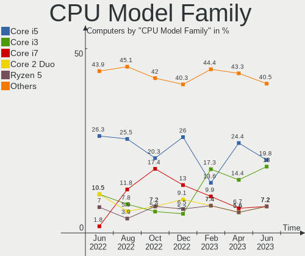

| Model                   | Computers | Percent |
|-------------------------|-----------|---------|
| Intel Core i5           | 22        | 19.82%  |
| Intel Core i3           | 20        | 18.02%  |
| Intel Core i7           | 8         | 7.21%   |
| Intel Core 2 Duo        | 8         | 7.21%   |
| AMD Ryzen 5             | 8         | 7.21%   |
| Other                   | 7         | 6.31%   |
| Intel Celeron           | 7         | 6.31%   |
| AMD Ryzen 7             | 5         | 4.5%    |
| Intel Xeon              | 4         | 3.6%    |
| Intel Pentium Dual-Core | 3         | 2.7%    |
| AMD FX                  | 2         | 1.8%    |
| AMD A8                  | 2         | 1.8%    |
| Intel Pentium           | 1         | 0.9%    |
| Intel Core 2 Quad       | 1         | 0.9%    |
| Intel Core 2            | 1         | 0.9%    |
| Intel Celeron Dual-Core | 1         | 0.9%    |
| Intel Atom              | 1         | 0.9%    |
| AMD Ryzen 7 PRO         | 1         | 0.9%    |
| AMD Ryzen 3             | 1         | 0.9%    |
| AMD E1                  | 1         | 0.9%    |
| AMD Athlon II X2        | 1         | 0.9%    |
| AMD Athlon Dual Core    | 1         | 0.9%    |
| AMD Athlon 64 X2        | 1         | 0.9%    |
| AMD Athlon 64           | 1         | 0.9%    |
| AMD A6                  | 1         | 0.9%    |
| AMD A4                  | 1         | 0.9%    |
| AMD A10                 | 1         | 0.9%    |

CPU Cores
---------

Number of processor cores

| Number | Computers | Percent |
|--------|-----------|---------|
| 2      | 59        | 53.15%  |
| 4      | 33        | 29.73%  |
| 8      | 6         | 5.41%   |
| 6      | 6         | 5.41%   |
| 1      | 5         | 4.5%    |
| 3      | 2         | 1.8%    |

CPU Sockets
-----------

Number of sockets

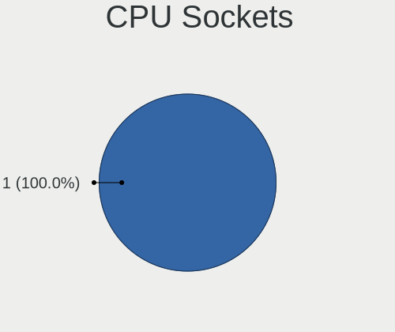

| Number | Computers | Percent |
|--------|-----------|---------|
| 1      | 111       | 100%    |

CPU Threads
-----------

Threads per core (Hyper-Threading)

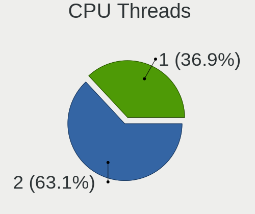

| Number | Computers | Percent |
|--------|-----------|---------|
| 2      | 70        | 63.06%  |
| 1      | 41        | 36.94%  |

CPU Op-Modes
------------

CPU Operation Modes (32-bit, 64-bit)

| Op mode        | Computers | Percent |
|----------------|-----------|---------|
| 32-bit, 64-bit | 111       | 100%    |

CPU Microcode
-------------

Microcode number

| Number     | Computers | Percent |
|------------|-----------|---------|
| Unknown    | 20        | 18.02%  |
| 0x306c3    | 10        | 9.01%   |
| 0x1067a    | 9         | 8.11%   |
| 0x206a7    | 7         | 6.31%   |
| 0x306a9    | 6         | 5.41%   |
| 0x20655    | 5         | 4.5%    |
| 0x806c1    | 4         | 3.6%    |
| 0x806ea    | 3         | 2.7%    |
| 0x506e3    | 3         | 2.7%    |
| 0x08108109 | 3         | 2.7%    |
| 0x906eb    | 2         | 1.8%    |
| 0x806e9    | 2         | 1.8%    |
| 0x406e3    | 2         | 1.8%    |
| 0x40651    | 2         | 1.8%    |
| 0x306d4    | 2         | 1.8%    |
| 0x106a5    | 2         | 1.8%    |
| 0x0a20120a | 2         | 1.8%    |
| 0x08600109 | 2         | 1.8%    |
| 0x08600106 | 2         | 1.8%    |
| 0x906e9    | 1         | 0.9%    |
| 0x806ec    | 1         | 0.9%    |
| 0x6fd      | 1         | 0.9%    |
| 0x6fa      | 1         | 0.9%    |
| 0x6f2      | 1         | 0.9%    |
| 0x406c3    | 1         | 0.9%    |
| 0x10677    | 1         | 0.9%    |
| 0x10676    | 1         | 0.9%    |
| 0x10661    | 1         | 0.9%    |
| 0x08701021 | 1         | 0.9%    |
| 0x08608102 | 1         | 0.9%    |
| 0x08600104 | 1         | 0.9%    |
| 0x08600103 | 1         | 0.9%    |
| 0x0800820d | 1         | 0.9%    |
| 0x07030105 | 1         | 0.9%    |
| 0x06006704 | 1         | 0.9%    |
| 0x0600611a | 1         | 0.9%    |
| 0x06003109 | 1         | 0.9%    |
| 0x06003106 | 1         | 0.9%    |
| 0x06001119 | 1         | 0.9%    |
| 0x06000852 | 1         | 0.9%    |

CPU Microarch
-------------

Microarchitecture

| Name          | Computers | Percent |
|---------------|-----------|---------|
| Haswell       | 13        | 11.71%  |
| Penryn        | 12        | 10.81%  |
| Skylake       | 10        | 9.01%   |
| KabyLake      | 10        | 9.01%   |
| SandyBridge   | 8         | 7.21%   |
| Zen 2         | 7         | 6.31%   |
| IvyBridge     | 7         | 6.31%   |
| Westmere      | 5         | 4.5%    |
| Zen+          | 4         | 3.6%    |
| TigerLake     | 4         | 3.6%    |
| Core          | 4         | 3.6%    |
| Zen 3         | 3         | 2.7%    |
| Piledriver    | 3         | 2.7%    |
| K8 Hammer     | 3         | 2.7%    |
| Broadwell     | 3         | 2.7%    |
| Steamroller   | 2         | 1.8%    |
| Silvermont    | 2         | 1.8%    |
| Nehalem       | 2         | 1.8%    |
| Excavator     | 2         | 1.8%    |
| Unknown       | 2         | 1.8%    |
| Puma          | 1         | 0.9%    |
| K10           | 1         | 0.9%    |
| Icelake       | 1         | 0.9%    |
| Goldmont plus | 1         | 0.9%    |
| Bobcat        | 1         | 0.9%    |

Graphics
--------

GPU Vendor
----------

Vendors of graphics cards

| Vendor | Computers | Percent |
|--------|-----------|---------|
| Intel  | 65        | 51.18%  |
| Nvidia | 32        | 25.2%   |
| AMD    | 30        | 23.62%  |

GPU Model
---------

Graphics card models

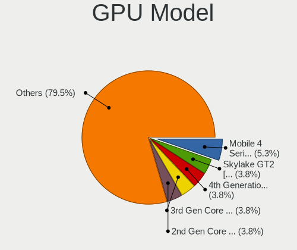

| Model                                                                                    | Computers | Percent |
|------------------------------------------------------------------------------------------|-----------|---------|
| Intel Mobile 4 Series Chipset Integrated Graphics Controller                             | 7         | 5.3%    |
| Intel Skylake GT2 [HD Graphics 520]                                                      | 5         | 3.79%   |
| Intel 4th Generation Core Processor Family Integrated Graphics Controller                | 5         | 3.79%   |
| Intel 3rd Gen Core processor Graphics Controller                                         | 5         | 3.79%   |
| Intel 2nd Generation Core Processor Family Integrated Graphics Controller                | 5         | 3.79%   |
| Intel HD Graphics 530                                                                    | 4         | 3.03%   |
| AMD Renoir                                                                               | 4         | 3.03%   |
| Nvidia GK208B [GeForce GT 710]                                                           | 3         | 2.27%   |
| Intel UHD Graphics 620                                                                   | 3         | 2.27%   |
| Intel HD Graphics 5500                                                                   | 3         | 2.27%   |
| AMD Topaz XT [Radeon R7 M260/M265 / M340/M360 / M440/M445 / 530/535 / 620/625 Mobile]    | 3         | 2.27%   |
| Nvidia TU117M [GeForce GTX 1650 Ti Mobile]                                               | 2         | 1.52%   |
| Nvidia GM107 [GeForce GTX 750 Ti]                                                        | 2         | 1.52%   |
| Nvidia GF119M [GeForce GT 520M]                                                          | 2         | 1.52%   |
| Intel Xeon E3-1200 v3/4th Gen Core Processor Integrated Graphics Controller              | 2         | 1.52%   |
| Intel TigerLake-LP GT2 [Iris Xe Graphics]                                                | 2         | 1.52%   |
| Intel Tiger Lake-LP GT2 [UHD Graphics G4]                                                | 2         | 1.52%   |
| Intel HD Graphics 620                                                                    | 2         | 1.52%   |
| Intel Haswell-ULT Integrated Graphics Controller                                         | 2         | 1.52%   |
| Intel Core Processor Integrated Graphics Controller                                      | 2         | 1.52%   |
| Intel CometLake-U GT2 [UHD Graphics]                                                     | 2         | 1.52%   |
| Intel CoffeeLake-S GT2 [UHD Graphics 630]                                                | 2         | 1.52%   |
| Intel Atom/Celeron/Pentium Processor x5-E8000/J3xxx/N3xxx Integrated Graphics Controller | 2         | 1.52%   |
| Intel 4th Gen Core Processor Integrated Graphics Controller                              | 2         | 1.52%   |
| Intel 4 Series Chipset Integrated Graphics Controller                                    | 2         | 1.52%   |
| AMD Picasso/Raven 2 [Radeon Vega Series / Radeon Vega Mobile Series]                     | 2         | 1.52%   |
| AMD Cedar [Radeon HD 5000/6000/7350/8350 Series]                                         | 2         | 1.52%   |
| Nvidia TU117 [GeForce GTX 1650]                                                          | 1         | 0.76%   |
| Nvidia TU116 [GeForce GTX 1660 Ti]                                                       | 1         | 0.76%   |
| Nvidia TU116 [GeForce GTX 1660 SUPER]                                                    | 1         | 0.76%   |
| Nvidia TU106M [GeForce RTX 2060 Max-Q]                                                   | 1         | 0.76%   |
| Nvidia GT218M [NVS 3100M]                                                                | 1         | 0.76%   |
| Nvidia GT218M [GeForce 315M]                                                             | 1         | 0.76%   |
| Nvidia GT218 [GeForce 210]                                                               | 1         | 0.76%   |
| Nvidia GP108 [GeForce GT 1030]                                                           | 1         | 0.76%   |
| Nvidia GM108M [GeForce 845M]                                                             | 1         | 0.76%   |
| Nvidia GM108M [GeForce 840M]                                                             | 1         | 0.76%   |
| Nvidia GM107M [GeForce GTX 960M]                                                         | 1         | 0.76%   |
| Nvidia GK208BM [GeForce 920M]                                                            | 1         | 0.76%   |
| Nvidia GK208B [GeForce GT 720]                                                           | 1         | 0.76%   |

GPU Combo
---------

Combinations of graphics cards

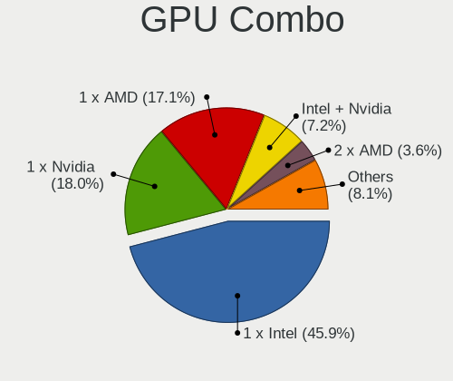

| Name           | Computers | Percent |
|----------------|-----------|---------|
| 1 x Intel      | 51        | 45.95%  |
| 1 x Nvidia     | 20        | 18.02%  |
| 1 x AMD        | 19        | 17.12%  |
| Intel + Nvidia | 8         | 7.21%   |
| 2 x AMD        | 4         | 3.6%    |
| Intel + AMD    | 4         | 3.6%    |
| AMD + Nvidia   | 3         | 2.7%    |
| 2 x Nvidia     | 1         | 0.9%    |
| 2 x Intel      | 1         | 0.9%    |

GPU Driver
----------

Free vs proprietary

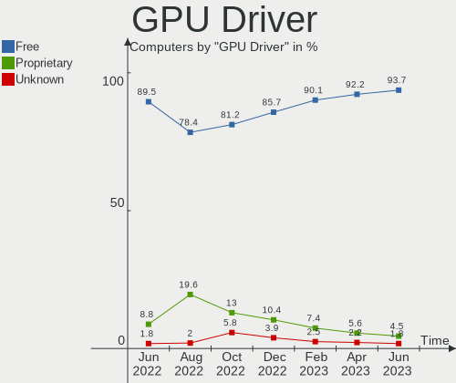

| Driver      | Computers | Percent |
|-------------|-----------|---------|
| Free        | 104       | 93.69%  |
| Proprietary | 5         | 4.5%    |
| Unknown     | 2         | 1.8%    |

GPU Memory
----------

Total video memory

| Size in GB | Computers | Percent |
|------------|-----------|---------|
| Unknown    | 63        | 56.76%  |
| 0.51-1.0   | 16        | 14.41%  |
| 0.01-0.5   | 12        | 10.81%  |
| 1.01-2.0   | 11        | 9.91%   |
| 3.01-4.0   | 5         | 4.5%    |
| 7.01-8.0   | 1         | 0.9%    |
| 5.01-6.0   | 1         | 0.9%    |
| 2.01-3.0   | 1         | 0.9%    |
| 8.01-16.0  | 1         | 0.9%    |

Monitor
-------

Monitor Vendor
--------------

Monitor vendors

| Vendor                  | Computers | Percent |
|-------------------------|-----------|---------|
| Samsung Electronics     | 16        | 14.41%  |
| LG Display              | 16        | 14.41%  |
| AU Optronics            | 11        | 9.91%   |
| Goldstar                | 7         | 6.31%   |
| Dell                    | 7         | 6.31%   |
| BOE                     | 6         | 5.41%   |
| Acer                    | 6         | 5.41%   |
| Chimei Innolux          | 5         | 4.5%    |
| BenQ                    | 5         | 4.5%    |
| Philips                 | 3         | 2.7%    |
| PANDA                   | 3         | 2.7%    |
| Chi Mei Optoelectronics | 3         | 2.7%    |
| Ancor Communications    | 3         | 2.7%    |
| Lenovo                  | 2         | 1.8%    |
| HannStar                | 2         | 1.8%    |
| Eizo                    | 2         | 1.8%    |
| Vestel Elektronik       | 1         | 0.9%    |
| Valve                   | 1         | 0.9%    |
| Unknown                 | 1         | 0.9%    |
| Toshiba                 | 1         | 0.9%    |
| Sharp                   | 1         | 0.9%    |
| NCS                     | 1         | 0.9%    |
| Medion                  | 1         | 0.9%    |
| LMV                     | 1         | 0.9%    |
| LG Philips              | 1         | 0.9%    |
| Hewlett-Packard         | 1         | 0.9%    |
| Belinea                 | 1         | 0.9%    |
| Arnos Instruments       | 1         | 0.9%    |
| Apple                   | 1         | 0.9%    |
| AOC                     | 1         | 0.9%    |

Monitor Model
-------------

Monitor models

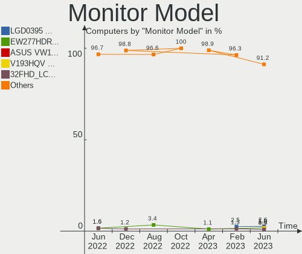

| Model                                                                   | Computers | Percent |
|-------------------------------------------------------------------------|-----------|---------|
| LG Display LCD Monitor LGD0395 1366x768 344x194mm 15.5-inch             | 3         | 2.63%   |
| BenQ EW277HDR BNQ7948 1920x1080 598x336mm 27.0-inch                     | 2         | 1.75%   |
| Ancor Communications ASUS VW198 ACI19AA 1680x1050 450x300mm 21.3-inch   | 2         | 1.75%   |
| Acer V193HQV ACR013E 1366x768 410x230mm 18.5-inch                       | 2         | 1.75%   |
| Vestel Elektronik 32FHD_LCD_TV VES3700 1920x1080 700x400mm 31.7-inch    | 1         | 0.88%   |
| Valve ANX7530 U VLV3001 800x1280 100x150mm 7.1-inch                     | 1         | 0.88%   |
| Unknown LCD Monitor FFFF 2288x1287 2550x2550mm 142.0-inch               | 1         | 0.88%   |
| Toshiba TV TSB0108 1360x768 698x393mm 31.5-inch                         | 1         | 0.88%   |
| Sharp LQ156M1JW26 SHP1559 1920x1080 344x194mm 15.5-inch                 | 1         | 0.88%   |
| Samsung Electronics SyncMaster SAM01E1 1280x1024 376x301mm 19.0-inch    | 1         | 0.88%   |
| Samsung Electronics SyncMaster SAM01B8 1280x1024 338x270mm 17.0-inch    | 1         | 0.88%   |
| Samsung Electronics S27E500 SAM0D0D 1920x1080 598x336mm 27.0-inch       | 1         | 0.88%   |
| Samsung Electronics S24R35x SAM100E 1920x1080 527x296mm 23.8-inch       | 1         | 0.88%   |
| Samsung Electronics S24D330 SAM0D92 1920x1080 531x299mm 24.0-inch       | 1         | 0.88%   |
| Samsung Electronics S24D300 SAM0B45 1920x1080 521x293mm 23.5-inch       | 1         | 0.88%   |
| Samsung Electronics S22B370 SAM08BD 1920x1080 477x268mm 21.5-inch       | 1         | 0.88%   |
| Samsung Electronics LCD Monitor SEC5442 1440x900 303x190mm 14.1-inch    | 1         | 0.88%   |
| Samsung Electronics LCD Monitor SEC5441 1366x768 293x165mm 13.2-inch    | 1         | 0.88%   |
| Samsung Electronics LCD Monitor SEC3651 1366x768 344x194mm 15.5-inch    | 1         | 0.88%   |
| Samsung Electronics LCD Monitor SEC3051 1600x900 398x232mm 18.1-inch    | 1         | 0.88%   |
| Samsung Electronics LCD Monitor SEC304F 1680x945 409x230mm 18.5-inch    | 1         | 0.88%   |
| Samsung Electronics LCD Monitor SEC3046 1366x768 344x193mm 15.5-inch    | 1         | 0.88%   |
| Samsung Electronics LCD Monitor SDC4852 1920x1080 344x194mm 15.5-inch   | 1         | 0.88%   |
| Samsung Electronics LCD Monitor SAM7017 3840x2160 1872x1053mm 84.6-inch | 1         | 0.88%   |
| Samsung Electronics LCD Monitor SAM0659 1920x1080                       | 1         | 0.88%   |
| Samsung Electronics LCD Monitor C49J89x 1680x1050                       | 1         | 0.88%   |
| Samsung Electronics C49J89x SAM0F21 3840x1080 1196x336mm 48.9-inch      | 1         | 0.88%   |
| Philips 221B PHL08A1 1920x1080 477x268mm 21.5-inch                      | 1         | 0.88%   |
| Philips 196V4 PHLC0AF 1366x768 410x230mm 18.5-inch                      | 1         | 0.88%   |
| Philips 190WV PHLC014 1440x900 408x255mm 18.9-inch                      | 1         | 0.88%   |
| PANDA LCD Monitor NCP0065 1920x1080 309x174mm 14.0-inch                 | 1         | 0.88%   |
| PANDA LCD Monitor NCP0058 1920x1080 344x194mm 15.5-inch                 | 1         | 0.88%   |
| PANDA LCD Monitor NCP004D 1920x1080 344x194mm 15.5-inch                 | 1         | 0.88%   |
| NCS LCD Monitor NCS2275 1920x1080 256x192mm 12.6-inch                   | 1         | 0.88%   |
| Medion MD20666 MED3673 1920x1080 533x312mm 24.3-inch                    | 1         | 0.88%   |
| LMV LM19V LMV00BE 1280x1024 337x270mm 17.0-inch                         | 1         | 0.88%   |
| LG Philips LCD Monitor LPL0140 1440x900 304x190mm 14.1-inch             | 1         | 0.88%   |
| LG Display LCD Monitor LGD06F5 1920x1080 344x194mm 15.5-inch            | 1         | 0.88%   |
| LG Display LCD Monitor LGD0694 2560x1600 344x215mm 16.0-inch            | 1         | 0.88%   |
| LG Display LCD Monitor LGD064C 1920x1080 344x194mm 15.5-inch            | 1         | 0.88%   |

Monitor Resolution
------------------

Monitor screen resolution

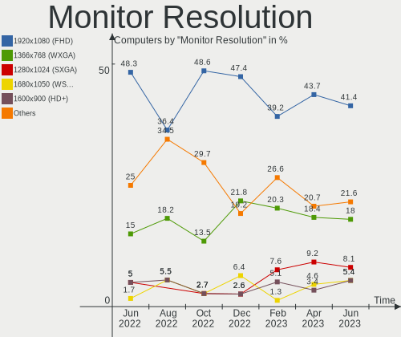

| Resolution         | Computers | Percent |
|--------------------|-----------|---------|
| 1920x1080 (FHD)    | 46        | 41.44%  |
| 1366x768 (WXGA)    | 20        | 18.02%  |
| 1280x1024 (SXGA)   | 9         | 8.11%   |
| 1680x1050 (WSXGA+) | 6         | 5.41%   |
| 1600x900 (HD+)     | 6         | 5.41%   |
| 1440x900 (WXGA+)   | 6         | 5.41%   |
| 3840x2160 (4K)     | 4         | 3.6%    |
| 2560x1440 (QHD)    | 3         | 2.7%    |
| 1280x800 (WXGA)    | 3         | 2.7%    |
| 800x1280           | 1         | 0.9%    |
| 3840x1080          | 1         | 0.9%    |
| 2560x1600          | 1         | 0.9%    |
| 2288x1287          | 1         | 0.9%    |
| 1920x540           | 1         | 0.9%    |
| 1920x1200 (WUXGA)  | 1         | 0.9%    |
| 1680x945           | 1         | 0.9%    |
| 1024x768 (XGA)     | 1         | 0.9%    |

Monitor Diagonal
----------------

Diagonal size in inches

| Inches  | Computers | Percent |
|---------|-----------|---------|
| 15      | 32        | 28.07%  |
| 21      | 11        | 9.65%   |
| 17      | 11        | 9.65%   |
| 14      | 8         | 7.02%   |
| 27      | 7         | 6.14%   |
| 24      | 7         | 6.14%   |
| 23      | 6         | 5.26%   |
| 19      | 6         | 5.26%   |
| 18      | 6         | 5.26%   |
| 12      | 6         | 5.26%   |
| 84      | 2         | 1.75%   |
| 22      | 2         | 1.75%   |
| 16      | 2         | 1.75%   |
| 13      | 2         | 1.75%   |
| Unknown | 2         | 1.75%   |
| 142     | 1         | 0.88%   |
| 72      | 1         | 0.88%   |
| 49      | 1         | 0.88%   |
| 7       | 1         | 0.88%   |

Monitor Width
-------------

Physical width

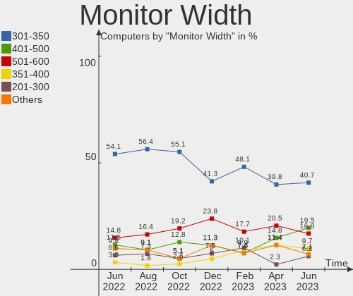

| Width in mm    | Computers | Percent |
|----------------|-----------|---------|
| 301-350        | 46        | 40.71%  |
| 401-500        | 22        | 19.47%  |
| 501-600        | 19        | 16.81%  |
| 351-400        | 11        | 9.73%   |
| 201-300        | 7         | 6.19%   |
| 1501-2000      | 3         | 2.65%   |
| Unknown        | 2         | 1.77%   |
| More than 2000 | 1         | 0.88%   |
| 1001-1500      | 1         | 0.88%   |
| 1-100          | 1         | 0.88%   |

Aspect Ratio
------------

Proportional relationship between the width and the height

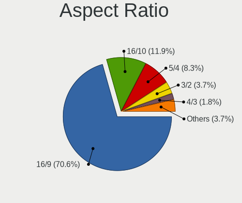

| Ratio   | Computers | Percent |
|---------|-----------|---------|
| 16/9    | 77        | 70.64%  |
| 16/10   | 13        | 11.93%  |
| 5/4     | 9         | 8.26%   |
| 3/2     | 4         | 3.67%   |
| 4/3     | 2         | 1.83%   |
| 32/9    | 1         | 0.92%   |
| 1.00    | 1         | 0.92%   |
| 0.67    | 1         | 0.92%   |
| Unknown | 1         | 0.92%   |

Monitor Area
------------

Area in inch²

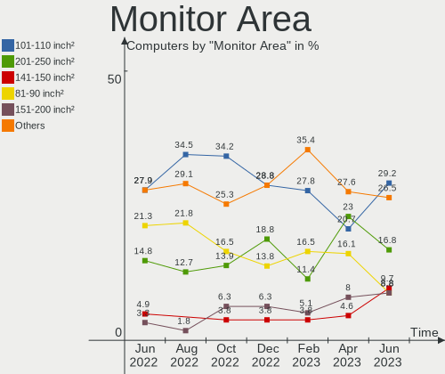

| Area in inch² | Computers | Percent |
|----------------|-----------|---------|
| 101-110        | 33        | 29.2%   |
| 201-250        | 19        | 16.81%  |
| 141-150        | 11        | 9.73%   |
| 81-90          | 10        | 8.85%   |
| 151-200        | 10        | 8.85%   |
| 301-350        | 7         | 6.19%   |
| 61-70          | 5         | 4.42%   |
| More than 1000 | 4         | 3.54%   |
| 251-300        | 3         | 2.65%   |
| 121-130        | 3         | 2.65%   |
| 131-140        | 2         | 1.77%   |
| Unknown        | 2         | 1.77%   |
| 71-80          | 1         | 0.88%   |
| 1-40           | 1         | 0.88%   |
| 111-120        | 1         | 0.88%   |
| 501-1000       | 1         | 0.88%   |

Pixel Density
-------------

Pixels per inch

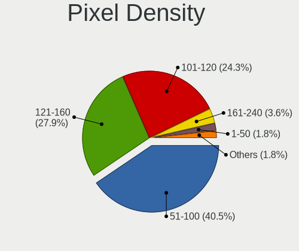

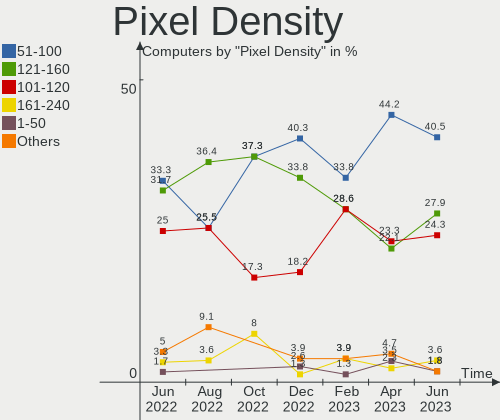

| Density | Computers | Percent |
|---------|-----------|---------|
| 51-100  | 45        | 40.54%  |
| 121-160 | 31        | 27.93%  |
| 101-120 | 27        | 24.32%  |
| 161-240 | 4         | 3.6%    |
| 1-50    | 2         | 1.8%    |
| Unknown | 2         | 1.8%    |

Multiple Monitors
-----------------

Total monitors connected

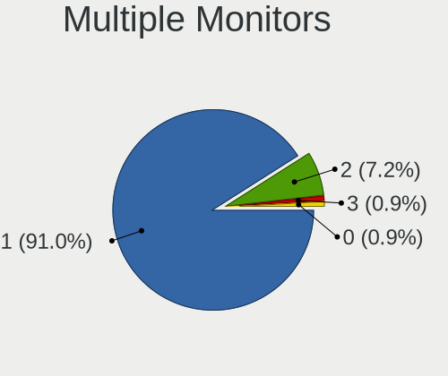

| Total | Computers | Percent |
|-------|-----------|---------|
| 1     | 101       | 90.99%  |
| 2     | 8         | 7.21%   |
| 3     | 1         | 0.9%    |
| 0     | 1         | 0.9%    |

Network
-------

Net Controller Vendor
---------------------

Controller vendors

| Vendor                          | Computers | Percent |
|---------------------------------|-----------|---------|
| Realtek Semiconductor           | 66        | 40.99%  |
| Intel                           | 38        | 23.6%   |
| Qualcomm Atheros                | 21        | 13.04%  |
| Broadcom                        | 10        | 6.21%   |
| Ralink                          | 5         | 3.11%   |
| TP-Link                         | 3         | 1.86%   |
| Nvidia                          | 3         | 1.86%   |
| Qualcomm Atheros Communications | 2         | 1.24%   |
| MediaTek                        | 2         | 1.24%   |
| Marvell Technology Group        | 2         | 1.24%   |
| Broadcom Limited                | 2         | 1.24%   |
| Samsung Electronics             | 1         | 0.62%   |
| Ralink Technology               | 1         | 0.62%   |
| IMC Networks                    | 1         | 0.62%   |
| Edimax Technology               | 1         | 0.62%   |
| Dell                            | 1         | 0.62%   |
| D-Link System                   | 1         | 0.62%   |
| Aquantia                        | 1         | 0.62%   |

Net Controller Model
--------------------

Controller models

| Model                                                             | Computers | Percent |
|-------------------------------------------------------------------|-----------|---------|
| Realtek RTL8111/8168/8411 PCI Express Gigabit Ethernet Controller | 50        | 26.6%   |
| Realtek RTL810xE PCI Express Fast Ethernet controller             | 8         | 4.26%   |
| Qualcomm Atheros QCA9377 802.11ac Wireless Network Adapter        | 5         | 2.66%   |
| Intel Wireless 7265                                               | 5         | 2.66%   |
| Realtek RTL8822CE 802.11ac PCIe Wireless Network Adapter          | 4         | 2.13%   |
| Intel Wi-Fi 6 AX200                                               | 4         | 2.13%   |
| Intel 82579LM Gigabit Network Connection (Lewisville)             | 4         | 2.13%   |
| Ralink RT3290 Wireless 802.11n 1T/1R PCIe                         | 3         | 1.6%    |
| Qualcomm Atheros AR9285 Wireless Network Adapter (PCI-Express)    | 3         | 1.6%    |
| Intel Wireless 8265 / 8275                                        | 3         | 1.6%    |
| Intel Wi-Fi 6 AX201                                               | 3         | 1.6%    |
| Intel Ethernet Connection I219-LM                                 | 3         | 1.6%    |
| Intel Ethernet Connection I217-LM                                 | 3         | 1.6%    |
| TP-Link TL-WN821N v5/v6 [RTL8192EU]                               | 2         | 1.06%   |
| Realtek RTL8723BE PCIe Wireless Network Adapter                   | 2         | 1.06%   |
| Realtek RTL8188EUS 802.11n Wireless Network Adapter               | 2         | 1.06%   |
| Qualcomm Atheros AR9271 802.11n                                   | 2         | 1.06%   |
| Qualcomm Atheros AR8152 v2.0 Fast Ethernet                        | 2         | 1.06%   |
| Qualcomm Atheros AR8151 v2.0 Gigabit Ethernet                     | 2         | 1.06%   |
| Qualcomm Atheros AR8132 Fast Ethernet                             | 2         | 1.06%   |
| Qualcomm Atheros AR8131 Gigabit Ethernet                          | 2         | 1.06%   |
| Nvidia MCP61 Ethernet                                             | 2         | 1.06%   |
| MediaTek MT7921 802.11ax PCI Express Wireless Network Adapter     | 2         | 1.06%   |
| Intel Wireless 8260                                               | 2         | 1.06%   |
| Intel WiFi Link 5100                                              | 2         | 1.06%   |
| Intel I211 Gigabit Network Connection                             | 2         | 1.06%   |
| Intel Ethernet Connection (2) I219-V                              | 2         | 1.06%   |
| Intel Ethernet Connection (13) I219-V                             | 2         | 1.06%   |
| Intel Centrino Advanced-N 6205 [Taylor Peak]                      | 2         | 1.06%   |
| Intel Centrino Advanced-N 6200                                    | 2         | 1.06%   |
| Intel 82577LM Gigabit Network Connection                          | 2         | 1.06%   |
| Intel 82567LM Gigabit Network Connection                          | 2         | 1.06%   |
| Broadcom NetXtreme BCM5761 Gigabit Ethernet PCIe                  | 2         | 1.06%   |
| Broadcom BCM43142 802.11b/g/n                                     | 2         | 1.06%   |
| Broadcom BCM4313 802.11bgn Wireless Network Adapter               | 2         | 1.06%   |
| TP-Link 802.11ac WLAN Adapter                                     | 1         | 0.53%   |
| Samsung GT-I9070 (network tethering, USB debugging enabled)       | 1         | 0.53%   |
| Realtek RTL8852AE 802.11ax PCIe Wireless Network Adapter          | 1         | 0.53%   |
| Realtek RTL8821CE 802.11ac PCIe Wireless Network Adapter          | 1         | 0.53%   |
| Realtek RTL8188EE Wireless Network Adapter                        | 1         | 0.53%   |

Wireless Vendor
---------------

Wireless vendors

| Vendor                          | Computers | Percent |
|---------------------------------|-----------|---------|
| Intel                           | 30        | 37.5%   |
| Qualcomm Atheros                | 13        | 16.25%  |
| Realtek Semiconductor           | 11        | 13.75%  |
| Broadcom                        | 7         | 8.75%   |
| Ralink                          | 5         | 6.25%   |
| TP-Link                         | 3         | 3.75%   |
| Qualcomm Atheros Communications | 2         | 2.5%    |
| MediaTek                        | 2         | 2.5%    |
| Broadcom Limited                | 2         | 2.5%    |
| Ralink Technology               | 1         | 1.25%   |
| Marvell Technology Group        | 1         | 1.25%   |
| IMC Networks                    | 1         | 1.25%   |
| Edimax Technology               | 1         | 1.25%   |
| Dell                            | 1         | 1.25%   |

Wireless Model
--------------

Wireless models

| Model                                                                  | Computers | Percent |
|------------------------------------------------------------------------|-----------|---------|
| Qualcomm Atheros QCA9377 802.11ac Wireless Network Adapter             | 5         | 6.25%   |
| Intel Wireless 7265                                                    | 5         | 6.25%   |
| Realtek RTL8822CE 802.11ac PCIe Wireless Network Adapter               | 4         | 5%      |
| Intel Wi-Fi 6 AX200                                                    | 4         | 5%      |
| Ralink RT3290 Wireless 802.11n 1T/1R PCIe                              | 3         | 3.75%   |
| Qualcomm Atheros AR9285 Wireless Network Adapter (PCI-Express)         | 3         | 3.75%   |
| Intel Wireless 8265 / 8275                                             | 3         | 3.75%   |
| Intel Wi-Fi 6 AX201                                                    | 3         | 3.75%   |
| TP-Link TL-WN821N v5/v6 [RTL8192EU]                                    | 2         | 2.5%    |
| Realtek RTL8723BE PCIe Wireless Network Adapter                        | 2         | 2.5%    |
| Realtek RTL8188EUS 802.11n Wireless Network Adapter                    | 2         | 2.5%    |
| Qualcomm Atheros AR9271 802.11n                                        | 2         | 2.5%    |
| MediaTek MT7921 802.11ax PCI Express Wireless Network Adapter          | 2         | 2.5%    |
| Intel Wireless 8260                                                    | 2         | 2.5%    |
| Intel WiFi Link 5100                                                   | 2         | 2.5%    |
| Intel Centrino Advanced-N 6205 [Taylor Peak]                           | 2         | 2.5%    |
| Intel Centrino Advanced-N 6200                                         | 2         | 2.5%    |
| Broadcom BCM43142 802.11b/g/n                                          | 2         | 2.5%    |
| Broadcom BCM4313 802.11bgn Wireless Network Adapter                    | 2         | 2.5%    |
| TP-Link 802.11ac WLAN Adapter                                          | 1         | 1.25%   |
| Realtek RTL8852AE 802.11ax PCIe Wireless Network Adapter               | 1         | 1.25%   |
| Realtek RTL8821CE 802.11ac PCIe Wireless Network Adapter               | 1         | 1.25%   |
| Realtek RTL8188EE Wireless Network Adapter                             | 1         | 1.25%   |
| Ralink MT7601U Wireless Adapter                                        | 1         | 1.25%   |
| Ralink RT5390 Wireless 802.11n 1T/1R PCIe                              | 1         | 1.25%   |
| Ralink RT3090 Wireless 802.11n 1T/1R PCIe                              | 1         | 1.25%   |
| Qualcomm Atheros QCA6174 802.11ac Wireless Network Adapter             | 1         | 1.25%   |
| Qualcomm Atheros AR9485 Wireless Network Adapter                       | 1         | 1.25%   |
| Qualcomm Atheros AR9462 Wireless Network Adapter                       | 1         | 1.25%   |
| Qualcomm Atheros AR9287 Wireless Network Adapter (PCI-Express)         | 1         | 1.25%   |
| Qualcomm Atheros AR922X Wireless Network Adapter                       | 1         | 1.25%   |
| Marvell Group 88W8897 [AVASTAR] 802.11ac Wireless                      | 1         | 1.25%   |
| Intel Wireless 7260                                                    | 1         | 1.25%   |
| Intel Wireless 3165                                                    | 1         | 1.25%   |
| Intel Wireless 3160                                                    | 1         | 1.25%   |
| Intel Ultimate N WiFi Link 5300                                        | 1         | 1.25%   |
| Intel PRO/Wireless 5100 AGN [Shiloh] Network Connection                | 1         | 1.25%   |
| Intel Comet Lake PCH-LP CNVi WiFi                                      | 1         | 1.25%   |
| Intel Centrino Advanced-N 6235                                         | 1         | 1.25%   |
| IMC Networks AW-NU222 802.11bgn Wireless Module [Ralink RT2770+RT2720] | 1         | 1.25%   |

Ethernet Vendor
---------------

Ethernet vendors

| Vendor                   | Computers | Percent |
|--------------------------|-----------|---------|
| Realtek Semiconductor    | 62        | 59.05%  |
| Intel                    | 23        | 21.9%   |
| Qualcomm Atheros         | 10        | 9.52%   |
| Broadcom                 | 4         | 3.81%   |
| Nvidia                   | 3         | 2.86%   |
| Marvell Technology Group | 1         | 0.95%   |
| D-Link System            | 1         | 0.95%   |
| Aquantia                 | 1         | 0.95%   |

Ethernet Model
--------------

Ethernet models

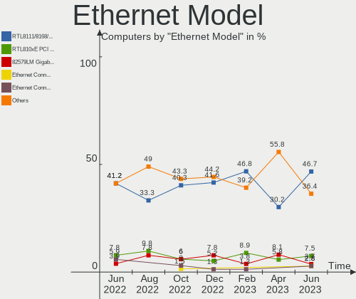

| Model                                                             | Computers | Percent |
|-------------------------------------------------------------------|-----------|---------|
| Realtek RTL8111/8168/8411 PCI Express Gigabit Ethernet Controller | 50        | 46.73%  |
| Realtek RTL810xE PCI Express Fast Ethernet controller             | 8         | 7.48%   |
| Intel 82579LM Gigabit Network Connection (Lewisville)             | 4         | 3.74%   |
| Intel Ethernet Connection I219-LM                                 | 3         | 2.8%    |
| Intel Ethernet Connection I217-LM                                 | 3         | 2.8%    |
| Qualcomm Atheros AR8152 v2.0 Fast Ethernet                        | 2         | 1.87%   |
| Qualcomm Atheros AR8151 v2.0 Gigabit Ethernet                     | 2         | 1.87%   |
| Qualcomm Atheros AR8132 Fast Ethernet                             | 2         | 1.87%   |
| Qualcomm Atheros AR8131 Gigabit Ethernet                          | 2         | 1.87%   |
| Nvidia MCP61 Ethernet                                             | 2         | 1.87%   |
| Intel I211 Gigabit Network Connection                             | 2         | 1.87%   |
| Intel Ethernet Connection (2) I219-V                              | 2         | 1.87%   |
| Intel Ethernet Connection (13) I219-V                             | 2         | 1.87%   |
| Intel 82577LM Gigabit Network Connection                          | 2         | 1.87%   |
| Intel 82567LM Gigabit Network Connection                          | 2         | 1.87%   |
| Broadcom NetXtreme BCM5761 Gigabit Ethernet PCIe                  | 2         | 1.87%   |
| Realtek RTL8169 PCI Gigabit Ethernet Controller                   | 1         | 0.93%   |
| Realtek RTL8153 Gigabit Ethernet Adapter                          | 1         | 0.93%   |
| Realtek RTL8125 2.5GbE Controller                                 | 1         | 0.93%   |
| Realtek PCIe GbE Family Controller                                | 1         | 0.93%   |
| Realtek Killer E2600 Gigabit Ethernet Controller                  | 1         | 0.93%   |
| Qualcomm Atheros QCA8171 Gigabit Ethernet                         | 1         | 0.93%   |
| Qualcomm Atheros AR8121/AR8113/AR8114 Gigabit or Fast Ethernet    | 1         | 0.93%   |
| Nvidia MCP73 Ethernet                                             | 1         | 0.93%   |
| Marvell Group 88E8040 PCI-E Fast Ethernet Controller              | 1         | 0.93%   |
| Intel Ethernet Connection (5) I219-LM                             | 1         | 0.93%   |
| Intel Ethernet Connection (4) I219-LM                             | 1         | 0.93%   |
| Intel 82579V Gigabit Network Connection                           | 1         | 0.93%   |
| Intel 82567LM-3 Gigabit Network Connection                        | 1         | 0.93%   |
| D-Link System DL10050 Sundance Ethernet                           | 1         | 0.93%   |
| Broadcom NetXtreme BCM5762 Gigabit Ethernet PCIe                  | 1         | 0.93%   |
| Broadcom NetLink BCM5787 Gigabit Ethernet PCI Express             | 1         | 0.93%   |
| Aquantia AQC107 NBase-T/IEEE 802.3bz Ethernet Controller [AQtion] | 1         | 0.93%   |

Net Controller Kind
-------------------

Ethernet, WiFi or modem

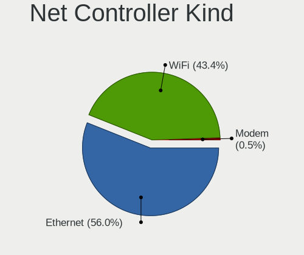

| Kind     | Computers | Percent |
|----------|-----------|---------|
| Ethernet | 102       | 56.04%  |
| WiFi     | 79        | 43.41%  |
| Modem    | 1         | 0.55%   |

Used Controller
---------------

Currently used network controller

| Kind     | Computers | Percent |
|----------|-----------|---------|
| WiFi     | 61        | 53.98%  |
| Ethernet | 52        | 46.02%  |

NICs
----

Total network controllers on board

| Total | Computers | Percent |
|-------|-----------|---------|
| 2     | 59        | 53.15%  |
| 1     | 49        | 44.14%  |
| 3     | 3         | 2.7%    |

IPv6
----

IPv6 vs IPv4

| Used | Computers | Percent |
|------|-----------|---------|
| No   | 67        | 60.36%  |
| Yes  | 44        | 39.64%  |

Bluetooth
---------

Bluetooth Vendor
----------------

Controller vendors

| Vendor                          | Computers | Percent |
|---------------------------------|-----------|---------|
| Intel                           | 21        | 33.33%  |
| Cambridge Silicon Radio         | 9         | 14.29%  |
| Realtek Semiconductor           | 8         | 12.7%   |
| Qualcomm Atheros Communications | 8         | 12.7%   |
| Ralink                          | 3         | 4.76%   |
| IMC Networks                    | 3         | 4.76%   |
| Lite-On Technology              | 2         | 3.17%   |
| Broadcom                        | 2         | 3.17%   |
| Ralink Technology               | 1         | 1.59%   |
| Marvell Semiconductor           | 1         | 1.59%   |
| Logitech                        | 1         | 1.59%   |
| Hewlett-Packard                 | 1         | 1.59%   |
| Foxconn / Hon Hai               | 1         | 1.59%   |
| Dell                            | 1         | 1.59%   |
| Apple                           | 1         | 1.59%   |

Bluetooth Model
---------------

Controller models

| Model                                               | Computers | Percent |
|-----------------------------------------------------|-----------|---------|
| Intel Bluetooth wireless interface                  | 12        | 19.05%  |
| Cambridge Silicon Radio Bluetooth Dongle (HCI mode) | 9         | 14.29%  |
| Realtek Bluetooth Radio                             | 7         | 11.11%  |
| Qualcomm Atheros  Bluetooth Device                  | 5         | 7.94%   |
| Intel AX201 Bluetooth                               | 4         | 6.35%   |
| Intel AX200 Bluetooth                               | 4         | 6.35%   |
| Ralink RT3290 Bluetooth                             | 3         | 4.76%   |
| Realtek RTL8723B Bluetooth                          | 1         | 1.59%   |
| Ralink Motorola BC4 Bluetooth 3.0+HS Adapter        | 1         | 1.59%   |
| Qualcomm Atheros QCA61x4 Bluetooth 4.0              | 1         | 1.59%   |
| Qualcomm Atheros AR3012 Bluetooth 4.0               | 1         | 1.59%   |
| Qualcomm Atheros AR3011 Bluetooth                   | 1         | 1.59%   |
| Marvell Bluetooth and Wireless LAN Composite        | 1         | 1.59%   |
| Logitech BT Mini-Receiver (HCI mode)                | 1         | 1.59%   |
| Lite-On Wireless_Device                             | 1         | 1.59%   |
| Lite-On BCM43142A0                                  | 1         | 1.59%   |
| Intel Centrino Bluetooth Wireless Transceiver       | 1         | 1.59%   |
| IMC Networks Wireless_Device                        | 1         | 1.59%   |
| IMC Networks Bluetooth Radio                        | 1         | 1.59%   |
| IMC Networks Bluetooth Device                       | 1         | 1.59%   |
| HP Broadcom 2070 Bluetooth Combo                    | 1         | 1.59%   |
| Foxconn / Hon Hai BCM20702A0                        | 1         | 1.59%   |
| Dell DW375 Bluetooth Module                         | 1         | 1.59%   |
| Broadcom BCM43142A0 Bluetooth Device                | 1         | 1.59%   |
| Broadcom BCM2070 Bluetooth Device                   | 1         | 1.59%   |
| Apple Built-in Bluetooth 2.0+EDR HCI                | 1         | 1.59%   |

Sound
-----

Sound Vendor
------------

Sound card vendors

| Vendor              | Computers | Percent |
|---------------------|-----------|---------|
| Intel               | 80        | 57.97%  |
| AMD                 | 31        | 22.46%  |
| Nvidia              | 23        | 16.67%  |
| Texas Instruments   | 1         | 0.72%   |
| Promethean Limited  | 1         | 0.72%   |
| Conexant Systems    | 1         | 0.72%   |
| C-Media Electronics | 1         | 0.72%   |

Sound Model
-----------

Sound card models

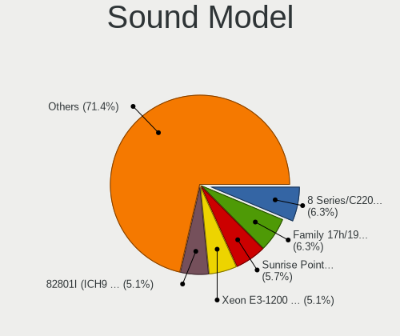

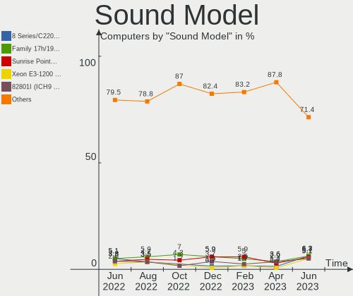

| Model                                                                             | Computers | Percent |
|-----------------------------------------------------------------------------------|-----------|---------|
| Intel 8 Series/C220 Series Chipset High Definition Audio Controller               | 11        | 6.29%   |
| AMD Family 17h/19h HD Audio Controller                                            | 11        | 6.29%   |
| Intel Sunrise Point-LP HD Audio                                                   | 10        | 5.71%   |
| Intel Xeon E3-1200 v3/4th Gen Core Processor HD Audio Controller                  | 9         | 5.14%   |
| Intel 82801I (ICH9 Family) HD Audio Controller                                    | 9         | 5.14%   |
| Intel 7 Series/C216 Chipset Family High Definition Audio Controller               | 9         | 5.14%   |
| Intel 6 Series/C200 Series Chipset Family High Definition Audio Controller        | 6         | 3.43%   |
| AMD Renoir Radeon High Definition Audio Controller                                | 6         | 3.43%   |
| Nvidia GK208 HDMI/DP Audio Controller                                             | 5         | 2.86%   |
| Intel NM10/ICH7 Family High Definition Audio Controller                           | 5         | 2.86%   |
| Intel 5 Series/3400 Series Chipset High Definition Audio                          | 5         | 2.86%   |
| AMD FCH Azalia Controller                                                         | 5         | 2.86%   |
| Intel Tiger Lake-LP Smart Sound Technology Audio Controller                       | 4         | 2.29%   |
| Intel 200 Series PCH HD Audio                                                     | 4         | 2.29%   |
| Intel 100 Series/C230 Series Chipset Family HD Audio Controller                   | 4         | 2.29%   |
| Nvidia TU107 GeForce GTX 1650 High Definition Audio Controller                    | 3         | 1.71%   |
| Nvidia High Definition Audio Controller                                           | 3         | 1.71%   |
| Intel Wildcat Point-LP High Definition Audio Controller                           | 3         | 1.71%   |
| Intel Broadwell-U Audio Controller                                                | 3         | 1.71%   |
| AMD SBx00 Azalia (Intel HDA)                                                      | 3         | 1.71%   |
| Nvidia TU116 High Definition Audio Controller                                     | 2         | 1.14%   |
| Nvidia MCP61 High Definition Audio                                                | 2         | 1.14%   |
| Nvidia GM107 High Definition Audio Controller [GeForce 940MX]                     | 2         | 1.14%   |
| Intel Haswell-ULT HD Audio Controller                                             | 2         | 1.14%   |
| Intel Comet Lake PCH-LP cAVS                                                      | 2         | 1.14%   |
| Intel 82801JI (ICH10 Family) HD Audio Controller                                  | 2         | 1.14%   |
| Intel 8 Series HD Audio Controller                                                | 2         | 1.14%   |
| AMD Starship/Matisse HD Audio Controller                                          | 2         | 1.14%   |
| AMD Redwood HDMI Audio [Radeon HD 5000 Series]                                    | 2         | 1.14%   |
| AMD Raven/Raven2/Fenghuang HDMI/DP Audio Controller                               | 2         | 1.14%   |
| AMD Kaveri HDMI/DP Audio Controller                                               | 2         | 1.14%   |
| AMD Kabini HDMI/DP Audio                                                          | 2         | 1.14%   |
| AMD Family 15h (Models 60h-6fh) Audio Controller                                  | 2         | 1.14%   |
| AMD Cedar HDMI Audio [Radeon HD 5400/6300/7300 Series]                            | 2         | 1.14%   |
| AMD Caicos HDMI Audio [Radeon HD 6450 / 7450/8450/8490 OEM / R5 230/235/235X OEM] | 2         | 1.14%   |
| Texas Instruments PCM2902 Audio Codec                                             | 1         | 0.57%   |
| Promethean Limited Audio                                                          | 1         | 0.57%   |
| Nvidia TU106 High Definition Audio Controller                                     | 1         | 0.57%   |
| Nvidia MCP73 High Definition Audio                                                | 1         | 0.57%   |
| Nvidia MCP72XE/MCP72P/MCP78U/MCP78S High Definition Audio                         | 1         | 0.57%   |

Memory
------

Memory Vendor
-------------

Memory module vendors

| Vendor              | Computers | Percent |
|---------------------|-----------|---------|
| Samsung Electronics | 25        | 21.93%  |
| SK hynix            | 21        | 18.42%  |
| Unknown             | 17        | 14.91%  |
| Micron Technology   | 17        | 14.91%  |
| Kingston            | 13        | 11.4%   |
| Corsair             | 4         | 3.51%   |
| Nanya Technology    | 3         | 2.63%   |
| G.Skill             | 3         | 2.63%   |
| Kingmax             | 2         | 1.75%   |
| Crucial             | 2         | 1.75%   |
| Transcend           | 1         | 0.88%   |
| Ramaxel Technology  | 1         | 0.88%   |
| Qimonda             | 1         | 0.88%   |
| PUSKILL             | 1         | 0.88%   |
| Patriot             | 1         | 0.88%   |
| Elpida              | 1         | 0.88%   |
| A-DATA Technology   | 1         | 0.88%   |

Memory Model
------------

Memory module models

| Model                                                                        | Computers | Percent |
|------------------------------------------------------------------------------|-----------|---------|
| Unknown RAM Module 2048MB DIMM 800MT/s                                       | 4         | 3.31%   |
| Micron RAM 8KTF51264AZ-1G6E1 4GB DIMM DDR3 1600MT/s                          | 4         | 3.31%   |
| Samsung RAM M471A1K43BB1-CRC 8GB SODIMM DDR4 2667MT/s                        | 3         | 2.48%   |
| Unknown RAM Module 2048MB SODIMM 800MT/s                                     | 2         | 1.65%   |
| Unknown RAM Module 1024MB DIMM DDR2                                          | 2         | 1.65%   |
| SK hynix RAM HMT451U6BFR8A-PB 4096MB DIMM DDR3 1648MT/s                      | 2         | 1.65%   |
| SK hynix RAM HMT325S6CFR8A-PB 2048MB SODIMM DDR3 1600MT/s                    | 2         | 1.65%   |
| SK hynix RAM HMA81GS6AFR8N-UH 8GB SODIMM DDR4 2667MT/s                       | 2         | 1.65%   |
| Samsung RAM M471B5773CHS-CH9 2GB SODIMM DDR3 4199MT/s                        | 2         | 1.65%   |
| Samsung RAM M471B5173QH0-YK0 4GB SODIMM DDR3 1600MT/s                        | 2         | 1.65%   |
| Samsung RAM M471A5244CB0-CTD 4GB SODIMM DDR4 3266MT/s                        | 2         | 1.65%   |
| Unknown RAM V02L3L84GB52852816 4096MB DIMM DDR3 1333MT/s                     | 1         | 0.83%   |
| Unknown RAM V02D4S84GB5285282400 4096MB SODIMM DDR4 2133MT/s                 | 1         | 0.83%   |
| Unknown RAM Module 8192MB DIMM DDR4 2667MT/s                                 | 1         | 0.83%   |
| Unknown RAM Module 4096MB DIMM SDRAM                                         | 1         | 0.83%   |
| Unknown RAM Module 4096MB DIMM 1600MT/s                                      | 1         | 0.83%   |
| Unknown RAM Module 2GB SODIMM DDR3 1600MT/s                                  | 1         | 0.83%   |
| Unknown RAM Module 2048MB SODIMM DDR2 800MT/s                                | 1         | 0.83%   |
| Unknown RAM Module 2048MB DIMM SDRAM                                         | 1         | 0.83%   |
| Unknown RAM Module 2048MB DIMM DDR2                                          | 1         | 0.83%   |
| Unknown RAM Module 2048MB DIMM 1333MT/s                                      | 1         | 0.83%   |
| Transcend RAM TS256MSQ64V6U 2GB SODIMM DDR2                                  | 1         | 0.83%   |
| SK hynix RAM HYMP125S64CP8-Y5 2048MB SODIMM DDR2 667MT/s                     | 1         | 0.83%   |
| SK hynix RAM HMT451U7BFR8A-PB 4096MB DIMM DDR3 1600MT/s                      | 1         | 0.83%   |
| SK hynix RAM HMT451S6BFR8A-PB 4GB SODIMM DDR3 1600MT/s                       | 1         | 0.83%   |
| SK hynix RAM HMT425S6AFR6A-PB 2GB SODIMM DDR3 1600MT/s                       | 1         | 0.83%   |
| SK hynix RAM HMT351S6EFR8C-PB 4GB SODIMM DDR3 1600MT/s                       | 1         | 0.83%   |
| SK hynix RAM HMT351S6EFR8A-PB 4GB SODIMM DDR3 1600MT/s                       | 1         | 0.83%   |
| SK hynix RAM HMT351S6CFR8C-H9 4GB SODIMM DDR3 1333MT/s                       | 1         | 0.83%   |
| SK hynix RAM HMT351S6BFR8C-H9 4GB SODIMM DDR3 1333MT/s                       | 1         | 0.83%   |
| SK hynix RAM HMT325S6EFR8A-PB 2GB SODIMM DDR3 1600MT/s                       | 1         | 0.83%   |
| SK hynix RAM HMT325S6BFR8C-H9 2048MB SODIMM DDR3 1333MT/s                    | 1         | 0.83%   |
| SK hynix RAM HMT325S6BFR8C-H9 2048MB DIMM DDR3 1333MT/s                      | 1         | 0.83%   |
| SK hynix RAM HMA81GS6DJR8N-XN 8GB SODIMM DDR4 3200MT/s                       | 1         | 0.83%   |
| SK hynix RAM HMA81GS6CJR8N-XN 8GB SODIMM DDR4 3200MT/s                       | 1         | 0.83%   |
| SK hynix RAM HCNNNCPMMLXR-NEE 2GB Row Of Chips LPDDR4 4267MT/s               | 1         | 0.83%   |
| SK hynix RAM H9HCNNNCPMMLXR-NEE 8GB SODIMM LPDDR4 4266MT/s                   | 1         | 0.83%   |
| SK hynix RAM DADADADADADADADADADADADADADADADADADA 2048MB SODIMM DDR2 800MT/s | 1         | 0.83%   |
| Samsung RAM Module 8192MB SODIMM DDR4 3200MT/s                               | 1         | 0.83%   |
| Samsung RAM Module 4096MB DIMM DDR4 2133MT/s                                 | 1         | 0.83%   |

Memory Kind
-----------

Memory module kinds

| Kind    | Computers | Percent |
|---------|-----------|---------|
| DDR3    | 41        | 40.59%  |
| DDR4    | 34        | 33.66%  |
| DDR2    | 8         | 7.92%   |
| Unknown | 8         | 7.92%   |
| SDRAM   | 7         | 6.93%   |
| LPDDR4  | 2         | 1.98%   |
| LPDDR3  | 1         | 0.99%   |

Memory Form Factor
------------------

Physical design of the memory module

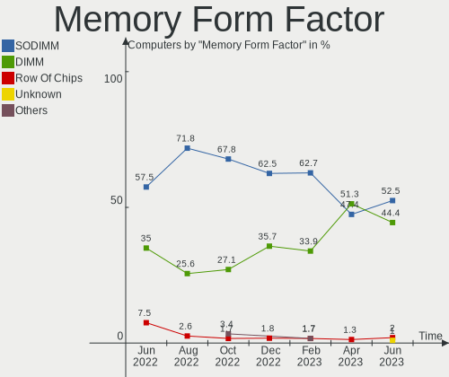

| Name         | Computers | Percent |
|--------------|-----------|---------|
| SODIMM       | 52        | 52.53%  |
| DIMM         | 44        | 44.44%  |
| Row Of Chips | 2         | 2.02%   |
| Unknown      | 1         | 1.01%   |

Memory Size
-----------

Memory module size

| Size  | Computers | Percent |
|-------|-----------|---------|
| 4096  | 36        | 34.29%  |
| 8192  | 29        | 27.62%  |
| 2048  | 27        | 25.71%  |
| 16384 | 7         | 6.67%   |
| 1024  | 5         | 4.76%   |
| 32768 | 1         | 0.95%   |

Memory Speed
------------

Memory module speed

| Speed   | Computers | Percent |
|---------|-----------|---------|
| 1600    | 28        | 25.23%  |
| 3200    | 13        | 11.71%  |
| 800     | 10        | 9.01%   |
| 2667    | 8         | 7.21%   |
| 1333    | 7         | 6.31%   |
| 2400    | 6         | 5.41%   |
| 2133    | 6         | 5.41%   |
| 1334    | 5         | 4.5%    |
| Unknown | 5         | 4.5%    |
| 3266    | 3         | 2.7%    |
| 667     | 3         | 2.7%    |
| 4199    | 2         | 1.8%    |
| 1648    | 2         | 1.8%    |
| 4267    | 1         | 0.9%    |
| 4266    | 1         | 0.9%    |
| 3600    | 1         | 0.9%    |
| 3151    | 1         | 0.9%    |
| 2800    | 1         | 0.9%    |
| 2666    | 1         | 0.9%    |
| 2448    | 1         | 0.9%    |
| 2048    | 1         | 0.9%    |
| 2000    | 1         | 0.9%    |
| 1867    | 1         | 0.9%    |
| 1866    | 1         | 0.9%    |
| 1067    | 1         | 0.9%    |
| 1066    | 1         | 0.9%    |

Printers & scanners
-------------------

Printer Vendor
--------------

Printer device vendors

| Vendor              | Computers | Percent |
|---------------------|-----------|---------|
| Samsung Electronics | 2         | 40%     |
| Hewlett-Packard     | 2         | 40%     |
| QinHeng Electronics | 1         | 20%     |

Printer Model
-------------

Printer device models

| Model                                | Computers | Percent |
|--------------------------------------|-----------|---------|
| Samsung ML-1640 Series Laser Printer | 1         | 20%     |
| Samsung C48x Series                  | 1         | 20%     |
| QinHeng CH340S                       | 1         | 20%     |
| HP LaserJet 2600n                    | 1         | 20%     |
| HP DeskJet 2620 All-in-One Printer   | 1         | 20%     |

Scanner Vendor
--------------

Scanner device vendors

Zero info for selected period =(

Scanner Model
-------------

Scanner device models

Zero info for selected period =(

Camera
------

Camera Vendor
-------------

Camera device vendors

| Vendor                                 | Computers | Percent |
|----------------------------------------|-----------|---------|
| Chicony Electronics                    | 13        | 20.31%  |
| Microdia                               | 10        | 15.63%  |
| Sunplus Innovation Technology          | 7         | 10.94%  |
| IMC Networks                           | 5         | 7.81%   |
| Syntek                                 | 4         | 6.25%   |
| Suyin                                  | 4         | 6.25%   |
| Apple                                  | 4         | 6.25%   |
| Realtek Semiconductor                  | 3         | 4.69%   |
| Sonix Technology                       | 2         | 3.13%   |
| Silicon Motion                         | 2         | 3.13%   |
| Ricoh                                  | 2         | 3.13%   |
| Quanta                                 | 2         | 3.13%   |
| Alcor Micro                            | 2         | 3.13%   |
| Samsung Electronics                    | 1         | 1.56%   |
| Luxvisions Innotech Limited            | 1         | 1.56%   |
| KYE Systems (Mouse Systems)            | 1         | 1.56%   |
| Cheng Uei Precision Industry (Foxlink) | 1         | 1.56%   |

Camera Model
------------

Camera device models

| Model                                               | Computers | Percent |
|-----------------------------------------------------|-----------|---------|
| Sunplus Integrated_Webcam_HD                        | 3         | 4.69%   |
| Microdia Camera                                     | 3         | 4.69%   |
| Apple iPhone 5/5C/5S/6/SE/7/8/X                     | 3         | 4.69%   |
| Syntek EasyCamera                                   | 2         | 3.13%   |
| Sonix USB2.0 HD UVC WebCam                          | 2         | 3.13%   |
| Microdia Integrated HD Webcam                       | 2         | 3.13%   |
| Chicony HP Truevision HD                            | 2         | 3.13%   |
| Chicony HD User Facing                              | 2         | 3.13%   |
| Syntek Lenovo EasyCamera                            | 1         | 1.56%   |
| Syntek Integrated Camera                            | 1         | 1.56%   |
| Suyin Integrated_Webcam_HD                          | 1         | 1.56%   |
| Suyin HP Truevision HD                              | 1         | 1.56%   |
| Suyin Acer/HP Integrated Webcam [CN0314]            | 1         | 1.56%   |
| Suyin Acer HD Crystal Eye webcam                    | 1         | 1.56%   |
| Sunplus Laptop Integrated WebCam HD                 | 1         | 1.56%   |
| Sunplus HP Truevision HD                            | 1         | 1.56%   |
| Sunplus Full HD webcam                              | 1         | 1.56%   |
| Sunplus Dell Integrated HD Webcam                   | 1         | 1.56%   |
| Silicon Motion WebCam SCB-0355N                     | 1         | 1.56%   |
| Silicon Motion WebCam SC-0311139N                   | 1         | 1.56%   |
| Samsung Galaxy A5 (MTP)                             | 1         | 1.56%   |
| Ricoh Laptop_Integrated_Webcam_FHD                  | 1         | 1.56%   |
| Ricoh HD Webcam                                     | 1         | 1.56%   |
| Realtek Integrated Webcam_HD                        | 1         | 1.56%   |
| Realtek Integrated Webcam                           | 1         | 1.56%   |
| Realtek 2SF022                                      | 1         | 1.56%   |
| Quanta VGA WebCam                                   | 1         | 1.56%   |
| Quanta HP HD Camera                                 | 1         | 1.56%   |
| Microdia Webcam Vitade AF                           | 1         | 1.56%   |
| Microdia Sonix USB 2.0 Camera                       | 1         | 1.56%   |
| Microdia Sonix Integrated Webcam                    | 1         | 1.56%   |
| Microdia PC Microscope camera                       | 1         | 1.56%   |
| Microdia Dell Integrated HD Webcam                  | 1         | 1.56%   |
| Luxvisions Innotech Limited HP TrueVision HD Camera | 1         | 1.56%   |
| KYE Systems (Mouse Systems) FaceCam 1000X           | 1         | 1.56%   |
| IMC Networks UVC VGA Webcam                         | 1         | 1.56%   |
| IMC Networks USB2.0 HD UVC WebCam                   | 1         | 1.56%   |
| IMC Networks USB 2.0 Camera                         | 1         | 1.56%   |
| IMC Networks Integrated Camera                      | 1         | 1.56%   |
| IMC Networks EasyCamera                             | 1         | 1.56%   |

Security
--------

Fingerprint Vendor
------------------

Fingerprint sensor vendors

| Vendor                     | Computers | Percent |
|----------------------------|-----------|---------|
| Validity Sensors           | 3         | 60%     |
| Shenzhen Goodix Technology | 1         | 20%     |
| AuthenTec                  | 1         | 20%     |

Fingerprint Model
-----------------

Fingerprint sensor models

| Model                                      | Computers | Percent |
|--------------------------------------------|-----------|---------|
| Validity Sensors VFS301 Fingerprint Reader | 1         | 20%     |
| Validity Sensors VFS101 Fingerprint Reader | 1         | 20%     |
| Validity Sensors Synaptics WBDI            | 1         | 20%     |
| Shenzhen Goodix  FingerPrint Device        | 1         | 20%     |
| AuthenTec AES2810                          | 1         | 20%     |

Chipcard Vendor
---------------

Chipcard module vendors

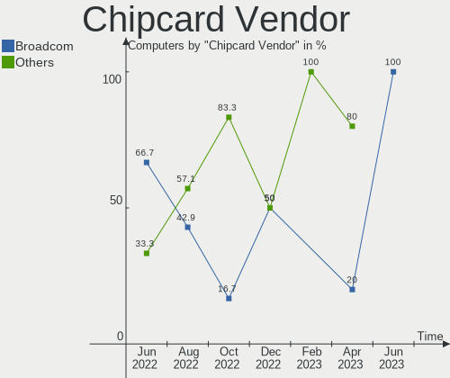

| Vendor   | Computers | Percent |
|----------|-----------|---------|
| Broadcom | 6         | 100%    |

Chipcard Model
--------------

Chipcard module models

| Model                                          | Computers | Percent |
|------------------------------------------------|-----------|---------|
| Broadcom BCM5880 Secure Applications Processor | 4         | 66.67%  |
| Broadcom 5880                                  | 2         | 33.33%  |

Unsupported
-----------

Unsupported Devices
-------------------

Total unsupported devices on board

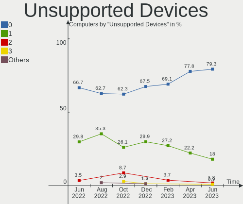

| Total | Computers | Percent |
|-------|-----------|---------|
| 0     | 88        | 79.28%  |
| 1     | 20        | 18.02%  |
| 2     | 2         | 1.8%    |
| 3     | 1         | 0.9%    |

Unsupported Device Types
------------------------

Types of unsupported devices

| Type                  | Computers | Percent |
|-----------------------|-----------|---------|
| Fingerprint reader    | 5         | 18.52%  |
| Chipcard              | 5         | 18.52%  |
| Bluetooth             | 5         | 18.52%  |
| Graphics card         | 3         | 11.11%  |
| Storage               | 2         | 7.41%   |
| Net/wireless          | 2         | 7.41%   |
| Camera                | 2         | 7.41%   |
| Storage/ata           | 1         | 3.7%    |
| Multimedia controller | 1         | 3.7%    |
| Dvb card              | 1         | 3.7%    |

